#+startup: showstars noindent fnnoinline num
#+STARTUP: nofnadjust fnloacl noinlineimages 
#+startup: nolatexpreview
#+STARTUP: fnprompt
# fnprompt (above) to be prompted for footnote labels - comment out for auto-numbering
#+LATEX_CMD: xelatex
#+EXPORT_FILE_NAME: ./index.html
# #+EXPORT_FILE_NAME: ~/Documents/lighthouse/index.html
#+OPTIONS: H:6  num:nil  author:t EPUBSTYLE=epub.css
#+HTML_HEAD: <link rel="icon" href="./img/!ouse-favicon-ChatGPT.png">
#+INCLUDE: "./LH-TitleTest.org" 
#+OPTIONS: ^:{} html-style:nil  toc:nil H:6 num:4  d:nil author:t
#+HTML_HEAD: <link rel="preconnect" href="https://fonts.googleapis.com">
#+HTML_HEAD: <link rel="preconnect" href="https://fonts.gstatic.com" crossorigin>
#+HTML_HEAD: <link href="https://fonts.googleapis.com/css2?family=Roboto+Mono:ital,wght@0,100..700;1,100..700&display=swap" rel="stylesheet">
#+EXCLUDE_TAGS: OMIT SPEC NOEXPORT

#+INCLUDE: "./!Macros.org"

# ========================

* Table of contents
  :PROPERTIES:
  :CUSTOM_ID: toc-chap
  :HTML_CONTAINER_CLASS: toc
  :UNNUMBERED: notoc
  :END:

#+TOC: headlines 2

* Detailed table of contents
  :PROPERTIES:
  :CUSTOM_ID: toc-chap-det
  :HTML_CONTAINER_CLASS: toc-det
  :UNNUMBERED: t
  :END:

#+TOC: headlines 3

* Chronology                                                           :OMIT:
  :PROPERTIES:
  :UNNUMBERED: notoc
  :END:

# The Cook Doctrine: "We believe in the simple, not the complex."  https://stratechery.com/2026/tim-cooks-impeccable-timing/

** Our simulation: MathWhiz and Gigunda

We'll often frame our discussions and writing assignments in terms of a hypothetical client, "MathWhiz LLC," based loosely on one of my longtime real-world clients. 

MathWhiz's founder and CEO is "Mary Marvel, Ph.D." (her name was chosen for the "M" initial, to match the company name).

MathWhiz does sophisticated data crunching of seismic data to support exploration of potential oil- and natural-gas fields for giant global energy companies; let's referred to them generically as "Gigunda." 

MathWhiz

** Payments

* Index: Clauses & notes /(coming soon)/                                 :OMIT:
  :PROPERTIES:
  :CUSTOM_ID: toc-idx
  :HTML_CONTAINER_CLASS: toc
  :UNNUMBERED: t
  :END:

/Author's note: I'll be adding an alphabetical index later./

* Introduction: Three themes
  :PROPERTIES:
  :CUSTOM_ID: nl-comms
  :HTML_CONTAINER_CLASS: intro
  :END:

Contents:

#+TOC: headlines 3 local

# WORK IN SOMETHING ABOUT ROBERT AXELROD (SEE HIS PAPER IN THE ZOTERO FILE), Lloyd's of London, 42nd Street diamond merchants

# Paradox of automation - Tim Harford's book /Messy/ and the example of Air France Flight 447 stalling because the pilots forgot how to fly the plane. At least having to translate into contract-ese will help keep up skills. And present-descriptive tense makes the Practice more transparent. 

** Theme 1: Playbook style -- for easier scanning
  :PROPERTIES:
  :CUSTOM_ID: theme-readable
  :END:

The Great Rule of All Writing is namely, [[#serv-rdr][Serve the Reader!]] But these days, people don't read so much as they scan.  In this {{{BK}}}we'll try to accommodate both styles.  <cite> "People rarely read Web pages word by word; instead, they scan the page, picking out individual words and sentences." Jacob Nielsen, [[https://www.nngroup.com/articles/how-users-read-on-the-web/][How Users Read on the Web]] (nngroup.com 1997); see also Kara Pernice, [[https://www.nngroup.com/articles/f-shaped-pattern-reading-web-content/][F-Shaped Pattern of Reading on the Web: Misunderstood, But Still Relevant (Even on Mobile)]] (nngroup.com 2017). </cite> 

Contents:

#+TOC: headlines 3 local

*** Succinct, checklist-style language
  :PROPERTIES:
  :CUSTOM_ID: pbv-rule
  :END:

For quicker reading comprehension, many {{{NAME}}} {{{NOUN}}}s are written as checklists (sometimes with brief explanations), in the same style as many corporate playbooks. 

#+begin_comment
— for example, [[https://en.wikipedia.org/wiki/Atlassian][Atlassian]], a $5B (rev.) maker of business-collaboration software tools, has posted numerous playbook-style instructions for "plays" such as [[https://www.atlassian.com/team-playbook/plays/change-management-process][Change Management Kick-off]]. 

Here's an excerpt from that Atlassian playbook:

#+ATTR_HTML: :alt XX :title  :class photocenter90 bordered
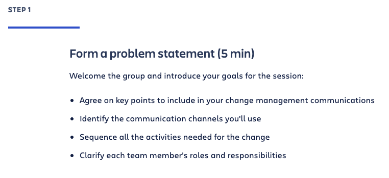
#+end_comment

Here's a  payment-terms example (see § [[#pmt-payer]]):

#+ATTR_HTML: :class valign
| LIGHTHOUSE STYLE                                                                                                                                          | TRADITIONAL STYLE /(not used)/                                                                           |
| {{{SH(Payer)}}} Pay each Biller invoice, in full, no later than {{{v(30 days)}}} after you get the invoice unless {{{theK}}} clearly says you can do something else. (If /you/ were the Biller, you wouldn't want to be tie up /your/ working capital to give the Payer an interest-free loan.) | Each invoice under {{{thek}}} shall be paid {{{v(net 30 days after receipt)}}} except as otherwise stated in {{{theK}}}.   |

*** Sound bites: Short, /single-subject/ paragraphs
  :PROPERTIES:
  :CUSTOM_ID: sssp
  :END:

Contents:

#+TOC: headlines 1 local

**** No "spaghetti" clauses!
  :PROPERTIES:
  :CUSTOM_ID: no-spag
  :UNNUMBERED: t
  :END:

# DCT photo from "Footnote" cottage, Orr's Island, Maine, 2025-07-18
# #+ATTR_HTML: :alt A photograph of a wooded thicket :title   :class photo-at-right photowidth35
# # 

# From ChatGPT - my prompt: "From non-copyrighted sources, generate a picture of a bowl of cooked spaghetti without sauce — I want to show the tangle."
#+ATTR_HTML: :alt Photo of plate of spaghetti :title   :class photo-at-right photowidth25

You've surely read contract provisions written as long, tangled skeins of legalese. Let's call them "spaghetti clauses," a name we borrow from a mildly-contemptuous epithet from the software world.[fn:SpagSW: We borrow the term /spaghetti clause from the software world, where /spaghetti code/ refers to unstructured, hard-to-maintain [[https://en.wikipedia.org/wiki/Source_code][source code]] for computer programs, sometimes also known as /rat's nests/ or /big balls of mud/, as opposed to more-modular and more-desirable /ravioli code/ or /macaroni code/; see generally [[https://en.wikipedia.org/wiki/Spaghetti_code][Spaghetti code]] (Wikipedia.org).] For a contract-clause example, just glance at a /two-sentence/ excerpt from an airline merger agreement reproduced in the footnote.[fn:SpagCls]

This isn't just a question of aesthetic taste: The harder it is to read and understand a draft contract:

- the longer it will take — and the more it will cost — for the parties to review the contract (certainly), revise it (probably), and sign it (if they're lucky); and

- the more likely that a future reader might misread the language — perhaps urged on by the "helpful" trial counsel for an opposing party.

The likely historical reason for spaghetti clauses is understandable. Back in the day, secretaries typed up lawyers' dictation with "carbon sets" to make copies. Revising a dictated first draft purely for readability was costly. Editing for clarity wasn't always a priority.[fn:thik-why] 

Even today, we /all/ sometimes draft spaghetti clauses.  Like the French sage Blaise Pascal,[fn:Pascal] we're busy. But with word-processing software on every computer, we should think about whether we're hurting our clients' interests when we loose a spaghetti clause into the world instead of taking just a minute to make it more readable.

[fn:Pascal] Blaise Pascal famously apologized for having written a long letter because he hadn't the time to write a shorter one. "/Je n’ai fait celle-ci plus longue que parce que je n’ai pas eu le loisir de la faire plus courte./"<cite> Blaise Pascal, [[https://wist.info/pascal-blaise/10466/][Lettre XVI]] (French version), in /Lettres provinciales/, Letter XVI (Thomas M'Crie trans. 1866) (1656), available at https://tinyurl.com/PascalLetterXVI (WikiSource.org). </cite>

# Incidentally: In searching for a catchy name for convoluted contract language, I tried out the term "barf clause," inspired by Jennifer Pahlka's (excellent) book, [[https://www.amazon.com/Recoding-America-Government-Failing-Digital-ebook/dp/B0B8644ZGY][Recoding America: Why Government Is Failing in the Digital Age and How We Can Do Better]]: In chapter 8, the author quotes an unnamed digital-services designer as saying that an agency "had 'vomited the policy into the forms.' She /[the designer]/ meant not that the policy stank, necessarily, but that it had been left as an essentially undigested mess."

# Highway shot by MCT driving from Orr's Island Maine to Franklin MA 2025-07-19
# # #+ATTR_HTML: :alt XX :title   :class photo-at-right photowidth40
# # 

[fn:SpagCls] Here's a real-world example of a spaghetti clause — far from the worst you'd ever see in a traditional contract (I've added bracketed lettering):

#+begin_quote
[4.3] (b) Neither the execution and delivery of this Agreement by Continental nor the consummation by Continental of the transactions contemplated hereby, nor compliance by Continental with any of the terms or provisions of this Agreement, will[:] (i) assuming (solely in the case of the Merger) that the Continental Stockholder Approval is obtained, violate any provision of the Continental Charter or the Continental Bylaws or (ii) assuming that the consents, approvals and filings referred to in Section 4.4 are duly obtained and/or made, (A) violate [x] any Injunction or, [y] assuming (solely in the case of the Merger) that the Continental Stockholder Approval is obtained, any statute, code, ordinance, rule, regulation, judgment, order, writ or decree applicable to Continental, any of the Continental Subsidiaries or any of their respective properties or assets or (B) violate, conflict with, result in a breach of any provision of or the loss of any benefit under, constitute a default (or an event which, with notice or lapse of time, or both, would constitute a default) under, result in the termination of or a right of termination or cancelation under, accelerate the performance required by, or result in the creation of any Lien upon any of the respective properties or assets of Continental or any of the Continental Subsidiaries under, any of the terms, conditions or provisions of any note, bond, mortgage, indenture, deed of trust, Continental License, license, lease, agreement or other instrument or obligation to which Continental or any of the Continental Subsidiaries is a party, or by which they or any of their respective properties or assets may be bound or affected, except, in the case of clause (ii), for such violations, conflicts, breaches, defaults, terminations, rights of termination or cancelation, accelerations or Liens that would not, individually or in the aggregate, reasonably be expected to have a Material Adverse Effect on Continental. Without limiting the generality of the foregoing, as of the date of this Agreement, Continental is not a party to, or subject to, any standstill agreement or similar agreement that restricts any Person from engaging in negotiations or discussions with Continental or from acquiring, or making any tender offer or exchange offer for, any equity securities issued by Continental or any Continental Voting Debt. <cite> From https://tinyurl.com/UAL-CAL (SEC.gov); bracketed lettering added — not that it helps much. See [[https://digital.gov/guides/plain-language/writing/clear-short#content-start][more before-and-after examples]] at the Digital.gov site. </cite>
#+end_quote

[fn:thik-why] In traditionally-drafted contracts, the spaghetti-clause style might well have come from the way lawyers drafted contracts, letters, etc., in the days before desktop computers and word-processing software. 

# #+ATTR_HTML: :alt ChatGPT image of woman's hands taking shorthand on a steno pad  :class photo-at-right photowidth25
# 

When I was a brand-new lawyer, I knew a couple of ancient attorneys — or at least I thought they were ancient; I'm probably older now than they were then — who still dictated contract language to a secretary:

   - The secretary would take down the lawyer's words on a stenographer's pad, often using Pitman or Gregg [[https://en.wikipedia.org/wiki/Shorthand][shorthand]]. 

     (Sometimes the attorney would instead use a tape recorder such as a Dictaphone and give the tape to the secretary to type up.)

   - If in mid-dictation the lawyer was struck by a new thought, he might well say, "semicolon; provided, however, that ...."

# https://en.wikipedia.org/wiki/IBM_Selectric
# #+ATTR_HTML: :alt XX :title   :class photo-at-right photowidth25
# 

   - The secretary would type up the lawyer's dictation on a typewriter — generally with no memory features, and likely with "flimsies" (carbon paper sets) to make additional copies.

# https://us.bic.com/en_us/bic-wite-out-brand-quick-dry-correction-fluid-20-ml-bottles-12-count.html
# #+ATTR_HTML: :alt photo of Bic Wite-Out bottle   :class photo-at-right photowidth25
# 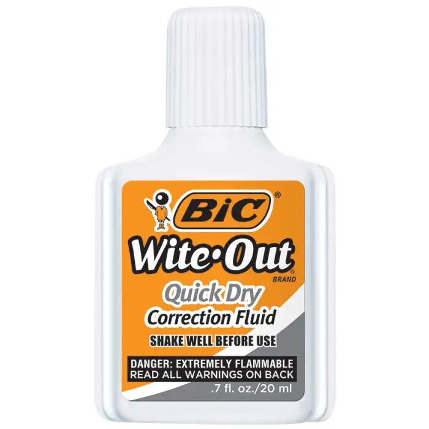 

   - Any editing of typed drafts had to be done with [[https://www.nga.gov/collection/art-object-page.107762.html][typewriter erasers]] and/or [[https://en.wikipedia.org/wiki/Wite-Out][Wite-Out]] or [[https://en.wikipedia.org/wiki/Liquid_Paper][Liquid Paper]] correction fluid.

   - Retyping was time-consuming and costly; you really didn't want to have to do it if you could avoid it.

So it's easy to see how spaghetti paragraphs came to be regarded as acceptable, even as a standard of practice. Ditto for "provided, however" interruptions in spaghetti paragraphs.

# https://commons.wikimedia.org/wiki/File:Pascal_Blaise.jpeg
# #+ATTR_HTML: :alt Blaise Pascal painting :title Blaise Pascal   :class photo-at-right photowidth18
# 

**** One substantive point per short paragraph
  :PROPERTIES:
  :CUSTOM_ID: sssp-scan
  :UNNUMBERED: t
  :END:

Each paragraph in a contract should be short AND address a single point that might require significant discussion. That could mean that you have to split off some of the draft verbiage into separate paragraphs. So be it — other things being equal:

- Short paragraphs are easier for both your client and The Other Side to review. This will help get the contract to signature sooner, something that your client will almost always appreciate. (It might also earn your client just a bit of goodwill from The Other Side.)

- Short paragraphs are better workaday tools for business managers, and, if necessary someday, for trial counsel and judges.

- Short paragraphs can be more-easily copied and pasted into future contracts without inadvertently messing up some other clause.

For similar sentiments, see a federal-government [[https://digital.gov/guides/plain-language/writing/clear-short#content-start][plain language guide]].[fn:PlLangShortPara] 

So: Do this when drafting a contract, the way to go is this:

1.  Write as many /short/ sentences and paragraphs — "sound bites," if you will —  as are needed to cover the subject.

2.  If a sentence starts to run too long for easy reading — and we all do it — then *break it up*. Do likewise for run-on paragraphs. 

Students: In our Contract Drafting course we'll do a number of in-class exercises where you'll work together in small groups to break up some real-world spaghetti clauses. 

Even if the resulting draft happens to take up a few extra pages, your client likely will thank you for it.

# To be sure: Short paragraphs weren't always welcome: In the days when contracts were printed out in hard copy, many lawyers intentionally used a "compressed" format — narrow margins, long paragraphs,  small print — so as to fit on fewer pieces of paper. 

# But those days are long gone. Nowadays, pretty much everyone reviews and even signs contracts on a screen, not on paper. So the page length is far less important to negotiation than the readability of the text.

[fn:PlLangShortPara]  From a federal-government [[https://digital.gov/guides/plain-language/writing/clear-short#content-start][plain language guide]]:

#+begin_quote
Short paragraphs are easier to read and understand. Long paragraphs can discourage users from trying to understand your material. 

* * *

There is nothing wrong with an occasional one-sentence paragraph.

Using short paragraphs is an ideal way to open up your writing and create white space. In turn, this makes your writing more inviting and easier to read. ...

* * *

Limit each paragraph or section to one topic. This makes it easier for your audience to understand your information. Each paragraph should start with a topic sentence that captures the essence of everything in the paragraph.

Putting each topic in a separate paragraph makes your information easier to digest.
#+end_quote

**** Could a L.O.A.D. be trying to sneak something in?
  :PROPERTIES:
  :CUSTOM_ID: load-sneak
  :UNNUMBERED: t
  :END:

For some spaghetti clauses, there might be a less-innocent explanation: Is it possible that a L.O.A.D. — a Lazy Or Arrogant Drafter — was secretly hoping to use the MEGO factor ("Mine Eyes Glaze Over") to sneak an objectionable term past the other party's contract reviewer? This actually happens sometimes. For example, in the estimable redline.net forum (for lawyers only, membership required):

- [[https://www.redline.net/queries/short-single-topic-contract-paragraphs-speed-legal-review-0][A lawyer recounted]] how he once represented a novice writer who was looking for an agent, to help the writer deal with publishers, etc.

- One agency expressed interest in representing the writer and sent over a contract for the writer to sign.

- But: Buried in a long paragraph was language to the effect that any work that the writer produced while the agency was representing the writer would be owned by the agency (!!!), not the writer.

The lawyer naturally advised the writer, "DO NOT SIGN." 

**** Maybe the drafter is just trying to feel important?
  :PROPERTIES:
  :CUSTOM_ID: dr-priest
  :UNNUMBERED: t
  :END:

Some less-secure lawyers might imagine that by using dense legalese, they'll enhance their personal prestige as High Priests of the Legal Profession, privvy to secret legal knowledge that's out of ordinary mortals' reach. That seems a dubious proposition at best — and indeed a [[https://www.merriam-webster.com/dictionary/risible][risible]] one.

*** BLUF: Bottom Line Up Front — or, get to the point!
  :PROPERTIES:
  :CUSTOM_ID: BLUF-rule
  :END:

# https://waldo.candlewick.com/
# #+ATTR_HTML: :alt Image of Waldo walking with a cane over his shoulder and waving to his right, from the author's Web site  :class photo-at-right photowidth20
# 

A useful rule of readability, borrowed from the U.S. military, is BLUF: *Bottom Line Up Front* — it's akin to the journalists' rule, *[[https://www.merriam-webster.com/wordplay/bury-the-lede-versus-lead][don't bury the lede]]*. <cite> See, e.g., Kabir Sehgal, [[https://hbr.org/2016/11/how-to-write-email-with-military-precision][How to Write Email with Military Precision]] (HBR.com 2016), archived at https://perma.cc/B986-5DUY; the byline indicates that the article's author is a U.S. Navy veteran. </cite> 

You've doubtless seen contract provisions that grossly violate the BLUF rule.  Such clauses *delay getting deals signed*: Researchers at MIT conducted an experimental study of legalese comprehension (led by a career-changing Harvard Law grad). The results pointed to a chief villain in conventional legalese: "*center-embedded clauses*," which the researchers found "inhibited recall to /[an even]/ greater degree than other features" such as jargon and passive voice. <cite> [[https://law-ai.org/team/eric-martinez/][Eric Martínez]], Francis Mollica, and Edward Gibson, [[https://www.sciencedirect.com/science/article/pii/S0010027722000580?ref=pdf_download&fr=RR-2&rr=8c6198f0ae9945f3][Poor writing, not specialized concepts, drives processing difficulty in legal language]], /Cognition/ (2022). </cite>

Need an example? Here's one that was litigated in a state court (and that brings to mind [[https://web.archive.org/web/20230301101359/https://dilbert.com/strip/2008-08-28][a savagely-funny /Dilbert/ cartoon about lawyers]]). Following the lead of the famous [[https://waldo.candlewick.com/][Where's Waldo?]] children's books, let's play a short game of "Where's the Action Verb?"  /(Just scan this — no need to read it.)/

#+BEGIN_QUOTE
If any shareholder of the corporation for any reason ceases to be duly licensed to practice medicine in the state of Alabama, accepts employment that, pursuant to law, places restrictions or limitations upon his continued rendering of professional services as a physician, or upon the death or adjudication of incompetency of a stockholder or upon the severance of a stockholder as an officer, agent, or employee of the corporation, or in the event any shareholder of the corporation, without first obtaining the written consent of all other shareholders of the corporation shall become a shareholder or an officer, director, agent or employee of another professional service corporation authorized to practice medicine in the State of Alabama, or if any shareholder makes an assignment for the benefit of creditors, or files a voluntary petition in bankruptcy or becomes the subject of an involuntary petition in bankruptcy, or attempts to sell, transfer, hypothecate, or pledge any shares of this corporation to any person or in any manner prohibited by law or by the By-Laws of the corporation or if any lien of any kind is imposed upon the shares of any shareholder and such lien is not removed within thirty days after its imposition, or upon the occurrence, with respect to a shareholder, of any other event hereafter provided for by amendment to the Certificates of Incorporation or these By-Laws, *[ah, here we /finally/ get to the point!]* then and in any such event, the shares of this [c]orporation of such shareholder shall then and thereafter have no voting rights of any kind, and shall not be entitled to any dividend or rights to purchase shares of any kind which may be declared thereafter by the corporation and shall be forthwith transferred, sold, and purchased or redeemed pursuant to the agreement of the stockholders in [e]ffect at the time of such occurrence. The initial agreement of the stockholders is attached hereto and incorporated herein by reference[;] however, said agreement may from time to time be changed or amended by the stockholders without amendment of these By-Laws. The method provided in said agreement for the valuation of the shares of a deceased, retired or bankrupt stockholder shall be in lieu of the provisions of Title 10, Chapter 4, Section 228 of the Code of Alabama of 1975. <cite> From [[https://scholar.google.com/scholar_case?case=13078417361122986870][Lynd v. Marshall County Pediatrics, P.C.]], 263 So. 3d 1041, 1044-45 (Ala. 2018) (emphasis added). </cite>
#+end_quote

It's not hard to rewrite this in BLUF, sound-bite form.[fn:BLUFRewrite]

Nor is it hard to find even-worse examples.[fn:BLUFWorse]

[fn:BLUFRewrite] Let's rewrite the above atrocity in a BLUF sound-bite format:

#+begin_bordered
(a)     *A shareholder's relationship with the corporation will be terminated*, as specified in more detail in subdivision (b), if any of the following Shareholder Termination Events occurs:

      (1) the shareholder, for any reason, ceases to be duly licensed to practice medicine in the state of Alabama;

      (2) the shareholder accepts employment that, pursuant to law, places restrictions or limitations upon his continued rendering of professional services as a physician

      /[remaining subdivisions omitted]/

(b)     Immediately upon the occurrence of any event described in subdivision (a), *that shareholder's shares*:

       (1) will have no voting rights of any kind,

       /[Remaining subdivisions omitted]/

#+end_bordered

(Emphasis added.)

Surely the rewritten version is the more readable of the two?

[fn:BLUFWorse] Here's an even worse example, from the [[https://www.sec.gov/Archives/edgar/data/914025/000114036122011290/ny20003617x1_ex2-1.htm][merger agreement]] by which Hewlett-Packard (HP, Inc.) acquired well-known headset manufacturer Plantronics; it clocks in at 928 words (!) and addresses some 10 or 11 (!) separate discussion points:

#+begin_quote

(b) For six years after the Effective Time, Parent and the Surviving Corporation (jointly and severally) shall indemnify and hold harmless all Indemnified Persons with respect to acts or omissions occurring at or prior to the Effective Time to the fullest extent that the Company or the applicable Company Subsidiary would be permitted to do so by the DGCL or, if any such Company Subsidiary is not organized in Delaware, the applicable Law of organization of such Company Subsidiary, in the event of any threatened or actual claim, suit, action, proceeding or investigation (a “Claim”), whether civil, criminal or administrative, based in whole or in part on, or arising in whole or in part out of, or pertaining to (i) with respect to the present and former directors and officers of the Company that are Indemnified Persons, (A) the fact that the Indemnified Person is or was a director (including in a capacity as a member of any board committee), officer, employee or agent of the Company, any of the Company Subsidiaries or any of their respective predecessors or (B) this Agreement or any of the transactions contemplated hereby, and (ii) the fact that such Indemnified Person is or was a director or officer of any Company Subsidiary and his or her respective actions or omissions in his or her capacity as a director or officer of one or more of the Company Subsidiaries, in each case whether asserted or arising before, on or after the Effective Time, against any losses, claims, damages, liabilities, costs, expenses (including reasonable attorney’s fees and expenses in advance of the final disposition of any claim, suit, proceeding or investigation to each Indemnified Person (to the extent required or, in the case of advancement, permitted by the DGCL, upon delivery to Parent of an unsecured, interest‑free undertaking by or on behalf of such Indemnified Person to repay such amount if it shall ultimately be determined that such Indemnified Person is not entitled to be indemnified)) and all judgments, fines and, subject to the remainder of this Section 6.07(b), amounts paid in settlement of or in connection with any such threatened or actual Claim. Neither Parent nor the Surviving Corporation shall settle, compromise or consent to the entry of any judgment in any threatened or actual Claim for which indemnification could be sought by an Indemnified Person hereunder, unless such settlement, compromise or consent includes an unconditional release of such Indemnified Person from all liability arising out of such Claim or such Indemnified Person otherwise consents (not to be unreasonably withheld, conditioned or delayed) in writing to such settlement, compromise or consent. Parent and the Surviving Corporation shall cooperate with an Indemnified Person in the defense of any matter for which such Indemnified Person is indemnified hereunder; provided, however, that Parent or its applicable Subsidiary may, at its option and expense, assume and control the defense of any Claim with one counsel for all similarly situated Indemnified Persons subject to such Claim, if such counsel is reasonably acceptable to a majority of the Indemnified Persons who may be entitled to indemnification for such Claim; provided that, if such Claim commenced after the date hereof and prior to the Effective Time and relates to this Agreement, the Merger or the fiduciary duties of the board of directors of the Company, then at the election of a majority of such Indemnified Persons, such counsel shall be the counsel of record prior to the Effective Time for such Claim; provided further that any Indemnified Person may fully participate at its own expense in the defense of such Claim through separate counsel of its own choosing; and provided further that if, in the reasonable opinion of counsel of any Indemnified Person, there is a conflict of interest between such Indemnified Person and Parent or its applicable Subsidiary, or because of Parent or its applicable Subsidiary’s failure to defend for a period of 60 days any such Claim, any such Indemnified Person shall have the right to select separate counsel of its own choosing to participate in the defense of such Claim on its behalf, and the reasonable costs and expenses (including reasonable attorneys’ fees) of defending such Claim shall be indemnified by Parent and the Surviving Corporation to the extent otherwise indemnifiable hereunder. If Parent or its applicable Subsidiary so assumes the defense of any Claim for such Indemnified Persons pursuant to the foregoing sentence, none of Parent or any of its Subsidiaries will be liable to such Indemnified Persons for any defense costs or expenses (including attorneys’ fees and expenses) subsequently incurred by the Indemnified Persons in the defense of such Claim (but excluding, for the avoidance of doubt, any other losses, claims, damages, liabilities, costs or other expenses therefrom, including from the disposition of any such Claim, that are subject to indemnification pursuant to this Section 6.07). Neither an Indemnified Person nor the Parent, the Surviving Corporation of any of its Subsidiaries shall settle, compromise or consent to the entry of any judgment in any threatened or actual Claim for which indemnification could be sought without the prior written consent of Parent, in the case of the Indemnified Persons, or the Indemnified Persons, in the case of Parent, the Surviving Corporation or any of its Subsidiaries (in each case, such consent not to be unreasonably withheld, conditioned or delayed). Each Indemnified Person shall reasonably cooperate with Parent and its applicable Subsidiaries, at Parent’s sole expense, in the defense of any matter for which such Indemnified Person could seek indemnification hereunder.
#+end_quote

**** Example: A real-world contract clause in need of BLUF work        :OMIT:
  :PROPERTIES:
  :CUSTOM_ID: bluf-HP
  :END:

As another illustration, here's an example of a spaghetti clause that's in serious need of rework; it's from the [[https://www.sec.gov/Archives/edgar/data/914025/000114036122011290/ny20003617x1_ex2-1.htm][merger agreement]] by which Hewlett-Packard (HP, Inc.) acquired well-known headset manufacturer Plantronics.

/(Students, you can just skim this to get the idea.)/

BEFORE:

#+begin_quote

SECTION 6.07  *Indemnification and Insurance*. (a) All rights to indemnification, exculpation from liabilities and advancement of expenses for acts or omissions occurring at or prior to the Effective Time now existing in favor of any individual (i) who is or prior to the Effective Time becomes, or has been at any time prior to the date of this Agreement, a present or former director or officer (including any such individual serving as a fiduciary with respect to an employee benefit plan) of the Company or (ii) in his or her capacity as a present or former director or officer of one or more of the Company Subsidiaries as of the date of this Agreement (each such individual in (i) and (ii), an “Indemnified Person”) as provided in, with respect to each such Indemnified Person, as applicable, (i) the Company Charter, (ii) the Company Bylaws, (iii) the organizational documents of any applicable Company Subsidiary in effect on the date hereof at which such Indemnified Person serves as a director or officer, as applicable, or (iv) any indemnification agreement, employment agreement or other agreement made available to Parent, containing any indemnification provisions between such Indemnified Person, on the one hand, and the Company and the Company Subsidiaries, on the other hand, *[ah, here comes the action verb, /finally/:]* shall survive the Merger in accordance with their terms and *[here comes a different substantive term:]* shall not be amended, repealed or otherwise modified in any manner that would adversely affect any right thereunder of any such Indemnified Person with respect to acts or omissions occurring at or prior to the Effective Time.
#+end_quote

Let's rewrite subdivision (a) above, without using spaghetti and following the BLUF Rule:

1. Short paragraphs, with just one negotiation point per paragraph — no spaghetti paragraphs; and

2.  Bottom Line Up Front.

Oh, and while we're at it, let's help guide the reader's eye by (judiciously) *bold-facing* a few key words:.

AFTER: /(just skim this)/

#+begin_bordered
SECTION 6.07    *Indemnification and Insurance*. 

(a)  See subdivision (c) below for definitions of particular capitalized terms. /[Comment: Note the forward reference to subdivision (c).]/

(b) If *before* the Effective Time, an Indemnified Person was entitled to Protection, then *after* the Effective Time, that person will continue to be entitled to Protection in the same manner as before.

(c) Definitions: For purposes of this section 6.07:

       "*Company Entity*" refers to each of the following: (1) the Company; and (2) any of the Company Subsidiaries existing as of the date of this Agreement.

       "*Indemnified Person*" refers to any individual who is, or prior to the Effective Time becomes, or has been at any time prior to the date of this Agreement, in one or more of the following categories:

               (1) a present or former director or officer of any Company Entity; and/or 

               (2) any individual serving as a fiduciary with respect to an employee benefit plan of any Company Entity.

        "*Protection*," with respect to an Indemnified Person, refers to the Indemnified Person's right to be indemnified; to be released from liability; and/or to have expenses advanced; as provided in one or more "Protection Documents" (see below).

       "*Protection Document*" refers to each of the following, as applicable:

              (1) the Company Charter;

              (2) the Company Bylaws; 

              (3) the organizational documents of any applicable Company Entity;

              (4) any agreement — including, without limitation, any indemnification agreement and/or employment agreement — that (A) establishes one or more rights to Protection for the Indemnified Person, and (B) was made available to Parent prior to the Effective Time.

#+end_bordered

Is there any doubt which version would be easier to read, understand, negotiate, and revise? Clearly, it's the After version.

And imaging the reader's task in reviewing and thinking about the Before version ....

**** A statutory BLUF example                                          :OMIT:
  :PROPERTIES:
  :CUSTOM_ID: OMIT-bluf-eg-stat
  :UNNUMBERED: notoc
  :END:

One more: As a statutory example, [[https://twitter.com/jmarkcooney/status/938426425446731781][this rewrite]], by law professor Mark Cooney, was [[https://x.com/jmarkcooney/status/938426425446731781][retweeted]] by legal-writing guru Bryan Garner:

/(Students: Again, you can just skim this to get the idea.)/

BEFORE:

#+begin_quote

A person who engages in conduct proscribed under section 530 and who in the course of engaging in that conduct, possesses a dangerous weapon or an article used or fashioned in a manner to lead any person present to reasonably believe the article is a dangerous weapon, or who represents orally or otherwise that he or she is in possession of a dangerous weapon, *is guilty of* a felony punishable by imprisonment for life or for any term of years. If an aggravated assault or serious injury is inflicted by any person while violating this section, the person shall be sentenced to a minimum term of imprisonment of not less than 2 years.
#+end_quote

(Emphasis mine.)

So what exactly is the bottom line of this statutory provision?

AFTER /(rewrite by Prof. Cooney)/:  

#+begin_quote

*A person is guilty of a felony if*, while committing a crime under section 530, he or she: 

(1) possesses a dangerous weapon; 

(2) possesses an article used as a dangerous weapon; ... /[etc.]/
#+end_quote

(Emphasis mine.)

** Theme 2: /Freaky Friday/ terms -- for faster negotiation
  :PROPERTIES:
  :CUSTOM_ID: FFri
  :END:

Contents:

#+TOC: headlines 2 local

*** Introduction & overview
  :PROPERTIES:
  :CUSTOM_ID: ffri-intro
  :END:

#+ATTR_HTML: :alt Freaky Friday movie poster with Lindsay Lohan in a dark suit, high heels, and a pearl necklace, and Jamie Lee Curtis with spiky hair, a denim jacket, a short skirt, and knee-high boots with an electric guitar   :title  Freaky Friday movie poster  :class photo-at-right photowidth20

A great way to get a productive contract signed sooner is to put yourself in the shoes of The Other Side, in the manner of the [[https://en.wikipedia.org/wiki/Trading_Places][Freaky Friday]] movies. Let's (provisionally) assume that a contract clause is serviceably balanced if it provides /role-swappable terms/: We could define that expression as terms that Alice wouldn't be averse to agreeing to if she were to find itself in Bob's shoes. /("Alice" and "Bob" are placeholder names that are often used in the tech world.)/

This approach is akin to the ancient "[[http://en.wikipedia.org/wiki/Divide_and_choose][divide and choose]]" procedure. That's sometimes known as "you cut, I choose," by which children can evenly divide a cookie between them. A similar approach is often used in so-called "shotgun" [[#nl-shotgun][buy-sell agreements]] and in last-offer arbitration; see {{{RR}}} [[#r-escal-ext]] for a variation. 

All these approaches are grounded in the [[https://www.pnas.org/doi/10.1073/pnas.1910125116][Rawlsian veil of ignorance]]: If people don't know what roles they'll be playing when the rules are being set up, then those rules are more likely to be roughly equitable. 

# https://commons.wikimedia.org/wiki/File:BindView_logo.svg
# #+ATTR_HTML: :alt BindView Corporation logo :title   :class photo-at-right photowidth25
# 

*** The goal: Get deals signed sooner
  :PROPERTIES:
  :CUSTOM_ID: bv-rev
  :END:

**** The problem: Lawyers often start by asking for the moon
  :PROPERTIES: 
  :CUSTOM_ID: nl-bal-terms
  :UNNUMBERED: t
  :END:

As a young lawyer in a big law firm, I somehow picked up the notion that, when drafting any contract:

- You load up your draft with a wish list of things that your client would love to get — or that could someday give your client leverage over the other side — with an eye to planning for every worst-case scenario you can think of.
- You send your draft to the other side — which sends it back to you, marked up with /their/ wish list.
- in all likelihood, you and the other party go back and forth, exchanging multiple drafts and possibly doing one or more conference calls.
- Finally, you compromise /somewhere/.

For both parties, the overall mindset there is: /If you start by asking for the moon, you'll get more of what you wanted in the end/. <cite> This was a feature of advice from the late negotiation guru [[https://wikitia.com/wiki/Chester_Karrass][Chester L. Karrass]], whose unsmiling visage could be seen for years in airline-magazines ads for his training courses. Dr. Karrass's namesake organization still [[https://www.karrass.com/blog/anchoring-in-negotiation][urges parties]] to anchor their negotiations by aiming high with "a [b]old [f]irst [o]ffer" and then bargaining down from there. (And of course in much the same vein is Donald Trump's 1987 best-seller /The Art of the Deal/.) </cite>

Moreover, this is totally rational behavior for us lawyers, to reduce our professional risk: If the deal goes awry, we don't want the client — with 20-20 hindsight — concluding that it was our fault because we didn't do X or Y or Z.  <cite> See, e.g., the discussion of the /UBS Securities v. Redstone/ litigation at § [[#affil-ctrl-mgmt]] ($17 million malpractice verdict against the Cadwalader firm for not adequately defining "control" in a contract) and the /Wright v. Lewis Silkin/ case discussed at [[#forum-advise]] (£2.04 million malpractice verdict for failure to advise about a forum-selection clause, reduced on appeal to £40,000).   </cite>

(Relatedly, see the discussion at {{{RULE}}} [[#r-best-efforts-defn]] of the problem of 20-20 hindsight associated with agreeing to a "best efforts" contractual obligation.)

Thus, we lawyers have a built-in justification for drafting contracts to address every risk we can think of: We interpret [[https://www.americanbar.org/groups/professional_responsibility/publications/model_rules_of_professional_conduct/rule_1_3_diligence/][our ethical duty of diligence]] as calling for us to try to put the client in the absolute best possible /litigation/ position, for every conceivable future situation — no matter how much the client might prefer instead to get the deal done quickly while accepting some hypothetical future risk.

This seems akin to the [[https://hms.harvard.edu/news/does-defensive-medicine-work-0][defensive medicine]] that's sometimes said to have dramatically increased U.S. medical costs. <cite> One study, by faculty members at Harvard and Stanford medical schools and USC, found that "higher resource use by physicians is associated with fewer malpractice claims." Anupam B. Jena, Lena Schoemaker, Jay Bhattacharya, and Seth A Seabury, [[https://doi.org/10.1136/bmj.h5516][Physician spending and subsequent risk of malpractice claims: observational study]] (BMJ.com 2015). </cite>

# Relevantly: See my nominee for [[https://web.archive.org/web/20150419120743/http://dilbert.com/strip/2008-08-28][the greatest lawyer cartoon of all time]]. (It takes awhile to load, and you might have to click an icon to see the cartoon itself.)

**** But /clients/ would often prefer an "OK" deal ASAP — and to start building relationships
  :PROPERTIES:
  :UNNUMBERED: t
  :END:

While the lawyers' interests here are quite rational, those interests often clash with those of clients: When business people are trying to get a deal done, they very often care /most/ about:

- getting an "OK" contract signed as quickly as possible, because they /do/ have just a few other things to do — that's usually true for both vendors and customers — while planning for a reasonable set of what-if contingencies;

- roadblocking gamesmanship and bullying by The Other Side, /but/ without going overboard about it; 

- keeping down the legal expense; and

- having things work out well with the other party and its people,  building mutual trust as reliable business partners who could work together again and who might have each other's backs in a crunch. (See also the discussion of trust at [[#nl-trust-top]].)

Apropos of that last point: When possible, businesses very much like to deal with contract counterparties —

  - who're agreeable to work with in dependable, resilient business relationships. For example: /Vendors/ prefer dealing with customers who pay on time and who provide repeat business and favorable referrals. /Customers/ want to do business with vendors who have proved their dependability as suppliers of goods and services;

  - who, when challenges arise, take reasonable positions and seek win-win solutions — especially when things get tough, such as during the COVID-19 pandemic and the attendant supply-chain disruptions. <cite> See, e.g., Xiwen Bai, Jesús Fernández-Villaverde, et al., [[https://www.nber.org/papers/w32098][The Causal Effects of Global Supply Chain Disruptions on Macroeconomic Outcomes: Evidence and Theory]], Nat'l Bur. of Econ. Research Working Paper 32098 (NBER.org 2024); Tacy Foster, [[https://www.mckinsey.com/capabilities/operations/our-insights/supply-chain-risk-survey][Supply chain risk pulse 2025: Tariffs reshuffle global trade priorities]] (McKinsey.com 2025). </cite>

In that vein: The global trade association WorldCC /(consider joining it!)/ has as one of its [[https://www.worldcc.com/About/Our-Strategy#Importance][stated purposes]] "... to transform contracts and the contracting process, such that they become *instruments of fair dealing*, that they themselves, and the process surrounding them, *promote trust*, [and] *generate economic benefit* ...."  <cite> [[https://www.worldcc.com/About][World Commerce & Contracting]] (formerly the International Association for Contract and Commercial Management) has some 80,000 members representing more than 20,000 companies across 180 countries. </cite>

# [[https://en.wikipedia.org/wiki/Perfect_is_the_enemy_of_good][the perfect is the enemy of the good]]. 

*** Shortening the sales cycles: A real-world example
  :PROPERTIES:
  :CUSTOM_ID: bvew-friction
  :END:

**** Background: Our legal-negotiation hamster wheel
  :PROPERTIES:
  :UNNUMBERED: t
  :END:

Business people's impatience with the traditional lawyer approach approach was driven home to me almost as soon as [[#bio][I joined my long-time client BindView Corporation]] as the newly-public company's first in-house lawyer. (As outside counsel I'd helped BindView's founder, [[https://www.einpresswire.com/article/868702600/eric-pulaski-named-ceo-of-invisirisk-co-founder-david-pulaski-appointed-cxo-to-drive-strategic-execution][Eric Pulaski]], to start the company; several years later I joined it as vice president and general counsel not long after the initial public offering.)

Suddenly, I was handling all of BindView's routine legal negotiations with customers about the company's standard contract form. It didn't take long to notice that my sales colleagues and I usually ended up conceding the same points, over and over — like hamsters running in a wheel.

That process turned out to be a big time drain — not just for me, but also for our sales people, because they'd commonly sit in on some of my legal-negotiation calls with their customers to keep an eye on things.  Our sales people had better things to do than to babysit their deals' legal negotiations, of course: Especially as the end-of-quarter accounting cutoff date drew near, they'd have much preferred to be working on closing more deals with other customers (and earning more commissions).

As the saying goes: If I had a nickel for every time a sales person or senior exec had asked me: /Can't we just use a contract that's reasonable for both sides, and be done with it?/ ...

**** A balanced contract cut down on customers' proposed contract revisions
  :PROPERTIES:
  :CUSTOM_ID: bv-mov-rev
  :UNNUMBERED: t
  :END:

At some point the realization dawned: Every time we sent BindView's standard contract to a customer, it's as though we were trying to 'sell' the other party not just on our software /but on our contract, too/ — because our contract was indeed a tag-along product that was "bundled" with our software.

# (In negotiating legal terms and conditions, one of our standard responses was that our pricing was predicated on using /our/ terms and conditions, and so any significant customer requests to revise those terms would necessitate revisiting the pricing to account for the changes in our legal risk.)

And for /any/ product offering: When customers offer feedback, a smart provider will consider whether to modify the product to improve demand and customer satisfaction. 

So to try to break out of the hamster wheel, BindView's [[https://www.investopedia.com/terms/c/c-suite.asp][C-suite management]] agreed to try something different:

- Over several months, whenever we negotiated workable changes in our contract, we made similar changes to our standard contract as well (with approval from the business execs, of course).

- This improved our contract 'product' so that, right out of the box, it gave customers pretty much what they wanted. It did so in ways that we knew that we could support operationally and, in my judgment, didn't significantly increase the company's legal exposure.

Customers' /lawyers/ began to say how much they liked our contract; this helped to validate those customers' decision to do business with us.

I started making notes of the lawyers’ favorable comments. I quoted some of the comments (anonymously) on a cover page of our contract form.  Here are just a few of those comments, which [[https://www.oncontracts.com/balanced-contract-forms/][I posted online]] some years ago; all are from conference calls:

- From an in-house attorney for a multinational health care company: "/I told our business people that if your software is as good as your contract, we’re getting a great product./" (!)

- From an in-house lawyer at a U.S. hospital chain: "/I giggled when I saw the 'movie reviews' on your cover sheet. I’d never seen that before: customers saying this was the greatest contract they’d ever seen. But the comments turned out to be true./"

- From a contract specialist at a national wireless-service provider: "/I told my boss I want to give your contract to all of our software vendors and tell them it’s our standard contract, but I know we can’t do that./" (!)

- From an in-house attorney at a global media company: "/This is a great contract. Most contracts might as well be written in Greek, but our business guys thought this one was very readable./"

Our sales people didn't hate this. 

*The lesson:* Fair, readable agreements help to cut deal friction.

# After our new contract had built some customer credibility, I started to tell our sales people that I wouldn't even look at /a customer's/ contract form until the sales reps got me a five-minute phone call with the customer's contract people. I said that, just as it was their job to sell the customer on buying our software, it was /my/ job to try to sell the customer on using our contract. (That alone helped speed up our sales cycle: Sometimes we ended up having to use the customer's contract after all. But that first call with the contract people gave each side a sense of who they were dealing with; this helped all of us assess what terms could be agreed to.) 

****** David Pulaski story                                             :OMIT:
And a few months after we'd had begun this transition to a customer-friendly contract form,  BindView acquired a smaller software company by the name of [[https://www.boulderventures.com/entevo][Entevo]].  After we closed the acquisition, our sales organization brought Entevo's sales people to Houston for onboarding, including training in how to sell /our/ software. 

While the Entevo sales folks were in town, our VP of worldwide sales, [[https://www.linkedin.com/in/david-pulaski-a7722/][David Pulaski]] /(who said I could use his name in telling this story)/ stuck his head in my office. David said he'd told our new sales reps that, unlike at Entevo, at BindView we did most of our deals on just a one-page sales quotation and our clickwrap license agreement, which was customer-friendly just like our negotiable contract form.  

David said that our new sales reps had given him a standing ovation. They told David that at Entevo, they'd had to use a detailed contract form that had lots of vendor-protective legalese. Not surprisingly, Entevo's customers had often insisted on negotiating the contract's legal terms and conditions, which the CFO handled. (Entevo didn't have an in-house lawyer.) That had sometimes slowed up Entevo's getting deals signed, causing some grumbling among Entevo's sales people.

So when David told the our new reps about BindView's approach, the reps instantly recognized that their work had just gotten easier: For most BindView sales oppotunities, our new reps could just quote a price; reference our clear, fair set of terms; and get the deal signed — helping the reps to make their quotas and earn commissions and [[https://www.forrester.com/blogs/elements-of-sales-incentive-trip-program/][club trips]] for themselves .

**** Our balanced, customer-friendly contract ... worked
  :PROPERTIES:
  :UNNUMBERED: t
  :END:

You might wonder whether BindView ever experienced legal- or business problems from having a balanced, customer-friendly contract form:

- With the CEO’s permission, I talked about our contract philosophy in continuing-legal-education (a.k.a. CLE) seminars, and even included a copy of our standard form in written seminar materials.

- We basically-never had any kind of contract-related problem with a customer when we'd used our contract form.

- In due course we had a successful 'exit': Having navigated through the software industry's 'nuclear winter' after the dot-com crash, we were approched and acquired by Symantec Corporation, one of the world’s largest software companies and the global leader in our field.

*** A /Freaky Friday/ contract is likely to be safer for the long term
  :PROPERTIES:
  :CUSTOM_ID: bv-rlf
  :END:

**** Roles do get reversed — sometimes happily ...
  :PROPERTIES:
  :UNNUMBERED: t
  :END:

On two different occasions, having a /Freaky Friday/ contract helped BindView get deals done almost immediately when we found ourselves being the /customer/ and not the vendor:

- On each of those occasions, BindView was licensing another vendor's software for our internal use.

- The other vendor wanted to use its own software license agreement, of course — but that license agreement had problems.

- It would have taken considerable revision and, presumably, legal negotiation for it to work for us as the customer.

- So, we proposed to the vendor that instead we should just use /BindView's/ standard software license agreement — but with BindView as the customer instead of as the vendor. We said we'd be happy to live with the same terms that we asked our customers to accept.

Each time, the other vendor reviewed our license agreement and quickly agreed to our proposal.

More generally: Role-swappable contract terms can pay off if the parties' roles ever do get reversed and the business people think that it's safe to use the same contract.

Here's one typical example: In many cases, a /two-way/ confidentiality agreement ("NDA") that protects each party's confidential information is likely to be signed sooner, because:

- each negotiator presumably keeps in mind that /today's/ disclosing party might be /tomorrow's/ receiving party or vice versa; and so:

- the two-way agreement is thus /likely/ — but not guaranteed, see [[#two-way-bias][below]] — to be more balanced;

- moreover, if the parties were ever to switch roles — with the parties agreeing that the original recipient should disclose its own information to the original discloser — then a two-way agreement can avoid (what the original recipient would regard as) disaster, as discussed at [[#conf-info-pty]].

**** ... other times, disastrously
  :PROPERTIES:
  :UNNUMBERED: t
  :END:

Since we looked at NDAs in the previous section, let's consider what might happen if an NDA weren't written to be role-swappable:

- With a /one-way/ confidentiality obligation, only the originally-intended discloser's information is protected, because only the original recipient is bound by confidentiality obligations.

-  Any disclosures /by the original recipient/ to the original discloser might therefore be completely unprotected.

- That would result in turn in the original recipient's losing its trade-secret rights in its information. 

{{{RWE}}} A fate much like that befell one trade-secret owner: The owner had signed a confidentiality agreement with another party, but that agreement protected only the other party's information. Consequently, said the court, the owner's disclosure of its /own/ confidential information to the other party was unprotected. <cite> See [[http://scholar.google.com/scholar_case?case=3855750888701636738][Fail-Safe, LLC v. A.O. Smith Corp.]] 674 F.3d 889, 893-94 (7th Cir. 2012) (affirming summary judgment for other party). </cite>

(For more examples of the dangers of unrestricted disclosures of confidential information, see [[#conf-info-excl-free]].)

In that particular case, it's not hard to imagine the thought process that the business people's went through: "We need to disclose /our/ information to /you/. *We've already got an NDA in place, right?* So sure, let's do it." But the NDA didn't do what was needed.

**** A painful real-world lesson: The Trump Organization gets bit by its own biased lease
  :PROPERTIES:
  :UNNUMBERED: t
  :END:

/(I wrote the original version of the following discussion a few months before Donald Trump descended a golden escalator in 2015 to announce what became his successful 2016 presidential campaign.)/

# https://en.wikipedia.org/wiki/File:The_Trump_Organization_logo.svg
#+ATTR_HTML: :alt Trump Organization logo (Wikimedia) :title Trump Organization logo (Wikimedia) :class photowidth30 photo-at-right
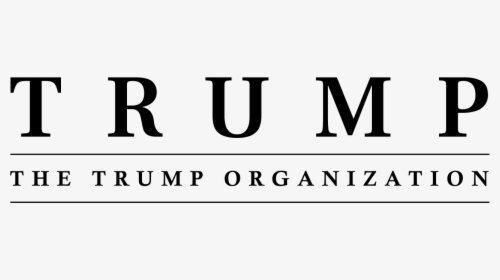

The Trump Corporation ("TrumpCorp") has been a real-estate landlord, among other things. According to AmLaw Daily, years ago TrumpCorp's lawyers took one of the company's leases, changed the names, and used it for a deal in which TrumpCorp was the /tenant/ and not the landlord. Later, though, TrumpCorp-as-tenant found that its lease form gave significant advantages to TrumpCorp's /landlord/:

#+begin_quote
"The funny part of it is what one of his internal lawyers must have done years ago," /[the landlord's president]/ says. "Normally Trump is the landlord, not the tenant. So what they did is they took one of their leases and just changed the names. And so it's not a very favorable lease if you're the tenant." <cite>  Nate Raymond, /Trump Misses Rent Payments ...,/ http://goo.gl/B72TIr (AmLawDaily.Typepad.com) (accessed Apr. 27, 2015 but no longer online, not even at archive.org — the site host, Typepad, ceased operations). </cite>
#+end_quote

# https://www.rottentomatoes.com/m/trading_places
# #+ATTR_HTML: :alt Image of poster for 1983 movie Trading Places, with photo of Dan Ackroyd at left and Eddie Murphy at right  :title Trading Places poster  :class photo-at-right photowidth20
# 

# This might remind readers of a certain age of the 1983 movie [[https://en.wikipedia.org/wiki/Trading_Places][Trading Places]], starring /SNL/ alumni Dan Ackroyd and Eddie Murphy, in which the characters  . Coincidentally, /Trading Places/ also featured Jamie Lee Curtis, who later starred in both of the /Freaky Friday/ movies as well.

# https://en.wikipedia.org/wiki/The_Kingston_Trio_(album)#/media/File:TheKingstonTrioFirst.jpg
#+ATTR_HTML: :alt Cover of Kingston Trio's debut album :title The Kingston Trio   :class photo-at-right photowidth25

*Lesson:* contract drafters will often do well to heed advice similar to that of the song [[https://youtu.be/It2oo2ZT6FI?si=tHrf1e926f5X-LcK&t=92][Coplas]] on the Kingston Trio's 1958 debut album, where the in-song patter "[[https://compvid101.blogspot.com/2012/08/coplascanastas-y-mas-canastas.html][translated]]" the Spanish lyrics into English: /Tell your parents not to muddy the water around us: They may have to drink it soon ..../

*** Even so: Include a "Combat Barbie" term or two anyway?
  :PROPERTIES:
   :CUSTOM_ID: combat-barbie
  :END:

You might not want to make your contract /too/ balanced: The Other Side's contract reviewer might feel the need to change /something/ to justify his- or her involvement — so proactively offer up something that can be changed.

This is old military wisdom: You learn early that when preparing for inspection, you don't want to make everything perfect. That's because the inspector will keep looking until he (or she) finds /something/ — because if the inspector doesn't find anything, /his superior might wonder whether the inspector really did his job/.

The trick is instead to make everything pretty squared away — but then [mess] things up just a little bit. That way, /the inspector will have something to find/ and report to his superior, thus avoiding questions whether the inspector /really/ inspected.

# https://www.facebook.com/photo.php?fbid=10157201042446232&id=280936771231&set=a.287346011231
# #+ATTR_HTML: :alt West Point cadre yelling at new cadet   :class photo-at-right photowidth40
# 

Illustrating the point: In an online forum, a British lawyer, who had graduated from Sandhurst (the UK equivalent of West Point), told the following story, paraphrased here: At Sandhurst (as is also true at U.S. military academies), first-year cadets are hounded relentlessly by upper-class cadets during their first few weeks. One such first-year cadet, who was female, did a good job of squaring away her bunk and gear for inspection.

# https://www.pinterest.com/pin/195836283768832634/
#+ATTR_HTML: :alt Combat Barbie :class photo-at-right photowidth20

But then, before the inspection the cadet carefully placed a "Combat Barbie" doll on her bunk. Of course, when it came the cadet's turn to be inspected, the inspectors /immediately/ noticed her egregious insult to good military order; they promptly began "counseling" her about the unmilitary appearance of her bunk area.

That played right into the cadet's hands: As it happened, the inspectors' "counseling" took up their entire alloted time for that cadet's inspection. 

And this saved the cadet quite a bit of trouble: Without the distracton of Combat Barbie, the inspectors might instead have used their time to trash the cadet's bunk area, leaving her gear strewn all over the floor, and ordering her to restore the environment as "additional training."

A similar "distractor" psychology can sometimes work in drafting a contract: Be sure to give the other side's reviewer /something/ to ask to change, if for no other reason than to give the reviewer something to report to her boss or client as having been spotted and fixed, thanks to the reviewer's commendable diligence.

/But make it a fairly minor point/; otherwise, the reviewer and her client might dismiss you as naïve — and worse, they  might start to question whether /your/ client was a suitable business partner.

*Example:* If you're a supplier, consider specifying payment terms of net-20 days, and be prepared to agree immediately to net-30 days if asked. But /don't/ specify /net-5 days/, which in many situations would risk branding you as naive about "how things are done."

*Addendum:* For similar examples from the corporate world, see the [[https://news.ycombinator.com/item?id=45779377][stories by commenters]] in a Hacker News discussion.

*** Students: Follow the W.I.D.A.P. and W.I.D.A.C. Rules
  :PROPERTIES:
  :CUSTOM_ID: widac-rules
  :END:

W.I.D.A.P.:  "When in doubt, as the partner."

W.I.D.A.C.: "When in doubt, ask the client."

*** Caution: /Freaky Friday/ terms can still be drafter-biased
  :PROPERTIES:
  :CUSTOM_ID: two-way-bias
  :END:

Any agreement that's /nominally/ two-way could still be biased in favor of the drafting party. 

Example: Suppose that Fred's drafter knows that Fred will be /receiving/ Ginger's confidential information, but Fred won't be /disclosing/ his own confidential information. In that situation:

  1. Representing Fred /as Recipient/, Fred's drafter might write a "two-way" (quote unquote) confidentiality provision that provides very little protection for /anyone's/ confidential information, because that lack of protection won't hurt Fred as Recipient — /at least not in the short term/.

  2. Ginger, as Discloser, would therefore have to review the confidentiality provisions carefully to make sure it contained sufficient protection for her Confidential Information.

  3. Conversely, if /Ginger's/ drafter is doing the drafting — knowing that Ginger will be /disclosing her/ information to Fred, but she won't be /receiving Fred's/ information — then Ginger's drafter might craft the confidentiality provision with burdensome requirements that Fred would have to review carefully.

** Theme 3: Ongoing communication -- for staying on course (and building trust)
  :PROPERTIES:
  :CUSTOM_ID: k-comms-intro
  :END:

/The single biggest problem in communication is the illusion that it has taken place./   [[https://quoteinvestigator.com/2014/08/31/illusion/][(Mis?)]]attributed to George Bernard Shaw.

Contents:

#+TOC: headlines 2 local

The {{{NAME-FULL}}} focus on communication as a key driver of productive contract outcomes — because communication can help parties —

- avoid costly- and even deadly mistakes; 
- work together more effectively; and
- resolve disputes before they get out of hand.

*** Business losses from poor communication
  :PROPERTIES:
  :CUSTOM_ID: comms-disas
  :END:

/The biggest cause of serious error in this business is a failure of communication./ Construction executive Finn O'Sullivan. <cite> Quoted in Atul Gawande, [[https://atulgawande.com/book/the-checklist-manifesto/][The Checklist Manifesto: How to Get Things Right]] (2009), at 70. </cite>

**** The Healthcare.gov initial rollout
  :PROPERTIES:
  :CUSTOM_ID: healthcare-roll
  :UNNUMBERED: t
  :END:

One of the most-embarrassing project failures ever was the botched initial rollout of the Healthcare.gov Web site to implement the Affordable Care Act (a.k.a. "Obamacare"). One of the root causes was poor communication practice — and in contrast, the successful crash project to fix the site involved frequent communication among developers and other stakeholders.  <cite> See, e.g., Jennifer Pahlka, [[https://www.amazon.com/Recoding-America-Government-Failing-Digital-ebook/dp/B0B8644ZGY][Recoding America: Why Government Is Failing in the Digital Age and How We Can Do Better]] (2023); Robinson Meyer, [[https://www.theatlantic.com/technology/archive/2015/07/the-secret-startup-saved-healthcare-gov-the-worst-website-in-america/397784/?gift=3R5FU36LvaVmRWs8I5wXOH5lo_LGh88pvSLS_rEekio&utm_source=copy-link&utm_medium=social&utm_campaign=share][The Secret Startup That Saved the Worst Website in America]] (TheAtlantic.com 2015). </cite>

# [fn:HealthCareRoll: See, e.g., Government Accounting Office, [[https://www.gao.gov/assets/gao-14-694.pdf#page=37][Healthcare.gov[:] Ineffective Planning and Oversight Practices Underscore the Need for Improved Contract Management]] at 37 (July 2014); Joshua Bleiberg and Darrell M. West, [[https://www.brookings.edu/articles/a-look-back-at-technical-issues-with-healthcare-gov/][A look back at technical issues with Healthcare.gov]] (Brookings.edu Apr. 2015); Robinson Meyer, [[https://www.theatlantic.com/technology/archive/2015/07/the-secret-startup-saved-healthcare-gov-the-worst-website-in-america/397784/?gift=3R5FU36LvaVmRWs8I5wXOH5lo_LGh88pvSLS_rEekio&utm_source=copy-link&utm_medium=social&utm_campaign=share][The Secret Startup That Saved the Worst Website in America]] (TheAtlantic.com 2015); Jennifer Pahlka, [[https://www.amazon.com/Recoding-America-Government-Failing-Digital-ebook/dp/B0B8644ZGY][Recoding America: Why Government Is Failing in the Digital Age and How We Can Do Better]] (2023).]

**** The NYC subway train-tracking system
  :PROPERTIES:
  :CUSTOM_ID: NYC-subway
  :UNNUMBERED: t
  :END:

A proposed upgrade to the dangerously-antiquated train-tracking system in New York City subways ended up grotesquely incomplete and {{{NBH}}}overbudget. "A post-mortem by the Federal Highway Administration details how from the start, an agency which had had little experience with large 'systems' projects tried to wing it. For instance, the consulting firm tasked with developing the project plan ... /didn’t talk to the workers who would be maintaining the system until after it was designed/ ...."  <cite> James Somers, [[https://www.theatlantic.com/technology/archive/2015/11/why-dont-we-know-where-all-the-trains-are/415152/?gift=3R5FU36LvaVmRWs8I5wXOAPbp_W6XgJAX1FnVF0-FqM&utm_source=copy-link&utm_medium=social&utm_campaign=share][Why New York Subway Lines Are Missing Countdown Clocks]] (The Atlantic.com 2015) (emphasis added). </cite>

**** An extra $100K expense
  :PROPERTIES:
  :CUSTOM_ID: bridge-reno
  :UNNUMBERED: t
  :END:

Here's a less-costly example:  In a project to reconstruct a bridge, a subcontractor spent more than $120,000 above the agreed price in trying to resolve an unexpected problem. During ensuing payment litigation, the relevant parties learned that /if they'd just talked to one another/, they likely would agreed to an alternative approach that would have saved over $100,000 of that extra cost — and that doesn't even take into account the time and money the parties spent in litigation. <cite> See [[https://scholar.google.com/scholar_case?case=14405606239041277439][Constr. Drilling, Inc. v. Engineers Constr., Inc.]], 2020 VT 38 ¶¶ 6-7, 236 A.3d 193, 196-97 (2020) (affirming denial of subcontractor's breach-of-contract claim). </cite>

*** Sometimes: Tragedy from lack of communication
  :PROPERTIES:
  :CUSTOM_ID: comms-trag
  :END:

Even worse: When parties don't communicate, it can sometimes lead to death, injury, and serious property damage. The world has seen tragic examples of failures in this regard:

- A [[https://en.wikipedia.org/wiki/2025_Potomac_River_mid-air_collision][2025 Potomac River mid-air collision]] killed all 67 people aboard an Army helicopter and a commuter aircraft; the accident is thought to have ultimately resulted from missed communications between the helicopter pilots and the air traffic controller on the ground;

- A [[https://en.wikipedia.org/wiki/USS_John_S._McCain_and_Alnic_MC_collision][2017 collision at sea]] near Singapore killed ten U.S. Navy sailors; this occurred in part because the individuals "driving" the two colliding ships [[https://web.archive.org/web/20171101201141/https://s3.amazonaws.com/CHINFO/USS+Fitzgerald+and+USS+John+S+McCain+Collision+Reports.pdf#page=49][didn't try to make radio contact]] with the other (that's a standard safety procedure when navigating in crowded waters);

- [[https://www.theisrm.org/documents/Garnett%20&%20Kouzmin%20(20007)%20Communicating%20Throughout%20Katrina%20-%20Competing%20and%20Complementary%20Conceptual%20Lenses%20on%20Crisis%20Communication.pdf][Hurricane Katrina]]'s 2005 ravaging of New Orleans was "as much a communication disaster as it was a natural and bureaucratic disaster. Communication gaps, missed signals, ... and deliberate and unintentional misinterpretations delayed and handicapped both the recognition of the crisis that Katrina posed and the response to its devastation." <cite> James L. Garnett and Alexander Kouzmin, Communicating throughout Katrina: Competing and Complementary Conceptual Lenses on Crisis Communication: Part III—The Future: Hindsight, Foresight, and Rear-View Mirror Politics, Public Administration Review 171 (Dec. 2007). </cite>

- The 1981 [[https://en.wikipedia.org/wiki/Hyatt_Regency_walkway_collapse#Investigation][Hyatt Regency walkway collapse]] in Kansas City killed 114 people — and apparently could have been prevented by proper communication between the design engineer and the manufacturer of certain steel rods;

*Each of these tragedies was caused in no small part by communications failures.* That's why professionals working in such fields are trained to use experience-based checklists that, as pilots say, have often been "written in blood."  <cite> Gary S. Rudman, [[https://www.safety.af.mil/News/Article-Display/Article/434426/checklist-mentality-its-a-good-thing/][Checklist mentality … it’s a good thing]] (safety.af.mil 2012). </cite> 

*** Benefits of /regular/, /structured/ communications
  :PROPERTIES:
  :CUSTOM_ID: comms-struct
  :END:

Contracting parties can often improve their outcomes by pre-planned communications, such as:

- building contractors and subcontractors regularly check in with each other for status updates and to plan for upcoming events;
- aircraft pilots regularly check in with air traffic control at standard points in their flights;
- in surgeries, the surgeons announce to their teams what they're doing and what's coming next.

# #+ATTR_HTML: :alt Checklist Manifesto cover :title   :class photo-at-right photowidth15
# 

That's a subtext of [[https://atulgawande.com/book/the-checklist-manifesto/][The Checklist Manifesto]] (highly recommended reading, by way), by surgeon, Rhodes scholar, and MacArthur "genius grant" recipient [[https://en.wikipedia.org/wiki/Atul_Gawande][Atul Gawande, M.D.]] That book grew out of Gawande's [[https://www.newyorker.com/magazine/2007/12/10/the-checklist][article in The New Yorker]], recounting his visit to the construction site of the [[https://en.wikipedia.org/wiki/Russia_Wharf][Russia Wharf]], a 32-floor building in Boston (now called the Atlantic Wharf). 

# https://grandemasonry.com/projects/russia-wharf-atlantic-wharf/
# See also https://www.cbtarchitects.com/projects/Atlantic-Wharf
# #+ATTR_HTML: :alt XX :title   :class photo-at-right photowidth25
# 

In that visit, Gawande learned that particular, /time-specific/ communications were an important feature of the checklists used by the general contractor's construction executives:

#+begin_quote
While no one could anticipate all the problems, they could foresee where and when they /might/ occur. /The checklist therefore detailed who had to talk to whom, by which date, and about what aspect of construction/ —who had to share (or 'submit') particular kinds of information before the next steps could proceed.

The submittal schedule specified, for instance, that by the end of the month the contractors, installers, and elevator engineers had to review the condition of the elevator cars traveling up to the tenth floor.

The elevator cars were factory constructed and tested. They were installed by experts. But it was not assumed that they would work perfectly. Quite the opposite. 

The assumption was that anything could go wrong, anything could get missed. What? Who knows? That’s the nature of complexity. 

But it was also assumed that, if you got the right people together and had them take a moment to talk things over as a team rather than as individuals, serious problems could be identified and averted. <cite> Atul Gawande, [[https://atulgawande.com/book/the-checklist-manifesto/][The Checklist Manifesto]] 65-66, emphasis and extra paragraphing added. </cite> 
#+end_quote

To be sure: In many types of contract, such intensive communication might well be costly overkill. But more often, the problem is /too little/ communication.

*** Side benefit: Support of "relational" contracting
  :PROPERTIES:
  :CUSTOM_ID: clt-goals-rel-k
  :END:

For many suppliers and customers, the press of day-to-day business will likely keep them from negotiating the /formal relational contracts/ that have been suggested by some really-smart people — including a co-recipient of the Nobel Prize in Economics — to deal with conventional contracts' problems of hold-ups, incomplete contracts, and shading. Those commentators name six guiding principles that should serve as the foundation of a relational contract:
1. reciprocity
2. autonomy
3. honesty
4. loyalty
5. equity
6. integrity— 

to "contractually prohibit opportunistic tit-for-tat moves .... and provide a framework for resolving potential  misalignments when unforeseen circumstances occur." <cite> David Frydlinger, Oliver Hart, and Kate Vitasek, [[https://hbr.org/2019/09/a-new-approach-to-contracts][A New Approach to Contracts]], Harv. Bus. Rev., Sept.-Oct. 2019, archived at https://perma.cc/T2TJ-3ENN; see also, e.g., [[https://www.linkedin.com/in/katevitasek/][Kate Vitasek]], Karl Manrodt, and Jeanne Kling, [[https://www.amazon.com/Vested-McDonalds-Microsoft-Redefining-Relationships/dp/0230341705][Vested: How P&G, McDonald's, and Microsoft are Redefining Winning in Business Relationships]] (2012). </cite>

Many contract negotiators will be uncomfortable with the lack of specificity of those six guiding principles. But by adopting the {{{NAME-FULL}}}, parties can at least get a start in the relational direction.

** Creative Commons distribution license
  :PROPERTIES:
  :CUSTOM_ID: cc
  :END:

#+ATTR_HTML: :target blank :class cc
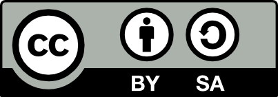

This {{{BK}}} may be reproduced and/or distributed under the Creative Commons [[https://creativecommons.org/licenses/by-sa/4.0/][BY-SA license 4.0]]: Attribution required; share any revisions in the same way. See [[https://creativecommons.org/licenses/by-sa/4.0/][the CC license]] for details.

** Links to the {{{NAME}}} {{{PR}}}s /[to come]/                         :OMIT:
  :PROPERTIES:
  :CUSTOM_ID: fmkws
  :HTML_CONTAINER_CLASS: chap
  :END:

#+begin_comment

Lawyers: Consider using the frameworks listed in:

- Chapter [[#k-comms]]: {{{PROPERTY(ITEM,#k-comms)}}}
- Chapter [[#gen-ops-pr]]: {{{PROPERTY(ITEM,#gen-ops-pr)}}}
#+end_comment

* Key ground rules
  :PROPERTIES:
  :CUSTOM_ID: k-prelim
  :HTML_CONTAINER_CLASS: chap
  :END:

This chapter provides a set of barebones level-setting* clauses that good transaction partners** should quickly agree to.

* /trite business jargon, sure — but still useful/  \\
** /in the colloquial sense of "partner," _not_ the legal sense of co-ownership plus joint and several liability/

Contents:

#+TOC: headlines 1 local

** Adoption {{{CLS}}}
  :PROPERTIES:
  :CUSTOM_ID: k-bound
  :HTML_CONTAINER_CLASS: pr-top
  :END:

Contents:

#+TOC: headlines 1 local

*** Effect of adopting a {{{NAME}}} provision?
  :PROPERTIES:
  :CUSTOM_ID: k-bound-eff
  :END:

The {{{NAME}}} {{{NOUN-C}}}s are designed to be easy to adopt as a whole or piecemeal — whenever you and another party enter into a contract ("*{{{theK}}}*") that adopts a {{{NAME}}} "provision" ([[#adopt-counts][defined below]]), you're each agreeing: {{{X1}}} that the {{{NAME}}} provision in question is part of {{{theK}}}, and {{{XN}}} that you'll each follow the provision in your activities relating to {{{theK}}}, just as though the provision had been reproduced in full in {{{theK}}}. 

***** Note                                                              :CMT:
  :PROPERTIES:
  :HTML_CONTAINER_CLASS: cmtry
  :UNNUMBERED: notoc
  :END:

Incorporation by reference is explained in more detail at {{{RULE}}} [[#incorp-ref]]. 

*** What counts as "a {{{NAME}}} provision"?
  :PROPERTIES:
  :CUSTOM_ID: adopt-counts
  :END:

In this {{{BK}}}, the term {{{dfn(Lighthouse provision)}}} refers to one or more specific {{{NAME}}} {{{NOUN-C}}}s and/or {{{OPT}}}s. 

*** Adoption — how?
  :PROPERTIES:
  :CUSTOM_ID: gen-prov-proto-how
  :END:

{{{TheK-cap}}} could adopt a {{{NAME}}} provision: {{{X1}}} by clearly saying that the provision is adopted; {{{XN}}} by explicitly incorporating the adopted provision(s) by reference; or {{{XN}}} in some other reasonable way, for example by stating that the parties will follow, or comply with, the {{{NAME}}} provision in question. 

***** Note                                                              :CMT:
  :PROPERTIES:
  :HTML_CONTAINER_CLASS: cmtry
  :UNNUMBERED: notoc
  :END:

For more about incorporation by reference, see {{{RULE}}} [[#incorp-ref]]. 

*** Adoption of just "the {{{NAME-FULL}}}"?
  :PROPERTIES:
  :CUSTOM_ID: gen-prov-adopt-all
  :END:

If {{{theK}}} adopts "the {{{NAME-FULL}}}" (or something comparable), without being more specific, then what you get in {{{theK}}} is /[TBD]/.

*** Different background colors?
  :PROPERTIES:
  :CUSTOM_ID: gen-prov-proto-appl
  :END:

This {{{BK}}} uses background colors as indicated below:

{{{U1}}} Blue-shaded text: This part is binding (along with any variations specified in {{{theK}}}).               

{{{UN}}} White-background text: These are author notes and comments and /aren't/ part of the binding {{{NAME}}} provision.

***** Note                                                              :CMT:
  :PROPERTIES:
  :HTML_CONTAINER_CLASS: cmtry
  :UNNUMBERED: notoc
  :END:

{{{H1}}} Most {{{OPT}}}s have headings that are phrased to allow easy adoption in {{{thek}}} by simply saying, e.g., "The {{{NAME}}} {{{PROPERTY(ITEM,#subs-appr)}}} (§ [[#subs-appr]]) is incorporated by reference." or "The following {{{NAME}}} optional provisions are incorporated by reference: /[LIST]/."

{{{HN}}} If a disagreement arises about how particular {{{NAME}}} language should be interpreted or applied: It'd be helpful for parties to give due consideration to the field notes to see if that can help them resolve the disagreement.

*** Brown text?                          
  :PROPERTIES:
  :CUSTOM_ID: gen-prov-brown
  :END:

{{{v(Brown text)}}} is used to indicate a placeholder "default" variable that applies if {{{theK}}} doesn't specify otherwise. 

***** Note                                                              :CMT:
  :PROPERTIES:
  :HTML_CONTAINER_CLASS: cmtry
  :UNNUMBERED: notoc
  :END:

The color brown was chosen to be visible to people with red-green color-blindness — such as in {{{v(this example text)}}}; those are placeholder terms that one or more parties might want to try to negotiate, but those placeholder terms apply unless {{{theK}}} clearly says otherwise. 

Here's a hypothetical example: "Payment terms are {{{v(net 30 days)}}}." 

*** Who are "the parties"?
  :PROPERTIES:
  :CUSTOM_ID: a-b-phold
  :END:

{{{L1}}} The term "party" normally refers to a party to {{{theK}}}, but it could include other individuals or organizations if {{{theK}}} clearly so indicates.

{{{LN}}} In some {{{NAME}}} provisions, the terms {{{A}}}, {{{B}}}, etc., are used as placeholder names for parties to {{{theK}}} when it doesn't matter who is who.

***** Note                                                              :CMT:
  :PROPERTIES:
  :HTML_CONTAINER_CLASS: cmtry
  :UNNUMBERED: notoc
  :END:

Subdivision (b)'s definition of {{{A}}} and {{{B}}} provides a variation on "[[https://en.wikipedia.org/wiki/Alice_and_Bob][Alice and Bob]]," which are standard placeholder names used in some technology-related contexts.

*** Who is "you" in this {{{BK}}}?
  :PROPERTIES:
  :CUSTOM_ID: pty-you
  :END:

If a {{{NAME}}} provision or subdivision isn't addressed to a particular party — e.g., "/Payer:/" — *then:* Each {{{NAME}}} provision is addressed to (and binding on) each party to {{{theK}}}, and that's what's meant by "you."

***** Note                                                              :CMT:
  :PROPERTIES:
  :HTML_CONTAINER_CLASS: cmtry
  :UNNUMBERED: notoc
  :END:

See the discussion of "playbook voice" at [[#pbv-rule]].

*** "Soft" terms — binding?
  :PROPERTIES:
  :CUSTOM_ID: may-should
  :END:

{{{L1}}} Background: Some {{{NAME}}} provisions use terms such as:
- /{{{A}}} should do X/,
- /think about doing X/,
- /you can do X/,
- /you're free to do X/,
- /it's OK to do X/, 

and the like.

{{{LN}}} Those terms are reminders and/or food for thought, not obligations.

{{{LN}}} Those terms don't imply that any particular standard of performance is required.

***** Note                                                              :CMT:
  :PROPERTIES:
  :HTML_CONTAINER_CLASS: cmtry
  :UNNUMBERED: notoc
  :END:

{{{H1}}} The above-listed terms seem more neighborly than, say, /{{{A}}} may do X/. 

(Footnote: It's generally better *not* to use /may/ for a possibility, but instead to use /may/ solely for permission and /might/ solely for possibility; see [[#may-might]] for slightly longer discussion.)

{{{HN}}} "If anyone asks," "By the way" (or "BTW"), and "In case of doubt," are all variations on the British term /For the avoidance of doubt/. 

(But let's generally stay away from categorical terms such as "avoid" — even though "For the avoidance" isn't quite so categorical. For more, see [[https://www.oncontracts.com/marketing-legal-review-some-words-and-phrases-to-avoid-with-safer-alternatives/#List_1_Safer_alternatives_to_some_too-strong_words_and_phrases][this blog post]] from some years ago.)

*** Could you use the {{{NAME}}} {{{BK}}} instead of a lawyer?
  :PROPERTIES:
  :CUSTOM_ID: k-bound-NLA
  :END:

*All readers:*

{{{L1}}} The {{{NAME-FULL}}} {{{BK}}} and its contents provide general information — they're *not a substitute for legal advice*, from a licensed attorney, about specific situations /(in colloquial terms, YMMV, "Your Mileage May Vary")/, so *don't rely on them* as such.

{{{LN}}} Your use of the {{{NAME-FULL}}} {{{BK}}} doesn't establish an attorney-client relationship between you and any author, editor, or publisher of this {{{BK}}}.

***** Note                                                              :CMT:
  :PROPERTIES:
  :HTML_CONTAINER_CLASS: cmtry
  :UNNUMBERED: notoc
  :END:

Subdivision (a): See also the discussion of reliance waivers at {{{RR}}} [[#r-rel-discl]]. 

** Amendments in Writing {{{CLS}}}                                      :CLS:
  :PROPERTIES:
  :CUSTOM_ID: r-amend-defn
  :HTML_CONTAINER_CLASS: pr-top
  :END:

An /amendment/ of a contract is in essence a /permanent modification/ of the contract's terms and conditions — but it's possible that what's needed is simply a one-time variance from the contract's rights or obligations (see [[#nl-amend-vs-waiver]] for more explanation). So, parties considering an "amendment" to {{{theK}}} should consider whether what they really want is simply one party's *waiver* (see {{{RULE}}} [[#r-waiv-defn]]) of a particular right or obligation.

Contents:

#+TOC: headlines 1 local

*** Why adopt {{{ths}}}?
  :PROPERTIES:
  :CUSTOM_ID: amend-wrt-purp
  :END:

Adopting {{{Ths}}} helps reduce the chances of conflicting memories about whether a particular amendment to {{{theK}}} or other document (the {{{dfn(Target Document)}}}) was actually agreed to.

***** Note                                                              :CMT:
  :PROPERTIES:
  :HTML_CONTAINER_CLASS: cmtry
  :UNNUMBERED: notoc
  :END:

{{{H1}}} It's extremely common for contracts to require amendments to be in writing, to try to avoid "he said, she said" disputes in the future, when people's memories might be, ahem, less than reliable.

{{{HN}}} According to an international survey of contract professionals, addressing changed circumstances is one of the most-frequent points of dispute in contract dealings.  <cite> See World Commerce and Contracting, [[https://www.worldcc.com/Portals/IACCM/Reports/Most-Negotiated-Terms-2024.pdf#page=5.35][Most Negotiated Terms 2024]] at 5. </cite> 

With that in mind, {{{Ths}}} helps make sure the parties have clearly communicated with each other, and are on the same page, about alleged modifications of {{{theK}}} itself. 

(See also {{{RULE}}} [[#r-waiv-defn]] concerning waivers of specific rights and/or obligations under {{{theK}}}.)

*** Required content?
  :PROPERTIES:
  :CUSTOM_ID: amend-writ-rqd
  :END:

When drafting an amendment: Clearly state each agreed change in a written document (the {{{dfn(Amendment Document)}}}).

*** Title?

Give the Amendment Document a title that clearly indicates that it's an amendment to the Target Document.

/Why:/ So that each party will recognize what it's being asked to sign.

***** Note                                                              :CMT:
  :PROPERTIES:
  :HTML_CONTAINER_CLASS: cmtry
  :UNNUMBERED: notoc
  :END:

{{{H1}}} We'd like to avoid misunderstandings about whether a particular document was an amendment to {{{theK}}} — hindsight claims of that sort have led to costly litigation. <cite> See, e.g., [[https://scholar.google.com/scholar_case?case=754975440907404740][Expo Properties, LLC v. Experient, Inc.]], 956 F.3d 217, 224 (4th Cir. 2020) (affirming summary judgment: estoppel certificate signed by tenant did not modify lease). </cite>

{{{HN}}} *Pro tip:* In drafting an amendment's title, strongly consider including a *series number* and *date* — and perhaps even include a (brief) mention of the amendment's *purpose* — to leave a paper trail, reduce the chances of confusion, and make it easier for a reader to find the amendment when skimming a list of document titles.

EXAMPLES:

#+begin_alt
{{{CHK-N}}}     Amendment

{{{CHK-Y}}}     Amendment No. 1 to Asset Purchase Agreement (Increase of Purchase Price)
#+end_alt

If making further amendments *to Amendment No. 1 itself*, consider:

#+begin_alt
{{{CHK-N}}}     Amendment No. 1 to Amendment 1 to Asset Purchase Agreement ....

{{{CHK-Y}}}     Amendment No. 1.1 to Asset Purchase Agreement ....

#+end_alt

*This is especially important to consider when multiple amendments have occurred.* {{{RWE}}} The members of one limited-liability company ("LLC") agreed to amend the LLC's operating agreement when its managing member resigned — that amendment was the /ninth/ one. <cite> See [[https://scholar.google.com/scholar_case?case=8126733645927116877][Paul v. Rockport Group, LLC]], No. 2018-0907-JTL (Del. Ch. Jan. 9, 2024) (granting summary judgment in favor of plaintiff, the LLC's former managing member). </cite>

*** Who must sign an amendment?
  :PROPERTIES:
  :CUSTOM_ID: amend-writ-sig
  :END:

Have the Amendment Document: {{{X1}}} signed by an authorized representative of (at least) each party that's supposed to be bound by the amendment, and {{{XN}}} delivered to each other party.

(That's unless {{{theK}}} clearly allows an amendment to become binding on a party even without that party's signature — see, e.g., amendments by notice under {{{RULE}}} [[#r-amend-unil]].)

***** Note                                                              :CMT:
  :PROPERTIES:
  :HTML_CONTAINER_CLASS: cmtry
  :UNNUMBERED: notoc
  :END:

{{{H1}}} It's usually better if all parties sign an amendment document. But as the Seventh Circuit once noted: "The critical signature /[in an amendment]/ is that of the party against whom the contract is being enforced, and *that* signature was present." <cite> [[https://scholar.google.com/scholar_case?case=15575839468377502446][Hess v. Kanoski & Assoc.]], 668 F.3d 446, 453 (7th Cir. 2012) (emphasis added). </cite>

{{{HN}}}  Relatedly: Under the (U.S.) Uniform Commercial Code's statute of frauds provision in [[https://www.law.cornell.edu/ucc/2/2-201][UCC § 2-201]], a written contract (for the sale of goods) must be signed "by the party against whom enforcement is sought ...."

{{{HN}}} Here's a potential [[https://en.wiktionary.org/wiki/footgun][footgun]]: If a contract /states/ that amendments must be signed by /all/ parties, then a missing signature could render the entire amendment unenforceable, even if the omission was inadvertent. This was the result in more than one court case, illustrating the *R.O.O.M.* principle — Root Out Opportunities for Mistakes (or Misunderstandings, or if you prefer: *R.O.O.F.*: Root Out Opportunities for F[oul]-ups:

- {{{RWE}}} A tenant's lease explicitly required both the tenant /and/ the landlord to sign any proposed amendments of the lease — but the "[[https://en.wikipedia.org/wiki/Estoppel_certificate][estoppel certificate]]" in question had been signed by the tenant only, so the lease was not modified to be more favorable to the (new) landlord.  <cite> See, e.g., [[https://scholar.google.com/scholar_case?case=754975440907404740][Expo Properties, LLC v. Experient, Inc.]], 956 F.3d 217, 224 (4th Cir. 2020) (affirming summary judgment: estoppel certificate signed by tenant did not modify lease). </cite>

- {{{RWE}}} JPMorgan Chase lent money to a borrower. The loan agreement specifically said that both parties were required to sign any modification. The borrower claimed that the loan agreement had been modified — but the court said that the modification was ineffective because JPMorgan Chase never did countersign it. <cite> See [[https://scholar.google.com/scholar_case?case=2438804884742026716][Taylor v. JPMorgan Chase Bank, NA]], 958 F.3d 556 (7th Cir. 2020) (affirming summary judgment). </cite>

{{{HN}}} Tangentially: A contract between {{{A}}} and {{{B}}} might explicitly limit who's allowed to sign amendments on behalf of {{{A}}}. Such a limitation would put {{{B}}} on notice that other individuals /don't/ have authority to sign amendments for {{{A}}}, even if the doctrine of "apparent authority" might suggest otherwise. See [[#nl-app-auth]] for more discussion.

{{{HN}}} For tips on drafting amendment signature blocks, see [[#r-sig-mech]] and especially [[#sig-blocks-cmt]] — the format would likely be exactly the same as for the contract itself.

{{{HN}}} In some contracts, one party might have the right to amend the contract unilaterally by notice to the other party; this is addressed at {{{RULE}}} [[#r-amend-unil]].

{{{HN}}} See also {{{RR}}} [[#r-sig-integ-top]] (signature-document integrity).

*** Could some other amendment procedure be used?

If the procedure of {{{ths}}} isn't completed, then the Target Document will stay as it was, unmodified (unless {{{theK}}} clearly says otherwise).

*** What if the law says otherwise?

{{{L1}}} Background: Under the law in some jurisdictions, you're allowed to argue that another party waived {{{ths}}} — and therefore that a /nonwritten/ amendment agreement is supposedly effective.

{{{LN}}} If you're in such a jurisdiction, and you want to make such an argument, then you'll have to support the argument by enhanced proof as provided in Delaware law — otherwise, you'll lose on that point.

***** Note                                                              :CMT:
  :PROPERTIES:
  :HTML_CONTAINER_CLASS: cmtry
  :UNNUMBERED: notoc
  :END:

This is discussed in more detail at [[#amend-writ-enf]]. 

*** {{{ADDL}}}                                                         :ADDL:
  :PROPERTIES:
  :HTML_CONTAINER_CLASS: addl
  :END:

Contents:

#+TOC: headlines 1 local

**** Background: Amendments vs. waivers
  :PROPERTIES:
  :CUSTOM_ID: nl-amend-vs-waiver
  :END:

According to Black's Law Dictionary (the canonical English-language legal dictionary), an /amendment/ is "[a] formal and usu. /[usually]/ minor revision or addition proposed or made to a statute, constitution, pleading, order, or other instrument ...."

Here's a hypothetical example: Imagine a contract between Alice, who owns and operates a landscaping service, and Bob, who owns and operates a Downton Abbey-style estate as a museum. Suppose that the contract calls for Alice to take care of the estate's lawn; Alice's obligations include mowing the lawn each week, raking leaves in the autumn, etc.

Now suppose that on one particular day, Bob comes outside to talk to Alice when she and her crew arrives to mow the lawn. 

- If Bob says, "Hi Alice — I don't need the lawn mowed this week." That's known as a *waiver*, by Bob, of Alice's obligation for that occasion.

- Or, Bob might say, "never mind, Alice, I don't need you to mow the lawn /ever/, because my teen-aged son and his friend want to do the mowing from now on — so let's talk about changing the contract to reduce what you have to do *and also* reduce what I pay you." 

If Alice agrees, that's known as an *amendment* of their contract. (It's also an example of how /services/ contracts should include provisions for "change management.")

**** Pro tip: For extensive changes, do an "amended and restated agreement"?
  :PROPERTIES:
  :CUSTOM_ID: amend-restated
  :END:

If you'll be making extensive changes to a contract — or if there have already been multiple amendments to the same contract over time — then consider doing a complete "*amended and restated*" agreement, with that title, to replace the earlier agreement. 

{{{RWE}}} The title of one [[https://www.enterpriseproducts.com/media-library/epd/c6e56864-3f30-49b1-9c47-51e98b95fd96.pdf][Enterprise Products Partners limited-partnership agreement]] is, "/Seventh Amended and Restated/ Agreement of Limited Partnership of Enterprise Products Partners L.P." (emphasis added).

*Caution:* If doing an amended-and-restated agreement, you'll want to consider whether you could be wiping out a provision that your client might later want to rely on. {{{RWE}}} That was the result in an Ohio lawsuit where:

- A 2014 contract between an electronic-payments processor and a small company contained a payment guaranty that was signed by the company's owner.
- But an /amended and restated/ 2019 contract wasn't guaranteed by the company owner — it was guaranteed by a different person.

The small company didn't pay the payment processor, so the payment processor sued /the company owner/ for payment. Because the owner didn't guarantee payments under the 2019 contract, the trial court dismissed that part of the payment processor's case for failure to state a claim — that is, the court concluded that legally the payment processor didn't have a case against the company owner for unpaid amounts under the 2019 contract. On that issue, an appeals court affirmed (although it sent the case back to the trial court to reconsider whether the company owner could still be liable for amounts incurred under the 2014 contract). <cite> See [[https://scholar.google.com/scholar_case?case=16771428193759203170][Electronic Merchant Systems v. Gaal]], 58 F.4th 877 (6th Cir. 2023). </cite>

**** *Caution:* Does the amendment include a release?
  :PROPERTIES:
  :CUSTOM_ID: amend-release
  :END:

Sometimes a contract will be amended to resolve a disagreement between the parties. If that happens, a release might be drafted so broadly as to cause other rights to vanish.

{{{RWE}}} In a federal-government contracting case, fact issues precluded summary judgment whether a contract modification had effected a release of certain other claims, so that the contractor would be barred from asserting those other claims against the government. (The parties [[https://www.cbca.gov/files/decisions/2025/SHERIDAN_01-29-25_7967__FORTIS_INDUSTRIES_LLC%20(DISMISSAL).pdf][settled]] the case three months thereafter.) <cite> See [[https://cbca.gov/files/decisions/2024/SHERIDAN_09-18-24_7967__FORTIS_INDUSTRIES_LLC%20(DECISION).pdf][Fortis Indus., LLC v. GSA]], CBCA 7967, slip op. at 4-5 (Sept. 18, 2024), [[https://www.cbca.gov/files/decisions/2025/SHERIDAN_01-29-25_7967__FORTIS_INDUSTRIES_LLC%20(DISMISSAL).pdf][settled]] (Jan. 29, 2025). </cite>

**** *Caution:* Could there be other unwanted side effects?
  :PROPERTIES:
  :CUSTOM_ID: amend-side
  :END:

Drafters of amendments should watch out for possible unwanted "side effects," in which an amendment to one provision turns out to affect one or more other provisions as well.  This can be a particular problem when defined terms are used, as discussed in [[https://www.linkedin.com/in/oliver-kidd-99a46956/?originalSubdomain=uk][Kidd]] (stephens-bolton.com, undated).

That's a reason for contract drafters to follow the D.R.Y. Principle (see [[#dont-repeat]]) — that is, Don't Repeat Yourself, usually — to try to reduce such intra-draft "dependencies," and thus the possibility for inconsistent revisions to the draft during negotiations.

**** *Caution:* A casual writing /could/ amend a contract
  :PROPERTIES:
  :CUSTOM_ID: amend-form
  :END:

Technically, a binding written document amending {{{thek}}} could be an exchange of emails — or even an exchange of text messages. {{{RWE}}} In a lawsuit between a digital ad agency and one of its clients, an e-cigarette manufacturer, an IM exchange resulted in the manufacturer's having to pay the agency more than $1 million in additional fees:

- The crux of the IM exchange started with a message from an account executive at the ad agency: "We can do 2000 [ad placement] orders/day by Friday if I have your blessing."

- The e-cigarette manufacturer's VP of advertising responded: "NO LIMIT"

- The ad agency's account executive responded: "awesome!" 

That series of messages served to modify the parties' contract; as a result, the e-cigarette manufacturer had to pay the ad agency the additional fees. <cite> See [[https://www.govinfo.gov/content/pkg/USCOURTS-flsd-0_09-cv-62020/pdf/USCOURTS-flsd-0_09-cv-62020-0.pdf][CX Digital Media, Inc. v. Smoking Everywhere, Inc.]], No. 09-62020-CIV, slip op. at 8, 17-18 (S.D. Fla. Mar. 23, 2011). </cite>

**** Pro tip: Make sure to sensibly file the signed amendment!
  :PROPERTIES:
  :CUSTOM_ID: amend-filing
  :END:

In ongoing business relationships, contracts might be amended multiple times. At some point in the future, it might be easy to overlook a previously-signed amendment — and then be caught by surprise in a future discussion (friendly or otherwise). 

For that reason, parties should save *any* signed amendment document in a place where it will be noticed by later readers of the contract. (This /should/ be a routine thing for businesses already.) 

**** *Caution:* A text-message amendment could be problematic
  :PROPERTIES:
  :CUSTOM_ID: amend-text-c
  :END:

A /text-message/ amendment might _not_ be a good idea because:

- it might be overlooked by the relevant business people (see [[#amend-filing]]); 

- it might disappear; and

- even if it didn't disappear, it might be legally ineffective in some jurisdictions, as discussed at [[#k-im]]. 

Similarly, writing and signing an amendment on something like a Post-It note would be inadvisable, even though technically it'd be binding if it was otherwise sufficient.

**** Is there sufficient "consideration" for the amendment?
  :PROPERTIES:
  :CUSTOM_ID: amend-cdn
  :END:

Applicable law might require "consideration" (see [[#cdn-notes]]) for amendments to existing contracts. Generally speaking, this means that each side gets at least some benefit from the amendment. 

**** Special case: Sales of /goods/ under the UCC
  :PROPERTIES:
  :CUSTOM_ID: chg-ucc2209
  :END:

In Article 2 of the (U.S.) Uniform Commercial Code — which in general applies to transactions that are predominantly for the sale of goods — [[http://www.law.cornell.edu/ucc/2/2-209.html][section 2-209(2)]] provides as follows:

#+begin_quote
(1) An agreement /modifying a contract within this Article/ needs no consideration to be binding. 

(2) A signed agreement which excludes modification or rescission except by a signed writing /cannot be otherwise modified or rescinded/, but *except* as between merchants /[basically, regular buyers and sellers of goods of the kind]/ such a requirement on a form supplied by the merchant must be *separately signed* by the other party.

(3) The requirements of the statute of frauds section of this Article ([[https://www.law.cornell.edu/ucc/2/2-201][Section 2-201]]) /[which requires certain contracts to be in writing]/ must be satisfied if the contract as modified is within its provisions.

(4) Although an attempt at modification or rescission does not satisfy the requirements of subsection (2) or (3) it /can/ operate as a waiver.

(5) A party who has made a waiver affecting an executory portion /[i.e., a not-yet-started portion]/ of the contract may retract the waiver by reasonable notification received by the other party that strict performance will be required of any term waived, unless the retraction would be unjust in view of a material change of position in reliance on the waiver.
#+end_quote

** Catch-Up Calls {{{CLS}}}                                             :CLS:
  :PROPERTIES:
  :CUSTOM_ID: r-calls
  :HTML_CONTAINER_CLASS: pr-top
  :END:

Regular catch-up calls can help parties spot "rocks and shoals" in navigating their dealings together.

Contents:

#+TOC: headlines 1 local

*** Timing: When reasonably requested
  :PROPERTIES:
  :CUSTOM_ID: r-calls-freq
  :END:

Do catch-up calls, as described in {{{ths}}}, whenever any party to {{{theK}}} reasonably asks.

/Why:/ To help keep {{{theK}}} on course and spot possible rocks and shoals.

***** Note                                                              :CMT:
  :PROPERTIES:
  :HTML_CONTAINER_CLASS: cmtry
  :UNNUMBERED: notoc
  :END:

The "whenever any party to {{{theK}}} reasonably asks" limitation would automatically impose a natural limit: \bull In a one-off transaction, there might never be reasonable grounds to invoke {{{ths}}}; \bull in an ongoing relationship, {{{ths}}} provides a built-in channel for structured communication.

*** Method: Video conference (backup: phone)
  :PROPERTIES:
  :CUSTOM_ID: r-calls-vid
  :END:

Do catch-up calls by video call when that's not impracticable; otherwise, do them by phone.

/Why:/ To be able, if desired, to take advantage of videoconferencing features such as screensharing, shared whiteboards, and perhaps even AI transcriptions and/or summaries.

***** Note                                                              :CMT:
  :PROPERTIES:
  :HTML_CONTAINER_CLASS: cmtry
  :UNNUMBERED: notoc
  :END:

Online screensharing for "whiteboarding" is reportedly a key business practice at AI chipmaker Nvidia. <cite> See, e.g., Amanda Liang and Willis Ke, [[https://www.digitimes.com/news/a20241212PD205/nvidia-jensen-huang-management-ceo.html][Jensen Huang breaks bureaucracy at Nvidia with whiteboard and flat management strategies]] (Digitimes.com 2024). </cite>

*** Call organizer: The requesting party
  :PROPERTIES:
  :CUSTOM_ID: r-calls-org
  :END:

If you're the one who asks for a catch-up call, *then:* Do the following:

{{{U1}}} Check with the other party about a mutually-convenient time.

{{{UN}}} Choose the platform, e.g., Zoom, Teams, etc., as long as the chosen platform is reasonably available to the other party or {{{NBH}}}parties.

{{{UN}}} Set up the call.

{{{UN}}} Consider sending out calendar invites (as a small professional courtesy). 

*** Agenda: SPUR
  :PROPERTIES:
  :CUSTOM_ID: r-calls-spur
  :END:

Follow the SPUR Agenda unless everyone agrees otherwise: \bull *Status*, both good and bad: progress and problems, things done and left undone; \bull *Plans*, including contingency plans where relevant; \bull *Unknowns*, including untested assumptions; and \bull *Risks*, both upside{{{NBH}}} and downside.

***** Note                                                              :CMT:
  :PROPERTIES:
  :HTML_CONTAINER_CLASS: cmtry
  :UNNUMBERED: notoc
  :END:

Reminder: It often makes sense to circulate, in advance, (i) proposed agenda items, and (ii) copies of relevant documents.

*** What if a binding agreement is reached?
  :PROPERTIES:
  :CUSTOM_ID: r-calls-bind
  :END:

If, on a catch-up call, you and another party agree to some commitment (or a waiver) that's intended to be binding, *then:* Follow {{{RR}}} [[#r-amend-defn]] (amendments) and {{{RR}}} [[#r-waiv-defn]] (waivers), whichever is applicable.

/Why:/ To reduce the chance of conflicting memories about what was purportedly agreed to.

***** Note                                                              :CMT:
  :PROPERTIES:
  :HTML_CONTAINER_CLASS: cmtry
  :UNNUMBERED: notoc
  :END:

*Reminder:* An /oral/ agreement reached during a catch-up call — and supported with sufficient evidence — could be binding as long as that agreement met the requirements of {{{RR}}} [[#r-amend-defn]] (amendments) and the [[#stat-frauds][Statute of Frauds]] (see [[#stat-frauds]]).

*** Meeting minutes? Not needed (but readouts encouraged)
  :PROPERTIES:
  :CUSTOM_ID: r-calls-rdout
  :END:

Feel free to circulate a written readout with your view of what happened on the call.

/Why:/ To reduce the chance of future misunderstandings.

***** Note                                                              :CMT:
  :PROPERTIES:
  :HTML_CONTAINER_CLASS: cmtry
  :UNNUMBERED: notoc
  :END:

{{{H1}}} The term "[[https://www.merriam-webster.com/dictionary/readout][readout]]" is used in governmental affairs for one party's brief, unilateral, written summary of a call or meeting — see, e.g., the White House "[[https://www.whitehouse.gov/briefing-room/statements-releases/2023/11/15/readout-of-president-joe-bidens-meeting-with-president-xi-jinping-of-the-peoples-republic-of-china-2/][readout]]" of a meeting between the presidents of the U.S. and China.

{{{HN}}} A readout preferably should list:

- significant points discussed, and
- any decisions made.

These can be useful for follow-up and/or future reference — and, possibly, to help future readers (e.g., litigation counsel) to reconstruct a timeline of events.

{{{HN}}} Using screensharing, a joint readout (or even formal meeting minutes) could be drafted jointly in real time and then circulated to all concerned.

{{{HN}}} Some video-conferencing platforms allow shared notetaking. That could make it practicable for one participant to serve as notetaker — with others offering real-time comments — and then to circulate a copy of the notes after the call. 

{{{HN}}} Some video platforms can use artificial intelligence ("AI") to automatically generate a readout of a video conference. *Caution:* Any party using such a capability doing this should check the video-conferencing platform's terms of service and privacy policy to see whether that could: \bull destroy trade-secret rights; \bull waive attorney-client privilege, or \bull illegally disclose personal information, e.g., personal health information or financial information.

{{{HN}}} An emailed readout could be along the lines of the following: 

#+begin_bordered
[Subject line:] Bob's readout of phone call of [DATE] about [SUBJECT]

Hi Alice; it was great talking to you on the Zoom call just now. Confirming part of our discussion: 

1. We discussed /[blah blah blah]/ .... 

2. We decided /[blah blah blah]/ ....

3.  /[continue with additional numbered paragraphs as needed]/ 

Please let me know if there's anything else we need to discuss about this. 

Regards, Bob
#+end_bordered

{{{HN}}} Make the email subject line earn its keep: /Any/ email should have an /informative/ subject line, for easier spotting while scanning an email folder. For a call summary, the subject line might be something along the lines of: "[PARTY NAME] readout of phone call of [DATE] about [SUBJECT]," as illustrated above.

{{{HN}}} If circulating a readout, try not to get into what lawyers call "letter-writing wars" about what was or wasn't said, or promised, or agreed to.

{{{HN}}} A party's unilateral readout /might/ have evidentiary significance, for example if it qualified as a "[[https://www.law.cornell.edu/wex/business_records_exception][business record]]" and thus as an exception to the rule excluding hearsay, such as [[https://www.law.cornell.edu/rules/fre/rule_803][Fed. R. Evid. 803(6)]].  

A court, however, would normally take into account the /timeliness/ of any given readout — and of any proposals for correction and/or additions — in assessing the readout's evidentiary value.

{{{HN}}} If you have an issue with another party's readout, then consider promptly responding in writing to leave a contemporaneous record of your position. (But try to avoid letter-writing wars — they're often unproductive and increase each side's legal costs.)

** Entire Agreement {{{CLS}}}
  :PROPERTIES:
  :CUSTOM_ID: r-ent-k
  :HTML_CONTAINER_CLASS: pr-top
  :END:

{{{Ths-cap}}} is an example of what's sometimes called a "merger clause" or "integration clause" or "zipper clause." It's really a "Speak up!" {{{NOUN}}}: If you feel that something is missing from {{{theK}}}, then let the other party know — and don't sign {{{theK}}} until you're ready.

Contents:

#+TOC: headlines 1 local

*** {{{TheK-cap}}}: Locked in upon signature
  :PROPERTIES:
  :CUSTOM_ID: r-ent-counts
  :END:

Treat {{{TheK}}} as your /complete/, /final/, and /exclusive/ agreement concerning the subjects that {{{theK}}} addresses unless and until {{{theK}}} is formally amended.

(This includes any attached- or clearly-identified exhibits, schedules, etc.)

/Why:/ To reduce the odds of later disputes about what everyone agreed to.

***** Note                                                              :CMT:
  :PROPERTIES:
  :HTML_CONTAINER_CLASS: cmtry
  :UNNUMBERED: notoc
  :END:

{{{H1}}} Traditional contract phrasing:

#+begin_bordered
{{{TheK-cap}}} — including any attached- or clearly-identified exhibits, schedules, etc. — is the parties' /complete/, /final/, and /exclusive/ agreement concerning the subjects it addresses.
#+end_bordered

{{{HN}}} The "complete, final, and exclusive" phrasing here is worded with an eye to [[https://www.law.cornell.edu/ucc/2/2-202][section 2-202]] of the (U.S.) Uniform Commercial Code, so as to *exclude* "evidence of any prior agreement or of a contemporaneous oral agreement" and "evidence of consistent additional terms" (often referred to as [[https://en.wikipedia.org/wiki/Parol_evidence_rule][parol evidence]]). 

{{{HN}}} That phrasing also means that, if the parties had any prior communications about any of those subjects — including for example any conversations as they were getting ready to sign — then those prior communications are merged into, and replaced by, {{{theK}}}. (Some contracts include an explicit statement about merger, but it's already implied, so let's not lengthen the {{{NOUN-C}}}.) 

{{{HN}}} See the discussion beginning at [[#ent-k-exhib]] concerning exhibits, schedules, etc.

{{{HN}}} Amendments: See {{{RULE}}} [[#r-amend-defn]].

*** "Fine print" in purchase orders, invoices, etc.? REJECTED
  :PROPERTIES:
  :CUSTOM_ID: r-ent-po
  :END:

{{{L1}}} This section would apply in situations where you provide another party with a document that has additional or different "legal" terms and conditions in it — such as the following (which are just examples):

{{{U1}}} you're a customer, and you send a vendor a document such as a purchase order;

{{{UN}}} you're a vendor, and you send a customer a document such as a sale confirmation, invoice, etc.; and/or

{{{UN}}} under {{{theK}}}, another party's people are supposed to be able to use your computer system, but to do so, they have to indicate agreement to your document such as a clickwrap{{{NBH}}} or browsewrap agreement.

{{{LN}}} In any such case, the other party *REJECTS* any "legal" terms and conditions in your document(s) referenced above.

/Why:/ To reduce the chances of {{{theK}}}'s terms being overridden by biased terms and conditions in one party's form document.

***** Note                                                              :CMT:
  :PROPERTIES:
  :HTML_CONTAINER_CLASS: cmtry
  :UNNUMBERED: notoc
  :END:

{{{H1}}} This "the other party *REJECTS*" language has in mind the so-called "Battle of the Forms," discussed at [[#nl-battle-forms]], which happens when a customer and a supplier exchange salvos of paper with mutually-exclusive terms and conditions in the fine print. Without rejection language, one party's fine-print terms might become binding on the other party.

{{{HN}}}   *Students:* Be sure to read the overview at [[#po-addl]] of how corporate sales transactions commonly take place; see also [[#ent-k-click-n]] for notes on clickwrap{{{NBH}}} and other on-line user agreements.

*** Deal details in POs, etc.: OK
  :PROPERTIES:
  :CUSTOM_ID: r-ent-po-deal
  :END:

In § [[#r-ent-po]] above, the parties' rejections don't apply to transaction-specific details in a purchase order, invoice, etc., such as, e.g., a description of goods; quantity; price; delivery date; etc. — as long as the circumstances clearly indicate that the parties are in agreement about those details. 

***** Note                                                              :CMT:
  :PROPERTIES:
  :HTML_CONTAINER_CLASS: cmtry
  :UNNUMBERED: notoc
  :END:

This gives parties flexibility in specifying business details for a transaction while still maintaining the "legal" terms and conditions of {{{theK}}}. That can help assuage any concern, on {{{B}}}'s part, that {{{A}}} might try to surreptitiously "retrade the deal" by asserting that the fine print in a PO or sale confirmation overrides {{{theK}}}. 

*** {{{ADDL}}}                                                         :ADDL:
  :PROPERTIES:
  :CUSTOM_ID: ent-k-addl
  :HTML_CONTAINER_CLASS: addl
  :END:

Contents:

#+TOC: headlines 1 local

**** The business context
  :PROPERTIES:
  :CUSTOM_ID: ent-k-ctxt
  :END:

As a contract negotiation progresses, the parties will typically send a series of emails, texts, etc., written messages going back and forth — different drafts of the contract; emails; text messages; etc. Those will often have inconsistent terms: {{{A}}} might propose a provision, {{{B}}} will reject the proposal, and perhaps the parties will compromise on a modified proposal.  

For that reason, contracts often include an entire-agreement statement, a.k.a. a "merger clause," a.k.a. an "integration clause," a.k.a. a "zipper clause." They do this to emphasize that only the final, signed agreement will count.

What this means for parties: If you want anything to count as part of {{{theK}}}, in most jurisdictions you have to say it in {{{theK}}} — or in one of the exhibits or schedules (see § [[#ent-k-exhib]]) or documents incorporated by reference (see § [[#incorp-ref]]).

**** A use case: When {{{theK}}} is replacing a prior (oral) agreement  :CMT:
  :PROPERTIES:
  :CUSTOM_ID: ent-k-repl-oral
  :END:

One not-uncommon use case for an entire-agreement clause might be if parties enter into a /written/ confidentiality agreement, or "NDA," to replace a previous, informal, /oral/ agreement to keep information confidential. 

(For more on "backdating" an NDA, see § [[#conf-info-discl-term]] and [[#conf-info-pty]] in the {{{GET-TITLE-LINK-NUM(r-conf-info-proto)}}}.)

**** Caution: Some jurisdictions might be "flexible" here
  :PROPERTIES:
  :CUSTOM_ID: ent-k-flex
  :END:

Under California law — consistent with what Professor Geoffrey Miller calls the state's "contextualist approach":

#+begin_quote
 The parties can, of course, include merger or integration clauses in their contracts in an attempt to shore up the parol evidence rule; but while these are afforded substantial respect under California law, *they are not conclusive* but rather considered along with other evidence of contract integration. Even if an integration clause is present and respected as regards the original terms of the contract, moreover, California recognizes *relatively easy modification by course of dealing* among the parties. <cite> Geoffrey P. Miller: [[https://papers.ssrn.com/sol3/papers.cfm?abstract_id=1129805][Bargaining on the Red-Eye: New Light on Contract Theory]], NYU Law and Economics Research Paper No. 08-21, at 41-42 & nn.243-45 (emphasis added, footnotes omitted). </cite>
#+end_quote

**** Multiple contracts might be read together ("integrated")           :CMT:
  :PROPERTIES:
  :CUSTOM_ID: ent-k-integ-c
  :END:

Courts have often held that:

#+begin_quote

... where two or more written instruments are executed *as a part of one transaction* such instruments should, when possible, be *construed together*.

And this rule adheres *even* where the instruments do not in terms refer to each other.

Where multiple instruments are executed at the same time and are intertwined by the same subject matter, the parol evidence rule does not prevent the court from considering both or all agreements together, notwithstanding the presence of an integration clause. <cite> [[https://scholar.google.com/scholar_case?case=7381479079212152029][Montes v. National Buick GMC]], 2024 UT 42 ¶ 34, 562 P.3d 688, 696 (reversing court of appeals: separate arbitration agreement was part of a car-purchase contract, even though the latter had an integration clause) (cleaned up, extra paragraphing added). </cite>
#+end_quote

**** Contracts often include exhibits, schedules, appendixes, etc.
  :PROPERTIES:
  :CUSTOM_ID: ent-k-exhib
  :END:

Many contracts include ancillary documents such as exhibits, schedules, appendixes, annexes, addenda, and the like. 

- These ancillary documents could be attached to the contract, or otherwise clearly associated with {{{thek}}} (e.g., when everything is attached to one email or to a clearly-identified series of emails).

- Such documents are considered to be incorporated by reference (which is explained at {{{RULE}}} [[#incorp-ref]]).

- There's no single standard or convention for doing this — but even so: How about we try not to have to litigate the question of just what is and isn't part of the contract.

*Caution:* There's one Texas supreme court opinion (based on unusual facts) that says, "After all, an exhibit is enforceable as part of a contract only to the extent it’s incorporated by reference—that is, the incorporation language determines the exhibit’s effect. And here, that effect was only a visual description." <cite> [[https://www.txcourts.gov/media/1462450/240425.pdf][Equinor Energy LP v. Lindale Pipeline, LLC]], No. 24-0425, part II.A, slip op. at 7 (Tex. Mar. 13, 2026) (reversing court of appeals and rendering judgment; trial judge erred in submitting unambiguous contract language to the jury to determine its meaning). </cite>

**** Exhibits are commonly standalone documents
  :PROPERTIES:
  :CUSTOM_ID: ent-k-exhib-what
  :END:

{{{HN}}} A contract exhibit is generally a standalone document attached to (or referenced in) a contract. Exhibits are often used as prenegotiated forms of follow-on documents such as forms of real-estate deed.

Example: In a commercial real-estate contract between ABC and XYZ, the contract might well include, /as an exhibit/, an agreed form of warranty deed; the contract might say the following, for example: 

#+begin_bordered
... At the Closing (subject to Buyer's fulfillment of Buyer's obligations under this Agreement), Seller will deliver to Buyer a general warranty deed /in substantially the form attached to this Agreement as Exhibit A/.
#+end_bordered

(Emphasis added.)  

Example: A master services agreement (MSA) might include, as an exhibit, a starter template for statements of work (SOW) to be undertaken under the MSA. 

(/Caution:/ The MSA should not /require/ a SOW to be in the form of the SOW exhibit. That's because, for a particular project, the parties might use a different form of SOW but still want to use the MSA.)

/Exhibit numbering:/ Contract exhibits are commonly "numbered" as Exhibit A, B, etc., but that's just a convention. Exhibits could alternatively be numbered with numerals, such as Exhibit 1, 2, etc., or even by reference to section numbers in the body of the contract (see the discussion of schedules below). The important thing is to make it easy for future readers to locate specific exhibits.

**** "Schedules" are often used to list exceptions
  :PROPERTIES:
  :CUSTOM_ID: sched-what-cmt
  :END:

Schedules are commonly used in contracts for disclosures of exceptions to representations and warranties in the body of the contract.

{{{RWE}}} In the [[https://www.sec.gov/Archives/edgar/data/1061646/000095012905009664/h29146exv2w1.htm][merger agreement]] in which software giant Symantec Corporation acquired BindView Corporation (of which I was vice president and general counsel), BindView warranted, among other things, that:

#+begin_quote

#+begin_center
Article 3 \\
Representations and Warranties of the Company
#+end_center

 * * * 

3.2 _Company Subsidiaries_. /Schedule 3.2 of the Company Disclosure Letter sets forth/ a true, correct /[sic]/ and complete list of each Subsidiary of the Company (each a “Company Subsidiary”). ... 

Other than the Company Subsidiaries /or as otherwise set forth in Schedule 3.2/, the Company does not have any Company Subsidiary or any equity or ownership interest (or any interest convertible or exchangeable or exercisable for, any equity or ownership interest), whether direct or indirect, in any Person.
#+end_quote

(Italics and extra paragraphing added.)

In other words: 

- The reps and warranties in the contract set forth *a baseline* reference point — a benchmark, *a Platonic ideal* ; and

- the schedule(s) specify the ways (if any) in which the Company (in this case, BindView) did /not/ conform to that benchmark status.

/Schedule numbering:/ It's conventional to number  each schedule according to the section in the body of the agreement in which the schedule is primarily referenced; in the example above, Schedule 3.2 has the same number as section 3.2 of the merger agreement in which that schedule is referenced.

**** Caution: Double-check exhibits, etc., for consistency
  :PROPERTIES:
  :CUSTOM_ID: exhib-consist
  :END:

A contract might include one or more addenda, appendixes, exhibits, etc., with additional terms *that contradict* provisions in the main body of the contract. Which would control?

In an Ohio case, the body of an oil-and-gas lease included an arbitration provision, _but_ an exhibit to the lease included a provision giving "exclusive jurisdiction over all disputes" to the state courts in particular county.  A trial court denied a motion to compel arbitration, reasoning that the exhibit language meant what it said. But the state supreme court disagreed, asserting that "[a]n arbitration clause and a forum selection clause are not necessarily mutually exclusive because arbitration and litigation are not mutually exclusive." The court distinguished another case in which an addendum had explicitly /ruled out/ arbitration.  <cite> See [[https://scholar.google.com/scholar_case?case=12240226843487242540][Denham v. Encino Energy, LLC]], 2025 Ohio 1585 ¶¶ 5, 19, 22  (reversing and remanding denial of motion to compel arbitration). </cite>

(Author's note: This decision struck me as legislating from the bench: The court seems to have read the "/all/ disputes" language [emphasis mine] completely out of the addendum provision.)

**** Caution: "Side letters" can be /big/ trouble
  :PROPERTIES:
  :CUSTOM_ID: side-ltr
  :END:

When a supplier and customer sign a sale contract, it can be tempting also to have the supplier provide the customer with a "side letter" — /concealed from the supplier's accountants and auditors/ — giving the customer the right to return the product and get a refund. *That, though, could get all concerned ensnarled* in a criminal securities-fraud case against the supplier; that, in turn, could disqualify the /customer/ from utilizing some securities-offering procedures — as well as hindering the future employment prospects of the /individuals/ involved.

{{{RWE}}} The former chairman of a pharmaceutial- and medical-supplies wholesaler then known as [[https://www.mckesson.com/][McKessonHBOC]] was [[https://archives.fbi.gov/archives/sanfrancisco/press-releases/2009/sf111909b.htm][convicted]] of securities fraud and circumventing internal accounting controls at a public company and was [[https://archives.fbi.gov/archives/sanfrancisco/press-releases/2010/sf030810.htm][later sentenced to ten years in prison]]; his conviction was [[https://www.wsj.com/articles/SB10001424052702303836404577474611323155078?st=LAqdGG&reflink=desktopwebshare_permalink][affirmed on appeal]]. According to an FBI press release, the chairman "knew that sales persons within the companies entered into contingent software sales that, if known, would have required the revenue to be deferred but were concealed in so-called side letters and withheld from the companies' outside independent auditors."

(The company's former general counsel was indicted and tried on similar charges but was acquitted.)

{{{RWE}}} In 2003, the SEC announced that it had filed a civil lawsuit against a former /customer/ sales executive who allegedly placed a $7 million order with a supplier — with a secret side letter giving the customer the right to cancel its purchase. 

-  According to the SEC, the customer sales executive not only knew that the supplier planned to fraudulently misstate its financial results, he even advised the supplier's own sales people how to conceal the cancellation right from the supplier's finance department. <cite> See Securities and Exchange Commission Press Release, [[https://www.sec.gov/news/press/2003-108.htm][SEC Charges Former Logicon Executive With Aiding and Abetting Financial Accounting Fraud at Legato Systems]], Sept. 8, 2003 (SEC.gov). </cite>

-  The customer's executive later consented to a $35,000 fine /and/ a cease-and-desist order prohibiting him from future violations — which was not a good career move, because it's the sort of thing that can hinder someone's future job prospects, possibly disqualifying the person from certain regulated- or licensed positions in the financial industry. <cite> See Securities and Exchange Commission Litigation Release No. 19385, [[https://www.sec.gov/litigation/litreleases/lr19385.htm][Court Enters Final Judgment Against Former Sales Executive of Customer of Legato Systems, Inc.]], Sept. 21, 2005 (SEC.gov). </cite>

{{{RWE}}} In 2007, a former CEO was sentenced to four years in prison for securities fraud that included, among other things, the use of secret side letters to "cook the books." <cite> See [[https://www.nhbr.com/ex-enterasys-ceo-sentenced-to-four-years/][Ex-Enterasys CEO sentenced to four years]] (NHBR.com 2007); see also, e.g., Joel M. Cohen and Mary Kay Dunning, [[https://www.gibsondunn.com/wp-content/uploads/documents/publications/CohenDunning-Doesthatsettleit.pdf][Does that settle it? Well, maybe not]], Nat'l L.J., Apr. 9, 2012 (GibsonDunn.com) (scroll down to "Obligations and Risks"); Boris Feldman, [[http://www.borisfeldman.com/Investigating_fraud.html][What to do When You Find the Side Letter: Guidelines for CEO’s, CFO’s, and Audit Committee Members in Investigating Accounting Fraud]] (BorisFeldman.com). </cite>

**** Should "no external /representations/" be said, too?
  :PROPERTIES:
  :CUSTOM_ID: ent-k-no-ext
  :END:

Background: Even with an entire-agreement provision such as that of {{{RR}}} [[#r-ent-k]], sometimes a party to a contract (the "claimant") will claim:

- that the claimant was "fraudulently induced" to enter into the contract, due to /oral/ assurances or other statements made by another party; and

- that the other party therefore should be legally liable, even if technically the contract hasn't been breached. 

Entire-agreement provisions often include "there are no other representations" language such as that above. 

And in /some/ jurisdictions, such a no-other-/representations/ statement might be enough to preclude a party from bringing a claim for fraudulent inducement. 

Example: New York law /sometimes/ treats such "no other /representations/" disclaimers as inherently barring /reliance/ on alleged external representations, and thus as barring claims of misrepresentation. But that happens only in specific circumstances, such as a transaction between large, sophisticated parties. <cite> See, e.g., [[https://scholar.google.com/scholar_case?case=10301805490592806495][Century Pacific, Inc. v. Hilton Hotels Corp.]], 528 F. Supp. 2d 206, 229, 230-31 (S.D.N.Y 2007) (granting defendants' motion for summary judgment dismissing misrepresentation claims), /aff'd/, [[https://scholar.google.com/scholar_case?case=2055880467675823739][No. 09-0545-cv]], slip op. (2d Cir. Nov. 25, 2009) (summary order). </cite>

For other circumstances, the express reliance waiver of {{{RR}}} [[#r-rel-discl]] might be necessary.

**** Or:  State an express /acknowledgement/ of reliance?
  :PROPERTIES:
  :CUSTOM_ID: r-rel-discl-expr-rel
  :END:

In some circumstances — as in a Third Circuit case — a contract drafter might want to explicitly state that a party is /not/ waiving reliance on outside statements but instead is indeed relying on such representations. <cite> See [[https://scholar.google.com/scholar_case?case=2607162530186989465][SodexoMAGIC, LLC v. Drexel University]], 24 F.4th 183, 215 (3d Cir. 2022) (partially reversing summary judgment). </cite>

**** Lying about /future intent/: "Misrepresentation"?
  :PROPERTIES:
  :CUSTOM_ID: ent-k-cmt-reps
  :END:

In a lawsuit between a married couple (the Harrells) and a general contractor (one Douglas DeLuca), the Fourth Circuit explained that —

#+begin_quote
Virginia law distinguishes between[:]

- a statement that is false when made and

- a promise that becomes false only when the promisor later fails to keep his word. 

The former is fraud, the latter is breach of contract. ... 

- A statement by DeLuca to the effect of "I have already obtained the necessary permit(s)" is either true or false when made—it does not hinge on any future action—so, if false, it can support a claim for fraud.

- Compare that to a statement by DeLuca to the effect of "I will obtain all necessary permits." That is merely a promise to do something in the future. And while it might constitute breach of contract if he fails to follow through, it cannot sustain a claim for fraud.  <cite> [[https://scholar.google.com/scholar_case?case=1980222022471186465][Harrell v. Deluca]], 97 F.4th 180, 190 (4th Cir. 2024) (vacating and remanding judgment for further fact findings; cleaned up, lightly edited). </cite>
#+end_quote

In footnote 7, the court noted a special case: "There is an exception to this categorical statement in cases where promises are made /with a present intention/ not to perform them." (Cleaned up.)

Similarly, Delaware's chancery court noted the difference between a /factual/ misrepresentation and an alleged lie about /future intentions/: 

#+begin_quote
The gravamen of Plaintiff's fraudulent inducement claim is that Albertsons lied about its "future intent" with respect to the operation of the business post-closing. 

While anti-reliance language is needed to stand as a contractual bar to an extra-contractual fraud claim based on /factual misrepresentations/, an integration clause alone is sufficient to bar a fraud claim based on expressions of /future intent/ or future /promises/. <cite> [[https://scholar.google.com/scholar_case?case=14131654157708706561][Shareholder Repr. Serv. LLC v. Albertsons Cos.]], No. 2020-0710-JRS, slip op. at text acc. nn.128-29 (Del. Ch. Jun. 7, 2021) (footnotes omitted, emphasis and extra paragraphing added). Hat tip: [[https://www.jdsupra.com/legalnews/fraud-based-upon-oral-future-promises-3334528][Glenn West]].</cite>
#+end_quote

Texas's supreme court similarly observed:

#+begin_quote
To recover for fraud, Petitioners must prove: /[list of usual elements omitted]/. Because the representation in this case involves a promise to do an act in the future, Petitioners also had to prove that, /at the time/ the Bank's representative made the promise, /the Bank had no intention/ of performing the act. <cite> [[https://scholar.google.com/scholar_case?case=1784286394171873630][T.O. Stanley Boot Co. v. Bank of El Paso]], 847 S.W.2d 218, 222 (Tex. 1992) (affirming court of appeals's reversal of judgment on jury verdict against bank; cleaned up, emphasis added, citations omitted). </cite>
#+end_quote

**** An entire-agreement clause wouldn't defeat a fraudulent-inducement claim :CMT:
  :PROPERTIES:
  :CUSTOM_ID: ent-k-fr-ind-c
  :END:

An entire-agreement clause usually won't block a claim for fraudulent inducement to enter into the contract in the first place. For that, a drafter would have to include either an express reliance waiver (see {{{RR}}} [[#r-rel-discl]]) or — in some jurisdictions only — a simple statement that there are no external representations (see § [[#ent-k-no-ext]]).

**** On-line user agreements are increasingly common
  :PROPERTIES:
  :CUSTOM_ID: ent-k-click-n
  :END:

When one party {{{B}}} is a customer of an on-line service provider {{{A}}}, one or more of {{{B}}}'s [[#r-people-defn][people]] might be asked to agree to a "clickwrap" or "browsewrap" agreement at a Website or in computer software. 

- Under {{{ths}}}, {{{B}}} is deemed to have REJECTED any additional- or different "legal" terms, so that they wouldn't be binding.

- On the other hand, {{{ths}}} doesn't preclude a binding effect for reasonable user rules in such an on-line agreement, as long as those user rules weren't inconsistent with {{{theK}}}. /would/ apply.

(See generally {{{RULE}}} [[#r-comp-sys-acc]] for a collection of online user rules; concerning clickwrap and browsewrap agreements generally, see [[#nl-c-ent-click-rej]].)

** Escalation {{{CLS}}}                                                 :CLS:
  :PROPERTIES:
  :CUSTOM_ID: r-escal-int
  :HTML_CONTAINER_CLASS: pr-top
  :END:

Sometimes communication between the parties' working-level people doesn't get it done — /mandatory/ internal escalation of disagreements, for all parties to a contract, can help promote /early/ resolution, /before/ people get irritated and stubbornly dig their heels in. This is due to a reality of life in the business world, pointed out by three notable contract scholars: "Superiors are unlikely to look with favor on subordinates who send problems up the line for resolution. The subordinates' job is to resolve problems, not escalate them." <cite> Ronald J. Gilson, Charles F. Sabel & Robert E. Scott, [[http://law.stanford.edu/wp-content/uploads/sites/default/files/publication/258980/doc/slspublic/109ho-3-Gilson-Sabel-Scott.pdf][Contracting for Innovation: Vertical Disintegration and Interfirm Collaboration]], 109 Colum. L. Rev. 431, 470, 481 (2009), archived at [[https://perma.cc/TYY2-423D]]. </cite> 

Contents:

#+TOC: headlines 1 local

*** Applicability of {{{ths}}}?

Follow {{{Ths}}} when — in connection with {{{theK}}}, and for whatever reason — the parties' respective working-level people can't seem to resolve a disagreement on their own, and either party thinks that the disagreement /needs/ to be resolved. 

*** How far to escalate internally?

Escalate the disagreement one level "up" in your organization — but this doesn't require you to escalate to your board of directors (or whatever your equivalent highest governing body is). 

***** Note                                                              :CMT:
  :PROPERTIES:
  :HTML_CONTAINER_CLASS: cmtry
  :UNNUMBERED: notoc
  :END:

It's unlikely that /too many/ demands for escalation would ever be a problem that requires addressing in {{{thek}}}. That's because [[https://en.wikipedia.org/wiki/The_Boy_Who_Cried_Wolf][The Boy Who Cried Wolf]] would lose credibility with the other party — and perhaps with his- or her own boss. <cite> Ronald J. Gilson, Charles F. Sabel & Robert E. Scott, [[http://law.stanford.edu/wp-content/uploads/sites/default/files/publication/258980/doc/slspublic/109ho-3-Gilson-Sabel-Scott.pdf][Contracting for Innovation: Vertical Disintegration and Interfirm Collaboration]], 109 Colum. L. Rev. 431, 470, 481 (2009), archived at [[https://perma.cc/TYY2-423D]]. </cite> 

*** Written position statements: Encouraged

To help give management an unfiltered view of the situation: Consider providing the other party with a written statement of your position about the matter being escalated. 

***** Note                                                              :CMT:
  :PROPERTIES:
  :HTML_CONTAINER_CLASS: cmtry
  :UNNUMBERED: notoc
  :END:

Just the act of /producing/ written position statements could help the parties' people figure out what their positions /really/ are in the disagreement; that could speed up resolution.  

*** Document exchange: Encouraged

Consider exchanging relevant documents, possibly under confidentiality restrictions such as {{{RULE}}} [[#r-conf-info-proto]] (confidential information). 

***** Note                                                              :CMT:
  :PROPERTIES:
  :HTML_CONTAINER_CLASS: cmtry
  :UNNUMBERED: notoc
  :END:

If litigation were to ensue, {{{B}}} would likely get access to many of {{{A}}}'s relevant, [[#nl-atty-priv-c][non-privileged]] documents anyway. So it'll often make sense to just "get on with it" to save time and legal expense for all concerned. ¶ *Pro tip:* For greater security, the parties could agree to set up some kind of home-grown "virtual dataroom" site with restricted access, such as a Google Docs or Dropbox folder, in lieu of sending documents as email attachments. 

# {{{XN}}} *Escalate to a neutral adviser?* If escalation under {{{ths}}} doesn't resolve a disagreement, then the parties {{{VCS(consider,will consider)}}} whether to escalate further, to a neutral advisor under {{{RR}}} [[#r-escal-ext]], but neither party is required to do so.

*** Admissibility of discussions: Per Rule 408

Treat each other party's other's oral- and written comments (and other communications) in the escalation as settlement discussions — and thus of limited admissibility in evidence — as stated in [[https://www.law.cornell.edu/rules/fre/rule_408][Rule 408]] of the [U.S.] Federal Rules of Evidence, and the interpretations of that rule by U.S. federal courts. (This will be the case even if Rule 408 wouldn't otherwise apply.) 

***** Note                                                              :CMT:
  :PROPERTIES:
  :HTML_CONTAINER_CLASS: cmtry
  :UNNUMBERED: notoc
  :END:

Students: If you've taken Evidence, you might remember that Rule 408(b) _does_ allow statements in settlement negotiations to be offered in court for other purposes: "The court may admit this evidence for another purpose, such as proving a witness’s bias or prejudice, negating a contention of undue delay, or proving an effort to obstruct a criminal investigation or prosecution." 

** Signature-Document Integrity {{{CLS}}}                             :CLS:
  :PROPERTIES:
  :CUSTOM_ID: r-sig-integ-top
  :HTML_CONTAINER_CLASS: pr-top
  :END:

Some signing parties have surreptitiously changed signature documents; a few cases in point are discussed at [[#sig-fraud]] below.

Contents:

#+TOC: headlines 1 local

*** Applicability of {{{ths}}}?
  :PROPERTIES:
  :CUSTOM_ID: sig-integ-pr
  :END:

When {{{ths}}} is adopted, it will apply when all of the following are true: (1) you sign a document — for example, a draft of {{{thek}}}; (2) you send the document to another party to {{{theK}}} for countersignature; and (3) the circumstances clearly indicate that you and the other party had agreed on a final version of the document that both of you would sign.

*** More changes? Only if explicitly disclosed

{{{L1}}} What you sign and send to the other party must be identical to the agreed final version *unless*, in writing, you explicitly and prominently call the other party's attention to the fact that it's not the case.

{{{LN}}} By sending the signed document to the other party, you're representing to the other party that you've complied with subdivision (a) above.

*** {{{ADDL}}}                                                         :ADDL:
  :PROPERTIES:
  :HTML_CONTAINER_CLASS: addl
  :END:

Contents:

#+TOC: headlines 1 local

**** Background: The business context
  :PROPERTIES:
  :CUSTOM_ID: sig-integ-trust
  :END:

Once parties have agreed on the final versions of contract documents, they typically want everything signed up yesterday. It would slow things up (and cost more money) for the parties and their lawyers to feel they had to re-read the entire, final, "agreed" versions before signature, just to confirm that the other party hadn't surreptitiously altered the documents.

Unfortunately, some jerk lawyers seem to like to play games by not redlining all their changes. It's unfortunate because modern business continues to be based at least in part on trust: Many parties would be put off if they felt they had to re-read every word and punctuation mark in the final draft of a contract. 

But even so: A second-signing party might want /some/ specific assurance that the first-signing party hadn't surreptitiously altered the agreed version(s); {{{ths}}} helps to guard against such fraud.

(For "significant" contracts, of course it might still make sense to re-read the to-be-signed copy anyway, one last time, or at least to spot-check it.)

Granted, once a final version of a signature document has been agreed to, the overwhelming majority of lawyers and clients would never be so underhanded as to try to sneak in surreptitious changes. Doing so could damage a lawyer's reputation and possibly even lead to disciplinary action — and the client's /business/ relationship with the other party might well be poisoned by surreptitious changes to an agreed final version of a document.

**** Signature-document fraud does happen ...
  :PROPERTIES:
  :CUSTOM_ID: sig-fraud
  :END:

On occasion, a signer — or, more likely, an unscrupulous lawyer —  will try to be sneaky:

{{{RWE}}} In Iowa, a husband and wife agreed to a mediated settlement of a divorce case. The wife's lawyer drafted an agreement and sent it to the husband's lawyer — who surreptitously added a provision giving his client certain additional child-custody rights — and it was the (surreptitiously) modified agreement that was signed. When this came to light, the husband's lawyer's license to practice law was suspended indefinitely (for that plus other offenses), with no possibility of reinstatement for at least two years. <cite> See [[https://scholar.google.com/scholar_case?case=13496211421429152156][Att'y Discipl. Bd. v. Leitner]], 998 N.W.2d 627, 636, ¶ 28-45 (Iowa 2023), [[https://www.iowacourts.gov/courtcases/19195/embed/SupremeCourtOpinion#page=31.80][amended]] Feb. 19, 2024. </cite>

{{{RWE}}} A California appeals court scathingly reinstated a lawsuit in which the defendants were accused of surreptitiously substituting documents just before signature; the appeals court remarked that "these allegations state, quite literally, a textbook cause of action for fraud in the execution ...." <cite> [[https://scholar.google.com/scholar_case?case=1000308160200830225][Munoz v. PL Hotel Group, LLC]], 73 Cal. App. 5th 543, 547 (2022) (reversing dismissal), /citing/ Rest.2d Contracts (1981) § 163, illus. 2, p. 444; /subsequent proceeding sub nom./ [[https://law.justia.com/cases/california/court-of-appeal/2022/d078215a.htm][Munoz v. Patel]], 81 Cal. App. 5th 761 (2022). </cite>

{{{RWE}}} A party surreptitiously altered a release before signature; the Sixth Circuit affirmed the trial court's judgment "reforming" the release, that is, revising the release after the fact. <cite> See [[https://scholar.google.com/scholar_case?case=231240817088067118][Hand v. Dayton-Hudson]], 775 F.2d 757 (6th Cir. 1985). </cite>

{{{RWE}}} I once served as an expert witness for a company in the summary-judgment phase of a noncompetition lawsuit. Omitting some details: 

- A longtime executive at the company surreptitiously altered the HR department's draft of a modified employment agreement that he was being asked to sign.

- In the electronic document, the executive changed a two-/year/ post-employment noncompetition covenant to a two-/month/ covenant.  He didn't flag /that/ change — even though he /did/ flag other changes in a different part of the 25-page document. (The executive's previous employment agreement had included a two-/year/ noncompete.)  /The executive did this a second time/ with a revised draft with agreed changes (!).

- In due course, the executive resigned from the company. He took his wife on a two-/month/ European vacation. Upon his return, he started working for a competitor of his former company.

- The company sued the executive for, among other things, breach of the noncompete clause in his employment agreement.

- The executive moved for summary judgment dismissing the company's claim, on grounds that his putative two-/month/ noncompete had expired, and that the company should have re-read the agreement version that the /executive/ signed before the /company/ countersigned it.

The court denied the executive's summary-judgment motion. The case settled soon afterwards.

(Some "inside baseball" for litigators: For the company's summary judgment response, I provided a written expert witness affidavit about how things commonly work in the /business/ world when parties negotiate contract wording. My affidavit focused on common /business/ practice in contract negotiation, *not* the law. That's because courts generally don't allow lawyers to testify as expert witnesses at trial about /the law/, as instructing the jury about the law is the exclusive province of /the judge/.)
# Case: USI v. Gladwell - see the emails from 2013

{{{RWE}}} One supplier apparently tried to sneak a material, /unmarked/ change into a supposedly-final version of a contract — and ended up essentially killing its customer relationship. <cite> See Nada Alnajafi, [[https://contractnerds.com/hidden-redlines-how-to-avoid-them-and-how-to-respond-to-them/][Hidden Redlines: How to Avoid Them and How to Respond to Them]] (ContractNerds.com 2023). </cite>

{{{RWE}}} On a lighter note: An Australian landlord could have used a redlining representation in its lease form: As a prank, a prospective tenant, reviewing the lease in electronic form, added a requirement that the landlord must provide birthday cake on the weekend nearest the tenant's birthday. The landlord didn't notice the insertion. <cite> See Ricky Raad, [[https://www.mondaq.com/australia/landlord-tenant--leases/483576/tenant39s-additional-clause-takes-the-cake][Tenant's additional clause takes the cake]] (Mondaq.com 2016). </cite>

In a [[https://www.linkedin.com/feed/update/urn:li:activity:7354486222053953537/][LinkedIn discussion]] kicked off by [[https://www.linkedin.com/in/laurafredericklaw/][Laura Frederick]], numerous lawyers told tales of why they _always_ run a compare-documents operation against redlines from other lawyers, because they'd been burned by [jerk] lawyers who redlined just some of their revisions.

**** ... and a court might not save the day

A court might _not_ come to the rescue of a contracting party that was deceived by a surreptitious change in wording.

{{{RWE}}} A Russian court reportedly enforced a "contract" created by a man who changed a bank's credit-card agreement, then successfully sued the bank when it didn't comply with the altered terms. <cite> See Nick Shchetko, [[http://www.minyanville.com/business-news/editors-pick/articles/A-Russian-Bank-Is-Sued-for/8/7/2013/id/51205][Russian Man Turns Tables on Bank, Changes Small Print in Credit Card Agreement, Then Sues]], Minyanville.com (2013). </cite>

{{{RWE}}} Delaware's chancery court refused to declare that a $3.5 million payment obligation was unenforceable on grounds that, allegedly, the obligation had been "quietly" inserted into settlement agreement. <cite> See [[http://courts.delaware.gov/opinions/download.aspx?ID=139460][Cambridge North Point LLC v. Boston & Maine Corp.]], No. C.A. No. 3451-VCS, slip op. (Del. Ch. June 17, 2010). </cite>

**** A red flag if a party doesn't want to agree to {{{ths}}}
  :PROPERTIES:
  :CUSTOM_ID: sig-integ-red
  :END:

*Caution:* If a party objects to including {{{ths}}} in a contract, it might well be something of a "red flag," possibly indicating that the objecting party /might/ not be a good business partner.

The objecting party might be saying, in effect: /We don't mind having to re-read the entire document you signed before/ we /sign it to make sure you're not trying to cheat us — and we think/ you /should have to do the same, to be sure/ we're /not trying to cheat you/.

And at best, the other side doesn't mind wasting everyone's time and money on re-reading something that shouldn't have to be re-read. /At worst,/ the other side really does think it's OK to slip in surreptitious changes.

This has happened to me only twice that I can recall: A pretty-junior associate in a law firm, representing a counterparty in a contract negotiation, objected to a similar clause. I contacted the associate's supervising partner, who'd also been working on the deal with us — and who quickly overruled the associate, saying, "Oh no, /of course/ we'll agree to this." 

(The other time this happened, a different BigLaw firm was representing The Other Side: A partner in the firm simply rejected the signature-integrity clause, without explanation. My client wanted to make the deal happen, so I double-checked the final signed version, because I didn't trust the other side's lawyers, and explained the situation to my client.)

https://news.ycombinator.com/item?id=47833564

**** Drafting strategy: {{{Ths-cap}}} provides a document-integrity /representation/, not a warranty — here's why
  :PROPERTIES:
  :CUSTOM_ID: sig-integ-repr
  :END:

{{{Ths-cap}}} includes a [[#r-rep-defn][representation]], as opposed to a [[#nl-rep-warr-gen][warranty]], about signature-document integrity.  That's intentional; here's why:

{{{U1}}} At the end of a fiscal quarter, a lot of contracts are likely to be in progress at once. (That's especially true in supplier-customer dealings.) Negotiators' time is a scarce resource; it has to be used economically. 

Each party wants a reasonable amount of legal protection, of course. But as the shot clock runs down on the quarter, each party /also/ wants to try to timely get ink on the signature lines.

{{{UN}}} Moreover, suppose that you're representing a supplier: The /customer’s/ contract negotiator might not be a lawyer — and the last thing your /sales/ people want is for the customer's negotiator to get nervous about the supplier's language take the path of least resistance, and simply put off signing the deal.  A "representation" will likely comes across as softer than a warranty, and so might be less likely to trigger a visceral objection from the customer's people.

{{{UN}}} To be sure, a /representation/ would have different legal consequences than a /warranty/. But in many supplier-customer situations — particularly longer-term, high-dollar relationships such as major supply contracts and some software license agreements — the differences likely will be academic:  

- High-dollar suppliers are keenly interested in preserving their customer relationships if at all possible — they generally don’t want to file a lawsuit against a customer except as a last resort.

- Customers like to have relationships with dependable suppliers. 

{{{UN}}} So, if either party were /unintentionally/ to make a material change in the contract without marking it, the odds are high that the parties would try to work things out amicably.

In that situation, the mere existence of this representation clause would bestow a fair degree of moral- and bargaining leverage on the other party. 

(It’s something that the other party's lawyer could go to his- or her counterpart with and ask, "can’t we do something about this?")

{{{UN}}} Whether the change in the contract was truly unintentional might well come down to witnesses' credibility.  That would not be a comfortable situation for the party that had made the undisclosed change: 

- If a jury were to conclude that the party had /intentionally/ sneaked in a material unmarked change in the contract, that likely would be fraud — giving rise among other things to the possibility of punitive damages. 

- That likely would give the innocent party even more bargaining power in negotiations to fix the contract wording.

** Third-Party Beneficiaries {{{CLS}}}                                  :CLS:
  :PROPERTIES:
  :CUSTOM_ID: r-third-ben
  :HTML_CONTAINER_CLASS: pr-top
  :END:

Contents:

#+TOC: headlines 2 local

*** The {{{NOUN-C}}}

In case the question comes up: No party intends for any individual or organization (each, a "person") to benefit (except incidentally) under {{{thek}}} apart from: {{{X1}}} the named parties to {{{theK}}}, and {{{XN}}} in their capacity as such, for purposes of disclaimers and limitations: each such named party's officers, directors, shareholders, managers, members employees, consultants, and agents — no other person is meant to have any enforceable rights under {{{thek}}}, unless {{{thek}}} expressly says so.

*** Notes                                                              :ADDL:
  :PROPERTIES:
  :HTML_CONTAINER_CLASS: addl
  :END:

Contents:

#+TOC: headlines 1 local

**** The difference between incidental and intended beneficiaries
  :PROPERTIES:
  :CUSTOM_ID: r-third-ben-diff
  :END:

American law allows third parties to assert rights as "third-party beneficiaries" of a contract — *if* the signatory parties *intended* for that to be the case; see generally, e.g., [[https://en.wikipedia.org/wiki/Third-party_beneficiary][Third-Party Beneficiary]] (Wikipedia.org). For that reason, it's useful to be clear about the parties intent. 

"Incidental" third-party beneficiaries under a contract are different from "intended" third-party beneficiaries — the former can't expect to be able to sue successfully a signatory party for breach of the contract.

# https://www.lubrizol.com/
# #+ATTR_HTML: :alt Lubrizol logo :title Lubrizol logo :class photowidth20 photo-at-right
# 

{{{RWE}}} The Seventh Circuit affirmed a summary judgment in favor of an additive supplier that had been sued by a /distributor's/ end-customer — i.e., by the supplier's /customer's/ customer. The court noted that the /end/-customer was _not_ an intended third-party beneficiary of the contract between the supplier and the distributor; "[o]therwise a consumer would be a third-party beneficiary of *any* sales contract between a supplier of a good and a distributor of the good to the consumer." <cite> [[https://scholar.google.com/scholar_case?case=10646748651050966676][Am. Comm'l Lines, LLC v. Lubrizol Corp.]], 817 F.3d 548, 551 (7th Cir. 2016) (Posner, J., affirming summary judgment) (emphasis and extra paragraphing added). </cite>

**** Caution: Be consistent about third-party beneficiaries
  :PROPERTIES:
  :CUSTOM_ID: r-third-ben-consist
  :END:

Inconsistency about third-party beneficiaries can lead to litigation. {{{RWE}}} In the aftermath of a sale of eight hospitals, an affiliate of the seller claimed to be an intended beneficiary of an indemnity provision in the parties' contract; the Delaware chancery court denied the buyer's motion to dismiss the indemnity claim on grounds that the contract in question was ambiguous whether the indemnity provision was negated by a disclaimer of third-party beneficiaries. <cite> See [[https://scholar.google.com/scholar_case?case=10497042845433982467][CHS/Community Health Sys., Inc. v. Steward Health Care Sys. LLC]], No. 2019-0165 (Del. Ch. Aug. 21, 2020). (Hat tip: [[https://privateequity.weil.com/glenn-west-musings/no-third-party-beneficiary-clauses-and-the-ever-evolving-contractual-arms-race/][Glenn D. West]].) </cite>

**** Some other points to consider
  :PROPERTIES:
  :CUSTOM_ID: third-pty-other
  :END:

--  A contract *might provide* that third-party benefits are *not assignable* ([[#AssmtThirdPtyBenefitsNotAssignable]]).

--  Third-party beneficiaries *might have to arbitrate* contract-related disputes if the contract contains an arbitration provision ([[#nl-ArbNonSig]]).

--  An IP licensee's contractor or supplier might be a third-party beneficiary of the license's grant of permission to use the IP in question ([[#arc-cop-have-used]]).

--  A contract between "Alice" and "Bob" might require that Alice's /subcontractors/ enter into written agreements with Alice that explicit name Bob as a third-party beneficiary ([[#chan-subk]]).

** Waivers in Writing {{{CLS}}}                                         :CLS:
  :PROPERTIES:
  :CUSTOM_ID: r-waiv-defn
  :HTML_CONTAINER_CLASS: pr-top
  :END:

Contents:

#+TOC: headlines 2 local

*** Writing requirement 
  :PROPERTIES:
  :CUSTOM_ID: r-waiv-pr
  :END:

A waiver of a right or obligation under {{{theK}}} is effective only when: (1) it's in writing; and (2) it's clearly and immediately recognizable as a waiver, whether by an appropriate title or otherwise.  

***** Note                                                              :CMT:
  :PROPERTIES:
  :HTML_CONTAINER_CLASS: cmtry
  :UNNUMBERED: notoc
  :END:

*Alternative:* "To be effective, a waiver of any right or obligation under {{{theK}}} must be in writing and signed by the waiving party." ¶ *Caution:* A court might well disregard a written-waivers-only clause like this. <cite> See, e.g., [[https://scholar.google.com/scholar_case?case=9266440477343315779][ORP Surgical, LLC v. Howmedica Osteonics Corp.]], 92 F.4th 896, 913-14 (10th Cir. 2024) (affirming district-court finding of fact of /nonwritten/ waiver despite contract's clause requiring /written/ waivers). </cite> 

*** Written confirmation in lieu of signature 

When it's clearly reasonable to do so, an unambiguous but non-written waiver could take the form of a written confirmation that sent to the waiving party by a non-waiving party, *if* the waiving party doesn't object within a reasonable time. 

***** Note                                                              :CMT:
  :PROPERTIES:
  :HTML_CONTAINER_CLASS: cmtry
  :UNNUMBERED: notoc
  :END:

This accommodates the business reality that sometimes a waiving party won't get around to confirming its waiver in writing, even though a non-waiving party might want to rely on the waiver. 

*** Narrow effect 

All concerned interpret waivers narrowly, and on a one-time basis. 

***** Note                                                              :CMT:
  :PROPERTIES:
  :HTML_CONTAINER_CLASS: cmtry
  :UNNUMBERED: notoc
  :END:

This is conventional — but of course a waiver could be explicitly drafted to be broad, and/or to extend to multiple occasions. 

*** Certain events /not/ considered a waiver 

When clearly so stated in {{{TheK}}}, particular categories of event aren't considered waivers. 

***** Note                                                              :CMT:
  :PROPERTIES:
  :HTML_CONTAINER_CLASS: cmtry
  :UNNUMBERED: notoc
  :END:

Example: some leases proclaim that the landlord's acceptance of belated rent payments won't constitute a waiver of the nonpayment (and so wouldn't preclude the landlord from kicking out the tenant for nonpayment) . <cite> See, e.g., [[https://scholar.google.com/scholar_case?case=12309930370194068680][Shields L.P. v. Bradberry]], 526 S.W.3d 471, 474-75, 481-85 (Tex. 2017) (waiver of a nonwaiver provision cannot be anchored in same conduct that parties' agreement had specifically stated would /not/ constitute a waiver). </cite> 

*** {{{ADDL}}}                                                         :ADDL:
  :PROPERTIES:
  :HTML_CONTAINER_CLASS: addl
  :END:

Contents:

#+TOC: headlines 1 local

**** What exactly /is/ a waiver?
  :PROPERTIES:
  :CUSTOM_ID: waiv-what
  :END:

A "waiver" is a party's foregoing of a right, or the party's release of another party's obligation, for example under a contract. <cite> See generally Black's Law Dictionary (11th ed. 2019); see also the commentary at [[#nl-amend-vs-waiver]] for an explanation of the difference between a /waiver/ and an /amendment/. </cite>

**** *Caution:* Too-broad a waiver can cause problems
  :PROPERTIES:
  :CUSTOM_ID: waiv-broad
  :END:

{{{U1}}} When a waiver is drafted too broadly, it can do serious damage to a party's position. {{{RWE}}} This happened in a Delaware case, where an option grant to a company's consultant and board member allegedly stated that the grantee waived his right to two previous grants. The chancery court dismissed the consultant's lawsuit for failure to state a claim — reversing and remanding, the state supreme court ruled that ambiguity in the waiver language precluded dismissal at that stage:

#+begin_quote
Because we find that both parties have proffered reasonable interpretations of the Waiver, the agreement is ambiguous. The trial court cannot choose between two reasonable interpretations of an ambiguous contract in resolving a motion to dismiss. Dismissal is proper only if the moving party's interpretation is the only reasonable construction as a matter of law. <cite> See [[https://scholar.google.com/scholar_case?case=1982842454632195285][Terrell v. Kiromic Biopharma, Inc.]], 338 A.3d 1272 (Del. 2025) (reversing and remanding dismissal of complaint). </cite>
#+end_quote

{{{UN}}} *Alternative* /(use with caution)/: "The extent of a waiver is to be determined by the circumstances and applicable law." 

**** Pro tip: Be conspicuous with the word "WAIVES"
  :PROPERTIES:
  :CUSTOM_ID: waiv-conspi-c
  :END:

# {{{ADDL-REF(waiv-conspi-c)}}}

Suppose that (1) you're drafting a contract or other document, and (2) in some particular provision, you want to say that *the other party* (or even your own client) "waives" something. In that situation, it's a good idea to use bold-faced, all-capital letters for the word "*WAIVES*" (or /waived/, or /waive/, or /waiver/) — doing so can be "[[#nl-ch-ins][cheap insurance]]" to help persuade a judge, jury, or arbitrator, plus sometimes the applicable law might /require/ waivers to be "[[#consp-cmt][conspicuous]]." 

**** Pro tip: Confirm a non-written waiver with a quick email
  :PROPERTIES:
  :CUSTOM_ID: waiv-confirm-c
  :END:

{{{U1}}} In any situation where you might later want to claim a /nonwritten/ waiver by another party, seriously consider sending an email, to an appropriate person at the other party, *prominently* stating that the other party is indeed waiving the right or obligation. That way, if you later show that the person in fact received your email, and the other party didn't object within a reasonable time, then your email could: 

- help discourage the other party from later denying the waiver, and 

- if necessary, help you prove the waiver to a court or arbitration tribunal.

{{{UN}}} In any such email, it's never a bad idea to try to put the ball in the other party's court to speak up, such as: /Hey, [OTHER PARTY], in our call today, thanks for agreeing that I don't need to do [whatever] — if I misunderstood you, please let me know immediately/.  

{{{UN}}} *Caution:* When sending a waiver-confirmation email like this, *Don't ask the other party to "agree"* that the other party waived something — that's because if the other party never responds to your email, then it'd be harder for you to prove the other party's oral waiver.  #MuscleMemory 

* Other ground rules
  :PROPERTIES:
  :CUSTOM_ID: ground-rules-other
  :HTML_CONTAINER_CLASS: chap
  :END:

The {{{NOUN}}}s in this chapter should be unobjectionable, but not every drafter will feel the need to include them in a contract.

Contents:

#+TOC: headlines 1 local

** Agreements to Agree or to Negotiate {{{CLS}}}                      :CLS:
  :PROPERTIES:
  :CUSTOM_ID: agr-agr
  :HTML_CONTAINER_CLASS: pr-top
  :END:

Business people and drafters can sometimes be tempted to say, in a contract, "we don't know what we want to do about Issue X, but we'll do that later," or possibly "but we'll negotiate Issue X in good faith later." (That might be especially likely if the issue in question hasn't yet come up, e.g., a future contingency of some kind.)

Contents:

#+TOC: headlines 1 local

*** Agreements to agree: Not binding
  :PROPERTIES:
  :CUSTOM_ID: ktok
  :END:

If {{{theK}}} states that the parties will agree later on a particular issue, it's a statement of aspiration, but you're not obligated to agree to any particular terms.

***** Note                                                              :CMT:
  :PROPERTIES:
  :HTML_CONTAINER_CLASS: cmtry
  :UNNUMBERED: notoc
  :END:

This is merely a reminder: In U.S. jurisdictions, an "agreement to agree" in a contract is not enforceable.  *But:* That's distinct from the situation in which a contract is materially complete but has "open terms" that a court can readily calculate or discern; in the latter situation, the contract /is/ enforceable if it otherwise qualifies as such under the law, e.g., the Statute of Frauds (recapped at [[#stat-frauds]]). <cite> See, e.g., [[https://scholar.google.com/scholar_case?case=10362170789260437550][Bich v. WW3 LLC]], 130 F.4th 623, 633 (7th Cir. 2025) (affirming summary judgment: parties' writings were not enough to satisfy Statute); [[https://scholar.google.com/scholar_case?case=3261903583456693843][Phytelligence, Inc. v. Wash. State Univ.]], 973 F.3d 1354, 1360-62 (Fed. Cir. 2020) (affirming summary judgment: contract in question was an unenforceable agreement to agree, and /not/ an otherwise-enforceable agreement with open terms). </cite>

Relatedly: A statement in a contract that something will happen later "only after" the parties "mutually agree" on something is likely to be held a condition precedent — i.e., a prerequisite — and not an unenforceable agreement to agree nor an agreement to [[#loi-gf-a][negotiate in good faith]]. <cite> See [[https://scholar.google.com/scholar_case?case=15148613809188075951][Endeavor Natural Gas III, LLC v. Comanche Maverick Ranch Investments, LP]], No. 14-24-00639-CV, [[https://search.txcourts.gov/SearchMedia.aspx?MediaVersionID=7216aace-02e8-4f34-ad89-59f97f3e5a6c&MediaID=e5508ff6-d973-4024-865d-92b846f07f97&coa=%22%20+%20this.CurrentWebState.CurrentCourt%20+%20@%22&DT=Opinion][slip op.]] (Tex. App—Houston [14th Dist.] Nov. 4, 2025 (affirming summary judgment; citing cases). </cite>

*** Agreement to negotiate in good faith: Binding
  :PROPERTIES:
  :CUSTOM_ID: loi-gf-a
  :END:

If {{{theK}}} states that the parties will negotiate a particular issue in good faith, you're making a binding commitment to do that.

***** Note                                                              :CMT:
  :PROPERTIES:
  :HTML_CONTAINER_CLASS: cmtry
  :UNNUMBERED: notoc
  :END:

Agreements to negotiate in good faith are generally enforceable under U.S. law. <cite> See, e.g., [[https://scholar.google.com/scholar_case?case=25671195402452395][Cox Communications, Inc. v. T-Mobile US, Inc.]], 273 A.3d 752, 764 & n.81 (Del. 2022): "Delaware law recognizes that obligations to negotiate in good faith are not worthless." </cite>

#  [[https://scholar.google.com/scholar_case?case=13907404328793671307][Cambridge Capital LLC v. Ruby Has LLC]], 565 F. Supp. 3d 420, 440-41 (S.D.N.Y. 2021) (denying motion to dismiss: plaintiff had plausibly pled enough facts to support a claim of breach of agreement to negotiate in good faith in letter of intent) (citing cases)

Such agreements fall in the category that Delaware law recognizes as a "Type II" preliminary agreement:

#+begin_quote
Type I agreements are firm obligations where the parties agree on all terms and contemplate memorializing the agreement in a formal document, while Type II agreements reflect the parties' *commitment to negotiate together in good faith* in an effort to reach final agreement within the scope that has been settled in the preliminary agreement. <cite> [[https://law.justia.com/cases/federal/appellate-courts/ca7/24-2794/24-2794-2025-12-23.html][37celsius Capital Partners, L.P. v. Intel Corp.]], No. 24-2794, slip op. at 10 (7th Cir. Dec. 23, 2025) (affirming summary judgment in favor of defendant Intel) (citations omitted, formatting edited); see also, e.g., [[https://scholar.google.com/scholar_case?case=13907404328793671307][Cambridge Capital LLC v. Ruby Has LLC]], 565 F. Supp. 3d 420, 440-41 (S.D.N.Y. 2021) (denying motion to dismiss: plaintiff had plausibly pled enough facts to support a claim of breach of agreement to negotiate in good faith in letter of intent) (citing cases). </cite>
#+end_quote

# There's even case law that, when parties sign even a /nonbinding/ letter of intent or other so-called "Type II" preliminary agreement, they've /implicitly/ committed to negotiating in good faith to try to get to a /final/ agreement. <cite> See [[https://scholar.google.com/scholar_case?case=15461591267279068850][Adjustrite Sys., Inc. v. GAB Bus. Svcs., Inc.]], 145 F.3d 543, 548 (2d Cir. 1998) (affirming summary judgment that "preliminary agreement" was unenforceable agreement to agree), quoted in [[https://scholar.google.com/scholar_case?case=8335085420411038691][Sierra Club v. Franklin Cty. Power of Ill.]], 546 F.3d 918, 932 (7th Cir. 2008) and e.g.; cf. </cite>

# In contrast, a so-called "Type I" preliminary agreement is considered "fully binding as to all material elements of the underlying contract ...." <cite> /Cambridge Capital/, quoting /AdjustRite/ (both cited above). </cite>

A food-for-thought question: In determining whether a party had in fact /complied with/ a good-faith negotiation, *what kinds of evidence might be relevant?* What could or should parties do to preserve such evidence?

** Consent Requests {{{CLS}}}                                           :CLS:
  :PROPERTIES:
  :CUSTOM_ID: r-consent-rule
  :HTML_CONTAINER_CLASS: pr-top
  :END:

{{{Ths-cap}}} addresses the situation where a reviewer wants the right to approve or consent to an action by or for a proposer — as in, the contract would provide that the proposer must not take the action without the reviewing party's prior written consent.

Contents:

#+TOC: headlines 1 local

*** Applicability of {{{ths}}}?

The parties will follow {{{ths}}} whenever one party (the {{{dfn(Proposer)}}}) asks another party (the {{{dfn(Reviewer)}}}) for approval of, or consent to, a particular action (an {{{dfn(Action)}}}), *and* such consent (i) is required by {{{thek}}}, and/or (ii) is required as a matter of law.

***** Note                                                              :CMT:
  :PROPERTIES:
  :HTML_CONTAINER_CLASS: cmtry
  :UNNUMBERED: notoc
  :END:

{{{Ths-cap}}} is intentionally phrased to cover situations in which the Proposer might not be the one /taking/ the Action but is simply asking for the Reviewer's consent. 

*** Defer the consent decision? Possibly

{{{SH(Proposer)}}}  Unless {{{theK}}} clearly says otherwise, the Reviewer is {{{free-to}}} defer a decision on your request for consent if doing so would be [[#rsnbl-top][reasonable]] under the circumstances.

***** Note                                                              :CMT:
  :PROPERTIES:
  :HTML_CONTAINER_CLASS: cmtry
  :UNNUMBERED: notoc
  :END:

Sometimes it might be reasonable for a Reviewer to want more information before deciding whether to consent to a proposed Action — granted, this "deferral is OK" language is vague enough to be potentially problematic. But it'd give the Proposer of the Action an incentive to cooperate with the Reviewer. {{{RWE}}} The Eleventh Circuit upheld a patent owner's refusal to consent to a licensee's assignment of an exclusive license agreement, in part because the patent owner had asked the licensee for documentation about the proposed assignment transaction, but the licensee didn't comply with the request. <cite> See [[https://scholar.google.com/scholar_case?case=12210349750278162391][MDS (Canada) Inc. v. Rad Source Tech., Inc.]], 720 F.3d 833, 850 (11th Cir. 2013), /affirming in part/ [[https://scholar.google.com/scholar_case?case=17538798103636253268][822 F. Supp. 2d 1263]] (S.D. Fla. 2011). </cite>

*** Status updates?

{{{SH(Reviewer)}}} Consider keeping the Proposer timely advised of the status of your consideration of the consent request (but you're not /obligated/ to do so).

***** Note                                                              :CMT:
  :PROPERTIES:
  :HTML_CONTAINER_CLASS: cmtry
  :UNNUMBERED: notoc
  :END:

This might well be a useful courtesy. Some parties might want to negotiate to make it a contractual requirement — or conversely, to rule out being a binding obligation.

*** Escalation of certain disagreements

If {{{thek}}} imposes any kind of reasonableness standard concerning a consent issue, *then:* Escalate any dispute on that point, as stated in {{{RR}}} [[#r-escal-ext]], if any party asks.

*** Consent: Not a green light to act

{{{SH(Proposer)}}} If the Reviewer does consent to a proposed Action, it doesn't mean that the Reviewer affirmatively /approved/ or /authorized/ the action — the consent means only that the Reviewer won't seek to block the Action.

***** Note                                                              :CMT:
  :PROPERTIES:
  :HTML_CONTAINER_CLASS: cmtry
  :UNNUMBERED: notoc
  :END:

This has in mind that the law, or another contract, might separately prohibit or limit the Action — if that's the case, then the Reviewer wouldn't want to be in a position of having supposedly "authorized" the Action.

*** Consent: Not a substitute for advice

{{{SH(Proposer)}}} Don't rely on the Reviewer's consent — or lack thereof — as a substitute: (1) for your own judgment, nor (2) for input from your own licensed attorney and/or other professional advisor. 

***** Note                                                              :CMT:
  :PROPERTIES:
  :HTML_CONTAINER_CLASS: cmtry
  :UNNUMBERED: notoc
  :END:

See the extended discussions at {{{RR}}} [[#r-sig-mech]] (opportunity to consult counsel) and [[#r-rel-discl]] (reliance disclaimer). 

*** Reliance on /Reviewer's/ investigation?

{{{SH(Proposer)}}}  Whatever steps the Reviewer happens to take in checking out a request for consent are for the /Reviewer's/ benefit, not yours, nor that of any third party that might have something to do with the proposed Action. 

***** Note                                                              :CMT:
  :PROPERTIES:
  :HTML_CONTAINER_CLASS: cmtry
  :UNNUMBERED: notoc
  :END:

See the discussion of third-party benefits at {{{RR}}} [[#r-third-ben]].

*** Consent /request/: Not a concession of need

{{{SH(Reviewer)}}}  A Proposer's request for your consent to an Action isn't a concession or implication that your consent is /required/ — that would depend on {{{thek}}} and/or on the applicable law. 

***** Note                                                              :CMT:
  :PROPERTIES:
  :HTML_CONTAINER_CLASS: cmtry
  :UNNUMBERED: notoc
  :END:

We /want/ the Proposer to keep the Reviewer in the loop about matters that might affect the Reviewer, so this subdivision seeks to remove a potential disincentive to the Proposer's doing so. *Caution:* Note that in the particular case of assignment of {{{thek}}}, the non-assigning party's consent to assignment _might_ be required by law, as discussed at [[#assmt-cons-rdg]]. 

*** Any/implied/ restrictions on withholding consent?

{{{SH(Proposer)}}}  The Reviewer isn't restricted in its right to withhold, delay, or condition consent to a proposed Action unless {{{thek}}} clearly states otherwise.

***** Note                                                              :CMT:
  :PROPERTIES:
  :HTML_CONTAINER_CLASS: cmtry
  :UNNUMBERED: notoc
  :END:

{{{H1}}} Here are a few common types of explicit limitations — and permissions — concerning granting or refusing consent:

#+begin_bordered
/[Reviewer's name]/ may not unreasonably withheld, delay, or condition its consent to /[Action]/. 
#+end_bordered

#+begin_bordered
/[Reviewer's name]/ may withhold consent to /[Action]/ in its sole and unfettered discretion. 
#+end_bordered

#+begin_bordered
It is conclusively deemed unreasonable and arbitrary for /[Reviewer's name]/ to require a fee or other payment (no matter how named) in return for consent to /[Action]/ — but a fee or other payment that would otherwise be due anyway under {{{thek}}} would not be considered such a fee. 
#+end_bordered

#+begin_bordered
/[Reviewer's name]/ is free to charge a fee for its consent to /[Action]/, in any amount, to the extent not inconsistent with applicable law.
#+end_bordered

{{{HN}}} See also [[#cons-law]] concerning possible restrictions imposed /by law/ on refusing to grant consent.
 
*** Silence = consent?

{{{SH(Proposer)}}}  If the Reviewer doesn't respond to your request for consent to an Action, it /doesn't/ mean that the Reviewer /implicitly/ consented to the Action unless {{{thek}}} clearly says otherwise. 

***** Note                                                              :CMT:
  :PROPERTIES:
  :HTML_CONTAINER_CLASS: cmtry
  :UNNUMBERED: notoc
  :END:

This is a roadblock provision, in case a Proposer someday claims the contrary. 

*** Explanation of consent refusal?

{{{SH(Reviewer)}}} If you don't consent to a Proposer request, consider explaining your then-current reasons to the Proposer, in reasonable detail (but this isn't mandatory, even if the Proposer demands an explanation). 

***** Note                                                              :CMT:
  :PROPERTIES:
  :HTML_CONTAINER_CLASS: cmtry
  :UNNUMBERED: notoc
  :END:

Depending on the situation, it could be just simple professional courtesy for the Reviewer to explain why consent isn't being given. 

*** {{{ADDL}}}                                                         :ADDL:
  :PROPERTIES:
  :HTML_CONTAINER_CLASS: addl
  :END:

Contents:

#+TOC: headlines 1 local

**** Possible use cases

One possibility for a /contractual/ consent requirement would be if {{{thek}}} prohibits the Proposer from *assigning* {{{thek}}} without the Reviewer's prior written consent; *students,* be sure to see {{{RR}}} [[#r-assmt-consent]] (protocol for consents to assignment of {{{thek}}}) with its options and notes).

For examples of /legally-required/ consents, see [[#assmt-consent-IP-cmt]] (non-assignability of IP licenses by licensee); [[#assmt-special-cmt]] (special-performance contracts); [[#assmt-govt-stat]] (federal-government contracts); and [[#assmt-state-govt]] (state-government contracts).

**** Caution: When asking for consent, what if the answer is "no"?
  :PROPERTIES:
  :CUSTOM_ID: cons-no
  :END:

Any time you ask for consent, you should be prepared for the answer to be "no" — and then what? Merely by asking, have you /implicitly/ conceded that consent is required?

**** "not to be unreasonably withheld" -- a trap for the Proposer?
  :PROPERTIES:
  :CUSTOM_ID: cons-ntbuw
  :END:

Suppose that Alice is negotiating a contract with Bob, and Bob wants Alice to agree to ask Bob for consent before Alice takes some specified action. In that situation, Alice might be tempted to try to add a requirement that Bob's consent "must not be unreasonably withheld, delayed, or conditioned."  

But that might cause more problems that it solves:

--  For /assignment/-consent requests, a consent requirement might be implied /by law/ in certain circumstances, whether or not /the contract/ requires consent — still, some reviewing-party drafters like to impose an explicit consent requirement as [[#nl-ch-ins][cheap insurance]]. 

--   "Not to be unreasonably withheld" might not be worth much: If Bob wants to cause trouble for Alice, he could hem and haw about his consent, or ask for concessions. The resulting delay and expense could impede — and even kill — Alice's prospects for doing whatever it was that she asked Bob to consent to.

--  Now suppose that Alice has less bargaining power than Bob: If Alice asks Bob for a "not to be unreasonably withheld" qualifier, she might [[#poke-bear][poke the bear]]: Bob might respond by demanding to change the consent requirement so that Bob has the right to grant or withhold his consent in his sole discretion.

**** The law might limit consent refusal
  :PROPERTIES:
  :CUSTOM_ID: cons-law
  :END:

*Example:* [[http://law.onecle.com/california/civil/1995.260.html][Section 1995.260]] of the California Civil Code provides that: "If a restriction on transfer of *the tenant's interest in a lease* requires the landlord's consent for transfer but provides no standard for giving or withholding consent, the restriction on transfer shall be construed to include an implied standard that the landlord's consent may not be unreasonably withheld. ... " 

{{{RWE}}} Apropos of that statutory provision, a California appeals court held that a contract provision allowing the landlord to withhold consent "for any reason or no reason" was not to be construed as including an unreasonably-withheld standard, saying that "the parties' express agreement to a ‘sole discretion' standard is permitted under legal standards existing before and after enactment of section 1995.260, as long as the provision is freely negotiated and not illegal." [[https://scholar.google.com/scholar_case?case=5975088459473960721][Nevada Atlantic Corp. v. Wrec Lido Venture, LLC]], No. G039825 (Cal. App. Dec. 8, 2008) (unpublished; reversing trial-court judgment that withholding of consent was unreasonable).

{{{RWE}}} In an Oregon case, A lease prohibited the tenant from assigning the agreement, including by operation of law, without the landlord's consent. The lease also stated that the landlord would not unreasonably withhold its consent to an assignment of the lease /to a subtenant that met certain qualifications/. Notably, though, the lease did /not/ include a similar, no-unreasonable-withholding statement for /other/ assignments. Oregon's supreme court held that ordinarily, the state's law *would have* required the landlord to act in good faith in deciding whether or not to consent to an assignment. *But*, the court said, the parties had /implicitly/ agreed otherwise — therefore, the landlord did /not/ have such a duty of good faith. <cite> See [[https://scholar.google.com/scholar_case?case=7064392015529436400][Pacific First Bank v. New Morgan Park Corp.]], 876 P.2d 761 (Or. 1994) (affirming court of appeals decision on different grounds, and reversing trial-court declaration that bank-tenant had not /materially/ breached lease). </cite>

{{{RWE}}} The Eleventh Circuit upheld a trial court's finding that the owner of a patent, which had exclusively licensed the patent to another party, had /not/ acted /unreasonably/ under the circumstances when it refused consent to an assignment by the licensee to a party that wanted to acquire the licensee's relevant product line.

(This holding provides a useful illustration of how appeals courts have only a limited ability to "second-guess" a trial court's findings of fact.)

{{{RWE}}} In 2013's /Dick Broadcasting Co./, Tennessee's supreme court held that:

#+begin_quote

where the parties have contracted to allow assignment of an agreement with the consent of the non-assigning party, 

and the agreement is silent regarding the anticipated standard of conduct in withholding consent, 

[then] an implied covenant of good faith and fair dealing applies and requires the nonassigning party to act[:]

- with good faith
- and in a commercially reasonable manner 

in deciding whether to consent to the assignment.  <cite> [[https://scholar.google.com/scholar_case?case=17013430440177580551][Dick Broadcasting Co. v. Oak Ridge FM, Inc.]], 395 S.W.3d 653, 656-57 (Tenn. 2013) (affirming vacation of summary judgment and remand to district court) (formatting revised). </cite>

#+end_quote

{{{RWE}}} Alabama's supreme court alluded to a similar possibility; The contract in suit specifically gave the Shoney's restauraunt chain the right, /in its sole discretion/, to consent to any proposed assignment or sublease of a ground lease by a real-estate developer that had acquired the ground lease from Shoney's. The supreme court held that this express language overrode a rule that had been laid down in prior case law, namely that a refusal to consent is to be judged by a reasonableness standard under an implied covenant of good faith. <cite> See [[https://scholar.google.com/scholar_case?case=14754343401549936655][Shoney's LLC v. MAC East, LLC]], 27 So.3d 1216, 1220-21 (Ala. 2009) (on certification by Eleventh Circuit). </cite>

*Counterexample:* The Texas supreme court declined to read a reasonableness requirement into an assignment-consent provision. <cite> See [[https://scholar.google.com/scholar_case?case=472849420318702928][Barrow-Shaver Resources Co. v. Carrizo Oil & Gas, Inc.]], 590 S.W.3d 471, 476 (Tex. 2019) (affirming court of appeals and declining to read a reasonableness qualifier into a consent-to-assign provision). </cite>

*Caution* for Texas lawyers and law students: /Barrow-Shaver/ fits in with Texas's non-recognition of a /general/ implied covenant of good faith and fair dealing. <cite> See, e.g., [[https://scholar.google.com/scholar_case?case=16602806731795093132][Subaru of America, Inc. v. David McDavid Nissan, Inc.]], 84 S.W.3d 212 (Tex. 2002); see also, e.g., [[https://scholar.google.com/scholar_case?case=223299724094247887][Hux v. Southern Methodist University]], 819 F.3d 776, 781-82 (5th Cir. 2016) (affirming dismissal of former student's tort claim against professor). </cite>

And again: The reviewer might be willing to "play chicken" with the proposer, as discussed at [[#assmt-consent-chicken-cmt]].

For additional discussion of consent standards, see [[#r-consent-rule]].

**** Caution: Don't tie your client's hands in its own contract form
  :PROPERTIES:
  :CUSTOM_ID: cons-gen-cmt
  :END:

Suppose that you're drafting a contract _form_ that your client Alice expects to use with lots of other parties — Bob, Betty, Billy, and so on. You do _not_ want to add language stating that Alice  will obtain the other party's consent before doing something — call it "Action X" — such as assigning the contract (see [[#r-assmt-consent]]).  That's because:

--  If Alice ever /did/ want to take Action X, she'd need to seek the consent of /all/ of the various other parties with which she has used the contract form.

--  Even seeking such consent could be burdensome and costly, as discussed at [[#AssmtConsentBurdenCmt]].

--  And there's always the risk that Bob (or Betty or Billy)  might opportunistically demand that Alice make major concessions as part of the price of giving consent.

** Employee Protection {{{CLS}}}                                        :CLS:
  :PROPERTIES:
  :CUSTOM_ID: r-empl-non-recourse
  :HTML_CONTAINER_CLASS: pr-top
  :END:

Contents:

#+TOC: headlines 2 local

*** Applicability of {{{ths}}}

Follow {{{Ths}}} any time you think you might have a claim against one or more [[#NonRecAss][Associates]] (defined at § [[#NonRecAss]] below) where the claim relates to: (i) {{{thek}}}, or (ii) any transaction or relationship resulting from {{{thek}}}.

***** Note                                                              :CMT:
  :PROPERTIES:
  :HTML_CONTAINER_CLASS: cmtry
  :UNNUMBERED: notoc
  :END:

Customers unhappy with vendor results have been known to sue vendors' employees personally; see [[#empl-prot-why]] for examples involving, e.g., the state of Oregon suing Oracle Corporation and some of its employees over an allegedly-failed Obamacare implementation project.

*** Employees: Off limits (usually)

By entering into {{{theK}}}, you *WAIVE* and *RELEASE*, in advance, all such claims against each Associate of each other party personally *except* in cases of intentional fraud specifically by the Associate for direct personal gain.

***** Note                                                              :CMT:
  :PROPERTIES:
  :HTML_CONTAINER_CLASS: cmtry
  :UNNUMBERED: notoc
  :END:

The bold-faced and all-caps phrases are for "conspicuousness" in case that's required by applicable law — as it might be in Texas, for example, as discussed in the commentary at [[#r-indem-def-excl-express-negl]].

*** Reliance waiver (where employees are concerned)

You confirm that *you aren't relying — and you /won't/ rely* — on anything said (or not said), orally or otherwise, by any other party's [[#NonRecAss][Associate]] /in the Associate's personal capacity/, with respect to {{{theK}}}.

***** Note                                                              :CMT:
  :PROPERTIES:
  :HTML_CONTAINER_CLASS: cmtry
  :UNNUMBERED: notoc
  :END:

{{{H1}}} See also the discussion of reliance waivers at {{{RULE}}} [[#r-rel-discl]]. 

{{{HN}}} Of course, if an Associate of another party were to /sign {{{thek}}}/ in his or her /personal/ capacity — for example, as a guarantor — then this section wouldn't prevent you from making a claim against that Associate for the Associate's own breach(es) of the Associate's specific obligations under {{{thek}}}.

*** Broad applicability of {{{ths}}}

You agree that {{{ths}}} is to apply broadly — for example, to any claim that's based on any doctrine or theory of, e.g., (i) [[https://en.wikipedia.org/wiki/Equity_(law)][equity]]; (ii) [[https://en.wikipedia.org/wiki/Law_of_agency][agency]]; or (iii) [[https://en.wikipedia.org/wiki/Piercing_the_corporate_veil][piercing the corporate veil]] on grounds of domination, control, instrumentality, [[https://www.law.cornell.edu/wex/alter_ego][alter ego]], undercapitalization, sham, or [[http://files.lsba.org/documents/publications/BarJournal/Feature2-Dereus-Aug-Sept-2019.pdf][single business enterprise]].

***** Note                                                              :CMT:
  :PROPERTIES:
  :HTML_CONTAINER_CLASS: cmtry
  :UNNUMBERED: notoc
  :END:

The linked terms are shorthand for various legal doctrines familiar to lawyers.

(*Caution:* Different jurisdictions might well approach these doctrines in different ways.)

*** Employees' collective-action and whistleblower rights
  :PROPERTIES:
  :CUSTOM_ID: r-empl-nonwaiv-rt
  :END:

{{{TheK-cap}}} doesn't give you any right to try to impede any employee of either party from exercising a right that, by law, can't be waived — such as, for example, any applicable right of an employee:

{{{U1}}} to speak out about workplace conditions; 

{{{UN}}} to make "whistleblower" disclosures to governmental authorities; and/or 

{{{UN}}} <<empl-rts-cali>> to discuss or disclose information about unlawful acts in the workplace — such as (without limitation) harassment, or discrimination, or other conduct that the employee has reason to believe is unlawful.

***** Note                                                              :CMT:
  :PROPERTIES:
  :HTML_CONTAINER_CLASS: cmtry
  :UNNUMBERED: notoc
  :END:

{{{H1}}} The business context: Employers have been known to try to use confidentiality agreements (and confidentiality provisions in employment agreements and settlement agreements) to keep workers from speaking publicly about workplace condition or cooperating with law-enforcement authorities.   BUT: Federal- and state government agencies often take the position that such agreements and provisions are unlawful. <cite> See Melissa Osipoff Camire and George A. Reeves III, [[https://www.fisherphillips.com/news-insights/congress-voids-sexual-harassment-ndas-10-things-employers-need-to-know.html][Congress Voids Sexual Harassment NDAs: 10 Things Employers Need to Know]] (fisherphillips.com 2022) (discussing the federal [[https://en.wikipedia.org/wiki/Speak_Out_Act][Speak Out Act]], enacted in 2022). </cite>

(In the case of federal agencies, much can depend on which party controls the White House; see [[#empl-non-waiv-nlrb]].)

{{{HN}}} This section has in mind such laws as:

- the federal Defend Trade Secrets Act — see § [[#conf-info-legal]] and its commentary, especially at [[#c-ConfInfoLegalRestr]];

- section 7 of the National Labor Relations Act, at [[https://www.law.cornell.edu/uscode/text/29/157][29 U.S.C. § 157]] --- see [[#empl-non-waiv-nlrb]] below;

-  New York's "[[https://www.nysenate.gov/legislation/bills/2023/S5026][Freelance Isn't Free Act]]," giving both substantive- and procedural rights to "freelance workers" (defined broadly, but with exclusions), and stating that waivers of those rights were void as against public policy; <cite> See [[https://www.nysenate.gov/legislation/laws/GBS/A44-A][N.Y. Gen. Bus. L. art. 44-A]] at [[https://www.nysenate.gov/legislation/laws/GBS/1415][§ 1415(1)]]; see generally Nicholas Cardoso and Marissa Mastroianni, [[https://www.jdsupra.com/legalnews/new-york-enacts-protections-for-4923391][New York Enacts Protections for Freelance Workers]] (JDSupra.com). </cite>

- a California statute, [[https://leginfo.legislature.ca.gov/faces/codes_displaySection.xhtml?lawCode=GOV&sectionNum=12964.5][Cal. Gov. Code § 12964.5(a)(1)(B)]], And subdivision 3 is a close-to-verbatim paraphrase;

- Washington state has its [[https://www.tradesecretslaw.com/2022/03/articles/trade-secrets/governor-inslee-signs-silenced-no-more-act-prohibiting-nondisclosure-and-nondisparagement-provisions-in-all-employment-agreements-in-washington/][Silenced No More law]].

{{{HN}}} *Pro tip:* Consider checking whether a relevant jurisdiction for {{{thek}}} has a comparable law. 

{{{HN}}} *Pro tip:* This is one of those areas where, in some circumstances, advice of knowledgeable legal counsel could be especially helpful — and possibly even crucial.

*** Definition of (protected) Associates
  :PROPERTIES:
  :CUSTOM_ID: NonRecAss
  :END:

For purposes of {{{ths}}}, the term {{{dfn-c(Associate)}}} in respect of a party, refers to the following:

{{{U1}}} any employee of the party;

{{{UN}}} any individual contractor of the party who, as a practical matter, is functioning as an employee of the party;

{{{UN}}} an officer, member of the board of directors, shareholder, or incorporator of the party if the party is a corporation;

{{{UN}}} a manager or member of the party, if the party is a limited-liability company ("LLC");

{{{UN}}} a limited partner of the party, if the party is a limited partnership;

{{{UN}}} someone holding a comparable position in another type of organization; and

{{{UN}}} an agent, attorney, or accountant engaged by the party.

*** {{{ADDL}}}                                                         :ADDL:
  :PROPERTIES:
  :HTML_CONTAINER_CLASS: addl
  :END:

Contents:

#+TOC: headlines 1 local

**** Might a party really sue another party's /employees/? (Yes.)
  :PROPERTIES:
  :CUSTOM_ID: empl-prot-why
  :HTML_CONTAINER_CLASS: olnum
  :END:

In a contract lawsuit, a plaintiff might name one or more of the defendant's employees, etc., as codefendants. Possible reasons:

1. The plaintiff might feel that the defendant /company/ had too-few assets that could be seized to satisfy a judgment, but that the individual /co-defendants/ personally owned substantial assets.

2. The plaintiff's litigation counsel might want to try to rattle the defendant's employees and pressure them to cooperate as witnesses against their employers; this is akin to the way that criminal prosecutors will sometimes bring charges against low-level employees to try to "flip" them.

# https://commons.wikimedia.org/wiki/File:Oracle_logo.svg
#+ATTR_HTML: :alt Oracle logo :title Oracle logo :class photowidth15 photo-at-right

{{{RWE}}} In 2014, the state of Oregon filed [[https://web.archive.org/web/20141014060142/https://www.oregon.gov/docs/082214_filing.pdf][a $3 billion lawsuit]] against Oracle Corporation /and six Oracle employees personally/, in the wake of the failed attempt to develop Oregon's health-insurance exchange under the Affordable Care Act a.k.a. Obamacare.

- The six employees sued included five executives at the vice-president level and higher — /as well as a technical manager/ who was accused of having conducted a fraudulent demo of the new system's capabilities.

- The state sought "only" some $45 million from the technical manager, as well as amounts ranging from $87 million to $267 million from various Oracle executives.

To be sure, high-profile lawsuits like this typically settle before trial. Not least, this is because the elected officials who bring or authorize the lawsuits would prefer to trumpet a "victory" instead of rolling the dice with the court. 

And sure enough, Oregon's lawsuit against Oracle was [[https://www.oregonlive.com/politics/2016/09/post_183.html][settled]] — Oracle agreed to pay Oregon $25 million in cash and provide the state with another $75 million in technology.

# https://www.ibm.com/brand/experience-guides/developer/brand/logo/
#+ATTR_HTML: :alt IBM logo :title IBM logo :class photo-at-right photowidth20
 

Such cases don't always settle. {{{RWE}}} The state of Indiana sued IBM for allegedly botching the building of a new system for administering the state's welfare programs. That lawsuit dragged on for nearly ten years and ended (more or less) with a judgment against IBM for some $78 million. (In that case, the government apparently didn't sue individual IBM personnel.) <cite> See [[https://scholar.google.com/scholar_case?case=7430114161307512070][Indiana v. IBM Corp.]], 138 N.E.3d 255 (Ind. 2019). The questionable nature of the damages award — according to a dissenting opinion by a state supreme court justice — is discussed at [[#conseq-dam-vs-gen-cmt]]. </cite>

{{{RWE}}} A truck driver, making a chemical delivery to a Perdue Farms poultry-processing plant, told the plant's gate guards (who worked for a security contractor) that he was delivering bleach. But the driver was seriously mistaken: The bill of lading said, correctly, that the delivery was of [[https://www.nj.gov/health/eoh/rtkweb/documents/fs/0057.pdf][aluminum chloride]], a corrosive hazardous.

The gate guards didn't check the bill of lading; they told the driver to put the "bleach" in the bleach tank. The resulting [[https://researchsafety.northwestern.edu/docs/chemical-incompatibility-with-bleach-print-2019.pdf][chemical reaction]] caused significant damage to the facility: "Fog and foam erupted from the tank into the plant, filling multiple rooms and damaging equipment. Perdue had to shut down its plant for 'multiple days' to clean the plant and salvage its equipment."

Perdue sued the trucking company; the security company; /and the driver and three gate guards personally/. Perdue apparently did so to try to escape a forum-selection clause in the security-company's contract with Perdue, which designated the federal district court in Maryland — where Perdue was incorporated and had its headquarters — as the exclusive forum for any disputes relating to that contract.

The Indiana supreme court would have none of it: 

#+begin_quote
[W]e reject [Perdue's] strategic pleading to avoid the forum-selection clause /by suing the [security company's] Indiana-based employees individually/. 

Second, we decline to apply the forum-selection clause to the plaintiff's claims against the individual employees. These employees (unlike their employer) are not parties to the forum-selection clause, and they are not in privity with their employer. <cite> [[https://scholar.google.com/scholar_case?case=18325622550974873457][Perdue Farms, Inc. v. L&B Transport, LLC]], 239 N E.3d 842, 844-45 (Ind. 2024) (emphasis and extra paragraphing added). </cite>
#+end_quote

**** How much protection would {{{ths}}} /really/ provide?
  :PROPERTIES:
  :CUSTOM_ID: empl-non-rec-scope-cmt
  :END:

{{{THS-CAP}}} would preclude /some/ "fraudulent inducement" claims involving alleged fraudulent representations /outside/ the contract — but /not/, perhaps, claims of "contractual fraud," i.e., "a knowingly false contractual representation ...." <cite> [[https://scholar.google.com/scholar_case?case=15297027552286098158][AmeriMark Interactive, LLC v. AmeriMark Holdings, LLC]], No. N21C-12-175 MMJ CCLD, text acc. n.12 (Del. Supr. Ct. Nov. 3, 2022). </cite>
  
Nor would {{{ths}}} likely  protect an individual against /tort/-based claims. The Texas supreme court explained: 

#+begin_quote
Independent of the vicarious liability that may be imposed on corporate shareholders and officers based on veil-piercing theories, we have also long held that corporate agents are personally liable for their own fraudulent or tortious acts even though they were acting on behalf of the corporation. <cite> [[https://scholar.google.com/scholar_case?case=6137439196225027052][Keyes v. Weller]], 692 S.W.3d 274, 279 (Tex. 2024) (cleaned up). </cite>
#+end_quote

The court affirmed reversal of a summary judgment that had dismissed fraud claims by two plaintiffs against two individual defendants; those defendants were members, and had acted as agents, of a limited liability company. The affirmance meant that the two individual defendants would have to return to the trial court and defend against the plaintiffs' fraud claims.

In another case, the Texas supreme court noted that "the fact that an individual was acting in a corporate capacity does not prevent the individual from being held personally liable for the harm caused by those /[tortious]/ acts /[committed by the individual]/." <cite> [[https://scholar.google.com/scholar_case?case=11246380411621584848][Transcor Astra Group S.A. v. Petrobras America Inc.]], 650 S.W.3d 462, 478-79 (Tex. 2022) (reversing court of appeals; reliance disclaimer in settlement agreement barred fraud claims). </cite>

But even so: To keep parties' employees out of the line of fire in disputes, contractual protective language, along the lines of {{{THS-R}}} would certainly be better than nothing.

**** Ethics note: /Should/ a lawyer look out for the client's /employees/?
  :PROPERTIES:
  :CUSTOM_ID: empl-non-recourse-atty
  :END:

Let's assume that it's a lawyer who is drafting or reviewing a contract on behalf of an organization. The lawyer has no professional obligation to make sure that the company's employees are protected from /personal/ liability. 

But it’s /normally/ not a conflict of interest for the lawyer to simultaneously keep an eye out for the interests of clients' /employees/ as well as for the interests of the client.  (See also [[#sigs-corp]] for a similar point in the context of drafting contract signature blocks.)

*Caution:* A lawyer might find herself dealing with an employee of a client company in a situation where the interests of the employee and the company diverge or even conflict. One example might be an investigation of possible criminal conduct such as deceptive backdating of a contract, discussed at [[#bkdate-cmt-ca]].

Whenever that happens, the lawyer should consider whether she should affirmatively advise the employee, /preferably in writing/, that she’s not the /employee’s/ lawyer and that the employee should consider engaging separate counsel — conceivably, the company's lawyer might even have an ethical obligation to do so.

**** Related: The /Himalaya/ clause, from maritime practice
  :PROPERTIES:
  :CUSTOM_ID: himalaya-cls
  :END:

{{{Ths-cap}}} is akin to the so-called [[https://en.wikipedia.org/wiki/Himalaya_clause][Himalaya clause]], which has its origins in maritime practice; it draws on ideas proposed by noted corporate-law practitioner Glenn West and a coauthor. In an email exchange with me on August 8, 2012, Mr. West commented: "Both sides of the transaction have the same general interest in protecting the integrity of the entity-specific nature of the contract; and if they don't, /[West's]/ clause smokes that out and there is a real discussion about guarantors." <cite> See Glenn D. West & Natalie A. Smeltzer, [[https://www.weil.com/~/media/files/pdfs/protecting_entity_specific_contracts.pdf][Protecting the Integrity of the Entity-Specific Contract: the "No Recourse Against Others" Clause-Missing or Ineffective Boilerplate?]], 67 Bus. Lawyer 39, 71-72 (2011). </cite>

**** Protected disclosures: The NLRB's (pre-Trump) position            :ADDL:
  :PROPERTIES:
  :CUSTOM_ID: empl-non-waiv-nlrb
  :END:

The Biden-era National Labor Relations Board took the position (along with some courts) that a contractual requirement of silence about workplace conditions — /and even proffering such requirements to employees/ — violates section 7 of the National Labor Relations Act, at [[https://www.law.cornell.edu/uscode/text/29/157][29 U.S.C. § 157]]; in enforcing the specific decision, the Sixth Circuit declined to address the Board's position on that point. <cite> See [[https://www.nlrb.gov/case/07-CA-263041][McLaren Macomb and Local 40 RN Staff Council, OPEIU]], 372 NLRB No. 58 (Feb. 21, 2023), /enforced/, [[https://scholar.google.com/scholar_case?case=5836063514598378170][NLRB v. McLaren Macomb]], No. 23-1335, slip op. at part III.C, text acc. nn.3-4 (6th Cir. Sept. 19, 2024) (unpublished). </cite>

Likewise, in another Biden-era case, the NLRB filed a complaint on similar grounds against an Ohio-based company that operated "medical clinics and spas providing outpatient non-surgical aesthetic services" in Cincinnati and in Schofield, Wisconsin. <cite> A link to download a PDF of the complaint in Harper Holdings, LLC, d/b/a/ Juvly Aesthetics can be found at Epstein Becker & Green, P.C., [[https://www.natlawreview.com/article/nlrb-issues-complaint-against-company-maintenance-and-enforcement-noncompete-and-non][NLRB Issues Complaint Against Company For Maintenance And Enforcement Of Noncompete And Non-Solicit Provisions]] (NatLawReview.com 2023). </cite>

**** Protected disclosures: The SEC's position                         :ADDL:
  :PROPERTIES:
  :CUSTOM_ID: empl-non-waiv-SEC
  :END:

In addition, similar positions have been taken by the Securities and Exchange Commission (SEC) and the Federal Trade Commission (FTC), as discussed at [[#c-ConfInfoLegalRestr]].

**** Appendix: Non-recourse language "in the wild"
  :PROPERTIES:
  :CUSTOM_ID: empl-non-recourse-wild
  :END:

See the following footnotes for non-recourse clauses used in real-world contracts, one from a Delaware case,[fn:EmplNonRecDE] the other from a New York case.[fn:EmplNonRecNY]

[fn:EmplNonRecDE] Non-recourse language from a Delaware case:

#+begin_quote

Except to the extent expressly set forth otherwise in the Confidentiality Agreement, 

(a) no past, present, or future stockholder, member, partner officer, director, manager, employee, incorporator, agent, attorney, or Representative of the Acquired Companies or the Seller or any of their respective Affiliates and 

(b) no past, present, or future stockholder, member, partner officer, director, manager, employee, incorporator, agent, attorney, or Representative of the Buyer or its Affiliates[,]

shall have be deemed to[:]

(i) have made any representations or warranties, express or implied, in connection with the Transactions, or 

(ii) have any personal Liability to the Buyer for any obligations or Liabilities of any Party under this Agreement for any claim based on, in respect of, or by reason of, the Transactions.

Except to the extent expressly set forth otherwise in the Confidentiality Agreement, 

all claims, obligations, liabilities or cause of action (whether in Contract or in tort, in law or in equity) that may be based upon, in respect of, arise under, out or by reason of, be connected with, or relate in any manner to this Agreement, or the negotiation, execution or performance of this Agreement, 

may be made only against the Parties to this Agreement. It is further understood that any certificate or certification contemplated by this Agreement and executed by an officer of a Party shall be deemed to have been delivered only in such officer's capacity as an officer of such Party (and not in his or her individual capacity) and shall not entitle any Party to assert a claim against such officer in his or her individual capacity. <cite> [[https://scholar.google.com/scholar_case?case=15297027552286098158][AmeriMark Interactive, LLC v. AmeriMark Holdings, LLC]], No. N21C-12-175 MMJ CCLD (Del. Supr. Ct. Nov. 3, 2022) (extra paragraphing added) . </cite>
#+end_quote

[fn:EmplNonRecNY] Non-recourse language from a New York case:

#+begin_quote
Owner's obligations hereunder are intended to be the obligations of Owner and of the corporation which is the sole general partner of Owner only and no recourse for any obligation of Owner hereunder, or for any claim based thereon or otherwise in respect thereof, shall be had against any incorporator, shareholder, officer or director or Affiliate, as such, past, present or future of such corporate general partner or any limited partner of Owner, or against any direct or indirect parent corporation or Owner or any other subsidiary or Affiliate of any such director indirect parent corporation or any incorporator, shareholder, officer or director, as such, past, present or future, of any such parent or other subsidiary or Affiliate. <cite> [[https://scholar.google.com/scholar_case?case=7468014129890171538][Iberdrola Energy Projects v. Oaktree Capital Mgmt. L.P.]], 2024 NY Slip Op 03798, 231 A.D.3d 33, 35-36 216 N.Y.S.3d 124 (App. Div.) (affirming dismissal of complaint: Non-recourse provision barred majority of plaintiff's claims against defendants, and plaintiff's fraud claim, which would otherwise have survived nonrecourse provision, was not sufficiently pleaded). </cite>
#+end_quote

** Exclusivity Explicitness {{{CLS}}}
  :PROPERTIES:
  :CUSTOM_ID: r-excl-defn
  :HTML_CONTAINER_CLASS: pr-top
  :END:

You'd think that if a contract was silent about whether either party had an "exclusive," there wouldn't be any question about that. But disputes have sometimes arisen when a party alleges that exclusivity was /implied/.  And a contract's silence about exclusivity could be interpreted as implicitly /denying/ *or* /granting/ exclusivity — so let's try to avoid costly litigation on that point. <cite> Compare, e.g., [[https://scholar.google.com/scholar_case?case=11553210448275849333][Kaeser Compressors, Inc. v. Compressor & Pump Repair Services, Inc.]] 781 F. Supp. 2d 819 (E.D. Wis. 2011) (granting, in part, manufacturer's motion for summary judgment that dealer's rights were not exclusive); [[https://scholar.google.com/scholar_case?case=14752076845100566855][832 F. Supp. 2d 984]] (E.D. Wis. 2011) (judgment after trial) and [[https://scholar.google.com/scholar_case?case=16666349977628850286][JPL Livery Services, Inc. v. Dept. of Admin.]], 88 A.3d 1134 (R.I. 2014) (affirming rejection of exclusivity claim), with [[https://scholar.google.com/scholar_case?case=6583173663892463272][AAA Valley Gravel, Inc. v. Totaro]], 219 P.3d 153, 160-61 (Alaska 2009) (vacating and remanding trial-court decision) (footnote omitted), /after remand/, [[https://scholar.google.com/scholar_case?case=3740667556472467769][325 P.3d 529]] (Alaska 2014) (affirming trial-court judgment that lease was indeed exclusive despite its silence on that issue). </cite>

Contents:

#+TOC: headlines 1 local

*** No /implied/ exclusivity

{{{TheK-cap}}} doesn't create any /exclusive/ rights for anyone, anywhere, at any time, unless {{{theK}}} says so explicitly — don't assert otherwise. 

*** Notes                                                              :ADDL:
  :PROPERTIES:
  :HTML_CONTAINER_CLASS: addl
  :END:

Contents:

#+TOC: headlines 1 local

**** Exclusivity can cause business problems
  :PROPERTIES:
  :CUSTOM_ID: excl-bus-prob
  :END:

It should be obvious, but if a party commits to an /exclusive/ deal with another party, the first party would be limiting its freedom to do business with others — even though that could turn out to be important in the future.  

For example: An exclusivity clause might weaken a party's future resiliency against adverse events such as the COVID{{{NbH}}}19 pandemic, dockworker strikes, and the like: 

- An uncooperative vendor might try to wield an exclusivity clause against a desperate customer seeking alternative sources of goods, even though the supplier might not be able to deliver.

- True, the customer might be able to invoke [[#r-fmaj][force majeure]]. But that could be small comfort if it led to costly litigation with the supplier.

**** Exclusivity clauses can have teeth                                 :CMT:
  :PROPERTIES:
  :CUSTOM_ID: excl-teeth
  :END:

# https://www.amazon.com
#+ATTR_HTML: :alt Amazon logo :title Amazon logo :class photowidth20 photo-at-right

Violating an exclusivity clause can lead to serious consequences. {{{RWE}}} In a New York case, e-commerce giant Amazon entered into a nonbinding letter of intent ("LOI") to negotiate a lease for space in a building on the Avenue of the Americas in New York City (the "Avenue building"). 

- The LOI included an exclusivity clause prohibiting Amazon from negotiating for other local space during a stated exclusivity period.

- But while Amazon and the Avenue building owner were negotiating the formal lease, Amazon not only secretly shopped elsewhere, it signed a lease for other space — leaving the Avenue building owner stuck with the cost of extensive renovations that Amazon had requested. 

The trial court granted the Avenue building owner's motion for summary judgment that Amazon had breached the LOI. <cite> See [[https://scholar.google.com/scholar_case?case=883747245371168509][DOLP 1133 Properties II LLC v. Amazon Corporate, LLC]], 2020 N.Y. Slip Op. 30274(U), No. 653789/2014 (N.Y. Sup. Ct. Jan. 6, 2020) (partly granting Avenue building owner's motion for summary judgment); see also [[https://cases.justia.com/new-york/other-courts/2015-2015-ny-slip-op-31544-u.pdf][DOLP 1133 Properties II LLC v. Amazon Corporate, LLC]], No. 653789/2014, slip op. at 8 (N.Y. Sup. Ct. Aug. 17, 2015) (denying most of Amazon's motion to dismiss). </cite>

There might well have been a "political" angle to the case — and in litigation, political considerations can indeed matter: Not even a year beforehand, Amazon had backed out on its highly-visible selection of the borough of Queens as the location of its planned second headquarters. This followed intense community backlash after the selection was announced, which was widely reported in the press. <cite> See, e.g., J. David Goodman, [[https://www.nytimes.com/2019/02/14/nyregion/amazon-hq2-queens.html][Amazon Pulls Out of Planned New York City Headquarters]], N.Y. Times, Feb. 14, 2019. </cite>

**** Exclusivity /could/ imply a duty to negotiate in good faith
  :PROPERTIES:
  :CUSTOM_ID: exclu-neg-gf
  :END:

A nonbinding LOI for a private-equity investment agreement included both a statement of the parties' intent to draft a definitive agreement /and/ an exclusivity provision precluding the investment target from engaging with other prospective investors. The deal fell apart, and litigation ensued; the federal court in Manhattan held that, /for pleading-sufficiency purposes/, the investiment target had plausibly alleged, in its counterclaim, that the private-equity firm breached an obligation to negotiate in good faith. <cite> See [[https://scholar.google.com/scholar_case?case=13907404328793671307][Cambridge Capital LLC v. Ruby Has LLC]], 565 F. Supp. 3d 420, 441, 443 (S.D.N.Y. 2021) (denying that part of Cambridge Capital's motion to dismiss counterclaim), /distinguished in/ [[https://scholar.google.com/scholar_case?case=9331200139552745223][37celsius Capital Partners, L.P. v. Intel Corp.]], No. 24-2794, part II.A, [[https://law.justia.com/cases/federal/appellate-courts/ca7/24-2794/24-2794-2025-12-23.html][slip op.]] at 10-11 (7th Cir. Dec. 23, 2025) (affirming summary judgment in favor of Intel). </cite>

**** Third parties can be "spattered" by exclusivity claims             :CMT:
  :PROPERTIES:
  :CUSTOM_ID: excl-spatter
  :END:

Consider the following hypothetical situation: 

- Two parties, which we'll call "Alice" and "Bob" (following a practice in the tech world), are negotiating a contract.

- A third party, "Carol," comes along to offer Alice a better deal. 

In that situation, Bob might try to claim that Alice had /implicitly/ agreed to negotiate /exclusively/ with Bob for some period of time. And that, perhaps, could result in Bob's suing /Carol/ for [[https://en.wikipedia.org/wiki/Tortious_interference#:~:text=Tortious%20interference%2C%20also%20known%20as,third%20party%2C%20causing%20economic%20harm.][tortious interference]] with Bob's contract with Alice.

# https://www.texaco.com/
#+ATTR_HTML: :alt Texaco logo :title Texaco logo :class photowidth20 photo-at-right
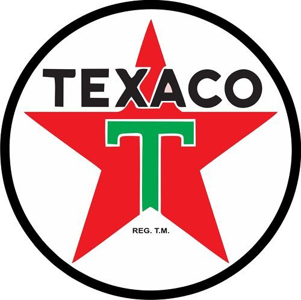

{{{RWE}}} That's approximately what happened in the legendary /Pennzoil v. Texaco/ case, where in a Houston state-court trial, Pennzoil won a jury verdict of some $29 billion (in 2025 dollars) against Texaco for tortiously interfering with what the jury and the courts found to be a binding memorandum of understanding between Pennzoil and Getty Oil. The size of the verdict, and the state-law requirement that Texaco post a appeal bond of the same amount, eventually forced Texaco to file for bankruptcy protection. <cite> See [[https://scholar.google.com/scholar_case?case=11763000609638124594][Texaco, Inc. v. Pennzoil Co.]], 729 S.W.2d 768 (Tex. App.—Houston [1st Dist.] 1986, writ. ref’d n.r.e.). </cite>

**** So: Explicitly address exclusivity, either way?                    :CMT:
  :PROPERTIES:
  :CUSTOM_ID: excl-b-expl
  :END:

What all this means: 

\bull When you're drafting a contract, and your client is granting certain rights to another party, then it might be "[[#nl-ch-ins][cheap insurance]]" to use an extra word or two to specify the extent (if any)  to which the grant is exclusive — *or* just say "non-exclusive" if that's in fact the parties' intent.

\bull On the other hand: If your client is /getting/ a right of some kind, you should seriously consider stating explicitly that the grant is indeed exclusive, again assuming that’s in fact the intent.

**** Perhaps be clear about negotiating with a replacement?
  :PROPERTIES:
  :CUSTOM_ID: excl-repl-tell
  :END:

In a federal-court case, a battery manufacturer terminated an exclusive distribution agreement for uncured breach by the distributor and sued the distributor for breach. The distributor counterclaimed, alleging (among other things) that the manufacturer had itself breached the agreement by lining up a replacement distributor before the effective date of termination. The court dismissed the counterclaim, holding:

#+begin_quote
First, the exclusivity clause did not survive the termination of the contract. ... Second, the plain language of the exclusivity clause does not prohibit C&D from /negotiating/ with another party during the lifetime of the Agreement, nor does it prevent C&D from agreeing to enter into an agreement with a third party /after/ the termination of the Agreement. <cite> [[https://scholar.google.com/scholar_case?case=14067376638318663319][C&D Techs., Inc. v. Elliott Auto Supply Co.]], No. 23-2608, slip op. at part III (E.D. Pa. Sept. 27, 2024) (emphasis added). </cite>
#+end_quote

**** Oh, and: Keep a copy of the contract!                              :CMT:
  :PROPERTIES:
  :CUSTOM_ID: excl-stetson
  :END:

{{{RWE}}} The owner of the Stetson cowboy hat brand found itself faced with a lawsuit by one of its licensed manufacturers and distributors, claiming that the license was supposedly exclusive. Stetson denied the claim, but ironically, Stetson reportedly couldn't find a copy of the actual license agreement. <cite> See Jef [sic] Feeley, [[https://www.bloomberg.com/news/articles/2022-05-17/stetson-draws-down-on-rival-haberdasher-over-iconic-cowboy-hat][Stetson’s Iconic Cowboy Hat Triggers Dispute With Haberdasher]] (Bloomberg.com 2022) (paywalled), reprinted at [[https://www.nwaonline.com/news/2022/may/18/stetson-hats-suing-distributor-says-sales-license/][Stetson hats suing distributor, says sales license not exclusive]] (NWAOnline.com 2022). </cite>

# #Filing

**** Further reading

For a very-useful list of bullet points to consider about possible exclusivity deals — including triggers for earning, or /losing/, exclusivity — see [[https://www.jdsupra.com/legalnews/keeping-options-open-when-going-5737763/][Gleason & Klaber]] (2024) 

** Government-Subcontract Flowdown Disclosure {{{CLS}}}               :CLS:
  :PROPERTIES:
  :CUSTOM_ID: govt-subk-discl
  :HTML_CONTAINER_CLASS: pr-top
  :END:

Contents:

#+TOC: headlines 1 local

*** A government subcontract for either party?

When you sign {{{theK}}} and deliver it to another party, you're certifying that you've disclosed to the other party whether (so far as you know) {{{theK}}} is a subcontract to a government contract that could impose one or more flowdown obligations on the other party.

***** Note                                                              :CMT:
  :PROPERTIES:
  :HTML_CONTAINER_CLASS: cmtry
  :UNNUMBERED: notoc
  :END:

See generally [[#flowdown-cmt]] (brief discussion of flowdown obligations). 

*** Sandbagging — possible?

If /the other party/ doesn't disclose flowdown obligations to you, but you know (or should know) that those flowdown obligations might exist, *then:* The other party's nondisclosure isn't a breach of {{{ths}}}.  

***** Note                                                              :CMT:
  :PROPERTIES:
  :HTML_CONTAINER_CLASS: cmtry
  :UNNUMBERED: notoc
  :END:

See also the general notes about sandbagging at [[#sandbag-a]]. 

*** {{{ADDL}}}: Flowdown obligations                               :ADDL:
  :PROPERTIES:
  :CUSTOM_ID: flowdown-cmt
  :HTML_CONTAINER_CLASS: addl
  :END:

The term /flowdown/ can be relevant when a contract is between a customer and a so-called "prime" contractor that is expected to use [[#nl-subk-cmt][subcontractors]]: Some such contracts require the prime contractor to "flow down" some of the prime contractor's obligations in all subcontracts, so that subcontractors will also be required to comply with those obligations — e.g., obligations concerning equal opportunity, safety, recordkeeping, conflicts of interest, anticorruption, and the like.

Depending on the law, a subcontractor could be subject to specific requirements imposed by statute or regulation, for example: 
- equal-opportunity reporting requirements; 
- affirmative-action obligations; 
- prohibitions of various employment practices; 
- restrictions of various kinds, e.g., on [[#r-assmt-consent][assignments]];
- requirements to keep various records.

#+begin_comment
Dispute resolution flowdown might waive Sub's rights under Little Miller Act - /PowerCom, Inc. v. Valley Elec. Co. of Mt. Vernon, Inc./, 540 P.3d 1181 (Wash. App. 2024), https://www.jdsupra.com/legalnews/subcontractors-take-note-flow-down-2292470/
#+end_comment

** Incorporation by Reference {{{CLS}}}                               :CLS:
  :PROPERTIES:
  :CUSTOM_ID: incorp-ref
  :HTML_CONTAINER_CLASS: pr-top
  :CATEGORY: Definition
  :END:

It's not at all uncommon for drafters to incorporate external material into a document "by reference." When that happens, the incorporated material is treated as part of the the document, just as though the material had been reproduced in full in the body of the document. Here, we define the term for the benefit of those who might not be familiar with it.

Contents:

#+TOC: headlines 1 local

*** Effect of incorporation?

In case of doubt: Text, graphics, and other materials that are clearly incorporated by reference into {{{theK}}} are considered part of {{{theK}}} just as if they'd been reproduced verbatim in it. 

***** Note                                                              :CMT:
  :PROPERTIES:
  :HTML_CONTAINER_CLASS: cmtry
  :UNNUMBERED: notoc
  :END:

Language note: {{{Ths-cap}}} is adapted in part from [[https://www.acquisition.gov/far/html/52_248_253.html#wp1120047][a clause]] in the (U.S.) Federal Acquisition Regulations; see [[https://www.acquisition.gov/far/html/52_248_253.html#wp1120047][Clauses Incorporated by Reference]], 48 C.F.R. § 52.252-2. 

*** {{{ADDL}}}                                                    :ADDL:
  :PROPERTIES:
  :HTML_CONTAINER_CLASS: addl
  :END:

Contents:

#+TOC: headlines 1 local

**** Caution: Be careful what you incorporate
  :PROPERTIES:
  :CUSTOM_ID: IBR-cntnt
  :END:

Drafters and reviewers should do an appropriate review of any material incorporated by reference, because the material likely will have the same force and effect as though it had been reproduced in the body of the document itself — possibly with unhappy results.

{{{RWE}}} An LOI-style term sheet (see {{{RULE}}} [[#r-LOIRule]] and its notes) incorporated by reference a confidentiality agreement ("NDA"; see {{{RULE}}} [[#r-conf-info-proto]]). The NDA included an exclusion of various types of damages. The Seventh Circuit held that the exclusion — incorporated by reference into the LOI despite the plaintiff's objection — precluded the plaintiff from recovering expectation damages for breach. <cite> See [[https://law.justia.com/cases/federal/appellate-courts/ca7/24-2794/24-2794-2025-12-23.html][37celsius Capital Partners, L.P. v. Intel Corp.]], No. 24-2794, slip op. at 13-14 (7th Cir. Dec. 23, 2025) (affirming summary judgment in favor of Intel). </cite>

**** Be sure to "clearly and expressly identif[y]" incorporations
  :PROPERTIES:
  :CUSTOM_ID: incorp-ID
  :END:

Colorado's supreme court, citing other state supreme-court opinions, noted that:

#+begin_quote

... for contract terms outside the four corners of a contract to be incorporated by reference into the contract, the terms to be incorporated generally must be clearly and expressly identified. ... General or oblique references to a document to be incorporated, in contrast, are usually insufficient to support a finding that the document was incorporated by reference. <cite> [[https://www.courts.state.co.us/userfiles/file/Court_Probation/Supreme_Court/Opinions/2020/20SC565.pdf][French v. Centura Health Corp.]], 2022 CO 20, 509 P.3d 443, ¶ 30-31 (Colo. 2022) (reversing court of appeals; extra paragraphing added, citations omitted). The /French/ case is described in a Washington Post article: See Timothy Bella, [[https://www.washingtonpost.com/nation/2022/05/19/colorado-hospital-surgery-cost-french/][She expected to pay $1,337 for surgery. She was billed $303,709]] (WashingtonPost.com May 19, 2022). </cite>
#+end_quote

# https://en.m.wikipedia.org/wiki/File:Exxon_Mobil_Logo.svg
# #+ATTR_HTML: :alt XX :title   :class photo-at-right photowidth30
# 

This general rule is likely to apply with special force in insurance policies. <cite> See, e.g., [[https://scholar.google.com/scholar_case?case=12905072768624688590][ExxonMobil Corp. v. Nat'l Union Fire Ins. Co.]], 672 S.W.3d 415 (Tex. 2023) (reversing and remanding appeals court's reversal of summary judgment in favor of Exxon). </cite>

And wording can matter, with much depending on the court. {{{RWE}}} The "Warranty" section of one contract stated: "For a complete list of our Terms & Conditions and Warranty details, please visit our website at /[omitted]/." Affirming denial of a motion for prevailing-party attorney fees, the First Circuit noted the general consensus that for external terms to be considered part of a contract, "the contract must clearly communicate that the purpose of the reference is to incorporate the referenced material into the contract." The court held that "[t]his section did not convey a clear message that, by accepting the offer, Holsum would agree to bind itself to further promises (including the fee-shifting term)." <cite> [[https://scholar.google.com/scholar_case?case=14573087020964039099][Holsum de Puerto Rico, Inc. v. ITW Food Equip. Grp., LLC]] , 116 F.4th 59, 68 (1st Cir. 2024). </cite>

{{{RWE}}} Similarly:  The Department of Veterans Affairs asked for quotes to lease an item of surgical equipment. One vendor's representative said, in a transmittal email, "I have attached the quote with the terms and conditions /[which included mandatory exercise of renewal options by the VA]/; this needs to be part of the contract." The Federal Circuit said that this wasn't enough to incorporate the vendor's terms and conditions into the contract:

#+begin_quote
 The contract’s expressly incorporated FAR clauses provided the agency with complete discretion in exercising the option years. If Beacon Point intended to vary the terms of these FAR clauses by incorporating its Quote’s terms and conditions into the contract, it should have ensured that the contract *expressly* identified* that the Quote’s terms and conditions were incorporated into the contract. Beacon Point did not do so. Instead, *Beacon Point accepted a contract that references the Quote but does not clearly communicate* that the purpose of the reference was to incorporate the Quote’s terms into the contract. Thus, we hold that the contract does not incorporate by reference Beacon Point’s Quote. <cite> [[https://scholar.google.com/scholar_case?case=7455267333459566856][Beacon Pt. Assoc. v. Dept. of Veteran Affairs]], 139 F.4th 1306, 1310 (Fed. Cir. 2025) (affirming dismissal of vendor's appeal of denial of claim). </cite>
#+end_quote

*Lesson:* Drafters would be well-advised to err on the side of explicitness.

**** Incorporated material should be readily accessible
  :PROPERTIES:
  :CUSTOM_ID: incorp-findable
  :END:

If you incorporate external material by reference, but the other party can't readily identify and find the material, then a court might hold that the external material isn't not part of the contract.

{{{RWE}}} A contract form for the sale of hardwood flooring did /not/ successfully incorporate "Terms of Sale," mentioned in the form, said Oklahoma's supreme court, because the contract form gave no indication where to find the referenced terms "beyond doubt" but instead made "nothing more than a vague allusion" to the terms. <cite> [[https://scholar.google.com/scholar_case?case=8052079547137150687][Walker v. BuildDirect.com Technologies, Inc.]], 2015 OK 30, 349 P.3d 549, 551, 554 (2015) (on certification from 10th Circuit). </cite>

*Pro tip:* At the very least, provide a Web link — preferably a short, easily-typed one — where the additional incorporated terms can be found.

**** Attachment "for general reference" might not work
  :PROPERTIES:
  :CUSTOM_ID: incorp-gen-ref
  :END:

When you reference external material in a contract, you'll want to be very clear that you intend to incorporate the material by reference. {{{RWE}}} Illustrating this point, in a Nebraska case:

- An architectural-services contract stated that "[t]he Architect’s Response to the District’s Request for Proposal /is attached/ to this Agreement /for general reference purposes/ including overviews of projects and services."

- But the architect firm's response to the RFP /wasn't/ attached to the contract — for that matter, the title wasn't even as stated in the contract provision. 

Agreeing with the trial court, the state's supreme court held that "[t]he expression 'for general reference purposes,' interesting though it may be /[!]/, contrasts with a provision, common in contract law, which incorporates another document by reference. ... [The contract language] simply does not incorporate [the architect firm's] responses into the contract." <cite> [[https://scholar.google.com/scholar_case?case=6385184800567074869][Facilities Cost Mgmt. Group v. Otoe Cty. Sch. Dist.]], 291 Neb. 642, 653-54, 868 N.W.2d 67, 71, 75 (2015) (affirming partial summary judgment but reversing and remanding on other issue); /after retrial/, 298 Neb. 777, [[https://scholar.google.com/scholar_case?case=17314220210589652547][906 N.W.2d 1]] (2018). </cite>

*Caution:* It's not hard to see, though, how another court could have held that the contract /did/ incorporate the architecture firm's guaranteed-maximum-price response.  
Still, the contract's drafters, who presumably worked for the school district, might have been more clear about their client's intent.

**** But a clear intent to incorporate might suffice
  :PROPERTIES:
  :CUSTOM_ID: incorp-clear-intent
  :END:

In a Fifth Circuit case, the court held that a supplier's price quotation sufficiently incorporated by reference a standard-terms-and-conditions document published by the European Engineering Industries Association (the "[[https://licensing.orgalime.org/index.php/mainpage/en/][ORGALIME]]"), which contained an arbitration provision.  

-- The supplier's price quotation didn't expressly incorporate the ORGALIME by reference; instead, the quotation stated, "Terms and conditions are /based on/ the general conditions stated in the enclosed ORGALIME S2000." (Emphasis added.) 

-- The Fifth Circuit reviewed Texas law on the point, summarizing that "when the reference to the other document is clear and the circumstances indicate that the intent of the parties was incorporation, courts have held that a document may be incorporated, even in the absence of specific language of incorporation."

The appeals court concluded that "the district court erred in holding there was no agreement to arbitrate." <cite> [[https://scholar.google.com/scholar_case?case=11178317105542937464][Al Rushaid v. National Oilwell Varco, Inc.]], 757 F.3d 416, 420-21 (5th Cir. 2014) (reversing denial of motion to compel arbitration) (cleaned up, citations omitted, emphasis added). To similar effect, see [[https://scholar.google.com/scholar_case?case=18050392189941563112][CSI Aviation, Inc. v. Dept. of Homeland Security]], 31 F.4th 1349, 1351 (Fed. Cir. 2022) (vacating administrative decision; commercial vendor's terms and conditions were incorporated by reference into GSA contract). </cite>

**** Mentioning /part/ of a document might not incorporate /all/ of it  :CMT:
  :PROPERTIES:
  :CUSTOM_ID: incorp-part
  :END:

Drafters should pay attention to just what portion or portions of another document are being incorporated by reference.  That issue made a difference in a Second Circuit decision where:

#+begin_quote
... Addendum 5 /[to the contract in question]/ refers only to a single specific provision in /[another agreement]/ — the non-compete clause. Where, as here, the parties to an agreement choose to cite in the operative contract only a specific portion of another agreement, we apply the well-established rule that a reference by the contracting parties to an extraneous writing for a particular purpose makes it part of their agreement /only for the purpose specified/. <cite> [[https://scholar.google.com/scholar_case?case=2584810560112221697][VRG Linhas Aereas S/A v. MatlinPatterson Global Opportunities Partners II L.P.]], No. 14-3906-cv (2d. Cir. July 1, 2015) (nonprecedential summary order affirming denial of petition to confirm arbitration award) (cleaned up, formatting modified). </cite>
#+end_quote

**** A party might deny having /received/ referenced documents
  :PROPERTIES:
  :CUSTOM_ID: incorp-deny
  :END:

In an Eighth Circuit case:

-- A buyer's purchase-order form referred to an external document with additional terms and conditions, and said the document would be provided on request.

-- In a subsequent lawsuit, however, /the seller denied having ever received the additional document/. 

That led to (what had to have been) an expensive court fight over whether an arbitration provision and an indemnification provision were part of the contract.

The case gives us a nice illustration of the [[#nl-battle-forms][Battle of the Forms]]; the Eighth Circuit ruled that the district court should have conducted a bench trial (no jury was demanded) to make findings of fact about just who had received what contract documents, and therefore just what terms were, or were not, part of the parties' contract under UCC § 2-207. <cite> [[https://scholar.google.com/scholar_case?case=3623670188297272607][Nebraska Machinery Co. v. Cargotec Solutions, LLC]], 762 F.3d 737 (8th Cir. 2014). </cite>

*Lesson:* It's understandable that the buyer didn't want the hassle and expense of having to provide a hard copy of its additional terms and conditions form with every purchase order. Merely offering to provide a copy of the form, though, might well have been insufficient to bind the seller to its terms. The buyer could have put itself in a stronger position in court if it had posted the form on its Web site and then included a link to the form in its printed purchase order.

**** Pro tip: Incorporate /everything/ needed
  :PROPERTIES:
  :CUSTOM_ID: IBR-everything
  :END:

Failing to incorporate everything you want into a contract could result in losing rights your client thought it had. {{{RWE}}} In a Third Circuit decision:

--  Nationwide online used-car dealer Carvana tried unsuccessfully to compel arbitration of a class action brought by some of its buyers.

--  Carvana had included a separate arbitration agreement in the set of agreements signed by the buyers.

The district court court held, and the Third Circuit affirmed, that the arbitration agreement was unenforceable under Pennsylvania's Motor Vehicle Sales Finance Act ("MVSFA") because the buyer's installment-sale contract did not incorporate the arbitration agreement, as required by that statute:

#+begin_quote
Under Pennsylvania's MVSFA, a contract governing /an installment sale/ must, inter alia: (1) be in writing; (2) /contain all of the agreements/ between a buyer and an installment seller relating to the installment sale of the motor vehicle sold; and (3) be signed by the buyer and seller.

The statute creates /a one-document rule/ for the installment purchases of vehicles requiring that all agreements between the parties must be /incorporated into/ the RISC /[Retail Installment Sale Contract]/. ... Here, the arbitration agreements exist independently of the RISCs and are therefore unenforceable. <cite> [[https://scholar.google.com/scholar_case?case=3734419765691893284][Jennings v. Carvana, LLC]], No. 22-2948, slip op. (3d Cir. Mar. 21, 2024) (nonprecedential; affirming denial of Carvana's motion to compel arbitration; cleaned up, emphasis and extra paragraphing added). </cite>
 #+end_quote

Carvana's [[https://marylandconsumer.com/wp-content/uploads/2023/06/16-Carvana-opening-brief-and-joint-apx-vol-1-1.pdf][brief]] had pointed out (at 3) that the district court refused to enforce the parties' arbitration agreement "because the RPA [Retail Purchase Agreement] incorporated the RISC and not the other way around." The district court [[https://scholar.google.com/scholar_case?case=17777152943153543433][took it as a given]] that an arbitration agreement could be incorporated /by reference/ and did not have to be reproduced in the body of the RISC.

**** A purchase order might /implicitly/ incorporate text               :CMT:
  :PROPERTIES:
  :CUSTOM_ID: incorp-po
  :END:

A California appeals court case considered a purchase order that a prime contractor had issued to a subcontractor:

--  The purchase order mentioned — but did not expressly incorporate by reference — a sales quotation that the /subcontractor/ had previously sent to the /prime/ contractor.

--  Further down in the purchase order, though, the P.O. language referred to "the contract documents /described above or otherwise incorporated herein/ ...." (Emphasis added.)

Applying the /contra proferentem/ rule of contract interpretation (see [[#r-contra-prof]]), albeit without using that Latin phrase — and therefore construing the quoted term in favor of the /subcontractor/ — the court held that the phrase, "described above or /otherwise/ incorporated" had the effect of incorporating the subcontractor's sales quotation by reference into the prime contractor's purchase order. <cite> See [[http://cases.justia.com/california/court-of-appeal/2016-f070067.pdf][Watson Bowman Acme Corp. v. RGW Construction, Inc.]], No. F070067, slip op. at 18, 21-22 (Cal. App. Aug. 9, 2016) (affirming, in pertinent part, judgment on jury verdict awarding damages to subcontractor). Oddly, that portion of the court's opinion was not certified for publication; the /published/ version, which omits the discussion summarized above, is at 2 Cal. App. 5th 279, [[https://scholar.google.com/scholar_case?case=14506543797540871457][206 Cal. Rptr. 3d 281]], 283 n.*. </cite>

**** Incorporation fits with an entire-agreement clause
  :PROPERTIES:
  :CUSTOM_ID: incorp-entire-k
  :END:

{{{RWE}}} In one case, the Seventh Circuit rejected an argument that incorporation by reference negated a contract's entire-agreement clause. <cite> [[https://scholar.google.com/scholar_case?case=6793309087631756928][Druckzentrum Harry Jung GmbH & Co. v. Motorola Mobility LLC]], 774 F.3d 410, 416 (7th Cir. 2014) (affirming take-nothing summary judgment in favor of Motorola on Druckzentrum's claims for breach of contract and fraud). </cite>

**** Some pros and cons of incorporation by reference                   :CMT:
  :PROPERTIES:
  :CUSTOM_ID: incorp-pros-cons
  :END:

/An advantage:/ Drafting can sometimes be speeded up, and contracts shortened considerably, by incorporating external material by reference. 

A classic example is the use of the INCOTERMS (International Commercial Terms), in purchase orders, to specify:

- how goods are to be delivered; and

- when title and the risk of loss will pass from the seller to the buyer. 

(Concerning the INCOTERMS, see generally [[#nl-incoterms-cmt]].)

/A disadvantage:/ It might be tempting not to review material that is incorporated by reference into a document, even though the material will almost certainly have the same force and effect as though the material had been fully set forth in the body of the document itself.

Incorporation by reference can even turn an unenforceable contract into an enforceable one. {{{RWE}}} The Seventh Circuit held that a particular paragraph of a confidentiality agreement "was not enforceable by itself, but it could, as that paragraph expressly contemplated, combine with subsequent writings and/or conversations and/or conduct to become enforceable." <cite> [[https://scholar.google.com/scholar_case?case=13311788464416493533][R3 Composites Corp. v. G&S Sales Corp.]], 960 F.3d 935, 942 (7th Cir. 2020) (reversing and remanding summary judgment). </cite>

**** Tangential: Incorporation by reference in corporate charters?
  :PROPERTIES:
  :CUSTOM_ID: inc-ref-corp-chtr
  :END:

Delaware's chancery court rejected a claim that a governance agreement among a particular corporation's shareholders — an agreement that wasn't available to the public — was validly incorporated by reference into the corporation's charter (i.e., the corporation's articles of incorporation, which in Texas is referred to as the corporation's certificate of formation). <cite> See [[https://scholar.google.com/scholar_case?case=11235883321122282151][Seavitt v. N-Able, Inc.]], 321 A.3d 516, 524 (Del. Ch. 2024) (granting partial summary judgment that certain provisions in a corporation's charter were facially invalid). </cite>

** Independent Contractors {{{CLS}}}                                    :CLS:
  :PROPERTIES:
  :CUSTOM_ID: r-indep-contr
  :HTML_CONTAINER_CLASS: pr-top
  :CATEGORY: Statement
  :END:

Contents:

#+TOC: headlines 1 local

*** Parties' intent?

Your dealings under {{{theK}}} are purely contractual in nature unless {{{theK}}} clearly says otherwise — you're not anyone else's "partner" in the legal sense of the word, nor (under {{{theK}}}) are you a fiduciary of any other person. 

***** Note                                                              :CMT:
  :PROPERTIES:
  :HTML_CONTAINER_CLASS: cmtry
  :UNNUMBERED: notoc
  :END:

This statement of intent won't bind a court — and often hasn't, see the notes at [[#indep-k-bas]] — but it can't hurt. ¶ Not partners: See [[#ps-defn-cmt]].  Not fiduciaries: See [[#c-indep-fid]]. 

*** Conduct restrictions?

In connection with {{{theK}}}, don't take any particular action (nor /omit/ any particular action, for that matter) if doing so would weigh against the parties' being independent contractors. 
 
***** Note                                                              :CMT:
  :PROPERTIES:
  :HTML_CONTAINER_CLASS: cmtry
  :UNNUMBERED: notoc
  :END:

See the discussion at [[#indepK-incons]] below. 

*** {{{ADDL}}}                                                         :ADDL:
  :PROPERTIES:
  :HTML_CONTAINER_CLASS: addl
  :END:

Contents:

#+TOC: headlines 1 local

**** Background: The business context

{{{U1}}} A /customer/ might want to include an independent-contractor declaration in its contract with a vendor. Typically, that's because the customer won't want —

- to have to pay overtime to the vendor's employees if the vendor doesn't do so. That could end up being a big number. For example, a medical-staffing agency was held to have misclassified nurses as independent contractors. The agency — and, it appears, the agency's owner, individually — were liable for more than $9 million in unpaid overtime and statutory liquidated damages;  <cite> See [[https://scholar.google.com/scholar_case?case=10232089801031084495][Chavez-DeRemer v. Medical Staffing of America, LLC]], 147 F.4th 371 (4th Cir. 2025) (affirming district court judgment after seven-day nonjury trial). </cite>

- to pay employment taxes for the vendor's employees; or

- to be [[https://www.law.cornell.edu/wex/vicarious_liability][vicariously liable]], under the doctrine of [[https://en.wikipedia.org/wiki/Respondeat_superior][respondeat superior]], for vendor errors, omissions, or other actions that harm others.

Moreover, the customer won't want the vendor and/or the vendor's employees to claim that they're eligible for benefits that its customer gives to its own employees. <cite> See [[https://scholar.google.com/scholar_case?case=2883446997861863714][Vizcaino v. Microsoft Corp.]], 97 F.3d 1187 (9th Cir. 1996), /aff'd en banc/, [[https://scholar.google.com/scholar_case?case=16494471715778425528][120 F.3d 1006]], 1010-12 (9th Cir. 1997); see also [[https://scholar.google.com/scholar_case?case=10988207918170898205][Nationwide Mut. Ins. Co. v. Darden]], 503 U.S. 318 (1992) (ERISA incorporates traditional agency law criteria for identifying master-servant relationships); Elizabeth Chika Tippett, [[https://papers.ssrn.com/sol3/papers.cfm?abstract_id=3009943][Employee Classification in the Sharing Economy]], in /Cambridge Handbook of Law and Regulation of the Sharing Economy/ at 3, text acc. n.22 (2017). </cite>

*Caution:* There might be contracts among parties that, /in another context/, _are_ partners, agents, or fiduciaries of other parties. Those will require special care to keep those parties' obligations straight.

**** What kind of actions would be /inconsistent/ with independent-contractor status?
  :PROPERTIES:
  :CUSTOM_ID: indepK-incons
  :END:

Under {{{ths}}}, as an independent contractor, a party {{{A}}} would be obligated not to take (or purport to take) any of the following actions — these are just illustrative examples:

1. hold itself out as a party {{{B}}}'s employee, agent, partner, joint venturer, division, subsidiary, branch, or other representative.

2. make a promise, representation, or warranty on {{{B}}}'s behalf concerning the subject matter of {{{thek}}}.

3. hire any individual to serve as {{{B}}}'s employee or agent;

4. set working hours or working conditions for {{{B}}}'s employees or agents (as distinct from setting access hours or on-site conditions for one of {{{A}}}'s own work sites);

5. choose or assign any of {{{B}}}'s employees to perform a task relating to {{{theK}}};

6. direct or control the manner in which any of {{{B}}}'s employees and/or agents performs work — as distinct from specifying the result to be accomplished by that work;

7. remove any {{{B}}} employee and/or {{{NBH}}}agent from work assigned by {{{B}}};

8. fire or otherwise discipline any {{{B}}} employee and/or {{{NBH}}}agent; nor

9. incur any debt or liability that's supposedly binding on {{{B}}}.

**** A court might disregard an independent-contractors statement       :CMT:
  :PROPERTIES:
  :CUSTOM_ID: indep-k-bas
  :END:

A court might give little or no weight to a declaration such as that {{{ths}}}; precedent from the (U.S.) Supreme Court makes it clear that "there is no shorthand formula or magic phrase" for independent-contractor status. <cite> [[https://scholar.google.com/scholar_case?case=17948890150151968074][NLRB v. United Insurance Co.]], 390 U.S. 254, 258 (1968). </cite>

{{{RWE}}} A three-judge panel of the Ninth Circuit held that under California law, the plaintiffs in a class-action suit, who were drivers for FedEx, were employees, /not/ independent contractors. A concurring opinion noted, somewhat acidly:

# https://www.loc.gov/resource/cph.3a52094/
#+ATTR_HTML: :alt Abraham Lincoln photo :title Abraham Lincoln photo :class photowidth25 photo-at-right

#+begin_quote
Abraham Lincoln reportedly asked, "If you call a dog's tail a leg, how many legs does a dog have?" His answer was, "Four. Calling a dog's tail a leg does not make it a leg." ... FedEx was not entitled to "write around" the principles and mandates of California Labor Law .... <cite> [[https://scholar.google.com/scholar_case?case=16282080975593758278][Alexander v. FedEx Ground Package Sys., Inc.]], 765 F.3d at 998 (9th Cir. 2014) (Trott, J., concurring) (edited, citations omitted). </cite>
#+end_quote

{{{RWE}}} After appearing in the movie /It Ends With Us/, actress Blake Lively sued the film's director (and her co-star) Justin Baldoni and others for, among other things, sexual harassment, citing Title VII of the Civil Rights Act of 1964 and California’s Fair Employment and Housing Act ("FEHA"). The district court dismissed Lively's Title VII claims, on the ground that under the actress's negotiated contract, she was an independent contractor, whereas Title VII protects only employees: 

#+begin_quote
The undisputed facts [recounted at [[https://www.nysd.uscourts.gov/sites/default/files/2026-04/24-cv-10049%20Opinion%20and%20Order%20-%204.2.26.pdf#page=57][slip op. at 57-61]]] reveal that Lively enjoyed a degree of economic independence sufficient to make her an independent contractor. Although not every factor weighs equally in favor of that conclusion when viewed in isolation, analyzing the factors collectively eliminates any genuine dispute. That means that Lively cannot bring a claim under Title VII. <cite> See [[https://scholar.google.com/scholar_case?case=7316266069464263435][Lively v. Wayfarer Studios LLC]], No. 24-CV-10049, part II.A.3, slip op. (S.D.N.Y. Apr. 2, 2026). For a summary of the case, see Sara Jodka,  [[https://www.jdsupra.com/legalnews/it-ends-with-contractor-status-lessons-1890080][It Ends with Contractor Status: Lessons from Blake Lively’s Sexual Harassment Case]] (JDSupra.com). </cite>
#+end_quote

(The court left certain other claims in play, including claims for breach of contract and under the California FEHA.)

**** Saying "we're not /partners/" tries to avoid a possible danger     :CMT:
  :PROPERTIES:
  :CUSTOM_ID: ps-defn-cmt
  :END:

{{{Ths-cap}}} tries to put a Band-Aid® on a common business situation that theoretically could be dangerous (although my limited research didn't indicate that such trouble has actually ever happened): 

- When companies do business together, their people will often refer to each other as "partners."

- This is especially true in the sales world, where the term "[[https://en.wikipedia.org/wiki/Channel_partner][channel partner]]" typically refers to a reseller, distributor, systems integrator, etc. that operates in "the [sales] channel."

{{{Ths-cap}}}'s disclaimer of partnership status is fairly typical; it's based on [[https://web.archive.org/web/20130904215546/http://www.uniformlaws.org/shared/docs/partnership/upa_final_97.pdf#page=54][section 304(a)]] of the [[https://web.archive.org/web/20130904215546/http://www.uniformlaws.org/shared/docs/partnership/upa_final_97.pdf][Revised Uniform Partnership Act (1997)]] — but that section requires the /filing/ of a partnership disclaimer to have the disclaimer binding on strangers to the relationship. (Section 304(a) might not be in effect in all states adopting the RUPA.)

*Why* might it be dangerous for parties to refer to themselves as "partners"? Because in the U.S., an important feature of partnership, for example under Texas statute, is that "... all partners are jointly and severally liable for all obligations of the partnership ...." 

So what counts as a "partnership"? The term is typically defined, for example in a Texas statute, as follows:  

#+begin_quote
... an association of two or more persons to carry on a business for profit as owners creates a partnership, *regardless* of whether: 

  1.  the persons *intend* to create a partnership; or

  2.  /the association is *called* a "partnership,"/ "joint venture," or other name. <cite> [[https://statutes.capitol.texas.gov/Docs/BO/htm/BO.152.htm#152.051][Tex. Bus. Org. Code § 152.051(b)]] (emphasis added, exceptions omitted); see also [[https://statutes.capitol.texas.gov/Docs/BO/htm/BO.152.htm#152.052][§ 152.052]] (rules for determining if partnership is created). The first part of this definition is essentially a verbatim adoption of [[https://web.archive.org/web/20130904215546/http://www.uniformlaws.org/shared/docs/partnership/upa_final_97.pdf#page=15][section 101(6)]] of the [[https://web.archive.org/web/20130904215546/http://www.uniformlaws.org/shared/docs/partnership/upa_final_97.pdf][Revised Uniform Partnership Act (1997)]]. </cite>
#+end_quote

This means that when two parties refer to themselves as partners, they could be setting themselves up to be fully responsible for each other's debts and liabilities.

Here's a hypothetical example: Fred and Ginger decide to give dancing lessons; they rent space in a "strip mall" shopping center and remodel it to serve as a dance studio. They don't form a corporation or limited-liability company (LLC); in fact, they do no paperwork at all, other than each of them signing the lease for the studio space. Fred and Ginger sometimes refer to each other as "my partner."

But then one Sunday afternoon, when the dance studio is closed, Fred gets in his car to run a few errands — and those errands include picking up supplies for the studio. Fred runs a red light, hitting and severely injuring a pedestrian in the crosswalk.

The pedestrian likely will sue not just Fred, but also Ginger — and on the hypothetical facts here, it's not impossible that Ginger could be /personally/ liable for the full amount of the pedestrian's medical expenses, lost wages, and pain and suffering, even though Fred was the one who ran the red light.

**** Why disclaim "agent" or "fiduciary" status?                        :CMT:
  :PROPERTIES:
  :CUSTOM_ID: c-indep-fid
  :END:

A dissatisfied contracting party could allege that the other party breached a fiduciary duty or some other relationship of trust and confidence.  {{{RWE}}} At the trial in a Nebraska case, three different witnesses testified, without contradiction, that in a construction contract the "industry standard" is that: 

#+begin_quote
a cost-plus arrangement creates /a relationship of trust between the general contractor and customer/, that the items on a customer’s invoice represent project-related bills that need to be paid, and that the general contractor will pay those bills with the corresponding funds the customer provides the general contractor. ... [T]he customer’s funds are not to be used to pay for non-project-specific related costs, and that to do so is a misappropriation of the customer’s funds. <cite> [[https://law.justia.com/cases/nebraska/supreme-court/2026/s-23-947.html][Perkins, L.L.C. v. RMR Building Grp., LLC]], 320 Nebr. 707, 713 (2026) (reversing court of appeals and remanding with instructions to affirm trial court's refusal to pierce defendant's corporate veil; emphasis added). </cite>
#+end_quote

But a court might well honor a contract's disclaimer of fiduciary obligations. {{{RWE}}} After the stock market dropped in the early days of the COVID-19 pandemic, an investor ordered his wealth adviser to liquidate his entire portfolio — and then, after losing millions of dollars, he sued the adviser, claiming that the adviser had breached his fiduciary duty by failing to "explain every potential downside or loss that [the investor] ultimately experienced." The D.C. Circuit affirmed the trial court's dismissal of the investor's claims; relevant here, the parties agreed that yes, the wealth adviser was a fiduciary, *but* the parties' investment agreement had limited the adviser's obligations. <cite> See [[https://scholar.google.com/scholar_case?case=8923059459420319423][Goodrich v. Bank of America N.A.]], 136 F.4th 347, 352 (D.C. Cir. 2025) (affirming dismissal). </cite>

So, {{{ths}}}'s disclaimer of fiduciary status is a guardrail term: You might not want to deal with a counterparty that might someday claim that you were the counterparty's "agent" or "[[https://www.investopedia.com/terms/f/fiduciary.asp][fiduciary]]" and therefore legally obligated to give the counterparty's interests priority above the first party's own interests. {{{RWE}}} Such a claim occurred, for example, in a case in which New York's highest court rejected a claim of breach of fiduciary duty. <cite> See [[https://scholar.google.com/scholar_case?case=5555317030447812009][Pappas v. Tzolis]], 20 N.Y.3d 228, 233-34 (2012). </cite>

{{{RWE}}} Delaware's chancery court rejected investors' fiduciary-duty claims when the contract in question had disavowed such duties:

#+begin_quote
The LLC Agreement also included broad waivers of the WP Investors’ fiduciary duties in four provisions. It stated that the WP Investors and their affiliates owed no fiduciary or other duties to the Company or its members beyond the duty to comply with the LLC Agreement. It further provided that each WP investor was permitted to "act exclusively in . . . its own interest and without regard to the interest of any other person," so long as it complied with the LLC Agreement. <cite> [[https://scholar.google.com/scholar_case?case=1758938192898725615][Khan v. Warburg Pincus, LLC]], No. 2024-0523, slip op. at 4-5, text acc. nn.16-18 (Del. Ch. Apr. 30, 2025), /aff'd w/o opinion/, [[https://scholar.google.com/scholar_case?case=3239523509958729729][No. 236, 2025]]. (Del. Dec. 9, 2025). The chancery court also rejected the plaintiff's attempt to get around the fiduciary-duty waiver: "Because the limited liability agreement leaves no room for a quasi-fiduciary theory disguised as an implied covenant claim, this case is dismissed." /Id./, slip op. at 2. </cite>
#+end_quote

# https://www.dish.com
#+ATTR_HTML: :alt DISH Network logo :title DISH Network logo :class photowidth20 photo-at-right

{{{RWE}}} Similarly, in a Texas case, a minority member of an LLC brought a claim for breach of fiduciary duty against the LLC's majority member and sole manager, who had expelled the minority member. But the LLC's operating agreement (known in Texas as a "company agreement") stated that "no special relationship shall exist between any Manager and the Members, and no Member or Manager shall have any duty to any Member, whether fiduciary or otherwise, except as expressly set forth herein (or in other written agreements)." The court quickly disposed of the fiduciary-duty claim as precluded by the contract provision:

#+begin_quote
Under Texas law, courts must honor the contractual terms that parties use to define the scope of their obligations and agreements, including those that restrict fiduciary duties that might otherwise exist. This is especially true when the contractual limitation arises from an arms-length business transaction between sophisticated businesspeople. This principle adheres to Texas’s longstanding public policy of freedom of contract. <cite> [[https://www.txcourts.gov/media/1460352/25-bc08a-0002-hall-v-vanderhoef-memorandum-opinion.pdf#page=13][Tall v. Vanderhoef]], 2025 Tex. Bus. 15 ¶¶ 26-27 (granting, in part, defendant's motion to dismiss; cleaned up). </cite>
#+end_quote

*Caution:* A court might disregard a proclamation that "they're not our agents!" if the /facts/ show otherwise. As with independent-contractor status, merely /saying/ "oh, no, there's no /agency/ relationship /here/" won't make it so if the parties conduct themselves otherwise. {{{RWE}}} This was illustrated in /DISH Network/ (2020), a Seventh Circuit case:

- The trial court concluded that DISH Network /and its agents/ had violated telemarketing statutes and regulations (some 65 million violations, apparently). The court imposed a penalty /on DISH/ of $280 million (!).

- In (mostly) affirming the judgment, the appeals court noted that "[t]he contract /[between DISH and its representatives]/ asserts that it does not create an agency relation, but /parties cannot by ukase negate agency/ if the relation the contract creates is /substantively/ one of agency." <cite> [[https://scholar.google.com/scholar_case?case=10574700750058443453][United States v. DISH Network LLC]], 954 F.3d 970, 975 (7th Cir. 2020) (citation omitted, emphasis edited). </cite>

*Caution:* Even with a disclaimer like this, a court could find that a "fiduciary" relationship had arisen from the partiular facts, for example if one party "exercises excessive control" over another. This was illustrated in a case in which a federal district court denied lender-defendants' motions for summary judgment: The court said that "[i]f a lender exercises excessive control over a borrower, ... a lender can assume the role of a fiduciary rather than a mere creditor" and that "the evidentiary record ... cumulatively serve[s] to demonstrate, at the very least, a triable question of Wallis Bank assuming the role of fiduciary rather than mere creditor through myriad actions that demonstrate excessive control." <cite> [[https://scholar.google.com/scholar_case?case=1336808931311598445][Beaumont Lamar Apartments, LLC v. Wallis Bank]], No. 4:23-cv-00341-O, slip op. at part III.B.2 (N.D. Tex. Feb. 6, 2024) (cleaned up, lightly edited). </cite>

**** BTW: A principal can (usually) act /without/ using its agent       :CMT:
  :PROPERTIES:
  :CUSTOM_ID: c-excl-no-agent
  :END:

By the way ("BTW"): Suppose that Alice and Bob enter into a contract.  If Alice is found to be Bob's "agent," then (in general) Alice may deal with third parties, e.g., Carol, on Bob's behalf /and make contractual commitments to Carol that are legally binding on Bob/. 

(For that reason, in Bob's contract with Alice, Bob might want to state specifically that Alice /isn't/ her agent, as in § [[#c-indep-fid]].) 

And now let's suppose that Alice and Bob /agreed/ that Alice would be Bob's agent, and in fact, Bob's /exclusive/ agent: Even under those circumstances, at least under Texas law, Bob would still be free to make a deal with Carol without getting Alice involved and without paying Alice any kind of commission. 

{{{RWE}}} In a 2022 Texas case:

- Two Houston lawyers wanted to change law firms; they engaged a recruiting firm, /on an exclusive-agency basis/, to find them new law-firm positions.

- But the lawyers joined a law firm on their own, as a result of personal contacts, without going through the recruiting firm.

- The recruiting firm sued the lawyers, seeking the commission that the recruiting firm would have earned if the lawyers had found another position through the recruiting firm instead of on their own.

The court rejected the recruiting firm's commission claim, citing Supreme Court of Texas authority about the distinction between an exclusive /agency/ and an exclusive /right to deal/. <cite> See [[https://scholar.google.com/scholar_case?case=2750382920329506872][USPLC, LC v. Gaas]], No. 01-20-00604-CV, slip op. at part C (Tex. App. Houston [1st Dist.] Aug. 30, 2022), /citing/ [[https://scholar.google.com/scholar_case?case=14943105310154238949][Alba Tool & Supply Co. v. Indus. Contractors, Inc.]], 585 S.W.2d 662, 664 (Tex. 1979). </cite>

**** The Biden- and Trump administrations' tug-of-war guidance          :CMT:
  :PROPERTIES:
  :CUSTOM_ID: indep-k-dol
  :END:

In January 2024, the Biden administration's Department of Labor announced the finalization of a revised rule to undo a Trump adminstration last-minute definition of independent-contractor status: 

#+begin_quote
The new "independent contractor" rule *restores the multifactor analysis used by courts* for decades, ensuring that all relevant factors are analyzed to determine whether a worker is an employee or an independent contractor. 

The rule addresses *six factors* that guide the analysis of a worker’s relationship with an employer, including any opportunity for profit or loss a worker might have; the financial stake and nature of any resources a worker has invested in the work; the degree of permanence of the work relationship; the degree of control an employer has over the person’s work; whether the work the person does is essential to the employer’s business; and a factor regarding the worker’s skill and initiative. The rule separately rescinds the /[Trump administration's]/ 2021 Independent Contractor Rule that the department believes is not consistent with the law and longstanding judicial precedent. <cite> See [[https://www.dol.gov/newsroom/releases/whd/whd20240109-1][News Release]] (DOL.gov 2024) (formatting edited); see generally, e.g., [[https://www.littler.com/publication-press/publication/us-department-labor-finalizes-independent-contractor-regulation][MacDonald et al.]] (Littler.com 2024). </cite>
#+end_quote

The Biden DOL's announcement was not greeted with universal acclaim; as one management-side law firm posted, the final rule "skew[s] the inquiry in favor of employee status. ... While on the one hand this /[six-factor test]/ may seem to lead to greater flexibility, it blurs lines, leads to inconsistent results, and provides businesses and workers little of the clarity that rulemaking on worker status was supposed to provide." <cite> [[https://www.seyfarth.com/news-insights/department-of-labor-issues-final-rule-on-independent-contractor-definition-under-the-fair-labor-standards-act.html][McKinley & Winnick]] (Seyfarth.com 2024). </cite>

Unsurprisingly, in 2025 the second Trump administration changed things yet again, as summarized by another management-side law firm:

#+begin_quote

As expected with a change in the White House, and as very recently foretold in Department of Labor court filings, the Trump DOL announced via a Field Assistance Bulletin on May 1 that it will no longer enforce a 2024 Biden-era independent contractor rule under the Fair Labor Standards Act (FLSA). While this announcement does not formally rescind the Biden-era rule, the DOL explained that it will be reconsidering the rule, and it is virtually certain that the DOL will dramatically change or replace the rule when its review is completed. <cite> Michael Gotzler, [[https://www.littler.com/news-analysis/asap/dol-hits-pause-enforcement-biden-era-independent-contractor-rule-suggests-new-or][DOL Hits Pause on Enforcement of Biden-Era Independent Contractor Rule, Suggests New or Changed Rule Forthcoming]] (Littler.com). </cite>
#+end_quote

**** The Biden administration's NLRB weighed in ...                     :CMT:
  :PROPERTIES:
  :CUSTOM_ID: indep-k-nlrb
  :END:

In 2021, the then-new general counsel of the National Labor Relations Board, [[https://en.wikipedia.org/wiki/Jennifer_Abruzzo][Jennifer Abruzzo]], appointed by President Biden that she intended to revisit a number of employer-friendly decisions from the Trump-era Board about independent-contractor status, notably including [[https://www.nlrb.gov/case/16-RC-010963][SuperShuttle DFW, Inc.]], [[https://www.nlrb.gov/case/16-RC-010963][367 NLRB No. 75]] (2019).

Then in 2023, the Board issued its /Atlanta Opera/ decision ([[https://www.nlrb.gov/cases-decisions/weekly-summaries-decisions/summary-of-nlrb-decisions-for-week-of-june-12-16-2023][372 NLRB No. 95]]), overruling /SuperShuttle DFW/ and holding that "in the context of weighing all relevant, traditional common-law factors, including those identified in the Restatement, the Board will also consider whether the evidence tends to show that the putative independent contractor is, in fact, rendering services as part of an independent business." <cite> The Board's /Atlanta Opera/ decision was summarized by [[https://www.foxrothschild.com/publications/nlrb-departs-from-employer-friendly-independent-contractor-test][MacDonald & Veslinovic]] (2023). </cite>

At this writing (January 2026), I can't find anything online to indicate that the Trump 2.0 NLRB has taken action to revisit this issue. That's likely due to the fact that the Board currently [[https://ogletree.com/insights-resources/blog-posts/president-trump-nominates-two-for-nlrb-potentially-restoring-quorum/][doesn't have a quorum]]: President Trump [[https://www.fisherphillips.com/en/news-insights/scotus-once-again-upholds-firing-of-nlrb-democrat-member-wilcox.html][purported to fire]] Biden-appointed Board member [[https://en.wikipedia.org/wiki/Gwynne_Wilcox][Gwynne Wilcox]] (he [[https://www.littler.com/news-analysis/asap/white-house-terminates-national-labor-relations-board-general-counsel-jennifer][also fired]] the Board's general counsel Abruzzo) just a week after he returned to the White House.

**** The IRS's guidance                                                 :CMT:
  :PROPERTIES:
  :CUSTOM_ID: indep-k-irs
  :END:

#+ATTR_HTML: :alt IRS logo :title IRS logo   :class photo-at-right photowidth15
[[./img/IRS-Logo.png]]

The [U.S.] Internal Revenue Service's Web site offers [[http://www.irs.gov/Businesses/Small-Businesses-&-Self-Employed/Employee-Common-Law-Employee][easy-to-read guidance]] about what the Service considers in determining whether someone is an employee — for whom the employer must pay certain taxes — or an independent contractor.

**** A California /statute/ defines "employee" (vice contractor) status :CMT:
  :PROPERTIES:
  :CUSTOM_ID: indep-k-cali
  :END:

In 2019, the California legislature enacted a statute, known as [[https://leginfo.legislature.ca.gov/faces/billNavClient.xhtml?bill_id=201920200AB5][AB 5]], which added a new section 2750.3 (later repealed) to the California Labor Code, setting out a three-part /initial/ test for whether someone is an independent contractor instead of an employee. The statute, however — and a subsequent amendment — goes on to set forth carve-outs for certain occupations that are worth a careful review. <cite> The statutory list of carve-outs from AB 5 was expanded in a subsequent bill, [[https://leginfo.legislature.ca.gov/faces/billTextClient.xhtml?bill_id=201920200AB2257][AB 2257]]; see, e.g., [[https://www.calpeculiarities.com/2019/12/12/somethings-afoot-in-tinsel-town-new-laws-for-the-entertainment-industry/][Gross & Rodine]] (2019); [[https://www.mondaq.com/unitedstates/contracts-and-commercial-law/982436/expanding-independent-contractors-in-california-new-law-awaits-governor39s-signature][Kim et al.]] (2020). </cite>

{{{RWE}}} Gig-economy companies Uber, Lyft, and others didn't take California's AB 5 lying down: They funded [[https://en.wikipedia.org/wiki/2020_California_Proposition_22][Proposition 22]], a ballot initiative classifying certain app-based drivers as independent contractors. That initiative passed with more than 58% of the vote.

**** Caution: Check state- and even /city/ laws and ordinances          :CMT:
  :PROPERTIES:
  :CUSTOM_ID: indep-k-city
  :END:

*Pro tip:* Companies wanting to do business with freelance workers as "independent contractors" should check whether any state- or local laws might govern such dealings. [[https://chatgpt.com/share/690a606b-47a4-8005-9378-630f916bb6f1][Here's a ChatGPT link]] that might be helpful in your research.

*California's* Freelance Worker Protection Act gives certain "freelance workers" various protections by requiring written contracts, prompt payment, among other things. <cite> See [[https://leginfo.legislature.ca.gov/faces/codes_displayText.xhtml?lawCode=BPC&division=7.&title=&part=5.&chapter=&article=][Cal. Bus. & Prof. Code §§ 18100--18107]]. </cite>

*Los Angeles* has layered on its own ordinance, see [[https://wagesla.lacity.gov/sites/g/files/wph1941/files/2023-06/Freelance%20Worker%20Protections%20Ordinance.pdf?g7ix9sxd2mp][Los Angeles Mun. Code Ord. No. 187782]], including a [[https://wagesla.lacity.gov/#Ordinance-Updates][model contract]] and a [[http://wagesla21.cityofla.acsitefactory.com/sites/g/files/wph1941/files/2025-10/FWPO%20Rules%20and%20Procedures%20Revised%2010-17-2025.pdf][rules-and-procedures manual]]. (This might have been motivated in part by the extensive use of freelancers in the film- and music industries; see [[https://www.jdsupra.com/legalnews/los-angeles-enacts-freelance-worker-8214279][Scott]] (2023).)

*Minneapolis* implemented its own ordinance beginning in 2021, as noted by [[https://www.mondaq.com/unitedstates/contracts-and-commercial-law/1023336/minneapolis-increases-protections-for-freelance-workers?email_access=on][Kalk & Sandahl]] (2021).

*New York City* has its /Freelance Isn't Free Act/, Local Law 140 of 2016, which:

#+begin_quote

... establishes and enhances protections for freelance workers, specifically the right to:
- A written contract
- Timely and full payment
- Protection from retaliation
The law establishes penalties for violations of these rights, including statutory damages, double damages, injunctive relief, and attorney’s fees. <cite> Copied and pasted from [[https://www.nyc.gov/site/dca/about/freelance-isnt-free-act.page][this summary]] published by the NYC Department of Consumer and Worker Protection. </cite>
#+end_quote

** Lawyer Involvement {{{CLS}}}                                         :CLS:
  :PROPERTIES:
  :CUSTOM_ID: r-lawyer-involve
  :END:

#+begin_quote
The first thing we do is, let's kill all the lawyers. <cite> William Shakespeare, /Henry VI, Part 2/ Act IV, Scene II. </cite>
 #+end_quote 
This often-misunderstood saying, by Shakespeare's murderous character Dick the Butcher, was of course an indirect compliment to lawyers' crucial role in a society governed by the rule of law instead of the rule of the strongest.

Contents:

#+TOC: headlines 1 local

*** Lawyer contact information: Provide it on request

{{{L1}}} Provide each other party with current contact information for your legal counsel (if any) whenever that other party makes a reasonable request In connection with a matter relating to {{{theK}}}.

{{{LN}}} If your organization employs in-house counsel, then any such request for your legal counsel's contact information would presumably be reasonable, not least because your counsel would always be free to cut off the discussion if the other party was being unreasonable. (The same is of course true for your outside counsel.)

***** Note                                                              :CMT:
  :PROPERTIES:
  :HTML_CONTAINER_CLASS: cmtry
  :UNNUMBERED: notoc
  :END:

The business context: Business people are often reluctant to "get the lawyers involved," because reasons. But sometimes lawyers can correct business people's misimpressions, or usefully suggest other paths that the parties could consider following.

And a problem can arise if party {{{A}}}'s /business/ people might refuse to get {{{A}}}'s /lawyers/ involved, or even to put party {{{B}}} in touch with {{{A}}}'s lawyers. That could be due to embarrassment, or fear of what might get back to superiors — see the related discussion of this fear at {{{RR}}} [[#r-escal-int]] — or perhaps just a desire to save money on legal fees. 

So to help each party to deal with such situations, {{{ths}}} gives {{{B}}} a bit of leverage: {{{B}}}'s business people can tell {{{A}}}'s business people, "/you do realize that by refusing to get your lawyer involved, you're in breach of contract for that alone, right?/"

If {{{B}}} isn't being represented by counsel in the matter in question, then presumably {{{A}}}'s counsel might be reluctant to communicate directly with {{{B}}}'s business people because of [[https://www.americanbar.org/groups/professional_responsibility/publications/model_rules_of_professional_conduct/rule_4_2_communication_with_person_represented_by_counsel/][ABA Model Rule 4.2]]. But in those circumstances, Rule 4.2 shouldn't even apply — that rule covers /represented/ parties — so {{{A}}}'s counsel shouldn't decline to communicate with {{{B}}}'s business people.

*** Lawyer's copying of other parties on emails: OK (within limits)
  :PROPERTIES:
  :CUSTOM_ID: LawyerCopyEmails
  :END:

If you're asked either by another party or by another party's lawyer, *then:*  Tell your legal counsel (if any) not to object if one or more of the other party's lawyers /open-copy/ your /business people/ on emails, texts, and other written communications — but only as long as the other party's lawyers: (i) also open-copy your side's legal counsel (if any) when copying your business people; and (ii) don't copy your business people in any manifestly{{{NBH}}} and indisputably-inappropriate way.

***** Note                                                              :CMT:
  :PROPERTIES:
  :HTML_CONTAINER_CLASS: cmtry
  :UNNUMBERED: notoc
  :END:

Background: The business context here is that, except in limited circumstances, [[https://www.americanbar.org/groups/professional_responsibility/publications/model_rules_of_professional_conduct/rule_4_2_communication_with_person_represented_by_counsel/][ABA Model Rule 4.2]] prohibits a lawyer from communicating directly with a party that the lawyer knows to be represented, in the matter in question, by another lawyer. *But:* This is clarified in [[https://www.americanbar.org/content/dam/aba/administrative/professional_responsibility/aba-formal-opinion-503.pdf][Formal Opinion 503]], issued in 2022 by an ABA standing committee on ethics; that opinion states that absent special circumstances, a "reply all" email is considered to have /implicit/ consent. To be on the safe side, let's explicitly make that the rule here.

Certainly it'd be a bad thing for {{{B}}}'s lawyer to try to exert undue influence on {{{A}}}'s business people by going behind the back of {{{A}}}'s lawyer. *But*: In /commercial/ transactions, it could slow up the parties' dealings if {{{A}}}'s lawyer insisted that {{{B}}}'s lawyer /not/ copy {{{A}}}'s business people on emails. 

DCT note: Something like that once happened to me during negotiation of a small-ish contract for a client:  The other party's lawyer — a longtime sole practitioner — forbade me to open-copy his client on emails I sent to him, even when I was copying my own client on the email. He also refused to copy /my/ client on /his/ emails to me; that meant that I had to notice that my client hadn't been copied, and then forward his emails to my client. Sheesh.

Moreover — taking the desire for confidentiality just a bit too far — that other lawyer sent his emails to me in encrypted form: To read more than just the "from" line of the emails, I'd have had to create an account with some online decryption service that I'd never heard of. (I put my foot down on that one, because it was indisputably overkill; he relented and from then on sent his emails to me in the usual way.)

*** No implied attorney-fee obligation

Another party's agreement to {{{ths}}} doesn't imply that the other party must pay or reimburse your [[#atty-fee-defn][attorney fees]].

***** Note                                                              :CMT:
  :PROPERTIES:
  :HTML_CONTAINER_CLASS: cmtry
  :UNNUMBERED: notoc
  :END:

This is intended as a roadblock, although some other contract provision might require such reimbursement.

** Legal Review {{{CLS}}}                                             :CLS:
  :PROPERTIES:
  :CUSTOM_ID: sigs-legal-rev
  :HTML_CONTAINER_CLASS: pr-top
  :END:

This is another "Speak up!" {{{NOUN}}}: If a party feels it needs more time for legal review of {{{theK}}}, then the party should let the other party know — and shouldn't sign {{{theK}}} until ready to do so.

Contents:

#+TOC: headlines 1 local

*** Ready to sign?
  :PROPERTIES:
  :CUSTOM_ID: sigs-legal-ready
  :END:

When you sign {{{theK}}} (or any related document) and send it to anothe party, you're certifying that you're doing so after having what you consider to have been enough time: {{{X1}}} to read the document; {{{XN}}} to ask for any desired clarification; and {{{XN}}} to consult you own legal counsel and/or other advisers (and, if necessary, /engaging/ legal counsel or other adviser).

*** Rely on another party's advisers? (No.)
  :PROPERTIES:
  :CUSTOM_ID: sigs-legal-no-rel
  :END:
 
In deciding whether or not to sign the document in question, you're not entitled to rely — and you agree not to rely — on legal advice (as opposed to one or more factual representations) from any legal counsel or other adviser to any other party to {{{theK}}}.

*** Note                                                               :ADDL:
  :PROPERTIES:
  :CUSTOM_ID: sigs-legal-rev-rel
  :HTML_CONTAINER_CLASS: addl
  :END:

Why include {{{ths}}}? Because it's been known to happen that a party will sign a contract without getting its own legal advice — and then when things turn sour, the party files a malpractice lawsuit against /another party's/ lawyers, to the effect of (for example), /wait, I thought you were/ *my* /lawyer too, but you had a conflict of interest and didn't disclose that to me/. 

 It's true that the law /might/ protect one party's attorney from claims of that sort by another, non-client party. <cite> See generally, e.g., [[https://scholar.google.com/scholar_case?case=8420975646347182543][Haynes and Boone, LLP v. NFTD, LLC]], 631 S.W.3d 65, 79-80 (Tex. 2021) (reversing court of appeals: when an attorney is acting /as an attorney/, "the attorney-immunity defense applies in all adversarial contexts in which an attorney must zealously and loyally represent his or her client," including corporate deal-making).</cite>

Even so, language such as that of this § [[#sigs-legal-rev-rel]] can be cheap insurance, helping discourage parties from bringing such claims in the first place and helping lawyers get such claims thrown out early.

# Tangentially: An Arizona supreme court case involved a patent-license agreement. Over the years, the relationship soured between the patent owner and the licensee. The patent's owner sued, not the licensee, but the licensee's /law firm/, on various theories, claiming in part that the law firm had also represented the patent owner at one time. See [[https://cases.justia.com/arizona/supreme-court/2025-cv-24-0048-pr.pdf][McAlister v. Loeb & Loeb, LLP]], No. CV-24-0048-PR (Ariz. Jul. 17, 2025). The law firm disputed the plaintiff's prior-representation claim, the details of which aren't important here; the firm got nearly the whole case thrown out on summary judgment and the rest of it by the supreme court.)] 

# 
# {{{XN}}} The proof requirement in subdivision 3 is a paraphrase of a common definition of "intentional" or "deliberate" fraud, as opposed to misrepresentation — the latter is a looser standard that doesn't require proof of an intent to deceive (and is not adopted here). <cite> See [[https://scholar.google.com/scholar_case?case=12055490353831154176][Express Scripts, Inc. v. Bracket Holdings Corp.]], 248 A.3d 824, 825 (Del. 2021) (reversing and remanding trial court judgment on jury verdict). </cite>

** Letter of Intent {{{CLS}}}                                         :CLS:
  :PROPERTIES:
  :CUSTOM_ID: r-LOIRule
  :HTML_CONTAINER_CLASS: pr-top
  :CATEGORY: Rule
  :END:

Letters of intent ("LOIs") are quite common in merger- and acquisition ("M&A") transactions. Sometimes they're used in commercial transactions that have long "take-off runways" before the final agreement will be signed. (See [[#loi-cntxt]] for some reasons parties might use an LOI in a commercial transaction.)

Contents:

#+TOC: headlines 1 local

*** LOI: An interim agreement
  :PROPERTIES:
  :CUSTOM_ID: loi-cntxt
  :END:

When {{{theK}}} says that it is a "letter of intent" or "LOI": Treat {{{theK}}} as a partial, strictly-preliminary, /provisionally/-agreed document concerning a /possible/ future business arrangement (a {{{dfn(Deal)}}}) that the parties are discussing. 

***** Note                                                              :CMT:
  :PROPERTIES:
  :HTML_CONTAINER_CLASS: cmtry
  :UNNUMBERED: notoc
  :END:

When  {{{A}}} and {{{B}}} enter into an LOI, they generally have one or more of the following things in mind: 

{{{H1}}} they want the LOI to serve as a convenient written discussion outline of a potential business arrangement as they're then currently contemplating it, _and_ to set out agreed ground rules for their anticipated discussions about the potential arrangement. 

{{{HN}}} Sometimes LOIs arise from a personal business motivation: "Alice" and "Bob" — employees of {{{A}}} and {{{B}}} who're negotiating the deal — might feel pressure from their bosses to show that /yes, yes, boss, we really _are_ making progress, give us more time!/

*** LOI: /Some/ parts are binding
  :PROPERTIES:
  :CUSTOM_ID: loi-mng
  :END:

Any terms — if any— in the LOI concerning the following subjects /are/ binding:

{{{U1}}} confidentiality of the parties' discussions about the Deal (see {{{RR}}} [[#r-conf-info-proto]]); 

{{{UN}}} exclusivity of those discussions (see {{{RR}}} [[#r-excl-defn]]); 

{{{UN}}} expenses incurred in the parties' discussions (see {{{RR}}} [[#r-exp-reimb]] concerning expense reimbursement);

{{{UN}}} forum selection, a.k.a. choice of forum (see {{{RR}}} [[#r-forum-sel]]); 

{{{UN}}} <<LOIGF>> good-faith negotiation (see {{{RR}}} [[#good-faith]]);  

{{{UN}}} governing law, a.k.a. choice of law (see {{{RR}}} [[#r-GovLaw]]); 

{{{UN}}} limitations of liability (see {{{RR}}} [[#r-lim-liab-usage]]);  

{{{UN}}} no-shop (see {{{RR}}} [[#r-no-shop-cls]]); 

{{{UN}}} not soliciting each other's people (see {{{RR}}} [[#r-nonsol-cls]]);  

{{{UN}}} reliance waiver, a.k.a. outside statements don't count (see {{{RR}}} [[#r-rel-discl]]); 

{{{UN}}} remedy limitations (see {{{RR}}} [[#r-lim-liab-usage]]);  

{{{UN}}} warranty disclaimers; (see {{{RR}}} [[#r-impl-warr-discl]]); and

{{{UN}}} any other terms that the LOI explicitly states are binding. 

***** Note                                                              :CMT:
  :PROPERTIES:
  :HTML_CONTAINER_CLASS: cmtry
  :UNNUMBERED: notoc
  :END:

When drafting an LOI, you *don't* want to say that *nothing* in the LOI is binding — there will very-likely be /some/ LOI terms that the parties *do* want to be binding. {{{RWE}}} A California appeals court noted that a "collaborative law" agreement between a divorcing couple stated that /none/ of the terms of the agreement were legally enforceable — which meant that the agreement's /confidentiality/ provision was unenforceable. <cite> See [[https://scholar.google.com/scholar_case?case=13216150813962804396][Mueller v. Mueller]], 102 Cal. App. 5th 593 (2024) (affirming family-court judgment). </cite> 

*** Signing /the LOI/: Not binding for /the Deal/
  :PROPERTIES:
  :CUSTOM_ID: loi-bind-when
  :END:

Treat the Deal as nonbinding unless and until all parties have signed and delivered a final, definitive written agreement (a {{{dfn(Final Agreement)}}}) that sets out all agreed, material terms.

***** Note                                                              :CMT:
  :PROPERTIES:
  :HTML_CONTAINER_CLASS: cmtry
  :UNNUMBERED: notoc
  :END:

Colloquially: Nothing is agreed until everything is agreed.

Court cases have made it pretty clear that language along these lines should usually be enough to keep prior written exchanges from being binding. <cite> See, e.g., [[https://scholar.google.com/scholar_case?case=1635091494870238726][Chalker Energy Partners III, LLC v. Le Norman Operating LLC]], 595 S.W.3d 668, 670, 673 (Tex. 2020) (reversing court of appeals; in view of no-obligation clause in confidentiality agreement, subsequent email exchange fell short of a binding agreement); [[https://scholar.google.com/scholar_case?case=15424483564489231908][Energy Transfer Partners, L.P. v. Enterprise Products Partners]], 593 S.W.3d 732 (Tex. 2020), /affirming/ [[https://scholar.google.com/scholar_case?case=3123705234410565331][529 S.W.3d 531]] (Tex. App. Dallas 2017) (disclaimer in LOI precluded claim of /de facto/ partnership). </cite>

{{{RWE}}} The Seventh Circuit observed that under Illinois law, "a document can be a contract without calling itself a contract; many letters of intent create contractual rights. *But when a document says it isn't a contract, it isn't a contract*." <cite> [[https://scholar.google.com/scholar_case?case=18159112129103208962][BPI Energy Holdings, Inc. v. IEC (Montgomery), LLC]], 664 F.3d 131, 136 (7th Cir. 2011) (emphasis added). </cite>

{{{RWE}}} From a policy perspective: In a different case, the Seventh Circuit explained the reason for not holding parties to be bound when they have explicitly stated their intent /not/ to be bound: This frees the parties up to negotiate contracts one issue at a time "without the risk that a jury will think that some intermediate document is a contract, and without the fear that by reaching a preliminary understanding they have bargained away their privilege to disagree on the specifics." <cite> [[https://scholar.google.com/scholar_case?case=14742964072656074243][PFT Roberson, Inc. v. Volvo Trucks North America]], 420 F.3d 728, 730, 733 (7th Cir. 2005) (Easterbrook, J.) (reversing denial of judgment as a matter of law in favor of defendant Volvo after jury verdict awarding plaintiff more than $5MM). </cite>

*** Starting work early: Not binding
  :PROPERTIES:
  :CUSTOM_ID: loi-early
  :END:

If you start early on activities under the (contemplated) Deal, it doesn't mean that you've agreed to enter into a partnership, nor any other kind of relationship, with any other party to the LOI — but you're doing so at your own risk and expense unless clearly agreed otherwise in writing. 

***** Note                                                              :CMT:
  :PROPERTIES:
  :HTML_CONTAINER_CLASS: cmtry
  :UNNUMBERED: notoc
  :END:

This section addresses a /possible/ (but unlikely) concern: Sometimes when parties sign an LOI, the parties' business people decide to "get going" before the lawyers finish the final, formal contract. For example: It's been said that in Hollywood, the process of making a movie will sometimes gets started — and even be finished — long before written agreements get signed, which might /never/ happen. <cite> See, e.g., Jonathan M. Barnett, [[https://scholarship.law.duke.edu/cgi/viewcontent.cgi?article=3790&context=dlj][Hollywood Deals: Soft Contracts for Hard Markets]], 64 Duke L.J. 605, part II (2015); Shuangjun Wang, [[https://legalstudies.berkeley.edu/wp-content/uploads/2013/07/Shuangjun-Wang-Sp13.pdf][Let’s Do Something New for Lunch: Re-evaluating Hollywood Handshake Deals]] (Berkeley.edu 2013). </cite> That /could/ lead to a holding that the parties' actions had the legal effect of creating a /de facto/ or /implied/ partnership — with the result that the parties had fidudicary obligations to each other under /partnership/ law. <cite> See, e.g., [[https://statutes.capitol.texas.gov/Docs/BO/htm/BO.152.htm][Tex. Bus. Org. Code § 152.051]], which defines /partnership/ as "an association of two or more persons to carry on a business for profit as owners"; see also § 152.052 (rules for determining if partnership is created); [[https://scholar.google.com/scholar_case?case=16483935247657510803][Penney v. Penney]], 355 So.3d 303 (Ala. 2021) (farm was property of /implied/ family partnership to raise chickens). {{{RWE}}} In an /initial/ victory, a giant energy company successfully urged such a /de-facto/ partnership claim to a Dallas jury after being jilted by its prospective partner in a pipeline project. The jury awarded the giant company more than $535 million, but that judgment was overturned on appeal because of a disclaimer in the parties' LOI. See [[https://scholar.google.com/scholar_case?case=15424483564489231908][Energy Transfer Partners, L.P. v. Enterprise Products Partners]], 593 S.W.3d 732 (Tex. 2020), /affirming/ [[https://scholar.google.com/scholar_case?case=3123705234410565331][529 S.W.3d 531]] (Tex. App.—Dallas 2017). </cite>

# {{{HN}}} In this section, the "_were_ to start early" and "_would_ be" language is what the Seventh Circuit described as "aspirational" language, which militates against a finding that the parties intended to be bound. <cite> See [[https://scholar.google.com/scholar_case?case=7633961357135585526][KAP Holdings, LLC v. Mar-Cone Appliance Parts Co.]], 55 F.4th 517, 524 (7th Cir. 2022) (affirming dismissal of complaint: parties' alleged oral agreement to a term sheet failed to create a binding contract). </cite>

*** Withdrawal from Deal discussions?
  :PROPERTIES:
  :CUSTOM_ID: loi-wdraw
  :END:

Unless the LOI clearly says otherwise: The other party free to withdraw from the discussions of the Deal: \bull temporarily or permanently, \bull for any reason or no reason, \bull in that party's sole and unfettered [[#discr-defn][discretion]], \bull at any time until the Final Agreement is signed and delivered by all parties, and \bull without incurring any obligation or liability to you for the withdrawal itself — under any theory, including but not limited to any applicable implied covenant of good faith and fair dealing.

***** Note                                                              :CMT:
  :PROPERTIES:
  :HTML_CONTAINER_CLASS: cmtry
  :UNNUMBERED: notoc
  :END:

*Pro tip:* This section allows any party to withdraw from discussions, but it does *not* say that "neither party is obligated to negotiate in good faith." The intent here is much the same, but the latter wording wouldn't look especially good to future readers — such as judges and jurors .... 

*** {{{ADDL}}}                                                         :ADDL:
  :PROPERTIES:
  :HTML_CONTAINER_CLASS: addl
  :END:

Contents:

#+TOC: headlines 1 local

**** The business context
  :PROPERTIES:
  :CUSTOM_ID: loi-tex-penn
  :END:

This section performs one of the most important functions of an LOI by helping to establish that the  parties haven't yet agreed to be bound concerning the arrangement they're discussing. That's because a /binding/ LOI concerning the arrangement could have serious consequences. <cite> See, e.g., [[https://scholar.google.com/scholar_case?case=4709490730612090550][Stackpole Int’l Engineered Prods., Ltd.v. Angstrom Auto. Grp.]], 52 F.4th 274 (6th Cir. 2022) (affirming judgment on jury verdict that party had breached LOI). </cite>

# https://www.texaco.com/
#+ATTR_HTML: :alt Texaco logo :title Texaco logo :class photowidth20 photo-at-right

Here's a Houston-famous (albeit tangential) example: In the 1980s, [[https://en.wikipedia.org/wiki/Pennzoil][Pennzoil]] and [[https://en.wikipedia.org/wiki/Getty_Oil][Getty Oil]] entered into what was ruled to be a /binding/ "memorandum of understanding" (tantamount to an LOI). But then [[https://en.wikipedia.org/wiki/Texaco][Texaco]] swooped in and acquired Getty Oil. Pennzoil sued, and eventually a jury hit Texaco with a damages verdict of some $29 billion in 2025 dollars. <cite> See [[https://scholar.google.com/scholar_case?case=11763000609638124594][Texaco, Inc. v. Pennzoil Co.]], 729 S.W.2d 768 (Tex. App.—Houston [1st Dist.] 1986, writ. ref’d n.r.e.); see generally Robert M. Lloyd, [[https://ir.law.utk.edu/cgi/viewcontent.cgi?article=1073&context=transactions][Pennzoil v. Texaco, Twenty Years After: Lessons for Business Lawyers]], 6. Transactions: Tenn. J. Bus. L. 321 (2005). </cite>

# [fn:PennTex]
# [fn:PennTex] See generally Robert M. Lloyd, [[https://ir.law.utk.edu/cgi/viewcontent.cgi?article=1073&context=transactions][Pennzoil v. Texaco, Twenty Years After: Lessons for Business Lawyers]], 6. Transactions: Tenn. J. Bus. L. 321 (2005).

So by explicitly disclaiming any binding intent for the eventual "Deal,", an LOI can provide some breathing room. <cite> For additional discussion, see, e.g., [[https://www.jdsupra.com/legalnews/what-real-estate-parties-should-45360][Brown & Grinnell]] (2020) (real-estate LOIs); [[https://docket.acc.com/letter-intent-should-not-spoil-venture][Jaskolka & Strnad]] (2020); Cathy Hwang, [[https://virginialawreview.org/wp-content/uploads/2020/12/Hwang_Book.pdf#page=29][Faux Contracts]], 105 Va. L. Rev. 1025, 1053-55 (2019) (summarizing interviews with numerous practicing attorneys). </cite>

**** Discussion questions for students
  :PROPERTIES:
  :CUSTOM_ID: loi-q
  :HTML_CONTAINER_CLASS: addl olnum
  :END:

QUESTIONS:

1. What are some reasons /business/ people often like to do letters of intent?

2. What could go wrong with signing a letter of intent? How could a drafter try to put up guardrails and traffic cones?

3. What happened in the /Pennzoil v. Texaco/ case?

4. What — if anything — could /Texaco/ have done differently to mitigate its risk? 

** Master Agreement {{{CLS}}}                                         :CLS:
  :PROPERTIES:
  :CUSTOM_ID: master-k
  :HTML_CONTAINER_CLASS: pr-top
  :END:

Contents:

#+TOC: headlines 1 local

*** Applicability of {{{ths}}}?

If {{{theK}}} says that it is a master agreement, then the parties will treat it as a set of pre-negotiated terms and conditions to govern any specific transactions to which the parties separately agree. 

***** Note                                                              :CMT:
  :PROPERTIES:
  :HTML_CONTAINER_CLASS: cmtry
  :UNNUMBERED: notoc
  :END:

The Eighth Circuit once observed that "Texas law permits contracts that set the guidelines for future agreements to become enforceable at the point that those future contracts are created. These contracts are not binding alone, but set out the rules of the game in the event the parties decide to play ball. They are valid and enforceable under Texas laws, so long as the parties enter into the agreements contemplated in the original contract." <cite> [[https://scholar.google.com/scholar_case?case=8807640961644488806][J.V. & Sons Trucking, Inc. v. Asset Vision Logistics, LLC]], 121 F.4th 690, 695-96 (8th Cir. 2024) (citations omitted, formatting edited). </cite>

*** Master agreement — /commitment/ to transactions?
  :PROPERTIES:
  :CUSTOM_ID: mstr-xaction
  :END:

Unless {{{theK}}} itself indisputably says otherwise, {{{theK}}} doesn't obligate you to agree to any particular transaction.

(As one hypothetical example: If you're a customer and {{{theK}}} is a master purchase agreement between you and a vendor, then {{{theK}}} doesn't obligate you to place orders with the vendor — but neither does it obligate the vendor to accept your orders — unless {{{theK}}} indisputably says otherwise.)

***** Note                                                              :CMT:
  :PROPERTIES:
  :HTML_CONTAINER_CLASS: cmtry
  :UNNUMBERED: notoc
  :END:

{{{H1}}} A master agreement might state that some of its particular provisions are binding (as in § [[#mstr-bind]] below), just as can an otherwise-nonbinding letter of intent, such as the list of potentially-binding LOI provisions (at § [[#loi-mng]]). But a master agreement typically doesn't obligate either party to agree to make purchases, perform work, etc., unless specifically agreed.  <cite> See, e.g., [[https://scholar.google.com/scholar_case?case=8074215351891178149#p416][James Constr. Grp., LLC v. Westlake Chem. Corp.]], 650 S.W.3d 392, 397, text acc. n.2 (Tex. 2022) (master agreement did not obligate Westlake Chemical to assign any work to James Construction). </cite>

{{{HN}}} This section seeks to roadblock a vendor's claim that a customer had supposedly agreed to give the vendor a certain minimum amount of billable work or of compensation but failed to do so. Such claims have been known to happen. <cite> See [[https://law.justia.com/cases/federal/appellate-courts/ca1/25-1312/25-1312-2026-03-04.html][John B. Cruz Construction Co. v. Beacon Communities Corp.]], No. 25-1312, slip op. (1st Cir. Mar. 4, 2026) (affirming summary judgment dismissing construction company's claim of breach of contract; evidence did not establish triable issue that company had been selected as general contractor); [[https://scholar.google.com/scholar_case?case=10236985289710657156][Gulf Eng'g Co. v. Dow Chem. Co.]], 961 F.3d 763, 766-67 (5th Cir. 2020) (reversing denial of partial summary judgment and rendering judgment in favor of Dow); [[https://scholar.google.com/scholar_case?case=3615849254639423487][Bus. Sys. Eng’g v. IBM]], 547 F.3d 882 (7th Cir. 2008), /affirming/ [[https://scholar.google.com/scholar_case?case=11248245524567052522][520 F. Supp. 2d 1012]] (N.D. Ill. 2007) (granting summary judgment dismissing subcontractor's claim that IBM had supposedly promised $3.6 million of work to the subcontractor). </cite>

*** {{{TheK-cap}}}: How binding?
  :PROPERTIES:
  :CUSTOM_ID: mstr-bind
  :END:

Treat any terms in {{{theK}}} concerning the following subjects as being binding:

{{{U1}}} confidentiality (see {{{RR}}} [[#r-conf-info-proto]]); 

{{{UN}}} exclusivity (see {{{RR}}} [[#r-excl-defn]]); 

{{{UN}}} forum selection, a.k.a. choice of forum (see {{{RR}}} [[#r-forum-sel]]); 

{{{UN}}} governing law, a.k.a. choice of law (see {{{RR}}} [[#r-GovLaw]]); 

{{{UN}}} limitations of liability (see {{{RR}}} [[#r-lim-liab-usage]]);  

{{{UN}}} no-shop (see {{{RR}}} [[#r-no-shop-cls]]); 

{{{UN}}} not soliciting each other's people (see {{{RR}}} [[#r-nonsol-cls]]);  

{{{UN}}} any other terms that {{{theK}}} explicitly states are binding.

***** Note                                                              :CMT:
  :PROPERTIES:
  :HTML_CONTAINER_CLASS: cmtry
  :UNNUMBERED: notoc
  :END:

*Caution:* When drafting an master agreement, you *don't* want to say that *nothing* in the master agreement is binding — there will very-likely be /some/ terms that the parties *do* want to be binding, even if the parties never agree to a transaction. (Analogously: See the LOI-related field notes at § [[#loi-mng]].)

*** {{{ADDL}}}                                                         :ADDL:
  :PROPERTIES:
  :HTML_CONTAINER_CLASS: addl
  :END:

Contents:

#+TOC: headlines 1 local

**** The business context: Pre-negotiated terms & conditions

Vendors and customers often enter into "master agreements" that set out pre-negotiated terms and conditions that would govern any specific transactions to which the parties separately agreed by, for example — 
- an agreed customer purchase order for goods and/or services
- an agreed work order for services.

A well-known example of master-agreement usage is the U.S. Government's General Services Administration's [[https://www.gsa.gov/buy-through-us/purchasing-programs/multiple-award-schedule][Multiple Award Schedule program]], usually referred to as GSA schedules.

**** Variation: Standardized contract forms

Some trade associations and similar groups have published standard form contracts that serve much the same purpose as a master agreement. See, for example:

- the [[https://www.investopedia.com/terms/i/isda-master-agreement.asp][ISDA Master Agreement]], a standardized contract for trading "derivatives"; <cite> For the text of the ISDA Master Agreement, see one use of it at [[https://www.sec.gov/Archives/edgar/data/1065696/000119312511118050/dex101.htm][SEC.gov]]; see also the [[https://www.investopedia.com/terms/i/isda-master-agreement.asp][Investopedia article]] and the accompanying [[https://www.isda.org/2022/05/11/video-understanding-the-isda-master-agreement/][video explanation]]. </cite>

- the [[https://naesb.org/pdf/cs012102w4.pdf][Base Contract and General Terms and Conditions]] for trading natural gas, published by North American Energy Standards Board ("NAESB"). <cite> The Base Contract's force-majeure clause is discussed at [[https://scholar.google.com/scholar_case?case=8219593799453072668][Mieco, L.L.C. v. Pioneer Nat. Resources USA, Inc.]], 109 F.4th 710, 713-16 (5th Cir. 2024) (affirming district court's interpretation of contract's force-majeure clause). </cite>

In a similar vein is the "blanket purchase order" sometimes used for requirements contracts, as discussed at [[#nl-rqmt-chap]].

# [DCT TO DO: Block diagram of an MSA, master purchasing agreement, etc. -- include examples from the

**** Would a master agreement be separate from purchase orders?

In a somewhat-complicated bankruptcy case, the Fifth Circuit affirmed a bankruptcy-court holding that purchase orders under a master supply agreement were divisible. <cite> See [[https://scholar.google.com/scholar_case?case=10735599248885050238][Guangdong Midea Consumer Elec. Mfg. Co. v. Corelle Brands (Tex.) Inc.]], No. 25-20119, slip op. (5th Cir. Mar. 18, 2026). </cite>

** Material-Problems Disclosure {{{CLS}}}                             :CLS:
  :PROPERTIES:
  :CUSTOM_ID: r-frdm-act
  :HTML_CONTAINER_CLASS: pr-top
  :END:

Some strategically-important types of contract include detailed representations and warranties along the lines of {{{ths}}}. See, for example: \bull section 3.3(b) of the [[https://www.sec.gov/Archives/edgar/data/927628/000119312524042826/d780383dex21.htm][agreement and plan of merger]] between Capital One and Discover, from which {{{ths}}} draws some of its concepts; and \bull the representations in Section 3 of the [[https://www.sec.gov/Archives/edgar/data/1065696/000119312511118050/dex101.htm][2002 ISDA Master Agreement]] (as entered into by Bank of America and LKQ Corporation) (ditto).

#+begin_comment
Ken Adams: https://www.adamsdrafting.com/glenn-wests-new-article-on-the-meaning-of-material - Non-trivial vs. dealbreaker.
#+end_comment

Contents:

#+TOC: headlines 1 local

*** Disclosure certification
  :PROPERTIES:
  :CUSTOM_ID: r-frdm-repr
  :END:

In signing {{{theK}}}, you represent to each other party to {{{theK}}} that you've disclosed, to that other party, whether your entry into {{{thek}}} would cause "material problems" (defined below) for the other party.

*** Any due diligence??

When another party makes a representation to you under § [[#r-frdm-repr]], the other party /isn't/ saying that the other party  made any particular investigation on that subject — nor is the other party conceding that the other party was somehow obligated to make any such investigation.

***** Note                                                              :CMT:
  :PROPERTIES:
  :HTML_CONTAINER_CLASS: cmtry
  :UNNUMBERED: notoc
  :END:
{{{TheK-cap}}} could override this with a statement about what {{{A}}} has done or will do — in the latter case, perhaps with a deadline, expense caps, etc. (It might be worth checking whether the law — e.g., securities law — /requires/ some sort of investigation.) 

*** "Material problem" — what, exactly?

For purposes of {{{ths}}}, the term {{{dfn(material problem)}}} for a party refers to anything whose effects — alone or in combination with other things — could reasonably be regarded as posing more than a non-trivial risk of significantly interfering with: (i) that party's carrying out its obligations under {{{thek}}}, and/or (ii) that party's exercise of its rights under {{{thek}}}.

***** Note                                                              :CMT:
  :PROPERTIES:
  :HTML_CONTAINER_CLASS: cmtry
  :UNNUMBERED: notoc
  :END:

This subdivision follows Ken Adams's suggestion of saying, "more than a non-trivial risk," discussed at [[#nl-matl-defns]]. 

Granted, the use of "/significantly/ interfering" is vague and open to dispute. But that seems like a worthwhile risk in this context.

*** {{{ADDL}}}                                                         :ADDL:
  :PROPERTIES:
  :HTML_CONTAINER_CLASS: addl
  :END:

As a hypothetical example, let's use "Fred" and "Ginger" as names for parties in listing a few examples of some the possible things that might concern Ginger:

- Ginger would want to know if a /third party/ had the right to veto or otherwise control Fred's performance under the contract.

- Fred might not have told Ginger that the contract between Ginger and Fred would be /a subcontract/ of a contract between Fred and a governmental entity — and /that/ could result in /Ginger/ unwittingly becoming, /by law/,  bound by various "flowdown" obligations, discussed (briefly) at [[#flowdown-cmt]].

- Fred might not have told Ginger that he was currently the subject of a lawsuit by a third party that could prevent Fred from honoring his contractual obligations to Ginger.

- Fred might not have told Ginger that he was under an injunction (or judgment, or regulatory restriction) that could lead to trouble for Ginger.

- Fred might not have told Ginger that he (or perhaps some of his relevant employees) was (i) subject to [[https://www.govinfo.gov/content/pkg/CFR-2006-title45-vol1/xml/CFR-2006-title45-vol1-part76.xml][debarment]] or other exclusion from dealing with the U.S. Government, for example for Medicare fraud or the like; or (ii) barred under export-control laws, government sanctions, or the like.
      
- Fred might not have told Ginger that he had been doing business with a third party, "Harry," and that if Ginger and Fred entered into /their/ contract, then Harry might sue /Ginger/ for [[https://en.wikipedia.org/wiki/Tortious_interference][tortious interference]]. A tortious-interference lawsuit by a disgruntled party can have catastrophic results. {{{RWE}}} Oil giant [[https://en.wikipedia.org/wiki/Texaco][Texaco]] (now part of Chevron) was hit with a damage award of some $10.5 billion, or more than $29 billion in 2025 dollars, for tortiously interfering with what the jury and the courts found to be a binding memorandum of understanding between [[https://en.wikipedia.org/wiki/Pennzoil][Pennzoil]] (now part of Shell) and [[https://en.wikipedia.org/wiki/Getty_Oil][Getty Oil]]. <cite> See [[https://scholar.google.com/scholar_case?case=11763000609638124594][Texaco, Inc. v. Pennzoil Co.]], 729 S.W.2d 768 (Tex. App.—Houston [1st Dist.] 1986, writ. ref’d n.r.e.).</cite>

- Fred might not have told Ginger about facts indicating that Fred lacked the legal power to enter into their contract — meaning that if Fred were later to suffer buyer's remorse, he might later try to use his lack of legal power to /void/ their contract.

-  Fred might not have told Ginger that /he knew/ he wasn't capable of carrying out his obligations under the contract. {{{RWE}}} In 2010, a court finding of similar conduct resulted in EDS, a giant U.S. computer-services company (later acquired by HP), settling a lawsuit with British Sky Broadcasting for some USD $460 million — /more than four times the value of the contract/ between the parties. (See the discussion of this case at [[#RelDisclBkgd]].)  Sure, Ginger could sue for damages — but as a practical matter, Ginger likely cares far more about getting business done than with hypothetically being able to sue Fred someday, so she might well prefer to know, early on, about Fred's incapability and consider looking elsewhere. 

** Notices in Writing {{{CLS}}}                            :CLS:
  :PROPERTIES:
  :CUSTOM_ID: r-notices-rule
  :HTML_CONTAINER_CLASS: pr-top
  :END:

Where contracts are concerned, generally speaking a "notice" would be a communication to do something along the following lines: (1) to formally communicate a fact or opinion relevant to {{{thek}}}, for example, the fact that the contract had been assigned (see generally the commentary at {{{RR}}} [[#r-assmt-consent]]); and/or (2) to formally invoke a specific right or obligation under {{{thek}}}, such as, for example: making a demand; exercising a right; or terminating {{{thek}}}.

Contents:

#+TOC: headlines 1 local

*** Notices — oral OK?

Don't treat any communication of yours to another party as effective as notice under {{{theK}}} if the communication isn't in writing, *unless* applicable law /requires/ the communication to be given effect as notice nevertheless. 

***** Note                                                              :CMT:
  :PROPERTIES:
  :HTML_CONTAINER_CLASS: cmtry
  :UNNUMBERED: notoc
  :END:

Conceivably, a law might state that a party can give some kind of notice without having to do it in writing. (But none comes to mind at the moment.) 

*** Three Rs of Notice?
  :PROPERTIES:
  :CUSTOM_ID: notice-3r
  :END:

Unless {{{theK}}} clearly states otherwise, treat any notice under {{{theK}}} as effective only upon the earliest of the addressee's *receipt* or *refusal* of the notice, or after *reasonable* but unsuccessful efforts at delivery —in any such case, as shown by independent written confirmation (for example, a certified-mail receipt or a courier delivery report) or by the addressee's stipulation.

***** Note                                                              :CMT:
  :PROPERTIES:
  :HTML_CONTAINER_CLASS: cmtry
  :UNNUMBERED: notoc
  :END:

This is (usually) a far more-sensible approach in the modern business era than some variation of the Mailbox Rule (see the [[#notice-mbr][Mailbox Rule option]] at [[#notice-mbr]]).

*** Emails and texts for notice?
  :PROPERTIES:
  :CUSTOM_ID: notice-em-txt
  :END:

Any party is free to send a notice under {{{theK}}} by email, text message, and other forms of electronic communication unless {{{thek}}} (or clearly-applicable law) clearly says otherwise. 

***** Note                                                              :CMT:
  :PROPERTIES:
  :HTML_CONTAINER_CLASS: cmtry
  :UNNUMBERED: notoc
  :END:

Notice by email is quite common — but a few contracts still require hard-copy notice in one form or another (sometimes even by certified mail).

*Pro tip:* A party sending notice should keep in mind that it might be tricky to prove, in the future, that the notified party actually received a notice sent electronically. 

*Caution:* Parties should keep in mind that emails and especially text messages might disappear. (That's not a problem unique to /electronic/ messages, of course.)

*Alternative:* "A notice by electronic message (email, text, instant message, etc.) {{{IS}}} of no effect; no party is to assert otherwise." This might well be overkill, but some courts have enforced such provisions — for example, in a New York case where the court held that an email notice had been ineffective because the contract in question required notices to be sent by first-class mail.  <cite> See [[https://scholar.google.com/scholar_case?case=18215496701052605742][McGuire v McGuire]], 2021 N.Y. Slip Op. 04816, 197 A.D.3d 897, 900, 153 N.Y.S.3d 280 (N.Y. App. Div. 2021) (reversing partial summary judgment). </cite>

*** Language for notices?
  :PROPERTIES:
  :CUSTOM_ID: notice-lang
  :END:

A written communication won't count as notice under {{{theK}}} unless the notice itself — or at least a prominent "get this translated!" alert — is written in: (i) English; or (ii) the principal official language of the country of the addressee's principal place of business; or (iii) another language that the addressee's relevant people can indisputably read. 

***** Note                                                              :CMT:
  :PROPERTIES:
  :HTML_CONTAINER_CLASS: cmtry
  :UNNUMBERED: notoc
  :END:

The language requirement for notices is informed by a case in which An American retailer, under a contract with a Chinese manufacturer, received a notice of arbitration — /in Chinese/ — but the retailer didn't get the notice translated until it was too late to avoid big problems, as discussed in the commentary to § [[#arb-ntc-lang]]. 

*** Emojis in a notice?
  :PROPERTIES:
  :CUSTOM_ID: notice-emoji
  :END:

An emoji in a communication won't count as part of a notice under {{{theK}}} unless the emoji is shown to have — at the time of the communication — a clear, unambiguous meaning to relevant readers. 

***** Note                                                              :CMT:
  :PROPERTIES:
  :HTML_CONTAINER_CLASS: cmtry
  :UNNUMBERED: notoc
  :END:

{{{H1}}} Emojis in a notice could be problematic, because they might have multiple commonly-understood meanings. "Use your words!" is sound advice for contract notices (just as it is for small children), because emojis can be susceptible to disagreements about their meaning. See, for example:

- The so-called "[[https://www.digitalspy.com/tech/a790669/is-this-a-poop-or-an-ice-cream-emoji-one-of-lifes-big-questions-answered/][chocolate ice cream]]" emoji @@html:&#x1F4A9@@, which, /ahem/, might not actually mean that; and

-  the so-called water emoji @@html:&#x1f4a6@@ — as noted by one court, "while water [emojis] may reference sexual relations, case law also confirms that water can also refer to methamphetamine in drug trafficking communications."  <cite> [[https://scholar.google.com/scholar_case?case=4355235062637372867][United States v. Swanagan]], No. 4:22CR-00003-JHM (W.D. Ky. Jan. 3, 2023) (denying motion to suppress LEO's affidavit; citation omitted). </cite>

{{{HN}}} Still: People do sometimes use emojis in their writing, so this section allows for that possibility, to accommodate what business people might /do/: 

- If an emoji in a notice could plausibly have more than one meaning, then let's just treat it like a blank space.

- If doing so makes the notice incomplete or even incoherent, then so be it: The notice should have been clear. 

(This takes a harder line than the /contra proferentem/ rule of interpretation, under which ambiguities aren't /ignored/, they're construed /against the drafter/, as discussed at [[#r-contra-prof]].) 

{{{HN}}} For additional information about the legal effect of emojis, see the [[https://blog.ericgoldman.org/archives/category/emojis][emoji-related blog entries]] of law professor Eric Goldman, such as [[https://blog.ericgoldman.org/archives/2024/01/2023-emoji-law-year-in-review.htm][Emoji Law Year-in-Review for 2023]] (blog.ericgoldman.org). 

*** Mandatory notice addresses? 
  :PROPERTIES:
  :CUSTOM_ID: notice-addr
  :END:

If {{{TheK}}} says that one or more addresses for notice is /required/, *then:* A communication {{{VCS(doesn't,will not)}}} count as notice under {{{theK}}} unless sent to the required address(es).

***** Note                                                              :CMT:
  :PROPERTIES:
  :HTML_CONTAINER_CLASS: cmtry
  :UNNUMBERED: notoc
  :END:

*Pro tip:* Many notices clauses specify /mandatory/ addresses for notice; such provisions are often cumbersome and might be best avoided — although they might be appropriate in some circumstances, and moreover a court might look at the circumstances to determine whether a notice to the "wrong" address was ineffective, or was effective anyway, as discussed in the commentary at [[#notice-rcv-cmt]]. 

*** "Attention line: Specify /[position]/
  :PROPERTIES:
  :CUSTOM_ID: notice-attn
  :END:

Preferably, any hard-copy notice sent by mail or delivery service to an organization {{{VCS(includes,will include)}}} an "Attention:" line that specifies the attention of /a position/ at the organization, not just an individual's name. (But this isn't mandatory.) 

***** Note                                                              :CMT:
  :PROPERTIES:
  :HTML_CONTAINER_CLASS: cmtry
  :UNNUMBERED: notoc
  :END:

{{{H1}}} In a notice to an organization, an "Attention: /[Position]/" line can help to reduce the chances of the notice going astray or falling through the cracks — for example:

- an /individual/ addressee might no longer be in the same job or other position; and

-  the addressee's mailroom people might set aside the notice until they could figure out what to do with it — and they might /never/ get around to it until too late. (Something close to this happened in /CEEG/ (10th Cir. 2016), discussed in the commentary at § [[#arb-ntc-lang]].)

#+begin_alt
{{{CHK-N}}}     ABC Corporation (Attention: Jane Doe)

{{{CHK-Y}}}     ABC Corporation (Attention: Jane Doe, Vice President of Marketing)

{{{CHK-Y}}}     ABC Corporation (Attention: Vice President of Marketing)

#+end_alt

{{{HN}}} *But:* Any such contractual requirement should be quite clear that the "Attention:" line is mandatory, not merely preferred.

- {{{RWE}}} In a Fifth Circuit case, the notice requirement in question (in an insurance policy) said merely: "Please send all claim information to: Attention: Claims Dept. [address]." The court held that this was [[https://www.merriam-webster.com/dictionary/precatory][precatory]] (that is, expressing a wish) and not mandatory, and so the insured's failure to send notice to the Claims Department did not /automatically/ justify denial of coverage. The court added, though: "Even though we hold that Lonergan reported her claim under the Policy, /we decline to reach the issue/ of whether she breached the Policy's notice conditions /or whether any such breach may have prejudiced Landmark/." <cite> [[https://scholar.google.com/scholar_case?case=12747124759233105801][Landmark Am. Ins. Co. v. Lonergan Law Firm, PLLC]], No. 19-10385, slip op. (5th Cir. June 4, 2020) (reversing and remanding summary judgment in favor of insurance carrier) (unpublished; emphasis added). </cite>"

- {{{RWE}}} The Third Circuit held that "we join a growing line of cases prohibiting an /insured/ from insisting that its /insurer's/ underwriting department sift through a renewal application and decide what should be forwarded to the claims department on the insured's behalf. <cite> [[https://scholar.google.com/scholar_case?case=8783660929879759720][Am. Cas. Co. of Reading, Pa. v. Continisio]], 17 F.3d 62, 69 (3d Cir. 1994). </cite>

*** Procedure for change of address for notice?
  :PROPERTIES:
  :CUSTOM_ID: notice-chg
  :END:

Each party will advise the other party, in writing, of any change of the party's address for notice under {{{theK}}}, but formal notice of the change isn't required. 

***** Note                                                              :CMT:
  :PROPERTIES:
  :HTML_CONTAINER_CLASS: cmtry
  :UNNUMBERED: notoc
  :END:

*Alternative:* "A party desiring to change its address for notice must do so /by/ notice."  This alternative, though, might be a bad idea, because it could lead to problems if a notices clause (1) required all notices to be sent by, for example, certified mail; and (2) /required/ changes of address to be communicated in that way. 

*Pro tip:* Contracting parties should be diligent about updating their address-for-notice records when they're told that another contracting party has changed its address.

# https://www.jmsmucker.com/news-stories/media-assets/brand-logos
# #+ATTR_HTML: :alt Smucker's logo :title Smucker's :class photowidth30 photo-at-right
# 

{{{RWE}}} A well-known food company ended up having to pay an extra year's rent on leased space because it used the wrong address to opt out of an automatic extension of the lease term. <cite> See [[https://scholar.google.com/scholar_case?case=15984670919118882144][Commercial Resource Group, LLC v. J.M. Smucker Co.]], 753 F.3d 790 (8th Cir. 2014) (reversing and remanding summary judgment in favor of Smucker). </cite>

*Lesson:* Figure out some kind of system for making sure your contract addresses are up to date. (And use some kind of calendar reminder system!)

*** "/Written/ notice" — any different?
  :PROPERTIES:
  :CUSTOM_ID: notice-writ
  :END:

If {{{thek}}} uses terms such as, for example, "/written/ notice" or "notice /in writing/" (emphasis added), {{{VCS(it's,it will be deemed as)}}} simply a convenient reminder, not as an implied signal that a /non/-written notice could be effective. 

***** Note                                                              :CMT:
  :PROPERTIES:
  :HTML_CONTAINER_CLASS: cmtry
  :UNNUMBERED: notoc
  :END:

This seeks to defuse a potential dispute under the contract-interpretation principle [[https://legal-dictionary.thefreedictionary.com/expressio+unius+est+exclusio+alterius][expresio unius est exclusio alterius]] ("to express one thing is to exclude others"): Drafters might unthinkingly use the term /written notice/ in some places — and an adversary might later argue that this meant that other notices /didn't/ need to be in writing because the parties could have /said/ "written notice" but didn't. (We don't want that.) 

*** Option: Mailbox Rule
  :PROPERTIES:
  :CUSTOM_ID: notice-mbr
  :END:

/If the Mailbox Rule for notices is specifically agreed to in {{{theK}}}/, *then:* In addition to the [[#notice-3r][Three Rs of Notice]], notices are rebuttably presumed to have been received on the date {{{v(three business days)}}} after the date that the notice is shown to have been deposited as follows: (i) in an official mail receptacle of the jurisdiction where the notice is sent, (ii) in a sealed, properly-addresed envelope, (iii) either (A) with first-class postage prepaid, or (B) in compliance with bulk-mail rules. 

***** Note                                                              :CMT:
  :PROPERTIES:
  :HTML_CONTAINER_CLASS: cmtry
  :UNNUMBERED: notoc
  :END:

**** The Mailbox Rule isn't great for B2B
  :PROPERTIES:
  :CUSTOM_ID: notice-mbox-addl
  :END:

The [[#notice-mbr][Mailbox Rule option]] is only an option, because the [[#notice-3r]["Three Rs of Notice" approach]] is a better fit for modern business practice. As a particular case, the third R — reasonable but unsuccessful attempts to deliver notice — handles the case where an addressee tries to evade notice.

# https://www.quora.com/How-do-USPS-drop-boxes-work
#+ATTR_HTML: :alt USPS mailbox logo :title USPS mailbox :class photo-at-right photowidth25
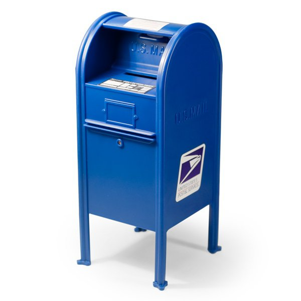

What /is/ the Mailbox Rule, exactly? A Texas appeals court explained the rule:

#+begin_quote
When a letter, properly addressed and postage prepaid, is mailed, there exists a presumption the notice was duly received by the addressee. *This presumption may be rebutted by proof of non-receipt*. In the absence of proof to the contrary, the presumption has the force of a rule of law. <cite> [[https://cases.justia.com/texas/fifth-court-of-appeals/2015-05-14-00652-cv.pdf][Stuart v. U.S. Nat'l Bank Ass'n]], No. 05-14-00652-CV, slip op. at 4 (Tex. App. Dallas Oct. 28, 2015) (affirming home foreclosure) (cleaned up, emphasis added). </cite>
#+end_quote

The Mailbox Rule's presumption of receipt might even be imposed by statute. <cite> See, e.g., [[https://leg.mt.gov/bills/mca/title_0260/chapter_0010/part_0060/section_0020/0260-0010-0060-0020.html][Mont. Code. Ann. 26-1-602]]. </cite>

But as noted by the Third Circuit, "unsupported, second-hand accounts /[of mailing]/ cannot invoke the mailbox rule's presumption." <cite> [[https://scholar.google.com/scholar_case?case=11003527948579123867][Guerra v. Consolid. Rail Corp.]], 936 F.3d 124, 137 (3d Cir. 2019) (affirming dismissal of plaintiff's complaint). </cite>

In a different case, the Seventh Circuit elaborated:

#+begin_quote
In resolving a motion to compel arbitration, a court may apply the mailbox rule as a matter of law *only* where there exists no genuine dispute of material fact that the relevant communication was sent. 

* * *

Under Illinois law, however, even where the presumption is triggered, if the intended recipient denies receipt, that denial rebuts the presumption. Whether the communication was in fact received must then be decided by a trier of fact.  <cite> [[https://scholar.google.com/scholar_case?case=14452953365097759458][Kass v. PayPal Inc.]], 75 F. 4th 693, 703, 704 (7th Cir. 2023) (vacating and remanding order confirming arbitration award) (formatting modified). </cite>

#+end_quote 

But why not just /always/ use the "Mailbox Rule"? For *business-to-business* contracts, when it comes to whether a particular notice has in fact been received, "that's a conversation we don't want to have" (to paraphrase one of my former students in another context).

{{{RWE}}} The Third Circuit once observed:

#+begin_quote
In this age of computerized communications and handheld devices, *it is certainly not expecting too much to require businesses* that wish to avoid a material dispute about the receipt of a letter *to use some form of mailing that includes verifiable receipt* when mailing something as important as a legally mandated notice.

The *negligible cost and inconvenience* of doing so is *dwarfed* by the practical consequences and potential unfairness of simply relying on business practices in the sender's mailroom.   <cite> [[https://scholar.google.com/scholar_case?case=7026220226065811743][Lupyan v. Corinthian Colleges, Inc.]], 761 F.3d 314, 322 (3d Cir. 2014) (emphasis and extra paragraphing added). </cite>
#+end_quote

But for *business-to-consumer* ("B2C") contracts, the business might want to use the Mailbox Rule to provide that notices /from the business/ are effective a certain number of days after mailing; that's likely to be the most cost-effective approach for such situations.

*Pro tip:* Drafters might want to adjust the /time/ at which notice becomes effective under the Mailbox Rule, so as to match the expected postal delivery time — especially if the notice will be mailed from one country to another.

*** {{{ADDL}}}                                                         :ADDL:
  :PROPERTIES:
  :HTML_CONTAINER_CLASS: addl
  :END:

Contents:

#+TOC: headlines 1 local

**** Check {{{theK}}} for mandatory delivery methods
  :PROPERTIES:
  :CUSTOM_ID: notice-deliv
  :END:

{{{TheK-cap}}} could specify whether some particular means of delivery is required — or prohibited; that in turn could affect whether a communication would count as notice under {{{theK}}}.

*Caution:* By law, some types of contract might require — or bar — specific types of notice-delivery methods in particular situations and jurisdictions, as discussed at [[#notice-law]].

And parties should keep in mind that emails and especially text messages might disappear. (This is one of the points discussed at [[#notice-law]] — and it's not a problem unique to /electronic/ messages, of course.)

*Caution:* Mandatory delivery methods might open the door to gamesmanship. {{{RWE}}} A colleague once told of receiving a notice, /by FedEx/, from another party to a contract.  My colleague checked with in-house counsel at her (giant) company. The in-house counsel said, "We're going to ignore this notice, because the contract requires the notice to be /mailed/, and this one wasn't." Um ... that's ... not how things should work in a cooperative relationship — and courts generally won't go along with such game-playing except in limited circumstances; see the commentary at [[#notice-rcv-cmt]].

**** Check {{{theK}}} for required /copies/ of notices
  :PROPERTIES:
  :CUSTOM_ID: notice-copy-cousel
  :END:

{{{TheK-cap}}} could require copies of notices to be sent to specified persons, e.g., to a party's legal counsel. ({{{TheK-cap}}} could also specify whether a separately-sent copy would or would not constitute notice.)

Copying the notified party's legal counsel on notices can be useful: 

- disputes can sometimes be resolved quickly if legal counsel are brought in sooner rather than later; and

- the redundant "path" of sending a separate copy to legal counsel can help make sure that the notice gets through.

Some drafters like to specify that a copy to legal counsel "shall not constitute notice." I'm on the fence whether that's a good idea — it might vary with the type of contract.

*Pro tip:* If {{{A}}} doesn't know the name or address of {{{B}}}'s legal counsel, one way for {{{A}}} to send a copy of a notice to legal counsel would be to send a separate, /paper/ copy of the notice /to {{{B}}}/, by certified mail or courier, specifically marked as, "Attention: Legal Counsel"; that way, the attention line /should/ get the attention of {{{B}}}'s mailroom personnel and help them route it accordingly.

*Pro tip:* If a party wants to /require/ a copy of a notice to be sent to a particular legal counsel, that party should consider specifying in the requirement that the copy to counsel must be sent separately, to provide an independent delivery path and thus reduce the likelihood of nondelivery.

**** *Of possible interest: A notices /hub/
  :PROPERTIES:
  :CUSTOM_ID: notice-hub
  :END:

In July 2025 the International Swaps and Derivatives Association (ISDA), home of the [[https://en.wikipedia.org/wiki/ISDA_Master_Agreement][ISDA Master Agreement]], launched its [[https://www.isda.org/protocol/isda-2025-notices-hub-protocol/][ISDA 2025 Notices Hub and Protocol]] that:

#+begin_quote
... allows certain critical notices under the ISDA Master Agreement (and, *over time, other notices and agreements*) to be securely delivered and received online. 

It also allows users to maintain and *update their notice delivery details in a single location* which their counterparties under the ISDA Master Agreement (and, *over time, other agreements*) can access.
#+end_quote

**** Pro tip: Be practical about notice requirements
  :PROPERTIES:
  :CUSTOM_ID: notice-context
  :END:

It's not a good idea to impose overly-rigid notice requirements; consider what the circumstances might be when notice is appropriate — for example, less formality might well be appropriate when a party is notifying another of a safety issue.  

{{{RWE}}} In a Texas case (which had a noteworthy final result on appeal):

- A  jury found that a contractor was given sufficient /oral/ notice of serious safety violations, and that the customer had substantially (but not completely) complied with the contract's requirement that the customer give multiple /written/ notices before being entitled to terminate the contract. 

- Based on the jury verdict, the trial court awarded the customer some $4 million in damages and attorney fees; an intermediate appeals court affirmed that judgment.

- But the state supreme court reversed, holding that, because the contract specifically required three /written/ notices, the contractor's actions were not enough. <cite> See, e.g., [[https://scholar.google.com/scholar_case?case=11478440640996054979][James Constr. Gp. v. Westlake Chem. Corp.]], 594 S.W.3d 722, 747-48 (Tex. App. Houston [14th Dist.] 2019) (evidence sustained jury verdict that contractor received sufficient notice of serious safety violations), /rev'd/, [[https://scholar.google.com/scholar_case?case=8074215351891178149#p405][650 S.W.3d 392, 396-97, 405-08]] (Tex. 2022). </cite>

**** Caution: Would /the law/ require a specific type of notice?
  :PROPERTIES:
  :CUSTOM_ID: notice-law
  :END:

By law, some types of contract might require specific types of notice in particular situations and jurisdictions. {{{RWE}}} An Alaska statute requires notices from an insurer to be sent either by first-class mail with a certificate from the USPS, or by electronic mail with electronic confirmation of receipt by the intended recipient. <cite> See [[https://www.akleg.gov/basis/statutes.asp#21.36.260][Alaska Stat. 21.36.260]], cited in [[https://scholar.google.com/scholar_case?case=6517290639963811783][Travelers Prop. Cas. Co. of Am. v. Keluco Gen. Contractors, Inc.]], 572 P.3d 537 (Alaska 2025) (affirming summary judgment in favor of insured; insurance carrier's affidavit of mailing of notice of policy expiration, required by state statute, did not qualify as USPS certificate). </cite>

*Caution:* While an exchange of text messages can form a binding contract (see [[#k-im]]), parties should be judicious in sending notices /by text messages/, because text messages arguably have more potential to disappear than emails and FAXes. Tangentially, that's why California's Statute of Frauds requires written confirmation when texts and IMs are used to convey title to real property. <cite> See [[https://leginfo.legislature.ca.gov/faces/codes_displaySection.xhtml?lawCode=CIV&sectionNum=1624.][Cal. Civ. Code § 1624(d)]], discussed at [[#stat-frauds]]. </cite>

**** Pro tip: Hard copy notice? Write the tracking number
  :PROPERTIES:
  :CUSTOM_ID: NoticesTrackingNo
  :END:

For hard-copy notices, include the tracking number (certified mail, FedEx, etc.) /on the notice itself/. This can help forestall a claim by the addressee that the tracking number proved only that /some/ document had been delivered and not necessarily the notice document.

The tracking number for the sample USPS "green card" below is near the bottom left of the card, just below the bar code.

#+ATTR_HTML: :alt USPS certified mail green card :class photocenter50 :style margin-bottom: 2rem;
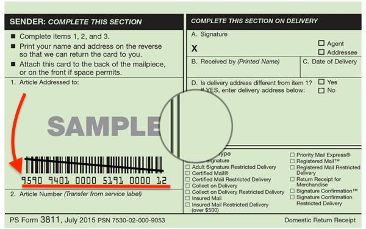

{{{RWE}}} Just above the inside address of a letter, type: "Certified Mail No. [fill in], Return Receipt Requested" or "Via FedEx Waybill No. [fill in]." 

See the following example /(using a mocked-up letterhead)/ — note how the certified mail number is typed above the inside address:

#+ATTR_HTML: :alt Letter with certified mail number :class photocenter80  :style margin-bottom: 2rem; border: 1px solid #555;
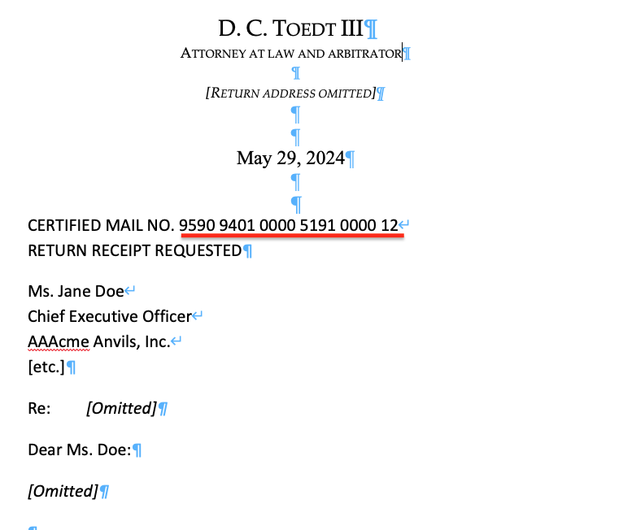

*Keep a photocopy of the notice* (or other communication) *with the tracking number on it*; that can help forestall a later claim by the addressee that the tracking number proved only that /some/ document had been delivered and not necessarily the notice document. 

DCT comment: As a brand-new lawyer, I saw the following occur in a state-court hearing on a motion for summary judgment:

- The lawyer for the party opposing summary judgment claimed not to have received the 21-day advance notice of the motion hearing (required under state rules).

- The lawyer for the party seeking summary judgment — me, filling in at the hearing for a colleague at my firm — showed the judge a "green card" certified-mail receipt from the U.S. Postal Service.

- The opposing lawyer admitted to the judge that yes, the signature on the green card was that of his assistant — but the opposing lawyer insisted that the receipt must have been for some other communication because, he continued to insist, he had never received the 21-day notice /of the hearing/.

- There was no documentation connecting /that particular/ green-card receipt to the notice of the hearing.

- The judge gave the benefit of the doubt to the opposing lawyer who claimed he never received the notice of the hearing. 

(Several years later, the opposing lawyer was disbarred, for unrelated reasons.)

**** Deadlines for notice?
  :PROPERTIES:
  :CUSTOM_ID: notices-dl-cmt
  :END:

Some contract provisions require notice to be given no later than a specified time; a court might enforce such a requirement.

# https://www.pizzainn.com/
#+ATTR_HTML: :alt Pizza Inn logo :title Pizza Inn :class photo-at-right photowidth25
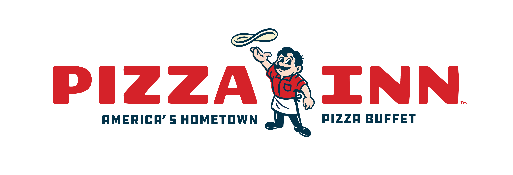

{{{RWE}}} A longtime Pizza Inn franchisee had an option to renew the franchise term. The contract set a deadline for the franchisee to give notice that he wanted to exercise the option. The franchisee was two months late in giving his renewal notice, and Pizza Inn decided not to renew. The court ruled in favor of Pizza Inn, holding that:

- Under Texas law, the holder of an option must strictly comply with the terms of the option, which in this case included the deadline for the franchisee to give his renewal notice; and

- In the particular circumstances, the franchisee's tardy renewal notice did not qualify for what the court described as a very-narrow "equitable intervention" exception to the law's general rule requiring strict compliance with option terms. <cite> See [[https://scholar.google.com/scholar_case?case=8762650802164301381][Pizza Inn, Inc. v. Clairday]], 979 F.3d 1064 (5th Cir. 2020) (reversing district court and rendering judgment for Pizza Inn). </cite>

**** Would notice /received/ always be effective?
  :PROPERTIES:
  :CUSTOM_ID: notice-rcv-cmt
  :END:

If a notice is shown to have been actually received, a court is /likely/ to consider the notice to have been effective, even if the contractual notice requirements were not strictly followed; see, e.g., [[https://scholar.google.com/scholar_case?case=5873144412607476725][Elmen Holdings]] (5th Cir. 2023). <cite> See, e.g., [[https://scholar.google.com/scholar_case?case=5873144412607476725][Elmen Holdings, L.L.C. v. Martin Marietta Mat'ls, Inc.]], 86 F.4th 667, 679-80 (5th Cir. 2023) (affirming summary judgment in favor of plaintiff; citing Texas law) (email notice substantially complied with lease's requirement that notices must be either in person or by certified mail); [[https://scholar.google.com/scholar_case?case=2914341734171754326][Rose, LLC v. Treasure Island, LLC]], 445 P.3d 860, 863-64 (Nev. App. 2019) (with extensive case citations). </cite>

*But* that won't always be the case. {{{RWE}}} In [[https://scholar.google.com/scholar_case?case=18215496701052605742][McGuire]] (N.Y. App. Div. 2021), the court held that an email notice had been ineffective because the contract in question required notices to be sent by first-class mail; see also [[https://scholar.google.com/scholar_case?case=8074215351891178149#p405][James Constr. Gp.]] (Tex. 2022), discussed at [[#notice-context]] above. <cite> See [[https://scholar.google.com/scholar_case?case=18215496701052605742][McGuire v McGuire]], 2021 N.Y. Slip Op. 04816, 197 A.D.3d 897, 900, 153 N.Y.S.3d 280 (N.Y. App. Div. 2021) (reversing partial summary judgment). </cite>

**** Consider what details should be required in a given notice.

Suppose that two parties, "Alice" and "Bob," are entering into a contract, and that under the contract, Bob is supposed to notify Alice if a certain event occurs. If Alice thinks it's important for the notice to include particular types of detail, it might be well to have that spelled out in the notification requirement, instead of relying on a simple "in reasonable detail" phrasing. 

{{{RWE}}} In a UK case, a buyer of shares in a company gave notice to the seller that the buyer was invoking an indemnification provision under the purchase agreement. The court of appeals reversed a trial-court holding that the buyer's notice had not provided "reasonable detail" as required by the agreement. The court noted that "courts should not interpret such clauses as imposing requirements which serve no real commercial purpose unless compelled to do so by the language of the clause." <cite> [[https://www.bailii.org/ew/cases/EWCA/Civ/2024/477.html][Drax Smart Generation Holdco Ltd v Scottish Power Retail Holdings Ltd]], {{{BRACKL}}}2024{{{BRACKR}}} EWCA Civ 477. </cite>

** Reliance Waiver {{{CLS}}}                                          :CLS:
  :PROPERTIES:
  :CUSTOM_ID: r-rel-discl
  :HTML_CONTAINER_CLASS: pr-top
  :CATEGORY: Waiver
  :END:

 As discussed at [[#r-rel-discl-why-cmt]], in jurisdictions such as Texas, an entire-agreement clause in a contract (see {{{RR}}} [[#r-ent-k]]) might not be enough to defeat a party's subsequent claim that the party was fraudulently induced into entering into the contract — in such jurisdictions, an express waiver of reliance on statements outside the contract would be required (and in some cases might not be enough even then).

Contents:

#+TOC: headlines 1 local

*** Applicability of {{{Ths}}}?

By signing {{{thek}}} and delivering it to {{{B}}}, {{{A}}} is committing to {{{ths}}}.

*** Reliance allowed on what?

In deciding to enter into {{{thek}}}, {{{A}}}: {{{X1}}} is not relying on any alleged "Outside Statement" — defined below—  by {{{B}}}; {{{XN}}} agrees not to do so; and {{{XN}}} (in case of doubt:) *WAIVES* any such reliance.

***** Note                                                              :CMT:
  :PROPERTIES:
  :HTML_CONTAINER_CLASS: cmtry
  :UNNUMBERED: notoc
  :END:

{{{H1}}} This section draws in part on a disclaimer that was successfully invoked by the Bank of America in an Eighth Circuit case. <cite> See [[https://scholar.google.com/scholar_case?case=11819483044758808189][Bank of America, N.A. v. JB Hanna, LLC]], 766 F.3d 841, 856 (8th Cir. 2014) (affirming summary judgment in favor of bank).  </cite> (Hat tip: [[http://www.thecontractsguy.net/2015/03/21/revisiting-no-reliance-language-in-contracts/][Brian Rogers]].)

{{{HN}}} See also [[#reps-reliance]] (significance of intended-reliance statement). 

*** Capable of deciding whether to sign {{{theK}}}?

Each party {{{A}}} certifies that: {{{X1}}} {{{A}}} is capable — on {{{A}}}'s own and/or with any desired independent professional advice — of evaluating and understanding the terms, conditions and risks of {{{thek}}} and the transaction(s) contemplated by {{{thek}}}; and {{{XN}}} {{{A}}} understands and accept those terms, those conditions, and those risks. 

*** Outside Statement: What's that?

For this purpose, an {{{dfn(Outside Statement)}}} is any statement of fact or opinion — including but not limited to a [[#r-rep-defn][representation]] — where the representation: {{{X1}}} is made by (or attributable to) {{{B}}}, and {{{XN}}} is /not/ set forth in {{{thek}}} itself, including but not limited to the attachments, exhibits, schedules, etc., to {{{theK}}} (if any).

*** Does that encompass statements in {{{theK}}} itself?

*Exclusion of statements in {{{theK}}} itself:* {{{Ths-cap}}} does not waive {{{A}}}'s reliance on any representation, warranty, or other statement in {{{thek}}} itself — including but not limited to any that are set forth in attachments, exhibits, materials incorporated by reference, etc. — but this exclusion subdivision has no effect on any /express/ waiver of reliance on a particular representation, etc., that is stated in {{{thek}}}, if any.

*** California: Anything special?

Each party *WAIVES* the benefits (if and to the extent available) of [[http://www.leginfo.ca.gov/cgi-bin/displaycode?section=civ&group=01001-02000&file=1541-1543][Section 1542 of the California Civil Code]], which states: "/A general release does not extend to claims that the creditor or releasing party does not know or suspect to exist in his or her favor at the time of executing the release and that, if known by him or her, would have materially affected his or her settlement with the debtor or released party./"

***** Note                                                              :CMT:
  :PROPERTIES:
  :HTML_CONTAINER_CLASS: cmtry
  :UNNUMBERED: notoc
  :END:

This is included out of an abundance of caution, in case the reliance waiver of {{{ths}}} is considered an "advance release" under California law; see generally the discussion at [[#nl-no-rel-cali]]. 

*** {{{ADDL}}}                                                         :ADDL:
  :PROPERTIES:
  :HTML_CONTAINER_CLASS: addl
  :END:

Contents:

#+TOC: headlines 1 local

**** Why include a reliance waiver?
  :PROPERTIES:
  :CUSTOM_ID: r-rel-discl-why-cmt
  :END:

Unlike some entire-agreement clauses (see {{{RR}}} [[#r-ent-k]]), a /reliance waiver/ could defeat a misrepresentation claim, at least where the alleged misrepresentation in question wasn't egregious . That's why reliance waivers are often paired with entire-agreement clauses:

- In an entire-agreement clause, a statement that "there are no other representations" might not be enough to defeat a claim of fraudulent inducement to enter into the contract.

- But: Under the law in many U.S. jurisdictions, a contracting party (the "claimant") that claims misrepresentation by the other side normally would have to prove, among other things, /that it reasonably relied/ on the alleged misrepresentation.

- That gives the other side's contract drafter a reason to include an express /waiver/ of reliance, which would (or at least should) make it unreasonable per se for the claimant to rely on the the alleged misrepresentation — because, by promising /not/ to rely on outside statements, the claimant stipulated that such reliance would /not/ be reasonable (although some courts will disregard a reliance waiver if it appears that the other party out-and-out lied).

Here's a hypothetical example: Suppose that the following takes place:

--  Fred and Ginger enter into a contract for Ginger to sell Fred a house located several hundred miles away from either of them.

--  In the contract, Ginger /represents/ to Fred that the house is in good condition, but does not /warrant/ it.

--  After the closing, the house turns out to be a wreck.

Even though Ginger didn't /warrant/ the condition of the house, Ginger might be liable for /misrepresentation/. For Fred to succeed with a misrepresentation claim, though, he would have had to "hit the checkpoints" along the way up the [[#nl-reps-warr-hill][Hill of Proof]] (see [[#nl-reps-warr-hill]]) for some additional elements of proof: Fred would have to show (probably among other things) that he had /reasonably relied/ on Ginger's representation.

Of course, Fred might well have a powerful incentive to prove his reasonable reliance: If he could establish Ginger's liability for misrepresentation, then he might be able:

- to rescind the contract, and/or

- perhaps even to recover punitive damages from Ginger; <cite> See, e.g., [[https://scholar.google.com/scholar_case?case=6588631383722707662][Huy Fong Foods, Inc. v. Underwood Ranches, LP]], 66 Cal. App. 5th 1112, 1126, 281 Cal. Rptr. 3d 757 (2021) (affirming $23 million jury verdict for breach of contract and fraud). </cite>

neither of those remedies would normally be available in a breach-of-warranty action.

# https://www.theguardian.com/food/2019/jun/05/sriracha-sauce-lawsuit-huy-fong-underwood
# #+ATTR_HTML: :alt Huy Fong pepper sauce bottle :title Huy Fong pepper sauce bottle  :class photo-at-right photowidth15
# 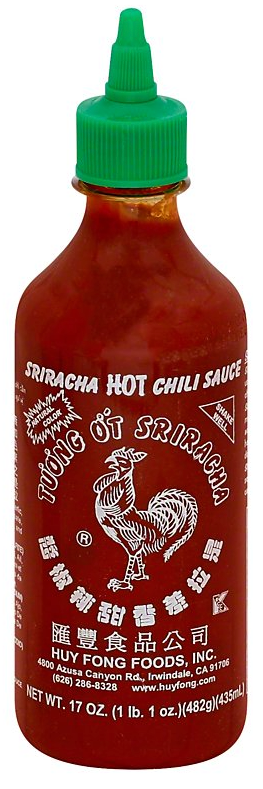

So Ginger will want to head off accusations that she lied — planning ahead, she /might/ want to include, in the contract, a statement that Fred /isn't/ relying on any representations by Ginger. That way, if Fred were to sue Ginger for misrepresentation, a judge might very well rely (so to speak) on the disclaimer and summarily toss out Fred's claim by dismissing it on the pleadings.

**** Should /all/ parties waive reliance here, or just one?

Some drafters might want to make this a one-way waiver, in which only one party is waiving reliance on outside statements — potentially leaving the waiving party open to allegations that /it/ engaged in fraud. {{{RWE}}} That was the situation in a Delaware case: The state supreme court largely upheld a $1 billion Chancery-Court judgment. The lower court found (among other things) that Johnson & Johnson had engaged in common-law fraud when it acquired Auris, one of J&J's potential competitors in the medical-robotics field (in which J&J had indirectly invested), by concealing information relevant to Auris's potential for succeeding in achieving milestones for an earn-out payment.  <cite> See [[https://scholar.google.com/scholar_case?case=12056670684212718028][Johnson & Johnson v. Fortis Advisors LLC]], No. 490, 2024, text acc. n.261 (Del. Jan. 12, 2026) (affirming judgment of common-law fraud but remanding for recalcuation of one aspect of the damage award). </cite>

**** Courts will (often) enforce reliance waivers by knowledgeable parties
  :PROPERTIES:
  :CUSTOM_ID: rel-waiv-ct-often
  :END:

When a reliance waiver is sufficiently clear — and especially when the contracting parties are big enough to take care of themselves — many courts might well give effect to the waiver under freedom-of-contract principles.

# *Students:* You can just skim the remaining summaries below of case law.

# https://www.ibm.com/brand/experience-guides/developer/brand/logo/
#+ATTR_HTML: :alt IBM logo :title IBM logo :class photo-at-right photowidth20
 

{{{RWE}}} Exonerating IBM from a fraudulent-inducement claim, the Texas supreme court held that:

#+begin_quote
Under Texas law, a party may be liable in tort for fraudulently inducing another party to enter into a contract. *But* the party may avoid liability if the other party contractually disclaimed any reliance on the first party's fraudulent representations. 

Whether a party is liable in any particular case depends on the contract's language and the totality of the surrounding circumstances. <cite> [[https://scholar.google.com/scholar_case?case=17946456559357999156][IBM v. Lufkin Industries, LLC]], 573 S.W.3d 224, 226 (Tex. 2019) (reversing court of appeals and rendering judgment for IBM on Lufkin's fraudulent-inducement claims because of contractual disclaimer of reliance and totality of the circumstances, /but/ setting aside jury verdict for IBM on Lufkin's contract claims and remanding for new trial)  (emphasis and extra paragraphing added).  </cite>
#+end_quote
 
The supreme court went on:
#+begin_quote
Specifically, courts must consider such factors as whether 

(1) the terms of the contract were negotiated, rather than boilerplate, and during negotiations the parties specifically discussed the issue which has become the topic of the subsequent dispute; 

(2) the complaining party was represented by counsel; 

(3) the parties dealt with each other at arm's length; 

(4) the parties were knowledgeable in business matters; and 

(5) the release language was clear. <cite> /Id./ at 229. </cite>
#+end_quote
 
{{{RWE}}} A Houston appeals court affirmed summary judgment dismissing a fraud claim where the contract in question included this language:
#+begin_quote
This Agreement contains the entire agreement between the parties with respect to this subject matter and is not subject to any prior or contemporaneous oral or written agreements. The undersigned parties affirm that *they have not relied* on any representations not expressed in this Agreement in deciding to enter into this Agreement. The undersigned parties further affirm that they *are relying solely on* their own judgment (and the advice of their own counsel) in deciding to enter into this Agreement. <cite> [[https://scholar.google.com/scholar_case?case=1839917246519676060][West Loop Hosp., LLC v. Houston Galleria Lodging Assocs., LLC]], 649 S.W.3d 461, 489 (Tex. App.--Houston [1st Dist.] 2022, pet. denied) (affirming summary judgment dismissing plaintiff's fraud claim). </cite>
#+end_quote

{{{RWE}}} In a Fifth Circuit case, the contract between an alarm-system company and its jewelry-store customer contained the following reliance disclaimer: "In executing the Agreement, Customer is not relying on any advice or advertisement of ADT." The court held that this language "was sufficiently clear as to disclaim any reliance by plaintiffs on any alleged misrepresentation ADT made prior to Plaintiffs entering into the contract. Accordingly, Plaintiffs' fraudulent inducement claim is barred under Texas law. <cite> [[https://scholar.google.com/scholar_case?case=16423797776446597241][Shakeri v. ADT Security Services, Inc.]], 816 F.3d 283, 288, 296 (5th Cir. 2016) (per curiam). </cite>" 

{{{RWE}}} New York's highest court ruled that a fraud complaint should have been summarily dismissed, because "plaintiffs in the plainest language announced and stipulated that they were not relying on any representations as to the very matter as to which they now claim they were defrauded." <cite> [[https://scholar.google.com/scholar_case?case=5555317030447812009][Pappas v. Tzolis]], 20 N.Y.3d 228, 233-34 (2012). </cite> 

{{{RWE}}} The Eighth Circuit seemingly had little sympathy for grocery store owner-operators who signed up as licensees of a discount grocery chain, because the group had not only done due-diligence homework, with the aid of attorneys and other advisors, but had also signed extensive anti-reliance disclaimers. <cite> See [[https://scholar.google.com/scholar_case?case=9688385017802237784][SBFO Operator No. 3, LLC v. Onex Corp.]], 101 F.4th 551, 556 & n.3 (8th Cir. 2024) (affirming summary judgment in favor of defendant Onex). </cite>

{{{RWE}}} In another Eighth Circuit case, the Mayo Foundation granted a license to a startup company under a patent application that Mayo had filed for certain nano technology. In the license agreement, the startup company "warranted that it had 'independently evaluated the Patent Rights, Know-How, and Confidential Information ... [and] is entering into this Agreement on the basis of its own evaluation /and not in reliance o[n] any representation by Mayo/ ....'"  (Emphasis added.)  The license agreement also disclaimed any implied warranties by Mayo about the patentability of the technology, among other things; the agreement stated that the licensed subject matter was being provided “as is,” “with all faults,” and “with all defects.”

Things apparently didn’t go well for the startup company: The patent application died when (1) the patent examiner issued a non-final rejection of the pending claims in the patent application, citing prior art, and (2) the startup company, which was to take over responsibility for pursuing the patent application, failed to respond to the examiner's rejection within the six-month period prescribed by the patent statute.

The startup company then sued Mayo, alleging among other things that Mayo had engaged in fraud and misrepresentation. (The startup company had raised $500,000 in funding from investors; conceivably the lawsuit might have represented an attempt by the startup company to divert investor anger away from the company's management and toward Mayo.)

The district court held — and the Eighth Circuit affirmed — that the startup company’s fraud- and negligent-misrepresentation claims against Mayo were barred by the reliance disclaimer in the license agreement. This was because, under Minnesota law,

  - actual /and reasonable/ reliance on the alleged misrepresentations was a required element of both claims, but

  - /reasonable/ reliance was conclusively negated by the reliance disclaimer quoted above. <cite> [[https://scholar.google.com/scholar_case?case=15441169280319666786][OmegaGenesis Corp. v. Mayo Fdn. for Med. Educ. & Research]], 851 F.3d 800 (8th Cir. 2017) (affirming dismissal for failure to state a claim upon which relief can be granted). </cite>

**** Caution: Express "no reliance" language might be necessary.
  :PROPERTIES:
  :CUSTOM_ID: nl-rel-discl-cmt
  :END:

Under *Texas* law, the "no reliance" language above is important for drafters to understand. That's because, in the oft-cited /Italian Cowboy Partners/ (2011), the state's supreme court explained:

#+begin_quote

Pure merger clauses, /without an expressed clear and unequivocal intent to disclaim reliance or waive claims for fraudulent inducement/, have never had the effect of precluding claims for fraudulent inducement. ...

There is a significant difference between a party[:]

  -  disclaiming its /reliance/ on certain representations, and therefore potentially relinquishing the right to pursue any claim for which reliance is an element, and

  -  disclaiming the fact /[sic]/ that no other representations were made.

   * * *

We have repeatedly held that *to disclaim /reliance/, parties must use clear and unequivocal language*. this elevated requirement of precise language helps ensure that parties to a contract — even sophisticated parties represented by able attorneys — *understand that the contract's terms disclaim reliance*, such that *the contract may be binding even if it was induced by fraud*.

Here, the contract language was _not_ clear or unequivocal about disclaiming reliance. For instance, the term "rely" does not appear in any form, either in terms of relying on the other party's representations, or in relying solely on one's own judgment. This provision stands in stark contrast to provisions we have previously held were clear and unequivocal.  <cite> [[https://scholar.google.com/scholar_case?case=11381898603191801741][Italian Cowboy Partners, Ltd. v. Prudential Ins. Co.]], 341 S.W. 3d 323, 333-37 (Tex. 2011) (reversing court of appeals; merger clause did not preclude tenant's claim that landlord had fraudulently induced lease agreement by misrepresenting condition of property) (quotation edited for readability). The court provided a three-column table, contrasting different clauses. </cite>
#+end_quote

DCT comment: It could be argued that these two disclaimers — a disclaimer of external representations, versus a disclaimer of /reliance/ on external representations — logically amount to exactly the same thing (you can't rely on a representation that doesn't exist). The /Italian Cowboy Partners/ quotation above suggests that in the Texas supreme court's view, a disclaimer of extrinsic representations, standing alone, is insufficiently explicit and "in your face" to alert the other side about what it was being asked to give up.

*Delaware* law <<TrifectaMultNoRel>> likewise requires anti-reliance language in order to preclude a fraud claim. As the Chancery Court explained: "[A]n integration clause, standing alone, is not sufficient to bar a fraud claim; the agreement must also contain explicit anti-reliance language" — *except that* "an integration clause alone is sufficient to bar a fraud claim based on expressions of future intent or future promises." <cite> [[https://scholar.google.com/scholar_case?case=6128233748677172493][Trifecta Multimedia Holdings Inc. v. WCG Clinical Services LLC]], 318 A.3d 450, 458 (Del. Ch. 2024) (denying, in part, defendants' motion to dismiss; footnotes omitted). </cite>

*Colorado* law is to the same effect: "[T]he mere fact of a merger clause does not effect a waiver of the tort claim. And unlike /[a prior case]/ in which the court found that a merger clause precluded a fraudulent-inducement claim because it disproved reliance as a matter of law, the merger clause here says nothing about reliance." <cite> See [[https://scholar.google.com/scholar_case?case=2704648242201606572][City of Fort Collins v. Open Int'l, LLC]], 146 F.4th 929, 941 (10th Cir. 2025) (affirming judgment on jury verdict of fraudulent inducement by contractor) (cleaned up, citations omitted). </cite>

*Pro tip:* If you're drafting a contract where the law will be that of a jurisdiction such as Texas or Delaware or Colorado, it's likely to be important to include an explicit reliance waiver — but that might be a "red flag" that causes the other party to wonder whether your client is trustworthy ....

**** But /fraud/ claims might survive even a no-reliance provision

Suppose that Ginger claims that Fred misrepresented facts to induce Ginger to enter ito a contract, /and that Fred's misrepresentation wasn't merely negligent, but intentional/. AND: Suppose also that the contract contains a no-reliance clause. In such a situation, Fred should not hold out much hope that a court would /summarily/ toss out Ginger's fraudulent-inducement claim against him; the judge might very well insist on a full trial. <cite> See generally Andrew M. Zeitlin & Alison P. Baker, [[http://www.gmlaw.com/wp-content/uploads/2015/01/The-Viability-of-Fraud-Claims-after-Disclaiming-Reliance.pdf][At Liberty to Lie? the Viability of Fraud Claims after Disclaiming Reliance]] (GMLaw.com 2013); see also Neal A. Potischman, Stephen Salmon, Alyse L. Katz, John A. Bick, Kirtee Kapoor and Lawrence Portnoy, [[http://www.mondaq.com/article.asp?articleid=460424][Will Anti-Reliance Provisions Preclude Extra-Contractual Fraud Claims? Answers Differ In Delaware, New York, And California]] (Mondaq.com 2016). </cite>

That might be even more true if the plaintiff was not "sophisticated" and/or was not represented by counsel in the transaction in question. <cite> See, e.g., [[http://law.justia.com/cases/texas/first-court-of-appeals/2004/79979.html][Carousel's Creamery, L.L.C. v. Marble Slab Creamery, Inc.]], 134 S.W.3d 385 (Tex. App.--Houston [1st Dist.] 2004) (reversing and remanding directed verdict for defendant on negligent-misrepresentation claim). </cite>

{{{CE}}} Delaware's chancery court held that when a party allegedly made a representation /in a contract/, /knowing it to be false/, the contract's anti-reliance and non-recourse clauses would not bar a fraud claim. Recalling [[https://www.youtube.com/watch?v=1fM0p-he_Is][a scene]] from the classic movie /Butch Cassidy and the Sundance Kid/, the court ruled:

#+begin_quote
... while contractual limitations on liability are effective when used in measured doses, the Court cannot sit idly by at the pleading stage while a party alleged to have lied in a contract uses that same contract to detonate the counter-party’s contractual fraud claim. That’s too much dynamite. <cite> [[https://courts.delaware.gov/Opinions/Download.aspx?id=323200][Online Healthnow, Inc. v. CIP OCL Investments, LLC]], slip op. at 4 (Del. Ch. Aug. 12, 2021) (denying defendants' motion to dismiss), /citing/ [[https://scholar.google.com/scholar_case?case=2465522139289114433][ABRY Partners V, L.P. v. F & W Acquisition LLC]], 891 A.2d 1032 (Del. Ch. 2006). </cite>
#+end_quote

# https://simple.m.wikipedia.org/wiki/File:Bank_of_America_logo.svg
# #+ATTR_HTML: :alt XX :title   :class photo-at-right photowidth45
# 

{{{CE}}} The Bank of America once sold a foreclosed home subject to an "as-is" disclaimer — /but the bank stated that it had "little or no direct knowledge" of problems/, when /in fact/ the bank's people knew that there were serious mold problems. A Wisconsin appeals court affirmed judgment on a jury verdict in favor of the buyer, saying that:

#+begin_quote

There was sufficient evidence to support the jury's verdict that the Bank made *a deceptive statement* concerning the sale of the property /[namely, that the bank had little or no direct knowledge of the condition of the house]/ with the intention of inducing the sale of the property and that Fricano suffered a loss as a result of that representation. The “as is” and exculpatory clauses in the parties' contract do not, as a matter of law, relieve the bank/seller of liability under § 100.18(1) for its deceptive representation in the contract which induced agreement to such terms. We affirm. <cite> [[https://scholar.google.com/scholar_case?case=16636936678324794028][Fricano v. Bank of America NA]], 366 Wis.2d 748, 875 N.W.2d 143, 146 (2015) (emphasis added). </cite>
#+end_quote

 
**** Reliance waivers are often found in M&A agreements.
  :PROPERTIES:
  :CUSTOM_ID: rel-waiv-m-and-a
  :END:

In merger- and acquisition ("M&A") deals, reliance disclaimers are often used; as explained by a leading corporate scholar-practitioner, this is because one party, typically the seller --

#+begin_quote

... doesn't want to be deceived by the buyer into entering into an agreement (with agreed caps on liability) /based on something that may or may not have been said/ by someone that is not written in the agreement, and of which the selling shareholders may not even be aware,

and that the buyer may determine to use post closing to make a claim /not subject to the cap/. And this is particularly true for the private equity seller concerned about post closing certainty in distributing proceeds to its limited partners. <cite> Glenn D. West, [[https://privateequity.weil.com/insights/private-equity-sellers-must-view-fraud-carve-outs-with-a-gimlet-eye/][Private Equity Sellers Must View "Fraud Carve-outs" with a Gimlet-Eye]], Weil /Insights/, Weil's Global Private Equity Watch (2016) (emphasis and extra paragraphing added). </cite>
#+end_quote

According to a 2019 American Bar Association study, summarized by an M&A lawyer:

#+begin_quote

Express non-reliance provisions are increasingly common in merger and acquisition transactions, and have tripled in prevalence over the six ABA studies since 2009. These provisions have become the majority approach, appearing in 63% of agreements in 2019. Fraud carve-outs are increasingly seen in non-reliance provisions, showing a steady and pronounced increase since 2015—from 2% to 17% to 54%. <cite> [[https://www.goulstonstorrs.com/daniel-r-avery/][Daniel Avery]], [[https://www.jdsupra.com/legalnews/non-reliance-and-nor-provisions-6575736][Non-Reliance and NOR Provisions]] (JDSupra 2021), /summarizing/ American Bar Association Section of Business Law, [[https://www.americanbar.org/groups/business_law/committees/ma/deal_points/][2019 Private Target Deal Points Study]] (AmericanBar.org) (ABA member login required). </cite>
#+end_quote

Delaware courts (where a high proportion of M&A-related disputes are litigated) are likely to hold parties to the terms of their non-reliance disclaimers — but as one experienced corporate practitioner has noted, "even when fraud claims premised upon extra-contractual representations have been precluded by a non-reliance clause, /the express written representations/ can sometimes provide a basis for a claim of fraud, at least at the motion to dismiss stage." <cite> Glenn D. West, [[https://privateequity.weil.com/glenn-west-musings/recent-delaware-cases-illustrating-how-uncapped-fraud-claims-can-and-cannot-be-premised-upon-written-representations/][Recent Delaware Cases Illustrating How Uncapped Fraud Claims Can and Cannot Be Premised Upon Written Representations]] (PrivateEquity.Weil.com 2020) (emphasis added). </cite>

**** What if the alleged representation is contradicted by {{{theK}}} itself?
  :PROPERTIES:
  :CUSTOM_ID: nl-rep-contra-k
  :END:

The Texas supreme court observed that "reliance upon an oral representation that is directly contradicted by the express, unambiguous terms of a written agreement between the parties is not justified as a matter of law." In that case:

- An oil-well operator, negotiating a lease with the owner of a mineral interest, allegedly represented orally that the operator intended to drill on the lease and that it wasn't in the busines of "flipping" mineral interests. 

- But later the operator did indeed flip the mineral interest — so the owner sued, alleging fraudulent misrepresentation.

- The owner had a problem: The parties' agreement gave the operator "an unqualified right to transfer the lease rather than drill. This unqualified transfer right, clearly expressed in writing and agreed to by [the owner], directly contradicts the notion that [the operator] bound itself orally not to transfer the lease and instead to drill."

The trial court granted summary judgment in favor of the operator; an appellate court reversed, but the state supreme court reversed again, reinstating the summary judgment. <cite> See [[https://scholar.google.com/scholar_case?case=15953252214638608896][Roxo Energy Co., LLC v. Baxsto, LLC]], 713 S.W.3d 404 (Tex. 2025), /followed in/ [[https://scholar.google.com/scholar_case?case=10997926807630888829][Evans Resources, LP v. Diamondback E&P, LLC]], 725 S.W.3d 718, 732-33 (Tex. App —Eastland 2025) (affirming summary judgment in favor of operator). </cite>

** Signature Authority {{{CLS}}}
  :PROPERTIES:
  :CUSTOM_ID: sig-pers-rep
  :HTML_CONTAINER_CLASS: pr-top
  :END:

Suppose that Alice signs a contract on behalf of ABC Corporation. The contract is with XYZ Inc. *Question:* Is it reasonable for XYZ to assume that Alice's signature makes the contract binding on ABC? The answer will depend on whether Alice had authority to do so — either actual authority or apparent authority.

Contents:

#+TOC: headlines 1 local

*** Signer: Authorized?

When an individual (the "signer") signs {{{theK}}} (or any related document) on behalf of a company or other organization, the signer is certifying that, so far as the signer is aware, the signer has authority to sign on behalf of that party.

*** Notes                                                              :ADDL:
  :PROPERTIES:
  :HTML_CONTAINER_CLASS: addl
  :END:

Contents:

#+TOC: headlines 1 local

**** A checkpoint

Continuing with our ABC-XYZ-Alice hypothetical at the beginning of {{{ths}}}: Suppose that Alice balks at signing {{{theK}}} with {{{ths}}} in it, because she doesn't want to put herself on the hook in case she in fact doesn't have authority to sign for ABC. That might be a sign that XYZ should investigate whether Alice really does have authority to sign.

**** Background: Lack of signature authority can kill a contract
  :PROPERTIES:
  :CUSTOM_ID: nl-sig-auth-kill-k
  :END:

A party might not be able to enforce a contract if the person who signed on behalf of the other party did not have authority to do so. This happened, for example, in a federal-contracting case:

- An ammunition manufacturer signed several nondisclosure agreements (NDAs) with the U.S. Government and, under the NDAs, disclosed allegedly-trade-secret technology to the government.

- The manufacturer later sued the government for breaching the NDAs by disclosing and using the trade secrets without permission.

- Under the applicable regulations, the specific individuals who signed the NDAs on behalf of the government did not have authority to bind the government. 

The court majority held that the government was not bound by some of the NDAs — and thus the government was not liable for its disclosure and use of the manufacturer's trade secrets. A dissenting judge argued that the senior Army officer who signed a particular NDA had at least apparent authority (see [[#nl-app-auth]]); therefore, said the dissdenting judge, the government should have been bound by the NDA. <cite> See [[https://scholar.google.com/scholar_case?case=746306080903254074][Liberty Ammunition, Inc. v. United States]], 835 F.3d 1388, 1401-02 (Fed. Cir. 2016); /id/. at 1403-05 (Newman, J., dissenting). </cite>

Here’s another example from the Illinois supreme court: A landlord sued its defaulting tenant, a union local. The landlord won a $2.3 million judgment against the union in the trial court, only to see the award thrown out in the state supreme court. Why? Because in signing the lease, the union official had not complied with the requirements of the state statute that authorized an unincorporated association to lease or purchase real estate in its own name. <cite> See [[https://scholar.google.com/scholar_case?case=1441117512340720603][1550 MP Road LLC v. Teamsters Local No. 700]], 2019 IL 123046, 131 N.E.3d 99. </cite>

**** /Apparent/ authority can save the day ... but for which party?
  :PROPERTIES: 
  :CUSTOM_ID: nl-app-auth
  :END:

Typically under the law in the U.S., anyone with [[https://en.wikipedia.org/wiki/Apparent_authority][apparent authority]] may sign a contract (or an amendment to a contract) on behalf of a party. 

Note: Apparent authority can arise only from some action on the part of the person supposedly granting authority; it can't arise solely from the actions of the person taking the action. 

Hypothetical example: 

- Alice negotiates a contract with Bob, but the contract is between Bob and Carol.

- Alice signs the contract — but she does so purportedly as Carol's agent. 

In that situation, Carol won't be bound by the contract unless /she/ has given Bob reason to believe that Alice had authority to represent Carol. <cite> See, e.g., [[https://law.justia.com/cases/delaware/supreme-court/2025/199-2024.html][Caribbean Sun Airlines Inc. v. Halevi Enterprises LLC]], No. 199, 2024 (Del. Jan. 21, 2025) (reversing trial-court judgment). </cite>

{{{RWE}}} The Fifth Circuit affirmed a bankruptcy-court holding that an LLC was not bound by a contract to sell the LLC's future receivables: While the contract was signed by one of the LLC's members, the LLC's operating agreement imposed procedural hurdles for that member to enter the company into transactions — and the member didn't have apparent authority because the LLC had done nothing to give the impression that the member had authority. <cite> See [[https://scholar.google.com/scholar_case?case=1899075178680389333][Spin Capital LLC v. Jet Oilfield Services]], No. 25-50206 (5th Cir. Dec. 4, 2025) (affirming district court's affirmance of bankruptcy-court judgment). </cite>

**** Consider /ruling out/ apparent authority (more or less)
  :PROPERTIES:
  :CUSTOM_ID: nl-app-auth-no
  :END:

A contract can generally negate /apparent/ authority to sign by clearly putting the parties on notice that only certain people have authority to agree to amendments.

Such language is often seen, e.g., in car dealers' sales contracts, requiring manager- or vice-presidential signature on amendments — presumably, the purpose is to preclude buyers from claiming that a low-on-the-totem-pole sales representative had agreed to non-standard terms. Such language typically says, in all-caps, something along the lines of, "NO PERSON HAS AUTHORITY TO MODIFY THESE WARRANTIES ON BEHALF OF THE DEALER EXCEPT A VICE PRESIDENT OR HIGHER."

Here's a hypothetical example from our MathWhiz-Gigunda simulation:

#+begin_bordered
Gigunda WILL NOT BE BOUND by this Agreement unless it is signed by its vice president for research.
#+end_bordered

So: Some drafters might want to be explicit about who does /not/ have signature authority — and perhaps: authority to sign specific things — to help preclude another party from claiming to have relied on the apparent authority of other would-be signers. 

**** A company's /internal/ signature policies won't matter
  :PROPERTIES:
  :CUSTOM_ID: nl-sig-auth-internal
  :END:

A corollary to the above is that a party's /internal/ signature-authority policies likely won't matter if the party has given the outside world sufficient reason to believe a particular individual has authority to sign and hasn't notified the other party otherwise. {{{RWE}}} Something like happened, for example, in a Tenth Circuit case in which a company claimed — unsuccessfully — that it was supposedly not bound by a contract signed by one of its executive vice presidents. <cite> See  [[https://scholar.google.com/scholar_case?case=7563082708224450355][Digital Ally, Inc., v. Z3 Tech., LLC]], 754 F.3d 802, 809, 812-14 (10th Cir. 2014). </cite>

In another case, a fired employee sued his former company, claiming that he had been promised a bonus by the company's  "vice president of operations," who was the son of the company's owners. In the lawsuit, the fired employee conceded that the son did not have /actual/ authority to promise a bonus, but argued instead — and a jury agreed — that the son had /apparent/ authority.   On appeal, the appellate court noted that:

#+begin_quote
Texas law recognizes that a company's placement of an officer or employee in a certain position will provide the agent with /apparent/ authority to bind the company in /usual/, customary, or ordinary contracts that a /reasonable/ person would view as being /consistent/ with an agent's scope of authority in that position. <cite> [[https://scholar.google.com/scholar_case?case=1769274100515321122][Elaazami v. Lawler Foods, Ltd.]], No. 14-11-00120-CV, slip op. at part III (Tex. App. Houston [14th Dist.] Feb. 7, 2012) (citing cases; emphasis added). </cite>
#+end_quote

**** An "officer" title won't necessarily indicate signature authority
  :PROPERTIES:
  :CUSTOM_ID: nl-sig-auth-officer
  :END:

The Restatement (Third) of Agency notes that just because a person holds the title of president or vice president of a company, that doesn't mean the person necessarily has authority to make commitments on behalf of the company. <cite> See Restatement (Third) of Agency § 3.03 cmt. e(4) (2006), /quoted in/ [[https://scholar.google.com/scholar_case?case=1769274100515321122][Elaazami v. Lawler Foods, Ltd.]], No. 14-11-00120-CV, slip op. at n.6 (Tex. App—Houston [14th Dist.] Feb. 7, 2012) (reversing judgment notwithstanding verdict; company's vice president of operations had apparent authority {{{BRACKL}}}see [[#nl-app-auth]]{{{BRACKR}}} to make oral promise of bonus payment to later-fired employee). </cite>

**** The gold standard: A board resolution — but not for everyday
  :PROPERTIES:
  :CUSTOM_ID: sig-bd-resol
  :END:

The gold standard of corporate signature authority is probably a certificate, signed by an officer of the corporation, that the corporation’s board of directors has granted the signature authority. 

You’ve probably seen paperwork that includes such a certificate if you’ve ever opened a corporate bank account. The resolution language — which is invariably drafted by the bank’s lawyers— normally says something to the effect that the company is authorized to open a bank account with the bank in question and to sign the necessary paperwork, along with many other things the bank wants to have carved in stone. <cite> See [[https://contracts.onecle.com/websidestory/imperial.sign.2000.03.15.shtml][this example]] of a corporate board resolution and officer certificate (contracts.OneCLE.com). </cite>

But a large- or publicly-traded company won't want to bother its board approval to get approval for for routine contracts or other everyday business.

*Pro tip:* When I was [[#bio][in-house]], we sometimes had to provide board resolutions for bank signature cards and things like that. So with our outside corporate counsel's blessing, we came up with this workaround:

- The CFO (chief financial officer) was a board member; I was the secretary of the corporation, in addition to being vice president and general counsel, and thus I was also an officer of the corporation.

- The full board adopted a resolution that (1) created a subcommittee of one, namely the CFO, and (2) delegated, to that subcommittee, the power to approve bank board resolutions that had been approved by the company's general counsel (me).

- So, whenever a bank asked for a board resolution: If I was OK with the resolution, I'd initial the signature line for the certificate of adoption; then the CFO would sign the certificate, and I'd return it to the bank. (Or maybe it was the other way around — I don't remember exactly.)

That approach worked: I don't recall that we ever got any pushback from a bank or otherwise had any trouble from the approach. (I doubt anyone at a bank ever looked at anything other than whether there was ink on the signature line and a title indicating that the signer was an officer, and so mentally "checked the box.")

**** Special case: Legal limits on signature authority
  :PROPERTIES:
  :CUSTOM_ID: nl-sig-auth-leg-lim
  :END:

By statute, a contract with an LLC or other organization might not be enforceable, even if signed by an "officer" or by a "manager." That could be especiall true if publicly-available articles of organization expressly /deprive/ the signer of such authority — thus putting the public "on notice" of the lack of authority. 

{{{RWE}}} A member of an oilfield-services LLC, one Owen, held a 43% ownership interest in the company. Owen signed a contract to sell $4.5 million of the LLC's future receivables to a financing company for $3 million. The LLC's operating agreement stated that Owen could not enter the LLC into transactions without the consent of at least one of the LLC's other members. The Fifth Circuit affirmed dismissal of the financing company's claim against the LLC on grounds that Owen did not have actual authority to commit the LLC to the sale, and the LLC had done nothing to indicate that Owen had apparent authority. <cite> See [[https://scholar.google.com/scholar_case?case=1899075178680389333][Spin Capital, L.L.C. v. Jet Oilfield Servs.]], No. 25-50206, slip op. (5th Cir. Dec. 4, 2025) (affirming bankruptcy-court judgment). </cite>

{{{RWE}}} One manager of a two-manager LLC signed an agreement granting, to a tenant, a 99-year lease on a recreational-vehicle pad and lot. But there was a problem: The LLC’s publicly filed articles of organization stated that neither of the two company’s managers had authority to act on behalf of the LLC without the other manager’s approval. A state appeals court held that the tenant had been on notice of the one manager’s lack of authority to grant the lease on just his own signature alone — and so the lease was invalid. <cite> See [[https://scholar.google.com/scholar_case?case=14086744101008055471][Zions Gate RV Resort, LLC v. Oliphant]], 2014 UT App 98, 326 P.3d 118, 121 ¶ 8, 122-23. The court remanded the case for trial as to whether the LLC had later /ratified/ the lease. </cite>

**** Or, just take the risk on signature authority?
  :PROPERTIES:
  :CUSTOM_ID: nl-sig-auth-risk
  :END:

DCT note: I once represented a [[#hypo-facts][MathWhiz]]-like client that was negotiating an agreement with a [[#hypo-facts][Gigunda]]-like customer. 

- Gigunda's attorney filled in a name and title for Gigunda's signer: It was a fairly-senior Gigunda individual contributor with a Ph.D degree. We'll call her "Sarah" (not her name).

- In a private email to a MathWhiz senior executive, I raised the question of Sarah's authority to sign the agreement.

- The MathWhiz executive responded that he'd had been dealing exclusively with Sarah in negotiating the agreement and understood why Gigunda wanted her to sign the agreement.

- The MathWhiz executive added that Sarah's boss (whom the MathWhiz executive knew well) had been copied on all of the emails going back and forth.

- The MathWhiz executive also said that MathWhiz had a longstanding good history with Gigunda.

After learning all of the above, my recommendation to MathWhiz was that we /not/ ask Gigunda to have someone else sign the agreement (i.e., someone other than Sarah), because:

- doing so might offend Sarah;
- it would very-likely delay getting to signature;
- it'd produce little or no /real/ reduction in MathWhiz's business risk.

MathWhiz did as I recommended, accepting Sarah's signature as being on behalf of Gigunda. (It worked out fine: The parties carried out the contract to everyone's satisfaction.)

** Signature blocks /(notes only)/
  :PROPERTIES: 
  :CUSTOM_ID: sig-blocks-cmt
  :END:

This section should be read together with the [[#r-sig-mech][{{{PROPERTY(ITEM,#r-sig-mech)}}}]] ({{{RULE}}} [[#r-sig-mech]]).

Contracts generally get "signed" in some fashion; under U.S. law, contract signatures can take a variety of forms, as discussed in the commentary below.

*Note:* As first-year law students learn, a so-called [[https://www.law.cornell.edu/wex/unilateral_contract][unilateral contract]] can be formed /without/ signatures from both parties if an unrevoked, otherwise-eligible offer is accepted by performance. /Example:/ 
- Alice posts handbills on light poles, offering a $100 reward for the return of her missing cat, "Fluffy."
- Bob finds Fluffy and returns her to Alice.
- Bob's performance constitutes completion of the contract and obligates Alice to pay Bob the reward money.

Contents:

#+TOC: headlines 1 local

*** Precede with a concluding paragraph? (Nah.)
  :PROPERTIES:
  :CUSTOM_ID: sig-concl-para
  :END:

Some conventional contracts, with the signature blocks at the end of the contract, precede the signature blocks with a concluding paragraph such as the following:

#+begin_bordered
{{{CHK-N}}}     To evidence the parties’ agreement to this Agreement, each party has executed and delivered it on the date indicated under that party’s signature.

{{{CHK-Y}}}     AGREED:
#+end_bordered

Concluding paragraphs such as the first option above aren't needed. Here's why:

- First, it's overkill: There are other ways of proving up that The Other Side in fact delivered a signed contract to you — for starters, the fact that you have a copy in your possession that bears (what at least purports to be) The Other Side’s signature.

- Second, at the instant of signature, a /past-tense/ statement that each party "has delivered" the signed contract is technically inaccurate — and even more so at the moment when the /first/ signer affixes his (or her) signature.

*But:* If you see this kind of language in a draft prepared by the other side, then *don't change it* (as discussed in [[#k-rev-tips]]).

*** Signature-date lines
  :PROPERTIES:
  :CUSTOM_ID: sig-dates-cmt
  :END:

DCT note: I usually draft signature blocks with blanks for the signers to /hand-write/ the date signed; see the example shown at [[#sig-blocks-front-cmt]].

It's usually better *not* to *type in* the expected date of signature. That's because one or more parties might sign on a different date. Moreover, if signature is delayed, a pre-typed signature date could help an unscrupulous signer to passively — but still fraudulently — backdate the contract (see [[#bkdate-cmt-ca]]).

#+begin_quote

{{{CHK-Y}}}     "Signed on the dates indicated below" 

{{{CHK-N}}}     "Signed December 12, 20xx"
#+end_quote

For similar reasons relating to backdating, it's better *not* to type a purported date in the preamble:

#+begin_quote

{{{CHK-Y}}}     "This Agreement is made effective the last date signed, as handwritten in the signature blocks, between ...."

{{{CHK-Y}}}     "This Agreement is made effective December 31, 20xx between ...."

{{{CHK-N}}}     "This Agreement is made December 31, 20XX, between …."
#+end_quote

Relatedly: I also try to avoid leaving a blank space /in the preamble/ for the effective date:

#+begin_quote
{{{CHK-N}}}     "This Agreement is made December /[an underlined space]/, 20XX, between …."
#+end_quote

That's because the parties might well neglect to fill in the date, meaning that the contract gets signed with the blank space still there. 

(This is an example of the *R.O.O.F.* principle:  Root Out Opportunities for [Foul]-ups!)

*** Never (deceptively) backdate a contract!
  :PROPERTIES:
  :CUSTOM_ID: sig-date-alice
  :END:

A signature block could include the date signed:

- as a result of the date being pre-typed, or
- if the signer were to hand-write or personally type the date, or
- if a machine were to fill in the signature date.

{{{UN}}} Signers: *Never backdate a contract for deceptive purposes*, e.g., to be able to report a sale in an already expired financial period.  That practice led to multiple senior executives of software giant Computer Associates being sent to prison: The company's former CEO, [[http://en.wikipedia.org/wiki/Sanjay_Kumar_(business_executive)][Sanjay Kumar]], served nearly ten years in federal prison for securities fraud through, among other things, backdating sales contracts ([[http://www.nytimes.com/2006/11/03/technology/03computer.html][NY Times]]). Kumar was also fined $8 million and agreed to settle civil suits by surrendering nearly $800 million ([[http://www.nytimes.com/2007/08/15/business/15kumar.html][NY Times]]). 

Kumar wasn't the only executive at Computer Associates (now known as just CA) to get in trouble for backdating. All of the following went to prison or home confinement: -- the CFO: seven months in prison, seven months home detention ([[http://www.nytimes.com/2007/01/27/business/27fraud.html][NY Times]]); *the general counsel: two years in prison, and also disbarred* ([[http://caselaw.findlaw.com/ny-supreme-court/1296351.html][court opinion]]); the senior vice president for business development: ten months of home confinement ([[http://www.nytimes.com/2006/12/07/technology/07compute.html][NY Times]]); the head of worldwide sales: seven years in prison ([[http://blogs.wsj.com/law/2006/11/14/ex-computer-associatess-sales-chief-sentence-to-seven-years/][WSJ]]).

All of this mess came about because the Computer Associates executives orchestrated a huge accounting fraud: On occasions when the company realized that its quarterly financial numbers were going to miss projections, it "held the books open" by *backdating contracts signed a few days after the close of the quarter*. This practice was apparently referred to internally as the "[[http://www.theregister.co.uk/2004/04/26/ca_hires_interim_ceo/][35-day month]]." According to CA, all the sales in question were legitimate and the cash had been collected; the only issue was one of the /timing/ of "revenue recognition," to use the accounting term.

- The company had recorded the sales on its books ("booked the sale") a few days earlier than was proper under generally-accepted accounting principles, or "GAAP." 

- But that was enough to put the sales revenue into an earlier reporting period than it should have been.

- And that, in turn, was enough to send all those CA executives to prison. ([[http://www3.ca.com/Press/pressrelease.asp?CID=51468][CA press release]]).

Likewise, the former CFO of Media Vision Technology was [[https://www.law.com/almID/900005534945/][sentenced to three and a half years in federal prison]] because his company had inflated its reported revenues, in part by backdating sales contracts. Because of the inflated revenue reports, the company's stock price went up, at least until the truth came out, which eventually drove the company into bankruptcy.

Even if backdating a contract didn't land one in jail, it could can cause other problems. For example, a California court of appeals held that backdating automobile sales contracts violated the state's Automobile Sales Finance Act, although the state's supreme court later reversed. <cite> See [[https://scholar.google.com/scholar_case?case=3488788076188293846][Raceway Ford Cases]], 2 Cal. 5th 161, 211 Cal. Rptr. 3d 244, 385 P.3d 397 (2016). </cite>

*** Corporate- and LLC signature blocks
  :PROPERTIES:
  :CUSTOM_ID: sigs-corp
  :END:

The signature blocks shown at [[#sig-blocks-front-cmt]] (repeated below) are for different types of organization — on the left is a signature block for when the signer’s name and title are known; on the right, when not:

• Note that each of those signature blocks starts out with the word "AGREED:" in all-caps and followed by a colon — possibly including the abbreviation for the signing party, shown as "Licensor" and "Licensee" above.

• Each organization’s signature block lists the organization’s *full legal name* followed by the word "by" and a colon.

• Date signed: Each signer should *hand-write* the date signed, for reasons discussed at the commentary to [[#bkdate-cmt-ca]].

• Printed name blank line: In signature blocks with blank lines, be sure to include a space for the printed name, because the signatures of some people are difficult to read.

• Title: In any signature block for an organization, be sure to include the signer’s title, to establish a basis for concluding that the signer has authority to sign on behalf of the organization; if the employee’s title includes the word "president," "vice president," "manager," or "director" /in the relevant area of the business/, that might be enough to establish the employee’s apparent authority (concerning which, see [[#nl-app-auth]]).

*** Signature blocks for individuals
  :PROPERTIES:
  :CUSTOM_ID: sigs-indiv
  :END:

If an individual is a party to the contract, the signature block can be just the individual’s name under an underscored blank space.

{{{RWE}}}

#+begin_bordered
AGREED: 

{{{BLANKLINE}}} \\
Jane Doe

{{{BLANKLINE}}} \\
Date signed
#+end_bordered
But you might not know the individual signer’s name in advance, in which case you could use
the following format:

#+begin_bordered
AGREED:

{{{BLANKLINE}}} \\
Signature

{{{BLANKLINE}}} \\
Printed name

{{{BLANKLINE}}} \\
Date signed
#+end_bordered

*** How to set forth signers' names in signature blocks
  :PROPERTIES:
  :CUSTOM_ID: sigs-names
  :END:

The examples below are more or less a convention, but it's usually a good idea to defer to the individual signer's preference.

#+begin_bordered
{{{CHK-Y}}} Jane Doe

{{{CHK-N}}} Ms. Jane Doe

{{{CHK-N}}} Jane Doe, Esq. /(even if Jane is a lawyer)/

{{{CHK-N}}} Jane Doe, Ph.D. /(even if Jane holds that degree)/

{{{CHK-Y}}} Jane Doe, M.D. /(physicians do seem to like including those post-nominal letters)/
#+end_bordered

*** Special case: Signature block for a limited partnership
  :PROPERTIES:
  :CUSTOM_ID: sigs-lps
  :END:

In many U.S. jurisdictions, a limited partnership might be able to act only through a general partner, in which case a signature block for the limited partnership might need to include the general partner’s name. And the general partner of a limited partnership might very well be a corporation or LLC; in that case, the signature block would be something like the following:

#+begin_bordered
AGREED: ABC LP, by: \\
ABC Inc., a Texas corporation, \\
general partner, by:

{{{BLANKLINE}}} \\
Ronald R. Roe, \\
Executive Vice President

{{{BLANKLINE}}} \\
Date signed
#+end_bordered

On the other hand, in some jurisdictions, a limited partnership might be able to act through its own officers; for example, Delaware’s limited-partnership statute gives general partners the power "to delegate to agents, officers and employees of the general partner or the limited partnership …." <cite> [[http://delcode.delaware.gov/title6/c017/sc04/index.shtml#17-403][Del. Code § 17-403]](c) (emphasis added). </cite>

In such cases, the signature block of a limited partnership might look like the signature block of a corporation or LLC, above.

*Caution:* A /limited/ partner who, acting in that capacity, signs a contract on behalf of the limited partnership could be exposing herself to claims that she should be held jointly and severally liable as a /general/ partner. (Of course, some general partners also hold limited-partnership investment interests and thus are limited partners in addition to being general partners.)

*** Include company titles for client relations, too

Including company titles is highly advisable to help establish apparent authority, as discussed above. But there's another reason to do so: If your client is a company, then some individual human, typically an officer or manager of the company, will be signing on behalf of the client. In that situation, the client’s signature block in the contract should normally state that it’s /the company/ that is signing the contract, /not/ the individual human in his- or her personal capacity — with the attendant personal liability.

To be sure, if your client is the company and not the human signer, then technically you’re under no professional obligation to make sure that the human signer is protected from /personal/ liability. But it’s normally not a conflict of interest for you to simultaneously look out for the human signer as well as for the company; doing that can give the human signer a warm fuzzy feeling about you, which is no bad thing. 

*Caution:* A lawyer might find herself dealing with an employee of a client company in a situation where the interests of the employee and the company diverge or even conflict. One example might be an investigation of possible criminal conduct such as deceptive backdating of a contract (discussed at [[#bkdate-cmt-ca]]). In circumstances such as those, the lawyer should consider whether she should affirmatively advise the employee, /preferably in writing/, that she’s not the employee’s lawyer — conceivably, the lawyer might even have an ethical obligation to do so.

*** Try to keep signature blocks on the same page
  :PROPERTIES:
  :CUSTOM_ID: sig-blks-same-pg
  :END:

DCT note: I like to keep all of the text of a signature block together on the same page (which might or might have other text on it). That looks more professional than having a signature block spill over from one page onto the next. This can be done using Microsoft Word’s paragraph formatting option, "Keep with Next."

*** Should /counsel/ sign for clients? (Usually: No.)
  :PROPERTIES: 
  :CUSTOM_ID: counsel-sigs
  :END:

A lawyer for a party entering into a contract normally won’t want to be the one to sign the contract on behalf of her client, because:

FIRST: Signing a contract for a client could later raise questions whether, in the negotiations leading up to the contract, the lawyer was acting as a /lawyer/ or as a /business person/. This could be an important distinction: in the latter case, the lawyer’s private communications with her client might not be protected by the attorney-client privilege and thus might be subject to discovery by third parties (which is never a good look, in terms of client relations).

SECOND: From a client-relations perspective, if your client's contract later "goes south," you might not want your signature on the contract. {{{RWE}}} The general counsel of pharmaceutical giant Novartis was painfully reminded of this after /he/ signed a consulting contract with Michael Cohen, formerly the personal lawyer for Donald Trump; as a result, the GC lost his job when the contract attracted unwanted publicity to the company. <cite> See Prashant S. Rao and Katie Thomas, [[https://www.nytimes.com/2018/05/16/business/novartis-trump-michael-cohen.html][Novartis’s Top Lawyer is Out Amid Furor Over Payments to Michael Cohen]] (NYTimes.com May 16, 2018) (emphasis added). </cite>

# [fn:NovartisCohen] From a news report:

#+begin_comment

Novartis’s top lawyer is to retire from the company over payments made by the pharmaceutical giant to President Trump’s personal lawyer Michael D. Cohen, the Swiss drug maker said on Wednesday. * * * 

"Although the contract was legally in order, it was an error," Mr. Ehrat said. "/As a cosignatory with our former C.E.O./, I take personal responsibility to bring the public debate on this matter to an end."
#+end_comment

*** Put signature blocks, etc., up front?
  :PROPERTIES:
  :CUSTOM_ID: sig-blocks-front-cmt
  :END:

In the example signature blocks immediately below, you'll see that the signature blocks are in a table /at the front/ of the agreement — along with the parties' respective initial addresses for notice. This makes the agreement *more user-friendly*, because:

- the reader can see at a glance whether the reader is looking at the /signed/ agreement;

- the parties' types- and states of organization are provided, for reasons discussed at [[#preamb-org]]; 

- the parties' (initial) addresses for notice are conveniently located — the reader doesn't need to rummage through the document to find a notice address; and

- the /drafter/ doesn't have to hunt through the document looking for text that needs to be updated.

#+ATTR_HTML: :alt A screen shot of the first page of a contract with the signature blocks and certain key information just after the top of the document   :class photocenter90
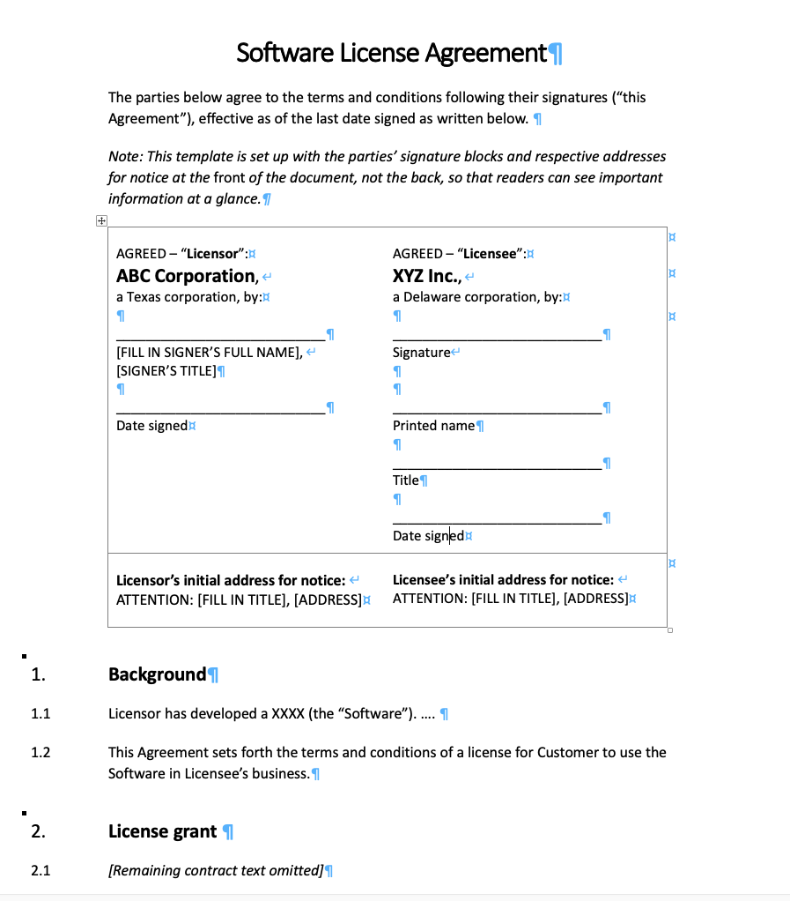

*BUT:* Any provisions /after/ the signatures should be /clearly/ incorporated by reference, as in the first paragraph of the example above.  {{{RWE}}} In a Kentucky case, a for-profit school used a one-page contract.

- The basic terms and signature blocks were on the front of the page.

- Additional terms and conditions — including an arbitration provision — were on the back of the page, as part of what the state supreme court described as "a sea of plain-type provisions dealing with tuition refunds, curriculum changes, ... and /arbitration/." (Emphasis in original.) 

Citing a state statute requiring signatures to be at the end of an agreement, the supreme court said that the arbitration clause was not part of the school's agreement. <cite> See [[https://scholar.google.com/scholar_case?case=5249537253889277528][Dixon v. Daymar Colleges Group, LLC]], 483 S.W.3d 332, 345-46 (Ky. 2015) (affirming denial of motion to compel arbitration). </cite>

(See also {{{RR}}} [[#incorp-ref]], concerning incorporation by reference.)

** Signature Mechanics {{{CLS}}}                                      :CLS:
  :PROPERTIES:
  :CUSTOM_ID: r-sig-mech
  :HTML_CONTAINER_CLASS: pr-top
  :END:

The provisions of {{{ths}}} are pretty much SOP (standard operating procedure).  For additional notes, see: {{{GET-TITLE-LINK-NUM(sig-blocks-cmt)}}}.

Contents:

#+TOC: headlines 1 local

*** "Document" — what's that?
  :PROPERTIES:
  :CUSTOM_ID: sigs-doc-defn
  :END:

In {{{ths}}}, the term "document" refers to information: (1) inscribed on paper (or some other tangible medium), and/or (2) stored in an electronic or other medium and retrievable in perceivable form. 

***** Note                                                              :CMT:
  :PROPERTIES:
  :HTML_CONTAINER_CLASS: cmtry
  :UNNUMBERED: notoc
  :END:

This is a paraphrase of the definition of "record" in § [[https://www.law.cornell.edu/ucc/1/1-201#Record][1-201(b)(31)]] of the Uniform Commercial Code. 

*** Signed — with what?
  :PROPERTIES:
  :CUSTOM_ID: sigs-with-what
  :END:

A party may sign {{{theK}}} and related documents using any reasonable instrument such as, for example —

{{{U1}}} pen and ink (or even pencil) on paper;

{{{UN}}} a computer mouse;

{{{UN}}} a stylus or finger on a tablet computer or other touchpad; and/or

{{{UN}}} by typing characters on a keyboard. 

***** Note                                                              :CMT:
  :PROPERTIES:
  :HTML_CONTAINER_CLASS: cmtry
  :UNNUMBERED: notoc
  :END:

See also the discussion of electronic signatures at § [[#k-sig-elec]]. 

*** Signed — with what name?
  :PROPERTIES:
  :CUSTOM_ID: sigs-names
  :END:

A person is free to use any (non-deceptive) name when signing a document, including:

{{{U1}}} a trade or assumed name, or 

{{{UN}}} a word, mark, or symbol,

as long the person does so with the present intention to authenticate the document. 

***** Note                                                              :CMT:
  :PROPERTIES:
  :HTML_CONTAINER_CLASS: cmtry
  :UNNUMBERED: notoc
  :END:

This is adapted from [[https://www.law.cornell.edu/ucc/3/3-401][§ 3-401]] of the Uniform Commercial Code. 

*** Delivery of (just) signed signature page(s)?

Whenever any party {{{A}}} signs {{{theK}}} or related document and sends it to another party {{{B}}}, {{{A}}} is free to send just the signed signature page; doing so has the same effect as if {{{A}}} had sent {{{B}}} the entire signed document, as long as {{{B}}} doesn't object within a reasonable time. 

***** Note                                                              :CMT:
  :PROPERTIES:
  :HTML_CONTAINER_CLASS: cmtry
  :UNNUMBERED: notoc
  :END:

Nowadays it's quite common for contracting parties, without leaving their offices, to sign separate copies of the contract; then, each party emails the other party a PDF of its signed signature page only. 

*** Is the "correct" version being signed?
  :PROPERTIES:
  :CUSTOM_ID: sigs-version
  :END:

If the signed document went through multiple drafts, then preferably the signature page clearly indicates the specific draft to which the signature page belongs. 

***** Note                                                              :CMT:
  :PROPERTIES:
  :HTML_CONTAINER_CLASS: cmtry
  :UNNUMBERED: notoc
  :END:

*Caution:* Are all signed signature pages "final"? It's very common for parties in separate locations to manually sign separate copies of a paper contracts and then to email a PDF image (or, old-school, to FAX) just their signed signature pages to each other. If only the signed signature pages of a contract will be exchanged, the parties should make sure it's clear that everyone is signing the same version of the document — otherwise, the contract might not be binding.

{{{RWE}}} /Not/ doing this proved fatal to a party's case in Delaware, where the parties had exchanged signature pages — but the pages were from /two different drafts/, only one of which included the crucial provision (a noncompetition covenant). The chancery court held that there had been no meeting of the minds — and thus there was not a valid contract. <cite> See [[https://scholar.google.com/scholar_case?case=16999054169873686895][Kotler v. Shipman Assoc., LLC]], No. 2017-0457-JRS (Del. Ch. Aug. 27, 2019) (rendering judgment for company). </cite>

{{{UN}}} *Pro tip:* To help establish which draft of a document is which: Strongly consider including, /on each page/ of {{{thek}}}, a running header or -footer that identifies the document and its version.

*Example:* In a draft confidentiality agreement between ABC Corporation and XYZ LLC, a running header could read "ABC-XYZ Confid. Agrmt. ver. 2019-03-01 15:00 CST" — where the date and time at the end are /hand-typed/, and not in a "field" that the word processing software will automatically update.

(Including such a running header can also help avoid confusion when the parties are discussing a draft of the agreement, by allowing the parties to make sure that everyone is looking at the same draft.)

*** Electronic signatures OK?
  :PROPERTIES:
  :CUSTOM_ID: k-sig-elec
  :END:

If a party signs a document by electronic means, it {{{VCS(has,will have)}}} the same effect as if the party had signed with pen and ink on paper. 

***** Note                                                              :CMT:
  :PROPERTIES:
  :HTML_CONTAINER_CLASS: cmtry
  :UNNUMBERED: notoc
  :END:

{{{H1}}} U.S. law explicitly law supports the use of electronic signatures, and U.S. courts now routinely honor electronic "signatures" (which are now common in England and Wales as well). <cite> *Electronic signature laws:* See generally the federal [[http://en.wikipedia.org/wiki/Electronic_Signatures_in_Global_and_National_Commerce_Act][Electronic Signatures in Global and National Commerce Act]] (/"E-SIGN Act/"), [[https://www.law.cornell.edu/uscode/text/15/chapter-96/subchapter-I][15 U.S.C. § 7001]] et seq., which provides in part (subject to certain stated exceptions) that, for transactions "in or affecting interstate or foreign commerce," electronic contracts and electronic signatures may not be denied legal effect solely because they are in electronic form. *At the U.S. state level,* 47 states, the District of Columbia, and Puerto Rico, and the U.S. Virgin Islands have adopted the [[http://en.wikipedia.org/wiki/Uniform_Electronic_Transactions_Act][Uniform Electronic Transactions Act]] ("/UETA/"). The remaining three states — Illinois, New York, and Washington — have adopted their own statutes validating electronic signatures. See, e.g., [[http://scholar.google.com/scholar_case?case=13229486302601936095][Naldi v. Grundberg]], 80 A.D.3d 1, 908 N.Y.S.2d 639 (N.Y. App. Div. 2010).  *UK law* allows electronic signatures as well — see [UK] Law Commission, Electronic Execution of Documents (2019), at [[https://perma.cc/UCQ7-U94M]]. </cite>

{{{UN}}} Looking at the specific case of Texas law: Under the definition of /signature/ at [[https://statutes.capitol.texas.gov/Docs/BO/htm/BO.1.htm#1.007][§ 1.007]] of the Texas Business Organizations Code, "a writing has been signed by a person when the writing includes, bears, or incorporates the person's signature. A transmission or reproduction of a writing signed by a person is considered signed by that person ...."

{{{HN}}} *Caution:* Under [[https://statutes.capitol.texas.gov/Docs/BC/htm/BC.322.htm#322.005][§ 5(b)]] of the (U.S.) [[https://en.wikipedia.org/wiki/Uniform_Electronic_Transactions_Act][Uniform Electronic Transactions Act]], parties must agree to electronic signatures — but that agreement "is determined from the context and surrounding circumstances, including the parties’ conduct." {{{Ths-cap}}} is intended to "check the box" that the parties have indeed agreed to conduct transactions electronically. 

{{{HN}}} *Caution:* State law might limit electronic signatures. {{{RWE}}} California law rules out "burying" an authorization to do electronic transactions in a standard form contract that _isn't_ electronic (unless the standard form contract is "separate and optional"), and also rules out waivers of that provision. <cite> See [[https://leginfo.legislature.ca.gov/faces/codes_displaySection.xhtml?lawCode=CIV&sectionNum=1633.5.=][Cal. Civ. Code § 1633.5(b)]] (emphasis and extra paragraphing added). </cite>

{{{UN}}} *Pro tip:* Be able to /prove up/ the authenticity of an electronic signature, otherwise the signature might not be given effect.

- {{{RWE}}} A California appeals court affirmed denial of an employer's petition to compel arbitration of a wage-and-hour claim by one of its employees. The arbitration agreement had an electronic signature, but according to the court, the employer had not sufficiently proved that the purported electronic signature on the arbitration agreement was in fact that of the employee. The court, in effect, provided contract professionals with *a road map for taking steps up front* that would later suffice to prove up an electronic signature in litigation.) <cite> [[https://scholar.google.com/scholar_case?case=7516877252978473256][Ruiz v. Moss Bros. Auto Group, Inc.]], 181 Cal. Rptr.3d 781, 232 Cal. App. 4th 836, 844-45 (Cal. App. 2014). </cite>

- {{{RWE}}} Similarly, in a New Jersey case, the state supreme court ruled that a cell-phone service provider hadn't sufficiently proved that _in fact_ it had sent an email to a customer containing terms of service with an arbitration clause. <cite> See [[https://scholar.google.com/scholar_case?case=17353416530816279695][Fazio v. Altice USA]], 261 N.J. 90, 337 A.3d 304, 305-06 (2025) (reversing trial court's order compelling arbitration and remanding case for trial). </cite>

*** Escrow of signed documents?
  :PROPERTIES:
  :CUSTOM_ID: sigs-escrow
  :END:

{{{UN}}} *Escrow of signed documents:* Once any party has signed {{{theK}}} or related document, the signing party is free to deliver, to another party or the other party's representative, the signed document (and/or the signed signature page(s)), to be held until one or more specified events has occurred, as long as the circumstances indicate that all relevant parties agreed to this. 

***** Note                                                              :CMT:
  :PROPERTIES:
  :HTML_CONTAINER_CLASS: cmtry
  :UNNUMBERED: notoc
  :END:

Many contracts are signed electronically by geographically-separated parties. For that reason, signature pages are sometimes delivered "into [[#nl-escrow-nts][escrow]]," to be held by attorneys until specified events occur, such as payment. <cite> See [[https://scholar.google.com/scholar_case?case=9331200139552745223][37celsius Capital Partners, L.P. v. Intel Corp.]], No. 24-2794, [[https://law.justia.com/cases/federal/appellate-courts/ca7/24-2794/24-2794-2025-12-23.html][slip op.]] at 5 (7th Cir. Dec. 23, 2025) (affirming summary judgment in favor of Intel) (signature pages for agreement to sell Intel subsiciary held in escrow until buyer 37celsius came up with purchase price — which ended up not happening). </cite>

Signature-page escrow typically involves an attorney for {{{A}}} sending {{{A}}}'s signed signature page to an attorney for {{{B}}}, who then holds the signed page it "in escrow" pending some specified event, such as {{{A}}}'s receipt of payment or of {{{B}}}'s own signed signature page. <cite> For more information, see, e.g., Anshu Pasricha and Thomas B. Romer, [[https://businesslawtoday.org/2022/02/mac-digital-documentation-protocol-best-practices-to-effect-esignings-closings-ma/][The MAC Digital Documentation Protocol: Best Practices to Effect eSignings and Closings for M&A]] (BusinessLawToday.org 2022) (a project of the ABA Business Law Section Mergers & Acquisitions Committee, Technology in M&A Subcommittee) (scan down to "Principle 3"). </cite>

Fairly-elaborate signature escrow provisions such as [[https://www.sec.gov/Archives/edgar/data/1403431/000095013708003369/c15909a7exv10w41.htm][this one]] can be found at the [[https://www.lawinsider.com/dictionary/signature-page-escrow-agreement][LawInsider.com site]] — although these are likely to be overkill in many situations.

{{{RWE}}} Here's an actual (anonymized) "signatures into escrow" email from a corporate acquisition deal in which I represented the seller:

#+begin_bordered
D.C.,

Attached are [Buyer's] signature pages to be held in escrow pending their express release by our client at Closing.

[Buyer's counsel's name]
#+end_bordered

In this particular case, Buyer's counsel later released Buyer's signature pages from escrow with an /oral/ statement, saying so on a Zoom call. (To be on the safe side, I confirmed the release in an email to Buyer's counsel.)  Buyer then sent the wire transfer for the purchase price.

*** Counterparts — same as originals?
  :PROPERTIES:
  :CUSTOM_ID: sigs-counter
  :END:

{{{UN}}} *Counterparts as originals:* If the parties sign {{{thek}}} and/or any related document — each, a "document" — in separate copies (known as "counterparts"), *then:* Each signed counterpart has the status of an original of a single integrated document. <aside> Counterpart clauses like this one  are pretty-commonly used in contracts, so that each party gets its own, fully-signed "original" of a contract. (See the examples at [[https://www.lawinsider.com/clause/counterparts-electronic-signatures][LawInsider]].)  </aside>

*** {{{ADDL}}}                                                         :ADDL:
  :PROPERTIES:
  :HTML_CONTAINER_CLASS: addl
  :END:

Contents:

#+TOC: headlines 1 local

**** Afterwards: Combine all signed pages into one document?
  :PROPERTIES:
  :CUSTOM_ID: sigs-signed-pages-combine
  :END:

It's a good idea to combine • the PDF of the unsigned agreement, and • the PDFs of the signed signature pages, into a single "record copy" PDF.

Then: Email the combined, record-copy PDF to all concerned: The email will serve as a paper trail to help establish the authenticity of the record copy.

**** Initials: The law might require them for particular provisions ...
  :PROPERTIES:
  :CUSTOM_ID: initials
  :END:

Some contract drafters like to include, in the margins, blank lines for parties to initial particular provisions. This might be required by law to make particular types of provision enforceale; for example, as discussed in the commentary at [[#chg-ucc2209]], [[http://www.law.cornell.edu/ucc/2/2-209.html][section 2-209(2)]] of the (U.S.) Uniform Commercial Code provides as follows:

#+begin_quote

(2) A signed agreement which excludes modification or rescission except by a signed writing cannot be otherwise modified or rescinded, but except as between merchants such a requirement on a form supplied by the merchant /must be separately signed by the other party/.
#+end_quote

(Emphasis added.)

**** ... but maybe /don't/ include initialing lines for particular provisions?
  :PROPERTIES:
  :CUSTOM_ID: initials-missing
  :END:

As an example of the "Don't Needlessly Raise the Bar for Your Client" Principle (see [[#bar-clear]]): Unless specifically required by law, it's not a great idea to include separate lines for initialing a particular provision of a contract.  That's because it's too easy for a party to forget (or intentionally fail) to initial the provision; that could lead to a dispute about whether the party /in fact/ agreed to the non-initialed provision — which in turn could lead to costly litigation, perhaps with unpredictable outcomes. 

(See [[#nl-arb-sep-sig]] for examples.)

**** Initials: Pen-and-ink changes should be initialed and dated

In the modern era of electronic documents and signatures, it's not often that parties make handwritten changes on a paper copy of a contract. If that's to be done, however, each party's signer should initial and date each such change. 

For an example of changes made in red comment bubbles in a PDF document, see a [[https://www.adamsdrafting.com/marking-changes-on-the-signature-copy-of-a-contract/][2019 blog post]] by Ken Adams — where a commenter points out that the changes should have been initialed, otherwise it might be tough to prove that the changes were part of the signed document.

[TO DO someday: Image]

**** Initials: Should each /hard-copy/ page be initialed?
  :PROPERTIES:
  :CUSTOM_ID: initial-hard-copy
  :END:

Suppose that "Alice" is signing /a hard copy/ of a contract, whether for herself or on behalf of her company. It's not the worst idea (but not strictly necessary) for Alice to initial the hard copy at the bottom-right corner of each page /and keep a photocopy of the entire contract with the initialed pages./ That can be useful if, for example:

- different parties sign different versions of the contract, which has been known to happen, as discussed at [[#sigs-signed-pages-cmtry]]; or

- another party surreptitously changes the contract language /after/ Alice signs, and then claims that Alice agreed to the change — that, too, has been known to happen, as discussed at {{{RR}}} [[#r-sig-integ-top]] — in which case Alice can produce her photocopy of the pages she initialed, without the surreptitious change.

**** Set a deadline for signature?
  :PROPERTIES:
  :CUSTOM_ID: sigs-dl-cmt
  :END:

A document could state a deadline for signature by one or more specified parties, so that the document would not be binding on any party unless each such specified party has signed /and delivered/ the document:
\bull to each other party stated in the deadline \bull on or before the close of business, at that other party's place of business, on the stated deadline date. 

This is based on a September 2021 suggestion by an anonymous commenter at [[https://www.redline.net/queries/intentional-policy-not-returning-signed-copies-ndas#comments-body-29086][redline.net]] (a lawyers' online forum), who notes that "[this] is standard practice in real estate contracts where the buyer submits a signed contract to the seller."

**** A signatures checklist
  :PROPERTIES:
  :CUSTOM_ID: sigs-pro-tips-drafter
  :END:

Here's a checklist of selected signature-related items for contract drafters and reviewers — of course, this checklist isn't a substitute for advice from a licensed attorney:

- Are all parties are signing the same, final version of the document?  ([[#sigs-signed-pages-cmtry]])

- Does each signature block correctly state /either/: (i) the signing party's full legal name, such as "ABC, Inc., a Texas corporation," /or/ (ii) a previously-defined "nickname" for the party, such as "Buyer"?  ([[#sigs-corp]] through [[#sigs-lps]])

- For each /organization/ that is a party to the contract: Does the signature block includes the title of the individual signer within the organization, such as "Vice President of Business Development," to help establish the [[#nl-app-auth][apparent authority]] of that individual signer to bind the organization?

- In addition, does the contract itself *not* state that only certain people have authority to sign on behalf of one or more parties — either that, or such a person is signing on behalf of each such party? ([[#nl-app-auth-no]]).

- Does each party's signature block includes a blank line labeled "Date signed," /not/ just "Date"?  ([[#sig-dates-cmt]]).

- Does /the law/, and/or a party's publicly-filed organizational documents, restrict who has authority to sign on behalf of a particular type of organizational party (trust, LLC, etc.)? ([[#nl-sig-auth-leg-lim]])

** Signatures: Notarize them? (Probably not) /(notes)/
  :PROPERTIES:
  :CUSTOM_ID: notary-top
  :END:

Typically, it won't be necessary (nor desirable) to get a contract "notarized." Sometimes, however, a party /will/ want, and might /need/, to get "ancillary" documents — for example, a deed or an assignment of rights — "acknowledged" before a notary public (or other official) by one of more of the signers.

Contents:

#+TOC: headlines 1 local

*** One form of "notarizing" means acknowledging that /you/ signed.
  :PROPERTIES: 
  :CUSTOM_ID: NotarizationBasics
  :HTML_CONTAINER_CLASS: olnum
  :END:

A document such as a deed to real property might include, after the signature blocks, a space for a notary public (or other official) to sign a certificate that the signer:

1. appeared before the notary;

2. /presented sufficient evidence/ to establish his or her identity (e.g., a driver's license, a passport, etc.); and

3. stated to the notary that he or she (the signer) signed the document. 

(The other common form of notarizing is the jurat, or oath by the signer, discussed at [[#notar-jurat-c]].)

*** A notary acknowledgement reduces the chance of forgery.
  :PROPERTIES:
  :CUSTOM_ID: notary-why
  :END:

When a document signer "acknowledges" his- or her signature as summarized above, the certificate and official seal of the notary public (or other authorized official) serve as legally-acceptable evidence that the signer's signature isn't a forgery — that is, evidence that the signed document is authentic. This is sometimes referred to as making the document /self-authenticating/ or /self-proving/.

And indeed, the law likely /requires/ a certificate of acknowledgement by an authorized official if the document is to be recorded in the public records so as to put the public on notice of the document's contents. 

{{{RWE}}}  Suppose that "Alice" is selling her house.  

--  To do so, Alice will pretty much always sign a deed and give the signed deed to "Bob," the buyer.

--  Bob will normally want to take (or send) the signed deed to the appropriate government office to have the deed officially recorded — that way, under state law, third parties will be on notice that /Bob/ now owns Alice's house.

But how can the government office, or for that matter a later title researcher, know for sure that "Alice's" signature on the deed to wasn't a forgery?  

The answer is that under the laws of most states, Alice's deed to Bob won't even be eligible for recording in the official records unless the deed includes an acknowledgement certificate — signed by a notary public or other authorized official — that Alice complied with the three numbered requirements at the beginning of this subclause.

(And if Alice signed the deed in a special capacity, such as executor of her father's estate, then the notary's certificate will usually say that, too.)

This acknowledgement procedure allows the civil servants who must record Alice's deed to look at the deed and have at least some confidence that the signature on it isn't a forgery.

(A notary acknowledgement also makes it considerably difficult for Alice to later try to disavow her signature.)

In some jurisdictions, Alice is not required to actually /sign/ the deed in the presence of the notary; she need only state to the notary that yes, she did in fact signed the deed. <cite> See generally Kelle Clarke, [[https://www.nationalnotary.org/notary-bulletin/blog/2015/04/key-differences-acknowledgment-jurat-certificates][Notary Essentials: The Difference Between Acknowledgments And Jurats]] (NationalNotary.org 2020). </cite>

*** Must the document's signer swear to /its truth/?
  :PROPERTIES:
  :CUSTOM_ID: notar-jurat-c
  :END:

Not usually: The type of notary certificate we're discussing here — an "acknowledgement" — is a different type of certificate than a [[https://www.nationalnotary.org/notary-bulletin/blog/2015/04/key-differences-acknowledgment-jurat-certificates][jurat]]. When a jurat is used in a document, the notary or other official certifies that the /signer/ of the document personally declared — after first promising to tell the truth, /under penalty of perjury/ — that the document's contents were true.

*** What wording must appear in a notary acknowledgement?

State law usually specifies just what wording must appear in an acknowledgement signed before a notary. For example, under Texas law, an individual's signature can be acknowledged using various short forms, such as the following for an individual: <cite> See Tex. Civ. Prac. & Rem. Code [[https://statutes.capitol.texas.gov/?tab=1&code=CP&chapter=CP.121&artSec=121.008][§ 121.008]]. </cite>

#+begin_bordered
State of Texas \
County of xxx

This instrument was acknowledged before me on (date) by (name or names of person or persons acknowledging).

(Seal) \\
(Signature of officer) \\
(Title of officer)

My commission expires: xxx
#+end_bordered  

*** The notary must (usually) keep a permanent record
  :PROPERTIES:
  :CUSTOM_ID: notary-well-bound
  :END:

In our above Alice-and-Bob example: Once Alice has done as required, the notary will also sign the certificate and imprint a seal on the deed. The notary might do this with a handheld "scruncher" that 3D-embosses the paper of the deed, or instead with an ink stamp; this will depends on the jurisdiction.  

Typically, the notary is also required to make an entry in a journal to serve as a permanent record.   *Pro tip:* It's useful to confirm that the notary in fact made such a permanent record — a family friend once won a lawsuit by getting a notary to admit, on cross-examination, that she (the notary) had /not/ made such an entry in the "well-bound book" that was then required by state law, which resulted in a land deed being excluded from evidence.

(State law might allow some or all of this notary-precordkeeping process to be done electronically.)

*** Other officials might also be able to "notarize"
  :PROPERTIES: 
  :CUSTOM_ID: AcknowWhoElse
  :END:

By statute, certain officials other than notaries public* are authorized to certify the authenticity of signatures in certain circumstances. For example, Texas law gives the power to certify signature acknowledgements:

- to district-court and county-court clerks, and

- /(in certain limited cases)/ to commissioned officers of the U.S. armed forces,

among others. <cite> See Tex. Civ. Prac. & Rem. Code [[http://www.statutes.legis.state.tx.us/Docs/CP/htm/CP.121.htm][§ 121.001]]. </cite>

*  Incidentally, the plural form is /not/ "notary publics" — the noun /notary/ is pluralized as /notaries/, the adjective /public/ is left alone. (It's the same with /attorneys general/.)

*** Notaries can't serve if they have a conflict of interest
  :PROPERTIES: 
  :CUSTOM_ID: AcknowNotaryConflict
  :END:

A notary public generally can't sign a certificate if the notary has a conflict of interest, e.g., notarizing something for an immediate-familly member. <cite> See generally, e.g., American Society of Notaries, [[http://www.asnnotary.org/?form=conflictofinterest][Conflicts of Interest]] (2008). </cite>

But under Texas law, when a notary public is an employee of a corporation, the notary is allowed to certify the acknowledgement of a signature on a document in which the corporation has an interest, /unless/ the employee is a shareholder who owns more than a specified percentage of the stock of the corporation. <cite> See Tex. Civ. Prac. & Rem. Code [[http://www.statutes.legis.state.tx.us/Docs/CP/htm/CP.121.htm#121.002][§ 121.002]]. </cite>

*** A flawed notarization can cause problems
  :PROPERTIES: 
  :CUSTOM_ID: NotarizationFlaws
  :END:

Parties will want to double-check that the notary "[[https://en.wikipedia.org/wiki/Do_the_needful][does the needful]]" (an archaic but useful expression) to comply with statutory requirements. 

{{{RWE}}} a New York case, Michelle and Gary Galetta signed a prenuptial agreement. When Gary filed for divorce some years later, Michelle asserted that the prenup was unenforceable. The court, agreeing with Michelle, voided the prenup, because the notary certificate for Gary's signature didn't recite that the notary public had confirmed his identity — even though it was undisputed that the couple's signatures were authentic, and there was no accusation of fraud or duress.

Affirming, New York's highest court said that the notarization requirement was important because it "necessarily imposes on the signer a measure of deliberation in the act of executing the document." <cite> [[https://scholar.google.com/scholar_case?case=10391338104026105572][Galetta v. Galetta]], 21 N.Y.3d 186, 189-90, 191-92, 991 N.E.2d 684, 969 N.Y.S.2d 826 (2013) (affirming summary judgment that prenup was invalid). </cite>

*** /Lawyers/ might not want to notarize client documents
  :PROPERTIES: 
  :CUSTOM_ID: NotaryLawyerAsWitness
  :END:

In many states it's easy to become a notary public. Some lawyers themselves become notaries so that they can certify the authenticity of clients' signatures on wills, deeds, and the like. 

Keep in mind, though: If a lawyer notarizes a document, then the lawyer might be called someday to testify in a court proceeding about a signed document. For example, the lawyer-notary might have to explain how he or she confirmed the signer's identity if that information isn't stated in the lawyer's notary records. That in turn might disqualify the lawyer from being able to represent the client whose signature was certified. <cite> See, e.g., Tex. Civ. Prac. & Rem. Code [[http://www.statutes.legis.state.tx.us/Docs/CP/htm/CP.121.htm][§ 121.001]]; [[http://www.legalethicstexas.com/Ethics-Resources/Rules/Texas-Disciplinary-Rules-of-Professional-Conduct/III--ADVOCATE/3-08-Lawyer-as-Witness.aspx][Tex. Discipl. R. Prof. Conduct 3.08]] ("Lawyer as Witness"). </cite>

(As a practical matter, though, that one point might not be too much of an issue, because the lawyer might already have to testify by virtue of having participated in the events leading up to the signing of the document.)

*** Notarization by videoconference?
  :PROPERTIES: 
  :CUSTOM_ID: notary-video
  :END:

Drafters needing a notary certificate should check whether applicable law /requires/ a personal appearance before a notary (or other official), or whether that can be done remotely by videoconference. <cite> See generally National Notary Association, [[https://www.nationalnotary.org/notary-bulletin/blog/2018/06/remote-notarization-what-you-need-to-know][Remote Notarization: What You Need to Know]] (nationalnotary.org Jun. 23, 2020) (showing states with remote-notary laws). For a survey of remote notarization laws, see Brett J. Natarelli, Madelaine A. Newcomb, and A. Paul Heeringa, [[https://www.americanbar.org/content/dam/aba/publications/business_lawyer/2021/76_2/survey-cfs-notarization-202104.pdf][Notarization and Property Recording Requirements in the Age of Social Distancing]], 76 Bus. Lawyer 607, 611 (AmericanBar.org 2021). </cite>

Remote notarization was an issue during the COVID-19 pandemic, during which the Texas governor announced an emergency suspension of some laws and authorized notarization of certain wills and real-estate documents. <cite> See Texas Secretary of State, [[https://www.sos.state.tx.us/statdoc/oog-temporary-suspension.shtml][Notice of Suspension of Statutes]] (sos.state.tx.us, undated); also [[https://gov.texas.gov/uploads/files/press/Office_of_the_Attorney_General_Guidance.pdf][this order]] (notarization of real-estate instruments). </cite>

*** Notarization: Exercises and discussion questions              :uhcd:OMIT:
  :PROPERTIES:
  :CUSTOM_ID: k-frame-q

  :END:

**** Discussion questions: Title, preamble, background                 :used:

1. <<gig-mw-nda-preamble>> FACTS: MathWhiz's CEO asks you to draft a confidentiality agreement ("NDA") between MathWhiz and a company she knows only as "Gigunda Energy," a multibillion dollar multinational corporation based in California. TRUE OR FALSE: In the NDA's preamble, it's OK to list Gigunda as simply "Gigunda Energy," without more. EXPLAIN.

2. For the NDA in #[[gig-mw-nda-preamble]], draft a title — consider the various title styles in [[#contract-title]].

3. For the NDA in #[[gig-mw-nda-preamble]], what information would you want to find out about Gigunda to include in the preamble — and how might you go about acquiring that information?

4. For the NDA in #[[gig-mw-nda-preamble]], describe /two/ ways you could avoid having to repeat the parties' full legal names throughout the contract. What are some pros and cons of each way?

5. How would you write the /very first/ sentence of the NDA's preamble?

6. In the NDA's preamble, how important is it to include the parties' full legal names, and why?  What about their state(s) of incorporation or other organization?

7. In the NDA's preamble, would you say that the confidentiality is (i) "between," or (ii) "by and between," or (iii) "among," Gigunda and MathWhiz?

8. Why might you want to include the city and state of Gigunda's /principal place of business/ in the NDA's preamble?

9. Why might you want to include Gigunda's /initial address for notice/ in the NDA's preamble?

10. <<gig-mw-nda-oral>> MORE FACTS: MathWhiz's CEO tells you that she and her contact at Gigunda have already discussed, on a Zoom call, a limited amount of each party's confidential information but they agreed orally to keep the information confidential. QUESTION: Is that oral agreement enforceable?

11. Same facts as #[[gig-mw-nda-oral]]: How could you set up the /written/ NDA to cover the previous Zoom call?

12. MORE FACTS: MathWhiz's CEO tells you that Gigunda wants the NDA to cover not just Gigunda's confidential information, but also some confidential information of Gigunda's wholly-owned Mongolian subsidiary. QUESTION: How could you do that?

13. Exercise: Using what you know from the above, draft a very simple "Background" section for the NDA.

14. To what extent would you want to put specific details of the NDA — for example, how long the confidentiality obligations of the NDA will last — into its /Background/ section?

15. FACTS: Gigunda's lawyer has prepared a draft of the NDA, which says at the beginning: "This Agreement is made effective January 31, 20xx." MathWhiz's lawyer has asked you to review the draft and make any necessary revisions. QUESTION: Would you change the just-quoted sentence to state that the Agreement is effective the last date signed? Why or why not?

16. In the signatures-up-front example in [[#sig-blocks-front-cmt]], what item of information is missing that could prove useful someday in the future? Why might that information be useful? How serious a flaw is it that this information is missing?

17. Draft a preamble and background section for the Gigunda-MathWhiz agreement.

18. True or false: In an agreement title that contains party names, the full legal names of the parties must be spelled out in full.

**** Discussion questions: Signatures
  :PROPERTIES:
  :CUSTOM_ID: sigs-q-gen
  :HTML_CONTAINER_CLASS: olnum
  :END:

1. Explain if false: In the U.S., before parties can use electronic signatures, they must first sign a hard-copy preliminary agreement that they can use electronic signatures for subsequent agreements.

2. Explain if false: Nowadays, most contracts get printed out in two copies, and each copy is signed by both parties, so that each party will have one, fully-signed original to keep.

3. Explain if false: It's not a great idea to put signature blocks at the front of a contract. EXPLAIN.

4. Explain if false: It's a good idea to include language such as the following just before the signature blocks: "To evidence the parties’ agreement to this Agreement, each party has executed and delivered it on the date indicated under that party’s signature."

5. Explain if false: Signature blocks should have the "date signed" spaces pre-filled in so that the signers won't have to remember to write in the dates.

6. Explain if false: Each individual signer's signature block should have a blank space for the signer to handwrite in the date signed.

7. Explain if false: It's OK to let a signature block get split between two different hard-copy pages (that is, the first part of the signature block is at the bottom of one page and the remainder is at the top of the next page).

8. What feature of Microsoft Word can you use to get two signature blocks side-by-side on the page? /(Hint: It starts with "T.")/

9. /(From Contracts 101 for 1Ls:)/ By law, what's the significance of the last date signed?

10. Explain if false: The signature block for a corporation or LLC can just state the individual signer's name, e.g., "Jane Doe," without any other information.

11. <<FoogleAdSig1>>  FACTS: ABC Corporation's marketing department is negotiating a contract with social-media giant Foogle for a $10 million online advertising campaign to promote ABC's products. At the request of ABC's director of marketing, ABC's vice president for human resources Allen Baker Cole signs the contract. BUT: ABC's CEO learns about the contract and immediately demands that it be set aside, because the CEO had planned to use that money for other things. ABC's internal policy manual states that all advertising contracts must be signed by the executive vice president for sale. QUESTION: Can ABC use Allen's lack of authority as a reason to cancel the advertising contract?

12. DIFFERENT FACTS: Before the advertising contract was signed, ABC's vice president of marketing sent an email to his contact at Foogle, stating that only he (the VP of marketing) had authority to sign the advertising contract; the Foogle contact emailed back, saying "fine, that works for us." QUESTION: Does that change your answer in #[[FoogleAdSig1]] above? If so, how?

13. Explain if false: It's generally OK for an attorney to sign on behalf of a client as long as the signature (or signature block) indicates that the attorney is signing in that capacity and not as an officer of the client or as an individual party.

14. Explain if false: It's generally OK for a company's vice president and general counsel to sign a contract with Thomson West for the legal department's Westlaw subscription.

15. If exchanging signed signature pages only, how can you make sure each party's signed signature page is from the same version of the contract? /(In one case, discussed in the reading, this was a problem — what happened there?)/

16. When (if ever) might it be appropriate to do the following:
    - Appropriate to backdate the effective date of a contract
    - INappropriate to backdate the effective date of a contract
    - Appropriate to backdate the signers' signatures
    - INappropriate  to backdate the signers' signatures

**** Discussion questions: Notary certificates               :USED:UHCD:OMIT:
  :PROPERTIES:
  :CUSTOM_ID: AcknowNotaryQ
  :HTML_CONTAINER_CLASS: olnum
  :END:

1. FACTS: Your client, Landlord, has negotiated a five-year commercial lease for one of its office buildings. The tenant's lawyer wants the signers to have their signatures notarized. Landlord agrees to have the signatures notarized. ASSUME: All events take place in Texas and are subject to Texas law. QUESTION: /Why/ might the tenant's lawyer want the lease to be notarized? Would that be in your client Landlord's best interest? EXPLAIN. <cite> See generally J. Allen Smith & Michael R. Steinmark, [[http://blog.settlepou.com/tenants%E2%80%99-rights-under-unrecorded-leases/][Tenants' Rights Under Unrecorded Leases]], at http://goo.gl/S2prC (2010); Tex. Prop. Code §§ [[http://www.statutes.legis.state.tx.us/Docs/PR/pdf/PR.12.pdf][12.001]], [[http://www.statutes.legis.state.tx.us/Docs/PR/pdf/PR.13.pdf][13.001, 13.002]]. </cite>

2. If the notary public can't find her notary seal, may she sign the notary certificate and skip applying the seal? EXPLAIN. <cite> See Tex. Gov. Code [[http://www.statutes.legis.state.tx.us/Docs/GV/pdf/GV.406.pdf][§ 406.013]]; Tex. Civ. Prac. & Rem. Code [[http://www.statutes.legis.state.tx.us/Docs/CP/htm/CP.121.htm][§ 121.004]]. </cite>

3. What must the notary public do /before/ signing the notary certificate to confirm that the signers are who they claim to be? <cite> See Tex. Civ. Prac. & Rem. Code [[http://www.statutes.legis.state.tx.us/Docs/CP/htm/CP.121.htm#121.005][§ 121.005]](a). </cite>

4. Must the notary's certificate say anything in particular about the identity of the signer? EXPLAIN. <cite> See Tex. Civ. Prac. & Rem. Code [[http://www.statutes.legis.state.tx.us/Docs/CP/htm/CP.121.htm#121.005][§ 121.005]](b). </cite>

5. What must the notary do /after/ notarizing the signature(s)? EXPLAIN. <cite> See Tex. Civ. Prac. & Rem. Code [[http://www.statutes.legis.state.tx.us/Docs/CP/htm/CP.121.htm#121.012][§ 121.012]]; Tex. Gov. Code [[http://www.statutes.legis.state.tx.us/Docs/GV/pdf/GV.406.pdf][§ 406.014]] </cite>

6. If no notary is around, can /you/ notarize the signatures as an attorney? /Should/ you? EXPLAIN. <cite> See Tex. Civ. Prac. & Rem. Code [[http://www.statutes.legis.state.tx.us/Docs/CP/htm/CP.121.htm][§ 121.001]]; [[http://www.legalethicstexas.com/Ethics-Resources/Rules/Texas-Disciplinary-Rules-of-Professional-Conduct/III--ADVOCATE/3-08-Lawyer-as-Witness.aspx][Tex. Discipl. R. Prof. Conduct 3.08]] ("Lawyer as Witness"). </cite>

7. Surprise! The person who will sign the lease for the tenant has gone on a business trip to Kuwait and will FAX her signed signature page to you. Can your secretary, who is here in Houston and is a notary public, notarize that signature page? EXPLAIN. <cite> See Tex. Civ. Prac. & Rem. Code [[http://www.statutes.legis.state.tx.us/Docs/CP/htm/CP.121.htm#121.004][§ 121.004(a)]]. </cite>

8. Who /in Kuwait/ could "notarize" the tenant signer's signature? EXPLAIN. <cite> See Tex. Civ. Prac. & Rem. Code [[http://www.statutes.legis.state.tx.us/Docs/CP/htm/CP.121.htm][§ 121.001]]. </cite>

9. /Why/ "notarize" a document signature with an /acknowledgement/, as opposed to a jurat?  EXPLAIN.

**** Exercises & discussion questions                        :USED:UHCD:OMIT:
  :PROPERTIES:
  :CUSTOM_ID: contract-arise-q
  :HTML_CONTAINER_CLASS: olnum
  :END:

1. FACTS:  Alice and Bob are natural-gas traders. Alice sends Bob an Internet instant message ("IM") offering to sell Bob a stated quantity of natural gas, of a specified, industry-standard quality, for delivery at a specified location and date, at a stated price. Also by IM, Bob responds "Yes." Let's assume there are no defenses to formation such as lack of capacity. QUESTION: Have Alice and Bob entered into an enforceable contract?   (Vote "Yes" or "No" using the Zoom participant list voting buttons; Raise Hand if unsure.)

2. True / false / maybe: The terms of a "letter of intent" will generally be non-binding, because that's why parties sign a letter of intent in the first place. EXPLAIN.

3. FACTS: The CEO of MathWhiz and a VP of Gignda Energy have a lunch meeting in Houston to talk about a quickie data-analysis project that Gigunda wants MathWhiz to undertake the following day.

   - The lunch is in a family-style restaurant that has paper "coloring book" placemats, with crayons for kids to use in coloring in the drawings.

   - Neither executive thought to bring a pen or pencil, so using crayons to write on the back of one of their placemats, the two executives jot down bullet points for the main terms of the data-analysis project — what MathWhiz will do, the delivery date (the following day), and the fee that Gigunda would pay upon completion.

   - Each executive signs and dates the placemat at the bottom.

   - The MathWhiz CEO uses her camera to take a picture of the signed placemat, then emails the photo to the Gigunda Energy vice president.

   - When the executives leave the restaurant, one of them tears up the placemat, wads it up the strips, and leaves them to be picked up and trashed when the table is bussed.

   - QUESTIONS:
     - A) True or false: This is a "verbal" contract. EXPLAIN.
      -B) True or false: This is a "written" contract.

4. [@4] True or false: At least some types of binding contract can be formed by exchanging /emails/.

5. True or false: A contract that /might/ be completely performed in a year is invalid under the Statute of Frauds if it turns out that the contract /isn't/ completely performed in a year.

6. True or false: At least some types of binding contract can be formed by exchanging /text messages/.

7. True or false: An /oral/ contract could be binding, depending on the circumstances.

8. True or false: An email can provide evidence to corroborate the existence of a binding /oral/ contract even if the email doesn't itself constitute a binding /written/ contract.

9. True or false: For an email contract to be binding, each party's email must include the specific word "Signed" to make it clear that the party is assenting to the terms.

10. True or false: In at least one state, text messages likely won't be enough to form a certain type of contract.

11. True or false: An agreement to agree will generally be enforceable in the U.S. — the court will weigh expert testimony to determine what reasonable parties likely /would/ have agreed to.

12. FACTS: A potential customer sends a purchase order to a supplier for 1,000 widgets;

    - The purchase order's fine print contains detailed terms and conditions, /including/ a rejection of any other terms provided by the supplier.

    - The supplier ships the 1,000 widgets to the customer together with an invoice.

    - The fine print in the supplier's invoice contains detailed terms and conditions, /including/ 

      - (i) a rejection of any other terms provided by the customer;

      - (ii) a conspicuous disclaimer of all implied warranties; and

      - (iii) a requirement that all disputes must be resolved by binding arbitratation, not by litigation in court.

    - Under the applicable law, all sales of goods include an implied warranty of merchantability unless conspicuously disclaimed in the parties' contract. 

    - QUESTION: If the customer wants to make a claim against the supplier for breach of the implied warranty of merchantability, must the customer /arbitrate/ the claim, or can it bring a lawsuit in court? (Assume for now that the arbitration clause would be enforceable IF the parties agreed to it.)

13. FACTS: A Houston-area /Honda/ dealership sells a new Honda to a customer, taking the customer's used /Ford/ "in trade."

    - Assume (incorrectly) that in Texas, sales of cars are not governed by any special laws other than the Uniform Commercial Code.

    - QUESTION: In Texas, is the Honda dealer a "merchant" /as to the used Ford/? Why or why not?

    - VARATION:  The Honda buyer, instead of trading in a used Ford, offers a bass boat on a trailer. The dealership accepts the trade because the dealership's owner has long wanted to take up fishing again and figures he can use the bass boat to teach his grandchildren how to fish. QUESTION: Is the dealership a "merchant" as to the bass boat?

14. FACTS: Two Houston companies, ABC Corp. and XYZ LLC, enter into a contract for XYZ to build a warehouse on ABC's property in northwest Houston for a stated price. 

    - Before any work starts on the project at all, the on-the-ground managers for the two companies can't seem to get along. One day, ABC's manager angrily tells her boss that XYZ's construction supervisor told her, "that's it, we're done, find yourself another builder!"

    - ABC decides that yes, it'd be better for it to use another builder. So ABC signs a contract with MNOP LLC — at a significantly-higher price — and sues XYZ for breach of contract, asserting that XYZ's construction supervisor repudiated the contract and so XYZ should be liable for the extra cost that ABC would incur by switching to MNOP LLC.

    - At the jury trial, ABC's manager testifies under oath that XYZ's construction supervisor said what's described above; in his own testimony, XYZ's supervisor denies this, also under oath.

    - QUESTION: What kinds of other evidence could ABC seek to adduce at trial to support its theory of the case — IF it had such evidence?

    - QUESTION: If the jury accepts one side's version of events, how easy would it be for the trial judge to overrule the jury's finding at the losing party's request? What about an appellate court? (Hint: See the [[https://www.law.cornell.edu/constitution/seventh_amendment][Seventh Amendment]] and [[https://www.law.cornell.edu/rules/frcp/rule_50][Fed. R. Civ. P. 50(a)]] concerning judgment as a matter of law.)

    - QUESTION: What does the above tell you about the importance of (i) putting things in writing, and (ii) keeping the writings?

** Third-Party Conflict Disclosure {{{CLS}}}                          :CLS:
  :PROPERTIES:
  :CUSTOM_ID: r-gen-rep
  :HTML_CONTAINER_CLASS: pr-top
  :END:

Contents:

#+TOC: headlines 1 local

*** Any third-party conflicts?

So far as {{{A}}} is aware, apart from what {{{A}}} has otherwise clearly and prominently disclosed to {{{B}}}:

{{{U1}}} {{{A}}} is not a party to any "Problematic" (as defined below) agreement with any third party;

{{{UN}}} {{{A}}} is not a target of any Problematic claim, in litigation or otherwise, by any governmental- or nongovernmental claimant; and

{{{UN}}} {{{A}}} is not subject to any Problematic injunction, judgment, or regulatory restriction.

***** Note                                                              :CMT:
  :PROPERTIES:
  :HTML_CONTAINER_CLASS: cmtry
  :UNNUMBERED: notoc
  :END:
{{{Ths-c!ap}}} provides a "canary in the coal mine" to help the parties identify (and, ideally, address) certain problems /before/ they sign {{{thek}}}. 

*** But: Sandbagging possible?

If {{{A}}} does not disclose a particular Problematic thing to {{{B}}}, *but* {{{B}}} knows (or should know) that those flowdown obligations exist, *then* {{{A}}}'s nondisclosure is not deemed to contravene {{{ths}}}.

***** Note                                                              :CMT:
  :PROPERTIES:
  :HTML_CONTAINER_CLASS: cmtry
  :UNNUMBERED: notoc
  :END:

See also the general notes about sandbagging at [[#sandbag-a]].

*** "Problematic" — materiality threshold?

In the definition above, a "Problematic" thing is one whose effects — alone or in combination with other things — could reasonably be regarded as posing a risk of materially interfering with (i) any party's performance under {{{thek}}}, and/or (ii) {{{A}}}'s exercise of its rights under {{{thek}}}.

*** {{{ADDL}}}                                                         :ADDL:
  :PROPERTIES:
  :HTML_CONTAINER_CLASS: addl
  :END:

Contents:

#+TOC: headlines 1 local

**** What kinds of third-party claims might be "Problematic"?

As an example: One possible "Problematic" claim would be that a party's performance under {{{thek}}} would constitute tortious interference, on the part of any party to {{{thek}}}:

   - with a contract between the representing party and any third party, or

   - with the prospective economic advantage of any third party.

(See generally the Wikipedia discussion of [[https://en.wikipedia.org/wiki/Tortious_interference][tortious interference]] with contractual relationship or prospective economic advantage. A tortious-interference lawsuit can have catastrophic results, as happened in the /Pennzoil v. Texaco/ case cited in the note to § [[#loi-mng]].)

**** Further reading

Some strategically-important types of agreement include more-detailed representations /and/ warranties of this general kind — see, for example, the (pretty-typical) reps and warranties in the [[https://tinyurl.com/UAL-CAL][merger agreement]] between United Airlines and Continental Airlines, from which some of the concepts in this Option are drawn.

** Writing-Requirement Challenges {{{CLS}}}                           :CLS:
  :PROPERTIES:
  :CUSTOM_ID: r-wrt-rqmt-chall
  :HTML_CONTAINER_CLASS: pr-top
  :END:

A party to a contract might want to try to skirt a writing requirement — e.g., a requirement that amendments and/or waivers be in writing. Toward that end, the party might claim that the writing requirement was itself waived in some manner other than a writing. (This is discussed at length at [[#amend-writ-enf]].)  {{{Ths-cap}}} is meant to give such a party a reason to think twice before doing so.

Contents:

#+TOC: headlines 1 local

*** The {{{NOUN-C}}}
  :PROPERTIES:
  :CUSTOM_ID: r-wrt-rqmt-ctst
  :END:

{{{U1}}}  *Heightened proof — up front:* If applicable law allows {{{A}}} to argue that {{{B}}} waived a writing requirement in {{{theK}}}, *then* {{{A}}} doesn't make such an argument without accompanying the argument with heightened proof as provided in Delaware law.

(b)  *Attorney-fee liability for failed challenge:* If {{{A}}} unsuccessfully challenges such a writing requirement, then {{{A}}} pays or reimburses {{{B}}}'s [[#atty-fee-defn][attorney fees]] incurred in contesting the challenge. <aside> This section is designed to encourage each party to think twice before asserting that another party supposedly waived a writing requirement. </aside>

*** Background: Some courts might disregard a writing requirement       :CMT:
  :PROPERTIES:
  :CUSTOM_ID: amend-writ-enf
  :END:

/(Students, you can just skim this section.)/

Here's a business problem: Sometimes parties to a contract, in the course of their dealings will agree /orally/ to modify the contract, or to waive a contract requirement. Of course, the parties /should/ follow up with written documentation of the modification. But that doesn't always happen — even when the contract specifically requires such a writing. 

Even when a contract clearly says that amendments must be in writing, in litigation a party might claim that the parties /orally/ agreed to /waive/ that writing requirement.  

# Cardozo photo:  https://en.wikipedia.org/wiki/Benjamin_N._Cardozo
#+ATTR_HTML: :alt Benjamin Cardozo :title Benjamin Cardozo  :class photo-at-right photowidth20
 

This doctrine is illustrated in a century-old New York precedent — for mnemonic purposes, we'll call it the "*Cardozo Rule*," after its author, later a Supreme Court justice — parties are free to /orally waive/ a contractual requirement that amendments and waivers must be in writing, subject to any possible impact of the statute of frauds (see [[#stat-frauds]]):

#+begin_quote

Those who make a contract, may unmake it. 

The clause which forbids a change may be changed like any other. 

The prohibition of oral waiver, may itself be waived. 

Every such agreement is ended by the new one which contradicts it.

What is excluded by one act, is restored by another. 

Whenever two men /[sic]/ contract, no limitation self-imposed can destroy their power to contract again /[to amend the first contract]/.

You may put it out by the door, it is back through the window.  <cite> [[https://casetext.com/case/beatty-v-guggenheim-exploration-co][Beatty v Guggenheim Exploration Co.]], 225 N.Y. 380, 387-88 (1919) (Cardozo, J.), /quoted in/ [[https://scholar.google.com/scholar_case?case=8191602377925876662][Israel v. Chabra]], 12 N.Y.3d 158, 163-64, 878 N.Y.S.2d 646, 906 N.E.2d 374 (2009) (cleaned up, extra paragraphing added). </cite>
#+end_quote

And some other jurisdictions will likewise let parties at least argue that a writing requirement was orally waived. *New Zealand* and *Singapore* are two examples. <cite> See [[https://www.courtsofnz.govt.nz/assets/cases/2014/sc-44-2013-savvy-vineyards-v-kakara-estate-and-anor.pdf][Savvy Vineyards 3552 Ltd. v. Kakara Estate Ltd.]], [2014] NZSC 121, ¶ 112, /discussed in/ Jeremy Bell-Connell and Hayden Wilson, [[https://www.jdsupra.com/legalnews/no-oral-modification-clauses-need-a-9908038][No oral modification clauses need a closer look in New Zealand]] (JDSupra 2021); [[https://www.supremecourt.gov.sg/docs/default-source/module-document/judgement/-2021-sgca-43-pdf.pdf][Lim v Hong]], [2021] SGCA 43, /discusssed at/ Julian Bailey and Matthew Secomb, [[https://www.jdsupra.com/legalnews/singapore-goes-its-own-way-on-no-oral-3659787][Singapore goes its own way on ‘no oral modification’ clauses]] (JDSupra 2021). </cite>

*** In some states, piercing a contractual writing requirement requires heightened proof
  :PROPERTIES:
  :CUSTOM_ID: amend-writ-del
  :END:

{{{U1}}} {{{Ths-cap}}} adopts *Delaware* law's (grudging) ability of a party to assert that the parties /orally/ agreed to waive an amendments-in-writing requirement. (See the discussion of the "[[#amend-writ-enf][Cardozo Rule]]" at [[#amend-writ-enf]].)

*But* Delaware law also says that the asserting party must meet a heightened evidentiary burden, because the state's law disfavors such assertions. <cite> See, e.g., [[https://courts.delaware.gov/Opinions/Download.aspx?id=110480][Tunney v. Hilliard]], No. 1317, letter op. at 14 & n.16 (Del. Ch. Aug. 20, 2008), /aff’d/, [[https://scholar.google.com/scholar_case?case=1363397292530063657][970 A.2d 257]] (Del. 2009). </cite>

{{{RWE}}} *Massachusetts* law also allows such claims; this was noted in a federal court opinion, which allowed a contractor's lawsuit over a purported equity grant to move forward, but with a veiled warning about the proof requirement:

#+begin_quote

A provision that an agreement may not be amended orally but only by a written instrument does not necessarily bar oral modification of the contract. 

Whether an oral modification occurred *can be inferred* from the *conduct* of the parties and from the attendant *circumstances* of the case. The proponent of the oral modification must present *evidence of sufficient force to overcome the presumption* that the integrated and complete agreement, which requires written consent to modification, expresses the intent of the parties. <cite> [[https://scholar.google.com/scholar_case?case=5163790394918367802][Hoffman v. Thras.io Inc.]], 538 F. Supp.3d 196, 206 (D. Mass. 2021) (denying relevant part of motion to dismiss, citing cases; cleaned up, emphasis and extra paragraphing added). </cite>
#+end_quote

# Home Improvement photo: https://en.wikipedia.org/wiki/Home_Improvement_(TV_series)
#+ATTR_HTML: :alt Home Improvement TV show logo :title Home Improvement TV show logo  :class photo-at-right photowidth20

Similarly, under *California law*, even if a contract does contain an amendments-in-writing requirement, a party can try to claim that the requirement was /orally/ waived — but the party must specifically prove that the waiver happened.

{{{RWE}}} In a case out of Hollywood, the parties fought over how to share the profits from the TV series /Home Improvement/. Long story short: 

- An appeals court ruled that a jury must decide whether the Disney company had orally waived or agreed to modify an incontestability provision in the contract in suit — whether by words or by conduct.

-   But (said the court): The plaintiffs would still have to /specifically prove/ that Disney had in fact waived the requirement. 

{{{UN}}} To be sure: It might seem strange to adopt a state's law for one specific provision in a contract. But it's not unprecedented, as discussed at [[#GovLawIssue]]. <cite> See [[https://scholar.google.com/scholar_case?case=5208990857447730031][Wind Dancer Production Group v. Walt Disney Pictures]], 10 Cal. App. 5th 56, 62, 215 Cal. Rptr. 3d 835 (2017); /id./, 10 Cal. App. 5th at 78-79, /citing/ [[https://leginfo.legislature.ca.gov/faces/codes_displaySection.xhtml?lawCode=CIV&sectionNum=1698][California Civil Code § 1698(d)]]. </cite>

*** A writing requirement might well be enforced.                       :CMT:
  :PROPERTIES:
  :CUSTOM_ID: amend-doc-juris-enforce
  :END:

/(Students, you can just skim this section too.)/

In New York, the [[#amend-doc-juris-enforce][Cardozo Rule]] has (largely) been *overruled by statute*; see [[https://codes.findlaw.com/ny/general-obligations-law/gob-sect-15-301.html][N.Y. General Obligations Law 15-301(1)]], which provides that: "A written agreement ... which contains a provision to the effect that it cannot be changed orally, cannot be changed by an executory agreement /unless/ such executory agreement is in writing and signed[:] [i] by the party against whom enforcement of the change is sought or [ii] by his agent." (Emphasis and bracketed text added.) 

In some other U.S. jurisdictions, courts will likewise uphold contractual requirements that amendments and waivers must be in writing. <cite> See, e.g., [[https://scholar.google.com/scholar_case?case=17559132620534848593][DeValk Lincoln Mercury, Inc. v. Ford Motor Co.]], 811 F.2d 326, 334 & n.2 (7th Cir. 1987); to like effect, see [[https://scholar.google.com/scholar_case?case=9790779032974242267][Ryan Companies U.S., Inc. v. FDP WTC, LLC]], No. 20-1366, slip op. (Iowa App. Jan. 12, 2022) (unpublished; reversing, in part, judgment awarding breach-of-contract damages to contractor). </cite>

# https://en.wikipedia.org/wiki/Flag_of_the_United_Kingdom
#+ATTR_HTML: :alt UK flag :title UK flag   :class photo-at-right photowidth20

{{{RWE}}} The UK's Supreme Court once cited the Cardozo Rule but expressly *rejected* it. The court concluded that "the law should and does give effect to a contractual provision requiring specified formalities to be observed for a variation." <cite> [[https://www.bailii.org/uk/cases/UKSC/2018/24.html][Rock Advert. Ltd v MWB Bus. Exch. Ctrs. Ltd]], [2018] UKSC 24 ¶¶ 7, 10. </cite>

*** Pro tip: Do /some/ kind of written confirmation of waiver
  :PROPERTIES:
  :CUSTOM_ID: wrt-confirm-some
  :END:

A good #MuscleMemory habit: /Any/ written confirmation of a purported oral waiver is better than none. It's far, far better to confirm an amendment to {{{theK}}} — even with a minimalist writing such as an email exchange or even just an unanswered text — than to rely on fallible human memory. As the Ninth Circuit once noted in another context (a dispute concerning an alleged transfer of copyright ownership): "It doesn't have to be the Magna Charta; a one-line pro forma statement will do." <cite> [[https://scholar.google.com/scholar_case?case=9695307318571874997][Effects Assoc., Inc. v. Cohen]], 908 F.2d 555, 557 (9th Cir. 1990). </cite>

* What format? /(Notes)/
  :PROPERTIES:
  :CUSTOM_ID: k-fmt
  :HTML_CONTAINER_CLASS: chap
  :END:

Contents:

#+TOC: headlines 1 local
** Some traditional contract formats
  :PROPERTIES:
  :CUSTOM_ID: k-trad-st
  :END:

Contracts can be found in various traditional styles. For example:

\bull  Lots of contracts are *simple lists of numbered paragraphs*. Example: Here's a [[https://toedtclassnotes.site44.com/RedlineExamplePages.pdf][short-and-sweet confidentiality agreement]]; this is an annotated version of a contract that I reviewed for a client, with redlining and comment bubbles.

\bull  *Merger & acquisition agreements* are among the longer ones you'll see, with "Article" and "Section" headings. {{{RWE}}} See, e.g., the "[[https://www.sec.gov/Archives/edgar/data/1163302/000110465923126953/tm2333110d3_ex2-1.htm#][Agreement and Plan of Merger]]" (that's the customary title for such contracts) under which Nippon Steel was to acquire U.S. Steel until the Biden Administration blocked the transaction — but then the Trump Administration [[https://en.wikipedia.org/wiki/Acquisition_of_U.S._Steel_by_Nippon_Steel][allowed the merger to go forward]] with the United States receiving a "golden share."

\bull  Somewhere in the middle, complexity-wise, are *online agreements* such as that for customers of [[https://aws.amazon.com/agreement/][Amazon Web Services]].

Contents:

#+TOC: headlines 1 local

** Whose contract form to use?
  :PROPERTIES:
    :CUSTOM_ID: kill-deal-cradle
  :END:

If you're a small company, insisting on using /your/ contract form with customers is a great way to kill a deal quickly.  For reasons good and bad, big companies and law firms often want to use their contract forms, not yours — *even when those contract forms might be gravely flawed*. <cite> See generally Tara Chowdhury, Faith Chudkowski, and Mitu Gulati, [[https://repository.law.miami.edu/cgi/viewcontent.cgi?article=4783&context=umlr#page=8][The Form Knows Best]], 79 U. Mia. L. Rev. 607, 618 (2025) ("The reliance on the market-standard forms reflects a broader aversion to altering familiar templates, regardless of underlying flaws or legal developments"), available at https://repository.law.miami.edu/umlr/vol79/iss4/3; Glenn D. West, [[https://repository.law.miami.edu/umlr/vol79/iss4/4/][The Form Doesn’t Know Anything: A Response to Chowdhury, Chudkowski & Gulati]], 79 U. Mia. L. Rev. 628, 635 (2025) ("the pressure to accept what market studies supposedly demonstrate as 'market terms' is extremely powerful"), available at https://repository.law.miami.edu/umlr/vol79/iss4/4. </cite>

(DCT comment: On more than one occasion a small-vendor client has paid me to review and (extensively) redline a contract form provided by a giant company's procurement department — only to be told by the procurement people, "sorry, we sent you the wrong form." Arghh!)

Certainly it's important to offer to draft the contract. And if the big company /reeaally/ wants to do a deal with you, then you might get away with insisting on controlling the typewriter.

But *bad things can happen*, though, if you simply fold your arms and refuse to negotiate the other side's contract paper:

- Even if the big company's negotiators grudgingly agree to work from your draft contract, *they'll start off thinking that your company is less than cooperative* (which isn't great for the business relationship). 

- Then later, when you ask for a substantive concession that's important to you, they may be less willing to go along.

- And in any case, their agreement to use your contract form, in their minds, will be a concession on their part, *meaning that /you/ now supposedly owe /them/ a concession*.

For a /vendor/ lawyer, there's another danger in insisting on using your own contract form: *Your client's sales people might blame their lack of progress on /you/.*  Sales folks are always having to explain to their bosses why they haven't yet closed Deal X. Your insistence on using your contract form gives them a ready-made excuse: They can tell their boss that you're holding up the deal over (what they think is) some sort of petty legal [nonsense]. Even if that's not the whole story, it's still not the kind of tale you want circulating among your client's business people — and among their in-house lawyers ....

** How useful are form files?
  :PROPERTIES:
  :CUSTOM_ID: finding-k-forms
  :END:

*** Ask the partner about prior agreements
  :PROPERTIES:
  :CUSTOM_ID: forms-atp
  :END:

When getting a drafting assignment from a partner (or a senior associate, or some other supervisor), always ask whether there's *a recent actual contract* that you should use as a starting point. 

- *Caution:* An existing contract will often reflect *prior concessions* that were made by one or more parties during negotiations. This means that when drafting a new contract, you should carefully review the existing contract's terms and *determine whether that's /really/ where you want to start* /this/ project.

- *Caution:* Lawyers even at blue-chip law firms aren't infallible, so you won't want to conclusively presume that the existing contract is of A+ quality in every detail.

*** Law firm form files — how good are they?
  :PROPERTIES:
  :CUSTOM_ID: forms-firm
  :END:

In law firms, *seldom does anyone get paid* or otherwise receive meaningful reward *for doing the drudgery* of maintaining form files — e.g., by removing concessions made in prior transactions.

So: The quality and currency of law firm form files *can be dicey* — use with caution.

** Caution: A signed term sheet be binding /(notes)/
  :PROPERTIES: 
  :CUSTOM_ID: term-sheet-tips
  :HTML_CONTAINER_CLASS: olnum
  :END:

There's no reason a simple term sheet, signed by both parties, couldn't provide a serviceable written contract — assuming, of course, that the basic legal requirements for any written contract are satisfied. In U.S.-style jurisdictions, a signed term sheet would be legally binding as a contract if it contains the usual elements: Meeting of the minds (offer and acceptance), capacity, [[#cdn-notes][consideration]] (see § [[#contract-rqmts]]). 

{{{RWE}}} A 1.5-page "[[https://ath-ems.lsu.edu/prr/contracts/Employment%20Contracts/Football/Archive/Term%20Sheet%20-%20Ed%20Orgeron%201.14.20.pdf][Binding Term Sheet]]" between Louisiana State University and its later-fired head football coach — signed while the coach was married — was found to be legally enforceable. As a result, under the state's community-property laws, the coach's former wife was entitled to half of the coach's $17 million severance payment. <cite> See [[https://scholar.google.com/scholar_case?case=178663228441821276][Orgeron v. Orgeron]], No. 2024-C-00676, slip op. at 5-6 (La. Jun. 27, 2025) (reversing district court). </cite>
# Interestingly, three of the court's justices recused themselves from the case — all were LSU graduates — so their places were taken by three retired judges as "appointed Justice[s] ad hoc."

Here are some basic tips for drafting a term sheet:

1. Short sentences are best — ideally, one per paragraph ([[#sssp]]).
2. Be very clear /who/ is responsible for doing /what/, /when/, to avoid false imperatives ([[#false-imper]]);  as the business cliché puts it: /Whose throat gets choked?/
3. Specify any relevant time frames such as:
   A. deadlines;
   B. earliest- and latest start dates; and/or
   C. maximum- or minimum time periods.
4. Fences: Spell out any relevant restrictions or limitations. For example: If payments must be made by wire transfer, then say so.
5. If your client is or will be relying on information provided by another party, then consider saying so, to make it easier for your client to prove a misrepresentation claim if necessary ([[#reps-reliance]]; see the discussion of the "[[#nl-reps-warr-hill][Hill of Proof]]" at [[#nl-reps-warr-hill]]).
6. Bullet points are fine as long as they're clear — numbering of the bullet points is often better to make future references easier.
7. Hypothetical examples ([[#fns]]) can be really useful to help future readers, such as:
   A. business people who need to get up to speed;
   B. judges and jurors.
8. Diagrams, tables, flow charts, footnotes ([[#fns]])? Why not? When in doubt, /Serve the client by serving the reader!/ ([[#serv-rdr]]).
9. Consider fleshing out the term sheet by adopting one or more {{{NAME}}} {{{NOUN-C}}}s.

** Caution: Emails and texts can be binding
  :PROPERTIES:
  :CUSTOM_ID: eml-k
  :END:

Contents:

#+TOC: headlines 1 local

*** Email exchanges can be binding
  :PROPERTIES:
  :CUSTOM_ID: eml-k-bind
  :END:

Some might be surprised that in the United States (and the UK, and probably other jurisdictions), you can form a legally-binding contracts /by exchanging emails/. A number of examples are listed in the footnote — *students,* you can just scan the footnote for general familiarity; you _won't_ be tested on the details.[fn:EmailK]

Moreover, an email exchange could serve to evidence a binding /oral/ contract, even if the emails didn't in themselves establish the existence of a contract — assuming of course that the oral contract wasn't barred by the Statute of Frauds (recapped at [[#stat-frauds]]). <cite> See [[https://scholar.google.com/scholar_case?case=16276473612798016319][Gibson Foundation, Inc. v. Norris]], 159 F.4th 147 (1st Cir. 2025) (affirming judgment on jury verdict that a rhinestone-adorned piano that had belonged to flamboyant entertainer [[https://en.wikipedia.org/wiki/Liberace][Liberace]] had been loaned — not gifted — to a pianist); /cf./ [[https://scholar.google.com/scholar_case?case=10551638775601644470][Nusbaum v. E-Lo Sportswear LLC]], No. 17-cv-3646 (KBF), slip op. at 9 (S.D.N.Y. Dec. 1, 2017) (granting former employee's motion for summary judgment; emails established meeting of the minds). </cite>

Of course, an email exchange wouldn't create a binding contract if the /content/ of the emails failed to meet the usual requirements of establishing a meeting of the minds on all material terms, consideration, and an agreement to be bound (see § [[#contract-rqmts]]). BUT: If your client is intending /not/ to be bound, then it's best to encourage the client to stay well away from the edge of the cliff — e.g., by including "this isn't binding!" language such as that of § [[#loi-bind-when]] in {{{RULE}}} [[#r-LOIRule]] (letters of intent). <cite> See, e.g., [[https://scholar.google.com/scholar_case?case=1635091494870238726][Chalker Energy Partners III, LLC v. Le Norman Operating LLC]], 595 S.W.3d 668, 670, 673 (Tex. 2020) (reversing court of appeals; in view of no-obligation clause in confidentiality agreement, subsequent email exchange fell short of a binding agreement) </cite>

[fn:EmailK] <<EmailK>> Emails have been held to establish binding contracts in numerous cases, such as: *guaranteeing payment of a law firm's invoices:* see [[https://scholar.google.com/scholar_case?case=5758928197564934091][Smith Debnam Narron Drake Saintsing & Myers, LLP v. Muntjan]], No. 29A24, part IV, slip op. (N.C. Mar. 20, 2026) (reversing court of appeals and reinstating trial-court judgment in favor of law firm);  *settlement of a state-tax dispute:* see [[https://scholar.google.com/scholar_case?case=16647786474781698862][Hohl Motorsports, Inc. v. Nevada Dept. of Taxation]], 563 P.3d 306 (Nev. 2025) (reversing and remanding petition for judicial review of tax determination; unpublished) (the P.3d citation is to the two-word order reversing and remanding; the link is to the court's opinion); *the sale of real property:* see [[https://scholar.google.com/scholar_case?case=30113241415776860][Perkins v. Royo]], No. C080748, slip op. (Cal. App.—3d Dist. Mar. 6, 2018) (affirming judgment on jury verdict) (unpublished); *the sale of goods:* see, e.g., [[https://scholar.google.com/scholar_case?case=15642720668541535808][J.D. Fields & Co., Inc. v. Shoring Engineers]], 391 F. Supp. 3d 698, 703-04 (S.D. Tex. 2019) (denying motion to dismiss for lack of personal jurisdiction; emails — including one with a signed [[#r-sales-quote][sale quotation]] — established a contract for sale of steel piping that incorporated general terms & conditions containing enforceable mandatory forum-selection clause); *an agreement to design and produce materials for a construction project in Saudi Arabia:* see [[https://scholar.google.com/scholar_case?case=16272849862079693923][Gage Corp., Int'l v. Tamareed Co.]], 2018 WI App 71 (2018) (per curiam, affirming judgment on jury verdict; unpublished); *a sale of 88 rail freight cars:* see [[https://scholar.google.com/scholar_case?case=9272857741587502012][APB Realty, Inc. v. Georgia-Pacific LLC]], 889 F.3d 26 (1st Cir. 2018) (vacating dismissal; complaint stated a claim for breach of contract formed by email); *a broker's commission for a real-estate transaction:* see [[https://scholar.google.com/scholar_case?case=8525986897459639721][Newmark & Co. Real Estate Inc. v. 2615 E. 17 St. Realty LLC]], 80 A.D.3d 476,  477-78, 914 N.Y.S.2d 162 (N.Y. App. 2011); *an employment agreement* including nine months' severance pay in case of termination — here, though, the court said: "While the series of emails does not qualify as /a signed writing/, under the /Winston/ factors, they form a binding contract" because "[t]he emails demonstrate a 'meeting of the minds' on essential terms" and under New York law "[a] contract does not need to be signed to be binding on the parties." [[https://scholar.google.com/scholar_case?case=10551638775601644470][Nusbaum v. E-Lo Sportswear LLC]], No. 17-cv-3646 (KBF), slip op. at 9 (emphasis added) (S.D.N.Y. Dec. 1, 2017) (granting former employee's motion for summary judgment); *a compromise of a past-due bill for legal fees:* see [[https://scholar.google.com/scholar_case?case=12048075063287810868][Preston Law Firm v. Mariner Health Care Management]], 622 F.3d 384 (5th Cir. 2010) (reversing district court; emails created binding compromise); *settlement of a lawsuit:* see, e.g., [[https://scholar.google.com/scholar_case?case=5336950861856834879][Dharia v. Marriott Hotel Services, Inc.]], No. CV 18-00008 HG-WRP, slip op. (D. Haw. Jun. 28, 2019) (enforcing email agreement to mediator's settlement proposal); [[https://scholar.google.com/scholar_case?case=5067940407814426476][Jarvis v. BMW of North America, LLC]], No. 2:14-cv-654-FtM-29CM, slip op. (M.D. Fla. 2016) (granting motion to enforce settlement agreement; citing Florida and 11th Cir. cases); [[https://scholar.google.com/scholar_case?case=302895860846588657][JBB Investment Partners Ltd. v. Fair]], No. A152877, slip op. (Cal. App.—1st Dist. Jun. 4, 2019) (affirming grant of motion to enforce settlement agreement and imposing sanctions for frivolous appeal) (unpublished); [[https://scholar.google.com/scholar_case?case=7675563706446618444][Martello v. Buck]], No. B285001, slip op. (Cal. App. 2d Dist. Mar. 1, 2019) (affirming dismissal of lawsuit pursuant to settlement agreement reached by email); [[https://scholar.google.com/scholar_case?case=580077626063940916][Amar Plaza, Inc. v. Rampart Properties, Inc.]] , No. B254564, slip op. (Cal. App.—2d Div. Feb. 29, 2016) (granting motion to dismiss appeal; emails established that parties had reached binding settlement agreement) (unpublished); [[https://scholar.google.com/scholar_case?case=8513337216952679991][Forcelli v. Gelco Corp.]], 109 A.D.3d 244, 72 N.Y.S.2d 570 (N.Y. App. Div. 2013); [[https://scholar.google.com/scholar_case?case=2168418677623954938][Williamson v. Delsener]], 59 A.D.3d 291, 874 N.Y.S.2d 41 (N.Y. App. 2009) (enforcing settlement agreement).

*** Real-world email signature example: A quick, low-risk deal
  :PROPERTIES:
  :CUSTOM_ID: eml-eg
  :END:

An email contract can be especially useful when the  parties are mainly interested in having /something/ in writing. {{{RWE}}} A client of mine and one of its customer agreed on terms for a small matter. Let's call my client "MathWhiz" and the customer "Gigunda," to conform to our class hypothetical. The parties "signed" the final, negotiated version of a contract by email. They were willing to do this because it wasn't a significant risk for either party — /and/ because the parties' relevant business people knew each other from previous dealings and had built a certain level of trust.

Here's how we got the contract signed:

\bull  /Step 1:/ Gigunda's in-house lawyer, "Gina," and I agreed to a final draft of the contract. I saved the final draft as a PDF.

\bull  /Step 2:/ With the in-house lawyer Gina's prior concurrence, I sent the following email to the pre-designated executives of each company — "Mary" for my client MathWhiz and "George" for Gigunda. Of course I copied Gina (Gigunda's lawyer), along with some other business people involved in the negotiation to keep them in the loop. <aside> 

(Concerning lawyers copying The Other Side's business people on emails, see § [[#LawyerCopyEmails]] of {{{RULE}}} [[#r-lawyer-involve]] (lawyer involvement).)

Here’s the text of my email, lightly edited — the first line below is the subject line:

#+begin_quote

SIGNATURE REQUEST: Gigunda-MathWhiz Project Agreement

MARY and GEORGE: Per Gina's’s email (below), please do a Reply to All with the text "Agreed" to confirm that MathWhiz and Gigunda and have agreed to the attached Project Agreement, reflecting agreed revisions.

GINA: As previously discussed by email, the attachment is a PDF of the redline that you sent on Sept. XX, with no other changes /[see the "Pro tip" below]/, and with the redlines left in place so that Mary can see the agreed variations from MathWhiz's standard agreement form.

Thanks,

--DC

[my signature block]
#+end_quote

(Emphasis added.)

\bull  /Step 3:/ Mary and George promptly emailed back "Agreed." Under the law pretty much everywhere in the U.S. (see the citations in the preceding footnotes), this created a binding contract — and the parties didn’t have to go to the trouble of wet-ink signature, nor did they have to use a document-signature service.

*Pro tip:* Note that in my email above, I proactively confirmed to Gigunda's lawyer Gina that I’d made no other changes to the draft that the customer’s lawyer and I had agreed on. This small professional courtesy helps speed up the signature process, because one lawyer will generally take another lawyer's word for something like this. (BUT: Students, if the occasion offers, ask me in class about a somewhat-embarrassing situation that happened to me as a very-new lawyer.)

*** Downsides of emails as contracts
  :PROPERTIES:
  :CUSTOM_ID: eml-k-down
  :END:

In real-world practice, email exchanges don't seem to be often used as contracts. There are a couple of possible reasons for that.

1.  First, parties often neglect to file emails in an organized fashion. If that happened with an email contract, a party might forget about the contract.

2.  And if a party forgot about an email-exchange contract, then perhaps one day the party might find itself:

- in breach of the contract — and ambushed by the other party's claim for damages; and/or

- not claiming a benefit, and perhaps losing the benefit as a result (e.g., if there was a contractual deadline).

3.  Finally, parties (and lawyers) often prefer the comfort of having a separate, signed document that /looks/ like a contract.

So: Parties often prefer contracts to be a bit more formal. BUT: As we saw in the real-world MathWhiz and Gigunda example above, parties might still be willing to use an email exchange as "the contract" in a transaction where:

     - No one expects the transaction to be a big deal.

     - The parties want /something/ in writing "just in case."

     - The parties don't want to spend a lot of time or money on a traditional contract.

*** Signature blocks in an email-exchange contract
  :PROPERTIES:
  :CUSTOM_ID: eml-sig
  :END:

For an email exchange to form a binding contract, the emails must include "signatures" for each party. Those can (usually) take the form of:
- email signature blocks;  <cite> For an extensive discussion of authority on this point, see [[https://scholar.google.com/scholar_case?case=8950413742387440987][Khoury v. Tomlinson]], 518 S.W.3d 568, 575-77 (Tex. App. [1st Dist.] 2017, no pet.) (holding that "from" field sufficed as a signature but reversing and remanding on other grounds). </cite> and

- even names in email "From" fields. {{{RWE}}} One court held that a "from" field /can/ suffice as a signature, but also held that on the particular facts of that case, the "from" field in the email in question did /not/ act as a signature for an attached document (and also that the parties had not agreed to transact their business electronically). <cite> See [[https://scholar.google.com/scholar_case?case=8771334879485786502][SN4, LLC v. Anchor Bank, FSB]], 848 N.W.2d 559 (Minn. App. 2014). </cite>

(For more on contract signature blocks, see [[#sig-blocks-cmt]].)

*** Pro tip: Consider a disclaimer in your email signature block
  :PROPERTIES:
  :CUSTOM_ID: eml-k-discl
  :END:

DCT comment: Because of the established law discussed above, I've long included a disclaimer in email signature blocks; at this writing (mid-2025), the disclaimer reads as follows:

#+begin_bordered
Unless expressly stated otherwise in this message itself, this message is not intended to serve as assent to any agreement or other document, even one accompanying this message.
#+end_bordered

*** Text-message conversations: Binding?
  :PROPERTIES:
  :CUSTOM_ID: k-im
  :END:

Even a very-terse exchange of text messages or instant messages ("IM") /can/ create a binding contract, *if* the exchange would otherwise qualify as such.

{{{RWE}}} An IM exchange between a digital ad agency and an electronic cigarette manufacturer served as a binding agreement to increase the ad a gency's budget for placing online ads for the e-cigarettes. The crux of the IM exchange started with a message from an account executive at the ad agency: "We can do 2000 [ad placement] orders/day by Friday if I have your blessing." The manufacturer's VP of advertising responded: "NO LIMIT." The account executive responded: "awesome!" That series of messages served to modify the parties' contract — as a result, the manufacturer had to pay the ad agency more than a million dollars in additional fees. <cite> See [[https://www.govinfo.gov/content/pkg/USCOURTS-flsd-0_09-cv-62020/pdf/USCOURTS-flsd-0_09-cv-62020-0.pdf][CX Digital Media, Inc. v. Smoking Everywhere, Inc.]], No. 09-62020-CIV, slip op. at 8, 17-18 (S.D. Fla. Mar. 23, 2011); see also, e.g., [[https://scholar.google.com/scholar_case?case=12153403122664277963][Moe's Home Collection, Inc. v. Davis Street Mercantile, LLC]], No. 05-19-00595-CV, slip op. at 6-10 (Tex. App.—Dallas June 6, 2020) (binding agreement to sell an entire warehouse of furniture).. </cite>

# #+ATTR_HTML: :alt A pencil sketch of a warehouse full of furniture - tables, chairs, sofas   :class photo-at-right photowidth30
# 

BUT: A text-message or IM conversation won't be binding as a contract if the usual prerequisites aren't met — e.g., offer, acceptance, consideration. <cite> See, e.g., [[https://scholar.google.com/scholar_case?case=6569995928769204216][iWTNS, Inc. v. MotionMobs, LLC]], No. SC-2024-0591, slip op. (Ala. Aug. 22, 2025) (reversing and remanding district-court order: text message was a counteroffer, not acceptance). </cite>

*Caution:* When it comes to real-estate contracts, California's version of the Statute of Frauds [[https://leginfo.legislature.ca.gov/faces/codes_displaySection.xhtml?lawCode=CIV&sectionNum=1624][states that]]: "An electronic message of an ephemeral nature /that is not designed to be retained or to create a permanent record/, including, but not limited to, a text message or instant message format communication, /is insufficient/ under this title to constitute a contract to convey real property, in the absence of a written confirmation that conforms to the requirements of /[citation omitted]/." <cite> [[https://leginfo.legislature.ca.gov/faces/codes_displaySection.xhtml?lawCode=CIV&sectionNum=1624.][Cal. Civ. Code § 1624(d)]] (emphasis added). </cite>

** Letter agreements
  :PROPERTIES:
  :CUSTOM_ID: short-ltr-k
  :END:

# #+ATTR_HTML: :alt A professional female business executive tapping her wristwatch.  :title   :class photo-at-right photowidth20
# 

Letter agreements can be useful as binding contracts because they're (often) simpler yet still get the job done. That can sometimes be appealing to business people, who aren't fond of spending time negotiating traditional contract language.

Contents:

#+TOC: headlines 1 local

*** Employment agreements as offer letters
  :PROPERTIES:
  :CUSTOM_ID: empl-k-ltr
  :END:

Employment agreements are often done as offer letters; see, e.g.:

- [[https://www.sec.gov/Archives/edgar/data/1326801/000119312512046715/d287954dex107.htm][Sheryl Sandberg's employment agreement at Facebook]]. (Students: We'll be studying portions of this agreement during the semester.)
- The [[https://contracts.onecle.com/ford/bond-consulting-2006-09-13.shtml][2006 letter agreement]] for consulting services between Ford Motor Company and British financial wizard Sir John Bond consisted of an introduction, six bullet points, and a closing.

# https://www.ebay.com/itm/375702846378 - Houston Post
# #+ATTR_HTML: :alt Photo of attorney Tom Arnold when president of the Houston Bar Association, in his office; photo by Roger Powers, Houston Post   :class photo-at-right photowidth25
# 

*** A NDA in five sentences
  :PROPERTIES:
  :CUSTOM_ID: short-k-ta
  :END:

In the mid-1980s I was a fairly-new associate at [[https://en.wikipedia.org/wiki/Howrey][Arnold, White & Durkee]], then one of the largest IP-litigation firms in the United States. One day, Tom Arnold, the senior name partner, assigned me to draft a confidentiality agreement (commonly known as a "nondisclosure agreement, or "NDA") for a friend of his, "Bill," who was going to be disclosing a business plan to Bill’s friend "Jim."  <aside> A personal note: [[https://www.chron.com/business/article/Tom-Arnold-intellectual-property-law-pioneer-1747187.php][Tom Arnold]] (1923-2009) founded the law firm Arnold, White & Durkee, which grew to become what we think was the second-largest intellectual property boutique in the United States, with some 150 lawyers in six cities across the country. "TA," as we referred to him, was everything a lawyer should be; multiple lawyers outside the firm told me that Tom was very likely the best-known IP attorney in the world. For many years Tom and his wife, Grace Gordon Arnold (1926-2015), were very good to my wife and me; I'm proud to have been Tom's law partner and friend. </aside>

Tom always thought in practical terms, aiming to figure out the best, most cost-effective way to achieve what the client /really/ needed and wanted. Probably not coincidentally, during World War II Tom had served as a Navy officer aboard a battleship and an aircraft carrier — a role in which real-world pragmatism is prized.

For this NDA project, Tom instructed me /not/ to draft a conventional contract for his friend. Instead, the NDA was to take the form of a short letter. I don't remember exactly what my draft said, but it was along approximately the following lines:

#+begin_bordered
Dear Jim,

This confirms that I will be telling you about my plans to go into business /[raising tribbles, let's say]/ so that you can evaluate whether you want to invest in the business with me. 

You agree that unless I say it's OK, you won’t disclose what I tell you about my plans to anyone else, and you won’t use that information yourself for any other purpose. 

You won't be under this obligation, though, to the extent that the information in question has become public, or if you get the information from another legitimate source.

If this is agreeable, please countersign the enclosed copy of this letter and return it to me. /[Back then even FAXes were a novelty; emails in the business world were unheard of.]/ 

I look forward to our working together.

Sincerely yours,

Bill
#+end_bordered

When I’d prepared a draft, I showed it to Tom and asked him, /um, isn’t this pretty sparse?/ 

Tom agreed that yes, it was sparse — *but*:

- The signed letter would be a /binding, enforceable/ contract: Bill could use the letter to go to court — and get to a jury — _if_ his friend Jim breached it, which both Bill and Tom judged to be a very low risk.

- Equally important to Bill: /Jim would probably sign the letter immediately/ because as an experienced businessman, Jim would quickly recognize the letter as a reasonable NDA — plus, he had reason to trust that his friend Bill wouldn't try to take advantage of him.

- On the other hand, if Bill had asked Jim to sign a conventionally-drafted NDA, full of typical legalese, then Jim likely would have asked his lawyer to review the agreement, "just to be on the safe side, y'know?"

- And if Jim's lawyer _had_ gotten involved, that would have delayed things — not just by the amount of time it took Jim's lawyer to review the agreement, but for the parties to negotiate any changes that Jim's lawyer might have requested, because lawyers so often spot things that supposedly "need" changing ....

That early experience was an eye-opener: It showed that contracts aren’t magical written incantations — they’re just *simple statements of simple things.*

The experience was also a lesson in a fundamental truth: *Business clients are often far more interested in being able to sign an "OK" contract ASAP* — accepting that it will entail what they judge to be an acceptable business risk — than they are in signing a theoretically-better contract, but having to wait around to do so.

*** The Pathcleare letter-agreement approach to distribution contracts
  :PROPERTIES:
  :CUSTOM_ID: pathclearer
  :END:

*The Pathclearer letter-agreement  approach.* <<pathclearer>> A similar approach to getting to signature quickly, for low-risk business contracts, was dubbed "[[https://www.oncontracts.com/docs/Pathclearer_article_reduced_size.pdf][Pathclearer]]" by the in-house counsel who developed it at Scottish & Newcastle, a brewery in the UK. That approach entailed the following: 

1. Use short letter agreements instead of long contracts, and

2. Rely on the general law and commercial motivations — i.e., each party's ability to walk away, coupled with /each party's desire to keep working with a proven-good supplier or customer/ — to fill in any remaining gaps in coverage. <cite> See Steve Weatherley, [[https://www.oncontracts.com/docs/Pathclearer_article_reduced_size.pdf][Pathclearer: A more commercial approach to drafting commercial contracts]], Practical L. Co. L. Dept. Qtrly, Oct.-Dec. 2005, at 40. </cite>

** Purchase-order terms and conditions are often binding
  :PROPERTIES: 
  :CUSTOM_ID: nl-battle-forms
  :END:

Contracts can arise when parties send each other terms-and-conditions documents — a.k.a. "throw paper at each other" — in the course of doing a transaction. This can cause problems when conflicting terms exist in the parties' respective paper. 

Contents:

#+TOC: headlines 1 local

*** The paper flow of a typical purchase
  :PROPERTIES:
  :CUSTOM_ID: po-paper-flow
  :END:

When a corporate customer makes a significant purchase, it's essentially a universal practice for the customer's procurement people to send the vendor a purchase order. Typically, the customer insists that the vendor's invoice must include the purchase-order number — if the invoice doesn't have a PO number, then the customer's accounts-payable department generally just won't pay the invoice.  These are routine internal-controls measures for customers; they're almost-uniformly implemented by customers to help prevent fraud.

Often (but not always) the customer's purchase order will have been preceded by the vendor's sending the customer a sales quotation proposing to sell specific goods and/or services, at a stated price, with stated delivery terms.

Here's a swim-lane diagram, produced by ChatGPT /(after a lot of back-and-forth instructions from me for corrections)/:
#+ATTR_HTML: :alt Swim-lane diagram showing paper flow in a purchase transaction with customer sending vendor a request for quote and so on :title Purchase order swim-lane diagram :class photowidth90C
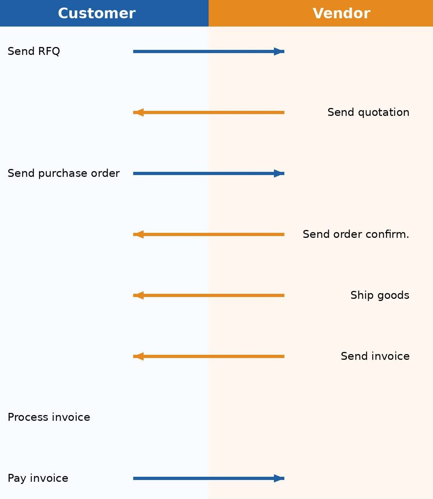

*** Problems with legal fine print
  :PROPERTIES: 
  :CUSTOM_ID: nl- object-terms
  :END:

When a customer sends a purchase order to a vendor, the purchase-order form might well include legal fine print added by the customers lawyers. Those lawyers want to protect their client as much as possible, so they can be inclined to load the document with terms and conditions. In a customer's PO, the legal fine print might include, e.g.:

- expansive vendor warranties; 

- long statute-of-limitations provisions;

- onerous indemnity requirements;

- various "acknowledgements" (see [[#r-ack-defn]]) to give the customer leverage over the vendor in litigation (and thus in settlement negotiations);

and so on. 

For example: One Honeywell purchase-order form includes this ... /remarkable/ assertion:

#+begin_quote 
A purchase order /is deemed accepted/ upon a) the date the Supplier returns the acknowledgment copy of a purchase order to Honeywell or b) /five calendar days from date Honeywell issues the purchase order to Supplier/ regardless of mechanism used to convey requirements, whichever is earlier. <cite> Archived at https://perma.cc/CUV6-NKTY; emphasis added. • For a customer-oriented checklist of "gap-filler" PO terms that vendors might find objectionable — which would often lead to time-consuming negotiations and delays — see Stephen Gillen, [[https://www.jdsupra.com/legalnews/ai-and-your-purchase-order-form-9078046][AI and Your Purchase Order Form]] (JDSupra.com 2025). </cite>
#+end_quote

In other words: According to this language, if Honeywell sends you a purchase order out of the blue, then (saieth Honeywell) you're deemed to have accepted the purchase order in five business days. Um ... good luck getting a court to go along with /that/ assertion. For example, in a case not involving Honeywell, South Carolina's supreme court rejected a claim that silence was consent, noting:

#+begin_quote 
Silence and inaction can constitute acceptance of an offer, but only in certain circumstances. These circumstances are limited to those from which it may be inferred that the offeree's silence and inaction meets the "manifestation of assent" test .... The Restatement sets forth examples of when this may occur .... <cite> See [[https://scholar.google.com/scholar_case?case=10536068526708323376][Lampo v. Amedisys Holding, LLC]], 445 S.C. 305, 315, 914 S.E.2d 139 (2025) (reversing and remanding court of appeals decision; citations omitted). </cite> 
#+end_quote

And vendors aren't always innocent parties in this little dance; oh, no. It's not uncommon for a vendor's initial sales quotation (inviting a purchase order) to state that all customer orders are subject to acceptance in writing by the vendor. Then, when the customer does send a purchase order, the vendor responds with a written "order confirmation." Often, the order confirmation that itself contains detailed terms and conditions — some of which might directly conflict with the terms in the customer's purchase order. <cite> See, e.g., a Honeywell terms-of-/sale/ document archived at https://perma.cc/5MB9-H6VK. </cite>

Once again, Honeywell provides an example, this time when it's the /vendor/ and not the customer: The first section of a Honeywell terms of /sale/ document states in part as follows:

#+begin_quote
Unless and to the extent that a separate contract executed between the procuring party (“Buyer”) and Honeywell International Inc. (“Honeywell”) applies, /any purchase order/ covering the sale of any product (“Product”) contained in this Catalog (“Order”) will be governed /solely/ by these Conditions of Sale, whether or not this Catalog or these Conditions of Sale are referenced in the Order. 

* * * Buyer's silence or acceptance or use of Products is acceptance of these Conditions of Sale.  <cite> Archived at https://perma.cc/5MB9-H6VK; emphasis and extra paragraphing added. </cite>
#+end_quote

Even vendor /invoices/ might contain terms and conditions that the vendor might try to assert someday as constituting the contract — even though the customer might reasonably counter that "the contract" was formed and its terms locked in — long before the vendor sent its invoice. 

In the same vein, lawyers of a certain age working in the computer industry will remember the "shrinkwrap license agreement" cases of the 1990s and early 2000s. The nadir of those cases arguably came in /Hill v. Gateway 2000/: The Seventh Circuit held that a consumer who bought a computer by mail was bound by an arbitration provision included in terms and conditions /that were printed on a card inside the box/. because the consumer had not exercised the stated right to return the product in case of disagreement. <cite> See [[https://scholar.google.com/scholar_case?case=4445746745575023652][Hill v. Gateway 2000, Inc.]], 105 F.3d 1147 (7th Cir. 1997) (Easterbrook, J.) (vacating and remanding district court's refusal to compel arbitration); see also, e.g., [[https://scholar.google.com/scholar_case?case=11811009805458694240][ProCD, Inc. v. Zeidenberg]], 86 F.3d 1447, 1450 (7th Cir. 1996) (Easterbrook, J.) (reversing district court: software license terms were enforceable when software package, sold in stores, included external notice stating that software came with license restrictions).  </cite>

*** Pro tip: Reject the other side's fine-print terms?
  :PROPERTIES:
  :CUSTOM_ID: po-reject
  :END:

A customer's purchase order will often reject any terms in the vendor's order confirmations, invoices, etc. (You'll remember from the 1L Contracts course that {{{A}}}'s rejection of {{{B}}}'s offer means that no contract is formed on the offer.) Similarly, vendors' sales quotes, order confirmations, etc., often reject the customer's purchase-order terms. In effect, these rejections say, /only _our_ terms and conditions will apply, sport — _your_ terms won't count, no matter what happens./ <cite> Both of the above-cited Honeywell forms include such rejection language. </cite>

# #+ATTR_HTML: :alt XX :title   :class photo-at-right photowidth60
# 

This kind of language is motivated by section 2-206 of the (U.S.) Uniform Commercial Code. That section states, in part, that for sales of goods:

#+begin_quote

(1) /Unless otherwise unambiguously indicated by the language/ or circumstances[,] (a) an offer to make a contract shall be construed as inviting acceptance in any manner and by any medium reasonable in the circumstances .... <cite> [[https://www.law.cornell.edu/ucc/2/2-206][UCC § 2-206]] (emphasis added). </cite>
#+end_quote

*Lesson:* Drafters asked to prepare standard forms of this kind should strongly consider whether to include "We reject /your/ terms!" language along these lines.

#+begin_comment
{{{RWE}}} In the Honeywell purchase-order form cited above, the very first section states in part as follows:

#+begin_quote

Honeywell rejects any additional or inconsistent terms and conditions offered by Supplier at any time. Any reference to Supplier’s quotation, bid, or proposal does not imply acceptance of any term, condition, or instruction contained in that document. <cite> (Extra paragraphing added.) </cite>
 #+end_quote

And Honeywell's above-cited terms of sale say exactly the same thing: #+begin_quote Except as provided in the “Buyer's Orders” section below, all provisions on Buyer's Order and all other documents submitted by Buyer are expressly rejected. Honeywell will not be deemed to have waived these Conditions of Sale if it fails to object to provisions submitted by Buyer. <cite> (Extra paragraphing added.) </cite> #+end_quote

#+end_comment

*** Battle of the Forms:  When each party's paper rejects the other's terms
  :PROPERTIES: 
  :CUSTOM_ID: nl-battle-forms-drop-out
  :END:

In real-world dealings, what practical impact will result from these [[https://english.stackexchange.com/questions/295674/origin-of-i-fart-in-your-general-direction][Pythonesque]] statements in parties' transaction paper? This is important because *the parties' /people/ might not even notice* the legal fine print in these dueling forms. Instead, what could easily happen is something like the following:
- The vendor's sales people *process the purchase order* and send it to the order-fullfilment department.
- The vendor's order-fulfillment department *ships the ordered goods* — along with a confirmation of sale document and an invoice.
- The customer's receiving department *takes delivery* of the ordered goods and puts them into inventory, distributes them to end users, or whatever.
- The customer's receiving department forwards the vendor's invoice to the customer's accounts-payable department, which in due course *pays the invoice*.
- Neither party signs the other's paper.

So whose terms and conditions will govern — those of the customer, or those of the vendor? Neither has agreed to the other's terms and conditions. But clearly the parties have conducted themselves /as though/ they had a contract. 

This sort of situation is known as the "Battle of the Forms." It's expressly contemplated by [[http://www.law.cornell.edu/ucc/2/article2.htm#s2-207][UCC § 2-207]]. (It's sometimes experienced in common-law situations as well.)

Under the "Drop-Out Rule" in [[https://www.law.cornell.edu/ucc/2/2-207][UCC § 2-207(3)]], /when the parties are [[#nl-merchant-defn][merchants]]/ (see [[#nl-merchant-defn]]):

- whatever terms are common to the parties' respective contract forms is part of "the contract"
- all other terms in both parties' contract forms drop out — left on the cutting-room floor, if you will; and
- the UCC's gap-filler terms also apply.

Before we look at the text of the Drop-Out Rule, it might be helpful to study this Venn diagram of how the Rule works:

<<UCCDropOutRuleDiagram>>
# See the !Drawings.pptx deck for this diagram
#+ATTR_HTML: :alt UCC § 2-207(3) Venn diagram :title  UCC § 2-207(3) Venn diagram  :class photowidth90C
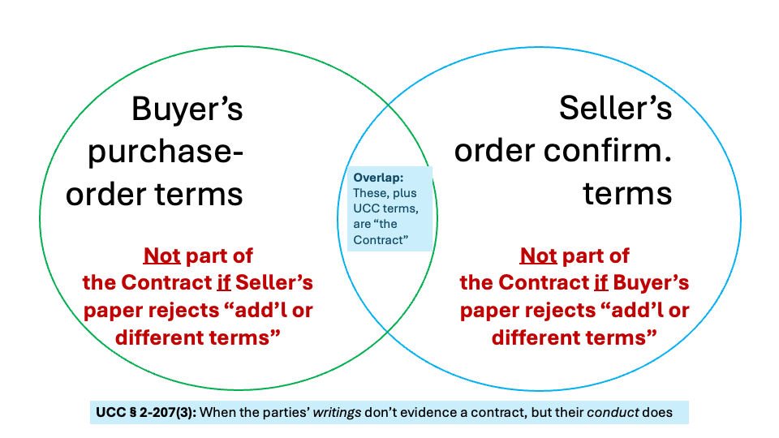

{{{BR}}}And now here's the text of UCC § 2-207(3):

#+begin_quote

(3) *Conduct* by both parties which recognizes the existence of a contract is sufficient to establish a contract for sale although *the writings* of the parties do not otherwise establish a contract. *In such case* the terms of the particular contract consist of[:] [i] those terms on which the writings of the parties agree, together with [ii] any supplementary terms incorporated under any other provisions of this Act. <cite> Emphasis and bracketed text added; see generally the discussion of the "Battle of the Forms" by [[https://thecontractsguy.net/2012/03/01/battle-of-the-forms-explained-using-a-few-short-words/][Brian Rogers]] at https://tinyurl.com/BattleFormsBrianRogers, along with his [[https://web.archive.org/web/20190112063847/http://picjur.com/2010/03/battle-of-the-forms/][diagram]] at https://tinyurl.com/BattleFormsDiagram. </cite>
#+end_quote

So: In our hypothetical situation above, our parties have engaged in conduct that recognizes the existence of a contract: Goods have been ordered, delivered, and paid for. Under the Drop-Out Rule, the terms of the parties' contract are:
- whatever "matching" terms exist in the parties' respective forms, /plus/
- the UCC's default provisions.  
# {{{RWE}}} In /Axiall Canada/ (5th Cir. 2023), the court affirmed denial of a Louisiana equipment manufacturer's motion to compel arbitration of a breach of contract lawsuit that had been brought by a Canadian customer. The court summarized the relevant salvos of paper between the parties; citing Louisiana's counterpart to UCC § 2-207, the court described the case as "a classic 'battle of the forms'" and held that the parties had not agreed to arbitration. <cite> See, e.g., [[https://scholar.google.com/scholar_case?case=10260528898161588329][Axiall Canada, Inc. v. MECS, Inc.]], No. 21-30105, slip op. part III (5th Cir. Jun. 14, 2023) (affirming denial of motion to compel arbitration because parties' paper did not have arbitration provision in common) (per curiam, unpublished). </cite>
#+begin_comment
In sum, below were the relevant events common to these transactions:

1.  [Manufacturer] MECS sent [customer] Axiall a proposal incorporating an arbitration clause and containing express limitations on acceptance;

2.  Axiall sent MECS a Purchase Order incorporating the forum selection clause and containing express limitations on acceptance;

3.  MECS sent Axiall an Order Acknowledgment incorporating an arbitration clause and containing express limitations on acceptance (like MECS's proposal);

4. MECS shipped Axiall the demisters; and

5.  Axiall accepted the demisters from MECS.
#+end_comment

*** *Caution:* The UN CISG uses the "last-shot rule" instead
  :PROPERTIES:
  :CUSTOM_ID: nl-last-shot
  :END:

It'd be a very-different analysis of the Battle of the Forms under the [[http://cisgw3.law.pace.edu/cisg/text/treaty.html][UN Convention on Contracts for the International Sale of Goods]] (UN CISG) The CISG follows the so-called "last shot" rule, which the Seventh Circuit summarized as: "The terms of the contract are those embodied in the last offer (or counteroffer) made prior to a contract being formed." The court affirmed a judgment below that "because Illinois Trading never expressly assented to the attorney's fees provision in VLM's trailing invoices, under the Convention that term did not become a part of the parties' contracts. <cite> [[https://scholar.google.com/scholar_case?case=10106132911525772322][VLM Food Trading Int'l, Inc. v. Illinois Trading Co.]], 811 F.3d 247, 250-51 (7th Cir. 2016) (cleaned up). </cite>"

*** Selected bibliography
  :PROPERTIES:
  :CUSTOM_ID: nl-battle-biblio
  :END:

(Students: This additional reading is optional.)

See generally:

--  Battle of the Forms -- [[http://en.wikipedia.org/wiki/Uniform_Commercial_Code#Section_2-207:_Battle_of_the_forms][UCC]] and [[http://en.wikipedia.org/wiki/Offer_and_acceptance#Battle_of_the_forms][common-law]] variations

--  [[Https://en.wikipedia.org/wiki/Purchase_order][Purchase order]] (Wikipedia)

--  Brian Rogers, [[http://www.thecontractsguy.net/2012/03/01/battle-of-the-forms-explained-using-a-few-short-words/][Battle of the Forms Explained (Using a Few Short Words)]] (blog entry March 1, 2012).

--  Marc S. Friedman and Eric D. Wong, [[http://www.metrocorpcounsel.com/articles/10585/tkoing-uccs-knock-out-rule][TKO'ing the UCC's 'Knock-Out Rule']], in the Metropolitan Corporate Counsel, Nov. 2008, at 47.

For an eye-glazing set of "battle of the forms" facts, see  [[https://scholar.google.com/scholar_case?case=40223851417704790&][BouMatic LLC v. Idento Operations BV]], 759 F.3d 790 (7th Cir. 2014) (vacating and remanding dismissal for lack of personal jurisdiction) (Easterbrook, J.).

An existing teaching case is [[https://scholar.google.com/scholar_case?case=10899193058602717237][Northrop Corp.]] (7th Cir. 1994): The buyer's purchase order stated that the vendor's warranty provision was of unlimited duration, but the vendor's acknowledgement form stated that the vendor's warranty lasted only 90 days. The trial court held, the appellate court agreed, that both of those provisions dropped out of the contract, and therefore the buyer was left with a UCC implied warranty of "reasonable" duration. <cite> See [[https://scholar.google.com/scholar_case?case=10899193058602717237][Northrop Corp. v. Litronic Industries]], 29 F.3d 1173, 1189 (7th Cir. 1994). </cite>

** Employment /applications/ — a binding contract?
  :PROPERTIES:
  :CUSTOM_ID: emp-appl-k
  :END:

In a Michigan case, an individual filled out an employment application. Among other things, the application included language that imposed a six-month deadline on the individual's ability to sue the company. After working for some seven years, the employee resigned, citing discrimination, and — 14 months later — filed a lawsuit against the company. 

The company moved to dismiss the lawsuit, citing the six-month limitation period in the employment application. The trial court granted the motion to dismiss, and the appeals court affirmed, holding: "In this case, plaintiff agreed to the provision in his employment application, which constitutes part of his employment contract." <cite> [[https://scholar.google.com/scholar_case?case=9443081320774063607][King v. McLaren Health Corp.]], No. 36615, slip op. at part II.A (Mich. App. Jan. 30, 2025) (affirming dismissal of former employee's lawsuit) (unpublished; citations omitted). </cite>

** Click-wrap and browse-wrap agreements
  :PROPERTIES:
  :CUSTOM_ID: nl-c-ent-click-rej
  :HTML_CONTAINER_CLASS: olnum
  :END:

*** Background

1.  "Click-wrap agreements": When a user installs software on a computer, or signs up for an online service, very often the user must click on a button or link that says (in effect) "I agree"; the click purportedly signifies that the user — and the user's company — are agreeing to detailed terms and conditions.

2.  "Browse-wrap agreements": An online service might also include a purported agreement that the user supposedly agrees to: (i) by continuing to take an action, e.g., continuing to browse a Web site, or (ii) by /not/ taking other action, e.g., by /not/ leaving a Web site.     

For convenience, here we'll refer to the terms of either type of agreement as simply "Wrap Terms."

*** Some case law

The enforceability of click-wrap and browse-wrap agreements has been often litigated; see generally the posts of law professor Eric Goldman — who knows pretty much what there is to be known on this subject — and his colleagues at his [[https://blog.ericgoldman.org/archives/2023/08/more-chaos-in-the-law-of-online-contract-formation.htm][Technology & Marketing Law Blog]]. 

For a UK perspective, see the court of appeal's discussion in [[https://www.judiciary.uk/wp-content/uploads/2024/03/Parker-Grennan-v-Camelot.pdf][Parker-Grennan]] (UK App. 2024), discussed by [[https://www.jdsupra.com/legalnews/digital-speaks-don-t-gamble-on-your-8998020/][Blest & Shaw]] (2024). 

Often, Wrap Terms will be unobjectionable, addressing matters such as not making unreasonable use of an online service, not trying to steal other users' data, and the like. 

But sometimes, Wrap Terms will be like a supplier's order confirmation, setting out the supplier's wish list for ground rules — and sometimes a supplier's click-wrap or browse-wrap agreement will contain terms and conditions that affect the parties' negotiated deal.

So, in § [[#r-ent-po]] of {{{RR}}} [[#r-ent-k]] (entire agreement) the "are rejected" language is intended to preclude Wrap Terms from becoming part of {{{thek}}} when they address matters that are covered (explicitly or implicitly) in {{{thek}}}. 

*** /Wu v. Uber/: A road map to enforceability?
  :PROPERTIES:
  :CUSTOM_ID: nl-wu-uber
  :END:

In its /Wu v. Uber/ opinion, New York's highest court blessed the process that Uber used to amend its online terms of service to incorporate an arbitration provision:

#+begin_quote

We now turn to the application of these principles to Uber's January 2021 terms of use. Only a few days before plaintiff purportedly agreed to the terms, she received the following email:

#+ATTR_HTML: :alt Image of Uber announcement of updated terms of service :class photowidth90
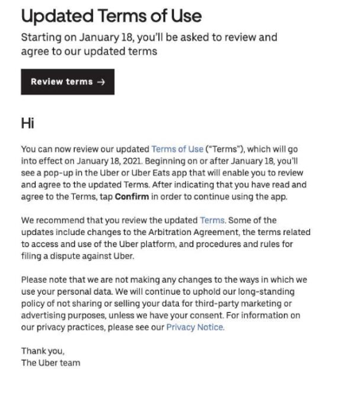

The headline of the email, "Updated Terms of Use," and the large text immediately beneath it *clearly informed plaintiff* that she would soon "be asked to review and agree to [Uber's] updated terms [of use]." 

Moreover, the email *specifically advised* plaintiff that the terms would include, among other subjects, "changes to the Arbitration Agreement." 

The terms were *accessible through several hyperlinks*, including a large black button at the very top of the email specifically labeled "Review terms," and the text "Terms of Use" in the first line of the first paragraph, which was *distinguished from the black text surrounding it* by the signature blue font indicating a hyperlink.

Finally, the text of the email *expressly advised* plaintiff how she could manifest assent to the terms, i.e., by tapping "Confirm" on a pop-up window that would automatically appear when she opened the Uber application on her smartphone. The email was written in plain language.

Only a few days later, Uber's January 2021 terms of use were *presented* to plaintiff by means of a *clickwrap process*—a means of acquiring binding assent from consumers that has been *widely upheld* by courts across the country. 

As previewed in the email, plaintiff was presented with the following pop-up screen when she opened the Uber app on her smartphone:

#+ATTR_HTML: :alt Image of second Uber announcement of updated terms of service :class photowidth90
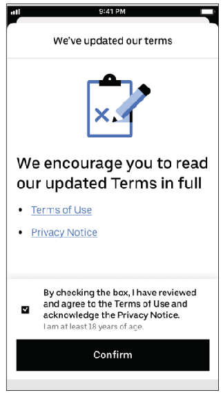

The headline and the larger text in the center of the screen—"We've updated our terms" and "We encourage you to read our updated Terms in full"—*clearly advised* plaintiff that she was being asked to agree to a contract with Uber.

The terms themselves were *again made accessible* by a hyperlink on the words "Terms of Use," which were formatted in *large, underlined, blue text*. 

*A reasonably prudent user would have understood* from the color, underlining, and placement of that text, immediately beneath the sentence "encourag[ing]" users to "read [the] updated Terms in full," that clicking on the words "Terms of Use" would permit them to review those terms in their entirety. 

Finally, Uber provided plaintiff with an *unambiguous means of accepting the terms* by including a checkbox, "Confirm" button, and bolded text expressly stating that, "By checking the box, I have reviewed and agree to the Terms of Use." It is undisputed that plaintiff checked and box and clicked the "confirm" button.  <cite> [[https://scholar.google.com/scholar_case?case=4811284305254505900][Wu v. Uber Techs., Inc.]], 43 N.Y.3d 288, 292-93, 260 N.E.3d 1060, 2024 NY Slip Op. 05869 (2024) (cleaned up, emphasis and extra paragraphing added). </cite>
#+end_quote

* Confidential information
  :PROPERTIES:
  :CUSTOM_ID: r-conf-info-proto
  :HTML_CONTAINER_CLASS: chap
  :END:

They're everywhere, it seems — and they help build deals: Surely the most-common type of contract has to be the confidentiality agreement — commonly referred to (imprecisely) as an "NDA," for "nondisclosure agreement," although NDAs pretty-much always contain more obligations than nondisclosure. As we'll see in the notes below, confidentiality agreements are enforceable at common law and/or by statute in the U.S. and many other countries.

Students: Be sure to read the background reading at [[#r-conf-info-proto-addl]] (for both Disclosers and Recipients), [[#conf-info-discl-addl]] (for Disclosers), and [[#conf-info-recip-addl]] (for Recipients).

Contents:

#+TOC: headlines 1 local

#+begin_comment
AI provisions in NDAs:
- [[https://contractnerds.com/7-ai-specific-confidentiality-clauses/?mc_cid=be064d85d7&mc_eid=2172383a2f][Contract Nerds]]
- [[https://www.womblebonddickinson.com/uk/insights/articles-and-briefings/confidentiality-agreements-age-artificial-intelligence][Womble Bond]]
#+end_comment

** Confidential Information {{{D}}} {{{CLS}}}                           :CLS:
  :PROPERTIES:
  :CUSTOM_ID: r-conf-info-defn
  :HTML_CONTAINER_CLASS: pr-top
  :CATEGORY: Protocol
  :END:

  Contents:

  #+TOC: headlines 1 local
  

*** Whose information can be protectable??
  :PROPERTIES:
  :CUSTOM_ID: conf-info-rcpt
  :HTML_CONTAINER_CLASS: cl8
  :END:
 
{{{L1}}} You'd be obligated as a {{{defn(Recipient)}}} under {{{ths}}}, for specified information provided to you by another party to {{{theK}}} (a {{{dfn(Discloser)}}}), if one or both of the following things is true:

{{{U1}}} {{{theK}}} itself clearly says that you're a Recipient; or

{{{UN}}} the circumstances unmistakably indicate that you've agreed (in writing or otherwise) to keep that information confidential — even if {{{theK}}} didn't originally designate you as a Recipient.

{{{LN}}} Whenever you're a Recipient: Treat the Discloser's information referred to in subdivision (a) as Confidential Information when the information is eligible under {{{ths}}}.

***** Note                                                              :CMT:
  :PROPERTIES:
  :HTML_CONTAINER_CLASS: cmtry
  :UNNUMBERED: notoc
  :END:

{{{H1}}} *This reverses an oft-used approach* to NDA drafting: We don't "lock in" the definitions of /Discloser/ and then /Recipient/; instead, we define /Recipient/ as /any/ party that has agreed — in {{{thek}}} itself, or otherwise — to treat particular information in confidence, to guard against inadvertent disasters for the Recipient later: As discussed at [[#conf-info-pty]], we don't want a situation where (1) the parties initially agree that only one party's information will be protected; *but* (2) the parties' business people later decide to switch roles *but they don't remember* that the NDA doesn't cover /that/ situation.

{{{HN}}} Under {{{ths}}}, both Discloser and Recipient must be parties /to {{{thek}}}/, in the interest of avoiding future unpleasant surprises from third-party interlopers: It wouldn't be great for a Discloser to claim that some unsuspecting third party was bound by confidentiality obligations — nor would it be good for some non-party to assert that a party to {{{theK}}} had breached {{{theK}}} by misappropriating /the outsider's/ confidential information. 

{{{HN}}} We say nothing here about the Discloser's /owning/ Confidential Information — in that regard, we follow the (federal) Defend Trade Secrets Act, which defines the /owner/ (of a trade secret) as "the person or entity in whom or in which rightful legal or equitable title to, *or license in*, the trade secret is reposed ...." <cite> [[https://www.law.cornell.edu/uscode/text/18/1839][18 U.S.C. § 1839(4)]] (emphasis added); see, e.g., [[https://scholar.google.com/scholar_case?case=18031949083791243345][Advanced Fluid Systems, Inc. v. Huber]], 958 F.3d 168, 177 (3d Cir. 2020) (affirming judgment of trade-secret misappropriation). </cite> State-law adoptions of the Uniform Trade Secrets Act, however, generally refer to a "possessor" of information, not an "owner." <cite> See, e.g., [[https://scholar.google.com/scholar_case?case=7746761402349434471][Snyder v. Beam Technologies, Inc.]], 147 F.4th 1246, 1255-55 (10th Cir. 2025) (citing cases). </cite>

*** Prerequite: Protective measures by Discloser
  :PROPERTIES:
  :CUSTOM_ID: conf-info-defn
  :END:

{{{SH(Discloser)}}} Your  information won't be protected as {{{dfn(Confidential Information)}}} (or sometimes {{{dfn(Discloser Confidential Information)}}}) under {{{ths}}} unless you've taken — and continue to take — reasonable measures to keep the information confidential. 

(This is in addition to the other prerequisites in {{{ths}}}.)

***** Note                                                               :CMT:
  :PROPERTIES:
  :HTML_CONTAINER_CLASS: cmtry
  :UNNUMBERED: notoc
  :END:

{{{H1}}} Under the law in most jurisdictions, the Discloser (usually) must take /reasonable/ precautions — such as those summarized at [[#conf-info-meas]] — to protect its confidential information; otherwise, the information isn't eligible for trade-secret protection in the first place, as discussed in the note to § [[#conf-info-excl-free]]. 

{{{HN}}} Language note: This section draws on the (U.S.) Defend Trade Secrets Act (DTSA), [[https://www.law.cornell.edu/uscode/text/18/1839][18 U.S.C. § 1839(3)]], which was modeled in part on the state-law Uniform Trade Secrets Act (UTSA), which has been adopted in nearly all U.S. states. <cite> See generally, e.g., BakerHostetler, [[https://www.jdsupra.com/legalnews/comparing-the-defend-trade-secrets-act-34379/][Comparing the Defend Trade Secrets Act and the Uniform Trade Secrets Act]] (JDSupra.com 2016). </cite> 

*** Prerequisites for /initial/ disclosure to Recipient
  :PROPERTIES:
  :CUSTOM_ID: conf-info-discl-term
  :END:

{{{SH(Discloser)}}} The Recipient isn't required to treat any particular item of your information as Confidential Information — even if you think the item qualifies as such — unless you first made that item accessible to the Recipient (directly or indirectly):

{{{U1}}} during the {{{v(two years after the effective date of {{{THEK}}})}}} (the {{{dfn(Protected Disclosure Window)}}}); *and*

{{{UN}}} connection with {{{thek}}} — as opposed to in connection with other business dealings that you and the Recipient might have together.

(This is in addition to the other prerequisites in {{{ths}}}.)

***** Note                                                               :CMT:
  :PROPERTIES:
  :HTML_CONTAINER_CLASS: cmtry
  :UNNUMBERED: notoc
  :END:

{{{H1}}} The carve-out in subdivision (1) helps protect the Recipient from oportunistic Discloser claims of confidentiality long after the parties have concluded their relevant dealings together. 

{{{HN}}} The carve-out in subdivision (2) could lead to disputes if the Discloser and Recipient have multiple dealings. But it seems worth the risk to avoid having the Recipient ambushed, long after the parties have wrapped up their dealings under {{{theK}}}, by sudden claims that other Discloser information was subject to confidentiality obligations.

*** Third-party information — protectable?
  :PROPERTIES:
  :CUSTOM_ID: conf-info-defn-3p
  :HTML_CONTAINER_CLASS: cl8
  :END:

If the Discloser makes information of one or more third parties available to the Recipient:

{{{U1}}} {{{SH(Recipient)}}} Treat that third-party information as Confidential Information to the same extent — but subject to the same exclusions — as if the information were the Discloser's.

{{{UN}}} {{{SH(Discloser)}}}  If any person asserts that you breached a contract or broke the law in providing that third-party information to the Recipient; *then:* You must {{{PROTECT(the Recipient)}}} against any claim arising out of that assertion.

***** Note                                                              :CMT:
  :PROPERTIES:
  :HTML_CONTAINER_CLASS: cmtry
  :UNNUMBERED: notoc
  :END:

1.  It's fairly typical for confidentiality agreements to cover third-party information.

2.  Subdivision (c): Here the term "any person" isn't intended to be limited to the third party whose information was provided — the term is meant to encompass, for example, a government authority in a case where the Discloser provided a third party's protected health information to the Recipient.

*** Parties' dealings — confidential? Allowable disclosures?
  :PROPERTIES:
  :CUSTOM_ID: conf-info-dealings
  :HTML_CONTAINER_CLASS: cl8
  :END:

{{{L1}}} Treat the (non-public) fact, status, and financial terms of your dealings with the other party under {{{theK}}} as the other party's Confidential Information — even if only one of you is otherwise disclosing Confidential Information to the other.

{{{LN}}} You're free, however, to disclose the fact that you and the other party have entered into an /unspecified/ agreement that includes confidentiality provisions — but only as long as each such disclosure: (i) is for a commercially-reasonable purpose; and (ii) is on a one-by-one basis and not in a general- or public announcement.

***** Note                                                               :CMT:
  :PROPERTIES:
  :HTML_CONTAINER_CLASS: cmtry
  :UNNUMBERED: notoc
  :END:

{{{H1}}} For various business reasons, parties often want the mere fact that they are in discussions to remain confidential, let alone the details of their dealings.  Parties' motives here might include, for example: • wanting to keep pricing information secret from competitors; or • not wanting to trigger a bidding war in a prospective merger- or acquisition transaction.  (/Public/ information about the parties' dealings would of course not be Confidential Information.)

{{{HN}}} Clauses requiring parties' contract terms to be kept confidential have (mostly) been enforced in court.

{{{RWE}}} The Delaware chancery court held that a party had materially breached an agreement by publicly disclosing the agreement's terms in violation of a confidentiality clause — thereby justifying the other party's termination of the agreement. <cite> See [[https://scholar.google.com/scholar_case?case=10089366460764636035][eCommerce Indus., Inc. v. MWA Intelligence, Inc.]], No. 7471-VCP, part II-A, text acc. notes 117 et seq. (Del. Ch. Oct. 4, 2013). </cite>

{{{CE}}} On the other hand, a party's breach of a confidentiality-of-dealings clause might not be considered "material." For example, Delaware's supreme court held that in a patent license agreement, a provision requiring the terms of the license to be kept confidential was /not/ material, because the /gravamen/ of the contract was the patent license, not the confidentiality provision; as a result, when the licensee publicly disclosed the royalty terms, the patent owner was not entitled to terminate the license agreement for material breach. <cite> See [[https://scholar.google.com/scholar_case?case=16872484994407384380][Qualcomm Inc. v. Texas Instr. Inc.]], 875 A.2d 626, 628 (Del. 2005) (affirming holding of chancery court). </cite>

# https://logos-world.net/amazon-logo/
#+ATTR_HTML: :alt Amazon logo :title Amzon logo :class photowidth25 photo-at-right

Similarly: While Amazon was found liable for breaching a letter of intent to negotiate a lease of a commercial building in Manhattan, the court nevertheless noted: "Though the confidentially provision was also breached, it did not result in additional out-of-pocket damages, making the breach academic." <cite> [[https://scholar.google.com/scholar_case?case=883747245371168509][DOLP 1133 Properties II LLC v. Amazon Corporate, LLC]], 2020 N.Y. Slip Op. 30274(U), No. 653789/2014, slip op. at n.4 (N.Y. Sup. Ct. Jan. 6, 2020) (partly granting Avenue building owner's motion for summary judgment). </cite>

{{{HN}}} *Caution:* Government authorities might object to confidentiality-of-dealings clauses, for example in employment-agreement forms that call for the employee to keep confidential all information about salary, bonus, and other compensation; see [[#c-ConfInfoLegalRestr]] for a more-detailed discussion.

{{{HN}}} Subdivision (b) — DCT note: I've seen it be a potentially-significant issue whether a client could disclose, to a third party, the mere fact that the client had entered into an NDA.

{{{HN}}} *Caution:* /Wording can matter here./ {{{RWE}}} In a Texas case, a woman agreed to settle a wrongful-death claim against a doctor who had treated the woman's daughter. The settlement agreement barred the woman from talking about the settlement, but it didn't restrict her discussion of the doctor's alleged malpractice. <cite> See [[https://scholar.google.com/scholar_case?case=986788066254913571][Joselevitz v. Roane]], No. 14-18-00172-CV, slip op. at n.3. (Tex. App.–Houston [14th Dist.] Mar. 31, 2020) (affirming take-nothing summary judgment dismissing doctor's breach-of-contract and defamation claims against woman) (mem. op.) </cite>

** Confidential Information Marking {{{CLS}}}                           :CLS:
  :PROPERTIES:
  :CUSTOM_ID: conf-info-mkg
  :HTML_CONTAINER_CLASS: pr-top
  :END:

Marking of confidential information is one of the classic ways for a Discloser to /show/ (indirectly) that it took reasonable precautions to protect the information — and (at least at the pleading stage) to support the Discloser's contention that it took reasonable steps to maintain secrecy. <cite> See [[https://scholar.google.com/scholar_case?case=12438249509308905895][Samuel Sherbrooke Corporate, Ltd v. Mayer]], 159 F.4th 252, 257 (4th Cir. 2025) (reversing and remanding judgment on the pleadings for trade-secret defendant), /citing/ [[https://scholar.google.com/scholar_case?case=16117186663326257733][InteliClear, LLC v. ETC Glob. Holdings, Inc.]], 978 F.3d 653, 660 (9th Cir. 2020) (reversing and remanding summary judgment for trade-secret defendant). </cite>  But quite reasonably, Disclosers prefer not to have marking be a hard-and-fast requirement. 

Contents:

#+TOC: headlines 1 local

***  Presumption of confidentiality for marked information
  :PROPERTIES:
  :CUSTOM_ID: conf-info-mkg-presum
  :END:

{{{SH(Recipient)}}} If Discloser information is marked as confidential — in suitably-prominent fashion — *then:* Treat the information as Confidential Information as such until such time (if any) as the information is shown to be within one or more exclusions from confidentiality (see the exclusion items beginning at § [[#conf-info-excl-pub]]).

***** Note                                                               :CMT:
  :PROPERTIES:
  :HTML_CONTAINER_CLASS: cmtry
  :UNNUMBERED: notoc
  :END:

{{{H1}}} The term "suitably-prominent fashion" would ordinarily mean readily calling attention to the confidential status of the information.

{{{HN}}} *Caution:* Marking documents as "Confidential" is *always* a good practice. *But* when a confidentiality provision /requires/ marking — even with [[#conf-info-mk-catch][catch-up marking allowed]] — it might undesirably [[#bar-clear][raise the bar]] for the Discloser, possibly with significant ill effect: If for some reason a particular Discloser document /wasn't/ marked, then a court might well summarily reject the Discloser's claim of confidentiality. <cite> See [[https://scholar.google.com/scholar_case?case=2677781182986087986][Teradata Corp. v. SAP SE]], 570 F. Supp. 3d 810, 826-28 (N.D. Cal 2021) (granting SAP's motion for summary judgment on technical trade secret claim); [[https://scholar.google.com/scholar_case?case=6020252752387015139][Convolve, Inc. v. Compaq Computer Corp.]], 527 Fed. Appx. 910 No. 2012-1074, slip op. at part II.A.2 (Fed. Cir. 2013) (nonprecedential); see also [[https://casetext.com/case/gemisys-corp-v-phoenix-american-inc][Gemisys Corp. v. Phoenix American, Inc.]], 186 F.R.D. 551, 558-60 (N.D. Cal. 1999). </cite> That's why here we set up /presumptions/ to encourage the Discloser to mark its Confidential Information — but we don't make marking an absolute requirement, so long as the information in question bears other indicia of confidentiality.

{{{HN}}} *Caution:* The Discloser shouldn't go overboard in marking /non/-confidential information, because that could backfire: If the Discloser were to go crazy with a CONFIDENTIAL stamp and mark obviously-nonconfidential information as confidential, that could hurt the company's credibility in claiming that /other/, marked information /was/ confidential. 

And worse: Marking /nonconfidential/ information as confidential — and then suing for misappropriation of the alleged trade secrets — could lead to a finding of bad-faith litigation, as happened in a Texas case (although a trial-court judgment on that point was set aside on appeal). <cite> See Jesse M. Coleman and Kevin Green, [[https://www.tradesecretslaw.com/2023/07/articles/trade-secrets/not-all-documents-labeled-confidential-actually-are-texas-jury-finds-23m-trade-secret-case-was-brought-in-bad-faith/][Not All Documents Labeled Confidential Actually Are: Texas Jury Finds $23M Trade Secret Case Was Brought in Bad Faith]] (Seyfarth.com 2023), /discussing/ Teligistics Inc. v. Advanced Personal Computing Inc., No. 2019-15000, 190th District Court of Harris County, Texas, /affirmed in part, reversed on bad-faith issue, reversing and rendering take-nothing judgment on award of attorney fees/, [[https://scholar.google.com/scholar_case?case=16331914219368629548][Teligistics, Inc. v. Advanced Pers. Computing, Inc.]], No. 14-23-00953-CV, slip op. (Tex. App.—Houston [14th Dist.] Oct. 30, 2025). </cite>

*** Catch-up marking — how and when?
  :PROPERTIES:
  :CUSTOM_ID: conf-info-mk-catch
  :END:

{{{SH(Discloser)}}} You're free to retroactively mark information as confidential after giving the Recipient access to the information without marking, but only by doing both of the following things within a reasonable time after the initial unmarked access: 

{{{U1}}} causing the Recipient to be provided with a marked written version of the information — this could be a reasonably-detailed written summary; and 

{{{UN}}} giving the Recipient [[#r-notices-rule][notice]] that the marked written version was provided. 

***** Note                                                               :CMT:
  :PROPERTIES:
  :HTML_CONTAINER_CLASS: cmtry
  :UNNUMBERED: notoc
  :END:

{{{H1}}} This section provides a compromise that takes into account some of the practical realities of disclosures of confidential information. <cite> Sometimes the Discloser's marking of Confidential Information might fall through the cracks; and • for some Confidential Information, the Discloser might make the information available to the Recipient via, for example, an /unmarked/ written disclosure; an /oral/ disclosure; a tour of a factory floor or the like; or a product demonstration. </cite>

{{{HN}}} Subdivision (2): The notice requirement both alerts the Recipient and provides a paper trail to document the fact for future reference.

*** Information in Discloser files — marking required?
  :PROPERTIES:
  :CUSTOM_ID: conf-info-files
  :END:

{{{SH(Recipient)}}} If you initially gained access to particular Discloser information in one or more of the Discloser's own files (hard copy, digital, or otherwise), *then:* Treat that information in the same way as if the information were marked as Confidential Information, whether or not it is marked as such. 

***** Note                                                               :CMT:
  :PROPERTIES:
  :HTML_CONTAINER_CLASS: cmtry
  :UNNUMBERED: notoc
  :END:

If the Discloser lets the Recipient have access to the Discloser's own internal files, the Discloser shouldn't have to worry about achieving perfect compliance in putting confidentiality markings on everything that the Recipient might encounter in those files. 

*** What about /likely/-confidential information?
  :PROPERTIES:
  :CUSTOM_ID: conf-info-recog
  :END:

{{{SH(Recipient)}}}  If reasonable people in the relevant trade or business would recognize particular Discloser information as likely to be confidential, *then:* Treat that information as Confidential Information in the same way as if the information were marked as such.

***** Note                                                               :CMT:
  :PROPERTIES:
  :HTML_CONTAINER_CLASS: cmtry
  :UNNUMBERED: notoc
  :END:

{{{H1}}} Language along these lines is often seen in NDAs drafted by Disclosers.

{{{HN}}} Vagueness: The terms "reasonable people" and "likely to be confidential" are of course pretty open-ended. That /could/ result in proof burdens in litigation. But it seems a worthwhile trade-off for the resulting benefit in reduced day-to-day burden in paperwork- and tracking. 

** Confidential Exclusions {{{CLS}}}                                    :CLS:
  :PROPERTIES:
  :CUSTOM_ID: conf-info-excl
  :HTML_CONTAINER_CLASS: pr-top
  :END:

Contents:

#+TOC: headlines 1 local

*** Introduction

Confidential Information doesn't include information that falls into one or more of the categories in this § [[#conf-info-excl]].

***** Note                                                               :CMT:
  :PROPERTIES:
  :HTML_CONTAINER_CLASS: cmtry
  :UNNUMBERED: notoc
  :END:

"Use of ... independently possessed information is no more a misappropriation than is use of one's independent invention, against which trade secret law does not offer protection." <cite> [[https://scholar.google.com/scholar_case?case=6034474033807299370][Texas Advanced Optoelectronic Solutions, Inc. v. Renesas Electronics America, Inc.]], 895 F.3d 1304, 1313 (Fed. Cir. 2018) (reversing, in part, judgment on jury verdict of trade-secret misappropriation) (cleaned up, citation omitted). </cite>

*** Excluded: Independent possession (of various types)
  :PROPERTIES:
  :CUSTOM_ID: conf-info-excl-indep
  :HTML_CONTAINER_CLASS: cl8
  :END:

{{{SH(Recipient)}}} Confidential Information doesn't include particular information if you show —

{{{U1}}} that you possessed the information before the Discloser made the information available to you; or

{{{UN}}} that you developed the information independently, at any time, without referring to or otherwise using Confidential Information; or

{{{UN}}} that you received the information from another party, at any time, without violating an obligation of confidence /that benefited the Discloser/;

but your showing on any of these points must be supported as stated at § [[#conf-info-excl-corrob]] below.

***** Note                                                              :CMT:
  :PROPERTIES:
  :HTML_CONTAINER_CLASS: cmtry
  :UNNUMBERED: notoc
  :END:

{{{X1}}} See [[#conf-info-excl-corrob]] for sad tales of huge damage verdicts against companies that failed to convince juries that they'd independently developed information that someone else claimed was a trade secret.

{{{XN}}} Subdivision (3): Suppose that, in providing information to the Recipient, a third party violated some confidentiality obligation that /didn't/ benefit the Discloser — in other words, the third party wasn't obligated /to the Discloser/ to keep the information secret. In that situation, it's hard to see how the Discloser would have standing to assert confidentiality rights concerning the information.

*** Corroboration — what's required
  :PROPERTIES:
  :CUSTOM_ID: conf-info-excl-corrob
  :HTML_CONTAINER_CLASS: cl8
  :END:

{{{SH(Recipient)}}} If you offer testimony of one or more of your own [[#r-people-defn][people]] (or of one or more other "interested witnesses") to try to show that information comes within one or more of the exclusion categories above, *then:* Don't ask for their testimony to be considered unless you also provide reasonable corroborating evidence to support the testimony. 

***** Note                                                               :CMT:
  :PROPERTIES:
  :HTML_CONTAINER_CLASS: cmtry
  :UNNUMBERED: notoc
  :END:

As discussed at [[#conf-info-excl-corrob-n]] and in the notes to {{{RULE}}} [[#corrob-cls]], both judges and juries can be skeptical of a Recipient's self-serving claims of independent possession — so Recipients should watch for *and save* corroborating evidence in that vein.

*** Excluded: "Public" information
  :PROPERTIES:
  :CUSTOM_ID: conf-info-excl-pub
  :HTML_CONTAINER_CLASS: cl8
  :END:

{{{SH(Discloser)}}} At any given time, Confidential Information doesn't include information that's shown to have been published (including by patenting, for example) or otherwise made publicly available, by anyone (other than the Recipient, in violation of {{{theK}}}).

***** Note                                                               :CMT:
  :PROPERTIES:
  :HTML_CONTAINER_CLASS: cmtry
  :UNNUMBERED: notoc
  :END:

{{{H1}}} Under the law, this is pretty much a given — see [[#conf-info-publ-nc]].

{{{HN}}} *Caution:* When writing an exclusion like this, you don't want to refer to information that's "in the public domain." That's because particular information might not be confidential, but it might still *not* be "public domain" due to other restrictions on /use/ or /disclosure/ of the information, for example under patent law, pharmaceutical regulations, [[#r-priv-law-defn][privacy law]], [[#nl-export-ctrls][export-controls law]], etc. 

{{{HN}}} *Caution:* Even a Discloser might not want to require a proof standard of "clear and convincing evidence" (that standard is discussed at {{{RR}}} [[#clear-conv-evid]]) because doing so could lead to complications in court — and possibly even unenforceability of critical contract provisions. 

{{{RWE}}} A California trial court held that Tesla Motors's employee-/arbitration/ agreement was unenforceable because a separate employee nondisclosure and invention-assignment agreement was "permeated" by unconscionability — in part because it required the employee to prove that information was in the public domain /[sic]/, and thus excluded from confidentiality obligations, by clear and convincing evidence. <cite> The appellate court reversed the trial court's refusal to sever the unconscionable provisions from the arbitration agreement but didn't address the unconscionability finding itself.  See [[https://scholar.google.com/scholar_case?case=4550789252196877487][Wise v. Tesla Motors, Inc.,]] 117 Cal. App. 5th 325 No. A170983, part I.A, slip op. (Cal. App. 2025). </cite>

*** Excluded: Generally-known or readily-ascertainable information
  :PROPERTIES:
  :CUSTOM_ID: conf-info-excl-asc
  :HTML_CONTAINER_CLASS: cl8 olnum
  :END:

{{{SH(Discloser)}}} The term /Confidential Information/ doesn't include information that, at the relevant time, is or was: (i) generally known, *or* (ii) readily ascertainable without the use of improper means, in either case by people within the circles that normally deal with the kind of information in question — whether or not that resulted from anything you did.

***** Note                                                               :CMT:
  :PROPERTIES:
  :HTML_CONTAINER_CLASS: cmtry
  :UNNUMBERED: notoc
  :END:

{{{H1}}} The language of this exclusion is adapted from the definitions of /trade secret/ in the federal Defend Trade Secrets Act ("DTSA") and the state-law Uniform Trade Secrets Act ("UTSA"). <cite> DTSA: See [[https://www.law.cornell.edu/uscode/text/18/1839][18 U.S.C. § 1839]](3); UTSA: see [[https://leginfo.legislature.ca.gov/faces/codes_displaySection.xhtml?lawCode=CIV&sectionNum=3426.1.][Cal. Civ. Code § 3426.1]](d). </cite>

{{{HN}}} The phrase "people within the circles ..." is adapted from the UK's 2018 draft regulations implementing the EU Trade Secrets Directive (2016/943) at 19. <cite> Archived at [[https://perma.cc/PHT8-DQFJ]]. </cite>

{{{HN}}} *Important:* Whether an alleged trade secret was "generally known" or "readily ascertainable" will often be a jury issue. This means that, if there's /enough/ evidence of such measures to allow a jury to conclude that the answer is "no," then (in American practice) neither the trial judge nor the appellate court will disturb the jury's conclusion, even if a different conclusion might also have been reasonable. <cite> See, e.g., [[https://scholar.google.com/scholar_case?case=17154270055921083066][Trinseo v. Harper]], No. 24-20460, part II.B.1.b, slip op. at 21-22, text acc. n.12 (5th Cir. Jan. 21, 2026) (affirming trial court's denial of co-defendant KBR's motion for judgment as a matter of law after jury verdict of misappropriation of trade secrets). </cite>

But sometimes a court will conclude that there's only one reasonable way to view the evidence on such matters. This happened in a case involving a cosmetic, surgically-implanted expander of penis girth: Overruling an $18 million jury verdict in favor of the expander's manufacturer, the Federal Circuit held that the purported trade secrets were generally known, and thus as a matter of law were unprotectable; the court applied California's UTSA and extensively reviewed case law from other UTSA-adopting states. <cite> See [[https://scholar.google.com/scholar_case?case=10705864763130587007][Int'l Med. Devices, Inc. v. Cornell]], No. 25-1580, part I.A, [[https://law.justia.com/cases/federal/appellate-courts/cafc/25-1580/25-1580-2026-04-17.html][slip op.]] at 8--15 (Fed. Cir. Apr. 17, 2026) (reversing denial of judgment as a matter of law). </cite>

*** Excluded: Information Discloser freely provided to others
  :PROPERTIES:
  :CUSTOM_ID: conf-info-excl-free
  :HTML_CONTAINER_CLASS: cl8
  :END:

{{{SH(Discloser)}}}  At any given time, Confidential Information doesn't include information that you made available to one or more others without confidentiality obligations comparable to those of {{{thek}}}.

***** Note                                                               :CMT:
  :PROPERTIES:
  :CUSTOM_ID: ConfInfoExclFreely-a
  :HTML_CONTAINER_CLASS: cmtry
  :UNNUMBERED: notoc
  :END:

If a Discloser makes particular information available to others without a confidentiality agreement (or some other enforceable obligation of confidence), then it's almost a certainty that the information won't be treated as eligible to be Confidential Information. A few examples are listed in the footnote — /which students should skim/.[fn:ConfInfoExclFreelyFN]

[fn:ConfInfoExclFreelyFN] Here are some examples of Disclosers destroying their trade-secret rights: /Students: You can just skim these examples./

# https://en.wikipedia.org/wiki/File:The_Weather_Channel_logo_2005-present.svg
#+ATTR_HTML: :alt The Weather Channel logo white letters on blue background :title Weather Channel logo :class photo-at-right photowidth15

{{{RWE}}} The Weather Channel ("TWC") successfully defeated a trade-secret lawsuit brought by a former TWC supplier of event-related information because the supplier had itself posted the information on the supplier's own Web site. <cite> See [[https://scholar.google.com/scholar_case?case=1026696499833383588][Events Media Network, Inc. v. The Weather Channel Interactive, Inc.]], No. 13-03, slip op. at 16 (D.N.J. Feb. 3, 2015) (granting relevant aspects of Weather Channel's motion for summary judgment) (emphasis added). </cite>

# https://news.prudential.com/media-resources/multimedia/logos/default.aspx
#+ATTR_HTML: :alt Prudential logo :title Prudential logo :class photo-at-right photowidth25

{{{RWE}}} An NDA, signed by other parties, didn't bind the defendant Prudential Financial, which had /not/ signed the NDA. <cite> See [[https://scholar.google.com/scholar_case?case=13024980649577335776][Novus Group, LLC v. Prudential Financial Inc.]], 74 F.4th 424, 426 (6th Cir. 2023) (affirming summary judgment in favor of Prudential). </cite>

{{{RWE}}} In a case involving a list of surgical tools for implanting a cosmetic penis girth expander: Overruling an $18 million jury verdict in favor of the expander's manufacturer, the Federal Circuit noted that the expander's manufacturer had emailed the list of tools to a party without confidentiality restrictions, and therefore the tool list was not protectable as a trade secret.  <cite> See [[https://scholar.google.com/scholar_case?case=10705864763130587007][Int'l Med. Devices, Inc. v. Cornell]], No. 25-1580, part I.B, [[https://law.justia.com/cases/federal/appellate-courts/cafc/25-1580/25-1580-2026-04-17.html][slip op.]] at 18--20 (Fed. Cir. Apr. 17, 2026) (reversing denial of judgment as a matter of law). </cite>

{{{RWE}}} A trade-secret plaintiff had provided the supposedly-confidential information to prospective franchisees on Zoom calls without confidentiality agreements. <cite> See [[https://courts.delaware.gov/Opinions/Download.aspx?id=309330][Smash Franchise Partners, LLC v. Kanda Holdings, Inc.]], No.  2020-0302, slip op. at 28 (Del. Ch. Aug. 13, 2020) (denying preliminary injunction in relevant part). </cite>

{{{RWE}}} A company's employment agreement said merely that the employee /would have access/ to confidential information but did not impose any /obligation/ on the employee concerning the information. <cite> See [[https://scholar.google.com/scholar_case?case=1132971508766004330][CGB Diversified Services, Inc. v. Baumgart]], 504 F. Supp. 3d 1006, 1018 (E.D. Mo. 2020) (granting motion to dismissin relevant part). </cite>

{{{RWE}}} A financial firm had disclosed its supposed trade secrets, concerning a particular financial strategy, under an agreement that had explicitly authorized disclosure of the strategy "to any and all persons, without limitation of any kind," so as to avoid adverse consequences under U.S. tax law. <cite> See [[https://scholar.google.com/scholar_case?case=2274485279618406396][Structured Capital Solutions v. Commerzbank AG]], 177 F. Supp. 3d 816, 832, 833-35 (S.D.N.Y. 2016) (Rakoff, J., granting summary judgment against Structured Capital in relevant part; citing cases). </cite>

{{{RWE}}} A party had signed an NDA — but the NDA protected only /the other party's/ information. <cite> See [[https://scholar.google.com/scholar_case?case=3855750888701636738][Fail-Safe, LLC v. A.O. Smith Corp.]] 674 F.3d 889, 893-94 (7th Cir. 2012) (affirming summary judgment). </cite>

# https://en.m.wikipedia.org/wiki/File:Lockheed_Martin_logo.svg
#+ATTR_HTML: :alt Lockheed-Martin logo :title Lockheed-Martin logo  :class photo-at-right photowidth30

{{{RWE}}} Defense contractor Lockheed Martin won a $54 million trade-secret verdict (in 2025 dollars), but then had it taken away after it came to light that Lockheed had disclosed its trade secrets in question to a competitor without restrictions. <cite> See [[https://jenner.com/system/assets/assets/359/original/Lockheed_Martin_v._L_3_Communications.pdf?1314297700][Lockheed Martin Corp. v. L-3 Comm. Integrated Sys. L.P.]], No. 1:05-CV-902-CAP (N.D. Ga. March 31, 2010) (granting L-3's motion for new trial); see also [[http://wombletradesecrets.blogspot.com/2010/04/lockheed-martins-37-million-trade.html][this blog entry]] of Apr. 6, 2010 by "Todd" (Todd Harris?) at the Womble Carlyle trade secrets blog. </cite>

{{{RWE}}} A supplier gave specific price-quote information to a customer without any sort of confidentiality obligation. <cite> See [[http://scholar.google.com/scholar_case?case=10593771900632882843][Southwest Stainless, LP v. Sappington]], 582 F.3d 1176, 1189-90 (10th Cir. 2009) (reversing judgment of misappropriation of trade secrets). </cite>

{{{RWE}}} In an oddball case, an individual, one Snyder, made the ... amazing decision to sue his former employer, Beam Technologies, for allegedly misappropriating "his" trade secret /in a customer list that he had downloaded from another former employer/, Guardian. The court affirmed summary judgment in favor of Beam Technologies, on grounds that no reasonable jury could conclude that Snyder had taken reasonable precautions to protect "his" information. <cite> See [[https://scholar.google.com/scholar_case?case=7746761402349434471][Snyder v. Beam Technologies, Inc.]], 147 F.4th 1246, 1250, 1256 (10th Cir. 2025) (affirming summary judgment). The court declined to affirm summary judgment that Snyder did not "own" a trade secret in the Guardian customer list, because Colorado's Uniform Trade Secrets Act required only possession, not ownership; /see id./ at 1254-55 (citing cases) and the "owner" notes at § [[#conf-info-rcpt]].) </cite>

{{{RWE}}} In a dictum, the Supreme Court of the United States observed: "If an individual discloses his trade secret to others who are under no obligation to protect the confidentiality of the information, his property right [in that trade secret] is extinguished." <cite> [[https://scholar.google.com/scholar_case?case=4542458969053697124][Ruckelshaus v. Monsanto Co.]], 467 U.S. 986, 1002 (1984) (lightly edited). </cite>

# https://upload.wikimedia.org/wikipedia/commons/thumb/b/b4/DuPont.svg/640px-DuPont.svg.png
# #+ATTR_HTML: :alt duPont logo :title duPont logo   :class photo-at-right photowidth20
# 

{{{CE}}} <<Christopher>> The Fifth Circuit's /Christopher/ decision (1970) represents perhaps an extreme case of a court holding that leaving trade-secret information out in the open, where it could be observed from the air without overflight, didn't constitute failing to take reasonable precautions. The court harumphed that: "To require DuPont to put a roof over the unfinished plant to guard its secret would impose an enormous expense to prevent nothing more than a school boy's trick." <cite> See [[https://scholar.google.com/scholar_case?case=12322687542949698235][E. I. duPont deNemours & Co. v. Christopher]], 431 F.2d 1012, 1016-17 (5th Cir. 1970) (affirming denial of motion to dismiss and for summary judgment). </cite>

Professor [[https://michiganross.umich.edu/faculty-research/faculty/lynda-oswald][Lynda Oswald]] [[https://www.aipla.org/list/innovate-articles/the-50th-anniversary-of-e.i.-dupont-denemours-co.-v.-christopher][notes]] that "half a century later, we have not seen another published trade secret misappropriation case like /Christopher/ in which the defendants were liable despite having broken no law and having breached no contract or confidential relationship."

*** Excluded: Toolkit Items
  :PROPERTIES:
  :CUSTOM_ID: nda-toolkit-exclusion-option
  :END:

{{{SH(Discloser)}}} For purposes of {{{ths}}}, Confidential Information doesn't include any {{{dfn-c(Toolkit Item)}}} namely any concept, idea, invention, strategy, procedure, architecture, or other work (each, an "item"), where all of the following are true:

{{{U1}}} the Recipient created the item, wholly- or partly, while the Recipient was: (a) working with Confidential Information, and/or (b) otherwise performing the Recipient's obligations under {{{theK}}}; but  

{{{UN}}} the item isn't specific to, nor unique to, you or your business; and 

{{{UN}}} the item itself does not include — nor does it otherwise reveal or clearly suggest — any of your Confidential Information. 

***** Note                                                               :CMT:
  :PROPERTIES:
  :HTML_CONTAINER_CLASS: cmtry
  :UNNUMBERED: notoc
  :END:

When a vendor's customer provides its confidential information to the vendor, it should almost go without saying that the vendor should keep /the customer's/ information confidential. BUT: Unfortunately for vendors, some customer-drafted clauses in this vein can overreach, argubly precluding the vendor provider from using /any/ information the vendor develops during the engagement for any other purpose. So, this section seeks a balance between the parties' competing interests.

For additional discussion, see {{{RR}}} [[#ip-own-software]] (IP ownership) and {{{RR}}} [[#ip-own-toolkit]] (Toolkit Item exclusion from ownership transfer).

*** Excluded: General knowledge & skills
  :PROPERTIES:
  :CUSTOM_ID: nda-gen-skills-opt
  :END:

{{{SH(Discloser)}}}  

{{{L1}}} It's possible that one or more of the Recipient's [[#r-people-defn][people]] might improve their general knowledge, skills, and experience in the general field(s) of the Discloser's Confidential Information (or otherwise), as a result of their exposure to that information.

{{{LN}}} Nothing in {{{ths}}} requires those people to limit what they do with that improved general knowledge, etc., so long as they otherwise comply with the obligations of {{{ths}}}.

***** Note                                                               :CMT:
  :PROPERTIES:
  :HTML_CONTAINER_CLASS: cmtry
  :UNNUMBERED: notoc
  :END:

Language note: The wording of this exclusion is inspired by § 3 of an [[https://www.corp.att.com/marcomms/Documents/GHIA_NDA.doc][AT&T nondisclosure agreement]]. <cite> Archived at [[http://perma.cc/G974-2ZH5]], that section states: "... use by a party's employees of improved general knowledge, skills, and experience in the field of the other party's proprietary information is not a breach of this Agreement." </cite>

*Caution:* If you're a Recipient, this general-knowledge exclusion might /sound/ good — but it could be troublesome later. Often, it might be hard to determine, /on the particular facts/, whether the safe harbor applied.[fn:TSToolKit]

[[https://law.rutgers.edu/camilla-hrdy][Professor Hrdy]] points out that excluding general knowledge and skills from confidentiality protection (see § [[#nda-gen-skills-opt]]) is "a paradox that runs to the heart of trade secret law: employers are encouraged to communicate trade secrets to employees, but this information loses protection if it becomes part of those employees’ unprotectable general knowledge, skill, and experience." <cite> Camilla A. Hrdy, [[https://lira.bc.edu/work/ns/4e254769-93a3-42ca-b051-5bdc08155935][The General Knowledge, Skill, and Experience Paradox]], 60 B.C. L. Rev. 2409, 2409 (2019). </cite>

[fn:TSToolKit] General knowledge, skills, and experience: {{{RWE}}} Firstbase IO entered into a partnership with Harbor Business Compliance to produce "white label" software for Firstbase to use with its own customers. Disputes arose about the scope of the project; eventually the parties went their separate ways, and Firstbase soon came out with its own offering. Unhappy with events, Harbor sued Firstbase for misappropriation of Harbor's trade secrets; Firstbase responded in part that Harbor's alleged trade secrets were "public or general knowledge in the industry," but the jury didn't buy it, awarding the Harbor some $25 million in damages. <cite> See [[https://scholar.google.com/scholar_case?case=1395505190976857469][Harbor Business Compliance Corp v. Firstbase IO Inc.]], 152 F.4th 516, 530-31 (3d Cir. 2025). The appeals court affirmed the liability judgment but held that the $25 million damage award had to be reduced by $11 million because it double-counted the disgorgement of the defendant's profits. /See id./, slip op. at 29-31. </cite>

{{{RWE}}} A company sued a former employee for misappropriation of the company's trade-secret information; the former employee tried, but failed, to persuade the court that he had merely used his general knowledge and skills, as opposed to misappropriating his former employer's trade-secret information. <cite> See [[https://scholar.google.com/scholar_case?case=7293584813409217313][Brightview Group, LP v. Teeters]], 441 F. Supp. 3d 115, 133-34 (D. Md. 2020) (granting preliminary injunction; emphasis added); /subsequent proceeding/, [[https://scholar.google.com/scholar_case?case=3158661632764479206][No. 19-2774]], slip op. (D. Md. Mar. 26, 2021) (granting plaintiff's motion for summary judgment and permanent injunction). </cite>

{{{RWE}}} Relatedly: The Eighth Circuit affirmed a Minnesota federal district court's ruling that "a non-/disclosure/ provision is treated as a non-/compete/ covenant if it prohibits the former employee from using, in competition with the former employer, the general knowledge, skill, and experience acquired in former employment." <cite> [[https://scholar.google.com/scholar_case?case=8807640961644488806][J.V. & Sons Trucking, Inc. v. Asset Vision Logistics, LLC]], 121 F.4th 690, 698 (8th Cir. 2024) (cleaned up, citations omitted, emphasis added). </cite>

***  Not excluded: "Secret sauce" selections and/or combinations
  :PROPERTIES:
  :CUSTOM_ID: ConfInfoSauce
  :END:

{{{SH(Recipient)}}} *If* one or more individual items of Discloser information doesn't qualify as Confidential Information, *but* the Discloser's particular selection and/or combination of the items /does/ meet the eligibility requirements of {{{ths}}}, *then:* That selection or combination isn't excluded, and it /does/ count as Confidential Information.

***** Note                                                               :CMT:
  :PROPERTIES:
  :HTML_CONTAINER_CLASS: cmtry
  :UNNUMBERED: notoc
  :END:

#+ATTR_HTML: :alt Coca-Cola bottle cap :title Coca-Cola bottle cap :class photo-at-right photowidth15

A number of courts have held that "secret sauce" selections and combinations of /non-secret/ information can be eligible for trade-secret protection. You're doubtless familiar with the concept, e.g., from well-known examples such as the [[https://en.wikipedia.org/wiki/Coca-Cola_formula][formula for making Coca-Cola]] — although that's been described as largely a marketing strategy, as is the Kentucky Fried Chicken [[https://en.wikipedia.org/wiki/KFC_Original_Recipe]["secret blend" of 11 herbs and spices]] (supposedly, the key ingredient is white pepper). 

(According to a former Pepsi CEO's memoir, supposedly the company's food chemists were readily able to reverse-engineer the formula; Pepsi's then-CEO claimed that it took the company's food chemists only a week to reverse-engineer the Coke formula and produce a drink that was essentially identical to The Real Thing. <cite> See Roger Enrico and Jesse Kornbluth, [[https://www.amazon.com/Other-Guy-Blinked-Pepsi-Cola/dp/0553051776][The Other Guy Blinked: How Pepsi Won /[sic]/ the Cola Wars]] (1986). </cite>)

Here are more secret-sauce examples:

# https://www.allstatecorporation.com/newsroom.aspx
# #+ATTR_HTML: :alt Allstate logo :title Allstate logo :class photo-at-right photowidth25
# 

--  Insurance policyholder data, compiled into a spreadsheet. <cite> See [[https://scholar.google.com/scholar_case?case=15271487773305332206][Allstate Ins. Co. v. Fougere]], 79 F.4th 172, 176 (1st Cir. 2023). </cite>

--  Proprietary flowcharts showing publicly-available information in a useful form. <cite> See [[https://scholar.google.com/scholar_case?case=17845188501935915509][AirFacts, Inc. v. de Amezaga]], 909 F.3d 84, 88-89, 96-97 (4th Cir. 2018). </cite>

--  Meat-packing information, commonly-known but selected and compiled. <cite> See [[https://scholar.google.com/scholar_case?case=1389318125746128703][Tewari De-Ox Sys., Inc., v. Mountain States/Rosen, L.L.C.]], 637 F.3d 604, 613-14 (5th Cir. 2010) (citing cases). </cite>

--  A "winning combination" of known, generic software programs. <cite> See [[https://scholar.google.com/scholar_case?case=3500906742200479447][Integrated Cash Mgmt. Servs., Inc. v. Digital Transactions, Inc.]], 920 F.2d 171, 174 (2d Cir. 1990). </cite>

** Recipient's Basic Confidentiality Obligations {{{CLS}}}              :CLS:
  :PROPERTIES:
  :CUSTOM_ID: conf-info-recip-oblig
  :HTML_CONTAINER_CLASS: pr-top
  :END:

Contents:

#+TOC: headlines 1 local

*** Recipient secrecy measures — what's required?
  :PROPERTIES:
  :CUSTOM_ID: conf-info-secrecy
  :END:

{{{SH(Recipient)}}} 

{{{L1}}} Take at least prudent measures to preserve the secrecy of all Discloser Confidential Information within the Recipient's [[https://www.law.cornell.edu/rules/frcp/rule_34][possession, custody, or control]].

{{{LN}}} To be judged prudent, your measures might need to be at least as protective of Discloser Confidential Information as the measures that you takes to protect your own confidential information of comparable significance.

{{{LN}}} And: Take any other specific secrecy measures that are required by {{{theK}}}. 

***** Note                                                               :CMT:
  :PROPERTIES:
  :HTML_CONTAINER_CLASS: cmtry
  :UNNUMBERED: notoc
  :END:

1.   It's pretty much "a must" for the Discloser to require the Recipient to take protective measures — otherwise, the Discloser will likely forfeit its trade-secret rights in the Confidential Information, as discussed in the notes to [[#conf-info-excl-free]]. 

2.  Possession, custody or control: See also [[https://www.skadden.com/-/media/files/publications/2023/11/possession_custody_and_control_of_esi_in_federal_civil_litigation.pdf][this article]].

3.  For a discussion of possible Recipient secrecy measures, see the notes to § [[#conf-info-defn]]. What would constitute /prudent/ Recipient measures, as opposed to simply /reasonable/ measures, would likely depend on the circumstances. <cite> Prudent measures: \bull should normally be read as requiring more than mere /reasonable efforts/; \bull is arguably less vague than /commercially-reasonable efforts/ (concerning which, see {{{RR}}} [[#r-comm-rsnbl]]); *but* doesn't go as far as requiring /best efforts/ — a standard that can be problematic, for reasons discussed in the notes to {{{RR}}} [[#r-best-efforts-defn]].  </cite>

*** Recipient's actions — what's off-limits?
  :PROPERTIES:
  :CUSTOM_ID: conf-info-prohib
  :HTML_CONTAINER_CLASS: cl8 olnum
  :END:

{{{SH(Recipient)}}}  Except as clearly agreed by the Discloser, do not do any of the following:

{{{U1}}} /use/ Confidential Information; 

{{{UN}}} /disclose/ Confidential Information to others; 

{{{UN}}} /reproduce/ Confidential Information; 

{{{UN}}} /translate/ Confidential Information; 

{{{UN}}} /reverse-engineer/ Confidential Information or use it in reverse-engineering anything else — this is intended as a *WAIVER* of any right that you might otherwise have by law to engage in [[#nl-reverse-eng-cmt][reverse engineering]];

{{{UN}}} remove the Discloser's confidentiality markings (if any);

{{{UN}}} use Confidential Information in training a large language model ("LLM") or other artificial-intelligence system;

{{{UN}}} try to do anything listed in any of subdivisions (1) through (7) above; nor 

{{{UN}}} purport to authorize anyone else — nor knowingly allow or ‑help anyone else — to do anything within one or more of subdivisions (1) through (8) above.

***** Note                                                               :CMT:
  :PROPERTIES:
  :HTML_CONTAINER_CLASS: cmtry
  :UNNUMBERED: notoc
  :END:

1.  Including language along these lines is another "must" for NDAs — otherwise, the Discloser will likely forfeit its trade-secret rights in the Confidential Information; this is discussed in more detail in the notes to [[#conf-info-excl-free]].

2.  Subdivision (5): See the discussion of reverse engineering at [[#nl-reverse-eng-cmt]].

*** Same obligations for "derivatives"
  :PROPERTIES:
  :CUSTOM_ID: conf-info-deriv
  :END:

{{{SH(Recipient)}}} Treat "derivatives" of Confidential Information in the same way as you're required to do for Confidential Information itself — for this purpose, the term /derivatives/ refers to things such as analyses; compilations; forecasts; interpretations; notes; reports; studies; summaries; and similar materials; when:

{{{U1}}} they contain, or are based on, Confidential Information, *and*

{{{UN}}} they are prepared by you, for you, or on your behalf.

*** Expiration date — for /non-trade-secret/ information?
  :PROPERTIES:
  :CUSTOM_ID: conf-info-expir
  :END:

{{{SH(Discloser)}}}  Except for trade secrets as stated in § [[#conf-info-expir-tx]]: The Recipient's basic confidentiality obligations in {{{ths}}} will expire at the end of the day local time on {{{v(the date three years after the effective date of)}}} {{{theK}}}.

***** Note                                                               :CMT:
  :PROPERTIES:
  :HTML_CONTAINER_CLASS: cmtry
  :UNNUMBERED: notoc
  :END:

1.  A Recipient, for its own business efficiency, will likely want to have its confidentiality obligations expire on an easily-determinable date. That way, after that "sunset" date, the Recipient won't have to worry about whether particular "ordinary" confidential information is still subject to such obligations, because it won't have to think about the question.  

BUT:  The Discloser is likely to balk at across-the-board expiration of the Recipient's confidentiality obligations for /all/ Discloser information — because such broad expiration would likely destroy the Discloser's legal rights in any trade secrets that the Discloser had provided under the NDA, i.e., information that gave the Discloser an economic advantage from its secrecy. That could be a serious concern.

2.  For non-trade-secret information, confidentiality obligations could expire, for example: \bull on the date X years after all copies of the information have been returned or destroyed; or \bull on the date X years after the effective date of termination or expiration of {{{thek}}} — this latter alternative can be problematic, however, because {{{thek}}} /per se/ might not /have/ an expiration date, and the parties might forget to terminate it.

3.  *Caution:* The law /might/ invalidate /perpetual/ confidentiality obligations — at least for non-trade-secret confidential information — according to the Northern District of California. <cite> See [[https://scholar.google.com/scholar_case?case=3960306576904580586][Meta Platforms, Inc. v. Bright Data Ltd.]], No. 23-cv-00077-EMC, slip op. (N.D. Cal. Jan. 23, 2024) (citing cases).

On the other hand: The Eighth Circuit affirmed a holding that defendants had breached a seemingly-perpetual contractual confidentiality obligation that read, "I shall /never/, either during my employment with the Company /or thereafter/, directly or indirectly use . . . confidential information acquired in the course of my employment activities." <cite> [[https://scholar.google.com/scholar_case?case=12303355282613659652][Crabar/GBF, Inc. v. Wright]], 142 F.4th 576, 584 (8th Cir. 2025) (emphasis and ellipsis by the court). </cite>

*** Expiration exception /for trade secrets/
  :PROPERTIES:
  :CUSTOM_ID: conf-info-expir-tx
  :END:

{{{L1}}} {{{SH(Discloser)}}} You can keep in effect the Recipient's basic confidentiality obligations in {{{ths}}} for particular information — so that those obligations won't expire under § [[#conf-info-expir]] for that information — by doing as stated in this § [[#conf-info-expir-tx]].

{{{LN}}} The information in question: 

{{{U1}}} must qualify as a "trade secret," as defined in the U.S. Defend Trade Secrets Act ("DTSA"), not merely as confidential; and/or 

{{{UN}}} must be the confidential information of a third party, where you're bound (by agreement or by law) by legally-enforceable confidentiality obligations.

{{{LN}}} Before expiration under subdivision (a): 

{{{U1}}} Provide the Recipient with a writing that, with reasonable prominence and particularity, designates the information as being excluded from expiration; and

{{{UN}}} Respond — accurately and with reasonable particularity — to any reasonable Recipient questions about your designation.

{{{LN}}}  If your written designation under subdivision (c) above takes place after the information in question was initially made accessible to the Recipient: *then:* Make that designation in the form of notice under {{{RULE}}} [[#r-notices-rule]]. 

***** Note                                                               :CMT:
  :PROPERTIES:
  :HTML_CONTAINER_CLASS: cmtry
  :UNNUMBERED: notoc
  :END:

# https://en.wikipedia.org/wiki/File:Facebook_f_logo_%282021%29.svg
# #+ATTR_HTML: :alt Facebook logo :title Facebook logo   :class photo-at-right photowidth15
# 

1.  The business context: A Discloser likely won't want the Recipient's confidentiality obligations to expire for /economically-valuable/ confidential information, because that would almost surely *destroy the Discloser's legal rights* in the information. {{{RWE}}} In a Commerzbank AG case, the [[https://www.nysd.uscourts.gov/][SDNY]] noted that: "Once /a third party's/ confidentiality obligation ... expires, so does the trade secret protection." <cite> [[https://scholar.google.com/scholar_case?case=2274485279618406396][Structured Capital Solutions v. Commerzbank AG]], 177 F. Supp. 3d 816, 835-36 (S.D.N.Y. 2016) (Rakoff, J., granting summary judgment for Commerzbank on plaintiff's trade-secret claim; citing cases) (emphasis added). </cite>

Other cases are to like effect; for example, in a case peripherally involving Facebook, the Ninth Circuit reversed a trial-court's judgment awarding $30 million for breach of an NDA because the NDA's confidentiality obligations had unambiguously ended two years after NDA was signed due to a "sunset" provision in the NDA itself. <cite> See [[https://scholar.google.com/scholar_case?case=3494441462132744599][BladeRoom Grp. Ltd. v. Emerson Elec. Co.]], 20 F.4th 1231 (9th Cir. 2021); also, e.g., [[https://scholar.google.com/scholar_case?case=4113830940179918000][Analog Technologies, Inc. v. Analog Devices, Inc.]], 105 F.4th 13 (1st Cir. 2024) (granting motion to dismiss); [[https://scholar.google.com/scholar_case?case=16534337829396872833][DB Riley, Inc. v. AB Eng'g Corp.]], 977 F. Supp. 84, 91 (D. Mass. 1997) (denying preliminary injunction against alleged trade-secret misappropriation). </cite>  

So, this exclusion from expiration is a "sunset" provision that tries to compromise between the parties' interests. 

2.  Subdivision (c): A written designation of trade-secret status could happen, for example, during initial /written/ disclosure by including a suitably-prominent trade-secret marking.  

This written-designation requirement is based on court holdings that someone claiming trade-secret rights must specify just what information supposedly constitutes a trade secret. <cite> See, e.g., [[https://scholar.google.com/scholar_case?case=3552238573133175564][DeWolff, Boberg & Assoc., Inc. v. Pethick]], 133 F.4th 448, 452-53 (5th Cir. 2025) (affirming summary judgment dismissing former employer's claims; employer failed to distinguish between public- and non-public information and failed to identify what specific information constituted a trade secret); /accord/, [[https://scholar.google.com/scholar_case?case=2170728608578927374][Double Eagle Alloys, Inc. v. Hooper]], 134 F.4th 1078, 1088 (10th Cir. 2025) (same — even though the former employee had downloaded 2,660 digital files from his company computer to an external storage device); cf. [[https://scholar.google.com/scholar_case?case=4446842206969561855][Syntel Sterling Best Shores Mauritius Ltd. v. TriZetto Group Inc.]], 68 F.4th 792 (2d Cir. 2023), part II.A (2d Cir. 2023) (affirming trial court judgment and declining to overturn jury's implicit finding that trade-secret owner had sufficiently identified its trade secrets). </cite> 

3.  Subdivision (d)'s notice requirement is meant to increase the chances that the Recipient will actually become aware of a catch-up designation of non-expiration.

4.  Of course, for both trade secrets and other Confidential Information, the Recipient's obligations would automatically end if, at any time, the information in question were to come with one of the Confidential Information exclusion categories at § [[#conf-info-excl]].

5.  *Caution:* Even after expiration of confidentiality obligations under {{{thek}}}, other law concerning, e.g., privacy or export controls might still restrict the Recipient's use- and/or disclosure of information.

6.  *Caution:* A Discloser might assert that /all/ confidential information that the Discloser makes available to a Recipient should be /presumed/ to be a trade secret; a court might or might not go along. {{{RWE}}} The Fourth Circuit rejected a manufacturer's urging that /all/ confidential information that the manufacturer had disclosed to a distributor should be presumed to be a trade secret; the court cited the business- and economic mischief that could result from opportunistic claims of misappropriation. <cite>  See [[https://scholar.google.com/scholar_case?case=1086245443301970817][Sysco Machinery Corp. v. DCS USA Corp.]], 143 F.4th 222, 230-31 (4th Cir. 2025) (affirming dismissal of trade-secret claim for failure to state a claim upon which relief can be granted). </cite>

#+begin_comment
On Sysco’s view, we should presume that nearly all information a manufacturer considers confidential is a trade secret and that nearly all distributors who sell a manufacturer’s products and then begin selling those of a competitor are liable for misappropriation. We decline to adopt those presumptions.

- Doing so would disincentivize businesses from setting clear, mutually agreeable contractual expectations with their vendors and suppliers about how their information should be handled.

- It would, instead, incentivize them to leave the terms of their arrangement ambiguous and then allege misappropriation whenever the relationship sours.
- Many of our economy’s most commonplace relationships would erupt in tort litigation.  <cite> [[https://scholar.google.com/scholar_case?case=1086245443301970817][Sysco Machinery Corp. v. DCS USA Corp.]], 143 F.4th 222, 230-31 (4th Cir. 2025) (affirming dismissal of trade-secret claim for failure to state a claim upon which relief can be granted) (extra paragraphing and bullets added). </cite>

#+end_comment

** Other Recipient Obligations {{{CLS}}}                                :CLS:
  :PROPERTIES:
  :CUSTOM_ID: conf-info-r-obl-oth
  :HTML_CONTAINER_CLASS: pr-top
  :END:

Contents:

#+TOC: headlines 1 local

*** Check in with Discloser?
  :PROPERTIES:
  :CUSTOM_ID: recip-alert-discl-excl
  :END:

{{{SH(Recipient)}}} Consider consulting with the Discloser if you ever believe that you don't have to comply with {{{ths}}} in respect of any particular Discloser information.

***** Note                                                               :CMT:
  :PROPERTIES:
  :HTML_CONTAINER_CLASS: cmtry
  :UNNUMBERED: notoc
  :END:

 This is one of the "[[#nl-comms][Pick up the phone!]]" suggestions intended to help parties identify /and resolve/ potential disputes as early as possible.

*** Recipient's legal-compliance obligations
  :PROPERTIES:
  :CUSTOM_ID: conf-info-compl-law
  :END:

{{{L1}}} {{{SH(Recipient)}}} Comply with all laws, ordinances, and regulations governing your activities involving Confidential Information — including, for example, laws concerning privacy; export controls; and [[https://www.investopedia.com/terms/i/insidertrading.asp][insider trading]]. 

{{{LN}}} Your obligation in subdivision (a) won't expire — this is an exception to the expiration provision in § [[#conf-info-expir]].

***** Note                                                               :CMT:
  :PROPERTIES:
  :HTML_CONTAINER_CLASS: cmtry
  :UNNUMBERED: notoc
  :END:

{{{H1}}} The phrase "all laws, ordinances, and regulations" has been held to have been intended to encompass /changes/ to law when such changes were "a common and foreseeable circumstance[.]" <cite> [[https://cases.justia.com/texas/supreme-court/2026-24-0794.pdf?ts=1775830704][Spectrum Gulf Coast, LLC v. City of San Antonio]], No. 24-0794, part III, slip op. at 7 (Tex. 2026) (reversing and remanding court of appeals decision). </cite>

{{{HN}}} Concerning privacy law, see {{{RULE}}} [[#r-priv-law-defn]]; concerning export controls, see [[#nl-export-ctrls]].

*** Recipient's indemnity obligations
  :PROPERTIES:
  :CUSTOM_ID: conf-info-recip-resp
  :END:

{{{L1}}} {{{SH(Recipient)}}} {{{PROTECT-C(the Discloser)}}} against any harm, to the extent that the harm is alleged to arise from: 

{{{U1}}} any of your activities under {{{ths}}}, and/or 

{{{UN}}} any activities by someone else to whom you made the Discloser's Confidential Information available.

{{{LN}}} Your obligation in subdivision (a) won't expire — this is an exception to the expiration provision in § [[#conf-info-expir]].

*** Recipient's RELEASE of Discloser, etc.
  :PROPERTIES:
  :CUSTOM_ID: conf-info-recip-rls
  :END:

{{{SH(Recipient)}}} By entering into {{{thek}}}, you're *RELEASING* — in advance — each person within the scope of the indemnity of § [[#conf-info-recip-resp]] from any liability arising from any activity covered by that subdivision.

***** Note                                                               :CMT:
  :PROPERTIES:
  :HTML_CONTAINER_CLASS: cmtry
  :UNNUMBERED: notoc
  :END:

The bold-faced and all-caps used for the word RELEASE is for "conspicuousness" in case that's required by applicable law — as it might be in Texas, for example, as discussed in the commentary at [[#r-indem-def-excl-express-negl]].

** Confidential Information: Recipient Permissions {{{CLS}}}            :CLS:
  :PROPERTIES:
  :CUSTOM_ID: conf-info-recip-oblig
  :HTML_CONTAINER_CLASS: pr-top
  :END:

*** Recipient /uses/ — which are OK under {{{ths}}}?
  :PROPERTIES:
  :CUSTOM_ID: ConfInfoUseAuth
  :END:

{{{SH(Recipient)}}} You wouldn't breach {{{ths}}} by using Confidential Information during {{{v(the term)}}} of {{{thek}}}, as provided by {{{ths}}}, to the extent that such use was [[#rsnbl-top][reasonably]] necessary for any or all of the following purposes: 

{{{U1}}} deciding whether to enter into another agreement with the Discloser;

{{{UN}}} performing your obligations, and/or exercising your rights, under {{{thek}}}; and/or 

{{{UN}}} any other purpose that the Discloser agrees to in writing (e.g., in {{{theK}}} itself).

***** Note                                                               :CMT:
  :PROPERTIES:
  :HTML_CONTAINER_CLASS: cmtry
  :UNNUMBERED: notoc
  :END:

1.  *Caution:* Applicable law might impose other restrictions on the Recipient's actions with Confidential Information, e.g., in the case of privacy laws protecting, e.g., protected health information or personal financial information (see [[#r-priv-law-defn]]), or export-controlled information (see [[#nl-export-ctrls]]). 

2.  Many confidentiality-agreement forms require the drafter to fill in the "Purpose" for which the Recipient is allowed to use Confidential Information. Drafters, however, can sometimes neglect to fill in the blank. For that reason, this section "pre-clears" some of the most-common use cases.

3.  Subdivision (2) supports using {{{ths}}} in a larger agreement in which confidentiality provisions are only a part, not the main point. 

4.  *Pro tip:* In some circumstances, the Recipient might want to negotiate for "have-used" rights (see [[#nl-have-used-cmt]]), that is, the right to allow specified third parties (e.g., contractors) to use Confidential Information for the Recipient's benefit.

*** Recipient /disclosures/ — which does {{{ths}}} allow?
  :PROPERTIES:
  :CUSTOM_ID: conf-info-discl-empl
  :HTML_CONTAINER_CLASS: cl8
  :END:

{{{SH(Recipient)}}} You wouldn't breach {{{ths}}} by disclosing Confidential Information during {{{v(the term)}}} of {{{thek}}}, as provided by {{{ths}}}, to your employees, officers, directors, and other individuals holding comparable positions in your organization (collectively, "individuals"), so long as you comply with the following:

{{{U1}}} Each such individual must be bound by legally-enforceable confidentiality obligations — in a written agreement, or otherwise — that (i) cover the Confidential Information in question, and (ii) benefit the Discloser. 

{{{UN}}} Disclose Confidential Information to those individuals only on *a need-to-know basis* in connection with an authorized use, disclosure, or translation of the Confidential Information.

{{{UN}}} Instruct each such individual about /your/ confidentiality obligations (and thus the individual's own obligations) concerning the Confidential Information, under {{{theK}}} and/or by law. 

***** Note                                                               :CMT:
  :PROPERTIES:
  :HTML_CONTAINER_CLASS: cmtry
  :UNNUMBERED: notoc
  :END:

Subdivision (1): In case the Discloser additionally wants to /require/ the Recipient to enter into written agreements even with Recipient employees, etc., see the optional language for that purpose at {{{OPT}}} [[#conf-info-wrtn-k-opt]]. *But:* Entering into a written confidentiality agreement with /employees/, etc., might not be necessary. That's because (at least in the U.S.) the Recipient's employees, officers, and directors would normally be legally bound to preserve the Recipient's confidential information — and thus, by implication, /the Discloser's/ Confidential Information — even without a written confidentiality agreement. *That said:* Many, many employers do require employees to indeed sign written confidentiality agreements, either separate agreements or as part of a larger employment agreement. 

*** Legally-authorized disclosures by Recipient
  :PROPERTIES:
  :CUSTOM_ID: conf-info-legal
  :HTML_CONTAINER_CLASS: cl8
  :END:

{{{SH(Recipient)}}} You wouldn't not breach {{{ths}}} by disclosing Confidential Information in one or more of the categories of /limited/ disclosure to law enforcement, government officials, etc., where you'd be immune from liability under, and/or expressly authorized by, the Defend Trade Secrets Act, at [[https://www.law.cornell.edu/uscode/text/18/1833][Title 18, Section 1833(b)]] of the United States Code, or other applicable law.

***** Note                                                               :CMT:
  :PROPERTIES:
  :HTML_CONTAINER_CLASS: cmtry
  :UNNUMBERED: notoc
  :END:

1.   *Caution:* For confidentiality provisions in /employment/ agreements, the Discloser should be sure to note the statutory requirement to tell employees about their whistleblower rights concerning confidential information, as discussed at [[#c-ConfInfoLegalRestr]].

2.  Recipient: Consider consulting with the Discloser in advance of any such limited disclosure. (But keep in mind that doing so could attract unwanted attention to you from government authorities.)

*** Copies & translations — which can Recipient have made?
  :PROPERTIES:
  :CUSTOM_ID: conf-info-copies
  :END:

{{{SH(Recipient)}}} During {{{v(the term)}}} of {{{thek}}}, you wouldn't breach {{{ths}}} by making copies and/or translations of Confidential Information (or having them made by contractors under suitable obligations of confidence), as follows:

{{{U1}}} copies and translations that are reasonably necessary for authorized uses and disclosures; 

{{{UN}}} archive copies in accordance with {{{RR}}} [[#r-arch-cop-apx]]; and 

{{{UN}}} reasonable routine backup copies of electronically-stored Confidential Information.  

***** Note                                                               :CMT:
  :PROPERTIES:
  :HTML_CONTAINER_CLASS: cmtry
  :UNNUMBERED: notoc
  :END:

This section /explicitly/ authorizes copies and translations of Confidential Information to be made by Recipient contractors. {{{RWE}}} FedEx Office successfully asserted that a Creative Commons license, which prohibited "commercial" use, nevertheless allowed FedEx to charge schools for making copies of licensed materials: The court held that the copying /by FedEx/, for school districts, still qualified as noncommercial under the Creative Commons, even though FedEx had charged the school districts for making the copies, because the license did not /exclude/ such copying. <cite>  See [[https://scholar.google.com/scholar_case?case=16076733002102070082][Great Minds v. FedEx]], 886 F.3d 91 (2d Cir. 2018) (affirming dismissal under Fed. R. 12(b)(6)). </cite>

*** Marking of copies & translations — what's required?
  :PROPERTIES:
  :CUSTOM_ID: conf-info-cop-mark
  :END:

{{{SH(Recipient)}}} If you make (or have made, or allow to be made) copies and translations of Confidential Information, *and:* The Discloser source document(s) containing that Confidential Information included confidentiality markings;  *then:* Cause those confidentiality markings — translated if appropriate — to be included in the copies and translations.

***** Note                                                               :CMT:
  :PROPERTIES:
  :HTML_CONTAINER_CLASS: cmtry
  :UNNUMBERED: notoc
  :END:

To illustrate, here are some hypothetical examples when a Discloser source document includes a single confidentiality notice at the beginning of the document:

1.  /Situation:/ The Recipient makes a copy of only selected portions of a Discloser source document.  /Action:/ The Recipient is to have that copy marked with the same confidentiality notice. 

2.  /Situation:/ The Recipient arranges for those copied portions to be translated into French. /Action:/ The Recipient is to have the translated portions marked with the same confidentiality notice, also translated into French.

*** Subpoenas, etc. — how to respond?
  :PROPERTIES:
  :CUSTOM_ID: ConfInfoSubpoena
  :END:

{{{SH(Recipient)}}} 

{{{L1}}} You're free to disclose Confidential Information, in a strictly-limited way, in response to compulsory legal process,as long as you  take the actions in this § [[#ConfInfoSubpoena]] — here, "compulsory legal process" refers to (for example) a subpoena, search warrant, or other order, issued by competent legal authority, where your noncompliance could result in jailing or comparable adverse consequences.

{{{LN}}} Alert the Discloser as soon as you're served with compulsory legal process that demands production of Confidential Information — *but:* You're free to use discretion about whether and when to alert the Discloser in either of the two following situations: (A) a gov&shy;ern&shy;ment&shy;al authority (e.g., law enforcement) asks you not to inform the Discloser; and/or (B) your alerting the Discloser would violate applicable law.

{{{LN}}} If you do alert the Discloser under subdivision (b), *then:* Provide [[#rsnbl-top][reasonable]] cooperation with any efforts by the Discloser to limit or otherwise seek protection for such compulsory disclosures — but only to the extent that the Discloser asks for such cooperation. 

{{{LN}}} In any case: Don't disclose more than the minimum Confidential Information required to respond to the compulsory legal process.

{{{LN}}} In case the question arises, this § [[#ConfInfoSubpoena]] *doesn't* authorize you to make *non-compulsory* disclosures of Confidential Information — for example, in public filings with the Securities and Exchange Commission (SEC). (That possibility is addressed at {{{OPTIN}}} [[#nda-public-filings-option]].)

{{{LN}}} Discloser information *wouldn't* be /excluded/ from Confidential-Information status just because the information became the subject of compulsory legal process. 

***** Note                                                               :CMT:
  :PROPERTIES:
  :HTML_CONTAINER_CLASS: cmtry
  :UNNUMBERED: notoc
  :END:

1.  A Recipient that's targeted with a search warrant or subpoena should have a reasonable amount of flexibility in dealing with law enforcement and other officials, without having also to worry that it would be hit with, say, punitive damages in a subsequent Discloser lawsuit for violating the NDA.

2.  Subdivision (c): When information is subpoenaed or subject to a search warrant, the information's secrecy can often be protected by court order (which litigators call a "protective order"). As a result, the Discloser wouldn't want the information to automatically be excluded from Confidential Information status entirely, just because a subpoena, a search warrant, etc., had been issued. 

{{{HN}}} Subdivision (c): What counts as "reasonable" Recipient cooperation with the Discloser, in defending against a subpoena or other compulsory process, might depend in part on the extent to which the Discloser agreed to bear any significant associated Recipient expenses.

** Confidential information: Discloser playbook
  :PROPERTIES:
  :CUSTOM_ID: conf-info-dsc-opt
  :HTML_CONTAINER_CLASS: pr-top
  :END:

The Options below are not part of {{{thek}}} except to the extent that it specifically says so for each particular Option.

Contents:

#+TOC: headlines 1 local

*** {{{OPT}}}: Return or Destroy Obligation
  :PROPERTIES:
  :CUSTOM_ID: conf-info-rtn
  :END:

{{{SH(Recipient)}}}  If this {{{OPT}}} is agreed to, then: Follow {{{RR}}} [[#r-info-purge]] (purge of materials) if the Discloser so requests in writing — but you need do so only if the Discloser's request occurs within a [[#rsnbl-top][reasonable]] period following the termination or expiration of {{{thek}}}.

***** Note                                                              :CMT:
  :PROPERTIES:
  :HTML_CONTAINER_CLASS: cmtry
  :UNNUMBERED: notoc
  :END:

{{{H1}}} The Recipient will want to push back against such a return-or-destroy requirement for reasons explained in the commentary to {{{GET-TITLE-LINK-NUM(r-info-purge)}}} — in a nutshell, because it'd be costly to try to purge electronic systems.

{{{HN}}} At a minimum, the Recipient will want to ask for the right to maintain archive copies so it has its own paper trail to document the parties' interaction history — see {{{RULE}}} [[#r-arch-cop-apx]].

*** {{{OPT}}}: Required Recipient Cooperation
  :PROPERTIES:
  :CUSTOM_ID: conf-info-recip-assist
  :END:

{{{SH(Recipient)}}}  If this {{{OPT}}} is agreed to, then:

{{{L1}}} Provide [[#rsnbl-top][reasonable]] assistance — whenever the Discloser asks — in investigating, and/or taking legal action against third parties concerning, possibleunauthorized use and/or disclosure of Confidential Information to which you had access.

{{{LN}}} But: Don't take any action on its own against a third party — apart from your own employees and/or contractors, if applicable — unless the Discloser specifically so requests. 

{{{LN}}} Any assistance that you provide under this {{{OPTIN}}} would normally be at the Discloser's expense — but that might change if you were responsible, directly or indirectly, for the unauthorized use and/or disclosure.

{{{LN}}} In deciding what to do to assist the Discloser, you're free to take into account any applicable attorney-client privilege or other privilege to which you're legally entitled.

***** Note                                                              :CMT:
  :PROPERTIES:
  :HTML_CONTAINER_CLASS: cmtry
  :UNNUMBERED: notoc
  :END:

Subdivision (b): A Recipient could, for example, take disciplinary action against a Recipient employee that was, say, planning to leave the Recipient and start a company using the Discloser's confidential information.

*** {{{OPT}}}: Recipient's Third-Party Responsibility
  :PROPERTIES:
 :CUSTOM_ID: nda-recip-resp
  :END:

{{{SH(Recipient)}}}

{{{L1}}} When agreed to, this {{{OPT}}} will govern whenever both of the following are true: 

{{{U1}}} a third party — including but not limited to your employees — obtains or otherwise accesses Confidential Information from you, whether directly or indirectly; and

{{{UN}}} the third party uses, discloses, and/or copies Confidential Information in a manner that's not permitted by {{{thek}}}. 

{{{LN}}} {{{PROTECT-C(the Discloser)}}} from any harm to the Discloser's interests arising from the third party's action, to the same extent as would be required for your own use, disclosure, or copying of the Confidential Information. 

{{{LN}}} In case a question ever arises: Your obligations under this {{{OPTIN}}} —

{{{U1}}} aren't limited to indemnifying only /claims against/ the Discloser; and

{{{UN}}} won't expire under  § [[#conf-info-expir]]. 

***** Note                                                              :CMT:
  :PROPERTIES:
  :HTML_CONTAINER_CLASS: cmtry
  :UNNUMBERED: notoc
  :END:

1.  This is set out as an Option, and not as part of {{{RR}}} [[#r-conf-info-proto]], because it might apply only in limited situations. 

(A Recipient might push back if asked to agree to {{{THS-O}}}, but the Discloser will usually want "one throat to choke" — a trite but still-useful expression.) 

2.  This Option contemplates (without limitation) the situation in which an employee of the Recipient quits her job, gets a new job — or gets involved in a startup company — and uses the /Discloser's/ Confidential Information.

3.  Subdivision (c)(1): For more on this "first-party" obligation, see [[#indem-first-no]].

*** {{{OPT}}}: Discloser's Right to Restraining Order 
  :PROPERTIES:
  :CUSTOM_ID: conf-info-inj-rlf
  :END:

{{{SH(Recipient)}}} The Discloser has the right to seek a restraining order a restraining order against your unauthorized use or disclosure of Confidential Information in accordance with applicable law. 

***** Note                                                              :CMT:
  :PROPERTIES:
  :HTML_CONTAINER_CLASS: cmtry
  :UNNUMBERED: notoc
  :END:

1.  This {{{OPT}}} uses the better-known term "restraining order" instead of (for example) "preliminary injunction" because the latter phrasing is likely to be less familiar to non-lawyers. 

2.  See also {{{RR}}} [[#r-eq-rlf-cls]] (equitable relief) and {{{RR}}} [[#r-bond-waiver]] (bond waiver).

*** {{{OPT}}}: Recipient's Whistleblower Obligation
  :PROPERTIES:
  :CUSTOM_ID: conf-info-assist-discl
  :END:

{{{L1}}} {{{SH(Recipient)}}} Promptly alert the Discloser to any potential unauthorized use or disclosure of Confidential Information that you have probably cause to believe might have happened or could happen, or could be happening — even if /you/ might be (or /are/) at fault. 

{{{LN}}} For emphasis: Report suspected activity —

{{{U1}}} by one or more of your employees, whether or not within the scope of their employment with you; and/or 

{{{UN}}} by any other party to which you provide Confidential Information, whether or not as authorized by {{{thek}}}.

***** Note                                                              :CMT:
  :PROPERTIES:
  :HTML_CONTAINER_CLASS: cmtry
  :UNNUMBERED: notoc
  :END:

1.  Some Recipients might be reluctant to agree to the whistleblower obligation of {{{THS-O}}}, because it would mean that:

- the Recipient's failing to blow the whistle on one's own /potential/ "issues" with Confidential Information — or those of a Recipient contractor — would technically be a breach of contract by the Recipient;

- if it turned out that there wasn't /actually/ a problem, then the Discloser's damages for the Recipient's technical breach would presumably be nil or nominal, /but/

- the Recipient's technical breach still might trigger a prevailing-party attorney-fee clause (see [[#r-atty-fees]]),

- and /that/ in turn could force the Recipient to pay the Discloser's perhaps-exorbitant legal expenses — even though the Discloser had suffered no real-world harm. {{{RWE}}} Something like this happened in a factually-complex — and frankly somewhat confusing — California case. <cite> See [[https://scholar.google.com/scholar_case?case=11538271764197854997][Elation Sys. Inc. v. Fenn Bridge LLC]], 71 Cal. App. 5th 958, [[https://www.courts.ca.gov/opinions/archive/A159749.PDF#page=23][slip op. at 23-25]] (Cal. App. Nov. 22, 2021) ([[https://scholar.google.com/scholar_case?case=4772619161424688109][unpublished portion]] of opinion that vacated and remanded award of attorney fees to prevailing defendants). </cite>

2.  Still: A Recipient should at least be open to agreeing to this {{{OPTIN}}}, because it's consistent with the "[[#nl-comms][communicate!]]" theme of this {{{BK}}}.

*** {{{OPT}}}: Written Confidentiality Agreement Requirement
  :PROPERTIES:
  :CUSTOM_ID: conf-info-wrtn-k-opt
  :END:

{{{SH(Recipient)}}} 

{{{L1}}} When agreed to, this {{{OPTIN}}} will apply — if and as requested by the Discloser — whenever you anticipate providing Confidential Information to any person (including but not limited to your employees) (each, a {{{dfn(Downstream Recipient)}}}). 

{{{LN}}} Don't provide Confidential Information to any Downstream Recipient unless you and the Downstream Recipient enter into a written confidentiality agreement in which the Downstream Recipient commits to complying with substantially the same confidentiality obligations as apply to you under {{{thek}}}. 

{{{LN}}} If the Discloser asks, *then:* Provide the Discloser with a copy of the signed confidentiality agreement — but see also subdivisions (d) and (e) below.  

{{{LN}}} You're free to redact that copy of the signed confidentiality agreement — to a [[#rsnbl-top][reasonable]] extent — so that the Discloser won't have access to your own confidential information and/or that of the Downstream Recipient. 

{{{LN}}} You and the Discloser are to escalate any persistent disagreement about such redactions if either of you asks, as provided at {{{RR}}} [[#r-escal-ext]].

***** Note                                                              :CMT:
  :PROPERTIES:
  :HTML_CONTAINER_CLASS: cmtry
  :UNNUMBERED: notoc
  :END:

1.  This {{{OPTIN}}} is sometimes proposed by Disclosers, but it will often be overkill when it comes to the Recipient's employees, members of Recipient's board of directors, and others associated with Recipient who are required to maintain confidentiality as a matter of law. <cite> See, e.g., [[https://scholar.google.com/scholar_case?case=14394415415481933386][Adnet v. Soni]], 66 F.4th 510, 517-18 (4th Cir. 2023) (reversing and remanding summary judgment: a reasonable jury could find that former employees had breached their duty of loyalty by preparing to compete with their then-employer while still employed). </cite>

2.  Subdivision (c): Providing signed copies of confidentiality agreements might be burdensome for the Recipient, but sometimes the Discloser might feel it has a genuine need for such copies.

3.  Subdivision (d): The reasonableness requirement for redaction has in mind that some government documents are sometimes supposedly declassified in redacted form but with a risible number of redactions. 

*** {{{OPT}}}: Confidential Information Segregation Requirement
  :PROPERTIES:
 :CUSTOM_ID: nda-segr-opt
  :END:

{{{SH(Recipient)}}}  If this Option is agreed to, *then:* Segregate all Confidential Information — if and when the Discloser so requests in writing to particular information — with a view to: (1) providing additional secrecy protection, and (2) facilitating any return or destruction that might be required by {{{thek}}} (if any).

***** Note                                                              :CMT:
  :PROPERTIES:
  :HTML_CONTAINER_CLASS: cmtry
  :UNNUMBERED: notoc
  :END:

An obligation to /segregate/ Confidential Information could well be unduly burdensome on the Recipient. *But:* Even without a contractual obligation to do so, the Recipient might want to segregate Confidential Information anyway, without /committing/ to do, because that could save considerable trouble down the road. 

{{{RWE}}} In a Texas case, a jury awarded $53 million (in 2025 dollars) for misappropriation of trade secrets — perhaps significantly, a representative of the defendant had falsely assured the trade-secret owner that the defendant had returned or destroyed the information. <cite> See [[https://scholar.google.com/scholar_case?case=13154664025596453552][S.W. Energy v. Berry-Helfand]] , 491 S.W.3d 699, 708 (Tex. 2016). The Texas supreme court vacated the damages award and remanded for a new trial; in a subsequent SEC filing, the defendant disclosed that the parties had [[https://www.sec.gov/Archives/edgar/data/7332/000000733217000009/swn20161231x10k.htm][settled]] the case. </cite>

*** {{{OPT}}}: Inspections for Confidentiality Compliance
  :PROPERTIES:
 :CUSTOM_ID: nda-inspect-opt
  :END:

{{{L1}}} If this {{{OPTIN}}} is agreed to, it will govern at any time that the Recipient has, or might have, Confidential Information in its possession. 

{{{LN}}} {{{SH(Recipient)}}} Allow the Discloser to cause reasonable inspections to be conducted, from time to time, of your relevant properties and premises (tangible, electronic, and otherwise). 

{{{LN}}} {{{RR}}} [[#r-inspections-clause]] (inspections) and, where applicable, {{{RR}}} [[#r-comp-sys-acc]] (general rules for computer-system access), are incorporated by reference.

{{{LN}}} {{{SH(Discloser)}}} Do not disclose or use any such inspection and its results — and don't knowingly allow or assist in any such disclosure or use — for any purpose other than as strictly necessary to confirm that the Recipient is complying with its confidentiality obligations under {{{thek}}}. 

{{{LN}}} {{{SH(Recipient)}}} Include appropriate flow-down provisions for {{{THS-O}}} in any agreement under which you make Confidential Information accessible by a third party. (For emphasis: This subdivision (e), in itself, doesn't authorize you to use subcontractors, but neither does it prohibit you from doing so.) 

***** Note                                                              :CMT:
  :PROPERTIES:
  :HTML_CONTAINER_CLASS: cmtry
  :UNNUMBERED: notoc
  :END:

{{{H1}}} Subdivision (b) follows the maxim that you get what you INspect, not what you EXpect (see [[#r-inspections-clause]]). *Caution:* The Recipient might be /extremely/ reluctant to agree to this {{{OPT}}} — especially if the Recipient and the Discloser are (or might become) competitors or are somehow associated with competitors — e.g., a vendor Recipient might be concerned that a customer Discloser might pass on the vendor's own confidential information to a competing vendor. 

{{{HN}}} Subdivision (c) /could/ help assuage possible Recipient concerns that the Discloser might want to use an "inspection" for corporate-espionage purposes — for example, to help a competitor of the Recipient that the Discloser was considering doing business with.

{{{HN}}} Subdivision (e): For more about flow-down obligations, see generally [[#flowdown-cmt]]. </aside>
 
*** {{{OPT}}}: Recipient's Indemnity Obligation
  :PROPERTIES:
 :CUSTOM_ID: conf-info-indem
  :END:

{{{SH(Recipient)}}}  If this {{{OPT}}} is agreed to, *then:* {{{PROTECT-C(the Discloser)}}} against any claim, by a third party, [[#nl-aris-out-defn][arising out of]]: 

{{{U1}}} your use of Confidential Information, and/or

{{{UN}}} your disclosure of Confidential Information to other parties, 

whether or not the Recipient's relevant use and/or disclosure of Confidential Information was of a kind contemplated by {{{thek}}}. 

***** Note                                                              :CMT:
  :PROPERTIES:
  :HTML_CONTAINER_CLASS: cmtry
  :UNNUMBERED: notoc
  :END:

{{{H1}}} As with any defense- and indemnity obligation, the Discloser should consider proposing that the Recipient agree to maintain insurance as backup funding for the obligation (remember the *"[[#i-i][I&I]]"* mnemonic), as discussed at [[#nl-insurance-notes]]. 

{{{HN}}} Even without a contractual insurance /requirement/, the Recipient should consider: • making sure it has appropriate insurance coverage of its own to support its indemnity obligations, and • trying to negotiate a cap on its indemnity liability. 

*** {{{OPT}}}: Recipient's Assignment-Consent Requirement
  :PROPERTIES:
 :CUSTOM_ID: nda-recip-assmt-cnst-opt
  :END:

{{{L1}}} {{{SH(Recipient)}}}  If this {{{OPT}}} is agreed to, then do not assign {{{thek}}} without the Discloser's prior written consent. 

{{{LN}}} {{{RR}}} [[#r-assmt-consent]] (assignment consent) is incorporated by reference into {{{ths-o}}}.

***** Note                                                              :CMT:
  :PROPERTIES:
  :HTML_CONTAINER_CLASS: cmtry
  :UNNUMBERED: notoc
  :END:

{{{H1}}} Whether an assignment-consent obligation would work for the Recipient would depend in part on how long the Recipient was expected to possess the Discloser's Confidential Information and how long the Recipient's confidentiality obligations would last — and in a long-term confidentiality agreement, such an obligation could undesirably give the Discloser a strategic veto over the Recipient's business prospects, as discussed at [[#assmt-asset-except]].  

{{{HN}}} Moreover: An assignment-consent obligation might not even be necessary except as a "for the avoidance of doubt" provision. That's because (at least arguably) as a matter of law, confidentiality agreements might not be assignable, as discussed at [[#assmt-consent-IP-cmt]] and [[#assmt-special-cmt]]. 

{{{HN}}} *Pro tip:* If a Recipient were asked to agree to an assignment-consent obligation, the Recipient could consider countering by proposing Option [[#assmt-asset-except]] (exception for asset-disposition transactions), for reasons discussed there.

** Confidential information: Recipient playbook
  :PROPERTIES:
  :CUSTOM_ID: conf-info-rcp-opt
  :END:

The Options below aren't part of {{{thek}}} except to the extent that {{{theK}}} specifically says so for each particular Option.

Contents:

#+TOC: headlines 1 local

*** {{{OPT}}}: Recipient-to-Acquirer Disclosure Right
  :PROPERTIES:
  :CUSTOM_ID: conf-info-acq
  :HTML_CONTAINER_CLASS: optn-txt
  :END:

{{{SH(Recipient)}}} 

{{{L1}}} If this {{{OPTIN}}} is agreed to, it will govern if you contemplate engaging in a merger, spin-off, or similar {{{DEFN-P(Transaction)}}} with one or more {{{DEFN-C(Transaction Prospects)}}} namely the following: 

{{{U1}}} a prospective acquirer of substantially all assets of (1) the Recipient's business as a whole, or (2) the portions of the Recipient's business to which {{{thek}}} relates; 

   {{{XN}}} a prospective acquirer of substantially all of the Recipient's shares (if the Recipient is a corporation or similar organization) or of equivalent ownership interest under applicable law (if the Recipient is an organization that does not have shares); and/or 

   {{{XN}}} a party (or an [[#r-affil-defn][affiliate]] of a party) with which the Recipient anticipates engaging in a merger, or similar transaction. 

{{{LN}}} As long as {{{THS-O}}} continues to be complied with, you and/or any Transaction Prospect may provide the Discloser's Confidential Information — only to those qualifying under this {{{OPTIN}}} — to any Adviser or Transaction Prospect (each, a "*Downstream Recipient*") as follows:

{{{U1}}} the employees, [[#bd-defn][board]] members, attorneys, accountants, and other professional advisers — these categories of individuals are referred to generically for convenience as {{{dfn(Advisers)}}} — of the Transaction Prospect; and 

{{{UN}}} your own Advisers. 

{{{LN}}} Do not disclose Discloser Confidential Information to any Downstream Recipient *unless*, in each particular case, the Downstream Recipient: 

   a. has a legitimate need to know in connection with the possible transaction; _and_ 

   b. has a legal duty — by contract, or as a matter of law or comparable professional governance standards, e.g., in an attorney-client relationship with the possibility of disbarment — to preserve the information in confidence in accordance with {{{THS-O}}}. 

{{{L1}}}  Do not provide Discloser Confidential Information to a Transaction Prospect unless the following prerequisites have been met:

{{{U1}}} The Transaction Prospect must agree with you, in writing, to comply with {{{THS-O}}} concerning the Discloser's Confidential Information. 

{{{UN}}} If the Discloser asks, *then:* Promptly provide the Discloser with a copy of the signed confidentiality agreement between you and the Transaction Prospect.

{{{LN}}} You're free to [[#rsnbl-top][reasonably]] redact the copy provided under subdivision (d)(2) to delete or conceal information that doesn't concern the Transaction Prospect's confidentiality obligations that would benefit the Discloser. 

{{{LN}}} Make sure that any disclosure to a Transaction Prospect or its Advisers under {{{THS-O}}} is done in one or more secure physical- and/or online data rooms — each of which must be under your control. 

{{{LN}}} Take prudent measures to keep the Transaction Prospect (and the Recipient's and the Transaction Prospect's respective Advisers) from doing any of the following (absent the Discloser's agreement): 

{{{U1}}} making copies of the Discloser's Confidential Information, and/or 

{{{UN}}} providing Confidential Information to others not authorized by {{{thek}}}. 

{{{LN}}} Neither you nor the Transaction Prospect are required to inform the Discloser:

{{{U1}}} that a transaction might occur; 

{{{UN}}} the status of negotiations for the transaction; nor

{{{UN}}} any details about the possible transaction.

{{{LN}}} {{{SH(Discloser)}}} Preserve in strict confidence — and do not use nor disclose — non-public information that you obtain about the discussions between the Recipient and the Transaction Prospect. 

***** Note                                                              :CMT:
  :PROPERTIES:
  :HTML_CONTAINER_CLASS: cmtry
  :UNNUMBERED: notoc
  :END:

{{{H1}}} Subdivision (f):  In M&A transactions, either physical or, more likely, online data rooms are commonly used for due diligence disclosures. 

{{{HN}}} Subdivision (g): In a transaction of this kind, the (prospective) buyer and its Advisers will likely want to create a record of their "due diligence" in the transaction. This would usually including keeping their own archive copies (see {{{RR}}} [[#r-arch-cop-apx]]) of documents inspected — possibly including the Discloser's Confidential Information. 

*Possible alternative:* If the data room is provided by a trusted third party with its own confidentiality obligations to the Discloser, then the Transaction Prospect might be satisfied by getting a contractual commitment to maintain archive copies for the Transaction Prospect.

{{{HN}}} Subdivision (h): In some especially-sensitive circumstances, the Discloser might want to restrict access to Confidential Information, for example by requiring all such access to be in a secure /physical/ data room with no ability to make or take away copies — even requiring people to leave their phones and other recording devices outside the data room — much as in a SCIF used for secret national-security information, about which Wikipedia has some useful general information. <cite> See generally [[https://en.wikipedia.org/wiki/Sensitive_compartmented_information_facility][Sensitive compartmented information facility]] (Wikipedia.org); concerning /online/ data rooms, see [[https://en.wikipedia.org/wiki/Virtual_data_room][Virtual data room]] (Wikipedia.org). </cite>

*** {{{OPT}}}: Recipient-to-Contractor Disclosure Right
  :PROPERTIES:
  :CUSTOM_ID: conf-info-have-used
  :HTML_CONTAINER_CLASS: optn-txt
  :END:

{{{SH(Recipient)}}} 

{{{L1}}} If this {{{OPT}}} is agreed to, you're {{{free-to}}} disclose Confidential Information to your suppliers and contractors (so-called "have-used rights"), *but only* where all of the following are true: 

{{{U1}}} the disclosure must be solely for use by the supplier or contractor for your direct benefit; 

{{{UN}}} you first obtain a written confidentiality agreement from the relevant supplier or contractor; and 

{{{UN}}} that confidentiality agreement contains confidentiality provisions — clearly (and, preferably, expressly) benefiting the Discloser — that are substantially identical to those of {{{RR}}} [[#r-conf-info-proto]].

{{{LN}}} {{{TheK-cap}}} could address the extent — if any — to which other persons are prohibited from being given access to Confidential Information.

***** Note                                                              :CMT:
  :PROPERTIES:
  :HTML_CONTAINER_CLASS: cmtry
  :UNNUMBERED: notoc
  :END:

{{{H1}}} Background: In today's modern economy, a Recipient might need "have-used rights," discussed in more detail at [[#nl-have-used-cmt]]. </aside>

# #RaiseBar
{{{HN}}} *Caution:* Some confidentiality agreements /categorically/ allow disclosure to the Recipient's (outside) consultants and advisors. But from the Discloser's perspective, it's usually better for such rights to be negotiated on a case-by-case basis — because recipient /contractors/ have been known to misappropriate discloser information in developing a competitor to the discloser's product line. <cite> See, e.g., [[https://www.ca5.uscourts.gov/opinions/pub/24/24-10749-CV0.pdf][Computer Sciences Corp. v. Tata Consultancy Servs. Ltd.]], 159 F.4th 429, 434-36 (5th Cir. 2025) (affirming jury verdict of $168 million against Tata but remanding for modification of scope of permanent injunction); /cf./ [[https://scholar.google.com/scholar_case?case=17425335423145576006][ECIMOS, LLC v. Carrier Corp.]], 971 F.3d 616 (6th Cir. 2020) (affirming, in relevant part, judgment on $5 million jury verdict against Carrier for allowing Carrier contractor to develop competitor to vendor's software). </cite>

{{{HN}}} *Caution:* The Discloser might want to try to negotiate for a provision such as the {{{OPT}}} of § [[#conf-info-wrtn-k-opt]], requiring the Recipient to provide the Discloser with copies of its agreements with such suppliers and/or contractors to verify that those agreements include the required confidentiality provisions. Otherwise, the Discloser might find itself unable to sue a supplier or contractor that innocently used Discloser information — this evidently happened in a First Circuit case where an end-customer's insurance carrier found itself unable to recover damages from a supplier's supplier that had suffered a data breach. <cite> See [[https://scholar.google.com/scholar_case?case=7097961790104753888][Axis Ins. Co. v. Barracuda Networks, Inc.]], No. 24-1920, part II.B, slip op. at 3, 8-9 (1st Cir. 2025) (affirming summary judgment in favor of vendor whose system suffered data breach). </cite>

*** {{{OPT}}}: Discloser's Secrecy Representation
  :PROPERTIES:
  :CUSTOM_ID: conf-info-opt-sec-war
  :HTML_CONTAINER_CLASS: optn-txt
  :END:

{{{SH(Discloser)}}} If this {{{OPT}}} is agreed to, you represent to the Recipient that you have not made any Confidential Information available to any third party without confidentiality obligations that are substantially the same as those of {{{thek}}}.

***** Note                                                              :CMT:
  :PROPERTIES:
  :HTML_CONTAINER_CLASS: cmtry
  :UNNUMBERED: notoc
  :END:

{{{H1}}} Background: In entering into an NDA, the Recipient might want some assurance that the Discloser isn't merely blowing smoke about the alleged confidentiality of the information to be disclosed. This {{{OPT}}} is modeled on a clause that was relevant in an Eleventh Circuit case: "Silikal represents and warrants that it has not disclosed the formula for 1061 SW resin or sold or distributed 1061 SW resin, directly or indirectly, to anyone other than AcryliCon during the pendency of the Silikal/AcryliCon relationship." <cite> [[https://scholar.google.com/scholar_case?case=14493733455299808016][AcryliCon USA, LLC v. Silikal GmbH]], 985 F.3d 1350, 1358 n.11 (11th Cir. 2021). </cite>

{{{HN}}} To reduce the chances of alarming the Discloser, in {{{THS-O}}} the Discloser is asked only to represent the secrecy of its information, as opposed to also warranting it. (For more about the distinction between the two, see [[#nl-rep-warr-gen]].) 

*** {{{OPT}}}: Recipient Public-Filings
  :PROPERTIES:
 :CUSTOM_ID: nda-public-filings-option
 :HTML_CONTAINER_CLASS: optn-txt
  :END:

{{{L1}}} {{{SH(Recipient)}}} If this {{{OPT}}} is agreed to, you're free to include Confidential Information in a legally-required submission to a regulatory agency or other governmental body, but only if you do the following:

{{{U1}}} [[#cons-defn][Consult]] with the Discloser so as to give the Discloser a reasonable opportunity to seek an order for confidential treatment or comparable relief.

{{{UN}}} Do not disclose more Confidential Information, in any such filing, than the minimum required to comply with the law.

{{{UN}}} [[#coop-defn][Cooperate]] in any efforts by the Discloser to limit the disclosure, and/or to obtain legal protection for the information to be disclosed — this is to be in the same manner as if the proposed disclosure were in response to a compulsory legal demand as provided in § [[#ConfInfoSubpoena]] (subpoenas, etc.).

{{{UN}}} If the Discloser asks: Reimburse the Discloser, in accordance with {{{RR}}} [[#r-exp-reimb]], for reasonable expenses incurred by the Discloser in any efforts under {{{THS-O}}}.

{{{LN}}} {{{SH(Discloser)}}} Treat all nonpublic information about the Recipient's prospective filing as the Recipient's Confidential Information in the same way that the Recipient must treat your Confidential Information.

***** Note                                                              :CMT:
  :PROPERTIES:
  :HTML_CONTAINER_CLASS: cmtry
  :UNNUMBERED: notoc
  :END:

{{{H1}}}  *Caution:* If a Recipient were to include a Discloser's Confidential Information in a public filing (for example, a public company's periodic reports filed with the Securities and Exchange Commission), it likely would destroy the Discloser's trade-secret rights in the information. This was implictly noted, for example, by the U.S. Supreme Court in its 1984 [[https://scholar.google.com/scholar_case?case=4542458969053697124][Ruckelshaus v. Monsanto]] opinion (at 1011-12 & n.15), in which the Court remarked that the EPA's disclosure of Monsanto pesticide test data would destroy Monsanto's trade-secret rights in that data. </aside>

{{{HN}}}  Confidential treatment orders are sometimes available to protect confidential portions of filings with the Securities and Exchange Commission; see generally the [[https://www.investopedia.com/terms/c/confidential-treatment-order.asp][Investopedia article]] on requests for confidential-treatment orders. ¶ This one of the "pick up the phone!" (see [[#nl-comms]]) suggestions to help the parties designed to try to identify and resolve potential disputes as early as possible. </aside> and 

{{{HN}}} *Pro tip:* Drafters considering this {{{OPT}}} would do well to carefully read then-Chancellor Strine's careful opinion in a bitter corporate dispute on this point. <cite> See [[https://scholar.google.com/scholar_case?case=7975340924897187579][Martin Marietta Materials, Inc v. Vulcan Materials Co.]], 56 A.3d 1072 (Del. Ch.) (Strine, C. enjoining MMM, for four months, from pursuing proxy contest for Vulcan Materials due to MMM's violation of NDA), /aff'd/, [[https://scholar.google.com/scholar_case?case=5070167673002100431][68 A.3d 1208]] (Del. 2012) (en banc). </cite>

*** {{{OPT}}}: Recipient's Residuals-Rights
  :PROPERTIES:
 :CUSTOM_ID: nda-residuals-option
 :HTML_CONTAINER_CLASS: optn-txt
  :END:

{{{SH(Recipient)}}} 

{{{L1}}} If this {{{OPT}}} is agreed to, you won't be liable to the Discloser under {{{THS}}} — for compensation or otherwise — if you make unaided use of Confidential Information "residuals," defined below, as stated in {{{THS-O}}}. 

{{{LN}}} In this context, the term {{{dfn(residuals)}}} refers to ideas, concepts, know-how, techniques, and similar information, where each of the following is shown by [[#clear-conv-evid][clear and convincing evidence]]:

{{{U1}}} the information was retained in the unaided memory of one or more of your [[#r-people-defn][people]]; and

{{{UN}}} none of those people intentionally memorized the information for that purpose. 

{{{LN}}} But treat this as a narrow right, as it's intended only to mitigate the potential for costly and time-consuming disputes that could arise from inadvertent breach of your confidentiality obligations under {{{thek}}}.

{{{LN}}} For emphasis: This {{{OPT}}} does not:

   a. relax any restriction of {{{thek}}} on your /disclosure/ of Confidential Information; nor

   b. give you any license under any patent, copyright, or other intellectual-property right that you own or could otherwise assert against youi.

***** Note                                                              :CMT:
  :PROPERTIES:
  :HTML_CONTAINER_CLASS: cmtry
  :UNNUMBERED: notoc
  :END:

{{{H1}}} Background: Some recipients of confidential information — cough, /Microsoft/ — have been known to demand "residuals rights" of this kind, as discussed in the extended comments below.

{{{HN}}} Disclosers likely will — and often /should/ — push back or at least ask for carve-outs for particularly-sensitive categories of information, e.g., details of technology; pricing; key personnel; and similar categories. <cite> See generally [[https://www.morganlewis.com/blogs/sourcingatmorganlewis/2017/10/residuals-clauses-in-ip-agreements-and-ndas][Kapoor & Yaghoubi]] (MorganLewis.com 2017). </cite>

{{{HN}}} *Caution:* To say the least, this could be a tricky evidentiary problem — for both sides, as discussed in the note below. </aside>

{{{HN}}} Here's an example of a [[https://learn.microsoft.com/en-us/legal/viva/vccp-pre-release-agreement][Microsoft residuals clause]]: "Each party agrees that the use of information retained in Representatives’ unaided memories in the development or deployment of the parties’ respective products or services does not create liability under this Agreement or trade secret law, and each party agrees to limit what it discloses to the other accordingly."

{{{HN}}} Here's another example of residuals language, apparently from some kind of venture-capitalist agreement form, that I must have run across somewhere (I can't remember where and don't have notes):

#+begin_quote

The Company acknowledges that our and our affiliates' review of Proprietary Information will inevitably enhance our and such affiliates’ knowledge and understanding of the business of the Company in a way that cannot be separated from its other knowledge, and the Company agrees that such knowledge and understanding shall not restrict us or such affiliates in connection with our or their consideration or effectuation of any other investments or our or their serving on the boards of such investments.
#+end_quote

{{{HN}}} Subdivision (b)(2) — proof problems: Suppose that the Discloser claimed that a Recipient staffer — let's call that person "Rebecca" to keep with the "R" initial — had improperly used Confidential Information, but Rebecca said, /goodness gracious, of/ course /I didn't intentionally memorize the information; how could anyone even/ suggest /such a thing!/  This might all come down to whether the trier of fact (the judge or jury) believed Rebecca's testimony — and what kind of evidence could the parties put on concerning that issue. 

{{{RWE}}} That was a central /factual/ issue in a bitter corporate lawsuit: In a hostile takeover bid, _did_ the prospective acquirer improperly use confidential information about the target, in violation of a previous confidentiality agreement between the parties, or not? Delaware's then-Chancellor Strine concluded that the prospective acquirer had in fact used the confidential information: "Once things are learned and done, it is difficult to unlearn and undo them, especially when the old information is still being circulated." <cite> See [[https://scholar.google.com/scholar_case?case=7975340924897187579][Martin Marietta Materials, Inc v. Vulcan Materials Co.]], 56 A.3d 1072, 1098 (Del. Ch.) (Strine, C.), /aff'd/, [[https://scholar.google.com/scholar_case?case=5070167673002100431][68 A.3d 1208]] (Del. 2012) (en banc). </cite>

In our above hypothetical, "Robin" might be able to /demonstrate/ unaided retention by reciting or summarizing the information orally, without notes or prompting. The Discloser might be able to refute that testimony could be refuted if someone else personally saw Robin studying the information and committing it to memory.

{{{HN}}} Subdivision (c) — *caution:* A broad scope of residuals rights could complicate trade-secret litigation. This seems to have happened in a case involving Google, which was a principal target of claims that the company's "[[https://en.wikipedia.org/wiki/Loon_LLC][Project Loon]]" — experimenting with providing wireless Internet service using high-altitude balloons orbiting the Earth — had allegedly misappropriated the trade secrets of another company, Space Data. <cite> See [[https://scholar.google.com/scholar_case?case=3703801643109795032][Space Data Corp. v. X]], No. 16-cv-03260-BLF (N.D. Cal. Jul. 14, 2017): The case reportedly was settled just before trial; see [[https://www.law360.com/articles/1183150][Albarazi]] (2019) (paywalled). </cite>

For a narrow-interpretation approach similar to that of subdivision (c), see section 11.5 on page 44 of [[https://www.atlantaga.gov/home/showpublisheddocument/52126/637641099685270000#page=44][this Delta Airlines request for proposal]], also [[https://www.redline.net/queries/what-s-deal-residuals-rights-clauses-now-routinely-included-big-tech-general-ndas-0#29388-posts][posted]] at the lawyer-only site redline.net. Here's the residuals-interpretation clause:

#+begin_quote

11.5   Notwithstanding any other provision in this Agreement, Designer shall have the right to retain, use and disclose, without accounting to Owner, any of Designer’s Residual Knowledge. 

"Residual Knowledge" shall mean and include information not specifically generated for this Project, such as design details, and the type that Applicable Law would permit an employee of Designer to retain and use in subsequent employment with a third party. 

This exception to the obligations of confidentiality and non-use shall be *narrowly construed*, is intended only to *alleviate the possibility of inadvertent breach* of this Agreement arising from routine, unaided memory retention by employees of Designer and is not intended to permit Designer to use or disclose information known to Designer to be Work Product or Confidential Information subject to this Agreement.
#+end_quote

(Emphasis and extra paragraphing added.)

#+begin_comment
Nothing in this Agreement 

(a) prevents the Receiving Party from using, for any purpose and without compensating the Disclosing Party, intangible, generalized knowledge retained in the unaided memory of the Receiving Party’s Personnel who have had access to Confidential Information, provided however, that the Receiving Party may not otherwise disclose the Confidential Information contrary to the terms of this Agreement, or 

(b) obligates the Receiving Party to restrict the scope of employment of the Receiving Party’s Personnel. 

This section does not create a license under any trade secret, copyright or patent of the Disclosing Party. 

A person’s memory is unaided if the Receiving Party proves by clear and convincing evidence that such person (i) is able to remember without reference to any tangible or electronic materials comprising or referring to Confidential Information and (ii) has not intentionally memorized the relevant information. 

The parties acknowledge that this section: (c) is to be narrowly construed, (d) is intended only to alleviate the possibility of inadvertent breach of this Agreement as a result of routine, unaided memory retention of general skills and knowledge, and 

(e) does not apply to information that Disclosing Party (1) designates in writing as “Highly Protected” prior to disclosure, and (2) Receiving Party agrees in writing to receive notwithstanding this designation.

(Formatting edited.)

#+end_comment

{{{HN}}}  The Recipient should consider [[#cons-defn][consulting]] with the Discloser before invoking {{{THS-O}}}; this is one of the [[#nl-comms][pick up the phone!]] opportunities to identify and, ideally, resolve potential disputes as early as possible.

{{{HN}}} Language sources: Some of the language of {{{THS-O}}} was inspired by [[https://www.redline.net/queries/what-s-deal-residuals-rights-clauses-now-routinely-included-big-tech-general-ndas-0][a residuals clause found "in the wild"]] by Colorado lawyer [[https://www.redline.net/about-us][Cynthia Abesa]]; for a couple of other, more-detailed wordings, see [[https://www.redline.net/queries/what-s-deal-residuals-rights-clauses-now-routinely-included-big-tech-general-ndas-0][a post by Sean Hogle]] in the same discussion thread at his (highly-recommended) redline.net site for lawyers.

** Confidential information: {{{ADDL}}} for both parties               :ADDL:
  :PROPERTIES:
  :CUSTOM_ID: r-conf-info-proto-addl
  :HTML_CONTAINER_CLASS: addl
  :END:

Contents:

#+TOC: headlines 1 local

*** "Trade secrets" vs. "ordinary" Confidential Information             :CMT:
  :PROPERTIES:
  :CUSTOM_ID: ts-defn
  :END:

{{{H1}}} In the U.S., a "trade secret" is particular confidential information that derives /independent economic value from secrecy/; this is provided in both:

- federal law: the Defend Trade Secrets Act, [[https://www.law.cornell.edu/uscode/text/18/1839][18 U.S.C. § 1839(3)]] and the Economic Espionage Act, [[https://www.law.cornell.edu/uscode/text/18/1831][18 U.S.C. § 1831]]; and

-  state law: in most states, a variation on the [[https://www.law.cornell.edu/wex/trade_secret][Uniform Trade Secrets Act]].

#  In /Dolcefino Communications/ (2024), a Texas appeals court held that a public-inspection provision in the state's nonprofit-organization law did not require the Houston Livestock Show and Rodeo to provide concert-performer compensation information to freelance investigative reporter Wayne Dolcefino, because that information qualified for a trade-secret exception in that statutory provision. See [[https://scholar.google.com/scholar_case?case=4910864028275178531][Houston Livestock Show & Rodeo, Inc. v. Dolcefino Comms., LLC]], No. 01-22-00491 (Tex. App.--Houston [1st Dist.] Jul. 31, 2024) (reversing summary judgment in relevant part and rendering judgment in favor of Rodeo).

{{{HN}}} In court, the Discloser would likely have to /prove/ the economic value of its alleged trade secrets, /and/ that the value came from the secrecy of the information in question. {{{RWE}}} In one case, the Fourth Circuit held that "part of [the plaintiff's] obligation was to come forward with evidence that its seventy-five alleged trade secrets had value /because they remain secret/. Proof of value untethered to value derived from secrecy does not show an alleged trade secret’s independent economic value." <cite> [[https://scholar.google.com/scholar_case?case=310216696779849763][Synopsys, Inc. v. Risk Based Security, Inc.]], 70 F. 4th 759, 772 (4th Cir. 2023) (affirming summary judgment in favor of defendant Synopsys) (emphasis in original). </cite>

{{{HN}}} In the U.S., various statutory remedies are available to possessors of "trade secrets" under the laws cited just above. 

{{{HN}}} Drafters should keep in mind that "Confidential Information" can encompass more than just "trade secrets" that provide economic advantage. {{{RWE}}} The Northern District of California noted that "a defendant may breach a contract for disclosing confidential information that does not constitute a trade secret." <cite> [[https://scholar.google.com/scholar_case?case=3956435087526566694][Albert's Organics, Inc. v. Holzman]], 445 F. Supp. 3d 463, 476 (N.D. Cal. 2020) (denying, in part, defendant's motion to dismiss). </cite>

{{{HN}}} Here's an edge case: If information has /no/ economic value /unless/ it becomes public, then the information can't be a trade secret — so held the court in a case where a company tried unsuccessfully to claim trade-secret protection for a contractual addendum (or "rider") that could be added to a standard annuity agreement to provide enhanced wealth-transfer benefits to the purchaser of the annuity. <cite> See [[https://scholar.google.com/scholar_case?case=12754048327932597098][Novus Group, LLC v. Prudential Financial Inc.]], 618 F. Supp. 3d 657, 666-67 (D. Ohio 2022) (granting Prudential's motion for summary judgment on Novus Group's trade-secret claim), /affirmed on other grounds,/ [[https://scholar.google.com/scholar_case?case=13024980649577335776][74 F.4th 424]] (6th Cir. 2023). The /Novus/ case was decided under Ohio's version of the Uniform Trade Secrets Act, whose [[https://codes.ohio.gov/ohio-revised-code/section-1333.61][definition of "trade secret"]] is substantially the same as that of the federal Defend Trade Secrets Act. </cite>

{{{HN}}} Tangentially: Two leading IP scholars have argued that "[a] company can 'abandon' its trade secrets /by failing to derive economic value/ from keeping them secret"; in such a case, conceivably information could lose its trade-secret status but still remain Confidential Information. <cite> See Camilla A. Hrdy & Mark A. Lemley, [[https://review.law.stanford.edu/wp-content/uploads/sites/3/2021/01/Hrdy-Lemley-73-Stan.-L.-Rev.-1.pdf][Abandoning Trade Secrets]], 73 Stanford L. Rev. 1 (2021) (emphasis added). </cite>

*** Negative know-how can qualify
  :PROPERTIES:
  :CUSTOM_ID: nda-neg-know
  :END:

# https://commons.wikimedia.org/wiki/Category:Thomas_Edison
# #+ATTR_HTML: :alt Thomas Edison photo :title Thomas Edison :class photo-at-right photowidth25
# 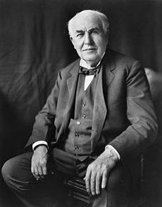

Negative know-how can be Confidential Information. The concept was pithily summarized up by legendary inventor Thomas Edison, who is [[https://www.goodreads.com/author/quotes/3091287.Thomas_A_Edison][widely quoted]] as having said, "I have not failed. I've just found 10,000 ways that won't work." That kind of knowledge could have economic value and thus could be a trade secret if maintained in confidence.

*But:* Negative know-how is one of those areas where proof of secrecy and value of the negative know-how itself will be especially important. {{{RWE}}} A federal district court in New York City observed (arguably in a nonbinding dictum) that "[i]t is difficult to see how /negative/ trade secrets consisting of unsuccessful efforts to develop trade secrets and experimental dead ends can have independent economic value when /the end result/ of the process, the /positive/ trade secrets, have in fact been uncovered." <cite> [[https://scholar.google.com/scholar_case?case=16016385114749780551][Zirvi v. Flatley]], 433 F. Supp 3d 448, 465 (S.D.N.Y. 2020) (dismissing complaint with prejudice) (formatting modified, citations omitted), /aff'd by summary order/, [[https://scholar.google.com/scholar_case?case=8609003446555268293][No. 20-546-cv]] (2d Cir. Dec. 11, 2020) (affirming on statute-of-limitations grounds). </cite>

*** Two-way NDA terms are usually more balanced — but not always        :CMT:
  :PROPERTIES:
  :CUSTOM_ID: nda-two-bal
  :END:

/Other things being equal/, a supposedly "two-way" agreement, one that applies equally when either party plays a particular role — here, MathWhiz and Gigunda as Disclosers and Recipients — is /likely/ (but not guaranteed) to be more balanced.

*But*:  An agreement that's /nominally/ two-way can still be biased in favor of the drafting party. Example: Suppose that Gigunda's lawyer (i) is doing the drafting, and (ii) knows that Gigunda will be getting access to MathWhiz's confidential information but not the other way around. In that situation:

--  Recipient Gigunda's lawyer might write a /nominally/ two-way confidentiality provision that in fact provides very little protection for discloser MathWhiz's information, because Gigunda's lawyer wants to "win the negotiation" for Gigunda. /(This desire to "win" is an occupational hazard for lawyers.)/

--  As a result, /MathWhiz's/ lawyer would have to review the confidentiality provisions carefully to make sure it contained sufficient protection for MathWhiz's information.

Conversely, if it's discloser /MathWhiz's/ lawyer who's doing the drafting, then the confidentiality provisions might contain requirements that recipient /Gigunda's/ lawyer would have to review carefully to be sure that the provisions wouldn't impose too much of a burden on Gigunda.

*** Still: _Always_ ask for a _two_-way NDA                                 :CMT:
  :PROPERTIES:
  :CUSTOM_ID: conf-info-pty
  :END:

 /A *genuine* two-way agreement is always best:/ As written, {{{ths}}} would be usable both in a /one/-way agreement (where only one party wants to be bound by confidentiality obligations) *and* in a /two/-way agreement. (Concerning two-way agreements, see the additional discussion at [[#nda-two-bal]] and, more generally, the discussion of /Freaky Friday/ terms at [[#FFri]].)

Let's return to our course hypothetical where small-company MathWhiz is trying to get a consulting contract from a potential customer, Gigunda: As a big company, Gigunda might want MathWhiz to sign a "one-way" NDA that protects only /Gigunda's/ information. That way, Gigunda wouldn't have to worry about keeping /MathWhiz's/ information confidential. *Question:* Can the NDA accommodate Gigunda's wish, while still providing at least some protection for MathWhiz? The above language offers one possibility.

In the real world, the NDA likely would indicate which party's or parties' information would be protected. And the NDA might explicitly indicate that /MathWhiz's/ confidential information /won't/ be made available to Gigunda. This could be because MathWhiz wants to be clear that it won't be disclosing its trade secrets to Gigunda (at least not before a deal is signed). But it could also be that Gigunda wants to be clear that Gigunda is not agreeing to be bound by confidentiality obligations for whatever information MathWhiz /does/ provide. 

(*Caution:* By law, each party might still have other confidentiality obligations for information provided by the other party, for example under laws protecting the privacy of personal information or under export-control laws. See the discussions at {{{RR}}} [[#r-priv-law-defn]] (privacy) and [[#nl-export-ctrls]] (export controls).)

BUT: Even if MathWhiz and Gigunda originally intended for only Gigunda to disclose its confidential information to MathWhiz, their NDA should preferably still be /two/-way, not one-way. Here's why: 

- Later, the parties' /business people/ might decide it'd be good for MathWhiz to reveal certain of its own confidential information to Gigunda.

- And those business people — /without checking with "the lawyers"/ — might well assume, wrongly, that "we have an NDA in place so sure, let's do it."

But that's /not/ OK — at least not from MathWhiz's point of view: 

- The existing, one-way NDA was drafted to protect /only Gigunda's/ information, not MathWhiz's.

- That, in turn, means that /Gigunda has no confidentiality obligations/ with respect to MathWhiz's information.

- And so, MathWhiz's /unprotected/ provision of trade secrets to Gigunda /will likely destroy MathWhiz's legal rights in those trade secrets/. {{{RWE}}} Something close to that actually happened to a recipient in a Seventh Circuit case. <cite> See [[https://scholar.google.com/scholar_case?case=3855750888701636738][Fail-Safe, LLC v. A.O. Smith Corp.]], 674 F.3d 889, 893-94 (7th Cir. 2012) (affirming summary judgment for defendant). </cite>

To accommodate the above concern, this § [[#conf-info-rcpt]] allows for MathWhiz and Gigunda to use a /one-way/ NDA, /initially/ protecting only Gigunda's information, to also protect MathWhiz's information.  This provides flexibility for the parties: Assuming that Gigunda did agree to confidentiality obligations for MathWhiz's information, it'd be easy for MathWhiz to get Gigunda to indicate that agreement in writing, e.g., in an email.

And also later, if all else failed, MathWhiz could try to show that /the circumstances/ indicated that Gigunda did in fact consent to receiving MathWhiz's information in confidence; here are two possibilities:

- The parties' emails, while not explicitly saying, "Gigunda agrees," might still clearly indicate that Gigunda gave such consent;

- Mary Marvel (MathWhiz's CEO) could email someone in authority at Gigunda to confirm an /oral/ agreement that the NDA would apply to MathWhiz's information, with Gigunda not timely objecting and acting consistently with such an agreement; or

- Gigunda's oral agreement might be confirmed by some disinterested third party (which seems unlikely).

*** Other reading materials

For a quick, checklist-style overview of possible negotiation issues in NDAs, Myron Rabij, [[https://www.jdsupra.com/legalnews/ndas-10-key-points-questions-to-1909988][NDAs: 10 Key Points & Questions to Consider Ahead of the Deal]] (JDSupra.com 2023).

See also {{{RR}}} [[#r-baa-app]] (business associate agreement) concerning personal health information, commonly referred to as "PHI."

For venture-capital dealings, see Cynthia Abesa's post at the members-only site redline.net: [[https://www.redline.net/queries/ndas-vcs-evaluating-potential-investment-or-acquisition][NDAs with VCs for evaluating a potential investment or acquisition]] (2024).

*** Reading: Illustrations                                         :CMT:OMIT:

/Students: Feel free to just skim these illustrations./

**** Introduction: MathWhiz and Gigunda's NDA                          :OMIT:

/(For students:)/

Gigunda and MathWhiz are discussing the possibility of having MathWhiz undertake a data-processing project for Gigunda. As is often the case in such situations:

- MathWhiz thinks that its detailed sales efforts might go better if MathWhiz can reveal certain MathWhiz confidential information to Gigunda — perhaps even "opening the books" just a peek about trade secrets that MathWhiz uses in its data processing.

- Conversely, /Gigunda/ might want to provide MathWhiz with internal information about Gigunda's business needs, which Gigunda wants MathWhiz to keep secret.

But if either party reveals its confidential information to the other without a contractual obligation of secrecy, then the other party likely could do as it wished with the information — without having to pay the other party or even have anything further to do with the other party. 

For that reason, the parties naturally want to put in place a confidentiality agreement, widely referred to as an "NDA." 

("NDA" is a misnomer: It stands for /nondisclosure agreement/, and an NDA will essentially always impose obligations other than than just nondisclosure obligations.)

** Confidential information: {{{ADDL}}} for Disclosers                                           :ADDL:
  :PROPERTIES:
  :CUSTOM_ID: conf-info-discl-addl
  :HTML_CONTAINER_CLASS: addl
  :END:

Contents:

#+TOC: headlines 1 local

*** Include a "laundry list" of types of Confidential Information?      :CMT:
  :PROPERTIES:
  :CUSTOM_ID: conf-info-lndr-list
  :END:

Some drafters /(your author isn't one of them)/ also like to include a long "laundry list" of specific categories information that can qualify as confidential information. But:

- There's arguably little need — or none at all — for such a list, given the breadth of the definition of Confidential Information in {{{ths}}}.

- Including such a list marginally increases the reader's "cognitive burden" (a fancy name for workload) and thus can slow up the contract-negotiation process. 

- From the Discloser's perspective: You wouldn't want the Recipient to try to claim that particular information /wasn't/ in one of the listed categories, and so (the Recipient argues) the information supposedly doesn't qualify as Confidential Information, notwithstanding the "not of limitation" language.

But if you do want such a list, here's a pretty-detailed one to consider as a starting point for your own — /please shorten it!/  I've  harvested the following list from various agreements that I've reviewed over the years:

#+begin_quote

The term /Confidential Information/ encompasses, by way of example and not of limitation, the following types of information when the information is otherwise eligible under this Agreement: Algorithms. Audit reports. Biological materials. Business plans. Business records. Circuit records. Commercial information. Compounds. Computer programs. Contracts. Construction records. Data-center designs. Designs. Diagrams. Documents. Draft publications. Drawings. Engineering records. Financial information. Financial projections. Financial statements. Forecasts. Formulas. Hardware items. Ideas. Interpretations. Invention disclosures. Leases. Machine-readable data. Maps. Market projections. Marketing information. Methods. Offers. Operational data. Opinions. Patent applications (when unpublished). Plans. Pricing information. Procedures. Processes. Product development plans. Product information programs. Projections. Proposals. Research data. Research plans. Samples. Server-configuration designs. Source code for computer programs. Specifications. Strategies. Tax bills. Technical information. Technical reports. Technological developments. Test data. Title reports. 
#+end_quote

*** Disclosers: Tell employees about their whistleblower rights — and /don't/ ask them to waive those rights
  :PROPERTIES:
  :CUSTOM_ID: c-ConfInfoLegalRestr
  :END:

[[#conf-info-legal][Section ]][[#conf-info-legal]] addresses the Recipient's possible need to disclose Confidential Information in either of the following situations:

   - the disclosure falls in one of the categories of disclosure that is immune from liability under, and/or expressly authorized by, the Defend Trade Secrets Act, [[https://www.law.cornell.edu/uscode/text/18/1833][Title 18, Section 1833(b)]] of the United States Code; and/or

   - the disclosure is /affirmatively/ authorized by law or regulation, for example applicable labor- or employment law — including the law in a growing number of states, especially in the wake of the #MeToo movement, as summarized in a 2021 law-firm article. <cite> See, e.g., Taylor Bleistein, Doreen Martin, and Keith Olsen, [[https://www.jdsupra.com/legalnews/the-list-of-states-regulating-non-6188592][The List of States Regulating Non-Disclosure Provisions Continues to Grow]] (JDSupra.com 2024). </cite>

(Added April 2026: This is now an issue in the UK as well under the Employment Rights Act 2025 — see Jo Broadbent and Stefan Martin, [[https://www.jdsupra.com/legalnews/uk-government-consults-on-new-nda-1117481][UK government consults on new NDA restrictions]] (JDSupra.com).)

# https://commons.wikimedia.org/wiki/File:Seal_of_the_National_Labor_Relations_Board.svg
# #+ATTR_HTML: :alt Seal of National Labor Relations Board :title Seal of National Labor Relations Board :class photo-at-right photowidth20
# 

DCT note: I'm editing this section in April 2025, when it still remains to be seen what changes will be needed as a result of the second Trump adminstration's sidelining of the NLRB by [[https://www.kelleydrye.com/viewpoints/blogs/labor-days/nlrb-leadership-in-flux-chair-gwynne-wilcoxs-unprecedented-firing-a-quorum-less-board-and-implications-for-employers][firing its chair, other Democratic-appointed member, and general counsel]].

*Caution:* In employment-related agreements, the (U.S.) *National Labor Relations Board* (NLRB or "Board") has been known to be hostile to NDA-type provisions that could be interpreted as insufficiently explaining /to employees/ their right to engage in concerted action under the National Labor Relations Act, as seen in a 2019 Advice Memorandum from the Board's general counsel, concerning a non-disparagement clause in a law firm's employment agreement. <cite> See Advice Memorandum dated Nov. 13, 2019, in [[https://www.nlrb.gov/case/14-CA-227644][Case No. 14-CA-227644]], discussed in [[https://www.dickinsonlaw.com/blogs-articles/2019/11/25/non-disparagement-clauses-in-cross-hairs-of-nlrb--lessons-for-employers--their-employment-lawyers][this law firm memo]]. </cite>

Likewise, the Board has traditionally been hostile to contractual confidentiality restrictions that purport to limit employees' discussions of wages and working conditions. <cite> See [[https://scholar.google.com/scholar_case?case=8295501719978973216][Nat'l Labor Rel. Bd. v. Long Island Assoc. for AIDS Care]], 870 F.3d 82, 88-89 (2d Cir. 2017) (affirming Board ruling). </cite>

An undated Board Web page — still on the site at this writing — states:

#+begin_quote
Under the National Labor Relations Act (NLRA or the Act), employees have the right to communicate with their coworkers about their wages, as well as with labor organizations, worker centers, the media, and the public. Wages are a vital term and condition of employment, and discussions of wages are often preliminary to organizing or other actions for mutual aid or protection. <cite> Office of General Counsel, National Labor Relations Board, [[https://www.nlrb.gov/about-nlrb/rights-we-protect/your-rights/your-rights-to-discuss-wages][Your Right to Discuss Wages]] (NLRB.gov, undated). </cite>
#+end_quote

And during the Biden administration, when Democratic majorities were on the NLRB, the Board took the position that:

#+begin_quote
[under] the Board’s recent decision in /McLaren Macomb/, ... the Board returned to longstanding precedent holding that *employers violate* the National Labor Relations Act when they *offer* employees severance agreements that *require employees to broadly waive their rights* under the Act. ... [S]everance agreement provisions that could violate the Act if proffered, maintained, or enforced, includ[e] confidentiality, non-disclosure, and non-disparagement, among others. <cite> Office of Public Affairs, National Labor Relations Board, [[https://www.nlrb.gov/news-outreach/news-story/nlrb-general-counsel-issues-memo-with-guidance-to-regions-on-severance][NLRB General Counsel Issues Memo with Guidance to Regions on Severance Agreements]] (NLRB.gov March 22, 2023) (emphasis added). </cite>
#+end_quote

# https://en.wikipedia.org/wiki/Federal_Trade_Commission
# #+ATTR_HTML: :alt FTC logo :title FTC logo   :class photo-at-right photowidth20
# 

At least before the second Trump administration came into office, the *Federal Trade Commission's* antitrust lawyers weren't letting the NLRB have all the fun: In a 2023 announcement, the FTC's Bureau of Competition warned that it regarded confidentiality agreements /and employer-notification requirements/ as "imped[ing] Bureau investigations" and so "are contrary to public policy and therefore unenforceable." The announcement explained:

#+begin_quote

Although exact terms vary, the following general types of contract provisions can impede Bureau investigations: 
- confidentiality agreements, 
- nondisclosure agreements, and 
- notice-of-agency-contact provisions. ... 
The exact terms and conditions may vary, but these restrictions and requirements can all have the same chilling effect on individuals’ willingness to speak voluntarily with Bureau staff. That chilling effect impedes the Federal Trade Commission’s ability to carry out its statutory mandate. <cite> Federal Trade Commission, Bureau of Competition, [[https://www.ftc.gov/system/files/ftc_gov/pdf/Formal-Analysis.pdf][Contracts That Impede Bureau of Competition Investigations]] 1, 2 (FTC.gov June 15, 2023) (extra paragraphing and bullets added). </cite>
#+end_quote

# https://en.wikipedia.org/wiki/U.S._Securities_and_Exchange_Commission
# #+ATTR_HTML: :alt SEC logo :title SEC logo  :class photo-at-right photowidth20
# [[./img/SEC-logo.svg]]

Restrictions on corporate whistleblowers could attract unwanted attention from the *Securities and Exchange Commission*: In 2024, the SEC announced that it had settled big-dollar civil claims against Wall Street firms J.P. Morgan, D.E. Shaw, and others (but probably couch change to some of the settling defendants) for entering into agreements that restricted whistleblower claims. <cite> See SEC press release 2024-7, [[https://www.sec.gov/news/press-release/2024-7][J.P. Morgan to Pay $18 Million for Violating Whistleblower Protection Rule]] (SEC.gov 2024); SEC press release 2023-213, [[https://www.sec.gov/news/press-release/2023-213][SEC Charges D. E. Shaw with Violating Whistleblower Protection Rule]] (SEC.gov 2023); see also [[https://www.sec.gov/newsroom/press-releases/2024-118][SEC press release 2024-118]] (various public companies agree to pay a total of more than $3 million in civil penalties); Amanda Brown and Heather Raun, [[https://www.employmentlawwatch.com/2023/10/articles/us-alert/sec-implements-new-level-of-scrutiny-for-employment-agreements-and-separation-agreements-under-whistleblower-protection-rule/][SEC implements new level of scrutiny for employment agreements and separation agreements under whistleblower protection rule]] (EmploymentLawWatch.com 2023). </cite>

Oh, and it might not be enough for a contract merely to include a disclaimer: In 2023, the SEC also [[https://www.sec.gov/files/litigation/admin/2023/34-98322.pdf][announced]] that it had settled civil charges against Monolith Resources, LLC for using a form of separation that:

#+begin_quote
... stated that "nothing in this agreement is intended to limit in any way your right or ability to file a charge or claim with any federal, state, or local agency," *but* the agreement also took away an employee’s right to recover a monetary award for filing a claim with, or participating in an investigation or action by, a governmental agency.
#+end_quote

(Emphasis added.) Without admitting liability, Monolith consented to the entry of a cease-and-desist order and agreed to pay a civil penalty of $225,000.

*Note that* in the U.S., an online service provider's disclosure of /non-content/ customer information to legal authorities could also be immune from liability under [[https://www.law.cornell.edu/uscode/text/18/2703][18 U.S.C. § 2703(e)]] no matter what the contract's confidentiality provisions might say.

*** Pro tip:  /Asking/ for an NDA might scare a recipient
  :PROPERTIES:
  :CUSTOM_ID: ConfInfoNoNDAMaybe
  :END:

Depending on the circumstances, the /business/ benefit of asking another party for an NDA might be outweighed by the risk that the other party might be scared off by the request, out of concern that the NDA would give the first party a weapon with which to sue the other party — triggering the expense and burden of litigation and the risk of making a bad impression on a jury — if the relationship were to go south. 

{{{RWE}}} A federal-court jury in Los Angeles awarded a one-man startup company more than $117 million (in 2025 dollars) against aerospace conglomerate Rockwell International for breaching a confidentiality agreement. The parties had entered into the NDA to discuss a possible royalty-bearing license for data-compression technology for which the man had filed a patent application. Rockwell's position was that the man's innovation consisted of well-known engineering techniques and so royalty payments weren't warranted. The jury didn't buy it; on appeal, the Federal Circuit ruled that the man's patent was indeed invalid in view of the prior art, but the court declined to overturn the jury's finding that Rockwell had breached the NDA. <cite> See [[https://scholar.google.com/scholar_case?case=16810614390244449913][Celeritas Technologies Ltd. v. Rockwell Int'l, Inc.]], 150 F.3d 1354, 1359 (Fed. Cir. 1998). Disclosure: I was part of Rockwell's trial team in that case. </cite>

This illustrates why big companies are often highly-reluctant to sign NDAs, especially with startups or other smaller companies.

So in terms of "deal psychology," a prospective Discloser's best bet might be to hold off on asking the prospective Recipient sign an NDA, and instead — for the time being — to provide the Recipient only with information that wouldn't seriously harm Discloser if it were to become public or get into the hands of a competitor. That would allow the parties to defer negotiating an NDA until the Recipient had become more comfortable with the idea, and with the Discloser.

*** Special case: Disclosure to venture capitalists, etc.
  :PROPERTIES:
    :CUSTOM_ID: ConfInfoNDAInvestors
  :END:

Amplifying the discussion in [[#ConfInfoNoNDAMaybe]]: Potential investors in a company might be reluctant to sign a nondisclosure agreement ("NDA").  In particular, venture capitalists ("VCs") often flatly refuse to sign NDAs with prospective portfolio companies, because they don't want to risk saying "no" to a company about investing, only to be sued years later for allegedly disclosing the company's technology to someone else. 

# https://logos-world.net/amazon-logo/
# #+ATTR_HTML: :alt Amazon logo :title Amzon logo :class photowidth25 photo-at-right
# 

Of course, it's not as if recipients never, ever acquire confidential information under an NDA and then use the information anyway. Amazon's venture-capital arm supposedly did that to small tech companies DefinedCrowd, LivingSocial, and others, according to press reports. <cite> See Dana Mattioli and Cara Lombardo, [[https://www.wsj.com/articles/amazon-tech-startup-echo-bezos-alexa-investment-fund-11595520249?mod=e2twd][Amazon Met With Startups About Investing, Then Launched Competing Products]] (WSJ.com Jul. 23, 2020). </cite>

But even so: As a practical matter, going without an NDA /with non-corporate venture capitalists/ might not be a bad bet, because:

- You can try to be very, very selective about what you disclose without an NDA, so that you're not giving away the "secret sauce" (see § [[#ConfInfoSauce]]) of your idea.

- Individual "angel" investors and others generally do have one or two other things on their minds. They generally see lots of entrepreneurs who are convinced they've got a world-beating "unicorn" idea. You'll probably be lucky to get these investors to pay attention for two minutes. Ask yourself how likely it is that they'll want to take your idea and spend time and money building a business without you.

- Contracts aren't the only thing that discourage bad behavior. If an investor stole someone's idea, and if word got around, then that investor might later find it hard to get other people to talk to him.

You have to decide what risks you want to take. Your business might fail because an investor steals your idea and beats you to market. Or it might fail because you can't raise the money you need to get started. 

By analogy: It's sort of like having to take a trip across the country, and you have to decide whether to fly or drive:

- If you flew, there's a risk you could die in a plane crash flying from one side of the country to the other, and you'd be contributing to greenhouse gases. <cite> See, e.g., Mark Miodownik, [[https://www.nytimes.com/2024/12/28/opinion/air-travel-airlines-carbon-capture-climate-change.html?unlocked_article_code=1.mU4.nLzs.dylFRAlyWak9&smid=url-share][I Won’t Feel Good About Flying Until the Airlines Solve This]] (NYTimes.com 2024). </cite>

- But if you were to drive the same route, your risk of dying in a car crash has been estimated as being something like 65 times greater than if you flew — and you'd still be contributing at least somewhat to greenhouse gases, possibly even more so than flying. <cite> See, e.g., [[https://www.bbc.com/news/science-environment-49349566][Climate change: Should you fly, drive or take the train?]] (BBC.com 2019). </cite>

As the old saying goes, you pays your money and you takes your choice.

*Pro tip:* If your client will be dealing with venture capitalists, you might want to check out the [[https://www.redline.net/queries/ndas-vcs-evaluating-potential-investment-or-acquisition#comments-body-30326][redline.net clauses]] for VC disclosure.

*** NDA overbreadth could be problematic
  :PROPERTIES:
  :CUSTOM_ID: ConfInfoExclCaut
  :END:

In a case under Puerto Rican law, the First Circuit cited prior decisions from the mainland United States holding that "overly broad confidentiality agreements constitute unreasonable restraints on trade which unduly restrict the free flow of information necessary for business competition and are thus unenforceable." <cite> [[https://scholar.google.com/scholar_case?case=3396820990850226155][TLS Mgmt. & Marketing Serv., LLC v. Rodriguez-Toledo]], 966 F.3d 46, 57-60 (1st Cir. 2020) (reversing judgment in favor of former employer) (cleaned up). </cite>

** Confidential information: {{{ADDL}}} for Recipients                                           :ADDL:
  :PROPERTIES:
  :CUSTOM_ID: conf-info-recip-addl
  :HTML_CONTAINER_CLASS: addl
  :END:

Contents:

#+TOC: headlines 1 local

*** Recipient Best-Practice #1: Be choosy
  :PROPERTIES:
  :CUSTOM_ID: conf-info-rcp-choo
  :END:

When dealing with other parties in contract situations, you'd be well-advised to be choosy about /accepting/ the other party's confidential information — and to consider using "protection" in the form of a confidentiality agreement that includes appropriate exclusions such as those in {{{RR}}} [[#r-conf-info-proto]].

# https://en.wikipedia.org/wiki/File:Facebook_f_logo_%282021%29.svg
# #+ATTR_HTML: :alt Facebook logo :title Facebook logo   :class photo-at-right photowidth15
# 

*Example:* It can be dangerous to acquire confidential information of a competitor, for example in merger negotiations, even under a confidentiality agreement ("NDA"). That's because if a deal /doesn't/ come to pass, the "owner" of the confidential information might later claim that the recipient made improper use of the target company's confidential information. Something like this happened in a Ninth Circuit case in which Facebook was caught in the middle. <cite> See [[https://scholar.google.com/scholar_case?case=3494441462132744599][BladeRoom Grp. Ltd. v. Emerson Elec. Co.]], 20 F.4th 1231 (9th Cir. 2021). </cite>

See also the discussion at [[#ConfInfoNoNDAMaybe]] of the /Celeritas v. Rockwell/ case, where a one-man startup company scored a $117 million verdict (in 2025 dollars) against a defense contractor.

*** Use a /nonconfidentiality/ agreement?
  :PROPERTIES:
  :CUSTOM_ID: conf-info-non-conf
  :END:

# https://commons.wikimedia.org/wiki/File:Mattel-brand.svg
#+ATTR_HTML: :alt Mattel logo :title Mattel logo :class photowidth15 photo-at-right

A prospective Recipient might want to ask the Discloser to enter into a /nonconfidentiality/ agreement that states explicitly that the /Recipient has no confidentiality obligations/ concerning the Discloser's information.  For years, toy companies and car companies have required "off the street" submitters of ideas to sign such agreements; see, e.g., [[https://corporate.mattel.com/terms-and-conditions#section-7][section 7]] of Mattel's Web terms of service.

*** Caution: Publication destroys confidentiality                       :CMT:
  :PROPERTIES:
  :CUSTOM_ID: conf-info-publ-nc
  :END:

{{{H1}}} Publication — of which *patenting* is one form — is one way in which allegedly-confidential information can be conclusively disqualified from confidentiality status. As the SDNY noted: "It is axiomatic that a plaintiff cannot recover for the misappropriation of a trade secret if he revealed that secret in a published patent or patent application." <cite> [[https://scholar.google.com/scholar_case?case=6214960575815942331][Broker Genius, Inc. v. Zalta]], 280 F. Supp. 3d 495, 518 (S.D.N.Y. 2017) (citations omitted); [[https://scholar.google.com/scholar_case?case=1090965005640831474][DVD Copy Control Ass'n Inc. v. Bunner]], 116 Cal. App. 4th 241, 10 Cal. Rptr. 3d 185, 194 (2004) (information about DVD content scrambling, widely published on the Internet). </cite>

# https://en.m.wikipedia.org/wiki/File:Geico_logo.svg
# #+ATTR_HTML: :alt GEICO logo :title GEICO logo :class photo-at-right photowidth25
# 

{{{HN}}} Likewise, when computer-program source code is part of a U.S. *copyright registration* filing, the code (generally) is publicly available from the Copyright Office and so cannot be a trade secret. <cite> See [[https://scholar.google.com/scholar_case?case=8207454350930432879][Capricorn Mgmt. Sys., Inc. v. GEICO]], No. 15-CV-2926, slip op. at part IV.B (E.D.N.Y. Mar. 16, 2020). </cite>

{{{RWE}}} A Taiwanese machine-tools manufacturer sued its former U.S. distributor for allegedly misappropriating the manufacturer's trade secrets. The manufacturer, as part of its legal strategy, registered more than 20 technical drawings with the U.S. Copyright Office — without redacting (blacking out) any parts of the drawings. The court had no difficulty concluding that by doing so, the manufacturer had "extinguished" any trade-secret rights it had in the content of the drawings. <cite> See [[https://cases.justia.com/federal/appellate-courts/ca4/24-1675/24-1675-2025-07-09.pdf][Sysco Machinery Corp. v. DCS USA Corp.]], No. 24-1675, slip op. at 3, 8-9 (4th Cir. 2025) (affirming dismissal of trade-secret claim for failure to state a claim upon which relief can be granted). </cite>

(The court also rejected the manufacturer's claim that manufacturing 

*** But: "Publication" might be field-specific.                         :CMT:
  :PROPERTIES:
  :CUSTOM_ID: conf-info-publ-field  
  :END:

The fact that information is included in a publication known /to those who work in one particular field/ won't necessarily destroy the information's trade-secret status in "*an entirely different field* from the one to which the publication was addressed." <cite> [[https://scholar.google.com/scholar_case?case=3697281328783047943][Masimo Corp. v. True Wearables, Inc.]], No. 2021-2146, slip op. at part II.A (Fed. Cir. Jan. 24, 2022) (nonprecedential; affirming preliminary injunction against former employee of plaintiff and his new company) (emphasis added). </cite>

*** Exclusion of "readily-ascertainable" information — what could qualify?
  :PROPERTIES:
  :CUSTOM_ID: conf-info-excl-asc-a
  :END:

{{{H1}}} It can be challenging — read: costly — to litigate the fact-specific question whether particular information does or doesn't qualify as "readily ascertainable." Here are some cases in which parties had to (expensively) litigate whether particular allegedly-trade-secret information was "readily ascertainable" and therefore ineligible for legal protection:

# #+ATTR_HTML: :alt L'Oréal logo :title L'Oréal logo  :class photo-at-right photowidth20
# 

{{{RWE}}} A federal appeals court threw out a $22 million jury verdict against cosmetics giant L'Oréal for "willful or malicious" misappropriation of an alleged trade secret (involving the use of maleic acid during bleaching) because the purported trade secret wasn't eligible to be treated as such, as the information was "readily ascertainable by proper means" in a number of previously-issued patents and published patent applications. <cite> See [[https://cafc.uscourts.gov/sites/default/files/opinions-orders/20-1382.OPINION.5-6-2021_1774068.pdf][Olaplex, Inc. v. L’Oréal USA, Inc.]], No. 20-1382, part III.A.1, slip op. at 10-14 (Fed. Cir. May 6, 2021) (reversing denial of judgment as a matter of law as to trade-secret misappropriation) (non-precedential). </cite>

# #+ATTR_HTML: :alt Pinterest logo :title Pinterest logo  :class photo-at-right photowidth15
# 

{{{RWE}}} A New York appeals court held that "to the extent the features identified by plaintiffs were readily ascertainable from the publicly-available Rendezvoo website, they are not protectable trade secrets." <cite> [[https://scholar.google.com/scholar_case?case=9477020163175365044][Schroeder v. Pinterest Inc.]], 133 A.D.3d 12, 29, 17 N.Y.S.3d 678, 2015 NY Slip Op 07232 (N.Y. App. Div. 2015) (citations omitted). </cite>

{{{RWE}}} A federal appeals court ruled that, under Texas law, a discloser's information lost its trade-secret status because the information had /become/ readily ascertainable through reverse engineering of the discloser's publicly-released; this was true even though the receipient had not itself reverse-engineered the product. <cite> See [[https://scholar.google.com/scholar_case?case=3358739901067764223][ams-OSRAM USA Inc. v. Renesas Electrs. America, Inc.]], 133 F.4th 1337, 1347-48 (Fed. Cir. 2025) (reversing district court's finding about the date that a particular trade secret had become readily ascertainable). (Hat tip: [[https://www.redline.net/queries/public-knowledge-exception-confidentiality#30662-posts][Cynthia Abesa]].) </cite>

*Counterexample:* A jury didn't buy a defendant's argument that particular alleged trade secrets were "public or general knowledge in the industry." <cite> See [[https://scholar.google.com/scholar_case?case=1395505190976857469][Harbor Business Compliance Corp v. Firstbase IO Inc.]], 152 F.4th 516, 530-31 (3d Cir. 2025).</cite>

{{{HN}}} *"Improper means"?*  The federal Defend Trade Secrets Act gives examples of /improper/ means (at [[https://www.law.cornell.edu/uscode/text/18/1839][18 U.S.C. § 1839(6)]], concerning "readily ascertainable") as "(A) includ[ing] theft, bribery, misrepresentation, breach or inducement of a breach of a duty to maintain secrecy, or espionage through electronic or other means; and (B) does not include reverse engineering, independent derivation, or any other lawful means of acquisition[.]" 

For a head-scratching outlier example of what one court said was /improper/ means, see [[Christopher][the discussion]] at [[#ConfInfoExclFreely-a]] of the Fifth Circuit's /Christopher/ case, where the court affirmed a ruling that DuPont could sue photographers who'd been hired, by an unknown party, to overfly — in public, unrestricted airspace — and photograph a chemical-plan site that was under construction site.

{{{HN}}} Probably to the regret of businesses, the Act doesn't seem to provide any "[[#safe-harbor][safe harbors]]" for /proper/ means. But the U.S. Supreme Court commented, in the (IP-)famous 1974 /Kewanee Oil/ case, that "a trade secret law ... does not offer protection against discovery by fair and honest means, /such as by/ independent invention, accidental disclosure, or by so-called reverse engineering ...." <cite> [[https://scholar.google.com/scholar_case?case=7210506171880070328][Kewanee Oil Co. v. Bicron Corp.]], 416 U.S. 470, 476 (1974). (Emphasis added.) For more on reverse engineering, see generally [[#nl-reverse-eng-cmt]]. </cite>

*** Would breach of a confidentiality agreement be considered "improper means" of acquiring a trade secret?
  :PROPERTIES:
  :CUSTOM_ID: conf-info-impr-brch
  :END:

Under subdivision (6)(B) of [[https://www.law.cornell.edu/uscode/text/18/1839][18 U.S.C. § 1839]], "breach ... of a duty to maintain secrecy" is one form of "improper means" of ascertaining a trade secret — but the answer under /state/ law might be different (or might not be), as addressed in several court cases.

 {{{RWE}}} A Texas appellate court held that under Texas law, "[a] /post-acquisition/ breach of a confidentiality or nondisclosure agreement ... cannot support an improper means finding as a matter of law." <cite> [[https://scholar.google.com/scholar_case?case=13222991505647273295][Title Source, Inc. v. HouseCanary, Inc.]], 612 S.W.3d 517, 531 (Tex. App. San Antonio 2020, pet. denied) (reversing, in part, judgment on jury verdict of trade-secret misappropriation; cleaned up, emphasis added). </cite>

But then two weeks later, the Fifth Circuit held (in an unpublished opinion) that under Texas law, "a breach of a duty to maintain secrecy /is/ a way of establishing improper means ...." <cite> [[https://scholar.google.com/scholar_case?case=8757023556439236850][Hoover Panel Systems, Inc. v. HAT Contract, Inc.]], No. 19-10650, part II (5th Cir. June 17, 2020) (per curiam, unpublished: reversing and remanding summary judgment in favor of accused misappropriator; emphasis added, citations omitted). </cite>

An attorney points out that the Fifth Circuit's /Hoover Panel/ holding "raises a potential /Erie/ concern," in that federal courts sitting in diversity (i.e., the Fifth Circuit) are supposed to apply state law as interpreted by /state/ courts. <cite> [[https://www.mwe.com/people/devinsky-paul/][Paul Devinsky]], [[https://www.ipupdate.com/2020/07/improper-use-of-voluntarily-communicated-trade-secrets-sufficient-to-maintain-action-for-misappropriation-in-texas/][Improper Use of Voluntarily Communicated Trade Secrets Sufficient to Maintain Action for Misappropriation in Texas]] (IPUpdate.com Jul. 1, 2020). </cite>

*** Pro tip: Seek and _save_ corroborating evidence of independent possession!
  :PROPERTIES:
  :CUSTOM_ID: conf-info-excl-corrob-n
  :END:

When a Recipient gets sued for misappropriating Confidential Information, one standard Recipient defense is to claim, "Oh, well, we already knew /that/ information!" or "Well, yeah, we learned that from the Discloser, but we developed our own version!" Juries can be skeptical of such claims, to the point of rejecting them altogether.

{{{RWE}}} A federal-court jury awarded a software vendor $152 million because the defendant — one of the vendor's customers — had helped a vendor competitor to [[#nl-reverse-eng-cmt][reverse-engineer]] the vendor's software product, which violated of the software's license agreement. The jury evidently didn't believe the vendor competitor's claim that it had developed its own software /without/ using the vendor's trade secrets. <cite> See [[https://scholar.google.com/scholar_case?case=8160821075256539962][ResMan, LLC v. Karya Prop. Mgmt. LLC]], No. 4:19-CV-00402, slip op. (E.D. Tex. Aug. 5, 2021) (final judgment) (reducing damage award to $62.5 millon to eliminate duplicate recoveries); Natalie Posgate, [[https://www.houstonchronicle.com/business/article/Two-Houston-companies-hit-with-152m-verdict-in-16037872.php][Two Houston companies hit with $152 million verdict in intellectual property case]] (HoustonChronicle.com Mar. 19, 2021); Blake Brittain, [[https://www.reuters.com/legal/transactional/resman-ends-up-with-62-mln-trade-secret-win-after-152-mln-verdict-2021-08-13/][ResMan ends up with $62 mln in trade-secret win after $152 mln verdict]] (Reuters.com Aug. 13, 2021). </cite>

{{{RWE}}} A jury evidently didn't believe a recipient's claim of having independently developed information about "sweet spots" in oil and gas reservoirs; the jury awarded the discloser more than $40 million. <cite> See [[https://scholar.google.com/scholar_case?case=13154664025596453552][S.W. Energy v. Berry-Helfand]] , 491 S.W.3d 699, 708 (Tex. 2016). On appeal, the damages award was vacated and remanded for a new trial; in an SEC filing in February 2017, the recipient disclosed that the parties had [[https://www.sec.gov/Archives/edgar/data/7332/000000733217000009/swn20161231x10k.htm][settled]] on a confidential basis. </cite>

{{{RWE}}} A federal-court jury in Los Angeles awarded a one-man startup company more than $117 million (in 2025 dollars) because the jury found that defense contractor Rockwell had breached a confidentiality agreement with the startup company. Rockwell insisted that its engineers had independently developed the technology in question, but post-trial juror interviews confirmed that the jurors simply didn't buy Rockwell's story. <cite> See [[https://scholar.google.com/scholar_case?case=16810614390244449913][Celeritas Technologies Ltd. v. Rockwell Int'l, Inc.]], 150 F.3d 1354, 1359 (Fed. Cir. 1998). DCT note: I was part of Rockwell's trial team in that case. </cite>

{{{RWE}}} A company (the "customer") engaged another company (the "vendor") to produce "white label" business-compliance software for the customer to use with its own customers. Disputes arose about the scope of the project; eventually the customer ditched the vendor and soon came out with its own software. Unhappy with events, the vendor sued the customer for misappropriation of the vendor's trade secrets; the customer responded that it had developed the information itself, but the jury didn't buy it, awarding the developer some $25 million in damages. <cite> See [[https://scholar.google.com/scholar_case?case=1395505190976857469][Harbor Business Compliance Corp v. Firstbase IO Inc.]], 152 F.4th 516 (3d Cir. 2025). The appeals court affirmed the liability judgment but held that the $25 million damage award had to be reduced by $11 million because it double-counted the disgorgement of the defendant's profits. /See id./ at 535-37. </cite>

*Lesson:* Recipients of allegedly-confidential information should plan to document independent possession of the information:

- by preserving documentary evidence of having /received/ the information from another source; and

- by using "[[https://en.wikipedia.org/wiki/Clean_room_design][clean room]]" techniques to document independent /development/ of the information. 

To help prove prior knowledge of information, the Recipient should /consider/ notifying the Discloser — promptly and in writing — if the Discloser provides the Recipient with information that the Recipient already knew. (This might be overly burdensome on the business, though.)

*But:* The Recipient probably should push back against any request by the Discloser to make such notification a contractual /requirement/. {{{RWE}}} In a New York federal-court case, the parties' contract included such a notification requirement, but the recipient didn't comply with the requirement; that contributed to the court's denial of the recipient's motion for summary judgment. <cite> See [[https://scholar.google.com/scholar_case?case=2274485279618406396][Structured Capital Solutions v. Commerzbank AG]], 177 F. Supp. 3d 816, 831 (S.D.N.Y. 2016) (Rakoff, J.). </cite>

*** Pro tip: Write up an "invention disclosure" beforehand?
  :PROPERTIES:
  :CUSTOM_ID: conf-info-ids
  :END:

*Pro tip:* Before agreeing to receive confidential information, the Recipient could consider getting its relevant engineers, etc., together to write up internal "invention disclosure statements" to /document/ their existing knowledge of projects in the works. (Hat tip: My Licensing Executives Society friend [[https://www.linkedin.com/in/louise-levien-8a701115/][Dr. Louise Levien]].)

*** Or: Just /defer/ discussion of /confidential/ information?
  :PROPERTIES:
  :CUSTOM_ID: conf-info-defer
  :END:

As a negotiation possibility, a prospective Recipient could consider asking Discloser to agree to *defer* — for the time being — giving Recipient access to /confidential/ information, with the understanding that later the parties could revisit the question.

*** The tension in excluding acquired "general knowledge and skills"    :CMT:
  :PROPERTIES:
  :CUSTOM_ID: nda-gen-skills-opt-a
  :END:

*** Push back against requests for individual /employee/ NDAs?
  :PROPERTIES:
  :CUSTOM_ID: nda-empl-no
  :END:

In some cases, a Discloser might try to demand that each Recipient /employee/, etc., must /personally/ sign an individual confidentiality agreement with the Discloser (see the optional clause language at {{{RULE(conf-info-wrtn-k-opt)}}}) — thus exposing the employee to /personally/ being sued by the Discloser merely for doing his- or her job. 

(If a Recipient's counsel rejects such a Discloser demand, at least for routine matters the Discloser often won't push the point.)

Why might this be important? Because:

1.  Lawsuit plaintiffs will sometimes sue defendants' /employees/ individually, perhaps to try to muscle the employees into cooperating against their employers, e.g., in discovery matters.

# https://commons.wikimedia.org/wiki/File:Oracle_logo.svg
# #+ATTR_HTML: :alt Oracle logo :title Oracle logo :class photowidth20 photo-at-right
# 

{{{RWE}}} The State of Oregon once sued Oracle over alleged problems in implementing the state's Obamacare exchange system; the state sued not just Oracle itself, but also various Oracle employees personally — including a demand that an Oracle technical manager personally pay the state $45 million (!).{{{CMT(r-empl-non-recourse)}}}

2.  The Recipient likely will not want its employees to feel conflicted about their obligations to /the Recipient/, versus their personal exposure to possible liability from a lawsuit by the Discloser. 

*** Might the Recipient someday want to publicly file Discloser Confidential Information?
  :PROPERTIES:
  :CUSTOM_ID: nda-pub-fil-ref-a
  :END:

If a Recipient public filing might require disclosure of Discloser Confidential Information, then the Recipient might want to propose including, in {{{theK}}}, the public-filings protocol at {{{OPTIN}}} [[#nda-public-filings-option]].

*** Danger: Noncompetition provisions in NDAs

{{{RWE}}} A UK lawyer signed a confidentiality agreement relating to a group of law firms' representation of plaintiffs in the Volkswagen "Dieselgate" engine emissions matter. The NDA included what amounted to a noncompetition covenant (concerning which, see generally [[#r-noncompete-cls]]), which barred the lawyer's firm from representing /other/ plaintiffs in the matter for six years. The UK Supreme Court affirmed enforcement of the noncompete. <cite> See [[https://www.bailii.org/uk/cases/UKSC/2021/32.html][Harcus Sinclair LLP v. Your Lawyers Ltd.]] [2021] UKSC 32. </cite>

*Note:* In the U.S., such a lawyer- and law-firm noncompetition covenant might well be unenforceable as violating the /clients'/ right to choose their counsel. See American Bar Association, [[https://www.americanbar.org/groups/professional_responsibility/publications/model_rules_of_professional_conduct/rule_5_6_restrictions_on_rights_to_practice/][Model Rules of Professional Conduct 5.6]]: "A lawyer shall not participate in offering or making: (a) a partnership, shareholders, operating, employment, or other similar type of agreement that restricts the right of a lawyer to practice after termination of the relationship, except an agreement concerning benefits upon retirement ...."

{{{RWE}}} A California appeals court ruled that a confidentiality clause in an employment agreement was so broad as to amount to a noncompetition clause (concerning which, see [[#r-noncompete-cls]]) and therefore was unenforceable. <cite> See [[https://scholar.google.com/scholar_case?case=6337705762592340916][Brown v. TGS Mgmt. Co., LLC]], 57 Cal. App. 5th 303, 317–20, 271 Cal. Rptr. 3d 303 (Cal. App. 2020) (reversing confirmation of arbitration award). </cite>

*** Danger: Invention-assignment provisions

{{{RWE}}} A Stanford University researcher was sent to get training from a colleague at an outside company, Cetus (later acquired by Roche). The Stanford researcher signed a "Visitor Confidentiality Agreement" that assigned, to Cetus, the researcher's future rights in any inventions developed as a consequence of the researcher's work at the outside company. As a result, Stanford found itself having to share ownership of a patent — one that evidently was important enough to litigate all the way to the U.S. Supreme Court (on a tangential issue). <cite> See [[https://scholar.google.com/scholar_case?case=6791377855028262739][Bd. of Trs. of the Leland Stanford Junior Univ. v. Roche Molecular Sys., Inc.]], 583 F.3d 832 (Fed. Cir. 2009), /aff'd as to a tangential issue,/ 563 U.S. 776, [[https://scholar.google.com/scholar_case?case=14519543602869990622][131 S. Ct. 2188]], 2194-95 (2011). </cite>

(That case is also discussed at [[#ip-present-xfr]] concerning the difference between a "present assignment" of future IP rights and an /agreement to assign/ such rights in the future.)

*** Danger: Employee nonsolicitation provisions

It's not unheard of for an NDA to state that the Recipient must not try to "poach" any Discloser employee; see [[#r-nonsol-cls]] for more details *and cautions*.

*** Commonly-used confidentiality protection measures
  :PROPERTIES:
  :CUSTOM_ID: conf-info-meas
  :END:

Here are some commonly-used security measures for confidential information — these examples are drawn in part from on Amy E. Bergeron, [[https://www.bakerbotts.com/thought-leadership/publications/2021/june/for-good-reason-reasonable-measures-in-recent-trade-secret-law][For Good Reason: “Reasonable Measures” in Recent Trade Secret Law]] (BakerBotts.com 2021):

- Keep hard copies in locked offices and/or in locked file cabinets.
- Require passwords (and, increasingly, [[https://consumer.ftc.gov/articles/use-two-factor-authentication-protect-your-accounts][two-factor authentication]] or [[https://safety.google/authentication/passkey/][passkeys]]) to access computer networks.
- Use role-based permissions on computer networks; for example, marketing people might not need to see — and so perhaps shouldn't have access to — technical information, and vice versa.
- Be careful about the increasingly-popular practice of "BYOD" (Bring Your Own 
Device), especially if it will be difficult to get an employee to delete confidential information from a personal phone or computer when leaving the company. {{{RWE}}} The Eleventh Circuit affirmed a ruling that a company had destroyed its rights in certain trade secrets when it adopted a loose BYOD policy with its employees. <cite> See [[https://scholar.google.com/scholar_case?case=11504598804363916388][Yellowfin Yachts, Inc. v. Barker Boatworks LLC]], 893 F.3d 1279, 1299, 1300-01 (11th Cir. 2018) (affirming summary judgment). </cite>
- When an employee quits or is fired or laid off: Quickly cut off the employee's access to computers and networks, and direct the employee to delete confidential informtion from personal devices. {{{RWE}}} Google executive Anthony Levandowski left the company to found a self-driving truck startup company, Otto (later acquired by Uber). On his way out the door, Levandowski "downloaded thousands of /[trade-secret Google]/ files onto his personal laptop. He also admitted downloading a variety of files from a corporate Google Drive repository." ([[https://www.justice.gov/usao-ndca/pr/former-uber-executive-sentenced-18-months-jail-trade-secret-theft-google][DOJ press release]].) Levandowski pleaded guilty to trade-secret theft and was sentenced to 18 months in prison (but was pardoned by President Trump on the morning of the day Trump left office in his first term). In addition to the criminal charges against Levandowski, Google sued both him and Uber in civil court; the parties eventually [[https://techcrunch.com/2022/02/15/inside-the-uber-and-google-settlement-with-anthony-levandowski/][settled]] the case.
- Consider using security cameras in appropriate places.

{{{UN}}} *Note:* Fort-Knox security measures usually *aren't* necessary. {{{RWE}}} The Tenth Circuit once remarked that "there always are more security precautions that can be taken. Just because there is something else that Luzenac could have done does not mean that their efforts were unreasonable under the circumstances. ... Whether these [specific] precautions were, in fact, reasonable, will have to be decided by a jury." <cite> [[https://scholar.google.com/scholar_case?case=10923646552861580590][Hertz v. Luzenac Group]], 576 F.3d 1103, 1113 (10th Cir. 2009) (cleaned up; citations omitted). </cite>

# https://commons.wikimedia.org/wiki/File:Princeton_text_logo.svg
# #+ATTR_HTML: :alt Princeton University seal :title Princeton University seal    :class photo-at-right photowidth20
# 

{{{RWE}}} In one case, the defendants, Meta and Princeton University, moved for summary judgment that the plaintiff's exposure on its Web site of the alleged trade secrets was enough to defeat any claim for trade-secret misappropriation. The court, though, held that the robotic "scraping" of the plaintiff's Web site — initiated by Princeton University researchers in violation of the Web site's terms of service — was a factor in denying /summary/ judgment about whether the plaintiff had taken sufficient protective measures, and so a full-blown trial would be needed to determine that issue. <cite> See [[https://scholar.google.com/scholar_case?case=1738358582000644661][UAB "Planner5D" v. Meta]], No. 3-19-cv-03132, 2021 WL 1405482 (N.D. Cal. 2023), part II.D.3; see also the court's [[https://scholar.google.com/scholar_case?case=16123900623584444283][2019 factual summary]]; the case was [[https://www.govinfo.gov/content/pkg/USCOURTS-cand-3_19-cv-03132/pdf/USCOURTS-cand-3_19-cv-03132-11.pdf][settled]] in 2025. </cite>

{{{UN}}} A confidentiality legend, by itself, might not suffice as reasonable secrecy measures. {{{RWE}}} A federal court in San Antonio held that "the only reasonable measure plaintiffs allegedly took to keep the information secret was a confidentiality statement at the bottom of an email. A boilerplate confidentiality statement does not constitute a reasonable measure to keep secrecy—especially when [the plaintiff] used the phrase "/may/ contain information that is confidential." <cite> [[https://scholar.google.com/scholar_case?case=8285858950124467836][Academy of Allergy & Asthma in Primary Care v. Quest Diagnostics, Inc.]], No. 5:17-cv-1295-RCL, slip op. at part III.D (W.D. Tex. Mar. 31, 2022) (granting Quest's motion to dismiss trade-secret claim for failure to state a claim upon which relief can be granted), /on remand from/ [[https://scholar.google.com/scholar_case?case=5762416659333775742][998 F. 3d 190, 199]] (5th Cir. 2021) (reversing district court's dismissal, on limitation grounds, of trade-secret claims; cleaned up, case citations omitted). </cite>

{{{UN}}} *Importantly:* Whether a company took /reasonable/ measures to protect its confidential information will often be a jury issue. As a result, if there's /enough/ evidence of such measures to allow a jury to conclude that the measures were indeed reasonable, then (in American practice) neither the trial judge nor the appellate court will disturb the jury's conclusion, even if a different conclusion might also have been reasonable. <cite> See, e.g., [[https://law.justia.com/cases/federal/appellate-courts/ca5/24-20460/24-20460-2026-01-21.html][Trinseo v. Harper]], No. 24-20460, part II.B.1.a, slip op. at 19-21 (5th Cir. Jan. 21, 2026) (affirming trial court's denial of co-defendant KBR's motion for judgment as a matter of law after jury verdict of misappropriation of trade secrets). </cite>

*** Do other confidentiality obligations exist?
  :PROPERTIES:
  :CUSTOM_ID: conf-info-other-oblig
  :END:

*Caution:* Both the Recipient /and the Discloser/ might be subject to other confidentiality obligations, possibly by operation of law — see, e.g.:

- Business associate agreements ([[#r-baa-app]]): confidential obligations are required by law in certain cases involving protected health information; 

- Export controls ([[#nl-export-ctrls]]): the law restricts disclosure of certain categories of information, /with possible criminal penalties for violation/;

- Privacy laws ([[#r-priv-law-defn]]).

** Confidential information: Exercises
  :PROPERTIES:
  :CUSTOM_ID: NDA-q
  :END:

FACTS: You represent MathWhiz. Gigunda wants access to MathWhiz's proprietary algorithms (data-processing methods) so that Gigunda can decide whether to pay MathWhiz to crunch Gigunda's Mongolia data. Gigunda is willing to sign an "NDA," but it wants to use a Gigunda NDA form.

1.  QUESTION: If Gigunda's confidentiality provision is written to protect each party's confidential information, does that pretty much guarantee that the provision will be "fair and balanced"? (See [[#conf-info-pty][the reading]])

2.  Gigunda's draft NDA states that the term of the NDA will be two years.  QUESTION: Any issues here for MathWhiz? (See [[#conf-info-expir-tx]] (expiration).)

3.  Now suppose you represent /Gigunda/. QUESTION: What if it turns out that MathWhiz's proprietary algorithms are just a collection of known techniques — does that make a difference? (See [[#ConfInfoSauce]] (secret sauce).)

NEW FACTS:

You represent Seller, Inc., which is considering signing a confidentiality agreement ("NDA," or nondisclosure agreement) with a potential customer, Buyer, Inc. The NDA says:

#+begin_quote
The Receiving Party acknowledges that the Confidential Information is proprietary to the Disclosing Party, has been developed and obtained through great efforts by the Disclosing Party and that Disclosing Party regards all of its Confidential Information as trade secrets.
#+end_quote

4.  QUESTION:  Are you OK with this? (See [[#r-ack-defn]] (acknowledgements), [[#conf-info-defn]] (prerequisites for protection).)

5.  QUESTION: Should the NDA include a time limit for when /disclosure/ can be made in confidence?  Why or why not? (See [[#conf-info-discl-term]] (initial disclosure).)

MORE FACTS: The NDA includes a number of exclusions from the definition of /Confidential Information/.  One of those exclusions is that information subject to a third-party subpoena is not considered Confidential Information.  

6.  QUESTION: Would you object to this? Why? Would there be a better alternative?  (See § [[#ConfInfoSubpoena]] (subpoenas, etc.).)

MORE FACTS:  The nondisclosure agreement states: "The Receiving Party acknowledges that any breach or threatened breach of this Agreement by the Receiving Party would result in irreparable harm to the Disclosing Party, entitling the Disclosing Party to temporary and permanent injunctive relief against the breach; the Receiving Party waives any requirement that the Disclosing Party post a bond."  You remember seeing this sort of clause in a lot of NDAs.

7.  QUESTION: From /Seller's/ perspective, do you see any problem with this clause? (See § [[#r-eq-rlf-cls]] (equitable relief stipulation), § [[#r-bond-waiver]] (bond waiver).)

MORE FACTS:  This is from a (nominally) two-way NDA proposed by a prospective customer of a real-world "MathWhiz" client — in the parties' dealings, MathWhiz would be a Receving Party:

#+begin_quote
In consideration of the Disclosing Party making available Confidential Information to the Receiving Party the Receiving Party undertakes: 

(i)  to hold the Confidential Information *in the strictest confidence*; 

(ii)  and not to disclose, trade or otherwise divulge the Confidential Information *to any Person* without the prior written consent of the Disclosing Party, except as permitted by this Article 2; and 

(iii)   to use the Confidential Information only for the Permitted Purpose.
#+end_quote

(Formatting expanded, emphasis added.)

8.  QUESTION.  In the bold-faced language, is there anything of potential concern here for MathWhiz? If so, how would you tweak the language? Hint: Concerning the "in the strictest confidence" phrase, consider the discussion of the potential problems with best-efforts obligations, at § [[#r-best-efforts-defn]]; consider also § [[#conf-info-secrecy]] (Recipient's obligations).

9.  QUESTION: Given that this is a *two-way* obligation, would it make any difference in your thinking if MathWhiz were only going to be a Disclosing Party and not a Recipient?

NEW FACTS: This is from the NDA referred to above:

#+begin_quote

The following shall not constitute Confidential Information: 

(i)  information that is already *lawfully* known to the Receiving Party under no applicable obligations of confidentiality or restrictions on use; 

(ii)  information that is in *the public domain* other than through the act or omission of the Receiving Party or of any other Person to whom Confidential Information is disclosed pursuant to this Agreement; and 

(iii)  information that is available to the Receiving Party having become so available through any third party *that expressly represents* that it has the right to disclose such information at the time that it is acquired by the Receiving Party.
#+end_quote

QUESTION 10: In the bold-faced language, is there anything of potential concern here for MathWhiz? If so, how would you tweak the language? Hint: See:
- § [[#conf-info-excl-pub]] and its notes
- § [[#conf-info-excl-indep]] and its note 2.

QUESTION 11: What might you think if the other party's draft NDA requires the Recipient to return of destroy the other party's confidential information?  (See § [[#conf-info-rtn]].)

QUESTION 12: Might the Recipient be liable for disclosing or using confidential information if there _was_ no NDA? (See the notes at § [[#conf-info-excl-free]] (exclusion of information freely disclosed to others) and § [[#ConfInfoUseAuth]] (authorized uses).)

QUESTION 13: Is there anything special about an NDA with an employee? (See [[#c-ConfInfoLegalRestr]] (whistleblower rights).)
* Communicating: R.O.O.M.
  :PROPERTIES:
  :CUSTOM_ID: k-comms
  :HTML_CONTAINER_CLASS: chap
  :END:

This chapter sets out a suite of general {{{NOUN}}}s for parties to communicate with each other — for reasons explained at [[#theme-comms]] — much as mariners on different ships talk to each when "in traffic" to avoid collisions.

"R.O.O.M." stands for Root Out Opportunities for Mistakes/Misunderstandings.

(DCT note: I sometimes also use the term "R.O.O.F." where the F stands for F[oul]-ups.)

If a party won't agree to the {{{NOUN}}}s in this chapter, then other parties might want to keep an eye out for opportunistic behavior.

Contents:

#+TOC: headlines 1 local

** Escalation to Neutral Advisor {{{CLS}}}                              :CLS:
  :PROPERTIES:
  :CUSTOM_ID: r-escal-ext
  :HTML_CONTAINER_CLASS: pr-top
  :END:

/IMPORTANT — DCT COMMENT: I'm thinking about revising this to make the neutral-advisor part optional, but sstill requiring each party to "show its cards" by making a final settlement proposal and providing a reasoned explanation — *and making those things admissible in court* to give each party an incentive to be reasonable./

This {{{CLS}}} helps parties not just to communicate, but also to put themselves in the shoes of a neutral party for *nonbinding* advice as a sanity check about their positions.

# {{{ADDL-REF(r-escal-ext-a)}}}

Contents:

#+TOC: headlines 1 local

*** When to escalate?
  :PROPERTIES:
  :CUSTOM_ID: r-escal-ext-when
  :END:

The parties {{{VCS(escalate,will escalate)}}}, to a neutral advisor, any persistent disagreement relating to {{{theK}}}, as stated in {{{THS-R}}}, whenever either party [[#rsnbl-top][reasonably]] asks.

*** Internal escalation first?
  :PROPERTIES:
  :CUSTOM_ID: r-escal-ext-int
  :END:

Escalation to a neutral advisor is to take place after the parties have escalated the dispute internally, in accordance with {{{RR}}} [[#r-escal-int]], unless otherwise agreed.

***** Note                                                              :CMT:
  :PROPERTIES:
  :HTML_CONTAINER_CLASS: cmtry
  :UNNUMBERED: notoc
  :END:

{{{H1}}} Like internal escalation under {{{RULE}}} [[#r-escal-int]], {{{Ths}}} aims to increase the chances of early settlement of disputes — and thus to help avoid costly litigation — by giving parties and their counsel a "sanity check" before positions harden and relationships suffer.

{{{HN}}} {{{Ths-cap}}}'s reasonableness requirement can serve as a guardrail against a wealthier party's attempts to bully another party by inappropriate demands for escalation (e.g., repetitive demands, or demands concerning trivial disagreements).

*** Neutral advisor — who?
  :PROPERTIES:
  :CUSTOM_ID: r-escal-ext-who
  :END:

If the parties do not agree on a neutral advisor within a reasonable time, then any party is free to ask {{{v(the American Arbitration Association)}}} ("AAA") or other agreed source — on behalf of all parties — to appoint a neutral advisor.

***** Note                                                              :CMT:
  :PROPERTIES:
  :HTML_CONTAINER_CLASS: cmtry
  :UNNUMBERED: notoc
  :END:

{{{H1}}} The American Arbitration Association ("AAA"), or some other agreed third party, can appoint a neutral for escalation if the parties' can't come to agreement; see also [[#arb-admin]] for other arbitration administrators that might help with appointing a neutral.

{{{HN}}} The parties could consider agreeing in advance to a list of acceptable neutrals; in some cases, the parties might even want to agree to engage a specific neutral at the time they enter into {{{thek}}} — this could be along the general lines of an expert engineering [[https://en.wikipedia.org/wiki/Dispute_board][dispute resolution board]], as is sometimes used in complex construction projects.

*** Document exchange?
  :PROPERTIES:
  :CUSTOM_ID: r-escal-ext-docs
  :END:

Each party {{{VCS(give,will give)}}} some thought to providing the other party with documents — possibly under confidentialty restrictions — but {{{ths}}} does not /require/ them to do so.

*** Exchange of initial settlement proposals
  :PROPERTIES:
  :CUSTOM_ID: r-escal-ext-r1
  :END:

{{{L1}}} Each party {{{VCS(provides,will provide)}}} the other with one or more written, first-round proposals to resolve the dispute.

{{{LN}}} The parties {{{VCS(do,will do)}}} this on a schedule set by the neutral if not otherwise agreed.

{{{LN}}} Any such first-round proposal could optionally state that it is a firm offer to settle on the proposed terms — otherwise, each such proposal would be simply a suggestion of a possibility for further discussion.

***** Note                                                              :CMT:
  :PROPERTIES:
  :HTML_CONTAINER_CLASS: cmtry
  :UNNUMBERED: notoc
  :END:

{{{H1}}} This first proposal exchange is a /requirement/, not a suggestion, because: 

- the requirement isn't onerous: as a practical matter, an uncooperative party could simply provide an outlandish first-round proposal; and

- a /requirement/ could be useful to help overcome party inertia.

{{{HN}}}  Two experienced arbitrators in New York City point out that /successive/ rounds of settlement proposals can nudge each party into assessing whether /the other party's/ proposal might look better /to the neutral/. This can nudge each party into (re)considering the reasonableness of that party's position — and thus, in turn, improve the odds of settlement.  <cite> See Edna Sussman and Erin Gleason, [[https://sussmanadr.com/wp-content/uploads/2019/04/Baseball-arbitration-NYSBA-Sussman-3-2019.pdf][Everyone Can Be a Winner in Baseball Arbitration: History and Practical Guidance]] (sussmanadr.com), in N.Y. State Bar Association, /New York Dispute Resolution Lawyer/, Spring 2019, at 30, archived at https://perma.cc/QW76-C7BB. </cite>

{{{HN}}} The contents of each party's proposal would of course be up to that party, but could include, for example, terms for allocating (i) fees and expenses charged by the neutral; and/or (ii) the parties' respective attorney fees.

{{{HN}}} Each party could provide /alternative proposals/ to try to advance the prospect of settlement. {{{RWE}}} Such an approach seems to have been used in a federal court case, involving an organization at MIT, where by agreement, the trial judge served as a baseball-style mediator /[sic]/ who chose between the parties' final settlement offers. The court's opinion noted that: "Each side could submit two positions, but I encouraged counsel to limit its submission to one or two positions and instructed each side to submit the same number of positions. I would then adopt one of the positions."  <cite> [[https://scholar.google.com/scholar_case?case=4098487772116521400][Brandt v. MIT Development Corp.]], 552 F. Supp. 2d 304 n.6 (D. Conn. 2008). </cite>

{{{HN}}} A party could submit an "exploding" proposal that is deemed withdrawn at a stated time if not agreed to as part of the first round.

*** Exchange of final proposals
  :PROPERTIES:
  :CUSTOM_ID: r-escal-ext-r2
  :END:

{{{L1}}} On the schedule set by the neutral, each party will provide the other party with one or more written, /firm/, final-offer proposals, in the same general manner as the first-round proposal(s). <aside> This final-proposal exchange is likewise a mandatory requirement, but if one party doesn't provide a final-offer proposal, then the only consequence would be to limit the neutral's choices under § [[#r-escal-ext-ch]]. </aside>

{{{LN}}} In case of doubt: The neutral is free to extend the time for parties to submit final proposals, as long as the neutral does so in an equitable manner

*** What if a party doesn't submit a final proposal?
  :PROPERTIES:
  :CUSTOM_ID: r-escal-est-final-none
  :END:

{{{LN}}} If one party does not provide any final-round proposal, then the neutral's choice of a final proposal {{{VCS(is,will be)}}} limited as provided in § [[#r-escal-ext-ch]]. 

{{{LN}}} If no party submits any final-round proposal at all, *then:* The parties will be deemed to have agreed not to escalate that particular disagreement under {{{ths}}} after all, and any scheduled proceedings would presumably be canceled. 

***** Note                                                              :CMT:
  :PROPERTIES:
  :HTML_CONTAINER_CLASS: cmtry
  :UNNUMBERED: notoc
  :END:

If no party submits a final proposal, then the neutral would presumably send the parties a final invoice. 

*** Provide /neutral/ with final proposals?
  :PROPERTIES:
  :CUSTOM_ID: r-escal-day
  :END:

Each party is to provide the neutral with a copy of that party's final-round proposal(s), if any.

***** Note                                                              :CMT:
  :PROPERTIES:
  :HTML_CONTAINER_CLASS: cmtry
  :UNNUMBERED: notoc
  :END:

{{{H1}}} The parties' copying the neutral on their final-round proposals will help the neutral to get a sense of which party is being reasonable in its proposals; this will be of use later. 

{{{HN}}} A possible alternative is known as "*night baseball*," in which the neutral *isn't* told what the parties are proposing, but simply states which party wins. /DCT comment:/ Night baseball might well be less-effective than giving the neutral the whole picture, so that the neutral can offer comments and suggestions about how to bridge the gap between the parties' settlement positions. 

*** Video-conference scheduling, etc.
  :PROPERTIES:
  :CUSTOM_ID: r-escal-ext-vid
  :END:

{{{L1}}} The neutral is to schedule, convene, and preside at at a video conference between the parties to address the dispute.

{{{LN}}} When not otherwise agreed by the parties, the neutral is to use reasonable [[#discr-defn][discretion]] in deciding things such as scheduling; conference management; whether to allow recording of the video conference; and other administrative details. 

***** Note                                                              :CMT:
  :PROPERTIES:
  :HTML_CONTAINER_CLASS: cmtry
  :UNNUMBERED: notoc
  :END:

If scheduling proved to be a problem, the neutral would have the final say on that point, as long as the neutral's decision wasn't unreasonable. 

*** Senior-management involvement?
  :PROPERTIES:
  :CUSTOM_ID: r-escal-ext-sr-mgmt
  :END:

{{{L1}}} Each party is to consider having someone participate in the video conference from the party's senior management — however the party wants to define that — to provide a possibly-broader perspective on the dispute. 

{{{LN}}} If a senior-management representative from one party does not participate, that in itself will not preclude participation by any other party's senior-management representative.

***** Note                                                              :CMT:
  :PROPERTIES:
  :HTML_CONTAINER_CLASS: cmtry
  :UNNUMBERED: notoc
  :END:

A mini-trial to senior-management representatives might well be /the/ most-effective approach to resolving the dispute. So said the head of litigation for a global Fortune 500 company, a seasoned trial lawyer, at a continuing legal education (CLE) panel discussion in Houston /(which I moderated)/.

Why might senior management make a difference? As two Australian lawyers pointed out: "Bringing in senior management will focus the minds of the parties on the bottom line, and allows senior decision makers who are not caught up in the underlying dispute to approach the situation taking commercial reality into account." <cite> Faith Laube and Toby Blyth, [[http://www.mybusiness.com.au/special-features/special-feature-expert-determination-clauses-in-contracts-are-they-worth-it][Expert determination clauses in contracts — are they worth it?]] (MyBusiness.com.au), archived at https://perma.cc/T2FP-D9BZ. </cite>

*** Video-conference agenda?
  :PROPERTIES:
  :CUSTOM_ID: r-escal-ext-mtrl
  :END:

{{{L1}}} At the video conference, the neutral is to give each party a reasonable opportunity to do a /brief/, "closing argument" presentation concerning the dispute — supported by such documents and/or oral participation as the party desires — in generally the same manner as legal counsel would do in a mini-trial.

{{{LN}}} Each party is free to /not/ make a presentation, and for that matter not to participate in the video conference at all.

***** Note                                                              :CMT:
  :PROPERTIES:
  :HTML_CONTAINER_CLASS: cmtry
  :UNNUMBERED: notoc
  :END:

{{{H1}}}  It's helpful for the proceeding to generally follow the [[https://drs.cpradr.org/rules/international/mediation/cpr-minitrial-procedure][mini-trial rules]] published by the International Institute for Conflict Prevention and Resolution ("CPR").

{{{HN}}} The neutral decides whether to allow recording of the video conference if the parties disagreed on that point.

{{{HN}}} The neutral allocates presentation time roughly equally between the parties.

{{{HN}}} The neutral manages the conference in roughly the same way that a federal judge might manage a closing argument.

{{{HN}}} The neutral presumably reins in a party whose presentations — after reasonable warning and opportunity to cure — are repetitive or unproductive.

{{{HN}}} Usually, the video conference wouldn't continue for more than, say, roughly 90 minutes, plus or minus. (The neutral and the parties could of course agree otherwise.)

{{{HN}}} {{{Ths-cap}}} doesn't require party presentations to be made by legal counsel.

*** Neutral's participation?
  :PROPERTIES:
  :CUSTOM_ID: r-escal-ext-cmt
  :END:

In the video conference,  the neutral is welcome to ask questions and/or express his{{{NBH}}} or her thoughts, opinions, or suggestions about any of the parties' proposals (1) to both parties together, and/or (2)  to each party separately, in either case generally in accordance with ethical guidelines commonly applicable in mediations.

***** Note                                                              :CMT:
  :PROPERTIES:
  :CUSTOM_ID: r-escal-ext-cmt-c
  :HTML_CONTAINER_CLASS: cmtry
  :UNNUMBERED: notoc
  :END:

{{{H1}}} The idea here is to see if the parties might be able to settle the dispute without the neutral's having to choose between their final proposals. 

{{{HN}}} The neutral's comments could include suggestions for bridging any remaining gap(s) between the parties. That's because {{{THS}}} uses a hybrid of two different approaches to /ex parte/ communications:  

- In *mediation*, "shuttle diplomacy" is an often-used feature, with the mediator trying to broker a deal. 

- In contrast, in *litigation* and *conventional arbitration*, it's almost always considered improper and unfair for the judge or arbitrator to engage in private, "/ex parte/" communications with one of the parties to the dispute.

{{{HN}}} Moreover, § [[#r-escal-ext-neut-rec]] allows, after the neutral chooses the winning proposal, for the neutral to do something akin to a "mediator's proposal" in mediation. 

{{{HN}}} True: Mediator proposals are regarded skeptically by some mediators. But the neutral will already have chosen one of the party proposals and announced that choice to the parties, along with a brief explanation. So a neutral's proposal at that point seems likely to present fewer potential dangers. <cite> See generally, e.g., Martin Quinn, [[https://www.jamsadr.com/files/uploads/documents/quinn_mediationproposals_law_2014-11-25.pdf][Mediator’s proposals: God’s gift to mediation, or a betrayal?]] (JAMSADR.com 2014) (discussing pros and cons); Wynne S. Carvill, [[https://www.jamsadr.com/blog/2020/the-danger-of-mediators-proposals][The Danger of Mediator's Proposals]] (JAMSADR.com 2020). </cite>

*** Neutral's decision?
  :PROPERTIES:
  :CUSTOM_ID: r-escal-ext-ch
  :END:

The escalation {{{VCS(proceeds,will proceed)}}} as stated in this section: (i) if the parties do not agree to settle the dispute after they finish their presentations, and (i) in any case, *before* the neutral adjourns the video conference:

{{{U1}}} The neutral {{{VCS(promptly chooses,is to promptly choose)}}} — without modification — the *one* of the parties' /final/ proposals that the  regards as the least-unreasonable resolution of the disagreement.

{{{UN}}} The neutral {{{VCS(immediately tells,is to immediately tell)}}} the parties which final proposal has been chosen; that proposal is referred to below as the "*winning proposal*."

{{{UN}}} The neutral {{{VCS(briefly explains,is to briefly explain)}}} to the parties the reason(s) for his{{{NBH}}} or her choice.

{{{UN}}} The neutral {{{VCS(does,is to do)}}} these things even if only one party participated in the video conference after agreeing to the scheduling of the video conference (or at least being duly notified of it).

{{{UN}}} If only one party submitted only one final proposal, then that proposal automatically becomes the winning proposal.

{{{UN}}} Whichever party submitted the winning proposal is referred to below as the "*winning party*," with the other party being the "*losing party*."

*** Neutral /recommendation/?
  :PROPERTIES:
  :CUSTOM_ID: r-escal-ext-neut-rec
  :END:

{{{L1}}} After the neutral: (1) chooses the winning proposal, and (2) so informs the parties: The neutral is welcome, in the neutral's [[#discr-defn][sole discretion]], to provide the parties — together — with one or more recommendations as to what the neutral then believes could be an appropriate resolution to the dispute. <aside> See also the comment at § [[#r-escal-ext-cmt]] about the neutral's offering opinions. </aside>

{{{LN}}} If all parties agree to a neutral-recommended resolution, then:

{{{U1}}} that resolution automatically becomes a final, binding arbitration award by consent, enforceable in the same manner as arbitration awards generally; and <aside> There seem to have been only a couple of reported court cases in which a party sought to judicially enforce an arbitration award (concerning which, see generally § [[#arb-enf]]), where the award was entered by consent of the parties; in both cases, the courts confirmed the awards. <cite> See [[https://scholar.google.com/scholar_case?case=15894076293015918071][Transocean Offshore Gulf of Guinea VII Ltd. v. Erin Energy Corp.]], No. H-17-2623, slip op. part V.A (S.D. Tex. Mar. 12, 2018) (granting motion to confirm consent award), /following/ [[https://scholar.google.com/scholar_case?case=11277163668733479362][Albtelecom SH.A v. UNIFI Commc'ns, Inc.]], No. 16 Civ. 9001 (S.D.N.Y. May 30, 2017) (same); see generally Laura A. Kaster, [[https://www.ccarbitrators.org/wp-content/uploads/2021/06/Kaster_ConsentorAgreedAwards.pdf][Consent or Agreed Awards and the New York Convention—What Is the Status?]] (2018). </cite> </aside>

{{{UN}}} the neutral is to confirm the parties' agreement in a quick after-conference email that the neutral sends as stated in § [[#r-escal-ext-conf]].

*** Any other neutral power?
  :PROPERTIES:
  :CUSTOM_ID: r-escal-ext-no-pwr
  :END:

{{{Ths-cap}}} does not give the neutral any other power to decide the parties' dispute unless the parties clearly agree otherwise in writing. <aside> See the discussion about arbitrator power at § [[#arb-lim-pwr]]. </aside>

*** Neutral's choice — losing party's decision?
  :PROPERTIES:
  :CUSTOM_ID: r-escal-ext-disc
  :END:

{{{L1}}} Before adjourning the video conference, the neutral {{{VCS(asks,will ask)}}} the losing party whether that party accepts the winning proposal.

{{{LN}}} The losing party is free to defer answering whether the losing party accepts the winning proposal.

{{{LN}}} If the losing party accepts the winning proposal in writing — e.g., by email or text at the conclusion of the video conference — *then:* 

{{{U1}}} The winning proposal, in its entirety, automatically becomes a binding arbitration award by consent; and

{{{UN}}} The winning party and/or the losing party (separately or jointly) may seek to have the award confirmed — and, if necessary, enforced — in any court having jurisdiction.

***** Note                                                              :CMT:
  :PROPERTIES:
  :HTML_CONTAINER_CLASS: cmtry
  :UNNUMBERED: notoc
  :END:

{{{H1}}} Subdivision (c): Courts have repeatedly held that emails can establish a binding settlement agreement; see the citations near the end of [[EmailK][this footnote]].

{{{HN}}} *Pro tip:* Acceptance by text messages could likewise be binding (see [[#k-im]]), but a text could disappear more readily than an email, so email might well be a better choice.

{{{HN}}} Subdivision (c)(2): The /losing/ party has the same right to confirm and enforce the winning proposal — this is just in case the winning party gets "winner's remorse" and acts contrary to the award even though the award was the winning party's own proposal. 

(See generally § [[#arb-enf]] concerning arbitration confirmation and enforcement.)

*** Neutral's follow-up
  :PROPERTIES:
  :CUSTOM_ID: r-escal-ext-conf
  :END:

As soon as possible after adjourning the video conference, the neutral {{{VCS(sends,is to send)}}} both parties, by email, a *short* after-conference report, which is to:

{{{U1}}} state which party's proposal was the winning proposal;

{{{UN}}} omit any details of that proposal (other than as appropriate to identify the proposal) unless the parties agree otherwise; and

{{{UN}}} state whether the losing party accepted either (i) the winning proposal, or (ii) a proposal by the neutral under § [[#r-escal-ext-neut-rec]], during the video conference (or the parties otherwise agreed to a resolution. <aside> This is intended as a guardrail, to try to block any "buyer's remorse" action on the part of a losing party that initially accepted the chosen proposal but then had second thoughts. </aside>

*** Evidentiary status of neutral's initial report?
  :PROPERTIES:
  :CUSTOM_ID: r-escal-ext-rpt-evid
  :END:

To help streamline any subsequent court proceedings, the neutral's report {{{VCS(is,is to be)}}} deemed [[https://en.wikipedia.org/wiki/Prima_facie][prima facie]] evidence about anything it says.

*** Losing party's opt-out decision — deadline?
  :PROPERTIES:
  :CUSTOM_ID: r-escal-ext-object
  :END:

{{{L1}}} The parties {{{VCS(follow,are to follow)}}} this § [[#r-escal-ext-object]] *unless* the losing party agrees in writing to resolve the case by accepting the winning proposal (see § [[#r-escal-ext-disc]] above), by accepting a proposal by the neutral (see § [[#r-escal-ext-neut-rec]]), or otherwise.

{{{LN}}} The losing party is free to send a written opt-out of the winning proposal to both the neutral and the winning party.

{{{LN}}} But: If the losing party's written opt-out is not *received*, by at least one of the winning party and the neutral, no later than the end of the day on the date {{{v(two days)}}} after the adjournment of the video conference, *then:* The losing party is automatically deemed to have accepted the winning proposal as an agreed settlement of the dispute, with binding effect as stated in § [[#r-escal-ext-disc]] above.

{{{LN}}} Even after opting out, the losing party is still free to belatedly accept the winning proposal as stated in this section — but the losing party's belated acceptance will be valid only if received by the winning party on or before the date {{{v(one week)}}} after the adjournment of the video conference unless the winning party agrees otherwise.

*** Winner's remorse — allowed?
  :PROPERTIES:
  :CUSTOM_ID: r-escal-ext-wp
  :END:

{{{L1}}} Once the losing party has accepted the winning proposal as provided in {{{ths}}}: The winning party may not back out of the resulting agreed settlement, and any attempt to do so will be of no effect.

{{{LN}}} The winning party may, though, withdraw its winning proposal, in a written communication to the losing party and the neutral, if the losing party has timely opted out under § [[#r-escal-ext-object]], *unless*, before the losing party's receipt of that written communication, the losing party belatedly accepts the winning proposal as provided in § [[#r-escal-ext-opt-out-chg]].

***** Note                                                              :CMT:
  :PROPERTIES:
  :HTML_CONTAINER_CLASS: cmtry
  :UNNUMBERED: notoc
  :END:

Subdivision 1: It'd be inappropriate to let the winning party /unilaterally/ renege on its own settlement proposal, perhaps because it thought it was now in a stronger bargaining position.

*** Neutral's detailed report — needed?
  :PROPERTIES:
  :CUSTOM_ID: r-escal-ext-rpt
  :END:

{{{L1}}} All concerned {{{VCS(follows,are to follow)}}} this section if, on the date following the date {{{v(five business days)}}} after the adjournment of the video conference:

{{{U1}}} the losing party has not accepted the winning proposal or the neutral's proposed resolution (if any), whether acceptance was affirmative or automatically by failure to opt out; and

{{{UN}}} the neutral has not otherwise heard, from both parties, that the parties have settled the dispute.

{{{LN}}} In that situation, the neutral {{{VCS(expeditiously provides,is to expeditiously provide)}}} both parties with a *brief* follow-up written report that summarizes:

{{{U1}}} the neutral's then-current reason(s) for choosing the winning proposal; and

{{{UN}}} if applicable, the neutral's own recommendation for a resolution. <aside> This allows for the possibility that the neutral might have further thoughts after the video conference and want to make a new recommendation for a resolution; presumably, the parties would give respectful consideration to the neutral's new recommendation. </aside>

{{{LN}}} The neutral's follow-up report could include, in the neutral's [[#discr-defn][sole discretion]]:

{{{U1}}} discussion of more topics than were discussed at the video conference and/or in the neutral's initial report under § [[#r-escal-ext-conf]]; and/or

{{{UN}}} a modified- and/or new recommendation for a resolution.

*** Neutral's report — admissible in evidence?
  :PROPERTIES:
  :CUSTOM_ID: r-escal-ext-ct-exp
  :END:

{{{L1}}} If litigation later ensues concerning the dispute (or, if agreed, arbitration), *then:* The neutral's follow-up report under § [[#r-escal-ext-rpt]] {{{VCS(is,will be)}}} admissible in evidence in its entirety — including all recommendations for resolution proposed by the neutral, if any. <aside> This section aims to provide each party with additional motivation to be reasonable about settlement positions if the neutral provides a written report under § [[#r-escal-ext-rpt]] above: If the parties don't settle, and the winning party wants to introduce the neutral's report, then the judge or jury or arbitrator will get to read what the neutral had to say. <cite> See generally [[https://www.criterioneconomics.com/gregory-sidak.html][J. Gregory Sidak]], [[https://academic.oup.com/jcle/article/9/2/359/1002553][Court-Appointed Neutral Economic Experts]], 9 J. Competition L. & Econ. 359 (2013). </cite> </aside>

{{{LN}}} Neither party {{{VCS(opposes,is to oppose)}}} admission in evidence of the neutral's follow-up report if the other party asks for it.

{{{LN}}} The neutral's follow-up report {{{VCS(has,will have)}}} the same status as a report of a court-appointed expert under [[https://www.law.cornell.edu/rules/fre/rule_706][Rule 706]] of the Federal Rules of Evidence.

{{{LN}}} Each party is free to ask for admission of designated{{{NBH}}} or counterdesignated excerpts from the neutral's follow-up report, in essentially the same manner as designation of deposition excerpts under [[https://www.law.cornell.edu/rules/frcp/rule_32][Rule 32]] of the (U.S.) Federal Rules of Civil Procedure.

*** Escalation /discussions/ — admissible?
  :PROPERTIES:
  :CUSTOM_ID: r-escal-ext-r408
  :END:

{{{L1}}} To promote openness and candor in the escalation, the escalation proceedings are *not* admissible in evidence in other proceedings, e.g., litigation — other than the winning party's final proposal and the neutral's written report — except as permitted by [[https://www.law.cornell.edu/rules/fre/rule_408][Rule 408]] of the [U.S.] Federal Rules of Evidence, and the interpretations of that rule by U.S. federal courts.

{{{LN}}} The parties {{{VCS(abide,are to abide)}}} by this section even if Rule 408 would not otherwise govern in the dispute.

*** Preserve confidential information in confidence
  :PROPERTIES:
  :CUSTOM_ID: r-escal-ext-confid
  :END:

{{{L1}}} This section {{{VCS(applies,will apply)}}} if, as part of the escalation, one or more parties (each, a {{{dfn(Discloser)}}}) provides another party (each, a {{{dfn(Recipient)}}}) with access to the Discloser's nonpublic information /that is timely designated in writing as confidential/.

{{{LN}}} Each Recipient {{{VCS(treats,is to treat)}}} that Discloser information as the Discloser's Confidential Information — and, if applicable, as a trade secret of the Discloser — as provided in {{{RR}}} [[#r-conf-info-proto]], subject to the limitations and exclusions stated there.

*** Any expense-shifting?
  :PROPERTIES:
  :CUSTOM_ID: r-escal-ext-exp-own
  :END:

Unless clearly agreed otherwise, each party is responsible for that party's own escalation-related expenses, without reimbursement from any other party to {{{theK}}}. <aside> This doesn't mean that the party can't be reimbursed under some other arrangement, e.g., from an insurance policy. </aside>

*** Neutral's fees and expenses — who pays?
  :PROPERTIES:
  :CUSTOM_ID: EscalExpShare
  :END:

{{{L1}}} The parties {{{VCS(timely pay,are to timely pay)}}} — in equal shares — all fees and expenses invoiced by the neutral (and/or by an appointing organization) in connection with:

{{{U1}}} the escalation itself; and

{{{UN}}} any aftermath, for example, if the neutral were to be asked — by anyone — or compelled to produce documents or to testify in subsequent litigation or arbitration relating to the dispute.

{{{LN}}} If a party {{{A}}} does not timely pay {{{A}}}'s share of neutral-related expenses under subdivision (a) above, *then:*

{{{U1}}} the other party {{{B}}} {{{VCS(pays,is to pay)}}} {{{A}}}'s unpaid share; *and*

{{{UN}}} upon request by {{{B}}}, {{{A}}} {{{VCS(immediately reimburses,is to immediately reimburse)}}} {{{B}}} for what {{{B}}} for {{{A}}}'s unpaid share, together with: (i) interest at the maximum rate allowed by law, plus (ii) any reasonable [[#r-atty-fees][attorney fees]] incurred by {{{B}}} party in connection with (x) getting {{{A}}} to pay {{{A}}}'s share, and/or (y) seeking repayment from {{{A}}}.

*** Sue the neutral?
  :PROPERTIES:
  :CUSTOM_ID: r-escal-ext-imm
  :END:

For reasons similar to /judicial/ and /arbitrator/ immunity, neither party {{{VCS(ever sues,may ever sue)}}} the neutral (for defamation or otherwise), nor otherwise takes any action against the neutral, concerning any statements made, by anyone, in the escalation proceedings itself and/or in any aftermath proceedings (including without limitation in the neutral's written report).

*** Disqualifying the neutral — what would it take?
  :PROPERTIES:
  :CUSTOM_ID: r-escal-ext-bias
  :END:

{{{L1}}} Nothing that the neutral says or does in a proceeding under {{{ths}}} {{{VCS(is,will be)}}} grounds for disqualifying the neutral from serving in the neutral role *unless* a party {{{A}}} shows — by [[#clear-conv-evid][clear and convincing evidence]] — that the neutral was incurably and unfairly biased against {{{A}}} or for the other party {{{B}}}.

{{{LN}}} As one example: Given the nature of the escalation process of {{{ths}}}: If the neutral offers oral- or written comments about the merits of the case, such comments {{{VCS(are not,will not be)}}} admissible as evidence of the neutral's purported bias.

***** Note                                                              :CMT:
  :PROPERTIES:
  :HTML_CONTAINER_CLASS: cmtry
  :UNNUMBERED: notoc
  :END:

{{{H1}}} This section means to roadblock a cynical delaying tactic in arbitration: A party thinks it's going to lose on the merits, so it runs to the nearest courthouse to try to disqualify the arbitrator for bias — typically citing "reasons" that might well amount to just so much lawyer BS.

{{{RWE}}} Some might wonder whether the lawyers for fired CNN anchor Chris Cuomo were seeking to use a similar tactic in an arbitration between Cuomo and CNN. Nearly a year into the arbitration, the ex-anchor sought to disqualify the arbitrator. (This was after the arbitrator had already issued dozens of case-management orders without objection from Cuomo.) 

On what grounds, you might ask? More than 20 years earlier, the arbitrator, then a law-firm attorney, had handled one small matter for CNN, and the arbitrator's firm had represented CNN in other matters. The arbitrator stated in his disclosure (and later in a sworn affidavit) that he didn't remember any of those matters.

The trial court rebuffed Cuomo's disqualification attempt; the appellate division unanimously affirmed — and awarded CNN its costs for the appeal.  <cite> See [[https://scholar.google.com/scholar_case?case=14631317388254400062][Cuomo v. JAMS, Inc.]], 242 N.Y.S.3d 602, 242 A.D.3d 448, 2025 NY Slip Op 05454 (N.Y. App. Div.) (affirming summary judgment in favor of JAMS); see also, e.g., [[https://law.justia.com/cases/delaware/supreme-court/2026/162-2025.html][Fortis Advisors LLC vs. Stillfront Midco AB]] part II.D, slip op at 7, 26-31 (Del. Feb. 13, 2026) (in post-merger earn-out dispute,  affirming confirmation of national accounting firm's take-nothing calculation of earn-out payment, and rejecting losing seller's assertion that accounting firm had failed to disclose conflict of interest in firm's other business dealings with global law firm representing buyer). </cite>

{{{HN}}} Subdivision (b): Judges, arbitrators, jurors, and other neutrals tend to form provisional views about the merits. We know this is inevitable — neutrals are human /(at least for now ...)/, after all. We recognize this; we simply demand that neutrals withhold final judgment until all the evidence is in. Consequently, it normally /wouldn't/ be evidence of bias if a neutral's /provisional/ views of the merits happened to favor one party or another.

*** If you try — and fail — to disqualify the neutral ....
  :PROPERTIES:
  :CUSTOM_ID: r-escal-ext-disqual-fail
  :END:

If {{{A}}} tries to disqualify the neutral for bias, but doesn't clear the bar set out above, *then:*

{{{U1}}} {{{A}}} {{{VCS(pays,is to pay)}}} {{{B}}}'s [[#atty-fee-defn][attorney fees]] for the disqualification proceedings — and those of the neutral, if any — at all stages including appeals; and

{{{UN}}} neither {{{A}}} nor {{{B}}} {{{VCS(asserts,is to assert)}}} that {{{A}}}'s failed disqualification attempt supports recusal of the neutral.

***** Note                                                              :CMT:
  :PROPERTIES:
  :HTML_CONTAINER_CLASS: cmtry
  :UNNUMBERED: notoc
  :END:

This fee-shifting provision is intended to get each party to stop and think before deciding to try to disqualify the neutral.  

Relatedly: "You come at the king, you best not miss," said a character in the HBO series /The Wire/ (which I've never seen; the line is a paraphrase of Ralph Waldo Emerson's /When you strike at a king, you must kill him/.)

*** Survival: Escalation after termination?
  :PROPERTIES:
  :CUSTOM_ID: r-escal-ext-surv
  :END:

{{{THS-CAP}}} {{{VCS(remains,will remain)}}} in effect for already-arisen disputes even if, in one way or another, {{{thek}}} had come to an end.

***** Note                                                              :CMT:
  :PROPERTIES:
  :HTML_CONTAINER_CLASS: cmtry
  :UNNUMBERED: notoc
  :END:

Concerning survival of terms generally, see the {{{GET-TITLE-LINK-NUM(r-survival-cls)}}}. <

*** {{{ADDL}}}                                                         :ADDL:
  :PROPERTIES:
  :CUSTOM_ID: r-escal-ext-a
  :HTML_CONTAINER_CLASS: addl
  :END:

# {{{PROTO-REF(r-escal-ext)}}}

Contents:

#+TOC: headlines 1 local

**** A powerful incentive to be reasonable: Fear of losing
  :PROPERTIES:
  :CUSTOM_ID: baseball-rsnbl
  :END:

{{{Ths-cap}}} borrows key, compromise-promoting features from last-offer arbitration as used in baseball salary disputes. Such arbitration very often results in early settlement, because /each party has a powerful incentive to be reasonable:/

- The arbitrators /must choose/ one of final proposals put forward by the parties; and

- An /unreasonable/ proposal would likely cause the arbitrators to choose the other party's proposal, even if just as the lesser of two evils.

# Tangentially: On the subject of "the lesser of two evils," the /Candorville/ comic strip of [[https://comicskingdom.com/candorville/2024-05-07][May 7, 2024]], by Pulitzer Prize-winning cartoonist [[https://en.wikipedia.org/wiki/Darrin_Bell][Darrin Bell]], had one character ask another: "You'd be voting for the lesser of two evils. Why would you want to do that?" The response: "Because the lesser of two evils is better than the worse of two evils."

As a baseball writer once put it, baseball arbitration is "designed to produce a *settlement*, not a *verdict*." Judges have noted this reasonableness incentive in non-baseball cases <cite> Thomas Gorman, /The Arbitration Process -- the Basics/, in Baseball Prospectus (2005) ([[http://perma.cc/CZR4-9XC7]]) (emphasis added). </cite>:

- In a federal case involving an organization at MIT, the trial judge, acting as a "mediator" by agreement, remarked that "each side therefore had an incentive to set forth a position that was as reasonable as possible." <cite> [[https://scholar.google.com/scholar_case?case=4098487772116521400][Brandt v. MIT Development Corp.]], 552 F. Supp. 2d 304 n.6 (D. Conn. 2008). </cite>

- A Missouri appellate court noted that final-offer arbitration "is designed to motivate each party to negotiate in good faith and attempt to compromise in order to create a final offer that the arbitrator will select as most reasonable." <cite> [[https://scholar.google.com/scholar_case?case=8125228188179346982][Kagan v. Master Home Products Ltd.]], 193 S.W.3d 401, 406 & n.5 (Mo. App. 2006) (citation omitted). </cite>

**** A /great/ real‑world settlement track record
  :PROPERTIES:
  :CUSTOM_ID: baseball-success-cmt
  :END:

Historical data suggest that final-offer arbitration works very, very well to promote settlement of baseball salary disputes: If I'm reading the statistics correctly, there were a total of approximately 1,000 arbitration-eligible players for the years between 2018 and 2022; in those years, the settlement rate ranged between *89%* and *96%* — with *100%* settlement in 2022. <cite> See Arbitration Tracker[[https://www.mlbtraderumors.com/arbtracker2018; ][ 2018]], [[https://www.mlbtraderumors.com/arbtracker2019][2019]], [[https://www.mlbtraderumors.com/arbtracker2020][2020]], [[https://www.mlbtraderumors.com/arbtracker2021][2021]], and [[https://www.mlbtraderumors.com/arbtracker2022][2022]]. (For the years [[https://www.mlbtraderumors.com/2023/01/2023-mlb-arbitration-tracker.html][2023]] through [[https://www.mlbtraderumors.com/2025/01/2025-arbitration-tracker.html][2025]], the results aren't set out in table form for convenient analysis, but those results seem to have exhibited similar success rates.) </cite>

You might object: Baseball salary disputes involve a comparatively-narrow range of hard data (batting average, on-base percentage, wins above replacement, etc.). True — so here are some *non-baseball* examples where similar "final offer" arbitration has been used to resolve disputes: 

--  Protective orders in litigation, as set forth in (what's known as) [[https://www.uscourts.gov/sites/default/files/pretrial_agreements_0.pdf][Susman Agreement No. 7]] (or 9, or 11, depending on the list you read), pioneered by the Susman Godfrey firm;  <cite> For an earlier version of the Susman Agreements with extensive commentary (in which the protective-order agreement is no. 11), see Stephen D. Susman and Johnny W. Carter, [[https://irp-cdn.multiscreensite.com/ffb7ea18/files/uploaded/trial-by-agreement.pdf][Better Litigating Through Pre-trial Agreements]], Litigation, vol. 38, no. 1 at 26 (Fall 2011); see also Daniel P Elms, [[https://www.americanbar.org/groups/litigation/resources/litigation-news/2023/winter/susman-agreements-clarity/][Susman Agreements: Clarity for the Rules of Civil Procedure]] (AmericanBar.org 2023). </cite>

--   market price of green anode coke; <cite> See [[https://scholar.google.com/scholar_case?case=9979476191793155026][Rain CII Carbon, LLC v. ConocoPhillips Co.]], 674 F. 3d 469 (5th Cir. 2012). </cite>

--  determining fair-market rent in future lease periods;  <cite> See [[https://scholar.google.com/scholar_case?case=16732984980545382603][California Union Square L.P v. Saks & Co. LLC]], 71 Cal. App. 5th 136, 139 (2021). </cite>

--  amounts due under an asset purchase agreement; <cite> See [[https://scholar.google.com/scholar_case?case=6198512005143274262][Moore v. Omnicare, Inc.]], 118 P. 3d 141 (Idaho 2005). </cite>

--  binding mediation /[sic]/ of a lawsuit;  <cite> See [[https://scholar.google.com/scholar_case?case=11625524982601752024][Bowers v. Raymond J. Lucia Companies, Inc.]], 142 Cal. Rptr. 3d 64, 206 Cal. App. 4th 724, 729-30 (2012) (by agreement, mediator chose between parties' final offers). </cite>

--  claims under a natural gas retail service alliance agreement, where the court said that "the parties have tied the hands of the arbitrators, requiring them to select without changing among remedies presented, i.e., the best of a bad lot." <cite> [[https://scholar.google.com/scholar_case?case=3924861485305815215][Scana Energy Marketing, Inc. v. Cobb Energy Mgmt. Corp.]], 576 S.E.2d 548, 553 (Ga. App. 2002). </cite>

--  compensation in the /Deepwater Horizon/ litigation after the Gulf of Mexico drilling-rig disaster; <cite> See [[https://scholar.google.com/scholar_case?case=16606716929113511246][In re Deepwater Horizon]], 785 F.3d 986, 989 & n.1 (5th Cir. 2015) (determination of compensation under settlement agreement). </cite>

--  royalties for an invention; <cite> See [[https://scholar.google.com/scholar_case?case=8125228188179346982][Kagan v. Master Home Products Ltd.]], 193 S.W.3d 401 (Mo. App. 2006). </cite>

--  price of shares subject to right of first offer; <cite> See [[https://scholar.google.com/scholar_case?case=3730027382379678917][OneBeacon Ins. Co. v. Plant Insulation Co.]], No. C 14-01200 (N.D. Cal. Aug. 18, 2014). </cite>

--  amount of "cover" damages to be paid by subcontractor that failed to perform as agreed; <cite> See [[https://scholar.google.com/scholar_case?case=6379230894798744827][Clayco, Inc. v. Food Safety Group, Inc.]], No. 4:20-mc-00739 (E.D. Mo. Mar. 8, 2021). </cite>

--  disputes involving video-programming distributors, under an FCC-approved merger agreement. <cite> See [[https://scholar.google.com/scholar_case?case=6869787016382081717][United States v. AT&T, Inc.]], 916 F.3d 1029, 1034-35 (D.C. Cir. 2019) (refers to provision in Comcast-NBC Universal merger agreement allowing distributors to submit disputes to baseball arbitration, and to Turner Broadcasting's offer to do the same with approximately 1,000 distributors); see also [[https://www.justice.gov/atr/case-document/file/492201/download][Suppl. Stmt. of United States in Support of Entry of Final Judgment]], United States v. Comcast Corp., No. 1:11-cv-00106, at 3 n.4 (D.D.C. Aug. 5, 2011) in [[https://casetext.com/case/us-v-comcast-corp][United States v. Comcast Corp.]], 808 F. Supp. 2d 145, 149 n.2 (D.D.C. 2011). </cite>

/DCT note:/ Back when I was a partner in a BigLaw IP-litigation firm, three times in one year (for three different lawsuits, for three different clients), the litigants agreed to my proposal that we use baseball-style arbitration — and in each case, the parties promptly settled.

And an anecdote from a lawyer friend: At a conference in the same time frame, [[https://www.linkedin.com/in/jacqueline-daunt-934a051/][Jackie Daunt]] /[who gave me permission to use her name]/, then a partner at a leading Silicon Valley firm (and now retired), told me that she routinely put baseball-arbitration clauses into her clients' contracts. One of those clients got into a dispute, causing the client's CEO to exclaim angrily, "G**d*mn it, Jackie, that means I have to be /reasonable/!" Jackie responded, "Exactly." And of course the dispute was settled — sooner than it might otherwise have been. 

(In a recent email to me, Jackie remarked that baseball arbitration "penalized someone who was unreasonable and, as you highlighted in your story, led to faster, cheaper and fairer resolutions of disputes.  Probably the very reason it never became popular.")

**** What sorts of dispute might qualify for escalation?
  :PROPERTIES:
  :CUSTOM_ID: r-escal-ext-appl
  :END:

Prime candidates for escalation to a neutral advisor would be any actual controversy, relating to {{{thek}}}, concerning any of the following:

   1. numbers, for example, how much one party is to pay another; and/or

   2. imprecise requirements under {{{thek}}} — for example, what would constitute /reasonable efforts/ in a given situation. disagreement relating to {{{thek}}}. 

(The mention of an "actual controversy" has in mind the requirements of the Declaratory Judgment Act, discussed at [[#nl-DJAct]]. That's because it might /not/ be reasonable to demand costly escalation to a neutral if there's no actual controversy to escalate.)

Here are some examples of disagreements that would almost surely qualify for escalation under {{{ths}}}:

   1.  the amount(s) of one or more sums that, under {{{thek}}}, one party is to pay to another party — because disputes about numbers are the classic use case of the baseball-arbitration aspect of {{{ths}}}, as discussed at [[#baseball-success-cmt]].

   2.  whether particular action (as yet untaken) would satisfy an imprecise requirement under {{{thek}}} such as, for example, a requirement to make "reasonable efforts" or "commercially-reasonable efforts" (see {{{RR}}} [[#r-comm-rsnbl]]) or "best efforts" (see {{{RR}}} [[#r-best-efforts-defn]]); 

   3.  whether a party has "good reason" to take or not take a particular action, where {{{thek}}} allows the party to take or not take the action if good reason exists.

Of course, the parties could always agree to follow {{{ths}}} for other disagreements.

**** Close cousins: Valuation appraisals; the Texas shootout
  :PROPERTIES:
  :CUSTOM_ID: escal-apprai
  :END:

The forced choice between parties' final offers isn't the only dispute-resolution method that gives parties a powerful incentive to be reasonable. 

{{{RWE}}} In the context of disputes about valuation, the Delaware chancery court described another procedure that —

#+begin_quote

calls for the parties to agree on an appraiser to value the plaintiff's share of the transaction proceeds.

If the two sides can't agree ... then each side picks an appraiser. 

After each appraiser prepares a valuation, the appraisers meet and attempt to reach agreement on a valuation. 

If the appraisers can't agree ... then the two appraisers pick a third appraiser.

*That /[third]/ appraiser /chooses one/ of the two valuations*, which establishes the amount due. * * *

/[The agreed procedure stated that the third appraiser]/ "shall select from the determinations of the two /[appraisers]/ *the determination that it believes to be most correct*, which shall then become *final, conclusive and binding* on the parties hereto." <cite> [[https://scholar.google.com/scholar_case?case=8126733645927116877][Paul v. Rockport Group, LLC]], No. 2018-0907-JTL, slip op. (Del. Ch. Jan. 9, 2024) (Laster, V.C., granting summary judgment in favor of plaintiff) (emphasis and extra paragraphing added). </cite>
#+end_quote

{{{RWE}}} Not quite as on-point is the "[[https://en.wikipedia.org/wiki/Shotgun_clause][Texas shootout]]" (or "shotgun clause") for buying or selling an asset jointly owned by two parties {{{A}}} and {{{B}}} (e.g., a closely-held company): 

- {{{A}}} wants to buy out {{{B}}};

- {{{A}}} makes a proposal to {{{B}}}, stating a price;

- if {{{B}}} thinks that {{{A}}}'s offered price is too low, then then {{{B}}} can turn the tables: {{{B}}} has the right to force {{{A}}} to /sell/ at that price.

This likewise gives {{{A}}} an incentive not to underprice {{{A}}}'s offer to {{{B}}} — assuming, that is, that {{{B}}} has the wherewithal to buy out {{{A}}}. (Strategically, if {{{A}}} knows that {{{B}}}'s wherewithal is limited, then {{{A}}} can set the price of {{{A}}}'s offer at just above {{{B}}}'s maximum price.)

* Change management
  :PROPERTIES:
  :CUSTOM_ID: doc-proto
  :HTML_CONTAINER_CLASS: chap
  :END:

Parties to a contract will sometimes get into a /serious/ dispute and call in their lawyers with an eye toward possible litigation. Whenever that happens, two things often occur pretty soon:
1. the lawyers tell their clients to preserve documents (and they might send their opponents a demand to preserve documents); and
2. the lawyers work with their clients and the available documents to construct a timeline of events.

(If litigation does ensue, then the lawyers' timeline-construction effort will shift into high gear: The lawyers and their AI servants will be looking at whatever documents can be obtained in discovery as well, in an effort to construct a credible narrative of events that at least doesn't clash with the documentary evidence.)

To support such efforts, this chapter sets out some bare-bones general documentation practices. 

Contents:

#+TOC: headlines 1 local

** Amendments by Notice {{{CLS}}}                                       :CLS:
  :PROPERTIES:
  :CUSTOM_ID: r-amend-unil
  :CHAP: G
  :HTML_CONTAINER_CLASS: pr-top
  :END:

You've surely seen Web site terms of service that say (among other things), "we can amend these terms any time we want by giving you X days advance notice." At least in U.S. jurisdictions, such amendment provisions will be enforced — /if/ they're done correctly.

Contents:

#+TOC: headlines 1 local

*** Parties: The Amender and the other party.
  :PROPERTIES:
  :CUSTOM_ID: amend-pty
  :END:

Under {{{ths}}}, a party clearly identified in {{{thek}}} — and only that party, referred to here as the {{{dfn(Amender)}}} — has the right to modify {{{thek}}} unilaterally by giving reasonable advance notice to another party, but only as stated in {{{ths}}}. 

***** Note                                                              :CMT:
  :PROPERTIES:
  :HTML_CONTAINER_CLASS: cmtry
  :UNNUMBERED: notoc
  :END:

{{{H1}}}  *Caution:* Here are two examples of jurisdictions where unilateral amendments by notice might not be enforceable: 

- /Germany:/ A 2021 [[https://www.dentons.com/en/insights/articles/2021/june/17/the-german-federal-supreme-court-declares-german-standard-contract-modification-clause-unenforceable][law-firm advisory memo]] warns that under a decision of the German Federal Supreme Court, such a provision in a standard banking agreement was found to be "unfair" and therefore unenforceable. <cite> See Holger Schelling and Kai Goretzky, [[https://www.dentons.com/en/insights/articles/2021/june/17/the-german-federal-supreme-court-declares-german-standard-contract-modification-clause-unenforceable][The German Federal Supreme Court declares modification clause in German banking T&Cs unenforceable]] (Dentons.com 2021). </cite>

- /UK:/ A 2024 [[https://www.jdsupra.com/legalnews/government-reveals-new-proposals-for-5764193/][law-firm memo]] notes that the Digital Markets Competition and Consumer Act "sets out new rules for traders offering subscription contracts. These rules aim to protect consumers from unwanted subscriptions and ensure they have clear rights and easy methods to exit contracts." <cite> Caroline Hobson, Leo Spicer-Phelps, and Claire Temple, [[https://www.jdsupra.com/legalnews/government-reveals-new-proposals-for-5764193/][Government Reveals New Proposals for Incoming Subscription Contracts Regime Under DMCC Act]] (JDSupra.com 2024). </cite>

{{{HN}}} It'd be unusual for a contract to allow /either party/ to amend unilaterally — although when you think about it, that type of arrangement might make for smoother evolution of a contract relationship, over time, than letting either party terminate at will (see [[#r-termin-at-will]]).

*** Advance notice requirement
  :PROPERTIES:
  :CUSTOM_ID: amend-unil-ntc
  :END:
   
1. To amend {{{theK}}} unilaterally, the Amender gives the other party reasonable advance notice of the proposed amendment, in accordance with {{{RR}}} [[#r-notices-rule]] and the specific requirements of {{{ths}}} — otherwise, the (purported) unilateral amendment will have no effect.

2. In case the question arises: Changing the terms of service at a Web site, without more, doesn't  count as notice.

***** Note                                                              :CMT:
  :PROPERTIES:
  :HTML_CONTAINER_CLASS: cmtry
  :UNNUMBERED: notoc
  :END:

{{{H1}}} How much advance notice to require for a unilateral amendment might be a subject for negotiation — and possibly limited by legal restrictions, e.g., if consumers or employees are involved.

{{{HN}}} *Caution:* /Consumer/ contracts might have special notice requirements. <cite> For perhaps-dated reviews of case law addressing what might be required to qualify as sufficient notice /to consumers/ of unilateral amendment, see generally Robert V. Hale II, Recent Developments in Online Consumer Contracts, 71 Bus. Lawyer 353 (2016); Juliet Marie Moringiello and John E. Ottaviani, Online Contracts: We May Modify These Terms at Any Time, Right? (AmericanBar.org 2016). (Links not provided because for some reason these links crash Acrobat.) </cite>
# [[https://www.americanbar.org/content/dam/aba/publications/business_lawyer/2015/71_1/full-issue-201512.pdf] [[https://www.americanbar.org/groups/business_law/publications/blt/2016/05/07_moringiello][

{{{HN}}} Subdivision 2: You've probably seen companies' Website terms of service ("TOS") that assert — with astonishing brazenness — that it's supposedly /your/ job to check the TOS /every time you use the site/, just in case the company has decided to change anything in those terms. Fortunately for common sense, that doesn't seem to be how it works. <cite> See, e.g., [[https://scholar.google.com/scholar_case?case=2000111622584998103][Douglas v. United States District Court ex rel. Talk America Inc.]], 493 F.3d 1062, 1066 (9th Cir. 2007). /Accord/: [[https://scholar.google.com/scholar_case?case=5237347192572000094][Heckman v. Live Nation Entertainment, Inc.]], 120 F.4th 670, 682 (9th Cir. 2024) (affirming holding that arbitration agreement and its delegation agreement were unconscionable); [[https://scholar.google.com/scholar_case?case=8085998118084275610][Stover v. Experian Holdings, Inc.]], 978 F.3d 1082 (9th Cir. 2020) (affirming order compelling arbitration; consumer could not claim benefit of new agreement terms when she had not received notice). </cite>

*** Required content of advance notice
  :PROPERTIES:
  :CUSTOM_ID: notice-cntn
  :END:
   
A notice of (unilateral) amendment isn't effective unless it clearly and prominently states the following:

1. at least one specific action that the other party could take to opt out of the amendment — such as, for example, terminating one's user account or perhaps terminating {{{thek}}} itself; and

2. the deadline for the other party to take such opt-out action, failing which, the amendment will go into effect.

***** Note                                                              :CMT:
  :PROPERTIES:
  :HTML_CONTAINER_CLASS: cmtry
  :UNNUMBERED: notoc
  :END:

*Caution:* Not opting out could be treated as acceptance of the amendment — but it might not be if a court deems the notice of amendment to have been insufficient. <cite> See, e.g., [[https://scholar.google.com/scholar_case?case=13739672286676613774][Land v. IU Credit Union]], 218 N.E.3d 1282, 1290-91 (Ind. 2023) (affirming court of appeals's reversal of order compelling arbitration). </cite>

*** Required placement of amendment /statement/
  :PROPERTIES:
  :CUSTOM_ID: notice-prom
  :END:
   
A notice of amendment also isn't effective unless the statement that {{{thek}}} is being amended is *explicit*, *prominent*, and substantially at the *beginning* of the notice. The idea is that a reasonable reader in the other party's position must be able to quickly grasp that the notice is about an upcoming change to {{{thek}}}. 

***** Note                                                              :CMT:
  :PROPERTIES:
  :HTML_CONTAINER_CLASS: cmtry
  :UNNUMBERED: notoc
  :END:

A notice of unilateral amendment should be explicit that {{{thek}}} is being amended, lest a court hold otherwise. {{{RWE}}} A state supreme court held that when an employee had clicked on an online "acknowledge" button, /what the employee had acknowledged/ was a merely directive to read a new policy requiring arbitration — /not/ an agreement to modify the employee's pre-existing employment contract. <cite> See [[https://scholar.google.com/scholar_case?case=10536068526708323376][Lampo v. Amedisys Holding, LLC]], 445 S.C. 305, 914 S.E.2d 139 (2025) (reversing and remanding court of appeals decision). </cite>

*** No retroactive effect
  :PROPERTIES:
  :CUSTOM_ID: amend-unil-retro
  :END:

An amendment by notice under {{{ths}}} doesn't alter any party's respective /pre-amendment/ rights and obligations under {{{thek}}}. 

***** Note                                                              :CMT:
  :PROPERTIES:
  :HTML_CONTAINER_CLASS: cmtry
  :UNNUMBERED: notoc
  :END:

If a unilateral amendment doesn't state that it operates on a going-forward basis only, then a court could well hold that the contract itself was "illusory" and thus unenforceable; see the cases cited at [[#nl-amend-unil-ill]]. *Pro tip:* If you really want retroactive effect, then consider doing an /agreed/ written amendment, discussed at {{{RR}}} [[#r-amend-defn]].

*** {{{ESCAL-HDG}}}
  :PROPERTIES:
  :CUSTOM_ID: amend-unil-escal
  :END:

All parties escalate, as stated in {{{RR}}} [[#r-escal-ext]], any dispute about:

   1. whether a unilateral-amendment notice under {{{ths}}} was sufficient; and/or

   2. whether the proposed unilateral amendment goes beyond what {{{thek}}} allows.

*** {{{ADDL}}}                                                         :ADDL:
  :PROPERTIES:
  :HTML_CONTAINER_CLASS: addl
  :END:

**** Caution: A /no-limits/ amendment right could kill the whole contract :CMT:
  :PROPERTIES:
  :CUSTOM_ID: nl-amend-unil-ill
  :END:

A court might hold that a contract was "illusory" — and thus that /the entire contract/ was unenforceable — if the contract says that a party has the right to change its terms unilaterally and retroactively, at least if the party doesn't give the other party sufficient advance notice and the right to opt out. Such an unenforceability ruling could have serious ripple effects, as discussed in the examples below.

# https://en.wikipedia.org/wiki/Blockbuster_LLC
# #+ATTR_HTML: :alt Blockbuster logo :title Blockbuster logo   :class photo-at-right photowidth20
# 

{{{RWE}}} A customer sued Blockbuster /(remember them?)/ for allegedly violating the customer's privacy rights; she sought class-action status.

- Blockbuster moved to compel /individual/, case-by-case arbitration, as required in the Blockbuster on-line terms of service.

- The customer opposed the motion — doubtless because for her lawyers, many onesie-twosie arbitration proceedings would be /much/ less economically attractive to them than class arbitration would be.

The court denied Blockbuster's motion to compel arbitration, on grounds that the company's terms of service were "illusory" — because the unilateral amendment didn't include a so-called /Halliburton/ exception, discussed below — and therefore was unenforceable under the relevant state law. <cite> See [[https://scholar.google.com/scholar_case?case=1302699264380942572][Harris v. Blockbuster, Inc.]], 622 F Supp. 2d 396, 400 (N.D. Tex. 2009), citing [[https://scholar.google.com/scholar_case?case=1820576798960453006][In re Halliburton Co.]], 80 S.W.3d 566 (Tex. 2002) (discussed [[Hallib][below]]). </cite>

To like effect was a case in which the Fifth Circuit held that   See also [[https://scholar.google.com/scholar_case?case=702680658242393369][Carey v. 24 Hour Fitness USA, Inc.]], 669 F.3d 202 (5th Cir. 2012) (employee handbook was "illusory" as contract because company had the right to change it, so arbitration agreement in handbook was unenforceable); see generally [[https://en.wikipedia.org/wiki/Illusory_promise][Illusory promise]] (Wikipedia.org). </cite>

Relatedly: Ticketmaster's arbitration agreement and its delegation agreement were held to be unconscionable, because Ticketmaster's terms of service permitted retroactive modification. <cite> See [[https://scholar.google.com/scholar_case?case=5237347192572000094][Heckman v. Live Nation Entertainment, Inc.]], 120 F.4th 670, 682-83 (9th Cir. 2024). </cite>

{{{CE}}} South Dakota's supreme court held that a survivalist community's modification of its rules to prohibit brandishment of firearms did not make its bunker leases illusory because under the state's law, "[the community's] discretion in modifying the community rules and regulations must be exercised with reasonableness or good faith ....” <cite> [[https://law.justia.com/cases/south-dakota/supreme-court/2026/31074.html][Vivos Xpoint Investment Group, LLC v. Sindorf]], 2026 S.D. 25 ¶ 27 (reversing district-court summary judgment and remanding for further proceedings). </cite>

Now think about what else could result from a court's holding about an "illusory" contract: One or both parties might lose protection that the contract might otherwise have provided, such as for example an arbitration clause with class-action waiver; a forum-selection or governing-law clause; a limitation of liability; and so on.

*Pro tip:* Parties presumably would always be free to /agree/ to amend {{{thek}}} with /retroactive/ effect — but then of course it wouldn't be a /unilateral/ amendment ....  

*Pro tip:* A "going forward only" limitation might well save a unilateral-amendment clause from invalidation. {{{RWE}}} A court held that an employer had the right to terminate its arbitration agreement with employees, _but_ the termination would not apply to claims that had accrued before the amendment. <cite> See [[https://scholar.google.com/scholar_case?case=16326955403953755557][Lizalde v. Vista Quality Markets, Inc.]], 746 F.3d 222, 224 (5th Cir. 2014) (reversing district court's denial of employer's motion to compel arbitration of employee's claim for on-the-job injury). </cite>

<<UberUnil>> 
# https://commons.wikimedia.org/wiki/File:Uber_logo_2018.svg/
# #+ATTR_HTML: :alt Uber logo :title Uber logo :class photo-at-right photowidth20
#  

To somewhat-similar effect, the [[https://www.uber.com/legal/usa/terms][Uber ride-sharing terms of service]] of April 4, 2022 (last visited May 13, 2022) states, in the penultimate paragraph of section 1, that amendments by Uber are effective after notice, which /arguably/ implies no retroactive effect:

#+begin_quote

... Unless Uber says otherwise in its notice, the amended Terms /will be effective immediately/ and your continued access to and use of the Services after Uber provides such notice will confirm your acceptance of the changes. If you do not agree to the amended Terms, you must stop accessing and using the Services.
#+end_quote

(Emphasis added.)

{{{RWE}}} Somewhat more-restrictively: A majority of the North Carolina supreme court held that a unilateral-amendment provision in a credit union's terms of service — which the credit union used to add an arbitration requirement — sufficiently complied with the state's implied covenant of good faith and fair dealing; the unilateral-amendment provision required advance notice and an opportunity to opt out /and/ "the changes /[to add arbitration]/ reasonably relate to subjects discussed and reasonably anticipated in the original agreement." <cite> [[https://scholar.google.com/scholar_case?case=8031619116429908285][Canteen v. Charlotte Metro Credit Union]], 900 S.E.2d 890, 896 (N.C. 2024). </cite>

But two dissenting judges in that case objected that, by unilaterally adding the arbitration provision, the credit union "single-handedly deprived /[the customer]/ of her constitutional right to a jury trial on her claims and the ability to defray the burden of vindicating that right through a class action. To make matters worse, the modification’s language—drafted and adopted by CMCU alone—left /[the customer]/ without an avenue to opt out of arbitration and the class action waiver." But this was a dissent, of course, so the dissenters' views didn't prevail. <cite> /Id./ at 898 (Riggs, J., dissenting). </cite>

<<Hallib>> 
# https://1000logos.net/halliburton-logo/ 
# #+ATTR_HTML: :alt Halliburton logo :title Halliburton logo  :class photo-at-right photowidth10
# 

On the other hand, an express going-forward limitation would likely forestall an illusoriness argument. {{{RWE}}} In [[https://scholar.google.com/scholar_case?case=1820576798960453006][Halliburton]] (Tex. 2002), the Texas supreme court held that an employer could /unilaterally/ impose a change the terms of at-will employment to require arbitration of disputes, *as long as*: (i) the employer gave advance notice; *and* (ii) the change didn't apply to claims against the employer where the employer had already been given notice of the claim. <cite> See [[https://scholar.google.com/scholar_case?case=1820576798960453006][In re Halliburton Co.]], 80 S.W.3d 566, 569-70 (Tex. 2002); see also, e.g., [[https://scholar.google.com/scholar_case?case=11740761712177887120][Watch House Int'l, LLC v. Nelson]], 815 F.3d 190 (5th Cir. 2016) (reversing and remanding order compelling arbitration) (lack of /advance/-notice requirement rendered unenforceable a unilateral-amendment provision); [[https://scholar.google.com/scholar_case?case=16326955403953755557][Lizalde v. Vista Quality Markets]], 746 F.3d 222 (5th Cir. 2014), where a federal trial court denied a party's motion to compel arbitration, but an appellate court reversed. </cite>

# https://commons.wikimedia.org/wiki/File:Uber_logo_2018.svg/
# #+ATTR_HTML: :alt Uber logo :title Uber logo   :class photo-at-right photowidth10
# 

This, incidentally, raises the question whether the unilateral-amendment provision would be enforceable in the [[https://www.uber.com/legal/usa/terms][Uber ride-sharing terms of service]] of April 4, 2022, [[UberUnil][reproduced]] in [[#nl-amend-unil-ill]], because that provision states that unilateral amendments are effective immediately upon notice.

**** *Caution:* Be able to "prove up" the /fact/ of notice
  :PROPERTIES:
  :CUSTOM_ID: amend-unil-prf
  :END:

A party that might send out notices of unilateral amendment should consider whether the party's email system and procedures can produce /evidence/ that will persuade a judge or jury that a notice was actually sent to a particular customer, user, etc.
     
# https://commons.wikimedia.org/wiki/File:PayPal_Logo2014.svg 
# #+ATTR_HTML: :alt PayPal logo :title PayPal logo :class photo-at-right photowidth10
# 

{{{RWE}}} A court vacated an order confirming an arbitration award against a PayPal customer who'd brought a claim against the company. The court remanded for a trial about whether the customer had /in fact/ consented to PayPal's unilateral amendment to its terms of service, which had added an arbitration requirement. This fact issue arose because the customer — by sworn declaration — denied having seen the amended user agreement and claimed never to have received an email about it. As a result, a trial was necessary, so that the fact-finder (presumably a jury) could get to the bottom of the matter. <cite> [[https://scholar.google.com/scholar_case?case=14452953365097759458][Kass v. PayPal, Inc.]], 75 F.4th 693 (7th Cir. 2023). </cite>

(DCT comment: What odds would you give that a local jury would side with PayPal on that point?)

# https://commons.wikimedia.org/wiki/File:Dropbox_Logo_01.svg
# #+ATTR_HTML: :alt Dropbox logo :title Dropbox logo :class photo-at-right photowidth20
# 

And this judicial skepticism could persist even through trial. {{{RWE}}} A federal court in California ruled that Dropbox had failed to unilaterally amend its terms of service (to add an arbitration requirement). Why? Because, said the court, Dropbox had not /shown/, by a preponderance of the evidence, that /in fact/ Dropbox had given notice of the amendment, where the user denied having opened or read the notice email that Dropbox sent.

(DCT comment: This is an example of how in court, "truth is a happy accident" — what matters is /evidence/.)

The court said:
#+begin_quote

There is nothing in the record to suggest that Plaintiff could not use the service until he indicated his assent, that he would have been advised of new terms and conditions while using Defendant’s services, or that Defendant ever tracked whether Plaintiff had opened its email. 

Even if the email alone could be considered “reasonably conspicuous notice,” Plaintiff took no action to unambiguously manifest his assent…

Given the complete lack of evidence of notice within Defendant’s service itself, Plaintiff’s ongoing use of the service is irrelevant to determining whether he had actual or constructive notice of the post-2011 terms of service.
#+end_quote
(Extra paragraphing added.)

Professor Eric Goldman, an authority in this area, [[https://blog.ericgoldman.org/archives/2022/07/dropboxs-tos-amendment-fails-and-if-this-opinion-stands-yours-will-too-sifuentes-v-dropbox.htm][described]] the decision as "troubling" and said <cite> [[https://scholar.google.com/scholar_case?case=8744922649922093933][Sifuentes v. Dropbox, Inc.]], No. 20-cv-07908-HSG, [[https://www.govinfo.gov/content/pkg/USCOURTS-cand-4_20-cv-07908/pdf/USCOURTS-cand-4_20-cv-07908-1.pdf#page=7][slip op. at 7]] (N.D. Cal. Jun. 29, 2022) (denying Dropbox's motion to compel arbitration) (extra paragraphing added). </cite>:

#+begin_quote
If you want to absolutely ensure that the TOS /[terms of services]/ amendment sticks, you need users to click in assent. Good luck with that; but any lighter process is taking your chances. <cite> Eric Goldman, [[https://blog.ericgoldman.org/archives/2022/07/dropboxs-tos-amendment-fails-and-if-this-opinion-stands-yours-will-too-sifuentes-v-dropbox.htm][Dropbox’s TOS Amendment Fails (And If This Opinion Stands, Yours Will Too)–Sifuentes v. Dropbox]] (blog.ericgoldman.org 2022). </cite>
#+end_quote

# https://commons.wikimedia.org/wiki/File:Uber_logo_2018.svg/
# #+ATTR_HTML: :alt Uber logo :title Uber logo  :class photo-at-right photowidth10
# 

{{{RWE}}} An Uber driver in Georgia murdered one of his passengers. /(You think/ that /might have influenced the court's thinking?)/ The passenger's mother sued Uber for wrongful death. In the Georgia trial court, Uber successfully moved to compel arbitration, but an appellate court reversed and remanded, holding that a triable question existed whether the deceased passenger had /in fact/ received updated terms and conditions from Uber — and thus had implicitly assented to arbitration by continuing to use the Uber service. That's because "neither the affidavit nor the exhibits provided by Uber list the email address to the which email was sent. ... *There is also no record evidence that the email was delivered to Thornton*." (Emphasis added.) <cite> [[https://scholar.google.com/scholar_case?case=11057714427916513003][Thornton v. Uber Technologies, Inc.]], 858 S.E.2d 255 (Ga. App. 2021) (reversing and remanding order compelling arbitration of wrongful-death claim against Uber) (emphasis added). </cite>

*Counterexample:* New York's highest court essentially "blessed" a process that Uber had used to amend its online terms of service to incorporate an arbitration provision — which presumably included Uber's having preserved its electronic records that showed the following:

#+begin_quote
... The updated terms were available for recipients’ review by clicking on any of three hyperlinks appearing in the email. It is undisputed that *plaintiff received and opened this email on January 15, 2021*. ... Immediately beneath this was a large black button labeled "Confirm." It is undisputed that *plaintiff checked the box and clicked the "Confirm" button*. <cite> See [[https://scholar.google.com/scholar_case?case=4811284305254505900][Wu v. Uber Technologies, Inc.]], 43 N.Y.3d 288, 292-93, 260 N.E.3d 1060 (2024) (affirming denial of motion to stay arbitration and affirmance of order compelling arbitration) (emphasis added). </cite>
#+end_quote
.

**** *Caution:* Possible bad PR?
  :PROPERTIES:
  :CUSTOM_ID: am-un-pr
  :END:

# #+ATTR_HTML: :alt Zoom logo :title   :class photo-at-right photowidth10
# 

Unilateral amendments to terms of service can lead to bad publicity. Example: Zoom ran into a public-relations buzzsaw when it unilaterally modified its terms of service to allow the company to train AI models on customers' information. <cite> See, e.g., Evan Schuman, [[https://www.computerworld.com/article/3704489/zoom-goes-for-a-blatant-genai-data-grab-enterprises-beware.html][Zoom goes for a blatant genAI data grab; enterprises, beware]] (Computerworld.com 2023); Jai Vijayan, [[https://www.darkreading.com/analytics/following-pushback-zoom-says-it-won-t-use-customer-data-to-train-ai-models][Following Pushback, Zoom Says It Won't Use Customer Data to Train AI Models]] (DarkReading.com 2023). </cite>

**** Camera-ready                                                      :OMIT:
  :PROPERTIES:
  :UNNUMBERED: notoc
  :END:

*(A)* When this Clause is agreed to, [AmendingPartyName] (the "Amender") may unilaterally amend the Contract by notice to the other party, but only as stated in this Clause. *(B)* Unilateral amendments are effective on a going-forward basis only. *(C)* The Amender must give the other party at least [reasonable | 30 days' | 60 days'] advance notice of each unilateral amendment. *(D)* The notice — very near the beginning — must clearly and prominently state the following: (1) that the Contract is being amended; (2) one or more specific actions that the other party may take to opt out of the amendment; and (3) the deadline for the other party to take such action. *(E)* Any dispute concerning the notice is to be escalated as stated in Clause 14.8.

** Assignment Consent {{{CLS}}}                                         :CLS:
  :PROPERTIES:
  :CUSTOM_ID: r-assmt-consent
  :CHAP: G
  :HTML_CONTAINER_CLASS: pr-top
  :END:

Contents:

#+TOC: headlines 1 local

*** Parties: Assigner and Reviewer.
  :PROPERTIES:
  :CUSTOM_ID: assmt-pty
  :END:

{{{TRIG-K}}}, it presupposes that: 

   1. a party to {{{thek}}} — the {{{dfn(Assigner)}}} — wants to assign {{{thek}}} to another party; *but*

   2. the Assigner is required (by {{{thek}}} itself, see [[#assmt-k-state-c]] and/or by law) to obtain the consent of another specified party to {{{thek}}} — the "*Reviewer*. 

***** Note                                                              :CMT:
  :PROPERTIES:
  :HTML_CONTAINER_CLASS: cmtry
  :UNNUMBERED: notoc
  :END:

In U.S. law, the general rule is that a party to a contract can "assign" the contract without the consent of another party to the contract. (For what "assignment" means, see [[#assmt-what]].) *But:* There are some exceptions — notably:

- the contract itself could say that {{{A}}} can't assign the contract with the consent of {{{B}}}; and

-  /By law/, some contracts — with government agencies, and in some cases with private parties — can't be assigned without consent of a particular party to the contract; see the discussion beginning at [[#assmt-consent-IP-cmt]]. 

*** No effect on Reviewer's existing rights
  :PROPERTIES:
  :CUSTOM_ID: assmt-no-eff
  :END:

If the Assigner assigns {{{thek}}}, that assignment will not affect any right or remedy that the Reviewer has against the Assigner, if the right or remedy [[https://www.law.cornell.edu/wex/accrue][accrued]] before the assignment took effect, unless {{{thek}}} specifically says otherwise. 

***** Note                                                              :CMT:
  :PROPERTIES:
  :HTML_CONTAINER_CLASS: cmtry
  :UNNUMBERED: notoc
  :END:

This is something of a roadblock clause, borrowing from [[https://www.law.cornell.edu/ucc/2/2-210][UCC § 2-210]]. And a roadblock might be needed: In a UK case, major software vendor VMware was acquired by the tech giant Broadcom — then, under its new ownership, VMware allegedly reneged on its existing contractual commitments with supermarket giant Tesco, withholding promised benefits unless Tesco agreed to new contract terms. This resulted in Tesco's filing a lawsuit. <cite> See Rupert Goodwins, [[https://www.theregister.com/2025/09/08/vmware_in_court_opinion/][VMware's in court again. Customer relationships rarely go this wrong]] (TheRegister.com 2025), discussed in [[https://news.ycombinator.com/item?id=45167239][this Hacker News comment thread]]. </cite>

(This does not necessarily mean that parties' other rights or remedies /would/ be affected by an assignment.) 

*** Consent exception: Change in form (usually)
  :PROPERTIES:
  :CUSTOM_ID: assm-org-form
  :END:

For purposes of {{{ths}}}, the term "assignment" does not include — and so the Assigner will not need the Reviewer's consent for — a change in the Assigner's organizational form, *as long as* that change in form does not materially alter the following: 

   1. the Assigner's beneficial ownership or control; nor

   2. the day-to-day operations of the Assigner's business in respects that are relevant to {{{thek}}}. 

***** Note                                                              :CMT:
  :PROPERTIES:
  :HTML_CONTAINER_CLASS: cmtry
  :UNNUMBERED: notoc
  :END:

Without this section, a change in organizational form /could/ constitute an "assignment" of the Contract — and thus the change /could/ require consent, if an assignment would otherwise require consent; see the additional discussion at [[#assmt-merger-except]].

*** Consent exception: Pledge of rights (usually).
  :PROPERTIES:
  :CUSTOM_ID: assmt-pldg
  :END:

The Assigner does not need the Reviewer's consent for a {{{DEFN-C(Pledge)}}} namely:

   - an assignment, sale, or pledge of a right that the Assigner has under {{{thek}}}, [[#r-eg-defn][for example]], a right to be paid, and/or 

   - a grant of a "security interest" in any such right,

   - in any such case, whether the assignment, sale, pledge, or security-interest grant is absolute or collateral,

*unless* the Pledge: 

   1. delegates one or more of the Assigner's /obligations/ under {{{thek}}}; and/or

   2. has that effect by law.  

***** Note                                                              :CMT:
  :PROPERTIES:
  :CUSTOM_ID: nl-factoring
  :END:

{{{H1}}} This relates to a form of financing known as "factoring": When a party (the "Biller") is owed money under a contract, it could be that  payment isn't due for a long time, or possibly the payer is seriously past due. If the Biller wants its money sooner, the Biller might "sell," or "factor," the account receivable (i.e., the Biller's right to the future payment) to a third party. This is known as a "*pledge*" of the receivable; it gives the Biller early access to the money it's owed — for a price.

"A factoring agreement allows a business to convert receivables /[that is, a right to be paid, e.g., by a customer]/ into cash by selling them at a discount to a factoring company, providing the business with immediate liquidity." <cite> [[https://scholar.google.com/scholar_case?case=10167796801157348318&hl=en&as_sdt=6,44][Coosemans Specialties, Inc. v. Gargiulo]], 485 F.3d 701, 704 n.1 (2d Cir. 2007) (cleaned up); see also [[https://www.investopedia.com/terms/f/factor.asp][Factor]] (Investopedia.com). </cite>

(Generally in factoring of accounts-receivable, the amount that the Biller gets from the third party will be at a discount from the face value of the amount owed; for example, the Biller might sell, for (say) $98, the Biller's contractual right to be paid $100 in three months. The numbers here are fictitious, of course.)

{{{HN}}} It's not unknown for contracts to prohibit pledges. {{{RWE}}} Under a commercial lease for restaurant space in downtown Boston, the landlord sold a liquor license to the restaurant operator for $1.00, with a prohibition against the operator's pledging the license. <cite> See [[https://scholar.google.com/scholar_case?case=10325238134799477220][Nicosia v. Burn, LLC]], No. SJC-13755, slip op. (Mass. Dec. 16, 2025) (affirming judgment of breach of anti-pledge provision). </cite>

*** OPTIONS: Assigner preferences
  :PROPERTIES:
  :CUSTOM_ID: assmt-opt-in-asg
  :END:

None of the {{{OPT}}}s below will apply unless {{{thek}}} clearly adopts the specific {{{OPT}}}.

Contents:

#+TOC: headlines 1 local

**** {{{OPT}}}: Asset-Sale Exception 
  :PROPERTIES:
  :CUSTOM_ID: assmt-asset-except
  :HTML_CONTAINER_CLASS: optn-txt olnum
  :END:

When this {{{OPT}}} is agreed to, the Assigner will not need the Reviewer's consent to assignment of {{{thek}}} if the assignment occurs in connection with a sale or other disposition of substantially all of the assets of: 

1. the Assigner's business in its entirety; and/or

2. a line of Assigner's business to which {{{thek}}} relates. 

***** Note                                                              :CMT:
  :PROPERTIES:
  :HTML_CONTAINER_CLASS: cmtry
  :UNNUMBERED: notoc
  :END:

{{{H1}}} A similar exception can be found in [[https://www.sec.gov/Archives/edgar/data/1065696/000119312511118050/dex101.htm][section 7]] of the [[https://en.wikipedia.org/wiki/ISDA_Master_Agreement][ISDA 2002 Master Agreement]]. *Important:* A prospective assigning party will want to seriously consider negotiating for this exception to the assignment-consent requirement, for reasons discussed below. .

{{{HN}}}  Background: In the modern corporate world —

- A party to a contract might later want to do *a major "corporate" transaction such as a merger or asset sale*.

- The transaction might well entail "[[#assmt-what][assigning]]" (see [[#assmt-what]]) one or more associated contracts.

- *The assigning party might first have to get consent* for the transaction from the other party to the contract — and that might be true for multiple contracts. 

Such a contractual consent requirement could, in effect, give each of those contract counterparties *a /de facto/ veto* over the assigning party's ability to do the "corporate" transaction.

And: If the counterparty were to stall (perhaps in the hope of "extracting" financial- or business concessions), the opportunity for the transaction might disappear as the other party to the transaction grew tired of waiting.

# #+ATTR_HTML: :alt Port Authority NY NJ logo :title Port Authority NY NJ logo :class photo-at-right photowidth25
# 

# https://www.loc.gov/item/2018756927/

{{{RWE}}} In one high-profile, politically-sensitive case involving a Dubai company, the Port of New York and New Jersey insisted on being paid a $10 million consent fee — /plus/ a commitment to invest another $40 million in improvements to terminal operations — in return for the Port's consent to an assignment of a lease, [[http://www.nytimes.com/2007/02/17/nyregion/17dubai.html?_r=1][as reported]] in the New York Times.

# https://commons.wikimedia.org/wiki/File:Cisco_logo_blue_2016.svg
# #+ATTR_HTML: :alt Cisco logo :title Cisco logo :class photowidth25 photo-at-right
# 

{{{RWE}}} Tech giant Cisco Systems spun off its video services division, selling the division to a private equity firm; the spun-off division was rebranded as Synamedia. 

- As part of the transaction, Cisco sold certain assets to Synamedia, which also assumed certain liabilities. (This is not an uncommon approach.)

- But there was a problem: One of the assets to be acquired by Synamedia was a 25-year lease in Hampshire, England — and that lease required the landlord's consent to an assignment, which the landlord refused to give.

So Synamedia moved out of the space anyway, and Cisco and Synamedia ended up in litigation over who was responsible for paying the rent. The parties ultimately [[https://scholar.google.com/scholar_case?case=1619137455764142056][settled the lawsuit]], but of course they had to incur the expense and business distraction of litigating it. <cite> See [[https://casetext.com/case/cisco-sys-v-synamedia-ltd-1][Cisco Sys., Inc. v. Synamedia Ltd.]], 557 F. Supp. 3d 464 (S.D.N.Y. 2021) (granting in part and denying in part Synamedia's motion to dismiss). (Hat tip: [[https://twitter.com/NY_Contracts/status/1439942167636717569][@NYContracts]].) </cite>

# https://upload.wikimedia.org/wikipedia/commons/thumb/4/44/Rubytuesday.svg/640px-Rubytuesday.svg.png

# #+ATTR_HTML: :alt Ruby Tuesday logo :title Ruby Tuesday logo :class photowidth35 photo-at-right
# 

{{{RWE}}} Restaurant chain Ruby Tuesday ("Ruby") was the tenant in a lease of a mansion that Ruby used for corporate retreats. 

- Encountering financial difficulties, Ruby wanted to sell the lease to a real-estate developer, BNA Associates.

- But to assign the lease, Ruby needed the consent of one of Ruby's creditors, Goldman Sachs, because of a provision in their credit agreement.

- Goldman refused its consent; Ruby lost the deal and ended up in bankruptcy — and /Goldman/ ended up with the lease that the real-estate developer had wanted to buy from Ruby.

- The real-estate developer sued Goldman for intentional interference with business relations. 

Affirming the trial court's order dismissing the case, the Sixth Circuit was equally dismissive: "Goldman was perhaps playing hardball. Any rational actor would likely have done the same, were it in their perceived best interest." <cite> See [[https://scholar.google.com/scholar_case?case=12692275494974622675][BNA Assoc. LLC v. Goldman Sachs Specialty Lending Grp., L.P.]], 63 F.4th 1061, 1063 (6th Cir. 2023). </cite>

**** {{{OPT}}}: Merger Exception
  :PROPERTIES:
  :CUSTOM_ID: assmt-merger-except
  :HTML_CONTAINER_CLASS: optn-txt olnum
  :END:

{{{L1}}}When this {{{OPT}}} is agreed to, the Assigner will not need the Reviewer's consent for an assignment of {{{thek}}} that occurs, as a matter of law, as part of the Assigner's consolidation, amalgamation, or merger with or into another organization. 

B. By agreeing to this {{{OPTIN}}}, the Assigner is not implicitly conceding that such consent would otherwise have been required.

***** Note                                                              :CMT:
  :PROPERTIES:
  :HTML_CONTAINER_CLASS: cmtry
  :UNNUMBERED: notoc
  :END:

{{{H1}}} *Important:* In some jurisdictions, the /wording/ of a merger agreement could /automatically/ result in an assignment of assets by operation of law; that could mean that the transaction required consent in the same way as an "assignment." That, in turn, would give the other party considerable leverage, and even a veto, over the assigning party's strategic options — or it could cause other trouble for both the assigning party and the assignee.

{{{RWE}}} In one contract, an anti-assignment clause prohibited a particular party from assigning the contract without consent, whether "by operation of law or otherwise." That particular party was later merged out of existence in a so-called *forward* triangular merger. A Delaware trial court held that the resulting unauthorized assignment, by operation of law, caused the assigning party, and thus its assignee, to lose the right to certain payments. <cite> See [[https://scholar.google.com/scholar_case?case=10288741485640456789][MTA Canada Royalty Corp. v. Compania Minera Pangea, S.A. de C.V.]], No. N19C-11-228, slip op. at text acc. nn.14 et seq. (Del. Super. Ct. Sept. 16, 2020) (granting motion to dismiss successor's claim for payment). </cite>

*Counterexample:* In an earlier case involving a [[#nl-rtm][reverse-triangular merger]] ("RTM"), the state's chancery court had ruled, on summary judgment, that "mergers /do not/ result in an assignment by operation of law of assets /that began/ as property of /the surviving entity/ /and continued to be such after the merger/," as is the case in an RTM. <cite> [[http://courts.delaware.gov/opinions/download.aspx?ID=185600][Meso Scale Diagnostics, LLC v. Roche Diagnostics GmbH]], 62 A.3d 62 (Del. Ch. 2013) (partial summary judgment; emphasis added). </cite>

{{{RWE}}} In another RTM case, a California appeals court held that "where the form of reorganization was not chosen to disadvantage creditors or shareholders, we will not ignore the form of reorganization chosen by the corporation." <cite> [[https://scholar.google.com/scholar_case?case=4080119259604512141][North Valley Mall, LLC v. Longs Drug Stores California LLC]] 27 Cal. App. 5th 598, 600, 238 Cal. Rptr. 3d 368 (2018) (California law). For a now-dated review, see generally [[https://media.tklaw.com/wp-content/uploads/2019/02/25130111/Keeping-it-Fast-by-Merging-Around-Consent-to-Assign.doc][a 2006 state-by-state survey]] by Jolisa Dobbs, archived at https://perma.cc/SLW4-TBP6. </cite>

{{{HN}}} Relatedly: See the [[WhitsonFood][discussion]], at [[#AssmtConsCorpForm-c]], of the /Whitson’s Food Service/ case, where the parties were told they still had to litigate whether a merger constituted an "assignment" requiring consent.

# https://en.wikipedia.org/wiki/File:Sprint_Corporation_Logo.svg
# #+ATTR_HTML: :alt Sprint logo :title Sprint logo :class photowidth20 photo-at-right
# 

{{{HN}}} Peripherally: A federal district court in Kansas held that under Delaware law, a merger involving a patent licensee did not result in a contractually-prohibited transfer of the license itself. <cite> See [[https://scholar.google.com/scholar_case?case=3045921812980945456][High Point Sarl v. Sprint Nextel Corp.][High Point Sarl v. Sprint Nextel Corp.]], 67 F. Supp. 3d 1294, 1302 (D. Kan. 2014); see also [[https://scholar.google.com/scholar_case?case=15626139612965523193][Florey Inst. of Neuroscience & Mental Health v. Kleiner Perkins Caufield & Byers]], No. CV 12-6504 SC, slip op. part IV.B (N.D. Cal. Sept. 26, 2013) (partial dismissal). </cite>

{{{HN}}} Option [[#assmt-merger-except]] is worded to allow the Assigner to assign {{{thek}}} to an [[#r-affil-defn][affiliate]] of the buyer of the Assigner's business. This has in mind that the reverse triangular merger is a common structure for acquisition transactions. The language is inspired in part by the assignment consent exception seen in section 7(a) of a [[https://www.sec.gov/Archives/edgar/data/1065696/000119312511118050/dex101.htm][Bank of America contract]] based on the [[https://en.wikipedia.org/wiki/ISDA_Master_Agreement][ISDA Master Agreement]].

{{{HN}}} *Caution:* Conceivably the Assigner might indeed be subject to /other/ consent requirements arising outside {{{thek}}}, as discussed beginning at [[#assmt-consent-IP-cmt]].

#+begin_comment
{{{RWE}}} An Eleventh Circuit case concerned a consulting agreement between a consulting company and its client. 
- The parties apparently had jointly developed a process that used radio frequency heating technology to recover heavy oil from oil sands.
- The agreement included a (strange) provision that required the client to pay the consulting company up to $4 million if /the licensed IP/ was "sold, merged or transferred" /[sic]/.
- The client did a corporate reorganization, then two years later was acquired by another company in a reverse-triangular merger. (See generally [[https://www.investopedia.com/terms/r/rtm.asp][Reverse Triangular Merger Definition]] (Investopedia.com).)

The appeals court affirmed summary judgment that the acquisition did not constitute a "merger" /of the IP/ that triggered the licensee's payment requirement, because the acquisition "neither blends, pools, nor otherwise combines /the intellectual property/ held by Eagle with any other intellectual property." <cite> [[https://scholar.google.com/scholar_case?case=639297648720246224][GSE Consulting, Inc. v. L3Harris Technologies, Inc.]], 59 F.4th 1196, 1203 (11th Cir. 2023) (affirming summary judgment dismissing breach-of-contract claim; emphasis added). </cite>

#+end_comment

**** {{{OPT}}}: No Unreasonable Withholding
  :PROPERTIES:
  :CUSTOM_ID: assmt-cons-unrsnbl
  :HTML_CONTAINER_CLASS: optn-txt
  :END:

When this {{{OPT}}} is agreed to, the Reviewer will not unreasonably withhold, delay, or condition its consent to a proposed assignment of {{{thek}}} by the Assigner. 

***** Note                                                              :CMT:
  :PROPERTIES:
  :HTML_CONTAINER_CLASS: cmtry
  :UNNUMBERED: notoc
  :END:

{{{H1}}} *Caution:* If an Assigner asks to include this {{{OPTIN}}}, it might "poke the bear" (see [[#poke-bear]]), possibly causing more problems for the Assigner than it solves.

{{{HN}}} In /some/ jurisidictions, /the law/ might require that consent to assignment of the agreement must not be unreasonably withheld.  <cite> *Example:* [[http://law.onecle.com/california/civil/1995.260.html][Section 1995.260]] of the California Civil Code provides that: "If a restriction on transfer of *the tenant's interest in a lease* requires the landlord's consent for transfer but provides no standard for giving or withholding consent, the restriction on transfer shall be construed to include an implied standard that the landlord's consent may not be unreasonably withheld. ... " {{{RWE}}} Apropos of that statutory provision, a California appeals court held that a contract provision allowing the landlord to withhold consent "for any reason or no reason" was not to be construed as including an unreasonably-withheld standard, saying that "the parties' express agreement to a ‘sole discretion' standard is permitted under legal standards existing before and after enactment of section 1995.260, as long as the provision is freely negotiated and not illegal." [[https://scholar.google.com/scholar_case?case=5975088459473960721][Nevada Atlantic Corp. v. Wrec Lido Venture, LLC]], No. G039825 (Cal. App. Dec. 8, 2008) (unpublished; reversing trial-court judgment that withholding of consent was unreasonable). </cite> But that won't always be the case.[fn:AssmtConsUnrsnblLaw]

For additional discussion of consent standards, see [[#r-consent-rule]].

[fn:AssmtConsUnrsnblLaw] {{{RWE}}} In an Oregon case:

- A lease prohibited the tenant from assigning the agreement, including by operation of law, without the landlord's consent.

- The lease also stated that the landlord would not unreasonably withhold its consent to an assignment of the lease /to a subtenant that met certain qualifications/.

- Notably, though, the lease did /not/ include a similar, no-unreasonable-withholding statement for /other/ assignments.

Oregon's supreme court held that ordinarily, the state's law would indeed have required the landlord to act in good faith in deciding whether or not to consent to an assignment. *But*, the court said, the parties had /implicitly/ agreed otherwise — therefore, the landlord did /not/ have such a duty of good faith. <cite> See [[https://scholar.google.com/scholar_case?case=7064392015529436400][Pacific First Bank v. New Morgan Park Corp.]], 876 P.2d 761 (Or. 1994) (affirming court of appeals decision on different grounds, and reversing trial-court declaration that bank-tenant had not /materially/ breached lease). </cite>

{{{RWE}}} The Eleventh Circuit upheld a trial court's finding that the owner of a patent, which had exclusively licensed the patent to another party, had /not/ acted /unreasonably/ under the circumstances when it refused consent to an assignment by the licensee to a party that wanted to acquire the licensee's relevant product line. <cite> [[https://scholar.google.com/scholar_case?case=12210349750278162391][MDS (Canada) Inc. v. Rad Source Tech., Inc.]], 720 F.3d 833, 850 (11th Cir. 2013), /affirming in part/ [[https://scholar.google.com/scholar_case?case=17538798103636253268][822 F. Supp. 2d 1263]] (S.D. Fla. 2011). (This holding provides a useful illustration of how appeals courts have only a limited ability to "second-guess" a trial court's findings of fact.) </cite>

{{{RWE}}} Tennessee's supreme court held that:

#+begin_quote

where the parties have contracted to allow assignment of an agreement with the consent of the non-assigning party, 

and the agreement is silent regarding the anticipated standard of conduct in withholding consent, 

[then] an implied covenant of good faith and fair dealing applies[,]

and requires the nonassigning party to act with good faith and in a commercially reasonable manner[,] in deciding whether to consent to the assignment. #+end_quot <cite> [[https://scholar.google.com/scholar_case?case=17013430440177580551][Dick Broadcasting Co. v. Oak Ridge FM, Inc.]], 395 S.W.3d 653, 656-57 (Tenn. 2013) (affirming vacation of summary judgment and remand to district court) (formatting revised). </cite>e

{{{RWE}}} Alabama's supreme court alluded to a similar possibility: The contract in suit specifically gave the Shoney's restauraunt chain the right, /in its sole discretion/, to consent to any proposed assignment or sublease of a ground lease by a real-estate developer that had acquired the ground lease from Shoney's. The supreme court held that this express language overrode a rule that had been laid down in prior case law, namely that a refusal to consent is to be judged by a reasonableness standard under an implied covenant of good faith. <cite> [[https://scholar.google.com/scholar_case?case=14754343401549936655][Shoney's LLC v. MAC East, LLC]], 27 So.3d 1216, 1220-21 (Ala. 2009) (on certification by Eleventh Circuit). </cite>

*Counterexample:* The Texas supreme court declined to read a reasonableness requirement into an assignment-consent provision — perhaps in part because that a draft of the contract in question had included a "shall not be unreasonably withheld" provision that was deleted and specifically discussed by the parties. <cite> [[https://scholar.google.com/scholar_case?case=472849420318702928][Barrow-Shaver Resources Co. v. Carrizo Oil & Gas, Inc.]], 590 S.W.3d 471, 476 (Tex. 2019) (affirming court of appeals and declining to read a reasonableness qualifier into a consent-to-assign provision). </cite>

 *Caution* for Texas lawyers and law students: /Barrow-Shaver/ fits in with Texas's non-recognition of a /general/ implied covenant of good faith and fair dealing. <cite> See, e.g., [[https://scholar.google.com/scholar_case?case=16602806731795093132][Subaru of America, Inc. v. David McDavid Nissan, Inc.]], 84 S.W.3d 212 (Tex. 2002); see also, e.g., [[https://scholar.google.com/scholar_case?case=223299724094247887][Hux v. Southern Methodist University]], 819 F.3d 776, 781-82 (5th Cir. 2016) (affirming dismissal of former student's tort claim against professor). </cite>

And again: The reviewer might be willing to "play chicken" with the proposer, as discussed at [[#assmt-consent-chicken-cmt]].

**** {{{OPT}}}: Assignment-Objection Deadline
  :PROPERTIES:
  :CUSTOM_ID: assmt-cons-obj-dl
  :HTML_CONTAINER_CLASS: optn-txt
  :END:

When this {{{OPT}}} is agreed to, the Reviewer is considered to have unreasonably withheld its consent to assignment if the Reviewer does not respond to a written request for consent from the Assigner within {{{v(ten business days)}}} after the Reviewer receives the request. 

***** Note                                                              :CMT:
  :PROPERTIES:
  :HTML_CONTAINER_CLASS: cmtry
  :UNNUMBERED: notoc
  :END:

Hat tip: An anonymous commenter at [[https://www.redline.net/queries/unreasonable-withholding-consent][redline.net]] (scan for the comment dated 24 July 2025). *Caution:* This is another potential "poke the bear" provision; see [[#poke-bear]]. ¶ See also [[#cons-ntbuw]] for additional discussion of consent requirements.

**** {{{OPT}}}: No Payment for Consent
  :PROPERTIES:
  :CUSTOM_ID: assmt-consent-fee
  :HTML_CONTAINER_CLASS: optn-txt
  :END:

When this {{{OPT}}} is agreed to, the Reviewer is not to ask for payment from the Assigner (nor from any other party) in return for the Reviewer's consent to assignment, no matter how the Reviewer characterizes the requested payment. 

***** Note                                                              :CMT:
  :PROPERTIES:
  :HTML_CONTAINER_CLASS: cmtry
  :UNNUMBERED: notoc
  :END:

{{{H1}}} This {{{OPTIN}}} addresses situations like that of a high-profile, politically-sensitive case: The Port of New York and New Jersey insisted on a $10 million consent fee — /plus/ a commitment to invest $40 million in improvements to terminal operations — in return for the Port's consent to an assignment of a lease, [[http://www.nytimes.com/2007/02/17/nyregion/17dubai.html?_r=1][as reported]] in the New York Times, also discussed in [[#assmt-asset-c][the commentary]] to {{{OPTIN}}} [[#assmt-asset-except]] (asset-disposition option). 

{{{HN}}} *Caution:* This {{{OPTIN}}} might not be worth much to an Assigner as a practical matter, because a Reviewer could "play chicken" and drag its feet while claiming that it was not "ask[ing] for" payment — moreover, even /proposing/ this {{{OPT}}} might be [[#poke-bear][poking the bear]], which the Assigner might not want to do.

**** {{{OPT}}}: Deemed Consent After Deadline
  :PROPERTIES:
  :CUSTOM_ID: assmt-consent-timer
  :HTML_CONTAINER_CLASS: optn-txt
  :END:

When this {{{OPT}}} is agreed to:

1. The Reviewer will be automatically deemed to have consented to an assignment by the Assigner if the Reviewer does not respond otherwise within {{{v(ten business days)}}} after the Reviewer receives a written request for consent from the Assigner. 

2. But: If the Reviewer makes a [[#rsnbl-top][reasonable]] request in writing to the Assigner for more information about the proposed assignment, *then:* That request will "stop the clock" for a reasonable time on the Reviewer's deadline for responding to the request for consent. 

***** Note                                                              :CMT:
  :PROPERTIES:
  :HTML_CONTAINER_CLASS: cmtry
  :UNNUMBERED: notoc
  :END:

{{{H1}}} This {{{OPTIN}}} compromises between the parties' interests: It lets the Assigner move on if the Reviewer doesn't respond to a consent request, but it also gives the Reviewer a chance to ask for more information.

{{{HN}}} Subdivision 2: A court upheld a patent owner's refusal to consent to assignment of an exclusive license agreement — in part because the licensee hadn't provided the patent owner with additional information as requessted. <cite> See [[https://scholar.google.com/scholar_case?case=12210349750278162391][MDS (Canada) Inc. v. Rad Source Tech., Inc.]], 720 F.3d 833, 850 (11th Cir. 2013), /affirming in part/ [[https://scholar.google.com/scholar_case?case=17538798103636253268][822 F. Supp. 2d 1263]] (S.D. Fla. 2011). </cite>

**** {{{OPT}}}: No Transfer of Consent Right
  :PROPERTIES:
  :CUSTOM_ID: assmt-consent-succ
  :HTML_CONTAINER_CLASS: optn-txt
  :END:

If this {{{OPT}}} is agreed to: If for any reason the Reviewer stops being a party to {{{thek}}}, *then:* From that point on, the Assigner will not need consent from the Reviewer,  from the Reviewer's successor or assignee (if any), to assign {{{theK}}}.

***** Note                                                              :CMT:
  :PROPERTIES:
  :HTML_CONTAINER_CLASS: cmtry
  :UNNUMBERED: notoc
  :END:

{{{H1}}} Background: When one party has the right to consent to — as in, veto — another party's assignment of the contract, an implicit part of the underlying bargain might be that the veto right would be exercised by the original party, not by some unknown future successor. {{{THS-O-CAP}}} makes that explicit. 

{{{HN}}} *Caution:* A prospective Assigner might still be restricted /by law/ in its ability to assign the contract (see [[#assmt-consent-IP-cmt]]).

*** OPTIONS: Reviewer preferences
  :PROPERTIES:
  :CUSTOM_ID: assmt-opt-in-rev
  :END:

None of the {{{OPT}}}s below will apply unless {{{thek}}} clearly adopts the specific {{{OPT}}}.

**** {{{OPT}}}: Assignment-Consent Discretion
  :PROPERTIES:
  :CUSTOM_ID: assmt-cons-discr
  :HTML_CONTAINER_CLASS: optn-txt
  :END:

When this {{{OPT}}} is agreed to, the Reviewer is free to say "no" to a proposed assignment of {{{theK}}}, or to delay a decision or put conditions on its consent, in the Reviewer's [[#discr-defn][sole and unfettered discretion]]. 

***** Note                                                              :CMT:
  :PROPERTIES:
  :HTML_CONTAINER_CLASS: cmtry
  :UNNUMBERED: notoc
  :END:

This {{{OPTIN}}} is the reverse of the "consent not to be unreasonably withheld" option ([[#assmt-cons-unrsnbl]]) that the Assigner might prefer. It's conventionally phrased as "withhold, delay, or condition consent."

**** {{{OPT}}}: Unauthorized Assignment as Material Breach
  :PROPERTIES:
  :CUSTOM_ID: assign-matl-breach
  :HTML_CONTAINER_CLASS: optn-txt
  :END:

When this {{{OPT}}} is agreed to: If the Assigner assigns {{{thek}}} without a consent required by law or by {{{thek}}}, *then:* The Assigner is considered to have materially breached {{{thek}}}. 

***** Note                                                              :CMT:
  :PROPERTIES:
  :HTML_CONTAINER_CLASS: cmtry
  :UNNUMBERED: notoc
  :END:

{{{H1}}} Material breach: See {{{RULE}}}[[#r-termin-breach]].

{{{HN}}} If {{{theK}}} is silent on this point, it might require a costly trial to determine whether a material breach had occurred. Why might this matter? 

First: if the non-assigning party didn't have the right to /terminate/ for material breach, then:

   - the non-assigning party could be stuck with a new contract partner; 

   - the non-assigning party's only remedy against the assigning party (for assigning without the required consent) would presumably be money damages; and

   - it might be difficult — and costly — for the non-assigning party to come up with /evidence/ to persuasively establish the fact and the precise amount of damages.

Second: If the non-assigning party did purport to terminate the contract merely because the other party assigned the agreement without consent, that could result in the /non-assigning/ party being liable for wrongful termination. 

{{{RWE}}} In a Fourth Circuit case, something like that happened when —

- A party terminated a contract because of an allegedly-unconsented assignment by the other party.

- The unconsented assignment was held /not/ to be a /material/ breach.

Thus, said the court, the /termination/ was /itself/ a breach, and so the /terminating/ party was held liable for the resulting damages suffered by the other party. <cite> See [[https://scholar.google.com/scholar_case?case=15576247741045608683][Hess Energy Inc. v. Lightning Oil Co.]], 276 F.3d 646, 649-51 (4th Cir. 2002) (reversing summary judgment). </cite>
 
**** {{{OPT}}}: Voidability of Unauthorized Assignment
  :PROPERTIES:
  :CUSTOM_ID: assmt-void
  :HTML_CONTAINER_CLASS: optn-txt
  :END:

When this {{{OPT}}} is agreed to:

{{{L1}}}If the Assigner assigns {{{thek}}} without a consent required by law or by {{{thek}}}, *then:* The Reviewer can void the assignment, effective immediately upon the Reviewer's [[#r-notices-rule][notice]] to both the Assigner /and/ to the assignee. 

B. *But:* To avoid unfairly disrupting the Assigner's transaction, the Reviewer's right to void the assignment *expires* automatically — and so the assignment isn't void — unless the Reviewer's notice of voiding becomes effective, as to both the Assigner and the assignee, on or before the date {{{v(one month)}}} after the Reviewer first learned, by any means, of the assignment. 

***** Note                                                              :CMT:
  :PROPERTIES:
  :HTML_CONTAINER_CLASS: cmtry
  :UNNUMBERED: notoc
  :END:

{{{H1}}} Month: See {{{RULE}}} [[#month-defn]].

{{{HN}}} This {{{OPTIN}}} adopts the "modern" approach that the assignment is /voidable/ but not /void/ unless the contract says so. <cite> See, e.g., [[https://scholar.google.com/scholar_case?case=17378255060502042945][Condo v. Connors]] at 170-72 (Conn. 2012) (reviewing case law from numerous jurisdictions). </cite>

{{{HN}}} In contrast: Under the "classical" approach, an assignment without a required consent is /automatically/ void and thus never valid or effective, from the outset — in Latin, "/ab initio/."

{{{HN}}} The {{{OPTIN}}} is inspired by [[https://www.redline.net/queries/delaware-chancery-court-opinions-hinge-contract-drafting][a suggestion by Sean Hogle]] at his estimable [[https://www.redline.net][redline.net]] site. It seeks to avoid what Vice Chancellor Laster characterized as an "inequitable" result in a case where where a non-assigning party had /acquiesced/ in the assignment but the consent requirement stated that the assignment was /void/. <cite> See [[https://scholar.google.com/scholar_case?case=13155263186733188304][XRI Investment Holdings LLC v. Holifield]], 283 A.3d 581, 666 (Del. Ch. 2022). </cite>

# https://en.m.wikipedia.org/wiki/File:Exxon_Mobil_Logo.svg
# #+ATTR_HTML: :alt XX :title   :class photo-at-right photowidth30
# 

{{{HN}}} In an oddball case involving a "void without consent" assignment, ExxonMobil found that it was stuck with more than $2 million in pollution-remediation costs for a pipeline easement. What's odd about the case is that a decade before, ExxonMobil hadn't consented to another party's assignment of a pipeline sale contract, and so the other party's assignment was void by its terms — which left ExxonMobil holding the bag for the remediation costs. <cite> See [[https://scholar.google.com/scholar_case?case=4153824153086486917][Coffeyville Resources Crude Transportation, LLC v. ExxonMobil Pipeline Co.]], No. 12-23-00276-CV, slip op at text accompanying n.1 (Tex. App.—Tyler Jan. 31, 2025, no writ history). [[https://www.jdsupra.com/legalnews/void-means-void-how-missing-consent-3298535/][Hat tip]]: [[https://www.mcginnislaw.com/attorneys-Austin-Brister][Austin Brister]]. /DCT comment:/ The appellate court's reasoning seems open to question. </cite>

**** {{{OPT}}}: No Damages for Withholding
  :PROPERTIES:
  :CUSTOM_ID: AssmtConsentDamagesNotAvailable
  :HTML_CONTAINER_CLASS: optn-txt
  :END:

When this {{{OPT}}} is agreed to, the Reviewer will not be liable to the Assigner, nor to any third party, for any kind of monetary award for having withheld, delayed, or conditioned its consent to the assigment — even if the Reviewer did so unreasonably. 

***** Note                                                              :CMT:
  :PROPERTIES:
  :HTML_CONTAINER_CLASS: cmtry
  :UNNUMBERED: notoc
  :END:

This could be relevant if the Reviewer's failure to consent ended up blowing up a deal for the Assigner to be acquired (completely or partly). ¶ *Question:* /Without/ this {{{OPTIN}}}, would damages for unreasonable withholding of consent be categorized as "[[#r-conseq-dam-excl][consequential damages]]" (see {{{RULE}}} [[#r-conseq-dam-excl]]), and thus subject to a contractual exclusion if {{{theK}}} contained such an exclusion?

**** {{{OPT}}}: No Assignment of Third-Party Benefits
  :PROPERTIES:
  :CUSTOM_ID: AssmtThirdPtyBenefitsNotAssignable
  :HTML_CONTAINER_CLASS: optn-txt
  :END:

1. When this {{{OPTIN}}} is agreed to, it governs has rights under {{{theK}}} as a third-party beneficiary.

2. The third-party beneficiary isn't allowed to assign the beneficiary's rights under {{{theK}}}; any such purported assignment would be:

   a. of no effect — that is, void /ab initio/ (legalese for, "of no effect, from the very start"); *and*

   b. a breach of {{{theK}}} (assuming that a third-party beneficiary /could/ breach {{{theK}}}).

***** Note                                                              :CMT:
  :PROPERTIES:
  :HTML_CONTAINER_CLASS: cmtry
  :UNNUMBERED: notoc
  :END:

Subdivision 1: See generally {{{RULE}}} [[#r-third-ben]] (third-party beneficiaries).

*** {{{ADDL}}}                                                         :ADDL:
  :PROPERTIES:
  :CUSTOM_ID: assmt-cons-rdg
  :HTML_CONTAINER_CLASS: addl
  :END:

**** What /is/ an "assignment" of a contract?
  :PROPERTIES:
  :CUSTOM_ID: assmt-what
  :END:

In law school, first-year students often learn that when a contract is assigned:
- the assignor /delegates/, to the assignee, responsibility for the assignor's obligations;
- the assignor /remains liable/ to the other party for any breach by the assignee; and
- the assignee is entitled to the assignor's rights under the contract. 

This general rule is reflected in, e.g., [[https://www.law.cornell.edu/ucc/2/2-210][section 2-210]] of the Uniform Commercial Code; article 2 of course applies only to the sale of goods, but courts sometimes look to it for guidance in other situations.

**** General rule: /Most/ "ordinary" contracts can be freely assigned
  :PROPERTIES:
  :CUSTOM_ID: assmt-cons-what
  :END:

To promote economic efficiency, *the general rule* is that — with some exceptions in special cases, discussed in the additional notes beginning at [[#assmt-consent-IP-cmt]] below — *contracts are assignable /without consent/.*

Example: The assignability of contracts is a key feature of "futures" trading in commodities, stocks, currencies, interest rates, and the like. For example, in the case of natural gas, a U.S. Department of Energy Website explains that, "The natural gas futures market is a marketplace where *standardized contracts* for the future delivery of set natural gas volumes *are traded*." <cite> U.S. Energy Information Administration, [[https://www.eia.gov/todayinenergy/detail.php?id=62605][What is the natural gas futures market?]] (2024) (emphasis added). </cite>

(For a readable explanation of commodity futures trading, see, e.g., Adam Hayes, [[https://www.investopedia.com/terms/c/commodityfuturescontract.asp][Commodity Futures Contract: Definition, Example, and Trading]] (Investopedia.com 2022).)

Similarly, companies and individuals buy (and/or sell) contracts — namely, standardized "call" and "put" option contracts — for stocks, commodities, and the like, to reduce their financial risk from pricing swings. <cite> See generally, e.g., Casey Murphy, [[https://www.investopedia.com/ask/answers/06/sellingoptions.asp][Put Option vs. Call Option: When to Sell]] (Investopedia 2024). </cite>

**** A contract can /say/ that assignment requires consent
  :PROPERTIES:
  :CUSTOM_ID: assmt-k-state-c
  :END:

A contract can state that one or more specified parties may not "assign" the contract without the other party's consent, even if the law would otherwise allow assignment. This can often happen, for example, when a customer with bargaining power insists that a supplier may not assign a contract for the sale of goods or for services.

*Sample language:*  "Except as clearly stated otherwise in {{{thek}}}, /[fill in the prospective assigning party's name]/ must not assign this Agreement without the prior written consent of /[fill in the reviewing party's name]/."

**** Special case: IP licenses /aren't/ assignable /by the licensee/
  :PROPERTIES:
  :CUSTOM_ID: assmt-consent-IP-cmt
  :END:

Intellectual-property licenses are not assignable /by the licensee/ without the consent of the owner of the intellectual property in question. <cite> See, e.g., [[http://docs.justia.com/cases/federal/appellate-courts/ca7/10-2596/10-2596-2011-07-26-opinion-2011-07-26.pdf][In re XMH Corp.]], 647 F.3d 690 (7th Cir. 2011) (Posner, J.) (trademark licenses); [[https://scholar.google.com/scholar_case?case=9776428223016447299][Cincom Sys., Inc. v. Novelis Corp.]], 581 F.3d 431 (6th Cir. 2009) (copyright licenses); [[http://openjurist.org/284/f3d/1323/rhone-poulenc-agro-sa-v-genetics-corporation][Rhone-Poulenc Agro, S.A. v. DeKalb Genetics Corp.]], 284 F.3d 1323 (Fed. Cir. 2002) (patent licenses). </cite>

(The /licensor/ is presumably free to assign if it wishes.)

{{{RWE}}} A software vendor filed a copyright-infringement lawsuit against one of its customers and a third party to which the customer had allegedly assigned its software license without the vendor's permission. At this writing (mid-2025), the litigation has been dragging on since early 2019, with two trips to the Eighth Circuit. <cite> See [[https://scholar.google.com/scholar_case?case=14605817529738863708][LADS Network Solutions, Inc. v. Agilis Sys., LLC]], No. 4:19-cv-00011-AGF, slip op. (E.D. Mo. Jul. 30, 2019) (recounting factual background); [[https://scholar.google.com/scholar_case?case=7228271041009748862][138 F.4th 1059]] (8th Cir. 2025) (reversing and remanding summary judgment; genuine dispute of fact precluded finding that copyright was invalid). </cite>

A tangential point: Some license agreements prohibit /assignment/ of the license but allow the licensee to /sublicense/ to third parties. That could result in litigation over whether a given transaction by the licensee was a prohibited assignment, or instead was a permitted sublicense. {{{RWE}}} Florida's supreme court declined to impose a bright-line rule on this point, noting that the /name/ given to the transaction ("assignment" or "sub&shy;li&shy;cense") would not be determinative. <cite> [[https://scholar.google.com/scholar_case?case=8019963862214115362][MDS (Canada) Inc. v. Rad Source Tech., Inc.]], 143 So. 3d 881, 889 (Fla. 2014), /on certification from/ [[https://scholar.google.com/scholar_case?case=12210349750278162391][720 F.3d 833]] (11th Cir. 2013), /affirming in part/ [[https://scholar.google.com/scholar_case?case=17538798103636253268][822 F. Supp. 2d 1263]] (2011). </cite>

**** "Special performance" contracts might require consent
  :PROPERTIES:
  :CUSTOM_ID: assmt-special-cmt
  :END:

Another exception to the rule of free assignability is that a party may not assign a contract if the assigning party's performance is considered /special or unique/.

*Caution:* For any given contract, the question whether a particular party's performance would fall into this "special or unique performance" category would probably present /factual issues/ that would have to go to /trial/, as opposed to being adjudicated more quickly and less expensively on the pleadings or on summary judgment. As a probably-absurd hypothetical example: 

# https://en.wikipedia.org/wiki/Megan_Thee_Stallion#/media/File:Megan_Thee_Stallion_Adweek_pose.jpg 
# #+ATTR_HTML: :alt By Adweek - YouTube: https://www.youtube.com/watch?v=s26X_4EwjRk&ab_channel=ADWEEK – View/save archived versions on archive.org and archive.today, CC BY 3.0  :class photo-at-right photowidth40
 

- Suppose that Houston's own Megan Thee Stallion, a Grammy-winning rapper, entered into a contract to sing at a rap festival. 

- Now suppose that Megan /(this apparently is how she's referred to, not "Stallion")/ wanted to assign her contract to, say, Ted Nugent (who is ... not a rapper) /without/ first getting an OK from the festival organizers: If /that/ were to end up in a lawsuit, it would almost certainly result in summary judgment that Megan could not assign the contract.

- It might be a different story question if Megan wanted to assign her contract, without consent, to one of her fellow rappers Cardi B and/or Nicki Minaj — /that/ might well have to go to trial to resolve factual issues.

**** Special case: Federal-government contracts
  :PROPERTIES:
  :CUSTOM_ID: assmt-govt-stat
  :END:

/DCT note: For federal (U.S.) contracts, the following is an edited version of an excerpt (with extensive citations omitted) from [[https://www.cbca.gov/files/decisions/2022/ZISCHKAU_06-27-22_7163__ATS_TRANS_LLC_DBA_AROUND_THE_SOUND_TRANSPRO%20(Decision).pdf][ATS Trans LLC v. Dept. of Veterans Affairs]], No. CBCA 7163, slip op. at 3-4 (U.S. Civilian Bd. of Contract App. Jun. 27, 2022).  No copyright is claimed in the decision text, which is a work of officers or employees of the U.S. Government under [[https://www.law.cornell.edu/uscode/text/17/105][17 U.S.C. § 105]]./

The Assignment of Contracts Act, [[https://www.law.cornell.edu/uscode/text/41/6305][41 U.S.C. § 6305]], and the Assignment of Claims Act, [[https://www.law.cornell.edu/uscode/text/31/3727][31 U.S.C. § 3727]], together make up the “Anti-Assignment Acts.” These Acts generally prohibit the assignment of a government contract or claim. 

***** Note                                                              :CMT:
  :PROPERTIES:
  :HTML_CONTAINER_CLASS: cmtry
  :UNNUMBERED: notoc
  :END:

 In other, non-government context, claims might indeed be assignable without consent; see [[#assmt-claims-c]]. </aside>

The Acts serve two primary purposes – first, to prevent persons of influence from buying up claims against the United States, which might then be improperly urged upon officers of the Government; and second, to enable the United States to deal exclusively with the original claimant instead of several parties.  

Any attempt to transfer a contract in violation of the Assignment of Contracts Act annuls the contract.  A valid transfer subject to that statute requires government approval to be binding against the Government. The Government can recognize an assignment expressly via novation or implicitly by ratification or waiver.

Assignments occurring by the “operation of law” (i.e., corporate restructurings, mergers, and name changes “where in essence the contract continues with the same entity, but in a different form”) are exempt from the Act’s application. ... Courts have applied the exception to statutory mergers, concluding that such assignments do not present the danger that the statute was designed to obviate. 

****  /State/-government contracts might not be assignable
  :PROPERTIES:
  :CUSTOM_ID: assmt-state-govt
  :END:

{{{RWE}}} A New York statute provides that, whenever a company enters into a contract with a state agency, the company cannot assign the contract without the agency's consent; if the contractor fails to obtain the consent, the agency "shall revoke and annul such contract," and the contractor forfeits all payments except that needed to pay its employees. <cite> See [[http://goo.gl/CavNgZ][N.Y. State Fin. L. art. 9, § 138]]. </cite>

The non-assignability of state contracts can give the state agency considerable leverage — and in New York, state agencies apparently can be quite unabashed about wielding that leverage, as seen in one noteworthy episode involving the Port of New York and New Jersey and a Dubai company, discussed at [[#assmt-asset-except]].

**** Changes in corporate form: A /deemed/ assignment?
  :PROPERTIES:
  :CUSTOM_ID: AssmtConsCorpForm-c
  :END:

Background: Sometimes a party to a contract will change its organizational form, for example:
- by changing from a limited-liability company ("LLC") to a corporation, or vice versa; or

# https://en.wikipedia.org/wiki/File:Tesla_logo.png
# #+ATTR_HTML: :alt Tesla logo :title Tesla logo  :class photo-at-right photowidth20
# 

- by reincorporating in a different state, e.g., "moving" from Delaware to Texas, as Elon Musk's companies [[https://www.cbsnews.com/news/tesla-delaware-elon-musk-moves-spacex-incorporation-to-texas/][SpaceX]] and [[https://www.texasstandard.org/stories/tesla-reincorporation-texas-delaware-musk-shareholders/][Tesla]] did in 2024.

<<WhitsonFood>> If that contract required the party to obtain consent to an "assignment," would the party breach that consent obligation if it didn't obtain consent to its change of organizational form? The significance of this issue can be seen by a 2024 New York case:

- The plaintiff was a /corporation/ when it entered into the contract in suit with the defendant, but later the plaintiff changed its corporate form by merging with an LLC.  

- Importantly, the contract included an assignment-consent requirement: "This Agreement and the rights granted hereunder may not be assigned by either Party, whether by operation of law, *merger*, change of ownership or otherwise, without the prior written consent of the other Party, and any unauthorized assignment shall be void /ab initio/." <cite> Bold-faced emphasis added; /ab initio/ means, roughly, "from the start."]

- The plaintiff sued the defendant for breach of the contract; the defendant moved to dismiss for lack of standing, on grounds that the defendant had entered into the contract with /the corporation/, not the LLC. 

The court denied the defendant's motion, holding that "the plaintiff raised a question of fact as to whether the merger constituted an assignment that violated the nonassignment provision of the contract." <cite> [[https://scholar.google.com/scholar_case?case=11931397779673732361][Whitson’s Food Service, LLC v. A.R.E.B.A.-Casriel, Inc.]], 2024 NY Slip Op 04480, 230 A.D.3d 1274, 218 N.Y.S.3d 455 (App. Div.) (affirming denial of motion to dismiss for lack of standing). </cite>

See also the commentary at [[#assmt-merger-except]] for more on whether a /merger/ might constitute an assignment requiring consent.

**** A change of control /normally/ won't require consent
  :PROPERTIES:
  :CUSTOM_ID: assmt-consent-change-ctrl-cmt
  :END:

In the U.S., /a change of control/ of a licensee corporation, through a transfer of the corporation's stock, is not an "assignment" of the license and thus doesn't require licensor consent (assuming that the licensee remained a separately functioning corporation). <cite> See [[https://scholar.google.com/scholar_case?case=10753089236903369567][VDF Futureceuticals, Inc. v. Stiefel Labs., Inc.]], 792 F.3d 842, 846 (7th Cir. 2015) (Posner, J.). </cite>

*Caution:* An assignment-consent provision could specifically provide that a change of control does indeed requires consent — but that would likely be objected to by any party with any sort of bargaining power.

*Caution:* If a contract requires a party's consent for "direct /or indirect/" assignment by another party, then consent /might/ be required for a sale of stock of the other party resulting in a change of control intended to circumvent a consent requirement. <cite> See Glenn D. West, [[https://privateequity.weil.com/covid19-updates/pondering-one-of-diligences-seemingly-imponderable-questions-the-effect-of-restrictions-on-indirect-transfers/][Pondering One of Diligence’s Seemingly Imponderable Questions: The Effect of Restrictions on “Indirect” Transfers]] (Weil.com 2020). </cite>

{{{RWE}}} In 2022, semiconductor designer Arm [[https://www.arm.com/company/news/2022/08/arm-files-lawsuit-against-qualcomm-and-nuvia-for-breach-of-license-agreements-and-trademark-infringement][announced]] that it had sued its licensee Nuvia after Nuvia's acquisition by Qualcomm. Arm claimed that "Qualcomm attempted to transfer Nuvia licenses without Arm’s consent, which is a standard restriction under Arm’s license agreements"; see also [[https://s3.documentcloud.org/documents/22273195/arm-v-qualcomm-99-9999-stamped-complaint.pdf][the complaint]] at paragraphs 28 and 36. At this writing (early summer 2024), the lawsuit seems still to be ongoing.

**** Assignment of contract /claims/ generally don't require consent.
  :PROPERTIES:
  :CUSTOM_ID: assmt-claims-c
  :END:

"An agreement that only prohibits the assignment of the agreement and rights under the agreement does not evidence an intent to prohibit the assignment of accrued claims for damages for breach of the agreement." <cite> [[https://scholar.google.com/scholar_case?case=11978072962595176897][Pointe 16, Community Ass'n v. GTIS-HOV Pointe 16, LLC]], 575 P.3d 368 (Ariz. 2025) (reversing summary judgment dismissing breach of warranty claim) (citations omitted), /citing/ Restatement (Second) of Contracts § 322(2)(a) (1981). </cite>

**** Just /obtaining/ consent(s) can delay a deal
  :PROPERTIES:
   :CUSTOM_ID: AssmtConsentBurdenCmt
  :END:

Even the burden and delay attendant to obtaining consents to assignment could pose a problem for an assigning party.

{{{RWE}}} An assigning party wanted to sell a line of business but had to seek consent from some 25 different counterparties. <cite> See [[https://scholar.google.com/scholar_case?case=8019963862214115362][MDS (Canada) Inc. v. Rad Source Tech., Inc.]], 143 So. 3d 881, 889 (Fla. 2014), /on certification from/ [[https://scholar.google.com/scholar_case?case=12210349750278162391][720 F.3d 833]] (11th Cir. 2013), /affirming in part/ [[https://scholar.google.com/scholar_case?case=17538798103636253268][822 F. Supp. 2d 1263]] (2011). </cite>

# https://en.wikipedia.org/wiki/File:General_Electric_logo.svg
# #+ATTR_HTML: :alt General Electric logo :title General Electric logo :class photowidth20 photo-at-right
# 

{{{RWE}}} In 2015, General Electric [[https://www.ge.com/news/press-releases/ge-sell-30-billion-commercial-lending-and-leasing-businesses-wells-fargo][announced]] that it was selling more than $30 billion of commercial loans to Wells Fargo, [[https://www.ge.com/news/press-releases/ge-completes-sale-commercial-lending-and-leasing-businesses-north-america-wells][completing the sale]] in early 2016. In the worst case, the relevant GE company might have had to assign thousands of loan-related agreements to a Wells Fargo company — and /that/ might have required checking each of those agreements to be sure it didn’t have a provision requiring GE to get the borrower’s or guarantor’s consent before assigning the agreement. 

**** A reviewing party might "play chicken" about consent
  :PROPERTIES:
  :CUSTOM_ID: assmt-consent-chicken-cmt
  :END:

A reviewing party, asked to consent to an assignment of a contract, might be willing to "play chicken" with the assigning party by (metaphorically) folding its arms and saying, in effect: /We think we ARE being reasonable in withholding our consent unless you pay us big bucks. If you don't agree, then sue us — and watch your deal evaporate before your eyes while you wait months or years for the court proceedings to end./ 

(Presumably the reviewing party would never be so incautious as to actually /say/ something like the previous paragraph, because it would look really bad to a judge or jury if it were to be quoted — or misquoted — in court.)

An assigning party concerned about this possibility could ask for {{{OPTIN}}} [[#assmt-consent-timer]] to impose a deadline for refusing consent.

**** "The economics" might justify requiring consent
  :PROPERTIES:
  :CUSTOM_ID: assmt-econ-diff
  :END:

A reviewing party might feel that it had made economic- or other concessions to its original counterparty that it would not be willing to do for an acquiring party. For example: Suppose that: 

- Researchers at a university obtain a patent on an invention.

- The university grants a license to a startup company that was founded to commercialize the invention.

- The license agreement contains terms very favorable to the startup company, such as a low royalty rate. 

In such a situation, the university might not necessarily be willing to have the startup company — and the patent license — to be acquired by a giant corporation in the same field, because the university might not have been willing to give the giant corporation the same low royalty rate.

**** What other consent factors might be relevant?
  :PROPERTIES:
  :CUSTOM_ID: assmt-consent-cdn-factors
  :END:

In reviewing a request for consent to assignment, a reviewing party should give due consideration to any evidence that the assigning party provides concening the apparent qualifications of the proposed assignee. 

But a prospective reviewing party might want to spell out, in the contract, a list of specific safe-harbor factors that could justify withholding consent. For example, in the context of a real-estate lease, "[a] more aggressive landlord will expressly condition its consent /[to a tenant's assignment of a lease]/ on the presence or absence of certain circumstances, such as: (1) the tenant not being in default under the lease ...." <cite> [[https://www.linkedin.com/in/katherinemedianik/][Katherine Medianik]], [[https://www.jdsupra.com/legalnews/permitted-transferees-what-a-commercial-70634/][Permitted Transferees: What a Commercial Tenant Needs to Know When Negotiating the Assignment Clause]] (JDSupra.com 2020), [[https://perma.cc/SC5U-RSB8]] (items 2 through 7 omitted); see also Robert E. Scott and George G. Triantis, [[http://www.yalelawjournal.org/pdf/339_a5pzok3k.pdf][Anticipating Litigation in Contract Design]], 115 Yale L.J. 814, 872-73, text acc. n.178 (2006), archived at [[https://perma.cc/R46W-H5JA]]. </cite>

Toward that end, see [[#r-consent-rule]] concerning factors that a Reviewer /may/ take into account, and those that a Reviewer /must/ take into account, in deciding whether to grant consent.

**** Assignment /in part/ might be desired
  :PROPERTIES:
  :CUSTOM_ID: assmt-in-part-cmt
  :END:

An assigning party might want to assign a contract only "in part" — this would be to support a not-uncommon business practice in which:

- A company (the "seller") is licensed to use certain software in its business;

- The seller sells an unincorporated division of its business, or a site such as a refinery or a factory;

- In connection with the sale, some of the seller's people will change employers, so that after the sale closes, those people will continue in their old jobs, but they'll now be working for the /buyer/;

- Both the seller and the buyer want those people to be able to keep using the software in question — but that might be tricky if the buyer isn't already licensed to use the software.

- Moreover, the seller wants to continue using the software in the rest of its business, as before.

For that reason, {{{OPTIN}}} [[#assmt-asset-except]] is set up to allow the seller to assign the software license "in part."

To be sure: If the software /licensor/ (i.e., the company that makes and licenses the software) had enough bargaining power, then the licensor might demand that the buyer buy its own license to use the software; that could be a nice, incremental chunk of sales revenue for the licensor.

But that might well be short-sighted, because the buyer and seller of the business might ask, "Hey, the seller already paid for the license; why should the buyer have to re-buy it?" 

{{{RWE}}} In one case, a software customer (i.e., the licensee) did a corporate reorganization by, in relevant part, a series of mergers.

- As a result of the mergers, the /named/ licensee technically became part of a different corporation that was owned by the same parent company — but nothing else had changed.

- The software vendor demanded that the customer re-buy the license; the customer refused.

- The software vendor took the customer to court — and won. <cite> See [[https://scholar.google.com/scholar_case?case=9776428223016447299][Cincom Sys., Inc. v. Novelis Corp.]], 581 F.3d 431 (6th Cir. 2009) (affirming summary judgment in favor of software vendor). </cite>

Editorial comment: That software vendor might have been extremely short-sighted.  Look at it from a /sales/ perspective: When a vendor treats a customer that way, what are the odds that the vendor will /ever/ be able to sell /anything/ again to that customer — let alone convince the customer to serve as a favorable reference to other potential customers? Talk about pennywise and pound-foolish ....

In contrast, a /smart/ software licensor will want to agree even to just a /partial/ assignment of the software license. Why? Because the /people/ in the seller's spun-off division — who're now working for the buyer — could serve as unofficial ambassadors for the software licensor, encouraging their new employer to acquire more licenses to use the software elsewhere in the new employer's organization.

# https://www.allstatecorporation.com/newsroom.aspx
# #+ATTR_HTML: :alt Allstate logo :title Allstate logo :class photo-at-right photowidth25
# 

Failure to get such partial assignments could lead to major litigation. {{{RWE}}} Allstate spun off a line of business (for $2 billion). The spun-out business continued to use software that Allstate had previously licensed from a vendor. The vendor promptly sued Allstate and others for $80 million, alleging direct and indirect copyright infringement. <cite> See Stephen Gillespie, [[https://www.jdsupra.com/legalnews/use-of-software-by-divested-business-7036858][Use of Software by Divested Business After Spinout Brings $80,000,000 Lawsuit]]. </cite>

**** *Caution:* An Assigner's lenders might /demand/ assignability
  :PROPERTIES:
  :CUSTOM_ID: assmt-lender-cmt
  :END:

When a contractor enters into an agreement with an owner (for example, a construction contract to build a building), the owner's /lender/ might ask the contractor to sign an agreement that includes — possibly among other burdens — the contractor's /obligation/ to assign the contract to the lender in certain circumstances. For example, [[https://www.jdsupra.com/legalnews/prime-contractor-beware-no-1-watch-out-3264399][Taylor]] (2021) points out:

#+begin_quote

While the content of these agreements differs from lender to lender, here’s what they normally contain:

{{{U1}}} A contractor consent to a potential assignment of the prime contract to the lender in the event the owner defaults;

{{{UN}}} The circumstances under which the contractor will or will not get paid for past and future work;

{{{UN}}} A waiver of lien rights for work in place; and {{{XN}}} Obligation on the contractor to seek prior written permission directly from the lender, during the project, and prior to any possible default by the owner, for any change in the plans, the schedule, and even any change orders. <cite> David Taylor, [[https://www.jdsupra.com/legalnews/prime-contractor-beware-no-1-watch-out-3264399][Prime Contractor Beware, No. 1: Watch Out for Owner/Lender Consent and Assignment Agreements]] (JDSupra.com 2022). </cite>
#+end_quote

** Assignment Reasonable Assurance {{{CLS}}}
  :PROPERTIES:
  :CUSTOM_ID: r-AssmtSuccOblig
  :HTML_CONTAINER_CLASS: pr-top
  :END:

Contents:

#+TOC: headlines 1 local

*** Applicability: Assignment of {{{theK}}}
  :PROPERTIES:
  :CUSTOM_ID: assmt-assur-bkgd
  :END:

When {{{Ths}}} is agreed to, it applies if a party to {{{thek}}} (the "*Assigner*" or the "*predecessor*") assigns {{{thek}}} to another party (the "*New Party*") — and thus another party to {{{thek}}} (a "*Remaining Party*") is faced with dealing with the New Party instead of with the Assigner. 

***** Note                                                              :CMT:
  :PROPERTIES:
  :HTML_CONTAINER_CLASS: cmtry
  :UNNUMBERED: notoc
  :END:

{{{Ths-cap}}} is modeled on [[http://www.law.cornell.edu/ucc/2/2-210.html][UCC § 2-210(5)]] — it offers a compromise position for when one party wants the right to consent to the other party's assigning the contract, but the other party wants to stay free to assign. (Relatedly, see {{{GET-TITLE-LINK-NUM(r-ad-asr)}}}.)

*** Right to request assurance of performance
  :PROPERTIES:
  :CUSTOM_ID: assmt-assur-req
  :END:

1. The Remaining Party may give the New Party notice, in accordance with {{{RR}}} [[#r-notices-rule]], that unambiguously asks the New Party for [[#rsnbl-top][reasonable]] *assurance* that the New Party will successfully carry out the Assigner's obligations under {{{thek}}}. 

2. The Remaining Party's right to ask the New Party for assurance under {{{ths}}} will *expire automatically* unless the Remaining Party's notice to the New Party asking for assurance becomes effective on or before the date {{{v(30 days)}}} after the Remaining Party first learned, via any means, of the assignment. 

***** Note                                                              :CMT:
  :PROPERTIES:
  :HTML_CONTAINER_CLASS: cmtry
  :UNNUMBERED: notoc
  :END:

Effectiveness of notice: See {{{RULE}}} [[#r-notices-rule]].

*** Termination right
  :PROPERTIES:
  :CUSTOM_ID: assmt-assur-termin
  :END:

1. If the New Party does not provide the Remaining Party with such reasonable assurance on or before {{{v(30 days)}}} after the effective date of the notice asking for assurance, *then:* The Remaining Party may terminate {{{thek}}} — on a going-forward basis only — by giving notice to that effect.

2. The termination will be effective as soon as the Remaining Party's termination notice to the New Party becomes effective.

3. The Remaining Party is free to include a notice of termination as part of its notice asking for assurance. 

*** Expiration of termination right
  :PROPERTIES:
  :CUSTOM_ID: assmt-assur-expir
  :END:

The Remaining Party's termination right under {{{ths}}} will automatically expire on the date {{{v(30 days)}}} after the end of the period for the New Party to provide the Remaining Party with assurance. 

***** Note                                                              :CMT:
  :PROPERTIES:
  :HTML_CONTAINER_CLASS: cmtry
  :UNNUMBERED: notoc
  :END:

Expiration ("sunset") clauses generally: See [[#sunset-n]].

*** Termination as EXCLUSIVE REMEDY (usually)

{{{L1}}}The Remaining Party's right to terminate under {{{ths}}} is the Remaining Party's *EXCLUSIVE REMEDY* for the New Party's failure to provide reasonable assurance.

B. Such a termination would not affect any claim by either party for some other breach of {{{thek}}}.

*** {{{ESCAL-HDG}}}
  :PROPERTIES:
  :CUSTOM_ID: assmt-assur-escal
  :END:

The parties are to escalate any dispute about the reasonableness under {{{ths}}} as stated in {{{RR}}} [[#r-escal-ext]].

* Parties
  :PROPERTIES:
  :CUSTOM_ID: dep-chk-pty
  :HTML_CONTAINER_CLASS: chap
  :END:

Contents:

#+TOC: headlines 1 local

** Affiliate {{{D}}} {{{CLS}}}                                          :CLS:
  :PROPERTIES:
  :CUSTOM_ID: r-affil-defn
  :HTML_CONTAINER_CLASS: pr-top
  :END:

For the most part, {{{ths}}} simply summarizes how the law works in the United States, as seen, for example, in [[https://www.law.cornell.edu/cfr/text/17/230.405][SEC Rule 405]]. 

Contents:

#+TOC: headlines 2 local

*** Exclusive paths to /affiliate/ status

Treat a "person" A — that is, an individual or organization, see {{{Rule}}} [[#pers-defn]] — as an /affiliate/ of another person B to the extent (and only to that extent) stated in {{{ths}}} or as otherwise clearly stated in {{{thek}}}. 

***** Note                                                              :CMT:
  :PROPERTIES:
  :HTML_CONTAINER_CLASS: cmtry
  :UNNUMBERED: notoc
  :END:

*** Affiliate status through "control" relationship
  :PROPERTIES:
  :CUSTOM_ID: affil-ctrl
  :END:

For purposes of {{{thek}}}, {{{A}}} and {{{B}}} are affiliates: {{{X1}}} if {{{A}}} *controls* {{{B}}} (as defined below), directly or indirectly; {{{XN}}} if {{{A}}} and {{{B}}} are under *common control*, that is, they're each under the direct- or indirect control of a third person; or {{{XN}}} if {{{thek}}} *clearly says they are*, even if they aren't otherwise affiliates under subdivisions (a) or (b) above.

***** Note                                                              :CMT:
  :PROPERTIES:
  :HTML_CONTAINER_CLASS: cmtry
  :UNNUMBERED: notoc
  :END:

Here's a real-world example of /affiliates/ under the /control/ and /common control/ branches in the above text:

# See !Drawings.pptx in folder for links to sources
#+ATTR_HTML: :alt Alphabet affiliates :title Alphabet affiliates   :class photowidth60
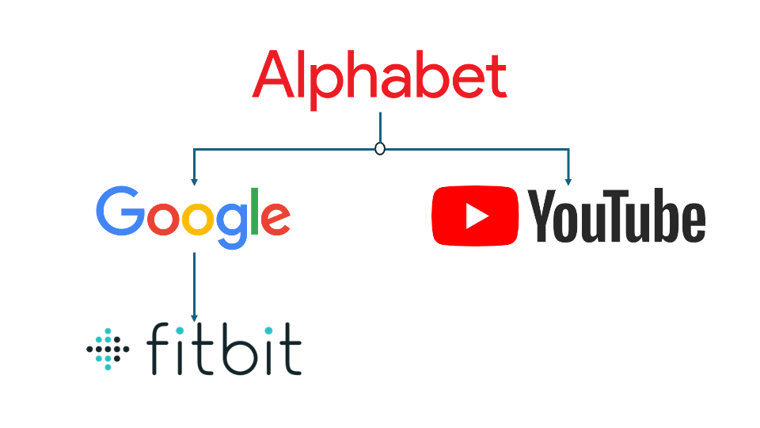

Both Google and YouTube are subsidiaries of "parent company" Alphabet Inc. — so:
- Alphabet and /Google/ are affiliates of each other because Alphabet controls Google; ditto for Alphabet and /YouTube/;
- /Google/ and /YouTube/ are affiliates of each other because they're both under the common control of Alphabet.
- Fitbit is a subsidiary of Google, so Fitbit is an /indirect/ subsidiary of Alphabet as well as a /direct/ subsidiary of Google.
- Fitbit is likewise an affiliate of YouTube because of their common control by Alphabet.

*** Minimum voting power for /control/?
  :PROPERTIES:
  :CUSTOM_ID: affil-ctrl-min-vot
  :END:

For purposes of determining /affiliate/ status: If B is an organization, *then:* A controls B if A had the legally-enforceable power to elect or appoint {{{v(more than 50%)}}} of the members of B's principal governing body ({{{dfn(board)}}}) who have the right to vote to approve or disapprove a proposed board action.

***** Note                                                              :CMT:
  :PROPERTIES:
  :HTML_CONTAINER_CLASS: cmtry
  :UNNUMBERED: notoc
  :END:

{{{H1}}} As is pretty typical, {{{ths}}} uses the basic majority-rule notion — but contract drafters should consider whether a different number might be better. 

{{{HN}}} {{{Ths-cap}}} pretty much tracks the definition of /voting power/ at {{{RR}}} [[#vote-pwr-defn]]; technically, that's a violation of the [[#dont-repeat][D.R.Y. Rule]] — Don't Repeat Yourself /(usually)/, at [[#dont-repeat]] — but here it's reasonable to disregard that rule.

*** Class-based voting?
  :PROPERTIES:
  :CUSTOM_ID: affil-class
  :END:

If an organization B's voting shares (or equivalent interests) are divided into classes, *then:* For purposes of determining affiliate status, A controls B only if A has the requisite voting-power percentage in each of those classes.

***** Note                                                              :CMT:
  :PROPERTIES:
  :HTML_CONTAINER_CLASS: cmtry
  :UNNUMBERED: notoc
  :END:

Class-based voting is "a thing," especially in some parts of the tech world: In a few cases, tech-company founders have reserved "supershare" classes for themselves and thus continue to control the company even after it has gone public (see, e.g., the [[https://www.investopedia.com/ask/answers/company-multiple-share-classes-super-voting-shares/][Investopedia]] discussion). 

*** Control through management power?
  :PROPERTIES:
  :CUSTOM_ID: affil-ctrl-mgmt
  :END:

For purposes of determining affiliate status: Regardless of /voting/ control, A /controls/ an organization through the power to manage B's affairs — *but only if* A's power to do so is legally-enforceable by A (as one non-limiting example, by way of an enforceable contract).

***** Note                                                              :CMT:
  :PROPERTIES:
  :HTML_CONTAINER_CLASS: cmtry
  :UNNUMBERED: notoc
  :END:

{{{H1}}} *Caution:* Some contracts' definitions of /affiliate/ refer to /de facto/ "control relationships" — without defining what would qualify. That's generally _not_ a good idea, even though that concept can be found in U.S. securities regulations such as , [[https://www.law.cornell.edu/cfr/text/17/230.405][SEC Rule 405]] (whose text is similar to what's seen in other sources).

{{{UN}}} *Pro tip:* In the /UBS Securities/ case discussed below, lack of a clear contractual definition of /control/ led to a [[https://scholar.google.com/scholar_case?case=6711830684594027629][$17 million legal-malpractice verdict]] against a blue-chip NYC law firm for failing to nail down the definition to its client's hindsight liking.

{{{UN}}}  /In a regulatory context/, just plain "management power," without the "legally-enforceable" part, might be acceptable, despite its vagueness. But in a /commercial/ context, the vagueness of the generic term could lead to expensive, time-consuming litigation.

{{{RWE}}} In a Fifth Circuit case, the parties were forced to litigate which party had "control" of a vessel that was destroyed by fire — and thus which party or parties should be liable for damages. The details aren't important for our purposes here, just that the dispute was certainly costly to the parties. <cite> See [[https://scholar.google.com/scholar_case?case=14794871969741142487][Offshore Drilling Co. v. Gulf Copper & Mfg. Corp.]], 604 F.3d 221 (5th Cir. 2010). </cite>

# https://commons.wikimedia.org/wiki/File:UBS_Logo.png
#+ATTR_HTML: :alt UBS logo :title UBS logo :class photo-at-right photowidth20

{{{RWE}}} In /UBS Securities/ (N.Y. App. 2010), the uncertain meaning of "control," as used in a contract, meant that the parties had to litigate whether investment bank UBS was entitled to a $10 million fee from a company, Red Zone, headed by Daniel Snyder, the owner of what was then called the Washington Redskins NFL team. <cite> See [[https://scholar.google.com/scholar_case?case=11968574234665276251][UBS Securities LLC v. Red Zone LLC]], 77 A.D.3d 575, 578, 910 N.Y.S.2d 55 (N.Y. App. Div. 1st Dept. 2010). </cite>

And: A knock-on effect of the /UBS/ lawsuit was that Red Zone scored a [[https://scholar.google.com/scholar_case?case=6711830684594027629][$17 million legal-malpractice verdict]] against its blue-chip NYC law firm for failing to nail down the definition of /control/ to Red Zone's hindsight liking. <cite> See [[https://scholar.google.com/scholar_case?case=6711830684594027629][Red Zone LLC v. Cadwalader, Wickersham & Taft LLP]], 45 Misc.3d 672, 994 N.Y.S.2d 764 (N.Y. Sup. Ct. 2013), /aff'd/, [[https://scholar.google.com/scholar_case?case=12814167817622567106][2014 NY Slip Op 4570]], 118 A.D.3d 581 988 N.Y.S.2d 588 (N.Y. App. Div. 1st Dept. 2014). </cite>

*** Changes in affiliate status

For purposes of {{{ths}}}, A and B are affiliates based on their status at the time in question.

***** Note                                                              :CMT:
  :PROPERTIES:
  :CUSTOM_ID: affil-chg-a
  :HTML_CONTAINER_CLASS: cmtry
  :UNNUMBERED: notoc
  :END:

This means that non-affiliates might become affiliates, and that existing affiliates could /lose/ that status if circumstances were to change. Drafters therefore might want to consider about what should happen in case of a change of affiliate status, e.g., because an existing affiliate gets sold to another company.

/Example:/ Suppose that:

- {{{A}}} and {{{B}}} enter into a contract under which {{{B}}} is obligated to do certain things for {{{A}}}'s affiliates (e.g., grant special pricing, or allow access to {{{B}}}'s trade secrets).

- And now suppose that {{{A}}} acquires a new affiliate — namely one of {{{B}}}'s competitors, which acquired ownership of {{{A}}} in a merger transaction.

Clearly {{{B}}} might be unhappy about having to share its trade secrets with its competitor, so {{{B}}}'s drafter(s) should keep that possibility in mind.

# https://en.wikipedia.org/wiki/Duke_Ellington
#+ATTR_HTML: :alt Duke Ellington photo from Wikipedia :title Duke Ellington photo from Wikipedia  :class photo-at-right photowidth20
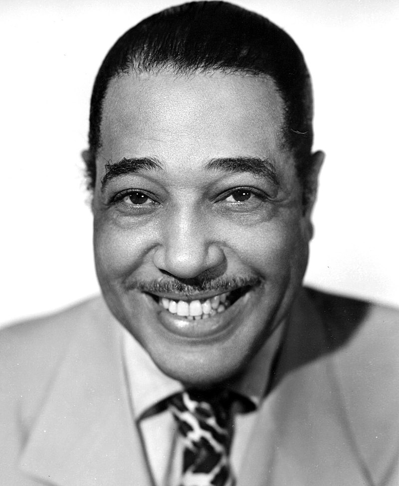

{{{RWE}}} In a case involving the estate of the legendary musician Duke Ellington, New York's highest court held that: "Absent explicit language demonstrating the parties' intent to bind future affiliates of the contracting parties, the term 'affiliate' includes only those affiliates in existence at the time that the contract was executed." <cite> [[https://www.nycourts.gov/ctapps/Decisions/2014/Oct14/156opn14-Decision.pdf][Ellington v. EMI Music Inc.]], 24 N.Y.3d 239, 246 (2014) (affirming dismissal of complaint). </cite>

# https://www.verizon.com/about/sites/default/files/gte/index.html
#+ATTR_HTML: :alt GTE logo :title GTE logo  :class photo-at-right photowidth15
 

{{{CE}}} The First Circuit held that a company, Cellexis, had breached a settlement agreement not to sue GTE Wireless /(now part of Verizon)/ or its affiliates when it sued a company that, at the time of the settlement agreement, had not been a GTE affiliate, but that later /became/ an affiliate. The court reasoned that /when read as a whole/, the contract language clearly contemplated that /future/ affiliates would also be shielded by the covenant not to sue. <cite> See [[https://scholar.google.com/scholar_case?case=75035531322549399][GTE Wireless, Inc. v. Cellexis Intern., Inc.]], 341 F.3d 1, 5 (1st Cir. 2003). </cite> 

To like effect was a case involving DirecTV, where the Fourth Circuit reversed denial of motion to compel arbitration of a consumer's lawsuit because DirecTV had became an "affiliate" of AT&T Mobility and thus was a beneficiary of the arbitration clause in the consumer's contract. <cite> See [[https://scholar.google.com/scholar_case?case=9814367034067516470][Mey v. DirecTC, LLC]], 971 F.3d 284, 286 (4th Cir. 2020). 

Counter-counterexample: A few weeks later, In similar circumstances — with one judge dissenting — the Ninth Circuit /affirmed/ denial of a motion to compel arbitration, explicitly rejecting the Fourth Circuit's reasoning:

#+begin_quote
Here, absurd results follow from DIRECTV's preferred interpretation: Under this reading, Revitch would be forced to arbitrate any dispute with any corporate entity that happens to be acquired by AT&T, Inc., even if neither the entity nor the dispute has anything to do with providing wireless services to Revitch —and even if the entity becomes an affiliate years or even decades in the future. 

The Eastern District of New York, addressing a similar set of facts ... concluded that "no reasonable person would think that checking a box accepting the 'terms and conditions' necessary to obtain cell phone service would obligate them /[sic]/ to arbitrate literally every possible dispute he or she might have with the service provider, let alone all of the affiliates under AT&T Inc.'s corporate umbrella—including those who provide services unrelated to cell phone coverage." We agree.   <cite> See [[https://scholar.google.com/scholar_case?case=12949644032048028028][Revitch v. DIRECTV, LLC]], 977 F.3d 713, 717 (9th Cir. 2020) (cleaned up).  </cite>

* * *

We are aware that the Fourth Circuit, considering a recent case presenting facts 720*720 and issues substantially similar to those presented here (including, most pertinently, an arbitration clause identical to that signed by Revitch), has arrived at the opposite conclusion. 

Moreover, we are aware that with our decision today, we are opening a circuit split on this difficult issue:  Can anything less than the most explicit "infinite language" in a consumer services agreement bind the consumer to arbitrate any and all disputes with (yet-unknown) corporate entities that might later become affiliated with the service provider—even when neither the entity nor the dispute bear any material relation to the services provided under the initial agreement? <cite> /Id./ at 719-20. </cite>
#+end_quote

(Extra paragraphing added.)

*** {{{ADDL}}}                                                         :ADDL:
  :PROPERTIES:
  :HTML_CONTAINER_CLASS: addl
  :END:

Contents:

#+TOC: headlines 1 local

**** The business context: Why it might matter

Sometimes contracting parties will care about what constitutes an "affiliate" of a party, because —

  - The contract might give certain *rights* to "affiliates" of one or another party. This could be, for example, the right to acquire goods or services on the same terms as in the contract. [DCT TO DO: Find examples in master service agreements / master purchase agreements]

  - The contract might also impose *obligations* on a party, where those obligations are tied in somehow with affiliates of one or another party (e.g., an obligation to be financially responsible for actions of an affilate). 

In either situation, it might be important to know just who qualifies as an affiliate of the relevant party at the relevant time or times.

**** *Caution:* Which is the correct /contracting party/?
  :PROPERTIES:
  :CUSTOM_ID: nl-affil-defn-corr-pty
  :END:

In corporate "families," different affiliates can share variations on the same name. {{{RWE}}} The global technology company Apple has subsidiaries including Apple Sales International Ltd. and Apple Operations International Ltd., both of which were directly involved in a [[https://curia.europa.eu/juris/document/document.jsf;jsessionid=3D507358C4D7D56D6D9A933DEE558FC5?text=&docid=289923&pageIndex=0&doclang=EN&mode=req&dir=&occ=first&part=1&cid=2608624][decision]] by the European Court of Justice that Apple owed Ireland some €13 billion (USD $14.4 billion). 

Not naming the correct company as a party to the contract could end up being financially disastrous for one or more other parties. {{{RWE}}} In a Seventh Circuit case:

- The plaintiff, which we'll call "Target," was having business difficulties and badly wanted to be acquired by the defendant, "Buyer."

- When Target entered into the acquisition agreement, the other named party was not Buyer, but Buyer Sub, a newly-created subsidiary of Buyer, which was to acquire Target's assets and pay Target the purchase price in the form of an [[#c-earn-out][earnout]].

- Evidently, Target couldn't get Buyer to [[#r-guar-proto][guarantee]] Buyer Sub's payment obligations (see {{{RR}}} [[#r-guar-proto]]) — and sure enough, later a dispute arose over payments that Buyer Sub had withheld.

- Target went to court for the withheld payments; it sued not just Buyer Sub — which had no assets and so was judgment-proof — but also /Buyer/, i.e., the parent company of Buyer Sub.

Buyer successfully sought summary judgment dismissing it from the case; in affirming, the Seventh Circuit court didn't even reach the merits: "It goes without saying that a contract cannot bind a nonparty. If [Target] is entitled to damages for breach of contract, it cannot recover them in a suit against [Buyer] because [Buyer] was not a party to the contract." Quoting one of its prior cases, the appellate court also implicitly noted that Buyer had not guaranteed Buyer Sub's payment obligations; the trial court had previously noted that "[Target] has offered no evidence that [Buyer] agreed to be liable for [Buyer Sub's] debts, obligations, and liabilities ...." <cite> [[https://scholar.google.com/scholar_case?case=7341524000586289043][Northbound Group, Inc. v. Norvax, Inc.]], 795 F.3d 647, 650, 653 (7th Cir. 2015) (cleaned up, emphasis added), /affirming/ [[https://scholar.google.com/scholar_case?case=11445428986521429895][5 F. Supp. 3d 956, 972-74]] (N.D. Ill. 2013).  </cite>

# This situation — a party enters into a relationship, but it turns out not to be with the intended other party — recalls the famous tale in the book of Genesis in which an unsuspecting Jacob married Leah instead of her sister Rachel.[fn:JacobLeah] 

{{{RWE}}} In a Delaware chancery-court case, employees of an LLC were granted equity interests in the LLC's /parent company/. The employees' equity agreement included a covenant not to compete with the /parent company/, but said nothing about not competing with /the LLC itself/, i.e., the actual employer. The Delaware chancery court held that the covenant /didn't/ prevent the employees from leaving and going to work for a competitor of /the employer/. <cite> See [[https://scholar.google.com/scholar_case?case=12965075467964083915][Frontline Technologies v. Murphy]], No. 2023-0546 (Del. Ch. Aug. 23, 2023). </cite>

{{{RWE}}} A courier driver sued a delivery service for allegedly misclassifying him as an independent contractor and not as an employee. The contract in question was between the delivery service and the driver's LLC, which the delivery service had required the driver to form. The driver himself had not signed the contract; the court held that he was not bound by the contract's arbitration provision.  <cite> See [[https://scholar.google.com/scholar_case?case=1707866833170715589][Abdisalam v. Strategic Delivery Sols., LLC]], No. 25-1254, slip op. (1st Cir. Mar. 17, 2026). </cite>

# [fn:JacobLeah] As recounted in [[https://www.biblegateway.com/passage/?search=Genesis%2029&version=ESV][Genesis chapter 29]], Isaac's son Jacob (later renamed Israel) worked for his kinsman Laban for seven years, so that he, Jacob, could marry Laban's younger daughter Rachel. But on the wedding night, Laban brought his older daughter Leah to an unsuspecting Jacob, who duly performed his marital duty — not realizing he'd been deceived as to which sister was with him; Jacob then worked for Laban for /another/ seven years so that he could marry Rachel as well. Of course, in the /Northbound/ case, Northbound should have known what it was getting into, as the Seventh Circuit's opinion pointed out.)

**** *Caution:* Don't list a party to {{{thek}}} as "ABC Corp. /and affiliates/"
  :PROPERTIES:
  :CUSTOM_ID: r-affil-defn-no-pty
  :END:

It's usually a bad idea for a contract's preamble to state that the contract is between (for example) "ABC Corporation ('Customer') /and its affiliates/ and XYZ Inc. ('Supplier').

Why might that even come up? Well, suppose that ABC is negotiating a master purchase agreement with XYZ. Not unusually, ABC wants its various affiliates to be able to place orders with XYZ on the same master agreement, so that the affiliates won't have to incur the cost and delay of renegotiating terms and conditions with XYZ.

It'd be easy — and ABC might ask — to recite, in the master purchase agreement, that the parties are as quoted above. /But that's not a great idea/, unless each ABC affiliate actually signs the agreement as a party, committing, on its own, to upholding the obligations in the master purchase agreement. Experienced commentators seem to agree. <cite> See, e.g., Mark Anderson, [[https://ipdraughts.wordpress.com/2014/01/12/dont-make-affiliates-parties-to-the-agreement/][Don't Make Affiliates parties to the agreement]] (2014); Ken Adams, [[http://www.adamsdrafting.com/parent-on-behalf-of-affiliate/][Having a Parent Company Enter Into a Contract "On Behalf" of an Affiliate]] (2008). </cite>

Thus, a safer practice would be to state the specific rights and obligations that affiliates have under the contract, instead of making them parties. 

# https://commons.wikimedia.org/wiki/File:Uber_logo_2018.svg/
#+ATTR_HTML: :alt Uber logo :title Uber logo :class photo-at-right photowidth20
 

{{{RWE}}} In a Massachusetts case, a contract listed one of the parties as Uber Brasil "and its Affiliates"; a trial court held that this was a factor in determining that the parent company, Uber Technologies [U.S.], was an intended third-party beneficiary of the contract's forum-selection agreement. <cite> See [[./Zemcar_Decision.pdf][Zemcar Inc. v. Uber Techs., Inc.]], No. 2484CV01525-BLS2, slip op. at 15 (Mass. Super. Jan. 29, 2025) (denying, in relevant part, motion to dismiss trade-secret claim because of forum selection clause; footnote omitted, emphasis and extra paragraphing added). </cite>

{{{RWE}}} Consider a Fifth Circuit decision in which the court reversed and remanded a summary judgment that had addressed whether a contracting party had authority to bind one of its affiliates. <cite> See [[https://scholar.google.com/scholar_case?case=18008475757367889550][National Oilwell Varco, L.P., v. Auto-Dril, Inc.]], 68 F.4th 206, 218 & nn.2-3 (5th Cir. 2023) (reversing and remanding summary judgment in relevant part); /id./ at 222 (Richman, C.J., dissenting in relevant part). At this writing (May 2025), I couldn't find a Web site for Auto-Dril. </cite>

{{{RWE}}} In an English High Court (trial court) case, the contract between a tech company and an investment-banking firm included what the court referred to as "an oddity" in its drafting: "[T]he opening words of the Agreement contemplate /[the investment bank]/ acting for /[the tech company]/ *and 'its affiliates'*, ... who are all collectively defined as the 'Company.'" That was one of a many complications in the court's task of determining whether the (ambiguous) contract required the tech company to pay the investment bank a success fee when the tech company raised capital from its parent company, not from any third party referred by the investment bank. (The court ultimately concluded that the answer was "no.") <cite> [[https://caselaw.nationalarchives.gov.uk/ewhc/ch/2024/3164][Kigen (UK) Ltd. v NOR Capital Ltd.]], [2024] EWHC 3164 (Ch), ¶¶ 28, 90-91. </cite>

**** *Caution:* Will the /contracting/ party pay what it owes?
  :PROPERTIES:
  :CUSTOM_ID: AffilSolvent
  :END:

When a contract addresses affiliates' rights, it might include language such as the following, adapted from the real-life [[https://www.sec.gov/Archives/edgar/data/1546640/000119312512297959/d269082dex1011.htm][Master Supply & Purchasing Agreement]] of one subsidiary of the alarm company ADT Corporation: 

#+begin_quote

Each Affiliate shall only be liable for those obligations expressly set forth in the Purchase Order to which it is a party. /In no event will Buyer be liable for any of the obligations or liabilities of any Affiliate/ pursuant to this Agreement.
#+end_quote

In such a situation, the supplier might want to consider doing one or both of the following:

- Put in the draft contract a provision that the supplier may reject an affiliate's order — ideally for any reason or no reason, but at a minimum if the supplier has reasonable concerns about the affiliate's ability to pay; and/or

- Get the (solvent) parent company, or some other specific, /creditworthy/ affiliate of the named customer, to guarantee payment of all orders when a customer affiliate is the buyer (see § [[#purch-ord-affil]]).

# https://www.theguardian.com/food/2019/jun/05/sriracha-sauce-lawsuit-huy-fong-underwood
#+ATTR_HTML: :alt Huy Fong pepper sauce bottle :title Huy Fong pepper sauce bottle  :class photo-at-right photowidth10

This could turn out to be important. {{{RWE}}} In a California case:

- A dispute arose between Huy Fong, a famed manufacturer of sriracha hot sauce, and Underwood Ranches, a pepper grower, because Huy Fong wanted Underwood to deal with a newly-created Huy Fong subsidiary, Chilico.

- Chilico, though, "did not have the assets to ensure that Underwood would be paid /and Huy Fong refused to guarantee the Chilico contract/."

- The dispute turned bitter, with the parties suing each other. 

In the end, it worked out sort-of OK for Underwood: After years of costly litigation, a California jury awarded Underwood $13 million in compensatory damages and $10 million for fraud.  <cite> See [[https://scholar.google.com/scholar_case?case=6588631383722707662][Huy Fong Foods, Inc. v. Underwood Ranches, LP]], 66 Cal. App. 5th 1112, 1119, 281 Cal. Rptr. 3d 757 (2021). </cite>

But the case illustrates why parties and their contract drafters should consider the risk of doing business with the "wrong" company in a corporate "family."

Relatedly, see also the discussion of the /Northbound/ lawsuit at [[#nl-affil-defn-corr-pty]].

**** Could {{{thek}}} bind a /non-signatory/ affiliate?
  :PROPERTIES:
  :CUSTOM_ID: affil-nonsig
  :HTML_CONTAINER_CLASS: olnum
  :END:

An affiliate of a contracting party might be bound by the contract if:

1.  the contracting party — or the person signing on behalf of that party — controlled the affiliate, and 

2. the contract stated that the contract will benefit the affiliate. 

{{{RWE}}} Delaware's chancery court reached the conclusion summarized above in a case where:

- the contract in suit stated that it was creating a strategic alliance for the contracting party and its affiliates, and

- the contract had been signed by the president of the contracting party, /who was also the sole managing member of the affiliate/. 

The court held that /the affiliate/ was bound by — and had violated — certain restrictions in the contract. <cite> [[https://scholar.google.com/scholar_case?case=9398041269086649531][Medicalgorithmics S.A. v. AMI Monitoring, Inc.]], No. 10948-CB, slip op. at 3, 52-53, 2016 WL 4401038 (Del. Ch. Aug. 18, 2016). </cite>

** Party {{{D}}} {{{CLS}}}                                              :CLS:
  :PROPERTIES:
  :CUSTOM_ID: r-pty-defn
  :HTML_CONTAINER_CLASS: pr-top
  :CATEGORY: Definition
  :END:

*** Definition

In case of doubt: The term "/party/" (whether or not capitalized) refers only to those individuals and organizations that are signatory parties to {{{thek}}} /unless/ the context clearly requires otherwise.

*** Note                                                                :ADDL:
  :PROPERTIES:
  :HTML_CONTAINER_CLASS: addl
  :END:

{{{THS-D-CAP}}} is provided for clarity; it ties in with {{{RULE}}} [[#r-third-ben]] (third party beneficiaries).

** Person {{{D}}} {{{CLS}}}                                             :CLS:
  :PROPERTIES:
  :CUSTOM_ID: pers-defn
  :HTML_CONTAINER_CLASS: pr-top
  :END:

Contents:

#+TOC: headlines 1 local

*** Definition

The term /person/ refers to: (1) a natural person, also referred to sometimes as an "individual"; and/or (2) an organization — of any kind — such as (for example) a corporation, a partnership, a limited liability company, a nonprofit association, etc.

*** Language source: U.S. laws:                                         :ADDL:
  :PROPERTIES:
  :CUSTOM_ID: person-defn-n
  :HTML_CONTAINER_CLASS: addl
  :END:

In this definition, we see the same underlying concepts as in U.S. securities law, which states:

#+begin_quote
The term “person” means an individual, a corporation, a partnership, an association, a joint-stock company, a trust, any unincorporated organization, or a government or political subdivision thereof. ... <cite> [[https://www.law.cornell.edu/uscode/text/15/77b][15 U.S.C. § 77b(a)(2)]] (extra paragraphing added). </cite>
#+end_quote

Similarly, [[https://www.law.cornell.edu/ucc/1/1-201#Person][section 1-201(27)]] of the Uniform Commercial Code states:

#+begin_quote
(27)  "*Person*" means an individual, corporation, business trust, estate, trust, partnership, limited liability company, association, joint venture, government, governmental subdivision, agency, or instrumentality, public corporation, or any other legal or commercial entity.
#+end_quote

* Operations — in general
  :PROPERTIES:
  :CUSTOM_ID: gen-ops-pr
  :HTML_CONTAINER_CLASS: chap
  :END:

The provisions in this chapter are arranged (mostly) alphabetically, for easy adoption in a short-form contract ("{{{theK}}}") and to help streamline drafting, review, and negotiation.

Contents:

#+TOC: headlines 1 local

** Best Efforts {{{D}}} {{{CLS}}}                                       :CLS:
  :PROPERTIES:
  :CUSTOM_ID: r-best-efforts-defn
  :HTML_CONTAINER_CLASS: pr-top
  :END:

*** {{{IF-ADOPT}}}
  :PROPERTIES:
  :CUSTOM_ID: best-eff-pty
  :END:

{{{L1}}} {{{Trig}}}, it applies any time that {{{thek}}} requires a party (the {{{dfn(Obligated Party)}}}) to use "best efforts." 

{{{LN}}} In case anyone asks: {{{Ths-cap}}} itself doesn't impose any "efforts" requirement of any kind.

***** Note                                                              :CMT:
  :PROPERTIES:
  :HTML_CONTAINER_CLASS: cmtry
  :UNNUMBERED: notoc
  :END:

Contracting parties will sometimes decide that a best-efforts obligation is an acceptable business risk that can help them get the contract to signature sooner. Depending on the jurisdiction, though, a court might not share the view of /best efforts/ stated in {{{THS-D}}}. This means that it can be useful to /define/ the term, so that the definition will serve as something of a guardrail. (*W.I.D.D.*: When In Doubt, *Define*!) 

*** Required: Reasonable efforts, diligently made
  :PROPERTIES:
  :CUSTOM_ID: best-eff-dil
  :END:

{{{SH(Obligated Party)}}} Diligently use [[#rsnbl-eff][reasonable efforts]] to achieve the stated objective. 

***** Note                                                              :CMT:
  :PROPERTIES:
  :HTML_CONTAINER_CLASS: cmtry
  :UNNUMBERED: notoc
  :END:

{{{H1}}} This draws on the Restatement of Agency, which states in part that best efforts is "a standard that has diligence at its essence ...." <cite> Restatement (Second) of Agency § 13, comment a (1957); see also, e.g., [[https://scholar.google.com/scholar_case?case=13918084664177106630][Nat'l Data Payment Sys., Inc. v. Meridian Bank]], 212 F. 3d 849, 855 (3d Cir. 2000) (Alito, J., affirming summary judgment that plaintiff had not shown that defendants had failed to use best efforts). </cite>

{{{HN}}} This section seeks to steer clear of differing court views that have arisen, with _some_ U.S. courts seemingly equating /best efforts/ with mere /reasonable efforts/ — contrary to what business people are likely to think they're getting in a best-efforts clause. <cite> See, e.g., [[http://scholar.google.com/scholar_case?case=4252572596037374941][Scott-Macon Securities, Inc. v. Zoltek Cos.]], Nos. 04 Civ. 2124 (MBM), 04 Civ. 4896 (MBM), part II-C (S.D.N.Y. May 11, 2005) (citing cases). </cite>

{{{RWE}}} New York courts might equate /best efforts/ with merely making [[#rsnbl-eff][reasonable efforts]] in [[#good-faith][good faith]]. <cite> See [[https://scholar.google.com/scholar_case?case=10274825236819728613][Soroof Trading Development Co. v. GE Fuel Cell Sys. LLC]], 842 F. Supp. 2d 502, 511 (S.D.N.Y. 2012) (citing cases). </cite>

*** Not required: Certain burdensome efforts
  :PROPERTIES:
  :CUSTOM_ID: best-eff-na
  :END:

{{{SH(Obligated Party)}}}  A best-efforts obligation doesn't require you to do any of the following things (not an exhaustive list): 

{{{U1}}} make any /unreasonable/ effort;

{{{UN}}} harm your own lawful interests in any non-trivial way; 

{{{UN}}} act as a fiduciary for another party; 

{{{UN}}} make every possible reasonable effort; nor 

{{{UN}}} actually succeed in achieving the stated objective. 

***** Note                                                              :CMT:
  :PROPERTIES:
  :HTML_CONTAINER_CLASS: cmtry
  :UNNUMBERED: notoc
  :END:

{{{H1}}} *Caution:* These carve-outs might be factually complex — /and thus costly to litigate/ if the parties were to get into a dispute about whether a party really did use its "best" efforts. 

{{{HN}}} Subdivision (2) borrows from a Second Circuit remark remarked that a best-efforts obligation "did not require Falstaff /[Brewing Co.]/ to spend itself into bankruptcy to promote the sales of Ballantine /[beer]/ products ...."  <cite> [[https://scholar.google.com/scholar_case?case=10981036224446664402][Bloor v. Falstaff Brewing Corp.]], 601 F.2d 609 (2d Cir. 1979) (affirming holding that Falstaff had breached its best-efforts obligation). </cite>>

{{{HN}}} Subdivision (3) is meant as a guardrail against aggressive claims of the kind made in a California case in which the court rejected the plaintiff's contention that "'best efforts' means the efforts required of a fiduciary[.]"  <cite> [[https://scholar.google.com/scholar_case?case=2741871384593536664][California Pines Property Owners Assn. v. Pedotti]], 206 Cal. App. 4th 384, 393-95, 141 Cal. Rptr. 3d (Cal. App. 2012); see also [[http://scholar.google.com/scholar_case?case=1389829441808500324][Tigg Corp. v. Dow Corning Corp.]], 962 F.2d 1119 (3d Cir. 1992), where the court held that, in a contract with an exclusive-dealing arrangement, "[t]he obligation of best efforts forces the buyer/reseller to consider the best interests of the seller and itself as if they were one firm." </cite>>

{{{HN}}} Subdivision (4) disavows one line of contrary court decisions, discussed at [[#nl-best-eff-all-rsnbl]]. 

{{{HN}}} Subdivision (5): Of course, there'd be no need for a best-efforts obligation if the parties agreed to /require/ achieving the stated objective — in such a case, presumably {{{theK}}} would just say /that/.

*** Encouraged: Input from other party
  :PROPERTIES:
  :CUSTOM_ID: best-eff-inp
  :END:

{{{SH(Obligated Party)}}} Consider [[#cons-defn][consulting]] the other party about whether you would or wouldn't satisfy a best-efforts obligation by taking a particular course of action — especially a course of action not yet started. 

***** Note                                                              :CMT:
  :PROPERTIES:
  :HTML_CONTAINER_CLASS: cmtry
  :UNNUMBERED: notoc
  :END:

This is one of those areas where the [[#nl-comms][Pick up the phone!]] general motif of this {{{BK}}} can pay dividends. ¶ On the other hand: This is also one of those areas where you might not want to [[#poke-bear][poke the bear]] — because if you raise the question with the other side, you might not like the answer you get .... 

*** Escalation of certain disputes
  :PROPERTIES:
  :CUSTOM_ID: best-eff-escal
  :END:

If either party asks, escalate any dispute about what would satisfy a best-efforts obligation: {{{X1}}} first, to supervisors, as stated in {{{RR}}} [[#r-escal-int]]; and {{{XN}}} then, at either party's further request, to a neutral advisor as stated in {{{RR}}} [[#r-escal-ext]]. 

** Code of Conduct Limits {{{CLS}}}                                     :CLS:
  :PROPERTIES:
  :CUSTOM_ID: r-code-cond
  :HTML_CONTAINER_CLASS: pr-top
  :END:

Business context: A customer might legitimately ask that a prospective vendor contractually commit to abiding by a "code of conduct." <cite> See, e.g., Levi Strauss & Co.'s 23-page, [[https://www.levistrauss.com/wp-content/uploads/2020/06/Code-of-Conduct-English.pdf][Worldwide Code of Business Conduct]]. </cite>

But some customer codes of conduct can be overreaching and overbearing — possibly trampling on the vendor's own legitimate interests and giving the customer unfair leverage in unrelated disputes. 

And for a vendor, managing compliance with many customers' different codes of conduct can be a pain (see the note to § [[#code-when]] below). 

So, {{{THS}}} puts "fences" around the customer's code of conduct, to help the customer and the supplier to postpone discussion of specific practices that the customer might strongly prefer or even insist on.
 
Contents:

#+TOC: headlines 1 local

*** Definitions: Vendor; Customer
  :PROPERTIES:
  :CUSTOM_ID: code-who
  :END:

In {{{ths}}}, {{{dfn(Vendor)}}} refers to a party to {{{thek}}} where {{{thek}}} contemplates that the party will be providing goods and/or services to (or on behalf of, or at the direction of) another party, the {{{DEFN-P(Customer)}}} 

***** Note                                                              :CMT:
  :PROPERTIES:
  :HTML_CONTAINER_CLASS: cmtry
  :UNNUMBERED: notoc
  :END:

 This section is worded to account for the situation where the Vendor isn't actually the one that provides goods and/or services to the Customer.

*** {{{IF-ADOPT}}}
  :PROPERTIES:
  :CUSTOM_ID: code-when
  :END:

{{{L1}}} {{{Trig}}}.

{{{LN}}} {{{Ths-cap}}} will apply if, in {{{thek}}} or otherwise, the Customer promulgates a code of conduct (the {{{dfn(Code)}}}) that the Vendor is to follow.

{{{LN}}} {{{Ths-cap}}} will apply {{{X1}}} even if the Customer's Code has a different title such as "policy manual" or "supplier handbook," and {{{XN}}} even the Code takes the form of, or was derived from, a general industry standard or practice.

***** Note                                                              :CMT:
  :PROPERTIES:
  :HTML_CONTAINER_CLASS: cmtry
  :UNNUMBERED: notoc
  :END:

A commentator noted a few specific potential concerns about codes of conduct:

#+begin_quote

Audit provisions in P2P /[private-to-private]/ Codes are often unrestricted in scope and lack protections for such concerns as confidentiality, waiver of attorney-client privilege, or competition-law exposure. ... 

Zero-tolerance prohibitions on investment in suppliers by public officials or their families are not unheard of[. </cite>

Some P2P Codes require notification if any of the business partner’s employees or their relatives have any financial interest in the code’s sponsor — all this in this age of public companies, mutual funds and 401Ks. ... 

Breach of any of these unrealistic requirements could be used as grounds for a pretextual contract termination, or withholding of payment.
#+end_quote
[[https://www.linkedin.com/in/scottkillingsworth/][Scott Killingsworth]], [[https://papers.ssrn.com/sol3/papers.cfm?abstract_id=2443887][The Privatization of Compliance]], at 8 n.36 (SSRN.com 2014) (emphasis and extra paragraphing added).

*** {{{Ths-cap}}} takes precedence (with possible exceptions)
  :PROPERTIES:
  :CUSTOM_ID: code-match
  :END:

{{{SH(Customer}}} 

{{{L1}}} {{{Ths-cap}}} takes precedence over any inconsistent provision in {{{thek}}}, or in your Code, *unless* {{{thek}}} explicitly refers to {{{ths}}} and clearly indicates that {{{ths}}} will be of lower precedence.   

{{{LN}}} [[#r-eg-defn][For example]]: Even if {{{thek}}} or the Code required the Vendor to strictly comply with the Code, it'd be enough for the Vendor to do as stated in {{{ths}}}.

***** Note                                                              :CMT:
  :PROPERTIES:
  :HTML_CONTAINER_CLASS: cmtry
  :UNNUMBERED: notoc
  :END:

 The Vendor should consider [[#cons-defn][consulting]] the Customer if an issue comes up that might implicate the Code, to try to identify and resolve potential disputes as early as possible.

*** Off-ramps for strict Code compliance has off-ramps
  :PROPERTIES:
  :CUSTOM_ID: code-supp-opt
  :END:

{{{SH(Customer)}}} The Vendor is free not to comply with one or more requirements in your Code if one or more of the following are true: 

{{{U1}}} <<CodeMkt>> you don't require such compliance by your other suppliers and other relevant counterparties generally — see § [[#code-supp-ver]] concerning your right to verify this; 

{{{UN}}} <<CodeLaw>> the Vendor [[#rsnbl-top][reasonably]] concludes that compliance with the Code requirement in question would require the Vendor to break the law (or run any significant risk of doing so);   

{{{UN}}} <<CodeDev>> the Vendor shows that the Code requirement in question clearly deviates [[#rsnbl-top][unreasonably]] from standard business practice in the relevant line of business;

{{{UN}}} you change the Code in a way that would materially alter {{{theK}}} — for example, by imposing materially-greater costs (or other burdens) on the Vendor; and/or 

{{{UN}}} <<CodeTimely>> you don't provide the Vendor with the Code requirement in question on a timely basis — in writing, in language that wouldn't be confusing to reasonable people in the Vendor's position. (A direct, "jump cite" link to an understandable, publicly-available document would normally suffice.) 

***** Note                                                              :CMT:
  :PROPERTIES:
  :HTML_CONTAINER_CLASS: cmtry
  :UNNUMBERED: notoc
  :END:

{{{H1}}} Background: This section provides specific "off ramps" for suppliers that would find it too burdensome to comply with particular requirements of customers' codes of conduct.

{{{HN}}} Subdivision (1) takes advantage of what might be thought of as "market forces" — if the Customer can't get its other suppliers to agree to comply with a given Code requirement, then that gives the Vendor more leverage in pushing back against being forced to comply. 

{{{HN}}} Subdivision (2): The term "reasonably concludes" is vague as a qualifier, but it should get the parties talking.

{{{HN}}} Subdivision (4) addresses the situation where the Customer, wanting an excuse to terminate a multi-year contract, unilaterally demands that the Vendor comply with costly new Code requirements. ([[https://www.redline.net/queries/automatic-refunds-customer-termination-breach-b2b-saas-online-terms][Posited by Sean Hogle]] at redline.net; see his [[https://www.redline.net/queries/automatic-refunds-customer-termination-breach-b2b-saas-online-terms#30778-posts][comment of Sept. 4, 2025]].) 

{{{HN}}} Subdivision (5): The "not be seriously confusing" requirement is intended as a guardrail: The Vendor doesn't want the Customer playing "gotcha" games with carelessly- or deliberately-obfuscated Code requirements. True: The nonconfusing language requirement does leave the door open to future disputes. But the phrasing of the requirement puts a nontrivial burden of proof on the Vendor. 

{{{HN}}} Subdivision (5): Just what would constitute a "timely" basis for providing the Code requirement might be open to debate, but the parties would at least be able to talk about it. (This could be a particular concern if the Customer were to demand that the Vendor agree to comply with the Customer's /future/ changes to its code of conduct— for another approach to the future-revisions problem, see [[https://www.redline.net/queries/obligation-comply-unseen-or-unilaterally-imposed-policies-blank-check-or-harmless][a discussion]] at [[https://www.redline.net/queries/obligation-comply-unseen-or-unilaterally-imposed-policies-blank-check-or-harmless][redline.net]].)

{{{HN}}} *Negotiation tip:* If the Customer is adamant in rejecting one or more of these off ramps, the Vendor could consider seeking to change the economics of {{{theK}}} — in other words, "make it about money."

*** Allowed: Vendor verification of Customer's general Code use
  :PROPERTIES:
  :CUSTOM_ID: code-supp-ver
  :END:

{{{SH(Customer)}}} The Vendor has the right — at [[#rsnbl-top][reasonable]] intervals, and upon reasonable notice — to have an independent firm of certified public accountants (CPAs) do the following in accordance with {{{RR}}} [[#r-audit-proto]] (audits and inspections, with confidentiality obligations): 

{{{U1}}} inspect a representative sample of your other relevant contracts from time to time; and

{{{UN}}} report to the Vendor whether you really do contractually require your other relevant counterparties to comply with the Code, as a whole and/or as to one or more particular Code requirements. 

***** Note                                                              :CMT:
  :PROPERTIES:
  :HTML_CONTAINER_CLASS: cmtry
  :UNNUMBERED: notoc
  :END:

 The Customer might be tempted to say to the Vendor, /Just trust us: _All_ of our suppliers have agreed to our code of conduct./ But this is one of those times where the nuclear-Navy saying comes to mind: /You get what you INspect, not what you EXpect/ (see [[#r-inspections-clause]]). </aside>

*** Not required: Perfect Code compliance
  :PROPERTIES:
  :CUSTOM_ID: code-compl-suff
  :END:

{{{SH(Customer)}}}  As a safe harbor, the Vendor would be deemed to have complied with your Code if, whenever you [[#rsnbl-top][reasonably]] ask: 

   1. the Vendor conducts a reasonable review of the Code — together with one or more of your people, if either party asks;

   2. the Vendor gives [[#good-faith][good-faith]] consideration to whether the Vendor's business practices were a "good fit" for the Code (or could reasonably be adjusted to be a good fit); _and_ 

   3. you and the Vendor [[#cons-defn][consult]] togegther, if either party asks, about any particular business-related practices that the Code indicates that the Vendor is to follow (or not follow). 

***** Note                                                              :CMT:
  :PROPERTIES:
  :HTML_CONTAINER_CLASS: cmtry
  :UNNUMBERED: notoc
  :END:

{{{H1}}}  Customer codes of conduct often are drafted by lawyers and others who don't appreciate the burden and cost of /full/ compliance. So, this section outlines what would be enough in many circumstances.

{{{HN}}} Some might wonder if there are too many "reasonable" and "good faith" qualifiers in this section, leaving too many matters open for interpretation. But for {{{ths}}}, that's likely to be preferable to spending time negotiating about unlikely — or unknowable — future events. 

*** Code agreement ≠ certification of compliance
  :PROPERTIES:
  :CUSTOM_ID: code-compl-gen-rep
  :END:

{{{SH(Customer)}}}  The Vendor's agreement to follow your Code is _not_ a representation or warranty that /all/ of the Vendor's relevant business practices would necessarily meet (or have met) with your approval. 

***** Note                                                              :CMT:
  :PROPERTIES:
  :HTML_CONTAINER_CLASS: cmtry
  :UNNUMBERED: notoc
  :END:

 This is a guardrail clause, to try to dissuade "creative," 20-20 hindsight arguments in the future by the Customer's litigation counsel. 

*** Customer's termination right for Code noncompliance
  :PROPERTIES:
  :CUSTOM_ID: code-termin
  :END:

{{{SH(Vendor)}}} If you don't cure a noncompliance with the Customer's Code within a [[#rsnbl-top][reasonable]] time after the Customer calls your attention to the noncompliance via any reasonable means, *then:* The Customer has the right to terminate {{{thek}}} — but on a going-forward basis only, and in accordance with the termination general provisions at {{{RR}}} [[#r-termin-ground]]  — by giving you notice to that effect in accordance with {{{RR}}} [[#r-notices-rule]]. 

***** Note                                                              :CMT:
  :PROPERTIES:
  :HTML_CONTAINER_CLASS: cmtry
  :UNNUMBERED: notoc
  :END:

{{{H1}}}  This section addresses what the Customer often /really/ wants, which might be simply the ability to announce that the Customer has cut ties with the Vendor. 

- {{{RWE}}} Various companies — Adidas, Gap, TJ Maxx, Foot Locker, and more — [[https://www.vulture.com/2022/12/kanye-west-dropped-brands-adidas-gap-what-did-ye-say.html][dropped Kanye West]] (now legally known as "Ye") because of comments he made in tweets, on TV shows, etc.

- {{{RWE}}} Actor [[https://www.vulture.com/2017/11/kevin-spacey-has-been-dropped-by-his-publicist-and-agency.html][Kevin Spacey was dropped by his publicist and his agency]] after Spacey was accused of sexual assault and other misconduct (he was later found not liable in a Manhattan civil lawsuit and then acquitted of criminal charges by an English jury); Spacey was also removed from his starring role in the Netflix series /House of Cards/.

- {{{RWE}}} In a Fifth Circuit case, an investment advisor was fired from her company after she sent a Skype message to her office manager — which went viral — concerning candidates for an open receptionist position: "I specifically said no blacks. I’m not a prejudiced person, but our clients are 90 per&shy;cent white, and I need to cater to them, so that interview was a complete waste of my time." <cite> [[https://scholar.google.com/scholar_case?case=5213977089298236725][Cure & Assocs., P.C. v. LPL Financial, LLC]], 118 F.4th 663, 667 (5th Cir. 2024). 

- {{{RWE}}} AI outsourcing company [[https://www.sama.com/][Sama]] was reportedly fired by Meta, allegedly for not meeting Meta's standards, but according to Sama it was because Sama workers told two Swedish newspapers they had witnessed [Meta smartglasses] users going to the toilet and having sex." <cite> Chris Vallance, [[https://www.bbc.com/news/articles/c5y7yvgy0w6o][Meta in row after workers who say they saw smart glasses users having sex lose jobs]] (BBC.com Apr. 30, 2026)  </cite>
    
{{{HN}}} See also {{{RR}}} [[#r-termin-rep-risk]], addressing termination for reputation risk.

{{{HN}}} In some circumstances, a "reasonable" cure period might be /no/ cure period.

*** EXCLUSIVE REMEDY for Code noncompliance (usually)
  :PROPERTIES:
  :CUSTOM_ID: code-termin-excl
  :END:

{{{SH(Customer)}}} 

{{{L1}}} Other than termination as set forth above, do not take (nor attempt to take) any other action against the Vendor for violating your Code /unless/ you clearly show one or more of the following: 

{{{U1}}} the Vendor's action (or inaction) that failed to comply with a Code requirement would have been a breach of {{{thek}}} even if the Vendor hadn't agreed to comply with the Code; and/or

{{{UN}}} {{{thek}}} /as negotiated by the parties/ — not just the Code, and _not_ just {{{thek}}} in a form that you provided to the Vendor, for example, in the fine print of your purchase order or other document — clearly and specifically says that you may sue the Vendor for breach of {{{thek}}} even if the Vendor breaches only the Code. 

{{{LN}}} For emphasis: Your obligation in this section extends (without limitation) to your not doing (and not attempting to do) any of the following in response to the Vendor's noncompliance with the Code: {{{X1}}} filing suit against the Vendor; {{{XN}}} demanding arbitration; and/or {{{XN}}} withholding payment that would otherwise be due.

***** Note                                                              :CMT:
  :PROPERTIES:
  :HTML_CONTAINER_CLASS: cmtry
  :UNNUMBERED: notoc
  :END:

{{{H1}}} This section seeks to balance the parties' legitimate interests.

{{{HN}}} Subdivision (a): The "do not take any other action" phrase here is included so that if the Customer tried to do otherwise in court or in arbitration, that attempt would itself constitute a breach of {{{thek}}}, for which the Vendor's damages would include attorney fees for contesting the attempt.

{{{HN}}} Subdivision (a)(2) allows the parties to override this exclusive-remedy provision, but they have to be both very intentional and very clear about it.

{{{HN}}} Subdivision (b): The intent here is to position the Vendor to seek a quick dismissal of any legal action that the Customer might bring in spite of the prohibition of {{{ths}}}. 

*** Sunset of termination right
  :PROPERTIES:
  :END:

{{{SH(Customer)}}} Your  right to terminate under {{{ths}}} will expire automatically if your notice of termination to the Vendor hasn't become effective in accordance with {{{RR}}} [[#r-notices-rule]] on or before the _earlier_ of the following: 

{{{U1}}} the date {{{v(60 days)}}} after the date that you first became aware, by any means, of the earliest event that supposedly constituted a Code breach (the "*Triggering Event*"); or 

{{{UN}}} <<CodeExpir>> if earlier, the date {{{v(six months)}}} after the date of that Triggering Event, regardless when you learned — or should have known — about it. 

***** Note                                                              :CMT:
  :PROPERTIES:
  :HTML_CONTAINER_CLASS: cmtry
  :UNNUMBERED: notoc
  :END:

{{{H1}}}  A termination deadline seems fair, so that the Vendor doesn't have to live with a [[https://en.wikipedia.org/wiki/Damocles][Sword of Damocles]] hanging over its head after a Code violation.

{{{HN}}} Subdivision (1): It's reasonable to give the Customer a fairly-long period to decide whether the Triggering Event is going to be a problem. 

{{{HN}}} Subdivision (2):  Six months seems reasonable as a final cut-off date: If Customer has been able to tolerate Vendor's Code breach for that long, then it seems logical that the Customer hasn't been significantly harmed by the breach, and thus it'd be reasonable for the right to terminate to expire.

*** Effect on other accrued rights: None
  :PROPERTIES:
  :CUSTOM_ID: code-term-oth
  :END:

If the Customer does terminate for a Code breach under {{{ths}}}, *then:* The termination will not affect either party's other accrued rights and obligations under {{{thek}}}, if any, including without limitation the following:  {{{X1}}} the Customer's warranty rights for products and/or services obtained from the Vendor, if any; and {{{XN}}} the Vendor's payment rights for already-completed sales, if any.

***** Note                                                              :CMT:
  :PROPERTIES:
  :HTML_CONTAINER_CLASS: cmtry
  :UNNUMBERED: notoc
  :END:

 The parties' (canceled) /future/ rights and obligations could include, e.g., the following: \bull any post-termination *right* that the Customer might have to buy goods or services from the Vendor at stated pricing or at a stated discount; and/or \bull any post-termination *obligation* that the Customer might have to buy goods or services from the Vendor during any particular time.

*** Survival of {{{ths}}} after termination
  :PROPERTIES:
  :CUSTOM_ID: code-surv
  :END:

If the Customer does terminate for a Code breach, then {{{ths}}} will continue in effect as stated in {{{RR}}} [[#r-survival-cls]] (survival) except as specifically provided in {{{ths}}}.

** Commercially-Reasonable Efforts {{{D}}} {{{CLS}}}                    :CLS:
  :PROPERTIES:
 :CUSTOM_ID: r-comm-rsnbl
 :HTML_CONTAINER_CLASS: cl7
  :END:

Many business people probably think they have a pretty good idea what the term "commercially-reasonable efforts" means. In court, though, the term doesn't have a settled, standard meaning, as discussed [[#nl-CREUnclear][below]]. {{{Ths-cap}}} therefore proposes some general guidelines to help determine what's required — and what's not required — of a party that commits to using /commercially-reasonable efforts/.

*** Obligated Party

{{{Trig}}}, it will apply whenever a party (the {{{dfn(Obligated Party)}}}) is required to use {{{dfn(commercially-reasonable efforts)}}} (with or without a hyphen) to achieve a stated goal. 

*** Required: Prudent efforts

{{{PTY(Obligated Party)}}} Make efforts that prudent people — experienced in the relevant area of business — would generally regard as constituting [[#rsnbl-eff][reasonable]] efforts for the circumstances in question. 

***** Note                                                              :CMT:
  :PROPERTIES:
  :HTML_CONTAINER_CLASS: cmtry
  :UNNUMBERED: notoc
  :END:

Here we follow IBM's lead in defining /commercially-reasonable efforts/ in the way that it did in one of its state-government IT contracts, in /Indiana v. IBM/. That particular contract (seemingly drafted by IBM) defined /commercially reasonable efforts/ (somewhat circularly) as: "taking commercially reasonable steps /[sic]/ and performing in such a manner as a well managed entity would undertake with respect to a matter in which it was acting in a /determined, prudent/, businesslike and reasonable manner ...." <cite> [[https://scholar.google.com/scholar_case?case=15875629466981342045][Indiana v. IBM Corp.]], 4 N.E.3d 696, 716 n.12 (Ind. App. 2014) (reversing trial court in pertinent part), /aff'd/, [[https://scholar.google.com/scholar_case?case=18212127357674475170][51 N.E.3d 150]] (Ind. 2016). </cite>

*** Certain efforts /not/ required

{{{PTY(Obligated Party)}}} When {{{thek}}} requires you to use /commercially-reasonable efforts/, it *doesn't* mean that you have to do any of the following things (which is not an exhaustive list):

   1. make any /unreasonable/ effort;

   2. harm your own lawful interests in any non-trivial way; 

   3. make every possible reasonable effort; nor 

   4. actually succeed in achieving the stated objective.

***** Note                                                              :CMT:
  :PROPERTIES:
  :HTML_CONTAINER_CLASS: cmtry
  :UNNUMBERED: notoc
  :END:

{{{H1}}} This section provides some guardrails against aggressive arguments by litigation counsel.

{{{HN}}} Subdivision 2 addresses an issue raised in a California federal court, which opined that "it is an absurdity to suggest a reasonable business entity would contractually obligate itself to operate /[making commercially-reasonable efforts]/ without regard to its business interests"; in a later ruling, the court, reviewing (sparse) precedent, held that the obligated party could permissibly take into account "its own economic business interests" in taking action. <cite> [[https://scholar.google.com/scholar_case?case=15202977054272395445][Citri-Lite Co. v. Cott Beverages, Inc.]], 721 F. Supp. 2d 912, 923-26 (E.D. Cal. 2010) (footnote omitted; citing several cases from various jurisdictions); /subsequent decision/, [[https://perma.cc/GX5Y-4VVN][No. 1:07-cv-01075]], slip op. at 45 (E.D. Cal. Sept. 30, 2011) (findings of fact and conclusions of law; citing cases), /aff'd/, [[https://perma.cc/D8DC-J3GN][No. 11-17609]] (9th Cir. Nov. 21, 2013) (unpublished). </cite>

{{{HN}}} Subdivision 3 seeks to "write around" a seeming suggestion by Delaware's supreme court, in its 2017 /Williams Cos. v. Energy Transfer Equity/ decision, that /commercially-reasonable efforts/ requires the making of *all* reasonable efforts. <cite> See [[https://scholar.google.com/scholar_case?case=1175897943756751015][Williams Cos. v. Energy Transfer Equity, L.P.,]] 159 A.3d 264, 272 (Del. 2017); see also [[https://scholar.google.com/scholar_case?case=9895855875544299701][Shareholder Repr. Svcs. LLC v. Alexion Pharma., Inc.]], No. 2020-1069-MTZ (Del. Ch. Sept. 5, 2024) (holding, after a seven-day trial, that Alexion breached a contractual requirement to use commercially reasonable efforts); [[https://scholar.google.com/scholar_case?case=3585890316977952996][Fortis Advisors LLC v. Johnson & Johnson]], No. 2020-0881-LWW (Del. Ch. Sept. 4, 2024) (same, after ten-day trial). ] Curiously, the /Williams Cos./ court reached its conclusion even though the contract elsewhere had used the term /reasonable best efforts/ — the court didn't address whether, under the contract-interpretation principle of /[[https://dictionary.findlaw.com/definition/expressio-unius-est-exclusio-alterius.html][expressio unius, exclusio alterius]]/, the parties were presumed to have intended for the two terms to have different meanings

Also in /Williams Cos./ (in a dissent on other grounds), Chief Justice Strine opined that /commercially reasonable efforts/ is "a comparatively strong" commitment, one that is only "slightly more limited" than best efforts. <cite> /See id./ at 276 & n.45 (Strine, C.J., dissenting) (citation omitted). </cite>

{{{HN}}} A more-detailed definition of /commercially-reasonable efforts/ can be found in an earn-out provision of a contract by which Johnson & Johnson acquired a medical-robotics company, which stated that the term referred to <cite> [[https://scholar.google.com/scholar_case?case=12056670684212718028][Johnson & Johnson v. Fortis Advisors LLC]], No. 490, 2024 (Del. Jan. 12, 2026) (affirming judgment of breach of commercially-reasonable efforts obligation but reversing and remanding as to ). </cite>:

#+begin_quote
... the expenditure of efforts and resources in connection with research and development 

and obtaining and furnishing of information to and communications with applicable Governmental Entities in connection with obtaining the applicable 510(k) premarket notification with respect to the applicable Robotics Products 

/consistent with the usual practice/ of [J&J] and its Affiliates with respect to priority medical device products /of similar commercial potential at a similar stage in product lifecycle/ to the applicable Robotics Products. <cite> /Id./, part I.C, text acc. nn.32 (formatting edited). </cite>
#+end_quote

The acquisition contract also:

#+begin_quote
... further enumerated ten factors that J&J could consider in calibrating its efforts for such a priority device—including safety and efficacy issues, inherent development risks, market competitiveness, patent position, regulatory difficulty, pending legal matters, risk of recalls, regulatory input and guidance, and the product's expected profitability and return on investment.

Additionally, Section 2.07(e)(iii) forbade J&J from acting "with the intention of avoiding" any earnout payment or from factoring the cost of an earnout into post-closing business decisions. <cite>/Id./, part I.C, text acc. nn.33-34 (footnotes omitted, extra paragraphing added); see also /id./, text acc. nn.173-74 (quoting contract). </cite>
#+end_quote

** Computer-System Access {{{CLS}}}                                     :CLS:
  :PROPERTIES:
  :CUSTOM_ID: r-comp-sys-acc
  :HTML_CONTAINER_CLASS: pr-top
  :END:

# {{{ADDL-REF(CompSysUnrsnbl)}}}

# See Kroll Monitoring: https://enroll.krollmonitoring.com/terms-of-use
# https://enroll.krollmonitoring.com/end-user-agreement
# https://www.kroll.com/en/cookies-policy
# https://enroll.krollmonitoring.com/privacy-policy

Contents:

#+TOC: headlines 1 local

*** Applicability; parties
  :PROPERTIES:
  :CUSTOM_ID: comp-sys-appl
  :END:

*Q: When would {{{ths}}} apply?*

{{{TRIG-IF}}}, it will govern whenever a "User," defined below, of a party (an {{{dfn(Accessing Party)}}}) accesses a "Host System," also defined below, of another party (a {{{dfn(Host)}}}). 

***** Note                                                              :CMT:
  :PROPERTIES:
  :HTML_CONTAINER_CLASS: cmtry
  :UNNUMBERED: notoc
  :END:

{{{H1}}} {{{Ths-cap}}} draws on numerous online "terms of service" such as, for example, [[https://aws.amazon.com/agreement/][Amazon's AWS agreement]] (which might have changed since this writing). 

{{{HN}}} {{{Ths-cap}}} itself doesn't /authorize/ anyone to access any Host System — it only states ground rules for any such use.

{{{HN}}} *Caution:* {{{Ths-cap}}} /isn't/ intended as a "[[#r-code-cond][code of conduct]]"; were it otherwise, and if {{{RR}}} [[#r-code-cond]] were also agreed to, then the remedies for breach of {{{ths}}} would be limited — and that's /not/ the intent here.

*** Definitions: Host System; User
  :PROPERTIES:
  :CUSTOM_ID: comp-sys-acc-defn
  :END:

1. {{{dfn(Host System)}}} refers to, for example, a workstation; network; email system; telephone system; or other similar system — generically, a "host system" (lower case) — maintained by or for a Host. (These are not intended as limiting examples.) <aside> Here, the term "maintained by or for a Host" is meant to encompass host systems that are /owned, operated, leased, etc./, by a Host, for example as self-hosted or as hosted on a platform such as Amazon's AWS, Microsoft's Azure, Google's Cloud Platform, Oracle's Cloud, etc. </aside>

2. {{{dfn(User)}}} refers to an individual or computer system employed by a Accessing Party (or otherwise under the Accessing Party's control) that engages in accessing (or trying to access) any Host System.

3. For easier reading, Users might sometimes be referred to here as "Accessing Party Users" or "the Accessing Party's Users."

*** Accessing Party's /compliance/ obligations
  :PROPERTIES:
  :CUSTOM_ID: comp-sys-acc-do
  :END:

*Q: What actions must the Accessing Party take with its Users?*

The Accessing Party will see to it that its Users comply with {{{ths}}} — this is to include, [[#r-eg-defn][for example]], appropriately instructing those Users in their obligations under {{{ths}}}. 

*** Accessing Party's defense{{{NBH}}} and indemnity obligations
  :PROPERTIES:
  :CUSTOM_ID: comp-sys-acc-indem
  :END:

*Q: What if Accessing-Party Users' actions cause problems for the Host?*

The Accessing Party will {{{PROTECT(the Host)}}} from any harm arising from use, by any of the Accessing Party's Users, of any Host System, where that use did not conform to the requirements of {{{thek}}} (including but not limited to {{{ths}}}). <aside> The Accessing Party might be responsible anyway for its Users' actions, under the legal doctrine of [[https://www.law.cornell.edu/wex/respondeat_superior][respondeat superior]]. Still, it's useful to spell it out in {{{thek}}} so that the Accessing Party will see it without having to go to the law books. </aside>

*** Accuracy of User sign-up information
  :PROPERTIES:
  :CUSTOM_ID: comp-sys-acc-sign
  :END:

*Q: Is fake- or disguised User sign-up information allowed?*

No:

1. EACH USER: Make sure — <aside> Here we use second-person imperative voice ("you") for easier reading by Users. </aside>

   a. that any and all sign-up information that the User submits to a Host System is complete and accurate; and <aside> Note the use here of "complete and accurate," /not/ "true and correct" (see [[#true-correct]]). </aside>

   b. that anything that the User submits to confirm the User's identity (that is, to show that the User in fact is who he{{{NBH}}} or she claims to be) is authentic.

2. ACCESSING PARTY: Take prudent measures to do the same for any User sign-up information or identity-verification information that the Accessing Party causes to be submitted to a Host System. <aside> This has in mind that an Accessing Party might "bulk-upload" User information to a Host System. </aside>

***** Note                                                              :CMT:
  :PROPERTIES:
  :HTML_CONTAINER_CLASS: cmtry
  :UNNUMBERED: notoc
  :END:

{{{H1}}} This section doesn't /require/ sign-up information to be provided. (But the Host System might not allow access otherwise.) 

{{{HN}}} *Caution:* If a company /employee/ provided false sign-up information, that could prove hugely costly to the company. {{{RWE}}} Tata Consultancy (a giant software vendor) had a customer in common with one of its competitors, Epic Systems. One of Tata's employees logged into Epic's Web portal using credentials that he'd obtained by falsely stating to Epic that he worked for the Epic/Tata customer. (Epic had previously refused Tata's request to be given its own access to the Web portal.) That was part of a cascade of events leading to a jury verdict of nearly $1 billion against Tata (later reduced on appeal). <cite> See [[https://scholar.google.com/scholar_case?case=16959193299284845871][Epic Systems Corp. v. Tata Consultancy Servs. Ltd.]], 971 F.3d 662, 669 (7th Cir. 2020) (affirming judgment on jury verdict against Tata for compensatory damages but remanding for reduction of punitive-damages award under state-law cap); /id./ at 685-86 (employee's false identification as /customer/ employee was a factor supporting award of punitive damages), /amended/, [[https://scholar.google.com/scholar_case?case=13322183835293198450][980 F.3d 1117]]; /affirmed after remand/, [[https://scholar.google.com/scholar_case?case=858447660096088915][No. 22-2420]] (7th Cir. 2023) (nonprecedential disposition). </cite>

*** Prohibited: Unreasonable use
  :PROPERTIES:
  :CUSTOM_ID: comp-sys-unrsnbl
  :END:

*Q: Are there limits on what a User can do using a Host System?*

USERS: Do not make unreasonable use of any Host System — including but not limited to those listed at § [[#CompSysUnrsnbl]]. <aside> Of course it's hard, in advance, to define "unreasonable" use of a Host System, so let's provide a "reverse safe harbor." (Concerning safe harbors generally, see [[#safe-harbor]].) </aside>

*** Required: Prudent malware protection (at all times)
  :PROPERTIES:
  :CUSTOM_ID: comp-sys-malw
  :END:

*Q: What responsibility to Users have for malware protection?*

EACH USER: 

1. Keep prudent malware protection up to date on any laptop, workstation, smartphone, tablet, terminal, etc., that you use to access any Host System. <aside> /Prudent/ malware protection will certainly evolve over time, because modern life is a never-ending arms race between tech companies and their users, on the one hand, and criminals. </aside>

2. Your obligation in subdivision 1 is not limited to those times when you are actually accessing a Host System. <aside> This takes into account that /at any time,/ "sleeper" malware could infect the User's equipment , even when not accessing a Host System. </aside>

*** Other applicable {{{NCS}}}
  :PROPERTIES:
  :CUSTOM_ID: comp-sys-oth-r
  :END:

*Q: Must Users comply with any other Host-System requirements?*

EACH USER: Comply with the following at all times while accessing any Host System: <aside> Here we adopt other {{{NCS}}} so that we don't engage in possibly-dangerous duplication of language. (See the [[#dont-repeat][D.R.Y. Principle]] — Don't Repeat Yourself — discussed at § [[#dont-repeat]].) </aside>

      1. {{{RR}}} [[#r-site-visits-rule]] (site visits), because access to a Host System is considered one kind of site visit;  

      2. any other relevant provisions of {{{thek}}}; 

      3. normal professional standards of conduct for host-system usage; 

      4. any other usage policies of the Host that are timely communicated to you — this could happen orally and/or in writing, and possibly on an ongoing- and/or as-needed basis instead of inundating you with all the policies at once; and

      5. privacy-related laws and Host rules concerning personal information accessible via any Host System.

*** Allowed: Host monitoring
  :PROPERTIES:
  :CUSTOM_ID: comp-sys-mon
  :END:

*Q: Can the Host engage in monitoring of Users' use?*

Yes: 

ACCESSING PARTY and EACH USER: You are each deemed to *consent* to the Host's doing any and all of the following things —  which would be solely for the Host's benefit, not yours or anyone else's:

      a. monitoring your access to any Host System;

      b. having a third party engage in such monitoring; and/or 

      c. temporarily- or permanently suspending your access in case of suspected- or demonstrated violation of {{{ths}}}. 

*** Special case: U.S. Government Users
  :PROPERTIES:
  :CUSTOM_ID: comp-sys-usg
  :END:

*Q: What if a User is a U.S. Government employee, in the military, etc.?*

EACH USER: 

1. This section applies if you access a Host System in your capacity as an officer, employee, or agent of the U.S. Government. <aside> This takes into account the case where a government employee is accessing a Host System while acting in his- or her /private/ capacity. </aside>

2. The Host System is made available to you as a /commercial item,/ /commercial computer software,/ /commercial computer software documentation,/ and/or /technical data,/ as applicable, as the italicized terms are defined the Federal Acquisition Regulations (FARs) and/or the Defense Federal Acquisition Regulations (DFARs).

***** Note                                                              :CMT:
  :PROPERTIES:
  :HTML_CONTAINER_CLASS: cmtry
  :UNNUMBERED: notoc
  :END:

Government contracting is beyond the scope of this {{{BK}}}; for some basics on that subject, see, e.g., Jeff Schwartz, Doug Hibshman & Austen Endersby, [[https://www.foxrothschild.com/publications/the-federal-contractors-guide-to-data-rights][The Federal Contractor’s Guide to Data Rights]] (2021).

*** TODO: OTHER STUFF TO FOLD IN SOMEDAY                               :OMIT:

**** Rainbird

16.  INT'L USE

This Site is hosted in the United States of America. If you are located outside of the United States of America and you contact us, please be advised that any information you provide to us will be transferred to the United States of America and that by submitting information, you explicitly authorize such transfer.

21.  PROCEDURE FOR MAKING CLAIMS OF COPYRIGHT INFRINGEMENT

We expect users of the Site to respect the intellectual property rights of others. If you believe in good faith that any of the content on the Site infringes your copyright, please provide our copyright agent the written information specified below.

a. An electronic or physical signature of the person authorized to act on behalf of the owner of the copyright interest;

b. A description of the copyrighted work that you claim has been infringed;

c. A description of where the material that you claim is infringing is located on the Site;

d. Your address, telephone number and email address;

e. A statement by you that you have a good faith belief that the disputed use is not authorized by the copyright owner, its agent or the law; and

f. A statement by you, made under penalty of perjury, that the information in the notice is accurate and that you are the copyright owner, or are authorized to act on behalf of the owner, of an exclusive right that is allegedly infringed.

Rain Bird’s copyright agent for notice of claims of copyright infringement can be reached as follows:

Rain Bird Corporation

970 W. Sierra Madre Ave.

Azusa, CA 91702

designated_agent@rainbird.com

9.  FEEDBACK

Separate and apart from User Content, you can submit questions, comments, suggestions, ideas, original or creative materials or other information about Rain Bird, the Site or the services (collectively, “Feedback”). Feedback shall become the sole property of Rain Bird, which shall own exclusive rights, including, without limitation, all intellectual property rights, in and to such Feedback and shall be entitled to the unrestricted use and dissemination of this Feedback for any purpose, commercial or otherwise, without acknowledgment or compensation to you.

10.  LINKED SITES

We have not reviewed all of the websites linked to the Site and are not responsible for the content of any third-party pages, any other websites linked to the Site, or any products or services offered by third parties linked to the Site. Nothing in the Site, including, without limitation, any links to other websites, should be construed as an endorsement of any products, services or information of any other persons or companies by Rain Bird. Your choice to access a link to any other website is at your own risk, and you agree to comply with all terms and conditions relating to such websites. Rain Bird reserves the right not to link, or to remove the link, to a particular website at any time. 

Any links to third party websites are provided as a convenience to you and are neither owned nor operated by Rain Bird. We have no control over these linked websites and make no representations or warranties with respect to these linked websites or third party products or services. Your viewing and use of any third-party websites is at your sole discretion and risk.

12.  DISCLAIMERS

... RAIN BIRD DOES NOT WARRANT THAT YOUR USE OF THE SITE IS LAWFUL IN ANY PARTICULAR JURISDICTION,

** Cooperation  {{{CLS}}}                                               :CLS:
  :PROPERTIES:
 :CUSTOM_ID: coop-defn
  :HTML_CONTAINER_CLASS: pr-top
 :CATEGORY: Protocol
  :END:

Contents:

#+TOC: headlines 1 local

*** Party commitment
  :PROPERTIES:
  :CUSTOM_ID: coop-pty
  :END:

*Q: What does "cooperate" mean?* <aside> This definition is provided to support parties who want to "kick the can down the road" /(granted, that might be an overused expression)/ by deferring discussion of issues when they're reasonably confident that they'll be able to work things out between them. </aside>

1. Whenever {{{thek}}} says that the parties are to {{{dfn(cooperate)}}} (whether or not capitalized) in pursuit of a specified goal, it means that:

   a. each party commits to working together in a [[#rsnbl-top][reasonable]] manner with a view to supporting each other's efforts in expeditiously achieving that goal; and

   b. the term {{{dfn(cooperation)}}} has the corresponding meaning.

2. BUT: If {{{theK}}} assigns the responsibility for achieving a goal to one party {{{A}}}, a cooperation obligation does not diminish {{{A}}}'s responsibility for achieving the goal.

*** Escalation of certain disputes
  :PROPERTIES:
  :CUSTOM_ID: coop-escal
  :END:

*Q: What if the parties disagree about what "cooperation" requires?*

The parties will escalate any disagreement about whether a proposed course of action would satisfy the requirements of {{{ths}}}, in accordance with the procedures at {{{RR}}} [[#r-escal-ext]], if any party asks.

** Inspections Protocol {{{CLS}}}                                       :CLS:
  :PROPERTIES:
  :CUSTOM_ID: r-inspections-clause
  :HTML_CONTAINER_CLASS: pr-top
  :END:

# #+ATTR_HTML: :alt Admiral Hyman G. Rickover :class photo-at-right  photowidth20
# 

/You get what you inspect, not what you expect./ -- Attributed to Admiral Hyman G. Rickover, USN (1900-86), the father of the nuclear Navy (in which I served my ROTC scholarship payback time between college and law school).

Inspections can be costly, but they can also be useful and even necessary to avoid tragedy (see [[#comms-trag]] for examples caused in part by lack of inspection or other second-checking). {{{Ths-cap}}} provides inspection ground rules to help contracting parties keep their projects from derailing.

*** Parties: The Inspecting Party and the Host.
  :PROPERTIES:
  :CUSTOM_ID: inspec-appl
  :END:

{{{L1}}} When agreed to, {{{ths}}} entitles a party (or parties) clearly so indicated in {{{thek}}} (each, an {{{dfn(Inspecting Party)}}}) to have an inspection conducted of relevant premises, books, records, or other tangible- or intangible materials, of another clearly-indicated party (or parties), each, a {{{dfn(Host)}}}): 

{{{U1}}} by one or more individuals (each such individual, an {{{dfn(Inspector)}}}); and/or 

{{{UN}}} by one or more more machines. 

{{{LN}}} For convenience, {{{ths}}} uses the singular term "Inspector" even for cases where there are multiple Inspectors.

***** Note                                                              :CMT:
  :PROPERTIES:
  :HTML_CONTAINER_CLASS: cmtry
  :UNNUMBERED: notoc
  :END:

In many contexts, inspectors of physical materials use machines to run tests.

*** Required: Advance notice
  :PROPERTIES:
  :CUSTOM_ID: inspec-adv
  :END:

{{{SH(Inspecting Party)}}} Give the Host {{{v(reasonable)}}} advance notice of each inspection that you want to have done.

***** Note                                                              :CMT:
  :PROPERTIES:
  :HTML_CONTAINER_CLASS: cmtry
  :UNNUMBERED: notoc
  :END:

Advance notice is good — at least when fraud isn't strongly suspected — to give the Host a chance to fix minor problems beforehand and thus to help all parties save on inspection costs.

*** Required: Inspections only at {{{v(reasonable intervals)}}}
  :PROPERTIES:
  :CUSTOM_ID: inspec-freq
  :END:

{{{SH(Inspecting Party)}}} Do not ask the Host to have inspections done except at the stated intervals. 

***** Note                                                              :CMT:
  :PROPERTIES:
  :HTML_CONTAINER_CLASS: cmtry
  :UNNUMBERED: notoc
  :END:

Too-frequent inspections could be burdensome and costly for the Host. </aside>

*** The Host can make {{{v(reasonable)}}} decisions about inspection details.
  :PROPERTIES:
  :CUSTOM_ID: inspec-tmg
  :END:

<aside class="in"> Background: /Someone/ has to decide the timing, etc., for inspections — this section provides a sensible compromise. </aside>

The Inspecting Party is to to let the Host make the stated decisions about the timing and similar details of an inspection — as long in doing so, the Host [[#cons-defn][consults]] with the Inspecting Party and the Inspector (unless there's [[#inspec-gr][good reason]] for the Host not to do so).

*** The Inspector will have {{{v(reasonable)}}} access.
  :PROPERTIES:
  :CUSTOM_ID: inspec-host-acc
  :END:

The Host is to give the Inspector [[#rsnbl-top][reasonable]] access to all facilities, equipment, and information in the Host's possession, custody, or control — as that term is used used in federal-court litigation in the United States — where those things:

   1. are reasonably related to the subject of the inspection, and

   2. do not come within one or more of the exceptions at § [[#inspec-off-lim]] below.

 

***** Note                                                              :CMT:
  :PROPERTIES:
  :HTML_CONTAINER_CLASS: cmtry
  :UNNUMBERED: notoc
  :END:

The term /possession, custody, or control/ is familiar to litigators in the U.S.; under [[https://www.law.cornell.edu/rules/frcp/rule_26][Fed. R. Civ. P. 26(a)(1)(A)(ii)]] and [[https://www.law.cornell.edu/rules/frcp/rule_34][34(a)(1)]], any relevant document within a party's /possession, custody, or control/ would be fair game for production. An express agreement to /negotiate/ in good faith can be enforceable — thus, an otherwise-nonbinding term sheet could still obligate the parties to negotiate in good faith to get the deal done, and a party's failure to do so could result in liability for breach of that obligation. This happened, for example, in a case where the Delaware supreme court where the court affirmed an award of $113 million in damages for breach of a term sheet's requirement that the parties negotiate in good faith.  <cite> See generally, e.g., Tess Blair and Tara S. Lawler, [[https://www.morganlewis.com/pubs/2018/02/possession-custody-or-control-a-perennial-question-gets-more-complicated][Possession, Custody or Control: A Perennial Question Gets More Complicated]] (2018). </cite>>

*** The Host is to provide {{{v(reasonable)}}} cooperation.
  :PROPERTIES:
  :CUSTOM_ID: inspec-host-coop
  :END:

The Host is to instruct the Host's [[#r-people-defn][people]] to provide reasonable cooperation with the Inspector, including (without limitation):

   1. answering, completely and honestly, all reasonable questions from the Inspector; and

   2. noting any known limitations of their answers.

*** The Host can withhold certain information.
  :PROPERTIES:
  :CUSTOM_ID: inspec-off-lim
  :END:

The Host has the right to withhold from the Inspectors, in the Host's [[#discr-defn][sole discrection]], some or all of the following "off-limits" information:

   1. information that, under applicable law, the Host would not have to turn over to another party in litigation, for example due to attorney-client privilege, work-product immunity, or any other applicable privilege; 

   2. trade secrets; and/or 

   3. any other categories of off-limits information that are specifically agreed to in {{{thek}}}.

***** Note                                                              :CMT:
  :PROPERTIES:
  :HTML_CONTAINER_CLASS: cmtry
  :UNNUMBERED: notoc
  :END:

{{{H1}}} Subdivision 1: In the U.S., privileged information might completely lose its privileged status if provided to an outside party — and thus could have to be disclosed to future litigation adversaries. <cite> See, e.g., Texas Young Lawyers Association, [[https://www.texasbar.com/am/template.cfm?template=/cm/contentdisplay.cfm&contentid=23457][Attorney-Client Privilege]] (TexasBar.com 2013). </cite>

{{{HN}}} Subdivision 2: Trade secrets could cause legitimate concern for a Host that supplies goods or services: Suppose that /a competing supplier/ tells a Host customer, /hey, Customer, why don't you let us "inspect" the Host for you, at no charge, and we'll tell you what _we_ could do better/. It's not hard to see how this could devolve into messy litigation. (See also {{{RR}}} [[#r-conf-info-proto]] concerning confidential information.)

*** Professional conduct expected
  :PROPERTIES:
  :CUSTOM_ID: inspec-prof
  :END:

Each party and that party's [[#r-people-defn][people]] must comply with the following:

   1. {{{RR}}} [[#r-site-visits-rule]] (site visits) during any visits to another party's physical premises or computer system; and

   2. {{{RR}}} [[#r-comp-sys-acc]] (computer-system access) when accessing another party's computer system(s) and similar systems.

*** Inspectors' additional conduct standards
  :PROPERTIES:
  :CUSTOM_ID: inspec-cond-inspec
  :END:

Each Inspector must do the following:

1. conduct him- or herself in a professional manner at all times while interacting with the Host, the Host's personnel, and the Host's facilities, records, etc.; and

2. comply with any generally-accepted standards — both procedural and substantive — for the relevant type of inspection. 

***** Note                                                              :CMT:
  :PROPERTIES:
  :HTML_CONTAINER_CLASS: cmtry
  :UNNUMBERED: notoc
  :END:

Such generally-accepted standards could include, for example, GAAP and/or IFRS rules; electrical- or plumbing codes; AICPA rules; etc. 

*** {{{ESCAL-HDG}}}
  :PROPERTIES:
  :CUSTOM_ID: inspec-escal
  :END:

The Host and the Inspecting Party are to escalate, as provided in {{{RR}}} [[#r-escal-int]] and if necessary, {{{RR}}} [[#r-escal-ext]], any disagreement about how any imprecise term in {{{ths}}} should be applied. [[#r-eg-defn][Examples]]:

   1. what is required for [[#inspec-host-acc][reasonable access]]; and

   2. what would constitute significant [[#inspec-host-coop][lack of cooperation]].

 

***** Note                                                              :CMT:
  :PROPERTIES:
  :HTML_CONTAINER_CLASS: cmtry
  :UNNUMBERED: notoc
  :END:

This allows the parties — if desired — to defer in-the-weeds discussions. </aside>

*** Certain confidentiality obligations apply.
  :PROPERTIES:
  :CUSTOM_ID: inspec-confid
  :END:

{{{L1}}}This section applies to the Inspecting Party and and each Inspector, each referred to here as a {{{DEFN-P(Recipient)}}}

B. The Recipient must preserve in confidence, as the Host's confidential information, all non-public information — maintained by or on behalf of the Host and/or its affiliates and agents — to which the Recipient gains access via any inspection under {{{ths}}}.

C. The Inspector is not to disclose to the Inspecting Party — *unless* the Host first agrees otherwise in writing — any more information derived from the inspection than the following:

   1. whether the inspection revealed a discrepancy reportable under {{{thek}}}, and if so,

   2. the size and general nature of the discrepancy (if applicable),

D. The Recipient is not to use the Host's confidential information except to the extent necessary for:

   1. correction of any discrepancies identified in the inspection for which the Recipient bears any responsibility (if any); and/or

   2. enforcement of the Inspecting Party's rights under {{{thek}}}.

*** Definition: /Good reason/.
  :PROPERTIES:
  :CUSTOM_ID: inspec-gr
  :END:

For purposes of {{{ths}}} and other inspection-related provisions of {{{thek}}}, the term {{{dfn(good reason)}}} includes without limitation any one or more of the following: 

1.  significant lack of cooperation by the Host; and/or

2. the discovery of substantial evidence of: (i) fraud, and/or (ii) material breach of {{{thek}}}, in either case by (or attributable to) the Host.

*** Survival of {{{ths}}}
  :PROPERTIES:
  :CUSTOM_ID: inspec-surv
  :END:

The inspection-related provisions of {{{thek}}}, including but not limited to those of {{{ths}}}:

    1. will survive any termination or expiration of {{{thek}}} — but only as to matters that would have been subject to inspection before termination or expiration; and

    2. will remain subject to all deadlines and other limitations stated in {{{thek}}}.

***** Note                                                              :CMT:
  :PROPERTIES:
  :HTML_CONTAINER_CLASS: cmtry
  :UNNUMBERED: notoc
  :END:

Having inspection provisions survive termination (or expiration) could be important, as discussed in the notes to § [[#audit-surv]].

*** {{{OPT}}}: Host Flowdown Requirement
  :PROPERTIES:
  :CUSTOM_ID: inspec-flow
  :END:

{{{L1}}}If this {{{OPTIN}}} is agreed to, *then:* The Host is to see to it that, in any subcontract that the Host enters into under {{{thek}}}, the subcontractor is legally obligated to do the following:

   1. let the Inspecting Party conduct inspections (including but not limited to audits, where applicable) as provided in {{{thek}}};

   2. let the subcontractor to deal directly with the Inspecting Party and Inspector in that connection; and 

   3. include substantially the same requirements in any sub-subcontract that the subcontractor enters into.

B. Note: This {{{OPT}}} does not otherwise address whether, nor how, any party may engage subcontractors.

***** Note                                                              :CMT:
  :PROPERTIES:
  :HTML_CONTAINER_CLASS: cmtry
  :UNNUMBERED: notoc
  :END:

See generally the discussion of "flowdowns" at [[#flowdown-cmt]].

*** {{{ADDL}}}                                                         :ADDL:
  :PROPERTIES:
  :CUSTOM_ID: inspections-clause-a
  :HTML_CONTAINER_CLASS: addl
  :END:

**** Why inspections might be necessary

People are human, and so [foul]-ups happen even when people have the best of intentions. 

- Sometimes people get in over their heads.

- Sometimes people misunderstand the instructions they're given — possibly because the other people who /gave/ the instructions didn't state them clearly (perhaps because those other people are themselves in over their heads). 

- Sometimes people cut corners, perhaps because they'd prefer to do other things (or they're under pressure to save time or money, or they have too much on their plates). 

- Sometimes people suffer a brain cramp, i.e., a momentary mental lapse. 

- Sometimes people lie, or cheat, or steal.

These all-too-human tendencies can have severe adverse consequences in a contract engagement.

**** A few historical examples — some of them tragic
  :PROPERTIES:
  :CUSTOM_ID: inspec-hist
  :END:

Here are some examples of why inspections can be appropriate and even urgently necessary:

# Photo: https://www.osha.gov/doc/engineering/2008_r_02.html
# #+ATTR_HTML: :alt NYC crane collapse - OSHA photo :title Photo: OSHA :class photo-at-right  photowidth15
# 

/NYC building crane collapse:/ In 2008, seven people were killed, and numerous others were injured, in the collapse of a building crane in New York City. The accident was attributed to sloppy work — and, presumably, a lack of inspection of the work — in erecting the crane. Both criminal charges and civil actions were brought against various people and companies. <cite> See, e.g., John Eligon, [[https://www.nytimes.com/2010/07/23/nyregion/23crane.html][Rigging Contractor Is Acquitted in the Collapse of a Crane]] (NYTimes.com 2010). </cite>

# #+ATTR_HTML: :alt Olympic rings :class photo-at-right photowidth20
# 

/Falsified earthquate safety data:/ A Japanese firm "admitted to doctoring earthquake safety data for buildings across the country, including some venues for the 2020 Tokyo Olympics." This represented "only the latest example of corner cutting and data fudging by Japanese firms. ... industrial giant Kobe Steel admitted it falsified information on products sold to major brands including Boeing and Toyota, while care /[sic]/ maker Nissan had to halt production after problems in its inspection process emerged." <cite> See, e.g., Junko Ogura and James Griffiths, [[https://edition.cnn.com/2018/10/19/sport/japan-earthquake-safety-olympics-intl/index.html][Tokyo 2020 Olympics venues linked to earthquake safety data scandal]] (CNN.com Oct. 20, 2018). </cite>

# #+ATTR_HTML: :alt USS Thresher :class photo-at-right photowidth20
# 

/Nuclear submarine loss:/ In April 1963, the American nuclear-powered submarine USS /Thresher/ sank during post-shipyard sea trials, killing all 129 people aboard. While the cause is still debated, the Navy's initial investigation concluded that the sinking had likely resulted from defective work (on non-reactor systems) by shipyard personnel. In response, the Navy (instigated by Admiral Rickover) implemented the SUBSAFE program of rigorous inspection and testing of all materials and workmanship involved in building submarines, and the same for nuclear-reactor systems in Navy surface ships. See generally [[https://en.wikipedia.org/wiki/USS_Thresher_(SSN-593)][USS Thresher (SSN 593)]] (Wikipedia.org). 

# https://commons.wikimedia.org/wiki/File:Atlas_Agena_with_Mariner_1.jpg
# #+ATTR_HTML: :alt Mariner 1 spacecraft :class photo-at-right photowidth20
# 

/NASA spacecraft loss:/ In 1962, NASA destroyed its Mariner 1 probe to Venus just five minutes after liftoff because the rocket was moving erratically. NASA later determined that the handwritten instructions for programming the rocket's guidance system included equations that contained the symbol "R" (for "radius"). This R, though, /should/ have been R̄ ("R-bar"), i.e., an /average/ of data. Because of this, the guidance-system software was incorrectly coded. That — plus a hardware glitch — caused the rocket to veer off course.  See [[https://en.wikipedia.org/wiki/Mariner_1#Cause_of_the_malfunction][Mariner 1]] (Wikipedia.org).

The Mariner 1 and /Thresher/ accidents, in particular, illustrate the value of following the *R.O.O.M. Principle* — Root Out Opportunities for Mistakes (or Misunderstandings). Tragically appropriate here, a Navy version of this principle might be R.O.O.F., in which F[oul]-ups is substituted for Mistakes.

The SUBSAFE program, implemented in response to the /Thresher/ disaster, is discussed above. Likewise, concerning Mariner 1, a [[https://timeandnavigation.si.edu/navigating-space/challenges/mariner-1-destroyed][Smithsonian Institute Web page]] points out that:

#+begin_quote

The /[Mariner 1]/ disaster revealed a critical need to thoroughly debug software before launch. NASA also learned that software can be engineered *so that small errors do not impact safety*. Thanks to NASA's corrective actions, several Apollo lunar modules safely landed on the Moon despite minor software "bugs."
#+end_quote

 
**** Inspections can identify and fix other problems, too
# https://www.medicare.gov/basics/get-started-with-medicare/using-medicare/your-medicare-card
# #+ATTR_HTML: :alt Medicare card :title Medicare card :class photo-at-right photowidth20
# 

In 2022, the federal government found numerous instances in which commercial Medicare insurance plans — which can increase their profits by denying claim coverage — were refusing to pay for health care that they /should/ have paid for.

#+begin_comment
A report from the Inspector General’s office of the Health and Human Services Department released in April found that /Medicare plans were denying claims for necessary care that should be covered under the program/. 

Investigators sifted through more than 12,000 instances in which the insurer denied payment for services that the investigators found to be medically necessary. 

/About 13 percent/ of those denials met Medicare coverage rules. In other words, would have been covered by government-run Medicare Part B.

It’s not only federal agencies that raised concerns over this practice. The American Hospital Association wrote in a statement that /Medicare Advantage Organizations may be taking advantage/ of prior authorization, the process of approving a procedure or prescription as medically necessary before the insurer will cover it.
#+end_comment  

** Other Necessary Actions {{{OPT}}}                                    :CLS:
  :PROPERTIES:
 :CUSTOM_ID: other-actions
 :HTML_CONTAINER_CLASS: pr-top
  :END:

Contents:

#+TOC: headlines 1 local

*** Obligation?
  :PROPERTIES:
  :CUSTOM_ID: other-addl
  :END:

When {{{THS-O}}} is agreed to: Take the following actions — when clearly necessary or {{{NBH}}}appropriate to further the clear purpose of {{{thek}}} — if the other party asks from time to time, namely: {{{X1}}} sign and deliver one or more other relevant documents, and/or {{{XN}}} take one or more other relevant actions.

***** Note                                                              :CMT:
  :PROPERTIES:
  :HTML_CONTAINER_CLASS: cmtry
  :UNNUMBERED: notoc
  :END:

{{{Ths-cap}}} and language like it are sometimes seen in merger- and acquisition agreements; they're not often seen in everyday commercial agreements but could be useful in that context.

*** Escalation of certain disputes
  :PROPERTIES:
  :CUSTOM_ID: oth-escal
  :HTML_CONTAINER_CLASS: cl7 
  :END:

If either party asks: Escalate any dispute about the reasonableness of a request under § [[#other-addl]] in accordance with the procedures at {{{RR}}} [[#r-escal-ext]].

***** Note                                                              :CMT:
  :PROPERTIES:
  :HTML_CONTAINER_CLASS: cmtry
  :UNNUMBERED: notoc
  :END:

Chances are that a disagreement of this nature would lead fairly soon to escalation.

** Professional Conduct {{{CLS}}}                                       :CLS:
  :PROPERTIES:
  :CUSTOM_ID: r-ProfBehav
  :HTML_CONTAINER_CLASS: pr-top
  :END:

# {{{ADDL-REF(ProfBehav-a)}}}

Contents:

#+TOC: headlines 2 local

*** Act professionally
  :PROPERTIES:
  :CUSTOM_ID: ProfBehavPru
  :END:

Take reasonable measures — on a continuing basis — to have your "staff members" (defined at § [[#r-ProfBehav-staff]] below) conduct themselves in a professional manner (defined at § [[#r-ProfBehav-con-defn]] below) in their activities under {{{thek}}}.

***** Note                                                              :CMT:
  :PROPERTIES:
  :HTML_CONTAINER_CLASS: cmtry
  :UNNUMBERED: notoc
  :END:

{{{Ths-cap}}} sets out basic "professional" conduct standards that seem to be widely observed /(or at least paid lip service)/ in the business world.

*** What does "professional" mean here?
  :PROPERTIES:
  :CUSTOM_ID: r-ProfBehav-con-defn
  :END:

Professional conduct would typically include the following when relevant to a situation related to {{{theK}}} /(this isn't an exclusive list, of course)/:

{{{U1}}} Follow {{{RR}}} [[#r-site-visits-rule]] (site visits) and {{{RR}}} [[#r-comp-sys-acc]] (computer-system access) when engaged in activities covered by those provisions.

{{{UN}}} Follow prudent safety practices — including for example any reasonable safety-related rules and {{{NBH}}}policies that the other party timely communicates whenever on-site at the party's physical- or virtual site.

{{{UN}}} Comply with relevant applicable law.

{{{UN}}} Make reasonable efforts to avoid interfering with the work of staff members of another party.

*** Who are "staff members" in {{{ths}}}?
  :PROPERTIES:
  :CUSTOM_ID: r-ProfBehav-staff
  :END:

For purposes of {{{ths}}}, your {{{dfn(staff members)}}} are the following: {{{X1}}} your employees; {{{XN}}} others under your control at the time in question; and {{{XN}}} staff members of your subcontractors, if any. 

***** Note                                                              :CMT:
  :PROPERTIES:
  :HTML_CONTAINER_CLASS: cmtry
  :UNNUMBERED: notoc
  :END:

{{{Ths}}} doesn't address whether any party is allowed to use subcontractors in connection with {{{theK}}} — for additional discussion of subcontractors, see [[#nl-subk-cmt]].

*** Related third-party claims
  :PROPERTIES:
  :CUSTOM_ID: ProfBehavClms
  :END:

{{{PROTECT(each other party to {{{theK}}})}}} against any claim by a third party — even if you've always taken prudent measures under § [[#ProfBehavPru]] — where the claim arises primarily from alleged tortious- or unlawful conduct, by one or more of your staff members, in activities relating to {{{thek}}}.

(In case of doubt: This section doesn't require you to defend or indemnify any other person that might otherwise be entitled to benefit from {{{theK}}}.)

***** Note                                                              :CMT:
  :PROPERTIES:
  :HTML_CONTAINER_CLASS: cmtry
  :UNNUMBERED: notoc
  :END:

Concerning third-party beneficiaries, see {{{RULE}}} [[#r-third-ben]].

*** {{{ADDL}}}                                    :ADDL:
  :PROPERTIES:
  :CUSTOM_ID: ProfBehav-a
  :HTML_CONTAINER_CLASS: addl
  :END:

Contents:

#+TOC: headlines 1 local

**** Introduction: A hypothetical example
  :PROPERTIES:
  :CUSTOM_ID: c-site-vis-examp
  :HTML_CONTAINER_CLASS: olnum
  :END:

Here's a hypothetical example of when the defense- and indemnity obligations of {{{ths}}} would come into play: 

1. Let's say that you enter into a contract with another party.

2. Now let's say that one of the other party's employees were to engage in unprofessional conduct — for example, harassment — that adversely affects one of your employees.

3. Subsequently, your harassed employee sues /you/, claiming that the other party's employee created a hostile work environment — and that /you're/ legally liable.

This isn't an idle concern: The U.S. Equal Employment Opportunity Commission ("EEOC") [[https://www.eeoc.gov/harassment][has taken the position]] that "The employer will be liable for harassment by non-supervisory employees /or non-employees over whom it has control/ (e.g., independent contractors or customers on the premises), if it /knew, or should have known/ about the harassment and /failed to take/ prompt and appropriate corrective action." <cite> See also, e.g., [[https://scholar.google.com/scholar_case?case=9745063790470077906][EEOC v. Skanska USA Bldg., Inc.]], No. 12-5967, slip op. at part II.A (6th Cir. Dec. 10, 2013) (reversing summary judgment; general contractor that in fact controlled subcontractor's employees could be liable for race-based hostile work environment created by employees) (unpublished). </cite>

(At this writing, in February 2026, the above-cited EEOC Web page states that "The information on this webpage is being reviewed for compliance with the law /and [Trump] executive orders/ and will be revised." [Emphasis added.] That's been the case for at least a year, since February 2025.)

In that situation, {{{ths}}} requires the other party to defend and indemnify you against the claim by your employee.  

And the same would be true if you were being sued by an unrelated third party, and not by one of your own employees, for conduct by the other party's employee. That's a potential concern because the third party's lawyers might be very "creative" about legal theories with which to try to drag you into the litigation in the hope of getting you to pay some money to go away (i.e., to settle out).

**** Why bother?
  :PROPERTIES:
  :CUSTOM_ID: c-site-vis-examp-why
  :END:

The express /defense/ reference in {{{RULE}}} [[#r-ProfBehav]] has some business significance: Suppose (for example) that:
- one of the other party's employees allegedly broke the law as part of {{{thek}}}, in a manner for which the other party was responsible under, say, the doctrine of /[[https://en.wikipedia.org/wiki/Respondeat_superior][respondeat superior]]/; and
- as a result, a third party made a claim — civil, or criminal — against /you/.

 If the other party didn't have an express defense obligation, such as that of {{{ths}}}, then you'd likely have to "front" your own legal expenses, even though the other party's noncompliance with the law might constitute a breach of {{{thek}}} if {{{thek}}} required compliance. <cite> See [[https://scholar.google.com/scholar_case?case=6087841979524689726][Trone Health Services, Inc. v. Express Scripts Holding Co.]] 974 F.3d 845, 851-52 & n.4 (8th Cir. 2020) (citing cases, but holding that, for other reasons, plaintiffs had not stated a claim for relief); [[https://scholar.google.com/scholar_case?case=6561925709275205850][Smith v. JPMorgan Chase Bank, NA]], No. 12-40816, slip op., text acc. n.2, 519 Fed. Appx. 861, 864 (5th Cir. Mar. 22, 2013) (affirming summary judgment in favor of bank), citing a collection of cases in [[https://scholar.google.com/scholar_case?case=6214389842008331851][Franklin v. BAC Home Loans Servicing, LP]], No. 3:10-CV-1174-M, slip op. at n.14 (N.D. Tex. Jan. 26, 2011) (Lynn, J., partially granting motion to dismiss). </cite>

**** What would be /unprofessional/ behavior?
  :PROPERTIES:
  :CUSTOM_ID: site-vis-unprof-behav
  :END:

/Unprofessional/ behavior would typically include, for example, one or more of the following: 

- criminal behavior;

- denying access to a job site for a reason prohibited by applicable law (for example, on grounds of race, etc.); 

- otherwise discriminating against someone for any reason prohibited by applicable law; and/or 

- other unlawful conduct against someone — this could take the form of, for example, sexual harassment; other tortious conduct; and/or other conduct prohibited by law.

**** Get more specific about /which/ laws?
  :PROPERTIES:
  :CUSTOM_ID: site-vis-laws-n
  :END:

Some drafters might want to provide a list of particular law(s) that must be complied with. Here are a few examples of categories (listed alphabetically):

- [[#r-bkgd-chks][Background checks]]

- Health care; <cite> See generally, e.g., [[https://www.venable.com/professionals/m/ari-j-markenson][Ari J. Markenson]], [[https://businesslawtoday.org/2022/05/representations-warranties-health-care-transactions-why-general-compliance-with-all-laws-rep-wont-do/?utm_source=newsletter&utm_medium=email&utm_campaign=may22_articles][Representations and Warranties in Health Care Transactions: Why a General “Compliance with All Laws” Representation Won’t Do]] (BusinessLawToday.org 2022), /archived at/ https://perma.cc/CZX8-JDDB. </cite>

- [[#nl-export-ctrls][Export controls]]: this would include, for example, export-control law or other prohibitions on access by certain categories of individuals.   *Caution:* In some cases, allowing non-U.S. nationals to access a computer system (or other information) could violate U.S. export-controls law — and in some circumstances, doing so could lead to criminal fines and/or prison time for the individuals responsible;

- federal- and state securities laws (when applicable);

- privacy laws — especially concerning health-related and finance-related matters;

- false-advertising laws.

** Reasonable Efforts {{{D}}}                                           :CLS:
  :PROPERTIES:
 :CUSTOM_ID: rsnbl-eff
  :HTML_CONTAINER_CLASS: pr-top
  :END:

*** Definition

If {{{theK}}} calls for you to make /reasonable efforts/ to achieve a particular goal, *then:* Make such efforts as would satisfy prudent persons who, in the conduct of their own affairs, sought to reach that goal for their own benefit.

*** Escalate disagreements

At either party's request: Escalate, as stated at {{{RR}}} [[#r-escal-ext]], any persistent disagreement about: {{{X1}}} what future efforts would qualify as "reasonable" in the circumstances, and/or {{{XN}}} what would be required to remedy an alleged past failure to make reasonable efforts. 

*** {{{ADDL}}}                                                         :ADDL:
  :PROPERTIES:
  :HTML_CONTAINER_CLASS: addl
  :END:

{{{H1}}} {{{THS-D-CAP}}} is adapted from the definitions of "reasonable assurances" and "reasonable detail" in a U.S. statute requiring certain issuers of securities to keep books and records and maintain internal controls. See [[https://www.law.cornell.edu/uscode/text/15/78m][15 U.S. Code § 78m(b)(7)]]. \bull For related reading, see [[#r-best-efforts-defn]] (best efforts); [[#r-comm-rsnbl]] (commercially-reasonable efforts); and [[#good-faith]] (good faith).

{{{HN}}} *Pro tip:* When you're obligated to use reasonable efforts, it can make sense to err on the side of doing more than just /what you see as/ the bare minimum. That's because: \bull the other party — or a future judge or jury — might think that the bare minimum required more than what you did; and \bull doing more than just the bare minimum would help show your good faith — always a good idea, both for business relationships and in litigation.

(By analogy: If you're walking along the edge of a cliff with gusty winds, it pays to walk a bit away from the edge of the cliff, lest an unexpected gust blow you over the edge.)

** Site Visits {{{CLS}}}                                                :CLS:
  :PROPERTIES:
  :CUSTOM_ID: r-site-visits-rule
  :HTML_CONTAINER_CLASS: pr-top
  :END:

When parties enter into a contract with another party, it's not uncommon for one party's people to visit a worksite and/or access a computer system of another party. {{{THS-CAP}}} lays out a basic framework for such events.

Contents:

#+TOC: headlines 1 local

*** Applicability of {{{ths}}}?
  :PROPERTIES:
  :CUSTOM_ID: site-vis-appl
   :END:

{{{L1}}} Follow {{{ths}}} when one or more of your "people" — defined at § [[#site-vis-people-defn]] below; each, a {{{dfn-c(Visitor)}}} or sometimes "your Visitor" — accesses or attempts to access (referred to as a {{{dfn(Site Visit)}}}) a "Host Site," defined below.

{{{LN}}} For emphasis: {{{Ths-cap}}} doesn't itself /authorize/ you to access a Host Site — it only states ground rules for doing so.

{{{LN}}} {{{THS-CAP}}} /isn't/ intended as a "[[#r-code-cond][code of conduct]]" — were it otherwise, and if {{{RULE}}} [[#r-code-cond]] were also agreed to, then the remedies for breach of {{{THS}}} would be limited — and that's /not/ the intent here.

*** Definition: Host Site
  :PROPERTIES:
  :CUSTOM_ID: site-vis-host-site-defn
  :END:

For purposes of {{{THS}}}, the term {{{dfn(Host Site)}}} refers to: {{{X1}}} any physical premises of another party (the {{{dfn(Host)}}}); and/or {{{XN}}} any computer system, network, or other system of the Host — concerning which, see also {{{RR}}} [[#r-comp-sys-acc]] (computer-system access).

*** Definition: People; personnel
  :PROPERTIES:
  :CUSTOM_ID: site-vis-people-defn
  :END:

For purposes of {{{THS}}}, the term {{{dfn(people)}}} (or, {{{dfn(personnel)}}}) refer to the following: {{{X1}}} if you're an individual: you yourself; {{{XN}}} if you're an organization (a corporation, LLC, etc.): your officers, directors, employees, members, managers, and other individuals in similar positions; and {{{XN}}} others acting under your direction in furtherance of your activities relating to {{{thek}}}.

***** Note                                                              :CMT:
  :PROPERTIES:
  :CUSTOM_ID: site-vis-defn-n
 :HTML_CONTAINER_CLASS: cmtry
  :UNNUMBERED: notoc
  :END:

Here's a hypothetical example of the extent of the term "people": (1) At a Host-Party site, one of the your people, Valerie (with a "V" for Visitor) is repairing a valve of a piping system. (2) Valerie asks a passing Host-Party employee, Hans-Peter: /Hey, would you please hand me that wrench?/ Hans-Peter does so. (3) In that scenario, Hans-Peter counts as "Visiting-Party people" for purposes of handing Valerie the wrench, /but not for any other purpose/ — so if, seconds later, Hans-Peter were to punch someone in the mouth, Hans-Peter would _not_ be considered your people" for that purpose. 

(Why include this example? Because clients and courts have sometimes found such "worked examples" to be useful, as discussed at [[#ex-worked]].)

***  Your responsibility for your Visitors' actions
  :PROPERTIES:
  :CUSTOM_ID: site-resp-vis
  :END:

See to it that your Visitors comply with {{{THS-R}}} — this includes, [[#r-eg-defn][for example]], appropriately instructing them in their obligations under {{{THS-R}}}.

***  Provide evidence of Visitor employability?
  :PROPERTIES:
  :CUSTOM_ID: site-empl
  :END:

If the Host [[#rsnbl-top][reasonably]] asks: Provide the Host with reasonable evidence of legal employability on-site for your Visitors who access the Host's physical premises.

***** Note                                                              :CMT:
  :PROPERTIES:
  :HTML_CONTAINER_CLASS: cmtry
  :UNNUMBERED: notoc
  :END:

Evidence of Visitor employability could be an especially-salient concern for both parties during Donald Trump's second term in the White House — and for the Host in particular if the Host had previously entered into a non-prosecution agreement after being caught employing aliens not having the legal right to work. Such a situation arose in 2018 with a branch of waste-disposal giant Waste Management, Inc., as explained in a [[https://www.justice.gov/usao-sdtx/pr/waste-management-forfeit-55-million-hiring-illegal-aliens][Department of Justice press release]]. (Note: U.S. law already requires most if not all employers to verify that their employees have the right to work in this country.) 

*** Visitors' specific compliance obligations
  :PROPERTIES:
  :CUSTOM_ID: site-vtr-oblig
  :END:

See to it that each of your Visitors complies, at all times during any Site Visit, with the following:

{{{U1}}} {{{THS}}}; 

{{{UN}}} such other [[#rsnbl-top][reasonable]] Host-Site rules and policies as the Host timely communicates to you and/or to the Visitor;

{{{UN}}} prudent safety practices;

{{{UN}}} {{{RR}}} [[#r-comp-sys-acc]], which deals with computer-system access, whenever a Visitor has access to a Host system;

{{{UN}}} reasonable standards of professional conduct; and 

{{{UN}}} applicable law — including but not limited to export-control law — and other prohibitions on access by certain categories of individuals.

***** Note                                                              :CMT:
  :PROPERTIES:
  :HTML_CONTAINER_CLASS: cmtry
  :UNNUMBERED: notoc
  :END:

See generally [[#nl-export-ctrls]] concerning export controls.

*** Unsafe situations?
  :PROPERTIES:
  :CUSTOM_ID: site-unsafe
  :END:

{{{SH(Visitors)}}} If you become aware of an actual- or potential unsafe situation at a Host Site, *then:* Timely take prudent action in response to the situation. (This normally would include promptly trying to alert and/or consult with the Host.)

*** Site-visit expenses?
  :PROPERTIES:
  :CUSTOM_ID: site-expns
  :END:

Pay all out-of-pocket expenses incurred by your people in connection with a Site Visit — and so don't ask for reimbursement by any other party to {{{thek}}} or /its/ people — unless clearly agreed otherwise in writing.

(This doesn't mean you wouldn't be entitled to reimbursement under some other arrangement, e.g., from another party.)

***** Note                                                              :CMT:
  :PROPERTIES:
  :HTML_CONTAINER_CLASS: cmtry
  :UNNUMBERED: notoc
  :END:

Concerning "As between the parties," see the discussion at [[#as-between-cmt]].

*** Indemnity{{{NBH}}} and defense obligations
  :PROPERTIES:
  :CUSTOM_ID: site-indem-unlaw
  :END:

{{{L1}}} {{{PROTECT-C(each other party)}}} from claims arising from: {{{X1}}} any claim arising from "unlawful conduct," defined below, on the part any of your people, at any time during a Site Visit by one of your people; and {{{XN}}} any claim \bull by any third party (including but not limited to the other party's own people) \bull arising from misconduct by any of your people \bull in connection with a site visit by your people to another party's site *or* vice versa.

{{{LN}}} For this purpose, {{{dfn(unlawful conduct)}}} is intended to be interpreted broadly, encompassing, without limitation, any and all of the following types of conduct: {{{X1}}} (if you're the Host:) denying access to the Host Site to one or more Visitors for an impermissible reason, for example, on grounds of race, etc.; {{{XN}}} other unlawful discrimination; {{{XN}}} unlawful retaliation; and {{{XN}}} other tortious conduct by your people.

***** Note                                                              :CMT:
  :PROPERTIES:
  :HTML_CONTAINER_CLASS: cmtry
  :UNNUMBERED: notoc
  :END:

Subdivision (b)(3) has in mind things such as (for example) forcing a worker to leave a site in retaliation for refusing sexual advances, complaining about discriminatory treatent, etc.

* Payments
  :PROPERTIES:
  :CUSTOM_ID: pmts-cls
  :HTML_CONTAINER_CLASS: chap
  :END:

Contents /(in alphabetical order)/:

#+TOC: headlines 1 local

** Acceleration of Payments {{{CLS}}}                                   :CLS:
  :PROPERTIES:
  :CUSTOM_ID: r-accel
  :HTML_CONTAINER_CLASS: pr-top
  :END:

Contents:

#+TOC: headlines 1 local

*** Applicability of {{{ths}}}?
  :PROPERTIES:
  :CUSTOM_ID: accel-pty
  :END:

{{{Ths-cap}}} presupposes that at some point in the future: {{{X1}}} one of the parties clearly identified in {{{theK}}} (referred to as a {{{dfn(Payer)}}}) is expected to owe money under {{{theK}}} to another clearly-identified party (a {{{dfn(Biller)}}}); and {{{XN}}} the Payer's payments are expected to be due on dates that can be determined (for example, in accordance with payment terms, or on a specified schedule).

*** Adoption of {{{ths}}} — what effect?
  :PROPERTIES:
  :CUSTOM_ID: accel-appl
  :END:

Payer: When {{{ths}}} is adopted in {{{theK}}}, the Biller has the right to "accelerate" — that is, move up the due date(s) — of one or more of your payment obligations by following {{{ths}}} (but not otherwise).

***** Note                                                              :CMT:
  :PROPERTIES:
  :HTML_CONTAINER_CLASS: cmtry
  :UNNUMBERED: notoc
  :END:

{{{H1}}} *Caution:* In some jurisdictions, a contractual right to accelerated payments might be treated — and subject to critical scrutiny — as a form of liquidated damages. <cite> See [[https://scholar.google.com/scholar_case?case=8847801038984001283][CCP Golden/7470 LLC v. Breslin]], No. 24-2731, part II.B.3, slip op. at 17, 20 (7th Cir. Dec. 3, 2025); see also {{{RULE}}} [[#liq-dam]] (liquidated damages). </cite>

{{{HN}}} For a much-longer acceleration clause, scroll down to § 11 of [[https://www.sec.gov/Archives/edgar/data/0000946486/000143774919007339/ex_140335.htm][this General Loan Agreement]], on file at SEC.gov.

{{{HN}}} Subdivision (b): The "(but not otherwise)" parenthetical is meant to block any Biller claim that the Biller can accelerate without complying with {{{ths}}}.

*** Prerequisites for acceleration?
  :PROPERTIES:
  :CUSTOM_ID: accel-prereq-sil
  :END:

A purported acceleration will have no effect unless all of the following prerequisites have been met:

{{{U1}}} The Payer materially breached {{{theK}}} in one or more ways — in {{{ths}}}, the term "the breach" refers to any one or more of the breaches if more than one breach has occurred;

{{{UN}}} <<accel-no-3p>> The breached provision of {{{theK}}} was for the Biller's benefit, as opposed to benefiting only the Payer and/or one or more third parties;

{{{UN}}} The Biller gave the Payer notice of the breach; and

{{{UN}}} The Payer did not completely cure the breach when the relevant cure period ended. (There might not have /been/ a cure period.)

***** Note                                                              :CMT:
  :PROPERTIES:
  :HTML_CONTAINER_CLASS: cmtry
  :UNNUMBERED: notoc
  :END:

See also the following: Material breach: {{{RULE}}} [[#r-termin-breach]]. Third-party beneficiaries: {{{RULE}}} [[#r-third-ben]]. Notices: {{{RULE}}} [[#r-notices-rule]]. Cure periods: {{{RULE}}} [[#r-termin-breach]].

*** Biller actions to accelerate?
  :PROPERTIES:
  :CUSTOM_ID: accel-excl
  :END:

{{{L1}}} To accelerate, the Biller must give the Payer notice that clearly and prominently states both of the following:  <aside> Notice of acceleration will probably be required by law. {{{RWE}}} New York state's highest court explained: "/[for s]uch a significant alteration/ of the borrower's obligations ... noteholders must unequivocally /and overtly exercise an election/ to accelerate." <cite> [[https://scholar.google.com/scholar_case?case=5492508669367896595][Freedom Mtge. Corp. v. Engel]], 37 N.Y.3d 1, 23, 146 N.Y.S.3d 542, 169 N.E.3d 912 (2021) (emphasis added). </cite> </aside>

{{{U1}}} which of the Payer's payment obligations is being accelerated — with "all of them" being one possibility; and

{{{UN}}} the date that the acceleration will take effect.

{{{LN}}} The notice of acceleration will have no effect if it does not also comply with:

{{{U1}}} any other notice requirements of {{{theK}}} (if there are any); and

{{{UN}}} any applicable requirement of law for acceleration.

***** Note                                                              :CMT:
  :PROPERTIES:
  :CUSTOM_ID: nl-accel-ntc-rqmt
  :HTML_CONTAINER_CLASS: cmtry
  :UNNUMBERED: notoc
  :END:

{{{H1}}} When you're the Biller, don't make it a big mystery whether acceleration /is/ or /isn't/ happening.  Not least, you want the parties — and the courts — to know whether your notice did or didn't start the clock running on the statute  of limitations for foreclosure on collateral. {{{RWE}}} This was an issue in the New York case cited above: The lender "won" — but it lost anyway, because it had to litigate the matter, which took time and cost money. 

{{{HN}}} While we're on the subject of statute-of-limitation periods (see [[#r-lim-prd-top]]) after acceleration: A Texas statute resets the statute-of-limitations deadline clock after acceleration if "the accelerated maturity date is rescinded or waived in accordance with this section before the limitations period expires ...." <cite> See [[https://scholar.google.com/scholar_case?case=11833598352174917405][Moore v. Wells Fargo Bank, N.A.]], 685 S.W.3d 843 (Tex. 2024), /citing/ Tex. Civ. Prac. & Rem. Code [[https://statutes.capitol.texas.gov/Docs/CP/htm/CP.16.htm][§ 16.038]]; see also [[https://scholar.google.com/scholar_case?case=2103920036597061934][U.S. Bank Trust N.A. v. Walden]], 124 F.4th 314, 324-25 & n.5 (5th Cir. 2024) (citing § 16.038 in partially reversing and remanding summary judgment, granted in favor of bank that had purchased home loan and initiated foreclosure proceedings, because bank's notice to homeowners had unequivocally rescinded and abandoned acceleration). </cite>

*** Acceleration notice — included in notice of /breach/?
  :PROPERTIES:
  :CUSTOM_ID: accel-bill-oth
  :END:

The Biller's notice of acceleration may be included in some other communication to the Payer (such as a notice of breach), as long as:

{{{U1}}} the acceleration notice is very-near the beginning of the communication; and

{{{UN}}} the acceleration notice complies with the Express Negligence Rule (see {{{RULE}}} [[#r-indem-def-excl-express-negl]]) of being both express and conspicuous.

***** Note                                                              :CMT:
  :PROPERTIES:
  :HTML_CONTAINER_CLASS: cmtry
  :UNNUMBERED: notoc
  :END:

Possible override language: "A notice of acceleration {{{IS}}} of no effect unless it is a separate notice. The separate notice must have a prominent title, clearly indicating that one or more Payer payment obligations are being accelerated. The separate notice must comply with the notice requirement of {{{theK}}}."

*** Deadline for acceleration?
  :PROPERTIES:
  :CUSTOM_ID: r-accel-dl
  :END:

{{{L1}}} This section would apply whenever the Biller's right to accelerate is triggered by a particular event — an "Event," which could include without limitation the occurrence of a particular date.

{{{LN}}} The Biller's acceleration right would expire if the Biller's notice of acceleration has not become effective on or before the end of the day on the date {{{v(3 months)}}} after the date that the Biller first became entitled to accelerate for that Event.

{{{LN}}} If the acceleration right were to expire for one Event, it would not affect any right that the Biller might have to accelerate for a different Event (which would have its own expiration date).

***** Note                                                              :CMT:
  :PROPERTIES:
  :HTML_CONTAINER_CLASS: cmtry
  :UNNUMBERED: notoc
  :END:

{{{H1}}} This deadline is imposed because: 

- it usually wouldn't be fair for a Payer to have to live forever under a [[https://en.wikipedia.org/wiki/Damocles][Sword of Damocles]] because the Payer failed to make a payment; and 

- if the Biller /didn't/ accelerate before the stated deadline, then as a practical matter, it's likely that the Payer's payment failure didn't harm the Biller /that/ much.

{{{HN}}} Possible override: "The Biller may send a notice of acceleration at any time after the payment failure in question, with no deadline for the Biller to do so."

*** Effect on parties' other rights, etc.?
  :PROPERTIES:
  :CUSTOM_ID: r-accel-oth-rts
  :END:

{{{L1}}} The parties' respective other rights, remedies, and obligations under {{{thek}}} would not be affected by an acceleration — nor by expiration of an acceleration right — unless {{{theK}}} clearly said otherwise.

{{{LN}}} Such other rights and obligations could include, for example:

{{{U1}}} any /remaining/ right that the Payer might have to /cure/ the payment failure in question;

{{{UN}}} the Biller's other available /remedies/ for a payment failure — such as, for example (see {{{RULE}}} [[#r-eg-defn]]), suing the Payer for the unpaid amount(s) and/or foreclosing on security interests in collateral (if any);

{{{UN}}} any /defenses/ (if any) that could otherwise be asserted to try to block enforcement of the payment obligation; that will be true whether the defense could be raised by the Payer or by some other party (e.g., a guarantor). 

** Advance Payment Demand {{{CLS}}}                                     :CLS:
  :PROPERTIES:
  :CUSTOM_ID: r-adv-pmt
  :HTML_CONTAINER_CLASS: pr-top
  :END:

Contents:

#+TOC: headlines 1 local

***  Effect of adopting {{{ths}}}?
  :PROPERTIES:
  :CUSTOM_ID: adv-pmt-ovr
  :END:

If {{{ths}}} is adopted in {{{theK}}}, then one party to {{{thek}}} (the {{{DEFN(Biller)}}} — which must be clearly identified in {{{theK}}}),

   - has the right — for [[#adv-pmt-gdrsn][good reason]] — to require payment /in advance/,

   - for goods, services, or anything else,

   - from another party (the {{{DEFN(Payer)}}} — which must likewise be clearly identified),

   - even if {{{thek}}} says that the Payer may pay at a particular time or on a particular schedule.

***** Note                                                              :CMT:
  :PROPERTIES:
  :HTML_CONTAINER_CLASS: cmtry
  :UNNUMBERED: notoc
  :END:

If you're representing a vendor (the Biller), you might /not/ want your draft of {{{theK}}} to adopt {{{ths}}}:

{{{H1}}} Here's the "yes you would" scenario: One of your vendor client's customers (the Payer) proves to be a slow payer — see [[#bkup-pmt-ex]] for some famous examples — and at some point the vendor says, /Enough already!/ {{{Ths-cap}}} provides your vendor client with a framework for demanding payment in advance for future orders from that customer.

{{{HN}}} But here's the "maybe not" part: You should also think about whether to not propose adopting {{{ths}}} in {{{theK}}}. That's because:

- /The law/ might already permit your vendor client to revert to cash-on-delivery ("C.O.D.") or advance-payment terms if the customer's late payments constituted a "material" breach of the contract (see the definition of /material breach/ at {{{RR}}} [[#matl-br-stip]] and its commentary).

- Just raising the issue with the customer could have an unwanted, "poke the bear" side effect (see [[#poke-bear]]): It could remind the customer's contract negotiator to insist on revising the draft contract to /override/ what the law says, in a way that might disadvantage your vendor client.

*** "Good reason" — what could qualify?
  :PROPERTIES:
  :CUSTOM_ID: adv-pmt-gdrsn
  :END:

In appropriate circumstances, /good reason/ for the Biller's demanding advance payment could include — without limitation — one or more of the following: 

{{{U1}}} the Payer was late more than once in making payments required in connection with {{{thek}}};

{{{UN}}} the Payer was significantly late — as reasonably determined by the Biller — with one or more such required payments; and/or

{{{UN}}} the Payer wants to place an unusually-large order.

***** Note                                                              :CMT:
  :PROPERTIES:
  :HTML_CONTAINER_CLASS: cmtry
  :UNNUMBERED: notoc
  :END:

{{{H1}}} Whether you're representing a Biller or a Payer, it might /not/ be a profitable use of your time to try to authoritatively /define/ the term /good reason/ in {{{thek}}} — other than perhaps including some safe-harbor examples stating that Particular Thing‑X is or isn't /deemed/ good reason.  For example: 

- The parties might never get into a dispute about advance payment, so deferring discussion of the term could help the parties to get {{{thek}}} signed more quickly.

-  {{{RULE}}} [[#r-adv-pmt]] already provides for escalation of disputes; this follows the general guideline: /If you don't want to (or just can't) specify the agreed *outcome* now, then consider specifying an agreed *process* to figure it out later/.

{{{HN}}} Moreover, as a practical matter, even without defining /good reason/, the Biller might hold /some/ high cards: Depending on the parties' bargaining power, the Biller might simply refuse to do whatever the Payer was asking for unless the Payer complied with the Biller's new advance-payment requirement.

*** Advance warning of acceleration?
  :PROPERTIES:
  :CUSTOM_ID: adv-pmt-alert
  :END:

The existing payment terms of {{{thek}}} will remain in effect unless — a reasonable time in advance — the Biller alerts the Payer (preferably but not necessarily in writing) that advance payment will be required. <aside> A reasonable time in advance might be as short as when an order is placed. /Example:/ The Biller gets a purchase order from the Payer, but the Biller responds, "Hey, we're sorry, Payer, but in view of your payment history, we're going to have to ask for advance payment." That would depend on the circumstances. </aside>

*** Escalation of certain disagreements
  :PROPERTIES:
  :CUSTOM_ID: adv-pmt-escal
  :END:

If either party asks, the parties must escalate any dispute about what would constitute /good reason/ and/or /reasonable times/ for an advance-payment alert under {{{ths}}}:

{{{U1}}} first, to the parties' respective supervisors, as stated in {{{RR}}} [[#r-escal-int]] (internal escalation) and 

{{{UN}}} if that does not result in resolution, then (at either party's further request) to a neutral advisor, as stated in {{{RR}}} [[#r-escal-ext]].

** Audit {{{CLS}}}                                                      :CLS:
  :PROPERTIES:
  :CUSTOM_ID: r-audit-proto
  :CHAP: Pmt
  :HTML_CONTAINER_CLASS: pr-top
  :END:

 # # *://en.wikipedia.org/wiki/File:Official_Portrait_of_President_Reagan_1981.jpg
# #+ATTR_HTML: :alt Ronald Reagan photo :title Ronald Reagan photo   :class photo-at-right photowidth25
# 

/Trust, but verify/ -- Russian proverb, often quoted by President Ronald Reagan (to the [[https://en.wikipedia.org/wiki/Trust,_but_verify][seeming irritation]] of his Soviet counterpart Mikhail Gorbachev). 

Any time a party will be relying on information provided by another party, the first party should consider whether to ask for audit rights — fraud examiner Craig Greene [[http://www.acfe.com/article.aspx?id=4294967859][asserts that]]  "just as good fences make good neighbors, ... audits produce good relationships."

(For some examples of real-world cases where audits proved useful, see [[#AuditRightPayoff]].)

Contents:

#+TOC: headlines 1 local

*** Effect of adopting {{{ths}}}?
  :PROPERTIES:
  :CUSTOM_ID: audit-rt
  :END:

{{{L1}}} {{{Ths-cap}}} is presented in terms of one of its principal use cases, namely: when — 

   - under {{{thek}}}, one party clearly identified in {{{theK}}} (the {{{dfn(Auditing Party)}}})

   - will be making payments to another party (the {{{dfn(Recordkeeper)}}})

   - where the payments are based on information contained in records maintained by the Recordkeeper (the "Records," defined at § [[#audit-rec-rqd]] below).

{{{LN}}} When {{{ths}}} is part of {{{theK}}}, the {{{RKPR}}} will allow the Auditing Party to have audits done in accordance with {{{ths}}}. <aside> *Alternative:* In a pinch, a drafter might be able to just use "The {{{RKPR}}} will allow the Auditing Party to have audits done in commercially-reasonable fashion, with escalation to a neutral in case of disagreement about reasonableness." That would defer discussion until a need arose. </aside>

{{{LN}}} The parties could adopt {{{ths}}} for use in situations not involving payments — if that happens, the parties will act generally in accordance with {{{ths}}}, with any necessary modifications. <aside> The legalese term for this "any necessary modifications" concept is the medieval Latin phrase /[[https://en.wikipedia.org/wiki/Mutatis_mutandis][mutatis mutandis]]/, or, "necessary changes having been made." </aside>

*** Recordkeeping requirements for audits?
  :PROPERTIES:
  :CUSTOM_ID: audit-rec-rqd
  :END:

The {{{RKPR}}} is to maintain {{{DEFN-C(Records)}}} namely records that (i) come within the scope of § [[#audit-rec-fmt]] below, and (ii) evidence the following, when applicable under {{{thek}}}: 

{{{U1}}} labor, materials, and other items delivered to the Auditing Party, by or on behalf of the {{{RKPR}}}, under {{{thek}}}; 

{{{UN}}} amounts billed to the Auditing Party, by or on behalf of the {{{RKPR}}}, under {{{thek}}}; 

{{{UN}}} compliance with specific requirements of {{{thek}}}, on the part of the {{{RKPR}}} (and that of the {{{RKPR}}}'s subcontractors, if any), including any reporting requirements, when {{{thek}}} states that such compliance may be audited; 

{{{UN}}} the relevant accounting procedures and practices; and 

{{{UN}}} any other clearly-agreed auditable matters.

***** Note                                                              :CMT:
  :PROPERTIES:
  :HTML_CONTAINER_CLASS: cmtry
  :UNNUMBERED: notoc
  :END:

{{{H1}}} This section is adapted in part from the contract in suit in an Eleventh Circuit case. <cite> See [[https://scholar.google.com/scholar_case?case=14657676023454087423][Zaki Kulaibee Establishment v. McFliker]], 771 F.3d 1301, 1308 n.13 (11th Cir. 2014) (reversing, as abuse of discretion, and remanding district court's denial of plaintiff's request for an accounting). </cite>

{{{HN}}} Auditable records could include, for example, documentation of the {{{Rkpr}}}'s sales, where the {{{Rkpr}}} is, say: 

- a store in a commercial building, reporting its sales to a landlord for purposes of calculating agreed percentage-rent payments to the landlord; or 

- a licensee under a patent, reporting its sales to the owner of the patent, for purposes of calculating agreed running-royalty payments to the patent owner for use of the patented invention.

{{{HN}}} Drafters: You might want to look over a long "laundry list" of specific types of documents that a party might want to require a contractor to maintain, published by the [[https://www.acfe.com/][Association of Certified Fraud Examiners]]; it's undated and no longer available online but archived at https://perma.cc/HP6G-LEAA:

#+begin_quote
Such records shall include, but not be limited to, accounting records, written policies and procedures; subcontract files (including proposals of successful and unsuccessful bidders, bid recaps, etc.); all paid vouchers including those for out-of-pocket expenses; other reimbursement supported by invoices; ledgers; cancelled checks; deposit slips; bank statements; journals; original estimates; estimating work sheets; contract amendments and change order files; backcharge logs and supporting documentation; insurance documents; payroll documents; timesheets; memoranda; and correspondence.
#+end_quote

*** Auditable records —  paper? electronic?
  :PROPERTIES:
  :CUSTOM_ID: audit-rec-fmt
  :END:

Except as otherwise stated in {{{ths}}} or elsewhere in {{{thek}}}, the term "Records" encompasses all records — in any form or storage medium — that are maintained for the {{{RKPR}}}, whether by the {{{RKPR}}} or someone else. 

*** Recordkeeping /standards/?
  :PROPERTIES:
  :CUSTOM_ID: audit-rec-std
  :END:

The {{{RKPR}}} will maintain Records in accordance with: {{{X1}}} any specific standards adopted in {{{theK}}}, or if none, then {{{XN}}} commercially-reasonable standards. <aside> {{{TheK-cap}}} could also adopt {{{RR}}} [[#r-rcrd-keep-appx]] (more-specific recordkeeping requirements). </aside>

*** Deadline for /requesting/ audits?
  :PROPERTIES:
  :CUSTOM_ID: audit-req-dl
  :END:

The {{{RKPR}}} need not honor an Auditing-Party request to audit a given Record unless the request is made, in writing:

{{{U1}}} on or before the date {{{v(three years)}}} after the last day of the calendar year in which the substantive content of the Record was most recently revised in any non-trivial way; <aside> This calendar-year countdown clock allows for easier computation of the relevant date(s). This could be important if litigation ever ensues — as was the case when the industrial giant Honeywell waited too long to audit royalties owed under a patent license agreement, and so the licensee wasn't obligated to true-up an underpayment of royalties that the audit revealed. <cite> See [[https://scholar.google.com/scholar_case?case=12699347891664566748][Honeywell Int'l, Inc. v. OPTO Electr. Co.]], No. 3:21-CV-00506 slip op. at introduction (W.D.N.C. Apr. 20, 2023) (granting partial summary judgment to defendant); /see also id./ at part III.A.1, text acc. n.6. Honeywell appealed but later [[https://www.cafc.uscourts.gov/opinions-orders/24-1109.ORDER.10-1-2025_2582137.pdf][dismissed]] the appeal, one imagines because the parties might have settled the case. </cite> </aside>

{{{UN}}} at a later time, if clear good reason exists (as specified at § [[#inspec-gr]]); and/or

{{{UN}}} at a later time, when the {{{RKPR}}} is still legally required to retain the Record.

*** Allowable frequency of audit requests?
  :PROPERTIES:
  :CUSTOM_ID: audit-max-freq
  :END:

Unless clear good reason exists (see § [[#inspec-gr]]), the {{{Rkpr}}} need not allow an audit to start any sooner than {{{v(one calendar year)}}} after a previous audit ended — even for Records that were created or updated in the interim. 

***** Note                                                              :CMT:
  :PROPERTIES:
  :HTML_CONTAINER_CLASS: cmtry
  :UNNUMBERED: notoc
  :END:

{{{H1}}} In the worst case, constant audits would entail costs and disruption for the {{{Rkpr}}}. So, let's require a "decent interval" between audits. 

{{{HN}}} Concerning a calendar year, see § [[#calendar-year]].

*** Advance notice of audit — how much?
  :PROPERTIES:
  :CUSTOM_ID: audit-adv-not
  :END:

The Auditing Party must provide the {{{RKPR}}} with {{{v(reasonable)}}} advance notice of an audit. 

***** Note                                                              :CMT:
  :PROPERTIES:
  :HTML_CONTAINER_CLASS: cmtry
  :UNNUMBERED: notoc
  :END:

Advance notice of an audit gives the {{{Rkpr}}} a chance to collect and sort its records, remedy any inadvertent deficiencies, etc. — that can help lower the cost of the audit for all concerned. 

(Of course, if the Auditing Party has [[#inspec-gr][good reason]] to suspect fraud, then a /surprise/ audit might well qualify as "reasonable.")

*** Allowable audit personnel?  Contingent-fee auditors?
  :PROPERTIES:
  :CUSTOM_ID: audit-who
  :END:

{{{L1}}} The Auditing Party must check with the {{{Rkpr}}}, in advance, about who would do the audit. <aside> It makes good business sense to let the {{{Rkpr}}} know who might go trawling through the {{{Rkpr}}}'s books. </aside>

{{{LN}}} The Auditing Party will not try to use as an auditor:

{{{U1}}} any individual or firm to whom the {{{Rkpr}}} reasonably objects within a reasonable time; nor <aside> Any [[https://www.investopedia.com/terms/b/bigfour.asp][Big Four accounting firm]] would typically be considered a reasonable choice for auditors (as long as not paid on a contingent fee basis), but they don't come cheap. </aside>

{{{UN}}} any individual firm engaged on a contingent-fee basis unless the {{{Rkpr}}} affirmatively agrees in writing (regardless whether the {{{RKPR}}} objects). <aside> Contingent-fee auditors would have a financial incentive to err on the side of "finding" errors. This could be especially problematic if the auditors' findings were agreed to be binding. Moreover /disputes/ about a contingent-fee auditor's findings likely would be expensive and time-consuming for all concerned. </aside>

{{{LN}}} In case the issue comes up:  The {{{Rkpr}}}'s silence about a proposed contingent-fee auditor does not mean that the {{{RKPR}}} agrees to that auditor.

***** Note                                                              :CMT:
  :PROPERTIES:
  :HTML_CONTAINER_CLASS: cmtry
  :UNNUMBERED: notoc
  :END:

{{{H1}}}  /Danger of in-house auditors?/ Often, employees of the Auditing Party and its affiliates might /not/ be considered reasonable auditors — but the {{{Rkpr}}} should consider agreeing anyway, to help keep costs down, because the Auditing Party might not want to bear the expense of having an outside auditor do the job, and instead might prefer to send in one of its own employees to "look at the books."

{{{HN}}} /Use the {{{Rkpr}}}'s own auditor?/ Contracts consultant [[https://www.linkedin.com/in/john-tracy-04a28923][John Tracy]] once suggested, in a [[https://www.linkedin.com/groups/4036673/4036673-6176029012763164676][LinkedIn discussion thread]] (membership required), that an auditing party should consider engaging the outside CPA firm that regularly audits the recordkeeping party's books. John says that this should reduce the cost of the audit and assuage the recordkeeping party's concerns about audit confidentiality; he also says that "the independent CPA will act independently rather than risk the loss of their /[sic]/ license and accreditation and get sued for malpractice."

*** Commitment(s) by audit personnel?
  :PROPERTIES:
  :CUSTOM_ID: audit-ar-audrs
  :END:

The Auditing Party must make sure that each auditor (individual and/or firm) is subject to a binding commitment to comply with the following requirements: 

{{{U1}}} /Professional standards:/ Each auditor must comply with customary professional standards for auditors or inspectors in the auditor's field of practice and jurisdiction.

{{{UN}}} /Confidentiality of {{{RKPR}}} information:/ Each auditor must preserve in confidence all {{{Rkpr}}} information learned the course of the audit, in generally the same manner as certified public accountants in the United States are required to do with their clients' confidential information. 

{{{UN}}} /Strictly limited report to Auditing Party:/ No auditor may disclose to the Auditing Party any more information of the {{{Rkpr}}} /except/ reporting, in [[#rsnbl-top][reasonable]] detail, any noncompliance with {{{thek}}} requirements that is indicated by the audit.

{{{UN}}} /Copy of audit report to {{{RKPR}}}:/ The auditor must promptly and directly provide the {{{RKPR}}} with a complete and accurate copy of the audit report (at no charge to the {{{RKPR}}}).

***** Note                                                              :CMT:
  :PROPERTIES:
  :HTML_CONTAINER_CLASS: cmtry
  :UNNUMBERED: notoc
  :END:

{{{H1}}} The {{{Rkpr}}} /might/ be OK not bothering to have the auditors sign a formal agreement — *if* the auditors already have appropriate professional obligations that can be enforced by /the {{{Rkpr}}}/ as a third-party beneficiary (on that subject, see {{{RULE}}} [[#r-third-ben]]) and not just by the Auditing Party. <cite> See, e.g., [[https://pub.aicpa.org/codeofconduct/ethicsresources/et-cod.pdf#page=234.09][Rule 1.700]] of the Code of Professional Conduct of the American Institute of Certified Public Accountants (2014, updated 2025) or its successor. </cite>

{{{HN}}} Subdivision (1): The Recordkeeper could _try_ to get the auditor to agree to a detailed [[#r-conf-info-proto][confidentiality agreement]]. But that might be an iffy proposition, and negotiating such an agreement could delay getting started.

{{{HN}}} Subdivision (3): The Auditing Party will want to hear — directly from the auditor(s) — whether an audit revealed any discrepancies. (Basic fairness dictates that the {{{Rkpr}}} also be informed if the auditor(s) conclude that discrepancies exist.)

{{{HN}}} Subdivision (4): The {{{Rkpr}}} will want a copy of the report directly from the auditor to help guard against the risk of deception by the Auditing Party. (See also [[#nl-conf-from-3pty]].) The Auditing Party shouldn't object: if litigation ensued, the {{{Rkpr}}}'s lawyers would likely get a copy from the auditor(s) in discovery — for settlement, sooner is better.

*** Audits — time and place?
  :PROPERTIES:
  :CUSTOM_ID: audit-time-place
  :END:

The {{{RKPR}}} is free to specify [[#rsnbl-top][reasonable]] times and places for requested audits, as long as the {{{RKPR}}} lets the auditor and the Auditing Party know a reasonable time in advance and takes into account any input they might have.

***** Note                                                              :CMT:
  :PROPERTIES:
  :HTML_CONTAINER_CLASS: cmtry
  :UNNUMBERED: notoc
  :END:

{{{H1}}} The idea is to mitigate disruption to the Recordkeeper's business: 

- Reasonable /places/ would ordinarily include the location(s) where the Records are kept in the ordinary course of business, to help reduce audit costs and help auditors spot signs of tampering.

- Reasonable /times/ would normally be the regular working hours, at the relevant location, of the party having custody of the records. <cite> See, e.g., [[http://www.fraudconference.com/uploadedFiles/Fraud_Conference/Content/Course-Materials/presentations/23rd/cpp/10D-11D-Ryan-Hubbs.pdf][Hubbs]] at 4 (2012). </cite>

{{{HN}}} Sometimes the {{{Rkpr}}} might legitimately prefer to have the auditor(s) work at a different location, e.g., to avoid disruption to the {{{Rkpr}}}'s business routine.

{{{HN}}} See also the [[#audit-escal][escalation requirement]].

*** Required auditor workspace?
  :PROPERTIES:
  :CUSTOM_ID: audit-wkspc
  :END:

The {{{RKPR}}} will make available to the auditor — at no charge — standard business workspace in the {{{RKPR}}}'s facilities to the extent reasonably available to the {{{RKPR}}}; this would normally include, for example, office-type facilities, in reasonable locations, with normal heating, air conditioning, restroom facilities, etc. 

***** Note                                                              :CMT:
  :PROPERTIES:
  :HTML_CONTAINER_CLASS: cmtry
  :UNNUMBERED: notoc
  :END:

It's not unheard of for a hostile recordkeeping party to force auditors to work in uncomfortable spaces.

*** Form of Records?
  :PROPERTIES:
  :CUSTOM_ID: audit-rec-ord-cs
  :END:

The {{{RKPR}}} will arrange for the relevant Records to be made available to the auditor {{{v(as those Records are kept in the ordinary course of business)}}}. 

***** Note                                                              :CMT:
  :PROPERTIES:
  :HTML_CONTAINER_CLASS: cmtry
  :UNNUMBERED: notoc
  :END:

Auditors might want to use the {{{RKPR}}}'s recordkeeping practices to inform what tests they do on the Records.

*** Working standard?
  :PROPERTIES:
  :CUSTOM_ID: audit-coop
  :END:

{{{L1}}} The Auditing Party and {{{RKPR}}} are to work together in a professional manner with a view to expeditiously getting the audit done. 

{{{LN}}} The {{{RKPR}}} is to direct its [[#r-people-defn][people]] to cooperate with auditors; this would include, for example, answering reasonable questions and providing access to documents in response to reasonable requests. 

***** Note                                                              :CMT:
  :PROPERTIES:
  :HTML_CONTAINER_CLASS: cmtry
  :UNNUMBERED: notoc
  :END:

{{{H1}}} Subdivision (a): You'd hope, and maybe even expect, that everyone involved in a contract-related audit would conduct themselves professionally. Unfortunately, that might not always be the case, for example if the parties had become antagonistic towards each other.

{{{HN}}} Subdivision (b): A neighborly contract party wouldn't let its people stonewall auditors or try to make their jobs more difficult.

*** Withholding from audit?
  :PROPERTIES:
  :CUSTOM_ID: aud-whold
  :END:

{{{L1}}} The {{{RKPR}}} is free to withhold from audit any Records that contain or reveal:

{{{U1}}} information subject to an attorney-client privilege or other legal immunity from discovery in litigation; and/or

{{{UN}}} technical trade secrets of the {{{RKPR}}} (and/or subcontractors of the {{{RKPR}}}, if any).

{{{LN}}} The {{{RKPR}}} must lets the Auditing Party know if it withholds Records under this section. (But the {{{RKPR}}} need not go into detail — for example, the {{{RKPR}}} need not produce a privilege log.)

***** Note                                                              :CMT:
  :PROPERTIES:
  :HTML_CONTAINER_CLASS: cmtry
  :UNNUMBERED: notoc
  :END:

{{{H1}}} Subdivision (a)(1): Concerning the attorney-client privilege, see [[#nl-atty-priv-c]].

{{{HN}}} Subdivision (a)(2):  /Financial/-type audits normally shouldn't require giving auditors access to technical trade secrets. For other types of audit, though, access to technical information might be appropriate and even necessary.

{{{HN}}} Subdivision (b): This falls under the general rubric of "[[#nl-comms][Talk to each other!]]"

*** Limits on auditors' access?
  :PROPERTIES:
  :CUSTOM_ID: audit-lim
  :END:

{{{L1}}} The {{{RKPR}}} is free to set [[#rsnbl-top][reasonable]] limits on auditor access to {{{RKPR}}} facilities, computers, etc. (and those of {{{RKPR}}} subcontractors, if any) to provide reasonable protection for privileged- or confidential information — *but* the {{{RKPR}}} must:

{{{U1}}} let the auditors and the Auditing Party know about such access limitations a reasonable time in advance;

{{{UN}}} take into account any input that the auditors and the Auditing Party might have; and

{{{UN}}} escalate any dispute on this point as stated in § [[#audit-escal]].

{{{LN}}} This section does not imply that /the Auditing Party/ is entitled to access {{{RKPR}}} facilities, computers, etc.

*** Deadline for finishing up??
  :PROPERTIES:
  :CUSTOM_ID: audit-dl
  :END:

{{{L1}}} This section will apply if an audit has not been completed within {{{v(three months)}}} after the audit's start date, as that start date is [[#rsnbl-top][reasonably]] reported by the auditor.

{{{LN}}} The {{{RKPR}}} may advise the Auditing Party — in writing — and, optionally, the auditor (whether or not in writing), that the audit must be completed no later than a reasonable, clearly-stated deadline.

{{{LN}}} After that deadline passes, the {{{RKPR}}} is free to stop allowing the Auditing Party's auditor to access the Records and to the {{{RKPR}}}'s facilities and [[#r-people-defn][people]]. 

{{{LN}}} This section likewise applies to Records, facilities, and people of {{{RKPR}}} subcontractors (if any).

***** Note                                                              :CMT:
  :PROPERTIES:
  :HTML_CONTAINER_CLASS: cmtry
  :UNNUMBERED: notoc
  :END:

{{{H1}}}  Sometimes audits can go on seemingly forever — see, e.g., [[https://www.wsj.com/articles/irs-finished-two-biden-audits-while-trump-investigations-continue-11671733086][Rubin & Linskey]] (2022), recounting Donald Trump's assertions about the IRS's audits of his tax returns — so a {{{RKPR}}} might well want to impose a completion deadline. 

{{{HN}}} This section draws on concepts in paragraph 5(i) of the [[https://www.bookbaby.com/terms-of-service][BookBaby terms of service]]. 

{{{HN}}} Subdivision (b): A writing is required here to forestall disputes about whether a deadline was or wasn't communicated orally. 

{{{HN}}} Subdivision (b): A /reasonable/ deadline would be one that was communicated in advance.

*** {{{RKPR}}}'s copy of the audit report — from whom?
  :PROPERTIES:
  :CUSTOM_ID: audit-copy-to-rkpr
  :END:

The auditor must promptly and directly provide the {{{Rkpr}}} (at no charge) with a complete and accurate copy of the audit report.

***** Note                                                              :CMT:
  :PROPERTIES:
  :HTML_CONTAINER_CLASS: cmtry
  :UNNUMBERED: notoc
  :END:

The {{{Rkpr}}} will want to get a copy of the auditor's report directly from the auditor, and not from the Auditing Party — this is reasonable, because it helps guard against the [[#nl-conf-from-3pty][risk of deception by the Auditing Party]].

The Auditing Party shouldn't object to this. That's because, if litigation were to ensue, then the {{{Rkpr}}}'s lawyers would likely be able to get a copy directly from the auditor(s) anyway as part of the discovery process. 

So: The earlier that the {{{Rkpr}}} does get such a copy, the earlier that the parties are likely to come to a settlement of the dispute.

*** Deadline for /objecting/ to audit report?
  :PROPERTIES:
  :CUSTOM_ID: audit-rpt-obj
  :END:

{{{L1}}} The Auditing Party and the {{{RKPR}}} must each state any objections they have to the audit report — in a [[#rsnbl-top][reasonably]]-detailed writing to the other party — no later than the date {{{v(three months)}}} after the date that the objecting party gets a copy of the audit report from the auditor.

{{{LN}}} After that time, the audit report will be final and binding on all parties except in cases of proven intentional fraud (as opposed to constructive fraud). 

***** Note                                                              :CMT:
  :PROPERTIES:
  :HTML_CONTAINER_CLASS: cmtry
  :UNNUMBERED: notoc
  :END:

{{{H1}}} If each party is satisfied with the audit report, that party will want to be able to "close the file" on the audit — and preclude later (and possibly-opportunistic) objections by the other party.

{{{HN}}} Source: This section draws on concepts from the [[https://www.bookbaby.com/terms-of-service][BookBaby terms of service]].

*** Corrective action: True-up
  :PROPERTIES:
  :CUSTOM_ID: audit-true
  :END:

After each audit: Promptly true-up any discrepancies that are identified in the audit report.

***** Note                                                              :CMT:
  :PROPERTIES:
  :HTML_CONTAINER_CLASS: cmtry
  :UNNUMBERED: notoc
  :END:

/True-up/ is business jargon for reconciling or balancing; a true-up is generally the end goal of a (routine) audit if the audit reveals that a party overpaid or underpaid.

 Here are a few examples where true-ups likely would be in order: 

- a retailer, operating in leased store space in a shopping mall, /underpays/ "percentage rent" (see [[https://en.wikipedia.org/wiki/Percentage_rent][Wikipedia]]) to its landlord;

- a customer /overpays/ a service provider because of billing errors by the provider;

- a patent licensee underpays required "running royalties" to the patent owner. <cite> See generally, e.g., [[https://www.upcounsel.com/patent-licensing-royalty-rates][Patent Licensing Royalty Rates: Everything You Need to Know]] (UpCounsel.com 2020). </cite>

*** Corrective action: Interest
  :PROPERTIES:
  :CUSTOM_ID: audit-interest
  :END:

If the audit revealed a shortfall in a payment you made, where it was /your/ job to compute the amount of the payment, *then:* Include, in your true-up payment, interest on the underpaid amount(s), at the Wall Street Journal's prime rate plus {{{v(three)}}} percentage points — or if less, the maximum rate allowed by law — from the original date(s) due until paid; {{{RR}}} [[#r-interest-top]] (interest charges) will apply, including but not limited to its usury-savings provision.

***** Note                                                              :CMT:
  :PROPERTIES:
  :HTML_CONTAINER_CLASS: cmtry
  :UNNUMBERED: notoc
  :END:

{{{H1}}} Note the use of "... prime rate plus {{{v(three)}}} /percentage points/" — this is to be clear that, say, if the prime rate is at 4%, then the true-up interest will be 4% + 3% = 7% and not 4% + (.03 x 4%) = 4.012%.

{{{HN}}} In a small way, charging interest on a party's underpayments will /help/ discourage that party from "shorting" payments.  

(Too-low an interest rate would give a party an incentive, albeit possibly a small one, to cheat.) 

{{{HN}}} Concerning usury-savings clauses, see [[#nl-usury]].

*** Consequences other than true-up?
  :PROPERTIES:
  :CUSTOM_ID: audit-true-excl
  :END:

A true-up will be your EXCLUSIVE REMEDY for discrepancies *unless* the audit revealed {{{X1}}} intentional fraud, and/or {{{XN}}} material breach of {{{theK}}}, on the part of the other party to {{{theK}}}.

***** Note                                                              :CMT:
  :PROPERTIES:
  :CUSTOM_ID: audit-true-excl-c
  :HTML_CONTAINER_CLASS: cmtry
  :UNNUMBERED: notoc
  :END:

{{{H1}}} Apropos of the exclusive-remedy provision (§ [[#audit-true-excl]]): In an "ordinary" audit, the whole point is to find and fix deficiencies, so an audit will usually end with a true-up to remedy any discrepancies revealed by the audit.

{{{HN}}} But sometimes an audit will reveal things such as intentional overbilling that amounts to fraud. {{{RWE}}} A trucking company, over the course of three years, submitted 645 fraudulent invoices to a customer, accompanied by forged emails that supposedly showed pre-approval by the customer. <cite> See [[https://scholar.google.com/scholar_case?case=12649791277778007013][Contitech USA v. McLaughlin Freight Services, Inc.]], 91 F.4th 908, 911 (8th Cir. 2024). </cite>

In a fraud case of that kind that, a true-up shouldn't be the exclusive remedy because that would create "[[https://www.investopedia.com/terms/m/moralhazard.asp][moral hazard]]," i.e., an incentive for a party to roll the dice and engage in fraudulent behavior because the fraud might never be detected and the only downside would be to have to pay what you owe anyway.

{{{HN}}} As an example of moral hazard, here's a situation that can arise in enterprise software license agreements with unlimited use rights:

- Instead of buying licenses for a fixed number of employees to use the software (for example), the customer is free to allow as many of its employees to use the software as desired.

     (Software could also be licensed based on other metrics, e.g., the number of transactions processed, the number of machine installations, etc.)

- Periodically, e.g., quarterly, the customer does a true-up: The customer reports its software usage to the vendor and pays the agreed license fee for any new users.

Sometimes, though, the customer will /intentionally/ underreport its software usage and underpay the license fees — which cheats the vendor out of legitimate revenue. That's why some software vendors periodically audit their customers to enforce the license payment terms. <cite> See, e.g., [[https://www.oracle.com/us/corporate/pricing/olsa-ire-v122304-070683.pdf#page=4.52][Oracle License and Services Agreement]] paragraph O; [[https://scottandscottllp.com/top-three-revisions-to-request-in-software-license-audit-clauses/][Barnett]] (2015). </cite>

In such a situation, without an exclusive-remedy limitation of liability, the vendor might want to be free to demand a greater measure of damages for the discrepancy revealed by the auditor's report if that were available by law — such as indirect damages resulting from copyright infringement if the audit showed that the {{{Rkpr}}} had used licensed software for more than it had paid for. (See also the related commentary at [[#nl-pmt-late-not-infr]] concerning whether late payment could be regarded as infringement.)

*** Audit expenses — who pays?
  :PROPERTIES:
  :CUSTOM_ID: audit-exp
  :END:

Pay your own audit-related expenses except as otherwise stated in {{{ths}}}. 

***** Note                                                              :CMT:
  :PROPERTIES:
  :HTML_CONTAINER_CLASS: cmtry
  :UNNUMBERED: notoc
  :END:

In commercial contracts, auditing parties typically pay for their own audits (although that's not always the case). The exceptions below are standard practice.

*** Expense-shifting for discrepancies?
  :PROPERTIES:
  :CUSTOM_ID: audit-exp-shift-discrp
  :END:

{{{SH({{{RKPR}}})}}} Upon request, promptly reimburse the Auditing Party, as provided in {{{RR}}} [[#r-exp-reimb]], for reasonable fees and expenses paid to the auditor by the Auditing Party *if* all of the following are true: 

{{{U1}}} the audit revealed a discrepancy in your favor;

{{{UN}}} the discrepancy exceeded {{{v(5%)}}} — for the entire period being audited, not for some shorter interim period;

{{{UN}}} the discrepancy occurred because of something that was your responsibility.

***** Note                                                              :CMT:
  :PROPERTIES:
  :HTML_CONTAINER_CLASS: cmtry
  :UNNUMBERED: notoc
  :END:

{{{H1}}} Subdivision (1): See also the [[audit-exp-fraud][fee-shifting for fraud or material breach]] provision below. 

{{{HN}}} Subdivision (2): The discrepancy threshold for audit-expense shifting will often be: \bull in the range between 3% and 7% for discrepancies in payments for royalties, percentage rent, and the like; and \bull perhaps 0.5% for discrepancies in billing for services.

{{{HN}}} Subdivision (3): Suppose that, for some reason, the {{{Rkpr}}} made a mistake, /but/ the mistake was due to some fault on the part of the /Auditing/ Party. (Example: A customer audits a service provider; the audit reveals that the customer /underpaid/ the provider.) In such a situation, it wouldn't be fair for the {{{Rkpr}}} to have to reimburse the Auditing Party for the Auditing Party's audit expenses.

*** Expense-shifting for fraud, etc.?
  :PROPERTIES:
  :CUSTOM_ID: audit-exp-shift-fraud
  :END:

Promptly must promptly reimburse the other party for the other party's audit expenses (without regard to discrepancy levels) if the audit revealed or confirmed {{{X1}}} fraud, and/or {{{XN}}} a [[#r-termin-breach][material breach]] — in either case: on your part and/or on the part of any of your subcontractors, if any — where the fraud or material breach adversely affected the other party.

***** Note                                                              :CMT:
  :PROPERTIES:
  :HTML_CONTAINER_CLASS: cmtry
  :UNNUMBERED: notoc
  :END:

This section doesn't /authorize/ — but neither does it /prohibit/ — the use of subcontractors by the {{{Rkpr}}}.

*** Other consequences of audit-revealed fraud, etc.?
  :PROPERTIES:
  :CUSTOM_ID: audit-exp-shift-fraud
  :END:

If you claim that an audit revealed fraud or material breach, in support of an assertion that the exclusive-remedy limitation of § [[#audit-true-excl]] above doesn't apply, *then:* Whichever party prevails concerning that allegation is entitled to recover its attorney fees in respect of that allegation as provided in {{{RR}}} [[#r-atty-fees]], even if {{{theK}}} would ordinarily say otherwise.

***** Note                                                              :CMT:
  :PROPERTIES:
  :HTML_CONTAINER_CLASS: cmtry
  :UNNUMBERED: notoc
  :END:

This is intended to create at least some incentive for the parties to settle such allegations instead of (expensively) pushing them through to a judgment.

*** Option: /Recordkeeper/ Reimbursement
  :PROPERTIES:
  :CUSTOM_ID: audit-opt-exp
  :HTML_CONTAINER_CLASS: optn-txt
  :END:

{{{L1}}} This Option will apply only if (1) {{{thek}}} clearly adopts it, and (2) /the {{{Rkpr}}}/ is not required to reimburse the Auditing Party's expenses of an audit under {{{thek}}}.

{{{LN}}} The Auditing Party must reimburse the {{{Rkpr}}} — and the subcontractors of the {{{Rkpr}}}, if any — for {{{v(all)}}} reasonable expenses actually incurred by them in connection with the audit.

***** Note                                                              :CMT:
  :PROPERTIES:
  :HTML_CONTAINER_CLASS: cmtry
  :UNNUMBERED: notoc
  :END:

Audits aren't cost-free /for the {{{Rkpr}}}/ — who'll pay /its/ expenses? "[A]udit provisions rarely address the apportionment of the costs incurred by the contractor or its subcontractors in facilitating the audit, managing the audit, reviewing and responding to the audit results, and other related activities ...." <cite> Albert Bates, Jr. and Amy Joseph Coles, [[http://www.duanemorris.com/articles/static/bates_coles_accl_0812.pdf][Audit Provisions in Private Construction Contracts ...]], 6 J. Am. Coll. Constr. Lawyers 111, 132 (2012). </cite>

*** Auditor retention of Record copies?
  :PROPERTIES:
  :CUSTOM_ID: audit-ret-rec
  :END:

{{{SH({{{RKPR}}})}}} If an auditor asks, *then:* Provide the auditor with a reasonable number of copies of requested Records, at no charge, for the auditor to examine and retain in confidence.

***** Note                                                              :CMT:
  :PROPERTIES:
  :HTML_CONTAINER_CLASS: cmtry
  :UNNUMBERED: notoc
  :END:

CPA firms and other auditors will normally want to retain copies of Records, in case questions are raised later whether their work was up to snuff. (Chances are that many of the records being audited will be in electronic form, in which case copying expense should be nominal.)

*** Procedure for dealing with disagreements?
  :PROPERTIES:
  :CUSTOM_ID: audit-escal
  :END:

If either party asks: Escalate, in accordance with {{{RR}}} [[#r-escal-ext]], any disagreement about how {{{ths}}} should be applied in connection with any /proposed/ audit-related activity.

*** Other applicable {{{NAME}}} provisions?
  :PROPERTIES:
  :CUSTOM_ID: audit-oth-rqmt
  :END:

Thee following {{{NAME}}} provisions are incorporated by reference into {{{ths}}}: 

 {{{X1}}} {{{RR}}} [[#r-inspections-clause]] (inspections); 

{{{UN}}} {{{RR}}} [[#r-comp-sys-acc]] (computer-system access) (when such access is involved); and 
       
{{{UN}}} {{{RR}}} [[#r-site-visits-rule]] (site visits) (ditto).

***** Note                                                              :CMT:
  :PROPERTIES:
  :HTML_CONTAINER_CLASS: cmtry
  :UNNUMBERED: notoc
  :END:

 This section helps avoid duplication by following the general "be modular" theme of this {{{BK}}}.

*** Survival — any post-contract audits?
  :PROPERTIES:
  :CUSTOM_ID: audit-surv
  :END:

After any termination or expiration of {{{thek}}}, the audit-related provisions of {{{thek}}} will continue in effect, as stated in {{{RR}}} [[#r-survival-cls]] (survival), for matters that were subject to audit before termination or expiration, *except* as specifically provided otherwise in {{{thek}}}. 

***** Note                                                              :CMT:
  :PROPERTIES:
  :HTML_CONTAINER_CLASS: cmtry
  :UNNUMBERED: notoc
  :END:

It pays to be clear whether a contract's audit clause will survive the contract's demise; otherwise, the question might have to be expensively litigated. {{{RWE}}} A union lost its contractual right to audit a company's pension books under a collective-bargaining agreement ("CBA") because the company had terminated the CBA. <cite> See [[https://scholar.google.com/scholar_case?case=626880665384965536][New England Carpenters Central Collection Agency v. Labonte Drywall Co.]], 795 F.3d 271 (1st Cir. 2015). </cite>

*** {{{ADDL}}}                                                         :ADDL:
  :PROPERTIES:
  :CUSTOM_ID: audit-ah
  :HTML_CONTAINER_CLASS: addl
  :END:

Contents:

#+TOC: headlines 1 local

**** A shorter-form audit clause
  :PROPERTIES:
  :CUSTOM_ID: audit-cls
  :END:

Here's a condensed version of {{{ths}}}:

#+begin_bordered
*Audits:*  *(a)* The Auditing Party may have commercially-reasonable audits conducted, from time to time, by independent outside auditors, of the {{{Rkpr}}}'s non-privileged books and records documenting the {{{Rkpr}}}'s performance of its obligations under {{{thek}}}.  *(b)* Any disagreement concerning an audit are to be escalated internally by the parties and then, if necessary, to a neutral for a non-binding recommendation admissible as an expert report.
#+end_bordered

Or with (much) more detail, and still in single-paragraph format for easier copying and pasting:

#+begin_bordered
*Audits:* *(a)* The Auditing Party may have commercially-reasonable audits conducted from time to time — upon reasonable advance notice — by commercially-reasonable independent auditors, and in strict confidence — of books and records of the {{{Rkpr}}} — in the form in which they are kept in the ordinary course of business — documenting the {{{Rkpr}}}'s performance of its obligations under {{{thek}}}, /excluding/ technical trade secrets as well as materials subject to the attorney-client privilege or other immunity from discovery. *(b)* The {{{Rkpr}}} will provide reasonable cooperation with the auditor(s) — including but not limited to directing the {{{Rkpr}}}'s personnel to respond to reasonable questions from the auditor(s) *(c)* the parties {{{ARETO}}} promptly "true-up" any discrepancy revealed in an audit, with interest on overcharges at the maximum rate allowed by law beginning on the date of each overcharge. *(d)* The {{{Rkpr}}} must reimburse the Auditing Party for the auditors' reasonable fees and expenses of an audit if that audit reveals a discrepancy, for which the {{{Rkpr}}} is responsible, of greater than {{{v(5%)}}} for the period being audited.
#+end_bordered

**** Examples of audit payoffs
  :PROPERTIES:
  :CUSTOM_ID: AuditRightPayoff
  :END:

Here are just a few examples of how audit rights either /did/ pay off — or might have paid off.

•  As reported in the [[https://www.wsj.com/articles/usa-today-owner-gannett-co-gave-advertisers-inaccurate-information-for-nine-months-11646784745?mod=djemalertNEWS][Wall Street Journal]]:

#+begin_quote

Publishing company Gannett Co. provided inaccurate information to advertisers for nine months, misrepresenting where billions of ads were placed, according to researchers who provided their findings exclusively to The Wall Street Journal. ... 

* * * 

# https://en.m.wikipedia.org/wiki/File:Capital_One_logo.svg
# #+ATTR_HTML: :alt Capital One logo :title Capital One logo :class photo-at-right photowidth20
# 

In another example observed by a Wall Street Journal reporter, Capital One and American Red Cross bought ads that seemed as though they would appear on the Sarasota Herald-Tribune website, based on the information provided in the real-time auction. In fact, the ads ran on the website of Ruidoso News, a biweekly newspaper in New Mexico. 

An American Red Cross spokeswoman said the organization was unaware of the issue.

Capital One didn’t respond to a request for comment.
#+end_quote
(Extra paragraphing added.)

•  As reported in the New York Times: A woman was convicted of fraud for providing fake customer lists to JPMorgan Chase while selling her financial-aid startup company to the bank; she was sentenced to 85 months in federal prison. "Though the bank eventually pieced together the scheme after conducting its tests, its due diligence team failed to sniff out the fraud during the acquisition." <cite> Ron Lieber, [[https://www.nytimes.com/2025/09/29/business/charlie-javice-sentence.html?unlocked_article_code=1.2U8.RU1t.VsKdzr_cps-1&smid=url-share][Charlie Javice Sentenced to 85 Months in Prison for Fraud]] (NYTimes.com Sept. 29, 2025) (gift article).] Another observer noted: "JPMorgan enacted a third-party marketing company to verify /[the startup company's]/ user data, but the third-party company primarily counted data fields instead of authenticating actual users." <cite> Abbie Staiger, [[https://www.acfe.com/acfe-insights-blog/blog-detail?s=jpmorgan-175-million-dollar-due-diligence-error-charlie-javice][Learning from JPMorgan's $175M Due Diligence Error]] (AFCE.com 2025). </cite>

**** What sorts of things might might auditors look for?
  :PROPERTIES:
  :CUSTOM_ID: audit-what
  :END:

In a 2003 article, fraud examiner Craig Green [[http://www.acfe.com/article.aspx?id=4294967859][lists a number of things]] that such folks often look for, including, for example:

   - fictitious "shell entities" that submit faked invoices for payment;

   - cheating on shipments of goods, e.g., by shorting goods or sending the wrong ones;

   - cheating on service performance, e.g., by performing unnecessary services or by invoicing for services not performed;

   - billing at higher-than-agreed prices;

   - kickbacks and other forms of corruption;

   - and others. <cite> See Craig L. Greene, [[http://www.acfe.com/article.aspx?id=4294967859][Audit Those Vendors]] (ACFE.com 2003). </cite>

For another overview of issues generally addressed in audit clauses, see [[https://www.fticonsulting.com/emea/~/media/Files/emea--files/insights/articles/2020/aug/are-audit-clauses-fit-purpose.pdf][a 2020 FTI article]] that suggests, among other things:

- letting the auditor check completeness, "the right to verify that information excluded is correctly excluded, ie the completeness check"; and

- "[r]eporting processes and the customer’s right to comment on audit findings."
  
** Backup Payment Source {{{CLS}}}                                      :CLS:
  :PROPERTIES:
  :CUSTOM_ID: r-pmt-sec-addl
  :HTML_CONTAINER_CLASS: pr-top
  :END:

A Biller might be concerned whether its Payer will actually pay what it owes — that can be a particular concern for the Biller if the Biller expects to spend considerable money of its own "up front" for {{{thek}}}.

Contents:

#+TOC: headlines 1 local

*** Applicability of {{{ths}}}?
  :PROPERTIES:
  :CUSTOM_ID: pmt-sec-appl
  :END:

If {{{ths}}} is adopted in {{{theK}}}, it signifies that a party clearly specified in {{{thek}}} (a {{{dfn(Payer)}}}) is expected to owe money to another clearly-specified party (a {{{dfn(Biller)}}}).

*** Backup payment arrangements — when required?
  :PROPERTIES:
  :CUSTOM_ID: pmt-sec-who
  :END:

If the Biller asks in writing, then the Payer must (i) promptly establish and (ii) continuously maintain in effect, one or more arrangements, with one or more backup payment sources, to which the Biller can look to for payment in any case where the Payer does not pay on time — each such backup payment source is referred to here as a {{{DEFN-P(Bank)}}}

***** Note                                                              :CMT:
  :PROPERTIES:
  :HTML_CONTAINER_CLASS: cmtry
  :UNNUMBERED: notoc
  :END:

*Conventional 

*** Expenses — who pays?
  :PROPERTIES:
  :CUSTOM_ID: pmt-sec-exp
  :END:

The cost of backup-payment arrangements is to be paid by: \\
[x] Payer. \\
[  ] Biller, without reimbursement by Payer (and Biller is not to ask). \\
[  ] Biller, to be reimbursed by Payer if requested.

# 2. The Payer does not ask the Biller for reimbursement of those expenses without prominently reminding the Biller of the Payer's responsibility under this § [[#pmt-sec-exp]]. 

***** Note                                                              :CMT:
  :PROPERTIES:
  :HTML_CONTAINER_CLASS: cmtry
  :UNNUMBERED: notoc
  :END:

{{{H1}}} Backup-payment arrangements likely won't be free (see [[#pmt-bkup-cost-c]]).

{{{HN}}} Concerning the "(and Biller does not ask)" parenthetical: We don't want the Payer's people — motivated by budget constraints, KPIs, or whatever — to think, /Why _not_ ask the Biller for reimbursement: the worst that can happen is that the Biller says no, right?/  But good business partners don't do that to each other.

*** Biller's approval — required?
  :PROPERTIES:
  :CUSTOM_ID: pmt-sec-inp
  :END:

{{{L1}}} The Payer is to obtain the Biller's written approval of:

{{{U1}}} each Bank; and

{{{UN}}} each backup payment arrangement with each Bank. 

{{{LN}}} The Biller must not unreasonably withhold, delay, or condition its approval of a proposed Bank or backup payment arrangement. 

{{{LN}}} The Biller will be deemed to have approved the proposal if the Biller does not object to a proposed backup payment arrangement within a reasonable time.

{{{LN}}} For emphasis: The Biller's actual- or deemed approval of a backup payment arrangement will not reduce the Payer's payment obligation(s) under {{{theK}}}.

{{{LN}}} {{{RR}}} [[#r-consent-rule]] (consent- or approval requests) is incorporated by reference into {{{ths}}}.

***** Note                                                              :CMT:
  :PROPERTIES:
  :HTML_CONTAINER_CLASS: cmtry
  :UNNUMBERED: notoc
  :END:

In deciding whether a particular backup-payment arrangement was acceptable, it'd normally be reasonable for the Biller to take into account, for example, some or all of the following things:

   1. Was the Bank in decent financial shape itself? 

   2. Was the Bank was located somewhere that it wouldn't be a huge pain for the Biller to sue the Bank for payment if necessary?

   3. Would the backup-payment arrangement cover pro-rata payments for partial shipments of goods (and/or for services as performed)?

   4. Would order-cancellation or ‑termination charges be covered?

   5. Would the Bank reimburse the Biller if the Biller had to refund a Payer payment in bankruptcy proceedings — for example in settlement of a claim for refund of a "preference" payment (see [[#nl-GuarPrefPmtRef]])?

(The above list draws on ideas seen in § 2.2 of a [[https://www.gepowerconversion.com/sites/gepc/files/product/es104.pdf][General Electric terms-of-sale document]], archived at https://perma.cc/8LRL-PFL3.)

***  Confirmation of arrangements — by whom?
  :PROPERTIES:
  :CUSTOM_ID: pmt-sec-conf
  :END:

{{{L1}}} For each backup-payment arrangement, the Payer is to have the Bank, within a reasonable time, provide the Biller with written confirmation that the agreed arrangement has been established. 

{{{LN}}} The Biller may hold off on incurring any further burden or expense under {{{thek}}} until the Biller has received the confirmation required by this section.

***** Note                                                              :CMT:
  :PROPERTIES:
  :HTML_CONTAINER_CLASS: cmtry
  :UNNUMBERED: notoc
  :END:

{{{H1}}}  This is an example of where confirmations from third parties can (unfortunately) be useful, as discussed at [[#nl-conf-from-3pty]]. 

{{{HN}}}  Relatedly, see {{{RR}}} [[#r-ad-asr]] (adequate assurance of performance), which is derived from [[https://www.law.cornell.edu/ucc/2/2-609][UCC § 2-609]], which applies by its terms to a sale of /goods/.

*** Duration of arrangements?
  :PROPERTIES:
  :CUSTOM_ID: c-pmt-sec-dur
  :END:

The Payer is to  keep each backup-payment arrangement continuously in force for at least {{{v(6 months)}}} — or /(with bankruptcy law in mind)/ for {{{v(15 months)}}} if the Payer is an "insider" of the Biller — after the *latest* to occur of the following: 

{{{U1}}} the last scheduled shipment of applicable ordered goods, if any; 

{{{UN}}} completion of all applicable ordered services, if any; 

{{{UN}}} the Biller's receipt of the final payment covered by the backup-payment arrangement; and 

{{{UN}}} any other events clearly specified in {{{thek}}}. 

***** Note                                                              :CMT:
  :PROPERTIES:
  :HTML_CONTAINER_CLASS: cmtry
  :UNNUMBERED: notoc
  :END:

 These time requirements stem from the fact that conceivably — even after the Payer has paid the Biller in full — the Payer could file for bankruptcy protection and then, under [[https://www.law.cornell.edu/uscode/text/11/547][11 U.S.C. § 547(b)]], demand that the Biller refund the final payment(s) as a "preference payment" (see [[#nl-GuarPrefPmtRef]]).

*** Modifications — when required?
  :PROPERTIES:
  :CUSTOM_ID: pmt-sec-bk
  :END:

If: The Biller reasonably requests in writing, *then:* The Payer is to promptly arrange for {{{X1}}} reasonable modification of the backup-payment arrangement, and {{{XN}}} confirmation of the modification — again, by the Bank — to the Biller.

***** Note                                                              :CMT:
  :PROPERTIES:
  :HTML_CONTAINER_CLASS: cmtry
  :UNNUMBERED: notoc
  :END:

{{{H1}}} Whether or not a particular modification /request/ was reasonable could depend on things such as (for example): • the Payer's payment history; • other fact(s) bearing on the Payer's present- and likely /future/ ability and/or /willingness/ to pay; and/or • any more-specific examples that are listed in {{{thek}}} (if any) as "safe harbor" reasons for the Biller to request a modification.

{{{HN}}} Subdivision 1: Depending on the circumstances, a requested /modification/ to a backup-payment arrangement could include, for example, an increase in the coverage amount of the arrangement; an extension of the term of the arrangement; and/or changing to another Bank.

{{{HN}}} *Pro tip:* BILLER: If you're going to ask for changes to a backup-payment arrangement, you should consider proactively providing the Payer with reasonable detail and perhaps appropriate supporting documentation.

*** Escalation — which disputes?
  :PROPERTIES:
  :CUSTOM_ID: bkup-escal
  :END:

If either party asks, the parties escalate disagreements about the reasonableness requirements of {{{ths}}}: 

{{{U1}}} first, to supervisors as provided at {{{RR}}} [[#r-escal-int]]; and

{{{UN}}} if necessary, to a neutral advisor as provided at {{{RR}}} [[#r-escal-ext]]. 

***** Note                                                              :CMT:
  :PROPERTIES:
  :HTML_CONTAINER_CLASS: cmtry
  :UNNUMBERED: notoc
  :END:

 See the commentary at the linked sections.

*** {{{OPT}}}: Backup Payment Material Breach
  :PROPERTIES:
  :CUSTOM_ID: pmt-sec-matl-breach
  :HTML_CONTAINER_CLASS: optn-txt
  :END:

If this {{{OPTIN}}} is agreed to, *then:* The Payer's failure, for any reason, to timely provide, maintain, and/or modify, any backup-payment arrangement required by {{{thek}}} is considered a material breach on the Payer's part. 

***** Note                                                              :CMT:
  :PROPERTIES:
  :HTML_CONTAINER_CLASS: cmtry
  :UNNUMBERED: notoc
  :END:

 The consequences of a /material/ breach of contract can be significant; moreover, courts will generally defer to a contract's explicit statement that a particular type of breach would be "material," as discussed in more detail at {{{RR}}} [[#r-termin-breach]]. For that reason, the Biller might want the Payer to stipulate that the Payer's breach of its backup-payment obligations would indeed be material — thus giving the Biller a bit more leverage over the Payer in case of difficulties. </aside>

*** {{{ADDL}}}                                                         :ADDL:
  :PROPERTIES:
  :CUSTOM_ID: pmt-sec-rdg
  :HTML_CONTAINER_CLASS: addl
  :END:

Contents:

#+TOC: headlines 1 local

**** Not getting paid can sometimes be a real risk
  :PROPERTIES:
  :CUSTOM_ID: bkup-pmt-ex
  :END:

In some deals, a party's prospect of /not/ getting paid can be a non-trivial risk:

# https://commons.wikimedia.org/wiki/File:Walmart_logo.svg
# #+ATTR_HTML: :alt Walmart logo :title Walmart logo :class photowidth25 photo-at-right
# 

{{{RWE}}} At the start of the COVID-19 lockdown in 2020, Walmart entered into a "Supply Agreement" — basically, a framework agreement or master purchase agreement — with a company called K7. 

- Under the Supply Agreement, Walmart placed successive orders adding up to millions of bottles worth of hand sanitizer in bottles. 

- At first, Walmart "collected" the orders from K7's warehouse, as called for in the Supply Agreement, and paid K7 for them. 

- But as consumer demand tapered off, Walmart started failing both to pick up the orders — leaving K7's warehouse bulging with bottles — and also to pay K7 for them.

K7 sued Walmart for breach of contract. Walmart defended by claiming that the Supply Agreement didn't provide a quantity or price and so was unenforceable. The jury disagreed and awarded K7 more than $7 million; the Eighth Circuit affirmed judgment for that amount plus prejudgment interest and costs. <cite> See [[https://scholar.google.com/scholar_case?case=16616543305948878900][K7 Design Grp, Inc. v. Walmart, Inc]]., 143 F.4th 931 (8th Cir. Jul. 11, 2025) /affirming/ [[https://scholar.google.com/scholar_case?case=17413448075781861651][No. 5:21-CV-5069]] (W.D. Ark. Jul. 24, 2023) (entering judgment on jury verdict). </cite>

What seems to have sunk Walmart's case was that:

- The parties' email exchanges, with specifics about the quantity and pricing, appear to have clearly met the UCC requirements for enforceability, despite Walmart's seemingly "strained" arguments to the contrary.

- There was no dispute that the Walmart buyer who'd dealt with K7 (including those email exchanges) had the authority to place orders.

- The Supply Agreement didn't specify any particular form that an "Order" had to take to be binding.

Apparently Walmart wasn't the only retailer that refused to take delivery or pay for hand sanitizer that it ordered during the pandemic: K7 also sued [[https://grocery-insightmagazine.com/kroger-sued-for-85-million-by-k7-design-group/][the Kroger grocery chain]] and, separately, [[https://en.wikipedia.org/wiki/Five_Below][Five Below, Inc.]], a Philadelphia-based chain of speciality discount stores, alleging much the same thing as in its Walmart case. <cite> See [[https://scholar.google.com/scholar_case?case=14478678536160230084][K7 Design Grp., Inc. v. Five Below, Inc.]], 540 F. Supp. 3d 508 (E.D. Pa. 2021) (denying Five Below's motion to dismiss). </cite>

After a five-day trial, a jury found for Five Below on all counts. <cite> /See id./, [[https://scholar.google.com/scholar_case?case=16124042259660951285][No. 21-1406]] (E.D. Pa. Jun. 21, 2023) (awarding costs to Five Below). </cite>

 

# https://www.linkedin.com/company/paper-source/
# #+ATTR_HTML: :alt Paper Source logo (from LinkedIn) :title Paper Source logo (from LinkedIn) :class photowidth30 photo-at-right
# 

{{{RWE}}} During the economic downturn accompanying the COVID-19 pandemic, the prominent retail chain Paper Source:

- loaded up on inventory from its small-business suppliers, ordering unusually-large quantities of merchandise — as reported by the Washington Post, "Paper Source ordered more from The Card Bureau in a 60-day period than it had in all of 2020"; and

- then, in effect, tore up the bills by filing for [[https://www.investopedia.com/terms/b/bankruptcy.asp][bankruptcy]] protection — the legal effect of which was to allow Paper Source (mostly) to stiff its suppliers, likely paying them something like pennies on the dollar. <cite> See Jeremy Hill, [[https://www.washingtonpost.com/business/on-small-business/paper-source-bankruptcy-squeezes-small-greeting-card-sellers/2021/03/05/7d17a80c-7dfb-11eb-8c5e-32e47b42b51b_story.html][Paper Source Bankruptcy Squeezes Small Greeting Card Sellers]] (WashingtonPost.com March 5, 2021). See also, e.g., Christine Haughney and Liz Brown-Kaiser, [[https://www.nbcnews.com/business/business-news/paper-source-vendors-left-pleading-payment-executives-seek-1-million-n1263924][Paper Source vendors left pleading for payment as executives seek $1 million in bonuses]] (NBCNews.com Apr. 13, 2021). </cite>

Later, Paper Source was purchased by the owner of the Barnes & Noble bookstore chain, an activist investment management fund, [[https://en.wikipedia.org/wiki/Elliott_Investment_Management][Elliott Investment Management]]. <cite> See Nadine El-Bawab, [[https://www.cnbc.com/2021/05/11/barnes-noble-owner-buys-stationery-retailer-paper-source-out-of-bankruptcy.html][Barnes & Noble owner buys stationery retailer Paper Source out of bankruptcy]] (CNBC.com May 11, 2021). </cite>

Additional reading: Alicia Tuovila, [[https://www.investopedia.com/terms/b/bankruptcy.asp][Bankruptcy Explained: Types and How It Works]] (Investopedia.com 2022). 

{{{RWE}}} A target company's assets were acquired by a newly-created /subsidiary/ of the party that the target company had anticipated would be the buyer.

- That newly-created subsidiary turned out to be judgment-proof, so the target company didn't get all the payments it bargained for.

- Worse: The acquisition agreement evidently didn't provide any kind of backup payment source (see [[#r-pmt-sec-addl]]), such as a guaranty (see [[#r-guar-proto]]) of the subsidiary's payment obligations.

So, the target company lost. <cite> [[https://scholar.google.com/scholar_case?case=7341524000586289043][Northbound Group, Inc. v. Norvax, Inc.]], 795 F.3d 647, 650 (7th Cir. 2015) (cleaned up), /affirming/ [[https://scholar.google.com/scholar_case?case=11445428986521429895][5 F. Supp. 3d 956, 972-74]] (N.D. Ill. 2013). </cite>

(This case also illustrates the importance of making sure the contract names the correct party or parties, as discussed at [[#nl-affil-defn-corr-pty]].)

# https://en.wikipedia.org/wiki/File:The_Trump_Organization_logo.svg
# #+ATTR_HTML: :alt Trump Organization logo (Wikimedia) :title Trump Organization logo (Wikimedia) :class photowidth30 photo-at-right
# 

{{{RWE}}} Over the years, various enterprises associated with Donald Trump have reportedly "stiffed" a large number of creditors. <cite> See, e.g., Igor Derysh, [[https://www.salon.com/2022/08/26/trump-never-pays-his-bills-truth-social-reportedly-stiffs-contractor-amid-financial-disarray/][“Trump never pays his bills”: Truth Social reportedly stiffs contractor amid financial “disarray”]] (Salon.com Aug. 26, 2022); Charlie Gasparino and Eleanor Terrett, [[https://www.foxbusiness.com/features/trump-social-media-app-facing-financial-fallout][Trump's social media app facing financial fallout]] (FoxBusiness.com Aug. 25, 2022); Alexandra Berzon, [[https://www.wsj.com/articles/donald-trumps-business-plan-left-a-trail-of-unpaid-bills-1465504454][Donald Trump’s Business Plan Left a Trail of Unpaid Bills]] (WSJ.com Jun. 9, 2016). </cite>

**** One common use: Avoiding subcontractor liens in construction projects
  :PROPERTIES:
  :CUSTOM_ID: pmt-sec-bkgd-constr
  :END:

Here's a common use for backup-payment arrangements:

- A landowner enters into a "prime contract" with a general contractor (or "prime") to get a building built.

- The prime contract contemplates that the general contractor will hire, coordinate, /and pay/, various specialist subcontractors ("subs") to do various specific things such as demolish the existing building ("demo work"); pour a foundation for the new building; erect the building's frame and roof; install electrical wiring; install plumbing; and so on.

[DCT TO DO: Diagram showing payments by customer to contractor to subcontractor?]

The general contractor's obligation to pay its subs is important to the owner:  If the general contractor were to fail to pay a sub, the law would likely allow the sub:

- to demand payment from the owner — which likely has already paid the general contractor — and/or

- to place a lien on the owner's property, thus placing a "cloud" on the owner's title and complicating the owner's life. <cite> See generally [[https://en.wikipedia.org/wiki/Mechanic%27s_lien][Mechanic's lien]] (Wikipedia.org); [[https://www.investopedia.com/terms/m/mechanics-lien.asp][Mechanic's Lien Definition]] (Investopedia.com). </cite>

For that reason, in negotiating the prime contract with the general contractor, the owner might well require the general contractor to obtain "payment security" to make sure that the subs got paid.

(The prime contract likely would also require the owner to obtain financing from a bank or other lender, so that the general contractor would have assurance that /it/ would be paid.)

**** What form(s) of backup payment might be used?
  :PROPERTIES:
  :CUSTOM_ID: bkup-pmt-forms-c
  :HTML_CONTAINER_CLASS: olnum
  :END:

Here are a few possible backup sources of funding:

1.   A supplier could ask for a *deposit —* possibly into "escrow," to be held by a third party until stated conditions are met. See {{{RR}}} [[#r-pmt-depos]] (deposits) and its commentary; see also [[https://www.investopedia.com/terms/e/escrow.asp][Escrow]] (Investopedia.com).

2.   A supplier could ask its customer to provide a *standby letter of credit* ("SLOC"): In return for a fee, /a bank/ agrees to pay the amount due if the customer doesn't do so. (In effect, a SLOC is a prearranged line of credit /for Biller/ with /Payer's/ bank, with Payer being responsible for repaying the bank; see generally [[#nl-ltr-crdt-cmt]] for a court's explanation of how SLOCs work.)

3.   A supplier could ask its customer for a *guaranty* from a third party — concerning which, see {{{RR}}} [[#r-guar-proto]].

4.  <<secint>> The supplier could ask to take a *security interest* in real estate or other property (tangible or intangible), referred to as "collateral" — but that could be burdensome for all concerned, as discussed at  {{{RR}}} [[#nl-sec-int-top]].

5.  <<pmtbond>> A customer hiring a contractor could ask the contractor to buy a *payment bond* from an insurance carrier, typically referred to as a "*surety*." Then, if the contractor fails to pay its subcontractors, then the surety is responsible for paying any unpaid suppliers and subcontractors. <cite> See generally [[https://www.irmi.com/term/insurance-definitions/payment-bond][Payment bond]] (IRMI.com). </cite>

    In fact, a customer deaing with a prime contractor will often negotiate to /require/ the prime contractor to obtain a payment bond. The intent is to keep the prime contractor's unpaid /subcontractors/ and suppliers from filing a mechanic's lien or materialman's lien (nowadays often referred to as a "supplier's lien") on the customer's project. <cite> See generally [[https://en.wikipedia.org/wiki/Mechanic%27s_lien][Mechanic's lien]] (Wikipedia.org). </cite>

    Indeed: Under the federal Miller Act, a prime contractor working on a government project must furnish a bond; if the prime contractor fails to pay subcontractors, laborers, and/or suppliers for "labor" or "materials," then those payees can sue the bond provider (typically an insurance carrier). <cite> See [[https://scholar.google.com/scholar_case?case=16183679734173729652][United States ex rel. Dickson v. Fidelity & Deposit Co. of Md.]], 67 F.4th 182, 184 (Fed. Cir. 2023): The court affirmed a trial court's judgment that a project manager's work within the statutory limitation period was not "labor" and therefore could not be collected from a surety. </cite>

    But: "A key difference between suretyship and insurance is that sureties do not expect to bear the risk of loss." That is, a surety that must pay out will usually try to recoup its payment(s) from its insured, that is, from the nonpaying contractor. <cite> [[https://law.justia.com/cases/minnesota/supreme-court/2025/a23-1478.html][United Prairie Bank v. Molnau Trucking LLC]], No. A23-1478, slip op. at 9 n.5 (Minn. Jul. 16, 2025) (reversing and remanding affirmance of summary judgment). *Note to students:* This Minnesota opinion contains a useful primer on the basics of surety law, with citations. /See id./, slip op. at 8-10. </cite>

    *Here's a scenario* involving the interplay between sureties and security interests (see [[secint][item 4]] above: Suppose that the surety on a payment bond has to pay a defaulting contractor's suppliers, etc. — but the contractor's assets are subject to a perfected security interest held by a lender, which itself is being stiffed by the contractor. *Question:* Who gets priority: the surety, or the unpaid lender? Minnesota's supreme court says it's the surety: "[T]hrough the doctrine of equitable subrogation, a performing surety has priority over a secured creditor as to contract funds created by the surety’s performance on its bond obligations." <cite> /Id./, slip op. at 2; /see also id./ at part II, slip op. at 14-21 (detailed analysis and citations). </cite>

6.   <<perfbond>> A customer hiring a contractor could ask the contractor to buy a *performance bond*, a.k.a. a contract bond, to have a backup pot of money available:

   - to fund a party's performance of its contractual obligations;

   - to guarantee availability of materials needed for the work (this is known as a *supply bond*); and/or 

   - to hire a replacement contractor to finish work that the original contractor either failed to do or failed to do correctly. <cite> See generally, e.g., [[https://www.investopedia.com/terms/p/performancebond.asp][Performance bond]] (Investopedia.com); James Clark and Daniel Miktus, [[https://www.jdsupra.com/legalnews/comply-or-else-additional-obligees-must-4008993][Comply or Else: Additional Obligees Must Comply with Conditions Precedent in Performance Bonds]] (JDSupra.com 2023); Christopher Herron, Steve Todd, and Kenny Young, [[https://www.jdsupra.com/legalnews/exposure-analysis-the-performance-bond-2753990][Exposure Analysis: The Performance Bond Cost to Complete]] (JDSupra.com 2022); [[https://www.nfp.com/property-and-casualty/coverage-expertise/commercial-and-contract-surety/surety/bonds-types/supply-bond/][Supply Bond]] (NFP.com, undated). </cite>

<cite> See [[https://scholar.google.com/scholar_case?case=11219709776292351616][Arch Ins. Co. v. Graphic Builders, LLC]], 519 F. Supp. 3d 54 (D. Mass. 2021); /affirmed/, [[https://scholar.google.com/scholar_case?case=5171769977051652146][36 F.4th 12]] (1st Cir. 2022). </cite <cite> See 30 C.F.R. § 556.900, /cited Performance bonds might be required of companies under government contracts, such as certain oil and gas leases granted by the U.S. Government. in/ [[https://scholar.google.com/scholar_case?case=14413669688988079087][Taylor Energy Co. v. United States]], 975 F.3d 1303, 1307 (Fed. Cir. 2020) (affirming dismissal of complaint for failure to state a claim). </cite>> *Caution:* Performance bonds might well set forth prerequisites for a contractor to be paid by the surety; failure to comply with those prerequisites might result in nonpayment, as happened, for example, in a federal-court case in Massachusetts.

7.  Relatedly: A /prime/ contractor could purchase /subcontractor/ default insurance (SDI) that would allow the prime contractor (but not the end-customer) to make a claim against the policy in case of a default by a subcontractor. <cite> See Andrew Gibson, [[https://www.jdsupra.com/legalnews/surety-bonds-vs-subcontractor-default-1649417][Surety Bonds vs. Subcontractor Default Insurance]] (JDSupra.com 2021). </cite>

**** Just get a deposit instead?
  :PROPERTIES:
  :CUSTOM_ID: pmt-sec-depos
  :END:

One easy alternative to engaging a Bank would be for the Payer to provide the Biller with a deposit (concerning which, see {{{RR}}} [[#r-pmt-depos]]).

**** Payer bankruptcy is a big reason for backup arrangements.
  :PROPERTIES:
  :CUSTOM_ID: pmt-bkup-bkrpt-c
  :END:

Bankruptcy law is a major reason that the Biller might want the Payer to keep backup-payment arrangements in place: Without such arrangements, if the Payer were to file for bankruptcy protection, then under U.S. law:

- the Biller might end up recovering no more than pennies on the dollar in the bankruptcy proceedings; and

- the Biller might be forced to /refund/, as a "preference" (see [[#nl-GuarPrefPmtRef]]), some or all of any payment made by the Payer. 

Consequently, the Biller would very much like to be able to demand payment from a backup payment source such as a bank, whose financial resources would thus serve as an alternative "pot of money" from which the Biller could reimbursement of any preference refund.

(For more on personal guaranties of commercial leases in the bankruptcy context, see generally [[https://www.jdsupra.com/legalnews/landlord-considerations-when-navigating-1404426/][Gordon, Spero, and Vath]] (2024).)

**** Backup payment arrangements aren't free of charge
  :PROPERTIES:
  :CUSTOM_ID: pmt-bkup-cost-c
  :END:

{{{U1}}} When a bank or other financial institution agrees to serve as a backup payer, it's highly unlikely to do so for free, unless the arrangement is folded into some other credit arrangement that Payer already has with the bank — and if the /Payer/ must pay for a backup-payment arrangement (as in Option A), then the Payer will likely consider that expense in determining, for example, whether to accept a particular supplier's bid for an order or project.

On the other hand, if the Biller, e.g., a supplier, must pay for a backup-payment arrangement (as in Opion B), then that expense will factor into Biller's pricing position.

{{{UN}}} In Option A, subdivision 2 is intended as a guardrail, to block an unscrupulous Payer from rolling the dice and asking the Biller for reimbursement anyway, on a theory of, /let's give it a shot, the worst that can happen is they say "no."/ That's not the behavior of a dependable business partner (and it also creates what's known as [[https://en.wikipedia.org/wiki/Moral_hazard]["moral hazard"]]).

{{{UN}}} Here's a tangential point to consider: When the Bank prices its fee for serving as a backup payer (a.k.a. a "surety"), the Bank will consider its own potential risk exposure: "[I]nsurers cannot seek reimbursement from their insureds for amounts paid out under the policy, whereas sureties can require reimbursement from the obligor (contractor) for any losses incurred by the surety under the bond." <cite> Colm Nelson, [[https://www.jdsupra.com/legalnews/ways-to-guard-against-insolvency-risks-1703578][Ways to Guard Against Insolvency Risks]] (JDSupra.com 2022). </cite>

** Deposits {{{CLS}}}                                                   :CLS:
  :PROPERTIES:
  :CUSTOM_ID: r-pmt-depos
  :HTML_CONTAINER_CLASS: pr-top
  :END:

Deposits are commonplace in business. For example: \bull A supplier of goods or services might want at least some assurance that it will in fact be timely paid — a deposit, paid up front, and/or on some kind of agreed schedule, provides some such assurance.\bull A home builder might want a customer to put up at least some of the necessary [[https://www.investopedia.com/terms/w/workingcapital.asp][working capital]], for example to buy the needed lumber and other materials. 

 Note: {{{Ths-cap}}} sets out only basic steps for handling deposits that are provided. It's up to the parties and their drafters to negotiate *and document*, for example, what if any deposits would be needed; in what amounts; and when made.

Contents:

#+TOC: headlines 1 local

*** Applicability of {{{ths}}}?
  :PROPERTIES:
  :CUSTOM_ID: pmt-depos-appl
  :END:

{{{Trig-when}}}, under {{{theK}}}, one party (the {{{dfn(Payer)}}}) provides a deposit that is anticipated to eventually be turned over to another party (the {{{dfn(Biller)}}}). 

***** Note                                                              :CMT:
  :PROPERTIES:
  :HTML_CONTAINER_CLASS: cmtry
  :UNNUMBERED: notoc
  :END:

This wording is meant to cover the Payer's providing the deposit either (1) to the Biller itself, or (2) to a third-party depositary for the benefit of the Biller. 

*** Deposits — what kind?
  :PROPERTIES:
  :CUSTOM_ID: pmt-depos-what
  :END:

Depending on the circumstances, a deposit under {{{ths}}} could be money, or one or more other things, or both.

*** Unused balances — what to do?
  :PROPERTIES:
  :CUSTOM_ID: depos-rfd
  :END:

The Biller is to arrange for a refund to the Payer of any remaining balance of the deposit.

***** Note                                                              :CMT:
  :PROPERTIES:
  :HTML_CONTAINER_CLASS: cmtry
  :UNNUMBERED: notoc
  :END:

{{{H1}}} "Remaining" would normally mean, once all [[#r-clear-agrd][Clearly-Agreed]] uses of the deposit have been completed.

{{{HN}}} Drafters should keep in mind the difference between a /refundable/ deposit, on the one hand, versus (for example) an [[https://www.chase.com/personal/mortgage/education/financing-a-home/understanding-earnest-money][earnest-money deposit]] that, by agreement, would serve as liquidated damages and be /non-refundable/ if the payer were to breach.

*** Interest on deposits?
  :PROPERTIES:
  :CUSTOM_ID: depos-int
  :END:

Unless clearly agreed otherwise in writing, the Payer is not entitled to  —

{{{U1}}} interest on any monetary element of a deposit; nor

{{{UN}}} any increase in any nonmonetary element of a deposit that might occur during the time of the deposit.

***** Note                                                              :CMT:
  :PROPERTIES:
  :HTML_CONTAINER_CLASS: cmtry
  :UNNUMBERED: notoc
  :END:

{{{H1}}} Provisions for interest on deposits will generally be custom-drafted, so they're not included here.

{{{HN}}} Note that {{{ths}}} doesn't rule out the /Biller's/ getting interest on the deposit.

{{{HN}}} Subdivision 2: If a "deposit" takes the form of something that reproduces or creates other products such as animals, microbes, fruits, etc., then drafters should consider: (1) who will bear the associated expenses; and (2) who is entitled to possession and/or ownership of any resulting "increase" in the deposit.

{{{HN}}} *Special case:* When a *lawyer* accepts deposits from clients to cover the lawyer's fees and/or expenses, the law — or legal-ethics rules — might require the lawyer to keep the deposits in an "IOLTA account" with very-restrictive rules about what can be done with the deposited funds. (IOLTA stands for Interest On Lawyer Trust Accounts. <cite> See generally, e.g., [[https://www.americanbar.org/groups/interest_lawyers_trust_accounts/overview/][IOLTA Overview]] (AmericanBar.org, undated). </cite>

*** What safekeeping arrangements? Arranged by whom?
  :PROPERTIES:
  :CUSTOM_ID: dep-safe
  :END:

{{{L1}}} The Biller is to make commercially-reasonable arrangements for the safeguarding of each deposit.

{{{LN}}} If the Payer asks, the Biller is to consult with the Payer about the deposit-safeguard arrangements — but this does not require the Biller to follow the Payer's desires.

{{{LN}}} The parties are to escalate, in accordance with {{{RR}}} [[#r-escal-ext]], any disagreement about whether the actual- or proposed safeguarding arrangements comply with {{{ths}}}.

*** Use of deposits?
  :PROPERTIES:
  :CUSTOM_ID: depos-use-restr
  :END:

The Biller is to use each deposit only for clearly-agreed purposes. 

***** Note                                                              :CMT:
  :PROPERTIES:
  :HTML_CONTAINER_CLASS: cmtry
  :UNNUMBERED: notoc
  :END:

{{{H1}}} This prohibits unauthorized diversion of deposit funds, such as allegedly happened, for example, with [[https://www.sec.gov/news/press-release/2022-219][crypto-currency exchange FTX]] (among countless other examples).

{{{HN}}} *Pro tip:* In {{{thek}}}, drafters should be sure to specify the conditions under which the Biller is allowed to draw on the deposit — and especially the prerequisites for the Biller to use the deposit to pay amounts that the Biller believes to be due to the Biller.

** Drawbacks {{{CLS}}}                                                  :CLS:
  :PROPERTIES:
  :CUSTOM_ID: r-drawbk
  :HTML_CONTAINER_CLASS: pr-top
  :END:

Generally speaking, a "drawback" is a refund of duties or fees that a country might charge on /imports/ of goods if those goods are /re-exported/ in forms specified by local law, as an incentive for creating jobs in the local economy. As journalist Binyamin Appelbaum explained, aluminum components in a car might have started out as bauxite (aluminum ore) that is "mined and refined in Jamaica, shipped to northern Quebec for smelting, then hammered into car parts in Alcoa, Tenn." <cite> Binyamin Appelbaum, [[https://www.nytimes.com/2017/07/01/us/politics/american-companies-still-make-aluminum-in-iceland.html][American Companies Still Make Aluminum. In Iceland]], /New York Times/, July 2, 2017, section BU, at 1 (NYTimes.com); see also, e.g., the definition of /drawback/ in [[https://www.scm-portal.net/glossary/drawback.shtml][Supply Chain Glossary]] (scm-portal.net). </cite>

For more information about drawbacks, see, e.g.: \bull [[https://www.cbp.gov/trade/programs-administration/entry-summary/drawback-overview][Drawback]] (an overview by U.S. Customs and Border Protection, CBP.gov); \bull [[https://www.ups.com/us/en/supplychain/logistics-solutions/customs-brokerage/duty-drawback-guide.page][Duty Drawback Guide]] (UPS.com); \bull Will Kenton, [[https://www.investopedia.com/terms/drawback.asp][Drawback: What it Means, How it Works, Example]] (Investopedia.com).

Contents:

#+TOC: headlines 1 local

*** Applicability of {{{ths}}}?
  :PROPERTIES:
  :CUSTOM_ID: drawbk-appl
  :END:

{{{TRIG-IF}}}, it concerns one party (a "*Payer*") that, under {{{thek}}}, is anticipated to owe money to another party (a "*Biller*").

*** Entitlement to drawbacks?
  :PROPERTIES:
  :CUSTOM_ID: drawbk-act
  :END:

As between the Payer and the Biller: The Payer is entitled to any drawbacks that might be available for purchases made under {{{thek}}}. 

***** Note                                                              :CMT:
  :PROPERTIES:
  :HTML_CONTAINER_CLASS: cmtry
  :UNNUMBERED: notoc
  :END:

/As between the Payer and the Biller/: This language takes into account that the Payer might have some arrangement that entitles a third party to seek and keep drawbacks. (That might not even be "a thing," of course.) 

*** Paperwork responsibilities?
  :PROPERTIES:
  :CUSTOM_ID: drawbk-file
  :END:

{{{L1}}} As between the Biller and the Payer, it is up to {{{v(the Payer)}}} to seek any drawback (at the Payer's own expense). <aside> *Pro tip:* Sometimes it might make more business sense to have the /Biller/ submit and pursue drawback claims on behalf of the Payer. </aside>

{{{LN}}} Whichever party is responsible for seeking drawbacks: Upon request, The other party is to provide the seeking party — whenever the seeking party [[#rsnbl-top][reasonably]] asks — with originals and/or copies of any relevant documentation in the other party's possession (at no additional charge).

*** Any guarantee of drawback availability?
  :PROPERTIES:
  :CUSTOM_ID: drawbk-guar
  :END:

Unless {{{thek}}} (or other written agreement) explicitly says so, the Biller does not guarantee that any drawbacks will be available. 

***** Note                                                              :CMT:
  :PROPERTIES:
  :HTML_CONTAINER_CLASS: cmtry
  :UNNUMBERED: notoc
  :END:

In some transactions, the availability of drawbacks might be a material part of the Payer's financial willingness to enter into the transaction. But that should be clearly stated in writing if it's going to be the case.

*** Escalation — of which disagreements?
  :PROPERTIES:
  :CUSTOM_ID: drawbk-disagr
  :END:

If either party asks: The parties escalate, in accordance with the procedures at {{{RR}}} [[#r-escal-ext]], any disagreement about the reasonableness of the Payer's request for drawback-related documentation and/or of the Biller's compliance with {{{ths}}}. 

***** Note                                                              :CMT:
  :PROPERTIES:
  :HTML_CONTAINER_CLASS: cmtry
  :UNNUMBERED: notoc
  :END:

See the commentary at the cited {{{RR}}}.

** Earn-out payments /(notes)/
  :PROPERTIES:
  :CUSTOM_ID: c-earn-out
  :END:

Here are some /extremely/ rough notes:

Delaware: #SPP [[https://courts.delaware.gov/Opinions/Download.aspx?id=392880][Fortis Advisors v. Krafton, Inc.]], No. 2025-0805, slip op. (Del. Ch. Mar. 16, 2026) (reinstating acquired company's fired CEO and other execs, extending earn-out period).

Delaware: The implied covenant of good faith and fair dealing doesn't protect an earn-out recipient when the buyer rejected a good-faith-efforts obligation, saying that the implied covenant would govern, /and/ the contract contained an integration clause: "If the Sellers' counsel and [the buyer's] counsel came to a separate agreement about the term the Sellers' counsel proposed /[i.e., the implied covenant]/, that is precisely the kind of separate agreement that the parol evidence rule forecloses. <cite> [[https://scholar.google.com/scholar_case?case=6128233748677172493][Trifecta Multimedia Holdings Inc. v. WCG Clinical Services LLC]], 318 A.3d 450, 458, 467-70 (Del. Ch. 2024) (granting, in part, defendants' motion to dismiss; footnotes omitted). See also the [[TrifectaMultNoRel][discussion of the "no reliance" issue]] in this case, at [[#nl-rel-discl-cmt]]. </cite>

-- A Vinson & Elkins [[https://www.jdsupra.com/legalnews/series-of-delaware-court-of-chancery-5398198][recent-developments memo]] about some Delaware earnouts cases, mainly focusing on different versions of "use commercially-reasonable efforts" language that led to very-different results.

--  Earnouts are on the rise in M&A, per the [[https://www.wsj.com/articles/companies-turn-to-earnouts-to-find-common-ground-on-m-a-valuations-146bf2c9][WSJ]] (Jan. 2024). <cite> See also Maria Koury and Julian Landau-Sabella, [[https://www.jdsupra.com/legalnews/use-of-ebitda-in-earnouts-increased-22-1329417/][Use of EBITDA in Earnouts Increased 22% in Two Years]] (JDSupra.com 2023). </cite>

--  "Todd J. Mortier invented a medical device. He sold it to LivaNova USA, Inc. in order to develop and bring to market. When LivaNova shut down the project, he sued. The district court granted summary judgment for LivaNova. Mortier appeals. ... [T]his court affirms." <cite> [[https://scholar.google.com/scholar_case?case=4926459441313142794][Mortier v. LivaNova USA, Inc.]], 71 F.4th 1139, 1142-43 (8th Cir. 2023) (affirming summary judgment in favor of defendant LivaNova). </cite>

--  See the discussion of the /Russell v. Zimmer, Inc./ case at [[#nl-RussellZimmer]]. 

--  [[https://texaslawbook.net/jury-says-no-breach-no-bad-faith-no-30m/][Jury Says No Breach, No Bad Faith, No $30M]]: GR Energy Services v. Odessa Pumps:

#+begin_quote

Those two pieces of the deal took centerstage over the past three weeks in Harris County District Judge Michael Gomez’s courtroom as *a jury worked to discern* two things: *whether Odessa Pumps acted in bad faith in the way it managed Flex Flow to avoid having to pay the earnout*, and whether GR violated the noncompete agreement through its communications with SpaceX about a potential pump deal.

Jurors deliberated for a few hours before *determining Tuesday that Odessa Pumps had not acted in bad faith* and that GR had not violated the noncompete agreement. They did not reach a third question, where GR had sought $29.8 million in damages for Odessa Pump’s alleged bad faith actions.

Odessa Pumps did not seek any damages on its noncompete claim against GR.
#+end_quote

--  {{{RWE}}}  /Northbound Group v. Norvax/ was an earn-out dispute that illustrates the importance of making sure the contract names the correct party or parties, lest the actual named party turn out to be judgment-proof; see the discussion at [[#nl-affil-defn-corr-pty]].

--  Delaware's supreme court largely upheld a $1 billion Chancery-Court judgment that Johnson & Johnson had breached an earn-out provision in a contract by which J&J acquired Auris, one of J&J's potential competitors in the medical-robotics field (in which J&J had indirectly invested). Two of J&J's principal earn-out breaches were: (1) running a head-to-head "bake-off" competition between Auris's da Vinci robotic surgical platform and another J&J-affiliated system, instead of pursuing the agreed minimum-viable product ("MVP") strategy to continue development of the Auris system; and (2) merging the da Vinci system with the J&J system — these breaches led to extensive development delays and thus to Auris's missing milestones to qualify for some $2.35 billion in earn-out payments. <cite> See [[https://scholar.google.com/scholar_case?case=12056670684212718028][Johnson & Johnson v. Fortis Advisors LLC]], No. 490, 2024 (Del. Jan. 12, 2026) (affirming judgment of breach of commercially-reasonable efforts obligation but reversing and remanding as to two other matters). </cite>

--  New York evidently has a statute prohibiting what amount to earn-outs, i.e., fee splitting by licensed professionals, e.g., in connection with a sale of a dental practice. <cite> See [[https://scholar.google.com/scholar_case?case=14695021042769825547][Advanced Dental of Ardsley, PLLC v. Brown]], 2024 NY Slip Op 03804, 229 A.D.3d 589, 215 N.Y.S.3d 426 (App. Div. 2024) (reversing denial of motion to dismiss). </cite>

** Expense Reimbursement {{{CLS}}}                                      :CLS:
  :PROPERTIES:
  :CUSTOM_ID: r-exp-reimb
  :HTML_CONTAINER_CLASS: pr-top
  :END:

Some contracts — by no means all — call for one party to reimburse another party's expenses incurred. {{{Ths-cap}}} provides a workable balance between the parties' respective desires. *Note:* {{{Ths-cap}}} doesn't itself /require/ reimbursement of expenses — any such requirement would be included in {{{thek}}}. 

Contents:

#+TOC: headlines 1 local

*** Applicability of {{{ths}}}?
  :PROPERTIES:
  :CUSTOM_ID: exp-reimb-appl
  :END:

When {{{Ths}}} is agreed to, it applies when, under {{{theK}}}, a party clearly identified in {{{thek}}} (the {{{dfn(Payer)}}}) is to reimburse another clearly-identified party the {{{dfn(Biller)}}}).

*** Invoicing restrictions?
  :PROPERTIES:
  :CUSTOM_ID: exp-reimb-auth
  :END:

The Biller is not to invoice the Payer (nor otherwise ask the Payer) for reimbursement of an expense under {{{thek}}} if the Biller knows (or reasonably ought to) that either of the following is true:

{{{U1}}} the expense is not one that is clearly authorized for reimbursement under {{{thek}}}; and/or

{{{UN}}} the Biller has not yet actually incurred the expense on a nonrefundable basis — that is, the Biller will not ask for /advance/ reimbursement;

without first getting the Payer's specific approval. 

***** Note                                                              :CMT:
  :PROPERTIES:
  :HTML_CONTAINER_CLASS: cmtry
  :UNNUMBERED: notoc
  :END:

{{{H1}}} This section doesn't merely say that the Payer /doesn't have to pay/ ineligible reimbursement claims. Limited language like that could tempt an unscrupulous Biller to "roll the dice" and knowingly submit ineligible or unreasonable expenses, hoping that the Payer's accounts-payable people would just unwittingly pay the improper charges — as in, /What's the worst that could happen? They don't pay — and maybe they _will_ pay/. <cite> See generally Tiffany Couch, [[https://www.accountingtoday.com/opinion/skimming-and-scamming-detecting-and-preventing-expense-reimbursement-fraud][Skimming and scamming: Detecting and preventing expense reimbursement fraud]] (AccountingToday.com 2018). </cite>

(This is a species of what's known as [[https://en.wikipedia.org/wiki/Moral_hazard]["moral hazard."]])

{{{HN}}} Moreover, a mere /declaration/ that ineligible reimbursement claims need not be paid wouldn't necessarily be treated as a contractual /commitment/ not to seek ineligible reimbursements, so that doing so anyway would be a breach of the contract. (On this general subject, see {{{RR}}} [[#r-no-contra-rule]].)

{{{HN}}} When is an expense "incurred"? Nebraska's supreme court noted: "There is ample authority ... that one 'incurs' an expense only when there is a legal obligation to pay it." <cite> [[https://scholar.google.com/scholar_case?case=17537383307023839350][Avis Rent A Car System, Inc. v. McDavid]], 313 Neb. 479, 486, 984 N.W.2d 632, 638 (2023) (reversing summary judgment; citations omitted). </cite>

*** Expense markups?
  :PROPERTIES:
  :CUSTOM_ID: exp-markup
  :END:

The Biller is not to mark up expenses for reimbursement unless {{{thek}}} expressly says this is allowed (e.g., in a [[https://en.wikipedia.org/wiki/Cost-plus_contract][cost-plus]] contract). 

***** Note                                                              :CMT:
  :PROPERTIES:
  :HTML_CONTAINER_CLASS: cmtry
  :UNNUMBERED: notoc
  :END:

Litigation can result when a contract is unclear about whether expense markup is or isn't allowed. {{{RWE}}} In a Fourth Circuit case, a payer sued a biller for fraudulent overcharging by marking up what the payer asserted should have been pass-through expenses. The court affirmed a summary judgment in favor of the biller — but the biller still had to litigate the matter in both the district court and on appeal.   <cite> See [[https://law.justia.com/cases/federal/appellate-courts/ca4/24-1450/24-1450-2025-07-08.html?][Brainchild Surgical Devices, LLC v. CPA Global Ltd.]], No. 24-1450, part II.A.1, slip op. at 10-14 (4th Cir. Jul. 8, 2025) (affirming, in part, summary judgment in favor of biller CPA). ] When a contract is to be cost-plus, the contractor will generally be /quite/ clear about it in the contract. </aside>

*** Receipts — copies OK?
  :PROPERTIES:
  :CUSTOM_ID: exp-rcpt
  :END:

The Payer need not reimburse an expense if the Biller has not provided the Payer: 

{{{U1}}} /(if the Payer so agrees:)/ with complete and accurate /copies/ of receipts; 

{{{UN}}} otherwise, with unaltered /originals/ of receipts. 

***** Note                                                              :CMT:
  :PROPERTIES:
  :HTML_CONTAINER_CLASS: cmtry
  :UNNUMBERED: notoc
  :END:

{{{H1}}} To help guard against financial fraud, companies' [[https://www.investopedia.com/terms/i/internalcontrols.asp][internal controls]] typically require that receipts accompany all requests for reimbursement — but fraudsters have been known to submit forged receipts and to modify original receipts, sometimes "on a grand scale." <cite> [[https://scholar.google.com/scholar_case?case=12358616082672771087][Hanover Am. Ins. Co. v. Tattooed Millionaire Ent., LLC]], 974 F.3d 767, 773 (6th Cir. 2020) (in insurance-fraud scheme, owner of famed House of Blues admitted engaging in what court described as "forgery /[of receipts]/ on a grand scale") (the owner was later [[https://www.justice.gov/usao-wdtn/pr/cordova-man-sentenced-connection-59-million-insurance-fraud-scheme][sentenced]] to 27 months in federal prison); see also, e.g., [[https://scholar.google.com/scholar_case?case=956798870647112944][Saad v. SEC]], 980 F.3d 103, 104 (D.C. Cir. 2020) (affirming broker-dealer's permanent bar from FINRA-associated employment for misappropriating employer funds, including falsifying an expense report and forging receipts), /prior proceeding/, [[https://scholar.google.com/scholar_case?case=17096204009567288988][718 F.3d 904]], 906 (D.C. Cir. 2013) (broker-dealer did not contest culpability); [[https://scholar.google.com/scholar_case?case=4430537714846628097][United States v. Daniels]], No. 8:21-cr-287-VMC-CPT, slip op. (M.D. Fla. Jul. 13, 2023) (denying defendant's motion for new trial after conviction for identity theft and other counts; co-conspirator had claimed reimbursement for $1,100 using forged receipt); [[https://scholar.google.com/scholar_case?case=1861837271380451071][White & Case LLP v. Kim]], 2022 NY Slip Op 33631(U) (denying, in part, defendant's motion to dismiss: law firm claimed that former legal assistant had routinely submitted false reimbursement requests, some with forged receipts); [[https://scholar.google.com/scholar_case?case=2045319178071071691][State v. Ganz]], 2015 NY Slip Op 25438, 50 Misc. 3d 79, 84 24 N.Y.S.3d 486 (App. Div. 2015) (affirming, in part, school employee's conviction for criminal possession of forged instrument — employee had altered expense receipts and submitted them for reimbursement). </cite>

{{{HN}}} Some Payers might not need receipts for stated categories or for small amounts — but fraudsters have been known to intentionally break up expense-reimbursement requests into multiple requests. <cite> See generally Abigail Grenfell, [[https://www.mncpa.org/publications/footnote/2015-02/employee-expense-reimbursements-legitimate-or-fraudulent.aspx][Employee expense reimbursements: Legitimate or fraudulent?]] (MNCPA.org 2015).</cite>

{{{HN}}} "Fun" fact (not): Companies reimbursing expenses are now having to deal with realistic, fraudulent receipts created by AI chatbots. <cite> See Sarah Kessler, [[https://www.nytimes.com/2025/09/06/business/dealbook/ai-receipts-expense-reports.html?unlocked_article_code=1.mU8.Z-b7.jZGVgcA-N3vm&smid=url-share][When It Comes to Spotting Fake Receipts, It’s A.I. vs. A.I.]], N.Y. Times, Sept. 8, 2025, p.B4. </cite>

*** Payer reimbursement policies — binding?
  :PROPERTIES:
  :CUSTOM_ID: exp-pol
  :END:

The Payer need not reimburse Biller-submitted expenses that do not comply with one or more particular requirements of the Payer's written reimbursement policy — *but* the Payer does reimburse such expenses if either or both of the following is true:

{{{U1}}} the Payer's policy in question is not [[#r-comm-rsnbl][commercially reasonable]] in that regard considering the nature of the expense and its role in relation to {{{thek}}}; and/or 

{{{UN}}} /(for any nonrefundable expense:)/ the Payer did not provide the Biller with the requirement, in writing, a reasonable time before the Biller became obligated to pay the expense.

***** Note                                                              :CMT:
  :PROPERTIES:
  :HTML_CONTAINER_CLASS: cmtry
  :UNNUMBERED: notoc
  :END:

{{{H1}}} Customers' expense-reimbursement policies are likely to be an administrative pain for a supplier — especially if the supplier has many customers and must manage compliance with many different expense policies. *But* compliance by suppliers is often a practical necessity, especially when dealing with large corporate customers that by law must themselves comply with [[http://en.wikipedia.org/wiki/Internal_control][internal-controls requirements]]. 

{{{HN}}}  *Pro tip:* The Biller should consider [[#cons-defn][consulting]] with the Payer if the Biller can't follow (or prefers not to follow) a Payer reimbursement policy for a particular expense. 

*** {{{ADDL}}}                                                         :ADDL:
  :PROPERTIES:
  :CUSTOM_ID: exp-reimb-a
  :HTML_CONTAINER_CLASS: addl
  :END:

Contents:

#+TOC: headlines 1 local

**** Pro tip for Billers: Pre-clear certain expenses?
  :PROPERTIES:
  :CUSTOM_ID: exp-precl
  :END:

Advance agreement about "borderline" expenses can help to avoid later disputes.

*But:* Drafters for Billers should watch out for mandatory language such as that in a clause I once reviewed, in a customer's purchase-order fine print:

--  The clause in question /required/ any supplier seeking reimbursement to "flag" any even-arguably borderline expenses. 

--   Presumably, that requirement was to help avoid unpleasant surprises in reimbursement requests.

--  But a party /incurring/ expenses probably wouldn't want to agree to a /mandatory/ expense-flagging requirement — because a stingy reimbursing party could try to use a supposed flagging failure as an excuse to withhold reimbursement.

If a Payer wanted to insist on preapproval rights, it could ask for language such as the following:

#+begin_bordered
Payer may opt not to reimburse Biller for any expense, not preapproved by Payer, in the following categories: [FILL IN].
#+end_bordered

Note that under the above language, a Biller would not be breaching {{{thek}}} if it didn't get preapproval: Instead, the Biller simply might not get paid — which likely would be plenty of motivation for the Biller to get preapproval.

**** Payers: Would paying an improperly-billed expense be a waiver?
  :PROPERTIES:
  :CUSTOM_ID: exp-waiv
  :END:

Suppose that a Biller submits a request for reimbursement that doesn't comply with {{{ths}}}, /and Payer's accounts-payable people process the request and pay the reimbursement/. In that situation, Payer should be able to recover the payment, or to take an "[[#pmt-off][offset]]" against the next payment due, without having Biller object that Payer supposedly waived the noncompliance. 

A Payer drafter could use language along the following lines to be explicit about this:

#+begin_bordered
For the avoidance of doubt: If Payer reimburses an expense whose submission did not comply with a requirement of {{{thek}}}, then Payer's action is not a waiver by Payer of that contractual requirement unless the circumstances unmistakably indicate otherwise. 
#+end_bordered

** Gross-up of payments, e.g., for taxes /(notes)/
  :PROPERTIES:
  :CUSTOM_ID: nl-gross-up
  :END:

In some contracts, it might be part of the parties' bargain for the paying party to "gross up" its payments to another party, so that the recipient's /net/ amount received is equal to a stated amount. 

*Caution:* It's not a matter of paying just the additional amount due for the tax on the underlying amount, but /another/ additional amount to cover the tax on the /first/ additional amount. The Investopedia entry [[https://www.investopedia.com/terms/g/gross-up.asp][Grossing up]] includes a "worked example" with hypothetical numbers for a company to gross up an employee's $100K salary to cover an income-tax rate of 20%:  The company must pay the employee an additional /$25K/ on top of the employee's $100K salary, not just an additional $20K, because the employee will owe income tax on the $20K amount as well.

{{{RWE}}} In the [[https://www.investopedia.com/terms/i/isda-master-agreement.asp][ISDA Master Agreement]], a standardized contract in the financial world, section 2(d)(i) of the [[https://www.sec.gov/Archives/edgar/data/1065696/000119312511118050/dex101.htm][2002 version]] (the most-recent version at this writing) requires gross-up of payments.

{{{RWE}}} As a non-tax example, a commercial landlord might charge the tenants of a building with a pro-rata share of the building's operating expenses based, not on /actual/ percentage occupancy, but on 95% to 100% occupancy, so that the tenants, not the landlord, are covering those costs. (Of course, tenants might have a different opinion about whether the landlord should be able to offload, onto the tenants, a portion of the landlord's financial risk that part of the building might be sitting empty ....) <cite> See Lauren Beames and Laura Walda, [[https://www.jdsupra.com/legalnews/grossing-up-operating-expenses-in-9476652]["Grossing-Up" Operating Expenses in Commercial Leases]] (JDSupra.com 2023). </cite>

#+begin_comment
{{{RWE}}} In a S econd Circuit case, various solar-energy installations, operated by generator companies, were "plugged in" to an electrical grid. The grid operators' contract with the generator companies required the generator companies to pay the grid operators the costs of connecting the solar installations to the grid. A dispute arose when the grid operators /also/ charged the generator companies a "tax gross-up adder" to offset the federal income -tax liability resulting from the generator companies' interconnection payments, leading the generator companies to sue for a declaratory judgment. (The appeals court affirmed dismissal of the generator companies' lawsuit for lack of subject-matter jurisdiction.) <cite> See [[https://scholar.google.com/scholar_case?case=2402583580501854797][Sunvestment Energy Gp. NY64 LLC v. Nat'l Grid USA Servs. Co.]], 116 F.4th 106 (2d Cir. 2024) (affirming dismissal for lack of subject-matter jurisdiction). </cite>
#+end_comment

** Guaranty {{{CLS}}}                                                   :CLS:
  :PROPERTIES:
  :CUSTOM_ID: r-guar-proto
  :HTML_CONTAINER_CLASS: pr-top
  :END:

Contents:

#+TOC: headlines 1 local

*** Applicability of {{{ths}}}?
  :PROPERTIES:
  :CUSTOM_ID: guar-dtls
  :END:

When {{{ths}}} is adopted in {{{theK}}}, each of the following will be as specified in {{{theK}}}:

{{{U1}}} the {{{dfn(Guarantor)}}} — if there are more than one, then they are jointly and severally liable under {{{ths}}} (with right of contribution);

{{{UN}}} the {{{dfn(Debtor)}}};

{{{UN}}} the {{{dfn(Debt Instrument)}}} — which is {{{theK}}} itself if {{{theK}}} does not specify otherwise; and

{{{UN}}} the {{{dfn(Debt)}}}: As specified in the Debt Instrument.

*** Guaranteed — what, exactly?
  :PROPERTIES:
  :CUSTOM_ID: guar-ptys
  :END:

The Guarantor guarantees: 

- {{{v(the unconditional payment)}}} {{{NA(the collection)}}} in full, 

- within {{{v(five business days)}}} after written demand by the Creditor from time to time,

- of all amounts of the Debt remaining due but unpaid,

- after any applicable cure period,

- whether or not the Creditor accepted, or signed, or was notified about, this Guaranty.

*** If Creditor must refund Debtor payments?
  :PROPERTIES:
  :CUSTOM_ID: guar-reimb-ref
  :END:

In the same manner as for the Debt, the Guarantor will reimburse the Creditor for all amounts refunded by the Guarantor — to the Debtor and/or to any paying financial institution — due to:  {{{X1}}} preference-payment proceedings under any Debtor bankruptcy filing, and/or 
{{{UN}}} counterfeit checks (or similar purported payments) from or on behalf of the Debtor.

*** Creditor collection expenses — who pays?
  :PROPERTIES:
  :CUSTOM_ID: guar-reimb-exp
  :END:

In the same manner as for the Debt, the Guarantor will reimburse the Creditor for reasonable attorney fees and related expenses incurred by the Creditor in {{{v(successfully)}}} seeking and/or collecting payment of such amounts from the Debtor and/or the Guarantor — at all levels including but not limited to appeals.

*** Debtor's defenses — available to Guarantor?
  :PROPERTIES:
  :CUSTOM_ID: guar-absol
  :END:

The Guarantor's obligations under {{{ths}}} {{{v(are not)}}} {{{NA(are)}}} absolute — that is, those obligations {{{v(will not apply if)}}} {{{NA(will apply even if)}}} the Debtor would be (or has been) excused from one or more of such payments by one or more defenses.

*** Modification of Debt — any effect?
  :PROPERTIES:
  :CUSTOM_ID: guar-debt-mod
  :END:

The Guarantor's obligations under {{{ths}}} {{{v(will apply even if)}}} {{{NA(will not apply if)}}} the Debt is modified without the Guarantor's prior written consent.

*** {{{ADDL}}}                                                         :ADDL:
  :PROPERTIES:
  :CUSTOM_ID: nl-guar-addl
  :HTML_CONTAINER_CLASS: addl
  :END:

Contents:

#+TOC: headlines 1 local

**** The business context
  :PROPERTIES:
  :CUSTOM_ID: guar-intro
  :END:

When a party expects to be paid by another party under a contract, sometimes it might not clear that the other party will be good for the money. In that situation, the prospective payee might want to consider asking for a guaranty from a third party that /is/ likely to be able to pay up. 

{{{RWE}}} Tech billionaire Larry Ellison [[https://www.theguardian.com/business/2025/dec/22/larry-ellison-40-billion-paramount-warner-bros][offered to personally guarantee]] $40 billion of the $108 billion offered by Paramount Skydance — controlled by Ellison and his son David — for control of Warner Brothers Discovery.

{{{Ths-cap}}} offers a streamlined, boiled-down version of some of the most important features (at least in my view) of many "in the wild" guaranties. 

**** Be clear that the document /is/ a guaranty
  :PROPERTIES:
  :CUSTOM_ID: nl-guar-clear
  :END:

A purported guaranty document should make it clear to a signer that the signer is undertaking the obligations of a guarantor. That didn't happen in one New Jersey case: A construction company's president signed a supplier's credit application that had one signature line. The signature line included the pre-printed phrase "(No Title)." New Jersey's supreme court held that this didn't make it clear to signers that they were personally guaranteeing payment to the supplier. <cite> See [[https://scholar.google.com/scholar_case?case=9735663574698094968][Extech Bldg. Materials, Inc. v. E&N Constr. Inc.]], 346 A.3d 708, 717 (N.J. 2025) (reversing appeals court and reinstating summary judgment in favor of signer: document did not make it "unambiguously clear" that the signer was signing as guarantor, not just as company officer). </cite>

**** How strictly are guaranties construed — and in whose favor?
  :PROPERTIES:
  :CUSTOM_ID: nl-guar-strict
  :END:

In at least some jurisdictions, courts interpret guaranties strictly against the creditor — often relying on the /contra proferentem/ rule on the premise that the creditor drafted the guaranty language. <cite> See [[https://scholar.google.com/scholar_case?case=9735663574698094968][Extech Bldg. Materials, Inc. v. E&N Constr. Inc.]], 346 A.3d 708, 713-14, discussed at [[#nl-guar-sep-sig]] below.  </cite>

**** Caution: Watch out for "buried" guaranty language
  :PROPERTIES:
  :CUSTOM_ID: nl-guar-bur
  :END:

A standard-form contract might include guaranty language that the parties might not have specifically discussed but that could be enforceable against an individual who signs on behalf of a corporation or LLC. {{{RWE}}} This happened in a Florida case where:

- A corporation, 688 Skate Park, was the tenant in a lease.

- The signature block correctly listed 688 Skate Park as the party agreeing to the lease.

- The lease was signed on behalf of 688 Skate Park by one Jay Turner "as its President."

- Unfortunately for Mr. Turner, though, the lease form also included a statement that "the individual executing this Lease on behalf of said corporation, limited liability company or limited partnership, guarantees the obligations of Tenant hereunder." 

The result: A Florida appellate court held that Mr. Turner could be personally liable on the lease. <cite> See [[https://scholar.google.com/scholar_case?case=7415164309022923452][Coleman v. 688 Skate Park, Inc.]], 40 So.3d 867 (Fla. App. 2010) (reversing district court's dismissal of landlord's suit against guarantor; emphasis added). </cite>

{{{RWE}}} Similarly, in a Mississippi supreme court case, a company president signed a commercial lease in his representative capacity — but the lease also contained language stating that the company personally and unconditionally guaranteed the company's financial obligations. This, said the supreme court (citing cases), had the effect of binding the company president to the lease's arbitration clause. <cite> See [[https://scholar.google.com/scholar_case?case=7493219288753625545][R.K. Metals, LLC v. E & E Co.]], No. 023-CA-00620-SCT, slip op. (Miss. Mar. 6, 2025) (affirming summary judgment). </cite>

**** Be clear /whose/ and /which/ obligations are guaranteed
  :PROPERTIES:
  :CUSTOM_ID: nl-guar-whose
  :END:

A guaranty should be clear about just /whose/ obligations are being guaranteed, because a creditor's aggressive position on this issue — possibly for an unrelated debt — could lead to litigation. <cite> See [[https://scholar.google.com/scholar_case?case=9238135018609682729][McLane Foodservice, Inc. v. Table Rock Restaurants, LLC]], 736 F.3d 375 (5th Cir. 2013) (affirming judgment in favor of guarantor; guaranty did not extend to the debt in question). </cite>

**** Pro tip: In a contract with a guaranty, have a separate signature line /for the guaranty/
  :PROPERTIES:
  :CUSTOM_ID: nl-guar-sep-sig
  :END:

{{{U1}}} In drafting a contract that includes a guaranty obligation, the safest approach might be to include a separate signature line for the guaranty: A given jurisdiction might not have a bright-line requirement on that score — but it's still best to leave no room for doubt that a signer is undertaking the obligations of a guarantor. <cite> See [[https://scholar.google.com/scholar_case?case=9735663574698094968][Extech Bldg. Materials, Inc. v. E&N Constr. Inc.]], 346 A.3d 708, 716-17 (N.J. 2025) (reversing appeals court and reinstating summary judgment in favor of purported guarantor:  suggesting a separate signature line for signatures in guarantor capacity, but declining to adopt a bright-line requirement). </cite>

{{{UN}}} BUT: The separate signature block for the Guarantor should make it clear (if true) that the Guarantor is signing only as a guarantor and is not otherwise assuming any obligation under {{{theK}}} — unless, of course, the Guarantor also signed {{{thek}}} in a manner that clearly indicates that the Guarantor was a party to {{{thek}}} in some other capacity.  

(One contrary possibility comes to mind: The Guaranty might include some kind of restrictive covenant, such as a noncompetition‑ or nonsolicitation covenant, that binds the Guarantor.)

For example: The printed name under the signature line could say, e.g.:
- Jane Doe, solely as Guarantor
- Jane Doe, as CEO of Customer and also as Guarantor under section [number].

**** Spelling: Guaranty? Guarantee?
  :PROPERTIES:
  :CUSTOM_ID: guar-spell
  :END:

In /legal/ writing, especially in financial contexts, /guaranty/ (as a noun; plural: /guaranties/) is a document that a party signs to /guarantee/ (as a verb) payment of another party's debt. <cite> See /Guarantee/, Black's Law Dictionary 849, 850 (11th ed. 2019). </cite>

**** Pro tip: Do the written demand by formal notice
  :PROPERTIES:
  :CUSTOM_ID: guar-dmd
  :END:

*Pro tip:* Preferably, the payment demand should be by formal notice (see {{{RR}}} [[#r-notices-rule]]), to help avoid future disputes about whether and when the Guarantor should be deemed to have received the demand.

**** Pro tip: Include reasonable details in the payment demand

It'd be useful for the Creditor's demand to the Guarantor to include details about the Debtor's failure to pay. This would allow the Guarantor to ask /the Debtor/ — with which the Guarantor presumably has some sort of relationship — "Hey what gives?" and try to get the Debtor to pay.   Such details could include, for example:

   - [[#rsnbl-top][reasonable]] details about the Debtor's failure to pay, including at least the amount due; the due date; and any applicable cure period; 

   - reasonable details about any corresponding, then-current [[#guar-reimb][Debt-collection expenses]] for which the Creditor expects to be reimbursed;

   - itemized amount(s) that the Creditor wants the Guarantor to pay; and

   - reasonable supporting documentation.

**** Language source: Due date for the Guarantor's payment
  :PROPERTIES:
  :CUSTOM_ID: guar-pmt
  :END:

The payment due date in {{{ths}}} is based on similar language used in the guaranty in suit in an Alabama supreme court decision. <cite> See [[https://scholar.google.com/scholar_case?case=13471608492566654300][Eagerton v. Vision Bank]], 99 So. 3d 299, 305 (Ala. 2012). </cite>

For more-detailed language along these lines, see paragraph 10 of a [[https://www.sec.gov/Archives/edgar/data/1066134/000119312510000891/dex103.htm][Bank of America guaranty form]], at https://tinyurl.com/BAGuaranty (sec.gov).

The Guarantor's payment due date might be a subject for negotiation in the guaranty agreement.

**** Possible cases for the Guarantor's refund-reimbursement obligations
  :PROPERTIES:
  :CUSTOM_ID: guar-reimb
  :HTML_CONTAINER_CLASS: olnum
  :END:

The intent of the refund-reimbursement requirement in subdivision (b)(2) is for the requirement to apply regardless whether the Creditor: 

   a. was legally compelled to make the refund- or other payment in question;

   b. paid that refund, or made that other payment, /to settle/ a claim for refund or -payment; and/or

   c. paid the refund, or made the other payment, to the Debtor itself and/or to the Debtor's estate in bankruptcy or other successor.

See also [[#nl-GuarPrefPmtRef]] (preference payments in bankruptcy) and [[#pmt-cert-chk]] (even certified checks can be counterfeited).

**** An unconditional guaranty doesn't require suing the Debtor first
  :PROPERTIES:
  :CUSTOM_ID: guar-uncond
  :END:

{{{U1}}} The Guaranty in {{{ths}}} is unconditional; that is, it's a guaranty of /payment/, not of (eventual) /collection/ — so the Guarantor has to pay the Creditor as stated in {{{ths}}}, whether or not the Creditor tried (successfully or otherwise) to collect the past-due payment from the Debtor — whether by filing a lawsuit or otherwise. 

As the Seventh Circuit explained: "Unlike a /conditional/ guaranty, an /unconditional/ guaranty does not require a creditor to attempt collection from the principal debtor before looking to the guarantor." <cite> [[https://scholar.google.com/scholar_case?case=4017802821161967869][Hovde v. ISLA Develpment LLC]], 51 F.4th 771, 777 (7th Cir. 2022) (affirming dismissal of creditors' claim against guarantor on statute-of-limitations grounds) (cleaned up, emphasis added). </cite>

{{{UN}}} *Note:* *In Texas, by statute*, even a guarantor of /payment/ (as opposed to of collection) would have the right to demand that the creditor — "without delay" — file a lawsuit against the debtor, absent which the guarantor is not liable for the guaranteed payment obligation. <cite> See [[https://statutes.capitol.texas.gov/Docs/CP/htm/CP.43.htm][Tex. Civ. Prac. & Rem. Code § 43.002]]. </cite>

**** The Creditor's signature isn't required
  :PROPERTIES:
  :CUSTOM_ID: guar-cred-sig-no
  :END:

A federal district court noted that creditors typically don't "accept" guaranties, nor give notice of doing so. <cite> See, e.g., [[https://scholar.google.com/scholar_case?case=10663743053505860331][US Bank Nat'l Ass'n v. Polyphase Elec. Co.]], No. 10-4881 (D. Minn. Apr. 23, 2012) (granting summary judgment that bank could enforce loan guaranties even though bank had not countersigned guaranties). </cite> 

**** The Debtor's bankruptcy wouldn't negate the Guaranty
  :PROPERTIES:
  :CUSTOM_ID: guar-bnkrp
  :END:

Bankruptcy law is a major reason that the Creditor might want the Guarantor to guarantee the Debt: Without a guaranty, if the Debtor were to file for bankruptcy protection, then the Creditor might end up recovering no more than pennies on the dollar in the bankruptcy proceedings — moreover, as discussed at [[#nl-GuarPrefPmtRef]], under U.S. bankruptcy law the Creditor might be forced to refund as a "preference" some or all of any payment made by the Debtor. 

**** Pro tip: Address Debtor subordination agreements?
  :PROPERTIES:
  :CUSTOM_ID: guar-subord
  :END:

{{{U1}}} The Creditor might want to include language such as: "The Guarantor will pay the Creditor as stated in {{{ths}}} even if the Debtor entered into a subordination agreement with a third party."

Generally speaking, a "subordination agreement," between the Debtor and a third party (such as a lender other than the Creditor), is an agreement that requires the Debtor to fulfill particular prerequisites — such as by paying what the Debtor owes to the third party — _before_ the Debtor pays some or all of the Debt.

{{{UN}}} {{{RWE}}} In a Seventh Circuit decision about a guaranteed debt: 

- The debtor had entered into a subordination agreement that prohibited the /debtor/ from making certain payments until specified conditions were met.

- Those conditions hadn't been met — so the debtor hadn't paid the creditor of the guaranteed debt.

The court held that, due to the debtor's subordination agreement, the /guarantor/ wasn't yet liable either on the guaranteed debt. <cite> See [[https://scholar.google.com/scholar_case?case=15960085416786274945][Indigo Old Corp., Inc. v. Guido]], 29 F.4th 856 (7th Cir. 2022) (Easterbrook, J.), /affirming/ [[https://scholar.google.com/scholar_case?case=16952216420125799378][No. 19 C 7491]], slip op. (N.D. Ill. Nov. 29, 2020) (granting guarantor's motion to dismiss under Fed. R. Civ. P. 12(b)(6)). </cite>

**** Have the Guarantor certify its creditworthiness information?
  :PROPERTIES:
  :CUSTOM_ID: guar-cred-cert
  :END:

{{{U1}}} The Creditor might well want the Guarantor to provide — and certify — basic financial information, so that the Creditor could assess the Guarantor's ability to pay the Debt if necessary; /updated/ financial statements from time to time; and perhaps even /audited/ financial statements that met specified accounting standards. <cite> See generally Michael H. Friedman, [[https://www.pepperlaw.com/publications/public-offerings-of-guaranteed-debt-and-the-secs-proposed-rule-changes-2018-09-27/][Public Offerings of Guaranteed Debt and the SEC's Proposed Rule Changes]] (PepperLaw.com 2018), which discusses [[https://www.law.cornell.edu/cfr/text/17/210.3-10][Rule 3-10(a)(1) of Regulation S-X]]. </cite>

(No such language is provided here, because banks and other major lenders will have their own language along these lines.) 

{{{UN}}}  *Pro tip:* Drafters representing Creditors should consider: (i) requiring /updated/ Guarantor financial statements from time to time, perhaps even audited statements; and (ii) what "Plan B" provisions to include in the Guaranty in case the Guarantor's financial position were to slip below acceptable levels. 

**** Effect of multiple Guarantors
  :PROPERTIES:
  :CUSTOM_ID: guar-mult
  :END:

1. This section applies if multiple individuals and/or organizations are clearly identified as Guarantors.

2. Each Guarantor is liable to pay the Creditor the full amount under the Guaranty. 

3. BUT: Each Guarantor has the right of contribution from each other Guar&shy;an&shy;tor — meaning that if one Guar&shy;an&shy;tor A ends up paying more than A's equal share of what's owed to the Creditor, *then:* All other Guar&shy;an&shy;tors B, C, etc., are to reimburse A, pro rata, for the excess amount that A paid. 

4. Each Guarantor is entitled to the rights — and each is subject to the obligations — of a solo Guar&shy;an&shy;tor under {{{thek}}}.

****** Note                                                             :CMT:
  :PROPERTIES:
  :HTML_CONTAINER_CLASS: cmtry
  :UNNUMBERED: notoc
  :END:

{{{U1}}} Background: When a contract has multiple Guar&shy;an&shy;tors, the Creditor will likely want to be able to proceed against any and all of multiple Guar&shy;an&shy;tors, as is convenient for the Creditor (and perhaps the Creditor's lawyers), for the full amount of the unpaid debt; see generally [[https://www.law.cornell.edu/wex/joint_and_several_liability][joint and several liability]] (law.cornell.edu).

{{{UN}}} *Pro tip:* If you're one of multiple Guar&shy;an&shy;tors and will be guaranteeing /multiple/ Debts, it's a really good idea for you to be clear about the extent to /which/ Guar&shy;an&shy;tors are liable for which obligations. DCT note: When my daughter was in college, she rented one bedroom in a four-bedroom, off-campus apartment with three friends. The landlord, of course, wanted the students' parents to guarantee payment of the rent. BUT: Each parent guaranteed payment only for that parent's child, not for any of the other students' bedrooms.

{{{UN}}} Subdivision 3's This "right of contribution" means that if one of several Guar&shy;an&shy;tors makes a payment under the Guaranty, then the paying Guar&shy;an&shy;tor is entitled to be reimbursed by all other Guar&shy;an&shy;tors for their pro-rata shares of the payment (generally, equal shares if not otherwise agreed). <cite> See generally [[https://www.law.cornell.edu/wex/contribution][contribution]] (law.cornell.edu). </cite>

**** No cap on Guarantor liability
  :PROPERTIES:
  :CUSTOM_ID: guar-full
  :END:

{{{U1}}} Section [[#guar-ptys]] guarantees payment /in full/; this means that the Guarantor's liability to the Creditor under the Guaranty extends to the full amount specified in {{{ths}}} — unless of course {{{thek}}} clearly provides for a cap on that liability. 

{{{UN}}} Professor Stephen Sepinuck, a noted authority on commercial law, suggests that a guarantor might want either: 

- to cap the /amount/ of the guarantor’s liability, or 

- to cover only a specified /portion/ or /percentage/ of the debt. 

He adds: "From the creditor’s perspective, the former is clearly preferable and the latter should be avoided at all costs" because costly disputes could arise about how particular payments are to be allocated between the guaranteed portion and the non-guaranteed portion. <cite> See Stephen L. Sepinuck, [[https://www.gonzaga.edu/-/media/Website/Documents/Academics/School-of-Law/Clinic-and-Centers/Commercial-Law-Center/Links-and-Resources/Transactional-Lawyer-2017-10.ashx][Suggestions for Drafting Guaranties]], The Transactional Lawyer, Oct. 2017, at 1, 2 (Gonzaga.edu), archived at https://perma.cc/QVY7-YNPH. </cite>

**** What defenses to payment should a Guarantor be able to assert?
  :PROPERTIES:
  :CUSTOM_ID: guar-def
  :END:

{{{U1}}} Banks and other creditors often want guarantors to waive _any_ defense to the debt — so that a bank could sue a guarantor to collect a debt even if the bank would be unable to enforce the debt against the debtor.

An "absolute" guaranty would likely waive the Guarantor's defenses to the Debt — that's why some drafters for /creditors/ like for want guaranty language to start out, "[GuarantorName] /absolutely and/ unconditionally guarantees ...."  The word /absolutely/ could preclude the guarantor from contesting the validity of the underlying payment obligation (see § [[#guar-def]]).

{{{RWE}}} A bankrupt company's CEO got nowhere in arguing that he shouldn't be liable on his personal guaranty of nearly $42 million that the company owed to a bank. The CEO asserted that the debt had been fraudulently incurred, without the CEO-guarantor's knowledge, by the since-deceased /president/ of the company (a different individual). New York's highest court rejected the CEO's argument, holding that his allegations did not overcome the waiver of defenses and "absolute and unconditional" liability provision in the guaranty. <cite> See [[https://scholar.google.com/scholar_case?case=11081049436389993245][Cooperatieve Centrale Raiffeisen-Boerenleenbank, B.A. v. Navarro]], 25 N.Y.3d 485, 36 N.E.3d 80, 15 N.Y.S.3d 277 (2015) (affirming reversal of summary judgment in favor of guarantors). </cite>

{{{CE}}} The federal bankruptcy court in the Southern District of New York held that liquidated-damages provisions in aircraft leases were unenforceable penalties and thus — as a matter of public policy — could not be enforced against the leases' guarantors any more than they could be enforced against the original debtors. <cite> See [[https://scholar.google.com/scholar_case?case=781843091277722119][Moayedi v. Interstate 35/Chisam Road, LP]], 438 S.W.3d 1, 3 (Tex. 2014). </cite>

In what /could/ be a counterexample, the Seventh Circuit affirmed summary judgment that a guarantor's waiver of defenses did not waive the guarantor's right to assert /the statute of limitations/ as a defense, because the statute affected only the /legal enforceability/ of the guaranty without negating the underlying obligation. <cite> See [[https://scholar.google.com/scholar_case?case=4017802821161967869][Hovde v. ISLA Develpment LLC]], 51 F.4th 771, 777 (7th Cir. 2022) (affirming dismissal of creditors' claim against guarantor on statute-of-limitations grounds). </cite>

{{{UN}}} True: in some circumstances, it might seem unfair to make the guarantor pay an unpaid debt. But if the guarantor waives defenses to the debt, a court will often give effect to that waiver and enforce payment anyway.

{{{UN}}} California provides statutory language that can be used for waivers of defenses to a debt; see [[https://leginfo.legislature.ca.gov/faces/codes_displaySection.xhtml?sectionNum=2856.&lawCode=CIV][Cal. Civ. Code § 2856]].

{{{UN}}} Here's a laundry list of defenses that drafters could study to elaborate on a waiver of defenses:

    1. any assertion that the Guarantor's obligations under the Guaranty are allegedly illegal, invalid, void, or otherwise unenforceable — this includes, without limitation, any defense of: waiver or release of the (unpaid) Debt; statute of limitations; res judicata; statute of frauds; fraud; incapacity; minority; usury; illegality; invalidity; voidness; or other unenforceability; where the claim or defense might otherwise be available to Debtor or to any other individual or organization that might be liable in respect of the Debt; 

    2. any defense that the Guarantor might have pertaining to any part of the Debt, *other than* the defense that all obligations under the Debt were fully performed;

    3. any setoff that might be available to the Debtor or any other person liable under the Debt — whether or not on account of a related transaction; 

    4. any assertion that the Creditor "elected its remedies" by taking action such as, [[#r-eg-defn][for example]], a nonjudicial foreclosure with respect to security for the Debt — this will be true even if the election of remedies resulted, or could result, in impairment or destruction of the Guarantor's right of [[#nl-subrog-cmt][subrogation]] and/or reimbursement /against the Debtor/; and 

    5. any other circumstance that might otherwise absolve the Guarantor of any obligation under the Guaranty.

Some of the defenses mentioned above are based on language of the respective guaranties in two cases from the highest courts of New York and Alabama, respectively. <cite> See [[https://scholar.google.com/scholar_case?case=11081049436389993245][Cooperatieve Centrale Raiffeisen-Boerenleenbank, B.A. v. Navarro]], 25 N.Y.3d 485, 488, 36 N.E.3d 80, 15 N.Y.S.3d 277 (2015); and [[https://scholar.google.com/scholar_case?case=13471608492566654300][Eagerton v. Vision Bank]], 99 So. 3d 299, 309 (Ala. 2012). See also, for example, paragraphs 1, 4, and 18 of a [[https://www.sec.gov/Archives/edgar/data/1066134/000119312510000891/dex103.htm][Bank of America guaranty form]] at https://tinyurl.com/BAGuaranty (sec.gov). </cite>

**** Should Debt modification affect the Guaranty?
  :PROPERTIES:
  :CUSTOM_ID: guar-mod
  :END:

{{{U1}}} Section [[#guar-debt-mod]] simply restates the general rule — which typically is strictly applied by courts — that "a guarantor is discharged if, /without his or her consent/, the contract of guaranty is materially altered." <cite> See, e.g., [[https://scholar.google.com/scholar_case?case=13471608492566654300][Eagerton v. Vision Bank]], 99 So. 3d 299, 305-06 (Ala. 2012) (modification of loan discharged guarantors from further obligations) (cleaned up; citations omitted).</cite>

{{{UN}}} *Caution:* Some creditors' guaranty documents "write around" this general rule by stating otherwise — *but:* Just imagine how that could create problems for the Guarantor, perhaps leaving the Guarantor on the hook for far more than the Guarantor signed up for.

**** Should the Creditor have to tell the Guarantor about adverse Debtor information?
  :PROPERTIES:
  :CUSTOM_ID: guar-discl-oblig
  :END:

A creditor might want to take the position that the guarantor isn't a "surety," and thus the guaeranty doesn't obligate the creditor to disclose, to the guarantor, information (about the debtor or otherwise) that might be adverse to the guarantor's interests.  This was an an issue that had to be litigated in Ohio, where the state supreme court said, "Ohio does not recognize the Restatement's view that a creditor has an affirmative duty to disclose facts that materially increase risk to a surety." <cite> [[https://scholar.google.com/scholar_case?case=1766164254071612114][Huntington Natl. Bank v. Schneider]], 2025-Ohio-2920 (reversing court of appeals and reinstating summary judgment in favor of bank) (extra paragraphing added). </cite>

**** Appendix: Additional reading /(optional for students)/

See generally the following:

--  Stephen L. Sepinuck, [[https://www.gonzaga.edu/-/media/Website/Documents/Academics/School-of-Law/Clinic-and-Centers/Commercial-Law-Center/Links-and-Resources/Transactional-Lawyer-2017-10.ashx][Suggestions for Drafting Guaranties]], archived at https://perma.cc/QVY7-YNPH (discussing various waivers of defenses).

--  Joshua Stein and Elaine Wang, [[https://www.real-estate-law.com/PDF/Revisiting_the_24_Defenses_of_the_Guarantor_100089.pdf][Revisiting The 24 Defenses Of The Guarantor — 24 Years Later]], archived at https://perma.cc/DQ8H-NL3Q.

--  Christine Anchia Crousillat and Herman Lipkis, [[https://www.jdsupra.com/legalnews/types-of-guarantees-in-commercial-leases-9055020/][Types of Guarantees in Commercial Leases]].

**** STRING                                                            :OMIT:

NY law allows the creditor to file a MSJ and serve it and a summons instead of a complaint; the response to the motion is the "answer." But the guaranty itself must be for money only, and the debtor's other performance must not be a prerequisite for the guarantor's payment obligation. See [[https://www.nycourts.gov/COURTS/nyc//civil/cplr3213.shtml][N.Y. Civ. Prac. & L. & R. § 3213]], discussed [[https://www.blankrome.com/publications/cplr-3213-procedural-mechanism-expedited-money-judgment][here]] (BlankRome.com 2024), and:
- [[https://scholar.google.com/scholar_case?case=4803176030955673493][45-47-49 Eighth Avenue LLC v. Conti]], 220 A.D.3d 473, 199 N.Y.S.3d 20 (N.Y. App. Div. 1st Dept. 2023) (reversing and remanding denial of summary judgment: creditor was entitled to summary judgment on guaranty for certain amounts due even though questions remained as to other amounts due)
- [[https://scholar.google.com/scholar_case?case=6975809480050350985][Pearl River Campus, LLC v. Readyscrip, LLC]], 240 A.D.3d 610, 611 (N.Y. App. Div. 2d Dept. 2025) (affirming denial of summary judgment; court would have been required to look outside the lease to determine the amount due)
- [[https://scholar.google.com/scholar_case?case=11081049436389993245][Cooperatieve Centrale Raiffeisen-Boerenleenbank, B.A. v. Navarro]], 25 N.Y.3d 485, 488, 36 N.E.3d 80, 15 N.Y.S.3d 277 (2015) (affirming summary judgment; "collusion" defense had been waived by "absolute and unconditional" language in guaranty).

[[https://scholar.google.com/scholar_case?case=8958429871786090845][1995 CAM LLC v. West Side Advisors, LLC]] (N.Y. Oct. 21, 2025) (reversing App. Div. — "good-guy guaranty" language did not require landlord to accept tenant's surrender of premises as a prerequisite to ceasing to be liable).

** Hollywood accounting /(notes only)/
  :PROPERTIES: 
  :CUSTOM_ID: nl-hollywood-acct
  :HTML_CONTAINER_CLASS: n
  :END:

Suppose that {{{A}}} and {{{B}}} agree that {{{A}}} will share in the /profits/ from {{{B}}}'s business — /after/ {{{B}}} deducts its expenses. This type of "net profit" is common in movie- and TV-series production deals, where actors, producers, and others get (percentage) "points" that can add up to large sums over time. <cite> See generally Wikipedia, [[https://en.wikipedia.org/wiki/Hollywood_accounting][Hollywood Accounting]]. </cite>

Obviously, in this type of arrangement, {{{B}}} has an incentive to take as many deductions from gross revenue as it can, to try to reduce its payout to {{{A}}}.

An online commenter once opined that in Hollywood:

#+begin_quote

*Net points:* These are about as valuable, and confer as much status, as collecting beads for taking your top off at mardi gras. Everyone gets them and they're never worth anything. Along with whatever fee an actor — or a director, producer, writer — gets for a film, they may get some net points thrown in. What it means is a percentage of the profits of a movie after it has recouped all its costs. Since even the mafia envies the ability of studios to cook their books, movies never go into profit. Ever. There are all sorts of charges — production costs, marketing costs, distribution fees, fuck-you-because-we-say-so write-offs — that can make the biggest hit look like a dog. <cite> Gabriel Snyder, [[https://web.archive.org/web/20090417025016/https://gawker.com/5196154/how-movie-stars-get-paid][How Movie Stars Get Paid]] (archive.org, from the [[https://en.wikipedia.org/wiki/Gawker_Media][now-defunct]] Gawker.com 2009; extra paragraphing added). The Snyder piece provides a readable overview of how movie deals supposedly work for actors financially — but the Webpage has some kind of Javascript blanker, so try disabling Javascript or, on some browsers, click on the "X" near the Refresh button to stop the script immediately after refreshing the page. </cite>
#+end_quote

That can produce bizarre results, as illustrated in the following examples.

# #+ATTR_HTML: :alt Return of the Jedi logo :class photo-at-right photowidth30
# 

\bull /Example: Return of the Jedi./ In 2009, actor David Prowse, a.k.a. Darth Vader in the /Star Wars/ films, said that Lucasfilms had notified him that /Return of the Jedi/ had /still/ not made a profit, some 26 years after its initial release and grossing nearly half a billion dollars on a $32 million budget. (And that was probably before the incessant replaying of the film on cable TV.) <cite> See Derek Thompson, [[https://www.theatlantic.com/business/archive/2011/09/how-hollywood-accounting-can-make-a-450-million-movie-unprofitable/245134][How Hollywood Accounting Can Make a $450 Million Movie 'Unprofitable']] (TheAtlantic.com 2009). </cite>

\bull /Example: The Walking Dead./ In 2021, AMC Networks agreed to pay /The Walking Dead/ co-creator Frank Daramount and his agency $200 million to settle claims that they had been underpaid as a result of "sweetheart deals" between the network and its affiliates. <cite> See [[https://www.sec.gov/Archives/edgar/data/0001514991/000151499121000034/amcx-20210716.htm][AMC Networks Form 8-K report]] (filed Jul. 16, 2021); Eriq Gardner [[https://www.hollywoodreporter.com/business/business-news/frank-darabont-walking-dead-settlement1234985385-1234985385/][What the $200M ‘Walking Dead’ Settlement Says About TV’s Future]] (HollywoodReporter.com 2021). </cite>

# https://en.wikipedia.org/wiki/Spinal_Tap_(band)
# #+ATTR_HTML: :alt Photo of Spinal Tap actors Harry Shearer, Christopher Guest, Michael McKean   :class photo-at-right photowidth25
# 

\bull Example: In 2020, the creators of cult-classic movie /This is Spinal Tap/ settled their fraud lawsuit agains French media group Vivendi and its StudioCanal division over Hollywood accounting. <cite> See Will Lavin, [[https://www.nme.com/news/film/this-is-spinal-tap-creators-and-studiocanal-settle-rights-dispute-2757087][‘This Is Spinal Tap’ creators and StudioCanal settle rights dispute]] (NME.com 2020); see also Robert Kolker, [[https://www.bloomberg.com/news/features/2017-04-20/this-is-spinal-tap-s-400-million-lawsuit][This Lawsuit Goes to 11]] (Bloomberg.com 2017). </cite>

For more examples, see Wikipedia, [[https://en.wikipedia.org/wiki/Hollywood_accounting][Hollywood Accounting]]. 

** Interest Charges {{{CLS}}}                                           :CLS:
  :PROPERTIES:
  :CUSTOM_ID: r-interest-top
  :HTML_CONTAINER_CLASS: pr-top
  :END:

Most people are familiar with interest charges — but some might not know that charging interest can trigger significant legal issues, possibly even involving the Biller's forfeiting its right to be paid the entire "principal" (amount due).

Contents:

#+TOC: headlines 1 local

*** Applicability of {{{ths}}}?
  :PROPERTIES:
  :CUSTOM_ID: interest-pty
  :END:

When {{{Ths}}} is adopted, the parties will follow it when, under {{{theK}}}, a party (the {{{dfn(Payer)}}}) is late in paying an amount due to another party the {{{dfn(Biller)}}}).

*** Maximum interest rate?
  :PROPERTIES:
  :CUSTOM_ID: int-max-rate
  :END:

The Biller must not charge more than  {{{v(5% per annum)}}} {{{v(simple interest)}}}  *or* the maximum rate allowed by law, whichever is less.

***** Note                                                              :CMT:
  :PROPERTIES:
  :HTML_CONTAINER_CLASS: cmtry
  :UNNUMBERED: notoc
  :END:

{{{H1}}} Many (perhaps most) jurisdictions have enacted legislation setting maximum permissible interest rates, and also whether simple- or compound interest is permitted. Drafters of interest provisions should be sure to check applicable law for the maximum interest rate. 

(The maximum rate might depend on whether the parties have /agreed/ to a particular rate.)

{{{HN}}} The gap-filler interest rate of {{{ths}}} (i.e., a rate charged in the absence of agreement) and the "simple interest" term (i.e., not compound interest) are written with the usury laws in Texas and New York in mind. <cite> See, e.g., [[https://www.nysenate.gov/legislation/laws/BNK/14-A][N.Y. Banking Law § 14-a]] (16%); [[https://scholar.google.com/scholar_case?case=1963007270710822546][1077 Madison Street, LLC v. Daniels]], 954 F.3d 460 (2d Cir. 2020) (affirming summary judgment rejecting usury defense); [[https://statutes.capitol.texas.gov/Docs/FI/htm/FI.302.htm#302][Tex. Fin. Code § 302.002]] (6%, beginning on 30th day after due date); [[https://www.nysenate.gov/legislation/laws/GOB/5-501][N.Y. Gen. Oblig. Law §  5-501]] (6%, but with exceptions). </cite>

{{{HN}}} The Texas supreme court has noted that: "The default rule in Texas accords with *the general rule*: absent clear and specific contractual or statutory authorization, *compound interest is prohibited, and only simple interest is available*." <cite> [[https://scholar.google.com/scholar_case?case=5884357313867497756][Samson Exploration, LLC v. Bordages]], 694 S.W.3d 195, 203, text accompanying nn.51-52 (Tex. 2024) (reversing and remanding court of appeals judgment): Agreement's late-charge provision was "insufficiently clear and specific to constitute an express stipulation to compound interest. Thus, only simple interest is available ...." (emphasis added, footnotes with extensive citations omitted). </cite>

*** Earliest accrual start date?
  :PROPERTIES:
  :CUSTOM_ID: int-start
  :END:

The unpaid amount in question will not accrue interest, and the Biller will not charge interest, before the *later* of: {{{X1}}} {{{v(30 days past due)}}}, or {{{XN}}} the earliest date allowed by law. 

***** Note                                                              :CMT:
  :PROPERTIES:
  :HTML_CONTAINER_CLASS: cmtry
  :UNNUMBERED: notoc
  :END:

This is borrowed from a Texas statute — it's included out of an abundance of caution. <cite> See [[https://statutes.capitol.texas.gov/Docs/FI/htm/FI.302.htm#302][Tex. Fin. Code § 302.002]]. </cite>

*** Itemization
  :PROPERTIES:
  :CUSTOM_ID: int-item
  :END:

The Biller will clearly itemize each interest charge in the relevant invoice to the Payer as stated in {{{RR}}} [[#r-invoice-top]] (invoices).

*** Usury savings
  :PROPERTIES:
  :CUSTOM_ID: int-usury
  :END:

{{{RR}}} [[#r-usury-svgs]] (usury savings) is incorporated by reference.

*** {{{ADDL}}}                                                         :ADDL:
  :PROPERTIES:
  :CUSTOM_ID: interest-a
  :HTML_CONTAINER_CLASS: addl
  :END:

**** Pro tip: Are interest-charge provisions even worth it?
  :PROPERTIES:
  :CUSTOM_ID: int-chg-worth
  :END:

To speed up negotiation, a drafter representing a Biller might not want to bother including an interest provision in {{{thek}}}, because:

- *Even without a contract provision*, the law might allow the charging of interest on past-due amounts. For example, [[https://statutes.capitol.texas.gov/Docs/FI/htm/FI.302.htm][section 302.002]] of the Texas Finance Code states in part: "If a creditor has not agreed with an obligor to charge the obligor any interest, the creditor may charge and receive from the obligor legal interest at the rate of six percent a year on the principal amount of the credit extended beginning on the 30th day after the date on which the amount is due. ..." 

- Some customers have been known to announce, imperiously: /We don't pay interest, period, and if you want our business, that's the way it is/. And so *even bringing up the subject* of interest might "poke the bear" (see [[#poke-bear]]), i.e., cause the Payer to insist that {{{thek}}} instead /prohibit/ the Biller from charging interest — and *such a prohibition would likely override* the law's allowance of interest charges.

So: For a Biller, this could be one of those times when *silence* (about interest charges) *might be the better choice* during negotiation of {{{thek}}}.

** Invoices {{{CLS}}}                                                   :CLS:
  :PROPERTIES:
  :CUSTOM_ID: r-invoice-top
  :HTML_CONTAINER_CLASS: pr-top
  :END:

Invoices are standard practice in business — and they might be *required* by anti-fraud [[https://www.investopedia.com/terms/i/internalcontrols.asp][internal controls]] accounting regulations. {{{Ths-cap}}} sets out a protocol for invoicing — but it also takes into account that some contracts might be of a type where invoices aren't contemplated. 

Contents:

#+TOC: headlines 1 local

*** Applicability of {{{ths}}}?
  :PROPERTIES:
  :CUSTOM_ID: inv-app
  :END:

{{{TRIG-WHEN}}} {{{thek}}} calls for one party (the {{{dfn(Payer)}}}) to pay one or more amounts to another party (the {{{dfn(Biller)}}}).

***** Note                                                              :CMT:
  :PROPERTIES:
  :HTML_CONTAINER_CLASS: cmtry
  :UNNUMBERED: notoc
  :END:

Much of {{{Ths}}} is phrased so that sending an invoice is not a compulsory /requirement/ — it's simply a /prerequisite/ for the Biller to get paid.

(Reminder: Not every requirement needs to be /legally/ enforceable — sometimes commercial motivations will work just as well, as discussed in connection with the [[#pathclearer]["Pathclearer" approach]] to contracting, discussed at [[#short-ltr-k]].)

*** Invoice-timing restrictions?
  :PROPERTIES:
  :CUSTOM_ID: pmt-inv-when
  :END:

The Payer may disregard an invoice if: (1) {{{TheK}}} (or other written agreement between the Payer and the Biller) includes one or more timing prerequisites for invoicing; and (2) the Biller submits an invoice to the Payer where the invoice does not meet those timing prerequisites;

***** Note                                                              :CMT:
  :PROPERTIES:
  :HTML_CONTAINER_CLASS: cmtry
  :UNNUMBERED: notoc
  :END:

{{{H1}}} Such invoicing prerequisites could include, without limitation:

   - a schedule, based (for example) on calendar time and/or achievement of milestones; and/or

   - deadlines, either as specified dates or tied to other events.

{{{HN}}} The timing of invoice issuance can affect the parties' respective cash flows. For example:

- It's not uncommon for suppliers to send invoices only after they finish their performance under {{{thek}}}, for example, upon delivery of ordered goods or completion of services performance — and it's also /very/ typical for customers to prefer (even insist) on this.

- BUT: In construction- and other services agreements, the service provider will often want to get some money up front — to pay for materials, ensure that it will be paid /something/ even if the customer stiff the provider etc..

- A service provider will also want to be paid as soon as possible /after particular phases of the contracted work are completed/ — as opposed to waiting to be paid until all phases of the work is 100% complete. 

{{{HN}}} Some contracts will state when /interim/ invoices are to be sent, e.g.:

  - every month (as is typically the case with law firms' invoices) or every fiscal quarter, and/or

  - when specified performance targets are reached, e.g., when a concrete foundation has been poured for a building under construction.

*** Invoice-submission deadlines?
  :PROPERTIES:
  :CUSTOM_ID: inv-subm-dl
  :END:

{{{L1}}} This section will apply if: {{{X1}}} the parties agree in writing that invoices must be submitted on or before a stated deadline; {{{XN}}} that agreement is both clear and prominent; and {{{XN}}} an invoice is submitted after the stated deadline;

{{{LN}}} In that situation, the Payer may decide — in the Payer's sole and unfettered discretion — both: (1) whether to pay the invoice, and (2) the timing of any payment.

***** Note                                                              :CMT:
  :PROPERTIES:
  :HTML_CONTAINER_CLASS: cmtry
  :UNNUMBERED: notoc
  :END:

{{{H1}}} If you're a Payer, you might well have a legitimate reason for imposing a deadline for invoice submission. For example, you could be concerned about having to "restate" financial results* for the relevant fiscal period, because such a restatement could be necessary if a late invoice were to materially alter the customer's already-reported results. <cite> See generally Investopedia, [[https://www.investopedia.com/terms/r/restatement.asp][Restatement]]. </cite>

Note: For a public company, any restatement of reported financial results is a Bad Thing: It'd likely cause a sharp drop in the company's stock price, resulting from diminished investor confidence in the company's accounting practices. {{{RWE}}} This happened to one company, Calgon Carbon, reportedly because the company's general counsel didn't timely forward outside law-firm invoices to the company's accounting department — evidently causing the general counsel to lose his job.[fn:InvCalgon]

{{{HN}}} *Caution:* In some jurisdictions, a court might regard such a waiver provision as being a forfeiture — and as the Texas supreme court explained, generally under U.S. law, "[f]orfeitures are not favored ... contracts are construed to avoid them." <cite> [[https://scholar.google.com/scholar_case?case=14346968413029904775][Fischer v. CTMI, LLC]], 479 S.W.3d 231, 239 (Tex. 2016) (citations omitted). </cite>

[fn:InvCalgon] *Late-submitted invoices:* In 2006, Calgon Carbon Corporation, a New York Stock Exchange company, learned that some $1.4 million in outside-counsel invoices hadn't been properly recorded as expenses for the relevant financial periods.

Calgon Carbon's accounting department didn't properly record the law firm invoices on the company's books because the company's general counsel, i.e., the company's chief in-house lawyer, hadn't processed the invoices. (DCT note: I'm pretty sure I read an article, which I can't find, to the effect that the general counsel had stuck the invoices in his desk drawer instead of submitting them to the accounting department as he should have done.)

 The law firm's invoices were significant in amount — and when the invoiced amounts /were/ properly recorded as expenses for the relevant periods, the company had to restate its financial results /for three different quarterly reporting periods/.

The day after Calgon Carbon announced its restated numbers, the company's share price dropped by more than 24%, on something like eight times normal trading volume. (Calgon Carbon's historical share price can be found at [[https://www.investing.com/equities/calgon-carbon-corp-historical-data][Investing.com]].) See an [[https://www.sec.gov/Archives/edgar/data/0000812701/000119312506063595/0001193125-06-063595-index.html][SEC filing]] about Calgon Carbon's then-forthcoming restatement (Mar. 27, 2006); see also Rick Stouffer, [[https://archive.triblive.com/news/calgon-carbon-profits-fall/][Calgon Carbon profits fall]] (TribLive.com Mar. 29, 2006 ).

The Calgon Carbon general counsel apparently lost his job because of this: /On the same day/ that the company announced its restatement, it also announced publicly that "the employment contract between the Company and /[its general counsel]/ was terminated in connection with /[his]/ leaving the employ of the Company." See an [[https://www.sec.gov/Archives/edgar/data/812701/000119312506069489/d8k.htm][SEC filing]] on the same day as the company's restatement filing, along with an article, [[https://archive.triblive.com/local/local-news/calgon-carbon-releases-lawyer-reports-more-losses/][Calgon Carbon releases lawyer, reports more losses]] (TribLive.com Mar. 28, 2006).

*** Invoice language(s)?
  :PROPERTIES:
  :CUSTOM_ID: inv-lang
  :END:

{{{L1}}} This section will apply if an invoice is not written in both: (1) the language of {{{thek}}} or another language that the payer's accounts-payable people can read; and (2) any other language required by applicable law;

{{{LN}}} In that situation, the Payer: (1) may reject the invoice, but (2) must promptly let the Biller know that it is doing so, and why.

***** Note                                                              :CMT:
  :PROPERTIES:
  :HTML_CONTAINER_CLASS: cmtry
  :UNNUMBERED: notoc
  :END:

{{{H1}}} Companies sometimes use bi- or even trilingual invoice forms.

{{{HN}}} Local tax law (for example) might require invoices to be written in the local language to facilitate audits by government tax authorities.

*** Submission method for invoices?
  :PROPERTIES:
  :CUSTOM_ID: inv-submit
  :END:

If {{{TheK}}} does not specify how the Biller must submit invoices under {{{theK}}}, *then:* The Biller may submit invoices under {{{theK}}} by any commercially-reasonable means.

***** Note                                                              :CMT:
  :PROPERTIES:
  :HTML_CONTAINER_CLASS: cmtry
  :UNNUMBERED: notoc
  :END:

{{{H1}}} *Pro tip:* It's probably not a good idea to lock down the invoicing method in {{{thek}}}: That would mean that a change to that procedure could require an amendment to {{{thek}}}. That'd likely be a pain. 

Sure, as a practical matter, if a Payer paid an "improperly" submitted invoice, that'd likely be a [[#r-waiv-defn][waiver]] of the submission requirement in {{{thek}}}. But why set that up as a potential dispute?

And keep in mind that incentives matter, too: In a B2B context, the Biller will usually be motivated to go along with any (reasonable) request that the Payer makes about invoice submission request — because the Biller will (probably) care more about getting paid quickly than about insisting on using any particular method for submitting invoices.

{{{HN}}} *Pro tip* for Biller billing departments: Suppose that your contract with a big-fish Payer is silent about invoicing method. It might still be worth your time to check whether the Payer /prefers/ any particular method of invoicing. For example, the Payer might use a particular [[https://en.wikipedia.org/wiki/Electronic_invoicing][electronic invoicing]] system and might prefer that its suppliers submit invoices that way. 

Checking with the Payer in this way could help speed up your getting paid — thus improving your company's accounting metric known as "[[https://www.investopedia.com/terms/d/dso.asp][DSOs]]," i.e., days sales outstanding.

*** Addresses for invoices?
  :PROPERTIES:
  :CUSTOM_ID: pmt-inv-addr
  :END:

If the Biller does not timely specify (in writing) one or more required addresses for invoices under {{{theK}}}, *then:* The Biller may submit such invoices to any sensible address. 

***** Note                                                              :CMT:
  :PROPERTIES:
  :HTML_CONTAINER_CLASS: cmtry
  :UNNUMBERED: notoc
  :END:

{{{H1}}} Even if no specific address is /required/, the Biller might still want to check with the Payer for the Payer's preferred address for invoices to help get paid faster.

{{{HN}}} This uses the term "any sensible address" to impose a /slightly/-higher standard than just any old reasonable address.

*** Details to be itemized?
  :PROPERTIES:
  :CUSTOM_ID: inv-item
  :END:

{{{L1}}} This section will apply if an invoice does not itemize all of the following: (1) taxes, shipping, handling, and insurance; and (2) any other details specified in {{{thek}}};

{{{LN}}} In that situation, the Payer: (A) may dispute the invoice and hold off on paying the invoice for a reasonable period, but (B) must promptly let the Biller it is doing so, and why.

***** Note                                                              :CMT:
  :PROPERTIES:
  :HTML_CONTAINER_CLASS: cmtry
  :UNNUMBERED: notoc
  :END:

{{{H1}}} *Caution:* The Biller will want to *consider _not_ including, in the invoice, the Biller's bank-account information*, especially if the invoice might be seen by others (e.g., by email, which could be forwarded and/or hacked). It's often better to provide bank-account information by phone or other, more-secure channel.

{{{HN}}} *Caution — Payer:* You'll want to act promptly if an invoice doesn't contain enough "substantive details" to allow for appropriate review. That's because a court might not be sympathetic if your contract didn't require such detail. {{{RWE}}} A Delaware trial court held that one payer had waited too long to object to an invoice's itemization — seemingly with an ulterior motive, according to the court — and so had lost its right to contest the invoice:

#+begin_quote
Nor is the Court persuaded that Trimble's obligation to timely dispute the invoices was nullified by the invoices' lack of substantive details. The Court accepts that Trimble may have been disadvantaged by being contractually required to dispute invoices with forty-five days when the invoices didn't provide many specifics to dispute.

But litigation is not an arena in which to bargain for new terms. Trimble's concern would have been better raised when the [contract] was negotiated in early 2020. Barring that, Trimble could have brought it up in response to any one of the dozens of invoices that Trimble approved and paid. Trimble didn't do so. Instead, Trimble waited until it had reason to evade Section 5.1 to bemoan this supposed inequity. <cite> [[https://scholar.google.com/scholar_case?case=1518981939899646727][Outbox Sys., Inc. v. Trimble, Inc.]], No. N21C-11-123, part IV.A.1, slip op. (Del. Super. Ct. Apr. 30, 2024) (decision after trial) (not verbatim). </cite>
#+end_quote

{{{HN}}} For some /very/-detailed requirements for itemizing invoices, see the appendixes below with excerpts from purchase-order terms published [[#HONBPO][by Honeywell]] and [[#WMTPO][by Walmart]].

*** Invoices for expense reimbursement?
  :PROPERTIES:
  :CUSTOM_ID: inv-exp-no
  :END:

If the Biller wants to invoice the Payer for a particular expenses or category of expenses — or otherwise ask the Payer (or its [[#r-affil-defn][affiliates]] or its [[#r-people-defn][people]]) for reimbursement, *then:* The Biller will follow {{{RR}}} [[#r-exp-reimb]] (expense reimbursement).

***** Note                                                              :CMT:
  :PROPERTIES:
  :HTML_CONTAINER_CLASS: cmtry
  :UNNUMBERED: notoc
  :END:

This section means to discourage the Biller from "rolling the dice" by submitting an invoice for nonreimbursable expenses and hoping that the Payer's accounts-payables people won't notice the discrepancy and instead will just pay the (improper) invoice. 

*** Escalation of invoice disputes
  :PROPERTIES:
  :CUSTOM_ID: inv-disp-xref
  :END:

The parties will escalate any dispute about an invoice as stated in {{{RR}}} [[#r-pmt-inv-disp]] (invoice disputes), which is incorporated by reference. 

*** {{{ADDL}}}                                                         :ADDL:
  :PROPERTIES:
  :CUSTOM_ID: invoice-a
  :HTML_CONTAINER_CLASS: addl
  :END:

**** Biller: Too many /incorrect/ invoices could cause trouble.
  :PROPERTIES:
  :CUSTOM_ID: inv-incorr
  :END:

Many (and even most) payers will require someone knowledgeable to approve payment of each invoice. But in a trusted business relationship, you shouldn't even be /sending/ an invoice in the first place unless you have reason to think that in fact you're entitled to payment.

Repeated invoice problems shouldn't /necessarily/ give rise to the payer accusing you of breach of contract or misrepresentation — but it /could/ happen ....

**** Biller: Include a reminder of payment methods?

If {{{thek}}} specifies that the Payer must use one or more particular payment methods (or that the Biller would prefer a particular method), then it'd be a good practice for each invoice to include a suitable reminder of that fact.

**** Appendix: Honeywell invoicing requirements
  :PROPERTIES:
  :CUSTOM_ID: HONBPO
  :END:

Here's a set of [[https://perma.cc/84BS-KYXB][Honeywell invoicing requirements]] — extra paragraphing has been added to break up the "[[#sssp][spaghetti paragraph]]" (see [[#sssp]]). 

#+begin_quote

13.  Invoicing and Payment 

After each shipment made or service provided, Supplier will submit an invoice listing a description of the Goods provided and, as applicable, part numbers, quantity, unit of measure, hours, and the unit and total prices. 

This invoice must match the corresponding Purchase Order pricing, quantities, and terms, 

and must be sent to the invoice address listed on the Purchase Order. 

All applicable taxes and other Government charges including, but not limited to, sales, use, or excise taxes; value added tax, customs duties, fees and all incidental charges including but not limited to royalties, selling commissions, nonrecurring engineering, or other incidental charges must be separately itemized and identified on the invoice.

The invoice must also include the following information in English, or in the destination country’s official language if required: 

(a) name and address of Supplier and the Honeywell entity purchasing the Goods; 

(b) name of shipper (if different from Supplier); 

(c) Honeywell’s Purchase Order number(s); 

(d) country of export; 

(e) detailed description of the Goods; 

(f) Harmonized Tariff Schedule number; 

(g) country of origin (manufacture) of the Goods, or if multiple countries of origin, the country of origin of each part shipped; 

(h) weights of the Goods shipped; 

(i) currency in which the sale was made; 

(j) payment terms; 

(k) shipment terms used; and 

(l) all rebates or discounts. 

The invoice will be accompanied (if applicable) by a signed bill of lading or express receipt evidencing shipment. 

Payment of an invoice does not constitute acceptance of the Goods 

and is subject to appropriate adjustment should Supplier fail to meet the requirements of the Purchase Order. 

Payment terms are net 120 days from receipt of a Honeywell-approved invoice unless otherwise stated on the face of the Purchase Order or other written agreement executed by both parties. 

Invoices will not be approved unless they accurately reference conforming Goods received by Honeywell or services satisfactorily performed for Honeywell. 

Payment will be scheduled for the first payment cycle following the net terms for the Purchase Order.
#+end_quote

**** Appendix: Walmart invoicing instructions
  :PROPERTIES:
  :CUSTOM_ID: WMTPO
  :END:

Here's a set of [[https://corporate.walmart.com/suppliers/spm-support][Walmart invoicing requirements]]:

#+begin_quote

*Invoices submitted to Walmart must have the following information:*

- Supplier Name / Address (as registered with Walmart)
- Walmart Supplier Number (as provided on your Welcome email)
- Invoice Number (must be unique, numeric and a maximum of 15 characters)
- Invoice Date
- Invoice amount
- Invoice amount
- PO being invoiced (one per Invoice / Credit Memo) – Invoices without a PO number will be rejected
- Invoice amount
- Walmart Business Contact (Your main point of contact for day-to-day work)
- Invoice amount
- Walmart Department Name
- Detail of service / goods provided
- Remittance Information
- Contract Number
#+end_quote

** Letters of credit /(notes only)/
  :PROPERTIES:
  :CUSTOM_ID: nl-ltr-crdt-cmt
  :HTML_CONTAINER_CLASS: n
  :END:

/Note: The following discussion is drawn, largely verbatim but with light format editing, from the Southern District of New York's 2021 opinion in [[https://scholar.google.com/scholar_case?case=4028455094074935404][TC Skyward Aviation v. Deutsche Bank]]; no copyright is claimed in the opinion's text./

A letter of credit is an irrevocable promise to pay the beneficiary when the latter presents certain documents that conform with the terms of the credit letter. Its purpose is to facilitate international trade by reducing the risk of nonpayment in cases where credit is extended by interposing a known and solvent institution's credit for that of an unknown and potentially insolvent institution.

One of the expected advantages and essential purposes of a letter of credit is that the beneficiary will be able to rely on assured, prompt payment from a solvent party; necessarily, a part of this expectation of ready payment is that there will be a minimum of litigation and judicial interference, and this is one of the reasons for the value of the letter of credit device in financial transactions.

Ordinarily there are three separate and distinct contracts involved in a letter of credit transaction:

1.  the contract of the bank with its customer whereby it agrees to issue the letter of credit;

2.  the letter of credit itself; and

3.  the contract of sale between the buyer (who is also the person who procured the bank to issue the letter of credit) and the seller (who accepts and acts under the letter of credit by drawing drafts thereunder). 

/Independence principle:/ A letter of credit is independent from the underlying transaction that gave rise to it. The issuing bank's payment obligation to the beneficiary is primary, direct and completely independent of any claims which may arise in the underlying sale of goods transaction. 

It is the complete separation between the underlying commercial transaction and the letter of credit that gives the letter its utility in financing transactions. This independence principle is predicated upon the fundamental policy that a letter of credit would lose its commercial vitality if, before honoring drafts, the issuer could look beyond the terms of the credit to the underlying contractual controversy or performance between its customer and the beneficiary.

/Strict enforcement principle:/ Additionally, letters of credit are strictly enforced pursuant to their terms. Where a beneficiary's draw request complies with the terms of the letter of credit, the issuer's duty to pay is absolute, regardless of whether the buyer-account party complains that the goods are nonconforming. This rule of strict compliance finds justification in the bank's role in the transaction being ministerial, and to require it to determine the substantiality of discrepancies would be inconsistent with its function.

/Fraud -- a limited exception:/ Fraud is the well-established exception to the rules of independence and strict compliance under letter of credit law. Dishonor due to fraud is proper:

- where a draw has no basis in fact and represents a fraud in the transaction, or 

- where a drawdown would amount to an outright fraudulent practice by the beneficiary. 

However, because the smooth operation of international commerce requires that requests for payment under letters of credit not be routinely obstructed by pre-payment litigation, the fraud exception to the independence principle is a narrow one.

Under the "fraud in the transaction" defense, dishonor of a facially-conforming draw request is permissible only where the beneficiary's claim is clearly untenable. Similarly, a drawdown amounts to "fraud in the transaction" where the beneficiary has no basis in fact and thus the drawer has no bona fide claim to payment at all. Dishonor is permissible due to fraud where the beneficiary attempts to draw on a standby letter of credit when there is no plausible or colorable basis under the contract.

***** Note                                                              :CMT:
  :PROPERTIES:
  :HTML_CONTAINER_CLASS: cmtry
  :UNNUMBERED: notoc
  :END:

See [[https://scholar.google.com/scholar_case?case=4028455094074935404][TC Skyward Aviation U.S., Inc. v. Deutsche Bank AG]], 557 F. Supp. 3d 477, 485 (S.D.N.Y. 2021) (denying defendant's motion for summary judgment and granting plaintiff's cross-motion for summary judgment) (citations omitted, formatting altered for readability). See generally also [[https://www.investopedia.com/terms/s/standbyletterofcredit.asp][Standby Letter of Credit]] (Investopedia.com); compare with [[https://www.investopedia.com/terms/s/sightletterofcredit.asp][Sight Letter of Credit]] (same). Hat tip: [[https://twitter.com/NY_Contracts/status/1439952233957937159][@NY_Contracts]]  <cite> [a]  DCT comment: That's not to say that a debtor won't try to stop a drawdown, as a debtor tried (unsuccessfully) in a Canadian case discussed in Brian Reid and Geoffrey Stenge, [[https://www.jdsupra.com/legalnews/how-liquid-is-your-letter-of-credit-8682469/][How Liquid is Your Letter of Credit?]] (JDSupra.com 2024).

** Liens /(rough notes only)/
  :PROPERTIES:
  :CUSTOM_ID: nl-liens
  :END:

A lien can be thought of as a type of security interest in property. See the (brief) notes on that subject at [[#nl-sec-int-top]].

Some liens are imposed by statute if the lienholder follows specified procedures. <cite> {{{RWE}}} A Washington-state statute requires residential contractors to give specific notice to homeowners about lien possibilities: See [[https://app.leg.wa.gov/rcw/default.aspx?cite=18.27.114][Rev. Code Wash. § 18.27.114]]. </cite>

** OMIT Rules                                                          :OMIT:
  :PROPERTIES:
  :CUSTOM_ID: pmt-rules
  :HTML_CONTAINER_CLASS: pr-top
  :END:

*** Deposits Rule
  :PROPERTIES:
  :CUSTOM_ID: dep-rule
  :END:

1. *Biller:*  Use a deposit only in ways consistent with its agreed purpose, and afterwards, refund any remaining amount. (It never hurts to check in with the Payer about any of those things.)

2. *Payer:* You won't get interest on deposit, whether or not the Biller does. 

*** Expense Reimbursements Rule
  :PROPERTIES:
  :CUSTOM_ID: exp-rule
  :END:

*Biller:* If your contract with the Payer doesn't expressly say you'll be reimbursed for your expenses, *then:* Don't invoice the Payer for expenses without first checking with the appropriate Payer people — and, preferably, confirming authorization in writing (to leave a paper trail).

***** Note                                                              :CMT:
  :PROPERTIES:
  :HTML_CONTAINER_CLASS: cmtry
  :UNNUMBERED: notoc
  :END:

A good-partner Biller won't give in to the temptation to sneak an expense-reimbursement charge into an invoice in the hope that the Payer's accounts-payable people will just pay the charge without noticing. 

** Pay When Paid / If Paid {{{CLS}}}                                    :CLS:
  :PROPERTIES:
  :CUSTOM_ID: r-pay-when-proto
  :HTML_CONTAINER_CLASS: pr-top
  :END:

Contents:

#+TOC: headlines 1 local

*** Applicability of {{{ths}}}?
  :PROPERTIES:
  :CUSTOM_ID: pay-when-appl
  :END:

{{{L1}}} When {{{THS}}} is adopted, it indicates that:

{{{U1}}} a clearly-identified party is anticipated to be a payer under {{{thek}}} (the {{{dfn(Prime)}}}); and

{{{UN}}} the Prime expects one or more of its payment to another party (the {{{dfn(Sub)}}}) to be funded by one or more payments by (or on behalf of) a third party (the {{{dfn(Customer)}}}).

{{{LN}}} The Prime will follow {{{ths}}} in respect of such payments.

{{{LN}}} For this purpose, a payment to the Prime from a bank or other third party, on behalf of the Customer, would count as a payment /by/ the Customer.

***** Note                                                              :CMT:
  :PROPERTIES:
  :HTML_CONTAINER_CLASS: cmtry
  :UNNUMBERED: notoc
  :END:

The terms /Prime/, /Sub/, and /Customer/ are used here only for convenience — those party relationships are a typical, but nonexclusive, use case. 

*** Prerequisites for payment delay?
  :PROPERTIES:
  :CUSTOM_ID: pay-when-delay
  :END:

The Prime may hold off on paying any amount that the Prime would otherwise owe to the Sub under {{{thek}}} until the Prime has been paid by the Customer — *but* this will be true only if the Prime: {{{X1}}} makes [[#r-comm-rsnbl][commercially-reasonable efforts]] to collect the relevant payment(s) from the Customer; and {{{XN}}} otherwise complies with {{{THS-P}}}. 

***** Note                                                              :CMT:
  :PROPERTIES:
  :HTML_CONTAINER_CLASS: cmtry
  :UNNUMBERED: notoc
  :END:

Subdivision 1's efforts obligation amounts to a "be a good neighbor" requirement, one that's sometimes seen in pay-/when/-paid provisions. See, for example, the contract language cited in an Ohio supreme court case; that language provided in part that "[t]he Architect shall exert reasonable and diligent efforts to collect prompt payment from the Owner." <cite> [[https://scholar.google.com/scholar_case?case=4640425032218340053][Transtar Electric, Inc. v. A.E.M. Electric Serv. Corp.]], 2014 Ohio 3095, 140 Ohio St. 3d 198, /quoting/ [[https://scholar.google.com/scholar_case?case=13407387551627674588][Thos. J. Dyer Co. v. Bishop Int'l. Eng'g. Co]]., 303 F.2d 655, 659 (6th Cir. 1962). </cite>

(And in some jurisdictions, this "efforts" requirement might be an /implied/ obligation under the law.)

*** No playing favorites
  :PROPERTIES:
  :CUSTOM_ID: pay-when-mult
  :END:

If the Prime has multiple Subs under a pay-when-paid or pay-if-paid arrangement for a particular Customer matter, *then:* The Prime will distribute each Customer-funded payment pro rata among all such Subs according to the amounts owed. 

***** Note                                                              :CMT:
  :PROPERTIES:
  :HTML_CONTAINER_CLASS: cmtry
  :UNNUMBERED: notoc
  :END:

This might be a point of negotiation, so this section is provided as a checklist item. </aside>

*** Outside due date?
  :PROPERTIES:
  :CUSTOM_ID: pay-when-event
  :END:

The Prime will pay each Sub invoice in question within a reasonable time on or after the invoice due date — even if the Prime itself has not yet been paid by the Customer — unless the option in § [[#PayIf]] below (pay /if/ paid) is clearly agreed to in {{{thek}}}.

***** Note                                                              :CMT:
  :PROPERTIES:
  :HTML_CONTAINER_CLASS: cmtry
  :UNNUMBERED: notoc
  :END:

{{{H1}}} In a paid-/when/-paid arrangement, the Prime should eventually pay up, regardless whether the Prime has been paid — otherwise, the arrangement would be a /de facto/ pay-/if/-paid term.

{{{HN}}} Language choice: This section intentionally does /not/ require the Payer to pay the Sub /before/ the due date of the Sub's invoice, even if the Prime has already been paid. 

*** {{{OPT}}}: Pay If Paid
  :PROPERTIES:
  :CUSTOM_ID: PayIf
  :HTML_CONTAINER_CLASS: optn-txt
  :END:

If {{{thek}}} clearly adopts this {{{OPT}}} *and* the law does not /prohibit/ pay-if-paid provisions under the circumstances, *then:* {{{X1}}} The Prime is {{{free-to}}} hold off on paying any amount that the Prime would otherwise owe to the Sub under {{{thek}}} unless and until the Prime has been paid by the Customer; and {{{XN}}} the Sub *ASSUMES THE RISK* that the Sub might not be paid at all if the Customer does not pay the Prime. 

***** Note                                                              :CMT:
  :PROPERTIES:
  :HTML_CONTAINER_CLASS: cmtry
  :UNNUMBERED: notoc
  :END:

{{{H1}}} Pay-if-paid clauses might not be enforceable in some jurisdictions; see [[#PayIfApp]]. 

{{{HN}}} Subdivision (3): An explicit assumption of the risk of nonpayment might enhance the enforceability of a pay-/if/-paid provision. As one Texas court put it: "[T]he risk of non-payment by the owner on a construction contract is not shifted from the contractor to the subcontractor unless there is a clear, unequivocable and expressed agreement between the parties to do so." <cite> [[https://scholar.google.com/scholar_case?case=259311616710153416][Gulf Constr. Co. v. Self]], 676 S.W.2d 624, 630 (Tex. App--Corpus Christi 1984) (modifying judgment below: pay-if-paid clause did not shift risk of nonpayment from prime to sub). </cite>

{{{HN}}} *But:* Explicit language, using the exact words "pay if paid" or "assumes the risk of nonpayment" /might/ not be strictly necessary for enforcement of a pay-if-paid clause; an equivalent phrase such as "condition precedent" might suffice. <cite> See, e.g., [[https://scholar.google.com/scholar_case?case=7771664066876925390][BMD Contractors, Inc. v. Fid. & Dep. Co.]], 679 F.3d 643, 645 (7th Cir. 2012) (affirming summary judgment in favor of issuer of payment bond because pay-if-paid clause was enforceable); [[https://scholar.google.com/scholar_case?case=4640425032218340053][Transtar Electric, Inc. v. A.E.M. Electric Serv. Corp.]], 2014 Ohio 3095, 140 Ohio St. 3d 193, 194 ("condition precedent" was sufficient). </cite>

*** {{{OPT}}}: Nonpayment Performance Restriction
  :PROPERTIES:
  :CUSTOM_ID: PayIfDissatis
  :HTML_CONTAINER_CLASS: optn-txt
  :END:

If {{{TheK}}} clearly adopts this {{{OPTIN}}}, *then:* The Prime will not withhold payment from the Sub unless the Customer's failure to pay the Sub is clearly due solely and directly to the Customer's dissatisfaction specifically with the performance of the Sub. 

***** Note                                                              :CMT:
  :PROPERTIES:
  :HTML_CONTAINER_CLASS: cmtry
  :UNNUMBERED: notoc
  :END:

This {{{OPT}}} is based on a [[https://www.jdsupra.com/legalnews/construction-contract-tip-what-should-1594603][suggestion]] by attorney [[https://www.linkedin.com/in/sam-debaltzo-04392485/][Sam DeBaltzo]]. </aside>

*** {{{ADDL}}}
  :PROPERTIES:
  :CUSTOM_ID: pay-when-proto-a
  :HTML_CONTAINER_CLASS: addl
  :END:

Contents:

#+TOC: headlines 1 local

**** *Caution* for Sub: Payment bonds wiped out?
  :PROPERTIES:
  :CUSTOM_ID: pay-if-surety
  :END:

In some jurisdictions, a pay-/if/-paid clause could mean that the Sub cannot seek payment from a backup payer, or "surety," such as a payment bond, if there is one. <cite> See [[https://scholar.google.com/scholar_case?case=7771664066876925390][BMD Contractors, Inc. v. Fid. & Dep. Co.]], 679 F.3d 643, 649 (7th Cir. 2012) (affirming summary judgment in favor of issuer of payment bond). See generally, e.g., Robert Cox, [[https://www.jdsupra.com/legalnews/pay-if-paid-clauses-a-surety-s-defense-38098/][Pay-if-Paid Clauses: A Surety's Defense for Payment Bond Claims?]] (JDSupra.com 2019). </cite>

**** Pro tip for Subs: Ask for backup-payment arrangements?
  :PROPERTIES:
  :CUSTOM_ID: pay-if-bkup-cmt
  :END:

If the Sub is going to agree to pay-/if/-paid terms with the Prime, then the Sub should consider asking the Prime to commit to maintaining "payment security" (see {{{RR}}} [[#r-pmt-sec-addl]]) for all amounts to be paid by the Prime — including, without limitation, amounts to be paid under any (accepted) purchase orders issued by the Prime under {{{thek}}}. (This represents what might be one of the most common "use cases" for payment security.)

The Sub might want the payment security to take the form of:

- an irrevocable, unconditional letter of credit (see the notes at [[#nl-ltr-crdt-cmt]]), or
- a bank guarantee (see {{{RR}}} [[#r-guar-proto]]), or
- a [[https://en.wikipedia.org/wiki/Payment_bond][payment bond]],

in any of these cases, on terms that are reasonably acceptable to (and perhaps approved in advance by) the Sub.

**** Appendix: Enforceability of pay-if-paid clauses
  :PROPERTIES:
  :CUSTOM_ID: PayIfApp
  :END:

Here's a partial list, based solely on what I happen to have encountered in my reading — be sure to check the law in _your_ particular jurisdiction of interest.

*Various states* restrict or prohibit pay-/if/-paid clauses, e.g., California, Illinois, Massachusetts, North Carolina, South Carolina, Virginia, and Wisconsin. <cite> See Dismas Locaria and Caleb McCallum, [[https://www.jdsupra.com/legalnews/even-federal-contractors-and-3096455][Even Federal Contractors and Subcontractors Should Pay Heed to State Law on Conditional Payment Clauses]] (JDSupra.com 2022). </cite>

*Nevada's* supreme court has noted that "pay-if-paid provisions, while not void per se, are unenforceable if they run contrary to the rights and requirements established under [[https://www.leg.state.nv.us/nrs/nrs-624.html#NRS624Sec624][NRS 624.624-.630]]" (state-law statutory provisions governing payment of subcontractors, etc.) and thus are to be examined on a case-by-case basis. <cite> See [[https://scholar.google.com/scholar_case?case=4253510784895938042][Helix Elec. of Nevada, LLC v. APCO Constr., Inc.]], 138 Nev. Adv. Op. 13, 506 P.3d 1046, 1048 (Nev. 2022) (affirming district court; pay-if-paid provision was unenforceable). </cite>

*New York* appears to entirely ban pay-if-paid clauses. <cite> See [[https://scholar.google.com/scholar_case?case=3706144247767688374][West-Fair Elect. Contractors v. Aetna Cas. & Surety Co.]], 87 N.Y.2d 148, 158, 661 N.E.2d 967 638 N.Y.S.2d 394 (1995) (on certification from Second Circuit). </cite>

*Ohio*, on the other hand, has the opposite rule, /allowing/ even pay-/if/-paid provisions. <cite> See [[https://scholar.google.com/scholar_case?case=4640425032218340053][Transtar Electric, Inc. v. A.E.M. Electric Serv. Corp.]], 2014 Ohio 3095, 140 Ohio St. 3d 193. The state supreme court's decision has been criticized for not addressing public-policy considerations. See Scott Wolfe, Jr., [[http://www.zlien.com/articles/ohio-supreme-court-gets-pay-paid-decision-wrong-hurts-subcontractors/][Ohio Supreme Court Gets Pay If Paid Decision Wrong, Hurts Subcontractors]] (ZLien.com 2014). </cite>

*Texas*, by statute, has regulated "contingent payment" clauses for certain construction subcontracts; such clauses are unenforceable if "unconscionable," with the statute also providing a safe harbor for contingent payers . <cite> See [[https://statutes.capitol.texas.gov/Docs/BC/htm/BC.56.htm][Tex. Bus. & Comm. Code § 56.001]] et seq., especially [[https://statutes.capitol.texas.gov/Docs/BC/htm/BC.56.htm#56.054][§ 56.054]](b) (safe-harbor definition); see [[https://scholar.google.com/scholar_case?case=5875173732034310290][Solorzano v. Sage Comm'l Grp. LLC]], 693 S.W.3d 689, 694–96 (Tex. App.—Houston [14th Dist.] 2024, pet. denied) (contingent-payment clause was unconscionable but payee had signed release of payer). </cite>

*Virginia's* [[https://lis.virginia.gov/cgi-bin/legp604.exe?221+ful+CHAP0727][SB-550]] bans pay-if-paid and pay-when-paid provisions in certain construction subcontracts, as well as imposing seven- or 45-day payment deadlines in many cases. <cite> See generally James Harvey, [[https://www.jdsupra.com/legalnews/virginia-s-new-construction-payment-9832078][Virginia’s New Construction Payment Terms (Part 1)]] and [[https://www.jdsupra.com/legalnews/virginia-s-new-construction-payment-1269070/][(Part 2)]] (JDSupra.com 2022). </cite>

** Payment Disputes {{{CLS}}}                                           :CLS:
  :PROPERTIES:
  :CUSTOM_ID: r-pmt-inv-disp
  :HTML_CONTAINER_CLASS: pr-top
  :END:

Disagreements about invoices aren't uncommon: \bull Billers can make mistakes (or overbill). \bull Payers can misunderstand invoices. \bull Payers can intentionally stiff their vendors, perhaps citing "reasons" that might or might not be valid. (See the real-world examples mentioned at [[#bkup-pmt-ex]].) \bull The Payer might take an "offset" (see {{{RULE}}} [[#pmt-off]]), that is, the Payer might reduce the amount it pays by an amount that's supposedly owed to the Payer by the Biller. 

Contents:

#+TOC: headlines 1 local

*** Applicability of {{{ths}}}?
  :PROPERTIES:
  :CUSTOM_ID: pmt-inv-disp-pty
  :END:

When {{{Ths}}} is adopted, the parties will follow it in any dispute, between one party (a {{{dfn(Biller)}}}) and another (a {{{dfn(Payer)}}}), concerning payment under {{{theK}}}.

*** Payer: Tell the Biller — when?
  :PROPERTIES:
  :CUSTOM_ID: inv-disp-act
  :END:

The Payer will promptly alert the Biller about any parts of an invoice that the Payer disputes. 

***** Note                                                              :CMT:
  :PROPERTIES:
  :HTML_CONTAINER_CLASS: cmtry
  :UNNUMBERED: notoc
  :END:

{{{Ths-cap}}} /doesn't/ require the Payer to give the Biller formal notice of the dispute. (Concerning formal notice, see {{{RR}}} [[#r-notices-rule]].) *Caution:* In some jurisdictions, there might be a /statutory/ deadline for the Payer to object to a Biller invoice, under what are known as "prompt payment acts."  <cite> See, e.g., Peter Bilowz, Rhian Cull, and Molly Quinn, [[https://www.jdsupra.com/legalnews/owners-beware-massachusetts-supreme-3879090/][Owners Beware: Massachusetts Supreme Judicial Court Underscores Strict Adherence to Prompt Payment Act]] (JDSupra.com 2024); Joe Virene, [[https://www.jdsupra.com/legalnews/texas-legislature-expands-suspension-8139092][Texas Legislature Expands Suspension Rights Under the Prompt Pay Acts]] (JDSupra.com 2023); Matt Viator, [[https://www.levelset.com/blog/know-your-states-prompt-payment-act/][Know Your States Prompt Payment Act To Speed Up Construction Payments]] (LevelSet.com 2018). </cite>>

*** Payer: Details and documentation?
  :PROPERTIES:
  :CUSTOM_ID: inv-disp-provide
  :END:

In the interest of quicker resolution of the dispute: The Payer will likewise promptly provide the Biller with: {{{X1}}} a succinct (but reasonably-detailed) written explanation of the Payer's then-current reason(s) for disputing the invoice; and {{{XN}}} /(if the Biller asks:)/ copies of any relevant documentation in the Payer's posssession, custody, or control. 
 
***** Note                                                              :CMT:
  :PROPERTIES:
  :HTML_CONTAINER_CLASS: cmtry
  :UNNUMBERED: notoc
  :END:

This requirement should help discourage the Payer from simply ghosting the Biller, or just saying, /It's wrong, you figure out why, we're not paying till you fix it/. </aside>

*** Biller: Supplemental invoice?
  :PROPERTIES:
  :CUSTOM_ID: inv-disp-supp
  :END:

{{{L1}}} If the Payer asks, the Biller will provide the Payer with a supplemental, partial invoice for undisputed or resolved-dispute items.  

{{{LN}}} The Payer will not assert that the Biller's providing a partial invoice, in itself was a concession by the Biller that the Biller was not owed the /disputed/ amount.

***** Note                                                              :CMT:
  :PROPERTIES:
  :HTML_CONTAINER_CLASS: cmtry
  :UNNUMBERED: notoc
  :END:

{{{H1}}} This section intentionally doesn't state when payment is due for the partial invoice, because that would depend on the circumstances surrounding the issuance of the partial invoice. A Payer might argue that it would serve the Biller right to allow the Payer to treat the partial invoice as a /new/ invoice that has its own payment due date. But in many circumstances, that might well be too harsh for a cooperative relationship. </aside> 

{{{HN}}} *Pro tip:* In each such partial invoice, the Biller should consider doing the following to speed up payment: 

- identifying the original invoice; 

- including reasonable notes to help any later reviewers — such as litigation counsel — to put together a narrative of events; and

- reiterating that the partial invoice is not a concession about any disputed amounts.

*** Payer: When to pay?
  :PROPERTIES:
  :CUSTOM_ID: inv-disp-pay-part
  :END:

The Payer will pay on time (in accordance with any agreed payment terms) each invoiced item for which the Payer does not provide the Biller with substantial evidence that the item is inaccurate or unauthorized. 

***** Note                                                              :CMT:
  :PROPERTIES:
  :HTML_CONTAINER_CLASS: cmtry
  :UNNUMBERED: notoc
  :END:

The wording here is informed by item 8 of Sean Hogle's [[https://www.redline.net/queries/checklist-must-have-provisions-getting-paid][checklist of provisions for getting paid]], at the redline.net lawyer forum. 

*** {{{ESCAL-HDG}}}
  :PROPERTIES:
  :CUSTOM_ID: pmt-disp-escal
  :END:

The parties will escalate any continuing dispute about an invoice as stated in {{{RR}}} [[#r-escal-ext]].

** Payment Terms {{{CLS}}}                                              :CLS:
  :PROPERTIES:
  :CUSTOM_ID: r-pmt-basic
  :HTML_CONTAINER_CLASS: pr-top
  :END:

Contracts often talk about payment terms in very-abbreviated form, e.g., "net 30 days from receipt of invoice." {{{Ths-cap}}} sets out default (i.e., benchmark) provisions in more detail.

Billers: See generally [[https://epic.law/sean-hogle/][Sean Hogle]]'s post, [[https://www.redline.net/queries/checklist-must-have-provisions-getting-paid][Checklist: must-have provisions for getting paid]], at his (eminently-useful) [[https://www.redline.net/][redline.net]] site for lawyers.

Contents:

#+TOC: headlines 1 local

*** Applicability of {{{ths}}}?
  :PROPERTIES:
  :CUSTOM_ID: pmt-terms-appl
  :END:

When {{{Ths}}} is adopted, the parties will follow it whenever, under {{{thek}}}, one party clearly identified in {{{theK}}} (a {{{dfn(Biller)}}}) is owed money by another party (a {{{dfn(Payer)}}}).

*** Invoicing — a prerequisite?
  :PROPERTIES:
  :CUSTOM_ID: inv-rqmt
  :END:

Unless clearly agreed otherwise, the Payer need not pay the Biller under {{{theK}}} if the Biller does not invoice the Payer for the amount due in accordance with {{{RR}}} [[#r-invoice-top]].  

***** Note                                                              :CMT:
  :PROPERTIES:
  :HTML_CONTAINER_CLASS: cmtry
  :UNNUMBERED: notoc
  :END:

{{{H1}}} Invoices typically /aren't/ required in "strategic" transactions such as real-estate sales and mergers and acquisitions — instead, the other party simply won't go ahead with the deal (e.g., sign the real-estate deed or the merger closing documents) until the agreed payment is received. 

(In such transactions, sometimes an agreed payment will be received by an escrow agent (see [[#nl-escrow-nts]]) and then later passed on to the payee.)

{{{HN}}} Other types of contract — for example, IP license agreements — might require the Payer to pay without an invoice or other demand for payment.

*But:* Invoices are increasingly required even in contracts such as intellectual-property license agreements:  The payer would be the licensee of the IP in question, and for example submits a report of its licensed sales to the IP owner or other licensor — possibly with a proposed computation of royalties (or other amounts) due; the IP owner then sends an invoice to the licensee.

And if a contract does require an invoice, then the payer wouldn't breach the contract if it didn't pay without first getting an invoice. {{{RWE}}} This happened in a Texas oil-patch case, where a joint operating agreement included a modified version of an industry-standard accounting procedure, which stated that payment was required within 30 days after receiving an invoice. The plaintiff hadn't invoiced the defendant, so the appeals court reversed a trial-court judgment for approximately $2 million in favor of the plaintiff and rendered a take-nothing judgment in favor of the defendant. <cite> See, e.g., [[https://scholar.google.com/scholar_case?case=3372219188915250217][CL III Funding Holding Company, LLC v. Steelhead Midstream Partners, LLC]], No. 02-21-00188-CV, slip op. (Tex. App--Fort Worth Jan. 8, 2026), /on remand from/ [[https://scholar.google.com/scholar_case?case=10238251956820507969][709 S.W.3d 605]], 605-08 (Tex. 2024). </cite>

{{{HN}}} In an /employment/ contract, it'd be nonsensical to require the employee to provide the employer with an invoice for each paycheck. (It'd be a different story for a true consulting-agreement relationship, of course.)

For that matter: In the United States, the Fair Labor Standards Act might well make it illegal for an employer even to require an employee to turn in a timesheet as a prerequisite to getting paid. <cite> See, e.g., [[https://www.shrm.org/resourcesandtools/tools-and-samples/hr-qa/pages/holdingpaychecks.aspx][Can we hold an employee’s paycheck because he or she didn’t turn in a timesheet?]] (SHRM.org, undated). </cite>

{{{HN}}} *Language choice* — "the Payer need not pay": To reduce the potential for disputes, this section is intentionally phrased so that the Biller's failure to submit an invoice as required by {{{thek}}} is not a breach of {{{thek}}} — it merely means that the Payer needn't pay the invoice.

*** Payment due date?
  :PROPERTIES:
  :CUSTOM_ID: pmt-payer
  :END:

{{{SH(Payer)}}} Pay each invoice under {{{thek}}} — in full — no later than {{{v(30 days)}}} after you get the invoice.

***** [#B] Note                                                         :CMT:
  :PROPERTIES:
  :HTML_CONTAINER_CLASS: cmtry
  :UNNUMBERED: notoc
  :END:

{{{H1}}} Traditional contract phrasing:

 #+begin_bordered
 The Payer will cause each invoice under {{{thek}}} to be paid {{{v(net 30 days)}}} after {{{v(the Payer receives the invoice)}}}.
#+end_bordered

{{{HN}}} When a contract says payment is due "net 30 days," it means that payment is due /in full/ in 30 days.  

{{{HN}}} The contract might also say, for example: "Payments: /2% 10 days, net 30 days/"; this means that: 
   - the paying party may deduct 2% as a discount for payment in full within 10 days, but
   - payment in full is due in any case within 30 days. 

{{{HN}}} Here are a few net-X-days examples:

- Net 30 days is pretty standard for payment for goods.

- Net 45 days and even net 60 days are generally considered to be within the band of reasonableness (more or less).

- Contractors and other service providers often ask for net 10 or net 15 day terms, or even "due on receipt" (not uncommon for law-firm invoices to clients).

- Some customers demand net 75, net 90, and even net 120 days — [[https://www.reddit.com/r/smallbusiness/comments/7ia7dg/ge_has_forced_all_future_purchase_orders_to_120/][GE reportedly did this]] at one point — essentially using their suppliers as grudging sources of interest-free working capital.

{{{HN}}} Payment terms are often negotiated, because as a general rule:

  - The Biller would like to be paid as soon as possible — the Biller has (presumably) earned the money, so it wants to be able to use that money for its business purposes; but

  - The Payer, on the other hand, would prefer to hold onto /its/ money for as long as possible, because that allows the Payer, in effect, to use (what rightfully is) the /Biller's/ cash to finance Payer's operations — it's as though the Biller was making an interest-free loan to the Payer. 

As an extreme example, one [[https://perma.cc/84BS-KYXB][Honeywell purchase-order form]]  states at paragraph 13 that:

#+begin_quote Payment terms are *net 120 days from receipt* of a *Honeywell-approved* invoice unless otherwise stated on the face of the Purchase Order or other written agreement executed by both parties. ... Payment will be *scheduled for the first payment cycle following* the net terms for the Purchase Order. #+end_quot <cite> This Honeywell purchase-order form is archived at https://perma.cc/84BS-KYXB; emphasis and extra paragraphing added. For further discussion, see generally Joanne Simpson, [[https://journal.iaccm.com/contracting-excellence-journal/cash-flow-problems-no-worries-squeeze-your-supplier?utm_campaign=Contracting%20Excellence%20Journal%20-%20Members%20Articles][Extended payment terms: who really pays the price?]] (IACCM.com 2016); [[https://en.wikipedia.org/wiki/Net_D][Net D]] (Wikipedia.org). </cite>e

***  Payment method?
  :PROPERTIES:
  :CUSTOM_ID: pmt-meth
  :END:

The Payer may use any commercially-reasonable means to pay an invoice.

***** Note                                                              :CMT:
  :PROPERTIES:
  :HTML_CONTAINER_CLASS: cmtry
  :UNNUMBERED: notoc
  :END:

{{{H1}}} {{{TheK-cap}}} could specifically require payment, for example: 

- by check, perhaps on a specified bank, see [[#pmt-bank-spec]];

- by /cashier's/ check, see [[#pmt-cash-chk]];

- by domestic Automated Clearing House ("ACH") transaction, see [[#pmt-ach]]; or

- by international wire transfer, see [[#pmt-wire-cmt]].

{{{HN}}} {{{TheK-cap}}} could also specify: 

- that newer forms of payment are allowed, e.g., by Zelle (an inter-bank program) or Venmo; and/or

- that certain forms of payment are _not_ allowed, e.g., cash; checks drawn on banks in specified countries; Bitcoin or other so-called cryptocurrencies; etc.

*** Offsets?
  :PROPERTIES:
  :CUSTOM_ID: pmt-off
  :END:

If the Payer deducts an offset (or "setoff") from a payment, *then:* The Payer will not deduct more than a precisely-established amount that is /clearly/ already due to the Payer from the Biller. 

***** Note                                                              :CMT:
  :PROPERTIES:
  :HTML_CONTAINER_CLASS: cmtry
  :UNNUMBERED: notoc
  :END:

{{{H1}}} The term /offset/ (or /setoff/ or /set-off/) generally refers to the payer's reducing the amount of a payment by an amount purportedly owed /to the payer/ by the biller. This can sometimes be the subject of dispute. {{{RWE}}} Grocery retailer Kroger successfully offset nearly $1.8 million that Kroger owed to a trucking company because the trucking company had failed to comply with an indemnity obligation — the obligation was triggered when a subcontractor of the trucking company hit a minivan head-on, killing three people, leading to a lawsuit against various defendants including Kroger. <cite> See [[https://scholar.google.com/scholar_case?case=7417422738863152843][Diamond Transp. Logistics, Inc. v. Kroger Co.]], 101 F.4th 458 (6th Cir. 2024) (affirming summary judgment in favor of Kroger). </cite>

{{{HN}}}  {{{Ths-cap}}} doesn't address whether the Payer may or may not take offsets.

*** Payment disputes
  :PROPERTIES:
  :CUSTOM_ID: pmt-inv-disp-xref
  :END:

{{{RR}}} [[#r-pmt-inv-disp]] (invoice disputes) is incorporated by reference.

*** Other related payments?
  :PROPERTIES:
  :CUSTOM_ID: pmt-no-oth
  :END:

The payments clearly identified or ‑contemplated in {{{thek}}} are the only ones that the Payer need make relating to the parties' dealings under {{{thek}}} *unless:* (1) the Payer has [[#r-clear-agrd][clearly agreed]] otherwise; or (2) the law clearly provides otherwise.

***** Note                                                              :CMT:
  :PROPERTIES:
  :HTML_CONTAINER_CLASS: cmtry
  :UNNUMBERED: notoc
  :END:

{{{H1}}} This is a guardrail provision: It recognizes that parties have sometimes been known to get "creative" about their (alleged) entitlement to payment. {{{RWE}}} One such case arose between a British billionnaire's brother and a cousin, leading to litigation. <cite> The cousin's firm was to be paid a "success fee" if he sold the family's conglomerate — no sale ever happened, but the cousin demanded payment anyway. (Spoiler: the court said "no.") See [[https://www.bailii.org/ew/cases/EWCA/Civ/2023/374.html][Contra Holdings Ltd v Bamford]] [2023] EWCA Civ 374 \para¶ 16, 42, /discussed in/ Alexandra Kirby and Emily Watts, [[https://www.jdsupra.com/legalnews/drafters-beware-court-of-appeal-on-the-4965862][Drafters beware! Court of Appeal on the significance of express terms]] (JDSupra.com 2023). </cite>

{{{HN}}} Reminder: The Payer might have payment obligations other than those stated in {{{theK}}}. 

*** {{{ADDL}}}
  :PROPERTIES:
  :CUSTOM_ID: pmt-addl
  :HTML_CONTAINER_CLASS: addl
  :END:

Contents:

#+TOC: headlines 1 local

**** A Biller might worry about theft of payments

A Biller might want to restrict Payer payments for fear of theft. {{{RWE}}} A sales agent in Mexico, employed by a New York-based exporter, accepted cash payments from a exporter customer in Mexico but failed to forward hundreds of thousands of dollars of those payments. <cite> See [[https://scholar.google.com/scholar_case?case=16010324196426392935][Vista Food Exchange, Inc. v. Comercial de Alimentos Sanchez]], 147 F.4th 73 (2d Cir. Jul. 24, 2025) (reversing and remanding, in part, summary judgment dismissing exporter's breach-of-contract case against customer). </cite>

**** {{{TheK-cap}}} could specify a particular bank for checks 
  :PROPERTIES:
  :CUSTOM_ID: pmt-bank-spec
  :END:

For payments by check, {{{thek}}} could require the check to be drawn on, for example:

- a U.S. bank; or

- a specifically-identified bank; or

- any bank to which the Biller doesn't reasonably object in writing.

**** Caution: A /bankrupt/ Payer's check might be frozen
  :PROPERTIES:
  :CUSTOM_ID: pmt-chk-cmt
  :END:

When an ordinary check is written, the money stays in the Payer's account until the check is "presented" to the Payer's bank for payment. This means that the check might not clear if the *Payer* were to file for bankruptcy protection — because the bank is likely to freeze the Payer's account.  See generally [[https://www.investopedia.com/terms/c/check.asp][Check]] (Investopedia.com).

(These days, check clearance is almost always done electronically if the Biller uses a different bank than the Payer.)

**** Paying by ACH
  :PROPERTIES:
  :CUSTOM_ID: pmt-ach
  :END:

Payment by automated clearing house ("ACH") is an electronic debit transaction in lieu of a check. <cite> See generally [[http://www.investopedia.com/terms/a/ach.asp][Automated Clearing House (ACH)]] (Investopedia.com); for international transactions, see [[https://stripe.com/resources/more/what-is-swift][SWIFT]] (Stripe.com). </cite>

*Caution:* As with [[#pmt-chk-cmt][payment by check]] ([[#pmt-chk-cmt]]), if the Payer files for U.S. [[https://www.investopedia.com/terms/b/bankruptcy.asp][bankruptcy]] protection before the check clears, then the check might never clear.

*Caution:* It's a bad idea to include, /in {{{thek}}} itself/, Biller's bank-account information for ACH  transaction: 

- {{{TheK-cap}}} might someday be disclosed to others, such as in a due-diligence effort.

- {{{TheK-cap}}} might someday become publicly available — such as the Payer's having to file the contract with the SEC as a "material agreement" but failing to ask for confidential treatment of the bank-account information.  

- It's not unknown for one party to expose another party's confidential information to the public by filing the information with the SEC.[fn:MartinMari] (See Option § [[#nda-public-filings-option]] to {{{RR}}} [[#r-conf-info-proto]] concerning confidential information, which addresses the possibility of such disclosures.)

In such a situation, the Biller's bank-account information could end up available to an unknown number of others.

A better way to do this is to say, in {{{thek}}}, that the Biller will /separately/ provide wire-transfer information. (This should be done by secure means.)

[fn:MartinMari] See, e.g., [[https://scholar.google.com/scholar_case?case=7975340924897187579][Martin Marietta Materials, Inc v. Vulcan Materials Co.]], 56 A.3d 1072 (Del. Ch.) (Strine, C.), /aff'd/, [[https://scholar.google.com/scholar_case?case=5070167673002100431][68 A.3d 1208]] (Del. 2012) (en banc).

**** Paying by /certified/ check
  :PROPERTIES:
  :CUSTOM_ID: pmt-cert-chk
  :END:

A /certified/ check is written by the Payer and drawn on the /Payer's/ bank account, /but/ the bank guarantees to the Biller that the bank has /put a hold/ on Payer's account for the amount of the check. This means that the check shouldn't bounce /if/ it can legally be paid. <cite> See [[https://www.investopedia.com/terms/c/certifiedcheck.asp][Certified check]] (Investopedia.com). </cite>

*Caution:* With a certified check, the money stays in the Payer's account until the check clears; this means that the same bankruptcy issues exist as for [[#pmt-chk-cmt][regular checks]] ([[#pmt-chk-cmt]]).

*Caution:* Certified checks can be counterfeited, in which case the bank might not have to pay, and if the Biller cashes the check, the Biller might have to refund the money (that's probably in the bank's standard customer agreement that the Biller had to sign to open an account with the bank).

**** Paying by /cashier's/ check
  :PROPERTIES:
  :CUSTOM_ID: pmt-cash-chk
  :END:

A /cashier's/ check is written /by the bank itself using funds in the Bank's own account/, not the Payer's account: When writing /that/ check, the bank /transfers/ the stated amount of money from the Payer's account to the bank's own account.   See [[https://www.investopedia.com/terms/c/cashierscheck.asp][Cashier's check]] (Investopedia.com).

(Note the difference between this and a /certified/ check, discussed above.)

{{{TheK-cap}}} might specify what bank, or what type of bank, is to be used for a cashier's check.

*Caution:* Cashier's checks can be counterfeited, meaning that the Biller might be on the hook to refund the payment, as noted above.

**** Paying by wire transfer
  :PROPERTIES:
  :CUSTOM_ID: pmt-wire-cmt
  :END:

Payment by wire transfer would give the Biller "immediately-available funds" that the Biller could immediately withdraw and spend if desired.  See generally [[http://www.investopedia.com/terms/w/wiretransfer.asp][Wire transfer]] and [[https://www.investopedia.com/terms/a/available-funds.asp][Available funds]] (each at Investopedia.com); for international transactions, see also [[https://stripe.com/resources/more/what-is-swift][SWIFT]] (at Stripe.com).

*Caution:* As with ACH payments (see [[#pmt-ach]]), don't include bank-account information in the contract itself.

**** Don't wait to long to challenge an invoice?
  :PROPERTIES:
  :CUSTOM_ID: pmt-inv-chall
  :END:

In {{{ths}}}, § [[#r-pmt-inv-disp]] doesn't set a fixed deadline for a Payer to challenge a Biller invoice. But the Payer shouldn't string the Biller along with unspecified grumbling about the invoice while withholding payment. 

{{{RWE}}} In a Delaware case, the trial court held that a customer was liable for certain unpaid vendor invoices because the customer had /complained/ about invoices, but the customer had not /challenged/ the invoices within the time prescribed by the contract. The court observed: "Voicing displeasure and asking for accountability is not the same as challenging [the vendor's] right to payment." The court continued: "Trimble's right to directly challenge the invoiced amounts sunsetted pursuant to the [contract's] plain terms." <cite> [[https://scholar.google.com/scholar_case?case=1518981939899646727][Outbox Sys., Inc. v. Trimble, Inc.]], No. N21C-11-123, slip op. at part IV.A.1 (Del. Super. Ct. Apr. 30, 2024) (decision after trial). </cite>

Moreover, § [[#r-pmt-inv-disp]]'s requirement of a timely explanation, in subdivision B, is just good-neighbor behavior: The Payer /might/ be tempted not to say anything until the Biller asks, "hey, where's our money?" and/or to withhold /all/ payment, in either case, as a cynical way of increasing the Payer's leverage and extending the payment terms. That kind of nickel-and-diming behavior, though, shouldn't happen in a trustworthy- and cooperative business relationship.

**** Payment /usually/ wouldn't cancel other rights
  :PROPERTIES:
  :CUSTOM_ID: pmt-oth-rts
  :END:

It's pretty well established that when the Payer makes a payment under {{{thek}}}, that in itself doesn't limit any rights that the Payer might have concerning the subject of the payment — such as, for example, warranty rights against the Biller.

{{{RWE}}} Suppose that the Payer hasn't yet paid the Biller's invoice, and that the Payer and the Biller are having a dispute about something relating to the invoice, perhaps about the quality of the Biller's deliveries. The Payer could fear that paying the invoice might be interpreted as acceding to the Biller's position or otherwise prejudicing the Payer's rights. But that shouldn't be the case /unless/ the Payer had clearly agreed otherwise.

**** Payer should consider paying under protest

In some jurisdictions, if someone pays an /incorrect/ invoice /without protest/, it might not be possible to recover the overpayment. <cite> See James D. Abrams and Erica L. Cook, [[https://www.americanbar.org/groups/litigation/committees/commercial-business/practice/2016/voluntary-payment-doctrine-useful-affirmative-defense-instrument-evil/][Voluntary Payment Doctrine: A Useful Affirmative Defense or Instrument of Evil?]] (AmericanBar.org.2016), archived at https://perma.cc/5HY2-9YD2/. </cite>

**** Use "baseball" arbitration for payment disputes?

Payment disputes are a quintessential example of how last-offer arbitration (a.k.a. "final offer" or "pendulum") can be used to promote settlement, as discussed at {{{RR}}} [[#r-escal-ext]].

**** Caution: "Paid in full" check notations could be binding
  :PROPERTIES:
  :CUSTOM_ID: pmt-in-full-cmt
  :END:

From the other side of the coin: *Question:* What if you're a supplier and a customer sends you a /partial/ payment that's marked "Payment in Full"? *Answer:* If you cash the check, you might very well be stuck — possibly losing out on a very-large amount due. <cite> See, e.g., Scott Wolfe, Jr., [[https://www.levelset.com/blog/beware-checks-payment-in-full-memo-mechanics-lien-rights][Are Checks with “Payment in Full” in Memo Line Legally Binding? ...]] (Levelset.com 2019 & 2021); Sara Lipowitz, [[https://www.lawyers.com/legal-info/consumer-protection/banking-and-loans/paid-in-full-check-memo.html]['Paid in Full' Check Memo]] (Lawyers.com 2020). </cite>

{{{RWE}}} The insurance carrier United HealthCare of Texas found itself stuck with a /$24,000/ settlement of United's /$2 million/ overpayment claim against a physicians' group:

- United asserted that the physicians' group had been overpaid by some $2 million.

- As a settlement offer, the physicians' group sent — to United's lockbox contractor, Wells Fargo — a check for $24,000, marked "Full and final payment" of the dispute. The physicians' group also sent copies of the settlement proposal to multiple United addressees, including United's in-house counsel.

- As United's lockbox contractor, Wells Fargo automatically cashed the settlement check.

A Texas court held that United had ample notice that:

- the check was part of a settlement proposal, and
- had United exercised due diligence, it would have had ample time to stop its lockbox contractor, Wells Fargo, from cashing the check. 

Therefore, said the court, United was bound by the settlement offer — and thus recovered only $24,000 of what United claimed had been United's $2 million overpayment to the physicians' group. <cite> See [[https://scholar.google.com/scholar_case?case=7440493379200151872][United Healthcare of Texas, Inc. v. Low-T Physicians Service, P.L.L.C.]], 660 S.W.3d 545 (Tex. App--2023) (affirming declaratory judgment). </cite>

**** In what order would payments be applied?
  :PROPERTIES:
  :CUSTOM_ID: pmt-order
  :END:

It'd be fairly typical for the Biller to apply payments under a contract to the Payer's then-unpaid payment obligations — in the order of date incurred — as follows: 

-- First: The money paid would be used to pay off any accrued but unpaid interest; 

-- Then: Any money left over would be applied to reduce the unpaid principal balance. <cite> See generally David Cook, [[https://calawyers.org/publications/business-law/business-law-news-2014-issue-3-the-interest-tail-wags-the-profit-dog/][The Interest Tail Wags the Profit Dog]], /Business Law News,/ Issue No. 3, 2014 (State Bar of California Business Law Section; available on-line to Section members). </cite>

Order-of-payment language is often seen in promissory notes and other loan documents, and sometimes in contract language allowing interest to be charged for past-due payments (concerning which, see [[#r-interest-top]]).

**** Late payments could trigger advance-payment demands
  :PROPERTIES:
  :CUSTOM_ID: pmt-late-cmt
  :END:

See {{{RR}}} [[#r-adv-pmt]] and its commentary concerning demands for payment "up front" even if {{{thek}}} provides other payment terms.

**** Would late payment make the Payer an IP infringer?
  :PROPERTIES:
  :CUSTOM_ID: nl-pmt-late-not-infr
  :END:

In theory, being an IP infringer, due to late payment, could have serious financial consequences: 

- Suppose that a customer were late in paying the price of a /patented/- or /copyrighted/ product purchased from a vendor.
- The vendor /could/ try to claim that the customer's /unpaid use/ of the product constituted infringement of the vendor's intellectual-property rights — and that the customer therefore owed the vendor a portion of the customer's profits as indirect damages /for the infringement/, not merely as damages for breach of contract. 

# https://www.carrier.com/carrier/en/worldwide/
# #+ATTR_HTML: :alt Carrier logo :title Carrier logo :class photowidth20 photo-at-right
# 

I'm not aware of any cases specifically on point. But some well-known companies have been hit with such profits-as-indirect-damages awards for analogous conduct, including for example the air-conditioning company Carrier,[fn:IPCarrier] the MGM Grand Hotel,[fn:PmtLateIP] and the Allstate insurance company.[fn:IPAllstate]

[fn:IPCarrier] The air-conditioning company Carrier was found to have infringed the copyright in computer software, which Carrier had licensed from a software vendor, by having a third party create workalike software and then ceasing to pay the original vendor. 

# https://www.carrier.com/carrier/en/worldwide/
# #+ATTR_HTML: :alt Carrier logo :title Carrier logo :class photowidth20 photo-at-right
# 

The relevance here is that a jury awarded the vendor $5 million — or 2.2% /of Carrier's total profits/ for the period in question — as "disgorgement" copyright damages. See [[https://scholar.google.com/scholar_case?case=17425335423145576006][ECIMOS, LLC v. Carrier Corp.]], 971 F.3d 616 (6th Cir. 2020) (affirming judgment on jury verdict in relevant part). A separate damage award for breach of contract was reduced on appeal; /see id./ at 644.

[fn:PmtLateIP] At the MGM Grand Hotel ("MGM") casino in Las Vegas, the casino's "Hallelujah Hollywood" floor show was found to infringe the copyright in the Broadway musical /Kismet/ because:

# #+ATTR_HTML: :alt Kismet poster MGM  :title Kismet poster MGM logo :class photowidth15 photo-at-right
#  

   - MGM was licensed to use the /Kismet/ material for the movie of the same name, and for elevator music.

   - MGM was /not/ licensed to use the material for a floor show.

The resulting damage award against MGM /for copyright infringement/ included 2% of MGM's profits /from the hotel operations as a whole, including profits from the casino itself/.  See [[http://scholar.google.com/scholar_case?case=16903471126265449346&hl=en&as_sdt=2&as_vis=1&oi=scholarr][Frank Music Corp. v. Metro-Goldwyn-Mayer, Inc.]], 886 F.2d 1545 (9th Cir. 1989) (/Frank Music II/). 

Inside baseball for litigators: From an evidentiary perspective, it didn't help MGM's case that MGM's annual report had praised the infringing floor show's contribution to MGM's hotel- and casino operations, saying that "the hotel and gaming operations ... continue to be materially enhanced by the popularity of the hotel's entertainment[, including] 'Hallelujah Hollywood,' the spectacularly successful production revue...."  /Frank Music I/, [[https://scholar.google.com/scholar_case?case=4198710996500413224][772 F.2d 505]], 517 (9th Cir. 1985) (some alterations by the court).

[fn:IPAllstate] In 2025, Allstate spun off a line of business (for $2 billion). The spun-out business continued to use software that Allstate had previously licensed from a vendor. The vendor promptly sued Allstate and others for $80 million, alleging direct and indirect copyright infringement. See Stephen Gillespie, [[https://www.jdsupra.com/legalnews/use-of-software-by-divested-business-7036858][Use of Software by Divested Business After Spinout Brings $80,000,000 Lawsuit]].

**** Might Biller want to "factor" its accounts receivable?

 *Pro tip:* If the Biller didn't want to wait so long for its money, it could consider factoring its accounts receivable, namely selling its invoice(s) to a third-party "factor" — but at a discount from face value. See generally [[#nl-factoring]]. 

(A strong-arming customer's purchase order form might purport to prohibit the Biller from factoring the customer's invoices.)

Relatedly, see the discussion of  "pledges," to a creditor by a debtor, of the debtor's right to be paid under a contract, at [[#r-assmt-consent]].

** Security interests ("liens") in collateral /(notes only)/ 
  :PROPERTIES:
  :CUSTOM_ID: nl-sec-int-top
  :END:

For a party expecting to be paid, an *advantage* of taking a security interest in collateral is that, if an amount due remains unpaid, then the payee can force a sale of the collateral and keep as much of the proceeds as is needed to pay the amount due, with any remaining proceeds going to the party that owed the money.  See generally [[https://www.investopedia.com/terms/s/security-interest.asp][Security interest]] and [[https://www.investopedia.com/terms/f/foreclosure.asp][Foreclosure]] (Investopedia.com).

*But:* In many cases, a security interest in collateral must be properly established and "perfected" — the manner of perfection depends on the nature of the collateral; it generally involves filing a notice of some kind in public records, so as to put the public on notice of the payee's security interest.

This means that two *disadvantages* of a security interest are: 

- Parties don't always get around to doing and/or filing the paperwork to /perfect/ a security interest; and

- /Foreclosing/ on collateral costs time and money — especially if the collateral owner tries to get a court to stop the process, as sometimes happens.

Bottom line: A security interest is likely not the /preferred/ payment security of choice for suppliers or other payees.

** Tax Responsibilities {{{CLS}}}                                       :CLS:
  :PROPERTIES:
  :CUSTOM_ID: r-taxes-pmts
  :HTML_CONTAINER_CLASS: pr-top
  :END:

Contents:

#+TOC: headlines 1 local

*** Applicability of {{{ths}}}?
  :PROPERTIES:
  :CUSTOM_ID: pmt-tax-appl
  :END:

The parties are to follow {{{ths}}} whenever, in connection with {{{thek}}}, any potentially-taxable event occurs of the kinds described in {{{ths}}}.

*** Specific taxes — paid by which party?
  :PROPERTIES:
  :CUSTOM_ID: pmt-tax-who
  :END:

Each party will see to it that all taxes assigned to that party below, if any, for the matter(s) being invoiced, are timely reported and remitted to all appropriate authorities: 

{{{U1}}} *Biller:* All sales- and value-added type taxes (see the definition at § [[#pmt-tax-sales-defn]]), no matter where imposed. 

{{{UN}}} *Payer:* All use- and/or consumption-type taxes. 

{{{UN}}} *Each party:* All taxes on that party's own net income, profits, windfall profits, and the like. 

***** Note                                                              :CMT:
  :PROPERTIES:
  :HTML_CONTAINER_CLASS: cmtry
  :UNNUMBERED: notoc
  :END:

{{{H1}}} The term "see to it" recognizes that the parties might "hire out" some or all of their tax-related obligations. </aside>

{{{HN}}} Parties should consider confirming the jurisdictions where sales-, use-, value-added (VAT), and income taxes must be collected, reported, and paid — in the Internet age, that's not necessarily a trivial question. This question is especially germane because when tax authorities believe taxes to be due in connection with a transaction, they've been known to try to collect the taxes from anyone involved in the transaction.  <cite> See generally [[https://en.wikipedia.org/wiki/Sales_tax][Sales tax]] (Wikipedia.org) (includes links for value-added taxes and use taxes); [[https://turbotax.intuit.com/tax-tips/self-employment-taxes/sales-tax-101-for-online-sellers/L4uTQCaIx][Sales Tax 101 for Online Sellers]] (TurboTax.Intuit.com 2021). </cite>>

{{{HN}}} It often will make more sense for the /Payer/ to handle the necessary reporting- and remittance paperwork for use taxes — which nowadays is likely to be done over the Internet, of course (and possibly by an online service). </aside>

{{{HN}}} Tangentially: Sometimes a contract might call for a payment to be "grossed up" so that, /after income taxes/, the payment equals a specified amount; see [[#nl-gross-up]] for discussion. </aside>

*** Tax-exempt certificate?
  :PROPERTIES:
  :CUSTOM_ID: pmt-tax-certif
  :END:

If the Payer claims to be exempt from any tax to be reported and remitted by the Biller under {{{thek}}}, *then:* The Payer will timely provide the Biller with appropriate official tax exemption certificate(s) — otherwise, the Biller may charge the Payer all such taxes as applicable (if any), in which case the Payer will pay all such charges. 

***** Note                                                              :CMT:
  :PROPERTIES:
  :HTML_CONTAINER_CLASS: cmtry
  :UNNUMBERED: notoc
  :END:

Tax authorities are likely to be unimpressed by a claim of tax-exempt status without supporting evidence, which usually must take the form of an official certificate.

*** Related indemnity obligations
  :PROPERTIES:
  :CUSTOM_ID: pmt-tax-auth
  :END:

Each party is to {{{protect(each other party)}}} from any claim — by a government authority, or otherwise — arising from the protecting party's allegedly not carrying out that party's tax obligation(s) under {{{thek}}}.

*** Definition: Sales tax
  :PROPERTIES:
  :CUSTOM_ID: pmt-tax-sales-defn
  :END:

For this purpose, the term {{{dfn(sales tax)}}} (whether or not capitalized) refers to the following in any relevant jurisdiction: {{{X1}}} sales taxes; {{{XN}}} value-added taxes; {{{XN}}} excise taxes; {{{XN}}} other forms of /ad valorem/ tax; and {{{XN}}} taxes equivalent to any of the foregoing.

*** Definition: Tax
  :PROPERTIES:
  :CUSTOM_ID: tax-defn
  :END:

<<pmt-tax-defn>> In {{{ths}}} (and otherwise in {{{thek}}} unless the context clearly indicates otherwise), the term {{{defn-c(tax)}}} whether or not capitalized:

{{{U1}}} refers to any tax, assessment, charge, duty, levy, or other similar charge of any nature, imposed by any "taxing authority," defined below; but 

{{{UN}}} does *not* include a price charged by a taxing authority for any of the following: (i) services rendered by the taxing authority or a related entity, nor (ii) goods or other assets sold or leased by the taxing authority or a related entity. 

***** Note                                                              :CMT:
  :PROPERTIES:
  :HTML_CONTAINER_CLASS: cmtry
  :UNNUMBERED: notoc
  :END:

{{{HN}}} Some parties might want to include an even more-detailed "laundry list" of possible taxes. Quite often, though, that will be overkill that just makes {{{thek}}} less readable. <cite> See, e.g., [[https://scholar.google.com/scholar_case?case=3907415015527286113][Innophos, Inc. v. Rhodia, S.A.]], 10 N.Y.3d 25, 27-28 (2008), /cited {{{H1}}} The definition of /tax/ in § [[#tax-defn]] draws on a variety of sources. in/ [[https://scholar.google.com/scholar_case?case=18142159506840114943][Hughes Communications India Private Limited v. The DirecTV Group, Inc.]], 71 F.4th 141, 148 (2d Cir. 2023) (vacating and remanding summary judgment; citations omitted); section 3.5(e) of a 2006 [[https://www.sec.gov/Archives/edgar/data/1230245/000095013406007046/c04209exv2w1.htm][Asset Purchase Agreement]] between Piper Jaffray Companies and UBS Financial Services, excerpted in David Zarfes & Michael L. Bloom, [[https://www.amazon.com/Contracts-Commercial-Transactions-Aspen-Casebook/dp/0735598193][Contracts and Commercial Transactions]] (Wolters Kluwer Law & Business 2011). </cite>

{{{HN}}} Illustrating the breadth of the term /tax/: The Second Circuit concluded that a satellite TV license fee, charged by an Indian government agency, was a "Tax" as defined in a corporate spin-off contract, and therefore DirecTV was obligated to indemnify the spun-off company for the fee: "New York law requires indemnification agreements to be strictly construed; a court cannot find a duty to indemnify absent manifestation of an unmistakable intention to indemnify." <cite> [[https://scholar.google.com/scholar_case?case=18142159506840114943][Hughes Communications India Private Limited v. The DirecTV Group, Inc.]], 71 F.4th 141, 148 (2d Cir. 2023) (vacating and remanding summary judgment; citations omitted). </cite>

*** Definition: Taxing authority
  :PROPERTIES:
  :CUSTOM_ID: pmt-tax-auth-defn
  :END:

In {{{ths}}} (and otherwise in {{{thek}}} unless the context clearly indicates otherwise), the term {{{defn-c(taxing authorithy)}}} whether or not capitalized, refers to any authority (governmental or otherwise) that exercises the power to impose, regulate, or administer or enforce the imposition of taxes, whether that power is derived from law or is merely /de facto/. 

***** Note                                                              :CMT:
  :PROPERTIES:
  :HTML_CONTAINER_CLASS: cmtry
  :UNNUMBERED: notoc
  :END:

Under this definition, a /taxing authority/ could be (without limitation) an armed gang that uses /de facto/ power to collect payments in the nature of taxes. 

** True-ups /(notes)/
  :PROPERTIES:
  :CUSTOM_ID: nl-true-up
  :END:

** Usury Savings {{{CLS}}}                                              :CLS:
  :PROPERTIES:
  :CUSTOM_ID: r-usury-svgs
  :HTML_CONTAINER_CLASS: pr-top
  :END:

Contents:

#+TOC: headlines 1 local

*** Applicability of {{{ths}}}?
  :PROPERTIES:
  :CUSTOM_ID: usury-appl
  :END:

The parties — referred to as the {{{dfn(Biller)}}} and the {{{dfn(Payer)}}} — will follow {{{ths}}} if unlawful interest is *charged*, by on behalf of the Biller, *or paid* by or on behalf of the Payer.

***** Note                                                              :CMT:
  :PROPERTIES:
  :HTML_CONTAINER_CLASS: cmtry
  :UNNUMBERED: notoc
  :END:

*Caution:* {{{Ths-cap}}} might be disregarded in some jurisdictions such as New York (see the note at § [[#usury-mist]]).

*** Amortization — how?
  :PROPERTIES:
  :CUSTOM_ID: usury-spread
  :END:

Each party {{{VCS(treats,will treat)}}} /all/ interest-like charges and payments as if they had been amortized (or otherwise spread over time) to the greatest extent not inconsistent with law — the intent here is to reduce the /effective/ interest rate charged or paid, ideally below the maximum lawful rate. 

***** Note                                                              :CMT:
  :PROPERTIES:
  :HTML_CONTAINER_CLASS: cmtry
  :UNNUMBERED: notoc
  :END:

For usury-savings purposes, Texas law requires amortization or spreading to be done in accordance with the actuarial method, which "calls for interest amounts to be calculated for each payment period, based on the declining principal balance." <cite> [[https://scholar.google.com/scholar_case?case=18405429771822629943][American Pearl Grp., L.L.C. v. Nat'l Payment Sys.]], L.L.C., No. 24-0759, slip op. at 11 (Tex. May 23, 2025) (on certification from 5th Cir.). </cite>

*** Corrective action?
  :PROPERTIES:
  :CUSTOM_ID: usury-mist
  :END:

{{{L1}}} Each party {{{VCS(treats,will treat)}}} any charging of interest, in excess of the maximum lawful rate, as the result of a mistake. 

{{{LN}}} The Biller will promptly do the following whenever excess interest is charged or paid:

{{{U1}}} issue the Payer a refundable credit, computed as stated in subdivision 2 below;

{{{UN}}} apply the refundable credit first to any remaining principal balance; and 

{{{UN}}} refund any remaining amount of the credit.

{{{LN}}} The /amount/ of the refundable credit will be:

{{{U1}}} the full amount of the excess interest charged and/or paid; plus

{{{UN}}} interest, at the maximum legal rate, on any excess amount paid (not just charged), from the date of the payment until the date credited.

***** Note                                                              :CMT:
  :PROPERTIES:
  :HTML_CONTAINER_CLASS: cmtry
  :UNNUMBERED: notoc
  :END:

{{{H1}}} This kind of importuning language ("charging the illegal interest was just a /mistake/!") can work in *some* jurisdictions such as *Texas*, which allow parties to reduce the chances of usury problems by agreeing in advance to take certain actions in case of unlawful interest charges. <cite> See generally [[https://sdllaw.com/wp-content/uploads/2020/10/USURY-AND-HOW-TO-AVOID-IT_.pdf][Spence]] (SDLLaw.com 2020) (with extensive citations to Texas case law). </cite>

*But* such importunings might well have little or no effect in jurisdictions such as *Michigan* <cite> "Enforcing a usury savings clause in this circumstance would undermine Michigan's usury laws because it would nullify the statutory remedies for usury, thereby relieving lenders of the obligation to ensure their loans have a legal interest rate." [[https://scholar.google.com/scholar_case?case=18256276605197154127][Soaring Pine Capital Real Estate & Debt Fund II, LLC v. Park Str. Grp. Realty Svcs., LLC]], 511 Mich. 89, 999 N.W.2d 8, 11 (2023) (reversing and remanding court of appeals' affirmance of summary judgment; cleaned up, extra paragraphing added). </cite> and *New York* <cite> See [[https://scholar.google.com/scholar_case?case=8021236247675211469][American E Group LLC v. Livewire Ergogenics Inc.]], No. 1:18-cv-3969, slip op. at 1 (S.D.N.Y. Jan. 28, 2020); /see also id./ at part III.C at 12 & n.13 (extensive citations of N.Y. case law). For a detailed review of the history of New York's usury law, see the /Adar Bays/ opinion by the state's highest court, which held that if interest charged on a loan to a corporate borrower is determined to be /criminally/ usurious, then the contract is void /ab initio/ (Latin for "from the outset").  See [[https://scholar.google.com/scholar_case?case=14015691953683613783][Adar Bays, LLC v. GeneSYS ID, Inc.]], 37 N.Y.3d 320, 325, 179 N.E.3d 612 157 N.Y.S.3d 800, 2021 NY Slip Op 05616 (2021) (on certification from 2d Cir.), /subsequent proceeding/, [[https://scholar.google.com/scholar_case?case=7406443163730275909][Adar Bays, LLC v. GeneSYS ID, Inc.]], 28 F.4th 379 (2d Cir. 2022) (vacating and remanding summary judgment order). </cite>  (the latter of which apparently brushes off usury-savings clauses entirely, although New York's usury laws do contain significant exceptions).

The policy behind unenforceability of usury-savings clauses was explained by the *District of Columbia* Court of Appeals (which is not the federal D.C. Circuit):

#+begin_quote
It would run contrary to our usury statute to permit creditors to avoid its sting via savings clauses purporting to cap the loan’s interest rate to the maximum allowed by law. *The animating force of usury statutes is to relieve the /borrower/ of the necessity for expertise and vigilance regarding the legality of rates he must pay, putting that onus instead on the /lender/ to set the rate in clear terms that are within the bounds of the law.* <cite> [[https://scholar.google.com/scholar_case?case=14839340999505510316][Sloan v. Allen]] 323 A.3d 439, 444 (D.C. App. 2024) (cleaned up, formatting edited). </cite>
#+end_quote

Likewise, *Rhode Island*'s supreme court acknowledged that the state's usury statute was "draconian" and "strong medicine," because the legislature had put the risk of charging too high an interest rate onto the lender in "an inflexible, hardline approach to usury that is tantamount to strict liability ...." The court affirmed a trial-court ruling that a commercial loan agreement for more than $400,000 was void as usurious. <cite> [[https://scholar.google.com/scholar_case?case=5658134079581893180][LaBonte v. New England Dev't R.I., LLC]], 93 A.3d 537, 544 (R.I. 2014). </cite>

{{{HN}}} This "first to any remaining principal balance" approach can be seen in a number of in-the-wild usury savings clauses. <cite> See, e.g., [[https://www.lawinsider.com/clause/usury-savings-clause][these clauses]] (LawInsider.com). </cite>

{{{HN}}} A variation on this idea /seems/ to be OK in jurisdictions such as California. <cite> See [[https://scholar.google.com/scholar_case?case=5034960989823598582][Korchemny v. Piterman]], 68 Cal. App. 5th 1032, 1042-43 (Cal. App. 2021) (affirming judgment of usury and awarding attorney fees); [[https://scholar.google.com/scholar_case?case=11782197560517062329][In re Dominguez]], 995 F.2d 883 (9th Cir. 1993) (affirming bankruptcy court judgment that usury was successfully avoided by savings clause). </cite>

*** EXCLUSIVE REMEDY
  :PROPERTIES:
  :CUSTOM_ID: usury-excl
  :END:

The Payer, and anyone claiming to have rights "through" the Payer, will treat the right to a refundable credit under {{{ths}}} as being the *EXCLUSIVE REMEDY* for the Payer's being charged, or paying, interest in excess of that allowed by law — *unless* the Payer shows, by [[#clear-conv-evid][clear and convincing evidence]], that the Biller knew that the interest it was charging was unlawful. 

***** Note                                                              :CMT:
  :PROPERTIES:
  :HTML_CONTAINER_CLASS: cmtry
  :UNNUMBERED: notoc
  :END:

{{{H1}}} The term "through" the Payer means that some third party asserts that the third party has some sort of right by virtue of some relationship between the third party and the Payer. [DCT TO DO: Come up with an illustrative example?] 

{{{HN}}} The "unless" exception is included to try to reduce [[https://en.wikipedia.org/wiki/Moral_hazard]["moral hazard"]] by creating a disincentive for the knowing charging of unlawful interest. 

*** {{{ADDL}}}                                                         :ADDL:
  :PROPERTIES:
  :CUSTOM_ID: nl-usury
  :HTML_CONTAINER_CLASS: addl
  :END:

Contents:

#+TOC: headlines 1 local

**** For usury purposes, not all charges are "interest" ...
  :PROPERTIES:
  :CUSTOM_ID: usury-what-cmt
  :END:

Not all charges for past-due amounts will be deemed "interest" under applicable law.

{{{H1}}} Here are a few examples of charges that were held /not/ to constitute usurious interest under Texas law:

   - A bank's service fee for a bounced check (an "NSF charge"); <cite> See [[https://scholar.google.com/scholar_case?case=17610818493077067844][First Bk. v. Tony's Tortilla Factory, Inc.]], 877 S.W.2d 285, 285 (Tex. 1994). </cite>

   - A cable-TV provider's administrative fee, charged for late bill payment. <cite> See [[https://scholar.google.com/scholar_case?case=17610818493077067844][Garcia v. Texas Cable Partners, L.P.]], 114 S.W.3d 561 (Tex. App.—Corpus Christi 2003) (affirming summary judgment in favor of cable company) (citing cases); see also, e.g., [[https://scholar.google.com/scholar_case?case=16687588149256414553][Gomez v. Niemann & Heyer, L.L.P.]], No. 1:16-CV-119-RP (W.D. Tex. Oct. 7, 2016) (denying motion to dismiss claims against debt-collector law firm; citing /Garcia/) (see also [[https://scholar.google.com/scholar_case?case=9748932625161016500][earlier order]] explaining background). </cite>

{{{HN}}} In /Southwest Concrete/ (1990), California's supreme court ruled that the state's usury law does not cover interest charged on overdue commercial accounts. As explained in /Sunstate/ (Cal. App. 2023), the contract at issue in /Southwest Concrete/, for rental of construction equipment, allowed the renter to be charged interest on late payments at 18% per year. The supreme court ruled that:
- the state's usury law limits the interest payable /for the loan or forbearance of money/; and
- the substance of the transaction did not have "as its true object the hire of money at an excessive rate 
of interest." <cite> [[https://scholar.google.com/scholar_case?case=14401748721321056835][Southwest Concrete Prods. v. Gosh Constr. Corp.]], 51 Cal.3d 701, 704, 798 P.2d 1247 (1990) (affirming court of appeals's affirmance of denial of motion for JNOV or new trial on grounds of usury), /discussed in/ [[https://scholar.google.com/scholar_case?case=16792844585306353471][Sunstate Equip. Co. v. Eagle Environmental & Constr.]], No. A167708, slip op. (Cal. App. Dec. 15, 2023) (unpublished) (reversing trial court's award of only 7% interest). </cite>

{{{HN}}} Relatedly: Some professional athletes have sold the right to receive a percentage of the athletes' future earnings in return for an upfront payment. Such an arrangement has been referred to as an "income purchase agreement," resembling a venture-capital investment agreement. For example:

- As a minor leaguer, Fernando Tatis, Jr. received (reportedly) a $2 million advance from a buyer, Big League Advance (which was started by a former MLB pitcher) in exchange for 10% of his future earnings.

- Tatis later signed a $340 million contract extension with the San Diego Padres — which would have entitled the buyer to more than $30 million from the arrangement.

- Tatis sued to void the contract; at this writing, the suit is pending. <cite> See Timothy Hurley, [[https://www.jdsupra.com/legalnews/the-cost-of-an-early-payday-lessons-1665323/][The Cost of An Early Payday: Lessons from Tatis Jr.'s Advance Financing Agreement]] (JDSupra.com 2025); Associated Press, [[https://www.espn.com/mlb/story/_/id/45571919/padres-fernando-tatis-jr-sues-big-league-advance-void-future-earnings-deal-signed-minor-leaguer][Padres' Tatis sues Big League Advance to void deal signed at 17]] (ESPN.com 2025). </cite>

**** ... but other charges /might/ be deemed "interest"
  :PROPERTIES:
  :CUSTOM_ID: usury-other
  :END:

Under New York law, "a stock conversion option that permits a lender, in its sole discretion, to convert any outstanding balance to shares of stock at a fixed discount should be treated as interest for the purpose of determining whether the transaction violates N.Y. Penal Law § 190.40, the criminal usury law"; and "if the interest charged on a loan is determined to be criminally usurious under N.Y. Penal Law § 190.40, [then] the contract is void /ab initio/ ...." <cite> [[https://scholar.google.com/scholar_case?case=12309007462091318179][Adar Bays, LLC v. GeneSYS ID, Inc.]], 37 N.Y.3d 320, 324 (2021), on certification from Second Circuit in [[https://scholar.google.com/scholar_case?case=12911588348830876097][962 F.3d 86]] (2d Cir. 2020), /subsequent proceeding/, [[https://scholar.google.com/scholar_case?case=7406443163730275909][Adar Bays, LLC v. GeneSYS ID, Inc.]], 28 F.4th 379 (2d Cir. 2022) (vacating and remanding summary judgment order). </cite>

**** Caution: A usury-savings clause should apply to /all/ interest charges

A federal trial court in California held that a usury-savings clause operated /only in the event of default/ in payment on promissory note and did not "unconditionally operate to limit the interest rate /[on the note]/ to the maximum non-usurious rate." Consequently, the court denied the lenders' motion for summary judgment.

**** A lower price for cash might not be "interest <cite> [[https://scholar.google.com/scholar_case?case=8025228459012248066][In re Village Concepts, Inc.]], slip op. at part V.H (E.D. Cal. Mar. 17, 2015) (cleaned up). </cite>"
  :PROPERTIES:
  :CUSTOM_ID: usury-cash-price
  :END:

By statute in Texas (and other jurisdictions), clearly offering a lower price for cash payment, as well as a higher credit- or time-based price, doesn't count as interest if the purchaser knowingly chose the higher price. <cite> See Spence, /supra/, at 27 (with extensive citations, including [[http://www.statutes.legis.state.tx.us/Docs/FI/htm/FI.301.htm][Tex. Fin. Code § 301.002(4)]]). </cite>

** {{{NAME}}} Payment {{{CLS}}} List /[to come]/                     :CLS:OMIT:

/[DCT comment: This will be a list of no-brainer {{{NAME}}} {{{NOUN-P}}}, to make it easy for drafters to adopt those {{{NOUN-P}}} wholesale.]/

* Definitions — selected
  :PROPERTIES:
  :CUSTOM_ID: k-sig-prtcl-defn
  :HTML_CONTAINER_CLASS: chap
  :END:

Contents:

#+TOC: headlines 1 local

** Acknowledgement Definition                                           :CLS:
  :PROPERTIES:
  :CUSTOM_ID: r-ack-defn
  :HTML_CONTAINER_CLASS: pr-top
  :END:

Many contracts are drafted by one party to state that one or both parties "acknowledges" something or another. That generally has a specific legal effect, recapped in {{{ths}}}.

Contents:

#+TOC: headlines 1 local

*** What effect?
  :PROPERTIES:
  :CUSTOM_ID: ack-eff
  :END:

When a party {{{A}}} acknowledges a statement of fact and/or law relating to {{{theK}}} (the {{{dfn(Statement)}}}), *then:* The acknowledgement has the following effects: 

{{{U1}}} {{{A}}} is agreeing that the Statement is true for all purposes relating to {{{thek}}}.

{{{UN}}} {{{A}}} is also *WAIVING* — that is, {{{A}}} is agreeing to dispense with — any requirement that another party to {{{theK}}} {{{B}}} must produce evidence to support the Statement. 

***** Note                                                              :CMT:
  :PROPERTIES:
  :HTML_CONTAINER_CLASS: cmtry
  :UNNUMBERED: notoc
  :END:

See also {{{RULE}}} [[#r-waiv-defn]] (waivers). 

*** Withdrawal of acknowledgement?
  :PROPERTIES:
  :CUSTOM_ID: ack-wdraw
  :END:

Depending on the applicable law, {{{A}}} might not be able to withdraw or modify {{{A}}}'s acknowledgement of a Statement without {{{B}}}'s agreement.

***** Note                                                              :CMT:
  :PROPERTIES:
  :HTML_CONTAINER_CLASS: cmtry
  :UNNUMBERED: notoc
  :END:

If your client acknowledges something in a contract, it could lock the client into a position that the client might later want to modify or even disavow based on updated information. That's because an acknowledgement in a contract is much like an admission in a lawsuit — and in U.S. federal cases, the trial judge has discretion to allow a party to back away from a previous admission, under [[https://www.law.cornell.edu/rules/frcp/rule_36#rule_36_b][Rule 36(b)]] of the Federal Rules of Civil Procedure.

{{{RWE}}} A German company, Peiker Acustic, developed and sold technology for hands-free cell phone use. Peiker signed a contract with Cellport Systems to be licensed under certain Cellport patents. 

- In the license agreement, Peiker "acknowledged" that two particular Peiker products came within the scope of the patent claims. (That's the point of saying that an acknowledgement could be of a statement of /law/.)

- Later, though, Peiker changed its mind and tried to back away from that acknowledgement, claiming that those products weren't covered by the patent after all, and thus that Peiker shouldn't have to pay royalties for them.

Peiker won in the trial court, which said that the acknowledgement in the license agreement was merely a "rebuttable presumption." 

On appeal, though, the Tenth Circuit reversed and remanded as to that part of the case, holding that Peiker did indeed have to pay royalties on those products. <cite> See [[https://scholar.google.com/scholar_case?case=3387154681227577319][Cellport Sys., Inc. v. Peiker Acustic GmbH & Co., KG]], 762 F.3d 1016, 1022-23 (10th Cir. 2014) (reversing and remanding trial-court judgment in part). </cite>

*** {{{ADDL}}}                                                         :ADDL:
  :PROPERTIES:
  :HTML_CONTAINER_CLASS: addl
  :END:

Contents:

#+TOC: headlines 1 local

**** Why include acknowledgements in a contract?
  :PROPERTIES:
  :CUSTOM_ID: ack-why
  :END:

Having a party "acknowledge" one or more things in a contract can save time and money by pre-establishing agreed facts for future litigation. This can help parties save the time and cost that might otherwise be needed to "prove up" those facts, because in the U.S., an "acknowledgement" in the body of a contract is much like an admission in litigation. *But:* A party might be stuck with its acknowledgements — to its detriment ....

(Not quite the same: "Notarizing" a document, discussed at [[#notary-top]].)

**** Caution: An "acknowledgement" /might/ create binding /obligations/
  :PROPERTIES:
  :CUSTOM_ID: AckAgrK
  :END:

 "Acknowledging" terms and conditions in a contract might be interpreted as /assenting to/ and agreeing to be bound by those terms and conditions. This would likely be the case, though only if the acknowledgement was reasonably clear about the binding effect. *Pro tip:* Drafters, in this situation (as in so many others), it's often better to err on the side of in-your-face explicitness.

{{{RWE}}} An employee was held to have agreed that his employer would own certain intellectual property that the employee created, because the employee had clicked on an "acknowledge" button for the employer's invention-assignment agreement. <cite> See [[https://scholar.google.com/scholar_case?case=13441699439384457717][Apprio, Inc. v. Zaccari]], 104 F.4th 897, 907 (D.C. Cir. 2024). </cite>

*Counterexample:* A state supreme court held that /what an employee had acknowledged/ (i.e., a directive to read a new policy) hadn't modified the employee's pre-existing employment contract — consequently, arbitration wasn't required. <cite> See [[https://scholar.google.com/scholar_case?case=10536068526708323376][Lampo v. Amedisys Holding, LLC]], 445 S.C. 305, 914 S.E.2d 139 (2025) (reversing and remanding court of appeals decision). </cite>
 
{{{RWE}}} A client of a Royal Bank of Canada investment-banking unit signed the bank's standard customer agreement.

- The customer agreement included a first-person statement in which the client said, "I agree that all transactions with respect to any such Account shall be subject to the following terms."

- Among those "following terms" was that the customer's transactions with the bank would be "subject to" external rules, including FINRA rules.

Citing numerous cases, the Eighth Circuit held that such "I agree" and "subject to" language was an /acknowledgement/ that put the client on notice of how transactions would be handled — even though that language /didn't/ constitute a contractual /commitment/ by the bank to handle transactions in that way. <cite> See [[https://scholar.google.com/scholar_case?case=10516055426409894029][Luis v. RBC Capital Markets, LLC]], 984 F.3d 575, 580 (8th Cir. 2020) (citing numerous cases), /affirming/ [[https://scholar.google.com/scholar_case?case=18109488917499003841][401 F. Supp. 3d 817]] (D. Minn. 2019) (summary judgment dismissing clients' breach-of-contract claims against bank). </cite>

{{{RWE}}} [[https://en.wikipedia.org/wiki/Cisco][Cisco]], a global networking-technology conglomerate, once used a set of "standard terms and conditions of purchase" to accompany purchase orders submitted to suppliers. In those Cisco T&Cs, section 1 states as follows: 

#+begin_quote
Supplier's electronic acceptance, *acknowledgement* of this Purchase Order, or commencement of performance *constitutes Supplier's acceptance of these terms and conditions*. /(Bold-faced emphasis added.)/ <cite> Archived at https://perma.cc/SD47-YCHU, discussed briefly at [[#fill-po]]. </cite>
#+end_quote

So: Suppose that a supplier receives one of those Cisco POs, and a supplier representative responds by email, "got it, thanks." According to Cisco's T&Cs, the supplier might have legally agreed to all of Cisco's terms.

**** An acknowledgement invites reliance
  :PROPERTIES:
  :CUSTOM_ID: AckRel
  :HTML_CONTAINER_CLASS: olnum
  :END:

As discussed at [[#nl-rep-warr-gen]] (and illustrated in the "Hill of Proof" diagram at [[#nl-reps-warr-hill]]): Suppose that {{{B}}} wants to claim that, by signing a contract with a particular statement in it — let's call it the "Statement" — {{{A}}} had made a false representation. Technically, for {{{B}}} to meet its burden of proof, it must show:

1. that {{{B}}} had in fact /relied/ on the Statement;

2. that {{{A}}} had /intended/ for {{{B}}} to rely on the Statement;

3. that under the circumstances, {{{B}}} reliance on the Statement was /reasonable/. 

As a practical matter, if the contract  stated that {{{A}}} acknowledged the /Statement/ — e.g., the statement about patent coverage in the /Cellport/ contract above — then {{{B}}} would likely have a much-easier time making all of these  showings.

**** Who might be bound by an acknowledgement?

In some circumstances, a party that didn't sign {{{thek}}} might be bound by it, for example as a so-called third-party beneficiary (concerning which, see {{{RULE}}} [[#r-third-ben]]).

**** Pro tip: Don't be a [jerk] in drafting acknowledgements.
  :PROPERTIES:
  :CUSTOM_ID: ack-jerk
  :END:

Some inexperienced drafters include statements in which another party "acknowledges" a supposed fact that would be against that party's interest, big time. Here's an overreaching example of a kind that's sometimes seen in confidentiality agreements ("NDAs"), along with a possible edit: 

#+begin_bordered
{{{CHK-N}}}   Recipient acknowledges that Discloser *would be* irreparably harmed by a breach or threatened breach of Recipient's confidentiality obligations under this Agreement.

{{{CHK-Y}}}   Recipient acknowledges that Discloser *could be* irreparably harmed by a breach or threatened breach of Recipient's confidentiality obligations under this Agreement.
#+end_bordered
(Emphasis added.)

Note the change from "would" to "could be irreparably harmed." If you're the Discloser-drafter here, your hope is (presumably) that the Recipient would overlook the "would be irreparably harmed" language. That'd amount to the Recipient's unthinkingly waiving the Discloser's burden of proof in seeking a preliminary injunction or comparable relief (see [[#r-eq-rlf-cls]]).

*That, though, would likely slow up getting to signature*: Diligent Recipient counsel, confronted with this kind of language, would probably do one or more of the following:

- be at least mildly irritated at Discloser's counsel for the obnoxious drafting; and
- change "/would/ be ..." to "/could/ be irreparably harmed" as shown above; or
- delete the equitable-relief acknowledgement entirely — this would be an example of Discloser's drafter having (unwisely) "poked the bear," see [[#poke-bear]].

**** Exercises: Acknowledgement                                        :OMIT:
  :PROPERTIES:
  :CUSTOM_ID: ack-q
  :HTML_CONTAINER_CLASS: olnum
  :END:

1. What does it mean to "acknowledge" something, and why might it be dangerous?  

2. FACTS: Gigunda's standard contract form asks MathWhiz to "acknowledge" that MathWhiz has offices in Gigunda's headquarters city in California — even though that's not the case. QUESTION: Is that safe for MathWhiz to agree to? Why or why not?

3. Cite (or make up) another example of how acknowledging something in a contract might be dangerous (other than the examples above).

**** Appendix: More acknowlegement examples "in the wild"         :ADDL:OMIT:
  :PROPERTIES:
  :CUSTOM_ID: ack-examp
   :END:

/(Students: Just skim this Appendix.)/

Consider the following acknowledgement language in a set of [[https://www.partnersonline.com/page/public/legal/Conditions%20of%20Contract][purchase-order terms and conditions]] promulgated by retail giant Target:

#+begin_quote

10.  *Representations, Warranties and Guarantees* /[sic]/. a.  ... Vendor *acknowledges* and agrees /[sic]/ that it shall be /[sic]/ a breach of its representation, warranty and guarantee if any Goods are in violation of any Laws at any time, including after the sale of such Goods by Vendor to Purchaser. ... Vendor *acknowledges* that its obligations under this paragraph are an appropriate allocation of risk between Vendor and Purchaser.
#+end_quote

(Emphasis added.)

Another example, this one from a [[https://www.lawinsider.com/contracts/gTWCE9c8xl4#employee-acknowledgment][stock-option agreement]] by hotel company Marriott: 

#+begin_quote

1.  *Employee Acknowledgment.* Employee has been provided with, and hereby *acknowledges* receipt of, a Prospectus for the Plan, which contains, among other things, a detailed description of the Other Share-Based Awards provisions of the Plan. Employee further *acknowledges* that he or she has read the Prospectus, the Plan and this Agreement (including the Jurisdiction-Specific Addendum), /and/ that Employee understands the provisions thereof.
#+end_quote

(Emphasis added.)

** Certification {{{D}}}                                                :CLS:
  :PROPERTIES:
  :CUSTOM_ID: r-certify-defn
  :HTML_CONTAINER_CLASS: pr-top
  :END:

*** Definition

If a party {{{A}}} to {{{theK}}} certifies a statement, whether in {{{thek}}} or in a related document, *then unless* the certification clearly states otherwise, {{{A}}} is doing the following things for the benefit of each other party to {{{theK}}} {{{B}}}:

{{{U1}}} /warranting/ that the statement is true;

{{{UN}}} /representing/ that — so far as {{{A}}} is aware — (a) the statement is true, *and* (b) no one has asserted otherwise; 

{{{UN}}} /representing/ that {{{A}}} caused a reasonable investigation to be made before {{{A}}} made the certification; and 

{{{UN}}} /acknowledging/ that {{{B}}}: (i) is entitled to rely on the certification, and (ii) will be doing so.

***** Note                                                              :CMT:
  :PROPERTIES:
  :HTML_CONTAINER_CLASS: cmtry
  :UNNUMBERED: notoc
  :END:

{{{H1}}} Subdivisions (1) and (2): See the discussion of representations and warranties (and the difference between them) at [[#nl-rep-warr-gen]]. 

{{{HN}}} Subdivision (3) is to give other parties to {{{thek}}} some comfort that the certifying party actually knows what it's talking about in making the certification.

{{{HN}}} Subdivision (4) is included because a party alleging misrepresentation must usually [[#nl-reps-warr-hill][prove]] (among other things) that the party relied on the [[#r-rep-defn][representation]] /and/ that its reliance was reasonable; this subdivision makes both of these things clear.

{{{HN}}} Upside: When you're the certifying party, a certification requirement can:

- give you an incentive to do a good job in complying with the relevant contract obligations; and

- help you to identify specific areas that might need attention before a dispute arose — and thus possibly help to avoid the dispute in the first place. 

{{{HN}}} Downside: Your certification would give the other party ammunition with which to blast you with a "[[#RelDisclBkgd][they lied]]!" accusation, if it were to turn out that you'd overlooked something and thus your certification was incomplete or inaccurate.

(See [[#RelDisclBkgd]] for more about how trial lawyers like to use "they lied!" in litigation, because non-expert judges and jurors will understand lying, whereas they might or might not fully understand the merits.)

** Confirm Definition
  :PROPERTIES:
  :CUSTOM_ID: cnfrm-defn
  :HTML_CONTAINER_CLASS: pr-top
  :END:

*** Definition
The terms {{{dfn(confirm)}}} has the same meaning as /represent/ (see {{{RULE}}} [[#r-rep-defn]]); the noun form {{{dfn(confirmation)}}} has the corresponding meaning.

***** Note                                                              :CMT:
  :PROPERTIES:
  :HTML_CONTAINER_CLASS: cmtry
  :UNNUMBERED: notoc
  :END:

Some of the {{{NAME}}} {{{NOUN-C}}}s (e.g., {{{GET-TITLE-LINK-NUM(r-frdm-act)}}}) use the term "confirm" instead of "represent" because the latter is closer to the way normal people speak, as opposed to legalese.

** Discretion {{{D}}}                                                   :CLS:
  :PROPERTIES:
 :CUSTOM_ID: discr-defn
 :HTML_CONTAINER_CLASS: pr-top
 :CATEGORY: Definition
  :END:

*** Definition

{{{L1}}} Without more, {{{dfn(discretion)}}} means /reasonable/ discretion while acting in good faith. (This, though, does not in itself impose a general implied obligation of good faith and fair dealing.)

{{{LN}}} {{{dfn(Sole discretion)}}} is unfettered and absolute; the actor may act as the actor see fit — taking into account no more than the actor's own interests and desires as the actor then perceives them — without the need to show any justification to anyone (as long as the actions are not unlawful, of course).

***** Note                                                              :CMT:
  :PROPERTIES:
  :HTML_CONTAINER_CLASS: cmtry
  :UNNUMBERED: notoc
  :END:

{{{H1}}} In /some/ U.S. jurisdictions, a party's discretion might be constrained by an implied obligation of reasonableness, or perhaps of good faith. <cite> [[https://scholar.google.com/scholar_case?case=15525280506114149105][Han v. United Continental Holdings, Inc.]], 762 F.3d 598 (7th Cir. 2014) (applying Illinois law). For more discussion of this point in the context of assignment-consent clauses, see the commentary at [[#assmt-cons-discr]] and [[#assmt-cons-no-unrsnbl]]. </cite>

{{{HN}}} *Caution:* Even if a contract uses terms such as /sole and unfettered discretion/, a court might still harshly second-guess the actor if the circumstances seem egregious, as discussed at [[#discr-sole-lim]].

{{{HN}}} Subdivision 2 borrows from the business-judgment rule that is applied to directors of a corporation — but without the other duties that bind directors, most notably the duties of loyalty and care. <cite> See generally, e.g., Bernard S. Sharfman, [[https://papers.ssrn.com/sol3/papers.cfm?abstract_id=2888052][The Importance of the Business Judgment Rule]] (SSRN.com 2016). </cite>

# Lindsay C. Llewellyn, [[https://www.winston.com/images/content/1/5/1535.pdf][Breaking Down the Business Judgment Clause]] (Winston.com 2013), archived at [[https://perma.cc/TR7G-CNU8]].

** Good Faith {{{D}}}                                                   :CLS:
  :PROPERTIES:
  :CUSTOM_ID: good-faith
  :HTML_CONTAINER_CLASS: pr-top
  :CATEGORY: Definition
  :END:

*** Definition

The term {{{dfn(good faith)}}} refers to conduct that: (1) is honest in fact; and (2) comports with reasonable commercial standards of fair dealing in the trade. 

***** Note                                                              :CMT:
  :PROPERTIES:
  :HTML_CONTAINER_CLASS: cmtry
  :UNNUMBERED: notoc
  :END:

{{{H1}}} Contract drafters sometimes explicitly set out /good faith/ as a standard of performance of conduct. But as the Supreme Court observed in /Northwest, Inc./ (2014), "it does not appear that there is any uniform understanding of the doctrine's precise meaning." This means that agreeing to a good-faith standard could set the stage for costly litigation in the future.

{{{HN}}} This definition is a blend of: 

- Restatement of Contracts (Second) [[http://www.cs.xu.edu/~osborn/main/lawSchool/contractsHtml/bottomScreens/Briefs/Restatement%20205.%20Duty%20of%20Good%20Faith%20and%20Fair%20Dealing.htm][§ 205]], which states: "Every contract imposes upon each party a duty of good faith and fair dealing in its performance and its enforcement" — *but not every U.S. state follows that rule*, as discussed at [[#gfaith-gen-impl-cov]];

- Uniform Commercial Code ("UCC") [[https://www.law.cornell.edu/ucc/1/1-304][§ 1‑304]], which imposes a duty of good faith on all contracts and duties within the UCC; and

- UCC [[http://www.law.cornell.edu/ucc/2/2-103][§ 2-103(b)]], which — for purposes of sales of goods — defines /good faith/ (in the case of a [[https://www.law.cornell.edu/ucc/2/2-104#Merchant_2-104][merchant]]) as "honesty in fact and the observance of reasonable commercial standards of fair dealing in the trade." 

{{{HN}}} Note: {{{THS-D-CAP}}} doesn't itself /impose/ any duty of good faith on any party.

{{{HN}}} For additional notes on /good faith/, see [[#good-faith-a]].

** Knowledge {{{D}}} {{{CLS}}}                                          :CLS:
  :PROPERTIES:
  :CUSTOM_ID: r-knowl-defn
  :HTML_CONTAINER_CLASS: pr-top
  :END:

{{{Ths-cap}}} is adapted from commonly-used definitions in merger- and acquisition agreements, such as the [[https://www.sec.gov/Archives/edgar/data/1061646/000095012905009664/h29146exv2w1.htm][merger agreement]] between software giant Symantec Corporation and [[#bio][BindView Corporation]].

Contents:

#+TOC: headlines 1 local

*** Basic definition: Knows, etc.; aware
  :PROPERTIES:
  :CUSTOM_ID: r-knowl-defn-bas
  :END:

{{{L1}}} When {{{Ths}}} is agreed to, it will apply whenever {{{theK}}} (or any related document) includes a covenant (i.e., a promise), a representation, or a warranty — each, a "Statement" — where the Statement:

{{{U1}}} refers to {{{dfn(knowledge)}}} of or about Thing X on the part of a specified individual or organization, and/or

{{{UN}}} asserts that the individual or organization {{{dfn(knows)}}} Thing X (or knew, or will know, etc., Thing X),

{{{UN}}} in connection with a matter related to {{{theK}}}.

{{{LN}}} The term "so far as /[a person]/ is aware" about Thing X is a Statement about Thing X. 

***** Note                                                              :CMT:
  :PROPERTIES:
  :HTML_CONTAINER_CLASS: cmtry
  :UNNUMBERED: notoc
  :END:

DCT comment: I prefer to say "so far as {{{A}}} is aware," instead of "to {{{A}}}'s knowledge." That's because I could conceive of someone trying to argue that the latter version includes an /implicit/ representation by {{{A}}} that {{{A}}} actually /has/ knowledge. (I've never heard of anyone trying do make such an argument, but the former version is [[#nl-ch-ins][cheap insurance]].)

*** Actual knowledge, or /imputed/?

{{{L1}}} Each of the knowledge-related terms quoted in § [[#r-knowl-defn-bas]] refers to actual knowledge — at the time in question — about Thing X, as opposed to imputed knowledge.

{{{LN}}} Those terms do *not* encompass things that a hypothetical prudent individual would have or should have known (whether in the ordinary course of carrying out the hypothetical individual's duties or otherwise).

*** /Whose/ knowledge?

Where an organization is concerned, each of the terms quoted in § [[#r-knowl-defn-bas]] above refers to knowledge on the part of one or more individuals having substantial operational responsibility, on behalf of the organization, in the matter in question.

*** Investigation?

Unless the Statement itself clearly says otherwise, none of the terms quoted in § [[#r-knowl-defn-bas]] is intended to imply that the Statement was made after any particular investigation. 

** People {{{D}}} {{{CLS}}}                                             :CLS:
  :PROPERTIES:
  :CUSTOM_ID: r-people-defn
  :HTML_CONTAINER_CLASS: pr-top
  :CATEGORY: Definition
  :END:

*** Definition

In respect to any individual or organization ("/A/"), each party {{{VCS(treats,will treat)}}} the term /A/'s {{{dfn(people)}}} (whether or not capitalized) as referring to any individual who, at the time in question, falls into one or more of the following categories:

{{{U1}}} an employee of /A/;

{{{UN}}} an officer or director of /A/ (if /A/ is a corporation);

{{{UN}}} a holder of a comparable position (if /A/ is an organization of another type, such as a limited liability company); and/or

{{{UN}}} any other individuals expressly specified in {{{thek}}}, if any. 

***** Note                                                              :CMT:
  :PROPERTIES:
  :HTML_CONTAINER_CLASS: cmtry
  :UNNUMBERED: notoc
  :END:

{{{H1}}} This is a convenience definition, to avoid having to list (possibly repeatedly) all of the above categories. 

{{{HN}}} See also {{{GET-TITLE-LINK-NUM(r-affil-defn)}}}.

** Reasonable {{{D}}}                                                   :CLS:
  :PROPERTIES:
  :CUSTOM_ID: rsnbl-top
  :HTML_CONTAINER_CLASS: pr-top
  :CATEGORY: Definition
  :END:

Many contracts defer detailed discussion of performance standards by saying, in effect, that {{{A}}} will do Such-and-Such in a "reasonable" manner. {{{THS-D-CAP}}} seeks to add some clarity to what that means in a business context — and to provide a streamlined mechanism for addressing disagreements on that score.

*** Applicability of {{{ths}}}?

When {{{ths}}} is adopted, the parties will follow it except to the extent (if any) that they clearly agree otherwise in writing.

*** Basic meaning?

The term {{{dfn(reasonable)}}} (whether or not capitalized), as an adjective, refers to something fair; proper; moderate; sensible. 

***** Note                                                              :CMT:
  :PROPERTIES:
  :HTML_CONTAINER_CLASS: cmtry
  :UNNUMBERED: notoc
  :END:

{{{Ths-cap}}} draws on Black's Law Dictionary 1518 (11th ed. 2019) 

*** Judged from whose perspective?

Any question of reasonableness is to be judged from the perspective of reasonable persons, /proficient in the relevant field or fields/, who take into account the relevant circumstances. 

***** Note                                                              :CMT:
  :PROPERTIES:
  :HTML_CONTAINER_CLASS: cmtry
  :UNNUMBERED: notoc
  :END:

This draws on the patent-law concept of persons having ordinary skill in the art, applicable in assessing whether a claimed invention would have been obvious (and therefore unpatentable) at the time it was invented; see [[https://uscode.house.gov/view.xhtml?req=granuleid:USC-prelim-title35-section103&num=0&edition=prelim][35 U.S.C. § 103]]. 

*** If the parties disagree?

Upon request by any involved party: Any disagreement whether prospective action would be reasonable is to be addressed in accordance with {{{RR}}} [[#r-escal-int]] (internal escalation) and, if that does not resolve the disagreement, with {{{RR}}} [[#r-escal-ext]] (escalation to neutral advisor).

** Responsible {{{D}}}                                                  :CLS:
  :PROPERTIES:
 :CUSTOM_ID: responsible-defn
 :HTML_CONTAINER_CLASS: pr-top
 :CATEGORY: Definition
  :END:

Sometimes in negotiations, parties /A/ and /B/ won't be able to agree that /B/ will in fact /succeed/ in taking action X, but:

- /A/ will want /B/ to make more of a commitment than simply "reasonable efforts" (see [[#rsnbl-eff]]) or even "commercially-reasonable efforts" (see [[#r-comm-rsnbl]]); /but/

- /B/ is unwilling to make the even-stronger commitment to use "best efforts," which under {{{RR}}} [[#r-best-efforts-defn]]) requires not just conscientious effort but diligence.

For those situations, {{{THS-D}}} gives drafters a way to express that concept verbally (i.e., in words) as /responsible/ efforts.

*** Basic definition

The term {{{dfn(responsible)}}} — in the sense of being responsible or taking responsibility, and whether or not the term is capitalized — refers to action that is both reasonable and conscientious. 

***** Note                                                              :CMT:
  :PROPERTIES:
  :HTML_CONTAINER_CLASS: cmtry
  :UNNUMBERED: notoc
  :END:

The term /responsible/ is perhaps vague, but it's not unknown in the law. {{{RWE}}} The Delaware chancery court, in describing the duration of a preliminary injunction, referred to it as a "responsible period," albeit shorter than the period to which the claimant arguably would have been entitled. <cite> [[https://scholar.google.com/scholar_case?case=7975340924897187579][Martin Marietta Materials, Inc v. Vulcan Materials Co.]], 56 A.3d 1072, 1147 (Del. Ch. 2012), /aff'd/, [[https://scholar.google.com/scholar_case?case=5070167673002100431][68 A.3d 1208]] (Del. 2012) (en banc). </cite> 

*** An example

As one, nonlimiting example: To make /responsible/ efforts to achieve an objective means to make at least such efforts as a reasonable person would make in a conscientious attempt to achieve that objective.

** Satisfactory {{{D}}}                                                 :CLS:
  :PROPERTIES:
  :CUSTOM_ID: sat-defn
  :HTML_CONTAINER_CLASS: pr-top
  :CATEGORY: Definition
  :END:

Contents:

#+TOC: headlines 1 local

*** Does context matter?

The meaning of the term /satisfactory/, when used in the context such as /satisfactory to {{{A}}}/, depends on the context.

***** Note                                                              :CMT:
  :PROPERTIES:
  :HTML_CONTAINER_CLASS: cmtry
  :UNNUMBERED: notoc
  :END:

Federal judge Richard Posner once explained how "satisfaction" issues are adjudicated:

#+begin_quote

Suppose the manager of a steel plant rejected a shipment of pig iron because he did not think the pigs had a pretty shape. The reasonable-man standard would be applied even if the contract had an "acceptability shall rest strictly with the Owner" clause, for it would be fantastic to think that the iron supplier would have subjected his contract rights to the whimsy of the buyer's agent. 

At the other extreme would be a contract to paint a portrait, the buyer having reserved the right to reject the portrait if it did not satisfy him. Such a buyer wants a portrait that will please /him/ rather than a jury, even a jury of connoisseurs, so the only question would be his good faith in rejecting the portrait. <cite> [[https://scholar.google.com/scholar_case?case=247461661244806060][Morin Building Prods. Co. v. Baystone Constr., Inc.]], 717 F.2d 413, 415 (7th Cir. 1983) (Posner, J.; affirming judgment on jury verdict awarding subcontractor unpaid amount when General Motors rejected subcontractor's work on aesthetic grounds) (formatting revised). See the following footnote for additional citations.[fn:Satifac] </cite>
#+end_quote

[fn:Satifac] *"Satisfactory" cases:* See also, e.g.:

- [[https://scholar.google.com/scholar_case?case=11899675014432691278][Caradigm USA LLC v. PruittHealth, Inc.]], 964 F.3d 1259, 1269 (11th Cir. 2020);

- [[https://scholar.google.com/scholar_case?case=17819955203599201004][J.D. Cousins & Sons, Inc. v. Hartford Steam Boiler Inspection & Ins. Co.]], 341 F.3d 149, 153 (2d Cir. 2003) (disagreeing that subjective, good-faith standard applied but affirming on grounds that inspector's conduct was objectively reasonable);

- [[https://scholar.google.com/scholar_case?case=4186075566384380210][Doubleday & Co., Inc. v. Curtis]], 763 F.2d 495, 500-01 (2d Cir. 1985) (ruling that actor Tony Curtis was obligated to return $50,000 advance because he submitted what the publisher regarded as an unpublishable manuscript for a second novel as a follow-up to his successful first novel);

- [[https://scholar.google.com/scholar_case?case=11017911483598404731][Turner v. Ewing]], 625 S.W.3d 510, 520 (Tex. App.—Houston [14th Dist.] 2020) (affirming judgment on jury verdict that homeowners owed damages and attorney fees to builder);

- [[https://scholar.google.com/scholar_case?case=12078664094548765841][Rudzik Excavating, Inc. v. Mahoning Valley Sanitary Distr.]], 2017 Ohio 8630, 101 N.E.3d 38, 47 ¶ 53 (Ohio App. 2017) (affirming sanitary district's denial of motion for directed verdict; issue of fact existed as to whether district's engineer's determination was objectively reasonable) (cleaned up, citations omitted);

- 2-5 Corbin on Contracts § 5.33;

- 13 Williston on Contracts § 38:22, /cited in/ Kenneth A. Adams, A Manual of Style for Contract Drafting § 13.722 (4th ed. 2017).

*** If the context is objective?

If {{{thek}}} uses terms such as /satisfactory to {{{A}}}/ about something generally regarded as reasonably objective in nature — such as, for example, commercial value or quality — then:

{{{U1}}} the standard is what would be satisfactory to a reasonable person in the circumstances; and

{{{UN}}} {{{A}}} is not to unreasonably assert that {{{A}}} is not satisfied.

*** If the context is (more) subjective?

If {{{thek}}} uses terms such as /satisfactory to {{{A}}}/ about something generally regarded as a matter of taste or aesthetics, then {{{A}}} need only act honestly and in good faith in deciding whether or not {{{A}}} is satisfied.

*** Discretion — allowed?

If {{{thek}}} uses terms such as If {{{thek}}} uses terms such as /satisfactory to {{{A}}} in {{{A}}}'s sole discretion/, then the standard applicable to discretion will apply (see {{{RR}}} [[#discr-defn]]).

** Should Definition
  :PROPERTIES:
  :CUSTOM_ID: shld-defn
  :HTML_CONTAINER_CLASS: pr-top
  :END:

DCT note: In my experience, contracts seldom if ever use the term /should/ for actions that are encouraged but not mandatory. This misses an opportunity for the parties to provide guidance to their operational-level people for dealing with particular situations. 

*** The {{{NOUN-C}}}

{{{H1}}} *Encouraged but not obligatory:* When {{{theK}}} states that {{{A}}} {{{dfn(should)}}} take an action, it means that:

{{{U1}}} {{{A}}} is /encouraged/ to take the action, but {{{theK}}} doesn't /obligate/ {{{A}}} to do so; and

{{{UN}}} If {{{A}}} doesn't take the action, then {{{A}}} is encouraged to timely let {{{B}}} know (i) that {{{A}}} isn't taking the action, and (ii) if appropriate, {{{A}}}'s reasons — but {{{TheK}}} doesn't obligate {{{A}}} to do either of those things either.

{{{HN}}} *Related terms:* The terms {{{dfn(should not)}}} and its contraction /shouldn't/ have the corresponding meaning for /not/ taking an action.

{{{HN}}} *Scope:* The same is true in any writing relating to {{{theK}}} unless the writing clearly indicates otherwise.

***** Note                                                              :CMT:
  :PROPERTIES:
  :HTML_CONTAINER_CLASS: cmtry
  :UNNUMBERED: notoc
  :END:

See also the definitions of [[https://datatracker.ietf.org/doc/html/rfc2119#section-3][SHOULD]] and SHOULD NOT in RFC 2119 of the Internet Engineering Task Force (1997).  

("RFC" stands for "[[https://en.wikipedia.org/wiki/Request_for_Comments][Request for Comments]]"; RFCs are, in essence, the governing documents of the Internet.)

** Subject to Contract Definition /[to come]/ 

#+begin_comment
<cite> [[https://caselaw.nationalarchives.gov.uk/ewca/civ/2025/1083][DAZN Limited v Coupang Corp.]], {{{BRACKL}}}2025{{{BRACKR}}} EWCA Civ 1083 ¶ 18 (affirming High Court decision: a series of emails and WhatsApp messages, culminating in "We will accept Coupang Play's offer ...," formed a binding contract for World Cup 2026 video- and streaming rights in South Korea). </cite>
#+end_comment

** Will Definition
  :PROPERTIES:
  :CUSTOM_ID: r-will-defn
  :END:

Defining by example: "{{{A}}} will take Action X" mean that {{{A}}} has committed, and is required, to take Action X. Likewise, "Party {{{B}}} will not take Action Z" (or /won't take Action Z) mean that {{{B}}} has committed, and is required, /not/ to take Action Z. 

***** Note                                                              :CMT:
  :PROPERTIES:
  :HTML_CONTAINER_CLASS: cmtry
  :UNNUMBERED: notoc
  :END:

The {{{NAME}}} provisions often use /will/ and /won't/ for a more-collaborative and business-friendly tone.

* General provisions: Playbook terms & notes
  :PROPERTIES:
  :CUSTOM_ID: gen-prov-proto
  :Html_CONTAINER_CLASS: chap
  :END:

/DCT comment: These {{{NOUN-P}}} are arranged (mostly) alphabetically, for easy adoption in a short-form contract ("{{{theK}}}") to help streamline drafting, review, and negotiation./

Contents:

#+TOC: headlines 1 local

** Defined-Terms List {{{CLS}}}                                        :OMIT:
  :PROPERTIES:
  :CUSTOM_ID: def-trm-lst
  :HTML_CONTAINER_CLASS: pr-top
  :END:

*** Incorporated definitions                                           :OMIT:

When this  {{{PROPERTY(ITEM,#gen-prov-proto)}}} is adopted (see {{{RULE}}} [[#k-bound]]), the following {{{NAME}}} definitions are incorporated by reference:

- {{{GET-TITLE-LINK-NUM(r-as-is-defn)}}}

- {{{GET-TITLE-LINK-NUM(r-best-efforts-defn)}}}

- {{{GET-TITLE-LINK-NUM(r-clear-agrd)}}}

- {{{GET-TITLE-LINK-NUM(r-comm-rsnbl)}}}

- {{{GET-TITLE-LINK-NUM(r-eg-defn)}}}

- {{{GET-TITLE-LINK-NUM(r-free-defn)}}}

- {{{GET-TITLE-LINK-NUM(r-incl-defn)}}}

- {{{GET-TITLE-LINK-NUM(r-pty-defn)}}}

- {{{GET-TITLE-LINK-NUM(r-will-defn)}}}

* Other information handling {{{NOUN}}}s
  :PROPERTIES:
  :CUSTOM_ID: info-chap
  :HTML_CONTAINER_CLASS: chap
  :END:

Contents:

#+TOC: headlines 1 local

** Archive Copy Retention {{{CLS}}}                                     :CLS:
  :PROPERTIES:
 :CUSTOM_ID: r-arch-cop-apx
  :HTML_CONTAINER_CLASS: pr-top
  :END:

Contents:

#+TOC: headlines 1 local

*** Parties: Retainer; Owner
  :PROPERTIES:
  :CUSTOM_ID: arch-ovr
  :END:

{{{L1}}} {{{Ths-cap}}} presupposes that under {{{thek}}}, a specified party (a {{{defn(Retainer)}}}) must return, turn over, or destroy one or more of the following: 

{{{U1}}} materials — hard copy, electronic, and otherwise — that were /provided by/ another party (referred to for convenience here as the {{{dfn(Owner)}}} even if the Owner technically is not an "owner" of the materials); and/or 

{{{UN}}} materials /derived from/ materials provided by the Owner.

{{{LN}}} None of the Options below in {{{ths}}} will apply unless {{{thek}}} clearly adopts the specific Option in question.  

***  How many archive copies?
  :PROPERTIES:
  :CUSTOM_ID: arch-ret-rt
  :END:

{{{SH(Retainer)}}} You're free to maintain {{{v(one set)}}} of the materials (along with a [[#r-comm-rsnbl][commercially-reasonable]] number of backups) as archive copies, *but* you must do so as stated in {{{ths}}}.  

***** Note                                                              :CMT:
  :PROPERTIES:
  :HTML_CONTAINER_CLASS: cmtry
  :UNNUMBERED: notoc
  :END:

The Retainer's right to maintain /backups/ of archive copies could be especially important in the case of electronic archive copies, where backups commonly happen automatically.

***  Permissible retention duration?
  :PROPERTIES:
  :CUSTOM_ID: arch-cop-dur
  :END:

{{{SH(Retainer)}}} You're free to maintain archive copies indefinitely, so long as the requirements of {{{ths}}} continue to be met. 

***** Note                                                              :CMT:
  :PROPERTIES:
  :HTML_CONTAINER_CLASS: cmtry
  :UNNUMBERED: notoc
  :END:

It might be a bad idea to limit the retention period of archive copies. For example, in the case of electronic copies, it might be difficult and costly to locate and [[#r-info-purge][purge]] the copies — and their backups.

***  Permissible storage location(s) for archive copies?
  :PROPERTIES:
  :CUSTOM_ID: arch-cop-loc
  :END:

{{{SH(Retainer)}}} You're free to maintain the archive copies in one or more commercially-reasonable locations of your choice, as long as those choices are consistent with {{{ths}}} (including, if applicable, any specific limitations on such locations stated in {{{thek}}}).

*** Required security precautions?
  :PROPERTIES:
  :CUSTOM_ID: arch-sec-rqd
  :END:

{{{SH(Retainer)}}} Take {{{v(prudent)}}} security measures — at a minimum — to protect the archive copies.  

***** Note                                                              :CMT:
  :PROPERTIES:
  :HTML_CONTAINER_CLASS: cmtry
  :UNNUMBERED: notoc
  :END:

In some circumstances, the parties might want to be more specific in {{{thek}}} about minimum security measures.

*** Outside storage organizations?
  :PROPERTIES:
  :CUSTOM_ID: arch-org
  :END:

{{{SH(Retainer)}}} You're {{{free-to}}} use one or more reputable storage organizations for custody of archive copies, *but only* under suitable written contracts that require the storage organization to comply with your archive-copy obligations under {{{thek}}}. 

***** Note                                                              :CMT:
  :PROPERTIES:
  :HTML_CONTAINER_CLASS: cmtry
  :UNNUMBERED: notoc
  :END:

*Alternative:* To rule out the use of outside custodians, see {{{OPTIN}}} [[#arc-cop-no-outside-cust]] — but from the perspective of expertise and cost, an outside storage organization might be a better choice than the Retainer's keeping the archive copies itself.

*** Owner input about security?
  :PROPERTIES:
  :CUSTOM_ID: arch-consult
  :END:

{{{L1}}} {{{SH(Retainer)}}}  If the Owner asks (from time to time): Consult with the Owner about your archive-copy security measures.  

{{{LN}}} {{{SH(Owner)}}}  Subdivision (a) doesn't require the Retainer to /change/ its archive-copy security measures unless the measures didn't comply with the requirements of {{{thek}}}.

***** Note                                                              :CMT:
  :PROPERTIES:
  :HTML_CONTAINER_CLASS: cmtry
  :UNNUMBERED: notoc
  :END:

Consultation: See [[#cons-defn]].

*** Certain Retainer actions are off-limis
  :PROPERTIES:
  :CUSTOM_ID: arch-off-lim
  :END:

{{{SH(Retainer)}}}  Unless the Owner agrees otherwise in writing (in {{{thek}}} or elsewhere), do not do any of the following things in respect of the archive copies and any Owner confidential information contained in them: 

{{{U1}}} do not allow anyone to access to the archive copies;

{{{UN}}} do not disclose the information to anyone;

{{{UN}}} do not use the information for business purposes — yours or anyone else's;

{{{UN}}} do not allow anyone, or knowingly assist anyone, to engage in any unauthorized disclosure, use, or access of the information; and

{{{UN}}} do not confirm to anyone whether or not particular information is contained in the archive copies;

***** Note                                                              :CMT:
  :PROPERTIES:
  :HTML_CONTAINER_CLASS: cmtry
  :UNNUMBERED: notoc
  :END:

These restrictions are also typical for confidentiality agreements, a.k.a. "NDAs," as discussed at § [[#conf-info-prohib]] of {{{RR}}} [[#r-conf-info-proto]].

*** Special case: Independent possession
  :PROPERTIES:
  :CUSTOM_ID: arch-except
  :END:

{{{SH(Retainer)}}} You're free to _disclose_ or _use_ information in archive copies — but not to confirm the content of the copies — _if_ you can clearly show that you independently possess the information as provided at § [[#conf-info-excl-indep]] of {{{RR}}} [[#r-conf-info-proto]] (Confidential Information).

***** Note                                                              :CMT:
  :PROPERTIES:
  :HTML_CONTAINER_CLASS: cmtry
  :UNNUMBERED: notoc
  :END:

{{{H1}}} This section is worded so as _not_ to authorize the Retainer /to confirm to others/ that the archive copies contain the information in question.

{{{HN}}} "Clearly show": See [[#clear-conv-evid]] and [[#conf-info-excl-corrob]].

*** Some disclosures are pre-authorized
  :PROPERTIES:
  :CUSTOM_ID: arch-discl-restr
  :END:

{{{SH(Retainer)}}} Unless clearly agreed otherwise, you're free to disclose information in archive copies (subject to any restrictions in applicable law) *only* as follows: 

{{{U1}}} to your [[#r-people-defn][people]], and personnel of an outside archive custodian under {{{ths}}} (if any), as needed to maintain the archive copies; 

{{{UN}}} to the limited extent clearly authorized by law, for example by the (U.S.) Defend Trade Secrets Act; 

{{{UN}}} in response to a subpoena, search warrant, etc. — but only in accordance with § [[#ConfInfoSubpoena]] of {{{RR}}} [[#r-conf-info-proto]] (confidential information) and/or

{{{UN}}} to the extent (if any) that the Owner so agrees in writing.

*** Who can have access?
  :PROPERTIES:
  :CUSTOM_ID: arch-acc-restr
  :END:

{{{SH(Retainer)}}}  Unless clearly agreed otherwise, do not allow access to the archive copies except *only*  from time to time in one or more of the following ways: 

{{{U1}}} by your [[#r-people-defn][people]] who maintain the archive copies (if you're maintaining the copies); 

{{{UN}}} as agreed in writing by the Owner — including, but not limited to, for uses authorized by {{{thek}}}; and/or 

{{{UN}}} in connection with a disclosure permitted under {{{thek}}}.

*** What uses are authorized?
  :PROPERTIES:
  :CUSTOM_ID: arch-use-restr
  :END:

{{{SH(Retainer)}}}  Unless clearly agreed otherwise, do not use information contained in the archive copies *except only* for one or more of the following purposes: 

{{{U1}}} determining your continuing rights and/or obligations under {{{thek}}}; 

{{{UN}}} causing and monitoring the parties' compliance with their respective obligations; 

{{{UN}}} documenting the parties' past- and present interactions relating to {{{thek}}}; 

{{{UN}}} reasonable testing of the accuracy of the archive copies; and/or 

{{{UN}}} as otherwise agreed in writing by the Owner.

*** {{{OPT}}}: Use for Retainer's Business Purposes
  :PROPERTIES:
  :CUSTOM_ID: arc-cop-use-bus
  :HTML_CONTAINER_CLASS: optn-txt
  :END:

{{{L1}}} {{{SH(Retainer)}}}  If this {{{OPT}}} is clearly agreed to, then you may access and use archive copies as you see fit, in your sole and unfettered [[#discr-defn][discretion]] — but solely for your internal business purposes — as long as you otherwise restrict  use as stated in {{{thek}}}.  

{{{LN}}} {{{SH(Owner and Retainer)}}} Escalate, as provided at {{{RR}}} [[#r-escal-ext]], any dispute about what constitutes "internal business purposes" under subdivision (a).

***** Note                                                              :CMT:
  :PROPERTIES:
  :HTML_CONTAINER_CLASS: cmtry
  :UNNUMBERED: notoc
  :END:

*Caution:* What constitutes "internal business purposes" could be open to dispute.

*** {{{OPT}}}: "Have-Used" Rights
  :PROPERTIES:
  :CUSTOM_ID: arc-cop-have-used
  :HTML_CONTAINER_CLASS: optn-txt
  :END:

If this {{{OPT}}} is clearly agreed to, *then:* The Retainer may allow one or more third parties to use information in archive copies in the same way(s) as the Retainer, *but only*:  

- solely for the Retainer's benefit, 

- under a written agreement restricting use and disclosure,

except as allowed by {{{theK}}}. 

***** Note                                                              :CMT:
  :PROPERTIES:
  :HTML_CONTAINER_CLASS: cmtry
  :UNNUMBERED: notoc
  :END:

/Incidental/ [[#r-third-ben][third-party benefit]] would be permissible, for example if the Retainer paid the third party for services permitted under {{{ths}}}. Concerning "have-used" rights, see [[#nl-have-used-cmt]].

*** {{{OPT}}}: Access List for Archive Copies
  :PROPERTIES:
  :CUSTOM_ID: arc-cop-acc-list
  :HTML_CONTAINER_CLASS: optn-txt
  :END:

If this {{{OPT}}} is clearly agreed to, *then:* If the Owner reasonably asks from time to time, the Retainer is to provide the Owner with a complete and accurate list of all persons who have had access to archive copies that are maintained by{{{NbH}}} or for the Retainer. 

***** Note                                                              :CMT:
  :PROPERTIES:
  :HTML_CONTAINER_CLASS: cmtry
  :UNNUMBERED: notoc
  :END:

*Caution:* The Retainer might well object to providing a list of people who had access to archive copies, on grounds that: (1) it could be burdensome, and (2) it might tempt the Owner to put its nose too far into the Retainer's business.

*** {{{OPT}}}: No Outside Custodians
  :PROPERTIES:
  :CUSTOM_ID: arc-cop-no-outside-cust
  :HTML_CONTAINER_CLASS: optn-txt
  :END:

If this {{{OPT}}} is clearly agreed to, *then:* The Retainer itself is to maintain all archive copies (i.e., with the Retainer's own employees). 

***** Note                                                              :CMT:
  :PROPERTIES:
  :HTML_CONTAINER_CLASS: cmtry
  :UNNUMBERED: notoc
  :END:

{{{H1}}} This {{{OPT}}} would override § [[#arch-org]] above.

{{{HN}}} *Caution:* It could be suboptimal, for both the Retainer and the Owner, to require the Retainer to maintain archive copies itself. That's because:

- The Retainer might not have the same kind of professional-grade security infrastructure and -protocols as would an appropriate outside custodian, and

- As a result, that might be more costly for the Retainer than simply engaging an outside custodian.

*** {{{OPT}}}: Only Outside Custodians
  :PROPERTIES:
  :CUSTOM_ID: arc-cop-outside-cust
  :HTML_CONTAINER_CLASS: optn-txt
  :END:

1. If this {{{OPT}}} is clearly agreed to, *then:* The Retainer must use an outside archive custodian — approved in advance by the Owner — for all archive copies. 

2. If the Retainer asks for such approval, *then:* 

{{{CHK-Y}}} The Owner must not unreasonably withhold, condition, or delay such approval.  

{{{CHK-N}}} The Owner may grant or withhold approval in the Owner's sole discretion. 

***** Note                                                              :CMT:
  :PROPERTIES:
  :HTML_CONTAINER_CLASS: cmtry
  :UNNUMBERED: notoc
  :END:

{{{H1}}} *Caution:* Outside custodians for archive copies would be an extra expense — but that might well be more cost-effective than the Retainer's trying to maintain the archive copies itself.

{{{HN}}} Consent: See [[#r-consent-rule]].  

{{{HN}}} Subdivision 2 — discretion generally: See [[#discr-defn]]. 

*** {{{ADDL}}}                                                         :ADDL:
  :PROPERTIES:
  :CUSTOM_ID: nl-arch-cop
  :HTML_CONTAINER_CLASS: addl
  :END:

**** The business context

{{{U1}}} In some contracts, one party will provide proprietary information to another party, but will expect the information to be returned or destroyed later. An archive-copies clause will often be used there — for example, in the information-purge provisions at {{{RR}}} [[#r-info-purge]] — which in turn are likely to be used in conjunction with confidentiality obligations such as {{{RR}}} [[#r-conf-info-proto]].  (Some of the provisions of {{{ths}}} are adapted from their counterparts in {{{RR}}} [[#r-conf-info-proto]].)

**** Examples of archive-copy materials retained
  :PROPERTIES:
  :CUSTOM_ID: nl-arch-cop-eg
  :HTML_CONTAINER_CLASS: olnum
  :END:
Here are few possible examples of materials for which a Retainer might retain archive copies: 

   1. electronic documents; 

   2. "hard copies"; 

   3. photographs and video / audio-visual recordings, including, [[#r-eg-defn][for example]], those made to document events and/or tangible objects.

** Business Associate Agreement {{{CLS}}}                               :CLS:
  :PROPERTIES:
  :CUSTOM_ID: r-baa-app
  :HTML_CONTAINER_CLASS: pr-top
  :END:

In certain circumstances in the United States, service providers and others that deal with "protected health information" ("PHI") on behalf of a "covered entity" (e.g., health-care providers) must sign a so-called business associate agreement ("BAA") to protect the PHI. This is required by rules promulgated under two federal statutes, the [[https://en.wikipedia.org/wiki/Health_Insurance_Portability_and_Accountability_Act][Health Insurance Portability and Accountability Act]] ("HIPAA") and the [[https://en.wikipedia.org/wiki/Health_Information_Technology_for_Economic_and_Clinical_Health_Act][HITECH Act]] (Wikipedia.org).

Contents:

#+TOC: headlines 1 local

*** Applicability & parties
  :PROPERTIES:
  :CUSTOM_ID: baa-appl
  :END:

When {{{ths}}} is adopted, it signifies that one party to {{{thek}}} (the {{{dfn(Business Associate)}}}) is a "business associate" of another party to {{{thek}}} (the {{{dfn(Covered Entity)}}}), as the quoted term is defined in [[https://www.ecfr.gov/current/title-45/subtitle-A/subchapter-C/part-160/subpart-A/section-160.103][45 C.F.R § 160.103]]. 

***** Note                                                              :CMT:
  :PROPERTIES:
  :HTML_CONTAINER_CLASS: cmtry
  :UNNUMBERED: notoc
  :END:

 Not every recipient of protected health information ("PHI") will be a "business associate" — which means that a business-associate agreement won't be required for /every/ disclosure of protected health information.  <cite> See [[https://www.govinfo.gov/content/pkg/FR-2013-01-25/pdf/2013-01073.pdf#page=10][78 Fed. Reg. 5566, 5574]] (Jan. 25, 2013), excerpted at the footnote.[fn:BAA-FR] </cite>>

[fn:BAA-FR] In its [[https://www.govinfo.gov/content/pkg/FR-2013-01-25/pdf/2013-01073.pdf#page=10][January 2013 comments]] in the Federal Register concerning this part of the rule, the Department of HHS had this to say: 

#+begin_quote

Disclosures by a business associate pursuant to § 164.504(e)(4) and its business associate contract *for its own management and administration or legal responsibilities do not create a business associate relationship* with the recipient of the protected health information because such disclosures are made outside of the entity’s role as a business associate. 
 
However, for such disclosures that are not required by law, the Rule requires that the business associate obtain reasonable assurances from the person to whom the information is disclosed that[:]

- it /[the information]/ it will be held confidentially and used or further disclosed only as required by law or for the purposes for which it was disclosed to the person[;] and 

- the person /[i.e., the recipient of the information]/ notifies the business associate of any instances of which it is aware that the confidentiality of the information has been breached.
#+end_quote
 
*** Adoption of HHS Model BAA (as modified <cite> [[https://www.govinfo.gov/content/pkg/FR-2013-01-25/pdf/2013-01073.pdf#page=10][78 Fed. Reg. 5566, 5574]] (Jan. 25, 2013) (formatting lightly edited). </cite>)
  :PROPERTIES:
  :CUSTOM_ID: baa-adopt
  :END:

All parties are to comply with the Model Business Associate Agreement published by the U.S. Department of Health and Human Services (archived at https://perma.cc/57BP-KAPJ) (the "*HHS Model BAA*"), as modified by {{{ths}}}. 

***** Note                                                              :CMT:
  :PROPERTIES:
  :HTML_CONTAINER_CLASS: cmtry
  :UNNUMBERED: notoc
  :END:

 Instead of reinventing the wheel, {{{ths}}} simply [[#baa-adopt][adopts]] the HHS Model BAA (archived at https://perma.cc/57BP-KAPJ), with a few tweaks. That should help the parties speed up their legal review and get to signature sooner. The HHS Model BAA seems to cover the same bases as in the Sample Business Associates Agreement Provisions published by HHS on January 25, 2013 ("HHS Sample BAA Provisions"). See http://goo.gl/0OYWs, which is a shortened link for a page at www.hhs.gov. </aside>

*** Effectiveness of notices
  :PROPERTIES:
  :CUSTOM_ID: baa-notice
  :END:

All parties are to treat any notice given under the HHS Model BAA as being effective only upon receipt, refusal, or after reasonable but unsuccessful attempts at delivery, as shown by independent written evidence (e.g., a human email response or a delivery service's confirmation). 

***** Note                                                              :CMT:
  :PROPERTIES:
  :HTML_CONTAINER_CLASS: cmtry
  :UNNUMBERED: notoc
  :END:

 This "Three Rs" approach is borrowed from {{{RR}}} [[#r-notices-rule]], because the HHS Model BAA's notices provision ([[https://rejouer.perma.cc/replay-web-page/w/id-e6623787c323/mp_/https://www.hhs.gov/sites/default/files/model-business-associate-agreement.pdf#page=1.00&gsr=0][section 18]]) is somewhat open-ended. </aside>

*** Use of "de-identified" PHI
  :PROPERTIES:
  :CUSTOM_ID: PHIDeid
  :END:

1. Unless clearly agreed otherwise, {{{thek}}} does not prohibit the Business Associate using and/or disclosing "de-identified" (a.k.a. "anonymized") protected health information ("PHI") that the Business Associate obtains and/or creates under {{{thek}}}.

2. For this purpose "de-identified information" means information that cannot practicably be used to identify any individual nor obtain any individual's health information.

***** Note                                                              :CMT:
  :PROPERTIES:
  :HTML_CONTAINER_CLASS: cmtry
  :UNNUMBERED: notoc
  :END:

{{{H1}}} So-called "de-identified" protected health information can be commercially valuable — *but* its use might be subject to legal restrictions. 

{{{HN}}} Seeing a need, some vendors have produced specialized "clean room" software that anonymizes consumer data. <cite> See generally, e.g., [[https://www.hhs.gov/hipaa/for-professionals/privacy/special-topics/de-identification/index.html][this HHS guidance]] on de-identifying PHI; Patience Haggin, [[https://www.wsj.com/articles/advertisers-data-clean-rooms-11666038545?st=p888914e1ma1mgo&reflink=desktopwebshare_permalink][Advertisers Turn to ‘Clean Rooms’ to Keep Consumer Data Private]] (WSJ.com). </cite>

{{{HN}}} *Caution:*  /De-identified/ protected health information *isn't the same* as /aggregated/ PHI, which {{{ths}}} doesn't address. Under HHS regulations, a business associate may use /aggregated/ PHI only in limited circumstances. The [[https://www.law.cornell.edu/cfr/text/45/164.501][HHS definition]] of /data aggregation/ provides as follows:

#+begin_quote
/Data aggregation/ means, with respect to protected health information *created or received* by a business associate *in its capacity* as the business associate of a covered entity[:] *the combining of* such protected health information by the business associate *with* the protected health information *received* by the business associate *in its capacity* as a business associate of *another covered entity*, to permit *data analyses* that relate to the *health care operations* of the respective covered entities. <cite> [[https://www.law.cornell.edu/cfr/text/45/164.501][45 C.F.R. § 164.501]] (emphasis and bullets added). </cite>
#+end_quote

As pointed out by a healthcare lawyer: "Per the regulations and commentary, the 'data aggregation' exception would _not_ apply *unless* (1) the data aggregation is for the covered entity’s healthcare operations, _not_ the business associate’s own purposes; and (2) the BAA expressly authorizes the business associate to perform the data aggregation services." <cite> Kim Stanger, [[https://www.hollandhart.com/business-associates-use-of-information-for-their-own-purposes][Business Associates' Use of Information for Their Own Purposes]] (HollandHart.com 2019) (emphasis added). </cite>

*** Electronic PHI
  :PROPERTIES:
  :CUSTOM_ID: baa-ephi
  :END:

The Business Associate is to comply with regulatory requirements for electronic PHI as part of its compliance with the business-associate agreement. 

***** Note                                                              :CMT:
  :PROPERTIES:
  :HTML_CONTAINER_CLASS: cmtry
  :UNNUMBERED: notoc
  :END:

 For those requirements, see [[https://www.law.cornell.edu/cfr/text/45/part-164/subpart-C][Subpart C of 45 CFR Part 164]]. </aside>

*** Flowdowns of other automatic PHI obligations
  :PROPERTIES:
  :CUSTOM_ID: baa-flow
  :END:

The Business Associate is to comply with applicable flowdown requirements (if any).

***** Note                                                              :CMT:
  :PROPERTIES:
  :HTML_CONTAINER_CLASS: cmtry
  :UNNUMBERED: notoc
  :END:

Under [[https://www.law.cornell.edu/cfr/text/45/164.528][45 CFR § 164.528]], a /covered entity/ must account to individuals for PHI disclosures; if you're a business associate, those obligations are largely "flowed down" to you. (For more on flowdown requirements, see [[#flowdown-cmt]].)

Moreover, if you're a business associate:

- you also must comply with certain requirements of [[https://www.law.cornell.edu/cfr/text/45/part-164/subpart-E][Subpart E]] of 45 CFR Part 164 that apply to the covered entity — see generally the table of contents of Subpart E as listed at the [[https://www.law.cornell.edu/cfr/text/45/part-164/subpart-E][Cornell Legal Information Institute Website]]. 

- you're required to ensure — in accordance with [[https://www.law.cornell.edu/cfr/text/45/164.502][45 CFR §§ 164.502]](e)(1)(ii) and [[https://www.law.cornell.edu/cfr/text/45/164.308][164.308]](b)(2), as applicable — that any subcontractors that create, receive, maintain, or transmit protected health information on your behalf have agreed to the same restrictions, conditions, and requirements that apply to you with respect to such information;

- under [[https://www.law.cornell.edu/cfr/text/45/164.410][45 CFR § 164.410]], if you become aware of uses or disclosures of PHI that aren't provided for by the parties' contract, then you're required to report it /to the covered entity/. This includes, for example:

  - breaches of unsecured PHI;

  - any [[https://www.law.cornell.edu/cfr/text/45/164.304][security incident]] of which you become aware;

  - any demand by a governmental entity for disclosure of PHI.

(See also § [[#ConfInfoSubpoena]] in {{{RR}}} [[#r-conf-info-proto]], which addresses how subpoenas, etc., for confidential information are to be handled.)

*** Duration of PHI obligations
  :PROPERTIES:
  :CUSTOM_ID: baa-post-term
  :END:

If the business-associate relationship or {{{NBH}}}agreement ends (whether by expiring or by being terminated), that in itself will not end the Business Associate's obligations under the agreement to safeguard PHI that was:

  - received from the covered entity, or

  - created, maintained, or received by the business associate on behalf of the covered entity.

*** {{{ADDL}}}                                                         :ADDL:
  :PROPERTIES:
  :HTML_CONTAINER_CLASS: addl
  :END:

**** You might have to return or destroy PHI
  :PROPERTIES:
  :CUSTOM_ID: baa-r-info-purge
  :HTML_CONTAINER_CLASS: addl
  :END:

Locating, extracting, and returning PHI could be a major, costly burden and so should be planned for accordingly.

**** *Caution:* A HIPAA violation could lead to federal monitoring
  :PROPERTIES:
  :CUSTOM_ID: baa-monitor
  :HTML_CONTAINER_CLASS: addl
  :END:

If you're a business associate and you suffer a data breach ("get hacked"), you could find yourself in the cross-hairs of the federal government.

{{{RWE}}} In 2023, the Department of Health and Human Services ("HHS") [[https://www.hhs.gov/about/news/2023/05/16/hhs-office-civil-rights-settles-hipaa-investigation-arkansas-business-associate-medevolve-following-unlawful-disclosure-phi-unsecured-server-350-000.html][announced]] a settlement with MedEvolve, Inc., a business associate that provides software services to covered health care entities, after a MedEvolve server was found to have exposed protected health information of more than 230,00 individuals on the internet. According to the HHS press release:

#+begin_quote

The potential HIPAA violations in this case include[:]

- the lack of an analysis to determine risks and vulnerabilities to electronic protected health information across the organization, and 

- the failure to enter into a business associate agreement with a subcontractor.
#+end_quote

MedEvolve paid HHS $350,000 and [[https://www.hhs.gov/hipaa/for-professionals/compliance-enforcement/agreements/medevolve-ra-cap/index.html][agreed]] to implement a corrective action plan — and it also agreed to being monitored by HHS for two years and to provide annual- and incident-based reports. <cite> U.S. Department of Health and Human Services, Press Release, [[https://www.hhs.gov/about/news/2023/05/16/hhs-office-civil-rights-settles-hipaa-investigation-arkansas-business-associate-medevolve-following-unlawful-disclosure-phi-unsecured-server-350-000.html][HHS Office for Civil Rights Settles HIPAA Investigation with Arkansas Business Associate MedEvolve Following Unlawful Disclosure of Protected Health Information on an Unsecured Server for $350,000]] (HHS.gov 2023). </cite>

**** *Caution:* You could be inspected for compliance
  :PROPERTIES:
  :CUSTOM_ID: baa-inspec
  :HTML_CONTAINER_CLASS: addl
  :END:

When you're a business associate, you're required to make your internal practices and its books records available for compliance inspections by the Secretary of the U.S. Department of Health and Human Services.

(You could try negotiating to conduct the inspection in accordance with {{{RR}}} [[#r-inspections-clause]], inspections, and {{{RR}}} [[#r-audit-proto]], audits.)

**** Appendix: Links to further reading
  :PROPERTIES:
  :CUSTOM_ID: baa-rdg
  :HTML_CONTAINER_CLASS: addl
  :END:

The U.S. Department of Health and Human Services maintains: \bull a [[https://www.hhs.gov/hipaa/for-professionals/faq/business-associates/index.html][frequently-asked questions site]] (FAQ); \bull an [[https://www.hhs.gov/sites/default/files/hipaa-simplification-201303.pdf][unofficial compilation]] of "all the HIPAA regulatory standards in one document" \bull a "[[https://www.hhs.gov/hipaa/for-professionals/index.html][HIPAA for Professionals]]" page of links.

The U.S. Center for Medicare and Medicaid Services has a booklet, [[https://www.cms.gov/Outreach-and-Education/Medicare-Learning-Network-MLN/MLNProducts/Downloads/HIPAAPrivacyandSecurity.pdf][HIPAA Basics for Providers: Privacy, Security, & Breach Notification Rules]].

Healthcare attorney Kim Stanger has a 2023 piece, [[https://www.jdsupra.com/legalnews/business-associate-agreements-2325636][Business Associate Agreements: Requirements and Suggestions]]

Apple's iCloud terms of service, at https://www.apple.com/legal/internet-services/icloud/ (accessed Oct. 31, 2025), provide as follows at section I.C:

#+begin_quote

If you are a covered entity, business associate or representative of a covered entity or business associate (as those terms are defined at 45 C.F.R § 160.103), You agree that you will not use any component, function or other facility of iCloud to create, receive, maintain or transmit any “protected health information” (as such term is defined at 45 C.F.R § 160.103) or use iCloud in any manner that would make Apple (or any Apple Subsidiary) your or any third party’s business associate.
#+end_quote

**** Appendix: Selected definions in federal regulations                :CMT:
  :PROPERTIES:
  :CUSTOM_ID: baa-defns-regs
  :HTML_CONTAINER_CLASS: addl
  :END:

For convenience, here are links to some key definitions: \bull [[https://www.law.cornell.edu/cfr/text/45/164.402][Breach]]; \bull "[[https://www.law.cornell.edu/cfr/text/45/160.103][business associate]]" at [[https://www.law.cornell.edu/cfr/text/45/160.103][45 CFR § 160.103]]; \bull "[[https://www.law.cornell.edu/cfr/text/45/160.103][covered entity]]" at [[https://www.law.cornell.edu/cfr/text/45/160.103][45 CFR § 160.103]]; \bull [[https://www.law.cornell.edu/cfr/text/45/164.501][Data aggregation]]; \bull [[https://www.law.cornell.edu/cfr/text/45/164.501][Designated record set]]; \bull [[https://www.law.cornell.edu/cfr/text/45/160.103][Disclosure]]; \bull [[https://www.law.cornell.edu/cfr/text/45/164.501][Health care operations]]; \bull <<HIPAARulesDefn>> "/HIPAA Rules/" refers to the Privacy, Security, Breach Notification, and Enforcement Rules at 45 CFR [[https://www.law.cornell.edu/cfr/text/45/part-160][Part 160]] and [[https://www.law.cornell.edu/cfr/text/45/part-164][Part 164]].; \bull [[https://www.law.cornell.edu/cfr/text/45/160.103][Individual]]; \bull [[https://www.law.cornell.edu/cfr/text/45/164.502][Minimum necessary]] (also [[https://www.law.cornell.edu/cfr/text/45/164.514][here]]); \bull [[https://www.law.cornell.edu/cfr/text/45/164.514][Notice of privacy practices]]; \bull [[https://www.law.cornell.edu/cfr/text/45/160.103][Protected health information]]; \bull [[https://www.law.cornell.edu/cfr/text/45/164.103][Required by law]]; \bull [[https://www.law.cornell.edu/cfr/text/45/164.304][Security incident]]; \bull [[https://www.law.cornell.edu/cfr/text/45/160.103][Subcontractor]]; \bull [[https://www.law.cornell.edu/cfr/text/45/164.402][Unsecured protected health information]]; \bull [[https://www.law.cornell.edu/cfr/text/45/160.103][Use]]

** Information Purge {{{PR}}}                                           :CLS:
 :PROPERTIES:
 :CUSTOM_ID: r-info-purge
 :HTML_CONTAINER_CLASS: cl5
 :CATEGORY: Protocol
 :END:

Possessors of information "owned" by another party should think carefully before agreeing to return or destroy the information, such as at {{{RR}}} [[#conf-info-rtn]] (return of confidential information), not least because purging can be costly and time-consuming.

Contents:

*** Applicability of {{{ths}}}
  :PROPERTIES:
  :CUSTOM_ID: info-pur-appl
  :END:

{{{PTY(All parties)}}} When {{{thek}}} includes {{{ths}}}, it will govern in any situation in which, under {{{theK}}}, a party indicated in {{{thek}}} (the {{{dfn(Possessor)}}}) is to return or destroy particular information of another indicated party (the {{{dfn(Owner)}}}).

**** Comment                                                            :CMT:
  :PROPERTIES:
  :HTML_CONTAINER_CLASS: cmtry
  :UNNUMBERED: notoc
  :END:

{{{U1}}} {{{Ths-cap}}} might be used as part of a confidentiality agreement, in which at some point in time a recipient must purge the discloser's information from the recipient's electronic- and hard-copy files.  See, for example: \bull\nbsp{}[[#r-conf-info-proto]] (confidential information) and \bull\nbsp{}[[#r-baa-app]] (Business Associate Agreement).

{{{UN}}} *Caution:* Possessors should think carefully before agreeing to return or destroy information they receive, for reasons discussed at [[#info-purge-a]]. 

*** Defininition: "Purge" (of information) requires commercially-reasonable efforts
  :PROPERTIES:
  :CUSTOM_ID: info-pur-defn
  :END:

{{{PTY(Possessor)}}} For purposes of {{{ths}}}, when you're required to {{{dfn(Purge)}}} information, it means that you're to promptly make [[#r-comm-rsnbl][commercially-reasonable efforts]] to return or destroy all Target Materials in your [[#r-poss-cust-defn][possession, custody, or control]] — *except* as otherwise provided in {{{ths}}}.

**** Comment                                                            :CMT:
  :PROPERTIES:
  :HTML_CONTAINER_CLASS: cmtry
  :UNNUMBERED: notoc
  :END:

{{{U1}}} Concerning "possession, custody, or control," see [[#r-poss-cust-defn]].

{{{UN}}} Under {{{ths}}}, it's not an absolute /requirement/ for the Possessor return or destroy Target Materials, because that could be burdensome and costly for the Possessor. But in some cases, the Possessor might consider it an acceptable business risk to agree to an /absolute/ requirement — the thinking could be that, if the Possessor were to miss returning or destroying a copy, the Owner's resulting /damages/ might be minimal. /(DCT note: I've had clients decide that this was the case.)/

{{{UN}}} *Caution:* If the Possessor did agree to an absolute requirement, but then failed to comply with it, then that failure could give the Owner a cudgel with which to bash the Possessor as a scofflaw.

{{{UN}}} *Pro tip:* The Possessor might want to consider segregating Target Materials to reduce the burden and expense of compliance with a purge obligation — and the Owner might even want to propose /requiring/ such segregation, possibly using {{{OPTIN}}} [[#nda-segr-opt]].
take the steps described in {{{ths}}} to return or destroy all copies and other tangible embodiments ({{{dfn(Target Materials)}}}) of the information in your possession, custody, or control.

*** Purging is required upon written request (with a deadline)
  :PROPERTIES:
  :CUSTOM_ID: info-pur-req
  :HTML_CONTAINER_CLASS: olnum
  :END:

{{{PTY(Possessor)}}} Purge information if:

1. the Owner, in writing, asks you to do so;

2. any other Purge prerequisites in {{{theK}}} are satisfied; *and*

3. you receive (or refuse) the Owner's Purge request no later than {{{v(30 days)}}} after termination or expiration of {{{thek}}}.

**** Comment                                                            :CMT:
  :PROPERTIES:
  :HTML_CONTAINER_CLASS: cmtry
  :UNNUMBERED: notoc
  :END:

{{{U1}}} Subdivision 1: This section follows the *R.O.O.M. Principle*: Root Out Opportunities for Mistakes (or, Misunderstandings). Without an upon-request feature, the Possessor's busy people could easily forget (or never be aware in the first place) that the Possessor was contractually obligated to purge information. This could harm not just the possessor but the owner as well:

- If the possessor were to forget to comply with the return-or-destruction obligations, then the owner might use that fact to bash the possessor as a scofflaw in front of a judge or jury — this seems to have been a factor in the Federal Circuit's 2020 /SiOnyx/ decision.[fn:: See [[https://scholar.google.com/scholar_case?case=10649875839381428081][SiOnyx LLC v. Hamamatsu Photonics K.K.]], 981 F.3d 1339, 1343, 1344 (Fed. Cir. 2020) (affirming judgment after jury verdict that defendant had breached NDA; recipient didn't return confidential information as required by NDA). ]

- On the other hand, suppose that the /owner/ were to fail to follow up to confirm the possessor's return or destruction of the information (e.g., by failing to ask for a certificate of return or destruction). A third party, learning about that failure, might try to use the owner's failure to support an argument that the owner had failed to take reasonable precautions to preserve the secrecy of its information — and thus that the information had lost its confidentiality status.

{{{UN}}} Subdivision 2: Prerequisites for Purging might include, for example, achievement of certain milestones in the parties' transaction or relationship.

{{{UN}}} Subdivision 3: This section also follows the *Sunset Principle*: It's always a good idea for a contract drafter to consider whether particular rights and/or obligations should come to an end.

*** Exception: Electronic materials
  :PROPERTIES:
  :CUSTOM_ID: info-pur-eml
  :HTML_CONTAINER_CLASS: olnum
  :END:

{{{PTY(Possessor)}}} You don't have to return or destroy /electronic/ Target Materials.

**** Comment                                                            :CMT:
  :PROPERTIES:
  :HTML_CONTAINER_CLASS: cmtry
  :UNNUMBERED: notoc
  :END:

{{{U1}}} In many situations, a blanket obligation to return or destroy documents might not be practical, especially where electronic information is concerned. 

Consider, for example, the problem of [[https://en.wikipedia.org/wiki/Electronic_discovery][litigation discovery]] of electronically-stored information, or "ESI": Anyone who has gone through that process can attest to the burden and expense of even just /identifying/ the information that might need to be returned or destroyed. 

{{{UN}}} Moreover, the inconvenience and expense of /purging/ that information from the Possessor's electronic data systems would be even worse.

*** Exception: Emails and other messages
  :PROPERTIES:
  :CUSTOM_ID: info-purge-eml
  :END:

{{{PTY(Possessor)}}} Except as otherwise provided in {{{ths}}}, you don't have to destroy emails, text messages, and similar messages containing Target Materials.

**** Comment                                                            :CMT:
  :PROPERTIES:
  :HTML_CONTAINER_CLASS: cmtry
  :UNNUMBERED: notoc
  :END:

This exception is provided because in the modern era, emails and other messages provide a paper trail of parties' dealings — which can serve as vital evidence in disputes. Moreover, attempting to surgically delete Target Materials from such messages would usually be costly, impracticable, and even impossible.

*** Exception: System backups can be (securely) maintained as usual
  :PROPERTIES:
  :CUSTOM_ID: info-purge-bkup
  :END:

{{{PTY(Possessor)}}} Except as otherwise provided in {{{ths}}}, you don't have to destroy system-backup copies containing Target Materials, created as part of your commercially-reasonable regular IT practices — *but* those IT practices must include secrecy measures comparable to those required by {{{thek}}} (with appropriate adjustments for the circumstances).

**** Comment                                                            :CMT:
  :PROPERTIES:
  :HTML_CONTAINER_CLASS: cmtry
  :UNNUMBERED: notoc
  :END:

This exception is provided because finding and identifying electronically-stored documents can be burdensome and costly — as can be attested by anyone who has gone through [[https://en.wikipedia.org/wiki/Electronic_discovery][litigation discovery of electronically-stored information]], or "ESI."

*** Exception: Archive copies can be kept (securely)
  :PROPERTIES:
  :CUSTOM_ID: info-purge-arch
  :END:

{{{PTY(Possessor)}}} Except as otherwise provided in {{{ths}}}, you don't have to purge archive copies containing Target Materials — *but* those copies must be retained in strict confidence and used only for archival purposes as set out in {{{RR}}} [[#r-arch-cop-apx]].

**** Comment                                                            :CMT:
  :PROPERTIES:
  :HTML_CONTAINER_CLASS: cmtry
  :UNNUMBERED: notoc
  :END:

The Possessor will likely want to retain — and perhaps should try to /insist/ on retaining — archive copies of Target Materials. That's because the Possessor might someday want to be able to check its archive copies to confirm — *or refute* — later claims by the Discloser that the Possessor was misappropriating information that allegedly had been provided to the Possessor by the Discloser; just such a situation arose in /Healthcare Resources/, a Florida federal-court case.[fn:PurgeFLA]

[fn:PurgeFLA] See [[https://scholar.google.com/scholar_case?case=11406262635006501411][Healthcare Resources Mgmt. Gp., LLC, v. EcoNatura All Healthy World, LLC]], No. 9:20-cv-81501, slip op. at parts V.A.4 and V.A.5 (S.D. Fla. Oct. 27, 2021) (granting summary judgment that plaintiff had shown no evidence that plaintiff had actually disclosed, to co-defendants, plaintiff's alleged trade secrets).

*** Owner personnel can't use the above exceptions
  :PROPERTIES:
  :CUSTOM_ID: conf-info-rtn-excep-ee
  :END:

{{{PTY(Possessor)}}} 

1. The above exceptions to {{{ths}}}'s purge requirements don't apply — other than as stated at subdivision 2 below — if you're an employee or individual contractor of the Owner. 

2. But: Even you're an employee or contractor of the Owner, you don't need to purge Target Materials that are retained *solely* for the purpose of: 

   a. *reasonably-anticipated* disclosure permitted by law under § [[#conf-info-legal]], and/or 

   b. responding to a *then-pending* compulsory legal process under § [[#ConfInfoSubpoena]], of {{{RR}}} [[#r-conf-info-proto]]. 

**** Comment                                                            :CMT:
  :PROPERTIES:
  :HTML_CONTAINER_CLASS: cmtry
  :UNNUMBERED: notoc
  :END:

An /employee/ (or individual contractor) might be /obligated/ by an employment agreement or company policy: (1) to turn in all company computers, phones, tablets, and other devices upon termination of employment; and/or (2) to purge company information from the employee's personal devices.

*** Continued obligations remain for retained materials
  :PROPERTIES:
  :CUSTOM_ID: info-purge-cont-confid
  :END:

{{{PTY(Possessor)}}} Continue to comply with the obligations of {{{thek}}} — e.g., confidentiality obligations, if applicable — for any copies or other embodiments of Target Materials that aren't purged, until such time (if any) as those obligations no longer apply.

**** Comment                                                            :CMT:
  :PROPERTIES:
  :HTML_CONTAINER_CLASS: cmtry
  :UNNUMBERED: notoc
  :END:

Confidentiality obligations could expire with the passage of time; see § [[#conf-info-expir]].

*** Upon request: Certify compliance
  :PROPERTIES:
  :CUSTOM_ID: rtn-certif
  :END:

{{{PTY(Possessor)}}} If the Owner so requests in writing within a [[#rsnbl-top][reasonable]] time after the return-or-destruction request, *then:*  Promptly provide the Owner with a written certificate of your compliance with {{{ths}}} — noting any known areas of noncompliance.

**** Comment                                                            :CMT:
  :PROPERTIES:
  :HTML_CONTAINER_CLASS: cmtry
  :UNNUMBERED: notoc
  :END:

*Caution:* This certification requirement could be dangerous to the Possessor: Suppose that it later turned out that the Possessor didn't /completely/ return or destroy Target Materials: That fact could later help persuade a jury that the Possessor misappropriated the confidential information by secretly using it /after/ having supposedly returned it. 

--  {{{RWE}}} In /Southwest Energy/, a 2016 Texas case that ended up at the state's supreme court, a jury awarded $53 million (in 2025 dollars) to a discloser of confidential information — likely in part because one representative of the recipient had retained copies of some of the information despite a [[#conf-info-rtn][return-or-destroy]] NDA requirement /and the recipient's assurance that the recipient had complied with the requirement/.[fn:: See [[https://scholar.google.com/scholar_case?case=13154664025596453552][S.W. Energy v. Berry-Helfand]] , 491 S.W.3d 699, 708 (Tex. 2016). ]

--  {{{RWE}}} In another case, a long-running lawsuit in Texas was motivated in part by a return certificate that had been signed by a recipient of confidential information signed.[fn:: See Natalie Posgate, [[https://texaslawbook.net/13-years-later-legal-battle-between-taos-interstil-is-over-almost/][13 Years Later, Trade Secrets Legal Battle Is Over … Almost]] (TexasLawbook.net 2021) (paywalled). The case seems to have been [[https://scholar.google.com/scholar_case?case=6034474033807299370][Texas Advanced Optoelectronic Solutions, Inc. v. Renesas Electronics America, Inc.]], 895 F.3d 1304, 1313 (Fed. Cir. 2018) (reversing, in part, judgment on jury verdict of trade-secret misappropriation) (cleaned up, citation omitted); after remand, [[https://scholar.google.com/scholar_case?case=3358739901067764223][ams-OSRAM USA Inc. v. Renesas Electronics America, Inc.]], 133 F.4th 1337 (Fed. Cir. 2025) (mostly affirming monetary awards but vacating and remanding computation of prejudgment interest),]

*** Check before /destroying/ copies?
  :PROPERTIES:
  :CUSTOM_ID: purge-chk-sec
  :END:

{{{PTY(Possessor)}}}

1. You should [[#consid][consider]] advising the Owner, in writing and in advance, if you plan to /destroy/ "hard copies" ([[#r-eg-defn][e.g.]], printouts)  of Target Materials to be Purged.

2. But you don't have to turn over hard copies of Target Materials unless you and the Owner have clearly agreed otherwise — for example by agreeing to {{{OPTIN}}} [[#info-purge-check-mand]] below.

**** Comment                                                            :CMT:
  :PROPERTIES:
  :HTML_CONTAINER_CLASS: cmtry
  :UNNUMBERED: notoc
  :END:

This to be neighborly is in case the Owner doesn't have its own copies of Target Materials and would like to have the Possessor's copies that would otherwise be destroyed. It also fits into the general "[[#nl-comms][Pick up the phone!]]" motif of this {{{BK}}}.

*** Opt-In: Mandatory Check Before Destruction
  :PROPERTIES:
  :CUSTOM_ID: info-purge-check-mand
  :HTML_CONTAINER_CLASS: optn_txt
  :END:

This Opt-In will apply only if clearly agreed to in writing.

{{{PTY(Possessor)}}} 

1. Make [[#rsnbl-top][reasonable]] efforts to advise the Owner, in advance and in writing — it could be by email, [[#r-eg-defn][for example]] — that you intend to destroy hard copies of Target Materials, e.g., printouts, etc.

2. Don't destroy any such hard copies unless: 

   a. the Owner indicates in writing that the Owner doesn't need the copies in question; *or*

   b. the Owner doesn't respond to your advice (see subdivision 2) on or before the date {{{v(ten business days)}}} after: (i) the Owner receives or refuses that advice, or (ii) when your reasonable efforts to advise the Owner are unsuccessful.

3. If the Owner asks: Turn over those hard copies to the Owner, at no charge (but you're free to require the Owner to pay, or reimburse you, for reasonable out-of-pocket charges for shipping and/or insurance, and to hold off on the turnover until the Owner does so).

**** Comment                                                            :CMT:
  :PROPERTIES:
  :HTML_CONTAINER_CLASS: cmtry
  :UNNUMBERED: notoc
  :END:

This Opt-In makes mandatory the "good neighbor" encouragement [[#purge-chk-sec][above]], but only as to "hard copies," not electronic copies. 

(But a good-neighbor Possessor would be willing to discuss the latter with the Owner.)

*** Opt-In: Written Purge Certification Upon Request                    :CLS:
  :PROPERTIES:
  :CUSTOM_ID: info-purge-certif
  :HTML_CONTAINER_CLASS: optn_txt
   :END:

{{{PTY(Possessor)}}}

1. This Opt-In will apply only if clearly agreed to in writing *and* the Owner asks in writing — within a reasonable time after the Purge requirement of {{{ths}}} has become applicable — for you to certify that you've complied with the Purge requirement.

2. Make a [[#rsnbl-top][reasonable]] inquiry to check how well you've complied with the Purge requirement.

3. Provide the Owner with a written certificate of compliance that:

   a. notes any known compliance exceptions;

   b. notes whether and how each exception is authorized by {{{thek}}} — unless doing so is prohibited by applicable law or otherwise authorized by {{{thek}}}, [[#r-eg-defn][for example]] if the Possessor provided copies to one or more law-enforcement authorities that have requested that the Owner not be told;

   c. is signed (possibly electronically) by someone having authority to make a binding commitment on behalf of the Possessor (or by the Possessor him- or herself if an individual).

4. You should [[#consid][consider]]:

   1. circulating the /draft/ certificate to your relevant [[#r-people-defn][people]] for their review; and

   2. sending an unsigned draft of the certificate to the Owner for possible feedback.

**** Comment                                                            :CMT:
  :PROPERTIES:
  :CUSTOM_ID: info-purge-certif-n
  :END:

{{{U1}}} This Opt-In has several benefits — mainly for the Owner: It makes it easier for the Owner to manage its contract rights; it gives the /Possessor/ an incentive to do a good job in complying with the return-or-destruction requirement; and it helps the parties — /before/ a dispute arises — to identify specific areas that might need attention, and thus possibly help to avoid the dispute in the first place.

{{{UN}}} *But:* A certification requirement would also give the Owner ammunition to blast the Possessor with a "they lied!" accusation, if it turned out that Possessor had overlooked returning or destroying some specimens of the Owner's information.

*** {{{ADDL}}}                                                         :ADDL:
  :PROPERTIES:
  :CUSTOM_ID: info-purge-a
  :HTML_CONTAINER_CLASS: addl
  :END:

**** The law might require the possessor to keep copies

Suppose that the possessor /created/ the documents in question for the owner. In that situation, the possessor might want — or even be legally required — to maintain its own records of what it created.

** Privacy Commitment (by Customer) {{{CLS}}}                           :CLS:
  :PROPERTIES:
  :CUSTOM_ID: r-data-priv-cust
  :HTML_CONTAINER_CLASS: pr-top
  :END:

Contents:

#+TOC: headlines 1 local

*** {{{Ths-cap}}} obligates:  The Customer
  :PROPERTIES:
  :CUSTOM_ID: priv-appl
  :END:

When agreed to, {{{ths}}} sets forth actions taken by a party indicated in {{{thek}}} (the {{{dfn(Customer)}}}) as being a customer of services or technology of another party (the {{{dfn(Provider)}}}).

***** Note                                                              :CMT:
  :PROPERTIES:
  :HTML_CONTAINER_CLASS: cmtry
  :UNNUMBERED: notoc
  :END:

Providers of "software as a service" ("SaaS")  sometimes want clauses like this in their contracts, such as at section 3.4 of the [[https://www.salesforce.com/content/dam/web/en_us/www/documents/legal/Salesforce_MSA.pdf][SalesForce.com Main Services Agreement]].

*** Comply with any applicable data privacy laws
  :PROPERTIES:
  :CUSTOM_ID: priv-cust-compl
  :END:

1. The Customer {{{VCS(complies,will comply)}}} with any [[#r-priv-law-defn][data privacy laws]] that are relevant to your activities under {{{thek}}}.

2. For this purpose, the term /data privacy law/ includes, without limitation, obtaining any consents that might be needed for you to manage personal data, to the extent that any such consent is required by law. 

***** Note                                                              :CMT:
  :PROPERTIES:
  :HTML_CONTAINER_CLASS: cmtry
  :UNNUMBERED: notoc
  :END:

See the (relatively-short) discussion of privacy laws at [[#r-priv-law-defn]] and its commentary.

*** Register and/or pay fees if required
  :PROPERTIES:
  :END:

When required by law, the Customer {{{VCS(does,will do)}}} related things (at the Customer's own expense) such as, for example:

1. registering as a "data controller" with a local privacy data office; and/or

2. paying a related fee. 

***** Note                                                              :CMT:
  :PROPERTIES:
  :HTML_CONTAINER_CLASS: cmtry
  :UNNUMBERED: notoc
  :END:

For a discussion of the effect of an acknowledgement, see [[#r-ack-defn]] and its commentary.

*** You consent to certain Provider data activities
  :PROPERTIES:
  :CUSTOM_ID: priv-cons
  :END:

The Provider may collect, store, and use personal data of the Customer's [[#r-people-defn][people]] as stated in the Provider's privacy policy.

*** Take care of any "external" privacy paperwork 
  :PROPERTIES:
  :CUSTOM_ID: priv-paper
  :END:

As between the Customer and the Provider, the Customer is responsible for any "external" privacy paperwork associated with the Customer's access to personal data, such as (for example) registration of any data controller(s) (if any) that the Customer engages to handle particular matters.

***** Note                                                              :CMT:
  :PROPERTIES:
  :HTML_CONTAINER_CLASS: cmtry
  :UNNUMBERED: notoc
  :END:

Concerning the "As between ..." language, see [[#as-between-cmt]].

** Privacy Law {{{D}}}                                                  :CLS:
  :PROPERTIES:
  :CUSTOM_ID: r-priv-law-defn
  :HTML_CONTAINER_CLASS: pr-top
  :CATEGORY: Definition
  :END:

Contents:

#+TOC: headlines 1 local

*** The Rule

The term {{{dfn(Privacy Law)}}} is treated as referring to any applicable law concerning the privacy, security, or processing of personal information — including without limitation the law in jurisdictions where personal information was collected.

*** The business context
  :PROPERTIES:
  :HTML_CONTAINER_CLASS: addl
  :END:

Privacy law is increasingly important in the age of e-commerce; contracting parties are well-advised to become familiar with those laws and/or to engage counsel experienced in that field.

*Students:* You're expected to know that privacy law is most definitely "a thing" — and in many jurisdictions, one with big, sharp teeth in the form of *large fines* for violation, and possibly even *criminal penalties*.  <cite> See, e.g.: \bull Ryan Browne, [[https://www.cnbc.com/2020/01/19/eu-gdpr-privacy-law-led-to-over-100-million-in-fines.html][Europe’s privacy overhaul has led to $126 million in fines — but regulators are just getting started]] (CNBC.com Jan. 19, 2020); \bull Federal Trade Commission, [[https://www.ftc.gov/news-events/press-releases/2019/07/ftc-imposes-5-billion-penalty-sweeping-new-privacy-restrictions][FTC Imposes $5 Billion Penalty and Sweeping New Privacy Restrictions on Facebook]] (FTC.gov Jul. 24, 2019); \bull Adam Satariano, [[https://www.nytimes.com/2019/01/21/technology/google-europe-gdpr-fine.html][Google Is Fined $57 Million Under Europe’s Data Privacy Law]], New York Times, Jan. 21, 2019. </cite>

For a list of privacy laws, see [[#PrivLawEg]]. *Caution:* The list might well be out of date already — businesses should check with experienced counsel.

*** Appendix: Prerequisites for collecting personal information?
  :PROPERTIES:
  :CUSTOM_ID: priv-law-prereq
  :HTML_CONTAINER_CLASS: addl
  :END:

*Caution:* When a company (a "Collector") collects personal information of an individual, applicable privacy laws /might/ require the Collector to do /some/ or /all/ of the following:

1. disclose to the individual:
   - what types of information the Collector collects;
   - what the Collector might do with the information;
   - how long the Collector might keep the information;
   - whether the Collector will sell the information to others;
2. take reasonable security measures to protect the information;
3. alert the individual in cases of security breach (actual or, sometimes, potential)
4. report security breaches to government authorities;
5. purge the information upon request (the "right to be forgotten")

*** Appendix: Selected privacy laws
  :PROPERTIES:
  :CUSTOM_ID: PrivLawEg
  :HTML_CONTAINER_CLASS: addl
  :END:

The giant global law firm DLA Piper maintains an online handbook and downloadable PDF, [[https://www.dlapiperdataprotection.com/index.html][Data Protection Laws of the World]], at [[https://www.dlapiperdataprotection.com/index.html][Data Protection Laws of the World]]. 

The following list is adapted from [[https://www.sec.gov/Archives/edgar/data/1810140/000121390020020346/ea0125055ex1-1_1847goedeker.htm][an underwriting agreement]] filed with the SEC effective Aug. 5, 2020, with a [[https://www.sec.gov/Archives/edgar/data/1810140/000121390020020346/0001213900-20-020346-index.htm][Form 8-K report]] by a company named "1847 Goedeker Inc."

*Caution:* The law in this area is evolving rapidly, so readers should definitely consult experienced counsel. 

Privacy Laws include, for example, the following:

   - the California Consumer Privacy Act of 2018 ("CCPA") and the [[https://privacyrights.org/resources/california-privacy-rights-act-overview][California Privacy Rights Act]] ballot initiative of 2020 (a.k.a. Proposition 24); see also California Privacy Protection Agency, [Proposed] [[https://cppa.ca.gov/regulations/consumer_privacy_act.html][California Consumer Privacy Act Regulations]] (CCPA.CA.gov 2022);
   - the Children’s Online Privacy Protection Act ("COPPA");
   - the Computer Fraud and Abuse Act ("CFAA");
   - the Controlling the Assault of Non-Solicited Pornography and Marketing Act of 2003 ("CAN-SPAM Act");
   - the Electronic Communications Privacy Act;
   - the European General Data Protection Regulation ("GDPR");
   - the Fair Credit Reporting Act ("FCRA"); 
   - the Fair and Accurate Credit Transaction Act ("FACTA");
   - the Family Educational Rights and Privacy Act ("FERPA");
   - the Federal Trade Commission Act;
   - the Gramm-Leach-Bliley Act ("GLBA");
   - the Health Insurance Portability and Accountability Act of 1996 ("HIPAA"), as amended and supplemented by the Health Information Technology for Economic and Clinical Health Act ("HITECH Act") of the American Recovery and Reinvestment Act of 2009;
   - the Telemarketing and Consumer Fraud and Abuse Prevention Act (TCFAP");
   - the Telephone Consumer Protection Act ("TCPA").

** Recordkeeping {{{CLS}}}                                              :CLS:
  :PROPERTIES:
 :CUSTOM_ID: r-rcrd-keep-appx
 :HTML_CONTAINER_CLASS: cl5
 :CATEGORY: Protocol
  :END:

Contents:

#+TOC: headlines 1 local

*** {{{Ths-cap}}} obligates: The Recordkeeper
  :PROPERTIES:
  :CUSTOM_ID: rec-rqd
  :END:

{{{L1}}}When parties agree to {{{ths}}}, they are to proceed as stated here when a party clearly identified in {{{thek}}} (the {{{dfn({{{Rkpr}}})}}}) is to cause records to be kept to document, for example: 

   1. the {{{Rkpr}}}'s performance under {{{thek}}},

   2. to the extent applicable, the rights, under {{{theK}}}, of another party (the {{{dfn(Beneficiary)}}}).

{{{LN}}} The records required under subdivision a are referred to here as {{{DEFN-P(Records)}}}

*** Keep Records in accordance with specified standards
  :PROPERTIES:
  :CUSTOM_ID: rec-stds
  :END:

The {{{Rkpr}}} {{{VCS(causes,will cause)}}} all Records: 

1. to comply with [[#r-comm-rsnbl][commercially-reasonable]] standards for the nature of the Records in question; and 

2. to be complete and accurate in all material respects. 

***** Note                                                              :CMT:
  :PROPERTIES:
  :HTML_CONTAINER_CLASS: cmtry
  :UNNUMBERED: notoc
  :END:

{{{H1}}} Subdivision 1: Depending on the /type/ of Records, "commercially-reasonable standards" might encompass professional- or industry standards.

{{{HN}}} Subdivision 2: Some drafters require records to be "true and correct," but that seems both redundant *and* incomplete; see the further discussion of this subject at [[#true-correct]].

*** Create required Records during {{{v(the term of)}}} {{{thek}}}
  :PROPERTIES:
  :CUSTOM_ID: RecCreateTime
  :END:

The {{{Rkpr}}} will cause Records to be /created/ during the specified time period.
 

***  Preserve required Records as specified
  :PROPERTIES:
 :CUSTOM_ID: RecPresTime
 :HTML_CONTAINER_CLASS: cl7 olnum
  :END:

The {{{Rkpr}}} is to cause all Records to be preserved:

   1. as required by law; and

   2. if longer: until the completion of any timely-commenced audit.

 

***** Note                                                              :CMT:
  :PROPERTIES:
  :HTML_CONTAINER_CLASS: cmtry
  :UNNUMBERED: notoc
  :END:

See the additional discussion at [[#nl-rec-dur]]. \bull See also {{{RR}}} [[#r-audit-proto]]. </aside>

*** Check {{{theK}}} for reporting requirements
  :PROPERTIES:
  :CUSTOM_ID: rec-rpt-rqmt
  :END:

{{{Ths-cap}}} may address whether the {{{Rkpr}}} is required to make reports relating to Records or their contents. 

***** Note                                                              :CMT:
  :PROPERTIES:
  :HTML_CONTAINER_CLASS: cmtry
  :UNNUMBERED: notoc
  :END:

See generally [[#nl-rcrd-keep-appx-a]] for possible reporting requirements. </aside>

* Pricing
  :PROPERTIES:
  :CUSTOM_ID: pricing-top
  :HTML_CONTAINER_CLASS: chap
  :END:

Contents:

#+TOC: headlines 1 local

** Pricing Adjustments {{{CLS}}}                                        :CLS:
  :PROPERTIES:
 :CUSTOM_ID: r-price-increase-limit-option
 :HTML_CONTAINER_CLASS: cl5
 :CATEGORY: Protocol
  :END:

# DCT TO DO: Pricing concessions go away if customer gets acquired by a bigger company. QUESTION: Should this be in the assignment provision?

When a prospective customer enters into an ongoing master purchase agreement with a vendor, the customer often wants the vendor to agree to limit how much the vendor can increase its pricing. This often requires more than a little negotiation — for example, of /customer/ concessions such as:

- committing to a certain level of "spend," possibly per year or per quarter; 

- maintaining the contract for a certain amount of time; and/or

- a fee for early termination, akin to what cell-phone providers often require in return for discounted pricing.

Contents:

#+TOC: headlines 1 local

*** Applicability of {{{ths}}}?
  :PROPERTIES:
  :CUSTOM_ID: price-incr-appl
  :END:

{{{TRIG-WHEN}}} {{{theK}}} limits the ability of a party (the {{{dfn(Provider)}}}) to adjust the pricing that the Vendor charges to another party (the {{{dfn(Customer)}}}): <aside> For this purpose, "Customer" could be a reseller or other channel partner. </aside> 

- in connection with transactions under {{{thek}}} — for example, for goods, services, or other things,

- during a specified time period — the term of {{{theK}}} if not otherwise specified.

*** Price adjustments — retroactive?
  :PROPERTIES:
  :CUSTOM_ID: price-incr-retro
  :END:

Any adjustments in the Vendor's pricing {{{VCS(does not apply,will not apply)}}} to any Customer order that the Vendor has already accepted *unless* the burdened party — the Customer, for price increases; the Vendor, for price decreases — has clearly agreed otherwise in writing. <aside> The burdened party wouldn't be wild about "retrading the deal" for existing purchases. </aside>

*** {{{OPT}}}: {{{v(One-Month)}}} Price Increase Alert Requirement
  :PROPERTIES:
  :CUSTOM_ID: price-incr
  :HTML_CONTAINER_CLASS: optn-txt
  :END:

{{{L1}}} If {{{thek}}} clearly agrees to this {{{OPTIN}}}, *then:* During the term of {{{thek}}}, the Vendor {{{VCS(alerts,will alert)}}} the Customer, at least the specified time in advance, in writing by any reasonable means, of any upcoming pricing /increases/ that the Vendor is planning that would affect Customer orders under {{{thek}}} that the Vendor has not yet accepted. <aside> This {{{OPT}}} is phrased as requiring an "alert," as opposed to requiring /notice/ (concerning which, see {{{RR}}} [[#r-notices-rule]]). </aside>

{{{LN}}} In each such alert, the Vendor {{{VCS(clearly states,will clearly state)}}} the following:

{{{U1}}} the date on which the price increase will go into effect; and

{{{UN}}} any other information required by {{{thek}}}. 

{{{LN}}} If the Customer places an order after such an alert, but before the stated effective date of the pricing increase, *then:* The Vendor {{{VCS(sees,will see)}}} to it that the order is invoiced at the lower price.

***** Note                                                              :CMT:
  :PROPERTIES:
  :HTML_CONTAINER_CLASS: cmtry
  :UNNUMBERED: notoc
  :END:

{{{H1}}} This {{{OPT}}} doesn't require the Vendor to alert the Customer about upcoming price /decreases/. That's because:  

- The Customer will generally be happy to have price /decreases/ go into effect immediately, without advance notice and thus without a waiting period.

- The Customer's main desire would be for advance notice of a pricing /increase/ for budget-planning purposes, and to let the Customer make purchases before the increase goes into effect. 

{{{HN}}} True: The Customer might /like/ to hear about upcoming price /decreases/. That would allow the Customer to defer non-urgent purchases that it might otherwise have made at the higher price.

*But* the /Vendor/ would likely object to being required to let /anyone/ know in advance about upcoming price /decreases/, because:

- The Vendor might not know in advance that it would be cutting prices; and

- The Vendor wouldn't want to have to wait out an advance-notice period, because that could hurt the Vendor's ability to make sales at the old, higher pricing — especially if word leaked to other customers. That'd be akin to the [[https://en.wikipedia.org/wiki/Osborne_effect][Osborne Effect]] that's famous in the tech world for having purportedly destroyed one of the first portable-computer companies in the early 1980s: Osborne prematurely announced a future model, resulting in plummeting sales of the existing model. (The Wikipedia article lists [[https://en.wikipedia.org/wiki/Osborne_effect#Other_examples][other examples]] of such vendor experiences.)

In any case, the /Customer/ likely would prefer to have the Vendor's price /cuts/ take effect immediately, to give the Customer maximum budget flexibility. 

And finally, the Customer might be satisfied with this {{{OPT}}}, requiring advance notice of /increases/, in lieu of a more-restrictive pricing clause. That might be especially true if the Customer had other options for acquiring the Vendor's goods or services — if the Vendor's price increases were too much for the Customer's tastes, then the Customer could /perhaps/ just take its business elsewhere (assuming switching costs were not a major consideration).

*** {{{OPT}}}: Price-Increase Limit
  :PROPERTIES:
  :CUSTOM_ID: price-incr-lim
  :HTML_CONTAINER_CLASS: optn-txt
  :END:

If {{{thek}}} clearly agrees to this {{{OPTIN}}}, *then:* During {{{v(the entire term of)}}} {{{thek}}}, the Vendor will not increase the Customer's pricing under {{{theK}}}:

{{{U1}}} more often than {{{v(once per calendar year)}}}; nor 

{{{UN}}} by more than {{{v(999%)}}} for any given {{{v(calendar year)}}}. <aside> The risibly-high "999% per year" is included here as an attention-getter for drafters and to give vendors some negotiation room.  </aside>

***** Note                                                              :CMT:
  :PROPERTIES:
  :HTML_CONTAINER_CLASS: cmtry
  :UNNUMBERED: notoc
  :END:

{{{H1}}} Some provisions along these lines might say, for example, "nor 2. by more than than X% or the increase in CPI-U since the last price change, whichever is [lower | higher]." (See generally {{{RR}}} [[#r-cpi-defn]] [CPI definition] and its commentary.)

- /Providers/ will generally want "X% or CPI, whichever is /higher/.";

- /Customers/ will want "X% or CPI, whichever is /lower/."

{{{HN}}} *Caution:* In some provisions of this kind, price increases are tied to increases in a published benchmark — so what would happen if the benchmark were no longer published? {{{RWE}}} That happened in an Eleventh Circuit case, where a contract's pricing-escalation clause was ruled unenforceable because the clause was tied to an agreed benchmark but the benchmark was no longer being published. <cite> See [[https://scholar.google.com/scholar_case?case=2461051742924040526][Southern Coal Corp. v. Drummond Coal Sales, Inc.]], 25 F.4th 864, 873 (11th Cir. 2022) (rejecting mutual-mistake argument). </cite>>

*** {{{OPT}}}: Only Generally-Applicable Price Increases
  :PROPERTIES:
  :CUSTOM_ID: price-incr-gen-app
  :HTML_CONTAINER_CLASS: optn-txt
  :END:

If {{{thek}}} clearly agrees to this {{{OPTIN}}}, *then:* During the term of {{{thek}}}, the Vendor {{{VCS(does,will)}}} not increase the prices charged to the Customer for goods or services covered by {{{thek}}} *except* as part of — and by a percentage no greater than the percentage of — a price increase to the Vendor's customers generally for comparable items. 

***** Note                                                              :CMT:
  :PROPERTIES:
  :HTML_CONTAINER_CLASS: cmtry
  :UNNUMBERED: notoc
  :END:

{{{H1}}} This {{{OPTIN}}} might satisfy a customer that was comfortable with allowing market pressure to constrain a vendor' price increases. This {{{OPT}}} could also address any fear the customer might have that a vendor might retaliate against the customer, for example because the customer was looking to become independent of the vendor. {{{RWE}}} Such retaliation allegedly happened to a fuel-cell manufacturer in New York state; the parties settled the ensuing lawsuit, as reported in a business newspaper. <cite> See Robin K. Cooper, [[https://www.bizjournals.com/albany/news/2021/05/06/plug-power-settles-price-gouging-lawsuit.html][Plug Power settles lawsuit with hydrogen vendor Air Products]] (BizJournals.com May 6, 2021) (paywalled), and [[https://www.bizjournals.com/albany/news/2021/04/02/plug-power-accuses-air-products-of-price-gouging.html][Plug Power sues Air Products over 'draconian elevated prices']] (BizJournals.com Apr. 2, 2021) (paywalled). </cite>

{{{HN}}} The "for comparable items" concept at the end of this section can also be seen in so-called "most favored customer" provisions, discussed at [[#nl-mfc-optin]]. 

*** {{{OPT}}}: Straight Cost-Increase Pass Through
  :PROPERTIES:
  :CUSTOM_ID: price-incr-pass
  :HTML_CONTAINER_CLASS: optn-txt
  :END:

1. If {{{thek}}} clearly agrees to this {{{OPTIN}}}, *then:* During the term of {{{thek}}}, if the Vendor's relevant costs increase, the Vendor is {{{free-to}}} pass the increase on to the Customer in the Vendor's pricing. 

2. When passing cost increases on to the Customer in this way, the Vendor {{{VCS(does,will)}}} not add a markup unless:

   a. {{{thek}}} clearly says so; or

   b. the Customer so agrees in writing. 

3. If the Customer so requests, then the Vendor {{{VCS(provides,will provide)}}} the Customer with reasonable documentation to support the Vendor's intended princing increase. 

4. The Customer {{{VCS(treats,will treat)}}} treat all information that the Vendor provides under subdivision 3 as the Vendor's Confidential Information in accordance with {{{RR}}} [[#r-conf-info-proto]] (Confidential Information).

***** Note                                                              :CMT:
  :PROPERTIES:
  :HTML_CONTAINER_CLASS: cmtry
  :UNNUMBERED: notoc
  :END:

{{{H1}}} This is a stripped-down version of price increase pass-through clauses that are sometimes seen in ongoing master purchase agreements. </aside>

{{{HN}}} Subdivision 5 is an example of a party saying, in effect, /We'll be happy to do X if you ask, but we need you to *ask* — if for some reason we don't do X on our own initiative, we don't want that to be a breach of contract./ </aside>

*** {{{OPT}}}: Sole-Discretion Pricing Increases
  :PROPERTIES:
  :CUSTOM_ID: price-incr-sole-discr
  :HTML_CONTAINER_CLASS: optn-txt
  :END:

If {{{thek}}} clearly agrees to this {{{OPTIN}}}, *then:* For the avoidance of doubt, the Vendor {{{VCS(is not,will not be)}}} restricted in its ability to adjust its pricing, from time to time, in its sole discretion (defined at {{{RR}}} [[#discr-defn]]). 

***** Note                                                              :CMT:
  :PROPERTIES:
  :HTML_CONTAINER_CLASS: cmtry
  :UNNUMBERED: notoc
  :END:

A /customer/ certainly wouldn't want to include this option in a contract — and a /vendor/ might not want to include it either, because doing so might call attention to the issue ("poke the bear," see [[#poke-bear]]) and provoke the customer to demand restrictions on the vendor's ability to raise prices.

*** {{{OPT}}}: Pricing Lock-In
  :PROPERTIES:
  :CUSTOM_ID: price-lock
  :HTML_CONTAINER_CLASS: optn-txt
  :END:

If {{{thek}}} clearly agrees to this {{{OPTIN}}}, *then:* During the term of {{{thek}}}, all pricing for transactions under {{{thek}}} {{{VCS(is,will be)}}} as stated in {{{thek}}} (including without limitation in any relevant schedule, exhibit, etc.). 

***** Note                                                              :CMT:
  :PROPERTIES:
  :HTML_CONTAINER_CLASS: cmtry
  :UNNUMBERED: notoc
  :END:

*Caution:* Drafters representing vendors should be very careful if they're asked to combine a locked-in price period with an "evergreen" automatic extension of the lock-in period; see the commentary at [[#evrgrn-opt-dl-cal-c]] for a real-world story in which one of my clients had agreed to such a combination for a particular customer — only to find later that, for that customer, the vendor was locked in to (what became) an outdated price schedule for /ten years/. </aside>

#+begin_comment
From https://law.justia.com/cases/federal/appellate-courts/ca5/23-30357/23-30357-2024-07-25.html:

All pricing is firm for the duration of the project. All unit priced quantities listed above are estimated quantities only.  Payment will be made in accordance with actual quantities performed by [Keiland] and approved by [Weeks].  Unit pricing shall remain the same irrespective of final quantities performed.

#+end_comment

* Sales
  :PROPERTIES:
  :CUSTOM_ID: sales-top
  :HTML_CONTAINER_CLASS: chap
  :END:

Contents:

#+TOC: headlines 1 local

** Consumer Price Index (CPI) {{{D}}} {{{CLS}}}                         :CLS:
  :PROPERTIES:
 :CUSTOM_ID: r-cpi-defn
  :HTML_CONTAINER_CLASS: pr-top
 :CATEGORY: Definition
  :END:

*** Which CPI?
  :PROPERTIES:
  :CUSTOM_ID: CPI-U
  :END:

Unless clearly agreed otherwise, {{{dfn(Consumer Price Index)}}} and {{{dfn(CPI)}}} each refer to the All Items Consumer Price Index — All Urban Consumers ("CPI-U"), as published from time to time by U.S. Bureau of Labor Statistics.

***** Note                                                              :CMT:
  :PROPERTIES:
  :HTML_CONTAINER_CLASS: cmtry
  :UNNUMBERED: notoc
  :END:

{{{H1}}} *Background: The problem of multiple CPIs.* Some contracts include inflation-adjustment clauses that lock in agreed pricing levels for a specified time period — but allowing the vendor to increase pricing by no more than X% per year (let's say) /or/ by the corresponding increase in CPI, whichever is greater (or sometimes, whichever is /less/).

The problem is, there are multiple "CPIs"; sometimes, /after/ the contract is signed, the parties could disagree about /which/ CPI should be used. Depending on the purpose of the inflation adjustment, the CPI-U measure might or might not be the best specific index to use; see the commentary below for other possibilities.

For convenience and certainty, when a contract just says (for example) "price increases no greater than CPI," {{{ths}}} specifies one of them as the "default" adjustment index.

There are also other inflation adjustment indexes such as, for example: 

- [[https://www.ssa.gov/oact/STATS/cpiw.html][CPI-W]], Consumer Price Index for Urban Wage Earners and Clerical Workers; 

- [[https://data.bls.gov/pdq/SurveyOutputServlet?data_tool=dropmap&series_id=CUUR0300SA0,CUUS0300SA0][Regional CPIs]]; 

- other [[https://www.bls.gov/cpi/factsheets/][specialty CPIs]] for, e.g., airline fares; college tuition; household energy; medical care; motor fuel; used cars and trucks; and others. 

{{{HN}}} *Which index to use?* As explained in a [[https://web.archive.org/web/20220119043006/https://www.bls.gov/cpi/questions-and-answers.htm#Question_15][FAQ page]] of the Bureau of Labor Statistics (archived version of question 15, [[https://www.bls.gov/cpi/questions-and-answers.htm][now listed under]] "Is the CPI the best measure of inflation?"):

#+begin_quote

Various indexes have been devised to measure different aspects of inflation. Inflation has been defined as a process of continuously rising prices or, equivalently, of a continuously falling value of money.

- The CPI measures inflation as experienced by consumers in their day-to-day living expenses; 

- the Producer Price Index ([[https://www.bls.gov/ppi/][PPI]]) measures inflation at earlier stages of the production process; 

- the International Price Program ([[https://www.bls.gov/mxp/][IPP]]) measures inflation for imports and exports;

- the Employment Cost Index ([[https://www.bls.gov/ect/][ECI]]) measus inflation in the labor market; and

- the Gross Domestic Product ([[https://www.bea.gov/national/index.htm][GDP]]) Deflator measures inflation experienced by both consumers themselves as well as governments and other institutions providing goods and services to consumers. 

There are also specialized measures, such as measures of interest rates.
*The "best" measure of inflation depends on the intended use of the data.* The CPI is generally the best measure for adjusting payments to consumers when the intent is to allow consumers to purchase at today's prices, a market basket of goods and services equivalent to one that they could purchase in an earlier period.

#+end_quote

(Emphasis, extra paragraphing, and bullets added.)

** Most-favored customer /(notes only)/ 
  :PROPERTIES:
 :CUSTOM_ID: nl-mfc-optin
  :END:

Most-favored-customer clauses aren't really susceptible to standardized rules, so we won't try here (at least for now).

Contents:

#+TOC: headlines 1 local

# https://businesslawtoday.org/2021/02/favored-favored-suits-challenge-mfn-clauses-used-amazon-valve

*** Examples of most-favored-customer language
  :PROPERTIES: 
  :CUSTOM_ID: nl-mfc-honb
  :END:

Section 12 of a Honeywell purchase order terms-and-conditions document, archived at https://perma.cc/CUV6-NKTY, sets forth a fairly-typical most-favored-customer clause ("MFC") clause and price-reduction clause ("PRC").

#+begin_quote

*12. Price: Most Favored Customer and Meet or Release*

*[a]* Supplier warrants that
- the prices charged
- for the Goods delivered under this Purchase Order
- are the lowest prices charged by Supplier
- to any of its external customers
- for *similar volumes of similar /[sic]/ Goods*. 

*[b]* If Supplier charges any external customer a lower price for a similar volume of similar Goods, Supplier must 
- *notify* Honeywell 
- and *apply that price* to all Goods ordered *under this Purchase Order*. 

/[Comment: The above language doesn't limit the price-reduction obligation to goods ordered in the future. Conceivably, Honeywell could try to argue that the obligation applied retroactively as well, requiring refunds for past orders — a court, though, might interpret the language as limited to/ future /orders, under the/ contra proferentem /principle discussed at {{{TC(r-contra-prof)}}}.]/

*[c]* If at any time before full performance of this Purchase Order 
- *Honeywell notifies Supplier* in writing
- that Honeywell has received a written offer from another supplier
- for Goods similar /[sic]/ to those to be provided under this Purchase Order
- at a price lower than the price set forth in this Purchase Order,
- Supplier must immediately *meet the lower price for any undelivered Goods*. 

If Supplier fails to meet the lower price Honeywell, at its option, may terminate the balance of the Purchase Order without liability.
#+end_quote

(Extra paragraphing, bullets, and bracketed text added.)

In a Notre Dame Law Review article, two Skadden Arps lawyers offer other examples of MFC language:

--  "Contractor warrants that the price(s) are not less favorable than those extended to any other customer (whether government or commercial) for the same or similar articles or services in similar quantities."

--   "The Contractor certifies that the prices, *warranties, conditions, benefits and terms* are at least equal to or more favorable than the prices, warranties, conditions, benefits and terms quoted by the Contractor to any customers for the same or a substantially similar quantity and type of service."

--  "The Contractor warrants that prices of materials, equipment and services set forth herein do not exceed those changed by the Contractor to any other customer purchasing the same goods or services under similar conditions and in like or similar quantities."   <cite> Mitchell S. Ettinger and James C. Altman, [[http://scholarship.law.nd.edu/cgi/viewcontent.cgi?article=1003&context=ndlr_online][Compliance with Most Favored Customer Clauses: Giving Meaning to Ambiguous Terms While Avoiding False Claims Act Allegations]], 90 Notre Dame L. Rev. Online 1, 4-5 (2015) (emphasis added). </cite>

*** Dangers of a most-favored-customer clause for suppliers
  :PROPERTIES:
  :CUSTOM_ID: nl-mfc-oracle
  :END:

# https://www.oracle.com/legal/logos.html
# #+ATTR_HTML: :alt Oracle logo :title Oracle logo :class photowidth25 photo-at-right
# 

For a supplier, a most-favored-customer clause and price-reduction clause in a customer contract can be both dangerous and a major compliance burden. For example, the software giant *Oracle Corporation once paid just shy of $200 million to settle a U.S. Government lawsuit — sparked by a whistleblower claim* — that Oracle had overbilled the Government by knowingly charging federal customers more than allowed by an MFC clause in Oracle's federal-government contract over some eight years, according to a Department of Justice press release. <cite> See the following: • U.S. Department of Justice press release, [[https://www.justice.gov/opa/pr/oracle-agrees-pay-us-1995-million-resolve-false-claims-act-lawsuit][Oracle Agrees to Pay U.S. $199.5 Million to Resolve False Claims Act Lawsuit - Largest False Claims Act Settlement Obtained by General Services Administration]] (Justice.gov Oct. 6, 2011) (extra paragraphing added) • Andrew Harris and David Voreacos, [[https://www.bloomberg.com/news/articles/2011-10-06/oracle-to-pay-u-s-199-5-million-to-settle-false-claim-act-investigation][Oracle Settles U.S. Agency Overbilling Case for $199.5 Million]] (Bloomberg.com Oct. 6, 2011) (paywalled), which says in part: "The U.S. .... claimed Oracle gave companies discounts of as much as 92 percent, while the government’s cuts ranged from 25 to 40 percent." </cite>

(The Oracle-employee whistleblower who reported the breach to the government *collected $40 million*, according to the DOJ press release.)

The case also attracted *class-action plaintiffs*, who sued Oracle and the members of its board directors. Various class-action lawsuits were consolidated in the Northern District of California; the cases were apparently settled on terms requiring that Oracle adopt some corporate-governance measures /and/ pay $1.9 million in attorney fees. <cite> See Jessica Dye, [[https://www.reuters.com/article/us-oracle-shareholder-suit/oracle-investor-sues-over-200-million-settlement-idUSBRE82M01T20120323][Oracle investor sues over $200 million settlement]] (Reuters.com 2012).; [[http://files.courthousenews.com/2013/07/19/Stipulation.pdf][Stipulation of Settlement]], In re Oracle Corp. Deriv. Litigation, No. C-11-04493-RS (May 28, 2013). (I've not been able to confirm positively that the stipulation of settlement was approved by the court.). </cite>

# https://commons.wikimedia.org/wiki/File:TexasInstruments-Logo.svg
# #+ATTR_HTML: :alt Texas Instruments logo :title TI logo :class photowidth25 photo-at-right
# 

In another case (in which my then-law firm was involved, although I wasn't), semiconductor chip maker Texas Instruments settled its patent-infringement lawsuit with Samsung in part because Samsung discovered that Texas Instruments had breached a most-favored-licensee provision in a previous patent-license agreement between the two companies — according to Samsung, when the parties had negotiated the previous license agreement, TI had fraudulently told Samsung that Samsung was getting as good a deal as any other TI licensee for the relevant patent, when apparently that proved not to be the case. <cite> See Evan Ramstad, [[https://www.wsj.com/articles/SB849025283184778000][Texas Instruments Reaches Agreement With Samsung]] (WSJ.com Nov. 27, 1996), archived (behind paywall) at https://perma.cc/PAC5-9VNU; David Beck, [[https://goo.gl/ad33DQ][The Trial Lawyer: What it Takes to Win]] at 235-36 (American Bar Association 2006), excerpt at https://goo.gl/ad33DQ. </cite>

Both the danger and the compliance burden arise from the fact that business people doing transactions with other customers *often won't remember* that they must comply with the MFC and PRC clauses in the earlier customer contract. 

And if the business people /do/ remember the MFC and PRC clauses, they might choose to ignore it, *to roll the dice* that they won't get caught.

Violating the MFC clause in a U.S. Government contract (a "GSA schedule") can lead to *severe consequences*, possibly including "government claims, prosecution under the False Claims Act (FCA), terminations for cause and suspensions and debarments to name a few." <cite> See [[https://www.govcontractassoc.com/most-favored-customer-clause/][Most Favored Customer Clause]] (GovContractAssoc.com, undated). </cite>

*** Who /really/ is pushing for the MFC clause?
  :PROPERTIES:
  :CUSTOM_ID: nl-mfc-who
  :END:

When a supplier is asked for an MFC commitment, it helps to try to identify the specific "constituency" within the customer's organization that is asking for the commitment. It could be that it's only the procurement- or sourcing people — who often are are charged with squeezing suppliers — are reflexively pushing for an MFC commitment as an "insurance policy" to help protect their own jobs, whereas *the actual business customer is fine with the pricing* that the supplier has quoted.

*** Dealing with customer MFC requests
  :PROPERTIES:
  :CUSTOM_ID: nl-mfc-resp
  :END:

When a customer asks a supplier for an MFC commitment, the supplier can try to limit the commitment. For example:

--  Try to limit the MFC commitment to pricing currently offered to other customers, without a "lookback" to prior sales — *be very clear that the MFC commitment is going-forward only, /not/ retroactive*. {{{RWE}}} In a Texas case, the owner of a patent for check-processing technology had to *refund $69 million* to its licensee JPMorgan Chase because, the court found, the license agreement's most-favored-licensee provision was retroactive. <cite> See [[https://scholar.google.com/scholar_case?case=17549551187919585535][JP Morgan /[sic]/ Chase Bank, N.A. v. DataTreasury Corp.]], 823 F.3d 1006 (5th Cir. 2016) (affirming district-court judgment). </cite>

--  Put a *time limit* on the MFC commitment, so that the commitment expires in, say, three months.

--  Add *on-going performance prerequisites* — for example, if the customer fails to make stated minimum purchases per quarter [or whatever], then the MFC and PRC provisions will go away (that is, cease to be effective).

--  Try to *avoid a future price-reduction obligation* of the kind seen in paragraph [b] of the Honeywell language quoted above.

--  Include *limiting qualifiers for "same" and "similar"* products and services.

--  *Limit the universe* of other customers that are used for comparison — as an (absurd) illlustrative example, an MFC clause could say something like, "This is the best pricing we're offering today to companies headquartered in Montana whose corporate names begin with the letter 'Y.'"  /(This brings to mind a line from a Kingston Trio concert album that I listened to as a teenager: "We'd like to introduce one of the finest bass players on stage at this time.")/ 

Do not require offerors to provide detailed cost breakdowns. <cite> See [[https://www.redline.net/queries/most-favored-customer-or-pricing-clauses#29084-posts][redline.net]] posting of Oct. 12, 2019 ]

A U.S. Government manual for contracting officers (purchasers) sets out some factors that suppliers can use to try to limit an MFC clause:

#+begin_quote

  (e)  When establishing negotiation objectives and determining price reasonableness, compare the terms and conditions of the ... solicitation with the terms and conditions of agreements with the offeror’s commercial customers. 

When determining the Government’s price negotiation objectives, consider the following factors:

(1)  Aggregate volume of anticipated purchases.

(2)  The purchase of a minimum quantity or a pattern of historic purchases.

(3)  Prices taking into consideration any combination of discounts and concessions offered to commercial customers.

(4)  Length of the contract period.

(5)  Warranties, training, and/or maintenance included in the purchase price or provided at additional cost to the product prices

(6)  Ordering and delivery practices.

(7)  Any other relevant information, including differences between the ... solicitation and commercial terms and conditions /that may warrant differentials/ between the offer and the discounts offered to the most favored commercial customer(s). 

For example, an offeror may incur more expense selling to the Government than to the customer who receives the offeror’s best price, 

or the customer (e.g., dealer, distributor, original equipment manufacturer, other reseller) who receives the best price may perform certain value-added functions for the offeror that the Government does not perform. 

In such cases, some reduction in the discount given to the Government may be appropriate. 

If the best price is not offered to the Government, you should ask the offeror to identify and explain the reason for any differences. <cite> General Services Acquisition Manual [[https://www.acquisition.gov/content/part-538-federal-supply-schedule-contracting#OYRSIWIN][§ 538.270]] (acquisition.gov) (emphasis and extra paragraphing added). </cite> --  *Don't obligate the supplier's /affiliates/ to the MFC commitment* — Sean Hogle, moderator of the redline.net online forum for lawyers, notes: "[M]ake sure the clause doesn't rope in affiliates (ie, 'Vendor *and its affiliates* warrant that the prices charged hereunder are as or more favorable ....'). Capturing affiliates in the MFN /[most-favored nation]/ clause is problematic in the M&A context, as any potential acquiror (and its affiliates) could become subject to the clause upon closing of the acquisition, depending on the structure of the deal."
#+end_quote

--  *Develop a protocol for cross-checking* pending transactions against MFC requirements; *train relevant personnel* to use the protocol. (This could be a pain for the business people, though.) <cite> See Ettinger and Altman, /[[https://scholarship.law.nd.edu/cgi/viewcontent.cgi?article=1003&context=ndlr_online][supra]]/, at 11; see also /id./ at part III (other suggestions for dealing with customer requests for MFC clauses). </cite>

*** Additional reading about MFC clauses /(optional)/ 

/Students: These links are provided for convenient future reference; you don't need to read the linked items./

See generally:

- [[http://knowledgetonegotiate.blogspot.com/2011/04/best-pricing-clauses-best-and-final.html][Best Pricing Clauses]] (KnowledgeToNegotiate.blogspot.com 2011; from a customer's perspective)

- [[http://knowledgetonegotiate.blogspot.com/2011/08/most-favored-customer-clauses.html][Most Favored Customer Clauses]] (KnowledgeToNegotiate.blogspot.com 2011; from a customer's perspective)

- [[https://captureplanning.com/articles/12118.cfm][Most Favored Customer And Price Reductions Clause]] (CapturePlanning.com) (from the perspective of a supplier selling to the U.S Government )

- James T. McKeown and Max S. Meckstroth, [[http://www.mondaq.com/article.asp?articleid=474362][Potential Antitrust Implications Of Most Favored Nation Clauses]] (Mondaq.com 2016).

** Price fixing /(notes)/ 
  :PROPERTIES: 
  :CUSTOM_ID: nl-price-fix
  :END:

Contents:

#+TOC: headlines 1 local

*** Resale price maintenance is (now) judged by a rule of reason
  :PROPERTIES:
  :CUSTOM_ID: nl-resale-pr
  :END:

From [[https://www.ftc.gov/tips-advice/competition-guidance/guide-antitrust-laws/dealings-supply-chain/manufacturer-imposed][the Federal Trade Commission]]:

#+begin_quote

Reasonable price, territory, and customer restrictions on dealers are legal. 

Manufacturer-imposed requirements can benefit consumers by increasing competition among different brands (interbrand competition) even while reducing competition among dealers in the same brand (intrabrand competition). 

- For instance, an agreement between a manufacturer and dealer to set maximum (or "ceiling") prices prevents dealers from charging a non-competitive price. 

- Or an agreement to set minimum (or "floor") prices or to limit territories may encourage dealers to provide a level of service that the manufacturer wants to offer to consumers when they buy the product. 

These benefits must be weighed against any reduction in competition from the restrictions.

Until recently, courts treated minimum resale price policies differently from those setting maximum resale prices. But in 2007, the Supreme Court determined that all manufacturer-imposed vertical price programs should be evaluated using a rule of reason approach. 

According to the Court, "Absent vertical price restraints, the retail services that enhance interbrand competition might be underprovided. This is because discounting retailers can free ride on retailers who furnish services and then capture some of the increased demand those services generate." Note that this change is in /federal/ standards; some state antitrust laws and international authorities view minimum price rules as illegal, per se. <cite> United States Federal Trade Commission, [[https://www.ftc.gov/advice-guidance/competition-guidance/guide-antitrust-laws/dealings-supply-chain/manufacturer-imposed-requirements][Manufacturer-imposed Requirements]] (FTC.gov, undated) (formatting edited for improved readability). </cite>
#+end_quote

*But:* In a famous Justice Department lawsuit against tech-giant Apple and a slew of legacy book-publishing houses, the Second Circuit held (over a dissent) that "to insist that the /vertical/ organizer /[i.e., Apple]/ /of a /horizontal/ price-fixing conspiracy may escape application of the per se rule[] ... is based on a misreading of Supreme Court precedent, which establishes precisely the opposite."

#  [[https://scholar.google.com/scholar_case?case=1610466760546019683][United States v. Apple, Inc.]], 791 F.3d 290, 298 (2d Cir. 2015) (affirming permanent injunction). </cite>

*** Price fixing by competitors can lead to prison time

In the United States, "horizontal" price-fixing among competitors is per se illegal under [[https://www.law.cornell.edu/uscode/text/15/1][section 1 of the Sherman Act]] and can call down the wrath of government prosecutors and plaintiffs' lawyers. 

Corporate executives have gone to prison for price-fixing. Example: The former chief executive officer of Bumble Bee Foods was sentenced to more than four years in prison and a $100,000 criminal fine for his leadership role in a three-year antitrust conspiracy to fix prices of canned tuna; the company pleaded guilty and was sentenced to a $25 million fine — and co-conspirator StarKist was sentenced to the statutory maximum $100 million fine. <cite> See Press Release, United States Department of Justice, [[https://www.justice.gov/opa/pr/former-bumble-bee-ceo-sentenced-prison-fixing-prices-canned-tuna][Former Bumble Bee CEO Sentenced To Prison For Fixing Prices Of Canned Tuna]] (June 16, 2020). </cite>

Price fixing relates *not only to prices, but also to other terms that affect prices* to consumers, such as shipping fees, warranties, discount programs, or financing rates. ... <cite> See Sandra E. Garcia, [[https://www.nytimes.com/2020/06/16/business/bumble-bee-tuna-price-fixing.html][Former Bumble Bee C.E.O. Is Sentenced in Tuna Price-Fixing Scheme]], New York Times, June 16, 2020 ]

What kinds of inter-company dealings can be deemed "price fixing"? The U.S. Federal Trade Commission explains:

#+begin_quote

Price fixing is an agreement (written, verbal, *or inferred from conduct*) among competitors that raises, lowers, or stabilizes prices or competitive terms. 

Generally, the antitrust laws require that each company establish prices and other terms on its own, without agreeing with a competitor. When consumers make choices about what products and services to buy, they expect that the price has been determined freely on the basis of supply and demand, not by an agreement among competitors. 

When competitors agree to restrict competition, the result is often higher prices. Accordingly, price fixing is a major concern of government antitrust enforcement.

A plain agreement among competitors to fix prices *is almost always illegal*, whether prices are fixed at a minimum, *maximum*, or within some range.

Illegal price fixing occurs whenever two or more competitors agree to take actions that have the effect of raising, lowering or stabilizing the price of any product or service without any legitimate justification. 

Price-fixing schemes are often worked out in secret and can be hard to uncover, but *an agreement can be discovered from "circumstantial" evidence*. 

- For example, if direct competitors have *a pattern of unexplained identical contract terms or price behavior* together with other factors (such as the lack of legitimate business explanation), unlawful price fixing may be the reason. 

- Invitations to coordinate prices also can raise concerns, as when one competitor announces publicly that it is willing to end a price war if its rival is willing to do the same, and the terms are so specific that competitors may view this as an offer to set prices jointly.

*Not all price similarities, or price changes that occur at the same time, are the result of price fixing.* On the contrary, they often result from normal market conditions. 

- For example, prices of commodities such as wheat are often identical because the products are virtually identical, and the prices that farmers charge all rise and fall together without any agreement among them.
- If a drought causes the supply of wheat to decline, the price to all affected farmers will increase.
- An increase in consumer demand can also cause uniformly high prices for a product in limited supply.
<cite> United States Federal Trade Commission, [[https://www.ftc.gov/tips-advice/competition-guidance/guide-antitrust-laws/dealings-competitors/price-fixing][Price Fixing]] (accessed June 21, 2020) (formatting altered). </cite> According to the New York Times, the tuna price-fixing scheme came to light when a food wholesaler in New York noticed that prices for canned tuna were staying the same even though the price of raw tuna were dropping; this led to lawsuits by the wholesaler and by grocers such as Walmart, Target, and Kroger.
#+end_quote

** Requirements contracts /(notes)/
  :PROPERTIES:
  :CUSTOM_ID: nl-rqmt-chap
  :HTML_CONTAINER_CLASS: chap
  :END:

/The following discussion draws heavily from a Michigan supreme court opinion, in a requirements-contract case involving an automotive-parts supplier. I've used a free hand in editing the text and have omitted most citations. No copyright is claimed in the text of the court's opinion./ <cite> See [[https://scholar.google.com/scholar_case?case=15149152877355138769][MSSC, Inc. v. Airboss Flexible Products Co.]], 999 N.W.2d 335, 338-41 (Mich. 2023) (Statute of Frauds requires quantity to be ascertainable). The supreme court repeatedly cited, among other sources, [[https://bwst-law.com/attorneys/jason-d-killips/][Jason Killips]], [[https://higherlogicdownload.s3.amazonaws.com/MICHBAR/ebd9d274-5344-4c99-8e26-d13f998c7236/UploadedImages/pdfs/journal/MBLJ_Fall21.pdf#page=48][Section 2-201 Isn't Optional: Option Provisions, Requirements Contracts, and /Cadillac Rubber/,]] 41 Mich. Bus. L. J. 46 (2021). See also [[https://scholar.google.com/scholar_case?case=10029941551872718465][Higuchi Int'l Corp. v. Autoliv ASP, Inc.]], 103 F.4th 400 (6th Cir. 2024) (citing /Airboss/ in reversing preliminary injunction requiring supplier to continue selling automotive parts at original prices: parties' writings did not establish an enforceable requirements contract). </cite>

Under Michigan law, contracts for the sale of goods—including supplier contracts—are governed by the Uniform Commercial Code (the UCC).

The UCC contains a statute-of-frauds provision that governs which agreements must be in writing.  That section provides:

#+begin_quote

Except as otherwise provided in this section, a contract for the sale of goods for the price of $1,000.00 or more is not enforceable by way of action or defense unless there is a writing sufficient to indicate that a contract for sale has been made between the parties and signed by the party against whom enforcement is sought or by his or her authorized agent or broker. 

A writing is not insufficient because it omits or incorrectly states a term agreed upon[,] but the contract is not enforceable under this subsection *beyond the quantity of goods shown in the writing*. #+end_quot <cite> [[https://legislature.mi.gov/Laws/MCL?objectName=MCL-440-2201][Mich. Comp. L. § 440.2201(1)]] (emphasis and extra paragraphing added). *Note:* In Texas, the price trigger for the statute of frauds is [[https://statutes.capitol.texas.gov/docs/bc/htm/bc.26.htm][$500]], not $1,000 as in Michigan. </cite>e

The second sentence allows for some terms to be missing or incorrect but provides that a court can only enforce the contract up to the quantity set forth in writing — in other words, *quantity is the only essential term required by the statute of frauds*. 

If an agreement for the sale of goods contains a quantity, then the agreement satisfies the statute of frauds. 

- When a contract fails to include a quantity term, parol evidence—that is, evidence outside the contract itself cannot be offered to supply a missing quantity term. 

- In contrast, when a contract provides a quantity term but fails to express details sufficient to determine the specific or total quantity, it may be explained or supplemented by parol evidence.

The UCC allows for a contract's quantity to be measured "by the output of the seller or the requirements of the buyer...." This provision allows for parties to enter into contracts that provide a quantity term but lack specificity as to the total of goods agreed upon. <cite> [[https://legislature.mi.gov/Laws/MCL?objectName=MCL-440-2306][MCL 440.2306(1)]]. </cite>

*Two types of contracts* fall under this provision: Output contracts and requirements contracts. Both are commonly used between suppliers.  Today we formally recognize *a third type of contract: a release-by-release contract*.

- An "output contract" defines quantity by the supply provided by the seller. 

- In contrast, a "requirements contract" is a contract that defines quantity by reference to the buyer's requirements. 

In agreements between a buyer and supplier-seller, requirements contracts are often created by an *umbrella agreement*, which is also referred to as a "*blanket purchase order*." This umbrella agreement sets forth the terms governing items such as price, length of the contract, warranty details, indemnification, and termination. 

/[A federal district court opinion]/ describes a Tier-1 supplier's supply agreement which set forth the terms and conditions for all purchase orders of a particular part or program during the life of the agreement and against which the buyer issued four purchase orders. 

Notably, a blanket purchase order itself *doesn't require the seller* actually to manufacture or ship: /That/ obligation arises when the buyer issues a document referred to as a shipment‑, production‑, or release order against the blanket purchase order.

Most importantly, in a requirements contract, the terms of the blanket purchase order also dictate that the buyer will obtain a set share of its total need from the seller — such as "all requirements of the buyer"). This phrase satisfies the quantity term required by the statute of frauds. 

To supplement this general term, the buyer will typically later issue "*releases*" to let the seller know its specific short-term requirements.

Finally, similar to requirements contracts, some agreements are governed by a blanket purchase order that sets the overall contract terms, and the buyer issues subsequent releases that set forth the specific quantity the buyer needs. 

But:

- Unlike a requirements contract, the blanket purchase order doesn't set forth the share of the buyer's need to be purchased from the supplier.

- Instead, the purchase order is more appropriately thought of as an umbrella agreement that governs the terms of future contract offers: Although the seller isn't bound to /accept/ future orders in the same manner as with a requirements contract, the seller _is_ bound by the terms agreed to in the purchase order /when future releases are issued and accepted/.

These agreements are also known as "release-by-release" contracts. Such contracts are structured so that their overarching terms are enforceable only once a firm quantity is stated — and _that_ happens only when a release is issued and accepted.

The key difference between a requirements contract and a release-by-release contract rests in the level of mutual obligation between the parties and the risk each party bears. 

- A requirements contract assures the seller that the buyer will be a customer for the length of the contract, but the seller cannot reject future orders for the length of the contract. 

- In contrast, under a release-by-release contract, the parties' contractual obligations can expire in short order if the buyer doesn't issue a new release or the seller doesn't accept a release. 

So: The seller isn't /guaranteed/ future business from the buyer, but on the other hand the buyer won't know in advance whether the seller will accept a future order or instead will reject it. 

** Round-trip sales transactions /(notes)/
  :PROPERTIES:
:CUSTOM_ID: nl-round-tripping
  :END:

Round-trip sales transactions are those in which, in essence, one company says to another, /You'll buy my stuff, but I'll buy enough of yours to cover your cost./ (It's sometimes referred to as "buying revenue.") *This type of deal can be a species of securities fraud*, and can get companies and individuals sued by the SEC and/or by securities plaintiffs *and even imprisoned*.

{{{RWE}}} The SEC explained the basics of round-trip transactions in [[http://www.sec.gov/news/press/2005-38.htm][a press release]] charging Time Warner (then AOL, a.k.a. America OnLine) with the practice, a charge that eventually cost Time Warner nearly $3 billion (extra paragraphing has been added for readability):

#+begin_quote

[AOL] effectively funded its own online advertising revenue by giving the counterparties the means to pay for advertising that they would not otherwise have purchased.

To conceal the true nature of the transactions, the company typically structured and documented round-trips as if they were two or more separate, bona fide transactions, conducted at arm's length and reflecting each party's independent business purpose.

The company delivered mostly untargeted, less desirable, remnant online advertising to the round-trip advertisers, and the round-trip advertisers often had little or no ability to control the quantity, quality, and sometimes even the content of the online advertising they received.

Because the round-trip customers effectively were paying for the online advertising with the company's funds, the customers seldom, if ever, complained.

#+end_quote

AOL / Time Warner almost immediately [[http://seattletimes.nwsource.com/html/businesstechnology/2002215056_sectimewarner22.html][settled with the SEC for $300 million]].

Even that wasn't the end of Time Warner's troubles:  The company later [[http://www.aoltimewarnersettlement.com/pdf/altw1settapp.pdf][settled a related class-action lawsuit]] for $2.65 billion.

In a different case, [[https://archives.fbi.gov/archives/losangeles/press-releases/2010/la041910.htm][the FBI announced]]: 

#+begin_quote

The former chief executive officer and chairman of the board of Homestore.com was sentenced this afternoon to *4½ years in federal prison* for presiding over a scheme to commit securities fraud by artificially inflating the publicly traded company’s advertising revenue to appear to be more profitable to Wall Street analysts. 

* * *

[The CEO] pleaded guilty in January to one count of conspiracy to commit securities fraud through *fraudulent, “round-trip” transactions* that were designed to artificially inflate Homestore’s revenue ....

In the round-trip deals, Homestore paid millions of dollars to vendors for products and services that Homestore did not need or never used. *The sole reason for paying the vendors was to start a circular flow of funds* that would improperly return to Homestore as revenue. ...
#+end_quote

(Emphasis and extra paragraphing added.)

See also a discussion of [[https://financialcrimeacademy.org/red-flags-in-round-tripping/][key red flags in round-tripping strategies]].

More recently, Nvidia "regularly makes equity investments in AI startups that are also its customers. Like the mythical ouroboros, the snake that eats itself, the AI economy turns equity investments from Nvidia and other companies into purchases of their own products, effectively self-funding their own record revenues. So what happens when this recirculation can’t cover for the lack of massive amounts of available cash for the planned AI buildout?" <cite> Bryan McMahon, [[https://prospect.org/2025/10/15/2025-10-15-nvidia-openai-ai-oracle-chips/][The AI Ouroboros]] (Prospect.org Oct. 15, 2025). </cite>

** Merchants under the UCC: A /buyer/ can be one too
  :PROPERTIES: 
  :CUSTOM_ID: nl-merchant-defn
  :END:

In some situations it can matter whether a party is considered a "merchant." As used in U.S. commercial law, the term /merchant/ generally includes not only regular /sellers/ of particular types of goods, but also /buyers/ who regularly acquire such goods. 

The Uniform Commercial Code states as follows in [[https://www.law.cornell.edu/ucc/2/2-104][UCC § 2-104]](1):

#+begin_quote

“Merchant” means a person [i] who[:] *deals in* /[i.e., not just sells]/ goods of the kind or [B] otherwise by his occupation holds himself out as having knowledge or skill peculiar to the practices or goods involved in the transaction or [ii] to whom such knowledge or skill may be attributed by his employment of an agent or broker or other intermediary who by his occupation holds himself out as having such knowledge or skill.
#+end_quote

(Emphasis and bracketed text added.)

To like effect is [[https://www.law.cornell.edu/ucc/2/2-205][UCC § 2-205]], which refers to "[a]n offer by a merchant /to buy or sell/ goods ...."

Federal judge Richard Posner once explained the use of the term /merchant/ as being different than common parlance:

#+begin_quote
Although in ordinary language a manufacturer is not a merchant, “between merchants” is a term of art in the Uniform Commercial Code. It means between commercially sophisticated parties .... <cite> [[https://scholar.google.com/scholar_case?case=6150166432039839096][Wisconsin Knife Works v. Nat’l Metal Crafters]], 781 F.2d 1280, 1284 (7th Cir. 1986) (Posner, J.) (citations omitted). </cite>
#+end_quote

And still again is the UCC definition's commentary, apparently reproduced in [[http://nebraskalegislature.gov/laws/ucc.php?code=2-104][Nebraska Uniform Commercial Code § 2-104]].

Other cases and commentators have reached the same conclusion.

***** Note                                                              :CMT:
  :PROPERTIES:
  :HTML_CONTAINER_CLASS: cmtry
  :UNNUMBERED: notoc
  :END:

*Both sellers and buyers can be merchants:* See, for example, the following: [[https://scholar.google.com/scholar_case?case=12756927092971337248][Brooks Peanut Co. v. Great Southern Peanut, LLC]], 746 S.E.2d 272, 277 n.4 (Ga. App. 2013) (citing another case that cited cases); [[https://scholar.google.com/scholar_case?case=11344046431238195300][Sacramento Regional Transit v. Grumman Flxible]] /[sic]/, 158 Cal. App.3d 289, 294-95, 204 Cal. Rptr. 736 (1984) (affirming demurrer), in which the court held that a city’s transit district, which had bought buses from a manufacturer, was a merchant within the meaning of § 2-104; Douglas K. Newell, [[http://scholar.valpo.edu/cgi/viewcontent.cgi?article=1759&context=vulr][The Merchant of Article 2]], 7 Val. U. L. Rev. 307, 317, part III (1973).

** Incoterms /(notes)/
  :PROPERTIES:
  :CUSTOM_ID: nl-incoterms-cmt
  :END:

Contents:

#+TOC: headlines 1 local

*** A very-useful drafting tool in sales of goods

Contract drafters can (and often should) use the [[https://en.wikipedia.org/wiki/Incoterms#Rules_for_any_mode_of_transport][INCOTERMS 2020]] three-letter options to instantly specify things such as responsibility for freight charges, insurance, and export- and customs clearance, in addition to passage of title (that is, ownership) and [[#nl-risk-of-loss][risk of loss]].

For example, a customer's purchase-order form might say:

#+begin_alt
Shipping, etc.: DDP (Incoterms 2020).
#+end_alt

Or: A supplier's terms of /sale/ might say:

#+begin_alt
Shipping, etc.: EXW (Incoterms 2020).
#+end_alt

*** The three-letter codes serve as negotiation shorthand
  :PROPERTIES:
  :CUSTOM_ID: nl-inctrms-tla
  :END:

What do these three-letter codes mean? At either extreme:

- EXW (Ex Works) means, in essence, that the supplier will make the goods available for pickup at the supplier's place of business, but everything from that point on is the customer's job.

- DDP (Delivered Duty Paid) is the other extreme: The supplier will deliver the goods to the customer's place of business with all formalities taken care of and all charges paid.

In between are a number of other options for transferring title and risk of loss, such as:

 - FCA: Free Carrier (named place of delivery)
 - CPT: Carriage Paid To (named place of destination)
 - CIP: Carriage and Insurance Paid to (named place of destination)
 - DPU: Delivered At Place Unloaded (named place of destination)
 - DAP: Delivered At Place (named place of destination)

and others. 

The Australian global logistics firm Henning Harders provides [[https://harders.com.au/global-logistics/logistics-tools/incoterms-2020/][a useful graphic depiction]] of how risk of loss shifts under the various INCOTERMS options.

*** Risk of loss shifting can be quickly specified
  :PROPERTIES:
  :CUSTOM_ID: nl-risk-of-loss
  :END:

# #+ATTR_HTML: :target blank :class photocenter90
#  

When goods are transported, it could be important to nail down the precise time at which [[https://en.wikipedia.org/wiki/Incoterms#Allocations_of_risks_to_buyer/seller_according_to_Incoterms_2020][risk of loss]] of the goods shifts from one party to another. Here's a not-so-hypothetical example <cite> Photo: [[https://www.flickr.com/photos/gaetanlee/298160434][Gaetan Lee - Creative Commons BY 2.0]]. </cite>:

- "Supplier," in Asia, ships thousands of rubber ducks to "Customer" in, say, California.

- The ducks are all packed in a standard 40-foot shipping container, as called for by the contract.

- The shipping container is transported first by truck; then by rail; then by sea; and finally again by truck to Customer's location in California. 

True, /title/ will pass at some point in the journey; when that happens, Customer, not Supplier, will now own the rubber ducks (and thus typically can direct what is to be done with them).

But importantly, /risk of loss/ will also pass at some point in the journey — quite possibly at different point. The INCOTERMS three-letter abbreviations (see [[#nl-incoterms-cmt]], plus [[#orders-title]]) contain succinct terms for when risk of loss will pass from a seller to a customer. 

Let's see how risk of loss might play out. Suppose that, for our shipment of rubber ducks:

- During the sea voyage a storm causes the shipping container to be washed overboard and to break open, sending the ducks floating away in different directions.

- If risk of loss had passed to Customer /before/ that time, then Supplier would have no responsibility for replacing the rubber ducks. 

- Insurance (see [[#nl-insurance-notes]]) can — for a price — mitigate such risks; the parties' choice of INCOTERMS rule will establish who has responsibility for obtaining and paying for insurance.

Why is this a not-so-hypothetical example? Because in basically this way, thousands of plastic yellow "rubber ducks," red beavers, blue turtles, and green frogs were once lost at sea during a Pacific Ocean storm. (Some of the toys eventually drifted thousands of miles — with the silver-lining benefit that the loss of the toys made possible some significant oceanographic research by tracking where the toys eventually washed ashore.) <cite> See [[https://en.wikipedia.org/wiki/Friendly_Floatees][Friendly Floatees]] (Wikipedia.org).  ]

*** Choose INCOTERMS wisely: Excise taxes, etc. can be non-trivial
  :PROPERTIES:
  :CUSTOM_ID: nl-inctrm-excs
  :END:

Who must pay excise taxes and similar import duties can be a non-trivial issue, so choosing the right INCOTERMS rule can be important. {{{RWE}}} In /Texas Truck Parts/ (5th Cir. 2024):

- A Houston wholesaler had paid (under protest) some $1.9 million in excise tax on truck tires that the wholesaler had bought from Chinese manufacturers.

- The wholesaler sought a refund of the excise tax, claiming that under U.S. tax law, the Chinese manufacturers were the "importers" of the tires and therefore were responsible for paying the tax. 

It didn't work: The court held that on the facts, the wholesaler was the beneficial owner — and thus the "importer" — of the tires, and so the wholesaler was responsible for paying the excise tax. <cite> See [[https://law.justia.com/cases/federal/appellate-courts/ca5/23-20588/23-20588-2024-10-08.html][Texas Truck Parts & Tire, Inc. v. United States]], 118 F.4th 687 (5th Cir. 2024) (reversing summary judgment). </cite>

** Commissions (on sales) /(rough notes)/
  :PROPERTIES:
  :CUSTOM_ID: nl-commissions-sales-top
  :END:

Contents:

#+TOC: headlines 1 local

*** The "procuring cause doctrine" for commission eligibility
  :PROPERTIES:
  :CUSTOM_ID: comm-proc-cs
  :END:

As explained by the state's supreme court, Texas law applies a fairly-simple rule to commission payments if the parties' contract doesn't specify otherwise: 

#+begin_quote

When a seller agrees to pay sales commissions to a broker (or other agent), the parties are free to condition the obligation to pay commissions however they like. But if their contract says nothing more than that commissions will be paid for sales, Texas contract law applies a default rule called the "procuring-cause doctrine." Under that rule, the broker is entitled to a commission when a purchaser was produced through the broker’s efforts, ready, able and willing to buy the property upon the contracted terms. <cite> [[https://scholar.google.com/scholar_case?case=4899979182303775443][Perthuis v. Baylor Miraca Genetics Labs., LLC]], 645 S.W.3d 228, 231 (Tex. 2022) (reversing court of appeals and reinstating judgment on jury verdict awarding unpaid commissions to terminated sales executive; procuring-cause rule applied even though executive's employment was "at will") (formatting modified). See also [[#r-termin-at-will]] (at-will relationships). </cite>
#+end_quote

A dissenting opinion argued that:

#+begin_quote

The Court’s adoption of this default rule /[the "procuring-cause doctrine"]/ threatens the expectations of at-will employers and employees who have agreed to a commission structure but, for whatever reason, failed to reduce it to writing with perfect clarity. 

They will be surprised to learn that, under the default rule the Court adopts today, an at-will salesperson is entitled to commissions for any sale—here, perhaps hundreds or thousands of sales—a jury determines the salesperson “set in motion.” And they will be stunned to learn that, under the default rule, the entitlement to commissions may extend /years/ after their employment relationship ended. <cite> /Id./ at 244-45 (Huddle, J., dissenting) (extra paragraphing added, emphasis in original). </cite>
#+end_quote

*** But: The contract can override the procuring-cause doctrine
  :PROPERTIES:
  :CUSTOM_ID: comm-proc-cs-ovrrd
  :END:

{{{RWE}}} A equipment-rental company, which wanted to sell itself, signed an engagement letter with a business broker.

- The engagement letter specifically stated that the company would owe the broker a commission if the company completed a sale transaction within an /18-month/ "tail period" after any termination of the engagement.

- Due to the COVID-19 pandemic, the rental company put its sale efforts on hold and terminated the engagement letter.

- A year later, the rental company re-engaged with a prospective buyer, which had previously declined to buy.

- This time, the prospect agreed to buy. The sale was closed 15 months after termination of the broker's engagement — i.e., during the 18-month tail period.  

The broker sued the rental company for its commission; affirming summary judgment in favor of the broker, the court held that:

- Under Texas supreme court precedent, the specific 18-month tail period in the engagement letter overrode the procuring-cause doctrine under state law, which provided only a "default" (i.e., a gap-filler provision). 

- Consequently, said the court, the rental company did indeed owe a commission to the broker — even though the broker had not been involved with the sale transaction. <cite> [[https://scholar.google.com/scholar_case?case=13446230600341779801][Catalyst Strategic Advisors, L.L.C. v. Three Diamond Capital SBC, L.L.C.]], 93 F.4th 870 (5th Cir. 2024) (affirming summary judgment). </cite>

*Drafting tip:* When putting together a written commission plan, consider using one or more {{{RB}}}s to make it abundantly clear when commissions are or are /not/ owed.

*** When a court tacitly calls bulls**t  ...                           :OMIT:

From a 2023 First Circuit decision:

#+begin_quote

Plaintiff-appellant Brian Klauber *strives to persuade us* that the district court erred in entering summary judgment in favor of his *quondam* employer, defendant-appellee VMware, Inc. (the Company), with respect to his contention that he was wrongfully deprived of hundreds of thousands of dollars in commissions allegedly due to him both under the Massachusetts Wage Act, see Mass. Gen. Laws ch. 149, §148, and under the common law. After first upholding the district court's application of Federal Rule of Evidence 408 and thus *confirming the dimensions* of the summary judgment record, we turn to *the meat* of the district court's *thoughtful rescript* and affirm its entry of summary judgment on all of the plaintiff's claims. <cite> [[https://scholar.google.com/scholar_case?case=18279389892644225493][Klauber v. VMware, Inc.]], 80 F.4th 1, 4 (1st Cir. 2023) (emphasis and extra paragraphing added). </cite>
#+end_quote

** Order Fulfillment {{{CLS}}}                                          :CLS:
  :PROPERTIES:
  :CUSTOM_ID: r-order-fill
  :HTML_CONTAINER_CLASS: pr-top
  :END:

{{{Ths-cap}}} addresses delivery issues that are typically covered in "the fine print" of customers' purchase-order forms and — often in very different ways <cite> See the /remarkably/ different terms and conditions proffered by Honeywell when it is a /buyer/, at https://perma.cc/CUV6-NKTY, versus Honeywell's terms when it is a /vendor/, at https://perma.cc/5MB9-H6VK.] — in vendors' terms of sale. 

Contents:

#+TOC: headlines 1 local

*** Parties: Customer and Vendor.
  :PROPERTIES:
  :CUSTOM_ID: order-fill-intro
  :END:

1. {{{Ths-cap}}} will apply whenever, under {{{thek}}}, specified parties — referred to as the {{{dfn(Customer)}}} and {{{dfn(Vendor)}}} respectively — agree to conduct one or more transactions such as, [[#r-eg-defn][for example]],

   a. one or more sales or other deliveries of tangible- or nontangible goods, equipment, or other deliverables; and/or

   b. the performance of services.  

2. Each such transaction agreement is referred to as an {{{DEFN-P(Order)}}}

***** Note                                                              :CMT:
  :PROPERTIES:
  :HTML_CONTAINER_CLASS: cmtry
  :UNNUMBERED: notoc
  :END:

{{{Ths-cap}}} is worded to take into account that the Customer might not be an end-customer of the Vendor, but instead could be a reseller, a distributor, etc. (The parties could address that possibility in {{{thek}}}.)

*** Packaging and labeling
  :PROPERTIES:
  :CUSTOM_ID: orders-package
  :END:

1. The Vendor will cause deliverables to be appropriately packaged and labeled for shipment and delivery — this includes, without limitation, compliance with:

   a. any requirements of law (including for example any required country-of-origin labeling); and

   2. any specific packaging- and/or labeling instructions in the Order. 

{{{LN}}} If the Customer provides the Vendor with a purchase-order number or other identifier for the Order, *then:* The Vendor must have that identifier included on shipping labels, shipping documents, and Order-related correspondence.

***** Note                                                              :CMT:
  :PROPERTIES:
  :HTML_CONTAINER_CLASS: cmtry
  :UNNUMBERED: notoc
  :END:

{{{H1}}} Background: Anyone who has ever bought prepackaged food at a U.S. grocery store will know that packaging and labeling of goods can be a non-trivial affair, often regulated by government authorities.

{{{HN}}} In some circumstances, the Vendor might want to consult with the Customer about packaging and labeling. </aside>

*** Agreed delivery times {{{v(are)}}} /somewhat/ flexible.
  :PROPERTIES:
 :CUSTOM_ID: orders-deliv-time-flex
  :END:

1. The Vendor will have the deliverables delivered in the time frame stated in the Order (if any). 

2. If an Order states a specific delivery time, *then:* The Vendor will not be liable if the actual delivery time is early or late, as long as:

   a. the early-or-late variation is not unreasonable under the circumstances, _and_ 

   b. the Order does not clearly state otherwise — for example, by stating that "time is of the essence." 

***** Note                                                              :CMT:
  :PROPERTIES:
  :HTML_CONTAINER_CLASS: cmtry
  :UNNUMBERED: notoc
  :END:

{{{H1}}} This is phrased to account for the fact that in many cases, the Vendor might use a third-party carrier to actually make the delivery. *Possible override:* "The Vendor will /endeavor/ to cause delivery ...." (Leave out the italics, usually.) </aside>

{{{HN}}} Subdivision 2: If the Customer wants to insist that delivery timing is critical — as in, for example, "[[https://www.investopedia.com/terms/j/jit.asp][just in time]]" manufacturing — then the Order can say so. ¶ See generally the commentary on "time is of the essence" at [[#serv-time-ess]]. </aside>

*** Partial deliveries are {{{v(OK)}}} unless otherwise specified.
  :PROPERTIES:
  :CUSTOM_ID: deliv-part
  :END:

The Vendor is [[#r-free-defn][free]] to make multiple, partial deliveries unless the Order clearly specifies otherwise. 

***** Note                                                              :CMT:
  :PROPERTIES:
  :HTML_CONTAINER_CLASS: cmtry
  :UNNUMBERED: notoc
  :END:

{{{H1}}} Background: The /Vendor/ might prefer to be free to ship ordered goods as they're finished, without waiting for the entire order to be completed.

{{{HN}}} On the other hand, the /Customer/ might want its deliveries to be all-or-nothing, so that Customer's people won't have to spend extra time dealing with partial deliveries.

*** Substituted deliverables are {{{v(OK)}}} — within limits.
  :PROPERTIES:
  :CUSTOM_ID: deliv-subst
  :END:

1. The Vendor is [[#r-free-defn][free]] to substitute equivalent deliverables, but only as stated in this section. 

2. The Vendor will not provide substitute deliverables unless the substituted deliverables:

   a. would be accepted in the trade as legitimately equivalent to the ordered deliverables; and

   b. meet all functional specifications stated in the Order (if any).

3. The Vendor must advise the Customer of any substitutions, in writing and at a reasonable time. (That normally means /no later than/ the scheduled time for delivery, if there is a scheduled time.)

***** Note                                                              :CMT:
  :PROPERTIES:
  :HTML_CONTAINER_CLASS: cmtry
  :UNNUMBERED: notoc
  :END:

*Possible override:* "The Vendor may not substitute different deliverables for those specified in an Order without the Customer's prior written consent."

*** The Customer may reject substituted deliverables (for a time).
  :PROPERTIES:
  :CUSTOM_ID: deliv-subst-rej
  :END:

1. Unless the Customer has agreed in writing to a substitution of deliverables, the Customer is [[#r-free-defn][free]] to reject substituted deliverables, as long as:

   a. the Customer does so within the time stated in subdivision B; and 

   b. the Customer's conduct indicates acceptance of the substituted deliverables.

2. If the Customer does not reject substituted deliverables on or before the date {{{v(14 days)}}} after the date of delivery, *then:* The Customer will be deemed to have accepted the substituted deliverables in lieu of the originally-agreed deliverables. 

***** Note                                                              :CMT:
  :PROPERTIES:
  :HTML_CONTAINER_CLASS: cmtry
  :UNNUMBERED: notoc
  :END:

{{{H1}}} Background: Giving the Customer a (time-limited) right to reject "surprise" substituted goods will give the Vendor an incentive to get Customer's sign-off /before/ shipping such goods.

{{{HN}}} The Uniform Commercial Code's [[https://www.law.cornell.edu/ucc/2/2-613][§ 2-613]] addresses substituted goods only in the context of a "casualty" to goods identified when the contract is made.

*** The Customer {{{v(may)}}} redirect delivery — within limits.
  :PROPERTIES:
  :CUSTOM_ID: deliv-redir
  :END:

1. The Customer is {{{free-to}}} direct the Vendor to divert a delivery of goods to a third party — even after the Vendor has shipped the ordered goods — *but only* as stated in this section.

2. The Vendor is {{{free-to}}} decline to redirect the delivery if the Vendor has [[#rsnbl-top][reasonable]] grounds to object to the redirection. 

3. If the Vendor asks the Customer within a reasonable time, *then:* The Customer must pay, or [[#r-exp-reimb][reimburse]] the Vendor for, any additional expenses that the Vendor incurs that were reasonably associated with a redirected delivery under this § [[#deliv-redir]]. 

***** Note                                                              :CMT:
  :PROPERTIES:
  :HTML_CONTAINER_CLASS: cmtry
  :UNNUMBERED: notoc
  :END:

{{{H1}}} The Vendor might have a reasonable basis for objecting to delivering to a specified third party; for example: (1) the shipment might already be on its way and not divertable; (2) the third party might be in a location — or /be/ — subject to export-controls restrictions (see [[#nl-export-ctrls]]); (3) the deliverables might be unlawful at the proposed new delivery address, for example, alcoholic beverages or drugs at a location where such goods were illegal. </aside>

{{{HN}}} Subdivision 3: The Vendor's additional out-of-pocket expenses could include, for example, shipping charges; insurance premiums; outside-counsel legal fees for special cases; etc. ¶ The Vendor might reasonably want the Customer to pay up-front the cost of the redirected delivery. </aside>

*** Title and risk of loss will pass per  {{{v(INCOTERMS 2020 DDP—Delivered Duty Paid)}}}.
  :PROPERTIES:
  :CUSTOM_ID: orders-title
  :END:

If the Order does not specify otherwise, *then:* Delivery will be governed by the stated provisions, including but not limited to its provisions for passage of title and risk of loss. 

***** Note                                                              :CMT:
  :PROPERTIES:
  :HTML_CONTAINER_CLASS: cmtry
  :UNNUMBERED: notoc
  :END:

For convenience, we use here a standard [[#nl-incoterms-cmt][INCOTERMS 2020]] three-letter option: By doing so, we automatically specify details such as responsibility for freight charges, insurance, and export- and customs clearance, in addition to passage of title and risk of loss. ¶ As a default measure (and in keeping with this {{{BK}}}'s service-to-others orientation), by adopting the INCOTERMS DDP rule, this section puts the onus on the Vendor to get the goods or other deliverables to the Customer's door, so to speak, unless otherwise agreed. </aside>

*** Discussion questions                                               :OMIT:
  :PROPERTIES:
  :CUSTOM_ID: order-exercise
  :HTML_CONTAINER_CLASS: addl
  :END:

1. What are some pros and cons of spelling out, in the contract, the information that a customer must submit in an order?

2. What are some pros and cons of:

   A. having each order become an addition to the master agreement, versus

   B. having each order be a separate agreement that incorporates the master agreement by reference.

3. Why might a vendor want a quotation to have an expiration date?

4. What are some pros and cons of allowing orders to be modified orally and not requiring written modifications?

FACTS: You represent a vendor. A customer wants its "affiliates" to be listed in the preamble as parties to the agreement, e.g., "The parties are ABC Inc. ('Provider') and XYZ Inc. and its affiliates ('Customer')."  

QUESTIONS:  /(numbering is continued before)/

5. [@5] As the Vendor's lawyer, what do you think of this — what do you think the Customer /really/ wants?

6. How might you structure the contract to accommodate the Customer's likely desires — /and/ to protect the Vendor?

7. What are the INCOTERMS?  What does "EXW" mean?

** Purchase Orders {{{CLS}}}                                            :CLS:
  :PROPERTIES:
  :CUSTOM_ID: r-purch-ord
  :HTML_CONTAINER_CLASS: pr-top
  :END:

For anti-fraud [[https://www.investopedia.com/terms/i/internalcontrols.asp][internal controls]] purposes, a company of any size will likely be unwilling to accept goods or services, nor pay an invoice, unless the company has first issued a "purchase order" authorizing the transaction.

#+begin_comment

[[https://www.google.com/url?sa=t&rct=j&q=&esrc=s&source=web&cd=&ved=2ahUKEwiF9M-k7v6PAxWunCYFHQhoC7c4ChAWegQIGRAB&url=https%3A%2F%2Fdocuments.dps.ny.gov%2Fpublic%2FCommon%2FViewDoc.aspx%3FDocRefId%3D%257B22560C38-51DD-4C35-A6F2-AD007D93D11C%257D&usg=AOvVaw2nioA1zdi77PYcBv4jtRWZ&opi=89978449][Master Services Procurement Agreement]] (2019) by New York State Electric & Gas Corp.

[[https://www.sec.gov/Archives/edgar/data/1158114/000168316818000488/appliedopto_ex1002.htm?utm_source=chatgpt.com][Facebook master purchase agreement]]

[[https://www.sec.gov/Archives/edgar/data/1625791/000121390017003011/f20f2016ex4xiii_kornit.htm][Amazon-Kornit master purchase agreement]]

#+end_comment

Contents:

#+TOC: headlines 1 local

*** Parties: Vendor and Customer
  :PROPERTIES:
  :CUSTOM_ID: purch-ord-when
  :END:

{{{L1}}}{{{Ths-cap}}} <cite> Many aspects of the process described in {{{ths}}} are similar to the way that procurement for the U.S. generally works, as implemented for example in the Federal Acquisition Regulations. See [[https://www.law.cornell.edu/cfr/text/48/13.004][Legal effect of quotations]], 48 C.F.R. § 13.004; see also, e.g., [[https://www.ericejohnson.com/][Eric E. Johnson]], [[https://www.ericejohnson.com/projects/sales_compendium/v1/Sales_Compendium_Ch_3.pdf][Formation of a Contract under the UCC]] (undated; part of an [[https://ericejohnson.com/projects/sales_materials/][in-progress online casebook]]). ] will apply whenever, under {{{theK}}}, a party (the {{{dfn(Customer)}}}) issues a purchase order (as that term is commonly understood in the U.S., referred to here as an {{{dfn(Order)}}}) to acquire one or more items from another party (the {{{dfn(Vendor)}}}).

{{{LN}}} {{{Ths-cap}}} is considered part of the Order — that is, the terms of {{{ths}}} are "incorporated by reference" into the Order — regardless whether the Order itself says so.

{{{LN}}} The terms of {{{ths}}} take precedence over any inconsistent terms in the Order unless the Order expressly and [[#consp-cmt][conspicuously]] says that {{{ths}}} — by name — is being overridden. 

***** Note                                                              :CMT:
  :PROPERTIES:
  :HTML_CONTAINER_CLASS: cmtry
  :UNNUMBERED: notoc
  :END:

{{{H1}}} Subdivision A: The "whenever, under {{{TheK-cap}}}" phrase has in mind that under a vendor-customer master purchase agreements, one or more [[#r-affil-defn][affiliates]] (see {{{RR}}} [[#r-affil-defn]]) of the customer might have the right to make purchases under the master agreement. ¶ The term "one or more items" encompasses goods (tangible or intangible), services, and/or other items such as, for example, license rights.

{{{HN}}} Subdivision C should give parties some flexibility to customize their deals. (See [[#consp-cmt]] for notes on conspicuousness.)

*** The Vendor {{{v(may)}}} decide how Orders are submitted.
  :PROPERTIES:
  :CUSTOM_ID: purch-ord-how
  :END:

 <aside class="in"> Background: Some supply contracts go into great detail about just how Orders /must/ be submitted and what just information must be included in them. <cite> If parties did feel compelled to put more details into {{{thek}}}, they could look to section 2 of a Honeywell terms-of-/sale/ document for sample language (archived at [[https://perma.cc/5MB9-H6VK]]): "Orders should specify: (1) Purchase Order number; (2) Honeywell‟s part number; (3) requested delivery dates; (4) price; (5) quantity; (6) location to which the Product is to be shipped; and (7) location to which invoices will be sent for payment."] This likely would be overkill for many contracts, however, because: (1) The Vendor — especially the Vendor's sales people, who might have personal quotas to meet  — will be *motivated by competitive pressure* to make it easy for the Customer to submit Orders, for example via a hard-copy purchase Order, email, a Web-based portal; etc.; and (2) Both the Vendor's and the Customer's preferences for ordering processes might well evolve over time, so it seems *unwise* to carve such details in stone, so to speak, in {{{thek}}} itself. </aside>

Unless {{{thek}}} clearly says otherwise: The Vendor is [[#r-free-defn][free]] to decide:

  1. the means and maner by which the Customer is to submit Orders; and 

  2. what information is to be included with an Order.

*** An Order {{{v(might not)}}} be binding on the Vendor (yet).
  :PROPERTIES:
  :CUSTOM_ID: purch-ord-not-bind
  :END:

Just because the Customer sends an Order to the Vendor, that does not commit the Vendor to the Order *unless*: 

***** Note                                                              :CMT:
  :PROPERTIES:
  :HTML_CONTAINER_CLASS: cmtry
  :UNNUMBERED: notoc
  :END:

{{{Ths-cap}}} is set up so that the Order is itself just an offer by the Customer. 

1. the Order is submitted in response to a Vendor sales quotation (a "*Quote*"; see {{{RR}}} [[#r-sales-quote]]); *and*

2. the Quote clearly says either: 

***** Note                                                              :CMT:
  :PROPERTIES:
  :HTML_CONTAINER_CLASS: cmtry
  :UNNUMBERED: notoc
  :END:

Lawyers will recognize this subdivision as a 'translation' of [[https://www.law.cornell.edu/ucc/2/2-206][UCC § 2-206(1)]], which says: "(1) *Unless otherwise unambiguously indicated* by the language or circumstances[:] (a) an offer to make a contract shall be construed as *inviting acceptance in any manner* and by any medium *reasonable in the circumstances*[.]" (Emphasis added.) </aside>

   a. that the sales quotation itself is an offer /[and thus can be accepted]/; *or*

   b. that the Customer may accept the Quote by submitting a purchase order. 

*** An Order can specify how it is to be accepted.
  :PROPERTIES:
  :CUSTOM_ID: purch-ord-acc-how
  :END:

{{{L1}}}An Order could specify (in writing, obviously) that the Order can be accepted by the Vendor _only_ in some particular manner, for example by written notification. 

{{{LN}}} Otherwise, though, the Vendor is [[#r-free-defn][free]] to accept an Order in any manner that is not prohibited by law.

***** Note                                                              :CMT:
  :PROPERTIES:
  :HTML_CONTAINER_CLASS: cmtry
  :UNNUMBERED: notoc
  :END:

In some cases involving the sale of goods, an /oral/ acceptance might /not/ be enough to create a binding contract; see the discussion of the Statute of Frauds at [[#stat-frauds]]. </aside>

*** The Vendor is {{{v(free to)}}} decline any Order (normally).
  :PROPERTIES:
  :CUSTOM_ID: purch-ord-acc-not-mand
  :END:

The Vendor is [[#r-free-defn][free]] to decline to accept any Order unless the parties have clearly agreed otherwise in writing. 

***** Note                                                              :CMT:
  :PROPERTIES:
  :HTML_CONTAINER_CLASS: cmtry
  :UNNUMBERED: notoc
  :END:

*Possible override:* In a master purchase agreement, the Customer might want to override this section, possibly with language along the following lines: "The Vendor must accept any Order that is submitted in accordance with the requirements of {{{thek}}}." (For more on this concept, see the discussion at [[#nl-rqmt-chap]] concerning requirements contracts.) </aside>

*** Vendor silence {{{v(doesn't)}}} imply Order acceptance.
  :PROPERTIES:
  :CUSTOM_ID: purch-ord-ghost
  :END:

If the Vendor does not respond to an Order, it does *not* mean that the Vendor has implicitly /accepted/ the Order. 

***** Note                                                              :CMT:
  :PROPERTIES:
  :HTML_CONTAINER_CLASS: cmtry
  :UNNUMBERED: notoc
  :END:

This is a roadblock provision. </aside>

*** An unaccepted Order expires in {{{v(three months)}}}.
  :PROPERTIES:
  :CUSTOM_ID: purch-ord-expir
  :END:

If an Order that does not state an expiration date, *then:* The Order, if not accepted, will expire at the end of the stated period after the date of the Order — or, for an undated Order, the stated period after the date the Vendor received the Order — at which point the Vendor will no longer be able to accept the Order without the Customer's written approval.  

***** Note                                                              :CMT:
  :PROPERTIES:
  :HTML_CONTAINER_CLASS: cmtry
  :UNNUMBERED: notoc
  :END:

This tracks with § [[#quote-expir]] (expiration of sales quotes) and with [[https://www.law.cornell.edu/ucc/2/2-205][UCC § 2-205]]. </aside>

*** Beginning work on an Order {{{v(doesn't)}}} commit the Vendor.
  :PROPERTIES:
  :CUSTOM_ID: purch-ord-start
  :END:

1. If the Vendor starts but does not complete the action called for by an Order, and the Vendor does not otherwise accept the Order, *then:* The Vendor's incomplete action, in itself: 

   a. will not be an acceptance of the Order, and 

   b. will not obligate the Vendor to complete the action.

2. If the Vendor neither accepts an Order nor completes the action called for by the Order, *then:* The Vendor's action referred to in subdivision A will be at the Vendor's own risk and expense unless {{{thek}}} clearly says otherwise. 

***** Note                                                              :CMT:
  :PROPERTIES:
  :HTML_CONTAINER_CLASS: cmtry
  :UNNUMBERED: notoc
  :END:

{{{H1}}} Background: Under the law, if the Customer sends the Vendor a purchase order for goods or services, /and the Vendor ships the goods or performs the services without any accompanying "legal" paperwork of its own/, then any "legal" terms in the Customer's purchase order might well be binding on the Vendor as a "unilateral contract," as discussed at [[#fill-po]].  

{{{HN}}} On the hand, if the Vendor /does/ respond with its own terms, then it'd likely cause a "Battle of the Forms" as discusssed at [[#nl-battle-forms]].

{{{HN}}} If an Order is for the sale of /goods/ (in most of the U.S.), then [[https://www.law.cornell.edu/ucc/2/2-206][UCC § 2-206]] would come into play, allowing orders to be accepted by "prompt or current shipment ...." 

{{{HN}}} *Pro tip:* {{{TheK-cap}}} could address how the parties will proceed if the Customer were to change its mind about the Order before the Vendor's performance was complete.

*** Each Order is {{{v(a separate contract)}}}.
  :PROPERTIES:
  :CUSTOM_ID: sep-k-cmt
  :END:

Unless {{{theK}}} clearly states otherwise: Each accepted Order is a separate contract that incorporates {{{thek}}} by reference — including but not limited to {{{ths}}} — whether or not the incorporation is explicit. 

***** Note                                                              :CMT:
  :PROPERTIES:
  :HTML_CONTAINER_CLASS: cmtry
  :UNNUMBERED: notoc
  :END:

{{{H1}}} *Alternative:* Each accepted Order will be considered an addition to {{{thek}}} and not as a separate contract.

{{{HN}}}  *Caution:* From the Vendor's perspective, the above alternative would likely be unwise for everyday commercial orders because: (1) a default in one order could jeopardize the entire contract through "cross-default"; and (2) every new order could silently ratchet up the amount any contractual damages caps, each time increasing the vendor's financial risk.

Example: Suppose that a customer and a vendor entered into a master purchase agreement that capped the vendor's liability for damages at "the amounts paid or payable under {{{thek}}}." If every purchase order was an addition to the contract, then the damages-cap amount would grow over time as more purchase orders were placed and filled. The vendor wouldn't be wild about that — although the customer certainly wouldn't mind it.

{{{HN}}} Tangentially: In a decision about specific damages-cap language, an English court ruled that "the correct interpretation is that there is a single cap in the Clause, as Wipro contends, and not separate caps for each claim." <cite> [[https://www.bailii.org/ew/cases/EWHC/TCC/2023/1342.html][Drax Energy Solutions Ltd. v. Wipro Ltd.]], [2023] EWHC 1342 ¶ 24, 56-74, 79 (TCC). </cite>

*** The Customer {{{v(needn't)}}} pay for past-due /affiliates'/ Orders (unless guaranteed).
  :PROPERTIES:
  :CUSTOM_ID: purch-ord-affil
  :END:

Whenever one of Customer's [[#r-affil-defn][affiliates]] places an Order /under {{{theK}}}/ — which might or might not be expressly contemplated by {{{thek}}}: 

1. the Customer need not pay for that affiliate Order, if the affiliate fails to do so, *unless* the Customer guarantees payment in writing — in which case {{{RR}}} [[#r-guar-proto]] (guaranties) is incorporated by reference; *but* 

2. the Vendor is [[#r-free-defn][free]] to accept or reject that Order. 
***** Note                                                              :CMT:
  :PROPERTIES:
  :HTML_CONTAINER_CLASS: cmtry
  :UNNUMBERED: notoc
  :END:

{{{H1}}} Background: When a big Customer enters into a "master purchase agreement" with a Vendor, the Customer often wants the agreement to allow "affiliates" of the Customer to place Orders on the same terms and conditions and with the same pricing. (The U.S. Government "GSA Schedule" is one example; see [[#nl-gsa]] for a brief discussion.)  For those situations, this section sets expectations about payment. 

{{{HN}}} Subdivision 1 puts the burden on the Vendor to check the separate creditworthiness of the Customer's affiliates that place Orders under {{{thek}}}.

- That could be a significant concern, as discussed in more detail at [[#AffilSolvent]].) 

- Absent a Customer guaranty of affiliate payment, the Vendor might want to defer or decline an Order from a Customer affiliate if the Vendor had one or more reasonable concerns about, for example: (1) the affiliate's ability to pay (see above); and/or (2) the legality of accepting or fulfilling the Order — for example, export-control laws or sanctions orders might prohibit the Vendor from accepting or fulfilling an order from a particular Customer affiliate; see generally [[#nl-export-ctrls]].

*** {{{OPT}}}: Customer's Change-Order Right
  :PROPERTIES:
  :CUSTOM_ID: chg-unil
  :HTML_CONTAINER_CLASS: optn-txt
  :END:

1. If this {{{OPTIN}}} is agreed to, *then:* Subject to the restrictions in {{{THS-O}}}, the Customer is [[#r-free-defn][free]] to unilaterally make changes to an agreed Order for goods or services in one or more of the following aspects:

   a. specifications (for goods and/or services); 

   b. designs and drawings (for items to be specially manufactured);

   c. shipment method (for goods and/or deliverables resulting from services);

   d. packaging method(s);

   e. quantity of goods or other deliverables;

   f. time or place of delivery of goods or other deliverables;

   g. timetable for services to be rendered; and/or

   h. quantity of services; that is, the Customer may require more- or fewer services than stated in the Order. 

2. A Customer's proposed unilateral change to an Order under subdivision A will automatically take effect — even without the Vendor's agreement — *unless* both of the following things happen:

   a. the Vendor sends the Customer a written objection to the proposed change; _and_

   b. the Customer /receives/ the Vendor's written objection within {{{v(ten business days)}}} after the Vendor received the change proposal. 

3. The Vendor is entitled to consider the Customer as bound by the change proposal if the individual issuing the change on the Customer's behalf had at least apparent authority to do so — _unless_ {{{thek}}} clearly limits such authority.

***** Note                                                              :CMT:
  :PROPERTIES:
  :HTML_CONTAINER_CLASS: cmtry
  :UNNUMBERED: notoc
  :END:

Change management is a Big Thing in master purchase agreements, as discussed at [[#po-chg-ord-c]].

*** {{{ADDL}}}                                                         :ADDL:
  :PROPERTIES:
  :CUSTOM_ID: po-addl
  :Html_CONTAINER_CLASS: addl
  :END:

Contents:

#+TOC: headlines 1 local

**** An overview of the purchase-order process
  :PROPERTIES:
  :CUSTOM_ID: po-ovvw
  :END:

*Students, be sure to read this:*

When a vendor sells products or services to a large, "enterprise" corporate customer, the sales contract typically comes into being via the following mating dance, illustrated by this ladder diagram:

#+ATTR_HTML: :alt XX :title   :class photocenter90
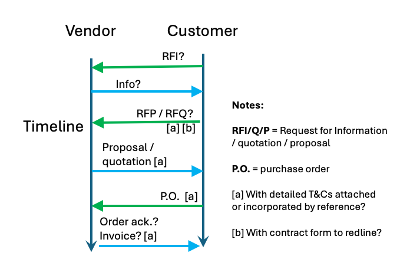

1.  If the (prospective) customer and the vendor haven't dealt with each other before, then the customer might send the vendor a request for /information/ ("*RFI*") and/or a request for /quotation/ ("*RFQ*").

(Or: If the customer wants a more-detailed proposal for the customer's specific needs, and perhaps a quotation, the customer might instead send the vendor a request for /proposal/, known as an "*RFP*.")

The customer might send the vendor an RFQ out of the blue. But often this happens because a vendor sales representative has "pitched" the vendor's products and/or services — and for big-ticket sales to large companies ("*enterprise sales*"), the overall "*sales cycle*" will often take weeks or months.

The RFQ might be a formal document labeled "Request for Quotation" or some such. 

Or, the RFQ might be just an email or oral statement to the vendor by someone working for the customer: "OK, send me a quote."

2.  In response, the vendor's sales rep sends the customer a "*sales quotation*" or "*quote*" — concerning which, see the sales-quote protocol at {{{RR}}} [[#r-sales-quote]].

3.  If and when the customer decides to buy, the customer sends the sales rep an order form such as a so-called "purchase order" or "*PO*"; typically, this will be an "offer" to purchase, which the vendor can "accept" or not. (Purchase orders are the subject of {{{ths}}}.)

At this juncture, the vendor and customer might negotiate legal terms and conditions ("*T&Cs*"). Such legal negotiations often take awhile, especially if one side or another makes unreasonable demands. The vendor's sales people and the customer's relevant business users might get impatient — and blame "Legal" for the delay and their resulting frustration.

4.  If there won't be negotiation of the legal T&Cs, then:

4.1  The vendor's sales rep might ask the vendor's relevant people to do what's called for in the PO — e.g., ship the requested goods, perform the requested services — and send the customer an invoice. When that happens, the parties have entered into what's known as a "*unilateral contract*"; the customer's PO was an offer, which the vendor accepted by performance. (See [[#fill-po]] for more discussion.)

4.2  Or: The sales rep — before getting the vendor's performance started — might respond with another document, often called an "*order confirmation*."  When this happens, the parties have entered into a so-called "Battle of the Forms," whose effects are discussed in more detail at [[#nl-battle-forms]].

5.  *Caution:* Sometimes a vendor (or an individual sales rep) might be in danger of missing its sales-target number for a fiscal quarter. In that situation, the vendor might get a cooperative customer to place a so-called "*round trip order*," where the customer places an order with the vendor but the vendor places an offsetting order for the /customer's/ goods or services. 

*This type of deal can be a species of securities fraud*, and can get companies and individuals sued by the SEC and/or by securities plaintiffs and even *imprisoned*; see [[#nl-round-tripping]] for examples.

**** The parties' business processes might /impede/ sales
  :PROPERTIES:
  :CUSTOM_ID: sale-pro-impede
  :END:

Customers and vendors sometimes have business processes that they would like to have followed, with, e.g., minimum- or maximum order sizes.

And sometimes a customer that submits an order to a vendor will want to change the order, or even cancel it entirely. 

It makes good business sense for the parties to have an agreed process in place for handling such situations.

**** *Caution to Vendor:* Don't /sign/ a PO or order confirmation ...
  :PROPERTIES:
  :CUSTOM_ID: po-sign-no
  :END:

Vendors will want to train their front-line people _not_ to sign a customer's purchase order — nor should a /customer/ sign a /vendor's/ order confirmation. At a minimum, doing so might create messy issues about whose contract terms apply, and those issues could require costly litigation to straighten out. {{{RWE}}} This happened in a COVID-era case from the Fourth Circuit.

- A /vendor/ of COVID-19 test kits sent a "purchase order" /[sic]/ to a Florida government agency that wanted to buy test kits.

- The agency's director signed the PO — but other email correspondence on the same day indicated that the terms and conditions were /not/ completely agreed after all.

- The Fourth Circuit observed (perhaps tongue in cheek): "After that /[sic!]/, the parties’ dealings get messy." <cite> [[https://scholar.google.com/scholar_case?case=18348947211144570919][Global Innovative Concepts, LLC v. Florida Div. of Emerg. Mgmt.]], 105 F.4th 139, 142 (4th Cir. 2024) (vacating and remanding denial of state agency's /federal/ sovereign-immunity motion to dismiss). </cite>

**** Caution to Vendor: /Filling/ a "PO" might agree to its terms
  :PROPERTIES:
  :CUSTOM_ID: fill-po
  :END:

In U.S. law schools, first-year students learn that a so-called [[https://www.law.cornell.edu/wex/unilateral_contract][unilateral contract]] can be formed /without/ signatures from both parties if an unrevoked, otherwise-eligible offer is accepted by performance. 

{{{RWE}}} 

- Alice's cat "Fluffy" goes missing.
- Alice posts handbills on light poles, offering a $100 reward for Fluffy's safe return.
- Bob finds Fluffy and returns her to Alice.
- Bob's "performance" constitutes completion of the contract, and Alice must pay Bob the reward money.

So: In U.S. jurisdictions, when a customer sends a vendor a purchase order ("*PO*"), the PO might well count as an offer to enter into a contract, /and the offer likely could be accepted by performance/, i.e., by filling the PO — making the PO's terms and conditions part of "the contract" between the parties. 

{{{RWE}}} Consider the following language from the giant networking-technology company [[https://en.wikipedia.org/wiki/Cisco][Cisco]]'s "Standard Terms and Conditions of Purchase – United States" § 1 (archived at https://perma.cc/SD47-YCHU).

#+begin_quote

Vendor's electronic acceptance, acknowledgement of ths Purchase Order, or *commencement of performance constitutes Vendor's acceptance of these terms and conditions.*
#+end_quote

So: Suppose that Cisco sends a PO to the Vendor, and that in response, the Vendor simply ships goods to Cisco, without doing anything else — specifically, without sending the Vendor's own "paper" that pro forma rejected the Cisco terms.  Under those circumstances, the Vendor might well find itself bound by Cisco's terms — which would almost surely be more onerous to the Vendor than would the Vendor's own terms and conditions.

(If the Vendor /did/ send its own rejection, then the Vendor and Cisco would likely find themselves in what's known as the Battle of the Forms, discussed at [[#nl-battle-forms]].)

**** Other copy-and-paste language for Orders
  :PROPERTIES:
  :CUSTOM_ID: orders-opt
  :END:

Drafters can consider the following language options are provided in case the parties want to adapt one or more of them for use in {{{thek}}}:

#+begin_alt
The Customer may submit an order of any size. 
#+end_alt

or:

#+begin_alt
The Vendor may decline an order for goods or other deliverables if the ordered quantity of any single stock-keeping unit (SKU) is less than /[insert quantity]/.
#+end_alt

or:

#+begin_alt
The Vendor may decline an order where the aggregate order price is less than /[insert amount]/, exclusive of taxes, shipping, and insurance.
#+end_alt

Sometimes, when negotiating a master purchase agreement, the Vendor and the Customer might have a bit of a tug-of-war over the Vendor's autonomy in accepting Customer orders:

  - At one end of the spectrum, the Vendor might want to be free to reject any order for any reason or no reason.
  - At the other extreme, the Customer might want to /require/ the Vendor to accept any Customer order whatsoever. 

Drafters can adapt one or more of the following optional terms as desired.  *Caution:* It should be apparent that several of the options below are mutually inconsistent.

#+begin_alt
The Vendor will not decline any order.
#+end_alt

or:

#+begin_alt
The Vendor will not unreasonably decline an order. 
#+end_alt

(The above option, of course, raises the possibility of disputes about what constitutes /unreasonable/ declining of an order. Such disputes should be escalated in accordance with [[#r-escal-ext]].)

or:

#+begin_alt
The Vendor may decline any proposed order in its sole discretion; in case of doubt, here, /decline/ has the same meaning as /reject/.
#+end_alt

or:

#+begin_alt
If the Customer fails to pay amounts due to the Vendor when due, THEN the Vendor may decline subsequent proposed orders by the Customer until all such past-due amounts have been paid.
#+end_alt

or:

#+begin_alt
The Vendor is deemed to have accepted an order, and to have waived its right to decline or otherwise reject the order, if the Vendor has not declined the order in writing within /[fill in time]/ after the Vendor receives the order.
#+end_alt

What about the Vendor's /revoking/ of acceptance? Consider the following:

#+begin_alt
If the Customer has failed to pay one or more amounts due to the Vendor, THEN the Vendor may revoke its acceptance of the Customer's orders that the Vendor previously accepted but has not yet filled or completed.
#+end_alt

or:

#+begin_alt
The Vendor may not revoke its acceptance of an order.  
#+end_alt

or:

#+begin_alt
The Vendor may revoke its acceptance of an order, but only under the following circumstances: /[describe]/.
#+end_alt

*Caution:* Some of the optional terms below might be mutually exclusive, so be sure to read each one carefully to avoid choosing conflicting options.

#+begin_alt
The Customer may cancel an accepted order for goods that are not to be specially manufactured for the order — but the Customer may do so only before the Vendor has shipped the goods — by sending a written cancellation advice to the Vendor.
#+end_alt

and/or:

#+begin_alt
No Customer cancellation of a Vendor-accepted order will be effective if the order is for goods that will be specially manufactured for the order, but the Customer may cancel an order for other goods — only before the Vendor has shipped the goods — by sending a written cancellation advice to the Vendor.
#+end_alt

or:

#+begin_alt
No Customer cancellation of a Vendor-accepted order for services will be effective.
#+end_alt

and/or:

#+begin_alt
No Customer cancellation of a Vendor-accepted order for goods will be effective.
#+end_alt

and/or:

#+begin_alt
A Vendor-accepted order for goods or other deliverables will not be deemed canceled unless the Vendor receives a written cancellation request, signed by an authorized representative of the Customer, no later than /[specify the deadline]/.
#+end_alt

and/or:

#+begin_alt
If the Customer cancels an order for goods or other deliverables, THEN the Vendor may invoice the Customer for, and the Customer will pay, a cancellation fee in the amount of /[specify the amount]/.
#+end_alt

**** Change orders can be tricky for parties to manage:                 :CMT:
  :PROPERTIES:
  :CUSTOM_ID: po-chg-ord-c
  :END:

{{{U1}}} When a customer has a lot of buying power, its own standard purchase-order forms might well give the customer the right to unilaterally modify any order, /with the modification becoming binding on the vendor/ if the vendor doesn't object within a certain period. 

In that vein, {{{ths}}} draws extensively on ideas in section 17 of a (very) customer-biased Honeywell purchase order form, reproduced in the appendix at [[#serv-honb-chg]] — but this section provides a simpler approach than the Honeywell version, which calls for "equitable adjustment" to pricing and/or delivery dates. 

(U.S. Government contracts sometimes use a similar equitable-adjustment approach.)

{{{UN}}} *Caution:* Suppose that the Customer asks for a costly change but the Vendor doesn't follow an agreed procedure to ask for an increase in price: In such a situation, the Vendor might be stuck for the extra cost, as happened in an (unpublished) 2022 Iowa appeals court decision. <cite> See [[https://scholar.google.com/scholar_case?case=9790779032974242267][Ryan Companies U.S., Inc. v. FDP WTC, LLC]], No. 20-1366, slip op. (Iowa App. Jan. 12, 2022) (reversing, in part, judgment awarding breach-of-contract damages to contractor) (unpublished). </cite>

{{{UN}}} Subdivision B.2: For the change _not_ to take effect, the Customer must /receive/ the Vendor's objection within the stated time. That is: The "Mailbox Rule" (discussed at [[#r-notices-rule]]) won't apply here.

{{{UN}}} Subdivision C: See generally the discussion of apparent authority at [[#nl-app-auth]]. Possible override language for {{{thek}}}: "Only an authorized procurement representative of [Customer] may agree to a change order."

**** Appendix: Honeywell change-order language
  :PROPERTIES:
  :CUSTOM_ID: serv-honb-chg
  :END:

For those interested in /really/-detailed change-order language, see the  [[#sssp]["spaghetti paragraph"]] language at section 17 of a Honeywell purchase order form, archived at https://perma.cc/84BS-KYXB.

** Referrals {{{CLS}}}                                                  :CLS:
  :PROPERTIES:
 :CUSTOM_ID: r-refer-proc
 :HTML_CONTAINER_CLASS: pr-top
 :CATEGORY: Protocol
  :END:

One way that a supplier might grow its "channel" (i.e., a network of outside relationships to promote sales) is to agree to pay another party a commission for referrals that turn into sales.  

Contents:

#+TOC: headlines 1 local

*** Who are the parties in {{{ths}}}?
  :PROPERTIES:
  :CUSTOM_ID: refer-appl
  :END:

{{{TRIG-SIG}}} a party indicated in {{{thek}}} (the {{{dfn(Vendor)}}}) is to pay commissions to another party (the {{{dfn(Associate)}}}) on certain sales by the Vendor to certain customers (each, a {{{dfn(Prospect)}}}) when referred to the Vendor by the Associate.

***** Note                                                               :CMT:
  :PROPERTIES:
  :HTML_CONTAINER_CLASS: cmtry
  :UNNUMBERED: notoc
  :END:

1.  *Caution:* In some circumstances, "commission" might be a euphemism for "bribe" and, if so, could very well be a criminal offense that renders one or both parties liable for criminal fines and/or imprisonment. <cite> See, e.g.: \bull *U.S.:* See [[https://www.law.cornell.edu/uscode/text/18/201][18 U.S.C. § 201]] (prohibiting bribing of federal officials); [[https://www.law.cornell.edu/uscode/text/18/part-I/chapter-96][Racketeer Influenced and Corrupt Organizations]] (RICO) Act, 18 U.S.C. §§ 1961-1968; [[https://www.justice.gov/criminal-fraud/foreign-corrupt-practices-act][Foreign Corrupt Practices Act]] (for foreign sales involving U.S. companies and their foreign affiliates); [[https://www.justice.gov/civil/false-claims-act][False Claims Act]] (for sales to the government); \bull *UK:* See [[https://www.kroll.com/en/insights/publications/compliance-risk/comparing-fcpa-uk-bribery-act][Bribery Act 2010]]. \bull Mark F. Mendelsohn, [[https://thelawreviews.co.uk/title/the-anti-bribery-and-anti-corruption-review/usa][The Anti-Bribery and Anti-Corruption Review: USA]] (TheLawReview.co.uk 2020), which is extensively footnoted and appears to be quite thorough; it seems to be an excerpt from [[https://shop.thelawreviews.co.uk/products/the-anti-bribery-and-anti-corruption-review-9th-edition][a book]] of the same title. </cite>

2.  *Caution — special case for lawyers:* In the U.S., legal-ethics rules impose strict limits on lawyers ability to /pay/ or /receive/ commissions for client referrals. <cite> See generally, e.g., Rob George, [[https://www.tlie.org/the-ethics-of-referrals/][The Ethics of Referrals, Part 1]], [[https://www.tlie.org/the-ethics-of-referrals-part-2/][Part 2]], and [[https://www.tlie.org/the-ethics-of-referrals-part-3/][Part 3]] (TLIE.org 2023). </cite>

3.  *Caution — special case for investors:* If a referral fee is being paid for introducing *a potential investor* to a company, then under U.S. securities law, the person doing the referring might have to register as a "broker." <cite> See Michael Blane & Richard A. Friedman, [[https://www.corporatesecuritieslawblog.com/2025/07/sec-revisits-finder-exemption-potential-impacts-for-small-businesses-and-the-capital-markets][SEC Revisits ‘Finder’ Exemption: Potential Impacts for Small Businesses and the Capital Markets]] (CorporateSecuritiesLawBlog.com 2025). </cite>

*** Business details
  :PROPERTIES:
  :CUSTOM_ID: refer-rate
  :END:

The Associate will earn a commission on each Eligible Sale (see § [[#refer-elig-sales-defn]]) by the Vendor to a given Prospect, as stated in the following table and its accompanying notes:

#+ATTR_HTML: :class valign
|  1. | Eligible Vendor Offerings:      | {{{v(Any and all)}}} Vendor products and services.                                                                |
|  2. | Commission Rate:                | {{{v(0.001%)}}}.                                                                                                  |
|  3. | Geographic Territory:           | {{{v(A one-mile radius)}}} around the Associate's initial address for notice.                                     |
|  4. | Market Segment:                 | {{{v(All market segments)}}}.                                                                                     |
|  5. | Partnership Term starts:        | The date that {{{theK}}} becomes effective.                                                                       |
|  6. | Partnership Term ends:          | The last calendar day of {{{v(the following month)}}}.                                                            |
|  7. | Automatic extension?            | No. (Alternative: § [[#channel-auto-ext-out]].)                                                                       |
|  8. | Referral Expiration Date:       | {{{v(One year)}}} from Associate's first referral of that Prospect to the Vendor for any Eligible Vendor Offering |
|  9. | Commission Cut-Off Date:        | {{{v(One year after first sale to referral)}}}.                                                                   |
| 10. | Commission payment due date:    | {{{v(30 days)}}} after collection EOQ.                                                                            |
| 11. | Deduction for possible returns: | Allowed — see note.                                                                                               |
| 12. | Clawback for unpaid invoices:   | Allowed — see note.                                                                                               |

Notes:

Item 1: The term "Vendor products and services" refers to those made available by the Vendor from time to time — in the Vendor's sole discretion — in the Geographic Territory and Market Segment. The term "products" refers to both tangible and intangible products.

Item 2: The commission amount will be the Commission Rate applied to the Vendor's invoiced price — excluding separately-invoiced charges for shipping, insurance, and taxes. EXAMPLE: With the Commission Rate at 0.001%, the commission amount on a $1 million sale would be $10.

Item 3: The initial address for notice is as stated in {{{theK}}} (if so stated).

Item 8: The Referral Expiration Date is measured .

Item 9: A sale to a Prospect is not eligible for a commission if the Vendor enters into a binding contract for that sale more than the stated time following the first Eligible Sale to that Prospect. 

Item 10 — Commission payment due date: The term "collection EOQ" refers to the end of the Vendor's fiscal quarter in which the Vendor collects the associated invoiced sale price(s). (The Associate need not provide the Vendor with an invoice for commission(s) due.) 

Item 11 — deduction for possible returns: When computing commissions due on sales, the Vendor may apply a deduction from sales as stated, as long as those deductions conform to the Vendor's then-generally-effective return policy.  The Vendor may determine its return policy in its sole discretion (defined at {{{RR}}} [[#discr-defn]]) from time to time, *but* the Vendor is to apply the return policy consistently for purposes of {{{ths}}}.

Item 12 — clawback for unpaid invoices: If the Vendor pays a commission before the Vendor collects payment for the relevant transaction but is unable to collect the transaction payment after reasonable efforts, *then:* The Vendor may: 

{{{U1}}} deduct the amount of the paid commission from future commissions owed (if any); and

{{{UN}}} after such deductions (if any), ask the Associate to refund any remaining portion of the paid commission, without interest, in which case the Associate must promptly refund that remaining portion.  

(In case of doubt, the Vendor's collection efforts need not include filing suit or initiating arbitration.)

***** Note                                                               :CMT:
  :PROPERTIES:
  :HTML_CONTAINER_CLASS: cmtry
  :UNNUMBERED: notoc
  :END:

{{{H1}}} {{{TheK-cap}}} may (and likely will) override any or all of these business details, which are included for "fault tolerance" in case drafters overlook specifying otherwise in {{{theK}}}.

{{{HN}}} Item 2, Commission Rate: Exclusion of separately-invoiced charges for shipping, insurance, and taxes, is pretty customary — but it should /not/ be interpreted as excluding additional fees and other charges imposed and kept by the Vendor. (Two familiar examples of such additional fees: Checked-bags fees imposed by airlines, and "resort fees" charged by hotels). ¶ Concerning taxes, see {{{RR}}} [[#r-taxes-pmts]] (tax responsibilities).
 
{{{HN}}} Item 4, Market Segment: A Vendor might segment its offerings and then engage Associates who were familiar with particular market segments (e.g., particular industries) and thus would be more likely to refer Prospects to the Vendor in those market segments. 

{{{HN}}} Item 8, Referral Expiration Date: The underlying idea here is that not all referrals are "good" referrals, from the Vendor's perspective — if the Vendor is unable to make an initial sale to a prospect on or before the Referral Expiration Date, then the Vendor wouldn't want to pay commissions for /any/ sales to that prospect.

{{{HN}}} Item 9, Commission Cut-Off Date: This section recognizes that as time goes on, and the Vendor (presumably) makes more sales to a referred Prospect, the sales will be less and less a result of the Associate's referral of the Prospect, and more and more a result of the Vendor's own success in dealing with the Prospect.  This section also gives the Associate an incentive to keep drumming up more new business for the Vendor, instead of "farming" commissions on old referrals. 

Referral agreements should be clear on this point, because otherwise litigation might ensue from Associates wanting to get one last commission. <cite> See, e.g., [[https://scholar.google.com/scholar_case?case=9550058811085184796][MAK Tech. Holdings Inc. v Anyvision Interactive Tech. Ltd.]], 42 N.Y.3d 570 (2024) 249 N.E.3d 1194, 225 N.Y.S.3d 174 (2024) (reversing Appellate Division; plaintiff was not entitled to $1.25 million fee for transaction consummated eight months after "Term" of parties' agreement expired). </cite>

In lieu of the all-or-nothing "cliff" cut-offs, {{{theK}}} could provide for a phase-out period, with progressively-lower commission rates as time goes on.  This might be preferable for the Associate, because as the relevant "sunset" date approached for a particular referral, the Vendor might feel it would do better financially by /delaying/ sales until after the sunset date had passed.

{{{HN}}} Item 10: Delaying payment till after collection EOQ gives the Vendor time to close its books for the quarter — and, sensibly, it makes the Associate wait to be paid until the Vendor is paid. 

*Pro tip:* Watch out for the *due date of commissions due on /non-cash/ compensation* — e.g., shares of stock — especially if they are subject to vesting over time. {{{RWE}}} That's an issue in a pending Delaware case involving an NBA basketball player, whose management agency sued for a commission on time-vesting restricted stock that the player's company had received under an endorsement agreement.

- The district court granted summary judgment to the player's company on grounds that the agency's commission had become due when the player's stock had /vested/, as opposed to when the player had /sold/ the stock; thus, said the district court, the agency's claim was barred by limitations because the agency had waited until after the statute-of-limitations deadline had expired. 

- Delaware's supreme court reversed and remanded, holding that the case was not one of /ambiguity/ of the contract's payment requirement, but of /a missing term/, namely the payment due date:

#+begin_quote
Although the parties framed the contractual dispute as a search for the meaning of an ambiguous term, they failed to distinguish between contractual silence, when the contract does not address the issue, and ambiguity, when contract language is susceptible of different reasonable interpretations.

The 2010 Agreement had a missing term — when were commission payments due? Where, as here, the contract does not provide the time for payment, the court will imply a reasonable time. 

Ordinarily, questions like what is a reasonable time for payment cannot be resolved on summary judgment because the factfinder must assess prior dealings of the parties, the practice in the relevant community and trade or business and other circumstances surrounding the execution and performance of the contract. As explained next, that is the case here. <cite> See [[https://scholar.google.com/scholar_case?case=9440987809945197616][F.A.M.E. LLC v. Emturn LLC]], No. 230,2025, part II.B, [[https://law.justia.com/cases/delaware/supreme-court/2026/230-2025.html][slip op.]] at 11-12 (Del. Apr. 20, 2026) (cleaned up). </cite>
#+end_quote

{{{HN}}} Item 11 — deduction for possible returns: *Caution:* Keep in mind that under {{{ths}}}, the Vendor normally doesn't have to pay commissions until after the relevant sales proceeds have been /collected/, thus reducing the Vendor's risk. The Vendor might well risk angering the Associate — which might be shortsighted on the Vendor's part — if the Vendor tried to claw back a commission from an Associate that felt that the commission had already been earned, and that the return was /the Vendor's/ problem, not the Associate's.

8.  Item 12 — clawbacks: As a practical matter, it might be tricky for the Vendor to get the Associate to refund an already-paid commission.

*** Eligible Sales: Which referred sales would be commission-eligible?
  :PROPERTIES:
  :CUSTOM_ID: refer-elig-sales-defn
  :END:

In {{{ths}}} the term {{{dfn(Eligible Sale)}}} refers to a Vendor's sale of one or more Eligible Vendor Offerings — to a Prospect that the Associate refers to Vendor during the Partnership Term — where each of the requirements in this § [[#refer-elig-sales-defn]] paragraphs is satisfied, in addition to other requirements specified in {{{ths}}} and elsewhere in {{{thek}}}.

{{{U1}}} The Prospect must have substantial operations in the Geographic Territory — the Vendor's determination on that point is final and binding. 

{{{UN}}} The Prospect must be /initially/ referred to the Vendor by the Associate during the Partnership Term — not before, not after. 

{{{UN}}} It must not be not against the law for the Prospect to acquire the relevant Eligible Vendor Offering(s) in the Territory. 

{{{UN}}} The Prospect must not be a competitor of the Vendor, unless the Vendor gives its prior written consent. 

{{{UN}}} The Prospect must not have had a previous connection or relationship with the Vendor at the time of the Associate's initial referral — the Vendor's determination on that point is final and binding. 

{{{UN}}} The Prospect and the Vendor must enter into a legally-binding contract for the sale before the Referral Expiration Date.

***** Note                                                               :CMT:
  :PROPERTIES:
  :HTML_CONTAINER_CLASS: cmtry
  :UNNUMBERED: notoc
  :END:

1.  This section assumes that the Vendor will want to pay commissions /only/ for referrals that are genuinely useful for building out the Vendor's customer base.

2.  Subdivision (1): The "substantial operations" criterion is one of those that likely can be safely left up to the Vendor to determine — because if the Vendor is too stingy in that regard, then it risks finding itself getting fewer and fewer referrals from that Associate. </aside>

3.  Subdivision (2): A "sunset" for commission obligations can be extremely useful for certainty, which business people often value highly. {{{RWE}}} In a Massachusetts case, a court held that a particular referral agreement — which didn't put a time limit on a commission obligation — required payment of commissions on sales to two customers for as long as the seller continued to do business with those particular customers.  <cite> See [[https://scholar.google.com/scholar_case?case=2646647114207246080][Prism Grp., Inc. v. Slingshot Techs. Corp.]], 104 Mass. App. Ct. 785, 245 N.E.3d 740 (2024) (affirming judgment after non-jury trial). </cite>

4.  Subdivision (3): Legal restrictions on a Prospect's acquiring the Vendor's offerings could include, for example: (1) A Prospect might be on the [[https://www.trade.gov/consolidated-screening-list][Consolidated Screening List]] of parties to whom certain *exports* (including disclosures of information) are restricted by the U.S. Government. (2) In a given territory, the Vendor's offerings might be illegal to sell to *persons under a certain age* — for example, in years gone by, different U.S. states had different ages at which individuals could buy *tobacco* and *alcoholic beverages* (but now there's uniformity thanks to federal law). <cite> U.S. federal law [[https://www.fda.gov/tobacco-products/ctp-newsroom/newly-signed-legislation-raises-federal-minimum-age-sale-tobacco-products-21][prohibits sales of tobacco products]] to individuals under 21 years old, and it [[https://en.wikipedia.org/wiki/National_Minimum_Drinking_Age_Act][punishes states]] that allow sales of alcoholic beverages to those under 21 by reducing federal highway funding to those states. </cite>

5.  Subdivision (4): The Vendor might rightly be concerned about /unwittingly/ providing competitors with access to (for example) trade-secret computer software. 

6.  Subdivision (5): Any lack of clarity on this point could result in costly litigation. {{{RWE}}} In an English case, a tech company engaged an investment bank to help the company obtain financing. As it turned out, the company obtained financing from the parent company of the tech company. The bank demanded a "success fee" anyway — but the court's answer was "no." <cite> See [[https://caselaw.nationalarchives.gov.uk/ewhc/ch/2024/3164][Kigen (UK) Ltd. v NOR Capital Ltd.]], [2024] EWHC 3164 (Ch), ¶¶ 90-91. </cite>

On the other hand: Purely-commercial incentives should keep the Vendor from being /too/ aggressive in determining that it had a prior relationship with a Prospect — otherwise, the Associate might simply stop referring prospects at all.

*** Is the Associate /restricted/ in where it can make referrals?
  :PROPERTIES:
  :CUSTOM_ID: refer-mkt-restr
  :END:

The Associate is free to refer Prospects to Vendor that are located outside the Geographic Territory and/or outside the Market Segment — but the Associate would not be paid commissions for any sales of Eligible Vendor Offerings to such "outside" Prospects, even if such sales would otherwise have been commission-eligible.

***** Note                                                               :CMT:
  :PROPERTIES:
  :HTML_CONTAINER_CLASS: cmtry
  :UNNUMBERED: notoc
  :END:

1.  *Alternative:* "The Associate is not to refer sales of Eligible Vendor Offerings outside the Geographic Territory and Market Segment."

2.  If a Vendor wants to be able to define an /exclusive/ territory for a particular Associate, then the Vendor might well need to tell /other/ Associates, in effect, "stay in your lane."

*** When would a Vendor sale be "made"?
  :PROPERTIES:
  :CUSTOM_ID: ReferSaleMade
  :END:

For commission-eligibility purposes, any given Vendor sale to a Prospect is not considered made until the date that the Vendor and the Prospect enter into a binding contract (which might or might not be the [putative] /effective/ date of that contract). 

***** Note                                                               :CMT:
  :PROPERTIES:
  :HTML_CONTAINER_CLASS: cmtry
  :UNNUMBERED: notoc
  :END:

*Caution:* Be careful about using potentially-ambiguous terms such as "when a sale is /consummated/," because that could lead to costly litigation over the meaning of the term. {{{RWE}}} In one Third Circuit case, the court ruled that a finder's-fee agreement did /not/ require the resulting contract to be "performed" in order for the transaction to be "consummated," and so a finder's fee was indeed due and owing for the transaction in question. <cite> See [[https://scholar.google.com/scholar_case?case=7179354725729935348][Fed Cetera, LLC v. Nat'l Credit Servs., Inc.]], 938 F.3d 466 (3d Cir. 2019). </cite>

# The "sell-by" date for any referral is {{{v(one year)}}} after the referral.

*** Are there any other required Vendor payments to the Associate for referrals?
  :PROPERTIES:
  :CUSTOM_ID: refer-exclusive
  :END:

In case of doubt, {{{thek}}} sets out the exclusive, aggregate right to compensation of the following — collectively, the {{{dfn(Associate Group)}}} — in respect of any transaction of the type addressed in {{{ths}}}:

{{{U1}}} the Associate;

{{{UN}}} the Associate's affiliates (if any); and

{{{UN}}} the personnel of each of them. 

***** Note                                                               :CMT:
  :PROPERTIES:
  :HTML_CONTAINER_CLASS: cmtry
  :UNNUMBERED: notoc
  :END:

This is intended as a roadblock — but it's possible that the parties might have other payment arrangements that are documented by separate contracts.

*** How can the Associate know it's being paid correctly?
  :PROPERTIES:
  :CUSTOM_ID: refer-records
  :END:

{{{L1}}} The Vendor will keep records to support commission amounts due under {{{thek}}} in accordance with {{{Cls}}} [[#r-rcrd-keep-appx]], which is incorporated by reference.

{{{LN}}} With each commission payment, the Vendor will provide the Associate with a complete and accurate written statement of the amount(s) due, with reasonable supporting detail. 

{{{LN}}} The Associate may have the Vendor's commission statements audited in accordance with the audit protocol at {{{RR}}} [[#r-audit-proto]], which is incorporated by reference. 

***** Note                                                               :CMT:
  :PROPERTIES:
  :HTML_CONTAINER_CLASS: cmtry
  :UNNUMBERED: notoc
  :END:

1.  Subdivision (b): The term "complete and accurate" is /far/ better than "true and correct," as discussed at [[#true-correct]]. 

2.  Subdivision (c): A recordkeeping requirement and an audit requirement will often go "hand in hand," for reasons discussed in the commentary of {{{RR}}} [[#r-audit-proto]] (audit protocol).

*** Are any other terms included in {{{ths}}}?
  :PROPERTIES:
  :CUSTOM_ID: refer-channel-incorp
  :END:

This relationship between the Vendor and the Associate is a "*Channel Partnership*," as referred to at {{{RR}}} [[#r-channel-proc]], which: (i) includes certain additional definitions, and (ii) is incorporated by reference into {{{ths}}}.

*** Referrals: {{{ADDL}}}
  :PROPERTIES:
  :HTML_CONTAINER_CLASS: addl
  :END:

** Resale {{{CLS}}}                                                     :CLS:
  :PROPERTIES:
  :CUSTOM_ID: r-resale-proc
  :HTML_CONTAINER_CLASS: pr-top
  :END:

Many, many products (and services) are not sold directly by their manufacturers (or at least not /exclusively/ directly), but indirectly via one or more layers of resellers. {{{Ths-cap}}} sets out basic provisions for reseller agreements. Such reseller relationships can be important for suppliers looking to grow their "sales channels."  

Contents:

#+TOC: headlines 1 local

*** Parties: Vendor and Reseller
  :PROPERTIES:
  :CUSTOM_ID: resale-trig
  :END:

The parties anticipate that one party specified in {{{thek}}} (the {{{dfn(Reseller)}}}) will, under {{{theK}}}, do the following: 

***** Note                                                              :CMT:
  :PROPERTIES:
  :HTML_CONTAINER_CLASS: cmtry
  :UNNUMBERED: notoc
  :END:

The term "Reseller" could encompass a variety of different functions such as distributors, wholesalers, and retailers. </aside>

   1. acquire one or more products, services, and/or other items (the {{{dfn(Vendor Offerings)}}}) of another specified party (the {{{dfn(Vendor)}}}), and

   2. resell the Vendor Offerings in a specified "Territory" ([[#resale-discount][see below]]).

*** The Sales-Channel Partnership {{{PR}}} also applies
  :PROPERTIES:
  :CUSTOM_ID: resale-ch-ps
  :END:

The relationship between the Reseller and the Vendor is a "*Channel Partnership*" as referred to at {{{RR}}} [[#r-channel-proc]], which (1) includes certain basic definitions, and (2) is incorporated by reference into {{{ths}}}. 

***** Note                                                              :CMT:
  :PROPERTIES:
  :HTML_CONTAINER_CLASS: cmtry
  :UNNUMBERED: notoc
  :END:

See the commentary at {{{RR}}} [[#r-channel-proc]]. </aside>

*** Territory: {{{v(One-half-mile radius around Reseller address)}}}.
  :PROPERTIES:
  :CUSTOM_ID: resale-terr
  :END:

The term {{{dfn(Territory)}}} refers to the stated distance around the street address of the Reseller's principal place of business. 

***** Note                                                              :CMT:
  :PROPERTIES:
  :HTML_CONTAINER_CLASS: cmtry
  :UNNUMBERED: notoc
  :END:

Of course this particular "placeholder" Territory is ridiculously small; it's included for "fault tolerance" in case drafters neglect to specify otherwise. (The Reseller is extremely unlikely to agree to this IRL, "In Real Life.") </aside>

*** Reseller's discount:  {{{v(0.001%)}}}.
  :PROPERTIES:
  :CUSTOM_ID: resale-discount
  :END:

During the Partnership Term, the Reseller is entitled to acquire Vendor Offerings directly from the Vendor at the stated discount from the Vendor's then-current, published list price that is applicable in the Territory. 

***** Note                                                              :CMT:
  :PROPERTIES:
  :HTML_CONTAINER_CLASS: cmtry
  :UNNUMBERED: notoc
  :END:

As with the [[#resale-terr][Territory definition]], this is a ridiculously-low "placeholder" discount. </aside>

*** The discount & territory are Vendor confidential information.
  :PROPERTIES:
  :CUSTOM_ID: resale-discount-conf
  :END:

The percentage and/or amount of the Reseller's discount, and the definition of the Reseller's Territory, are the confidential information of the Vendor; the Reseller will not reveal that information (nor confirm it) to third parties — including but not limited to other suppliers — without the Vendor's prior written consent. 

***** Note                                                              :CMT:
  :PROPERTIES:
  :HTML_CONTAINER_CLASS: cmtry
  :UNNUMBERED: notoc
  :END:

The parties might want to include {{{RR}}} [[#r-conf-info-proto]] (confidential information protocol) in {{{thek}}} as well. </aside>

*** Payment terms to Vendor: {{{v(Net 30)}}} from invoice receipt.
  :PROPERTIES:
  :CUSTOM_ID: resale-pmt
  :END:

If the Reseller buys Vendor Offerings directly from the Vendor, *then:* The Reseller will pay as stated in the heading of this § [[#resale-pmt]] and in accordance with {{{RR}}} [[#r-pmt-basic]] (payment terms). 

***** Note                                                              :CMT:
  :PROPERTIES:
  :HTML_CONTAINER_CLASS: cmtry
  :UNNUMBERED: notoc
  :END:

This § [[#resale-pmt]] doesn't address whether the Reseller is /required/ to buy Vendor Offerings from the Vendor at all, or perhaps /exclusively/. (*Caution:* In some contexts — for example, [[https://www.mcdonaldhopkins.com/insights/news/Drafting-franchise-agreements-to-avoid-antitrust-l][a franchise agreement]] — such a mandatory-sourcing requirement could trigger antitrust questions, for example whether the requirement constituted an unlawful tying arrangement; see generally the Federal Trade Commission's [[https://www.ftc.gov/advice-guidance/competition-guidance/guide-antitrust-laws/single-firm-conduct/tying-sale-two-products][fact sheet on tying arrangements]].) </aside>

*** The Vendor has {{{v(no)}}} pricing authority for Reseller sales.
  :PROPERTIES:
  :CUSTOM_ID: resale-reseller-pricing
  :END:

[[#as-between-cmt][As between]] the Vendor and the Reseller, the Vendor has no authority to determine the prices that the Reseller charges to the Reseller's customers. 

***** Note                                                              :CMT:
  :PROPERTIES:
  :HTML_CONTAINER_CLASS: cmtry
  :UNNUMBERED: notoc
  :END:

The Vendor might be tempted to try to prohibit the Reseller from discounting Vendor's products or services. But that kind of "retail price maintenance" ("RPM," sometimes known as "vertical price fixing"; see [[#nl-resale-pr]]) could lead to issues under antitrust law. Consequently, many businesses prefer to stay away from the possible litigation burden and expense by simply not engaging in RPM.  <cite> See generally, e.g., Matthew L. Powell, [[http://www.michbar.org/file/barjournal/article/documents/pdf4article3183.pdf][A Primer on Resale Price Maintenance]], Mich. B.J., Aug. 2017, at 20. </cite>>

*** The Reseller {{{v(will not)}}} alter Vendor Offerings.
  :PROPERTIES:
  :CUSTOM_ID: resale-repack
  :END:

The Reseller must not package, repackage, modify, or otherwise alter any Vendor Offering, in any way, without the Vendor's prior written consent, including but not limited to the following: 

1. removing or altering of any legend or notice — for example, copyright- or trademark notices and the like — and/or warnings or user instructions from any Vendor Offering itself or associated promotional materials, user documentation, etc.; 

2. opening any sealed package in which any part of a Vendor Offering comes to the Reseller — including, for example, a software license code in a sealed envelope;

3. separating components of a Vendor Offering, for example for for individual sale.

***** Note                                                              :CMT:
  :PROPERTIES:
  :HTML_CONTAINER_CLASS: cmtry
  :UNNUMBERED: notoc
  :END:

{{{H1}}} In some cases, the Vendor won't really care whether the Reseller modifies the Vendor's goods — but some such modifications could result in the Vendor's getting dragged into lawsuits against the Reseller by the Reseller's customers. </aside>

{{{HN}}} If the Vendor owned intellectual-property rights in a Vendor Offering, then the Vendor also might not want the Reseller creating "derivative works" without permission. </aside>

***  Reseller customers will get Vendor-standard warranties.
  :PROPERTIES:
  :CUSTOM_ID: resale-supp-warr
  :END:

1. For Vendor Offerings, the Vendor must honor substantially the same warranty terms — if any — for the Reseller's customers as it would for the Vendor's own relevant customers. 

2. Subdivision 1 does not preclude the Vendor:

   a. from providing different warranty terms for its customers in different geographic- or market-segment territories; nor

   b. from offering no warranty for a given Vendor Offering.

***** Note                                                              :CMT:
  :PROPERTIES:
  :HTML_CONTAINER_CLASS: cmtry
  :UNNUMBERED: notoc
  :END:

This section gives the Reseller's customers essentially-equal status with the Vendor's own comparable customers. (It's also meant as a guardrail, to dissuade the Reseller — or the Reseller's customers — from claiming that the Vendor must do /more/ for the Reseller's customers than for the Vendor's own customers.) </aside>

*** The Vendor will indemnify certain warranty claims.
  :PROPERTIES:
  :CUSTOM_ID: resale-supp-
  :END:

The Vendor will {{{protect(the Reseller)}}} from any claim — by any of the Reseller's customers that acquired (directly or indirectly) a Vendor Offering from the Reseller — if the claim arises out of an alleged breach of any Vendor warranty concerning that Vendor Offering. 

***** Note                                                              :CMT:
  :PROPERTIES:
  :HTML_CONTAINER_CLASS: cmtry
  :UNNUMBERED: notoc
  :END:

*Pro tip:* As with any indemnity obligation, the Reseller might want to check out the Vendor's financial ability to comply with the obligation — and possibly negotiate to have the Vendor maintain one or more backup sources of funding (such as [[#nl-insurance-notes][insurance]]) for that purpose. </aside>

*** Customer support: Level 1: Reseller. Levels 2 and 3: Vendor.
  :PROPERTIES:
  :CUSTOM_ID: resale-tech-support
  :END:

During the Partnership Term, the Reseller and Vendor will provided Levels 1 through 3 support (defined at § [[#level-x-defn]]) as stated for the Reseller's customers for Vendor Offerings. 

***** Note                                                              :CMT:
  :PROPERTIES:
  :HTML_CONTAINER_CLASS: cmtry
  :UNNUMBERED: notoc
  :END:

The Vendor will normally be _very_ interested in making sure that the Reseller's customers are properly supported in their use of Vendor Offerings, because that will affect the reputation of both the offerings and the Vendor — especially in this era of online reviews and social-media word of mouth. ¶ On the other hand, the Vendor might well want at least some of the cost and burden of providing /basic/ customer support to be taken on by the Reseller, as part of what the Vendor is "paying for" by giving the Reseller a price discount. (This could be a point for negotiation.) </aside>

*** The Reseller will follow Vendor customer-support guidelines.
  :PROPERTIES:
  :CUSTOM_ID: resale-supp-guide
  :END:

When the Reseller provides support for its customers, the Reseller will follow any reasonable written- and oral guidance for customer support that the Vendor provides to the Reseller, *so long as* that the guidance is not inconsistent with {{{thek}}}. 

***** Note                                                              :CMT:
  :PROPERTIES:
  :HTML_CONTAINER_CLASS: cmtry
  :UNNUMBERED: notoc
  :END:

In crafting technical-support guidance, the Vendor would normally want to specify that the Reseller must promptly contact the Vendor if the Reseller is unable to deal with a particular support challenge within a given amount of time — because if a Reseller customer were unhappy with the support the customer received from the Reseller, that fact could reflect badly on the Vendor Offerings and/or on the Vendor's brand. </aside>

*** Reseller servicing of Vendor Offerings must meet standards.
  :PROPERTIES:
  :CUSTOM_ID: resale-repairs
  :END:

1. This section will apply if the Reseller engages in repair or other servicing of Vendor Offerings.

2. The Reseller will use parts of equal or better quality than original.

3. The Reseller will not offer or provide as "new" any Vendor Offering that the Reseller has repaired after a customer returned it, _unless_ the Vendor specifically agrees in writing. 

4. For emphasis: This section in itself does not authorize, require, or prohibit, the Reseller's servicing of Vendor Offerings.

***** Note                                                              :CMT:
  :PROPERTIES:
  :HTML_CONTAINER_CLASS: cmtry
  :UNNUMBERED: notoc
  :END:

It's not uncommon for both suppliers and resellers to offer "refurbished" products that have been returned by customers. This subdivision gives the Vendor some control over whether and how the Reseller does so. </aside>

*** The Reseller will support any Vendor recalls.
  :PROPERTIES:
  :CUSTOM_ID: resale-recall
  :END:

{{{L1}}}If the Vendor issues a recall of any Vendor Offering, *then:* The Reseller must provide [[#rsnbl-top][reasonable]] cooperation with the Vendor (and with the Vendor's designees) in connection with the recall. 

{{{LN}}} At either party's request: The parties must escalate any disagreement about what would constitute the Reseller's reasonable cooperation under subdivision A as provided in {{{RR}}} [[#r-escal-ext]].

***** Note                                                              :CMT:
  :PROPERTIES:
  :HTML_CONTAINER_CLASS: cmtry
  :UNNUMBERED: notoc
  :END:

What would constitute "reasonable" cooperation could depend in part on whether the Vendor agreed to reimburse the Reseller for reasonable out-of-pocket external expenses actually incurred by the Reseller in providing such cooperation. </aside>

*** The Reseller will support its own warranties (if any)
  :PROPERTIES:
  :CUSTOM_ID: resale-reseller-warr
  :END:

{{{Ths-cap}}} does not preclude the Reseller from offering additional- or more-favorable warranties (or other commitments) to the Reseller's own customers concerning Vendor Offerings — *but* if the Reseller does so, it will be at the Reseller's own risk and expense. 

***** Note                                                              :CMT:
  :PROPERTIES:
  :HTML_CONTAINER_CLASS: cmtry
  :UNNUMBERED: notoc
  :END:

This phrasing was chosen so as not to imply that the Vendor was somehow "authorizing" the Reseller's activity — conceivably, such an implication might have downstream liability implications for the Vendor if a Reseller customer were to sue the Reseller for breach of the /Reseller's/ additional warranty and /also/ sue the Vendor on some kind of negligent-authorization theory or other "creative" rationale. </aside>

*** The Reseller has certain indemnity obligations of its own.
  :PROPERTIES:
  :CUSTOM_ID: resale-reseller-indem
  :END:

The Reseller will {{{protect(the Suplier)}}} against any claim by a third party that arises out of acts or omissions on the Reseller's part that relate to Vendor Offerings, *other than* a claim that {{{thek}}} unambiguously makes the responsibility of the Vendor. 

***** Note                                                              :CMT:
  :PROPERTIES:
  :HTML_CONTAINER_CLASS: cmtry
  :UNNUMBERED: notoc
  :END:

*Pro tip:* As with any indemnity obligation, the Vendor should consider negotiating to have the Reseller maintain [[#i-i][insurance]] as backup funding for the obligation (and the Reseller should consider doing so anyway). </aside>

*** Reseller customers' rights will continue after termination.
  :PROPERTIES:
  :CUSTOM_ID: resale-grandfather
  :END:

The ending of the [[#resale-ch-ps][Channel Partnership]] between the Reseller and the Vendor, whether by expiration or other termination, will not reduce the Vendor's obligations — if any — to the Reseller's customers concerning Vendor Offerings. 

***** Note                                                              :CMT:
  :PROPERTIES:
  :HTML_CONTAINER_CLASS: cmtry
  :UNNUMBERED: notoc
  :END:

This section should give the Reseller some comfort that the Vendor won't just abandon the Reseller's customers after termination of the Reseller's relationship with Vendor — but often, /that/ should be practically a given, because the Vendor will /want/ to transition those customers into a direct relationship with the Vendor or over to a different reseller. </aside>

*** The Reseller has IP-infringement responsibilities.
  :PROPERTIES:
  :CUSTOM_ID: resale-IP-report
  :END:

If the Reseller suspects that unauthorized use, copying, distribution, or modification of a Vendor Offering might be occurring, *then:* The Reseller will proceed as stated at {{{RR}}} [[#r-infr-by-others]] (protocol for dealing with potential infringement of IP rights).

*** The Vendor reserves all other Vendor-Offering rights.
  :PROPERTIES:
  :CUSTOM_ID: resale-reserv
  :END:

As between the Reseller and the Vendor, the Vendor reserves all rights concerning Vendor Offerings that are not specifically granted by {{{thek}}} — that reservation extends (without limitation) to all copyrights, patent rights, trademark and service mark rights, trade secret rights and other intellectual property rights in Vendor Offerings. 

***** Note                                                              :CMT:
  :PROPERTIES:
  :HTML_CONTAINER_CLASS: cmtry
  :UNNUMBERED: notoc
  :END:

Concerning the phrase "[a]s between," see [[#as-between-cmt]]. </aside>

*** The Vendor is not responsible for the Reseller's business position.
  :PROPERTIES:
  :CUSTOM_ID: resale-no-resp
  :END:

The Vendor has no responsibility — financial or otherwise, under any theory: 

***** Note                                                              :CMT:
  :PROPERTIES:
  :HTML_CONTAINER_CLASS: cmtry
  :UNNUMBERED: notoc
  :END:

This originated in a court case I once read, where a manufacturer terminated its contract with a supply-chain partner — as allowed by their contract — and in response, the partner sued the manufacturer, claiming that the manufacturer had knowingly allowed the partner to become dependent on the manufacturer's business, or something like that. (Unfortunately, the case citation seems to have disappeared along the line, and I wasn't able to find the cite in earlier drafts.) </aside>

  1. for any dependence that the Reseller's business might have on being able to sell Vendor Offerings; nor

  2. for any harm that might result to the Reseller from the ending, for whatever reason, of the Reseller's relationship with the Vendor,

and the Reseller *WAIVES* any claim to either effect. 

*** Software offerings have certain other terms.
  :PROPERTIES:
  :CUSTOM_ID: resale-sw-xref
  :END:

{{{L1}}}This section will apply in respect of any Vendor Offering that includes one or more types of license for the use of software (the {{{dfn(Software)}}}), including but not limited to licenses to use software-as-a-service, or "SaaS."

{{{LN}}} {{{RR}}} [[#resale-software]] (software-specific items) is incorporated by reference into {{{ths}}} for each Vendor Offering within the scope of subdivision A.

*** {{{OPT}}}: Reseller Minimum Inventory                               :CLS:
  :PROPERTIES:
  :CUSTOM_ID: resale-inventory-min
  :HTML_CONTAINER_CLASS: optn-txt
  :END:

The Reseller will keep a minimum quantity of Vendor Offerings in inventory as follows: /[DESCRIBE]/.

*** {{{OPT}}}: Reseller Maximum Inventory                               :CLS:
  :PROPERTIES:
  :CUSTOM_ID: resale-inventory-max
  :HTML_CONTAINER_CLASS: optn-txt
  :END:

The Reseller will not keep more than /[AMOUNT]/ of Vendor Offerings in inventory without the Vendor's prior written consent.

*** {{{OPT}}}: Reseller Retail Sales Authorization                      :CLS:
  :PROPERTIES:
  :CUSTOM_ID: resale-retail-y
  :HTML_CONTAINER_CLASS: optn-txt
  :END:

For emphasis: {{{Ths-cap}}} does not preclude the Reseller from offering and/or selling Vendor Offerings from physical premises (for example, in stores).

*** {{{OPT}}}: Reseller Retail Sales Prohibition                        :CLS:
  :PROPERTIES:
  :CUSTOM_ID: resale-retail-n
  :HTML_CONTAINER_CLASS: optn-txt
  :END:

To the extent not inconsistent with applicable law — especially but not exclusively antitrust- and competition law — the Reseller agrees _not_ to offer or sell Vendor Offerings from physical premises (for example, in stores) without the Vendor's prior written consent.

*** {{{OPT}}}: Reseller Supply Source Limitation                        :CLS:
  :PROPERTIES:
  :CUSTOM_ID: resale-3p-source-n
  :HTML_CONTAINER_CLASS: optn-txt
  :END:

To the extent not inconsistent with applicable law — especially but not exclusively antitrust- and competition law — the Reseller is _not_ to acquire Vendor Offerings from sources other than Vendor.

*** {{{OPT}}}: Reseller Redistribution Prohibition                      :CLS:
  :PROPERTIES:
  :CUSTOM_ID: resale-redistn-n
  :HTML_CONTAINER_CLASS: optn-txt
  :END:

To the extent not inconsistent with applicable law — especially but not exclusively antitrust- and competition law — the Reseller is _not_ to provide Vendor Offerings to others for resale or redistribution.

*** {{{OPT}}}: Reseller Delivery Responsibility                         :CLS:
  :PROPERTIES:
  :CUSTOM_ID: resale-deliv
  :HTML_CONTAINER_CLASS: optn-txt olnum
  :END:

As between the Reseller and the Vendor, the Reseller is responsible — at the Reseller's own expense and risk — for the following: 

***** Note                                                              :CMT:
  :PROPERTIES:
  :HTML_CONTAINER_CLASS: cmtry
  :UNNUMBERED: notoc
  :END:

Concerning the phrase "[a]s between," see [[#as-between-cmt]] </aside>

   1. acquiring any physical Vendor Offerings; and 

   2. arranging for all storage and/or delivery to the Reseller's customers. 

***** Note                                                              :CMT:
  :PROPERTIES:
  :HTML_CONTAINER_CLASS: cmtry
  :UNNUMBERED: notoc
  :END:

This {{{OPTIN}}} likely wouldn't apply in so-called "drop shipping" arrangements, where the Reseller communicates an end-customer order to the Vendor, whereupon the Vendor ships the ordered goods directly to the end-customer. </aside>

*** {{{OPT}}}: Post-Termination Closings                                :CLS:
  :PROPERTIES:
  :CUSTOM_ID: resale-sale-wind-down
  :HTML_CONTAINER_CLASS: optn-txt
  :END:

After any termination of the Channel Partnership — other than for material breach by the Reseller — the Reseller may try to close any pending sales for {{{v(five business days)}}} after the effective date of termination. 

***** Note                                                              :CMT:
  :PROPERTIES:
  :HTML_CONTAINER_CLASS: cmtry
  :UNNUMBERED: notoc
  :END:

Some resellers will want to be able to close out their not-yet-completed deals. (But {{{THS-O}}} might not be necessary if the Reseller has sufficient advance notice of termination.) </aside>

*** {{{OPT}}}: Sponsored claims                                        :OMIT:

#+begin_comment
From [[https://www.jdsupra.com/legalnews/board-of-contract-appeals-holds-that-7515407][here]], discussing [[https://www.cbca.gov/files/decisions/2022/CHADWICK_01-14-22_6360__AVUE_TECHNOLOGIES_CORPORATION%20(Decision).pdf][Avue Technologies]] case: 

"Therefore, instead of pursuing its claims directly against the Government, a software vendor may be able to enforce its rights under a EULA by pursuing a “sponsored claim” through the prime contractor (i.e., the GSA Schedule reseller). Software vendors should consider whether they have sufficient terms in their reseller agreements to permit or require such sponsored claims."
#+end_comment

*** Resale: Software Supplement {{{CLS}}}                               :CLS:
  :PROPERTIES:
  :CUSTOM_ID: resale-software
  :HTML_CONTAINER_CLASS: pr-top
  :CATEGORY: Supplement
  :END:

**** Applicability of {{{ths}}}
  :PROPERTIES:
  :CUSTOM_ID: resale-sw-trig
  :END:

{{{Ths-cap}}} will apply in connection with any Vendor Offering that includes one or more types of license for the use of software (the {{{dfn(Software)}}}), including but not limited to licenses to use software-as-a-service, or "*SaaS*." 

***** Note                                                              :CMT:
  :PROPERTIES:
  :HTML_CONTAINER_CLASS: cmtry
  :UNNUMBERED: notoc
  :END:

Software is often "sold" (that is, licensed) through resale channels; {{{ths}}} adds ground rules for that case — drafters should consider adopting {{{ths}}} in any reseller relationship where the Reseller will be dealing with the Vendor's computer software. </aside>

**** The Reseller will refer its customers for Vendor provisioning.
  :PROPERTIES:
  :CUSTOM_ID: resale-software-prov
  :END:

Unless otherwise directed by the Vendor, the Reseller will refer all of the Reseller's customers for the Software to a Vendor-designated provisioning system for signing up for access to (and licensing of) the Software. 

***** Note                                                              :CMT:
  :PROPERTIES:
  :HTML_CONTAINER_CLASS: cmtry
  :UNNUMBERED: notoc
  :END:

When the Vendor Offerings include SaaS, the Reseller will almost certainly want the Vendor to provide the necessary customer onboarding — and the Vendor will typically /insist/ on doing so. </aside>

**** Reseller customers might have to agree to Vendor terms.
  :PROPERTIES:
  :CUSTOM_ID: resale-sw-k
  :END:

The Vendor is {{{free-to}}} require the Reseller's customers to agree to the Vendor's then-current terms and conditions as a prerequisite for their being able to install and/or use the Software. 

***** Note                                                              :CMT:
  :PROPERTIES:
  :HTML_CONTAINER_CLASS: cmtry
  :UNNUMBERED: notoc
  :END:

The Vendor will typically want Reseller customers to agree to, for example: \bull an end-user license agreement ("EULA"); \bull terms of service or {{{NBH}}}use ("TOS"); and/or \bull a privacy policy. </aside>

**** The Reseller will "push" any Vendor software updates
  :PROPERTIES:
  :CUSTOM_ID: resale-sw-upd
  :END:

1. This section will apply if the Vendor releases a superseding version of the Software. 

2. If so requested by the Vendor, the Reseller must promptly encourage all of the Reseller's customers to acquire and install the superseding version — *but* the Reseller is not responsible for making sure that the Reseller's customers actually do so. 

***** Note                                                              :CMT:
  :PROPERTIES:
  :HTML_CONTAINER_CLASS: cmtry
  :UNNUMBERED: notoc
  :END:

{{{HN}}} Subdivision 1: The phrase "superseding version" would commonly include things such as updates, bug fixes, and the like. </aside>

{{{HN}}} Where SaaS (Software as a Service) is concerned, updating would normally be handled directly by Vendor, hence the "If so requested by Vendor" qualification here. </aside>

**** The Reseller has limited use rights for the Software.
  :PROPERTIES:
  :CUSTOM_ID: resale-sw-use
  :END:

1. The Reseller is {{{free-to}}} use the Software — as limited by subdivision 2 — solely for purposes of the following: 

   a. demonstrations to, and training of, customers and/or clients, existing or prospective;

   b. testing; and/or

   c. internal training of the Reseller's personnel to support the Reseller's Software sales operations.

2. *Note:* The Reseller's authorization in subdivision 1 extends only as follows:

   a. to the Software in executable form only; and

   2. in compliance with the Vendor's applicable terms and conditions.

***** Note                                                              :CMT:
  :PROPERTIES:
  :HTML_CONTAINER_CLASS: cmtry
  :UNNUMBERED: notoc
  :END:

# Actian v. OmniSys, 2019
{{{H1}}} The "solely for purposes ..." phrase rules out the Reseller's use the Software in other ways — such as, for example, production use for the Reseller's own benefit, and/or service-bureau use for the benefit of any Reseller customer — without the appropriate separate license(s) from the Vendor. (This is not just a theoretical concern. 

{{{HN}}} DCT note: This is not an imaginary issue: I once served as an expert witness in a case in which a software vendor's customer used the vendor's software to offer services to the customer's own customers — thus potentially depriving the vendor of license sales to those other customers. As usually happens in such litigation, the parties settled the dispute before trial.

**** The Reseller may make limited copies of the Software.
  :PROPERTIES:
  :CUSTOM_ID: resale-sw-copies
  :END:

{{{L1}}}The Reseller is {{{free-to}}} make a reasonable number of copies of the Software for purposes of backup, disaster recovery, and disaster testing. 

{{{LN}}} The Reseller's activities under subdivision 1 must be done in accordance with commercially-reasonable IT practices.

***** Note                                                              :CMT:
  :PROPERTIES:
  :HTML_CONTAINER_CLASS: cmtry
  :UNNUMBERED: notoc
  :END:

Unlike some ill-considered provisions, this section does *not* limit the Reseller to making just one backup copy, which simply wouldn't be practicable (nor would it usually be prudent). </aside>

*** Reseller relationships: {{{ADDL}}}
  :PROPERTIES:
  :HTML_CONTAINER_CLASS: addl
  :END:

**** Real-world example: An "in the wild" reseller agreement

For a pretty-detailed example of a reseller agreement "in the wild," see the [[https://www.sec.gov/Archives/edgar/data/1109879/000119312512355475/d396528dex101.htm][Cisco Indirect Channel Partner Agreement]] (SEC.gov); see also the various Options accompanying {{{ths}}}.

**** Reseller relationships can end badly.

*Caution:* Reseller relationships can work well. But over time — and as parties' personnel and strategic plans change — even once-successful relationships can deteriorate and ultimately devolve into costly, time-consuming litigation. <cite> This can be seen in a Tenth-Circuit case that arose "from the breakdown of a profitable business relationship that ended with a cohort of disgruntled employees jumping ship from one company to the other." [[https://scholar.google.com/scholar_case?case=9266440477343315779][ORP Surgical, LLC v. Howmedica Osteonics Corp.]], 92 F.4th 896, 902 (10th Cir. 2024). </cite>

** Sales Quotes {{{CLS}}}                                               :CLS:
  :PROPERTIES:
  :CUSTOM_ID: r-sales-quote
  :HTML_CONTAINER_CLASS: pr-top
  :END:

In sales by a vendor to a large-ish customer, a common part of the sales cycle is for a sales representative, or "rep," to send the customer a sales quotation, or "quote" (or, sometimes, "quote sheet"). If the terms are to the customer's liking, the customer will respond with a purchase order (discussed at {{{RR}}} [[#r-purch-ord]]). (The vendor's sending of a quote will often be preceded by the customer's sending a request for proposal ("RFP") or a request for quotation ("RFQ").)

 {{{Ths-cap}}} runs in parallel with applicable law in some jurisdictions; drafters can use it to establish more certainty about the ground rules for sales discussions. 

Contents:

#+TOC: headlines 1 local

*** Parties: Vendor and Customer
:PROPERTIES:
:CUSTOM_ID: quote-parties
  :END: 

{{{L1}}}{{{Ths-cap}}} will apply whenever, under {{{thek}}}, a party (the {{{dfn(Vendor)}}}) provides a sales quotation or comparable document (each, a {{{dfn(Quote)}}}) to another party (the {{{dfn(Customer)}}}).

*** Terms of Quote
  :PROPERTIES:
  :CUSTOM_ID: quote-incorp
  :END:

1. The terms of {{{ths}}} are considered part of the Quote — that is, {{{ths}}} is "[[#incorp-ref][incorporated by reference]]" (see {{{RR}}} [[#incorp-ref]]) into the Quote — even if the Quote itself does not say so.  

2. The terms of {{{ths}}} take precedence over any inconsistent terms in the Quote unless the Quote expressly and [[#consp-cmt][conspicuously]] says that {{{ths}}} — by name — is being overridden. 

***** Note                                                              :CMT:
  :PROPERTIES:
  :HTML_CONTAINER_CLASS: cmtry
  :UNNUMBERED: notoc
  :END:

{{{H1}}} See also {{{RR}}} [[#r-ent-k]] (entire agreement), along with [[#nl-battle-forms]] concerning the effect of additional terms in purchase orders, etc.

{{{HN}}} Subdivision 2 borrows its "express" and "conspicuous" requirements from the [[#r-indem-def-excl-express-negl][Express Negligence Rule]] (see [[#r-indem-def-excl-express-negl]]). It gives parties some flexibility to customize their deals. (See also [[#consp-cmt]] for notes on conspicuousness.) 

*** Catalogs, etc., aren't binding on the Vendor.
  :PROPERTIES:
  :CUSTOM_ID: sales-catal
  :END:

The Vendor's advertisements, catalogs, price lists, quotations, and similar documents are not "offers," so the Customer cannot "accept" them either.

***** Note                                                              :CMT:
  :PROPERTIES:
  :HTML_CONTAINER_CLASS: cmtry
  :UNNUMBERED: notoc
  :END:

This tracks the law in the U.S. and many other jurisdictions: A vendor's advertisement or catalog is generally considered _not_ to be an offer itself that can be accepted — instead, it's an "invitation to treat," that is, an invitation /to others/ asking /them/ to make an offer, which /the vendor/ can then accept, as discussed generally in a [[https://en.wikipedia.org/wiki/Invitation_to_treat][Wikipedia article]].

*** A Quote {{{v(won't)}}} "lock in" the Vendor (normally).
  :PROPERTIES:
  :CUSTOM_ID: sales-quote-offer
  :END:

When the Vendor sends the Customer a Quote, the Quote is not an "offer" — and so, the Customer cannot unilaterally form a binding contract by accepting the Quote, which the law might otherwise let the Customer do — *unless:*

   1. the Quote itself clearly says so; or

   2. the Vendor agreed to that, in writing. 

***** Note                                                              :CMT:
  :PROPERTIES:
  :HTML_CONTAINER_CLASS: cmtry
  :UNNUMBERED: notoc
  :END:

{{{H1}}} This section borrows from how procurement for the U.S. Government generally works: Under the Federal Acquisition Regulations, /quotations/ are not offers, /orders/ are.  <cite> See [[https://www.law.cornell.edu/cfr/text/48/13.004][Legal effect of quotations]], 48 C.F.R. § 13.004. ] For similar terms, see section 1 of a [[https://perma.cc/5MB9-H6VKa][Honeywell terms-of-sale document]]. </cite>>

{{{HN}}} Subdivision 2: The "agreed to that, in writing" phrase is intended to serve as a mini-version of the Statute of Frauds: It wouldn't be good for the Vendor and the Customer to get into a dispute about whether the Vendor's sales representative supposedly said /orally/ that the Quote was indeed an offer, or that the Customer could accept the quotation by simply sending in a purchase order.

*** Expiration of Quotes
  :PROPERTIES:
  :CUSTOM_ID: quote-expir
  :END:

Whether or not a Quote qualifies as an "offer": The Quote will expire — and so if the Quote is an "offer," the Customer will no longer be able to accept it — at the end of the business day on the date {{{v(three months)}}} after (a) the date of the Quote itself, or (b) the date of the Customer's receipt of the Quote, if the Quote is undated (so as not to penalize the Customer for the Vendor's failure to date the Quote), in either case unless: 

1. the Quote explicitly says otherwise in writing, *or* 

2. the Quote is an offer and the Vendor has /received/ the Customer's written acceptance of the offer. 

***** Note                                                              :CMT:
  :PROPERTIES:
  :HTML_CONTAINER_CLASS: cmtry
  :UNNUMBERED: notoc
  :END:

{{{H1}}} Background: A Vendor will usually want a quote to expire because the Customer might take its time deciding whether or not to buy — then, as time passes:

- The Vendor might stop offering the product or service that's the subject of the quote; 

- the Vendor might raise its prices above those stated in the Quote; and/or

- the Vendor might decide, for whatever reason, that it no longer wants to deal with /that/ Customer at all — perhaps because the Vendor has decided that the Customer is going to be too much trouble to work with, or perhaps the Vendor has engaged a reseller for the territory (see [[#r-resale-proc]]) and now wants the Customer to deal with the reseller instead of directly with the Vendor. 

(The Vendor could have other reasons, of course.)

{{{HN}}} The three-month gap-filler expiration date for Quotes is a mirror of the three-month "gap filler" rule of [[https://www.law.cornell.edu/ucc/2/2-205][UCC § 2-205]] for purchase orders; in addition, three months is substantially equal to one fiscal quarter, which generally fits in with standard accounting practices.

{{{HN}}} *Pro tip:* To [[#serv-rdr][serve the reader]] — not least, the Customer —  the Vendor should consider putting a specific expiration date on each Quote (e.g., "This quotation will expire on December 25, 20xx") instead of making the reader compute the expiration date.

{{{HN}}} Subdivision 2: By requiring /receipt/ of acceptance of a quote by the Vendor, this subdivision intentionally goes against the "Mailbox Rule" (see [[#notice-3r]]), under which certain contract-related communications are deemed effective /when mailed/.

*** Withdrawal of a pending Quote
  :PROPERTIES:
  :CUSTOM_ID: quote-mod
  :END:

The Vendor is [[#r-free-defn][free]] to withdraw or modify a Quote, even if the Quote qualifies as an "offer," until such time (if any) as the Vendor /receives/ the Customer's timely, /written/ acceptance — the [[https://www.law.cornell.edu/wex/mailbox_rule][Mailbox Rule]] for acceptance of an offer will not apply to the Quote.

***** Note                                                              :CMT:
  :PROPERTIES:
  :HTML_CONTAINER_CLASS: cmtry
  :UNNUMBERED: notoc
  :END:

{{{H1}}} If a Quote /isn't/ an offer, then of course the Vendor would be free to modify the Quote at any time, even if the Customer were to submit an order based on the Quote. 

{{{HN}}} The "Vendor /receives/ ... written acceptance" term is likewise intended to negate the [[https://www.law.cornell.edu/wex/mailbox_rule][Mailbox Rule]], under which an offer would be deemed accepted, and a binding contract would be formed, as soon as the Customer mailed the acceptance to the Vendor. 

{{{HN}}} *Pro tip:* Obviously, a sales-savvy Vendor would be reluctant to unilaterally modify a pending Quote that a prospective Customer is in the process of considering.

** Defect Correction {{{PR}}}                                           :CLS:
  :PROPERTIES:
  :CUSTOM_ID: r-defect-corr-apx
  :HTML_CONTAINER_CLASS: pr-top
  :END:

Defect correction comes up all the time in contracts for services, for the sale of goods, for licensing softaware, and probably other contexts as well. {{{Ths-cap}}} sets out a fairly-standard "Three Rs" approach — repair, replace, or refund — for dealing with (purported) defects in goods or services.

Contents:

#+TOC: headlines 1 local

*** Parties: Vendor and Customer
  :PROPERTIES:
  :CUSTOM_ID: def-corr-appl
  :END:

{{{Ths-cap}}} provides a protocol by which a party clearly indicated in {{{thek}}} (referred to for convenience as the {{{dfn(Vendor)}}}):

-  will correct defects in goods or services,

- that are provided to another party (the {{{dfn(Customer)}}}), 

- by the Vendor and/or by a third party, 

***** Note                                                              :CMT:
  :PROPERTIES:
  :HTML_CONTAINER_CLASS: cmtry
  :UNNUMBERED: notoc
  :END:

Concerning "and/or by a third party": The allegedly-defective goods or services might actually have been provided by a party other than the Vendor, for example (hypothetically) by a reseller of the Vendor's goods. Or, the "Vendor" might be a service company engaged by a manufacturer to make repairs on the manufacturer's products. </aside>

- under {{{thek}}}. 

*** Definition: What counts as a "defect"?
  :PROPERTIES:
  :CUSTOM_ID: def-corr-defn
  :END:

For purposes of {{{ths}}}, the term {{{dfn(defect)}}} (whether or not capitalized) refers to any failure, by one or more deliverables and/or services provided under {{{thek}}}, to comply with agreed written specifications. 

***** Note                                                              :CMT:
  :PROPERTIES:
  :HTML_CONTAINER_CLASS: cmtry
  :UNNUMBERED: notoc
  :END:

Agreed written specifications could be set forth, for example: \bull in {{{thek}}} itself; \bull in an agreed purchase order for goods — see also {{{RULE}}} [[#r-ent-k]] concerning additional or different terms in purchase orders; and/or \bull in an agreed statement of work for services. </aside>

*** The Customer has {{{v(three months)}}} to report a defect.
  :PROPERTIES:
  :CUSTOM_ID: defect-rpt-dl
  :END:

The Customer's rights, and the Vendor's obligations, under {{{ths}}} apply only to (purported) defects: \bull that are reported, /in writing,/ \bull by the Customer or on the Customer's behalf, \bull to the Vendor or to the Vendor's designee, \bull on or before the end of the stated time period after whichever of the following dates is applicable: 

  1. the date of delivery of the relevant deliverable, if the defect is in a deliverable, or

  2. completion of the relevant service. 

***** Note                                                              :CMT:
  :PROPERTIES:
  :HTML_CONTAINER_CLASS: cmtry
  :UNNUMBERED: notoc
  :END:

Concerning deadlines generally, see {{{RR}}} [[#deadline-defn]]. ¶ Concerning months, see {{{RR}}} [[#month-defn]] </aside>  

***** Note                                                              :CMT:
  :PROPERTIES:
  :HTML_CONTAINER_CLASS: cmtry
  :UNNUMBERED: notoc
  :END:

 The Vendor will want to establish a deadline as a cutoff date for defect-correction obligations — but the Customer, of course, will want to make sure that the cutoff date is far enough ahead that defects are reasonably certain to become apparent. </aside>

*** Vendor: Follow "the Three Rs" of corrective action.
  :PROPERTIES:
  :CUSTOM_ID: def-corr-act
  :END:

The Vendor will take one or more of the following actions for each timely-reported defect: 

***** Note                                                              :CMT:
  :PROPERTIES:
  :HTML_CONTAINER_CLASS: cmtry
  :UNNUMBERED: notoc
  :END:

We use the "Three Rs" motif here to help drafters and parties remember the basic structure of this approach. (Ditto with the Three Rs of Notice in {{{RR}}} [[#r-notices-rule]].) </aside>

   1. *Repair:* The Vendor will correct the defect if commercially practicable; see also § [[#def-repair]] below concerning the possible approaches to repairing; and/or

   2. *Replace:* The Vendor will replace a defective deliverable with a non-defective one that meets the agreed specifications, or in the case of services, redo the defective service(s); and/or

   3. *Refund:* If the reported defect is material *and* the Customer so requests within a reasonable time, *then:* The Vendor will promptly issue a refundable credit for the relevant deliverable(s) and/or service(s). 

***** Note                                                              :CMT:
  :PROPERTIES:
  :HTML_CONTAINER_CLASS: cmtry
  :UNNUMBERED: notoc
  :END:

This materiality provision gives the parties some flexibility while still providing protection for the Customer. </aside>

*** The Vendor {{{v(may)}}} use its judgment how to proceed.
  :PROPERTIES:
  :CUSTOM_ID: def-corr-discr
  :END:

The Vendor is {{{free-to}}} exercise its judgment in choosing:

1. whether to try to repair and/or replace the defect as provided above, and 

2. the timing of those action(s), 

as long as the Vendor otherwise complies with {{{ths}}}. 

***** Note                                                              :CMT:
  :PROPERTIES:
  :HTML_CONTAINER_CLASS: cmtry
  :UNNUMBERED: notoc
  :END:

 *Caution:* This Vendor flexibility might be a Very Bad Thing for the Customer if the Customer is counting on having the Vendor's products or services available in emergencies or other important matters. For such situations, the Customer might well want to discuss detailed contingency plans for various what-if scenarios. </aside>

*** The Vendor has {{{v(30 days)}}} to fix the defect after receiving the Customer's report.
  :PROPERTIES:
  :CUSTOM_ID: def-corr-dl
  :END:

{{{L1}}}The Vendor will complete any /repair/ or /replacement/ above on before the end of {{{v(30 days)}}} after the Vendor receives the defect report.

{{{LN}}} If the Vendor does not comply with subdivision A, *then:* The Vendor will cause any /refund/ to be made (as stated in § [[#def-corr-act]]) promptly upon the Customer's written request _and_ return of the relevant deliverable(s). 

***** Note                                                              :CMT:
  :PROPERTIES:
  :HTML_CONTAINER_CLASS: cmtry
  :UNNUMBERED: notoc
  :END:

A refund is required only if requested by the Customer, because the Customer might prefer to keep the relevant deliverable(s). </aside>

*** What could "repair" consist of?
  :PROPERTIES:
  :CUSTOM_ID: def-repair
  :END:

Repair of a defect could include, without limitation, one or more of the following:

   1. actual repair of a defective deliverable; 

   2. in the case of services, correction of defective work;

   3. delivery of a commercially-reasonable workaround for the defect, if the Vendor [[#rsnbl-top][reasonably]] determines that repair or correction would be impracticable or not cost-effective. 

*** {{{ESCAL-HDG}}}
  :PROPERTIES:
  :CUSTOM_ID: def-corr-escal
  :END:

If the parties reach an impasse about what the Vendor is supposed to do under {{{ths}}}, *then:* They will escalate the dispute in accordance with in {{{RR}}} [[#r-escal-ext]], if either party asks. 

***** Note                                                              :CMT:
  :PROPERTIES:
  :HTML_CONTAINER_CLASS: cmtry
  :UNNUMBERED: notoc
  :END:

This is another use case for the neutral-advisor escalation protocol of {{{RR}}} [[#r-escal-ext]]. </aside>

*** {{{v(Vendor)}}}: Pay for all defect-correction work.
  :PROPERTIES:
  :CUSTOM_ID: def-corr-exp
  :END:

As between the Vendor and the Customer, the Vendor is to cover all of its expenses of actions taken, by the Vendor or on its behalf, under {{{ths}}} — without asking the Customer for reimbursement — unless otherwise agreed in writing. 

***** Note                                                              :CMT:
  :PROPERTIES:
  :HTML_CONTAINER_CLASS: cmtry
  :UNNUMBERED: notoc
  :END:

Many services-type contracts (e.g., building-construction contracts) explicitly call for the Customer to pay some or all expenses. When that's to be the case, {{{thek}}}, statement of work, etc., should clearly say so. </aside> ({{{EXP}}})

*** The Vendor has flexibility if it cannot reproduce a reported defect.
  :PROPERTIES:
  :CUSTOM_ID: defect-repro
  :END:

1. If the Vendor is unable to reproduce the reported defect through [[#r-comm-rsnbl][commercially-reasonable efforts]], *then:* The Vendor need not take any further action under {{{ths}}}. 

2. In some circumstances, the Vendor might be unable to reproduce a defect, but might still choose to replace the deliverable in question, and/or to arrange for the Customer to get a refund. If that happens, *then:* 

   a. the Vendor's action will be considered a commercial decision by the Vendor, to further the Vendor's own business interests; and  

   b. the Customer will not assert that the Vendor was conceding or acknowledging anything by the Vendor's action.

***** Note                                                              :CMT:
  :PROPERTIES:
  :HTML_CONTAINER_CLASS: cmtry
  :UNNUMBERED: notoc
  :END:

{{{H1}}} Reproducibility language like this is often included in license agreements for complex software, where the vendor might not be able to reproduce a bug that shows up only in a particular customer's installation. 

{{{HN}}} The Customer might want to try to negotiate for the right to /require/ the Vendor to provide a refund (within a short time after delivery) even in cases where the Vendor is unable to reproduce the defect.

*** The Vendor {{{v(doesn't)}}} guarantee future performance (unless so stated).
  :PROPERTIES:
  :CUSTOM_ID: defect-no-guar
  :END:

1. In agreeing to {{{ths}}}, the Vendor is not warranting or guaranteeing the future performance of any repaired- or replaced deliverable unless {{{thek}}} clearly says otherwise. 

2. The Vendor _is_, however, committing to take the actions stated in {{{ths}}} if a deliverable, as delivered, fails to comply with any applicable Vendor warranty.

***** Note                                                              :CMT:
  :PROPERTIES:
  :HTML_CONTAINER_CLASS: cmtry
  :UNNUMBERED: notoc
  :END:

{{{H1}}} This section reflects the sometimes-crucial distinction between (1) a warranty that goods /as delivered/ will conform to certain standards, with a cutoff date for the customer to report defects — that's the approach of {{{ths}}}; versus (2) a warranty that, for /a stated period of time in the future/, the goods will conform to certain standards of performance.

{{{HN}}} That distinction can sometimes determine whether a customer has timely filed a lawsuit for breach of warranty, or whether instead the suit is barred under the relevant statute of limitations, as discussed at [[#nl-warr-present-vs-future]].

***  EXCLUSIVE REMEDIES
  :PROPERTIES:
  :CUSTOM_ID: def-excl
  :END:

Unless {{{thek}}} clearly states otherwise:

1. the Vendor's obligations set forth in {{{ths}}} are the Vendor's only obligations — and the *EXCLUSIVE REMEDIES* available to the Customer and/or to anyone claiming "through" the Customer — for any defect in goods or other deliverables or in services; and 

2. the Customer must  not seek to hold the Vendor liable otherwise — and the same goes for the Vendor's affiliates, subcontractors, and their respective [[#r-people-defn][people]].{{{FN(rrx)}}}

***** Note                                                              :CMT:
  :PROPERTIES:
  :HTML_CONTAINER_CLASS: cmtry
  :UNNUMBERED: notoc
  :END:

Vendors are very prone to include exclusive-remedy provisions like this in their terms of sale. ¶ The term "anyone claiming 'through' the Customer" will be familiar to lawyers and law students.

** Customer Support {{{CLS}}}
  :PROPERTIES:
  :CUSTOM_ID: r-cust-supp
  :HTML_CONTAINER_CLASS: pr-top
  :END:

Contents:

#+TOC: headlines 1 local

*** Support Levels {{{D}}}                                              :CLS:
  :PROPERTIES:
  :CUSTOM_ID: level-x-defn
  :CATEGORY: Definition
  :END:

A party that commits to providing {{{dfn(Level X support)}}} (or equivalently {{{dfn(Tier X support)}}}), where X is a number (generally 1, 2, or 3), is responsible for the following:

*Level 1:* Routine basic support for a product or service; it entails providing customers, where applicable, with:

   1. compatibility information,

   2.  installation assistance,

   3. general usage support,

   4. assistance with routine maintenance; and/or

   5. basic troubleshooting advice.

*Level 2:* More-in-depth attempts to confirm the existence, and identify possible known causes, of a defect in a product or an error in a service that is not resolved by Level 1 support.

*Level 3:* Advanced efforts to identify and/or correct a defect in a product or an error in a service.

***** Note                                                              :CMT:
  :PROPERTIES:
  :HTML_CONTAINER_CLASS: cmtry
  :UNNUMBERED: notoc
  :END:

{{{THS-D-CAP}}} can come into play in reseller agreements, when allocating responsibility for end-customer support between a supplier and a reseller. <cite> See generally, e.g.: \bull\nbsp{}Chrissy Kidd and Joe Hertvik, [[https://www.bmc.com/blogs/support-levels-level-1-level-2-level-3/][IT Support Levels Clearly Explained: L1, L2, L3, and More]] (BMC.com 2019); \bull\nbsp{}Wikipedia, [[https://en.wikipedia.org/wiki/Technical_support#Multi-tiered_technical_support][Technical support]]. </cite>

** Sales-Channel Partnerships General Provisions                        :CLS:
  :PROPERTIES:
  :CUSTOM_ID: r-channel-proc
  :HTML_CONTAINER_CLASS: pr-top
  :END:

For many companies that sell things, the so-called "sales channel" is an important aspect of business; {{{ths}}} sets out typical ground rules.  The term "the channel" is sometimes used as a generic descriptor of a supplier's arrangements with resellers; service providers; value-added resellers (a.k.a. VARs); distributors; wholesalers; brokers; agents; and perhaps referral sources.[fn:SalesChEg] {{{Ths-cap}}} sets out ground rules that would be common to both reseller agreements ([[#r-resale-proc]]) and referral agreements ([[#r-refer-proc]]).

[fn:SalesChEg] Here are a few real-world examples of channel partnership agreements: \bull [[https://www.sec.gov/Archives/edgar/data/1109879/000119312512355475/d396528dex101.htm][Cisco Indirect Channel Partner Agreement]] (SEC.gov); \bull [[https://legal.hubspot.com/solutions-partner-program-agreement][Partner with HubSpot]] (Hubspot.com); [[https://partner.microsoft.com/en-US/][Microsoft Partner Network]] (Microsoft.com); \bull [[https://partners.salesforce.com/s/education/general/Partner_Program][Salesforce Partner Program]] (Salesforce.com).

Contents:

#+TOC: headlines 1 local

*** Parties: Vendor and Partner
  :PROPERTIES:
  :CUSTOM_ID: channel-set
  :END:

{{{Ths-cap}}} will apply in any "*Channel Partnership*," that is, any relationship under {{{thek}}} where:

   1. a party (the {{{dfn(Vendor)}}}) is anticipated to be supplying one or more goods (tangible or intangible) and/or services (each, a "/Vendor Offering/," [[#channel-offg][defined below]]); and 

   2. <<channel-part-not>> another party (the {{{dfn(Partner)}}} — that term is used only in a business-colloquial sense, not to signify a partnership in the legal sense) is anticipated to be engaging in a related activity such as, without limitation: 

      (a)   acquiring and reselling Vendor Offerings; and/or

      (b).   referring potential customers and/or clients to the Vendor.

***** Note                                                              :CMT:
  :PROPERTIES:
  :HTML_CONTAINER_CLASS: cmtry
  :UNNUMBERED: notoc
  :END:

In {{{ths}}} we use the term "/Partner/" in the colloquial sense — as is commonly done in the business world — and _not_ as indicating a general partnership in the legal sense. At least in theory, using the term "channel /partner/" that could be dangerous, because legally, "general partners" are jointly and severally liable for debts and liabilities that they incur in the course of the partnership's business. For a hypothetical example of such a possibility, see [[#PSDanger]].

*** Definitions: Vendor Offerings; Territory; Partnership Term
  :PROPERTIES:
  :CUSTOM_ID: channel-offg
  :END:

1. The definitions below apply unless clearly agreed otherwise in writing.

2. {{{dfn(Territory)}}} refers to {{{v(the city limits of the city of the Partner's initial address for notice\, for all markets)}}}; 

3. The {{{dfn(Partnership Term)}}}:

   a. lasts for {{{v(two years)}}}, *beginning* on the effective date of {{{thek}}} and *ending* at 12:00 midnight the end of the day on the same date the specified period later; and  

   b. expires automatically, without extension, *unless* both parties agree in writing to an extension — but see also the extension option at [[#channel-auto-ext-out]] below.

4. {{{dfn(Vendor Offerings)}}} refers to {{{v(all)}}} Vendor products (tangible and intangible) and services that Vendor makes available to be offered in the Territory during the Partnership Term. 

***** Note                                                              :CMT:
  :PROPERTIES:
  :HTML_CONTAINER_CLASS: cmtry
  :UNNUMBERED: notoc
  :END:

{{{H1}}} Subdivision 2: Obviously the geographic- /and market-segment/ limits of the "Territory" would often be a subject for discussion.

{{{HN}}} Subdivision 3: The desirable initial duration of the Partnership Term will depend on many business- and economic factors, including but not limited to whether the partnership is exclusive. (Some drafters might even want to specify /a time zone/ in which the Partnership Term ends.) 

{{{HN}}} *Pro tip:* If the Vendor provides a broad range of products and/or services, it might make business sense to limit the Partner's rights so that the Partner will focus on a particular Vendor product- or service line.

*** The Partner has {{{v(no)}}} exclusive rights.
  :PROPERTIES:
  :CUSTOM_ID: channel-excl
  :END:

{{{L1}}}Unless clearly agreed otherwise in writing, the Partner does not have any kind of exclusivity in the Channel Partnership.

{{{LN}}} {{{RR}}} [[#r-excl-defn]] (exclusivity explicitness requirement) is incorporated by reference. 

***** Note                                                              :CMT:
  :PROPERTIES:
  :HTML_CONTAINER_CLASS: cmtry
  :UNNUMBERED: notoc
  :END:

Drafters should be sure to review the commentary about exclusivity at {{{RR}}} [[#r-excl-defn]].

*** Partner is /not/ a Vendor agent
  :PROPERTIES:
  :CUSTOM_ID: channel-ag-no
  :END:

Unless clearly agreed otherwise in writing, the Partner: (A) is *not* the Vendor's agent, and (B) must conduct itself accordingly. 

***** Note                                                              :CMT:
  :PROPERTIES:
  :HTML_CONTAINER_CLASS: cmtry
  :UNNUMBERED: notoc
  :END:

It'd be a significant decision for the Vendor to designate the Partner as the Vendor's "agent, as discussed at [[#channel-agent]]. 

*** Partner confidentiality obligations
  :PROPERTIES:
  :CUSTOM_ID: channel-conf-info
  :END:

1. The Partner must preserve in confidence any non-public confidential information of the Vendor to which the Partner gains access under {{{thek}}}. 

2. The economic terms of the Channel Partnership (for example, if the Partner gets a discount from the Vendor) are the Vendor's confidential information (and not necessarily the only such information). 

3. The Vendor does not have confidentiality obligations about the Partner's information unless clearly agreed otherwise in writing. 

***** Note                                                              :CMT:
  :PROPERTIES:
  :HTML_CONTAINER_CLASS: cmtry
  :UNNUMBERED: notoc
  :END:

The Vendor might provide the Partner with confidential information about (for example) the Vendor's future plans — the Partner should expect to have to keep such information in confidence.

{{{HN}}} Subdivision 2: The Vendor likely wouldn't want others — including but not limited to other actual- or prospective channel partners, as well as prospective customers — to know what kind of business deal the Vendor made with the Partner, e.g.: \bull what discount the Vendor is giving to a reseller Partner — see {{{RR}}} [[#r-resale-proc]] (reseller protocol); or \bull what commission the Vendor will be paying to a referral Partner — see {{{RR}}} [[#r-refer-proc]]. 

{{{HN}}} Subdivision 3: In some channel-partnership relationships, the /Partner/ might provide the /Vendor/ with the Partner's own confidential information — in such a case, the Partner would likely want to negotiate appropriate confidentiality provisions such as those of {{{RR}}} [[#r-conf-info-proto]].

*** The parties will publicly say only certain things about their dealings.
  :PROPERTIES:
  :CUSTOM_ID: channel-ID
  :END:

The Partner and the Vendor are each {{{free-to}}} publicly disclose the fact that the parties are in the Channel Partnership, but only as follows:

  1. <<channel-ID-term>> only during the [[#channel-offg][Partnership Term]]; 

  2. only in an accurate, non-misleading way; and 

  3. only without disclosing confidential information subject to the confidentiality provisions of {{{thek}}}.

***** Note                                                              :CMT:
  :PROPERTIES:
  :HTML_CONTAINER_CLASS: cmtry
  :UNNUMBERED: notoc
  :END:

{{{H1}}} Subdivision 1 It's not unheard of for a *former* channel partner to continue holding itself out as such, notwithstanding that the vendor had terminated the relationship; this language gives each party an explicit contractual requirement to enforce in such a case. {{{RWE}}} [[#bio][BindView]] once had to deal with such a situation: We had terminated our relationship with a European reseller, but the reseller continued to hold itself out as (supposedly) still representing us. (A polite but firm letter resolved the matter.) 

{{{HN}}} Subdivision 2: {{{RWE}}} A "reseller" purchased a manufacturer's battery chargers and resold them on Amazon — falsely identifying itself to Amazon as the manufacturer's /authorized/ reseller. <cite> See [[https://scholar.google.com/scholar_case?case=4946969994120590117][NOCO Co. v. OJ Commerce, LLC]], 35 F.4th 475 (6th Cir. 2022). </cite>

*** The Reseller will use only Vendor trademarks for Vendor Offerings.
  :PROPERTIES:
  :CUSTOM_ID: channel-partner-tm-use
  :END:

1. In referring to Vendor Offerings, the Partner will use only Vendor-designated logos, trademarks, service marks, and/or trade names (collectively, "*marks*"). 

2. In case of doubt: The Partner will use the Vendor's marks:  

   a. only during the Partnership Term; 

   b. only to identify Vendor Offerings; and

   c. in accordance with any commercially-reasonable instructions that the Vendor provides concerning use of the Vendor's marks — or if the Vendor does not provide such instructions, then the Vendor will use those marks in a commercially-reasonable manner. 

***** Note                                                              :CMT:
  :PROPERTIES:
  :HTML_CONTAINER_CLASS: cmtry
  :UNNUMBERED: notoc
  :END:

{{{H1}}} Background: In some commercial arrangements, the Vendor might provide "white-label" products to the Partner that the Partner sells under its own brand, but any such arrangement should be specifically agreed to in writing. See generally [[https://en.wikipedia.org/wiki/White-label_product][White-label product]] (Wikipedia.org). 

{{{HN}}} Subdivision 2: Under trademark law, the Vendor must "police" others' use of the Vendor's trademarks, etc.; this section accordingly puts "fences" around the Partner's right to use those marks. (Related reading: {{{RR}}} [[#r-tm-license]] -- trademark license protocol.)

*** The Vendor will handle its end-customer warranty obligations.
  :PROPERTIES:
  :CUSTOM_ID: channel-supp-warr
  :END:

The Vendor will handle — at the Vendor's own expense — all aspects of end-customers' claims under the Vendor's warranties for Vendor Offerings, *unless* clearly agreed otherwise. 

***** Note                                                              :CMT:
  :PROPERTIES:
  :HTML_CONTAINER_CLASS: cmtry
  :UNNUMBERED: notoc
  :END:

The Partner likely would be less than eager to deal in the Vendor's goods or services, or to make referrals to the Vendor, if there was any significant chance that /the Partner/ could be sued by end customers because /the Vendor/ breached one of the Vendor's warranties; hence, this section. </aside>

*** The Partner has no power to expand the Vendor's warranties.
  :PROPERTIES:
  :CUSTOM_ID: channel-expand-warr
  :END:

The Partner will not purport — on the Vendor's behalf — to expand or extend any Vendor warranty-like obligations for Vendor Offerings. 

***** Note                                                              :CMT:
  :PROPERTIES:
  :HTML_CONTAINER_CLASS: cmtry
  :UNNUMBERED: notoc
  :END:

The Partner /could/ offer /its own/ warranties to the Partner's customers, as a kind of value-add. That's because a "warranty" is really just a conditional covenant — that is, a promise that if the warranted thing turns out not to be true, then the warranting party will take specified action. • For further reading about warranties in general, see [[#nl-rep-warr-less]]. </aside>

*** {{{TheK-cap}}} could set out Partner performance standards.
  :PROPERTIES:
  :CUSTOM_ID: channel-min-std
  :END:

{{{TheK-cap}}} (or other written agreement) could set forth minimum performance standards that the Partner will meet.

*** The Vendor has options if the Partner does not meet performance standards.
  :PROPERTIES:
  :CUSTOM_ID: channel-min-std-fail
  :END:

If the Partner fails to meet any agreed performance standard, *then:* The Vendor is [[#r-free-defn][free]], in its sole discretion (defined at {{{RR}}} [[#discr-defn]]), to do one or more of the following, in any sequence and/or in any combination: 

***** Note                                                              :CMT:
  :PROPERTIES:
  :HTML_CONTAINER_CLASS: cmtry
  :UNNUMBERED: notoc
  :END:

For an extended discussion of possible Partner performance standards — and the business downside of keeping the Channel Partnership active, but in a _non_-exclusive status — see the appendix at [[#ChMinStd]]. </aside>

   1. put the Partner on a performance-improvement plan (see generally {{{RR}}} [[#r-perf-improv]]);  

   2. wholly- or partly end the Partner's exclusivity — if any (see § [[#channel-excl]]);

   3. temporarily- or permanently reduce the Partner's rights, and/or the Territory (if any); and/or 

   4. terminate the Channel Partnership, either immediately or triggered by the Partner's not achieving goals specified in a performance-improvement plan — in case of doubt, such a termination would /not/ be "at will" or "for convenience" (see generally § [[#ch-ps-r-termin-at-will]]).

*** Vendor changes to its line of offerings
  :PROPERTIES:
  :CUSTOM_ID: channel-supp-mods
  :END:

1. The Vendor is {{{free-to}}} add to, modify — and/or cease to offer — one or more of the Vendor Offerings at any time in the Vendor's sole discretion. 

2. The Vendor may solicit the Partner's input in about Vendor Offerings, but the Vendor is not obligated to do so. 

3. For the avoidance of doubt: The Vendor would have no liability to the Partner for any change that the Vendor made to one or more Vendor Offerings or to the Vendor's line of offerings, *unless* the change breached an express requirement of {{{thek}}}.

***** Note                                                              :CMT:
  :PROPERTIES:
  :HTML_CONTAINER_CLASS: cmtry
  :UNNUMBERED: notoc
  :END:

{{{H1}}} Some might assume that /of course/ the Vendor can make changes to its line of offerings. But a creative lawyer for the Partner might try to argue that the Vendor was somehow /obligated/ to obtain the Partner's consent — which the Partner might be happy to grant in return for /cough/ a modest payment or other concessions. 

{{{HN}}} Consultation about change is (usually) a Good Thing. But /not/ consulting shouldn't be a breach, absent a clear agreement otherwise. 

*** Vendor control of its sales negotiations
  :PROPERTIES:
  :CUSTOM_ID: channel-sales-ctrl
  :END:

1. The Vendor will controls its sales negotiations with the Vendor's own customers.

2. Any assistance that the Partner might provide in any such Vendor negotiations would be:

   a. only at, and solely to the extent of, the Vendor's request and direction; 

   b. at the Partner's own expense and risk; and

   c. without additional compensation to the Partner..

***** Note                                                              :CMT:
  :PROPERTIES:
  :HTML_CONTAINER_CLASS: cmtry
  :UNNUMBERED: notoc
  :END:

{{{H1}}} This section would apply mainly when the Channel Partnership involves Partner making /referrals/ to the Vendor. If the Partner is a /reseller/ of Vendor Offerings, then presumably the Partner would control its own sales negotiations.

{{{HN}}} In some cases, the Vendor might positively welcome the Partner's assistance in making a sale. /But/: The Vendor will still want the right to determine whether — and to what extent — the Partner will provide such assistance.

*** The Reseller is pass along any feedback about Vendor Offerings
  :PROPERTIES:
  :CUSTOM_ID: chan-fbk-oblig
  :END:

1. The Partner will pass on to the Vendor any feedback that the Partner receives — or conceives — about Vendor Offerings. 

2. For purposes of {{{ths}}}, "feedback" refers to any and all suggestions, comments, opinions, ideas, or other input: 

   a. concerning any Vendor Offering, and/or

   b. for additions, deletions, improvements, or other changes, to some or all of Vendor's line of offerings.

***** Note                                                              :CMT:
  :PROPERTIES:
  :HTML_CONTAINER_CLASS: cmtry
  :UNNUMBERED: notoc
  :END:

Feedback from "the channel" can be extremely important in helping the Vendor to improve Vendor Offerings; such feedback might come from the Partner or from end-customers. 

*** The Vendor may use feedback (or not).
  :PROPERTIES:
  :CUSTOM_ID: chn-fbk-free
  :END:

The Vendor is {{{free-to}}} use, or not, any or all feedback (defined at § [[#chan-fbk-oblig]]) as the Vendor sees fit, without obligation — financial or otherwise — to the Partner. 

***** Note                                                              :CMT:
  :PROPERTIES:
  :HTML_CONTAINER_CLASS: cmtry
  :UNNUMBERED: notoc
  :END:

*Pro tip:* The Vendor will want to keep in mind the possibility that in some circumstances, /third parties/ might have intellectual-property rights in feedback ideas, such as: \bull copyright; \bull patent rights; \bull trade-secret rights (see {{{RR}}} [[#r-conf-info-proto]]), although that seems unlikely unless the Vendor has entered into some kind of confidentiality agreement that benefits the third party. </aside>

***** Note                                                              :CMT:
  :PROPERTIES:
  :HTML_CONTAINER_CLASS: cmtry
  :UNNUMBERED: notoc
  :END:

*** The Vendor will not attribute Partner feedback to the Partner.
  :PROPERTIES:
  :CUSTOM_ID: chan-fbk-restr
  :END:

The Vendor will not identify the Partner as a source of feedback  (defined at § [[#chan-fbk-oblig]]), nor imply that the Partner endorses the Vendor or any Vendor Offering, without the Partner's prior written consent.

*** Each party will comply with applicable law.
  :PROPERTIES:
  :CUSTOM_ID: chan-compl-law
  :END:

The Partner and the Vendor will each comply with applicable law whenever engaging in Channel Partnership-related activities that could affect the other party. 

***** Note                                                              :CMT:
  :PROPERTIES:
  :HTML_CONTAINER_CLASS: cmtry
  :UNNUMBERED: notoc
  :END:

If the Partner claimed that the Vendor allegedly failed to comply with some applicable law — or vice versa — the claimant would still have to prove that it was harmed by the noncompliance ("no harm, no foul"). </aside>

*** Each party is responsible for certain third-party claims.
  :PROPERTIES:
  :CUSTOM_ID: chan-third
  :END:

1. The Partner and the Vendor must {{{protect(each other)}}} against third-party claims concerning matters that are the protecting party's responsibility under {{{ths}}}. 

{{{LN}}}  For the avoidance of doubt: For this purpose, the term "third-party claims" includes, without limitation, claims by employees and by government authorities.

***** Note                                                              :CMT:
  :PROPERTIES:
  :HTML_CONTAINER_CLASS: cmtry
  :UNNUMBERED: notoc
  :END:

{{{H1}}} This section would apply if a third party were to make a claim against the Vendor or the Partner where the claim is based on what the third party asserted was: (i) some fault, of any kind, or (ii) strict liability, in either case on the part of the /other/ party. This is a fairly-standard arrangement — but in some one-sided agreements, only one party is obligated to defend (and, often, indemnify) the other party.

{{{HN}}} As with any indemnity- or defense obligation, the protected party should consider bargaining to require the defending party to maintain appropriate [[#nl-insurance-notes][insurance]] coverage as a "backup pot of money" to cover that obligation.

 (Here's a mnemonic, adapted from the military's vulgar update to "R&R," /rest and recuperation/: *"[[#i-i][I&I]]"* — whenever you see /indemnify/, always think at least briefly about /insurance/.)

*** No subpartners without Vendor consent
  :PROPERTIES:
  :CUSTOM_ID: channel-subs-appr
  :END:

1. Without the Vendor's prior written consent, the Partner must not purport to engage any "subpartner" — namely, any individual or organization that, under contract with the Partner, would carry out some or all of the Partner's obligations, and/or exercise some or all of the Partner's rights, under {{{thek}}}. (The Partner's own officers and employees do not count as partners.) 

2. The Vendor is {{{free-to}}} grant or withhold such consent in its sole discretion (defined at {{{RR}}} [[#discr-defn]]). 

3. {{{RR}}} [[#r-consent-rule]] (consent requests) is incorporated by reference  into this § [[#channel-subs-appr]].

***** Note                                                              :CMT:
  :PROPERTIES:
  :HTML_CONTAINER_CLASS: cmtry
  :UNNUMBERED: notoc
  :END:

{{{H1}}} Subdivision 2: Whether or not to allow the Partner to engage subpartners at all — and if so, /which/ subpartners — is something over which the Vendor is likely to want to maintain fairly-tight control. That's because the Vendor's public image could be affected by a subpartner's actions or inactions.

{{{HN}}} *Pro tip:* The Vendor might want to do at least some due diligence on a prospective subpartner — so whenever requesting the Vendor's consent to the appointment of a prospective subpartner (a "prospect"), the Partner should typically expect to be asked to provide the Vendor with the following information: • the identity of the prospect; • evidence that the prospect has sufficient training and experience to carry out its duties as a subpartner in a manner that wouldn't reflect adversely on the Vendor; and • such background information about the prospect as the Vendor might reasonably request; this could include, for example, the results of a background check, if so requested by the Vendor.

*** {{{OPT}}}: Partner Marketing Consultation Requirement
  :PROPERTIES:
  :CUSTOM_ID: ch-ps-marketing-consult
  :HTML_CONTAINER_CLASS: optn-txt
  :END:

To [[#reduce-minimize][reduce]] the chances of mutual interference between the Vendor's and the Partner's marketing activities, the Partner will consult the Vendor in advance about the Partner's proposed marketing activities concerning Vendor Offerings. 

***** Note                                                              :CMT:
  :PROPERTIES:
  :HTML_CONTAINER_CLASS: cmtry
  :UNNUMBERED: notoc
  :END:

Note that this {{{OPT}}} requires only advance /consultation/, not advance /approval/. </aside>

*** {{{OPT}}}: Termination as EXCLUSIVE Remedy                          :CLS:
  :PROPERTIES:
  :CUSTOM_ID: channel-perf-excl
  :HTML_CONTAINER_CLASS: optn-txt
  :END:

{{{L1}}}The Vendor's right to terminate the Channel Partnership is the Vendor's EXCLUSIVE REMEDY for any failure by Partner to meet the agreed performance requirements (after any agreed cure- or performance-improvement period).

{{{LN}}} The Partner will not assert otherwise. 

***** Note                                                              :CMT:
  :PROPERTIES:
  :HTML_CONTAINER_CLASS: cmtry
  :UNNUMBERED: notoc
  :END:

See the commentary at [[#rrx]]. </aside>

*** {{{OPT}}}: Automatic One Year {{{v(Opt-Out)}}} Extensions             
  :PROPERTIES:
  :CUSTOM_ID: channel-auto-ext-out
  :HTML_CONTAINER_CLASS: optn-txt
  :END:

1. The Partnership Term will be automatically extended for {{{v(an unlimited number of)}}} successive "evergreen" extension periods, each of the stated time, or as otherwise clearly agreed in writing. 

2. If not otherwise agreed, {{{THS-O}}} is "opt-out"; that is, {{{v(either party)}}} may cancel an automatic extension, on or before the Partnership Term's then-current expiration date, in accordance with {{{RR}}} [[#r-evrgrn-ext]]. 

3. But: If the parties agree in writing that {{{THS-O}}} is to be "opt-in" (e.g., by so stating in {{{thek}}}), then the automatic extension will occur *only if* {{{v(either party)}}} gives the other party written notice to that effect; the notice must be effective on or before the Partnership Term's then-current expiration date.

***** Note                                                              :CMT:
  :PROPERTIES:
  :HTML_CONTAINER_CLASS: cmtry
  :UNNUMBERED: notoc
  :END:

*Pro tip:* As with any automatic extension, parties should be sure to calendar the opt-out or opt-in deadline. Otherwise, a party could find itself stuck in a relationship that it would /really/ have preferred to walk away from, as discussed in the commentary at [[#evrgrn-opt-dl-cal-c]]. 

*** {{{OPT}}}: Partner Customer Data Reports
  :PROPERTIES:
  :CUSTOM_ID: ch-ps-cust-data-opt
  :HTML_CONTAINER_CLASS: optn-txt
  :END:

1. At the times stated in subdivision 2 of {{{THS-O}}}, the Partner must provide the Vendor with complete and accurate data about the Partner's transactions and prospective transactions involving Vendor Offerings. 

2. Unless otherwise agreed in writing, the Partner must provide such data:

   a. no later than {{{v(30 days after the end of each calendar quarter)}}};

   b. whenever reasonably requested by the Vendor from time to time; *and*

   c. at the end of the Partnership Term.

3. In case of doubt: The Partner's obligations in {{{THS-O}}} are subject to any restrictions imposed by law (for example, privacy laws).

***** Note                                                              :CMT:
  :PROPERTIES:
  :HTML_CONTAINER_CLASS: cmtry
  :UNNUMBERED: notoc
  :END:

{{{H1}}} In the modern economy, customer data can be invaluable to manufacturers and others in the supply chain (or, really, the supply /web/). The Vendor therefore might want to try to get the Partner to agree to something like {{{THS-O}}}. *But*: If the Vendor has other [legitimate] ways of obtaining data from the Partner's customers — e.g., software onboarding; warranty registrations; frequent-user clubs; and the like — then the Vendor might not need to get the Partner to commit to providing customer data. 

{{{HN}}} Subdivision 1: The phrase /complete and accurate/ is used instead of /true and correct/, for reasons discussed at [[#true-correct]].

*** {{{OPT}}}: Partner's Extra-Territorial Restrictions
  :PROPERTIES:
  :CUSTOM_ID: chan-no-ptn-out-terr
  :HTML_CONTAINER_CLASS: optn-txt olnum
  :END:

/[EDIT TO SUIT:]/ During {{{v(the Partnership Term)}}}, the Partner will not do any of the following: 

***** Note                                                              :CMT:
  :PROPERTIES:
  :HTML_CONTAINER_CLASS: cmtry
  :UNNUMBERED: notoc
  :END:

If the Partner's Territory (see [[#channel-offg]]) will be limited, then it might be well for {{{thek}}} to explicitly prohibit activity by the Partner outside that Territory — but it might require discussion whether such a prohibition would be workable for the Partner from a business perspective. ¶ The parties might want to discuss whether any /post-term/ restrictions would be appropriate — and legally binding. (See the discussion of noncompetition covenants at [[#chan-no-compet]].)  </aside>

  1.  solicit sales to, or provide support for, any customer for Vendor Offerings if that customer has significant operations outside the Territory;

  2.  establish or maintain facilities for supporting customers' use of Vendor Offerings if such use is reasonably likely to occur outside the Territory; or

  3.  make any Vendor Offering available to any individual or organization if the Partner knows, or reasonably should know, that the Vendor Offering will be taken, installed, or used outside the Territory.

*** {{{OPT}}}: Partner's Noncompete
  :PROPERTIES:
  :CUSTOM_ID: chan-no-compet
  :HTML_CONTAINER_CLASS: optn-txt
  :END:

{{{L1}}}Both /during/ and for {{{v(one year)}}} after the end of the Partnership Term, the Partner will not participate in, nor acquire any interest in, any enterprise that offers or promotes a product or service that competes within the Territory with any Vendor Offering, *unless* the Vendor gives its prior written consent.

{{{LN}}} {{{RR}}} [[#r-noncompete-cls]] (noncompete protocol) is incorporated by reference. 

***** Note                                                              :CMT:
  :PROPERTIES:
  :HTML_CONTAINER_CLASS: cmtry
  :UNNUMBERED: notoc
  :END:

*Caution:* Noncompetion covenants can be tricky and definitely should not be adopted without legal advice — not least because in some circumstances a noncompete can lead to trouble for the party that putatively benefits from it — but the above is a bare-bones version. (For a bit more information about noncompetes, see the commentary to {{{RR}}} [[#r-noncompete-cls]].) </aside>

*** {{{OPT}}}: Termination at Will Restrictions
  :PROPERTIES:
  :CUSTOM_ID: ch-ps-r-termin-at-will
  :HTML_CONTAINER_CLASS: optn-txt
  :END:

{{{L1}}}Beginning {{{v(one year)}}} after the effective date of {{{thek}}}, {{{v(either party)}}} is {{{free-to}}} terminate the Channel Partnership at will upon {{{v(30 days' notice)}}} in accordance with {{{RR}}} [[#r-termin-at-will]] unless {{{thek}}} — or applicable law — clearly provides otherwise. 

{{{LN}}} Otherwise, neither party may terminate the Channel Partnership "at will" or "for convenience."

***** Note                                                              :CMT:
  :PROPERTIES:
  :HTML_CONTAINER_CLASS: cmtry
  :UNNUMBERED: notoc
  :END:

{{{H1}}} In some contracts, this {{{OPT}}} might not be needed. That's because under the law in many jurisdictions, "a contract of indefinite duration is terminable at will /unless/ the contract states expressly and unequivocally that the parties intend to be perpetually bound." <cite> [[https://scholar.google.com/scholar_case?case=17835369695398865672][Compania Embotelladora Del Pacifico, S.A. v. Pepsi Cola Co.]], 979 F.3d 239, 245, 246 (2d Cir. 2020) (affirming summary judgment in favor of PepsiCo) (cleaned up, citations omitted, emphasis and extra paragraphing added). To similar effect, see also, e.g., [[https://scholar.google.com/scholar_case?case=1386198044140958741][Glacial Plains Coop. v. Chippewa Valley Ethanol Co.]], 912 N.W.2d 233, 236 (Minn. 2018) (reversing lower courts). </cite>

{{{HN}}} Subdivision 2 — *caution:* If one party is going to have the right to terminate the Channel Partnership at will, the /other/ party should carefully consider putting appropriate "fences" around that right, so that the other party does not: • get caught unawares and left in the lurch, and/or • not be able to recoup its investment in the relationship. (For additional discussion about some of the business implications of termination at will, see the commentary to {{{RR}}} [[#r-termin-at-will]].)

{{{HN}}} *Caution:* The Vendor should keep in mind that in some jurisdictions, the law prohibits a manufacturer from terminating certain dealerships without "good cause." For example, in Texas, see the Fair Practices of Equipment Manufacturers, Distributors, Wholesalers, and Dealers Act; [[https://statutes.capitol.texas.gov/Docs/BC/htm/BC.57.htm#57.154][Section 57.154]] of that statute provides something of a "safe harbor" list of things that are deemed to /constitute/ good cause, as well as a short list of things that are /not/ good cause. <cite> See [[https://statutes.capitol.texas.gov/Docs/BC/htm/BC.57.htm][Tex. Bus. & Com. Code § 57.153]], /discussed in/ [[https://casetext.com/case/fire-prot-serv-v-survitec-survival-prods-2][Fire Protection Service, Inc. v. Survitec Survival Products, Inc.]], 649 S.W.3d 197 (Tex. 2022) (on certification from 5th Cir.; statute did not violate Texas constitution's prohibition of retroactive laws). </cite>

*** {{{OPT}}}: No Termination at Will
  :PROPERTIES:
  :CUSTOM_ID: resale-r-termin-at-will-no
  :HTML_CONTAINER_CLASS: optn-txt
  :END:

Neither party may terminate the Channel Partnership "at will" or "for convenience" unless {{{thek}}} clearly provides otherwise. 

***** Note                                                              :CMT:
  :PROPERTIES:
  :HTML_CONTAINER_CLASS: cmtry
  :UNNUMBERED: notoc
  :END:

See the commentary at [[#ch-ps-r-termin-at-will]]. </aside>

*** {{{OPT}}}: WAIVER of Franchise Laws
  :PROPERTIES:
  :CUSTOM_ID: ch-ps-franchise
  :HTML_CONTAINER_CLASS: optn-txt
  :END:

{{{L1}}}In entering into {{{thek}}}, no party intends to create a relationship that would be subject to laws governing franchises and/or business opportunities.

{{{LN}}} In connection with {{{thek}}}, each party *WAIVES* any rights or claims under laws governing franchises and business opportunities or similar laws. 

***** Note                                                              :CMT:
  :PROPERTIES:
  :HTML_CONTAINER_CLASS: cmtry
  :UNNUMBERED: notoc
  :END:

*Caution:* In some jurisdictions, this purported waiver will be unenforceable or even void; see, e.g., [[https://leginfo.legislature.ca.gov/faces/codes_displaySection.xhtml?lawCode=CORP&sectionNum=31512][Cal. Corp. Code § 31512]]: "Any condition, stipulation or provision purporting to bind any person acquiring any franchise to waive compliance with any provision of this law or any rule or order hereunder is void." (Even so, language like this clause is sometimes seen in contracts.) </aside>

*** {{{OPT}}}: Unapproved Subcontractors
  :PROPERTIES:
  :CUSTOM_ID: subs-appr
  :HTML_CONTAINER_CLASS: optn-txt
  :END:

The Partner will not engage subcontractors without the Vendor's prior written authorization, which the Vendor is {{{free-to}}} grant or withhold in its sole discretion (defined at {{{RR}}} [[#discr-defn]]). 

***** Note                                                              :CMT:
  :PROPERTIES:
  :HTML_CONTAINER_CLASS: cmtry
  :UNNUMBERED: notoc
  :END:

For additional discussion about subcontractors, see [[#nl-subk-cmt]]. </aside>

*** {{{OPT}}}: Acceptable Subcontractor Agreements
  :PROPERTIES:
  :CUSTOM_ID: chan-subk
  :HTML_CONTAINER_CLASS: optn-txt
  :END:

{{{L1}}}The Partner will enter into a subcontractor agreement with each (if any) subcontractor.

{{{LN}}} Each such subcontractor agreement is to do at least the following: 

   1. impose at least the same restrictions and obligations on the subcontractor as {{{thek}}} does on the Partner — this would normally include, without limitation, prohibiting the subcontractor from appointing sub-subcontractors without the Vendor's prior written consent; 

   2. unambiguously state that the Vendor will have no liability to the subcontractor in connection with the subcontractor agreement; 

   3. terminate automatically, without the need for action by the Vendor, at the end of the Partnership Term; and 

   4. unambiguously state that the Vendor is a third-party beneficiary of the subcontractor agreement. 

{{{LN}}} For the avoidance of doubt: If the Vendor reviews and/or approves any form of subcontractor agreement, it will be solely for the Vendor's own benefit and not that of the Partner, the subcontractor, or any other individual or organization. 

***** Note                                                              :CMT:
  :PROPERTIES:
  :HTML_CONTAINER_CLASS: cmtry
  :UNNUMBERED: notoc
  :END:

Concerning third-party beneficiaries in general, see {{{RR}}} [[#r-third-ben]]. </aside>

***** Note                                                              :CMT:
  :PROPERTIES:
  :HTML_CONTAINER_CLASS: cmtry
  :UNNUMBERED: notoc
  :END:

*** {{{OPT}}}: Partner's Subcontractor Responsibility
  :PROPERTIES:
  :CUSTOM_ID: chan-sub-perf
  :HTML_CONTAINER_CLASS: optn-txt
  :END:

1. As between the Partner and the Vendor, the Partner is solely responsible for all aspects of each of the Partner's subcontractor agreements. 

2. The Partner will {{{protect(the Vendor)}}} against any claim by:

   a. a subcontractor, and/or 

   b. any other third party, 

   in either case where the claim arises out of acts or omissions of any party to a subcontractor agreement — /other than/ a claim (if any) that {{{thek}}} unambiguously makes the responsibility of the Vendor. 

***** Note                                                              :CMT:
  :PROPERTIES:
  :HTML_CONTAINER_CLASS: cmtry
  :UNNUMBERED: notoc
  :END:

{{{H1}}} The Vendor won't want to be dragged into disputes between the Partner and its subpartners — or between subpartners and third parties, such as end customers — so this section requires /the Partner/ to handle any such disputes on its own.

{{{HN}}} *Pro tip: Insurance?* As with any indemnity obligation, the Vendor should consider proposing that the Partner must maintain insurance (see [[#nl-insurance-notes]]) as backup funding (see [[#r-pmt-sec-addl]]) for the obligation. 

*** Sales channel: {{{ADDL}}}                                          :ADDL:
  :PROPERTIES:
  :CUSTOM_ID: channel-proc-a
  :HTML_CONTAINER_CLASS: addl
  :END:

**** The Vendor and Partner will want to do business planning:          :CMT:
  :PROPERTIES:
  :CUSTOM_ID: channel-plan
  :END:

Ideally, {{{thek}}} should spell out, for example, whether the Partner will do one or more of the following: 

   - act in a /sales/ capacity such as (for example) a reseller, distributor, wholesaler, or broker for the Vendor; and/or 

   - /refer/ one or more potential customers to the Vendor and/or to the Vendor's designee. 

For a fairly-detailed list of specific business issues to consider negotiating, see an article by two lawyers from a Northern California law firm that apparently represents participants in the wine industry — the article focuses on wine distribution channels, but the general principles will very-likely apply broadly to just about any product channel. <cite> See Nate Garhart and Matthew Lewis, [[https://www.jdsupra.com/legalnews/life-is-too-short-for-bad-wine-5159906][Life Is Too Short for Bad Wine Distribution Agreements: 10 Key Considerations]] (JDSupra.com 2023). </cite>

**** An "agent" Partner would have significant authority for the Vendor. :CMT:
  :PROPERTIES:
  :CUSTOM_ID: channel-agent
  :END:

{{{U1}}} In some types of channel partnerships, the general idea would be for the Partner to act as the Vendor's "agent" in the Territory — but that could have significant legal consequences, such as: 

- The Partner might well have the legal authority to act in the Vendor's name and to make commitments that were binding on the Vendor.

     {{{RWE}}} A sales agent in Mexico, employed by a New York-based exporter, accepted cash payments from a exporter customer in Mexico but failed to forward hundreds of thousands of dollars of those payments — and a jury question existed whether the sales agent had authority, on behalf of the exporter, to modify or waive a written contract requirement that the customer's payments be wired to the exporter in New York (not paid in cash). <cite> See [[https://scholar.google.com/scholar_case?case=6874450784829580754][Vista Food Exchange, Inc. v. Comercial de Alimentos Sanchez]], No. 22-2660, part II.C.1, slip op. at 35 et seq. (2d Cir. Jul. 24, 2025) (reversing and remanding, in part, summary judgment dismissing exporter's breach-of-contract case against customer). </cite>

- The Vendor could be "vicariously liable" for the agent-Partner's acts and omissions. 

{{{UN}}} See also [[#IndepKObligEx]] for Partner activities that could be inconsistent with this requirement.

**** "Channel /partner/" - a dangerous name? (Maybe not.)
  :PROPERTIES:
  :CUSTOM_ID:  PSDanger
  :END:

Here's a hypothetical example: 

- Fred signs up Ginger to be a reseller of Fred's [[https://www.merriam-webster.com/dictionary/widget][widgets]].

- On his Website, Fred refers to Ginger as one of his "channel partners."

- At a time that Ginger is engaged in promoting Fred's products, she gets into a traffic accident and injures a third party, Thierry. 

Of course, Thierry might sue Ginger, but if Fred has more money than Ginger, then Thierry's lawyer might also try to sue /Fred/ for what /Ginger/ did. Thierry's likely legal theory would be that when Fred publicly referred to Ginger as a "channel partner," it had the effect of an admission by Fred that Fred and Ginger were legally in a "partnership," and therefore Fred was jointly and severally liable for the harm that Ginger caused whenever she took action in connection with the partnership's business.

Houston lawyer Temi Siyanbade offers another example: Suppose that "Susie" and "Bob" go into business as partners, and (without Susie's knowledge) Bob buys a car under the business name. If Bob falls behind on the payments, Susie likely would be responsible for the payments. Temi Siyanbade, [[https://www.toslegal.com/blog/2017/5/3/eliminate-this-p-word-from-your-business-vocabulary-or-use-protection][Eliminate this P-word from Your Business Vocabulary (or Use Protection)]] (toslegal.com 2017).

/On the other hand/, the present author has never heard of a case (and cursory research found none) in which the term "channel /partner/" led to liability.

For the risk-averse, the term "channel /associate/" might theoretically be safer — but that term seems to be more of a mouthful, and so people might be less likely to use it than simply "partner."

**** Appendix: Possible minimum Partner performance standards
  :PROPERTIES:
  :CUSTOM_ID: ChMinStd
  :END:

{{{U1}}} Reseller agreements, referral agreements, and other channel-partner contracts sometimes set forth minimum performance requirements for the channel partner. That's because the Vendor likely wouldn't want to continue the relationship if the Partner wasn't performing. 

{{{UN}}} Some examples of possible performance standards include the following:

   - minimum number of /customers successfully closed/ by the Vendor or Partner, to promote market penetration for the Vendor's products and/or services;

   - minimum /dollar volume of actual sales/, to end customers, of the Vendor's offerings; 

   - minimum /dollar revenue/ to the Vendor in a stated period — such a provision likely would also say that, if the Partner didn't successfully make its dollar-revenue quota for the period, then Partner could simply write a check to the Vendor for the difference; this could be thought of as a type of "take or pay" arrangement; see generally [[https://www.investopedia.com/terms/t/takeorpay.asp][Take or Pay]] (Investopedia.com). *Caution:* Take-or-pay can be disadvantageous to the Vendor, as discussed at [[#nl-take-pay-disadv-cmt]];

   - sending X number of the Partner's people to the Vendor's sales training;

   - attending X number of industry events per quarter or per year;

   - hosting X number of marketing-related events;

   - using {{{XREF-DEFN(commercially-reasonable efforts,r-comm-rsnbl)}}} in promoting sales of Vendor Offerings within the Territory. 

{{{UN}}} Ideally, {{{thek}}} should specify what would happen if the Partner were to /fail/ to perform to agreed performance requirements — this could include, for example (and after any cure period specified in {{{thek}}}), the Vendor's having the right (by notice) to terminate the Channel Partnership, and with it, the Partner's rights (on a going-forward basis.

{{{UN}}} *Pro tip:* The Vendor should keep in mind that it might want to grant some other partner an /exclusive/ right in the Territory — but if the Vendor were to terminate Partner A and then sign a deal with Partner B, the terminated Partner A could claim that the termination was improper; see [[#termin-own-goal]] for examples of some cases where similar things have happened.

{{{UN}}} As time goes on, the Partner's performance standards could be made more stringent, to provide the Partner with an initial "break-in" period.

{{{UN}}} Performance standards could also provide for additional compensation to the Partner if the Partner /overachieves/ the stated performance targets.

{{{UN}}} Parties could also consider specifying some kind of performance improvement plan, as provided at {{{RR}}} [[#r-perf-improv]]; this could entail some kind of adjustment to the economics, e.g., a reduction in a reseller's discount or a referral source's commission rate.

* Services
  :PROPERTIES:
  :CUSTOM_ID: serv-chap
  :HTML_CONTAINER_CLASS: chap
  :END:

Contents:

#+TOC: headlines 1 local

** Services: Statements of Work {{{CLS}}}                               :CLS:
  :PROPERTIES:
  :CUSTOM_ID: r-serv-proto
  :HTML_CONTAINER_CLASS: pr-top
  :END:

Contents:

#+TOC: headlines 1 local

*** Applicability; parties
  :PROPERTIES:
  :CUSTOM_ID: serv-appl
  :END:

*Q: When would {{{ths}}} govern?*

{{{L1}}}{{{TRIG-SIG}}} one party (referred to as the {{{dfn(Vendor)}}}) is to provide specified services for another party (the {{{dfn(Customer)}}}).

{{{LN}}} For purposes of {{{ths}}}, the term "party" refers to a party /to {{{thek}}}/ unless the context clearly and unmistakably indicates otherwise.

*** Prerequisite: Signed statements of work
  :PROPERTIES:
  :CUSTOM_ID: SOWImport
  :END:

*Q: How important is it to have a /written/ statement of the work to be done?*

A signed, written, statement of work:

1. sets out the Vendor's exclusive responsibility for /providing/ services under {{{thek}}}; and

2. sets out the Customer's exclusive responsibility for /paying for/ services under {{{thek}}}. 

# https://commons.wikimedia.org/wiki/File:Fast-furious-logo-fast-furious.png
# # #+ATTR_HTML: :alt Fast & Furious logo :title Fast & Furious logo :class photowidth20 photo-at-right
# 

***** Note                                                              :CMT:
  :PROPERTIES:
  :HTML_CONTAINER_CLASS: cmtry
  :UNNUMBERED: notoc
  :END:

Starting a services project without at least an agreed, high-level, /written/ statement of work can be risky to both the service provider and the customer. Not least, this is because the lack can lead to costly, time-consuming litigation. 

{{{RWE}}} In a California case about one of the /Fast & Furious/ movies, a state appeals court gave the parties a mild scolding for not having signed at least a short-form written agreement, as they'd done in previous movies. The court noted pointedly that for /previous/ releases in the /F&F/ franchise, the parties had needed only two-page contracts, because /those/ contracts had simply adopted an earlier written agreement with a few modifications. <cite> See [[https://cases.justia.com/california/court-of-appeal/2020-b299083.pdf][Moritz v. Universal City Studios LLC]], 54 Cal. App. 5th 238 (Cal. App. 2020) (affirming denial of defendant's motion to compel arbitration in lieu of litigation). </cite>

*** Precedence of {{{theK}}}
  :PROPERTIES:
  :CUSTOM_ID: ServOver
  :END:

*Q: If a statement of work conflicts with {{{theK}}}, which takes precedence?*

A statement of work will override {{{thek}}} only if the statement of work noticeably states — at or near its beginning — that one or more provisions of {{{ths}}} are being overridden.

***** Note                                                              :CMT:
  :PROPERTIES:
  :HTML_CONTAINER_CLASS: cmtry
  :UNNUMBERED: notoc
  :END:

{{{H1}}} For greater business flexibility, a statement of work should be able to override {{{thek}}} — but to protect both parties, a party shouldn't "bury" a substantive change to {{{theK}}} deep within a statement of work.

{{{HN}}} This section is worded so that:

 - a single such noticeable statement would suffice; and
 - the statement {{{v(need not)}}} specify the overridden provisions.

The idea is simply to alert the party reviewing the statement of work that the drafting party seeks to override {{{thek}}}.

{{{HN}}} *Caution:* Drafters should check the underlying services agreement (e.g., a master services agreement) to be sure that the services agreement doesn't /preclude/ modification by a statement of work. {{{RWE}}} A federal court in Louisiana held that a damages cap in an agreed statement of work did not apply because the contract itself said, "[n]othing contained in any Work Order will be construed to change or amend the terms and conditions of this Contract." <cite> See [[https://scholar.google.com/scholar_case?case=2745095406822557246][Planet Construction J2911 LLC v. Gemini Ins. Co.]], No. 2:21-CV-01075, slip op. at part III.B, text acc. nn.15-16 (W.D. La. Jul. 20, 2023). </cite>

*** Limited use of external evidence
  :PROPERTIES:
  :CUSTOM_ID: ServSupp
  :END:

*Q: To what extent would emails, conversations, etc., be binding?*

1. The Vendor and/or the Customer may offer [[https://www.law.cornell.edu/wex/extrinsic_evidence][extrinsic evidence]] to /supplement/ or /explain/ — but not to modify — an agreed statement of work.

2. If the extrinsic evidence includes any contested testimony by someone having an interest in the matter — [[#r-eg-defn][for example]], if the Vendor claims that the Customer /orally/ agreed to a price increase, or if the Customer claims that the Vendor orally agreed to a price cut — then the party offering the testimony must support it with reasonable corroboration.{{{FN(corrob-cls)}}}

3. Neither party will assert that extrinsic evidence can be used to /contradict/ the statement of work. 

***** Note                                                              :CMT:
  :PROPERTIES:
  :HTML_CONTAINER_CLASS: cmtry
  :UNNUMBERED: notoc
  :END:

{{{H1}}} Background: For smaller projects, the parties' statements of work might be, um, sparse; for that reason, {{{ths}}} allows for a statement of work to be fleshed out by extrinsic evidence (a.k.a. "[[https://www.law.cornell.edu/wex/parol_evidence_rule][parol]]" evidence). The language of this section is modeled closely on [[https://newyork.public.law/laws/n.y._uniform_commercial_code_law_section_2-202][section 2-202]] of the Uniform Commercial Code. By its terms, § 2-202 applies only to contracts for the sale of goods, but the approach is useful here as well.

{{{HN}}} Subdivision 3: Tangential to this no-contradiction requirement: In an Eighth Circuit case, the court observed that evidence of usage in the trade could _not_ be used to *add* "an entirely new provision" to the contract in question. <cite> [[https://scholar.google.com/scholar_case?case=8847920993698051476][Dakota Energy Coop., Inc. v. East River Elec. Power Coop., Inc.]], 75 F.4th 870, 877 (8th Cir. 2023) (affirming summary judgment). </cite>

*** SOWs as separate contracts
  :PROPERTIES:
  :CUSTOM_ID: ServSOWSep
  :END:

*Q: Are different statements of work all part of the same contract, or are they separate?*

Each statement of work under {{{thek}}} is considered a separate contract that:

1. is independent of any other statement of work, if any, and

2. incorporates {{{thek}}} by reference — including but not limited to {{{ths}}}, whether or not the incorporation is explicit.

***** Note                                                              :CMT:
  :PROPERTIES:
  :HTML_CONTAINER_CLASS: cmtry
  :UNNUMBERED: notoc
  :END:

 *Alternative:* "Each statement of work under {{{theK}}} is to be considered an addition to {{{thek}}} and not as a separate contract." 

(STUDENTS: Be sure to read the notes at [[#sep-k-cmt]], concerning purchase orders, for why this section doesn't use the above alternative approach.)

*** No guarantee of minimum work
  :PROPERTIES:
  :CUSTOM_ID: serv-min-no
  :END:

*Q: Is the Customer guaranteeing that the Vendor will get work?*

Unless {{{thek}}} expressly states otherwise, {{{thek}}} does not entitle the Vendor to a certain minimum amount of work or compensation over and above that set forth in one or more agreed statements of work. 

***** Note                                                              :CMT:
  :PROPERTIES:
  :HTML_CONTAINER_CLASS: cmtry
  :UNNUMBERED: notoc
  :END:

This section seeks to roadblock a vendor's claim that a customer had supposedly agreed to give the vendor a certain minimum amount of billable work or of compensation but failed to do so. Such claims have been known to happen. <cite> See [[https://law.justia.com/cases/federal/appellate-courts/ca1/25-1312/25-1312-2026-03-04.html][John B. Cruz Construction Co. v. Beacon Communities Corp.]], No. 25-1312, slip op. (1st Cir. Mar. 4, 2026) (affirming summary judgment dismissing construction company's claim of breach of contract; evidence did not establish triable issue that company had been selected as general contractor); [[https://scholar.google.com/scholar_case?case=10236985289710657156][Gulf Eng'g Co. v. Dow Chem. Co.]], 961 F.3d 763, 766-67 (5th Cir. 2020) (reversing denial of partial summary judgment and rendering judgment in favor of Dow); [[https://scholar.google.com/scholar_case?case=3615849254639423487][Bus. Sys. Eng’g v. IBM]], 547 F.3d 882 (7th Cir. 2008), /affirming/ [[https://scholar.google.com/scholar_case?case=11248245524567052522][520 F. Supp. 2d 1012]] (N.D. Ill. 2007) (granting summary judgment dismissing subcontractor's claim that IBM had supposedly promised $3.6 million of work to the subcontractor); [[https://scholar.google.com/scholar_case?case=8074215351891178149#p297][James Constr. Grp., LLC v. Westlake Chem. Corp.]], 650 S.W.3d 392, 397 (Tex. 2022). </cite>

*** Vendor assumption of risk about conditions "on the ground"
  :PROPERTIES:
  :CUSTOM_ID: serv-initi
  :END:

1. In connection with the amount of work that the Vendor is to perform and the Vendor's cost of of such work: The Vendor *ASSUMES THE RISK* that the relevant existing conditions are NOT as contemplated in the statement of work. 

2. In case a question comes up: The Vendor is *not* assuming the risk of any harm /to the Customer/ from those conditions not being as so contemplated.

***** Note                                                              :CMT:
  :PROPERTIES:
  :HTML_CONTAINER_CLASS: cmtry
  :UNNUMBERED: notoc
  :END:

{{{H1}}} The Vendor's responsibility for verifying the initial conditions "on the ground" would mean that the Vendor likely wouldn't be paid for unexpected extra work, {{{RWE}}} An excavation company didn't visit a site, where it was to dig a foundation and remove dirt, /even though the contract included a representation by the excavation company that it had done so/. The excavation company ended up having to remove far more dirt than it had anticipated — and it failed in its attempt to recover its extra costs. <cite> See [[https://scholar.google.com/scholar_case?case=5901793995119577989][D2 Excavating, Inc. v. Thompson Thrift Constr., Inc.]], 973 F.3d 430 (5th Cir 2020); see also, e.g., [[https://scholar.google.com/scholar_case?case=8750961917638670738][Nova Group/Tutor-Saliba v. United States]], 87 F.4th 1375 (Fed. Cir. 2023) (affirming rejection of contractor's claim for additional compensation for alleged differing site conditions; contract documents had disclosed to contractor that unpredictable conditions and possible obstructions would be encountered). </cite>

{{{HN}}} Relatedly: It's not uncommon for the need for /extra/ work to be discovered late. A contractor might believe that its customer had orally agreed to pay for late-arising extra work. But that doesn't mean a trial court would be convinced that the oral promise actually happened. And in the U.S. court system, it'd be very difficult to convince an appellate court to overrule a trial-court finding on that point (to say nothing of a jury verdict) if the finding wasn't an /unreasonable/ view of the evidence. <cite> See, e.g., [[https://law.justia.com/cases/north-dakota/supreme-court/2023/20230217.html][Shift Services, LLC, v. Ames Savage Water Solutions, LLC]], 2023 ND 237, 999 N.W.2d 210, 212-13 (affirming dismissal of breach of contract claim: while contrary evidence might have been provided at trial, record supported trial court's finding that parties did not agree to modify their original agreement). </cite>

(Presumably a smart vendor, in /pricing/ the proposed work, would take this "investigation risk" into account.)
  
*** Change orders: In writing
  :PROPERTIES:
  :CUSTOM_ID: serv-chg-defn
  :END:

*Q: What would it take to modify a statement of work?*

1. An agreed statement of work between the Vendor and the Customer can be modified only as provided in {{{ths}}}.

2. A statement of work can be modified by an agreed, written "change order" as provided at {{{RULE}}} [[#r-amend-defn]]. 

***** Note                                                              :CMT:
  :PROPERTIES:
  :HTML_CONTAINER_CLASS: cmtry
  :UNNUMBERED: notoc
  :END:

This section and the next one take the same general approach as {{{RR}}} [[#r-amend-defn]] (amendments). That approach is especially appropriate for statements of work, which can "evolve" as a project progresses, increasing the importance of leaving a paper trail. #PaperTrails

*** Oral change orders?
  :PROPERTIES:
  :CUSTOM_ID: serv-chg-oral
  :END:

*Q: Would an /oral/ change order ever be given effect?*

A statement of work could also be modified by an agreed oral change order, but only if all of the following are true:

1. the parties' oral agreement is prominently summarized in a confirming email that one party promptly sends to the other party;

2. the email is clearly shown to have been /received/ by an appropriate individual (or email address for notice) at the other party; and

3. the summary of the oral change is not objected to by the other party — likewise in writing — within a reasonable period of time.

***** Note                                                              :CMT:
  :PROPERTIES:
  :HTML_CONTAINER_CLASS: cmtry
  :UNNUMBERED: notoc
  :END:

A reality of the business world is that on occasion, parties will agree orally to a change order, but then they never get around to confirming the change in writing.  

{{{RWE}}} In an Alaska case, "[a] contractor hired a subcontractor to undertake part of the construction of a remote bridge. The initial scope of the contracted work soon changed. *Neither the contractor nor the subcontractor kept detailed records of the changes and their associated costs.* Years after the project was completed, the subcontractor sued for damages, claiming that it had not been paid for the work it completed." <cite> [[https://scholar.google.com/scholar_case?case=9211438816698428378][Johnson v. Albin Carlson & Co.]], 569 P.3d 1178, 1183 (Alaska 2025) (affirming district court judgment in part, reversing and remanding in part) (emphasis added). </cite>

What's relevant here isn't whether the subcontractor got paid, but the fact that the parties had to litigate the case all the way to the state supreme court — which sent the case back to the trial court for further (doubtless-costly) proceedings.

By providing a specific protocol for such oral change orders, this section seeks to "write around" court rulings that agreed writing requirements for change orders can be *orally* waived. {{{RWE}}} An electrical subcontractor successfully sued a prime contractor for payment for extra work without a written change order — even though the subcontract seemed emphatically to rule out payment in the absence of such a written change order. The trial court held, and the appellate court agreed, that the prime contractor effectively *waived* the change-order requirements by virtue of the interactions between the project manager — who had "apparent authority" — and the subcontractor. <cite> See [[https://scholar.google.com/scholar_case?case=11831292908292708175][Patriot Constr., LLC v. VK Elec. Servs., LLC]], 257 Md. App. 245, 290 A.3d 1108, 1117 (2023) (affirming award to subcontractor); cf. [[https://scholar.google.com/scholar_case?case=10968042369967731976][Menard, Inc. v. DiPaolo Industr. Develop't, LLC]], 2023-Ohio-1188, ¶ 15 (Ohio App. Apr. 10, 2023) (reversing summary judgment in part; genuine issue of material fact existed as to whether writing requirement for change orders had been waived). </cite>

{{{RWE}}} To like effect, see a Washington-state case in which the court mostly affirmed judgment on a jury verdict that the builder of a 41-story condominium tower was entitled to some $30 million in additional payments (including attorney fees) because the owner had waived the strict change-order procedures in the construction contract. <cite> See [[https://scholar.google.com/scholar_case?case=12557574107176707768][Skanska USA Bldg. Inc. v. 1200 Howell St., LLC]], No. 58950-8-II, slip op. at 35 (Wash. App. Jan. 22, 2025) (unpublished, affirming judgment on jury verdict in pertinent part). </cite>

{{{HN}}} *Not* sending a written message, confirming an oral change order, doubtless hurt the case of a subcontractor that unsuccessfully sought (among other things) $40,000 for additional "glazed tile work," because the trial court found that the subcontractor's sole testifying witness wasn't credible in view of the witness's mistakes and inconsistency with documentation. <cite> See [[https://scholar.google.com/scholar_case?case=8527410194355317969][Citi Bldg. Renovation, Inc. v. Neelam Constr. Corp.]], 2020 NY Slip Op 51575(U), 70 Misc.3d 1204(A) (Sup. Ct., NY Cnty., Dec. 9, 2020). </cite>

*** Apparent authority for change-order approval
  :PROPERTIES:
  :CUSTOM_ID: SOWModWho
  :END:

*Q: What individual(s) could agree to a change order?*

A modification to a statement of work may be agreed to by a party *only* by someone with at least apparent authority — that is, unless {{{thek}}} or the statement of work specifically limited who could agree to modifications. 

***** Note                                                              :CMT:
  :PROPERTIES:
  :HTML_CONTAINER_CLASS: cmtry
  :UNNUMBERED: notoc
  :END:

{{{H1}}} Here's some possible language to limit who's authorized to sign statement-of-work change orders:

#+begin_alt
A written change order must be signed on behalf of /[specify party name]/ by /[describe, e.g., an officer of that party at the vice-president level or higher]/.
#+end_alt

#+begin_alt
Only an authorized procurement representative of Customer may agree to a change order.
#+end_alt

(This borrows a concept from section 17 of a Honeywell purchase-order form archived at https://perma.cc/84BS-KYXB.) 

or:

#+begin_alt
Only an authorized fulfillment representative of the Vendor may agree to a change order.
#+end_alt

Such override language is sometimes seen in boilerplate forms. For example, a car dealership might well ask its customers to sign a contract that explicitly states that the sales person doesn't have authority to offer a better warranty. (That's another case of trying to avoid future "he said, she said" disputes about what was allegedly promised.)

{{{HN}}} *Caution:* A court might hold that such signature-authority restrictions were /waived/. <cite> See, e.g., [[https://scholar.google.com/scholar_case?case=11831292908292708175][Patriot Constr.]], /supra/, 290 A.3d at 1117. </cite>

*** Obligations of Vendor personnel
  :PROPERTIES:
  :CUSTOM_ID: ServConfIndiv
  :END:

1. The Vendor will see to it that each /individual/ involved in performing services under {{{thek}}} is legally bound by personal obligations that are sufficient to support any corresponding obligations that the Vendor has under {{{thek}}}. 

2. Example: The individuals' personal obligations referred to in subdivision 1 include, without limitation, any applicable obligations of:

   1. of confidentiality and/or

   2. to assign ownership of inventions.

3. For the avoidance of doubt:

   a. The Vendor's obligations under subdivision 1 apply to the relevant employees of both the Vendor and the Vendor's subcontractors (if any); but

   b. This section neither authorizes nor prohibits the Vendor's use of subcontractors.

***** Note                                                              :CMT:
  :PROPERTIES:
  :HTML_CONTAINER_CLASS: cmtry
  :UNNUMBERED: notoc
  :END:

This often won't be an issue in routine services agreements, but some customers like to have similar language in their contracts involving customers' confidential information, or when the service provider might be creating intellectual property that the customer will own or be licensed to use. 

*** Ownership of New IP
  :PROPERTIES:
  :CUSTOM_ID: serv-own-ip
  :END:

*Q: Who would /own/ any intellectual property that gets created under the statement of work?*

Unless clearly agreed otherwise in the relevant statement of work, any intellectual property, or "IP," that is newly created in the course of the statement of work ("*New IP*") will be /owned/ as stated in {{{RR}}} [[#r-ip-own-proto]].

***** Note                                                              :CMT:
  :PROPERTIES:
  :HTML_CONTAINER_CLASS: cmtry
  :UNNUMBERED: notoc
  :END:

Background: Sometimes, in the course of performing agreed services, the Vendor's people will produce new intellectual property, a.k.a. "*IP*." An overreaching Customer might insist on owning all such IP, but the Vendor will often push back on such demands. (For more discussion, see the commentary in the {{{NOUN-P}}} cited below.)

*** Customer's rights in New IP
  :PROPERTIES:
  :CUSTOM_ID: serv-cust-rights-new-ip
  :END:

*Q: Would the /Customer/ have any rights in the New IP if the /Vendor/ owns it?*

Yes: The Customer will have a /license/ (as defined at {{{RR}}} [[#r-ip-license-defn]]), under the Vendor's IP rights in any such New IP, to use the New IP in a manner consistent with the statement of work.

***** Note                                                              :CMT:
  :PROPERTIES:
  :HTML_CONTAINER_CLASS: cmtry
  :UNNUMBERED: notoc
  :END:

Not unreasonably, if the Customer is paying for work that results in New IP, the Customer will want the right to utilize the New IP. 

(The /scope/ of that right will sometimes be a subject of negotiation.)

*** Documenting ownership of New IP
  :PROPERTIES:
  :CUSTOM_ID: serv--new-ip-own-doc
  :END:

*Q: How would the parties /document/ ownership of New IP?*

Upon written request by either party, the parties will follow the procedures in {{{RR}}} [[#r-ip-own-proto]] to confirm the ownership of any New IP.

***** Note                                                              :CMT:
  :PROPERTIES:
  :HTML_CONTAINER_CLASS: cmtry
  :UNNUMBERED: notoc
  :END:

The parties might not bother with documenting ownership, but this section provides a vehicle for them to do so.

(The written request would normally come, or be confirmed, by email.)

*** Other {{{NAME}}} {{{NOUN-P}}} incorporated by reference
  :PROPERTIES:
  :CUSTOM_ID: serv-oth-incorp
  :END:

*Q: Are there other {{{NAME}}} {{{NOUN}}}s that have to be followed here?*

Yes: The following {{{NAME}}} {{{NOUN-P}}} are incorporated by reference:

- {{{GET-TITLE-LINK-NUM(r-serv-lic)}}}

- {{{GET-TITLE-LINK-NUM(r-serv-perf-std-rule)}}}

- {{{GET-TITLE-LINK-NUM(r-serv-exp-resp)}}}

- {{{GET-TITLE-LINK-NUM(r-site-visits-rule)}}} (if any party's personnel will be physically present at premises controlled by another party to {{{thek}}})

- {{{GET-TITLE-LINK-NUM(r-comp-sys-acc)}}} (if any party's personnel will access one or more computers or network controlled by the another party to {{{thek}}})

- {{{GET-TITLE-LINK-NUM(r-infringe-warr)}}} (if a third party asserts that a deliverable under a statement of work infringes intellectual property rights assertable by the third party)

- {{{GET-TITLE-LINK-NUM(r-serv-termin-proto)}}}

*** {{{ESCAL-HDG}}}
  :PROPERTIES:
  :CUSTOM_ID: serv-disp-mgmt
  :END:

*Q: What if the parties get into a dispute about a statement of work?*

If a dispute arises between the parties about what is required or allowed by a statement of work, *then:* The parties {{{ARETO}}} address the dispute by escalation to a neutral as stated in {{{RR}}} [[#r-escal-ext]]. 

***** Note                                                              :CMT:
  :PROPERTIES:
  :HTML_CONTAINER_CLASS: cmtry
  :UNNUMBERED: notoc
  :END:

Disputes about statements of work are certainly not unknown; this happened, for example:

- when IBM undertook to replace the software used by the State of Indiana to administer the state's welfare program; <cite> See [[https://scholar.google.com/scholar_case?case=18212127357674475170][Indiana v. IBM Corp.]], 51 N.E.3d 150, 153 (Ind. 2016), /after remand/, [[https://scholar.google.com/scholar_case?case=7430114161307512070][138 N.E.3d 255]] (Ind. 2019). </cite>

- when another IBM project, this one for an English insurance company, evidently went off the rails; <cite> See [[https://www.bailii.org/ew/cases/EWCA/Civ/2022/440.html][Soteria Ins. Ltd. v. IBM UK Ltd.]], [2022] EWCA Civ 440, ¶ 2, /summarized in/ Edward Lucas, [[https://www.jdsupra.com/legalnews/a-good-day-for-wasted-expenditure-1727307][A good day for wasted expenditure]] (JDSupra.com 2022). </cite>

- when software giant Oracle undertook to develop a computer system to implement an "Obamacare" exchange for the State of Oregon — and the state sued not just Oracle itself, but several individual Oracle mid-level managers, as discussed at [[#r-empl-non-recourse]]. <cite> The parties eventually [[https://www.oregonlive.com/politics/2016/09/post_183.html][settled]], with Oracle agreeing to pay Oregon $25 million in cash and provide the state with another $75 million in technology. </cite>

This escalation requirement therefore seeks to channel the parties into a sensible dispute-resolution process in the interest of trying to avoid costly- and time-consuming litigation or arbitration.

** Services: Charges and Billing {{{CLS}}}                              :CLS:
  :PROPERTIES:
  :CUSTOM_ID: r-serv-exp-resp
  :HTML_CONTAINER_CLASS: pr-top
  :END:

{{{Ths-cap}}} provides an SOP for billing services if the parties haven't agreed to a different billing arrangement.

Contents:

#+TOC: headlines 1 local

*** Invoice submission schedule
  :PROPERTIES:
  :CUSTOM_ID: serv-inv-sched
  :END:

The Vendor will cause invoices for payment under a statement of work to be issued as follows: <aside> A statement of work will often specify the payment schedule. Sometimes, though, parties neglect to include such information; for such cases, {{{ths}}} sets forth some fairly typical gap-filler terms. </aside>

  1. /For services where a payment schedule is specified in the statement of work:/ As set forth in the statement of work.

  2.  /For fixed-price services:/ {{{v(One-half)}}} when all parties have signed the statement of work -- to be treated as a deposit under {{{RR}}} [[#r-pmt-depos]] -- and the balance upon completion of the services.

  3.  /For time- and/or materials-based billing:/ {{{v(Once per month\, in arrears)}}}. <aside> "In arrears" means that invoices are sent /after/ the /end/ of the period being billed, as opposed to "in advance," when invoices are sent up front. </aside>

***** Note                                                              :CMT:
  :PROPERTIES:
  :HTML_CONTAINER_CLASS: cmtry
  :UNNUMBERED: notoc
  :END:

{{{H1}}} Concerning invoices generally, see {{{RR}}} [[#r-invoice-top]].

{{{HN}}} Generally speaking, the Vendor and the Customer will want payments to be scheduled so as to reduce their downside risk in case the other side fails to deliver:

   - The /Vendor/, of course, will want to be paid as soon as possible, with the Customer (i) paying some portion of the money up front to cover the Vendor's expenses, so that the Vendor won't have to put its own cash at risk; and (ii) making interim progress payments as milestones are achieved— in part, so that the Vendor can stop work if the Customer doesn't pay (see [[#serv-susp-nonpmt]]). 

   - The /Customer/, on the other hand, would prefer to hang on to its money until the Vendor has finished its work — and perhaps even longer, to be sure that the Vendor fixes any glitches that arise after completion. (That's why [[https://www.netsuite.com/portal/resource/articles/accounting/retainage.shtml][retainage]] of, say, 10% of the total price for a short period of time is not uncommon.)

{{{HN}}} Some providers might want to negotiate for a deposit to be applied to future invoices, in which case {{{RR}}} [[#r-pmt-depos]] would apply.

*** All-inclusive charges

The Vendor will not bill the Customer (nor anyone associated with the Customer) for fees or expenses relating to the statement of work, over and above the Vendor's agreed compensation as set forth in the statement of work. 

***** Note                                                              :CMT:
  :PROPERTIES:
  :HTML_CONTAINER_CLASS: cmtry
  :UNNUMBERED: notoc
  :END:

{{{H1}}} Vendors providing services generally incur expenses such as materials, rental of specialized equipment, and the like.  

- Some statements of work might call for the Vendor to bill those expenses to the Customer. 

- Other, "total price" statements of work might require the Vendor to absorb those expenses as part of the Vendor's fee for services. 

{{{HN}}} Customers often prefer the total-price approach — that is, if they're comfortable that the total price doesn't include too much padding for expenses. (In a competitive-bidding situation, that is likely to be less of a concern for a customer.)

{{{HN}}} The parenthetical means that the Vendor isn't to bill, e.g., another Customer contract, a Customer affiliate or employee, etc.

*** Payment terms
  :PROPERTIES:
  :CUSTOM_ID: serv-pmt-terms
  :END:

Customer will pay each Vendor invoice {{{v(net 10 days)}}} from receipt of invoice, or as otherwise agreed, in accordance with {{{NAME}}} {{{RULE}}} [[#r-pmt-basic]]. 

***** Note                                                              :CMT:
  :PROPERTIES:
  :HTML_CONTAINER_CLASS: cmtry
  :UNNUMBERED: notoc
  :END:

{{{H1}}} Net-10-day terms (see generally [[#pmt-payer]]) seem to be fairly typical for services agreements, especially for smaller service providers; in some cases the payment terms are "due on receipt."

{{{HN}}} *Pro tip:* The Vendor might want to propose including \bull {{{RULE}}} [[#r-ad-asr]] (adequate assurance of performance) and/or \bull  {{{RULE}}} [[#r-pmt-sec-addl]] (backup payment sources). 

*** Vendor's "pencils down" option
  :PROPERTIES:
  :CUSTOM_ID: serv-susp-nonpmt
  :END:

1. This section will apply if the Vendor does not timely receive an invoiced payment.

2. The Vendor may suspend work — its own or, if applicable, that of one or more subcontractors, if any — pending receipt of payment, *but only* after giving [[#rsnbl-top][reasonable]] advance notice to the Customer. 

3. The Vendor has no responsibility for any financial impact or other harm to the Customer that results from the Vendor's suspension of work under this section.

***** Note                                                              :CMT:
  :PROPERTIES:
  :HTML_CONTAINER_CLASS: cmtry
  :UNNUMBERED: notoc
  :END:

{{{H1}}} Suspension of work — or, "pencils down!" as the administrator of my former law firm used to say about clients with past-due accounts — is sometimes just about the only leverage that a provider has against a slow-paying customer.

{{{HN}}} And if the Vendor's intellectual property ("IP") is being licensed to the Customer, and the Customer fails to pay an amount due, then the Provider might want eventually to be able to "drop the hammer" by suspending the Customer's right to use the IP — and thereby making the Customer an infringer of the Vendor's IP rights, giving rise to the possibility of significantly-greater damages liability than merely not paying. 

(See also the related discussion at [[#nl-pmt-late-not-infr]], raising the question whether continued use of a deliverable without paying could constitute IP infringement.)

{{{HN}}} *Caution:* Sometimes the service in question might be critical to Customer's operations — in which case Customer might want to /prohibit/ the Vendor from suspending the services without "due process" such as notice and an opportunity to cure; see, e.g., {{{OPTIN}}} [[#serv-no-susp]] for sample language.

Examples of such mission-critical services could include:

   - so-called software as a service ("SaaS"); 

   - cloud computing services such as Amazon Web Services ("AWS"); and

   - employee-management services such as those provided by Insperity.

*** Required: Appropriate billing records
  :PROPERTIES:
  :CUSTOM_ID: ServRec
  :END:

1. This section will apply if the Vendor is to be paid for services based on information maintained by the Vendor and to which the Customer does not have independent access — for example, if the Vendor charges by the hour. 

2. In such cases, the Vendor will keep records that meet the following standards:

   a. the records will be reasonably sufficient to support the Vendor's invoices, for example, time records; and <aside> Such records could include, for example, time cards; access-card records; and even biometric data, as discussed in a 2020 article. <cite> See generally, e.g., Glenn Haley, [[https://www.jdsupra.com/legalnews/warning-from-the-u-k-court-against-66276][Warning from the U.K. court against rubber-stamping timesheets]] (JDSupra.com 2020). </cite> </aside>

   b. the records will be maintained in a commercially-reasonable form, with a view toward facilitating audits of the Vendor's records (and thus making audits less costly for all concerned).

***** Note                                                              :CMT:
  :PROPERTIES:
  :HTML_CONTAINER_CLASS: cmtry
  :UNNUMBERED: notoc
  :END:

Background: Some service projects are priced by multiplying a billing rate by the time spent by the provider's personnel. For such a project, the customer might be concerned that timesheet data could be faked, or simply mistaken. The Customer therefore might want to include, in the contract, requirements that the Vendor set up systems to record /and maintain/ data that can be used to corroborate timesheet data, such as by incorporating {{{RR}}} [[#r-rcrd-keep-appx]]. See, e.g., [[https://en.wikipedia.org/wiki/Time_and_materials][Time and materials]] (Wikipedia.com); [[https://en.wikipedia.org/wiki/Cost-plus_pricing][Cost-plus pricing]] (Wikipedia.com). 

*** Customer's audit right

Whenever the Vendor is required to keep billing records under § [[#ServRec]], the Customer may have the records audited in accordance with {{{RR}}} [[#r-audit-proto]]. 

*** Vendor's flow-down obligation

1. If the Vendor uses subcontractors, then the Vendor is to ensure that subcontractors agree to the same recordkeeping- and audit provisions as apply to the Vendor.

2. For the avoidance of doubt: This section in itself neither authorizes nor prohibits the use of subcontractors. <aside> This is a roadblock provision. </aside>
 

** Services: Licenses and Permits {{{CLS}}}                             :CLS:
  :PROPERTIES:
  :CUSTOM_ID: r-serv-lic
  :HTML_CONTAINER_CLASS: pr-top
  :END:

{{{RR}}} [[#r-serv-lic]] allocates responsibility for the licenses and/or permits that will often be required in a services project: \bull for the work itself, e.g., building permits; and \bull for the Customer to /use/ any resulting deliverables (if any). That can be important not just in services work but in other types of transaction as well, as discussed at [[#serv-lic-ctxt]]. 

Contents:

#+TOC: headlines 1 local

*** Vendor responsibility: Licenses and permits for work
  :PROPERTIES:
  :CUSTOM_ID: ServLicBldg
  :END:

Unless otherwise agreed, the Vendor will obtain any:

- building permits,
- contractor- and other professional licenses, and
- all other authorizations, of any kind,

that are needed for the activities that constitute performance of the services. <aside> *Caution:* Even /starting/ work without a license could be very costly to the Vendor, as discussed in more detail at [[#ServLicStart]]. </aside>

*** Customer responsibility: Any licenses for use of deliverables
  :PROPERTIES:
  :CUSTOM_ID: ServLicUse
  :END:

Unless otherwise agreed, the Customer will obtain:

- any licenses (for example, patent licenses) and other authorizations,
- that are needed for use of the deliverables (if any),
- by the Customer and its agents and/or contractors,

/other than/ for such use by the Vendor and the Vendor's agents and/or subcontractors. 

***** Note                                                              :CMT:
  :PROPERTIES:
  :CUSTOM_ID: ServLicUseCmt
  :HTML_CONTAINER_CLASS: cmtry
  :UNNUMBERED: notoc
  :END:

{{{H1}}} *Caution:* Services contracts sometimes include a warranty by the vendor that, /in performing the services/, the vendor will not infringe any third party's IP rights. 

- The vendor might even warrant that /the deliverables/ themselves do not infringe third-party IP rights.

- For that matter, under the (U.S.) Uniform Commercial Code, [[https://www.law.cornell.edu/ucc/2/2-312][UCC § 2-312]], a "merchant" seller of /goods/ (not services) implicitly warrants /the goods'/ noninfringement. <cite> From [[https://www.law.cornell.edu/ucc/2/2-312][UCC § 2-312]]: "(3) Unless otherwise agreed a seller who is a merchant regularly dealing in goods of the kind warrants that the goods shall be delivered free of the rightful claim of any third person by way of infringement or the like ...." see also the discussion at [[#nl-merchant-defn]] concerning who is a "merchant." ]

*But:* Such vendor warranties might not protect the /customer/ from third-party infringement claims arising from the customer's /use/ of the deliverables, which is a distinct issue. Example: Under U.S. patent law, /use/ of a patented product or method, without permission of the patent owner, would infringe the patent. <cite> See [[https://www.law.cornell.edu/uscode/text/35/271][35 U.S.C. 271]] (a), (g). </cite>

Even under the Uniform Commercial Code, the responsibility for infringement might rest with the customer, not the provider, because [[https://www.law.cornell.edu/ucc/2/2-312][UCC § 2-312]] also says: "(3) ... a buyer who furnishes specifications to the seller must hold the seller harmless against any such claim which arises out of compliance with the specifications."

{{{HN}}} *So:* In any services contract, both the vendor and the customer should give some thought to whether any third-party intellectual-property licenses or other authorizations might be needed for the customer to be able to /use/ the deliverables. Such "use" authorizations could include, without limitation, patent licenses and regulatory licenses.

{{{HN}}} As one hypothetical example, suppose that a service provider is a pharmaceutical laboratory that is licensed to manufacture controlled substances such as opioids. It might be perfectly legal for the lab to whip up a custom batch of an opioid-based medication for a licensed physician — but in many countries the physician would need to be /state/-licensed to practice medicine and /federally/-licensed to /dispense/ such medications. <cite> See generally, e.g., Maureen Malone, [[https://work.chron.com/obtain-dea-license-physicians-22017.html][How to Obtain a DEA License for Physicians]] (Chron.com, undated). </cite>

*** Each party responsibility: Its related third-party claims
  :PROPERTIES:
  :CUSTOM_ID: serv-lic-indem
  :END:

Each party responsible for obtaining a particular authorization under {{{ths}}} will do the following:

  1. defend (as defined at {{{RR}}} [[#r-defend-defn]]) the other party and its {{{XREF-DEFN(Protected Group,r-prot-grp)}}} against any claim made by the third party; and 

  2. indemnify (that is, reimburse), as stated in {{{RR}}} [[#r-indem-defn]], the other party and its Protected Group for all foreseeable damages, expenses, and losses resulting from the third-party claim. 

***** Note                                                              :CMT:
  :PROPERTIES:
  :HTML_CONTAINER_CLASS: cmtry
  :UNNUMBERED: notoc
  :END:

{{{HN}}} Subdivision 1: A /defense/ obligation might arise a matter of law -- or it might not — from the /indemnity/ obligation of subdivision 2, as discussed in the commentary to {{{Cls}}} [[#r-indem-defn-def]].

{{{HN}}} Subdivision 2 /probably/ duplicates applicable law, in that indemnification for foreseeable damages (that is, reimbursement) is likely to be just bog-standard damages for breach of contract, specifically for the indemnifying party's failure to obtain the license and/or permit that it agreed to obtain. But it can't hurt to be specific — not least as a helpful reminder to the parties' business people.

{{{HN}}} *Caution:* While liability for /breach of contract/ is limited to /foreseeable/ lossses, it's been suggested that the same might not be true for a contractual /indemnity/ obligation, absent a specific contractual provision capping the amount that must be spent to fulfill that obligation. <cite> See generally Glenn D. West, [[http://www.weil.com/~/media/files/pdfs/consequential-damages-redux.pdf][Consequential Damages Redux ...]], 70 Bus. Lawyer 971, 998 (Weil.com 2015) ("VI. Overlaying the Concept of Indemnification for Losses on the Contract Damages Regime"), archived at [[https://perma.cc/D2HC-Z5XD]] </cite>

*** Suspension of work for disagreement about licenses & permits 
  :PROPERTIES:
  :CUSTOM_ID: serv-lic-disp
  :END:

1. This section will apply if:

   a. the Vendor believes that a particular authorization is necessary, but

   b. the Customer disagrees and wants the Vendor to proceed without that authorization. 

2. The Vendor will not be in breach of {{{thek}}} if — with prompt {{{XREF-DEFN(notice,r-notices-rule)}}} to the Customer — the Vendor suspends the relevant work until such time, if any, as the parties reach agreement or the Vendor obtains the authorization in question.

3. If the parties are not able to come to agreement on that point, then they will escalate the dispute in accordance with {{{RR}}} [[#r-escal-ext]].

***** Note                                                              :CMT:
  :PROPERTIES:
  :HTML_CONTAINER_CLASS: cmtry
  :UNNUMBERED: notoc
  :END:

This section addresses the situation in which, say: (1) the Vendor thinks that a particular authorization is needed for a project, but (2) the Customer doesn't want to take the time or spend the money to obtain the authorization; and (3) the Vendor doesn't want to go forward /without/ the authorization, for fear that /the Vendor/ would incur legal liability.

*** {{{ADDL}}}: Licenses and permits                                   :ADDL:
  :PROPERTIES:
  :CUSTOM_ID: serv-lic-a
  :HTML_CONTAINER_CLASS: addl
  :END:

Contents:

#+TOC: headlines 1 local

**** Licenses and permits: The business context
  :PROPERTIES:
  :CUSTOM_ID: serv-lic-ctxt
  :END:

Clearly allocating responsibility for licenses and permits can be important in all kinds of transactions, services and otherwise: {{{RWE}}} In one Seventh Circuit case:

- An export shipment of onions bound from the U.S. to Honduras had to be returned to the U.S. — and ended up spoiling — instead of being delivered to the buyer, because no one had arranged to have the onions had passed the required inspection for plant-borne pests and diseases.
- Of course, the parties started pointing fingers at each other, saying in effect, /that was YOUR job/.
- The total price of the onion shipment was just over $24,000, plus an additional $21,000 in shipping charges for th
e return trip to the U.S. — sadly, the parties almost certainly spent far more than that in litigating who was responsible for the dropped ball. <cite> See [[https://scholar.google.com/scholar_case?case=8476873000815832678][F.C. Bloxom Co. v. Tom Lange Co.]], 109 F.4th 925 (7th Cir. 2024), /affirming/ [[https://scholar.google.com/scholar_case?case=10170993931699191695][642 F.Supp.3d 775]] (C.D. Ill. 2022) (granting summary judgment). </cite>

**** What kinds of licenses and permits might be required, and who is to procure them?

For some services projects, the law might require, for example:

  1. an occupational license for the provider, e.g., a contractor license; and/or

  2. a permit for specific work itself, a building permit.

In probably the vast majority of tranactions, the Vendor takes on the job of obtaining these work authorizations. That normally makes sense, because the Vendor will presumably know the ropes of getting the permits better than the Customer. 

**** Caution: Even /starting/ work without a license could be costly
  :PROPERTIES:
  :CUSTOM_ID: ServLicStart
  :END:

Imagine that you're a service provider — and now imagine that for a particular project, you don't have /all/ your required licenses and permits in place, at /all/ times. That could give your customer the legal right to "stiff" you, and even to demand that you repay money you've already been paid.

For example:  Under a California statute, a contractor might *forfeit* its right to be paid if it undertakes work required to be done by a licensed contractor (e.g., certain construction- or remodeling work), but does not itself have the proper license(s) at all times while performing the work. 

{{{RWE}}} In a California case, a subcontractor had not obtained the required license when it prepared initial shop drawings and did other preliminary work. In the trial court, the subcontractor won a judgment for more than $220,000 in unpaid invoices, but on appeal the subcontractor lost because it hadn't been licensed /while doing the preliminary work/. <cite> See [[https://scholar.google.com/scholar_case?case=5670773954467554815][Great West Contractors, Inc., v. WSS Industrial Construction, Inc.]], 162 Cal. App. 4th 581, 76 Cal. Rptr. 3d 8 (2d Dist. 2008), applying [[https://leginfo.legislature.ca.gov/faces/codes_displaySection.xhtml?lawCode=BPC&sectionNum=7031.][Cal. Bus. & Prof. Code § 7031]]. </cite>

Moreover, under a 'disgorgement' amendment to the California statute, such a contractor might have to /repay/ any payments it did receive for the work.
      
A simil ar Tennessee statute is a bit less draconian: "Any contractor required to be licensed under this part who is in violation of this part or the rules and regulations promulgated by the board shall not be permitted to recover any damages in any court other than actual documented expenses that can be shown by clear and convincing proof." <cite> [[https://www.tn.gov/lawsandpolicies/laws-a-c/laws-contractors-and-contracting/general-/62-6-101--short-title-11.html][Tenn. Code Ann. § 62-6-103]](b); cf. [[http://https//scholar.google.com/scholar_case?case=7224869177627623949][The Fifth Day, LLC v. Bolotin]], 72 Cal. App. 4th 939 (2d Dist. 2009) (reversing summary judgment that party was barred from recovering compensation for services; party was not a "contractor" within the meaning of the statute). </cite>

The corresponding Georgia statute likewise includes certain exceptions that can allow an unlicensed residential contractor to recover, but in one lawsuit, an appeals court held that the contractor did not qualify for the exceptions. <cite> See [[https://scholar.google.com/scholar_case?case=17788393824418484324][Fleetwood v. Lucas]], 840 S.E.2d 720, 722 (Ga. App. 2020) (reversing judgment in favor of unlicensed contractor). </cite>

Washington state has a registration requirement. {{{RWE}}} In one case, a homeowner hired a worker to refinish the homeowner's hardwood floors. The homeowner ended up unhappy with the work and refused to pay the worker. The worker sued, but was "poured out" of court because she had not registered with the state as required by statute. <cite> See [[https://scholar.google.com/scholar_case?case=3617748871337698473][Dobson v. Archibald]], 523 P.3d 1190 (Wash. 2023) (affirming summary judgment in favor of homeowner), /citing/ [[https://app.leg.wa.gov/rcw/default.aspx?cite=18.27.020][Wash. Rev. Code § 18.27.020]]. </cite>

(Incidentally, the Washington statute makes it a criminal offense (a "gross misdemeanor")  to "[a]dvertise, offer to do work, submit a bid, or perform any work as a contractor without being registered as required by this chapter[.]")

**** Will the proper /person/ be licensed for services?
  :PROPERTIES:
  :CUSTOM_ID: ServLicPers
  :END:

Service providers should be sure that the proper /individual/, or the proper /organizational party/, is both licensed and named in the contract. Getting that wrong could lead a customer to try to stiff the provider. {{{RWE}}} In a California case, a construction contract (allegedly) mistakenly listed an /unlicensed/ contractor as the party that would do renovation work on a movie/restaurant. This led the owner to refuse to pay. When the contractor sued for payment, the trial court threw out the lawsuit, on grounds that the wrong party was supposedly licensed. Rescuing the contractor, the court of appeals reversed, holding that "Despite the mistake in the written contract, Rosedale and Movie Grill knew, intended and agreed that, in fact, Panterra GP would act as the general contractor and would perform the work contemplated by the agreement. And, indeed, that is what happened." The parties could have avoided the issue by getting the contract right. <cite> [[https://scholar.google.com/scholar_case?case=15181863647758602399][Panterra GP, Inc. v. Super. Ct. of Kern Cty (Rosedale Bakersfield Retail VI, LLC)]], 74 Cal. App. 5th 697, 702 (2022) (reversing order sustaining demurrer and directing that demurrer be overruled). </cite>

**** A customer /might/ be vicariously liable for a provider's IP infringement

In a Ninth Circuit case, Rearden LLC, a producer of facial motion-capture software, sued the Walt Disney Company, alleging that one of Disney’s visual effects contractors had made unauthorized copies of Rearden's software during production of Disney’s 2017 live-action film /Beauty and the Beast/. *Relevantly here:* 

- The jury found Disney vicariously liable for its contractor's copyright infringement, awarding Rearden actual damages of just over $250,000.  

- The trial court overturned the verdict and granted judgment as a matter of law, on grounds that Rearden had not (in the court's view) introduced sufficient evidence at trial of Disney’s /practical/ ability to stop or limit its contractor's directly-infringing conduct.

- The Ninth Circuit reversed on that point, concluding that Rearden had indeed introduced legally sufficient evidence at trial to support the jury's verdict. After affirming the judgment below in all other respects, the appellate court remanded, presumably for entry of judgment on the jury verdict and damage award.  <cite>  See [[https://cdn.ca9.uscourts.gov/datastore/opinions/2025/09/11/24-3970.pdf][Rearden, LLC v. Walt Disney Co.]], No. 24-3970 at part III.A and III.B, slip op. at 19-25 (9th Cir. Sept. 11, 2025).  ]

**** Would /use/ of deliverables violate the law?
  :PROPERTIES:
  :CUSTOM_ID: ServUseDelivLaw
  :END:

It should be apparent that a services provider can't necessarily warrant that the customer's use of deliverables won't violate applicable law.

{{{RWE}}} Suppose that a freelance software developer is engaged by a customer to write a computer program that scans the customer's network in search of security gaps.

- Such a computer program might also be usable for nefarious purposes — most obviously, scanning someone else's network in an attempt to break in.

- It follows that the software developer would not want to warrant that /the customer's use/ of the computer program would not infringe any third-party rights.

** Services: Performance {{{CLS}}}                                      :CLS:
  :PROPERTIES:
  :CUSTOM_ID: r-serv-perf-std-rule
  :HTML_CONTAINER_CLASS: pr-top
  :END:

Contents:

#+TOC: headlines 1 local

*** Complete, safe, professional performance
  :PROPERTIES:
  :CUSTOM_ID: serv-perf-std
  :END:

1. The Vendor will see to it that the services specified in the statement of work are performed:

   a. as set forth in the statement of work,

   b. <<ServStartFin>> from start to finish, 

   c. in accordance with: (i) the agreed written statement of work; and (ii) any clearly-relevant industry- or professional standards; 

   d. in a safe, diligent, and "professional" manner (defined in subdivision 2 below), 

   e. all at the Vendor's own expense except as clearly agreed otherwise in writing.

2. For purposes of {{{ths}}}, the term "professional" refers to work that would be considered proficient by individuals who have the knowledge, training, and/or experience necessary for the successful practice of the relevant trade or occupation.  

***** Note                                                              :CMT:
  :PROPERTIES:
  :HTML_CONTAINER_CLASS: cmtry
  :UNNUMBERED: notoc
  :END:

{{{H1}}} Subdivision 1: The phrase, "see to it" takes into account that the Vendor might well be a prime contractor that engages subcontractors to do various phases of the work. (Note that in some such contracts that are customer-biased, the prime contractor might have to get the customer's approval before using subcontractors at all, or before using any particular subcontractor; see [DCT TO DO: LINK].)

{{{HN}}} Note that this performance standard is phrased as a /covenant/, that is, a promise, and not as a /representation/ or /warranty/, for reasons discussed in the commentary at [[#nl-rep-warr-gen]]. 

{{{HN}}} Subdivision 1.b: The "start to finish" language has in mind that when a customer hires a service provider, the customer generally wants the provider to "just handle it."

{{{HN}}} Subdivision 1.d's definition of "professional" is adapted from the Supreme Court of Texas's definition of /workmanlike/. <cite> See [[https://scholar.google.com/scholar_case?case=17126687559521918562][Melody Home Mfg. Co. v. Barnes]], 741 S.W.2d 349, 354 (Tex. 1987), /quoted in/ [[https://scholar.google.com/scholar_case?case=14340081563851737749][Ewing Constr. Co. v. Amerisure Ins. Co.]], 420 S.W.3d 30, 37 (Tex. 2014) (responding to certified question from Fifth Circuit). </cite>

{{{HN}}} Relatedly: In some circumstances in some jurisdictions, /the law/ might impose an /implied/ warranty of workmanlike performance (concerning which, see [[#serv-impl-warr-perf]]). 

{{{HN}}} Subdivision 1.d: Some service providers might balk at using the term /professional/ or even /workmanlike/ performance because they fear the term could be ambiguous. But /any/ standard of performance of services is likely to involve factual determinations in litigation or arbitration, so it's hard to see how one is more- or less favorable than the other.

{{{HN}}} Subdivision 1.d: *Caution:* Some customers want language such as, /in accordance with the highest professional industry standards./ For a service provider, though, this is arguably the worst of all worlds: Not only is the phrase vague, but the provider might as well hang a "Kick Me!" sign on its own back, because anything less than perfection would be open to cricitism in court — much as can be the case with the term /best efforts/ (concerning which, see the definition at {{{RR}}} [[#r-best-efforts-defn]]).

*** Suitably qualified- and trained people
  :PROPERTIES:
  :CUSTOM_ID: serv-pers-trg
  :END:

The Vendor will see to it that the services are performed only by people — whether working for the Vendor or for any Vendor subcontractor:

  1. who have been suitably trained for their roles and have appropriate experience and supervision; and

  2. who are legally eligible to be employed in the relevant capacity under applicable laws governing, for example, (a) immigration, and (b) export controls.

***** Note                                                              :CMT:
  :PROPERTIES:
  :HTML_CONTAINER_CLASS: cmtry
  :UNNUMBERED: notoc
  :END:

{{{H1}}} Setting out standards for services /people/ can: (1) reduce the likelihood of problems; (2) make project monitoring easier for the Customer; and (3) simplify litigation and other dispute resolution if a project [[https://ell.stackexchange.com/questions/13743/what-does-things-went-south-mean][goes south]] — see the additional discussion at [[#serv-std-pers]].)  

{{{HN}}} *Caution:* It's crucial to comply with export-control laws: Providing certain types of information to non-U.S. persons, even when they are located in the U.S., can result in /criminal liability and imprisonment/ — as a University of Tennessee professor found out to his dismay, as discussed at [[#nl-export-ctrls]].

*** Vendor control of "means and maner" of work
  :PROPERTIES:
  :CUSTOM_ID: serv-means
  :END:

As between the Vendor and the Customer, the Vendor has the exclusive right — and the exclusive responsibility — to control the means and manner by which the services are performed. 

***** Note                                                              :CMT:
  :PROPERTIES:
  :HTML_CONTAINER_CLASS: cmtry
  :UNNUMBERED: notoc
  :END:

{{{H1}}} Language such as this is typically included to bolster the argument (by the Customer, usually) that the Vendor and its personnel are not Customer employees; see generally the commentary to {{{RR}}} [[#r-indep-contr]] (independent contractors).

{{{HN}}} Concerning "As between the Vendor and the Customer," see [[#as-between-cmt]].
  
*** Procurement of all materials, etc.
  :PROPERTIES:
  :CUSTOM_ID: serv-procur
  :END:

Unless the statement of work clearly says otherwise, the Vendor will take care of the timely acquisition, installation, and maintenance of whatever might be needed for performance of the services, including but not limited to the following:  

   1. necessary materials, including but not limited to equipment and/or tools;

   2. suitable workspace;

   3. electrical power;

   4. computer hardware and -software;

   5. Internet- and other communications capabilities;

   6. safety equipment for the Vendor's people; this would include, for example, any necessary personal protective equipment (PPE); and

   7. all other tangible- and intangible items needed to meet the Vendor's performance responsibilities.

***** Note                                                              :CMT:
  :PROPERTIES:
  :HTML_CONTAINER_CLASS: cmtry
  :UNNUMBERED: notoc
  :END:

{{{H1}}} When the Customer hires the Vendor, the Customer generally /doesn't/ want to be continually asked by the Vendor's workers, "hey, do you happen to have a ball-peen hammer," and so on. 

(Of course, as long as the Customer is agreeable, the Vendor's /occasionally/ asking the Customer for things shouldn't be a problem in a cooperative business relationship.)
 
{ {{UN}}} For an example of similar language, see a 2021 federal court case, where "[t]he subcontract further required Defendant to provide all necessary materials, labor, equipment, supplies, and services to diligently prosecute its work in accordance with the progress schedule." <cite> [[https://scholar.google.com/scholar_case?case=6379230894798744827][Clayco, Inc. v. Food Safety Group, Inc.]], No. 4:20-mc-00739, slip op. at 1 (E.D. Mo. Mar. 8, 2021) (granting motion to confirm arbitration award of "cover" damages to be paid by subcontractor that failed to perform as agreed). </cite>

*** Prep and clean-up at Customer sites
  :PROPERTIES:
  :CUSTOM_ID: serv-prep
  :END:

Unless the statement of work clearly says otherwise, the Vendor will see to any necessary preparation- and clean-up of work areas at any Customer site where services are performed. 

***** Note                                                              :CMT:
  :PROPERTIES:
  :HTML_CONTAINER_CLASS: cmtry
  :UNNUMBERED: notoc
  :END:

Some customers want explicit language to this effect in their services contracts.

*** Defects
  :PROPERTIES:
  :CUSTOM_ID: serv-three-r
  :END:

1. This section will apply if the Customer reports to the Vendor that one or more defects exists in services and/or deliverables under a statement of work.

2. The Vendor (primarily) and the Customer (with limited obligations) will address the reported defects in accordance with the "Three Rs" protocol — in a nutshell: repair, replace, or refund — at {{{RR}}} [[#r-defect-corr-apx]]. 

***** Note                                                              :CMT:
  :PROPERTIES:
  :HTML_CONTAINER_CLASS: cmtry
  :UNNUMBERED: notoc
  :END:

In some specialized situations, the parties might want to lay out more-detailed plans of action for dealing with defects in deliverables — possibly in the form of a "contingency table." Here's a hypothetical example of a contingency-table format for addressing defects in deliverables — it's sanitized from an actual software-development contract that I once negotiated for a client):

#+begin_center
# #+ATTR_HTML: :alt Contingency tables :title Contingency tables :class photowidth90
# 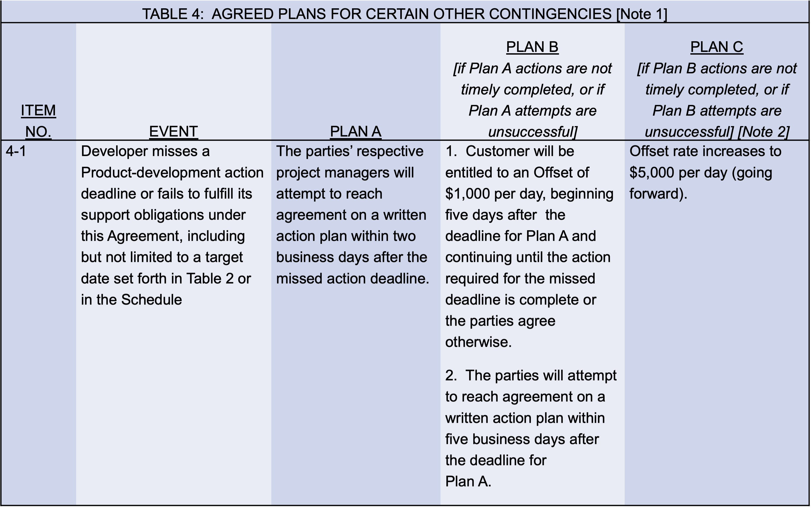
#+end_center

*** Customer cooperation
  :PROPERTIES:
  :CUSTOM_ID: serv-cust-coop
  :END:

1. This section will apply if the Vendor makes any [[#rsnbl-top][reasonable]] request for relatively-minor cooperation by Customer in connection with a statement of work. 

{{{LN}}} The Customer will provide the requested cooperation — but to be clear: the Vendor remains responsible for completing the work except as clearly agreed otherwise. 

{{{LN}}} Whether a request for cooperation is reasonable might depend in part on whether the Vendor offers to pay or reimburse the Customer for associated expenses.

***** Note                                                              :CMT:
  :PROPERTIES:
  :HTML_CONTAINER_CLASS: cmtry
  :UNNUMBERED: notoc
  :END:

In many situations the Customer might well have to do something as simple as (for example) opening a locked gate to allow the Vendor's personnel to come onto the Customer's premises.

*** Time {{{v(not)}}} "of the essence" (usually)
  :PROPERTIES:
  :CUSTOM_ID: serv-time-ess
  :END:

1. This section will apply if the Vendor misses a deadline or other target date set forth in an agreed statement of work.

2. The Vendor's missing of such a target date is a breach of the Vendor's obligations under the statement of work, but the breach is not necessarily a "material" breach — that is, time is /not/ "of the essence" for that deadline — unless the statement of work clearly says so. 

***** Note                                                              :CMT:
  :PROPERTIES:
  :HTML_CONTAINER_CLASS: cmtry
  :UNNUMBERED: notoc
  :END:

Concerning "material breach," see generally the definition at {{{RR}}} [[#r-termin-breach]].

** Services: Termination {{{CLS}}}                                      :CLS:
  :PROPERTIES:
  :CUSTOM_ID: r-serv-termin-proto
  :HTML_CONTAINER_CLASS: pr-top
  :END:

#+begin_comment
Cabinet subcontractor fired — unsuccessfully sues homeowners and general contractor for using copyrighted drawings. Arbitrator says "fair use and no infringement,"; courts don't overturn.
[[https://cases.justia.com/federal/appellate-courts/ca4/24-1860/24-1860-2025-12-05.pdf][Design Gaps, Inc. v. Distinctive Design & Constr. LLC]], No. 24-1860 (4th Cir. 2025)

#+end_comment

When a statement of work is terminated, it's not unlikely that the Customer is "pulling the plug" — typically because of dissatisfaction with the Vendor's work — and might still want the project to be finished, but by another provider. When that's the case: \bull the Customer will want the Vendor to be explicitly obligated to turn over all undelivered deliverables and work-in-progress; *but* \bull the Vendor won't want the Customer to try to obtain concessions by inappropriately withholding final payments. 

Contents:

#+TOC: headlines 1 local

*** Precedence of {{{ths}}}
  :PROPERTIES:
  :CUSTOM_ID: serv-termin-appl
  :END:

When {{{ths}}} is included in {{{theK}}}, it will apply any time that a statement of work ("SOW") expires or is otherwise terminated *except* to the extent (if any) that the parties specifically agree otherwise — in a signed writing — either:

   1. in the SOW — but the SOW must explicitly override {{{ths}}} /by name/ (not merely via a general statement of precedence); or

   2. at substantially the time of termination.

***** Note                                                              :CMT:
  :PROPERTIES:
  :HTML_CONTAINER_CLASS: cmtry
  :UNNUMBERED: notoc
  :END:

Subdivision 1 addresses the situation where the customer's SOW form says, in effect, "this SOW will control no matter what the vendor's contract form says."

*** Prompt final Vendor deliveries
  :PROPERTIES:
  :CUSTOM_ID: serv-term-final-deliv
  :END:

In addition to anything else specified in the SOW, the Vendor will promptly deliver the following to the Customer (or to the Customer's designee):

  1.  all completed deliverables and work-in-progress that are called for by that SOW — those, however, remain subject to any agreed restrictions on providing them to competitors of the Vendor;

  2.  any materials (e.g., equipment) that were provided or paid for by (or on behalf of) the Customer for use in connection with that SOW;

  3.  any Customer-owned data that was provided by or on behalf of the Customer; 

  4.  any Customer-owned data that was generated by or on behalf of the Vendor in connection with that BSOW; and

  5.  one or more final invoices for the SOW.
 
***** Note                                                              :CMT:
  :PROPERTIES:
  :HTML_CONTAINER_CLASS: cmtry
  :UNNUMBERED: notoc
  :END:

This can function as a sort of post-termination checklist for the Vendor (and Customer).

*** Prompt Vendor removal of its property
  :PROPERTIES:
  :CUSTOM_ID: ServTermProp
  :END:

In addition to anything else specified in the SOW, the Customer:

1. will allow the Vendor to remove, from Customer-controlled premises, any Vendor-furnished tangible property (e.g., equipment, raw materials), *except* to the extent that the SOW explicitly contemplated that particular property would be left behind; and 

2. will not interfere with such attempts by the Vendor to remove Vendor property from premises controlled by third parties — such interference could include, for example, declining to approve removal if a third party checks with the Customer about it.

***** Note                                                              :CMT:
  :PROPERTIES:
  :HTML_CONTAINER_CLASS: cmtry
  :UNNUMBERED: notoc
  :END:

Customers have been known to lock Vendors out of Customer premises and, in effect, use Vendor property as a hostage for leverage in bargaining.

*** Prompt final payments
  :PROPERTIES:
  :CUSTOM_ID: ServTermPmt
  :END:

1. The Customer will pay any final amounts due in accordance with the agreed payment terms *to the extent* not inconsistent with any payment prerequisites in the SOW. 

2. In case the question comes up: Customer's payment obligations under subdivision 1 above include, without limitation, the following payment obligations to the extent applicable: 

   a. paying amounts due under all then-pending Vendor invoices; and 

   b. paying amounts due under the Vendor's subsequent final invoice(s), if any, for previously unbilled services and (if applicable) reimbursable expenses.

***** Note                                                              :CMT:
  :PROPERTIES:
  :HTML_CONTAINER_CLASS: cmtry
  :UNNUMBERED: notoc
  :END:

Hypothetical example: Suppose that —

- the SOW says that the Customer will pay Amount A after a particular Milestone M is achieved; and

- Milestone M hasn't happened when the SOW is terminated (or expires). 

In that situation, the Customer is free not to pay Amount A

*** General cooperation in wrapping up

Each party will provide [[#r-comm-rsnbl][commercially-reasonable]] cooperation with the other party in completing the wrap-up of the SOW.

*** Services: SOW Termination for Material Breach [MOVE]
  :PROPERTIES:
  :CUSTOM_ID: serv-term-breach
  :END:

1. {{{v(Either party)}}} may terminate a statement of work for an uncured material breach by the other party in accordance with {{{RR}}} [[#r-termin-breach]]. 

2. Unless clearly agreed otherwise, the right to terminate  of a statement of work for material breach is in addition to any other recourse available to the terminating party under {{{thek}}}, the SOW, or the law — but subject to any agreed limitations of liability. 

***** Note                                                              :CMT:
  :PROPERTIES:
  :HTML_CONTAINER_CLASS: cmtry
  :UNNUMBERED: notoc
  :END:

{{{HN}}} Possible override language: See {{{OPTIN}}} [[#serv-no-susp]] (no suspension of services), which the Customer might want if the Vendor is providing mission-critical services for the Customer's business.

{{{HN}}} Subdivision 2 is a guardrail against a Vendor's trying to argue to the contrary.

** Services: Confidentiality [FIX]                                      :CLS:
  :PROPERTIES:
  :CUSTOM_ID: serv-confid
  :HTML_CONTAINER_CLASS: pr-top
  :END:

Contents:

#+TOC: headlines 1 local

*** No Confidentiality Obligations
  :PROPERTIES:
  :CUSTOM_ID: serv-no-conf
  :HTML_CONTAINER_CLASS: optn-txt
  :END:

For the avoidance of doubt: Neither party has any confidentiality obligations relating to the services unless clearly stated in {{{thek}}}, the BSOW, and/or the applicable law.  

***** Note                                                              :CMT:
  :PROPERTIES:
  :HTML_CONTAINER_CLASS: cmtry
  :UNNUMBERED: notoc
  :END:

 This is likely to be overkill for many services agreements.

*** {{{OPT}}}: Confidentiality Obligations
  :PROPERTIES:
  :CUSTOM_ID: serv-conf-each
  :HTML_CONTAINER_CLASS: optn-txt
  :END:

When this Option is agreed to, {{{v(each party)}}} must preserve in confidence the confidential information of the other party in accordance with {{{RR}}} [[#r-conf-info-proto]].

*** {{{OPT}}}: Post-Termination Confidentiality Obligations
  :PROPERTIES:
  :CUSTOM_ID: serv-conf-each-post
  :HTML_CONTAINER_CLASS: optn-txt
  :END:

In case of doubt: Upon any termination or expiration of a statement of work, {{{v(each party)}}} will continue to honor any agreed confidentiality obligations. 

***** Note                                                              :CMT:
  :PROPERTIES:
  :HTML_CONTAINER_CLASS: cmtry
  :UNNUMBERED: notoc
  :END:

This is a comfort clause sometimes wanted by parties that expect to disclose confidential information.

*** {{{OPT}}}: Expiration as a Form of Termination
  :PROPERTIES:
  :CUSTOM_ID: serv-expir-termin
  :HTML_CONTAINER_CLASS: optn-txt
  :END:

For purposes of post-termination obligations, expiration of a statement of work will be considered a form of termination. 

***** Note                                                              :CMT:
  :PROPERTIES:
  :HTML_CONTAINER_CLASS: cmtry
  :UNNUMBERED: notoc
  :END:

See also § [[#expiration-as-termination]] (expiration counts as a type of termination).

** Services: Substantial Completion Definition
  :PROPERTIES:
  :CUSTOM_ID: r-subst-compl
  :HTML_CONTAINER_CLASS: pr-top
  :END:

*** Definition
  :PROPERTIES:
  :CUSTOM_ID: nl-subst-compl-defn
  :END:

1. {{{Ths-cap}}} applies in connection with a statement of work for services (see {{{TC(r-serv-proto)}}}).

2. The term /substantial completion/ has the meaning stated in the Code of Federal Regulations ("CFR") at [[https://www.law.cornell.edu/cfr/text/48/552.211-70][48 C.F.R. § 552.211-70]](a)(2) and (a)(3), as in effect at the time that {{{thek}}} or the relevant statement of work is agreed to.  

3. In that CFR definition of /substantial completion/, the term "Government" is to be read as referring to Customer, and "Contractor" as referring to the Vendor

***** Note                                                              :CMT:
  :PROPERTIES:
  :HTML_CONTAINER_CLASS: cmtry
  :UNNUMBERED: notoc
  :END:

{{{H1}}} Subdivision 2: The cited Code of Federal Regulations definition states: 

#+begin_quote

(2) There may be different completion dates required for different phases or portions of the work, as established in the contract. 

However, the work shall be deemed 'substantially complete' *if and only if* the Contractor has completed the work and related contract obligations[:] 

- in accordance with the contract documents,

- such that the Government may enjoy the intended access, occupancy, possession, and use of the entire work[,]

- without impairment due to incomplete or deficient work, and

- without interference from the Contractor's completion of remaining work or correction of deficiencies in completed work.

(3) In no event shall the work be deemed 'substantially complete' if all fire and life safety systems are not tested and accepted by the authority having jurisdiction, where such acceptance is required under the contract." 
#+end_quote

(Emphasis and bullets added.) 

{{{HN}}} For a more-detailed discussion, see generally Alex Benarroche, [[https://www.levelset.com/blog/substantial-completion/][Substantial Completion in Construction: Why It Matters]] (2020).

** Services: Workmanlike {{{D}}}                                        :CLS:
  :PROPERTIES:
  :CUSTOM_ID: r-wkmn-defn
  :HTML_CONTAINER_CLASS: pr-top
  :CATEGORY: Definition
  :END:

*** Pragmatic meaning
  :PROPERTIES:
  :CUSTOM_ID: wkmn-prag
  :END:

1. The term {{{DEFN-C(workmanlike)}}} whether or not capitalized, refers to work that successful practitioners would judge as competent, skilled, and indicating proficiency, but not necessarily innovative, exceptional, or outstanding. 

2. The term "good and workmanlike" has the same meaning.

***** Note                                                              :CMT:
  :PROPERTIES:
  :HTML_CONTAINER_CLASS: cmtry
  :UNNUMBERED: notoc
  :END:

{{{H1}}} This definition looks to the real world of /successful/ practice in the field in question to serve as a yardstick (or [[https://www.nist.gov/image/meter-bar-27][meter stick]]).

{{{HN}}} The term "proficient" could be thought of as "competent and skilled but not necessarily innovative or outstanding."  

- [[Https://dictionary.cambridge.org/us/dictionary/english/proficient][An online dictionary]] published by from Cambridge University Press, defines /proficient/ as "skilled and experienced" (dictionary.cambridge.org).

- [[https://www.dictionary.com/browse/proficient][From dictionary.com]]: /Proficient/ means "well-advanced or competent in any art, science, or subject; skilled" (dictionary.com). 

- [[https://www.merriam-webster.com/dictionary/proficient][Merriam-Webster]] goes further, however, defining /proficent/ as "able to do something to a higher than average standard : SKILLED" (merriam-webster.com). 

*** {{{ADDL}}}                                                         :ADDL:
:PROPERTIES:
:CUSTOM_ID: wkmn-defn-a
:HTML_CONTAINER_CLASS: addl
  :END:

**** The business context

Some services agreements require the service provider to ensure that the agreed work is performed in a "workmanlike manner" or "good and workmanlike manner." To many readers, however, those terms might be unknown or at best only vaguely familiar. And in a contract-related lawsuit, it could be important for the term to have as precise a definition as practicable.

**** Language origin                                                    :CMT:

 {{{THS-D-CAP}}} is adapted from one announced by the Supreme Court of Texas in /Melody Home Manufacturing/ (1987): "We define good and workmanlike as that quality of work [i] performed by one who has the knowledge, training, or experience necessary for the successful practice of a trade or occupation and [ii] performed in a manner generally considered proficient by those capable of judging such work." <cite> [[https://scholar.google.com/scholar_case?case=17126687559521918562][Melody Home Mfg. Co. v. Barnes]], 741 S.W.2d 349, 354 (Tex. 1987) (cleaned up), /quoted in/ [[https://scholar.google.com/scholar_case?case=14340081563851737749][Ewing Constr. Co. v. Amerisure Ins. Co.]], 420 S.W.3d 30, 37 (Tex. 2014) (responding to certified question from Fifth Circuit). </cite>

**** Similar: "Good Industry Practices"
  :PROPERTIES:
  :CUSTOM_ID: good-indus-prac
  :END:

The LawInsider.com site has a [[https://www.lawinsider.com/dictionary/good-industry-practices][collection of definitions of Good Industry Practice]]:

[[https://www.woodside.com/docs/default-source/suppliers-documents/purchase-order---australia---browse-and-scarborough-_effective-nov-2024.pdf#page=2][Here's one]] (slightly reformatted):

#+begin_quote

*Good Industry Practices* means[:]

- the practices that would be adopted by,
- and the exercise of that degree of care, skill, diligence, prudence and foresight
- that reasonably would be expected from,
- a competent contractor in the international oil and gas industry
- experienced in performing work
  - similar in nature, size, scope and complexity to the Work
  - and under conditions comparable to those applicable to the Work,
- where such work is subject to,
  - and such contractor is seeking to comply with,
  - the standards and codes specified in the Contract
  - or (to the extent that they are not so specified) such national or international standards and codes as are most applicable in the circumstances,
  - and the applicable Law.
#+end_quote

**** Would /summary/ judgment be available?
  :PROPERTIES:
  :CUSTOM_ID: wkmn-sj
  :END:

Any given dispute about whether work was performed to a workmanlike standard might require costly proceedings — for example, expert testimony, with written expert reports and perhaps depositions — about some or all of the following issues:

\bull  /What/ is the relevant trade or occupation? 

\bull  What constitutes "successful" practice of that trade or occupation?

\bull  Just how much knowledge, training, or experience is required for successful practice?

\bull  What kind of work regarded as "proficient" by people who have those qualifications? <cite> See generally [[https://www.law.cornell.edu/rules/fre/rule_702][Fed. R. Evid. 702]] (opinion testimony from expert witnesses). </cite>

This means that if the parties' respective experts had not-unreasonable disagreements about any of the above questions — highly likely — then a /summary/ judgment, based on /undisputed/ material facts, would likely be unavailable, and a trial, possibly to a jury would be necessary. <cite> See, e.g., [[https://www.law.cornell.edu/rules/frcp/rule_56][Fed. R. Civ. P. 56]] (summary judgment). </cite>

**** Pro tip: Adding specific, /measurable/ metrics can help -- a lot
  :PROPERTIES:
  :CUSTOM_ID: wkmn-metr
  :END:

So: Contract drafters having an eye to possible future disputes would be well-advised to include a /reasonable/ set of /measurable/ metrics, the accomplishment of which would (ideally) not be subject to dispute. Example: The painting contractor either did, or did not, put down two coats of [[https://www.pantone.com/articles/color-of-the-year/color-of-the-year-2021][Pantone 17-5104 Ultimate Gray]] paint and clean up all spills.

*Caution:* It's possible to get overly-specific and thus delay negotiation — or worse, to be overly-specific about things that the parties aren't quite sure of just yet and thus might have to spend time changing later.

** {{{OPT}}}: Customer Further Development of Deliverables
  :PROPERTIES:
  :CUSTOM_ID: serv-deliv-custm-devel
  :HTML_CONTAINER_CLASS: optn-txt
  :END:

1. If this {{{OPT}}} is included in {{{theK}}}, it will apply {{{v(whenever)}}} the Vendor will be furnishing one or more deliverables to the Customer.

2. The Vendor will not assert any intellectual-property right in an attempt to prevent the Customer from doing any of the following when the Customer does so in accordance with {{{thek}}}:

   a. modifying or otherwise continuing development of any deliverable; and/or

   b. having the same done by others on behalf of the Customer. 

3. But: Whether the Vendor is required to provide support for its deliverable, after someone else has modified it, is up to the Vendor's sole [[#discr-defn][discretion]]. 

4. The Customer will see it that any deliverable-related modification- or development activity under {{{THS-O}}}, by the Customer or on the Customer's behalf, does not violate:

   a. applicable law such as (without limitation) export-controls laws; 

   b. any /unrelated/ rights assertable by the Vendor such as (without limitation), intellectual-property rights, if any;

   c. any applicable third-party rights, e.g., patent rights or copyrights; nor

   d. any additional restrictions unambiguously agreed to in writing.
    
***** Note                                                              :CMT:
  :PROPERTIES:
  :HTML_CONTAINER_CLASS: cmtry
  :UNNUMBERED: notoc
  :END:

{{{H1}}} Subdivision 2: If the Customer hires the Vendor to build something, the Customer generally won't want to be forever locked into using the same Vendor to improve- or build on it. *But:* The /Customer's/ further development might violate the Vendor's intellectual-property rights, e.g., if building on the Vendor's work product constitutes creating a "derivative work" of a copyrighted work of authorship created by the Vendor. 

{{{HN}}} Subdivision 2  does /not/ state that the Customer's further development is "authorized," because further development might be affected by other restrictions, e.g., third-party IP rights and/or government regulation. (See the commentary at [[#r-consent-rule]].)

{{{HN}}} Subdivision 3 addresses the (likely) Vendor concerns that: 

1. the Vendor doesn't want to take responsibility for fixing other developers' screw-ups;
2. the Vendor might prefer that /it/ be paid for futher development; and
3. the Vendor likely wouldn't want its trade secrets and other confidential information revealed to possible competitors.

** {{{OPT}}}: Customer Ownership of IP
  :PROPERTIES:
  :CUSTOM_ID: serv-cust-own-ip
  :HTML_CONTAINER_CLASS: optn-txt
  :END:

1. If this {{{OPTIN}}} is agreed to in writing, *then:* [[#as-between-cmt][As between]] the Customer and the Vendor, it is the Customer, not the Vendor, that will own the intellectual-property rights, if any, in and to any deliverables that are created:

   - in the performance of the Vendor's obligations under a statement of work,

   - by one or more employees of the Vendor (and/or of the Vendor's subcontractors, if any). 

2. The Vendor will {{{XREF-DEFN(timely,timely-defn)}}} disclose to the Customer all technology and other intellectual property to be owned by the Customer under the statement of work; each such disclosure is to be:

   a. in writing, and

   b. in as much detail as the Customer reasonably requests, 

   so that the Customer becomes aware that it is entitled to ownership of specific Vendor work product and determine what if any legal protection might be available. 

3. If so requested by the Customer, the parties {{{ARETO}}} follow {{{RR}}} [[#r-ip-own-proto]] to help establish, confirm, and/or register the Customer's ownership claim(s) under {{{ths}}}.

{{{U1}}} Concerning IP ownership resulting from the services (and its economics), see generally [[#serv-own-ip]].

{{{UN}}} Subdivision 2 addresses the fact that it's not entirely unheard of for a Vendor employee or contractor: \bull to have an idea for an innovation; \bull to be required, by contract or by law, to assign the idea to the employer or Customer; *but* \bull to withhold the idea anyway, in the hope of developing and commercializing it. </aside>

** {{{OPT}}}: Customer Scope-Reduction Right
  :PROPERTIES:
  :CUSTOM_ID: serv-reassign
  :HTML_CONTAINER_CLASS: optn-txt
  :END:

{{{L1}}}If this {{{OPTIN}}} is agreed to, *then:* The Customer has the right, in its [[#discr-defn][sole discretion]], to reduce the extent of the work required under any statement of work (sometimes referred to as "de-scoping" of the work). 

{{{LN}}} In case of doubt: The Customer's de-scoping right extends, without limitation, to reassigning work to a service provider other than the Vendor, for any reason or no reason. 

{{{LN}}} For any work item being de-scoped by the Customer under {{{ths}}}:

   1. If the statement of work sets out itemized compensation for that work item, then the Vendor's compensation will be reduced by that itemized amount.

   2. Otherwise, the Vendor's compensation will be reduced equitably, with any persistent disagreements being addressed by (non-binding) escalation to a neutral advisor in accordance with {{{RR}}} [[#r-escal-ext]]. 

***** Note                                                              :CMT:
  :PROPERTIES:
  :HTML_CONTAINER_CLASS: cmtry
  :UNNUMBERED: notoc
  :END:

{{{H1}}} Construction contracts sometimes address whether the owner, or the prime contractor, can remove contracted work from a contractor or subcontractor and either reassign the work to another party or simply do the work itself. <cite> See Julian Bailey, Michael Turrini, and Mark Sanders, [[https://www.whitecase.com/publications/alert/descoping-works-what-employer-entitled-do][Descoping of works: what is the employer entitled to do?]] (WhiteCase.com 2017), archived at https://perma.cc/29BS-C9G6. See generally, e.g., Frederic Akiki and Julian Bailey, [[https://www.jdsupra.com/legalnews/descoping-can-the-omission-of-works-43582][Descoping: Can the omission of works constitute a breach of contract?]] (JDSupra 2020). </cite>

{{{HN}}} This {{{OPT}}} follows the guideline, "If you can't agree in advance about /outcome/, then try to agree about /process/," in this case the process being escalation.

{{{HN}}} Appendix: See the Honeywell change-order language reproduced at [[#serv-honb-chg]] for an example of Customer-drafted terms that give the Customer considerable authority to impose change orders on the Vendor. 
    
** {{{OPT}}}: Customer Termination at Will
  :PROPERTIES:
  :CUSTOM_ID: serv-r-termin-at-will-customer
  :HTML_CONTAINER_CLASS: optn-txt
  :END:

1. If this {{{OPTIN}}} is agreed to in writing, *then:* /The Customer/ may terminate a statement of work at will — that is, in the Customer's sole and unfettered discretion — effective immediately upon written notice to the Vendor.

2. If the Customer does terminate a statement of work at will, then:

   a. the Customer will be conclusively deemed to have complied with any applicable standard of reasonableness or good faith; and

   b. each party will comply with {{{RR}}} [[#r-serv-termin-proto]] (services termination general provisions).

3. In case of doubt, {{{THS-O}}} neither authorizes nor prohibits termination of a statement of work at will by /the Vendor/.

4. If used in a termination provision in {{{theK}}} or a statement of work, the term "for convenience" has the same meaning as "at will."

***** Note                                                              :CMT:
  :PROPERTIES:
  :HTML_CONTAINER_CLASS: cmtry
  :UNNUMBERED: notoc
  :END:

{{{H1}}} *Caution:* Sometimes, a services /Customer/ will want the right to terminate a statement of work "at will" or "for convenience." For many situations, that might be entirely sensible — but it could cause problems for the Vendor in the form of unrecoverable costs (past and/or future), as discussed at [[#serv-tow-cust-c]]. 

{{{HN}}} The Customer probably won't want the /Vendor/ to have the right to terminate at will, because that could leave the Customer in the lurch in an emergency or other important situation. {{{RWE}}} In November 2025, financial giant Fidelity Investments sued Broadcom — the parties later [[https://www.reuters.com/sustainability/boards-policy-regulation/fidelity-settles-lawsuit-over-access-business-critical-broadcom-software-2026-01-23/][settled the case]] — for "threatening to cut ​off /[Fidelity's]/ access to /[Broadcom]/ software that had become central to ‌the financial firm's systems, creating a risk of outages and trading disruptions."

** {{{OPT}}}: Withholding of Post-Termination Payments
  :PROPERTIES:
  :CUSTOM_ID: serv-opt-whold-pmt
  :HTML_CONTAINER_CLASS: optn-txt
  :END:

If this {{{OPTIN}}} is agreed to, *then:* Upon termination of a statement of work, the Customer need not pay the Vendor's final invoice(s) for then-unbilled services, if any, until the Vendor has complied with its applicable post-termination obligations for that statement of work, if any. 

***** Note                                                              :CMT:
  :PROPERTIES:
  :HTML_CONTAINER_CLASS: cmtry
  :UNNUMBERED: notoc
  :END:

Some customers might want {{{ths}}} to give them more leverage in a termination situation. </aside>

** {{{OPT}}}: Customer's Additional Permit Responsibilities
  :PROPERTIES:
  :CUSTOM_ID: serv-cust-perm-addl
  :HTML_CONTAINER_CLASS: optn-txt
  :END:

If this {{{OPTIN}}} is agreed to, *then:* The Customer must obtain the following "specialty" authorizations for the services: [LIST]. 

***** Note                                                              :CMT:
  :PROPERTIES:
  :HTML_CONTAINER_CLASS: cmtry
  :UNNUMBERED: notoc
  :END:

Some types of work might need specialty permits or licenses — as a made-up example, suppose that: \bull the Vendor is to paint a room, but \bull the room is part of the intensive-care unit at a hospital, and \bull in the particular jurisdiction, that type of painting work requires a special authorization from health authorities. (Again, this is just a made-up example.) In that situation, the parties might want to negotiate /who/ should obtain those particular permits and licenses. <cite> Additional reading: Benjamin Criswell and Tim McMahan, [[https://www.jdsupra.com/legalnews/drafting-real-estate-documents-with-5438813/][Drafting Real Estate Documents With Project Permitting in Mind]] (JDSupra.com 2024). </cite>

** {{{OPT}}}: Final-Payment Adjustment for Material Breach
  :PROPERTIES:
  :CUSTOM_ID: serv-opt-pmt-adj
  :HTML_CONTAINER_CLASS: optn-txt
  :END:

1. This {{{OPT}}} will apply if the Customer terminates a statement of work for {{{XREF-DEFN(material breach,matl-br-stip)}}} by the Vendor.

2. The Customer's final payment obligation will be appropriately adjusted, based on the circumstances.

3. The parties will address any disagreement about such an adjustment by escalation as stated at {{{RR}}} [[#r-escal-ext]]. 

***** Note                                                              :CMT:
  :PROPERTIES:
  :HTML_CONTAINER_CLASS: cmtry
  :UNNUMBERED: notoc
  :END:

It's not uncommon for services projects to end badly, with customers demanding "adjustment" to the money paid and/or owed; for examples, see the commentary at {{{RR}}} [[#serv-disp-mgmt]].

** {{{OPT}}}: No Charge for Deliverables Use
  :PROPERTIES:
  :CUSTOM_ID: serv-deliv-use-no-chg
  :HTML_CONTAINER_CLASS: optn-txt
  :END:

If this {{{OPTIN}}} is agreed to, the Vendor will not ask for payment from the Customer for the Customer's use of a deliverable resulting from services under {{{thek}}}. 

***** Note                                                              :CMT:
  :PROPERTIES:
  :HTML_CONTAINER_CLASS: cmtry
  :UNNUMBERED: notoc
  :END:

 If the Customer is a "nervous Nellie," the Customer might want language like the above, so as to be /absolutely certain/ that the Vendor wouldn't try to charge the Customer more than agreed.
  

** {{{OPT}}}: No Deliverables Use by Others
  :PROPERTIES:
  :CUSTOM_ID: serv-use-deliv-oth
  :HTML_CONTAINER_CLASS: optn-txt
  :END:

If this {{{OPTIN}}} is agreed to, *then:* The Customer will not allow others (including without limitation the Customer's other contractors) to use deliverables provided by or on behalf of the Vendor under a statement of work — not even if such use by others is for the Customer's own business purposes.

***** Note                                                              :CMT:
  :PROPERTIES:
  :HTML_CONTAINER_CLASS: cmtry
  :UNNUMBERED: notoc
  :END:

In one type of services project, the Vendor is a software developer, where the Vendor creates a custom version of the Vendor's own software package for a particular Customer, and the /Vendor/ retains the ownership rights in the custom version. In such a situation, the Vendor might well want to preclude the Customer from allowing third parties to use the software, for economic reasons and/or to preserve the Vendor's trade-secret rights in the software.
 
** {{{OPT}}}: No Vendor Withholding of Services
  :PROPERTIES:
  :CUSTOM_ID: serv-no-susp
  :HTML_CONTAINER_CLASS: optn-txt olnum
  :END:

If this {{{OPTIN}}} is agreed to, *then:* 

1. The Vendor [[#r-ack-defn][acknowleges]] the importance to the Customer of timely uninterrupted services under {{{thek}}}. 

2. The Vendor does not not suspend providing those services — even for nonpayment or other material breach by the Customer — without giving the Customer at least {{{v(ten business days')}}} prior written notice in accordance with {{{RR}}} [[#r-notices-rule]]. 

***** Note                                                              :CMT:
  :PROPERTIES:
  :HTML_CONTAINER_CLASS: cmtry
  :UNNUMBERED: notoc
  :END:

{{{H1}}} Subdivision 1: The prefatory "importance" language is included to educate and persuade future readers — such as party executives and, possibly, judges and jurors — about the Customer's concern. Such language can be very helpful for that situation, as noted in the Tenth Circuit's 2016 /SOLIDFX v. Jeppesen Sanderson Inc./ case discussed at [[#lim-liab-matl]].

{{{HN}}} Sean Hogle [[https://www.redline.net/queries/checklist-must-have-provisions-getting-paid][suggests]] that if a customer insists on including a continuation-of-services provision along these lines, the vendor should try to include time limits "so that the vendor is not stuck indefinitely providing goods or services for free."

{{{HN}}} {{{RWE}}} In November 2025, financial giant Fidelity Investments sued Broadcom — the parties later [[https://www.reuters.com/sustainability/boards-policy-regulation/fidelity-settles-lawsuit-over-access-business-critical-broadcom-software-2026-01-23/][settled the case]] — for "threatening to cut ​off /[Fidelity's]/ access to /[Broadcom]/ software that had become central to ‌the financial firm's systems, creating a risk of outages and trading disruptions."

** {{{OPT}}}: Customer-Requested Personnel Changes
  :PROPERTIES:
  :CUSTOM_ID: serv-pers-repl
  :HTML_CONTAINER_CLASS: optn-txt
  :END:

1. If this {{{OPTIN}}} is agreed to, *then:* Except as provided in subdivision 2: Whenever the Customer reasonably requests it, the Vendor will remove and replace any individual under the Vendor's control from performing services under {{{thek}}}. 

2. The Vendor need not do so if the removal would be unlawful in the United States and/or at the relevant location (e.g., unlawfully-discriminatory or -retaliatory reasons). 

3. Apart from the good-cause exception in subdivision 4 below, the Vendor may bill the Customer for  all time and out-of-pocket expenses needed to bring a replacement up to speed when an individual is removed at the Customer's request under {{{THS-O}}}, at the regular agreed rate or rates specified in the relevant statement of work.

4. /Exception:/ The Vendor will not bill for such time or expenses if the Customer's removal request was for good cause; if the parties disagree about whether good cause exists, *then:* The parties will address the disagreement by escalation as stated at [[#r-escal-ext]]. 

5. If any such removed individual complains — or sues the Vendor, in any forum, alleging — that the removal was unlawful, *then:*

   a. The Customer will {{{protect(the Vendor)}}} against the claim; and

   b. The Customer will not assert that, by complying with the Customer's removal request, the Vendor (i) agreed that the removal was lawful, nor (ii) waived the Customer's defense- and indemnity obligations under {{{ths}}}.

***** Note                                                              :CMT:
  :PROPERTIES:
  :HTML_CONTAINER_CLASS: cmtry
  :UNNUMBERED: notoc
  :END:

{{{H1}}} Customers' service-agreement forms often include language giving the Customer the right to demand that the service provider kick someone off a project.

{{{HN}}} Subdivision 2 -- *caution:* It's not unheard-of for a bad-actor Customer representative to demand that a Vendor-employee be kicked off a project, for example — \bull because the Customer representative was biased against people of the Vendor-employee's race, ethnicity, etc.; or \bull to retaliate against the Vendor-employee for rebuffing sexual advances.

{{{HN}}} Subdivision 4: Whether "good cause" exists is sometimes disputed. <cite> {{{RWE}}} A contractor's repeated safety violations led the customer to ask that the contractor's site manager be replaced. The contractor did replace its site manager, but the customer eventually terminated the contract because of the safety problems and successfully sued the contractor for damages. <cite> See [[https://scholar.google.com/scholar_case?case=11478440640996054979][James Constr. Gp. v. Westlake Chem. Corp.]], 594 S.W.3d 722, 749 (Tex. App.—Houston [14th Dist.] 2019) (affirming judgment on jury verdict awarding damages to customer in suit against contractor), /aff'd in pertinent part/, [[https://scholar.google.com/scholar_case?case=8074215351891178149#p415][650 S.W.3d 392, 415]] (Tex. 2022). </cite>

** {{{OPT}}}: Stipulated Vendor Material Breaches
  :PROPERTIES:
  :CUSTOM_ID: serv-breach-prov
  :HTML_CONTAINER_CLASS: optn-txt
  :END:

1. If this {{{OPTIN}}} is agreed to, *then:* Any of the following breaches by the Vendor — if proved — would be "material" for purposes of {{{thek}}}: 

   a. The Vendor does not timely /start/ to perform the services, *if*: (i) the parties have clearly agreed in writing that a specific start time is important, *and* (ii) the Customer terminates the statement of work before the Vendor does start performance.

   b. The Vendor clearly and permanently abandons performance.

   c. The Vendor temporarily suspends performance, if {{{thek}}} or the statement of work prohibits suspension.

   d. The Vendor does not timely /complete/ the services, in compliance with the standards set forth in {{{thek}}} and/or the statement of work, *if* the parties have clearly agreed in writing that timeliness of completion is important.

2. For the avoidance of doubt, {{{THS-O}}} does not rule out the possibility that other types of breach by the Vendor might also be material.

***** Note                                                              :CMT:
  :PROPERTIES:
  :HTML_CONTAINER_CLASS: cmtry
  :UNNUMBERED: notoc
  :END:

As discussed in more detail at section [[#matl-br-stip]], courts generally go along with contractual stipulations that particular breaches are to be considered "material." 

** {{{OPT}}}: Vendor Availability for Meetings
  :PROPERTIES:
  :CUSTOM_ID: serv-prov-avail
  :HTML_CONTAINER_CLASS: optn-txt
  :END:

1. If this {{{OPTIN}}} is agreed to, *then:* The Vendor will make itself reasonably available from time to time for meetings and phone calls concerning the services as reasonably requested by the Customer. 

2. In case of doubt: The Vendor’s participation in any such meetings will be "on the clock," that is, billable at the regular rate or rates agreed to for the services in question.

***** Note                                                              :CMT:
  :PROPERTIES:
  :HTML_CONTAINER_CLASS: cmtry
  :UNNUMBERED: notoc
  :END:

This is set up as an option, and not a rule, because the Vendor will /often/ have an /economic/ incentive to make itself available to the Customer — but that won't always be the case, because the Customer's business could be less important to the Vendor than that of the Vendor's other customers.

** {{{OPT}}}: Vendor Background Checks
  :PROPERTIES:
  :CUSTOM_ID: serv-bkgd
  :HTML_CONTAINER_CLASS: optn-txt
  :END:

1. If this {{{OPTIN}}} is agreed to, it will apply whenever, in connection with a statement of work:

   a. an individual is employed by the Vendor (and/or the Vendor's subcontractors, if applicable); *and*

   b. the invidual will have access to (i) the Customer's physical premises and/or (ii) the Customer's computer system(s).  

2. The Vendor will see to it that the individual — before gaining such access — has had a background check completed, with satisfactory results, in accordance with {{{RR}}} [[#r-bkgd-chks]].

3. To help avoid out-of-date background information, each background check under {{{THS-O}}} is to have been completed no earlier than {{{v(two years)}}} before the latest date on which the relevant statement of work was agreed to by all parties. 

***** Note                                                              :CMT:
  :PROPERTIES:
  :HTML_CONTAINER_CLASS: cmtry
  :UNNUMBERED: notoc
  :END:

{{{H1}}} In potentially-sensitive situations like this, the Customer might want to require background checks on the relevant Vendor personnel. (See also the background-checks protocol at {{{RR}}} [[#r-bkgd-chks]] and its commentary.) 

{{{HN}}} Subdivision 3: Depending on the circumstances, this two-year time frame might be a subject for discussion by the parties. </aside>

** {{{OPT}}}: Vendor Confidentiality Obligations
  :PROPERTIES:
  :CUSTOM_ID: serv-prov-conf-opt
  :HTML_CONTAINER_CLASS: optn-txt
  :END:

If this {{{OPTIN}}} is agreed to: The Vendor will preserve the Customer's confidential information in confidence in accordance with {{{RR}}} [[#r-conf-info-proto]]. 

***** Note                                                              :CMT:
  :PROPERTIES:
  :HTML_CONTAINER_CLASS: cmtry
  :UNNUMBERED: notoc
  :END:

 In some services agreements, the Vendor might gain access to: \bull confidential information of the Customer itself; \bull confidential information of the Customer's own customers; and/or \bull personal information that's legally protected under applicable privacy law.  *But:* On the other side of the coin, in some services agreements, the /Customer/ might gain access to confidential information of the /Vendor/, e.g., in the form of the Vendor's proprietary computer software or data. 

** {{{OPT}}}: Vendor Mitigation of Schedule Slips
  :PROPERTIES:
  :CUSTOM_ID: serv-slip-mitig
  :HTML_CONTAINER_CLASS: optn-txt
  :END:

1. If this {{{OPTIN}}} is agreed to, it will apply if:

   a. a statement of work clearly states that a particular milestone: (i) is material, and (ii) must be completed by a specified date; and

   b. that milestone is not completed by the specified date. 

2. The Vendor will make efforts that are reasonable under the circumstances: 

   a. to mitigate any harm resulting from the delay; and

   b. to get the work back on schedule. 

***** Note                                                              :CMT:
  :PROPERTIES:
  :HTML_CONTAINER_CLASS: cmtry
  :UNNUMBERED: notoc
  :END:

{{{H1}}} In some fields (e.g., software development), it's pretty difficult for a service provider to accurately estimate how long a project will take. That, in turn, means that schedule slips are not uncommon. It's never a bad idea for contract drafters to try to plan around this reality; consequently, drafters might want to consider language such as this option.

{{{HN}}} Subdivision 2 does /not/ require "/best/ efforts," for reasons discussed in the commentary at {{{RR}}} [[#r-best-efforts-defn]]. </aside>
     
** {{{OPT}}}: Vendor Withholding of Final Deliveries
  :PROPERTIES:
  :CUSTOM_ID: serv-prov-wh
  :HTML_CONTAINER_CLASS: optn-txt
  :END:

If the Vendor's already-sent invoices — for any statement of work — are past due when any statement of work is terminated, THEN the Vendor may delay delivery of some or all post-termination deliverables, for some or all statements of work, until all of the Vendor's past-due invoices are paid in full. 

***** Note                                                              :CMT:
  :PROPERTIES:
  :HTML_CONTAINER_CLASS: cmtry
  :UNNUMBERED: notoc
  :END:

This gives the Vendor at least a bit of ammunition with which to respond if the Customer were to decide to withhold payment as a means of increasing its termination leverage. 

* Protocols for other challenges
  :PROPERTIES:
  :CUSTOM_ID: chall-chap
  :HTML_CONTAINER_CLASS: chap
  :END:

Contents:

#+TOC: headlines 1 local

** Assurance of Performance {{{CLS}}}                                   :CLS:
  :PROPERTIES:
  :CUSTOM_ID: r-ad-asr
  :HTML_CONTAINER_CLASS: pr-top
  :END:

Contents:

#+TOC: headlines 1 local

*** Prerequisites for invoking {{{ths}}}
  :PROPERTIES:
  :CUSTOM_ID: ad-asr-appl
  :END:

If {{{A}}} to {{{theK}}} ever has reasonable grounds to doubt whether a party {{{B}}} to {{{theK}}} would meet {{{B}}}'s commitments under {{{thek}}}, *then:* {{{A}}} is free to ask {{{B}}}, in writing, for adequate assurance on that point. 

***** Note                                                              :CMT:
  :PROPERTIES:
  :HTML_CONTAINER_CLASS: cmtry
  :UNNUMBERED: notoc
  :END:

{{{H1}}} {{{Ths-cap}}} is modeled on the requirement of adequate assurance of performance, in [[https://www.law.cornell.edu/ucc/2/2-609][UCC § 2-609]], which applies by its terms to a sale of /goods/.

{{{HN}}} A comparable common-law doctrine recognized by _some_ jurisdictions — but not all: Virginia's supreme court declined to join the states recognizing a common-law right to adequate assurance; the court labeled the common-law version as "a modern innovation by the American Law Institute" in the ALI's Restatement (Second) of Contracts § 251. <cite> [[https://law.justia.com/cases/virginia/supreme-court/2025/240683.html][Under Wild Skies, Inc. v. Nat'l Rifle Ass'n]], No. 240683, slip op. at 8-9 (Va. May 29, 2025) (affirming court of appeals's holding that Virginia doesn't recognize common-law doctrine of adequate assurance) (citing cases). </cite>

*** Possible work stoppage
  :PROPERTIES:
  :CUSTOM_ID: ad-asr-susp
  :END:

1. If {{{A}}} does ask {{{B}}} for assurance as stated in § [[#ad-asr-appl]], *then:* {{{A}}} is free, at the same time, (temporarily) suspend {{{A}}}'s own performance under {{{thek}}} — *unless*, that is: 

   a. it would be commercially unreasonable for {{{A}}} to suspend its performance under the circumstances; _or_ 

   b. {{{A}}} has already gotten what it bargained for under {{{thek}}} in relevant respects.

2. If {{{A}}} suspends its own performance, *then:* {{{A}}} must promptly let {{{B}}} know that {{{A}}} is suspending its performance, /before/ {{{B}}} reasonably relies on an assumption (express or implicit) that {{{A}}} was continuing to do what {{{thek}}} required {{{A}}} to do.

***** Note                                                              :CMT:
  :PROPERTIES:
  :HTML_CONTAINER_CLASS: cmtry
  :UNNUMBERED: notoc
  :END:

{{{H1}}} As noted above, this is modeled on the requirement of adequate assurance of performance in [[https://www.law.cornell.edu/ucc/2/2-609][UCC § 2-609]].

{{{HN}}} Subdivision 1.a: Apropos of commercial reasonableness, see the discussion of commercially-reasonable /efforts/ at {{{RR}}} [[#r-comm-rsnbl]]. 

{{{HN}}} Subdivision 1.b: As a simple hypothetical example, suppose that:

- {{{thek}}} calls for Painter to paint Customer's factory interior, _and_ for Customer to indemnify Painter in respect to any injuries that Painter's employees might suffer on the job that are caused by Customer's own people or machinery;

- Customer pays Painter in full, in advance;

- But Painter hear rumors that Customer might be having financial difficulties, so Painter wonders whether Customer is "good for" its indemnity obligation.

In that situation — because Painter has already been paid in full — it's /likely/ only fair that Painter do the paint job, instead of stopping work just because someday Customer _might_ not be able to meet its indemnity obligations in a scenario that might never actually arise.

On the other hand: If the painting work would be taking place where Customer's people or machinery really could injure Painter's people, then Painter might well be justified in asking for assurance under {{{ths}}}. 

(Alternatively, since "only money" is involved for Customer's indemnity obligation, Painter might try to negotiate to have Customer buy insurance (see [[#nl-insurance-notes]]) or establish some other backup payment source (see {{{RR}}} [[#r-pmt-sec-addl]]).

*** Termination right (for limited time)
  :PROPERTIES:
  :CUSTOM_ID: ad-asr-repud
  :END:

1. This § [[#ad-asr-repud]] applies if {{{B}}} does not provide {{{A}}} with the requested reasonable assurance within a reasonable time — not to exceed {{{v(30 days)}}} — after receiving {{{A}}}'s written request for assurance. 

2. In that scenario, {{{A}}} can treat {{{B}}}'s failure as {{{B}}}'s repudiation of {{{thek}}} — in legal parlance, as {{{B}}}'s "anticipatory breach" of {{{thek}}}. 

***** Note                                                              :CMT:
  :PROPERTIES:
  :HTML_CONTAINER_CLASS: cmtry
  :UNNUMBERED: notoc
  :END:

Repudiation of a contract is a type of breach of contract, known as "anticipatory breach." <cite> See, e.g., [[https://scholar.google.com/scholar_case?case=14542945052504058964][Under Wild Skies, Inc. v. Nat'l Rifle Ass'n]], 915 S.E.2d 514, 517-19 (Va. 2025) (summarizing Virginia law).</cite>

"To prevail on an anticipatory breach claim under Texas law, a plaintiff must establish each of the following elements: (1) an absolute repudiation of the obligation; (2) a lack of a just excuse for the repudiation; and (3) damage to the non-repudiating party." <cite> [[https://cases.justia.com/federal/appellate-courts/ca5/24-20329/24-20329-2025-08-14.pdf][Penthol, L.L.C. v. Vertex Energy Operating, L.L.C.]], 149 F.4th 504, 509-10 (5th Cir. 2025) (affirming district court finding that one party's letter to another party did not constitute an /absolute/ repudiation of their contract) (cleaned up). </cite>

** Defense Against Claims Procedure {{{CLS}}}                           :CLS:
  :PROPERTIES:
  :CUSTOM_ID: r-defend-defn
  :HTML_CONTAINER_CLASS: pr-top
  :END:

(See also {{{GET-TITLE-LINK-NUM(r-indem-defn)}}}.)

Contents:

#+TOC: headlines 1 local

*** Applicability of {{{ths}}}
  :PROPERTIES:
  :CUSTOM_ID: def-appl
  :END:

{{{TRIG-IF}}}, it will govern when {{{thek}}} calls:

- for one party (the {{{dfn(Defender)}}}) to defend (equivalently, "provide a defense for")

- one or more other individuals and/or organizations (each, a {{{dfn(Named Person)}}}) that is clearly indicated, expressly or otherwise, in {{{thek}}}

- against one or more specified categories of claim by a third party.

***** Note                                                              :CMT:
  :PROPERTIES:
  :HTML_CONTAINER_CLASS: cmtry
  :UNNUMBERED: notoc
  :END:

{{{H1}}} {{{Ths-cap}}} synthesizes language often seen in contracts about how an obligated party is to conduct defense proceedings and/or settlement negotiations.

{{{HN}}} The Named Person and the categories of claim might be expressly named in {{{thek}}}, or clearly indicated there by reasonably-specific criteria.

*** Persons entitled to defense
  :PROPERTIES:
  :CUSTOM_ID: def-who
  :END:

The Defender is to provide a defense for each of the following individuals and organizations — each, a "person" — as stated in {{{ths}}}; each  is referred to (individually) as a {{{dfn(Beneficiary)}}} (sometimes as /the/ Beneficiary):

   1. the [[#def-appl][Named Person]];

   2. each [[#r-affil-defn][affiliate]]  of the Named Person, if any; and 

   3. for each person within subdivisions 1 and/or 2: Each of that person's respective employees, officers, directors, shareholders (in that capacity), general- and limited partners, members, managers, and other persons occupying comparable positions.

***** Note                                                              :CMT:
  :PROPERTIES:
  :HTML_CONTAINER_CLASS: cmtry
  :UNNUMBERED: notoc
  :END:

This list of Named Persons is fairly standard but might need to be customized for particular situations.

*** Required: A competent and diligent defense
  :PROPERTIES:
  :CUSTOM_ID: def-comp
  :END:

The Defender is to arrange (at the Defender's own expense) for each Beneficiary to be provided with a timely, competent, and diligent defense against the claim — by licensed, suitably-experienced and -reputable legal counsel — to whom the Beneficiary does not timely object for good reason.

***** Note                                                              :CMT:
  :PROPERTIES:
  :HTML_CONTAINER_CLASS: cmtry
  :UNNUMBERED: notoc
  :END:

{{{H1}}} The "timely, competent, and diligent defense" requirement simply mirrors the general legal-ethics rules for lawyers.

{{{HN}}} The "licensed, suitably-experienced and -reputable" language is vague, but it implicitly warns that, say, a traffic-ticket lawyer might not be suitable to defend against, say, a "bet the product line" warranty claim.

*** Control of the defense
  :PROPERTIES:
  :CUSTOM_ID: def-ctrl
  :END:

If the Defender advises the Beneficiary (whether explicitly or implicitly) that it will provide a defense, *then:* The Defender will have the exclusive power and exclusive authority to control the defense of the claim — albeit with some limitations as stated below — for as long as the Defender provides a defense that meets the requirements of {{{ths}}}.

***** Note                                                              :CMT:
  :PROPERTIES:
  :HTML_CONTAINER_CLASS: cmtry
  :UNNUMBERED: notoc
  :END:

{{{H1}}} If the Defender "steps up" and provides a defense, then the /Defender/ should be able to control the defense. Otherwise, the Beneficiary-hired lawyer — knowing it won't be /the Beneficiary/ that will eventually be paying the bills — might be tempted to put on a costly, overly-thorough ("gold-plated") defense that the lawyer might not have done otherwise. 

{{{RWE}}} JPMorgan Chase found itself being billed for some $60 million for the legal fees of a woman who was sentenced to seven years in prison for defrauding JPMorgan when she sold her company to the bank. As the NY Times reported: "JPMorgan said in a filing last month that Ms. Javice engaged five separate law firms, and that she and her lawyers have treated the original ruling forcing the bank to pay for her defense as a 'blank check to bill and expense whatever they please.' The stable of lawyers that she has used have also represented Elon Musk, Harvey Weinstein and Sam Bankman-Fried." <cite> Ron Lieber, [[https://www.nytimes.com/2025/11/14/business/charlie-javice-jpmorgan-legal-bills.html?unlocked_article_code=1.1U8.cdob.8xD17BBNY2QR&smid=url-share][She Took JPMorgan for $175 Million. That Doesn’t Include Her Restaurant Bills.]] (NYTimes.com Nov. 14, 2025). </cite>
 
{{{HN}}} This section doesn't require the Beneficiary to /formally tender the defense/ to the Defender. Relatedly, in /Johansen/ (1st Cir. 2024) a contract's defense provision required only "the /opportunity/ for complete control of the defense and settlement thereof by the indemnifying party[.]" <cite> [[https://scholar.google.com/scholar_case?case=17877492894918731927][Johansen v. Liberty Mutual Ins. Co.]], 118 F.4th 142, 150 (1st Cir. 2024) (affirming grant of Liberty Mutual motion for summary judgment; cleaned up, citations omitted). </cite>

*** Can the Beneficiary involve its own lawyers?
  :PROPERTIES:
  :CUSTOM_ID: def-mon
  :END:

The Beneficiary has the right to use separate counsel to monitor the defense. If the Beneficiary does so, then:

   1. the Beneficiary and the Defender are to instruct their respective counsel to provide reasonable cooperation with each other in the defense; and

   2. the Defender will not be responsible for any fees, expenses, or professional performance by the Beneficiary's counsel *except* as provided at § [[#def-ben-ctrl]] below.

***** Note                                                              :CMT:
  :PROPERTIES:
  :HTML_CONTAINER_CLASS: cmtry
  :UNNUMBERED: notoc
  :END:

{{{H1}}} In many cases where the Defender must defend the Beneficiary:

- The /Defender/ is likely to want to have its own regular legal counsel be the ones to represent the Beneficiary and run the defense.

- But the Beneficiary might reasonably want its own counsel to keep an eye on what the Defender's lawyers are doing — even though, under legal ethics in the U.S. (and probably in other jurisdictions as well), an attorney's loyalty is owed to /the client/, not to a third party that's paying the bills, so that /the Defender's/ legal counsel will be ethically obligated to be loyal to the /Beneficiary/.

{{{HN}}} A different situation would be one in which a conflict of interest exists, discussed just below at [[#def-ctrl]].

*** Could the Beneficiary take over the defense?
  :PROPERTIES:
  :CUSTOM_ID: def-ben-ctrl
  :END:

{{{L1}}}If a conflict of interest arises that precludes the Defender's counsel from representing the Beneficiary in the defense, *then:* The Beneficiary has the right to assume control of the defense.

{{{LN}}} If the Beneficiary does assume control of the defense, *then:* The Defender is to reimburse the Beneficiary for reasonable [[#r-atty-fees][attorney fees]] that the Beneficiary incurs in conducting the defense, in accordance with {{{RR}}} [[#r-exp-reimb]] (expense reimbursement).

{{{LN}}} If the Defender and the Beneficiary do not agree whether a conflict of interest exists, *then:* In the interest of standardization, that question is to be determined in accordance with New York law and legal-ethics rules.

***** Note                                                              :CMT:
  :PROPERTIES:
  :HTML_CONTAINER_CLASS: cmtry
  :UNNUMBERED: notoc
  :END:

This section is informed by a standard legal-ethics rule (in the U.S.): {{{A}}}'s lawyer usually cannot also represent {{{B}}} in the same litigation if the two parties have conflicting interests.

*** What must the Beneficiary /not/ admit?
  :PROPERTIES:
  :CUSTOM_ID: def-ben-adm
  :END:

{{{L1}}}The Beneficiary must not admit anything, nor waive any right, that is relevant to the claim, at any time that the Defender has the right to control the defense against the claim, *unless* the Defender has given its prior written consent.

{{{LN}}} The Defender is not to unreasonably withhold, delay, or condition its consent to the Beneficiary's admission of facts relevant to the claim.

***** Note                                                              :CMT:
  :PROPERTIES:
  :HTML_CONTAINER_CLASS: cmtry
  :UNNUMBERED: notoc
  :END:

{{{H1}}} Admissions and stipulations to /factual/ matters can greatly streamline litigation (and arbitration), so /factual/ admissions should be made as required. 

{{{HN}}} On the other hand, admissions as to /legal conclusions/ could seriously screw up the Defender's defense of the Beneficiary and so shouldn't be countenanced without the Defender's consent.

{{{HN}}} In {{{ths}}}, we intentionally don't address what would happen if the parties couldn't reach agreement about  about a Beneficiary request to admit or waive something. That's because the specific circumstances would likely make too big a difference to try to prescribe a rule in the abstract. 

*** Beneficiary: Cooperate in the defense
  :PROPERTIES:
  :CUSTOM_ID: defense-ben-coop
  :END:

The Beneficiary is to provide [[#rsnbl-top][reasonable]] cooperation with the Defender and the Defender's counsel in defending against the claim as follows:

   a. if, and as reasonably requested by, the Defender; 

   b. whether or not the Beneficiary asked for (or even wanted) a defense against the claim; and

   c. including but not limited to providing the Defender and/or the Defender's counsel with all reasonably-requested information.

***** Note                                                              :CMT:
  :PROPERTIES:
  :HTML_CONTAINER_CLASS: cmtry
  :UNNUMBERED: notoc
  :END:

The reasonableness qualifier here should provide some flexibility for both parties, e.g., to help protect the Beneficiary's attorney-client privilege.

*** The Defender might have to pick up the Beneficiary's attorney fees
  :PROPERTIES:
  :CUSTOM_ID: def-mon-no-def
  :END:

The Defender is to pay (or reimburse) all reasonable [[#atty-fee-defn][attorney fees]] incurred by the Beneficiary:

1. in defending against the claim at any time that the Defender does not provide a defense, and/or
2. in enforcing, against the Defender, the Beneficiary's right to a defense,

*except* to the extent (if any) stated otherwise in {{{ths}}} or elsewhere in {{{theK}}}.

***** Note                                                              :CMT:
  :PROPERTIES:
  :HTML_CONTAINER_CLASS: cmtry
  :UNNUMBERED: notoc
  :END:

The Beneficiary will likely incur attorney fees in defending against the claim if the Defender balks at providing a defense (or simply drags its feet). The Beneficiary will also likely incur attorney fees if the Beneficiary has to take legal action against the Defender for failing to provide a defense. In that situation, the Beneficiary should be able to expect to be made whole by the Defender. <cite> This is based on a suggestion in Nicole Leath and Michael Piccolo, [[https://www.jdsupra.com/legalnews/why-attorneys-fees-belong-in-indemnity-5540715][Why Attorneys’ Fees Belong in Indemnity Provisions in Commercial Real Estate Contracts]] (JDSupra.com 2025). </cite>

*** Who pays any resulting monetary awards?
  :PROPERTIES:
  :CUSTOM_ID: def-mon-aw
  :END:

{{{RDIO-A}}} The Defender is to pay any and all final, no-longer-appealable monetary awards, entered against the Beneficiary, resulting from the claim; this includes (but is not limited to) damage awards and attorney-fee awards.

{{{RDIO-B}}} The Defender has no obligation to pay any monetary award resulting from the claim.

***** Note                                                              :CMT:
  :PROPERTIES:
  :HTML_CONTAINER_CLASS: cmtry
  :UNNUMBERED: notoc
  :END:

Many Beneficiaries will find Option A to be preferable because it gives the Defender an economic incentive to provide a solid defense.

*** Does the Defender have any other indemnity responsibility?
  :PROPERTIES:
  :CUSTOM_ID: def-mon-indem
  :END:

The Defender's payment obligation under § [[#def-mon-aw]] does not require the Defender to otherwise reimburse ("indemnify") the Beneficiary for expenses or harm resulting from the claim or adverse judgment.

*** What if the Beneficiary delays in advising the Defender?
  :PROPERTIES:
  :CUSTOM_ID: def-delay
  :END:

If the Beneficiary does not timely advise the Defender about the claim's existence and provide [[#rsnbl-top][reasonable]] details about it, *then:*The Defender is {{{free-to}}} take the Beneficiary's delay into account — to a reasonable extent — in conducting the defense.

***** Note                                                              :CMT:
  :PROPERTIES:
  :HTML_CONTAINER_CLASS: cmtry
  :UNNUMBERED: notoc
  :END:

This is a more-balanced approach than releasing the defense obligation entirely — that can happen, for example, in some insurance policies, in which the Beneficiary (the insured) loses /any/ right to defense /or/ indemnity if the Beneficiary doesn't advise the Defender (the insurance carrier) of the claim within a specified time period (often 30 days).

 {{{RWE}}} In a Delaware chancery-court case, the /buyer/ of a company failed to notify the company's /sellers/ of a government claim against the company. The buyer also didn't give the sellers an opportunity to participate in the company's defense against the government's claim. As a result, the buyer was precluded from tapping a $100 million escrow of money from the purchase price, which the parties had set aside to fund payment of indemnified claims. <cite> See [[https://scholar.google.com/scholar_case?case=3973129928607942021][LPPAS Representative, LLC v. ATH Holding Co., LLC]], No. 2020-0241-KSJM (Del. Ch. May 2, 2023) (partially granting, but partially denying, seller's motion summary judgment). </cite>

*** Does it matter if the Beneficiary might be at fault?
  :PROPERTIES:
  :CUSTOM_ID: def-ben-flt
  :END:

Whenever {{{thek}}} requires the Defender to defend a Beneficiary against third-party claims in particular circumstances, the Defender is to do so:

    1. even if the claim in question allegedly resulted from the Beneficiary's own negligence, and

    2. even if the Beneficiary would *not* be entitled to /indemnity/ against the claim if the claim were successful.

***** Note                                                              :CMT:
  :PROPERTIES:
  :HTML_CONTAINER_CLASS: cmtry
  :UNNUMBERED: notoc
  :END:

This section tries to avoid the type of litigation that can result from imprecise contract language — such as happened in a case involving the Omni hotel chain and a valet-parking contractor, concerning a /settled/ personal-injury lawsuit that arose when a customer tripped over a curb. <cite> See [[https://scholar.google.com/scholar_case?case=7530458085226571031][Caruso v. Omni Hotels Mgmt. Corp.]], 61 F.4th 215 (1st Cir. 2023) (vacating judgment below and directing entry of judgment for Omni). </cite>

*** What if Beneficiary doesn't /want/ a defense?
  :PROPERTIES:
  :CUSTOM_ID: def-ben-rej
  :END:

{{{L1}}}This section will apply if the Beneficiary:

   1. declines a defense;

   2. does not ask for a defense; or

   3. tries to halt or obstruct an in-progress defense, against a claim, 

{{{LN}}} In such a situation:

   A. The Defender has the right, in its [[#discr-defn][sole discretion]], to defend against the claim anyway, on the same terms as if you'd asked for a defense;

   B. The Beneficiary is to provide the same cooperation with the Defender as though the Beneficiary had asked for a defense; and

   C. The Defender need not indemnify (that is, reimburse) the Beneficiary for harm, losses, or expenses, of any kind, arising from or relating to the claim, even if {{{thek}}} would have otherwise required indemnity.

***** Note                                                              :CMT:
  :PROPERTIES:
  :HTML_CONTAINER_CLASS: cmtry
  :UNNUMBERED: notoc
  :END:

{{{H1}}} The Defender might find it desirable to defend the Beneficiary against a claim even if Beneficiary itself was uninterested because the Beneficiary felt it had little or no real skin in the game. 

{{{HN}}} Here's a hypothetical example: 

- A patent owner sues a supplier's /customer/ for /using/ a supplier's products, on grounds that the products supposedly infringe the patent.  

- The customer is indifferent, because the customer can get by without using the supposedly-infringing products. 

- But the /supplier/ might care very much: an adverse judgment in favor of the patent owner might have adverse consequences for the supplier, e.g., under some form of /res judicata/ or collateral estoppel.

So: This section requires the Beneficiary to provide /reasonable/ cooperation in any event. Of course, just what constitutes "reasonable" cooperation might depend in part on the nature and extent of the Beneficiary's potential liability exposure.

*** Can the Defender settle the claim?
  :PROPERTIES:
  :CUSTOM_ID: def-sett-ctrl
  :END:

{{{L1}}}The Defender the right to settle the claim (in whole or in part) on behalf of the Beneficiary, but only as limited by this section.

{{{LN}}} The Beneficiary will not be bound by any settlement by the Defender if the settlement purports to do any of the following without the Beneficiary's prior written consent:

    a. restricting or placing conditions on the Beneficiary's otherwise-lawful activities; or 

    b. requiring the Beneficiary to take any action — /other than/ making one or more payments of money to one or more third parties, where the Defender fully funds each such payment in advance, with no recourse against the Beneficiary; or 

    c. encumbering any of the Beneficiary's assets; or 

    d. including or requiring any admission or other statement on the Beneficiary's part; or 

    e. calling for the entry of a judgment inconsistent with any of subdivisions 1 through 4 above.  (Concerning /consent/ judgments, see also § [[#def-cons-jmt]] below)

***** Note                                                              :CMT:
  :PROPERTIES:
  :HTML_CONTAINER_CLASS: cmtry
  :UNNUMBERED: notoc
  :END:

{{{H1}}} Some contracts — especially insurance policies — give the "Defender" (the insurance carrier) essentially /complete/ control over settlement of third-party claims. That could result in the carrier's settling a claim for terms that /the carrier/ found acceptable, THEN seeking repayment /from the protected person/, who, ahem, might have a /very/-different view of the settlement's acceptability. <cite> See, e.g., [[https://scholar.google.com/scholar_case?case=9294954612794418260][Hanover Ins. Co. v. Northern Building Co.]], 891 F. Supp. 2d 1019, 1026 (N.D. Ill. 2012) (granting summary judgment awarding damages and attorney fees to insurance company), /aff'd/, [[https://scholar.google.com/scholar_case?case=8089976893970202548][751 F.3d 788]] (7th Cir. 2014). </cite>

{{{HN}}} Obviously, this has considerable potential for a conflict of interest, so {{{ths}}} puts fences around the Defender's ability to settle a claim.

*** Can the Defender agree to a consent judgment?
  :PROPERTIES:
  :CUSTOM_ID: def-cons-jmt
  :END:

The Defender is {{{free-to}}} agree to a consent judgment on the Beneficiary's behalf, as part of a settlement with the claimant, *but only* if the consent judgment does not contain any term inconsistent with the restrictions on on the Defender's settlement authority in section  [[#def-sett-ctrl]].

***** Note                                                              :CMT:
  :PROPERTIES:
  :HTML_CONTAINER_CLASS: cmtry
  :UNNUMBERED: notoc
  :END:

In intellectual-property cases, the settlement of a claim will sometimes include the entry of a consent judgment, which typically is a settlement agreement that is "acknowledged in open court and ordered to be recorded, but it binds the parties as fully as other judgments" — meaning the possibility of contempt-of-court sanctions for noncompliance. <cite> See Judgment (under the subheading /consent judgment/), Black's Law Dictionary 1007 (11th ed. 2019); see generally, e.g., Herbert Hovenkamp, Mark Janis, and Mark A. Lemley, [[https://law.stanford.edu/wp-content/uploads/2015/06/Anticompetitive-Settlements-of-Intellectual-Property-Disputes.pdf][Anticompetitive Settlement of Intellectual Property Disputes]], 87 Minn. L. Rev. 1719 (2003). </cite>

*** Can the /Beneficiary/ settle the claim?
  :PROPERTIES:
  :CUSTOM_ID: def-ben-settle
  :END:

The Beneficiary has the right to settle the claim, *but* if the Beneficiary does so without the Defender's prior written consent, *then:* The Beneficiary will have *WAIVED*, and *RELEASED* the Defender from, any further defense- or indemnity obligations to the Beneficiary for that claim *unless* the Defender [[#rsnbl-top][unreasonably]] withheld its [[#r-consent-rule][consent]] to the settlement.

*** Are there limits on the Defender's obligations?
  :PROPERTIES:
  :CUSTOM_ID: def-oblig-lim
  :END:

The Defender's obligations under {{{ths}}} are subject to the same exclusions and limitations as those stated in {{{RR}}} [[#r-indem-defn]].

*** {{{ADDL}}}                                                         :ADDL:
  :PROPERTIES:
  :CUSTOM_ID: def-cl-a
  :HTML_CONTAINER_CLASS: addl
  :END:

**** Demands for defense can pop up unexpectedly
  :PROPERTIES:
  :CUSTOM_ID: dfns-unexpect
  :END:

Contractual defense obligations can become especially important if a catastrophic event occurs, such as an oil-well blowout — and if the relevant contract has been /assigned/ (see [[#r-assmt-consent]]), then things can get even more, let's just say, /interesting/ — see, e.g., the [[https://cases.justia.com/federal/appellate-courts/ca5/18-20453/18-20453-2020-02-21.pdf#page=6][contract diagram]] reproduced in a Fifth Circuit opinion in the aftermath of a catastrophic 2013 oil-well blowout in the Gulf of Mexico. <cite> See [[https://scholar.google.com/scholar_case?case=3878212232685913329][Certain Underwriters at Lloyd’s, London v. Axon Pressure Prods. Inc.]], 951 F.3d 248 (5th Cir. 2020). ].

**** Hypothetical examples of defense obligation
  :PROPERTIES:
  :CUSTOM_ID: dfns-hypo
  :END:

Here are a couple of hypothetical but typical examples of contractual defense obligations:

1.  A customer sends a vendor a purchase order for specified goods. The purchase order's detailed terms and conditions require the vendor to defend the customer against any claim that the goods infringe the intellectual-property rights of any third party.

2.  A master services agreement calls for the service provider to conduct background checks on certain provider personnel. The agreement states that the provider must defend the customer against any claim that a background check was conducted in a way that violated applicable privacy law.

** Force Majeure {{{CLS}}}                                              :CLS:
  :PROPERTIES:
  :CUSTOM_ID: r-fmaj
  :HTML_CONTAINER_CLASS: pr-top
  :END:

In limited circumstances, the law allows parties to contracts to invoke the doctrine of "force majeure" as defenses to excuse their failure to timely meet their contractual commitments. {{{ths-p-cap}}} establishes a procedure for parties to do so.

*Caution:* Force majeure is an area where the law can vary, so contract drafters should be familiar with recent developments in the law — or consult experienced counsel — especially in the wake of the COVID-19 pandemic and the attendant supply-chain disruptions. <cite> See, e.g., Pillsbury Winthrop Shaw Pitman LLP, [[https://www.jdsupra.com/legalnews/tour-de-force-force-majeure-in-civil-12543/][Tour de Force: Force Majeure in Civil Law Jurisdictions – A Superior Force Majeure Doctrine?]] (JDSupra.com 2020); [[https://www.pillsburylaw.com/en/news-and-insights/tour-de-force-3.html][Tour de Force: Do the Current Economic Conditions Caused by COVID-19 Constitute a Force Majeure Event?]] (2020). </cite>

Contents:

#+TOC: headlines 1 local

*** Applicability
  :PROPERTIES:
  :CUSTOM_ID: f-maj-appl
  :END:

*Q: Which party or parties can invoke force majeure?*

When {{{ths}}} is agreed to, each stated party — referred to in {{{ths-p}}} as the {{{dfn(Affected Party)}}} or {{{dfn(AP)}}} — may assert force majeure, in accordance with {{{ths}}}, to excuse a failure to timely perform the Affected Party's obligations under {{{thek}}}.  

***** Note                                                              :CMT:
  :PROPERTIES:
  :HTML_CONTAINER_CLASS: cmtry
  :UNNUMBERED: notoc
  :END:

Force-majeure clauses drafted by a vendor or supplier will sometimes protect just the vendor or supplier and not the customer. But {{{ths-p}}} is drafted to be a /[[#FFri][Freaky Friday]]/ clause with the idea that it should work the same way even if the parties were to trade places.

*** Prerequisites for invocation
  :PROPERTIES:
  :CUSTOM_ID: r-fmaj-prereq
  :END:

*Q: What prerequisites must be met to invoke force majeure?*

The Affected Party will not be liable for not carrying out obligations under {{{thek}}} only if all of the following things are the case:

   1. the Affected Party must invoke force majeure as stated in {{{ths-p}}} at a [[#rsnbl-top][reasonable]] time — which could be before or after the relevant force majeure situation or -situations, depending on the circumstances; 

   2. the Affected Party's nonperformance must have been actually caused (directly or indirectly) by the force majeure; and

   3. {{{thek}}} must not specify otherwise for the particular type of circumstances involved.

***** Note                                                              :CMT:
  :PROPERTIES:
  :HTML_CONTAINER_CLASS: cmtry
  :UNNUMBERED: notoc
  :END:

{{{H1}}} Subdivision 1: In some circumstances it might be best for a party to invoke force majeure in advance — for example, if a hurricane were approaching or a pandemic were erupting — to give both parties a chance to prepare and, with any luck, to prevent or at least mitigate the expected ill effects.

{{{HN}}} Subdivision 2: {{{RWE}}} A California appeals court affirmed a summary judgment that a brew pub couldn't use the COVID-19 pandemic as an excuse for not paying rent to its landlord: the brew pub — which was part of a large chain of restaurants and bars — /could/ have paid its rent notwithstanding the pandemic. <cite> [[https://scholar.google.com/scholar_case?case=10674493899724430264][West Pueblo Partners, LLC v. Stone Brewing Co., LLC]], 90 Cal. App. 5th 1179, 1188-90 (Cal. App. 2023). The court reviewed COVID-era case law from other jurisdictions as well. </cite>

{{{RWE}}} Similarly, an appeals court held that a Texas-based natural gas pipeline company would have to *prove*, at trial, that its curtailment of gas deliveries to a customer had *in fact* been caused by emergency government orders issued in response to 2021's Winter Storm Uri, which reportedly came within minutes of plunging nearly the entire state of Texas into a weeks-long blackout. The customer asserted that the pipeline company's curtailment had been caused instead by the customer's invocation of its contractual option to sell back its right to the gas deliveries. The customer claimed that because of its sell-back, the pipeline company supposedly owed the customer some $100 million — which the pipeline company had refused to pay, citing force majeure. <cite> See [[https://scholar.google.com/scholar_case?case=15960896287855396026][Freeport LNG Marketing, LLC v. Kinder Morgan Texas Pipeline LLC]], No. 14-22-00864-CV, slip op (Tex. App--Houston [14th Distr.] Apr. 15, 2025) (reversing and remanding summary judgment in favor of pipeline company). Hat tip: [[https://www.jdsupra.com/legalnews/when-force-majeure-isn-t-enough-the-8133639][J. McLean Bell]]. </cite>

{{{CE}}} On the other hand, in another case arising from Winter Storm Uri, a federal-court jury in Houston found that natural-gas producer Marathon Oil Company *had* shown that its failure to deliver gas to Koch Energy Services came within (and was excused by) the contract's force majeure clause. <cite> See Press release, [[https://azalaw.com/aza-defeats-123-7-million-breach-of-contract-claim-in-first-major-winter-storm-uri-natural-gas-trading-jury-trial/][AZA Defeats $123.7 Million Breach of Contract Claim in First Major Winter Storm Uri Natural Gas Trading Jury Trial]] (AZALaw.com May 6, 2025); see also [[https://law.justia.com/cases/federal/district-courts/texas/txsdce/4:2021cv01262/1823398/324/][Marathon Oil Co. v. Koch Energy Servs., LLC]], No. 4:21-CV-1262 (final judgment); cf. [[https://scholar.google.com/scholar_case?case=8219593799453072668][Mieco, L.L.C. v. Pioneer Nat. Resources USA, Inc.]], 109 F.4th 710, 713-16 (5th Cir. 2024) (affirming district court's interpretation of contract's force-majeure clause as not requiring performance to have been literally impossible, nor as requiring Pioneer to purchase gas on the spot market as opposed to gas it produced itself). </cite>

*** Invocation for /payment/ failures?
  :PROPERTIES:
  :CUSTOM_ID: ForceMajPmt
  :END:

*Q: May a party invoke force majeure to excuse nonpayment?*

Force majeure will not excuse a failure by the Affected Party to timely pay an amount due under {{{thek}}} *unless* the payment failure is or was due to generalized failure — beyond the Affected Party's control — in all reasonably-available payment systems, such as (for example):

   1. all reasonably-available banks are closed by government edict; 

   2. all of the following are true: (a) substantially all of the Affected Party's assets that the Affected Party could use for payment are trapped or stranded in one or more failed banks, (b) the Affected Party had no reason to anticipate that this would happen, /and/ (c) the Affected Party could not move enough assets to make the payment; or 

   3. substantially all electronic systems generally used for commercial payments are "down" — e.g., [[https://stripe.com/resources/more/ach-payments-vs-wire-transfers-differences-similarities-and-how-to-choose][ACH]] and/or [[https://stripe.com/resources/more/what-is-swift][SWIFT]] — whether because of technical reasons, governmental action, sabotage, or other cause. (This must include all systems that the Affected Party normally uses for that purpose.) 

***** Note                                                              :CMT:
  :PROPERTIES:
  :HTML_CONTAINER_CLASS: cmtry
  :UNNUMBERED: notoc
  :END:

{{{H1}}} In the /West Pueblo Partners/ decision cited above, the California appeals court affirmed a summary judgment that a brew pub — which was just a small part of the pub operator's business — "was not delayed or interrupted in its ability to pay rent /by its COVID-related financial difficulties/." <cite> [[https://scholar.google.com/scholar_case?case=10674493899724430264][West Pueblo Partners, LLC]], /supra/ (emphasis added); cf. [[https://scholar.google.com/scholar_case?case=16916945202071117934][Red Tree Investments, LLC v. Petróleos de Venezuela, S.A.]], 82 F.4th 161, 163, 171 (2d Cir. 2023) (affirming summary judgment, rejecting PDVSA's assertion that its failure to make certain payments, amounting to more than USD $500 million, should be excused because of U.S. sanctions against the company). See also, e.g., the comments to Ken Adams, [[https://www.adamsdrafting.com/excluding-from-a-force-majeure-provision-inability-to-comply-with-a-payment-obligation/][Excluding from a "Force Majeure" Provision Inability to Comply with a Payment Obligation]] (Adamsdrafting.com 2012). </cite>

{{{HN}}} Subdivision 1: Generalized bank closings happened, for example, in 1933 during the Great Depression.

{{{HN}}} Subdivision 2: Trapped- or stranded assets likely happened to some depositors in March 2023, after the [[https://en.wikipedia.org/wiki/Collapse_of_Silicon_Valley_Bank][failure of the Silicon Valley Bank]], among others. </aside>

{{{HN}}} Subdivision 3: In 2015 and 2016, the SWIFT banking network was hacked by a gang of cybercriminals, known as APT 38, resulting in the theft — among others — of more than USD $100 million from the Bangladesh central bank. <cite> See generally [[https://en.wikipedia.org/wiki/2015%E2%80%932016_SWIFT_banking_hack][SWIFT banking hack]] (Wikipedia.org). </cite>

*** Definition: /Force majeure/ 
  :PROPERTIES:
  :CUSTOM_ID: r-fmajdefn
  :END:

*Q: What would count as force majeure?*

The term {{{dfn(force majeure)}}} refers to any situation — which could be an event, or a series of related- and/or independent events — in either or both of the following two categories: 

   1. the situation is of a specific type listed in {{{thek}}} as constituting force majeure — if any — or a situation of a similar kind or nature, in any case regardless whether or not the situation was foreseeable at the time the parties entered into {{{thek}}}; *and/or* 

   2. the situation was /unforeseeable/ at the time the parties entered into {{{thek}}}, whether or not similar to a specific type that's listed in {{{thek}}}.

***** Note                                                              :CMT:
  :PROPERTIES:
  :HTML_CONTAINER_CLASS: cmtry
  :UNNUMBERED: notoc
  :END:

{{{H1}}} This definition is largely based on the general law; it's adapted from a Fifth Circuit approach as adopted by the Texas court of appeals in Houston. <cite> See [[https://scholar.google.com/scholar_case?case=4325488750852613640][TEC Olmos, LLC v. ConocoPhillips Co.]], 555 S.W.3d 176, 182 (Tex. App.—Houston [1st Dist.] 2018, pet. denied) (citing cases). </cite>

{{{HN}}} This definition is intentionally located at the end of {{{ths-p}}}, instead of right at the outset. That's because anecdotal evidence suggests that this can help speed reader comprehension, according to Tim Cummins, the former head of a global association of contract professionals. <cite> See Tim Cummins, [[https://commitmentmatters.com/2014/07/21/change-does-not-have-to-be-complicated/][Change does not have to be complicated]] (July 21, 2014). </cite>

{{{HN}}} *Caution:* In *New York* and possibly in some other jurisdictions, *it might be /necessary/ to include a "laundry list"* of specific types of situation that the parties intend to qualify as force majeure — and a catch-all such as the "of a similar kind or nature" phrase here *might not work*. <cite> See [[https://scholar.google.com/scholar_case?case=9397896147756101823][Kel Kim Corp. v. Central Markets, Inc.]], 70 N.Y.2d 900, 902-03 (1987) (insurance-industry crisis did not excuse commercial tenant's failure to renew insurance as required by lease), /quoted in/ [[https://scholar.google.com/scholar_case?case=16772696473866383440][JN Contemporary Art LLC v. Phillips Auctioneers LLC]], 29 F.4th 118, 124 (2d Cir. 2022) (COVID-19 pandemic qualified under contract's force-majeure clause). </cite>

Moreover, in New York the force majeure event must actually render performance *impossible*, not merely uneconomical. <cite> See generally Andrew Lucano, [[https://www.seyfarth.com/news-insights/performance-under-contracts-governed-by-new-york-law-in-the-face-of-the-covid-19-pandemic.html][Performance under Contracts Governed by New York Law in the Face of the COVID-19 Pandemic]] (Seyfarth.com 2020). See also the commentary to {{{RR}}} [[#r-incl-defn]] (meaning of /include/). </cite>

At the invaluable redline.net forum for lawyers, forum moderator Sean Hogle [[https://www.redline.net/queries/new-york-law-force-majeure-vendor-not-great][points out]] that "New York force majeure law for vendors and service providers is brutal. ... You need a list. The doctrine will excuse performance under New York law only if the force majeure clause specifically includes the event or occurrence that prevents a party’s performance. Without a list, the clause is basically a dead letter."

*** {{{OPT}}}:  Similar Defenses Also Allowed                           :CLS:
  :PROPERTIES:
  :CUSTOM_ID: r-fmaj-other
  :HTML_CONTAINER_CLASS: optn-txt
  :END:

*Q: Could the Affected Party assert other defenses that are similar to force majeure?*

1. If this {{{OPTIN}}} is agreed to: The fact that the Affected Party is allowed to invoke force majeure under {{{thek}}} does not imply that the Affected Party cannot assert an impossibility- or impracticability defense — at least, to the extent that applicable law (common law, statutory, or otherwise) would let the Affected Party do that without {{{thek}}}'s force-majeure provisions. 

2. But: Just because this {{{OPT}}} is /not/ agreed to (if that is the case), it does not imply that the parties agreed to /preclude/ the Affected Party from asserting one or more of such defenses.

***** Note                                                              :CMT:
  :PROPERTIES:
  :HTML_CONTAINER_CLASS: cmtry
  :UNNUMBERED: notoc
  :END:

This {{{OPT}}} is meant to "write around" the possibility that in some jurisdictions, "the doctrine of impossibility ... governs only if the parties have not drafted a specific assignment of the risk otherwise assigned by the provision." <cite>  [[https://scholar.google.com/scholar_case?case=10363590090434154241][Commonwealth Edison Co. v. Allied-General Nuclear Serv.]], 731 F. Supp. 850, 855 (N.D.Ill. 1990) (Posner, J., sitting by designation). Hat tip: [[https://sammercer.com/][Samuel Mercer]]. </cite>

 
*** {{{OPT}}}:  Force-Majeure Termination Right                         :CLS:
  :PROPERTIES:
  :CUSTOM_ID: r-fmaj-termin
  :HTML_CONTAINER_CLASS: optn-txt olnum
  :END:

*Q: Could a party terminate an agreement in case of force majeure?*

If this {{{OPTIN}}} is agreed to: {{{v(Either party)}}} may terminate all parties' *going-forward* obligations under {{{thek}}} if the aggregate effect of force majeure: 

  1. is material in view of {{{thek}}} as a whole; and 

  2. lasts longer than {{{v(60 days)}}} after a party first duly invoked force majeure. 

***** Note                                                              :CMT:
  :PROPERTIES:
  :HTML_CONTAINER_CLASS: cmtry
  :UNNUMBERED: notoc
  :END:

This limitation is adapted from a master services agreement between IBM and the State of Indiana, which was the subject of extended litigation. <cite> See [[https://scholar.google.com/scholar_case?case=18212127357674475170][Indiana v. IBM Corp.]], 51 N.E.3d 150, 153 (Ind. 2016), /after remand/, [[https://scholar.google.com/scholar_case?case=7430114161307512070][138 N.E.3d 255]] (Ind. 2019). </cite>

*** {{{OPT}}}:  Force-Majeure Status Reports                            :CLS:
  :PROPERTIES:
  :CUSTOM_ID: force-maj-status
  :HTML_CONTAINER_CLASS: optn-txt
  :END:

*Q: What status updates are required in case of force majeure?*

{{{L1}}}If this {{{OPTIN}}} is agreed to, it will apply if:

   1. a party invokes force majeure; and

   2. another party to {{{thek}}}, affected by the invocation, requests status updates.

{{{LN}}} The party invoking force majeure is to provide the requesting party with [[#rsnbl-top][reasonable]] information to other parties to {{{thek}}} — from time to time, as the invoking party reasonably determines — about the invoking party's efforts, if any, to remedy and/or mitigate the effect of the force majeure.

{{{LN}}} If another party (the "recipient") acquires non-public force-majeure status information from a party invoking force majeure, THEN the recipient is to do the following:

   1. treat that information as the invoking party's confidential information;

   2. use reasonable measures to preserve the secrecy of the information; and

   3. not use the information except in good faith for purposes reasonably relating to the recipient's exercise of its rights, or performance of its obligations, under {{{thek}}}.

***** Note                                                              :CMT:
  :PROPERTIES:
  :HTML_CONTAINER_CLASS: cmtry
  :UNNUMBERED: notoc
  :END:

If a supplier invokes force majeure, and as a result the supplier's customers experience disruptions in their own businesses — as happened during the COVID-19 pandemic — then some customers might understandably hope to get periodic status reports from the supplier. Periodic catch-up calls (see {{{RR}}} [[#r-calls]]) can serve that purpose, but some customers might want something more scheduled; {{{THS-O}}} offers one possibility.

*** {{{OPT}}}:  Provider Allocation -- Discretion or Proportionality    :CLS:
  :PROPERTIES:
  :CUSTOM_ID: force-maj-supp-alloc-discr
  :HTML_CONTAINER_CLASS: optn-txt
  :END:

*Q: If force majeure does occur, how will the Provider allocate scarce supplies?*

1. If this {{{OPTIN}}} is agreed to, it will apply whenever *both* of the following are true:

   a. under {{{thek}}}, a party (the {{{dfn(Provider)}}}) is required to supply goods or services to another party (the {{{dfn(Customer)}}}); and

   b. the Provider both (1) invokes force majeure, and (2) experiences shipping delays as a result of one or more force-majeure situations, whether or not of the type invoked.

2. If {{{thek}}} specifies "Discretion" for {{{THS-O}}}, *then:* The Provider is to allocate the Provider's available goods or services to the Customer and its other customers (if any) as the Provider sees fit in its [[#discr-defn][reasonable discretion]].

3. If {{{thek}}} specifies "Proportional" or "Proportionality" for {{{THS-O}}}, *then:* The Provider is to allocate the Provider's available goods or services so that the Customer receives at least the same proportion of those goods and/or services as the Customer would have received in the absence of the force-majeure situation.

***** Note                                                              :CMT:
  :PROPERTIES:
  :HTML_CONTAINER_CLASS: cmtry
  :UNNUMBERED: notoc
  :END:

{{{H1}}} If a provider suffers shortages because of a force-majeure event, and it has commitments to multiple customers, then how should the provider's available stock (and/or production capacity) be allocated among those customers? This {{{OPT}}} allows for two different answers.

(At this writing, suppliers' allocations of agricultural fertilizer and liquid natural gas ("LNG," a feedstock of fertilizer) are becoming a salient issue in view of the [[https://en.wikipedia.org/wiki/2026_Strait_of_Hormuz_crisis#impacts][de facto closure of the Strait of Hormuz]] in the wake of the U.S- and Israeli attack on Iran.)

{{{HN}}} It might be a challenge — or simply impracticable — to assess the extent of a provider's compliance with the Proportionality configuration for {{{THS-O}}}.
 

*** {{{OPT}}}:  Mitigation and Remediation Discretion                   :CLS:
  :PROPERTIES:
  :CUSTOM_ID: force-maj-no-migit
  :HTML_CONTAINER_CLASS: optn-txt
  :END:

*Q: Is either party /obligated/ to try to resolve force-majeure issues?*

1. When a party invokes force majeure, the other party is not /obligated/ to make any particular efforts to /mitigate/ or /remediate/ the effects of the invoked force majeure.

2. If the other party does try to mitigate or remediate the effects of force majeure, it will be for that party's benefit only, not that of the invoking party.

***** Note                                                              :CMT:
  :PROPERTIES:
  :HTML_CONTAINER_CLASS: cmtry
  :UNNUMBERED: notoc
  :END:

{{{H1}}} Note that there are two distinct possibilities presented in this {{{OPT}}}: One for /mitigation/, one for /remediation/.  

{{{HN}}} *Caution:* Some customers might want their suppliers to commit to using "best efforts" to mitigate or remediate the effects of force majeure. A supplier, however, might be reluctant to agree to a best-efforts commitment because different courts might define that term in different ways and the likelihood of being second-guessed after the fact, as discussed in the commentary to {{{RR}}} [[#r-best-efforts-defn]] (best efforts definition). <cite> An example of such a force-majeure mitigation commitment can be seen in section 4 of [[https://perma.cc/84BS-KYXB][a Honeywell purchase-order form]], apparently from February 2014 (archived at https://perma.cc/84BS-KYXB). </cite>

*** {{{OPT}}}:  Extension of Expiring Right                             :CLS:
  :PROPERTIES:
  :CUSTOM_ID: force-maj-ext-opt
  :HTML_CONTAINER_CLASS: optn-txt
  :END:

*Q: Would force majeure extend any otherwise-expiring rights?*

If this {{{OPTIN}}} is agreed to, *and* one or more properly-invoked force majeure situations make it impracticable or impossible for the invoking party to timely exercise a right under {{{thek}}}, *then:* The invoking party's time for exercising that right will be deemed extended for the duration of the resulting delay.

***** Note                                                              :CMT:
  :PROPERTIES:
  :HTML_CONTAINER_CLASS: cmtry
  :UNNUMBERED: notoc
  :END:

This {{{OPT}}} addresses what could be regarded (depending on your perspective) as a gap in many force-majeure clauses. {{{RWE}}} New York's highest court held that the force-majeure clause in question "does not modify the habendum clause and, therefore, the leases terminated at the conclusion of their primary terms" despite the occurrence of force majeure. <cite> [[https://scholar.google.com/scholar_case?case=18442171053453665970][Beardslee v. Inflection Energy, LLC]], 25 N.Y.3d 150, 153, 31 N.E.3d 80, 8 N.Y.S.3d 618 (2015) (on certification from Second Circuit). </cite>

*** {{{OPT}}}:  Economic Force-Majeure                                  :CLS:
  :PROPERTIES:
  :CUSTOM_ID: force-maj-econ-out
  :HTML_CONTAINER_CLASS: optn-txt
  :END:

*Q: Would economic considerations qualify as force majeure?*

If this {{{OPTIN}}} is agreed to, AND: It would be unreasonably costly for an invoking party to avoid (or to have avoided) a failure of timely performance resulting from one or more force-majeure situations, *then:* The invoking party is considered not to be reasonably able to avoid (or to have avoided) the failure.

***** Note                                                              :CMT:
  :PROPERTIES:
  :HTML_CONTAINER_CLASS: cmtry
  :UNNUMBERED: notoc
  :END:

{{{H1}}} Without {{{THS-O}}}, a court might be skeptical about force-majeure claims. {{{RWE}}} A Houston-based court of appeals held that "[b]ecause fluctuations in the oil and gas market are foreseeable as a matter of law, it /[sic]/ /cannot be considered a force majeure event unless specifically listed as such in the contract/." <cite> [[https://scholar.google.com/scholar_case?case=4325488750852613640][TEC Olmos, LLC v. ConocoPhillips Co.]], 555 S.W.3d 176, 184 (Tex. App.—Houston [1st Dist.] 2018, pet. denied) (emphasis added). </cite>

{{{HN}}} For some examples of contract clauses with "economic force-majeure" clauses, see [[https://www.lawinsider.com/clause/economic-force-majeure][LawInsider.com]].

*** {{{OPT}}}:  Mandatory Advance Alerts of Force Majeure               :CLS:
  :PROPERTIES:
  :CUSTOM_ID: force-maj-alert
  :HTML_CONTAINER_CLASS: optn-txt
  :END:

*Q: How much advance warning is required for force-majeure invocation?*

If this {{{OPTIN}}} is agreed to: {{{v(Each party)}}} is to promptly alert {{{v(each other party)}}} if the former concludes that a substantial risk exists that it might have to invoke force majeure.

***** Note                                                              :CMT:
  :PROPERTIES:
  :HTML_CONTAINER_CLASS: cmtry
  :UNNUMBERED: notoc
  :END:

Including language like this in a contract might +give a counterparty an excuse+ motivate a counterparty to sue a party that had invoked force majeure, on grounds that the invoking party supposedly hadn't "promptly" alerted the counterparty to the danger.

*** {{{OPT}}}: Effect of /Subcontractor/ Failure                        :CLS:
  :PROPERTIES:
  :CUSTOM_ID: force-maj-subk-fail
  :HTML_CONTAINER_CLASS: optn-txt
  :END:

*Q: When would a subcontractor's failure qualify as force majeure?*

1. If this {{{OPTIN}}} is agreed to, it will apply if:

   a. a party does not timely perform its obligations (or exercise its rights) under {{{thek}}}; and

   b. the party's failure to do so was due to a failure of a subcontractor or supplier of the party.

2. The party's performance failure will be excused on force-majeure grounds *only* if the party shows that both of the following things are true:

   a. the failure by the subcontractor or supplier must otherwise qualify as one or more force-majeure situations under {{{thek}}}; and

   b. it must not have been reasonably possible for the party to timely obtain, from one or more other sources, the relevant goods or services that were to have been provided by the subcontractor or supplier.

***** Note                                                              :CMT:
  :PROPERTIES:
  :HTML_CONTAINER_CLASS: cmtry
  :UNNUMBERED: notoc
  :END:

This {{{OPT}}} is a limited version of a type of provision seen in some customers' standard terms of purchase: A customer generally won't want to hear that a provider of goods or services failed to perform because of a subcontractor's failure; metaphorically, the customer would likely say, "hey, that's on /you/, Provider."
 
*** {{{OPT}}}: Detailed List of Possible Force-Majeure Events           :CLS:
  :PROPERTIES:
  :CUSTOM_ID: r-fmaj-list
  :HTML_CONTAINER_CLASS: optn-txt
  :END:

*Q: Are there specific events that would constitute force majeure?*

If this {{{OPTIN}}} is agreed to, the following (non-exclusive) alphabetical list of event types are conclusively deemed to qualify as force-majeure events unless {{{thek}}} clearly states otherwise: \bull Act of a public enemy. Act of any government or regulatory body, whether civil or military, domestic or foreign, not resulting from violation of law by the invoking party. Act of war, whether declared or undeclared, including for example civil war. Act or omission of the other party, other than a material breach of this Agreement. Act or threat of terrorism. \bull Blockade. Boycott. \bull Civil disturbance. Court order. \bull Drought. \bull Earthquake. *Economic condition changes generally*. Electrical-power outage. Embargo imposed by a government authority. Epidemic or pandemic. Explosion. \bull Fire. Flood. \bull Hurricane. \bull Insurrection. Internet outage. Invasion.\bull *Labor dispute*, including for example strikes, lockouts, work slowdowns, and similar labor unrest or strife. Law change, including any change in constitution, statute, regulation, or binding interpretation. Legal impediment such as an inability to obtain or retain a necessary authorization, license, or permit from a government authority. \bull Nationalization. \bull Payment failure /resulting from failure of or interruption in one or more third-party payment systems/. Public health emergency. \bull Quarantine. \bull Riot. \bull Sabotage. \Solar flare. Storm. Supplier default.\bull *Telecommunications service failure*. Tariff imposition. Transportation service unavailability. Tornado. \bull Weather in general.

***** Note                                                              :CMT:
  :PROPERTIES:
  :HTML_CONTAINER_CLASS: cmtry
  :UNNUMBERED: notoc
  :END:

{{{H1}}} Some drafters like to list specific types of events that can excuse non-performance. (DCT note: I generally don't do that.) The list above is drawn from various agreements.

{{{HN}}} *Caution:* Under New York law, and possibly that of some other jurisdictions, it might be necessary for {{{theK}}} to include a "laundry list" of specific force-majeure events.

{{{HN}}} Some of the above items are in bold-faced type because they are not-uncommonly subject to negotiation. 

{{{HN}}} The above list /doesn't/ include the so-called "act of God" because of the vagueness of that term.

{{{HN}}} Some customers' procurement organizations feel they can push around their suppliers without consequence. For example, in [[https://www.autonews.com/suppliers/stellantis-shifts-risk-suppliers][April 2022]], "Stellantis' new purchase contracts declare[d] 'all future events are deemed foreseeable' by suppliers, yet require[d] price reductions when any savings are found." Noting this /astonishingly/-brazen move, a Harvard Business School professor mused, "One has to wonder if anyone could foresee the events of the past two years," i.e., the COVID-19 pandemic and the protracted Russian invasion of Ukraine. <cite> Willy C. Shih, [[https://hbr.org/2022/04/in-uncertain-times-big-companies-need-to-take-care-of-their-suppliers][In Uncertain Times, Big Companies Need to Take Care of Their Suppliers]] (HBR.edu 2022). </cite>

(Stellantis later backed off and reverted to its previous terms and conditions.) <cite> See [[https://uhy-us.com/insights/news/2022/may/stellantis-reverses-course-on-contract-terms][Stellantis Reverses Course on Contract Terms]] (UHY-us.com 2022). </cite>

The professor continued:

#+begin_quote

OEMs should recognize that a major benefit of having multiple suppliers is resiliency, and while competition between them will ensure fair pricing, it should not be used as a tool to drive a race to the bottom. 

Some firms already have a more enlightened view. For decades, Toyota has ensured that it understands a supplier’s costs and then negotiates prices without repeated rounds of threats. It also works with individual suppliers to improve their productivity and performance. 

"You can sit and have conversations. They actually care," the CEO of one [supplier] company told me. "I don’t have the potential to make as much money [with them], but the business is really solid, very stable."

* * * Healthy suppliers are a big part of a more resilient supply chain — one that can adapt in this rapidly changing world. #+end_quot <cite> Willy C. Shih, [[https://hbr.org/2022/04/in-uncertain-times-big-companies-need-to-take-care-of-their-suppliers][In Uncertain Times, Big Companies Need to Take Care of Their Suppliers]] (HBR.edu 2022). </cite>e

** Indemnity Procedure {{{CLS}}}                                        :CLS:
  :PROPERTIES:
  :CUSTOM_ID: r-indem-defn
  :HTML_CONTAINER_CLASS: pr-top
  :END:

Many, many contracts require one or another party to /indemnify/ another party in specified circumstances. The term means to reimburse for losses and/or expenses; the noun form is /indemnity/. <cite> See generally Indemnify, Black's Law Dictionary 918 (11th ed. 2019). </cite>

*See also the [[#indem-a][additional notes]] at [[#indem-a]] and {{{GET-TITLE-LINK-NUM(r-defend-defn)}}}.*

Contents:

#+TOC: headlines 1 local

*** The parties: The Payer and the Beneficiary.
  :PROPERTIES:
  :CUSTOM_ID: indem-appl
  :END:

 {{{Ths-cap}}} will apply whenever {{{thek}}} requires a party (referred to as the {{{dfn(Payer)}}}) to indemnify — that is, to pay or reimburse — another individual or organization (the {{{dfn(Beneficiary)}}}) for specified claims, losses, and/or expenses. 

***** Note                                                              :CMT:
  :PROPERTIES:
  :HTML_CONTAINER_CLASS: cmtry
  :UNNUMBERED: notoc
  :END:

Relatedly: /Hold harmless/ is generally regarded as a synonym for /indemnify/, as discussed in the commentary to {{{RR}}} [[#hold-harmless]]. </aside>

*** {{{TheK-cap}}} /could/ limit the amount of an indemnity obligation.
  :PROPERTIES:
  :CUSTOM_ID: indem-cap
  :END:

Payer: Your financial obligation for indemnity under {{{thek}}} isn't limited to a particular amount unless {{{thek}}} clearly says so. 

***** Note                                                              :CMT:
  :PROPERTIES:
  :HTML_CONTAINER_CLASS: cmtry
  :UNNUMBERED: notoc
  :END:

A contractual limitation of liability likely won't limit a contractual /indemnity/ obligation, because the former applies only to breaches of the contract, while the latter is an express obligation under the contract. See David Tollen, [[https://www.techcontracts.com/2020/11/09/limits-of-liability-dont-work-for-indemnities/][Limits of Liability Don’t Work for Indemnities]] (TechContracts.com 2020). 

*** Payer: Also provide a claim defense.
  :PROPERTIES:
  :CUSTOM_ID: r-indem-defn-def
  :END:

Payer:

{{{L1}}}This section will apply if:

   1. {{{thek}}} requires you to /indemnify/ the Beneficiary for losses and expenses resulting from specified third-party claims; *but*

   2. {{{thek}}} is silent about whether you must /defend/ the Beneficiary against such claims.

{{{LN}}} In those circumstances: Provide the Beneficiary with a defense against the claim, in accordance with {{{RR}}} [[#r-defend-defn]]. 

***** Note                                                              :CMT:
  :PROPERTIES:
  :HTML_CONTAINER_CLASS: cmtry
  :UNNUMBERED: notoc
  :END:

The law, especially in California, /might/ impose a rule like that of this section.[fn:IndemDefCali] Other jurisdictions don't, though[fn:IndemDefOth] — so the drafter should check the relevant jurisdiction(s). </aside>

[fn:IndemDefCali] Even in California, {{{A}}}'s duty to defend {{{B}}} might not apply if {{{A}}} "can conclusively show by undisputed facts that plaintiff's action is not covered by the agreement." See, e.g., [[http://www.leginfo.ca.gov/cgi-bin/displaycode?section=civ&group=02001-03000&file=2772-2784.5][Cal. Civ. Code 2778(3)]]; [[https://scholar.google.com/scholar_case?case=8103207132419768965][Crawford v. Weather Shield Mfg. Inc.]], 44 Cal. 4th 541, 553 (2008); [[https://scholar.google.com/scholar_case?case=15772325482529274796][Centex Homes v. R-Help Constr. Co.]], 32 Cal. App. 5th 1230, 1237 (2019), /citing/ [[https://scholar.google.com/scholar_case?case=8622161310382469340][Montrose Chemical Corp. v. Superior Court]], 6 Cal. 4th 289, 298, 861 P.2d 1153 (1993).

[fn:IndemDefOth] As Dentons partner [[https://www.linkedin.com/in/staffordmatthews][Stafford Matthews]] pointed out [[https://www.linkedin.com/grp/post/4036673-5836382073694220289][in a 2014 LinkedIn discussion thread]] (membership required): "Under the common law of most states, including New York and Illinois for example, /an indemnitor generally has no duty to defend unless/ the contract specifically requires such defense." (Emphasis added.) Mr. Matthews was responding to one of my comments in that discussion thread; he cited case law from New York and from the Seventh Circuit. See [[https://scholar.google.com/scholar_case?case=8661799060427392552&hl=en&as_sdt=6&as_vis=1&oi=scholarr][Bellefleur v. Newark Beth Israel Med. Ctr.]], 66 A.D.3d 807, 809 (N.Y. App. Div. 2d Dep't 2009); [[https://law.resource.org/pub/us/case/reporter/F3/062/62.F3d.185.94-3145.html][CSX Transp. v. Chicago & N. W. Transp. Co.]], 62 F.3d 185, 191-192 (7th Cir. 1995). 

For a comparison of Texas, California, and New York law on this point (with citations), see an article by a Morgan Lewis partner. See Jared Wilkerson, [[https://www.jdsupra.com/legalnews/real-world-litigation-impacts-of-4514776][Real-World Litigation Impacts of Contract Clauses in Energy Contracts: Clarity of Indemnity Provisions]] (JDSupra.com 2022).

*** The Express-Negligence Rule applies.
  :PROPERTIES:
  :CUSTOM_ID: r-indem-def-excl-express-negl
  :END:

The Payer doesn't have to indemify (reimburse) the Beneficiary for losses and/or expenses that result from the Beneficiary's own negligence or [[#gross-negl][gross negligence]], unless:

   1. {{{thek}}} *expressly* and *conspicuously* says so; _and_

   2. applicable law doesn't prohibit that kind of indemnity. 

***** Note                                                              :CMT:
  :PROPERTIES:
  :HTML_CONTAINER_CLASS: cmtry
  :UNNUMBERED: notoc
  :END:

{{{H1}}} The Texas supreme court has repeatedly held that:

#+begin_quote

/[An indemnity provision]/ in a contract which fails to satisfy either of the fair notice requirements when they are imposed is unenforceable as a matter of law. 

One fair notice requirement, *the express negligence doctrine*, requires that the intent of the parties must be specifically stated in the four corners of the contract.

The other requirement, of conspicuousness, mandates that something must appear on the face of the contract to attract the attention of a reasonable person when he looks at it.

Language may satisfy the conspicuousness requirement by appearing in larger type, contrasting colors, or otherwise calling attention to itself. 

However, if both contracting parties have actual knowledge of the plan's terms, an agreement can be enforced even if the fair notice requirements were not satisfied. <cite> [[https://scholar.google.com/scholar_case?case=9145864340893355945][Storage & Processors, Inc. v. Reyes]], 134 S.W.3d 190, 192 (Tex. 2004) (affirming court of appeals's reversal of summary judgment in favor of employer: employee's release of claims in benefit plan did not satisfy fair-notice requirements) (cleaned up, lightly edited).)
#+end_quote

{{{HN}}} Some Texas lawyers used the term "express negligence doctrine" as a shorthand expression encompassing *both* the fair-notice requirements of being *express* and *conspicuous*, <cite> See, e.g., Byron F. Egan, [[https://www.jw.com/wp-content/uploads/2017/08/The-Express-Negligence-Doctrine-by-Byron-Egan.pdf][Indemnification in M&A Transactions for Strict Liability or Indemnitee Negligence: The Express Negligence Doctrine]], U. Texas Sch. of Law 10th Annual Mergers & Acquisitions Inst. (2014).] even though case law seems to separate those two requirements. <cite> See [[https://scholar.google.com/scholar_case?case=1749239368162039064][Dresser Industries, Inc. v. Page Petroleum, Inc.]], 853 S.W.2d 505, 507 (Tex. 1993) (fair-notice requirement applies to releases as well as to indemnities); [[https://scholar.google.com/scholar_case?case=12282986982780803802][Mission Clay Products, LLC v. L.A. Fuller & Sons Constr., Ltd.]], No. 07-24-00251-CV, slip op. (Tex. App.--Amarillo Jul. 24, 2025) (affirming trial-court holding that indemnity clause was unenforceable).] More recently, 

{{{HN}}} See also the following extended discussions: 

- conspicuousness: [[#consp-cmt]]

- /(for Texas students)/ the Texas Oilfield Anti-Indemnity Act: [[#TOAIA]].

*** An indemnity obligation {{{v(doesn't)}}} cover the Beneficiary's own claims.
  :PROPERTIES:
  :CUSTOM_ID: indem-first-no
  :END:

An indemnity obligation doesn't obligate the Payer to indemnify (reimburse) the Beneficiary for the Beneficiary's own claims against the Payer (or anyone relating related to the Payer) unless the particular indemnity- or defense language clearly says otherwise.

***** Note                                                              :CMT:
  :PROPERTIES:
  :HTML_CONTAINER_CLASS: cmtry
  :UNNUMBERED: notoc
  :END:

{{{H1}}} This section is intended to deal with an apparent split in the case law as to whether an indemnity obligation must be "unmistakably clear" that the obligation /does/ or does /not/ cover claims between the parties themselves.[fn:ClayBar]

{{{HN}}} *Caution:* Suppose that an indemnity clause provision requires {{{A}}} to indemnify {{{B}}} if {{{A}}} breaches its contract obligations. A court could well hold that the provision was a /first-party/ indemnity clause — at least on the subject of attorney fees.

{{{RWE}}} This happened in a Federal Circuit case where a [[#r-conf-info-proto][confidentiality agreement]] (a.k.a. "NDA") called for the parties to "hold harmless the other against any and all damage, losses or liability (including reasonable attorneys' fees) suffered by the other *as a result of any breach* of the representations, warranties, and agreements set forth herein." (Emphasis added.) The court affirmed a trial-court holding that this indemnity language — as a so-called first-party clause — overrode the "[[#r-atty-fees-am-rule][American Rule]]" for attorney fees (see {{{OPTIN(r-atty-fees-am-rule)}}}), allowing the successful plaintiff to recover its attorney fees for pursuing its breach-of-contract claims. <cite> See [[https://scholar.google.com/scholar_case?case=3358739901067764223][ams-OSRAM USA Inc. v. Renesas Elecs. America Inc.]], 133 F.4th 1337, 1356 (Fed. Cir. 2025) (affirming trial court's award of attorney fees). (Hat tip: [[https://www.linkedin.com/in/matthew-dedon/][Matt Dedon]] in a [[https://www.redline.net/queries/can-t-get-prevailing-party-clause-through-there-s-another-way][post]] at the redline.net site.)]

{{{CE}}} On the other hand, the Tenth Circuit reached the opposite conclusion in a case where the indemnification provision contained similar breach-oriented language. <cite> See [[https://scholar.google.com/scholar_case?case=9266440477343315779][ORP Surgical, LLC v. Howmedica Osteonics Corp.]], 92 F.4th 896, 918-21 (10th Cir. 2024) (reversing district court's award of attorney fees; indemnification provision was at best ambiguous about first-party coverage). </cite>

[fn:ClayBar] *First-party vs. third-party indemnity obligations:* Extensive case-law citations can be found in [[https://search.txcourts.gov/Case.aspx?cn=18-0245&coa=cossup][the parties' briefs]] in an unsuccessful petition to the Texas supreme court in [[https://scholar.google.com/scholar_case?case=11718853879987957772][Claybar v. Samson Exploration LLC]], No. 09-16-00435-CV (Tex. App.—Beaumont 2018, pet. denied). For more recent treatments, see also [[https://scholar.google.com/scholar_case?case=3817233218591017869][AGK Sierra de Montserrat, L.P. v. Comerica Bank]], 109 F.4th 1132 (9th Cir. 2024) (reversing district court's award of attorney fees; California law is first-party only); [[https://scholar.google.com/scholar_case?case=14978234566107988711][Jacobson Warehouse Co. v. Schnuck Markets, Inc.]], 13 F.4th 659, 670 (8th Cir. 2021) (affirming judgment after a jury trial; indemnity clause covered only third-party claims, and so an /indemnity/ carve-out from contract's exclusion of consequential damages did /not/ apply to limit /first-party/ losses); [[https://scholar.google.com/scholar_case?case=3412946164520877300][Schneider Nat'l Carriers, Inc. v. Kuntz]], No. N21C-10-157-PAF, slip op. part II.C, text acc. nn.297 et seq. (Del. Super. Ct. Apr. 25, 2022) (contract's attorney-fee provision "clearly and unambiguously reflects the parties' intent that it applies to first-party claims").

*** The Beneficiary must try to "mitigate" (cut its losses).
  :PROPERTIES:
  :CUSTOM_ID: indem-ben-avoid
  :END:

The Payer doesn't have to indemnify the Beneficiary for harm to the extent that both of the following are true:

   1. the Beneficiary knew, or should have known, of the possibility of the harm before the harm occurred, and

   2. the Beneficiary have avoided (or mitigated) the harm by [[#r-comm-rsnbl][commercially-reasonable efforts]]. 

***** Note                                                              :CMT:
  :PROPERTIES:
  :HTML_CONTAINER_CLASS: cmtry
  :UNNUMBERED: notoc
  :END:

 {{{H1}}} The intent of this section is to reduce "[[https://en.wikipedia.org/wiki/Moral_hazard][moral hazard"]] by giving the Beneficiary an incentive to take reasonable steps to reduce its damages.

{{{HN}}} *Note:* A Beneficiary /might/ be under such an obligation anyway — but the law isn't necessarily clear on that point, as discussed in the commentary to {{{RR}}} [[#indem-excl]].

*** The Payer must pay up promptly.
  :PROPERTIES:
  :CUSTOM_ID: indem-pmt-due
  :END:

Payer: Pay each covered loss and expense — or if applicable, [[#r-exp-reimb][reimburse]] the Beneficiary for the loss or expense — promptly after the Beneficiary presents you with:

   1. a written request for payment or reimbursement, together with

   b. reasonable supporting evidence documenting the existence, nature, and amount of the covered loss or expense.

***** Note                                                              :CMT:
  :PROPERTIES:
  :HTML_CONTAINER_CLASS: cmtry
  :UNNUMBERED: notoc
  :END:

{{{H1}}} This is intended to discourage a Payer from dragging its feet, possibly in an attempt to gain leverage over the Beneficiary.

{{{HN}}} Concerning expense reimbursement, see [[#r-exp-reimb]].

*** The Payer can audit the Beneficiary's claims.
  :PROPERTIES:
  :CUSTOM_ID: indem-audit
  :END:

If the Payer asks, the Beneficiary must allow the Payer to have the Beneficiary's supporting evidence audited in accordance with {{{RULE(r-audit-proto)}}}.

***** Note                                                              :CMT:
  :PROPERTIES:
  :HTML_CONTAINER_CLASS: cmtry
  :UNNUMBERED: notoc
  :END:

The supporting-evidence requirement and audit right is basically an anti-fraud measures, as discussed in the commentary to {{{RULE(r-audit-proto)}}} (audits).

*** Is anything /not/ reimbursable here?
  :PROPERTIES:
  :CUSTOM_ID: indem-excl
  :END:

Unless {{{thek}}} expressly specifies otherwise, the Payer need not defend or indemnify the Beneficiary against any claim, loss, or expense where one or more of the following is true:

1. that arises because the Beneficiary is obligated to indemnify and/or defend a third party;

2. that result from the Beneficiary's [[#gross-negl][gross negligence]] or [[#willful-defn][willful misconduct]];

3. that fall in the category of [[#conseq-dam-defn][consequential damages]] — that is, atypical damages, i.e., damages that would not have been expected to occur in the usual course — that arise from, or relate to, an otherwise-covered event; *and/or*

4. that would have been unforeseeable at the time the parties entered into {{{thek}}};

***** Note                                                              :CMT:
  :PROPERTIES:
  :HTML_CONTAINER_CLASS: cmtry
  :UNNUMBERED: notoc
  :END:

{{{H1}}} Subdivision 1: This might be a point for negotiation.

{{{HN}}} Subdivision 2 would probably be the default mode under the law in most U.S. jurisdictions. The rationale is that allowing a party to shuck off liability for its own willful misconduct would create [[https://en.wikipedia.org/wiki/Moral_hazard][moral hazard]] and be against public policy.

{{{HN}}} Subdivision 3's exclusion of consequential damages is meant to avoid positioning a reimbursing party as an insurer for another party's /unusual/ losses, etc., unless the parties have affirmatively specified otherwise. 

Why include this? Because in Anglo-American jurisprudence, damages for /breach/ of contract are generally limited to those that are not only /foreseeable/, but within the contemplation of /both/ parties as possibly occurring in the usual course; this section does the same for indemnity obligations. See also the discussion of consequential damages at {{{RR}}} [[#r-conseq-dam-excl]].

{{{HN}}} Subdivision 4: While liability for /breach of contract/ is generally limited to /foreseeable/ lossses, practitioner-scholar Glenn West has suggested that the same might /not/ be true for a contractual /indemnity/ obligation. <cite> See generally Glenn D. West, [[http://www.weil.com/~/media/files/pdfs/consequential-damages-redux.pdf][Consequential Damages Redux ...]], 70 Bus. Lawyer 971, 998 (Weil.com 2015) ("VI. Overlaying the Concept of Indemnification for Losses on the Contract Damages Regime"), archived at [[https://perma.cc/D2HC-Z5XD]]. </cite>

***  It doesn't matter if the Payer wasn't at fault.
  :PROPERTIES:
  :CUSTOM_ID: indem-no-fault
  :END:

The Beneficiary doesn't have to  prove that the Payer was negligent (or otherwise at fault) for the Beneficiary to be entitled to payment of, or reimbursement for, a covered loss or expense, *unless* the indemnity obligation itself, by its clear terms, extends only to the Payer's own negligence or other fault.

***** Note                                                              :CMT:
  :PROPERTIES:
  :HTML_CONTAINER_CLASS: cmtry
  :UNNUMBERED: notoc
  :END:

This is generally how the law works anyway. <cite> See [[http://cases.justia.com/montana/supreme-court/2015-da-14-0133.pdf?ts=1423656413][A.M. Welles, Inc. v. Montana Materials, Inc.]], 2015 MT 38, 378 Mont. 173, 342 P.3d 987, 989, ¶¶ 10-11 (2015) (reversing denial of summary judgment in favor of reimbursed party; citing cases). </cite>

*** {{{TheK-cap}}} could impose an indemnity claim deadline.
  :PROPERTIES:
  :CUSTOM_ID: indem-expir
  :END:

If the Payer wants the Beneficiary to have a deadline for making an indemnity claim — or a sunset for the indemnity obligation generally — *then:* {{{TheK-cap}}} must clearly say so.

***** Note                                                              :CMT:
  :PROPERTIES:
  :HTML_CONTAINER_CLASS: cmtry
  :UNNUMBERED: notoc
  :END:

# https://en.wikipedia.org/wiki/Heraldry_of_Harvard_University
# #+ATTR_HTML: :alt Harvard University coat of arms :class photo-at-right photowidth20
# 

{{{H1}}} This is a "sunset" provision, akin to how insurance policies frequently include deadlines for the insured to report third-party claims to the insurance carrier.

{{{RWE}}} Such a deadline proved fatal to Harvard University's claim for coverage of some of its legal-defense costs in the famous /SFFA/ litigation, which ultimately led to the Supreme Court's holding that race-based affirmative action in college admissions was a violation of the Equal Protection Clause. <cite> See [[https://scholar.google.com/scholar_case?case=275673022653750794][Harvard Coll. v. Zurich American Ins. Co.]], 77 F.4th 33 (1st Cir. 2023) (affirming summary judgment dismissing Harvard's claim against excess-insurance carrier). Harvard's excess-insurance claim was for expenses incurred in a high-profile case that ended up at the (U.S.) Supreme Court, in [[https://www.supremecourt.gov/opinions/22pdf/20-1199_hgdj.pdf][Students for Fair Admissions, Inc. v. President & Fellows of Harvard Coll.]], 600 U.S. 181, 143 S. Ct. 2141 (2023). </cite>

{{{HN}}} Drafters for prospective indemnity beneficiaries should think carefully before agreeing to such a "sunset" date for indemnity obligations; that's especially true for indemnities concerning situations that might not come to light for years, such as claims arising from unseen pollution and other environmental problems. <cite> This is discussed in detail in Laurence S. Kirsch and Nathan J. Brodeur, [[https://perma.cc/L79W-RXYT][Structuring Corporate and Real Estate Transactions to Minimize Environmental Risk]], 60 Conf. Consumer Fin. L. Qtrly Rep. 179, 191 (2006). </cite>

*** {{{TheK-cap}}} could require indemnity-insurance coverage.
  :PROPERTIES:
  :CUSTOM_ID: i-i
  :END:

Unless {{{thek}}} clearly says otherwise, the Payer has the right to decide, in the Payer's sole [[#discr-defn][discretion]], whether to carry insurance to cover the Payer's indemnity obligation(s) to the Beneficiary under {{{thek}}}.

***** Note                                                              :CMT:
  :PROPERTIES:
  :HTML_CONTAINER_CLASS: cmtry
  :UNNUMBERED: notoc
  :END:

{{{H1}}} Any time you propose a clause requiring another party to *indemnify* your client, it's important to think about whether also to propose asking the other party to agree to maintain *insurance* (see [[#nl-insurance-notes]]) to provide a backup source of funding for the indemnity obligation. 

These two subjects, /indemnification/ and /insurance/ — or "I&I" for short — should go hand in hand. (See the [[https://www.acronymfinder.com/Intercourse-and-Intoxication-(GI-update-of-R%26R)-(I%26I).html][bawdy military version]] of that expression, from what Americans refer to as the Vietnam war.)

Here's why: 

- Suppose that Fred contractually commits to indemnifying Ginger if certain things happen.

- But when one of those things happen, and Ginger wants Fred to indemnify her, it turns out that Fred has no money or other assets, at least none to which Ginger could successfully lay claim in court.

- In that situation, Ginger would very likely be unable to get any meaningful compliance from Fred — and she might even have to deal with the challenges of a [[https://fullertonlaw.com/bankruptcy-primer-for-creditors#_Toc10942650][bankruptcy]] filing by Fred.

*AND:* The reverse is true *if you're /reviewing/ a clause* that would require your client to indemnify another party: Consider suggesting to your client that the client *check with its insurance broker*, to increase the chances that the client has appropriate coverage — and to reduce the chances that the disgruntled client might sue /you/ for for failing to make that suggestion, hoping to recover from your malpractice insurance.

{{{HN}}} *Caution:* <<TOAIA>> As the Fifth Circuit explained: "The Texas Oilfield Anti-Indemnity Act ('TOAIA') voids indemnity agreements that pertain to wells for oil, gas, or water or to mineral mines, unless the indemnity agreement is supported by, /inter alia/, liability insurance" — /and the Payer's liability for indemnity is limited to the dollar amount of insurance that the Payer is contractually required to maintain/, even if the Payer happens to maintain more insurance than that. <cite> See [[https://scholar.google.com/scholar_case?case=16340929839143057009][Cimarex Energy Co. v. CP Well Testing, L.L.C.]], 26 F. 4th 683, 685 (5th Cir. 2022) (affirming summary judgment in favor of Payer); see also [[https://scholar.google.com/scholar_case?case=8905961106306738874][Century Surety Co. v. Colgate Operating, L.L.C.]], 116 F.4th 345 (5th Cir. 2024), which, according to one commentator, diverges from /Cimarex Energy/; see Thomas Donaho, [[https://www.jdsupra.com/legalnews/the-5th-circuit-s-second-thoughts-on-7012291/][The 5th Circuit’s Second Thoughts on Oilfield Indemnity Limitations]] (JDSupra.com 2025). </cite>

{{{HN}}} Concerning reps and warranties insurance ("RWI"), see generally Maier (2022), which cites some pending litigation in this area. <cite> Emily Maier, [[https://businesslawtoday.org/2022/06/reps-warranties-rwi-spring-2022-trends][Reps & Warranties: Spring 2022 Trends to Watch]] (BusinessLawToday.org 2022). </cite>

*** {{{ADDL}}}                                                         :ADDL:
  :PROPERTIES:
  :CUSTOM_ID: indem-a
  :HTML_CONTAINER_CLASS: addl
  :END:

**** An indemnity obligation should be unmistakably stated
  :PROPERTIES:
  :CUSTOM_ID: r-indem-defn-a
  :END:

The Second Circuit noted that "New York law requires indemnification agreements to be strictly construed; a court cannot find a duty to indemnify absent manifestation of an unmistakable intention to indemnify." The appeals court concluded that DirecTV was obliged to indemnify a spun-off company for a satellite TV license fee charged by an Indian government agency, because the license fee was an indemnifiable "Tax" as defined in the parties' contract. <cite> [[https://scholar.google.com/scholar_case?case=18142159506840114943][Hughes Communications India Private Limited v. The DirecTV Group, Inc.]], 71 F.4th 141, 148 (2d Cir. 2023) (vacating and remanding summary judgment; citations omitted). </cite>

**** Caution: Indemnity-/trigger/ wording can be crucial
  :PROPERTIES:
  :CUSTOM_ID: indem-wdg
  :END:

An indemnification provision might be worded in such a way as to force a protected party to jump through some proof hoops. {{{RWE}}} Nissan's North America operation bought brake assemblies and parts from Continental Automotive. The brakes on one Nissan failed, apparently due in part to bad design choices by Nissan engineers (and a technical error in Continental-supplied software). Three people in another car were killed. Hit with a $24 million jury verdict, Nissan demanded indemnity (reimbursement) from Continental Auto Parts. 

But the indemnity language in Nissan's purchase order said (in relevant part): 

#+begin_quote

8.  ... Seller’s liability shall also include ... damages or cost arising from claims of personal injury or property damages caused directly or indirectly by defective parts supplied by Seller.
#+end_quote

Nissan argued: "Paragraph 8 requires Continental to indemnify Nissan for expenses arising from /claimed/ defects in Continental parts." (Emphasis in court's opinion.) 

Continental responded that it would be liable under paragraph 8 for "actual—not alleged—defects in its products, and then only when the actual defect is to blame for the harm to Nissan."

Affirming summary judgment for Continental, the Sixth Circuit ruled:

#+begin_quote

By the terms of the contract, the district court held, Continental must indemnify Nissan where Continental’s defective parts /caused/ injury or property damage. Nissan could establish this either by (1) showing a preclusive finding that a Continental defect caused a relevant injury or (2) litigating that issue in the first instance in the indemnification action. We agree with this assessment of the contract. And we agree that *because Nissan did neither, it cannot recover.* #+end_quot <cite> [[https://scholar.google.com/scholar_case?case=15192713292759048429][Nissan N. Am., Inc. v. Continental Auto. Sys.]], 92 F.4th 585, 591 (6th Cir. 2024) (emphasis and extra paragraphing added). </cite>e

Whoops.

**** Caution: Watch for the "express negligence doctrine"               :CMT:
  :PROPERTIES:
  :CUSTOM_ID: indem-express-negl-c
  :END:

*Students in Texas and California: This is important.*

Section [[#r-indem-def-excl-express-negl]] reflects the so-called "express negligence doctrine" in jurisdictions such as California and Texas: Even if Ginger is contractually obligated to indemnify Fred against losses, Ginger need /not/ indemnify Fred from losses caused /by Fred's own negligence/ or gross negligence *unless* the contract *expressly* and *conspicuously* so states. <cite> See, e.g., [[https://scholar.google.com/scholar_case?case=8103207132419768965][Crawford v. Weather Shield Mfg. Inc.]], 44 Cal. 4th 541, 552 (2008); [[https://scholar.google.com/scholar_case?case=1749239368162039064][Dresser Industries v. Page Petroleum, Inc.]], 853 S.W.2d 505, 508 (Tex. 1993) (conspicuousness requirement); [[https://scholar.google.com/scholar_case?case=17912707057754664928][Ethyl Corp. v. Daniel Constr. Co.]], 725 S.W.2d 705, 708 (Tex. 1987) (express-negligence doctrine). See generally, e.g., Byron F. Egan, [[http://images.jw.com/com/publications/2020.pdf][Indemnification in M&A Transactions for Strict Liability or Indemnitee Negligence: The Express Negligence Doctrine]] (JW.com 2014), archived at [[http://perma.cc/RS63-FWKE]]. </cite>

*Note:* In Texas, *advance releases of negligent conduct* must likewise be both express and conspicuous; in its 1993 /Dresser Indus. v. Page Petroleum/ decision, the Texas supreme court held that "the fair notice requirements of conspicuousness and the express negligence doctrine apply to both indemnity agreements /and to releases/ in the circumstances before us ...." <cite> [[https://scholar.google.com/scholar_case?case=1749239368162039064][Dresser Industries v. Page Petroleum, Inc.]], 853 S.W.2d 505, 509 (Tex. 1993) (emphasis added). </cite>

Similarly, California courts distinguish between "active negligence" and "passive negligence" in the context of a contractual release or exemption from liability:

#+begin_comment
(12) Whereas passive negligence involves mere nonfeasance, such as the failure to discover a dangerous condition or to perform a duty imposed by law, active negligence involves an affirmative act, knowledge of or acquiescence in negligent conduct, or failure to perform specific duties. 

For an agreement to be construed as precluding liability for "active" or "affirmative" negligence, there must be express and unequivocal language in the agreement which precludes such liability. 

*An agreement which seeks to limit liability generally without specifically mentioning negligence is construed to shield a party only for passive negligence, not for active negligence.* <cite> See [[https://scholar.google.com/scholar_case?case=1028461404954268232][Frittelli, Inc. v. 350 North Canon Drive, LP]], 202 Cal. App. 4th 35, 48 (2011) (cleaned up; citations omitted, emphasis and extra paragraphing added). </cite>
#+end_comment

 *Caution:* In some places, an indemnity obligation — other than in an insurance policy — might be flat-out unenforceable to the extent it purports to protect a party from its own negligence. <cite> See, e.g., [[https://scholar.google.com/scholar_case?case=2646137607436461196][Ashley II of Charleston, L.L.C. v. PCS Nitrogen, Inc.]], 409 S.C. 487, 490-92, 763 S.E.2d 19 (S.C. 2014). </cite>

And in some jurisdictions, "anti-indemnity" statutes nullify certain indemnity obligations outright. <cite> See [[https://www.grsm.com/Templates/media/files/pdf/50%20State%20Legal%20Matrices%202024_FINAL.pdf#page=3.12][Anti-Indemnity Statutes]], in Gordon Rees Scully Mansukhani, [[https://www.grsm.com/Templates/media/files/pdf/50%20State%20Legal%20Matrices%202024_FINAL.pdf][50 State Legal Matrices for 2024]] (grsm.com). </cite>

**** Indemnity obligations can have serious implications
  :PROPERTIES:
  :CUSTOM_ID: indem-ser
  :END:

A contractual right to be indemnified can have serious financial implications, especially if a catastrophic event occurs — an /indemnifying/ party might find itself on the hook for millions of dollars. {{{RWE}}} In a 2018 decision, the Nebraska supreme court affirmed an indemnification award of $108.9 million after an explosion in a food-processing plant that killed 3 people and injured more than 60 others. <cite> [[https://scholar.google.com/scholar_case?case=8970922713049330056][Jacobs Eng'g Group Inc. v. ConAgra Foods, Inc.]], 301 Neb. 28, 917 N.W. 2d 435, 444 (2018). ]

And if the relevant contract has been /assigned/, things can get even more "interesting." {{{RWE}}} See the [[https://cases.justia.com/federal/appellate-courts/ca5/18-20453/18-20453-2020-02-21.pdf#page=6][diagram]] of the interparty relationships and their indemnity obligations, in a 2020 Fifth Circuit decision in the aftermath of an oil-well blowout in the Gulf of Mexico. <cite> See [[https://scholar.google.com/scholar_case?case=3878212232685913329][Certain Underwriters at Lloyd’s, London v. Axon Pressure Prods. Inc.]], 951 F.3d 248 (5th Cir. 2020). </cite>

Even with only an /implied/ indemnity obligation, the extent of liability could be significantly greater than anticipated. {{{RWE}}} An English couple contracted with a tour operator for a 15-day vacation package in Sri Lanka, including air fare and hotel. During their stay at the hotel, the wife was raped by a hotel maintenance worker. The UK Supreme Court held that the tour operator was liable /for breach of contract/ —  the contract said in part:

#+begin_quote
/[W]e will accept responsibility/ if due to /fault on our part, or that of our agents/ or suppliers, any part of your holiday arrangements booked before your departure from the UK is not as described in the brochure, or /not of a reasonable standard/, or if you or any member of your party is killed or injured as a result of an activity forming part of those holiday arrangements. ... <cite> [[https://www.supremecourt.uk/cases/docs/uksc-2018-0102-judgment-1.pdf][X v. Kuoni Travel Ltd.]], [2021] UKSC 34, paras. 2, 50 (reversing judgment of court of appeal) (emphasis added, citations omitted). </cite>
#+end_quote

Notably, the supreme court held that the tour operator was /directly/ liable for breach of contract, and that vicarious liability was not relevant. 

**** A statute of limitations or {{{NBH}}}repose might not apply
  :PROPERTIES:
  :CUSTOM_ID: indem-stat-lim
  :END:

Consider the following hypothetical situation:

- You're a provider of construction-related services. As part of your contract with a customer, you agree to indemnify the customer against any damages or other harms that result from your services.

- Something bad happens because of what you provided to the customer — but not until after the applicable statute of repose has already run from when you finished the project. 

   (In contrast to a statute of limitations, a [[https://www.law.cornell.edu/wex/statute_of_repose][statute of repose]] cuts off liability at a specified date, even if no injury has yet occurred.)

Question: Are you, the service provider, off the hook? Possibly not. In a Massachusetts case, the state's highest court consider a situation such as the one described in our hypothetical above:

- An architecture firm (the "architects") contracted with Boston University ("BU") to design a new, artificial-turf athletic field for BU. The field was to be be located above an underground parking garage, which the architects would also design.

- The contract included *a specifically-negotiated indemnity obligation*: If the architects' negligence resulted in defects in the field's design, then the architects would have to indemnify BU for any and all resulting expenses.

- And sure enough: In the parking garage under the athletic field, it turned out that seasonal changes in the weather led to the joists' expanding and contracting. (Remember, this was Boston.)  The architects' design for the field hadn't taken that into account, so the field sagged in places; this made the field unsafe to use for sports events.

- The school went ahead and fixed the problems with the field and sent the bill to the architects — who declined to pay.

- The relevant statute of /repose/ imposed a deadline of six years to bring a action for negligence.

- /More/ than six years after the field first opened, BU sued the architects /for breach *of the indemnification provision/.*

The court held that the state's statute of repose did _not_ bar BU's contract claim for indemnity, in essence because /that/ claim had accrued when the architects refused to honor the indemnity provision. <cite> See [[https://scholar.google.com/scholar_case?case=9583906959204440765][Trustees of Boston Univ. v. Clough, Harbour & Assoc., LLP]], 495 Mass. 682. 255 N.E.3d 596 (Mass. 2025) (reversing summary judgment in favor of architects). </cite>

*Pro tip:* Consider trying to negotiate "sunset" time limits on all indemnity obligations.

**** Pro tip: When might an indemnity clause be advisable?

It can make sense to ask The Other Side of the Deal for a defense-and-indemnity obligation any time {{{A}}} might get sued /by a third party/ because of something that {{{B}}} might have done (or failed to do). 

For example, it might make sense for {{{A}}} to ask {{{B}}} for an indemnity obligation if {{{A}}} is one of the following:
- a manufacturer that engages a reseller to sell the manufacturer's products to end-customers, where the reseller's people will be dealing with customer employees — and those customer employees conceivably might sue Argon for something that the reseller did to sell Argon's products;
- a vendor that agrees to pay commissions to a referral source for customer /referrals/;
- a service provider that engages an agency to perform background checks on key personnel in jurisdictions where consent is legally required;
- a customer that allows a provider's people to come onto the customer's site, or to access the customer's computer system;
- a university laboratory that provides vaccine-manufacturing instructions to a Big Pharma drug manufacturer.

In each of these cases, {{{A}}} might want {{{B}}} to agree to a defense-and-indemnity obligation to protect the client from third-party claims arising from {{{B}}}'s misconduct — whether that misconduct is, say, a car accident that injures a bystander; sexual assault or harassment of a customer employee; etc.

On the other side of the coin: A reseller that agrees to "rep" a manufacturer's products might want /the manufacturer/ to agree to defend and indemnify against warranty- and product-liability claims concerning those products. The same might be true for a party that signs a contract with the manufacturer to be paid commissions for customers referred to the manufacturer; on that subject, see the {{{GET-TITLE-LINK-NUM(r-refer-proc)}}}.

**** Who can best bear the risk?

In some transactions, one party will be far better able to bear the financial risks of the parties' dealings together. In such a transaction, the "smaller" party might to see if the larger party will agree to defend and indemnify the smaller party against claims, /even if the smaller party was allegedly at fault/, as part of their overall economic bargain.

{{{RWE}}} a small geophysics analysis firm does Big Data number-crunching to help oil-and-gas "majors" locate likely deposits. If an error by the small firm could allegedly cause significant harm to third parties, then the small firm might ask for a major to indemnify and defend the small firm against claims over a specified maximum. 

This is also the concept behind "baskets" for losses. {{{CMT(nl-liab-basket)}}}

(*Caution:* The express-negligence rule might well apply; see [[#r-indem-def-excl-express-negl]].)

**** A "volunteer" (normally) can't claim indemnity for a /settlement/.
  :PROPERTIES:
  :CUSTOM_ID: indem-sett-vol
  :END:

Suppose that:

- "Fred" is contractually obligated to indemnify "Ginger" against third-party claims;
- "Harry" threatens Ginger with a lawsuit;
- Ginger pays Harry to go away; and
- Ginger claims that Fred must reimburse her for what she paid to Harry.

QUESTION: Is Ginger correct?

Nebraska's supreme court explained the general rule:

#+begin_quote

[W]hether the party seeking indemnity paid [to] a third party /under legal obligation/ is a central question in determining if an obligation to indemnify arises by operation of law. This has obvious ramifications when a party claims a right to indemnity by operation of law after settling a claim with a third party. 

In that circumstance, *a party seeking indemnity must generally prove that it was actually liable* for the underlying claim. The indemnitee *must not be a mere volunteer* who has settled the underlying claim when there was no exposure to legal liability that obligated him or her to do so; if an indemnitee had no liability for the loss in the inception, then any payment made by the indemnitee is considered purely voluntary and not subject to indemnification.

Many courts have recognized *an exception to the general rule* .... This exception applies in cases in which the would-be indemnitor is provided notice of the underlying claim against the indemnitee and *declines an opportunity to assume the defense*. 

But in order for this exception to apply, *the party seeking indemnity must still show*[:] 

- that it was /potentially/ liable and

- that the settlement amount was reasonable in light of that potential liability.

While these rules govern indemnification obligations imposed by law, parties are free to create separate or additional indemnification obligations by agreement. So, for example, parties can, by contract, alter the common law rules on indemnity by calling for indemnification in the absence of underlying liability between the indemnitee and the injured party. <cite> [[https://law.justia.com/cases/nebraska/supreme-court/2023/s-22-147.html][Avis Rent A Car System, Inc. v. McDavid]], 313 Neb. 479, 483-84 (2023) (reversing summary judgment in favor of Avis and remanding with instructions to grant summary judgment in favor of car renter) (formatting modified). </cite>
#+end_quote

**** Special case: N.Y. landlord-tenant law
  :PROPERTIES:
  :CUSTOM_ID: indem-ny-tenant
  :END:

In New York, agreements that purport to /exempt/ landlords from liability for negligence are void under [[https://www.nysenate.gov/legislation/laws/GOB/5-321][General Obligations Law § 5-321]]. Moreover, under that law, "[p]lacing a requirement upon a tenant-lessee to procure insurance does not relieve the landlord of the effects of [that law]." <cite> [[https://scholar.google.com/scholar_case?case=14127667732297348276][On Point Window Treatment, Inc. v. 208 Clinton Place, LLC]], 2024 NY Slip Op 50241 (N.Y. Sup. Ct. Mar. 10, 2024) (denying landlord's motion to dismiss). </cite>

It's a different story when it comes to /indemnification/ against liability /to third parties/, backed by insurance (there's that "I&I" thing again; see {{{RR}}} [[#i-i]]):

#+begin_quote

... where, as here, /the liability is to a third party/, General Obligations Law § 5-321 does not preclude enforcement of an /indemnification/ provision in a commercial lease negotiated at arm's length between two sophisticated parties /when coupled with an insurance procurement requirement/. In such circumstances, the landlord is not /exempting/ itself from liability to the victim for its own negligence. Rather, the parties are /allocating/ the risk of liability /to third parties/ between themselves, essentially through the employment of insurance, and the courts do not, as a general matter, look unfavorably on agreements which, by requiring parties to carry insurance, afford protection to the public. <cite> [[https://scholar.google.com/scholar_case?case=6006860212351163590][Castano v. Zee-Jay Realty Co.]], 2008 NY Slip Op 8081 (N.Y. App. Div. Oct. 21, 2008) (granting motion for summary judgment requiring tenant to indemnify landlord against trip-and-fall claim by third party; cleaned up, emphasis and extra paragraphing added). </cite>
#+end_quote

**** Special case: Construction-contract indemnity statutes

[TO COME]

**** Special case: Texas Oilfield Anti-Indemnity Act
  :PROPERTIES:
  :CUSTOM_ID: TOAIA
  :END:

The Fifth Circuit explained in 2022: "The Texas Oilfield Anti-Indemnity Act ('TOAIA') voids indemnity agreements that pertain to wells for oil, gas, or water or to mineral mines, unless the indemnity agreement is supported by, /inter alia/, liability insurance." Moreover, noted the court, under the TOIAA the indemnifying party's liability for indemnity is limited to the dollar amount of insurance that the indemnifying party is contractually /required/ to maintain, even if the indemnifying party happens to maintain more insurance than that. <cite> See [[https://scholar.google.com/scholar_case?case=16340929839143057009][Cimarex Energy Co. v. CP Well Testing, L.L.C.]], 26 F. 4th 683, 684-85 (5th Cir. 2022) (affirming summary judgment in favor of indemnifying party). Relatedly, see the commentary at [[#r-indem-def-excl-express-negl]]. </cite>

** Protected Group {{{D}}} {{{CLS}}}                                    :CLS:
  :PROPERTIES:
 :CUSTOM_ID: r-prot-grp
 :HTML_CONTAINER_CLASS: cl5
  :CATEGORY: Definition
  :END:

Contents:

#+TOC: headlines 1 local

*** {{{IF-ADOPT}}}
  :PROPERTIES:
  :CUSTOM_ID: prot-gp-intr
  :END:

If {{{THS-D}}} is adopted in {{{thek}}}, it concerns the {{{dfn(Protected Group)}}} of an individual and/or organization clearly specified in {{{thek}}} as being the beneficiary of:

   1. a defense and/or indemnity obligation; and/or

   2. a limitation of liability;

   each such individual  and organization is referred to as a "protected party."

***** Note                                                              :CMT:
  :PROPERTIES:
  :HTML_CONTAINER_CLASS: cmtry
  :UNNUMBERED: notoc
  :END:

This is a convenience definition for use in, for example, various defense and indemnity clauses and limitations of liability.

*** Who is covered by the term?
  :PROPERTIES:
  :CUSTOM_ID: prot-gp-def
  :END:

For each protected party, the term /Protected Group/ refers to the following individuals and organizations:

   1. the protected party itself;

   2. the protected party's [[#r-affil-defn][affiliates]], if any;

   3. any other individuals or organizations specified in {{{thek}}}; and

   4. the protected party's respective employees, officers, directors, shareholders (in that capacity), general- and limited partners, members, managers, and other persons occupying comparable positions, all as applicable.

*** Can you provide an example?
  :PROPERTIES:
  :CUSTOM_ID: prot-gp-eg
  :END:

As a hypothetical illustration, suppose that ABC Corporation /(a made-up name)/ is referred to by the shorthand term "ABC" — in that situation, the term "the ABC Protected Group" would refer to ABC's Protected Group, as defined above.

***** Note                                                              :CMT:
  :PROPERTIES:
  :HTML_CONTAINER_CLASS: cmtry
  :UNNUMBERED: notoc
  :END:

Note the use of an illustrative example here, to help "serve the reader"; see [[#r-eg-defn]] for additional discussion of the benefits of examples.

** Performance Improvement  {{{CLS}}}                                   :CLS:
  :PROPERTIES:
  :CUSTOM_ID: r-perf-improv
  :HTML_CONTAINER_CLASS: pr-top
  :END:

Contents:

#+TOC: headlines 1 local

*** The parties: The Company and the Associate
  :PROPERTIES:
  :CUSTOM_ID: pip-appl
  :END:

When {{{ths}}} is agreed to, it applies when:

1. one party (the {{{dfn(Company)}}}) asserts that another party to {{{theK}}} (the {{{dfn(Associate)}}}) is failing to meet agreed performance standards under {{{theK}}};

2. the Company contemplates terminating its relationship with the Associate; and

3. the Company proposes to give the Associate a last chance in the form of an agreed performance-improvement plan (a {{{dfn(Plan)}}}).

***** Note                                                              :CMT:
  :PROPERTIES:
  :HTML_CONTAINER_CLASS: cmtry
  :UNNUMBERED: notoc
  :END:

{{{H1}}} Here we intentionally use the term "Associate" to encompass more than just employees; the term encompasses, e.g., contractors, resellers, and referral sources (to name a few).

{{{HN}}} The "last chance" concept in subdivision 3 comes from labor{{{NBH}}} and employment law: Especially when employees are represented by a union, so-called last chance agreements ("LCAs") are sometimes used, to largely the same effect as a PIP. <cite> See, e.g., Janice Holdinski, Meeta Bass and Susan Bauman, [[https://www.adr.org/news-and-insights/last-chance-agreements-expert-insights-from-labor-arbitrators/][Last-chance Agreements: Expert Insights from Labor Arbitrators]] (adr.org 2024); Greg Ossi, [[https://www.venable.com/-/media/files/publications/2006/05/last-chance-agreements-require-careful-drafting-to/files/1509pdf/fileattachment/1509.pdf][Last Chance Agreements Require Careful Drafting to Avoid Arbitration]] (Venable.com 2006). </cite>

*** Required: Notice that "you're on plan"
  :PROPERTIES:
  :CUSTOM_ID: PIP-invoke
  :END:

1. To kick off {{{ths}}}, the Company is to give the Associate notice, in accordance with {{{RULE(r-notices-rule)}}}, to the effect that the Associate is being "put on plan."

2. The on-plan notice must specify, in [[#rsnbl-top][reasonable]] detail, the following:

   a. in what respect(s) the Associate has failed to meet previously-agreed performance requirements, and

   b. what action the Associate must take, on what time line, to remedy the failure(s) and thus be eligible to continue the Associate's relationship with the Company under {{{theK}}}.

***** Note                                                              :CMT:
  :PROPERTIES:
  :HTML_CONTAINER_CLASS: cmtry
  :UNNUMBERED: notoc
  :END:

Basic fairness dictates that the Associate should be advised that he/she/it is being put "on plan." 

The requirement for notice /under {{{theK}}}/ is to leave a paper trail documenting the fact of the notice.

*** Consultation about Plan
  :PROPERTIES:
  :CUSTOM_ID: PIP-consult
  :END:

The Company should consider consulting with the Associate about the Plan before sending the on-plan notice — but the Company gets to decide, in its [[#discr-defn][sole discretion]], whether and how much to consult.

*** Procedure for disagreements about the on-plan notice
  :PROPERTIES:
  :CUSTOM_ID: PIP-notice-disp
  :END:

1. If the Associate has an issue with the specificity of the Company's on-plan notice, *then:* The Company is to consult with the Associate to a reasonable extent to try to resolve the issue.

2. In the end, the Company gets to decide, in its [[#discr-defn][reasonable discretion]], whether the Company's on-plan notice was sufficiently detailed.

***** Note                                                              :CMT:
  :PROPERTIES:
  :HTML_CONTAINER_CLASS: cmtry
  :UNNUMBERED: notoc
  :END:

The Company is given the final say because it'd be undesirable for (say) a bitter, fired employee to start (or complicate) a lawsuit or arbitration by claiming that he or she wasn't given a sufficiently-detailed notice about his or her performance deficiencies. *But* the Company is still held to the familiar judicial-management standard of abuse of discretion.

*** Consequences of failure to meet Plan
  :PROPERTIES:
  :CUSTOM_ID: pip-fail
  :END:

1. If the Associate does not meet the Plan requirements, *then:* That will be a material breach of {{{theK}}}  (see [[#r-termin-breach]]: /{{{PROPERTY(ITEM,#r-termin-breach)}}}/) of {{{thek}}}, whether or not the Associate regards the failure as material. 

2. The Associate is not entitled to a second chance to meet the plan requirements — that is, there will be no cure period for the material breach — except at the Company's sole [[#discr-defn][discretion]]. 

***** Note                                                              :CMT:
  :PROPERTIES:
  :HTML_CONTAINER_CLASS: cmtry
  :UNNUMBERED: notoc
  :END:

The performance-improvement plan is itself the "cure period," so there's no reason for the Associate to have (yet another) cure period if it fails to comply with the plan. (But this doesn't rule out disputes over /whether in fact/ there's been a failure to comply with the plan.)

*** {{{ADDL}}}                                                         :ADDL:
  :PROPERTIES:
  :CUSTOM_ID: nl-perf-improv
  :END:

{{{FOR-RULE(r-perf-improv)}}}

**** The business context

Performance-improvement plans are usually seen in employment relationships, but they're not unknown in ongoing business-to-business ("B2B") relationships. {{{Ths-cap}}} serves as a framework for developing and implementing a PIP that has at least a decent chance of success — defined as, the employee or supplier not getting fired.

**** "We're putting you on plan": Is that really code for "find another job"?

For an employee or channel partner, "being put on plan" is decidedly Not A Good Thing: In the workplace, it's generally regarded as a tacit signal that the employee is going to be fired, with the company hoping to make itself bulletproof against a subsequent lawsuit by the employee.

\bull  Writing at Forbes.com in 2018, an experienced HR executive said: "a manager only puts you on a Performance Improvement Plan when they want to get rid of you. Instead of a Performance Improvement Plan, it should be called This is the First Step Toward Firing You Plan, because that is what's happening." <cite> Liz Ryan, [[https://www.forbes.com/sites/lizryan/2016/04/08/the-truth-about-performance-improvement-plans/][The Truth About 'Performance Improvement Plans']] (Forbes.com 2016). </cite>

\bull  See also a wife's 2024 account of her husband's unsuccessful effort to keep his job by participating in Amazon's Pivot program — that company's version of a PIP — which sounds fairly brutal. <cite> See [[https://www.businessinsider.com/amazon-pivot-performance-management-watched-husband-cry-over-losing-job-2024-2][My husband went through the Amazon Pivot process. It was crushing to watch him cry over losing his job.]] (BusinessInsider.com 2024). See also the [[https://news.ycombinator.com/item?id=39243126][Hacker News discussion]] of the article, with links to other Amazon Pivot stories ]

\bull  Another writer — not entirely convincingly — was more optimistic : "While the seriousness of them shouldn’t be ignored, if you are put on a PIP, know that all hope is not lost. You have the power to turn your performance around–and save your job!" <cite> Michelle Y. Costello, [[https://www.fastcompany.com/40537496/everything-you-want-to-know-about-performance-improvement-plans][Your Boss Put You On A Performance Improvement Plan, Now What?]] (FastCompany.com 2018). </cite>

* Representations and warranties
  :PROPERTIES:
  :CUSTOM_ID: reps-warr-chap
  :HTML_CONTAINER_CLASS: chap
  :END:

Contents:

#+TOC: headlines 1 local

** Implied-Warranties Disclaimer                                        :CLS:
  :PROPERTIES:
  :CUSTOM_ID: r-impl-warr-discl
  :HTML_CONTAINER_CLASS: pr-top
  :CATEGORY: Disclaimer
  :END:

Under the law in many jurisdictions, some vendors, service providers, and others are *deemed* to implicitly "warrant" certain things (see the discussion at [[#nl-impl-warr-discl]]). Many of those implied warranties can be "disclaimed" — that is, negated by a statement saying, in effect, /no, we're *not* warranting that particular thing/. {{{Ths-cap}}} provides disclaimer language for drafters to consider.

Contents:

#+TOC: headlines 1 local

*** {{{v(Each party)}}} disclaims all "Implied Warranties."
  :PROPERTIES:
  :CUSTOM_ID: impl-discl-uk
  :END:

{{{TRIG-IF}}}, each specified party — sometimes referred to here as {{{dfn(you)}}} — *DISCLAIMS* any and all *implied* warranties, representations, conditions, and terms of quality (each, an {{{dfn(Implied Warranty)}}}) for goods or services to be provided by or on behalf of that party under {{{thek}}}, except as otherwise stated in {{{thek}}}.

***** Cs                                                                :CMT:
  :PROPERTIES:
  :HTML_CONTAINER_CLASS: cmtry
  :UNNUMBERED: notoc
  :END:

{{{U1}}} Representations and warranties: See § [[#nl-rep-warr-gen]] for a discussion of the similarities and differences between the two.

{{{UN}}} "Conditions" and "terms of quality" are from UK law, as discussed at [[#impl-discl-uk-cmt]].

{{{UN}}} Implied warranties for goods: See [[#impl-warr-goods]] and [[#warr-discl-ucc]]. For services: See [[#serv-impl-warr-perf]].

*** Broad coverage
  :PROPERTIES:
  :CUSTOM_ID: impl-discl-br
  :END:

{{{Ths-cap}}} applies whether or not any purported Implied Warranty is /claimed/ to have arisen: (1) by law; (2) by an alleged custom, practice, or usage in the trade; and/or (3) by an alleged course of dealing or performance by the parties themselves. 

*** Some illustrative examples
  :PROPERTIES:
  :CUSTOM_ID: impl-warr-dis-eg
  :END:

A disclaimer of Implied Warranties extends, without limitation, to Implied Warranties about one or more of the following:

   1. merchantability (as defined in [[https://www.law.cornell.edu/ucc/2/2-314][UCC § 2-314]]) of goods; 

   2. fitness of goods for a particular purpose /(ditto)/, whether or not the disclaiming party or any of its suppliers or affiliates know, have reason to know, have been advised, or are otherwise in fact aware of any such purpose; 

   3. quiet enjoyment; 

   4. noninfringement /(but any express warranty of noninfringement in {{{thek}}} would be unaffected)/; 

   5. absence of viruses or other malware in software; 

   6. results; 

   7. workmanlike performance or -effort /(but see any express warranty of performance, such as that of [[#r-serv-perf-std-rule]] if applicable)/; 

   8. quality; 

   9. non-interference; 

   10. accuracy of content; 

   11. correspondence to description /(an English formulation, roughly analogous to the implied warranty of merchantability)/.

*** No effect on any /express/ warranties
  :PROPERTIES:
  :CUSTOM_ID: impl-warr-excl
   :END:

 A disclaimer of one or more Implied Warranties does *not* affect any _express_ warranty, representation, or other factual commitment that's clearly stated in {{{thek}}}.

***** Note                                                              :CMT:
  :PROPERTIES:
  :HTML_CONTAINER_CLASS: cmtry
  :UNNUMBERED: notoc
  :END:

Unfortunately, contract /reviewers/ sometimes need to be reminded that a disclaimer of /implied/ warranties doesn't affect any /express/ warranties in {{{thek}}}. DCT comment: More than once, when representing a supplier, I've encountered a contract reviewer for a customer who inappropriately deleted a disclaimer of /implied/ warranties — even when the disclaimer included an explicit carve-out for express warranties, such as in the language above. (Makes you wonder ....)

*** No effect on implied warranty of title to goods sold
  :PROPERTIES:
  :CUSTOM_ID: impl-warr-title
   :END:

A disclaimer of one or more Implied Warranties will not affect any *implied* warranty of *title* to tangible goods, whether under [[https://www.law.cornell.edu/ucc/2/2-312][Uniform Commercial Code § 2-312]] or otherwise.

***** Note                                                              :CMT:
  :PROPERTIES:
  :HTML_CONTAINER_CLASS: cmtry
  :UNNUMBERED: notoc
  :END:

{{{H1}}} Where /goods/ are concerned, the implied warranty of /title/, in [[https://www.law.cornell.edu/ucc/2/2-312][UCC § 2-312]], requires that any disclaimer of that warranty must be expressly stated. 

From a business perspective this makes sense: As a hypothetical example, even if Ginger were to sell Fred a car "as is," Fred should still be entitled to assume that Ginger isn't trying to palm off stolen property.

{{{HN}}} *Note:* This carve-out is limited to implied warranties of /title/. It doesn't encompass implied warranties of /noninfringement/, which _are_ disclaimed by {{{ths}}}.

*** {{{ADDL}}}                                                         :ADDL:
  :PROPERTIES:
  :CUSTOM_ID: nl-impl-warr-discl
  :HTML_CONTAINER_CLASS: addl
  :END:

**** Implied warranties for sales of /goods/ can arise automatically
  :PROPERTIES:
  :CUSTOM_ID: impl-warr-goods
  :END:

In the U.S., article 2 of the Uniform Commercial Code (adopted in all states except Louisiana) provides a number of /implied/ warranties that sellers are deemed to make when they sell "goods," namely the following:

- an implied warranty of clean *title*, "free from any security interest or other lien or encumbrance of which the buyer at the time of contracting has no knowledge," under [[https://www.law.cornell.edu/ucc/2/2-312][UCC § 2-312(1)]];

- an implied warranty of *noninfringement* of third-party rights, under [[https://www.law.cornell.edu/ucc/2/2-312][UCC § 2-312(3)]] —

  - but only if the seller is "a merchant regularly dealing in goods of the kind"; 

  - and with an exception if the buyer furnishes specifications and the infringement;

- an implied warranty of *merchantability*, under [[https://www.law.cornell.edu/ucc/2/2-314][UCC § 2-314]], with a definition that could be paraphrased as, in essence, goods that a reputable merchant would be willing to offer to the public under the contract description; and

- an implied warranty of *fitness for the buyer's particular purpose*, under [[https://www.law.cornell.edu/ucc/2/2-315][UCC § 2-315]], but only if "the seller at the time of contracting has reason to know any particular purpose for which the goods are required and that the buyer is relying on the seller's skill or judgment to select or furnish suitable goods ...."; whether this prerequisite was met, of course, could be a disputed fact issue, resulting in expensive litigation.

**** UCC implied warranties for goods can be disclaimed
  :PROPERTIES:
  :CUSTOM_ID: warr-discl-ucc
  :END:

In the (U.S.) Uniform Commercial Code, [[https://www.law.cornell.edu/ucc/2/2-316][section 2-316]] (governing sales of goods) specifically allows sellers to disclaim warranties that are not expressly stated in the contract, with some limits:

#+begin_quote

(2) Subject to subsection (3), to exclude or modify the implied warranty of *merchantability* or any part of it the language must mention merchantability 

and in case of a writing must be *conspicuous*, 

and to exclude or modify any implied warranty of *fitness* the exclusion must be by *a writing /and/ conspicuous*. 

Language to exclude all implied warranties of fitness is *sufficient* if it states, for example, that "There are no warranties which extend beyond the description on the face hereof."

(3) Notwithstanding subsection (2)

(a) unless the circumstances indicate otherwise, *all implied warranties are excluded by expressions like "as is", "with all faults" or other language* which in common understanding calls the buyer's attention to the exclusion of warranties and makes plain that there is no implied warranty; and

(b) when the buyer before entering into the contract has examined the goods or the sample or model as fully as he desired or has refused to examine the goods there is no implied warranty with regard to defects which an examination ought in the circumstances to have revealed to him; and

(c) an implied warranty can also be excluded or modified by course of dealing or course of performance or usage of trade.
#+end_quote

(Emphasis and extra paragraphing added.)

**** Will there be an implied warranty of /workmanlike performance/?
  :PROPERTIES:
  :CUSTOM_ID: serv-impl-warr-perf
  :END:

Where services are concerned, drafters should be aware that — in /some/ states, in /some/ circumstances — the law might /automatically impose/ a warranty of "[[#r-wkmn-defn][workmanlike]]" performance (see the definition at {{{RR}}} [[#r-wkmn-defn]]) or something close to it. <cite> See, e.g., [[https://scholar.google.com/scholar_case?case=8340284022802305136][Fed. Ins. Co. v. Winter]], 354 S.W.3d 287, 291-94 (Tenn. 2011) (citing numerous authorities but not defining /workmanlike/). </cite>

Implied warranties of workmanlike performance will typically come into play especially in connection with the sale of a new residence. The imposed warranty might even be non-waivable and/or non-disclaimable. For example:

- /Home construction:/ Forty-three states provide an implied warranty of habitability for new residences, according to a decision by Utah's supreme court, while three other states provide a warranty of workmanlike manner. <cite> See generally [[http://caselaw.findlaw.com/ut-supreme-court/1482187.html][Davencourt at Pilgrims Landing Homeowners Association v. Davencourt at Pilgrims Landing LC 30]], 2009 Utah 65, 221 P.3d 234, 250 (reversing dismissal of implied-warranty claim; "in every contract for the sale of a new residence, a vendor in the business of building or selling such residences makes an implied warranty to the vendee that the residence is constructed in a workmanlike manner and fit for habitation"). </cite>

- /Repairs of tangible goods or property:/ In its /Melody Homes/ decision, the Texas supreme court held that an implied warranty of good and workmanlike performance extends to repairs of tangible goods or property. <cite> See [[https://scholar.google.com/scholar_case?case=17126687559521918562][Melody Home Mfg. Co. v. Barnes]], 741 S.W.2d 349 (Tex. 1987); see also the commentary at [[#r-impl-warr-discl]]. </cite>

**** Watch out for special disclaimer requirements in England, etc.
  :PROPERTIES:
  :CUSTOM_ID: impl-discl-uk-cmt
  :END:

The disclaimer of implied /conditions/ and /terms of quality/, at § [[#impl-discl-uk]], is a nod to the law in England, Wales, and Northern Ireland (*not* "UK law"; see the commentary at [[#forum-uk]]). 

{{{RWE}}} In one English case, an oil seller failed to disclaim those things and learned (to its regret) that its disclaimer of (only) implied /warranties/ didn't shield it from liability. <cite> See [[http://www.bailii.org/ew/cases/EWHC/Comm/2009/1088.html][KG Bominflot Bunkergesellschaft Für Mineralöle mbh & Co KG v. Petroplus Marketing AG]], [2009] EWHC 1088, ¶ 49 (Comm). </cite>

**** Some /services/ might come with implied warranties

This is discussed in the commentary at [[#r-serv-perf-std-rule]] (performance standards for services).

**** /Representations/ can be /deemed/ to be UCC /warranties/
  :PROPERTIES:
  :CUSTOM_ID: reps-as-warr
  :END:

Suppose that in a contract /for the sale of goods/ in the U.S., the seller only /represents/ that Fact X is true, without using the word /warranty/: That representation can itself be a warranty, because under UCC [[https://www.law.cornell.edu/ucc/2/2-313][§ 2-313(1)]]:

#+begin_quote

(a) /Any affirmation of fact/ or promise made by the seller to the buyer

- which relates to the goods
- and becomes part of /the basis of the bargain/ 

creates an express warranty that the goods shall conform to the affirmation or promise.

(b) Any description of the goods which is made part of the basis of the bargain creates an express warranty that the goods shall conform to the description.

(c) Any sample or model which is made part of the basis of the bargain creates an express warranty that the whole of the goods shall conform to the sample or model.
#+end_quote

(Emphasis and extra paragraphing added.) 

Of course, it might be hotly disputed whether "the basis of the bargain" included a particular affirmation of fact, description of the goods, or sample or model.

Because the representation is (putatively) an /express/ warranty, it likely can't be "disclaimed" as such (but see [[#rel-waiver-cmtry]] concerning waivers of reliance on representations).

**** Pro tip: Be specific about what's disclaimed?
  :PROPERTIES:
  :CUSTOM_ID: RelDisclSpecific
  :END:

Courts seem to have more sympathy for a reliance disclaimer if, in the words of the Second Circuit, the disclaimer "tracks the substance of the alleged misrepresentation." The court reversed a lower court's dismissal of a claim under federal securities law, but the underlying principle might well apply in contract cases as well. <cite> See [[https://scholar.google.com/scholar_case?case=8688505243253106236][Caiola v. Citibank, NA]], 295 F.3d 312, 330 (2d Cir. 2002) (reversing dismissal of claim under federal securities law) (citing cases). </cite>

**** Initial the disclaimer?
  :PROPERTIES:
       :CUSTOM_ID: RelDisclInitial
  :END:

If there's a concern that a party might someday try to repudiate its reliance disclaimer, it can't hurt to have that party separately initial the contract as close as possible to the disclaimer.

{{{RWE}}} In a New York case, an estranged married couple reconciled — temporarily, as it turned out. 

- During their reconciliation, the wife voluntarily dismissed her three pending lawsuits against the husband, and they signed a settlement agreement to that effect.

- But then the couple separated again, and the wife sued the husband again, this time claiming that he had fraudulently induced her to dismiss her other lawsuits by promising that he would return to her and permanently resume their marital relationship.

- Unfortunately for the wife, the settlement agreement she signed included a reliance disclaimer, which she had specifically initialed; as the court acidly noted: "There is no allegation in the complaint that plaintiff did not read or did not understand the agreement; /in fact, she initialed the agreement in the margin opposite the very paragraph disclaiming the alleged representation/." <cite> See [[https://scholar.google.com/scholar_case?case=3796991203947035104][Cohen v. Cohen]], 1 A.D.2d 586 (N.Y. App. Div. 1956) (per curiam; affirming dismissal of complaint for insufficiency) (emphasis added). </cite>

*Caution:* If a line is provided for a party to initial a reliance disclaimer (or any other specific term), counsel for the other party should /make sure that the disclaiming party actually does initial the line/. Otherwise, the other party might have an even worse problem: the uninitialed line could help persuade a judge or jury that the allegedly-disclaiming party really did overlook the disclaimer; that's just the opposite of what the other party wanted.

**** The law might invalidate certain implied-warranty disclaimers
   :PROPERTIES:
  :CUSTOM_ID: mag-moss
  :END:

Some states do not allow companies to sell consumer products "as is"; in those states, sellers have implied-warranty obligations that cannot be avoided. And the federal [[https://www.ftc.gov/business-guidance/resources/businesspersons-guide-federal-warranty-law][Magnuson-Moss Act]] prohibits a company from disclaiming /implied/ warranties (see [[#impl-warr-goods]]) for any consumer product *if* the company offers a /written/ warranty for the product *or* sells a service contract for it. 

(The above paragraph is adapted in part from the Federal Trade Commission's [[https://www.ftc.gov/business-guidance/resources/businesspersons-guide-federal-warranty-law][Businessperson's Guide to Federal Warranty Law]] (FTC.gov 2006); no copyright claimed in the FTC's text.)

Note: State personal-injury and product-liability law could render a seller liable for selling a defective or dangerous product that causes death or personal injury, even if the seller sells the product "as is."

** Representations vs. warranties /(notes)/
  :PROPERTIES:
  :CUSTOM_ID: nl-rep-warr-gen
  :END:

#+begin_comment

Sandbagging: https://www.jdsupra.com/legalnews/delaware-law-allows-buyers-to-sandbag-1340045
#+end_comment

# Reps and warranties insurance: https://www.jdsupra.com/legalnews/representations-warranty-insurance-7292764
# Same: https://businesslawtoday.org/2021/09/escrow-and-reps-warranties-insurance-comparing-risk-allocation-mechanisms

#+begin_comment
See also [[https://cases.justia.com/federal/appellate-courts/ca8/20-1595/20-1595-2021-09-07.pdf][Jacobson Warehouse Co. v. Schnuck Markets, Inc.]], No. 20-1595, slip op. at 15-16 (8th Cir. Sept. 7, 2021) (affirming judgment as a matter of law): "Under Missouri law, a mere breach of contract does not itself provide a basis for tort liability. However, in limited circumstances, the complained of act or omission which breaches a contract may also be a negligent act which would give rise to a liability in tort. If the duty allegedly breached by the defendant arises solely from the contract, the action is contractual. The action may be in tort, however, if the party sues for breach of a duty recognized by the law as arising from the relationship or status the parties have created by their agreement." /Id./ at 15. "We agree with the district court that SMI has not provided sufficient evidence to show that XPO breached a duty of care other than its contractual duty under the Agreement. ... SMI does not explain how or to what extent XPO’s alleged non-contractual duty of care differs from its contractual duty. " /Id./ at 16.

#+end_comment

*** Introduction
  :PROPERTIES:
  :CUSTOM_ID: nl-rep-warr-intro
  :HTML_CONTAINER_CLASS: olnum
  :END:

When parties do business together, each party generally presupposes that certain things were true in the past, or are true now, or will be true at some point in the future. But sometimes those presuppositions turn out to be wrong.

With that in mind, it's often prudent for parties to divide up /the responsibility for making sure/ that specified things were — or are — or will be — as planned. This can include provisions for parties /representing/ certain things and/or /warranting/ certain things, as discussed in this chapter. 

Each [[#nl-rep-warr-gen][representation or warranty]] basically does two things:

1. It sets out a particular factual state of affairs that one party (or both) /wants/ to be true; and

2. it /allocates/, as between the parties — but does not in itself /reduce/ — the risk, i.e., responsibility for the consequences if the state of affairs turns out /not/ to be true.

But: Representations and warranties have different proof requirements and — upon proof of specified facts — different available remedies.

*** Ninja Warrior: "The Hill of Proof"
  :PROPERTIES: 
  :CUSTOM_ID: nl-reps-warr-hill
  :END:

#+ATTR_HTML: :alt The Hill of Proof :class photocenter90
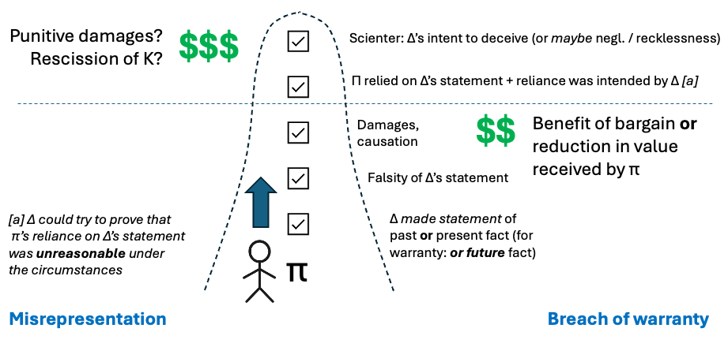

Let's consider a hypothetical example: Ginger wants to sell her car to Fred; suppose that she /represents/ — or perhaps warrants, or perhaps both — that her car has never been in an accident /[past fact]/ and is in good working order /[present fact]/. 

But now suppose that after Fred takes delivery of the car and drives it, he learns that it has significant mechanical problems, and he wants to sue Ginger (probably in small-claims court) for damages.

To help visualize how this works, think in terms of the American Ninja Warrior TV show, with an evidentiary “Hill of Proof” (see above) that plaintiff Fred must "climb" in making his claim(s) against defendant Ginger: 

--  As plaintiff, Fred starts out at the bottom of the Hill of Proof.

--  As Fred clambers up the Hill of Proof, he tries to "hit" various evidentiary checkpoints along the way.

--  The “prizes,” i.e., the remedies available to Fred, are positioned at different points up the hill.

(“The Hill of Proof” sounds like something from a Harry Potter novel, no?)

This is simply a visual depiction of how the law generally works.

*Representations vs. warranties:* An English court decision, /Sycamore Bidco v. Breslin/, highlighted the difference between representations and warranties. <cite> See [[http://www.bailii.org/ew/cases/EWHC/Ch/2012/3443.html][Sycamore Bidco Ltd v Breslin & Anor]] {{{BRACKL}}}2012{{{BRACKR}}} EWHC 3443 (Ch) (2012), /discussed in, e.g./: Raymond L. Sweigart and Christopher D. Gunson, [[http://www.pillsburylaw.com/siteFiles/Publications/Alert20130805LitigationRepsandWarranties.pdf][‘Reps’ and Warranties: One Could Cost More Than the Other Under English Contract Law]] (PillsburyLaw.com 2013); and Glenn D. West, [[http://www.weil.com/~/media/files/pdfs/thatpeskylittlething_gwest_aug_2014.pdf][That Pesky Little Thing Called Fraud: An Examination of Buyers’ Insistence Upon (and Sellers’ Too Ready Acceptance of) Undefined “Fraud Carve-Outs” in Acquisition Agreements]], 69 Bus. Lawyer 1049, 1058 n.47 (2014). </cite>

For extensive additional citations in this area, see Professor Tina Stark's scholarly pummeling of the misguided notion that representations and warranties amount to the same thing, which she offered in [[http://www.adamsdrafting.com/the-semantics-fallacy-underlying-represents-and-warrants/][two comments on Ken Adams's blog]]. See also an earlier piece on the same subject by Stark, also responding to an Adams essay. <cite> Tina Stark, [[https://papers.ssrn.com/sol3/papers.cfm?abstract_id=1886357][Nonbinding Opinion: Another view on reps and warranties]], /Business Law Today/, January/February 2006. </cite>

*** Seller strategy 1: _Offer_ a warranty only?
  :PROPERTIES: 
  :CUSTOM_ID: nl-reps-alice-bob-warr
  :HTML_CONTAINER_CLASS: olnum
  :END:

Suppose that our defendant Ginger only /warranted/ a fact, but she did not /represent/ it. For example, suppose that Ginger sold her car to plaintiff Fred, and she /suspected/ — but she didn’t know for sure — that the engine was going to need work. 

In that case, Ginger might:

- warrant, /but not represent/, that the car was in good working order, and

- limit plaintiff Fred's remedy to defendant Ginger’s reimbursing Fred for up to, say, $200 in repair costs.

In that situation, at trial the only three evidentiary checkpoints that plaintiff Fred would need to reach would be the following:

1.  that defendant Ginger /warranted/ a statement of past or present fact, to use Tina Stark’s formulation /[I’ll leave out future facts for now]/. — here, Ginger’s statement is “the car is in good working order”;

2. that Ginger's statement was false — her car, as delivered to Fred, turned out to need some significant work; and

3. that Fred incurred damages as a result, i.e., repair costs.

If, at the trial, plaintiff Fred can successfully get past those three evidentiary checkpoints, then he will be entitled to recover warranty damages (generally, benefit-of-the-bargain damages) for defendant Ginger's breach of warranty — but in this case, /limited by the contract/ to $200 in repair costs.

And that’s it; without more, Fred needn't prove that he reasonably relied on Ginger's warranty — but neither will he be entitled to tort-like remedies for fraudulent inducement or negligent misrepresentation, such punitive damages and/or rescission, i.e., unwinding the contract, as he would on the left side of the Hill.

*** Seller strategy 2: _Offer_ a representation only?
  :PROPERTIES: 
  :CUSTOM_ID: nl-reps-alice-bob-rep
  :END:

Let’s change up the hypothetical once more: Suppose that Ginger had no reason to think her car had any problems, /but/ she also didn’t want to bear any risk that it did have problems. In that case, Ginger might represent, /but not warrant/, something like the following: "So far as I know, the car is in good working order, but I'm not a mechanic and I haven't had it checked out by a mechanic."

In that situation, if the car did turn out to have problems, then plaintiff Fred would have to hit /all five/ checkpoints on the Hill of Proof ([[#nl-reps-warr-hill]]) to recover *any* damages from defendant Ginger; the first three alone wouldn't be enough because Ginger *didn't warrant* that the car was in good condition — even though the first three would be enough if Ginger /had// warranted good condition.

*** Buyer strategy: _Ask_ for _both_ a rep _and_ a warranty!
  :PROPERTIES: 
  :CUSTOM_ID: nl-reps-alice-bob-rep-warr
  :HTML_CONTAINER_CLASS: olnum
  :END:

But now suppose that defendant Ginger both represented *and* warranted the statement of fact, i.e., that her car was in good working order. And then suppose that plaintiff Fred successfully hits the first three evidentiary checkpoints on the Hill of Proof ([[#nl-reps-warr-hill]]). In that situation, Fred can try to keep going to hit two more checkpoints, namely:

4. [@4] that Fred in fact *relied* on Ginger's representation and that Ginger *intended* for Fred to do so — chances are good that both of these will be practically a given, because why else would Fred's representation have been expressly set forth in the contract that Ginger signed; and

5. that Ginger made the false representation *intentionally* (or possibly, in some jurisdictions, was negligent or reckless in doing so). This *scienter* element is often the biggie, from a proof perspective.

If plaintiff Fred can successfully hit both of /these/ additional evidentiary checkpoints on the Hill of Proof (and if defendant Ginger fails to show that Fred's reliance on her representation was unreasonable), then Fred would be additionally entitled to more “prizes,” namely tort-like remedies such as rescission and perhaps punitive damages.

(Defendant Ginger might try to prove that Fred's reliance was unreasonable under the circumstances, which /could/ defeat Fred's misrepresentation claim — but that might be a risky strategy.)

At trial, plaintiff Fred might well assert both breach of warranty /and/ fraudulent inducement or negligent misrepresentation. That way, if Fred proves unable to show scienter on defendant Ginger's part, then he can still fall back on his warranty claim. 

The same would be true if Ginger could persuade the factfinder that Fred's reliance on her (mis)representation was unreasonable: Fred would lose on his claim for fraudulent inducement or negligent misrepresentation, but he might still be able to win on his warranty claim.

*** Pro tip: Which is better for /your/ client?
  :PROPERTIES: 
    :CUSTOM_ID: nl-FraudClaimTheyLied
  :HTML_CONTAINER_CLASS: olnum
  :END:

So, here's a rule of thumb:

1. A party that is /asked to/ represent or warrant something (such as a seller) will always want to consider whether only to /warrant/ the thing or only to /represent/ it; this might well vary depending on the party's actual knowledge and the potential financial exposure if the represented- or warranted thing turns out not to be true.

2. In contrast, any party /asking for/ a representation or warranty (such as a buyer) will always want to push for /both/ a representation /and/ a warranty, so as to give that party more flexibility in litigation — see the two sides of the Hill of Proof at [[#nl-reps-warr-hill]] — in case the represented- or warranted thing turns out to be false.

This suggests the following strategy for drafting with a future trial in mind:

- If a party "P" is being asked to represent /and/ warrant some fact — say, if P is a supplier being asked for a commitment about its products or services — then a drafter representing P should consider whether P should try to only /represent/ the fact or to /warrant/ the fact. 

   (As a matter of /negotiation/ strategy P might eventualy end up agreeing to do both. But as a drafter, it’s worth giving some thought to the question.

- On the other hand, if /your/ client is asking /someone else/ to represent and warrant a fact — say, if you're a customer asking for a commitment from a supplier — then you’ll want to ask for the contract language to include both a representation /and/ a warranty. 

   (Argon might not have the bargaining power to insist on getting both — but if it does, then having both could give the client more flexibility if litigation should ever come to pass.)

Why would a customer ask /for/ both a representation and a warranty? Because "they lied!" is a stinging charge, as discussed at [[#RelDisclBkgd]] — and when a big contract fails, trial counsel will pretty much always try hard to find opportunities to accuse the other side of having misrepresented facts. Doing so can work, sometimes spectacularly well: Jurors and even judges might not understand the nuances of the dispute, but they will definitely undertand the accusation that "they lied!" 

*** Buy insurance for representations & warranties?
  :PROPERTIES:
  :CUSTOM_ID: nl-reps-warr-ins-cmt
  :END:

If a party is asked — or is asking another party — to make representations and warranties, it might be desirable to investigate whether insurance coverage is available for those reps and warranties. <cite> See generally, e.g.:, Daniel Avery, [[https://www.jdsupra.com/legalnews/representations-warranty-insurance-7292764][Representations & Warranties Insurance]] (JDSupra 2021); Eric Jesse, [[https://www.jdsupra.com/legalnews/reps-warranties-insurance-five-myths-70637][Reps & Warranties Insurance: Five Myths Dispelled]] (JDSupra.com 2020), archived at https://perma.cc/9FWX-3HSH; Joseph Verdesca, Paul Ferrillo, and Gabriel Gershowitz, [[https://www.weil.com/~/media/files/pdfs/lexis-reps-warranties-by-weil-gotshal-manges-reprint.pdf][Representations and Warranties Insurance: What Every Buyer and Seller Needs to Know]] (Weil.com 2016), archived at https://perma.cc/RSU3-66V3. </cite>

*** Recap: Key takeaways about reps and warranties                     :OMIT:
  :PROPERTIES: 
  :CUSTOM_ID: nl-rep-warr-gouge
  :HTML_CONTAINER_CLASS: olnum
  :END:

Here are some things every contract drafter and reviewer should know about representations and warranties:

1. A representation is not the same thing as a warranty, at least not in U.S. law. The two terms relate to different categories of fact, and they have different legal ramifications in litigation.

2. A *representation* is, in essence, a statement of *past or present fact*.

3. A representation might be paraphrased as: /So far as I know, X is true, but I’m not making any promises about it/.

4. <<ToMyKnowledge>> *Pro tip:* When qualifying a representation as in #3 above, use a term such as, /so far as I know/, and *not* the term /to my knowledge/: In a lawsuit, an aggressive trial counsel might claim that the latter term amounts to an implicit representation that the representing party did indeed have knowledge.

5. A representation can include the disclaimer "/without any particular investigation/"; this could be paraphrased as: /I'm not aware that X/ isn't /true, but I’m not saying that I’ve looked into it/. 

6. In contrast: The term /warranty/ is a shorthand label for a kind of conditional covenant, *a strict-liability promise* — akin to an insurance policy — that if the warranted fact(s) are shown to be untrue, then the warranting party will make good on any resulting losses suffered by the party to whom the warranty was made. Basically, a warranty is a strict-liability obligation that applies even if the warranting party wasn't at fault.

   /Example/: Consider the simple warranty, /Ginger warrants to Fred that Ginger's car will run normally for at least 30 days/. This is tantamount to a promise by Ginger that, if Ginger's car fails /for any reason/ to run normally for at least 30 days, then Ginger will pay for repairs, a rent car, and any other foreseeable damages resulting from the failure.

7. A warranty might be paraphrased as: /I’m not going to say that X is or isn’t true, but I *will* commit that, if it turns out that X *isn’t* true, then I’ll reimburse you for any resulting foreseeable losses that you suffer/ — or alternatively: /then I’ll take the following specific steps (and only those steps) to try to make it right for you/.

8. Representations and warranties can be carefully drafted so as to be *narrowly specific*.

9. A warranty can be drafted to *limit the remedies* available if the warranted facts turn out not to be true. (A typical triad of remedies can be summarized as: /repair, replace, or refund/, as discussed at {{{RULE}}} [[#r-defect-corr-apx]]

10. A party that is asked to make both a representation and warranty about particular facts (e.g., a *seller of goods or services* being asked to represent and warrant the quality of the goods or services) should consider whether it really wants to make /both/ of those commitments for all the requested facts — that party might want to make *only representations* as to some facts and *only warranties* as to other facts.

11. On the other hand, suppose that a services provider and a customer are entering into a contract for services. If the provider will be giving any kind of warranty about its services, the *customer* should always at least try to get *both* a representation and a warranty; that will give the customer more flexibility in litigation.

** Warranty sandbagging /(crude notes)/ 
  :PROPERTIES:
  :CUSTOM_ID: sandbag-a
  :END:

Overview w/ example clauses: https://www.jdsupra.com/legalnews/sandbagging-provisions-updated-8228439/

https://www.jdsupra.com/legalnews/sandbagging-a-primer-5298300

See also the discussion, at [[#nl-warr-no-rel-pf]], of how a party suing for breach of warranty doesn't need to prove reliance on the warranty — but that a different situation *might* be presented if — before the contract was signed — /the warranting party/ /disclosed/ facts indicating that a warranty in the contract was inaccurate. <cite> See [[https://scholar.google.com/scholar_case?case=4915258007899414928][Merrill Lynch & Co. Inc. v. Allegheny Energy, Inc.]], 500 F.3d 171, 186 (2d Cir. 2007) (reversing and remanding dismissal of counterclaim for breach of warranty; under New York law, where seller disclosed facts that would constitute a breach of warranty, but buyer closes with full knowledge and acceptance of those inaccuracies, then buyer cannot later be said to believe it was purchasing seller's promise respecting the truth of the warranties); [[https://scholar.google.com/scholar_case?case=8031401681050527658][Rogath v. Siebenmann]], 129 F.3d 261, 264-65 (2d Cir. 1997) (vacating and remanding partial summary judgment that seller had breached contract warranty; emphasis and extra paragraphing added). </cite>

* People
  :PROPERTIES:
  :CUSTOM_ID: people-top
  :HTML_CONTAINER_CLASS: chap
  :END:

Contents:

#+TOC: headlines 1 local

** Background Checks {{{CLS}}}                                          :CLS:
  :PROPERTIES:
  :CUSTOM_ID: r-bkgd-chks
  :HTML_CONTAINER_CLASS: pr-top
  :END:

It's not unusual for customers to want their service providers to run background checks on key personnel. The goal is normally to identify people with criminal records, drug problems, or other indicia of potential trouble that could cause operational- or legal problems.

Contents:

#+TOC: headlines 1 local

*** Parties: Vendor and Customer
  :PROPERTIES:
  :CUSTOM_ID: bkgd-chk-pty
  :END:

In {{{ths}}}, the term {{{dfn(Vendor)}}} refers to: 

{{{U1}}} a party that, under {{{thek}}}, will provide services to another specified party, referred to for convenience here as the {{{dfn(Customer)}}}; and/or

{{{UN}}} any other party clearly indicated in {{{thek}}}, whether or not providing services under {{{thek}}}.

*** Which ones?
  :PROPERTIES:
  :CUSTOM_ID: bkgd-chk-mand
  :END:

When {{{ths}}} is adopted, the Vendor will have [[#r-comm-rsnbl][commercially-reasonable]] background checks conducted — in advance of staffing as described in {{{ths}}} — on each [[#bkgd-chk-whose][Specified Individual]]. 

***** Note                                                              :CMT:
  :PROPERTIES:
  :HTML_CONTAINER_CLASS: cmtry
  :UNNUMBERED: notoc
  :END:

{{{H1}}} This uses the vague-but-practical standard of commercial reasonableness — not least because it gives the Vendor an incentive to err on the side of being clearly "in the band" for that standard.

{{{HN}}} {{{Ths-cap}}} is designed for general usage, so for convenience, we use the defined term /Vendor/ because it's commonly a service provider that is asked to run background checks on its people. But other types of contracting party might be asked to have background checks run on its people as well. 

- Example: A manufacturer or distributor of potentially-dangerous software or other critical goods might also be asked to run background checks on its relevant people.

- Example: For a party whose people will have access to another party's trade secrets, the other party might want to restrict access to individuals who have had background checks.

{{{HN}}} Depending on the circumstances, parties might agree that some or all of the following should be checked in connection with a background check:

{{{U1}}} Driving-record check: A check of records of accidents; driver's-license status; driver's-license suspensions or revocations; traffic violations; and driving-related criminal charges (e.g., DUI).

{{{UN}}} Education verification: Confirmation of dates of attendance, fields of study, and degrees earned. Education checks are sometimes used because résumé padding is not an uncommon occurrence. 

{{{RWE}}} [[https://www.dailymail.co.uk/news/article-2758348/Walmart-s-chief-spokesman-fired-retail-giant-discovers-lied-resume-graduating-college.html#ixzz47zUcoO2q][The chief spokesman of Walmart resigned]] after the retail giant learned that he had falsely claimed to have graduated from college, when in fact he had not finished his course work; ditto [[http://www.npr.org/2015/03/08/391610430/learning-the-hard-truth-about-lying][the former dean of admissions at MIT]]. 

{{{UN}}} Employment verification: A check of of start- and stop dates and titles of employment for the past {{{v(seven years)}}} or the past {{{v(two to five)}}} employers, whichever results in more  employers being checked.

{{{UN}}} Liens: A check of records of tax- and other liens; civil judgments; and bankruptcy filings (to provide a better indication of any past financial difficulties of the checked individual).

{{{UN}}} Personal reference check:  Telephone- or in-person interviews with at least {{{v(three)}}} personal references, seeking information about the following characteristics of the individual:

       - ethics;
       - work ethic;
       - reliability;
       - ability to work with others (including, for example and where relevant, peers, subordinates, superiors, customers, and suppliers);
       - strengths;
       - areas with room for improvement;
       - personality.

{{{UN}}} Professional license verification: Verification that an individual who claims to have a professional license (e.g., doctor, lawyer, engineer, etc.):

       - does in fact have such a license; and

       - is in good standing with the relevant licensing body — because it's not impossible that someone /claiming/ to be a doctor, lawyer, CPA, etc., might not be in good standing.

{{{UN}}} Residence address verification: A check of dates of residence addresses for the past {{{v(seven years)}}} (to reduce the risk of the checked individual's seeking to evade a criminal-records check by omitting a residence address).

*** Definitions: /Criminal-History Check/; /Criminal History/
  :PROPERTIES:
  :CUSTOM_ID: bkgd-chk-crim-defn
  :END:

1. The term {{{dfn(Criminal-History Check)}}} refers to a commercially-reasonable check for evidence whether an individual has ever engaged in any of the following: 

   a. any felony; 

   b. violence of any kind, including but not limited to sexual violence;

   c. child- or elder abuse;

   d. materially-deceitful conduct, including but not limited to fraud; and/or

   e. acts of moral turpitude. 

2. The term {{{dfn(Criminal History)}}} refers to not-insubstantial evidence that an individual has engaged in any conduct of the kind listed in subdivision 1 above.

***** Note                                                              :CMT:
  :PROPERTIES:
  :HTML_CONTAINER_CLASS: cmtry
  :UNNUMBERED: notoc
  :END:

{{{H1}}} A criminal-history /check/ would typically include a nationwide check of records of arrests, convictions, incarcerations, and sex-offender status.  {{{HN}}} Criminal-history records checks in basic form seem to be available from any number of Web sites at low cost, including from government agencies such as the [[https://www.edo.cjis.gov][FBI]] and/or the [[https://records.txdps.state.tx.us/DpsWebsite/CriminalHistory/][Texas Department of Public Safety]]. 

{{{HN}}} Subdivision 2: This definition doesn't require a criminal /conviction/; see the discussion of this subject in the commentary to §  [[#bkgd-prohib-crit]], which imposes staffing restrictions when a criminal-history concern is revealed.

{{{HN}}} *Pro tip:* Drafters could consider whether to require that subjects of background checks must be asked to submit fingerprints to confirm their identity (and guard against imposters). 

{{{HN}}} *Caution:* Under pre-Trump administrations, the U.S. Equal Employment Opportunity Commission (EEOC) filed lawsuits against employers who allegedly "violated Title VII of the Civil Rights Act by implementing and utilizing a criminal background policy that resulted in employees being fired and others being screened out for employment ...." <cite> [[https://www.eeoc.gov/newsroom/eeoc-files-suit-against-two-employers-use-criminal-background-checks][EEOC Press Release]] (2013). </cite>

The EEOC also took the position that a blanket prohibition against using personnel with criminal records could be alleged to have a disproportionate impact on racial- or ethnic minorities and thus to be illegal in the United States. <cite>  See [[https://www.eeoc.gov/laws/guidance/enforcement-guidance-consideration-arrest-and-conviction-records-employment-decisions][EEOC Enforcement Guidance]] (2012). 

But the second Trump administration has been taking a chainsaw to DEI programs ("diversity, equity, and inclusion"), so drafters and their counsel should check the latest developments. 

{{{HN}}} *Caution:* Entirely aside from the federal government's shifting position, some states — and even some cities — might likewise restrict an employer's ability to rely on criminal background information in making employment-related decisions.

Drafters should pay particular attention to the law in California, New York, Massachusetts, Illinois, and Pennsylvania (not necessarily an exhaustive list). This is because in recent years the practice of /automatically/ disqualifying people with criminal convictions has come under fire from government regulators and the plaintiff's bar as being potentially discriminatory (the so-called [[http://www.nelp.org/publication/ban-the-box-fair-chance-hiring-state-and-local-guide/]["ban the box" movement]]).

For one list of states and cities with ban-the-box laws, see [[https://www.nelp.org/publication/ban-the-box-fair-chance-hiring-state-and-local-guide/][Avery]] (2019).

*** Definition: /Critical Activity/
  :PROPERTIES:
  :CUSTOM_ID: bkgd-crit-defn
  :END:

For purposes of {{{ths}}}, the term {{{dfn(Critical Activity)}}} refers to any activity under {{{thek}}}, where the activity is expected to involve one or more of the following:

   1. access to one or more of the Customer's computer systems; data; or confidential information; 

   2. the possibility of death or bodily injury to any employee, contractor, customer, licensee, or invitee of the Customer; and/or 

   3. the possibility of significant loss of (or other significant damage to) tangible or intangible property of {{{v(the Customer)}}}. 

***** Note                                                              :CMT:
  :PROPERTIES:
  :HTML_CONTAINER_CLASS: cmtry
  :UNNUMBERED: notoc
  :END:

 Some drafters might want to expand this section to encompass loss or damage to third parties' property, and/or to economic loss. </aside>

*** Definition: /Drug Check/; /Drug Concern/
  :PROPERTIES:
  :CUSTOM_ID: bkgd-drug-defn
  :END:

1. The term {{{dfn(Drug Check)}}} refers to a commercially-reasonable check for evidence that an individual makes use of one or more of the following: 

   a. illegal drugs;

   b. alcoholic beverages to excess; and/or

   c. prescription drugs other than in accordance with a lawfully-issued prescription. 

2. The term {{{DEFN-C(Drug Concern)}}} refers to not-insubstantial evidence of drug use as described in subdivision 1 above. 

***** Note                                                              :CMT:
  :PROPERTIES:
  :HTML_CONTAINER_CLASS: cmtry
  :UNNUMBERED: notoc
  :END:

{{{H1}}}  These definitions are pretty broad, because if a background check indicates that a person might have a drug-misuse problem — or even took certain prescription medications — then tighter restrictions could appropriate for certain activities.  (This is an area where contract terms might need to be fine-tuned to fit the parties' needs.) </aside>

{{{HN}}} As with the definition of [[#bkgd-chk-crim-defn][Criminal History]], this definition of /Drug Concern/ in {{{RULE}}} [[#bkgd-drug-defn]] uses the term /not-insubstantial evidence/ instead of /substantial evidence/ because the latter term (1) is more vague, and (2) might be less-recognizable to non-lawyer readers, than the former term. </aside>

{{{HN}}} Companies should be cognizant of disability laws such as the [[https://en.wikipedia.org/wiki/Americans_with_Disabilities_Act_of_1990][Americans with Disabilities Act]], which might affect a company's ability to deny employment because of /medically-prescribed/ drug use.  

And companies might want to consider the possible effect on employee morale of asking them to take a drug test — and what they might have to do if a valued employee were to bust the test. (As the saying goes: Be careful about asking a question if you're not prepared to deal with the answer.)

*** Definition: /Restricted Activity/
  :PROPERTIES:
  :CUSTOM_ID: bkgd-restr-defn
  :END:

For purposes of {{{ths}}}, the term {{{dfn(Restricted Activity)}}} refers to any activity that, in the context of {{{thek}}}: 

   1. entails access, by the [[#bkgd-chk-crim-defn][Specified Individual]], to premises, equipment, employees, suppliers, and/or customers, of the Customer; *but* 

   2. does not rise to the level of a [[#bkgd-crit-defn][Critical Activity]].

***** Note                                                              :CMT:
  :PROPERTIES:
  :HTML_CONTAINER_CLASS: cmtry
  :UNNUMBERED: notoc
  :END:

 This definition is meant to encompass activities of a less-sensitive nature than [[#bkgd-crit-defn][Critical Activities]], because sometimes the Customer might want background checks for such activities. </aside>

*** Definition: /Specified Individual/
  :PROPERTIES:
  :CUSTOM_ID: bkgd-chk-whose
  :END:

1. The term {{{dfn(Specified In&shy;div&shy;id&shy;u&shy;al)}}} refers to each of the Vendor's employees, and each employee of the Vendor's contractors and/or subcontractors, if any, who will be performing one or more "Critical Activities" and/or "Restricted Activities," each as defined in {{{ths}}}. 

2. For purposes of {{{ths}}}, the term /Specified Individual/ does *not* include: 

   a. any employee of /the Customer/, nor

   b. any employee of any licensee, invitee, or other contractor of the Customer.

***** Note                                                              :CMT:
  :PROPERTIES:
  :HTML_CONTAINER_CLASS: cmtry
  :UNNUMBERED: notoc
  :END:

It likely won't make sense to require checks for /everyone/ working for the Vendor in connection with the contract. And _after_ a problem had arisen, we don't want a finger-pointing Customer or other party to claim, with 20/20 hindsight, that one of its own employees, customers, etc., should have been treated as a Specified Individual and therefore should have been background-checked /by the Vendor/. </aside>

*** Prior consultation for certain staffing
  :PROPERTIES:
  :CUSTOM_ID: bkgd-prohib-consult
  :END:

The Vendor will consult with the Customer, before staffing an individual to a position, whenever all of the following are the case: 

   1. the proposed staffing position requires a background check under {{{ths}}};

   2. prudence suggests further inquiry in view of the individual's background-check results — including (but not limited to) the specific prohibition cases mentioned below; and

   3. the individual would be staffed to any [[#bkgd-crit-defn][Critical]]- or [[#bkgd-restr-defn][Restricted]] Activity.

***** Note                                                              :CMT:
  :PROPERTIES:
  :HTML_CONTAINER_CLASS: cmtry
  :UNNUMBERED: notoc
  :END:

 This seek a balance between safety and flexibility: It doesn't give the Vendor /carte blanche/ to use potentially-problematic individuals, but neither does it give the Customer an absolute veto in all circumstances. </aside>

*** Customer consent for Critical-Activity staffing
  :PROPERTIES:
  :CUSTOM_ID: bkgd-prohib-crit
  :END:

If a [[#bkgd-chk-whose][Specified Individual]]'s background check indicates [[#bkgd-chk-crim-defn][Criminal History]] and/or [[#bkgd-drug-defn][Drug Concern]], *then:* The Vendor will not staff that individual for any [[#bkgd-crit-defn][Critical Activity]] without the Customer's express prior written consent. 

*** Customer objections to Restricted-Activity staffing
  :PROPERTIES:
  :CUSTOM_ID: bkgd-obj-restr
  :END:

If the Customer timely objects, on reasonable grounds, to a [[#bkgd-chk-whose][Specified Individual]] — during or after the advance consultation required by § [[#bkgd-prohib-consult]] — *then:* The Vendor will not staff that individual for any [[#bkgd-restr-defn][Restricted Activity]] without the Customer's express prior written consent. 

***** Note                                                              :CMT:
  :PROPERTIES:
  :HTML_CONTAINER_CLASS: cmtry
  :UNNUMBERED: notoc
  :END:

 Here, the Customer's right to /timely object/ on /reasonable grounds/ is intentionally vague; the intent is to encourage the parties to work together cooperatively. </aside>

*** Vendor's continued responsibility
  :PROPERTIES:
  :CUSTOM_ID: bkgd-cont-resp
  :END:

For the avoidance of doubt: The Vendor will not be relieved of its responsibilities under {{{thek}}} just because the Customer did or did not object to one or more of the Vendor's staffing proposals under {{{ths}}}.

*** Vendor's expense responsibility
  :PROPERTIES:
  :CUSTOM_ID: bkgd-exp
  :END:

As between the Vendor and the Customer: The Vendor is responsible for out-of-pocket expenses of background checks under {{{thek}}} *unless* the Customer clearly agrees otherwise in writing. 

***** Note                                                              :CMT:
  :PROPERTIES:
  :HTML_CONTAINER_CLASS: cmtry
  :UNNUMBERED: notoc
  :END:

 As between: See [[#as-between-cmt]]. </aside>

*** Vendor's indemnity obligation
  :PROPERTIES:
  :CUSTOM_ID: bkgd-indem
  :END:

The Vendor will {{{PROTECT(the Customer)}}} from any claim, by any third party, to the extent that the claim arises from the conduct of any background check covered by {{{ths}}}. 

***** Note                                                              :CMT:
  :PROPERTIES:
  :HTML_CONTAINER_CLASS: cmtry
  :UNNUMBERED: notoc
  :END:

 The term "by any third party" would encompass, for example, claims by governmental authorities. </aside>

***** Note                                                              :CMT:
  :PROPERTIES:
  :HTML_CONTAINER_CLASS: cmtry
  :UNNUMBERED: notoc
  :END:

{{{H1}}} Here, the term "any claim" would encompass, for example, any claim that alleges one or more of the following: 

   a. that the Specified Individual didn't consent to the background check;

   b. that whoever did the check didn't comply with an applicable privacy law;

   c. that the Specified Individual wasn't timely notified about a decision using information from the background check as required by law (for example, a credit-reporting law); and/or

   d. that the Vendor and/or an agent of the Vendor, in doing the background check, allegedly violated the law in some other way — if the Vendor were to screw up a background check on an individual (e.g., if the Vendor violates the sometimes-tricky law in this area), then it wouldn't be surprising for the individual's attorney to sue /the Customer/ in addition to the Vendor, on the theory that maybe the Customer would pay something to make the lawsuit go away.

{{{RWE}}} As one example, see the troubles caused by a contractor to bookseller Barnes & Noble in the /Hebert/ case, discussed in the commentary at Option [[#bkgd-chk-cred]].

{{{HN}}} *Pro tip:* /Any/ mention of indemnification should automatically trigger at least the mental question — for each party's drafter(s) — /is insurance appropriate to provide a backup source of funds?/ 

(Consider the bawdy reminder mnemonic " *"[[#i-i][I&I]],"* retooled to stand for /indemnity/ and /insurance/.) 

See also the general discussion of insurance at [[#nl-insurance-notes]].

*** {{{ESCAL-HDG}}}
  :PROPERTIES:
  :CUSTOM_ID: bkgd-escal
  :END:

If either party asks, the parties will escalate any dispute about the Vendor's staffing proposals under {{{ths}}}: 

1. first, to supervisors as provided at {{{RR}}} [[#r-escal-int]]; and

2. if necessary, to a neutral advisor as provided at {{{RR}}} [[#r-escal-ext]].

*** {{{OPT}}}: Background Checks Short-Form Clause
  :PROPERTIES:
  :CUSTOM_ID: bkgd-rqmt-short
  :HTML_CONTAINER_CLASS: optn-txt
  :END:

*(a)* Whenever /[fill in party name]/ (the {{{dfn(Vendor)}}}) assigns personnel for potentially-sensitive activities under {{{thek}}} (as defined in subdivision (b) below), the Vendor will have [[#r-comm-rsnbl][commercially-reasonable]] background checks conducted beforehand. *(b)* For purposes of subdivision (a) above, the term "potentially-sensitive activities" would ordinarily include, [[#r-eg-defn][for example]], any activity involving access to: (1) the Customer's premises, equipment, and/or computer network(s); (2) the Customer's confidential information; (3) the Customer's employees; and/or (4) in the context of {{{thek}}}, the Customer's suppliers and customers. 

***** Note                                                              :CMT:
  :PROPERTIES:
  :HTML_CONTAINER_CLASS: cmtry
  :UNNUMBERED: notoc
  :END:

 For easier copying-and-pasting, this short-form clause is condensed into a single paragraph — even though it comes close to violating the [[#sssp][Spaghetti Rule]] ([[#sssp]]) by /almost/ being a "spaghetti clause" instead of a "macaroni clause."

*** {{{OPT}}}: Credit Check Requirement
  :PROPERTIES:
  :CUSTOM_ID: bkgd-chk-cred
  :HTML_CONTAINER_CLASS: optn-txt
  :END:

The Vendor will have each background check include standard credit reporting from all major credit bureaus serving the jurisdiction in question.

***** Note                                                              :CMT:
  :PROPERTIES:
  :HTML_CONTAINER_CLASS: cmtry
  :UNNUMBERED: notoc
  :END:

{{{H1}}} *Caution:* Credit checks, if not done correctly, can get a checking party in trouble under the [U.S.] Fair Credit Reporting Act ("FCRA"). Noncompliance with background-check consent requirements has hit some well-known companies with sizable settlement payouts. <cite> See, e.g., [[http://www.mondaq.com/unitedstates/x/416236/Consumer+Credit/Chuck+E+Cheese+Settles+Background+Check+L wsuit+for+175+Million][Gettings et al.]] (2015) (Chuck E. Cheese — $1.75 million) and [[http://www.employmentclassactionreport.com/fcra/publix-to-pay-6-8-million-settlement-over-noncompliant-background-check-forms/][Lebowitz]] (2014) (Publix — $6.8 million). </cite>

{{{HN}}} One particular /procedural/ requirement comes up regularly in class-action lawsuits: [[http://www.law.cornell.edu/uscode/text/15/1681b][Section 1681b(b)(2)(A)]] of the FCRA, which states that, with certain very-limited exceptions: 

#+begin_quote

... a person may not procure a consumer report, /or cause a consumer report to be procured/, /for employment purposes/ with respect to any consumer, unless—

(i) a *clear and conspicuous disclosure* has been made *in writing* to the consumer 

at any time *before* the report is procured or caused to be procured,

*in a document that consists _solely_ of the disclosure*, 

that a consumer report may be obtained for employment purposes; *and* (ii) the consumer has authorized in writing ... the procurement of the report by that person. #+end_quot <cite> Hat tip: [[http://www.mondaq.com/unitedstates/x/314598/employee+rights+labour+relations/Employers+Hit+with+Background+Check+Lawsuits&email_access=on][Remson]] (2014). </cite>e

*Caution:* /Willful/ violation of the FCRA disclosure requirement entitles the consumer to recover "statutory damages ranging from $100 to $1,000 per violation, punitive damages, and attorney fees." <cite> [[https://scholar.google.com/scholar_case?case=17868939379664735158][Syed v. M-I, LLC]], 853 F.3d 492, 497 (9th Cir. 2017) (cleaned up). </cite>

# https://en.m.wikipedia.org/wiki/File:Barnes_%26_Noble_logo_(2021).svg
# #+ATTR_HTML: :alt Barnes & Noble logo :title Barnes   :class photo-at-right photowidth30
# 

{{{HN}}} *Caution:* If an FCRA consent form contains *anything other than* the mandated disclosure — /even in a footnote/ — the requester is in danger of being labeled a /willful/ violator, with consequences as stated just above. {{{RWE}}} A California appeals court reversed a summary judgment in favor of Barnes & Noble, on grounds that a reasonable jury /could/ find that the company acted willfully by asking a job applicant to sign a consent form provided by a background-checking company, because the consent form included a footnote with a disclaimer of warranties and advice to employers to seek their own legal advice. <cite> See [[https://scholar.google.com/scholar_case?case=15317152204604993273][Hebert v. Barnes & Noble, Inc.]], 78 Cal. App. 5th 791, 796, 796 (2022); see also [[https://scholar.google.com/scholar_case?case=17868939379664735158][Syed]], 853 F.3d at 497-98 (9th Cir. 2017) (consumer consent form included liability waiver by consumer). </cite>

*** {{{OPT}}}: Criminal-History Check
  :PROPERTIES:
  :CUSTOM_ID: bkgd-crim-chk
  :HTML_CONTAINER_CLASS: optn-txt
  :END:

The Vendor will have each background check include a [[#bkgd-chk-crim-defn][Criminal-History Check]].

*** {{{OPT}}}: Drug-Check
  :PROPERTIES:
  :CUSTOM_ID: bkg-chk-drug
  :HTML_CONTAINER_CLASS: optn-txt olnum
  :END:

The Vendor will have each background check include a [[#bkgd-drug-defn][Drug Check]].

*** {{{OPT}}}: Independently-Sourced Contact Information
  :PROPERTIES:
  :CUSTOM_ID: bkgd-chk-indep-info
  :HTML_CONTAINER_CLASS: optn-txt
  :END:

For personal reference checks, the Vendor will have the reference's contact information obtained from a source independent of the Specified Individual.

*** {{{ADDL}}}                                                         :ADDL:
  :PROPERTIES:
  :CUSTOM_ID: nl-bkgd-chks
  :HTML_CONTAINER_CLASS: addl
  :END:

**** Pro tip: Get consent anyway?
  :PROPERTIES:
  :CUSTOM_ID: bkgd-cons-anyway
  :END:

It might be prudent to obtain a checked individual's consent to a background check even if the law /doesn't/ require consent: If the individual were to learn of an unconsented background check, the individual's displeasure might go viral on social media, especially given today's heightened sensitivity to privacy concerns.

BUT: If you ask for consent, you should be prepared for the answer to be "no" — and then what? (See [[#cons-no]].)

**** Are background checks actually useful?
  :PROPERTIES:
  :CUSTOM_ID: bkgd-util
  :END:

It's been suggested that background checks on people who have lived in California might not provide employers with much real-world benefit, that that the time and money might be better spent on searching applicants' social media. In part, that's due to recent changes in California law, [[https://leginfo.legislature.ca.gov/faces/billCompareClient.xhtml?bill_id=202120220SB731&showamends=false][Senate Bill 731]], which have resulted in automatic sealing of certain felony-conviction records and in limits on what employers can do with conviction information. <cite> See [[https://californiaemploymentlaw.foxrothschild.com/2022/10/articles/advice-counseling/are-background-checks-worth-it-anymore][Yaffe & Gordon]] (2022); hat tip: [[https://www.redline.net/member/cabesa][Cynthia Abesa]] at the lawyer-forum [[https://www.redline.net/][redline.net]]. </cite>

** Training - /(notes)/

*** Training repayment agreements - caution

In 2024, Colorado "put[] into place a law to toughen protections for employees who are subject to abusive contracts ostensibly requiring repayment to employers for education and training expenses upon termination of employment, commonly referred to as 'TRAPs' (Training Repayment Agreement Provisions)." <cite> See Robyn Marsh, Marcus Mintz and Michael Wexler, [[https://www.tradesecretslaw.com/2024/06/articles/ftcs-crackdown-on-non-competes/colorado-amends-non-compete-law-to-address-potential-abuses-of-training-repayment-agreement-provisions-traps/][Colorado Amends Non-Compete Law To Address Potential Abuses of Training Repayment Agreement Provisions (TRAPS)]] (TradeSecretLaw.com 2024). </cite>

*** Details to address
  :PROPERTIES:
  :CUSTOM_ID: nl-training-addl-cmt
  :HTML_CONTAINER_CLASS: olnum
  :END:

When a contract requires a party to provide training, it should set forth specific details about the training, such as the following (as appropriate):

1. contact information for lead representatives for each party;

2. specific courses to be offered;

3. physical location(s) of training, if any;

4. minimum- and maximum class size;

5. scheduling;

6. required trainee qualifications (prerequisites);

7. logistical support to be provided by the party whose people are being trained;

8. registration deadline;

9. cancellation- and refund policy;

10. any fee(s) that the training provider will charge, including but not limited to:

    - any minimum fee (and how many attenders does that cover);

    - any per-person fee;

    - materials charges, if any;

11. reimbursement of the training provider's expenses (see generally {{{RR}}} [[#r-exp-reimb]]);

12. payment deadlines (see generally [[#r-pmt-basic]]).

** Severance agreements /(raw notes)/ 
  :PROPERTIES:
  :CUSTOM_ID: nl-sev-k
  :END:

/Journalists refer to notes such as these as "[[https://writingcooperative.com/save-string-to-make-your-writing-pop-274e14a8c805][saving string]]."/

From [[https://scholar.google.com/scholar_case?case=14782583318811925352][Wright v. Eugene & Agnes E. Meyer Foundation]], 68 F.4th 612 (D.C. Cir. May 23, 2023) (lightly edited for formatting):

#+begin_quote

WILKINS, Circuit Judge: 

Plaintiff Dr. Terri Wright is the former Vice President of Program and Community of the Eugene and Agnes E. Meyer Foundation, a non-profit that promotes social and racial equity in the Washington D.C. area. In that role, Wright was responsible for the Foundation’s community engagement efforts, grant-making, and collective action strategy. 

She received largely positive feedback during her tenure, but less than two years after she was hired, the CEO of the Foundation, Nicola Goren, fired her for purported interpersonal and communication-related issues. Wright, who is African-American, believes these stated reasons were pretext to mask discriminatory animus. 

Seeking to avoid litigation, Wright and the Foundation signed a severance agreement, under which Wright agreed to release employment-related claims against the Foundation and its employees, and which contained a mutual non-disparagement clause.

But roughly a month after Wright was fired, Goren told another leader in the non-profit space that Wright was let go because she was “toxic,” created a “negative environment,” and that two-thirds of the Foundation staff would have quit if Wright had stayed.

Wright sued the Foundation and Goren for breaching the severance agreement, for doing so in a racially discriminatory manner in violation of 42 U.S.C. § 1981, and for defaming her.

The District Court dismissed all three claims. 

- *It first found that the non-disparagement clause obligated the Foundation only to direct its employees not to disparage Wright, leaving the Foundation and its officers and employees free to in fact disparage her*.

- Second, and as a result, the District Court found that Wright’s § 1981 claim failed because it was based on a breach of the severance agreement.

- Lastly, the District Court found that Goren’s statements were protected by the common interest privilege, as they were made in her capacity as the Chair of the Board of a separate non-profit organization to the CEO of that organization.

*We hold that the District Court erred in dismissing all three claims*. 

- As to Wright’s breach of contract claim, *the non-disparagement clause could reasonably be interpreted to preclude the Foundation from disparaging Wright*, and dismissal under Federal Rule of Civil Procedure 12(b)(6) /[for failure to state a claim even if all pleaded facts are assumed to be true]/ is therefore inappropriate.

- As to her § 1981 claim, we find that she has plausibly alleged a prima facie case that the Foundation, through Goren, breached the severance agreement due to racial animus.

- And lastly, because Wright has plausibly alleged that Goren’s statements were made with reckless disregard for the truth and for discriminatory reasons, they are not protected by the common interest privilege, which requires a showing of good faith on the part of the speaker.

* * * 

The crux of Wright’s claim is that implicit in the Foundation’s promise to “direct” certain officers, directors, and employees to not disparage her was a promise that *the Foundation itself would also not disparage her*, at least through the statements of its CEO and President who signed the Agreement. 

Thus, Wright argues, the Foundation breached the Severance Agreement when Goren disparaged her in her conversation with Dr. Henson.

In Defendants’ view, the Foundation’s duty began and ended with its promise to “direct” its employees; neither the Foundation, nor its directors or any other employee, had a corresponding or continuing duty to not disparage Wright.

We find that the Severance Agreement, read as a whole, is ambiguous and reasonably capable of Wright’s interpretation.
#+end_quote

** Stay-or-pay /(brief notes)/

For employment agreements entered into on or after January 1, 2026, California's [[https://leginfo.legislature.ca.gov/faces/billNavClient.xhtml?bill_id=202520260AB692][Assembly Bill 692]] (signed into law October 13, 2025)  severely limits a company's ability to require an employee to repay a debt if the employee leaves the company before X amount of time has passed. 

The bill also gives employees a private right of action against companies that violate the new law; a winning employee is entitled to the greater of actual damages or $5,000.

** Recruiting /(someday)/                                               

*** Recruiting - points to consider:

Here's a list of subheadings in a contract posted by [[https://www.redline.net/queries/checklist-contingency-based-recruiting-agreements][an anonymous redline.net member]]:

1.  No poaching of Client’s staff.

2.  No fee owed for candidates that client notified recruiter was already a candidate or staff, or that was recruited without candidate consent, or that was skipped.

3.  Confidentiality protections for the client. If the agency insists on a mutual confidentiality clause, make sure that candidate referrals are not CI if the candidate is described by (b) above.

4.  Duty to screen.

5.  No third party beneficiaries.

6.  Termination by client for convenience.

7.  Obligation to find a replacement if candidate is fired (other than due to RIF) or resigns within a defined period of employment.

8.  Refund remedy if agency fails to find a replacement for a candidate that resigned or was fired.

9.  Non-exclusive.

10.  Equal opportunity. 

11.  No out-of-pocket expenses; only compensation is what's set out in the agreement.

*** RAW                                                                :OMIT:

1.  No poaching of Client’s staff.

Agency shall not induce or solicit for employment any Client employee or contractor, or introduce any Client employee or contractor to any third party. The obligations of this section will survive termination of this Agreement for any reason.

2.  No fee owed for candidates that client notified recruiter was already a candidate or staff, or that was recruited without candidate consent, or that was skipped.

No placement fee will be payable for any Agency candidate that is (a) referred to Client without the candidate’s knowledge and consent; (b) already a candidate proposed from another source or from Client's own recruiting efforts, or was an applicant, employee or contractor for the Client in the past, provided Client so notifies Agency within ten business days of referral; or (c) introduced directly by Agency to the hiring manager without the knowledge and consent of [HR].

3.  Confidentiality protections for the client. If the agency insists on a mutual confidentiality clause, make sure that candidate referrals are not CI if the candidate is described by (b) above.

Agency will not disclose to any third party, and will maintain as confidential, any information disclosed to or learned by Agency relating to Client, its affiliates, and the business of Client and its affiliates, and will use such information solely for the benefit of Client in fulfilling the duties of this Agreement.

4.  Duty to screen.

Prior to referring a candidate to the Company, Agency shall: (a) carefully screen each candidate including by: (i) confirming the candidate's identity; (ii) verifying employment history and work authorization; (iii) verifying education or training; (iv) confirming that the candidate is not subject to a non-competition agreement that would disqualify the candidate; and (b) interview the candidate, either in person or by videoconference.

5.  No third party beneficiaries.

This Agreement benefits solely the parties and their respective successors and permitted assigns and nothing in this Agreement, express or implied, confers on any third party any legal or equitable right, benefit, or remedy of any nature whatsoever under or by reason of this Agreement.

6.  Termination by client for convenience.

Client may terminate this Agreement at any time for convenience upon three business days’ written notice.

7.  Obligation to find a replacement if candidate is fired (other than due to RIF) or resigns within a defined period of employment.

If the employee resigns or is terminated, other than for reduction in force, within 90 days of starting work, Agency will use its best efforts to provide a replacement candidate without charge, if notified in writing of the termination within five business days of termination.

8.  Refund remedy if agency fails to find a replacement for a candidate that resigned or was fired.

If Agency is unable to find a replacement candidate acceptable to Client within thirty days of Client's foregoing notice, Client will be excused from further payments of the placement fee, and Agency will refund placement fees that Client has paid for the terminated/resigned employee.

9.  Non-exclusive.

The parties acknowledge that no exclusivity is granted by this Agreement and that Client may freely engage with other recruiters or engage in its own recruiting efforts.

10.  Equal opportunity. 

Agency acknowledges that Client is an equal opportunity employer and complies with all federal, state, and local employment and anti-discrimination laws.

11.  No out-of-pocket expenses; only compensation is what's set out in the agreement.

* Term & termination
  :PROPERTIES:
  :CUSTOM_ID: termin-top
  :HTML_CONTAINER_CLASS: chap
  :END:

Contents:

#+TOC: headlines 1 local

** Evergreen Renewals {{{CLS}}}                                         :CLS:
  :PROPERTIES:
 :CUSTOM_ID: r-evrgrn-ext
 :HTML_CONTAINER_CLASS: pr-top
  :END:

Contents:

#+TOC: headlines 1 local

*** Evergreen Period — what exactly?

If {{{thek}}} does not specify an Evergreen Period, then the term of {{{theK}}} is the Evergreen Period. <aside> An Evergreen Period might be, for example, the term of a relationship, e.g., for employment or [[#r-channel-proc][channel partnership]], when clearly so stated in {{{thek}}}. </aside>

*** Renewal? Or extension?

In case the question comes up: For purposes of {{{ths}}}, the term *extension* has the same meaning as *renewal*. <aside> This has in mind the Eighth Circuit's holding in its 2012 /AMC/ case, discussed in the comment at § [[#evrgrn-renew]]. </aside> 

*** Evergreen Option: Opt-/out/, not opt-/in/  
  :PROPERTIES:
  :CUSTOM_ID: evrgrn-opt-out
  :END:

{{{L1}}} Each renewal of the Evergreen Period goes into effect automatically unless an eligible party opts *out* — but if {{{thek}}} clearly says otherwise,  then renewal will not go into effect unless an eligible party opts *in*. 

{{{LN}}} The term {{{dfn(Evergreen Option)}}} refers to the right to opt-out or opt-in, as applicable to {{{ths}}}.

***** Note                                                              :CMT:
  :PROPERTIES:
  :HTML_CONTAINER_CLASS: cmtry
  :UNNUMBERED: notoc
  :END:

{{{H1}}} From a business perspective, there's a critical potential difference between an opt-/in/ option to /renew/, which requires action to continue as before, versus — as here — an opt-/out/ option to /terminate/, which requires action /not/ to continue as before. This difference was crucial in North Dakota's 2014 /Smucker/ case, where the well-known food company Smucker got stuck paying nearly $280,000 in rent and utilities for a lease that it didn't want because it was late in exercising its option to terminate an automatic renewal. <cite> See [[https://scholar.google.com/scholar_case?case=15984670919118882144][Commercial Resource Group, LLC v. J.M. Smucker Co.]], 753 F.3d 790, 794 (8th Cir. 2014) (reversing and remanding summary judgment in favor of Smucker).] (*Lesson:* Use some kind of calendar reminder system!)

{{{HN}}} *Caution:* Drafters should check whether the Federal Trade Commission has any regulations affecting /consumer/ renewals — in 2024 the FTC tightened up its existing rule about "negative option" (opt-out) automatic renewals for consumers, but the Eighth Circuit vacated the action for failure to follow statutory procedural requirements. <cite> See [[https://scholar.google.com/scholar_case?case=4215013878232378844][Custom Comms., Inc. v. FTC]], 142 F.4th 1060 (8th Cir. 2025). </cite>

*** Eligible Party?
  :PROPERTIES:
  :CUSTOM_ID: evgrn-who
  :END:

{{{v(Either party)}}} (each, an {{{dfn(Eligible Party)}}}) has the right — in that party's sole [[#discr-defn][discretion]] — to exercise the Evergreen Option. <aside> The "sole discretion" language here is intended to forestall any claim that a decision to opt out must comply with any kind of duty of good faith and/or fair dealing. The Supreme Court of Canada once surveyed U.S. cases on this point in its 2015 /Bhasin/ opinion. <cite> See [[https://scc-csc.lexum.com/scc-csc/scc-csc/en/item/14438/index.do][Bhasin v. Hrynew]], 2014 SCC 71 {{{BRACKL}}}2014{{{BRACKR}}} 3 S.C.R. 495, ¶ 91. *Caution:* In 2015, an Ontario trial court held (in a nonbinding dictum) that /Bhasin/ "does not stand for the (extreme) proposition that under no circumstances does a 'sole discretion' contract renewal power have to be exercised reasonably." [[http://canlii.ca/t/gjvlc][Data & Scientific Inc. v. Oracle Corp.]], 2015 ONSC 4178 (CanLII). </cite> </aside>

*** Deadline to exercise the Evergreen Option?
  :PROPERTIES:
  :CUSTOM_ID: evgr-dl
  :END:

{{{L1}}} To exercise the Evergreen Option, the Eligible Party must give notice to that effect, to all other parties, in accordance with {{{RR}}} [[#r-notices-rule]] — and do it so that the notice becomes effective no later than {{{v(one month before)}}} the then-current expiration date of the Evergreen Period.

{{{LN}}} Otherwise, the Evergreen Option will permanently expire as of the end of the then-current expiration date.

***** Note                                                              :CMT:
  :PROPERTIES:
  :HTML_CONTAINER_CLASS: cmtry
  :UNNUMBERED: notoc
  :END:

{{{H1}}} Who can exercise: Often, a party with bargaining power (e.g., a big customer dealing with a smaller supplier) will want to be the only one that has the right to exercise the Evergreen Option.

{{{HN}}} *Caution:* In some cases a statute might impose a minimum opt-out notice period  

- /Example:/ A Minnesota statute, [[https://www.revisor.mn.gov/statutes/cite/325E.37][Minn. Stat. § 325E.37]] § 3, requires at least 90 days' advance notice of non-renewal of certain sales-representative agreements.

- /Example:/ In the UK, specific requirements apply to subscription contracts with consumers. <cite> See generally Micaela Bostrom and Michiko Jo, [[https://www.jdsupra.com/legalnews/the-uk-s-new-requirements-for-4000119/][The UK’s new requirements for subscription contracts with consumers – DMCC Bill Deep Dive Part 3]] (JDSupra.com 2023). </cite>

{{{HN}}} *Pro tip:* Some parties might want to negotiate the exercise deadline to take into account the circumstances — for example, if it would take a party some time to find and spin up a replacement contract relationship.

*** Maximum renewal duration?
  :PROPERTIES:
  :CUSTOM_ID: evrgrn-dur
  :END:

{{{L1}}} Unless {{{thek}}} clearly states otherwise, each renewal of the relevant Evergreen Period will be for the *lesser* of: 

{{{U1}}} the initial duration of the Evergreen Period; and <aside> *Pro tip:* Perhaps the *initial* renewal(s) could be of different durations — for example, in some contractual relationships, a first renewal might be relatively short, to give the parties a chance to find out what it's like working together; then if neither party opted out, subsequent renewals could be of longer duration. </aside>

{{{UN}}} {{{v(one year)}}}. <aside> This puts an upper limit on the /duration/ of an /automatic/ extension because too-long an automatic-extension period can be problematic, as discussed in the cautionary tale at [[#evrgrn-opt-dl-cal-c]]. (The parties are of course free to /affirmatively agree/ to any extension they want.) </aside>

{{{LN}}} Example: A six-month Evergreen Period would be automatically renewed for successive /six-month/ terms, without a break.

{{{LN}}} Example: A three-year Evergreen Period would be automatically renewed for successive /one-year/ terms (if {{{thek}}} didn't state otherwise), likewise without a break.

*** Limit on number of successive renewals?
  :PROPERTIES:
  :CUSTOM_ID: evrgrn-max
  :END:

Unless otherwise agreed, the Evergreen Period will continue renewing indefinitely as provided in {{{ths}}}, with no upper limit on the number of successive renewals. 

***** Note                                                              :CMT:
  :PROPERTIES:
  :HTML_CONTAINER_CLASS: cmtry
  :UNNUMBERED: notoc
  :END:

This seeks to avoid the result in a S.D.N.Y. case where the court held that the following language was /not/ evergreen, but instead contemplated that the parties might agree to change the (one-time) expiration date:

#+begin_quote
This Letter of Credit is deemed to be automatically extended without amendment for one (1) year from the expiration date hereof or any future expiration date, unless sixty (60) days prior to such expiration date, we notify you by regular mail and registered mail at the above address, ... that this Letter of Credit will not be renewed for any such additional period. <cite> [[https://scholar.google.com/scholar_case?case=9088716545010664289][Starr Indem. & Liab. Co. v. Midwest Mortg. Assocs. Corp.]], No. 25-cv-4874, part II, slip op. (S.D.N.Y. Jan. 21, 2026). </cite>
#+end_quote

*** Contract terms during renewal?
  :PROPERTIES:
  :CUSTOM_ID: evrgrn-renew
  :END:

Unless otherwise agreed, any opt-*out* renewal under {{{ths}}} — because the renewal would be automatic, without party action — will be on the same terms and conditions as before.

***** Note                                                              :CMT:
  :PROPERTIES:
  :HTML_CONTAINER_CLASS: cmtry
  :UNNUMBERED: notoc
  :END:

Subdivision 2: {{{Ths-cap}}} sometimes uses the term /renew/ as a common business vernacular — but in some jurisdictions, a "renewal" right /might/ require a party to renegotiate the terms and conditions as a condition of being able to exercise an option to renew.

{{{RWE}}} In the Eighth Circuit's 2012 /AMC Showplace/ case:

- The AMC movie theater chain's option to extend its lease of space in a Minnesota shopping center was /literally/ labeled "Option to Extend," and "on the same terms and conditions" except for certain rent adjustments.
- The court, though, held that this was really an option to /renew/ — and that under state-court precedent, this in turn gave the landlord the right to demand new terms.
- This, said the court, was "because the terms of the option peri
od were not reasonably ascertainable from the existing lease /[sic]/." <cite> See [[https://scholar.google.com/scholar_case?case=7244332035161478418][Camelot LLC v. AMC ShowPlace Theatres, Inc.]], 665 F.3d 1008, 1009 (2012) (8th Cir. 2012) (affirming summary judgment for landlord). </cite>

/DCT comment:/ The Eighth Circuit's reasoning seems more than a little strained.

*** Day-to-day if /mandatory/ deadline reminder not sent
  :PROPERTIES:
  :CUSTOM_ID: evrgrn-rmndr-not
  :END:

1. This section will apply if {{{thek}}} /requires/ {{{A}}} to send {{{B}}} a written reminder of an option deadline, but {{{A}}} does not do so.

2. The automatic renewal will go into effect if it would otherwise do so — but only on a day-to-day basis.

3. {{{B}}} can belatedly opt out of further day-to-day renewals of the Evergreen Period by so advising {{{A}}} in writing, effective when so stated in that written advice.

4. {{{B}}}'s belated opt-out right will be  *EXCLUSIVE REMEDY* for {{{A}}}'s failure to send {{{B}}} the reminder.

***** Note                                                              :CMT:
  :PROPERTIES:
  :HTML_CONTAINER_CLASS: cmtry
  :UNNUMBERED: notoc
  :END:

This is provided because some customers will want their vendors to take on the burden of remembering (that is, calendaring) the option deadline date.

*** {{{OPT}}}: Fee for Early Opt-Out
  :PROPERTIES:
  :CUSTOM_ID: m-EvergreenOptOutFee
  :HTML_CONTAINER_CLASS: optn-txt
  :END:

1. Scenario: This {{{OPTIN}}} — which applies only if clearly agreed to in {{{theK}}} — presupposes that one party (the {{{dfn(Leaving Party)}}}), authorized by {{{theK}}} to opt /out/ of an otherwise-automatic renewal, does so before {{{v(50 YEARS)}}} after the effective date of {{{thek}}}.

2. Leaving Party: To opt out of the automatic renewal, you must do the following:

   a. Give the other party notice to that effect, as provided in {{{RR}}} [[#r-notices-rule]]; and

   b. Pay the other party, in immediately-available funds,{{{FN(pmt-wire-cmt)}}} an early-opt-out fee of {{{v(USD $1 TRILLION)}}} — do so no later than exactly 11:59.00 p.m. UTC on {{{v(the then-current expiration date)}}} of the Evergreen Period.

   Otherwise, the automatic renewal will go into effect — and your right to opt out of that renewal will permanently expires — without further action by any party.

3. In case the question comes up: Payment of the early-opt-out fee of {{{THS-O}}} is a form of alternative performance and not liquidated damages.

***** Note                                                              :CMT:
  :PROPERTIES:
  :HTML_CONTAINER_CLASS: cmtry
  :UNNUMBERED: notoc
  :END:

{{{H1}}} This {{{OPT}}} is inspired by an analogous provision in the First Circuit's 2014 /Foodmark/ case, where the Ninth Circuit affirmed a summary judgment that a Canadian food distributor owed a U.S. marketing firm a fee for electing not to renew the parties' "evergreen" agreement. <cite> See [[https://scholar.google.com/scholar_case?case=12310247180652076741][Foodmark, Inc. v. Alasko Foods, Inc.]], 768 F.3d 42 (1st Cir. 2014). </cite>

{{{HN}}} Obviously the default values here are so absurd as to be laughable — that's to get drafters' attention.

{{{HN}}}  Subdivision 5: For an extended discussion of alternative performance versus liquidated damages, see [[#nl-EvergreenOptOutFeeNtsCD]]. 

*** {{{OPT}}}: No Evergreen Renewal After Assignment of {{{theK}}}
  :PROPERTIES:
  :CUSTOM_ID: evergrn-opt-assmt
  :HTML_CONTAINER_CLASS: optn-txt
  :END:

1. Scenario: If this {{{OPTIN}}} is agreed to, then automatic renewal under {{{ths}}} will not occur at any time after an assignment of {{{thek}}} by any party specified in {{{theK}}}.

2. In case the question comes up: This {{{OPT}}} does not authorize assignment of {{{thek}}} but neither does it prohibit assignment.

***** Note                                                              :CMT:
  :PROPERTIES:
  :HTML_CONTAINER_CLASS: cmtry
  :UNNUMBERED: notoc
  :END:

{{{H1}}} This {{{OPT}}} is inspired by § 4.3 of a [[https://www.sec.gov/Archives/edgar/data/1318605/000119312510017054/dex1020.htm][2007 real-estate lease]] between Stanford University (landlord) and Tesla (tenant), which states in part: "The Extension Option is personal to Tenant and shall be inapplicable and null and void if Tenant assigns its interest under this Lease ...."

{{{HN}}} See also {{{RR}}} [[#r-assmt-consent]] (assignment consent).

*** {{{ADDL}}}                                                         :ADDL:
  :PROPERTIES:
  :HTML_CONTAINER_CLASS: addl
  :END:

Contents:

#+TOC: headlines 1 local

**** The business context
  :PROPERTIES:
  :CUSTOM_ID: evergrn-ctxt-c
  :END:

In many long-term business arrangements, the parties want regular opportunities to reevaluate whether to continue the arrangement — *but* they also want the arrangement to continue as before if no one wants to change it.  By adopting {{{ths}}} in {{{thek}}}, drafters can provide such an opportunity, on either an opt-out or opt-in basis.

*Caution:* By law, some jurisdictions restrict automatic *extension* or *renewal* of certain contracts (often consumer-facing) unless specific notice requirements are met — for example, a New York statute, [[https://assembly.state.ny.us/leg/?default_fld=&leg_video=&bn=S01475&term=2019&Text=Y][NY Gen. Bus. L. art. 29-BB]], requires clear and conspicuous disclosure of automatic renewal terms in consumer service contracts. <cite> See David O. Klein, [[https://www.mondaq.com/unitedstates/consumer-law/1009518/new-york-to-implement-new-auto-renewal-law?email_access=on][New York To Implement New Auto-Renewal Law]] (Mondaq.com 2020). </cite>

<cite> See, e.g., Beth Bolen Chun, Salim Rashid, and Gonzalo E. Mon [[https://www.kelleydrye.com/viewpoints/blogs/ad-law-access/auto-renewal-laws-2025-round-up][Auto-Renewal Laws: 2025 Round Up]] (KelleyDrye.com). </cite <cite> See [[https://www.revisor.mn.gov/statutes/cite/ From the other side of the table, a Minnesota statute, [[https://www.revisor.mn.gov/statutes/cite/325E.37][Minn. Stat. § 325E.37]] § 3, regulates *termination* of sales-representation agreements — the statute requires 180 days notice of intent not to renew /[sic]/ a sales-rep agreement that doesn't have a definite term. 325E.37][Minn. Stat. § 325E.37]] § 3; /discussed in/ [[https://scholar.google.com/scholar_case?case=17807052533252527784][Engineered Sales Co. v. Endress A. Hauser, Inc.]], 980 F.3d 597, 599-600 (8th Cir. 2020) (reversing and remanding summary judgment). </cite>> If this will be an issue for one of your deals, you'll want to look up where the law stands in the relevant jurisdiction(s).

**** Pro tip: Be explicit when opting in or out!

In Massachusetts, a commercial tenant found itself owing more than $800,000 in liquidated damages under the tenant's lease with its landlord:

- The lease had an automatic-extension provision, with a stated time limit for the tenant to opt out of an extension by notice to the landlord.

- The tenant had email- and oral discussions with the landlord about opting out the automatic extension, but "never gave definitive written notice . . . or even clear oral notice" that the tenant was opting out. <cite> [[https://scholar.google.com/scholar_case?case=2898607786926533795][Innovation Pharmaceuticals Inc. v. Cummings Properties, LLC]], 105 Mass. App. Ct. 1143, 265 N.E.3d 617 (2025) (affirming judgment below). </cite>

Relatedly:  In [[https://scholar.google.com/scholar_case?case=15984670919118882144][J.M. Smucker Co.]] (8th Cir. 2014), the well-known food company ended up having to pay an extra year's rent on leased space because it used the wrong address to opt out of an automatic extension of the lease term. 
#  [[https://scholar.google.com/scholar_case?case=15984670919118882144][Commercial Resource Group, LLC v. J.M. Smucker Co.]], 753 F.3d 790 (8th Cir. 2014) (reversing and remanding summary judgment in favor of Smucker).

*

**** *Pro tip:* Be sure to calendar opt-in and {{{NBH}}}out deadlines.
  :PROPERTIES:
  :CUSTOM_ID: evrgrn-opt-dl-cal-c
  :HTML_CONTAINER_CLASS: addl
  :END:

Parties agreeing to evergreen-extension clauses should be sure to calendar the deadline for opting out of an automatic extention, lest they find themselves losing valuable rights because of a strictly-construed opt-in deadline  — as once happened to a Pizza Inn franchisee <cite> See [[https://scholar.google.com/scholar_case?case=8762650802164301381][Pizza Inn, Inc. v. Clairday]], 979 F.3d 1064 (5th Cir. 2020) (reversing district court's equitable excusing of missed deadline and jury's award of damages to franchisee).] — or being stuck with pricing concessions for many years longer than anticipated. 

/Example:/  /DCT note:/ One of my software-vendor clients once found itself in such an unhappy situation: In one customer contract (from before my time), the vendor had agreed to lock in — for what ended up being a total of *ten years* — the initial, /steeply-discounted/ pricing it had extended to one very-large customer, because the vendor hadn't calendared an automatic renewal at the *five*-year point.

# #Filing

** Termination for material breach: Not a hair trigger
  :PROPERTIES:
  :CUSTOM_ID: termin-br-t
  :END:

Contents:

#+TOC: headlines 1 local

*** Termination for Material Breach {{{CLS}}}                           :CLS:
  :PROPERTIES:
  :CUSTOM_ID: r-termin-breach
  :END:

{{{U1}}} *Purpose of {{{ths}}}:* Under {{{Ths}}}, a party specified in {{{theK}}} (the {{{dfn(Terminator)}}}) is allowed to terminate one or more aspects of {{{theK}}} for material breach by the other party (the {{{dfn(Breacher)}}}). <aside> *Caution*: {{{Ths-cap}}} uses the phrase "*the Terminator*"/(yes ...)/ and *not* "the /non/-breaching party." That's because the latter term can cause serious problems if /both/ parties are in breach. This is discussed at [[#termin-nonbreach]]. </aside>

# {{{XN}}} In {{{ths}}}, directives are addressed to the Terminator.

{{{UN}}} *Which party is allowed to terminate for material breach?* Unless {{{theK}}} clearly says otherwise, {{{v(either party)}}} can be a Terminator (and thus is allowed to terminate for material breach) under {{{ths}}}. <aside> For some types of contract — e.g., a supply- or services agreement that's critical to a customer's business — the customer might want to negotiate to limit the vendor's ability to terminate for breach by the customer, e.g., with extra-long notice-and-cure periods. </aside>

{{{UN}}} *Notice /of breach/ must happen first:* Before terminating for material breach, the Terminator gives the breaching party notice of the breach as provided at {{{RR}}} [[#r-notices-rule]]. (Without notice of breach, the termination for breach isn't effective.) <aside> Sometimes a breaching party won't dispute that it's in breach. But it still makes sense to require notice, to fix the start of the putative cure period, if any (see § [[#r-termin-breach-cure-period]] below). </aside>

{{{UN}}} The  notice of breach states at least the following:

   a. the circumstances of the breach, in reasonable detail (as the Terminator then understands the circumstances); and

   b. how long the Terminator asserts that the cure period will be (if any), as set forth at § [[#r-termin-breach-cure-period]] below.

{{{UN}}} *The Breacher can stop termination by curing the breach — but with a deadline:* The Terminator loses its right to terminate (and doesn't try to do so) if the Breacher: (i) cures the breach, and (ii) advises the Terminator of the same in writing (e.g., via email or text), with reasonable supporting evidence, each no later than the following times after the effective date of the notice of breach:

   a. /Nonpayment/ of an amount due under {{{thek}}}: {{{v(Five business days)}}}.

   b. /Missed deadline/ for which {{{thek}}} unambiguously states, in effect, that time is of the essence: {{{v(No cure period)}}}.

   c. /Other, curable missed deadline/ stated in {{{thek}}}: {{{v(Five business days)}}}.

   d. /Other, curable breach:/ {{{v(Ten business days)}}}.

   e. /Breach that clearly is not capable of being cured:/ {{{v(No cure period)}}}.

   f. /Other?/ {{{TheK-cap}}} could specify other cure periods for breach, including but not limited to the types of breach listed in this section [[#r-termin-breach-cure-period]]. <aside> The cure periods listed here are fairly typical of those in negotiated contracts — they're intentionally /not/ "one size fits all." </aside>

{{{UN}}} If a material breach is of a kind that's listed above as having no cure period, *then:* You could terminate immediately by notice if you want. 

{{{UN}}} *A separate notice of /termination/ is sent:* The Terminator To terminate for material breach, give the breaching party notice /of termination/; that notice must describe, with reasonable specificity:

    (a)  your basis for termination, and

    (b)  the putative effective date of termination. <aside> *Pro tip:* A notice of termination should be clear that it is /a termination notice/. That's because neither party will want to have to litigate whether a particular communication qualified as a termination notice, as happened in the First Circuit's /New England Carpenters/ case, discussed in the comment to section [[#audit-surv]] (survival clause) of {{{RR}}} [[#r-audit-proto]] (audit protocol). Relatedly, Delaware's supreme court held that "a notice of intent to terminate is not the same as an actual termination." <cite> [[https://law.justia.com/cases/delaware/supreme-court/2026/378-2025.html][Benchmark Invs. LLC v. Pacer Advisors, Inc.]], No. 378, 2025, slip op. at 2 (Del. Apr. 30, 2026) (reversing summary judgment). </cite> The court noted the contract's use of different terminology and concluded: "written notice means notice of an actual termination, while an intent to terminate means the actual termination is expected in the future." <cite> /Id./, part II.A, slip op. at 14-15 </cite> </aside>

{{{UN}}} Exception: If the breach is of a type that clearly can't be cured (or that is agreed not to have a cure period), *then:* Your notice of breach could also state that termination is effective immediately. <aside> The parties might disagree over whether a particular breach was or wasn't curable. The "clearly can't be cured" language tries to address this possibility — but the parties could just as easily disagree about /that/, too. </aside>

**** {{{TheK-cap}}} could /stipulate/ that particular breaches would be "material"
  :PROPERTIES:
  :CUSTOM_ID: matl-br-stip
  :UNNUMBERED: t
  :END:

{{{UN}}} ALL PARTIES: If {{{thek}}} states (in effect) that a certain type of breach will be material, *then:* Treat that statement as conclusive (and don't assert otherwise).

**** Multiple small breaches could add up to a /material/ breach.
  :PROPERTIES:
  :CUSTOM_ID: matl-br-mult
  :END:

In appropriate circumstances, if the breaching party develops a track record of multiple /non-material/ breaches — related or not, cured or not — *then:* Those non-material breaches could /collectively/ add up to a /material/ breach of {{{thek}}} when considering {{{thek}}} as a whole.

***** Note                                                              :CMT:
  :PROPERTIES:
  :HTML_CONTAINER_CLASS: cmtry
  :UNNUMBERED: notoc
  :END:

At some point, a party might respond to a series of non-material breaches by (figuratively) slapping the table and saying, "Enough is enough!" {{{RWE}}} Language to that effect is found in section 16.3.1(1)(c) of the master service agreement in the /Indiana v. IBM/ case cited above. <cite> See [[https://scholar.google.com/scholar_case?case=18212127357674475170][Indiana v. IBM]], 51 N.E.3d at 155. </cite>

# https://commons.wikimedia.org/wiki/File:Walmart_logo.svg
# #+ATTR_HTML: :alt Walmart logo :title Walmart logo :class photowidth25 photo-at-right
# 

{{{RWE}}} Retail giant Walmart found itself liable for breach of a contract with a digital marketing agency company that Walmart had hired to make a Walmart-related Web site software-development company for a fixed fee; the Eighth Circuit noted that:

#+begin_quote

Walmart failed to make the second contract payment on time. 

It /continually/ demanded that Cuker take on additional tasks and threatened to withhold payment for in-scope work if Cuker did not comply. ... There is more than sufficient evidence in this record from which a reasonable jury could find that Walmart materially breached the contract and thereby excused Cuker's performance under the contract. <cite> [[https://scholar.google.com/scholar_case?case=15968091742767073061][Walmart, Inc., v. Cuker Interactive, LLC]], 949 F.3d 1101, 1111-12 (8th Cir. 2020) (affirming judgment on jury verdict in favor of Cuker). </cite>
#+end_quote

**** There could be a deadline for terminating for material breach.
  :PROPERTIES:
  :CUSTOM_ID: matl-br-dl
  :END:

{{{TheK-cap}}} could impose a deadline for terminating for material breach.

***** Note                                                              :CMT:
  :PROPERTIES:
  :HTML_CONTAINER_CLASS: cmtry
  :UNNUMBERED: notoc
  :END:

The breaching party might argue that it shouldn't have to live forever under a [[https://en.wikipedia.org/wiki/Damocles][Sword of Damocles]] for a breach — and that if the terminating party can't be bothered to terminate before an agreed deadline, then the breach likely didn't harm the terminating party /that/ much.

**** The right to terminate could be lost even with no stated deadline.
  :PROPERTIES:
  :CUSTOM_ID: matl-br-loss
  :END:

Even without an agreed termination deadline, the law might consider the Terminator to have waived, or otherwise lost its right, to terminate for material breach.

***** Note                                                              :CMT:
  :PROPERTIES:
  :HTML_CONTAINER_CLASS: cmtry
  :UNNUMBERED: notoc
  :END:

{{{H1}}} If a party keeps doing its job under {{{theK}}} even after a material breach by the other side, then a court might hold that first party has waived its right to terminate. {{{RWE}}} In its 2024 /Outbox Systems/ opinion, the Fourth Circuit noted that:

#+begin_quote

... the general rule that one party's uncured, material failure of performance will suspend or discharge the other party's duty to perform *does not apply* where the latter party, with knowledge of the facts, either[:]

- performs or indicates a willingness to do so, despite the breach, or
- insists that the defaulting party continue to render future performance. <cite> [[https://scholar.google.com/scholar_case?case=1518981939899646727][Outbox Sys., Inc. v. Trimble, Inc.]], No. N21C-11-123, slip op. at part VI.A.2, text acc. n.114 (Del. Super. Ct. Apr. 30, 2024) (decision after trial; cleaned up, lightly edited). </cite>
#+end_quote

 
{ {{UN}}} Relatedly: If you want to terminate because the other party is in material breach, but you yourself are in breach, then you might not be able to use the "but they breached /first/!" argument — i.e., that the other party's "first material breach" justified your own material breach — if the you waived that possibility. This was an issue, for example, in the Fourth Circuit's 2024 /Remy Holdings/ case. <cite> See, e.g., [[https://scholar.google.com/scholar_case?case=1112664659143999929][Remy Holdings Int'l, LLC v. Fisher Auto Parts, Inc.]], 90 F.4th 217, 230-34 (4th Cir. 2024) (citing Virginia law; affirming summary judgment and rejecting Remy's contention that Fisher had waived first-material-breach defense). </cite>

**** A party terminate for breach even if it continues its own performance.
  :PROPERTIES:
  :CUSTOM_ID: term-br-cont
  :END:

The Terminator may terminate for material breach — even if the Terminator continues its own performance under {{{theK}}} — if it does so within a reasonable time.

***** Note                                                              :CMT:
  :PROPERTIES:
  :HTML_CONTAINER_CLASS: cmtry
  :UNNUMBERED: notoc
  :END:

This section addresses one what-if possibility, explained by the Illinois supreme court in its 2023 /Hawthorn Woods/ opinion:

#+begin_quote

¶ 52 All of this is to say that, *following a material breach, the injured party reaches a fork in the road:* it may either[:] 

- continue the contract (retain its benefits of the bargain and sue for damages) or
- repudiate the agreement (cease performing and sue for damages). 

If the party elects to continue with the contract, it cannot suspend performance later and then claim it had no duty to perform based on the first material breach. 

- This election converts the material breach to a "partial" breach.
- The injured party may sue for any damages caused by the partial breach, but having elected to keep the contract in force, the injured party must continue to perform the contract on pain of likewise incurring liability for a breach. <cite> [[https://scholar.google.com/scholar_case?case=6859922758582849537][PML Devel. LLC v. Village of Hawthorn Woods]], 2023 IL 128770 226 N.E.3d 1163, 1175-76 (2023) (partially reversing and remanding trial-court judgment; presentation edited). </cite>
#+end_quote

 
**** Termination (usually) isn't an exclusive remedy for the breach.
  :PROPERTIES:
  :CUSTOM_ID: termin-not-excl
  :END:

Unless {{{thek}}} expressly states otherwise: Termination, in and of itself, won't preclude the Terminator from seeking other remedies against the breaching party for the breach(es) that led to termination (to the extent consistent with {{{thek}}} and the law).

***** Note                                                              :CMT:
  :PROPERTIES:
  :HTML_CONTAINER_CLASS: cmtry
  :UNNUMBERED: notoc
  :END:

Note the phrasing, /will not preclude/, so as not to (arguably) imply that other remedies are indeed available to the terminating party — that's because other remedies might otherwise indeed be precluded by {{{thek}}} (see {{{RR}}} [[#r-lim-liab-usage]]) and/or by the law.
 

**** {{{ADDL}}}                                                        :ADDL:
  :PROPERTIES:
  :HTML_CONTAINER_CLASS: addl
  :END:

***** When would a breach be incurable?

In a UK case, the court of appeal reviewed case law about what might cause a breach of contract to be incapable of remedy, using some colloquial phrases such as "putting the genie back in the bottle." <cite> See [[https://caselaw.nationalarchives.gov.uk/ewca/civ/2025/1206#para_111][Kulkarni v Gwent Holdings, Ltd.]], [2025] EWCA Civ 1206 ¶¶ 111-14 (affirming judgment that breach was capable of remedy). </cite>

*** Background: Fleshing out the common-law doctrine
  :PROPERTIES:
  :CUSTOM_ID: termin-br-comm-law
  :END:

A common-law contract doctrine already provides /some/ right to terminate for breach:

- If {{{A}}} "materially" breaches a contract (see [[#matl-br-defn]] below), then {{{B}}} may *suspend* its own *future* performance;

- But if a breach /isn't/ material, then {{{B}}} must continue performing but may sue {{{A}}} for damages for the breach. <cite> See, e.g., [[https://scholar.google.com/scholar_case?case=15968091742767073061][Walmart, Inc., v. Cuker Interactive, LLC]], 949 F.3d 1101, 1111-12 (8th Cir. 2020) (affirming judgment on jury verdict in favor of Cuker);   [[https://scholar.google.com/scholar_case?case=13234020339696157919&hl=en&as_sdt=6,44][Bartush-Schnitzius Foods Co. v. Cimco Refrigeration, Inc.]], 518{nbsp}S.W.3d 432, 436 (Tex. 2017) (per curiam); [[https://scholar.google.com/scholar_case?case=2315833403516432347][Earth Power A/C and Heat, Inc. v. Page]], 604 S.W.3d 519, 524 (Tex. App.--Houston [14th Dist.] 2020) (reversing and rendering to restore jury verdict, awarding attorney fees to contractor per contract). </cite>

- whether {{{B}}} can /terminate/ the contract for the breach will depend on the circumstances. 

Many contracts go beyond this common-law right, so as not to leave it up to "interpretation" of the contract — which could result in costly, time-spending "creative" lawyering by one or both parties. 

Such contracts generally state that if a breaching party doesn't cure a material breach in a stated amount of time, then the other party may terminate the contract.

*Pro tip:* /Maybe/ leave out termination for material breach? Given that the common law already provides a limited right to terminate for breach, 

It might be feasible to leave out a material-breach termination provision. That's because 

*** What /is/ a "material" breach?
  :PROPERTIES:
  :CUSTOM_ID: matl-br-defn
  :END:

{{{UN}}} Whether a breach of contract by {{{A}}} is found to be a /material/ breach will depend on (possibly among other things):

(a)  the extent to which {{{B}}} will be deprived of the benefit that {{{B}}} reasonably expected;

(b)   the extent to which {{{B}}}  can be adequately compensated for the part of that benefit of which {{{B}}} will be deprived;

(c)  the extent to which {{{A}}} will suffer forfeiture;

(d)  the likelihood that {{{A}}} will cure the breach, taking account of the circumstances including any reasonable assurances;

(e)  the extent to which {{{A}}}'s behavior comports with standards of good faith and fair dealing.

This paraphrases the definition in the Restatement (Second) of Contracts § 249, followed in many jurisdictions. <cite> See, e.g., [[https://scholar.google.com/scholar_case?case=13234020339696157919&hl=en&as_sdt=6,44][Bartush-Schnitzius Foods Co. v. Cimco Refrigeration, Inc.]], 518{nbsp}S.W.3d 432, 436-37 (Tex. 2017) (quoting Restatement; per curiam).  </cite>

"Like other issues of fact, materiality may be decided as a matter of law only if reasonable jurors could reach only one verdict. If the evidence at trial would enable reasonable and fair-minded people to differ in their conclusions, then jurors must be allowed to do so." <cite> /Id./ at 436 (citations omitted). </cite>

** Termination at will: Could one party get left holding the bag?
  :PROPERTIES:
  :CUSTOM_ID: termin-will-top
  :END:

Contents:

#+TOC: headlines 1 local

*** Termination At Will {{{CLS}}}                                       :CLS:
  :PROPERTIES:
  :CUSTOM_ID: r-termin-at-will
  :END:

*(a)  What does {{{ths}}} do?* {{{Ths-cap}}} allows {{{v(either party)}}} to {{{theK}}} (the {{{dfn(Terminator)}}} — yeah, we all get it) to terminate one or more aspects of {{{theK}}} "at will" (which has the same meaning here as "for convenience").

*(b)  What exactly can be terminated at will?* A Terminator is allowed to terminate at will one or more of the following:

(1)  {{{thek}}} itself;

(2)  one or more purchase orders for goods and/or services under {{{theK}}} (if any); 

(2)  one or more statements of work for services under {{{theK}}} (if any); and/or

(3) one or more other transactions or relationships resulting from {{{thek}}} (if any).

*{c)  How much advance notice is required for termination at will?* If {{{theK}}} doesn't say otherwise, the Terminator must give the other party (or parties) reasonable advance notice of any termination at will.

*(d) Is there a "no earlier than" date for termination at will?* {{{TheK-cap}}} may specify that a termination at will isn't allowed before a stated date. 

(1)  If so, then any purported termination at will wouldn't be effective before that date.

(2)  Otherwise, such a termination  would be effective whenever specified the Terminator's notice.

*(e)  Is there a deadline for termination at will?* Absent a clear restriction in {{{thek}}}, the Terminator is free to terminate at any time before whatever is being terminated has expired (if that's such a thing) or otherwise been terminated.

*(f)  Are there any other limits on termination at will?* Absent a clear restriction in {{{thek}}}, the Terminator is free to terminate at will in its [[#discr-defn][sole discretion]]. <aside> See [[#termin-will-negot]] for some possible limits on termination at will. </aside>

*** Caution: Termination at will might be a bad /business/ idea         :CMT:
  :PROPERTIES:
  :CUSTOM_ID: term-will-bad
  :END:

An at-will termination provision *might not make /business/ sense* — a /Harvard Business Review/ article (co-authored by an economics Nobel laureate) points out that:

#+begin_quote

Termination-for-convenience clauses create *perverse incentives for suppliers to /not/ invest in buyer relationships*.

"*A 60-day termination for convenience translates to a 60-day contract*," one CFO at a supplier told us. "It would be against our fiduciary responsibility to our shareholders to invest in any program for a client with a 60-day termination clause that required longer than two months to generate a return." The implications for innovation are obvious. "Buyers are crazy to expect us to invest in innovation if they do the math."  <cite> David Frydlinger, Oliver Hart, and Kate Vitasek, [[https://hbr.org/2019/09/a-new-approach-to-contracts][A New Approach to Contracts]], Harv. Bus. Rev., Sept.-Oct. 2019 (emphasis and extra paragraphing added), archived at https://perma.cc/T2TJ-3ENN. </cite>
#+end_quote

*** /Customer/ termination at will could cause problems for a /Vendor/
  :PROPERTIES:
  :CUSTOM_ID: serv-tow-cust-c
  :END:

Suppose that your client is a services provider, and when the client is agreeing to a statement of work, the client will have to invest its capital to find, recruit, and train extra people to do the work. 

Or perhaps the client will have to acquire (buy or lease) extra equipment that will be needed. 

In either of these cases, a sudden termination at will by the client's /customer/ could leave the client stuck with: 

- the salaries of the client's extra workers, who'd now be unable to earn revenue for the client from the customer's project, and those workers might not have other billable work to do; and/or

- the costs of the extra equipment that the client acquired. 

*** Negotiate restrictions on termination at-will?                      :CMT:
  :PROPERTIES:
  :CUSTOM_ID: termin-will-negot
  :HTML_CONTAINER_CLASS: olnum
  :END:

If your client will be making a significant investment of time or money in {{{thek}}}, then the client might want to try to negotiate restrictions on the customer's right to terminate at will, so as to allow your client at least some minimum time in which to try to recoup at least some part of that investment.

Such restrictions could include, for example:

1.  imposing a minimum advance notice requirement — which could be a relatively-long time depending on the economic circumstances of the contract;

2.  allowing termination at will *only* (for example):

   - after a certain amount of *time has elapsed*, or no sooner than an *earliest permissible date* — this might allow a vendor to recover some of its up-front investment from the customer's payments;

   - after specified  *milestones* or *performance targets* were achieved;

   - with a *minimum advance-notice period* — in the case of a services agreement, this would give the provider some time to try to find other work for the provider's people who were assigned to the customer's project (and thus help avoid layoffs); and/or

   - if the terminating party pays a specified *early-termination fee*; and/or

   - for *good reason* (preferably but not necessarily specified in {{{thek}}}). NOTE: This would be different than termination for material breach — good reason might exist even without a material breach.

*** Legally, at-will termination /might/ be "the rule"                  :CMT:
  :PROPERTIES:
  :CUSTOM_ID: r-termin-at-will-need
  :END:

# https://commons.wikimedia.org/wiki/File:Pepsi_logo.svg
#+ATTR_HTML: :alt Pepsi logo :title Pepsi logo :class photowidth20 photo-at-right
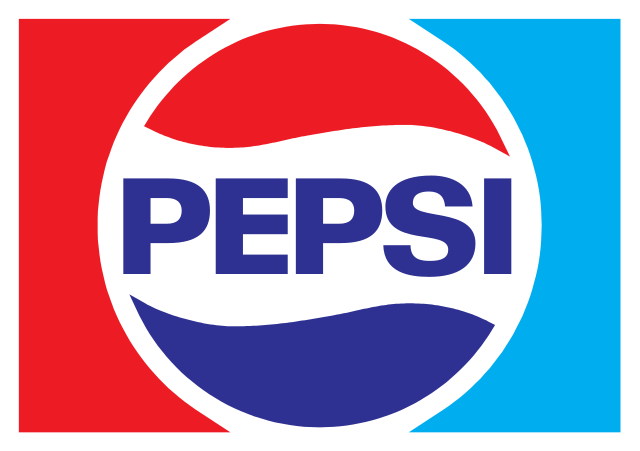

In a dispute between Pepsi Cola and one of its independent bottlers, the Second Circuit noted:

#+begin_quote

Under New York law, it is well settled that *a contract of indefinite duration is terminable at will unless* the contract states expressly and unequivocally that the parties intend to be perpetually bound. ... 

If it appears that no termination date was within the contemplation of the parties, or that their intention with respect thereto cannot be ascertained, the contract will be held to be *terminable within a reasonable time or revocable at will* . . . . Contracts of exclusive agency and distributorship are terminable at will in the absence of an express provision of duration. ... <cite> [[https://scholar.google.com/scholar_case?case=17835369695398865672][Compania Embotelladora Del Pacifico, S.A. v. Pepsi Cola Co.]], 979 F.3d 239, 245, 246 (2d Cir. 2020) (affirming summary judgment in favor of PepsiCo) (cleaned up, citations omitted, emphasis and extra paragraphing added). To similar effect, see also, e.g., [[https://law.justia.com/cases/georgia/supreme-court/2025/s25a0635.html][State v. Dovetel Communication, LLC]], No. S25A0635, slip op. (Ga. Sept. 30, 2025) (reversing and remanding declaratory judgment in favor of broadband internet service providers: contracts between providers and state were terminable at will by state); [[https://scholar.google.com/scholar_case?case=1386198044140958741][Glacial Plains Coop. v. Chippewa Valley Ethanol Co.]], 912 N.W.2d 233, 236 (Minn. 2018) (reversing lower courts). </cite>
#+end_quote

(Drafters should consider what would constitute "a reasonable time" and "reasonable notice" in assessing what might be desired by way of restrictions on termination at will.)

{{{CE}}} Concerning a contract for sharing songwriting royalties for songs by the 1970s band Supertramp: The Ninth Circuit held that the band's two principal songwriters could *not* terminate the contract at will — and thus stop sharing their songwriting royalties with other band members and the band's manager — because under California law, the contract had an *implied* term, to wit: as long as the songs continued to generate royalties. The opinion extensively discusses factors that the court regarded as establishing an implied term. <cite> See [[https://scholar.google.com/scholar_case?case=3774300368034410873][Thomson v. Hodgson]], 150 F.4th 1097, 1103-06 (9th Cir. 2025) (reversing judgment on jury verdict for defendants and remanding with direction to enter judgment for plaintiffs on issue of liability). </cite>

The opinion also mentions how copyright royalties typically work in the music business — which led to the band members' entering into the contract in suit because the two songwriting members were making a lot more money than the other members and the manager. <cite> /See id./, 150 F.4th at 1107. </cite>

#+begin_comment
Hodgson and Davies were the principal songwriters in Supertramp and credited as the authors of Supertramp’s songs.

Supertramp’s records generate *two distinct streams of revenue*: (1) "*record royalties*," which are generated from the sale of the album itself or the CD or the cassette itself, and (2) *songwriting* or *publishing royalties*, which is the revenue that is generated by the publishing of those songs that are contained on those records. 

The band shared the record royalties equally, but only Hodgson and Davies, as songwriters, were entitled to the publishing royalties.

*Supertramp’s label A&M Records provided and paid for the expenses that the band couldn’t afford to pay in their early years, and then recouped its money from Supertramp’s record royalties. The band members would not earn any record royalties until their debts to A&M were repaid.*

Unlike the /record/ royalties, the /publishing/ royalties were the only unencumbered stream of revenue that wasn’t owed back to A&M while Supertramp was still in debt.

As a result of this arrangement, Plaintiffs /[the other band members and manager]/ found themselves hurting financially during the 1970s despite Supertramp’s success, while /[songwriters]/ Hodgson and Davies found their financial situations improving. ... 

[A]lthough the band had released two bestselling albums, and despite the importance of Plaintiffs’ contribution to Supertramp’s success, Plaintiffs were receiving no payment for their efforts because all *recording* royalties and tour revenues were used to reimburse A&M Records for the band’s expenses.

/Id./ at 5-6 (emphasis and extra paragraphing added).
#+end_comment

(Judge Wardlaw's law clerk — or perhaps [[https://en.wikipedia.org/wiki/Kim_McLane_Wardlaw][the judge herself]] — might be a Supertramp fan: The introduction to the opinion is sprinkled with the band's song titles.)

*** But: At-will termination might be /restricted/ by law               :CMT:
  :PROPERTIES:
  :CUSTOM_ID: r-termin-at-will-law
  :END:

The law might provide some contractual fences around an automatic termination-at-will right; as the Second Circuit noted in its /Pepsi/ decision:

#+begin_quote
... In some circumstances, New York law imposes a *reasonable-duration requirement* on *exclusive* distribution agreements that are otherwise terminable at will. Such a requirement *may* arise in circumstances such as these where a distributor must *invest* in equipment, materials, and other assets to perform its obligations under the contract. <cite> [[https://scholar.google.com/scholar_case?case=17835369695398865672][Compania Embotelladora]], 979 F.3d at 245, 246 (2d Cir. 2020) (cleaned up, citations omitted, emphasis added). </cite>
#+end_quote

Relatedly: A termination at will might be held to violate the implied covenant of good faith and fair dealing — *if* that implied covenant is recognized in the jurisdiction in question.  {{{RWE}}} The City of Albuquerque was a party to a requirements contract in which Davidson Oil would supply all of Albuquerque's needs for gasoline and diesel fuel at a fixed price. 

- When fuel market prices dropped, Albuquerque exercised a termination for convenience provision in its contract with Davidson Oil.
- But Davidson Oil had entered into hedge contracts to cabin its own risk from market fluctuations — and the city knew this.
- Davidson Oil sued the city for breach of the implied covenant of good faith and fair dealing.

The court affirmed summary judgment awarding Davidson Oil the value of the hedge contracts. <cite> [[https://scholar.google.com/scholar_case?case=9518672862511176142][Davidson Oil Co. v. City of Albuquerque]], 108 F.4th 1226 (10th Cir 2024). </cite>

(Reminder to students, Texas *doesn't* have a *general* implied covenant of good faith and fair dealing.)

# <cite> [[https://www.revisor.mn.gov/statutes/cite/ In fact, termination at will might be /prohibited/ by law, for example by "hometown" protective legislation. As one example, the Minnesota Termination of Sales Representatives Act imposes restrictions on a manufacturer's right to terminate a sales representative. 325E.37][Minn. Stat. § 325E.37]] /discussed in/ [[https://scholar.google.com/scholar_case?case=17807052533252527784][Engineered Sales Co.]], 980 F.3d 597 (8th Cir. 2020). </cite>

Moreover, some /countries/ might restrict a party's right to terminate a contract. <cite> See [[https://www.morganlewis.com/pubs/what-to-know-when-terminating-contracts-governed-by-french-law-or-involving-french-parties][Bailly & Haranger]] (2020) (French law; archived at https://perma.cc/4QB4-5BV9). </cite>

*** Special case: Click-to-cancel for online agreements?
  :PROPERTIES:
  :CUSTOM_ID: term-will-click
  :END:

In October 2024 the Federal Trade Commission announced a new [[https://www.ftc.gov/news-events/news/press-releases/2024/10/federal-trade-commission-announces-final-click-cancel-rule-making-it-easier-consumers-end-recurring]["click to cancel" rule]], to take effect in the spring of 2025, "that will require sellers to make it as easy for consumers to cancel their enrollment as it was to sign up." 

- In July 2025 the Eighth Circuit vacated the rule on procedural grounds. <cite> See [[https://scholar.google.com/scholar_case?case=4215013878232378844][Custom Commc'ns, Inc. v. FTC]], 142 F.4th 1060 (8th Cir. 2025). </cite>

-  On March 13, 2026, the FTC [[https://www.regulations.gov/document/FTC-2026-0265-0001][posted]] a new proposed rule for comment.

** Termination for Change of Control {{{CLS}}}                          :CLS:
  :PROPERTIES:
 :CUSTOM_ID: r-termin-chg-ctrl
 :HTML_CONTAINER_CLASS: cl5
 :CATEGORY: Protocol
  :END:

Contents:

#+TOC: headlines 1 local

***  {{{v(Either party)}}} may terminate for a change of control.
  :PROPERTIES:
  :CUSTOM_ID: termin-change-rt
  :END:

 {{{v(Either party)}}}, referred to as "the Terminating Party," may terminate {{{thek}}} if the other party has a "change of control" (as defined below).

***** Note                                                              :CMT:
  :PROPERTIES:
  :HTML_CONTAINER_CLASS: cmtry
  :UNNUMBERED: notoc
  :END:

A party to a contract might want the right to terminate the contract (or a purchase order, or a statement of work, etc.) if the other party undergoes a "change of control" — for example being acquired by one of the terminating party's competitors.

This could be especially true if the contract calls for the terminating party to share its trade secrets or other proprietary information with the other party, because of the fear that the acquiring competitor might gain access to the terminating party'sinformation.

*** Termination is effective upon notice.
  :PROPERTIES:
  :CUSTOM_ID: termim-chg-notice
  :END:

Termination will be effective immediately when the Terminating Party's notice of termination to the other party becomes effective in accordance with {{{RR}}} [[#r-notices-rule]].

*** Deadline for change-of-control termination
  :PROPERTIES:
  :CUSTOM_ID: termin-change-dl
  :END:

On any occasion when the Terminating Party has the right to terminate under {{{ths}}}, the Terminating Party *WAIVES* that right for that occasion — and the Terminating Party must not assert otherwise — if the Terminating Party's notice of termination to the other party has not become effective on or before the *later* of:

   1. {{{v(three months)}}} after the date that the Terminating Party first learned, via any source, or reasonably should have known, that the other party's change of control had become effective; or

   2. {{{v(six months)}}} after the effective date of the change of control.

***** Note                                                              :CMT:
  :PROPERTIES:
  :HTML_CONTAINER_CLASS: cmtry
  :UNNUMBERED: notoc
  :END:

{{{H1}}} This deadline forces the terminating party to make up its mind. It follows the maxim that contract rights and obligations should generally have a "sunset," so as not to be indefinitely hanging over other parties' heads.

{{{HN}}} Subdivision 1's deadline is written as "three months" after learning of the event, instead of "90 days," to spare the reader from having to count days. On that subject, see the definition of /month/ at {{{RR}}} [[#month-defn]].

{{{HN}}} The countdown clock starts ticking on subdivision 1's termination deadline when the terminating party first learns of the triggering event affecting the other party. To be sure: The terminating party might prefer for its termination countdown clock to start running only upon formal notice of the triggering event from the other party. That, though, might be too burdensome for the other party to manage.

{{{HN}}} In contrast: Subdivision 2's "outside" termination deadline has in mind that if the terminating party hasn't seen fit to terminate within the stated period — for example, because the terminating party simply hasn't noticed any material ill effects from a triggering event — then perhaps the terminating party right to terminate ought to quietly go away.
 

*** The voting-power trigger for a change of control is {{{v(50%)}}}.
  :PROPERTIES:
  :CUSTOM_ID: termin-change-pwr
  :END:

For purposes of {{{ths}}}, the term {{{dfn(change of control)}}} refers solely to a change of ownership of the power to vote more than {{{v(50%)}}} of the voting power entitled to vote for members of a party's board of directors (or equivalent body in a non-corporate organization).

***** Note                                                              :CMT:
  :PROPERTIES:
  :HTML_CONTAINER_CLASS: cmtry
  :UNNUMBERED: notoc
  :END:

Some clauses of this type have even lower thresholds for terminating for a change of control.
 

** Termination for Insolvency {{{CLS}}}                                 :CLS:
  :PROPERTIES:
 :CUSTOM_ID: r-termin-br
 :HTML_CONTAINER_CLASS: cl5
 :CATEGORY: Protocol
  :END:

Contents:

#+TOC: headlines 1 local

*** {{{ACT}}}
  :PROPERTIES:
  :CUSTOM_ID: termin-br-pr
  :END:

**** Either party can terminate under {{{ths}}}.
  :PROPERTIES:
  :CUSTOM_ID: termin-br-events
  :END:

_If_ {{{thek}}} clearly says so: {{{v(Each party)}}} (each, a {{{dfn(Terminating Party)}}}) is free to terminate {{{thek}}}, effective immediately upon notice to the other party in accordance with {{{RR}}} [[#r-notices-rule]], if one or more of the following things occurs:

   a. the other party ceases to do business in the normal course;

   b. the other party becomes insolvent;

   c. the other party admits in writing its inability to meet its debts or other obligations as they become due;

   d. the other party makes a general assignment for the benefit of creditors;

   e. the other party files a /voluntary/ petition for protection under the bankruptcy laws or similar laws of the relevant jurisdiction, or to effect a plan or other arrangement with creditors;

   f. the other party becomes the subject of an /involuntary/ petition under the bankruptcy laws (or a similar petition or other filing under the laws of the relevant jurisdiction), /and/ the same is not vacated, released, dismissed, stayed, reversed or otherwise overturned, or bonded off before the end of {{{v(60 days)}}} after the date of the petition or other filing; or

   g. the other party has a receiver, administrative receiver, administrator, liquidator, trustee in bankruptcy, or similar functionary in the relevant jurisdiction, appointed for the other party's business or assets.

***** Note                                                              :CMT:
  :PROPERTIES:
  :HTML_CONTAINER_CLASS: cmtry
  :UNNUMBERED: notoc
  :END:

Subdivisions 5 through 7: See the notes at [[#nl-termin-bkrpt-bkgd]] about the effect of bankruptcy on contracts under the (U.S.) Bankruptcy Code of 1978.

** Termination for Legal Violation {{{CLS}}}                            :CLS:
  :PROPERTIES:
 :CUSTOM_ID: r-termin-for-legal-violation-option
 :HTML_CONTAINER_CLASS: cl5
 :CATEGORY: Protocol
  :END:

Contents:

#+TOC: headlines 1 local

*** {{{v(Each party)}}} may terminate under {{{ths}}}.
  :PROPERTIES:
  :CUSTOM_ID: termin-legal-trig
  :END:

Each party (each, a {{{dfn(Terminating Party)}}}) is free to terminate {{{thek}}}, effective immediately upon notice of termination to the other party if the Terminating Party reasonably determines that the other party has committed any act or omission that satisfies *both* of the following prerequisites:

   1. the other party's act or omission violates one or more applicable laws; *and*

   2. the other party's act or omission — because of the violation — is likely to materially and adversely affect the Terminating Party's interests.

***** Note                                                              :CMT:
  :PROPERTIES:
  :HTML_CONTAINER_CLASS: cmtry
  :UNNUMBERED: notoc
  :END:

{{{Ths-cap}}} gives a party the right to cut off contractual relations with another party if the other party violates the law; that might be useful to the first party for investor-relations purposes or possibly to maintain good relations with law enforcement.

*** There's a deadline for termination.
  :PROPERTIES:
  :CUSTOM_ID: termin-legal-dl
  :END:

On any occasion when the Terminating Party has the right to terminate under {{{ths}}}, the Terminating Party *WAIVES* that right — for that occasion — if the Terminating Party's notice of termination to the other party hasn't become effective on or before the *later* of:

   1. the date {{{v(ten business days)}}} after the date that the Terminating Party first learned, via any source, or reasonably should have known, of the most-recent event coming within § [[#termin-legal-trig]] above; or

   2. if earlier, the date {{{v(30 days months)}}} after the date of that most-recent event, regardless when, or whether, the Terminating Party learned or should have known about that event.

*** {{{OPT}}}: Cure Period for Legal Violation
  :PROPERTIES:
  :CUSTOM_ID: termin-legal-cure
  :HTML_CONTAINER_CLASS: optn-txt olnum
  :END:

If {{{thek}}} clearly adopts this {{{OPT}}}, then:

1. The Terminating Party doesn't terminate for legal violation by the other party if the other party cures both: (i) the violation of law, *and* (ii) all material effects of the violation, before the end of {{{v(five business days)}}} after the violation began; *but*

2. After that cure period, the Terminating Party is free to terminate without giving the other party an additional opportunity to cure.

***** Note                                                              :CMT:
  :PROPERTIES:
  :HTML_CONTAINER_CLASS: cmtry
  :UNNUMBERED: notoc
  :END:

This is an option because it's hard to predict in advance whether a cure period would be appropriate for a violation of law, and so it seems unwise to make it part of the standard term.

** Termination for Personnel Changes {{{CLS}}}                          :CLS:
  :PROPERTIES:
 :CUSTOM_ID: r-termin-personnel-chg
 :HTML_CONTAINER_CLASS: cl5
 :CATEGORY: Protocol
  :END:

Contents:

#+TOC: headlines 1 local

*** The {{{{CLS}}}
  :PROPERTIES:
  :CUSTOM_ID: termin-pers-pr
  :END:

**** {{{v(Either party)}}} may terminate under {{{ths}}}.
  :PROPERTIES:
  :CUSTOM_ID: termin-pers-which
  :END:

If {{{theK}}} clearly adopts {{{ths}}}, *then:* The stated party (each, a {{{dfn(Terminating Party)}}}) is free to terminate {{{thek}}} — by notice to the other party in accordance with {{{RR}}} [[#r-notices-rule]] — after any material change among the /supervisory/ personnel of the other party who are /directly and materially involved/ in the other party's performance under {{{thek}}}.

***** Note                                                              :CMT:
  :PROPERTIES:
  :HTML_CONTAINER_CLASS: cmtry
  :UNNUMBERED: notoc
  :END:

A customer might want to use {{{ths}}} in a contract with a small-company or startup-company supplier whose ability to continue to perform might be called into question if too many closely-involved key people were to leave. But the customer's right to do so should probably "sunset" in relatively-short order, so as to avoid unfair disruption to the supplier.

**** There's a deadline for termination under {{{ths}}}.
  :PROPERTIES:
  :CUSTOM_ID: termin-pers-dl
  :END:

On any occasion when the Terminating Party has the right to terminate under {{{ths}}}, the Terminating Party *WAIVES* that right — for that occasion — if the Terminating Party's notice of termination to the other party hasn't become effective on or before the *later* of:

   a. {{{v(ten business days)}}} after the date that the Terminating Party first learned, via any source, or reasonably should have known, of the most-recent change of the other party's personnel in question; or

   b. {{{v(six months)}}} after the most-recent personnel change in question.

***** Note                                                              :CMT:
  :PROPERTIES:
  :HTML_CONTAINER_CLASS: cmtry
  :UNNUMBERED: notoc
  :END:

Subdivision 2 is another example of putting a "sunset" on a right: If — after that much time has passed — the terminating party hasn't seen fit to terminate because of the personnel change, then it seems unlikely that the terminating party is actually being harmed by the change.

** Termination for Reputation Risk {{{CLS}}}                            :CLS:
  :PROPERTIES:
  :CUSTOM_ID: r-termin-rep-risk
  :HTML_CONTAINER_CLASS: pr-top
  :END:

Contents:

#+TOC: headlines 1 local

*** The {{{{CLS}}}
  :PROPERTIES:
  :CUSTOM_ID: termin-rep-pr
  :END:

**** {{{v(Each party)}}} may terminate under {{{ths}}}.
  :PROPERTIES:
  :CUSTOM_ID: termin-rep-trig
  :END:

1. If {{{ths}}} is clearly agreed to, *then:* The specified party (the {{{v(Terminating Party)}}}) is free to terminate {{{thek}}} —

- effective immediately upon notice to the other party  in accordance with {{{RR}}} [[#r-notices-rule]],
- if the Terminating Party reasonably determine that one or more "Reputation Risk Actions," defined at § [[#r-termin-rep-risk-defn]] below,
- previously taken by the other party or any of the other party's [[#r-affil-defn][affiliates]],
- have created a not-insubstantial risk
- to the Terminating Party's business reputation, and/or that of any of the Terminating Party's own affiliates.

***** Note                                                              :CMT:
  :PROPERTIES:
  :HTML_CONTAINER_CLASS: cmtry
  :UNNUMBERED: notoc
  :END:

In today's global economy, "offshore" companies do a great deal of manufacturing for U.S. and European firms. Those companies might not always comply with First-World standards of safety, employee treatment, and the like, which could result in adverse publicity for the offshore companies' customers.

{{{RWE}}} Apple and HP were forced to deal with news stories about [[https://en.wikipedia.org/wiki/Foxconn_suicides][worker suicides]] in factories owned by the giant Chinese electronics contract manufacturer Foxconn.

# https://en.wikipedia.org/wiki/Subway_(restaurant)#/media/File:Subway_2016_logo.svg
# #+ATTR_HTML: :alt Subway restaurant logo :title Subway restaurant logo   :class photo-at-right photowidth25
# 

{{{RWE}}} Longtime Subway sandwich shop pitchman Jared Fogle [[http://www.nytimes.com/interactive/2015/08/19/business/media/jared-fogle-guilty-plea-document.html][agreed to plead guilty]] to child-pornography charges, among others. Subway had previously [[http://www.nytimes.com/2015/07/08/business/media/jared-fogle-and-subway-suspend-ties-after-raid-at-his-home.html][suspended its relationship with Fogle]]. The case, along with the attendant bad publicity for the [[http://www.usatoday.com/story/money/2015/08/19/subway-trouble-before-jared-mess/31995853/][already-troubled Subway]], is a sad reminder of the value of including an appropriate "termination for business reputation risk" clause in a contract of that nature.

Some similar stories are summarized in the following footnote:[fn:TermRepRiskEg]

[fn:TermRepRiskEg] Termination for reputation risk:

{{{RWE}}} A manufacturer and distributor of Stetson cowboy hats was sued for antitrust violations by a retailer. The retailer was upset because, during the COVID-19 pandemic, the retailer's owner had posted, to the retailer's Instagram account, a photograph depicting a yellow Star of David image with the words "Not Vaccinated." The Stetson distributor thereupon cut off sales to the retailer. The case later settled. <cite> See [[https://bloximages.newyork1.vip.townnews.com/nashvillescene.com/content/tncms/assets/v3/editorial/0/93/093b24ea-844e-11ec-af2a-77deec7f836c/61fac034f1d6c.pdf.pdf][Complaint]], HatWrks, LLC v. RHE Hatco, Inc., No. 3:22-cv-00068 (M.D. Tenn. Feb. 1, 2022); Mike Leonard, [[https://news.bloomberglaw.com/antitrust/stetson-distributor-settles-retailers-suit-over-holocaust-post][Stetson Distributor Settles Retailer’s Suit Over Holocaust Post]] (BloombergLaw.com 2022) (paywalled). </cite>

{{{RWE}}} Walmart and other retailers were confronted with a similar problem when [[https://en.wikipedia.org/wiki/2012_Dhaka_fire][a clothing factory in Bangladesh burned]], killing over 100 people.

# https://en.wikipedia.org/wiki/Elizabeth_Holmes#/media/File:Elizabeth_Holmes_2014_cropped.jpg
# #+ATTR_HTML: :alt Cropped 2014 head shot of Elizabeth Holmes in black turtleneck :title Elizabeth Holmes  :class photo-at-right photowidth20
# 

{{{RWE}}} Walgreens ended its relationship with troubled blood-testing company Theranos. ([[http://www.nytimes.com/2016/06/13/business/walgreens-cuts-ties-to-blood-testing-company-theranos.html][NYTimes.com]]); the company's founder, [[https://en.wikipedia.org/wiki/Elizabeth_Holmes#U.S._v._Holmes,_et_al.][Elizabeth Holmes]], was later sentenced to 11 years in federal prison for defrauding investors.

{{{RWE}}} Car manufacturer Hyundai terminated one of its dealerships because the New York attorney general had obtained a court judgment against the dealership for having engaged in fraudulent and illegal business practices. <cite> See [[https://scholar.google.com/scholar_case?case=10997886384532510200][Giuffre Hyundai, Ltd. v. Hyundai Motor America]], 756 F.3d 204 (2d Cir. 2014). </cite>

# https://en.wikipedia.org/wiki/File:Twin_Peaks_logo.png
# #+ATTR_HTML: :alt Photo of Twin Peaks restaurant logo :title Twin Peaks restaurant logo   :class photo-at-right photowidth25
# 

{{{RWE}}} The [[https://en.wikipedia.org/wiki/Twin_Peaks_(restaurant_chain)][Twin Peaks]] "[[https://en.wikipedia.org/wiki/Breastaurant][breastaurant]]" organization terminated the franchise of a restaurant in Waco, Texas, after a shootout between rival motorcycle gangs left nine dead. "The company laid the blame on the managers of the Waco franchise who 'chose to ignore the warnings and advice from both the police and our company, and did not uphold the high security standards we have in place to ensure everyone is safe at our restaurants.'" ([[https://money.cnn.com/2015/05/18/news/companies/waco-twin-peaks-bikers][CNN.com]]).

**** Definition: What would qualify as a "Reputation Risk Action"?
  :PROPERTIES:
  :CUSTOM_ID: r-termin-rep-risk-defn
  :END:

For purposes of {{{ths}}}, the term {{{dfn(Reputation Risk Action)}}} refers to any action (for this purpose including omissions) or series of actions, whether related or unrelated, where the action is (i) intended by the actor, or (ii) reasonably likely, to do one or more of the following:

   1. libel or slander another person;

   2. put another person in a false light;

   3. threaten, embarrass, harass, or invade the privacy of another;

   4. impersonate another or promote, encourage, or assist in, such impersonation;

   5. <<termin-rep-risk-race>> offend a reasonable person on racial- or ethnic grounds;

   6. engage in conduct prohibited by law, including for example the U.S. Foreign Corrupt Practices Act;

   7. encourage activities prohibited by law, including (for example) bribery; identity theft; child pornography; and terrorism;

   8. engage in tortious conduct; and/or

   9. mistreat a person, or promote, assist in, or encourage such mistreatment.

***** Note                                                              :CMT:
  :PROPERTIES:
  :HTML_CONTAINER_CLASS: cmtry
  :UNNUMBERED: notoc
  :END:

The above "laundry list" of Reputation Risk Actions is adapted from language used in a number of on-line terms of service; see Zachary West, [[http://zacwe.st/post/14704028321/morality-clauses-in-domain-registration][Morality clauses in domain registration]] (zacwe.st 2011).

**** {{{Ths-cap}}} doesn't /require/ any action by any party.

{{{Ths-cap}}} establishes only the Terminating Party's conditional right to terminate {{{thek}}}; in itself, {{{ths}}} doesn't obligate either party to do, or not do, anything.
 
**** No /contract/ liability for Reputation Risk Action alone.
  :PROPERTIES:
  :CUSTOM_ID: termin-rep-risk-effect
  :END:

No party would be liable /under {{{thek}}}/, in damages or otherwise, for any Reputation Risk Action that does not otherwise breach {{{thek}}} — but this doesn't rule out possible liability on other grounds (for example, for tortious behavior and/or criminal action).

***** Note                                                              :CMT:
  :PROPERTIES:
  :HTML_CONTAINER_CLASS: cmtry
  :UNNUMBERED: notoc
  :END:

For discussion of this point (in the context of "codes of conduct"), see [[#code-termin-excl]].

**** There's a deadline for termination under {{{ths}}}.
  :PROPERTIES:
  :CUSTOM_ID: termin-rep-risk-expir
  :END:

On any occasion when the Terminating Party has the right to terminate under {{{ths}}}, the Terminating Party *WAIVES* that right — for that occasion — if the Terminating Party's notice of termination to the other party hasn't become effective on or before the *later* of:

   a. the date {{{v(three months)}}} after the date that the Terminating Party first learned, via any source, or reasonably should have known, of the most-recent Reputation Risk Action; or

   b. the date {{{v(six months)}}} after the date of that most-recent action.

{{{PTY(Terminating Party)}}} On any occasion when you have the right to terminate under {{{ths}}}, you'll lose that right — for that occasion — if your notice of termination to the other party hasn't become effective on or before exactly 12 midnight at the end of the day on:

   1. the date {{{v(ten business days)}}} after the date that you first learn, via any source, or reasonably should have known, of the most-recent Reputation Risk Action; or

   2. the date {{{v(three months)}}} after the date of that most-recent action.
 
***** Note                                                              :CMT:
  :PROPERTIES:
  :HTML_CONTAINER_CLASS: cmtry
  :UNNUMBERED: notoc
  :END:

This is another "sunset" provision — see the discussion at [[#termin-pers-dl]]

** Termination General Provisions {{{CLS}}}                             :CLS:
  :PROPERTIES:
  :CUSTOM_ID: r-termin-ground
  :HTML_CONTAINER_CLASS: pr-top
  :END:

*Every* contractual relationship will come to an end eventually: by the completion of the transaction; by expiration with the passage of time; by the "disappearance" of one or both parties; or by the action of one or both parties. {{{Ths-cap}}} sets out fairly-standard general ground rules for any termination *or* expiration. 

(*Pro tip:* Contracting parties should ideally try to plan for /orderly/ winding up of their relationship by considering what actions — by whom — each party might want to have happen.)

Contents:

#+TOC: headlines 1 local

*** Termination {{{v(needn't)}}} be all-or-nothing.
  :PROPERTIES:
  :CUSTOM_ID: termin-trans
  :END:

{{{PTY(Each party)}}} Unless {{{theK}}} clearly states otherwise: Any time that you have the right to terminate {{{thek}}}, you could instead terminate one or more of the following specific items, to the extent that such items exist under {{{thek}}}:

   1. <<xactionterm>> a transaction, for example, a purchase order or a statement of work for services; 

   2. a grant, for example, a leasehold interest or a license; 

   3. a relationship, for example, a distributorship; and/or

   4. the exclusivity of a grant.

***** Note                                                              :CMT:
  :PROPERTIES:
  :HTML_CONTAINER_CLASS: cmtry
  :UNNUMBERED: notoc
  :END:

{{{H1}}} Background: Drafters should think about whether termination /of {{{thek}}}/ is what the client really wants, as opposed to just terminating /selected rights and/or obligations/ under {{{thek}}}.

{{{HN}}} Subdivision 4 — *caution:* It might be undesirable to terminate just the /exclusivity/ of a grant or relationship, e.g., the exclusivity of a reseller relationship, while leaving the underlying reseller relationship in place on a /nonexclusive/ basis: The continued existence of the /nonexclusive/ relationship would preclude the grantor from offering a new /exclusive/ grant.

*** Certain wrap-up actions might be agreed to.
  :PROPERTIES:
  :CUSTOM_ID: termin-post-oblig
  :END:

{{{PTY(Each party)}}} {{{TheK-cap}}} could require (or allow) you to take certain specific actions, or to have other specific rights or obligations, upon a termination.

(This would be in addition to any provisions subject to a survival provision in {{{thek}}}.)

***** Note                                                              :CMT:
  :PROPERTIES:
  :HTML_CONTAINER_CLASS: cmtry
  :UNNUMBERED: notoc
  :END:

This is a reminder to drafters to consider wrap-up provisions such as those in {{{RR}}} [[#r-wrap-up-cls]].

*** Expiration {{{v(would)}}} count as a termination.
  :PROPERTIES:
  :CUSTOM_ID: expiration-as-termination
  :END:

{{{PTY(All parties)}}}

1. If {{{thek}}} expires — or, if applicable, a transaction, grant, or relationship under {{{thek}}} expires — the expiration would have the same effect as a /termination/ unless it was otherwise unambiguously clear from the context. 

2. For this purpose, the term /expiration/ includes, without limitation, automatic expiration due to a party's exercising a right to opt out of an automatic-/extension/ or /{{{NBH}}}renewal/ provision.

***** Note                                                              :CMT:
  :PROPERTIES:
  :HTML_CONTAINER_CLASS: cmtry
  :UNNUMBERED: notoc
  :END:

This is intended as a guardrail against future "creative" arguments to the contrary. {{{RWE}}} One example of expiration-as-termination attracted considerable local publicity in a 2020 case in the San Francisco Bay Area in California, where:

 # https://en.wikipedia.org/wiki/Golden_State_Warriors
# #+ATTR_HTML: :alt Golden State Warriors logo :title Golden State Warriors logo :class photowidth20 photo-at-right
# 

1. The NBA's Golden State Warriors basketball team elected not to exercise an option to renew the team's lease of the Oakland-Alameda County Coliseum, where the team had played for years.

2. An arbitrator held that the lease's /expiration due to nonrenewal/ was tantamount to a /termination/ by the Warriors.

3. That termination triggered an obligation for the team to continue making payments on debt incurred by the government agency that owned the Coliseum.

The arbitrator's award was upheld by a district court, whose decision was affirmed on appeal. <cite> See [[https://scholar.google.com/scholar_case?case=3174888921484057445][Oakland-Alameda Cty. Coliseum Auth. v. Golden State Warriors, LLC]], 53 Cal. App. 5th 807, 267 Cal. Rptr. 3d 799 (2020). </cite>

{{{RWE}}} In a North Dakota case:

- A service provider and a marketing company entered into a marketing agreement. The agreement included a provision for the marketing company to be paid a buy-out fee if the agreement was "terminated." 

- The agreement was for  initial period of three years, with automatic one-year renewals unless either party opted out of renewal. - After several years of automatic renewal, the service provider opted out of renewal — and didn't pay the buy-out fee.

- The marketing company sued for the buy-out fee, but a federal trial court dismissed the case with prejudice, on grounds that "termination" didn't include non-renewal.

On appeal; the Eighth Circuit held that the service provider's non-renewal /could/ constitute a termination, because:

- If "termination" /didn't/ include non-renewal, then "many of the contract’s provisions would have no effect ...."

- The marketing agreement's survival clause /(see generally {{{RULE}}} [[#r-survival-cls]])/ addressed only "termination" but the surviving provisions were of the kind that would normally survive however the agreement came to an end. <cite> See [[https://law.justia.com/cases/federal/appellate-courts/ca8/25-1069/25-1069-2026-01-29.html][Reinhardt Enterpr., LLC v. Kaseya U.S., LLC]], No. 25-1069, part II, slip op. at 5-6 (8th Cir. Jan. 29, 2026) (reversing and remanding grant of service provider's Rule 12(b)(6) motion to dismiss). </cite>

***  Notice of expiration {{{v(isn't)}}} needed.
  :PROPERTIES:
  :CUSTOM_ID: termin-notice-no
  :END:

{{{PTY(Each party)}}} You don't have to give another party notice of an upcoming expiration unless {{{thek}}} clearly says otherwise.

***** Note                                                              :CMT:
  :PROPERTIES:
  :HTML_CONTAINER_CLASS: cmtry
  :UNNUMBERED: notoc
  :END:

*Pro tip:* Even if there's no /requirement/ to give notice of expiration, it might well be a good customer-relations practice for a vendor to give such notice anyway, to increase the chances of getting a renewal and/or to "upsell" the customer.

*** Termination will have certain automatic effects.
  :PROPERTIES:
  :CUSTOM_ID: termin-effect
  :END:

{{{PTY(Each party)}}} Any termination would automatically do the following unless {{{thek}}} clearly provided otherwise:

   1. it'd cancel all of your relevant, respective, /post-termination/ rights and obligations; 

   2. it'd cancel any right that any party has to continue performance of its relevant pre-termination obligations; and 

   3. _not_ affect any party's claim for pre-termination breach, nor any related rights or remedies. 

***** Note                                                              :CMT:
  :PROPERTIES:
  :HTML_CONTAINER_CLASS: cmtry
  :UNNUMBERED: notoc
  :END:

Drafters will want to consider "survival" provisions such as {{{RR}}} [[#r-survival-cls]]. </aside>

***** Note                                                              :CMT:
  :PROPERTIES:
  :HTML_CONTAINER_CLASS: cmtry
  :UNNUMBERED: notoc
  :END:

This is a "savings clause" inspired by a Delaware case in which the court held that the wording of the contract's no-liability clause — "the obligations of the parties shall terminate and there shall be no liability on the part of any party /with respect thereto/" — had the effect of waiving claims for breach of the contract; the state's supreme court affirmed in a one-word order.  <cite> [[https://scholar.google.com/scholar_case?case=17313723675796036946][Yatra Online, Inc. v. EBIX, Inc.]], No. 2020-0444 (Del. Ch. Aug. 30, 2021) (cleaned up, emphasis added), /aff'd w/o opinion/, [[https://scholar.google.com/scholar_case?case=14743083187780141310][276 A.3d 476]] (Del. 2022). </cite>>

***** Note                                                              :CMT:
  :PROPERTIES:
  :HTML_CONTAINER_CLASS: cmtry
  :UNNUMBERED: notoc
  :END:

{{{HN}}} Subdivision 2 is inspired by a Michigan supreme court case in which the court's recitation of facts noted that "Miller-Davis gave Ahrens notice of default, /terminated Ahrens's right to perform the contract/, and demanded the bonding company perform under the bond." <cite> [[https://scholar.google.com/scholar_case?case=2696665445577090984][Miller-Davis Co. v. Ahrens Constr., Inc.]], 495 Mich. 161, 848 N.W.2d 95, 99 (2014) (emphasis added). </cite>

*** Termination alone {{{v(wouldn't)}}} create liability.
  :PROPERTIES:
  :CUSTOM_ID: termin-per-se-no-liab
  :END:

{{{PTY(Each party)}}} You won't be liable to another party *solely* because of termination of {{{thek}}} in accordance with its termination provisions, *unless* {{{thek}}} clearly specifies otherwise — for example (hypothetically) if {{{thek}}} requires you to pay a specified amount to another party in case of termination before a stated time. 

***** Note                                                              :CMT:
  :PROPERTIES:
  :HTML_CONTAINER_CLASS: cmtry
  :UNNUMBERED: notoc
  :END:

A terminating party might still be liable: (1) under other provisions of {{{thek}}}; (2) for breaching one or more of its obligations under {{{thek}}}; and/or (3) for /wrongfully/ terminating {{{thek}}} when the terminating party wasn't entitled to do so — see the discussion of "own goal" wrongful termination at [[#termin-own-goal]].

*** Other grounds for termination {{{v(can)}}} be cited later.
  :PROPERTIES:
  :CUSTOM_ID: termin-other-grnds
  :END:

1. This section will apply if:

   a. a party terminates {{{thek}}}, or a transaction or relationship under {{{thek}}}, for a stated reason (e.g., an alleged breach); *but*

   b. it turns out that the stated reason was not valid — for example, if a court finds that the terrminating party failed to prove an alleged breach and/or that the breach didn't give rise to a right to terminate.

2. In that situation, the terminating party has the right to assert, as backup grounds, any other reason that, at the time of termination, would also have allowed the terminating party to terminate under {{{thek}}} or the law (e.g., if the terminating party could have terminated at will).

***** Note                                                              :CMT:
  :PROPERTIES:
  :HTML_CONTAINER_CLASS: cmtry
  :UNNUMBERED: notoc
  :END:

This section provides a terminating party with a backup position in case its original reason for termination doesn't pan out. That could be handy to keep the original termination from being held to have been /itself/ an "own goal" breach of contract. <cite>  See [[https://scholar.google.com/scholar_case?case=17516483583354092033][Southland Metals, Inc. v. American Castings, LLC]], 800 F.3d 452 (8th Cir. 2015) (affirming judgment on jury verdict that defendant had breached contract by terminating when it didn't have the right to do so). </cite> (For more discussion of "own goal" wrongful terminations, see [[#termin-own-goal]].) 

BUT: In an employment context, Delaware law imposes restrictions on such after-the-fact justifications:
#+begin_quote
Even if Krafton’s newly proffered grounds met the contractual definition of Cause, Krafton’s reliance on them would fail under the mend-the-hold and after-acquired evidence doctrines. Delaware courts employ these doctrines to guard against pretextual maneuvering by employers. They address related but temporally distinct problems.

- The mend-the-hold doctrine limits a party’s ability to shift the contractual justification for its conduct during litigation;
- the after-acquired evidence doctrine addresses whether misconduct discovered after a termination can retroactively justify the termination. <cite>  [[https://courts.delaware.gov/Opinions/Download.aspx?id=392880][Fortis Advisors v. Krafton, Inc.]], No. 2025-0805, slip op. (Del. Ch. Mar. 16, 2026) (ordering acquired company's CEO reinstated, extending earn-out period) (extra paragraphing added, footnotes omitted). </cite>
#+end_quote

(The opinion goes on to explain how these two doctrines work in practice.)

*** {{{OPT}}}: Termination Cross-Default Right
  :PROPERTIES:
  :CUSTOM_ID: termin-xdefault
  :END:

{{{PTY(Each party)}}} If this {{{OPTIN}}} is agreed to, *and* you terminate one transaction, grant, or relationship for [[#nl-matl-defns][material breach]] by another party, *then:* You're free, in your [[#discr-defn][sole discretion]], to terminate some or all other uncompleted transactions, grants, or relationships between you and the breaching party.

***** Note                                                              :CMT:
  :PROPERTIES:
  :HTML_CONTAINER_CLASS: cmtry
  :UNNUMBERED: notoc
  :END:

Background: This section sets up a type of "cross-default" right. Suppose that a supplier breaches its obligations under a purchase order, and the breach entitles the customer to terminate that purchase order. In such a situation, the customer might want to "pull the plug" entirely on its relationship with the supplier, terminating all pending purchase orders and not just the one where the supplier is currently in breach.

*** {{{ADDL}}}                                                         :ADDL:
  :PROPERTIES:
  :CUSTOM_ID: term-gen-a
  :HTML_CONTAINER_CLASS: addl
  :END:

**** Termination could have undesired side effects.                     :CMT:
  :PROPERTIES:
  :CUSTOM_ID: termin-trans-cmt
  :END:

A right to terminate /{{{thek}}}/ could have unexpected (and undesired) results; for example:

In a California case, a former employee quit her job — which had the effect of revoking the arbitration agreement in her employment agreement. <cite> See [[https://scholar.google.com/scholar_case?case=6886459522771379043][Vazquez v. SaniSure, Inc.]], 101 Cal. App. 5th 139 (2024) (affirming /denial/ of former employer's motion to compel arbitration; employee's quitting her job had the effect of revoking arbitration provision in employment agreement). </cite>

{{{RWE}}} In the 8th Circuit's 2021 /Miller/ case, an employee terminated her /employment agreement/ — which that agreement expressly allowed her to do. To the employer's surprise, though, the termination had the side effect of terminating the employee's obligation not to compete with her former employer, because the noncompetition covenant stated that it would survive termination of /employment/, not that it would survive termination of the employment agreement. <cite> [[https://scholar.google.com/scholar_case?case=17584396332083730448][Miller v. Honkamp Krueger Fin. Servs., Inc.]], 9 F.4th 1011 (8th Cir. 2021) (reversing and vacating preliminary injunction) (quotation edited for readability). </cite>

{{{RWE}}} In the Ninth Circuit's /BladeRoom/ case, the "sunset" termination of a confidentiality agreement (a.k.a. nondisclosure agreement a.k.a. "NDA") resulted in a disclosing party's loss of its right to enforce agreed confidentiality obligations against a recipient of confidential information — and the overturning of a $30 million jury verdict in the disclosing party's favor. <cite> [[https://scholar.google.com/scholar_case?case=13542985516140860336][BladeRoom Grp. Ltd. v. Emerson Elec. Co.]], 11 F.4th 1010, /amended/, [[https://scholar.google.com/scholar_case?case=3494441462132744599][20 F.4th 1231]] (9th Cir. 2021); see also the extended discussion of this point at [[#conf-info-expir]]. </cite>

Tangentially: The wording of a merger agreement's termination clause wiped out a party's breach-of-contract claims; as the court explained:

#+begin_quote
In the Effect of Termination Provision, the parties agreed that, "[i]n the event of any termination of this Agreement, /the obligations of the parties shall terminate and there shall be no liability on the part of any party with respect thereto/," with limited exceptions not relevant here. <cite> [[https://scholar.google.com/scholar_case?case=17313723675796036946][Yatra Online, Inc. v. EBIX, Inc.]], No. 2020-0444 (Del. Ch. Aug. 30, 2021) (cleaned up, emphasis added). </cite>
#+end_quote

**** Pro tip: Don't say "/non-breaching/ party"                         :CMT:
  :PROPERTIES:
  :CUSTOM_ID: termin-nonbreach
  :END:

If a contract authorizes a party to terminate because of the other party's breach, the authorization should refer to that party as "the terminating party" or "the other party," /not/ as "the non-breaching party." {{{RWE}}} In the Silicon Valley /Powertech/ case (N.D. Cal. 2014), the contract in suit gave the "non-breaching party" the right to terminate; the court held that the party that had /purported/ to terminate the contract didn't have the power to do so — because that party was itself in breach, of a different contract provision, and therefore had done an "own-goal breach" itself by purporting to terminate (for more such own-goal examples, see [[#termin-own-goal]] below). <cite> See [[https://scholar.google.com/scholar_case?case=13446235597793349920][Powertech Tech., Inc. v. Tessera, Inc.]], No. C 11-6121 CW, slip op. at part I.A, II.A (N.D. Cal. Jan. 15, 2014) (on summary judgment). </cite>

**** Motive: Termination to dump a counterparty?                        :CMT:
  :PROPERTIES:
  :CUSTOM_ID: assmt-bf-meme
  :END:

A party might look for a supposed material breach of contract as a reason — or a fabricated excuse — to terminate that contract and take up with another, more-lucrative party. That motivation might well have been at work in the 4th Circuit's /Hess Energy/ case cited at [[#termin-own-goal]] below, where "Lightning acknowledged that its purpose in signing [a contract with a new party] was to obtain a better price than it had obtained from Hess Energy." <cite> [[https://scholar.google.com/scholar_case?case=15576247741045608683][Hess Energy]], 276 F.3d at 648 (4th Cir. 2002). </cite>

**** Caution: Don't do an own-goal termination for material breach      :CMT:
  :PROPERTIES:
  :CUSTOM_ID: termin-own-goal
  :END:

As mentioned at [[#termin-nonbreach]] above, improper termination of a contract for breach could itself be an "own goal" breach of contract. 

(A widely-used dictionary, [[https://www.merriam-webster.com/dictionary/own%20goal][Merriam-Webster.com]], defines "own goal" as: "1 /chiefly British/ : a goal in soccer, hockey, etc., that a player accidentally scores against his or her own team [¶] 2 /chiefly British/ something that one does thinking it will help him or her but that actually causes one harm[.]")

Imagine this: 

- You want to get out of a contract.

- You conclude that the other side has materially breached the contract.

- You send a notice of breach, but the other side fails to cure the breach (or perhaps you claim that the breach is incurable).

- So, you send a notice of termination. 

But then the other side files a counterclaim — and in litigation, counterclaims pretty much /always/ happen.

In the end, a court holds that the other party's breach wasn't "material" after all —  as a result, you didn't have the right to terminate, and so /your termination/ was a repudiation of the contract, /and thus a breach in itself/.

{{{RWE}}} In /Southland Metals/ (8th Cir. 2015), an iron foundry terminated a contract with a reseller — allegedly for material breach — but also because the foundry wanted to organize an internal sales force (in other words, to move its sales efforts in-house). The reseller sued for breach, both because it denied having itself breached and because the foundry supposedly didn't follow the contract's notice-and-cure termination procedure. A jury awarded the reseller for nearly $4 million in damages for improper termination; the Eighth Circuit affirmed judgment on the verdict. <cite> See [[https://scholar.google.com/scholar_case?case=17516483583354092033][Southland Metals, Inc. v. American Castings, LLC]], 800 F.3d 452 (8th Cir. 2015). </cite>

Other cases have been to similar effect.[fn:TerminOwnGoal]

[fn:TerminOwnGoal] *Own-goal termination:*

{{{RWE}}} A party terminated a contract for what it /claimed/ was a material breach by the other party, but the appellate court held that the breach /wasn't/ material — and this, said the court, assumed that the other party's actions were a breach at all; so, said the court, the alleged breach didn't justify termination. See [[https://scholar.google.com/scholar_case?case=15576247741045608683][Hess Energy Inc. v. Lightning Oil Co.]], 276 F.3d 646, 649-51 (4th Cir. 2002) (reversing summary judgment). The /Hess Energy/ case is also discussed at [[#assmt-bf-meme]], concerning assignment without consent as a material breach. 

{{{RWE}}} In a Houston case, /Earth Power A/C/:

- A geothermal HVAC contractor breached a contract with a homeowner, whereupon the homeowner stopped paying the contractor.

- A jury found that both parties had thereby breached.

- /But/: The contractor's prior breach didn't excuse the homeowner's failure to pay, because (said the appeals court) the evidence didn't conclusively establish /the materiality/ of the contractor's breach.

- Consequently, the homeowner was still on the hook to pay the contractor — despite the contractor's prior breach. See [[https://scholar.google.com/scholar_case?case=2315833403516432347][Earth Power A/C and Heat, Inc. v. Page]], 604 S.W.3d 519, 524 (Tex. App.--Houston [14th Dist.] 2020) (reversing and rendering to restore jury verdict, awarding attorney fees to contractor per contract).

{{{RWE}}} In an Indiana federal-court case:

- Two brothers entered into a contract — negotiated by the 25-year-old son of one of the brothers — to buy more than three million eggs per week from an agri-business.

- The arrangement didn't work out, putatively due to reduced demand for eggs.

- The brothers and son/nephew repudiated the contract and sued the agri-business for a declaratory judgment and for damages.

- The agri-business counterclaimed, and the jury sided with the agri-business, awarding it more than $1.5 million in damages.  

(This case provides yet another illustration of the general rule: If you want to sue someone, you'd better be prepared for the counterclaim — because there usually /will/ be a counterclaim.) See [[https://scholar.google.com/scholar_case?case=8941365228901231015][Rexing Quality Eggs v. Rembrandt Enterprises, Inc.]], 360 F. Supp. 3d 817 (S.D. Ind. 2018) (granting, in part, agri-business's motion for summary judgment that brothers were liable for breach), /subsequent proceeding/, [[https://scholar.google.com/scholar_case?case=16596571511470132244][953 F.3d 998]], 1000 (7th Cir. 2020) (affirming dismissal of subsequent case, summarizing jury verdict in first case).

**** Proof of /damages/ from a material breach would still be required
  :PROPERTIES:
  :CUSTOM_ID: matl-br-dam-cmt
  :END:

A party might breach a contract but then be held not liable because the other party failed to prove its damages case, i.e., the dollar amount by which the other party was harmed by the breach.

{{{RWE}}} This happened in /SwiftAir/ (Cal. App. 2022), where the court affirmed a take-nothing judgment in favor of Southwest Airlines, on grounds that jury found SwiftAir didn't meet its burden of proving that Southwest's breach of a particular contract (a beta-test agreement) had caused SwiftAir's alleged damages. <cite> See [[https://scholar.google.com/scholar_case?case=9462861142224609283][SwiftAir, LLC v. Southwest Airlines Co.]], 77 Cal. App. 5th 46, 291 Cal. Rptr. 3d 895 (2022) (affirming denial of judgment notwithstanding verdict and awarding Southwest its costs on appeal). </cite>

**** Possible post-termination actions                                  :CMT:
  :PROPERTIES:
  :CUSTOM_ID: termin-post-actions
  :END:

Post-termination actions could include, for example, the following:
   - final deliveries of goods; intangibles, e.g., reports; and work in progress, as in {{{RR}}} [[#r-serv-termin-proto]]
   - issuance of final invoices
   - payment of outstanding amounts
   - return of confidential information, if applicable (see {{{RR}}} [[#r-info-purge]]);
   - continuing confidentiality obligations (see {{{RR}}} [[#r-conf-info-proto]]);
   - preparation and signing of intellectual-property assignment documents (see {{{RR}}} [[#r-ip-own-proto]]);
   - a provider's obligation to help a customer transition to another provider (see {{{RR}}} [[#r-serv-termin-proto]]).

Relatedly, drafters can also consider {{{GET-TITLE-LINK-NUM(r-wrap-up-cls)}}}, which allows parties a limited period of time after termination to complete certain pending business.

** Termination Prohibition {{{CLS}}}                                    :CLS:
  :PROPERTIES:
  :CUSTOM_ID: r-termin-none
  :HTML_CONTAINER_CLASS: pr-top
  :END:

Contents:

#+TOC: headlines 1 local

*** Termination is prohibited

If {{{ths}}} is clearly agreed to, *then:* {{{v(Neither party)}}} may terminate or rescind {{{thek}}}, no matter what the circumstances — if the other party breaches {{{thek}}}, the first party's  *EXCLUSIVE REMEDY* will be an action at law for damages, and any purported termination {{{IS}}} of no effect.

***** Note                                                              :CMT:
  :PROPERTIES:
  :HTML_CONTAINER_CLASS: cmtry
  :UNNUMBERED: notoc
  :END:

Terms such as {{{ths}}} can often be seen in some long-term services agreements, such as so-called "software as a service" agreements and outsourcing agreements, in which a provider is to take over important functions of the customer's internal operations. When a customer enters into such a long-term agreement, it might well want to prohibit /the supplier/ from terminating the contract (generally while preserving the customer's right to do so).

** Termination Wrap Up {{{CLS}}}                                        :CLS:
  :PROPERTIES:
 :CUSTOM_ID: r-wrap-up-cls
 :HTML_CONTAINER_CLASS: cl5
  :END:

Contents:

#+TOC: headlines 1 local

*** Parties: The Requester and the other party
  :PROPERTIES:
  :CUSTOM_ID: wrap-up-appl
  :END:

{{{Ths-cap}}} will apply in any situation in which:

   1. A "/Relationship/" — defined at § [[#wrap-rel-defn]] — between one party (the {{{v(Requesting Party)}}}) and another party, comes to an end, whether by expiration or termination; *and*

   2. The other party clearly agrees in writing — for example, by agreeing to {{{ths}}} in {{{thek}}} — that the Requesting Party  may have a transition period (over and above any notice period that preceded the Relationship's ending) in which to wrap up the other party's in-progress transactions in the Relationship.

***** Note                                                              :CMT:
  :PROPERTIES:
  :HTML_CONTAINER_CLASS: cmtry
  :UNNUMBERED: notoc
  :END:

{{{H1}}} /Every/ human relationship comes to an end eventually — bar none. So, prudence suggests planning for an orderly "shut-down" of the relationship. 

(By analogy: "[[https://en.wikipedia.org/wiki/Graceful_exit][Graceful exit]]" is part of the ethos of computer programming: When an app or other software shuts down — or encounter a fatal bug — it should do so in an orderly manner, without inadvertently crashing — or locking up — the phone, tablet, or computer.)

To that end, {{{ths}}} provides contracting parties with a way for, say, a reseller of a manufacturer's "widgets" to wind up its then-pending sales deals with prospective end-customers if the reseller's contract with the manufacturer comes to an end.

{{{HN}}} The terms of {{{ths}}} are based on various agreements that the author has negotiated over the years.

*** Definition: What counts as a /Relationship/?
  :PROPERTIES:
  :CUSTOM_ID: wrap-rel-defn
  :END:

For purposes of {{{ths}}}, the term {{{dfn(Relationship)}}} refers to one or more of the following:

   1. a relationship (lower-case r), such as for example a reseller- or referral relationship, that is clearly indicated in {{{thek}}} as being subject to {{{ths}}}; and/or

   2. an authorization, for example, a grant of one or more rights such as a license, likewise clearly indicated; and/or

   3. {{{thek}}} itself, if {{{thek}}} does not expressly specify such a relationship or authorization.

*** The Wrap-Up Period is {{{v(ten business days)}}}.
  :PROPERTIES:
  :CUSTOM_ID: wrap-up-period
  :END:

If not otherwise agreed in writing, the Requester's Wrap-Up Period:

   a. /begins/ on the date that the Relationship formally comes to an end; and

   b. /ends/ at 12 midnight, local time, the end of the day on the date the stated time thereafter.

*** What kind of wrap-up activities are allowed?
  :PROPERTIES:
  :CUSTOM_ID: wrap-activ
  :END:

During the Wrap-Up Period, except as otherwise stated in {{{ths}}}, the Requester is free to attempt to complete any then-pending transactions that:

   1. the Requester was allowed to do under {{{thek}}} /before/ the end of the Relationship; but

   2. /after/ that time, are prohibited to the Requester, by {{{thek}}} and/or by law.

*** The same terms and conditions govern Wrap-Up Activities.
  :PROPERTIES:
  :CUSTOM_ID: wrap-activ-rules
  :END:

The Requester's wrap-up activities under {{{ths}}} would be governed by the same terms of {{{thek}}} as would have applied before the end of the Relationship.

*** No Wrap-Up Period if the Requester is in material breach.
  :PROPERTIES:
  :CUSTOM_ID: wrap-matl-breach
  :END:

The Requester *doesn't* have a Wrap-Up Period, and *doesn't* engage in wrap-up activities, if the Requester is in {{{XREF-DEFN(material breach,nl-matl-defns)}}} of {{{thek}}} when the Relationship ends.

*** The other party can track wrap-up transactions.
  :PROPERTIES:
  :CUSTOM_ID: wrap-elig-trans
  :END:

If so requested by the other party, *then:* Not later than {{{v(two business days)}}} after the date that the Relationship ends, the Requester furnishes the other party with a complete written list of pending transactions that the Requester hopes to complete during the Wrap-Up Period, to help the other party confirm that the Requester isn't using the Wrap-Up Period to develop new business.

*** The other party can ask for evidence of wrap-up eligibility.
  :PROPERTIES:
  :CUSTOM_ID: wrap-elig-trans-verif
  :END:

If the other party asks concerning a particular wrap-up transaction, *then:*  The Requester furnishes the other party with evidence, [[#rsnbl-top][reasonably]] [[#sat-defn][satisfactory]] to the other party, that the Requester had in fact been actively engaged in negotiating that transaction before the end of the Relationship.

** Survival of Certain Terms {{{CLS}}}                                  :CLS:
  :PROPERTIES:
  :CUSTOM_ID: r-survival-cls
  :END:

Contents:

#+TOC: headlines 1 local

Survival clauses can be important to parties; here are a couple of examples:

- Parties have seen their trade-secret rights in confidential information be destroyed when their confidentiality agreements (a.k.a. "NDAs") expired and did not provide for the recipients' confidentiality obligations to continue in effect (see [[#conf-info-expir]]).

- If a contract allows a party to audit another party's books, termination or expiration of the contract could immediately mean no more audits — not even for transactions that occurred during the term of the contract. {{{RWE}}} This happened to a union whose collective-bargaining agreement ("CBA") with an employer was terminated. <cite> See [[https://scholar.google.com/scholar_case?case=626880665384965536][New England Carpenters Central Collection Agency v. Labonte Drywall Co.]], 795 F.3d 271 (1st Cir. 2015). </cite>

Contents:

#+TOC: headlines 1 local

*** {{{ACT}}}
  :PROPERTIES:
  :CUSTOM_ID: survival-pr
  :END:

**** Certain terms survive termination or expiration
  :PROPERTIES:
  :CUSTOM_ID: surv-which
  :END:

Unless {{{thek}}} clearly says otherwise, termination or expiration of {{{theK}}} doesn't terminate any provision of {{{thek}}} (if any) that falls in one or more the following categories; all such provisions survive any such termination or expiration:

   1. attorney fees and expenses — and those terms (if any) will also survive the entry of a judgment, arbitration award, or other decision in a contested proceeding;

   2. audits;

   3. confidentiality;

   4. defense against third-party claims;

   5. dispute management;

   6. indemnification;

   7. insurance requirements;  

   8. intellectual-property ownership;  

   9. non-competition;

   10. non-solicitation; 

   11. representations, warranties, and disclaimers of the same; 

   12. warranty rights.

**** Existing claims for breach survive

Claims for breach of {{{thek}}} before termination or expiration will also survive.

**** How long will these terms survive?

Each surviving term will continue in effect for the *lesser* of (i) {{{v(30 years)}}}, (ii) any time limit stated in the provision itself, and (iii) the maximum time allowed by law.

***** Note                                                              :CMT:
  :PROPERTIES:
  :HTML_CONTAINER_CLASS: cmtry
  :UNNUMBERED: notoc
  :END:

*Caution:* /Perpetual/ survival clauses might be problematic, as discussed at [[#surv-dl]].

*** {{{ADDL}}}                                                         :ADDL:
  :PROPERTIES:
  :CUSTOM_ID: surv-a
  :HTML_CONTAINER_CLASS: addl
  :END:

**** The /wording/ of a survival clause could be crucial                :CMT:
  :PROPERTIES:
  :CUSTOM_ID: survival-imp-cmt
  :END:

{{{RWE}}} In an Eighth Circuit case, an employee of a company terminated her /employment agreement/, as the agreement expressly allowed her to do. To the company's surprise, the termination had the side effect of terminating the employee's contractual obligation not to compete with the company. That's because the noncompetition covenant stated that it would survive termination of /employment/, but it _didn't_ say that it'd survive termination of the employment /agreement/ — so, when the employment /agreement/ was terminated, the employee's noncompetition obligation died with it. <cite> See [[https://scholar.google.com/scholar_case?case=6404185515561787715][Miller v. Honkamp Krueger Fin. Svcs., Inc.]], 9 F.4th 1011 (8th Cir. 2021) (vacating preliminary injunction). </cite>

**** Caution: "By their nature" survival clauses are vague              :CMT:
  :PROPERTIES:
  :CUSTOM_ID: survival-nature
  :END:

Some agreements include a survival provision along the following lines: 

#+begin_alt
All other provisions of this Agreement that, by their nature, should extend beyond termination or expiration of this Agreement will survive any such termination or expiration.
#+end_alt

Such language, however, could be dangerously vague.

**** Are there any unwitting exceptions?                                :CMT:
  :PROPERTIES:
  :CUSTOM_ID: surv-restr
  :END:

{{{RWE}}} In a Pennsylvania federal-court case, a company fired an employee, then later sued her for allegedly breaching various obligations in her employment agreement (confidentiality, noncompetition, nonsolicitation). *But* there was a problem: The survival clause in the employment agreement stated:

#+begin_quote

Upon termination, all obligations of [the company] and Employee under this Agreement will cease as of the date of termination. Employee's obligations under Sections 5 and 6 and under Exhibit B shall survive /willful termination of employment by Employee only/.
#+end_quote

The court granted summary judgment in favor of the former employee, dismissing the company's claims against her. <cite> [[https://scholar.google.com/scholar_case?case=17615256701628743504][EMC Outdoor, LLC v. Stuart]], No. 17-5172, (E.D. Pa Mar. 31, 2021) (extra paragraphing added). </cite>

**** A /perpetual/ survival clause might be unenforceable               :CMT:
  :PROPERTIES:
  :CUSTOM_ID: surv-dl
  :END:

/The following is adapted — cleaned up and with very-light format editing — from the court's order (with extensive citations) in [[https://scholar.google.com/scholar_case?case=3960306576904580586][Meta Platforms, Inc. v. Bright Data Ltd.]], No. 23-cv-00077-EMC, part III.A.4.f.i, slip op. at 28-29 (N.D. Cal. Jan. 23, 2024). In that order, Judge Chen granted partial summary judgment that Facebook's prohibition of Web-data "scraping" did not bar such scraping after termination of Facebook user account. The opinion includes extensive citations. No copyright is claimed in the opinion text./

Courts disfavor the application of a survival clause which purport to extend in perpetuity. The U.S. Supreme Court has advised that courts should not construe ambiguous writings to create lifetime promises.

California courts have applied this presumption against perpetual agreements to various contexts, holding, for instance, in real estate contexts that a construction conferring a right in perpetuity will be avoided unless compelled by the unequivocal language of the contract.

For this reason, courts generally hold that, for a survival clause to be valid and enforceable, the clause must be limited in scope as to its geography and duration.

Courts have invalidated or limited the scope of perpetuity provisions in other contexts as well. /[Citations to cases involving perpetual nondisclosure covenants omitted.]/  

Survival clauses are generally limited to conduct that arises out of or shares a nexus to, the agreement.

* * *

The structure of the Terms thus supports Bright Data's construction of the survival clause as an enforcement mechanism, not an independent creator of lifetime bans.

* * *

It would be absurd that someone who opens a Facebook account for seconds, or even minutes, before deleting that account would be permanently giving up important legal rights the rest of society enjoys, and that they too enjoyed just minutes before, with no opportunity to ever get them back. While visitors to Facebook would not be contractually barred from automated scraping of public information, a user who briefly signs up with Facebook for entirely legitimate reasons would be barred for life from that same conduct. /[At text acc. n.7.]/

**** Further reading                                                    :CMT:
  :PROPERTIES:
  :CUSTOM_ID: surv-rdg
  :END:

See generally Jeff Gordon, [[https://licensinghandbook.wordpress.com/2008/08/05/night-of-the-living-dead-contracts/][Night of the Living Dead Contracts]] (2008).

* Software-related provisions
  :PROPERTIES:
  :CUSTOM_ID: sw-prov
  :HTML_CONTAINER_CLASS: chap
  :END:

Contents:

#+TOC: headlines 1 local

** Software License [TODO]                                             :OMIT:
  :PROPERTIES:
 :CUSTOM_ID: r-software-license
  :END:

Contents:

#+TOC: headlines 1 local

*** {{{BKGD}}}                                                          :CMT:

#+begin_comment
Is a license a property interest, or just a contract not to sue (which can cause problems for the licensee)? Sean Hogle addresses this, with some comments, in https://www.redline.net/queries/ip-license-not-contract-not-sue-drafting-and-negotiating-ip-license-grants-property-deeds

#+end_comment

**** Applicability of {{{ths}}}: 

{{{Ths-cap}}} applies when, under the {{{thek}}}, a party (the "/Licensor/") is to grant a license, or when the Licensor grants a license in {{{thek}}} itself, to another party (the "/Customer/") concerning specified "/Software/." *Language choice:* Given that {{{ths}}} uses the term /Licensor/ as the defined term for the license-granting party, it uses /Customer/, instead of /Licensee/, for the license recipient; the visual difference in the two forms should make things easier on readers.

**** A /written/ license grant is required
  :PROPERTIES:
:CUSTOM_ID: software-grant-writing
  :END:

{{{L1}}} A "/Software License/" must be granted by a written document, which is referred to for convenience as a "/License Granting Document/" (which may be {{{thek}}} itself). 

{{{LN}}}  A Software License might be granted via a reseller or other intermediary, as opposed to being granted directly by the Licensor. This addresses an "edge case" that seems unlikely to come up very often.

**** Possible forms of License Granting Document

{{{L1}}} A License Granting Document might take the form of, for example:

   1. a purchase order agreed to by (or on behalf of) the Licensor;

   2. a quotation agreed to by (or on behalf of) Customer;

   3. and/or an on-line sign-up form for downloading a copy of the Software and/or for gaining access to an online version of the Software, for example in the case of so-called software as a service (known in the industry as "SaaS").

{{{LN}}}  The License Granting Document might refer to provisions in one or more external usage plans, service plans, maintenance plans, or similar external documents — if so, then the referenced provisions are deemed part of the License Granting Document (i.e., incorporated by reference) as indicated.

{{{LN}}} {{{TheK-cap}}} may specify that the License Granting Document is an order. This subclause reflects the way business is typically done in the software world. (Source: Long personal experience.)

**** Delivery of Software
  :PROPERTIES:
  :CUSTOM_ID: sw-deliv :HTML_CONTAINER_CLASS: bord olnum
  :END:

The Licensor will cause the following to be delivered to the Customer promptly upon the parties’ agreement to the License Granting Document, if and to the extent not already done:

1.  the Software; 

2.  the user documentation for the Software, if any; and 

3.  any required license codes for the Software. Certainly for enterprise-class software that's "on-prem" — that is, installed at the Customer's premises, as opposed to software-as-a-service ("SaaS") where the Customer accesses the Software over the Internet — chances are that the Customer has been using the Software already on a trial-license basis; if that's the case, then the only thing the Licensor might need to deliver would be license codes for the Software License (as opposed to license codes for the trial license).

**** Price of Software License

{{{L1}}} The Customer need not pay anything for the Software License itself except as clearly stated in the applicable License Granting Document. This is a {{{RB}}} that some customers might want for comfort.

{{{LN}}}  Subdivision a does not preclude the Licensor from charging an agreed fee for ongoing "maintenance," such as (for example) support and updates for the Software.

**** Permitted Customer use of Software
  :PROPERTIES:
  :CUSTOM_ID: software-license-scope
  :END:

{{{L1}}} Under the Software License, the Customer has only a limited, non-exclusive right {{{v(to use the executable version of)}}} the Software, only during {{{v(a particular time period)}}} specified in the License Granting Document (the "/License Term/").

{{{LN}}}  The particular time period of authorized use might be perpetual if so stated in the License Granting Document or in {{{thek}}}.

{{{LN}}} The Customer's right to use the Software is subject at all times to the terms and conditions of the License Granting Document and {{{thek}}}.

**** Backup copies of Software

The Customer may make a reasonable number of copies of the Software and, if applicable, its documentation, for backup purposes. Some outdated license agreements — probably unchanged since the era of floppy disks — say that the customer may make /one/ backup copy; in this day and age that's impracticable because it's not how modern backup systems work.

**** Use of Software for disaster recovery

From time to time during the License Term, the Customer may make use of the Software for reasonable disaster-recovery testing and disaster-recovery operations, even if such use technically exceeds the use authorized by the License Granting Document, as long as such excess use doesn't amount to regular business use. This subclause likely would apply only to "on-prem" software, i.e., software that is installed and run on the Customer's computer's as opposed to be hosted by the Licensor and accessed by the Customer over the Internet.

**** Replacement of authorized users, etc.?

If the License Granting Document clearly says so: IF: The Customer (i) permanently replaces one user, server, or other license unit with another one; AND: The Customer deletes any and all data maintained by the Software and in respect of the replaced license unit; *then:* The Customer may use the Software in connection with the replacement license unit in lieu of the replaced one. Example: Suppose that the Customer is licensed to use the Software, and in fact the Customer does use the Software, for 1,000 users.  Suppose also that 100 of those users leave the Customer's company, and that the Customer completely deletes all data maintained by the Software for those ten users. In that case, the Customer may use the Software for an additional 100 users (bringing the Customer's total users back up to 1,000) without paying additional license fees.

*** Customer's use-related responsibilities

**** License-unit limitations on Customer use

The License Granting Document might include limits on the number of users, servers, and the like, for which use of the Software is authorized by the Software License; if so, then the Customer may not use the Software in excess of those limits. Example: Suppose that the Customer is licensed to use the Software for 1,000 users — this means that the Customer may use the Software for an aggregate of 1,000 individual users in total; it doesn't mean that the Customer may use it for an unlimited of total users as long as only 1,000 users are using the Software at any given time.

**** Effect of nonpayment
  :PROPERTIES:
  :CUSTOM_ID: software-fees-rqmt
  :END:

{{{L1}}} The Customer's right to use the Software under the Software License is conditioned on the Customer's payment of any fees or other charges set forth (or referenced) in the License Granting Document.

{{{LN}}}  IF: The Customer doesn't timely pay such fees or other charges; *then:* The Licensor has the option of revoking the Software License, after any grace period stated in the License Granting Document or otherwise in {{{thek}}}. 

***** Note                                                              :CMT:
  :PROPERTIES:
  :HTML_CONTAINER_CLASS: cmtry
  :UNNUMBERED: notoc
  :END:

A software customer might want to negotiate to include a provision stating that continued use of software after nonpayment of fees would not constitute copyright infringement — because /that/ could lead to an award of serious damages, such as the customer's profits arising "indirectly" from the infringement, as discussed at [[#nl-pmt-late-not-infr]].

**** No service-bureau use

The Customer may not use the Software in providing services to third parties, where functions performed by the Software are a material part of those services, /unless/ the License Granting Document clearly says otherwise. See [[#sw-serv-bureau-cmt]] for a discussion of service-bureau use.

**** No bypassing of usage-control mechanisms

The Customer may not attempt (successfully or otherwise) to disable or work around any usage-control mechanism that may be built into the Software, nor permit or assist others to do so or attempt to do so. Some customers (very few, usually) just can't seem to resist the temptation to try to use licensed software for more than they pay for, e.g., for more users, more servers, etc. That's roughly the equivalent of buying one ticket to see a movie, entering the theater, and then letting your friends in through a side door. Software licensors often build in usage-control mechanisms, but there are often ways for cheaters to work around those mechanisms — even though doing so usually constitutes copyright infringement, which can carry stiff penalties, as discussed in the commentary at [[#nl-pmt-late-not-infr]].

**** No providing of Software copies to others

{{{L1}}} The restrictions in this subclause apply unless the Licensor gives its express prior written consent (for example, in {{{thek}}} and/or in the License Granting Document).

{{{LN}}}  The Customer may not provide copies of the Software to others.

{{{LN}}} The Customer may not disclose any license keys or license codes needed to operate the Software to others.

**** No reverse engineering, etc.

{{{L1}}} The Customer may not decompile, disassemble, or reverse engineer any part of the Software, nor permit or assist others to do so. Courts will enforce contractual prohibitions against reverse engineering, as discussed at [[#nl-reverse-eng-cmt]].

{{{LN}}}  If applicable law permits the Customer to engage in such activity notwithstanding {{{thek}}},  then the Customer will provide the Licensor with advance notice and reasonably detailed information concerning the Customer's intended activities.

**** No sublicense or transfer of Software

The Customer may not rent, lease, sell, or sublicense any part of the Software, /except/ to the extent — if any — permitted by (i) the License Granting Document, or (ii) the applicable agreed usage plan, if any. Drafters representing licensors will want to make sure that this subclause doesn't conflict with any authorization for the customer to assign {{{thek}}}; see {{{TCFULL(assmt-consent)}}}.

**** No increase in usage limit with new version

{{{L1}}} If the Customer is provided with a new or different version of an item of Software ("/New Version,/" for example as an update or upgrade), that fact will not in itself increase the number of license units for which the Customer is licensed, /even if/ (for example) the New Version has a different license-installation code than a previous version provided to the Customer.

{{{LN}}}  The Customer may not use both the New Version and another version if such use would exceed the use permitted by the License Granting Document.

{{{LN}}} For the avoidance of doubt: the Customer is not entitled to be provided with any New Version of an item of Software /unless/ the License Granting Document or {{{thek}}} clearly say otherwise.

**** Customer responsibility for computer hardware, etc.

As between the Customer and the Licensor, the Customer is exclusively responsible for the provision and proper maintenance of the Customer's hardware and supporting software, such as, for example, operating-system updates and virus-protection software. This subclause might need to be overridden in {{{thek}}} if the Licensor is a "total package" service provider that functions as an outsourced IT department for the Customer, perhaps providing desktop- and laptop computers, taking care of software updates, etc.

**** Customer responsibility for supervision, etc.

As between the Customer and the Licensor, the Customer is exclusively responsible for the supervision, management and control of the Customer's use of the Software.

**** Customer representation of legal compliance
  :PROPERTIES:
  :CUSTOM_ID: software-no-bar
  :END:

The Customer {{{XREF-DEFN(represents,rep-defn)}}} that, so far as the Customer {{{XREF-DEFN(knows,r-knowl-defn)}}}, applicable law doesn't prohibit the Customer from using the Software. It's possible that a customer could be on some sort of government list of prohibited recipients of software under applicable export-control law; see [[#nl-export-ctrls]].

**** Customer self-reporting of Software usage

{{{L1}}} The Licensor may make reasonable requests that the Customer report the actual details of usage of the Software under the Software License, to help confirm that the Customer is in fact complying with the license-unit restrictions of the License Granting Document and {{{thek}}}.

{{{LN}}}  If the Licensor so requests, the Customer will run one or more software reporting utilities and provide the Licensor with electronic and/or hard copies of any output of such reporting utilities. 

{{{LN}}} The Licensor will give the Customer at least {{{v(ten business days)}}} to respond to any such request for a Customer usage report; the Customer will timely comply with any such Licensor request.

**** Catch-up licenses after overusage
  :PROPERTIES:
  :CUSTOM_ID: software-option-catch-up
  :END:

IF: The Customer uses the Software beyond the scope of the Software License; *then:* The parties prefer to resolve the overusage on a business basis, and not as a matter of possible copyright infringement — toward that end, the Customer will promptly purchase:

1.  all additional licenses required for such overuse; plus

2.  maintenance for such additional licenses: (i) for the full term of the then-current maintenance subscription for the item(s) of Software in question; or (ii) if longer, for the period during which the unlicensed use has been taking place.   

**** Additional license purchase after intentional overusage

IF: The Customer /intentionally/ used the Software beyond the scope of the Software License; *then:* The Customer will purchase enough additional licenses to cover all relevant license units in Customer's entire worldwide network — including but not limited to the network(s) of the Customer's [[#r-affil-defn][affiliates]] (if any).

*** Other license-related terms

**** Retention of Software ownership

{{{L1}}} The Software (and its documentation, if any) remain the confidential property of the Licensor or its suppliers, as applicable, and is licensed, not sold; the Licensor and/or its supplier(s), as applicable, retain title and all ownership rights, of whatever nature, to:

   1. the Software; and

   2. any tangible copy or copies of the Software provided to the Customer.

{{{LN}}}  The Customer has no rights in the Software other than those expressly granted by the License Granting Document.

**** Acceptance testing
  :PROPERTIES:
  :CUSTOM_ID: software-accept-test
  :END:

Once the Customer has agreed to the License Granting Document, the Customer is deemed to have completed all acceptance testing of the Software that the Customer wants to do, /unless/ the License Granting Document clearly says otherwise. Acceptance testing is a revenue-recognition issue for publicly-traded software companies, many of which offer customers a significant pre-license trial period and therefore assume that customers will not buy a license until satisfied with the testing.

**** Licensor support for outdated versions

The Licensor need not support outdated versions of the Software unless unambiguously so stated in the License Granting Document. It can be expensive for a software provider to offer continued support for outdated software versions — moreover, as time goes on, eventually the provider might not have anyone who actually knows the outdated versions well enough to do the needful.

**** Licensor's audit right?

{{{L1}}} If {{{thek}}} or the License Granting Document clearly says so, the Licensor may audit the Customer's usage reports, upon reasonable notice to the Customer, in accordance with {{{GET-TITLE-LINK-THE(r-audit-proto)}}}. 

{{{LN}}}  The Licensor will not disclose or use information in the Customer's usage reports /except/ to help ensure the Customer's compliance with {{{thek}}} /and/or/ as otherwise permitted by {{{thek}}} and/or by the Licensor's written privacy policy. Usage-audit provisions are seen mainly in licenses for "on-prem" software that is installed at the customer's own premises — if the licensor itself is hosting the software (or using an outsourcing service such as Amazon's AWS), the licensor can do its own auditing as needed (if at all).

**** U.S. Government customers: "Commercial" Software
  :PROPERTIES:
  :CUSTOM_ID: software-usgovt
  :END:

{{{L1}}} The Software and its accompanying documentation are "commercial computer software" and "commercial computer software documentation," respectively, pursuant to DFAR Section 227.7202 and FAR Section 12.212, as applicable. 

{{{LN}}}  Any use, modification, reproduction, release, performance, display or disclosure of the Software and accompanying documentation by the United States Government shall be governed solely by the terms of {{{thek}}} and is prohibited except to the extent expressly permitted by the terms of {{{thek}}}. "FAR" refers to the Federal Acquisition Regulations and "DFAR" to the Defense Federal Acquisition Regulations.

**** {{{ADDL}}}
  :PROPERTIES:
  :CUSTOM_ID: software-accept-test-addl
  :HTML_CONTAINER_CLASS: cmtry
  :END:

***** What is "service bureau use"?
  :PROPERTIES:
  :CUSTOM_ID: sw-serv-bureau-cmt
  :END:

Some customers might be tempted to use licensed software to provide services for others — thus in essence competing with the software licensor. Licensors understandably aren't eager to have that happen.

Here's an analogy: Suppose that the SuperShuttle company, which provides airport shuttle service in many cities, goes to U-Haul and rents a trailer. A SuperShuttle representative signs U-Haul’s standard rental agreement; that agreement says in part (hypothetically) that a renter may not use a rented trailer to carry cargo for third parties, nor allow others to do so, unless U-Haul gives its prior written approval.  

Why might U-Haul require prior written approval? Because if a renter were to make such broader use of a U-Haul trailer, or allow such use by others, it could  usurp other potential customer opportunities for U-Haul; moreover, U-Haul might be incurring additional risk by having its trailers exposed to a broader range of potential plaintiffs.

Now suppose that a SuperShuttle worker were to drive a shuttle bus to the U Haul lot to pick up the rented trailer. A U-Haul sales agent hitches the trailer to the shuttle bus and shows the SuperShuttle worker how to hitch and unhitch it. The SuperShuttle worker drives the shuttle bus and trailer back to the airport — and SuperShuttle starts using the shuttle bus-trailer combination to pick up and deliver luggage and other cargo as part of its passenger-shuttle service. That would be a breach of the (hypothetical) rental agreement with U-Haul.

*** Software license to include code in a product [TO DO]              :OMIT:

See https://www.redline.net/queries/anatomy-technology-license-license-grant-clause#comments-body-29017

Bundling a zero-cost SaaS license without paying the developer the royalty for "sales" could have breached the acquisition agreement.  See [[https://scholar.google.com/scholar_case?case=3847743319757862097][Value Health Solutions, Inc. v. Pharma. Research Assoc., Inc.]], No. 100A22 (N.C. Sept. 1, 2023), part IV.B.3 (reversing and remanding dismissal of breach-of-contract claim).

*** Software notes                                                     :OMIT:

Software as FDA-regulated: https://www.jdsupra.com/legalnews/things-to-consider-when-determining-the-5253297

*** Software testing                                                   :OMIT:

From [[https://www.jdsupra.com/legalnews/this-is-not-a-drill-payment-software-6840083/][here]] (JDSupra.com) and [[https://ag.ny.gov/press-release/2023/attorney-general-james-and-multistate-coalition-secure-10-million-mortgage][NY AG press release]] and [[https://ag.ny.gov/sites/default/files/settlements-agreements/ny-aci-aod.pdf][settlement agreement]]
#+begin_quote

A coalition of fifty AGs settled with payment processor ACI Payments, Inc. and its parent company (collectively, ACI) to resolve allegations that ACI violated state consumer protection laws and regulations when a testing error led to the attempted unauthorized withdrawal of $2.3 billion from the accounts of almost half a million mortgage borrowers.

According to the settlement, during a payment processing optimization test, alleged defects in the privacy and data security procedures and technical infrastructure of Speedpay—an ACI electronic bill payment platform—caused the erroneous submission of Automatic Clearing House (ACH) system information of consumers whose mortgages were being serviced by an ACI client, resulting in the attempted unauthorized withdrawals.

Under the terms of the settlement, ACI must pay $10 million to the settling states, D.C., and Puerto Rico; and *when conducting future testing only use “synthetic data”—data that is artificially manufactured,* rather than generated by real-world transactions or traceable to specific consumer information—among other relief.
#+end_quote

*** Software as a Service ("SaaS") /(notes)/ [TODO]                    :OMIT:

AWS failures: https://www.redline.net/queries/liability-saas-vendors-failures-aws-and-other-public-cloud-providers

Customer stiffs developer, develops its own software — scope-of-work disagreements — who is to do what — $11 million in damages: 
[[https://cases.justia.com/federal/appellate-courts/ca3/25-1278/25-1278-2025-08-27.pdf][Harbor Business Compliance Corp v. Firstbase IO Inc.]], No. 25-1278 (3d Cir. Aug. 18, 2025).

*** Software End-user license agreements (EULA) /(notes)/              :OMIT:
  :PROPERTIES:
  :CUSTOM_ID: eula-art
  :END:

#+begin_comment
Commons Clause: Heather Meeker

https://commonsclause.com/
#+end_comment

#+begin_comment
"In a recent decision, the CBCA found that software companies selling their products to the government through resellers cannot enforce their EULAs by filing a claim at the CBCA." Kevin Barnett, [[https://www.jdsupra.com/legalnews/board-rejects-software-company-s-2335735][Board Rejects Software Company’s Attempt to Enforce License Agreement Against Government Agency]] (JDSupra Mar. 9, 2022).

#+end_comment

**** Violation of a EULA could be "fraudulent inducement"
  :PROPERTIES:
  :CUSTOM_ID: eula-viol-fraud
  :END:

A UK software company, World Programming Ltd., wanted to compete with American statistical-software maker SAS Institute. World Programming acquired a low-cost "learning edition" of the SAS software, clicked on "I agree" to install the software, and then reverse-engineered the software to help it develop its own competitive software. a federal jury in North Carolina found World Programming liable for [[https://www.law.cornell.edu/wex/fraud_in_the_inducement][fraudulent inducement]] and awarded $26 million in damages — which was trebled to some $79 million under a state law. <cite> See [[https://scholar.google.com/scholar_case?case=16513132163553473257][SAS Institute, Inc. v. World Programming Ltd.]], 874 F.3d 37 (4th Cir. 2017). </cite>

(The /SAS v. World Programming/ case was a long and drawn-out one.)

*** Software escrow                                                    :OMIT:

[[https://www.jdsupra.com/legalnews/negotiating-a-software-escrow-agreement-1646768][Negotiating a Software Escrow Agreement: Key Terms and Release Conditions]] (JDSupra.com 2023)

* Defined terms: General-purpose
  :PROPERTIES:
  :CUSTOM_ID: r-defn-terms-gen
  :HTML_CONTAINER_CLASS: chap
  :END:

(Specific-purpose defined terms are generally located with their associated {{{NAME}}} {{{NOUN-P}}}.)

Contents:

#+TOC: headlines 1 local

** After (or from) {{{D}}}                                              :CLS:
  :PROPERTIES:
  :CUSTOM_ID: after-defn
  :HTML_CONTAINER_CLASS: pr-top
  :END:

*** Definition
  :PROPERTIES:
  :UNNUMBERED: notoc
  :END:

Defining by example: Each party {{{VCS(treats,will treat)}}} a time period of, say, one year after (or from) June 30, 20x4 as ending at /exactly/ [[#time-of-day][12:00:00 midnight]], in the relevant time zone, at the *beginning* of June 30, 20x5. 

***** Note                                                              :CMT:
  :PROPERTIES:
  :HTML_CONTAINER_CLASS: cmtry
  :UNNUMBERED: notoc
  :END:

{{{H1}}} The precise end time of an "after" or "from" period could have significant consequences. {{{RWE}}} In /Apache Corp./ (Tex. 2023), involving an oil-drilling lease, the Texas supreme court held that a relevant time period had expired on January 1, not December 31 — for a difference in damages of some /$180 million/; the court's opinion recapped prior efforts to define "after," going back to Texas's pre-statehood days. <cite> See [[https://scholar.google.com/scholar_case?case=18122647652832467618][Apache Corp. v. Apollo Exploration, LLC]], 670 S.W.3d 319, 321 (Tex. 2023) (reversing and remanding court of appeals). </cite>

{{{HN}}} Concerning defining by example, see [[#eg-pedagog]]. 

** All {{{D}}}                                                          :CLS:
  :PROPERTIES:
 :CUSTOM_ID: all-defn
  :CHAP: D
  :HTML_CONTAINER_CLASS: pr-top
  :END:

*** Definition
  :PROPERTIES:
  :UNNUMBERED: notoc
  :END:

The term "all" means just that.

***** Note                                                              :CMT:
  :PROPERTIES:
  :HTML_CONTAINER_CLASS: cmtry
  :UNNUMBERED: notoc
  :END:

{{{H1}}} The Sixth Circuit pointed out that a requirement to list examples "would generate litigation rather than prevent it ...." <cite> [[https://scholar.google.com/scholar_case?case=10275107589602837269][Ward v. Shelby County]] [Tenn.], 98 F.4th 688, 691 (6th Cir. 2024) (reversing district court; release of "any and all claims" barred claim). </cite>

{{{HN}}} But lawyers have been known to make the contrary argument; in /Wohlt/ (Ind. 2023), Indiana's supreme court remarked that the only posslble exception would be if a party pleaded and proved mutual mistake or fraud. <cite> See [[https://scholar.google.com/scholar_case?case=9545450894135008224][Wohlt v. Wohlt]], 245 N.E.3d 611 (Ind. 2024), /affirming/ [[https://scholar.google.com/scholar_case?case=15690583162154975508][222 N.E.3d 964]] (Ind. App. 2023) ("all" meant "all"). </cite>

** And/Or {{{D}}}                                                       :CLS:
  :PROPERTIES:
  :CUSTOM_ID: and-or
  :HTML_CONTAINER_CLASS: pr-top
  :END:

*** Definition
  :PROPERTIES:
  :UNNUMBERED: notoc
  :END:

1. The term {{{dfn(and/or)}}} means the /inclusive/ or, that is, "one or more of the things listed here."

2. As a hypothetical example: The phrase, "/The parties expect to meet on Tuesday, Wednesday, and/or Thursday/" means that the parties expect to meet on one or more of the listed days, not just on one and only one of them.

3. For emphasis: {{{THS-D-CAP}}} does not mean that the term /or/, by itself, is necessarily the /exclusive/ or — that would be determined in accordance with applicable principles of interpretation.

***** Note                                                              :CMT:
  :PROPERTIES:
  :HTML_CONTAINER_CLASS: cmtry
  :UNNUMBERED: notoc
  :END:

{{{H1}}} A problem with using the term "or" alone is that, in some circumstances, a court might read "or" as being tantamount to "and." {{{RWE}}} As the court noted in /Capital Finance/ (D. Md. 2019):

#+begin_quote
Maryland law recognizes that the word "and" may unambiguously require a /disjunctive/ reading in light of the character of the contract in which it appears. ... Conversely, the word "or" may require a /conjunctive/ reading. <cite> [[https://scholar.google.com/scholar_case?case=9118885414511489456][Capital Finance, LLC v. Rosenberg]], 364 F. Supp. 3d 529, 545-46 (D. Md. 2019) (citing cases; emphasis added), /aff'd in relevant part/, [[https://scholar.google.com/scholar_case?case=9995121034561022670][No. 19-1202]], slip op. (4th Cir. 2020) (unpublished). </cite>
#+end_quote

{{{RWE}}} The Delaware chancery court held that /in context/, the term "and" in a contract provision must be read as "or"; affirming, the state supreme court provided an extensive review of precedent concerning /and/ and /or/. <cite> See [[https://scholar.google.com/scholar_case?case=15745760653352237882][Weinberg v. Waystar]], No. 2021-1023-SG (Del. Ch. Jul. 6, 2022) (granting summary judgment), /aff'd/ , [[https://scholar.google.com/scholar_case?case=3136398182146528491][94 A.3d 1039]] (Del. 2023). </cite>

{{{RWE}}} In /Pulsifer/ (U.S. 2024), the U.S. Supreme Court had to decide whether a particular federal criminal statute used the word "and" in the conjunctive or disjunctive sense. <cite> See [[https://scholar.google.com/scholar_case?case=1665988217310336793][Pulsifer v. United States]] , 601 U.S. 124 (2024). </cite>

So: It can be useful to say /and/or/ to be clear what's meant. 

{{{HN}}} <<Robbins>> Amusingly, the term /and/or/ has provoked scorn from some purists, as well-documented by Professor Robbins. <cite> See Ira P. Robbins, [[https://digitalcommons.law.umaryland.edu/cgi/viewcontent.cgi?article=3783&context=mlr][“And/Or” and the Proper Use of Legal Language]], 77 Md. L. Rev. 311 (2018). </cite>

{{{HN}}} Granted, it's possible to use /and/or/ inappropriately, as with any term. <cite> See,, e.g., Wayne Schiess, [[https://sites.utexas.edu/legalwriting/2013/01/22/in-the-land-of-the-andorians/][In the land of the Andorians]] (UTexas.edu 2013). </cite>

But as Professor Robbins correctly notes:

#+begin_quote

And/or, however, is not ambiguous at all. It has a definite, agreed-upon meaning: when used properly, the construct signifies “A or B or both.” *In most areas of law, there is simply no compelling reason to avoid using and/or*. The term is clear and concise. It derives criticism mainly from instances in which people use it incorrectly. <cite> Robbins, [[Robbins][cited above]], at 311, emphasis and extra paragraphing added. </cite>
#+end_quote

{{{HN}}} Moreover, trying to ban /and/or/ entirely is almost surely a bootless errand:  In real life, drafters will continue to use /and/or/ because of its utility or through force of habit.  

{{{HN}}} So the better practice might well be: *Just define the term* — as here — *and stop worrying about it*.  /(W.I.D.D. — When In Doubt, Define!)/

{{{HN}}} Ken Adams, author of [[http://apps.americanbar.org/abastore/index.cfm?pid=5070661&section=main&fm=Product.AddToCart][A Manual of Style for Contract Drafting]], usefully [[https://www.adamsdrafting.com/a-b-and-or-c/][suggests]] that, when dealing with a list of three or more items, it's better to write, "/one or more of/ A, B, and C."

{{{HN}}} Another alternative: In the final paragraph of /Carley Foundry/ (Minn. App. 2010, unpublished), a state-court judge — no slave to brevity, it seems — excoriated the use of /and/or/ as "an indolent /[!]/ way to express a series of items that might exist in the conjunctive, but might also exist in the disjunctive"; the judge proclaimed that a drafter could instead "express a series of items as, A, B, C, and D together, or any combination together, or any one of them alone." Um ... _sure_, Your Honor ... <cite> [[https://scholar.google.com/scholar_case?case=6621958982857719522][Carley Foundry, Inc. v. CBIZ BVKT, LLC]], No. A09-1018, slip op. (Minn. App. 2010) (unpublished), </cite>

** As-Is {{{PR}}}                                                       :CLS:
  :PROPERTIES:
  :CUSTOM_ID: r-as-is-defn
  :CHAP: R
  :HTML_CONTAINER_CLASS: pr-top
  :END:

Some contracts (probably many of them) state that goods and/or services are being provided "AS IS," or perhaps "AS IS, WHERE IS, WITH ALL FAULTS" {{{Ths-cap}}} sets out a definition of what that should mean.

*** Basic definition
  :PROPERTIES:
  :CUSTOM_ID: as-is-defn-det
  :END:

1. Scenario: 

   a. one party (the "*Vendor*")  provides another (the "*Customer*") with something, referred to here as a "*Widget*"; and

   b. {{{TheK}}} states that the Widget is provided {{{DEFN-P(as-is)}}} 

2. In that scenario: The Vendor's "as-is" statement automatically [[#r-impl-warr-discl][disclaims]] all _implied_ [[#nl-warr-defn][warranties]], [[#r-rep-defn][representations]], conditions, and terms of quality (each, generically, an implied {{{dfn(Warranty)}}}) about the Widget. 

3. For this purpose, it does not matter: 

   a. whether the term "as-is" includes a hyphen or is capitalized — although in some circumstances the law might require the term to be "conspicuous"; 

   b. whether the purported Warranty is implied /in fact/ or implied /by law/; nor

   c. whether the Widget is classified as goods; services; equipment; license rights; or anything else.

***** Note                                                              :CMT:
  :PROPERTIES:
  :HTML_CONTAINER_CLASS: cmtry
  :UNNUMBERED: notoc
  :END:

{{{H1}}} Subdivision 2's disclaimer of implied /conditions/ and /terms of quality/ is a nod to the law of England, Wales, and Northern Ireland. {{{RWE}}} In a High-Court case, an oil seller learned — presumably to its dismay — that its contractual disclaimer of (only) implied /warranties/ wasn't enough to shield the seller from liability under implied /conditions/; the court said, "If the failure to use the word "condition" renders /[the contract's disclaimer]/ of little or no effect, so be it. The sellers agreed to the wording of /[the disclaimer]/ ... and must live with the consequences." (*Pro tip:* _Don't_ call it "/UK/ law"; see [[#forum-uk]].)  <cite> See [[http://www.bailii.org/ew/cases/EWHC/Comm/2009/1088.html][KG Bominflot Bunkergesellschaft Für Mineralöle mbh & Co KG v. Petroplus Marketing AG]], [2009] EWHC 1088, ¶ 49 (Comm). </cite>>

{{{HN}}} Subdivision 3.a: For more about conspicuousness, see [[#consp-cmt]]. </aside>

*** No effect on _express_ written warranties
  :PROPERTIES:
  :CUSTOM_ID: as-is-expr
  :END:

Continuing with the above scenario: The Vendor's "as-is" disclaimer does not negate any any /express/, written Warranty stated in {{{theK}}}. 

***** Note                                                              :CMT:
  :PROPERTIES:
  :HTML_CONTAINER_CLASS: cmtry
  :UNNUMBERED: notoc
  :END:

Of course, an /express/ Warranty wouldn't be an /implied/ Warranty — sometimes, though, contract reviewers overlook this fact. </aside>

*** No effect on implied warranty of /title/ to goods
  :PROPERTIES:
  :CUSTOM_ID: as-is-impl
  :END:

1. Continuing with the above scenario: If the Widget is classified as "goods," *then:* Notwithstanding the Vendor's as-is disclaimer, the Vendor is still implicitly warranting to Customer that the Vendor either:

   a. owns the goods; or

   b. is otherwise legally entitled to engage in the sale, lease, or other transaction with the Customer concerning the Widget. 

2. On the other hand: The Vendor is *not* warranting that the Widget does not infringe any third-party intellectual-property rights — on that general subject, see § [[#as-is-impl-IP]] below. 

***** Note                                                              :CMT:
  :PROPERTIES:
  :HTML_CONTAINER_CLASS: cmtry
  :UNNUMBERED: notoc
  :END:

{{{H1}}} Background: Even when a buyer is acquiring goods "as is," the buyer still should be entitled to presume that it's not buying /stolen/ goods.

{{{HN}}} Subdivision 1 is modeled on the implied warranty of title for goods in [[https://www.law.cornell.edu/ucc/2/2-312][UCC § 2-312]]. </aside>

{{{HN}}} Subdivision 2 is intended as a guardrail against "creative" arguments that an implied warranty of /title/ is supposedly a warranty of /noninfringement/; for language on that subject, see {{{RR}}} [[#r-infringe-warr]] and its commentary. </aside>

*** Some effect: Third-party IP rights
  :PROPERTIES:
  :CUSTOM_ID: as-is-impl-IP
  :END:

Continuing with the above example: If the Vendor provides goods (defined very broadly) or services to another party on an "as is" basis, the Vendor is nevertheless implicitly representing (see {{{RULE}}} [[#r-rep-defn]]) to the Customer that:

1. the Vendor is not aware of any suggestion that the goods or services — as delivered to (or at the direction of) the Customer — might infringe on any patent, copyright, or other intellectual-property right (each, an "IP right") of a third party — but the Vendor is *not* representing that the Vendor has done any particular research or investigation on that subject; and

2. so far as the Vendor is aware, no third party has asserted to the Vendor that the goods or services infringe an IP right of the third party. 

***** Note                                                              :CMT:
  :PROPERTIES:
  :HTML_CONTAINER_CLASS: cmtry
  :UNNUMBERED: notoc
  :END:

This seems like a reasonable good-neighbor approach. </aside>

** Board Definition {{{D}}} /(board of directors)/                        :CLS:
  :PROPERTIES:
 :CUSTOM_ID: bd-defn
  :HTML_CONTAINER_CLASS: pr-top
  :END:

*** Definition
  :PROPERTIES:
  :UNNUMBERED: t
  :END:

The terms {{{dfn(board of directors)}}} and {{{dfn(board)}}} refer generically to the principal governing body of an organization, such as (without limitation) the board of directors of an American corporation. 

***** Note                                                              :CMT:
  :PROPERTIES:
  :HTML_CONTAINER_CLASS: cmtry
  :UNNUMBERED: notoc
  :END:

This definition is provided for drafter convenience, because in the United States and some other jurisdictions, a /corporation/ is governed by what's known as a board of directors, with the corporate officers and managers acting under the direction of that board — but other forms of organization might have other types of governing body, such as a board of trustees, of managers, etc. </aside>

** Business Day {{{D}}}                                                 :CLS:
                                                                                               :properties:
  :CUSTOM_ID: business-day
  :HTML_CONTAINER_CLASS: pr-top
  :CATEGORY: Definition
  :END:

*** Definition
  :PROPERTIES:
  :UNNUMBERED: t
  :END:

The term /business day/ (whether or not capitalized) refers to Monday through Friday except days that banks in {{{v(New York City)}}} are generally closed. 

***** Note                                                              :CMT:
  :PROPERTIES:
  :HTML_CONTAINER_CLASS: cmtry
  :UNNUMBERED: notoc
  :END:

Depending on the city and country chosen for bank /closings/, the definition in the text could eliminate a lot of what Americans might think of as "work days," as discussed in [[https://www.jdsupra.com/legalnews/taking-care-of-business-day-defining-52921/][Sariego]] (2020). </aside>

** Calendar Year {{{D}}}                                                :CLS:
  :PROPERTIES:
  :CUSTOM_ID: calendar-year
  :HTML_CONTAINER_CLASS: pr-top
  :CATEGORY: Definition
  :END:

*** Definition
  :PROPERTIES:
  :CUSTOM_ID: cal-yr
  :END:

1. The calendar year 2030 (whether or not the words are capitalized):

   a. begins at exactly 12:00 midnight — that is, 12:00:00.0000 at the /beginning/ of January 1 of that year; and

   b. ends at exactly 12:00 midnight at the /end/ of December 31 of that year (i.e., just after 11:59:59.9999 on that date). 

2. If multiple time zones are potentially relevant, *then:* In the interest of avoiding ambiguity, the 12:00 midnight is in the time zone of the /latest occurrence/ of the stated time /on the date in question/.

   /Hypothetical example:/ If both California time and Tokyo time are relevant, then a mention of 12:00 midnight at the end of the day on December 31 would refer to that time in California. (In Tokyo, it would already be 4:59 p.m. on January 1.)

3. Calendar-year periods:

   a. A period of one calendar year /beginning on/ (for example) July 1 ends at exactly 12:00 midnight at the /beginning/ of July 1 in the following year.

   b. A period of one calendar year /following/ (for example) June 30 ends at exactly 12 midnight at the /end/ of June 30 in the following year.

   c. Leap years: If a calendar-year period begins on February 29 (that is, on a [[https://en.wikipedia.org/wiki/February_29][leap day]]), then that period ends at exactly 12 midnight at the beginning of March 1 of the following year. 

4. Unless clearly agreed otherwise, the {{{v(Western (Gregorian))}}} calendar is to be used for all calendar-year determinations. 

***** Note                                                              :CMT:
  :PROPERTIES:
  :HTML_CONTAINER_CLASS: cmtry
  :UNNUMBERED: notoc
  :END:

{{{H1}}} Subdivision 1.a: The precision of this use of "12:00.00 midnight" is to forestall disputes about whether, say, 20 seconds after 12 midnight would still count as 12 midnight; this happened — with opposite results — in a pair of Canadian cases discussed at [[#ending-time]]. </aside>

{{{HN}}} Subdivision 2: For reader convenience, this section intentionally duplicates the time-zone provision of {{{RR}}} [[#time-of-day]] (time of day), even though that goes against the [[#dont-repeat][Don't Repeat Yourself]] guideline discussed at [[#dont-repeat]]. </aside>

{{{HN}}} Subdivision 3.c: People with February 29 birthdays can no doubt relate. </aside>

{{{HN}}} Subdivision 4: Some Islamic countries or other places might do business on a (non-Gregorian) lunar calendar; see generally [[http://www.adamsdrafting.com/referring-to-the-gregorian-calendar/][Adams]] (2013) and the reader comments there.

** Change of Control definition [TO DO]
  :PROPERTIES:
  :CUSTOM_ID: termin-change-defn
  :END:

*** Rough notes

It's fairly common for the term "change of control" to refer solely to a change of ownership of the power to vote more than {{{v(50%)}}} of the voting power entitled to vote for members of a party's board of directors (or equivalent body in a non-corporate organization).

From the lawyer site [[https://www.redline.net/queries/seeking-change-control-protections-tech-license-template?check_logged_in=1][redline.net]] (requires an account), an (anonymous) poster provided a somewhat-onerous change of control clause, which the poster described as, "taken from a well-known and large Silicon Valley law firm, from their flagship Technology License Agreement template--so [it] must be good, right?"  Here it is:

#+begin_quote

"Change of Control" of Licensee means a transaction or series of related transactions resulting in:

(a) the acquisition of ownership, directly or indirectly, beneficially or of record, by any individual, entity or group, of equity interests representing more than 50% of the aggregate ordinary voting power or beneficial interest represented by the issued and outstanding equity interests in Licensee; 

(b) the consummation by Licensee /or any direct or indirect parent/ of Licensee of a merger or consolidation with any other entity or any other such group; or 

(c) the transfer, sale, assignment, exclusive license, or other disposition of all or substantially all of Licensee’s /or any direct or indirect parent of Licensee’s/ tangible or intangible assets, personnel, technology, equipment, business, equity interest, or voting interest /relating to this Agreement/.

Licensee shall notify Licensor in writing of a Change of Control within thirty days of its occurrence.

This Agreement will terminate at any time immediately upon written notice by Licensee following a Change of Control.  /[Huh? What does this mean?]/
#+end_quote

(Formatting lightly edited.)

** Claim {{{D}}}                                                        :CLS:
  :PROPERTIES:
  :CUSTOM_ID: claim-defn
  :CATEGORY: Definition
  :END:

The term {{{DEFN-C(claim)}}} whether or not capitalized, refers to any request or demand —
- whether in written- and/or oral form;
- in any form;
- in any forum;
- by one or more individuals and/or organizations, including for example government authorities;
- for damages; an injunction; and/or any other form of legal- or equitable relief;
- including but not limited to counterclaims and cross-claims.

***** Note                                                              :CMT:
  :PROPERTIES:
  :HTML_CONTAINER_CLASS: cmtry
  :UNNUMBERED: notoc
  :END:

{{{H1}}} It might not be necessary to define the term /claim/, because most lawyers would /probably/ agree on its meaning. But when there's money at stake or advantage to be gained, lawyers can be really good at arguing that the term /claim/ shouldn't encompass counterclaims, cross-claims, third-party claims, and the like.

{{{HN}}} This definition draws on ideas set out in [[https://files.klgates.com/files/publication/4fff23f1-3315-4425-b6ad-56e54bea55f0/presentation/publicationattachment/fba1faaa-91de-4849-8a8f-6678e1cad2b2/youngblood_flocos_practicallawyer.pdf][Youngblood & Flocos]] (2010).

{{{HN}}} When appropriate, drafters should consider specifying /written/ claims, to avoid putting a hair trigger on provisions that depend on claims being made, e.g., defense requirements.

{{{HN}}} A claim could be set forth, for example, in a written communication such as, for example, a letter, an email, a text, etc.; and/or in a filing with, or a submission to, a tribunal of competent jurisdiction.

{{{HN}}} Concerning counterclaims, see generally [[#nl-cclm]].

** Clear and Convincing Evidence {{{D}}}                                :CLS:
  :PROPERTIES:
 :CUSTOM_ID: clear-conv-evid
 :HTML_CONTAINER_CLASS: cl7
 :CATEGORY: Definition
  :END:

1. When {{{ths}}} is agreed to, the parties will follow it whenever {{{thek}}} or the law requires an assertion to be supported by {{{DEFN-P(clear and convincing evidence)}}} 

2. The asserting party will offer evidence that's sufficient to produce, in the mind of the fact-finder, a firm conviction that the assertion is highly likely to be true — otherwise, the assertion will be conclusively deemed not to have been proved. 

***** Note                                                              :CMT:
  :PROPERTIES:
  :HTML_CONTAINER_CLASS: cmtry
  :UNNUMBERED: notoc
  :END:

{{{H1}}} Some contracts require certain facts to be proved by [[https://www.law.cornell.edu/wex/clear_and_convincing_evidence][clear and convincing evidence]]; that's the standard used in civil litigation for claims of, e.g., fraud. It's useful to define the term in a contract in case the relevant jurisdiction doesn't follow U.S. law on that point. <cite> See, e.g., [[https://www.yalelawjournal.org/pdf/339_a5pzok3k.pdf][Scott & Triantis]] (2006) at [[https://www.yalelawjournal.org/pdf/339_a5pzok3k.pdf#page=54][867 & n.166]]; [[https://scholar.google.com/scholar_case?case=6588631383722707662][Huy Fong Foods, Inc. v. Underwood Ranches, LP]], 66 Cal. App. 5th 1112, 1126, 281 Cal. Rptr. 3d 757 (2021). </cite>

(By comparison: In the United States, /criminal/ charges generally must be proved by evidence "beyond a reasonable doubt" — that is, before the government may imprison someone, the government's prosecutors must put on evidence that, in the view of /both/ a neutral judge and a neutral jury, rises to that level of proof.)

{{{HN}}} Subdivision 2 is a paraphrase, in somewhat-plainer language, of the standard set out by the U.S. Supreme Court. <cite> See [[https://scholar.google.com/scholar_case?case=10230453689072625052][Colorado v. New Mexico]] (1984), /quoted in/ [[https://perma.cc/3M3K-9VBW][9th Cir. Mod. Jury Instr. 1.7]]. </cite>

{{{HN}}} *Caution:* A California trial court held that Tesla Motors's employee-arbitration agreement was unenforceable because a separate employee nondisclosure and invention-assignment agreement was "permeated" by unconscionability. The trial court's ruling was based in part on the latter agreement's requiring the employee to prove that information was in the public domain /[sic]/ (see § [[#conf-info-excl-pub]]), and thus excluded from confidentiality obligations, by clear and convincing evidence. <cite> See [[https://scholar.google.com/scholar_case?case=4550789252196877487][Wise v. Tesla Motors, Inc.,]] No. A170983, part I.A, slip op. (Cal. App. Dec. 22, 2025). The appellate court reversed the trial court's refusal to sever the unconscionable provisions from the arbitration agreement without addressing the unconscionability finding itself. </cite>

** Clearly Agreed {{{D}}}                                               :CLS:
  :PROPERTIES:
  :CUSTOM_ID: r-clear-agrd
  :CATEGORY: Definition
  :END:

1. For a thing to be {{{dfn(clearly agreed)}}} or {{{dfn(clearly agreed to)}}} by a party (which is said to {{{dfn(clearly agree)}}}), the party's agreement to the thing must be:

   a. stated in {{{thek}}} itself;

   b. stated in a writing signed by the party; and/or

   c. otherwise shown by [[#clear-conv-evid][clear and convincing evidence]] — which must include, without limitation, reasonable [[#corrob-cls][corroboration]] of statements by interested persons.

2. Any claim that {{{ths}}} was waived (so that a different standard is to govern) must be supported by heightened proof as stated in Delaware law. 

***** Note                                                              :CMT:
  :PROPERTIES:
  :HTML_CONTAINER_CLASS: cmtry
  :UNNUMBERED: notoc
  :END:

Drafters could (judiciously) use this definition to give parties somewhat-more flexibility than purporting to impose strict writing requirements — which a court might disregard anyway, as discussed at [[#amend-writ-enf]]. 

** Consider {{{D}}}                                                     :CLS:
  :PROPERTIES:
  :CUSTOM_ID: consid
  :END:

This definition supports various provisions that call for a party to "consider" doing something or another — notably, checking with The Other Side about a matter (see [[#nl-comms][Pick up the phone!]]).

1. If {{{ths}}} is agreed to, it will govern any case where {{{thek}}} calls for a party {{{A}}} to {{{dfn(consider)}}} doing something ("Thing X").

2. It is up to {{{A}}} to decide — in {{{A}}}'s [[#discr-defn][sole discretion]] — whether, when, where, and how to do Thing X. 

3. {{{A}}} need not meet any particular standard when considering whether to do Thing X — for example, {{{A}}}'s "process" need not rise to any particular level of investigation or diligence.

4. {{{A}}}'s consideration of Thing X will be solely for {{{A}}}'s benefit, not for the benefit of any other party.  

***** Note                                                              :CMT:
  :PROPERTIES:
  :HTML_CONTAINER_CLASS: cmtry
  :UNNUMBERED: notoc
  :END:

Subdivision 2 — sole discretion: See {{{RR}}} [[#discr-defn]]. </aside>

** Contract-Related Claim {{{D}}}                                       :CLS:
  :PROPERTIES:
  :CUSTOM_ID: k-rel-clm
  :CATEGORY: Definition
  :END:

The term {{{dfn(Contract-Related Claim)}}} refers broadly to _any_ claim, obligation, liability, or cause of action — each, a {{{dfn(Claim)}}} — arising out of or relating to one or more of the following:

   1. {{{thek}}};

   2. the negotiation, execution, performance, or breach of {{{thek}}};

   3. any representation or warranty made in, in connection with, or as an inducement to, {{{thek}}}; and/or

   4. any transaction or relationship resulting from {{{thek}}}.

***** Note                                                              :CMT:
  :PROPERTIES:
  :HTML_CONTAINER_CLASS: cmtry
  :UNNUMBERED: notoc
  :END:

{{{H1}}} {{{THS-D-CAP}}} is provided purely for convenience; it's used, for example, in {{{RR}}} [[#r-empl-non-recourse]] (non-recourse against party employees).

{{{HN}}} In the first part of this definition, the word /any/ is underlined to stress that it encompasses all claims, etc. whether, for example —

   1. arising in contract or in tort;

   2. arising in law or in equity; and/or

   3. created or granted by a constitution, statute, regulation, order precedent, or other governmentally-enforceable policy.

** Days {{{D}}}                                                         :CLS:
  :PROPERTIES:
 :CUSTOM_ID: day-defn
 :CATEGORY: Definition
  :END:

1. *Calendar days:* The term /day/ refers to a calendar day, as opposed to a [[#business-day][business day]] (§ [[#business-day]]) unless otherwise clear from the context.  

2. *Periods:* Defining by example: A period of five days, beginning on January 1, /ends/ at /exactly/ 12 midnight, in the relevant time zone, at the /end/ of the day on January 5.

***** Note                                                              :CMT:
  :PROPERTIES:
  :HTML_CONTAINER_CLASS: cmtry
  :UNNUMBERED: notoc
  :END:

{{{H1}}} Subdivision 2: Note the use of an illustrative example, as discussed at [[#r-eg-defn]].

{{{HN}}} Concerning time zones, see {{{RR}}} [[#time-of-day]]. 

{{{HN}}}  *Pro tip:* When drafting, consider saying, e.g., "three /months/" (defined at {{{RR}}} [[#month-defn]])  instead of "90 /days/" to make it easier for readers to quickly figure out when the period ends. (Consider that a period of 30 /business/ days would be around six weeks, not one month.)

{{{HN}}} *Caution:* See [[#after-defn]] concerning the dangers of time periods "after" or "from" a stated date. 

** Deadline {{{D}}}                                                     :CLS:
  :PROPERTIES:
  :CUSTOM_ID: deadline-defn
  :END:

If {{{thek}}} states a deadline /date/, but not the /time/, marking the end of a specified period, THEN the period ends at exactly 12 midnight at the /end/ of the stated deadline date. 

***** Note                                                              :CMT:
  :PROPERTIES:
  :HTML_CONTAINER_CLASS: cmtry
  :UNNUMBERED: notoc
  :END:

This definition simply provides a benchmark reference point; drafters can vary it as desired.

** Deliverable Definition                                               :CLS:
  :PROPERTIES:
  :CUSTOM_ID: deliv-top
  :END:

1. The term {{{dfn(deliverable)}}} refers to any of the following that is to be delivered to a party (the {{{dfn(Customer)}}}) under {{{thek}}}:

   a. any tangible goods, and

   b. any intangible information, no matter how transmitted or stored. 

2. For purposes of {{{ths}}}, a /deliverable/ could take the form of the Customer's own goods or information that another party has transformed and/or otherwise processed under {{{thek}}}.

***** Note                                                              :CMT:
  :PROPERTIES:
  :HTML_CONTAINER_CLASS: cmtry
  :UNNUMBERED: notoc
  :END:

This is a convenience definition, offered because the meaning of /deliverable/ is sometimes subject to dispute. {{{RWE}}} That meaning was one of many issues litigated in an Eighth Circuit case in which the court affirmed judgment on a jury verdict that Walmart had stolen trade secrets of a software developer. <cite> See [[https://scholar.google.com/scholar_case?case=15968091742767073061][Walmart, Inc., v. Cuker Interactive, LLC]], 949 F.3d 1101, 1110 (8th Cir. 2020). </cite> </aside>

** Effective Date {{{CLS}}}                                             :CLS:
  :PROPERTIES:
  :CUSTOM_ID: effective-date
  :CATEGORY: Definition
  :HTML_CONTAINER_CLASS: pr-top
  :END:

In many cases, a contract will state that certain rights and obligations are tied to the "effective date" of the contract. *Example:* A confidentiality agreement might state that the agreement protects only confidential information that's disclosed to the recipient during a stated number of months after the agreement's effective date.

In addition, it's not uncommon for contracting parties to want to "backdate" their agreement — a typical example is backdating a confidentiality agreement, as discussed at [[#confid-oblig-effect]].

(*Caution:* _Don't_ backdate a contract for deceptive purposes — see [[#bkdate-cmt-ca]] about possible jail time for doing that.)

*** {{{ACT}}}
  :PROPERTIES:
  :CUSTOM_ID: eff-date-pr
  :END:

**** If effective date is stated
  :PROPERTIES:
  :CUSTOM_ID: eff-date-state
  :END:

/If an effective date is stated in {{{TheK}}}, then that's it./

If {{{thek}}} clearly states that {{{thek}}} is effective as of a specified date (or as of some date that could be computed in a specified way), *then:* Each party {{{VCS(treats,will treat)}}} that as the effective date of {{{theK}}}. 

(The same is true if the capitalized term "Effective Date" is used.)

***** Note                                                              :CMT:
  :PROPERTIES:
  :HTML_CONTAINER_CLASS: cmtry
  :UNNUMBERED: notoc
  :END:

There are various ways that a contract can state an effective date. I prefer the approach of {{{ths}}} because it's "[[#nl-ch-ins][cheap insurance]]" against problems that can arise with other commonly-used styles, as discussed at [[#eff-date-oth]].

**** If {{{theK}}} dated
  :PROPERTIES:
  :CUSTOM_ID: eff-date-dated
  :END:

/If {{{TheK}}} is simply "dated," then that's the effective date./

If {{{theK}}} does bear a date — for example, by saying, "This Agreement is dated /[date],/" or {{{theK}}} is a dated letter agreement — but it doesn't /explicitly/ state that that's the /effective/ date, *then:* Each party {{{VCS(treats,will treat)}}} {{{theK}}} as having /implicitly/ stated its effective date as set out in § [[#eff-date-state]] above.

**** Otherwise: Last date signed.
  :PROPERTIES:
  :CUSTOM_ID: eff-date-silent
  :END:

If {{{theK}}} doesn't clearly state when it is effective, *then:* Each party {{{VCS(treats,will treat)}}} the effective date of {{{theK}}} as the date that {{{thek}}} is signed by the last party whose signature is needed to make {{{thek}}} a legally-binding contract — this can be shown by the circumstances.

*** {{{ADDL}}}                                                         :ADDL:
  :PROPERTIES:
  :CUSTOM_ID: effective-date-a
  :HTML_CONTAINER_CLASS: addl
  :END:

**** Some other approaches to the effective date
  :PROPERTIES:
  :CUSTOM_ID: eff-date-oth
  :END:

{{{UN}}} But: Many drafters prefer to include a specific effective date, or to include a blank to be filled in. *Students:* /It's normally not worth changing/ if someone else has drafted it this way; when that happens, you have to be careful that the final, signed document doesn't misstate the date signed.

{{{UN}}} The last-date-signed approach of {{{ths}}} has its advantages, as discussed below:

#+begin_alt
{{{CHK-Y}}}     This Agreement is effective the last date written on the signature page.

{{{CHK-Y}}}     This 'Agreement' is made, effective the last date signed as written below, between ….

{{{CHK-Y}}}     This Agreement is /dated/ December 31, 20XX, between …. /[does that mean it's *effective* then?]/

{{{CHK-N}}}     This Agreement is /made/ December 31, 20XX, between …. /[what if that's inaccurate?]/

{{{CHK-N}}}     This Agreement is /dated/ .............. /[a blank underscored line]/ between …. /[what if no one remembers to fill it in? R.O.O.M.!]/
#+end_alt

**** Backdating a contract _could_ be OK — or could lead to prison ....
  :PROPERTIES:
  :CUSTOM_ID: confid-oblig-effect
  :END:

Signing a contract that is "backdated" to be effective as of an earlier date might well be OK. (This is referred to in Latin legalese as /nunc pro tunc/, or "now for then.") The contract itself should make it clear that parties are doing this, to help forestall later accusations that one or both parties had an intent to deceive.

{{{RWE}}} Suppose that "Alice" discloses confidential information to "Bob," a potential business partner, after Bob first *orally* agrees to keep the information confidential. Alice might well want to enter into a *written* nondisclosure agreement with Bob that states the agreement and its confidentiality obligations are effective as of the date of Alice’s oral disclosure. 

To that end, Alice and Bob could include language in {{{thek}}} along the following lines:

#+begin_bordered
This Agreement is being signed on the date(s) indicated in the signature blocks, but it will be effective as of /[date]/; the parties intend that this Agreement will confirm, and replace, an /oral/ confidentiality agreement entered into by the parties during discussions on or about that date.
#+end_bordered

*Caution:* Falsely stating the /signature dates/ (as opposed to the effective date of the contract) could be problematic, and even lead to prison time, as discussed at [[#sig-date-alice]].

** Encouraged {{{D}}}                                                   :CLS:
  :PROPERTIES:
  :CUSTOM_ID: r-encg
  :HTML_CONTAINER_CLASS: pr-top
  :END:

{{{PTY(Each party)}}} When {{{theK}}} says that you're "encouraged" to take (or not take) an action, {{{theK}}} doesn't /require/ you to take (or not take) the action.

***** Note                                                              :CMT:
  :PROPERTIES:
  :HTML_CONTAINER_CLASS: cmtry
  :UNNUMBERED: notoc
  :END:

{{{H1}}} As (hopefully) helpful prompts, some of the {{{NOUN-CS}}} state that one or more parties are "encouraged" to take an action, e.g., when the parties are encouraged to [[#r-escal-ext][escalate]] a disagreement about a particular matter.

{{{HN}}} See also the definition of [[#shld][should]], which has an essentially-identical meaning.

** Ending Time {{{D}}}                                                  :CLS:
  :PROPERTIES:
  :CUSTOM_ID: ending-time
  :END:

*** Definition

{{{L1}}}{{{Trig}}}, it applies if {{{thek}}} states that a time period, a right, an obligation, etc., will end or expire on a specified day.

{{{LN}}} Unless otherwise stated, that ending or expiration will take place at /exactly/ 12:00:00 midnight at the /end/ of the specified date. 

{{{LN}}} The /time zone/ of that end or expiration will be that of the time zone where the relevant actor, or the action to be taken, is located (or, if applicable, is required to be located) at that time.

***** Note                                                              :CMT:
  :PROPERTIES:
  :HTML_CONTAINER_CLASS: cmtry
  :UNNUMBERED: notoc
  :END:

{{{H1}}} Precision in end times can be important — when a deadline for action is 11:00 a.m., and the action happens at precisely 11:00:30 a.m., is it untimely? In two real cases of this kind, two different Canadian courts came up with opposite answers.[fn:EndTimeCA] So: {{{Ths-cap}}} sets out a default rule, which the parties are of course free to vary.

{{{HN}}}  *Pro tip:* Another time-zone possibility would be to use Coordinated Universal Time, which is basically Greenwich Mean Time with a few technical differences; see generally the Wikipedia article [[http://en.wikipedia.org/wiki/Universal_Time][Universal Time]].

{{{HN}}} Time /zones/ are also addressed at {{{RR}}} [[#time-of-day]] (time of day definition).

[fn:EndTimeCA] Ending time: {{{RWE}}} A company's bid for a construction contract was time-stamped as having been submitted at 11:01 a.m.; the deadline was 11:00 a.m. Technical analysis indicated that the time clock was fast, and that the actual time of the bid submission was sometime /between/ 11:00 a.m. and 11:01 a.m. British Colombia's supreme court held that the bid was untimely. <cite> See [[http://www.canlii.org/en/bc/bcsc/doc/1997/1997canlii2046/1997canlii2046.html][Smith Bros. & Wilson (B.C.) Ltd. v. B.C. Hydro]], 30 BCLR (3d) 334, 33 CLR (2d) 64 (1997). </cite>

{{{CE}}} In another case, on the other hand, contract bids were due no later than 1 p.m. The winning bid was submitted at 1 p.m. /and 30 seconds/. The Ontario court of appeals held that the bid was timely submitted because the clock had not yet reached 1:01 p.m. <cite> See [[http://www.canlii.org/en/on/onca/doc/1999/1999canlii2733/1999canlii2733.html][Bradscot (MCL) Ltd. v. Hamilton-Wentworth Catholic District School Board]], 42 O.R. (3d) 723, [1999] O.J. No. 69 ]

** Examples {{{D}}}                                                     :CLS:
  :PROPERTIES:
  :CUSTOM_ID: r-eg-defn
  :HTML_CONTAINER_CLASS: pr-top
  :CATEGORY: Definition
  :END:
 

*** Definition

When an example is used in {{{thek}}} or related documents, it is for purposes of illustration — and is not intended to be limiting — unless the context makes it /unmistakably/ clear to the contrary.

***** Note                                                              :CMT:
  :PROPERTIES:
  :HTML_CONTAINER_CLASS: cmtry
  :UNNUMBERED: notoc
  :END:

A longer, negotiated contract might include a section on how to interpret the language, such as section 9.4 of the merger agreement between United Airlines and Continental Airlines, at https://tinyurl.com/UAL-CAL (SEC.gov), reproduced in the following footnote.[fn:UALCALMerger]

[fn:UALCALMerger] See this [[#sssp][spaghetti-clause]] section, which I've broken up, from the merger agreement between United Airlines and Continental Airlines, at https://tinyurl.com/UAL-CAL (SEC.gov):

#+begin_quote

9.4   _Interpretation_.  When a reference is made in this Agreement to an Article or Section, such reference shall be to an Article or Section of this Agreement unless otherwise indicated. /[DCT comment: It's archaic legalese to use "such reference shall be to ..." instead of simply "the reference is to ...."]/

The table of contents, index of defined terms and headings contained in this Agreement are for reference purposes only and shall not affect in any way the meaning or interpretation of this Agreement. /[DCT comment: Where headings are concerned, this "principle" is nothing more than a crutch for incompetence — when a judge has to determine the meaning of a contract term, why _shouldn't_ she be able to rely on a heading?]/

Any capitalized term used in any Exhibit but not otherwise defined therein shall have the meaning assigned to such term in this Agreement.

Whenever the words “include,” “includes” or “including” are used in this Agreement, they shall be deemed to be followed by the words “without limitation.”

The words “hereof,” “hereto,” “hereby,” “herein” and “hereunder” and words of similar import when used in this Agreement shall refer to this Agreement as a whole and not to any particular provision of this Agreement.

The term “or” is not exclusive.

The word “extent” in the phrase “to the extent” shall mean the degree to which a subject or other thing extends, and such phrase shall not mean simply “if.”

The definitions contained in this Agreement are applicable to the singular as well as the plural forms of such terms.

Any agreement, instrument or Law defined or referred to herein means such agreement, instrument or Law as from time to time amended, modified or supplemented, unless otherwise specifically indicated.

References to a person are also to its permitted successors and assigns.

Unless otherwise specifically indicated, all references to “dollars” and “$” will be deemed references to the lawful money of the United States of America.

The term “made available” and words of similar import means that the relevant documents, instruments or materials were[:] 

(A) posted and made available to the other party on the Intralinks due diligence data site, with respect to United, or on the Bowne due diligence data site, with respect to Continental, as applicable, maintained by either company for the purpose of the transactions contemplated by this Agreement, prior to the date hereof, or 

(B) publicly available by virtue of the relevant party’s filing of a publicly available final registration statement, prospectus, report, form, schedule or definitive proxy statement filed with the SEC pursuant to the Securities Act or the Exchange Act, prior to the date of this Agreement.

No provision of this Agreement will be interpreted in favor of, or against, any of the parties to this Agreement by reason of the extent to which any such party or its counsel participated in the drafting thereof or by reason of the extent to which any such provision is inconsistent with any prior draft of this Agreement, and no rule of strict construction will be applied against any party hereto.

The United Disclosure Schedule and the Continental Disclosure Schedule, as well as all other schedules and all exhibits hereto, will be deemed part of this Agreement and included in any reference to this Agreement.

The United Disclosure Schedule and the Continental Disclosure Schedule set forth items of disclosure with specific reference to the particular Section or subsection of this Agreement to which the information in the United Disclosure Schedule or Continental Disclosure Schedule, as the case may be, relates; 

provided, however, that any fact or item that is disclosed in any section of the United Disclosure Schedule or the Continental Disclosure Schedule so as to make its relevance[:] 

(i) to other representations made elsewhere in the Agreement, 

(ii) to the information called for by other sections of the United Disclosure Schedule or the Continental Disclosure Schedule or 

(iii) to the annexes or exhibits to this Agreement reasonably apparent[,] 

shall be deemed to qualify such representations or to be disclosed in such other sections of the United Disclosure Schedule, the Continental Disclosure Schedule or the annexes or exhibits to this Agreement, as the case may be, notwithstanding the omission of any appropriate cross-reference thereto; 

provided further that, notwithstanding anything in this Agreement to the contrary, the inclusion of an item in either such disclosure schedule as an exception to a representation or warranty will not be deemed an admission that such item represents a material exception or material fact, event or circumstance or that such item has had or would reasonably be expected to have a Material Adverse Effect on United or Continental, as the case may be. 

This Agreement will not be interpreted or construed to require any Person to take any action, or fail to take any action, if to do so would violate any applicable Law.

References to the “other party” or “either party” will be deemed to refer to United and Merger Sub, collectively, on the one hand, and Continental, on the other hand.

All electronic communications from a Person shall be deemed to be “written” for purposes of this Agreement.
#+end_quote

*** No /expressio unius/ implication
  :PROPERTIES:
  :CUSTOM_ID: expr-un-no
  :END:

It does not matter if {{{thek}}} sometimes uses a /longer/ phrase (such as, "by way of example and not limitation") instead of simply, "for example"; in particular, such longer phrases don't imply — and no party is to assert — that /shorter/ phrases (such as, "for example") have a different meaning under the interpretative principle of /expressio unius est exclusio alterius/.

***** Note                                                              :CMT:
  :PROPERTIES:
  :HTML_CONTAINER_CLASS: cmtry
  :UNNUMBERED: notoc
  :END:

See the discussion of /expressio unius/, etc., at [[#exp-unius]].

*** No /ejusdem generis/ implication

No party is to ask a court or arbitrator to use the contract-interpretation principle of /ejusdem generis/ to limit the meaning of a term that is illustrated by examples.

***** Note                                                              :CMT:
  :PROPERTIES:
  :HTML_CONTAINER_CLASS: cmtry
  :UNNUMBERED: notoc
  :END:

See the discussion of /ejusdem generis/ at [[#ejus]].

*** {{{ADDL}}}                                                         :ADDL:
  :PROPERTIES:
    :CUSTOM_ID: eg-top
    :HTML_CONTAINER_CLASS: addl
  :END:

**** Include "worked examples" for faster comprehension?
  :PROPERTIES:
    :CUSTOM_ID: eg-sample
  :END:

Your contract might contain a complex formula or some other particularly tricky provision. If so, consider including a hypothetical example or sample calculation — preferable a simple one — to "talk the reader through" how the formula or provision is intended to work.

Following that advice, here's a simple example in which subdivisions c and e show both examples and sample calculations. (This is a model provision, *not* the law.)

#+begin_bordered
{{{L1}}}/Day/ refers to a calendar day, as opposed to a business day.

{{{LN}}} A period of X days:

   1. begins on the specified date, and

   2. ends at exactly 12 midnight (see subdivision d concerning time zones) at the /end/ of the day on the date X days later.

{{{LN}}} /Example:/ Suppose that a five-day period begins on January 1 — that period ends at exactly 12 midnight at the end of January 6.

{{{LN}}}  For purposes of subdivision b, the term /12 midnight/ refers:

   1. to local time if only one time zone is relevant,

   2. otherwise, to the /latest/ occurrence of 12 midnight /on the date in question/. 

{{{LN}}} /Example:/ Suppose that both California time and Tokyo time are relevant; in that case, 12 midnight at the end of the day on January 1 refers to 12 midnight at the end of the day on January 1 /in California/ (when it would be mid-afternoon on January *2* in Tokyo).
#+end_bordered

(These examples could be put in footnotes, as discussed at [[#fns]].)

In one case, Rhode Island's supreme court rejected a borrower's argument that a lender had miscalculated a particular amount owed, because the calculation exactly matched one of the illustrative examples in a disclosure statement — signed by the borrower — in the relevant loan document. <cite> See [[https://law.justia.com/cases/rhode-island/supreme-court/2025/24-208.html][Guilmette v. PHH Mortgage Services Corp.]], No. 2024-208, slip op. at 10 (R.I. Jul. 2, 2025) (affirming summary judgment). </cite>

In another case, the drafters of $49 million of promissory notes would have been well served to include a sample calculation to illustrate one of their financial-term definitions. The court specifically mentioned particular calculations that the lender had submitted with its motion for summary judgment; if the promissory-note drafters had thought to include one or two sample calculations in the body of the contract itself, then by being forced to work through those sample calculations, the drafters and their client(s) might well have spotted the problems with the promissory-note language in time to fix it before signature. <cite> See [[https://scholar.google.com/scholar_case?case=17992930225815203922][BKCAP, LLC v. CAPTEC Franchise Trust 2000-1]], 572 F.3d 353, 355-57, 359 (7th Cir.2009) ("BKCAP-1") (reversing and remanding summary judgment) /after remand/, [[https://scholar.google.com/scholar_case?case=9337429900318929332][688 F.3d 810]] (7th Cir. 2012) (affirming judgment in favor of borrowers after bench trial). </cite>

**** Examples can speed up reader comprehension
  :PROPERTIES:
  :CUSTOM_ID: eg-pedagog
  :END:

Examples are one of the most effective /teaching/ tools. That's significant here because one of the principal goals of any contract is to educate the parties' business people — and, possibly, future judges and jurors — about just what the parties have agreed. 

An MIT note points out: "[I]n the field of law, worked examples have been used to teach students how to reason through legal cases and construct legal arguments, while worked examples have similarly been used to assist learners in understanding negotiation strategies." <cite> [[https://tll.mit.edu/teaching-resources/how-people-learn/worked-examples/][Worked Examples]] (MIT.edu, undated; citations omitted), archived at https://perma.cc/2TYJ-ECFY. </cite>

One professor of education asserts that:

#+begin_quote
 ... When a student forms a concept from its examples, he or she knows more than the definition of a term (e.g., river: he or she also knows some vivid examples of the concept that add flesh to a bare-bones definition, such as the Mississippi, the Amazon, the Yangtze, and the Volga). This is deep conceptual learning rather than superficial knowledge of a vocabulary word. <cite> Walter Parker, [[https://teachinghistory.org/teaching-materials/teaching-guides/25184][Concept Formation]] (TeachingHistory.org). </cite>
#+end_quote

Moreover, you've doubtless seen examples in well-written user manuals.

**** Examples can help business people spot drafting errors
  :PROPERTIES:
  :CUSTOM_ID: ex-worked
  :END:

Examples can *speed up legal review* of a complex formula or some other particularly tricky provision — and help make sure the drafter(s) accurately captured the parties' agreement. So in any such case, drafters should consider including a hypothetical example or sample calculation that "talks through" how the formula or provision is intended to work — such as in the definition of /day/ at [[#day-defn]].

(Alternatively, an example could be put in a footnote, as discussed at [[#fns]].)

{{{RWE}}} In a Seventh Circuit case, the drafters of $49 million of promissory notes would have been well served to include a sample calculation to illustrate one of their financial-term definitions:

- The court observed that the plain language of the promissory notes "would produce absurd results" and that while the language was clear, "it is nonetheless ambiguous because it makes no economic sense."

- The court specifically mentioned that the "absurd results" were proved by the example calculations that the lender had submitted to the court with the lender's motion for summary judgment, /but that were not part of the promissory notes/. <cite> See [[https://scholar.google.com/scholar_case?case=17992930225815203922][BKCAP, LLC v. CAPTEC Franchise Trust 2000-1]], 572 F.3d 353, 355-57, 359 (7th Cir.2009) ("BKCAP-1") (reversing and remanding summary judgment) /after remand/, [[https://scholar.google.com/scholar_case?case=9337429900318929332][688 F.3d 810]] (7th Cir. 2012) (affirming judgment in favor of borrowers after bench trial). </cite>

Now imagine that — during the deal negotiations — the drafters of the promissory notes had thought to include one or two such example calculations in the body of the notes. The drafters and their client(s), by being forced to work through those example calculations, might well have spotted the problems with the language in time to fix the problems before signature.

This is an example of following the *R.O.O.M. Principle* — Root Out Opportunities for Mistakes (or Misunderstandings).

**** Examples in a contract /could/ trump narrative language

#+ATTR_HTML: :target blank
Here's a case from the [[https://www.judiciary.uk/you-and-the-judiciary/going-to-court/high-court/][High Court]] (i.e., trial court) in England:

- A contract appendix provided a step-by-step narrative of how a particular payment calculation was to be made; the appendix also provided several "worked examples" with hypothetical calculations.
- But some of the worked examples included an extra calculation step — which hadn't been described in the appendix's step-by-step narrative.

One party asserted that the extra calculation steps in the appendix's worked examples should be ignored because those extra steps weren't part of the appendix's step-by-step narrative. The court* disagreed:

#+begin_quote
The “Worked Examples” in Section 5 of Appendix M do not appear, in their context, to be mere optional extras, but rather to be integral parts of the contract terms which explain how that adjustment is to be calculated.  Each of those two “Worked Examples” specifically provides for what I have referred to as “Step 6”.  /To disregard them would, in my judgment, be to re-write the contract that the parties have made./ 
#+end_quote
 <cite> [[https://www.bailii.org/ew/cases/EWHC/Comm/2020/1891.html][Altera Voyageur Production Ltd v Premier Oil E&P UK Ltd]] [2020] EWHC 1891 (Comm), para 66. </cite>

*  Incidentally, the judge in the case was not a full-time judge, but a working lawyer, in this case a QC, or [[https://en.wikipedia.org/wiki/Queen%27s_Counsel][Queen's Counsel]],† sitting as a part-time [[https://www.judiciary.uk/about-the-judiciary/who-are-the-judiciary/judicial-roles/judges/district-judge-role/][deputy district judge]]. 

† /Who automatically became a *King's* Counsel when Queen Elizabeth II died and her son became King Charles III/

** Free /(to do X)/ {{{D}}}
  :PROPERTIES:
  :CUSTOM_ID: r-free-defn
  :CATEGORY: Definition
  :END:

{{{L1}}}Defining by example: When {{{thek}}} says that a party "P" is {{{dfn(free)}}} to take (or not take) Action A, it has the meaning set forth in {{{ths}}}.

{{{LN}}} {{{TheK-cap}}} doesn't prohibit P from taking (or not taking) Action A — and P's decision in that regard is within P's [[#discr-defn][sole discretion]] unless {{{thek}}} clearly says otherwise.

{{{LN}}} No other party to {{{thek}}} "OP" is to assert that P is liable under {{{thek}}} — nor under any other cause of action in law or equity — if P does take (or doesn't take) Action A.

{{{LN}}} No third-party beneficiary to {{{thek}}} (if any), and no person claiming under or through OP in respect of {{{thek}}}, is to make any such assertion.

{{{LN}}} BUT: The statement in {{{thek}}} that P is free to take (or not take) Action A _isn't_ a categorical statement that P would never be liable to others, under some such other cause of action, if warranted by the circumstances.

***** Note                                                              :CMT:
  :PROPERTIES:
  :HTML_CONTAINER_CLASS: cmtry
  :UNNUMBERED: notoc
  :END:

This is a guardrail definition; it's included because "Party PP is free to take Action A" is more collegial than the (somewhat-officious) term, "Party PP may take Action A" — even though the latter is a few letters shorter.

DCT note: My (adult) daughter once gave me a Father's Day card — the front said, "Thanks for being my dad." The inside said: "You may continue." I laughed out loud — it was such a daughter thing.

** Government Authority {{{D}}}                                         :CLS:
  :PROPERTIES:
 :CUSTOM_ID: govt-auth
 :HTML_CONTAINER_CLASS: cl5
 :CATEGORY: Definition
  :END:

*** Definition

{{{L1}}}The terms {{{dfn(government authority)}}} and {{{dfn(governmental authority)}}} refer to any individual or group, anywhere in the world, that exercises governmental- or regulatory power.

{{{LN}}} The terms should normally be read as including, as applicable and without limitation:

   1. any agency; authority; board; bureau; commission; court; department; executive; executive body; judicial body; legislative body; or quasi-governmental authority,

   2. at any level, for example, state, federal or local.

{{{LN}}} The governmental- and regulatory power referred to here is intended to include, without limitation, administrative; executive; judicial; legislative; policy; regulatory; and/or taxing power.

***** Note                                                              :CMT:
  :PROPERTIES:
  :HTML_CONTAINER_CLASS: cmtry
  :UNNUMBERED: notoc
  :END:

This is a convenience definition — which doesn't address whether /government authority/ includes irregular bodies such as militias and insurgencies that exercise /de facto/ power in particular territories.

** Hold Harmless {{{D}}}                                                :CLS:
  :PROPERTIES:
 :CUSTOM_ID: hold-harmless
 :HTML_CONTAINER_CLASS: cl5
 :CATEGORY: Definition
  :END:

*** Definition

The term {{{dfn(Hold harmless)}}} (whether or not capitalized) has the same meaning as /indemnify/ (defined at {{{Cls}}} [[#r-indem-defn]]). 

***** Note                                                              :CMT:
  :PROPERTIES:
  :HTML_CONTAINER_CLASS: addl
  :END:

This definition reflects what seems to be a consensus by legal-writing experts and most courts: The term /hold harmless/ is the second part of the doublet /indemnify and hold harmless/ — it doesn't impose any separate obligation apart from /indemnify/. 

As explained by preeminent legal lexicographer Bryan Garner: "The evidence is overwhelming that /indemnify/ and /hold harmless/ are perfectly synonymous. The first is Latinate, the second Anglo-Saxon. And it would be possible to multiply 20th- and 21st-century authorities to this effect." <cite> See Bryan A. Garner, [[http://www.greenbag.org/v15n1/v15n1_articles_garner.pdf][indemnify]] /[sic]/, 15 Green Bag 2d 17, 21 (2011), archived at [[http://perma.cc/4VBV-FDJS]]; see also Bryan A. Garner, /Garner's Dictionary of Legal Usage/ 443-45 (2011), [[http://goo.gl/LdVxN]]; see also Adams v. Atkinson, No. SC-2024-0528 (Ala. May 16, 2025). </cite>

True: This would seem to go against the usual rule that courts try to construe contracts so as to give effect to /each/ provision, without ignoring any as "surplusage." But Garner addresses this problem in his /Green Bag/ piece, at 22.

** Including {{{D}}}                                                    :CLS:
  :PROPERTIES:
  :CUSTOM_ID: r-incl-defn
  :HTML_CONTAINER_CLASS: pr-top
  :CATEGORY: Definition
  :END:

*** Definition

{{{L1}}}The word  {{{dfn(including)}}} (whether or not capitalized) means "including, but not limited to" unless clearly stated otherwise.

{{{LN}}} The same is true for similar phrases such as /including, without limitation/, possibly with parentheses instead of commas or even with no internal punctuation — these are illustrative, non-limiting examples, of course.

{{{LN}}} In case a question comes up: Even if a document uses the term "including /but not limited to/," the shorter term /including/, by itself, still has the meaning stated in {{{THS-D}}}.

***** Note                                                              :CMT:
  :PROPERTIES:
  :HTML_CONTAINER_CLASS: cmtry
  :UNNUMBERED: notoc
  :END:

{{{H1}}} {{{THS-D-CAP}}} seeks to "write around" the principle of /ejusdem generis/ ("eh-USE-dem GENerous"), discussed at [[#ejus]].

{{{HN}}} Subdivision B is kinda meta ....

{{{HN}}} Subdivision C is intended as a guardrail against the principle known as /expressio unius est exclusio alterius/, "to express one thing is to exclude others," discussed at [[#exp-unius]].

{{{HN}}} For additional notes in this general area, see [[#ambig-rdg]] (ambiguity).

** Material (breach, etc.) /(notes)/
  :PROPERTIES:
  :CUSTOM_ID: nl-matl-defns
  :END:

{{{U1}}} It's not uncommon for a contract — with an eye to future litigation — to include a stipulation about what can constitute a material breach (not unlike a liquidated-damages clause). Generally, the drafter is planning for the case where /the other party/ breaches the contract, *to make it easier for the drafter's /client/ to terminate the contract* and make the termination stick in court, without having to extensively litigate whether the breach is "material" or not.

{{{RWE}}} A real-estate lease might state that the tenant's failure to pay rent when due, after notice and an opportunity to cure, is a /material/ breach that would allow the landlord to terminate the lease.  Courts will often give effect to such contractual stipulations about materiality.

# https://www.ibm.com/brand/experience-guides/developer/brand/logo/
# #+ATTR_HTML: :alt IBM logo :title IBM logo :class photo-at-right photowidth20
#  

{{{RWE}}} In its /Indiana v. IBM/ decision, Indiana's supreme court held that under state's law, the contract's specification of agreed standards of materiality took precedence over a Restatement of Contracts analysis: "... when a contract sets forth a standard for assessing the materiality of a breach, that standard governs. Only in the absence of such a contract provision does the common law, including the Restatement, apply." <cite> [[https://scholar.google.com/scholar_case?case=18212127357674475170][Indiana v. IBM Corp.]], 51 N.E.3d 150, 153 (Ind. 2016). </cite>

{{{UN}}} Subdivision 2: The "as a whole" language is modeled on section 16.3.1(1)(A) of the master service agreement in the /Indiana v. IBM/ case, cited above.

{{{UN}}} *Caution:* Subdivision 2 might well reduce the likelihood of getting summary judgment about the materiality or immateriality of a partiuclar breach, because the "as a whole" requirement could be intensely factual. 

{{{UN}}} In non-breach contexts, something is often considered /material/ (for example, material information) if a substantial likelihood exists that a reasonable person would consider the thing important in making a relevant decision. <cite> See, e.g., [[https://scholar.google.com/scholar_case?case=5589356734421689123][Basic Inc. v. Levinson]], 485 U.S. 224, 231-32 (1988) (defining /material/ in the context of securities law). </cite>

{{{UN}}} Contract-drafting maven Ken Adams suggests /not/ using the term "material," and instead using either "more than trivially" or "dealbreaker": "Using /dealbreaker/ is novel, and it might seem awkward or insufficiently sober, but given the pervasive legalistic blather long inflicted on readers of traditional contract drafting, you should at least consider deploying a no-nonsense neologism." <cite> Kenneth A. Adams, [[https://www.adamsdrafting.com/wp-content/uploads/2023/11/Material-Is-Ambiguous-Scribes-1-Nov-2023.pdf][The Word Material Is Ambiguous in Contracts, Why That’s a Problem, and How to Fix It]], SCRIBES J. Legal Writing 83, 99 (AdamsDrafting.com 2023). </cite>

** Month {{{D}}}                                                        :CLS:
  :PROPERTIES:
  :CUSTOM_ID: month-defn
  :CATEGORY: Definition
  :END:

*** Definition

{{{L1}}}Unless {{{thek}}} clearly states otherwise, the term {{{dfn(month)}}} refers to calendar months.

{{{LN}}} Defining by example: Unless {{{thek}}} specifies otherwise, a stated number of months after a par&shy;tic&shy;u&shy;lar date will end as follows: 

   1. One month after January 15 is February 15.

   2. One month after January 29, 30, or 31 is February 28 (or February 29 in a leap year).

   3. One month after February 28 (or February 29 in a leap year) is March 31.

   4. One month after April 30 is May 31.

   5. One month after May 30 is June 30; /two/ months after May 30 is July 30.

***** Note                                                              :CMT:
  :PROPERTIES:
  :HTML_CONTAINER_CLASS: cmtry
  :UNNUMBERED: notoc
  :END:

{{{H1}}} In some places, the provisions of this {{{BK}}} measure time in months instead of days — e.g., /three months/ instead of /90 days/ — to spare the reader from having to count days over a multi-month period; {{{THS-D}}} is provided for greater precision and to help try to avoid later disputes.

{{{HN}}} Note the use of examples, for reasons discussed at [[#r-eg-defn]].

** Possession, Custody, or Control {{{D}}}                              :CLS:
  :PROPERTIES:
  :CUSTOM_ID: r-poss-cust-defn
  :HTML_CONTAINER_CLASS: pr-top
  :CATEGORY: Definition
  :END:

*** Definition

The term "possession, custody, or control" has the meaning used in federal-court litigation in the United States.

***** Note                                                              :CMT:
  :PROPERTIES:
  :HTML_CONTAINER_CLASS: cmtry
  :UNNUMBERED: notoc
  :END:
{{{THS-! D-CAP}}} is modeled on the initial-disclosure rule for federal-court litigation: Under [[https://www.law.cornell.edu/rules/frcp/rule_26][Fed. R. Civ. P. 26(a)(1)(A)(ii)]] and [[https://www.law.cornell.edu/rules/frcp/rule_34][34(a)(1)]], any relevant document within a party's /possession, custody, or control/ would be fair game for mandatory production. Moreover, if a party /might/ use a document to support its claims or defenses in the dispute, then the document would be "relevant" unless the anticipated use of the document would be solely for impeachment. <cite> See generally, e.g., The Sedona Conference, [[https://www.thesedonaconference.org/sites/default/files/publications/Commentary%20on%20Rule%2034%20and%20Rule%2045.17TSCJ467.pdf][Commentary on Rule 34 and Rule 45 "Possession, Custody, or Control,"”]] 17 Sedona Conf. J. 467 (2016). </cite>

** Recklessness {{{D}}}                                                 :CLS:
  :PROPERTIES:
 :CUSTOM_ID: reckless-defn
 :HTML_CONTAINER_CLASS: cl5
 :CATEGORY: Definition
  :END:

When a contract addresses the subject of recklessness, it's typically by way of "carve-outs" from a party's rights, for example, by saying: \bull in a limitation of liability, that a party's liability (e.g., for breach) won't be limited after all if it behaved recklessly, as discussed at [[#lim-liab-carve-out]]; and/or \bull that a protected party won't be entitled to defense against a third-party claim, nor to indemnity against harm, if its own recklessness was the cause of the claim.

*** Definition
  :PROPERTIES:
  :CUSTOM_ID: reckless-defn-d
  :END:

A person (the "/actor/") acts /recklessly/ when:

{{{L1}}}the actor: \bull consciously disregards \bull a substantial and unjustifiable risk \bull that harm to another will result \bull from the actor's conduct; and

{{{LN}}} the risk of harm disregarded is of such a nature and degree that — considering the nature and purpose of the actor's conduct and the circumstances known to the actor — the disregard of the risk involves a gross deviation from the standard of conduct with which a reasonable person would comply in the actor's situation.

***** Note                                                              :CMT:
  :PROPERTIES:
  :HTML_CONTAINER_CLASS: cmtry
  :UNNUMBERED: notoc
  :END:

{{{H1}}} This definition is based on [[http://www1.law.umkc.edu/suni/CrimLaw/MPC_Provisions/model_penal_code_default_rules.htm][Model Penal Code 2.02(c)]], as implemented in, e.g., [[http://www.statutes.legis.state.tx.us/SOTWDocs/PE/htm/PE.6.htm][Tex. Pen. Code 6.03(c)]]. In the First Amendment context, the Supreme Court of the United States has used a substantially-identical definition of /reckless/. <cite> See [[https://www.supremecourt.gov/opinions/22pdf/22-138_43j7.pdf][Counterman v. Colorado]], 600 U. S. _  _, No.  part II.B, slip op. at 11 (2023) (citing cases). </cite>

{{{HN}}} Some of the terms used here — such as /substantial and unjustifiable risk/ and /gross deviation/ — are of course vague and likely to be the subject of "debate" (spelled: l-i-t-i-g-a-t-i-o-n).

*** {{{ADDL}}}                                                         :ADDL:
  :PROPERTIES:
  :CUSTOM_ID: reckl-a
  :HTML_CONTAINER_CLASS: cmtry
  :END:

Cross-references: 

- [[#r-defend-defn]] (claim defense protocol)

- [[#gross-negl]] (gross negligence definition)

- [[#r-indem-defn]] (indemnity protocol)

- [[#r-lim-liab-usage]] (limitations of liability general provisions).

** Record /(as noun)/ {{{D}}}                                             :CLS:
  :PROPERTIES:
 :CUSTOM_ID: record-noun
 :HTML_CONTAINER_CLASS: cl5
  :END:

*** Records Definition (noun)                                           :CLS:
  :PROPERTIES:
  :HTML_CONTAINER_CLASS: pr-top
  :UNNUMBERED: notoc
  :END:

<aside class="in"> Background: Some contracts require one party to keep records, and typically allow another party to audit the records (concerning which, see generally [[#r-audit-proto]]). {{{THS-D}}} tries to make it clear that the term "records" encompasses practically any /form/ of recorded information. </aside>

The term {{{dfn(record)}}} (preferably but not necessarily capitalized), in the context of documents and the like, refers to books, documents, and other information stored in any tangible- or intangible medium regardless of type, without regard to whether they are in written; graphic; audio; video; or other form. 

***** Note                                                              :CMT:
  :PROPERTIES:
  :HTML_CONTAINER_CLASS: cmtry
  :UNNUMBERED: notoc
  :END:

This definition is adapted from the (U.S.) Federal Acquisition Regulations, [[https://www.law.cornell.edu/cfr/text/48/4.703][Contractor Records Retention]], 48 C.F.R. § 4.703(a) (which contains additional requirements about retention and storage of records). </aside>

** Relating to {{{D}}}                                                  :CLS:
  :PROPERTIES:
  :CUSTOM_ID: r-relg
  :END:

In case of doubt: The term "relating to" something — [[#r-eg-defn][e.g.]], as part of the phrase "arising out of or relating to this Agreement" — is to be understood as:

- based upon, 

- arising out of, 

- directly or indirectly resulting from or in consequence of, or

- in any way involving,

the thing in question.

***** Note                                                              :CMT:
  :PROPERTIES:
  :HTML_CONTAINER_CLASS: cmtry
  :UNNUMBERED: notoc
  :END:

{{{H1}}} This wording is adapting from the language of an insurance policy that was litigated in a Pennsylvania federal-court case.  <cite> See [[https://scholar.google.com/scholar_case?case=5823093908634626953][Zaftr Inc. v. Kirk]], No. 24-2702, slip op. (E.D. Pa. Oct. 29, 2025) (granting insurance carrier's motion for summary judgment: claimed loss was clearly excluded by policy terms) (citing Pennsylvania- and Third-Circuit case law). </cite>

{{{HN}}} See also the notes at [[#nl-aris-out-defn]].

The term "arising out of or relating to" is usually interpreted broadly by courts — as the Tenth Circuit explained concerning similar wording:

#+begin_quote

Courts have generally interpreted language such as "arising from or in connection with" quite expansively. 

To say that a dispute is one "arising from or in connection with maintenance performed by Williams" is to say that it had some causal connection to—that it originated from, grew out of, or flowed from—such maintenance. <cite> [[https://scholar.google.com/scholar_case?case=14318267422855056360][Dodson Int'l Parts, Inc. v. Williams Int'l Co.]], 12 F.4th 1212, 1220-21 (10th Cir. 2021) (extra paragraphing added, extensive citations omitted). </cite>
#+end_quote

***** Note                                                              :CMT:
  :PROPERTIES:
  :HTML_CONTAINER_CLASS: cmtry
  :UNNUMBERED: notoc
  :END:

This seems to be the law in at least some jurisdictions. <cite> See [[https://scholar.google.com/scholar_case?case=5823093908634626953][Zaftr Inc. v. Kirk]], No. 24-2702, slip op. (E.D. Pa. Oct. 29, 2025) (granting insurance carrier's motion for summary judgment: claimed loss was clearly excluded by policy terms) (citing Pennsylvania- and Third-Circuit case law). </cite>

The term "relating to" is relatively broad (compared with the narrower "arising out of") but it's not of unlimited scope: In the context of determining the scope of an arbitration agreement, in 2017 the Ninth Circuit noted:

#+begin_quote

And though we have recognized that the phrase 'relate to' is broader than the phrases 'arising out of' or 'arising under,' ... "related to" marks a barrier by indicating some direct relationship; otherwise the term would stretch to the horizon and have no limiting purpose .... <cite> [[https://scholar.google.com/scholar_case?case=4859409419094796454][United States and Nevada ex rel. Welch v. My Left Foot Childrens Therapy, LLC]], 871 F.3d 791, 798 (9th Cir. 2017) (cleaned up, citations omitted). </cite>
#+end_quote

In 2023, Delaware's chancery court had this to say:

#+begin_quote
This Court has considered the connector "relating to" to be paradigmatically broad. Indeed, the term "relating to" is one of the far-reaching terms often used by lawyers when they wish to capture the broadest possible universe. Given its breadth, a provision that extends to matters "relating to" an agreement encompasses *any issues that touch on contract rights or contract performance." <cite> [[https://scholar.google.com/scholar_case?case=14515735303092586419][Intrepid Investments, LLC v. London Bay Capital, LLC]], No. 12077, slip op. at text acc. nn.67-74. (Del Ch. Jun. 21, 2023) (cleaned up, footnotes omitted, emphasis added). Hat tip: [[https://www.adamsdrafting.com/relating-to-winning-a-fight-is-a-distant-second-to-not-getting-into-a-fight/][Ken Adams]] (AdamsDrafting.com). </cite>
#+end_quote

Following this principle, the Delaware court held that the plaintiff's new claims for /fraudulent transfer/ were barred by the /res judicata/ effect of a judgment in a prior lawsuit between the parties in /New York's/ courts, because:

- The plaintiff's new fraudulent-transfer claims did not "touch on" the rights and performance of an LLC operating agreement, which included a forum-selection clause requiring litigation in /Delaware/ of any claim "arising out of or relating in any way to this [Operating] Agreement."

- The plaintiff therefore /could/ have brought the fraudulent-transfer in the /New York/ lawsuit, not merely in Delaware.

- Consequently, the new fraudulent-transfer claims were barred by the /res judicata/ effect of the results in the New York lawsuit.

On the other hand, said the Delaware court, the plaintiff's new claims for /tortious interference/ were /not/ barred by /res judicata/ from the New York lawsuit because the tortious-interference claims /did/ "touch on" the rights and performance of the LLC operating agreement, and so the claims /were/ subject to the operating agreement's forum-selection clause, and thus could not have been brought in the New York lawsuit. 

Variation: In 2023, the First Circuit noted (in a dictum) that a third-party claim /might/ "arise from" an indemnifying party's act but not be "caused" by the act. <cite> See [[https://scholar.google.com/scholar_case?case=7530458085226571031][Caruso v. Omni Hotels Mgmt. Corp.]], 61 F.4th 215, 223 (1st Cir. 2023) (vacating judgment below and directing entry of judgment for Omni) (dictum; observin that "'arises from' in the [contract in suit] carries materially the same meaning as 'caused by'"). </cite>

** Representation {{{D}}} {{{PR}}}                                      :CLS:
  :PROPERTIES:
  :CUSTOM_ID: r-rep-defn
  :HTML_CONTAINER_CLASS: pr-top
  :END:

Business context: A contract will sometimes state that a party "represents" a fact, or perhaps that the party "represents and warrants" the fact. Legally, though, the verb /represent/ and its noun form /representation/ can be significantly different than the verb /warrants/ and its noun form /warranty/.  *Students:* Be sure to read [[#nl-rep-warr-gen]] (basics of reps and warranties), especially the discussion of the "Hill of Proof" at [[#nl-reps-warr-hill]].

*** A represention asserts truth + reasonable basis.
  :PROPERTIES:
  :CUSTOM_ID: rep-defn-assert
  :END:

 Unless limited by § [[#rep-rel-who]] below: When a party "RP" (for "Representing Party") makes a representation, RP thereby asserts the following:

   1. that — so far as RP is aware at the time RP makes the representation — the represented fact is true; and

   2. that RP has a reasonable basis for making the assertion as stated. 

***** Note                                                              :CMT:
  :PROPERTIES:
  :HTML_CONTAINER_CLASS: cmtry
  :UNNUMBERED: notoc
  :END:

This places the burden on the representing party RP to /disavow/ that it has a reasonable basis for its representation; see the additional discussion at [[#rep-defn-rsnbl-basis-cmtry]]. </aside>

*** {{{v(Each other party)}}} may rely on both assertions.
  :PROPERTIES:
  :CUSTOM_ID: rep-rel-who
  :END:

Whenever RP represents the truth of a matter in {{{thek}}} itself, RP thereby acknowledges (see § [[#r-ack-defn]]) that that one or more other signatory parties to {{{thek}}} are *rebuttably presumed* *to reasonably rely* — for a serious purpose — on RP's assertion both (1) of the represented fact itself, and (2) that RP's having a reasonable basis for the assertion.

***** Note                                                              :CMT:
  :PROPERTIES:
  :HTML_CONTAINER_CLASS: cmtry
  :UNNUMBERED: notoc
  :END:

{{{H1}}} If the parties /hadn't/ intended a representation to be relied on, presumably they wouldn't have stated the representation in {{{thek}}} itself. (The reliance issue is discussed in more detail at [[#reps-reliance]].) *But*: Because the presumption of reliance on a representation is rebuttable, the representing party RP can try to show that, under the circumstances, it was {{{EM(un)}}}reasonable for the other party to rely on the representation, for example, because the other party had reason to know that the representation was incorrect.

{{{HN}}} The reliance "for a serious purpose" language is modeled on the famous holding in /Basic Industries/ (1988), by the (U.S.) Supreme Court, in the area of securities law: "Because most publicly available information is reflected in market price, an investor's reliance on any public material misrepresentations, therefore, may be presumed for purposes of a Rule 10b-5 action." <cite> [[https://scholar.google.com/scholar_case?case=5589356734421689123][Basic Inc. v. Levinson]], 485 U.S. 224, 247 (1988). </cite>

*** {{{TheK-cap}}} could limit misrepresentation liability.
  :PROPERTIES:
  :CUSTOM_ID: rep-lim
  :END:

If clearly so stated in {{{theK}}}, a representation may limit one or more of: 

   1. the represented fact; 

   2. RP's basis for the representation; 

   3. the signatory parties to {{{thek}}} that are entitled to rely on those things; and/or

   4. the representing party's liability for misrepresentation.

*** A representation may limit who may rely.
  :PROPERTIES:
  :CUSTOM_ID: rep-rely-limit
  :END:

Defining by example: If a representation is phrased in terms similar to, "Alice represents /to Bob/," *then only Bob may rely* on that representation. 

***** Note                                                              :CMT:
  :PROPERTIES:
  :HTML_CONTAINER_CLASS: cmtry
  :UNNUMBERED: notoc
  :END:

Concerning defining by example, see [[#eg-pedagog]]. </aside>

*** {{{v(New York)}}} law will govern {{{ths}}}.
  :PROPERTIES:
  :CUSTOM_ID: rep-defn-ny-law
  :END:

In the interest of uniformity: Any dispute relating to whether RP's representation was allegedly negligent, reckless, or intentional is to be decided under the substantive law of {{{v(New York)}}}, regardless what law might govern the dispute in any other respect. 

***** Note                                                              :CMT:
  :PROPERTIES:
  :HTML_CONTAINER_CLASS: cmtry
  :UNNUMBERED: notoc
  :END:

New York law (discussed at at [[#nl-reps-warr-hill]]) is specified here as a uniform gap-filler. The parties can of course specify a different law in {{{thek}}}. (See the commentary at [[#GovLawIssue]] concerning the notion of choosing a law to govern one specific section of a contract.) </aside>

*** {{{ADDL}}}                                                         :ADDL:
  :PROPERTIES:
  :CUSTOM_ID: rep-defn-a
  :END:

**** Overview: What _is_ a "representation"?
  :PROPERTIES:
  :CUSTOM_ID: rep-ovvw
  :END:

A /representation/ is generally understood as a statement of /past-/ or /present/ fact (and, rarely, of /future/ fact). 

(Contrast with a /warranty/, which could also include future fact; see 

Whether a party that makes a representation will be liable for {{{EM(mis)}}}representation will depend on whether the party can prove a number of facts, discussed at [[#nl-reps-warr-hill]] above. 

(<<StarkPastPresent>> The "past or present fact" formulation is suggested by Professor Tina Stark /[RIP 12/21/2025]/ in her highly-regarded [[https://aspenpublishing.com/products/stark-draftingcontracts2][Drafting Contracts]] textbook.)

**** Extra proof requirements over warranties
  :PROPERTIES:
  :CUSTOM_ID: reps-reliance
  :HTML_CONTAINER_CLASS: olnum
  :END:

If you haven't already, take a look at the "Hill of Proof" diagram for representations and warranties, at  [[#nl-reps-warr-hill]], reproduced here for convenience:

# #+ATTR_HTML: :alt The Hill of Proof :class photocenter90
# 

As seen in the upper portion of the Hill of Proof: If Ginger represents a fact to Fred, and Fred later wants to sue Ginger for /misrepresentation/:

1.  Fred must show that he *relied* on Ginger's representation — but that usually won’t be a heavy burden if the representation is explicitly stated in the contract; in fact, Minnesota's supreme court held in 2014 that "a claim for breach of a /contractual/ representation of future legal compliance is actionable under Minnesota law without proof of reliance." <cite> [[https://scholar.google.com/scholar_case?case=5635424977645529329][Lyon Fin. Serv., Inc. v. Illinois Paper & Copier Co.]], 848 N.W.2d 539, 540 (Minn. 2014) (on certification from 7th Circuit) (emphasis added). </cite>

And in a 2020 case, the Seventh Circuit, applying Illinois law, held that: "The /warranty/ sued on here was part of the parties' agreement, so the plaintiff did not need to prove further reliance." <cite> [[https://scholar.google.com/scholar_case?case=13686617775396044277][Abellan v. Lavelo Prop. Mgmt. LLC]], 948 F.3d 820, 832-33 (7th Cir. 2020) (emphasis added). </cite>

2.  Fred must also show that his reliance on Ginger's representation was *reasonable* under the circumstances — again, the chances are that reasonableness of reliance would be /presumed/, but perhaps Ginger could show that reliance was {{{EM(un)}}}reasonable because Fred should have seen that the representation was problematic. <cite> See, e.g., [[https://scholar.google.com/scholar_case?case=9763205046959591368][JPMorgan Chase Bank v. Orca Assets GP]], 546 S.W.3d 648 (Tex. 2018) (on the specific facts of the case, "red flags" made it unreasonable for plaintiff to rely on bank's alleged misrepresentations). </cite>

3.  And Fred must show that Ginger acted /negligently/, or recklessly, or even intentionally (i.e., fraudulently), in making the (mis)representation — i.e,. he must show that Ginger acted with *scienter*, discussed in more detail below.

If Fred can prove up these additional elements — over and above the elements required to prove breach of {{{EM(warranty)}}} — then he might well be entitled to tort-like remedies that would not normally be available for a plain breach of contract or warranty, such as punitive damages and/or rescission of the contract. <cite> See, e.g., [[https://scholar.google.com/scholar_case?case=18400480939984717580][Nami Resources Co., L.L.C. v. Asher Land & Mineral, Ltd.]], 554 SW 3d 323, 328 (Ky. 2018) (vacating award of punitive damages for what was essentially a breach of contract); [[https://scholar.google.com/scholar_case?case=14094199832776476684][Lucarell v. Nationwide Mut. Ins. Co.]], 2018 Ohio 15, 152 Ohio St. 3d 453, 97 N.E.3d 458: "Ohio common law provides that punitive damages may not be awarded for breach of contract, no matter how willful the breach." (Citations omitted.) ]

In some jurisdictions, punitive damages might be available if the defendant's conduct would have been tortious outside the context of a contract. <cite> See, e.g., [[https://scholar.google.com/scholar_case?case=15168663863371448426][Van Rees v. Unleaded Software, Inc.]], 2016 CO 51 ¶ 19, 373 P.3d 603, 608 (Colo. 2016); [[https://scholar.google.com/scholar_case?case=6258943999290141422][N.Y. Univ. v. Cont'l Ins Co.]], 87 N.Y.2d 308, 315-16, 662 N.E.2d 763 (1995). </cite>

**** Proof requirements for /fraudulent/ misrepresentation
  :PROPERTIES:
  :CUSTOM_ID: rep-warr-scienter-fraud
  :END:

If Fred wants to prove that Ginger committed /fraud/, New York law is fairly typical: “The elements of a cause of action for fraud require a material misrepresentation of a fact, knowledge of its falsity, an intent to induce reliance, justifiable reliance by the plaintiff and damages." <cite> [[https://scholar.google.com/scholar_case?case=17529806645169815170#p559][Eurycleia Partners, LP v. Seward & Kissel, LLP]], 12 N.Y.3d 553, 559, 910 N.E.2d 976, 883 N.Y.S.2d 147 (2009) (citations omitted). </cite>

Similarly, under Texas law, the Texas supreme court explained in its 2011 decision in /Italian Cowboy Partners/: 

 #+begin_quote

The elements of fraud are: 

(1) that a material representation was made; 

(2) the representation was false; 

(3) when the representation was made, the speaker[:]

- *knew* it was false or

- made it *recklessly* without any knowledge of the truth and as a *positive assertion*; 

(4) the speaker made the representation with the *intent* that the other party should act upon it; 

(5) the party *acted in reliance* on the representation; and (6) the party thereby suffered injury. #+end_quot <cite> [[https://scholar.google.com/scholar_case?case=11381898603191801741#p337][Italian Cowboy Partners, Ltd. v. Prudential Ins. Co.]], 341 S.W. 3d 323, 337 (Tex. 2011) (emphasis and extra paragraphing added, citation omitted). </cite>e

Note the *absence* here of a requirement that the plaintiff prove that the reliance was /justified/ or /reasonable/; this is one respect in which Texas law differs from New York law (discussed just above).

**** Proof requirements for /negligent/ misrepresentation
  :PROPERTIES:
  :CUSTOM_ID: rep-warr-scienter-negl
  :END:

Fred might settle for proving /negligent/ misrepresentation by Ginger; note the as the Second Circuit explained in 2012:

#+begin_quote
... under New York law, the plaintiff must allege that (1) the defendant had a duty, as a result of a special relationship /[such as privity of contract–DCT]/, to give correct information; (2) the defendant made a false representation that he or she should have known was incorrect; (3) the information supplied in the representation was known by the defendant to be desired by the plaintiff for a serious purpose; (4) the plaintiff intended to rely and act upon it; and (5) the plaintiff reasonably relied on it to his or her detriment. <cite> [[https://scholar.google.com/scholar_case?case=10225239227417674243#p114][Anschutz Corp. v. Merrill Lynch & Co.]], 690 F.3d 98, 114 (2d Cir. 2012) (granting motion to dismiss claim of negligent misrepresentation; cleaned up, citations omitted), /quoted in/ [[https://scholar.google.com/scholar_case?case=17461575155066023525#p355][Kortright Capital Partners LP v. Investcorp Investment Advisers Ltd.]], 257 F. Supp. 3d 348, 355 (S.D.N.Y. 2017) (denying motion to dismiss claims of negligent misrepresentation). </cite>
#+end_quote

Somewhat similarly, in *Texas* as in many other states, the courts follow *Restatement* (Second) of Torts § 552 (1977) in defining /negligent misrepresentation/ as: 
#+begin_quote

(1) the representation is made by a defendant in the course of his business, or in a transaction in which he has a pecuniary interest; 

(2) the defendant supplies ‘false information’ for the guidance of others in their business; 

(3) the defendant did not exercise reasonable care or competence in obtaining or communicating the information; and (4) the plaintiff suffers pecuniary loss by justifiably relying on the representation. #+end_quot <cite> [[https://scholar.google.com/scholar_case?case=17172414221833309328#p442][Federal Land Bank Ass'n of Tyler v. Sloane]], 825 S.W.2d 439, 442 (Tex. 1991) (affirming judgment for prospective borrowers on jury verdict of negligent misrepresentation by bank loan officer; extra paragraphing added), /followed in/ [[https://scholar.google.com/scholar_case?case=3952235760491925590#p791][McCamish, Martin, Brown & Loeffler v. F.E. Appling Interests]], 991 S.W.2d 787, 791 (Tex. 1999) (claim against attorneys by non-client) /and/ [[https://scholar.google.com/scholar_case?case=14693831760732502481#p920][Grant Thornton LLP v. Prospect High Income Fund]], 314 SW 3d 913, 920 (Tex. 2010) (investors’ claim against auditors). </cite>e

It bears noting that "California courts have expressly rejected that requirement /[of privity of contract or other a special relationship]/, holding that negligent misrepresentation claims may be brought angainst any person who negligently supplies false information for the guidance of others in their business transactions and intends to supply the information for the benefit of one or more third parties." <cite> /Anschutz Corp./, [[https://scholar.google.com/scholar_case?case=10225239227417674243#p113][690 F.3d at 113]] (cleaned up; emphasis added). </cite>

**** Can fraudulent-/inducement/ claims be precluded?
  :PROPERTIES:
  :CUSTOM_ID: rel-waiver-cmtry
  :END:

One way to preempt a possibe fraud-in-the-inducement claim is for the contract to disclaim external /representations/. *But:* This requires a bit more work than simply disclaiming /warranties/ that aren't stated expressly in the contract.

- That's generally because, understandably, a court is likely to be reluctant to let a party off the hook if it appears that the party was untruthful, or even merely negligent, in what it said to another party.

- What drafters do to (try to) preclude later claims of misrepresentation is to include *reliance waivers*; see generally [[#r-rel-discl]]: /{{{PROPERTY(ITEM,#r-rel-discl)}}}/.

**** Pro tip: Don't use /represents/ to commit to future action
  :PROPERTIES:
  :CUSTOM_ID: rep-future
  :END:

Contract drafters shouldn't use the term /represents/ to indicate that a party will take or abstain from action — commitments to future action should instead be written as promises (covenants).

{{{CHK-N}}}     Ginger /represents/ that she will pay Fred $1 million.

{{{CHK-N}}}     Ginger /represents and warrants/ that she will pay Fred $1 million.

{{{CHK-Y}}}     Ginger /will/ pay Fred $1 million.

{{{CHK-N}}}     Ginger /represents/ that she will not use Fred's confidential information except as stated in {{{thek}}}.

{{{CHK-Y}}}     Ginger /will not/ use Fred's confidential information except as stated in {{{thek}}}.

(Leave out the italics, usually.)

Why? Consider the first example above: If Ginger failed to pay Fred, she might try to claim that she should not be liable for nonpayment because /when she made the representation/, she had no reason to believe that she would not make the payment. A court might treat such a "representation" as a simple promise, but the drafter would do all concerned a disservice by not making the obligation explicit and unconditional. <cite> See [[https://scholar.google.com/scholar_case?case=5635424977645529329][Lyon Fin. Serv., Inc. v. Illinois Paper & Copier Co.]], 848 N.W.2d 539 (Minn. 2014) (on certification from 7th Circuit) (holding that "a claim for breach of a contractual representation of future legal compliance is actionable under Minnesota law without proof of reliance"). </cite>

**** Trial lawyers love misrepresentation claims:  "They lied!"
  :PROPERTIES:
  :CUSTOM_ID: RelDisclBkgd
  :END:

In a contract dispute, an aggrieved party might well claim that another party "fraudulently induced" the aggrieved party into entering into the contract by making supposedly-false statements that weren't set out in the contract itself. This often happens in complex business- and technology cases, where a non-expert fact finder, such as a judge or juror, might not fully understand the details of a case — but she probably /would/ understand the simple claim "they lied!" 

Bryan Garner points this out in his famed dictionary of legal usage:

#+begin_quote

[S]ome parties to a contract don’t want merely a guarantee that so-and-so /will be so/ in the future; they also want an eye-to-eye statement (representation) that the thing is so /now/. If it later turns out not to have been so when the representation was made, *the party claiming breach can complain of a lie.* ... If only a warranty were in place, the breaching party could simply say, “I’ll make good on your losses—as I always said I would—but I never told you that such-and such was the case.” Hence /representations and warranties/. <cite> Bryan A. Garner, /Representations and warranties/, [[https://www.amazon.com/gp/product/0195384202/][Garner’s Dictionary of Legal Usage]] (3d ed. 2011) (quotation lightly edited), /quoted in/ Ken Adams, [[http://www.adamsdrafting.com/revisiting-represents-and-warrants-bryan-garners-view/][Revisiting “Represents and Warrants”: Bryan Garner’s View]] (AdamsDrafting.com 2011). </cite>
#+end_quote

Fraud claims can also turn a relatively-straightforward business dispute into an expensive lawyer tangle, with lots of discovery requests and motion practice that increase costs for all concerned. 
 
The following sections offer a few real-world examples:

{{{RWE}}} /British Sky Broadcasting v. EDS/: British Sky Broadcasting ("Sky") contracted with EDS to develop a customer relationship management (CRM) software system. The project didn't go as planned, and Sky eventually filed suit. In the (non-jury) trial:

- The judge concluded that EDS had made fraudulent misrepresentations when /one/ of EDS's senior UK executives, wanting very much to get Sky's business, lied to Sky about EDS's analysis of the amount of elapsed time needed to complete the initial delivery and go-live of the system.

- A limitation-of-liability clause in the EDS-Sky contract capped the potential /contract/ damage award at £30 million.

- By its terms, though, /that limitation of liability did not apply to fraudulent misrepresentations/. <cite> See [[http://www.bailii.org/ew/cases/EWHC/TCC/2010/86.html][BSkyB Ltd. v. HP Enterprise Services UK Ltd.]], {{{BRACKL}}}2010{{{BRACKR}}} EWHC 86 (TCC), paras. 194-196, 372-389. </cite>

In early June 2010, EDS reportedly agreed to pay Sky some US$460 million — /more than four times the value of the original contract/ — to settle the case. <cite> See Jaikumar Vijayan, [[http://www.computerworld.com/s/article/9177843/EDS_settles_lawsuit_over_botched_CRM_project_for_460M][EDS settles lawsuit over botched CRM project for $460M]], Computerworld, June 9, 2010 ]

{{{RWE}}} In 2020, the Southern District of New York confirmed a €643 million arbitration award for fraudulent inducement to enter into a contract for the sale of a business. The arbitral tribunal had remarked that, "This is a case of true and pervasive fraud, where the active participants did not inadvertently stumble into mistakes, but rather took systematic steps to mislead Claimants and then to try to cover their trail." The limitation of liability in the contract (a damages cap) applied only to the seller's indemnity obligation, not to fraud claims. <cite> See [[https://scholar.google.com/scholar_case?case=8300108569999965851][Precision Castparts Corp. v. Schulz Holding GmbH & Co. KG]], No. 1:20-cv-03029 (S.D.N.Y. July 20, 2020); see generally [[#r-lim-liab-usage]] </cite>

# https://commons.wikimedia.org/wiki/File:Oracle_logo.svg
# # #+ATTR_HTML: :alt Oracle logo :title Oracle logo :class photowidth15 photo-at-right
# 

#+ATTR_HTML: :target _blank
{{{RWE}}} /Oregon v. Oracle/:  We see another example of "they lied!" in the 2014 [[https://web.archive.org/web/20141014060142/https://www.oregon.gov/docs/082214_filing.pdf][$3 billion civil suit]] filed by the state of Oregon against software giant Oracle Corporation, in which /the second paragraph of the complaint/ said, in its entirety:

#+begin_quote

Oracle lied to the State about the “Oracle Solution.”

Oracle lied when it said the “Oracle Solution” could meet both of the State’s needs with Oracle products that worked “out-of-the-box.”

Oracle lied when it said its products were “flexible,” “integrated,” worked “easily” with other programs, required little customization and could be set up quickly. Oracle lied when it claimed it had “the most comprehensive and secure solution with regards to the total functionality necessary for Oregon.” <cite> Extra paragraphing added. For a related federal case, see [[https://scholar.google.com/scholar_case?case=5907495941659858255][Oracle America, Inc. v. Oregon Health Ins. Exch. Corp.]], 80 F. Supp. 3d 1168 (2015) (disposing of various motions; recapping factual history at 1169). </cite>
#+end_quote

Moreover, the state named various Oracle managers and executives, /personally/, as co-defendants in a multi-million lawsuit over a failed software development project, with the state suing one Oracle technical manager for $45 million (!).

The lawsuit was later [[https://www.oregonlive.com/politics/2016/09/post_183.html][settled]] — Oracle agreed to pay Oregon $25 million in cash and provide the state with another $75 million in technology. 

Here's a wild speculation, based on zero evidence: It seems possible that the state sued the individuals personally to try to motivate them to cooperate with the state, akin to when criminal prosecutors bring indictments against all kinds of people to encourage them to cooperate in return for dismissal or a lighter sentence.

{{{RWE}}} A software developer found itself having to defend against a customer's claim that the developer had not only breached its contract but also that the developer induced the customer to enter into the contract "with false promises of its capabilities to perform web-related services." The Colorado supreme court held that those allegations "state a violation of a tort duty that is independent of the contract" and thus should not have been dismissed under the economic-loss doctrine. <cite> See [[https://scholar.google.com/scholar_case?case=15168663863371448426][Van Rees v. Unleaded Software, Inc.]], 2016 CO 51 ¶ 3, 373 P.3d 603, 605 (Colo. 2016). </cite>

**** Pro tip: Disclaim /investigation/ of representations?
  :PROPERTIES:
  :CUSTOM_ID: rep-defn-rsnbl-basis-cmtry
  :END:

{{{RR}}} [[#r-rep-defn]] explicitly states that a party making a representation is also certifying that the party has a reasonable basis for the representation. This is to try to forestall parties from recklessly making representations about things of which they know not.  

(Compare with  [[https://www.law.cornell.edu/rules/frcp/rule_11][Rule 11]](b) of the Federal Rules of Civil Procedure, which states that a person signing a federal-court pleading is certifying the contents "to the best of the person's knowledge, information, and belief, formed after an inquiry reasonable under the circumstances ....")

This could end up being important. {{{RWE}}} In 2019, a natural-gas provider was hit with a judgment for some $9 million for fraudulent inducement and negligent misrepresentation, because (the court found) the provider had recklessly represented to a customer that the provider had certain capabilities, when the provider "did not do any investigation as to whether [it] could satisfy this obligation ...."[fn:RainboMistr]

Here's a hypothetical example: Suppose that Ginger is selling Fred a used car that she has been keeping in a garage in another city; she wants to /represent/, but not /warrant/, that the car is in good working order.  She could phrase her representation in one of two basic ways:

--  /Phrasing 1:/ Ginger says, "I represent that the car is in good working order." Under [[#r-rep-defn]], Ginger is /implicitly/ making an ancillary representation, namely that she has a reasonable basis for her main representation that the car is in good working order, perhaps because she recently drove it or had it checked out by a mechanic.

--  /Phrasing 2:/ "/So far as I know/, the car is in good working order." By using the phrase /so far as I know/, Ginger should be held to have implicitly /disclaimed/ any such ancillary representation.

(Ginger could make the disclaimer of Phrasing 2 even strongly by saying, for example: "So far as I know, the car is in good working order, /but it's been sitting in the garage for years and I have no idea what kind of shape it's in/.")

[fn:RainboMistr]  [[https://www.judyrecords.com/record/tjir0q9yfd5a][Rainbow Energy Marketing Corp. v. American Midstream (Alabama Intrastate) LLC]], No. 17-24591 slip op. at 10, ¶ 54 (Harris Cty. [Tex.] Dist. Ct. Jul. 29, 2019) (findings of fact and conclusions of law, reproduced in appendix to appellant's amended brief filed Dec. 21, 2020).

**** Pro tip: Be careful about saying, "to my knowledge ..."
  :PROPERTIES:
  :CUSTOM_ID: rep-to-my-knowl
  :END:

Some representations use phrasing such as "/to [party name's] knowledge/, X is true" — this is unwise, in the present author's view, because it could be argued to mean that the representing party is implicitly representing that it does indeed /have/ knowledge that X is true. That argument should not prevail, but (to paraphrase a former student) that's a conversation we don't want to have.

** Shall {{{D}}}                                                        :CLS:
  :PROPERTIES:
 :CUSTOM_ID: shall-will
 :HTML_CONTAINER_CLASS: cl5
 :CATEGORY: Definition
  :END:

*** "Shall" is mandatory, not permissive
  :PROPERTIES:
  :CUSTOM_ID: shall-defn
  :END:

{{{L1}}}{{{Trig}}}, it applies for the avoidance of doubt unless the context clearly and unmistakably requires otherwise.

{{{LN}}} Terms such as "{{{A}}} /shall/ take Action X" mean that {{{A}}} is /required/ to take Action X.

{{{LN}}} Likewise, terms such as "{{{B}}} /shall not/ take Action Z" means that {{{B}}} is /prohibited/ from taking Action Z.

***** Note                                                              :CMT:
  :PROPERTIES:
  :HTML_CONTAINER_CLASS: cmtry
  :UNNUMBERED: notoc
  :END:

Probably the majority of contracts (at least those drafted in the U.S.) use the term /shall/ to impose obligation. But that might not always be the case, because in some contexts, "shall" /might/ be treated as tentative or optional; see [[#shall-a]]. 

Stylistically, a plain-language drafting guide published by a coalition of (U.S.) federal employees says: "Besides being outdated /[sic]/, 'shall' is imprecise. It can indicate either an obligation or a prediction." <cite> [[http://www.plainlanguage.gov/howto/guidelines/FederalPLGuidelines/FederalPLGuidelines.pdf#page=31][Federal Plain Language Guidelines]] at 25 (PlainLanguage.gov 2011) (emphasis added). </cite>

(Update January 2026: The PlainLanguage.gov Web site has been taken offline and replaced by comparable content at digital.gov.)

*** Shall {{{d}}}: {{{ADDL}}}                                          :ADDL:
  :PROPERTIES:
  :CUSTOM_ID: shall-a
  :HTML_CONTAINER_CLASS: addl
  :END:

**** Shall as optional?

In interpreting certain statutes, the Supreme Court has /sometimes/ treated /shall/ as indicating optional action. <cite> See [[https://www.supremecourt.gov/opinions/23pdf/22-1218_5357.pdf#page=6][Smith v. Spizzirri]], No. 22–1218, 601 U. S. ____, slip op. at 4 (May 16, 2024) (reversing and remanding Ninth Circuit decision). See also [[https://scholar.google.com/scholar_case?case=6805059256588663053][Florida v. Georgia]], 585 U.S. __, 138 S. Ct. 2502, 2511, 2520 (2018); [[https://scholar.google.com/scholar_case?case=13096571268307866226][Town of Castle Rock v. Gonzales]], 545 U.S. 748 (2005); [[https://scholar.google.com/scholar_case?case=12285263775144029030][Gutierrez de Martinez v. Lamagno]] 515 U.S. 417, 433 n.9 & accompanying text (1995); /id./ at 439 & n.1 (Souter, J., dissenting). </cite>

Likewise, in some other English-speaking countries, in some contexts the term /shall/ might be construed as tentative or optional, not as mandatory. <cite> See, e.g., a [[https://www.pco.govt.nz/making-secondary-legislation/secondary-legislation-drafting-toolkit/how-to-draft/using-plain-language][New Zealand legislative drafting guide]] ("'Shall' is less and less commonly used, partly because it is difficult to use correctly. 'Shall' is now rarely used in New Zealand legislation .... 'Must' should be used in preference to 'shall' because it is clear and definite, and commonly understood") and an [[https://web.archive.org/web/20140304053030/http://www.opc.gov.au/about/docs/Plain_English.pdf#page=20][Australian legislative-drafting guide]], at ¶ 83 (from archive.org). </cite>

{{{RWE}}} In a 2020 case the D.C. Circuit held that /shall/ was indeed mandatory in a contract's forum-selection clause — but the court seemed to think that the contrary argument wasn't frivolous. <cite> See [[https://scholar.google.com/scholar_case?case=7139845084966236398][D&S Consulting, Inc. v. Kingdom of Saudi Arabia]], 961 F.3d 1209, 1213-14 (D.C. Cir. 2020) (affirming dismissal). </cite>

** Should {{{D}}}                                                       :CLS:
  :PROPERTIES:
  :CUSTOM_ID: shld
  :HTML_CONTAINER_CLASS: pr-top
  :END:

*** Definition

{{{L1}}}As (hopefully) helpful prompts, some of the {{{NOUN-CS}}} state that a party "should" take an action, or often, "should /consider/" taking an action. Such statements 

{{{LN}}} In a {{{NOUN-C}}}, a statement that a party "should" take some action means that in principle the action is likely to be a good idea, but the party has no obligation to take the action.

{{{LN}}} Similarly, a statement in a {{{NOUN-C}}} that a party "should not" take an action means that the {{{NOUN-C}}} doesn't preclude a party from taking the action, even if the action might not necessarily be the best course in a given situation.

** Time of Day {{{D}}}                                                  :CLS:
  :PROPERTIES:
 :CUSTOM_ID: time-of-day
 :CATEGORY: Definition
  :END:

*** Definition

{{{L1}}}A specified time of day refers to the exact time. /Hypothetical example:/ If a stated deadline for submitting a bid is 5 p.m., and a party submits a bid at 0.01 second after exactly 5:00.00 p.m., *then:* That bid is late.

{{{LN}}} A time of day refers to the following (in the interest of standardization) unless clearly agreed otherwise in writing:

   1. to local time if only one time zone is relevant,

   2. otherwise, to the time, on the date in question, in the time zone of: {{{BR-CHK-Y}}} the /latest occurrence/ of the stated time. {{{BR-CHK-N}}} the /earliest/ occurrence of the stated time. 

{{{LN}}} As a hypothetical example:

   1. Alice, in Honolulu, and Benjiro, in Tokyo, enter into a contract.

   2. The contract specifies a particular deadline of 12 midnight at the end of the day on January 1, but does not specify the time zone for the deadline.

   3. In that situation, the deadline expires at 12 midnight at the end of the day on January 1 /in Honolulu/, when it is early evening on /January 2/ in Tokyo. 

***** Note                                                              :CMT:
  :PROPERTIES:
  :HTML_CONTAINER_CLASS: cmtry
  :UNNUMBERED: notoc
  :END:

{{{H1}}} Contractual rights and obligations can sometimes turn on the time of day, about which the Texas supreme court has said that "contractual clarity is often every bit as important when talking about time as about anything else." <cite> [[https://scholar.google.com/scholar_case?case=18122647652832467618][Apache Corp. v. Apollo Exploration, LLC]], 670 S.W.3d 319, 321 (Tex. 2023) (reversing and remanding court of appeals). </cite>

{{{HN}}} Concerning ending time, see {{{RR}}} [[#ending-time]].

{{{HN}}} Subdivision C: These hypothetical names are adapted from the tech world's "[[https://en.wikipedia.org/wiki/Alice_and_Bob][Alice and Bob]]." 

{{{HN}}} For additional examples, see the comments at [[#ending-time]]. 

{{{HN}}} Concerning hypothetical examples generally, see [[#eg-pedagog]].

*** Exercise                                                            :CMT:
  :PROPERTIES:
  :HTML_CONTAINER_CLASS: cmtry olnum
  :UNNUMBERED: notoc
  :END:

FACTS:

1. "Buyer" and "Seller" have entered into a master purchase agreement ("MPA").

2. Under the MPA, Buyer can send purchase orders to Seller, /at steeply-discounted pricing,/ but that pricing lasts only until December 31.

3. On December 31, Seller leaves work at her usual quitting time of 6:00 p.m. (Let's assume that Buyer and Seller are in the same time zone.)

4. That evening, Buyer emails a purchase order to Seller, stating the discounted pricing.  Seller's email system records Buyer's email as having arrived at 11:59 p.m.

5. Neither Buyer nor Seller go to work or check their emails on New Year's Day.

6. On January /2/, Seller sees Buyer's purchase-order email for the first time; she emails Buyer to say, /sorry, you're too late, your steep discount expired, and the higher pricing applies/.

7. Buyer is not happy and complains about it; Seller isn't happy to have to deal with a disgruntled customer.

QUESTION 1: Should Buyer get the steeply-discounted price?

QUESTION 2: Could the MPA drafters have averted this situation — and the resulting dent in the parties' business relationship?

** Timely {{{D}}}                                                       :CLS:
  :PROPERTIES:
 :CUSTOM_ID: timely-defn
 :CATEGORY: Definition
  :END:

*** Definition

1. An action relating to {{{thek}}} is timely (or "seasonable") if the action is taken:

   a. at or within the specific time agreed, if any; or

   b. if no specific time is agreed, then at or within a [[#rsnbl-top][reasonable]] time.

2. A party's failure to timely perform an action when required by {{{thek}}} would be a breach of {{{thek}}}, but not a /material/ breach (see the definition in {{{RR}}} [[#r-termin-breach]]), unless clearly agreed otherwise.

***** Note                                                              :CMT:
  :PROPERTIES:
  :HTML_CONTAINER_CLASS: cmtry
  :UNNUMBERED: notoc
  :END:

{{{H1}}} This definition borrows from the definition of of /seasonably/ in [[http://www.law.cornell.edu/ucc/1/article1.htm#s1-205][UCC 1-205]]. (Some modern readers seem not to be familiar with the term /seasonably/.)

{{{HN}}} Subdivision B: See generally [[https://www.law.cornell.edu/wex/time_is_of_the_essence][Time is of the essence]] (law.cornell.edu).

** Voting Power {{{D}}}                                                 :CLS:
  :PROPERTIES:
  :CUSTOM_ID: vote-pwr-defn
  :END:

*** Definition
  :PROPERTIES:
  :CUSTOM_ID: vote-pwr-defn-a
  :END:

{{{L1}}}Defining by [[#eg-pedagog][example]]: Consider a corporation, having a board of directors whose members are elected by holders of voting shares.

{{{LN}}} For that corporation, 50% of the "/Voting Power/" of the corporation refers to one or more of the following legally-enforceable rights: (see [[#vote-pwr-ar]]):

   1. the right to vote at least 50% of the voting shares of each class of shares entitled to vote; and/or

   2. the right to select at least 50% of the members of the board of directors.

***** Note                                                              :CMT:
  :PROPERTIES:
  :HTML_CONTAINER_CLASS: cmtry
  :UNNUMBERED: notoc
  :END:

{{{H1}}} Voting power can matter in, for example:
- whether two individuals and/or organizations are "affiliates" (see {{{RR}}} [[#r-affil-defn]]);
- what counts as a "change of control" (see {{{RR}}} [[#termin-change-defn]]);
- the scope of a "no-shop clause" in a merger- or acquisition agreement (see {{{RR}}} [[#r-no-shop-cls]]).

{{{HN}}} Subdivision B.1: Shares of corporations are often divided into "classes" with different classes perhaps having different voting rights. For a hypothetical illustration, see the following footnote;[fn:VotPwrEg] see also {{{RR}}} [[#bd-defn]] (board of directors definition).

[fn:VotPwrEg] Class-based voting: As a hypothetical example, let's assume that: 

- {{{A}}} Corporation has three different classes of voting shares, with 100 voting shares Class A; 900 voting shares in Class B; and 10,000 /non-voting/ shares in Class C; and

- {{{A}}} Corp.'s relevant governing document states that a board candidate would not be elected unless both the Class A shares _and_ the Class B shares voted in favor of the candidate. (Depending on the jurisdiction, the governing document might be the articles of incorporation, or it might be the bylaws.) 

In that situation, more than 50% voting power of {{{A}}} Corp. would consist of the power to vote at least 51 out of the company's 100 Class A shares *and* at least 451 out of the 900 Class B shares. (The Class C non-voting shares don't matter here.)

*** How can voting-power rights arise?
  :PROPERTIES:
  :CUSTOM_ID: vote-pwr-ar
  :END:

The rights referred to in § [[#vote-pwr-defn-a]] above can arise:

   1. by ownership of shares or comparable interests;

   2. by contract, for example, a voting trust or voting agreement; and/or

   3. by a provision in the articles of incorporation or equivalent document in the relevant jurisdiction, for example a certificate of formation.

***** Note                                                              :CMT:
  :PROPERTIES:
  :HTML_CONTAINER_CLASS: cmtry
  :UNNUMBERED: notoc
  :END:

Subdivision 1: Ownership of voting shares (or of comparable interests in non-corporate organizations) is perhaps the most common way of holding voting power.

*** What about non-corporation organizations?
  :PROPERTIES:
  :CUSTOM_ID: vote-pwr-non-corp
  :END:

{{{THIS-CAP}}} will apply in similar fashion to organizations of any other type (including without limitation not-for-profit organizations).

** Willful {{{D}}}                                                      :CLS:
 :PROPERTIES:
 :CUSTOM_ID: willful-defn
  :HTML_CONTAINER_CLASS: pr-top
 :CATEGORY: Definition
 :END:

*** {{{IF-ADOPT}}}
  :PROPERTIES:
  :CUSTOM_ID: willful-def-if
  :END:

When agreed to, {{{ths}}} will apply in any case where {{{thek}}} uses the term /willful concerning action or conduct — for example, a /willful act/ or /willful action/ or /willful conduct/ or /willful misconduct/ or /willful neglect/.

***** Note                                                              :CMT:
  :PROPERTIES:
  :HTML_CONTAINER_CLASS: cmtry
  :UNNUMBERED: notoc
  :END:

When a contract contains a limitation of a party's liability, the limitation often includes a "carve-out" to the effect that liability is /not/ limited if the party is guilty of "willful misconduct." 

{{{Similarly, indemnification provisions such as {{{RR}}} [[#r-indem-defn]] often exclude indemnity coverage for the same.

*** Definition
  :PROPERTIES:
  :CUSTOM_ID: willful-def-d
  :END:

The term {{{dfn(willful)}}} (or its variant spelling /wilful/) refers to action or conduct ("*Action*") where *all* of the following are true:

   1. the Action would be tortious, and/or criminal, if someone (an {{{dfn(Actor)}}}) were to take the Action outside the context of a contract;

   2. at the relevant time, the Actor knew, or should have known, of tortious- and/or criminal nature of the Action; *and*

   3. the Actor took (or continued) the Action either /intentionally/ or /recklessly/ (concerning the latter, see {{{RR}}} [[#reckless-defn]]).

***** Note                                                              :CMT:
  :PROPERTIES:
  :HTML_CONTAINER_CLASS: cmtry
  :UNNUMBERED: notoc
  :END:

{{{THS-D-CAP}}} draws on New York law,[fn:WillfulMetLife] as well as various definitions in contracts that I've reviewed over the years. For other judicial definitions, see the following footnote:[fn:WillfulOther] 

[fn:WillfulMetLife] *Willful — New York law:* New York's highest court looked to the doctrine of /[[https://www.law.cornell.edu/wex/ejusdem_generis%5d][ejusdem generis]]/ in holding that, /in context/ (in connection with a carve-out to a limitation of liability), the contractual term /willful acts/ referred to /tortious/ conduct, not merely to mere intentional nonperformance of the contract. <cite> See, e.g., [[https://scholar.google.com/scholar_case?case=3299232019763041877][Metropolitan Life Ins. Co. v. Noble Lowndes Int'l, Inc.]], 84 N.Y.2d 430, 438, 643 N.E.2d 504, 618 N.Y.S.2d 882 (1994). </cite>

[fn:WillfulOther] *Willful — other judicial definitions:* The meaning of /willful/ came under review in a 1998 U.S. Supreme Court decision that arose because section 523(a)(6) of the Bankruptcy Code provides that debts from "willful and malicious injury" are /not/ dischargeable in bankruptcy. The Court held that, /in context/, the term /willful/ requires a showing of intent /to cause injury/, not merely intent /to take the action/ that resulted in the injury. <cite> See [[https://scholar.google.com/scholar_case?case=15318245728245347162][Kawaauhau v. Geiger]], 523 U.S. 57, 61-62 (1998). </cite>

Then in 2016, in a patent-infringement case, the Court held that the term /willful infringement/ refers to "[t]he sort of conduct [that] has been variously described in our cases as willful, wanton, malicious, bad-faith, deliberate, consciously wrongful, flagrant, or—indeed—characteristic of a pirate." <cite> [[https://scholar.google.com/scholar_case?case=10314176633122896877][Halo Elecs., Inc. v. Pulse Elecs., Inc.]], 579 U.S. 93, 136 S. Ct. 1923, 1932 (2016). </cite>

BUT: In 2007, in a case under the Fair Credit Reporting Act, the Supreme Court held that /in that context/, the term "willful" violation encompassed /reckless/ violations. <cite> See [[https://scholar.google.com/scholar_case?case=6577818274009530021][Safeco Ins. Co. v. Burr]], 551 U.S. 47, 127 S. Ct. 2201, 2208-09 (2007) (reversing and remanding; "GEICO did not violate the statute, and while Safeco might have, it did not act recklessly"). </cite>

One Texas appellate court has held that "willful misconduct means deliberate mismanagement committed without regard for the consequences. * * *  [W]illful misconduct does not require a subjective intent to cause harm[.]" <cite> [[https://scholar.google.com/scholar_case?case=8866293737041783187][Apache Corp. v. Castex Offshore, Inc.]], 626 S.W.3d 371, 381 (Tex. App.—Houston [14th Dist.] 2021, no pet. hist.) (affirming judgment on jury verdict against Apache: exculpatory clause did not limit Apache's liability because of its so-called "willful misconduct"), /citing/ [dubiously, in my view] [[https://scholar.google.com/scholar_case?case=2148269547232679424][Mo-Vac Serv. Co. v. Escobedo]], 603 S.W.3d 119, 125-26 (Tex. 2020) (reversing court of appeals and rendering take-nothing judgment that under Texas worker's compensation statute, employer was not liable for truck driver's accidental death, and worker-compensation insurance was exclusive remedy, because evidence did not support claim that employer believed accident was substantially certain to occur). </cite>

On the other hand, in Delaware, the term "requires a showing of intentional wrongdoing, not mere negligence, gross negligence or recklessness. <cite> [[https://courts.delaware.gov/Opinions/Download.aspx?id=326390][Bandera Master Fund LP v. Boardwalk Pipeline Partners, LP]], No. 2018-0372, slip op. at 169 (Del. Ch. Nov. 12, 2021) (cleaned up, citations omitted; after bench trial, holding that general partner was liable for nearly $690 million in damages) ([[https://scholar.google.com/scholar_case?case=15608648526185866713][Google Scholar copy]]), /rev'd on other grounds/, [[https://scholar.google.com/scholar_case?case=3266116239433885087][Boardwalk Pipeline Partners LP v. Bandera Master Fund LP]], 288 A.3d 1083, 1123 (Del. 2022) ("[a] degree of uncertainty is not enough to show that Wang engaged in willful misconduct"). </cite>"

*** Would intentional breach be "willful"?
  :PROPERTIES:
  :CUSTOM_ID: willful-defn-not
  :END:

For emphasis: If the criterial of {{{ths}}} are not met, it is not "willful" for a party to intentionally not perform one or more of its obligations under {{{thek}}}.

***** Note                                                              :CMT:
  :PROPERTIES:
  :HTML_CONTAINER_CLASS: cmtry
  :UNNUMBERED: notoc
  :END:

This is a guardrail clause.

* Litigation, arbitration, & other dispute provisions
  :PROPERTIES:
  :CUSTOM_ID: litig-arb
  :HTML_CONTAINER_CLASS: chap
  :END:

Contents:

#+TOC: headlines 1 local

** Arbitration {{{CLS}}}                                                :CLS:
  :PROPERTIES:
  :CUSTOM_ID: r-arb-sop
  :CHAP: L
  :HTML_CONTAINER_CLASS: pr-top
  :END:

When {{{ths}}} is adopted, none of the "{{{OPT}}}" provisions below will apply unless {{{thek}}} clearly adopts the specific {{{OPT}}}.

Contents:

#+TOC: headlines 1 local

*** Mandatory arbitration
  :PROPERTIES:
  :CUSTOM_ID: arb-appl
  :END:

When {{{ths}}} is agreed to: Use binding arbitration, as set forth in {{{ths}}} (or as otherwise stated in {{{thek}}}), to resolve any dispute that relates in any way to {{{thek}}} — the term {{{dfn(the Arbitration)}}} refers to such an arbitration proceeding.

***** Note                                                              :CMT:
  :PROPERTIES:
  :HTML_CONTAINER_CLASS: cmtry
  :UNNUMBERED: notoc
  :END:

*Caution:* A "one-way" arbitration provision might be held unenforceable and even unconscionable. {{{RWE}}} A company's arbitration agreement with its employees was unconscionable because it required arbitration of the type of claims that the employee was likely to bring, while allowing the company to sue in court over many types of claim that the company was likely to bring. <cite> See [[https://scholar.google.com/scholar_case?case=1018578384705874908][Silva v. Cross Country Healthcare, Inc.]], 111 Cal. App. 5th 1311, 1326 (Cal. App. 2025) (affirming denial of employer’s motion to compel arbitration); /accord/, [[https://scholar.google.com/scholar_case?case=9877326265891022820][Stoker v. Blue Origin, LLC]], No. B344945, part II.B and II.C, [[https://law.justia.com/cases/california/court-of-appeal/2026/b344945.html][slip op.]] at 10-24 (Cal. Ct. App. Apr. 24, 2026) (citing cases). /But see/ [[https://scholar.google.com/scholar_case?case=13186434300962579399][Joseph v. Sea World LLC]], No. 24-cv-01937, slip op. (S.D. Cal. Jan. 6, 2026) (granting most of defendant's motion to compel arbitration; employment agreement' arbitration provision was, for the most part, not unconscionable). </cite>

*** Scope? All claims and defenses
  :PROPERTIES:
  :CUSTOM_ID: arb-all-clms
  :END:

Arbitration under {{{ths}}} is required no matter what the underlying legal- and/or equitable claims or defenses might be in the dispute in question — [[#r-eg-defn][for example]], for claims and defenses that are based in contract, tort, unjust enrichment, fraud, fraudulent inducement to enter into {{{thek}}}, etc.

***** Note                                                              :CMT:
  :PROPERTIES:
  :HTML_CONTAINER_CLASS: cmtry
  :UNNUMBERED: notoc
  :END:

*Caution:* A California appeals court held that an "infinite duration" arbitration provision was unenforceable because it was unconscionable: The arbitration provision was in an employment agreement and required arbitration of all claims, not merely those arising from the employment agreement or employment relationship. <cite> See [[https://scholar.google.com/scholar_case?case=5625128440672737251][Cook v. University of S. Cal.]], 102 Cal. App. 5th 312, 321 Cal. Rptr. 3d 336 (2024) (Los Angeles-based appeals court affirms denial of motion to compel arbitration), /distinguished in/ [[https://scholar.google.com/scholar_case?case=3112664265527922363][Ayala-Ventura v. Superior Court]], No. F089695, part II.B, slip op. (Cal. App. Feb. 19, 2026) (Fresno-based appeals court affirms order compelling arbitration: arbitration provision was not unconscionable because of different factual context). </cite>

*** Statutory- and constitutional claims? Arbitrable
  :PROPERTIES:
  :CUSTOM_ID: arb-stat
  :END:

Arbitration under {{{ths}}} is required even for those disputes in which one or more claims and/or defenses arises under a statute and/or constitutional provision. 

***** Note                                                              :CMT:
  :PROPERTIES:
  :HTML_CONTAINER_CLASS: cmtry
  :UNNUMBERED: notoc
  :END:

In the U.S., arbitration can be required for statutory- and constitutional claims — *if* the contract is sufficiently specific. <cite> See, e.g., [[https://scholar.google.com/scholar_case?case=15449967504281398242][14 Penn Plaza LLC v. Pyett]], 556 U.S. 249 (2009) (yes), /distinguished by/ [[https://scholar.google.com/scholar_case?case=8696392071192963551][Ibarra v. UPS]], 695 F.3d 354, 356 (5th Cir. 2012) (no). </cite>

*** Any non-parties bound? Possibly
  :PROPERTIES:
  :CUSTOM_ID: arb-pty-bound
  :END:

{{{Ths-cap}}} binds each party that signs {{{thek}}} _or_ is otherwise bound by law. 

***** Note                                                              :CMT:
  :PROPERTIES:
  :HTML_CONTAINER_CLASS: cmtry
  :UNNUMBERED: notoc
  :END:

Concerning "is otherwise bound by law," see the discussion (with numerous case examples) at [[#nl-ArbNonSig]].

*** Small claim? (Limited) option to litigate instead
  :PROPERTIES:
  :CUSTOM_ID: arb-small
  :END:

{{{L1}}} If the claim in question is a "small claim," *then:* Instead of arbitrating the claim, you're free — for a limited time — to go to a small-claims court when that would have been allowed by applicable law in the absence of an arbitration agreement. 

{{{LN}}} You may do so only in a small-claims court — no matter what the court is called in the relevant law — and only in accordance with:  {{{X1}}} the restrictions in {{{ths}}}; and {{{XN}}} any other relevant provisions in {{{thek}}}, for example a [[#r-forum-sel][forum-selection provision]].

{{{LN}}} You'd *WAIVE* your right to take a case to small-claims court (and so do not try to do so), if either of the following is true: {{{X1}}} /you/ asked for the claim to be arbitrated; *or* {{{XN}}} in an arbitration requested by another party, you participated in any way other seeking to dismiss or stay the arbitration proceedings.

{{{LN}}} Do not will ask the arbitrator to decide — because the arbitrator has no power to decide — whether the case may be taken to small-claims court; that will be for a court to decide, even if the parties have otherwise delegated authority to the arbitrator, for example by agreeing to {{{OPT(m-arb-deleg)}}}. 

***** Note                                                              :CMT:
  :PROPERTIES:
  :HTML_CONTAINER_CLASS: cmtry
  :UNNUMBERED: notoc
  :END:

{{{H1}}} Given the costs likely to be associated with arbitration, it makes sense to allow "small" claims to be heard in small-claims courts, created by state law, which are generally less costly than courts of "general jurisdiction," for example, by allowing a company to be represented by a non-lawyer.

Generally, small-claims courts are allowed by law to hear only cases where the amount in controversy is no more than a specified "jurisdictional limit"; at this writing, the limit is $10,000 in [[https://www.nycourts.gov/courts/nyc/smallclaims/general.shtml][New York]] and [[https://www.courts.ca.gov/9617.htm][California]] and $20,000 in [[https://guides.sll.texas.gov/small-claims][Texas]].

{{{HN}}} Subdivision (c): It'd be unfair for one party, after participating in arbitration, to do an [[https://en.wikipedia.org/wiki/Emily_Litella][Emily Litella]] and say, "Never mind!" forcing the other party to shift gears to working on a small-claims lawsuit instead — likely with duplicated effort.

{{{HN}}} Subdivision (d) — no power: See [[#nl-ArbAppFed]].  Arguably, an arbitrator shouldn't be the one to determine whether a small-claims election is valid — that's because the arbitrator would likely have a financial interest in keeping the case in arbitration.

*** Required: Notice of proceedings — in English
  :PROPERTIES:
  :CUSTOM_ID: arb-ntc-lang
  :END:

If you initiate arbitration proceedings under {{{theK}}} (or any related court proceedings) against any other individual or organization ("person"), *then:* Arrange for that person to immediately be given a reasonably-detailed [[#r-notices-rule][notice]] of the initiated action — this notice must be written (i) in English; and/or (ii) in another language that can be read by most of that other person's senior management and other relevant employees.

***** Note                                                              :CMT:
  :PROPERTIES:
  :HTML_CONTAINER_CLASS: cmtry
  :UNNUMBERED: notoc
  :END:

This language requirement seeks to avoid a possibility analogous to one that actually arose — and caused costly problems for — an American retailer in an arbitration with a Chinese supplier in [[https://scholar.google.com/scholar_case?case=14473561382045258172][CEEG]] (10th Cir. 2010):

- <<CEEGFN>> The American retailer missed (what an American court found to be) a crucial deadline in a payment-dispute arbitration with a Chinese manufacturer. Why? Because the Chinese manufacturer's notice of the demand for arbitration had been /in Chinese/ — even though the parties' agreement and their previous dealings had all been in English.

- The Chinese manufacturer won the arbitration and sought to enforce the arbitration award in a Colorado court.

The American retailer caught a break: The Colorado court refused to [[#nl-arb-confirm][confirm]] the resulting arbitration award — even though normally the court likely would have done so as a matter of routine — on grounds that the Chinese-language notice of the arbitration was not reasonably calculated to apprise the retailer of the arbitration proceedings; an appellate court affirmed. <cite> See [[https://scholar.google.com/scholar_case?case=14473561382045258172][CEEG (Shanghai) Solar Science & Tech. Co. v. Lumos LLC]], 829 F.3d 1201 (10th Cir. 2016), /affirming/ [[https://scholar.google.com/scholar_case?case=13260176879190989698][No. 14-cv-03118]] (D. Colo. May 29, 2015). </cite>

*** Rules and procedural law for U.S. cases
  :PROPERTIES:
  :CUSTOM_ID: arb-law-US
  :END:

The Arbitration will be governed by the rules and law below for cases seated in any jurisdiction subject to United States law ("U.S. cases"), as follows: {{{X1}}} the [[https://www.adr.org/sites/default/files/CommercialRules_Web_1.pdf][Commercial Arbitration Rules]] of the {{{v(American Arbitration Association)}}} ("AAA"); {{{XN}}} the arbitration (procedural) law of {{{v(California)}}}; ; and {{{XN}}} the Federal Arbitration Act where applicable by law, but solely for any necessary gap-filling.

***** Note                                                              :CMT:
  :PROPERTIES:
  :HTML_CONTAINER_CLASS: cmtry
  :UNNUMBERED: notoc
  :END:

{{{H1}}} The "seat" of the arbitration: See [[#nl-arb-seat]].

{{{HN}}} The [[https://www.adr.org/sites/default/files/CommercialRules_Web_1.pdf][Commercial Arbitration Rules]] of the American Arbitration Association are a typical "default" standard in the U.S.; the AAA also has: \bull rules for expedited cases; \bull rules for appeals of arbitrator awards to an /appellate panel/ of arbitrators; and \bull special rules for consumer arbitrations.

{{{HN}}} For /consumer/ arbitration, the AAA has a special set of rules — but those rules require the parties' arbitration agreement to comply (or be modified to comply) with the AAA's due-process standards, failing which the AAA can decline to accept the arbitration and either party can go to court. {{{RWE}}} A company found itself in court, instead of in arbitration, when the company rejected the AAA's request that the company modify its /consumer/ arbitration agreement to remove a damages limitation. The AAA thereupon declined to accept the case, as provided in the AAA's relevant rules — which left the consumer-plaintiff free to pursue litigation in court. <cite> See [[https://scholar.google.com/scholar_case?case=5013551834509404153][Hernandez v. MicroBilt Corp.]], 88 F.4th 215 (3d Cir. 2023) (affirming denial of motion to compel arbitration). </cite>

{{{HN}}} The [[http://www.jamsadr.com/rules-streamlined-arbitration/][JAMS Streamlined Arbitration Rules]] have been praised by some arbitrators as effective; JAMS also has a set of [[http://www.jamsadr.com/international-arbitration-rules/][international arbitration rules]].

{{{HN}}} The [[http://www.cpradr.org/Resources/CPRRules.aspx][International Institute for Conflict Prevention and Resolution (CPR)]] rules are favored by some.

{{{HN}}} For a brief comparison of various rules, see [[https://ipdraughts.wordpress.com/2012/03/25/arbitration-of-international-contract-disputes-which-arbitration-body-is-best/][Anderson]] (IPDraughts.wordpress.com 2012).

{{{HN}}} For a more-detailed comparison of arbitration rules in the U.S. (AAA, JAMS, and CPR), see [[http://arbitrationnation.com/arbitrationnation-roadmap-when-should-you-choose-jams-aaa-or-cpr-rules/][Kramer]] (ArbitrationNation.com 2013).

{{{HN}}} California law: See [[#ArbEnhApp]].

*** Rules and procedural law for non-U.S. cases
  :PROPERTIES:
  :CUSTOM_ID: arb-law-non-US
  :END:

The Arbitration will be governed by the rules and law below for cases seated in any jurisdiction not subject to United States law, as follows: {{{X1}}} the arbitration rules of the {{{v(International Centre for Dispute Resolution)}}} ("[[https://www.adr.org/rules-forms-and-fees/international/][ICDR]]," the international division of the AAA); and {{{XN}}} {{{v(English)}}} arbitration (procedural) law.

***** Note                                                              :CMT:
  :PROPERTIES:
  :HTML_CONTAINER_CLASS: cmtry
  :UNNUMBERED: notoc
  :END:

{{{H1}}} The "seat" of the arbitration: See [[#nl-arb-seat]].

{{{HN}}} Different rules arbitration rules are often used in non-U.S. cases. See, for example:

\bull  The [[https://www.icdr.org/sites/default/files/document_repository/ICDR_Rules.pdf][International Arbitration Rules]] of the [[https://www.icdr.org/index.php/about_icdr][International Centre for Dispute Resolution]] ("ICDR," the international division of the AAA) are said to be based on the UNCITRAL Rules (mentioned below) but with administration features included. <cite> See generally [[https://www.mondaq.com/unitedstates/International-Law/321808/The-Revised-Rules-Are-Designed-To-Increase-Efficiency-And-Reduce-Costs-And-Include-A-Comprehensive-Framework-For-Expedited-Procedures-In-International-Arbitration][Guzman & Kelleher]] (2014). </cite>

\bull  The [[http://www.lcia.org/Dispute_Resolution_Services/LCIA_Arbitration_Rules.aspx][LCIA Arbitration Rules]] of the London Court of International Arbitration (LCIA) are popular in international arbitrations.

\bull  The [[http://www.iccwbo.org/Products-and-Services/Arbitration-and-ADR/Arbitration/ICC-Rules-of-Arbitration/][ICC arbitration rules]] of the International Chamber of Commerce (ICC) are believed to be among the most popular world-wide, in part because the arbitration award prepared by the Arbitral Tribunal will be [[http://www.iccwbo.org/Products-and-Services/Arbitration-and-ADR/Arbitration/ICC-Arbitration-process/Award-and-Award-Scrutiny/][scrutinized]], before being released to the parties, by the ICC's International Court of Arbitration. Others, though, believe that these putative ICC /benefits/ must be weighed against the likely /cost/ of an ICC arbitration. <cite> See, e.g., Latham & Watkins, [[https://www.google.com/url?sa=t&rct=j&q=&esrc=s&source=web&cd=2&cad=rja&uact=8&ved=0CCgQFjAB&url=http://www.lw.com/thoughtLeadership/guide-to-international-arbitration-2014&ei=2TyXU96IM8nX8AHLy4GADQ&usg=AFQjCNFSkbg1_6nFnJF_Rx7K6L0i8ZDVDA&sig2=1jpBAa9tOyzD0GeJyFtTsg&bvm=bv.68693194,d.b2U][Guide to International Arbitration]], ch. IV. </cite>

\bull  The [[http://www.uncitral.org/pdf/english/texts/arbitration/arb-rules/arb-rules.pdf][UNCITRAL arbitration rules]] don't provide for administration of the arbitration; to some drafters, this is a serious deficiency, for reasons discussed in the notes at § [[#arb-admin]].

\bull  The World Intellectual Property Organization (WIPO) has published [[http://www.wipo.int/amc/en/arbitration/rules/][arbitration rules]] and [[http://www.wipo.int/amc/en/arbitration/expedited-rules/][expedited arbitration rules]].

\bull  [[https://www.cietac.org/en/category/rules][CIETAC rules]] of the China International Economic and Trade Arbitration Commission 

\bull  [[https://www.hkiac.org/arbitration/rules-practice-notes][HKIAC rules]] of the Hong Kong International Arbitration Centre

\bull  [[https://siac.org.sg/siac-rules-2025][SIAC rules]] of the Singapore International Arbitration Centre 

\bull  For international arbitration, see [[http://www.corpcounsel.com/id=1202674267909][Gans and Billing]] (CorporateCounsel.com), with a chart — possibly outdated — of selected key aspects of different rules.

(Hat tip: Arbitrator [[https://www.linkedin.com/in/kiran-n-gore/][Kiran Gore]] for the China- and Singapore links)

{{{HN}}} Subdivision (2): English procedural law is very-commonly used for transnational arbitrations.

Fun fact: According to one Second-Circuit panel, it'd supposedly be unusual, indeed "exceedingly rare," for an arbitration agreement to designate an arbitration /procedural/ law that was different from that of the arbitration venue. That, though, might well strike some experienced arbitrators as contrary to what they've seen in practice — for example, English arbitral law is routinely agreed to for international arbitrations even when the arbitration /proceedings/ are to be conducted elsewhere. <cite> [[https://law.justia.com/cases/federal/appellate-courts/ca2/24-2209/24-2209-2025-07-02.html][Molecular Dynamics, Ltd. v. Spectrum Dynamics Med. Ltd.]], 143 F.4th 70, 83 n.10 (2d Cir. 2025) (affirming dismissal of petition to enforce arbitration award; arbitration agreement's choice of enforcement forum doesn't confer subject-matter jurisdiction). </cite>

*** Choice of /rules/, not of forum
  :PROPERTIES:
  :CUSTOM_ID: r-arb-rules-not-forum
  :END:

For emphasis: The parties' agreement to arbitration rules is a choice of /rules/, not of forum. This means, for example, that arbitration would still be required even if the organization promulgating those rules were to decline to participate in the Arbitration.

***** Note                                                              :CMT:
  :PROPERTIES:
  :HTML_CONTAINER_CLASS: cmtry
  :UNNUMBERED: notoc
  :END:

This seeks to avoid having the arbitration agreement thrown out entirely if (for example) the agreed rules require administration by a particular institution but that institution declines to serve — see the case citations at § [[#arb-admin-bk]] (backup administrator). 

*** Administrator?
  :PROPERTIES:
  :CUSTOM_ID: arb-admin
  :END:

The Arbitration is to be administered by: {{{X1}}} the {{{v(American Arbitration Association)}}} ("AAA"), if the case is seated in any geographic location that is subject to U.S. law; or {{{XN}}} the {{{v(International Centre for Dispute Resolution)}}} ("ICDR," the international division of the AAA) otherwise. 

***** Note                                                              :CMT:
  :PROPERTIES:
  :HTML_CONTAINER_CLASS: cmtry
  :UNNUMBERED: notoc
  :END:

{{{H1}}} "Seat" of the arbitration: See [[#nl-arb-seat]].

{{{HN}}} Arbitration requires a number of administrative chores such as scheduling of calls and hearings, etc. It's usually more cost-effective for an institution to handle such administrative chores than it would be for the arbitrator to charge for his- or her time to do so.

{{{HN}}} Experienced arbitrator [[https://www.mcgowan-adr.com/][Gary McGowan]] — previously a founding name partner of leading national litigation boutique Susman & McGowan, now Susman Godfrey LLP — points out some other advantages of using an arbitration administrator such as the AAA:

- "AAA's vetting process formalizes disclosures of potential conflicts/biases and thus minimizes /[sic; reduces]/ the likelihood of a flawed proceeding."

- In addition, a party might have a complaint about an arbitrator, for example a perception that the arbitrator is biased toward another party. It will usually be better if the complaining party can take its complaint to an arbitral institution, than to risk angering the arbitrator by raising the complaint with the arbitrator himself.

- And "a competent administrator will goad an arbitrator who is not moving the proceeding apace." <cite> [[https://www.mcgowan-adr.com/][Gary McGowan]], [[http://www.law.com/corporatecounsel/PubArticleCC.jsp?id=1202596761854][12 Ways to Achieve Efficiency and Speed in Arbitration]], Corporate Counsel (Apr. 22, 2013) (now paywalled). </cite>

{{{HN}}} And according to [[https://www.sherby.co.il/pdf/BLT_A_Checklist_For_Drafting.pdf][Sherby]] (2010), "the conventional wisdom is that it is easier to enforce an award given by an arbitral institution than one given by an ad hoc arbitrator" — this makes a certain sense, because, in the eyes of a court, the involvement of a known-quantity arbitral institution would likely give an arbitration proceeding and award a bit of extra legitimacy.

{{{HN}}} In the U.S., a commonly-used administrator is the [[http://www.adr.org/][American Arbitration Association]] ("AAA") or its international division, the [[https://www.icdr.org/][International Centre for Dispute Resolution]]; other arbitration-administration organizations are also available. (Disclosure: For some ten years I served on the AAA's panel of commercial arbitrators.) 

{{{HN}}} A number of arbitration-administration organizations are available, such as: \bull [[http://www.jamsadr.com/][JAMS]]; \bull the [[https://drs.cpradr.org/?utm_source=novi+menu][International Institute for Conflict Prevention and Resolution]] (CPR); \bull the [[http://www.lcia.org/][London Court of International Arbitration]] (LCIA); \bull the [[http://www.iccwbo.org/about-icc/organization/dispute-resolution-services/icc-international-court-of-arbitration/][International Court of Arbitration]] of the International Chamber of Commerce.

{{{HN}}} For international arbitrations, according to [[https://www.qmul.ac.uk/arbitration/media/arbitration/docs/LON0320037-QMUL-International-Arbitration-Survey-2021_19_WEB.pdf#page=4.29/][a 2021 survey]] by Queen Mary University of London and the U.S.-based international law firm White & Case LLP (2021), the five most preferred arbitral institutions are the ICC; Singapore International Arbitration Centre (SIAC); Hong Kong International Arbitration Centre (HKIAC); LCIA; and China International Economic and Trade Arbitration Commission (CIETAC).

*** Backup administrator: The arbitrator
  :PROPERTIES:
  :CUSTOM_ID: arb-admin-bk
  :END:

The arbitrator is to serve as "backup" administrator if, for any reason, the agreed administrator declines to administer the Arbitration; whenever doing so, the arbitrator will act: {{{X1}}} as stated in the arbitration rules; and {{{XN}}} for situations not covered by those rules: in accordance with the arbitrator's sound discretion, in (generally) the way judges administer lawsuits.

***** Note                                                           :CMT:
  :PROPERTIES:
  :HTML_CONTAINER_CLASS: cmtry
  :UNNUMBERED: notoc
  :END:

This seeks to avoid having the arbitration agreement thrown out entirely if (for example) the agreed rules require administration by a particular institution but that institution declines to serve. 

- Some courts have held that an arbitration agreement is void if the administrator, designated in the choice of rules, declines to serve. <cite> See [[https://scholar.google.com/scholar_case?case=9103800400665437397][In re Salomon Inc. Shareholders' Derivative Lit.]], 68 F.3d 554 (2d Cir. 1995); /accord/, [[https://scholar.google.com/scholar_case?case=4719700876378779661][Brown v. Peregrine Enters., Inc.]], No. 22-2959 (2d Cir. Dec. 20, 2023), text. acc. n.2 (summary order); [[https://scholar.google.com/scholar_case?case=14938149249217612901][Moss v. First Premier Bank]], 835 F. 3d 260 (2d Cir. 2016); see also, e.g., [[https://scholar.google.com/scholar_case?case=7928055829751825171][PoolRe Ins. Corp. v. Organizational Strategies, Inc.]], 783 F.3d 256 (5th Cir. 2015) (citing cases); [[https://cases.justia.com/mississippi/supreme-court/2021-2020-ca-00438-sct.pdf?ts=1633026974][Hillhouse v. Chris Cook Constr., LLC]], 325 So. 3d 646 (Miss. 2021) (reversing and remanding order compelling arbitration). Cf. [[https://scholar.google.com/scholar_case?case=5013551834509404153][Hernandez v. MicroBilt Corp.]], 88 F.4th 215 (3d Cir. 2023) (affirming denial of motion to compel arbitration: employer failed to comply with AAA rules, so AAA declined to serve as administrator, killing employer's arbitration right). </cite>

- Other courts, though, have gone the other way.  <cite> See [[https://scholar.google.com/scholar_case?case=11551803024799887365][Baker Hughes Saudi Arabia Co., Ltd. v. Dynamic Indus., Inc.]], 126 F.4th 1073, 1082-84 (5th Cir. 2025) (reversing denial of motion to compel arbitration): "[t]o summarize, the text of [the arbitration agreement] designates only a set of rules and not a particular arbitral forum." /Id./ at 1084. See also [[https://scholar.google.com/scholar_case?case=16105506563088438733][Ferrini v. Cambece]], No. 2:12-cv-01954 (E.D. Cal. June 3, 2013) (citing cases); [[http://www.nycourts.gov/reporter/3dseries/2010/2010_04847.htm][Nachmani v. by Design, LLC]], 901 N.Y.S.2d 838, 74 A.D.3d 478 (N.Y. App. Div. 2010) (agreement to AAA rules was choice of rules, not of administrator). </cite>

*** Just one arbitrator (usually)
  :PROPERTIES:
  :CUSTOM_ID: arb-one
  :END:

If the parties do not agree otherwise, a single arbitrator is to preside over the Arbitration unless the agreed arbitration rules: {{{X1}}} call for a different number of arbitrators, or {{{XN}}} allow for non-neutral arbitrators.

***** Note                                                              :CMT:
  :PROPERTIES:
  :HTML_CONTAINER_CLASS: cmtry
  :UNNUMBERED: notoc
  :END:

{{{H1}}} Three arbitrators are likely to be /more/ than three times as expensive as just one. That's because three arbitrators will necessarily spend (billable) time conferring with each other, reviewing drafts of written decisions, etc.

{{{HN}}} *But:* For some cases, the reassurance of having three arbitrators, reducing the chances of one arbitrator "going rogue," could be worth the added expense. That could be especially true in view of the limited appealability of arbitration awards (discussed at [[#nl-ArbAppFed]]).

{{{HN}}} Under typical arbitration rules:

--  A multi-member arbitration panel would designate, by majority vote, one of their number as the panel chair. 

(Majority vote is typical of arbitration rules for panel decisions; see, e.g., AAA [[https://www.adr.org/media/qielmf0g/2025_commercialrules_web.pdf#page=30.78][Rule R-46]] and [[https://www.lcia.org/Dispute_Resolution_Services/LCIA_Arbitration_Rules.aspx#article26][LCIA Rule 26.3]].)

--  The chair would have the power to resolve any procedural disputes without consulting the full panel — absent objection by any party or by any other member of the panel.

(Allowing the chair of the arbitration panel to decide procedural disputes is based on concepts from AAA [[https://www.adr.org/media/qielmf0g/2025_commercialrules_web.pdf#page=30.78][Rule R-46]] (which are a bit convoluted); for that reason, some parties might prefer to follow [[https://www.lcia.org/Dispute_Resolution_Services/LCIA_Arbitration_Rules.aspx#article5][LCIA Rule 5.6]] (which calls for the chair to be appointed by the LCIA).)

--  The panel would make all other panel decisions by majority vote.

*** Required: Arbitrator neutrality
  :PROPERTIES:
  :CUSTOM_ID: arb-neutral
  :END:

Each arbitrator is to be independent and impartial.

***** Note                                                              :CMT:
  :PROPERTIES:
  :HTML_CONTAINER_CLASS: cmtry
  :UNNUMBERED: notoc
  :END:

{{{H1}}} Arbitration rules usually call for a single arbitrator to be independent and impartial, e.g., under the AAA's [[https://www.adr.org/media/qielmf0g/2025_commercialrules_web.pdf#page=21.19][Commercial Rule R-19]].  

{{{HN}}} On the other hand, sometimes parties agree that each party — or each /side/ — will appoint one /non/-neutral arbitrator and a third arbitrator will be neutral; see, e.g., AAA [[https://www.adr.org/media/qielmf0g/2025_commercialrules_web.pdf#page=21.19][Rule R-19(b)]].  *Caution:* {{{HN}}} If the arbitration agreement calls for each "party" to appoint an arbitrator, and one side includes multiple claimants or respondents, that could result in a stacked deck; this is an issue in a pending case in Oregon (spring 2026). <cite> See Tez Romero, [[https://www.insurancebusinessmag.com/us/news/claims/pacificorp-drags-13-insurers-to-court-over-arbitration-deadlock-572283.aspx][PacifiCorp drags 13 insurers to court over arbitration deadlock]] (InsuranceBusinessMag.com 2026). </cite>

Rarely — if the parties have so agreed — a single, /non/-neutral arbitrator will decide the case, as happens in some professional sports collective-bargaining agreements that provide for a senior authority figure /in one of the parties/ to serve as arbitrator; such an arbitrator arguably would not be neutral. 

# https://en.wikipedia.org/wiki/National_Football_League
# #+ATTR_HTML: :alt NFL logo :title NFL logo :class photo-at-right photowidth20
# 

{{{RWE}}} In the /Deflategate/ case, which centered on legendary (U.S.) National Football League quarterback Tom Brady: The court *rejected* Brady's objection to having NFL commissioner Roger Goodell sit as the arbitrator in Brady's challenge of his four-game suspension. The court held, in essence, that the players' union and the team owners had known full well the consequences of their arbitration agreement and that they could have bargained to do things differently. <cite> See [[https://scholar.google.com/scholar_case?case=3969574590923650874][NFL Mgmt. Council v. NFL Players Ass'n]], 820 F.3d 527, 548 (2d Cir. 2016) (reversing district court judgment and remanding with instructions to confirm award confirming disciplinary action against Brady). </cite>

{{{RWE}}} More than two decades early, New York's highest court held that under state law, the state's public policy doesn't prohibit an alternative dispute resolution ("ADR") provision that authorizes an employee of a party to a contract dispute — in that case, an employee of a particular city agency — to make "conclusive, final, and binding decisions on all questions arising under the contract," even when the employee was personally involved in the dispute:

#+begin_quote
Westinghouse chose, with its business eyes open, to accept the terms, specifications and risk of the bid contract, including the ADR clause. ... Without doubt, Westinghouse understood the implications of the ADR clause prior to undertaking its business and legal risks under the whole of the multimillion dollar agreement. To allow it, after the fact, to secure the assistance and power of the courts to relieve it of a particular procedural provision, while retaining the benefits of the rest of the publicly bid public works contract, is not compelled by our precedents and would have destabilizing commercial law consequences. <cite> [[https://scholar.google.com/scholar_case?case=4682930253529396010][Westinghouse Elec. Corp. v. N.Y. City Transit Auth.]], 82 N.Y.2d 47, 50, 54, 623 N.E.2d 531, 603 N.Y.S.2d 404 (1993) (on certification from Second Circuit), /subsequent proceeding/, [[https://scholar.google.com/scholar_case?case=10043433487001823012][14 F.3d 818]] (2d Cir. 1994) (affirming denial of Westinghouse's contract claim against city). </cite>
#+end_quote

{{{CE}}} The Second Circuit court *sustained* a ruling that three former NFL coaches were entitled to litigate their statutory racial-discrimination claims against the New York Giants in a class-action lawsuit instead of arbitration, because the NFL's contractual dispute resolution procedure — giving unilateral authority to the league commissioner — was "arbitration in name only." The court distinguished the /Deflategate/ ruling because "[t]here, we conducted a very limited review of an arbitration award under the Labor Management Relations Act, not the FAA. The rights at issue /[there]/ were contractual, not federal statutory rights, and they were subject to arbitration according to the terms of a collectively bargained for arbitration agreement."  <cite> [[https://scholar.google.com/scholar_case?case=7734133652315615252][Flores v. NY Giants, Inc.]], 150 F.4th 172, 181 n.72, 182 (cleaned up). (2d Cir. 2025) (affirming denial of motion to compel arbitration). </cite>

{{{CE}}} <<TroutFirst>> In a professional-boxing case, the First Circuit held that, under the applicable Puerto Rican law, the arbitration provision in the World Boxing Organization's agreement with boxers was unconscionable because it gave the WBO the power to select the arbitrator. The appeals court remanded the case for consideration of a savings clause that might allow arbitration to go forward anyway with an arbitrator appointed by the district court. <cite> See [[https://scholar.google.com/scholar_case?case=17178923907608382628][Trout v. Organización Mundial de Boxeo, Inc.]], 965 F.3d 71, 82 (1st Cir. 2020), on remand, [[https://scholar.google.com/scholar_case?case=10484496840726101117][662 F. Supp. 3d 158]] (D.P.R. 2023) (severing appointment provision and directing parties to submit claim to arbitration). </cite>

{{{CE}}} The Seventh Circuit invalidated, as unconscionable, of an arbitration provision, in an employment agreement between a drinking establishment and an employee, because (among other infirmities), the arbitration provision gave the bar the right to choose the arbitrator. On appeal, with the bar's agreement but over the employee's objection, the appeals court directed the trial court to choose an arbitrator, as provided by the Federal Arbitration Act, and to order the parties to arbitrate. <cite> See [[https://scholar.google.com/scholar_case?case=8318327590471206662][Campbell v. Keagle Inc.]], 27 F.4th 584 (7th Cir. 2022) (vacating and remanding refusal to compel arbitration). </cite>

*** Arbitrator appointment: Per the agreed rules
  :PROPERTIES:
  :CUSTOM_ID: arb-appt
  :END:

Each arbitrator is to be appointed in accordance with the agreed arbitration rules — *or*, as a backup method, as provided by law.

***** Note                                                              :CMT:
  :PROPERTIES:
  :HTML_CONTAINER_CLASS: cmtry
  :UNNUMBERED: notoc
  :END:

{{{H1}}} In the typical selection process, the arbitration administrator (e.g., the AAA) presents the parties with a list of candidates and for parties to strike unacceptable candidates; this is seen in, e.g., AAA Commercial [[https://www.adr.org/media/qielmf0g/2025_commercialrules_web.pdf#page=18.53][Rule R-13]].

{{{HN}}} Absent a /backup/ method for selecting an arbitrator, a court might refuse to compel arbitration if the agreed selection method failed — at this writing, that's the subject of a circuit split among U.S. federal courts. <cite> See [[https://scholar.google.com/scholar_case?case=11158198837680753640][Frazier v. Western Union Co.]], 377 F. Supp. 3d 1248, 1265-66 (D. Colo. 2019) (citing cases). </cite>

{{{HN}}} Arbitrators would generally have the qualifications specified in the arbitration rules; if an arbitration administrator is used (e.g., the AAA), the administrator will typically maintain a pre-screened roster of neutral arbitrators.

{{{HN}}} But {{{thek}}} could specify particular qualifications, and even different arbitrator qualifications for different types of dispute. {{{RWE}}} In one Tenth Circuit case, the parties' arbitration agreement specified different arbitrator qualifications for /energy-related/ disputes versus /accounting/ disputes. <cite> See [[https://scholar.google.com/scholar_case?case=8193281651995428334][BP America Product. v. Chesapeake Explor.]] (10th Cir. 2014) (affirming a variety of orders by the district court). </cite>

{{{HN}}} *Caution:* If the arbitration agreement calls for each "party"to appoint an arbitrator, that could present complications if multiple parties are arrayed on one side — see the note at § [[#arb-neutral]] for discussion.

*** English language
  :PROPERTIES:
  :CUSTOM_ID: arb-lang
  :END:

Unless all involved agree otherwise, all written and oral communications relating to  the Arbitration are to be in English. This includes, for example, all proceedings, notices, and arbitrator decisions relating to the Arbitration.

***** Note                                                              :CMT:
  :PROPERTIES:
  :HTML_CONTAINER_CLASS: cmtry
  :UNNUMBERED: notoc
  :END:

*Pro tip:* For the arbitration language, consider the country where an arbitration /award/ might need to be /enforced/. That's because, under Article IV.2 of the 1958 [[http://www.newyorkconvention.org/][New York Convention]], a sworn translation of the award might be needed, which could result in extra expense and delay.

*** No jury
  :PROPERTIES:
  :CUSTOM_ID: arb-jury-waiv
  :END:

In case of doubt: By agreeing to arbitration, each party *WAIVES* any right that the party might otherwise have to a jury trial for any matter being addressed in the Arbitration. 

***** Note                                                              :CMT:
  :PROPERTIES:
  :HTML_CONTAINER_CLASS: cmtry
  :UNNUMBERED: notoc
  :END:

{{{H1}}} The word "*WAIVE*" is in bold-faced all-caps for conspicuousness (see [[#consp-cmt]]) as "[[#nl-ch-ins][cheap insurance]]" in case there's a conspicuousness requirement for jury waivers that would apply to arbitration agreements.

{{{HN}}}  Background: Juries aren't used in arbitration. And /outside/ the arbitration context, /advance/ waivers of jury trials are very likely to be held unenforceable in California, Georgia, and North Carolina, as explained at [[#nl-jury-waiv-top]]. Consequently, there have been cases where a party, no longer willing to arbitrate, has tried to set aside a /pre-dispute/ arbitration agreement (e.g., in an employment agreement) on grounds that the arbitration agreement was unenforceable..

But where the Federal Arbitration Act applied, the Act would arguably preempt any state-law prohibitions of advance jury waivers. This thinking comes from the Supreme Court's [[https://scholar.google.com/scholar_case?case=3870951188038012616][Concepcion]] (2011) opinion, where the Court held that federal law preempted a California supreme court decision that declared arbitration provisions in certain cases to be unenforceable if they did not allow for classwide arbitration. <cite> See [[https://scholar.google.com/scholar_case?case=3870951188038012616][AT&T Mobility LLC v. Concepcion]], 563 U.S. 333, 131 S. Ct. 1740 (2011). </cite>

{{{RWE}}} The Nevada supreme court held that the Federal Arbitration Act did indeed preempt a state statute imposing certain requirements on arbitration agreements. <cite> See [[https://scholar.google.com/scholar_case?case=4930663900268165287][MMAWC, LLC v. Zion Wood Obi Wan Trust]], 135 Nev. Adv. Op. 38, 448 P.3d 568 (2019). </cite>

*Counterexample:* New Jersey's supreme court held that an arbitration provision was unenforceable because the provision did not expressly waive jury trial; to the surprise of some observers (including me), the U.S. Supreme Court declined to hear the losing side's appeal. <cite> See [[https://scholar.google.com/scholar_case?case=8116499973280355897][Atalese v. US Legal Serv. Group, LLP]], 219 N.J. 430 99 A.3d 306 (2014). </cite>

# https://commons.wikimedia.org/wiki/File:Uber_logo_2018.svg
# #+ATTR_HTML: :alt Uber logo :title Uber logo :class photo-at-right photowidth15
# 

{{{HN}}} Tangentially: In an Uber-related case, a Pennsylvania appeals court ruled — perhaps with an eye to just such a federal-preemption argument — that state law required /all/ jury-trial waivers (not just those in arbitration agreements) to be supported by a showing that the waiving party had "unambiguously manifested [its] assent" to the waiver. Consequently, said the court, an arbitration provision in "browse-wrap" terms of service, used by ride-sharing service Uber, was unenforceable. <cite> See [[https://scholar.google.com/scholar_case?case=2028066304084728162][Chilutti v. Uber Techs., Inc.]], 2023 PA Super 126, 300 A.3d 430. </cite>

*** Limits on arbitrator's power
  :PROPERTIES:
  :CUSTOM_ID: arb-lim-pwr
  :END:

Unless the parties to the Arbitration clearly agree otherwise: In addition to any other limits stated in {{{ths}}} (or elsewhere in {{{thek}}}), the arbitrator has [[#nl-ArbAppFed][no power]] to do any of the following things: 

    1. grant relief clearly inconsistent with {{{thek}}} or with applicable non-arbitration law; nor 

    2. render an award that would be subject to being reversed or vacated, on one or more grounds, if rendered as a judgment by a United States district court following a trial to the court without a jury; nor 

    3. act as /amiable compositeur/ or /ex aequo et bono/. 

***** Note                                                              :CMT:
  :PROPERTIES:
  :HTML_CONTAINER_CLASS: cmtry
  :UNNUMBERED: notoc
  :END:

{{{H1}}} There's a perception in some quarters that arbitrators can run amok, i.e., "go rogue." Part of this comes from the traditional doctrine that arbitrators are allowed to act as "/amiable compositeur/" and "/ex aequo et bono/," referring to the arbitrator's deciding the case "according to the equitable and good" — as perceived /by the arbitrator/, of course.

# https://www.ibm.com/brand/experience-guides/developer/brand/logo/
# #+ATTR_HTML: :alt IBM logo :title IBM logo :class photo-at-right photowidth20
#  

{{{RWE}}} Some observers believed that the arbitrators went too far in a software-copyright dispute between competitors IBM and Fujitsu — in that case, the arbitrators ultimately ordered IBM to provide its operating-system source code and other secret information to Fujitsu; and ordered /Fujitsu/ to pay significant money to IBM for the privilege. <cite> See David E. Sanger, [[http://www.nytimes.com/1987/09/16/business/fight-ends-for-ibm-and-fujitsu.html][Fight Ends For I.B.M. And Fujitsu]], NY Times, Sept. 16, 1987. For more background on that IBM-Fujitsu dispute, see a student note: Anita Stork, [[http://scholarship.law.berkeley.edu/btlj/vol3/iss2/3.][The Use of Arbitration in Copyright Disputes: IBM v. Fujitsu]], 3 Berkeley Tech. L.J. 241 (1988). ([[https://www.cov.com/en/professionals/s/anita-stork][Ms. Stork]] is now a prominent antitrust litigator.) </cite>

{{{HN}}} And worse, under U.S. law, the opportunities to appeal an adverse arbitration award could be very limited unless the agreement to arbitration limits the arbitrator's power (see the notes at [[#ArbEnhApp]] for additional discussion of that point). 

# https://law.pepperdine.edu/faculty-research/thomas-stipanowich/
# # #+ATTR_HTML: :alt Thomas Stipanowich head shot :title Thomas Stipanowich head shot  :class photo-at-right photowidth20
# # 

{{{HN}}} DCT comment: From what I've seen, most arbitrators seem to stick to the law and the contract. Not least, that's because — wanting to be hired again and to get referrals from satisfied counsel — *arbitrators can be reluctant to anger either side's counsel*, which could happe if they render an award that doesn't make sense to the losing counsel. <cite> See Thomas J. Stipanowich, [[https://papers.ssrn.com/sol3/papers.cfm?abstract_id=1297526][Arbitration: The New Litigation]], 2010 Ill. L. Rev. 1. </cite>

{{{HN}}} *Pro tip:* Instead of /cabining/ the arbitrator's power, consider expressly _allowing_ the arbitrator to act as /amiable compositeur/ and /ex aequo et bono/. (But many parties won't want to agree to that in advance before they know who the arbitrator will be, so this section contemplates delaying that decision.)

{{{HN}}} Non-jury trials: See generally, e.g., Harold P Weinberger, Norman Christopher Simon, and Samantha Vanessa Ettari, [[https://www.americanbar.org/groups/tort_trial_insurance_practice/committees/litigation-and-trial-practice/bench-trials-federal/https://web.archive.org/web/20250319234423/https://www.americanbar.org/groups/tort_trial_insurance_practice/resources/committee-articles/bench-trials-federal/][Bench Trials (Federal)]] (AmericanBar.org 2021).

{{{HN}}} /Amiable compositeur/ or /ex aequo et bono/: See generally, e.g., Alexander J. Belohlavek, [[https://ssrn.com/abstract=2230302][Application of Law in Arbitration, Ex Aequo et Bono and Amiable Compositeur]] (2013).

*** Examples of unauthorized arbitrator actions
  :PROPERTIES:
  :CUSTOM_ID: arb-lim-exmpl
  :END:

For emphasis: The arbitrator has no power to do any of the following things (without limitation):

    1. disregard any provision in the contract or the law that limits any party's liability, such as a damages cap or an exclusion of certain remedies; and/or 

    2. disregard an agreed deadline for a party to commence a claim in court or elsewhere — this includes (but is not limited to) an agreement to a shortened statutory deadline, known as a "limitation period." 

***** Note                                                              :CMT:
  :PROPERTIES:
  :HTML_CONTAINER_CLASS: cmtry
  :UNNUMBERED: notoc
  :END:

Absent specific language /preserving/ the statute of limitations (see generally [[#r-lim-prd-top]]), an arbitrator might be able to ignore the statute and allow a party to proceed with an expired claim — and there might be little or nothing that the opposing party could do about it. <cite> See [[http://arbitrationnation.com/dont-find-yourself-sol-know-whether-the-statute-of-limitations-applies-to-your-arbitration/][Kramer]] (2016) and the commentary at [[#ArbEnhApp]] concerning an enhanced right of appeal. </cite>

*** Forum(s) for enforcement of arbitration awards
  :PROPERTIES:
  :CUSTOM_ID: arb-enf
  :END:

Once the arbitrator has issued any award in the Arbitration, any party can go to court to confirm the award, and to have the resulting court judgment (or order) judicially enforced against another party, in any court that has "jurisdiction" (i.e., the legal authority to hear the case) over the subject matter and the other party. 

***** Note                                                              :CMT:
  :PROPERTIES:
  :CUSTOM_ID: nl-arb-confirm
  :HTML_CONTAINER_CLASS: cmtry
  :UNNUMBERED: notoc
  :END:

{{{H1}}} By law, arbitration awards "are not self-enforcing and must be given force and effect by being converted to judicial orders by courts; these orders can confirm and/or vacate the award, either in whole or in part." <cite> [[https://scholar.google.com/scholar_case?case=13666945940544116533][D.H. Blair & Co., Inc. v. Gottdiener]], 462 F.3d 95, 104 (2d Cir. 2006) (cleaned up). </cite>

To illustrate, here's a hypothetical situation:

- "Alice" agrees to arbitrate a dispute with "Bob" over whether Alice owes Bob money.

- The arbitrator decides in Bob's favor and rules that Alice must pay Bob, let's say, $1,000.

- Alice refuses to pay Bob as directed by the arbitrator's award.

Now, Bob can't just stroll into Alice's bank and ask a teller to hand him $1,000 from Alice's account: Bob must instead go to:

- a court in a jurisdiction where Alice can lawfully be sued anyway (i.e., Alice is "subject to personal jurisdiction" there); OR

- a court in a jurisdiction where Alice has /agreed/ that she can be sued /and/ that otherwise has "subject-matter jurisdiction" to hear Bob's case.

Whichever court that is: Bob will ask the judge (with no jury) to "confirm" the award under the Federal Arbitration Act (in [[https://www.law.cornell.edu/uscode/text/9][Title 9]] of the U.S. Code) or, in international cases, by treaty (the [[https://en.wikipedia.org/wiki/Convention_on_the_Recognition_and_Enforcement_of_Foreign_Arbitral_Awards][New York Convention]]). 

Alice, on the other hand, will likely ask the judge to vacate the award.

Assuming Bob succeeds in getting the judge to confirm the award and enter judgment: Bob can have that judgment "executed" — that is, /then/ Bob can get law-enforcement authorities to confiscate enough of Alice's money and other assets to satisfy the judgment.

{{{HN}}} Some arbitration provisions address which court(s) will have such power, perhaps with language such as the following:

#+begin_bordered
Any arbitration award under {{{thek}}} may be confirmed and enforced /[only?]/ in a court having jurisdiction in /[fill in location]/.
#+end_bordered

This is a type of forum-selection provision; for more on that subject generally, see {{{RR}}} [[#r-forum-sel]].

{{{HN}}} *Caution:* State law might provide that agreement /to arbitrate/ in the state constitutes consent to jurisdiction — or even /exclusive/ jurisdiction — in the courts of the state to enter judgment on the arbitration award; moreover, such a statute might purport to confer /exclusive/ jurisdiction in the courts of that state. <cite> See, e.g., [[https://leginfo.legislature.ca.gov/faces/codes_displaySection.xhtml?sectionNum=1293.&nodeTreePath=6.8.5.2&lawCode=CCP][Cal. Code of Civ. P. § 1293]] (consent to jurisdiction); [[https://www.cga.ct.gov/current/pub/chap_909.htm#sec_52-407zz][Conn. Gen. Stat. § 52-407zz(b)]]; [[https://www.leg.state.nv.us/nrs/nrs-038.html#NRS038Sec244][Nev. Rev. Stat. § 38.244]] (/exclusive/ juriscdiction). </cite>

{{{HN}}} *Note:* A /federal/ district court can confirm an arbitration award only if — on the face of the confirmation petition itself — the court has an independent basis for subject-matter jurisdiction such as diversity of the parties; it's not enough that the Federal Arbitration Act applies. <cite> See [[https://scholar.google.com/scholar_case?case=2763001348087772049][Badgerow v. Walters]], 596 U.S. 1, 142 S. Ct. 1310 (2022) (FAA doesn't independently confer subject-matter jurisdiction). </cite>

For that reason, if diversity is indeed the only basis for subject-matter jurisdiction, then a federal court has no power to confirm an arbitration award of zero dollars (i.e., a "defense verdict" award) because the required amount in controversy for diversity jurisdiction won't be met. <cite> See [[https://scholar.google.com/scholar_case?case=1537048175687213954][Tesla Motors, Inc. v. Balan]], 134 F.4th 558 (9th Cir. 2025) (vacating order confirming "defense verdict" award in favor of Tesla and remanding with instructions to dismiss). </cite>

{{{HN}}} Relatedly: In 2025 the Second Circuit held that an arbitration agreement's choice of /enforcement/ forum doesn't confer subject-matter jurisdiction for federal district court to /vacate/ an award. <cite> See [[https://scholar.google.com/scholar_case?case=4207656876236128533][Molecular Dynamics, Ltd. v. Spectrum Dynamics Med. Ltd.]], 143 F.4th 70 No. 24-2209, slip op. at 31-35 (2d Cir. Jul. 2, 2025) (affirming dismissal of petition to vacate arbitration award). </cite>

*** Consequences of unsuccessful challenge
  :PROPERTIES:
  :CUSTOM_ID: arb-chall-exp
  :END:

1. This section applies apply if any of the following occurs:

   a. {{{A}}} takes {{{B}}} to court to enforce a final arbitration award because {{{B}}} did not comply with the award, *or* 

   b. in court, {{{B}}} unsuccessfully challenges one or more of: (a) the award, or (b) the parties' arbitration agreement. 

2. In any of those situations, {{{B}}} is to pay {{{A}}}'s [[#r-atty-fees][attorney fees]]) incurred in connection with those court proceedings, including (without limitation) attorney fees for any related appeals.

***** Note                                                              :CMT:
  :PROPERTIES:
  :HTML_CONTAINER_CLASS: cmtry
  :UNNUMBERED: notoc
  :END:

{{{H1}}} There's case law to the effect that, under the "[[#r-atty-fees-am-rule][American Rule]]" for attorney fees, a party that wins an arbitration case will be *denied* attorney fees /for the court enforcement proceedings/, even if entitled to recover fees for the arbitration proceeding itself. <cite> See, e.g., [[https://scholar.google.com/scholar_case?case=2212176424090225238][Zurich American Insurance Co. v. Team Tankers A.S.]], 811 F.3d 584 (2d Cir. 2016). </cite>

{{{HN}}} *Caution:* In some circumstances, a provision allowing attorney fees along these lines might be found unconscionable. <cite> See [[https://scholar.google.com/scholar_case?case=15406599426281212363][Ramirez v. Charter Comms., Inc.]], 16 Cal. 5th 478, 495-507 (2024), /on remand/, [[https://scholar.google.com/scholar_case?case=6201823264621076646][108 Cal. App. 5th 1297]] (2025) (determining that unconscionable provisions in arbitration agreement were not severable and consequently affirming trial court's refusal to compel arbitration). (Hat tip: [[https://hunterpylelaw.com/2024/09/severing-unconscionable-terms-in-an-arbitration-agreement-guidance-from-the-california-supreme-court/][Hunter Pyle]].) </cite>

*** Termination not precluded
  :PROPERTIES:
  :CUSTOM_ID: arb-termin-rt
  :END:

In case of doubt: The parties' agreement to arbitrate does not limit — but neither does it expand — any right that a party would otherwise have to terminate: 

1. {{{thek}}}, and/or

2. a transaction or relationship governed by {{{thek}}}. 
 
***** Note                                                              :CMT:
  :PROPERTIES:
  :HTML_CONTAINER_CLASS: cmtry
  :UNNUMBERED: notoc
  :END:

This seeks to disavow one court's holding that "the presence of an arbitrability clause /[in employment agreement]/ ... implies /for-cause/ termination protections, /notwithstanding/ a state law at-will doctrine to the contrary. <cite> [[https://scholar.google.com/scholar_case?case=2778754709408470362][Warfield v. ICON Advisers, Inc.]], 26 F.4th 666, 670 (4th Cir. 2022) (citing cases; emphasis edited). </cite>"

*** Government action not precluded
  :PROPERTIES:
  :CUSTOM_ID: arb-gov-act
  :END:

For emphasis: The parties' agreement to arbitrate does not mean that a party may not bring a matter to the attention of government authorities; neither does it mean that such authorities would not be be able to act in the matter. 

***** Note                                                              :CMT:
  :PROPERTIES:
  :HTML_CONTAINER_CLASS: cmtry
  :UNNUMBERED: notoc
  :END:

This language draws on ideas from [[https://help.nytimes.com/hc/en-us/articles/115014893428-Terms-of-Service?launch_id=35510745#12][section 12.3]] of a New York Times terms of service document dated May 10, 2024, as well as precedent from the Supreme Court. <cite> See [[https://scholar.google.com/scholar_case?case=14652005071705693612][EEOC v. Waffle House, Inc.]], 534 U.S. 279 (2002) (arbitration agreement doesn't bar EEOC from acting) and [[https://scholar.google.com/scholar_case?case=9166001121208093862][Gilmer v. Interstate/Johnson Lane Corp.]], 500 U.S. 20 (1991) (arbitration agreement doesn't bar filing a charge with the EEOC). </cite>

*** Survival of arbitration requirements
  :PROPERTIES:
  :CUSTOM_ID: arb-surv
  :END:

If {{{thek}}} expires or is otherwise terminated, for any reason, *then:* The parties' agreement to arbitrate will continue in effect for any and all disputes that [[https://www.law.cornell.edu/wex/accrue][accrued]] before the termination or expiration became effective. 

***** Note                                                              :CMT:
  :PROPERTIES:
  :HTML_CONTAINER_CLASS: cmtry
  :UNNUMBERED: notoc
  :END:

Depending on the wording of the arbitration requirement, there's case law going both ways about whether the arbitration requirement would survive if the contract containing the requirement were to expire or be terminated. <cite> See, e.g., [[https://scholar.google.com/scholar_case?case=6886459522771379043][Vazquez v. SaniSure, Inc.]], 101 Cal. App. 5th 139 (2024) (employee's quitting her job had the effect of revoking arbitration provision in employment agreement). </cite>

*** {{{OPT}}}: Class-Action Arbitration Prohibition
  :PROPERTIES:
  :CUSTOM_ID: arb-class
  :HTML_CONTAINER_CLASS: optn-txt
  :END:

1. When this {{{OPT}}} is agreed to, the parties *DO NOT AGREE* to arbitrate any case in which a party does, or attempts to do, any of the following: 

   a. consolidate any claim with claim(s) of any other party;

   b. purport to act as a representative of other claimants; and/or 

   c. purport to act as a private attorney general, whether under a statute allowing such action, sometimes referred to as "[[#nl-ArbPAGA][PAGA claims]]," or otherwise.

2. The arbitrator has [[#nl-ArbAppFed][no power]] to decide any dispute about whether either party is attempting to act contrary to this {{{OPT}}}; any dispute in that regard is to be decided by a court that has jurisdiction.

3. The parties' agreement to {{{THS-O}}} is "material" — without {{{THS-O}}}, one or both parties would not have agreed to arbitration at all.

***** Note                                                              :CMT:
  :PROPERTIES:
  :CUSTOM_ID: nl-arb-class-addl
  :HTML_CONTAINER_CLASS: cmtry
  :UNNUMBERED: notoc
  :END:

{{{H1}}} Especially in consumer- and employment cases, counsel for claimants in arbitration sometimes try to consolidate claims and handle them as they would a class-action lawsuit. That can make economic sense for all concerned — but it can be tricky in view of Supreme Court holdings.

Specifically: In the Supreme Court's 2010 [[https://scholar.google.com/scholar_case?case=10710331230598206156][Stolt-Nielsen]] opinion by Justice Alito, the Court held that /class/ arbitration is *not permitted* under the Federal Arbitration Act unless the parties *expressly* agreed to it, because "class-action arbitration changes the nature of arbitration to such a degree that it cannot be presumed the parties consented to it by simply agreeing to submit their disputes to an arbitrator." The Court went on to catalog ways in which class arbitration differs from the traditional, one-on-one variety. <cite> [[https://scholar.google.com/scholar_case?case=10710331230598206156][Stolt-Nielsen SA v. AnimalFeeds Int'l Corp.]], 559 U.S. 662, 130 S. Ct. 1758, 1775-76 (2010) (Alito, J.). </cite>

{{{HN}}} Subdivision 2: It's very likely better for a judge, not an arbitrator, to decide whether /class/ arbitration is or isn't allowed by an arbitration agreement. That's because, if /the arbitrator/ gets to decide whether the parties agreed to class-action arbitration, then the arbitrator might well have a personal incentive to err on the side of "finding" that class arbitration was indeed agreed to — and there'd likely be little recourse in court to try to get such a finding reversed.

But under the (U.S.) Federal Arbitration Act, one of the very-few grounds on which a federal court may vacate an award in arbitration is that "the arbitrators exceeded their powers ...." under [[https://www.law.cornell.edu/uscode/text/9/10][9 U.S.C. § 10]](a)(4). (See also {{{OPT}}} [[#ArbEnhApp]], providing for enhanced appeal of an arbitration award.)

Unfortunately, arbitrators have been known to "find" an agreement to class arbitration even though the contract said nothing of the sort — I've personally seen that happen, albeit not in any case I was involved in  — yet still have the "finding" be upheld by a reviewing court, as though /Stolt-Nielsen/ had never been decided. 

In all likelihood, such an arbitrator genuinely wants to help the parties resolve /all/ of the pending claims quickly and fairly. But you can see the obvious conflict of interest here:  By "finding" agreement to /class/ arbitration, the arbitrator will get more work, for a longer time, and bill more fees, than for doing just one, single-party arbitration, and so the arbitrator has an economic incentive to make such a "finding."

# https://www.oxhp.com/main/united.html
# #+ATTR_HTML: :alt Oxford Health Plans logo :title Oxford Health Plans logo :class photowidth20 photo-at-right
# 

And under the Supreme Court's [[https://scholar.google.com/scholar_case?case=12985390297990950310][Oxford Health Plans]] decision, if an arbitration agreement /delegates to the arbitrator/ the decision whether class arbitration is allowed, then the arbitrator's decision about class-action arbitrability /can't be overruled by a court/ except on extremely-limited grounds.  

{{{RWE}}} An arbitration provision in an employment agreement — drafted by the employer's counsel, of course — authorized arbitration of "all remedies which might be available in court." An arbitrator interpreted this language as /implicitly/ allowing /class/ arbitration, largely on grounds that "[t]he breadth of claims the agreement covered, compared to the relatively few it exempted, suggested to the arbitrator that the parties made a conscious choice not to exclude class arbitration." Upholding a lower court's confirmation of the award, the Fifth Circuit held that "*whatever the merits of the arbitrator's analysis here, it is enough that he focused on the arbitration clause's text*, analyzing (*whether correctly or not makes no difference*) the scope of both what it barred from court and what it sent to arbitration." <cite> [[https://scholar.google.com/scholar_case?case=10721669599675419896][Sun Coast Resources, Inc. v. Conrad]], 956 F.3d 335, 337-38 (5th Cir. 2020) (cleaned up, emphasis added). </cite>

So: Instead of leaving the class-arbitration decision power open to debate, this {{{OPT}}} /expressly/ takes that power out of the arbitrator's hands — in part to /perhaps/ provide grounds on which a court could vacate an arbitrator's decision.

{{{HN}}} *Caution:* This {{{OPT}}}'s prohibition of class-action arbitration might be unenforceable if used to try to prevent class-action relief authorized by statute, e.g., under the Employee Retirement Income Security Act (ERISA). <cite> See, e.g., [[https://scholar.google.com/scholar_case?case=8366930111107016851][Williams v. Shapiro]], No. 24-11192, part III.B, [[https://cases.justia.com/federal/appellate-courts/ca11/24-11192/24-11192-2025-12-15.pdf#page=13][slip op. at 13-17]] (11th Cir. Dec. 15, 2025) (affirming denial of defendants' motion to compel arbitration of ERISA claims in lieu of class-action litigation; citing cases from other circuits). </cite>

{{{HN}}} For more discussion and pro tips about class arbitration, see the additional notes beginning at [[#arb-no-class-careful]].

*** {{{OPT}}}: Delegation of (Most) Arbitrability Decisions
  :PROPERTIES:
  :CUSTOM_ID: m-arb-deleg
  :HTML_CONTAINER_CLASS: optn-txt
  :END:

1. When this {{{OPT}}} is agreed to: Except as clearly provided otherwise in {{{thek}}}, the arbitrator decides _all_ disputes about arbitrability, including [[#r-eg-defn][for example]] the following: 

   a. whether the parties' agreement to arbitrate was duly entered into but is nevertheless unenforceable; 

   b. whether a particular dispute comes within the scope of the arbitration agreement; and 

   c. whether the arbitration agreement conflicts with a party's non-waivable legal rights.

2. If a question arises whether a party seeking arbitration has /waived/ arbitration: That question may be decided by the arbitrator or by a court of competition jurisdiction that is timely presented with the question.

3. But: A court of competent jurisdiction has the sole power to decide any dispute about: 

   a. whether the parties agreed to arbitrate in the first place; and/or 

   b. whether this section is a valid delegation of authority to the arbitrator.

***** Note                                                              :CMT:
  :PROPERTIES:
  :CUSTOM_ID: nl-arb-del
  :HTML_CONTAINER_CLASS: cmtry
  :UNNUMBERED: notoc
  :END:

{{{H1}}} For the arbitrator to have the power to decide /arbitrability/ disputes, the arbitration agreement itself must clearly and unmistakably delegate /those specific decisions/ to the arbitrator, said the Supreme Court. When that happens, the arbitrator will decide the arbitrability question — and a court will likely defer to the arbitrator's decision on that point. <cite> See [[https://scholar.google.com/scholar_case?case=2717778595314053137][First Options of Chicago, Inc. v. Kaplan]], 514 U.S. 938, 942 (1995) (reversing court of appeals and holding that agreement in question did not give arbitrator power to determine arbitrability); [[https://scholar.google.com/scholar_case?case=7439299649204721585][Berkeley Cty. School Dist. v. HUB Int'l Ltd]]., 130 F.4th 396, 403 (4th Cir. 2025) (reversing district court and remanding with instructions to compel arbitration). </cite>

{{{HN}}} Many arbitration rules include a delegation provision: if an arbitration agreement adopts such rules, then the delegation agreement /might/ follow automatically. <cite> See, e.g., (what is now) Rule R-7(a) of the American Arbitration Association's [[https://go.adr.org/rs/294-SFS-516/images/CommercialRules_Web.pdf][Commercial Arbitration Rules]], a previous version of which were the agreed rules in [[https://scholar.google.com/scholar_case?case=5983761559418018897][Henry Schein, Inc. v. Archer & White Sales, Inc.]], 586 U.S. 63 (2019), /on remand,/ [[https://scholar.google.com/scholar_case?case=8157625277493576275][935 F.3d 274]], 283 (5th Cir. 2019) (holding that "the parties have not clearly and unmistakably delegated the question of arbitrability to an arbitrator"), /cert. dismissed as improvidently granted/, [[https://scholar.google.com/scholar_case?case=16640184093344921557][592 U.S. 168]] (2021); [[https://scholar.google.com/scholar_case?case=4811284305254505900][Wu v. Uber Technologies, Inc.]], 43 N.Y.3d 288, 260 N.E.3d 1060 (2024) (affirming denial of motion to stay arbitration and affirmance of order compelling arbitration) (citing /Henry Schein, Inc./). </cite>

{{{HN}}} On the other hand: If there are /two/ arguably-conflicting agreements — one that requires all controversies to be heard in a particular court, the other that contains an arbitration provision — then /a court/ will determine which agreement controls on that point. This came up in a case where sweepstakes rules contained an exclusive forum-selection clause while the associated online terms of service required arbitration — this illustrates the importance of careful drafting. <cite> See [[https://scholar.google.com/scholar_case?case=9133873048963700507][Coinbase, Inc. v. Suski]], 602 U.S. 143 (2024) (affirming 9th Circuit). </cite>

And some courts might make a point of holding, "tie goes to litigation" — that might have happened in a Montana lawsuit over a commercial loan, where the state's supreme court agreed that "the arbitration provisions in the loan documents were unenforceable because they were buried in fine print and were in direct conflict with the bold, capitalized language that Bluebird was waiving her /[sic]/ right to trial by jury, thus rendering the loan documents ambiguous and unenforceable. <cite> See [[https://cases.justia.com/montana/supreme-court/2026-da-25-0343.pdf][Bluebird Prop. Rentals, LLC v. World Business Lenders, LLC]], 2026 MT 33, No. 25-0343, slip op. (Feb. 24, 2026) (affirming denial of motion to compel arbitration). </cite>

{{{HN}}} /But:/ If a party claims that it never agreed to arbitration in the first place, then the arbitration clause's adoption of particular arbitration /rules/ won't be enough to delegate the arbitrability dispute. <cite> See [[https://scholar.google.com/scholar_case?case=17464794362485547268][VIP, Inc. v. KYB Corp.]], 951 F.3d 377, 385-86 (6th Cir. 2020) (affirming denial of motion to compel arbitration). </cite>

{{{HN}}} And if the arbitration agreement itself refers only to /specified/ disputes and not to /all/ disputes, or if that agreement includes carve-outs, then a court might find that the agreement does /not/ "clearly and unmistakably" delegate /arbitrability/ decisions — even when the agreed arbitration /rules/ might suggest otherwise. <cite> See [[https://law.justia.com/cases/federal/appellate-courts/ca5/24-40323/24-40323-2025-12-18.html][Aramark Services Inc. Group Health Plan v. Aetna Life Ins. Co.]], No. 24-40323, slip op. at 8-13 (5th Cir. 2025) (affirming denial of motion to compel arbitration); [[https://scholar.google.com/scholar_case?case=4203052987888185264][DDK Hotels, LLC, v. Williams-Sonoma, Inc.]], 6 F.4th 308, 319-21 (2d Cir. 2021) (same). </cite>

{{{HN}}} On the other hand: The Ninth Circuit held that in an employment agreement, an unmistakable delegation to the arbitrator was not negated by the presence of a severability provision that authorized "/a court/ or other body of competent jurisdiction" to sever invalid provisions; the appeals court reversed a lower-court holding and remanded with instructions to grant the employer's motion to compel and to stay the lawsuit pending arbitration. <cite> See [[https://law.justia.com/cases/federal/appellate-courts/ca9/24-6623/24-6623-2026-03-19.html][Sandler v. Modernizing Medicine, Inc.]], No. 24-6623, slip op. at 4 (9th Cir. Mar. 19, 2026) (emphasis by the court). </cite>

# (For a useful survey of the law in this area, see Paul T. Milligan, /Who Decides the Arbitrability of Construction Contracts?/ in The Construction Lawyer, Vol. 31, No. 2, Spring 2011, which seems no longer to be available online.)

# From https://en.wikipedia.org/wiki/Papa_John%27s#/media/File:Papa_Johns_logo.svg
# #+ATTR_HTML: :alt Papa John's pizza logo - the word Papa Johns in red letters taller in the middle than at the ends :title   :class photo-at-right photowidth25
# 

{{{HN}}} A party's too-extensive participation in court proceedings could result in a waiver of its right to demand arbitration. This happened in a case between the founder of the Papa John's pizza chain and the chain's former public-relations in connection with the founder's departure after making highly-publicized comments. (Unusually, the Sixth Circuit framed the issue in terms of the PR firm's having "defaulted on its right to arbitrate disputes ....") <cite> See [[https://scholar.google.com/scholar_case?case=2797416238182647203][Schnatter v. 247 Group, LLC]], 155 F.4th 543, 555 (6th Cir. 2025) (affirming denial of defendant's motion to compel arbitration); /see also id./ at 551 n.3 (reframing the waiver issue as one of default) (citations omitted). </cite>

{{{HN}}} Subdivision 2 — *caution:* A court might hold that /the delegation agreement/ was *unconscionable*. <cite> See [[https://scholar.google.com/scholar_case?case=5237347192572000094][Heckman v. Live Nation Entertainment, Inc.]], 120 F.4th 670 (9th Cir. 2024) (affirming holding that arbitration agreement was unconscionable). </cite>

*** {{{OPT}}}: Nondelegation of Arbitrability Authority
  :PROPERTIES:
  :CUSTOM_ID: m-arb-deleg-no
  :HTML_CONTAINER_CLASS: optn-txt
  :END:

When this {{{OPT}}} is agreed to, any disagreement whether or not a particular dispute must be arbitrated is decided by a court of competent jurisdiction and not by the arbitral tribunal, even if the applicable arbitration rules state otherwise. 

***** Note                                                              :CMT:
  :PROPERTIES:
  :HTML_CONTAINER_CLASS: cmtry
  :UNNUMBERED: notoc
  :END:

Obviously this is the opposite of {{{OPTIN}}} [[#m-arb-deleg]]. 

*** {{{OPT}}}: Enhanced Right of Appeal
  :PROPERTIES:
  :CUSTOM_ID: ArbEnhApp
  :HTML_CONTAINER_CLASS: optn-txt
  :END:

1. When this {{{OPT}}} is agreed to, any party may challenge an arbitration award in court as provided in California's arbitration law; this will be true: 

   a. even if {{{thek}}} specifies a different choice of law for {{{thek}}} generally and/or for one or more other issues; and

   b. even if the Federal Arbitration Act would otherwise limit such challenges. 

2. If a court, properly hearing a challenge to the Arbitration, holds that this right of enhanced appeal is invalid or otherwise unenforceable — in a final judgment with no possibility of further appeal — *then:* {{{OPTIN}}} [[#arb-jettison]] (jettison of arbitration agreement) will automatically apply. 

***** Note                                                              :CMT:
  :PROPERTIES:
  :HTML_CONTAINER_CLASS: cmtry
  :UNNUMBERED: notoc
  :END:

{{{H1}}} Subdivision 1: Drafters can keep in mind a possibility for enhanced appellate review, even if federal law wouldn't allow it: In part IV of its [[https://scholar.google.com/scholar_case?case=1171931473148464325][Hall Street]] decision, the Supreme Court expressly left open the possibility that enhanced review might be available under some other authority, such as state law or (in the case of court-annexed arbitrations) a court's inherent power to manage its docket.  

And /some/ states do allow parties also to agree on expanded appeal rights in arbitration; this section takes advantage of that possibility by allowing reversal or vacating of an arbitrator's action on the same basis as for a non-jury trial ("bench trial") in the U.S.

{{{RWE}}} In [[https://scholar.google.com/scholar_case?case=3125735308865373128][Cable Connection]] (Cal. 2008), California's supreme court ruled that, in proceedings under the arbitration acts of their respective states, the parties were free to agree to enhanced judicial review; years later, this holding allowed the NBA's Golden State Warriors team to appeal (unsuccessfully) an arbitration ruling in favor of the Oakland-Alameda County Coliseum Authority. <cite> See [[https://scholar.google.com/scholar_case?case=3125735308865373128][Cable Connection, Inc. v. DirecTV, Inc.]], 44 Cal.4th 1334, 82 Cal. Rptr. 3d 229, 190 P.3d 586 (2008); [[https://scholar.google.com/scholar_case?case=11097079756563126066][Samuelian v. Life Gens. Healthcare, LLC]], No. G061911 (Cal. App. 2024); [[https://scholar.google.com/scholar_case?case=3174888921484057445][Oakland-Alameda Cty. Coliseum Auth. v. Golden State Warriors, LLC]], 53 Cal. App. 5th 807, 267 Cal. Rptr. 3d 799 (2020), /pet. denied/ (affirming confirmation of arbitration award against the Warriors); see also the [[https://legiscan.com/CA/bill/SB940/2023][2024 amendment]] to [[https://leginfo.legislature.ca.gov/faces/codes_displayText.xhtml?lawCode=CCP&division=&title=9.&part=3.&chapter=3.&article=][Cal. Code Civ. P. § 1283]], [[https://www.gov.ca.gov/2024/09/29/governor-newsom-issues-legislative-update-9-29-24/][signed by Gov. Newsom]]. California's statute also has a separate [[https://leginfo.legislature.ca.gov/faces/codes_displayexpandedbranch.xhtml?tocCode=CCP&division=&title=9.3.&part=3.&chapter=&article=][section 1297.11 et seq.]] concerning /international/ arbitrations. (In a /non-California/ case, of course, the parties' agreement to /California/ arbitration law might not be effective to allow compulsory discovery from non-party witnesses.)</cite>

{{{RWE}}} Texas's arbitration law allows a similarly-expansive right of appeal _if_ agreed by the parties. <cite> See [[https://statutes.capitol.texas.gov/Docs/CP/htm/CP.171.htm][Tex. Civ. Prac. & Rem. Code]] §§ 171.050 and 171.051, cited in [[https://scholar.google.com/scholar_case?case=15770623839951125422][Nafta Traders, Inc. v. Quinn]], 339 S.W.3d 84 (Tex. 2011). </cite>

*Counterexample:* Tennessee's supreme court held that an arbitration agreement's expansion of the scope of judicial review was invalid and thus the entire arbitration agreement was rescinded. (That case was the inspiration for {{{OPT}}} [[#arb-jettison]].) <cite> See [[https://scholar.google.com/scholar_case?case=16661702771916618788][Pugh's Lawn Landscape Co. v. Jaycon Dev. Corp]]., 320 S.W.3d 252 (Tenn. 2010) (vacating judgment confirming arbitrator's award), /citing/ [[https://scholar.google.com/scholar_case?case=1827949222860192957][Arnold v. Morgan Keegan & Co.]], 914 S.W.2d 445 (Tenn. 1996) (state arbitration statute did not allow for expanded appeal by agreement). </cite>

{{{HN}}} Subdivision 2: "[A] court properly hearing a challenge to the Arbitration": This is an informal version of the legalese requirement that the court in question must have "jurisdiction" to hear the challenge.

*** {{{OPT}}}: Jettison of Arbitration
  :PROPERTIES:
  :CUSTOM_ID: arb-jettison
  :HTML_CONTAINER_CLASS: optn-txt
  :END:

1. When this {{{OPT}}} is agreed to, the parties follow it if both of the following are true:

   a. the parties' agreement to arbitrate specifies one or more provisions as "jettison triggers" (or words to that effect);

   b. one or more such jettison-trigger provisions is finally held, by a court or other body of competent jurisdiction, to be unenforceable, with no further possibility of appeal; and

   c. the parties do not agree otherwise — for example, by agreeing to a settlement of their dispute. 

2. {{{A}}} may jettison, that is, rescind, the parties' arbitration agreement by giving {{{B}}} clear [[#r-notices-rule][notice]] to that effect /no later than/ {{{v(five business days)}}} after the final holding described above.

3. If {{{A}}} does timely jettison arbitration as provided in {{{THS-O}}}, then:

   a. Whatever actions the arbitrator previously took, in the way of a partial- or complete "final award," are automatically "vacated," that is, set aside and of no effect; and

   b. The status of any /interim/ actions of the arbitrator is to be determined by the court if not otherwise agreed.

4. If P does jettison arbitration under {{{THS-O}}}, then either {{{A}}} or {{{B}}} may bring an action to litigate, in a court having jurisdiction, one or more of the claim(s) that were being arbitrated, *but only if both* of the following are true:

   a. /at the time of the original demand for arbitration/, the deadline had not yet expired, under an applicable [[#r-lim-prd-top][statute of limitations]], for the filing of a court action presenting the substance of those claim(s);  and

   b. the claim(s) are asserted in that court no later than {{{v(ten business days)}}} after the final holding described above — in effect, the statute of limitations will hve been tolled until then. 

***** Note                                                              :CMT:
  :PROPERTIES:
  :HTML_CONTAINER_CLASS: cmtry
  :UNNUMBERED: notoc
  :END:

This Op-In is motivated by a Tennessee case in which the state supreme court held that the parties' agreement to expanded judicial review was invalid, and the parties presumably would not have agreed to arbitration without the expanded judicial review, so (according to the court) the arbitration agreement had to be rescinded. <cite> See [[https://scholar.google.com/scholar_case?case=16661702771916618788][Pugh's Lawn Landscape Co. v. Jaycon Dev. Corp]]., 320 S.W.3d 252 (Tenn. 2010) (vacating judgment confirming arbitrator's award), /citing/ [[https://scholar.google.com/scholar_case?case=1827949222860192957][Arnold v. Morgan Keegan & Co.]], 914 S.W.2d 445 (Tenn. 1996) (state arbitration statute did not allow for expanded appeal by agreement). </cite>

*** {{{OPT}}}: Severability of Arbitration Provisions
  :PROPERTIES:
  :CUSTOM_ID: arb-sev
  :HTML_CONTAINER_CLASS: optn-txt
  :END:

If one or more portions of the parties' agreement to arbitrate are held to be unenforceable, by a tribunal of competent jurisdiction, *then:* Those particular portion(s) are automatically [[#nl-severability-cmt][severed]] from the agreement to arbitrate. 

***** Note                                                              :CMT:
  :PROPERTIES:
  :HTML_CONTAINER_CLASS: cmtry
  :UNNUMBERED: notoc
  :END:

The severability of arbitration provisions has been an issue in several cases. <cite> See, e.g., [[https://scholar.google.com/scholar_case?case=8366930111107016851][Williams v. Shapiro]], No. 24-11192, part III.B, [[https://cases.justia.com/federal/appellate-courts/ca11/24-11192/24-11192-2025-12-15.pdf#page=17][slip op. at 17]] (11th Cir. Dec. 15, 2025) (affirming denial of defendants' motion to compel arbitration of ERISA claims in lieu of class-action litigation; express terms of arbitration provision precluded severance of unenforceable class-action prohibition); [[https://scholar.google.com/scholar_case?case=10484496840726101117][Trout v. Organización Mundial de Boxeo, Inc.]], 662 F. Supp. 3d 158 (D.P.R. 2023) (compelling arbitration after severing arbitrator-selection provision), /on remand from/ [[https://scholar.google.com/scholar_case?case=17178923907608382628][965 F.3d 71, 82]] (1st Cir. 2020); [[https://scholar.google.com/scholar_case?case=15406599426281212363][Ramirez v. Charter Comms., Inc.]], 16 Cal. 5th 478, 495-507 (2024), /on remand/, [[https://scholar.google.com/scholar_case?case=6201823264621076646][108 Cal. App. 5th 1297]] (2025) (determining that unconscionable provisions in arbitration agreement were not severable and consequently affirming trial court's refusal to compel arbitration); [[https://scholar.google.com/scholar_case?case=16454930513864402298][Westmoreland v. Kindercare Education LLC]], 90 Cal. App. 5th 967, 972, 976, 307 Cal. Rptr. 3d 554 (2023) (affirming denial of renewed petition to compel arbitration: by its terms, arbitration provision was invalid because arbitration agreement itself precluded severance of PAGA waiver that was held to be unenforceable). </cite>

*** {{{OPT}}}: No Punitive Damages in Arbitration
  :PROPERTIES:
  :CUSTOM_ID: arb-puni-no
  :HTML_CONTAINER_CLASS: optn-txt
  :END:

The arbitrator has [[#nl-ArbAppFed][no power to award]] — and [[#r-no-contra-rule][no party will seek]] — punitive damages, exemplary damages, multiple (e.g., treble) damages, or similar relief. 

***** Note                                                              :CMT:
  :PROPERTIES:
  :HTML_CONTAINER_CLASS: cmtry
  :UNNUMBERED: notoc
  :END:

{{{H1}}} This {{{OPT}}} addresses the fear among some lawyers that an arbitrator might go overboard in awarding "punies," given the relatively-few opportunities there'd be to appeal such an award (see {{{OPT}}} [[#ArbEnhApp]]). <cite> For similar language, see [[https://scholar.google.com/scholar_case?case=4666833752093186280][Wells Fargo Bank, N.A. v. WMR e-PIN, LLC]], 653 F.3d 702 (8th Cir. 2011) (affirming confirmation of award, albeit for procedural reasons). </cite>

{{{HN}}} This prohibition is phrased /without/ the qualifier, "to the maximum extent permitted by law" — otherwise, the arbitrator might be able to award punitive damages anyway. <cite> See [[https://scholar.google.com/scholar_case?case=10891228583874035399][Stark v. Sandberg, Phoenix & von Gontard, P.C.]], 381 F.3d 793, 800 (8th Cir. 2004). </cite>

{{{HN}}} *Pro tip:* Another possibility could be to allow punitive damages but limit them to some agreed multiple of the contract price or of actual damages. <cite> See generally, e.g., Gino J. Rossini, [[https://www.thompsoncoe.com/resources/publications/constitutional-limits-of-punitive-damages-awards/][Constitutional Limits of Punitive Damages Awards]] (2023). </cite>

*** {{{OPT}}}: Punitive Damages in Arbitration
  :PROPERTIES:
  :CUSTOM_ID: arb-puni-yes
  :HTML_CONTAINER_CLASS: optn-txt
  :END:

The arbitrator has the power to award punitive damages to the extent not inconsistent with the arbitration rules and applicable law. 

***** Note                                                              :CMT:
  :PROPERTIES:
  :HTML_CONTAINER_CLASS: cmtry
  :UNNUMBERED: notoc
  :END:

See the notes at [[#arb-puni-no]].

*** {{{OPT}}}: Limited Punitive Sanctions in Arbitration
  :PROPERTIES:
  :CUSTOM_ID: arb-puni-sanc-item
  :HTML_CONTAINER_CLASS: optn-txt
  :END:

The arbitrator has no power to award — and no party will seek — punitive sanctions against a party, in respect of an issue (or multiple issues) being arbitrated, in the form of: (1) preclusion of otherwise-admissible evidence; nor (2) entry of judgment concerning the issue. 

***** Note                                                              :CMT:
  :PROPERTIES:
  :HTML_CONTAINER_CLASS: cmtry
  :UNNUMBERED: notoc
  :END:

No power: See [[#nl-ArbAppFed]].

***** Note                                                              :CMT:
  :PROPERTIES:
  :HTML_CONTAINER_CLASS: cmtry
  :UNNUMBERED: notoc
  :END:

{{{H1}}} Absent this restriction, "American Arbitration Association Rule 47(a) provides that an 'arbitrator may grant any remedy or relief that the arbitrator deems just and equitable and within the scope of the agreement of the parties.' That broad authority includes the power to impose sanctions." <cite> [[https://scholar.google.com/scholar_case?case=12123329852936784886][Telecom Business Solution , LLC v. Terra Towers Corp.]], No. 23-7312(L), slip op. (2d Cir. Apr. 23, 2025) (nonprecedential summary order affirming confirmation of award; citation omitted). </cite>

{{{HN}}} This {{{OPT}}} addresses a concern raised in a case where an arbitrator, in effect, (1) *struck a respondent's pleadings* as a sanction for fabrication of evidence, and (2) awarded the claimant more than *$600 million*; the award was upheld by Minnesota's supreme court. <cite> See [[https://scholar.google.com/scholar_case?case=11929073809519141838][Seagate Technology, LLC v. Western Digital Corp.]], 854 N.W.2d 750, 760 n.7 (Minn. 2014) (with extensive case citations). </cite>

** {{{ADDL}}}: Arbitration — pro tips for drafters
  :PROPERTIES:
  :CUSTOM_ID: arb-pro-drft
  :END:

Contents:

#+TOC: headlines 1 local

*** Arbitration Clause /(condensed version)/
  :PROPERTIES:
  :CUSTOM_ID: arb-sh
  :END:

Here's a short-form arbitration provision — it'd be slightly harder to read but easier to copy and paste into a draft contract; for commentary, see the counterpart sections of the long-form {{{RR}}} [[#r-arb-sop]].

#+begin_bordered
*(a)* Binding arbitration in the English language, before a single neutral arbitrator, is to be used for all disputes relating in any way to {{{thek}}}. *(b)* This arbitration requirement specifically includes, but is not limited to, claims of fraudulent inducement and those relating to statutory- and/or constitutional rights. *(c)* The arbitration is to be conducted in accordance with: *(1)* for U.S.-seated cases: (i) California procedural law; (ii) the Federal Arbitration Act for any necessary gap-filling; and (iii) the Commercial Arbitration Rules of the American Arbitration Association ("AAA"); and *(2)* for other cases: English procedural law and the arbitration rules of the International Centre for Dispute Resolution. 
#+end_bordered

*** Maybe don't require a separate signature for arbitration?
  :PROPERTIES:
  :CUSTOM_ID: nl-arb-sep-sig
  :END:

Unless specifically required by law, it's *not a great idea* to include separate lines for a separate signature (or initials) for an arbitration agreement. That's because it's too easy for a party to forget — or intentionally fail — to sign or initial there. That could lead to a dispute about whether the party /in fact/ agreed to the arbitration provision — which in turn could lead to costly litigation, perhaps with unpredictable outcomes. <cite> See, e.g., [[https://scholar.google.com/scholar_case?case=14211014124843748612][Mertens v. Benelux Corp.]], No. 24-50954 (5th Cir. 2025) (denying motion to compel arbitration: /employer/ didn't sign standalone arbitration agreement, so class-action lawsuit could proceed); [[https://scholar.google.com/scholar_case?case=5943243584746350725&q=limitation-of-liability+clause&hl=en&scisbd=2&as_sdt=4,5][Recinos v. SBM Site Services, LLC]], No. A151253, slip op. (Cal. App. Aug. 10, 2018) (denying motion to compel arbitration because employees had not signed separate signature line for arbitration provision) (citing cases). /But see/ [[https://www.govinfo.gov/content/pkg/USCOURTS-cand-4_04-cv-04808/pdf/USCOURTS-cand-4_04-cv-04808-0.pdf][Anderson v. Pitney Bowes, Inc.]], No. C-04-4808, slip op. at 5-6 & n.7 (N.D. Cal. May 4, 2005) (holding that arbitrator, not court, would determine whether arbitration requirement was valid because arbitration provision called for arbitrator to decide disputes about arbitrability) (see the discussion of such "delegation" clauses at [[#m-arb-deleg]] and in the commentary to the "non-delegation" option at [[#m-arb-deleg-no]]). </cite>

*** Caution: Be explicit if /ruling out/ arbitration

The body of an oil-and-gas lease included an arbitration provision that was seemingly negated by a provision in an exhibit to the lease, which stated:

#+begin_quote

If any of the following provisions conflict with or are inconsistent with the printed provisions or terms of this Lease, *the following provisions shall control*. * * *

22.  All Disputes Decided in Harrison County Courts — *All* disputes the parties are unable to resolve between themselves *shall be subject to a civil lawsuit*. The Courts in Harrison County, Ohio (Common Pleas and County) shall have *exclusive jurisdiction* over *all* disputes. Neither party shall be able to either file or remove a case to Federal Court. 
#+end_quote
(Emphasis added.)

A trial court denied a motion to compel arbitration, reasoning that the exhibit language meant what it said. But the state supreme court disagreed, asserting that "[a]n arbitration clause and a forum selection clause are not necessarily mutually exclusive because *arbitration and litigation are not mutually exclusive*." (Emphasis mine.) The court distinguished another case in which an addendum had explicitly /ruled out arbitration/. <cite> [[https://scholar.google.com/scholar_case?case=12240226843487242540][Denham v. Encino Energy, LLC]], 2025 Ohio 1585 ¶ 5 (reversing and remanding denial of motion to compel arbitration). </cite>

(DCT note: This strikes me as legislating from the bench by simply reading the "all disputes" language completely out of the addendum provision.)

*** Local law might restrict arbitration /locations/

{{{RWE}}} In Texas, if a contract relates broadly to real property located in Texas and is entered into after September 1, 2025, then (with certain exceptions) an arbitration provision that requires arbitration in another state is void as against public policy — ditto for forum-selection clauses requiring litigation in the courts of another state, and governing-law provisions that choose the law of another state. <cite> See [[https://statutes.capitol.texas.gov/Docs/BC/htm/BC.272.htm#272][Tex. Bus. & Comm. Code ch. 272]], /amended by/ [[https://capitol.texas.gov/tlodocs/89R/billtext/html/HB02960F.htm][H.B. 2960]]. </cite>

(Under the former version of the statute, a state court of appeals held that if the forum-selection clause included a waiver of voidability, then that waiver would be enforced; three years later, the Legislature responded by changing the wording to preclude that result.) <cite> The previous version of the statute was cited in [[https://scholar.google.com/scholar_case?case=10434586425404476328][In re MVP Terminalling, LLC]], No. 14-21-00399-CV, slip op. (Tex. App—Houston [14th Distr.] Aug. 23, 2022) (conditionally granting mandamus proceeding; by entering into subcontract, subcontractor had contractually waived its statutory right to void forum-selection clause). </cite>

*** What's the "seat" of the arbitration?
  :PROPERTIES:
  :CUSTOM_ID: nl-arb-seat
  :END:

The "seat" of an arbitration is the geographic location where legally the arbitration is deemed to take place (even though many arbitrations are done by videoconference or, if in person, in other convenient locations).  The seat of an arbitration can have significant procedural implications, such as in determining the arbitral law.

The seat of an arbitration is often agreed upon by the parties. But it might not make sense to lock down the arbitration seat in advance, because that's a decision that might be better negotiated in the actual event. 

(If disputing parties can't agree on an arbitration location, the arbitration /rules/ might well specify how the location is to be determined.)

According to [[https://arbitration.qmul.ac.uk/research/2021-international-arbitration-survey/][a 2021 survey]] by Queen Mary University of London and the U.S.-based international law firm White & Case LLP, "[t]he five most preferred seats for arbitration are London, Singapore, Hong Kong, Paris and Geneva." 

Three Hong Kong-based lawyers assert that that their city is well-suited as a seat for arbitration with companies in China (PRC) because: 

- Uniquely among Chinese cities, Hong Kong retains its common-law system;

- Judicial filing fees don't increase with the amount of the claim; and

- "Given its status as a Special Administrative Region of the People's Republic of China and as a separate jurisdiction from Mainland China, Hong Kong is in the unique position of being the only jurisdiction outside of Mainland China to have a number of mutual arrangements with Mainland China for judicial assistance covering various aspects of civil and commercial disputes." <cite> Sherlin Tung, Alex Ye, and Gary Leung, [[https://www.withersworldwide.com/en-gb/insight/read/why-hong-kong-remains-an-ideal-place-to-resolve-your-commercial-disputes][Why Hong Kong remains an ideal place to resolve your commercial disputes]] (WithersWorldwide.com 2024). See also [[https://files.klgates.com/files/upload/guidetoleadingarbitralseatsandinstitutions.pdf][Guide to Leading Arbitral Seats and Institutions]] (KLGates.com 2012). </cite>

*Caution:* Before agreeing to arbitrate in Hong Kong, parties and counsel would want to /carefully/ consider the then-current geopolitical situation and assess the potential "pros and cons" of physically going to Hong Kong, not just from a business perspective but also from a /personal/ standpoint.

*** Watch out for "unconscionable" arbitration provisions
  :PROPERTIES:
  :CUSTOM_ID: arb-unconsc
  :END:

# https://commons.wikimedia.org/wiki/File:USC_Trojans_logo.svg
#+ATTR_HTML: :alt XX :USC logo   :class USC logo photo-at-right photowidth10
[[./USC_Trojans_logo.svg.png]]

\bull  {{{RWE}}} /Cook/ (2024): A California appeals court considered an arbitration agreement between a University of Southern California  "of infinite duration" that required an employee to arbitrate "all claims against the employer, its agents, affiliates, and employees irrespective of whether they arise from the employment relationship" was unconscionable. <cite> [[https://scholar.google.com/scholar_case?case=5625128440672737251][Cook v. University of S. Cal.]], 102 Cal. App. 5th 312, 321 Cal. Rptr. 3d 336 (2024). (affirming denial of motion to compel arbitration). </cite>

# https://commons.wikimedia.org/wiki/File:Uber_logo_2018.svg
#+ATTR_HTML: :alt Uber logo :title Uber logo :class photo-at-right photowidth10
[[./Uber-logo.svg]]

\bull  {{{RWE}}} /Heller/ (2020): The Supreme Court of Canada held that, on the particular facts of the case, an arbitration agreement, between ride-sharing service Uber and one of its Ontario drivers, was unconscionable because it required the driver to pony up CDN $14,500 in up-front administrative fees (this was close to the driver's entire annual income), as a prerequisite to bringing the arbitration claim, *and* to travel to Amsterdam --- yes, in The Netherlands --- for the arbitration. <cite> [[https://www.canlii.org/en/ca/scc/doc/2020/2020scc16/2020scc16.html][Uber Technologies Inc. v. Heller]], 2020 SCC 16 (CanLII), paras. 9-99 (affirming court of appeals's reversal of trial court's stay of driver's lawsuit against Uber). </cite>

{{{RWE}}} /Ramirez/ (2024): California's supreme court agreed with an appeals court that certain provisions in an employee arbitration agreement were unconscionable, but that the lower courts needed to address whether those provisions could be severed from the rest of the arbitration provisions. <small> [[https://scholar.google.com/scholar_case?case=12769510401040515047][Ramirez v. Charter Comms., Inc.]], No. S273802 (Cal. Jul. 15, 2024). </small>

{{{RWE}}} /Haydon/ (2023): A California appeals court affirmed a refusal to compel arbitration of an elderly woman's lawsuit for elder abuse (including alleged sexual assault) against a residential care facility where she briefly lived. The court agreed that the arbitration provision was unconscionable, in part because of the woman's dementia, the prolixity of the entire contract, and the facility salesperson's pressuring the woman to sign the contract in a hurry. <small> [[https://scholar.google.com/scholar_case?case=8485893149428653444][Haydon v. Elegance at Dublin]], 97 Cal. App. 5th 1280 (2023). </small>

*** An "unreadable" arbitration clause could be tossed
  :PROPERTIES:
  :CUSTOM_ID: arb-unread
  :END:

In determining whether an arbitration provision is unconscionable, courts sometimes consider how /readable/ the provision is.

{{{RWE}}} /OTO, LLC/ (2019): California's supreme court held that an arbitration agreement, signed by a service technician at a Toyota dealership, was unconscionable, and therefore unenforceable, because of the circumstances in which the technician was asked to sign the agreement and the agreement's virtually-unreadable formatting.  <small> [[https://scholar.google.com/scholar_case?case=10641621054458655175][OTO, LLC v. Kho]], 8 Cal. 5th 111, 125-37 (Cal. 2019) (reversing court of appeals's reversal of trial court's refusal to compel arbitration); /id./ at 137-38, /responding to id./ at 141, 168 (Chin, J., dissenting). </small>

(The court rejected a dissenting justice's argument that federal law preempted state law on that point.)

{{{RWE}}} /Bowles/ (2020): Addressing a slightly-different issue in another employment-arbitration case, the Fifth Circuit held that "[the employee's] procedural unconscionability challenge went to whether the Arbitration Agreement should be enforced rather than to whether an agreement had been formed between the parties. Thus, the district court did not err to refer this challenge to the arbitrator for decision." <small> [[https://scholar.google.com/scholar_case?case=1467552700383044808][Bowles v. OneMain Financial Group, LLC]], 954 F.3d 722, 726-27 (5th Cir. 2020) (affirming order compelling arbitration). </small>

{{{RWE}}} /Domestic Linen Supply/ (2020): A California appeals court held that the arbitration clause in suit "is invalid because the clause is as inconspicuous as a frog in a thicket of water lilies." In that case, the contract was a two-page printed form with the signature on the front; the "fine print" (literally) on the back was 17 paragraphs of /eight point/ (!) type, numbered as paragraphs 5 through 21. <small> [[https://scholar.google.com/scholar_case?case=13624731724855091536][Domestic Linen Supply Co. v. LJT Flowers, Inc.]], 58 Cal. App. 5th 180, 182, 184, 185 272 Cal. Rptr. 3d 291 (2020) (affirming denial of petition to compel arbitration). See also [[https://scholar.google.com/scholar_case?case=13319104440713907775][Fisher v. MoneyGram Int'l, Inc.]], 66 Cal. App. 5th 1084, 1090, 281 Cal. Rptr. 3d 771(2021) (same), where the court said, "the arbitration provision is unconscionable largely because it was hidden on the back side of a money transfer order form, in tiny six-point print that we deem virtually illegible." </small>

This is approximately what eight-point type looks like.

The arbitration provision was paragraph 15 and contained "no heading, boldface, italics, or capitalization that would draw attention to it. It is simply hidden in a thicket of fine print." Moreover, "[t]he warning that the garments Domestic provides are not fire-resistant is in capitalized, boldface type, but not the provision waiving the purchaser's constitutional right to a jury trial."

/Counterexample:/ California's supreme court held that a long, virtually-unreadable arbitration provision in tiny print — signed by an employee who'd been pressured into doing so quickly — exhibited "such a high degree of procedural unconscionability" that "even a low degree of substantive unconscionability may render the agreement unenforceable."  [[https://www4.courts.ca.gov/opinions/documents/S280256.PDF][Fuentes v. Empire Nissan, Inc.]], No. S280256 (Cal. Feb. 2, 2026) (reversing court of appeal and remanding)

 Fuentes/ (2023): Another division of the same California court of appeals held --- over a strong dissent --- that a long arbitration paragraph /in six-point type/ (!) was _not_ unconscionable, even though "[t]he longest paragraph squeezed something like 900 words into about three vertical inches." <small> [[https://scholar.google.com/scholar_case?case=8385503668320882906][Fuentes v. Empire Nissan, Inc.]], 90 Cal. App. 5th 919, 923 (Cal. App. 2023) (reversing order compelling arbitration). </small>

This is what six-point type looks like.  

The arbitration provision --- described by the majority as "this mammoth paragraph" --- was reproduced as part of [[https://www.courts.ca.gov/opinions/revpub/B314490.PDF#page=32.14][Appendix A]] to the opinion, concerning which the majority opined that "Font is irrelevant to fairness." The California Supreme Court subsequently [[https://appellatecases.courtinfo.ca.gov/search/case/mainCaseScreen.cfm?dist=0&doc_id=2615376&doc_no=S280256&request_token=NiIwLSEmLkw3WyBNSSFdTExIUEg0UDxTKyJeTz9SUCAgCg%3D%3D][granted review]]; at this writing (mid-summer 2024), the case there was fully briefed. <small> /Id/. at 928. </small>

Not quite as horribly unreadable, but still containing several "[[#sssp][spaghetti clause]]" paragraphs (see [[#sssp]]) was the arbitration provision in /Basith/ (2023), decided by the same panel of the California appeals court on the same day, and with the same dissent by the presiding justice. <small> [[https://scholar.google.com/scholar_case?case=8386607931250430688][Basith v. Lithia Motors, Inc.]], 90 Cal. App. 5th 951 (Cal. App. 2023) (reversing denial of motion to compel arbitration). The arbitration provision is in [[https://www.courts.ca.gov/opinions/revpub/B316098.PDF#page=18.07][Appendix B]] to the opinion. </small>

*** So: Plan for people reading on a smartphone?

Drafters of online consumer- and employment contracts might want to try to plan for consumers and employees to claim that they couldn't read an arbitration provision because it was too tiny to read /on their smartphones/. {{{RWE}}} A California appeals court rejected an employer's petition to compel arbitration of an employee's claim of racial discrimination (among other things), in part because: <small> [[https://scholar.google.com/scholar_case?case=17173545670336468805][Hasty v. Am. Auto. Ass'n of N. Calif., Nev., & Utah]], 98 Cal. App. 5th 1041, 1057 (Cal. App. 2023) (affirming denial of petition to compel arbitration). </small>

- When the employee was hired, she had to complete an online onboarding package that included an arbitration provision.
- The employee asserted that she did not own a computer and completed the onboarding process on her Apple iPhone 6 smartphone.
- The employer asserted that the employee /could have/ expanded the display on her phone to make the arbitration provision bigger --- but the court was not impressed, remarking that the employer "cite[d] to /no evidence/ in the record that [the employee] could have or knew how to perform such tasks." (Emphasis in original.)

*** Could a later-acquired /affiliate/ demand arbitration?
  :PROPERTIES:
  :CUSTOM_ID: arb-affil-directv
  :END:

Suppose that the following sequence of events occurs:

# https://commons.wikimedia.org/wiki/File:AT%26T_logo_2016.svg
#+ATTR_HTML: :alt AT&T logo :title AT&T logo :class photowidth15 photo-at-right
[[./AT&T_logo_2016.svg.png]]

- A consumer-facing company --- say, cell-service provider AT&T Mobility --- enters into an arbitration agreement with one of the company's customers.
- The arbitration agreement defines "AT&T Mobility" as including  AT&T Mobility and its affiliates (among others).
- Several years later, another company --- say, DIRECTV --- is acquired by AT&T Mobility's parent company, so that DIRECTV and AT&T Mobility become "affiliates."
# https://en.wikipedia.org/wiki/File:DirecTV_logo_new.svg
#+ATTR_HTML: :alt DirecTV logo :title DirecTV logo :class photowidth15 photo-at-right
[[./DirecTV_logo_new.svg.png]]

- A customer of DIRECTV --- who happens to be an AT&T Mobility customer, too --- files a class-action lawsuit against DIRECTV.
- DIRECTV moves to compel arbitration.

*Question:* Would /DIRECTV/ be able to enforce the /AT&T Mobility/ arbitration agreement against a DIRECTV customer who happened also to be an AT&T Mobility customer? In separate 2020 cases, the Ninth Circuit said no in /Revitch/, while the Fourth Circuit said yes in /Mey/. <small> /Compare/ [[https://scholar.google.com/scholar_case?case=12949644032048028028][Revitch v. DIRECTV, LLC]], 977 F.3d 713, 717 (9th Cir. 2020) (affirming denial of motion to compel arbitration) /with/  [[https://scholar.google.com/scholar_case?case=9814367034067516470][Mey v. DIRECTV, LLC]], 971 F.3d 284, 286 (4th Cir. 2020) (reversing denial of motion to compel arbitration). </small>

(These two cases are also discussed at [[#c-AffilTiming]], concerning affiliate status.)

** {{{ADDL}}}: Arbitration — pro tips for company lawyers              :ADDL:
  :PROPERTIES:
  :CUSTOM_ID: arb-pro-co
  :END:

Contents:

#+TOC: headlines 1 local

*** Arbitration is increasingly B2C, not B2B
  :PROPERTIES:
  :CUSTOM_ID: arb-b2c
  :END:

Binding arbitration started out as a procedure to resolve disputes in business-to-/business/ ("B2B") contracts. But arbitration requirements are increasingly found in business-to-/consumer/ ("B2C") contracts — sometimes with terms that decidedly advantage the business.

Moreover (as discussed at [[#arb-pros-cons]]), nowadays many drafters of /B2B/ contracts seem to want to /avoid/ arbitration because it's said to offer "the worst of both worlds," with most of the expense of litigation but without broad discovery rights and few avenues to appeal an adverse outcome.

*** Caution: Be able to "prove up" /agreement/ to arbitration
  :PROPERTIES:
  :CUSTOM_ID: arb-email-pf
  :END:

Suppose we have the following situation:

- A vendor /purportedly/ sends an email to a customer with terms and conditions for a sale.

- The vendor's T&Cs include, among other things, a jury-trial waiver and arbitration clause.

- The customer never responds to the email — but does proceed with the purchase. 

Would the customer be bound by the jury waiver and arbitration clause as part of a [[https://www.investopedia.com/terms/u/unilateral-contract.asp][unilateral contract]]? {{{RWE}}} In a New Jersey case, the state supreme court ruled that the answer _could_ be yes — but the vendor (a cell-phone service provider) hadn't sufficiently proved that _in fact_ it had sent the email to the customer. <cite> See [[https://scholar.google.com/scholar_case?case=17353416530816279695][Fazio v. Altice USA]], 261 N.J. 90, 337 A.3d 304 (2025) (reversing trial court's order compelling arbitration and remanding case for trial). </cite>

Relatedly: A consumer contracted to buy electricity from a provider:

- About three weeks later, the provider sent the consumer a package containing a form with new dispute resolution terms — including an arbitration provision.

- The consumer never signed the form.

- Two years later, the consumer sued the provider for breach and deceptive business practices.

- The trial court denied the provider's motion to compel arbitration, on grounds that the consumer hadn't had notice of the arbitration provision.

The Second Circuit affirmed, on grounds that "[(i)] the provider] failed to present the arbitration provision in a clear and conspicuous way, and [(ii)] a reasonable person would not have believed that /submitting payments/ constituted assent." (Emphasis added.) <cite> [[https://scholar.google.com/scholar_case?case=16385498915977891256][Sudakow v. CleanChoice Energy, Inc.]], 153 F.4th 280, 282 (2d Cir. 2025) (affirming denial of motion to compel arbitration) (emphasis added); see also [[https://scholar.google.com/scholar_case?case=10977835284102018322][Cruz v. Tapestry, Inc.]], 113 Cal. App.5th 943 (2025) (same day, same result, decided on similar grounds). </cite>

*** Is arbitration really cheaper than a lawsuit?
  :PROPERTIES:
  :CUSTOM_ID: arb-pros-cons
  :END:

Some companies prefer arbitration over litigation because — when properly managed — arbitration /can/ cost less money and take less time than court proceedings.  

(For arbitration-management suggestions, see my [[https://www.oncontracts.com/arbitration-streamlining/][arbitration streamlining article]] — I sometimes serve as an arbitrator in tech-contract and IP disputes — as well as my preferred [[https://www.oncontracts.com/arb-procedures/][arbitration procedures]].)

Moreover, for transnational arbitrations: Because of the international treaty on arbitration (the [[https://en.wikipedia.org/wiki/Convention_on_the_Recognition_and_Enforcement_of_Foreign_Arbitral_Awards][New York Convention]]), if a case is /arbitrated/ in Country A, it's often easier for the winning party to get a court in Country B to enforce the arbitrator's award (e.g., by ordering seizure of the losing party's assets located in Country B) than it would be if the case had been /litigated/ in Country A.

*But:* On the other hand, some parties regard arbitration as the worst of both worlds. Noted academic authority [[https://law.pepperdine.edu/faculty-research/thomas-stipanowich/][Tom Stipanowich]] has suggested that — 

- Arbitration has been "captured" by litigation counsel who, for reasons of their own, prefer to agree with their counterparts to run arbitration proceedings in the same expensive- and time-consuming ways as they're familiar with in court (that tracks with my own experience as an arbitrator); and

- Arbitrators — mindful of getting /future/ business and referrals from litigation counsel — can be reluctant to anger counsel in a case by overruling their procedural agreements, even though doing so would help to keep costs down in the case. <cite> See Thomas J. Stipanowich, [[https://papers.ssrn.com/sol3/papers.cfm?abstract_id=1297526][Arbitration: The New Litigation]], 2010 Ill. L. Rev. 1. </cite>

*** Companies: Pay your arbitration fees!
  :PROPERTIES:
  :CUSTOM_ID: arb-empl-fee-wdraw
  :END:

If a company demands arbitration but then fails to pay related fees (e.g., from the American Arbitration Association or other institution), that could result in the company *being forced back into court for litigation — and possibly class-action litigation*.

{{{RWE}}} A worker sued her former employer on several grounds. The company moved to compel arbitration. The parties initially agreed to a stay of the lawsuit pending arbitration. Later, the company was six days late in paying a third invoice for arbitration fees. This apparently was because the company's counsel had been caught up in an unspecified "natural disaster" that forced her and her family to evacuate their home. With a distinct lack of sympathy, the worker successfully moved to withdraw from arbitration and proceed with the lawsuit, as authorized by section 1281.98 of the state's code of civil procedure, so the company ended up in litigation after all. <cite> See [[https://scholar.google.com/scholar_case?case=4031966851359369239][Colon-Perez v. Security Indus. Specialists, Inc.]], 108 Cal. App. 5th 403, 409-10, 413, 421 & n.12, 329 Cal. Rptr. 3d 342 (2025) (affirming trial court's actions). </cite>

*BUT:* Just a few months later, in a 5-4 decision — based on harmonizing with nonforfeiture principles so as to avoid "equal footing" preemption by the Federal Arbitration Act — *California's supreme court expressly disapproved* of the earlier case and similar cases, on grounds that in enacting section 1281.98, "the Legislature sought to deter companies and employers from engaging in /strategic/ nonpayment of arbitration fees; we find no indication that it intended to strip companies and employers of their contractual right to arbitration where nonpayment of fees results from a good faith mistake, inadvertence, or other excusable neglect." The supreme court remanded the case for determination whether an employer's failure to pay arbitration fees was excusable. <cite> [[https://law.justia.com/cases/california/supreme-court/2025/s284498.html][Hohenshelt v. Superior Court]], No. S284498, slip op. at 2 (Cal. Aug. 11, 2025) (emphasis in original). </cite>

{{{RWE}}} In a strange case /(that your author is mulling over)/, seven ex-employees of Twitter (laid off in the wake of Elon Musk's acquisition of the company) petitioned to compel Twitter to pay the JAMS arbitration fees because JAMS refused to proceed without payment. In the Southern District of New York, Judge Rakoff granted the petition to compel arbitration, but the Second Circuit reversed and remanded. The appeals court strongly hinted that the petitioners should instead have either fronted the JAMS fees themselves — or asked JAMS to terminate the arbitration and then sue Twitter in court. <cite> See [[https://scholar.google.com/scholar_case?case=14058652485675531229][Frazier v. X Corp.]], No. 24-1948, [[https://cases.justia.com/federal/appellate-courts/ca2/24-1948/24-1948-2025-09-02.pdf#page=31][slip op. at 4, 31 & n.10]] (2d Cir. Sept. 2, 2025). </cite>

*** How much discovery is available in arbitration?
  :PROPERTIES:
  :CUSTOM_ID: nl-arb-discov
  :END:

In U.S. /litigation/, parties' counsel get to take extensive "discovery" as a matter of right; typically, this takes the form of compulsory production of documents and compulsory depositions, i.e., witness interviews under oath.

But in arbitration, the applicable arbitration rules generally allow for very little such discovery, at least not without the arbitrator's approval.

One exception: California's arbitration law allows depositions and other discovery, including from third parties. <cite> See the [[https://legiscan.com/CA/bill/SB940/2023][2024 amendment]] to [[https://leginfo.legislature.ca.gov/faces/codes_displayText.xhtml?lawCode=CCP&division=&title=9.&part=3.&chapter=3.&article=][Cal. Code Civ. P. § 1283]], [[https://www.gov.ca.gov/2024/09/29/governor-newsom-issues-legislative-update-9-29-24/][signed by Gov. Newsom]]; see generally, e.g., Barbara A. Reeves, [[https://www.advocatemagazine.com/article/2023-july/arbitration-discovery-rights-in-california-what-you-need-to-know][Arbitration discovery rights in California: What you need to know]] (AdvocateMagazine.com 2023). </cite>

(In a /non-California/ case, of course, the parties' agreement to /California/ arbitration law might not be effective to allow compulsory discovery from non-party witnesses.) 

Another: Texas's arbitration law likewise allows broad discovery rights. <cite> See [[https://statutes.capitol.texas.gov/Docs/CP/htm/CP.171.htm][Tex. Civ. Prac. & Rem. Code]] §§ 171.050 and 171.051. </cite>

(As a practical matter, parties' counsel very often agree to exchange discovery; this can run up the bills for arbitration to where the expense is comparable to litigation, as discussed at [[#arb-pros-cons]].)

*** Who could grant preliminary injunctive relief?
  :PROPERTIES:
  :CUSTOM_ID: arb-prelim
  :END:

{{{U1}}} In an arbitration, each party would be free to ask a court (or other tribunal having jurisdiction) for preliminary injunctive relief; that would normally be true even if the arbitration rules allowed the arbitrator to grant preliminary relief. 

{{{UN}}} If a party /did/ ask for relief from a court, etc., that in itelf shouldn't be held to waive whatever right the party has to require arbitration of other matters in the case. 

{{{UN}}} *Caution:* Drafters of arbitration provisions should be very careful about stating that a party is authorized to seek /other forms/ of equitable relief /from a court/ when the party would otherwise have to /arbitrate/ its claims for such relief. Such other (unauthorized) forms of equitable remedies could include, e.g., specific performance, rescission, and disgorgement. {{{RWE}}} In a California case, a party was allowed to /litigate/ its claims for those particular remedies, instead of arbitrating them, because of a similar carve-out in their arbitration agreement for "claims seeking injunctive /or other equitable relief/." 

<cite> See, e.g., [[https://scholar.google.com/scholar_case?case=3568051458574529355][Kirk v. Ratner]], 74 Cal. App. 5th 1052 (2022) (dismissing appeal from trial court's dismissal of petition to vacate arbitrator's preliminary injunction). </cite <cite> [[https://scholar.google.com/scholar_case?case=4132665167547547341][Eminence Healthcare, Inc., v. Centuri Health Ventures, LLC]], 74 Cal. App. 5th 869, 879-80 (Cal. App. 2022) (affirming denial of motion to compel arbitration). </cite>> {{{XN}}} *Pro tip:* If a party asks an arbitrator to grant preliminary injunctive relief, that party should consider also asking the arbitrator to specify that such a grant is intended to be a /partial final/ award. Otherwise, even if enhanced appeal of an arbitration award were agreed to (see {{{OPT}}} [[#ArbEnhApp]]), a court might nevertheless dismiss an appeal of an arbitrator's preliminary injunction, on grounds that it was not an "award" and thus that the court did not have jurisdiction to review the injunction.

*** Caution: Arbitrations might not be confidential
  :PROPERTIES:
  :CUSTOM_ID: arb-conf-c
  :END:

{{{U1}}} Confidentiality in arbitration won't necessarily be automatic. That's true even though a primary reason parties opt to arbitrate their disputes in the first place is often to try to avoid having their business affairs made public in court proceedings. 

{{{UN}}} The agreed arbitration /rules/ might independently require confidentiality, possibly in the arbitrator's discretion.

- {{{RWE}}} Rule R-24(a) of the [[https://go.adr.org/rs/294-SFS-516/images/CommercialRules_Web.pdf][Commercial Arbitration Rules]] of the American Arbitration Association allows /the arbitrator/ to impose secrecy requirements in connection with the pre-hearing exchange of confidential information and the admission of confidential evidence at the hearing.

- [[https://www.lcia.org/Dispute_Resolution_Services/lcia-arbitration-rules-2020.aspx#Article%2030][Article 30]] of the LCIA Arbitration rules of the London Court of International Arbitration automatically provide for secrecy of arbitration proceedings. 

The /arbitral/ law and/or the applicable /substantive/ law might also require confidentiality, e.g., if personal health information or export-controlled information is involved. For example, apparently English arbitration law /implies/ a duty of confidentiality in arbitration proceedings — and a failure to maintain confidentiality, where required, could result in the imposition of severe sanctions or the institution of legal proceedings against the discloser by other parties to the arbitration. <cite> See generally Chantal du Toit, [[http://arbitrationblog.practicallaw.com/reform-of-the-english-arbitration-act-1996-a-nudge-towards-reversing-the-presumption-of-confidentiality/][Reform of the English Arbitration Act 1996: a nudge towards reversing the presumption of confidentiality]] (PracticalLaw.com 2017). </cite>

{{{UN}}} *Caution:* A court being asked to enforce an arbitration agreement might not honor even an /agreed/ confidentiality requirement — that's because of the strong presumption of public access to court proceedings /and/ documents filed or used in court. <cite> See, e.g., [[https://scholar.google.com/scholar_case?case=5024133744129204150][XPO Intermodal, Inc. v. American President Lines, Ltd.]], No. 17-2015, slip op. (D.D.C. Oct. 16, 2017) (denying motion to seal documents in action to confirm arbitration award, with leave to submit revised motion); [[https://scholar.google.com/scholar_case?case=4124998403063394501][Susquehanna Int'l Grp. Ltd. v. Hibernia Express (Ireland) Ltd.]], No. 21 Civ 207, slip op. (S.D.N.Y. Aug. 11, 2011) (granting with leave to submit revised motion). </cite>

{{{UN}}} *Caution:* Too-strict a confidentiality requirement in an arbitration agreement might cause enforceability problems for the arbitration agreement itself — especially in employment-related cases. <cite> See [[https://scholar.google.com/scholar_case?case=17161110003396205858][Davis v. O'Melveny & Myers]], 485 F.3d 1066, 1078-79, 1084 (9th Cir. 2007) (reversing and remanding order that dismissed complaint and compelled arbitration); [[https://scholar.google.com/scholar_case?case=6337705762592340916][Brown v. TGS Mgmt. Co., LLC]], 57 Cal. App. 5th 303, 317–20, 271 Cal. Rptr. 3d 303 (Cal. App. 2020) (reversing confirmation of arbitration award). </cite>

*** Can a party change its mind about arbitrating?
  :PROPERTIES:
  :CUSTOM_ID: arb-backout
  :END:

Sometimes a contract will include an agreement to arbitrate, but then when a dispute arises, one party will refuse to participate or will try to block arbitration. When that happens, the party that /wants/ arbitration will usually go to court and seek an order /compelling/ arbitration.

({{{Ths-cap}}} allows [[#arb-small][one, limited exception]]: For a limited time, either party may elect to take the dispute to a small-claims court in lieu of arbitrating.)

*** Precluding class arbitration — a costly mistake?                    :CMT:
  :PROPERTIES:
  :CUSTOM_ID: arb-no-class-careful
  :END:

Option [[#arb-class]]'s prohibition of class arbitration could be disastrous financially if a company found itself having to pay arbitration fees for hundreds or even thousands of coordinated individual arbitration claims: 

--  Suppose that an arbitrator determines that /class/ arbitration between a company and its employees (or its customers, its "independent contractors," etc.) is not allowed.

--  Later, a court might find itself compelled to accept the arbitrator's determination, however that determination comes out (see [[#ArbEnhApp]]).

--  This might mean that if the arbitrator decides /against/ class arbitration, /the company could find itself on the hook for millions of dollars in individual arbitration fees/. Courts tend not to sympathize with companies that use class-arbitration waivers — making it costly for employees or customers to arbitrate individually — but that then try to get out of paying the required arbitration fees. Numerous cases — involving well-known companies such as Amazon, Twitter, and Uber — are cited in the following note /(which is optional reading for students)/:

***** Note                                                              :CMT:
  :PROPERTIES:
  :HTML_CONTAINER_CLASS: cmtry
  :UNNUMBERED: notoc
  :END:

Arbitration class-action fees cases — *Amazon:* see Sara Randazzo, [[https://www.wsj.com/amp/articles/amazon-faced-75-000-arbitration-demands-now-it-says-fine-sue-us-11622547000][Amazon Faced 75,000 Arbitration Demands. Now It Says: Fine, Sue Us]] (WSJ.com June 1, 2021). *DoorDash:* See Nicholas Iovino, [[https://www.courthousenews.com/doordash-ordered-to-pay-12m-to-arbitrate-5000-labor-disputes/][DoorDash Ordered to Pay $9.5M to Arbitrate 5,000 Labor Disputes]] (CourthouseNews 2020). *Postmates:* [[https://static.reuters.com/resources/media/editorial/20191202/postmates--adamsopinion.pdf][Adams v. Postmates, Inc.]], 414 F. Supp. 3d 1246, 1251-52 & n.2 (N.D. Cal. 2019) (granting order compelling arbitration). *Samsung:* See [[https://scholar.google.com/scholar_case?case=2265998053097424278][Wallrich v. Samsung Elec. America, Inc.]], 106 F.4th 609, 619 (7th Cir. 2024) (reversing order compelling arbitration; plaintiff consumers had failed to adduce /evidence/, as opposed to mere allegations, that consumers had in fact agreed to arbitration). *Twitter:* See Daniel Wiessner, [[https://www.reuters.com/legal/litigation/twitter-stalling-hundreds-ex-workers-legal-cases-lawsuit-2023-07-03/][Twitter stalling hundreds of ex-workers' legal cases: lawsuit]] (reuters.com Jul. 3, 2023); Mike Masnick, [[https://www.techdirt.com/2023/06/16/twitters-lawyers-admit-theyre-overwhelmed-as-nearly-2000-laid-off-employees-file-arbitration-claims/][Twitter’s Lawyers Admit They’re Overwhelmed As Nearly 2000 Laid Off Employees File Arbitration Claims]] (TechDirt.com Jun. 16, 2023); Reuters, [[https://www.reuters.com/technology/twitters-laid-off-workers-asked-drop-lawsuit-over-severance-judge-rules-2023-01-14/][Twitter's laid-off workers cannot pursue claims via class-action lawsuit, judge rules]] (reuters.com Jan. 17, 2023). *Uber:* [[https://scholar.google.com/scholar_case?case=13462029716446768167][Uber Tech., Inc. v. American Arbitration Assn., Inc.]], 204 AD 3d 506, 510, 167 N.Y.S.3d 66, 2022 NY Slip Op 02503 (N.Y. App. Div.) (affirming denial of Uber's motion to enjoin AAA from issuing any additional invoices and prohibit AAA from closing any open arbitrations due to Uber's refusal to pay AAA's invoice).

For a useful overview of mass-arbitration challenges for consumer-facing companies, see Allison Schoenthal, Jeffrey Simes, W. Kyle Tayman, and Matthew Wisnieff, [[https://www.jdsupra.com/legalnews/mass-arbitration-the-risk-lurking-in-6658672][Mass Arbitration: The Risk Lurking in Consumer Agreements]] (JDSupra.com 2025).

*** Can mass arbitrations be run effectively?                           :CMT:
  :PROPERTIES:
  :CUSTOM_ID: arb-mass
  :END:

The American Arbitration Association has developed [[https://www.adr.org/industries/mass-arbitration/][supplemental rules]] for mass arbitration, which "were developed specifically to streamline the administration of large volume filings involving the same or related party, parties, and party representatives" by following  a "[t]echnology-focused approach to case management."

Likewise, the JAMS arbitration provider has [[https://www.jamsadr.com/mass-arbitration-procedures][rules for mass arbitration]].

# https://commons.wikimedia.org/wiki/File:AT%26T_logo_2016.svg
# #+ATTR_HTML: :alt AT&T logo :title AT&T logo :class photowidth25 photo-at-right
# 

AT&T's October 2022 [[https://www.att.com/legal/terms.consumerServiceAgreement.html][customer service agreement]] sets out a detailed procedure (in section 1.3.2.7) for "Administration of Coordinated Arbitrations." <cite> The linked customer service agreement is archived at https://perma.cc/DYC6-T9WM. </cite>

# https://commons.wikimedia.org/wiki/File:23andMe_logo.svg
# #+ATTR_HTML: :alt 23andMe logo :title   :class photo-at-right photowidth25
# 

{{{RWE}}} Similarly, in 2023, genetic testing company [[https://www.engadget.com/23andme-frantically-changed-its-terms-of-service-to-prevent-hacked-customers-from-suing-152434306.html][23andMe changed its terms of service]] to require customers to use a "mass arbitration" procedure, "after reports revealing that attackers accessed personal information of nearly 7 million people — half of the company’s user base — in an October hack." <cite> Pranav Dixit, [[https://www.engadget.com/23andme-frantically-changed-its-terms-of-service-to-prevent-hacked-customers-from-suing-152434306.html][23andMe frantically changed its terms of service to prevent hacked customers from suing]] (engadget.com 2023), discussing the [[https://www.23andme.com/legal/terms-of-service][23andme terms of service]]. </cite>

*** Allow /opting out/ of a class-arbitration prohibition?              :CMT:
  :PROPERTIES:
  :CUSTOM_ID: arb-no-class-opt-out
  :END:

Some companies include opt-out provisions in their arbitration agreements, especially in employment agremeents and customer agreements.

-  Opting out of arbitration would preserve an employee's or customer's right to bring class-action litigation. 

- And many people might not actually bother to opt out: A Bloomingdale's employee failed to timely opt out of arbitration when given the chance; she was held to have *waived her right to litigate* in court. <cite> [[https://scholar.google.com/scholar_case?case=9085695063441256587][Johnmohammadi v. Bloomingdale's, Inc.]], 755 F.3d 1072, 1074 (9th Cir. 2014) (affirming grant of Bloomingdale's motion to compel arbitration of employee's claim and dismissal of her class-action suit). </cite>

*But the opposite result occured* in another case: Indiana's supreme court held that a credit union member's faiure to opt out and her subsequent inaction were *not enough to constitute her acceptance* of an arbitration agreement and class-action prohibition. <cite> See [[https://scholar.google.com/scholar_case?case=13739672286676613774][Land v. IU Credit Union]], 218 N.E.3d 1282, 1290-91 (Ind. 2023) (affirming court of appeals's reversal of order compelling arbitration). </cite>

*** Or: Maybe just /allow/ class arbitration?                           :CMT:
  :PROPERTIES:
  :CUSTOM_ID: arb-class-allow
  :END:

At this writing, we don't really know which if any of the above "hybrid" approaches will be accepted by courts. As noted in a 2025 law-firm Web publication:

#+begin_quote

At least one court has tentatively blessed a variant of this approach, but in so doing, noted that if the process leads to undue delay in resolution of claims, it may ultimately be deemed unconscionable. 

Whether these provisions will stand up in the end is undetermined, but regardless, they represent an imperfect solution, and may do little to avoid the enormous costs of ultimately resolving large numbers of individual arbitrations. 
#+end_quote
 
So: Some parties might want to /allow/ class arbitration, perhaps using language such as the following <cite> Christian Auty, Amy de La Lama, Merrit Jones, and Daniel Rockey, [[https://www.jdsupra.com/legalnews/is-your-company-vulnerable-to-a-mass-9239349/][Is Your Company Vulnerable to a Mass Arbitration Attack? What It is and How to Prevent It]] (JDSupra.com 2024). </cite>:

#+begin_bordered
*Class arbitration:* Class-, collective-, and private-attorney-general arbitration are permitted in accordance with the Supplementary Rules for Class Arbitrations of the American Arbitration Association.
#+end_bordered

Parties agreeing to class arbitration might also want to agree to an enhanced right of appeal, as stated in {{{OPTIN}}} [[#ArbEnhApp]].

*** Tangential: Would a waiver of class actions /in court/ be given effect? 

{{{RWE}}} Citing decisions from several jurisdictions, a federal district court ruled that, in the absence of an arbitration agreement, a purported waiver of state-law class action remedies was contrary to the state's public policy and so was unenforceable. <cite> [[https://scholar.google.com/scholar_case?case=7777320686936913633][Metcalfe v. Grieco Hyundai LLC]], No. 22-378, slip op. (D.R.I. Oct. 3, 2023) (denying motion to strike class-action allegations or to dismiss) (citing cases). </cite>

*Counterexample:* New Jersey's supreme court, also citing other states' decisions, ruled just the opposite, namely that class-action waivers in consumer contracts were not /per se/ contrary to public policy, *but* they could be unenforceable if found to be unconscionable. <cite> [[https://scholar.google.com/scholar_case?case=13429224495542694709][Pace v. Hamilton Cove]], 258 N.J. 82, 317A.3d 477, 487-89 (2024). No. A-4, 088302, slip op. at part III.B.2 (N.J. Jul. 10, 2024) (reversing and remanding appeals court; tenants' class-action waiver in apartment lease agreements was enforceable). </cite>

*Counterexample:* California's supreme court stated (in what appears to have been a nonbinding dictum) that "the law in California is that class action waivers in consumer contracts of adhesion are unenforceable, whether the consumer is being asked to waive the right to class action litigation or the right to classwide arbitration." <cite> [[https://scholar.google.com/scholar_case?case=4200537222360864555][Discover Bank v. Superior Ct.]], 36 Cal. 4th 148, 113 P.3d 1100 (2005) (reversing court of appeal). </cite>

*** Other SCOTUS class-arbitration cases
  :PROPERTIES:
  :CUSTOM_ID: arb-sc-other
  :END:

In addition to [[https://scholar.google.com/scholar_case?case=10710331230598206156][Stolt-Nielsen]], the Supreme Court has handed down other rulings about class- and collection-action arbitration, such as the following:

--  /Lamps Plus/: "[T]he FAA similarly bars an order requiring class arbitration when an agreement is not silent, but rather 'ambiguous' about the availability of such arbitration. ... Courts may not infer from an ambiguous agreement that parties have consented to arbitrate on a classwide basis. The doctrine of /contra proferentem/ cannot substitute for the requisite affirmative contractual basis for concluding that the parties agreed to class arbitration." <cite> [[https://scholar.google.com/scholar_case?case=3769393891809443933][Lamps Plus, Inc. v. Varela]], 139 S. Ct. 1407, 1419 (2019) (reversing and remanding Ninth Circuit's affirmance of order compelling class-wide arbitration; cleaned up); see also, e.g., [[https://scholar.google.com/scholar_case?case=7123963967507366356][Davis v. Nordstrom, Inc.]], 755 F.3d 1089, 1092-94 (9th Cir. 2014) (reversing denial of Nordstrom's motion to compel employee to arbitrate her claims individually and not as a class). </cite>

# https://logos-world.net/american-express-logo/" 
# #+ATTR_HTML: :alt American Express logo :title American Express logo :class photowidth20 photo-at-right
# 

--  /Italian Colors Restaurant/: The Act preempts state law barring enforcement of a class-arbitration waiver — thus, if you agree to a contractual waiver of /class/ arbitration, you're likely to be stuck with the waiver, even if your cost of individually arbitrating a federal statutory claim would exceed the amount you might recover if you succeed with your claim. <cite> See [[https://scholar.google.com/scholar_case?case=6722127011078046207][American Express Co. v. Italian Colors Rest.]], 570 U.S. 228 (2013) (reversing Second Circuit). </cite>

*** "No power": Very-limited appeals under /federal/ arbitration law
  :PROPERTIES:
  :CUSTOM_ID: nl-ArbAppFed
  :END:

In the U.S., the [[http://www.law.cornell.edu/uscode/text/9][Federal Arbitration Act]] generally will apply in cases involving or affecting interstate commerce "absent clear and unambiguous contractual language to the contrary" in which the contract "expressly references state arbitration law." <cite> [[https://scholar.google.com/scholar_case?case=16744097417312841575][BNSF R.R. Co. v. Alston Transp., Inc.]], 777 F.3d 785, 790-92 (5th Cir. 2015) (vacating district court's vacatur of arbitration award and remanding with instructions to reinstate award; citations omitted). </cite>

As the First Circuit observed: [DCT TO DO: LOOK UP QUOTE -- FIX THIS]

#+begin_quote
 <cite> [[https://scholar.google.com/scholar_case?case=1841151997186632951][Ribadeneira v. New Balance Athletics, Inc.]], 65 F.4th 1, 13 (1st Cir. 2023) (reversing vacating of arbitration awards; cleaned up), /cited While parties to an arbitration contract may contemplate enforcement under state statutory or common law rather than the FAA, we have emphasized that *FAA displacement can occur only if the parties have so agreed explicitly*. As such, the mere inclusion of a generic choice-of-law clause within the arbitration agreement is not sufficient to support a finding that contracting parties intended to opt out of the FAA's default regime for vacatur of arbitral awards. in/ [[https://scholar.google.com/scholar_case?case=5958267040333945814][Durant v. Alerion Yachts, LLC]], No. 24-12569, slip op. (D. Mass. May 9, 2025) (granting motion to confirm arbitration award but rejecting movant's request to modify award). Hat tip: [[https://www.law.georgetown.edu/faculty/mark-kantor/][Mark Kantor]]. </cite>
#+end_quote

Under the Act, arbitration awards are largely unappealable in /federal/ court except on /very/ limited grounds — including that "the arbitrators exceeded their powers." [[https://www.law.cornell.edu/uscode/text/9/10][9 U.S.C. § 10]](a)(4).

(That's the motivation for the language, "*the arbitrator will have no power* ..." in various places of {{{ths}}}.)

In [[https://scholar.google.com/scholar_case?case=1171931473148464325][Hall Street]] (U.S. 2008), the Supreme Court held that — when the sole authority for an arbitration proceeding is the [[http://www.law.cornell.edu/uscode/text/9/10][Federal Arbitration Act]] — courts may not entertain a challenge to the award except on the limited, misconduct-based grounds provided in section 10 of the Act. <cite> See [[https://scholar.google.com/scholar_case?case=1171931473148464325][Hall Street Associates, L.L.C. v. Mattel, Inc.]], 552 U.S. 576, 128 S. Ct. 1396 (2008). </cite>

Later, in  [[https://scholar.google.com/scholar_case?case=12985390297990950310][Oxford Health Plans]] (U.S. 2013), the Court explained: 

#+begin_quote

*Because the parties bargained for the arbitrator's construction of their agreement*, an arbitral decision even arguably construing or applying the contract must stand, *regardless* of a court's view of its (de)merits.

Only if the arbitrator acts outside the scope of his contractually delegated authority — issuing an award that simply reflects his own notions of economic justice rather than drawing its essence from the contract — may a court overturn his determination. So *the sole question for us* is whether the arbitrator (even arguably) interpreted the parties' contract, _not_ whether he got its meaning right or wrong. <cite> [[https://scholar.google.com/scholar_case?case=12985390297990950310][Oxford Health Plans LLC v. Sutter]], 569 U.S. 564, 133 S. Ct. 2064 (2013) (affirming denial of motion to vacate arbitrator's approval of class action; reformatted). For other cases, see the footnote.[fn:: To like effect, see: [[https://scholar.google.com/scholar_case?case=9946699876187014478][U.S. Trinity Energy Servs., L.L.C. v. SE Directional Drilling, L.L.C]], 135 F.4th 303 (5th Cir. 2025) (affirming denial of petition to vacate arbitration award and granting motion to confirm award); [[https://scholar.google.com/scholar_case?case=15802815166211595471][Quality Custom Dist'n Svcs. LLC v. Teamsters Local 710]], 131 F.4th 597 (7th Cir. 2025) (affirming denial of motion to vacate arbitration award in which arbitrator interpreted collective-bargaining agreement's "Act of God" provision as _not_ encompassing state governor's orders closing certain businesses during COVID-19 pandemic); [[https://scholar.google.com/scholar_case?case=16744097417312841575][BNSF R.R. Co. v. Alston Transp., Inc.]], 777 F.3d 785, 790-91 (5th Cir. 2015) (vacating district court's vacatur of arbitration award and remanding with instructions to reinstate award; citations omitted).] </cite>
#+end_quote

The Court went on: 

#+begin_quote

Nothing we say in this opinion should be taken to reflect any agreement with the arbitrator's contract interpretation, or any quarrel with Oxford's contrary reading. All we say is that *convincing a court of an arbitrator's error—even his grave error—is not enough.*

*So long as* the arbitrator was "arguably construing" the contract — which this one was — *a court may not correct his mistakes* under § 10(a)(4). *The potential for those mistakes is the price of agreeing to arbitration*. 

As we have held before, we hold again: It is the arbitrator's construction of the contract which was bargained for; and so far as the arbitrator's decision concerns construction of the contract, the courts have no business overruling him because their interpretation of the contract is different from his. *The arbitrator's construction holds, however good, bad, or ugly.*

In sum, Oxford chose arbitration, and it must now live with that choice. Oxford agreed with Sutter that an arbitrator should determine what their contract meant, including whether its terms approved class arbitration. The arbitrator did what the parties requested: He provided an interpretation of the contract resolving that disputed issue. His interpretation went against Oxford, maybe mistakenly so. But still, Oxford does not get to rerun the matter in a court. Under § 10(a)(4), the question for a judge is not whether the arbitrator construed the parties' contract correctly, but whether he construed it at all. Because he did, and therefore did not "exceed his powers," we cannot give Oxford the relief it wants. We accordingly affirm the judgment of the Court of Appeals. <cite> /Id./, 133 S. Ct. at 2070-71 (cleaned up, paragraphing edited). </cite>
#+end_quote

More than a quarter century earlier, though, the Court held that a court _can_ set aside an arbitration award that violates an explicit public policy — but the Seventh Circuit later noted that the public policy "must be well defined and dominant, and is to be ascertained by reference to the laws and legal precedents and not from general considerations of supposed public interests." <cite> See [[https://scholar.google.com/scholar_case?case=3301538816944026652][W.R. Grace & Co. v. Rubber Workers]], 461 U.S. 757 (1983); [[https://scholar.google.com/scholar_case?case=12126971135081211738][Zimmer Biomet Holdings, Inc. v. Insall]], 108 F.4th 512, 517 (7th Cir. 2024) (affirming confirmation of arbitration award of post-patent-expiration royaties) (cleaned up). </cite>

And under /California/ law, as summarized by a state appeals court in [[https://scholar.google.com/scholar_case?case=6337705762592340916][TGS Mgmt.]] (Cal. App. 2020), an arbitrator will exceed her powers — and thus have her award subject to being vacated — if the award "violates a party's unwaivable statutory rights or that contravenes an explicit legislative expression of public policy." <cite> [[https://scholar.google.com/scholar_case?case=6337705762592340916][Brown v. TGS Mgmt. Co., LLC]], 57 Cal. App. 5th 313, 271 Cal. Rptr. 3d 303 (Cal. App. 2020) (reversing confirmation of arbitration award) (citations omitted). </cite>

*But:* Are there limits to what an arbitrator can do in "interpreting" the contract? {{{RWE}}} On that issue turned the outcome in a case where "the My Pillow guy," Mike Lindell, offered a $5 million reward to anyone who could definitively prove that the 2020 presidential election hadn't been interfered with by Chinese hackers: 
- A three-arbitrator panel unanimously found that the reward's claimant, Zeidman, had proved his case and was entitled to the money under the published challenge rules; a federal district court confirmed the panel's award.
- But the Eighth Circuit held that the arbitrators' interpretation of a crucial term in the contest rules had strayed into rewriting the contract — thus exceeding their powers. The court reversed the confirmation of the award and remanded to the district court. <cite> See [[https://cases.justia.com/federal/appellate-courts/ca8/24-1608/24-1608-2025-07-23.pdf][Zeidman v. Lindell Management LLC]], 145 F.4th 820 (8th Cir. 2025). </cite>

At this writing, [[https://www.supremecourt.gov/search.aspx?filename=/docket/docketfiles/html/public/25-504.html][the claimant's petition for /certioari/ review]], seeking to overturn the Eighth Circuit's decision, is pending at the Supreme Court. 

/DCT comment:/ Purely from a workload-management perspective, it seems quite short-sighted for courts to prohibit enhanced appeals of arbitration awards by agreement. That's because: 

- parties are always free /not/ to agree to arbitration — which means that their disputes likely would end up in court; and

- surely, a busy trial judge would prefer to deal with a relatively simple case where some other "judge" — i.e., the arbitrator — had already done the work of managing the pre-trial proceedings; hearing witness testimony; reviewing exhibits and other evidence; and writing an award, so that the trial judge need only sit as a reviewing court.

*** Can parties agree to /no/ arbitration appeals?
  :PROPERTIES:
  :CUSTOM_ID: arb-no-appeal
  :END:

Tangentially: Some arbitration agreements take the opposite tack, stating that the arbitrator's decision will be final, binding, /and not reviewable at all by a court/. But U.S. courts probably won't go along with that: Courts have noted that "[s]ince federal courts are not rubber stamps, parties may not, by private agreement, relieve them of their obligation to review arbitration awards for compliance with § 10(a) /[of the FAA]/. <cite> [[https://scholar.google.com/scholar_case?case=11023880277516989724][Hoeft v. MVL Group, Inc.]], 343 F.3d 57, 64 (2d Cir. 2003) (reversing, for unrelated reasons, vacatur of arbitration award); /accord/, [[https://scholar.google.com/scholar_case?case=10124050284414103321][In re Wal-Mart Wage & Hour Employment Practices Litigation]], 737 F.3d 1262, 1267-68 (9th Cir. 2013). </cite>"

On slightly-different facts, however, both the Fourth and Tenth Circuits held that arbitration provision /can/ properly waive /appellate/ review of a trial court's /confirmation/ of an award. <cite> See [[https://scholar.google.com/scholar_case?case=8467321246862783689][Beckley Oncology Assoc., Inc., v. Abumasmah]], 993 F.3d 261, 264-65 (4th Cir. 2021), /citing/ [[https://scholar.google.com/scholar_case?case=2267573615623563012][MACTEC, Inc. v. Gorelick]], 427 F.3d 821, 830 (10th Cir. 2005). </cite>
 
But in another case, the Second Circuit held that "the parties’ contractual waiver of the 'right to appeal' is not clear and unequivocal and thus cannot foreclose our review of the district court’s judgment on the arbitral award." The waiver in question read <cite> [[https://ww3.ca2.uscourts.gov/decisions/isysquery/77827353-5496-49d4-b7c1-1b8398bec98e/2/doc/24-2211_opn.pdf#xml=https://ww3.ca2.uscourts.gov/decisions/isysquery/77827353-5496-49d4-b7c1-1b8398bec98e/2/hilite/][Lanesborough 2000, LLC v. Nextres, LLC]], No. 24-2211, slip op. at 2 (2d Cir. Feb. 6, 2026). </cite>:

#+begin_quote
The parties hereby freely waive the right to trial by judge or jury, the right to appeal, pretrial discovery and application of the rules of evidence. <cite> /Id./ at 5 (capitalization normalized, citation omitted). </cite>
#+end_quote

*** Arbitration clauses in online agreements
  :PROPERTIES:
  :CUSTOM_ID: arb-online
  :END:

Online terms of service often require arbitration of disputes; courts have generally enforced such requirements. <cite> See, e.g., [[https://scholar.google.com/scholar_case?case=13145279486283336139][Granados v. LendingTree, LLC]], No. 3:22-CV-00504 (W.D.N.C.), slip op., part II.1.a (Feb. 1, 2023) (magistrate judge recommendation to grant motion to compel arbitration), [[https://scholar.google.com/scholar_case?case=18217310435194427643][adopted]], slip op. (Mar. 28, 2023). </cite>

But: A court held that an arbitration agreement in Uber's "browse-wrap" terms of service was not enforceable because it did not "unambiguously manifest" the user's assent to waive the constitutional right of trial by jury. <cite> See [[https://scholar.google.com/scholar_case?case=2028066304084728162][Chilutti v. Uber Techs., Inc.]], 2023 PA Super 126, 300 A.3d 430. </cite>

And /online/ agreements seem to be especially vulnerable to unconscionability holdings in consumer-friendly jurisdictions such as California. <cite> See [[https://scholar.google.com/scholar_case?case=5237347192572000094][Heckman v. Live Nation Entertainment, Inc.]], 120 F.4th 670 (9th Cir. 2024) (affirming holding that online arbitration agreement was unconscionable). </cite>

*** Appendix: Would arbitration be binding on a non-signer?
  :PROPERTIES:
  :CUSTOM_ID: nl-ArbNonSig
  :END:

{{{U1}}} Generally, a party doesn't have to arbitrate disputes if it didn't /agree/ to arbitrate.[fn:ArbNotBindingNonSigner: As far back as 1960, in [[https://scholar.google.com/scholar_case?case=16446897521579226065][United Steelworkers]] the (U.S.) Supreme Court described arbitration as "a creature of contract." <cite> [[https://scholar.google.com/scholar_case?case=16446897521579226065][United Steelworkers of Am. v. Am. Mfg. Co.]], 363 U.S. 564, 570 (1960); see also [[https://scholar.google.com/scholar_case?case=1171931473148464325][Hall Street Associates, L.L.C. v. Mattel, Inc.]], 552 U.S. 576, 128 S. Ct. 1396 (2008) (using the term in summarizing appellant's argument);  [[https://scholar.google.com/scholar_case?case=7290210322301480081][Olson v. FCA US, LLC]], No. 24-6527, slip op. (9th Cir. Apr. 7, 2026) (car manufacturer had not signed arbitration agreement and so could not compel arbitration);  [[https://scholar.google.com/scholar_case?case=1707866833170715589][Abdisalam v. Strategic Delivery Sols., LLC]], No. 25-1254, slip op. (1st Cir. Mar. 17, 2026) (courier-service driver had not personally signed contract between service and driver's LLC, so service could not compel arbitration).</cite>]

{{{UN}}} *But:* Under Texas law, even a party that didn't /sign/ a contract containing an arbitration provision might have to arbitrate disputes arising under the contract:

#+begin_quote
Federal courts have recognized that contract law and agency principles can bind a non-signatory to an arbitration agreement under the following theories: (1) incorporation by reference, (2) assumption, (3) agency, (4) alter ego, (5) equitable estoppel, and (6) third-party beneficiary. <cite> [[https://scholar.google.com/scholar_case?case=12980552722768661702][Wagner v. Apache Corp.]], 627 S.W.3d 277, 285-86 (Tex. 2021) (affirming reversal of refusal to compel arbitration of indemnity claim; nonsignatory assignees' assumption of contract caused them to be bound by arbitration provision). </cite>
#+end_quote

{{{RWE}}} Family members of a Texas homeowner wanted to sue the builder of the home; the supreme court ruled that, because the family members had accepted benefits under the construction contract, the family members could be forced to /arbitrate/ their claims against the builder under an arbitration provision in that contract. <cite> See [[https://scholar.google.com/scholar_case?case=4962437712636676214][Taylor Morrison of Tex., Inc. v. Ha]], 660 S.W.3d 529, 532-33 (Tex. 2023) (reversing court of appeals's affirmance of denial of petition to compel family members to arbitrate); see also [[https://scholar.google.com/scholar_case?case=18099981302824184952][Lennar Homes of Tex. Land & Constr., Ltd. v. Whiteley]], 672 S.W.3d 367 (Tex. 2023) (reversing court of appeals and rendering judgment confirming arbitration award against subsequent purchaser). Hat tip: [[https://www.winstead.com/People/Frank-Carroll][Frank Carroll]] (Winstead.com). </cite>

# # #+ATTR_HTML: :alt XX :title   :class photo-at-right photowidth20
# 

{{{RWE}}} A man's nephew bought tickets and took the man to see a "WrestleMania" show — who allegedly lost most of his hearing in one ear from pyrotechnics that were set off during the show. Affirming a WWE motion to compel the man to arbitrate his negligence claim, the Fifth Circuit said that the nephew acted as the uncle's agent for purposes of assenting to an arbitration agreement that had been presented when the nephew bought the tickets online: "An individual who permits a third party to present a ticket for admittance to an event on his behalf is bound by the terms and conditions governing the use of that ticket." To similar effect was another case brought by spectators injured at an NFL game; see [[https://scholar.google.com/scholar_case?case=3089301678924331418][Washington Commanders]] (4th Cir. 2024). <cite> [[https://scholar.google.com/scholar_case?case=6536098331807025187][World Wrestling Entertainment, Inc. v. Jackson]], 95 F.4th 390 (5th Cir. 2024) (affirming motion to compel arbitration). To similar effect was another case brought by spectators injured at an NFL game; see [[https://scholar.google.com/scholar_case?case=3089301678924331418][Naimoli v. Pro-Football, Inc.]] /(Washington Commanders)/, 120 F.4th 380 (4th Cir. 2024) (vacating, reversing in part, and remanding denial of motion to compel arbitration). </cite>

{{{RWE}}} The Fifth Circuit reversed a trial court's refusal to compel arbitration, holding that, regardless whether California or Texas law applied, equitable estoppel principles prevented the plaintiff companies from avoiding arbitration, even though those companies had not signed the contract containing the arbitration agreement. <cite> See [[https://scholar.google.com/scholar_case?case=5213977089298236725][Cure & Assocs., P.C. v. LPL Financial, LLC]], 118 F.4th 663 (5th Cir. 2024). </cite>

{{{RWE}}} The Texas supreme court held that when a contract was assigned to successors, and those successors assumed the contract, those successors were bound by the contract's arbitration provision. <cite> See [[https://scholar.google.com/scholar_case?case=12980552722768661702][Wagner v. Apache Corp.]], 627 S.W.3d 277, 286 n.3 (Tex. 2021) (nonsignatory assignees' assumption of contract caused them to be bound by arbitration provision). </cite>

{{{RWE}}} Going even further: Nevada's supreme court ruled that, in appropriate circumstances, one /nonsignatory/ to an arbitration agreement could compel /another nonsignatory/ to arbitrate. <cite> See [[https://scholar.google.com/scholar_case?case=12786884666132581870][RUAG Ammotec GmbH v. Archon Firearms, Inc.]], 139 Nev. Adv. Op. 48, 538 P.3d 428 (Nev. 2023) (reversing and remanding denial of motion to compel arbitration). </cite>

# https://commons.wikimedia.org/wiki/File:Phillips66-Logo.svg" 
# #+ATTR_HTML: :alt Phillips 66 logo :title Phillips 66 logo :class photo-at-right photowidth15
# 

*Counterexample:* In an "[[https://en.wikipedia.org/wiki/Edge_case][edge case]]," a worker was "staffed" to Phillips 66, which was a customer of the worker's employer. The worker sued /Phillips 66/ for overtime pay. The worker's employment agreement /with his employer/ included an arbitration provision, so Phillips 66 tried to use that to compel arbitration. But the Fifth Circuit said nope: "The issue is not whether [the employee] has an arbitration agreement with anyone — it is whether he has an agreement to arbitrate /with the party he is suing/, Phillips 66." Which he hadn't, said the court. <cite> [[https://scholar.google.com/scholar_case?case=10981082000080720665][Hinkle v. Phillips 66 Co.]], 35 F.4th 417, 420 (5th Cir. 2022) (cleaned up, emphasis added). </cite>

*Counterexample:* A court held that the /active-voice/ wording of an arbitration clause — basically, that /the parties/ must arbitrate disputes — was binding only on the parties that signed the contract, and so /non-signatory/ parties were free to go to court, even though the dispute had arisen in connection with the contract in question. <cite> See [[https://scholar.google.com/scholar_case?case=13115222351323676001][Madorskaya v. Frontline Asset Strategies, LLC]], No. 19-CV-895 (E.D.N.Y. 2021). </cite>

** {{{ADDL}}}: Arbitration — in general                                :ADDL:
  :PROPERTIES:
  :CUSTOM_ID: arb-rdg
  :END:

Contents:

#+TOC: headlines 1 local

*** What typically happens in an arbitration?
  :PROPERTIES:
  :CUSTOM_ID: arb-what
  :END:

 In a typical arbitration proceeding:

- One arbitrator presides at an evidentiary hearing where the disputing parties put on witnesses and offer their exhibits, as in a court trial. 

- After considering the parties' evidence, the arbitrator renders a binding decision, known as an "award."

- If a party (typically the losing party) doesn't comply with the award voluntarily, then the other party can go to court to have the award "confirmed," which in effect turns the award into an enforceable judgment of the confirming court.

- Usually, the court won't look especially hard at "how the sausage was made" in producing the award.

*** An arbitrator isn't a "judge"

In standard business- and consumer arbitrations, each case is decided by a privately-engaged arbitrator, not by a publicly-employed judge. 

(Some arbitrators are retired judges, but they still act in a private capacity, not an official one.)

The only times an actual judge would be involved would be:

- If a party didn't want to arbitrate, then there might be court proceedings in which a judge decided whether or not to compel arbitration.
- if a party refused to comply with an arbitration award, then the other party would likely go to court to confirm and enforce the award.

*** Some dispute-resolution procedures /aren't/ "arbitration"
  :PROPERTIES:
  :CUSTOM_ID: arb-not
  :END:

{{{RWE}}} A California court held that a "review committee" procedure in an employer's "Employee Guide" did /not/ constitute an agreement to arbitrate, because "a third party decision maker and some degree of impartiality must exist for a dispute resolution mechanism to constitute arbitration." <cite> [[https://scholar.google.com/scholar_case?case=5454328679727546614][Cheng-Canindin v. Renaissance Hotel Associates]], 50 Cal. App. 4th 676, 687 (1996). </cite>

{{{RWE}}} In a /non/-arbitration case, a Delaware Chancery Court judge, on his own initiative, stayed (that is, suspended) the court proceedings between a former director of a biotechnology company and the company itself. The basis for the stay was that, under the biotech company's stock-option agreement, the parties' dispute about the interpretation of the agreement was required to be submitted to a committee of the company's board of directors. (The judge later [[https://scholar.google.com/scholar_case?case=9617663657143793759][granted the company's motion to dismiss]] on grounds that Terrell had waived his rights to any unexercised options.) <cite> See [[https://scholar.google.com/scholar_case?case=5914999483225002344][Terrell v. Kiromic Biopharma, Inc.]], No. 2021-0248, slip op. (Del. Ch. Jan. 20, 2022). </cite>

And *mediation* is often mistaken for arbitration — but a mediator generally has no authority at all except to try to help parties reach a settlement agreement, typically by "shuttle diplomacy."

Finally, *expert determination* is not arbitration, for reasons discussed at [[#nl-exp-det]].

*** American courts have changed their tune about arbitration
  :PROPERTIES:
  :CUSTOM_ID: arb-public-policy-cmtry
  :END:

Arbitration used to be disfavored by U.S. courts, but Congress and (repeatedly) the Supreme Court have instructed lower courts to reverse that stance, for example:

#+begin_quote
The /[Federal Arbitration Act]/ was enacted in 1925 *in response to widespread judicial hostility* to arbitration agreements. ... [The Act reflects] both *a liberal federal policy favoring arbitration* and the fundamental principle that *arbitration is a matter of contract*. In line with these principles, courts must place arbitration agreements on *an equal footing with other contracts* and enforce them according to their terms. <cite> [[https://scholar.google.com/scholar_case?case=3870951188038012616][AT&T Mobility LLC v. Concepcion]], 563 U.S. 333, 131 S. Ct. 1740, 1745-46 (2011) (cleaned up, emphasis added). </cite>
#+end_quote

Note: As discussed at [[#arb-prohib-cmt]], Congress later prohibited /compulsory/ arbitration for some types of claim.

Many states' laws likewise strongly favor arbitration. {{{RWE}}} The Texas supreme court noted: "Once a valid arbitration agreement is established, a strong presumption favoring arbitration arises and we resolve doubts as to the agreement’s scope in favor of arbitration." <cite> [[https://scholar.google.com/scholar_case?case=12980552722768661702][Wagner v. Apache Corp.]], 627 S.W.3d 277, 285 (Tex. 2021) (affirming reversal of refusal to compel arbitration of indemnity claim) (cleaned up). </cite>

*** Some arbitration /requirements/ might be legally prohibited
  :PROPERTIES:
    :CUSTOM_ID: arb-prohib-cmt
  :END:

https://price.fesxtmc.com

Here are some examples of disputes in the U.S. where compulsory arbitration — mandated by contract before a dispute even arises — might be prohibited by law:

# #+ATTR_HTML: :alt Photo of President Biden signing prohibition of arbitration of sexual harassment claims :title President Biden signing HR 4455 :class photo-at-right photowidth40
# 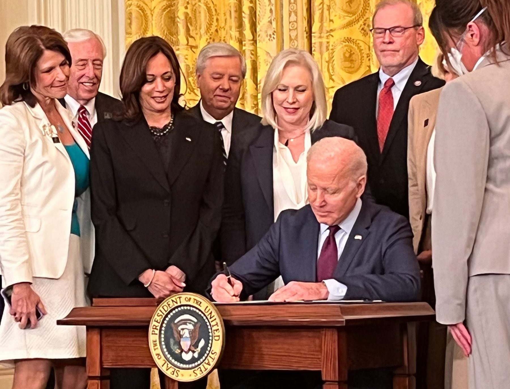

1.  /Sexual-assault or -harassment claims:/ In March 2022, President Biden signed the Ending Forced Arbitration of Sexual Assault and Sexual Harassment Act of 2021, [[https://www.congress.gov/bill/117th-congress/house-bill/4445/text][H.R. 4445]] (now [[https://www.law.cornell.edu/uscode/text/9/chapter-4][9 U.S.C. § 401]]) which amended the Federal Arbitration Act to ban enforcement of pre-dispute agreements that would compel arbitration of claims of sexual assault or sexual harassment — and that statute has been held to bar arbitration of the plaintiff's "entire case," not merely of the sexual-harassment claim. <cite> See [[https://scholar.google.com/scholar_case?case=14371129769175026083][Bruce v. Adams & Reese, LLP]], No. 25-5210, part III.C, slip op. at 15-21 (6th Cir. Feb. 25, 2026) (affirming denial of law firm's motion to dismiss and compel arbitration). </cite>

2.  /California employment- and consumer arbitration:/  In California, the statute known as [[https://leginfo.legislature.ca.gov/faces/billTextClient.xhtml?bill_id=201920200AB51][A.B. 51]] prohibits many employers from requiring mandatory arbitration of claims under the California Fair Employment and Housing Act and certain related statutes. 

The California statute drew opposition, and a federal district court preliminarily enjoined enforcement of the statute on grounds of preemption by the Federal Arbitration Act; after an initial appeal and then reconsideration, the Ninth Circuit affirmed. <cite> See [[https://scholar.google.com/scholar_case?case=140894135503341067][Chamber of Commerce v. Bonta]], 62 F.4th 473 (9th Cir. 2023) /affirming/ [[https://scholar.google.com/scholar_case?case=8128189185209699320][Chamber of Commerce v. Becerra]], 438 F. Supp. 3d 1078 (E.D.Cal. 2020). </cite>

Relatedly: California's [[https://leginfo.legislature.ca.gov/faces/billNavClient.xhtml?bill_id=202320240SB940][S.B. 940]] adds new section 1799.208 to the Civil Code; the new section prohibits sellers from requiring consumers to agree to arbitration outside of California, or under any other jurisdiction's substantive law, if the consumer's claim arises in California; consumers can void such requirements and recover their attorney fees for doing so.

And for yet another California law: As summarized in the [[https://legiscan.com/CA/text/SB82/2025][legislative counsel's digest]]: For "consumer use agreements," [[https://legiscan.com/CA/text/SB82/id/3272250/California-2025-SB82-Chaptered.html][S.B. 82]] "limit[s] the dispute resolution terms and conditions /[in the agreement]/ to the use, payment, or provision of the good, service, money, or credit provided by the consumer use agreement," and "make[s] a waiver of these provisions void and unenforceable[.]" ([[https://www.jdsupra.com/legalnews/california-draws-the-line-s-b-82-5678792][Commenters are expecting]] federal-preemption challenges.)

# #+ATTR_HTML: :alt Title portion of Dodd-Frank-Act as signed :title Title portion of Dodd-Frank-Act as signed :class photo-at-right photowidth40
# 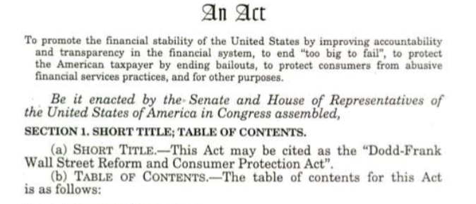

3.  /Corporate whistleblower claims:/ Drafters working in the financial-services arena should check the Dodd-Frank Act's prohibition of mandatory arbitration of Sarbanes-Oxley Act "whistleblower" claims; see generally the Supreme Court's decision concerning the required elements of proof. <cite> See [[https://scholar.google.com/scholar_case?case=17743527888811532624][Murray v. UBS Securities, LLC]], 601 U.S. 23 (2024) (reversing and remanding 2d Cir.). </cite>

# https://commons.wikimedia.org/wiki/File:Al_Franken_Official_Senate_Portrait.jpg" 
# # #+ATTR_HTML: :alt Photo of Senator Al Franken :title Photo of Senator Al Franken :class photo-at-right photowidth25
# # 

4.   /Franken Amendment and government contracts:/ Government contractors and subcontractors should check the so-called Franken Amendment for its restrictions on arbitration clauses in employment agreements relating to certain government contracts. (The Franken Amendment apparently survived the GOP's takeover of Congress and the White House in the 2016 election, but it might be less relevant now in view of the 2022 enactment of HR 4445, discussed at subdivision 1 above.) 

# https://obamawhitehouse.archives.gov/blog/2015/05/27/implementing-fair-pay-and-safe-workplaces-executive-order
# # #+ATTR_HTML: :alt Photo of President Obama signing Fair Place and Safe Workplaces Executive Order :title Photo of President Obama signing Fair Place and Safe Workplaces Executive Order :class photo-at-right photowidth40
# # 

5.  Moreover, in July 2014, [[https://obamawhitehouse.archives.gov/the-press-office/2014/07/31/executive-order-fair-pay-and-safe-workplaces][President Obama signed]] [[https://www.federalregister.gov/documents/2014/08/05/2014-18561/fair-pay-and-safe-workplaces][Executive Order 13673]] — later [[https://www.federalregister.gov/documents/2017/11/06/2017-23588/guidance-for-executive-order-13673-fair-pay-and-safe-workplaces][disapproved]] by the Republican-controlled Congress and then [[https://www.federalregister.gov/documents/2017/11/06/2017-23588/guidance-for-executive-order-13673-fair-pay-and-safe-workplaces][revoked]] by the Trump Administration — stating that in federal government contracts for more than $1 million, "contractors /[must]/ agree that the decision to arbitrate claims arising under Title VII of the Civil Rights Act of 1964 or any tort related to or arising out of sexual assault or harassment may only be made with the voluntary consent of employees or independent contractors after such disputes arise"; the order includes a flowdown requirement for subcontracts for more than $1 million. 

(The Obama executive order included out exceptions for (i) the acquisition of commercial items or commercially available off-the-shelf items; (ii) collective bargaining agreements; and (iii) some but not all arbitration agreements that were in place before the employer placed its bid for the government contract in question.)

# https://share.america.gov/cleaner-greener-cars-u-s-roads/
# #+ATTR_HTML: :alt Cars at a Ford dealership from U.S. State Dept. at Website :title Cars at a Ford dealership from U.S. State Dept. at Website :class photo-at-right photowidth40
# 

6.  /Car dealership franchise agreements:/ Federal law provides that in franchise agreements between automobile manufacturers and their dealers, pre-dispute arbitration agreements are unenforceable. Interestingly, the law also states that: "Notwithstanding any other provision of law, whenever arbitration is elected to settle a dispute under a motor vehicle franchise contract, the arbitrator shall provide the parties to such contract with a written explanation of the factual and legal basis for the award." [[https://www.gpo.gov/fdsys/pkg/USCODE-2011-title15/html/USCODE-2011-title15-chap27-sec1226.htm][15 U.S.C. § 1226(a)(2)]].

# https://finred.usalearning.gov/Money/MajPurchase-Sign
# #+ATTR_HTML: :alt Soldier signing documents - from DOD Office of Financial Readiness :title Soldier signing documents - from DOD Office of Financial Readiness :class photo-at-right photowidth40
# 

7.  /Lending to military:/ If your client provides credit to active-duty military personnel or their eligible dependents, be sure to check the regulations that implement the Military Lending Act: Those regs essentially negate /any/ agreement to arbitrate consumer credit disputes between lenders and such borrowers. The regulations don't seem to distinguish between /pre/-dispute and /post/-dispute agreements to arbitrate — even though the statute itself appears to make just such a distinction. <cite> See [[http://www.law.cornell.edu/uscode/text/10/987][10 U.S.C. § 987(e)(3)]], implemented in [[http://www.law.cornell.edu/cfr/text/32/232.9][32 C.F.R. § 232.9(d)]]; see generally, e.g., [[https://law.justia.com/cases/federal/appellate-courts/ca11/22-14211/22-14211-2024-09-05.html][Steines]], part II.B (11th Cir. 2024) (reviewing legislative history). </cite>

# https://www.cdc.gov/salmonella/backyardpoultry-05-21/index.html
# #+ATTR_HTML: :alt Photo of hen and chicks :title Photo of hen and chicks :class photo-at-right photowidth40
# 

8.  /Livestock & poultry production:/ Federal regulations governing livestock and poultry production impose restrictions on certain contracts mandating the use of arbitration. Under these regulations, such contracts must include, /on the signature page/, a specifically-worded notice, in conspicuous bold-faced type, allowing the producer or grower to decline arbitration; moreover, the Secretary of Agriculture seems to have the power to review agreements to determine "whether the arbitration process provided in a production contract provides a meaningful opportunity for the poultry grower, livestock producer, or swine production contract grower to participate fully in the arbitration process." <cite> [[https://www.gpo.gov/fdsys/pkg/CFR-2012-title9-vol2/pdf/CFR-2012-title9-vol2-sec201-218.pdf][9 C.F.R. § 201.218]]. </cite>

# https://www.arbresolutions.com/lets-not-toss-data-gathering-baby-cfpb-arbitration-rule-bathwater/
# # #+ATTR_HTML: :alt Photo of President Trump signing congressional disapproval of consumer arbitration regulation :title Photo of President Trump signing congressional disapproval of consumer arbitration regulation :class photo-at-right photowidth40
# # 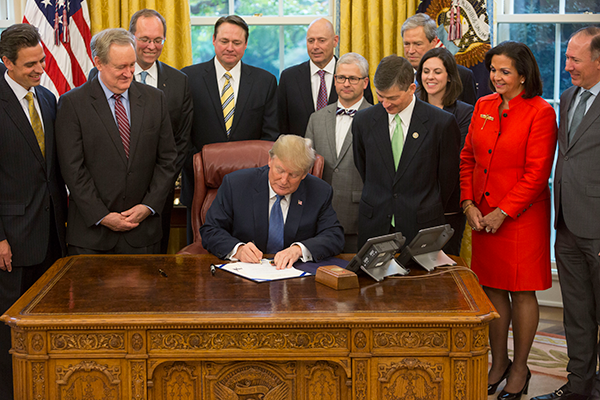

9.  /Home mortgage loan claims (overruled by Congress):/ In the Truth in Lending regulations, Regulation Z was amended to prohibit pre-dispute arbitration clauses in mortgages secured by dwellings — but that regulation was [[https://www.consumerfinance.gov/rules-policy/final-rules/arbitration-agreements/][overturned in 2017]] by the GOP Congress and President Trump under the Congressional Review Act (CRA), which [[https://crsreports.congress.gov/product/pdf/IF/IF10023][prohibits]] reissuing an overturned rule in substantially the same form without specific congressional authorization. <cite> See [[https://www.govinfo.gov/content/pkg/FR-2017-07-19/pdf/2017-14225.pdf][Arbitration Agreements]], 82 Fed. Reg. 33,210 (Jul. 19, 2017) (amending Regulation Z), /revoked due to congressional disapproval/, [[https://www.govinfo.gov/content/pkg/FR-2017-11-22/pdf/2017-25324.pdf][82 Fed. Reg. 55,500]] (Nov. 22, 2017). (See generally [[https://www.investopedia.com/terms/r/regulation_z.asp][Regulation Z]] (Investopedia.com).) See generally Congressional Research Service, [[https://crsreports.congress.gov/product/pdf/IF/IF10023][The Congressional Review Act (CRA): A Brief Overview]] (Congress.gov 2023). </cite>

Relatedly: The Second Circuit, citing cases, held that if a party were forced to arbitrate a /non-arbitrable/ claim, it could cause irreparable harm, and /that/ would bear on whether it would be appropriate to issue a preliminary injunction against arbitration. <cite> See [[https://scholar.google.com/scholar_case?case=16666835103155801044][Resource Grp. Int'l v. Chishti]], 91 F.4th 107, 115-16 (2d Cir. 2024). </cite>

And even if /a contract itself/ is alleged to be void for illegality, a U.S. court will likely enforce /an arbitration-delegation provision/ contained in the contract. <cite> See [[https://scholar.google.com/scholar_case?case=5606580596534348125][Zirpoli v. Midland Funding, LLC]], 48 F.4th 136 (3d Cir. 2022) (reversing denial of motion to compel arbitration). </cite>

10.  /Certain transportation workers' employment agreements:/ The first section of the Federal Arbitration Act itself includes a carve-out for "contracts of employment of seamen, railroad employees, or any other class of workers engaged in foreign or interstate commerce." <cite> [[https://www.law.cornell.edu/uscode/text/9/1][9 U.S.C. § 1]], /discussed in/ [[https://law.justia.com/cases/federal/appellate-courts/ca2/24-2103/24-2103-2025-12-22.html][Silva v. Schmidt Baking Distribution, LLC]], No. 24-2103, part III, slip op. at 9-11, 17 (2d Cir. 2025) (vacating and remanding order compelling arbitration: contracts with LLCs — formed by formerly W-2 employee delivery drivers — were subject to the carve-out of § 1) </cite>
*** Who decides whether arbitration was even agreed to?
  :PROPERTIES:
  :CUSTOM_ID: nl-ArbAgrmtDenied
  :END:

It could be that one party denies having agreed to arbitration in the first place — for example, because no agreement to arbitrate was ever properly formed. When that happens, the chances are that /the court/ will insist on deciding whether the parties in fact agreed to arbitrate. <cite> See, e.g., [[https://scholar.google.com/scholar_case?case=17597116813675708936][Ahlstrom v. DHI Mortgage Co.]], 21 F.4th 631 (9th Cir. 2021) (reversing and remanding district court order that dismissed putative class-action complaint and ordered arbitration) (citing cases from the Supreme Court and other appellate courts). </cite>

On that point, the Supreme Court has held that any challenge specifically to the /delegation agreement/ will be heard by the court, not by the arbitrator; see the discussion at [[#m-arb-deleg]].

*** Arbitration of PAGA claims
  :PROPERTIES:
  :CUSTOM_ID: nl-ArbPAGA
  :END:

California's [[https://leginfo.legislature.ca.gov/faces/codes_displayText.xhtml?lawCode=LAB&division=2.&title=&part=13.&chapter=&article=][Private Attorneys General Act]] (PAGA), at [[https://leginfo.legislature.ca.gov/faces/codes_displayText.xhtml?lawCode=LAB&division=2.&title=&part=13.&chapter=&article=][Cal. Labor Code §§ 2698 - 2699.6]], essentially deputizes employees to act on behalf of the state in pursuing civil actions against employers that violate the state's Labor Code.

*Caution:* This is one of those areas where — if PAGA claims are a significant possibility — contract drafters should consult counsel about the latest developments. <cite> See, e.g., [[https://law.justia.com/cases/california/court-of-appeal/2025/a170191.html][LaCour v. Marshalls of Calif., LLC]], No. A170191, slip op. (Cal. App. Dec. 23, 2025) (affirming denial of employer's motion to compel arbitration). </cite>
# https://commons.wikimedia.org/wiki/File:Uber_logo_2018.svg/
# #+ATTR_HTML: :alt Uber logo :title Uber logo :class photowidth20 photo-at-right
# 

Some gig-economy workers have sued their companies under PAGA. In response, some companies like Uber have sought to compel arbitration under their contracts with the workers. But California courts have held that for purposes of determining standing to bring a PAGA claim, the threshold question whether such a worker is an "employee" or an "independent contractor" is for /the court/ to determine and cannot be delegated to an arbitrator. <cite> See, e.g., [[https://scholar.google.com/scholar_case?case=3942704712558196702][Winns v. Postmates, Inc.]], 66 Cal. App. 5th 803 (Cal. App. 2021) (affirming denial of motion to compel arbitration of PAGA claim); [[https://scholar.google.com/scholar_case?case=645005112067587635][Rosales v. Uber Tech., Inc.]], 63 Cal. App. 5th 937, 942-45, 278 Cal. Rptr. 3d 285 (2021) (citing cases). </cite>

# https://commons.wikimedia.org/wiki/File:InNOut.svg/
# #+ATTR_HTML: :alt InNOut logo :title InNOut logo :class photowidth20 photo-at-right
# 

{{{RWE}}} A California court held that, under the Supreme Court's /Viking River Cruises/ decision, "arbitration agreements between employers and employees that require arbitration of the /individual/ portion of a PAGA claim /are/ enforceable, but arbitration agreements that require arbitration (or waiver) of the /representative/ portion /[i.e., the private-attorney-general portion]/ of a PAGA claim are /not/ enforceable." <cite> [[https://scholar.google.com/scholar_case?case=14245869295467854875][Piplack v. In-N-Out Burgers]] /[sic]/, 88 Cal. App.5th 1281, 1288 (2023), /citing/ [[https://www.supremecourt.gov/opinions/21pdf/20-1573_8p6h.pdf][Viking River Cruises, Inc., v. Moriana]], 596 U.S. 639, 142 S. Ct. 1906 (2022). </cite>

{{{RWE}}} In another 2023 California decision, in an Uber driver's lawsuit against that company, California's supreme court held that "an aggrieved employee who has been compelled to arbitrate claims under PAGA that are premised on Labor Code violations actually sustained by the plaintiff *maintains* statutory standing to pursue PAGA claims arising out of events involving /other employees/." <cite> [[https://scholar.google.com/scholar_case?case=10404556599014825704][Adolph v. Uber Technologies, Inc.]], 14 Cal. 5th 1104, 1114 (2023) (reversing court of appeals and remanding; emphasis added). </cite>

# https://en.m.wikipedia.org/wiki/File:Lowes_Companies_Logo.svg
# #+ATTR_HTML: :alt Lowe's Home Center logo   :class photo-at-right photowidth20
# 

{{{RWE}}} The Ninth Circuit cited the California supreme court's /Adolph/ case in a former employee's lawsuit against Lowe's Home Centers. <cite> See [[https://scholar.google.com/scholar_case?case=11806922998873150566][Johnson v. Lowe's Home Centers, LLC]], 93 F.4th 459 (9th Cir. 2024) (vacating district-court order). </cite>

** Attorney Fees {{{CLS}}}                                              :CLS:
  :PROPERTIES:
  :CUSTOM_ID: r-atty-fees
  :CHAP: L
  :HTML_CONTAINER_CLASS: pr-top
  :END:

Contents:

#+TOC: headlines 1 local

*** Parties; applicability
  :PROPERTIES:
  :CUSTOM_ID: r-atty-fees-appl
  :END:

{{{Trig-if}}}, it will apply in any {{{dfn(Proceeding)}}} — that is, in any lawsuit, arbitration (if arbitration is agreed to), or other contested proceeding, of any nature, relating to {{{thek}}} — between {{{A}}} and {{{B}}}. 

***** Note                                                              :CMT:
  :PROPERTIES:
  :HTML_CONTAINER_CLASS: cmtry
  :UNNUMBERED: notoc
  :END:

Relating to: See [[#r-relg]].

*** Prevailing-party entitlement to attorney fees
  :PROPERTIES:
  :CUSTOM_ID: r-atty-fees-who
  :END:

1. If {{{A}}} is the "prevailing party" in the Proceeding — as determined by law — *then:* {{{B}}} will reimburse {{{A}}} for:  

   a. {{{A}}}'s "attorney fees," as defined below; and

   b. {{{A}}}'s "costs," as that term is commonly understood in U.S. courts,

   for all stages of the Proceeding, *unless* {{{thek}}} clearly provides otherwise.

2. Which party is the prevailing party is to be determined as provided by law.

***** Note                                                              :CMT:
  :PROPERTIES:
  :HTML_CONTAINER_CLASS: cmtry
  :UNNUMBERED: notoc
  :END:

{{{H1}}} Subdivision 1.a: This overrides the "American Rule" for attorney fees:  Each party must bear its own attorney fees — *unless* a contract or statute provides otherwise (see [[#AttyFeesStatute-cmt]]). (Drafters could use {{{OPT}}} [[#r-atty-fees-am-rule]] to adopt the American Rule.)

{{{HN}}} Subdivision 1.b: Courts often award "costs" even when not awarding attorney fees; costs typically include charges such as court filing fees; arbitration-administration fees; deposition- and transcript charges; and the like.

{{{HN}}} Subdivision 2: Some courts have held that, if the putatively winning side was awarded neither monetary damages nor equitable relief, then that party isn't considered the prevailing party for purposes of an award of attorney fees. <cite> See, e.g., [[https://scholar.google.com/scholar_case?case=15549225697323793606][Intercontinental Group Partnership v. KB Home Lone Star LP]], 295 S.W.3d 650 (Tex. 2009). </cite>

*** Definition: /Attorney fees/
  :PROPERTIES:
  :CUSTOM_ID: atty-fee-defn
  :END:

1. For purposes of {{{thek}}}, the term {{{DEFN(attorney fees)}}} — whether or not capitalized, and with or without an apostrophe — refers to all reasonable professional fees and -expenses, of any kind, paid or owed by a party, at all stages of the dispute. 

2. Likewise, the term encompasses (without limitation) such fees and expenses paid to or for one or more attorneys; law firms; and testifying- and/or consulting experts. 

***** Note                                                              :CMT:
  :PROPERTIES:
  :HTML_CONTAINER_CLASS: cmtry
  :UNNUMBERED: notoc
  :END:

A federal court held that the term "/reasonable/ attorney fees" (emphasis added), in a contract's indemnification provision, was not indefinite and therefore *didn't* invalidate the entire contract. <cite> See [[https://scholar.google.com/scholar_case?case=18247234679669500712][Days Inns Worldwide, Inc. v. 4200 Rose Hospitality LLC]], No. 2:22-cv-04822, slip op. at part III (D.N.J. Aug. 25, 2025) (citing cases and granting, in part, Days Inns motion for partial summary judgment; unpublished). </cite>

*** Fees on fees
  :PROPERTIES:
  :CUSTOM_ID: atty-fee-on-fee
  :END:

The prevailing party is likewise entitled to recover attorney fees and costs incurred in enforcing its right to recover attorney fees and/or costs under {{{ths}}}. 

***** Note                                                              :CMT:
  :PROPERTIES:
  :HTML_CONTAINER_CLASS: cmtry
  :UNNUMBERED: notoc
  :END:

This section seeks to "write around" the general rule precluding recovery of "fees on fees" — that is, a prevailing party can't recover attorney fees incurred in enforcing the contract's attorney-fee provision — unless the provision clearly says otherwise. <cite> See, e.g., [[https://scholar.google.com/scholar_case?case=5144225642505845123][1046 Munras Properties, L.P. v. Kabod]], 2025 COA 71, No. 24CA0934, slip op. ¶ 40-41 (Colo. App. 2025) (citing numerous cases from various jurisdictions; attorney-fee provision allowed fees-on-fees recovery). /Contra:/ [[https://scholar.google.com/scholar_case?case=8263513278702653400][Park Union Condominium v. 910 Union St., LLC]], 2019 NY Slip Op. 31994(U) part 1 (N.Y. Sup. Ct.) (fees on fees not recoverable). </cite>

One particular example: [[https://tcss.legis.texas.gov/resources/pr/pdf/pr.92.pdf#92=&page=42.73][Texas Property Code § 92.005]] allows a prevailing party in certain landlord-tenant lawsuits to recover attorney fees. (It's somewhat complicated.)

*** OPT-IN TERMS
  :PROPERTIES:
  :CUSTOM_ID: r-atty-fees-opt-in
  :END:

None of the {{{OPT}}}s below will apply unless {{{thek}}} clearly adopts the specific {{{OPT}}}.

**** {{{OPT}}}: American Rule for Attorney Fees
  :PROPERTIES:
  :CUSTOM_ID: r-atty-fees-am-rule
  :HTML_CONTAINER_CLASS: optn-txt
  :END:

If {{{THS-O}}} is agreed to, *then:* {{{A}}} *WAIVES* any right that {{{A}}} might have to be reimbursed by {{{B}}} for [[#r-atty-fees][attorney fees]] — even if a law or rule would otherwise have given {{{A}}} that right for the dispute in question. 

***** Note                                                              :CMT:
  :PROPERTIES:
  :HTML_CONTAINER_CLASS: cmtry
  :UNNUMBERED: notoc
  :END:

The so-called American Rule for attorney fees is the general rule in U.S. jurisdictions: Each party must bear its own attorney fees — *unless* a contract or statute provides otherwise. In some jurisdictions, there might be a "special circumstances exception" to the American Rule that would allow recovery of attorney fees even without a contract provision to that effect. But such an exception might be a tough sell to a court. <cite> See, e.g., [[https://scholar.google.com/scholar_case?case=14527574141809363371][Paul Elton LLC v. Rommel Delaware, LLC]], No. 2019-0750, slip op. (Del. Ch. Mar. 16, 2022) (denying motion for attorney fees). </cite>

**** {{{OPT}}}: Texas Rule for Attorney Fees
  :PROPERTIES:
  :CUSTOM_ID: r-atty-fees-tex
  :HTML_CONTAINER_CLASS: optn-txt
  :END:

If {{{THS-O}}} is agreed to, AND {{{A}}} successfully /asserts/ a claim against {{{B}}} for breaching {{{thek}}} — but *not* if {{{A}}} successfully /defends/ against such a claim — *then:* {{{A}}} is entitled to recover, from {{{B}}}, the [[#r-atty-fees][attorney fees]] and costs that {{{A}}} incurred in asserting the claim.

***** Note                                                              :CMT:
  :PROPERTIES:
  :CUSTOM_ID: nl-atty-fees-tex
  :HTML_CONTAINER_CLASS: cmtry
  :UNNUMBERED: notoc
  :END:

{{{H1}}} This "Texas Rule" is modeled on [[http://www.statutes.legis.state.tx.us/Docs/CP/htm/CP.38.htm][section 38.001]] of the Texas Civil Practices and Remedies Code — which doesn't allow a party to recover attorney fees for successfully /defending against/ a claim for breach of {{{thek}}}. <cite> See, e.g., [[https://scholar.google.com/scholar_case?case=9677647125282266992][Polansky v. Berenji]], 393 S.W.3d 362, 368 (Tex. App.—Austin 2012) (reversing and rendering award of attorney fees to defendant that prevailed against breach-of-contract claim; citations omitted). </cite>

{{{HN}}} A similar rule is used in some contracts, allowing _not_ a /prevailing/ party per se, but a "non-breaching party" that successfully sues /for breach/, to recover fees. {{{RWE}}} In an Illinois case, a contract's attorney-fee provision read: "Either party shall be entitled to recover from the other party any and all costs and expenses, including reasonable attorney’s fees, in successfully enforcing the terms and provisions of this Agreement." <cite> See [[https://scholar.google.com/scholar_case?case=9372745509681249088][Price v Carri Scharf Trucking, Inc.]], No. 24-2481, slip op. at 4, 14-15 (7th Cir. Jun. 13, 2025) (affirming district court's refusal to award attorney fees to prevailing defendant); see also, e.g., [[https://scholar.google.com/scholar_case?case=2461051742924040526][Southern Coal Corp. v. Drummond Coal Sales, Inc.]], 25 F.4th 864, 876 (11th Cir. 2022) (Carnes, J., concurring in the judgment reversing and remanding district court's rejection of claim for attorney fees). </cite>

{{{HN}}} *Caution:* When drafting a provision like this, it's wise to refer to the breach-of-contract plaintiff, *not* as the /non-breaching/ party, but instead as, say, the "contract claimant." Doing so would address the situation that occurred in /Powertech/ (N.D. Cal. 2014), where the contract in suit included a termination-for-breach provision that referred to the right /of the non-breaching party/ to terminate. That wording, said the court, meant that the party that had purported to terminate the contract didn't actually have the power to do so — because /that/ party was itself in breach, of a different contract provision. On that reasoning, a breach-of-contract plaintiff could lose its claim for attorney fees because the plaintiff was itself in breach of some contract provision. <cite> See [[https://scholar.google.com/scholar_case?case=13446235597793349920][Powertech Tech., Inc. v. Tessera, Inc.]], No. C 11-6121 CW, slip op. at part I.A (N.D. Cal. Jan. 15, 2014) (on summary judgment). </cite>

{{{HN}}} In California and Oregon, the law might well automatically transform such a one-sided attorney-fee clause into a prevailing-party clause, as discussed at [[#nl-AttyFeesCaliforniaTwoWay]]. 

{{{HN}}} *Pro tip:* If your client might be more likely to be the /defendant/ in a dispute, /and if Texas law will apply/, then your client might want to override the Texas Rule using a prevailing-party clause (see [[#r-atty-fees]]). *On the other hand*, if your client /wants/ the Texas Rule to apply, it might want to include {{{THS-O}}} in the contract.

**** {{{OPT}}}: Attorney Fees in Motion Practice
  :PROPERTIES:
  :CUSTOM_ID: r-atty-fees-motion
  :HTML_CONTAINER_CLASS: optn-txt
  :END:

1. If {{{THS-O}}} is agreed to, AND {{{A}}} prevails against {{{B}}} in a motion, interlocutory appeal, or other interim proceeding, *then:* {{{A}}} is entitled to be reimbursed, by {{{B}}}, for the reasonable [[#r-atty-fees][attorney fees]] that {{{A}}} incurred for the interim proceeding. 

2. If {{{B}}} later ends up being the prevailing party in the action as a whole, *then:* {{{B}}} nevertheless will *not* be entitled:

   a. to a refund of what {{{B}}} paid under subdivision A of this {{{OPT}}}; nor

   b. to recover {{{B}}}'s own attorney fees for the interim proceeding.

***** Note                                                              :CMT:
  :PROPERTIES:
  :HTML_CONTAINER_CLASS: cmtry
  :UNNUMBERED: notoc
  :END:

{{{H1}}} This has in mind that one of the major expenses in any lawsuit or arbitration is attorney fees for interim proceedings such as motion practice — e.g., motions filed with the court or arbitrator to compel discovery; for preliminary injunctions; for summary judgment, etc.

# #+ATTR_HTML: :alt Wayne Gretzky :class photo-at-right photowidth25
# 

{{{HN}}} Much of the expense of motion practice comes from a seeming article of faith among litigation counsel, along the lines of the saying attributed to Walter Gretzky, father of hockey legend Wayne Gretzky: /You miss 100% of the shots you don’t take/. For litigation counsel, Gretzky /père/'s dictum could be paraphrased as: /You’ll be denied on 100% of the motions (and oppositions) that you don’t file/. The problem, of course, is that in situations like this, when a party's litigation counsel "takes the shot," it inflicts burden, expense, and delay on the other party and the court — too often, to no real purpose.

{{{HN}}} Oh, sure: Courts' rules of procedure typically "require" lawyers and parties to play nice. A judge /could/ impose sanctions for bad behavior. 

But in reality, judges seldom impose sanctions on parties /or/ on lawyers, even for behavior that might seem egregious.

{{{HN}}}  And a /lawyer's/ concern about being sanctioned will sometimes be outweighed by concern that an angry client will think ill of the lawyer for supposedly not doing enough to "smite" the other party. Yes, smiting is "a thing": Sometimes a party to a lawsuit will want to inflict pain on its adversary even more than it wants to put the lawsuit behind it — even if, on balance, doing so would be more costly than a quick settlement. This can happen in divorce- and child-custody cases, but it's been known to happen in business litigation, too. 

{{{HN}}} (Psychological research has suggested that humans and other species are willing to punish /perceived/ bad behavior by others, even when doing so results in personal cost. Researchers have conjectured that, over millennia, such behavior has been "programmed" by natural selection due to the evolutionary advantages of the group cohesion that can be fostered by such "costly punishment.") <cite> See, e.g., Robert Boyd, Herbert Gintis, Samuel Bowles, and Peter J. Richerson, [[https://www.pnas.org/doi/pdf/10.1073/pnas.0630443100][The evolution of altruistic punishment]], Proceedings of the Nat'l Academy of Sciences (2003); Kimmo Eriksson et al., [[https://www.nature.com/articles/s41467-021-21602-9][Perceptions of the appropriate response to norm violation in 57 societies]] (Nature.com 2021). </cite>

{{{HN}}} So, by contractually providing for awards of attorney fees /in motion practice/, drafters can help encourage the parties and their lawyers to be reasonable in the positions they take along the way.

**** {{{OPT}}}: Attorney Fees for ADR Nonparticipation
  :PROPERTIES:
  :CUSTOM_ID: r-atty-fees-adr-non
  :HTML_CONTAINER_CLASS: optn-txt
  :END:

{{{L1}}}If this {{{OPT}}} is agreed to, it wil govern whenever, in any such proceeding:

   1. {{{B}}} tries to block the proceeding in court, or

   2. {{{B}}} does not participate in good faith even to a minimal extent. 

{{{LN}}} If {{{B}}} later ends up losing the dispute, then {{{B}}} will pays (or reimburse) *all* of {{{A}}}'s [[#r-atty-fees][attorney fees]] for the entirety of the dispute in question, at all stages, including but not limited to appeals. 

{{{LN}}} Moreover, even if {{{B}}} ends up /winning/ the dispute, {{{B}}} still will not be entitled to recover its own attorney fees from {{{A}}}, even if {{{B}}} would otherwise be entitled to do so.

{{{LN}}} The types of dispute-resolution proceeding contemplated by {{{THS-O}}} include, [[#r-eg-defn][for example]], [[#r-arb-sop][arbitration]]; mediation; escalation (whether [[#r-escal-int][internal]] or to a [[#r-escal-ext][neutral advisor]]); and mini-trial, each when called for by {{{thek}}}.

***** Note                                                              :CMT:
  :PROPERTIES:
  :CUSTOM_ID: nl-atty-fees-adr-non
  :HTML_CONTAINER_CLASS: cmtry
  :UNNUMBERED: notoc
  :END:

{{{H1}}} This is designed to incentivize compliance with any provision of {{{thek}}} requiring the parties to participate in one or more dispute-resolution proceedings. That could be important in bitter lawsuits where one party wants to "smite" the other (see the discussion at [[#r-atty-fees-motion]]).

{{{HN}}} Background: At almost any point in an arbitration (or other alternative dispute resolution ("ADR") proceeding), a party that desired to delay the proceedings might go to court to challenge the propriety of the ADR proceeding. To combat such tactics, it can be useful to give a delaying party some "skin in the game"; awarding fees against a party that does so is suggested in [[https://www.law.com/corpcounsel/almID/1202596761854/][a 2013 article]] by experienced arbitrator Gary McGowan (now behind a paywall).

{{{HN}}} This {{{OPT}}} is informed by some real-world contract provisions that played roles in lawsuits between the parties; the intent is to provide an economic disincentive to help discourage a party from "blowing off" contractual dispute-resolution provisions. Courts have upheld contract provisions along these lines:

{{{RWE}}} A contract for the sale of real estate included a provision that "if a party does not agree first to go to mediation, then that party will be liable for the other party's legal fees in any subsequent litigation in which the party who refused to go to mediation loses ...." <cite> [[https://scholar.google.com/scholar_case?case=13560064685362658088][Wuestenberg v. Rancourt]], 2020 ME 25, 226 A.3d 227, 232 ¶ 18 (2020) (cleaned up). </cite>

{{{RWE}}} A state appeals court reversed a trial court's award of attorney fees to a prevailing defendant, on grounds that the parties' contract required mediation but the defendant had refused to participate the mediation. <cite> See [[https://scholar.google.com/scholar_case?case=6162135864162536352][Cullen v. Corwin]], 206 Cal. App. 4th 1074, 142 Cal. Rptr. 3d 419 (2012); see also, e.g., [[https://scholar.google.com/scholar_case?case=12137770141656613314][Lange v. Schilling]], 163 Cal. App. 4th 1412 (2008) (reversing award of attorney fees to prevailing plaintiff); [[https://scholar.google.com/scholar_case?case=9518279364450992521][Rivas v. CBK Lodge General Partner, LLC]], No. 3:19-CV-01948 (M.D. Pa. Jul. 27, 2021) (granting motion to dismiss a defendant's third-party complaint for indemnification under a contract, on grounds that the defendant had not complied with a mediation requirement in the contract). </cite>

{{{CE}}} A prevailing party had /initially/ refused to mediate as required by the contract in suit. But later — and crucially, before the lawsuit was filed — that party had relented and offered to mediate the dispute. A state appeals court reversed a trial court's refusal to award attorney fees. <cite> See [[https://law.justia.com/cases/california/court-of-appeal/2025/h051869.html][Evleshin v. Meyer]], No. H051869, slip op. (Cal. App. Nov. 6, 2025). </cite>

{{{CE}}} The Seventh Circuit held that: "Because the contract between Technical Security and EPI does not specify /who/ must seek mediation and /when/, we cannot resolve this dispute on the record before us. We therefore vacate the district court’s entry of summary judgment for EPI and remand for further proceedings." <cite> [[https://scholar.google.com/scholar_case?case=12203637376802697768][Tech. Security Integration, Inc. v EPI Techs, Inc.]], 126 F.4th 557, 559 (7th Cir. 2025) (vacating and remanding summary judgment; emphasis added). </cite>

{{{HN}}} Tangentially: A winning party was /denied/ attorney fees under an analogous clause, on grounds that the winning party never /asked/ for mediation (as required by the contract) and thus the losing party had not /refused/ to mediate. <cite> See [[https://scholar.google.com/scholar_case?case=13364418982812021472][Thompson v. Cloud]], 764 F.3d 82, 92 (1st Cir. 2014) (affirming lower-court decision). </cite>

**** {{{OPT}}}: Attorney Fees for Unproved Accusations
  :PROPERTIES:
  :CUSTOM_ID: r-atty-fees-grave
  :HTML_CONTAINER_CLASS: optn-txt
  :END:

1. When {{{THS-O}}} is agreed to, it will govern if, in any dispute relating in any way to {{{thek}}}: 

   a. {{{A}}} accuses {{{B}}} to {{{thek}}} — and/or {{{B}}}'s affiliates, or the [[#r-people-defn][people]] of any of them — of criminal conduct, fraud, and/or breach of fiduciary duty relating to {{{thek}}} or the parties dealings under {{{thek}}}; *but* 

   b. {{{A}}} does not prove the accusation with the degree of proof required by law or, if higher, by {{{thek}}}. 

2. In that situation, {{{A}}} is to pay, or reimburse, all of the attorney fees incurred by or on behalf of the accused in defending against {{{A}}}'s accusation.

3. "Tie goes to the runner": In any case of a close call about whether {{{A}}} is to reimburse particular attorney fees under this {{{OPTIN}}}, then the answer is yes: {{{A}}} is to do so.

*** {{{ADDL}}}                                                         :ADDL:
  :PROPERTIES:
  :CUSTOM_ID: r-atty-fees-rdg
  :HTML_CONTAINER_CLASS: addl
  :END:

**** The "American Rule" for attorney fees
  :PROPERTIES:
  :CUSTOM_ID: nl-atty-fees-am-rule
  :END:

- When agreed to, the prevailing-party provision in Option [[#r-atty-fees-am-rule]] overrides the American Rule.

- The so-called American Rule for attorney fees is the general rule in U.S. jurisdictions: Each party must bear its own attorney fees — *unless* a contract or statute provides otherwise. In some jurisdictions, there might be a "special circumstances exception" to the American Rule that would allow recovery of attorney fees even without a contract provision to that effect. But such an exception might be a tough sell to a court. <cite> See, e.g., [[https://scholar.google.com/scholar_case?case=14527574141809363371][Paul Elton LLC v. Rommel Delaware, LLC]], No. 2019-0750, slip op. (Del. Ch. Mar. 16, 2022) (denying motion for attorney fees). </cite>

**** Indemnity language /might/ be an exception
  :PROPERTIES:
  :CUSTOM_ID: nl-atty-fees-indem
  :END:

One possible /contractual/ exception to the American Rule — even without a prevailing-party provision such as  Option [[#r-atty-fees-am-rule]] — is if a contract includes [[#r-indem-defn][indemnity]] language (see {{{RR}}} [[#r-indem-defn]]) requiring indemnity against harm resulting from breach of the contract. 

{{{RWE}}} In /ams-OSRAM/ (Fed. Cir. 2025), a [[#r-conf-info-proto][confidentiality agreement]] (a.k.a. "NDA") called for the parties to "hold harmless the other against any and all damage, losses or liability (including reasonable attorneys' fees) suffered by the other as a result of any breach of the representations, warranties, and agreements set forth herein." The plaintiff successfully sued the defendants for, among other things, breach of the NDA's confidentiality obligations. A federal appeals court affirmed a trial-court holding that this indemnity language — as a so-called first-party clause — overrode the American Rule and entitled the successful plaintiff to recover its attorney fees for pursuing its breach-of-contract claims. <cite> See [[https://scholar.google.com/scholar_case?case=3358739901067764223][ams-OSRAM USA Inc. v. Renesas Elecs. America Inc.]], 133 F.4th 1337, 1356 (Fed. Cir. 2025). (Hat tip: [[https://www.linkedin.com/in/matthew-dedon/][Matt Dedon]] in a [[https://www.redline.net/queries/can-t-get-prevailing-party-clause-through-there-s-another-way][post]] at the redline.net site.) </cite>

**** Attorney-fee awards can be big
  :PROPERTIES:
  :CUSTOM_ID: AttyFeeBig
  :END:

An attorney-fee award can dwarf the rest of a judgment; when a contract contains a prevailing-party attorney fees clause, the losing party could find itself on the hook for attorney fees that far exceed the amount originally in controversy.

{{{RWE}}} In the hotly-contested /GT Issa Construction/ (Tenn. 2021), a home builder was found to have breached a contract with a homeowner; the builder was ordered to pay damages of $6,800 — *plus* /more than $200,000 in attorney fees/ under the contract's prevailing-party attorney fee clause. <cite> See [[https://scholar.google.com/scholar_case?case=15570543200639835151][GT Issa Constr., LLC v. Blalock]], No. E2020-00853-COA-R3-CV, slip op. (Tenn. App. Nov. 23, 2021) (affirming judgment on jury verdict). </cite>

*Caution:* Some parties — for example, a large, wealthy, litigious company that's contracting with a much-smaller one — might be adamant that each party will always pay its own attorney fees; that's because the large, wealthy company wants to be able to use the cost of litigation as a way of subtly pressuring the smaller one to settle on favorable terms. To that end, parties that wanted to contractually impose the American Rule could use language such as in {{{OPT(r-atty-fees-am-rule)}}}.

**** Attorney fees can discourage fighting a contract provision
  :PROPERTIES:
  :CUSTOM_ID: nl-atty-fees-contra
  :END:

{{{U1}}} {{{RR}}} [[#r-no-contra-rule]] has in mind that Trying to back out of a contract's agreed "policy statement" (to use Ken Adams's term) should be a no-no because it often results in needless expense and delay in resolving disputes for the parties. Unfortunately, though, the law doesn't really discourage over-the-top arguments about contract language — in fact, in recent years the Texas supreme court has taken what appear to be inconsistent positions on this issue, <cite> Compare [[https://scholar.google.com/scholar_case?case=8074215351891178149#p416][James Constr. Grp., LLC v. Westlake Chem. Corp.]], 650 S.W.3d 392, 415-18 (Tex. 2022) (reversing court of appeals; contract's exclusion of consequential damages was /not/ a covenant not to seek such damages) /with/ [[https://scholar.google.com/scholar_case?case=11246380411621584848][Transcor Astra Group S.A. v. Petrobras America Inc.]], 650 S.W.3d 462, 483 (Tex. 2022) (reversing court of appeals; reliance disclaimer in settlement agreement barred fraud claims and so attorney-fee award was not an abuse of discretion): "By asserting claims it had agreed never to assert, /Petrobras broke the promise it made in the settlement agreement and caused Astra to incur substantial fees and costs/ to enforce that promise" (emphasis added).] although in /Jones/ (5th Cir. 2025), the court held that attempting to rescind a contract to avoid payment was itself a breach. <cite> See [[https://law.justia.com/cases/federal/appellate-courts/ca5/24-50096/24-50096-2025-10-07.html][Jones v. City of Hutto]], No. 24-50096, part III.D, slip op. at 20 (5th Cir. Oct. 7, 2025). </cite>

{{{UN}}} The "withdraws the contrary assertion' language in {{{RR}}} [[#r-no-contra-rule]] is based (very) loosely on the procedures set forth at [[https://www.law.cornell.edu/rules/frcp/rule_11][Rule 11]](c) of the Federal Rules of Civil Procedure, with which U.S. federal-court litigators are familiar.

{{{UN}}} Here are a few hypothetical examples of possible such contrary assertions:

   1. {{{A}}} seeks to recover consequential damages from {{{B}}} (see [[#r-conseq-dam-excl]]) when {{{thek}}} excludes such recovery;

   2. {{{A}}} seeks monetary relief from {{{B}}} in excess of an agreed "cap" (see {{{RR}}} [[#r-dam-cap-gen]])

   3. {{{A}}} asserts a purported right, or a purported obligation on {{{B}}}'s part, that {{{A}}} had waived (see {{{RR}}} [[#r-waiv-defn]])

   4. {{{A}}} asserts that a notice took effect at a time inconsistent with the notice provisions stated in {{{thek}}} (see {{{RR}}} [[#r-notices-rule]])

   5. {{{A}}} asserts that {{{thek}}} or a related document was amended or otherwise modified in a manner inconsistent with the amendment provisions of {{{thek}}} (see {{{RR}}} [[#r-amend-defn]])

   6. {{{A}}} asserts that an action taken by {{{A}}} was timely even though {{{A}}} took the action after a deadline stated in {{{thek}}} or a related document (for example, a statement of work).

**** Statutes might allow recovery of attorney fees
  :PROPERTIES:
  :CUSTOM_ID: AttyFeesStatute-cmt
  :END:

By statute, Congress and various state legislatures have allowed or even required awards of attorney fees to specified classes of prevailing parties, thus overriding the "American Rule" that normally controls (see [[#r-atty-fees-am-rule]]).

{{{RWE}}} U.S. antitrust law requires "a reasonable attorney's fee" to be awarded to "any person who shall be injured in his business or property by reason of anything forbidden in the antitrust laws ...." [[https://www.law.cornell.edu/uscode/text/15/15][15 U.S.C. § 15(a)]]. This statute was applied in /O'Bannon/ (9th Cir. 2018), where the court affirmed an award of more than $40 million in attorney fees to a group of current and former student athletes — the athletes had sued the NCAA over a then-existing rule that prohibited student athletes from being paid for use of their names and likenesses in advertising and video games. <cite> See [[https://scholar.google.com/scholar_case?case=9455202660695657428][O'Bannon v. NCAA]], No. 09-3329 (N.D. Cal. Mar. 31, 2016), /aff'd/, 739 F. App'x 890, [[https://scholar.google.com/scholar_case?case=6705521763494474253][No. 16-15803]] (9th Cir. Jun. 29, 2018) (unpublished). The district court had reduced the original fee award of nearly $46 million, granted by a magistrate judge; see [[https://scholar.google.com/scholar_case?case=13038208502355309145][114 F. Supp. 3d 819]] (N.D. Cal. 2015) (magistrate judge award). See also, e.g., Dan Whateley and Ashley Rodriguez, [[https://www.businessinsider.com/how-college-athletes-are-getting-paid-from-nil-endorsement-deals][How NIL deals and brand sponsorships are helping college athletes make money]] (2024). </cite>

{{{RWE}}} Under [[https://leginfo.legislature.ca.gov/faces/codes_displaySection.xhtml?lawCode=CCP&sectionNum=1021.9][Cal. Civ. Code § 1021.9]], a "specialized" California statute (as in, benefiting a particular class of politically-important special interests): 

#+begin_quote

In any action to recover damages to personal or real property resulting from trespassing on lands either under cultivation or intended or used for the raising of livestock, the prevailing /plaintiff/ shall be entitled to reasonable attorney’s fees in addition to other costs, and in addition to any liability for damages imposed by law.
#+end_quote

As explained by a California appeals court: "The statute is intended to ensure that farmers are able to protect their land from trespassers through civil litigation." <cite> [[https://scholar.google.com/scholar_case?case=3092823611884166648][Kelly v. House]], 47 Cal. App.5th 384, 390 (Cal. App. 2020) (reversing denial of statutory attorney fees). </cite>

 [[https://www.everycrsreport.com/reports/94-970.html][A 2009 report]] by the Congressional Research Service lists a number of /federal/ statutes of this nature.

**** One-sided attorney-fee clauses might well be enforced
  :PROPERTIES:
  :CUSTOM_ID: AttyFeesOneSidedCmt
  :END:

Some contracts contain unilateral attorneys' fee clauses; for example, a real-estate lease might state that the /landlord/ can recover its attorney fees if it has to sue the tenant, while remaining silent as to whether the /tenant/ can ever recover its attorney fees. Such unilateral clauses might well be given effect by courts. <cite> See, e.g., [[https://scholar.google.com/scholar_case?case=15374682586031801720][Allied Indus. Scrap, Inc., v. OmniSource Corp.]], 776 F.3d 452 (6th Cir. 2015), /discussing/ [[https://scholar.google.com/scholar_case?case=980304192672700250][Wilborn v. Bank One Corp.]], 906 N.E.2d 396 (Ohio 2009). In the /Wilborn/ case cited by the Sixth Circuit, the state's supreme court had affirmed dismissal of a lawsuit by borrowers against lenders; the court rejected the borrowers' claim that a unilateral attorneys' fee clause, in a residential mortgage loan agreement form, should be held void as contrary to public policy. </cite>

(In a lease, the American Rule ([[#r-atty-fees-am-rule]]), combined with such a fee-shifting provision, would normally mean that the /tenant/ could not recover, even if it were the prevailing party in a suit brought by the landlord — unless a statute provided otherwise, as in the California Rule discussed at [[#nl-AttyFeesCaliforniaTwoWay]].)

**** CA, OR, (partly) NY:  /Any/ fee clause is "prevailing party"
  :PROPERTIES:
  :CUSTOM_ID: nl-AttyFeesCaliforniaTwoWay
  :END:

California Civil Code [[http://www.leginfo.ca.gov/cgi-bin/displaycode?section=civ&group=01001-02000&file=1708-1725][§ 1717]] provides, in essence, that any /one-way/ attorney fees provision (as is sometimes seen in consumer-facing contract forms) is to be treated as a prevailing-party provision; moreover, attorney fees under that section cannot be waived. Much the same is true in Oregon, and New York has a similar rule /for consumer contracts/. <cite> See, e.g., [[https://scholar.google.com/scholar_case?case=11538271764197854997][Elation Sys. Inc. v. Fenn Bridge LLC]], 71 Cal. App. 5th 958, [[https://www.courts.ca.gov/opinions/archive/A159749.PDF#page=23][slip op. at 23-25]] (Cal. App. Nov. 22, 2021) ([[https://scholar.google.com/scholar_case?case=4772619161424688109][unpublished portion]] of opinion that vacated and remanded award of attorney fees to prevailing defendants); [[https://www.oregonlaws.org/ors/20.096][Or. Rev. Stat. § 20.096]]; [[https://www.nysenate.gov/legislation/laws/GOB/5-327][NY Gen. Obl. Law § 5-327(2)]]. </cite>

**** Alaska's unusual attorney-fees rule
  :PROPERTIES:
  :CUSTOM_ID: atty-fee-alaska-cmt
  :END:

Under [[http://courts.alaska.gov/rules/docs/civ.pdf#page=112][Alaska R. Civ. P. 82]], a prevailing party is entitled to recover its attorney fees, with the amount of the fee being a percentage of the judgment (on a sliding scale with different brackets for different outcomes, and subject to possible adjustment by the trial judge).

**** Attorney fees in Delaware shareholder lawsuits
  :PROPERTIES:
  :CUSTOM_ID: atty-fee-del-sh
  :END:

Delaware law allows awards of attorney fees in certain shareholder lawsuits even when the shareholder might not qualify as a prevailing party "where: (1) the suit was meritorious when filed; (2) the defendants took an action that produced a corporate benefit before the plaintiffs obtained a judicial resolution; and (3) the suit and the corporate benefit were causally related." <cite> [[https://scholar.google.com/scholar_case?case=13331564511974810359][Anderson v. Magellan Health, Inc.]], 298 A.3d 734, 739-40 (Del. Ch. 2023) (awarding $75,000 in attorney fees to shareholder's counsel but not the $1.1 million requested). </cite>

**** North Carolina's "up to 15%" rule
  :PROPERTIES:
  :CUSTOM_ID: atty-fee-nc
  :END:

A North Carolina statute states that a promissory note and various other forms of indebteness can require payment of attorney fees as a percentage of the "outstanding balance" (a defined term), with a ceiling (or "haircut") of 15% of the outstanding balance. <cite> See [[https://www.ncleg.gov/EnactedLegislation/Statutes/PDF/BySection/Chapter_6/GS_6-21.2.pdf][N.C. Gen. Stat. § 6-21.2]], /discussed in/ [[https://law.justia.com/cases/federal/appellate-courts/ca4/22-1104/22-1104-2023-02-15.html][Colorado Bankers Life Ins. Co. v. Academy Financial Assets, LLC]], 60 F.4th 148, 152-56 (4th Cir. 2023) (district court did not err in following plain language of statute and imposing a 15% fee award of just over $6 million without requiring evidence of attorney’s actual billings or usual rates). </cite>

**** Spelling: Where's the apostrophe???
  :PROPERTIES:
  :CUSTOM_ID: nl-atty-fees-apos
  :END:

This {{{BK}}} uses the simpler term /attorney fees/, about which lexicographer Bryan Garner [[https://lawprose.org/lawprose-lesson-115-is-it-attorneys-fees-or-attorneys-fees/][observes]]: "Although inelegant, /attorney fees/ is becoming more common — presumably to avoid making a decision on /[where to put]/ the apostrophe altogether." <cite> [[https://lawprose.org/lawprose-lesson-115-is-it-attorneys-fees-or-attorneys-fees/][LawProse Lesson #115: Is it attorney’s fees or attorneys’ fees?]], /citing/ Garner’s Dictionary of Legal Usage 94 (3d ed. 2009); compare \bull [[https://www.law.cornell.edu/uscode/text/42/1988][42 U.S.C. § 1988]] (civil rights statute), which uses "a reasonable attorney's fee"; with \bull [[https://www.law.cornell.edu/uscode/text/28/1927][28 U.S.C. § 1927]], which provides for awards of excess "attorneys' fees" against attorneys who "multiplies the proceedings in any case unreasonably and vexatiously ...."</cite>

It's possible that Garner's spelling choice could be catching on: As one data point, the (U.S.) Defend Trade Secrets Act, enacted in 2016, uses "attorney fees" in a provision that requires employers to advise their employees (and individual contractors and consultants) of the individuals' whistleblower rights, as discussed at [[#c-ConfInfoLegalRestr]]. <cite> See [[https://www.law.cornell.edu/uscode/text/18/1833][18 U.S.C. § 1833]](b)(3)(A), (b)(4). </cite>

For a lighthearted review of "authorities" about the apostrophe, see /Estate of Gentry/ (S.D. Tex. 2023). <cite> See [[https://scholar.google.com/scholar_case?case=12918568011186435643&as_sdt=4,369][Est. of Gentry v. Hamilton-Ryker IT Sols., LLC]], No. 3:19-cv-00320, slip op. at [[https://www.bloomberglaw.com/public/desktop/document/NathanOchsnerClerkTHEESTATEOFTERRYGENTRYetalPlaintiffsVHAMILTONRY?doc_id=X1BK9UUU0000N#fn_fn_2_1][n.2]] (S.D. Tex. Aug. 7, 2023) ([[https://www.txs.uscourts.gov/page/judge-andrew-m-edison-biography][Andrew M. Edison]], M.J., recommending grant of attorney fees), [[https://scholar.google.com/scholar_case?case=3471719682225372938][adopted in its entirety]] (Aug. 24, 2023) (hat tip: [[https://www.abajournal.com/web/article/federal-judge-considers-the-burning-legal-question-does-attorney-fee-need-an-apostrophe-and-an-s][Debra Cassens Weiss]]). </cite>

** Blue-Pencil Request {{{CLS}}}                                        :CLS:
  :PROPERTIES:
  :CUSTOM_ID: r-blue-pencil
  :HTML_CONTAINER_CLASS: pr-top
  :END:

Contents:

#+TOC: headlines 1 local

*** Applicability
  :PROPERTIES:
  :CUSTOM_ID: blue-appl
  :END:

{{{L1}}}{{{TRIG-IF}}}, the parties follow it in any situation in which a court, agency, arbitation panel, or other tribunal of competent jurisdiction (the {{{dfn(Tribunal)}}}) holds that a provision of {{{thek}}} is invalid, void, or otherwise unenforceable.

{{{LN}}} {{{ADOPT}}}

***** Note                                                              :CMT:
  :PROPERTIES:
  :HTML_CONTAINER_CLASS: cmtry
  :UNNUMBERED: notoc
  :END:

A so-called "blue-pencil clause" might be used with, e.g., a [[#r-noncompete-cls][noncompetition clauses]], asking the court to modify an unenforceable provision to /make/ it enforceable — but some courts will refuse, as discussed in the commentary at § [[#blue-agr]]. </aside>

*** Modification request
  :PROPERTIES:
  :CUSTOM_ID: blue-agr
  :END:

The Tribunal is respectfully *requested* (if a court or other governmental body), or *directed* (if an arbitration panel), to *reform* the defective provision — if practicable — to the minimum extent necessary to cure the defect, while still giving effect to the intent of the defective provision. 

***** Note                                                              :CMT:
  :PROPERTIES:
  :HTML_CONTAINER_CLASS: cmtry
  :UNNUMBERED: notoc
  :END:

{{{H1}}} Note the difference between the tribunal being /requested/ vs. /directed/: 

- On one hand, parties to a contract can generally /direct/ an arbitrator or arbitration panel to do blue-penciling. That's because [[#r-arb-sop][arbitration]] is "a creature of contract"; an arbitrator's power stems solely from the parties' agreement and any agreed rules.

   (As a practical matter, though: If an arbitrator were to disregard even an explicit blue-pencil request, a court might be unwilling to do anything about it; see the notes to § [[#nl-ArbAppFed]].)

- In contrast, parties to a contract /can't/ "direct" a court to do anything, as discussed at [[#humility]].

{{{HN}}} Whether a /court/ will honor a blue-pencil request might well vary with the jurisdiction.

{{{RWE}}} New York's highest court allowed the state's courts to engage in blue-penciling of restrictive covenants in noncompetition covenants, *but only if:*

#+begin_quote

- the employer /demonstrates/ an absence of overreaching, coercive use of dominant bargaining power, or other anti-competitive misconduct,

- /but/ has in good faith sought to protect a legitimate business interest,
- consistent with reasonable standards of fair dealing. 
#+end_quot <cite> [[https://scholar.google.com/scholar_case?case=9875117510352576316][BDO Seidman v. Hirshberg]], 93 N.Y.2d 382, 395, 712 N.E.2d 1220, 690 N.Y.S.2d 854 (1999) (reversing refusal to partially-enforce accountant's post-employment restrictive covenant; citation omitted, formatting modified). </cite>e

But *courts in some other jurisdictions will refuse to engage in blue-penciling* of a contract *even if contract specifically authorizes it*. In those jurisdictions, the courts say, in effect, /You people should have drafted the contract correctly — don't expect *us* to fix your mistake/.

{{{RWE}}} Delaware's supreme court declined to write a bright-line rule one way or another about blue-penciling — but the court upheld the state chancery court's /refusal/ to blue-pencil the noncompetition and nonsolicitation covenants in question. <cite> [[https://scholar.google.com/scholar_case?case=12417185988379034602][Sunder Energy LLC v. Jackson]], 332 A.3d 472, 488, text accompanying n.128 (Del. 2024). </cite>

** Contrary Position Consequence {{{CLS}}}                              :CLS:
  :PROPERTIES:
  :CUSTOM_ID: r-no-contra-rule
  :HTML_CONTAINER_CLASS: pr-top
  :END:

Aggressive lawyers, for a variety of self-interested reasons — notably, wanting to please their clients by telling the clients what they (the clients) want to hear  — will sometimes try to argue that a contract provision doesn't /really/ mean what it says. That can significantly increase the time and cost of resolving disputes. *So:* {{{Ths-cap}}} — modeled on [[https://www.law.cornell.edu/rules/frcp/rule_11][Rule 11]] of the Federal Rules of Civil Procedure —  seeks to discourage such opportunistic behavior by establishing consequences for it. 

DCT note: I haven't seen, in actual contracts, language along the lines of {{{ths}}}. But drafters might want to consider it, for the reasons discussed in the notes following the language below.

When {{{ths}}} is adopted, none of the "{{{OPT}}}" provisions below will apply unless {{{thek}}} clearly adopts the specific {{{OPT}}}.

Contents:

#+TOC: headlines 1 local

*** The {{{NOUN-C}}}

**** Applicability

{{{Ths-cap}}} is followed if — in any lawsuit or other dispute relating to {{{thek}}} — a party {{{A}}} asserts a position contradicting an express- or unmistakably-implied term of {{{thek}}} (referred to here as the {{{dfn(Contrary Assertion)}}}). 

**** Attorney-fee liability for challenges
  :PROPERTIES:
  :CUSTOM_ID: contra-liab
  :HTML_CONTAINER_CLASS: cl8
  :END:

{{{A}}} pays (or reimburses) all [[#r-atty-fees][attorney fees]] and costs incurred — by any other party {{{B}}} to the dispute — in contesting {{{A}}}'s Contrary Assertion:

{{{U1}}} extending through the date (if any) that {{{A}}} formally withdraws that assertion; and

{{{UN}}} no matter what stage the dispute is at when {{{B}}} incurs the attorney fees and/or costs in question, including but not limited to appeals. <aside> Without language such as this, a limitation of liability (e.g., a damages cap or an exclusion of consequential damages) might be held to constitute merely a /waiver/ and not a /breachable covenant/. That was the central issue in two Texas supreme court cases in the same year — seemingly with opposite outcomes on similar facts. <cite> Compare [[https://scholar.google.com/scholar_case?case=8074215351891178149#p416][James Constr. Grp., LLC v. Westlake Chem. Corp.]], 650 S.W.3d 392, 415-18 (Tex. 2022) (5-4, reversing court of appeals: contract's exclusion of consequential damages was not /really/ a covenant not to seek them, so customer did not breach by seeking such damages) /with/ /id./ at 425 (Boyd, J., dissenting in part: parties' agreement that "no claim shall be made" for consequential damages constituted covenant not to sue for such damages) /and/ [[https://scholar.google.com/scholar_case?case=11246380411621584848][Transcor Astra Group S.A. v. Petrobras America Inc.]], 650 S.W.3d 462, 483 (Tex. 2022) (9-0, reversing court of appeals: party breached contract by asserting fraud claims despite contract's reliance disclaimer). Conceivably, in /Transcor Astra/, the court might have regarded dispute-settlement agreements as warranting special treatment, having noted that "Texas law encourages parties to resolve their disputes by agreement ...." /Id./ at 473.</cite> </aside>

**** Withdrawal of challenge to stop the meter

To stop incurring liability for attorney fees under {{{ths}}}, {{{A}}} must formally withdraw the Contrary Assertion, either:

{{{U1}}} in a writing communicated to both {{{B}}} and the tribunal, or

{{{UN}}} orally, on the record in a proceeding of the tribunal.

**** Examples of covered assertions
  :PROPERTIES:
  :CUSTOM_ID: contra-eg
  :END:

The following are (non-limiting) examples of actions, assertions, or claims on that would contradict {{{thek}}} and thus would trigger {{{ths}}}:

{{{U1}}} seeking consequential damages (see {{{RR}}} [[#r-conseq-dam-excl]]) if {{{thek}}} excludes recovery of such damages by the seeking party; 

{{{UN}}} seeking damages in excess of an agreed "cap" or other monetary limitation (concerning which, see {{{RR}}} [[#r-dam-cap-gen]]);

{{{UN}}} asserting a purported right, or a purported obligation, that the asserting party had previously waived (see {{{RR}}} [[#r-waiv-defn]]);

{{{UN}}} asserting a claim that the asserting party had previously released; 

{{{UN}}} asserting that a notice took effect at a time inconsistent with the notice provisions stated in {{{thek}}} (concerning which, see {{{RR}}} [[#r-notices-rule]]);

{{{UN}}} asserting that {{{thek}}} or a related document was amended or otherwise modified in a manner inconsistent with the amendment provisions of {{{thek}}} (see {{{RR}}} [[#r-amend-defn]]);

{{{UN}}} asserting that an action was timely if taken after a deadline stated in {{{thek}}} or a related document (for example, a statement of work);

{{{UN}}} asserting that the governing law was that of some jurisdiction other than as stated in a governing-law provision of {{{theK}}}, if any (see {{{RR}}} [[#r-GovLaw]]);

{{{UN}}} filing a lawsuit or arbitration in a forum inconsistent with a forum-selection provision of {{{theK}}}, if any (concerning which, see {{{RR}}} [[#r-forum-sel]]).

** Corroborating Evidence {{{D}}}                                       :CLS:
  :PROPERTIES:
  :CUSTOM_ID: corrob-cls
  :HTML_CONTAINER_CLASS: pr-top
  :END:

Contents:

#+TOC: headlines 1 local

*** The {{{NOUN-C}}}

**** Applicability

{{{TRIG-IF}}}, all concerned follow it in any situation where a party is required (by {{{thek}}} or the law) to provide corroborating evidence for an assertion.

**** Rule of reason

Whether the asserting party has provided /sufficient/ corroboration is governed by (what courts refer to as) a "[[#nl-antitr-vert-horiz-ct][rule of reason]]," with each case being decided on its own facts. 

***** Note                                                              :CMT:
  :PROPERTIES:
  :HTML_CONTAINER_CLASS: cmtry
  :UNNUMBERED: notoc
  :END:

This specific language is adapted from a federal-court case, which in turn is based on the Supreme Court precedent that's discussed at [[#corrob-barbed]]. <cite> See [[https://scholar.google.com/scholar_case?case=17464605130707089468][TransWeb v. 3M Innov. Prop.]], 812 F.3d 1295, 1301 (Fed. Cir. 2016), /citing/ [[https://scholar.google.com/scholar_case?case=8473856844870993790][Washburn & Moen Mfg. Co. v. Beat ‘Em All Barbed-Wire Co.]], 143 U.S. 275, 284 (1892) (known as /The Barbed Wire Patent/ case). </cite>>

*** The business context
  :PROPERTIES:
  :CUSTOM_ID: corrob-a-intro
  :END:

In some lawsuits, the outcome can turn on "swearing matches" in which the judge and/or jury must decide which witness's testimony they believe. The law, however, has long recognized that if a witness has a stake in the outcome — known as an "interested" witness — then his- or her testimony might be unreliable. 

That's why, for certain important matters, the law /requires/ that such testimony must be supported by corroborating evidence. The corroboration requirement takes into account that /interested/ witnesses might "describe [their] actions in an unjustifiably self-serving manner .... The purpose of corroboration [is] to prevent fraud, by providing independent confirmation of the [witness's] testimony." <cite> [[https://scholar.google.com/scholar_case?case=259346243412014497][Sandt Technology, Ltd. v. Resco Metal & Plastics Corp.]], 264 F.3d 1344, 1350 (Fed. Cir. 2001) (affirming relevant part of summary judgment; as a matter of law, inventor provided sufficient corroboration of date of invention) (cleaned up). </cite>

*** Why require corroboration (sometimes)?
  :PROPERTIES:
  :CUSTOM_ID: corrob-why
  :END:

Courts recognize that human beings are far from perfect in perceiving and remembering events: 

- We have active imaginations. 

- We sometimes "catch" only part of what we see and hear.

- At times we misunderstand what they do see or hear.

- We often jump to conclusions before it's appropriate.

- /And our stories can mutate in the retelling/, especially with the passage of time.

{{{RWE}}} In a Ninth Circuit age-discrimination decision, an IRS employee was fired for having engaged in unauthorized access to information about people she knew. The employee /claimed/ that she was fired because of her age — but the only evidence the employee produced was her own statement about things that a manager had /allegedly/ said. Affirming summary judgment against the employee, the Ninth Circuit held that "*uncorroborated and self-serving testimony*" was not enough to establish a genuine issue of material fact about whether her firing had been based on pretextual reasons. <cite> [[https://scholar.google.com/scholar_case?case=17000541296545109470][Opara v. Yellen]], 57 F.4th 709, 726 (9th Cir. 2023) (affirming summary judgment). </cite>

*** Some real-life examples

Here are a few more real-life examples of flawed human memory; all but the Beatles story below are adapted from [[https://www.questioningchristian.org/2004/10/why_i_cant_acce.html][a 2004 essay]] of mine:

{{{RWE}}} *Did the Beatles play twice at Shea Stadium?* Bob Smeaton, the director of "The Beatles Anthology" series, recounted an episode in which George Harrison was convinced that the Beatles had played just one 1966 concert at Shea Stadium, not two — even after being shown film footage that proved otherwise:

#+begin_quote
“George says, ‘We didn’t play Shea Stadium twice,’” Smeaton said. “I said, ‘George, you did.’ He says, ‘Look, Bob, I was in the band; you weren’t.’ I says, ‘George, I’ve got the footage.’ So we showed him, and George says, ‘You know what? I’m still convinced we didn’t play Shea Stadium again in ’66.’” <cite> Ben Sisario, [[https://www.nytimes.com/2025/11/22/arts/music/beatles-anthology-gen-x.html?unlocked_article_code=1.5k8.e8FG.AUOqYcTFNg2a&smid=url-share][How the Beatles Got Their Hooks Into Gen X and Never Let Go]], N.Y. Times, Nov. 26, 2025, p.C1 (NYTimes.com). </cite>
#+end_quote

{{{RWE}}} *The imagined red beret:* In 1972, during "The Troubles" in Northern Ireland, David Tereshchuk, then a junior TV journalist, was caught up in a protest that unexpectedly turned violent. British paratroopers suddenly fired on the mostly-Catholic crowd — killing 14 of them. The incident became known as Bloody Sunday. 

Writing decades later, Tereshchuk recounted that "*One recollection is stronger than any other* – a soldier *in a red beret*, down on one knee, leveling his self-loading rifle toward me and shooting." (Emphasis added.) But, Tereshchuk goes on, "*as all the photographs clearly demonstrate*, he was wearing a helmet." Tereshchuk concluded that "I was simply wrong." Tereshchuk ends his essay with this: "And yet, even with an indisputable set of photographs in front of me, *I close my eyes and still see a red beret*." <cite> David Tereshchuk, [[https://www.questioningchristian.org/2004/10/why_i_cant_acce.html][An Unreliable Witness]], NY Times Magazine, Jan. 28, 2001, p. 66 (emphasis added). </cite>

{{{RWE}}} *My dad the (alleged) daredevil pilot:* DCT comment: My late father was an Iowa farm boy turned Air Force fighter pilot who served in the Korean War. He seldom talked about the war itself — but he did tell of how, not long after his return, he flew a routine training mission that took him near his _tiny_ home town, where he planned to spend the night with his parents. Dad said he made a pass over the town, waggled his wings, and headed for the airport in a nearby city.

After landing, Dad made his way to his folks' house and walked into town. Someone told him about all the excitement that had occurred earlier in the day: An unknown pilot had repeatedly buzzed the town, flying back and forth along the main street — so low that the plane went /right under the telephone wires/ — scaring everyone half to death. 

Dad had done no such thing /(or at least so he said ....)/. But the other guy — who, if /I/ remember Dad's tale correctly, had not even seen the event — was utterly convinced of it: In just half a day and one or two retellings, the story had mutated.

{{{RWE}}} *The misremembered court opinion:* When I was a new lawyer, a senior partner — one of the leading intellectual-property litigators in the U.S. — sent me to the firm's library to look for a particular court opinion. The case, he said, had involved Party A and Party B, in a specific appeals court where years before the partner had been a judicial clerk; the court's holding, said the partner, had been such-and-such.

I searched and searched the case books. All I could find was a case involving Party A and /Party C/ (*not* {{{B}}}), and the court's holding had been /the exact opposite/ of what the partner had believed. 

I reported this information back to the partner, showing him the court's opinion. His response was, in essence, "that's crazy, that's not the way the law is." But there was no mistaking it: The partner had remembered the case, not the way it actually turned out, but the way he /thought/ it should have turned out.

Human psychology is just that way. Lawyers have to deal with that in every lawsuit. There can be no reasonable dispute about it.

*** The SCOTUS pedigree for requiring corroboration
  :PROPERTIES:
  :CUSTOM_ID: corrob-barbed
  :END:

The U.S. Supreme Court explained the need for corroboration of self-interested statements in a famous 19th-century case concerning a patent for a type of barbed wire:

#+begin_quote

We have now to deal with certain unpatented devices, claimed to be complete anticipations of this patent, the existence and use of which are proven only by *oral testimony*.

In view of *the unsatisfactory character of such testimony, arising from*

- the forgetfulness of witnesses, 

- their liability to mistakes,

- their proneness to recollect things as the party calling them would have them recollect them,

- aside from the temptation to actual perjury, 

courts have not only imposed upon defendants the burden of proving such devices, but have required that the proof shall be clear, satisfactory and beyond a reasonable doubt.

/[Comment: Patent law in the U.S. now requires only "clear and convincing evidence" on this point, not proof "beyond a reasonable doubt."]/ Witnesses whose memories are prodded by /the eagerness of interested parties/ to elicit testimony favorable to themselves are not usually to be depended upon for accurate information. <cite> [[https://scholar.google.com/scholar_case?case=8473856844870993790][Washburn & Moen Mfg. Co. v. Beat ‘Em All Barbed-Wire Co.]], 143 U.S. 275, 284 (1892) (known as /The Barbed Wire Patent/ case) (emphasis, extra paragraphing, and bullets added). </cite>
#+end_quote

In modern terms, such claims must be established by "clear and convincing evidence" — see {{{RR}}} [[#clear-conv-evid]] — and not "beyond a reasonable doubt," which is the highest standard of proof, used in criminal cases. <cite> See generally [[https://scholar.google.com/scholar_case?case=14288905870829986880][Microsoft Corp. v. i4i Ltd. P'ship]], 564 U.S. 91 (2011) (reaffirming requirement of clear and convincing evidence to prove facts supporting defense of patent invalidity). </cite>

*** What sorts of thing could qualify as corroboration?

Depending on the circumstances, corroborating evidence could include, for example (and not limited to):

- contemporaneous documents such as emails and texts; and/or

- testimony from witnesses who don't have a stake in the outcome.

** Forum Selection {{{CLS}}}                                            :CLS:
  :PROPERTIES:
 :CUSTOM_ID: r-forum-sel
 :HTML_CONTAINER_CLASS: pr-top
 :CATEGORY: Protocol
  :END:

Contents:

#+TOC: headlines 1 local

** {{{NOUN-C}}} rules
  :PROPERTIES:
  :CUSTOM_ID: r-forum-sel-r
  :END:

Contents:

#+TOC: headlines 1 local

*** Definition -- /Agreed Forum/
  :PROPERTIES:
  :CUSTOM_ID: forum-appl
  :HTML_CONTAINER_CLASS: cl8
  :END:

{{{Ths-cap}}} presupposes that {{{thek}}} clearly specifies one or more particular forums for litigation, each, an {{{DEFN(Agreed Forum)}}}; {{{TheK}}} could do this explicitly, _or_ implicitly-but-clearly.

***** Note                                                               :CMT:
  :PROPERTIES:
  :HTML_CONTAINER_CLASS: cmtry
  :UNNUMBERED: notoc
  :END:

1.  To choose a /permissive/ Agreed Forum, drafters could consider language such as the following: "Any dispute arising out this Agreement may be brought in any state- and/or federal court having jurisdiction in [LOCATION]."

2.  *Caution:* See the commentary at [[#forum-courts-of-cmt]] and [[#forum-no-fed-ct]] for potentially-dangerous wording choices. 

3.  *Caution:* Even /proposing/ a forum-selection clause to a party with superior bargaining power could be "poking a bear," as discussed at [[#forum-dog]]. 

*** Definition: /Covered Action/
  :PROPERTIES:
  :CUSTOM_ID: forum-defn
  :HTML_CONTAINER_CLASS: cl8
  :END:

For purposes of {{{ths}}}:

{{{U1}}} the term {{{dfn(Covered Action)}}} refers to a lawsuit or other form of contested action in any dispute arising out of {{{thek}}}; and

{{{UN}}} the term "*sue*" refers to commencing a Covered Action as prescribed by law. 

***** Note                                                               :CMT:
  :PROPERTIES:
  :HTML_CONTAINER_CLASS: cmtry
  :UNNUMBERED: notoc
  :END:

In subdivision (1), The choice of "arising out of {{{thek}}}" is intentional because the quoted term is more limited than "relating to {{{thek}}}," and it might well not be a great idea to lock in a forum for future disputes that are related only distantly to the contract — on the other hand, it might also result in piecemeal litigation, as discussed at [[#forum-piecemeal]].

*** Permissive, not mandatory
  :PROPERTIES:
  :CUSTOM_ID: forum-perm
  :HTML_CONTAINER_CLASS: cl8
  :END:

{{{A}}} is free to sue {{{B}}} in the Agreed Forum, regardless where {{{B}}} happens to be geographically located, \bull to the extent that applicable  law does not affirmatively prohibit doing so, \bull but not if {{{thek}}} requires arbitration of the matter in question.

***** Note                                                               :CMT:
  :PROPERTIES:
  :HTML_CONTAINER_CLASS: cmtry
  :UNNUMBERED: notoc
  :END:

1.  Applicable law might regulate forum-selection provisions in particular circumstances. <cite> Example: Under a California statute ([[https://leginfo.legislature.ca.gov/faces/codes_displaySection.xhtml?lawCode=CCP&sectionNum=116.225.][Cal. Code Civ. Pro. § 116.225]]), "An agreement ... establishing a forum outside of California for an action arising from an offer or provision of goods, services, property, or extensions of credit primarily for /personal, family, or household purposes/ that is otherwise within the jurisdiction of a small claims court /of this state/ *is contrary to public policy and is void and unenforceable*." (Emphasis added; hat tip: [[https://www.redline.net/queries/checklist-arbitration-and-class-action-waivers-b2c-online-terms-service#comments-body-30165][Sean Hogle]] at the lawyer forum redline.)  </cite>

2.  Concerning the interplay between forum-selection provisions and arbitration provisions, see § [[#ForumArb]] below, as well as § [[#forum-arb]] in {{{RR}}} [[#r-arb-sop]] (arbitration).

*** Non-exclusive unless clearly agreed otherwise
  :PROPERTIES:
  :CUSTOM_ID: forum-perm-nonexcl
  :HTML_CONTAINER_CLASS: cl8
  :END:

{{{A}}} is free to sue {{{B}}} in a forum /other than/ the Agreed Forum unless {{{thek}}} clearly says otherwise (for example, by stating that the Agreed Forum is exclusive).

*** Restrictions if exclusivity is clearly agreed
  :PROPERTIES:
  :CUSTOM_ID: forum-excl
  :HTML_CONTAINER_CLASS: cl8
  :END:

{{{L1}}} This section will apply if {{{thek}}} _does_ clearly say that an Agreed Forum is exclusive.

{{{LN}}} No party may commence a Covered Action, nor seek to maintain it, in any forum other than an (exclusive) Agreed Forum.

{{{LN}}} On the other hand: Neither may any party seek to transfer a properly-brought Covered Action from an (exclusive) Agreed Forum to some other forum.

***** Note                                                               :CMT:
  :PROPERTIES:
  :HTML_CONTAINER_CLASS: cmtry
  :UNNUMBERED: notoc
  :END:

1.  See the discussion at § [[#forum-excl-conseq]] immediately below of consequences for violating an exclusive-forum provision. 

2.  Subdivision (2) is adapted from a [[https://www.redline.net/queries/there-should-be-consequences-breaching-mandatory-forum-selection-clause][suggestion]] at the lawyers-only redline.net forum. Motions to transfer are fairly-common in U.S. federal-court litigation, typically "[f]or the convenience of parties and witnesses," under the governing federal statute, [[https://www.law.cornell.edu/uscode/text/28/1404][28 U.S.C. § 1404]]; such motions are generally left to the discretion of the trial-court judge. <cite> See, e.g., [[https://scholar.google.com/scholar_case?case=4955213344520636508][In re Samsung Electronics Co.]], 2 F.4th 1371, 1379 (Fed. Cir. 2021) (granting petition for writ of mandamus to compel transfer). </cite>

*** Exclusivity violation: Attorney-fee consequences
  :PROPERTIES:
  :CUSTOM_ID: forum-excl-conseq
  :HTML_CONTAINER_CLASS: cl8
  :END:

{{{L1}}} This section will apply if either party (the "Actor") takes action (a "Forum Action") that is inconsistent with any /agreed exclusivity/ of an Agreed Forum under {{{ths}}}; *and:* The other party (the "Respondent") successfully challenges the Forum Action.

{{{LN}}} In that situation, the Actor must reimburse the Respondent for the Respondent's reasonable [[#r-atty-fees][attorney fees]] and court costs in challenging the Forum Action.

{{{LN}}} It is possible that the Actor might have to reimburse the Respondent under subdivision (b) but then the Actor ends up being the prevailing party in the proceeding as a whole. If /that/ happens, then:

{{{U1}}} The Respondent need not repay the Actor's Forum-Action reimbursement.

{{{UN}}} Neither need the Respondent reimburse the Actor for the Actor's own relevant attorney fees in the Respondent's challenge of the Forum Action.

***** Note                                                               :CMT:
  :PROPERTIES:
  :HTML_CONTAINER_CLASS: cmtry
  :UNNUMBERED: notoc
  :END:

This takes on "the conventional wisdom among judges[, which] has long been that money damages are not available for breach of a forum selection clause." <cite> John F. Coyle and Tanya J. Monestier, [[https://papers.ssrn.com/sol3/papers.cfm?abstract_id=5530138][Limits on Damages for Breach of a Forum Selection Clause]], Abstract (SSRN.com 2025).  *But:* Delaware's Vice Chancellor Laster held that "[a] party protected by a forum selection clause can reasonably expect [1] not to have to litigate a foreclosed forum and [2] not to incur expenses doing so. An injunction or dismissal enforcing the forum selection clause fulfills the first expectation. A damages award measured by the expenses incurred in the foreclosed forum fulfills the second expectation."  [[https://scholar.google.com/scholar_case?case=773903939260209399][Namdar v. Fried]], 340 A.3d 1184, 1191 (Del. Ch. 2025) (denying plaintiff's motion to dismiss defendant's counterclaim for damages for breach of forum-selection clause) (Laster, V.C.) (bracketed numerals added). </cite> 

*** Override by arbitration agreement, etc.
  :PROPERTIES:
  :CUSTOM_ID: ForumArb
  :HTML_CONTAINER_CLASS: cl8
  :END:

Even if {{{thek}}} designates an Agreed Forum, {{{A}}} must not sue {{{B}}} in the Agreed Forum if {{{thek}}} /requires/ the dispute in question:

{{{U1}}} to be resolved by other means — such as, for example, by arbitration; and/or

{{{UN}}} to be submitted to a preliminary dispute-resolution process such as mediation or escalation as a prerequisite to suing.

***** Note                                                               :CMT:
  :PROPERTIES:
  :HTML_CONTAINER_CLASS: cmtry
  :UNNUMBERED: notoc
  :END:

As discussed at [[#forum-excl-arb]], there's a split in the circuits whether an explicit, /exclusive/ forum-selection provision in a contract will override an arbitration provision in a prior- or "background" agreement.

*** Survival of {{{ths}}}
  :PROPERTIES:
  :CUSTOM_ID: forum-surv
  :HTML_CONTAINER_CLASS: cl8
  :END:

In case of doubt: The parties are to continue to follow {{{ths}}} for Covered Actions even if {{{thek}}} is terminated or expires, _and_ whether or not {{{thek}}} includes other survival provisions.

***** Note                                                               :CMT:
  :PROPERTIES:
  :HTML_CONTAINER_CLASS: cmtry
  :UNNUMBERED: notoc
  :END:

Concerning survival clauses generally, see {{{RR}}} [[#r-survival-cls]] and its commentary.

*** {{{ADDL}}}                                                         :ADDL:
  :PROPERTIES:
  :HTML_CONTAINER_CLASS: addl
  :END:

Contents:

#+TOC: headlines 1 local

*** Practice notes
  :PROPERTIES:
  :CUSTOM_ID: nl-forum-sel
  :END:

Contents:

#+TOC: headlines 1 local

**** The business context
  :PROPERTIES:
  :CUSTOM_ID: forum-bus
  :END:

It's not uncommon for a contract to provide that litigation "arising from" the contract — and perhaps even litigation merely "relating to" the contract — may be brought, or even /must/ be brought and maintained, in a specified forum such as a particular state or city, or even (in the case of New York City) a particular borough. Such a forum-selection provision might /or might not/ be enforceable — and it might not be the best idea anyway.
 

**** Legal background                                                   :CMT:
  :PROPERTIES:
  :CUSTOM_ID: forum-sel-cmtry
  :END:

The (U.S.) Supreme Court explained that in the United States, *federal courts will routinely enforce forum-selection clauses "unless* extraordinary circumstances unrelated to the case clearly disfavor a transfer." <cite> [[http://www.supremecourt.gov/opinions/13pdf/12-929_olq2.pdf][Atlantic Marine Construction Co., Inc. v. United States District Court]], 571 U.S. 49, 134 S. Ct. 568, 575, 187 L. Ed. 2d 487 (2013) (holding that transfer, not dismissal, was appropriate; emphasis added); see also [[https://scholar.google.com/scholar_case?case=10750800618470571369][The Bremen v. Zapata Off-Shore Co.]], 407 U.S. 1 (1972) (reversing and remanding Fifth Circuit decision; international contract's selection of London Court of Justice as exclusive forum was not unenforceable). </cite>

Earlier, the First Circuit had noted: 

#+begin_quote

... a forum selection clause should be enforced unless the resisting party can show[:] 

[i] that enforcement would be unreasonable and unjust, or 

[ii] that the clause was invalid for such reasons as fraud or overreaching or [iii] that enforcement would contravene a strong public policy of the forum in which suit is brought, whether declared by statute or by judicial decision. <cite> [[https://scholar.google.com/scholar_case?case=10864691870596323390][Rivera v. Centro Medico de Turabo, Inc.]], 575 F.3d 10, 18 (1st Cir. 2009) (affirming dismissal of action based on forum-selection clause; cleaned up, bracketed material and extra paragraphing added), /in part quoting/ [[https://scholar.google.com/scholar_case?case=10750800618470571369][Bremen]], 407 U.S. 1, 10, 15 (1972). See also, e.g., [[https://scholar.google.com/scholar_case?case=][Lakeside Surfaces, Inc. v. Cambria Company, LLC]], 16 F.4th 209 (6th Cir. 2021) (reversing and remanding dismissal of Michigan-filed lawsuit: Michigan Franchise Investment Law trumped forum-selection clause that specified Minnesota choice-of-forum clause). </cite>
#+end_quote

# https://global.canon/en/corporate/logo/
# #+ATTR_HTML: :alt Canon logo :title Canon logo :class photowidth15 photo-at-right
# 

Likewise, /state/ courts in the U.S. generally honor forum-selection provisions; for example, Virginia's supreme court explained that a forum-selection provision would be enforced "unless the party challenging enforcement establishes that /such provisions/ are unfair or unreasonable, or are affected by fraud or unequal bargaining power." <cite> [[http://www.leagle.com/xmlResult.aspx?xmldoc=19901201397SE2d804_11178.xml&docbase=CSLWAR2-1986-2006][Paul Business Systems, Inc. v. Canon U.S.A., Inc.]], 97 S.E.2d 804, 807-08 (Va. 1990) (affirming dismissal of complaint) (emphasis added, extensive citations and internal quotation marks omitted). </cite>

**** Caution:  Don't say "the courts /of/" a jurisdiction               :CMT:
  :PROPERTIES:
  :CUSTOM_ID: forum-courts-of-cmt
  :END:

It's not a good idea to say that the parties agree to have suits heard in the courts "of" the specified forum location. That's because a U.S. court might find that such language precluded the defendant from removing the suit from /state/ court — the courts "of" the forum state — to /federal/ court. 

{{{RWE}}} This happened, for example, in a case where the Fifth Circuit affirmed a federal district court's remand of a /removed/ case to state court in Houston — even though diversity of citizenship existed — because the contract's forum-selection clause required suits to be "brought before the district courts /of Harris County, Texas/[.]" <cite> [[https://scholar.google.com/scholar_case?case=2040336036493187570][Dynamic CRM Recruiting Solutions, L.L.C. v. UMA Educ., Inc.]], 31 F.4th 914 (5th Cir. 2022), esp. at 922 nn.27-32 (citing numerous cases). See also, e.g., [[https://scholar.google.com/scholar_case?case=651137844469017716][Smart Comms. Collier Inc. v. Pope Cty. Sheriff’s Office]], 5 F.4th 895 (8th Cir. 2021) (affirming dismissal of federal-court lawsuit because forum-selection clause required litigation in Arkansas state courts) (citing cases); [[https://scholar.google.com/scholar_case?case=7573668023905126011][Grand View PV Solar Two, LLC v. Helix Electric, Inc.]], 847 F.3d 255, 258 (5th Cir. 2017) (affirming remand to state court after removal); [[https://scholar.google.com/scholar_case?case=6214815490932232665][Doe 1 v. AOL, LLC]], 552 F.3d 1077, 1081-82 (9th Cir. 2009) (per curiam). </cite>

**** Caution: What if there's no /federal/ court there?                 :CMT:
  :PROPERTIES:
  :CUSTOM_ID: forum-no-fed-ct
  :END:

{{{RWE}}} A contract required litigation to be in Linn County, Oregon. When one of the contracting parties sued the other one, the defendant removed the case to federal court. But as it happens, there's no /federal/ courthouse located in that county. Consequently, said the Ninth Circuit, the federal trial court correctly remanded the case to state court. <cite> See [[https://scholar.google.com/scholar_case?case=6167585711006106232][City of Albany v. CH2M Hill, Inc.]], 924 F.3d 1306, 1307, 1308 (9th Cir. 2019) (affirming remand to state court). </cite>

*Lesson:* If you want your client (and the other side, of course) to be able to remove to federal court, be sure that your forum-selection clause refers to "/the state- and federal courts having jurisdiction in/" the specified place, versus "/in/" the specified place.

{{{RWE}}} Relatedly, in a non-U.S. context: A guest at a resort in Jamaica sued in Chicago after she slipped and fell at the resort. At check-in, she'd signed an "accommodation service agreement," which contained a forum-selection clause:

#+begin_quote
This Agreement shall be governed by and interpreted in accordance with the laws of the [country of] *Jamaica* and for all matters relating to its interpretation, application, and compliance, the Parties agree to submit to the administrative process of *the Federal Consumer Office* /[sic]/. The parties waive any other jurisdiction that may now or be entitled to in the future for reason of their current or future domicile or any other reason whatsoever.
#+end_quote

The problem? There /is/ no "Federal Consumer Office" in Jamaica. Denying the defendants' motion to dismiss, the court noted: "The Court questions whether Breathless Montego Bay reused a form that other Breathless resorts used in Mexico, which has a Procuraduria Federal del Consumidor, the agency referenced in the Spanish translation of the agreement that Williams signed." <cite> [[https://scholar.google.com/scholar_case?case=3615906178986152675][Williams v. Hyatt Corp.]], No. 25 C 1391, part II slip op. at 7 n.2 (N.D. Ill. Apr. 8, 2026) (denying defendants' motions). (Hat tip: Prof. John F. Coyle at the [[https://tlblog.org/a-drafting-catastrophe/?utm_source=rss&utm_medium=rss&utm_campaign=a-drafting-catastrophe][Transnational Litigation Blog]].) </cite>

**** Caution: "shall be subject to" might mean exclusivity              :CMT:

In an English case: 

- A Hong Kong freight forwarder used its standard bill-of-lading form in accepting cargo for shipment from China to Venezuela.

- The form provided in part that "[t]his Bill of Lading and any claim or dispute arising hereunder /shall be subject to/ English law and the jurisdiction of the English High Court of Justice in London."

The UK Court of Appeal, after reviewing case law concerning similar language, held that the bill of lading's wording conferred /exclusive/ jurisdiction on the English courts. <cite> See [[http://www.bailii.org/ew/cases/EWCA/Civ/2015/401.html][Hin-Pro International Logistics Limited v Compania Sud Americana De Vapores S.A.]] {{{BRACKL}}}2015{{{BRACKR}}} EWCA Civ 401 \para¶ 4, 61-78 (emphasis added). (Hat tip: English lawyer [[https://ipdraughts.wordpress.com/2015/04/25/subject-to-the-jurisdiction-of-the-english-courts-exclusive/][Mark Anderson]], who in his write-up makes additional observations about the case.). </cite>

**** Be careful what you wish for in an /exclusive/-forum clause
  :PROPERTIES:
  :CUSTOM_ID: exclu-fm-bkfr
  :END:

Asking for — or insisting on -- a forum-selection clause might fall into the category of "be careful what you wish for," because the courts in the forum state might decide matters differently than what you expected. A Massachusetts company learned a painful lesson in that regard when some of its /New York/ employees filed a lawsuit against the company, as discussed at [[#GovLawBackfire]].

**** Tactical disadvantage of an /exclusive/-forum clause?
  :PROPERTIES:
  :CUSTOM_ID: forum-excl-disad
  :END:

An /exclusive/-forum clause might be /tactically/ disadvantageous — consider this not-so-hypothetical example: 

- You're helping to negotiate a contract between "Ginger" and "Fred."

- Your draft contract is a tough one; among other things, it contains an /exclusive/-jurisdiction forum clause that requires all litigation to be conducted in Ginger's home-court jurisdiction.

- At some point after signing the contract, Ginger wants to seek a temporary restraining order or preliminary injunction against Fred. (That might be, for example, because Fred appeared to be violating a confidentiality clause requiring him to keep Ginger's information secret.)

In that situation, *Ginger might well be better off tactically by suing Fred in /Fred's/ own home jurisdiction*, because:

- In kicking off the lawsuit, it's likely that Ginger will be able to complete the necessary [[http://en.wikipedia.org/wiki/Service_of_process][service of process]] on Fred more quickly in Fred's own "home court" than in Ginger's jurisdiction.

- If Ginger must go to court to compel Fred to produce documents or witnesses, Fred would probably have a harder time resisting an order from a judge in Fred's own home jurisdiction.

- Even if Ginger were successful in getting a court to issue an injunction affecting Fred, the injunction likely wouldn't take effect until it had been formally served on Fred, and that service of process might well be quicker and easier in Fred's home jurisdiction.

- If Fred violated the injunction, Ginger probably would be able to haul him back more quickly into court for contempt proceedings in his own home jurisdiction.

- BUT: By insisting on an /exclusive/-jurisdiction forum selection clause, Ginger might have precluded suing Fred in Fred's home jurisdiction.

*Lesson:* Ginger should think twice before insisting that Fred agree to exclusive jurisdiction in /Ginger's/ home court.

**** An /arbitration/ clause might have forum-selection implications
  :PROPERTIES:
  :CUSTOM_ID: forum-arb
  :END:

Some states' arbitration laws provide that agreement to arbitrate in the state constitutes consent to jurisdiction in the courts of the state to enter judgment on the arbitration award. This is the case in California, for example. <cite> See [[https://leginfo.legislature.ca.gov/faces/codes_displaySection.xhtml?sectionNum=1293.&nodeTreePath=6.8.5.2&lawCode=CCP][Cal. Code of Civ. P. § 1293]]. </cite>

And such a statute might purport to confer /exclusive/ jurisdiction in the courts of that state, as seen in Connecticut and Nevada. <cite> See [[https://www.cga.ct.gov/current/pub/chap_909.htm#sec_52-407zz][Conn. Gen. Stat. § 52-407zz(b)]]; [[https://www.leg.state.nv.us/nrs/nrs-038.html#NRS038Sec244][Nev. Rev. Stat. § 38.244]]. </cite>

**** An exclusive-forum clause /could/ trump an arbitration clause
  :PROPERTIES:
  :CUSTOM_ID: forum-excl-arb
  :END:

An explicit /exclusive/ forum-selection provision in a contract might be held to trump an arbitration provision, such as {{{RR}}} [[#r-arb-sop]], in a prior- or "background" agreement, such as the [[http://www.finra.org/ArbitrationAndMediation/][arbitration provision]] in the rules of the Financial Industry Regulatory Authority ("FINRA"), a self-regulatory organization.  At this writing there's *a split in the circuits* on that point:

--  The Second and Ninth Circuits have held that an exclusive forum-selection clause /does/ trump the arbitration provision in the FINRA rules. (But as discussed below, a later Ninth Circuit case implicitly called that holding into question.) <cite> See [[https://scholar.google.com/scholar_case?case=2825828000023343327][Goldman, Sachs & Co. v. Golden Empire Schools Financing Authority]], 764 F.3d 210 (2d. Cir. 2014), in which the appeals court affirmed a trial court's grant of Goldman's motion to enjoin FINRA arbitration, on grounds that the forum-selection clauses in the parties' agreements superseded the arbitration provision (hat tip: [[http://www.linkedin.com/pub/michael-oberman/24/375/340][Michael Oberman]]); /see also/ [[https://scholar.google.com/scholar_case?case=6666620474436630724][Goldman, Sachs & Co. v. City of Reno]], 747 F.3d 733, 736 (9th Cir. 2014), where the appeals court reversed a denial of preliminary injunction and final judgment on the same grounds. /Accord:/ [[https://law.justia.com/cases/federal/appellate-courts/ca2/23-286/23-286-2024-01-22.html][The Resource Group Int'l Ltd. v. Chishti]], No. 23-286, slip op. (2d Cir. Jan. 22, 2024) (vacating and remanding denial of motion to enjoin arbitration); [[https://scholar.google.com/scholar_case?case=755114095456886094][Suski v. Coinbase, Inc.]], 55 F.4th 1227 (9th Cir. 2022) (affirming denial of motion to compel arbitration) (exclusive forum-selection clause in /later-accepted/ "official rules" superseded delegation clause in arbitration agreement contained in /previous/ user agreement). </cite>

--  In a similar vein was a decision by Hawai'i's supreme court, in a case where a condominium purchase agreement stated that venue for litigation would be in a specified court in Hawai'i, but the purchase agreement incorporated a condominium declaration, which contained an arbitration clause. The court ruled that this inconsistency meant that the arbitration clause was unenforceable. (The court also held that the arbitration clause was unconscionable because it prohibited discovery and punitive damages.) <cite> See [[https://scholar.google.com/scholar_case?case=9463631184036966410][Narayan v. Ritz Carlton Dev. Co.]], 100 Haw. 343, 400 P.3d 544 (2015). </cite>

--  *But* in contrast, the Fourth Circuit held that an exclusive forum-selection clause did /not/ trump the arbitration clause in the FINRA rules, on grounds that the forum-selection clause referred to /litigation/, not arbitration, and "we believe that it would never cross a reader's mind that the /[forum-selection]/ clause provides that the right to FINRA arbitration was being superseded or waived." <cite> [[https://scholar.google.com/scholar_case?case=167230553088649015][UBS Fin. Servs., Inc. v. Carilion Clinic]], 706 F.3d 319, 329-30 (4th Cir. 2013); /see also/ [[https://scholar.google.com/scholar_case?case=2356418799770650374][UBS Sec. LLC v. Allina Health Sys.]], No. 12–2090, 2013 WL 500373 (D. Minn. Feb. 11, 2013) (following /Carilion Clinic/). </cite>

# https://commons.wikimedia.org/wiki/File:Uber_logo_2018.svg/
# #+ATTR_HTML: :alt Uber logo :title Uber logo :class photowidth10 photo-at-right
# 

--  Likewise, the Ninth Circuit held that, in Uber's user agreement, the exclusive-forum provision was /not/ incompatible with an arbitration provision, because the forum-selection provision was intended "to identify the venue for any other claims that were not covered in the arbitration agreement." <cite> [[https://scholar.google.com/scholar_case?case=6844344043375980625][Mohamed v. Uber Techs., Inc.]], 848 F.3d 1201, 1209 (9th Cir. 2016) (reversing, in part, denial of motion to compel arbitration). </cite>

**** Caution: Forum selection could preclude administrative action
  :PROPERTIES:
  :CUSTOM_ID: nippon-shiyaku
  :END:

 {{{RWE}}} In a Federal Circuit decision: 

--  A confidentiality agreement between the parties — we'll call them /A/ and /B/ — contained a forum-selection provision that expressly required any action challenging the validity of /A/'s patents to be filed in federal court in Delaware.

--  Notwithstanding this requirement, /B/ filed administrative challenges to the patents (known as "petitions for /inter partes/ review," or IPRs) in the U.S. Patent and Trademark Office (USPTO).

The Federal Circuit held that the forum-selection provision should have been given effect, and that the trial court should have enjoined /B/ from pursuing the IPRs. <cite> See [[https://scholar.google.com/scholar_case?case=729340133866831937][Nippon Shinyaku Co. v. Sarepta Therapeutics, Inc.]], 25 F.4th 998 (Fed. Cir. 2022) (reversing and remanding denial of preliminary injunction). </cite>

(This was the opposite result from that in the /Kannuu v. Samsung/ case discussed at [[#forum-rel-to]].)

**** Use multiple, territory-specific choices of forum?                 :CMT:
  :PROPERTIES:
  :CUSTOM_ID: forum-multi
  :END:

Some companies’ boilerplate terms include territory-specific choices of forum (and law). Example: Here’s a territory-specific forum provision from Carson Wagonlit Travel (now CWT):

#+begin_quote

18.1  This Agreement shall be exclusively governed by the exclusive laws of [sic] /and all disputes relating to this Agreement shall be resolved exclusively/ in[:] 

(i) England and Wales and governed by English law if the Seller’s registered office is located in the Europe, Middle East, Africa (EMEA) region; 

(ii) Singapore if the Seller’s registered office is located in Asia Pacific (APAC) region; or (iii) the State of New York, USA if the Seller’s registered office is located the Americas region. <cite> Archived at https://perma.cc/6RJK-57EM (emphasis and extra paragraphing added). </cite>
#+end_quote

**** A forum-selection clause might result in piecemeal litigation
  :PROPERTIES:
  :CUSTOM_ID: forum-piecemeal
  :END:

{{{RWE}}} Ride-sharing company Uber was sued by a contractor, Grip, for both breach of contract and misappropriation of trade secrets. A Massachusetts trial court granted Uber's motion to transfer Grip's contract-related claims — /but not Grip's statutory trade-secret claims/ — because the parties' contract stated that "/[t]his Agreement shall be governed by and construed/ in accordance with Brazilian laws without regard to its choice or conflict of laws provisions" and that Grip "consents to exclusive jurisdiction and venue in the state courts sitting in the city of São Paolo, state of São Paulo, Brazil." <cite> See [[./Zemcar_Decision.pdf][Zemcar Inc. v. Uber Techs., Inc.]], No. 2484CV01525-BLS2, slip op. at 17 (Mass. Super. Jan. 29, 2025) (denying, in relevant part, motion to dismiss trade-secret claim because of forum selection clause; emphasis added). </cite>

#+begin_comment
 {{{RWE}}} 

- A company, Zemcar (which used the assumed name "Grip"), entered into a services agreement with Uber to adapt Grip's ride-recording technology for use with Uber drivers' cellphone cameras, so that Uber drivers wouldn't have to acquire expensive dashcams.

- After a successful pilot program with Uber /Brazil/, though, Uber changed course and developed its own solution, telling Grip that Uber would not be moving forward with the Grip technology.

- Grip sued Uber for breach of contract and misappropriation of trade secrets. 

- The contract was with Uber Brasil "and Affiliates"; it stated that "[t]his Agreement shall be *governed by and construed* in accordance with Brazilian laws without regard to its choice or conflict of laws provisions" and that Grip "consents to exclusive jurisdiction and venue in the state courts sitting in the city of São Paolo, state of São Paulo, Brazil."

 A Massachusetts trial court held that this forum-selection clause required litigation of Grip's /contract/ claims in São Paolo (in part because Uber was an intended third-party beneficiary of the contract), *but* that Grip's claims of misappropriation of trade secrets (under the Massachusetts Uniform Trade Secrets Act) *were not* governed by the forum-selection clause:

#+begin_quote

It was logical for the parties to agree that contractual disputes about the Brazilian pilot programs and the various agreements governing the programs would be resolved in Brazil — where the pilots occurred. 

It would *not* be logical to conclude that Grip and Uber, both of which are American companies and both of which contemplated a much broader relationship, would agree that *all* of their disputes related to all of the shared information and technology and their entire relationship would be resolved in Brazil.  <cite> [[./Zemcar_Decision.pdf][Zemcar Inc. v. Uber Techs., Inc.]], No. 2484CV01525-BLS2, slip op. at 17 (Mass. Super. Jan. 29, 2025) (denying, in relevant part, motion to dismiss trade-secret claim because of forum selection clause; footnote omitted, emphasis and extra paragraphing added). </cite>
 #+end_quote
 
#+end_comment

{{{RWE}}} In another Massachusetts case, a federal court held that a contract's forum-selection clause _didn't_ apply to claims asserting common-law and statutory rights; the clause read as follows:

#+begin_quote
Any action or proceeding seeking to *enforce* any provision of, or based on any right *arising out of*, this Agreement must be exclusively brought against either of the Parties in the courts of the State of New Jersey. <cite> [[https://scholar.google.com/scholar_case?case=6985495368701209251][Moxie Apparel, Inc. v. Lakhani]], No. 1:24-cv-12711, slip op. (D. Mass. May 19, 2025) (denying defendant's motion to dismiss; emphasis added). </cite>
#+end_quote

**** Caution: In Massachusetts, assets might be "attached" pretrial     :CMT:
  :PROPERTIES:
  :CUSTOM_ID: forum-mass
  :END:

If a contract specifies Massachusetts as the forum state for litigating disputes, the defendant might find that its bank account and other assets have been "attached" even before trial if the plaintiff can show a likelihood of success on the merits. <cite> See Shep Davidson, [[http://www.in-houseadvisor.com/2013/11/14/when-an-out-of-state-company-can-be-sued-in-massachusetts-and-why-you-should-care/#.UooFKLWcX1E#page=1][When an Out-of-State Company Can Be Sued in Massachusetts and Why You Should Care]] (2013). </cite>

**** Pro tip: Advise a client /in writing/ about forum selection?       :CMT:
  :PROPERTIES:
  :CUSTOM_ID: forum-advise
  :END:

{{{RWE}}} An English sports executive signed an employment agreement with an Indian company to serve as the company's CEO. Long story short:

- The employment agreement didn't include a forum-selection provision to specify England, vice India, as the venue for any litigation.

- Things went badly, and the executive sued the Indian company, /in India/, for breach of his employment contract.

- But the Indian court proceedings took so long that the Indian company became insolvent, and in the end, the executive got nothing, apart from bills for some £1 million in legal fees from his counsel.

So the executive /successfully sued his law firm for malpractice/ for failing to advise including a forum-selection clause in the draft contract because of the notorious slowness of Indian courts. <cite> See [[https://www.bailii.org/ew/cases/EWCA/Civ/2016/1308.html][Wright v. Lewis Silkin LLP]], {{{BRACKL}}}2016{{{BRACKR}}} EWCA Civ 1308 ¶¶ 17-18, 39, 46. </cite>

#+begin_comment
{{{RWE}}} In a Texas supreme court case, a law firm and one of its partners were sued for malpractice by a former corporate client for allegedly failing to seek some $1 million in damages in a motion for default judgment in a previous lawsuit against a former employee of the client. Based on the facts recited in the supreme court's opinion, it seems entirely possible that that the law firm made a particular tactical decision in litigation — quite possibly with the then-client's approval — but apparently the firm /didn't/ protect itself by documenting the same, for example in an email to the client. <cite> See [[https://scholar.google.com/scholar_case?case=18017854702654118378][USA Lending Group, Inc. v. Winstead PC]], 669 S.W.3d 195 (Tex. 2023) (reversing dismissal for failure to state a claim). </cite>

Here's a brief recap of the relevant events, based on the supreme court's opinion: 

- A former employee of the law firm's then-client allegedly breached his fiduciary duty to the client by acquiring domain names and toll-free numbers in his own name instead of in the client's name (as he had been assigned to do).

- The client engaged the law firm, which filed a lawsuit against the former employee — who did not answer the lawsuit.

- The law firm began preparing a motion for default judgment.

- Initial drafts of an affidavit supporting the motion included a damages computation. The final draft that ended up being filed with the court, however, sought no relief other than a declaration of the company's ownership of a domain name and phone number.

- A federal district court awarded a default judgment that included the declaration of ownership — but no damages, as none had been requested.

- The then-client denied having approved Winstead's deletion of the request for damages from the motion papers seeking default judgment; the client — supposedly upon discovering that no damages had been awarded or even sought — filed a malpractice suit against the law firm and the partner in question, seeking more than $1 million because the firm's malpractice supposedly caused the company to forfeit its damages claim.  

Why is this relevant here? Because it seems /highly/ likely that the law-firm partner and the then-client made a tactical decision /not/ to seek damages, with the following thoughts in mind:

1.  In the departing-employee lawsuit, the judge would be more receptive to a request for default judgment if the client was /not/ seeking damages from the former employee, but simply a declaration of ownership of the domain names and toll-free numbers in question; and

2.  Questions seem to have been raised as to whether a $1 million damage award would even have been collectible.

If the law firm had emailed the client to /document/ that the firm had made such a tactical decision — especially if the email also documented that the firm had consulted the client in advance about the decision — then the firm's prospects in a malpractice lawsuit would have been enhanced considerably.
#+end_comment

**** Pro tip: Be sure to save the signed contract!
  :PROPERTIES:
  :CUSTOM_ID: forum-sel-save-k
  :END:

# #Filing
A court might refused to enforce a contract's forum-selection clause without proof that the relevant party actually signed the contract. In an Alabama case, the state supreme court — denying a petition for mandamus — noted that "in relying upon the foregoing legal principles, /[the petitioner]/ skips over the fundamental fact that it has not established that the parties agreed to be bound by the forum-selection clause upon which /[the petitioner]/ based its motion to dismiss." <cite> [[https://law.justia.com/cases/alabama/supreme-court/2026/sc-2025-0613.html][Ex parte Continental Roofing Co., LLC]], No. SC-2025-0613, part III, slip op. at 11 (Ala. Feb. 27, 2026) (denying petition for mandamus). </cite>

The court went on:

#+begin_quote
Continental attempts to cover this hole in its argument by *asserting* in its petition that "[t]he Service Agreement is sent to Continental's customers in duplicate forms once payment for installation has been made. Customers are instructed to sign both copies of the agreement and return one signed copy to Continental for its records. Some customers follow through with the instructions and some do not." *But the foregoing statements are assertions, not evidence.*
<cite> /Id./, slip op. at 13 (footnote omitted). </cite>
#+end_quote

**** For "UK courts" /[sic]/ don't make this rookie mistake
  :PROPERTIES:
  :CUSTOM_ID: forum-uk
  :END:

# https://en.wikipedia.org/wiki/Flag_of_the_United_Kingdom
# #+ATTR_HTML: :alt UK flag :title UK flag :class photowidth15 photo-at-right
# 

A rookie mistake is to refer to "the courts of the United Kingdom," or "the courts of Great Britain," because the UK has three separate legal systems: England and Wales; Scotland; and Northern Ireland; and, since devolution, Wales, as explained in (separate) articles by English practitioners. <cite> See Tom Bolam, [[https://www.fladgate.com/insights/country-clarity-in-contract-law][Country Clarity in Contract Law]] (Fladgate.com 2021); Greenwoods Legal LLP, [[https://www.greenwoods.co.uk/article/choice-of-law-and-jurisdiction-england-and-wales-and-brexit/][Choice of law and jurisdiction: "England and Wales" and Brexit]] (Greenwoods.co.uk 2018). </cite>

And at the (very-useful) lawyers-only forum redline.net, [[https://www.redline.net/queries/how-are-prevailing-party-clauses-treated-agreements-governed-english-law][British attorney David Hill writes]]:

#+begin_quote

To make things really complicated, although the jurisdictions [in the UK] are distinct, the court system is more 'united' so for your court jurisdiction clause (which should always be paired with the choice of law clause) the correct form is 'the courts of England and Wales' (or Scotland, or Norther[n] Ireland)!
#+end_quote

See also the commentary at [[#gov-law-uk]] concerning governing-law clauses when parties agree that the laws of one of the UK's separate countries or provinces (England, Wales, Scotland, Northern Ireland) are to apply.

**** Caution: China could be a special case
  :PROPERTIES:
  :CUSTOM_ID: forum-addl-china
  :END:

# https://en.wikipedia.org/wiki/Flag_of_China
# #+ATTR_HTML: :alt China flag :title China flag :class photowidth15 photo-at-right
# 

As explained in a 2019 post by Seattle-based lawyer Dan Harris, anyone drafting a contract with a Chinese counterparty should consider:  

- whether the contract meets the language- and governing-law requirements of Chinese law to make the contract enforceable by a Chinese court; and

- if not, whether the counterparty has sufficient reachable assets in a more-friendly jurisdiction (because Chinese courts purportedly won't enforce foreign judgments or arbitration awards). <cite> See generally Dan Harris, [[https://harris-sliwoski.com/chinalawblog/drafting-china-contracts-that-work/][China Contracts That Work]] (2019 & 2024). </cite>
 

**** Caution: Russia has a special anti-sanctions law

Anyone dealing with a contract counterparty in Russia needs to consider whether it might get caught in the crossfire of that country's so-called Lugovoy Law, which was enacted in response to international sanctions to punish various actions by the Russian government as well as specified non-state actors — and which threatens serious penalties against violators.

- The Lugovy Law purports to allow sanctioned parties to sue in Russian courts — that's the case even when the parties have agreed to forum-selection clauses that would have required the disputes to be heard elsewhere.

- But some courts outside of Russia have refused to go along: They've entered injunctions prohibiting parties in their cases from going to Russian courts to enforce the Lugovy Law. <cite> See generally Rinat Gareev, [[https://tlblog.org/russias-lugovoy-law-and-the-battle-for-jurisdiction/][Russia’s Lugovoy Law and the Battle for Jurisdiction]] (TLBlog.com 2025). </cite>

**** Require lawsuits to be brought in the defendant's home jurisdiction?
  :PROPERTIES:
  :CUSTOM_ID: forum-sel-def
  :END:

Some contracts require any litigation against a given party to be brought in /that party's/ home jurisdiction — so in a contract between "Fred" who lives in France and "Ginger" who lives in Georgia:

- if Fred wanted to sue Ginger, he'd have to file the lawsuit in Georgia;
- conversely, if Ginger wanted to sue Fred, she'd have to file in France.

Here's an example of such a clause "in the wild":

#+begin_quote

EXCLUSIVE FORUM SELECTION: Any action arising out of or relating to this Agreement, or any transaction or relationship resulting from it, is to be initially brought, and subsequently maintained, exclusively in the courts having jurisdiction in the following respective cities: (i) [CITY], England if [CUSTOMER NAME] and/or any of its personnel are defendants in the action as originally brought; and (ii) Houston, Harris County, Texas if [SUPPLIER] and/or any of its personnel are defendants in the action as originally brought.
#+end_quote

**** /Not/ agreeing to a forum up front could be costly ...

If contracting parties don't specify a forum for their disputes, they could be letting themselves in for a fact-intensive court dispute over whether a lawsuit would be proper in a particular state chosen in the heat of a dispute. As a rule, this would mean that the parties could count on having to pay lawyers for depositions, document production, brief-writing, and oral argument, both in the trial court and when the losing party appealed. That's because the existence of "personal jurisdiction" often lies in the eye of the beholder — i.e., a court — unless the parties have previously agreed between themselves on that score. {{{RWE}}} This can be seen in a case that ended up in New York's highest state court after extensive litigation to address the forum question. <cite> See [[https://scholar.google.com/scholar_case?case=5657717117406240475][New York v. Vayu, Inc.]], 39 N.Y.3d 330, 206 N.E.3d 1236, 186 N.Y.S.3d 93, 2023 NY Slip Op 00801 (2023) (reversing and remanding dismissal of state's complaint against unmanned aerial vehicle ["drone"] manufacturer). </cite>

**** But: /Proposing/ a forum might be (unwisely) poking a bear
  :PROPERTIES:
  :CUSTOM_ID: forum-dog
  :END:

Suppose that you're drafting a contract and are thinking about where contract-related disputes might be litigated:

- If you /don't/ include a forum-selection clause in a draft contract (and thereby "roll the dice" about the forum for future lawsuits), then it's at least possible that The Other Side might not even raise the issue. 

- On the other hand: If you /do/ propose a forum clause —  and The Other Side has more bargaining power — then The Other Side might insist on "flipping" the provision to mandate its own preferred forum. When that happens, /possibly/ the best you can hope for is for The Other Side to agree simply to drop the forum clause entirely.

That happened in one contract negotiation for a routine commercial deal in which I represented a Houston-based vendor:

- The vendor was using a contract patched together by its business people before they became a client of mine.

- The vendor sent the contract to a prospective customer that had significantly-more bargaining power — and that was based in, let's say Cleveland — but also had significant operations in Houston. 

- The vendor's contract form included a forum-selection provision requiring all litigation to take place exclusively in Houston.

- The customer's lawyer — in Cleveland — saw the forum-selection clause, and said nope, all litigation has to be in Cleveland. That wouldn't have been good for the Houston-based vendor, because litigating in Cleveland would have been costly and inconvenient.

Fortunately, the customer's lawyer went along with my suggestion that we just drop the forum-selection clause entirely. The other lawyer evidently didn't realize that /on the facts/, this could have turned out to be a win for the vendor, because:

- /Without/ a forum-selection stipulation, the customer likely wouldn't have been able to sue the vendor in Cleveland at all, because the courts in that city would almost certainly wouldn't have had [[https://www.law.cornell.edu/wex/personal_jurisdiction][personal jurisdiction]] over the vendor. (Of course, that wouldn't have stopped the customer from filing suit anyway, which would have meant that the vendor would have to spend money to get the case dismissed or transferred.) 

- In contrast, the vendor /would/ have been able to sue the customer in Houston because of the customer's significant operations there — the customer's lawyer apparently didn't tumble to the fact that he was making a potentially-big concession.

**** Why /only/ "arising out of {{{thek}}}"? 
  :PROPERTIES:
  :CUSTOM_ID: forum-rel-to
  :END:

Drafters should be careful about specifying an /exclusive/ forum for proceedings "relating to" the parties' agreement, as opposed to the narrower "arising out of" the agreement as used in {{{ths}}}.

# https://www.samsung.com
# #+ATTR_HTML: :alt Samsung logo :title Samsung logo :class photowidth20 photo-at-right
# 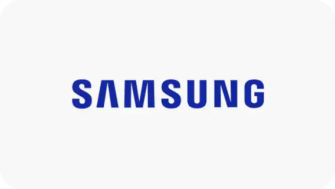

{{{RWE}}} A Federal Circuit decision involved a general, exclusive forum-selection provision, which had caused the parties to have to litigate whether Samsung could challenge the validity of a patent in an /administrative/ proceeding in the U.S. Patent and Trademark Office, known as an "inter partes review" or "IPR" instead of in the agreed exclusive-forum court. Spoiler: Both the trial- and appeals courts said "yes." <cite> [[https://scholar.google.com/scholar_case?case=5782763899505552031][Kannuu Pty Ltd. v. Samsung Elec. Co.]], 15 F.4th 1101 (Fed. Cir. 2021) (affirming denial of motion for preliminary injunction); cf. [[https://scholar.google.com/scholar_case?case=15963663078556466679][DexCom, Inc. v. Abbott Diabetes Care, Inc.]] , 89 F.4th 1370 (Fed. Cir. 2024) (affirming denial of preliminary injunction; /wording/ of exclusive forum-selection provision /allowed/ filing of IPR). </cite>

*But:* An even-broader forum selection provision led to the opposite result, as discussed at [[#nippon-shiyaku]].

{{{RWE}}} Consider the following (hypothetical) possibility:

- Provider, a company headquartered in Providence (Rhode Island), licenses its software to Customer, in Cumberland (Maryland). /(The city names here were chosen for matching initials.)/

- As with many drafter-favoring contracts, Provider's standard software license agreement requires that any litigation "arising out of /or relating to/" the agreement must be brought in Providence, Provider's home city. 

- One day, though, Customer rolls out its own software product that performs some of the functions of Provider's software — /and/ Customer's new software bears a trademark that's confusingly similar to Provider's own trademark.

In that situation:

- If Provider wanted to sue Customer /for trademark infringement/, then Provider might well want to bring the lawsuit in /Cumberland/ because of the better availability of relevant witnesses and documents.

- But: Provider might /not/ be able to sue Customer in Cumberland — as Provider would prefer to do in these particular circumstances — because the license agreement required all disputes /relating to/ the license agreement to be brought in Provider's home city of Providence.

**** Don't be wishy-washy about forum selection
  :PROPERTIES:
  :CUSTOM_ID: forum-emphatic
  :END:

In one contract that I reviewed for a client, a forum-selection clause stated that "disputes /are to be resolved/ in [a particular court]." This is almost a canonical example of a false imperative; Rebecca Tradewell, an attorney for the Wisconsin Legislative Reference Bureau, explains that a better way to word such a provision is to state it in terms of a positive obligation: "Any dispute arising out of ... /must be brought and maintained in/ [the court in question]." <cite> See Becky Tradewell, [[https://www.ncsl.org/Portals/1/documents/lsss/webinars/shall_outline.pdf][Food Shall Be Pure: Using "shall" carefully for clearer laws]] (NSDL.org 2013). </cite>

**** Would a /forum/-selection clause imply a choice of /law/?

For extensive discussion and research notes, see a posting at the Transnational Litigation Blog. <cite> See Chukwuma Okoli, [[https://tlblog.org/forum-selection-agreements-as-indicators-of-implied-choice-of-law][Forum Selection Agreements as Indicators of Implied Choice of Law]] (tlblog.org 2024). </cite>

**** A court might not honor a choice of an "improper" forum            :CMT:
  :PROPERTIES:
  :CUSTOM_ID: forum-improper-cmt
  :END:

In many American states, a venue statute specifies the location where a lawsuit must be brought; typically, this will be either the /county/ where the plaintiff resides or the /county/ where the defendant resides.

But if a contract's forum-selection clause specifies a _county_ that doesn't meet the statutory requirement, then a court might refuse to enforce the forum selection. {{{RWE}}} This happened in a North Carolina case; the court, though, did note that "a forum selection clause which favored a court /in another State/ was enforceable ...." <cite> [[http://appellate.nccourts.org/opinions/?c=2&pdf=32429][A&D Envt'l Serv., Inc. v. Miller]], 770 S.E.2d 755, 756 (N.C. App. 2015) (affirming denial of defendant's motion to enforce forum-selection clause) (emphasis in original, citation and internal quotation marks omitted). </cite>

Another example: Under a California statute ([[https://leginfo.legislature.ca.gov/faces/codes_displaySection.xhtml?lawCode=CCP&sectionNum=116.225.][Cal. Code Civ. Pro. § 116.225]]), "[a]n agreement entered into or renewed on or after January 1, 2003, establishing a forum outside of California for an action arising from an offer or provision of goods, services, property, or extensions of credit primarily for personal, family, or household purposes that is otherwise within the jurisdiction of a small claims court of this state is contrary to public policy and is void and unenforceable." (Hat tip: [[https://www.redline.net/queries/checklist-arbitration-and-class-action-waivers-b2c-online-terms-service#comments-body-30165][Sean Hogle]] at the lawyer forum redline.net.) <cite> For more about California's extensive legislative treatment of forum-selection clauses, see John F. Coyle, [[https://tlblog.org/forum-selection-clauses-in-california/][Forum Selection Clauses in California]] (TLBlog.com 2025). </cite>

**** Forum selections might be disregarded for policy reasons           :CMT:
  :PROPERTIES:
  :CUSTOM_ID: forum-policy-cmt
  :END:

Courts will sometimes refuse to honor a contract's forum-selection clause if the clause offends a strong public policy of the forum location.  Here are a few real-world examples.

{{{RWE}}} In Texas, out-of-state forum-selection provisions in "construction contracts" are "void as against public policy."  <cite> [[https://statutes.capitol.texas.gov/?tab=1&code=BC&chapter=BC.272&artSec=272.001][Tex. Civ. Prac. & Rem. Code §§ 272.0001, 272.001]] (as amended effective Sept. 1, 2025). </cite>

{{{RWE}}} A group of users of the America OnLine ("AOL") service sued AOL in California and sought class-action status. 

- The AOL user agreement required all disputes to be litigated in Virginia.

- Citing the forum-selection clause, a federal district court in California dismissed the case but said it could be re-filed in Virginia state courts, as required by the user agreement. 

- The federal appeals court disagreed, holding that California had a strong public policy favoring class-action relief — and noting that the requested relief was not available in Virginia state courts. 

- Therefore, said the appeals court, "the forum selection clause in the instant member agreement is unenforceable as to California resident plaintiffs bringing class action claims under California consumer law." <cite> [[https://scholar.google.com/scholar_case?case=6214815490932232665][Doe 1 v. AOL, LLC]], 552 F.3d 1077, 1084 (9th Cir. 2009). </cite>

{{{RWE}}} Relatedly, [[https://leginfo.legislature.ca.gov/faces/codes_displaySection.xhtml?lawCode=LAB&sectionNum=925.][California Labor Code § 925]] "prohibits an employer from requiring an employee who resides and works in California to agree to a provision requiring the employee to adjudicate outside California a claim arising in California." <cite> [[https://scholar.google.com/scholar_case?case=5800022293518457321][Zhang v. Superior Court]] (Zhang v. Dentons US LLP), 85 Cal. App. 5th 167, 171 (2022) (denying mandamus). </cite>

# https://commons.wikimedia.org/wiki/File:AutoNation_logo.svg
# #+ATTR_HTML: :alt AutoNation logo :title AutoNation logo :class photowidth20 photo-at-right
# 

*Counterexample:* In a California case, a Delaware corporation's certificate of incorporation and bylaws included a mandatory forum-selection provision that designated Delaware's Chancery Court — where a jury trial wouldn't be available — as the exclusive forum for certain litigation. California's supreme court held that the lack of the right to a jury trial wasn't enough — at least not standing alone — to deny enforcement of the forum-selection provision, even though advance jury-trial waivers are constitutionally unenforceable in /California/ courts:

#+begin_quote

Forum selection clauses serve vital commercial purposes and should generally be enforced. At the same time, courts may properly consider whether enforcement of a forum selection clause would violate public policy. 

California has a strong public policy, based on the California Constitution, in favor of the right to trial by jury. 

But California’s strong public policy protects the jury trial right in California courts, not elsewhere. It does not speak to the availability of the jury trial right in other forums. A forum selection clause is not unenforceable simply because it requires the parties to litigate in a jurisdiction that does not afford civil litigants the same right to trial by jury as litigants in California courts enjoy. <cite> [[https://scholar.google.com/scholar_case?case=15175780934148233221][EpicentRX, Inc. v. Sup. Ct. of San Diego Cty]], No. S282521, slip op. at 2 (Cal. Jul. 21, 2025) (reversing and remanding denial of mandamus) (extra paragraphing added). </cite>
#+end_quote

# https://commons.wikimedia.org/wiki/File:America_Online_logo.svg
# #+ATTR_HTML: :alt America Online logo :title AOL logo :class photowidth15 photo-at-right
# 

{{{CE}}} Likewise, in a Texas supreme court case:

- AutoNation, a Florida-based car dealer, filed suit, in Florida, against a former employee who lived in Texas and had worked for the car dealer there.

- The former employee's employment agreement contained a choice-of-law clause calling for /Florida/ law to apply, together with a forum-selection clause requiring any litigation to take place in /Florida/.

- Before learning of the Florida action, the former employee sued the car dealer in /Texas/, seeking a declaratory judgment that the non-competition covenant of the employment agreement was unenforceable under prior Texas supreme court precedent.

Granting a writ of mandamus, the Texas supreme court ruled that while it was not questioning the validity of its prior precedent, it would still enforce the "freely negotiated" /[sic]/ forum-selection clause to allow first-filed suit in Florida to proceed. <cite> [[https://scholar.google.com/scholar_case?case=11784087501632923472][In re AutoNation, Inc.]], 228 S.W.3d 663 (Tex. 2007). </cite>

QUESTION:   On the /AutoNation/ facts, what are the odds that the /Florida/ court would have applied /Texas/ law, given that the contract included a Florida choice-of-law clause?

{{{RWE}}} In a Sixth Circuit case, the contract in suit was between a Michigan countertop fabricator and a Minnesota manufacturer of stone slabs used to make countertops. The contract's forum-selection provision required all lawsuits to be brought in a /Minnesota/ state court. The Michigan company filed suit in a federal district court in /Michigan/. The trial court granted the Minnesota company's motion to dismiss, citing the contract's forum-selection clause, but the appeals court reversed, on grounds that Michigan Franchise Investment Law invalidated the clause. <cite> See [[https://scholar.google.com/scholar_case?case=286459648460584236][Lakeside Surfaces, Inc. v. Cambria Company, LLC]], 16 F.4th 209 (6th Cir. 2021) (reversing and remanding dismissal of Michigan-filed lawsuit). </cite>

{{{RWE}}} A California appeals court held that the state's usury laws, while complicated, represented a fundamental public policy of the state that trumped a loan agreement's forum-selection provision. <cite> See [[https://scholar.google.com/scholar_case?case=13765037985319887426][G Companies Management, LLC v. LREP Arizona LLC]], 88 Cal. App. 5th 342 (2023) (reversing order enforcing forum-selection clause). For additional discussion and case citations, see generally Paulo B. McKeeby, [[http://www.morganlewis.com/pubs/CorprateCounsel_SolvingMultiStateNonCompetePuzzle_17oct12.pdf][Solving the Multi-State Non-Compete Puzzle Through Choice of Law and Venue]] (2012). (For more on usury law, see [[#nl-usury]].) ]

{{{RWE}}} In Texas, if a contract relates broadly to real property located in Texas and is entered into after September 1, 2025, then (with certain exceptions) a forum-selection clause requiring litigation in the courts of another state is void as against public policy — ditto for governing-law clauses choosing the law of another state, and arbitration clauses requiring arbitration in another state. <cite> Under the former version of the statute, a state court of appeals held that if the forum-selection clause included a waiver of voidability, then that waiver would be enforced; three years later, the Legislature responded by changing the wording to preclude that result. See [[https://statutes.capitol.texas.gov/Docs/BC/htm/BC.272.htm#272][Tex. Bus. & Comm. Code ch. 272]], /amended by/ [[https://capitol.texas.gov/tlodocs/89R/billtext/html/HB02960F.htm][H.B. 2960]]. The previous version of the statute was cited in [[https://scholar.google.com/scholar_case?case=10434586425404476328][In re MVP Terminalling, LLC]], No. 14-21-00399-CV, slip op. (Tex. App—Houston [14th Distr.] Aug. 23, 2022) (conditionally granting mandamus proceeding; by entering into subcontract, subcontractor had contractually waived its statutory right to void forum-selection clause). </cite>

**** Could a "closely-related" /non-signatory/ be bound?
  :PROPERTIES:
  :CUSTOM_ID: forum-non-sig
  :END:

{{{RWE}}} As explained by the Fifth Circuit: Under the "closely-related" doctrine, /non-signatories/ to the contract might be /bound by/ — and conversely, might be able to /enforce/ — a forum-selection clause "where, under the circumstances, the non–signatories enjoyed a sufficiently close nexus to the dispute or to another signatory such that it was foreseeable that they would be bound." <cite> [[https://scholar.google.com/scholar_case?case=4735599746187072398][Franlink Inc. v. BACE Services, Inc.]], 50 F.4th 432, 439 (5th Cir. 2022) (cleaned up, extensive citations omitted). </cite>

{{{CE}}} The Texas supreme court held that a company's CEO was not /personally/ bound by a contract's forum-selection provision just because the CEO had signed the contract on behalf of the company. <cite> See [[https://scholar.google.com/scholar_case?case=10453849277705716943][Rieder v. Woods]], 603 S.W.3d 86 (Tex. 2020) (reversing and remanding court of appeals decision). </cite>

{{{CE}}} The Sixth Circuit essentially rejected the "closely related" doctrine — after extensive analysis, including analogizing to arbitration law — but ultimately ducked the question on grounds that the parties' choice of /English/ law precluded resort to the doctrine. <cite> See [[https://scholar.google.com/scholar_case?case=14381800313376401474][Firexo, Inc. v. Firexo Group Ltd.]], 99 F.4th 304, 327-29 (6th Cir. 2024) (reversing and remanding dismissal, with extensive citations). </cite>

{{{CE}}} Arizona's supreme court rejected the "closely related" doctrine on grounds that "under Arizona law, third-party beneficiaries must be explicitly named in the contract to enforce the contract’s provisions," and the defendant was not a named beneficiary and so could not rely on the contract's forum-selection provision. <cite> See [[https://scholar.google.com/scholar_case?case=14635728597562453543][Henderson v. Moskowitz]], No. CV-24-0215-PR, slip op. at 6 ¶ 14 (Ariz. Nov. 28, 2025) (affirming trial court denial of defendant's motion to dismiss). </cite>

See also an extensive 2021 survey by two law professors. <cite> See John F. Coyle and Robin Effron, [[https://papers.ssrn.com/sol3/papers.cfm?abstract_id=3846436][Forum Selection Clauses, Non-Signatories, and Personal Jurisdiction]], 97 Notre Dame L. Rev. 189 (2021) (criticizing closely-related doctrine and proposing reforms). </cite>

**** Idaho's idiosyncratic approach ....
  :PROPERTIES:
  :CUSTOM_ID: forum-sel-idaho
  :END:

{{{RWE}}} In an Idaho case, a contract expressly required arbitration in /Dallas/, but the state's supreme court held that the contract's choice of /Texas law/ required arbitration in /Idaho/. <cite> See [[https://scholar.google.com/scholar_case?case=9612557082250541127][T3 Enterprises, Inc. v. Safeguard Bus. Sys., Inc.]], 164 Idaho 738, 435 P.3d 518, 528-30 (2019). </cite>

{{{RWE}}} And later, the same court held that a contract's choice of /California/ law required arbitration /in Idaho/ — this, even though /the contract expressly required arbitration to be in California/:

#+begin_quote
We hold that /California/ law requires an examination of the public policy of the forum in which suit is brought, and that the forum selection clauses at issue violate the strong public policy of the State of Idaho. We affirm the district court’s ruling that claims arising from the parties’ purchase agreement and LLC agreement must be arbitrated in Idaho. <cite> [[https://cases.justia.com/idaho/supreme-court-civil/2021-47940.pdf][Off-Spec Solutions, LLC v. Transp. Investors, LLC]], 168 Idaho 734, 487 P.3d 326 (2021). </cite>
#+end_quote

Editorial comment: It'd be one thing if the Idaho court had tossed out the contracts' respective choice-of-/law/ provisions as well as the choice-of-/forum/ provisions, on grounds that otherwise, the parties' bargained-for results would have violated Idaho public policy as expressed in Idaho's choice-of-forum statute. <cite> See [[https://legislature.idaho.gov/statutesrules/idstat/title29/t29ch1/sect29-110/][Idaho Code § 29-110]], /quoted in/ /Off-Spec Solutions/, slip op. at 7. </cite>

But let's just say it's ... unusual to assert that /California's/ or /Texas's/ law somehow requires an Idaho court to concern itself with /Idaho's/ public policy.

/Drafting lesson:/ If doing business with an Idaho company, don't expect your forum-selection provision to be given effect by an Idaho court —  so be prepared to race to your preferred courthouse if it looks as though litigation is on the horizon.
 
**** Texas business courts - like Delaware's chancery court?

In September 2024, a new form of Texas state court, limited to business cases and with appeals heard by a new court of appeals in Austin, opened for business. <cite> See generally, e.g., the Vinson & Elkins memo [[https://www.velaw.com/series/texas-business-courts/][Everything You Need to Know About Texas’s Business Courts]]. </cite>

*** Student exercises
  :PROPERTIES:
  :CUSTOM_ID: forum-student
  :HTML_CONTAINER_CLASS: addl
  :END:

FACTS /(based on a client situation I once had to deal with)/:

- For your client MathWhiz, you've assigned a law clerk in your firm to prepare a draft of a simple project agreement with Gigunda.

- The law clerk has included a forum-selection provision stating that any dispute arising out of or relating to the agreement must be heard exclusively in "the courts of Texas."

QUESTION 1: What ONE /negotiation/-strategy danger might this pose for MathWhiz — is this something you really want to include in the draft project agreement that you send to Gigunda? ([[#forum-dog][Link]])

QUESTION 2: What TWO /litigation/-strategy dangers (depending on your perspective) might this pose? /[Discuss this, but don't spend a lot of time on it; I'll answer it.]/ ([[#exclu-fm-bkfr][Link]], [[#forum-excl-disad][link]] [[#forum-mass][link]])

MORE FACTS: 

- Gigunda's lawyer reviews your draft project agreement. 

- Among other changes, Gigunda's lawyer wants: (i) to add a waiver of the right to trial by jury, and (ii) to change the "heard exclusively in the courts of Texas" language to "courts of California"; she says that both are "required by company policy."

QUESTION 3: What might those changes do to your overall risk assessment — and why?

QUESTION 4 /(DCT to answer this one)/: If MathWhiz goes along with the courts-of-/California/ language, and Gigunda sues MathWhiz in California /state/ court, what kind of options might MathWhiz have: (i) to remove to /federal/ court, and then (ii) to transfer to Texas federal court for the convenience of witnesses under 28 U.S.C. § 1404(a)?

QUESTION 5: Is there any way you can try to talk the Gigunda lawyer out of the change to California courts?

** Fraud Proof {{{CLS}}}                                                :CLS:
  :PROPERTIES:
 :CUSTOM_ID: r-fraud-proof
 :HTML_CONTAINER_CLASS: cl7
 :CATEGORY: Protocol
  :END:

Contents:

#+TOC: headlines 1 local

*** The {{{NOUN-C}}}

1. {{{TRIG-WHEN}}}, the parties will follow it whenever {{{A}}} alleges fraud — however labeled — arising out of or otherwise relating to {{{thek}}}, under any legal- or equitable theory.

2. {{{A}}} will do the following:

   a. /plead/ the allegation with the particularity required by [[https://www.law.cornell.edu/rules/frcp/rule_9][Federal Rule of Civil Procedure 9(b)]]; 

   b. /prove/ the allegation by clear and convincing evidence (as defined at {{{RR}}} [[#clear-conv-evid]]); and

   c. offer reasonable corroboration (defined at {{{RR}}} [[#corrob-cls]]) of any testimony by an interested witness.

3. {{{A}}} *WAIVES* any allegation of fraud that are not proved as required by subdivision A above.

4. {{{ADOPT}}}

***** Note                                                              :CMT:
  :PROPERTIES:
  :HTML_CONTAINER_CLASS: cmtry
  :UNNUMBERED: notoc
  :END:

{{{H1}}} Lawyers, and even clients, can sometimes casually throw around allegations of fraud, for tactical reasons discussed in more detail at [[#RelDisclBkgd]]. Such allegations can make litigation (and arbitration) much more complicated and costly. To streamline legal proceedings when fraud-like allegations are made, {{{ths}}} is intended to lock in the usual American standard of proof in civil cases.

 {{{HN}}} Subdivision 2.b: This clear-and-convincing evidence requirement is based on typical rules in the U.S. <cite> See, e.g., [[https://scholar.google.com/scholar_case?case=16733994394769037107][Riley Hill Gen. Contractor, Inc. v. Tandy Corp.]], 303 Or. 390, 737 P.2d 595, 597 (1987) (affirming court of appeals in reversing and remanding for new trial); [[https://scholar.google.com/scholar_case?case=3308980430167417428][Rudman v. Cowles Comms., Inc.]], 30 N.Y.2d 1, 10 (1972) (affirming dismissal of fraud claim); New York Pattern Jury Instruction 3:20, /cited in/ [[https://www.govinfo.gov/content/pkg/USCOURTS-pawd-2_15-cv-00631/pdf/USCOURTS-pawd-2_15-cv-00631-2.pdf][H.J. Heinz Co. v. Starr Surplus Lines Ins. Co.]], No. 15cv0631, slip op. at 5 (W.D. Pa. Oct. 30, 2015) (adopting clear and convincing evidence standard for jury instructions). </cite>

{{{HN}}} Subdivision 2.c: For discussion of this corroboration requirement, see the commentary at {{{RR}}} [[#corrob-cls]]. 

{{{HN}}} Subdivision 3: This waiver is a signal to any court or arbitrator that's considering a fraud claim covered by {{{ths}}}.

** Governing Law {{{CLS}}}                                              :CLS:
  :PROPERTIES:
  :CUSTOM_ID: r-GovLaw
  :HTML_CONTAINER_CLASS: pr-top
  :END:

Contents:

#+TOC: headlines 1 local

*** The {{{NOUN-C}}}

**** Applicability of {{{ths}}}

{{{Ths-cap}}} will govern if {{{thek}}} clearly says that the law of a particular stated geographic location or jurisdiction will apply (or govern, or similar wording); this is referred to here as the law that "applies" or "governs."

**** Substantive law; no /renvoi/
  :PROPERTIES:
  :CUSTOM_ID: GovLawWhich
  :END:

On /substantive/ matters, the {{{dfn(Governing Law)}}} is the substantive law that applies in the stated geographic jurisdiction as that (substantive) law is applied: \bull in disputes between residents of that jurisdiction, \bull concerning matters that happen entirely within that jurisdiction, \bull without regard to that jurisdiction's choice-of-law rules. 

(For emphasis: The parties intend here to rule out application of the legal doctrine of /renvoi/.)

***** Note                                                              :CMT:
  :PROPERTIES:
  :HTML_CONTAINER_CLASS: cmtry
  :UNNUMBERED: notoc
  :END:

To illustrate how /renvoi/ (French for "send back") works, let's consider the following hypothetical example: (1) Two giant oil companies company — let's call them Flexxon and Blevron — each have operations in New Orleans but are headquartered in Houston. (2) The two companies enter into a contract under which they will explore for oil. (3) The contract is negotiated in Louisiana, and all the work under the contract is to take place in Louisiana. (4) But the contract between the companies calls for /Texas/ law to apply, because Flexxon and Blevron are both headquartered in Houston and their lawyers are more familiar with Texas law.

On these facts, Texas choice-of-law rules /might/ call for the application of /Louisiana/ law in a lawsuit, because Louisiana might be the state with the closest relationship to the parties' dealings. <cite> See generally, e.g., [[https://en.wikipedia.org/wiki/Conflict_of_laws_in_the_United_States][Conflicts of laws in the United States]] (Wikipedia.com). </cite> That's why {{{ths}}} includes the phrase, "without regard to ... choice-of-law rules" phrase; this is known as disclaiming /renvoi/. <cite> See, e.g., [[https://scholar.google.com/scholar_case?case=1317384802443530733][American Ins. Co. v. Frischkorn]], 173 F. Supp. 2d 514, 520-21 (D. W. Va. 2001) ("This Agreement shall be governed by and construed in accordance with the laws of the State of California applicable to disputes occurring entirely within such State."); [[https://scholar.google.com/scholar_case?case=12701572116105872807][Brill v. Regent Communications, Inc.]], 12 N.E.3d 299, 306-08 (Ind. App. 2014) (citing cases) ("This Agreement shall be interpreted and the rights of the parties determined under the laws of the Commonwealth of Virginia without regard to the conflict of law provisions thereof"). </cite> {{{RWE}}} A federal trial court in Texas ruled that an indemnity provision in a contract was invalid under New Mexico law because, under the /Texas/ law agreed to in the contract, /New Mexico/ law would govern because of the greater relationship that the latter state had to the case.   <cite> See [[https://scholar.google.com/scholar_case?case=1159133442038429920][ConocoPhillips Co. v. Totem Well Serv., LLC]], No. 4:23-CV-3383, slip op. (S.D. Tex. Nov. 6, 2025) (Hanen, J., denying Conoco's motion for summary judgment and granting Totem's cross-motion for summary judgment). </cite>

**** Procedural law

The relevant /procedural/ law is whatever the Governing Law says it would be.

***** Note                                                              :CMT:
  :PROPERTIES:
  :HTML_CONTAINER_CLASS: cmtry
  :UNNUMBERED: notoc
  :END:

A contract's choice of governing law will /generally/ apply only to /substantive law/, not to procedural matters — such as, notably, statutes of limitation setting deadlines for filing lawsuits. <cite> See, e.g., [[https://scholar.google.com/scholar_case?case=308791681302518649][Integrity Global Security, LLC v. Dell Marketing LP]], 579 S.W.3d 577, 587 (Tex. App.--Austin 2019) (reversing summary judgment that limitation period had expired). </cite> 

**** Covered disputes
  :PROPERTIES:
  :CUSTOM_ID: gov-law-arise
  :END:

The Governing Law will apply in any dispute arising out of or relating to (i) {{{thek}}} itself, and/or (ii) <<any-trans-rel>>any transaction or relationship resulting from {{{thek}}}.

***** Note                                                              :CMT:
  :PROPERTIES:
  :HTML_CONTAINER_CLASS: cmtry
  :UNNUMBERED: notoc
  :END:

1.  {{{Ths-cap}}} applies broadly to "any dispute arising out of or relating to" (see § [[#nl-aris-out-defn]]) certain things. But if instead a choice-of-law clause is drafted more narrowly — for example, to cover only to the /interpretation/ and /enforcement/ of a contract — then the chosen law will probably /not/ be applied to /tort/-based claims such as claims of misrepresentation, e.g., of fraudulent inducement to enter into the contract.[fn:GovLawWhichDisp] (Students: Be sure to read the footnote.)

2.  The term /any transaction or relationship .../ is modeled on an arbitration-agreement provision that has been litigated at least twice. <cite> See [[http://scholar.google.com/scholar_case?case=11320101106805195709][Sherer v. Green Tree Servicing LLC]], 548 F.3d 379, 382-83 (5th Cir. 2008), /citing/ [[http://scholar.google.com/scholar_case?case=18123556052272254014][Blinco v. Green Tree Servicing LLC]], 400 F.3d 1308, 1310 (11th Cir. 2005). </cite>

[fn:GovLawWhichDisp] Here are some examples of governing-law provisions being applied narrowly:

{{{RWE}}} In a Massachusetts case, a husband and wife brought an arbitration claim against its investment firm. The parties' contract contained a choice of Massachusetts law, but that choice of law applied only to the /interpretation/ and /enforcement/ of the contract, not to /related/ claims. The couple's claims against the investment firm included not only contract claims, but also claims under a Pennsylvania unfair-trade-practices statute.

An arbitrator held that, because the contract's choice-of-law provision didn't apply to /noncontract/ claims, the Pennsylvania statute's remedies were available to the client.  The arbitrator awarded treble damages under the Pennsylvania statute; a trial court in Massachusetts upheld the (sizeable) arbitration award. <cite> See [[http://www.sacarbitration.com/SLAOnlineCases/2015_SLA/46/SLC_2015-46-01.pdf][Family Endowment Partners, L.P. v. Sutow]], No. 2015 CV 1411- BLS1 (Mass. Superior Ct. Nov. 16, 2015) (confirming arbitration award); relatedly, see Pat Murphy, [[http://www.mccarter.com/files/Uploads/Documents/Mass%20lawyers%20weekly%20Himelfarb%20Gabos%2012.1.15-cleaned.pdf][$48M arbitration award vs. investment advisor upheld]] (McCarter.com 2015). See also, e.g., [[https://cases.justia.com/federal/district-courts/massachusetts/madce/1:2017cv10662/188355/159/0.pdf][ACI Worldwide Corp. v. KeyBank N.A.]], No. 1:17-cv-10662-IT, slip op. at 5-7 (D. Mass. Sept. 30, 2020) (contractual choice of law didn't apply to fraudulent-inducement claim). </cite>

More recently, from the Southern District of New York:

#+begin_quote
Here, the Agreement's choice-of-law provision provides the governing law only for the contract. It states: "This Agreement shall be governed by, and construed under, the laws of the State of Delaware, all rights and remedies being governed by said laws." 

Plaintiff argues that the "all rights and remedies" phrase broadens the scope of the clause and reflects an intent to apply Delaware law to extra-contractual claims. However, when read in context, that language is explanatory, indicating that the substantive law of Delaware will apply exclusive of its choice of law principles. The provision expressly provides that "This Agreement" is what is governed by Delaware law. * * * Accordingly, New York law governs the tortious interference claim. 
#+end_quote
<cite> [[https://scholar.google.com/scholar_case?case=15438452727747721][Manbro Energy Corp. v. Chatterjee Advisors, LLC]], No. 20 Civ. 3773 (LGS), part III.A, slip op. (S.D.N.Y. May 21, 2021) (granting motion to dismiss tortious-interference claim, which was governed by law of New York, not Delaware); see also, e.g., [[https://scholar.google.com/scholar_case?case=8939003010713170455][Dinan v. Alpha Networks, Inc.]], 764 F.3d 64 (1st Cir. 2014) (vacating and remanding trial-court judgment; Maine-based sales representative was entitled to treble damages under Maine wage payment law despite employment agreement's choice of California law); [[https://scholar.google.com/scholar_case?case=5554728159741916021][Indep. Fin. Grp., LLC v. Quest Trust Co.]] No. H-21-2125, § 1 (S.D. Tex. Dec. 21, 2022) (Bray, M.J., recommending grant of summary judgment dismissing claims) (custodial agreement stated that it "shall be governed by and construed under the applicable laws of the state of Texas"), [[https://scholar.google.com/scholar_case?case=17499663835646906952][adopted]] (S.D. Tex. Jan.25, 2023) (Hughes, J.) (overruling objections). </cite>

*** Introduction: A typical contract practice

It's quite common for contracts to specify a law to govern the contract as a whole, or possibly just one specific clause of a contract. That's because under the "party autonomy rule" in the United States (and some other jurisdictions), parties can agree — within limits — that their contract will be governed by the law of another jurisdiction. <cite> See [[https://scholar.google.com/scholar_case?case=9135932681763019162][Great Lakes Insurance SE v. Raiders Retreat Realty Co.]], 601 U.S. ___, 144 S. Ct. 637 (2024) (reversing 3d Cir., upholding maritime contract's choice of New York law): "Applying federal maritime law in this case, we conclude that choice-of-law provisions in maritime contracts are presumptively enforceable, with certain narrow exceptions not applicable here." </cite>

{{{UN}}} For a partial survey of different approaches to governing-law clauses taken by various state courts, see a 2026 piece by Professor Coyle — who notes that "The State of Kentucky appears to be the only one whose courts ignore choice-of-law clauses when determining which law to apply." <cite> John F. Coyle, [[https://tlblog.org/idiosyncratic-approaches-to-enforcing-choice-of-law-clauses][Idiosyncratic Approaches to Enforcing Choice-of-Law Clauses]] (tlblog.org 2026); see also the same author's post, [[https://tlblog.org/the-many-uses-of-the-choice-of-law-clause][The Many Uses of the Choice-of-Law Clause]] (tlblog.org 2026), as well as [[https://tlblog.org/choice-of-law-in-the-american-courts-in-2025/][Choice of Law in the American Courts in 2025]] (tlblog.org 2026). </cite>

*** Caution: A governing-law clause might backfire                      :CMT:
  :PROPERTIES:
  :CUSTOM_ID: GovLawBackfire
  :END:

Specifying a particular law that you want to govern your contract, or your contractual relationship, could lead to unexpected — and possibly-undesired — results. Here are some real-world examples:

{{{RWE}}} A group of individuals, working /in New York/ as couriers for a Massachusetts-based company, sued the courier company in Massachusetts for unpaid overtime. The company had drafted its contract form to specify that Massachusetts law would apply and that all litigation must be in Massachusetts. So, these New-York based couriers claimed to be entitled to the protection of /Massachusetts/ statutes governing independent contractors, wages, and overtime. The Massachusetts supreme court held that *it would not be unfair to enforce the courier company’s own forum-selection and governing-law choices against the company*. <cite> See [[https://scholar.google.com/scholar_case?case=10474110454285764501][Taylor v. Eastern Connection Operating, Inc.]], 465 Mass. 191, 988 N.E.2d 408 (2013) (vacating trial court's dismissal of case and remanding for further proceedings). </cite>

{{{RWE}}} A /Florida/-based, remote-working employee of a Massachusetts company successfully sued the company's CEO — personally — for more than $100,000 in unpaid wages and expense reimbursements, among other amounts. The employee did so under a Massachusetts statute that created the right of action, in part because the remote worker's employment agreement stated that /Massachusetts/ law applied. <cite> See [[https://scholar.google.com/scholar_case?case=10258061612300686154][Dow v. Casale]], 83 Mass. App. Ct. 751, 989 N.E.2d 909, 913 (2013) (affirming summary judgment in favor of former employee). </cite>

{{{RWE}}} A federal court in Oklahoma, considering the same Massachusetts statute, dismissed the class-action claims filed by two remote employees; in /that/ case, the employment agreement didn't include a choice-of-law provision. <cite> See [[https://scholar.google.com/scholar_case?case=3108583093285383199][Goode v. Nuance Communications, Inc.]], No. 17-CV-00472-GKF-JFJ, slip op., text acc. n.5 (N.D. Okla. Jul. 10, 2018). </cite>

{{{RWE}}} In a franchise-dispute case, the Ontario court of appeals held that Ontario law — which gave franchisees specific rights — applied /even to franchisees outside Ontario/ because the franchise agreement specified that Ontario law would apply. <cite> See [[http://www.canlii.org/en/on/onca/doc/2010/2010onca478/2010onca478.html?autocompleteStr=midas&autocompletePos=1][405341 Ontario Ltd. v. Midas Canada Inc.]], 2010 ONCA 478 paras. 40-45. </cite>

# https://commons.wikimedia.org/wiki/File:Uber_logo_2018.svg/
# #+ATTR_HTML: :alt Uber logo :title Uber logo :class photowidth20 photo-at-right
# 

*Counterexample:* A federal district court in San Francisco held that Uber drivers working outside California could not sue the company for violation of a California wage-and-hour statute, even though the drivers’ contract with Uber included a California choice-of-law clause, on grounds that the relevant statutes didn't apply extraterritorially. <cite> See [[https://scholar.google.com/scholar_case?case=12792382185498204711][O’Connor v. Uber Tech., Inc.]], 58 F. Supp. 3d 989, 1003-06 (N.D. Cal. 2014) (granting judgment on the pleadings). (The extensive subsequent proceedings in that case aren't relevant here; see [[https://scholar.google.com/scholar_case?case=17670979464125418458][O'Connor v. Uber Tech., Inc.]], 904 F.3d 1087 (9th Cir. 2018).). </cite>

*** A governing-law clause could decide the outcome of a case
  :PROPERTIES:
  :CUSTOM_ID: gov-law-dispos
  :END:

A pharmaceutical company owned a patent but did a "Samson in the temple" move to the patent. Why did it do that? Because it had entered into an agreement with another pharma firm that required it to pay royalties on its own product, and it wanted to get out from under that obligation. (To explain further would require getting into the weeds of patent law, and it's not important in any case.) The contract between the two pharma companies stated that Delaware law would govern. 

The other firm sued for breach of the implied covenant of good faith and fair dealing. But the Delaware supreme court said, basically, /tough/: Under Delaware's "contractarian" approach, said the court, "[t]he implied covenant ... is a limited and extraordinary legal remedy and not an equitable remedy for rebalancing economic interests that could have been anticipated. It cannot be invoked when the contract addresses the conduct at issue." <cite> [[https://scholar.google.com/scholar_case?case=6587312515760085993][Glaxo Group Ltd. v. DRIT LP]], 248 A.3d 911, 919-20 (Del. 2021) (reversing, in part, trial-court judgment) (cleaned up). </cite>

*LESSON:* A choice-of-law clause could be important.

*** Strategic question: Choose New York law? California law
  :PROPERTIES:
  :CUSTOM_ID: gov-law-ny-ca-de
  :END:

Very much worth a read:

#+begin_quote

The differences between New York and California contract law turn out to align with the formalist/contextualist distinction in contract theory. 

- New York judges are formalists. Especially in commercial cases, they have little tolerance for attempts to rewrite contracts to make them fairer or more equitable, and they look to the written agreement as the definitive source of interpretation.

- California, on the other hand, is more willing to reform or reject contracts in the service of morality or public policy; it places less emphasis on the written agreement of the parties and seeks instead to identify the contours of their commercial relationship within a broader context framed by principles of reason, equity and substantial justice.

Both approaches to contract law are commendable. Both serve important social goals and employ sophisticated and well-reasoned doctrines in the service of those ends. This article takes no position on whether one is better than the other. 

What is clear, however, is that contracting parties do take a position on this question. *The testimony of the marketplace* — the verdict of thousands of sophisticated parties whose incentives are to maximize the value of contract terms – is that *New York’s formalistic rules win out over California’s contextualist approach*. As predicted by theory, *sophisticated parties prefer formalistic rules* of contract law.  <cite> Geoffrey P. Miller: [[https://papers.ssrn.com/sol3/papers.cfm?abstract_id=1129805][Bargaining on the Red-Eye: New Light on Contract Theory]], NYU Law and Economics Research Paper No. 08-21, at 5-6 (2008) (cleaned up, presentation edited), available at SSRN: https://ssrn.com/abstract=1129805 or http://dx.doi.org/10.2139/ssrn.1129805. </cite>
#+end_quote

*** Delaware law strongly favors "freedom of contract"
  :PROPERTIES:
  :CUSTOM_ID: del-l-fdm
  :END:

Delaware law gives parties wide latitude to enter into contracts as they see fit — the state's courts are very reluctant to put a thumb on the scale without a compelling reason. In /RSUI Indem./ (Del. 2021), the state's supreme court quoted an oft-cited chancery-court decision about party autonomy:

#+begin_quote

When parties have ordered their affairs voluntarily through a binding contract, Delaware law is strongly inclined to respect their agreement, and will only interfere upon a strong showing that dishonoring the contract is required to vindicate a public policy interest even stronger than freedom of contract. Such public policy interests are not to be lightly found, as the wealth-creating and peace-inducing effects of civil contracts are undercut if citizens cannot rely on the law to enforce their voluntary-undertaken mutual obligations. <cite> [[https://scholar.google.com/scholar_case?case=11743862959658705539][RSUI Indem. Co. v. Murdock]], 248 A. 3d 887, 903 (Del. 2021) (cleaned up, extra paragraphing added). </cite>
#+end_quote

*** So which governing law to choose?                                   :CMT:
  :PROPERTIES:
  :CUSTOM_ID: gov-law-which
  :END:

Drafters wondering which governing law to choose should give some thought to the specifics of the laws being considered.

- Several years ago, I started a [[http://www.oncontracts.com/cheat-sheets/choice-of-law-crib-sheet/][choice-of-law cheat sheet]] for U.S. states that might be helpful (although I haven't worked on it in a long time).

- In international transactions, a party from a jurisdiction with a civil code (e.g., continental Europe; Latin America) might be reluctant to agree to the law of a common-law country (e.g., England and its former colonies), or vice versa. In that situation, the UN CISG, discussed at [[#gov-law-excl]], might be an acceptable "neutral" choice.

- English law is often chosen for multi-national transactions. <cite> See, e.g., Melanie Willems, [[https://www.mondaq.com/uk/contracts-and-commercial-law/329242/english-law-a-love-letter][English Law – a Love Letter]] (mondaq.com 2014), which contrasts England’s common-law foundation with the civil law found on the Continent. </cite>

- Different laws might be suited for different industry categories. <cite> See generally Thierry Clerc, [[https://www.eurojuris.net/en/node/43725][International Contracts: From choosing applicable law to settling disputes]] (EuroJuris.net 2016), archived at https://perma.cc/U54S-QMBH. </cite>

- Choosing the law in a given country might require, in case of dispute, translation into whatever language is used in the lawsuit or arbitration; that can add to the expense.

*** Choose the law of the agreed forum?                                 :CMT:
  :PROPERTIES:
  :CUSTOM_ID: gov-law-forum
  :END:

If the parties are also going to agree to a choice of forum — about which see [[#r-forum-sel]] — then they might want to choose the law of that agreed forum as their agreed governing law. That could increase the chances of having their choice of law enforced in a dispute.

For example: the parties might agree to New York law, in part to take advantage of the statutory provision validating clauses requiring amendments to be in writing in certain contracts (see [[#r-amend-defn]] and its commentary). A New York court would seem to be more likely to give effect to that provision, and thus to an amendments-in-writing clause, than might a court in another jurisdiction.

*** Territory-specific choice of law?                                   :CMT:
  :PROPERTIES:
  :CUSTOM_ID: gov-law-terr
  :END:

# https://www.mycwt.com/
# #+ATTR_HTML: :alt Carson Wagonlit Travel logo :title Carson Wagonlit Travel logo :class photowidth20 photo-at-right
# 

Some companies’ boilerplate terms include territory-specific choices of law (and forum selections). For example, here’s a territory-specific [[https://perma.cc/6RJK-57EM][governing law provision from Carson Wagonlit Travel]] (now CWT), archived at https://perma.cc/6RJK-57EM.

#+begin_quote

18.1  This Agreement shall be exclusively governed by /the exclusive laws of/ [sic] and all disputes relating to this Agreement shall be resolved exclusively in[:]

(i) England and Wales and governed by English law if the Seller’s registered office is located in the Europe, Middle East, Africa (EMEA) region;

(ii) Singapore if the Seller’s registered office is located in Asia Pacific (APAC) region; or

(iii) the State of New York, USA if the Seller’s registered office is located the Americas region.
#+end_quote

(Emphasis and extra paragraphing added.)

*** Pro tip: The UK as a special case                                   :CMT:
  :PROPERTIES:
  :CUSTOM_ID: gov-law-uk
  :END:

# https://en.wikipedia.org/wiki/Flag_of_the_United_Kingdom
# #+ATTR_HTML: :alt UK flag :title UK flag :class photo-at-right photowidth20
# 

A rookie mistake is to refer to "the laws of the United Kingdom" or "the laws of Great Britain," because the UK has four separate legal systems: England; Scotland; Northern Ireland; and, since devolution, Wales. At the (very-useful) lawyers-only forum redline.net, [[https://www.redline.net/queries/how-are-prevailing-party-clauses-treated-agreements-governed-english-law][British attorney David Hill writes]]: "[R]eferring to 'the laws of the United Kingdom' is a giant flashing neon sign .... /If in any doubt, just go with 'the laws of England'./" <cite> Emphasis added; see also Tom Bolam, [[https://www.fladgate.com/insights/country-clarity-in-contract-law][Country Clarity in Contract Law]] (Fladgate.com 2021); Greenwoods Legal LLP, [[https://www.greenwoods.co.uk/article/choice-of-law-and-jurisdiction-england-and-wales-and-brexit/][Choice of law and jurisdiction: "England and Wales" and Brexit]] (Greenwoods.co.uk 2018). </cite>

Relatedly: See [[#forum-uk]] concerning forum-selection clauses to specify litigation in the UK.

*** Caution: China-involved contracts could be a special case           :CMT:
  :PROPERTIES:
  :CUSTOM_ID: gov-law-china
  :END:

# https://en.wikipedia.org/wiki/Flag_of_China
 # #+ATTR_HTML: :alt China flag :title China flag :class photowidth15 photo-at-right
# 

A guide published by an international law firm includes an extended discussion of choice-of-law provisions under Chinese law. <cite> See Herbert Smith Freehills LLP, [[https://www.lexology.com/library/detail.aspx?g=07a24805-4b96-4eaf-86c4-bb4e943ec37b][Dispute resolution and governing law clauses for China-related commercial contracts]] 8-16 (Lexology.com 2020). </cite>

A law professor at the Chinese University of Hong Kong writes that:

#+begin_quote

Chinese courts have long been said to display a "homeward trend" in applying Chinese law, the lex fori, instead of foreign law in foreign-related civil litigations. Coined by Nussbaum in 1932, the term "homeward trend" refers to “a tendency to arrive, if possible, at the application of domestic law” in the courts’ judicial search for the applicable legal system. This homeward trend is frequently criticized by commentators, who regard it as a form of local protectionism. It damages the credibility of Chinese courts and erodes the confidence of foreign investors. In addition, it encourages forum shopping and causes unfairness to defendants. <cite> King Fung Tsang, [[https://journals.library.wustl.edu/globalstudies/article/id/8754/][An Empirical Study on Choice of Law in China: A Home Run?]], 21 Wash. U. Global Studies L. Rev. 339, 341-42 (2023). </cite>
#+end_quote

Some years ago at the China Law Blog, [[http://www.chinalawblog.com/2014/05/china-contracts-that-work.html][Dan Harris asserted]] that /as a practical matter/, Chinese courts: 

- will not enforce a contract unless the contract is written in Chinese and the governing law is Chinese;

- will not enforce judgments of other nations' courts in contract lawsuits; and

- are unlikely to enforce arbitration awards from non-Chinese jurisdictions.   <cite> See generally Dan Harris, [[https://www.chinalawblog.com/2014/05/china-contracts-that-work.html][China Contracts That Work]] (2014), archived at https://perma.cc/DY8W-2CAY </cite>

*** Exclude the U.N. CISG, and/or UCITA?                                :CMT:
  :PROPERTIES:
  :CUSTOM_ID: gov-law-excl
  :END:

It's not uncommon for contracting parties to exclude, e.g., the United Nations Convention on Contracts for the International Sale of Goods ("[[http://cisgw3.law.pace.edu/cisg/text/treaty.html][U.N. CISG]]" or "Vienna Convention"). That convention, in some ways, amounts to an international version of the U.S. Uniform Commercial Code, with nontrivial differences, surveyed in a Wikipedia article. <cite> See generally the [[http://en.wikipedia.org/wiki/United_Nations_Convention_on_Contracts_for_the_International_Sale_of_Goods][Wikipedia article on the U.N. CISG]]; for a comparison of the UCC and the CISG, see John C. Tracy, [[http://knowledgetonegotiate.blogspot.com/2011/07/ucc-and-cisg.html][UCC and CISG]] (Jul. 5, 2011). </cite>

Professor John Coyle reports that when American companies' contracts mention the CISG at all, the vast majority exclude the CISG, with only a tiny fraction explicitly adopting it. Moreover, "[a] substantial number of U.S. attorneys have no idea that the CISG exists. These attorneys are unaware that they must opt out of the treaty if they want their international sales contracts to be governed by domestic sales law." <cite> John F. Coyle, [[https://tlblog.org/cisg-opt-outs-and-party-intent/][CISG Opt-Outs and Party Intent]] (TLBlog.com 2022). </cite>

Another possible exclusion is the Uniform Computer Information Transactions Act ("UCITA"), which is (was?) a controversial proposed uniform law that was enacted only in Maryland  and Virginia, and but otherwise appears to be a dead letter. <cite> See generally the [[https://en.wikipedia.org/wiki/Uniform_Computer_Information_Transactions_Act][Wikipedia article]] on UCITA. </cite>

*** The process: How do U.S. courts decide what law to apply?
  :PROPERTIES:
  :CUSTOM_ID: gov-law-bkgd
  :END:

Let's illustrate with an example in which a contract lawsuit is brought in a court in a given state — for example, a court in New York state. *The judge will naturally apply the law of that state* (that is, New York law) unless one or another party asserts that the law of a different jurisdiction should apply. Then it's up to the asserting party to convince the judge that New York law allows the other jurisdiction's law to govern.

--  If no party raises the governing-law issue, then the (New York) court likely will apply New York law, on grounds that the parties waived application of another jurisdiction's law. 

{{{RWE}}} Suppliers in Argentina sued a buyer of food products, operating in New York, for payment of $100,000 in past-due invoices On the facts, the U.N. Convention on Contracts for the International Sale of Goods ("CISG," discussed briefly at [[#gov-law-excl]] ) clearly applied — but no one seems to have made that point, so the court applied New York law without comment. <cite> See [[https://scholar.google.com/scholar_case?case=14012951485966774430][Salteña S.A.U. v. Ercomar Imports Internacional Corp.]], No. 21-CV-4675, slip op. at part IV.A (E.D.N.Y. May 22, 2024) (granting default judgment against buyer), discussed in John F. Coyle, [[https://tlblog.org/overlooking-the-cisg/][Overlooking the CISG]] (TLBlog.com 2024). See also Clayton P. Gillette, [[https://blogs.law.nyu.edu/transnational/2011/04/implicit-exclusion-of-cisg/][Implicit Exclusion of CISG]] (law.nyu.edu 2011). </cite>

--  If /federal/ law doesn't govern, and the contract states that State A's law will apply, then a judge in State B will probably go along with that statement — that is, unless the statement is inconsistent with a fundamental policy of State B's  law; see [[#gov-law-probl-cmt]] for more details.

--  If the contract /doesn't/ specify a choice of law, one or another party might still assert that another jurisdiction's law should apply. In that situation, *many courts follow the Restatement (Second) of Conflict of Laws* to determine just which law to apply.

{{{RWE}}} The Tenth Circuit concluded that Colorado would follow the Restatement; in a very-readable exposition, the court explained why, in the court's view, Colorado's law governed an advance waiver and release agreement. (This took place in a tragic case in which an outdoor-adventure participant, trying to rappel from a quarry, got stuck hanging upside down on the rope and died from positional asphyxia.) <cite> See [[https://scholar.google.com/scholar_case?case=2361452056841973467][Hamric v. Wilderness Expeditions, Inc.]], 6 F.4th 1108, 1125-28 (10th Cir. 2021) (affirming summary judgment in favor of wilderness outfitter based on advance release). </cite>

*** A court /might/ disregard a problematic choice of law ...           :CMT:
  :PROPERTIES:
  :CUSTOM_ID: gov-law-probl-cmt
  :END:

A court might not give effect to a governing-law clause in a contract if doing so would lead to a result that contravened a fundamental public policy of the law of the jurisdiction in which the court sits. Here are some examples:

{{{RWE}}} An employment agreement between a New York company and a New York-based employee included a non-solicitation provision, as in, /no soliciting our customers after you leave the company/. The employment agreement said that /Florida/ law would apply, because the New York company was a subsidiary of a Florida-based company. New York state's highest court ruled that the enforceability of the non-solicitation provision was to be judged by /New York/ law, not Florida law — even though the employment agreement said otherwise. <cite> See [[https://scholar.google.com/scholar_case?case=12927330327141679277][Brown & Brown, Inc. v. Johnson]], 25 N.Y.3d 364, 34 N.E.3d 357, 12 N.Y.S.3d 606 (2015) (affirming, in pertinent part, judgment that choice-of-law clause was unenforceable in respect to non-solicitation clause). </cite>

{{{RWE}}} A medical-device sales representative quit his job in Arizona and started working for a direct competitor of his former company. The company filed a lawsuit in federal court in Arizona, seeking to enforce a non-competition covenant that was contained in the sale rep's employment agreement with the company. In the lawsuit, the company asked the court for an immediate temporary restraining order (TRO) to prohibit the sales rep from working for the company's competitor. The court, though, refused to grant the restraining order requested by the company:

   - The court recognized that the employment agreement's governing-law clause specified that the law of Washington state would apply (/not/ the law of Arizona).

   - But, said the court: On this subject, the laws of Arizona gave more weight to employees' right to earn a living than did Washington-state law — and that was an area of fundamental public policy for Arizona law.

Consequently, the court refused to give effect to the agreement's choice of /Washington-state/ law; the court went on to hold that, under /Arizona/ law, the sales rep's non-competition covenant was unenforceable, regardless of whether it might be enforceable under Washington-state law. <cite> See [[https://scholar.google.com/scholar_case?case=17995886739076358627][Pathway Medical Technologies, Inc. v. Nelson]], No. CV11-0857 PHX DGC (D. Ariz. Sept. 30, 2011); see also, e.g., [[https://scholar.google.com/scholar_case?case=7705685819448362888][LS3, Inc. v. Cherokee Federal Solutions, L.L.C.]], No. 20-cv-03555 (D. Colo. Sept. 29, 2021) (granting motion to dismiss lawsuit by former employer to enforce noncompetition covenant against former employees and their new employer). </cite>

{{{RWE}}} A California truck driver filed a lawsuit, in federal court in California, against the Texas-based trucking company for which he worked. The driver's claim was that the trucking company was violating California employment law by not paying overtime and not reimbursing certain expenses. The driver's contract with the company, though, specified that /Texas/ law would apply; the contract also asserted that the driver was an independent contractor, not an employee of the trucking company. A federal appeals court held that:

- /State/ courts in California would not give effect to the contract's choice of Texas law, but instead would apply California law;

- Under /California/ law (said the federal appeals court), /in reality/ the driver was an employee of the trucking company and not an independent contractor, no matter what the contract purported to say.

Thus, said the court, the driver could properly sue the trucking company in California for violating California employment law, notwithstanding the contract's contrary provisions. <cite> See [[http://scholar.google.com/scholar_case?case=18394214241619035573][Narascyan v. EGL Inc.]], 616 F.3d 895 (9th Cir. 2010) (reversing district court holding). </cite>

{{{RWE}}} <<Dinan{{{A}}}Net>> A Maine-based sales representative was employed by a California company. The sales rep's employment agreement included a California choice-of-law clause. The company failed to pay commissions on certain sales. A federal appeals court held that /Maine/ law governed — and therefore the sales rep was entitled, not only to back commissions, but also to treble damages and attorney fees under a Maine statute. <cite> See [[https://scholar.google.com/scholar_case?case=8939003010713170455][Dinan v. {{{A}}} Networks, Inc.]], 764 F.3d 64 (1st Cir. 2014) (vacating trial-court judgment that applied California law after jury verdict in favor of sales rep). </cite>

{{{RWE}}} In two ... /unusual/ holdings in different cases, the Idaho supreme court ruled that a contractual choice of a {{{EM(non)}}}-Idaho state's law, and a requirement that all disputes be heard in that state, somehow required the dispute to be heard ... in Idaho. <cite> See the discussion at [[#forum-sel-idaho]]. </cite>

{{{RWE}}} In a scholarly opinion by then-judge Gregg Costa, the Fifth Circuit (a federal appeals court) recounted:

#+begin_quote

A contract for the leasing and servicing of drilling equipment includes a mutual indemnity agreement that complies with Texas law but would be unenforceable under Wyoming’s blanket ban. 

Although the agreement states that Texas law will govern, most of the work performed under the contract occurred /in Wyoming/ with /none in Texas/. 

/And indemnity is being sought for a Wyoming lawsuit filed by a Wyoming resident injured in a Wyoming oilfield operated by a Wyoming business/. We must decide whether the /Texas/ or /Wyoming/ Oilfield Anti-Indemnity Act applies.  <cite> See [[https://scholar.google.com/scholar_case?case=12771035179587601486][Cannon Oil and Gas Well Services, Inc. v. KLX Energy Services, L.L.C.]], 20 F.4th 184, 186 (5th Cir. 2021) (emphasis and extra paragraphing added). </cite>
#+end_quote

The court affirmed summary judgment that Wyoming law did indeed apply. 

*** ... or maybe not ...                                                :CMT:
  :PROPERTIES:
  :CUSTOM_ID: gov-law-prob-no
  :END:

Contrary to the above examples, a court might give effect to a contract's choice of law even if a party claimed that the choice contravenes a fundamental public policy.

# https://en.m.wikipedia.org/wiki/File:Exxon_Mobil_Logo.svg
#+ATTR_HTML: :alt XX :title   :class photo-at-right photowidth30

For example, the Texas supreme court held that it was permissible for ExxonMobil to choose New York law for its employee stock-option and restricted-stock programs, because multi-national companies should be able to choose the laws they want to follow, in the interest of uniformity. <cite> See [[https://scholar.google.com/scholar_case?case=8078814383068280133][Exxon Mobil Corp. v. Drennen]], 452 S.W.3d 319 (Tex. 2014). </cite>

(OK, the "choose the laws they want to follow" part does overstate the Texas supreme court's holding just a bit, but not by much; the court arguably opened the door for corporations to purport to impose onerous terms and conditions on their employees while using a choice-of-law clause to strip the employees of their legal protections.)

*** A statute might explicitly negate a contractual choice of law       :CMT:
  :PROPERTIES:
  :CUSTOM_ID: gov-law-stat-void
  :END:

 {{{RWE}}} In Texas, if a contract relates broadly to real property located in Texas and is entered into after September 1, 2025, then (with certain exceptions) a governing-law clause that chooses the law of another state is void as against public policy — ditto for forum-selection clauses requiring litigation in the courts of another state, and arbitration clauses requiring arbitration in another state.

(Under the former version of the statute, a state court of appeals held that if the forum-selection clause included a waiver of voidability, then that waiver would be enforced; three years later, the Legislature responded by changing the wording to preclude that result.) <cite>  See [[https://statutes.capitol.texas.gov/Docs/BC/htm/BC.272.htm#272][Tex. Bus. & Comm. Code ch. 272]], /amended by/ [[https://capitol.texas.gov/tlodocs/89R/billtext/html/HB02960F.htm][H.B. 2960]]. The previous version of the statute was cited in [[https://scholar.google.com/scholar_case?case=10434586425404476328][In re MVP Terminalling, LLC]], No. 14-21-00399-CV, slip op. (Tex. App—Houston [14th Distr.] Aug. 23, 2022) (conditionally granting mandamus proceeding; by entering into subcontract, subcontractor had contractually waived its statutory right to void forum-selection clause). </cite>

# See [[https://scholar.google.com/scholar_case?case=17807052533252527784][Engineered Sales Co. v. Endress + Hauser, Inc.]], 980 F.3d 597 (8th Cir. 2020) (reversing and remanding summary judgment), /citing/ [[https://www.revisor.mn.gov/statutes/cite/ In a given jurisdiction, a statute might /require/ a court of that jurisdiction to disregard a contract's choice of law. {{{RWE}}} In the Minnesota Termination of Sales Representatives Act, the state legislature declared that contractual choice-of-law provisions that violate a specified subdivision of the Act are void and unenforceable. 325E.37][Minn. Stat. § 325E.37]]. </cite>

*** Some governing-law examples in the wild                             :CMT:
  :PROPERTIES:
  :CUSTOM_ID: gov-law-wild
  :END:

{{{RWE}}} In /Cardoni/, from the Fifth Circuit, Texas law was to govern "[a]ll questions concerning the validity, operation and interpretation of this Agreement and the performance of the obligations imposed upon the parties hereunder[.]" <cite> [[https://scholar.google.com/scholar_case?case=16849638289696961192][Cardoni v. Prosperity Bank]], 805 F.3d 573, 578 (5th Cir. 2015). </cite>

{{{RWE}}} In /American Insurance/, heard by the federal court in West Virginia, the governing law clause was: "This Agreement shall be governed by and construed in accordance with the laws of the State of California applicable to disputes occurring entirely within such State." <cite> [[https://scholar.google.com/scholar_case?case=1317384802443530733][American Ins. Co. v. Frischkorn]], 173 F. Supp. 2d 514, 520-21 (D. W. Va. 2001). </cite>

{{{RWE}}} From an Indiana appeals court in /Brill/: "This Agreement shall be interpreted and the rights of the parties determined under the laws of the Commonwealth of Virginia without regard to the conflict of law provisions thereof." <cite> [[https://scholar.google.com/scholar_case?case=12701572116105872807][Brill v. Regent Communications, Inc.]], 12 N.E.3d 299, 306-08 (Ind. App. 2014) (citing cases). </cite>

*** Could there be /multiple/ Governing Laws?                           :CMT:
  :PROPERTIES:
  :CUSTOM_ID: GovLawIssue
  :END:

It might seem strange to specify a choice of law to govern one particular provision in a contract, such as [[#r-amend-defn]] (amendments), but it’s not unheard of. For example:

--  The 1988 update to the Restatement (Second) of Conflicts of Laws states that "the parties may choose to have different issues involving their contract governed by the local law of different states." The comment cites a 1980 Maryland supreme court case in which loan documents for a real-estate project adopted local Maryland law for interest- and usury issues but New York law for others. <cite> See Restatement (Second) of Conflicts of Laws, comment i to § 187, citing [[https://scholar.google.com/scholar_case?case=434371063787351614][Kronovet v. Lipchin]], 288 Md. 30, 415 A.2d 1096 (1980). </cite>

--  In its famous /Akorn/ (2018) decision, the Delaware chancery court observed: "The parties ... chose /Delaware/ law to govern the Merger Agreement /(excluding internal affairs matters governed by Louisiana law)/ ....." <cite> [[https://scholar.google.com/scholar_case?case=9672696128127274408][Akorn, Inc. v. Fresenius Kabi AG]], No. 2018–0300–JTL, slip op. at 11 n.14 (Del. Ch. Ct. Oct. 1, 2018), /aff'd/, [[https://scholar.google.com/scholar_case?case=967269612812727440][198 A.3d 724]] (Del. 2018). </cite>

--  The European Union’s [[https://eur-lex.europa.eu/legal-content/EN/TXT/HTML/?uri=CELEX:32008R0593&from=EN][Rome I Regulation]] on contractual obligations states in Article 3.1 that "… By their choice the parties can select the law applicable to the whole /or to part only/ of the contract." (Emphasis added.)

--  An international contract might specify that it is to be governed by the laws of, say, Brazil, but that any arbitration is to be "seated" in England, which might well mean that the arbitration proceedings would be governed by English law. That was precisely the holding of an English court of appeals in a 2012 decision. <cite> See [[http://www.bailii.org/cgi-bin/format.cgi?doc=/ew/cases/EWCA/Civ/2012/638.html&query=Sulamerica+v.+Enesa][Sulamerica CIA Nacional De Seguros SA & Ors v Enesa Engenharia SA & Ors]], [2012] EWCA Civ 638, discussed in Sherina Petit and Marion Edge, [[https://pdf4pro.com/view/the-governing-law-of-the-arbitration-agreement-q-amp-a-285a31.html][The governing law of the arbitration agreement Q&A]], in Norton Rose Fulbright, Int’l Arbitr. Rpt. 2014 – issue 2. </cite>

*** Further reading (optional)                                          :CMT:
  :PROPERTIES:
  :CUSTOM_ID: gov-law-more
  :END:

A magisterial treatment can be found in an article by professor John F. Coyle. <cite> See John F. Coyle, [[https://digitalcommons.law.uw.edu/cgi/viewcontent.cgi?article=4992&context=wlr][The Canons of Construction for Choice of Law Clauses]], 92 Wash. L. Rev. 631, 648-55 (2017). </cite>

In a 2024 blog post, Professor Coyle noted that the non-disclosure agreement between Donald Trump (using a pseudonym) and Stormy Daniels had a "unilateral" or "one-way" governing law clause:  

#+begin_quote
... I had never come across a contract that contained a unilateral choice-of-law clause until last month, when Symeon Symeonides referenced this clause in the non-disclosure agreement between Donald Trump and Stormy Daniels: "This Agreement . . . shall in all respects be construed, interpreted, enforced and governed by the laws of the State of California, Arizona or Nevada /at [Trump]’s election/." <cite> John F. Coyle, [[https://tlblog.org/unilateral-choice-of-law-clauses/][Unilateral Choice-of-Law Clauses]] (tlblog.com 2024) (emphasis added). </cite>
#+end_quote

*** Lookups /(for students)/

1.  How might the legal doctrine of /renvoi/ surprise a contract drafter?  ([[#GovLawWhich]]) 

2.  Would it matter if a choice of law clause said that the chosen law would govern /the interpretation/ of the contract? ([[#gov-law-arise]])

3.  Courts in different jurisdictions will have different attitudes about governing-law clauses. Generally speaking, how do courts treat such clauses in New York, California, and Delaware? ([[#gov-law-ny-ca-de]])

4.  FACTS: MathWhiz is negotiating a master services agreement with Gigunda to process data from a Mongolian natural-gas field. QUESTION: What might be a sensible choice of law? ([[#gov-law-forum]])

** Gross Negligence {{{D}}}                                             :CLS:
  :PROPERTIES:
 :CUSTOM_ID: gross-negl
 :HTML_CONTAINER_CLASS: cl5
 :CATEGORY: Definition
  :END:

Contents:

#+TOC: headlines 1 local

*** Definition

The term {{{dfn(gross negligence)}}} refers to conduct that evinces a reckless disregard for or indifference to the rights of others — tantamount to intentional wrongdoing, and differing in kind, not only in degree, from ordinary negligence. 

***** Note                                                              :CMT:
  :PROPERTIES:
  :HTML_CONTAINER_CLASS: cmtry
  :UNNUMBERED: notoc
  :END:

{{{H1}}} When a contract contains a limitation of a party's liability, the limitation often includes a "carve-out" to the effect that liability is /not/ limited if the party is guilty of gross negligence. Similarly, indemnification provisions such as {{{RR}}} [[#r-indem-defn]] often exclude indemnity coverage for gross negligence. So it'd be useful to have a reference definition:

{{{HN}}} {{{THS-CAP}}} adopts a middle-ground standard set out by the Court of Appeals of New York (that state's highest court), as discussed in the notes below at [[#gross-negl-ny]]; see the other notes below for standards used in some other jurisdictions.
      
*** Proof requirement
  :PROPERTIES:
  :CUSTOM_ID: gross-negl-pf
  :END:

Whenever {{{A}}} alleges that {{{B}}} engaged in gross negligence, {{{A}}} must prove the allegation by clear and convincing evidence (as defined at {{{RR}}} [[#clear-conv-evid]]), failing which {{{A}}} *WAIVES* the allegation.

***** Note                                                              :CMT:
  :PROPERTIES:
  :HTML_CONTAINER_CLASS: cmtry
  :UNNUMBERED: notoc
  :END:

See the discussion in the commentary to {{{RR}}} [[#clear-conv-evid]] (clear and convincing evidence definition).

*** Gross negligence: {{{ADDL}}}                                       :ADDL:
  :PROPERTIES:
  :CUSTOM_ID: gross-negl-a
  :END:

**** Why follow New York's definition here?
  :PROPERTIES:
  :CUSTOM_ID: gross-negl-ny
  :END:

{{{THS-D-CAP}}} is based on New York law in relation to limitations of liability, because that law seems to strike something of a middle ground:

#+begin_quote

It is the public policy of this State, however, that a party may not insulate itself from damages caused by grossly negligent conduct. This applies equally to contract clauses purporting to exonerate a party from liability and clauses limiting damages to a nominal sum. ... Gross negligence, when invoked to pierce an agreed-upon limitation of liability in a commercial contract, must smack of intentional wrongdoing. It is conduct that evinces a reckless indifference to the rights of others. <cite> [[https://scholar.google.com/scholar_case?case=16981234065134701926][Sommer v. Federal Signal Corp.]], 79 N.Y.2d 540, 554 (1992) (cleaned up). </cite>
#+end_quote

**** The higher bar of Texas's definition
  :PROPERTIES:
  :CUSTOM_ID: gross-negl-tx
  :END:

In Texas, a statute sets the bar for /gross negligence/ quite high, for purposes of liability for punitive damages: 

#+begin_quote

(11) "Gross negligence" means an act or omission:

(A) which when viewed objectively from the standpoint of the actor at the time of its occurrence involves an extreme degree of risk, considering the probability and magnitude of the potential harm to others; and #+end_quote <cite> [[http://www.statutes.legis.state.tx.us/Docs/CP/htm/CP.41.htm][Tex. Civ. Prac. & Rem. Code 41.001(11)]], /cited (B) of which the actor has /actual, subjective awareness/ of the risk involved, but nevertheless proceeds with /conscious indifference/ to the rights, safety, or welfare of others. in/, e.g., [[https://scholar.google.com/scholar_case?case=4668504947798214935][Marsillo v. Dunnick]], 683 S.W.3d 387, 392-93 (Tex. 2024) (cleaned up, formatting lightly edited; reinstating summary judgment dismissing malpractice claim against physician who had treated snakebite in accordance with standard protocols). This statutory definition is used in § [[http://www.statutes.legis.state.tx.us/Docs/CP/htm/CP.41.htm][41.003]] of the same code, which conditions any award of punitive damages on a showing, by clear and convincing evidence, of fraud, malice, or gross negligence </cite>

Tangentially: The Texas supreme court has held that the statutory term "willful and wanton negligence" meant /at least/ gross negligence. <cite> See [[https://cases.justia.com/texas/supreme-court/2024-22-0835.pdf?ts=1705072205][Marsillo]], /supra/, 683 S.W.3d at 391-92. </cite>

**** California's definition: Too vague?
  :PROPERTIES:
  :CUSTOM_ID: gross-negl-ca
  :END:

In California, the state's supreme court noted that /gross negligence/ "long has been defined in California and other jurisdictions as either a want of even /scant/ care or an /extreme/ departure from the ordinary standard of conduct." <cite> [[http://caselaw.lp.findlaw.com/data2/californiastatecases/S141643.PDF][City of Santa Barbara v. Janeway]], 41 Cal. 4th 747, 62 Cal. Rptr. 3d 527, 161 P.3d 1095 (2007) (cleaned up, emphasis added). </cite>

**** Would federal law (U.S.) be relevant <cite> See, e.g., [[https://scholar.google.com/scholar_case?case=15331297948780597842][City of Santa Barbara v. Superior Court]], 41 Cal. 4th 747, 777, 62 Cal. Rptr. 3d 527, 161 P.3d 1095 (2007), where the state's supreme court held that "public policy generally precludes enforcement of an agreement that would remove an obligation to adhere to even a minimal standard of care," /cited
As in New York, the law in California prohibits limiting liability for gross negligence. in/ [[https://scholar.google.com/scholar_case?case=1579250550324225369][In re Facebook, Inc.]], 402 F. Supp. 3d 767, 800 (N.D. Cal. 2019) (denying motion to dismiss claim that "plausibly allege[d] gross negligence"). </cite>?
  :PROPERTIES:
  :CUSTOM_ID: gross-negl-fed
  :END:

Tangentially: In the federal-court litigation over the notorious "BP oil spill" in the Gulf of Mexico, a federal district court wrote at length about the definition of /gross negligence/ in the context of a federal statute; the court held that proof of /reckless/ conduct wasn't needed for a showing of gross negligence (much as in the California definition discussed above). <cite> See [[https://scholar.google.com/scholar_case?case=9372105965063517209][In re: Oil Spill by the Oil Rig "Deepwater Horizon" in the Gulf of Mexico, on April 20, 2010]], 21 F. Supp. 3d 657, 732-34 ¶¶ 481 et seq., esp. ¶¶ 494 & n.180, 495 (E.D. La. 2014) (findings of fact and conclusions of law). </cite>

** Jury Trial Waiver {{{CLS}}}                                          :CLS:
  :PROPERTIES:
  :CUSTOM_ID: r-jury-waiv
  :HTML_CONTAINER_CLASS: pr-top
  :END:

Contents:

#+TOC: headlines 1 local

*** WAIVER

Each party *WAIVES* any right that the party might have to a trial by jury for any dispute arising out of {{{thek}}}. 

***** Note                                                              :CMT:
  :PROPERTIES:
  :HTML_CONTAINER_CLASS: cmtry
  :UNNUMBERED: notoc
  :END:

In the U.S., the [[https://www.law.cornell.edu/constitution/seventh_amendment][Seventh Amendment]] to the U.S. Constitution guarantees the right to a jury trial in all "common law" cases (there's also a $20 claim amount). Many contracts, though, state that this right is waived; when a party wants to include a jury-trial waiver in a contract, the party typically doesn't want the expense and uncertainty of being judged by a semi-random group of citizens who likely won't be particularly knowledgeable about the subject matter. 

*** Certification
  :PROPERTIES:
  :CUSTOM_ID: jury-waiv-certif
  :END:

Each party certifies that the party has not relied — and it promises that it will not rely — on anyone's alleged statement that this waiver would not be enforced. 

***** Note                                                              :CMT:
  :PROPERTIES:
  :HTML_CONTAINER_CLASS: cmtry
  :UNNUMBERED: notoc
  :END:

See the discussion of reliance waivers at {{{RULE}}} [[#r-rel-discl]]. 

*** Broad applicability

{{{Ths-cap}}} will abide by {{{ths}}} to the greatest extent not specifically prohibited by law.

*** {{{ADDL}}}                                                         :ADDL:
  :PROPERTIES:
  :CUSTOM_ID: nl-jury-waiv-top
  :HTML_CONTAINER_CLASS: addl
  :END:

**** Advance jury-trial waivers are closely scrutinized

# https://upload.wikimedia.org/wikipedia/commons/thumb/5/5d/Pizza_Hut_classic_logo.svg/598px-Pizza_Hut_classic_logo.svg.png

# #+ATTR_HTML: :alt Pizza Hut logo :title Pizza Hut logo :class photo-at-right photowidth10
# 

In a 2023 decision involving Pizza Hut, the Fifth Circuit explained the historical importance of the right to trial by jury under the Seventh Amendment, and the "utmost care" that must be used in assessing a purported waiver of that right, which must be given "voluntarily and knowingly based on the fact of the case."

**** Caution: Some states ban /pre-dispute/ jury waivers

In California, Georgia, and North Carolina, /pre-dispute/ waivers of jury trial are almost certainly unenforceable (although a waiver /after/ a lawsuit has been filed will likely be given effect).

**** Would an arbitration agreement preempt state law?

If the Federal Arbitration Act applies, then a state's prohibition of advance jury waivers might be preempted, as discussed at [[#arb-jury-waiv]].

(Arbitration can be expensive as well, as discussed in the commentary at [[#arb-pros-cons]]; more and more companies are taking that into account in deciding whether to require consumers and employees to agree to arbitration.)

** Service of Process Streamlining {{{CLS}}}                            :CLS:
  :PROPERTIES:
  :CUSTOM_ID: r-serv-proc
  :HTML_CONTAINER_CLASS: pr-top
  :END:

Contents:

#+TOC: headlines 1 local

*** Service by certain forms of notice How may legal process be 
  :PROPERTIES:
  :CUSTOM_ID: serv-proc-how
  :END:

To the extent not prohibited by law: In any dispute arising out of or relating to {{{thek}}}, any party to {{{thek}}} may cause legal process to be served upon another party to {{{thek}}}:

   1. by notice /by certified mail/ or /established independent courier/ with written confirmation of delivery by the delivery service; and/or

   2. by any other method permitted by law.

***** Note                                                              :CMT:
  :PROPERTIES:
  :HTML_CONTAINER_CLASS: cmtry olnum
  :UNNUMBERED: notoc
  :END:

{{{H1}}} "Service of process" is something that happens in litigation. Common examples are: 

1. a summons and complaint to kick off a lawsuit, and

2. a subpoena ordering an individual or company to produce documents and/or to testify at a deposition or at trial. 

{{{HN}}} Service of legal process is generally done by law-enforcement officers, or in some cases by commercial process servers, who file a report that they have completed serving the person in question. 

{{{HN}}} The U.S. federal system allows relatively-simple service of process, as described in the Federal Rules of Civil Procedure. <cite> See generally Fed. R. Civ. P. [[https://www.law.cornell.edu/rules/frcp/rule_4][4]](c) through 4(m) (service of summons and complaint) and [[https://www.law.cornell.edu/rules/frcp/rule_45][45]] (service of subpoena). </cite>

{{{HN}}} It's well-established that parties can agree to a streamlined procedure. <cite> See, e.g., [[https://scholar.google.com/scholar_case?case=12805968788115774723][Rockefeller Tech. Investments (Asia) VII v. Changzhou SinoType Tech. Co., Ltd.]], 9 Cal. 5th 125, 143-33 (2020); [[https://www.lawinsider.com/clause/service-of-process][examples]] of such real-life provisions can be seen at LawInsider.com ]

*** Service by email?
  :PROPERTIES:
  :CUSTOM_ID: serv-proc-email
  :END:

In itself, {{{ths}}} neither authorizes nor prohibits service of process by email — whether that would be permissible is to be determined by applicable law.

***** Note                                                              :CMT:
  :PROPERTIES:
  :CUSTOM_ID: serv-proc-email-n
  :HTML_CONTAINER_CLASS: cmtry
  :UNNUMBERED: notoc
  :END:

Service of process /by email/ might be allowed by court rule (perhaps requiring court permission) as an /alternative/ form of service, for example under [[https://www.law.cornell.edu/rules/frcp/rule_4][Rule 4(f)(3)]] of the Federal Rules of Civil Procedure.

{{{RWE}}} In 2023, a New York state appeals court affirmed a default judgment of more than $10 million against an individual securities-fraud defendant who had been served with process by email. <cite> See [[https://scholar.google.com/scholar_case?case=5691165727469430894][NMR e-Tailing LLC v Oak Inv. Partners]], 2023 NY Slip Op 02830, 216 A.D.3d 572, 190 N.Y.S.3d 311 (App. Div. 1st Dept.). </cite>

{{{RWE}}} In 2018, the Southern District of New York granted a motion, by a group of educational publishers, to allow service of process by email against foreign online retailers who sold counterfeit textbooks via storefronts on eBay, in violation of the publishers' copyright and trademark rights. <cite> See [[https://scholar.google.com/scholar_case?case=12292471396182113677][Elsevier, Inc. v. Siew Yee Chew]], 287 F. Supp. 3d 374 (S.D.N.Y. 2018) (citing cases); see also, e.g., [[https://scholar.google.com/scholar_case?case=9095291349373596900][Sulzer Mixpac AG v. Medenstar Indus. Co.]], No. 15 Civ. 1668, slip op. (S.D.N.Y. Nov. 30, 2015) (same). </cite>

*Counterexample:* In a 2021 Eleventh Circuit case, the court held that /emailing/ a "courtesy copy" of a legal process document was not enough to effect timely service under the relevant statute, absent express written consent by the recipient to being served in that manner. <cite> See [[https://scholar.google.com/scholar_case?case=2115004038391845535][O’Neal Constructors, LLC v. DRT America, LLC]], 991 F.3d 1376 (11th Cir. 2021) (affirming confirmation of arbitration award and denial of motion to vacate). </cite>

** Settlement Discussion Limited Admissibility {{{CLS}}}                :CLS:
  :PROPERTIES:
  :CUSTOM_ID: r-settle-confid
  :HTML_CONTAINER_CLASS: pr-top
  :END:

Contents:

#+TOC: headlines 1 local

*** {{{IF-ADOPT}}}

{{{TRIG-WHEN}}} the parties engage in discussions to settle an actual controversy between them.

***** Note                                                              :CMT:
  :PROPERTIES:
  :HTML_CONTAINER_CLASS: cmtry
  :UNNUMBERED: notoc
  :END:

{{{H1}}} Background: When parties do, or could, get into a lawsuit or arbitration, they'll often explore settlement possibilities — but they might play their cards close to the vest, for fear of having their words quoted back at them at trial, which might make it more difficult for the parties to reach agreement about a settlement.

So, {{{ths}}} seeks to encourage frank and open discussion of settlement possibilities by strictly limiting the admissibility of certain statements made in such discussions, in the same general manner as [[https://www.law.cornell.edu/rules/fre/rule_408][Rule 408]] of the [U.S.] Federal Rules of Evidence.

{{{HN}}} For discussion of the "actual controversy" requirement, see the commentary to {{{RR}}} [[#r-escal-ext-appl]] (escalation to neutral).

*** Limts on admissibility
  :PROPERTIES:
  :CUSTOM_ID: settle-adm-when
  :END:

The parties will use each other's statements (concerning the controversy) only as provided in [[https://www.law.cornell.edu/rules/fre/rule_408][Rule 408]] of the [U.S.] Federal Rules of Evidence except as otherwise agreed — even if Rule 408 would not govern in the particular circumstances.

***** Note                                                              :CMT:
  :PROPERTIES:
  :HTML_CONTAINER_CLASS: cmtry
  :UNNUMBERED: notoc
  :END:

Federal Rule 408 has a long history and seems to be widely accepted as a sensible approach.

*** Broad applicability
  :PROPERTIES:
  :CUSTOM_ID: settle-brd
  :END:

In case of doubt, {{{ths}}} covers, without limitation:

   1. communications during escalation of a dispute, whether [[#r-escal-int][internal]] or to [[#r-escal-ext][a neutral advisor]]; and

   2. the /results/ of any evaluation by a neutral.

*** Survival after termination
  :PROPERTIES:
  :CUSTOM_ID: settle-surv
  :END:

{{{Ths-cap}}} will survive any termination or expiration of {{{thek}}}. 

***** Note                                                              :CMT:
  :PROPERTIES:
  :HTML_CONTAINER_CLASS: cmtry
  :UNNUMBERED: notoc
  :END:

See also {{{RR}}} [[#r-survival-cls]] concerning survival generally.

** Settlement Offer Rejection {{{CLS}}}                                 :CLS:
  :PROPERTIES:
  :CUSTOM_ID: r-settle-reject
  :HTML_CONTAINER_CLASS: pr-top
  :END:

Contents:

#+TOC: headlines 1 local

*** Covered disputes
  :PROPERTIES:
  :CUSTOM_ID: settle-reject-appl
  :END:

In the interest of getting disputes settled more quickly and at lower cost: When {{{THS-R}}} is part of {{{thek}}}, it will apply in any {{{DEFN-C(Dispute)}}} namely any litigation or arbitration arising out of or relating to:

   1. {{{thek}}}, and/or

   2. any transaction or relationship resulting from {{{thek}}}.

***** Note                                                              :CMT:
  :PROPERTIES:
  :HTML_CONTAINER_CLASS: cmtry
  :UNNUMBERED: notoc
  :END:

{{{H1}}} In litigation, sometimes a party will reject a settlement offer, but then when all is said and done, the final outcome turns out not to be even as favorable to the refusing party as the settlement offer — and when that happens, considerable time and money has been largely wasted by the parties and by the court. 

So: {{{Ths-cap}}} is intended to create incentives for a party to think long and hard before rejecting a settlement offer that invokes {{{ths}}}.

{{{RWE}}} In 2018, Grammy Award-winning singer-songwriter Tracy Chapman, perhaps best known for her 1988 hit song "Fast Car" — which 35 years later became a country-music number one and CMA Song of the Year winner when covered by Luke Combs — sued hip-hop star Nicki Minaj, alleging that Minaj's song "Sorry" infringed the copyright in anothe Chapman song, "Baby Can I Hold You." Eventually Minaj made an offer of judgment under Rule 68, proposing to settle the case by paying Chapman $450,000; Chapman accepted the offer. <cite> See Anastasia Tsioulcas, [[https://www.npr.org/2021/01/08/954853692/tracy-chapman-wins-lawsuit-against-nicki-minaj][Tracy Chapman Wins Lawsuit Against Nicki Minaj]] (NPR.org Jan. 8, 2021). </cite>

{{{HN}}} This § [[#settle-reject-appl]] is intended to make it clear that {{{THS-R}}} is to be applied broadly.

{{{HN}}} The term /any transaction or relationship .../ is modeled on a provision in an arbitration agreement that has been litigated at least twice. <cite> See [[http://scholar.google.com/scholar_case?case=11320101106805195709][Sherer v. Green Tree Servicing LLC]], 548 F.3d 379, 382-83 (5th Cir. 2008), /citing/ [[http://scholar.google.com/scholar_case?case=18123556052272254014][Blinco v. Green Tree Servicing LLC]], 400 F.3d 1308, 1310 (11th Cir. 2005). </cite>

*** Triggers: Prerequisites for {{{ths}}}
  :PROPERTIES:
  :CUSTOM_ID: settle-reject-appl-b
  :END:

{{{THS-R-CAP}}} will apply whenever:

1. a party (the "Offering Party") makes an offer (the {{{dfn(Settlement Offer)}}}), to another party, to settle a dispute relating to {{{thek}}}; _and_

2. the offer clearly states, in effect, that it (the offer) is subject to {{{THS-R}}}.

3. the other party (the {{{dfn(Rejecting Party)}}}) doesn't timely accept the Settlement Offer; and

4. the final outcome in the dispute is not /at least/ {{{v(10%)}}} more favorable to the rejecting party than the Settlement Offer.

***** Note                                                              :CMT:
  :PROPERTIES:
  :HTML_CONTAINER_CLASS: cmtry
  :UNNUMBERED: notoc
  :END:

{{{H1}}} Subdivision 2: The "clearly states" requirement is intended to prevent a party from being ambushed by another party's after-the-fact claim that (for example) a vague prior settlement proposal from the other party was supposedly a Settlement Offer under {{{THS-R}}}.

{{{H1}}} Subdivision 4: The 10% figure allows a slight margin of error for a rejecting party — unlike Federal Rule 68, which provides no such margin of error. ([[http://www.leg.state.fl.us/Statutes/index.cfm?App_mode=Display_Statute&Search_String=&URL=0700-0799/0768/Sections/0768.79.html][Florida]] and [[https://law.justia.com/codes/georgia/2006/9/9-11-68.html][Georgia]] use a 25-percentage-point margin of error, while [[https://casetext.com/rule/new-jersey-rules-of-court/new-jersey-rules-of-court/njr-ct-part-iv/part-iv-rules-governing-civil-practice-in-the-superior-court-tax-court-and-surrogates-courts/rule-458-offer-of-judgment][New Jersey]] and [[https://statutes.capitol.texas.gov/Docs/CP/htm/CP.42.htm][Texas]] provide a 20-percentage-point margin.)

*** Consequences of rejection
  :PROPERTIES:
  :CUSTOM_ID: settle-reject
  :END:

1. The Rejecting Party will pay or reimburse the Offering Party for all [[#r-atty-fees][attorney fees]] (see [[#r-atty-fees]] that the Offering Party incurred in the dispute /after/ making the Settlement Offer.

2. Upon request by the Offering Party: The tribunal, in its discretion, may order the Rejecting Party to *post a bond*, in an amount sufficient to cover the estimated amount of those attorney fees.

3. If — for any reason — the Rejecting Party does not timely post the required bond, THEN the parties hereby jointly request that the tribunal issue an order striking the Rejecting Party's relevant claims, counterclaims, and/or defenses and entering judgment in favor of the Offering Party.

***** Note                                                              :CMT:
  :PROPERTIES:
  :HTML_CONTAINER_CLASS: cmtry
  :UNNUMBERED: notoc
  :END:

Subdivision 2: The "tribunal" would be the court in a lawsuit, or (if applicable) the arbitrator(s) in an arbitration proceeding.

*** Procedural ground rules: Fed. R. Civ. P. 68
  :PROPERTIES:
  :CUSTOM_ID: settle-reject-frcp
  :END:

Matters of timing and other procedural issues concerning the Settlement Offer are to be governed in the general manner provided for an offer of judgment under [[http://www.law.cornell.edu/rules/frcp/rule_68][Rule 68]] of the [U.S.] Federal Rules of Civil Procedure (with any necessary change being made) to the extent the parties do not agree otherwise in writing.

***** Note                                                              :CMT:
  :PROPERTIES:
  :HTML_CONTAINER_CLASS: cmtry
  :UNNUMBERED: notoc
  :END:

This section borrows from [[http://www.law.cornell.edu/rules/frcp/Rule68.htm][Rule 68]] of the Federal Rules of Civil Procedure because that rule's provisions cover the required ground reasonably well and are familiar to (U.S.) counsel.

*** Survival of {{{THS-R}}}
  :PROPERTIES:
  :CUSTOM_ID: settle-reject-surv
  :END:

The parties' agreement to {{{THS-R}}} will survive any termination or expiration of {{{thek}}}, regardless whether {{{thek}}} contains other survival provisions.

***** Note                                                              :CMT:
  :PROPERTIES:
  :HTML_CONTAINER_CLASS: cmtry
  :UNNUMBERED: notoc
  :END:

See also {{{RR}}} [[#r-survival-cls]] (survival).

*** {{{ADDL}}}                                                         :ADDL:
  :PROPERTIES:
  :CUSTOM_ID: sett-rej-a
  :HTML_CONTAINER_CLASS: addl
  :END:

**** Motivation: Lawyers are often over-confident about their cases
  :PROPERTIES:
  :CUSTOM_ID: settle-motiv
  :END:

Lawyers can often be overly-optimistic about their prospects at trial, as pointed out in a 2020 article by an experienced in-house counsel:

#+begin_quote

One study found that when *plaintiffs* rejected a settlement in favor of going to trial, *they fared worse than the settlement offer 61 percent of the time*.  

When plaintiffs were wrong, it cost an average of US$43,000.  In other words, the settlement offer the plaintiff rejected was, on average, US$43,000 more than the amount awarded at trial. 

*Defendants*, while faring worse at trial than the rejected offer only 24 percent of the time, *paid more dearly* for being wrong — US$1.1 million on average. * * *  ... Lawyers may be particularly susceptible to optimism bias because of their ethical duty to zealously advocate for their clients, causing them to more readily adopt narratives that support their client’s best arguments and theories, *potentially blinding them* to other, possibly more important, believable, or persuasive narratives. <cite> Brian W. Jones, [[https://www.accdigitaldocket.com/accdocket/october_2020/MobilePagedArticle.action?articleId=1623866&app=false#articleId1623866][With the Advancement of Predictive Analytics, Consider Using FRCP 68 During Litigation]], ACC /[Association of Corporate Counsel]/ Docket, Oct. 2020, at 56, 60, 61 (ACCDigitalDocket.com) (footnotes omitted, emphasis and extra paragraphing added). </cite>
#+end_quote

**** Some states use similar rules

A somewhat-better approach than Federal Rule 68 is [[https://casetext.com/rule/new-jersey-rules-of-court/new-jersey-rules-of-court/njr-ct-part-iv/part-iv-rules-governing-civil-practice-in-the-superior-court-tax-court-and-surrogates-courts/rule-458-offer-of-judgment][New Jersey Court Rule 4:58]], which shifts not just court costs but also attorney fees. (The New Jersey rule, however, applies only when exclusively-monetary relief is sought; {{{ths}}} doesn't contain such a restriction.) 

To like effect are the various branches of [[https://www.legis.iowa.gov/docs/code/2020/677.pdfhttps://www.legis.iowa.gov/docs/code/2020/677.pdf][Iowa Code chapter 677]]; concerning that statutory scheme, Iowa's supreme court noted: "When, as here, the plaintiff recovers less at trial than the amount of the offer, the statute bars recovery of its attorney fees incurred after the rejected offer to confess." <cite> [[https://cases.justia.com/iowa/supreme-court/2021-19-0241.pdf][NCJC, Inc. v. WMG, L.C.]], 960 N.W.2d 58, 59 (Iowa 2021) (affirming court of appeals): /see also id./ at 64-65 (reviewing case law). </cite>

An empirical study published in 2006 by two law professors suggests that the New Jersey rule seems to encourage early settlement and to reduce attorneys' fee expenses, without affecting the size of the damage award for cases that do go to trial. <cite> See Albert Yoon and Tom Baker, [[http://scholarship.law.upenn.edu/cgi/viewcontent.cgi?article=1698&context=faculty_scholarship][Offer-of-Judgment Rules and Civil Litigation: An Empirical Study of Automobile Insurance Litigation in the East]], 59 Vanderbilt L. Rev. 155 (2006). </cite>

Georgia and Florida have fee-shifting statutes similar to New Jersey's, as does Texas. <cite> See [[http://law.justia.com/georgia/codes/9/9-11-68.html][Ga. Code Ann. § 9-11-68]]; [[http://www.leg.state.fl.us/Statutes/index.cfm?App_mode=Display_Statute&Search_String=&URL=0700-0799/0768/Sections/0768.79.html][Fla. Stat. § 768.79]]; [[https://statutes.capitol.texas.gov/Docs/CP/htm/CP.42.htm][Tex. Civ. Prac. & Rem. Code ch. 42]]. In 2011, the Texas Legislature [[ftp://ftp.legis.state.tx.us/bills/82R/billtext/html/house_bills/HB00200_HB00299/HB00274F.htm][tightened the limits]] on the amount of fees and expenses that could be recovered, which is now capped at the amount of the jury verdict, as explained in [[https://apps.americanbar.org/litigation/litigationnews/top_stories/080811-texas-loser-pays--rule.html][this article]]. </cite>

**** Related: Compulsory arbitration for small-dollar disputes

A related concept is implemented in Arizona's compulsory-arbitration program for small-dollar disputes: 

- In any civil case where the amount in controversy is less than an amount set by court rule (not more than $65,000), the court is normally required to send the case to arbitration. 

- Relevant here: A party that 'loses' the arbitration can still demand a trial de novo in court. If the result of the trial de novo, however, is not at least 23% (??) better than the arbitration award, then the party demanding the trial must pay (i) the arbitrators' fee, /and/ (ii) the other side's costs and attorney fees and expenses for the trial de novo. <cite> See [[https://www.azleg.gov/ars/12/00133.htm][Arizona Rev. Stat. 12-133]]. </cite>

The Arizona compulsory arbitration statute has come under criticism; a pilot program giving parties an alternative option for a shortened courtroom trial, known as FASTAR, is in progress at this writing. <cite> See Christian Fernandez, [[https://arizonastatelawjournal.org/2019/11/19/arizonas-compulsory-arbitration-program-is-it-time-for-a-reform/][Arizona’s Compulsory Arbitration Program: Is It Time for a Reform?]] (ArizonaStateLawJournal.org 2019). </cite>

** Counterclaims /(notes)/
  :PROPERTIES:
  :CUSTOM_ID: nl-cclm
  :END:

When you really, /really/ want to sue The Other Side, keep in mind that that their lawyers will try very, very hard to come up with /some/ kind of counterclaim to give you, the plaintiff, some "[[https://dictionary.cambridge.org/us/dictionary/english/have-skin-in-the-game][skin in the game]]," i.e., something to lose, to boost The Other Side's settlement leverage. The Other Side's counterclaims might eventually be dismissed — but they might lead to a big judgment against /you/; Either way, you'd be forced to spend time and money defending against the counterclaims. 

{{{RWE}}} In a Houston trial:

- A general contractor sued a land developer for failing to pay for work performed.

- The land developer counterclaimed against the contractor and its owner for, among other things, tortious interference in seeking to sabotage the project.

- After six-week trial, the jury rendered a take-nothing verdict against the contractor (the original plaintiff).

- And on the counterclaim, the jury awarded the defendant developer $17.5 million in punitive damages — /this was against the plaintiff contractor's owner personally/ — as well as $8 million in actual damages and up to $7 million in attorney fees. <cite> See Adolfo Pesquera, [[https://www.law.com/texaslawyer/2023/09/22/bad-day-for-plaintiff-32-5m-houston-verdict-on-counterclaims/][Bad Day for Plaintiff: $32.5M Houston Verdict on Counterclaims]] (Law.com 2023; paywalled); see also a post by the law firm that won at trial, [[https://azalaw.com/jury-awards-aza-client-mid-main-32-5-million-in-midtown-construction-case/][Jury Awards AZA Client Mid Main $32.5 Million in Midtown Construction Case]] (azalaw.com 2023). </cite>

** Declaratory Judgment Act /(notes)/
  :PROPERTIES:
  :CUSTOM_ID: nl-DJAct
  :END:

The federal Declaratory Judgment Act, [[https://www.law.cornell.edu/uscode/text/28/2201][28 U.S.C. § 2201(a)]], states in part:

#+begin_quote
In a case of actual controversy within its jurisdiction ... any court of the United States ... may declare the rights and other legal relations of any interested party seeking such declaration, whether or not further relief is or could be sought. <cite> Quoted in [[https://scholar.google.com/scholar_case?case=14388218096121279792][MedImmune, Inc. v. Genentech, Inc.]], 549 U.S. 118, 127 S.Ct. 764, 770 (2007) (alterations by the Court). </cite>
#+end_quote

In a 2007 case, the Court noted:

#+begin_quote

/Aetna/ and the cases following it do not draw the brightest of lines between those declaratory-judgment actions that satisfy the case-or-controversy requirement and those that do not. 

*Our decisions have required that the dispute be definite and concrete*, touching the legal relations of parties having adverse legal interests; and that it be real and substantial *and admit of specific relief* through a decree of a conclusive character, as distinguished from an opinion advising what the law would be upon a hypothetical state of facts. Basically, the question in each case is whether the facts alleged, under all the circumstances, show that there is a substantial controversy, between parties having adverse legal interests, *of sufficient immediacy and reality* to warrant the issuance of a declaratory judgment. <cite> /Id./, 127 S. Ct. at 771 (cleaned up, emphasis and extra paragraphing added). </cite>
#+end_quote

** Expert determinations /(very-rough notes only)/
  :PROPERTIES:
  :CUSTOM_ID: nl-exp-det
  :END:

Agreeing to binding, neutral, expert determination of a factual issue — for example, determining the amount of [[https://www.investopedia.com/terms/p/percentage-lease.asp][percentage rent]] that a store in a mall owes to its landlord — can help parties streamline dispute resolution.

Importantly, expert determination and arbitration are not the same thing; in one case, the Third Circuit vacated and remanded an order compelling /arbitration/ of an earn-out dispute, because the parties' contract called for /expert determination/ of the dispute. <cite> [[https://scholar.google.com/scholar_case?case=3208810295747873381][Sapp v. Indus. Action Svcs., LLC]], 75 F.4th 205 (3d Cir. 2023) (cleaned up, extra paragraphing added); see also, e.g., Andrew Judkins, [[https://www.nortonrosefulbright.com/en/knowledge/publications/470a3448/use-of-expert-determination-mechanisms][Expert determination]] (2023). </cite>

The following explanation is adapted from the /Sapp/ court's opinion; no copyright is claimed in the opinion text.

Arbitration and expert determination, in most states, are two distinct forms of private alternative dispute resolution that produce binding results. They have similarities, leading some commentators to call them "close cousins" and some courts struggling to apply the differences between them.

Despite these similarities, the fundamental difference between the two methods is the type and scope of authority that is being delegated by the parties to the decision maker.

--  On the one hand, arbitration occurs when the parties intend to delegate to the decision maker authority to decide all legal and factual issues necessary to resolve the matter. The arbitrator functions like a judge in a judicial proceeding.  

For example, like a judge, the arbitrator cannot meet with either party alone and must afford parties the due process protections of adversarial proceedings.

After resolving all factual and legal questions in a formal process that mirrors a judicial proceeding, the arbitrator can award a legal remedy, such as damages or injunctive relief, that courts will enforce. 

--  By contrast, experts decide narrower issues using a less formal process. Under this method, the parties appoint a person or entity with specialized knowledge, usually of a technical nature, to determine a confined issue.

The authority of an expert is limited to its mandate to use its specialized knowledge to resolve a specified issue of fact and does not extend to making binding decisions on issues of law or legal claims. It makes its decision without following court-like procedures: there are usually no pleadings, evidentiary hearings, or the taking of witness testimony.

Rather than rely only on evidence submitted by the parties, an expert will often conduct its own investigation and request from the parties the information it needs to resolve the factual issue.

As relevant here /[i.e., in the case being appealed]/, accounting firms are commonly relied on as experts to resolve questions about post-merger financial schedules.

* * *

In a Delaware trial-court case: Del. Super. Ct. 2024: [[https://courts.delaware.gov/Opinions/Download.aspx?id=367900][Pazos v. AdaptiveHealth LLC]]: "Pursuant to those procedures, an independent accountant was tasked with resolving the parties’ post-closing calculations dispute. The agreement’s provisions state that the independent accountant’s determination is final and binding upon the parties, absent manifest error." <cite> Slip op. at 14: Accountant True-Up Mechanism. </cite>

What's "manifest error"?  P.17, TAN 96:
#+begin_quote

A manifest error has been referred to as a plain and obvious error, or an error which is obvious or easily demonstrable without extensive investigation. Too, manifest error should be confined to errors which are obviously capable of affecting the determination. /[Cleaned up, citations and footnotes omitted.]/
#+end_quote

At 18-19 n.102:
#+begin_quote

In resolving any disputed item, the Independent Accountant may not assign a value to any item greater than the greatest value for such item claimed by either Party or less than the smallest value for such item claimed by either Party. The Independent Accountant shall determine and include in its report an award of the costs of its review and report based on the extent to which the Parties prevail in such matter. By way of illustration, if the items in dispute total in amount to $1,000 and the Independent Accountant awards $600 in favor of Seller’s position, 60% of the costs of its review would be borne by Buyer and 40% of the costs would be borne by Seller. Buyer and Seller shall make available to the Independent Accountant all relevant books and records relating to the calculations submitted and all other information reasonably requested by the Independent Accountant.
#+end_quote

At 19 n.103:
#+begin_quote

... According to Ms. Pazos, the Court can simply re-calculate and enter judgment. See id. While it might be more efficient, the Court cannot substitute its own decision-making for that of the expert where the parties specifically bound themselves by contract for the use of an expert to settle disputes. The Court’s role is limited here to determining whether manifest errors occurred— not determining the post-closing payment calculations themselves. See Tenenbaum Living Tr., 682 F.Supp.3d at 355 (“A manifest error clause avoids [the peril of a court’s erroneous financial computations] by requiring courts not to make such determinations themselves but rather to defer to qualified experts selected by the parties.”); id. (“for manifest error clauses to properly serve their function, they must preclude courts from reexamining the substantive correctness of the determination to which the clause applies”).
#+end_quote

* * *

Del. Super. Ct. 2024: [[https://courts.delaware.gov/Opinions/Download.aspx?id=369000][AM Buyer LLC v. Argosy Investment Partners IV, L.P.]]: 

At p.6, TAN 22:
#+begin_quote

The findings and determinations of the Independent Accountant as set forth in its written report shall be deemed final, conclusive and binding upon the Parties and shall not be subject to collateral attack for any reason, other than fraud or clear and manifest error. The Parties shall be entitled to have a judgment entered on such written report in any court of competent jurisdiction. /[Footnote omitted.]/
#+end_quote

At p.18, TAN 87:

#+begin_quote

Following the Delaware Supreme Court’s decision in Terrell v. Kiromic Biopharma, Inc.87 and the Court of Chancery’s decision Penton Business Media Holdings, LLC v. Informa PLC,88 Delaware courts have applied the “authority test” to determine whether parties have opted for arbitration.89 “The test turns primarily on the degree of authority delegated to the decision-maker.”90 In a plenary arbitration, the arbitrator has authority “to decide all legal and factual issues necessary to resolve the matter.”91 By contrast, an expert determination is typically limited “to deciding a specific factual dispute concerning a matter within the special expertise of the decision maker, usually concerning an issue of valuation.”92
#+end_quote

* * *

In a 2019 decision, Delaware's chancery court explained that : "Expert determination provisions are fundamentally different from arbitration provisions. The former limit the scope of the third-party decision maker’s authority to factual disputes within the decision maker’s expertise. The latter typically confers upon the third-party decision maker broad authority similar to that of judicial officers." <cite> [[https://scholar.google.com/scholar_case?case=10788141247134033860][Ray Beyond Corp. v. Trimaran Fund Mgmt., LLC]], No. 2018-0497-KSJM, slip op. at 2, text acc. n.2 (Del. Ch. Jan. 29, 2019) (McCormick, V.C., denying motion for judgment on the pleadings seeking to specifically enforce dispute resolution provision): "The Merger Agreement designates the independent accountant an expert, not an arbitrator." (Cleaned up.) /See also id./ at 16-22 (extended explanation with citations). </cite>

Avoid litigation: When two party-appointed appraisers (or other experts) is used, be sure to state explicitly that if the two of them don't agree, and thus they appoint a third appraiser, then their /majority vote/ will be determinative — don't just say "the three shall determine" the matter. <cite> [[https://scholar.google.com/scholar_case?case=10274370032565295363][Norfolk Southern R.R. Co. v. Zayo Grp., LLC]], 87 F.4th 585 (4th Cir. 2023) (affirming judgment confirming non-unanimous panel determination, of amount of rent to be paid, as binding arbitration award), /citing/ [[https://scholar.google.com/scholar_case?case=12401898174723048912][Hobson v. McArthur]], 41 U.S. (16 Pet.) 182, 192-93 (1842). </cite>

(Or better yet: Have each party-appointed appraiser provide an appraiser, and if they can't agree, then a third appraiser _chooses_ between the two appraisers — this was the approach used in a Delaware chancery-court case. <cite> See [[https://scholar.google.com/scholar_case?case=8126733645927116877][Paul v. Rockport Group, LLC]], No. 2018-0907-JTL, slip op. (Del. Ch. Jan. 9, 2024) (Laster, V.C., granting summary judgment in favor of plaintiff), discussed at [[#escal-apprai]]. </cite>

[[https://scholar.google.com/scholar_case?case=9230114356745647627][Green v. McClive]], No. 2023-0139-MTZ (Del. Ch. 2024): An LLC's operating agreement said: "Other Business Ventures. The Managers and the Members may engage in or possess a significant interest in other business ventures of any nature and description, independently or with others." The vice chancellor said that this provision "offers no clear waiver of the duty of loyalty to permit the usurpation of corporate opportunities, and I cannot read one in."

Also the need for a reliance waiver ([[#r-rel-discl]]) under Texas law, and the express negligence rule ([[#r-indem-def-excl-express-negl]]).

** Mediation /(notes)/

Drafting tips:

#+begin_quote
*Critical Mediation Provision Drafting Tips*

The following three tips can help avoid a result like /Healy/:

*First, use express “condition precedent” language.* Explicitly state that mediation is a “condition precedent” to litigation or arbitration. Avoid ambiguous terms like “endeavor” or provisions that allow inconsistent actions, such as simultaneously requesting mediation and filing suit.

*Second, prohibit filing until mediation concludes.* Clearly define when mediation is considered “complete” — whether through mediator declaration of impasse, expiration of a specific timeframe, or mutual agreement. This eliminates ambiguity about when parties may proceed to litigation. Third, establish consequences for noncompliance.* Include provisions allowing parties to recover attorneys’ fees if they must move to dismiss a prematurely filed action. This reinforces the mandatory nature of the mediation requirement. <cite> Jamey Collidge, Robert Gallagher, and Patrick Zancolli, [[https://www.jdsupra.com/legalnews/court-rules-mediation-clause-lacks-8022767][Court Rules Mediation Clause Lacks Condition Precedent Language: Key Lessons for Construction Contracts]] (JDSupra.com 2025), /discussing/ [[https://scholar.google.com/scholar_case?case=13373419161432238109][Healy Long & Jevin, Inc. v. CQSA Construction, LLC]], No. 25-3156, slip op. (E.D. Pa. Nov. 18, 2025) (denying motion to dismiss; "endeavour" mediation language was not mandatory). </cite>
#+end_quote

** Principal place of business /(notes)/
  :PROPERTIES:
  :CUSTOM_ID: nl-prplbus
  :END:

Background: For various reasons — e.g., plaintiff convenience, congenial law, friendly juries — a plaintiff that wants to sue a corporation might bring the lawsuit in the local courts of a particular state, e.g., Texas, Delaware, California etc. But: 

- If the plaintiff is a citizen of one state and the corporation is a  a "citizen" of another state (other than the state where the lawsuit was brought), then the corporation can "remove" the lawsuit to federal court. The federal court would then hear the case under the court's "diversity jurisdiction," as provided in the U.S. Constitution's [[https://constitution.congress.gov/browse/essay/artIII-S2-C1-16-1/ALDE_00013239/#:~:text=The%20current%20diversity%20jurisdiction%20provision,amount%20in%20controversy%20exceeds%20%2475%2C000.][Article III, section 2, clause 1]].  

- Congress has fleshed out the diversity concept by legislating that, for diversity purposes, a corporation is a "citizen" of the state where it's incorporated *and* (if different) the state of its "principal place of business." <cite> See [[https://www.law.cornell.edu/uscode/text/28/1332][28 U.S.C. § 1332]](c)(1) </cite>

But what does "principal place of business" mean, exactly: The state where the corporation has its physical headquarters? The state where the corporation does the mosst business? Something else?

In /Hertz Corp./ (U.S. 2010), resolving a circuit split, the Supreme Court adopted the Seventh Circuit's "nerve center" approach:

#+begin_quote

We conclude that "principal place of business" is best read as referring to the place where a corporation's officers direct, control, and coordinate the corporation's activities. It is the place that Courts of Appeals have called the corporation's "nerve center." And in practice it should normally be the place where the corporation maintains its headquarters — provided that the headquarters is the actual center of direction, control, and coordination, i.e., the "nerve center," and not simply an office where the corporation holds its board meetings (for example, attended by directors and officers who have traveled there for the occasion). <cite> [[https://scholar.google.com/scholar_case?case=17027901767103590274][Hertz Corp. v. Friend]], 559 U.S. 77, 92-93, 130 S. Ct. 1181, 1192 (2010) (vacating remand to state court; Hertz Corp.'s "nerve center" was in New Jersey even though the company did the most business in California) (cleaned up). </cite>
#+end_quote

** Releases from liability /(notes only)/ 
  :PROPERTIES:
  :CUSTOM_ID: nl-release-cmt
  :END:

*** Why a "release"?
  :PROPERTIES:
  :CUSTOM_ID: nl-rel-waiv-rel-cmt
  :END:

To /release/ another party from a claim is, in essence, to withdraw the claim, or as explained in Black's Law Dictionary: "The relinquishment or concession of a right, title, or claim ...." <cite> Release, Black's Law Dictionary (10th ed. 2014). </cite>

Releases are generally used to get rid of /existing/ claims, but some contracts include purported /advance/ releases of /future/ claims.

*Caution:* Drafters will want to check applicable law to determine whether this /advance/ release of claims concerning future events is enforceable; this is discussed in an undated article by lawyer Michael Amaro. <cite> See Michael L. Amaro, [[https://tinyurl.com/Amaro-Pre-Event-Waivers][Pre-Event Waivers and Releases - A Comparative Review of Current State Laws]] (archive.org) (undated, saved Jun. 16, 2019 ). </cite>

#+begin_comment
b.  /Note:/ In Texas, /advance releases/ of negligent conduct must likewise be both express and conspicuous; in its 1993 /Dresser Indus. v. Page Petroleum/ decision, the Texas supreme court held that "the fair notice requirements of conspicuousness and the express negligence doctrine apply to both indemnity agreements /and to releases/ in the circumstances before us ...."    
[[https://scholar.google.com/scholar_case?case=1749239368162039064][Dresser Industries v. Page Petroleum, Inc.]], 853 S.W.2d 505, 509 (Tex. 1993) (emphasis added).
#+end_comment

*** California's special law for releases of unsuspected claims
  :PROPERTIES:
  :CUSTOM_ID: nl-no-rel-cali
  :END:

When releases are concerned, California law favors so-called "level playing fields," as exemplified by  [[http://www.leginfo.ca.gov/cgi-bin/displaycode?section=civ&group=01001-02000&file=1541-1543][section 1542 of the California Civil Code]]:

#+begin_quote

A general release does not extend to claims that the creditor or releasing party does not know or suspect to exist in his or her favor at the time of executing the release and that, if known by him or her, would have materially affected his or her settlement with the debtor or released party.
#+end_quote

*Caution:* I've seen release language that purports to waive this California law; I haven't researched the extent to which it's enforceable for /future/ claims — it's possible that a California court might disregard this advance waiver as contrary to public policy.

*** Statutes might affect releases

The Uniformed Services Employment and Reemployment Rights Act (USERRA) has special requirements for releases of claims under that statute. 38 U.S.C. § 4302.

From a Sixth Circuit case:

#+begin_quote

The relevant language here is that Ward agreed to release "any and all claims whatsoever" as to his termination. *Those words speak for themselves:* to know that the release applied to Ward's USERRA claim, one needed to know only that it was a claim.

The district court was mistaken to conclude otherwise. The court reasoned that, since the release did not call out Ward's USERRA claim specifically, the release did not apply to it. 

*But the law does not require contracting parties to enumerate, one by one, all the objects they intend a particular clause to reach.* That kind of requirement would generate litigation rather than prevent it—by opening the door to disputes later about whether an item was described clearly enough, for example, or about circumstances not expressly foreseen at the time of signing. When the parties intend to settle "any and all claims," rather, the law allows them to say precisely that. #+end_quot <cite> [[https://law.justia.com/cases/federal/appellate-courts/ca6/22-6054/22-6054-2024-04-11.html][Ward v. Shelby County]] 98 F.4th 688, 691 (6th Cir. 2024) (paragraphing modified, emphasis added). </cite>e

*** /Advance/ releases might have special rules

--  In California, the state supreme court held that an advance release of the city of Oakland for liability for negligence was unenforceable under [[https://leginfo.legislature.ca.gov/faces/codes_displaySection.xhtml?sectionNum=1668.&lawCode=CIV][Cal. Civ. Code § 1668]], enacted in 1872. That section states in its entirety: "All contracts which have for their object, directly or indirectly, to exempt any one from responsibility for his own fraud, or willful injury to the person or property of another, or violation of law, whether willful or negligent, are against the policy of the law." The plaintiff, a cyclist, was injured when he hit a pothole in the street and claimed that the city had violated its /statutory/ duty to maintain the streets. <cite> See [[https://www4.courts.ca.gov/opinions/documents/S284303.PDF][Whitehead v. City of Oakland]], No. S284303, slip op. (Cal. May 1, 2025) (reversing summary judgment in favor of city). </cite>

--  In Texas, /advance releases/ of negligent conduct must follow the "express negligence rule," that is, an advance release must be both express and conspicuous. <cite> See, e.g., [[https://scholar.google.com/scholar_case?case=1749239368162039064][Dresser Industries v. Page Petroleum, Inc.]], 853 S.W.2d 505, 509 (Tex. 1993) (emphasis added); [[https://scholar.google.com/scholar_case?case=11246380411621584848][Transcor Astra Group S.A. v. Petrobras America Inc.]], 650 S.W.3d 462 (Tex. 2022), discussing a release in a settlement agreement. </cite>

More from the Texas supreme court:

"A release involves a voluntary relinquishment, while a forfeiture connotes a consequence imposed as a penalty." <cite> [[https://scholar.google.com/scholar_case?case=15678947894672244821][Finley Resources, Inc. v. Headington Royalty, Inc.]], 672 S.W.3d 332, 339 & n.16 (Tex. 2023) (affirming court of appeals reversal and rendering of judgment; a release of "predecessors" meant /corporate/ predecessors, not predecessors /in title/). </cite>

#+begin_quote

Even so, to avoid unintentionally losing valuable rights against unnamed—and perhaps unknown—wrongdoers, we have long said that *a release will discharge only those persons* named or identified with such descriptive particularity that their identity or connection to the released claims is not in doubt. The requirement of specific identification is not met unless the reference in the release is so particular that a stranger could readily identify the released party. <cite> /Id./ at 339 & n.18. </cite>
#+end_quote

#+begin_quote
A release is a contract, so we construe it as such. When a contract’s meaning is disputed, our primary objective is to ascertain and give effect to the intentions the parties have objectively manifested in the written instrument. <cite> /Id./. </cite>
#+end_quote

*** Caution: Releases might wipe out unintended legal rights

- [[https://law.justia.com/cases/federal/appellate-courts/ca1/23-1822/23-1822-2024-06-18.html][Analog Technologies, Inc. v. Analog Devices, Inc.]], No. 23-1822, slip op. at 10-11 (1st Cir. Jun. 18, 2024) (granting motion to dismiss) (citing cases);

- [[https://scholar.google.com/scholar_case?case=5875173732034310290][Solorzano v. Sage Comm'l Grp. LLC]], 693 S.W.3d 689, 696-98 (Tex. App.—Houston [14th Dist.] 2024, pet. denied) (signed release, reciting payment of $90,000 that was never paid, was binding on subcontractor that sought payment).

** Settlement agreements /(notes only)/
  :PROPERTIES:
  :CUSTOM_ID: nl-sett-k-notes
  :END:

*** Watch out for nondisclosure obligations, etc.

In cases of sexual harassment, workplace discrimination, and the like, many settlement agreements have required the complainant to keep quiet, both about the settlement and about the conduct that led to the underlying complaint. BUT: A number of states have enacted legislation restricting or even prohibiting such nondisclosure requirements ("NDAs"). As explained by attorneys at the Littler Mendelson firm: 

#+begin_quote

New York is not alone. A growing number of other states have also passed laws that significantly restrict or prohibit employers’ use of NDAs when resolving claims of sexual harassment. California, Illinois, Maryland, /[Maine,]/ Nevada, New Jersey, Oregon, Tennessee, Vermont, Virginia, and Washington have all enacted legislation that restrict an employer’s use of NDAs. California, Nevada, and New Jersey now prohibit NDAs altogether when resolving a sexual harassment claim. These new laws do not restrict the right of the parties to agree to keep confidential the terms of a settlement agreement, the amount paid, or the fact that such an agreement exists. Rather, the laws target the parties’ agreement not to disclose the underlying harassment allegations. <cite> Emily Haigh and David M. Wirtz, [[https://www.littler.com/publication-press/publication/metoo-defense-nondisclosure-agreements][#MeToo: In Defense of Nondisclosure Agreements]] (Littler.com 2020). </cite>
#+end_quote

In 2023, New York enacted even-stricter legislation rendering certain provisions unenforceable in a settlement agreement for claims of discrimination, discriminatory harassment, and retaliation. <cite> See Robert Hingula, [[https://www.jdsupra.com/legalnews/new-year-new-severance-and-settlement-2835143/][New Year, New Severance and Settlement Agreement Rules for New York]] (JDSupra.com 2024). </cite>

And from an attorney at the Foley & Lardner firm:

#+begin_quote

Effective June 9, 2022, Washington State enacted what is likely the broadest ban on company use of non-disclosure and non-disparagement (NDA) provisions. The new Washington statute called the “Silence No More” Act, bans NDAs related to all forms of workplace discrimination as well as wage and hour violations and conduct that is “recognized as against a clear mandate of public policy.”

The Act specifically prohibits agreements containing non-disclosure and non-disparagement provisions that restrict applicants, employees, and independent contractors from openly discussing conduct or a legal settlement involving conduct that the applicant, employee, or contractor “reasonably believed” was illegal discrimination, harassment, retaliation, a wage and hour violation, a sexual assault, or conduct that is “against a clear mandate of public policy. While the Washington law contains these broad restrictions, note that it does not prohibit employers from requiring the amount paid in settlement of any claim to be kept confidential. Essentially, this means that any settlement of a claim can only prohibit discussion of the amount of settlement, not the facts that lead to the settlement. Additionally, employers can still protect trade secrets, proprietary information, or confidential information that does not involve illegal conduct. <cite> Carrie Hoffman, [[https://www.foley.com/en/insights/publications/2022/07/several-states-broad-ban-nondisclosure-agreements][Several States have Enacted Broad Ban on Non-disclosure Agreements]] (Foley.com 2022). </cite>
#+end_quote

*** Nothing is agreed until everything is agreed?

It can be useful for a settlement agreement to state that nothing is agreed until everything is agreed; for a case where that would have been useful, see a 2022 Federal Circuit' decision, where the appeals court, reversing the district court (with one judge dissenting), held that a particular version of a settlement agreement was binding. <cite> [[https://scholar.google.com/scholar_case?case=16126587345900531645][PlasmaCAM, Inc. v. CNCElectronics, LLC]], 24 F.4th 1378 (Fed. Cir. 2022) (reversing district court). (Newman, J. dissented.) </cite>

*** Include a thou-shalt-not-sue provision?

A settlement agreement should preferably contain an explicit agreement that the plaintiff (or would-be plaintiff) won't sue the other party — that way, if the plaintiff /does/ file suit, and the other party gets the case tossed on grounds of settlement, then the other party should be able to recover its attorney fees as damages for the breach of the agreement not to sue.  

Why be so specific? Because there's apparently a split among different jurisdictions as to whether such an explicit "covenant not to sue" is required, as explained by Virginia's supreme court in a 2021 decision. <cite> See [[https://scholar.google.com/scholar_case?case=11900052395696748218][Bolton v. McKinney]], 855 S.E.2d 853, 855-57 (Va. 2021) (reversing lower court's refusal to award attorney fees; reviewing case law). </cite>

*** Be clear about non-reliance

When parties enter into an agreement to settle a dispute, it can be advantageous for the agreement's background section to be clear that the parties were not relying on each other's representations; they could use language such as [[#r-rel-discl]]: /{{{PROPERTY(ITEM,#r-rel-discl)}}}/ for that purpose. Doing so can help to forestall at least some subsequent fraud claims. <cite> Cf. [[https://scholar.google.com/scholar_case?case=13296476413948455536][Pappas v. Tzolis]], 20 N.Y.3d 228, 982 N.E.2d 576, 958 N.Y.S.2d 656 (2012) (plaintiff's own pleadings made it clear that it would not have been reasonable for plaintiff to rely on defendants' alleged fraudulent statements). </cite>

#+begin_comment
arrivia Inc. v. Rowley, No. CV-23-01039-PHX-DLR, 2023 WL 7386384 (D. Ariz. Nov. 8, 2023): "Known and unknown" claims release encompassed plaintiff's claims. FTA: "The court concludes that the Defendants' initial misappropriation before the 2021 Settlement and their subsequent misappropriation after the 2021 Settlement should be treated as a single claim. Since these claims, whether known or unknown at the 2021 Settlement's effective date, were released by the Plaintiffs, the court grants the Defendants' motion to dismiss the Plaintiffs' DTSA and AUTSA claims."
https://www.jdsupra.com/legalnews/a-cautionary-tale-from-arrivia-inc-v-3165039/
#+end_comment

** Sovereign immunity /(very-rough notes)/

If a country's ambassador signed a commercial loan agreement with a bank, and the agreement contained a choice-of-law and choice-of-forum clause, would that be enough to waive the country's sovereign immunity against judicial enforcement of the agreement? In a D.C. federal-court case, a magistrate judge concluded that the bank had not /shown/ that the ambassador had actual or apparent authority to waive sovereign immunity. <cite> See John F. Coyle, [[https://tlblog.org/who-has-the-authority-to-waive-sovereign-immunity-via-contract][Who Has the Authority to Waive Sovereign Immunity Via Contract?]] (TLBlog.com 2025), /discussing/ [[https://cases.justia.com/federal/district-courts/district-of-columbia/dcdce/1:2021cv00436/227723/25/0.pdf][Qatar National Bank v. Govt. of Eritrea]], No. 21-cv-436, slip op. (D.D.C. May 14, 2025) (Upadhyaya, M.J., rec'g denial w/o prejudict of bank's motion for default judgment against Eritrea). </cite>

* Remedies
  :PROPERTIES:
  :CUSTOM_ID: lim-liab-chap
  :HTML_CONTAINER_CLASS: chap
  :END:

Contents:

#+TOC: headlines 1 local

** Baskets for losses /(notes)/
  :PROPERTIES:
  :CUSTOM_ID: nl-liab-basket
  :END:

In some transactions such as mergers and acquisitions, so-called "baskets" are used to allocate responsibility for losses and claims, with responsibility not triggered until losses reach a stated amount. <cite> See generally, e.g., Dan Avery, [[https://perspectives.goulstonstorrs.com/post/102j8ve/whats-market-indemnity-baskets][What's Market: Indemnity Baskets]] (GoulstonStohrs.com). </cite>

*** The deductible basket

To illustrate, let's use  a hypothetical example with made-up numbers for a so-called "deductible basket":

/AGGREGATE LOSSES:/ \\
Less than $100: Buyer is responsible. \\
$100 and up: Seller is responsible

Here's a variation on the deductible basket:

/AGGREGATE LOSSES:/ \\
Less than $100: Buyer is responsible. \\
$100 to $10,000: Seller is responsible. \\
More than $10,000: Buyer is responsible.

*** The tipping (or first-dollar) basket

Another variation is the so-called "tipping basket" (sometimes called the "first-dollar basket"): 

/AGGREGATE LOSSES:/ \\
Less than $100: Buyer is responsible. \\
$100 and up: Seller is responsible, for /all/ losses (even the first $100).

** Bond Waiver {{{CLS}}}                                                :CLS:
  :PROPERTIES:
  :CUSTOM_ID: r-bond-waiver
  :HTML_CONTAINER_CLASS: pr-top
  :END:

Contents:

#+TOC: headlines 1 local

*** The {{{NOUN-C}}}

In any action [[#r-relg][relating to]] {{{thek}}}, {{{v(each party)}}} (referred to here as the {{{dfn(Respondent)}}}) *WAIVES* any requirement, in law or otherwise, that another party (the {{{dfn(Movant)}}}) post a bond as a prerequisite for obtaining a preliminary injunction, temporary restaining order, or similar interim relief against the Respondent. 

***** Note                                                              :CMT:
  :PROPERTIES:
  :HTML_CONTAINER_CLASS: cmtry
  :UNNUMBERED: notoc
  :END:

{{{Ths-cap}}} specifies that each party waives the bond requirement. But it's far more likely that anyone drafting such a clause would specify that /only the other party/ waived the requirement.

*** Background: Bonds for /preliminary/ relief
  :PROPERTIES:
  :CUSTOM_ID: bond-waiv-bkgd
  :END:

In American law, when a party (the "movant") seeks a /preliminary/ injunction or temporary restraining order, the movant typically must post security — usually in the form of a bond, commonly issued by an insurance carrier. The reason is to be sure that a pot of money is available to compensate the restrained party in case the preliminary injunction turns out to have been wrongly granted. <cite> See generally, e.g., [[http://www.law.cornell.edu/rules/frcp/rule_65][Fed. R. Civ. P. 65(c)]]; [[https://www.txcourts.gov/media/1446498/trcp-all-updated-with-amendments-effective-may-1-2020.pdf#page=303.72][Tex. R. Civ. P. 684]]; Thomas E. Patterson, [[http://apps.americanbar.org/abastore/index.cfm?section=main&fm=Product.AddToCart&pid=5190443][Handling the Business Emergency]], ch. 3 (American Bar Association 2009), /excerpted at/ [[http://goo.gl/ak7Mt]] (books.google.com). </cite>

Incidentally, {{{ths}}} relates to /preliminary/ injunctions — a party that successfully obtains a /permanent/ injunction after a final hearing generally won't be required to post a bond. <cite> See Michael T. Morley, [[https://scholarlycommons.law.emory.edu/cgi/viewcontent.cgi?article=1462&context=elj#page=29.13][Erroneous Injunctions]], 71 Emory L. J. 1137 at 1164 & n.186 (2022). </cite> 

*** Hypothetical example: A big company might want to bully a smaller one
  :PROPERTIES:
  :CUSTOM_ID: bond-waiv-ctxt
  :END:

Big companies sometimes want smaller ones to waive any requirement for a bond in connection with a motion for preliminary- or permanent injunction --- /but that can be a bad idea for the waiving party/, as discussed in the comments below. 

Consider the situation where, hypothetically, you're a small vendor trying to make a sale to a giant conglomerate:

- As usual, the giant conglomerate insists on using its own purchase-order form (concerning which, see [[#nl-battle-forms]]).

- And that PO form allows the giant conglomerate to seek a preliminary injunction against you in various circumstances --- as well as proclaiming that you, the vendor, waive the bond requirement. 

From the congomerate's perspective, your bond waiver would save their legal department a bit of trouble in rustling up a bond, should the conglomerate ever decided to seek a preliminary injunction against you for (allegedly) breaching the the contract. 

So should you, the vendor, agree to the waiver? Ideally, no, for the reasons discussed below --- although it might be an acceptable business risk.

*** Caution: /Agreeing/ to a bond waiver could be dangerous
  :PROPERTIES:
  :CUSTOM_ID: bond-waiver-bad
  :HTML_CONTAINER_CLASS: olnum
  :END:

Any party asked to agree to a bond waiver should think hard about it. Suppose that events play out like this:

- The big company successfully obtains a preliminary injunction forbidding you from doing whatever is upsetting the big company.

- This interferes greatly with your business --- possibly even putting you /out/ of business.

- Then later, it turns out (perhaps after a full trial) that the preliminary injunction shouldn't have ben granted after all. 

If you'd previously waived the bond requirement, then /you'd have no recourse/ for the wrongful injunction.

{{{RWE}}} The Supreme Court once noted: "*A party injured by the issuance of an injunction later determined to be erroneous has no action for damages in the absence of a bond*." <cite> See [[https://scholar.google.com/scholar_case?case=3301538816944026652][W.R. Grace & Co. v. Rubber Workers]], 461 U.S. 757, 770 n.14 (1983) (citations omitted), /explained in/ [[https://scholar.google.com/scholar_case?case=9162585869680112500][Mallet & Co. v. Lacayo]], 16 F.4th 364, 390-93 (3d Cir. 2021) (vacating and remanding preliminary injunction); see also, e.g., Ofer Grosskopf and Barak Medina, [[https://digitalcommons.law.seattleu.edu/cgi/viewcontent.cgi?article=1953&context=sulr][Remedies for Wrongfully-Issued Preliminary Injunctions: The Case for Disgorgement of Profits]], 32 Seattle L. Rev. 903, 908-09 & nn.25-26 (2009). </cite>

Of course, *a court might not give effect* to a contractual bond waiver.

- {{{RWE}}} In a Delaware chancery-court case, Vice Chancellor Glasscock imposed a bond requirement notwithstanding a contractual waiver, noting that "although this Court has enforced bond waivers when granting motions for preliminary injunctions, the existence of such a waiver does not bind the Court." <cite> [[https://scholar.google.com/scholar_case?case=2785649805710575760][Steward Health Care Sys. LLC v. Tenet Bus. Servs. Corp.]] (Del. Ch.) (footnotes omitted), /aff'd w/o opinion/, [[https://scholar.google.com/scholar_case?case=14511513460373033811][311 A.3d 806]] (Del. 2023). </cite>

- {{{RWE}}} In a California case, an employment agreement stated that the company, but not the employee, was /entitled/ to injunctive relief, and without posting a bond (on the subject of a bond waiver, see {{{RR}}} [[#r-bond-waiver]]). An appeals court regarded this as a factor in the agreement's unconscionability. <cite> See [[https://scholar.google.com/scholar_case?case=1018578384705874908][Silva v. Cross Country Healthcare, Inc.]], 111 Cal. App. 5th 1311, 1327-28 (Cal. App. 2025) (affirming trial court’s order finding employer’s arbitration agreement unenforceable and denying employer’s motion to compel arbitration) (citing cases). </cite>

But as the saying goes, hope is not a plan --- a prospective respondent might be taking a considerable business risk by gambling that a court would disregard a bond waiver.

** Consequential Damages Exclusion {{{CLS}}}                            :CLS:
  :PROPERTIES:
  :CUSTOM_ID: r-conseq-dam-excl
  :HTML_CONTAINER_CLASS: pr-top
  :END:

Unfortunately, the vagueness of the term /consequential damages/, and its different meanings in different jurisdictions, can lead to costly litigation — but here goes anyway ....

Contents:

#+TOC: headlines 1 local

*** Exclusion

{{{v(A party)}}} {{{A}}} *IS NOT LIABLE* for "consequential damages," sometimes called "special damages," for breach of {{{theK}}} (and so {{{B}}} doesn't seek such damages), even if — at the time of entering into {{{theK}}} or the relevant purchase order, statement of work, etc. — {{{A}}} knew or should have known of special circumstances that made those damages foreseeable to {{{A}}}. 

***** Note                                                              :CMT:
  :PROPERTIES:
  :HTML_CONTAINER_CLASS: cmtry
  :UNNUMBERED: notoc
  :END:

{{{H1}}} This definition follows the general approach of the classic English case, /Hadley v. Baxendale/, discussed in more detail at [[#conseq-dam-defn-cmt]]. 

{{{HN}}} Some one-sided contracts limit the exclusion's protection to one party only.

{{{HN}}} As discussed in the commentary at {{{RR}}} [[#rrx-fn]]: In one case, the Texas supreme court held that a /waiver/ of consequential damages was _not_ a covenant /not to seek/ such damages; see also {{{OPTIN}}} [[#r-no-contra-rule]], which provides for awards of attorney fees against parties that take positions contrary to provisions such as this one. 

*** Reliance on this exclusion

{{{A}}} is reasonably relying on {{{B}}}'s agreement to {{{ths}}} as a "material" element — that is, an important part — of the economic bargain between the parties that is reflected in {{{thek}}}. 

***** Note                                                              :CMT:
  :PROPERTIES:
  :HTML_CONTAINER_CLASS: cmtry
  :UNNUMBERED: notoc
  :END:

See [[#r-rel-discl]] for discussion of why the question of reliance can be an issue in contract-related disputes. 

*** General limitations of liability

{{{RR}}} [[#r-lim-liab-usage]] (general provisions for limitations of liability) is incorporated by reference. 

***** Note                                                              :CMT:
  :PROPERTIES:
  :HTML_CONTAINER_CLASS: cmtry
  :UNNUMBERED: notoc
  :END:

Incorporation by reference is explained at {{{RR}}} [[#incorp-ref]]. 

*** {{{ADDL}}}                                                         :ADDL:
  :PROPERTIES:
  :HTML_CONTAINER_CLASS: addl
  :END:

Contents:

#+TOC: headlines 1 local

**** Study aid: A consequential-damages flow chart

*Study suggestion:* /Hand-copy/ the flow chart below, because research has shown that /handwritten/ notes help with both comprehension and retention. 

#+ATTR_HTML: :alt A flow chart showing how "consequential damages" analysis generally proceeds  :class photocenter100
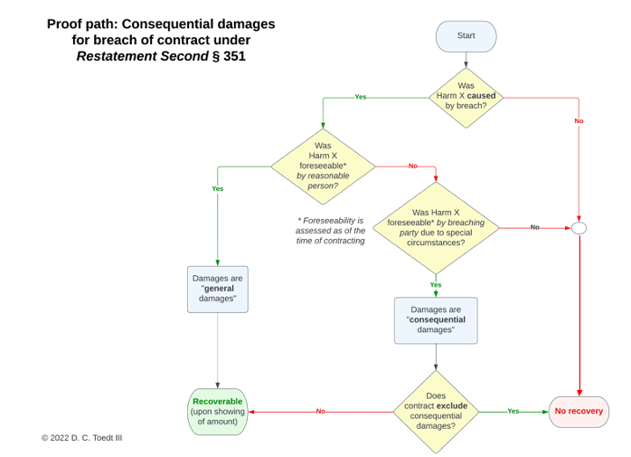

**** Origins: The influence of /Hadley v. Baxendale/
  :PROPERTIES:
    :CUSTOM_ID: conseq-dam-defn-cmt
  :END:

This essentially follows the rule in the landmark 1854 English case of /Hadley v. Baxendale/ (the "corn mill crankshaft case").  /Hadley/ has been much remarked on over the decades; the opinion and its progeny are still relied on in American courts and likely studied by most if not all American law students.[fn:HadleySumm]  Some American courts have tried reformulating the /Hadley/ rule, as discussed at [[#conseq-dam-other]], but {{{ths}}} sticks to the traditional /Hadley/ formulation.

[fn:HadleySumm] In /Hadley v. Baxendale/: 

--  A corn mill in Gloucester utilized a steam engine to clean and grind corn.

--  The steam engine's crankshaft broke.

--  The mill owners were informed that to have a new crankshaft made, they would have to ship the broken shaft to a manufacturer in Greenwich so that the new one could be made to the same dimensions, using the broken one as a pattern.

--  The mill owners shipped off the broken crankshaft — but the carrier was five days late in delivering the broken crankshaft to the manufacturer.

The corn mill's owners sued the carrier for, among other things:

 - the profits that the corn mill would have earned during the mill's extra "down time" caused by the carrier's delay in shipping the broken crankshaft; and

 - the wages that the corn mill's owners had to pay their idle employees during that extra down time.

In an opinion by [[https://en.wikipedia.org/wiki/Edward_Alderson_(judge)][Sir Edward Hall Alderson]], [[https://en.wikipedia.org/wiki/Baron_of_the_Exchequer][Baron of the Exchequer]] (i.e., a judge of an English commercial court), the /Hadley/ court reasoned as follows:

#+begin_quote

Now we think the proper rule is such as the present is this: 

Where two parties have made a contract which one of them has broken, the damages which the other party ought to receive in respect of such breach of contract should be such as may fairly and reasonably be considered *either* arising[:]

- /naturally, i.e., according to the usual course of things/, from such breach of contract itself, *or*

- such as may reasonably be supposed to have been[:]

     - in the contemplation of /both parties/, 

     - /at the time/ they made the contract, 

     - as the /probable result/ of the breach of it. 

Now, if the special circumstances under which the contract was actually made were /communicated/ by the plaintiffs to the defendants, and thus known to both parties, 

[then] the damages resulting from the breach of such a contract, which they would reasonably contemplate, would be the amount of injury which would ordinarily follow from a breach of contract under these special circumstances so known and communicated. 

*But*, on the other hand, /if these special circumstances were wholly unknown to the party breaking the contract/, 

[then] he, at the most, could only be supposed to have had in his contemplation /the amount of injury which would arise generally/, and in the great multitude of cases not affected by any special circumstances, from such a breach of contract. 

For such loss would *neither* have flowed /naturally/ from the breach of this contract /in the great multitude of such cases/ occurring under /ordinary circumstances/, *nor* were the special circumstances, which, perhaps, /would/ have made it a reasonable and natural consequence of such breach of contract, /communicated to or known by/ the defendants. ... <cite> See [[https://www.bailii.org/ew/cases/EWHC/Exch/1854/J70.html][Hadley v. Baxendale]], [1854] EWHC Exch J70 (formatting lightly edited for readability). </cite>
#+end_quote

**** The Restatement looks at (two types of) foreseeability
  :PROPERTIES:
  :CUSTOM_ID: conseq-dam-restmt
  :END:

On the subject of consequential damages, the Restatement (Second) of Contracts uses types of foreseeability to differentiate between /general/ damages and /consequential/ or /special/ damages. "Loss that results from a breach in the ordinary course of events is *foreseeable as the /probable result/ of the breach*. If loss results other than in the ordinary course of events, there can be no recovery for it unless it was *foreseeable by the party in breach* because of special circumstances that he had reason to know when he made the contract. ..."  <cite> Restatement (Second) of Contracts § 351, "Unforeseeability And Related Limitations On Damages," comment b (emphasis added). </cite> 

**** "Consequential damages" is a dumb name
  :PROPERTIES:
  :CUSTOM_ID: conseq-dam-dumb
  :END:

Damages for breach of contract aren't recoverable at all unless they're "consequences" of the breach — so /excluding/ "consequential damages" should thus logically exclude all damages, no?

I wish /(but I'm not holding my breath)/ that the legal community could agree to rename "consequential damages" as something like "atypical damages" — both are clunky, but at least the latter one conveys the essence of the concept: While /unforeseeable/ damages are _never_ recoverable, it's possible for damages to be /foreseeable/ in one of two different ways:

- because, in the ordinary course without any special circumstances, /reasonable people/ would have foreseen the damages possibility; and/or

- because, /at the time that the parties entered into the contract, the defendant had some other reason/ to foresee such damages; as the Texas supreme court held: "When one party has given notice of the consequences of breach at the time of contracting, no further inquiry into the foreseeability of those consequences is required"; <cite> [[https://scholar.google.com/scholar_case?case=5704495266894759222][Signature Indus'l Servs., LLC v. Int'l Paper Co.]], 638 S.W.3d 179, 192 n.8 (Tex. 2022). </cite>

And of course, if neither of the above conditions is shown to be true, then the damages simply aren't recoverable, period (at least under U.S. law). <cite> /See id./ at 184 (reversing court of appeals and rendering judgment against plaintiff because "legally insufficient evidence supported the award of consequential damages"). </cite>

So the term *atypical damages* seems a more-apt label than /consequential damages/. But of course it'd likely be a fool's errand try to change generations of lawyer-speak.

#+begin_comment

From Daniel Avery, [[https://www.jdsupra.com/legalnews/exclusion-of-consequential-damages-7896896][Exclusion of Consequential Damages]] (JDSupra.com 2021):

#+begin_quote

As shown in the American Bar Association's Private Target Mergers and Acquisitions Deal Point Studies:

- Only 2% to 9% of the merger and acquisition purchase agreements covered by the studies expressly included consequential damages within the scope of indemnified losses
- 26% to 39% of the purchase agreements expressly excluded consequential damages within the scope of indemnified losses
- 39% to 65% of the purchase agreements were silent on the issue

#+end_quote

#+end_comment

**** Lost profits /could/ be excluded as "consequential damages" — or not ...
  :PROPERTIES:
  :CUSTOM_ID: conseq-prof
  :END:

In some consequential-damages exclusions, "lost profits" — /without/ the limitation to collateral business arrangements — are listed as specific examples of excluded damages. But New York's highest court, after reviewing case law, held that — on the facts of the particular case — "lost profits were the direct and probable result of a breach of the parties' agreement and thus constitute /general/ damages" and thus were /not/ barred by a contract's limitation-of-liability clause. <cite> [[https://scholar.google.com/scholar_case?case=13092064834406709788][Biotronik A.G. v. Conor Medsystems Ireland, Ltd.]], 22 N.Y.3d 799, 801-02, 11 N.E.3d 676, 988 N.Y.S.2d 527 (2014) (emphasis added); see also Glenn D. West, [[http://www.weil.com/~/media/files/pdfs/consequential-damages-redux.pdf][Consequential Damages Redux: An Updated Study of the Ubiquitous and Problematic "Excluded Losses" Provision in Private Company Acquisition Agreements]], 70 Bus. Lawyer 971, 992 (Weil.com 2015); Thomas H. Warren, W. Jason Allman & Andrew D. Morris, [[http://www.acc.com/legalresources/publications/topten/ttcdwlptc.cfm][Top Ten Consequential Damages Waiver Language Provisions to Consider]] (2012). </cite>

Some other courts have issued similar rulings.[fn:SweetAdd] 

[fn:SweetAdd] For example: The Eleventh Circuit held that an exclusion of incidental- and consequential damages, including "lost profit," did not apply to "lost profits and the costs of substitute products to the extent that those damages are direct and otherwise satisfy the provision’s total cap on recoverable damages." <cite> See [[https://scholar.google.com/scholar_case?case=12757742857379856958][Sweet Additions Ingredient Processors, LLC v. Meelunie America, Inc.]], 139 F.4th 1217, 1128-29 (11th Cir. 2025) (vacating and remanding $1.4 million judgment in favor of buyer of tapioca powder against supplier; see also [[https://scholar.google.com/scholar_case?case=12044315946428687112][Reid Hospital & Health Care Services, Inc. v. Conifer Revenue Cycle Solutions, LLC]], 8 F.4th 642, 644 (7th Cir. 2021) (reversing summary judgment): A consequential-damages exclusion didn't apply — the contract in suit was for revenue collection, and the revenue lost due to breach "would have been the direct and expected result of Conifer’s failures to collect and process that revenue as required under the contract"; [[https://scholar.google.com/scholar_case?case=13250629116132412621][Tractebel Energy Mktg., Inc. v. AEP Power Mktg., Inc.]], 487 F.3d 89, 109-110 (2d Cir. 2007) (reversing judgment, after bench trial, denying plaintiff its lost profits). </cite>

#+begin_comment
{{{UN}}} Tangentially: A trial court granted JMOL for the defendant, vacating a jury verdict of $18.3 million in favor of the plaintiff: The court ruled that the plaintiff's claim for lost profits was barred by the contract's exclusion of consequential damages, "including but not limited to loss of good will and lost profits or revenue" (capitalization normalized). (The trial court noted that "[t[he parties recognize" that the applicable law, in that case Illinois, distinguished between lost profits when claimed as /consequential/ damages versus when claimed as /direct/ damages.) 

On appeal, the Sixth Circuit declined even to address the lost-profits exclusion question: in an unpublished decision, the panel said it hadn't been convinced that the testimony of the plaintiff's damages expert — which had been the only damages evidence offered by the plaintiff — amounted to a measurement of /lost profits/. The court nevertheless affirmed the JMOL on the alternative ground that the plaintiff's damages testimony lacked relevance and reliability; the panel made it clear that it would have reversed the trial judge's <i>Daubert</i> ruling, which had allowed the expert testimony. <cite> See [[https://storage.courtlistener.com/recap/gov.uscourts.ohnd.242427/gov.uscourts.ohnd.242427.288.0.pdf][Endless River Techs. LLC v. TransUnion LLC]], No. 1:18 CV 936, slip op. at 6 (N.D. Ohio Jan. 3, 2023) (granting JMOL to defendant), /aff'd on alternative grounds/, [[https://www.opn.ca6.uscourts.gov/opinions.pdf/25a0022n-06.pdf][No. 23-3087]], No. 23-3087, slip op. at 2, 10-11 n.3, and 16-17 (6th Cir. Jan.  Ohio 2023). </cite>
#+end_comment

# My edit of a clause at Redline.net: https://www.redline.net/queries/alternative-approaches-consequential-damages-exclusion-clauses-0
# "To the extent not prohibited by applicable law, neither party will be liable for, and the other party will not seek, any of the following: (a) punitive or exemplary damages; (b) lost profits from collateral business arrangements; nor (c) losses or damages arising from or relating to special circumstances of the other party — even if the special circumstances are known to allegedly-liable party — except to the extent (if any) that this Agreement expressly acknowledges the special circumstances."
 

**** Consequential-damages exclusions reflect agreed allocation of risk
  :PROPERTIES:
  :CUSTOM_ID: conseq-econ
  :END:

In one case, the Fourth Circuit candidly explained some unpleasant facts of life to customers that negotiate services contracts: If you agree to service provider's contract with an exclusion of consequential damages, then you (the customer) might well be on the hook for any unusual harm incurred if the provider effs things up:

- In the course of an $8,400 job, a fumigation company improperly applied a dangerous pesticide to a peanut dome that was owned by the plaintiff. This led to "fire, an explosion, loss of approximately 20,000,000 pounds of peanuts, loss of business, and various cleanup costs"; the plaintiff's total losses amounted to some $19 million.

- The peanut company (and its insurer) filed suit against the fumigation company, /but the trial court granted summary judgment in favor of the fumigation company/ because the company's contract excluded consequential damages.

The appeals court affirmed, explaining:

#+begin_quote
/[Customers]/ faced with consequential damages *limitations* in contracts have two ways to protect themselves. 

First, they may purchase *outside insurance* to cover the /consequential/ /[sic]/ risks of a contractual breach /[by the supplier]/, 

and second, they may attempt to *bargain for greater protection* against breach from their contractual partner. 

Severn /[the plaintiff]/ apparently did take the former precaution — it has recovered over $19 million in insurance proceeds from a company whose own business involves the contractual allocation of risk. 

But it did not take the latter one, and there is no inequity in our declining to rewrite its contractual bargain now.  <cite> [[https://scholar.google.com/scholar_case?case=13541308803683173077][Severn Peanut Co. v. Industrial Fumigant Co.]], 807 F.3d 88, 92 (4th Cir. 2015) (affirming summary judgment in favor of service provider that had caused millions of dollars to its customer's facility) (formatting altered). </cite>
#+end_quote

**** Consequential damages can be high-dollar
  :PROPERTIES:
  :CUSTOM_ID: conseq-dam-big-cmt
  :END:

Consequential damages can be grossly disproportionate to the value of the underlying contract. {{{RWE}}} In 2024, the notorious [[https://en.wikipedia.org/wiki/2024_CrowdStrike_incident][Crowdstrike outage]] — caused by an error in an update to CrowdStrike's cybersecurity software — caused millions of computer systems around the world to crash, with estimated economic damage of some USD $10 billion, including [[https://www.wsj.com/business/airlines/delta-ceo-says-crowdstrike-tech-outage-costs-could-reach-500-million-3b7f5a13?st=xncsu4btcpa29mz&reflink=desktopwebshare_permalink][cancellation of thousands of scheduled airline flights]]. Reportedly, CrowdStrike's license agreement [[https://www.wired.com/story/crowdstrike-outage-microsoft-delta-lawsuits-analysis][limited customers' remedies to a refund]] of fees paid, but many big customers, such as Delta Airlines, weren't accepting that, and [[https://www.wsj.com/business/airlines/delta-ceo-says-crowdstrike-tech-outage-costs-could-reach-500-million-3b7f5a13?st=xncsu4btcpa29mz&reflink=desktopwebshare_permalink][notified CrowdStrike]] that it should prepare for litigation.

/Students: *Just skim* the rest of this section's examples./

 {{{RWE}}} Noted practitioner-commentator Glenn West has observed:

#+begin_quote
In 1984, an Atlantic City casino entered into a contract with a construction manager respecting the casino’s renovation. The construction manager was to be paid a *$600,000* fee for its construction management services. In breach of the agreement, completion of construction was delayed by several months. As a result, the casino was unable to open on time and lost profits, ultimately determined by an arbitration panel to be in the amount of *[$14.5 million].* There was *no consequential damages waiver* in the contract at issue in this case. <cite> Glenn D. West, [[http://www.weil.com/~/media/files/pdfs/consequential-damages-redux.pdf][Consequential Damages Redux: An Updated Study of the Ubiquitous and Problematic "Excluded Losses" Provision in Private Company Acquisition Agreements]], 70 Bus. Lawyer 971, 984 (Weil.com 2015) (formatting altered, footnote omitted). </cite>
#+end_quote

{{{RWE}}} In Australia, an opthmalmologist, a Dr. Kitchen, wrongfully terminated his service agreement with an eye clinic. The service agreement _didn't_ include an exclusion of consequential damages. The Supreme Court of Queensland held him held liable for the clinic's lost profits and other amounts, in the total sum of more than AUD $10 million. <cite> See [[http://archive.sclqld.org.au/qjudgment/2015/QSC15-066.pdf][Vision Eye Institute Ltd v Kitchen]], {{{BRACKL}}}2015{{{BRACKR}}} QSC 66, /discussed in/ Jodie Burger and Viva Paxton, [[http://www.mondaq.com/article.asp?articleid=417928&email_access=on][Australia: A stitch in time saves nine: How excluding consequential loss could save you millions]] (Mondaq.com 2015). </cite>

{{{RWE}}} In Ohio, a contractor agreed to gut and remodel a building for use as a neighborhood bar. The contractor didn’t do so by the agreed completion date — which caused the customer, a would-be bar owner, to miss the November-December holiday season. The court agreed with the bar owner that the contractor’s conduct had been "reckless" — and /that/ caused the breach to fall within *an explicit carve-out from the contract’s exclusion* of consequential damages. As a result, the court affirmed an award of the bar owner’s lost profits. <cite> See [[https://scholar.google.com/scholar_case?case=16232962081601711418][Bakhshi v. Baarlaer]], 2021 Ohio 13, No. 28767, slip op. ¶¶ 68-69 (Ohio App. 2021). </cite>

{{{RWE}}} From a [[https://goo.gl/FhXvjz][corporate press release]]: A Taiwan company, TSMC, manufactures computer chips. It recently learned that "a batch of photoresist /[a light-sensitive material used in 'etching' circuits onto chips]/ from a chemical supplier contained a specific component which /[sic]/ was abnormally treated, creating a foreign polymer in the photoresist." BOTTOM LINE: "This incident is expected to reduce Q1 revenue by about US$550 million ...."

{{{RWE}}} Here's a dated but famous example from 1999: A botched software implementation at Hershey caused it to be unable to deliver some $100 million of Hershey's Kisses /for Halloween/ — the biggest candy "season" of the year. <cite> See, e.g., Thomas Wailgum, [[https://www.computerworld.com/article/2772084/10-famous-erp-disasters--dustups-and-disappointments.html][10 Famous ERP Disasters, Dustups and Disappointments]] (ComputerWorld.com 2009). </cite>

Now imagine that you were the supplier that provided the software to Hershey, or that provided the photoresist to the chip manufacturer: How would you like to have to litigate which damages were "direct" and which were "consequential"?

**** Consequential-damages claims can complicate litigation
  :PROPERTIES:
  :CUSTOM_ID: conseq-dam-vs-gen-cmt
  :END:

/Students: Read the IBM example below, then just skim the rest of this section./

Discerning the difference between excluded /consequential damages/ and recoverable "general" damages can sometimes be difficult; courts are often forced to parse sometimes-needlessly complex contract language and lawyer arguments to determine which is which. 

# From my redline.net comment: 
#+begin_comment
Agreed that NDAs shouldn't exclude "consequential damages." But I've taken to thinking that the problem is that consequential damages is a stupid name: As others have pointed out, damages aren't recoverable at all unless they're "consequences" of the breach.  Excluding "consequential damages" should thus logically exclude all damages, no?

The Restatement (Second) of Contracts § 351 focuses on foreseeability, either through "the common experience of ordinary persons" or because of "special circumstances" of which the party in breach had reason to know at the time of the contract; this generally follows /Hadley v. Baxendale/.

(I've taken to calling this distinction "general foreseeability" versus "special foreseeability," with the latter being what's covered by an exclusion of consequential damages.)

Merely as a matter of litigation expense and unpredictability, excluding specially-foreseeable damages seems unwise, because judges and juries can be unpredictable about what they'll put into which category.
#+end_comment

# https://www.ibm.com/brand/experience-guides/developer/brand/logo/
#+ATTR_HTML: :alt IBM logo :title IBM logo :class photo-at-right photowidth20
 

Classifying particular types of damages as consequential or "direct" — a poor choice of names, IMHO — might be a very *subjective* exercise. {{{RWE}}}  Consider an Indiana appellate court's 2018 decision in the long-running /Indiana v. IBM/ litigation — in a second trial (on remand) over a failed computer-system acquisition, the trial judge held that:

--   IBM had to pay for a replacement computer system that the state acquired after IBM was fired, known as the "Hybrid" system — even though the Hybrid system was /an upgrade/ from the system that IBM had agreed to build; and

--  The additional cost /of the upgrade/, said the trial judge, was properly classified as /direct/ /[sic]/ damages resulting from IBM's breach — and thus was subject to an agreed cap of $125 million — and not as /consequential/ damages, which would have been subject to a much-lower cap of $3 million.

The trial judge's decision was affirmed on appeal. <cite> See [[https://scholar.google.com/scholar_case?case=15971897558315184244][IBM v. Indiana]], 112 N.E.3d 1088, 1100-01 (Ind. App. 2018), /summarily aff'd/, [[https://scholar.google.com/scholar_case?case=7430114161307512070][138 N.E.3d 255]] (Ind. 2019). </cite>

But: Dissenting on the upgrade-as-direct-damages issue, a state supreme court judge argued unsuccessfully that:

#+begin_quote
[I]t was not IBM's breach but the State's decision to switch to the different, more expensive Hybrid system that caused the State to incur these additional expenses. The State's additional, Hybrid-related costs are at most consequential damages, not direct damages. <cite> [[https://scholar.google.com/scholar_case?case=7430114161307512070][138 N.E.3d 255]] at 261 (Slaughter, J., dissenting in part, concurring in part) </cite>
#+end_quote

{{{RWE}}} In a /(debatable)/ ruling, the New Hampshire supreme court affirmed a trial-court holding that a customer's cost of recreating lost data, necessitated by its outsourcer's alleged mistakes that caused the loss of the data, were "consequential" damages and therefore not recoverable because of an exclusion clause in the contract. <cite> See [[https://scholar.google.com/scholar_case?case=520704120317666281][Mentis Sciences, Inc., v. Pittsburgh Networks, LLC]], 243 A.3d 1223 (N.H. 2020). </cite>

(Less debatably, the court came out the same way on the customer's claim for damages for its inability to bid on certain government contracts due to the unavailability of the lost data.)

**** Pro tip: /Ask/ about special circumstances?

A vendor (or similar party) might be concerned about the possibility of being found liable to its customer for "consequential damages." When that's the case, it might not hurt for the vendor to get the customer to state, in writing, that the customer isn't aware of any special circumstances that could lead to the customer's incurring consequential damages.

(This is inspired by Ken Adams's [[https://www.adamsdrafting.com/heres-an-alternative-to-the-usual-consequential-damages-randomness/][suggestion of a certification]], a suggestion that he [[https://www.adamsdrafting.com/wp-content/uploads/2022/11/Consequential-Damages-Rider-7-Nov-2022.pdf][subsequently refined]].)

**** Pro tip: Use a damages cap instead?
  :PROPERTIES:
  :CUSTOM_ID: conseq-dam-cap
  :END:

Some experienced practictioners (including me) believe that a more-sensible approach will /sometimes/ be to do the following:

- not bother with an exclusion of consequential damages, because of the proof difficulties summarized above; and
- instead, agree to a damages cap (see [[#r-lim-liab-usage]]), so as to [[https://en.wikipedia.org/wiki/Gordian_Knot][cut the Gordian knot]] — or to [[https://www.youtube.com/watch?v=kQKrmDLvijo][be like Indiana Jones]] in the streets of Cairo:

#+ATTR_HTML: :alt Indiana Jones swordfight scene :href https://www.youtube.com/watch?v=3I_Ds2ytz4o

**** Reasons /not/ to include a "laundry list" of exclusions
  :PROPERTIES:
  :CUSTOM_ID: dam-excl-list
  :HTML_CONTAINER_CLASS: olnum
  :END:

DCT note: Some drafters like to include a detailed "laundry list" of highly-specific categories of excluded damages. My usual practice is to provide such a laundry list only cautiously and selectively, because doing so generally entails the drafter's figuratively crossing his- or her fingers —

- that courts will interpret the laundry list as the drafter hoped; and

- that in drafting the list, the drafter won't inadvertently /omit/ one or more categories of damages that later proves important.  (Relatedly: See also the discussion of the doctrine of /ejusdem generis/ at [[#r-incl-defn]].)

The footnote below lists some categories of damages to be excluded. The list has been compiled from various agreement forms, /but the list should be reviewed carefully/, as some could be a bad idea in particular circumstances.[fn:ConseqDamList]

#+ATTR_HTML: :target blank
Ken Adams has an even more-detailed list at his blog posting [[https://www.adamsdrafting.com/limitation-of-liability-overkill/][Limitation-of-Liability Overkill]].

For a summary of cases addressing such "laundry lists" in U.S., English, and Australian courts, /see/ a 2015 article by noted scholar-practitioner Glenn West. <cite> See Glenn D. West, [[http://www.weil.com/~/media/files/pdfs/consequential-damages-redux.pdf][Consequential Damages Redux: An Updated Study of the Ubiquitous and Problematic "Excluded Losses" Provision in Private Company Acquisition Agreements]], 70 Bus. Lawyer 971, 987-91 (Weil.com 2015). </cite>

Concerning wasted expenditure, see the 2022 English case of /Soteria Insurance v IBM UK/ — which seems to have been a sad tale of an IT project gone sideways — where the court of appeal held that an contract's exclusion of "loss of profit, revenue, [and] savings" did _not_ protect IBM from being held liable for its customer's "wasted expenditure" resulting from IBM's wrongful repudiation of the contract. <cite> [[https://www.bailii.org/ew/cases/EWCA/Civ/2022/440.html][Soteria Ins. Ltd. v. IBM UK Ltd.]], [2022] EWCA Civ 440, ¶ 2, /summarized in/ Edward Lucas, [[https://www.jdsupra.com/legalnews/a-good-day-for-wasted-expenditure-1727307][A good day for wasted expenditure]] (JDSupra.com 2022). </cite>

[fn:ConseqDamList] Here's a list of some categories of damages that could listed in an exclusion provision:

- incidental damages — which are defined in sections [[https://www.law.cornell.edu/ucc/2/2-710][2-710]] (seller's incidental damages) and [[https://www.law.cornell.edu/ucc/2/2-715][2-715]] (buyer's consequential damages) of the Uniform Commercial Code;
- punitive, exemplary, or special damages — which normally would not be available in a pure breach-of-contract case but might be available under other theories, for example in tort;
- indirect damages;
- breach of statutory duty;
- business interruption;
- loss of business or of business opportunity;
- loss of competitive advantage;
- loss of data;
- loss of privacy;
- loss of confidentiality /[Editorial comment: This exclusion would normally be a/ really /bad idea, at least from the perspective of a party disclosing confidential information]/;
- loss of goodwill;
- loss of investment;
- loss of product;
- loss of production;
- loss of profits /from collateral business arrangements/;
- loss of cost savings;
- loss of use;
- loss of revenue;
- wasted expenditure;
- reduced value of stocks, bonds, goods, commodities, or other assets.

**** Caution: Unconscionability of an exclusion?
  :PROPERTIES:
  :CUSTOM_ID: conseq-dam-unconsc
  :END:

Courts will sometimes hold that exclusions of consequential damages are "unconscionable." Indeed, [[https://www.law.cornell.edu/ucc/2/2-719][UCC § 2-719]](3) specifically says:

#+begin_quote

Consequential damages may be limited or excluded unless the limitation or exclusion is unconscionable. 

Limitation of consequential damages for injury to the person in the case of consumer goods is prima facie unconscionable 

but limitation of damages where the loss is commercial is not.
#+end_quote

(Extra paragraphing added.)

{{{RWE}}} One federal-court lawsuit in Minnesota involved a failed project to install computer software. The court refused to give effect (at least initially) to a consequential-damages exclusion that benefited the vendor, because the court deemed the exclusion to be unconscionable. <cite> See [[https://scholar.google.com/scholar_case?case=7442311776793683759][Prairie River Home Care, Inc. v. Procura, LLC]], No. 17-5121 (D. Minn. Jul. 10, 2019) (denying motion to dismiss claim for consequential damages). </cite>

**** Some courts have tried to redefine "consequential damages"
  :PROPERTIES:
  :CUSTOM_ID: conseq-dam-other
  :END:

Some American courts have tried different ways of defining /consequential damages/, but it's not clear that these redefinitions are helpful.

{{{RWE}}} The Eleventh Circuit remarked that "[t]he key distinction between direct damages and consequential damages is that the former compensate for /the value of the promised performance/, while the latter compensate for /additional losses incurred as a result of the breach/." <cite> [[https://scholar.google.com/scholar_case?case=14493733455299808016][AcryliCon USA, LLC v. Silikal GmbH]], 985 F.3d 1350, 1369 (11th Cir. 2021) (summarizing Georgia law; emphasis added). </cite>

{{{RWE}}} In a similar vein, the Fourth Circuit ventured that "[c]onsequential or special damages for breach of contract .... are distinguished from general damages, which are based on /the value of the performance itself, not on the value of some consequence that performance may produce./" <cite> [[https://scholar.google.com/scholar_case?case=13541308803683173077][Severn Peanut Co. v. Industrial Fumigant Co.]], 807 F.3d 88, 90-91 (4th Cir. 2015) (cleaned up, emphasis added). /Accord:/ [[https://scholar.google.com/scholar_case?case=520704120317666281][Mentis Sciences, Inc., v. PIttsburgh Networks, LLC]], 243 A.3d 1223, 1228 (N.H. 2020). </cite>

This distinction seems unhelpful, though: Arguably, "the value of the performance itself" _is_ the value of the consequences to be produced — no more and no less. As Harvard Business School professor Theodore Levitt famously put it, "People don't want to buy a quarter-inch drill. They want a quarter-inch hole!" <cite> Quoted in Clayton M. Christensen, Scott Cook and Taddy Hall, [[https://hbswk.hbs.edu/item/5170.html][What Customers Want from Your Products]] (HBS.edu 2006). </cite> Similar thoughts had been expressed previously, e.g., "When you buy a razor, you buy a smooth chin—but you could wear a beard." <cite> Quoted in [[https://quoteinvestigator.com/2019/03/23/drill/][No One Wants a Drill. What They Want Is the Hole]] (QuoteInvestigator.com 2019). </cite> Perhaps the focus of the value of the performance would be more useful if it were phrased as the /market/ value of the performance itself, i.e., the value that /others/, not in the plaintiff's particular circumstances, would theoretically pay for the performance.

{{{RWE}}} The Supreme Court of Texas espoused a variation on the /Hadley/ approach, where the court held that: 

#+begin_quote

Direct damages are the /necessary and usual/ result of the defendant's wrongful act; they flow naturally /and necessarily/ from the wrong. ... Consequential damages, on the other hand, result naturally, /but not necessarily/. <cite> [[https://scholar.google.com/scholar_case?case=15493436816047576736][El Paso Marketing, L.P. v. Wolf Hollow I, L.P.]], 383 S.W.3d 138, 144 (Tex. 2012) (cleaned up, formatting altered), /quoting/ [[https://scholar.google.com/scholar_case?case=1751498717150008353][Arthur Andersen & Co. v. Perry Equip. Corp]]., 945 S.W.2d 812, 816 (Tex. 1997). </cite>
 #+end_quote

For cases decided under Texas law, the state supreme court's test thus replaces /Hadley's/ "usual course of things" with "/necessary/ and usual."

It's unclear, though, how helpful the Texas court's reformulation would be to trial counsel hoping to prove (or refute) a case, or to a jury seeking to distinguish recoverable from unrecoverable damages.

**** Lookup questions
  :PROPERTIES:
  :CUSTOM_ID: conseq-dam-study
  :END:

QUESTION 1: What would (arguably) be a better label than "/consequential/ damages"? ([[#conseq-dam-dumb][Lookup]])

QUESTION 2: Concerning consequential damages, what happened in the /Indiana v. IBM/ computer-system litigation — and what lessons could contract drafters take from that? ([[#conseq-dam-vs-gen-cmt][Lookup]])

#+ATTR_HTML: :target blank
QUESTION 3:

- FACTS: A Gigunda IC ("individual contributor") is on a call with a MathWhiz data analyst. They're discussing MathWhiz's data-crunching computations about a Mongolian natural-gas field. The Gigunda IC casually mentions that Gigunda might using MathWhiz's report in deciding whether to build a billion-dollar LNG processing plant in Mongolia. 

- QUESTION: In that situation, would it be a good idea for the MathWhiz-Gigunda contract to exclude "consequential damages"? Why or why not? /What might be an alternative — which is always a good thing to consider)?/ ([[#conseq-dam-cap][Lookup]])

#+ATTR_HTML: :target blank
QUESTION 4: In drafting a consequential-damages exclusion, is it, or is it not, a great idea to include a "laundry list" of specifically-excluded damages? Why or why not? (See [[#dam-excl-list][Lookup]])

#+ATTR_HTML: :target blank
QUESTION 5: Should "lost profits" be enumerated as part of a list of specifically-excluded damages? Why or why not? /Is this question too simplistic to answer in the abstract?/ (See [[#conseq-prof][Lookup]])

** Damages Caps General Provisions {{{CLS}}}                            :CLS:
  :PROPERTIES:
  :CUSTOM_ID: r-dam-cap-gen
  :HTML_CONTAINER_CLASS: pr-top
  :END:

Damages caps are quite common in contracts — especially contracts drafted by suppliers.  

Contents:

#+TOC: headlines 1 local

*** Applicability of {{{ths}}}

{{{Ths-cap}}} is relevant in any situation where a damages cap is agreed to in writing — whether in {{{thek}}} itself and/or in some other document, possibly (for example) in a purchase order or statement of work under {{{thek}}}. <aside> See [[#dam-cap-forms]] for sample language for various forms of damages cap. </aside>

*** Who is protected by {{{ths}}}?

Unless the damages cap itself clearly says otherwise, the cap protects {{{v(each party)}}} to {{{thek}}} and its Protected Group (defined at {{{RULE}}} [[#r-prot-grp]]).

*** Aggregate effect

Unless {{{thek}}} clearly states otherwise, a damages cap will limit the cumulative liability, of all protected persions together, for all claims against all of them together, over all time, and not per-person, per-project, or or per-claim.

*** Covered forms of liability

<<dam-cap-gen>> Except as otherwise provided in {{{ths}}}, an agreed damages cap will apply: (i) to all forms of monetary recovery sought — including without limitation monetary awards of damages, costs, and/or attorney fees; and (ii) no matter what legal principle or other theory of liability is involved, including without limitation *NEGLIGENCE* and *GROSS NEGLIGENCE*. <aside> Bold-faced type and all-caps are used here to make these terms conspicuous, just in case the "express-negligence rule" in Texas and some other jurisdictions were to be held to apply, as discussed at [[#r-indem-def-excl-express-negl]]. </aside>

*** Effect of set-offs

An agreed damages cap is to be applied /before/ determining the effect of any applicable liability set-off — that is, each set-off is to be applied to the /capped/ damages award, not to reduce the uncapped award. <aside> Setoffs (or offsets) are discussed at subdivision [[#pmt-off]] of {{{RR}}} [[#r-pmt-basic]] (payment terms). An English court of appeal called this before-the-setoff rule the "commercial common sense" approach. <cite> See [[https://www.bailii.org/ew/cases/EWCA/Civ/2024/1330.html][Topalsson GmbH v. Rolls-Royce Motor Cars Ltd.]], [2024] EWCA Civ 1330 at ¶¶ 22-20 (reversing trial-court judgment on that point). </cite> </aside>

*** Exclusions from damages cap

Unless clearly agreed otherwise in writing, a damages cap does _not_ limit any of the following:

{{{U1}}} amounts to be paid under {{{thek}}} "in the ordinary course"; <aside> This is a cheap-insurance (see [[#nl-ch-ins]]) provision, even though under the law it might not be necessary to state it explicitly. <cite> See, e.g., [[https://scholar.google.com/scholar_case?case=10207433190859258379][IHR Security, LLC v. Innovative Bus. Software, Inc.]], 441 S.W.3d 474, 479 (Tex. App.--El Paso 2014) (affirming, in part, summary judgment: limitation of liability in software license agreement "does not purport to limit IHR's liability in the event it breaches the License Agreement /by refusing to pay for goods and services/ provided by IBS"); [[https://www.bailii.org/ew/cases/EWHC/TCC/2014/752.html][Fujitsu Services Ltd. v. IBM United Kingdom Ltd.]], [2014] EWHC 752 (TCC) \para. 52 (2014) ("[t]he law of contract draws a clear distinction between a claim for payment of a debt and a claim for damages for breach of contract"). </cite> </aside>

{{{UN}}} amounts to be paid (if any) for: (i) defense against third-party claims, and/or (ii) indemnity obligations; <aside> Caps on defense- and indemnity liability are very often a point of negotiation — but they could be made the subject of a separate cap, e.g., limiting a party's general liability to X (where X is some dollar amount) but limiting the party's liability for defense and indemnity to, say, 3X. </aside>

{{{UN}}} damages arising from /intentional/ fraud (as opposed to fraud resulting from recklessness); <aside> See the discussion at [[#lim-liab-carve-out]]. </aside>

{{{UN}}} damages for /intentional/ or /reckless/ breach of confidentiality obligations under {{{thek}}}, if any; <aside> This affects /reckless/ breaches of confidentiality obligations, not just /intentional/ ones, in the interest of helping to deter "[[https://en.wikipedia.org/wiki/Moral_hazard][moral hazard]]." </aside>

{{{UN}}} damages for willful misconduct, as defined at {{{RR}}} [[#willful-defn]];

{{{UN}}} damages for death or other physical injury to an individual, in the case of consumer goods; <aside> This exclusion is based on [[https://www.law.cornell.edu/ucc/2/2-719][UCC § 2-719]](3), which provides in part: "Limitation of /consequential damages/ for injury to the person in the case of consumer goods is prima facie unconscionable ...." A similar provision is found in a U.S. federal statute concerning limitations of liability in maritime contracts.  <cite> See [[https://uscode.house.gov/view.xhtml?req=granuleid:USC-prelim-title46-section30527&num=0&edition=prelim][46 U.S.C. 30527(a)]]; hat tip: [[https://tlblog.org/liability-waivers-and-statutory-interpretation/][Prof. John F. Coyle]]. </cite>   </aside>

{{{UN}}} awards of attorney fees; nor <aside> See {{{RR}}} [[#r-atty-fees]] (attorney fees) and its commentary. </aside>

{{{UN}}} costs of court and/or of other proceedings (e.g., costs of arbitration if arbitration is agreed to). 

*** Other provisions incorporated

{{{RR}}} [[#r-lim-liab-usage]] (limitation of liability general provisions), is incorporated by reference into {{{ths}}}. <aside> For an explanation of incorporation by reference, see {{{RR}}} [[#incorp-ref]]. </aside>

*** {{{ADDL}}}                                                         :ADDL:
  :PROPERTIES:
  :HTML_CONTAINER_CLASS: addl
  :END:

Contents:

#+TOC: headlines 1 local

**** Prelude: How are contract damages determined?
  :PROPERTIES:
  :CUSTOM_ID: damages-cap-intro
  :END:

As a review of aspects of the first-year Contracts course in law school, here's a brief summary from a federal appeals court decision:

#+begin_quote

The goal of measuring damages for a breach-of-contract claim is to provide just *compensation* for any loss or damage *actually sustained as a result* of the breach. 

[1]  The *normal* measure in such cases is the *benefit of the bargain*, which seeks to place the injured party in the economic position it would have been in had the contract been performed, i.e., *expectancy damages*.

[2]  *Alternatively*, a plaintiff may seek *reliance* damages, which are measured by the amount necessary to compensate that party for a loss already suffered. 

Put another way, *reliance* damages seek to *put the injured party in the position he would have been in* had he not relied on the promise. 

[2A]  *Out-of-pocket reliance damages* measure the difference between the value the buyer has /paid/ and the value of what he has /received/. <cite> [[https://scholar.google.com/scholar_case?case=18008475757367889550][National Oilwell Varco, L.P., v. Auto-Dril, Inc.]], 68 F.4th 206, 216-17 (5th Cir. 2023) (reversing and remanding summary judgment in relevant part; cleaned up, formatting edited) (King, J.). </cite> To similar effect is a U.S. statute dating back to 1936 concerning maritime liability, which prohibits "[t]he owner, master, manager, or agent of a vessel transporting passengers between ports in the United States, or between a port in the United States and a port in a foreign country /[from contractually limiting liability]/ for personal injury or death caused by the negligence or fault of the owner or the owner’s employees or agents."
#+end_quote

**** Forms of damages caps
  :PROPERTIES:
  :CUSTOM_ID: dam-cap-forms
  :END:

A damages cap could be /stated/ as: 

- a /fixed/ amount; 

- a /variable/ amount, perhaps changing over time or in different circumstances; and/or

- a /computable/ amount, e.g., a multiple of some number such as a contract price.

**** Illustrative examples of damages-cap wording
  :PROPERTIES:
  :CUSTOM_ID: damages-cap-notes
  :END:

Here are a few hypothetical examples of damages-cap provisions, written in terse language: 

(a)  /ABC's liability for breach is capped at 2X/: This means that ABC would not be liable for — and no other party may seek — more than two times the amount *paid* or *payable* to ABC.

*Caution:* A damages cap could limits recovery to amounts *paid* — which could be minimal or even nothing. That happened in an Eighth Circuit case: A customer paid a software provider an initial fee and was supposed to pay more in the future. After the customer unilaterally terminated the contract (because reasons), the provider sued for the unpaid *future* payments — but the court granted summary judgment for the customer because the contract limited the rejected each party's liability to the fees *paid*, not those amount *payable*. <cite> See [[https://scholar.google.com/scholar_case?case=9555396582839070604][Baldwin Hackett & Meeks, Inc. v. Early Warning Services, LLC]], 153 F.4th 656 (8th Cir. 2025) (affirming summary judgment in favor of customer). </cite>

(b)  /ABC's liability for breach is capped at 3X on a 12-month lookback/: This means that ABC would not be liable for, and no other party may seek, more than three times the amount that ABC was paid (or was owed), in the 12-month period just before the earliest event giving rise to the liability, regardless whether the other party knew or should have known that the event had occurred. (Hat tip: [[https://www.redline.net/queries/rethinking-contractual-liability-cap-there-must-be-better-way#comments-body-30332][Tommy Porter]] at the redline.net lawyers-only site; login required.)

(c)  /Damages cap: 2X the total contract value/: This means that neither party would be liable, and no other party may seek, more than two times the total amount to be paid under the contract, for example, in fees for services or payment for goods.
 

**** Carve-outs for fraud, willful misconduct, etc.?
  :PROPERTIES:
 :CUSTOM_ID: lim-liab-carve-out
  :END:

Damages-cap provisions sometimes include carve-outs for [[#gross-negl][gross negligence]]; [[#willful-defn][willful misconduct]]; [[#reckless-defn][recklessness]]; and fraud — that way, if the plaintiff can show that the defendant engaged in carved-out (mis)conduct, then the cap's upper limit on a damage award would not apply, and the plaintiff could recover damages in excess of the cap.

{{{RWE}}} /Fraud carve-out:/ In the aftermath of a software-development project [[https://grammarist.com/idiom/go-pear-shaped][gone pear-shaped]], a supplier, EDS (a UK-based unit of HP) found itself settling a contract dispute with British Sky Broadcasting for some USD $460 million — more than four times the value of the original contract — because an English judge found that an EDS executive had lied to Sky about EDS's capabilities, and thus the contract's limitation of EDS's liability to £30 million was lifted because of an express carve-out for fraud in the limitation. <cite> See the extended discussion of this and similar cases at [[#RelDisclBkgd]]. </cite>

{{{RWE}}} /Recklessness carve-out:/ In Ohio's /Bakhshi/ bar-owner case:

- A contractor agreed to gut and remodel a building for use as a neighborhood bar.

- The contractor failed to do so by the agreed completion date.

- This caused the customer, a would-be bar owner, to miss the November-December holiday season.

- The court agreed with the bar owner that the contractor’s conduct had been “reckless” — causing the breach to fall within a stated carve-out from the contract’s exclusion of consequential damages.

The court affirmed an award of the bar owner’s lost profits. <cite> See [[https://scholar.google.com/scholar_case?case=16232962081601711418][Bakhshi v. Baarlaer]], 2021 Ohio 13 ¶¶ 68-69 (Ohio App. Jan. 8, 2021). </cite>

NOTE: Delaware law distinguishes between "*intentional fraud*," sometimes stated as "*deliberate fraud*," versus *reckless misrepresentation* — the latter doesn't require proof of an intent to deceive. <cite> See [[https://scholar.google.com/scholar_case?case=12055490353831154176][Express Scripts, Inc. v. Bracket Holdings Corp.]], 248 A.3d 824, 825 (Del. 2021) (reversing and remanding trial court judgment on jury verdict). </cite>

 {{{RWE}}} On a motion to dismiss, a Facebook user's claim that the company had engaged in /intentional/ misconduct was part of the court's rationale for rejecting the company's assertion that its terms of service precluded the user's claim. <cite> See [[https://scholar.google.com/scholar_case?case=4297527979448835261][Doe v. Meta Platforms, Inc.]], No. 22-cv-03580, slip op. at part V.A (N.D. Cal. Sept. 7, 2023) (denying that part of defendant's motion to dismiss). </cite>

**** *Caution:* Watch out for "gross negligence" carve-outs
  :PROPERTIES:
  :CUSTOM_ID: lim-liab-carve-out-gross
  :HTML_CONTAINER_CLASS: addl
  :END:

A carve-out for "gross negligence" *could leave it up to a jury* to decide whether a defendant had engaged in /gross/ negligence, as opposed to ordinary negligence. This happened in California's /Epochal Enterprises/ case: 

- A commercial landlord leased dilapidated greenhouse buildings to a tenant.

- The landlord knew that the buildings might have asbestos but didn't tell the tenant.

- After asbestos was found in one of the leased buildings, the tenant stopped paying rent, vacated the premises, and sued the landlord.

- The jury awarded damages to the tenant — but citing an exclusion clause in the lease, a trial court granted "[[https://en.wikipedia.org/wiki/Judgment_notwithstanding_verdict][JNOV]]" for the landlord notwithstanding the verdict.

*The court of appeals reversed* the JNOV, holding that *the jury was presumed to have found that the landlord had acted with gross negligence* — which was the subject of a carve-out in the lease's limitation of liability. <cite> See [[https://scholar.google.com/scholar_case?case=7607209820558985606][Epochal Enterprises, Inc. v. LF Encinitas Properties, LLC]], 99 Cal. App. 5th 44, 317 Cal. Rptr. 3d 573 (2024). </cite>

**** How might parties /negotiate/ liability limitations?
  :PROPERTIES:
  :CUSTOM_ID: lim-liab-neg-cmt
  :END:

When a supplier and a customer are each represented in a contract negotiation by an experienced professional, the negotiators' conversation about limitations of liability might go something like this:

- Customer: Hey, Supplier, why should we agree to limit your liability? Aren't you willing to stand behind your product (or service)?

- Supplier: Of course we are. But what we're providing is a product (or service). We're not selling you an insurance policy, and our pricing reflects that fact. AND: Please keep in mind that even if we /were/ providing insurance, every insurance policy ever written has limits on what the carrier will pay out in case of a loss. 

For a useful diagrammatic view of these basic party positions, see the 2017 PowerPoint slides provided by Chicago lawyers Brian Heidelberger and Monique (Nikki) Bhargava. <cite> Brian Heidelberger and Monique (Nikki) Bhargava, [[https://www.scribd.com/document/726079629/Negotiating-Contractual-Limitations-of-Liability-Provisions-PDF][Negotiating Limitation of Liability Provisions in Agency-Client Agreements]] (Winston.com 2017). </cite>

**** Different damages caps for different purposes?
  :PROPERTIES:
  :CUSTOM_ID: dam-cap-diff
  :END:

A contract could provide for different damages caps for:

- different breaches or types of breach (see [[#lim-liab-risk-by-risk]] immediately below for some possibilities);

- different time periods, for example, different damages caps for before and after X months after the effective date of {{{thek}}} (see [[#lim-liab-time-circum]] below for some possibilities); and/or

- different geographical areas.

**** Pro tip: Try /risk-by-risk/ limitations
  :PROPERTIES:
   :CUSTOM_ID: lim-liab-risk-by-risk
  :END:

Contract drafters can often speed up discussions of liability limitations by breaking up generic boilerplate language into more-concrete statements of risks that are of particular concern, which the parties can focus on more readily.

One technique that works well is to list specific categories of risk and, for each category, state what if any liability limits are agreed. The categories of risk could include, for example, the following:

- Personal injury
- Tangible damage to property (not including erasure, corruption, etc., of information stored in tangible media where the media are not otherwise damaged)
- Erasure, corruption, etc., of stored information /that could have been avoided or mitigated/ by reasonable back-ups
- Other erasure, corruption, etc., of stored information
- Cost of repair or replacement
- Lost profits from any of the above
- Lost revenue from any of the above
- Indemnity obligations
- Infringement of another party's IP rights (including without limitation rights in confidential information)
- Willful, tortious destruction of property (including without limitation intentional and wrongful erasure or corruption of computer programs or -data)

To be sure, if the non-drafting party won't care much about the limitation of liability anyway, then including such detailed limitation language could actually hinder the overall negotiations.

But remember, by hypothesis we're talking about contract negotiations in which the limitation language is indeed going to be carefully negotiated — in which case this kind of systematic approach will almost always make sense.

**** Pro tip: Negotiate /variable/ limitations of liability?
  :PROPERTIES:
   :CUSTOM_ID: lim-liab-time-circum
  :END:

Exclusions of consequential damages (see [[#r-conseq-dam-excl]]) and damage-cap amounts (see [[#r-dam-cap-gen]]) don't necessarily have to be carved in stone for all time. The parties could easily agree to vary them, either as time passed or as circumstances changed.

{{{RWE}}} Suppose that —

- A software vendor is negotiating an enterprise license agreement with a new customer for a mature software package.

- The customer has successfully completed a pilot project, but it hasn't rolled out the software for enterprise-wide production use.

- Knowing how tricky a production roll-out can sometimes be, the customer is concerned about the vendor's insistence on excluding all 'consequential' damages, whatever that really means. (See the commentary to [[#r-conseq-dam-excl]]: /{{{PROPERTY(ITEM,#r-conseq-dam-excl)}}}/ for a review of the difficulty of determining what constitutes "/consequential/ damages.")

Our vendor might try offering:

- to waive the consequential-damages exclusion entirely during, say, the customer's first three months of production use of the software,

- /subject to/ an agreed dollar cap on the vendor's aggregate liability for all damages — which might be a higher dollar amount than at other times, as discussed below.

This approach could make the customer more comfortable that the vendor is 'standing behind its software' during the roll-out phase.

In theory, certainly, the vendor would be exposed to additional liability risk during those first three months. But the business risk might be eminently worth taking.

Remember, we're assuming that the software is mature, that is, most of its significant bugs have already been corrected. This means that the vendor might be willing to take on the additional theoretical risk — which in any case would go away after three months — in order to help close the sale.

{{{RWE}}} As another illustration, perhaps such a vendor could agree that the damages cap would be, say: 

- 4X for any damages that arise during, say, the first three months of the relationship, or possibly until a stated milestone has been achieved;

- 3X during the nine months thereafter; and 

- 2X thereafter.

In the 4X / 3X / 2X language, X could be defined: as a stated fixed sum; as the amount of the customer's aggregate spend under the contract in the past 12 months, 18 months, etc.; in any other convenient way.

The details in the above examples aren't important; the point is that *sometimes 'standard' limitation-of-liability language is too broad* to allow the parties to specify what they really need. 

Negotiators might have more success if they drilled down into the language.

**** Excluding /incidental/ damages isn't a great idea
  :PROPERTIES:
  :CUSTOM_ID: incid-dam
  :END:

Contracting parties might not want to agree to exclude "incidental damages," which are generally defined as reasonable expenses reasonably incurred by a party incident to a breach or delay by another party. 

      /See generally/ [[http://www.law.cornell.edu/ucc/2/2-710.html][UCC § 2-710]] (seller's incidental damages) and [[http://www.law.cornell.edu/ucc/2/2-715.html][UCC § 2-715]](1) (buyer's incidental damages). Of course, UCC Article 2 applies only to sales of goods, and will not apply at all in non-U.S. countries. Still, the same basic concepts of incidental damages might also apply to sales of services, etc.

It has been observed that: "Although incidental damages are often included in the laundry list of waived damages, it is often advisable to remove them /[from the list of exclusions]/ since the right to recover incidental damages may encourage mitigation efforts." <cite> Thomas H. Warren, W. Jason Allman, & Andrew D. Morris, [[http://www.acc.com/legalresources/publications/topten/ttcdwlptc.cfm][Top Ten Consequential Damages Waiver Language Provisions to Consider]] (ACC.com 2012). </cite>

** Equitable Relief Disclaimer {{{CLS}}}
  :PROPERTIES:
  :CUSTOM_ID: r-eq-rlf-dsclm
  :END:

The *EXCLUSIVE REMEDY* available to {{{A}}} for a breach of {{{theK}}} by {{{B}}} will be for {{{A}}} to recover damages — that is, monetary compensation — from {{{B}}} as provided by law. For that reason: 

{{{U1}}} {{{A}}} will not ask a court (or other body) to enter a restraining order, injunction, or other equitable relief against {{{B}}} or {{{B}}}'s affiliates; and <aside> "{{{A}}} will not ask ....": See [[#r-no-contra-rule]]. </aside>

{{{UN}}} {{{A}}} *WAIVES* any such relief.  <aside> This sort of provision is apparently seen in some performance contracts between movie studios and acting talent. <cite> See, e.g., Ryan Linn, [[https://www.jdsupra.com/legalnews/controlling-the-spotlight-promotional-2437518][Controlling the Spotlight: Promotional Clauses in Performance Contracts]] (2025). </cite> ¶ The terms EXCLUSIVE REMEDY and WAIVES are in bold-faced all-caps for conspicuousness (see [[#consp-cmt]]). </aside>

** Equitable Relief Stipulation {{{CLS}}}                               :CLS:
  :PROPERTIES:
  :CUSTOM_ID: r-eq-rlf-cls
  :HTML_CONTAINER_CLASS: pr-top
  :CATEGORY: Statement
  :END:

Contents:

#+TOC: headlines 1 local

*** The {{{NOUN-C}}}

If {{{A}}} [[#r-termin-breach][materially breaches]] {{{thek}}} in a way that is irreparably harming the interests of {{{B}}} or threatens to do so; *and/or* if such a breach appears imminent, *then:* {{{B}}} will be entitled to a preliminary injunction (or similar equitable relief) against {{{A}}}, upon a proper showing as required by applicable law. <aside> Relatedly, see {{{RR}}} [[#r-bond-waiver]] (bond waivers) and its commentary. </aside>

*** Language note: Entitled to /seek/ relief ....

{{{Ths-cap}}} says only that the other party will be entitled to injunctive relief /upon a proper showing/. This is distinct from the flat statement that the drafting party is /entitled/ to injunctive relief. Courts will often ignore — or scornfully reject — such peremptory statements, as discussed at [[#humility]], and possibly even find them unconscionable.

{{{RWE}}} In a California case, an employment agreement stated that the company, but not the employee, was /entitled/ to injunctive relief, and without posting a bond (on the subject of a bond waiver, see {{{RR}}} [[#r-bond-waiver]]). An appeals court regarded this as a factor in the agreement's unconscionability. <cite> See [[https://scholar.google.com/scholar_case?case=1018578384705874908][Silva v. Cross Country Healthcare, Inc.]], 111 Cal. App. 5th 1311, 1327-28 (Cal. App. 2025) (affirming trial court’s order finding employer’s arbitration agreement unenforceable and denying employer’s motion to compel arbitration) (citing cases). </cite>

*** Legal background: The plaintiff's burden of proof

We're talking here about two main categories of relief from a court: An order for specific performance, or an injunction. Each of those things is, in essence, a court order that the other party must do or not do something — on pain of punishment for contempt of court. (Some forms of such relief might have different labels, e.g., a restraining order.)

If a party were to /stipulate/ to such relief — or stipulate to the existence of "irreparable injury" — then that stipulation likely would waive away a major part of what would otherwise be a significant burden of proof for the drafting party. 

In the U.S., any party asking for such a court order generally must /show/ — not merely /allege/ — that, among other things, the party has suffered or is likely to suffer "irreparable injury" that could not be adequately compensated by a monetary award. 

The Supreme Court of the United States explained how this works:

#+begin_quote

According to well-established principles of equity, a plaintiff seeking a permanent injunction must satisfy a four-factor test before a court may grant such relief. 

A plaintiff must /demonstrate:/

(1) that it has suffered an irreparable injury; 

(2) that remedies available at law, such as monetary damages, are inadequate to compensate for that injury; 

(3) that, considering the balance of hardships between the plaintiff and defendant, a remedy in equity is warranted; and 

(4) that the public interest would not be disserved by a permanent injunction. The decision to grant or deny permanent injunctive relief is an act of equitable discretion by the district court, reviewable on appeal for abuse of discretion. <cite> [[https://scholar.google.com/scholar_case?case=4819344338954570996][eBay Inc. v. MercExchange, L.L.C.]], 547 U.S. 388, 391 (2006) (describing traditional four-factor test in context of patent-infringement injunctions) (citations omitted, emphasis and extra paragraphing added). For a useful catalog of things that /might/ qualify as /irreparable injury/ -- if proved -- see Paige Bartholomew, [[https://www.jdsupra.com/legalnews/commercial-division-judge-reaffirms-82997/][Commercial Division Judge Reaffirms "Most Critical" Element for Injunctive Relief: Irreparable Harm]] (JDSupra 2020); scroll down to its list of bullet points. </cite>
#+end_quote

The Third Circuit recapped the law:

#+begin_quote
Because a preliminary injunction forces a party to act or desist from acting merely because the law might require it, it is considered an extraordinary remedy never awarded as of right. ...

The first two factors are the most critical, and only if the moving party has made the requisite showing for both must the district court reach the remainder. 

Because we use a sliding scale approach, even where there is a significant likelihood of success, there still must be some showing of irreparable harm. 

In addition, irreparable harm is not only harm that is not speculative, but also harm that cannot adequately be compensated after the fact by monetary damages. Therefore, the availability of monetary damages typically will preclude a finding of irreparable harm, and thus belie a claim of irreparable injury.

* * *

[M]ere difficulty calculating damages from loss of market share is not the standard, nor does mere complexity of an industry obviate the need for a case-by-case approach when assessing requests for equitable relief.

* * *

[D]amages may be inadequate when parties allege intangible harms. ... [But] we are wary when a plaintiff in a breach of contract case attempts to convert monetary harm into irreparable harm by claiming indirect harm to the plaintiff’s reputation.

<cite> [[https://scholar.google.com/scholar_case?case=17723230334824555077][Johnson & Johnson v. Samsung Bioepis Co.]], No. 25-1831, part III, slip op. at 8-9, 14-16 (3d Cir. Apr. 14, 2026) (cleaned up, formatting modified). </cite>

#+end_quote

*** *Caution:* Maybe don't stipulate to "irreparable harm"
  :PROPERTIES:
  :CUSTOM_ID: eq-rlf-stip-irrep
  :END:

As seen above, it's a non-trivial task for a claimant to prove that it would be irreparably injured — and the claimant might not succeed in carrying its burden of proof. {{{RWE}}} In one federal case, a patent owner obtained a preliminary injunction against a would-be competitor. The undisputed facts, though, showed that even in the best-case scenario, the competitor would not be ready to launch its product until several years after the patent had expired. The Federal Circuit overturned the preliminary injunction, on grounds that the patent owner had failed to provide "non-speculative evidence" that it would be irreparably harmed by the competitor's actions. <cite> See [[https://scholar.google.com/scholar_case?case=8223166418495334524][Incyte Corp. v. Sun Pharm. Indus., Ltd.]], 135 F.4th 1381, 1385 (Fed. Cir. 2025). </cite>

On the other hand, a court might accept such a stipulation. {{{RWE}}} Then-chancellor Strine of the Delaware chancery court (later chief justice of the state's supreme court) relied in part on a similar clause in granting a four-month injunction against one company's hostile takeover bid targeting another company:

#+begin_quote
In Delaware, parties can agree contractually on the existence of requisite elements of a compulsory remedy, such as the existence of irreparable harm in the event of a party's breach, and, in keeping with the contractarian nature of Delaware corporate law, this court has held that such a stipulation is typically sufficient to demonstrate irreparable harm. <cite> [[https://scholar.google.com/scholar_case?case=7975340924897187579][Martin Marietta Materials, Inc v. Vulcan Materials Co.]], 56 A.3d 1072, 1144-45 (Del. Ch.), /aff'd/, [[https://scholar.google.com/scholar_case?case=5070167673002100431][68 A.3d 1208]] (Del. 2012) (en banc) (footnotes with extensive citations omitted). </cite>
#+end_quote

So: A potential future target of an injunction request might not want to stipulate to the /fact/, as opposed to just the /possibility/, of irreparable harm. Such a stipulation could well absolve the claimant from what might otherwise be a significant challenge of proof.

Consequently, if you're reviewing a contract, and you're asked to agree to language in this category, then you should pay careful attention to the exact wording, because it could end up significantly disadvantaging your client. 

** Limitation Shortening {{{CLS}}}                                      :CLS:
  :PROPERTIES:
  :CUSTOM_ID: r-lim-prd-top
  :HTML_CONTAINER_CLASS: pr-top
  :CATEGORY: Rule
  :END:

Contents:

#+TOC: headlines 1 local

*** The {{{NOUN-C}}}

**** Applicability

When parties agree to {{{ths}}}, they follow it for any claim "relating to" {{{thek}}} — the quoted term is a broad one, encompassing a very-wide range of claims. <aside> Concerning "relating to," see [[#r-relg]] ("relating to" is broader than "arising out of"). </aside>

**** Commencement deadline

To assert a claim relating to {{{thek}}} in a lawsuit or other action, the claimant commences the action no later than {{{v(one year)}}} after the claim "accrues," as stated in section [[#lim-prd-accrue]]. Otherwise, the claimant is conclusively deemed to have *WAIVED* the claim. <aside> *Caution:* Depending on the jurisdiction, to "commence" a lawsuit might require, not just that an action be /filed/ within that time, but that a summons and complaint be /served/ as well. (Something similar could be true for arbitration.) ¶ Concerning waivers, see {{{RR}}} [[#r-waiv-defn]]. </aside>

**** When accrual happens
  :PROPERTIES:
  :CUSTOM_ID: lim-prd-accrue
  :HTML_CONTAINER_CLASS: cl8
  :END:

Except as otherwise stated in {{{ths}}}, a claimant's right to bring a claim accrues upon the first event occurs that gives rise to the claim — even if the claimant doesn't then suspect that the claimant might /have/ a claim. <aside> This section tracks the law in many jurisdictions — but not all, and not under all circumstances — under which, for deadline purposes, a claim of wrongdoing "accrues" at the time of the wrongdoing itself, even if the claimant then had no way of knowing that the claimant might be entitled to bring a lawsuit. <cite> See, e.g., [[https://scholar.google.com/scholar_case?case=2252982863216097315][Deutsche Bank Nat'l Trust Co. v. Flagstar Capital Markets Corp.]], 32 N.Y.3d 139, 145-46, 12 N.E.3d 1219, 88 N.Y.S.3d 96 (2018) (affirming dismissal of claim as untimely). </cite> And even where a "discovery rule" applies, a party wanting to file suit must do so within the limitation period after it knows or should know about the possibility of asserting a claim; "inquiry notice doesn’t require that the plaintiff see a fire; it only requires that a plaintiff smell smoke." <cite> [[https://cases.justia.com/federal/appellate-courts/ca4/24-1932/24-1932-2025-11-12.pdf][Mission Integrated Technologies, LLC v. Clemente]], No. 24-1932, slip op. at 13-14 (4th Cir. 2025) (affirming summary judgment dismissing various claims and counterclaims); see also id. at 19-21 (plaintiff's fraud claim was subject to discovery rule). </cite> </aside>

**** Extension if required by law

If the time specified in {{{thek}}} for bringing an action is shorter than the time allowed by applicable law, *then:* That time will be automatically extended to the minimum allowable time. <aside> This is intended to be a "savings" clause, to prevent a contract's shortening of the limitation period from being tossed out entirely (and thus having the gap-filler limitation period apply) if the contractual limitation period is too short to pass muster. </aside>

**** {{{OPT}}}: Discovery Rule
  :PROPERTIES:
  :CUSTOM_ID: lim-discov
  :HTML_CONTAINER_CLASS: cl8
  :END:

*If* {{{THS-O}}} is agreed to, *and* {{{thek}}} clearly states that the "discovery rule" will apply for one or more categories of claim, *then:* Any claim in any of those categories will accrue only when the claimant first suspected — or reasonably /should/ have suspected — that there might be grounds to make the claim. <aside> This section is based on California: under the so-called "discovery rule," a claim for alleged wrongdoing doesn't accrue — and thus the clock doesn't start ticking on the claimant's right to file a lawsuit — until the claimant first /had/, or reasonably /should/ have had, a suspicion of wrongdoing. <cite> See, e.g., [[https://scholar.google.com/scholar_case?case=12978192636863972408][Miller v. Bechtel Corp.]], 33 Cal. 3d 868, 663 P.2d 177 (1983) (affirming summary judgment on limitation grounds), /discussed in/ [[https://scholar.google.com/scholar_case?case=8525045062376345200][Jolly v. Eli Lilly & Co.]], 44 Cal. 3d 1103, 1111, 751 P.2d 923 (1998) (same). </cite> *But:* Some jurisdictions might not allow parties to adopt the discovery rule, as discussed at [[#lim-pd-ext]] below. </aside>

**** Survival of {{{ths}}}
  :PROPERTIES:
  :CUSTOM_ID: lim-surv
  :END:

{{{Ths-cap}}} remains in effect after termination or expiration of {{{thek}}}. <aside> On survival clauses generally, see {{{RR}}} [[#r-survival-cls]]. </aside>

*** The business context

In probably the vast majority of jurisdictions, the legislative body has enacted a "[[https://en.wikipedia.org/wiki/Statute_of_limitations][statute of limitations]]" and/or "[[https://en.wikipedia.org/wiki/Statute_of_repose][statute of repose]]" to set a deadline for bringing a lawsuit after a claim "accrues."  *But:* Often, the law allows parties to a contract to agree to a /shortened/ limitation period in which a claim can be brought, /subject to certain limits/. 

*Example:* [[https://www.law.cornell.edu/ucc/2/2-725][Section 2-275]](a) of the Uniform Commercial Code allows parties to a contract for the sale of goods to shorten the limitation period for claims of breach of contract, /but not to less than one year/ ] 

#+begin_comment
Melissa (Osipoff) Camire and Henry Thomson-Smith, [[https://www.jdsupra.com/legalnews/nyc-bans-contract-terms-that-reduce-the-8310052][NYC Bans Contract Terms that Reduce the Time Employees Have to Bring Discrimination Claims: Key Points for Employers]] (JDSupra.com 2024)

Andrew Atkins and Tess Diven, [[https://www.jdsupra.com/legalnews/contracting-parties-may-not-shorten-the-1675740][Contracting Parties May Not Shorten The Statute Of Limitations For <North Carolina> Unfair And Deceptive Trade Practices Claims]] (JDSupra.com 2024)
#+end_comment

*** Caution: How short a period is /too/ short?

Drafters should check the applicable jurisdiction for limits on just how much the limitation period (i.e., the deadline for filing suit) can be shortened. {{{RWE}}} Michigan's supreme court ruled that a 180-day limitation period in an employment agreement might be unenforceable: "While contractually shortened limitations periods are generally permitted, they require further analysis before enforcement where, as here, a non-negotiated boilerplate agreement is an adhesion contract between an employer and an employee." <cite> [[https://scholar.google.com/scholar_case?case=15490541612618655098][Rayford v American House Roseville I, LLC]], No. 163989, slip op. (Mich. Jul. 31, 2025) (reversing and remanding court of appeals decision). </cite>

*** Can a limitation period be /extended/ by agreement?
  :PROPERTIES:
  :CUSTOM_ID: lim-pd-ext
  :END:

Some contracts try to extend, not shorten, the limitation period for a party (usually just one party) to bring contract-related claims, e.g., by stating that the cause of action won't "accrue" until specified events have occurred.

--  *That won't work in New York*: Under that state's law (which often governs M&A agreements), when a contract contains "reps and warranties," a limitation period for breach of contract begins on /the date of/ the misrepresentation or breached warranty — and parties *may not* use a contractual "accrual clause" to state that the limitation period won't begin to run until specified conditions precedent have been met. New York's Court of Appeals (that state's highest court) explained this in a 2015 decision. <cite> See [[https://scholar.google.com/scholar_case?case=52415138628671678][ACE Securities Corp. v. DB Structured Products, Inc.]], 25 N.Y.3d 581, 36 N.E.3d 623, 15 N.Y.S.3d 716 (2015) (affirming dismissal of complaint as untimely). /ACE Securities/ was followed in [[https://scholar.google.com/scholar_case?case=2252982863216097315][Deutsche Bank Nat'l Trust Co. v. Flagstar Capital Markets Corp.]], 32 N.Y.3d 139, 12 N.E.3d 1219, 88 N.Y.S.3d 96 (2018) (affirming dismissal of complaint as untimely), /discussed in/ Jennifer Fiorica Delgado, [[https://www.jdsupra.com/legalnews/is-new-york-or-delaware-more-protective-5593352][Is New York or Delaware More Protective of the Freedom to Contract? Two Important New York Decisions on the Accrual of Breaches of Representations and Warranties May Shed Light]] (JDSupra.com 2022). </cite>

(The court distinguished cases in which /future performance/ was warranted, as opposed to when the warranty is about a /present state of affairs/; this is discussed in more detail at [[#nl-warr-present-vs-future]].)

--  In contrast, *Delaware law might allow parties to agree to just such a postponement* of the "accrual" of the claim, as explained decision by that state's chancery court. <cite> See [[https://scholar.google.com/scholar_case?case=8765645658271011481][Bear Stearns Mtg. Funding Trust 2006-SL1v. v. EMC Mtg. LLC]], No. 7701 (Del. Ch. Jan. 12, 2015) (on reconsideration, partially granting motion to dismiss on limitation grounds). </cite>

In fact, under a 2014 Delaware statutory amendment, when a written contract involves at least $100,000, the contract may extend the limitation period “provided /[the claim]/ is brought prior to the expiration of 20 years from the accruing of the cause of such action." <cite> [[https://delcode.delaware.gov/title10/c081/#8106.][10 Del. Code § 8106(c)]], /discussed in/ Jennifer Fiorica Delgado, [[https://www.jdsupra.com/legalnews/is-new-york-or-delaware-more-protective-5593352][supra]]. </cite>

*** Restarting accrual for reps and warranties with a bring-down certificate
  :PROPERTIES:
  :CUSTOM_ID: lim-bring
  :END:

Much contract-related litigation arises from claims of breach of representations and warranties (see [[#nl-rep-warr-gen]]) made in contracts.  This is especially relevant in asset sales, mergers, and similar transactions, where the contract typically contains representations and warranties — which under the contract will often be stated to have been made *both* (i) on the date of /signing/ of the contract; *and* (ii) on the date of /closing/ the transaction.

The latter possibility might be because, at the closing, the representing party is typically required by the contract to sign and deliver a so-called "bringdown certificate" — otherwise, the other party won't be obligated to close the deal. See, e.g., section 7.2(a) of the [[https://www.sec.gov/Archives/edgar/data/927628/000119312524042826/d780383dex21.htm][Agreement and Plan of Merger]] under which Capital One is acquiring Discover Bank:

#+begin_quote

7.2 _Conditions to Obligations of Capital One and Merger Sub_. The obligation of Capital One and Merger Sub to effect the Merger is also subject to the satisfaction, or waiver by Capital One, at or prior to the Effective Time, of the following conditions:

(a) Representations and Warranties. The representations and warranties of Discover set forth in Section 3.2(a) and Section 3.8(a) ... shall be true and correct [*] /[sic]/  ... in each case as of the date of this Agreement *and as of the Closing Date as though made on and as of the Closing Date* .... Capital One shall have received *a certificate dated as of the Closing Date and signed on behalf of Discover* by the Chief Executive Officer or the Chief Financial Officer of Discover to the foregoing effect.
#+end_quote

(Emphasis added.)

[*] Students: In this course, do _not_ write "true and correct" in your assignments, for reasons discussed at [[#true-correct]].

*** Fraudulent concealment could "toll" the limitation period (i.e., stop the clock)
  :PROPERTIES:
  :CUSTOM_ID: lim-fraud-conceal
  :END:

/The following is a "cleaned up" quotation, essentially verbatim, from the Delaware supreme court's/ Schurder /opinion./ <cite> From [[https://scholar.google.com/scholar_case?case=15329955320711206767][LGM Holdings, LLC v. Schurder]], 340 A.3d 1134, 1146-47 (Del. 2025) (reversing and remanding trial court's dismissal of complaint as time-barred) (cleaned up, paragraphing edited). </cite>

Under the doctrine of fraudulent concealment, a statute of limitations can be disregarded when a defendant has fraudulently concealed from a plaintiff the facts necessary to put the plaintiff on notice of the truth. Under this doctrine, a plaintiff must allege an affirmative act of "actual artifice" by the defendant that either prevented the plaintiff from gaining knowledge of material facts or led the plaintiff away from the truth.

Where a plaintiff has proved that the defendant fraudulently concealed facts necessary to put the plaintiff on notice, the statute of limitations or survival period governing a claim will be tolled. Tolling suspends or stops the running of a limitations period—it is analogous to a clock stopping and then restarting. The rationale for this doctrine is to disallow a defendant from taking advantage of his own wrong in preventing a plaintiff from filing a timely suit in the courts.

Fraudulent concealment does not, however, toll a statute of limitations or survival period indefinitely. Delaware courts have consistently held that the doctrine of fraudulent concealment does not toll a statute of limitations or survival period beyond the point where the plaintiff was objectively aware, or should have been aware, of facts giving rise to the wrong. Put differently, the limitations period begins to run when the plaintiff is objectively aware of the facts giving rise to the wrong, i.e. on inquiry notice.

*** A really-detailed limitation-period clause
  :PROPERTIES:
  :CUSTOM_ID: lim-pd-gdwest
  :END:

For an example of a /really/-detailed limitation period provision, see an article by practitioner-scholar Glenn West, riffing on a provision in a Delaware supreme court case, reproduced in the footnote.[fn:WestLimPd]

[fn:WestLimPd] Here's Glenn West's really-detailed limitation period provision:

#+begin_quote
Notwithstanding anything herein to the contrary, the obligations to indemnify, pay, reimburse, compensate, and hold harmless a Person pursuant to this ARTICLE IX in respect of a breach of representation or warranty, covenant, or agreement shall terminate on the applicable survival termination date (as set forth in Section 9.1(a)), unless an Indemnified Party shall have made a claim for indemnification pursuant to Section 9.2 or Section 9.3, prior to such survival termination date, as applicable, including by delivering an Indemnification Claim Notice or Third-Party Indemnification Claim, as applicable, to the Indemnifying Party. 

The Parties specifically and unambiguously intend and agree that 

(a)  the survival periods that are set forth in this Section 9.1(a) shall replace any statute of limitations that would otherwise be applicable; 

(b)  the timely delivery of an Indemnification Claim Notice or Third-Party Indemnification Claim, as applicable, to the Indemnifying Party pursuant to Section 9.2 or Section 9.3 shall be an express condition precedent to the obligations to indemnify, pay, reimburse, compensate, and hold harmless a Person pursuant to the ARTICLE IX; 

(c)  time shall be of the essence in the delivery of an Indemnification Claim Notice or Third-Party Indemnification Claim, as applicable, to the Indemnifying Party pursuant to Section 9.2 or Section 9.3; and 

(d)  the survival periods, and the timing and content of an Indemnification Claim Notice or Third-Party Indemnification Claim, as required by this ARTICLE IX, were a material part of the agreed exchange made by the Parties in entering into this Agreement.  <cite> See Glenn D. West, [[https://businesslawtoday.org/2025/05/crack-in-delaware-contractarianism-survival-clause-claims-notices-abhorrence-of-forfeitures/][A Crack in Delaware’s Contractarianism: The Survival Clause, Claims Notices, and the Law’s Abhorrence of Forfeitures]] (BusinessLawToday.org 2025) (archived at https://perma.cc/B4XB-NG4Q) (scroll down to Some Possible Additions to the Survival Clause in the text accompanying n.35), discussing [[https://scholar.google.com/scholar_case?case=8328665171482521149][Thompson Street Capital Partners IV, L.P. v. Sonova U.S. Hearing Instruments LLC]], No. 166, 2024 (Del. Apr. 28, 2025) (reversing and remanding chancery-court dismissal). </cite>
#+end_quote
 
*** Sue in a state with a longer limitation period? (A "borrowing statute" might bar it.)

Some states have enacted statutes to preclude a local court from hearing a dispute, arising in a different state, where the statute of limitations has already expired in that different state. Professor Coyle quotes an Idaho statute to that effect:

#+begin_quote
When a cause of action has arisen in another state or territory, or in a foreign country, and by the laws thereof an action thereon cannot there be maintained against a person by reason of the lapse of time, an action thereon shall not be maintained against him in this state. <cite> [[https://law.justia.com/codes/idaho/title-5/chapter-2/section-5-239/][Idaho Code § 5-239]], /quoted in/ John F. Coyle, [[https://tlblog.org/demystifying-borrowing-statutes][Demystifying Borrowing Statutes]] (TLBlog.org 2025), which is adapted from his [[https://papers.ssrn.com/sol3/papers.cfm?abstract_id=5163767][forthcoming article]] in the Florida Law Review. </cite>
#+end_quote

** Limitations of Liability General Provisions {{{CLS}}}                :CLS:
  :PROPERTIES:
  :CUSTOM_ID: r-lim-liab-usage
  :HTML_CONTAINER_CLASS: pr-top
  :CATEGORY: Rule
  :END:

Contents:

#+TOC: headlines 1 local

*** The {{{NOUN-C}}}

**** Applicability of {{{ths}}}

{{{Ths-cap}}} is followed — except to the extent if any that {{{thek}}} clearly states otherwise — whenever {{{thek}}} includes one or more "limitations of liability," namely any one or more of the following (without limitation): 

{{{U1}}} a disclaimer of one or more warranties (see {{{RR}}} [[#r-impl-warr-discl]]); 

{{{UN}}} a /cap/ on damages and/or other monetary relief (see {{{RR}}} [[#r-dam-cap-gen]]), including but not limited to attorney fees (see {{{RR}}} [[#r-atty-fees]]), possibly with different caps for different classes of liability; 

{{{UN}}} an /exclusion/ of one or more specified /types/ of monetary relief, including but not limited to consequential damages (see {{{RR}}} [[#r-conseq-dam-excl]]), when applicable; and 

{{{UN}}} an exclusion or limitation of any other types of remedy, including but not limited to injunctive relief (see {{{RR}}} [[#r-eq-rlf-cls]]). <aside> Drafters of limitation-of-liability clauses will often go into some detail about how broadly the parties intend for the clause to apply. To save time and money (for both the drafter and the other side's reviewer), this subdivision provides a standardized statement to that effect. </aside>

**** Assumption of certain related risks

Each party *KNOWINGLY ASSUMES THE RISK* that it might suffer damages in excess of amounts excluded, capped, or otherwise limited by {{{thek}}}. <aside> "Assumption of the risk" language of this kind can sometimes help persuade a court to enforce the parties' bargain, even though the party that assumed the risk is trying to get out of that bargain. </aside>

**** Parties' informed decisions

In agreeing to limitations of liability as part of {{{theK}}} (or as part of a purchase order or work order that incorporates {{{theK}}}), each party {{{A}}}:

{{{U1}}} recognizes that another party {{{B}}} could fail to perform one or more of its relevant obligations — that is, "breach" {{{B}}}'s obligations; 

{{{UN}}} understands that {{{B}}}'s breach could cause financial- or other harm to {{{A}}}; and

{{{UN}}} has considered the associated business- and other risks; the economics; and other considerations relevant to {{{theK}}}. 

***** Note                                                              :CMT:
  :PROPERTIES:
  :HTML_CONTAINER_CLASS: cmtry
  :UNNUMBERED: notoc
  :END:

This language is modeled on the introduction to the limitation of liability in an Eleventh Circuit case. <cite> See [[https://scholar.google.com/scholar_case?case=3849864143574714941][Alabama Aircraft Indus., Inc. v. Boeing Co.]], 133 F.4th 1238, 1245 (11th Cir. 2025) (reversing and remanding dismissal of AAI's complaint). </cite> 

**** Persons protected

Each limitation of liability in {{{thek}}} applies to each of the following (each, a {{{dfn(Protected Person)}}}): 

{{{U1}}} each signatory party to {{{thek}}};

{{{UN}}} that party's "affiliates," as defined in U.S. Securities and Exchange Commission regulations; and (iii) the officers, directors, managers, members, employees, shareholders, and other individuals holding similar positions, in each organization within the scope of subdivisions (i) and (ii).

***** Note                                                              :CMT:
  :PROPERTIES:
  :HTML_CONTAINER_CLASS: cmtry
  :UNNUMBERED: notoc
  :END:

This section explicitly states that individual employees (and others) are protected by any limitations of liability in {{{thek}}}, which could be important. {{{RWE}}} The State of Oregon once sued Oracle over alleged problems in implementing the state's Obamacare exchange system. The state sued not just Oracle itself, but also various Oracle employees personally — including a demand that an Oracle technical manager /personally/ pay the state $45 million (!). (This is discussed in more detail at [[#r-empl-non-recourse]].)

**** Broad coverage of limitations

Each limitation of liability in {{{thek}}} (if any) applies to all claims for relief:

{{{U1}}} regardless of the label given to the relief, such as, for example, "consequential damages" (see {{{RR}}} [[#r-conseq-dam-excl]]), "special damages" or "exemplary damages" or "punitive damages" or "disgorgement" or "attorney fees" or "costs"; and

{{{UN}}} whether the purported basis for the relief is grounded in contract law; negligence or other tort law; unjust enrichment; promissory estoppel; or any other principle of law or equity.

***** Note                                                              :CMT:
  :PROPERTIES:
  :HTML_CONTAINER_CLASS: cmtry
  :UNNUMBERED: notoc
  :END:

This section explicitly mentions not only /contract/ claims but also /tort-based/ claims and any other. {{{RWE}}} This is inspired by a partial /failure/ of a limitation of liability in *Facebook's* terms of service after a data breach, because the imitation of liability there did not even mention negligence, "let alone unequivocally preclude liability for negligence." <cite> [[https://scholar.google.com/scholar_case?case=156422419734745197][Bass v. Facebook Inc.]], 394 F. Supp. 1024, 1037, 1038 (N.D. Cal. 2019) (granting in part, but denying in part, Facebook's motion to dismiss). </cite> 

Similarly: In a trade-secret case, where aircraft manufacturer Boeing was a defendant, the Eleventh Circuit held that the contract's limitation of liability provision covered various forms of /damages/ but did not cover the plaintiff's claim for /unjust enrichment/. <cite> See [[https://scholar.google.com/scholar_case?case=3849864143574714941][Alabama Aircraft Indus. Inc. v. Boeing Co.]], 133 F.4th 1238, 1249 (11th Cir. 2025) </cite> 

**** Materiality of limitations

Each limitation of liability in {{{thek}}} is a fundamental part of the parties' bargain; in deciding to enter into {{{thek}}} on the agreed terms, each party relies on each limitation of liability stated in {{{thek}}}. 

***** Note                                                              :CMT:
  :PROPERTIES:
  :HTML_CONTAINER_CLASS: cmtry
  :UNNUMBERED: notoc
  :END:

Explanations such as here can be helpful in explaining to a court /why/ the parties reached the particular agreement that they did. {{{RWE}}} Such an explanation seems to have paid off for a defendant in a Tenth Circuit case, where the court noted that "in the License Agreement itself, they /[the parties]/ explained the reason for their decision to limit the damages available in the event of breach ...." <cite> [[https://scholar.google.com/scholar_case?case=14992546315645488047][SOLIDFX, LLC v. Jeppesen Sanderson, Inc.]], 841 F.3d 827, 837 (10th Cir. 2016) (vacating and remanding judgment on jury verdict); /after remand/, [[https://www.ca10.uscourts.gov/opinions/18/18-1082.pdf][No. 18-1082]], slip op. at 12-13 (10th Cir. Aug. 4, 2020) (unpublished; reiterating the point in affirming trial-court judgment in relevant part). </cite>

**** No seeking inconsistent relief

No party will seek relief inconsistent with any limitation of liability stated in {{{thek}}}, 

{{{U1}}} even if some or all agreed limited /remedies/ failed of their essential purpose; and

{{{UN}}} even if the liable party and/or its agents knew, at the relevant time, of special circumstances, for example, circumstances giving rise to the possibility or even the high probability of such damages.

***** Note                                                              :CMT:
  :PROPERTIES:
  :HTML_CONTAINER_CLASS: cmtry
  :UNNUMBERED: notoc
  :END:

1.  This section is intended to make it a rule that, if the other party /did/ seek excluded damages, that would itself be a breach of contract. That way, any party that /does/ seek such excess damages would be breaching the express covenant — and potentially liable for damages itself.  (See the additional discussion at [[#r-no-contra-rule]].) 

2.  Concerning subdivision (1) (remedies failed of essential purpose), see the discussion at [[#rrx-fn]].

3.  Concerning subdivision (2) (liable party knew of special circumstances), see [[#r-conseq-dam-excl]] concerning "special circumstances" and so-called consequential damages. 

*** The law might limit the effect of liability limitations

Local law might make limitations of liability unenforceable in particular circumstances. {{{RWE}}} California's supreme court held that state law precluded contractually limiting liability for "willful injury to the person or property of another" — in this case, alleged tortious interference with contractual relations. <cite> See [[https://scholar.google.com/scholar_case?case=12830116757638144574][New England Country Foods, LLC, v. Vanlaw Food Prods., Inc.]], 17 Cal. 5th 703 (Cal. 2025) (on certification from 9th Cir.), /citing/ Cal. Civ. Code [[https://leginfo.legislature.ca.gov/faces/codes_displaySection.xhtml?sectionNum=1668.&lawCode=CIV][§ 1668]]. </cite>

*** "Failed of essential purpose"
  :PROPERTIES:
  :CUSTOM_ID: rrx-fn
  :END:

{{{Ths-cap}}} addresses the "failed of their essential purpose" issue because that issue has sometimes arisen in litigation. 

In the Uniform Commercial Code, [[http://www.law.cornell.edu/ucc/2/2-719][section 2-719(2)]] provides: "Where circumstances cause an exclusive or limited remedy to fail of its essential purpose, remedy may be had as provided in this Act." This means that in an Article 2 case /for the sale of goods/, if providing a correction or workaround for a defect is the customer's /exclusive/ remedy, /but the provider is unable to make good on doing so/, then *in some jurisdictions, all limitations of liability might be out the window* — including for example an exclusion of consequential damages or a cap on damages. <cite> See [[https://scholar.google.com/scholar_case?case=11827743884064240244][Sanchelima Int'l, Inc. v. Walker Stainless Equipment Co.]], 920 F.3d 1141 (7th Cir. 2019) (affirming negation of consequential-damages exclusion), which discusses this point with citations; [[http://scholar.google.com/scholar_case?case=17945021107128383763][Hawaiian Tel. Co. v. Microform Data Sys.]], 829 F.2d 919, 923-24 (9th Cir. 1987) (affirming award of consequential damages); [[http://scholar.google.com/scholar_case?case=9135265804700829967][RRX Industries, Inc. v. Lab-Con, Inc.]], 772 F.2d 543, 547 (9th Cir. 1985) (affirming negation of consequential-damages disclaimer; "each case must stand on its own facts"); [[https://scholar.google.com/scholar_case?case=7442311776793683759][Prairie River Home Care, Inc. v. Procura, LLC]], No. 17-5121 (D. Minn. Jul. 10, 2019) (denying motion to dismiss claim for consequential damages because limited remedies had failed). </cite>

Not all jurisdictions follow this guideline, though. <cite> See [[https://scholar.google.com/scholar_case?case=6385104151364714710][Appalachian Leasing, Inc. v. Mack Trucks, Inc.]], 234 W. Va. 334 765 S.E.2d 223, 232 (2014) (reversing and remanding, on other grounds, summary judgment in favor of truck manufacturer; "where an express warranty fails of its essential purpose thereby allowing the buyer to pursue remedies and damages under ... [the] Uniform Commercial Code, *the seller’s exclusion of consequential damages from the express warranty remains in effect*, unless the exclusion is unconscionable") (emphasis added). </cite>

*** Different damages caps for different liability categories?
  :PROPERTIES:
  :CUSTOM_ID: dam-cap-categ
  :END:

/Categories/ of liability caps are becoming "a thing," especially when it comes to liability for data breaches. /Example:/ Authors from one of the largest Canadian law firms noted: 

#+begin_quote
1.  *Separate liability caps.* One of the most significant findings of the /[recent]/ study was the widespread use of separate liability caps for data breaches. 

- About 75% of agreements imposed a cap on data-related liability,

- and of those, 65% featured a distinct cap for data issues. 

This approach reflects the heightened risk of data breaches while avoiding unlimited liability, allowing parties to bridge the gap between a general limitation of liability and the reality of potentially catastrophic data losses. <cite> Alexandra Luchenko, Ellie Marshall, Robert Percival, and Karl Qin, [[https://www.jdsupra.com/legalnews/data-liability-in-technology-contracts-8691409][Data Liability in Technology Contracts: Insights from Recent Trends]], item 1 (JDSupra.com 2025) (extra paragraphing and bullets added). </cite>
#+end_quote
 

** Liquidated-Damages {{{CLS}}} /[notes only, so far]/
  :PROPERTIES:
  :CUSTOM_ID: liq-dam
  :END:

Contents:

#+TOC: headlines 1 local

*** Business background: Why contracts sometimes specify liquidated damages

The term "liquidated damages" refers to an approach where parties to a contract stipulate, at the time they enter into the contract, what "dollar amount" of damages is to be awarded in case of a breach of the contract. That way, if a breach does happen, /in theory/ the parties needn't litigate the amount of the monetary recovery. 

Relying on freedom-of-contract principles, courts in the U.S. will enforce a liquidated-damages clause _if_ the clause genuinely represents a /reasonable/ advance estimate of the amount of damages that would be suffered in case of breach. 

As then-Judge Richard Posner said in a 2004 opinion: "One could even think of a liquidated damages clause as *a partial settlement*, as in cases in which /damages/ are stipulated and /trial/ confined to liability issues. And of course /settlements are favored/." <cite> See, e.g., [[https://scholar.google.com/scholar_case?case=13928518142598429564][American Consulting, Inc. v. Hannum Wagle & Cline Engineering, Inc.]], 136 N.E.3d 208 (Ind. 2019) (affirming, in pertinent part, summary judgment that liquidated-damages clause was unenforceable; remanding for trial of claim for /actual/ damages). </cite>

*** Liquidated damages? Penalty? Which is it?
  :PROPERTIES:
  :CUSTOM_ID: nl-liq-dam-pen-dist
  :END:

The Supreme Court of Ohio once explained the difference between liquidated damages and penalties:

#+begin_quote

[A penalty is] a sum inserted in a contract, *not* as the measure of compensation for its breach, *but rather as a punishment* for default, or by way of security for actual damages which may be sustained by reason of nonperformance, and it involves the idea of punishment. 

A penalty is an agreement to pay a stipulated sum on breach of contract, *irrespective* of the damage sustained. Its essence is a payment of money stipulated as /in terrorem/ of the offending party, 

- while *the essence of liquidated damages is a genuine covenanted pre-estimate* of damages. 

The amount is fixed and is not subject to change; 

- however, if the stipulated sum is deemed to be a penalty, it is not enforceable
- and the nondefaulting party is left to the recovery of such actual damages as he can prove. 
#+end_quot <cite> [[https://scholar.google.com/scholar_case?case=13234931211010226663][Boone Coleman Constr., Inc. v. Village of Piketon]], 2016 Ohio 628 (Ohio), ¶ 17 (reversing holding that liquidated-damages clause in a public road construction contract was an unenforceable penalty; formatting edited), /on remand/, 2016 Ohio 1557 (Ohio App.). </cite>e

*** Saying "and not as a penalty" won't convince a court
  :PROPERTIES:
  :CUSTOM_ID: nl-liq-dam-not-pen
  :END:

In some contracts, the liquidated-damages provision proclaims that the party breaching the contract will pay a stated amount as liquidated damages /and not as a penalty/. See, e.g., section 10.5.2 of the 2000 "[[https://contracts.onecle.com/drugstore/amazon.sales.2000.01.24.shtml][Agreement]]" between Amazon and Drugstores.com, which states in part:

#+begin_quote

10.5.2  Liquidated Damages for Breach. Upon termination by ACI for drugstore.com's breach pursuant to Section 10.2, drugstore.com will immediately pay ACI, /as liquidated damages, and not as a penalty/, such amount as mutually agreed /[sic]/ by the Parties. 

Upon termination by drugstore.com for ACI's breach pursuant to Section 10.2, ACI will immediately pay, /as liquidated damages, and not as a penalty/, such amount as mutually agreed /[sic]/ by the Parties.
#+end_quote

(Emphasis and extra paragraphing added.) And yes, "Agreement" is the title of the contract — which isn't especially helpful, is it?

It's even worse than that: By not specifying how the amount of damages is to be computed, the drafters made this clause worthless — not to mention that the "such amount /as mutually agreed/" language makes the clause an unenforceable agreement to agree (see [[#ktok]]).

Many /courts/, however, simply ignore such "not as a penalty!" language as self-serving, in roughly the same vein as "Pay no attention to that man behind the curtain!" from the movie /The Wizard of Oz/.

{{{RWE}}} A California appellate court noted that "public policy /[about liquidated damages]/ may not be circumvented by words used in a contract; that whether or not a particular clause is a penalty or forfeiture or a bona fide provision for liquidated damages depends upon the actual facts existing at the time the contract is executed ...." <cite> [[https://scholar.google.com/scholar_case?case=10997690557780472132][Purcell v. Schweitzer]], 224 Cal. App. 4th 969, 974 169 Cal. Rptr. 3d 90 (2014). </cite>

*** Basic issues for liquidated-damages drafters
  :PROPERTIES:
  :CUSTOM_ID: nl-liq-dam-cfg
  :END:

Drafters looking to create a liquidated-damages provision should think about the following:

- Which party could be liable for liquidated damages?

- What type(s) of breach would result in liability for liquidated damages? (Example: Delay in completion.)

- /How much/ would the liquidated damages be? Fill in a /reasonable/ estimate of the damages that would be suffered from the specified type(s) of breach; this will require need some thought, for reasons discussed in the additional notes below. 

And just saying "such amount as the parties agree" almost certainly won't cut it, because it'd be an unenforceable agreement to agree; see [[#ktok]].

For language setting forth liquidated damages calculated per day of delay, see [[https://www.acquisition.gov/sites/default/files/current/far/html/52_207_211.html#wp1141225][Federal Acquisition Regulations § 52.211.11]].

Liquidated damages based on /revenue/, not /profit/, might be enforceable. <cite> {{{RWE}}} See [[https://scholar.google.com/scholar_case?case=5361068226153598483][RSA 1 L.P. v. Paramount Software Assoc., Inc.]], 793 F.3d 903 (8th Cir. 2015) (affirming summary judgment awarding liquidated damages; applying Texas law). </cite>

*** Pro tip: Use an alternative performance standard instead?
  :PROPERTIES: 
  :CUSTOM_ID: nl-EvergreenOptOutFeeNtsCD
  :END:

Drafters might want to consider setting up an alternative-performance structure instead of liquidated damages. For example:

--  {{{RWE}}} What amounts to an early-termination fee was upheld in a 2014 First Circuit case, where the court of appeals affirmed a summary judgment that Alasko, a Canadian food distributor, owed Foodmark, a U.S. marketing firm, a fee for electing not to renew the parties' "evergreen" agreement. <cite> See [[https://scholar.google.com/scholar_case?case=12310247180652076741][Foodmark, Inc. v. Alasko Foods, Inc.]], 768 F.3d 42 (1st Cir. 2014). </cite>

--  {{{RWE}}} A California appeals court reversed and remanded a summary adjudication that certain payment provisions in a contract were an unenforceable penalty; the court held that "the trial court erred because More-Gas's motion for summary adjudication failed to eliminate the possibility that the contractual provisions in question were instead valid provisions for alternative performance." <cite> [[https://scholar.google.com/scholar_case?case=9833228731376290048][McGuire v. More-Gas Investments, LLC]], 220 Cal. App. 4th 512, 163 Cal. Rptr. 3d 225 ]

--  {{{RWE}}} Washington state's supreme court ruled that an early termination fee in a cell-phone service agreement was "an alternative performance provision and not a liquidated damages clause." <cite> [[https://scholar.google.com/scholar_case?case=18302289855199731318][Minnick v. Clearwire US LLC]], 275 P.3d 1127, 1129 (Wash. 2012). </cite>

-- {{{RWE}}} California's supreme court agreed that a cotenancy provision in a shopping center real-estate lease — allowing a tenant to pay a reduced rent in certain instances — was valid as alternative performance. (Part I of the court's opinion sets out a detailed discussion of the business background of cotenancy provisions.) <cite> See [[https://scholar.google.com/scholar_case?case=7488397859298385660][JJD-HOV Elk Grove, LLC v. Jo-Ann Stores, LLC]], No. S275843, slip op. (Cal. Dec. 19, 2024) (affirming court of appeal and trial court). </cite>

# https://en.wikipedia.org/wiki/File:Sprint_Corporation_Logo.svg
# # #+ATTR_HTML: :alt Sprint logo :title Sprint logo :class photowidth15 photo-at-right
# 

--  {{{RWE}}} *But:* A California court ruled that Sprint that "Plaintiffs introduced contemporaneous Sprint internal documents referring to the ETF as a '$150 contract penalty fee,' and as a 'Penalty or Contract Cancellation Fee.'" *Pro tip:* This case points out an obvious lesson for drafters /and clients/: *Don't use the word /penalty/ when referring to fees.* <cite> [[https://scholar.google.com/scholar_case?case=2687934006143994237][Cellphone Fee Termination Cases]], 193 Cal. App.4th 298, 306, 122 Cal. Rptr.3d 726 (2011). </cite>

*** "Second look" courts want to see reasonable correlation with /actual/ damages
  :PROPERTIES:
  :CUSTOM_ID: nl-liq-dam-looks
  :END:

Caution counsels contract drafters to assume that their liquidated-damages clauses will be judged by a court in a so-called "second look" jurisdiction. 

The difference between the "second look" approach and that used by "single look" courts was explained by Massachusetts's highest court:

--  In a "single look" jurisdiction, "a liquidated damages clause will be enforced if (1) the actual damages resulting from a breach were difficult to ascertain at the time the contract was signed; *and* (2) the sum agreed on as liquidated damages represents /a reasonable forecast/ of damages expected to occur in the event of a breach."

--  In contrast, in "second look" jurisdictions, courts consider "the circumstances /at the time of the breach/ .... allow[ing] for an after-the-fact adjustment to avoid a windfall for the party not committing the breach by /assessing the reasonableness against the actual damages/ resulting from the breach."

The court reiterated that *Massachusetts is a single-look jurisdiction*, because:

#+begin_quote

/[With a single-look analysis:]/ By assigning a specific value to a contract breach ahead of time, a liquidated damages clause has the potential to promote certainty, resolve disputes efficiently, and, notwithstanding the instant case, avoid litigation. 

In contrast, the second look approach encourages an aggrieved party to bring suit and attempt to show evidence of damage due to a contract breach. 

That is, under the second-look approach, the parties must fully litigate (at great expense and delay) that which they sought not to litigate. 

For this reason, we have squarely rejected the second look approach.

* * * 

When parties agree in advance to a sum certain that represents a reasonable estimate of potential damages, they exchange the opportunity to determine actual damages after a breach, including possible mitigation, for the peace of mind and certainty of result afforded by a liquidated damages clause. In such circumstances, to consider whether a plaintiff has mitigated its damages not only is illogical, but also defeats the purpose of liquidated damages provisions. <cite> [[https://scholar.google.com/scholar_case?case=13126187313768086775][Cummings Prop., LLC v. Hines]], 492 Mass. 867, 868, 872 (2023) (cleaned up, formatting revised). </cite>
#+end_quote

 
*Texas is a second-look jurisdiction*. the Supreme Court of Texas held that for a liquidated-damages clause to be enforceable:

- actual damages must be difficult to estimate, and the agreed liquidated damages must be a reasonable forecast of the actual damage; /but also:/

- if /in practice/ the actual damages and the agreed liquidated damages end up being too far apart, then the liquidated-damages provision will be struck down as a penalty.

In that case, the Texas supreme court noted that the highest /actual/ damages supported by the evidence was $6 million, but the liquidated-damages amount assessed by the court below was $29 million. The court said that this was an unacceptable disparity: "When the liquidated damages provisions /operate/ with /no rational relationship/ to actual damages, thus rendering the provisions unreasonable in light of actual damages, they are unenforceable." <cite> [[https://scholar.google.com/scholar_case?case=7330062268051629213][FPL Energy, LLC, v. TXU Portfolio Management Company, L.P.]], 426 S.W.3d 59,69-70, 72 (Tex. 2014) (reversing court of appeals and holding that liquidated-damages provision was unenforceable) (emphasis added, citations omitted). </cite>

{{{RWE}}} To like effect, the Seventh Circuit rejected a claim for liquidated damages for breach of a confidentiality provision in a settlement agreement:

- The liquidated-damages provision required a payment of $10,000 for each unauthorized disclosure of the terms of the settlement agreement.

- The party accused of breaching the confidentiality provision had included detailed information about the settlement in a franchise disclosure document that was distributed to about 2,000 people, not all of whom were required by law to be given a copy.

- The plaintiff sued for liquidated damages of *2,000 times $10,000, or $20 million*.

Applying Texas law, the trial court held that this was unreasonable, because *the plaintiff had not proven that she had suffered any harm at all, let alone $20 million worth*. The Seventh Circuit affirmed; Judge Posner said that, "when there is an *unbridgeable discrepancy* between liquidated damages provisions as written and the unfortunate reality in application, we cannot enforce such provisions." <cite> [[https://scholar.google.com/scholar_case?case=2824717101498685866][Caudill v. Keller Williams Realty, Inc.]], 828 F.3d 575, 577 (7th Cir. 2016) (internal quotation marks and citation omitted), /quoting/ /FPL Energy/, /supra/; see also [[https://scholar.google.com/scholar_case?case=11718064133750116863][Atrium Medical Center, LP v. Houston Red C LLP]], 595 S.W.3d 188, 198 (Tex. 2020) (affirming court of appeals). </cite>

*New York is also a second-look jurisdiction*, as explained by that state's highest court in affirming the unenforceability of a liquidated-damages provision:

#+begin_quote

Under our well-established rules of contract, the Surrender Agreement’s liquidated damages provision does not fairly compensate plaintiff for defendant’s delayed installment payments. The provision calls for a sum /more than sevenfold/ the amount due if defendant had complied fully with the Surrender Agreement. We cannot enforce /such an obviously and grossly disproportionate award/ without offending our State’s public policy against the imposition of penalties or forfeitures for which there is no statutory authority. <cite> [[https://scholar.google.com/scholar_case?case=14301937649932434267][Trustees of Columbia Univ. v. D'Agostino Supermarkets, Inc.]], 36 N.Y.3d 69, 80, 162 N.E.3d 727, 138 N.Y.S.3d 498 (2020) (cleaned up, emphasis and extra paragraphing added). </cite>
#+end_quote

{{{RWE}}} As another example of what _not_ to do: In an *Indiana* case, the state supreme court affirmed striking down the liquidated-damages clauses in question for breach of an employment agreement's post-employment covenant. The covenant required the employee agreed not to solicit the employer's customers or recruit the employer's employees; the court summarized those clauses:

#+begin_quote

He agreed that if he breached this agreement and such a breach resulted in termination, withdrawal or reduction of a client's business with ASI, he would pay liquidated damages in an amount equal to /45% of all fees and other amounts that ASI billed/ to the customer during the twelve months prior to the breach. 

The contract further precluded Knowles from causing an employee to end their employment with ASI, and if he breached this provision, he agreed to pay liquidated damages equal to /50% of the employee's pay/ from ASI during the twelve months prior to the breach.

Day and Lancet, who were both resident project representatives at ASI, also executed agreements that /precluded them from hiring or employing ASI employees./ They agreed that if they breached their agreements, they would pay liquidated damages in an amount equal to /100% of that employee's pay from ASI/ during the twelve months prior to breach.
#+end_quote

The court did not see much correlation between the liquidated damages and the actual damages that the non-breaching party was likely to have suffered. <cite> [[https://scholar.google.com/scholar_case?case=13928518142598429564][American Consulting, Inc. v. Hannum Wagle & Cline Eng'g, Inc.]], 136 N.E.3d 208, 209-10, 212 (Ind. 2019) (affirming, in pertinent part, summary judgment that liquidated-damages clause was unenforceable; remanding for trial of claim for /actual/ damages) (formatting edited). </cite>

Notice the "hill of proof" here:

- The plaintiff first must "get up the hill" (discussed at [[#nl-reps-warr-hill]]) by showing what things looked like to the parties /at the time the agreement was made/;

- If the plaintiff is successful, the defendant can still try to "force the plaintiff off the hill" by showing that /as things turned out/, there was an "unbridgeable discrepancy."

*** So: Don't be ridiculous /in hindsight/
  :PROPERTIES: 
  :CUSTOM_ID: nl-LiqDamagesRidiculous
  :END:

Continuing the theme explored above: It can be dangerous to set a liquidated-damages amount that — in hindsight — ends up being ridiculously disproportionate to the "real" damages. 

*** But some courts still say: No Monday-morning quarterbacking
  :PROPERTIES: 
  :CUSTOM_ID: nl-LiqDamagesRetroView
  :END:

In contrast to the holdings discussed above, some courts discourage the use of hindsight in assessing liquidated-damages provisions. {{{RWE}}} In a case involving a public-works contract, the *Ohio* supreme court explained:

#+begin_quote

{¶ 35} We reaffirm that Ohio law requires a court, when considering a liquidated-damages provision, to examine it in light of what the parties knew at the time the contract was formed.

If the provision was reasonable at the time of formation and /it bears a reasonable (not necessarily exact) relation/ to actual damages, the provision will be enforced.

{¶ 36} This prospective or "front end" analysis of a liquidated-damages provision focuses on the reasonableness of the clause /at the time the contract was executed/ rather than looking at the provision retrospectively, i.e., ascertaining the reasonableness of the damages with the benefit of hindsight after a breach.

The prospective approach properly focuses on whether[:] 

(1) the parties evaluated, at the time of contract formation, the probable loss resulting from delay in completing the construction, 

(2) the parties clearly intended to use liquidated damages in case of a delay because actual damages would be difficult to ascertain, and 

(3) /[in per-diem cases,]/ the parties reached an agreement as to a per diem amount for delays. 

[P]rospective analysis resolves disputes efficiently by making it unnecessary to wait until actual damages from a breach are proved and eliminates uncertainty and tends to prevent costly future litigation. The reasonableness of the forecast or estimate in a liquidated-damages provision is usually determined in view of the facts known at the time of contracting, and not at the time of the breach or delayed completion. <cite> [[https://scholar.google.com/scholar_case?case=13234931211010226663][Boone Coleman Constr., Inc. v. Village of Piketon]], 2016 Ohio 628 (Ohio), ¶ 35-36 (reversing holding that liquidated-damages clause in a public road construction contract was an unenforceable penalty; quotation altered, extensive citations omitted), /on remand/, 2016 Ohio 1557 (Ohio App.). </cite>
#+end_quote

In the same case where he talked about liquidated damages as "a partial settlement," Judge Richard Posner mused:

#+begin_quote
Indeed, even if damages /wouldn't/ be difficult to determine after the fact, it is hard to see why the parties shouldn't be allowed to substitute their own ex ante determination for the ex post determination of a court. Damages would be just another contract provision that parties would be permitted to negotiate under the general rubric of freedom of contract. <cite> [[https://scholar.google.com/scholar_case?case=16794775007946987004][XCO Int'l, Inc. v. Pacific Scientific Co.]], 369 F.3d 998, 1001 (7th Cir. 2004) (Posner, J.). </cite>
#+end_quote

Judge Posner's view was quoted in a dissent by an Indiana supreme court justice, who argued that:

#+begin_quote
Rather than condemning such [liquidated] damages when judges conclude they are facially problematic, courts should get out of the business of deciding whether the parties' estimate of the harm underlying liquidated damages is reasonable. ... This approach to liquidated damages here would have the virtue of honoring the parties' freedom of contract, including their settlement of a disputed issue it has taken our Court more than a year to resolve. <cite> [[https://scholar.google.com/scholar_case?case=13928518142598429564][American Consulting, Inc. v. Hannum Wagle & Cline Engineering, Inc.]], 136 N.E.3d 208, 220 (Ind. 2019) (Slaughter, J., dissenting in part). (quotation altered). </cite>
#+end_quote

*** Pay attention to the /scope/ of a liquidated-damages clause

{{{RWE}}} In a Connecticut case, a contract required a contractor to clean up an industrial site by a certain deadline; the contract also required the contractor to pay liquidated damages in a specified amount for every day of delay. The appeals court held that this did /not/ preclude the customer from recovering /additional/ damages that were /not attributable/ to delay. <cite> See [[https://scholar.google.com/scholar_case?case=4207669756733487650][New Milford v. Standard Demolition Services, Inc.]], 212 Conn. App. 30, 274 A.3d 911, 943 (2022). </cite>

*** Disgorgement of profits ≠ "liquidated damages"

{{{RWE}}} The Eleventh Circuit reviewed a provision in a confidentiality agreement to the effect that, if a party received confidential information from a discloser and violated the agreement's restrictions, then the recipient must pay the discloser all of the recipient's profits arising from the violation. Affirming a lower-court decision, the court held that:

#+begin_quote

The formula employed in § 5 of the MCA [Mutual Confidentiality Agreement] *is not a reasonable method for approximating the probable loss* because it is based entirely on the breaching party’s profits, and not on the injury suffered by the non-breaching party. ... This discrepancy *directly contravenes the traditional principle* of contract law that damages should put the injured party in the position he would be in had the contract been performed. The liquidated damages provision here stands that principle on its head because it places SIS, the nonbreaching party, in a far better position than it would have been if the contract had never been breached by Stoneridge. 

For example, under § 5 of the MCA, SIS is entitled to “all forms of compensation or benefits which [Stoneridge] directly or indirectly realizes as a result of such breach.” *This liquidated damages provision therefore resembles a disgorgement remedy,* meaning that it permits a plaintiff to recover the defendant’s profits from breach, even if they exceed the provable loss to the plaintiff from the defendant’s defaulted performance, *which is not an available remedy for breach of contract under Georgia law.*

Because § 5 of the MCA gives SIS all direct or indirect profits earned by Stoneridge irrespective of the actual profits that SIS lost, it does not provide a reasonable pre-estimate of the probable loss. This liquidated damages provision instead functions more like a penalty than a reasonable pre-estimate of the probable loss. ... <cite> [[https://scholar.google.com/scholar_case?case=11509647549302263235][SIS, LLC v. Stoneridge Holdings, Inc.]], No. 21-13567, slip op. at part II.B, pp.12-13 (11th Cir. Jan. 12, 2023) (per curiam, affirming judgment on jury verdict; cleaned up, formatting modified). </cite>
#+end_quote

*** Will particular /statutes/ govern liquidated damages?
  :PROPERTIES:
  :CUSTOM_ID: nl-liq-dam-stat
  :END:

Drafters should check whether a relevant jurisdiction might have statutory constraints on liquidated damages. For example, section 92.019 of the Texas Property Code restricts a residential landlord's right to charge late fee for late rent payment, in terms that sound very much like liquidated damages:

#+begin_quote

(a) A /[residential]/ landlord may not charge a tenant a late fee for failing to pay rent unless:

        (1) notice of the fee is included in a written lease;

        (2) the fee is a reasonable estimate of uncertain damages to the landlord that are incapable of precise calculation and result from late payment of rent; and

        (3) the rent has remained unpaid one full day after the date the rent was originally due.

(b) A late fee under this section may include an initial fee and a daily fee for each day the rent continues to remain unpaid. <cite> [[https://statutes.capitol.texas.gov/Docs/PR/htm/PR.92.htm#92.019][Tex. Prop. Code § 92.019]]. </cite>
#+end_quote

{{{RWE}}} The Fifth Circuit, making an /Erie/ guess about how Texas courts would interpret the statute, held that "a reasonable estimate" did not require a landlord to engage in advance in any kind of process to develop the estimate.  <cite> See [[https://scholar.google.com/scholar_case?case=12507726080946548438][Cleven v. Mid-America Apt. Communities, Inc.]], 20 F.4th 171, 177 (5th Cir. 2021) (reversing and remanding class certification). </cite>

*** Ideas for computing liquidated damages

See Michael D. Jefferson, [[https://www.dwt.com/blogs/government-contracts-insider/2024/05/commercial-owners-and-liquidated-damages-pros-cons][Should Commercial Owners Require Liquidated Damages?]] (DWT.com 2024), /also at/ [[https://www.jdsupra.com/legalnews/should-commercial-owners-require-5532066/][JDSupra.com]].

** Efficient breach /(rough notes)/
  :PROPERTIES:
  :CUSTOM_ID: nl-eff-breach
  :END:

[NEEDS WORK]

"Efficient breach" is the notion that, at least in the eyes of the law, it's OK for you to /intentionally/ breach a contract, as long as you're willing to pay for the other party's resulting damages.  (On the other hand, the other party — and others who hear about it — might not want to do business with you if you're someone who can't be relied on to stand behind the contractual commitments you make.)

DCT note: I ran into a related issue a few years ago with a small, software-company client that:

- was being acquired by a big Silicon Valley company, the "buyer"; and

- had a significant, ongoing contract with another very-big company, the "customer." 

The contract — which I hadn't been involved in negotiating — was on an over-aggressive customer standard form; it said that my client couldn't even reveal to others the existence of the client's contract with the customer, let alone of the terms of the contract.

My client's contract with the customer was "material" for my client, but likely wouldn't have been material for either the customer or the buyer. 

My client told its prospective buyer, in vague terms, that there was a contract that the buyer would be entitled to review under the terms of the acquisition agreement. But the buyer didn't want to reveal to anyone that the buyer was looking to acquire my client, so the client didn't approach its customer to get permission to disclose the contract to the buyer.

So the question was: Could my client reveal the existence of its customer contract to the buyer, during the buyer's due diligence, _without_ the customer's consent —  notwithstanding the prohibition in the contract?

My client decided to take an "efficient breach" position: The client revealed a redacted version of the contract to its buyer, on the theory that if my client's customer took the position that this was a breach of the contract by my client, then the customer's damages would be nominal at best. 

Things worked out fine: My client was acquired by its buyer; the client eventually told its customer about the disclosure of the redacted contract, and the customer didn't have a problem with it.

The UK Supreme Court has noted that "[c]ontract law permits efficient breach and the defendant may therefore profit from its wrong." <cite> [[https://caselaw.nationalarchives.gov.uk/uksc/2025/39][King Crude Carriers SA v. Ridgebury November LLC]], [2025] UKSC 39 ¶ 78, summarized in Alex Firth, [[https://www.jdsupra.com/legalnews/deemed-fulfilment-of-a-condition-9870722/][Deemed Fulfilment of a Condition Precedent? An Unbelievable Fiction!]] (JDSupra.com). </cite>

** Exclusive remedies /(rough notes only)/
  :PROPERTIES:
  :CUSTOM_ID: nl-excl-rem-top
  :END:

*** /Exclusive/ remedies must be clearly designated as such
  :PROPERTIES:
  :CUSTOM_ID: nl-excl-rem-clear
  :END:

A Texas appeals extensively quoted prior Texas cases:

#+begin_quote

Remedies provided for in a contract may be permissive or exclusive. *The mere fact that the contract provides a party with a particular remedy does not, of course, necessarily mean that such remedy is exclusive.*

A construction that renders the specified remedy exclusive should not be made unless the intent of the parties that it be exclusive is clearly indicated or declared.

An intent to provide an exclusive remedy may be clearly indicated with terms stating that the remedy is the "only," "sole," or "sole and exclusive" remedy. ... *In the absence of such limiting terms* or some other language which displaces the remedies that might otherwise be available, *courts uniformly hold* that a party may pursue *any remedy that the law affords in addition to the remedies provided in the contract*. <cite> [[https://scholar.google.com/scholar_case?case=12568712110326248552][GRCDallasHomes LLC v. Caldwell]], 619 S.W.3d 301, 306-07 (Tex. App.--Fort Worth 2021, pet. denied) (cleaned up, presentation revised, extensive citations to Texas law omitted). </cite>
#+end_quote

*** Defect correction can be an "exclusive remedy" ...
  :PROPERTIES: 
  :CUSTOM_ID: nl-defect-corr-excl-cmtry
  :END:

#+ATTR_HTML: :target UCC
Under [[http://www.law.cornell.edu/ucc/2/2-719][section 2-719]] of the [U.S.] Uniform Commercial Code, a contract for the sale of goods can specify that a remedy is exclusive (but there are restrictions and exceptions to that general rule).

A real-world example of this supplier approach is found in the First Circuit's 2014 /BAE v. SpaceKey/ decision: 

- A supplier delivered lower-quality integrated circuits ("ICs") to a customer than had been called for by their contract. The supplier had previously alerted the customer in advance that the ICs in question would not conform to the agreed specifications; the customer accepted the ICs anyway. (The customer later asserted that it assumed the supplier would reduce the price.)
- The customer refused to pay for the nonconforming ICs.
- The supplier terminated the contract and sued for the money due to it.
- The customer counterclaimed — /but it did not first invoke any of the contract's specified remedies/, namely repair, replace, or /credit/ (as opposed to refund).

For that reason, the trial court granted, and the appellate court affirmed, summary judgment in favor of the supplier. <cite> [[https://scholar.google.com/scholar_case?case=6891595016363212898][BAE Sys. Information & Electr. Sys. Integration, Inc. v. SpaceKey Components, Inc.]], 752 F.3d 72 (1st Cir. 2014). </cite>

*** Exclusive remedies in M&A agreements

When one company (buyer) acquires another (seller), the contract pretty much always contains certain representations and warranties by the seller. 

--  The seller might want the contract also to include an exclusive-remedies provision — that way, if any of the seller's reps and warranties turn out to be inaccurate, then the buyer's exclusive remedies will be for the seller to indemnify (reimburse) the buyer for (foreseeable) losses caused by the inaccuracy unless the buyer can prove fraud.

--  The /buyer/ might want just the opposite, namely a statement that indemnification is /not/ the buyer's exclusive remedy.  

See generally Daniel Avery, [[https://www.jdsupra.com/legalnews/indemnification-as-an-exclusive-remedy-3711781/][Indemnification as an Exclusive Remedy]] (JDSupra.com 2020) (includes sample language), archived at https://perma.cc/TU3H-4YYU, and his updated article: https://www.jdsupra.com/legalnews/indemnity-caps-updated-3047030  / 

** Specific performance /(notes only)/

[DCT TO DO: ADD THIS TO THE INJUNCTIVE-RELIEF PART]

*** Specific performance doesn’t /always/ preclude a damages award

When a seller tries to back out of a contract to sell real property (or, sometimes, other property), the buyer might sue for specific performance to compel the seller to sell. Ordinarily, a grant of specific performance would preclude an accompanying award of damages for breach of the contract.

BUT: The Texas supreme court announced "a narrow set of circumstances" in which certain damages _are_ recoverable even when specific performance is also granted:

#+begin_quote
We hold that, while an award of specific performance usually precludes a monetary award, there is a narrow set of circumstances in which a breach of a contract for the sale of real property may be remedied by specific performance and a monetary award of reasonable, foreseeable expenses directly traceable to the delay in performance and, in cases where the purchaser breaches, incurred in connection with the seller’s care and custody of the property during such delay. <cite> [[https://scholar.google.com/scholar_case?case=18072294129514814201][White Knight Dev., LLC v. Simmons]], 718 S.W.3d 203, 208 (Tex. 2025) (reversing court of appeals in part and remanding). </cite>
#+end_quote

*** STRING                                                             :OMIT:

From 

#+begin_quote
The parties agree that monetary damages may not be adequate compensation for any loss incurred by reason of any breach of obligations contained in the Transaction Documents and hereby *agree to waive and not to assert* in any Action for specific performance of any such obligation the defense that a remedy at law would be adequate. <cite> [[https://courts.delaware.gov/Opinions/Download.aspx?id=368470][L-5 Healthcare Partners, LLC v. {{{A}}}tec Holdings, Inc.]], No. 2019-0412, slip op. at 4 (Del. Ch. Aug. 21, 2024) (footnote omitted). </cite>
#+end_quote

The court noted: "The SPA’s terms are the product of significant, deliberate negotiations." <cite>  /Id./ ]

* Restrictive covenants
  :PROPERTIES:
  :CUSTOM_ID: restr-cov
  :HTML_CONTAINER_CLASS: chap
  :END:

Contents:

#+TOC: headlines 1 local

** Nonsolicitation of Employees {{{PR}}}                                :CLS:
  :PROPERTIES:
  :CUSTOM_ID: r-nonsol-cls
  :HTML_CONTAINER_CLASS: pr-top
  :END:

Contents:

#+TOC: headlines 1 local

*** The: Parties: The Protected Party and the Obligated Party
  :PROPERTIES:
  :CUSTOM_ID: nonsol-ptys
  :END:

{{{Ths-cap}}} concerns parties to {{{thek}}}, referred to respectively as the {{{dfn(Protected Party)}}} — whose specified employees are "off limits" as stated below — and the {{{dfn(Obligated Party)}}} clearly identified as such in {{{thek}}}.

***** Note                                                              :CMT:
  :PROPERTIES:
  :HTML_CONTAINER_CLASS: cmtry
  :UNNUMBERED: notoc
  :END:

{{{H1}}} Drafting suggestion: In {{{thek}}}, explicitly state which party is which.

{{{HN}}} The business context: A party to a contract might worry that another party to a contract could try to "poach" the first party's employees who knew the first party's trade secrets. {{{RWE}}} That was an issue in a dispute that led to  [[https://scholar.google.com/scholar_case?case=15140901534735957730][Syntel Sterling]] (2d Cir. 2023).  The first party therefore might want the other party to commit to not doing so — especially after the contract expires or is terminated. 

{{{HN}}} *Caution:* Nonsolicitation covenants of all stripes can be problematic and even dangerous; this is one area where it's important to check the law of the relevant jurisdiction. <cite> See [[https://scholar.google.com/scholar_case?case=15140901534735957730][Syntel Sterling Best Shores Mauritius Ltd. v. TriZetto Group Inc.]], 68 F.4th 792 (2d Cir. 2023). </cite>

# {{{HN}}} By its terms, the Massachusetts Noncompetition Agreement Act excludes employee-/nonsolicitation/ agreements from the statute's coverage, along with confidentiality agreements; invention-assignment agreements; garden-leave agreements; and forfeiture agreements that aren't triggered by competition.) See [[https://malegislature.gov/Laws/GeneralLaws/PartI/TitleXXI/Chapter149/Section24l][Mass. Gen. L. c. 149 § 24L(a)]] (definition of "noncompetition agreement"); [[https://scholar.google.com/scholar_case?case=1117078287982978091][Miele]] (Mass. 2025). <cite> [[https://scholar.google.com/scholar_case?case=1117078287982978091][Miele v. Foundation Medicine, Inc.]], No. SJD-13697 (Mass. Jun. 13, 2025) (answering certified question and remanding to trial court: "a forfeiture clause triggered by a breach of a /nonsolicitation/ agreement does not constitute a 'forfeiture /for competition/ agreement' subject to the act") (emphasis added). </cite>

*** Definition -- Nonsolicitation Period
  :PROPERTIES:
  :CUSTOM_ID: non-sol-prd
  :END:

When agreed to, {{{ths}}} applies during the "*Nonsolicitation Period*," which: (1) begins on {{{v(the effective date)}}} of {{{thek}}}; and (2) ends at 12 midnight at the end of the day on the date {{{dfn(one year)}}} after termination or expiration of {{{thek}}}.

***** Note                                                              :CMT:
  :PROPERTIES:
  :HTML_CONTAINER_CLASS: cmtry
  :UNNUMBERED: notoc
  :END:

{{{H1}}} Drafters will very-likely want to custom-tailor the definition of /Nonsolicitation Period/. 

{{{HN}}} You might not be able to enforce a nonsolicitation provision if you don't include a "sunset date." {{{RWE}}} A Louisiana appeals court affirmed partial summary judgment that "the non-solicitation of employees provision of a separation agreement violative of established public policy" because it did not include "any durational limit." The court also affirmed the trial court's refusal to [[#r-blue-pencil][blue-pencil]] (that is, reform) the non-solicitation provision because "reform of this Agreement would require fashioning a reasonable term for Promise Number 9 where the entire Agreement is purposely silent as to any term."  <cite> [[https://scholar.google.com/scholar_case?case=15625825978879544282][Brown & Root Indus. Svcs., LLC v. Farris]], 392 So.3d 424 (La. App.) (affirming partial summary judgment), [[https://scholar.google.com/scholar_case?case=7894263438533960835][writ denied]], 395 So.3d 1183 (La. 2024). </cite>

*** Recruiting restriction
  :PROPERTIES:
  :CUSTOM_ID: nonsol-off-lim
  :END:

Obligated Party: During the [[#non-sol-prd][Nonsolicitation Period]], don't solicit for employment any employee of the Protected Party who, in any significant way, was involved in the Protected Party's activities under {{{thek}}}.

***** Note                                                              :CMT:
  :PROPERTIES:
  :HTML_CONTAINER_CLASS: cmtry
  :UNNUMBERED: notoc
  :END:

{{{H1}}} As with /noncompetition/ clauses (see [[#r-noncompete-cls]]), the enforceability of /nonsolicitation/ clauses varies considerably by (U.S.) state; drafters should definitely do their homework and/or consult legal counsel.

{{{HN}}} And parties should be *very* cautious about so-called "no-*hire*" clauses, as opposed to no-*solicit* clauses — the former have led to unwanted attention from the U.S. Department of Justice, as discussed at [[#nl-no-hire]]. 

*** Exception: Ordinary /general/ recruiting
  :PROPERTIES:
  :CUSTOM_ID: nonsol-recr
  :END:

Obligated Party: Your nonsolicitation obligation under {{{ths}}} doesn't cover help-wanted advertisements and recruitment searches that: 

1. are directed to the general public (or particular segments of the general public, e.g., to people having particular skills); and 

2. don't specifically target employees of the Protected Party.

***** Note                                                              :CMT:
  :PROPERTIES:
  :HTML_CONTAINER_CLASS: cmtry
  :UNNUMBERED: notoc
  :END:

This exception for non-targeted general recruiting activities is widely used. 

*** Partial exception: Fired-  or laid-off employees
  :PROPERTIES:
  :CUSTOM_ID: nonsol-fired
  :END:

Obligated Party: For any Protected-Party employee whose employment is terminated by the Protected Party, your nonsolicitation obligation under {{{ths}}} will end at the end of the day on the date {{{v(one month)}}} after the employee's last day of that employment.

***** Note                                                              :CMT:
  :PROPERTIES:
  :HTML_CONTAINER_CLASS: cmtry
  :UNNUMBERED: notoc
  :END:

This exception is less-often seen than that of § [[#nonsol-recr]], but it often makes business sense. 

*** Survival of {{{ths}}}
  :PROPERTIES:
  :CUSTOM_ID: nonsol-surv
  :END:

{{{L1}}} Obligated Party: Your nonsolicitation obligations under {{{thek}}} will continue in effect even if {{{thek}}} itself, or your business relationship with the Protected Party under {{{thek}}}, is terminated or expires.

{{{LN}}}  In case of doubt: This section isn't intended to expand or limit any other survival provision in {{{thek}}}.

***** Note                                                              :CMT:
  :PROPERTIES:
  :HTML_CONTAINER_CLASS: cmtry
  :UNNUMBERED: notoc
  :END:

This section is informed by an analogous holding, in the Eighth Circuit's 2021 /Miller/ decision, that a /noncompetition/ provision in an employment agreement didn't survive termination /of that agreement/. <cite> See [[https://scholar.google.com/scholar_case?case=17584396332083730448][Miller v. Honkamp Krueger Fin. Servs., Inc.]], 9 F.4th 1011 (8th Cir. 2021) (reversing and vacating preliminary injunction). </cite>

** Nondisparagement {{{PR}}}                                            :CLS:
  :PROPERTIES:
  :CUSTOM_ID: r-dispar-prohib
  :HTML_CONTAINER_CLASS: pr-top
  :CATEGORY: Prohibition
  :END:

Contents:

#+TOC: headlines 1 local

*** Who is the "Obligated Party" under {{{ths}}}?
  :PROPERTIES:
  :CUSTOM_ID: dispar-oblig-pty
  :END:

In {{{ths}}}, the term {{{dfn(Obligated Party)}}} refers to {{{v(each party)}}}.

***** Note                                                              :CMT:
  :PROPERTIES:
  :HTML_CONTAINER_CLASS: cmtry
  :UNNUMBERED: notoc
  :END:

Prohibitions such as those of {{{ths}}} are sometimes seen in contracts — but they can lead to governmental challenges, as discussed below. 

*** What's prohibited?
  :PROPERTIES:
  :CUSTOM_ID: dispar-ben
  :END:

{{{SH(Obligated Party)}}} Don't make, to any third party, any disparaging statement: {{{X1}}} /about/ any other party to {{{thek}}}; nor {{{XN}}} about the /products/, /services/, or /business practices/ of that other party. 

***** Note                                                              :CMT:
  :PROPERTIES:
  :HTML_CONTAINER_CLASS: cmtry
  :UNNUMBERED: notoc
  :END:

Concerning the term "third party," see the exceptions at [[#DisparProhibExcl]] below.

*** Required: Instruction to employees
  :PROPERTIES:
  :CUSTOM_ID: dispar-dir
  :END:

{{{SH(Obligated Party)}}} Instruct your [[#r-people-defn][people]] (defined at [[#r-people-defn]]) to comply with your obligations under {{{ths}}}.

***** Note                                                              :CMT:
  :PROPERTIES:
  :HTML_CONTAINER_CLASS: cmtry
  :UNNUMBERED: notoc
  :END:

In the D.C. Circuit's 2023 /Wright/ case (extensively quoted at [[#nl-sev-k]]), the court held that a severance agreement's nondisparagement instruction obligation, akin to this one, could plausibly be interpreted as also prohibiting the former employer itself and its CEO from disparaging the former employee. <cite> See [[https://scholar.google.com/scholar_case?case=14782583318811925352][Wright v. Eugene & Agnes E. Meyer Foundation]], 68 F.4th 612 (D.C. Cir. May 23, 2023) (reversing dismissal of former employee's claims). </cite>

https://a221555-p01-musea2-cs.action.azurecomm.net/api/v2/a/c?url=https%3a%2f%2fwww.onstar.com%2flegal%2fterms%3ft%3dA20ijDcWD&d=AIAADWUPA5BZ5TPLB7VWX5DUN3FVFYLJVL7N445Q2LDBDV6OLPVTUWJZYCEH3XYEUJYWB24DDA7QVJCQLPFTCQWMUKFXBVJGYPDLCXO43BJ2OWAH3545UC5LG6ECZTRWWO7WITDFZMWODECWJOYPJPODIQXO53UTINWWNYVBTOYJLEIMTBKLG5KDKO2Q7Z2MLGDTEUZN6RPT6FDB7YF3CZM6GIPOL6WVMFTE3WDBW3BYMAGAXVVS4MH3NSA3AUAQTJOP4&i=AIAAC42T37WX6GI6DDSHAO2V4MU2XR6A6MMPDTMNTGQPNTE2XSAPIYMJMFJP5KFK7KTRCSGV33OGTY2BHWX34FYJQOA66IE7C7ER3TUFNQ5C4ONA5BMXNY7MNRW2AXZVGLRRCCHUTLTEGXO7S6E65DSAKLRWKBH5Z23GLIIV45O5RMQA44DQPDBY3R7JLYZRLFB76BMB7K6LKNLLTBFIAB34FDIVOIKMGTIBLP2MZSSA3IPF4BE77EDK5JOD4MIHU6DZXNBKJZ7HQALHVELKPQW4ZXMAX4WJHYIODGB7F4JQCWRPBBYIX4SFSJE2EITTJP4FUY73ZGGUUZQOUE&s=QXBLUXR7UTUOP6A5PCWV72STOHMG3BG6SA33FC43SE4ASVY3LRRA

*** Prohibition of disparaging /facts/, too?
  :PROPERTIES:
  :CUSTOM_ID: dispar-broad
  :END:

{{{SH(Obligated Party)}}} Your obligation under {{{ths}}} extends to disparaging statements of fact as well as of opinion — and not just false- or misleading statements of fact. 

***** Note                                                              :CMT:

These might be points of contention in some contract negotiations — moreover, *it might even be unlawful* to require another party to agree to such terms in, e.g., employment agreements. <cite> See, e.g., the Illinois Workplace Transparency Act, [[https://www.ilga.gov/Legislation/ILCS/Articles?ActID=4008&ChapterID=68&Chapter=EMPLOYMENT&MajorTopic=BUSINESS%20AND%20EMPLOYMENT][820 Ill. Compiled Stat. 96]], discussed at [[https://www.nixonpeabody.com/insights/alerts/2019/08/23/illinois-workplace-transparency-act][Illinois enacts new, broad-reaching employment legislation aimed at combatting discrimination, harassment, and retaliation]] (NixonPeabody 2019); see also Jennife!r Schilling, Kerri Feczko, and Dinora Orozco, [[https://www.littler.com/news-analysis/asap/overview-recent-amendments-illinois-workplace-transparency-act][Overview of Recent Amendments to the Illinois Workplace Transparency Act]] (Littler.com 2025). </cite>

*** Exception for complaints /to/ the other party?
  :PROPERTIES:
  :CUSTOM_ID: DisparProhibExcl
  :END:

{{{SH(Obligated Party)}}} You're free to make legitimate complaints relating to {{{thek}}} to any of the following when involved in the parties' dealings together under {{{thek}}}: {{{X1}}} the other party; {{{XN}}} the other party's [[#r-affil-defn][affiliates]]; and/or  {{{XN}}} the officers, employees, distributors, resellers, and agents of the other party or any of its affiliates. 

***** Note                                                              :CMT:

{{{H1}}} This exception only makes sense: A party to a contract shouldn't wonder whether a nondisparagement clause would prohibit expressing unhappiness to the other party, etc., about the other party's performance or other conduct.

{{{HN}}} This section is worded to take into account an Illinois supreme court holding that a competitor's sending psuedonymous /defamatory/ emails about a company and its products /to the company's officers and board members/ was defamatory. <cite> The state supreme court quoted the circuit court's decision: "a corporation is not only concerned with its reputation to the outside world. Just as employees care about their reputation within the corporation, the corporation cares about its reputation among its own employees—be they high-ranking executives, lower-level workers, or nonemployee directors"; reviewing case law, the court asserted that a majority of jurisdictions follow this approach. See [[https://scholar.google.com/scholar_case?case=5270215024071072643][Project44, Inc. v. FourKites, Inc.]], 2024 IL 129227, 240  N.E.3d 471 \para¶ 13, 22-27 (cleaned up). </cite>

*** Legally-immune communications
  :PROPERTIES:
  :CUSTOM_ID: DisparProhibLEO
  :END:

{{{SH(Obligated Party)}}}  You're free to provide information to others in any case where the law affirmatively says it's OK to do so, even when there's a contractual prohibition such as that of {{{ths}}}.

***** Note                                                              :CMT:
  :PROPERTIES:
  :HTML_CONTAINER_CLASS: cmtry
  :UNNUMBERED: notoc
  :END:

Some jurisdictions might limit a party's ability to enforce a disparagement prohibition — or even make it unlawful to require agreeing to such a prohibition; see the examples at [[#dispar-laws]].

*** {{{OPT}}}: Expiration of Nondisparagement Obligation
  :PROPERTIES:
  :CUSTOM_ID: DisparExpir
  :END:

{{{SH(Obligated Party)}}} If this Option is agreed to, then your obligations under {{{ths}}} will expire {{{v(five years} after the effective date of {{{theK}}})}}} (but expiration won't affect any pre-expiration breach of those obligations).

***** Note                                                              :CMT:
  :PROPERTIES:
  :HTML_CONTAINER_CLASS: cmtry
  :UNNUMBERED: notoc
  :END:

# #Sunset
Sunset clauses of this kind can be useful. {{{RWE}}} It's been reported that in 2024, Michael Jackson's estate used a nondisparagement clause — in a /1992/ contract for HBO to broadcast a concert film of a Jackson performance in Bucharest — to persuade HBO to pull the /Finding Neverland/ documentary from the company's streaming service. "It’s unclear who would have prevailed had a settlement not been reached, given that the point of contention was a clause in a 32-year-old agreement, but Jackson’s estate, /[the documentary's director Dan]/ Reed says, has 'very good lawyers, they’ve got infinite money and they have a vast, valuable asset that they need to protect.'" <cite> Mark Binelli [[https://www.nytimes.com/2026/04/14/magazine/michael-jackson-biopic-estate.html?unlocked_article_code=1.eFA.fU78.NkC58qviekXv&smid=url-share][The Rise and Fall and Rise of Michael Jackson]] (NYTimes.com 2026). </cite>

*** {{{ADDL}}}                                                         :ADDL:
  :PROPERTIES:
  :HTML_CONTAINER_CLASS: addl
  :END:

**** Some real-world examples                                           :CMT:
  :PROPERTIES:
  :CUSTOM_ID: dispar-ex
  :HTML_CONTAINER_CLASS: addl
  :END:

Here are couple of examples of disparagement prohibitions that were successfully asserted against parties:

{{{RWE}}} Group founder and reputed billionaire [[https://en.wikipedia.org/wiki/Vinod_Gupta][Vinod Gupta]] sold his company but later was found to have violated a nondisparagement clause in his buyout agreement when he said to a reporter that the company "[has] no leadership, no brains and their product is obsolete." In 2020, the Eighth Circuit upheld a $10 million judgment against Gupta for breach of contract (plus breach of a confidentiality clause). <cite> See [[https://scholar.google.com/scholar_case?case=6451683324599285073][InfoGroup v. DatabaseLLC]], <<InfoGroupGupta>> 956 F.3d 1063, 1068 (8th Cir. 2020) (affirming denial of judgment as a matter of law after jury verdict against Gupta) (extra paragraphing added). </cite>

{{{RWE}}} Reality-show producers often demand that cast members sign agreements with nondisparagement clauses. In 2020, the producers of /The Bachelorette/ won a $120,000 arbitration award against designated-villain cast member Luke Parker for making allegedly "negative or disparaging comments"; the arbitration award was confirmed in a California court. <cite> Andy Denhart, [[https://www.realityblurred.com/realitytv/2020/10/bachelorette-15-luke-p-producers-contract-damages][Bachelorette villain ordered to pay producers $120,000]], archived at https://perma.cc/5HJ3-6G4G (RealityBlurred.com Oct. 12, 2020); see also the [[https://www.documentcloud.org/documents/20396332-nzk-productions-inc-v-luke-parker-petition-to-confirm-arbitration-award][petition]] to confirm arbitration award in NZK Productions, Inc. v. Parker, No. 20STCP02088 (Cal. Sup. Ct. June 6, 2020). </cite>

**** Even a "no names" disparagement might have to have a trial.
  :PROPERTIES:
  :CUSTOM_ID: dispar-no-names-c
  :HTML_CONTAINER_CLASS: addl
  :END:

The federal district court in Rhode Island noted that a party might violate a non-disparagement clause, even without naming the target of the disparagement, if others could "connect the dots" and figure out the identity of the party being disparaged. Denying the accused disparager's motion for summary judgment, the court held that a trial would be necessary to determine the connect-the-dots question. <cite> See [[https://scholar.google.com/scholar_case?case=17892928173027062688][Toray Plastics (America), Inc. v. Paknis]], No. 18-672 (D.R.I. Aug. 16, 2022) (denying, in pertinent part, accused disparager's motion for summary judgment) ]

**** Pro tip: Consider the "Streisand effect."                          :CMT:
  :PROPERTIES:
  :CUSTOM_ID: nondispar-streis
  :HTML_CONTAINER_CLASS: addl
  :END:

# https://obamawhitehouse.archives.gov/tout/barbra-streisand
# #+ATTR_HTML: :alt Barbra Streisand :title Barbra Streisand   :class photo-at-right photowidth20
# 

A disparagement prohibition could lead to bad publicity. Consider the so-called [[https://en.wikipedia.org/wiki/Streisand_effect][Streisand effect]]: When the legendary singer-actress tried to suppress unauthorized photos of her residence, the resulting viral Internet publicity resulted in the photos being distributed even more widely — thus defeating her purpose.

**** Would there be any /provable damages/ from disparagement?
  :PROPERTIES:
  :CUSTOM_ID: non-dispar-dam
  :HTML_CONTAINER_CLASS: addl
  :END:

A Delaware trial court held: (i) that a company's former CEO had breached a nondisparagement clause contained in his separation agreement with the company, but (ii) that the company had failed to prove /non-speculative/ damages from the breach: "In Delaware, damages for a breach of contract must be proven with reasonable certainty. Recovery is not available to the extent that the alleged damages are uncertain, contingent, conjectural, or speculative." <cite> See [[https://scholar.google.com/scholar_case?case=9541331496010828841][Feenix Payment Sys., LLC v. Blum]], No. N21C-05-099, slip op. at part V, text acc. n.128 (Del. Super. Ct. May 29, 2024) (cleaned up, footnote omitted). </cite>

**** Appendix: A partial list of disclosure-authorizing laws
  :PROPERTIES:
  :CUSTOM_ID: dispar-laws
  :HTML_CONTAINER_CLASS: addl
  :END:

Here are some examples of state- and federal laws restricting disparagement prohibitions:

--   The Defend Trade Secrets Act, at [[https://www.law.cornell.edu/uscode/text/18/1833][Title 18, Section 1833(b)]] of the United States Code, expressly authorizes certain disclosures of information (see § [[#conf-info-legal]] for more information).

--  In California, [[http://leginfo.legislature.ca.gov/faces/billNavClient.xhtml?bill_id=201320140AB2365][Cal. Civ. Code § 1670.8]] prohibits such disparagement provisions in /consumer/ contracts — with civil penalties for violation. (The limitation to /consumer/ contracts is probably why the /Bachelorette/ disparagement prohibition, cited at [[#dispar-ex]], /wasn't/ held to be unenforceable.)

--  Also in California, [[https://leginfo.legislature.ca.gov/faces/codes_displaySection.xhtml?sectionNum=12964.5.&lawCode=GOV][Cal. Gov. Code § 12964.5]]  provides in part: 

#+begin_quote

(a) It is an unlawful employment practice for an employer, in exchange for a raise or bonus, or as a condition of employment or continued employment, to do either of the following: ... (2)(A) For an employer to require an employee to sign a nondisparagement agreement or other document that purports to deny the employee the right to disclose information about unlawful acts in the workplace, including, but not limited to, sexual harassment.
#+end_quote

(An exception is provided for negotiated settlements where the employee is given notice and has an opportunity to be represented by an attorney.)

{{{UN}}} The Federal Trade Commission has said that: 

#+begin_quote

The Consumer Review Fairness Act makes it illegal for companies to include standardized provisions that threaten or penalize people for posting honest reviews. 

For example, in an online transaction, it would be illegal for a company to include a provision in its terms and conditions that prohibits or punishes negative reviews by customers. (The law doesn’t apply to employment contracts or agreements with independent contractors, however.) #+end_quot <cite> Federal Trade Commission, [[https://www.ftc.gov/tips-advice/business-center/guidance/consumer-review-fairness-act-what-businesses-need-know][Consumer Review Fairness Act: What Businesses Need To Know]] (FTC.gov Feb. 2017; extra paragraphing added). The text of the Act is codified at [[https://www.law.cornell.edu/uscode/text/15/45b][15 U.S.C. § 45b]]. </cite>e

And a federal district court in Florida granted the FTC's motion for summary judgment that a "gag clause" binding customers of the defendants' weight-loss products was an unfair practice in violation of Section 5 of the FTC Act. The court later ordered the defendants to pay $25 million to the FTC "as equitable monetary relief, including consumer redress and disgorgement of ill-gotten gains" for false advertising. <cite> See [[https://scholar.google.com/scholar_case?case=1309512812357453814][FTC v. Roca Labs, Inc.]], 345 F. Supp. 3d 1375, 1393-97 (M.D. Fla. 2018) (summary judgment as to liability); [[https://www.ftc.gov/system/files/documents/cases/253_final_judgment_and_perm_inj.pdf][No.  8:15-cv-2231-T-35TBM]], slip op. at 18 (M.D. Fla. Jan. 4, 2019) (final judgment). </cite>

# https://commons.wikimedia.org/wiki/File:Seal_of_the_National_Labor_Relations_Board.svg
# #+ATTR_HTML: :alt Seal of National Labor Relations Board :title Seal of National Labor Relations Board :class photo-at-right photowidth10
# 

{{{UN}}} The (U.S.) National Labor Relations Board took the position that a lawsuit by an employer to enforce a contractual non-disparagement provision would be partly preempted by the National Labor Relations Act, and that the employer's continued prosecution of the lawsuit after receiving a warning letter from the NLRB would violate the Act. <cite> Nat'l Labor Rel. Bd., [[https://webcache.googleusercontent.com/search?q=cache:Cjb5RS2baDwJ:https://apps.nlrb.gov/link/document.aspx/09031d4582e21092+&cd=2&hl=en&ct=clnk&gl=us][Advice Memorandum (Strange Law Firm),]] March 4, 2019. </cite>

** No-Shop {{{PR}}}                                                :ADDL:CLS:
  :PROPERTIES: 
  :CUSTOM_ID: r-no-shop-cls
  :HTML_CONTAINER_CLASS: pr-top
  :END:

No-shopt clauses are quite common in corporate acquisitions: Once a prospective buyer of a company has spent the time and money to check out a potential acquisition target, the buyer doesn't want the target's management going off and looking for a higher price. (But as discussed at § [[#no-shop-fid-out]], the target company's board of directors could be legally /obligated/ to seek a higher price.)

Contents:

#+TOC: headlines 1 local

*** Definitions
  :PROPERTIES:
  :CUSTOM_ID: no-shop-defn
  :END:

In {{{ths}}}:

{{{dfn(Buyer)}}} refers to a party that, in substance, is an acquiring party in a [[NoShopXaction][Transaction]].

{{{dfn(Competing Transaction)}}}  <<NoShopSimilarNature>> refers to any transaction, or series of related transactions, involving the Seller (defined below), that is similar in nature to the [[NoShopXaction][Transaction]] — the term includes, without limitation, the following if the Transaction relates to a merger or acquisition in which the Seller is involved:    

   1. any merger, consolidation, share exchange, or other business combination involving the Seller or the Seller's business or assets;

   2. any disposition of a substantial portion of the Seller's assets, whether by sale, lease, license, pledge, mortgage, exchange, or otherwise; and/or 

   3. /(if the Seller is an organization:)/ any sale, exchange, or issuance of shares of stock (or, if applicable, of convertible securities) that, in the aggregate, represent a substantial portion of the {{{XREF-DEFN(voting power,r-affil-defn)}}} of the Seller as an organization. 

{{{dfn(Involved Seller Representative)}}} <<NoShopInvSelRep>> refers to any [[NoShopSellerRep][Seller Representative]] who is actively involved in the parties' discussions concerning the Transaction.

{{{dfn(Seller)}}} refers to a party that, in substance, is a seller in a [[NoShopXaction][Transaction]].

{{{dfn(Seller Representative)}}} <<NoShopSellerRep>> refers to any accountant, agent, attorney, director, employee, financial advisor, investment banker, officer, or other representative of the Seller or any [[#r-affil-defn][affiliate]] of the Seller.

{{{dfn(Shop the Deal)}}}, <<ShopDeal>> and corresponding terms such as Shopping the Deal, refer to the Seller's taking of any action that could reasonably be interpreted as having the purpose or effect of exploring, setting up, furthering, or finalizing a Competing Transaction. The term includes (without limitation) any one or more of the following: 

   1. initiating or soliciting discussion about a potential [[NoShopSimilarNature][Competing Transaction]]; and/or

   2. furnishing information (public or nonpublic) to a prospective party to a potential Competing Transaction.

{{{dfn(Transaction)}}} <<NoShopXaction>> refers to the sale (of assets or other things), merger, or other transaction that is contemplated in {{{thek}}}.

***** Note                                                              :CMT:
  :PROPERTIES:
  :HTML_CONTAINER_CLASS: cmtry
  :UNNUMBERED: notoc
  :END:

In the definition of [[NoShopSimilarNature][Competing Transaction]], the term "similar in nature" might be too vague for some drafters, but in many transactions it's likely to be considered acceptably precise.

*** Seller's specific obligations
  :PROPERTIES:
  :CUSTOM_ID: no-shop-list
  :END:

1. This section applies except as stated in § [[#no-shop-fid-out]] below.

2. The Seller will not [[ShopDeal][Shop the Deal]] before termination (if any) of {{{thek}}}.

3. The Seller will not authorize (nor direct) any Seller Representative (nor any other party) to take any action that's inconsistent with your obligations under {{{ths}}}.

4. The Seller will {{{xref-defn(timely,timely-defn)}}} direct, in writing, each [[NoShopInvSelRep][Involved Seller Representative]] not to take any action inconsistent with your obligations under {{{ths}}}.

*** Comms: Interest from other parties
  :PROPERTIES:
  :CUSTOM_ID: no-shop-comms
  :END:

If the Seller receives one or more inquiries or proposals received concerning possible [[NoShopSimilarNature][Competing Transactions]], *then:* The Seller will promptly advise the Buyer, in writing, of each such inquiry or proposal — including relevant details to a [[#r-comm-rsnbl][commercially-reasonable]] extent.

***** Note                                                              :CMT:
  :PROPERTIES:
  :HTML_CONTAINER_CLASS: cmtry
  :UNNUMBERED: notoc
  :END:

{{{H1}}} This heads-up requirement will allow the Buyer to monitor any third-party activity that might affect the Transaction, and to consider whether and how to respond to such activity.

{{{HN}}} *Caution:* The Seller might not want to be obligated to give the Buyer /all/ the details concerning third-party expressions of interest.

*** Fiduciary out
  :PROPERTIES:
  :CUSTOM_ID: no-shop-fid-out
  :END:

1. Nothing in {{{ths}}} is meant to stop the Seller from [[ShopDeal][Shopping the Deal]] *if* the Seller's board of directors (defined at [[#bd-defn]]), /acting on advice of counsel/, reaches one or more of the following conclusions: 

   a. that a potential [[NoShopSimilarNature][Competing Transaction]] proposed by a third party — if completed — would be more favorable to the Seller's stockholders (or comparable interest owners) than the Transaction; or

   b. that Shopping the Deal is necessary or advisable for the Seller's board to comply with its fiduciary duties under applicable law.

2. Comms: The Seller will advise the Buyer in writing, at least 48 hours beforehand, that the Seller intends to invoke the fiduciary-out exception of this section.

3. For the avoidance of doubt: The Seller is not required to disclose, to the Buyer, the detailed content of the advice from the Seller's legal counsel or other advisers concerning the possibility of a fiduciary out.

***** Note                                                              :CMT:
  :PROPERTIES:
  :HTML_CONTAINER_CLASS: cmtry
  :UNNUMBERED: notoc
  :END:

{{{H1}}} In a merger-or-acquisition ("M&A") deal, the Seller will often insist on including a "fiduciary-/out/" clause in the contract. That's because the Seller's board of directors might have a fiduciary duty to the seller's shareholders, requiring the board to consider, and even accept, better offers than the deal.

# https://en.m.wikipedia.org/wiki/File:Chevron_Logo.svg.png
# #+ATTR_HTML: :alt Chevron logo  :title Chevron logo  :class photowidth15 photo-at-right
# 

{{{HN}}} A fiduciary-/out/ clause will typically also allow a Seller not only to shop the deal (if an unsolicited offer comes along) but to terminate an existing acquisition agreement, e.g., if a better offer comes along. {{{RWE}}} See sections 5.2 and 7.8 of the 2023 [[https://www.sec.gov/Archives/edgar/data/93410/000095014223002670/eh230413259_ex0201.htm][Agreement and Plan of Merger]] under which oil-and-gas giant Chevron agreed to acquire Hess Corporation. <cite> See Richard Presutti, Matthew Gruenberg and Andrew Fadale, [[https://corpgov.law.harvard.edu/2018/10/02/private-equity-buyer-public-target-ma-deal-study-2015-17-review/][Private Equity Buyer/Public Target M&A Deal Study: 2015-17 Review]] (law.harvard.edu 2018). </cite>

The parties' drafter(s) would need to address the termination issue separately in {{{thek}}}, because the termination prerequisites might well be subject to serious negotiation.

***  Termination and breakup fees?
  :PROPERTIES:
  :CUSTOM_ID: no-shop-no-termin-fid-out
  :END:

{{{TheK-cap}}} could provide for:

1. a "fiduciary out" right for the Seller to terminate the [[NoShopXaction][Transaction]] if the Seller were to get a better offer; and/or

2. a breakup fee, to a specified party in the event of termination;

but {{{ths}}} itself does not provide for either.

***** Note                                                              :CMT:
  :PROPERTIES:
  :HTML_CONTAINER_CLASS: cmtry
  :UNNUMBERED: notoc
  :END:

{{{H1}}} In merger- and acquisition ("M&A") agreements, breakup-fee provisions are usually closely negotiated; they typically provide for a seller to pay the buyer a [[https://www.investopedia.com/terms/b/breakup-fee.asp][breakup fee]] if the seller exercises its fiduciary-out option.

# https://commons.wikimedia.org/wiki/File:LinkedIn_logo_initials.png
# #+ATTR_HTML: :alt LinkedIn logo  :title LinkedIn logo  :class photowidth10 photo-at-right
# 

{{{RWE}}} When Microsoft acquired LinkedIn in 2016, LinkedIn was contractually obligated to pay Microsoft a breakup fee of $725 million if LinkedIn terminated the parties' agreement in order to accept a "superior proposal," which was defined at [[https://www.sec.gov/Archives/edgar/data/1271024/000104746916014430/a2229104zdefm14a.htm#cs_h64][page 98]] of LinkedIn's proxy statement filed with the Securities and Exchange Commission. (But the deal /did/ go through, with Microsoft acquiring LinkedIn.)

{{{HN}}} For examples of breakup-fee contract language, see [[https://afterpattern.com/clauses/breakup-fee][this entry]] at AfterPattern.com, as well as section 10.5 of the 2023 [[https://www.sec.gov/Archives/edgar/data/93410/000095014223002670/eh230413259_ex0201.htm][Agreement and Plan of Merger]] under which oil-and-gas giant Chevron agreed to acquire Hess Corporation.  

{{{HN}}} For a study of then-recent breakup-fee size, see Houlihan Lokey, [[https://hl.com/media/xzzbjzrf/2022-transaction-termination-fee-study.pdf][2022 Transaction Termination Fee Study]] (HL.com).

** Noncompetition {{{PR}}}                                              :CLS:
  :PROPERTIES:
  :CUSTOM_ID: r-noncompete-cls
  :HTML_CONTAINER_CLASS: pr-top
  :END:

Noncompetition obligations are common in employment agreements of corporate executives, and sometimes of non-executive people. But state law can severely restrict the enforceability of such obligations — and even penalize companies for requiring them.

Contents:

#+TOC: headlines 1 local

*** Applicability
  :PROPERTIES:
  :CUSTOM_ID: noncomp-appl
  :END:

1. When {{{Ths}}} is agreed to, it will apply to each {{{v(Obligated Party)}}} that is clearly identified in {{{theK}}} as being subject to {{{ths}}}.

2. In case a question arises: 

   a. An identification of an Obligated Party in {{{theK}}} is not meant to imply that any other person is subject to {{{ths}}}, whether or not the other person is affiliated or associated with the Obligated Party.

   b. If {{{theK}}} identifies more than one Obligated Party, *then:* Each Obligated Party is (separately) subject to {{{ths}}}.

*** Off-limits activities
  :PROPERTIES:
  :CUSTOM_ID: noncomp-restr
  :END:

(Capitalized terms are defined below.)

During the [[NoncompPd][Noncompete Period]], the Obligated Party will do any of the following things within the [[NoncompTerr][Noncompete Territory]] unless {{{thek}}} expressly provides otherwise:

1. engage or participate, in any manner or in any capacity, in any [[NoncompCompBus][Competing Business]];
 
2. invest in, or lend money to, any other individual or organization that proposes or plans to do anything prohibited by the noncompetition obligations of {{{theK}}} except as provided at § [[#noncomp-passive]] below;

3. knowingly assist any other individual or organization to do anything prohibited by the noncompetition obligations of {{{theK}}};

4. engage or participate in any of the things listed in subdivisions 1 through 3:

   a. directly or indirectly; nor

   b. for the Obligated Party's own benefit or that of someone else.

*** Key definitions
  :PROPERTIES:
  :CUSTOM_ID: noncomp-defn-1
  :END:

In {{{ths}}}: 

1. {{{dfn(Noncompete)}}} refers to the noncompetition obligations of {{{ths}}} and any other noncompetition obligations under {{{theK}}}.

2. <<NoncompPd>> {{{dfn(Noncompete Period)}}} refers to the period that:

   a. begins upon the effective date of {{{thek}}}; and

   b. ends at midnight at the end of the day on the date  {{{v(one day)}}} after the [[NoncompBusRelEnd][Business Relationship End]].

3. <<NoncompTerr>> {{{dfn(Noncompete Territory)}}} refers to: 

   a. the {{{v(circular)}}} geographic area, with a radius of {{{v(ten feet)}}}, centered on the principal place of business of [[NoncompCompany][the Company]]; and 

   b. {{{v(all)}}} market segments within that geographic area.

4. <<NoncompCompany>> {{{dfn(Company)}}} refers to the individual(s) and/or organization(s) clearly identified in {{{theK}}} as beneficiaries of the Noncompete.

***** Note                                                              :CMT:
  :PROPERTIES:
  :HTML_CONTAINER_CLASS: cmtry
  :UNNUMBERED: notoc
  :END:

{{{H1}}} These definitions are those most likely to be negotiated; the gap-filler values here are intentionally ridiculous.

{{{HN}}} Subdivision 3.a — principal place of business: See [[#nl-prplbus]].

{{{HN}}} Subdivision 4 — *caution:* Drafters should be sure to identify the specific company /or companies/ that are to be protected by the Noncompete, lest they end up with an unenforceable obligation — as happened to a holding company in Delaware's /Frontline/ case, as discussed at [[#noncomp-details-c]].

*** Other definitions
  :PROPERTIES:
  :CUSTOM_ID: noncomp-defn-2
  :END:

1. <<NoncompBusRel>> {{{dfn(Business Relationship)}}} refers to the direct- or indirect business relationship between the Obligated Party and the Company — this could be, without limitation, an [[NoncompEmployment][Employment]] relationship or a [[NoncompTransaction][Transaction]].

2. <<NoncompBusRelEnd>>  The {{{dfn(Business Relationship End)}}} will occur at the earliest of the following: 

   a. in the case of [[NoncompEmployment][Employment]], on the last day of the Obligated Party's employment in question;

   b. in the case of a [[NoncompTransaction][Transaction]], at the closing of the Transaction; and

   c. in any case, upon the termination or expiration of {{{thek}}} (but see also [[#noncomp-surv]] concerning survival of the Noncompete).     

3. <<NoncompCompBus>> Engaging in a {{{dfn(Competing Business)}}} refers to competing with — and/or preparing to compete with — any [[NoncompProtBus][Protected Business]].

4. <<NoncompEmployment>> {{{dfn(Employment)}}} refers to a Business Relationship where the Obligated Party is an individual who is employed by the Company or by an affiliate of the Company. (For emphasis: The /Employment/ could end even if {{{thek}}} does not, and vice versa.)

5. <<NoncompProtBus>>  {{{dfn(Protected Business)}}} refers to any business in which, during the [[NoncompBusRel][Business Relationship]], both of the following were true: 

   a. the Company: (a) engaged in the business, and/or (b) demonstrably made active preparations to enter the business; *and* 

   b. the Obligated Party: (a) participated in the Company's business and/or active preparation, and/or (b) had access to the Company's confidential information concerning that business and/or active preparation.

6. <<NoncompTransaction>>  {{{dfn(Transaction)}}} refers to a merger, asset sale, or similar transaction, in which (directly or indirectly) the Company and the Obligated Party are both involved.

***** Note                                                              :CMT:
  :PROPERTIES:
  :HTML_CONTAINER_CLASS: cmtry
  :UNNUMBERED: notoc
  :END:

{{{H1}}} Subdivision 1: The Business Relationship between the Obligated Party and the Company could be indirect if, for example: (i) one company (the "target") is acquired by another; and (ii) as part of the deal, the Obligated Party is an executive of the target company who agrees not to compete with the acquiring company for a specified period of time. 

{{{HN}}} Subdivision 2: The Business Relationship End is defined to make it relatively easy to determine when the Noncompete would expire. Otherwise, the Noncompete might be unenforceable, as happened in Texas's /Central States Logistics/ case discussed at [[#noncomp-end-c]].

*** Limited exception for stock ownership
  :PROPERTIES:
  :CUSTOM_ID: noncomp-passive
  :END:

1. For any given organization engaging in any [[NoncompCompBus][Competing Business]], the Noncompete does not prohibit the Obligated Party from purely-passively owning, directly or findirectly, no more than {{{v(5%)}}} each of publicly-traded equity securities of the organization.

2. For this purpose, equity securities includes (without limitation) securities convertible into equity securities or exercisable or exchangable into equity securities.

3. As a hypothetical example: 

   - The Obligated Party owns 2% of the publicly-traded common stock of an organization that engages in a Competing Business.

   - The Obligated Party also owns warrants that are convertible into a total 2.9% of the common stock.

   - That adds up to 4.9% — which is under the 5% limit.

***** Note                                                              :CMT:
  :PROPERTIES:
  :HTML_CONTAINER_CLASS: cmtry
  :UNNUMBERED: notoc
  :END:

Subdivision 1: The "publicly-traded" aspect is intended to keep the Obligated Party from serving as, e.g., an angel- or venture-capital investor in a competing business.

*** No acquiring of control of Obligated Party by competitor
  :PROPERTIES:
  :CUSTOM_ID: noncomp-chg-ctrl
  :END:

During the [[NoncompPd][Noncompete Period]], the Obligated Party will not let him{{{NBH}}}, her{{{NBH}}}, or itself become controlled (as defined at {{{RR}}} [[#r-affil-defn]]) by any individual or organization that engages (or, so far as the Obligated Party is aware, contemplates engaging) in any [[NoncompCompBus][Competing Business]].

***** Note                                                              :CMT:
  :PROPERTIES:
  :HTML_CONTAINER_CLASS: cmtry
  :UNNUMBERED: notoc
  :END:

{{{H1}}} This is listed separately from § [[#noncomp-restr]] because it's likely to be a negotiation point. 

{{{HN}}} {{{RWE}}} The Delaware chancery court held that a company violated a noncompetition covenant when it was acquired by, and thus became an affiliate of, a competitor. <cite> See [[https://scholar.google.com/scholar_case?case=12922812585575536301][Symbiont.io, Inc. v. Ipreo Holdings, LLC]], No. 2019-0407, slip op. (Del. Ch. Aug. 13, 2021). </cite>

*** Tolling of Noncompete Period for noncompliance
  :PROPERTIES:
  :CUSTOM_ID: noncomp-ext-viol
  :END:

1. This section will apply if the Company successfully asserts, before a court or arbitrator, that the Obligated Party did not comply with the Noncompete.

2. In any such case, the Noncompete Period will be tolled (that is, extended) by the period —

   a. beginning when the Obligated Party began the noncompliance; and

   b. ending when the Obligated Party's counsel reports in writing to the court (or arbitrator, if applicable) that the Obligated Party ceased the noncompliance.

***** Note                                                              :CMT:
  :PROPERTIES:
  :HTML_CONTAINER_CLASS: cmtry
  :UNNUMBERED: notoc
  :END:

{{{H1}}} The rationale here is to help the Company get the benefit of its bargain in case the Obligated Party defies the noncompetition restrictions. Absent a tolling provision like this, a court might well take the position that a noncompete could no longer be enforced if its term had ended during the course of the litigation. <cite> See, e.g., [[https://scholar.google.com/scholar_case?case=9116875603963677283][Daneshgari v. Patriot Towing Servs., LLC]], 864 S.E.2d 710, 712-13 (Ga. App. 2021) (citing cases). </cite>

{{{HN}}} Some courts, though, seem to be conservative in applying tolling provisions of this kind. {{{RWE}}} In Minnesota's /Petitti/ case, a state appeals court reversed and remanded a temporary injunction, on grounds that the trial court's application of a tolling provision had impermissibly expanded the scope and duration of the underlying noncompetition covenant. <cite> See [[https://scholar.google.com/scholar_case?case=11499094698459774669][Medtronic, Inc. v. Petitti]], No. A18-0010, slip op. (Minn. App. Jul. 23, 2018) (unpublished). </cite>

{{{HN}}} This section isn't limited to extending an injunction, just in case a court or arbitrator awards damages for violation of the Noncompete but doesn't enjoin violation (e.g., by refusing to honor the tolling provision of this section). 

*** Blue-pencil request if {{{ths}}} is unenforceable
  :PROPERTIES:
  :CUSTOM_ID: noncomp-bpen
  :END:

1. The Obligated Party acknowledges (with the effect stated at {{{RULE}}} § [[#r-ack-defn]]) that the noncompetition obligations under {{{theK}}} are reasonable and help to protect the Company's legitimate business interests. 

2. The Obligated Party therefore *WAIVES* any defense or other assertion to the contrary that the Obligated Party might otherwise be able to offer.

3. As a fallback, though: If a tribunal of competent jurisdiction nevertheless determines that one or more of the noncompetition obligations set forth in {{{thek}}} are unreasonably broad or otherwise unenforceable under applicable law, *then:*

   a. The Obligated Party hereby agrees that the tribunal's determination will not be binding beyond the geographic area in which the tribunal has jurisdiction.

   b. In addition, the Obligated Party and the Company jointly request that the tribunal "blue-pencil," that is, reform, the noncompetition obligation — solely for purposes of enforcement within the geographic area of the tribunal's jurisdiction — to the minimum extent required to render it enforceable within that area.

4. {{{RR}}} [[#r-blue-pencil]] (blue-pencil request) is incorporated by reference into this § [[#noncomp-bpen]].
         
***** Note                                                              :CMT:
  :PROPERTIES:
  :HTML_CONTAINER_CLASS: cmtry
  :UNNUMBERED: notoc
  :END:

Subdivision 1: This confession of validity might be brusquely dismissed by a court — that happened in the Delaware chancery court's /Kodiak/ case, discussed at [[#humil-noncomp]]. 

Subdivision 3.b's blue-pencil request might suffer a similar fate, as happened in the same case.

*** Obligated Party: Ask your lawyer about {{{ths}}}
  :PROPERTIES:
  :CUSTOM_ID: noncomp-lawyer
  :END:

The Obligated Party [[#r-ack-defn][acknowledges]] that, in agreeing to the noncompetition obligations of {{{thek}}}, the Obligated Party had the opportunity to consult with legal counsel of the Obligated Party's choice concerning those obligations.

***** Note                                                              :CMT:
  :PROPERTIES:
  :HTML_CONTAINER_CLASS: cmtry
  :UNNUMBERED: notoc
  :END:

{{{H1}}} See also the certification of legal-review competion at § [[#sigs-legal-rev]] of {{{RR}}} [[#r-sig-mech]] ({{{PROPERTY(ITEM,#r-sig-mech)}}}.

{{{HN}}} Concerning the legal effect of acknowledgements, see [[#r-ack-defn]]. 

*** Survival of noncompetition obligations
  :PROPERTIES:
  :CUSTOM_ID: noncomp-surv
  :END:

1. The Obligated Party's noncompetition obligations under {{{theK}}} will continue in effect until the end of the Noncompete Period — even if {{{thek}}} itself, or the Business Relationship, is terminated or expires.    

2. In case of doubt: This section is not intended to expand, nor to limit, any other survival provision in {{{thek}}}.  

***** Note                                                              :CMT:
  :PROPERTIES:
  :HTML_CONTAINER_CLASS: cmtry
  :UNNUMBERED: notoc
  :END:

This survival clause seeks to avoid the result in an Eighth Circuit's case where an employee quit her job and terminated her employment /agreement/, as expressly allowed by that agreement: The appeals court held that by terminating her employment /agreement/, the employee had also unilaterally terminated her /noncompetition obligation/. <cite> See [[https://scholar.google.com/scholar_case?case=17584396332083730448][Miller v. Honkamp Krueger Fin. Servs., Inc.]], 9 F.4th 1011 (8th Cir. 2021) (reversing and vacating preliminary injunction). </cite>

*** {{{OPT}}}: Exception for Fired- or Laid-Off Employees
  :PROPERTIES:
  :CUSTOM_ID: noncomp-fired
  :HTML_CONTAINER_CLASS: optn-txt
  :END:

1.  If this {{{OPT}}} is part of {{{theK}}}, it will apply only if all of the following are true:

   a. the Obligated Party is an individual who is an /employee/ of the Company — /not/ an individual contractor; and

   2. the Obligated Party's employment is terminated /by the Company/.

{{{LN}}} If that happens, then the Obligated Party's noncompetition obligations under {{{theK}}} will end at the same time as the Obligated Party's employment with the Company.

***** Note                                                              :CMT:
  :PROPERTIES:
  :HTML_CONTAINER_CLASS: cmtry
  :UNNUMBERED: notoc
  :END:

{{{H1}}} This exception is is regarded by some as a sensible one, taking employees' legitimate interests into account. 

{{{HN}}} In early 2026, Virginia's legislature passed [[https://lis.virginia.gov/bill-details/20261/SB170][Senate Bill 170]], which in essence codifies such an exception in state law. 
{{{HN}}} This exception /doesn't/ address whether a resignation by an employee might amount to a "constructive termination" by the Company and thus qualify for the exception of this subdivision. <cite> See generally, e.g., Deborah C. England, [[https://www.nolo.com/legal-encyclopedia/constructive-discharge-were-you-forced-resign.html][Constructive Discharge: Were You Forced to Resign?]] (Nolo.com, undated). </cite>

*** {{{ADDL}}}: Noncompetition covenants                               :ADDL:
  :PROPERTIES:
  :HTML_CONTAINER_CLASS: addl
  :END:

**** The business context
  :PROPERTIES:
  :CUSTOM_ID: noncomp-ctxt-c
  :HTML_CONTAINER_CLASS: addl
  :END:

Noncompetition covenants are seen in employment agreements (sometimes) and in corporate-acquisition agreements (often). {{{Ths-cap}}} is set up to accommodate noncompetition covenants in both employment agreements and other contracts such as M&A agreements.

**** Caution: Noncompetes for employees might not be enforceable
  :PROPERTIES:
  :HTML_CONTAINER_CLASS: addl
  :END:

The enforceability of /post-employment/ noncompetition covenants in the United States is changing rapidly, especially when it comes to low-wage workers. *Drafters of noncompetition covenants for employees should definitely be (or consult) experienced legal counsel.* At a minimum, drafters should check sources such as the 50-state desk reference by the Seyfarth Shaw law firm. <cite> See Michael Wexler, Dawn Mertineit, and Marcus Mintz, [[https://www.seyfarth.com/dir_docs/documents/50-state-guides/2026-50-State-Non-Compete-Desktop-Reference.pdf][50 State Desktop Reference - What Businesses Need to Know about Non-Competes and Trade Secrets Law - 2026]] (seyfarth.com). </cite>

Post-employment noncompetes are essentially *prohibited in California*, as discussed just below. And they're highly restricted in some other states, as discussed at [[#noncomp-states-c]]. 

(The California-based global law firm Morrison Foerster, affectionately known in legal circles as "MoFo," has [[https://www.mofo.com/resources/insights/250319-non-compete-round-up--ftc-nlrb-california-and-delaware][a useful 2025 update on that subject]].)

**** California's per-se prohibition for /post-employment/ agreements
  :PROPERTIES:
  :CUSTOM_ID: noncompete-cali
  :HTML_CONTAINER_CLASS: addl
  :END:

Famously, a California statute has been interpreted as a per-se rule prohibiting virtually all /post-employment/ noncompetition covenants. <cite> See [[https://leginfo.legislature.ca.gov/faces/codes_displaySection.xhtml?sectionNum=16600.&lawCode=BPC][Cal. Bus. & Prof. Code § 16600]]. </cite>

(Business-to-business noncompetes, however, are subject to a rule of reason. <cite> See [[https://leginfo.legislature.ca.gov/faces/codes_displaySection.xhtml?lawCode=BPC&sectionNum=16600.][Ixchel Pharma, LLC v. Biogen, Inc.]], 9 Cal. 5th 1130, 1150 (2020) (on certification from Ninth Circuit) (rule of reason). </cite>

*Exception:* In California, a noncompete in a contract for the sale of *all* of a person's interest in a business (in various "flavors") might be permitted by an statutory exception to the general prohibition. The same could be true in the case of dissolution or dissociation from a partnership. <cite> See Cal. Bus. & Prof. Code [[https://leginfo.legislature.ca.gov/faces/codes_displaySection.xhtml?sectionNum=16601.&lawCode=BPC][§§ 16601]], [[https://leginfo.legislature.ca.gov/faces/codes_displaySection.xhtml?sectionNum=16602.&nodeTreePath=9.2.1&lawCode=BPC][16602]]. </cite>

Relatedly: A California employment agreement purported to require assignment of /post-employment/ inventions. A federal appeals court held that the assignment requirement was, effectively, a noncompetition covenant that was unenforceable under a separate provision of California law. <cite> See [[https://scholar.google.com/scholar_case?case=8876404563560168325][Whitewater West Industries, Ltd. v. Alleshouse]], 981 F.3d 1045 (Fed. Cir. 2020) (reversing judgment after bench trial), /citing/ [[https://leginfo.legislature.ca.gov/faces/codes_displaySection.xhtml?lawCode=BPC&sectionNum=16600.][Cal. Bus. & Prof. Code § 16600]]. </cite>

**** What if both California and another state are involved?
  :PROPERTIES:
  :CUSTOM_ID: noncomp-cali-oth-st-c
  :END:

It sometimes happens that an employee of a non-California company is subject to a noncompete, then quits to join a California competitor of the former employer. In that situation, a 2024 California statute can come into play: 

#+begin_quote

16600.5. (a) Any contract that is void under this chapter is unenforceable regardless of where and when the contract was signed.

(b) An employer or former employer shall not attempt to enforce a contract that is void under this chapter regardless of whether the contract was signed and the employment was maintained outside of California.

(c) An employer shall not enter into a contract with an employee or prospective employee that includes a provision that is void under this chapter.

(d) An employer that enters into a contract that is void under this chapter or attempts to enforce a contract that is void under this chapter commits a civil violation.

(e) (1) An employee, former employee, or prospective employee may bring a private action to enforce this chapter for injunctive relief or the recovery of actual damages, or both. (2) In addition to the remedies described in paragraph (1), a prevailing employee, former employee, or prospective employee in an action based on a violation of this chapter shall be entitled to recover reasonable attorney’s fees and costs. <cite> [[https://leginfo.legislature.ca.gov/faces/codes_displaySection.xhtml?lawCode=BPC&sectionNum=16600.5.][Cal. Bus. & Prof. Code § 16600.5]]. </cite>
#+end_quote

{{{CE}}} In the First Circuit's /DraftKings/ case, involving the Massachusetts-based online gambling company: 

- The employment agreement of a DraftKings employee included both a noncompete and a Massachusetts choice of law clause.
- The employee relocated to California just ahead of quitting and going to work for a competitor. 

The First Circuit affirmed a Massachusetts federal court's injunction enforcing the noncompete. (The facts and analysis are more complicated than that, but they're likely of little or no interest to contract /drafters/). <cite> See [[https://scholar.google.com/scholar_case?case=4230020626020394481][DraftKings Inc. v. Hermalyn]], 118 F.4th 416 (1st Cir. 2024) /affirming/ [[https://scholar.google.com/scholar_case?case=12816555232502989252][732 F. Supp. 3d 84]] (D. Mass. 2024). </cite>

**** California also has an employee-/notification/ requirement
  :PROPERTIES:
  :CUSTOM_ID: noncomp-cali-notif-c
  :HTML_CONTAINER_CLASS: addl
  :END:

In 2023 California enacted a law requiring employers: 

#+begin_quote
... *to notify current and former employees* (who were employed after January 1, 2022, whose contracts include a noncompete clause, or who were required to enter a noncompete agreement, that does not satisfy an exception to this chapter) in writing by February 14, 2024, that the noncompete clause or agreement is void. The law makes a violation of these provisions an act of unfair competition pursuant to California’s unfair competition law. <cite> Robert B. Milligan, [[https://www.tradesecretslaw.com/2023/10/articles/state-non-compete-legislation-update/golden-state-crackdown-on-non-competes-california-enacts-second-non-compete-law-to-curtail-use-of-non-competes-with-employees/][Golden State Crackdown on Non-Competes: California Enacts Second Non-Compete Law To Curtail Use of Non-Competes With Employees]] (TradeSecretLaw.com 2023); see also Robert B. Milligan, [[https://www.tradesecretslaw.com/2023/09/articles/noncompete-enforceability/new-california-non-compete-law-furthers-the-states-employee-mobility-protections-and-seeks-to-void-out-of-state-employee-non-compete-agreements/][New California Non-Compete Law Furthers the State’s Employee Mobility Protections and Seeks to Void Out of State Employee Non-Compete Agreements]] (TradeSecretLaw.com 2023). </cite>
#+end_quote

**** Post-/employment/ noncompetes in some other states
  :PROPERTIES:
  :CUSTOM_ID: noncomp-states-c
  :END:

*Caution:* The following list might well be out of date; drafters of noncompetition covenants should definitely check the law in the relevant state(s). 

--  *Colorado* invalidates noncompetition covenants outside of certain specific areas — and the state recently *criminalized* certain conduct that could include employers' attempts to enforce post-employment noncompetition covenants. <cite> See Dawn Mertineit, [[https://www.tradesecretslaw.com/2022/01/articles/noncompete-enforceability/colorado-criminalizes-attempts-to-curb-competition/][Colorado Criminalizes Attempts to Curb Competition]] (TradeSecretLaw 2022). </cite>

--  *Delaware's* supreme court has held that a /forfeiture/ clause that didn't /preclude/ competition can be enforced: "When sophisticated actors ... agree that a departing partner will forfeit a specified benefit should he engage in competition with the partnership, our courts should, absent unconscionability, bad faith, or other extraordinary circumstances, hold them to their agreements." <cite> Cantor Fitzgerald, L.P. v. Ainslie, 312 A.3d 674, 677 (Del. 2024) (reversing chancery court). </cite>

--  In 2021, the *District of Columbia* enacted a ban on most post-employment noncompetes; the ban includes civil penalties, a private right of action, and anti-retaliation provisions. <cite> See [[https://www.dcregs.dc.gov/Common/NoticeDetail.aspx?NoticeId=N102934][Ban on Non-Compete Agreements Amendment Act of 2020]], Act Number A23-0563, 68 D.C. Register 782 (Jan. 15, 2021) ([[https://lims.dccouncil.us/downloads/LIMS/43373/Signed_Act/B23-0494-Signed_Act.pdf][browsable PDF]]); Risa B. Boerner, [[https://www.americanbar.org/groups/litigation/committees/business-torts-unfair-competition/articles/2021/washington-dc-bans-non-compete-agreements/][What You Need to Know About Washington, D.C.'s Non-Compete Agreements Ban]] (AmericanBar.org Dec. 15, 2021) (ABA members only). </cite>

--  In *Florida*, the [[https://laws.flrules.org/2025/213][CHOICE Act]] (2025) explicitly validates /specified/ post-employment noncompetes (and [[https://en.wikipedia.org/wiki/Garden_leave][garden-leave provisions]]) lasting up to four years [!] — with no requirement to be geographically reasonable, but *with* procedural prerequisites — for employees earning more than twice the annual mean wage in the relevant county. The same applies to independent contractors, but licensed health-care practitioners are excluded. <cite> See generally Raquel Ramirez Jefferson, [[https://www.jdsupra.com/legalnews/florida-s-choice-act-transforms-1541341/][Florida's CHOICE Act Transforms Noncompete and Garden Leave Agreements]] (JDSupra.com 2025). </cite>

--  Effective in 2022, *Illinois* amended its noncompetition law to add significant substantive- and procedural restrictions. <cite> See, e.g., Sarah E. Flotte and Benjamin Prager, [[https://www.perkinscoie.com/en/news-insights/major-changes-to-illinois-non-compete-and-non-solicit-laws-company-agreements-likely-require-revision.html][Major Changes to Illinois’ Non-Compete and Non-Solicit Laws: Company Agreements Likely Require Revision]] (PerkinsCoie March 1, 2022). </cite>

And an Illinois appellate court explained: "Illinois courts have repeatedly held that there must be at least two years or more of /continued/ employment to constitute adequate consideration in support of a restrictive covenant. This rule is maintained even if the employee resigns on his own instead of being terminated." <cite> [[https://scholar.google.com/scholar_case?case=13527173503952234778][Fifield v. Premier Dealer Services, Inc.]], 993 N.E.2d 938, 943-44 (Ill. App. 2013) (affirming declaratory judgment that noncompetition covenant was unenforceable) (citations omitted, emphasis added). </cite>

--  *Massachusetts* also imposes restrictions on post-employment noncompetes, both generally and for specified professions. <cite> See [[https://www.mass.gov/info-details/mass-general-laws-c149-ss-24l][Mass. General Laws c.149 § 24L]]; see generally [[https://www.mass.gov/info-details/massachusetts-law-about-noncompetition-agreements][Massachusetts law about noncompetition agreements]] (Mass.gov, undated): "A compilation of laws, cases and web sources on employee noncompetition law by the Trial Court Law Libraries." ]

--  *Oregon*: Under the state's S.B. 169, effective on January 1 2022 noncompetes must be in writing; can be for no more than 12 months; and can be used only with employees who earn at least USD $100,533 or more annually (adjusted for inflation). Noncompetes not meeting these requirements are void, not merely voidable. <cite> See Jonathan Rue and Elizabeth White, [[https://www.jdsupra.com/legalnews/effective-use-of-non-solicitation-and-1492639][Effective Use of Non-Solicitation and Confidentiality Agreements in Oregon After S.B. 169]] (JDSupra.com 2022). </cite>

--  By statute, *Texas* allows noncompetes, but only subject to certain prerequisites, for example, the noncompete provision must be ancillary to an otherwise-enforceable contract; it must be reasonable in time, geographic scope, and operating scope; and it must be supported by separate consideration. <cite> See Zach Wolfe, Wolfe on Texas Non-Compete Litigation, or, [[https://fiveminutelaw.com/2021/03/15/my-big-fat-texas-non-compete-paper/][My Big Fat Texas Non-Compete Paper]] (2021). The author reviews: \bull the current Texas non-compete statute, starting at page 14 of the paper; \bull what he refers to as the Five Year Rule about what constitutes a reasonable time period; and \bull case law concerning reasonable geographic- and operating scope. </cite>

--  In 2025, the Texas Legislature amended the state's noncompetition law to impose additional restrictions on noncompetes for the health-care professionals. <cite> See [[https://legiscan.com/TX/text/SB1318/id/3247932][S.B. 1318]], summarized in Jesse M. Coleman and Reeves Gillis, [[https://www.tradesecretslaw.com/2025/06/articles/health-care/lone-star-limitations-texas-further-narrows-the-use-of-non-competes-with-medical-professionals/][Lone Star Limitations — Texas Further Narrows the Use of Non-Competes with Medical Professionals]] (TradeSecretsLaw.com 2025). </cite>

--  In early 2026, *Virginia's* legislature overwhelmingly passed [[https://lis.virginia.gov/bill-details/20261/SB170][Senate Bill 170]], which in essence codifies such an exception in state law; it's a good bet that the new Democratic governor, Abigail Spanberger, will sign the bill. <cite> See generally Marcus Mintz, [[https://www.tradesecretslaw.com/2026/03/articles/state-non-compete-legislation-update/virginia-moves-to-protect-laid-off-workers/][Virginia Moves to Protect Laid Off Workers]] (TradeSecretsLaw.com 2026). </cite>

For additional information, it'd be /highly/ advisable to do a Google search about specific states of interest. 

****  /Federal/-law enforceability issues?

At the federal level, the Federal Trade Commission, under chair Lina Khan, adopted a [[https://www.ftc.gov/legal-library/browse/rules/noncompete-rule][Noncompete Rule]] that essentially banned post-employment noncompetes. In response, several business organizations sued in federal court and obtained a preliminary injunction forbidding enforcement of the rule. <cite> See [[https://scholar.google.com/scholar_case?case=17673419824714059213][Ryan LLC v. FTC]], 746 F. Supp. 3d 369 (N.D. Tex. 2024) (granting motion for preliminary injunction against FTC's [[https://www.ftc.gov/legal-library/browse/rules/noncompete-rule][Noncompete Rule]]). At this writing (July 2025), the FTC's appeal is pending at the Fifth Circuit, [[https://ecf.ca5.uscourts.gov/n/beam/servlet/TransportRoom?servlet=CaseSummary.jsp&caseNum=24-10951&incOrigDkt=Y&incDktEntries=Y][case no. 24-10951]]. </cite>

Moreover, in early 2022 the /Treasury/ Department took a hard look at noncompetition agreements and proposed that the Justice Department start to use antitrust law to "disciplin[e] the use and abuse of restrictive employment agreements, including non-compete agreements ...." <cite> U.S. Dept. of the Treasury, [[https://home.treasury.gov/system/files/136/State-of-Labor-Market-Competition-2022.pdf][The State of Labor Market Competition]] 28, 47, 51, 54 (Treasury.gov Mar. 7, 2022); see also U.S. Dept. of Justice, Press Release, [[https://www.justice.gov/opa/pr/justice-department-and-national-labor-relations-board-announce-partnership-protect-workers][Justice Department and National Labor Relations Board Announce Partnership to Protect Workers]] (Justice.gov Jul. 26, 2022). </cite>

At this writing, it's not completely clear what position the second-term Trump administration will take on noncompetition covenants. A law firm memo summarizes:
#+begin_quote

- The Trump administration is seeking to pause the FTC’s pursuit of appeals of two district court decisions that blocked the FTC’s rule banning noncompetes, suggesting an expected shift in the government’s approach to the rule.
- Despite the motions to stay, and though the FTC may not pursue any further formal rulemaking on the issue, FTC Chairman Andrew N. Ferguson is continuing to emphasize his view that noncompete agreements potentially harm competition in labor markets. <cite> Tobias E. Schlueter and Zachary V. Zagger, [[https://ogletree.com/insights-resources/blog-posts/trump-administration-halts-appeals-of-rulings-blocking-ftc-noncompete-ban/][Trump Administration Halts Appeals of Rulings Blocking FTC Noncompete Ban]] (Ogletree.com 2025). </cite>
#+end_quote

**** Can a new employer agree to indemnify a new hire against noncompete lawsuits?

#+ATTR_HTML: :target blank
In a federal-court lawsuit in Atlanta, FieldTurf USA: (i)  sued a former employee, one Olinger, for allegedly violating his confidentiality agreement, /and/ (ii) sued Olinger's new employer, Polyloom, for allegedly tortiously interfering with that confidentiality agreement.  Granting Polyloom's motion to dismiss, the court held that FieldTurf had not pleaded a /Twombly-Iqbal/ facially-plausible allegation of tortious interference merely by alleging that Polyloom had agreed to indemnify Olinger if FieldTurf sued Olinger:

#+begin_quote
2.  The Court notes that adopting a rule against indemnifying new employees against suits by former employers would lead to troubling results. 

While this case involves serious allegations of misappropriation, it is the Court’s experience that tortious-interference and non-solicitation-type cases are frequently employed against former employees and their new companies for in terrorem effect. 

For this reason, negotiating a term of indemnification is a reasonable step to take even absent any improper motive.
#+end_quote
[[./FieldTurf-v-Polyloom-2026-03.pdf#page=10][FieldTurf USA, Inc. v. Polyloom Corp]], No. 1:24-cv-02472, part IV, slip op. at 10 n.2 (N.D. Ga. Mar. 24, 2026) (granting new employer's motion to dismiss; extra paragraphing added).

BUT: 

#+begin_quote
There is authority in state court in Georgia, for example, and some other states that *an employer’s agreement to indemnify* employees allegedly in breach of their employment agreements *could be considered by the jury as both evidence of the employer’s improper motive* 

and also *sufficient motivation to induce* an individual to breach a contract that would otherwise be honored.
#+end_quote
[[https://www.jdsupra.com/legalnews/artificial-turf-ruling-may-make-it-7507618/][FieldTurf USA, Inc. v. Polyloom Corp.]] (JDSupra.com) (formatting edited).

**** How long can a noncompete permissibly last?
  :PROPERTIES:
  :CUSTOM_ID: noncomp-dur-c
  :HTML_CONTAINER_CLASS: olnum
  :END:

Even in those jurisdictions that allow enforcement of post-employment noncompetes, the noncompetition covenants must be "reasonable" in time. 

DCT note: My /general/ impression about noncompete periods is that:

1. For post-/employment/ noncompetition covenants, one year is likely to be a reasonably-safe bet in many jurisdictions;

2. For post-/acquisition/ noncompetition covenants, two- to four years seems not-uncommon.

**** The requirement of reasonable scope

Noncompetes must be reasonable not just in time, but also in geographic- and market scope. 

To be sure, in a global economy, many modern noncompetition covenants prohibit competition anywhere in the world. But that can raise red flags, especially for largely-local enterprises. 

**** The requirement of a legitimate business interest

Noncompetition covenants must also be supported by a legitimate business interest in restraining competition, such as protection of a company's confidential information or its brand identity. {{{RWE}}} The latter consideration can be seen in the Second Circuit's "Hayley Page" decision involving the originator of that line of bridal apparel. <cite> See [[https://scholar.google.com/scholar_case?case=13597105786040690925][JLM Couture, Inc. v. Gutman]], 24 F.4th 785 (2d Cir. 2022) (affirming, in relevant in part, preliminary injunction against social-media "influencer"). </cite>

**** *Caution:* Get the details right
  :PROPERTIES:
  :CUSTOM_ID: noncomp-details-c
  :END:

In a Delaware case, an employment agreement's noncompetition covenant barred employees from competing with the holding company. But the noncompete /didn't/ prohibit employees from competing with their actual former employer, which was a subsidiary of the holding company. So, the former employer was unable to enforce the noncompete against the now-former employees. Vice Chancellor Will remarked: "This case presents a textbook example of why parties should ensure their contracts say what they mean and mean what they say." <cite> [[https://scholar.google.com/scholar_case?case=12965075467964083915][Frontline Techs. Parent, LLC v. Murphy]], No. 2023-0546-LWW, slip op. (Del. Ch. Aug. 23, 2023) (granting former employees' motion to dismiss), /discussed in/ Glenn D. West, [[https://privateequity.weil.com/glenn-west-musings/distinguishing-between-ownership-of-an-entity-and-the-entity-itself/][Distinguishing Between Ownership of an Entity and the Entity Itself]] (PrivateEquity.Weil.com 2023). </cite>

**** *Caution:* Be sufficiently specific
  :PROPERTIES:
  :CUSTOM_ID: noncomp-end-c
  :END:

If it's /not/ easy, that might invalidate the noncompete. {{{RWE}}} In a Texas case, a noncompete period was written to run for 24 months "following the Carrier's last contact with any client or client[s] of Broker ...." A Houston court of appeals ruled that the noncompete was unenforceable because: "... there is no means for /[the Carrier]/ to know when it has had its last contact with any client or clients of /[the Broker]/. Because /[the Carrier]/ cannot determine when the time of the covenant not to compete has ended, it cannot be enforced as written." <cite> [[https://scholar.google.com/scholar_case?case=11727916470091024683][Central States Logistics, Inc. v. BOC Trucking, LLC]], 573 S.W.3d 269, 277 (Tex. App--Houston [1st Dist.] 2018) (reversing judgment below about noncompete provision and rendering take-nothing judgment against plaintiff; citations omitted). </cite>

**** Would a /federal/ court enforce /state/ law about non-competes? 

A Ninth Circuit case illustrates a "circuit split," i.e., a split among different federal appellate courts as to how federal courts should deal with state laws concerning noncompetition and forum selection: 

- A contract between a /New Jersey/ company and a /California/ employee contained a post-employment noncompetition covenant.

- The contract also required any litigation between the company and the employee to take place in /New Jersey/.

- The employee quit the New Jersey company and goes to work for one of the company's competitors.

- The competitor-new employer competitor filed a preemptive lawsuit in federal court /in California/ seeking a declaratory judgment that under /California/ law, both the employee's noncompetition covenant /and/ the forum-selection provision are unenforceable.

- The (former) employer moved to transfer the lawsuit to New Jersey.

The federal district court in California denied the motion, citing California's ban on such forum-selection provisions; the Ninth Circuit affirmed. <cite> See [[https://scholar.google.com/scholar_case?case=16287025314148461306][DePuy Synthes Sales, Inc. v. Howmedica Osteonics Corp.]], 28 F.4th 956 (9th Cir. 2022) (affirming denial of motion to transfer), discussed in Sarah Tishler, [[https://www.jdsupra.com/legalnews/forum-selection-clauses-head-to-the-7167748][Forum Selection Clauses Head To The Supreme Court]] (JDSupra.com 2022); /cert. denied/, 143 S. Ct. 536 (2022). Additional reading: See [[#forum-improper-cmt]]. </cite>

**** Will /both parties/ need to sign a noncompete?
  :PROPERTIES:
  :CUSTOM_ID: noncomp-sigs-both
  :END:

In an Alabama case, the state's supreme court affirmed summary judgment that a employee's noncompetition covenant — set forth in a separate, later-signed addendum to the employment agreement — was unenforceable because it was not signed by the employer, whereas *a state statute* required signature by all parties because of the nature of the noncompetition covenant. <cite> See [[https://scholar.google.com/scholar_case?case=18138889983165234816][Amanda Howard Real Estate, LLC v. Lee]], 387 So. 3d 120, 123-24 (Ala. 2023) (corr. Aug. 15, 2023) (affirming summary judgment). </cite>

**** "Garden leave": Salary during noncompete period?
  :PROPERTIES:
  :CUSTOM_ID: noncompete-garden
  :END:

A prospective employee who is asked to sign a noncompete provision might want to try to bargain to be paid, in case of termination, some or all of the employee's pre-termination compensation while the employee sits out the noncompete period. This is referred to in the UK as "garden leave" and is now a requirement in Massachusetts for post-employment noncompetes. <cite> See [[https://www.mass.gov/info-details/mass-general-laws-c149-ss-24l][Mass. Gen. L. ch. 149 § 24(c)(vii)]]; [[https://en.wikipedia.org/wiki/Garden_leave][Garden leave]] (Wikipedia.org). </cite>

**** Include specific examples of prohibited activities?
:PROPERTIES:
:CUSTOM_ID: noncompete-examples
  :END:

Some drafters might feel the need (perhaps obsessive) to list specific activities that an employee is prohibited from engaging in at a new, competing, employer; the following have been harvested from various noncompetition clauses at [[https://www.lawinsider.com/clause/non-compete][LawInsider]]:

- officer, director, manager (at any level), employee, partner, member (of LLC)

- advisor, agent, consultant, contractor, distributor, joint venturer, manufacturer's representative, sales representative, service provider

- owner, co-owner, investor

- lender, guarantor, creditor

**** Noncompetes in a sales of a business get a slightly-different analysis
  :PROPERTIES:
  :CUSTOM_ID: noncomp-corp-acq
  :END:

In some jurisdictions, it's different when you're selling a business than when you're "just" an employee agreeing not to compete with your employer after your employment ends. 

For example, by statute, California's outright ban on post-/employment/ noncompetes doesn't apply in certain situations:

#+begin_quote

Any person who *sells the goodwill* of a business, 

or any owner of a business entity selling or otherwise disposing of *all* of his or her ownership interest in the business entity, 

or any owner of a business entity that sells (a) *all or substantially all* of its operating assets together with the goodwill of the business entity, (b) all or substantially all of the operating assets of a division or a subsidiary of the business entity together with the goodwill of that division or subsidiary, or (c) all of the ownership interest of any subsidiary, 

*may agree with the buyer* to refrain from carrying on a *similar business within a specified geographic area* in which the business so sold, or that of the business entity, division, or subsidiary has been carried on, 

*so long as the buyer*, or any person deriving title to the goodwill or ownership interest from the buyer, *carries on a like business therein*.
#+end_quote
See [[https://leginfo.legislature.ca.gov/faces/codes_displaySection.xhtml?sectionNum=16601.&lawCode=BPC][Cal. Bus. & Prof. Code § 16601]] (broken up — this could definitely use [[#BLUF-rule][BLUF editing]]).

A California appeals court — rejecting an arbitrator's contrary ruling about the law, as allowed by the arbitration agreement — held that, when a business owner sells only part of the business, the per-se prohibition of § 16600 doesn't apply; the court went on, however, to say that a rule-of-reason analysis is still required. <cite> See [[https://scholar.google.com/scholar_case?case=4042199244724767053][Samuelian v. Life Generations Healthcare, LLC]], 104 Cal. App. 5th 331, 353-56 (reversing trial-court confirmation of arbitration award), [[https://scholar.google.com/scholar_case?case=175467164570150145][modified]], 104 Cal. App. 5th 1296a (2024). Hat tip: Cooper J. Spinelli, Eric Akira Tate, and Zoe E. Escarcega [[https://www.mofo.com/resources/insights/250319-non-compete-round-up--ftc-nlrb-california-and-delaware][Non-Compete Round Up- FTC, NLRB, California and Delaware]] (MoFo.com 2025). Concerning enhanced appeals of arbitration awards, see the notes at {{{OPT}}} [[#ArbEnhApp]]. </cite>

But that doesn't mean a court will rubber-stamp a merger-and-acquisition noncompete; as noted by the Delaware chancery court: "The acquirer's valid concerns about monetizing its purchase do not support restricting the target's employees from competing in other industries in which the acquirer also happened to invest." <cite> [[https://scholar.google.com/scholar_case?case=9533906249182721258][Kodiak Bldg. Partners, LLC v. Adams]], No. 2022-0311-MTZ, slip op. at part II.A.2, text acc. nn.67 et seq. (Del. Ch. Oct. 6, 2022) (denying Kodiak's motion for preliminary injunction; extra paragraphing added, footnote omitted). </cite>

**** Noncompete pay- and equity forfeitures might be a different story
  :PROPERTIES:
  :CUSTOM_ID: noncomp-equity
  :END:

This is an area where I've seen references to court holdings, but I haven't yet dug into the law in different jurisdictions. This is another area where lawyers should definitely check the law in the relevant jurisdiction(s), and nonlawyers should definitely get legal advice.

Here are some initial notes:

{{{U1}}} *Delaware's* supreme court held that Cantor Fitzgerald, a global financial services firm, wasn't precluded from enforcing a noncompete provision that called for departing limited partners to forfeit their partnership interests if they chose to compete with Cantor within two years after leaving the firm:

#+begin_quote
When sophisticated actors avail themselves of the contractual flexibility embodied in the Delaware Revised Uniform Limited Partnership Act—a statute that is expressly designed "to give maximum effect to the principle of freedom of contract and to the enforceability of partnership agreements"—and agree that a departing partner will forfeit a specified benefit should he engage in competition with the partnership, *our courts should, absent unconscionability, bad faith, or other extraordinary circumstances, hold them to their agreements*. <cite> [[https://scholar.google.com/scholar_case?case=11730991315199702370][Cantor Fitzgerald, LP v. Ainslie]], 312 A.3d 674, 677 (Del. 2024) (reversing and remanding chancery-court; cleaned up). </cite>
#+end_quote

The state supreme court later advised the Seventh Circuit that its /Cantor/ holding wasn't restricted to the limited-partnership context; the court said that the same "employee choice" doctrine would allow forfeiture of equity grants by a plant manager, formerly employed by an auto-salvage and recycled-parts company, who moved to a competitor. <cite> See [[https://scholar.google.com/scholar_case?case=16366928682617876727][LKQ Corp. v. Rutledge]], 337 A.3d 1215 (Del. 2024) (/en banc/), /responding to/ [[https://scholar.google.com/scholar_case?case=3573803051089692997][96 F.4th 977, 987]] (7th Cir. 2024); /subsequent proceeding/, [[https://scholar.google.com/scholar_case?case=1648228407054538523][126 F.4th 1247]] (7th Cir. 2025) (reversing and remanding district court's summary judgment in favor of Rutledge). </cite>

To similar effect: After a fire-safety-system company was acquired, one of its longtime employees signed an agreement with the acquiring company in which the employee was granted equity units in the acquiring company. 

- The agreement included a noncompete — and it also said that the employee's equity grant would automatically be forfeited if the employee breached the noncompete or if he were fired "for cause."

- There was no other consideration for the noncompete (e.g., no right to continued employment by the acquiring company).
  
- A couple of years later, the employee indicated his desire to leave the acquiring company; negotiations for his exit were unproductive, and the employee began planning to leave and start a competing company.

- Learning about the employee's plans, the company fired him, purportedly for cause, and sued him for violating the noncompete.

In Round 1 of the litigation, Delaware's chancery court held that the automatic equity forfeiture had dissolved the employee's noncompete obligation for lack of consideration (and implicitly distinguished /Cantor/ on that basis). But the state supreme court reversed, holding that "[b]ecause consideration is measured at the time of contracting and not at the time of enforcement," the equity units granted to the employee were valid consideration, even though they were subject to forfeiture. <cite> See [[https://scholar.google.com/scholar_case?case=890148040047939495][North American Fire Ultimate Holdings LP v. Doorly]], No. 2024-0023-KSJM, slip op. at n.33-34 & accompanying text (Del. Ch. Mar. 7, 2025) (granting former employee's motion to dismiss), /rev'd & remanded/, [[https://scholar.google.com/scholar_case?case=1097946964225006460][No. 142, 2025]] (Del. Feb. 3, 2026). </cite>

{{{UN}}} *Massachusetts* enacted a statute that subjects forfeiture-/for-competition/ agreements to the same exacting standards as "classic" noncompetes. <cite> See Massachusetts Noncompetition Agreement Act, [[https://malegislature.gov/Laws/GeneralLaws/PartI/TitleXXI/Chapter149/Section24l][Mass. Gen. L. c. 149 § 24L(a)]]. </cite>

Relatedly: By its terms, the Massachusetts noncompete statute excludes employee- and customer-/nonsolicitation/ agreements from the statute's coverage, along with confidentiality agreements; invention-assignment agreements; garden-leave agreements; and forfeiture agreements that aren't triggered by competition. <cite> /See id./ (definition of "noncompetition agreement"); [[https://scholar.google.com/scholar_case?case=1117078287982978091][Miele v. Foundation Medicine, Inc.]], No. SJD-13697 (Mass. Jun. 13, 2025) (answering certified question and remanding to trial court: "a forfeiture clause triggered by a breach of a /nonsolicitation/ agreement does not constitute a 'forfeiture /for competition/ agreement' subject to the act") (emphasis added). </cite>

**** SCRAPS                                                            :OMIT:

New FTC rule enjoined:

Hooters lawsuit in Georgia - blue-penciled: https://www.jdsupra.com/legalnews/georgia-court-finds-hooter-s-franchise-8648742

"Earlier this year the Delaware Supreme Court held in Cantor Fitzgerald, L.P. v. Ainslie, No. 162, 2023, 2024 WL 315193 (Del. Jan. 29, 2024) that forfeiture-for-competition provisions in limited partnership agreements are not subject to a reasonableness review." [[https://law.justia.com/cases/federal/appellate-courts/ca7/23-2330/23-2330-2024-03-15.html][LKQ Corp. v. Rutledge]] (7th Cir. 2024). 

"By post-submission letter, Cardinal claims that the trial court erred nonetheless because a prima facie presumption of probable injury arose from Cardinal's proof that Bowen, whom Cardinal alleges was a highly trained employee, was breaching the non-competition covenant." [[https://scholar.google.com/scholar_case?case=18364863315543399044][Cardinal Health Staffing Network v. Bowen]], 106 S.W.3d 230, 236 (Tex. App.--Houston [1st Dist.] 2003), /cited in but not followed in/ [[https://scholar.google.com/scholar_case?case=10822114084900999986][Direct Biologics L.L.C. v. McQueen]], 63 F.4th 1015 (5th Cir. 2023) -- Texas statutory presumption of irreparable harm? No - only for noncompetes

Glenn West: Make sure the correct entity is the Company: https://privateequity.weil.com/glenn-west-musings/distinguishing-between-ownership-of-an-entity-and-the-entity-itself/

And in September 2023, the NLRB filed a complaint on similar grounds against Harper Holdings, LLC, d/b/a/ Juvly Aesthetics, an Ohio-based company that operated "medical clinics and spas providing outpatient non-surgical aesthetic services" in Cincinnati and in Schofield, Wisconsin.  

      A link to the complaint can be found at Epstein Becker & Green, P.C., [[https://www.natlawreview.com/article/nlrb-issues-complaint-against-company-maintenance-and-enforcement-noncompete-and-non][NLRB Issues Complaint Against Company For Maintenance And Enforcement Of Noncompete And Non-Solicit Provisions]] (NatLawReview.com 2023).   / 

"On May 11, 2011, Georgia passed the Restrictive Covenants Act, which made enforcing employee restrictive covenants far easier than it was under Georgia common law. In an odd twist, a law that Georgia intended to make it easier to enforce restrictive covenants has made it more difficult to enforce employee non-solicits. On June 13 2023, in North American Senior Benefits v. Wimmer, the Georgia Court of Appeals held that an employee non-solicit must include an express geographic restriction—a requirement that previously did not exist under Georgia’s common law regime. Employers should revise any restrictive covenant agreement accordingly to avoid a challenge to the enforceability of an employee non-solicit."  

      Alex Meier & Olivia Jenkins, [[https://www.tradesecretslaw.com/2023/08/articles/employee-non-solicits/georgia-maps-out-new-requirement-for-employee-non-solicits/][Georgia Maps Out New Requirement for Employee Non-Solicits]] (TradeSecretsLaw.com 2023).

Centurion Serv. Grp., LLC v. Wilensky, No. 2023-0422-MTZ, 2023 WL 5624156 (Del. Ch. Aug. 31, 2023): Court declined to blue-pencil a noncompete when (per the ArentFox Schiff summary at 27: "In essence, defendant’s non-compete restricted him for two years from competing nationwide, and in any additional “area” in which plaintiff conducts, solicits, or plans to conduct or solicit any actual activity or activity planned at any time during defendant’s 17-year employment. The court found that, holistically, this geographic and temporal scope was unreasonable and impermissibly vague in that it banned defendant from “areas” Plaintiff might have thought about entering and any field plaintiff planned to enter."

** No-hire clauses /(notes only)/  
  :PROPERTIES:
  :CUSTOM_ID: nl-no-hire
  :END:

No-/hire/ clauses — as opposed to no-/solicitation/ clauses, see [[#r-nonsol-cls]] — can pose significant legal dangers; for that reason, we won't consider any transaction rule on that subject. 

{{{RWE}}} In January 2025, the Federal Trade Commission [[https://www.ftc.gov/legal-library/browse/cases-proceedings/241-0029-planned-building-services-inc][entered into]] a [[https://www.ftc.gov/system/files/ftc_gov/pdf/Planned-ACCO.pdf][consent-order agreement]] with building services contractor Planned Building Services and its affiliates ("Planned"); the order directed Planned to stop enforcing no-hire agreements that limited the ability of residential and commercial building owners from hiring Planned's building-service workers.

{{{RWE}}} In December 2024, the [[https://www.ftc.gov/legal-library/browse/cases-proceedings/241-0082-guardian-service-industries-inc-matter][Federal Trade Commission]] "ordered building services contractor Guardian Service Industries, Inc. (Guardian) to stop enforcing a no-hire agreement that prohibits building owners and managers from hiring Guardian’s employees." Then-commissioner Andrew Ferguson — now the FTC chair — [[https://www.ftc.gov/system/files/ftc_gov/pdf/guardian-ferguson-dissenting-statement-final.pdf][dissented]] on (what I'd call) technical grounds, while agreeing that no-hire clauses /could/ be illegal. 

{{{RWE}}} In 2010, the U.S. Department of Justice [[https://www.justice.gov/opa/pr/justice-department-requires-six-high-tech-companies-stop-entering-anticompetitive-employee][extracted]] a five-year antitrust consent decree preventing Adobe, Apple, Google, Intel, Intuit, and Pixar from entering into agreements not to solicit each others' employees (with certain exceptions). According to the DOJ, such agreements "eliminated a significant form of competition to attract highly skilled employees, and overall diminished competition to the detriment of affected employees who were likely deprived of competitively important information and access to better job opportunities." 

Since then, the Antitrust Division has tried — generally without success, at least so far — to *criminally prosecute* companies and executives who allegedly engaged in similar behavior. <cite> See Eric Akira Tate and Cooper J. Spinelli, [[https://elc.mofo.com/topics/no-poach-case-alert-doj-s-no-poach-strategy-dealt-another-blow-as-court-tosses-case-before-it-reaches-jury][No-Poach Case Alert: DOJ’s No-Poach Strategy Dealt Another Blow As Court Tosses Case Before It Reaches Jury]] (MoFo.com 2023). </cite>

A [[https://www.fisherphillips.com/news-insights/5-employer-takeaways-enforce-no-hire-agreements.html][2021 article]] by attorney Edward G. Winsman offers "5 Employer Takeaways to Enforce No-Hire Agreements."

** Nonsolicitation of customers /(rough notes only)/ 
  :PROPERTIES:
  :CUSTOM_ID: nl-non-sol-cust-cls
  :END:

Some employment agreements state that if the employee leaves the company, the employee is prohibited from soliciting the (now-former) employer's customers for a stated period of time. At least in some jurisdictions, courts treat such clauses more leniently than they do noncompetition covenants, especially if the prohibition extends only to customers with which the former employee worked directly.

{{{RWE}}} In its 2023 /NuVasive/ decision, the First Circuit affirmed a Boston federal judge's decision to order a former medical-device sales representative to pay his former employer more than $1.7 million, in:
- damages for violating noncompetition and customer-nonsolicitation obligations in his employment agreement; and
-
 attorney fees for spoliation of evidence by failing to preserve text messages. <cite> See [[https://scholar.google.com/scholar_case?case=10022803410102757427][NuVasive, Inc. v. Day]], 77 F.4th 23 (1st Cir. 2023). </cite>

In that case, the /nonsolicitation/ obligation included the following language quoted by the district court:

#+begin_quote

The NuVasive PIIA additionally includes a non-solicitation clause (Section VI) and a non-competition clause (Section VII). 

Both clauses include provisions extending the terms of the clauses for one year following the termination of Defendants' engagement with NuVasive.

The non-solicitation clause provides that *Defendants agree not to* "solicit, entice, persuade, induce, call upon or provide services to any of the Customers . . . accounts or clients that [they] worked with, had responsibility or oversight of, provided services related to, or learned significant information about during [their] employment (or other association) with [NuVasive] for any purpose other than for the benefit of [NuVasive]." "Customers" refers to "hospitals (including but not limited to surgery centers and other healthcare institutions and their employees), payers (including but not limited to insurance companies and third party billers), and physicians (or other health care practitioners including but not limited to the employees of any surgeon or other healthcare practitioners) who use, order or approve the use of ordering of [NuVasive] products or services." <cite> [[https://scholar.google.com/scholar_case?case=4277304198256924670][NuVasive, Inc. v. Day]], No. 19-cv-10800, slip op. at part IV.A (D. Mass. Feb. 18, 2021) (granting partial summary judgment of breach of contract against former employee; cleaned up, formatted edited). </cite>
#+end_quote

{{{UN}}} By its terms, the Massachusetts Noncompetition Agreement Act excludes customer-/nonsolicitation/ agreements from the statute's coverage, along with confidentiality agreements; invention-assignment agreements; garden-leave agreements; and forfeiture agreements that aren't triggered by competition.) <cite> [[https://malegislature.gov/Laws/GeneralLaws/PartI/TitleXXI/Chapter149/Section24l][Mass. Gen. L. c. 149 § 24L(a)]] (definition of "noncompetition agreement"); [[https://scholar.google.com/scholar_case?case=1117078287982978091][Miele v. Foundation Medicine, Inc.]], No. SJD-13697 (Mass. Jun. 13, 2025) (answering certified question and remanding to trial court: "a forfeiture clause triggered by a breach of a /nonsolicitation/ agreement does not constitute a 'forfeiture /for competition/ agreement' subject to the act") (emphasis added). </cite>

* Intellectual property
  :PROPERTIES:
  :CUSTOM_ID: ip-chap
  :HTML_CONTAINER_CLASS: chap
  :END:

Contents:

#+TOC: headlines 1 local

** Patent infringement basics /(notes)/
  :PROPERTIES:
  :CUSTOM_ID: nl-infr-warr-scope-pat
  :END:

*** The /claims/ of a patent are what determine infringement

People sometimes get all worked up about the fact that a patent /describes/ X or Y or Z that can be found in prior art. 

What matters for infringement purposes, however, is not so much what the patent /describes/, as what it /claims/. The exact wording of the patent claims will be crucial.

*** Each claim in a patent is a separate infringement checklist

You can also think of each individual claim in a patent as being a separate infringement checklist: At trial, the patent owner’s lawyers and expert witness(es) will methodically talk the jury through that claim (and probably others as well), putting on evidence to show that every claim element is present in what the defendant is doing.

Here are a couple of canonical hypothetical examples (simplified — they do not address the doctrine of equivalents):

#+begin_alt
*Claim 1:* A /seating structure/ comprising:

(a) a substantially-horizontal seating platform, and

(b) /at least three/ legs extending generally downward from the seating platform.

* * * 

*Claim 5:* A /chair/ comprising:

(a) a substantially-horizontal seating platform; and

(b) /four/ legs extending generally downward from the seating platform.
#+end_alt

In these examples:

- A /three/-legged stool with a back support would infringe our hypothetical claim 1 above, because all of the checklist elements in that claim are present in the three-legged stool. Importantly, the additional presence of the of the stool's back support is irrelevant.

- In contrast, a three-legged stool would /not/ infringe hypothetical claim 5 above, because /that/ claim requires an infringing /chair/ to have /four/ legs.

*** Patent-claim /interpretation/ is often a big deal

Very often, patent owners and accused infringers engage in expensive legal battles over "claim construction," that is, the proper interpretation of different words and phrases in a patent claim. In the examples above, such a battle might break out over whether the term "seating platform" encompasses a camp chair with a soft, foldable cloth seat.

As a general rule, a given word or phrase in a claim will be interpreted in light of considerations such as the following:

- the ordinary meaning of the term in the relevant art(s);

- any special meaning stated by the inventor in the patent’s written description — the inventor is free to be his- or her own lexicographer;

- how the term was used in the back-and-forth correspondence between the inventor and the patent examiner, referred to as the ‘prosecution history’ of the patent application;

- whether a particular meaning is required — other things being equal, a narrower interpretation that will preserve the patentability of the claim will be preferred over a broader interpretation that would result in the claim being invalidated by prior art. (If this issue comes up during the prosecution of the patent application, the patent examiner is supposed to require the applicant to amend the claim to eliminate the ambiguity.)

*** Only one patent claim need be proved infringed

As long as the patent owner proves that at least one claim is infringed, and /the defendant/ doesn’t prove that the infringed claim(s) are invalid, then the defendant is liable for infringement.

Suppose hypothetically that the example claims above were actually in an unexpired patent, and that they were not proved to be invalid.

In that case, anyone who made, used, sold, offered for sale, or imported a three-legged stool would be liable for infringement, even though the stool infringed only claim 5 and not claim 1.

Here's an analogy: Imagine that the claims of a patent are like arrows in a quiver, and that a hostile archer (a patent owner) were to shoot several arrows in your direction:

- Some arrows might clearly be going to miss you; those are analogous to patent claims that you clearly don't infringe. (This assumes a judge and/or jury agrees that these arrows have missed you, which isn't always a given.)

- But suppose that some of the arrows in flight appear on their way to hitting you somewhere on your body. It's up to you to try to knock down all of /those/ arrows before they hit you.

*** Important: You can infringe a patent without knowing it
  :PROPERTIES:
  :CUSTOM_ID: nl-pat-infr-unknown
  :END:

A patent can be infringed by someone who isn't even aware that the patent exists. This is unlike the case for copyright infringement (which requires /copying/ of protectable "expression") and trade-secret misappropriation (which requires having had access to the trade secret). 

** Name usage consent /[string]/                                     :CLS:OMIT:

[[https://www.redline.net/queries/obtaining-client-s-consent-publish?check_logged_in=1][From Sean Hogle]]:

#+begin_quote
Marketing and Publicity Consent. Client grants the Firm permission to: (a) identify Client as a Firm client in public and private communications (including in pitch materials, RFP responses, and legal directory submissions); (b) provide a general description of the engagement and legal services rendered; (c) following resolution of any litigated or transactional matter, publicize the nature and outcome of the matter, including in press releases, award submissions, and case studies, including any information that is part of the public record; and (d) use Client's name and logo on the Firm's website and marketing materials.
#+end_quote

** Trademark License                                                    :CLS:
  :PROPERTIES:
  :CUSTOM_ID: r-tm-license
  :HTML_CONTAINER_CLASS: pr-top
  :END:

Contents:

#+TOC: headlines 1 local

*** Applicability; parties
  :PROPERTIES:
  :CUSTOM_ID: tm-lic-appl
  :END:

{{{TRIG-IF}}}, it presupposes that a party clearly specified in {{{thek}}} (the {{{dfn(Mark Owner)}}}) is agreeing in {{{thek}}} not to take legal action against another clearly-specified party (the {{{dfn(User)}}}) for using one or more specified trademarks, service marks, trade names, designs, and/or trade dress ({{{dfn(Marks)}}}) of the Mark Owner — that agreement is referred to here as the {{{dfn(Trademark License)}}}.

***** Note                                                              :CMT:
  :PROPERTIES:
  :HTML_CONTAINER_CLASS: cmtry
  :UNNUMBERED: notoc
  :END:

{{{H1}}} {{{Ths-cap}}} draws on ideas found in a [[https://www.utsystem.edu/documents/docs/general-counsel-documents/2016/trademark-agreements][trademark license agreement form]] of The University of Texas at Austin (my alma mater), which for many years has been one of the most successful collegiate brand merchandisers.[fn:TMLicUT]

{{{HN}}} For a readable overview of some basic trademark-law concepts, see Justice Kagan's opinion in the "Bad Spaniel" parody case: [[https://scholar.google.com/scholar_case?case=720581551694307682][Jack Daniel's Properties, Inc. v. VIP Products LLC]], 599 U. S. 140, 143 S. Ct. 1578, 1583 (2023).

[fn:TMLicUT] 
*Trademark licensing by UT Austin:* For example: "Texas football took in $32 million in royalties, licensing and sponsorships during the 2017-18 athletic year, according to the most recent audited data." Brian Davis, [[https://web.archive.org/web/20191211173055/https://www.hookem.com/story/texas-athletics-signs-new-12-year-96-million-deal-collegiate-licensing-company/][Texas athletics signs new 12-year, $96 million deal with Collegiate Licensing Company]] (HookEm.com 2019) (a site maintained by the /Austin American-Statesman/ newspaper). The UT Austin trademark license agreement form referenced here can be found at https://tinyurl.com/UTTrademarkLicense. /DCT note:/ I received both my undergraduate- and law degrees from UT Austin — and I surmise (but intentionally haven't tried to confirm) that the principal author(s) of the license agreement form were some of my former law partners in Arnold, White & Durkee's Austin office, who, back in the day, did pretty much all of UT's trademark work as far as I know.

*** Placeholder business terms
  :PROPERTIES:
  :CUSTOM_ID: tm-ws
  :END:

As a drafting checklist, the following "placeholder terms" apply *except* to the extent that {{{thek}}} specifies otherwise:

   A. What {{{dfn(Licensed Marks)}}} are licensed?  {{{v(None)}}}.

   B. What is the {{{dfn(Territory)}}} of the Trademark License?  {{{v(Only the city in which the User's initial address for notice is located\, in all market segments)}}}. 

   C. How long will the Trademark License last ({{{dfn(Trademark License Term)}}})? {{{v(The term of {{{thek}}})}}}.

   D. What specific User goods and/or services are licensed ({{{dfn(Licensed Items)}}})?  {{{v(None)}}}.

   E. Must the User conform to any detailed specifications for Licensed Items?  {{{v(None specified)}}}.

   F. Must the User conform to any detailed usage requirements for Licensed Marks?  {{{v(None specified)}}}.

   G. Is the Trademark License exclusive, in the Territory or any part of it (e.g., a geographic- or market segment)?   {{{v(No)}}}.

   H. May the User grant sublicenses for the Licensed Marks?  {{{v(No)}}}. 

*** Grant of Trademark License
  :PROPERTIES:
  :CUSTOM_ID: tm-lic-grant
  :END:

   A. The Mark Owner grants the User the Trademark License.

   B. For emphasis: The Mark Owner does _not_ grant the User any other right, title, or interest in any Licensed Mark (nor in any other intellectual-property right owned or assertable by the Mark Owner) unless {{{thek}}} expressly says so.

*** What usage style(s) are allowed?
  :PROPERTIES:
  :CUSTOM_ID: tm-lic-style
  :END:

The User must comply with any specific style requirements for use of the Licensed Mark(s) that are set forth (or incorporated by reference) in {{{thek}}}, for example, color schemes, fonts, etc. — *and* in the absence of such specific style requirements, the User must use the Licensed Mark(s) only in styles conforming to both:

   A. the Mark Owner's then-current use of the Licensed Mark(s), and

   B. generally-accepted good commercial practice.

*** What marking is required?
  :PROPERTIES:
  :CUSTOM_ID: tm-lic-mkg
  :END:

Whenever displaying or otherwise using any Licensed Mark, the User must include appropriate notice(s) and/or marking consistent with applicable trademark law or otherwise specified by the Mark Owner, for example:

   A. the "®" (r-in-a-circle) symbol for registered marks; or

   B. the "™" or "SM" symbol for unregistered trademarks and service marks, respectively.

***** Note                                                              :CMT:
  :PROPERTIES:
  :HTML_CONTAINER_CLASS: cmtry
  :UNNUMBERED: notoc
  :END:

*R-in-a-circle:* Concerning the "®" (r-in-a-circle) symbol, see generally [[https://www.law.cornell.edu/uscode/text/15/1111][15 U.S.C. § 1111]].

*** What usage specimens must be provided?
  :PROPERTIES:
  :CUSTOM_ID: tm-usage-specmns
  :END:

Whenever the Mark Owner reasonably so requests in writing from time to time: The User is to provide the Mark Owner, at no charge, with representative specimens of: (i) Licensed Items, and (ii) any other uses of Licensed Marks by the User such as, without limitation, advertisements.

***** Note                                                              :CMT:
  :PROPERTIES:
  :HTML_CONTAINER_CLASS: cmtry
  :UNNUMBERED: notoc
  :END:

*Trademark usage specimens:* This is meant to give the Mark Owner the right to monitor /all/ uses of Licensed Marks by the User, especially those that might not be authorized.

*** What would happen if the Mark Owner modified a Licensed Mark?
  :PROPERTIES:
  :CUSTOM_ID: tm-lic-mod-own
  :END:

*If* the Mark Owner, from time to time, modifies any Licensed Mark *and* advises the User in writing of the modification, THEN the User must begin using the modified Licensed Mark, in lieu of the previous form, as soon as practicable afterwards.

*** What inspections of usage may the Mark Owner have done?
  :PROPERTIES:
  :CUSTOM_ID: tm-lic-inspec
  :END:

The Mark Owner may, from time to time, cause the following to be inspected — by the Mark Owner, or by another inspector [[#rsnbl-top][reasonably]] acceptable to the User — to check for compliance with {{{ths}}}; in addition, {{{RR}}} [[#r-inspections-clause]] (inspections) will apply to any such inspections on the User's premises:

   A. the User's use and/or display of the Licensed Marks; and/or

   B. only if specifically stated in {{{thek}}} or otherwise agreed: The User's facilities for making products that will bear Licensed Marks, for quality-control purposes.

*** Who may claim the trademark benefit of the User's use?
  :PROPERTIES:
  :CUSTOM_ID: tm-prot-own-rts
  :END:

Any use of a Licensed Mark by the User will count as establishing ownership of that Licensed Mark by the Mark Owner, not the User.

***** Note                                                              :CMT:
  :PROPERTIES:
  :HTML_CONTAINER_CLASS: cmtry
  :UNNUMBERED: notoc
  :END:

*Benefit of trademark use:* This section derives from some technical aspects of trademark law that are beyond the scope of this discussion.

*** What if a third party challenges a Licensed Mark?
  :PROPERTIES:
  :CUSTOM_ID: tm-ip-third
  :END:

{{{RR}}} [[#r-ip-issue]] will govern any situation in which a third party:

    A. might be infringing a Licensed Mark; and/or

    B. challenges the validity or enforceability of the Mark Owner's rights in any Licensed Mark.

*** How would local registrations of Licensed Mark(s) be handled?
  :PROPERTIES:
  :CUSTOM_ID: tm-reg-terr
  :END:

If (and only if) the Mark Owner so requests in writing, the User will take any steps that the Mark Owner reasonably considers necessary to do one or more of the following:

    A. register any Licensed Mark in the Territory (at the Mark Owner's expense);

    B. maintain or renew any registration of a Licensed Mark in the Territory (at the Mark Owner's expense); and/or

    C. prepare and file any registered-user registration required by applicable law for the User's use of Licensed Mark(s) in the Territory (at the User's expense).

***** Note                                                              :CMT:
  :PROPERTIES:
  :HTML_CONTAINER_CLASS: cmtry
  :UNNUMBERED: notoc
  :END:

*Trademark registrations, etc.:* See generally World Intellectual Property Organization, [[https://www.wipo.int/edocs/pubdocs/en/wipo_pub_653.pdf#page=77][Introduction to trademark law and practice]] § 9.5 (2d ed. 1993); see also the [[https://www.lawinsider.com/clause/registration-registered-user-agreements ][sample registered-user language at LawInsider]].

*** What if\, /by law/\, the User acquires rights in the Licensed Mark?
  :PROPERTIES:
  :CUSTOM_ID: tm-prot-hereby-assigns
  :END:

 This section will apply if, by law in any jurisdiction, the User acquires (or otherwise owns or comes to own) any right or other interest in a Licensed Mark.

    A. By the act of entering into {{{thek}}}, the User is also — effective at that time — assigning, that is, permanently transferring, all such rights to the Mark Owner, {{{CMT(ip-present-xfr)}}} without the need for any further action in that regard by either the User or the Mark Owner. 

    B. At that same time, the User is likewise transferring to the Mark Owner all associated goodwill registrations, applications for registration, and rights to sue for infringement (if any).

    C. In case additional "paperwork" is needed in that regard: The User is to comply with the ownership-transfer and -confirmation provisions of {{{RR}}} [[#r-ip-own-proto]].

*** What kinds of /legal-type/ action may the User /not/ take?
  :PROPERTIES:
  :CUSTOM_ID: r-tm-prohib
  :END:

Unless the Mark Owner gives its prior written consent — which is up to the Mark Owner to grant or withhold, in the Mark Owner's [[#discr-defn][sole discretion]] -- the User must not, anywhere, do (nor attempt to do) any of the following:

    A. challenge the Mark Owner's rights in any Licensed Mark;

    B. challenge the legal protectability of any Licensed Mark;

    C. challenge the validity of any registration or application for registration, owned or approved by the Mark Owner, for any Licensed Mark;

    D. use any Licensed Mark, or any confusingly similar variation, in the User's corporate name or trade name; 

    E. apply for registration or recordation of (i) any Licensed Mark, or (ii) the Trademark License;

    F. apply for registration of any Mark confusingly similar to any Licensed Mark;

    G. attempt to register any Web address (URL) that contains any Licensed Mark or any distinguishing feature of a Licensed Mark;

    H. attempt to register any Web address (URL) that is confusingly similar to any Licensed Mark; 

    I. purport to grant, or to record or otherwise perfect, a security interest (or comparable lien-type interest) in, or to otherwise encumber, (i) any Licensed Mark; (ii) the Trademark License; and/or (iii) any registration or application for registration, anywhere, relating to any Licensed Mark;

    J. take any action that could invalidate or jeopardize any registration or application for registration of any Licensed Mark; and/or

    K. purport to assign the Trademark License — any such purported assignment will be void.

*** What if the User does take one of those prohibited legal-type actions?

If the User takes any of the actions prohibited by section [[#r-tm-prohib]], THEN The Mark Owner may — in its [[#discr-defn][sole discretion]] — terminate the Trademark License; the termination will be effective immediately upon notice in accordance with {{{RR}}} [[#r-notices-rule]].

*** Does the Mark Owner make any warranties about a Licensed Mark?
  :PROPERTIES:
  :CUSTOM_ID: tm-warr-discl
  :END:

Unless {{{thek}}} unambiguously says otherwise: The Mark Owner DISCLAIMS any representation, warranty, condition, or term of quality, to the effect —

    A. that any Licensed Mark is legally protectable against use by others; or

    B. that the User's use of the Licensed Mark(s) under {{{thek}}} will not infringe the rights of one or more third parties.

*** What _uses_ may the User _not_ make of Licensed Marks?
  :PROPERTIES:
  :CUSTOM_ID: tm-prot-rep
  :END:

The User must not use any Licensed Mark, nor any confusingly similar variation of any Licensed Mark:

    A. in any manner that is misleading or otherwise deceptive;

    B. in any manner that would, in the Mark Owner's sole judgment, be offensive to a relevant segment of the population; 

    C. in any manner could otherwise diminish the reputation of the Mark Owner, its Marks, or its goods and/or services;

    D. on, or in promoting, Licensed Items that do not meet standards stated or referred to in {{{thek}}};

    E. to mark and promote any goods or services other than Licensed Items;

    F. in advertising or promotion outside the Territory.

*** What else may the User _not_ do concerning Licensed Marks?

The User must not:  

    A. use any Licensed Mark in any manner except as authorized by {{{thek}}};

    B. modify any Licensed Mark; nor

    C. include any Licensed Mark, nor any distinguishing feature of a Licensed Mark, as a feature or design element of any other Mark;

    D. use any Mark, other than Licensed Mark(s), on, or in connection with, Licensed Items — this section, however, does not preclude the User from using its own name or its genuine trade name in advertising its business; 

    E. permit, encourage, or knowingly help, any other individual or organization to take any of the actions prohibited by {{{ths}}};

    F. establish, maintain, or staff facilities: (i) specifically for supporting customers' use of Licensed Items bearing any Licensed Mark if such customer use is reasonably likely to occur outside the Territory; nor (ii) outside the Territory for distributing Licensed Items bearing any Licensed Mark.

*** What is to happen to tangible Licensed Items upon termination?
  :PROPERTIES:
  :CUSTOM_ID: tm-lic-deliv-post
  :END:

If the Mark Owner so requests in writing upon any termination or expiration of the Trademark License, THEN the User, at its own expense, is promptly: (i) do one or more of the following, as selected by the User, and (ii) certify completion in writing to the Mark Owner:

    A. deliver to the Mark Owner all tangible Licensed Items bearing any Licensed Mark; 

    B. permanently remove all Licensed Mark(s) from such Licensed Items; and/or

    C. destroy all Licensed Items bearing any Licensed Mark.
 
*** The User is responsible for its own business liabilities
  :PROPERTIES:
  :CUSTOM_ID: tm-user-indem
  :END:

The User must {{{protect(the Mark Owner)}}} against any third-party claim arising out of or relating to:

    A. the User's business, including but not limited to any third-party claim of (i) product liability for Licensed Items; and/or (ii) infringement of third-party intellectual property rights by Licensed Items; and/or

    B. any breach of {{{thek}}} by the User.

*** No use of any Licensed Mark in the User's Web addresses\, etc.
  :PROPERTIES:
  :CUSTOM_ID: tm-wrap-xfr
  :END:

    A. The User is not to establish any Internet domain name, subdomain, or path that: (i) contains any Licensed Mark or any variation thereof, and/or (ii) is confusingly similar to any Licensed Mark.

    B. If the User does so at any time, then the User must immediately transfer the same to the Mark Owner.

    C. As hypothetical examples: {{{CMT(eg-pedagog)}}} If "Whizbang" is a Licensed Mark, then: \bull www.whizbang.com would be a domain name; \bull whizbang.example.com would be a subdomain; \bull www.example.com/whizbang would be a path; \bull each would /contain/ the Licensed Mark; and substituting "whyzbang" for "whizbang" would (likely) be confusingly similar to the Licensed Mark.

*** Required: Immediate cessation of objected-to uses
  :PROPERTIES:
  :CUSTOM_ID: tm-lic-cess
  :END:

If, at any time — by notice to the User in accordance with {{{RR}}} [[#r-notices-rule]] — the Mark Owner objects to one or more particular uses of a Licensed Mark by the User as violating any of the prohibitions of {{{ths}}}, THEN the User must, at its own expense:

    A. stop that use of the Licensed Mark; 

    B. work with the Mark Owner to determine a suitable course of remediation;

    C. if reasonably determined by the Mark Owner: take one or more of the actions described at section [[#r-tm-wrap]].

*** The Mark Owner may seek injunctive relief 
  :PROPERTIES:
  :CUSTOM_ID: tm-inj
  :END:

The Mark Owner may seek preliminary- and/or permanent injunctive relief against the User for violation of {{{ths}}}. {{{CMT(r-eq-rlf-cls)}}}

*** All use must stop upon termination
  :PROPERTIES:
  :CUSTOM_ID: r-tm-wrap
  :END:

Upon expiraton or other termination of the Trademark License (for any reason), the User must immediately stop all use of the Licensed Mark(s) — other than use that would not violate applicable trademark law in the absence of a license, for example, so-called [[https://en.wikipedia.org/wiki/Nominative_use][nominative use]].

***** Note                                                              :CMT:
  :PROPERTIES:
  :HTML_CONTAINER_CLASS: cmtry
  :UNNUMBERED: notoc
  :END:

*Nominative trademark use:* {{{RWE}}} A former distributor of Taser® energy weapons and cartridges ("LHB") went into business refurbishing and selling used Taser-brand weapons, holding itself out as an "Authorized TASER dealer" when it was not. In a series of orders, a federal district court in Nevada granted summary judgment and a permanent injunction against LHB, holding that LHB had exceeded the bounds of nominative use of the Taser mark. <cite> See the final order in [[https://scholar.google.com/scholar_case?case=1706463566010193055][Axon Enterpr., Inc. v. Luxury Home Buyers, LLC]], No. 2:20-cv-01344-JAD-VCF (D. Nev. Mar. 8, 2024), as well as [[https://scholar.google.com/scholar_case?case=12844029216747557890][683 F. Supp. 3d 1136]] (D. Nev. 2023); [[https://scholar.google.com/scholar_case?case=17928580436201486399][ECF 79]] (D. Nev. Jan. 16, 2024) (granting summary judgment in part); and [[https://scholar.google.com/scholar_case?case=15303613655187105436][ECF 95]] (stipulation and order for permanent injunction). </cite>

*** {{{OPT}}}: Specific Mark Owner Approval Required
  :PROPERTIES:
  :CUSTOM_ID: tm-own-apprv
  :END:

If {{{thek}}} contains or otherwise agrees to this {{{OPT}}}, THEN the User must not use any Licensed Mark, in advertising materials or otherwise, without the Mark Owner's specific approval of the proposed use.

***** Note                                                              :CMT:
  :PROPERTIES:
  :HTML_CONTAINER_CLASS: cmtry
  :UNNUMBERED: notoc
  :END:

*Specific use approval required:* For an even more-detailed approval requirement, see page 2 of The University of Texas System's trademark license form, reproduced at https://tinyurl.com/UTTrademarkLicense.

*** {{{OPT}}}: Automatic Approval Absent Objection
  :PROPERTIES:
  :CUSTOM_ID: tm-app-obj
  :END:

If {{{thek}}} contains or otherwise agrees to this {{{OPT}}}, THEN the Mark Owner will be deemed to have approved a proposed specific use of a Licensed Mark if the Mark Owner has not advised the User, in writing, of the Mark Owner's disapproval on or before the end of {{{v(ten business days)}}} after the Mark Owner's receipt of the proposal.

 

** IP definitions
  :PROPERTIES:
  :CUSTOM_ID: r-ip-defn
  :HTML_CONTAINER_CLASS: pr-top
  :END:

Contents:

#+TOC: headlines 1 local

*** IP Definition {{{CLS}}}

{{{dfn(IP)}}} is an abbreviation for /intellectual property/, which is intended to be a collective term for one or more {{{dfn(IP assets)}}}; each term (whether or not "asset" is capitalized) refers broadly to:

   1.  approaches, concepts, developments, discoveries, formulae, ideas, improvements, inventions, know-how, methodologies, plans, procedures, processes, techniques, and technology, whether or not patentable;

   2.  artwork, audio materials, graphics, icons, music, software, writings, and other works of authorship;

   3.  designs, whether or not patentable or copyrightable;

   4.  trademarks, service marks, logos, trade names, and the goodwill associated with each; 

   5.  trade secrets and other confidential information;

   6.  mask works; and

   7.  all other forms of intellectual property recognized by law. 

*** Definition: IP right
  :PROPERTIES:
  :CUSTOM_ID: ip-rt-defn
  :END:

{{{dfn(Intellectual-property right)}}} and {{{dfn(IP right)}}} (whether or not capitalized) refer broadly to any right — existing under any form of intellectual-property law or industrial-property law (see the illustrative list below) — *to exclude others* from utilizing one or more of intellectual property assets, at a relevant time, in a relevant location. The terms include, without limitation:    

   1.  the right to seek monetary- and/or injunctive (or other equitable) relief — in any judicial, administrative, or other forum having jurisdiction in a relevant location — for present or past infringement of any right referred to in this [[#ip-rt-defn]];

   2.  all rights (whether registered or unregistered) in, or arising under laws concerning IP assets (see [[#r-ip-defn]] above); 

   3.  any /application/ then pending for such a right (where applicable), including without limitation an application: \bull\nbsp{}for a patent, or \bull\nbsp{}to register a copyright or trademark; 
  
   4.  any /right to file/ such an application; and

   5.  any right to claim priority for such an application.

***** Note                                                              :CMT:
  :PROPERTIES:
  :HTML_CONTAINER_CLASS: cmtry
  :UNNUMBERED: notoc
  :END:

{{{H1}}} /Some/ forms of IP right can arise automatically (in most jurisdictions) without the need for application or registration with government authorities. Examples include copyrights, trademark rights, and trade-secret rights — but /not/ patent rights, which require actual issuance of a patent after a detailed examination of the application by a patent examiner.

{{{HN}}} For some of those automatic rights, registration might be required to take advantage of certain legal remedies. For example: 

- A copyright claim in a "United States work" must be registered with the Copyright Office — and the registration must be /issued/, not just applied for — before the copyright owner can file an infringement lawsuit (although upon registration the copyright owner can recover damages for infringement beginning at the date the registration application was filed). <cite> See [[https://www.law.cornell.edu/uscode/text/17/411][17 U.S.C. § 411]](a); [[https://scholar.google.com/scholar_case?case=4728796451311095418][Fourth Estate Public Corp v. Wall-Street.com]], LLC, 586 U.S. 296, 139 S. Ct. 881 (2019). </cite>

- Federal registration of a trademark gives the mark's owner certain presumptions, i.e., that the mark is eligible for legal protection, etc.; those presumptions can greatly simplify (and reduce the cost of) the trademark owner's proving up its case in a trademark-infringement lawsuit. <cite> See [[https://www.law.cornell.edu/uscode/text/15/1115][15 U.S.C. § 115]]. </cite>

*** Definition: IP Owner
  :PROPERTIES:
  :CUSTOM_ID: ip-license-owner-defn
  :END:

{{{L1}}} {{{dfn(IP Owner)}}}, in the context of an IP /license/, refers to a party A that licenses another party B under one or more IP rights, whether or not A technically "owns" the IP rights.

{{{LN}}}  Similarly, {{{dfn(ownership)}}} of IP, and related terms such as "/own/" (whether or not capitalized) refer to legal- and equitable ownership of that IP under any law, anywhere in the world, relating to IP. 

***** Note                                                              :CMT:
  :PROPERTIES:
  :HTML_CONTAINER_CLASS: cmtry
  :UNNUMBERED: notoc
  :END:

{{{H1}}} {{{Ths-cap}}} uses the term /Owner/ and not /Licensor/ to reduce the opportunities for written- and oral misstatements: /Owner/ is more distinct, visually and audibly, from /Licensee/.

{{{HN}}} (This is another example of following the *R.O.O.M. Principle* — Root Out Opportunities for Mistakes (or Misunderstandings). If you've ever seen a well-drafted apartment lease, you might have noticed how it probably uses the terms /Landlord/ and /Tenant/, as opposed to /Lessor/ and /Lessee/.)

** IP Infringement by Others {{{CLS}}}                                  :CLS:
  :PROPERTIES:
  :CUSTOM_ID: r-infr-by-others
  :HTML_CONTAINER_CLASS: pr-top
  :END:

Contents:

#+TOC: headlines 1 local

*** Scenario & definitions
  :PROPERTIES:
  :CUSTOM_ID: infr-oth-defn
  :END:

1. Scenario: {{{Ths-cap}}} applies when both of the following are true:

   a. a party to {{{thek}}} (referred to as the {{{dfn(Owner)}}}) owns — or can otherwise legally assert — one or more intellectual-property rights (see the definition at [[#ip-rt-defn]])  concerning one or more {{{dfn(Offerings)}}} of goods, services, and/or other items; and    

   b. any other party to {{{thek}}} (the {{{dfn(Reporter)}}}) suspects that unauthorized use, copying, distribution, or modification of an Offering (collectively, {{{dfn(Unauthorized Activities)}}}) might be taking place.

2. {{{ADOPT}}}

***** Note                                                              :CMT:
  :PROPERTIES:
  :HTML_CONTAINER_CLASS: cmtry
  :UNNUMBERED: notoc
  :END:

{{{H1}}} License agreements of various kinds will typically address what's supposed to happen if a third party does things that are supposed to require a license. (The licensee won't want to be making payments to the licensor if third parties are getting away without doing so.)

{{{Ths-cap}}} spells out a sensible protocol for handling potential infringements by third parties; it's pretty much how such situations are typically handled. Here's a hypothetical example: 

- "Alice" licenses "Bob" under Alice's patent.

- Under the license agreement, Bob is to pay Alice royalties on Bob's sales of "widgets" that are covered by the claims of Alice's patent. (For this purpose, the /claims/ of Alice's patent are what matter, for reasons discussed beginning at [[#nl-infr-warr-scope-pat]].)

- A third party, "Carol," makes widgets that compete with Bob's widgets and are also covered by Alice's patent claims.

- Unlike Bob, Carol doesn't pay royalties to Alice; that means Carol has lower costs than Bob, giving her a competitive advantage over Bob.

In that situation, Bob will understandably want Alice to "do something!" about Carol.

{{{HN}}} {{{Ths-cap}}} uses the term "Owner" even though a party granting an IP license might not actually /own/ the IP in question. For example, by law /an exclusive licensee/ of a patent or copyright might itself be able to grant licenses.

*** The Reporter reasonably cooperates with the Owner
  :PROPERTIES:
  :CUSTOM_ID: IP-3p-rptr-act
  :END:

In any scenario described in [[#infr-oth-defn]], the Reporter —

   1. promptly advises the Owner of the situation;

   2. provides the Owner and/or its representatives (for example, legal counsel) with all relevant information reasonably requested about the Unauthorized Activities; *and*

   3. provides reasonable cooperation with any efforts by, or on behalf of, the Owner to prevent, stop, or limit the Unauthorized Activities ({{{dfn(Policing Efforts)}}}).

***** Note                                                              :CMT:
  :PROPERTIES:
  :HTML_CONTAINER_CLASS: cmtry
  :UNNUMBERED: notoc
  :END:

The extent to which the Reporter's requested cooperation is considered "reasonable" would usually depends (in part) on (i) the likely expense of such cooperation, and (ii) the extent to which Owner agrees to bear that expense.

*** Disagreements about cooperation are escalated.

The parties escalate any disagreement about the reasonableness of requested cooperation as stated at {{{RULE}}} [[#r-escal-ext]].

***** Note                                                              :CMT:
  :PROPERTIES:
  :HTML_CONTAINER_CLASS: cmtry
  :UNNUMBERED: notoc
  :END:

This is one of those areas where disputes can often be nipped in the bud by providing incentives that encourage parties to take reasonable positions, as discussed in the commentary to {{{RULE}}} [[#r-escal-ext]]..

*** The Reporter doesn't take action independently.
  :PROPERTIES:
  :CUSTOM_ID: IP-3p-rptr-act-indep
  :END:

The Reporter doesn't undertake any Policing Efforts of its own without the Owner's prior written approval.

***** Note                                                              :CMT:
  :PROPERTIES:
  :HTML_CONTAINER_CLASS: cmtry
  :UNNUMBERED: notoc
  :END:

It could be, ahem, /awkward/ for the Reporter to try to undertake Policing Efforts on its own; the Owner will want to maintain control of the situation.

** IP Infringement Warranty {{{PR}}}                                    :CLS:
  :PROPERTIES:
 :CUSTOM_ID: r-infringe-warr
 :HTML_CONTAINER_CLASS: cl5
 :CATEGORY: Waranty
  :END:

Contents:

#+TOC: headlines 1 local

*** The parties: The Vendor and the Customer.
  :PROPERTIES:
  :CUSTOM_ID: infr-warr-appl
  :END:

1. {{{Ths-cap}}} will govern when:

   - one party to {{{theK}}} (a {{{dfn(Vendor)}}})

   - clearly represents and/or warrants to another party to {{{thek}}} — for convenience, each such party is referred to here as a {{{dfn(Customer)}}} —

   - that one or more specified products and/or services — each, a "Covered Item," defined in § [[#infr-warr-defn]] below —

   - does not infringe intellectual property rights of a third party. 

2. Any such representation and/or warranty is referred to as an {{{DEFN-C(Infringement Warranty)}}} and is defined further in {{{ths}}}.

3. If {{{ths}}} is listed in {{{thek}}}, it means that:

   a. the parties expect a clearly-indicated party to be a Vendor; and

   b. that party (i.e., the Vendor) is making the Infringement Warranty to another clearly-indicated party as a Customer.

***** Note                                                              :CMT:
  :PROPERTIES:
  :HTML_CONTAINER_CLASS: cmtry
  :UNNUMBERED: notoc
  :END:

{{{Ths-cap}}} is offered as a shortcut for drafters, as an alternative to the long, dense infringement-warranty terms that can be so painful to review and negotiate.

See also the general discussion of representations and warranties — and the differences between them — at [[#nl-rep-warr-gen]].

*** An Infringement Warranty starts upon delivery.
  :PROPERTIES:
  :CUSTOM_ID: infr-warr-defn
  :END:

An Infringement Warranty applies only to the {{{dfn(Covered Products)}}} and/or {{{dfn(Covered Services)}}} (each, a {{{dfn(Covered Item)}}}), namely one or more products and/or services —

   1. as delivered to the Customer under {{{thek}}}, by the Vendor or with the Vendor's authorization (e.g., via a Vendor-authorized reseller); or 

   2. as otherwise clearly agreed /in writing/ by the Vendor. 

***** Note                                                              :CMT:
  :PROPERTIES:
  :HTML_CONTAINER_CLASS: cmtry
  :UNNUMBERED: notoc
  :END:

{{{H1}}} The warranty of {{{ths}}} extends to Covered Items /as delivered/, as opposed to warranting the items' /future performance/; see the discussion of this topic at [[#nl-warr-present-vs-future]].

{{{HN}}} Drafters might want to consider whether an Infringement Warranty should apply: 

- solely to goods and/or services provided directly or indirectly by the Vendor itself, e.g., goods manufactured by the Vendor and sold via a distribution channel; or 

- also to goods and services manufactured and/or distributed by others.

*** Only the Customer is protected by an Infringement Warranty.
  :PROPERTIES:
  :CUSTOM_ID: infr-warr-ben-who
  :END:

For emphasis: Unless {{{theK}}} clearly says otherwise, an Infringement Warranty benefits only the Customer and not any third party — and for this purpose, the term "third party" includes (without limitation) any [[#r-affil-defn][affiliate]] of the Customer.

***** Note                                                              :CMT:
  :PROPERTIES:
  :HTML_CONTAINER_CLASS: cmtry
  :UNNUMBERED: notoc
  :END:

This exclusion is intended to help avoid possible collusion between the Customer and its affiliates. (See also [[#r-third-ben]] (third-party beneficiaries).

*** An Infringement Warranty covers copyrights,  trade secrets, and patents.
  :PROPERTIES:
  :CUSTOM_ID: infr-warr-three
  :END:

An {{{dfn(Infringement Warranty)}}} consists solely of the following — each as limited by the terms of {{{ths}}} — unless clearly agreed otherwise in writing:

   1. a /Copyright Warranty/, defined at [[#infr-warr-scope-copr]]; and

   2. a /Trade Secret Warranty/, also defined at [[#infr-warr-scope-copr]]; and

   3. a /Patent Warranty/, defined in [[#r-infr-warr-scope-pat]]. 

***** Note                                                              :CMT:
  :PROPERTIES:
  :HTML_CONTAINER_CLASS: cmtry
  :UNNUMBERED: notoc
  :END:

Separating (and naming) the components of an Infringement Warranty allows drafters to refer to them individually if desired.

*** Definition: Copyright Warranty; Trade Secret Warranty 
  :PROPERTIES:
  :CUSTOM_ID: infr-warr-scope-copr
  :END:

{{{L1}}}A Copyright Warranty or Trade Secret Warranty is a warranty that the making of the Covered Item didn't involve the following:

   1. For a Copyright Warranty: Infringement of a third party's copyright.

   2. For a Trade Secret Warranty: Misappropriation of a third party's trade secret.

{{{LN}}} For emphasis: Subdivision 1 refers to copyrights and trade secrets under the laws of {{{v(any jurisdiction anywhere in the world)}}}.

***** Note                                                              :CMT:
  :PROPERTIES:
  :HTML_CONTAINER_CLASS: cmtry olnum
  :UNNUMBERED: notoc
  :END:

The Copyright- and Trade-Secret Warranties each has a broader scope than the Patent Warranty ([[#r-infr-warr-scope-pat]]). Why is that? In a nutshell: 

1. To infringe someone's /copyright/, the Vendor would have to /copy/ "protected expression" that's contained in the copyrighted work, which implies direct- or indirect access to the work.

2. Likewise, to misappropriate someone's /trade secret/, the Vendor would have to have had direct- or indirect access to the trade secret, under conditions indicating that the Vendor had a duty, by agreement or otherwise, to preserve the trade secret in confidence.

*** Definition: Patent Warranty
  :PROPERTIES:
  :CUSTOM_ID: r-infr-warr-scope-pat
  :END:

1. A Patent Warranty is a warranty that, so far as the Vendor is aware — but see subdivision 3 below — the Covered Item doesn't infringe any {{{DEFN-C(Patent Right)}}} namely any valid and enforceable claim of a utility patent or design patent that is owned or otherwise assertable by a third party anywhere in the world.

2. In addition, *if* /the Vendor/ unambiguously provides the Customer (perhaps indirectly, e.g., via a reseller) with *instructions for using* a Covered Item (for example, in a user manual), *then:* The Patent Warranty also applies, as stated in subdivision 1, to the /use/ of the Covered Item, by the Customer and/or by other any users unambiguously specified in {{{thek}}}, in accordance with those instructions.

3. *But:* The Vendor *doesn't*  represent or warrant that the Vendor has conducted any particular search or other investigation about any Patent Warranty unless the Vendor clearly states otherwise in writing. 

***** Note                                                              :CMT:
  :PROPERTIES:
  :CUSTOM_ID:  nl-infr-warr-scope-pat-scope
  :HTML_CONTAINER_CLASS: cmtry
  :UNNUMBERED: notoc
  :END:

{{{H1}}} The Patent Warranty is narrower than the Copyright- and Trade-Secret Warranties because a Covered Item could infringe an issued /patent/ — or a /future/ patent — without the Vendor's even knowing that the patent exists. This means that the Vendor can more readily warrant against claims of infringement of third-party copyrights or misappropriation trade secrets than it can against infringement of patents; hence, different scopes for the two warranties.

{{{HN}}} Subdivision 1: For a discussion of the differences between a utility patent and a design patent, see generally the U.S. Patent and Trademark Office's discussion of "[[https://www.uspto.gov/patents/basics/essentials][Types of patent]]." Cf. also the World Industrial Property Organization's discussion of "[[https://www.wipo.int/patents/en/topics/utility_models.html][Utility models]]."

{{{HN}}} Subdivision 2 addresses the possibility that the /Customer/ could infringe a patent claim by /using/ a Covered Item. That's because (U.S.) patent law makes it an infringement to make, /use/, or sell something that comes within the scope of an issued claim (among other infringements) without the permission of the patent owner. <cite> See [[https://www.law.cornell.edu/uscode/text/35/271][35 U.S.C. § 271(a)]], as well as the discussion of patent infringement at [[#nl-infr-warr-scope-pat]]. ] For example, in the case of Monsanto's post-emergence herbicide Roundup®, the claims of [[https://patents.google.com/patent/US3799758A/en][Monsanto's initial patent]] were directed to "A herbicidal method which comprises contacting a plant with a herbicidally effective amount of a compound of the formula ...."; that was because the compound itself, N-(phosphonomethyl)glycine ("glyphosate"), was [[https://en.wikipedia.org/wiki/Glyphosate#Discovery][in the prior art]]. (Later Monsanto patents were addressed to improvements in the chemistry.)

{{{HN}}} Subdivision 3: For its own risk-assessment purposes, the Vendor *might* want to consider commissioning its own "freedom to operate" patent investigation and an opinion of counsel, to provide the Vendor with at least some comfort on in this regard — because *a Covered Item might infringe a patent without the Vendor (or anyone in the industry) even knowing that the patent exists*. Such investigations and legal opinions can be costly, but *if* there's a lot at stake, that cost might be worthwhile. <cite> For additional discussion, see generally, e.g.: \bull\nbsp{}[[https://www.finnegan.com/en/professionals/linda-j-thayer.html][Linda J. Thayer]], [[https://www.finnegan.com/en/insights/articles/when-is-a-freedom-to-operate-opinion-cost-effective.html][When Is a "Freedom to Operate" Opinion Cost-Effective?]], Today's General Counsel (2013), /archived at/ https://perma.cc/R7BB-9VVT (the author is a partner in the Finnegan Henderson firm, one of the leading intellectual-property law firms in the United States); \bull\nbsp{}World Intellectual Property Organization, [[https://www.wipo.int/wipo_magazine/en/2005/05/article_0006.html][IP and Business: Launching a New Product: freedom to operate]] (wipo.int 2005). </cite>

*** An Infringement Warranty doesn't apply to Customer-provided specifications.
  :PROPERTIES:
  :CUSTOM_ID: infr-warr-ben-spec
  :END:

1. This section applies to any claim of infringement where both of the following are true:

   a. the claimed infringement arises from a Covered Item's compliance with a written- or oral specification; *and*

   b. the Customer provided that specification to the Vendor (or one or more third parties did so on the Customer's behalf).

2. The Vendor's Infringement Warranty *doesn't* extend to any claim of infringement of the kind described in subdivision 1.

3. If the Customer asserts that a Covered Item complied with an /oral/ Customer specification, that assertion *won't* be effective unless the Customer supports it with [[#clear-conv-evid][clear and convincing evidence]].

***** Note                                                              :CMT:
  :PROPERTIES:
  :HTML_CONTAINER_CLASS: cmtry
  :UNNUMBERED: notoc
  :END:

This section mirrors the general law in the U.S. in the Uniform Commercial Code [[https://www.law.cornell.edu/ucc/2/2-312][§ 2-312]](3), which provides as follows:

 #+begin_quote
 
Unless otherwise agreed a seller who is a merchant /{{{BRACKL}}}see [[#nl-merchant-defn]]{{{BRACKR}}}/ regularly dealing in goods of the kind warrants that the goods shall be delivered free of the rightful claim of any third person by way of infringement or the like /but a buyer who furnishes specifications to the seller must hold the seller harmless against any such claim which arises out of compliance with the specifications/."
#+end_quote

(Emphasis added.)

*** An Infringement Warranty might not cover "combination" infringements.
  :PROPERTIES:
  :CUSTOM_ID: infr-warr-combin
  :END:

An Infringement Warranty *doesn't* extend to any claim of infringement where both of the following are true:

1. the claim is that the infringement lies in a /combination/ of (i) a Covered Item, with (ii) one or more other products (tangible or intangible) and/or services; *and*

2. there's *no* claim of infringement concerning: (a) the Covered Item itself, nor (b) the /use/ of the Covered Item apart from the combination.

***** Note                                                              :CMT:
  :PROPERTIES:
  :HTML_CONTAINER_CLASS: cmtry
  :UNNUMBERED: notoc
  :END:

*Caution:* The warranty disclaimer of this section might not be enough to save the Vendor from liability to /a patent owner/ for "contributory infringement," which can be expensive and time-consuming to litigate. <cite> See generally [[https://www.law.cornell.edu/uscode/text/35/271][35 U.S.C. § 271(c)]] and [[https://www.law.cornell.edu/wex/contributory_infringement][Contributory infringement]] (Law.Cornell.edu). </cite>

*** Three types of "stop use" events could trigger the Vendor's remedy obligations.
  :PROPERTIES:
  :CUSTOM_ID: infr-warr-recrs-trig
  :END:

Scenario: The Vendor complies with the remedy provisions in § [[#infr-rem-supp-oblig]] below if one or more of the following {{{dfn(Triggering Events)}}} occurs:

   1.  A court of competent jurisdiction enjoins the Customer from using a Covered Product as a result of a {{{dfn(Covered Infringement Claim)}}} — namely, an infringement claim covered by an Infringement Warranty — *and* for any reason the Vendor doesn't have the injunction stayed or overturned; and/or

   2. The Vendor gives [[#r-notices-rule][notice]] to the Customer that the Vendor has settled a Covered Infringement Claim on terms that call for the Customer to stop using a Covered Product; and/or

   3. The Vendor gives notice to the Customer that the Vendor determined (in your [[#rsnbl-top][reasonable]] judgment) that the Customer should stop using a Covered Product because of a Covered Infringement Claim. 

***** Note                                                              :CMT:
  :PROPERTIES:
  :HTML_CONTAINER_CLASS: cmtry
  :UNNUMBERED: notoc
  :END:

These three items are basic "stop use" events that might occur in an IP infringement case.

*** The Vendor's remedy obligations are Plans A through C.
  :PROPERTIES:
  :CUSTOM_ID: infr-rem-supp-oblig
  :END:

1. Scenario: If a Triggering Event occurs in respect of a Covered Product, *then:* The Vendor proceeds in accordance with one or more of Plans A through C below.

   /Plan A -- modification or replacement:/ The Vendor tries to modify or replace the Covered Product with a non-infringing substitute that, in all respects material to {{{thek}}}, performs the same functions as the replaced deliverable.

   /Plan B -- license:/ The Vendor tries to procure for the Customer — at the Vendor's expense — a license to continue using the Covered Product under the IP right that's the basis for the infringement claim.

   /Plan C -- refund:/ If the Vendor is unable to follow Plan A or Plan B, *or* the Vendor judges that neither Plan A nor Plan B is commercially feasible, *then:* The Vendor —

      (i) advises the Customer to stop using the deliverable; and

     (ii) give the Customer a refund in an amount computed as specified at § [[#infr-refund-amt]] below. 

2. The Vendor gets to choose — in the Vendor's sole [[#discr-defn][discretion]] — /which/ of the above Plan or Plans to follow, and their sequence, as long as the Vendor follows at least one of those Plans.

***** Note                                                              :CMT:
  :PROPERTIES:
  :HTML_CONTAINER_CLASS: cmtry
  :UNNUMBERED: notoc
  :END:

Plans A through C seem to be generally accepted as a sensible protocol for suppliers to follow in case of a Triggering Event.

*** The Customer refund would be computed as stated here.
  :PROPERTIES:
  :CUSTOM_ID: infr-refund-amt
  :END:

1. If the Vendor proceeds under Plan C above, *then:* The Vendor issues the Customer a refundable credit as stated in this section.

2. The amount of the refund is:

   - the amount paid by the Customer (directly or indirectly) for the Covered Product and/or its use, as applicable,

   - reduced pro rata to reflect amortization on a straight-line monthly basis of that paid amount over the time period stated in subdivision 3 or subdivision 5 below as applicable.

3. If the refund is for a *permanent* right to use a Covered Item — for example, a deliverable sold outright, or a fee for a paid-up perpetual use license — *then:* The amortization period is {{{v(36 months)}}} (based on the 36-month [[https://www.irs.gov/publications/p946#en_US_2022_publink1000107354][IRS depreciation period]] for computer-software licenses). /Hypothetical example:/ Suppose that:

   a. the Customer paid a one-time fee of $400 for the permanent right to use the Covered Product; and

   b. you proceed under Plan C at the end of Month 9, i.e., \frac14 of the way through the (36-month) amortization period.

   In that situation, the refund will be $300, i.e., \frac34 of the $400 paid by the Customer.

4. If the refund is for a *temporary* period of entitlement relating to a Covered Item — for example, a limited-time license, or a software maintenance subscription period — *then:* The amortization period will be the entire duration of that temporary period of entitlement. /Hypothetical example:/ Suppose that:

   a. the Customer paid a one-time fee of $100 for the right to use a Covered Product for one year; and

   b. the Vendor proceeds under Plan C at the end of Month 9, i.e., \frac34 of the way through the one-year period.

   In that situation, the refund is $25, i.e., \frac14 of the $100 paid by the Customer.

*** The Vendor isn't responsible for Customer post-refund use.

{{{L1}}} Scenario: This section applies if the Vendor proceeds under Plan C (refund) at section [[#infr-rem-supp-oblig]] above.

{{{LN}}}  The Vendor won't be responsible for any infringing use of a Covered Item, by you or any other user authorized by {{{thek}}} — this will start after a short-but-reasonable time for you to conduct (or direct) a prompt, orderly transition away from the use in question ("post-transition infringing use").

{{{LN}}} You must {{{PROTECT(the Vendor)}}} against any claim of infringement arising from any such post-transition infringing use of the Covered Item. 

***** Note                                                              :CMT:
  :PROPERTIES:
  :HTML_CONTAINER_CLASS: cmtry
  :UNNUMBERED: notoc
  :END:

This section represents a sensible compromise: If the Vendor gives the Customer a refund for a deliverable that's accused of infringement, then the Vendor shouldn't be expected to be responsible for any subsequent, potentially-infringing use of the deliverable.

*** These are the EXCLUSIVE WARRANTIES and REMEDIES concerning infringement.
  :PROPERTIES:
  :CUSTOM_ID: infr-warr-excl
  :END:

1. An Infringement Warranty states the *EXCLUSIVE TERMS* of any and all Vendor warranties concerning infringement of third-party rights by one or more Covered Items — for emphasis, all /other/ warranties, representations, conditions, and terms of quality relating to infringement and any Covered Item are:

   a. *DISCLAIMED* by the Vendor; and

   b. *WAIVED* by each party that might make a claim against the Vendor.

2. The remedies stated in {{{ths}}} are the Customer's *EXCLUSIVE REMEDIES* to which the Customer is entitled — from the Vendor or any person affiliated with the Vendor:

   a. for any breach of an Infringement Warranty; and/or

   b. for any other alleged- or actual infringement of third-party intellectual property rights by, or attributable to, the Vendor.

***** Note                                                              :CMT:
  :PROPERTIES:
  :HTML_CONTAINER_CLASS: cmtry
  :UNNUMBERED: notoc
  :END:

See also the discussion of implied-warranty disclaimers at [[#r-impl-warr-discl]].

*** {{{OPT}}}: No Inconsistent Third-Party Assertions

{{{L1}}}If this {{{OPTIN}}} is agreed to in {{{thek}}}, it applies to each Copyright-, Trade Secret, and/or Patent Warranty provided by the Vendor (if any).

{{{LN}}} The Vendor represents — solely to the Customer — that, so far as the Vendor is aware, no party has asserted that any Covered Item fails to comply with any part of the Infringement Warranty.

***** Note                                                              :CMT:
  :PROPERTIES:
  :HTML_CONTAINER_CLASS: cmtry
  :UNNUMBERED: notoc
  :END:

This {{{OPT}}} might provide a Customer with modest additional assurance about the infringement issue.  That would be especially true if the Covered Item has been on the market for awhile: If a third-party infringement claim was out there somewhere, chances are that the claim would have surfaced already.

** IP Ownership                                                         :CLS:
  :PROPERTIES:
 :CUSTOM_ID: r-ip-own-proto
  :HTML_CONTAINER_CLASS: pr-top
  :END:

#+begin_comment
For a patent assignment to transfer ownership of a CIP, the assignment has to say so (not just "continuations").  [[https://law.justia.com/cases/federal/appellate-courts/cafc/23-1769/23-1769-2025-10-15.html][Causam Enterpr., Inc. v. Int'l Trade Comm'n]],  No. 23-1769, slip op. at 13 (Fed. Cir. Oct. 15, 2025) (concluding that plaintiff had Article III standing from patent ownership but dismissing appeal as moot on other grounds).

Background rights: Be sure to limit them to existing IP, and keep records of what existed before — [[https://www.jdsupra.com/legalnews/don-t-put-your-background-ip-into-it-1836613][JDSupra]] | [[https://www.governmentcontractslaw.com/2026/04/dont-put-your-background-ip-into-it-protecting-whats-yours/][Original]]

#+end_comment

Contents:

#+TOC: headlines 1 local

*** Scenario: IP is created
  :PROPERTIES:
  :CUSTOM_ID: ip-own-appl
  :END:

1. {{{Ths-cap}}} describes the parties' rights and obligations when —

   1. one or more parties indicated in {{{thek}}} is involved in creating new subject matter under {{{thek}}}; and

   2. the new subject matter could include "IP," as defined in {{{RR}}} [[#r-ip-defn]], which is incorporated by reference.

2. {{{ADOPT}}}

***** Note                                                              :CMT:
  :PROPERTIES:
  :HTML_CONTAINER_CLASS: cmtry
  :UNNUMBERED: notoc
  :END:

{{{H1}}} {{{Ths-cap}}} sets out pretty-standard procedures for dealing with ownership of intellectual property, with:

1.  baseline default rules about who owns what (unless {{{thek}}} says otherwise); and

2.  procedures for confirmation and/or transfers of ownership.

# [DCT TO DO:] Assignor estoppel - Fed Cir decision on remand from SCOTUS - [[https://scholar.google.com/scholar_case?case=12353775519025105513][Hologic v. Minerva Surgical]]

{{{HN}}} *Caution:* A party assigning IP rights might not want to give up /trademark/ rights, as discussed at [[#ip-own-tm-q]].

{{{HN}}} For extensive additional background information about the legal rules governing IP ownership, see [[#ip-own-pat-notes]] (patents); [[#ip-own-copr-notes]] (copyrights); and [[#ip-own-a]] (other additional notes).

*** Ownership of /pre-existing/ IP doesn't change.
  :PROPERTIES:
  :CUSTOM_ID: ip-own-preex
  :END:

Unless {{{thek}}} clearly says otherwise: {{{TheK-cap}}} doesn't transfer ownership, nor does it entitle any party to demand that another party transfer ownership, of any pre-existing IP.

***** Note                                                              :CMT:
  :PROPERTIES:
  :HTML_CONTAINER_CLASS: cmtry
  :UNNUMBERED: notoc
  :END:

{{{H1}}} Note that under U.S. law, transfers of IP ownership generally must be in signed writings. <cite> See [[https://www.law.cornell.edu/uscode/text/35/261][17 U.S.C. § 261]] (transfers of patent ownership) and [[https://www.copyright.gov/title17/92chap2.html][17 U.S.C. § 201(d)]] (transfers of copyright ownership). </cite>

{{{HN}}} Even if /ownership/ of IP is not transferred, a court might find that a contract granted an /implied license/ to pre-existing IP and even newly-created IP; see the discussion at [[#ip-own-impl-lic]].

*** Newly-created IP (if any) is owned by its creators.
  :PROPERTIES:
  :CUSTOM_ID: ip-own-nex
  :END:

As between the parties, unless clearly agreed otherwise:

1. each party owns whatever IP that it creates on its own under {{{thek}}} (if any);

2. the parties *jointly* own — in equal, undivided interests — any IP that they jointly create under {{{thek}}} (see also below concerning joint works); and

3. as between the parties, IP created by any party under {{{thek}}} is *not* a "work made for hire."

***** Note                                                              :CMT:
  :PROPERTIES:
  :HTML_CONTAINER_CLASS: cmtry
  :UNNUMBERED: notoc
  :END:

{{{H1}}} Concerning the language, "as between the parties," see [[#as-between-cmt]]. Here, that language recognizes that other factors — such as preexisting contracts — might affect ownership of newly-created IP.

{{{HN}}} Subdivision 1 could be overriden with language such as: "/[Party name]/ will own any and all intellectual property that is newly created in the performance of {{{thek}}} by either party." /QUESTION:/ Should Toolkit Items ([[#ip-own-toolkit]]) be excluded from such an override? 

{{{HN}}} Subdivision 2: /Joint/ creation of intellectual property can occur, for example, in services-type contracts and in collaboration agreements of various kinds, e.g., R&D joint-venture agreements. Who is to own jointly created IP will sometimes be a negotiation point. For additional discussion, see the commentary at § [[#ip-jt-own]]. 

{{{HN}}} *Caution:* See the commentary at § [[#ip-present-xfr]] for the tale of how Stanford University was surprised to find that it shared joint ownership of an HIV-related patent with a biotechnology company, Roche Molecular Systems, because a Stanford researcher had signed a "visitor NDA" at Roche's predecessor; that NDA gave Roche ownership of whatever the researcher came up with "as a consequence" of his access to Roche.

{{{HN}}} *Caution:* Claims of joint creation of IP can be fact-intensive and thus costly to litigate — as illustrated by the /Stanford v. Roche/ case and /Omni MedSci/ cases discussed the commentary at § [[#ip-present-xfr]], and also by /BASF Plant Science/ (Fed. Cir. 2022), where the appeals court reversed a trial-court judgment, following a jury verdict, that the defendant co-owned a particular patent and thus wasn't liable for infringing the patent in suit; the appeals court held that BASF had asserted "an unreasonable view" of what level of contribution by BASF would qualify the company as a joint owner. <cite> See [[https://scholar.google.com/scholar_case?case=6522215961662852722][BASF Plant Science, LP v. Commonwealth Scientific & Indus. Research Org.]], 28 F.4th 1247, 1269-71 (Fed. Cir. 2022). </cite>

{{{HN}}} Subdivision 3 is pretty much what the law would say in any case. (This is potentially-significant because a "work made for hire" under copyright law is owned upon creation by the employer, not by the individual, as discussed in more detail at [[#ip-own-wmfh]] and [[#ip-own-wmfh-k]].) 

{{{HN}}} Even if /ownership/ of newly-created IP is not transferred, a court might find that a contract granted an /implied license/ to the newly-created IP, as discussed at [[#ip-own-impl-lic]].

*** Ownership of newly-created "Toolkit Items" doesn't change.
  :PROPERTIES:
  :CUSTOM_ID: ip-own-toolkit
  :END:

Even if other IP is transferred under {{{thek}}}, ownership of {{{dfn(Toolkit Items)}}} won't change, even if created under {{{thek}}}; the quoted term refers to any concept, idea, invention, strategy, procedure, architecture, or other work (each, an "*Item*"), when —

     1.  the Item is, in whole or in part, created by a party in the course of performing under {{{thek}}};

     2.  /(if the creating party is a provider performing services for a customer:)/ the Item isn't specific, and/or isn't unique, to the customer and its business; *and*

     3.  the item doesn't encompass Confidential Information, as defined in {{{RULE}}} [[#r-conf-info-proto]], of another party. 

***** Note                                                              :CMT:
  :PROPERTIES:
  :HTML_CONTAINER_CLASS: cmtry
  :UNNUMBERED: notoc
  :END:

"Toolkit Items" are treated specially here because sometimes a customer will take the (overreaching) view, "if we paid for it, we own it, even if we have no real use for it — which makes little sense economically, as discussed at [[#ip-own-software]].

*** For jointly-owned IP, {{{v(each party)}}} has both use{{{NBH}}} and license rights.
  :PROPERTIES:
  :CUSTOM_ID: ip-jt-own
  :END:

The stated party or parties are free to authorize others to use jointly-created IP, in any manner that would be allowed to the authorizing party itself under {{{thek}}}, including without limitation:

   1.  use of the IP for the authorizing party's benefit; and     

   2.  use of the IP for the user's own benefit as a licensee of the authorizing party. 

***** Note                                                              :CMT:
  :PROPERTIES:
  :HTML_CONTAINER_CLASS: cmtry
  :UNNUMBERED: notoc
  :END:

{{{H1}}} See the discussion in the comments to § [[#ip-own-joint-acct]].

{{{HN}}} Subdivision 1 is an example of what's sometimes referred to generically as "have-made rights." {{{RWE}}} In /Great Minds/ (2d Cir. 2018) (which /wasn't/ a joint-ownership case), schools paid FedEx Office to make copies of materials that were licensed under a Creative Commons license that prohibited "commercial use." The court held that the copying /by FedEx/ still qualified as noncommercial, even though FedEx had charged the schools for making the copies: "[U]nder long-established principles of agency law, a licensee under a non-exclusive copyright license may use third-party assistance in exercising its license rights unless the license expressly provides otherwise." <cite> [[https://scholar.google.com/scholar_case?case=16076733002102070082][Great Minds v. FedEx Office & Print Servs., Inc.]], 886 F.3d 91, 94 (2d Cir. 2018). </cite>

*** Joint owners need not share proceeds from their use or licensing.
  :PROPERTIES:
  :CUSTOM_ID: ip-own-joint-acct
  :END:

If {{{A}}} makes use of (and/or licenses) IP that {{{A}}} jointly created with {{{B}}}, *then:* {{{A}}} doesn't have to share profits with {{{B}}}, nor otherwise account to {{{B}}}, for {{{A}}}'s use and/or licensing. 

***** Note                                                              :CMT:
  :PROPERTIES:
  :HTML_CONTAINER_CLASS: cmtry
  :UNNUMBERED: notoc
  :END:

{{{H1}}} Under U.S. law, on the *patent* side: Unless otherwise agreed in writing, each co-inventor of joint invention may use and/or license the invention /with no obligation/ to account to — i.e., share proceeds with, or pay a royalty to — any other co-inventor. <cite> See [[https://www.law.cornell.edu/uscode/text/35/262][35 U.S.C. § 262]]. </cite>

{{{HN}}} On the other hand, on the *copyright* side: While the co-owners of a joint work may make use of the work as they see fit, /they must account to one another/ from their uses of the work unless they agree otherwise in writing. 

{{{RWE}}} As an illustration of this principle of copyright law, the hit song /Let the Good Times Roll/ was putatively authored by one Leonard Lee; he and his heirs were paid more than $1 million in royalties during the relevant time period. But Lee's childhood friend Shirley Goodman won a lawsuit in which she alleged that she was the co-author of the song — and the court awarded her one-half of those royalties. <cite> See [[https://scholar.google.com/scholar_case?case=7215129246605046094][Goodman v. Lee]], 78 F.3d 1007 (5th Cir. 1996). </cite>
    
{{{RWE}}} Another copyright case involved the 1967 hit song [[https://en.wikipedia.org/wiki/A_Whiter_Shade_of_Pale][A Whiter Shade of Pale]] by the British rock group Procol Harum: In 2009, the group's organist, Matthew Fisher, prevailed in the House of Lords (now the UK Supreme Court) on his claim that he should have been listed as a co-author of the song as released, because the Bach-like vamp that he played on the organ during the recording session — instantly recognizable to those of us "of a certain age" — was an addition to the original composition.

--  The Lords agreed that Fisher had waited too long (38 years) to claim his share of /past/ royalties.

--  But the Lords affirmed a judgment below that Fisher was entitled to /a 40% share of ownership in the musical copyright/ in the song, and thus presumably to that share of future royalties. <cite> See [[https://publications.parliament.uk/pa/ld200809/ldjudgmt/jd090730/fisher.pdf][Fisher v. Brooker]], [2009] UKHL 41. Click https://www.youtube.com/watch?v=Mb3iPP-tHdA to hear the song and the organ vamp ]

*** Non-transferrable moral rights, etc., have a no-cost license.
  :PROPERTIES:
  :CUSTOM_ID: ip-moral
  :END:

If, by law, any moral rights or other intellectual property rights in the specified IP cannot be assigned, *then:* Effective immediately when the parties enter into {{{theK}}}, the party possessing such non-assignable right(s) grants to the Owner a perpetual, irrevocable, worldwide, royalty-free, fully transferable license, under all such non-assignable rights. 

***** Note                                                              :CMT:
  :PROPERTIES:
  :HTML_CONTAINER_CLASS: cmtry
  :UNNUMBERED: notoc
  :END:

{{{H1}}} This moral-rights provision is an [[https://www.thefreedictionary.com/To+lay+an+anchor+to+the+windward][anchor-to-windward]] provision — but it might not always be effective; see generally the Wikipedia entry on [[https://en.wikipedia.org/wiki/Moral_rights][moral rights]].

{{{HN}}} This provision doesn't use the term "waive," instead relying on a perpetual authorization. Again, whether that would be effective 

*** Each party maintains suitable agreements with employees, etc.
  :PROPERTIES:
  :CUSTOM_ID: ip-k-empl
  :END:

1.   Each party other than the Owner ensures that its relevant employees, and its subcontractors (if any), have signed appropriate written agreements sufficient to enable that other party to comply with any obligations that the other party has under {{{ths}}}. 

2. Where applicable, such agreements are also "notarized" (acknowledged) by the signer(s).     

3. For the avoidance of doubt: subdivision 1 in itself doesn't authorize (nor does it prohibit) the use of subcontractors by any party.

***** Note                                                              :CMT:
  :PROPERTIES:
  :HTML_CONTAINER_CLASS: cmtry
  :UNNUMBERED: notoc
  :END:

{{{H1}}} A customer /might/ not need for a supplier's /employees/ to be bound by written agreements to cause the employee's work product to be owned by the customer (at least under U.S. law). DCT note: See generally this [[http://www.oncontracts.com/docs/Who-owns-an-employee-invention.pdf][annotated flowchart]] that I did some years ago.

{{{HN}}} In contrast, a /subcontractor/ of a contractor likely would indeed need to sign an IP-ownership agreement in order to transfer ownership to the contractor's /customer/.

{{{HN}}} What if, for some reason, the parties never took care of this bit of paperwork? An implied license from the subcontractor to the Owner might still "save the day," as discussed at [[#ip-own-impl-lic]] — but the associated litigation would likely be an expensive headache for all concerned.

{{{HN}}} Concerning "notarization," see [[#notary-top]]. 

{{{HN}}} *Caution:* In most of the United States, courts will generally enforce agreements between companies and their employees, requiring the employees to assign inventions that are created during the period of employment. <cite> See, e.g., [[https://law.justia.com/cases/federal/appellate-courts/cadc/22-7057/22-7057-2024-06-21.html][Apprio, Inc. v. Zaccari]], No. 22-7057, slip op. (D.C. Cir. Jun. 21, 2024) (affirming summary judgment that employer owned IP rights in code developed by an employee /during/ employment, where the code made use of Microsoft Excel macros that the employee had developed /before/ employment). ] BUT: 

- A California statute: (i) limits an employer's ability to require employees to assign their spare-time inventions to the employer; (ii) states that contrary provisions in employment agreements are unenforceable; and (iii) /prohibits/ employers from requiring such provisions as a condition of employment or continued employment. <cite> See [[https://leginfo.legislature.ca.gov/faces/codes_displaySection.xhtml?lawCode=LAB&sectionNum=2870][Cal. Labor Code §§ 2870]]-2872; [[https://scholar.google.com/scholar_case?case=8876404563560168325][Whitewater West Industries, Ltd. v. Alleshouse]], 981 F.3d 1045 (Fed. Cir. 2020) (holding that invention-assignment provision in contract was void under California law). </cite>

<cite> See [[https://scholar.google.com/scholar_case?case=8876404563560168325][Whitewater West Industries]], 981 F.3d at 1052-53, /citing/ [[https://leginfo.legislature.ca.gov/faces/codes_displaySection.xhtml?lawCode=BPC&sectionNum=16600.][Cal. Bus. & Prof. Code § 16600]]. </cite <cite> *Caution:* The following list might be out of date. \bull Delaware: [[https://delcode.delaware.gov/title19/c008/index.shtml#805][Del. Code. Ann. 805]]. \bull Illinois: [[https://law.justia.com/codes/illinois/2005/chapter62/2238.html][765 Ill. Code 1060]]. \bull Kansas: [[https://codes.findlaw.com/ks/chapter-44-labor-and-industries/ks-st-sect-44-130][Kan. Lab. & Indus. Code § 44-130]]. \bull Minnesota: [[https://www.revisor.mn.gov/statutes/cite/
- Some other states have similar laws. 181.78][Minn. Stat. 181.78]]. New Jersey: [[https://lis.njleg.state.nj.us/nxt/gateway.dll/statutes/1/29089/29651][N.J. Stat. § 34:1B-265]]. \bull North Carolina: [[https://law.onecle.com/north-carolina/66-commerce-and-business/66-57.1.html][N.C. Gen. Stat. §§ 66-57.1]] - 66.57.2. Utah: [[https://le.utah.gov/xcode/Title34/Chapter39/34-39-S3.html][Utah Code § 34-39-3]]. \bull Washington (state): [[https://apps.leg.wa.gov/rcw/default.aspx?cite=49.44.140][Wash. Rev. Code 49.44.140]]. </cite>>
- In addition, a federal court held that a provision in an employment agreement, purporting to require assignment of /post-employment/ inventions, was effectively a noncompetition covenant that was unenforceable under a separate provision of California law. 

*** Any /future/ IP rights in question are transferred upon signing {{{theK}}}.
  :PROPERTIES:
  :CUSTOM_ID: ip-present-xfr
  :END:

1. Scenario: This section applies if, under {{{thek}}}: 

   a. an individual or organization (the {{{dfn(Owner)}}}) is to be the owner of specified intellectual property that will be or might be created in the future, *but*

   b. by law, the specified IP is or might be owned by another individual or organization (referred to here as {{{dfn(ABC)}}}), as opposed to being automatically owned by the Owner upon creation.

2. By entering into {{{thek}}}, ABC assigns to the Owner — effective immediately upon ABC's entry into {{{thek}}} — all right, title, and interest in all such specified, future-created IP. 

3. If, by law, any such right, title, and/or interest can't be assigned now for future IP creations as in subdivision 2 above, THEN at the Owner's request at any time, ABC promptly assigns to the Owner all such right, title, and interest in the specified IP (see also [[#ip-written-xfr]] concerning written documentation of the assignment). 

***** Note                                                              :CMT:
  :PROPERTIES:
  :HTML_CONTAINER_CLASS: cmtry
  :UNNUMBERED: notoc
  :END:

The issue addressed in this section has been crucial in several important patent cases. {{{RWE}}} In 2009, Stanford University found itself being only a joint owner, not the sole owner, of a patent relating to the treatment of HIV / AIDS significant biotech invention by a team of its researchers:

- A Stanford researcher spent some time at a company, Cetus, later acquired by Roche, to obtain technical training.

- The Stanford researcher signed a "visitor NDA" with Cetus.

- The visitor NDA contained "hereby assigns" language, under which the researcher made a{{{EM(present)}}} assignment of any rights in /future/ inventions that he helped to invent "as a consequence" of his visit to Cetus;

- In contrast, the researcher's already-existing agreement with Stanford stated that the researcher /would/ assign his rights in future inventions. 

The Federal Circuit held that the Cetus agreement's "hereby assigns" language took precedence over the Stanford agreement's future-assignment provision — even though Stanford and the researcher had entered into the latter agreement before the researcher entered into the Cetus agreement. That, shall we say, complicated life for Stanford in regard to that particular patent. <cite> See [[https://scholar.google.com/scholar_case?case=6791377855028262739][Bd. of Trs. of the Leland Stanford Junior Univ. v. Roche Molecular Sys., Inc.]], 583 F.3d 832 (Fed. Cir. 2009), /aff'd as to a tangential issue,/ 563 U.S. 776, [[https://scholar.google.com/scholar_case?case=14519543602869990622][131 S. Ct. 2188]], 2194-95 (2011). </cite>

Relatedly: A co-inventor's employment agreement required her to assign patent rights /in the future/, but she never did so for the patent in suit — and her "/will/ assign" agreement was not enough to give her employer the required standing to sue for infringement of the patent. <cite> See [[https://scholar.google.com/scholar_case?case=8486822297588075357][Advanced Video Tech. LLC v. HTC Corp.]], 879 F.3d 1314 (Fed. Cir. 2018) (affirming dismissal for lack of standing). </cite>

In the same vein but with a different result: A federal appeals court held that the University of Michigan's bylaws did not constitute a "present assignment" of the professor's future invention rights, and so the professor's company (started while he was on unpaid leave) owned the patent and could sue Apple for patent infringement. <cite> See [[https://scholar.google.com/scholar_case?case=3396023843398386325][Omni MedSci, Inc. v. Apple Inc.]], 7 F.4th 1148, 1151-52 (Fed. Cir. 2021) (affirming refusal to dismiss patent-infringement suit against Apple for lack of standing on the part of Omni MedSci). </cite>

Also relatedly: An administrative judge initially found that the media-device company Roku didn't own an interest in a patent because a co-inventor of the patent, employed by the company, had only /promised/ to assign his patent rights to the company. The International Trade Commission reversed, finding that a different document, signed by the employee, did constitute a /present/ assignment of "expectant rights." <cite> [[https://scholar.google.com/scholar_case?case=8898917760797801548][Roku, Inc. v. Int'l Trade Comm'n]], 90 F.4th 1367, 1373 (Fed. Cir. 2024) (affirming Commission finding). </cite>

*** Each party provides other written IP transfer documents upon request.
  :PROPERTIES:
  :CUSTOM_ID: ip-written-xfr
  :END:

1. Scenario: This section applies whenever {{{A}}} is required to "/assign/" intellectual property in or under {{{thek}}} to {{{B}}}.

2. Action: If {{{B}}} asks, {{{A}}} permanently and irrevocably transfers all ownership of the IP, in writing, to {{{B}}} and {{{B}}}'s successors and assigns. 

***** Note                                                              :CMT:
  :PROPERTIES:
  :HTML_CONTAINER_CLASS: cmtry
  :UNNUMBERED: notoc
  :END:

This is an "upon request" obligation, on the principle that {{{B}}} is more likely to be paying attention — and it shouldn't be deemed a breach of contract for {{{A}}} not to remember to provide a written assignment without a request.

*** Each party provides other confirming documents if asked.
  :PROPERTIES:
  :CUSTOM_ID: ip-own-doc
  :END:

If {{{A}}} makes a reasonable request from time to time, *then:* {{{B}}} causes appropriate additional documents to be signed and delivered to {{{A}}} to establish, and/or confirm, {{{A}}}'s rights in specified IP as stated in {{{ths}}}.

***** Note                                                              :CMT:
  :PROPERTIES:
  :HTML_CONTAINER_CLASS: cmtry
  :UNNUMBERED: notoc
  :END:

Such documents could include, without limitation: patent applications; copyright- or trademark registration applications; and assignment documents. 

*** Confirming documents are written broadly.
  :PROPERTIES:
  :CUSTOM_ID: ip-writ-xfr-rqmts
  :END:

Any written transfer- or confirmation of ownership under § [[#ip-own-doc]] above is drafted (and deemed) to encompass, as applicable to the type of IP in question:

    1.  any and all patent applications for any portion of the specified IP, no matter when filed — this includes, without limitation, all original, continuation, continuation-in-part, divisional, reissue, foreign-counterpart, or other patent applications;

    2.  any and all patents issuing on each patent application described in subdivision 1;

    3.  the right to claim priority in, to, or from (i) each patent application described in subdivision 1, and (ii) each patent described in subdivision 2;

    4.  any and all registrations for the copyright or trademark rights (if any) in the specified IP;

    5.  any and all applications to register the copyright or trademark rights (if any) in the specified IP;

    6.  any other intellectual property rights, of whatever nature, in the specified IP, together with any applications for, or issued registrations for, the same; and

    7.  the right to recover, and to bring proceedings to recover, damages and any other monetary awards, and/or to obtain other remedies, in respect of infringement or misappropriation of any item listed in any of subdivisions 1 through 6 above, whether the infringement or misappropriation was committed before or after the date of the transfer of ownership.  

***** Note                                                              :CMT:
  :PROPERTIES:
  :HTML_CONTAINER_CLASS: cmtry
  :UNNUMBERED: notoc
  :END:

Subdivision 7: Under U.S. law, the right to sue for past infringement must be specifically transferred in writing; it's not enough to assign the patent without specifically mentioning the right to sue. <cite> See [[https://scholar.google.com/scholar_case?case=15351966511082338807][Arachnid, Inc. v. Merit Indus., Inc.]], 939 F.2d 1574, 1579 n.7 (Fed. Cir. 1991) (reversing judgment below: plaintiff did not have the right to sue defendant for infringement occuring before patent owner had acquired "legal" title to the patent, as opposed to "equitable" title). </cite>

*** Ownership-transfer expenses — who pays?

As between the former owner and the new owner, the new owner pays for preparing and filing any such documents /unless/ otherwise agreed in writing.

***** Note                                                              :CMT:
  :PROPERTIES:
  :HTML_CONTAINER_CLASS: cmtry
  :UNNUMBERED: notoc
  :END:

This is standard practice; see also [[#r-exp-reimb]] (expense reimbursement).

*** No additional compensation for ownership transfers.

For the avoidance of doubt: No party gets any additional compensation for doing the things required by {{{ths}}}, over and above any compensation clearly stated in {{{thek}}}.

***** Note                                                              :CMT:
  :PROPERTIES:
  :HTML_CONTAINER_CLASS: cmtry
  :UNNUMBERED: notoc
  :END:

This is intended as a guardrail.

*** {{{OPT}}}: Co-Owner Participation in Infringement Lawsuits

If {{{theK}}} includes this {{{OPT}}}, *then:* Upon request, all other co-owners of IP join in any one co-owner's actions against infringers of the associated IP rights.

***** Note                                                              :CMT:
  :PROPERTIES:
  :HTML_CONTAINER_CLASS: cmtry
  :UNNUMBERED: notoc
  :END:

{{{H1}}} For /patents/, as a general rule, a co-owner of a U.S. patent cannot sue for infringement unless the other co-owner(s) also join the lawsuit as co-plaintiffs. <cite> See [[https://scholar.google.com/scholar_case?case=10641434626347143672][STC.UNM v. Intel Corp.]], 754 F.3d 940 (Fed. Cir. 2014) (affirming dismissal, for lack of standing, of patent-infringement lawsuit by one of two co-owners of patent), /citing/ [[https://scholar.google.com/scholar_case?case=8929550350181055569][Ethicon, Inc. v. United States Surgical Corp.]], 135 F.3d 1456 (Fed. Cir. 1998). </cite>

{{{HN}}} For /copyrights/, the rule is different: Any co-owner can file an infringement suit, and the court has the power to /compel/ joinder of other co-owners. <cite> See [[https://www.law.cornell.edu/uscode/text/17/501][17 U.S.C. § 501(b)]]; see generally John M. Neclerio and Urmika Devi, [[https://www.duanemorris.com/articles/static/joint_ip_memo_neclerio.pdf][Joint Ownership of Patents, Copyrights and Trade Secrets in the United States]] (DuaneMorris.com 2011). </cite>

*** Survival of IP-ownership provisions

All rights and obligations of {{{ths}}} survive any termination or expiration of {{{thek}}} for IP created before termination or expiration.

***** Note                                                              :CMT:
  :PROPERTIES:
  :HTML_CONTAINER_CLASS: cmtry
  :UNNUMBERED: notoc
  :END:

  
See also [[#r-survival-cls]] (survival).

*** {{{ADDL}}}                                                         :ADDL:
  :PROPERTIES:
  :CUSTOM_ID: ip-own-a
  :HTML_CONTAINER_CLASS: addl
  :END:

#+begin_comment
... In the UK, the default position in relation to patents, (unless the co-owners agree otherwise), is that a co-owner needs the consent of the other co-owners in order to licence or assign or mortgage his/her share in the patent; and in relation to copyright, a co-owner must have the consent of the other co-owners to grant any licence of the copyright work, but can assign his/her interest freely without the other co-owner's consent. 

Example clauses for joint ownership of IP rights in a contract governed by English law can be found in a model collaboration agreement developed by a government-appointed working group (the Lambert Working Group).  This model agreement is part of a toolkit for use on collaborative projects between universities and businesses.  (See clauses 5.5 and 5.7 of the model agreement.)
 
One notable difference between the UK Lambert model agreement provisions and Sean's example clause is that the UK clause expressly prohibits each co-owner from granting any rights "that detract from any other joint owner’s right to deal with any jointly owned Intellectual Property as it sees fit". i.e. no exclusive licences allowed.  Presumably, in the US, this language isn't needed as a co-owner can't in any case grant an exclusive licence without the consent of the other co-owners?

(From [[https://www.redline.net/queries/joint-development-agreements-and-ownership-ip-0][Emily Parris]])

#+end_comment

**** Background: /Patent/ ownership
  :PROPERTIES:
  :CUSTOM_ID: ip-own-pat-notes
  :END:

In the United States, the general rules about patent ownership can be summarized as follows: 

--  Inventors initially own the legal rights (if any) to their inventions. <cite> See generally [[https://www.law.cornell.edu/uscode/text/35/111][35 U.S.C. § 111(a)(1)]] (inventor may apply for patent), [[https://www.law.cornell.edu/uscode/text/35/118][§ 118]] (application may be filed by person to whom inventor has assigned, or is obligated to assign, the invention). </cite>

--  /Joint/ inventors ("co-inventors") of an invention jointly own the invention. <cite> See [[https://www.law.cornell.edu/uscode/text/35/262][35 U.S.C. § 262]]; see also the notes to the joint-ownership provisions, beginning at [[#ip-jt-own]]. </cite>

--  Transfers of patent /ownership/ (or exclusive licenses) generally must be in writing. <cite> See [[https://www.law.cornell.edu/uscode/text/35/261][35 U.S.C. § 261]]. </cite>

--  An employee who was "hired to invent" or "set to experimenting" will usually be considered to have an /implied/ obligation to assign the invention rights to the employer. <cite> See, e.g., [[https://scholar.google.com/scholar_case?case=10457119262085425061][Teets v. Chromalloy Gas Turbine Corp.]], 83 F.3d 403, 408-09 (Fed. Cir. 1996); [[https://scholar.google.com/scholar_case?case=15243085577758257530][Miller v. GTE Corp.]], 788 F. Supp. 312 (S.D. Tex. 1991). (Disclosure: In /Miller/, the present author represented GTE, which later became Verizon). </cite>

*But* in a Nebraska federal case, a company was found /not/ to have set its former employees to experimenting, and therefore the company didn't own the rights in anew product that the former employees developed at a startup company that they founded. <cite> See [[https://scholar.google.com/scholar_case?case=2239850965616939954][Farmers Edge Inc., v. Farmobile LLC]], 970 F.3d 1027, 1032 (8th Cir. 2020) (affirming summary judgment in favor of defendant); [[https://law.justia.com/cases/federal/appellate-courts/ca7/21-2033/21-2033-2022-07-28.html][REXA,Inc. v. Chester]], No. 20-2953 slip op. at 24 (7th Cir. Jul. 28, 2022) (former employee had not been specifically directed to develop an actuator; affirming summary judgment in favor of former employee).   / ]

**** Background: /Copyright/ ownership
  :PROPERTIES:
  :CUSTOM_ID: ip-own-copr-notes
  :END:

In the United States, the general rules about /copyright/ ownership can be summarized as follows: 

--  The "author" of a copyrighted work initially owns the copyright; joint authors likewise co-own their jointly created work. <cite> See [[https://www.law.cornell.edu/uscode/text/17/201][17 U.S.C. § 201(a)]]. </cite>

--  For copyright purposes, an employer is considered the "author" of a copyrighted work if the work is a "work made for hire." <cite> See [[https://www.law.cornell.edu/uscode/text/17/201][17 U.S.C. § 201(b)]] and the detailed discussion beginning at [[#ip-own-wmfh]]. </cite>

--  Transfers of copyright /ownership/ (including transfers of the individual exclusive rights that, together, comprise a copyright) must be in writing. <cite> See [[https://www.law.cornell.edu/uscode/text/17/201][17 U.S.C. § 201(d)]]. </cite>

--  But a simple writing for ownership transfer will suffice — as the Ninth Circuit noted: "It doesn't have to be the Magna Charta; a one-line pro forma statement will do." <cite> [[https://scholar.google.com/scholar_case?case=9695307318571874997][Effects Assoc., Inc. v. Cohen]], 908 F.2d 555, 557 (9th Cir. 1990) (affirming summary judgment). </cite>

**** Work-made-for-hire status for employees?
  :PROPERTIES:
  :CUSTOM_ID: ip-own-wmfh
  :END:

If a copyrighted work is created by an employee who is working within the "scope of employment," then the /employer/ is considered the "author," and thus the (initial) owner, of the work. <cite> See [[https://www.law.cornell.edu/uscode/text/17/101][17 U.S.C. § 101]] (definition of "work made for hire"). </cite>

In a unanimous opinion in [[https://scholar.google.com/scholar_case?case=3326238332286533012][Community for Creative Non-Violence v. Reid]], Justice Marshall set out a "nonexhaustive" list of traditional factors that are to be considered, under the general common law of agency, in determining whether an individual author is or isn't working within the scope of employment; the list focuses on the extent to which the putative employer has the right to control the means and manner by which the author creates the work; "[n]o one of these factors is determinative." <cite> [[https://scholar.google.com/scholar_case?case=3326238332286533012][Community for Creative Non-Violence v. Reid]] 490 U.S. 730, 751-52 (1989) /citing/ Restatement of Agency § 220(2). </cite>

**** When can a /contractor's/ work be a "work made for hire"?
  :PROPERTIES:
  :CUSTOM_ID: ip-own-wmfh-k
  :END:

A different situation arises when a party engages /a nonemployee/ to create a copyrightable work: The /hiring party/ can be considered the "author" of the work, *but only if both* of the following things are true: 

A.  the work must be "specially ordered or commissioned" for use in one of the following nine statutory categories:

1.  a contribution to a collective work,  \\
2.  a part of a motion picture or other audiovisual work,  \\
3.  a translation,  \\
4.  a supplementary work /(see below)/,  \\
5.  a compilation, \\
6.  an instructional text /(see below)/, \\
7.  a test,  \\
8.  answer material for a test, or \\
9.  an atlas; 

*AND:*

B.  the actual author(s) and the commissioning party must agree, in a written agreement — which should be signed /before/ the work is created, as discussed below — that the work will be a work made for hire. <cite> See [[https://www.law.cornell.edu/uscode/text/17/101][17 U.S.C. § 101]] (definition of "work made for hire"). </cite>

The Supreme Court has said that these statutory categories represent a conscious compromise by Congress as to when the rights of /non-employee/ authors can be permanently appropriated in advance by hiring parties, and so: "Strict adherence to the language and structure of the Act is particularly appropriate where, as here, a statute is the result of a series of carefully crafted compromises." <cite> [[https://scholar.google.com/scholar_case?case=3326238332286533012][Community for Creative Non-Violence v. Reid]], 490 U.S. 730, 749 n.14 (1989). </cite>

(Note that rights assigned to a hiring party, as opposed to rights owned from the outset by virtue of hiring party’s “authorship,” can be reclaimed by author or heirs 35 years after assignment, as discussed at [[#copr-recapture]].)

[[https://www.law.cornell.edu/uscode/text/17/101][Section 101]] of the statute further provides that:

- a “supplementary work,” as used in the above laundry list, is a work prepared for publication as a secondary adjunct to a work by another author for the purpose of introducing, concluding, illustrating, explaining, revising, commenting upon, or assisting in the use of the other work, such as forewords, afterwords, pictorial illustrations, maps, charts, tables, editorial notes, musical arrangements, answer material for tests, bibliographies, appendixes, and indexes; and

- an “instructional text” is a literary, pictorial, or graphic work prepared for publication and with the purpose of use in systematic instructional activities. 

**** Work-made-for-hire /agreements/ can be a good idea

It's clear from the above discussion that:

--  If a copyrightable work is created by an employee working within the scope of his or her employment, then a work-made-for-hire agreement won't be needed — but it's still a very good idea, to help educate all concerned and as a just-in-case provision, especially if "recapture" might someday be a possibility (discussed at [[#copr-recapture]]).

--  For /non/-employee works, a work-made-for-hire /agreement/ is "a must" under U.S. law if the hiring party wants the work to qualify as a work-made-for-hire.  (And if the work doesn't fit into one of the statutory categories listed above, then the work /won't/ be a work made for hire, no matter what the parties' agreement might say.)

--  In case a work doesn't qualify as a work made for hire, language such as that of [[#ip-present-xfr]] (present assignment of future rights) can serve as a backstop provision.

**** /When/ must a work-for-hire agreement be signed?

The Copyright Act doesn't say whether a work-made-for-hire agreement must be signed before the work is created, or whether it can be signed afterwards to confirm a prior agreement; the courts are split on that subject, as summarized in 2019 by the influential Second Circuit in /Estate of Kauffmann/. <cite> [[https://scholar.google.com/scholar_case?case=798023103250295862][Estate of Kauffmann v. Rochester Inst. of Tech.]], 932 F.3d 74, 77 (2d Cir. 2019) (reversing district court judgment; movie reviews were not works made for hire). </cite>

**** Work-for-hire status and copyright-recapture rights
  :PROPERTIES:
  :CUSTOM_ID: copr-recapture
  :END:

Work-for-hire status makes a difference in the long term: In the U.S., if an author transfers or licenses a copyright /and the work is not a work made for hire,/ then (years later) the author or his or her heirs will have a window of time in which they can terminate the transfer or license and, in essence, "recapture" the author's ownership of /the U.S. copyright/. <cite> See [[https://www.law.cornell.edu/uscode/text/17/201][17 U.S.C. § 201(b)]] (ownership of work made for hire); [[https://www.copyright.gov/title17/92chap2.html#203][17 U.S.C. § 203]] (termination of copyright transfers and licenses); see also the [[https://www.copyright.gov/docs/203.html][Copyright Office explanation]] as well as Margo E. Crespin, [[https://www.authorsguild.org/member-services/legal-services/terminating-transfers/][A Second Bite of the Apple: A Guide to Terminating Transfers Under Section 203 of the Copyright Act]] (AuthorsGuild.org, undated). </cite>

This issue has come up for some famous songwriters, e.g., Paul McCartney, who sought to revoke his transfer of his U.S. song copyrights; his lawsuit reportedly was settled. <cite> See, e.g., Stan Soocher and Scott Graham, [[http://www.lawjournalnewsletters.com/sites/lawjournalnewsletters/2017/02/01/paul-mccartneys-suit-over-songs-recapture-rights/][Paul McCartney's Suit over Songs' Recapture Rights]] (LawJournalsNewsletters.com 2017); Ashley Cullins, [[https://www.hollywoodreporter.com/thr-esq/paul-mccartney-reaches-settlement-sony-atv-beatles-rights-dispute-1018100][Paul McCartney Reaches Settlement With Sony/ATV in Beatles Rights Dispute]] (HollywoodReporter.com 2017). For other examples of well-known copyrights being recaptured, see Stephen K. Rush, [[https://nvlawllp.com/wp-content/uploads/2018/05/A-Map-Through-the-Maze-of-Copyright-Termination.pdf][A Map Through the Maze of Copyright Termination: Authors or Their Heirs can Recapture Their Valuable Copyrights]] (NVLawLLP.com, undated). </cite>

Some publishers and studios reportedly demand that when an author signs a deal, the author must agree that, following a termination years later, the company will have a right of first negotiation and/or a right of last refusal. The statute, however, provides that "a further grant, /or agreement to make a further grant/, of any right covered by a terminated grant is valid only if it is made after the effective date of the termination" or after the notice of termination has been sent; it's unclear whether a pre-termination right of first negotiation or last refusal would qualify.  [DCT TO DO: Right of First Refusal, First Negotiation]  See [[https://www.copyright.gov/title17/92chap2.html#203][17 U.S.C. § 203]](b)(4).

**** So: Include "work made for hire" language in creator contracts?

As in so many areas of law and business, the answer to the question, /should the contract include work-made-for-hire language?,/ is a firm, definitive "it depends." (That's a joke.)

In some situations where intellectual property is to be (or might be) created, the hiring party might want the contract to state that the IP will be a "work made for hire," in part so that the human author won't have the right to recapture the ownership after 35 years have elapsed (as Paul McCartney did), as discussed at [[#copr-recapture]].

Reminder: /Merely saying that something will be a work made for hire isn't enough to make it so/, as discussed above. 

**** Ownership of trademarks?
  :PROPERTIES:
  :CUSTOM_ID: ip-own-tm-q
  :END:

If a party is assigning IP rights in a technology, an assignment of /trademark/ rights might /or might not be/ part of the deal as contemplated by the parties. That's because the assigning party likely won't want to give up control of its "brand" — especially when a service provider will continue in business.

**** Shouldn't a services customer /always/ own newly-created IP? (No.)

{{{U1}}} Under some services agreements, the Provider could create new IP. Sometimes the Customer assumes that it (the Customer) will naturally own *any* IP created "on my dime" — even when some of the new IP (which we assume created by the Provider) is something that the Provider definitely wants to reuse for other customers, and the Customer has no particular use for it.

{{{UN}}} But under U.S. law, the Customer *won't* always own whatever the Provider creates on the Customer's dime: With limited exceptions:

  1. an author or inventor owns the intellectual-property rights in his- or her creations;

  2.  likewise as between the Provider and its Customer, the /Provider/ — not the Customer — owns the work product of the Provider's employees (typically because of invention-assignment agreements between the Provider and the employees, but often as a matter of law).

{{{UN}}} Normally, if the Provider's employees create copyrighted works or other intellectual property in the course of their work (for example, a website or a software package), the /Provider/ will typically want to own the intellectual-property rights — in large part so that the Provider can reuse its work for future customers.

In general, this Provider-favoring practice is economically desirable because:

1. The Provider's /current/ Customer D gets the benefit of the "toolkit" work that the Provider did for /past/ Customers A, B, and C. This lowers the Provider's internal costs for doing its work for current Customer D, which in turn enables the Provider to offer a lower price to Customer D.

2. In return, Customer D "pays it forward" by accepting that the Provider will own its toolkit work product and thus will later have the right to reuse the toolkit (except for Customer D's confidential information) for /future/ Customers E, F, G, etc.

{{{UN}}} To be sure: In some circumstances it might make more sense for the Customer to own the resulting IP. For example:

- the Customer might engage a software developer to design and build a new software package that /the Customer/ wants to use in its business;

- and so, quite understandably, /the Customer/ wants to own the copyright and other IP rights in the new software; that way:

  - the Customer can seek a competitive advantage over others in the Customer's line of business; and

  - the Customer can hire other providers to continue development of the new software, without being stuck with the (first) Provider (which might go out of business, etc.).

{{{UN}}} Concerning "As between the parties," see [[#as-between-cmt]].

**** Special case: Ownership of "custom" computer software
  :PROPERTIES:
  :CUSTOM_ID: ip-own-software
  :END:

The situation: A customer hires a software developer /as an independent contractor/ to create custom software for the customer's business. The relationship eventually breaks down. QUESTION: Who owns the copyright in the software: The developer, or the customer? 

If the contract says /only/ that the software is to be a "work made for hire" /but/ the software doesn't fit into one of the nine statutory categories listed above (see [[#ip-own-wmfh-k]]), then the parties can settle in for some expensive litigation. See, e.g., the cases summarized at [[#ip-own-impl-lic]].

In the present author's experience, a reasonable compromise is the following, which is reflected in {{{ths}}}:

--  The customer owns any newly-created IP /that's unique to the customer's business/ /or/ that involves the customer's confidential information;

--  The software developer owns all other IP created by the developer, so that the developer is {{{free-to}}} reuse that IP in working for other customers. 

Why this compromise? Because when a software developer, graphic artist, or other creator is developing IP for a customer:

- The pricing quoted by the IP creator will be determined in part by the IP creator's ability to reuse IP previously created for /past/ customers;

- consequently, if the /current/ customer insists on owning /any/ IP that's created on the customer's dime, then the IP creator is likely to insist on revisiting the pricing and other economic terms of the deal.

**** An implied license /might/ save the day for a hiring party
  :PROPERTIES:
  :CUSTOM_ID: ip-own-impl-lic
  :END:

A hiring party might not be in a hopeless position simply because the work it paid to have created was not a "work made for hire" nor a joint work and the hiring party cannot obtain an assignment. The hiring party might well be able to assert at least a use right in the created work, and possibly even more than that. Selected cases are described in the following footnote — *students*, just briefly scan this section to get the basic idea.

{{{RWE}}} /Asset Marketing/ (9th Cir. 2008): An independent contractor computer programmer sued his client for copyright infringement because the client had continued to use software developed by the programmer after the parties' relationship deteriorated. The Ninth Circuit affirmed summary judgment that the programmer could not assert his copyrights against the client, on grounds that the programmer had /implicitly/ granted the client "an unlimited, non-exclusive, implied license to use, modify, and retain the source code" of the software. <cite> See [[https://scholar.google.com/scholar_case?case=16154734021735573038][Asset Marketing Systems, Inc. v. Gagnon]], 542 F. 3d 748, 750 (9th Cir. 2008). </cite>

{{{RWE}}} /Graham/ (1998): The Second Circuit vacated and remanded a copyright infringement award, on grounds that the infringement defendant was an implied licensee. <cite> See [[https://scholar.google.com/scholar_case?case=16668138075283164822][Graham v. James]], 144 F.3d 229, 235, 238 (2d Cir.1998) (software created by contractor was not work made for hire but /was/ orally licensed nonexclusively). </cite>

{{{RWE}}} /Effects Associates/ (1990): A movie producer commissioned special-effects footage for a horror movie but didn't pay for it. The Ninth Circuit rejected a claim that the producer was therefore a copyright infringer, holding that the movie producer had /orally/ been granted an implied non-exclusive license (and thus the copyright owner's action for nonpayment would have to be for breach of contract, not copyright). The court noted pointedly that the dispute over copyright would not have arisen had the parties reduced their agreement even to a one-line writing. <cite> See [[https://scholar.google.com/scholar_case?case=9695307318571874997][Effects Assoc., Inc. v. Cohen]], 908 F.2d 555, 557 (9th Cir. 1990) (affirming summary judgment: copyright had not been orally transferred to alleged infringer, but actual copyright owner had implicitly granted a nonexclusive license to defendant). </cite>

{{{RWE}}} /Oddo/ (1984): Two men entered into a partnership to write and publish a book about restoring Ford F-100 pickup trucks; one man was to write and edit the book, while the other was to provide the money and run the business. But the two men had a falling-out, so the business guy had someone else finish the book. The Ninth Circuit held that the author had implicitly given the partnership a license to use the manuscript, “for without a license, [the author's] contribution to the partnership venture would have been of minimal value.” <cite> [[https://scholar.google.com/scholar_case?case=16704980320035458611][Oddo v. Ries]], 743 F.2d 630, 634 (9th Cir. 1984). </cite>

{{{RWE}}} /Millennium/ (2015): A federal court in Colorado held that a video production company had granted an implied license allowing its client, a Mercedes-Benz dealership, to use an advertisement. <cite> [[https://scholar.google.com/scholar_case?case=3449092125693699334][Millennium, Inc. v. SAI Denver M. Inc.]], No. 14-cv-01118, slip op. (D. Colo. Apr. 20, 2015) (granting summary judgment), /citing/ /Graham/ and /Effects Assoc./  / ]

{{{RWE}}} /Holtzbrinck Publ./ (2000): The parent company of /Scientific American/ magazine commissioned a consultant to develop programming for the magazine's Web site. The Southern District of New York granted partial summary judgment that the company had an irrevocable non-exclusive license to the programming. <cite> See [[https://www.ravellaw.com/opinions/66d818e286d13a16eb0214f861688dcd][Holtzbrinck Publishing Holdings, L.P. v. Vyne Communications, Inc]]., No. 97 CIV. 1082 (KTD), 2000 WL 502860 at *10 (S.D.N.Y., Apr. 25, 2000). </cite>

{{{RWE}}} /Yojna/ (1987): An outside software contractor, at the request of a hospital corporation and its subsidiary, developed a computer program for hospital information management. A federal district court held that the outside contractor was the owner of the software, but the subsidiary had a perpetual, royalty-free license to use and sublicense the program, including the right to unrestricted access to source code for purposes of developing new versions and enhancements. The court also held that the license was an exclusive license within the health-care industry. <cite> See [[https://scholar.google.com/scholar_case?case=16206047573853795409][Yojna, Inc., v. American Medical Data Systems, Inc.]], 667 F. Supp. 446 (E.D. Mich. 1987). </cite>

{{{RWE}}} /Latour/ (2014): Columbia University won summary judgment, in the Southern District of New York, that the university had an implied license to use material by a former interim faculty member. <cite> See [[https://scholar.google.com/scholar_case?case=18327823092615039692][Latour v. Columbia University]], 12 F. Supp. 3d 658, 662 (S.D.N.Y. 2014). </cite>

{{{RWE}}} /Numbers Licensing/ (2009): An outside contractor sued a former customer for infringing the copyight in software developed by the contractor; a federal court in Washington state held that the software was /not/ a work made for hire, and therefore its copyright was owned by the contractor — but the customer had an implied license. <cite> See [[https://scholar.google.com/scholar_case?case=15430573885155267090][Numbers Licensing LLC v. bVisual USA Inc]]., 643 F. Supp. 2d 1245, 1252-54 (E.D. Wash. 2009) (denying motion for preliminary injunction). </cite>

The UK apparently has similar implied-license doctrine. <cite> See, e.g., [[https://www.bailii.org/ew/cases/EWHC/IPEC/2015/3151.html][Helme v Maher]], [2015] EWHC 3151 (IPEC) (holding that plaintiff had granted implied license to defendant); see generally, e.g., [[https://www.gov.uk/guidance/license-sell-or-market-your-copyright-material][License, sell or market your copyright material]] (UK.gov 2014). </cite>

*But:* Some courts have held that /employers/ do /not/ have such rights in works created by their employees. Selected cases:

{{{RWE}}} A former employee of a company had written a computer program in part on company time and in part on his own time. The Fourth Circuit held that if the employee was the owner of the copyright in the computer program, then the company would have had only a nonexclusive license to use the program, which would be revocable absent consideration. The court disapproved a holding below that the company had a "shop right" in the software; it noted that Congress had expressly declined to import the shop right doctrine from patent law into copyright law. <cite> See [[https://scholar.google.com/scholar_case?case=13472936305627095563][Avtec Systems, Inc. v. Peiffer]], 21 F.3d 568, 575 n.16 (4th Cir. 1994), /vacating and remanding/ 805 F. Supp. 1312 (E.D. Va. 1992), /on remand/ 1994 U.S. Dist. LEXIS 16946 (E.D. Va. Sept. 12, 1994). </cite>

{{{RWE}}} A former employee of a  transit authority, who worked as a schedule writer, had developed scheduling software "in his spare time on the job and at home" but had kept the source code and passwords as secrets from his employer. The employee resigned to take another job and offered the transit authority a use license for an annual fee; his supervisor "fired" him, unsuccessfully demanded that he turn over his source code and passwords, called in the district attorney to have him arrested for "extortion" and "destruction of computer programs," and advised his new employer that the former employee was under investigation for extortion. A state appeals court implicitly held that the transit authority didn't have a license to use the scheduling software. <cite> See Kovar v. Southeastern Michigan Transportation Authority, slip op., No. 101761 (Mich. App. Oct. 4, 1989), /reprinted in/ Comp. Industry Lit. Rptr. 10,317 (Oct. 23, 1989). </cite>

And: a customer won't always win an implied-license dispute. {{{RWE}}} In what appears to have been an early "fintech" case, a financial-services firm used custom-developed software to run its business. The software was developed by an outside contractor, but the firm and the contractor never entered into a written contract. When the parties' relationship ran aground over economic issues, the financial-services firm continued to use and modify the software. The contractor sued, and the firm defended on grounds that it either owned the software or had an implied license to continue using and developing it. On a motion to dismiss, the Southern District rejected the financial-services firm's arguments. The case apparently has no subsequent history, so presumably the parties somehow settled their dispute. <cite> See [[https://scholar.google.com/scholar_case?case=5836343976586387779][Logicom Inclusive, Inc. v. W.P. Stewart & Co]]., No. 04 Civ. 0604, slip op., part IV.A.3 (S.D.N.Y. Aug. 9, 2004) (denying motion to dismiss). </cite>

 
** IP Rights Challenges                                                 :CLS:
  :PROPERTIES:
  :CUSTOM_ID: r-ip-issue
  :HTML_CONTAINER_CLASS: pr-top
  :END:

Contents:

#+TOC: headlines 1 local

*** Defined terms

{{{L1}}} {{{RR}}} [[#r-ip-defn]] (IP definitions) is incorporated by reference into {{{ths}}}.

{{{LN}}}  {{{dfn(Owner IP Right)}}} refers to any IP right of an Owner (defined at [[#ip-license-owner-defn]] of {{{RR}}} [[#r-ip-defn]]) that is relevant to {{{thek}}}. 

{{{LN}}}  {{{dfn(Challenge)}}}: See [[#ip-challenge-types]] below.

{{{LN}}}  {{{dfn(Other Party)}}} refers to any other party to {{{thek}}}.

***** Note                                                              :CMT:
  :PROPERTIES:
  :HTML_CONTAINER_CLASS: cmtry
  :UNNUMBERED: notoc
  :END:

{{{H1}}} It's not unheard of for a /licensee/ of intellectual property to be faced with a third party's legal- or business challenge to the licensed IP rights. When that happens, the /licensor/ — referred to here as the "Owner" — will generally want to control the response to the challenge, because the Owner will generally have more "skin in the game." On the other hand, the /licensee/ will generally want the Owner to be responsible for costs of the challenge.

Toward that end, the following draws on ideas found in the [[https://www.utsystem.edu/documents/docs/general-counsel-documents/2016/trademark-agreements][trademark license agreement form]] of The University of Texas at Austin, which is discussed in more detail in the introductory commentary to {{{RR}}} [[#r-tm-license]].

{{{HN}}} Paragraph 2: Under U.S. law, the "Owner" might possibly be an /exclusive/ licensee instead of the "record owner" of the IP in question.

*** Applicability of {{{ths}}}
  :PROPERTIES:
  :CUSTOM_ID: ip-challenge-types
  :END:

{{{L1}}} When {{{ths}}} is part of {{{thek}}}, it will govern if a third party engages in one or more of the following activities — each of which is referred to as a {{{dfn(Challenge)}}} — in respect of any Owner IP Right:

   1. the third party putatively infringes the Owner IP Right; and/or

   2. the third party disputes — in any judicial, administrative, or other forum, anywhere in the world — the validity and/or enforceability of the Owner IP Rights.     

{{{LN}}}  For purposes of subdivision 1, the term "third-party dispute" could include, without limitation, the filing and/or maintaining of one or more of the following types of action, in any forum anywhere in the world: 

   1. a pre-grant opposition to an application for the Owner IP Right — for example, an opposition to an application for a patent or for a trademark registration; 

   2. an affirmative defense or counterclaim of invalidity or unenforceability of the Owner IP Right; 

   3. a petition for an inter partes review of a patent, and/or 

   4. a petition to cancel a trademark- or copyright registration. 

{{{LN}}} The foregoing is not necessarily a complete list of possible types of IP challenge.

*** Non-Owner's reporting and cooperation obligation

{{{L1}}} This section will apply if any Other Party becomes aware of any Challenge to one or more Owner IP Rights.

{{{LN}}}  The Other Party must promptly advise the Owner, in writing, about the Challenge.

{{{LN}}}  The Other Party must provide the Owner (and the Owner's counsel) with reasonable information and cooperation concerning the Challenge, on an ongoing basis. 

{{{LN}}}  The Other Party on must not take any action to address the Challenge without first getting the Owner's written approval — but this does not preclude the Other Party from taking action to avoid adverse consequences to its own interests from the Challenge, for example modifying a product or service of the Other Party (assuming the modification does not infringe any Owner IP Right).

***** Note                                                              :CMT:
  :PROPERTIES:
  :HTML_CONTAINER_CLASS: cmtry
  :UNNUMBERED: notoc
  :END:

What would qualify as an /unreasonable/ Owner request for cooperation could depend in part on the likely expense involved and whether Owner would agree to bear the expense.

*** Owner control of responsive action

As between the parties, it will be up to the Owner, in the Owner's sole [[#discr-defn][discretion]], to decide what action(s) to take, if any, to investigate and deal with any Challenge to the Owner IP Rights, except to the extent, if any, that {{{thek}}} provides otherwise.
***** Note                                                              :CMT:
  :PROPERTIES:
  :HTML_CONTAINER_CLASS: cmtry
  :UNNUMBERED: notoc
  :END:

The Owner will certainly want to maintain control of the response to the Challenge.

*** Confidentiality rules?

In any Challenge to Owner IP Rights, one or both of the Owner and the Other Party may designate information in its posssession as Confidential Information, in which case {{{RR}}} [[#r-conf-info-proto]] (confidential information) will govern.

***** Note                                                              :CMT:
  :PROPERTIES:
  :HTML_CONTAINER_CLASS: cmtry
  :UNNUMBERED: notoc
  :END:

If litigation ensues, this section might be superseded by a protective order entered by the court.

*** Owner responsibility for Challenge costs

{{{L1}}} As between the Owner and the Other Party, the Owner will bear all costs and expenses of any proceeding in which the Challenge to the Owner IP Right is to be decided. 

{{{LN}}}  Subdivision 1 applies at all phases of a Challenge proceeding, including but not limited to any appeals.

{{{LN}}}  For purposes of subdivision 1:

   1. The term "proceeding" refers to litigation; arbitration; and administrative actions such as, without limitation, inter-partes review actions; and

   2. The term "costs" refers to court costs; arbitration administration fees; attorney fees and -expenses; and similar charges — but specifically /not/ including internal costs or expenses incurred by the Other Party.

{{{LN}}}  The Other Party is not obligated to fund or reimburse any Owner expense in respect of the Challenge /unless/ {{{thek}}} clearly says otherwise.     

***** Note                                                              :CMT:
  :PROPERTIES:
  :HTML_CONTAINER_CLASS: cmtry
  :UNNUMBERED: notoc
  :END:

This section should provide some comfort to Other Parties. 

Subdivision 1: For discussion of the phrase "as between," see [[#as-between-cmt]].

*** Owner entitlement to monetary recovery

{{{L1}}} In any proceeding concerning the Challenge, as between the Owner and the Other Party, the Owner will be entitled to any monetary awards that might be made against any third party. 

{{{LN}}}  For emphasis, subdivision 1 extends, without limitation, to any awards of damages, profits, costs, and/or attorney fees.

***** Note                                                              :CMT:
  :PROPERTIES:
  :HTML_CONTAINER_CLASS: cmtry
  :UNNUMBERED: notoc
  :END:

{{{H1}}} In some agreements, the Owner and the Other Party might agree to divide monetary recoveries among them. 

{{{HN}}} An agreement to split monetary recoveries might be especially likely if the Other Party were to fund the costs of responding to the Challenge — in which case the parties might agree that: 

(1) a high percentage of the recovery would go to the Other Party until the Other Party had recouped its out-of-pocket expenses; and then 

(2) the balance of the recovery would then be split between the Owner and the Other Party (with the allocation to be negotiated).

** License Definitions /(for IP)/ [FIX]
  :PROPERTIES:
  :CUSTOM_ID: r-ip-license-defn
  :END:

Contents:

#+TOC: headlines 1 local

{{{L1}}} {{{dfn(License)}}} (as a verb, and whether or not capitalized) refers to the making, by an Owner, to a Licensee, of a binding commitment in which the Owner agrees as stated in this [[#r-ip-license-defn]].

{{{LN}}}  {{{dfn(IP-Triggering Activities)}}} refers to engaging in activities that could inge one or more IP rights of the Owner ({{{dfn(Owner IP rights)}}}). 

{{{LN}}}  {{{dfn(IP infringement claim)}}} refers to the assertion, by the Owner, in a court or similar forum, that one or more IP-Triggering Activities  by the Licensee infringes (or if engaged in, would infringe) one or more such Owner IP rights.

{{{LN}}}  {{{dfn(IP License)}}} (as a noun, and whether or not capitalized) refers to an Owner's agreement not to make any IP infringement claim against Licensee on account of the Licensee's engaging in IP-Triggering Activities.  

{{{LN}}}  {{{dfn(Licensee)}}} (whether or not capitalized) refers to a party granted an IP license by an Owner.

{{{LN}}}  In case of doubt, an IP license does not "authorize" the Licensee to engage in any particular activity. 

***** Note                                                              :CMT:
  :PROPERTIES:
  :HTML_CONTAINER_CLASS: cmtry
  :UNNUMBERED: notoc
  :END:

{{{H1}}} Subdivision 2: /IP-Triggering Activities/ could include, for example, the making, using, selling, copying, distributing, importing, publicly performing, or publicly displaying, of one or more things, or creating derivative works based on the one or more things.

{{{HN}}} Subdivision 4 reflects the fact that, without more (e.g., exclusivity, technology transfer, etc.), an IP license is nothing more than the Owner's covenant not to sue the Licensee for infringing the Owner's relevant IP rights. <cite> Cf. [[https://scholar.google.com/scholar_case?case=15776306002294472187][Ortho Pharmaceutical Corp. v. Genetics Institute, Inc.]], 52 F.3d 1026, 1031-32 (Fed. Cir. 1995) (affirming dismissal of patent-infringement case; nonexclusive licensee did not have standing to sue). </cite>

{{{HN}}} Subdivision 6: Even with an IP license, the Licensee might be subject to other restrictions, imposed by law or otherwise. Here's a simple example: Imagine (i) that an Owner is a pharmaceutical-research company that owns a patent for a new type of anti-viral medication, and (ii) that a Licensee is a Big-Pharma drug manufacturer. Just because the Owner grants the Licensee a license /under the patent/, it might well still be illegal for the Licensee to start making or selling the medication without getting, say, FDA approval.

* Index
  :PROPERTIES:
  :CUSTOM_ID: toc-index
  :END:

** Index of {{{NOUN-P}}}
  :PROPERTIES:
 :CUSTOM_ID: idx-cls
  :END:

/[A work in progress]/

[[#idx-a][A]]     [[#idx-b][B]]     [[#idx-c][C]]     [[#idx-d][D]]     [[#idx-e][E]]

[[#idx-f][F]]     [[#idx-g][G]]     [[#idx-h][H]]     [[#idx-i][I]]     [[#idx-j][J]]

[[#idx-l][L]]     [[#idx-m][M]]     [[#idx-n][N]]     [[#idx-o][O]]     [[#idx-p][P]]

[[#idx-r][R]]     [[#idx-s][S]]     [[#idx-t][T]]     [[#idx-u][U]]     [[#idx-v][V-W]]

*** Index: A
  :PROPERTIES:
  :CUSTOM_ID: idx-a
  :END:

- Acceleration of Payment {{{CLS}}} ([[#r-accel]])
- Acknowledgements {{{PR}}} ([[#r-ack-defn]])
- Advance Payment Demands {{{CLS}}} ([[#r-adv-pmt]])
- Affiliate {{{D}}} ([[#r-affil-defn]])
- Amendments by Notice {{{CLS}}} ([[#r-amend-unil]])
- Amendments in Writing {{{PR}}} ([[#r-amend-defn]])
- Arbitration {{{PR}}} ([[#r-arb-sop]])
- Archive Copy Retention  ([[#r-arch-cop-apx]])
- As-Is {{{PR}}}  ([[#r-as-is-defn]])
- Assignee Reasonable Assurance ([[#r-AssmtSuccOblig]])
- Assignment Consent {{{CLS}}} ([[#r-assmt-consent]])
- Assurance of Performance ([[#r-ad-asr]])
- Attorney Fees {{{CLS}}} ([[#r-atty-fees]])
- Audit {{{PR}}} ([[#r-audit-proto]])

*** Index: B
  :PROPERTIES:
  :CUSTOM_ID: idx-b
  :END:

- Background Checks ([[#r-bkgd-chks]])
- Backup Payment Source {{{CLS}}} ([[#r-pmt-sec-addl]])
- Best Efforts {{{D}}} ([[#r-best-efforts-defn]])
- Blue-Pencil {{{CLS}}}  ([[#r-blue-pencil]])
- Board Definition {{{D}}} /(board of directors)/ ([[#bd-defn]])
- Bond Waiver {{{CLS}}}  ([[#r-bond-waiver]])
- Business Associate Agreement ([[#r-baa-app]])

*** Index: C
  :PROPERTIES:
  :CUSTOM_ID: idx-c
  :END:

- Catch-Up Calls {{{CLS}}} ([[#r-calls]])
- Certifications {{{D}}}  ([[#r-certify-defn]])
- Claim {{{D}}} ([[#claim-defn]])
- Clear and Convincing Evidence {{{D}}} ([[#clear-conv-evid]])
- Clearly Agreed {{{D}}} ([[#r-clear-agrd]])
- Code of Conduct Compliance {{{CLS}}} ([[#r-code-cond]])
- Commercially-Reasonable Efforts {{{D}}} ([[#r-comm-rsnbl]])
- Computer-System Access ([[#r-comp-sys-acc]])
- Confidential Information {{{CLS}}} ([[#r-conf-info-proto]])
- Consent Requests {{{PR}}}  ([[#r-consent-rule]])
- Consequential Damages Exclusion {{{CLS}}} ([[#r-conseq-dam-excl]])
- Consider {{{D}}}  ([[#consid]])
- Consumer Price Index (CPI) Definition ([[#r-cpi-defn]])
- Contra Proferentem Waiver {{{CLS}}} ([[#r-contra-prof]])
- Contract RPM Adoption {{{PR}}} ([[#gen-prov-proto]])
- Contract-Related Claim {{{D}}} ([[#k-rel-clm]])
- Contrary Positions {{{PR}}}  ([[#r-no-contra-rule]])
- Cooperation Definition ([[#coop-defn]])
- Corroborating Evidence {{{D}}} ([[#corrob-cls]])

*** Index: D
  :PROPERTIES:
  :CUSTOM_ID: idx-d
  :END:

- Damages Caps General Provisions {{{CLS}}} ([[#r-dam-cap-gen]])
- Defect Correction {{{PR}}} ([[#r-defect-corr-apx]])
- Defense against Claims {{{CLS}}} ([[#r-defend-defn]])
- Definitions & other meanings: Miscellaneous ([[#r-defn-terms-gen]])
- Deliverable Definition ([[#deliv-top]])
- Deposits {{{CLS}}} ([[#r-pmt-depos]])
- Discretion {{{D}}}  ([[#discr-defn]])
- Disparagement Prohibition ([[#r-dispar-prohib]])
- Drawbacks {{{CLS}}}  ([[#r-drawbk]])

*** Index: E
  :PROPERTIES:
  :CUSTOM_ID: idx-e
  :END:
- Effective Date {{{CLS}}} ([[#effective-date]])
- Employee Protection {{{CLS}}} ([[#r-empl-non-recourse]])
- Employees' Non-Waivable Rights ([[#r-empl-nonwaiv-rt]])
- Encouraged {{{D}}} ([[#r-encg]])
- Entire Agreement {{{CLS}}} ([[#r-ent-k]])
- Equitable Relief Disclaimer {{{CLS}}} ([[#r-eq-rlf-dsclm]])
- Equitable Relief Stipulation {{{CLS}}} ([[#r-eq-rlf-cls]])
- Escalation (Internal) {{{CLS}}} ([[#r-escal-int]])
- Escalation to Neutral Advisor {{{CLS}}} ([[#r-escal-ext]])
- Evergreen Renewals {{{PR}}} ([[#r-evrgrn-ext]])
- Examples {{{D}}} ([[#r-eg-defn]])
- Exclusivity Explicitness {{{CLS}}} ([[#r-excl-defn]])
- Expense Reimbursement {{{CLS}}} ([[#r-exp-reimb]])

*** Index: F
  :PROPERTIES:
  :CUSTOM_ID: idx-f
  :END:

- Force Majeure {{{CLS}}}  ([[#r-fmaj]])
- Forum Selection {{{CLS}}} ([[#r-forum-sel]])
- Fraud Proof {{{CLS}}}  ([[#r-fraud-proof]])

*** Index: G
  :PROPERTIES:
  :CUSTOM_ID: idx-g
  :END:

- Good Faith {{{D}}}  ([[#good-faith]])
- Governing Law {{{CLS}}} ([[#r-GovLaw]])
- Government Authority {{{D}}} ([[#govt-auth]])
- Government Subcontract Disclaimer {{{CLS}}} ([[#govt-subk-discl]])
- Gross Negligence {{{D}}} ([[#gross-negl]])
- Guaranties {{{CLS}}}  ([[#r-guar-proto]])

*** Index: H
  :PROPERTIES:
  :CUSTOM_ID: idx-h
  :END:

- Hold Harmless {{{D}}} ([[#hold-harmless]])

*** Index: I
  :PROPERTIES:
  :CUSTOM_ID: idx-i
  :END:

- Implied-Warranties Disclaimer ([[#r-impl-warr-discl]])
- Including {{{D}}}  ([[#r-incl-defn]])
- Incorporation by Reference {{{CLS}}} ([[#incorp-ref]])
- Indemnity {{{PR}}} ([[#r-indem-defn]])
- Independent-Contractors {{{CLS}}} ([[#r-indep-contr]])
- Information Purge {{{PR-C}}} ([[#r-info-purge]])
- Inspections ([[#r-inspections-clause]])
- Interest Charges {{{CLS}}} ([[#r-interest-top]])
- Invoices {{{CLS}}} ([[#r-invoice-top]])
- IP Definitions ([[#r-ip-defn]])
- IP Infringement by Others ([[#r-infr-by-others]])
- IP Ownership ([[#r-ip-own-proto]])
- IP Rights Challenges ([[#r-ip-issue]])
- IP Infringement Warranty ([[#r-infringe-warr]])

*** Index: J
  :PROPERTIES:
  :CUSTOM_ID: idx-j
  :END:

- Jury Trial Waiver {{{CLS}}} ([[#r-jury-waiv]])

*** Index: L
  :PROPERTIES:
  :CUSTOM_ID: idx-l
  :END:

- Lawyer Involvement {{{CLS}}}  ([[#r-lawyer-involve]])
- Letter of Intent {{{CLS}}} ([[#r-LOIRule]])
- Limitation-Shortening {{{CLS}}} ([[#r-lim-prd-top]])
- Limitations of Liability General Provisions {{{CLS}}} ([[#r-lim-liab-usage]])

*** Index: M
  :PROPERTIES:
  :CUSTOM_ID: idx-m
  :END:

- Material-Problems Disclosure ([[#r-frdm-act]])

*** Index: N
  :PROPERTIES:
  :CUSTOM_ID: idx-n
  :END:

- No-Shop  ([[#r-no-shop-cls]])
- Noncompetition ([[#r-noncompete-cls]])
- Nonsolicitation of Employees ([[#r-nonsol-cls]])
- Notices {{{CLS}}} ([[#r-notices-rule]])

*** Index: O
  :PROPERTIES:
  :CUSTOM_ID: idx-o
  :END:

- Offsets {{{CLS}}} ([[#pmt-off]])
- Order Fulfillment {{{PR}}} ([[#r-order-fill]])

*** Index: P
  :PROPERTIES:
  :CUSTOM_ID: idx-p
  :END:

- Past Dealings Disclaimer {{{CLS}}} ([[#r-past-dealings-disclaimer]])
- Pay When Paid / Pay If Paid {{{CLS}}} ([[#r-pay-when-proto]])
- Payment Disputes {{{CLS}}} ([[#r-pmt-inv-disp]])
- Payment Due Date {{{CLS}}} ([[#r-pmt-basic]])
- People {{{D}}}  ([[#r-people-defn]])
- Performance Improvement Plan {{{CLS}}} ([[#r-perf-improv]])
- Possession, Custody, or Control {{{D}}} ([[#r-poss-cust-defn]])
- Pricing Adjustments {{{PR}}} ([[#r-price-increase-limit-option]])
- Privacy Commitment (by Customer) ([[#r-data-priv-cust]])
- Privacy Law {{{D}}} /[FIX]/ ([[#r-priv-law-defn]])
- Professional Conduct ([[#r-ProfBehav]])
- Protected Group {{{D}}} ([[#r-prot-grp]])
- Purchase Orders {{{PR}}} ([[#r-purch-ord]])

*** Index: R
  :PROPERTIES:
  :CUSTOM_ID: idx-r
  :END:

- Reasonable {{{D}}} ([[#rsnbl-top]])
- Recklessness {{{D}}} ([[#reckless-defn]])
- Record /(as noun)/ {{{D}}} ([[#record-noun]])
- Records Definition (noun) ([[#record-noun]])
- Referrals {{{CLS}}} ([[#r-refer-proc]])
- Relating to {{{D}}} ([[#r-relg]])
- Reliance Waiver {{{CLS}}} ([[#r-rel-discl]])
- Representation {{{D}}} {{{PR}}} ([[#r-rep-defn]])
- Representations of Signing Parties {{{PR}}} ([[#r-gen-rep]])
- Resale {{{CLS}}} ([[#r-resale-proc]])
- Resale: Software Supplement {{{CLS}}} ([[#resale-software]])
- Responsible {{{D}}} ([[#responsible-defn]])

*** Index: S
  :PROPERTIES:
  :CUSTOM_ID: idx-s
  :END:

- Sales-Channel Partnerships General Provisions ([[#r-channel-proc]])
- Satisfactory {{{D}}}  ([[#sat-defn]])
- Service of Process Streamlining {{{CLS}}} ([[#r-serv-proc]])
- Services Charges and Billing {{{CLS}}} ([[#r-serv-exp-resp]])
- Services Framework {{{CLS}}} ([[#r-serv-proto]])
- Services Licenses and Permits {{{CLS}}} ([[#r-serv-lic]])
- Services Performance {{{CLS}}} ([[#r-serv-perf-std-rule]])
- Services Termination {{{CLS}}} ([[#r-serv-termin-proto]])
- Services options: Customer playbook ([[#serv-cust-pb]])
- Services options: Vendor playbook ([[#serv-plbk-prov]])
- Settlement Discussion Admissibility {{{CLS}}} ([[#r-settle-confid]])
- Settlement Offer Rejection {{{CLS}}} ([[#settle-reject]])
- Shall {{{D}}} ([[#shall-will]])
- Shotgun Buy-Sell /[to come]/ ([[#nl-shotgun]])
- Should {{{D}}} ([[#shld]])
- Signature Document Integrity {{{CLS}}} ([[#r-sig-integ-top]])
- Signature Mechanics {{{CLS}}} ([[#r-sig-mech]])
- Site Visits Protocol ([[#r-site-visits-rule]])
- Substantial Completion Definition ([[#r-subst-compl]])
- Support Levels {{{D}}} ([[#level-x-defn]])

*** Index: T
  :PROPERTIES:
  :CUSTOM_ID: idx-t
  :END:

- Tax Responsibilities {{{CLS}}} ([[#r-taxes-pmts]])
- Termination At Will {{{CLS}}} ([[#r-termin-at-will]])
- Termination General Provisions ([[#r-termin-ground]])
- Termination Prohibition ([[#r-termin-none]])
- Termination Wrap Up {{{PR}}}  ([[#r-wrap-up-cls]])
- Termination for Change of Control {{{CLS}}} ([[#r-termin-chg-ctrl]])
- Termination for Insolvency ([[#r-termin-br]])
- Termination for Legal Violation ([[#r-termin-for-legal-violation-option]])
- Termination for Material Breach ([[#r-termin-breach]])
- Termination for Personnel Changes ([[#r-termin-personnel-chg]])
- Termination for Reputation Risk ([[#r-termin-rep-risk]])
- Third-Party Beneficiaries {{{CLS}}} ([[#r-third-ben]])
- Trademark License ([[#r-tm-license]])

*** Index: U
  :PROPERTIES:
  :CUSTOM_ID: idx-u
  :END:

- Usury Savings {{{CLS}}} ([[#r-usury-svgs]])

*** Index: V
  :PROPERTIES:
  :CUSTOM_ID: idx-v
  :END:

- Vendor Quotations {{{PR}}} ([[#r-sales-quote]])

*** Index: W
  :PROPERTIES:
  :CUSTOM_ID: idx-w
  :END:

- Waivers in Writing {{{CLS}}} ([[#r-waiv-defn]])
- Will /(as "must")/ {{{D}}} ([[#r-will-defn]])
- Willful {{{D}}} ([[#willful-defn]])
- Workmanlike {{{D}}} ([[#r-wkmn-defn]])
- Writing-Requirement Challenge {{{PR}}} ([[#r-wrt-rqmt-ctst]])

* Field notes: Legal matters

Contents:

#+TOC: headlines 1 local

** Antitrust law basics
  :PROPERTIES:
  :CUSTOM_ID: fn-atrust
  :END:

*** Introduction: The Sherman Act, section 1
  :PROPERTIES:
  :CUSTOM_ID: nl-antitr-sherm
  :END:

/The following draws heavily from the Ninth Circuit's opinion in [[https://scholar.google.com/scholar_case?case=4590829304094070353][Aya Healthcare Servs., Inc. v. AMN Healthcare, Inc.]], 9 F.4th 1102, 1109-09 (9th. Cir. 2021) (affirming summary judgment applying rule of reason in dismissing antitrust claim under Sherman Act § 1; plaintiff failed to establish existence of genuine issue of material fact whether no-solicitaiton provision had a substantial anticompetitive effect that harmed consumers in relevant market). I've used a free hand in editing the text and have omitted most of the *extensive citations*. No copyright is claimed in the text of the court's published opinion./

*** What conduct does Section 1 prohibit?
  :PROPERTIES:
  :CUSTOM_ID: nl-antitr-sherm-what
  :END:

# https://en.wikipedia.org/wiki/John_Sherman
# #+ATTR_HTML: :alt Sen. John Sherman (photo by Matthew Brady) :title Sen. John Sherman (photo by Matthew Brady) :class photo-at-right photowidth20
# 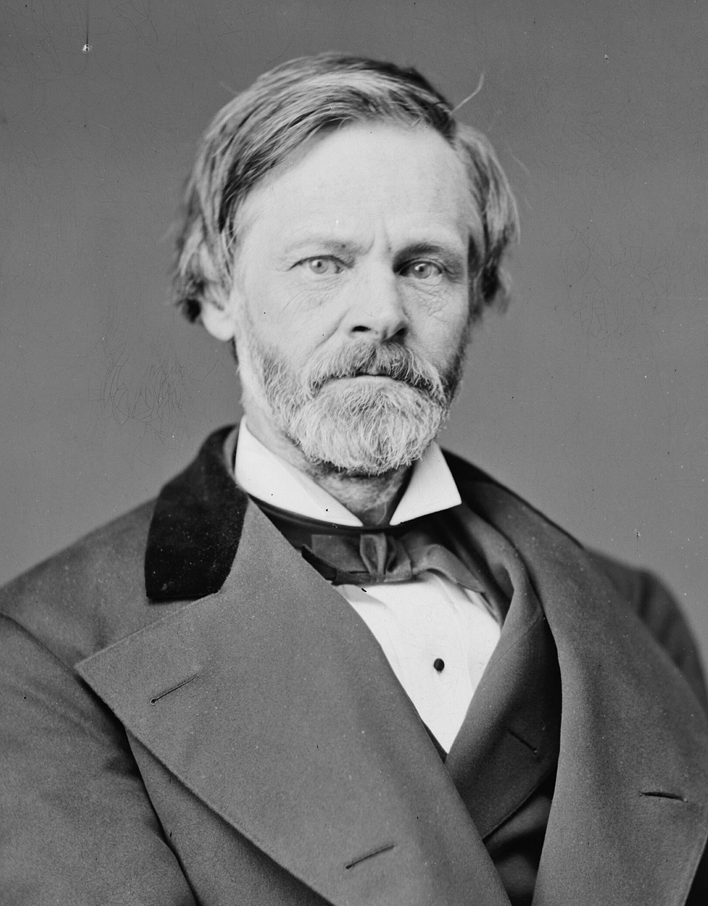

Section 1 of the Sherman Act /[named after Sen. John Sherman, pictured]/ bars "[e]very contract, combination in the form of trust or otherwise, or conspiracy, in restraint of trade or commerce among the several States."  

*** But doesn't /every/ contract "restrain" trade?
  :PROPERTIES:
  :CUSTOM_ID: nl-antitr-sherm-unrsnbl
  :END:

Yes — but the Supreme Court has interpreted Section 1 to outlaw only /unreasonable/ restraints.

*** What are "horizontal" vs. "vertical" restraints?
  :PROPERTIES:
  :CUSTOM_ID: nl-antitr-hor-vert
  :END:

Restraints subject to Section 1  are generally categorized as /horizontal/ or /vertical/:

- A horizontal restraint is /an agreement among competitors/ on the way in which they will compete with one another. 

- Vertical restraints are restraints /imposed by agreement between firms at different levels of distribution/.

*** How do courts assess the reasonableness of restraints?
  :PROPERTIES:
  :CUSTOM_ID: nl-antitr-vert-horiz-ct
  :END:

Courts employ two different standards to determine whether a particular restraint is unreasonable: 

1.  The first standard involves a factual inquiry commonly known as the "rule of reason." The rule of reason weighs legitimate justifications for a restraint against any anticompetitive effects. 

Nearly every /vertical/ restraint is assessed under the rule of reason.

We conduct a fact-specific assessment to distinguish between:

- restraints with anticompetitive effect that are harmful to the consumer and

- restraints stimulating competition that are in the consumer's best interest.

2.  The second standard is the /per se/ standard, which recognizes that a small group of restraints are unreasonable per se because they always or almost always tend to restrict competition and decrease output. Such agreements or practices are conclusively presumed to be unreasonable because of their pernicious effect on competition and lack of any redeeming virtue. 

*Typically only horizontal restraints qualify as unreasonable /per se/.*

However, *not all horizontal restraints are analyzed pursuant to the /per se/ standard*. 

/DCT note: In late 2024, a federal district court held that "algorithmic pricing" of apartment rents, facilitated by a provider of revenue-management software, was part of a horizontal conspiracy that was subject to the per-se rule: "The combination and conspiracy allegedly involved (a) a set of vertical agreements between Yardi Systems, Inc., and each individual [apartment-owner] lessor defendant for the use of Yardi's revenue management software, (b) a continuing horizontal agreement between and among the lessor defendants to provide their commercially sensitive information to Yardi, to use Yardi's revenue management software, and to implement the recommendations generated, and (c) a shared understanding that Yardi would use the information provided to recommended rental rates above what would be earned in a competitive market."/ <cite> See [[https://scholar.google.com/scholar_case?case=13815703686456729339][Duffy v. Yardi Systems, Inc.]], 758 F. Supp. 3d 1283, 1289 (W.D. Wash. 2024) (denying defendants' joint motion to dismiss). </cite>

/Relatedly: In August 2024, the Department of Justice and the attorneys general of eight states [[https://www.justice.gov/opa/pr/justice-department-sues-realpage-algorithmic-pricing-scheme-harms-millions-american-renters][filed a civil antitrust lawsuit against RealPage Inc.]] alleging similar conduct./

The notion of a "rule of reason" is the opposite of a "per-se rule" or "bright-line rule," and means that the outcome might be affected by differences in facts (or in online parlance: YMMV, Your Mileage May Vary). See generally [[https://en.wikipedia.org/wiki/Rule_of_reason][Rule of reason]] (Wikipedia.org).

In a 2024 paper, professors Mark Lemley, of Stanford Law,) and Michael Carrier, of Rutgers Law, argue in effect that the rule of reason might be just window dressing (my words):

#+begin_quote

Given that the rule of reason is often said to be at the center of antitrust law, and that balancing is at the heart of the rule of reason, it is quite surprising to discover that courts almost never do any actual balancing of harms and benefits. Indeed, balancing has become so rare that in the Supreme Court’s two most recent articulations of the rule of reason test, it omitted the actual balancing of anticompetitive harms and procompetitive benefits altogether! <cite> Mark A. Lemley and Michael A. Carrier, [[https://papers.ssrn.com/sol3/papers.cfm?abstract_id=4896529][Rule or Reason? The Role of Balancing in Antitrust Law]] (SSRN.com 2014) (extra paragraphing added). </cite>
#+end_quote

*** What sorts of "horizontal" restraints might be OK?
  :PROPERTIES:
  :CUSTOM_ID: nl-antitr-hor-ancil
  :END:

Under the "ancillary restraints" doctrine, a horizontal agreement is exempt from the /per se/ rule, and analyzed under the rule-of-reason, if it meets two requirements. 

These requirements are that the restraint must be (1) subordinate and collateral to a separate, legitimate transaction, and (2) reasonably necessary to achieving that transaction's pro-competitive purpose. 

"Naked restraints" are categorically /not/ "ancillary restraints." Thus, *naked horizontal restraints are always analyzed under the /per se/ standard*. 

A restraint is naked if it has no purpose except stifling of competition. 

Some examples of these restraints include *agreements among actual or potential competitors to fix prices or divide markets*.

*** One type of "section 1 violation":  Unlawful (horizontal) price-fixing
  :PROPERTIES:
:CUSTOM_ID: nl-Collusion
  :END:

Sometimes it might seem tempting to agree with a competitor to divvy up customers, or to keep your prices at an agreed level, or to take turns submitting the winning bid in response to customers' requests for proposal ("RFPs"). 

Those activities, though, can lead to indictment and prosecution by federal- or state authorities for violation of the antitrust laws.

# https://sco.wikipedia.org/wiki/File:British_Airways_Logo.svg
# # #+ATTR_HTML: :alt British Airways logo :title  British Airways logo  :class photo-at-right photowidth20
# 

# https://www.gao.gov/blog/pregnant-women-federal-custody-uniquely-vulnerable-population
# #+ATTR_HTML: :alt Jail cells :title Jail cells :class photo-at-right photowidth30
# 

# # #+ATTR_HTML: :alt XX :title   :class photo-at-right photowidth15
# 

{{{RWE}}} The German airline Lufthansa and the British airline Virgin Atlantic blew the whistle on a price-fixing scheme by a total of 21 non-U.S. airlines, including British Airways, Qantas, and Korean Air. The U.S. Department of Justice prosecuted, resulting in
- a total of some $1.7 billion in fines; and 
- four airline executives being *sentenced to prison terms* in the U.S. ([[http://www.msnbc.msn.com/id/41926712/ns/travel-news/][link]]) ([[http://www.justice.gov/opa/pr/2007/August/07_at_569.html][link]])

Authorities might go for low-hanging fruit: Instead of trying to prove up an antitrust violation (a complex task), they might bring charges of *obstruction* of justice, akin to prosecuting Al Capone for tax evasion. 

{{{RWE}}} A British executive, after being extradited to the U.S., was sentenced to 18 months in prison and a $25,000 fine for /conspiring to obstruct/ a price-fixing investigation ([[http://www.justice.gov/opa/pr/2010/December/10-at-1426.html][link]]).

For more information the Department of Justice has a useful [[http://www.justice.gov/atr/public/guidelines/211578.htm][antitrust primer]] that explains many of the relevant concepts.

***  /Vertical/- and /hybrid/ price-fixing /might/ be OK ...
  :PROPERTIES:
  :CUSTOM_ID: nl-antitr-rpm
  :END:

/The following discussion is adapted from [[https://scholar.google.com/scholar_case?case=312671332744148739][Winn-Dixie Stores, Inc. v. Eastern Mushroom Mktg. Coop., Inc.]], 81 F.4th 323, 328 (3d Cir. 2023); no copyright is claimed in the opinion text:/

Not every agreement to restrain trade violates the antitrust laws. Because some cases are more obvious than others, the law has evolved to use *different tests* depending on the closeness of the question. 

- At one end of the spectrum are arrangements that can be condemned as illegal /per se/, or—as in the case of horizontal agreements—at least so likely to be unlawful that just a "*quick look*" is enough to recognize that *anticompetitive effects may be presumed*. 

- At the other end of the spectrum are arrangements that are *plainly lawful*. 

- And *in between lie the vast majority, where careful scrutiny is necessary* to decide. 

In this category—which includes *purely vertical agreements*, as well as *hybrid agreements* — the "quick-look" approach is inapt, and *the plaintiff has the initial burden of showing anticompetitive effect under the "rule of reason."*

The central—and dispositive—question in this case is which framework applies. 

Appellant Winn-Dixie Stores brought suit against Appellees—the Eastern Mushroom Marketing Cooperative, Inc. (EMMC), its individual mushroom farmer members, and certain downstream distributors—claiming their price-fixing agreement violated § 1 of the Sherman Act. 15 U.S.C. § 1. 

The District Court instructed the jury to apply the "rule-of-reason" test, and *the jury returned a verdict in Appellees' favor*. 

Winn-Dixie contends this was error, and had the judge applied the "quick-look" approach and instructed the jury to simply presume anticompetitive effects, it would have found Appellees' agreement to be an unlawful restraint of trade. As plaintiff, Winn-Dixie understandably would have preferred the lower burden of proof. 

But because *this hybrid scheme involved myriad organizational structures with varying degrees of vertical integration*, the Court was right to apply the rule of reason. 

And because, under that more searching inquiry, *the evidence at trial was sufficient to sustain the jury's verdict*, we will affirm the judgment in favor of Appellees.

/Emphasis, extra paragraphing, and bullets added./

*** ... but might not be worth the hassle
  :PROPERTIES:
  :CUSTOM_ID: nl-antitr-rpm-no
  :END:

Let's suppose that a client wants you to draft an agreement with vertical price fixing a.k.a. resale price maintenance. 

Sure, such an agreement /might/ be legal.

But even so, litigating the issue might cost the client a lot of time and money.

Does the client really want to take the chance?

** Bankruptcy Code of 1978 /(notes)/
  :PROPERTIES:
  :CUSTOM_ID: nl-termin-bkrpt-bkgd
  :END:

*** The automatic stay against termination (etc.)
  :PROPERTIES:
  :CUSTOM_ID: nl-auto-stay
  :END:

Consider the situation where {{{A}}} wants to terminate its contract with {{{B}}}. Under [[https://www.law.cornell.edu/uscode/text/11/365][section 365(e)(1)]] of the (U.S.) Bankruptcy Code of 1978, if {{{B}}} files a petition for protection under the bankruptcy laws — or if {{{B}}}'s /creditors/ file an "involuntary" petition against {{{B}}} — then that filing creates an "automatic stay," prohibiting A from taking any of several forms of contract termination (as well as various other actions).

The rationale here is that termination of a contract could jeopardize the orderly reorganization or liquidation of B's business. In the bankruptcy proceeding, {{{B}}} is referred to as the "debtor," and B's business and assets are referred to as "the estate" of the debtor.

(The basics of this subject are usefully explained in Robert L. Eisenbach III, [[http://bankruptcy.cooley.com/2007/09/articles/business-bankruptcy-issues/are-termination-on-bankruptcy-contract-clauses-enforceable/][Are "Termination On Bankruptcy" Contract Clauses Enforceable?]] (Cooley.com 2007), [[https://perma.cc/PV6N-VFTC]].)

Even though such termination-/for/-bankruptcy provisions are unenforceable in the U.S., lawyers keep including them in contracts anyway. The usual rationale is that U.S. bankruptcy law might not apply (e.g., in a non-U.S. transaction), and who knows, Congress might repeal that part of the Code (unlikely).

As an "in the wild" example of such a provision, see a Honeywell purchase-order form at [[http://perma.cc/CUV6-NKTY]], which states as follows:

#+begin_quote

The solvent party /[sic]/ may terminate this Purchase Order upon written notice if the other party becomes insolvent or if any petition is filed or proceedings commenced by or against that party relating to bankruptcy, receivership, reorganization, or assignment for the benefit of creditors.
#+end_quote

*Pro tip:* Don't say that "the /solvent/ party may terminate," as in the Honeywell example just above, because if the terminating party is /also/ insolvent, then a court might hold that the party wasn't entitled to terminate — and so the termination was itself an "own goal" breach of the contract — as discussed in more detail in the commentary at § [[#termin-rt]].

*** Ipso-facto terminations are likewise unenforceable
  :PROPERTIES:
  :CUSTOM_ID: nl-bkrpt-ipso
  :END:

Likewise unenforceable under [[https://www.law.cornell.edu/uscode/text/11/365][11 U.S.C. § 365(e)(1)]] are so-called /ipso-facto/ clauses, where the debtor's entering into bankruptcy proceedings would /automatically/ terminate the contract (with certain exceptions in subsection (e)(2)). For an example and extensive citations, see [[https://www.bclplaw.com/a/web/99476/Enforceability-of-Termination-on-Bankruptcy-or-Ipso-Facto-Cont.pdf][a paper]] (undated) at the Web site of the Bryan Cave law firm.

*** Preference-payments refunds in bankruptcy
  :PROPERTIES:
  :CUSTOM_ID: nl-GuarPrefPmtRef
  :END:

Here's a not-uncommon situation, especially during economic downturns:

- A customer places an order with a supplier.
- In due course, the customer pays the supplier's invoice in due course.
- *But:* Within the next 90 days, the customer files for protection under the bankruptcy laws. 

In that situation, the supplier might be compelled by law to refund Customer's invoice payment; this is referred to as an "avoidable preference." <cite> See, e.g., [[https://scholar.google.com/scholar_case?case=3438768229025420150][Coles v. Glaser]], 2 Cal. App. 5th 384, 389, 205 Cal. Rptr.3d 922 (2016) (with extensive citations). See also, e.g.: Patricia Dzikowski, [[http://www.nolo.com/legal-encyclopedia/bankruptcy-trustee-preference-claims-prior-transfers.html][The Bankruptcy Trustee and Preference Claims]] (Nolo.com; undated); Kathleen Michon, [[http://www.nolo.com/legal-encyclopedia/pre-bankruptcy-payments-creditors-can-the-trustee-get-the-money-back.html][Pre-Bankruptcy Payments to Creditors: Can the Trustee Get the Money Back?]] (Nolo.com; undated); the guaranty language in [[https://scholar.google.com/scholar_case?case=11081049436389993245][Cooperatieve Centrale Raiffeisen-Boerenleenbank, B.A. v. Navarro]], 25 N.Y.3d 485, 488, 36 N.E.3d 80, 15 N.Y.S.3d 277 (2015). </cite>

To be sure: The supplier would have the right to contest its obligation to refund the customer's payment, for example by showing that the payment was made in the ordinary course of business. But contesting a preference action can be difficult and costly; that's because, under bankruptcy law, the supplier would have to successfully jump through some evidentiary hoops to /show/ that it was entitled to keep the customer's payment.

And in any event, as a practical matter many avoidable-preference cases are settled; in the above situation:

- The customer's "estate" (a bankruptcy term) would likely settle for less than a complete refund of what the customer had paid the supplier.

- In return, the supplier would give the customer a /partial/ refund so as to avoid the expense and hassle of jumping through the required proof hoops in bankruptcy court.

That's where the supplier would want to be able to invoke a third party's guaranty of payment: In many guaranties, the guarantor would be on the hook to reimburse the supplier for the supplier's refund to the customer — and probably for the supplier's associated legal expenses as well, if the guaranty said so. (For an example of bankruptcy-reimbursement language along similar lines, see paragraph 7 of a [[https://www.sec.gov/Archives/edgar/data/1066134/000119312510000891/dex103.htm][Bank of America guaranty form]].)

** Baskets for losses /(notes)/
  :PROPERTIES:
  :CUSTOM_ID: nl-liab-basket
  :END:

In some transactions such as mergers and acquisitions, so-called "baskets" are used to allocate responsibility for losses and claims, with responsibility not triggered until losses reach a stated amount. <cite> See generally, e.g., Dan Avery, [[https://perspectives.goulstonstorrs.com/post/102j8ve/whats-market-indemnity-baskets][What's Market: Indemnity Baskets]] (GoulstonStohrs.com). </cite>

*** The deductible basket

To illustrate, let's use  a hypothetical example with made-up numbers for a so-called "deductible basket":

/AGGREGATE LOSSES:/ \\
Less than $100: Buyer is responsible. \\
$100 and up: Seller is responsible

Here's a variation on the deductible basket:

/AGGREGATE LOSSES:/ \\
Less than $100: Buyer is responsible. \\
$100 to $10,000: Seller is responsible. \\
More than $10,000: Buyer is responsible.

*** The tipping (or first-dollar) basket

Another variation is the so-called "tipping basket" (sometimes called the "first-dollar basket"): 

/AGGREGATE LOSSES:/ \\
Less than $100: Buyer is responsible. \\
$100 and up: Seller is responsible, for /all/ losses (even the first $100).

** Buy-sell agreements /(rough notes)/
  :PROPERTIES:
  :CUSTOM_ID: nl-buy-sell
  :END:

A "buy-sell" procedure is related to the ancient "[[http://en.wikipedia.org/wiki/Divide_and_choose][divide and choose]]" procedure, sometimes known as "I cut, /you/ choose," by which children can evenly divide a cookie between them.

Something like this procedure is seen in the Book of Genesis, when Abram (later Abraham) and his kinsman Lot agree to separate, and by agreement, Abram allows /Lot/ to choose which part of the Promised Land to claim and settle in. <cite> See [[https://www.biblegateway.com/passage/?search=Genesis%2013&version=NIV][Gen. 13:8-10]]; see also, e.g., [[https://en.wikipedia.org/wiki/Abraham_and_Lot%27s_conflict][Abraham and Lot's conflict]]. </cite>

Buy-sell agreements are often used for breakups of small companies. Suppose that a company  has two owners, "Fred" and "Ginger," who find that they can no longer get along. A buy-sell agreement requires (let's say) /Fred/ to /offer/ to buy out Ginger's share of the company so that she'll be the one to exit the business and leave Fred as the sole owner — but then /Ginger/ gets to decide whether —

- to accept Fred's buy-out offer and leave the business; or

- instead, to require /Fred/ to sell out to her — on the terms that Fred had proposed to her. 

This gives Fred a powerful incentive to offer fair terms to Ginger — because if Fred's terms /aren't/ fair, then Ginger can turn the tables on him and kick /him/ out of the business instead of exiting the business herself.

A buy-sell agreement is somewhat akin to baseball arbitration, which likewise encourages parties to make fair offers to settle disputes, as discussed at [[#r-escal-ext]].

/Optional further reading:/ 

- Both buy-sell agreements and last-offer arbitration ("baseball arbitration"; see {{{RR}}} [[#r-escal-ext]]) could be thought of as examples of what the late philosopher John Rawls referred to as "[[https://ethicsunwrapped.utexas.edu/glossary/veil-of-ignorance][the veil of ignorance]]." 

-  [[https://www.nybusinessdivorce.com/2017/05/articles/llcs/aim-carefully-pulling-triggenl-shotgun-buy-sell-agreement/][Mahler]] (2017) urges /not/ including provisions for the accepting party to demand revision of the price.

#+begin_comment
The LLC agreement had a relatively complex and somewhat unusual shotgun provision with the following key features:

- 30 days for the Non-Tendering Member to give notice of his election to purchase or sell after receipt of the Tendering Member’s buy-sell offer;

- once the Non-Tendering Member gives his notice of election, an additional 7 days for him to give notice of disagreement with the purchase price, thereby triggering a specified independent appraisal process producing a binding purchase price;

- in the case of an agreed purchase price, closing within 90 days of the Non-Tendering Member’s notice of election;

- in the case of disagreement and appraisal, closing within 180 days of the Non-Tendering Member’s notice of election;
repayment at closing of any loans to the LLC by the withdrawing member and of any loan balances between members resulting from investments in the company;

- reversion to the Tendering Member of the right to purchase the Non-Tendering Member’s interest if the latter fails to close on his purchase election.

* * * 

One last observation: I’ve seen many owner agreements with shotgun provisions, but until this case I’d never seen one that allowed the recipient of the buy-sell offer to re-set the purchase price after the recipient’s election to buy or sell by means of a binding fair market value appraisal. Such a provision, it strikes me, undermines the central premise of the efficiency and price-setting fairness of the shotgun mechanism, and ought to be avoided.
#+end_comment

** Click-wrap and browse-wrap agreements /(notes)/
  :PROPERTIES:
  :CUSTOM_ID: nl-c-ent-click-rej
  :HTML_CONTAINER_CLASS: olnum
  :END:

*** Background

1.  "Click-wrap agreements": When a user installs software on a computer, or signs up for an online service, very often the user must click on a button or link that says (in effect) "I agree"; the click purportedly signifies that the user — and the user's company — are agreeing to detailed terms and conditions.

2.  "Browse-wrap agreements": An online service might also include a purported agreement that the user supposedly agrees to: (i) by continuing to take an action, e.g., continuing to browse a Web site, or (ii) by /not/ taking other action, e.g., by /not/ leaving a Web site.     

For convenience, here we'll refer to the terms of either type of agreement as simply "Wrap Terms."

*** Some case law

The enforceability of click-wrap and browse-wrap agreements has been often litigated; see generally the posts of law professor Eric Goldman — who knows pretty much what there is to be known on this subject — and his colleagues at his [[https://blog.ericgoldman.org/archives/2023/08/more-chaos-in-the-law-of-online-contract-formation.htm][Technology & Marketing Law Blog]]. 

For a UK perspective, see the court of appeal's discussion in [[https://www.judiciary.uk/wp-content/uploads/2024/03/Parker-Grennan-v-Camelot.pdf][Parker-Grennan]] (UK App. 2024), discussed by [[https://www.jdsupra.com/legalnews/digital-speaks-don-t-gamble-on-your-8998020/][Blest & Shaw]] (2024). 

Often, Wrap Terms will be unobjectionable, addressing matters such as not making unreasonable use of an online service, not trying to steal other users' data, and the like. 

But sometimes, Wrap Terms will be like a supplier's order confirmation, setting out the supplier's wish list for ground rules — and sometimes a supplier's click-wrap or browse-wrap agreement will contain terms and conditions that affect the parties' negotiated deal.

So, in § [[#ent-k-click]] of {{{RR}}} [[#r-ent-k]], the "are rejected" language is intended to preclude Wrap Terms from becoming part of {{{thek}}} when they address matters that are covered (explicitly or implicitly) in {{{thek}}}. 

*** /Wu v. Uber/: A road map to enforceability?
  :PROPERTIES:
  :CUSTOM_ID: nl-wu-uber
  :END:

In its /Wu v. Uber/ opinion, New York's highest court blessed the process that Uber used to amend its online terms of service to incorporate an arbitration provision:

#+begin_quote

We now turn to the application of these principles to Uber's January 2021 terms of use. Only a few days before plaintiff purportedly agreed to the terms, she received the following email:

# #+ATTR_HTML: :alt Image of Uber announcement of updated terms of service :class photowidth90
# 

The headline of the email, "Updated Terms of Use," and the large text immediately beneath it *clearly informed plaintiff* that she would soon "be asked to review and agree to [Uber's] updated terms [of use]." 

Moreover, the email *specifically advised* plaintiff that the terms would include, among other subjects, "changes to the Arbitration Agreement." 

The terms were *accessible through several hyperlinks*, including a large black button at the very top of the email specifically labeled "Review terms," and the text "Terms of Use" in the first line of the first paragraph, which was *distinguished from the black text surrounding it* by the signature blue font indicating a hyperlink.

Finally, the text of the email *expressly advised* plaintiff how she could manifest assent to the terms, i.e., by tapping "Confirm" on a pop-up window that would automatically appear when she opened the Uber application on her smartphone. The email was written in plain language.

Only a few days later, Uber's January 2021 terms of use were *presented* to plaintiff by means of a *clickwrap process*—a means of acquiring binding assent from consumers that has been *widely upheld* by courts across the country. 

As previewed in the email, plaintiff was presented with the following pop-up screen when she opened the Uber app on her smartphone:

# #+ATTR_HTML: :alt Image of second Uber announcement of updated terms of service :class photowidth90
# 

The headline and the larger text in the center of the screen—"We've updated our terms" and "We encourage you to read our updated Terms in full"—*clearly advised* plaintiff that she was being asked to agree to a contract with Uber.

The terms themselves were *again made accessible* by a hyperlink on the words "Terms of Use," which were formatted in *large, underlined, blue text*. 

*A reasonably prudent user would have understood* from the color, underlining, and placement of that text, immediately beneath the sentence "encourag[ing]" users to "read [the] updated Terms in full," that clicking on the words "Terms of Use" would permit them to review those terms in their entirety. 

Finally, Uber provided plaintiff with an *unambiguous means of accepting the terms* by including a checkbox, "Confirm" button, and bolded text expressly stating that, "By checking the box, I have reviewed and agree to the Terms of Use." It is undisputed that plaintiff checked and box and clicked the "confirm" button. #+end_quot <cite> [[https://scholar.google.com/scholar_case?case=4811284305254505900][Wu v. Uber Techs., Inc.]], 43 N.Y.3d 288, 292-93, 260 N.E.3d 1060, 2024 NY Slip Op. 05869 (cleaned up, emphasis and extra paragraphing added). </cite>e

** Consumer contracts /(notes)/
  :PROPERTIES:
  :CUSTOM_ID: nl-consum-k
  :END:

DCT note: This is where I'm "[[https://www.poynter.org/reporting-editing/2013/how-writers-can-collect-and-organize-string-for-stories/][saving string]]" for possible future use.

Anthony Glosson and Ross Speier, [[https://www.jdsupra.com/legalnews/mind-the-fine-print-cfpb-warns-against-4837775][Mind the Fine Print: CFPB Warns Against Use of Unenforceable Terms and Conditions]] (JDSupra.com 2024).

** Discretion: {{{ADDL}}}                                              :ADDL:
  :PROPERTIES:
 :CUSTOM_ID: discr-defn-a
  :HTML_CONTAINER_CLASS: addl
  :END:

*** The business context

Contracts often use the terms /discretion/, /sole discretion/, /unfettered discretion/, and /reasonable discretion/; {{{ths}}} seeks to provide clear meanings for the underlying word /discretion/ — while recognizing that courts might impose their own meanings, as discussed below.

*** "Sole and unfettered discretion" might not mean /quite/ that
  :PROPERTIES:
  :CUSTOM_ID: discr-sole-lim
  :END:

{{{U1}}} A New York appeals court took a jaundiced view of a party's position about a "sole and absolute discretion" clause in an agreement, noting that:

#+begin_quote

[E]ven where one has an apparently unlimited right under a contract, that right may not be exercised solely for personal gain in such a way as to deprive the other party of the fruits of the contract. Thus, even an explicitly discretionary contract right may not be exercised in bad faith so as to frustrate the other party's right to the benefit under the agreement. <cite> [[https://scholar.google.com/scholar_case?case=8901689424505951736][Shatz v. Chertok]], 180 A.D.3d 609, 610, 117 N.Y.S.3d 239, 2020 NY Slip Op 1383 (N.Y. App. Div.) (affirming denial of motion to dismiss complaint for breach of fiduciary duty; cleaned up, citation omitted, extra paragraphing added). </cite>
#+end_quote

{{{UN}}} In the UK, there is case law indicating that discretion must be exercised in good faith and not arbitrarily, capriciously, or irrationally. <cite> See generally James Brown, [[https://www.haynesboone.com/alerts/cathay-pacific-airways-limited-v-lufthansa-technik-ag][Cathay Pacific Airways Limited v. Lufthansa Technik AG - the extent to which contractual rights be limited by considerations of good faith or a duty to act “rationally”?]] (HaynesBoone.com 2020) /discussing/ [[https://www.bailii.org/ew/cases/EWHC/Ch/2020/1789.html][Cathay Pacific Airways Limited v. Lufthansa Technik AG]], [2020] EWHC 1789 (Ch); Barry Donnelly and Jonathan Pratt, [[https://www.macfarlanes.com/media/1848/are-you-obliged-to-act-reasonably-july-2013.pdf][Are you obliged to act reasonably?]], in the In-House Lawyer, June 2013, at 20, [[https://perma.cc/H9HW-7KDA]]. </cite>

{{{UN}}} Analogously: In the context of /judicial/ discretion, in a case [[https://scholar.google.com/scholar_case?case=13800665423501484885][Halo Electronics]] (U.S. 2016), concerning certain statutory trial-court discretion in patent cases, the Supreme Court noted that:

#+begin_quote

Discretion is not whim. In a system of laws discretion is rarely without limits, even when the statute does not specify any limits upon the district courts' discretion. 

A motion to a court's discretion is a motion, not to its inclination, but to its judgment; and its judgment is to be guided by sound legal principles. Thus, ... a district court's discretion should be exercised in light of the considerations underlying the grant of that discretion. <cite> [[https://scholar.google.com/scholar_case?case=13800665423501484885][Halo Elecs., Inc. v. Pulse Elecs., Inc.]], 136 S. Ct. 1923, 1931-32 (2016) (cleaned up, citations omitted, extra paragraphing added). This concerned a trial court's statutory discretion, in "exceptional" cases, to increase the damages for patent infringement. </cite>
#+end_quote

*** More explanation of permissible discretion factors can help

It can be helpful for a contract to explain the factors that can be permissibly taken into account in exercising discretion. {{{RWE}}} In a Second Circuit case:

- An energy supply company was sued for breach of contract for allegedly failing to charge competitive rates for electricity.

- The company's agreement form provided for a variable monthly rate that the company would set at its discretion; the agreement "listed several factors guiding that discretion, including 'market-related factors' and [the company's] 'costs, expenses and margins.'"

The court affirmed summary judgment in favor of the company because the plaintiff "received what was promised under the plain terms of the agreement ...."

*** Edge case: An illusory contract 

In a Texas case, a sale-and-purchase letter agreement gave a buyer the "sole discretion" to close a purchase transction (after doing due diligence about the purchase). A state court held that this unfettered walk-away right made the agreement contract illusory and unenforceable, as long as there was no separate consideration for the walk-away right. <cite> See [[https://scholar.google.com/scholar_case?case=7837640098008907112][Maverick Nat. Resources, LLC v. Glenn D. Cooper Oil & Gas, Inc.]], No. 02-23-00183-CV, slip op. (Tex. App.--Fort Worth Jun. 13, 2024). </cite>

** Efforts clauses /(notes)/
  :PROPERTIES:
  :CUSTOM_ID: nl-CRE-a
  :HTML_CONTAINER_CLASS: addl
  :END:

*** Why do drafters use "efforts" clauses?
  :PROPERTIES:
  :CUSTOM_ID: nl-cre-why
  :END:

Contract drafters often say that a party will make /[something] efforts/:

- when they don't want to take the time to negotiate a specific standard of performance — especially if their clients simply don't know what the standard /should/ be in as-yet undetermined future circumstances, and they don't want to spend the time to try to figure it out; 

- in the case of /commercially reasonable/ efforts: to emphasize that the term requires what /business people/ would regard as reasonable efforts *and* - as an alternative to the stronger commitment of /best efforts/ (see {{{RR}}} [[#r-best-efforts-defn]]).

*** Problem: The lack of clarity in the case law
  :PROPERTIES:
  :CUSTOM_ID: nl-CREUnclear
  :END:

In Delaware's 2024 /Fortis Advisors/ case, Vice Chancellor Will noted that "there is no agreement in case law over whether /[efforts clauses]/ create different standards. Delaware courts have viewed variations of efforts clauses—particularly those using the term 'reasonable'—as largely interchangeable." <cite> [[https://scholar.google.com/scholar_case?case=3585890316977952996][Fortis Advisors LLC v. Johnson & Johnson]], No. 2020-0881-LWW, slip op. at text acc'g n.350 (Del. Ch. Sept. 4, 2024). </cite>

Likewise, in the 2010 /Citri-Lite/ case, a federal court in California noted that that "[t]here is no settled or universally accepted definition of the term commercially reasonable efforts." <cite> [[https://scholar.google.com/scholar_case?case=15202977054272395445][Citri-Lite Co. v. Cott Beverages, Inc.]], 721 F. Supp. 2d 912, 926 (E.D. Cal. 2010) (denying defendant's motion for summary judgment; cleaned up). After trial, the court elaborated on this observation, with citations; see [[https://www.govinfo.gov/content/pkg/USCOURTS-caed-1_07-cv-01075/pdf/USCOURTS-caed-1_07-cv-01075-15.pdf#page=1.00&gsr=0][findings of fact and conclusions of law after bench trial]], slip op. at 45, /aff'd/, [[https://perma.cc/D8DC-J3GN][No. 11-17609]] (9th Cir. Nov. 21, 2013) (unpublished). </cite>

Similarly, the Southern District of New York — after extensively reviewing case law — remarked that "New York case law interpreting other efforts clauses, including best efforts and reasonable efforts clauses, is anything but a model of clarity." <cite> [[https://scholar.google.com/scholar_case?case=598465974293934143][Holland Loader Company, LLC v. FLSMidth A/S]], 313 F. Supp. 3d 447, 469 (S.D.N.Y. 2018) (after bench trial, holding that defendant had failed to use commercially-reasonable efforts). </cite>

*** Would (a quick) summary judgment be available? (Maybe not.)         :CMT:
  :PROPERTIES:
  :CUSTOM_ID: nl-cre-msj
  :END:

It will often be "a factually intense issue" whether a party has /complied/ with an obligation to exert particular efforts — and thus it frequently happens that a court will deny /summary/ judgment, necessitating a costly trial, as happened in [[https://scholar.google.com/scholar_case?case=15202977054272395445][Citri-Lite]], cited above, and in other cases. <cite> See also, e.g., [[https://scholar.google.com/scholar_case?case=1331132673644442581][MY Imagination, LLC v. M.Z. Berger & Co.]], No. 17-1218 (6th Cir. Feb. 16, 2018) (reversing and remanding summary judgment in favor of defendant); [[https://scholar.google.com/scholar_case?case=10841574334252257796][Organo Gold Int'l v. Aussie Rules Marine Serv. Ltd.]], 416 F. Supp. 3d 1369 (S.D. Fla. 2019) (denying summary judgment in case involving golfer Greg Norman); [[https://scholar.google.com/scholar_case?case=13945349954956181421][PPD Enterpr., LLC v. Stryker Corp.]], No. 4:16-CV-0507 (S.D. Tex. Nov. 1, 2017) (denying summary judgment). </cite>

*** Inward vs. outward focus: A real-world example
  :PROPERTIES:
  :CUSTOM_ID: nl-RussellZimmer
  :END:

{{{RWE}}} In a 2023 Seventh Circuit decision, the contract in suit provided an example of an extremely-detailed definition of "commercially reasonable efforts"; that definition focused "inward" on the buyer's own practices, as opposed to an "outward" focus on industry standards for what would be done by similarly-situated business. <cite> See [[https://scholar.google.com/scholar_case?case=15881487331300468195][Russell v. Zimmer, Inc.]], 82 F.4th 564, 566-70 (7th Cir. 2023) (affirming dismissal for failure to state a claim upon which relief could be granted). </cite>

*** Use "comparables"? (Maybe not.)
  :PROPERTIES:
  :CUSTOM_ID: nl-cre-comp
  :END:

Industry standards or other "comparables" might not be helpful: In a 2024 Delaware case, the contract in suit defined "commercially reasonable efforts" as "the exercise of such efforts and commitment of such resources by a company with substantially the same resources and expertise as [the defendant], with due regard to the nature of efforts and cost required for the undertaking at stake." Vice Chancellor Glasscock characterized this definition as "unusual" and remarked that "[a]fter trial, I find this method unworkable; no exemplar companies operate under the actual conditions of Defendants, who, I note, are also different from one another as to their circumstances." <cite> [[https://scholar.google.com/scholar_case?case=15621251956044928976][Himawan v. Cephalon, Inc.]], No. 018-0075, text acc. nn.44, 165 (Del. Ch. Apr. 30, 2024) (holding that defendants had not breached their obligation to comply with contract's commercially-reasonable efforts provision). </cite>

The court went on:

#+begin_quote

"Due regard" for the "efforts and costs" means that Defendants may eschew development where the circumstances reasonably indicate, as a business decision, that they not go forward. This includes all the costs and risks involved, including the milestone payments and the opportunity costs faced by Defendants, as evidenced by the provision that the reasonableness be measured against the actions expected of a company with "substantially the same resources and expertise" as the buyer. That is, if a reasonable actor with faced with the same restraints and risks would go forward /in its own self-interest/, the buyer is contractually obligated to do the same. <cite> /Id./ (emphasis in original, extra paragraphing added). </cite>
#+end_quote

*** Pro tip: Agree to a /process/ instead?                              :CMT:
  :PROPERTIES:
  :CUSTOM_ID: nl-cre-process
  :END:

Outside of the context of /efforts/, a party seeking to prove (or disprove) the reasonableness of a transaction, contract term, decision, etc., might want to focus on /the process/ by which the transaction, etc., came into being. {{{RWE}}} In its 1990 /West Texas Transmission/ decision, the Fifth Circuit remarked that "[w]here two sophisticated businesses reach a hard-fought agreement through lengthy negotiations, it is difficult to conclude that any negotiated term placed in their contract is commercially unreasonable." <cite> [[https://scholar.google.com/scholar_case?case=14571229305189389501][West Texas Transmission, LP v. Enron Corp.]], 907 F.2d 1554, 1563 (5th Cir. 1990) (affirrming district court's refusal to grant specific performance of right of first refusal) (extensive citations omitted). </cite>

This suggests that, when it comes to commercially-reasonable /efforts/, if parties can't (or don't want to take the time to) specify what outcome they want, then perhaps they could agree instead to a reasonable /process/ that they will use later to decide what the outcome will be, such as the escalation clause at {{{RR}}} [[#r-escal-ext]]. 

*** Whose burden is it to define the extent of efforts required?
  :PROPERTIES:
  :CUSTOM_ID: nl-cre-burden
  :END:

A party that sues for breach of an efforts obligation might need to adduce specific evidence to educate the court about just what level of effort was required to meet the obligation in the particular circumstances — failing which, the court might dismiss the claim. 

{{{RWE}}} The SDNY explained: "When the term 'commercially reasonable efforts' is not defined by the contract, courts in this district require the party seeking to enforce the efforts provision to establish the objective standard by which the breaching party's efforts are to be judged, in the context of the particular industry." <cite> [[https://scholar.google.com/scholar_case?case=598465974293934143][Holland Loader Company, LLC v. FLSmidth A/S]], 313 F. Supp. 3d 447, 472 (S.D.N.Y. 2018) (plaintiff proved breach of commercially-reasonable-efforts obligation but failed to sufficiently prove damages). See also, e.g., [[https://scholar.google.com/scholar_case?case=1713083266085881505][Shane Campbell Gallery, Inc. v. Frieze Events, Inc.]], No. 20-1535-cv (2d Cir. Dec. 17, 2020) (affirming summary judgment dismissing claim of breach (non-precedential summary order)); [[https://scholar.google.com/scholar_case?case=7168245478848525450][Tendyne Holdings, Inc. v. Abbott Vascular, Inc.]], No. 18-1070 (D. Del. Jun. 28, 2019) (granting Abbott's motion to dismiss); [[https://scholar.google.com/scholar_case?case=17726126410267470709][Terumo Americas Holding, Inc. v. Tureski]], 251 F. Supp. 3d 317, 327-28 (D. Mass. 2017) (granting summary judgment dismissing claim of breach); [[https://scholar.google.com/scholar_case?case=2789476740862499256][Netologic Inc. v. Goldman Sachs Group, Inc.]], 2018 NY Slip Op 31409 (granting defendant's motion for summary judgment). </cite>

*** Some practical dangers of /best/-efforts obligations
  :PROPERTIES:
  :CUSTOM_ID: nl-best-eff-danger
  :END:

Parties that agree to include a best-efforts obligation in a contract can get into costly disputes about whether particular actions satisfied the obligation. That's because: 

--  With the benefit of plenty of time and *20-20 hindsight*, litigation counsel — *coached by* a paid expert witness — will second-guess the choices that the obligated party made.

--  Then it might be up to randomly-selected jurors to decide the best-efforts question — and because jurors often aren't familiar with the relevant business environment, they might end up deciding, in part, on the basis of which witnesses they liked best.

*** Are "_all_ reasonable efforts" required?
  :PROPERTIES:
  :CUSTOM_ID: nl-best-eff-all-rsnbl
  :END:

In its much-noted /Williams Cos./ decision, Delaware's supreme court held that "reasonable best efforts" required /all reasonable/ steps. <cite> See [[https://scholar.google.com/scholar_case?case=1175897943756751015][Williams Cos. v. Energy Transfer Equity, L.P.,]] 159 A.3d 264 (Del. 2017). The supreme court held that Williams Cos.'s counterparty Energy Transfer had indeed breached its obligation to make such efforts, but also that Energy Transfer had shown that its breach did not have a material effect. </cite>

/All reasonable efforts/ is reportedly a common formulation in the UK and Australia as well. <cite> See generally, e.g., Menelaus Kouzoupis and Margaux Harris, [[https://www.shlegal.com/docs/default-source/news-insights-documents/best-endeavours-vs-reasonable-endeavours_not-two-sides-of-the-same-coin.pdf]["Best endeavours" vs "reasonable endeavours": Not two sides of the same coin]] (SHLegal.com 2020); Shawn C. Helms, David Harding, and John R. Phillips, [[https://www.jonesday.com/en/insights/2007/07/best-efforts-and-endeavourscase-analysis-and-practical-guidance-under-us-and-uk-law][Best Efforts and Endeavours -- Case Analysis and Practical Guidance Under U.S. and U.K. Law]] (JonesDay.com 2007). </cite>

British Columbia's supreme court used the term "leaving no stone unturned." <cite> See [[https://www.provincialcourt.bc.ca/judgments.php?link=https://www.canlii.org/en/bc/bcpc/][Atmospheric Diving Systems Inc. v. International Hard Suits Inc.]], 1994 CanLII 16658, ¶¶ 63, 71-72 (BC SC), 89 B.C.L.R. (2d) 356 (reviewing English and Canadian case law). </cite>

BUT: The Seventh Circuit once remarked that "We have found no cases ... holding that 'best efforts' means /every conceivable/ effort ...." <cite> [[https://scholar.google.com/scholar_case?case=5844601562597380737][Triple-A Baseball Club Assoc. v. N.E. Baseball, Inc.]], 832 F.2d 214, 228 (7th Cir. 1987). </cite>

Likewise, the First Circuit's [[https://scholar.google.com/scholar_case?case=2741871384593536664][California Pines]] opinion (citing the Second Circuit's /Bloor/ opinion) held that: "Best efforts does not mean every conceivable effort. It does not require the promisor to ignore its own interests, spend itself into bankruptcy, or incur substantial losses to perform its contractual obligations." <cite> See also [[https://scholar.google.com/scholar_case?case=15955560761286589605][Coady Corp. v. Toyota Motor Distributors, Inc.]], 361 F.3d 50, 59 (1st Cir. 2004) (affirming rejection of dealership's claim that Toyota distributor had failed to use best efforts; citation omitted), /likewise cited in/ [[https://scholar.google.com/scholar_case?case=2741871384593536664][California Pines]].  ]

Sometimes the discussion might be academic: A Texas court once remarked: "As a matter of law, no efforts cannot be best efforts." <cite> [[http://scholar.google.com/scholar_case?case=16652794475481801929][CKB & Assoc., Inc. v. Moore McCormack Petroleum, Inc.]], 809 S.W.2d 577, 581-82 (Tex. App.--Dallas 1990). (affirming summary judgment that defendant had failed to use its best efforts; citing /Bloor/). </cite>

*** Enforceability: Best efforts /to do what/?
  :PROPERTIES:
  :CUSTOM_ID: nl-best-eff-enfor
  :END:

A best-efforts clause might be unenforceable if it doesn't indicate the desired object of the efforts with sufficient clarity to allow a court to assess the obligated party's performance.

{{{RWE}}} In a Texas case, the buyer of a company had agreed, as part of the purchase agreement, to make [[#c-earn-out][earn-out payments]] to the seller; the buyer also committed to use its best efforts to operate the acquired business "in a manner that maximizes the Earn-Out Payments ...." Affirming summary judgment in favor of the buyer, the court ruled that this best-efforts provision was unenforceable because "the contract at issue here lacks a clear set of guidelines against which /[the buyer's]/ best efforts can be measured," and that what the contract /did/ say on that score "is not enough to go on ...." <cite> [[https://scholar.google.com/scholar_case?case=3885383475704791809][Spain v. Phoenix Elec. Co.]], No. 01-22-00656-CV, slip op. (Tex. App.--Houston [1st Dist] Mar. 7, 2024, no pet.). </cite>

{{{RWE}}} The Fifth Circuit threw out a fraudulent-inducement jury verdict against a party alleged to have never intended to use its best efforts to promote sales of specified products: "Because the 'best efforts' clause is too indefinite and vague to provide a basis for enforcement, the [plaintiff's] claim for fraudulent inducement, as a matter of law, cannot rest on the alleged breach of this clause coupled with an alleged intent not to perform." <cite> [[https://scholar.google.com/scholar_case?case=15072672150401870410][Kevin M. Ehringer Enterprises, Inc. v. McData Servs. Corp.]], 646 F.3d 321, 326 (5th Cir. 2011) (reversing judgment on jury verdict; citation omitted). </cite>

*Counterexample:* A party agreed to use best efforts to file and make effective a securities registration statement "as promptly as practicable" and "in the most expeditious manner possible." The Fifth Circuit held that this was sufficiently definite to support a claim for breach of the best-efforts obligation. <cite> See [[https://scholar.google.com/scholar_case?case=11477207314313984165][Herrmann Holdings Ltd. v. Lucent Techs., Inc.]], 302 F.3d 552, 559-61 (5th Cir. 2002) (reversing and remanding dismissal for failure to state a claim). </cite>

*** A use case: Best efforts and exclusivity 
  :PROPERTIES:
  :CUSTOM_ID: nl-best-eff-excl
  :END:

Best-efforts obligations are especially common when one party grants another party /exclusive/ rights, for example exclusive distribution rights or an exclusive license under a patent, trademark, or copyright. {{{RWE}}} In one case, the Third Circuit held that, in a contract with an exclusive-dealing arrangement, "[t]he obligation of best efforts forces the buyer/reseller to consider the best interests of the seller and itself as if they were one firm." <cite> [[http://scholar.google.com/scholar_case?case=1389829441808500324][Tigg Corp. v. Dow Corning Corp.]], 962 F.2d 1119 (3d Cir. 1992) (affirming on liability issues but reversing and remanding for new trial on damages). </cite>

*** Could analogies be useful to explain /best efforts/?
  :PROPERTIES:
  :CUSTOM_ID: nl-best-eff-analogy
  :END:

To many business people, it might seem self-evident that when a contract uses the term /best efforts/, it calls for "something more" than mere /reasonable efforts/ — otherwise, why bother even saying /best efforts/? That is to say:

- /Reasonable efforts/ will cover /a range/ of possibilities;

- /best efforts/ refers to /somewhere near the top/ of that range. 

# https://commons.wikimedia.org/wiki/File:Speed_Limit_70_Minimum_45_sign.svg
# #+ATTR_HTML: :alt Speed limit sign - 70 / 45 mph :title Speed limit sign - 70 / 45 mph :class photowidth15 photo-at-right
# 

By analogy:  On major U.S. highways, the speed-limit signs often include both maximum /and/ minimum speeds of (say) 70 mph and 45 mph:

- Let's stipulate that those two speeds establish the upper- and lower bounds of reasonableness.

- Now, suppose hypothetically that a trucking company agreed that its driver would use her "best efforts" to drive a shipment of goods from Point A to Point B on such a highway.

- In good weather with light traffic, driving at /55/ mph — that is, 10 mph above the minimum speed but 15 mph /below/ the maximum speed — might qualify as /reasonable/ efforts, but likely not as /best/ efforts. 

Or to use a sports analogy: /Best efforts/ means /bring your "A" game/, not your "C" game, even though C is a passing grade in (U.S.) schools, and arguably is equivalent to reasonable efforts.

*** "Comparables" might be a good yardstick for /best efforts/
  :PROPERTIES:
  :CUSTOM_ID: nl-BestEffCompar
  :END:

On the best-efforts front: So-called comparables could be used in measuring compliance with a best-efforts obligation could be whether the obligated party had done what it had done in other, similar transactions; this can be seen in a Seventh Circuit opinion:

#+begin_quote
The term "best efforts" is a familiar one in contract parlance, and its meaning is especially plain in a case such as this where the promisor has similar contracts with other promisees. In such a case "best efforts" means the efforts the promisor has employed in those parallel contracts where the adequacy of his efforts have not been questioned. If Olympia worked as hard for Racine as it did for its other, but noncomplaining, customers, then it was using its best efforts within the meaning of the contract. <cite> [[https://scholar.google.com/scholar_case?case=10706781448067598460][Olympia Hotels Corp. v. Johnson Wax Dev. Corp.]], 908 F 2d 1363, 1373 (7th Cir. 1990) (Posner, J.) (reversing judgment below in part and remanding for new trial). </cite>
#+end_quote

*** Some other best-efforts /business/ considerations
  :PROPERTIES: 
    :CUSTOM_ID: nl-BestEffortsBusContext
  :END:

 /Asking for/ best efforts can make business sense:

- Sure, there's some legal uncertainty associated with a best-efforts commitment.

- But from a business perspective it can make good sense to ask the other side for such a commitment anyway: a party that makes a best-efforts commitment — to the extent that it later thinks about that commitment at all — will at least be aware that it might well have to make more than just routine, day-to-day, "reasonable" efforts. That alone might be worthwhile to the party asking for the commitment.

On the other hand: /Agreeing to make/ best efforts could lead to trouble: If you commit to a best-efforts obligation, and the other side later accuses you of breaching that obligation, and you can't settle the dispute, then you're likely to have to try the case instead of being able to get rid of it on summary judgment.  That's because:

- As noted above: If a problem arises, then no matter what you did or didn't do, the other side's lawyers and expert witness(es), with 20-20 hindsight, will argue that there were X number of things that you supposedly /could/ have done to achieve the agreed goal but didn't, and so you necessarily failed to use "best" efforts, [[https://en.wikipedia.org/wiki/Q.E.D.][Q.E.D]].

- It might be difficult or impossible to get /summary/ judgment that you didn't breach the best-efforts obligation, in which case you're likely to have to go to the trouble and expense of a full trial or arbitration hearing. The judge or arbitrator could well say that the question involves disputed issues of material fact — those issues would have to be resolved by witness testimony and cross-examination about such things as industry practices; the then-existing conditions; etc. According to the rules of procedure in many jurisdictions, that will require a trial and will not be able to be done in a summary proceeding. Your motion for summary judgment would then likely be denied. 

- The tribunal, after hearing the evidence, could find that /in fact/ you did /not/ use your best efforts. If that were to happen, you'd likely have a very hard time convincing an appeals court to overturn that finding.

*** Could more-precise language work better?
  :PROPERTIES:
  :HTML_CONTAINER_CLASS: olnum
  :END:

Contract drafters considering a best-efforts obligation should consider stating:
 
   1. as specifically and un-vaguely as possible: just what the best efforts are supposed to try to /do/;

   2. clear, specific actions that the obligated party is /allowed/ to take — or /required/ to take — in complying with the best-efforts obligation;

   3. particular considerations that the obligated party could take into account in deciding what specific actions to take; and/or

   4. safe-harbor (but non-mandatory) actions that, if timely taken, would be conclusively deemed to satisfy a best-efforts obligation.

But again: Clients and drafters might not want to spend the time negotiating such things in advance, especially when they're not sure what the relevant circumstances might be in the future.

*** Optional: Further reading about best efforts
  :PROPERTIES: 
    :CUSTOM_ID: nl-BestEffortsMore
  :END:

See also: \bull {{{RR}}} [[#rsnbl-eff]] (reasonable efforts); \bull {{{RR}}} [[#r-comm-rsnbl]] (commercially-reasonable efforts); \bull  [[https://www.law.georgetown.edu/georgetown-law-journal/wp-content/uploads/sites/26/2021/03/Thau_Is-This-Really-the-Best-We-Can-Do-American-Courts-Irrational-Efforts-Clause-Jurisprudence-and-How-We-Can-Start-to-Fix-It.pdf][Thau]] (2021), a student law-review note offering what seems to be a pretty-thorough review of "efforts" case law. <cite> See Charles Thau, [[https://www.law.georgetown.edu/georgetown-law-journal/wp-content/uploads/sites/26/2021/03/Thau_Is-This-Really-the-Best-We-Can-Do-American-Courts-Irrational-Efforts-Clause-Jurisprudence-and-How-We-Can-Start-to-Fix-It.pdf][Is This Really The Best We Can Do? American Courts’ Irrational Efforts Clause Jurisprudence And How We Can Start To Fix It]], 109 Georgetown L.J. 665 (2021). </cite>

In [[http://www.adamsdrafting.com/2008/01/23/what-does-best-efforts-mean/][a 2008 blog posting]], Ken Adams seemed to insist that /best efforts/ is in essence a synonym for /reasonable efforts/, and that therefore drafters should abjure the former term in favor of the latter. <cite> See Kenneth A. Adams, [[http://www.adamsdrafting.com/2008/01/23/what-does-best-efforts-mean/][What the Heck Does "Best Efforts" Mean?]] (adamsdrafting.com 2008). </cite>

To be sure, Ken does have at least some support in the case law for his position, as discussed at [[#best-eff-dil]]. But that arguably amounts to lawyers telling clients, for no good reason: /No, you can't do your deal the way *you* want, because I say so/. That seems to seriously overstep the service role of a lawyer or other drafter.

** Escrow /(crude notes only)/
  :PROPERTIES:
  :CUSTOM_ID: nl-escrow-nts
  :END:

Signatures in escrow (M&A)

Escrowed funds after an M&A deal

The buyer of a company failed to notify the company's sellers of a government claim against the company, and didn't give the sellers an opportunity to participate in defending against the claim. As a result, the buyer was precluded from tapping a $100 million escrow of money from the purchase price, which the parties had set aside to fund payment of indemnified claims. <cite> See [[https://scholar.google.com/scholar_case?case=3973129928607942021][LPPAS Representative, LLC v. ATH Holding Co., LLC]], No. 2020-0241-KSJM (Del. Ch. May 2, 2023) (partially granting, but partially denying, seller's motion summary judgment). READ THIS FOR A DESCRIPTION OF HOW ESCROWS WORK ]

Escrow for real estate

** Export controls /(notes)/
  :PROPERTIES: 
  :CUSTOM_ID: nl-export-ctrls
  :END:

The export-controls laws in the U.S. are a bit complicated, but it’s extremely important for companies and counsel to get a handle on them. 

Here are a couple of examples of "exports" that might be surprising:

- Disclosure of controlled technical data to a foreign national in the U.S. can constitute an "export" that requires either a license or a license exception.

- Emailing controlled technical data to a U.S. citizen located in a foreign country could constitute an export of the data.

Want to do a few years in federal prison? Just do an "export" of technical data witout the required export license (or an applicable license exception). And even without prison time, you could be heavily fined and/or denied export privileges.

{{{RWE}}} The Ninth Circuit upheld an 85-month prison sentence for a Los Angeles-based [[https://www.linkedin.com/in/yi-chi-shih-9884bb20/][electrical engineer]] for exporting to China, without an license, electronic devices to amplify microwave signals, /and/ for evading national security controls in having the devices manufactured. The offense arose out of Shih’s collaboration with engineers in China in conducting research for a Chinese enterprise that develops military weapons. <cite> [[https://law.justia.com/cases/federal/appellate-courts/ca9/23-3718/23-3718-2024-10-25.html][United States v. Shih]], No. 23-3718 (9th Cir. 2024). </cite>

{{{RWE}}} A dual citizen of the U.S. and Iran was sentenced to 30 months in prison, and agreed to pay a $50,000 fine, after pleading guilty to conspiring to illegally export finance-related technology to Iran; according to a Department of Justice press release:

#+begin_quote

As set forth in court papers, by providing the Government of Iran and end users in Iran with sophisticated, top-tier U.S. electronic equipment and software, the defendant and his co-conspirators enabled the Iranian banking system to operate more efficiently, effectively, and securely. In doing so, the defendant and his co-conspirators likely helped strengthen Iran’s economy and provided faster and more secure access to funds that enable the Government of Iran to further priorities including its nuclear program and terrorist agenda — exactly what the U.S. sanctions against Iran were intended to prevent. <cite> U.S. Department of Justice, [[https://www.justice.gov/usao-edny/pr/us-citizen-sentenced-30-months-prison-conspiring-provide-electronic-equipment-and][U.S. Citizen Sentenced to 30 Months in Prison for Conspiring to Provide Electronic Equipment and Technology to the Government of Iran]] (justice.gov Feb. 9, 2023); see also Brandon Vigliarolo, [[https://www.theregister.com/2023/02/10/us_citizen_smuggling_iran/][American jailed for smuggling controlled tech to Iran]] (TheRegister.com Feb. 10, 2023). </cite>
#+end_quote

      
{{{RW
E}}} A 71-year old emeritus university professor was sentenced to /four years in prison/ for export-controls violations. The professor had been doing research, under an Air Force contract, relating to plasma technology designed to be deployed on the wings of remotely piloted drone aircraft. Apparently, his crime was to use, as part of the project staff, two graduate students who were Iranian and Chinese nationals respectively. (It almost certainly didn’t help that the professor was found to have concealed those graduate students' involvement from the government.) <cite> Tennessee emeritus professor imprisoned for export violations: See Bloomberg.com 2012: https://goo.gl/gfvGhR; FBI.gov 2012: https://goo.gl/jtZR7C. ] 

Even without prison time, violation of export-controls regulations can lead to external oversight of a violator's business. {{{RWE}}} 2021, Honeywell voluntarily reported that it had illegally provided foreign countries — including China — with engineering prints for parts used in a variety of weapon systems, including the F-35 Joint Strike Fighter, Apache helicopters, and Tomahawk missiles. Honeywell's settlement with the government imposed some specific compliance-monitoring requirements, requiring Honeywell to hire an external compliance officer. <cite> [[https://www.pmddtc.state.gov/sys_attachment.do?sysparm_referring_url=tear_off&view=true&sys_id=113eab0b1bb764902dc36311f54bcb42][Charging document]]; Press release: [[https://www.state.gov/u-s-department-of-state-concludes-13-million-settlement-of-alleged-export-violations-by-honeywell-international-inc/][U.S. Department of State Concludes $13 Million Settlement of Alleged Export Violations by Honeywell International, Inc.]] (May 3, 2021). </cite>

For additional information on export controls, see, e.g.:

- [[https://doresearch.stanford.edu/topics/export-controls-overview][Export Controls: Overview]] (doresearch.stanford.edu 2021)

- [[https://www.bis.doc.gov/index.php?option=com_content&view=article&id=51&catid=23][a "red flags" list]] published by the Bureau of Industry and Security ("BIS") in the U.S. Department of Commerce (bis.doc.gov 2019)

** Extraordinary circumstances /(rough notes)/
  :PROPERTIES:
  :CUSTOM_ID: nl-extraord-circ
  :END:

Rarely, "extraordinary circumstances" might justify a departure from customary professional practice. In any situation in which a party asserts that extraordinary circumstances exist(ed); it'd be appropriate to consider the following questions, possibly among others:

- Does the situation qualify as force majeure (see [[#r-fmaj]])?

- Are the circumstances shown by clear and convincing evidence (see [[#clear-conv-evid]])?

- How much advance warning of the situation did (or do) the parties have?

- To what extent could — and did — the parties consult each other about the situation?

- What else could one or both parties have done (or still do) in response to the situation?
  

** False Claims Act /(cursory note)/ 

9th Cir: [[https://law.justia.com/cases/federal/appellate-courts/ca9/21-56276/21-56276-2023-08-08.html][Hendrix v. J-M Mfg. Co.]] (qui tam case, 2023).

** Federal contracting and subcontracting /(links only)/ 

Government contracting is beyond the scope of this document; for some basics, see an article by lawyers from the Fox Rothschild firm.  

      Jeff Schwartz, Doug Hibshman & Austen Endersby, [[https://www.foxrothschild.com/publications/the-federal-contractors-guide-to-data-rights][The Federal Contractor’s Guide to Data Rights]] (FoxRothschild.com 2021).

Falsely certifying that you're a woman-owned business can bring criminal penalties.  

See Press Release, U.S. Department of Justice, [[https://www.justice.gov/usao-edva/pr/jury-convicts-former-nasa-subcontractor-fraud][Jury Convicts Former NASA Subcontractor of Fraud]] (Justice.gov Aug. 4, 2021); Megan Benevento, [[https://www.jdsupra.com/legalnews/jury-convicts-former-nasa-subcontractor-8494401][Jury Convicts Former NASA Subcontractor of Fraud ...]] (JDSupra 2021).

** Foreign Corrupt Practices Act /(rough notes)/
  :PROPERTIES: 
  :CUSTOM_ID: nl-FCPA-cmtry
  :END:

Bribing foreign "officials" can lead to prison time under the U.S. Foreign Corrupt Practices Act (FCPA).  

See generally the 2020 resource guide issued by the Criminal Division of the U.S. Department of Justice and the Enforcement Division of the U.S. Securities and Exchange Commission, at https://www.justice.gov/criminal-fraud/file/1292051/download.

{{{RWE}}} In January 2024, German software giant SAP [[https://www.wsj.com/articles/WP-WSJ-0001483472][agreed to pay]] some $98 million to settle civil charges that the company violated the Foreign Corrupt Practices Act by hiring intermediaries to bribe government officials in South Africa and other countries. 

Here's how the Department of Justice describes the basic workings of the FCPA, with bulleting added: ([[https://www.justice.gov/criminal-fraud/foreign-corrupt-practices-act][link]]):

#+begin_quote

... the anti-bribery provisions of the FCPA prohibit[:]

- the willful use of the mails or any means of instrumentality of interstate commerce

- corruptly

- in furtherance of any offer, payment, promise to pay, or authorization of the payment of money or anything of value to any person,

- while knowing that all or a portion of such money or thing of value will be offered, given or promised, directly or indirectly, 

- to a foreign official to influence the foreign official in his or her official capacity, induce the foreign official to do or omit to do an act in violation of his or her lawful duty,

- or to secure any improper advantage

- in order to assist in obtaining or retaining business for or with,

- or directing business to,

- any person.

#+end_quote

The Department of Justice has published a [[https://www.justice.gov/criminal-fraud/file/1292051/download][resource guide]] about the FCPA. 

{{{RWE}}} Deutsche Bank agreed to pay more than $130 million to resolve the U.S. Government’s investigation into violations of the FCPA and a separate investigation into a commodities fraud scheme. "The charges arise out of a scheme to conceal corrupt payments and bribes made to third-party intermediaries by falsely recording them on Deutsche Bank’s books and records ...." <cite> U.S. Department of Justice, [[https://www.justice.gov/opa/pr/deutsche-bank-agrees-pay-over-130-million-resolve-foreign-corrupt-practices-act-and-fraud][Deutsche Bank Agrees to Pay over $130 Million to Resolve Foreign Corrupt Practices Act and Fraud Case]] (Jan. 8, 2021). </cite>
      
{{{RW E}}} Honeywell International took a charge of USD $160 million (with no tax benefit) as the company's estimate of its probable loss in connection with investigations by the U.S. Department of Justice (DOJ), the Securities and Exchange Commission (SEC) and the Brazilian authorities concerning the FCPA and similar Brazilian laws. <cite> See Honeywell's [[https://www.sec.gov/Archives/edgar/data/773840/000077384021000064/exhibit99-q32021earningsre.htm][press release]] filed with the SEC as part of a report on Form 8-K, Oct. 22, 2021. </cite>

{{{RWE}}} [[https://www.justice.gov/usao-edny/pr/goldman-sachs-resolves-foreign-bribery-case-and-agrees-pay-over-29-billion][Goldman Sachs admitted]] to conspiring to violate the FCPA with a scheme to pay over one billion dollars in bribes to high-ranking government officials in Malaysia and Abu Dhabi and agreed to pay more than $2.9 billion as part of a coordinated resolution with criminal and civil authorities in the United States, the United Kingdom, Singapore, and elsewhere. <cite> See U.S. Department of Justice, [[https://www.justice.gov/usao-edny/pr/goldman-sachs-resolves-foreign-bribery-case-and-agrees-pay-over-29-billion][Goldman Sachs Resolves Foreign Bribery Case And Agrees To Pay Over $2.9 Billion]] (Oct. 22, 2020). </cite>

{{{RWE}}} The owner of a Hawaii-based engineering and consulting company was sentenced to *30 months in prison* for his involvement in an international bribery conspiracy. <cite> See U.S. Department of Justice, [[https://www.justice.gov/opa/pr/us-executive-sentenced-prison-role-conspiracy-violate-foreign-corrupt-practices-act][U.S. Executive Sentenced to Prison for Role in Conspiracy to Violate Foreign Corrupt Practices Act]] (May 14, 2019). </cite>

{{{RWE}}} Albert “Jack” Stanley, formerly the chairman and CEO of Fortune 500 company KBR, was sentenced to *30 months in prison* for participating in a decade-long scheme to bribe Nigerian government officials to obtain engineering, procurement and construction (EPC) contracts and for conspiring to commit mail and wire fraud as part of a separate kickback scheme. <cite> See U.S. Department of Justice, [[https://www.justice.gov/opa/pr/former-chairman-and-ceo-kellogg-brown-root-inc-sentenced-30-months-prison-foreign-bribery-and][Former Chairman and CEO of Kellogg, Brown & Root Inc. Sentenced to 30 Months in Prison for Foreign Bribery and Kickback Schemes]] (Feb. 23, 2012). </cite>

** Forfeiture /(notes only)/

"A release involves a voluntary relinquishment, while a forfeiture connotes a consequence imposed as a penalty." Release of "predecessors" meant /corporate/ predecessors, not predecessors in title. <cite> [[https://scholar.google.com/scholar_case?case=15678947894672244821][Finley Resources, Inc. v. Headington Royalty, Inc.]], 672 S.W.3d 332, 339 & n.16 (Tex. 2023) (affirming court of appeals reversal and rendering of judgment). </cite>

** Franchises

From [[https://twitter.com/AdamGWaschEsq/status/1743682018091630897][a tweet]]: 

#+begin_quote

Let’s talk briefly about franchisor insurance. Did you know that there is liability coverage available to franchise systems and their officers? 

Below is an example of a franchising services policy endorsement purchased by a startup. Upon review, insurers have some “outs” and may fight coverage of certain claims in the gray between covered and excluded claims; however, the insurer’s obligation to provide zors with a defense (a free litigator) to a franchisee claim is broader than coverage. Franchisor coverage up to $1M plus general liability is about $1K per month as a premium. Could be worth having in addition to on-call franchise counsel that focuses on compliance. 

Seems that the insurance industry needs to catch up with the times referencing “Uniform Franchise Offering Circular” in 2024 more than 16 years after that term has been replaced with Franchise Disclosure Document. Would an insurer deny a claim related to the “FDD” without reference to a UFOC? Probably no but the change in policy language should be made.

Hope this is helpful to someone. DMs open for questions.
#+end_quote

** Good faith /(notes)/
  :PROPERTIES:
  :CUSTOM_ID:  good-faith-a
  :END:

Contents:

#+TOC: headlines 1 local

*** Would the law impose a /general/ duty of good faith? 
  :PROPERTIES:
  :CUSTOM_ID: gfaith-gen-impl-cov
  :END:

It depends:

{{{U1}}} Unlike the law in many other states, *Texas law doesn't impose a general duty* of good faith and fair dealing in contractual relationships. As explained in /Subaru/ (Tex. 2002), in that state, such a duty arises only in specific, limited circumstances: "A common-law duty of good faith and fair dealing does not exist in all contractual relationships. Rather, the duty arises only when a contract creates or governs a special relationship between the parties." <cite> [[https://scholar.google.com/scholar_case?case=16602806731795093132][Subaru of America, Inc. v. David McDavid Nissan, Inc.]], 84 S.W.3d 212 (Tex. 2002) (cleaned up, citations omitted); see also, e.g., [[https://scholar.google.com/scholar_case?case=223299724094247887][Hux v. Southern Methodist University]], 819 F.3d 776, 781-82 (5th Cir. 2016) (affirming dismissal of former student's tort claim against professor); [[https://scholar.google.com/scholar_case?case=472849420318702928][Barrow-Shaver Resources Co. v. Carrizo Oil & Gas, Inc.]], 590 S.W.3d 471, 491 (Tex. 2019) (affirming court of appeals and declining to read a reasonableness qualifier into a consent-to-assign provision) (citing numerous cases); [[https://scholar.google.com/scholar_case?case=15551812808251836393][Garner v. Jack in the Box Inc.]], No. 02-23-00276-CV, slip op. part V.E (Tex. App—Fort Worth Oct. 9, 2025) (affirming take-nothing JNOV in favor of Jack in the Box). </cite>

{{{UN}}} Somewhat similarly, Delaware law takes a cautious approach in applying the implied covenant of good faith and fair dealing; as the state's supreme court explained:

#+begin_quote

... /Under Delaware law, sophisticated parties are bound by the terms of their agreement/. Even if the bargain they strike ends up a bad deal for one or both parties, the court’s role is to enforce the agreement as written. ... 

There are, however, instances when parties fail to foresee events not covered by their agreement or defer decisions to later. No contract, regardless of how tightly or precisely drafted it may be, can wholly account for every possible contingency.

/Subject to the express terms of the agreement, when gaps in an agreement lead to controversy/, the court has in its toolbox the implied covenant of good faith and fair dealing /to fill in the spaces/ between the written words. ... The implied covenant, however, is a cautious enterprise. ... /It cannot be invoked when the contract addresses the conduct at issue./ The implied covenant should not have been deployed in this case. /There was no gap to fill in the Agreement./ ... <cite> [[https://scholar.google.com/scholar_case?case=6587312515760085993][Glaxo Group Ltd. v. DRIT LP]], 248 A.3d 911, 919-20 (Del. 2021) (reversing, in part, trial-court judgment) (cleaned up, formatting revised). To similar effect, see [[https://scholar.google.com/scholar_case?Value][case=7352410918828249241 Health Solutions, Inc. v. Pharma. Research Assoc., Inc.]], 891 S.E.2d 100 (N.C. 2023), part IV.B.1 (affirming dismissal of breach-of-contract claim). </cite>
#+end_quote

{{{UN}}} *California's* implied covenant can't be used to "retrade the deal," as explained in /Guz/ (Cal. 2000):

#+begin_quote

But while the implied covenant requires mutual fairness in applying a contract's actual terms, it cannot substantively /alter/ those terms.

If an employment is at will, and thus allows either party to terminate /for any or no reason/, the implied covenant cannot decree otherwise.

Moreover, although any breach of the actual terms of an employment contract also violates the implied covenant, the measure of damages for such a breach remains solely contractual.

Hence, where breach of an actual term is alleged, a separate implied covenant claim, based on the same breach, is superfluous. On the other hand, where an implied covenant claim alleges a breach of obligations beyond the agreement's actual terms, it is invalid. <cite> Guz v. Bechtel National, Inc., 24 Cal. 4th 352, 358, 8 P.3d 1089, 1110 (2000) (emphasis in original, extra paragraphing added); /see also id./, 24 Cal. 4th at 373-77; [[https://scholar.google.com/scholar_case?case=11511170839417744592][Derby v. City of Pittsburg]], No. 16-cv-05469-SI, slip op. part V (N.D. Cal. Feb. 23, 2017) (citing /Guz/ in granting defendant's motion to dismiss implied-covenant claim). </cite>
#+end_quote

*** /Disclaiming/ a good-faith obligation could be tricky 

To be on the safe side, some drafters might be tempted to disclaim the implied covenant of good faith and fair dealing. But imagine how that could look to a judge or juror if the disclaimer were to be worded badly:

#+begin_bordered
{{{CHK-N}}} Neither party will be obligated to act in good faith nor to abide by any particular standard of fair dealing.

{{{CHK-Y}}} To the extent that an implied covenant of good faith and fair dealing applies by law, each party is to be conclusively deemed to have complied with that covenant if the party otherwise complied with the requirements of this Agreement.
#+end_bordered

*** Caution: Watch out for agreements to /negotiate/ in good faith

/Here's a federal-court summary of how GSA contracts work — which is in pretty much the same manner as a master purchasing agreement (see [[#master-k]]). The summary is adapted largely verbatim from a federal court decision; no copyright claimed in the court's decision./ <cite> See [[https://scholar.google.com/scholar_case?case=3699147910884337369][SIGA Technologies, Inc. v. PharmAthene, Inc.]], 32 A.3d 1108 (Del. 2015) (en banc); see also, e.g., [[https://scholar.google.com/scholar_case?case=13907404328793671307][Cambridge Capital LLC v. Ruby Has LLC]], 565 F. Supp. 3d 420, 440-41 (S.D.N.Y. 2021) (denying motion to dismiss: plaintiff had plausibly pled enough facts to support a claim of breach of agreement to negotiate in good faith in letter of intent) (citing cases). [DCT TO DO: SEE ALSO THE GEOFFREY MILLER PIECE CITED IN GOV. LAW, at 9-10, about the differences between NY law and California law.] ]

** Government contracting /(reserved)/

Cybersecurity requirements: [[https://www.jdsupra.com/legalnews/update-far-council-proposes-pair-of-8643049][article]]

** GSA contracts (a.k.a. "GSA schedules") /(notes)/
  :PROPERTIES:
  :CUSTOM_ID: nl-gsa
  :END:

<cite> See [[https://scholar.google.com/scholar_case?case=18050392189941563112][CSI Aviation, Inc. v. Dept. of Homeland Security]], 31 F.4th 1349, 1351 (Fed. Cir. 2022) (vacating administrative decision; commercial vendor's terms and conditions were incorporated by reference into GSA contract) (cleaned up and reformatted slightly). </cite>

Under the Federal Supply Schedule Program, the General Services Administration (GSA) acts as the contracting agent for the federal government and *negotiates base contracts with suppliers of commercial products and services*. 

These base (or schedule) contracts streamline the acquisition process for federal agencies and allow them to take advantage of the flexible and dynamic commercial market-pricing environment, so all federal customers, regardless of size or location, can *place orders directly with contractors and receive the same services, convenience, and pricing.*

The Federal Supply Schedule Program closely mirrors commercial buying practices. But, instead of evaluating prices head to head in a competitive environment, GSA assesses pricing as it relates to the offeror's commercial selling practices. 

- An offeror submits a completed commercial sales practices sheet along with supporting documentation that discloses commercial pricing, market participants, sell price, and terms and conditions for the offeror's "*most favored customer*" in a competitive environment.

- Relying on this information and in accordance with the Federal Acquisitions Regulations (FAR), a GSA contracting officer determines whether the pricing is "fair and reasonable" not as it relates to the competitive environment but as it relates to the offerror's commercial selling practices. 

Should the contracting officer accept the offer, the Federal Supply Schedule Program allows executive agencies to issue orders for those commercial products pursuant to the underlying GSA contract.

** Have-used rights /(notes)/
  :PROPERTIES:
  :CUSTOM_ID: nl-have-used-cmt
  :END:

"Have-used" rights might be important to a party ("licensee") that is authorized to use another party's trade secret, patented invention, copyrighted work of authorship, or other asset. For that reason, the licensee might want to negotiate to allow the licensee's /contractors/ to use the IP or other asset in question. 

{{{RWE}}} In /Great Minds/ (2d Cir. 2018), certain schools paid FedEx Office to make copies of materials licensed by a nonprofit organization under a Creative Commons license (referred to in the decision as a "public license") that prohibited "commercial use." The copyright holder sued FedEx, claiming that FedEx's copying was "commercial" and so was not authorized under that license. But the Second Circuit, affirming dismissal of the claim, held that the copying /by FedEx/ still qualified as "noncommercial," even though FedEx had charged the schools for making the copies:

#+begin_quote

The public license does not explicitly address whether licensees may engage third parties to provide commercial services that assist the licensees in furthering their own noncommercial uses. 

We hold that a copyright holder must state in its license any limitation it might wish to impose precluding such an engagement. We decline to infer any such limitation in Great Minds' public license, and therefore AFFIRM the District Court's judgment.

* * * [U]nder long-established principles of agency law, a licensee under a non-exclusive copyright license may use third-party assistance in exercising its license rights unless the license expressly provides otherwise. <cite> [[https://scholar.google.com/scholar_case?case=16076733002102070082][Great Minds v. FedEx Office & Print Servs., Inc.]], 886 F.3d 91, 92, 94 (2d Cir. 2018) (affirming dismissal under [[https://www.law.cornell.edu/rules/frcp/rule_12][Fed. R. Civ. P. 12(b)(6)]] for failure to state a claim upon which relief can be granted). </cite>
#+end_quote

** Hill of Proof /(cross-reference)/

See [[#nl-reps-warr-hill][Hill of Proof]] at [[#nl-reps-warr-hill]].

** Note Implied covenant of good faith and fair dealing /(notes)/

Delaware: The implied covenant of good faith and fair dealing doesn't protect an earn-out recipient {{{FN(c-earn-out)}}} when the buyer rejected a good-faith-efforts obligation, saying that the implied covenant would govern, /and/ the contract contained an integration clause: "If the Sellers' counsel and [the buyer's] counsel came to a separate agreement about the term the Sellers' counsel proposed /[i.e., the implied covenant]/, that is precisely the kind of separate agreement that the parol evidence rule forecloses. <cite> [[https://scholar.google.com/scholar_case?case=6128233748677172493][Trifecta Multimedia Holdings Inc. v. WCG Clinical Services LLC]], 318 A.3d 450, 458, 467-70 (Del. Ch. 2024) (granting, in part, defendants' motion to dismiss; footnotes omitted). See also the [[TrifectaMultNoRel][discussion of the "no reliance" issue]] in this case, at [[#nl-rel-discl-cmt]]. </cite>

** Insurance /(rough notes only)/
  :PROPERTIES:
  :CUSTOM_ID: nl-insurance-notes
  :END:

*** No general fiduciary duty of insurer (in Texas)

Under Texas law, an insurance carrier doesn't owe a general fiduciary duty to its insured, and so would not be liable for providing the insured with a policy containing the requested coverage instead of recommending higher policy limits. <cite> See [[https://scholar.google.com/scholar_case?case=1579861241548593741][Century Surety Co. v. EC & SM Guerra, LLC]], 5:23-CV-01215, slip op. (W.D. Tex. Aug. 21, 2025) (Farrer, Mag. J.) (recommending grant of insurance carrier's motion for summary judgment in declaratory-judgment action) (citations omitted), [[https://scholar.google.com/scholar_case?case=17170229219494356655][adopted]] (Sept. 5, 2025) (Rodriguez, J.). </cite>

*** Claim-notification time limits can be crucial
  :PROPERTIES:
  :CUSTOM_ID: nl-ins-clm-notif
  :END:

Insurance policies generally impose deadlines for the insured to notify the carrier (the insurance company) of a potential claim. Failure to meet those deadlines can result in loss of coverage. 

Some jurisdictions are stricter than others on that point. For example, when the policy is of the claims-made type, the "majority view" is that, if the claim was made during the policy period but after a shorter stated deadline, then the carrier must show that it was prejudiced by the insured's failure to meet the stated deadline.  As explained by the Eleventh Circuit:

#+begin_quote

The majority of courts who have opined on this issue have applied the notice-prejudice rule, which establishes that when an insured provides notice within the policy period of a claims-made policy (the first type of notice), and breaches only the requirement that it also provide notice within a specified period of time (the second type of notice), coverage is not automatically lost. 

Instead, the insurer needs to show prejudice in order to bar coverage: "Most courts have applied the notice-prejudice rule to traditional claims-made policies that require notice or reporting to the insurer 'promptly' or 'as soon as practicable.'"
#+end_quote

<cite> /See id./ at 14-15. </cite <cite> [[https://scholar.google.com/scholar_case?case=4479730250241597156][L. Squared Indus., Inc. v. Nautilus Ins. Co.]], No. 23-13031, slip op. at 11 (11th Cir. Oct. 15, 2025) (per curiam; citations omitted). The court noted a Texas supreme-court holding to similar effect. /See id./ at 11-12. </cite>> But the court also predicted, based on analogous precedent, that when an insured missed the (shorter) stated reporting deadline, /Florida/ courts would establish a rebuttable presumption of prejudice to the carrier. On that basis, the court affirmed summary judgment that the insured had failed to rebut the presumption.

*** A notice period might run from an /occurrence/, not a /claim/

Some liability-insurance policies state that a prerequisite for coverage is for the insured to notify the carrier within a specified time of an /occurrence/ that might give rise to liability, /not/ of realizing that someone has made or could make a claim. <cite> See, e.g., [[https://law.justia.com/cases/federal/appellate-courts/ca11/24-13138/24-13138-2026-01-07.html][A. B. v. Barrow]], No. 24-13138, slip op. (11th Cir. Jan. 7, 2026) (affirming summary judgment: Sexual abuser's insurance carrier was not liable to child victim for $10 million verdict for invasion of privacy because /victim/ did not show an excuse for /abuser's/ 58-month delay in notifying carrier of occurrence). </cite>

*** Gaps in coverage can cause trouble.
  :PROPERTIES:
  :CUSTOM_ID: nl-insur-gap
  :END:

The /96th-16th St./ case in New York City arose in the course of building [[https://streeteasy.com/building/96-16th-street-brooklyn][a four-home condominium project]] in Gowanus, Brooklyn. (At this writing, one unit is for sale for just under $1.5 million.) 

- An employee *of a subcontractor* of the general contractor was injured when a scaffold collapsed.

- The injured employee sued (among others) the owner of condominium complex.

- The owner tried to get coverage under the owner's general commercial liability ("GCL") policy.

- But the GCL carrier denied coverage, citing an exclusion for "Injury to Employees, Workers, or Contracted Persons of Insureds or Contracted Organizations." 

The Southern District of New York granted summary judgment in favor of the insurance carrier. <cite> [[https://scholar.google.com/scholar_case?case=14681232909014163070][96-16th St., LLC v. Penn-Star Ins. Co.]], No. 24-cv-1064 (MKV), slip op. (S.D.N.Y. Sep. 26, 2025) (granting insurance carrier's motion for summary judgment), /discussed in/ Daniel Lund III, [[https://www.jdsupra.com/legalnews/mind-the-gap-1439155][Mind the Gap]]! (JDSupra.com). </cite>

*Lessons:* 

1. In almost any kind of contract, strongly consider recommending to the client that the client check with its insurance broker to see whether any additional coverage is appropriate.

2. When recommending this to the client,  do it *in writing*, e.g., in a quick, informal email, to leave a paper trail.

3. When drafting or negotiating a services contract for the customer: Consider including specific, mandatory insurance requirements for the contractor with:

   - a requirement that the *insurance carrier* must furnish the customer with a certificate of additional-insured status *before* the contracctor starts work;

   - a statement that the contractor's failure to procure the insurance would entitle the customer to "pull the plug" for material breach by the contractor; and

   - a backup provision allowing the *customer* to procure the insurance — at the contractor's expense — if the contractor doesn't timely do so.

The 2025 /96th-16th St./ case in New York City arose from a condominium construction project in Brooklyn. An employee of a subcontractor of the general contractor was injured when a scaffold collapsed. The employee sued the project owner, among others. The owner tried to get coverage under the owner's general commercial liability ("GCL") policy. But the GCL carrier denied coverage, citing an exclusion for "Injury to Employees, Workers, or Contracted Persons of Insureds or Contracted Organizations." 

*** Sample language favoring a customer or client

Here's [[https://www.sandiego.gov/sites/default/files/executed_product_supply_agreement_agilent_technologies.pdf#page=22][Section 7.3]] of a 2014 [[https://www.sandiego.gov/sites/default/files/executed_product_supply_agreement_agilent_technologies.pdf][As-Needed Product Supply Agreement]] for laboratory instrumentation and associated software, between Agilent Techologies, Inc., and the City of San Diego (with extra paragraphing added):

#+begin_quote

*7.3 Insurance.* Contractor shall procure and maintain for the duration of the contract insurance against claims for injuries to persons or damages to property which may arise from or in connection with the performance of the work hereunder and the results of that work by Contractor, his agents, representatives, employees or subcontractors. Contractor shall provide, at a minimum, the following:

*7.3.1 Commercial General Liability.* Insurance Services Office Form CG 00 01 covering CGL on an “occurrence” basis, including products and completed operations, property damage, bodily injury, and personal and advertising injury with limits no less than $1,000,000 per occurrence.

If a general aggregate limit applies, either the general aggregate limit shall apply separately to this project/location (ISO CG 25 03 or 25 04) or the general aggregate limit shall be twice the required occurrence limit.

/[DCT note: Drafters should check to be sure that the ISO forms listed in this excerpt are the current versions.]/

*7.3.2 Commercial Automobile Liability.* Insurance Services Office Form Number CA 0001 covering Code 1 (any auto) or, if Contractor has no owned autos, Code 8 (hired) and 9 (non-owned), with limit no less than $1,000,000 per accident for bodily injury and property damage.  /[DCT note: See the note above about checking for outdated form versions.]/

*7.3.3 Workers' Compensation.* Insurance as required by the State of California, with Statutory Limits, and Employer’s Liability Insurance with limit of no less than $1,000,000 per accident for bodily injury or disease.

*7.3.4 Professional Liability (Errors and Omissions).* For consultant contracts, insurance appropriate to Consultant’s profession, with limit no less than $1,000,000 per occurrence or claim, $2,000,000 aggregate.

If Contractor maintains broader coverage and/or higher limits than the minimums shown above, City requires and shall be entitled to the broader coverage and/or the higher limits maintained by Contractor. /[DCT note: This could be significant in Texas cases, as discussed at [[#TOAIA]] concerning the Texas Oilfield Anti-Indemnity Act.]/

Any available insurance proceeds in excess of the specified minimum limits of insurance and coverage shall be available to City.

/DCT note: Consider also: \bull *cyber insurance* \bull *reps and warranties insurance* \bull *excess- or umbrella coverage*./

*7.3.5 Other Insurance Provisions.* The insurance policies are to contain, or be endorsed to contain, the following provisions:

*7.3.5.1 Additional Insured Status.* The City, its officers, officials, employees, and volunteers are to be covered as additional insureds on the CGL policy with respect to liability arising out of work or operations performed by or on behalf of Contractor including materials, parts, or equipment furnished in connection with such work or operations. 

General liability coverage can be provided in the form of an endorsement to Contractor’s insurance (at least as broad as ISO Form CG 20 10 11 85 or if not available, through the addition of both CG 20 10, CG 20 26, CG 20 33, or CG 20 38; and CG 20 37 if a later edition is used).  /[DCT note: See the note above about checking for outdated form versions.]/

*7.3.5.2 Primary Coverage.* For any claims related to this contract, Contractor’s insurance coverage shall be primary coverage at least as broad as ISO CG 20 01 04 13 as respects the City, its officers, officials, employees, and volunteers.  /[DCT note: See the note above about checking for outdated form versions.]/

Any insurance or self-insurance maintained by City, its officers, officials, employees, or volunteers shall be excess of Contractor’s insurance and shall not contribute with it.

*7.3.5.3 Notice of Cancellation.* Each insurance policy required above shall provide that coverage shall not be canceled, except with notice to City. /[DCT note: Folk wisdom among some attorneys is many insurance carriers generally won't commit to doing more than/ endeavoring /to provide notice of cancelation.]/

*7.3.5.4 Waiver of Subrogation.* Contractor hereby grants to City a waiver of any right to subrogation which the Workers’ Compensation insurer of said Contractor may acquire against City by virtue of the payment of any loss under such insurance.  /[DCT note: A waiver of subrogation means, generally, that Contractor's insurance carrier: (i) must pay for insured losses even if the losses were the City's fault; and (ii) cannot sue City to recoup the carrier's payments for such losses that were the City's fault; see [[#nl-subrog-cmt]] for additional discussion.]/

Contractor agrees to obtain any endorsement that may be necessary to affect this waiver of subrogation, but this provision applies regardless of whether or not the City has received a waiver ofsubrogation endorsement from the insurer.

*7.3.5.5 Claims Made Policies* (applicable only to professional liability). The Retroactive Date must be shown, and must be before the date of the contract or the beginning of contract work. 

Insurance must be maintained and evidence of insurance must be provided for at least five (5) years after completion of the contract of work.

If coverage is canceled or nonrenewed, and not replaced with another claims-made policy form with a Retroactive Date prior to the contract effective date, Contractor must purchase “extended reporting” coverage for a minimum of five (5) years after completion of work.

*7.4 Self Insured Retentions.* Self-insured retentions must be declared to and approved by City.

City may require Contractor to purchase coverage with a lower retention or provide proof of ability to pay losses and related investigations, claim administration, and defense expenses within the retention. The policy language shall provide, or be endorsed to provide, that the self-insured retention may be satisfied by either the named insured or City.

*7.5 Acceptability of Insurers.* Insurance is to be placed with insurers with a current A.M. Best’s rating of no less than A-VI, unless otherwise acceptable to City. /[DCT note: See [[https://www.investopedia.com/terms/a/a-m-best.asp][AM Best]] (Investopedia.com).]/ 

City will accept insurance provided by non-admitted, “surplus lines” carriers only if the carrier is authorized to do business in the State of California and is included on the List of Approved Surplus Lines Insurers (LASLI list).

All policies of insurance carried by non-admitted carriers are subject to all of the requirements for policies of insurance provided by admitted carriers described herein.

*7.6 Verification of Coverage.* Contractor shall furnish City with original certificates and amendatory endorsements or copies of the applicable policy language effecting coverage required by this clause.

All certificates and endorsements are to be received and approved by City before work commences.

However, failure to obtain the required documents prior to the work beginning shall not waive Contractor’s obligation to provide them.

City reserves the right to require complete, certified copies of all required insurance policies, including endorsements required by these specifications, at any time.

*7.7 Special Risks or Circumstances.* City reserves the right to modify these requirements, including limits, based on the nature of the risk, prior experience, insurer, coverage, or other special circumstances.

*7.8 Additional Insurance.* Contractor may obtain additional insurance not required by this Contract.

*7.9 Excess Insurance.* All policies providing excess coverage to City shall follow the form of the primary policy or policies including but not limited to all endorsements.

*7.10 Subcontractors.* Contractor shall require and verify that all subcontractors maintain insurance meeting all the requirements stated herein, and Contractor shall ensure that City is an additional insured on insurance required from subcontractors. 

For CGL coverage, subcontractors shall provide coverage with a format at least as broad as the CG 20 38 04 13 endorsement.  /[DCT note: See the note above about checking for outdated form versions.]/
#+end_quote

*** How insurance /defense/-coverage disputes work
  :PROPERTIES:
  :CUSTOM_ID: nl-insur-defn-cov
  :END:

/The following is cleaned up from an opinion by Judge James Ho in [[https://scholar.google.com/scholar_case?case=5800647324452619284][Windermere Oaks Water Supply Corp. v. Allied World Specialty Ins. Co.]], 67 F.4th 672, 674-75 (5th Cir. 2023) (affirming summary judgment in favor of insured); no copyright is claimed in the opinion text./
 
In a diversity case involving the interpretation of a contract, we apply the substantive law of the forum state. 

Under Texas law, insurance policies are interpreted in accordance with the rules of construction that apply to all contracts generally. 

The insured bears the initial burden of showing that there is coverage, while the insurer bears the burden of proving the applicability of any exclusions in the policy. 

In construing a contract, a court’s primary concern is to ascertain the intentions of the parties as expressed in the instrument. As with any other contract, the parties’ intent is governed by what they said. We look at the language of the policy because we presume parties intend what the words of their contract say.

Under Texas’s so-called "eight-corners rule," the insurer’s duty to defend is determined by comparing the allegations in the plaintiff’s complaint to the policy provisions, without regard to the truth or falsity of those allegations and without reference to facts otherwise known or ultimately proven.

When applying the rule, we give the allegations in the complaint a liberal interpretation.

In case of doubt as to whether or not the allegations of a complaint against the insured state a cause of action within the coverage of a liability policy sufficient to compel the insurer to defend the action, such doubt will be resolved in the insured’s favor.

Or as this court has previously summed it up: When in doubt, defend.

*** Subrogation - what is it?
  :PROPERTIES: 
  :CUSTOM_ID: nl-subrog-cmt
  :END:

/DCT note: In [[https://scholar.google.com/scholar_case?case=10758647507804592258][Carter v. Pulte Home Corp.]], 52 Cal. App.5th 571 (2020), the court summarized the law of subrogation in that state. The description below is adapted from the court's opinion (at 578), with citations omitted./

*Subrogation is* the substitution of another person in place of the creditor or claimant to whose rights he or she succeeds in relation to the debt or claim.

In the case of insurance, subrogation takes the form of the right of an insurance company (the "carrier") to be put in the position of the carrier's customer (the "insured"). 

If the carrier pays its insured for a loss caused by a third party, then the /carrier/ can sue the third party to recover the carrier's payment (as well as the insured's deductible).

*The subrogated carrier is said to "stand in the shoes" of its insured,* because the carrier has no greater rights than the insured, and it's subject to the same defenses that the third party could assert against the insured.

Thus, a carrier can't acquire by subrogation anything to which the insured doesn't already have rights.

Subrogation goes even farther: As now applied, the doctrine of /equitable/ subrogation is broad enough to include every instance in which one person, not acting as a mere volunteer or intruder, pays a debt for which a third party is primarily liable, and which in equity and good conscience should have been taken care of by the third party.

/For another summary, see a very-readable explanation of key business points for insureds, by Pillsbury Winthrop lawyers Clark Thiel and Alexis Wansac: [[https://www.jdsupra.com/legalnews/subrogation-101-and-why-should-i-care-4268855/][Subrogation 101 (and Why Should I Care?)]] (JDSupra.com 2023)./

/In some contracts, a waiver of subrogation might be unconscionable; see [[https://www.jdsupra.com/legalnews/subrogation-waiver-unconscionable-in-2970665][Bennett]] (JDSupra 2024), discussing [[https://jud.ct.gov/Superiorcourt/MOD/DocumentPreview.aspx][American Commerce Ins. v. Eastern Fuel]] (Conn. Super. Ct. 2024)./

DCT note: As a personal example, one evening in July 1984 my Honda Accord was T-boned at an intersection by a fast-moving pickup truck that ran the red light — and whose driver had no insurance. I wasn't hurt but my car suffered significant damage. 

My insurance carrier, USAA, paid to have my car repaired, and for a rental car. USAA then hired a sole-practitioner lawyer to sue the pickup truck's drive — who didn't file an answer and so had a default judgment entered against him. The lawyer promptly had the judgment recorded in the courthouse records; the amount of the judgment covered USAA's payments and my deductible.

Not long afterwards, the pickup truck's driver contacted the lawyer to work out a payment plan. (If I recall correctly, the driver had found that the recorded judgment was preventing him from getting credit.) The driver made monthly payments until the judgment was paid off, at which point the lawyer filed a release of the judgment.

*** Additional-insured status /(notes)/

In a particular policy, "Additional /Named/ Insured" was held to have a different meaning than "(additional) Named Insured," for purposes of determining whether the additional insured can assert a claim for loss of rental income and soft costs resulting from construction delays. <cite> [[https://scholar.google.com/scholar_case?case=3418001499257039713][BCC Partners, LLC v. Travelers Prop. Cas. Co.]], 140 F.4th 465 (8th Cir. 2025) (affirming summary judgment in favor of insurance carrier). </cite>

*** Miscellaneous insurance-related topics

Insurance for reps and warranties:  [[#nl-reps-warr-ins-cmt]].

Payment bonds, performance bonds: See [[pmtbond][item ]][[pmtbond]] and [[perfbond][item ]][[perfbond]] of [[#bkup-pmt-forms-c]].

Cyber-insurance for ransomware might become less available: [[https://www.cyberscoop.com/axa-ransomware-cyber-insurance-policies/][Cyberscoop article]] in the wake of the Colonial Pipeline ransomware incident

*** Rough notes                                                        :OMIT:
#+begin_comment

[[https://law.justia.com/cases/ohio/supreme-court-of-ohio/2024/2023-0255.html][Sherwin-Williams Co. v. Certain Underwriters at Lloyd’s London]], Slip Opinion No. 2024-Ohio-5773: Insurers not liable for paint companies' settlement requiring them to pay into an abatement fund to mitigate the hazards of lead paint: "Because abatement-fund payment was made to prevent future harm rather than compensate for past harm, payment was not “damages” covered under insurance contracts." "An abatement order is an equitable remedy, while damages are a legal remedy. An equitable remedy’s sole purpose is to eliminate the hazard that is causing prospective harm to the plaintiff. An equitable remedy provides no compensation to a plaintiff for prior harm. Damages, on the other hand, are directed at compensating the plaintiff for prior accrued harm that has resulted from the defendant’s wrongful conduct.”" And: "(¶ 24) The specifics of the plan looked toward addressing future risks of lead poisoning, rather than compensating for past injury. Under the plan, property owners would be screened to see if their property qualified for inspectionand subsequent services." *Lesson:* Get your insurers involved in settlement discussions.

Patrick Abell and Elizabeth Clampitt, [[https://www.jdsupra.com/legalnews/negotiating-insurance-provisions-for-4162277][Negotiating Insurance Provisions for Commercial Landlords]] (JDSupra.com 2024).

Viasat potential insurance claim from problem with $1 billion ViaSat-3 Americas satellite; SpaceX doesn't doesn't insure its small, cheap StarLink satellites because its risk per satellite is much lower.  FTA:

#+begin_quote

Viasat’s troubles in orbit come a few years after big-name insurers like American International Group Inc. and Allianz SE have shuttered their space portfolios. That’s left a smaller pool of providers to absorb the risks in the notoriously high-stakes $553 million market.
#+end_quote

      Loren Grush and Todd Shields, [[https://www.bloomberg.com/news/articles/2023-08-28/billion-dollar-satellite-risks-upending-space-insurance][Billion-Dollar Satellite Risks Upending Space Insurance]] (Bloomberg.com Aug. 28, 2023) / 

#+end_comment

#+begin_comment
Tweet from Matt Margolis:

#+begin_quote

If someone is doing work for you as a contractor or vendor, it’s good practice to get their COI (cert of insurance).

A better practice is to get a copy of the relevant policies and their respective endorsements.

Why? I’ve been given incorrect (whether intentionally or unintentionally) COIs. In the event of a claim, you’re left not knowing who the carrier is who will pay. 

Also, having the actual policy and endorsements will tell you if the claim is actually covered.

#+end_quote

#+end_comment

#+begin_comment
In mass torts, insurance plays very little role: https://papers.ssrn.com/sol3/papers.cfm?abstract_id=4457020

#+end_comment

#+begin_comment
If you’re going to buy a business, make sure to get a copy of every insurance policy they have on record. 

Make a spreadsheet with the type of coverage, policy number, carrier, and limits. Save it.

* * * 

I’ve been on cases where policies from almost 20 years ago were triggered. It’s hard to keep track of stuff like that (especially when you’re in a business where the policies are generally occurrence based and claims have long tails).

(From [[https://twitter.com/ItsMattsLaw/status/1663922696663474179][Matt Margolis]].)

[DCT TO DO: ADD THIS TO ACQUISITIONS TOPIC WHEN THAT'S STARTED]

#+end_comment

** Lawyer BS /[notes; in progress]/
  :PROPERTIES:
  :CUSTOM_ID: nl-lawyer-bs
  :END:

Lawyers are (in)famous for making arguments about contract meaning that are just utter BS. And only seldom do courts ever call them on such arguments — probably because lawyers' ethical duty of zealous advocacy gets inflated into an excuse for bad behavior.

{{{RWE}}} In /Days Inn Worldwide/ (D.N.J. 2025), a federal court held that the term "reasonable attorney fees" in an indemnification provision was /not/ indefinite, rejecting the defendant's contrary argument:

#+begin_quote

Instead, /[the defendants]/ argue the entire indemnification provision must be held unenforceable due to vagueness or ambiguity because *"reasonable attorneys' fees" is not explicitly defined*, and that *the entire License Agreement becomes null and void* as a result of this undefined essential term. However, such a holding is neither supported by case law, as *courts routinely uphold* similar indemnification clauses, *nor do Defendants point the Court* to any analogous situation where the use of "reasonable attorneys' fees," without definition, rendered such a provision unenforceable, *much less an entire contract*. <cite> [[https://scholar.google.com/scholar_case?case=18247234679669500712][Days Inns Worldwide, Inc. v. 4200 Rose Hospitality LLC]], No. 2:22-cv-04822, slip op. (D.N.J. Aug. 25, 2025) (granting, in part, Days Inns motion for partial summary judgment; unpublished) (cleaned up, citations omitted, extra paragraphing added). </cite>
#+end_quote

*Client pressure:* In /Bandera Master Fund/ (Del. 2025), a Baker Botts partner "appeared to be caught between his law partners, who were hesitant about various essential elements of /[a particular legal opinion that the client wanted]/, and his client ...." who wanted the opinion. The court of chancery savaged the Baker Botts opinion, holding that the firm had rendered its opinion in bad faith to give a forceful client the result it wanted, awarding nearly $690 billion in damages and interest for breach of contract. A 3-2 majority of the state's supreme court affirmed the chancery court's findings on that issue as supported by competent evidence (but reversed and remanded on other issues). <cite> See [[https://cases.justia.com/delaware/supreme-court/2025-439-2024.pdf#page=24][Bandera Master Fund LP v. Boardwalk Pipeline Partners, LP]], part I.G, slip op. at 24, 30, 47-56 (Del. Dec. 10, 2025). </cite>

** Leases for real property /(notes)/

Checklist: [[https://www.jdsupra.com/legalnews/mastering-the-art-of-lease-negotiation-7972605][Kaplan]] (2024).

** Licenses - Notes /[reserved]/

An "irrevocable" license can still be terminated by agreement of the parties: [[https://law.justia.com/cases/federal/appellate-courts/cafc/21-1498/21-1498-2022-11-04.html][Uniloc 2017 LLC v. Google LLC]], No. 21-1498, slip op. at 9 (Fed. Cir. Nov. 4, 2022) (reversing and remanding dismissal of patent-infringement suit) (citing cases).

** LLC operating agreements /(links to examples)/

Prince's heirs - LLC operating agreement excerpts from litigation: [[https://scholar.google.com/scholar_case?case=7481795025516653503][McMillan v. Nelson]] (Del. Ch. 2024)

#+begin_quote

Section 6.2, titled “Duties of the Managing Members,” provides that:

The Managing Members shall be responsible for the day-
to-day management of the Company’s business and affairs
and shall devote such time and effort to the Company as
shall reasonably be required for its welfare and success.
The Managing Members shall coordinate meetings,
conference calls, and communicate as reasonably required
subject to a meeting once every other meeting [sic]. With
respect to contractual and legal matters handled by the
Managing Members, McMillan shall provide and make the
final decision on such business and legal matters.
Specifically, except as otherwise limited in this Agreement,
the Managing Members are authorized to own, hold,
manage, administer, operate, lease, sell, exchange, pledge,
encumber, transfer, purchase, grant options related to, and
otherwise deal with the Company assets in Delaware or
any other state on behalf of the Company, except as
otherwise provided in Section 6.3. In the event any
Managing Member fails to be able to perform his
responsibilities or fails to provide day-to-day management
of the Company, such Managing Member can be removed
and/or replaced by the vote of the Members subject to the
remaining Managing Member’s mutual consent . . . .53
Section 6.5, titled “Members Who Are Not a Managing Member” provides:
A Member who is not a Managing Member shall not
participate in the control of the Company’s affairs and shall
have no right or authority to act for or to bind the
Company. The Member hereby consents to the exercise by
the Managing Members of the powers conferred by this
Agreement and to the employment, when and if the same
is deemed necessary or advisable, of such brokers, agents,
accountants, attorneys, and such other advisors as the
Managing Members may determine to be appropriate for
the management of the Company business, subject to
consultation with all the Members.54

Section 6.3, titled “Limitations on Authority of Managing Members,” identifies
28 actions over which Non-Managing Members have a say. As to nine of the 28
actions, consent of 100% of the Members’ Percent Interest is required.55 As to the
remaining 19, the agreement provides that: “Notwithstanding the provisions of
Section 6.2 above: (a) the consent of at least sixty-six and two thirds percent (66 2/3
%) of the Percentage Interests then held by the Members shall be required to do any
of the following: . . .”56 The list of 19 actions includes: “Amend this Agreement, except
as otherwise provided in Section 6.2.”57

Plaintiffs interpret these provisions collectively to prohibit a Non-Managing Member from participating in the control of the Company or seeking to bind the Company, including by amending the LLC Agreement and proposing agenda items.[58] 

/[And the court agrees: Trying to amend the LLC agreement violates the management clause!]/

Section 5.3 provides:

The Members shall meet no less than required under the Act and shall meet every other month to provide meaningful input and consultation on matters related to the Company. During the Member Meetings, the Members shall have the right to review the then current bank statements of the Company.[62]

The language "meaningful input and consultation" is a marked departure from words like "direction" or "control" and emphasizes the limited and advisory role that Non-Managing Members play under the parties' contractual scheme. It is also a marked departure from the specific right set out in the second sentence of Section 5.3—to review then-current bank statements. The second sentence reflects that the drafters of the LLC Agreement knew how to grant affirmative rights to Non-Managing Members, but failed to do so in the way that Defendants suggest.

* * *

Contrary to Defendants' assertion, Section 13.3 does not support their interpretation of Section 6.3(a)(19). Section 13.3 is a formalities clause that sets forth the mechanics for an amendment to the LLC Agreement pursuant to Section 6.3(a)(19)—that is, one approved by the Managing Members with the consent of 66 2/3% of the Percentage Interests. Any such amendment must be in writing and signed by at least 66 2/3% of the Members' Percent Interests for it to be valid and binding. *It does not confer on the Non-Managing Members the power to unilaterally propose and adopt amendments*. Nor does it trump Section 6.5 and the prohibition on non-Managing Members binding the Company as Defendants purported to do by amending the LLC Agreement.

#+end_quote

/DCT note: I haven't looked at these in any detail./

# [[./img/llcopagreedel.pdf][Delaware sample]] (very detailed) from [[https://www.wolterskluwer.com/en/expert-insights/sample-operating-agreement-for-a-delaware-llc][Wolters Kluwer]]

[[https://www.contractscounsel.com/t/us/series-llc-operating-agreement][Series LLC operating agreement]]

[[https://www.sec.gov/Archives/edgar/data/934612/000093461221000005/llc-123120x10kex32.htm][Burlington Northern Santa Fe, LLC]] (2009) (sole member)

[[https://www.sec.gov/Archives/edgar/data/1168165/000110935719000112/ex3120190930q3.htm][Exelon]] (2019) (ditto)

[[https://www.sec.gov/Archives/edgar/data/1617192/000119312519092835/d644142dex326.htm][90210 Management Co., LLC]] (Hilton) (2018) (sole member but with provisions for others) (part of an [[https://www.sec.gov/Archives/edgar/data/1585689/000119312519092835/d644142ds4.htm][offering]]).

[[https://www.sec.gov/Archives/edgar/data/1585689/000119312519092835/d644142dex36.htm][Doubletree]] (2019; Arizona law)

[[https://www.sec.gov/Archives/edgar/data/1585689/000119312519092835/d644142dex340.htm][Curio Management LLC]] (2017; Delaware; Hilton is the managing member)

[[https://www.sec.gov/Archives/edgar/data/1585689/000119312519092835/d644142dex350.htm][Hampton Inn]] (2018, Delaware, Hilton)

[[https://www.sec.gov/Archives/edgar/data/1958658/000119312522311265/d415206dex310.htm][JFC LLC]] (2013; MN - Pilgrim's Pride)

[[https://www.sec.gov/Archives/edgar/data/1860453/000149315221012995/ex2-2.htm][Masterworks 057]] - acquire a single work of art

[[https://www.sec.gov/Archives/edgar/data/1860453/000149315221012995/ex1-1.htm][Engagement letter]] for brokers to find investors

*** Topics for LLC operating agreement

**** Jimerson Birr law firm

[[https://www.jimersonfirm.com/blog/2023/01/strategies-drafting-effective-operating-agreement/][From here]]:

#+begin_quote

Strategy #1 Consider Hypotheticals Scenarios 

Writing a list of hypothetical scenarios that would impact the operations of an LLC can allow members to solve problems before they ever occur. 

Members should consider making a list of hypothetical scenarios that could affect the LLC or its members, including situations such as death, divorce, or a member disappearing to Tahiti. 

After making a list of hypothetical scenarios, members should discuss the desired result and incorporate provisions needed to achieve that result into the operating agreement. 

Planning for every situation will always remain impossible. However, drafting an operating agreement that considers specific situations can allow members to solve problems before they arise in the future. 

Strategy #2 Consider the Tax Implications

LLCs are the most flexible legal entity available. LLCs can have (and frequently do have) tax statuses different from their legal entity status. 

Under the default tax rules, LLCs with more than one member are taxable as a partnership, and LLCs with a single member are taxable as a disregarded entity. However, LLCs can also elect to be taxable as a C corporation or an S corporation (when eligible). Therefore, operating agreements should incorporate tax-specific provisions that reflect the intended tax status and comply with applicable tax code provisions. 

Strategy #3 Consider Voting Rights 

LLCs provide tremendous flexibility with member voting. 

A common technique when structuring an LLC and writing an operating agreement is to create different classes of equity that provides different voting rights to members. 

For example, an operating agreement can include provisions that issues Class A equity and Class B equity, with members owning Class A equity having greater rights, sole voting rights, or no voting rights. 

Operating agreements can also allow classes of equity to vote only on specific matters. 

Other than major LLC decisions (merger, sale, etc.), members of an LLC are free to alter their voting rights through an operating agreement. 

Strategy #4 Consider the Exit

Every member of an LLC will have an exit. There are various types of exit events that need to be considered when drafting an operating agreement, including redemptions, dissolutions and wind-downs, and interest sales. 

Exit planning can get tricky when exit terms are not included into the operating agreement, forcing members to negotiate and resolve matters amongst themselves. 

Having defined terms in the operating agreement that provides clear terms and procedures will ensure members can exit the LLC as quickly, efficiently, and fairly as possible. 

Strategy #5 Consider Restrictive Covenants

Employment agreements frequently include restrictive covenants. However, operating agreements can impose similar restrictive covenants upon managers or members. 

For example, an operating agreement can prohibit members from soliciting employees, competing with the LLC, or disclosing confidential information. 

Although the Florida Revised Limited Liability Company Act provides some restrictions on competition, operating agreements can be drafted to include restrictive covenants that impose greater or lesser restrictions on members or managers. 

Operating agreements can also provide the LLC with specific remedies following a breach that may not otherwise be available under the law.

Strategy #6 Consider Deadlocks

Manager or member voting deadlock can render LLC operations impossible. However, operating agreements can include specific deadlock-breaking mechanisms that allow deadlocks to be decided based on procedures that were previously agreed upon by the members. 

Members are free to get creative with their deadlock provisions and can utilize any tie-breaking mechanism they can think of, such as coin flips, rounds of golf, or having a 3rd party decide the issue. 

Incorporating deadlock provisions into an operating agreement will ensure that the LLC can still function even when its members or managers cannot agree.

Strategy #7 Consider Ownership

LLC members are often individuals. However, LLC interests can also be owned by entities, trusts, other legal entities, or spouses as tenants by the entireties. 

Considering the potential advantages and disadvantages of each ownership type must be considered when drafting an operating agreement and structuring an LLC. 

Ensuring the operating agreement has the language needed to effectuate the desired ownership structure is critical to preserve flexibility and avoid potential challenges in the future.

#+end_quote

*** Google Doc from LLC University

[[https://docs.google.com/document/d/12zRdLEiL_qdyVxwK8HkHMk6_Nf1EM0ZpSJnHGknbLOQ/edit?tab=t.0][See here]] — also [[https://www.llcuniversity.com/texas-llc/operating-agreement/][here for more]].

** Mergers /(notes only)/

[[https://www.corporatesecuritieslawblog.com/2025/08/crossing-the-atlantic-navigating-differences-in-us-and-uk-ma-practice][Crossing the Atlantic: Navigating Differences in US and UK M&A Practice]]

** Mutual mistake /(rough notes)/

In 1L Contracts class, we all learned about about the doctrine of mutual mistake, under which a court might decline to enforce a contract if /both parties/ made the same mistake about an important underlying fact. 

But the mistake must be mutual; as the Eleventh Circuit explained in a 2022 decision, courts will not intervene on behalf of a party that failed to do its homework or that accepted sloppy contract language:
#+begin_quote

Drummond argues that the mutual mistake here was that the parties thought that BHP always set the quarterly benchmark price, when in fact, prior to entering the Agreement, companies other than BHP had set the quarterly benchmark price. However, this does not appear to be an issue of a mutual mistake, but rather a lack of due diligence by these sophisticated parties before entering the Agreement. ... At best, this was a /unilateral/ mistake on the part of Drummond. The only apparent /mutual/ mistake here was a poorly drafted contract. Therefore, Drummond’s claim for equitable reformation fails. <cite> [[https://scholar.google.com/scholar_case?case=2461051742924040526][Southern Coal Corp. v. Drummond Coal Sales, Inc.]], 25 F.4th 864, 873 (11th Cir. 2022) (affirming, in relevant part, judgment that pricing-adjustment clause was unenforceable because agreed benchmark was no longer published; rejecting mutual-mistake argument). </cite>
#+end_quote

  

** Predecessors /(note)/

Release of "predecessors" meant /corporate/ predecessors, not predecessors in title. <cite> See [[https://scholar.google.com/scholar_case?case=15678947894672244821][Finley Resources, Inc. v. Headington Royalty, Inc.]], 672 S.W.3d 332, 339 & n.16 (Tex. 2023) (affirming court of appeals reversal and rendering of judgment). "The syntactic use of 'predecessors' thus connotes a prior connection /to the corporate entities themselves/, not the land." /Id./ at 343 ]

** Recordation - necessary? /(starter notes)/
  :PROPERTIES:
  :CUSTOM_ID: nl-rcrdn-nts
  :END:

Drafters should consider whether the law might require (or simply permit) recording certain types of contract in the public records, so as to put third parties on notice. /EXAMPLE:/

--  /Membership campgrounds:/ An Oregon statute, [[https://oregon.public.law/statutes/ors_94.953][Or. Rev. Stat. §§ 94.953]]--989, imposes requirements for recordation (among other things) for sales of "membership campground contracts." <cite> See [[https://cdm17027.contentdm.oclc.org/digital/collection/p17027coll3/id/14147/rec/1][Adelsperger v. Elkside Dev. LLC]], 373 Or. 621 (2025) (reversing court of appeal and reinstating jury verdict in favor of campground members against purchaser of campground), /citing/ [[https://oregon.public.law/statutes/ors_94.986][Or. Rev. Stat. 94.986(1)]]. </cite>

--  /Leases:/ Various state laws allow, or require, recordation of certain leases or of a "memorandum of lease." EXPERIMENT: In May 2025, I asked Google's Gemini large language model (LLM) to put together [[https://docs.google.com/document/d/1Gw7vxDFOBG6H5GUkeM9rqY8GcvkdZccrF-8Ut2nCECY/edit?usp=sharing][a report]], which includes a summary table at the bottom; USE AT YOUR OWN RISK.

** Reporting requirements /(notes)/
  :PROPERTIES:
  :CUSTOM_ID: nl-rcrd-keep-appx-a
  :END:

*** Introduction
  :PROPERTIES:
  :HTML_CONTAINER_CLASS: intro
  :UNNUMBERED: t
  :END:

Many business dealings require parties to depend on information provided by other parties. For some such contract relationships, one party might want to propose that the other side keep specified records. This could be important because, for example:

- In the saying, /trust, but verify/ (discussed in the introduction to {{{RR}}} [[#r-audit-proto]]), a contractual right to audit a party's books and records might be of little value if the contract doesn't also specify what kind of records are to be kept.

- The party asking for records to be kept might be required to do so by law or by a flowdown obligation.

- If the other party is reluctant to agree to reasonable recordkeeping requirements, it /could/ be a red-flag warning that the other party is sloppy in other areas.

*** What kind of transactions might call for recordkeeping standards?
  :PROPERTIES:
  :CUSTOM_ID: nl-rec-xactions
  :END:

Here are a couple of common examples:

--  A commercial lease might require the tenant to pay not just a base rent, but also a percentage of gross revenue, which the tenant must record and periodically report to the landlord. <cite> See generally the Wikipedia article [[https://en.wikipedia.org/wiki/Percentage_rent][Percentage rent]]. </cite>

--  A technology license agreement might require the licensee to pay the licensor a royalty computed as a percentage of the licensee's gross- or net sales involving the licensed technology, as reported periodically by the licensee. <cite> See generally the Wikipedia article [[https://en.wikipedia.org/wiki/Royalty_payment][Royalty payment]]. </cite>

*** What kind of records might have to be kept?
  :PROPERTIES:
  :CUSTOM_ID: nl-rec-kind
  :END:

Depending on the circumstances, {{{thek}}} could require a party to keep, for example: Sales journals; purchase-order journals; cash-receipts journals; general ledgers; and inventory records. 

*** How long should records be required to be kept?
  :PROPERTIES:
  :CUSTOM_ID: nl-rec-dur
  :END:

Parties might want to consider adapting the standard record-retention periods found in the [U.S.] Federal Acquisition Regulations; for that purpose, language could be considered along the following lines: <cite> See, e.g., [[http://goo.gl/8JbNAD][Contractor Records Retention]], 48 C.F.R. §§ 4.703(a)(1), 4.705. </cite>

#+begin_alt
1.  The {{{Rkpr}}} must cause each of the Records to be maintained for at least the period that the record would be required to be maintained under the (U.S.) Federal Acquisition Regulations ("FARs"), [[http://www.gpo.gov/fdsys/pkg/CFR-2010-title48-vol1/pdf/CFR-2010-title48-vol1-part4-subpart4-7.pdf][Contractor Records Retention]], 48 C.F.R. Subpart 4.7.

2.  For clarity: This section is intended merely as a convenient shorthand reference in lieu of setting out the cited substantive record-retention terms; the parties do not intend to imply or concede that {{{thek}}} and/or their relationship are in fact subject to the FARs.
#+end_alt

*** Pro tip: Consider also /reporting/ requirements
  :PROPERTIES:
  :CUSTOM_ID: nl-rpt-proto
  :HTML_CONTAINER_CLASS: olnum
  :END:

Parties could consider some or all of the reporting requirements:

#+begin_alt
*Reporting requirements:* When parties agree that one party is to provide reports, drafters can consider including custom provisions that address issues such as:
   1. how often a party must make /periodic/ reports;
   2. what sorts of events could trigger a /nonperiodic/ report;
   3. when are reports due, e.g., within X days after the end of a month; a quarter; a year; or some specified type of event;
   4. what information must be included in a report;
   5. whether any particular method is to be used to generate the reports, e.g., using specific auditing software to collect and summarize electronic data;
   6. whether reports must be certified, and if so: \bull what the certification should say; and \bull who should "sign" the certification — this could be an internal certifier and/or an independent body such as an accounting firm; and
   7. what if any supporting documentation must be provided with reports.
#+end_alt

*** Other record-related possibilities
  :PROPERTIES:
  :CUSTOM_ID: nl-rpt-other
  :HTML_CONTAINER_CLASS: olnum
  :END:

Drafters can consider also whether to propose:
   1. audit rights such as at [[#r-audit-proto]];
   2. inspection rights such as at [[#r-inspections-clause]]; and/or
   3. periodic status conferences and check-in calls as in [[#r-calls]].

** Reverse engineering /(notes)/
  :PROPERTIES:
  :CUSTOM_ID: nl-reverse-eng-cmt
  :END:

When a party to a confidentiality agreement expects to disclose "hidden" confidential information (for example, computer programs in executable form), that party will often want the confidentiality agreement to prohibit reverse engineering of the hidden information.  

*** What /is/ reverse engineering?

 "Reverse engineering" of a product can take the form, generally, of one or more of disassembling the product to study its design, and/or operating the product and observing its behavior, then using that information to try to figure out what's going on inside.  

See generally [[https://en.wikipedia.org/wiki/Reverse_engineering][Reverse engineering]] and [[https://en.wikipedia.org/wiki/Black_box][Black box]] (each, Wikipedia.com).

 Reverse engineering is normally /not/ considered "improper means" for discovering a "trade secret." <cite> See [[https://www.law.cornell.edu/uscode/text/18/1839][18 U.S.C. § 1839(6)]] (definition of improper means), discussed at [[#conf-info-excl-asc]]. </cite>

*** Software license agreements often prohibit reverse engineering

If you've ever installed any software on a computer, you've probably been asked to click on "I agree" to assent to the terms of a software license agreement.  Many software license agreements prohibit "reverse-engineering" of the software; for example, a Microsoft Office license agreement  

See https://tinyurl.com/MSOutlookLicenseTerms (emphasis added). ] states in part / 

#+begin_quote

*2.    Installation and Use Rights. ...*

{{{UN}}}    Restrictions. The manufacturer or installer and Microsoft reserve all rights (such as rights under intellectual property laws) not expressly granted in this agreement. For example, this license does not give you any right to, and you may not: ...

(vi)  *reverse engineer*, decompile, or disassemble the software, or attempt to do so, except if the laws where you live (or if a business, where your principal place of business is located) permit this even when this agreement does not. In that case, you may do only what your law allows; ...
#+end_quote
(Emphasis added.)

*** U.S. courts will enforce contracts' reverse-engineering prohibitions ...
  :PROPERTIES:
  :CUSTOM_ID: nl-rev-eng-us-enf-cmt
  :END:

Waivers of reverse-engineering rights are routinely enforced in the U.S., on grounds that a recipient is free to contractually bargain away those rights. {{{RWE}}} A Houston property-management company was hit with a $152 million jury verdict (later reduced to $62.5 millon to eliminate duplication), *and* barred from developing property-management software for two years. The company was found to have reverse-engineered a software vendor's product in violation of a prohibition in the license agreement — the jury evidently didn't believe the property-management company's claim that it developed its own software without using the vendor's software. (A co-defendant software company that had participated in the reverse engineering was barred for four years.) <cite> See [[https://scholar.google.com/scholar_case?case=8160821075256539962][ResMan, LLC v. Karya Prop. Mgmt., LLC]], No. 4:19-CV-00402, slip op. (E.D. Tex. Aug. 5, 2021) (final judgment); Natalie Posgate, [[https://www.houstonchronicle.com/business/article/Two-Houston-companies-hit-with-152m-verdict-in-16037872.php][Two Houston companies hit with $152 million verdict in intellectual property case]] (HoustonChronicle.com Mar. 19, 2021); Blake Brittain, [[https://www.reuters.com/legal/transactional/resman-ends-up-with-62-mln-trade-secret-win-after-152-mln-verdict-2021-08-13/][ResMan ends up with $62 mln in trade-secret win after $152 mln verdict]] (Reuters.com Aug. 13, 2021). See also, e.g.: [[https://scholar.google.com/scholar_case?case=5463280175310353497][Davidson & Associates v. Jung]], 422 F.3d 630, 639 (8th Cir. 2005), /following/ [[https://scholar.google.com/scholar_case?case=11442789824223925516][Bowers v. Baystate Technologies, Inc.]], 320 F.3d 1317, 1323-26 (Fed. Cir. 2003); [[https://scholar.google.com/scholar_case?case=12942946114455198862][Meridian Project Sys., Inc. v. Hardin Construction Co.]], 426 F. Supp. 2d 1101 (E.D. Cal. 2006); Deepa Varadarajan, [[https://ilr.law.uiowa.edu/assets/Uploads/ILR-103-4-Varadarajan.pdf][The Trade Secret-Contract Interface]], 103 Iowa L. Rev. 1543, 1568-70 (2018) (discussing contractual elimination of reverse-engineering rights). </cite>

*** ... but UK and EU courts might not
  :PROPERTIES:
  :CUSTOM_ID: nl-sas-world
  :END:

In a case involving a genteel turf battle between U.S. and UK courts, a UK software company, World Programming Ltd., wanted to compete with American statistical-software maker SAS Institute:

- World Programming acquired a low-cost "learning edition" of the SAS software.

- To install, the software, World Programming clicked on an "I agree" button to assent to the terms of SAS's end-user license agreement ("EULA"). World Programming then studied the SAS software, in effect reverse-engineering it, to help World Programing develop its own competitive software.

- A federal jury in North Carolina found World Programming liable for [[https://www.law.cornell.edu/wex/fraud_in_the_inducement][fraudulent inducement]] and awarded SAS $26 million in damages — which was trebled to some $79 million under a state law. <cite> See [[https://scholar.google.com/scholar_case?case=16513132163553473257][SAS Institute, Inc. v. World Programming Ltd.]], 874 F.3d 37 (4th Cir. 2017), /cert. denied/, [[https://scholar.google.com/scholar_case?case=7781179925599774697][139 S.Ct. 67]] (2018). </cite>

- But that wasn't the only aspect of the case: The parties filed competing lawsuits, with litigation in U.S. federal courts in North Carolina and California as well as in the UK, where courts held that the reverse-engineering prohibition in SAS's end-user license agreement ("EULA") was unenforceable in the EU under the European Union Software Directive. <cite> See [[https://scholar.google.com/scholar_case?case=2189887973333132976][SAS Institute, Inc. v. World Programming Ltd.]], 952 F.3d 513, 518 (4th Cir. 2020) (recounting the case's history); [[https://www.bailii.org/ew/cases/EWCA/Civ/2020/599.html][SAS Institute, Inc. v. World Programming Ltd.]], [2020] EWCA Civ 599 (same), /[[https://www.supremecourt.uk/docs/permission-to-appeal-2021-01-2021-02.pdf#page=3][permission to appeal granted]]/, Feb. 26, 2021, [[https://www.supremecourt.uk/cases/uksc-2020-0118.html][appeal and cross-appeal withdrawn by consent of parties]] (SupremeCourt.UK, undated). </cite>

*Counterexample:* In an English case, IBM UK won a case against a group of related companies for reverse engineering of IBM software in violation of a prohibition in the license agreement; the court postponed ruling on the amount of damages to be awarded, but did award IBM its costs, with an initial payment of £20 million pending further proceedings. <cite> See [[https://caselaw.nationalarchives.gov.uk/ewhc/tcc/2025/532][IBM UK Ltd. v. LzLabs GmbH]], [2025] EWHC 532 (TCC), [[https://www.4pumpcourt.com/judgment-handed-down-in-ibm-united-kingdom-ltd-v-lzlabs-gmbh-ors-2025-ewhc-532-tcc/][summarized by]] two of IBM's lawyers in the case, Matthew Lavy KC and Laura Wright, and [[https://www.jdsupra.com/legalnews/uk-court-rules-on-reverse-engineering-2346172][perhaps more usefully]] by lawyers at the Jones Day firm. Among the defendants, in his personal capacity, was [[https://en.wikipedia.org/wiki/John_Moores_(baseball)][John Moores]], a software entrepreneur and former owner of the San Diego Padres.  ]

*** The law might affirmatively protect reverse engineering

For a useful overview of the legal status of reverse engineering in the U.S., see a 2021 article by technology consultant Rahul Vijh.  

      Rahul Vijh, [[https://www.ipwatchdog.com/2021/03/27/reverse-engineering-law-understand-restrictions-minimize-risks/id=131543/][Reverse Engineering and the Law: Understand the Restrictions to Minimize Risks]] (IPWatchdog.com 2021).

** Reverse triangular merger /(notes only)/
  :PROPERTIES:
  :CUSTOM_ID: nl-rtm
  :END:

A common structure for acquisition transactions is the so-called /reverse-triangular merger/, which is explained in [[https://scholar.google.com/scholar_case?case=639297648720246224][GSE Consulting]] (11th Cir. 2023) at 1200:

#+begin_quote

The standard reverse triangular merger proceeds as follows: 

1. an acquiring company creates a transitory subsidiary, 

2. that subsidiary merges into a target company,

3. and then that target company survives as the new subsidiary of the acquiring company.
#+end_quote

Formatting modified; see also [[https://www.investopedia.com/terms/r/rtm.asp][Reverse Triangular Merger Definition]] (Investopedia.com).

** Right of first refusal /(raw notes)/
  :PROPERTIES:
  :CUSTOM_ID: nl-rofr-n
  :END:

DCT TO DO: Include an exception for intra-family transfers - Ashley Wagner, [[https://www.jdsupra.com/legalnews/structuring-right-of-first-refusal-4818824][Structuring Right of First Refusal Clauses: Dos and Don’ts to Avoid Legal Landmines]] (JDSupra.com 2025)

"a bona fide third party unrelated and unaffiliated with [the] Bank": [[https://cases.justia.com/federal/district-courts/new-york/nysdce/1:2024cv08197/630753/26/0.pdf][Gotlib v. FDIC]], 24-CV-8197 (RA), slip op. at 2 (S.D.N.Y. Aug. 11, 2025) (granting FDIC's motion to dismiss claim for breach of right-of-first-option clause)

# https://en.wikipedia.org/wiki/Chevron_Corporation
# #+ATTR_HTML: :alt Chevron logo  :class photo-at-right photowidth15
# 

When oil giant Chevron acquired Hess Corporation, Chevron's competitor ExxonMobil sought to exercise a right of first refusal ("ROFR") to acquire Hess's stake in the oil and gas reservoir known as the Stabroek block, located in the Atlantic Ocean off Guyana in northern South America. An International Chamber of Commerce arbitration tribunal rejected ExxonMobil's claim, along with that of the China National Offshore Oil Corporation ("CNOOC"): The arbitration panel is thought to have ruled that under the contract's wording, the ROFR was not triggered by Chevron's acquisition of Hess. <cite> See Nadine Amr, Sophie Freelove, Louise Woods, and Honor Soames, [[https://www.jdsupra.com/legalnews/the-stabroek-joa-arbitration-is-it-time-4901267][The Stabroek JOA Arbitration: Is It Time to Revisit JOA Change in Control Provisions?]] (JDSupra.com). </cite>

** Note Security requirements /(to do)/

# Look at Exostar requirements (CloudChomp Dec. 2020)

** Note Severability of contract provisions /(notes only)/
  :PROPERTIES:
  :CUSTOM_ID: nl-severability-cmt
  :END:

The concept of severability addresses the question: If one part of a contract — such as some or all of an arbitration provision — is held to be invalid or otherwise unenforceable, will the rest of the contract likewise be unenforceable? "Severability" means that a court or other tribunal can ditch (so to speak) the unenforceable part of the contract and proceed with dealing with the rest of the contract.

Whether to agree to severance of an invalidated provision is always an issue worth pondering, because from the perspective of a given party, the invalidated provision might be critical to the value of the entire agreement.

** Source-code escrow /(crude notes only)/
  :PROPERTIES:
  :CUSTOM_ID: nl-escrow-cmt
  :END:

https://www.jdsupra.com/legalnews/source-code-escrow-how-to-streamline-a-6703974: Use Git, have the escrow agent walk through the build process using a video call.

** Note Successors (to a contracting party) /(notes)/
  :PROPERTIES:
  :CUSTOM_ID: nl-successors
  :END:

Assume a contract between parties /A/ and /B/: 

- One possible successor to /A/ could be a third party, /C/, to which /A/ "assigns" the contract (see [[#r-assmt-consent]]).

- Or, if /B/ files for bankruptcy protection, then under U.S. law a successor to /B/ might be what's known as the "bankruptcy estate."  See generally [[https://www.uscourts.gov/educational-resources/educational-activities/bankruptcy-basics-glossary#content-for-b][Bankruptcy Basics Glossary]] (USCourts.gov).

** Take-or-pay /(very-crude notes)/

#+begin_quote
An additional payment was provided for in the SAA: "If Speedcast d[id] not meet the Minimum RGU Commitment" in any given year, it was obligated to pay a "Shortfall Amount." The shortfall payment was calculated by a formula using the amount by which Speedcast fell short of its commitment to sign up new customers or switch them from other services to the FX services. The parties refer to this as the "take-or-pay" obligations. <cite> [[https://scholar.google.com/scholar_case?case=16569871458888466874][In re Speedcast Int'l Ltd.]] (Inmarsat Global Ltd. v. Speedcast Int'l Ltd.), 76 F.4th 372, 374 (5th Cir. 2023) (affirming denial of plaintiff's claim in bankruptcy court, on grounds that claim had been released under a prior settlement agreement) (cleaned up). </cite>
#+end_quote

*** "Take or pay" in a channel agreement could hurt a supplier
  :PROPERTIES:
  :CUSTOM_ID: nl-take-pay-disadv-cmt
  :END:

The Vendor's take-or-pay arrangement with Reseller might not serve the Vendor's desire to penetrate a market by making sales to actual customers. 

And even worse, consider this hypothetical: 

- Reseller makes a deal with Vendor A for /exclusive/ rights to sell Vendor A's [[https://www.merriam-webster.com/dictionary/widget][widgets]] in a particular territory, with a take-or-pay arrangement but no other obligation to "push" Vendor A's widgets.

- Reseller approaches a competing Vendor B with an offer: /Hey, Vendor B: If you'll cover my take-or-pay payment obligations to Vendor A, then I won't make any effort to sell Vendor A's widgets, and instead I'll sell/ your /widgets; that way, because I've got exclusivity for Vendor A's widgets, it follows that you won't have Vendor A as a competitor in the territory at all/. 

Depending on the economics, competing Vendor B might find such a lock-out proposal to be an attractive way of eliminating competition from Vendor A in the territory.

True, such a lock-out deal between Reseller and the competing Vendor B might create antitrust issues. But antitrust lawsuits are slow, complex, and most of all, expensive; Vendor A would likely prefer simply not to agree to an /exclusive/ take-or-pay arrangement in the first place. 

A take-or-pay arrangement could create less-threatening problems for Vendor A: Suppose that competing Vendor B offered to pay Reseller and/or /its sales people/ an extra bonus (often known as a "spiff") for selling Vendor B's widgets. That would give Reseller's sales people an incentive to give preferential treatment to Vendor B's widgets. See [[https://en.wikipedia.org/wiki/Spiff][Spiff]] (Wikipedia.org).

** Trust: Is it worth trying to build it?
  :PROPERTIES:
  :CUSTOM_ID: nl-trust-top
  :END:

*** Contracting parties generally prefer trustworthy counterparties

A "meta" goal of this {{{BK}}} is to give parties — both vendors and customers — some tools —

- to help them identify prospective counterparties that might be less than reliable business partners; and
- to signal their own reliability.

# #+ATTR_HTML: :alt A lighthouse photo by Carol M. Highsmith (Library of Congress) :title A lighthouse photo by Carol M. Highsmith (Library of Congress)  :class photo-at-right photowidth15
# 

This stems from a contract lawyer's /primary/ mission, which (in the author's view) is to help the client:
- not just steer clear of the various "rocks and shoals" that can disrupt — or even sink — a business deal; but
- also advance the client's short- and long-term business goals.

So consider the business motivations of vendors and their customers:

- On the whole, vendors strongly prefer to get repeat business from good customers who have a track record of timely payment. That's because getting /new/ customers is costly and time-consuming — new customers have to be found, qualified, and convinced to buy — plus, there's always the financial risk that a /new/ customer could turn out to be a  deadbeat that doesn't pay its bills.

- Similarly, customers generally prefer to work with reliable vendors who've demonstrated that they'll "be there" for their customers. This was brought home, for example, in the wake of the COVID-19 lockdown and attendant supply-chain disruptions, as well as the West Coast shipping strike threat.

We can paraphrase how a team from leading consulting firm Deloitte put it during the COVID-19 pandemic: When a company has good relationships with its providers, those providers can usefully be thought of as almost like external departments of the company itself. <cite> See Jim Kilpatrick, Jennifer Brown, Ryan Flynn, Aaron Addicoat, and Pierre Mitchell, [[https://www2.deloitte.com/us/en/insights/topics/operations/chief-procurement-officer-cpo-survey.html][Deloitte Global 2021 Chief Procurement Officer Survey]] (deloitte.com). </cite>

So, when drafting a contract, lawyers for both vendors and customers can do their clients a service by keeping those long-term business goals in mind. 

*** Earned trust can pay off: The NBA's COVID-19 experience
  :PROPERTIES:
  :CUSTOM_ID: nl-nba-covid
  :END:

# https://en.wikipedia.org/wiki/National_Basketball_Association
# #+ATTR_HTML: :alt National Basketball Association logo :class photo-at-right photowidth10
# 

While this isn't strictly a contract case: Sports fans will remember how in July 2020, a few months into the COVID-19 pandemic lockdown, the NBA resumed its interrupted season in a quarantined "bubble" at Disney World in Florida; the teams continued playing there all the way through the playoffs — and saved the billions of dollars in TV revenue that would have been lost if the season had been canceled.

Notably:

#+begin_quote

Adam Silver’s "collaborative" approach to being [NBA] commissioner really paid dividends in 2020, and the bubble should be remembered as one of the signature moments of his tenure. 

Without a strong working relationship between the NBA and the National Basketball Players Association, the bubble could have popped before it got off the ground or as soon as the players came to terms with being physically trapped in Disney World. Billions of dollars were at stake, and the two sides pulled off the endeavor despite many complications. #+end_quot <cite> Washington Post journalist Ben Golliver, /quoted in/ Joe Vardon, [[https://www.nytimes.com/athletic/6523879/2025/07/30/nba-bubble-season-five-years-disney/][The NBA bubble, 5 years later]] (NYTimes.com Jul. 30, 2025) (emphasis and extra paragraphing added). </cite>e

*** Don't try to boil the ocean                                        :OMIT:

(Copied from one of my [[https://news.ycombinator.com/item?id=44495010][Hacker News comments]]:)

If I may lapse into garrulous-old-fart mode: Soon after I made partner in my BigLaw IP firm, as the resident software(-adjacent) geek I was tasked by the management committee with overseeing the firm's docketing operation. The operation was run by six very nice ladies of varying ages. For many years, they'd had opened all our incoming mail from courts, agencies, etc., and logged future action deadlines into our computer system — which was a by-then antiquated pre-PC program running on a mini-computer.

The proximate cause of my tasking was that the partners were getting increasingly frustrated by human errors in calendaring that kept showing up in lawyers' tractor-feed greenbar printouts. If one of our lawyers had blown a court deadline, we likely would have gotten zero sympathy from the court, the client, or our malpractice-insurance carrier.

The first thing I did was implement a Navy-nuke system: /Every/ deadline entry got second-checked. That produced some grumbling among the docketing staff, because it made extra work for them.

We mitigated that extra work by eliminating some calendaring tasks that no longer made sense. For example: One of the ladies spent her entire work day logging every future deadline, in pen and ink, into a bound ledger book. Did anyone ever look at that book? No, not in years. I called the book our WORN drive: Write Once, Read Never.

I reassured the staff that no one would get fired for making a mistake, because we all do that. But they very well might get fired if their mistake got out the door because they'd bypassed the second-checking system.

Happily, the rate of calendaring errors showing up on lawyer greenbar printouts dropped to essentially zero. No one had to be fired, and several staff members said that they liked the second-checking system.

(Soon after, we switched to a then-modern, PC-based system.)

*** The /client's/ likely goal: Get an "OK" deal signed /now/          :OMIT:
  :PROPERTIES:
  :CUSTOM_ID: nl-serv-cli-goal
  :END:

In one way, we contract drafters are like high-society caterers: We prepare what our clients want, using skills that they might or might not have, and they expect top quality.

But in /contract/ cuisine, the reality is less glamorous. Our "diners" are in a hurry: They want reasonably-tasty meals. They want quick service. They don't want to pay Michelin-star prices.

# https://commons.wikimedia.org/wiki/File:AB_Brand_Refresh_Logo_R.png
# #+ATTR_HTML: :alt Appleby's logo :title Appleby's logo :class photo-at-right photowidth25
# 

Let's face it: We're not celebrity chefs.  We're short-order cooks in an Appleby's or Chili's restaurant.

# #+ATTR_HTML: :alt A professional female business executive tapping her wristwatch.  :title   :class photo-at-right photowidth25
# 

In Contract World, clients typically want contract drafts to strike a /reasonable/ balance between:

- /getting signed as quickly as possible/ — because everyone involved has other things to do. This generally means writing the draft in the plainest language possible;

- after signature, providing the parties with an understandable user manual for their deal;

- addressing /not-unlikely/ future contingencies — but without trying to cover every conceivable scenario (which would increase the cost of the negotiation in both money and time);

- if necessary, helping a judge and jurors get up to speed about the deal (although the vast, vast majority of contracts never go to court); and

Now: Imagine that a client had a choice between:

- a relatively short, /utilitarian/ draft contract that did a reasonable job of covering the bases above and could get to signature quickly; versus

- an exhaustive (and exhausting) encyclopedic draft, written in long, wall-of-words paragraphs of complex legalese.

It's a safe bet that, in the history of the world, no client has /ever/ asked for the latter.

** Warranties /(notes)/
  :PROPERTIES:
 :CUSTOM_ID: nl-warr-defn
  :END:

*** A /warranty/ is basically /a conditional covenant/.

If you haven't already, take a look at the "Hill of Proof" diagram for representations and warranties, at  [[#nl-reps-warr-hill]], reproduced here for convenience:

# #+ATTR_HTML: :alt The Hill of Proof :class photocenter90
# 

 The noun /warranty/ and the verb /warrant/ can be thought of as:

   - a statement of past, present, or future fact,

   - made by a party (the "/warranting party/"),

   - that a specified state of affairs exists, or existed, or will exist,

   - at or during a specified time — normally, the time at which the warranting party formally assents to the document containing the warranty;

   - *where the warranting party promises* that _if_ the warranted statement is shown to be (or have been) untrue, THEN — *regardless* whether the warranting party was or was not at fault for the untruth — 

      1.  the warranting party will take one or more actions clearly specified in the contract — if any; or

      2.  if the contract *doesn't* specify such actions, *then* the warranting party will reimburse the warranty beneficiary (or -beneficiaries) for the /foreseeable/, /ordinary-course/, /economic/ losses that are incurred by the warranty beneficiary as a result of the untruth of the warranted statement. <cite> This "foreseeable, ordinary-course economic losses" phrase draws on the well-known English case of /Hadley v. Baxendale/, discussed in the commentary to {{{RR}}} [[#r-conseq-dam-excl]]. </cite>

Like a {{{XREF-DEFN(representation,rep-defn)}}}, a warranty is a particular type of statement that, if false, can lead to liability — but the resemblance largely ends there, because a warranty has a different legal effect than a mere representation (as explained in more detail at [[#nl-rep-warr-gen]]).

A warranting party's obligations under a warranty would be subject to any applicable exclusions of remedies or other limitations of liability stated in the contract ([[#lim-liab-risk-by-risk]]).

*** /Implied/ warranties can arise by law
  :PROPERTIES:
  :CUSTOM_ID: nl-rep-warr-impl-law
  :END:

Under the law, a party might be deemed to have made /implied/ warranties. Example: If Fred sells his car to Ginger without clearly saying otherwise, then the chances are extremely high that Fred will be deemed to have implicitly warranted to Ginger that yes, he does /own/ the car (that is, he's not purporting to sell someone else's car).

Implied warranties can arise in various ways; see generally [[https://www.law.cornell.edu/wex/implied_warranty][Implied warranty]] (law.cornell.edu).

*** /Breach/ of warranty: Less to prove — but fewer remedies
  :PROPERTIES: 
  :CUSTOM_ID: nl-rep-warr-less
  :END:

At bottom, a warranty is a particular type of covenant, specifically, a /conditional/ covenant. As shown at the "Hill of Proof" drawing at [[#nl-reps-warr-hill]], a plaintiff must check fewer boxes to prove breach of warranty than to prove misrepresentation — but successful proof of breach of /warranty/ typically results in fewer "rewards" in the form of remedies that can be had in court or in arbitration. <cite> See [[https://scholar.google.com/scholar_case?case=8340284022802305136][Fed. Ins. Co. v. Winter]], 354 S.W.3d 287, 293 (Tenn. 2011), /quoting/ Black's Law Dictionary at 1725 (9th ed.2009). </cite>

*** For warranties, reliance and scienter /need not/ be proved.
  :PROPERTIES:
  :CUSTOM_ID: nl-warr-no-rel-pf
  :END:

As seen on the /right/ side of the Hill of Proof ([[#nl-reps-warr-hill]]), if Fred sues Ginger for /breach of warranty/, he needn't show that he reasonably relied on Ginger's warranty — nor that Ginger acted negligently, recklessly, or deceptively — but simply that:

1.  Ginger made a warranty;

2.  a warranted fact proved untrue, and

3.  Fred suffered damages as a result. 

{{{RWE}}} A leading case on point is /CBS v. Ziff-Davis/, from the Court of Appeals of New York (that state's highest court), which in essence characterized a warranty as akin to an insurance policy, a contractual commitment to assume certain risks: 

#+begin_quote
[A warranty is] /an assurance/ by one party to a contract of the existence of a fact upon which /the other party may rely/. It is intended precisely to relieve the promisee of any duty to ascertain the fact for himself. It amounts to /a promise to indemnify the promisee/ for any loss if the fact warranted proves untrue .... <cite> [[http://law.wustl.edu/courses/lehrer/spring2006/CourseMat/2006/CBS-Ziff553_N_E_2d_997.pdf][CBS, Inc. v. Ziff-Davis Publishing Co.]], 75 N.Y.2d 496, 503, 553 N.E.2d 997, 1001 (1990) (quotation modified for readability), /quoting/ [[https://scholar.google.com/scholar_case?case=8356264308393402628][Metropolitan Coal Co. v Howard]], 155 F.2d 780, 784 (2d Cir 1946) (Learned Hand, J.). Cf. [[https://scholar.google.com/scholar_case?case=11755751534539905590][CITGO Asphalt Ref. Co. v. Frescati Shipping Co.]], 589 U.S. _  _, 140 S. Ct. 1081, 1088-89 (2020) (Sotomayor, J.) (maritime law). </cite>
#+end_quote

{{{RWE}}} Applying Illinois law, the Seventh Circuit held that: "The warranty sued on here was part of the parties' agreement, so the plaintiff did not need to prove further reliance." <cite> [[https://scholar.google.com/scholar_case?case=13686617775396044277][Abellan v. Lavelo Prop. Mgmt. LLC]], 948 F.3d 820, 832-33 (7th Cir. 2020), /citing/, among others, /CBS v. Ziff-Davis./ /See generally/ Matthew J. Duchemin, [[http://scholarship.law.marquette.edu/cgi/viewcontent.cgi?article=1415&context=mulr][Whether Reliance on the Warranty is Required in a Common Law Action for Breach of an Express Warranty]], 82 Marq. L. Rev. 689 (1999). </cite>

*Caveat:* A different situation *might* be presented if — before the contract was signed — /the warranting party/ /disclosed/ facts indicating that a warranty in the contract was inaccurate. <cite> See [[https://scholar.google.com/scholar_case?case=4915258007899414928][Merrill Lynch & Co. Inc. v. Allegheny Energy, Inc.]], 500 F.3d 171, 186 (2d Cir. 2007) (reversing and remanding dismissal of counterclaim for breach of warranty; under New York law, where seller disclosed facts that would constitute a breach of warranty, but buyer closes with full knowledge and acceptance of those inaccuracies, then buyer cannot later be said to believe it was purchasing seller's promise respecting the truth of the warranties); [[https://scholar.google.com/scholar_case?case=8031401681050527658][Rogath v. Siebenmann]], 129 F.3d 261, 264-65 (2d Cir. 1997) (vacating and remanding partial summary judgment that seller had breached contract warranty; emphasis and extra paragraphing added). </cite>

*** Breach of /warranty/  vs. breach of /contract/
  :PROPERTIES:
  :CUSTOM_ID: nl-breach-warr-v-k
  :END:

The Fifth Circuit explained the difference between a breach of contract and a breach of warranty (under the Texas version of article 2 of the Uniform Commercial Code):

#+begin_quote

Breach of contract and warranty claims are distinct causes of action under Texas law and provide for different remedies, and *Texas law forbids conflating* breach of /warranty/ and breach of /contract/. 

A breach of /contract/ claim exists when a party /fails to deliver/ the goods as promised. Damages are only permitted under a breach of contract cause of action when [i] the seller has failed to deliver the goods, [ii] the buyer has rejected the goods, or [iii] the buyer has revoked his acceptance.

- Texas law allows a buyer to revoke acceptance of a good if the good was accepted without knowledge of the nonconformity and `acceptance was reasonably induced either by the difficulty of discovery before acceptance or by the seller's assurance. 

- If a buyer retains and uses, alters, or changes the goods, it will be found to have accepted them. ...

[A] breach of /warranty/ claim ... arises when a seller delivers /nonconforming/ goods. 

The UCC recognizes that breach of contract and breach of warranty are not the same cause of action. 

The remedies for breach of contract are set forth in Texas Business and Commerce Code section 2.711, and are available to a buyer where the seller fails to make delivery. 

The remedies for breach of warranty, however, are set forth in section 2.714, and are available to a buyer who has finally accepted goods, but discovers the goods are defective in some manner. Thus, /the critical factor/ in whether the buyer has a breach of /contract/ or breach of /warranty/ claim is whether the buyer has finally accepted the goods. <cite> [[https://scholar.google.com/scholar_case?case=7906662300642837887][Baker Hughes Process & Pipeline v. UE Compression, L.L.C.]], 938 F.3d 661, 666-67 (5th Cir. 2019) (affirming summary judgment dismissing Baker Hughes's claims) (formatting revised). </cite>
#+end_quote

*** Pro tip: Be careful just /what/ you warrant
  :PROPERTIES: 
  :CUSTOM_ID: nl-WarrCmtPipes
  :END:

Recall that a warranty is in effect an insurance policy against the occurrence of a future event — /even if the future event is someone else's fault/. In a British Columbia case:

- A supplier sold water pipes to a customer for use in a construction project designed by the customer. The pipes conformed to the customer's specifications — in other words, the supplier delivered what the customer ordered. But /flaws in the customer's design/ led to problems. 

- The contract's warranty language stated that the /supplier/ warranted that the pipes were "free from all defects arising at any time /from faulty design/" (emphasis added).

The trial court ruled in favor of the supplier because the design problem was the customer's fault — but the appeals court reversed, holding that the supplier was liable because of its warranty, saying: 

#+begin_quote

{{{BRACKL}}}24{{{BRACKR}}} North American was obliged to deliver pipe in accordance with the appellant’s specifications.  North American agreed to do so.  

Quite separately, it warranted and guaranteed /[sic]/ that if it so supplied the pipe, it /[sic; the pipe]/ would be free of defects arising from faulty design.  /These are separate contractual obligations/.  The fact that a conflict may arise in practice does not render them any the less so.  

The warranty and guarantee provisions reflect a distribution of risk. 

* * * 

{{{BRACKL}}}34{{{BRACKR}}} Clauses such as 4.4.4 distribute risk.  Sometime they appear to do so unfairly, /but that is a matter for the marketplace, not for the courts/.  

There is a danger attached to such clauses. Contractors may refuse to bid or, if they do so, may build in costly contingencies. Those who do not protect themselves from unknown potential risk may pay dearly. ... Parties to construction or supply contracts may find it in their best interests to address more practically the assumption of design risk. To fail do to so merely creates the potential for protracted and costly litigation. <cite> [[http://www.canlii.org/en/bc/bcca/doc/2012/2012bcca337/2012bcca337.html][Greater Vancouver Water Dist. v. North American Pipe & Steel Ltd.]], 2012 BCCA 337, ¶ 24, 32 (CanLII) (extra paragraphing added). </cite>
#+end_quote

BUT: In 2021, Texas enacted legislation for real-estate construction and repair work that — with certain exceptions — could immunize contractors from liability for damage caused by defects in designs provided by others, effectively codifying what's known as the /Spearin/ doctrine. <cite> See Tex. Bus. & Com. Code ch. 59, codifying [[https://legiscan.com/TX/text/SB219/2021][S.B.219]]; see also the discussion of the /Spearin/ doctrine by Rose Tanner and Paul Sonderegger, [[https://www.thompsoncoburn.com/insights/publications/item/2022-05-31/project-owners-can-effectively-combat-contractors-efforts-to-use-the-spearin-doctrine-as-a-sword-with-strategic-planning-beforehand][Project owners can effectively combat contractors’ efforts to use the Spearin Doctrine as a sword with strategic planning beforehand]] (ThompsonCoburn.com 2022), /archived at/ https://perma.cc/H8SH-YRXR. </cite>

As a Texas lawyer pointed out: "Chapter 59 expressly provides that it cannot be waived. Thus, any attempt by contractors and owners to contractually agree to waive the provisions of Chapter 59 will be void." <cite> Megan Healy Schmid, [[https://www.jdsupra.com/legalnews/texas-contractors-no-longer-bear-risk-4709260][Texas Contractors No Longer Bear Risk for Defects in Owner-Furnished Designs]] (JDSupra.com Mar. 9, 2022). </cite>

      

*** Who can benefit from a warranty in a contract?
  :PROPERTIES: 
  :CUSTOM_ID: nl-warr-benef
  :END:

Generally, if a contract warranty does not clearly identify its beneficiaries, the warranty /should/ benefit only the other party (or if more than one, all other /relevant/ parties) to the contract.

Likewise, if a warranty /does/ clearly identify its beneficiaries, then the warranty /should/ normally benefit only those specific individuals and organizations so identified (absent overriding provisions of law in the jurisdiction).

The usual rules governing claims of third-party-beneficiary status would presumably apply; see generally the commentary at [[#r-third-ben]].

*Pro tip:* A warranting party ABC that wants to limit the potential beneficiaries should consider using language such as, "ABC warrants /to XYZ/ that ...."

*Pro tip:* A party that wanted its own affiliates, etc., to benefit from a warranty should make that clear in the warranty language itself. Here's a hypothetical example: "ABC warrants /to XYZ and XYZ's Affiliates/ that ...."

*** Warranting a /present/ or /future/ fact? (It might matter.)
  :PROPERTIES: 
  :CUSTOM_ID: nl-warr-present-vs-future
  :END:

Drafters of representations and warranties should be careful to be clear just what is being represented warranted: Is it a /present/ fact, or is it a /future/ fact? The distinction can be important because in many jurisdictions: 

--  The "clock" for the statute of limitations will not start to tick for a warranty of /future performance/ (for example, a warranty that a car will not have any mechanical problems for X years or Y miles) until the warranty failure is /discovered/;

--  In contrast, for a warranty of /present fact/ — for example, that goods /as delivered/ are free from defects — the clock starts ticking /at delivery/.

For example, in its 2019 /Kenworth of Indianapolis/ opinion, Indiana's supreme court noted that:

#+begin_quote

Under the UCC, a party's cause of action accrues (thus triggering the limitations period) upon delivery of goods. 

However, if a warranty explicitly guarantees the quality or performance standards of the goods for a specific future time period, the cause of action accrues when the aggrieved party discovers (or should have discovered) the breach. This is known as the future-performance exception. #+end_quot <cite> [[https://scholar.google.com/scholar_case?case=14165085228410759383][Kenworth of Indianapolis, Inc., v. Seventy-Seven Ltd.]], 134 N.E.3d 370, 374 (Ind. 2019) (extra paragraphing added). </cite>e

And in its 2015 /ACE Securities/ opinion — rejecting a claim that a contract had validly extended the statutory limitation period — New York's highest court distinguished cases in which /future performance/ was warranted. <cite> See [[https://scholar.google.com/scholar_case?case=52415138628671678][ACE Securities Corp. v. DB Structured Products, Inc.]], 25 N.Y.3d 581, 595-96 & n.3, 36 N.E.3d 623, 15 N.Y.S.3d 716 (2015) (affirming dismissal of complaint as untimely). </cite>

*** Caution: /Consumer/ warranties have special requirements.
  :PROPERTIES:
  :CUSTOM_ID: nl-warr-consum
  :END:

Some states do not allow companies to sell consumer products "as is"; in those states, sellers have implied-warranty obligations that cannot be avoided. And the federal [[https://www.ftc.gov/business-guidance/resources/businesspersons-guide-federal-warranty-law][Magnuson-Moss Act]] prohibits a company from disclaiming /implied/ warranties (see [[#impl-warr-goods]]) for any consumer product *if* the company offers a /written/ warranty for the product *or* sells a service contract for it. 

(The above paragraph is adapted in part from the Federal Trade Commission's [[https://www.ftc.gov/business-guidance/resources/businesspersons-guide-federal-warranty-law][Businessperson's Guide to Federal Warranty Law]] (FTC.gov 2006); no copyright is claimed in the FTC's text.)

And state product-liability law could render a seller liable for selling a defective or dangerous product that causes death or personal injury, even if the seller sold the product "as is." 

*** Warranties: An issues checklist for business planners
  :PROPERTIES: 
  :CUSTOM_ID: nl-warr-defn-top
 :HTML_CONTAINER_CLASS: NUMN
  :END:

Drafters should consider the following issues:

1.  What /exact/ past, present, or future fact will a party "warrant"?

2.  Would the warranting party prefer to make a /representation/ about the warranted fact instead of a warranty? See [[#RelDisclBkgd]] for discussion.

   (BUT: The party that is to benefit from the warranty will /always/ prefer that the warranting party do both: Represent, /and/ warrant.)

3.  Will the warranting party be warranting — 

   - a /present/ fact (for example, when a seller warrants the condition of goods /as delivered/)?

   - a /future/ fact (e.g., when a seller warrants that goods will perform in a certain way for a stated period of time)?  This can make a difference for when the statute of limitations begins to run for a claim of breach of warranty, as discussed at [[#nl-warr-present-vs-future]].

4.  What exactly does the warranting party commit to /do/ if a warranted fact turns out not to be true — anything specific, such as the Three Rs? (Repair, Replace, or Refund)?

   - If the contract is silent on that point, then the warranting party would liable in damages for any breach of the warranty.

5.  Are there any /time/ limits to the warranting party's obligation? For example: Warranty issues must be reported to the warranting party within X days after delivery.

6.  Are there any /monetary/ limits to the warranting party's obligation? For example: 

   - /Cap:/ The warranting party will not be liable for more than $XXX if a warranted fact turns out to be untrue; or

   - /Basket:/ The warranting party will not be liable for breach of warranty until the resulting damages exceeds $XXX, {{{CMT(nl-liab-basket)}}} at which point:

     - /Deductible basket:/ The warranting party will be liable only for damages in excess of that amount (known as a "deductible basket"); or

     - /Tipping-/ or /first-dollar basket:/ The warranting party will be liable for /all/ damages after the specified amount has been reached.

# IS THE WARRANTY TRANSFERABLE? [[https://law.justia.com/cases/oklahoma/supreme-court/2024/119432.html][Fleig v. Landmark Constr. Gp.]] (Okla. 2024): Roofing company's warranty didn't transfer to purchaser who bought the house almost immediately afterwards. 

*** Warranty: Is it a "guarantee"?
  :PROPERTIES: 
  :CUSTOM_ID: nl-WarrantyNotesGuaranty
  :END:

Colloquially the terms "warranty" and "guarantee" are alike, but technically there are some differences; see the commentary accompanying [[#r-guar-proto]]: /{{{PROPERTY(ITEM,#r-guar-proto)}}}/.

*** Warranty options (rough draft; in progress)                        :OMIT:
 :PROPERTIES:
 :CUSTOM_ID: nl-warranty-rules-rough-draft-in-progress
 :END:

See also the Implied Warranties Disclaimer Definition in the XXX.

With advice of counsel, drafters of an agreement could create warranties using these shorthand terms in much the same way as the famous INCOTERMS three-letter abbreviations such as EXW, DDP, and so on.

Sample language:

ABC makes the following Tango {{{VERSION}}} warranties to XYZ: /[List shorthand terms]/.

(END)

#+begin_comment

FROM AN ABA ARTICLE AT https://www.americanbar.org/groups/business_law/publications/blt/2020/05/warranties-ma/?utm_medium=email&utm_source=salesforce_218163&sc_sid=00188989&utm_campaign=MK20CNTT&promo=MKCONTENT1&utm_content=&additional4=&additional5=&sfmc_j=218163&sfmc_s=62580206&sfmc_l=2198&sfmc_jb=54&sfmc_mid=100027443&sfmc_u=7079610

Target has complied with all Laws and contractual and fiduciary obligations as to protection and security of Personal Data to which it is subject.

Target has not received any inquiries from or been subject to any audit or Legal Proceeding by any Governmental Authority regarding Personal Data.

Target has complied with its policies and procedures as to collection, use, processing, storage and transfer of Personal Data.

No Legal Proceeding alleging (a) a material violation of any Person's privacy rights or (b) unauthorized access, use or disclosure of Personal Data has been asserted or threatened to Target. 

Since [date], there has not been a material violation by Target of any Person's privacy rights or any unauthorized access, use or disclosure by Target of Personal Data.

Cyber security reps were included in 70 percent of the reviewed agreements. As in the above, the ABA Deal Points Study provides sample language to demonstrate what the study was looking at here:

The information technology equipment and related systems owned, used or held for use by Target ("Systems") are reasonably sufficient for the Business's immediate needs. 

Since [date], there has been no unauthorized access, use, intrusion, or breach of security, or material failure, breakdown, performance reduction or other adverse event affecting any Systems that has caused or would reasonably be expected to cause any substantial disruption to the use of such Systems or the Business or any material loss or harm to Target or its personnel, property, or other assets.

#+end_comment

*** Sandbagging /(TO DO)/                                              :OMIT:

#+begin_comment

Sandbagging: https://www.jdsupra.com/legalnews/delaware-law-allows-buyers-to-sandbag-1340045

*Sandbagging* - overview w/ example clauses: https://www.jdsupra.com/legalnews/sandbagging-provisions-updated-8228439/

#+end_comment

** Shotgun Buy-Sell /[link to example]/
  :PROPERTIES:
  :CUSTOM_ID: nl-shotgun
  :END:

As one example of a so-called shotgun buy-sell agreement, see § 7.7 of [[https://www.sec.gov/Archives/edgar/data/1571881/000119312513127912/d460667dex351.htm][Operating Agreement of Quarry Properties, L.L.C.]] at the SEC's EDGAR Web site.

*** ad                                                                 :OMIT:
  :PROPERTIES:
  :UNNUMBERED: notoc
  :END:

From [[https://www.sec.gov/Archives/edgar/data/1571881/000119312513127912/d460667dex351.htm][OPERATING AGREEMENT OF QUARRY PROPERTIES, L.L.C.]] (2003):

#+begin_quote

 7.7 Shotgun Buy/Sell. Should any Member, or Members acting together, desire to initiate this shot gun buy/sell (the “Initiation”), such Member or Members (in the plural, neutral, irrespective of number, the “Initiating Members”) shall first give each of the remaining Members (in the plural, neutral, irrespective of number, the “Remaining Members”) written notice of the Initiating Members’ intention to effectuate an Initiation (the “Initiation Notice”).

Such Initiation Notice shall contain a cash offer by the Initiating Members to sell all of the Initiating Members’ total Percentage Interest in the Company to the Remaining Members for a stated sum certain for each One Percent (1%) Members’ Percentage Interest owned by the Initiating Members and, alternatively, offering to purchase all of the Remaining Members’ Percentage Interests in the Company for the same sum certain for each One Percent (1%) Members’ Percentage Interest.

The Remaining Members shall be compelled to elect to either purchase the Percentage Interest of the Initiating Members at the price contained in the Initiating Notice from the Initiating Members (a “Purchase Election”) or sell such Remaining Members’ Percentage Interest at the price contained in the Initiating Notice (a “Sale Election”).

Such election by the Remaining Members shall be made by written notice given by each of the Remaining Members to the Initiating Members within Twenty (20) days of the date of such Initiating Notice.

In the event that any of the Remaining Members shall fail or refuse to make such election within such Twenty (20) day period, then for purposes herein any such Remaining Members shall be deemed to have made a Sale Election.

The comprehensive and controlling election of the Remaining Members shall be calculated by comparing the aggregate Member’s Percentage Interest of those Remaining Members making a Purchase Election to the aggregate Member Percentage Interest of those Remaining Members making a Sale Election with the election with the greater aggregate Member’s Percentage Interest to constitute the comprehensive and controlling election of all Remaining Members.

In the event such aggregate Member’s Percentage Interest of those Remaining Members making a Purchase Election equals the aggregate Member Percentage Interest of those Remaining Members making a Sale Election, then the comprehensive and controlling election of all Remaining Members shall be a Sale Election.

The purchase and sale shall be closed on the first business day following the thirtieth calendar day after the Initiating Members shall have given the original written notice at the offices of the bank at which the Company then keeps its primary checking account. 

The purchase price shall be paid at closing, in cash, and whichever Member is selling their interest in the Company shall execute such documents and instruments evidencing the sale of their interest as the Purchasing Member may reasonably require.

During said 30 day period no distribution of monies shall be made from the Company’s operating account except to pay routine operating expenses of the Company. 

At closing, all sums remaining in said Company’s operating account shall be equally divided between the Members.

The proceeds of any accounts receivable in existence as of the date of closing which are subsequently paid shall likewise be equally divided between the Members at such time as any such accounts receivable is actually paid. Upon closing, the Purchasing Member shall be deemed to have assumed all debts and obligations of the Company, and the purchasing Member shall indemnify the selling Member against all debts and liabilities of which the purchasing Member has knowledge and/or which are not the result of any negligent act or intentional act on the part of the selling Member.
#+end_quote

*** E-Sync Networks                                                    :OMIT:

From [[https://www.sec.gov/Archives/edgar/data/107559/000095012301506533/y53118ddef14a.txt][E-Sync Networks LLC Operating Agreement]]

Section 9.3 Buy-Sell Procedure.

(a) Each of CRC and ESNI (the "Exercising Member") shall have the right, at any time after the fourth anniversary of the Effective Date, exercisable by written notice (the "Sale Notice") to the other (the "Recipient"), to offer to sell all of its Membership Interest at a purchase price payable in cash at the closing and on such other reasonable terms and conditions as may be specified in the Sale Notice. In the event the Exercising Member fails to name a price in its Sale Notice and fails to remedy such omission within thirty (30) days following receipt of written notice thereof from the Recipient or expressly states that a price is omitted in accordance with this Section, the Company shall engage an independent third Person reasonably known and respected in the field to determine the fair market value of the Company (the "Appraiser"). The Appraiser shall notify each of the Exercising Member and the Recipient in writing of such fair market value determination within thirty (30) days after its engagement ("Appraisal Notice").

(b) The Recipient shall elect, by written notice to the Exercising Member ("Notice of Election") within sixty (60) days of receipt of the later of the Sale Notice or the Appraisal Notice, as the case may be, either (i) to purchase all of such offered Membership Interest at the purchase price and on the terms and conditions specified in the Sale Notice or Appraisal Notice, as the case may be or (ii) to sell all of its own Membership Interest to the Exercising Member at a purchase price which bears the same proportional relationship to its Membership Interest as the purchase price set forth in the Sale Notice or Appraisal Notice, as the case may be, bears to the Exercising Member's Membership Interest; provided, however, that if ESNI is the Recipient, in no event shall ESNI be required to sell its Membership Interest for a purchase price less than the then outstanding principal amount under the Promissory Notes.

(c) If the Recipient elects to proceed pursuant to Section 8.3(b)(i), the Members shall, within thirty (30) days after receipt of the Notice of Election, execute such documents and instruments reasonably required to cause the purchase and sale of the Exercising Member's Membership Interest at the purchase price and the terms and conditions specified in the Sale Notice or Appraisal Notice, as the case may be, and the closing of such sale shall take place as soon as practicable, but in any event within thirty (30) days thereafter. At the closing, the Exercising Member shall transfer its Membership Interest to the Recipient free and clear of any and all encumbrances.

(d) If the Recipient elects to proceed pursuant Section 8.3(b)(ii), the Members shall, within thirty (30) days after receipt of the Notice of Election, execute such documents and instruments reasonably required to cause the purchase and sale of the Recipient's Membership Interest at a purchase price which bears the same proportional relationship to its Membership Interest as the purchase price set forth in the Sale Notice or Appraisal Notice, as the case may be, bears to the Exercising Member's Membership Interest, and on such terms and conditions that are equivalent to the terms and conditions specified in the Sale Notice or Appraisal Notice, as the case may be. The closing of such sale shall take place as soon as practicable, but in any event within thirty (30) days thereafter. At the closing, the Recipient shall transfer its Membership Interest to the Exercising Member free and clear of any and all encumbrances.

*** Liberty Media                                                      :OMIT:

From [[https://www.lawinsider.com/contracts/bTbFAaGU0p3#shotgun-buy-sell][Agreement Regarding Ownership Interests]] -- Liberty Media Corp., News America Holdings, Inc., Fox Regional Sports Holdings, Inc; LMC NewCo U.S., Inc. 

#+begin_quote

2.4. SHOTGUN BUY-SELL. —————- 

(a) At any time after October 30, 2000, either Member Group (the "Initiating Group") will have the right to initiate the buy-sell procedure set forth in this Section 2.4 as to each of the Divisional Companies if a Deadlock has occurred and is continuing, by giving written notice to the other Member Group (a "Buy-Sell Notice") that it has elected to initiate the buy-sell procedure described in this Section. A Buy-Sell Notice as to each of the Divisional Companies may be given by either Member Group at any time after April 29, 2002, whether or not a Deadlock has occurred. The Buy-Sell Notice will include a statement by the Initiating Member of the amount that the Initiating Member believes to be the value of each Divisional Company (the "Stated Values"). 

(b) Within 60 days after receipt by the Fox Group or the Liberty Group, as the case may be (a "Responding Group"), of a Buy-Sell Notice the Responding Group will give the Initiating Group written notice (an "Election Notice") of its election, as to each Divisional Company either (i) to purchase all of the outstanding Interests in the Divisional Company and the associated Divisional Assets in which event the Responding Group will be entitled to purchase the same in accordance with this Section 2.4, (ii) to sell to the Initiating Group all of the Interests of the Responding Member and its Affiliates in the Divisional Company and the associated Divisional Assets in which event the Initiating Group will be obligated to purchase the same in accordance with this Section 2.4 or (iii) if the Total Divisional Interests of the Fox Group and the Liberty Group as to each Divisional Company are at least 49.9%, to split up the business of the Company pursuant to 2.4(c) (a "Split Up Election"). For purposes of clauses (i) and (ii) of the preceding sentence, the election of the Responding Member to purchase or sell must be uniform as to all Divisional Companies that are Sports Companies and, likewise, as to all Divisional Companies that are fX Companies. If the Responding Group fails to timely give notice to the Initiating Group of its election pursuant to this paragraph (b), the Responding Group will be deemed to have elected to sell all of its Interests in each of the Divisional Companies and the Divisional Assets to the Initiating Group. 

(c) If the Responding Group makes the Split-Up Election, the Initiating Group will within 30 days of its receipt of the Election Notice provide to the Responding Group a notice (the "Partition Notice") which in reasonable detail divides the Business Companies and their associated Divisional 10 Assets into two groups, one of which will include all the assets and liabilities comprising or relating to the fX Business. For purposes of the preceding sentence, the Initiating Member will be required to assign to the same group of assets and liabilities all of the Interests in a particular Business Company and the associated Divisional Assets of such Business Company. Any indebtedness of the Company and any indebtedness of any Divisional Company will be allocated equally between the two groups of assets and liabilities. The Initiating Group may add to either group of assets and liabilities additional assets consisting of cash or Marketable Securities to equalize the value of the two groups of assets and liabilities. Within 20 days after its receipt of the Partition Notice, the Responding Group will provide the Initiating Group notice, which will be irrevocable, of which of the two groups of assets and liabilities will be assigned to and assumed by the Responding Group at the closing as set forth in Section 2.4(e). If the Responding Group fails timely to provide such notice, the Initiating Group will choose which group of assets and liabilities will be assigned to and assumed by each Member Group. 

(d) If the Split-Up Election is not made, the purchase price payable at the closing of the transactions contemplated by this Section as to each Divisional Company will be determined and payable as follows: (i) If the Total Divisional Interest of both Member Groups is (A) greater than 25%, or (B) equal to 25% without taking into account the provisions of 3.11[f] of the operating agreement governing such Divisional Company that limit dilution of such Total Divisional Interest to 25%, the purchasing Member Group will pay to the selling Member Group the product of the selling Member Group's Total Divisional Interest in the Divisional Company and the Stated Value of the Divisional Company. (ii) If the Total Divisional Interest of either Member Group is 25% and would be less than 25% but for the provisions of 3.11[f] of the operating agreement governing such Divisional Company, the purchasing Member Group will pay to the selling Member Group the sum of (A) the selling Member Group's Net Equity Investment in the Divisional Company, and (B) the product of the selling Member Group's Total Divisional Interest in the Divisional Company and the Residual Value of the Divisional Company. (iii) The purchase price will be payable at closing by wire transfer of funds to an account of the selling Member Group designated by the selling Member Group. The purchasing Member Group will pay all stamp or transfer taxes incurred in connection with the sale of Interests pursuant to this Section. 

(e) Unless the purchasing Member Group has elected to purchase all of the Interests in both Divisional Companies (in which event such Member Group will acquire all the Interests of the selling Member Group in the Company, the Financing LLC, and each of the Business Companies), transfers of the Divisional Company Interests of the selling Member Group to the purchasing Member Group will take place on the closing date as follows: 11 (i) The Company will distribute to the Members in accordance with Article 5 of the Company Operating Agreement all of the Interests in the applicable Divisional Company held by the Company and all of the Divisional Assets held by the Company which are used exclusively in connection with the operations of, or are held exclusively for the benefit of, the applicable Divisional Company; and (ii) The Financing LLC will distribute to its members in accordance with Article 5 of the Financing Operating Agreement all of the Interests in the applicable Divisional Company held by the Financing LLC and all of the Divisional Assets held by the Financing LLC which are used exclusively in connection with the operations of, or are held exclusively for the benefit of, the applicable Divisional Company; and (iii) The selling Member Group will Transfer to the purchasing Member Group all of such Interests and Divisional Assets held by the selling Member Group, and the purchasing Member Group will assume the liabilities related thereto. 

(f) The closing of the transactions contemplated by this Section 2.4 will be held on a date specified by the purchasing Member Group (or, if applicable, the Person making the Split-Up Election), provided that such date will not be later than the latest of (i) 30 days after the date of an Election Notice if Interests are to be purchased for cash, (ii) 5 days after the first date following the date of an Election Notice that the Current Market Price of any securities to be issued pursuant to Section 2.4(h) can be determined, (iii) 30 days after a Partition Notice is given if a Split-Up Election is made, or (iv) the date that is five Business Days after the parties obtain all required consents from governmental authorities and other third parties (each a "material consent"), the failure of which to obtain reasonably could be expected to result in (A) material liability to either Member Group if the purchase were to take place or (B) either Member Group being deprived of all or a material part of the benefits incident to the Interests to be purchased. If a purchase pursuant to this Section 2.4 requires filings under the Xxxx-Xxxxx-Xxxxxx Antitrust Improvements Act of 1976, as amended, the requirement for obtaining a consent for purposes of this Section will be deemed satisfied if the applicable waiting period under that Act has expired or has been terminated without the receipt of a notice of objection or the commencement or threat of litigation by a government entity to restrain the consummation of the purchase of the Interests to be purchased. If any material consent cannot be obtained within six months after the date of the Election Notice, the parties will use their reasonable best efforts to agree on a method by which the Members can be afforded the economic equivalent of the desired transfer. If within 12 months after the Election Notice all material consents have not been obtained and the Members have not been able to agree on such a method, the Buy-Sell Notice and the Election Notice will be deemed rescinded and the rights and obligations of the Member Groups under this Section 2.4 will be as they were immediately before the Buy-Sell Notice. In the event the required consents are obtained, at the closing (if no Split-Up Election has been made) the selling Member Group will deliver and assign to the purchasing Member Group the Interests and the Divisional Assets, if any, to be transferred free and clear of all liens, claims or encumbrances (other than any encumbrances securing financing obtained by the purchasing Member Group, by the Divisional Company being Transferred, or in the case of a Transfer of the Company 12 and the Business Companies as a whole, by the Company), and the selling Member Group will take any other actions in connection with the closing reasonably requested by the purchasing Member Group to give effect to the transactions contemplated by this Section. If a Split-Up Election has been made, at the closing the parties will assume the liabilities to be assumed by each of them and will cooperate to cause the Company and the Financing LLC to distribute in kind the assets to be distributed to each party and to cause the Company and the Financing LLC to be liquidated and dissolved in accordance with their respective constituent documents and applicable law. At such closing the parties will deliver instruments of assignment and assumption and take such other acts and deliver such other instruments as either party may reasonably request to effectively vest each Interest to be Transferred in the purchasing Member Group. 

(g) If the Company and the Financing LLC are to be liquidated and dissolved pursuant to a Split-Up Election, it will be a condition to the parties' obligations to effect such transaction that the liquidation and dissolution be effected as a tax-free asset distribution under applicable provisions of the Code. If a purchase of Interests is to be effected pursuant to this Section 2.4, at the selling Member Group's request, the parties will negotiate in good faith to structure the transaction as a tax-free reorganization under Section 368 of the Code, provided that the selling Member Group will not be required to accept, in exchange for its Interests, securities which are not Marketable Securities. Securities issued in such transaction may be voting, nonvoting or convertible into voting securities at the election of the issuer. The aggregate Fair Market Value of securities issued in any such transaction will be equal to the cash purchase price which would have been paid in such transaction had the selling Member Group not elected to effect a reorganization pursuant to Section 368 of the Code. The Fair Market Value of securities issued in such a transaction will be deemed to be their Current Market Price as of a date that is five days prior to the closing of such transaction (or the next following Business Day if such date is not a Business Day). Unless otherwise stipulated by the selling Member Group at least three Business Days prior to closing, the purchasing Member Group will pay any required transfer tax or fee or stamp duty payable upon the issuance or transfer of such securities.

(h) Prior to the closing of any transaction contemplated by this Section 2.4 whereby (i) there is a Split-Up Election or (ii) the Fox Member is the purchaser, the Liberty Member will cause the obligor of the Liberty Note to pay all outstanding principal and interest to the Financing LLC pursuant to the Liberty Note. Immediately thereafter, the Liberty Member and the Fox Member will cause the Financing LLC to apply the proceeds it receives from the obligor of the Liberty Note to the payment of principal and interest to the holder of the Liberty Debt. At the election of the Liberty Member, the Liberty Member instead may cause the outstanding principal of the Liberty Note and any accrued interest thereon to be offset against the outstanding principal and interest of the Liberty Debt in full satisfaction of both the Liberty Debt and the Liberty Note.
#+end_quote

** Sole /(rough notes)/ 
  :PROPERTIES:
  :CUSTOM_ID: nl-sole-top
  :END:

{{{FOR-RULE(r-sole-top)}}}

*** "Sole and exclusive" -- what does it mean?

See https://www.adamsdrafting.com/sole-and-exclusive/

[[https://scholar.google.com/scholar_case?case=14679370176064832668][MTA Canada Royalty]] (Del. Super. Ct. 2021, text acc. nn.19-39): The court interpreted an exclusive license agreement as plausibly prohibiting the licensor from selling to Home Depot, and therefore denied the licensor's motion to dismiss. 

*** "Sole cost and expense" -- what does it mean?

Accountants apparently distinguish between /cost/ and /expense/:

#+begin_quote

A /cost/ might be an /expense/ or it might be an /asset/. 

An /expense/ is a cost that[:]
- has expired or
- was necessary in order to earn revenues. 
We hope the following three examples will illustrate the difference between a cost and an expense. ... #+end_quot <cite> [[https://www.accountingcoach.com/blog/cost-expense-2][What is the difference between cost and expense?]] (AccountingCoach.com, undated; formatting altered). </cite>e

** Subcontracts /(very-rough notes)/ 
  :PROPERTIES: 
  :CUSTOM_ID: nl-subk-cmt
  :END:

#+begin_comment
From [[https://scholar.google.com/scholar_case?case=14015279500245221526][Amerisure Ins. Co. v. Selective Ins. Group, Inc.]], No. 21-1516 (2d Cir. May 9, 2023) (nonprecedential summary order affirming summary judgment that "Owners" were not additional insureds under subcontractor's insurance policy):

"New York law, like Virginia law, narrowly construes incorporation clauses in subcontracts when they purport to bind a subcontractor to provisions in the general contract *that do not relate to the "scope, quality, character[,] and manner of the work to be performed by the subcontractor*." See Persaud v. Bovis Lend Lease, Inc., 93 A.D.3d 831, 833 (2d Dep't 2012) (holding that an indemnity provision in a general contract was not incorporated by reference into a subcontract, and explaining that, "under New York law, incorporation clauses in a construction subcontract, incorporating prime contract clauses by reference into a subcontract, bind a subcontractor only as to prime contract provisions relating to the scope, quality, character and manner of the work to be performed by the subcontractor" (internal quotation marks omitted)).[4]

"In sum, because C&D did not assume EDC's obligation to name the Owners as additional insureds, the Owners are not additional insureds under the Selective policies. We affirm the ruling of the district court as to this issue."
#+end_comment

#+begin_comment
Hacker News thread about construction subcontractors and the problems that can arise: https://news.ycombinator.com/item?id=28550095

And: https://news.ycombinator.com/item?id=28549949

#+end_comment

*** Basics: What /is/ a "subcontractor"?
  :PROPERTIES: 
  :CUSTOM_ID: sub-what
  :END:

Let's illustrate the subcontractor concept with a simple  example. Suppose that a would-be homeowner buys an old house (a "tear-down") in a desirable neighborhood and wants to put up a new house on the site. After obtaining architectural plans:

- The owner will typically hire a prime contractor, which is commonly referred to as the general contractor, or "GC," to actually get the house built.

- The general contractor will in turn engage various other companies such as: • a demo company to demolish the old house and clear the site; • a foundation company to pour a new foundation; • a framing company to erect the frame of the house; • a roofing company; etc.

- Each of these other companies is referred to as a subcontractor or "sub"; the subs will normally deal only with the general contractor and not with the owner.

*** Should subcontracting be allowed?

That will depend on the parties and the situation. Sometimes one party might want —

- to prohibit the other party from using subcontractors at all, or
- to require the other party:
  - to obtain the first party's prior written consent to any use of subcontractors, or
  - to get the first party's approval of the specific subcontractor(s) to be used, or
  - to notify the first party before using subcontractors, or
  - to impose specific obligations (e.g., confidentiality obligations) on any subcontractor(s), e.g., in the form of specific terms in a written subcontract;
  - to provide the first party with a copy of each written subcontract (possibly redacted to black out confidential information).

*** Can a construction subcontractor sue /the owner/?

From an article by New York attorney Bradley Pollina:

#+begin_quote

The typical arrangement on most construction projects is that the property owner or developer engages the services of a general contractor or construction manager, which in turn subcontracts the work out to the various trades pursuant to a number of subcontracts.  

Under this standard arrangement, subcontractors seeking payment for their work are generally limited to recovering funds from the general contractor or construction manager, as that is the party they contracted with.  

Generally, under such an arrangement, *there is no basis for an unpaid subcontractor to sue the property owner* or developer for nonpayment because there is no contract between them. 

(The obvious exception is a *mechanic’s lien* foreclosure action, where unpaid subcontractors, among others, can directly pursue a claim against the real property at issue, even where they do not have a contract with the owner.)
#+end_quote

      Bradley Pollina, [[https://www.jdsupra.com/legalnews/owner-liability-to-construction-6006146][Owner Liability To Construction Subcontractors In Contract Or Quasi-Contract]] (JDSupra 2021) (formatting altered).

*** Prompt-payment laws can bite /prime/ contractors that don't pay

Following Installation, Pruitt /may/ test the Cloud Services to determine whether they perform in material conformance with the Documentation.... With regard to Customer Use Cases, Pruitt will notify Caradigm when testing has been satisfactorily completed and Pruitt is ready for Caradigm to move the Customer Use Case to the production environment. <cite> See [[https://scholar.google.com/scholar_case?case=15944782977528095065][Atlas Piers NEO v. Summit Construction Co., Inc.]], 2021-Ohio-2024 (affirming judgment after bench trial). ]

*** Contractor liability for subcontractor employee wages

Wage theft, where companies fail to pay their low-wage employees what they're owed, is by no means unheard of. "a study by the University of Texas and Workers Defense Project, an advocacy group, found that 1 in 5 construction workers are the victims of wage theft, the practice of denying workers pay or benefits rightfully owed them."  

      Rebecca Carballo, [[https://www.houstonchronicle.com/business/article/Construction-workers-claim-wage-theft-at-Sheldon-15855258.php][Construction workers claim wage theft at Sheldon ISD project]], Houston Chronicle, Jan. 10, 2021, at B1, col. 1. ("ISD" stands for Independent School District, which is how public schools are organized in Texas.)  / 

*** Caution: /Customer/ vicarious liability for subcontractor wages?
  :PROPERTIES: 
  :CUSTOM_ID: legal-compl-addl-cmt
  :END:

A customer that engages a contractor should keep in mind that the law might make the /customer/ responsible for the contractor's or subcontractor's failure to pay employee wages. For example: 

-  [[https://leginfo.legislature.ca.gov/faces/codes_displaySection.xhtml?sectionNum=2810.3.&lawCode=LAB][California Labor Code § 2810.3]] makes certain /business/ customers liable, as a matter of law, for unpaid wages and worker's compensation coverage of their contractors' non-exempt employees.  

See generally Todd Lebowitz, [[http://www.employmentlawspotlight.com/2014/11/new-california-law-imposes-joint-liability-on-businesses-and-contract-vendors-for-wage-violations-and-workers-compensation-coverage/][New California Law Imposes Joint Liability on Businesses and Contract Vendors ...]] (EmploymentLawSpotlight.com Nov. 10, 2014).

-  [[https://leginfo.legislature.ca.gov/faces/codes_displaySection.xhtml?lawCode=LAB&sectionNum=2810.][California Labor Code § 2810]] prohibits both business- and personal customers from entering into labor- or service contracts "with a construction, farm labor, garment, janitorial, security guard, or warehouse contractor, /where the person or entity knows *or should know* that the contract or agreement does not include funds sufficient/ to allow the contractor to comply with all applicable local, state, and federal laws or regulations governing the labor or services to be provided." 

Under subdivision g of section 2810, a customer that violates this prohibition is liable to any contractor employees who are injured by a violation of law or regulation. (Other subdivisions contain certain exceptions, including for residential construction work, as well as certain rebuttable presumptions if the contract documentation conforms to particular standards.)

Customers might therefore want their contractors and subcontractors, at all levels, to put payment-security arrangements in place; see [[#r-pmt-sec-addl]]: /{{{PROPERTY(ITEM,#r-pmt-sec-addl)}}}/ and its commentary.

** Testing [TODO]                                                      :OMIT:
  :PROPERTIES:
  :CUSTOM_ID: nl-testing-cls
  :END:

{{{FOR-RULE(r-testing-cls)}}}

Before:

#+begin_quote
<cite> [[https://scholar.google.com/scholar_case?case=11899675014432691278][Caradigm USA LLC v. PruittHealth, Inc.]], 964 F.3d 1259, 1268 (11th Cir. 2020). </cite> {{{RWE}}} In a 2021 Ohio case, a subcontractor successfully sued a contractor for an underpayment of some $20,000. Under the state's prompt-payment law, the contractor also had to pay the subcontractor's attorney fees, amounting to nearly $65,000 — or more than three times the underlying liability.
#+end_quote

A federal appeals court held that this language did /not/ mean that the Cloud Services must perform to Pruitt's satisfaction:

#+begin_quote

The testing clause's language, however, convinces us that it is not a satisfaction clause, as Pruitt contends. It doesn't read like a promise on Caradigm's part to "perform services 'to the satisfaction of' or 'satisfactory to'" Pruitt, and it looks nothing like the satisfaction clauses that Georgia courts have enforced. 

The testing clause, for instance, doesn't set up an "if... then" proposition—say, that "if testing is not satisfactory to Pruitt, then Pruitt shall have the right to cancel." 

Nor does it state that the project would reach First Productive Use "if testing proved satisfactory" or "if Caradigm performed to Pruitt's satisfaction." 

To the contrary, the testing clause states that Pruitt "/will/ notify Caradigm when testing has been satisfactorily completed" and Pruitt "is ready" for next steps. 

If anything, the clause reads like a promise on Pruitt's part—i.e., an expression of an intention that some future performance will be rendered. Even if the testing clause's language was ambiguous, reading the clause in the larger context of the contract confirms that it didn't give Pruitt a right to demand subjective satisfaction. <cite> /Id./ at 1259 (cleaned up formatting modified). </cite>
#+end_quote

* Ambiguity: Sources & solutions
  :PROPERTIES:
  :CUSTOM_ID: ambig-rdg
  :HTML_CONTAINER_CLASS: chap
  :END:

Contents:

#+TOC: headlines 1 local

** What /is/ "ambiguity" in a contract?
  :PROPERTIES: 
  :CUSTOM_ID: ambig-wha
  :END:

Courts are pretty much agreed that a contract term is /ambiguous/ if it is susceptible to *two or more /reasonable/ interpretations* that can't be resolved by the usual tools of interpretation (known as "canons of construction," discussed at [[#ambig-interpr]]:

#+begin_quote

[A] contract is ambiguous only when the application of pertinent rules of interpretation to the face of the instrument leaves it /genuinely uncertain/ which one of two or more meanings is the proper meaning.... 

In other words, if *after* applying established rules of interpretation to the contract it remains reasonably susceptible to more than one meaning it is ambiguous, *but* if only one reasonable meaning /clearly emerges/ it is not ambiguous. *The interpreting court must decide*[: (1)] whether the meaning of the text *read in context* is genuinely uncertain or [(2)] whether one reasonable meaning clearly emerges. <cite> [[https://scholar.google.com/scholar_case?case=4585972211868751788][Bd. of Regents of Univ. of Tex. Sys. v. Idexx Labs., Inc.]], 691 S.W.3d 438, 443-44 (Tex. 2024) (cleaned up, emphasis and extra paragraphing added) (reversing court of appeals: /in context/, royalty-rate provisions in university's patent-license agreement were not ambiguous); /on remand/, [[https://scholar.google.com/scholar_case?case=17605817923642661571][No. 14-20-00699-CV]], slip op. (Tex. App. —Houston [14th Dist.] Apr. 3, 2025). (After remand, the appeals court affirmed the trial court's judgment.) </cite>
#+end_quote

** Some specific ambiguity examples

*** Date-related terms: Are they sufficiently definite?
  :PROPERTIES:
  :CUSTOM_ID: consumm-wd
  :END:

*Caution:* Be careful about using vague terms that can trigger disputes.

*{{{RWE}}}* The term "*consummated*" sales led to what must have been a costly lawsuit over a finder's fee for helping land a federal contract: A court ruled that the finder's-fee agreement did not require the resulting federal contract to be "performed" during a particular time period in order for the transaction to be "consummated" — instead, the fact that that the contract was /signed/ during the relevant time period was enough, and so the finder's fee was therefore due and owing. <cite> See [[https://scholar.google.com/scholar_case?case=7179354725729935348][Fed Cetera, LLC v. Nat'l Credit Servs., Inc.]], 938 F.3d 466 (3d Cir. 2019). </cite>

*{{{RWE}}}* Honeywell sued an electronics company over royalties owed under a patent-license agreement. The agreement allowed Honeywell to conduct an audit, *but* the audit had to be "*conducted*" within one year of the "Effective Date" of the agreement. A district court held that "the audit performed here occurred, in whole or in part, outside the one-year period." <cite> [[https://scholar.google.com/scholar_case?case=12699347891664566748][Honeywell Int'l, Inc. v. OPTO Electr. Co.]], No. 3:21-CV-00506 slip op. at introduction (W.D.N.C. Apr. 20, 2023) (granting partial summary judgment to defendant); /see also id./ at part III.A.1, text acc. n.6. At this writing, Honeywell's appeal is pending at the Federal Circuit ([[https://ecf.cafc.uscourts.gov/n/beam/servlet/TransportRoom?servlet=CaseSummary.jsp&caseNum=24-1144&incOrigDkt=Y&incDktEntries=Y][No. 24-1144]]). </cite>

*12 midnight:* Suppose that our fictional client MathWhiz ([[#hypo-facts]]) has signed a lease for office space, where it is the tenant. And suppose also that the lease says the following:

#+begin_alt
Tenant will vacate the Premises no later than *12 midnight on December 15*; Tenant's failure to do so will be a material breach of this Agreement.
#+end_alt

(Bold-faced emphasis added.)

Now suppose that a MathWhiz representative calls you up and says that they can't move out before *10:00 a.m.* on December 15.  

QUESTION At /that/ time, on /that/ day: \bull Would MathWhiz still have 14 hours left in which to finish moving out? \bull Or would MathWhiz already in material breach because it didn't move out by the /previous/ midnight?  In other words: Does "by midnight" mean before midnight at the /start/ of the day, or before midnight at the /end/ of the day? 

Ripple-effect business complications can arise from such potential ambiguities — in the December 15 example above, the landlord might have already re-leased the premises to a new tenant, with a promise that the new tenant can move in on that date.

This illustrates a useful drafting principle: *W.I.D.D. – When In Doubt, /Define/!* (see [[#widd]]). We could do that by being more explicit about /12 midnight/, as is done at {{{RULE}}} [[#channel-offg]] (stating when a "Partnership Term" ends). 

QUESTION: How would you rewrite the "Tenant will vacate the Premises no later than 12 midnight *on* December 15 ...." sentence to resolve this ambiguity?

*"Within X days of Y":* Does that mean /before/ Y, or /after/? From the NY Times, about improvements in training junior doctors to intubate infants:

#+begin_quote
ntubation is a delicate procedure requiring the insertion of a breathing tube into a trachea or windpipe. * * * We randomized these trainees into two groups. The first group received supervision from senior clinicians while intubating infants, which is routine. The second group — the “coaching” arm of the trial — also received supervision while intubating infants, but *in addition, they got targeted coaching* by a senior clinician *within an hour of* that intubation. <cite> Stephen G. Flynn, Raymond S. Park, Pete G. Kovatsis, and Anupam B. Jena, [[https://www.nytimes.com/2025/01/06/opinion/doctors-warm-up.html?unlocked_article_code=1.nE4.UlWx.CmKdbl5HvJ60&smid=url-share][The Hack Doctors Should Take From Pop Stars and Quarterbacks]] (NYTimes.com 2025) (formatting edited). </cite>
#+end_quote

QUESTION: Did this additional "targeted coaching" occur within the hour /before/ intubation, or within the hour /after/ it? 

*Lesson:* Better to say, "within an hour /before/ (or /after/) ...." 

(DCT note: I intentionally left out the next sentence from the quote: "*This warm-up* took only five to 10 minutes and involved the trainee reviewing *and practicing* on an infant manikin the steps required to intubate a baby safely" — does that clarify the meaning?)

*** "May not" — does that mean /might/ not, or /must/ not?
  :PROPERTIES: 
  :CUSTOM_ID: may-might
  :END:

{{{RWE}}} From [[https://www.marketwatch.com/story/my-friend-is-getting-divorced-her-husband-says-take-the-house-is-there-a-catch-ca7ababc][a newspaper advice column]] responding to a question about a property settlement in a divorce: "Maryland and Florida are not community-property states, meaning /the assets may not be distributed 50/50/ ...." QUESTION: Does this mean those states /prohibit/ 50-50 distributions? (Spoiler: No.) 

To avoid possible confusion:
- Use /may/ to indicate permission: /ABC may delay payment until December 31/.
- Use /might/ to indicate possibility: /It might rain tomorrow/.

This can be summarized in the acronym /MPMP/: May for Permission, Might for Possibility.

Or: Consider /could/ instead of /might/, as in /It could rain tomorrow./

*** Party obligations, reps, warranties: Who's accountable?
  :PROPERTIES:
  :CUSTOM_ID: oblig-pty
  :END:

To place accountability where it belongs, obligations, warranties, and representations should be phrased so that they're made by *individual parties*, not by multiple parties jointly — use *each party* when appropriate.

Let's use /representations/ as an illustrative example:

EXAMPLE:

#+begin_bordered
{{{CHK-N}}}     *Both Parties represent* that *they are not* subject to any exclusion order barring *them* from federal-government contracts.

{{{CHK-Y}}}     *Each Party represents* that *it is not* subject to any exclusion order barring _it_ from federal-government contracts.
#+end_bordered

The problem: In the first example above, conceivably the "/Both parties represent/" phrasing could provide an opening for an aggressive lawyer to claim that the doctrine of "[[https://www.law.cornell.edu/wex/mutual_material_mistake][mutual mistake]]" supposedly excused a misrepresentation.  The claim might not succeed — but let's (try to) not leave any openings for that sort of tactic.

(It might be another story if two parties were to be jointly and severally liable to a third party for something.)

** Why ambiguity is (usually) a /bad/ thing
  :PROPERTIES: 
  :CUSTOM_ID: ambig-why-bad
  :END:

If a potential ambiguity comes to light /after/ a contract is signed, each party might have new, /self-interested/ reasons — such as changed circumstances, or different people calling the shots — to argue for interpreting the provision in a way that disadvantages the other party. That in turn can lead to disputes and even lawsuits.

And there might well be a lot of money riding on whether a court concludes that a contract term is or isn't ambiguous.

{{{RWE}}} In /Plains Exploration/ (Tex. 2015), the losing party ultimately missed out recovering the roughly /$44 million/ that it had claimed it was owed under the contract in suit, because the state's supreme court concluded that the relevant contract language unambiguously ruled out the losing party's claim. <cite> [[https://scholar.google.com/scholar_case?case=5783396131819448341][Plains Explor. & Prod. Co. v. Torch Energy Advisors Inc.]], 473 S.W.3d 296, 305 (Tex. 2015). </cite>

{{{RWE}}} As discussed in the comments to {{{RR}}} [[#after-defn]], in /Apache Corp./ (Tex. 2023), a lawsuit over the meaning of the word "from" resulted in a party not being entitled to some /$180 million/. <cite> See [[https://scholar.google.com/scholar_case?case=18122647652832467618][Apache Corp. v. Apollo Exploration, LLC]], 670 S.W.3d 319, 321 (Tex. 2023) (reversing and remanding court of appeals). </cite>

{{{RWE}}} In /Dahua Tech./ (1st Cir. 2025), an employee's severance agreement with his company called for the company to pay the employee "monthly severance payments ... in the amount of $680,000 for sixteen (16) /[sic]/ months ...." 

- After much litigation, culminating in an 11-day (!) bench trial, a federal trial court in Massachusetts held that this called for /each monthly payment/ to be $680,000; rejecting the company's request to reform the contract on grounds of mutual mistake, the trial court entered judgment for the employee in the amount of $10,200,000, plus prejudgment interest.
- The First Circuit, though, concl
uded that "the inartfully drafted severance provision [was] ambiguous" and that "[i]n our view, the Release Agreement made no such unambiguous promise"; the court remanded the case to the trial court to resolve the ambiguity on the basis of extrinsic evidence. <cite> See [[https://scholar.google.com/scholar_case?case=6326888176289587666][Dahua Tech. USA, Inc. v. Zhang]], 138 F.4th 1, 5, 9 (1st Cir. 2025). </cite>

{{{RWE}}} In /Offshore Drilling/ (5th Cir. 2010), an off-shore drilling rig was severely damaged by fire while in drydock in Galveston for maintenance:

- The drilling rig's owner and the drydock owner disputed which of the two parties had had "control" of the rig at the time of the fire.
- The intended meaning of "control" was important because under the parties' agreement, if the drilling rig's owner had control at the time of the fire, then the drydock owner was not financially responsible for the fire damage.
- Needless to say, the meaning of "control" was hotly contested (as it were ...).  

The trial court held that the term "control" was unambiguous, and granted summary judgment that, /on the undisputed facts/, the rig owner, not the dock owner, had been in control at the time of the fire. The appeals court affirmed; thus, the parties were spared the expense, inconvenience, and uncertainty of a trial on the issue of control of the rig. <cite> See [[https://scholar.google.com/scholar_case?case=14794871969741142487][Offshore Drilling Co. v. Gulf Copper & Mfg. Corp.]], 604 F.3d 221 (5th Cir. 2010) (affirming summary judgment in relevant part). </cite>

Of course, the drilling-rig owner would certainly have preferred to go to trial and take its chances with a jury, versus losing on summary judgment before the trial even started.

But for the drydock owner, /not/ having to go to trial was most assuredly a win.

** Some things aren't "ambiguity"
  :PROPERTIES:
  :CUSTOM_ID: ambig-not
  :END:

*** Caution: A missing term ≠ ambiguity

Watch out for the difference between an /ambiguous/ term and a /missing/ term. {{{RWE}}} That's an issue in a pending Delaware case involving an NBA basketball player, whose management agency sued for a commission on time-vesting restricted stock that the player's company had received under an endorsement agreement.

- The district court granted summary judgment to the player's company on grounds that the agency's commission had become due when the player's stock had /vested/, as opposed to when the player had /sold/ the stock; thus, said the district court, the agency's claim was barred by limitations because the agency had waited until after the statute-of-limitations deadline had expired. 

- Delaware's supreme court reversed and remanded, holding that the case was not one of /ambiguity/ of the contract's payment requirement, but of /a missing term/, namely the payment due date:

#+begin_quote
Although the parties framed the contractual dispute as a search for the meaning of an ambiguous term, they failed to distinguish between contractual silence, when the contract does not address the issue, and ambiguity, when contract language is susceptible of different reasonable interpretations.

The 2010 Agreement had a missing term — when were commission payments due? Where, as here, the contract does not provide the time for payment, the court will imply a reasonable time. 

Ordinarily, questions like what is a reasonable time for payment cannot be resolved on summary judgment because the factfinder must assess prior dealings of the parties, the practice in the relevant community and trade or business and other circumstances surrounding the execution and performance of the contract. As explained next, that is the case here. <cite> See [[https://scholar.google.com/scholar_case?case=9440987809945197616][F.A.M.E. LLC v. Emturn LLC]], No. 230,2025, part II.B, [[https://law.justia.com/cases/delaware/supreme-court/2026/230-2025.html][slip op.]] at 11-12 (Del. Apr. 20, 2026) (cleaned up). </cite>
#+end_quote

*** Caution: Disagreement doesn't /automatically/ mean ambiguity
  :PROPERTIES:
  :CUSTOM_ID: ambig-disagr
  :END:

In /Plains Exploration/ (Tex. 2015), the Texas supreme court noted that "[m]ere disagreement over the interpretation of an agreement does not necessarily render the contract ambiguous." <cite> [[https://scholar.google.com/scholar_case?case=5783396131819448341][Plains Explor. & Prod. Co. v. Torch Energy Advisors Inc.]], 473 S.W.3d 296, 305 (Tex. 2015). </cite>

To like effect, the same court noted in /Finley Resources/ (Tex. 2023):

#+begin_quote

... *mere breadth of a disputed term does not perforce equate to ambiguity*. An unmodified term that invokes many different definitions could, of course, be so broad in the abstract that it is vague and ambiguous, but a contract is ambiguous *only* if it is subject to more than one reasonable interpretation *after* the pertinent rules of construction have been applied. If contract language can be given a certain or definite legal meaning when considered as a whole, and in light of the objective circumstances surrounding its execution, the contract is not ambiguous and must be construed as a matter of law. <cite> [[https://scholar.google.com/scholar_case?case=15678947894672244821][Finley Resources, Inc. v. Headington Royalty, Inc.]], 672 S.W.3d 332, 340 (Tex. 2023) (affirming court of appeals reversal and rendering of judgment; cleaned up, emphasis and extra paragraphing added). </cite>
#+end_quote

** Vagueness is one type of ambiguity — but /maybe/ leave it be?
  :PROPERTIES:
  :CUSTOM_ID: vague-species
  :END:

*** What /is/ "vague"?

As one type of potential ambiguity, *a term is /vague/ if its /precise/ meaning is uncertain*. 

A classic example is the term /tall/: If you say that someone is tall, you could be referring to that a third-grader who is tall /for his- or her age/ but is still very-much shorter than the general adult population.

Another classic example of vagueness is the word /cool/; depending on the season and the locale, the term could refer to a wide range of temperatures. For example, suppose that, at 2 p.m. on an August day, the temperature is 80ºF: \bull In Houston, it'd be unseasonably cool (compared to our usual temperatures then). \bull In Point Barrow, Alaska, the locals would likely think 80ºF was a real scorcher. Similarly, a parent could feel an ailing child's forehead and report that the skin was cool, which would probably mean around 98ºF; this would have a different meaning than urging the child to wear a sweater because it was cool outside, probably around 60ºF or so. 

[DCT TO DO: Venn diagram — vagueness as a subset of ambiguity]

*** A term could be both vague /and/ have multiple meanings

In English-speaking families with teens or tweens at home, parents know that the word /cool/ can have multiple meanings: Apart from the above temperature example, /cool/ could be used to indicate approval — or scorn.

Let's look at another example, this time a silly one. Consider the following provision in a contract for a home caregiver:

#+begin_quote

Nurse will visit Patient's house each day, check her vital signs, and give her cat food.
#+end_quote

The sentence above could conceivably take on any of three meanings:

1.  Nurse is to put a bowl of food down for Patient's cat each day.

2.  Nurse is to /deliver/ cat food to Patient when Nurse visits.

3.  Nurse is to /feed/ cat food to Patient. /(OK/, that /one might be a stretch.)/

In addition, the sentence above might also be /vague/ if it turned out that Patient had more than one cat.

Moreover, meanings #1 and #2 above are vague in another sense as well: The term /cat food/ encompasses wet food, dry food, etc.

*** Is vagueness worth fixing?
  :PROPERTIES:
  :CUSTOM_ID: vague-fix
  :END:

*Vagueness is not necessarily a bad thing.* Parties might be confident that, if a question ever arises, it'll be clear (or can be expeditiously determined) just what was intended by, say, the term /reasonable efforts/, and so it wouldn't be the best use of time to try to agree on a precise definition of what was and wasn't required.

Analogously: In response to comments made about proposed financial-disclosure requirements, in 1969 the Securities and Exchange Commission declined to get more specific about the meaning of the term /line of business/:

#+begin_quote
[I]n view of the numerous ways in which companies are organized to do business, the variety of products and services, the history of predecessor and acquired companies, and the diversity of operating characteristics, such as markets, raw materials, manufacturing processes and competitive conditions, *it is not deemed feasible or desirable to be more specific* in defining a line of business. 

Management, because of its familiarity with company structure, is in the most informed position to separate the company into components *on a reasonable basis* for reporting purposes.

Accordingly, *discretion is left to the management* to devise a reporting pattern appropriate to the particular company's operations and responsive to its organizational concepts.
#+end_quote

<cite> [[https://law.justia.com/cases/idaho/supreme-court-civil/2024/50184.html][Smith v. Smith]], No. 50184 (Id. Dec. 19, 2024). </cite <cite> SEC Securities Act Release No. 4988 (Jul. 14, 1969), /quoted in/ A. A. Sommer Jr., [[https://scholarship.law.stjohns.edu/cgi/viewcontent.cgi?article=3524&context=lawreview][SEC "Line of Business" Reporting Requirements]], 44 St. John's L. Rev. 926, 931 (1970) (emphasis and extra paragraphing added). [[https://wapo.st/4jrp6oG][Mr. Sommer]] was a prominent securities lawyer who served as an SEC commissioner, among other positions. (Hat tip: </cite>> *But:* /Too/-vague a term might lead to an agreement being held unenforceable. {{{RWE}}} In /Smith/ (Idaho 2024), a state supreme court affirmed a divorce court's holding that, in a divorce settlement agreement, the term "[s]pousal support shall be reviewed every two years" was "so vague, uncertain, indefinite, and incomplete that it is unenforceable."

So here's a rule of thumb: *Vagueness isn't always worth fixing* — but a vague term *is* always worth taking a look at to see if it should be replaced by a more-precise term.

** Emphasis on words can create ambiguity
  :PROPERTIES:
  :CUSTOM_ID: emph-wd
  :END:

Emphasis on words can change sentence meaning. Example: In the following sentence ([[https://www.facebook.com/thelanguagenerds/posts/pfbid02ZGTXDSMq3sN3rWY33ompB9EHUufMxxFFBkA7XxRqWBvx98hsFv5m6SbFfCKi1hUjl][from Facebook]]), try reading the sentence aloud seven times — once for each word in the sentence — emphasizing successive words each time. 

#+begin_alt
I never said she stole my money.
#+end_alt

Examples (emphasis added): 
- *I* never said she stole my money.
- I *never* said she stole my money.
- I never *said* she stole my money.

etc.

Another example:

#+begin_alt
I didn’t buy you twelve red roses.
#+end_alt

** Resolving ambiguity (step 1): Canons of construction
  :PROPERTIES:
  :CUSTOM_ID: ambig-interpr
  :END:

Sometimes parties to a contract will dispute the meaning of a contract provision. In the U.S., if the dispute goes to court, the trial judge uses a one- or possibly-two step process in resolving the dispute. This section discusses the first step;  [[#ambig-constr-step2]] addresses the second step, which might or might not be needed.

The trial judge makes the first pass at determining the meaning of a disputed provision, using the usual rules of contract interpretation (see below). The goal is to see if the case can be decided /quickly/ (and thus less expensively), via a party's motion to dismiss on the pleadings or a motion for summary judgment. 

If the trial judge concludes that this first-pass review has produced a definite meaning for the disputed provision, then the judge will /declare/ that meaning. This means that there won't be the need for a trial to establish the meaning of that particular provision. But conceivably the appellate court might have a different view about the provision's proper interpretation: The appeals court might conclude that the provision is indeed ambiguous, in which case the appeals court might well send the case back to the lower court for a trial to determine the provision's meaning.

In /Plains Exploration/ (Tex. 2015), the Texas supreme court recapped some of the general ground rules — sometimes known as the "canons of construction" — for how this works; to better [[#serv-rdr][Serve The Reader]], I've recast the court's discussion into short, single-subject paragraphs:

#+begin_quote

*Absent ambiguity*, contracts are construed as a matter of law. \\
/[DCT comment: That is, it's the trial judge — not the jury — who construes the contract, *but* the appeals court is free to overrule the trial judge]/.

In construing a written contract, *our primary objective* is to ascertain the parties' true intentions as expressed in the language they chose. 

We construe contracts from a utilitarian standpoint bearing in mind *the particular business activity* sought to be served, and *avoiding unreasonable constructions* when possible and proper. 

To that end, we consider *the entire writing* and giving effect to all the contract provisions so that *none will be rendered meaningless*.

No single provision taken alone is given controlling effect; rather, each must be considered *in the context* of the instrument as a whole. 

We also give words their plain, common, or *generally accepted meaning* unless the contract shows that the parties used words in a technical or different sense.

While *extrinsic evidence* of the parties' intent is *not* admissible to *create* an ambiguity, the contract *may be read* in light of the circumstances surrounding its execution to determine *whether* an ambiguity exists. 

Consideration of the surrounding facts and circumstances is *simply an aid* in the construction of the contract's language and *has its limits*. The rule that extrinsic evidence is not admissible to create an ambiguity obtains *even to the extent of prohibiting* proof of circumstances surrounding the transaction *when* the instrument involved, by its terms, /plainly and clearly discloses the intention of the parties/, or is so worded that /it is not fairly susceptible of more than one legal meaning/ or construction. <cite> [[https://scholar.google.com/scholar_case?case=5783396131819448341][Plains Explor. & Prod. Co. v. Torch Energy Advisors Inc.]], 473 S.W.3d 296, 305 (Tex. 2015) (formatting modified, citations omitted). </cite>
#+end_quote

*** Context can matter
  :PROPERTIES:
  :CUSTOM_ID: ambig-cntxt
  :END:

The Texas supreme court noted that "a primary determinant of meaning is *context.* For that reason, language that might evoke multiple meanings if read in isolation will often be made more precise by its contextual use. ..." <cite> [[https://scholar.google.com/scholar_case?case=15678947894672244821][Finley Resources, Inc. v. Headington Royalty, Inc.]], 672 S.W.3d 332, 340 (Tex. 2023) (affirming court of appeals reversal and rendering of judgment; emphasis added). </cite>

*** /Expressio unius/: The drafters knew how to say X — and they didn't
  :PROPERTIES:
  :CUSTOM_ID: exp-unius
  :END:

When interpreting contract language, courts sometimes resort to a principle summarized by the Latin phrase /expressio unius est exclusio alterius/, which can be translated as, *to express one thing is to exclude others*. 

In /Wells Fargo/ (2d Cir. 2018), the court provided an example: "By /expressly foreclosing/ certain proceedings from arbitration, the parties in these cases /strongly implied/ that /every other/ controversy or dispute /remains/ subject to arbitral resolution." <cite> [[https://scholar.google.com/scholar_case?case=9470365712805598589][Wells Fargo Advisors, LLC v. Sappington]], 884 F. 3d 392, 396 (2d Cir. 2018) (affirming denial of Wells Fargo's petition to compel individual arbitration instead of class arbitration) (emphasis added). </cite>

The same principle is sometimes used in interpreting statutes and regulations. In /John Wiley & Sons/ (2d Cir. 2018), the same appeals court elaborated:

#+begin_quote

... the interpretive canon of /expressio unius est exclusio alterius/ instructs that Congress's expression of one or several items in an enumerated list typically reflects an intent to exclude another left unmentioned. 

- In the Copyright Act, Congress *expressly provided* a cause of action for infringement only for legal or beneficial owners of one of the six enumerated exclusive rights under a copyright.

- The right to sue is *conspicuously absent from the list* of exclusive rights. 
[Thus, the] plain language of the Act does not authorize infringement actions by mere assignees of the bare right to sue .... #+end_quot <cite> [[https://scholar.google.com/scholar_case?case=16973357464636395674][John Wiley & Sons, Inc. v. DRK Photo]], 882 F. 3d 394, 405 (2d Cir. 2018) (affirming summary judgment) (formatting modified). </cite>e

Likewise, in /Trump/ (D.C. Cir. 2024), the court of appeals used what amounts to the same principle (minus the Latin) in affirming rejection of former President Trump's claim of immunity from prosecution for alleged crimes committed while he was in office: 

#+begin_quote ... *The Framers knew how* to explicitly grant criminal immunity in the Constitution, as they did to legislators in the Speech or Debate Clause. *Yet they chose not* to include a similar provision granting immunity to the President. ... <cite> [[https://scholar.google.com/scholar_case?case=16165747709502006755][United States v. Trump]], 91 F.4th 1173, 1201 (D.C. Cir.) (cleaned up, formatting revised), /vacated and remanded/, [[https://scholar.google.com/scholar_case?case=5851608671686370639][603 U.S. 593]], 144 S. Ct. 2312 (2024). </cite>
#+end_quote

Famously, of course, in /Trump/ the Supreme Court took a very-different view of the merits of the presidential-immunity issue: The Court's majority did not address the D.C. Circuit's "the Framers knew how" reasoning, while in contrast Justice Sotomayor largely based her dissent on that reasoning. <cite> See 144 S. Ct. at 2357, part III.A (Sotomayor, J., dissenting). </cite>

***  /Ejusdem generis/ and /noscitur a sociis/: Known by the company they keep
  :PROPERTIES:
  :CUSTOM_ID: ejus
  :END:

Courts sometimes look to a principle of interpreting language that's referred to as /ejusdem generis/ ("eh-USE-dem GENerous"). As one online legal dictionary explains, "if a law refers to automobiles, trucks, tractors, motorcycles, and other motor-powered vehicles, a court might use /ejusdem generis/ to hold that such vehicles would not include airplanes, because the list included only land-based transportation." <cite> [[https://www.law.cornell.edu/wex/ejusdem_generis][Nolo’s Plain-English Law Dictionary]] (law.cornell.edu). </cite>

Contract drafters can avoid application of /ejusdem generis/ to contract language by using the term "including /but not limited to/" (emphasis added), *or* by simply /defining/ "including" in that way, as then-Judge Alito pointed out in a Third Circuit decision: "By using the phrase 'including, but not limited to,' the parties unambiguously stated that the list was /not/ exhaustive .... [and so] the doctrine of /ejusdem generis/ is inapplicable." <cite> [[https://scholar.google.com/scholar_case?case=8996416977952349564][Cooper Distributing Co.]], 63 F.3d at 280 (3d Cir. 1995) (Alito, J.; citations omitted, formatting edited); see also, e.g., [[https://scholar.google.com/scholar_case?case=3220984568246729558][Eastern Air Lines]], 532 F.2d at 988-89 (5th Cir. 1976); [[http://www.yalelawjournal.org/pdf/339_a5pzok3k.pdf][Scott & Triantis]] at 850 & n.100 (2006) </cite>

Concerning /ejusdem generis/, the Supreme Court offered this in /Fisher/ (2024):

#+begin_quote

One way to discern the reach of an “otherwise” clause is to *look for guidance from whatever examples come before it*. 

Two general principles are relevant.

First, the canon of /noscitur a sociis/ teaches that a word is given more precise content by *the neighboring words* with which it is associated. That avoids ascribing to one word a meaning so broad that it is inconsistent with the company it keeps.

And under the related canon of /ejusdem generis/, *a general or collective term at the end of a list of specific items* is typically controlled and defined by reference to the specific classes that precede it.

These approaches to statutory interpretation track the common sense intuition that Congress would not ordinarily introduce a general term that renders meaningless the specific text that accompanies it.

To see why, consider a straightforward example. A zoo might post a sign that reads, “do not pet, feed, yell or throw objects at the animals, or otherwise disturb them.”  If a visitor eats lunch in front of a hungry gorilla, or talks to a friend near its enclosure, has he obeyed the regulation? Surely yes. 

- Although the smell of human food or the sound of voices might well disturb gorillas, the specific examples of impermissible conduct all involve direct interaction with and harassment of the zoo animals.

- Merely eating or talking is so unlike the examples that the zoo provided that it would be implausible to assume those activities were prohibited, even if literally covered by the language.
The idea is simply that a general phrase can be given a more focused meaning by the terms linked to it. That principle ensures—regardless of how complicated a sentence might appear—that none of its specific parts are made re- dundant by a clause literally broad enough to include them. For instance, a football league might adopt a rule that players must not “grab, twist, or pull a facemask, helmet, or other equipment with the intent to injure a player, or otherwise attack, assault, or harm any player.” If a linebacker shouts insults at the quarterback and hurts his feelings, has the linebacker nonetheless followed the rule? Of course he has. The examples of prohibited actions all concern dangerous physical conduct that might inflict bodily harm; trash talk is simply not of that kind. <cite> [[https://scholar.google.com/scholar_case?case=9255921977848812134][Fischer v. United States]], 603 U.S. 480, 144 S. Ct. 2176, 2183-84 (2024) (vacating and remanding D.C. Circuit decision about one count of conviction of "Jan. 6" defendant) (cleaned up, formatting edited). </cite>
 #+end_quote

*** Other canons of construction
  :PROPERTIES:
  :CUSTOM_ID: canon-other
  :END:

In interpreting contract language, judges can look to still-more canons of construction:

--  *Specific terms* normally take precedence over general terms.

--  A term stated *earlier* in a contract is given priority over later terms.

--  The rule of the *last antecedent* — for example: A federal criminal statute included a mandatory ten-year minimum sentence in cases where the defendant had previously been convicted of "aggravated sexual abuse, sexual abuse, or abusive sexual conduct involving a minor or ward." Writing in /Lockhart/ (U.S. 2016), a majority of the Supreme Court held that the minor-or-ward qualifier in the just-quoted provision applied only to abusive sexual conduct, not to sexual abuse; as a result, a defendant was subject to the ten-year mandatory minimum sentence for sexual abuse against an adult. <cite> [[https://scholar.google.com/scholar_case?case=2653433781763428483][Lockhart v. United States]], 577 U.S. 347, 136 S. Ct. 958, 962 (2016). </cite>

 --  BUT: *The series-qualifier principle* might weigh against the rule of last antecedent. Dissenting in /Lockhart/, Justice Kagan argued: "Imagine a friend told you that she hoped to meet 'an actor, director, or producer involved with the new Star Wars movie.' You would know immediately that she wanted to meet an actor from the Star Wars cast—not an actor in, for example, the latest Zoolander." <cite> /Id./, 136 S. Ct. at 969 (Kagan, J., dissenting). </cite>

 For additional background reading, see generally, e.g.: \bull  Vincent R. Martorana, [[https://www.reedsmith.com/files/uploads/miscellany/A_Guide_to_Contract_Interpretation__July_2014_.pdf][A Guide to Contract Interpretation]] (ReedSmith.com 2014); \bull James J. Sienicki and Mike Yates, [[https://www.lexology.com/library/detail.aspx?g=3e97d26c-bf45-4358-8106-c8f75840f91c][Contract interpretation: how courts resolve ambiguities in contract documents]] (Lexology.com 2012: https://goo.gl/ZGkwJu).

** Resolving ambiguity (step 2): A trial, for fact-finding
  :PROPERTIES:
  :CUSTOM_ID: ambig-constr-step2
  :END:

If applying the above canons of construction doesn't resolve the dispute, then the disputed provision is indeed ambiguous. When that happens, (in the U.S.) /the trial judge is not allowed to grant a quick judgment/:  Instead, the court must conduct a trial (if the parties are lucky, a trial on just that one issue) so that the "trier of fact" — a jury, or perhaps the judge him{{{NBH}}} or herself — can evaluate the parties' evidence and make factual findings about the meaning of the disputed provision.   

Importantly: At least in U.S. jurisdictions, an appeals court isn't likely to overrule such a /factual/ determination by a jury or a trial-court judge. The Seventh Circuit explained:

#+begin_quote

The district court's job was to look at extrinsic evidence and determine what the agreement was. It did that. 

Our job is to decide if the district court's view of that evidence was clearly erroneous (or legally wrong). ... The argument, '/The Borrowers' position was supported by the evidence presented at trial but our interpretation is way, way better/' is a nonstarter. We are looking to correct error, not reward elegance. <cite> [[https://scholar.google.com/scholar_case?case=9337429900318929332][BKCAP, LLC v. CAPTEC Franchise Trust 2000-1]], 688 F.3d 810, 813-14 (7th Cir. 2012) (emphasis in original, extra paragraphing added). </cite>
#+end_quote

** What does this mean for contract drafters?
  :PROPERTIES:
  :CUSTOM_ID: ambig-k-draft
  :END:

Spotting and fixing potential ambiguities in a contract /before/ the contract is signed should be a prime goal of all contract drafters and reviewers.

To adapt an in-class comment by one of my former students (in a different context), determining the meaning of an ambiguous term in a signed contract is "a conversation we don't want to have." 

In a 2017 article, a New York City judge noted: "President and later Chief Justice Taft got it right, though in the negative: /'Don't/ write so that you can be understood; write /so that you can't be misunderstood/.'" <cite> Gerald Lebovits, [[https://papers.ssrn.com/sol3/papers.cfm?abstract_id=2970873][Free at Last from Obscurity: Achieving Clarity]], 96 Mich. B.J. 38 (May 2017), SSRN: https://ssrn.com/abstract=2970873 (emphasis added, footnote omitted). </cite>

*** How to spot ambiguities in your drafts?
  :PROPERTIES:
  :CUSTOM_ID: ambig-spot
  :HTML_CONTAINER_CLASS: olnum
  :END:

Two main possibilities, and maybe a third:

1. Ideally: *Have someone else review your draft* with fresh eyes. 

2. *Or:* *Put the draft aside for awhile* and re-read it later; chances are that you'll spot something you didn't before.

3. *Or:* You /could/ try giving your text to an [[https://en.wikipedia.org/wiki/Large_language_model][LLM]] (a type of AI, e.g., ChatGPT, Gemini, Perplexity, Claude, etc.) and asking the LLM to look for ambiguities — *but* /you'll want to be very careful *not to reveal* client information/ to the LLM because the LLM might store the information away for future use.  (For this option, you'll want to think about getting "informed consent" from the client — and you probably should first check with your supervising partner.)

*** The A.T.A.R.I. Rule: Avoid The Argument: Rewrite It! /(usually)/
  :PROPERTIES: 
  :CUSTOM_ID: atari-rule
  :END:

[[https://knowyourmeme.com/memes/thats-it-thats-the-tweet][That's It. That's the tweet]] (so to speak).

But why /usually/? 

Answer: Because there are (rare) times when you might /not/ want to fix an ambiguity, as discussed in more detail at [[#ambig-negot]].

*** The W.I.D.D. Rule: When In Doubt, Define!
  :PROPERTIES:
  :CUSTOM_ID: widd
  :END:

Savvy contract drafters prefer not to roll the dice about whether a court will apply the above principles in a way that favors the drafter's client. So: An extremely-useful general principle of contract drafting is, *W.I.D.D. – When In Doubt, /Define/!*.

But don't go overboard — see #3 in Bryan Garner's [[https://lawprose.org/lawprose-lesson-442-guidelines-for-legal-definitions][LawProse Lesson #442: Guidelines for Legal Definitions]] (2024): "If you create a defined term, then /use/ it. (You know how often this rule is broken.)"

*** But: Strategically, an ambiguity /might/ be better left in place
  :PROPERTIES:
  :CUSTOM_ID: ambig-negot
  :END:

The A.T.A.R.I. Rule ([[#atari-rule]]) and W.I.D.D. ([[#widd]]) are great rules of thumb — but neither of them is a hard-and-fast rule; a drafter should think strategically before deciding whether to revise a potentially-ambiguous contract term during negotiations.

\bull   /Did/ *your* /side draft the potentially-ambiguous language?/ Then yes, *fix it* — especially if the draft hasn't yet been sent to the other side. That's because under the doctrine of /contra proferentem/ ([[#r-contra-prof]]), a court might resolve the question /in favor of the other side/ because your side was responsible for the ambiguity.

\bull   /Did/ *the other side* /draft the potentially-ambiguous language?/ If yes, then you might /not/ want to say anything about it, in the hope that /[[#r-contra-prof][contra proferentem]]/ ([[#r-contra-prof]]) would result in an interpretation favorable to your client.

If you didn't have the superior bargaining position, it might be especially tempting to keep mum about a potential ambiguity: If you were to "[[#poke-bear][poke the bear]]" ([[#poke-bear]]) — that is, call the other side's attention to the issue — then the other side might wake up and ask for something that's even worse for your client. (See [[#poke-bear]] for examples.)

One study of contract forms recounted an email from a lawyer who worked in private-equity transactions:

#+begin_quote
There are occasions where, if I had asked for clarity, I’d have gotten a clause that disadvantaged my client. In such a case, because the ambiguous language retained value for my client, I probably would not push for clarity. <cite> Tara Chowdhury, Faith Chudkowski, and Mitu Gulati, [[https://repository.law.miami.edu/cgi/viewcontent.cgi?article=4783&context=umlr#page=8][The Form Knows Best]], 79 U. Mia. L. Rev. 607, 613 (2025) (quoting email; footnote omitted), available at https://repository.law.miami.edu/umlr/vol79/iss4/3. </cite>
#+end_quote

BUT: Later, the other side might be able to show that you noticed, /but failed to raise/, an ambiguity created by the other side's drafter — and under those circumstances, the other side might try to argue that, because your client "laid behind the log," your client should be held to have /waived/ any benefit that it might otherwise have accrued from the /contra proferentem/ doctrine.

And pragmatically: If you /don’t/ ask the other side to correct an ambiguity that they created, then you might be setting up your client for an expensive, burdensome, future fight — a fight that perhaps might have been avoided with clearer drafting — and it might have been better to have that fight /before/ the contract is signed, while your client still had the option to walk away.

The *W.I.D.A.C. Rule* also applies here: *When In Doubt, Ask the Client* (and/or your supervising attorney), and be ready with a recommendation, including your reasons — also, be sure to confirm the decision with the client with a quick email. (See [[#partn-r]] for more on this.)

** What if The Other Side balks at fixing an ambiguity?
  :PROPERTIES:
  :CUSTOM_ID: ambig-balk
  :END:

It's been known to happen that, during contract negotiations, {{{A}}} asks to rewrite an ambiguity, but {{{B}}}'s lawyer says, /there's no need to rewrite it, because the courts construe it the way you say/.

Is that good enough — should {{{A}}} just accept {{{B}}}'s assertion? *Very possibly not:*

- In a dispute, {{{B}}}'s lawyers will argue (often shamelessly) for whatever interpretation seems good to them at the time — regardless of what was previously said by {{{B}}}. 

- {{{A}}} will be reluctant to risk having a court hold that, by not insisting on clarifying the ambiguity, {{{A}}} waived its own preferred interpretation of the language.

- On the other hand: /{{{B}}}/ might be stuck with its prior assertion to {{{A}}}, on estoppel grounds or analogously to /[[#r-contra-prof][contra proferentem]]/ (see [[#r-contra-prof]]).

This will ultimately come down to how {{{A}}}'s business people — advised by counsel — judge the overall business risk.

** Optional further reading about ambiguity
  :PROPERTIES:
  :CUSTOM_ID: ambig-opt
  :END:

Some amusing examples of ambiguity can be read at the Wikipedia article on Syntactic ambiguity, at https://goo.gl/6zmrH5

See also numerous categorized case citations by KPMG in-house attorney Vince Martorana, at [[https://www.reedsmith.com/files/uploads/miscellany/A_Guide_to_Contract_Interpretation__July_2014_.pdf][A Guide to Contract Interpretation]] (ReedSmith.com 2014).

** Ambiguity: Exercises & discussion questions                                   
  :PROPERTIES:
  :CUSTOM_ID: ambig-exer-q
  :HTML_CONTAINER_CLASS: olnum
  :END:

1. A contract term is ambiguous when the term is amenable to [BLANK].

2. In litigation, when a contract provision has multiple plausible meanings, and the parties' intended meaning can't be determined by conventional rules of interpretation, then that determination will be made by: A) the judge; B) the jury; C) one or more other officials.

3. Consider the following sentence: "Alice says that Bob is cold." Is this more likely to be considered /vague/, /ambiguous/, or both?

4. Consider the following sentence: "Alice says that Bob's forehead feels warm."  Is this more likely to be considered vague, ambiguous, or both?

5. What is a principal danger of an ambiguous contract term?

6. FACTS: In a contract draft prepared by The Other Side, you see a term that's vague — it says that Argon must pay The Other Side a certain amount by a certain date, but doesn't specify /the time of day/ for that deadline. QUESTION: Is this worth asking The Other Side to fix? Discuss your reasoning.

7. MORE FACTS: In this contract, Argon is located in Vancouver, Canada and The Other Side (which drafted the contract) is located in Houston. The contract states that the amount Argon must pay is $1 million. QUESTION: Is this an issue? If so, is it worth burning up negotiation time by asking The Other Side to fix it? Discuss your reasoning.

8. MORE FACTS:  In the above situation, Argon really wants to get the contract to signature as soon as possible, like yesterday. You've tentatively concluded that it's not worth raising either of the above points (time of day and amount due) with The Other Side.  QUESTION: To be on the safe side and keep your malpractice-insurance carrier happy, what might you want to do about these points /before/ sending your markup to The Other Side?

9. If all else fails in trying to interpret a contract provision, what Latin maxim will courts often follow, and what does it mean?

10. The term "12 midnight on January 21" refers to the next minute after 11:59 p.m. on: A)  January 20; B) January 21; C) can't tell from this text alone.

11. The Latin phrase for "against the offeror" is [BLANK].

** Ambiguity: Drills
  :PROPERTIES:
  :CUSTOM_ID: ambig-exer
  :HTML_CONTAINER_CLASS: olnum
  :END:

1. <<AmbigLola>> TEXT, from The Kinks' famous song [[https://en.wikipedia.org/wiki/Lola_(song)][Lola]]  (play the relevant clip on [[https://www.youtube.com/watch?v=LemG0cvc4oU#t=02m054s][YouTube]]): "/Well I'm not the world's most masculine man | But I know what I am and I'm glad I'm a man  | And so is Lohhh-lahhh ..../."  QUESTION: When the artists sing, "And so is Lola," /what/ exactly is Lola? EXERCISE:  How that lyric line could be clarified? (Don't worry about rhyme or meter.)

2. <<AmbigAwash>>TEXT, from [[http://www.nytimes.com/2016/03/06/opinion/sunday/chickens-home-to-roost.html][a Maureen Dowd column]] in the NY Times, March 5, 2016: "Like Bill Clinton, Trump talks and talks to crowds. ... /[H]e creates an intimacy even in an arena that leaves both sides awash in pleasure./" (Emphasis added.) QUESTION: What, exactly, leaves both sides awash in pleasure? How could this be clarified?

3. <<AmbigIvanka>> TEXT, from [[https://twitter.com/realDonaldTrump/status/967023015035797504][Donald Trump]]:   "My daughter, Ivanka, just arrived in South Korea. We cannot have a better, or smarter, person representing our country."  From [[https://twitter.com/jonathanchait/status/967025880081068032][Jonathan Chait]]:  "That second sentence can really be read a couple ways." /[DCT comment: It'd be better to say "a couple _of_ ways."]/ From [[https://twitter.com/gary_schroeder/status/967042550434533376][Gary Schroeder]]:  "Also, the use of commas implies that she is his only daughter."

4. <<AmbigOath>> TEXT, from [[https://twitter.com/VoteJackie4NY/status/1190040634545070080][a tweet]]:  "I’ve sworn to defend and uphold our Constitution 11 times."  QUESTION: What exactly does "11 times" refer to — defending and upholding the Constitution 11 times, or /swearing/ to do so? EXERCISE: Rewrite to clarify.

5. TEXT, adapted from an arbitration award I was writing (and caught myself):  "Ms. Doe and her coworker Jane Roe were separately interviewed by John Doe and Becky Bow." QUESTION: How many separate interviews were conducted — two? four? EXERCISE: Rewrite to clarify.

6. TEXT, from [[https://twitter.com/mattyglesias/status/1251829188006379522][a tweet]] encouraging attendance at an anti-lockdown protest in Maine: "[T]here will be a caravan around the Capitol ... Monday. ... Remain in your vehicles but masks, bandanas, flags and signs on cars are encouraged."  QUESTION: In your view, why are caravaners being encouraged to put masks and bandanas on cars? QUESTION: How could this be rewritten to clarify?

7. TEXT, from an obituary:  "Pamela went to heaven surrounded by family whom she loved ...."  QUESTION:  What possibilities does this line evoke in your minds?

8. TEXT, from [[https://twitter.com/abc13houston/status/963037353169379329][this tweet]] by ABC Channel 13 (Houston):  "Suspected Houston-area pedophile accused of assaulting 16-year-old arrested in Canada." QUESTION:  What are some possible interpretations of this tweet?  How could it be clarified?

9. TEXT: Spotted in a Facebook group: "My eight year old just asked me if Bingo is the name of the farmer or the dog. And now I am questioning everything I thought I knew about life." (Credit: [[https://twitter.com/WhitneyHemsath/status/1164905767973134336][@whitneyhemsath]].)

10. TEXT, from Erin Johnston, [[http://www.abajournal.com/magazine/article/making_it_work_erin_johnston][Not All at Once, And Not All Alone]], ABA Journal, Nov. 2018, at 14: "My success /[as a Kirkland & Ellis litigation partner]/ has not been the result of a perfectly-executed master plan. But I can say that I have unapologetically asked for what I needed and was pleasantly surprised by the responses I received. No one above me assumed they knew what I wanted, or that what I wanted would always be the same. /At times I turned down opportunities to avoid travel or to focus on my family/; other times I chose to take that trip or work long hours. ..." (Emphasis  added.)   QUESTION: What are two possible meanings of the italicized portion?  QUESTION: How could the italicized portion be clarified?

11. Ambiguous: [[https://s-media-cache-ak0.pinimg.com/736x/b4/4a/18/b44a18423c468f28c2163188b5c929b8.jpg][This sign]]. More clear: [[https://www.seton.com/reflective-pedestrian-crossing-signs-slow-children-crossing-l7545.html][This sign]].

12. TEXT, from [[https://twitter.com/realDonaldTrump/status/848841326183534594][a presidential tweet]] of April 3, 2017:  "Such amazing reporting on unmasking and the crooked scheme against us by @foxandfriends. ..."  (Hat tip: [[https://www.linkedin.com/in/christopher-richardson-08897548/][Chris Richardson]].) QUESTION: What are two possible interpretations of this tweet?

13. TEXT, from [[https://www.facebook.com/mark.lemley/posts/10156957656565846][a Facebook post]] by Stanford law professor Mark Lemley: "Things I appear to like more than my Facebook friends: 1. Pants." QUESTION: What are the two possible meanings here?

14. TEXT, from [[https://www.bbc.com/news/business-44027773][this BBC.com article]]: "Nestle has announced that it will pay Starbucks $7.1bn (£5.2bn) to sell the company's coffee products." QUESTION: QUESTION: Which company will sell which company's coffee? How could this be clarified?

15. TEXT, from a [[https://twitter.com/BBCWorld/status/1223159168007331842][BBC News tweet]]: "Belgium court clears three doctors accused of unlawfully poisoning a woman whose life they helped to end in landmark trial."  QUESTION: What exactly happened at the "landmark trial"?

16. TEXT: "A hypothetical leak could occur, he said, if officials believed Clinton was /not being prosecuted for political reasons/." (Emphasis added.) (From a Politico piece titled [[http://www.politico.com/story/2016/04/hillary-clinton-emails-chuck-grassley-fbi-leak-222345#ixzz46f0FTrGv ][FBI could leak Clinton email investigation, Grassley warns]].)  QUESTION: There are two possible meanings of the italicized portion of the above sentence. Discuss.

17. TEXT, from an article in /The Guardian/: "There will be plush lecture theatres with thick carpet, perhaps named after companies or personal donors."  ( Martin Parker, [[https://perma.cc/F5N6-46RE][Why we should bulldoze the business school]], The Guardian, Apr. 27, 2018 (https://perma.cc/F5N6-46RE).) QUESTION:  /What/, exactly, is named after companies or personal donors? QUESTION: How could this sentence be rewritten to clarify it?

18. TEXT, from an arbitration award that I was writing (and caught myself):  "Ms. Doe and her coworker Jane Roe were separately interviewed by Human Resources manager John Doe and Becky Bow." QUESTION: How many people were interviewed, by how many people?

19. TEXT, from [[https://news.ycombinator.com/item?id=16353815][a Hacker News discussion]]:  "You should only short term trade with your 401k." QUESTION:  How can this sentence be clarified by simply moving words around?  (There are two possible meanings.)

20. TEXT:  "The temptation for progressives to resist pushing their own concrete policy agenda is compelling, especially since *doing so* gives the other side ammunition for criticism ...."  (From Joel Berg, [[http://washingtonmonthly.com/2017/04/10/its-policy-stupid/][It's Policy, Stupid — Why progressives need real solutions to real problems]], Washington Monthly, Apr. 10, 2017.) QUESTION: In the quotation, the bold-faced "doing so" refers to what, exactly — /pushing/ a policy agenda, or /resisting/ pushing an agenda?  EXERCISE: Rewrite to clarify.

21. TEXT, from [[https://twitter.com/realDonaldTrump/status/1052213711295930368][this tweet]] by then-president Donald Trump: "'Federal Judge throws out Stormy Danials lawsuit versus Trump. Trump is entitled to full legal fees.' @FoxNews Great, now I can go after Horseface and her 3rd rate lawyer in the Great State of Texas. She will confirm the letter she signed! She knows nothing about me, a total con!" AND: [[https://twitter.com/brianbeutler/status/1052218138736164864/photo/1][This response]] by a liberal-leaning columnist: "While we’re on the topic, can we talk about the comma in the very last sentence?"

22. TEXT, from [ADD LINK:] Sheryl Sandberg's employment agreement: "[Y]our Employment will not infringe the rights of any other person." QUESTION: From a drafting-technique perspective, what's wrong with this provision?

23. TEXT, from [[https://www.nytimes.com/2018/08/27/opinion/trump-republican-party-authoritarianism.html][a Paul Krugman column]]: "What Freedom House calls illiberalism is on the rise across Eastern Europe.   This includes Poland and Hungary, both still members of the European Union, in which democracy as we normally understand it is already dead." QUESTION:  /Where/ is democracy supposedly already dead — just Poland and Hungary, or the whole EU?

24. TEXT, from the [[https://www.washingtonpost.com/politics/2018/09/30/kellyanne-conway-im-victim-sexual-assault/][Washington Post]]:   "[Jake] Tapper said that [Kellyanne] Conway’s boss, the president, has been the subject of numerous sexual assault allegations and has said that those women lied about them."  QUESTION: /Who/, exactly, said "those women lied" — was it Tapper, or Conway's boss?   How could this be clarified?

25. TEXT, from [[https://twitter.com/yashar/status/904752724251729920][this tweet]]:  "Man trampled to death by elephant trying to take a SELFIE". EXERCISE: Rewrite.

26. TEXT: See [[http://www.gocomics.com/bc/2017/07/17][the strip of July 17, 2017]]. EXERCISE:  Rewrite.

27. [[https://hosted.ap.org/dynamic/stories/U/US_TRUMP_RUSSIA_MANAFORT_ASOL-][TEXT]]: "WASHINGTON (AP) -- A Russian billionaire close to President Vladimir Putin said Tuesday he is willing to take part in U.S. congressional hearings to discuss his past business relationship with President Donald Trump's former campaign chairman, Paul Manafort."  (AP.com)  QUESTION:  Who exactly is willing to take part in U.S. congressional hearings?  QUESTION: How could this be clarified?

28. TEXT: See [[https://www.gocomics.com/pearlsbeforeswine/2019/09/17][this Pearls Before Swine cartoon]]. (The author, [[https://www.wikiwand.com/en/Stephan_Pastis][Stephan Pastis]], is a non-praticing lawyer.)  QUESTION: How could the first panel's wording be "improved"?

29. TEXT, from a [[https://www.facebook.com/jpkushner/posts/1025409857607520][Facebook posting]]: "A man's success has a lot to do with the kind of woman he chooses to have in his life.  (Pass this on to all great women.)"  QUESTION: What's another, grossly-sexist interpretation of this quote? /(Please don't be offended by this example; we're learning here to spot — and fix — unintentional ambiguities that can be subject to intentional, motivated misinterpretation.)/

30. <<AmbigBubbie>> TEXT, In honor of Rosh Hashana (fall semester) or Passover (spring semester), from Joshua Rothman in [[http://www.newyorker.com/culture/culture-desk/screening-room-bacon-gods-wrath][The New Yorker]]: "My grandmother is ninety-three and, *to my knowledge*, has never kept kosher." QUESTION: Is there any way the bold-faced part could be misinterpreted — perhaps intentionally?  QUESTION: How could this be rewritten to clarify?

31. TEXT (from a dispute that I arbitrated): A contract states that payments remaining past due more than 30 days after the due date will bear interest at “a rate per annum equal to the prime rate published by the /Wall Street Journal/ on the business day before the date on which such interest begins to accrue, changing with each change in such published rate, plus two percent (2%)." FACTS: On the relevant date, the /Journal/'s published U.S. prime rate was 4.00%.  QUESTION:  On its face, from a drafting style perspective, what's wrong with this interest-rate provision? QUESTION:  What interest rate should be applied to the late payment — 6%, or 4.08%? QUESTON:  How could the interest-rate language be clarified?

32. TEXT: In November 2018, former president Barack Obama said "a challenge of working in the White House is not always getting credit 'when nothing happens. /And nothing happening is good,"/ Obama said, to laughs." (From [[https://abc13.com/politics/inside-obamas-last-visit-with-former-pres-george-hw-bush/4776740/][here]].)  QUESTION:  What's another possible meaning of the italicized portion — a meaning that might also have triggered laughter? /(Hint: Think of who was occupying the Oval Office at the time.)/

33. <<AmbigFlowers>> TEXT:  Adapted from my church's Easter Sunday service booklet of a few years ago (with the family's name changed): "Easter flowers and decorations are given | to the glory of God | and in memory of their grandmother Jane Doe | In honor of all Christians, | /Especially those persecuted// | /By the Doe family./" QUESTION: How could this be fixed with just one additional character?

34. FACTS:  1. Alice and Bob enter into a referral agreement; under that agreement, Alice must pay Bob a finder's fee for every contract that Alice "consummates" with anyone referred to her by Bob during a specified time period. 2. During the specified time period, Bob refers Carol to Alice.  /Before/ the specified time period ends, Alice signs a contract with Carol; BUT: Alice doesn't actually begin performing her obligations under the contract with Carol until /after/ the specified time period ends. 3. Alice claims that she therefore doesn't owe Bob a finder's fee for her contract with Carol. QUESTION: What result? QUESTION: How could the finder's-fee agreement have been clarified? SOURCE: [[https://scholar.google.com/scholar_case?case=7179354725729935348][Fed Cetera, LLC v. Nat’l Credit Servs., Inc.]], 938 F.3d 466 (3d Cir. 2019) (reversing and remanding summary judgment in favor of "Alice").

35. TEXT, from [[https://www.ca2.uscourts.gov/decisions/isysquery/1a793bfb-dc44-44d0-ae5d-cbd4cc057071/1/doc/19-4066_so.pdf][Spanski Enterprises, Inc. v. Telewizja Polska S.A.]], No. 19-4066 (2d Cir. Oct. 29, 2020) (nonprecedential summary order affirming judgment below): "The term of this Agreement is 25 (twenty-five) years and it comes into effect on the date of its signing. TVP and SEI may extend its term by subsequent 10 year periods." QUESTION: May either party extend the term, or must both? QUESTION: How could this be clarified? QUESTION: Do you see any other drafting "fail"? /(In Q3, note how the question mark is outside the closing quotation mark, because the question mark isn't part of the quotation.)/

36. TEXT, from the Wikipedia page about [[https://en.wikipedia.org/wiki/Gretchen_Whitmer][Michigan Governor Gretchen Whitmer]]:  "Gretchen Esther Whitmer (born August 23, 1971) is an American politician serving as the 49th governor of Michigan since 2019."  QUESTION: Has Michigan /really/ had 49 governors since 2019?  QUESTION: How could this be rewritten to clarify?

37. TEXT, from [[https://www.washingtonpost.com/business/2020/10/12/nobel-prize-economics/][a WaPo story]] about two announced Nobel laureates in economics: "The two men will receive a cash award of 10 million Swedish krona, worth a bit more than $1.1 million." QUESTION: How much will each man receive?

38. <<AmbigMaloney>> TEXT, from [[https://www.washingtonpost.com/politics/republicans-tried-to-make-him-impeachments-star-witness-bill-taylor-became-an-internet-meme-instead/2019/11/13/c063f2d2-061a-11ea-ac12-3325d49eacaa_story.html][the Washington Post]]:  "Rep. Sean Patrick Maloney (D-N.Y.) walked /[acting ambassador to Ukraine William]/ Taylor through his U.S. Military Academy and military career, including that he was No. 5 in a class of 800 and took a tough infantry assignment in Vietnam, in an apparent effort to embarrass Republicans." QUESTION:  Who, exactly, did what, "in an apparent effort to embarrass Republicans"?   How could the ambiguity be fixed?

39. TEXT, from  [[https://posts-cdn.kueez.net/UHZaZBkBsRMfh2Bw/image-H6uH5Eyidp8KmahT.jpg][this church sign]]: "Don't Let Worries | Kill You | Let The Church | Help"
    

* Street smarts: Tricks of the trade
  :PROPERTIES:
  :CUSTOM_ID: str-smts
  :HTML_CONTAINER_CLASS: chap
  :END:

Contents:

#+TOC: headlines 1 local

** Note-taking during negotiations                                     :OMIT:
  :PROPERTIES:
   :CUSTOM_ID: note-taking
  :END:

Chances are that at some point in your career, a lawyer — yours, or someone else's — will want to review notes you took at a meeting or during a phone conversation. With that possibility in mind, whenever you take notes, you should routinely do as many of the following things as you can remember, *especially the first three things*. This will increase the chances that a later reviewer will get an accurate picture of the event, which in turn can help you stay out of undeserved trouble and save money on legal fees

1.   *Indicate /who said what/ you're writing down*. Unless you want to risk having someone else's statements mistakenly attributed to you, indicate in your notes just who has said what. 

*Example:* Suppose that John Doe says in a meeting that your company's off­shore oil-well drilling project can skip certain safety checks. 

- Remembering the BP drilling disaster in the Gulf of Mexico, you don't want anyone to think you were the guy who suggested this.

- So your notes might say, for example, "/JD: Let's skip safety checks/."

- If you omitted John Doe's initials, it wouldn't be clear that you /weren't/ the one who made his suggestion.

2.   *On every page, write the meeting date and time, the subject, and the page number.* The reason: Your trial counsel will probably want to build a chronology of events; you can help her put the meeting into the proper context by "time-stamping" your notes. This will also reduce the risk that an unfriendly party might try to quote your notes out of context.

3.   *If a lawyer is participating, indicate this.* That will help your lawyer separate out documents that might be protected by the attorney-client privilege. EXAMPLE: /"Participants: John Doe (CEO); Ron Roe (ABC Consulting, Inc.); Jane Joe (general counsel)/."

4.   *Start with a clean sheet of paper.* When copies of documents are provided to opposing counsel, in a lawsuit or other investigation, it's better if a given page of notes doesn't have unrelated information on it. This goes for people who take notes in bound paper notebooks too: It's best to start notes for each meeting or phone call on a new page, even though this means you'll use up your notebooks more quickly.

5.   *Write in pen* for easier photocopying and/or scanning, and also because pencil notes might make a reviewer (for example, as an opposing counsel) wonder whether you might have erased anything, and perhaps falsely accuse you of having done so.

6.   *Write "CONFIDENTIAL"* at the top of each page of confidential notes. That will help preserve any applicable trade-secret rights; it will also help your lawyer segregate such notes for possible special handling in the lawsuit or other investigation.

7.   *List the participants.* Listing the participants serves as a key to the initials you'll be using, as discussed in item 1 above. It can also refresh your recollection if you ever have to testify about the meeting. If some people are participating by phone, indicate that.

8.   *And indicate each participant's role* if isn't obvious or well-known — remember, you might know who someone is, but a later reader likely won't know. EXAMPLE: /"Participants: John Doe (CEO); Ron Roe (ABC Consulting, Inc.); Chris Coe (marketing)."/

9.   *Indicate the time someone joins or leaves the meeting*, especially if it's you (so that you're not later accused of having still been there if something bad happened after you left).

10.  *Write down the stop time of the meeting.* This usually isn't a big deal, but it's nice to have for completeness.

** Conspicuousness /(notes on what _not_ to do)/
  :PROPERTIES:
   :CUSTOM_ID: consp-cmt
  :END:

*** Business context
  :PROPERTIES:
  :CUSTOM_ID: consp-bus
  :END:

In some jurisdictions, certain types of clauses might not be enforceable unless they are "conspicuous." For clauses in this category, courts typically want extra assurance that the signers knowingly and voluntarily assented to the relevant terms and conditions. 

(In the UK, such clauses are sometimes referred to as "red hand clauses" or "onerous clauses.") <cite> See [[https://caselaw.nationalarchives.gov.uk/ewca/civ/2025/1387#para_65][MS Amlin Marine NV v King Trader Ltd.]], [2025] EWCA Civ 1387 ¶¶ 65-66 (citing cases). </cite>

{{{RWE}}} Under the "express negligence" doctrine in Texas law (see [[#r-indem-def-excl-express-negl]]), an indemnity provision that purports to protect a party from the consequences of its own negligence must not only be expressly stated, it must also be "conspicuous" in accordance with the Uniform Commercial Code standard. <cite> See [[https://scholar.google.com/scholar_case?case=1749239368162039064][Dresser Indus., Inc. v. Page Petroleum, Inc.]], 853 S.W.2d 505, 508-09 (Tex. 1993) (adopting UCC's standard of conspicuousness for express-negligence indemnification doctrine). </cite>

*** All-caps ≠ "conspicuous" – and might be dangerous?
  :PROPERTIES:
  :CUSTOM_ID: consp-all
  :END:

Contract drafters sometimes put entire paragraphs into all-capital letters in the hope of making them "conspicuous." The reader has probably seen examples of this particular disorder in warranty disclaimers and limitations of liability.

But keeping the all-caps going for line, after line, after line, can be self-defeating. A Georgia supreme court justice noted that the drafter of a contract in suit had made the justice's job more difficult — which is not a good look, to put it mildly:

#+begin_quote

No one should make the mistake of thinking, however, that capitalization always and necessarily renders the capitalized language conspicuous and prominent. 

In this case, /the entirety of the fine print appears in capital letters/, all in a relatively small font, rendering it difficult for the author of this opinion, among others, to read it. Moreover, /the capitalized disclaimers are mixed with a hodgepodge/ of other seemingly unrelated, boilerplate contractual provisions — provisions about, for instance, a daily storage fee and a restocking charge for returned vehicles — /all of which are capitalized/ and in the same small font. <cite> [[https://scholar.google.com/scholar_case?case=14862188795670691881][Raysoni v. Payless Auto Deals, LLC]], 296 Ga. 156, 766 S.E.2d 24, 27 n.5 (2014) (reversing and remanding judgment on the pleadings) (emphasis and extra paragraphing added). </cite>
#+end_quote

In a similar vein, the Ninth Circuit noted acerbically:

#+begin_quote

Lawyers who think their caps lock keys are instant "'make conspicuous" buttons are deluded. ... A sentence in capitals, buried deep within a long paragraph in capitals will probably not be deemed conspicuous. Formatting does matter, but conspicuousness ultimately turns on the likelihood that a reasonable person would actually see a term in an agreement. <cite> [[https://scholar.google.com/scholar_case?case=2969891887472318804][In re Bassett]], 285 F.3d 882, 886 (9th Cir. 2002) (cleaned up, emphasis and extra paragraphing added). </cite>
#+end_quote

One more: In what might have been a subtle rebuke to the drafter(s) of a contract in suit, the Supreme Court of Texas reproduced an indemnification clause from the contract and added a footnote: "This text appeared in all capital letters in the original, but we have normalized the capitalization /for readability/." <cite> [[https://scholar.google.com/scholar_case?case=12980552722768661702][Wagner v. Apache Corp.]], 627 S.W.3d 277, 280 n.1 (Tex. 2021) (affirming reversal of refusal to compel arbitration; emphasis added). </cite>

Even worse, drafting a long block of text in all-caps *might actually hurt the drafter's own client*.  Here's [[https://twitter.com/luis_in_brief/status/1197245807730126848][a tweet]] /[since deleted]/ by Boston-area tech lawyer turned [[https://tidelift.com/][entrepreneur]] Luis Villa:  "Love to see an ALL CAPS AND BOLD section of a contract that is so typographically painful to read that /the company’s lawyers didn’t actually proof it, and made a substantive error in my favor/ as a result." (Emphasis added.)

The drafting tips here, of course, are:

1. Be judicious about what you put in all-caps.

2. Don't use too-small a font for language that you want to be conspicuous.

*** A pathological "don't do this!" example
  :PROPERTIES:
  :CUSTOM_ID: consp-path
  :END:

If you want an example of what NOT to do to make something conspicuous, just glance at (don't even /try/ to read) the following abomination, which is near the very front of a real-estate purchase agreement for a Dallas-area "gentlemen's club":

#+begin_quote
 *Section 1.02. _Disclaimer and Indemnity_.* THE PROPERTY SHALL BE CONVEYED AND TRANSFERRED TO PURCHASER “AS IS, WHERE IS AND WITH ALL FAULTS”. EXCEPT FOR THE REPRESENTATIONS, WARRANTIES AND COVENANTS OF SELLER SET FORTH IN ARTICLE V OF THIS AGREEMENT, SELLER DOES NOT WARRANT OR MAKE ANY REPRESENTATIONS, EXPRESS OR IMPLIED, AS TO FITNESS FOR A PARTICULAR PURPOSE, MERCHANTABILITY, DESIGN, QUANTITY, QUALITY, LAYOUT, FOOTAGE, PHYSICAL CONDITION, PERATION, COMPLIANCE WITH SPECIFICATIONS, ABSENCE OR LATENT DEFECTS OR COMPLIANCE WITH LAWS AND REGULATIONS (INCLUDING, WITHOUT LIMITATION, THOSE RELATING TO HEALTH, SAFETY AND THE ENVIRONMENT) OR ANY OTHER MATTER AFFECTING THE PROPERTY AND SELLER SHALL BE UNDER NO OBLIGATION WHATSOEVER TO UNDERTAKE ANY REPAIRS, ALTERATIONS OR OTHER WORK OF ANY KIND WITH RESPECT TO ANY PORTION OF THE PROPERTY. FURTHER, PURCHASER SHALL INDEMNIFY, DEFEND AND HOLD HARMLESS SELLER AND SELLER’S REPRESENTATIVES FROM AND AGAINST ANY CLAIMS OR CAUSES OF ACTION ARISING OUT OF THE CONDITION OF THE PROPERTY BROUGHT BY ANY OF PURCHASER’S SUCCESSORS OR ASSIGNS, OR ANY THIRD PARTY, AGAINST SELLER OR SELLER’S REPRESENTATIVES. INFORMATION PROVIDED OR TO BE PROVIDED BY SELLER IN RESPECT OF THE PROPERTY WAS OBTAINED FROM A VARIETY OF SOURCES. SELLER HAS NOT MADE AN INDEPENDENT INVESTIGATION OF SUCH INFORMATION AND MAKES NO REPRESENTATIONS AS TO THE ASSURACY OR COMPLETENESS THEREOF. PURCHASER HEREBY ASSUMES ALL RISK AND LIABILITY RESULTING FROM THE OWNERSHIP, USE, CONDITION, LOCATION, MAINTENANCE, REPAIR OR OPERATION OF THE PROPERTY, WHICH PURCHASER WILL INSPECT AND ACCEPT “AS IS”. IN THIS REGARD, PURCHASER ACKNOWLEDGES THAT (a) PURCHASER HAS NOT ENTERED INTO THIS AGREEMENT IN RELIANCE UPON ANY INFORMATION GIVEN TO PURCHAWSER PRIOR TO THE DATE OF THIS AGREEMENT, INCLUDING, BUT NOT LIMITED TO, PROMOTIONAL MATERIALS OR FINANCIAL DATA , (b) PURCHASER WILL MAKE ITS DECISION TO PURCHASE THE PROPERTY BASED UPON PURCHASER’S OWN DUE DILIGENCE AND INVESTIGATIONS, (c) PURCHASER HAS SUCH KNOWLEDGE AND EXPERIENCE IN REAL ESTATE INVESTIGATION TO EVALUATE THE MERITS AND RISKS OF THE TRANSACTIONS PROVIDED IN THIS AGREEMENT, AND (d) PURCHASER IS FINANCIALLY ABLE TO BEAR THE ECONOMIC RISK OF THE LOSS OF SUCH INVESTMENT AND THE COST OF THE DUE DILIGENCE AND INVESTIGATIONS UNDER THIS AGREEMENT. IT IS UNDERSTOOD AND AGREED THAT THE PURCHASE PRICE HAS BEEN ADJUSTED BY PRIOR NEGOTIATION TO REFLECT THAT THE PROPERTY IS SOLD BY SELLER AND PURCHASED BY PURCHASER SUBJECT TO THE FOREGOING. Disclaimers similar to the foregoing in form satisfactory to Seller as well as Seller’s reservation of the mineral estate shall be inserted in any and all documents to be delivered by Seller to Purchaser at Closing. <cite> This example is from [[https://www.sec.gov/Archives/edgar/data/935419/000114036108012368/ex10_2.htm][the SEC's EDGAR Web site]]. </cite>
#+end_quote

If you're wondering who's responsible for this piece of [work], the names and addresses of the parties' counsel are included in the addresses for notice in section 10.03 of the purchase agreement.

*** The UCC definition of conspicuousness
  :PROPERTIES:
  :CUSTOM_ID: consp-ucc
  :END:

The [U.S.] Uniform Commercial Code doesn't apply to all types of transaction, nor in jurisdictions where it has not been enacted. Still, the UCC's definition of "conspicuous," such as in [[http://www.statutes.legis.state.tx.us/Docs/BC/htm/BC.1.htm#3411.2925][section UCC § 1-201]](10) (Texas version) nevertheless provides useful guidance:

#+begin_quote

"Conspicuous," with reference to a term, means so written, displayed, or presented that /a reasonable person against which it is to operate ought to have noticed it/.  

Whether a term is "conspicuous" or not is a decision for the court.  

Conspicuous terms include the following:

(A)  a heading in capitals equal to or greater in size than the surrounding text, or in contrasting type, font, or color to the surrounding text of the same or lesser size;  and

(B)  language in the body of a record or display in larger type than the surrounding text, 

or in contrasting type, font, or color to the surrounding text of the same size, or set off from surrounding text of the same size by symbols or other marks that call attention to the language. #+end_quot <cite> [[http://www.statutes.legis.state.tx.us/Docs/BC/htm/BC.1.htm#3411.2925][Tex. Bus. & Com. Code § 1.201]](10) (emphasis and extra paragraphing added). </cite>e

Courts often adopt the UCC standard for conspicuousness, as explained in the next section.

*** Courts tend to focus on "fair notice"
  :PROPERTIES: 
    :CUSTOM_ID: consp-fair
  :END:

In a non-UCC context, the Supreme Court of Texas held that — apart from a possibly-significant exception for litigation-settlement releases — an indemnity provision protecting the indemnitee from its own negligence must be sufficiently conspicuous to provide "fair notice." The supreme court adopted the conspicuousness test stated in the UCC (quoted above), explaining:

#+begin_quote

This standard for conspicuousness in /[Uniform Commercial]/ Code cases is familiar to the courts of this state and conforms to our objectives of commercial certainty and uniformity.  We thus adopt the standard for conspicuousness contained in the Code for indemnity agreements and releases like those in this case that relieve a party in advance of responsibility for its own negligence.

/When a reasonable person against whom a clause is to operate ought to have noticed it, the clause is conspicuous./ For example, language in capital headings, language in contrasting type or color, /and language in an extremely short document/, such as a telegram, is conspicuous. <cite> [[http://scholar.google.com/scholar_case?case=1749239368162039064][Dresser Indus., Inc. v. Page Petroleum, Inc.]], 853 S.W.2d 505, 508-09 (Tex. 1993) (citations omitted, emphasis and extra paragraphing added). </cite>
#+end_quote

The court also pointed out that the fair-notice requirement did /not/ apply to settlement releases: "Today's opinion applies the fair notice requirements to indemnity agreements and releases only when such exculpatory agreements are utilized to relieve a party of liability for its own negligence /in advance/." <cite> /Id./, 853 S.W.2d at 508 n.1 (emphasis added). </cite>

What counts as "conspicuous" will sometimes depend on the circumstances.  In still another express-negligence case, the Texas supreme court said that the indemnity provision in question did indeed provide fair notice because:

#+begin_quote

The entire contract between Enserch and Christie consists of one page; the indemnity language is on the front side of the contract and is not hidden under a separate heading.

The exculpatory language and the indemnity language, although contained in separate sentences, appear together in the same paragraph and the indemnity language is not surrounded by completely unrelated terms. Consequently, the indemnity language is sufficiently conspicuous to afford "fair notice" of its existence. #+end_quot <cite> [[http://scholar.google.com/scholar_case?case=17184973092190281888][Enserch Corp. v. Parker]], 794 S.W.2d 2, 8-9 (Tex. 1990) (extra paragraphing added). </cite>e

*** Proven actual knowledge might be enough for conspicuousness
  :PROPERTIES: 
    :CUSTOM_ID: consp-actual
  :END:

In /Dresser/, the Texas supreme court noted an exception to the conspicuousness requirement: "The fair notice requirements are not applicable when /the indemnitee establishes/ that the indemnitor possessed actual notice or knowledge of the indemnity agreement." <cite> [[http://scholar.google.com/scholar_case?case=1749239368162039064][Dresser]], 853 S.W.2d at 508 n.2 (emphasis added, citation omitted). </cite>

Note especially the italicized portion of the quotation, which implies that the burden of proof of actual notice or knowledge is on the party claiming indemnification from its own negligence.

In contrast: A federal district judge in Houston granted Enron's motion to dismiss Hewitt Associates' claim for indemnity, on grounds that the contract in question did not comply with the conspicuousness requirement of the "express negligence" rule, namely that an agreement to indemnify a party for the consequences of /the party's own negligence/ must be both /express/ and /conspicuous/).The judge surveyed prior cases in which actual knowledge (of an indemnity clause) had been sufficiently established, including by ways such as:
- evidence of specific negotiation, such as prior drafts;
- through prior dealings of the parties, for example, evidence of similar contracts over a number of years with a similar provision;
- proof that the provisi
on had been brought to the affected party's attention, e.g., by a prior claim. <cite> See [[http://scholar.google.com/scholar_case?case=5018120385778747175][Enron Corp. Sav. Plan v. Hewitt Associates, LLC]], 611 F.Supp.2d 654, 673-75 (S.D. Tex. 2008). </cite>

** Safe harbors: Useful for vague terms
  :PROPERTIES:
  :CUSTOM_ID: safe-harbor
  :END:

The term "safe harbor" is sometimes used to denote *one, non-exclusive way of definitively complying* with a requirement; the term is used in, for example, tax law and securities law. <cite> See generally, e.g.: \bull [[https://www.law.cornell.edu/uscode/text/15/77z-2][15 U.S.C. § 77z-2]] and [[https://www.law.cornell.edu/uscode/text/15/78u-5][§ 78u-5]] (safe harbors for forward-looking statements); Stephen Fishman, [[https://www.nolo.com/legal-encyclopedia/landlords-must-be-in-business-to-claim-the-20-pass-through-tax-deduction.html][Landlords Must Be In Business to Claim the 20% Pass-Through Tax Deduction]] (Nolo.com); [[https://www.investopedia.com/terms/s/safeharbor.asp][Safe harbor]] (Investopedia.com). </cite>

Here's a hypothetical example: A lease states that Tenant must pay Landlord: (i) by a cashier's check drawn on a U.S. bank, or (ii) by other payment method reasonably acceptable to Landlord. Here, *the first option can be thought of as a safe harbor*: Other payment methods might be OK, but Tenant /knows/ that a cashier's check can be used.

We can also define "reverse safe harbors," i.e., things that are clearly out-of-bounds, such as the prohibition on "unreasonable use" of computer systems at § [[#comp-sys-unrsnbl]].

** Proxy standards can simplify performance assessment
  :PROPERTIES:
  :HTML_CONTAINER_CLASS: proxy-stds
  :END:

*** Example: In a services agreement, required staff /qualifications/ might be more assessable than staff /performance/.
  :PROPERTIES:
  :CUSTOM_ID: serv-std-pers
  :END:

In a services agreement, a requirement for personnel qualifications can both reduce the likelihood of performance problems *and* make life simpler for customers to monitor performance — and to seek a remedy for problems that do arise.

/Scenario:/ Suppose that you, the reader, are considering signing a contract with Scalpels 'R Us, LLC, a medical practice, to do lifesaving surgery on a loved one. 

- At a minimum, you'd want to know that the actual surgeon — the specific individual who'd be cutting into your loved one's body — was trained and qualified for the work, right? You wouldn't be satisified with a mere promise from Scalpels 'R Us that "we guarantee that the work will be done correctly, so please don't bother your little head with /who/ will actually perform the surgery."

- If things were to go wrong, you might well have the legal right to sue Scalpels 'R Us for monetary compensation (damages).

- But that might be small comfort if the surgeon's screw-up had permanently injured your loved one (or worse).

So: An explicit personnel-qualifications requirement can serve as a reminder to Scalpels 'R Us about whom the provider should pick to do the surgery.

To be sure: A given services project might not be as important as surgery on a loved one. But the expense and inconvenience of work gone wrong can still be a pain in the [neck]. 

So, for similar reasons, services agreements often include requirements that the services be performed by individuals who are trained and qualified to do the work.

{{{RWE}}} W.L. Gore, the manufacturer of Gore-Tex fabrics, sued both PeopleSoft and Deloitte Consulting for allegedly botching a major software roll-out — one of W.L. Gore's accusations was that Deloitte had promised to assign people to the project who were experienced in the use of PeopleSoft's software, but instead Deloitte had supposedly assigned newbies who "repeatedly consulted PeopleSoft handbooks and called PeopleSoft's customer-service hotline for guidance." <cite> See Elizabeth MacDonald, [[https://www.wsj.com/articles/SB941499815935051284?st=j4pwCo&reflink=desktopwebshare_permalink][W.L. Gore Alleges PeopleSoft, Deloitte Botched a Costly Software Installation]] (WSJ.com 1999) (gift article; cleaned up). Unsurprisingly, the parties subsequently settled the case. See Peter Buxbaum, [[https://www.computerworld.com/article/2591654/see-you-in-court.html][See You In Court]] (ComputerWorld.com 2001). </cite>

... Zenith is correct that there was *a failure of proof* as to whether any crystals, assumed to form in the stomach from ingested cefadroxil DC, literally infringe the '657 claim. In the absence of evidence comparing the '657 claim with the cefadroxil DC after ingestion Bristol has failed to establish any infringing use and therefore we must reverse the district court's conclusion that Zenith's sale of cefadroxil DC induces infringement of the '657 patent. <cite> See [[https://scholar.google.com/scholar_case?case=11478440640996054979][James Constr. Gp. v. Westlake Chem. Corp.]], 594 S.W.3d 722, 749 (Tex. App.—Houston [14th Dist.] 2019) (affirming judgment on jury verdict awarding damages to customer in suit against contractor), /aff'd as to a different issue/, [[https://scholar.google.com/scholar_case?case=8074215351891178149#p297][650 S.W.3d 392]] (Tex. May 20, 2022).] ]

{{{UN}}} Another reason to include a qualifications clause: Returning to our Scalpels 'R Us hypothetical, suppose that things did indeed  go wrong during your loved one's surgery. 

  1. A lay jury, untrained in medical science, might have a tough time judging whether or not the surgical procedure had been performed correctly.

  2. So, a "qualifications" clause provides an alternative "proof path" for the injured party: If it turned out that the surgeon didn't possess the necessary training, that would be its own breach of the contract, independent of whether the surgeon did or didn't do the work correctly.

*** Analogy: Failure of proof of patent infringement

{{{RWE}}} The owner of a pharmaceutical patent, Bristol-Myers Squibb, lost an infringement lawsuit against a defendant because the patent had been drafted in a way that made it physically impossible to show that infringement was taking place:

\bull  For Bristol to prove infringement at trial, the patent's wording required Bristol to show that, when a patient took the competitor's drug, that drug was converted into a particular chemical compound — /in the patient's stomach/.

\bull  Reversing the trial court, the Federal Circuit court remarked that Bristol had simply failed to carry its burden of proof on that point:

#+begin_quote

We turn next to the question of whether Bouzard monohydrate is actually found in the stomach of patients who ingest cefadroxil DC. One answer is *that no one knows* — the scientific fact appears to be that *there is no known way to actually sample the contents of patients' stomachs* at the precise moment and conduct the x-ray diffraction analyses required to ascertain if all 37 lines described in the patent are present. * * * <cite> [[https://scholar.google.com/scholar_case?case=17643740323123067121][Zenith Labs., Inc. v. Bristol-Myers Squibb Co.]], 19 F.3d 1418, 1422, 1423 (Fed. Cir. 1994) (reversing judgment of infringement). </cite> {{{RWE}}} In a Houston court of appeals decision, a contractor's repeated safety violations led the customer to meet with a vice president of the contractor and to ask that the contractor's site manager be replaced. The customer eventually terminated the contract because of the contractor's repeated safety problems — and successfully sued the contractor for damages.
#+end_quote

*** Analogy: The /per se/ rule in antitrust law.

antitr-vert-horiz-ct

*** Analogy: Simplifying a mathematical formula.

High-school algebra students are taught to look for ways of simplifying formulae to make them easier to compute. We can usefully take a similar approach in formulating standards of contract performance.

*Example:* Consider the formula y =  (x^{2})−3) / (x^2−9​)

** Sunset provisions: Don't draft eternal rights or obligations
  :PROPERTIES:
  :CUSTOM_ID: sunset-n
  :END:

It's almost always worth at least considering whether a particular right — or obligation — should have an explicit "sunset" date, i.e., a date certain (or a date-determinable) when the right or obligation comes to an end.

*Example:* Suppose that ABC Corp. is negotiating a confidentiality agreement under which ABC will be receiving confidential information of XYZ Inc. for a stated purpose.  In that situation, ABC might want its confidentiality obligations to come to an end automatically in X number of years, so that it won't have to think about and manage those obligations after that time. 

(See § [[#conf-info-expir]] of the {{{PROPERTY(ITEM,#r-conf-info-proto)}}} for more on this particular example.)

** Tables and charts: Better than narrative?
  :PROPERTIES:
    :CUSTOM_ID: tables-charts
  :END:

Instead of long, complex narrative language, use tables and charts wherever possible. 

Here's a simple example of complex narrative language:

#+begin_bordered
If it rains less than 6 inches on Sunday, then {{{A}}} will pay $3.00 per share, provided that, if it it rains at least 6 inches on Sunday, then {{{A}}} will pay $4.00 per share, subject to said rainfall not exceeding 12 inches, [etc., etc. </cite>
#+end_bordered

Here's the same provision, in table form:

#+begin_bordered

{{{A}}} will pay the amount stated in the table below, based on how much rain falls on Sunday:

| *AMT. OF RAIN*                                      | *PAYMENT DUE*     |
| Less than 6 inches                                | $3.00 per share |
| At least 6 inches {{{BR}}}but less than 12 inches | $4.00 per share |

#+end_bordered

For an example "in the wild," see § 3.12 of this [[https://contracts.onecle.com/rigel/pfizer.rd.1999.01.31.shtml][this Pfizer-Rigel collaborative research and license agreement]]:

#+begin_quote

3.12      MILESTONE PAYMENTS FOR LICENSED PRODUCTS.  Pfizer shall pay
Rigel, within sixty (60) days of the completion of each event set forth below
("Event"), the payment listed opposite that Event.  /[remainder of spaghetti clause omitted]/  

3.12.1     HUMAN HEALTH PRODUCT

| *EVENT*                                                                                                   | *AMOUNT (DOLLARS)*  |   |
| (i)   Submission of INDA or initiation of human  clinical testing in any country (whichever occurs first) | $1,000,000.00^{[a]} |   |
| (ii)  Commencement of Phase III human clinical trials in any country                                      | $2,000,000.00       |   |
|                                                                                                           |                     |   |
| (iii) NDA/PLA Filing in any country for human use                                                         | $4,000,000.00       |    <cite>  ^{[a]} DCT note: In the "Amount (Dollars)" column, it'd be better to write /$1 million/, /$2 million/, etc. ] |

#+end_quote

Or you could even try the following, using a bullet-point format:

#+begin_bordered

{{{A}}} will pay the amount stated in the table below, based on how much rain falls on Sunday:

- /Amount of rain:/ Less than 6 inches. {{{BR}}} /Payment due:/ $3.00 per share

- /Amount of rain:/ At least 6 inches but less than 12 inches. {{{BR}}} /Payment due:/ $4.00 per share

#+end_bordered

Which one would you rather read if you were reviewing the contract?

** Title: How will a title look /in a list/?
  :PROPERTIES: 
  :CUSTOM_ID: contract-title
  :END:

*** Why does it matter? (Might be a needle in a haystack)

Imagine that you're looking at *a simple list* of /titles/ of a particular company's contracts — 

- Perhaps you're doing due diligence for a financing- or merger transaction and reviewing a long list of the target company's existing contracts.

- Perhaps you're doing a document review for a lawsuit or arbitration and looking at a similarly-long list of contracts. 

Consider the following styles of title:

*** Title style 1: The word "Agreement" by itself — don't

*Title style 1* below is simplicity itself. But it's not especially informative when seen as part of a list of agreement titles:

#+begin_centered
#+begin_bordered
{{{CHK-N}}}   Agreement
#+end_bordered
#+end_centered

{{{RWE}}} See an "[[https://contracts.onecle.com/drugstore/amazon.sales.2000.01.24.shtml][Agreement]]" between Amazon and Drugstores.com — you guessed it, the title is simply "Agreement," as in the title just above.

*** Title style 2: More information 

A more-expansive style is fairly typical for contracts:

#+begin_centered
#+begin_bordered
Agreement and Plan of Merger
#+end_bordered
#+end_centered

*** Title style 3: Too much information?

A third style is more informative still — but it might be overkill:

#+begin_centered
#+begin_bordered
AGREEMENT AND PLAN OF MERGER \\
by and among \\
Nippon Steel North America, Inc., \\
2023 MERGER SUBSIDIARY, INC., \\
solely as provided in Section 9.13 of this Agreement, \\
Nippon Steel Corporation \\
and \\
United States Steel Corporation\\
 
Dated as of December 18, 2023 \\
#+end_bordered
#+end_centered

The example of title style 3, incidentally, is from the "[[https://www.sec.gov/Archives/edgar/data/1163302/000110465923126953/tm2333110d3_ex2-1.htm#][Agreement and Plan of Merger]]" (that's the customary title for such contracts) under which Nippon Steel was to acquire U.S. Steel until the transaction was blocked by the U.S. Government.

*Caution:* From title style 3, be careful about including "Dated as of ..." in the title because the contract date might change /but the old date might be inadvertently left in the document/ — especially if there's a rush to get to signature; this would violate the Don't Repeat Yourself principle and could lead to trouble, as discussed at [[#dont-repeat]].

*** A "listable" condensed title format
  :PROPERTIES:
  :CUSTOM_ID: title-listable
  :END:

Consider drafting a title in a compressed format such as the following, with:
- shorthand abbreviations for the parties' names; and
- just the year for the date:

#+begin_centered
#+begin_bordered

Confidentiality Agreement: MathWhiz-Gigunda (2025)

#+end_bordered
#+end_centered

That would help the title stand out in a list, such as:

#+begin_bordered
-- Confidentiality Agreement: MathWhiz-Gigunda (2025) \\
-- Services Agreement: MathWhiz-Gigunda (2025) \\
-- Statement of Work: MathWhiz-Acme (2024) \\
-- Referral Agreement: MathWhiz-SalesRUs (2023) \\
#+end_bordered

You get the idea.

** Updates - don't count on them /(notes)/
  :PROPERTIES:
  :CUSTOM_ID: upd-dn-count
  :END:

This is an example of following the *R.O.O.M. Principle* — Root Out Opportunities for Mistakes (or Misunderstandings): It's dangerous to state in a contract that parties /will/ update anything periodically, because they very well might not. <cite> See, e.g., Peter Sluka, [[https://www.jdsupra.com/legalnews/a-lifeline-for-the-stale-schedule-a-7342929/][A Lifeline for the Stale “Schedule A”]] (JDSupra.com 2023) ([[https://perma.cc/G2YQ-UCMW][perma.cc]]) - reviewing cases in which "the contract" stated that the parties would annually update a schedule of assets for use in case of a business divorce, but they never did do any updates ]

** Wording problems to avoid
  :PROPERTIES:
  :CUSTOM_ID: k-interp
  :HTML_CONTAINER_CLASS: chap
  :END:

*** Provided, that ...: Don't. Just don't.
  :PROPERTIES:
  :CUSTOM_ID: prov-th
  :END:

(This is of a piece with the [[#sssp][Spaghetti Rule]].)

Instead of prolonging a sentence with "provided, that ...":  Break the provision into separate sentences (or even separate paragraphs). 

{{{RWE}}}

#+begin_bordered
{{{CHK-N}}}      Alice will pay Bob USD $100 no later than December 25; +provided, however, that if+ Alice pays Bob no later than December 21, the amount to be paid will be $75.

{{{CHK-Y}}}     _(1) Except as provided in subdivision (2) below,_ Alice is to pay Bob USD $100 no later than December 25.

_(2) If_ Alice pays Bob no later than December 21, _then_ the amount to be paid will be $75. \\
 /[This is an exception to the active-voice rule because the sentence already says "Alice pays ...." *Consider also* using a table.]/ 
#+end_bordered

Another example: Take a look at [[https://www.sec.gov/Archives/edgar/data/1011006/000119312516656039/d178500dex21.htm#ex2_1toc178500_23][section 2.15]] of the contract by which Verizon took over Yahoo: It makes you want to cry out, "My kingdom for a period!"

#+BEGIN_QUOTE

(a) (i) Each material lease or sublease (a “Lease”) pursuant to which Seller (to the extent related to the Business) or any of the Business Subsidiaries leases or subleases real property (excluding all leases or subleases for data centers) (the “Leased Real Property”) is in full force and effect _and_ Seller or the applicable Business Subsidiary has good and valid leasehold title in each parcel of the Leased Real Property pursuant to such Lease, free and clear of all Encumbrances other than Permitted Encumbrances, except in each case where such failure would not, individually or in the aggregate, reasonably be expected to have a Business Material Adverse Effect _and_ (ii) there are no defaults by Seller or a Business Subsidiary (or any conditions or events that, after notice or the lapse of time or both, would constitute a default by Seller or a Business Subsidiary) _and_ to the Knowledge of Seller, there are no defaults by any other party to such Lease (or any conditions or events that, after notice or the lapse of time or both, would constitute a default by such other party) under such Lease, except where such defaults would not, individually or in the aggregate, reasonably be expected to have a Business Material Adverse Effect.
#+END_QUOTE

Instead, follow the [[#sssp][Spaghetti Rule]] ([[#sssp]]): Break the provision into separate sentences (or even separate paragraphs).

{{{RWE}}}

#+begin_bordered
{{{CHK-N}}}     Alice will pay Bob USD $100 no later than December 25; +provided, however, that if+ Alice pays Bob no later than December 21, the amount to be paid will be $75.

{{{CHK-Y}}}     Alice is to pay Bob: (1) USD $75 if paid no later than December 21; or (2) in any case, $100 no later than December 25.
#+end_bordered

The Verizon-Yahoo sentence calls to mind the early English translations of some of the Christian gospels, which literally translated the Greek conjunction καί (/kai/, "and") instead of using it as a separator, almost a punctuation mark, as the Greek-language authors had done — which led to some interesting run-on translations. <cite> See, e.g., [[https://chs.harvard.edu/CHS/article/display/6216.iv-2-multifunctionality-of-%CE%B4%CE%AD-%CF%84%CE%B5-and-%CE%BA%CE%B1%CE%AF][Multifunctionality of δέ, τε, and καί]] (chs.harvard.edu; undated). </cite>|

See, for example, the Gospel of Mark, chapter 10, verses 33-34, in an almost-literal, word-for-word [[https://www.biblegateway.com/passage/?search=Mark+10%3A33-34&version=YLT][translation]] from the Greek "original":

#+BEGIN_QUOTE

Lo, we go up to Jerusalem and the Son of Man shall be delivered to the chief priests and to the scribes and they shall condemn him to death and shall deliver him  to the nations and they shall mock him and scourge him and spit on him and kill him and the third day he shall rise again.
#+END_QUOTE

(Emphasis added.)  The King James Version's [[https://www.biblegateway.com/passage/?search=Mark+10%3A33-34&version=KJV][translation of that passage]], published in 1611, didn't change much:

#+begin_quote

Saying, Behold, we go up to Jerusalem; and the Son of man shall be delivered unto the chief priests, and unto the scribes; and they shall condemn him to death, and shall deliver him to the Gentiles:

And they shall mock him, and shall scourge him, and shall spit upon him, and shall kill him: and the third day he shall rise again.
#+end_quote

Contrast the above translations with the modern [[https://www.biblegateway.com/passage/?search=Mark+10%3A33-34&version=NIV][New International Version (NIV) translation]] of the same passage:

#+begin_quote

"We are going up to Jerusalem," he said, "and the Son of Man will be delivered over to the chief priests and the teachers of the law. They will condemn him to death and will hand him over to the Gentiles, who will mock him and spit on him, flog him and kill him. Three days later he will rise."
#+end_quote

And from [[https://www.biblegateway.com/passage/?search=Mark%2010%3A33-34&version=MSG][The Message]]:

#+begin_quote

He took the Twelve and began again to go over what to expect next. "Listen to me carefully. We’re on our way up to Jerusalem. When we get there, the Son of Man will be betrayed to the religious leaders and scholars. They will sentence him to death. Then they will hand him over to the Romans, who will mock and spit on him, give him the third degree, and kill him. After three days he will rise alive."
#+end_quote

The two shorter-sentence translations seem more readable, right?

Go ye and do likewise ....

*** Review — meaning what, exactly?

Idaho's supreme court affirmed a divorce court's holding that, in a divorce settlement agreement, the term "[s]pousal support shall be reviewed every two years" was "so vague, uncertain, indefinite, and incomplete that it is unenforceable." <cite> [[https://law.justia.com/cases/idaho/supreme-court-civil/2024/50184.html][Smith v. Smith]], No. 50184 (Id. Dec. 19, 2024). </cite>

** Reduce - better than "minimize"
  :PROPERTIES: 
  :CUSTOM_ID: reduce-minimize
  :END:

A cautious drafting approach is to use the term /reduce/ in lieu of /minimize/, against the chance that an adversary might later claim that "minimization" didn't actually occur, i.e., that the reduction that was actually achieved was not the greatest amount of reduction possible. 

(Ditto for using the term /increase,/ or /enhance,/ in lieu of /maximize/.)

** Reviewing drafts from The Other Side
  :PROPERTIES: 
  :CUSTOM_ID: drafts-other-side
  :END:

Many contract drafters spend /at least/ as much time reviewing others' draft contracts as they do in drafting their own. Here are a few pointers.

1.  *Do ask the other side for an editable Microsoft Word document*. And if you send /the other side/ a draft or a redline, don't send a PDF or a locked Word- or PDF document — doing so implicitly signals a lack of trust; between lawyers especially, it's more than a little lacking in professional courtesy.

2.  *Do save your own new draft immediately:* Open the other party's draft in Microsoft Word /and immediately save it as a new document/ whose file name reflects your revision. /Example of file name:/ "Gigunda-MathWhiz-Services-Agreement-rev-2020-08-24.docx"

3.  *Do add a running header to show the revision date:* Add a running header to the top right of every page of your revision to show the version date and time (typed in, *not* an updatable field) (and matching the date in the file name). /Example of running header:/ "REV. 2020-08-24 18:00 CDT" (note the use of military time for clarity).

4.  *Don't revise the other side's language just for style:* It's not worth spending scarce negotiation time — and it won't go over well with either the other side /or the client/ — to ask the other side to change things that don't have a substantive effect.

*Example:* Suppose that the other side's draft contract leads off with "WITNESSETH" and a bunch of "WHEREAS:" clauses. As a well-trained drafter, you'd prefer to have a simple background section without all the legalese (see [[#bkgd-of-k]] for more details). *Let it be:* If the other side's "WHEREAS:" clauses are /substantively/ OK, don't  revise those clauses just because /you/ (properly) prefer to use a plain-language style.

5.  *But do break up "spaghetti clause" provisions* in another party's draft to make the provisions easier for your client to review — and to help /you/ to do a thorough review with lower risk of the MEGO factor ("Mine Eyes Glaze Over"). After you save a new Word document (see #2 above), do the following:

   - Double-space the entire text (except signature blocks and other things that should be left in single-space) if not that way already.

   - Break up long sentences, as explained in more detail at [[#thick-break]].

6.  *And do add an explanation for the added white space:* In the agreement title at the top of the draft, add a Word comment bubble along the lines of the following: 

#+begin_bordered
To make it easier for my client to review this draft, I'm taking the liberty of double-spacing it and breaking up some of the longer paragraphs.
#+end_bordered

(It's hard for another lawyer to object to your doing something to make things easier for your client, right?)  

The author has been doing this for years and has only once gotten pushback on that point from the original drafter — in fact, the parties pretty much always end up eventually signing a double-spaced version with broken-up paragraphs, as opposed to the original wall-of-words format.

7.  *Never gratuitously revise another party's draft to favor the /other/ party* — even if your revision seems to make /business/ sense — /and certainly not/ if the revision might someday put your client at a disadvantage or give up an advantage.

*Example:* Suppose that this time your client MathWhiz is /a customer/, not a vendor. A vendor that wants to do business with MathWhiz has sent MathWhiz a draft contract. The draft calls for MathWhiz to pay the vendor's invoices "net 90 days" — that is, the vendor expects MathWhiz to pay in full in 90 days.

- You know that vendors like to be paid as soon as they can, so you suspect that the vendor's /90-day/ terms are a mistake, perhaps left over from a previous contract; i.e., the vendor's contract drafter might have taken a previous contract and changed the names, but without changing the 90-day terms to, say, 45-day terms.

- You know that MathWhiz, like all customers, pretty-much always prefer to hold onto its cash for as long as they can — not least because delaying payment can give a customer a bit of extra leverage over its suppliers.

- You also know that MathWhiz usually pays net-45 and is even willing to pay net-30 if the other terms are acceptable.

/Let it be — don't take it on yourself/ to unilaterally change the vendor's net-90 terms to net-45, because that would require MathWhiz to pay the vendor's invoices /earlier/ than the vendor asked in its draft contract.

The vendor's drafter might later embarrassedly confess to having overlooked the net-90 terms and /ask/ to change it to net-30. That gives MathWhiz an opportunity to be gracious, which will usefully signal to the vendor that MathWhiz might well be a Good Business Partner (which most companies like to see).

This is also a lesson about the possible danger of reusing an existing contract without carefully reviewing it to identify — and /possibly/ strip out — any concessions that were made in the course of previous negotiations.

** Reviewing? Help The Other Side --- but not too much
  :PROPERTIES: 
  :CUSTOM_ID: k-rev-tips
  :END:

Many contract drafters spend /at least/ as much time reviewing others' draft contracts as they do in drafting their own. Here are a few pointers.

*Important:* Many of these tips — but not all — apply equally to reviewing a "precedent" contract from your law firm, as in, if the partner giving you the drafting assignment tells you to "start with the contract from the XYZ deal that we did last year." (Also important: When this is the case, keep in mind that in the XYZ deal, your firm's client might have made concessions that your client in the new deal *doesn't* want to make, at least not to start.)

*** Do ask the other side for an editable Microsoft Word document

And if you send /the other side/ a draft or a redline, don't send a PDF or a locked Word- or PDF document — doing so implicitly signals a lack of trust; between lawyers especially, it's more than a little lacking in professional courtesy.

*** Do save to a new draft immediately
  :PROPERTIES:
  :CUSTOM_ID: rev-new-dr
  :END:

Open the other party's draft in Microsoft Word /and immediately save it as a new document/ whose file name reflects your revision.

/Example of file name:/ "Gigunda-MathWhiz-Services-Agreement-rev-2020-08-24.docx"

*** Do add a running header to show the revision date

Add a running header to the top right of every page of your revision to show the version date and time (typed in, _not_ an updatable field) (and matching the date in the file name). /Example of running header:/ "REV. 2020-08-24 18:00 CDT" (note the use of 24-hour time for clarity).

*** Do add marginal line numbers
  :PROPERTIES:
  :CUSTOM_ID: rev-line-no
  :END:

To make discussion easier on a markup call with screen-sharing, use Microsoft Word's [[https://support.microsoft.com/en-us/office/add-or-remove-line-numbers-b67cd35e-422c-42eb-adc9-256ca9802e22][line-numbering feature]] with *continuous* line numbering — that is, numbering continues sequentially on each new page. You'll save time because it's easier to refer to "line X" than to "section 14.3(a)(2)(F)." 

Here's a (sanitized) example from an actual draft NDA:

# #+ATTR_HTML: :alt Screen shot of part of page 1 of an NDA, with line numbers in the margins :class photo-at-right photowidth90C
# 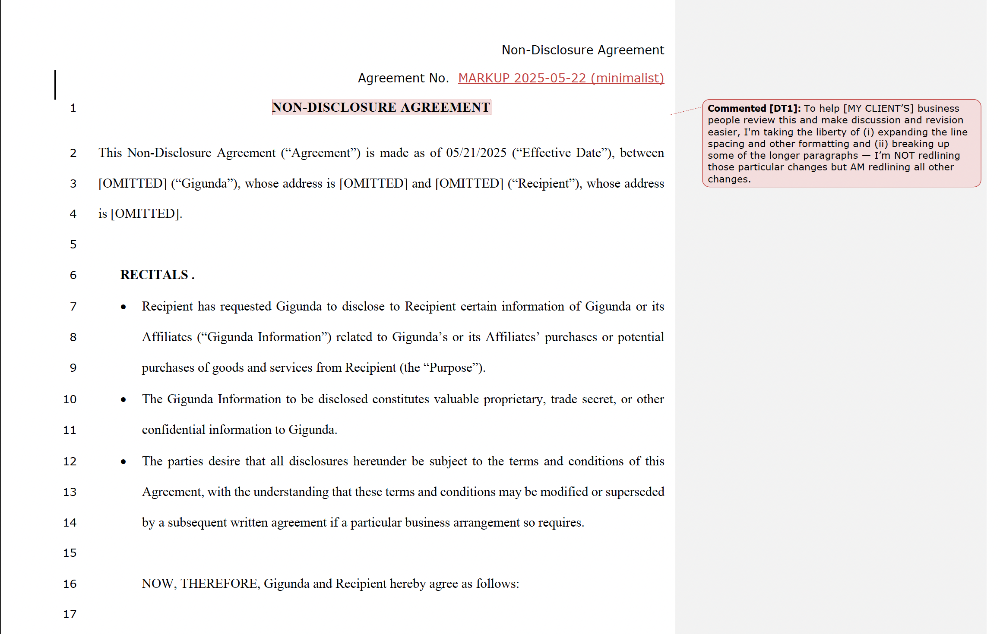

You might want to print the draft to PDF and circulate that along with the Word document, so that everyone has the same line numbering in the PDF. (Sometimes Microsoft Word seems to display things differently on different computers.)

*** Redline your changes
  :PROPERTIES:
  :CUSTOM_ID: redline-seq
  :HTML_CONTAINER_CLASS: olnum
  :END:

Always use "Track Changes" in Microsoft Word (or whatever word processor you use).  See [[#r-sig-integ-top]] for why it's vital to do this to avoid legitimately angering the other side. 

To show how redlining typically works, consider a hypothetical contract negotiation between two parties whose lawyers are "Fred" and "Ginger," respectively:

1. Fred emails Ginger Version 1 of a draft agreement, /very preferably/ as an editable Microsoft Word document — /it's bad form/ to email the other side a PDF or a locked Word document.

2. Using Microsoft Word, Ginger revises Version 1 /using Word's "Track Changes"/ feature (alternatively, Word's "Compare Documents" feature) to show the proposed changes, then saves the revised document as Version 2.

3. Ginger emails her (revised) Version 2 to Fred.

4. Fred repeats what Ginger did to create a new Version 3 and emails Version 3 to Ginger.

5. Rinse and repeat until Fred's and Ginger's respective clients have reached agreement.

*Pro tip:* It can also be helpful to explain, in comments — for example, in [[https://docs.microsoft.com/en-us/office/troubleshoot/word/faq-about-comments-feature-in-word][Microsoft Word comment bubbles]] — the reasoning behind specific changes, to save time in negotiation conference calls.

*Pro tip:* In the final, signature version, drafters should consider including, in the "general provisions," a certification that neither party has made surreptitious changes to the signature version (see {{{RULE}}} [[#r-sig-integ-top]]).

*** Don't do The Other Side's job for them
  :PROPERTIES:
  :CUSTOM_ID: hamb-no
  :END:

Never gratuitously revise another party's draft to favor the /other/ party:

- not even if your revision seems to make /business/ sense; and

- certainly not if the revision might someday put your client at a disadvantage or give up an advantage.

(This is different from the "hamburger for the guard dog" rule at [[#guard-dog-hamburger]].)

{{{RWE}}} Suppose that this time:

- Your client MathWhiz is /a customer/, not a vendor.

- A vendor that wants to do business with MathWhiz has sent MathWhiz a draft contract.

- The draft calls for MathWhiz to pay the vendor's invoices "[[#pmt-payer][net 90 days]]" — that is, the vendor expects MathWhiz to pay in full in 90 days; see [[#pmt-payer]]. (That'd  be really unusual for a /vendor/ contract form.)

- You know that vendors like to be paid as soon as they can. You suspect that the vendor's /90-day/ terms are a mistake, perhaps left over from a previous contract: The vendor's contract drafter might have taken a previous contract and changed the names, but without changing the 90-day terms to, say, 45-day terms.

- You know that MathWhiz, like all customers, pretty-much always prefer to hold onto its cash for as long as they can — not least because delaying payment can give a customer a bit of extra leverage over its suppliers.

- You also know that MathWhiz usually pays net-45 and is even willing to pay net-30 if the other terms are acceptable.

*Let it be — don't take it on yourself* to unilaterally change the vendor's net-90 terms to net-45. You don't want to [[#bar-clear][raise the bar]] [[#bar-clear]] for MathWhiz by requiring MathWhiz to pay the vendor's invoices /earlier/ than the vendor had even asked for in its own draft contract.

To be sure: The vendor's drafter might later embarrassedly confess to having overlooked the net-90 terms and /ask/ to change it to net-30. That's no bad thing:

- It gives MathWhiz an opportunity to ask for a concession in return.

- It also gives MathWhiz an opportunity to be gracious. Graciousness can send the message that MathWhiz might well be a Good Business Partner — and most companies like dealing with Good Business Partners.

This is *also* a lesson about the possible *danger of reusing an existing contract without carefully reviewing it* to identify — and /possibly/ strip out — any concessions that were made in the course of previous negotiations. (See [[#copy-paste-brexit]] for more on this subject.)

*** Don't revise the other side's language just for style

It's not worth spending scarce negotiation time — and it won't go over well with either the other side /or the client/ — to ask the other side to change things that don't have a substantive effect.

{{{RWE}}} Suppose that the other side's draft contract leads off with "WITNESSETH" and a bunch of "WHEREAS:" clauses. As a well-trained drafter, you'd prefer to have a simple background section. You'd have left out the legalese. (See [[#bkgd-of-k]] for more details.)

*Let it be:* If the other side's "WHEREAS:" clauses are /substantively/ OK, then don't revise those clauses just because /you/ (properly) prefer to use a plain-language style.

*** But do break up "spaghetti paragraph" provisions
  :PROPERTIES:
  :CUSTOM_ID: thick-break
  :END:

Another party's draft is likely to have long [[#sssp][spaghetti paragraphs]] ([[#sssp]]). That might be accidental — or perhaps not.

So, break up spaghetti paragraphs into short, BLUF sound bites:

- It'll make the clauses easier for your client to review.
- It'll also help /you/ to do a thorough review with lower risk of the MEGO factor ("Mine Eyes Glaze Over"). 

*Expand single-spaced paragraphs*: After you save a new Word document (see [[#rev-new-dr]] above), use 1.5-line spacing, or even double-spacing, for the entire text if not that way already. 

(Exception: Stick with single-spacing for signature blocks and other text blocks that would look strange with more line spacing.)

*Break up long sentences,* as explained in more detail at [[#sssp]].

(For an example of how that might look, see the screen shot at [[#rev-line-no]].)

*Add an explanation for the added white space:* In the agreement title at the top of the draft, add a Word comment bubble along the lines of the following:

#+begin_bordered
To make it easier for my client to review this draft, I'm taking the liberty of double-spacing it and breaking up some of the longer paragraphs, without redlining those particular changes.
#+end_bordered

It's hard for another lawyer to object to your doing something to make things easier for your client, right?

(Again, for an example of how that might look, see the screen shot at [[#rev-line-no]].)

/DCT note:/ I've been doing this for many years and have only twice gotten pushback on that point from The Other Side. For that matter, the parties pretty much always end up eventually signing a double-spaced version with broken-up paragraphs, as opposed to the original spaghetti-clause format.

*** Don't delete emailed drafts
  :PROPERTIES:
  :CUSTOM_ID: drafts-del
  :HTML_CONTAINER_CLASS: olnum
  :END:

First drafts and redlined revised drafts are almost universally exchanged by email. Here's why you should always keep every draft sent to, or by, (i) the other side of a deal or (ii) your client:

1. Email storage space is cheap.

2. Deleting emails relating to a transaction or relationship means that you don't have a complete documentary history — and the other side might have emails that you don't, possibly giving them an advantage.

3. If you think you've deleted "problematic" emails, [[https://en.wikipedia.org/wiki/Murphy%27s_law][Murphy's Law]] — "anything that can go wrong, will go wrong" — says you could be deluding yourself: Someone else could have a copy (possibly forwarded), and/or there could be backup copies somewhere that would turn up in litigation; it's far better to have your own complete set.

4. In litigation, it's low-hanging fruit for the other side to accuse your client of destruction of evidence ("spoliation"):

   - Trial counsel love to be able to make such accusations, because jurors might not understand the complexities of the case, but they /will/ understand "Cover-up!!"

   - If a judge gives jurors an adverse-inference instruction about your client's spoliation of evidence, that can be big trouble.

   - And in an extreme spoliation case, the judge might take even-more drastic action such as precluding certain claims and/or defenses or even striking your client's pleadings.

*** Pro tip: /Explain/ revisions, using Word comment bubbles

It can also be helpful to explain, in comments — for example, in [[https://docs.microsoft.com/en-us/office/troubleshoot/word/faq-about-comments-feature-in-word][Microsoft Word comment bubbles]] — the reasoning behind specific changes, to save time in negotiation conference calls.

*** Review questions

1.  Come up with a list of (up to) five noteworthy points in this section [[#k-rev-tips]].

2.  Did anything in this chapter remind you of anything you've ever experienced (or just seen) yourself?

** R.O.O.M.: Root Out Opportunties for Mistakes
  :PROPERTIES:
  :CUSTOM_ID: room-rule
  :END:

*R.O.O.M.* = Root Out Opportunities for Mistakes (or, Misunderstandings)

{{{RWE}}} Consider the tragic collision near Reagan National Airport in Washington D.C., between an Army helicopter and an American Airlines flight, killing everyone aboard both aircraft. The New York Times [[https://www.nytimes.com/2025/04/27/business/dc-plane-crash-reagan-airport.html][reports]]:

#+begin_quote

*One error did not cause* the worst domestic crash in the United States in nearly a quarter-century. Modern aviation is designed to have redundancies and safeguards that prevent a misstep, or even several missteps, from being catastrophic. On Jan. 29, that system collapsed.

*“Multiple layers of safety precautions failed that night,”* said Katie Thomson, the Federal Aviation Administration’s deputy administrator under President Joseph R. Biden Jr.
#+end_quote

(Alternatively: *R.O.O.F.* = Root Out Opportunities for F[oul]-ups)

** Raising the bar:  Be careful!
  :PROPERTIES:
  :CUSTOM_ID: bar-clear
  :END:

A well-meaning contract drafter might write lofty standards of business conduct. Those standards might, in practice, turn out to be tough for the client to comply with — or even to remember.  This can come back to bite the client, as shown in the examples below.

*** Tilly's Inc. doesn't comply with its own too-strict amendment requirement for employment agreements
  :PROPERTIES:
  :CUSTOM_ID: bar-tilly's
  :END:

{{{RWE}}} /Multiple-signature requirements:/ Tilly's, Inc. and World of Jeans & Tops, Inc. ("Tilly's") had an employee sign an employment agreement (the "2001 employment agreement").

- The 2001 employment agreement included a provision requiring arbitration of disputes (concerning arbitration, see [[#r-arb-sop]]), but the arbitration provision had a carve-out for statutory claims, meaning that the employee was allowed to file a lawsuit for such claims in court and didn't need to arbitrate them.

- Importantly for our purposes here: The 2001 employment agreement also stated that /any modifications to the agreement's terms would need the signatures of three company executives:/ The president, senior vice president, and director of human resources.

- Fast forward to 2005: The company had its employees sign an acknowledgement of receipt of an employee handbook containing a /revised/ arbitration provision — which /didn't/ contain the carve-out for statutory claims and thus was more favorable to the company.

- But the employees' signed acknowledgements /didn't contain the three executive signatures/ needed to modify the 2001 employment agreement. (I'd guess that the company's HR people simply didn't remember that three signatures were required.)

- So: Because the company had previously set the bar so high for modifying the 2001 employment agreement, the company found itself facing high-stakes, class-action /litigation/, whereas it had thought that it would be /arbitrating/ individual, low-stakes claims, one by one. <cite> See [[https://scholar.google.com/scholar_case?case=10882894982323205158][Rebolledo v. Tilly's, Inc.]], 228 Cal. App. 4th 900, 924, 175 Cal. Rptr. 3d 612 (Cal. App. 4th Div. 2014) (affirming denial of motion to compel arbitration). </cite>

To like effect, in a 2025 California case:

- A worker signed an employment agreement that included a mandatory arbitration provision that included a prohibition of class-action arbitration.

- At the end of the document, the agreement form said, "*The parties* acknowledge and agree /[sic]/ that each has read this agreement carefully and understand that *by signing it, each is waiving* all rights to a trial or hearing before a judge or jury of any and all disputes and claims subject to arbitration under this agreement." 

- *The company never signed* the worker's agreement.

- After leaving the company, the worker filed a class-action lawsuit alleging wage-and-hour violations .

- The company move to compel arbitration and to strike the class-action claims.

The district court ruled that the arbitraiton agreement was not binding on the worker because *the company hadn't signed* the agreement; the appeals court affirmed. <cite> See [[https://www4.courts.ca.gov/opinions/nonpub/B331219.PDF][Pich v. LaserAway, LLC]], No. B331219, slip op. at 5-7 & n.4 (Cal. App. Jan 28, 2025) (unpublished; affirming denial of motion to compel arbitration, citing cases). </cite>

*** Confidential information could be left unmarked
  :PROPERTIES:
  :CUSTOM_ID: bar-conf-info-mark
  :END:

If a confidentiality agreement is drafted to favor the recipient of information, the agreement might state that discloser information isn't considered confidential if the information isn't marked as such when provided to the recipient. That's dangerous because:

- the NDA didn't /need/ to be so strict about marking; and

- in more than one case, such NDA strictness about marking resulted in the discloser forfeiting any chance of asserting trade-secret rights in the information it provided to the recipient (see the notes at § [[#conf-info-mkg]]).

*** Information might not be purged
  :PROPERTIES:
  :CUSTOM_ID: bar-info-purge
  :END:

/Example: Information-purge requirements:/ Confidentiality agreements often require the party receiving confidential information to purge — return or destroy — /all/ copies of the information in its possession upon termination of the agreement. That's dangerous because the recipient might forget to do the purge; moreover, a /complete/ purge might be costly and burdensome, not to mention depriving the recipient of a record copy of what it received from the discloser. (See  [[#r-info-purge]] for more details and suggestions for dealing with these problems.)

*** Blank spaces might not get filled in
  :PROPERTIES:
  :CUSTOM_ID: bar-blank-sp
  :END:

/Example: Blank spaces, not filled in:/ See if you can avoid leaving blank spaces to be filled in — such as the effective date of {{{thek}}}, see [[#sig-dates-cmt]] —  because [[https://en.wikipedia.org/wiki/Murphy%27s_law][Murphy's Law]] ("anything that can go wrong, will go wrong") says that the parties will forget to fill in the blank.

/Example: Spaces to be initialed, that aren't:/ Here's a variation on the blank-spaces problem: A contract drafter might add blank lines by particular provisions, to be initialed by one or more signers to acknowledge understanding tose provisions — but what if a signer doesn't initial in the spaces provided? (See [[#initials-missing]] for more discussion of this problem.)

These examples illustrate the *R.O.O.M. Principle* — Root Out Opportunities for Mistakes (or Misunderstandings).

** Poking the bear: Not a great idea
  :PROPERTIES:
    :CUSTOM_ID: poke-bear
  :END:

Do you really /need/ that clause you want to propose? Or could it backfire on you?

*** The Conan O'Brien example
  :PROPERTIES:
  :CUSTOM_ID: coco
  :END:

# https://commons.wikimedia.org/wiki/File:Conan_O%27Brien_at_U.S._Embassy_Helsinki.jpg
# #+ATTR_HTML: :alt Conan O'Brien :title Conan O'Brien   :class photo-at-right photowidth20
# 

Some of you might remember that TV talk-show host [[https://en.wikipedia.org/wiki/Conan_O%27Brien#The_Tonight_Show_(2009%E2%80%932010)][Conan O'Brien's stewardship of The Tonight Show]] (now hosted by Jimmy Fallon) proved disappointing to NBC. - The network decided to move former host Jay Leno back into the 11:35 p.m. (Eastern) time slot and bump Conan back to 12:05 a.m. This led Conan to want to leave the show and start over on another network — but if he had, he would arguably have been in breach of his contract with NBC.

# https://en.wikipedia.org/wiki/The_Tonight_Show_with_Conan_O%27Brien
# #+ATTR_HTML: :alt The Tonight Show with Conan O'Brien  :class photo-at-right photowidth20
# 

Conan's contract apparently did _not_ state that /The Tonight Show/ would always start at 11:35 p.m. Conan's lawyers were [[https://www.businessinsider.com/henry-blodget-conans-lawyers-screwed-up-forgot-to-specify-tonight-show-time-slot-2010-1][roundly criticized]] for that alleged mistake. But then wiser heads pointed out that *Conan's lawyers might have /intentionally/ not asked* for a locked-in start time:

--  The Tonight Show had started at 11:35 p.m. for decades; Conan's lawyers could have plausibly argued that this start time was part of the essence of /The Tonight Show/, and thus was an implied part of the contract.

--  Suppose that Conan's lawyers _had_ asked for the contract to lock in the 11:35 p.m. start time of /The Tonight Show/ — but that NBC had refused. A court might then have interpreted the contract as providing that NBC had at least some freedom to move the show's start time.

--  And for that matter, NBC might have responded by demanding a clause affirmatively stating that NBC was free to choose the start time for /The Tonight Show/. Given that NBC had more bargaining power than Conan at that point, Conan might then have had no choice but to agree, given that he wanted NBC to appoint him as the host of the show. And in that case, there'd be no question that NBC had the right to push the start time of the show back to 12:05 p.m. <cite> Cf. [[https://scholar.google.com/scholar_case?case=4077320000527980801][Inova Health Care Svcs.  v. Omni Shoreham Corp.]], No. 25-7010, part II.A, [[https://cases.justia.com/federal/appellate-courts/cadc/25-7010/25-7010-2026-04-17.pdf#page=6][slip op. at 6]] (D.D.C. Cir. Apr. 17, 2026): "Although Omni invokes industry custom to argue that reassignment of event spaces is standard practice, it offered no evidence that such a practice extends to contracts where the parties have expressly bargained that right away." </cite>

Ultimately, Conan and NBC settled their dispute; the network [[https://variety.com/2010/tv/features/nbc-o-brien-agree-45-mil-exit-deal-1118014097/][bought out Conan's contract]] for a reported $33 million plus an additional $12 million to his staff for severance. This seems to suggest that NBC was concerned it might indeed be breaching the contract if it were to push back The Tonight Show to 12:05 a.m. as it wanted to do. 

As an article in /The American Lawyer/ commented:

#+begin_quote

"Sometimes in contract negotiations it's better not to ask," says Jonathan Handel .... 

* * *

  ... If O'Brien had asked that the 11:35 p.m. time slot be spelled out in any agreement—and had NBC refused—the red pompadoured captain of "Team Coco" would be in a weaker position in the current negotiations.

  "If you ask and are refused, or even worse, if you ask and the other side pushes for a 180, such as a time slot not being guaranteed, you can end up with something worse," [attorney Jonathan] Handel adds. 

Without having their hands bound by language in the contract on when "The Tonight Show" would air, O'Brien's lawyers are in a better position to negotiate their client's departure from NBC. <cite> Brian Baxter, [[https://web.archive.org/web/20120718012604/https://amlawdaily.typepad.com/amlawdaily/2010/01/conan2.html][Legal Angles Abound as Conan-NBC Standoff Nears Endgame]] (AmLaw Daily Jan. 19, 2010) (extra paragraphing added). </cite>
#+end_quote

So it could well be that Conan's lawyers did an A-plus job of playing a comparatively-weak hand during the original contract negotiations with NBC.

The lesson: *Be careful what you ask for in a contract negotiation* — if the other side rejects your request but you do the deal anyway, that sequence of events might come back to haunt you later.

***** Note                                                              :CMT:
  :PROPERTIES:
  :HTML_CONTAINER_CLASS: cmtry
  :UNNUMBERED: notoc
  :END:

*** The law _might_ be on your side /if you stay silent/.

The scene: 

- You're in a contract negotiation, representing The Good Guys Company.

- The other side, Nasty Business Partner Inc., insists on requiring The Good Guys to get NBP's consent before assigning the agreement.

- Nasty Business Partner has all the bargaining power; the Good Guys decide they have no choice but to go along.

Trying to salvage the situation, you ask Nasty Business Partner  for some additional language: "Consent to assignment may not be unreasonably withheld, delayed, or conditioned." But Nasty Business Partner refuses. *Have you just hurt your client?*

In /some/ jurisdictions — by no means all — /The Good Guys might otherwise have benefited from a default rule/ that Nasty Business Partner Inc. had an /implied/ obligation not to unreasonably withhold consent to an assignment of the contract; see [[#assmt-cons-no-unrsnbl]] for discussion.

But you /asked/ for an express obligation — only to have Nasty Business Partner reject the request — and The Good Guys signed the contract anyway.

A court might therefore conclude that the parties had agreed that Nasty Business Partner would not be under an obligation not to unreasonably withhold its consent to assignment — that NBP could grant or withhold its consent in its sole discretion. That's pretty much what happened in two different state supreme-court cases, one in Alabama and the other in Oregon. <cite> See [[https://scholar.google.com/scholar_case?case=14754343401549936655][Shoney's LLC v. MAC East, LLC]], 27 So.3d 1216, 1220-21 (Ala. 2009); [[https://scholar.google.com/scholar_case?case=7064392015529436400][Pacific First Bank v. New Morgan Park Corp.]], 876 P.2d 761 (Or. 1994). </cite>

** No: When you just can't say it
  :PROPERTIES:
   :CUSTOM_ID: cant-say-no
  :END:

Your client might not have the bargaining power to get its way in contract negotiations. When that's the case, you have to try to come up with other ways to help protect the client's legal- and business interests.

Imagine, for example, that your client is a customer that is negotiating a master purchasing contract with a vendor.

-  Your customer client would love to flatly prohibit the vendor from raising prices without the customer's consent. But the vendor's negotiators won't go along with such a prohibition.

- The vendor would love to have the unfettered discretion to raise your customer client's prices whenever the vendor wants. But your client's business people are insisting on having at least some protection on that score.

What to do? In no particular order, here are some approaches that you could try.

*** Non-discrimination language?

A non-discrimination requirement at least brings a bit of overall-market discipline into the picture.

*Example:* "Provider will not increase the prices it charges to Customer except as part of a non-targeted, across-the-board pricing increase by Provider, applicable to its customers generally, for the relevant goods or services."

Comment: The Provider might want to qualify this language, so as to limit how general a price increase must be before it can be applied to the Customer.

*** Advance warning, or -consultation?

An advance-warning or advance-consultation requirement can buy time for its beneficiary to look around for alternatives (assuming of course that the contract doesn't lock in the beneficiary somehow, for example with a minimum-purchase requirement or a "requirements" provision).

*Example:* Provider will give Customer at least X [days | months] advance notice of any increase in the pricing it charges to Customer under this Agreement.

*** Transparency requirement?

Requiring a party to provide information justifying its action, upon request, can force that party to think twice about doing something, even though it technically is free to do it.

Here's an example: 

#+begin_bordered
If requested by Customer within X days after notice of a pricing increase, Provider will seasonably provide Customer with documentation showing, with reasonable completeness and accuracy, a written explanation of the reason for the increase, including reasonable details about Provider's relevant cost structures relevant to the pricing increase. 

Customer will maintain all such documentation in confidence any non-public information in such explanation, will not disclose the non-public information to third parties, and will use it only for purposes of making decisions about potential purchases under this Agreement.
#+end_bordered

Comment Note the /if-requested/ language, which relieves the vendor from the burden of continually managing this requirement — although a smart vendor would plan ahead and have the required documentation ready to go.

*** Draw the thorn from the lion's paw?
# https://en.wikipedia.org/wiki/File:Androcles_Lion_NZ.jpg
# #+ATTR_HTML: :alt Androcles and the lion  :class photo-at-right photowidth20
# 

When a party makes tough contract demands, it could be because the party has been burned before. Institutionally, it may still "feel the pain" of a bad experience; its response is to roar at other counterparties.

The counterparty being roared at can try to find out why the lion is roaring. If it can identify the source of the pain, it might be able to figure out another way to make it better, without undertaking burdensome obligations. (The allusion here, of course, is to the ancient folk tale about [[https://en.wikipedia.org/wiki/Androcles][Androcles and the lion]].)

*** Cap the financial exposure for the onerous provision?

A party with bargaining power will often demand that its counterparty agree to an onerous provision. In response, the counterparty could ask the first party to agree to a dollar cap on the amount of the counterparty's resulting financial exposure, e.g., capping the amount of money that the counterparty would be required to spend or the liability that it might someday face. 

If the first party agrees, the onerous provision might look less dangerous to the counterparty than it would with the prospect of unlimited expense and/or liability. 

(This is a variation on the old saying: /When in doubt, make it about money/.)

*** Impose time limits?

When a party asks its counterparty to agree to an onerous contract provision, the counterparty might try to make its business risk more manageable by imposing time limits on the onerous provision, such as:
- specified start- or end dates; and/or
- specified duration(s).

For example, if a party demands an oppressive indemnity obligation, the counterparty might counter by asking for a time limit on claims covered by the indemnity.

Or if a party demands a cap on pricing increases, or a most-favored-customer clause, the counterparty could counter with time limits on those as well.

*** Explain why the provision hurts the demanding party?

A counterparty can to try to explain to a demanding party why, in the long run, the onerous provision being demanded would ultimately cause problems for the demanding party.

*** Package as part of a premium offering?

Suppose that a smallish supplier is regularly asked by its customers to agree to an onerous contract provision (e.g., an extended warranty). If the supplier plans ahead, it can package the onerous provision as part of a /higher-priced/ premium offering — with the relevant contract language being written in a way the supplier knows it can support.

This approach has a distinct advantage: The bargaining over whether to give a customer the premium offering is no longer about legal T&Cs: it becomes a negotiation about *price*. This means the supplier's legal people might not even have to get involved — which often can be crucial when sales people are working hard to close deals before the shot clock runs down on the fiscal quarter.

Another advantage: The supplier might well score points with customers for anticipating their needs and offering a solution for them.

A third advantage: Some customers are far less /price/-sensitive than they are /service/-sensitive, in that they're willing to pay more if they feel they're getting premium treatment. (Airlines sell a lot of first{{{NbH}}} and business-class seats, whose high prices supposedly subsidize lower-cost fares for us peasants back in steerage.)

*** Maybe it's simply worth the business risk?

The supplier and its lawyer should assess the actual business risk of agreeing to the customer's request — in the real world it might not be as big a problem as the supplier imagines.

That's always the /client's/ call, of course — but for /legal/ matters, the client might want the lawyer's view about what's being asked; I often use the phrase, "/[The provision in question]/ probably represents an acceptable business risk."

*Caution:* In such a situation, the lawyer should pay attention to whether s/he is being asked to give /legal/ advice or /business/ advice; the latter could jeopardize the attorney-client privilege ([[#nl-atty-priv-c]]).¯

** Own-goal clauses
  :PROPERTIES:
  :CUSTOM_ID: ff-not
  :END:

A drafter can sometimes inadvertently harm a client by "cleverly" including onerous provisions to benefit the client — but then when the roles later _do_ get reversed, the client gets impaled, so to speak, on the onerous provisions.

*** Example: Tilly's raises the bar — and then fails to clear it
  :PROPERTIES:
  :CUSTOM_ID: tillys
  :END:

[[https://www.tillys.com/][Tilly's, Inc.]] and World of Jeans & Tops, Inc. ("Tilly's") had an employee sign an employment agreement (the "2001 employment agreement") containing an arbitration provision. 

- The 2001 employment agreement included a carve-out for statutory claims (which thus could be brought in court, not in arbitration). <cite> See [[https://scholar.google.com/scholar_case?case=10882894982323205158][Rebolledo v. Tilly's, Inc.]], 228 Cal. App. 4th 900, 924, 175 Cal. Rptr. 3d 612 (Cal. App. 4th Div. 2014) (affirming denial of motion to compel arbitration). </cite>

- Importantly: The 2001 employment agreement also stated that any modifications to the agreement would need the signatures of three executives: The company's president; senior vice president; and director of human resources.

- Then in 2005, the company had its employees sign an acknowledgement of receipt of an employee handbook containing a different arbitration provision — which didn't contain the carve-out for statutory claims.

If that different arbitration provision had gone into effect, then Tilly's would have had more protection from employee class-action lawsuits.

BUT: The signed 2005 acknowledgement /didn't contain the three executive signatures/ needed to modify the 2001 employment agreement. 

Summing up: Tilly's had set the bar very high for modifying the 2001 employment agreement — but then it hadn't cleared the bar itself to give itself more protection against employee class-action litigation.  So, the company found itself facing high-stakes litigation by /a class/ of employee plaintiffs — whereas it had /thought/ it would be arbitrating low-stakes claims on a one-by-one basis. 

(For more about class-action waivers in arbitration provisions — which was Tilly's intention in the 2005 acknowledgement — see [[#arb-class][Option ]][[#arb-class]].)

** Optional - does that mean opt-in, or -out?

/DCT note:/ I once reviewed a supplier's terms-of-service Web page with a provision addressing the insurance coverage that the supplier agreed to maintain. The provision's heading was "INSURANCE [OPTIONAL]"

Question: Did this mean that the supplier was required to obtain insurance unless the customer agreed otherwise? Or vice-versa?

** Humility (in drafting) /(notes)/
  :PROPERTIES:
  :CUSTOM_ID: humility
  :END:

Judges seem to appreciate a bit of verbal /(as in, relating to words)/ humility in contracts; they’ve been known to look askance at high-handed statements in contracts that purport to bind courts such as, e.g., "the parties hereby elect not to be bound by any state laws" (when maritime law would apply). <cite> See, e.g., [[https://scholar.google.com/scholar_case?case=13847740586706779114][Barranco v. 3D Sys. Corp.]], 952\nbsp{}F.3d 1122, 1130 (9th Cir. 2020) (parties can’t contractually force a court to grant an injunction) (citing cases); [[https://scholar.google.com/scholar_case?case=13371153882791863381][AM General Holdings LLC v. The Renco Group, Inc.]], No. 7639-VCN, slip op. at\nbsp{}10, text acc. nn.19-20 (Del. Ch. Dec.\nbsp{}29, 2015) (same). </cite>

*** Example: Agreed injunctive relief
  :PROPERTIES:
  :CUSTOM_ID: hum-inj
  :END:

In its /Barranco/ opinion, the Ninth Circuit rejected the notion that a court was /required/ to issue an injunction if the parties had agreed to it. 
#+begin_quote
We hold that the terms of a contract alone cannot require a court to grant equitable relief. In doing so, we adopt the accepted rule of our sister circuits that have addressed the question. <cite> [[https://scholar.google.com/scholar_case?case=13847740586706779114][Barranco]], 952 F.3d at 1130 (citing cases); see also, e.g., Steven Gordon, [[https://www.jdsupra.com/legalnews/non-disclosure-agreements-and-trade-3583515][Non-Disclosure Agreements and Trade Secrets: 12 Points to Consider]] (JDSupra.com 2021). </cite>
#+end_quote

  
Likewise, the Delaware chancery court disregarded a contractual stipulation of irreparable harm:

#+begin_quote

Parties sometimes ... agree that contractual failures are to be deemed to impose the risk of irreparable harm. Such an understanding can be helpful when the question of irreparable harm is a close one.  

Parties, however, cannot in advance agree to assure themselves (/and thereby impair the Court’s exercise of its well-established discretionary role/ in the context of assessing the reasonableness of interim injunctive relief) the benefit of expedited judicial review through the use of a simple contractual stipulation that a breach of that contract would constitute irreparable harm. /[In footnote 20 the court added:]/ In part, this is simply a matter that allocation of scarce judicial resources is a judicial function, not a demand option for litigants. <cite> [[https://scholar.google.com/scholar_case?case=5256805908002861233][AM General Holdings LLC v. The Renco Group, Inc.]], No. 7639-VCN, slip op. at 10, text acc. nn.19-20 (Del. Ch. Dec. 29, 2015) (denying request for preliminary injunction) (footnotes omitted, extra paragraphing added). </cite>
#+end_quote

  
R elatedly: In a different context, another court noted: "Since federal courts are not rubber stamps, parties may not, by private agreement, relieve them of their obligation to review arbitration awards for compliance with § 10(a) [of the Federal Arbitration Act]." <cite> [[https://scholar.google.com/scholar_case?case=11023880277516989724][Hoeft v. MVL Group, Inc.]], 343 F.3d 57, 64 (2d Cir. 2003) (reversing vacatur of arbitration award) (emphasis and extra paragraphing added). /Accord:/ [[https://scholar.google.com/scholar_case?case=10124050284414103321][In re Wal-Mart Wage & Hour Employment Practices Litigation]], 737 F.3d 1262, 1267-68 (9th Cir. 2013). </cite>

Similarly, Delaware's supreme court affirmed a court of chancery holding that a "conclusive and binding" provision in a corporation's charter was invalid under Delaware corporate law because, said the supreme court, the provision "strips the Court of Chancery of its authority to apply established standards of review to breach of fiduciary duty claims." <cite> [[https://scholar.google.com/scholar_case?case=551047043438978824][CCSB Fin. Corp. v. Totta]], 302 A.3d 387, 400 (Del. 2023); see also, e.g., [[https://scholar.google.com/scholar_case?case=9533906249182721258][Kodiak Bldg. Partners, LLC v. Adams]], No. 2022-0311-MTZ, slip op. (Del. Ch. Oct. 6, 2022) (denying Kodiak's motion for preliminary injunction; contract's language stating that "its restrictive covenants are reasonable, and waiving a defense that they are not, does not preclude this Court from performing the reasonableness analysis our law mandates"). #+end_quote . </cite>

*** Example: Agreed motions to seal
  :PROPERTIES:
  :CUSTOM_ID: seal
  :END:

Similarly, parties should not count on getting a court to rubber-stamp their request to order filed documents to be "sealed," that is, kept from public access. For example, the Fifth Circuit implicitly criticized a district court (while nonetheless affirming summary judgment) because the lower court had granted a broad agreed protective order, which had the effect of sealing documents: 

#+begin_quote

Judicial records belong to the American people; they are public, not private, documents. 

Certainly, some cases involve sensitive information that, if disclosed, could endanger lives or threaten national security. But increasingly, courts are sealing documents in run-of-the-mill cases where the parties simply prefer to keep things under wraps.

This is such a case. The secrecy is consensual, and neither party frets that 73 percent of the record is sealed. But we do, for three reasons. 

First, courts are duty-bound to protect public access to judicial proceedings and records.

Second, that duty is easy to overlook in stipulated sealings like this one, where the parties agree, the busy district court accommodates, and nobody is left in the courtroom to question whether the decision satisfied the substantive requirements. 

Third, this case is not unique, but consistent with the growing practice of parties agreeing to private discovery and presuming that whatever satisfies the lenient protective-order standard will necessarily satisfy the stringent sealing-order standard. Below, we review the interests at stake and the exacting standard for sealing that protects those interests. Then, we explain the concerns raised by the sealings in this case. <cite> [[https://scholar.google.com/scholar_case?case=6073153356769412567][Le v. Exeter Finance Corp.]], 990 F.3d 410, 417-18 (5th Cir. 2021) (affirming summary judgment dismissing fired employee's breach-of-contract claim) (cleaned up, extra paragraphing added). </cite>
#+end_quote

  
Basically the same explanation was offered by the federal district court for the Southern District of New York, in a decision in which the court:

- /granted/ the parties' joint motion to enter a consent judgment confirming an arbitration award, *but*

- /denied/ the parties' motion to seal documents:

#+begin_quote

Here, the Exhibits — the Final Arbitration Award, the Partial Final Arbitration Award, and the [Master Services Agreement] between the parties — directly affect the adjudication of the Petition, and are therefore judicial documents. 

That the Court need not decide the merits of the Petition does not change the fact that the Exhibits are judicial documents. Moreover, because the information contained in the Exhibits directly affects the adjudication of the Petition, /a strong presumption of public access applies/. <cite> [[https://scholar.google.com/scholar_case?case=4124998403063394501][Susquehanna Int'l Grp. Ltd. v. Hibernia Express (Ireland) Ltd.]], No. 21 Civ 207, slip op. (S.D.N.Y. Aug. 11, 2011) (granting with leave to submit revised motion) (cleaned up, emphasis added); see also, e.g.: [[https://scholar.google.com/scholar_case?case=5024133744129204150][XPO Intermodal, Inc. v. American President Lines, Ltd.]], No. 17-2015, slip op. (D.D.C. Oct. 16, 2017) (denying motion to seal documents in action to confirm arbitration award, with leave to submit revised motion); [[https://scholar.google.com/scholar_case?case=14952981768702475292][Total Recall Technologies v. Luckey]], No. C-15-02281, slip op. (N.D. Cal. Mar. 25, 2021) (denying motion to seal; "If the parties wanted to proceed in total privacy, they should have arbitrated this dispute /[sic]/. Instead, they brought this dispute to a public forum that belongs to the people of the United States, not TRT or Facebook. The United States people have every right to look over our shoulder and review the documents before the Court."). </cite>
#+end_quote

  
/On the other hand:/ As noted at [[#arb-conf-c]], the Second Circuit held that:

#+begin_quote
 ... the *presumption of public access* to judicial documents is *outweighed here* by the Federal Arbitration Act’s *strong policy* in favor of *enforcing arbitral confidentiality provisions* and the impropriety of counsel’s attempt to evade the agreement by attaching confidential documents to a premature motion for summary judgment. <cite> [[https://scholar.google.com/scholar_case?case=11651521277296284529][Abelar v. IBM Corp. (In re IBM Arbitration Litigation)]], 76 F.4th 74, 78 (2d Cir. 2023) (affirming trial court's granting of IBM's motion to seal documents) (emphasis added). </cite>
#+end_quote

*** Example: Preclusion of class actions
  :PROPERTIES:
  :CUSTOM_ID: humil-class-arb
  :END:

In a Ninth Circuit decision, the ride-share company Uber sought mandamus to defeat a preliminary "centralization" decision in a class-action lawsuit; the court rejected Uber's assertion that Uber's arbitration agreement precluded the Judicial Panel on Multidistrict Litigation ("JPML") from ordering "centralization" of the claims against Uber:

#+begin_quote

Where a federal statute vests a court with the power (or duty) to act of its own accord, a private agreement cannot bind the court and the agreement is entitled to only so much consideration as provided for by Congress. Forum selection clauses neatly illustrate this rule. A forum selection clause cannot eliminate a district court’s jurisdiction to hear a suit. ... Rather, courts enforce forum selection clauses because the general change-of-venue statute, 28 U.S.C. § 1404(a) requires that such agreements be considered in the venue analysis.
#+end_quote

*** Example: Confessions of validity of noncompete <cite> [[https://cdn.ca9.uscourts.gov/datastore/opinions/2025/03/10/23-3445.pdf][Uber Technologies, Inc. v. U.S. Judicial Panel on Multidistrict Litigation]], No. 23-3445, slip op. at 18 (9th Cir. Mar. 10, 2025) (cleaned up; citations omitted). </cite>s
  :PROPERTIES:
  :CUSTOM_ID: humil-noncomp
  :END:

A court might well disregard a contractual statement that a noncompetition covenant was acknowledged to be valid and enforceable.  {{{RWE}}} As Delaware's chancery court noted  in its /Kodiak/ opinion:

#+begin_quote

The RCA's language stating its restrictive covenants are reasonable, and waiving a defense that they are not, does not preclude this Court from performing the reasonableness analysis our law mandates. Kodiak cannot rely on those provisions to evade review and establish a reasonable probability of success on the merits. 

After analyzing the contract's reasonableness under the common law test, I find the RCA's restrictive covenants in Sections 1 and 2 are unreasonable, and consequently unenforceable. Accordingly, Kodiak has failed to demonstrate a reasonable likelihood of success on the merits of Counts I and II. #+end_quot <cite> [[https://scholar.google.com/scholar_case?case=9533906249182721258][Kodiak Bldg. Partners, LLC v. Adams]], No. 2022-0311-MTZ, slip op. (Del. Ch. Oct. 6, 2022) (denying Kodiak's motion for preliminary injunction; extra paragraphing added). </cite>e

*** But some drafters just don't get it ...
  :PROPERTIES:
  :CUSTOM_ID: hum-get
  :END:

Some drafters don't seem to appreciate the need for verbal humility. Consider the following imperious language in a [[https://www.sec.gov/Archives/edgar/data/1066134/000119312510000891/dex103.htm][Bank of America guaranty]]:

#+begin_quote
17.  ... The court /shall, and is hereby directed to/ /[!]/, make a general reference pursuant to California Code of Civil Procedure Section 638 to a referee (who shall be a single active or retired judge) .... <cite> Archived at https://tinyurl.com/BAGuaranty (sec.gov); emphasis added. </cite>
#+end_quote

This is more than a little presumptuous, no? The above language doesn't comport well with the cited California statute, which appears to leave it up to the discretion of the trial judge to decide whether or not to grant a request for appointment of a referree. <cite> See [[https://leginfo.legislature.ca.gov/faces/codes_displaySection.xhtml?lawCode=CCP&sectionNum=638][Cal. Code of Civ. P. § 638]] </cite>

Somewhat less imperiously is section 24 of of [[https://perma.cc/84BS-KYXB][a Honeywell purchase-order form]], apparently from February 2014:

#+begin_quote
 The amount of insurance carried in compliance with the above requirements /is not to be construed/ as either a limitation on or satisfaction of the indemnification obligation in this Purchase Order. ... <cite> Archived at https://perma.cc/84BS-KYXB (emphasis added). </cite>
#+end_quote

      
Similar language can be found in section 30 (independent contractors) and section 37 (waivers) of the same Honeywell purchase-order form.

And to like effect, see the discussion at [[#emp-appl-k]] of the /King v. McLaren Health/ case from Michigan, where an employment application included a six-month deadline on the individual's ability to sue the company: "Should a court determine that this period of time is unreasonable, the court shall /[sic]/ enforce this provision as far as possible and shall /[sic]/ declare the lawsuit or claim barred ...."

** Industry-standard terminology
  :PROPERTIES:
    :CUSTOM_ID: use-industry-standard-terminology
  :END:

When you're drafting a contract, you'll want to try to avoid coining your own non-standard words or phrases to express technical or financial concepts. If there's an industry-standard term that fits what you're trying to say, use that term if you can. Why? For two reasons:

- First, someday you might have to litigate the contract, and so:

   - You'll want to make it as easy as possible for the judge (and his- or her law clerk) and the jurors to see the world the way you do. In part, that means making it as easy as possible for them to understand the contract language.

   - The odds are that the witnesses who testify in deposition or at trial likely will use industry-standard terminology. So the chances are that the judge and jurors will have an easier time if the contract language is consistent with the terminology that the witnesses use—that is, if the contract "speaks" the same language as the witnesses.

- Second, and perhaps equally important: The business people on both sides are likely to be more comfortable with the contract if it uses familiar language, which could help make the negotiation go a bit more smoothly.

*** Exercises and discussion questions
  :PROPERTIES:
  :CUSTOM_ID: street-smarts-q
  :END:

**** Basic questions                                                   :used:
  :PROPERTIES:
  :CUSTOM_ID: easier-basic-q
  :HTML_CONTAINER_CLASS: NUMNOINDENT
  :END:

1. Who are some of the people who might someday read: (i) the /draft/ contract; (ii) the /signed/ contract — and what will they likely be hoping to accomplish?

2. FACTS: MathWhiz's CEO asks you to draft a short contract in which MathWhiz will do some data-analysis for a longtime client. 

   - The CEO says that she and her contact at the client have agreed on all the details in a series of Zoom calls.

   - The CEO has drafted a detailed "term sheet," with bullet points outlining the agreed business- and technical details; her client contact has reviewed the term sheet and said it's fine.

   - The client contact doesn't want to get his company's lawyers involved, so the MathWhiz CEO has asked you whether "the contract" could be drafted as just a short email that she will send to the client contact, with the term sheet attached.

   - QUESTION: What do you advise the MathWhiz CEO, and why? /How/ would you advise her, and why?

3. True or false: Contract drafters should avoid including explanations of particular terms. EXPLAIN.

4. <<k-to-be-litig>> FACTS: You're drafting a contract for MathWhiz; the company's CEO tells you there's a fair chance that the contract might be litigated in the not-too-distant future. QUESTION: How might the Strunck & White injunction, "Omit needless words," apply in this situation?

5. MORE FACTS: Continuing with #[[k-to-be-litig]], MathWhiz's CEO also thinks that the other party to the contract is likely to be acquired in the next year or so — by whom exactly, the CEO doesn't know — and that it'd likely be an "acqui-hire" in which many of the other party's senior executives and -managers would be let go (with their stock options and a severance package) as no longer needed. QUESTION: What if anything might you do differently in drafting the contract?

6. What are the /two/ essential components of a contract drafter's mission?

7. FACTS: You are drafting a contract for MathWhiz and are getting ready to send it to MathWhiz's CEO, Mary Marvelous. QUESTION: Name /two/ reasons that /Mary/ will likely prefer that the contract be written in plain language.

8. MORE FACTS: MathWhiz is considering filing a lawsuit for breach of another contract that you /didn't/ draft. The breached provision is a "wall of words" that's full of legalese. QUESTION: Name /two/ reasons that MathWhiz's /trial counsel/ might wish that the breached provision had been written in plain language.

9. In the context of contract drafting, what's a "L.O.A.D."?

10. What's one of the most important ways of avoiding being a L.O.A.D.?

11. Based on whatever experience you've had so far — personal and/or professional — would /you/ prefer to review a contract with (i) fewer pages with dense paragraphs, or (ii) more pages but shorter paragraphs and more white space? EXPLAIN.

12. What does BLUF mean?

13. What's "the MEGO factor"?

14. Name /two/ advantages of putting a contract's key business details into a schedule, perhaps at the front of the contract.

**** Exercise: Stanford-Tesla lease intro
  :PROPERTIES: 
  :CUSTOM_ID: StanfordTeslaTitle-q
  :HTML_CONTAINER_CLASS: NUMNOINDENT
  :END:

Refer to the Stanford-Tesla lease at [[#vbl-sched]]:

1. Is "Commercial Lease" the proper term, or should it be "Commercial Lease /Agreement/"?   /(Hint: Look up the definition of/ lease /in Black's Law Dictionary.)/

2. Why state that the Lease is entered into "as of July 25, 2007"? 

3. Why do you think the names of the parties are capitalized? 

4. What might be some of the pros and cons of including this kind of "Basic Lease Information" at the beginning of the agreement document, instead of including it "in-line" in the appropriate section(s) of the agreement? 

5. To what extent is the "Each item in this Article 1 incorporates ..." worth including? 

6. What could go wrong with the italicized portion, "to the extent there is any conflict ..."? 

7. Note the mention of the Glossary in the last sentence of the first paragraph — where are some other places to include definitions for defined terms? (Hint: See [[#def-trms-rdg]].)

8. Any comments about the way the "/Term:/ Five (5) years" portion is stated?  How about the way that the Base Rent amounts are stated? 

** Footnotes in contracts?
  :PROPERTIES:
  :CUSTOM_ID: fns
  :END:

Suppose that, after intense negotiations, a particular contract clause ends up being written in a very specific way. /Consider including a footnote at that point in the contract/, explaining how the language came to be what it is.  Future readers — your client's successor, your client's trial counsel, a judge — might thank you for it. 

DCT note: When I was in-house at [[#bio][BindView]], our standard enterprise license agreement form was extremely customer-friendly (this was intentional, [[#nl-bal-terms][to help us get to signature sooner]]). But at first I still had to spend a lot of time explaining to customers' lawyers /why/ the agreement form included certain terms.

To save negotiation time, I added a fair number of explanatory footnotes to our license-agreement form. The footnotes /seemed/ to reduce, by quite a lot, the amount of time needed for "legal" negotiations.

Needless to say, our business people were please to get deals to signature sooner. 

And interestingly, /customers' lawyers hardly ever asked us to delete the footnotes/ before contract signatur.

With footnotes left in, if the contract were ever litigated (which never once happened), the footnotes would be available to be read:

- by opposing counsel;
- by the judge's law clerk;
- by the judge him- or herself; and
- by one or more of the jurors.

That'd be no bad thing.

To be sure: In litigation, hindsight you might wish you hadn't said what you did in the footnotes. /But that could happen with _any_ provision or phrasing in the contract/. 

What's important here is that the overwhelming majority of contracts never see the inside of a courtroom. So, /on balance/ it's likely that the client will get more /overall/ business benefit from including footnotes — *if* doing so will help get the client's contracts to signature sooner.

** Hand-grenade clauses can get thrown back at you
  :PROPERTIES:
   :CUSTOM_ID: boomerang-clauses
  :END:

A few years ago, a new client of mine was negotiating a fairly-large transaction with a prospective customer.  The client's sales team had sent the customer the company's then-standard contract form, which I hadn't drafted.

# https://en.wikipedia.org/wiki/M26_grenade
# #+ATTR_HTML: :alt Photo of M61 hand grenade XX :class photo-at-right photowidth10
# 

- The client's contract form included a forum-selection provision requiring all litigation to take place exclusively in Houston, which was the client's headquarters city. (Concerning forum selection, see {{{RR}}} [[#r-forum-sel]].)

- The customer's lawyer saw the forum-selection clause and said it needed to be reversed, so that the /exclusive/ forum would be the /customer's/ home city — let's say that was Cleveland.

- That contract change wouldn't have been great for my client. Sure, it was unlikely that the client would get into litigation with any customer. But still, being forced to litigate /in Cleveland/ would have been costly and inconvenient.

- The client's sales people said this was an important sale and that the company was willing to concede the forum-selection point.

- Somewhat surprisingly, the customer's lawyer went along with my suggestion that we just drop the forum-selection clause entirely, instead of agreeing to Cleveland as the exclusive forum — the lawyer might not have realized that this could have turned out to be a significant concession.[fn:ForumCleveland]

*Lesson* /(mixing the metaphors here)/: Don't "poke the bear" (see [[#poke-bear]]) by lobbing a hand-grenade clause that the bear could throw back at you — and leave your client worse off than having no clause at all.

[fn:ForumCleveland] The customer's lawyer might not have realized that this was a win for my client: Without a Cleveland forum-selection stipulation, the customer likely wouldn't have been able to sue the client in Cleveland at all, because the courts in Cleveland likely wouldn't have had [[https://www.law.cornell.edu/wex/personal_jurisdiction][personal jurisdiction]] over the client.

Of course, that wouldn't have stopped the customer from filing suit anyway — which would have meant that the client would have to spend time and money in trying to get the case dismissed or transferred.

In contrast, my client /would/ have been able to sue the Cleveland-based (prospective) customer in Houston, because the customer had significant operations in Houston.

The customer's lawyer apparently didn't tumble to the fact that, by agreeing to drop the forum-selection clause, he was making a potentially-big concession.

** False imperatives: Whose throat to choke?
  :PROPERTIES: 
  :CUSTOM_ID: false-imper
  :END:

A "false imperative" is a provision in a contract — commonly written in passive voice, see [[#active]] — where the provision proclaims that something is to be done, but leaves it unclear just who is responsible for making it happen.

Here's a hypothetical example — consider an apartment lease that says:

#+begin_bordered
The apartment shall be regularly serviced by a professional pest-control service.
#+end_bordered

Who's responsible for making sure this happens? Is it the landlord, or the tenant? Either one seems plausible. 

Context can matters (see [[#ambig-wha]]); if the pest-control requirement is in a section titled, e.g., "Tenant's responsibilities," then that would likely resolve the question.

But it's better to assume that in a lawsuit or arbitration, "someone" might try to quote the requirement /out/ of context. (Nah: Lawyers would never do that — would they?)

#  OLD: https://www.reddit.com/r/baseball/comments/1fot6di/four_white_sox_watch_a_routine_pop_fly_drop_at/
# https://www.reddit.com/r/baseball/comments/1f8gnfg/highlight_the_white_sox_let_another_pop_up_drop/
# #+ATTR_HTML: :alt Freeze-frame of two baseball players watching a pop fly drop between them with neither one catching it   :class photo-at-right photowidth30
# 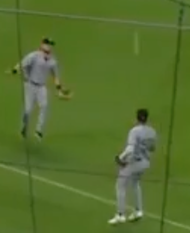

You could think of a false imperative as being like baseball players who let an easily-catchable fly ball drop to the ground between them — because each player assumes that "someone else" will get it, and so no one "calls it."

{{{RWE}}} This comes up in real life: In a Houston case, a limited-partnership agreement provided that a partner was to be paid money, but the agreement used the passive-voice "shall be paid." This led to presumably-costly litigation over just _who_ was supposed to make the payment — was it the limited partnership, or the general partner?

Here's another example of a false imperative, this one hypothetical — suppose that:

- A real-estate developer enters into a construction agreement with a general contractor;
- Under the construction agreement, the contractor is to build a building;
- Because of the nature of the building site, special safety procedures will be needed for all personnel coming on the site; 
- The construction agreement says simply: "/All Developer personnel are to be trained in special safety procedures for the Building Site/." 

This arguably leaves unclear just /who/ is responsible for training the developer's personnel in the special safety procedures — as before, other portions of the construction agreement might shed light on the question, but that's not the ideal situation.

A useful business expression (albeit a bit trite from overuse) is [[https://en.wiktionary.org/wiki/one_throat_to_choke][One Throat to Choke!]]

*Drafting lesson:* Even in cases where passive voice might be appropriate: Try not to leave any room for doubt about /who/ is responsible for /making/ Item X happen, or for /preventing/ Event Y from happening. As a judge in New York City once opined: "The hallmark of good legal writing is that an intelligent layperson will understand it *on the first read*." <cite> Gerald Lebovits, [[https://papers.ssrn.com/sol3/papers.cfm?abstract_id=2970873][Free at Last from Obscurity: Achieving Clarity]], 96 Mich. B.J. 38 (May 2017), SSRN: https://ssrn.com/abstract=2970873 (also quoted at [[#serv-rdr]]). </cite>

** Bright(er) lines: Use to replace vague standards?
  :PROPERTIES:
  :CUSTOM_ID: bright-lines
  :END:

Vague language can /sometimes/ lead to trouble if the vagueness can lead to disputes /about whether particular rights or obligations have been triggered/. Here are a few examples.

- {{{RWE}}} In /Fed Cetera/ (3d Cir. 2019), a particular referral agreement stated that a referring party would be paid a commission by a supplier whenever the supplier "consummated" a transaction with a referred customer during a stated time period. For one referred transaction, the supplier signed a contract with a referred customer during the stated time period, but nothing else happened until after the time period had ended. This led to litigation whether the transaction had been "consummated" during the time period, and thus whether the referring party was entitled to a commission for that transaction. <cite> See [[https://scholar.google.com/scholar_case?case=7179354725729935348][Fed Cetera, LLC v. Nat’l Credit Servs., Inc.]], 938 F.3d 466 (3d Cir. 2019) (reversing and remanding summary judgment). </cite>

- {{{RWE}}} in /Akorn v. Fresenius/ (Del. 2018), the parties had to litigate the meaning of a contract's being "executed" instead of "signed," because the former could be interpreted as the contract's being /performed/ by the parties. <cite> See [[https://scholar.google.com/scholar_case?case=9672696128127274408][Akorn, Inc. v. Fresenius Kabi AG]], No. 2018–0300–JTL, text accompanying n.333 (Del. Ch. Ct. Oct. 1, 2018), /aff'd/, [[https://scholar.google.com/scholar_case?case=967269612812727440][198 A.3d 724]] (Del. 2018). </cite>

   *Lesson:* Refer to a more-certain date, such as: • the date the contract was /signed/; • the date of the invoice; • the date payment was /collected/.

- {{{RWE}}} A large U.S. exporter of liquid natual gas (LNG) had to arbitrate whether a "start date" had occurred in a contract with Shell — if the start date had occurred, then the exporter would have been restricted in its ability to sell into spot markets at higher prices than under the contract. The problem was that the "start date" was tied to completion of a Louisiana liquefaction facility, and apparently it wasn't entirely clear whether "completion" had occurred. The exporter ended up winning the arbitration. <cite> See Press release, [[https://investors.ventureglobal.com/news/news-details/2025/Venture-Global-Statement-on-Shell-Arbitration-Decision/default.aspx][Venture Global Statement on Shell Arbitration Decision]] (Aug. 12, 2025); Alistair Calvert, John Gilbert, and Adam Quigley, [[https://www.jdsupra.com/legalnews/shell-v-venture-global-commissioning-a-3353535][Shell v Venture Global: Commissioning a Dispute]] (Aug. 27, 2025). </cite>

    *Lesson:* Be clear that a right or obligation does or doesn't start, or does or doesn't end.

- {{{RWE}}} In /McGinnis/ (Ohio App. 2024), a tenant leased a house with an option to purchase; the relevant option language was as follows. The tenant didn't give notice by a stated date; the landlord concluded that the tenant's option to purchase had therefore expired. But the trial court and appellate court disagreed, because (they said) that point wasn't clear: "If the parties had intended for missing the June 1, 2021 deadline to result in termination of the purchase option, their agreement easily could have said so. But it did not." <cite> [[https://scholar.google.com/scholar_case?case=8211742748971078351][McGinnis v. Conley]], 2024 Ohio 482 ¶ 16 (Ohio App.). </cite>

    *Lesson:* Likewise, don't write that notice must be "given" by a certain date; instead, say that notice must be "received" or "effective" (if effectiveness is defined) or "sent" by that date.

*** If a bright line isn't feasible: Neutral escalation?
  :PROPERTIES:
  :CUSTOM_ID: bright-escal
  :END:

There might be some situations where bright-line standards aren't practicable or even desired. For those situations, consider the following to give parties an incentive to be reasonable about settlement:

- Escalation to a neutral advisor, along the lines of {{{RR}}} [[#r-escal-ext]]; or

- Expert determinations, as often seen in construction contracts. <cite> See, e.g., Peter Godwin, David Gilmore, Emma Kratochvilova, Mike McClure, and Conal McFadyen, /Expert Determination: What, When And Why?/, at https://perma.cc/2NJN-GHS2 (Mondaq.com 2017). </cite>

  

** Clean sheet of paper (start with)? Usually, no.
  :PROPERTIES:
  :CUSTOM_ID: clean-sheet
  :END:

It's seldom if ever a good idea to start drafting a contract (or even just a clause) from scratch. That's especially true when you're relatively new at contract drafting.

--  Good clauses and forms will serve as a something like an operating manual for the parties' dealings, identifying what-if cases that can arise and providing instructions (or at least guidance) in how to handle those cases.

--  Even mediocre clauses and forms will serve as something of a checklist of issues that the drafter should consider addressing; that's important because we humans are all prone to overlooking "stupid stuff." (See the discussion of checklists at [[#chklist-cmt]].)

** Hamburger for the guard dog?
  :PROPERTIES:
   :CUSTOM_ID: guard-dog-hamburger
  :END:

Sometimes you'll find yourself drafting the contract, or perhaps you'll be proposing to add a significant new section to another party's draft. In either situation, it can pay to include a clause of a kind that you know the other side will insist on getting, because you can draft it to your client's advantage.

EXAMPLE: Suppose that you're drafting a contract under which your client must pay The Other Side a percentage of its (your client's) sales. 

The contract might be a commercial real-estate lease for a store in a shopping mall, where each quarter your client (the tenant) must report to the landlord (the mall owner) the amount of the tenant's gross sales at the store. Your client would then have to pay the landlord, not just a fixed base rent for the store, but also a specified percentage of the store's gross sales. This is known as [[https://en.wikipedia.org/wiki/Percentage_rent][percentage rent]].

Often the shopping-mall landlord will have superior bargaining power and will insist on using its own lease form. And that lease form will almost certainly include an audit provision such as that of  {{{RULE}}} [[#r-audit-proto]]: The audit provision would give the landlord the right to have the tenant's sales records audited, to confirm whether or not the tenant has paid the correct amount of percentage rent.

But if /you're/ drafting the lease form — for example, if the landlord is inexperienced compared to your client the tenant — then *you might be tempted to omit an audit clause from your draft lease*. Your reasoning could be that landlord's contract reviewers might not think to ask for an audit provision, and it's not your job to remind them — which is certainly true.

*But* consider these points:

--  *It might be wishful thinking* (or delusional) to imagine that the landlord's contract reviewer won't notice the absence of an audit clause — the reviewer could well be an expert who knows exactly what to look for and what to demand.

--   Suppose that the landlord's contract reviewer were to see a reasonable audit clause in your draft. *He or she might well mentally check the box* — /yup, they've got an audit clause, it's not perfect for us but it'll do, let's move on/ — and not make significant changes to your wording. That'd be a win for you, not least because it'd one less thing to have to spend precious time negotiating.

--  *You might be better off setting a friendly tone* with an audit clause /that you know your client the tenant can live with/ — and then, if the landlord makes unreasonable change requests, you can try standing on principle to reject the requests. (See also [[#cant-say-no]] for when you just can't say no to an unreasonable request.)

--  Suppose that the landlord's drafters really /don't/ know what they're doing: Chances are you'll get them to signature faster — and you'll be laying a foundation for a trusted relationship — if your draft seems to address the landlord's "*legitimate needs and greeds*" in a reasonable way along with your own client's needs. (BUT: Don't go overboard with this.) <cite> "Legitimate needs and greeds" is a phrase used by the renowned intellectual-property attorney Tom Arnold (1923-2009). See Tom Arnold, /Basic Considerations in Licensing/, in /Recent Developments in Licensing/ at 6-22 (American Bar Association Section of Patent, Trademark, and Copyright Law 1981), /quoted in/ Homer O. Blair, [[https://scholarship.law.unc.edu/cgi/viewcontent.cgi?article=1193&context=ncilj][Overview of Licensing and Technology Transfer]], 8 N.C. J. Int'l L. 167, 190 (1982). Tom, the founding partner of my former law firm, was a mentor and friend; I've included a brief remembrance at [[#short-k-ta]]. </cite>

--  Finally: This rule applies only when you're the drafter, not the reviewer. As discussed at [[#hamb-no]], when you're reviewing the other side's draft contract, *it's not your job* to propose provisions that could disadvantage your client and that *The Other Side didn't think to ask for*.

** Consultation in lieu of consent? /(notes)/
  :PROPERTIES:
  :CUSTOM_ID: cons-defn
  :END:

Sudden, unexpected moves by one party to a contract can make the other party nervous. Example: The business relationship between a service provider and a customer could be damaged if the service provider were to suddenly replace a key person assigned to the customer's work without advance notice. 

The usual, sledge-hammer approach to dealing with this problem is to contractually require the provider to obtain the customer's prior /consent/ before taking such an action.

- The provider, though, will usually push back against such a consent requirement — the provider will be reluctant to give the customer a veto over how it runs its business.

- Moreover, it could be a management burden for the provider to have to check every customer's contract to see what internal management decisions required prior customer approval.

As an alternative (and compromise), the provider might be willing to commit to /consulting/ with the customer before taking a specified action that could cause heart­burn for the customer. That way, the customer would at least get notice, perhaps an explanation, and an opportunity to be heard, which could make a big difference in the customer's reaction and to the parties' business relationship.

{{{RWE}}} A services contract could say that, for example, "Except in cases of emergency, Service Provider will consult with Customer at least ten business days in advance of replacing Service Provider's supervisor in charge of the Project." That would at least get the parties talking to one another, which can help avoid strains in their business relationship.

Of course, a party would also have to keep track of its /consultation/ commitments, just as much as for its /consent/ obligations.

** Demonstrative exhibits: Build them into the contract?
  :PROPERTIES:
   :CUSTOM_ID: demon-exhib
  :END:

Remember the cliché about a picture being worth a thousand words? Nowhere is that more true than the courtroom. That's why in litigation, lawyers and expert witnesses often use so-called demonstrative exhibits — diagrams, time lines, charts, tables, sketches, etc., on posters or PowerPoint slides — as teaching aids to help them get their points across to the jury during testimony and argument.

In a lawsuit, the jurors might or might not be allowed to refer to the parties' demonstrative aids while they're deliberating. 

•  Jurors normally take "real" exhibits — like a copy of the contract in suit — into the jury room with them and refer to them during deliberations.

 • To be sure: In U.S. federal-court cases, [[https://www.law.cornell.edu/rules/fre/rule_1006][Rule 1006]] of the Federal Rules of Evidence does allow lawyer-prepared summaries and the like to be admitted into evidence. <cite> See, e.g., Allen Hinderaker & Ian McFarland, [[https://www.merchantgould.com/News-Room/Articles/85803/Demonstrative-Evidence-Under-the-Rules-The-Admissable-and-Inadmissable][Demon&shy;stra&shy;tive Evidence Under the Rules: The Admissable and Inadmissable]] (MerchantGould.com 2015), /discussing/ Fed. R. Evid. 611 and 1006. </cite>

•  Judges, however, sometimes won't allow the jury to take demonstrative exhibits with them, on the theory that the jurors are supposed to decide the case on the basis of the "real" evidence and not on documents created solely for litigation by the lawyers. 

And trial judges have significant discretion over evidentiary matters: In any given trial, if the judge were to decide that a particular demonstrative aid /shouldn't/ be given to the jury for use in its deliberations, that'd normally the end of that discussion. {{{RWE}}} When Netflix was sued for infringing a patent, Netflix's lawyers created a demonstrative exhibit to use for cross-examining the patent owner's expert witness. Netflix tried to get the demonstrative exhibit admitted into evidence, but the trial court sustained the patent owner's objection and refused to allow it. (Netflix ultimately defeated the patent owner's infringement case — but only on appeal. <cite> See [[https://cases.justia.com/federal/appellate-courts/cafc/24-1669/24-1669-2026-02-09.pdf?ts=1770652991][GoTV Streaming, LLC v. Netflix, Inc.]], No. 24-1669, slip op. at 9 (Fed. Cir. Feb. 9, 2026). </cite>) So: If you plan ahead when drafting a contract, your client's trial counsel might later be able to sneak a demonstrative aid or two into the jury room through the back door — no, through the front door, but at the back of the contract — /as "real" evidence, not just as a demonstrative exhibit/, to help the jurors understand what the parties agreed to.

Ask yourself: /Is there anything we'd want the jurors to have tacked up on the wall in the jury room/ — for example, a time line of a complex set of obligations? If so, think about creating that time line now, and including it as an exhibit to the contract. The exhibit will ordinarily count as part of the "real" evidence; it should normally be allowed back into the jury room without a fuss.

Of course, before the contract is signed the parties would have to agree to include your stealth demonstrative exhibit in the contract document. But their reviewing your exhibit for correctness could be a worthwhile exercise — and if their review makes them realize they don't agree about something, it's usually better if they find that out before they sign.

And to be sure, there's always the risk of unintended consequences: The demonstrative exhibit you create today might not create the impression you want to create in a jury room years from now. But that's always a risk even when you write the contract itself.

Your time line, chart, summary, diagram, etc., doesn't necessarily have to be a separate exhibit: modern word processors make it simple to include such things as insets within the body of the contract. (I used to do just that decades ago when writing patent-invalidity or -noninfringement opinions, a.k.a. "freedom to operate" or "FTO" opinions, for clients: I'd prepare the PowerPoint slides that I'd want to use if I were testifying as an expert witness, and then I'd insert those slides as insets in the body of the opinion itself. Happily, none of those opinions were ever the subject of litigation, at least so far as I know. )

*** Provide an opt-out right?

#+begin_alt
By notice to all other parties to the dispute, any party may unilaterally opt out of any or all of the steps in [DESCRIBE] at any time before all parties have started the step in question.
#+end_alt

Such an opt-out right should give parties more comfort about agreeing to a dispute-resolution mechanism before they know what a particular dispute would be about.

This opt-out right is modeled on a similar opt-out right in the mediation requirement in Rule R-10 of the [[https://go.adr.org/rs/294-SFS-516/images/CommercialRules_Web.pdf][Commercial Arbitration Rules]] of the American Arbitration Association.

** Confirmations – get from third party? /(notes)/
  :PROPERTIES:
  :CUSTOM_ID: nl-conf-from-3pty
  :END:

Getting confirmation from an independent source relates to the principle that you get what you INspect, not what you EXpect, as discussed at [[#r-inspections-clause]].

When two parties enter into a contract — let's call them "Fred" and "Ginger" — they might want independent confirmation of information provided by the other party, instead of taking the other party's word for it.

{{{RWE}}} Suppose that under the contract, Ginger is supposed to arrange for a third party, "Harry," to provide one or more benefits for Fred if Fred so requests —  such as, for example:

  - Harry's guaranty to pay Fred what Ginger owes him if Ginger doesn't pay on time;

  - an insurance policy (see [[#nl-insurance-notes]]) to support Ginger's indemnity obligation;

  - a [[https://www.irmi.com/term/insurance-definitions/payment-bond][payment bond]], under which Harry agrees to pay Ginger's subcontractors if Ginger fails to pay them, so that the subcontractors won't put a lien on Fred's property.

In that situation, suppose that, in due course, Ginger reports to Fred that yes, she has indeed made the necessary arrangements with Harry to provide Fred with the agreed benefit. 

Should Fred take Ginger's word for it?  Quite possibly not; it might be better for the contract to require Ginger to get /Harry/ to confirm to Fred, in writing, that Ginger has in fact made the necessary arrangements. Otherwise:

- Ginger might neglect to make such arrangements with Harry; that could leave Fred stuck without the benefits that Harry was supposed to provide him — for example, without insurance to cover Ginger's indemnity obligation if Ginger didn't have the money to do so herself.

- Worse: If Ginger is a shady character, she might be tempted to lie — to state falsely that she had made the arrangements with Harry — or even to provide Fred with a forged- or otherwise-fraudulent confirmation, purportedly from Harry.

- The law might give Fred more rights against Harry if /Harry/ provides Fred with confirmation. 

This concern is reflected in some {{{NAME}}} provisions such as the following (possibly among others):

- § [[#audit-copy-to-rkpr]] of {{{RR}}} [[#r-audit-proto]] states that after an audit, the recordkeeper is entitled to get a copy of the auditor's report directly from the auditor.

- Under Option [[#bkgd-chk-indep-info]] of {{{RR}}} [[#r-bkgd-chks]] (background checks), contact information for personal references is to be obtained independently.

- § [[#notice-3r]] of {{{Cls}}} [[#r-notices-rule]] (notices) requires independent confirmation of receipt of notice in most cases.

- In § [[#pmt-sec-conf]] of {{{RR}}} [[#r-pmt-sec-addl]] (backup payment sources), confirmation of a backup-payment arrangement must come from the bank or other financial institution.

** Attorney-client privilege /(rough notes)/
  :PROPERTIES:
  :CUSTOM_ID: nl-atty-priv-c
  :CHAP: L
  :END:

*** Caution — watch out for possible privilege waivers

Even /inadvertent/ disclosure of privileged documents to others — including others within the client's own organization — could result in permanent waiver of the privilege under typical rules of evidence. <cite> See, e.g., [[https://www.law.cornell.edu/rules/fre/rule_502][Fed. R. Evid. 502]], Attorney-Client Privilege and Work Product; Limitations on Waiver; see also, e.g., Legal Information Institute, [[https://www.law.cornell.edu/wex/attorney-client_privilege][Attorney-Client Privilege]] (law.cornell.edu). </cite>

Worse: The waiver could extend broadly as a "subject-matter waiver."

If a waiver occurs, both the client's people *and counsel* might have to produce documents *and testify* about their confidential discussions — which would not make the client particularly happy ....

*** Pro tip: Privilege legends

When sending a potentially-privileged email or other document to a client, consider prominently marking it with a legend such as (for example) "CONFIDENTIAL: ATTORNEY-CLIENT PRIVILEGE."  That way, if litigation were ever to take place:

- The legend will help the client's litigation counsel to spot documents that should be withheld from production to avoid waiver of the privilege (see above).

- Moreover, for emails and other electronic documents, the client's litigation counsel will likely use special software to search the client's computer systems for documents that must be produced to the other side; a privilege legend will help the software to flag particular documents for review.

*** Privilege logs

When documents are produced in litigation, the producing party will generally withhold documents that might be subject to the privilege; depending on local rules and the court's case-management order, the producing party might be required to produce a "privilege log," namely a list of documents withheld from production on privilege grounds, generally with specific categories of descriptive information. <cite> See generally, e.g., Travis S. Hunter and Sara M. Metzler, [[https://www.americanbar.org/groups/litigation/committees/commercial-business/practice/2018/a-young-lawyers-guide-to-preparing-a-privilege-log-in-commercial-litigation/][Is It Privileged? A Young Lawyer’s Guide to Preparing a Privilege Log in Commercial Litigation]] (AmericanBar.org 2018). </cite>

** Cheap insurance: "Knife skills" for safer drafting
  :PROPERTIES:
  :CUSTOM_ID: nl-ch-ins
  :END:

"Cheap insurance" is a metaphor for small, /low-cost/ habits or actions that might never pay off — but that can help avoid big problems later. 

- An everyday example: When you get home, you put your keys in the same place every time, to reduce the chances that you'll forget where you put them. 

- A knife skills example — the claw grip: When cutting, a skilled cook curls the fingers of the free hand into a claw while holding the food being cut. That way, the free hand's knuckles act as a guard to keep the knife from cutting the fingertips. ([[https://oishya.com/journal/how-to-do-the-claw-grip-with-chef-olivia-burt/][Video]].) 

As a character in a Pulitzer Prize-winning novel said: "These dull habits sometimes pay off." <cite> Herman Wouk, [[https://www.goodreads.com/book/show/368772.The_Caine_Mutiny][The Caine Mutiny]], ch. 10. </cite>

Here are a few contract-drafting examples that drafters can follow:

--  Try not to leave big blank spaces on a page of a contract, in case an unscrupulous person later uses one of those blank spaces to insert additional details that weren't agreed to. Sure, maybe you can later prove the forgery, but it might well be better to use a guardrail clause (or, more crudely: apply some schmuck repellent).

--  Consider putting the word *WAIVE* and its variations (waives, waived, waiver, etc.) in bold-face all caps, in case a jurisdiction requires it for conspicuousness ([[#waiv-conspi-c]]).

--  Consider whether to include "in case of doubt" clauses as a guardrail against "creative" contract interpretations, e.g., concerning assignment consent at discretion ({{{OPTIN}}} [[#assmt-cons-discr]]). BUT: Consider also whether including such a clause could "poke the bear" — causing the other side to notice and insist on rewording in a manner /not/ to your liking (see [[#poke-bear]]).

*Caution:* Don't go overboard in adding cheap-insurance language, because that's how contract forms grow, and grow, and grow .... 

Remember that people will have to read everything you add to a contract. Don't turn your contract into shovelware. 

* What-if planning /(notes only)/
  :PROPERTIES: 
  :CUSTOM_ID: learn-biz
  :HTML_CONTAINER_CLASS: chap
  :END:

/[Note to my/ law /students: *You can just skim this chapter*; you won't be tested on it, but you might find it useful in the future.]/

#+begin_quote
/If you don't know where you're going, you might not get there/.  – [[https://en.wikipedia.org/wiki/Yogi_Berra][Yogi Berra]].

/Be Prepared/.  – [[https://en.wikipedia.org/wiki/Scout_Motto][Scout Motto]].

/Plans are worthless; planning is everything/.  – Dwight D. Eisenhower.

/[N]o plan of operations extends with any certainty beyond the first contact with the main hostile force/.  – [[https://en.wikipedia.org/wiki/Helmuth_von_Moltke_the_Elder][Helmuth von Moltke the Elder]] (often paraphrased as "no plan survives first contact with the enemy").
#+end_quote

Contents:

#+TOC: headlines 1 local

** Clients want their lawyers to think ahead
  :PROPERTIES:
  :CUSTOM_ID: learn-bus
  :END:

Clients expect their contracts to reflect some foresight about a reasonable set of what-if contingencies. They /love/ it when their lawyers know the business as well as the law. And one of the big complaints clients have about lawyers (especially junior ones) is that "they just don't understand the business!" 

But it seldom works for a client or senior lawyer to say: /Learn the business, kid!/ Um: How, exactly? 

Nor is it productive to add, /Just ask questions!/ — because it might not be obvious what questions should be asked.

*"Be a hitter, Johnny!" isn't helpful:* Here's an analogy: In the 1990s, I helped coach my son's Little League baseball teams. In the early years of tee-ball played by six-year-olds, I'd sometimes hear a mom in the bleachers shouting "/Be a hitter, Johnny!/" when her little boy came up to bat.  (And yes, and it was pretty much always moms doing this from the bleachers, not dads.)

But "be a hitter!" isn't actionable advice. What little Johnny really needs is to be coached in what to /do/: Hold the bat this way. Plant your feet that way. And so on. 

With that in mind: This book tries to show  chapter presents a series of questions, with handy mnemonic acronyms, to help contract professionals and their clients:

- identify *threats and opportunities* that might need to be addressed in a contract;

- develop *action plans* to prepare for and respond to those threats and opportunities; and

- flesh out the *details* of the desired actions;

all with the goal of drafting practical contract clauses.

{{{RWE}}} Some years ago, late-night host Stephen Colbert — and his agent — showed that there's more to contract drafting than just putting words on the page. This was back when Colbert, as his "[[https://en.wikipedia.org/wiki/Stephen_Colbert_(character)][character]]," was hosting the Comedy Central show that made him famous, /The Colbert Report/. 

When Colbert's contract with Comedy Central was up for renewal, he and his agent apparently negotiated to have successive contract terms expire at the same time as David Letterman's contracts with CBS. That way, if Letterman ever decided to retire, Colbert would be able to leave his existing show and throw his hat in the ring to take over Letterman's /The Late Show/ on CBS. And of course that's just what happened: By prior planning, Colbert was able to seize an important opportunity, instead of remaining tied up by an existing contract. <cite> See Bill Carter, [[https://www.nytimes.com/2014/04/11/business/media/stephen-colbert-to-succeed-letterman-on-late-show.html][Colbert Will Host ‘Late Show,' Playing Himself for a Change]], New York Times, Apr. 11, 2014, at A1. </cite>

** Don't assume a can-opener
  :PROPERTIES:
   :CUSTOM_ID: assume-can-opener
  :END:

Assuming away problems (a.k.a. wishful thinking) can be dangerous. But some people are prone to it — including business people. Contract negotiators should keep this in mind in brainstorming scenarios and action plans.

/Example: Where will the money come from?/  When drafting a critical contract obligation for the other side — for example, an indemnity obligation — consider imposing additional requirements to be sure that there's money /somewhere/ to fund the obligation, such as:
- an insurance policy;
- a third-party guaranty;
- a letter of credit from a bank or other financial institution;
- or even taking a security interest in collateral that could be seized and sold to raise funds.

# https://www.bedbathandbeyond.com/Home-Garden/Churchkey-Bottle-and-Can-Opener-by-True/17927304/product.html?opre=1&option=29818327
# #+ATTR_HTML: :alt XX :title   :class photo-at-right photowidth30
# 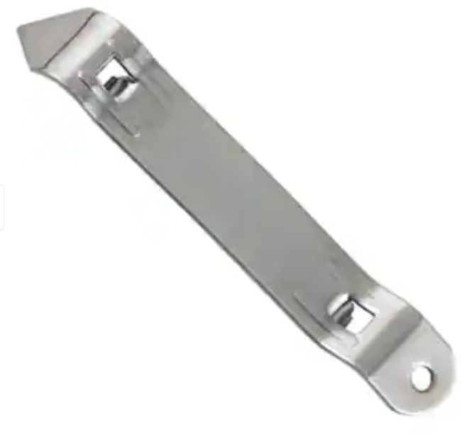

Apropos of wishful thinking, there's an old joke about economists that seems to have been first published in 1970:

- A physicist, a chemist, and an economist are shipwrecked on a desert island. They have nothing to eat and get very hungry.
- A pallet full of cans of food washes up on the beach. But our castaways have nothing to use to open the food cans.
- The physicist and the chemist each propose ways of opening the cans: Dropping them from a coconut tree; heating them in a fire till they explode; and the like.
- The economist has a simpler solution: "We'll assume 
we have a can opener." <cite> See Wikipedia, [[https://en.wikipedia.org/wiki/Assume_a_can_opener][Assume a can opener]], /quoting/ Kenneth E. Boulding, Economics as a Science at 101 (McGraw-Hill 1970). </cite>

** Incentives can matter. A lot.
  :PROPERTIES:
    :CUSTOM_ID: personal-incentive
  :END:

Berkshire Hathaway's late vice-chairman Charles Munger famously said, "Never a year passes but I get some surprise that pushes a little further my appreciation of incentive superpower. * * * Never, ever, think about something else when you should be thinking about the power of incentives." <cite> Charles T. Munger, [[https://fs.blog/great-talks/psychology-human-misjudgment/][The Psychology of Human Misjudgment]] (fs.blog), archived at https://perma.cc/LNG7-JG6Y. </cite>

When drafting a contract, it can pay dividends to give some thought to how to manage the so-called "agency costs" that can arise from these personal interests and incentives of individual players. That's because when disputes arise, the involved individuals will naturally want to protect their own interests, such as: • not having fingers pointed at them; • being thought of by their side as a committed team player who's willing to fight to win, not a defeatist who throws in the towel; • protecting their bonus, their commission, their pay raise, their promotion, etc. <cite> See generally [[https://en.wikipedia.org/wiki/Agency_cost][Agency cost]] (Wikipedia.org); a somewhat more-readable presentation is at [[https://www.investopedia.com/terms/a/agencycosts.asp][Agency Costs]] (Investopedia.com). </cite>

These desires can manifest themselves in a variety of ways; a skilled contract drafter will try to help the client channel these incentives — on both sides — and manage individuals' expectations and incentives.

** T O P   S P I N    S N O T S:  Identifying threats and opportunities
  :PROPERTIES:
    :CUSTOM_ID: top-spin
  :END:

The acronym T O P   S P I N can help planners to identify threats and opportunities of potential interest. (The acronym is inspired by the business concept of SWOT analysis, standing for Strengths, Weaknesses, Opportunities, and Threats.)

The first part of the acronym, T O P, refers to the *threats* and *opportunities* that can arise in the course of the different *phases* of the parties' business relationship — those phases can themselves be remembered with the acronym *S N O T S*: Startup; Normal Operations; Trouble; and Shutdown.

The second part of the acronym, S P I N, reminds us that various threats and opportunities can be presented by one or more of the following:

• S: The participants in the respective *supply chains* in which the contracting parties participate, both as suppliers and as customers, direct and indirect. If the parties are "Alice" and "Bob," then we can think of Alice's and Bob's respective supply chains as forming a capital letter H, as illustrated below.

#+ATTR_HTML: :alt A block capital letter H with the word "Contract" in the center, "Alice" and "Bob" in the left-center and right-center of the H; on each of the vertical arms of the H,  "Supplier," "Supplier's supplier," "Customer's customer"; outside of each vertical arm of the H, the words "Interveners" and "Nature" :class photowidth80C
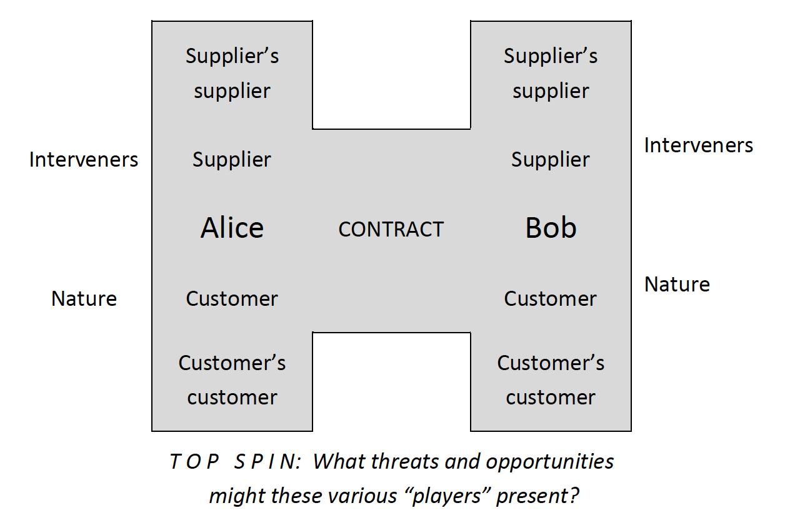

• P: The individual *people* involved in the supply chains — all of whom have their own personal motivations and interests.

• I: *Interveners* such as competitors; alliance partners; unions; governmental actors such as elected officials, regulators, taxing authorities, and law enforcement; the press; and acquirers. Don't forget the /individual people/ associated with an intervener, all of whom will have personal desires, motives, and interests.

# Political issues can raise their heads; for example, in 2019, convention organizers attracted attention for inserting "morals clauses" into their contracts: "Organizations will not bring events to Texas if /[anti-LGBTQ]/ discriminatory bills become law, and /most convention contracts allow organizers to cancel if such laws take effect/." <cite> Chris Tomlinson, [[https://www.houstonchronicle.com/business/columnists/tomlinson/article/Bigot-bills-would-damage-Texas-economy-13737920.php][Bigot bills would damage Texas economy]], Houston Chronicle, April 3, 2019, page B1, at B7 col. 2 (emphasis added). </cite>

• N: *Nature*, which can cause all kinds of threats and opportunities to arise in a contract relationship. {{{RWE}}} As of this writing, Google Scholar shows [[https://scholar.google.com/scholar?q=%2Bcovid+%2B%22force+majeure%22&hl=en&as_sdt=6%2C44&as_ylo=2020&as_yhi=][more than 500 reported court opinions]] involving force-majeure issues and the COVID-19 pandemic. (See generally the {{{NAME-FULL}}} force-majeure clause at  [[#r-fmaj]].)

** I N D I A   T I L T: Deciding on responsive actions
  :PROPERTIES:
    :CUSTOM_ID: india-tilt
  :END:

Once planners have compiled a list of threats and opportunities of interest, they should think about the specific actions that might be desirable — or perhaps specific actions to be prohibited ­— when a particular threat or opportunity /appears/ to be arising. Many such actions will fall into the following categories:

• I: *Information* to gather about the situation in question;

• N: *Notification* of others that the threat or opportunity is (or might be) arising. Refer to the SPIN part of the TOP SPIN acronym above for suggestions about players who might be appropriate to notify.

• D:  *Diagnosis*, i.e., confirmation that the particular threat or opportunity is real, as opposed to being an example of some other phenomenon (or just a false alarm).

• I: *Immediate* /action,/ e.g., to mitigate the threat or to seize the opportunity.

• A: *Additional* /actions/, e.g., to remediate adverse effects or take advantage of the opportunity.

ICE-CREAM EXAMPLE:  Consumers have been known to become ill, and a few have died, after eating ice cream that, during manufacturing, became contaminated with listeria bacteria. The grocery store's planners might want to use the I N D I A checklist to specify in some detail how the ice-cream manufacturer is to respond to such reports, with requirements for notifying the grocery store; product recalls; and so on.

Some plans are likely to require advance preparation. Planners can use the T I L T part of the acronym to decide whether any of the following might be appropriate:

• T:  Acquisition of *tools* — such as equipment, information, consumables, etc. — for responding to the threat or opportunity.

• I:  Acquisition of *insurance* (or other backup sources of funding).

• L: Posting of a *lookout*, that is, putting in place a monitoring system to detect the threat or opportunity in question.

• T:  *Training* of the people and organizations who might be called on to respond to the threat or opportunity.

** W H A L E R analysis: Fleshing out the action plans
  :PROPERTIES:
    :CUSTOM_ID: whaler-plans
  :END:

In specifying actions to be taken, planners will often want to go into more detail than just the traditional 5W + H acronym (standing for Who, What, When, Where, Why, and How). Planners can do this using the acronym W H A L E R:

• W:  *Who* is to take (or might take, or must not take) the action.

• H:  *How* the action is to be taken, e.g., in accordance with a specified industry standard.

• A:  *Autonomy* of the actor in deciding whether to take or not take the action.  Depending on the circumstances, this might be:

- No autonomy:  The action in question is either mandatory or prohibited, with nothing in between.

- Total autonomy:  For the action in question, the specified actor has sole and unfettered discretion as to whether to take the action.

- Partial autonomy:  The decision to take (or not take) the action must meet one or more requirements such as:

  - Reasonableness — be careful: that can be complicated and expensive to litigate;

  - Good faith — ditto;

  - Notification of some other player, before the fact and/or after the fact;

  - Consultation with some other player before the fact; or

  - Consent of some other player (but is consent not to be unreasonably withheld?  A claim of unreasonable withholding of consent could itself be one more thing to litigate.)

• L:  *Limitations* on the action — for example, minimums or maximums as to one or more of time; place; manner; money; and people.

• E:  *Economics* of the action, such as required payment actions (each of which can get its own W H A L E R analysis), and backup funding sources.

• R:  *Recordkeeping* concerning the action in question (with its own W H A L E R analysis).

** The "bow tie method": A diagrammatic approach

A more-complicated approach to identifying and planning for risks is the so-called "bow tie" method, developed by oil-and-gas giant Shell and later adopted in other industries. <cite> See, e.g., the detailed explanation (with examples) in Julian Talbot, [[https://www.juliantalbot.com/post/risk-bow-tie-method][Risk BowTie Method]] (JulianTalbot.com 2020), archived at https://perma.cc/ATN7-FGAU; see also the Hacker News discussion at https://news.ycombinator.com/item?id=24130809. </cite>

The bowtie method of diagramming risks and consequences is reminiscent of [[https://en.wikipedia.org/wiki/Feynman_diagram][Feynman diagrams]] in the world of physics. <cite> See generally, e.g., Frank Wilczek, [[https://www.quantamagazine.org/why-feynman-diagrams-are-so-important-20160705/][How Feynman Diagrams Almost Saved Space]] (QuantaMagazine.org 2016). ([[https://en.wikipedia.org/wiki/Frank_Wilczek][Wilczek]] is a Nobel Prize-winning physicist and MacArthur Foundation "genius grant" recipient who was once a colleague of Richard Feynman.) </cite>

** Finally, ask the investigator's all-round favorite question
  :PROPERTIES:
    :CUSTOM_ID: anything-else
  :END:

When I was a junior lawyer at Arnold, White & Durkee, I worked a lot with partner Mike Sutton. One of the many things Mike taught me was that when interviewing or deposing a witness, a useful, all-purpose question consists of just two words:  *Anything else?*

That same question can likewise help contract planners get some comfort that they've covered the possibilities that should be addressed in a draft agreement.

(For the Jeopardy! game at the end of the semester: _this_ is the answer to "What is Professor Toedt's favorite two-word question?" We'll see who has read this far ....)

* Field notes: Legal matters

Contents:

#+TOC: headlines 1 local

** Antitrust law basics
  :PROPERTIES:
  :CUSTOM_ID: fn-atrust
  :END:

*** Introduction: The Sherman Act, section 1
  :PROPERTIES:
  :CUSTOM_ID: nl-antitr-sherm
  :END:

/The following draws heavily from the Ninth Circuit's opinion in [[https://scholar.google.com/scholar_case?case=4590829304094070353][Aya Healthcare Servs., Inc. v. AMN Healthcare, Inc.]], 9 F.4th 1102, 1109-09 (9th. Cir. 2021) (affirming summary judgment applying rule of reason in dismissing antitrust claim under Sherman Act § 1; plaintiff failed to establish existence of genuine issue of material fact whether no-solicitaiton provision had a substantial anticompetitive effect that harmed consumers in relevant market). I've used a free hand in editing the text and have omitted most of the *extensive citations*. No copyright is claimed in the text of the court's published opinion./

*** What conduct does Section 1 prohibit?
  :PROPERTIES:
  :CUSTOM_ID: nl-antitr-sherm-what
  :END:

# https://en.wikipedia.org/wiki/John_Sherman
# #+ATTR_HTML: :alt Sen. John Sherman (photo by Matthew Brady) :title Sen. John Sherman (photo by Matthew Brady) :class photo-at-right photowidth20
# 

Section 1 of the Sherman Act /[named after Sen. John Sherman, pictured]/ bars "[e]very contract, combination in the form of trust or otherwise, or conspiracy, in restraint of trade or commerce among the several States."  

*** But doesn't /every/ contract "restrain" trade?
  :PROPERTIES:
  :CUSTOM_ID: nl-antitr-sherm-unrsnbl
  :END:

Yes — but the Supreme Court has interpreted Section 1 to outlaw only /unreasonable/ restraints.

*** What are "horizontal" vs. "vertical" restraints?
  :PROPERTIES:
  :CUSTOM_ID: nl-antitr-hor-vert
  :END:

Restraints subject to Section 1  are generally categorized as /horizontal/ or /vertical/:

- A horizontal restraint is /an agreement among competitors/ on the way in which they will compete with one another. 

- Vertical restraints are restraints /imposed by agreement between firms at different levels of distribution/.

*** How do courts assess the reasonableness of restraints?
  :PROPERTIES:
  :CUSTOM_ID: nl-antitr-vert-horiz-ct
  :END:

Courts employ two different standards to determine whether a particular restraint is unreasonable: 

1.  The first standard involves a factual inquiry commonly known as the "rule of reason." The rule of reason weighs legitimate justifications for a restraint against any anticompetitive effects. 

Nearly every /vertical/ restraint is assessed under the rule of reason.

We conduct a fact-specific assessment to distinguish between:

- restraints with anticompetitive effect that are harmful to the consumer and

- restraints stimulating competition that are in the consumer's best interest.

2.  The second standard is the /per se/ standard, which recognizes that a small group of restraints are unreasonable per se because they always or almost always tend to restrict competition and decrease output. Such agreements or practices are conclusively presumed to be unreasonable because of their pernicious effect on competition and lack of any redeeming virtue. 

*Typically only horizontal restraints qualify as unreasonable /per se/.*

However, *not all horizontal restraints are analyzed pursuant to the /per se/ standard*. 

/DCT note: In late 2024, a federal district court held that "algorithmic pricing" of apartment rents, facilitated by a provider of revenue-management software, was part of a horizontal conspiracy that was subject to the per-se rule: "The combination and conspiracy allegedly involved (a) a set of vertical agreements between Yardi Systems, Inc., and each individual [apartment-owner] lessor defendant for the use of Yardi's revenue management software, (b) a continuing horizontal agreement between and among the lessor defendants to provide their commercially sensitive information to Yardi, to use Yardi's revenue management software, and to implement the recommendations generated, and (c) a shared understanding that Yardi would use the information provided to recommended rental rates above what would be earned in a competitive market."/ <cite> See [[https://scholar.google.com/scholar_case?case=13815703686456729339][Duffy v. Yardi Systems, Inc.]], 758 F. Supp. 3d 1283, 1289 (W.D. Wash. 2024) (denying defendants' joint motion to dismiss). </cite>

/Relatedly: In August 2024, the Department of Justice and the attorneys general of eight states [[https://www.justice.gov/opa/pr/justice-department-sues-realpage-algorithmic-pricing-scheme-harms-millions-american-renters][filed a civil antitrust lawsuit against RealPage Inc.]] alleging similar conduct./

The notion of a "rule of reason" is the opposite of a "per-se rule" or "bright-line rule," and means that the outcome might be affected by differences in facts (or in online parlance: YMMV, Your Mileage May Vary). See generally [[https://en.wikipedia.org/wiki/Rule_of_reason][Rule of reason]] (Wikipedia.org).

In a 2024 paper, professors Mark Lemley, of Stanford Law,) and Michael Carrier, of Rutgers Law, argue in effect that the rule of reason might be just window dressing (my words):

#+begin_quote

Given that the rule of reason is often said to be at the center of antitrust law, and that balancing is at the heart of the rule of reason, it is quite surprising to discover that courts almost never do any actual balancing of harms and benefits. Indeed, balancing has become so rare that in the Supreme Court’s two most recent articulations of the rule of reason test, it omitted the actual balancing of anticompetitive harms and procompetitive benefits altogether! <cite> Mark A. Lemley and Michael A. Carrier, [[https://papers.ssrn.com/sol3/papers.cfm?abstract_id=4896529][Rule or Reason? The Role of Balancing in Antitrust Law]] (SSRN.com 2014) (extra paragraphing added). </cite>
#+end_quote

*** What sorts of "horizontal" restraints might be OK?
  :PROPERTIES:
  :CUSTOM_ID: nl-antitr-hor-ancil
  :END:

Under the "ancillary restraints" doctrine, a horizontal agreement is exempt from the /per se/ rule, and analyzed under the rule-of-reason, if it meets two requirements. 

These requirements are that the restraint must be (1) subordinate and collateral to a separate, legitimate transaction, and (2) reasonably necessary to achieving that transaction's pro-competitive purpose. 

"Naked restraints" are categorically /not/ "ancillary restraints." Thus, *naked horizontal restraints are always analyzed under the /per se/ standard*. 

A restraint is naked if it has no purpose except stifling of competition. 

Some examples of these restraints include *agreements among actual or potential competitors to fix prices or divide markets*.

*** One type of "section 1 violation":  Unlawful (horizontal) price-fixing
  :PROPERTIES:
:CUSTOM_ID: nl-Collusion
  :END:

Sometimes it might seem tempting to agree with a competitor to divvy up customers, or to keep your prices at an agreed level, or to take turns submitting the winning bid in response to customers' requests for proposal ("RFPs"). 

Those activities, though, can lead to indictment and prosecution by federal- or state authorities for violation of the antitrust laws.

# https://sco.wikipedia.org/wiki/File:British_Airways_Logo.svg
# # #+ATTR_HTML: :alt British Airways logo :title  British Airways logo  :class photo-at-right photowidth20
# 

# https://www.gao.gov/blog/pregnant-women-federal-custody-uniquely-vulnerable-population
# #+ATTR_HTML: :alt Jail cells :title Jail cells :class photo-at-right photowidth30
# 

# # #+ATTR_HTML: :alt XX :title   :class photo-at-right photowidth15
# 

{{{RWE}}} The German airline Lufthansa and the British airline Virgin Atlantic blew the whistle on a price-fixing scheme by a total of 21 non-U.S. airlines, including British Airways, Qantas, and Korean Air. The U.S. Department of Justice prosecuted, resulting in
- a total of some $1.7 billion in fines; and 
- four airline executives being *sentenced to prison terms* in the U.S. ([[http://www.msnbc.msn.com/id/41926712/ns/travel-news/][link]]) ([[http://www.justice.gov/opa/pr/2007/August/07_at_569.html][link]])

Authorities might go for low-hanging fruit: Instead of trying to prove up an antitrust violation (a complex task), they might bring charges of *obstruction* of justice, akin to prosecuting Al Capone for tax evasion. 

{{{RWE}}} A British executive, after being extradited to the U.S., was sentenced to 18 months in prison and a $25,000 fine for /conspiring to obstruct/ a price-fixing investigation ([[http://www.justice.gov/opa/pr/2010/December/10-at-1426.html][link]]).

For more information the Department of Justice has a useful [[http://www.justice.gov/atr/public/guidelines/211578.htm][antitrust primer]] that explains many of the relevant concepts.

***  /Vertical/- and /hybrid/ price-fixing /might/ be OK ...
  :PROPERTIES:
  :CUSTOM_ID: nl-antitr-rpm
  :END:

/The following discussion is adapted from [[https://scholar.google.com/scholar_case?case=312671332744148739][Winn-Dixie Stores, Inc. v. Eastern Mushroom Mktg. Coop., Inc.]], 81 F.4th 323, 328 (3d Cir. 2023); no copyright is claimed in the opinion text:/

Not every agreement to restrain trade violates the antitrust laws. Because some cases are more obvious than others, the law has evolved to use *different tests* depending on the closeness of the question. 

- At one end of the spectrum are arrangements that can be condemned as illegal /per se/, or—as in the case of horizontal agreements—at least so likely to be unlawful that just a "*quick look*" is enough to recognize that *anticompetitive effects may be presumed*. 

- At the other end of the spectrum are arrangements that are *plainly lawful*. 

- And *in between lie the vast majority, where careful scrutiny is necessary* to decide. 

In this category—which includes *purely vertical agreements*, as well as *hybrid agreements* — the "quick-look" approach is inapt, and *the plaintiff has the initial burden of showing anticompetitive effect under the "rule of reason."*

The central—and dispositive—question in this case is which framework applies. 

Appellant Winn-Dixie Stores brought suit against Appellees—the Eastern Mushroom Marketing Cooperative, Inc. (EMMC), its individual mushroom farmer members, and certain downstream distributors—claiming their price-fixing agreement violated § 1 of the Sherman Act. 15 U.S.C. § 1. 

The District Court instructed the jury to apply the "rule-of-reason" test, and *the jury returned a verdict in Appellees' favor*. 

Winn-Dixie contends this was error, and had the judge applied the "quick-look" approach and instructed the jury to simply presume anticompetitive effects, it would have found Appellees' agreement to be an unlawful restraint of trade. As plaintiff, Winn-Dixie understandably would have preferred the lower burden of proof. 

But because *this hybrid scheme involved myriad organizational structures with varying degrees of vertical integration*, the Court was right to apply the rule of reason. 

And because, under that more searching inquiry, *the evidence at trial was sufficient to sustain the jury's verdict*, we will affirm the judgment in favor of Appellees.

/Emphasis, extra paragraphing, and bullets added./

*** ... but might not be worth the hassle
  :PROPERTIES:
  :CUSTOM_ID: nl-antitr-rpm-no
  :END:

Let's suppose that a client wants you to draft an agreement with vertical price fixing a.k.a. resale price maintenance. 

Sure, such an agreement /might/ be legal.

But even so, litigating the issue might cost the client a lot of time and money.

Does the client really want to take the chance?

** Bankruptcy Code of 1978 /(notes)/
  :PROPERTIES:
  :CUSTOM_ID: nl-termin-bkrpt-bkgd
  :END:

*** The automatic stay against termination (etc.)
  :PROPERTIES:
  :CUSTOM_ID: nl-auto-stay
  :END:

Consider the situation where {{{A}}} wants to terminate its contract with {{{B}}}. Under [[https://www.law.cornell.edu/uscode/text/11/365][section 365(e)(1)]] of the (U.S.) Bankruptcy Code of 1978, if {{{B}}} files a petition for protection under the bankruptcy laws — or if {{{B}}}'s /creditors/ file an "involuntary" petition against {{{B}}} — then that filing creates an "automatic stay," prohibiting A from taking any of several forms of contract termination (as well as various other actions).

The rationale here is that termination of a contract could jeopardize the orderly reorganization or liquidation of B's business. In the bankruptcy proceeding, {{{B}}} is referred to as the "debtor," and B's business and assets are referred to as "the estate" of the debtor.

(The basics of this subject are usefully explained in Robert L. Eisenbach III, [[http://bankruptcy.cooley.com/2007/09/articles/business-bankruptcy-issues/are-termination-on-bankruptcy-contract-clauses-enforceable/][Are "Termination On Bankruptcy" Contract Clauses Enforceable?]] (Cooley.com 2007), [[https://perma.cc/PV6N-VFTC]].)

Even though such termination-/for/-bankruptcy provisions are unenforceable in the U.S., lawyers keep including them in contracts anyway. The usual rationale is that U.S. bankruptcy law might not apply (e.g., in a non-U.S. transaction), and who knows, Congress might repeal that part of the Code (unlikely).

As an "in the wild" example of such a provision, see a Honeywell purchase-order form at [[http://perma.cc/CUV6-NKTY]], which states as follows:

#+begin_quote

The solvent party /[sic]/ may terminate this Purchase Order upon written notice if the other party becomes insolvent or if any petition is filed or proceedings commenced by or against that party relating to bankruptcy, receivership, reorganization, or assignment for the benefit of creditors.
#+end_quote

*Pro tip:* Don't say that "the /solvent/ party may terminate," as in the Honeywell example just above, because if the terminating party is /also/ insolvent, then a court might hold that the party wasn't entitled to terminate — and so the termination was itself an "own goal" breach of the contract — as discussed in more detail in the commentary at § [[#termin-rt]].

*** Ipso-facto terminations are likewise unenforceable
  :PROPERTIES:
  :CUSTOM_ID: nl-bkrpt-ipso
  :END:

Likewise unenforceable under [[https://www.law.cornell.edu/uscode/text/11/365][11 U.S.C. § 365(e)(1)]] are so-called /ipso-facto/ clauses, where the debtor's entering into bankruptcy proceedings would /automatically/ terminate the contract (with certain exceptions in subsection (e)(2)). For an example and extensive citations, see [[https://www.bclplaw.com/a/web/99476/Enforceability-of-Termination-on-Bankruptcy-or-Ipso-Facto-Cont.pdf][a paper]] (undated) at the Web site of the Bryan Cave law firm.

*** Preference-payments refunds in bankruptcy
  :PROPERTIES:
  :CUSTOM_ID: nl-GuarPrefPmtRef
  :END:

Here's a not-uncommon situation, especially during economic downturns:

- A customer places an order with a supplier.
- In due course, the customer pays the supplier's invoice in due course.
- *But:* Within the next 90 days, the customer files for protection under the bankruptcy laws. 

In that situation, the supplier might be compelled by law to refund Customer's invoice payment; this is referred to as an "avoidable preference." <cite> See, e.g., [[https://scholar.google.com/scholar_case?case=3438768229025420150][Coles v. Glaser]], 2 Cal. App. 5th 384, 389, 205 Cal. Rptr.3d 922 (2016) (with extensive citations). See also, e.g.: Patricia Dzikowski, [[http://www.nolo.com/legal-encyclopedia/bankruptcy-trustee-preference-claims-prior-transfers.html][The Bankruptcy Trustee and Preference Claims]] (Nolo.com; undated); Kathleen Michon, [[http://www.nolo.com/legal-encyclopedia/pre-bankruptcy-payments-creditors-can-the-trustee-get-the-money-back.html][Pre-Bankruptcy Payments to Creditors: Can the Trustee Get the Money Back?]] (Nolo.com; undated); the guaranty language in [[https://scholar.google.com/scholar_case?case=11081049436389993245][Cooperatieve Centrale Raiffeisen-Boerenleenbank, B.A. v. Navarro]], 25 N.Y.3d 485, 488, 36 N.E.3d 80, 15 N.Y.S.3d 277 (2015). </cite>

To be sure: The supplier would have the right to contest its obligation to refund the customer's payment, for example by showing that the payment was made in the ordinary course of business. But contesting a preference action can be difficult and costly; that's because, under bankruptcy law, the supplier would have to successfully jump through some evidentiary hoops to /show/ that it was entitled to keep the customer's payment.

And in any event, as a practical matter many avoidable-preference cases are settled; in the above situation:

- The customer's "estate" (a bankruptcy term) would likely settle for less than a complete refund of what the customer had paid the supplier.

- In return, the supplier would give the customer a /partial/ refund so as to avoid the expense and hassle of jumping through the required proof hoops in bankruptcy court.

That's where the supplier would want to be able to invoke a third party's guaranty of payment: In many guaranties, the guarantor would be on the hook to reimburse the supplier for the supplier's refund to the customer — and probably for the supplier's associated legal expenses as well, if the guaranty said so. (For an example of bankruptcy-reimbursement language along similar lines, see paragraph 7 of a [[https://www.sec.gov/Archives/edgar/data/1066134/000119312510000891/dex103.htm][Bank of America guaranty form]].)

** Buy-sell agreements /(rough notes)/
  :PROPERTIES:
  :CUSTOM_ID: nl-buy-sell
  :END:

A "buy-sell" procedure is related to the ancient "[[http://en.wikipedia.org/wiki/Divide_and_choose][divide and choose]]" procedure, sometimes known as "I cut, /you/ choose," by which children can evenly divide a cookie between them.

Something like this procedure is seen in the Book of Genesis, when Abram (later Abraham) and his kinsman Lot agree to separate, and by agreement, Abram allows /Lot/ to choose which part of the Promised Land to claim and settle in. <cite> See [[https://www.biblegateway.com/passage/?search=Genesis%2013&version=NIV][Gen. 13:8-10]]; see also, e.g., [[https://en.wikipedia.org/wiki/Abraham_and_Lot%27s_conflict][Abraham and Lot's conflict]]. </cite>

Buy-sell agreements are often used for breakups of small companies. Suppose that a company  has two owners, "Fred" and "Ginger," who find that they can no longer get along. A buy-sell agreement requires (let's say) /Fred/ to /offer/ to buy out Ginger's share of the company so that she'll be the one to exit the business and leave Fred as the sole owner — but then /Ginger/ gets to decide whether —

- to accept Fred's buy-out offer and leave the business; or

- instead, to require /Fred/ to sell out to her — on the terms that Fred had proposed to her. 

This gives Fred a powerful incentive to offer fair terms to Ginger — because if Fred's terms /aren't/ fair, then Ginger can turn the tables on him and kick /him/ out of the business instead of exiting the business herself.

A buy-sell agreement is somewhat akin to baseball arbitration, which likewise encourages parties to make fair offers to settle disputes, as discussed at [[#r-escal-ext]].

/Optional further reading:/ 

- Both buy-sell agreements and last-offer arbitration ("baseball arbitration"; see {{{RR}}} [[#r-escal-ext]]) could be thought of as examples of what the late philosopher John Rawls referred to as "[[https://ethicsunwrapped.utexas.edu/glossary/veil-of-ignorance][the veil of ignorance]]." 

-  [[https://www.nybusinessdivorce.com/2017/05/articles/llcs/aim-carefully-pulling-triggenl-shotgun-buy-sell-agreement/][Mahler]] (2017) urges /not/ including provisions for the accepting party to demand revision of the price.

#+begin_comment
The LLC agreement had a relatively complex and somewhat unusual shotgun provision with the following key features:

- 30 days for the Non-Tendering Member to give notice of his election to purchase or sell after receipt of the Tendering Member’s buy-sell offer;

- once the Non-Tendering Member gives his notice of election, an additional 7 days for him to give notice of disagreement with the purchase price, thereby triggering a specified independent appraisal process producing a binding purchase price;

- in the case of an agreed purchase price, closing within 90 days of the Non-Tendering Member’s notice of election;

- in the case of disagreement and appraisal, closing within 180 days of the Non-Tendering Member’s notice of election;
repayment at closing of any loans to the LLC by the withdrawing member and of any loan balances between members resulting from investments in the company;

- reversion to the Tendering Member of the right to purchase the Non-Tendering Member’s interest if the latter fails to close on his purchase election.

* * * 

One last observation: I’ve seen many owner agreements with shotgun provisions, but until this case I’d never seen one that allowed the recipient of the buy-sell offer to re-set the purchase price after the recipient’s election to buy or sell by means of a binding fair market value appraisal. Such a provision, it strikes me, undermines the central premise of the efficiency and price-setting fairness of the shotgun mechanism, and ought to be avoided.
#+end_comment

** Consumer contracts /(notes)/
  :PROPERTIES:
  :CUSTOM_ID: nl-consum-k
  :END:

DCT note: This is where I'm "[[https://www.poynter.org/reporting-editing/2013/how-writers-can-collect-and-organize-string-for-stories/][saving string]]" for possible future use.

Anthony Glosson and Ross Speier, [[https://www.jdsupra.com/legalnews/mind-the-fine-print-cfpb-warns-against-4837775][Mind the Fine Print: CFPB Warns Against Use of Unenforceable Terms and Conditions]] (JDSupra.com 2024).

** Discretion: {{{ADDL}}}                                              :ADDL:
  :PROPERTIES:
 :CUSTOM_ID: discr-defn-a
  :HTML_CONTAINER_CLASS: addl
  :END:

*** The business context

Contracts often use the terms /discretion/, /sole discretion/, /unfettered discretion/, and /reasonable discretion/; {{{ths}}} seeks to provide clear meanings for the underlying word /discretion/ — while recognizing that courts might impose their own meanings, as discussed below.

*** "Sole and unfettered discretion" might not mean /quite/ that
  :PROPERTIES:
  :CUSTOM_ID: discr-sole-lim
  :END:

{{{U1}}} A New York appeals court took a jaundiced view of a party's position about a "sole and absolute discretion" clause in an agreement, noting that:

#+begin_quote

[E]ven where one has an apparently unlimited right under a contract, that right may not be exercised solely for personal gain in such a way as to deprive the other party of the fruits of the contract. Thus, even an explicitly discretionary contract right may not be exercised in bad faith so as to frustrate the other party's right to the benefit under the agreement. <cite> [[https://scholar.google.com/scholar_case?case=8901689424505951736][Shatz v. Chertok]], 180 A.D.3d 609, 610, 117 N.Y.S.3d 239, 2020 NY Slip Op 1383 (N.Y. App. Div.) (affirming denial of motion to dismiss complaint for breach of fiduciary duty; cleaned up, citation omitted, extra paragraphing added). </cite>
#+end_quote

{{{UN}}} In the UK, there is case law indicating that discretion must be exercised in good faith and not arbitrarily, capriciously, or irrationally. <cite> See generally James Brown, [[https://www.haynesboone.com/alerts/cathay-pacific-airways-limited-v-lufthansa-technik-ag][Cathay Pacific Airways Limited v. Lufthansa Technik AG - the extent to which contractual rights be limited by considerations of good faith or a duty to act “rationally”?]] (HaynesBoone.com 2020) /discussing/ [[https://www.bailii.org/ew/cases/EWHC/Ch/2020/1789.html][Cathay Pacific Airways Limited v. Lufthansa Technik AG]], [2020] EWHC 1789 (Ch); Barry Donnelly and Jonathan Pratt, [[https://www.macfarlanes.com/media/1848/are-you-obliged-to-act-reasonably-july-2013.pdf][Are you obliged to act reasonably?]], in the In-House Lawyer, June 2013, at 20, [[https://perma.cc/H9HW-7KDA]]. </cite>

{{{UN}}} Analogously: In the context of /judicial/ discretion, in a case [[https://scholar.google.com/scholar_case?case=13800665423501484885][Halo Electronics]] (U.S. 2016), concerning certain statutory trial-court discretion in patent cases, the Supreme Court noted that:

#+begin_quote

Discretion is not whim. In a system of laws discretion is rarely without limits, even when the statute does not specify any limits upon the district courts' discretion. 

A motion to a court's discretion is a motion, not to its inclination, but to its judgment; and its judgment is to be guided by sound legal principles. Thus, ... a district court's discretion should be exercised in light of the considerations underlying the grant of that discretion. <cite> [[https://scholar.google.com/scholar_case?case=13800665423501484885][Halo Elecs., Inc. v. Pulse Elecs., Inc.]], 136 S. Ct. 1923, 1931-32 (2016) (cleaned up, citations omitted, extra paragraphing added). This concerned a trial court's statutory discretion, in "exceptional" cases, to increase the damages for patent infringement. </cite>
#+end_quote

*** More explanation of permissible discretion factors can help

It can be helpful for a contract to explain the factors that can be permissibly taken into account in exercising discretion. {{{RWE}}} In a Second Circuit case:

- An energy supply company was sued for breach of contract for allegedly failing to charge competitive rates for electricity.

- The company's agreement form provided for a variable monthly rate that the company would set at its discretion; the agreement "listed several factors guiding that discretion, including 'market-related factors' and [the company's] 'costs, expenses and margins.'"

The court affirmed summary judgment in favor of the company because the plaintiff "received what was promised under the plain terms of the agreement ...."

*** Edge case: An illusory contract 

In a Texas case, a sale-and-purchase letter agreement gave a buyer the "sole discretion" to close a purchase transction (after doing due diligence about the purchase). A state court held that this unfettered walk-away right made the agreement contract illusory and unenforceable, as long as there was no separate consideration for the walk-away right. <cite> See [[https://scholar.google.com/scholar_case?case=7837640098008907112][Maverick Nat. Resources, LLC v. Glenn D. Cooper Oil & Gas, Inc.]], No. 02-23-00183-CV, slip op. (Tex. App.--Fort Worth Jun. 13, 2024). </cite>

** Efforts clauses /(notes)/
  :PROPERTIES:
  :CUSTOM_ID: nl-CRE-a
  :HTML_CONTAINER_CLASS: addl
  :END:

*** Why do drafters use "efforts" clauses?
  :PROPERTIES:
  :CUSTOM_ID: nl-cre-why
  :END:

Contract drafters often say that a party will make /[something] efforts/:

- when they don't want to take the time to negotiate a specific standard of performance — especially if their clients simply don't know what the standard /should/ be in as-yet undetermined future circumstances, and they don't want to spend the time to try to figure it out; 

- in the case of /commercially reasonable/ efforts: to emphasize that the term requires what /business people/ would regard as reasonable efforts *and* - as an alternative to the stronger commitment of /best efforts/ (see {{{RR}}} [[#r-best-efforts-defn]]).

*** Problem: The lack of clarity in the case law
  :PROPERTIES:
  :CUSTOM_ID: nl-CREUnclear
  :END:

In Delaware's 2024 /Fortis Advisors/ case, Vice Chancellor Will noted that "there is no agreement in case law over whether /[efforts clauses]/ create different standards. Delaware courts have viewed variations of efforts clauses—particularly those using the term 'reasonable'—as largely interchangeable." <cite> [[https://scholar.google.com/scholar_case?case=3585890316977952996][Fortis Advisors LLC v. Johnson & Johnson]], No. 2020-0881-LWW, slip op. at text acc'g n.350 (Del. Ch. Sept. 4, 2024). </cite>

Likewise, in the 2010 /Citri-Lite/ case, a federal court in California noted that that "[t]here is no settled or universally accepted definition of the term commercially reasonable efforts." <cite> [[https://scholar.google.com/scholar_case?case=15202977054272395445][Citri-Lite Co. v. Cott Beverages, Inc.]], 721 F. Supp. 2d 912, 926 (E.D. Cal. 2010) (denying defendant's motion for summary judgment; cleaned up). After trial, the court elaborated on this observation, with citations; see [[https://www.govinfo.gov/content/pkg/USCOURTS-caed-1_07-cv-01075/pdf/USCOURTS-caed-1_07-cv-01075-15.pdf#page=1.00&gsr=0][findings of fact and conclusions of law after bench trial]], slip op. at 45, /aff'd/, [[https://perma.cc/D8DC-J3GN][No. 11-17609]] (9th Cir. Nov. 21, 2013) (unpublished). </cite>

Similarly, the Southern District of New York — after extensively reviewing case law — remarked that "New York case law interpreting other efforts clauses, including best efforts and reasonable efforts clauses, is anything but a model of clarity." <cite> [[https://scholar.google.com/scholar_case?case=598465974293934143][Holland Loader Company, LLC v. FLSMidth A/S]], 313 F. Supp. 3d 447, 469 (S.D.N.Y. 2018) (after bench trial, holding that defendant had failed to use commercially-reasonable efforts). </cite>

*** Would (a quick) summary judgment be available? (Maybe not.)         :CMT:
  :PROPERTIES:
  :CUSTOM_ID: nl-cre-msj
  :END:

It will often be "a factually intense issue" whether a party has /complied/ with an obligation to exert particular efforts — and thus it frequently happens that a court will deny /summary/ judgment, necessitating a costly trial, as happened in [[https://scholar.google.com/scholar_case?case=15202977054272395445][Citri-Lite]], cited above, and in other cases. <cite> See also, e.g., [[https://scholar.google.com/scholar_case?case=1331132673644442581][MY Imagination, LLC v. M.Z. Berger & Co.]], No. 17-1218 (6th Cir. Feb. 16, 2018) (reversing and remanding summary judgment in favor of defendant); [[https://scholar.google.com/scholar_case?case=10841574334252257796][Organo Gold Int'l v. Aussie Rules Marine Serv. Ltd.]], 416 F. Supp. 3d 1369 (S.D. Fla. 2019) (denying summary judgment in case involving golfer Greg Norman); [[https://scholar.google.com/scholar_case?case=13945349954956181421][PPD Enterpr., LLC v. Stryker Corp.]], No. 4:16-CV-0507 (S.D. Tex. Nov. 1, 2017) (denying summary judgment). </cite>

*** Inward vs. outward focus: A real-world example
  :PROPERTIES:
  :CUSTOM_ID: nl-RussellZimmer
  :END:

{{{RWE}}} In a 2023 Seventh Circuit decision, the contract in suit provided an example of an extremely-detailed definition of "commercially reasonable efforts"; that definition focused "inward" on the buyer's own practices, as opposed to an "outward" focus on industry standards for what would be done by similarly-situated business. <cite> See [[https://scholar.google.com/scholar_case?case=15881487331300468195][Russell v. Zimmer, Inc.]], 82 F.4th 564, 566-70 (7th Cir. 2023) (affirming dismissal for failure to state a claim upon which relief could be granted). </cite>

*** Use "comparables"? (Maybe not.)
  :PROPERTIES:
  :CUSTOM_ID: nl-cre-comp
  :END:

Industry standards or other "comparables" might not be helpful: In a 2024 Delaware case, the contract in suit defined "commercially reasonable efforts" as "the exercise of such efforts and commitment of such resources by a company with substantially the same resources and expertise as [the defendant], with due regard to the nature of efforts and cost required for the undertaking at stake." Vice Chancellor Glasscock characterized this definition as "unusual" and remarked that "[a]fter trial, I find this method unworkable; no exemplar companies operate under the actual conditions of Defendants, who, I note, are also different from one another as to their circumstances." <cite> [[https://scholar.google.com/scholar_case?case=15621251956044928976][Himawan v. Cephalon, Inc.]], No. 018-0075, text acc. nn.44, 165 (Del. Ch. Apr. 30, 2024) (holding that defendants had not breached their obligation to comply with contract's commercially-reasonable efforts provision). </cite>

The court went on:

#+begin_quote

"Due regard" for the "efforts and costs" means that Defendants may eschew development where the circumstances reasonably indicate, as a business decision, that they not go forward. This includes all the costs and risks involved, including the milestone payments and the opportunity costs faced by Defendants, as evidenced by the provision that the reasonableness be measured against the actions expected of a company with "substantially the same resources and expertise" as the buyer. That is, if a reasonable actor with faced with the same restraints and risks would go forward /in its own self-interest/, the buyer is contractually obligated to do the same. <cite> /Id./ (emphasis in original, extra paragraphing added). </cite>
#+end_quote

*** Pro tip: Agree to a /process/ instead?                              :CMT:
  :PROPERTIES:
  :CUSTOM_ID: nl-cre-process
  :END:

Outside of the context of /efforts/, a party seeking to prove (or disprove) the reasonableness of a transaction, contract term, decision, etc., might want to focus on /the process/ by which the transaction, etc., came into being. {{{RWE}}} In its 1990 /West Texas Transmission/ decision, the Fifth Circuit remarked that "[w]here two sophisticated businesses reach a hard-fought agreement through lengthy negotiations, it is difficult to conclude that any negotiated term placed in their contract is commercially unreasonable." <cite> [[https://scholar.google.com/scholar_case?case=14571229305189389501][West Texas Transmission, LP v. Enron Corp.]], 907 F.2d 1554, 1563 (5th Cir. 1990) (affirrming district court's refusal to grant specific performance of right of first refusal) (extensive citations omitted). </cite>

This suggests that, when it comes to commercially-reasonable /efforts/, if parties can't (or don't want to take the time to) specify what outcome they want, then perhaps they could agree instead to a reasonable /process/ that they will use later to decide what the outcome will be, such as the escalation clause at {{{RR}}} [[#r-escal-ext]]. 

*** Whose burden is it to define the extent of efforts required?
  :PROPERTIES:
  :CUSTOM_ID: nl-cre-burden
  :END:

A party that sues for breach of an efforts obligation might need to adduce specific evidence to educate the court about just what level of effort was required to meet the obligation in the particular circumstances — failing which, the court might dismiss the claim. 

{{{RWE}}} The SDNY explained: "When the term 'commercially reasonable efforts' is not defined by the contract, courts in this district require the party seeking to enforce the efforts provision to establish the objective standard by which the breaching party's efforts are to be judged, in the context of the particular industry." <cite> [[https://scholar.google.com/scholar_case?case=598465974293934143][Holland Loader Company, LLC v. FLSmidth A/S]], 313 F. Supp. 3d 447, 472 (S.D.N.Y. 2018) (plaintiff proved breach of commercially-reasonable-efforts obligation but failed to sufficiently prove damages). See also, e.g., [[https://scholar.google.com/scholar_case?case=1713083266085881505][Shane Campbell Gallery, Inc. v. Frieze Events, Inc.]], No. 20-1535-cv (2d Cir. Dec. 17, 2020) (affirming summary judgment dismissing claim of breach (non-precedential summary order)); [[https://scholar.google.com/scholar_case?case=7168245478848525450][Tendyne Holdings, Inc. v. Abbott Vascular, Inc.]], No. 18-1070 (D. Del. Jun. 28, 2019) (granting Abbott's motion to dismiss); [[https://scholar.google.com/scholar_case?case=17726126410267470709][Terumo Americas Holding, Inc. v. Tureski]], 251 F. Supp. 3d 317, 327-28 (D. Mass. 2017) (granting summary judgment dismissing claim of breach); [[https://scholar.google.com/scholar_case?case=2789476740862499256][Netologic Inc. v. Goldman Sachs Group, Inc.]], 2018 NY Slip Op 31409 (granting defendant's motion for summary judgment). </cite>

*** Some practical dangers of /best/-efforts obligations
  :PROPERTIES:
  :CUSTOM_ID: nl-best-eff-danger
  :END:

Parties that agree to include a best-efforts obligation in a contract can get into costly disputes about whether particular actions satisfied the obligation. That's because: 

--  With the benefit of plenty of time and *20-20 hindsight*, litigation counsel — *coached by* a paid expert witness — will second-guess the choices that the obligated party made.

--  Then it might be up to randomly-selected jurors to decide the best-efforts question — and because jurors often aren't familiar with the relevant business environment, they might end up deciding, in part, on the basis of which witnesses they liked best.

*** Are "_all_ reasonable efforts" required?
  :PROPERTIES:
  :CUSTOM_ID: nl-best-eff-all-rsnbl
  :END:

In its much-noted /Williams Cos./ decision, Delaware's supreme court held that "reasonable best efforts" required /all reasonable/ steps. <cite> See [[https://scholar.google.com/scholar_case?case=1175897943756751015][Williams Cos. v. Energy Transfer Equity, L.P.,]] 159 A.3d 264 (Del. 2017). The supreme court held that Williams Cos.'s counterparty Energy Transfer had indeed breached its obligation to make such efforts, but also that Energy Transfer had shown that its breach did not have a material effect. </cite>

/All reasonable efforts/ is reportedly a common formulation in the UK and Australia as well. <cite> See generally, e.g., Menelaus Kouzoupis and Margaux Harris, [[https://www.shlegal.com/docs/default-source/news-insights-documents/best-endeavours-vs-reasonable-endeavours_not-two-sides-of-the-same-coin.pdf]["Best endeavours" vs "reasonable endeavours": Not two sides of the same coin]] (SHLegal.com 2020); Shawn C. Helms, David Harding, and John R. Phillips, [[https://www.jonesday.com/en/insights/2007/07/best-efforts-and-endeavourscase-analysis-and-practical-guidance-under-us-and-uk-law][Best Efforts and Endeavours -- Case Analysis and Practical Guidance Under U.S. and U.K. Law]] (JonesDay.com 2007). </cite>

British Columbia's supreme court used the term "leaving no stone unturned." <cite> See [[https://www.provincialcourt.bc.ca/judgments.php?link=https://www.canlii.org/en/bc/bcpc/][Atmospheric Diving Systems Inc. v. International Hard Suits Inc.]], 1994 CanLII 16658, ¶¶ 63, 71-72 (BC SC), 89 B.C.L.R. (2d) 356 (reviewing English and Canadian case law). </cite>

BUT: The Seventh Circuit once remarked that "We have found no cases ... holding that 'best efforts' means /every conceivable/ effort ...." <cite> [[https://scholar.google.com/scholar_case?case=5844601562597380737][Triple-A Baseball Club Assoc. v. N.E. Baseball, Inc.]], 832 F.2d 214, 228 (7th Cir. 1987). </cite>

Likewise, the First Circuit's [[https://scholar.google.com/scholar_case?case=2741871384593536664][California Pines]] opinion (citing the Second Circuit's /Bloor/ opinion) held that: "Best efforts does not mean every conceivable effort. It does not require the promisor to ignore its own interests, spend itself into bankruptcy, or incur substantial losses to perform its contractual obligations." <cite> See also [[https://scholar.google.com/scholar_case?case=15955560761286589605][Coady Corp. v. Toyota Motor Distributors, Inc.]], 361 F.3d 50, 59 (1st Cir. 2004) (affirming rejection of dealership's claim that Toyota distributor had failed to use best efforts; citation omitted), /likewise cited in/ [[https://scholar.google.com/scholar_case?case=2741871384593536664][California Pines]].  ]

Sometimes the discussion might be academic: A Texas court once remarked: "As a matter of law, no efforts cannot be best efforts." <cite> [[http://scholar.google.com/scholar_case?case=16652794475481801929][CKB & Assoc., Inc. v. Moore McCormack Petroleum, Inc.]], 809 S.W.2d 577, 581-82 (Tex. App.--Dallas 1990). (affirming summary judgment that defendant had failed to use its best efforts; citing /Bloor/). </cite>

*** Enforceability: Best efforts /to do what/?
  :PROPERTIES:
  :CUSTOM_ID: nl-best-eff-enfor
  :END:

A best-efforts clause might be unenforceable if it doesn't indicate the desired object of the efforts with sufficient clarity to allow a court to assess the obligated party's performance.

{{{RWE}}} In a Texas case, the buyer of a company had agreed, as part of the purchase agreement, to make [[#c-earn-out][earn-out payments]] to the seller; the buyer also committed to use its best efforts to operate the acquired business "in a manner that maximizes the Earn-Out Payments ...." Affirming summary judgment in favor of the buyer, the court ruled that this best-efforts provision was unenforceable because "the contract at issue here lacks a clear set of guidelines against which /[the buyer's]/ best efforts can be measured," and that what the contract /did/ say on that score "is not enough to go on ...." <cite> [[https://scholar.google.com/scholar_case?case=3885383475704791809][Spain v. Phoenix Elec. Co.]], No. 01-22-00656-CV, slip op. (Tex. App.--Houston [1st Dist] Mar. 7, 2024, no pet.). </cite>

{{{RWE}}} The Fifth Circuit threw out a fraudulent-inducement jury verdict against a party alleged to have never intended to use its best efforts to promote sales of specified products: "Because the 'best efforts' clause is too indefinite and vague to provide a basis for enforcement, the [plaintiff's] claim for fraudulent inducement, as a matter of law, cannot rest on the alleged breach of this clause coupled with an alleged intent not to perform." <cite> [[https://scholar.google.com/scholar_case?case=15072672150401870410][Kevin M. Ehringer Enterprises, Inc. v. McData Servs. Corp.]], 646 F.3d 321, 326 (5th Cir. 2011) (reversing judgment on jury verdict; citation omitted). </cite>

*Counterexample:* A party agreed to use best efforts to file and make effective a securities registration statement "as promptly as practicable" and "in the most expeditious manner possible." The Fifth Circuit held that this was sufficiently definite to support a claim for breach of the best-efforts obligation. <cite> See [[https://scholar.google.com/scholar_case?case=11477207314313984165][Herrmann Holdings Ltd. v. Lucent Techs., Inc.]], 302 F.3d 552, 559-61 (5th Cir. 2002) (reversing and remanding dismissal for failure to state a claim). </cite>

*** A use case: Best efforts and exclusivity 
  :PROPERTIES:
  :CUSTOM_ID: nl-best-eff-excl
  :END:

Best-efforts obligations are especially common when one party grants another party /exclusive/ rights, for example exclusive distribution rights or an exclusive license under a patent, trademark, or copyright. {{{RWE}}} In one case, the Third Circuit held that, in a contract with an exclusive-dealing arrangement, "[t]he obligation of best efforts forces the buyer/reseller to consider the best interests of the seller and itself as if they were one firm." <cite> [[http://scholar.google.com/scholar_case?case=1389829441808500324][Tigg Corp. v. Dow Corning Corp.]], 962 F.2d 1119 (3d Cir. 1992) (affirming on liability issues but reversing and remanding for new trial on damages). </cite>

*** Could analogies be useful to explain /best efforts/?
  :PROPERTIES:
  :CUSTOM_ID: nl-best-eff-analogy
  :END:

To many business people, it might seem self-evident that when a contract uses the term /best efforts/, it calls for "something more" than mere /reasonable efforts/ — otherwise, why bother even saying /best efforts/? That is to say:

- /Reasonable efforts/ will cover /a range/ of possibilities;

- /best efforts/ refers to /somewhere near the top/ of that range. 

# https://commons.wikimedia.org/wiki/File:Speed_Limit_70_Minimum_45_sign.svg
# #+ATTR_HTML: :alt Speed limit sign - 70 / 45 mph :title Speed limit sign - 70 / 45 mph :class photowidth15 photo-at-right
# 

By analogy:  On major U.S. highways, the speed-limit signs often include both maximum /and/ minimum speeds of (say) 70 mph and 45 mph:

- Let's stipulate that those two speeds establish the upper- and lower bounds of reasonableness.

- Now, suppose hypothetically that a trucking company agreed that its driver would use her "best efforts" to drive a shipment of goods from Point A to Point B on such a highway.

- In good weather with light traffic, driving at /55/ mph — that is, 10 mph above the minimum speed but 15 mph /below/ the maximum speed — might qualify as /reasonable/ efforts, but likely not as /best/ efforts. 

Or to use a sports analogy: /Best efforts/ means /bring your "A" game/, not your "C" game, even though C is a passing grade in (U.S.) schools, and arguably is equivalent to reasonable efforts.

*** "Comparables" might be a good yardstick for /best efforts/
  :PROPERTIES:
  :CUSTOM_ID: nl-BestEffCompar
  :END:

On the best-efforts front: So-called comparables could be used in measuring compliance with a best-efforts obligation could be whether the obligated party had done what it had done in other, similar transactions; this can be seen in a Seventh Circuit opinion:

#+begin_quote
The term "best efforts" is a familiar one in contract parlance, and its meaning is especially plain in a case such as this where the promisor has similar contracts with other promisees. In such a case "best efforts" means the efforts the promisor has employed in those parallel contracts where the adequacy of his efforts have not been questioned. If Olympia worked as hard for Racine as it did for its other, but noncomplaining, customers, then it was using its best efforts within the meaning of the contract. <cite> [[https://scholar.google.com/scholar_case?case=10706781448067598460][Olympia Hotels Corp. v. Johnson Wax Dev. Corp.]], 908 F 2d 1363, 1373 (7th Cir. 1990) (Posner, J.) (reversing judgment below in part and remanding for new trial). </cite>
#+end_quote

*** Some other best-efforts /business/ considerations
  :PROPERTIES: 
    :CUSTOM_ID: nl-BestEffortsBusContext
  :END:

 /Asking for/ best efforts can make business sense:

- Sure, there's some legal uncertainty associated with a best-efforts commitment.

- But from a business perspective it can make good sense to ask the other side for such a commitment anyway: a party that makes a best-efforts commitment — to the extent that it later thinks about that commitment at all — will at least be aware that it might well have to make more than just routine, day-to-day, "reasonable" efforts. That alone might be worthwhile to the party asking for the commitment.

On the other hand: /Agreeing to make/ best efforts could lead to trouble: If you commit to a best-efforts obligation, and the other side later accuses you of breaching that obligation, and you can't settle the dispute, then you're likely to have to try the case instead of being able to get rid of it on summary judgment.  That's because:

- As noted above: If a problem arises, then no matter what you did or didn't do, the other side's lawyers and expert witness(es), with 20-20 hindsight, will argue that there were X number of things that you supposedly /could/ have done to achieve the agreed goal but didn't, and so you necessarily failed to use "best" efforts, [[https://en.wikipedia.org/wiki/Q.E.D.][Q.E.D]].

- It might be difficult or impossible to get /summary/ judgment that you didn't breach the best-efforts obligation, in which case you're likely to have to go to the trouble and expense of a full trial or arbitration hearing. The judge or arbitrator could well say that the question involves disputed issues of material fact — those issues would have to be resolved by witness testimony and cross-examination about such things as industry practices; the then-existing conditions; etc. According to the rules of procedure in many jurisdictions, that will require a trial and will not be able to be done in a summary proceeding. Your motion for summary judgment would then likely be denied. 

- The tribunal, after hearing the evidence, could find that /in fact/ you did /not/ use your best efforts. If that were to happen, you'd likely have a very hard time convincing an appeals court to overturn that finding.

*** Could more-precise language work better?
  :PROPERTIES:
  :HTML_CONTAINER_CLASS: olnum
  :END:

Contract drafters considering a best-efforts obligation should consider stating:
 
   1. as specifically and un-vaguely as possible: just what the best efforts are supposed to try to /do/;

   2. clear, specific actions that the obligated party is /allowed/ to take — or /required/ to take — in complying with the best-efforts obligation;

   3. particular considerations that the obligated party could take into account in deciding what specific actions to take; and/or

   4. safe-harbor (but non-mandatory) actions that, if timely taken, would be conclusively deemed to satisfy a best-efforts obligation.

But again: Clients and drafters might not want to spend the time negotiating such things in advance, especially when they're not sure what the relevant circumstances might be in the future.

*** Optional: Further reading about best efforts
  :PROPERTIES: 
    :CUSTOM_ID: nl-BestEffortsMore
  :END:

See also: \bull {{{RR}}} [[#rsnbl-eff]] (reasonable efforts); \bull {{{RR}}} [[#r-comm-rsnbl]] (commercially-reasonable efforts); \bull  [[https://www.law.georgetown.edu/georgetown-law-journal/wp-content/uploads/sites/26/2021/03/Thau_Is-This-Really-the-Best-We-Can-Do-American-Courts-Irrational-Efforts-Clause-Jurisprudence-and-How-We-Can-Start-to-Fix-It.pdf][Thau]] (2021), a student law-review note offering what seems to be a pretty-thorough review of "efforts" case law. <cite> See Charles Thau, [[https://www.law.georgetown.edu/georgetown-law-journal/wp-content/uploads/sites/26/2021/03/Thau_Is-This-Really-the-Best-We-Can-Do-American-Courts-Irrational-Efforts-Clause-Jurisprudence-and-How-We-Can-Start-to-Fix-It.pdf][Is This Really The Best We Can Do? American Courts’ Irrational Efforts Clause Jurisprudence And How We Can Start To Fix It]], 109 Georgetown L.J. 665 (2021). </cite>

In [[http://www.adamsdrafting.com/2008/01/23/what-does-best-efforts-mean/][a 2008 blog posting]], Ken Adams seemed to insist that /best efforts/ is in essence a synonym for /reasonable efforts/, and that therefore drafters should abjure the former term in favor of the latter. <cite> See Kenneth A. Adams, [[http://www.adamsdrafting.com/2008/01/23/what-does-best-efforts-mean/][What the Heck Does "Best Efforts" Mean?]] (adamsdrafting.com 2008). </cite>

To be sure, Ken does have at least some support in the case law for his position, as discussed at [[#best-eff-dil]]. But that arguably amounts to lawyers telling clients, for no good reason: /No, you can't do your deal the way *you* want, because I say so/. That seems to seriously overstep the service role of a lawyer or other drafter.

** Escrow /(crude notes only)/
  :PROPERTIES:
  :CUSTOM_ID: nl-escrow-nts
  :END:

Signatures in escrow (M&A)

Escrowed funds after an M&A deal

The buyer of a company failed to notify the company's sellers of a government claim against the company, and didn't give the sellers an opportunity to participate in defending against the claim. As a result, the buyer was precluded from tapping a $100 million escrow of money from the purchase price, which the parties had set aside to fund payment of indemnified claims. <cite> See [[https://scholar.google.com/scholar_case?case=3973129928607942021][LPPAS Representative, LLC v. ATH Holding Co., LLC]], No. 2020-0241-KSJM (Del. Ch. May 2, 2023) (partially granting, but partially denying, seller's motion summary judgment). READ THIS FOR A DESCRIPTION OF HOW ESCROWS WORK ]

Escrow for real estate

** Export controls /(notes)/
  :PROPERTIES: 
  :CUSTOM_ID: nl-export-ctrls
  :END:

The export-controls laws in the U.S. are a bit complicated, but it’s extremely important for companies and counsel to get a handle on them. 

Here are a couple of examples of "exports" that might be surprising:

- Disclosure of controlled technical data to a foreign national in the U.S. can constitute an "export" that requires either a license or a license exception.

- Emailing controlled technical data to a U.S. citizen located in a foreign country could constitute an export of the data.

Want to do a few years in federal prison? Just do an "export" of technical data witout the required export license (or an applicable license exception). And even without prison time, you could be heavily fined and/or denied export privileges.

{{{RWE}}} The Ninth Circuit upheld an 85-month prison sentence for a Los Angeles-based [[https://www.linkedin.com/in/yi-chi-shih-9884bb20/][electrical engineer]] for exporting to China, without an license, electronic devices to amplify microwave signals, /and/ for evading national security controls in having the devices manufactured. The offense arose out of Shih’s collaboration with engineers in China in conducting research for a Chinese enterprise that develops military weapons. <cite> [[https://law.justia.com/cases/federal/appellate-courts/ca9/23-3718/23-3718-2024-10-25.html][United States v. Shih]], No. 23-3718 (9th Cir. 2024). </cite>

{{{RWE}}} A dual citizen of the U.S. and Iran was sentenced to 30 months in prison, and agreed to pay a $50,000 fine, after pleading guilty to conspiring to illegally export finance-related technology to Iran; according to a Department of Justice press release:

#+begin_quote

As set forth in court papers, by providing the Government of Iran and end users in Iran with sophisticated, top-tier U.S. electronic equipment and software, the defendant and his co-conspirators enabled the Iranian banking system to operate more efficiently, effectively, and securely. In doing so, the defendant and his co-conspirators likely helped strengthen Iran’s economy and provided faster and more secure access to funds that enable the Government of Iran to further priorities including its nuclear program and terrorist agenda — exactly what the U.S. sanctions against Iran were intended to prevent. <cite> U.S. Department of Justice, [[https://www.justice.gov/usao-edny/pr/us-citizen-sentenced-30-months-prison-conspiring-provide-electronic-equipment-and][U.S. Citizen Sentenced to 30 Months in Prison for Conspiring to Provide Electronic Equipment and Technology to the Government of Iran]] (justice.gov Feb. 9, 2023); see also Brandon Vigliarolo, [[https://www.theregister.com/2023/02/10/us_citizen_smuggling_iran/][American jailed for smuggling controlled tech to Iran]] (TheRegister.com Feb. 10, 2023). </cite>
#+end_quote

      
{{{RW
E}}} A 71-year old emeritus university professor was sentenced to /four years in prison/ for export-controls violations. The professor had been doing research, under an Air Force contract, relating to plasma technology designed to be deployed on the wings of remotely piloted drone aircraft. Apparently, his crime was to use, as part of the project staff, two graduate students who were Iranian and Chinese nationals respectively. (It almost certainly didn’t help that the professor was found to have concealed those graduate students' involvement from the government.) <cite> Tennessee emeritus professor imprisoned for export violations: See Bloomberg.com 2012: https://goo.gl/gfvGhR; FBI.gov 2012: https://goo.gl/jtZR7C. ] 

Even without prison time, violation of export-controls regulations can lead to external oversight of a violator's business. {{{RWE}}} 2021, Honeywell voluntarily reported that it had illegally provided foreign countries — including China — with engineering prints for parts used in a variety of weapon systems, including the F-35 Joint Strike Fighter, Apache helicopters, and Tomahawk missiles. Honeywell's settlement with the government imposed some specific compliance-monitoring requirements, requiring Honeywell to hire an external compliance officer. <cite> [[https://www.pmddtc.state.gov/sys_attachment.do?sysparm_referring_url=tear_off&view=true&sys_id=113eab0b1bb764902dc36311f54bcb42][Charging document]]; Press release: [[https://www.state.gov/u-s-department-of-state-concludes-13-million-settlement-of-alleged-export-violations-by-honeywell-international-inc/][U.S. Department of State Concludes $13 Million Settlement of Alleged Export Violations by Honeywell International, Inc.]] (May 3, 2021). </cite>

For additional information on export controls, see, e.g.:

- [[https://doresearch.stanford.edu/topics/export-controls-overview][Export Controls: Overview]] (doresearch.stanford.edu 2021)

- [[https://www.bis.doc.gov/index.php?option=com_content&view=article&id=51&catid=23][a "red flags" list]] published by the Bureau of Industry and Security ("BIS") in the U.S. Department of Commerce (bis.doc.gov 2019)

** Extraordinary circumstances /(rough notes)/
  :PROPERTIES:
  :CUSTOM_ID: nl-extraord-circ
  :END:

Rarely, "extraordinary circumstances" might justify a departure from customary professional practice. In any situation in which a party asserts that extraordinary circumstances exist(ed); it'd be appropriate to consider the following questions, possibly among others:

- Does the situation qualify as force majeure (see [[#r-fmaj]])?

- Are the circumstances shown by clear and convincing evidence (see [[#clear-conv-evid]])?

- How much advance warning of the situation did (or do) the parties have?

- To what extent could — and did — the parties consult each other about the situation?

- What else could one or both parties have done (or still do) in response to the situation?
  

** False Claims Act /(cursory note)/ 

9th Cir: [[https://law.justia.com/cases/federal/appellate-courts/ca9/21-56276/21-56276-2023-08-08.html][Hendrix v. J-M Mfg. Co.]] (qui tam case, 2023).

** Federal contracting and subcontracting /(links only)/ 

Government contracting is beyond the scope of this document; for some basics, see an article by lawyers from the Fox Rothschild firm.  

      Jeff Schwartz, Doug Hibshman & Austen Endersby, [[https://www.foxrothschild.com/publications/the-federal-contractors-guide-to-data-rights][The Federal Contractor’s Guide to Data Rights]] (FoxRothschild.com 2021).

Falsely certifying that you're a woman-owned business can bring criminal penalties.  

See Press Release, U.S. Department of Justice, [[https://www.justice.gov/usao-edva/pr/jury-convicts-former-nasa-subcontractor-fraud][Jury Convicts Former NASA Subcontractor of Fraud]] (Justice.gov Aug. 4, 2021); Megan Benevento, [[https://www.jdsupra.com/legalnews/jury-convicts-former-nasa-subcontractor-8494401][Jury Convicts Former NASA Subcontractor of Fraud ...]] (JDSupra 2021).

** Foreign Corrupt Practices Act /(rough notes)/
  :PROPERTIES: 
  :CUSTOM_ID: nl-FCPA-cmtry
  :END:

Bribing foreign "officials" can lead to prison time under the U.S. Foreign Corrupt Practices Act (FCPA).  

See generally the 2020 resource guide issued by the Criminal Division of the U.S. Department of Justice and the Enforcement Division of the U.S. Securities and Exchange Commission, at https://www.justice.gov/criminal-fraud/file/1292051/download.

{{{RWE}}} In January 2024, German software giant SAP [[https://www.wsj.com/articles/WP-WSJ-0001483472][agreed to pay]] some $98 million to settle civil charges that the company violated the Foreign Corrupt Practices Act by hiring intermediaries to bribe government officials in South Africa and other countries. 

Here's how the Department of Justice describes the basic workings of the FCPA, with bulleting added: ([[https://www.justice.gov/criminal-fraud/foreign-corrupt-practices-act][link]]):

#+begin_quote

... the anti-bribery provisions of the FCPA prohibit[:]

- the willful use of the mails or any means of instrumentality of interstate commerce

- corruptly

- in furtherance of any offer, payment, promise to pay, or authorization of the payment of money or anything of value to any person,

- while knowing that all or a portion of such money or thing of value will be offered, given or promised, directly or indirectly, 

- to a foreign official to influence the foreign official in his or her official capacity, induce the foreign official to do or omit to do an act in violation of his or her lawful duty,

- or to secure any improper advantage

- in order to assist in obtaining or retaining business for or with,

- or directing business to,

- any person.

#+end_quote

The Department of Justice has published a [[https://www.justice.gov/criminal-fraud/file/1292051/download][resource guide]] about the FCPA. 

{{{RWE}}} Deutsche Bank agreed to pay more than $130 million to resolve the U.S. Government’s investigation into violations of the FCPA and a separate investigation into a commodities fraud scheme. "The charges arise out of a scheme to conceal corrupt payments and bribes made to third-party intermediaries by falsely recording them on Deutsche Bank’s books and records ...." <cite> U.S. Department of Justice, [[https://www.justice.gov/opa/pr/deutsche-bank-agrees-pay-over-130-million-resolve-foreign-corrupt-practices-act-and-fraud][Deutsche Bank Agrees to Pay over $130 Million to Resolve Foreign Corrupt Practices Act and Fraud Case]] (Jan. 8, 2021). </cite>
      
{{{RW E}}} Honeywell International took a charge of USD $160 million (with no tax benefit) as the company's estimate of its probable loss in connection with investigations by the U.S. Department of Justice (DOJ), the Securities and Exchange Commission (SEC) and the Brazilian authorities concerning the FCPA and similar Brazilian laws. <cite> See Honeywell's [[https://www.sec.gov/Archives/edgar/data/773840/000077384021000064/exhibit99-q32021earningsre.htm][press release]] filed with the SEC as part of a report on Form 8-K, Oct. 22, 2021. </cite>

{{{RWE}}} [[https://www.justice.gov/usao-edny/pr/goldman-sachs-resolves-foreign-bribery-case-and-agrees-pay-over-29-billion][Goldman Sachs admitted]] to conspiring to violate the FCPA with a scheme to pay over one billion dollars in bribes to high-ranking government officials in Malaysia and Abu Dhabi and agreed to pay more than $2.9 billion as part of a coordinated resolution with criminal and civil authorities in the United States, the United Kingdom, Singapore, and elsewhere. <cite> See U.S. Department of Justice, [[https://www.justice.gov/usao-edny/pr/goldman-sachs-resolves-foreign-bribery-case-and-agrees-pay-over-29-billion][Goldman Sachs Resolves Foreign Bribery Case And Agrees To Pay Over $2.9 Billion]] (Oct. 22, 2020). </cite>

{{{RWE}}} The owner of a Hawaii-based engineering and consulting company was sentenced to *30 months in prison* for his involvement in an international bribery conspiracy. <cite> See U.S. Department of Justice, [[https://www.justice.gov/opa/pr/us-executive-sentenced-prison-role-conspiracy-violate-foreign-corrupt-practices-act][U.S. Executive Sentenced to Prison for Role in Conspiracy to Violate Foreign Corrupt Practices Act]] (May 14, 2019). </cite>

{{{RWE}}} Albert “Jack” Stanley, formerly the chairman and CEO of Fortune 500 company KBR, was sentenced to *30 months in prison* for participating in a decade-long scheme to bribe Nigerian government officials to obtain engineering, procurement and construction (EPC) contracts and for conspiring to commit mail and wire fraud as part of a separate kickback scheme. <cite> See U.S. Department of Justice, [[https://www.justice.gov/opa/pr/former-chairman-and-ceo-kellogg-brown-root-inc-sentenced-30-months-prison-foreign-bribery-and][Former Chairman and CEO of Kellogg, Brown & Root Inc. Sentenced to 30 Months in Prison for Foreign Bribery and Kickback Schemes]] (Feb. 23, 2012). </cite>

** Forfeiture /(notes only)/

"A release involves a voluntary relinquishment, while a forfeiture connotes a consequence imposed as a penalty." Release of "predecessors" meant /corporate/ predecessors, not predecessors in title. <cite> [[https://scholar.google.com/scholar_case?case=15678947894672244821][Finley Resources, Inc. v. Headington Royalty, Inc.]], 672 S.W.3d 332, 339 & n.16 (Tex. 2023) (affirming court of appeals reversal and rendering of judgment). </cite>

** Franchises

From [[https://twitter.com/AdamGWaschEsq/status/1743682018091630897][a tweet]]: 

#+begin_quote

Let’s talk briefly about franchisor insurance. Did you know that there is liability coverage available to franchise systems and their officers? 

Below is an example of a franchising services policy endorsement purchased by a startup. Upon review, insurers have some “outs” and may fight coverage of certain claims in the gray between covered and excluded claims; however, the insurer’s obligation to provide zors with a defense (a free litigator) to a franchisee claim is broader than coverage. Franchisor coverage up to $1M plus general liability is about $1K per month as a premium. Could be worth having in addition to on-call franchise counsel that focuses on compliance. 

Seems that the insurance industry needs to catch up with the times referencing “Uniform Franchise Offering Circular” in 2024 more than 16 years after that term has been replaced with Franchise Disclosure Document. Would an insurer deny a claim related to the “FDD” without reference to a UFOC? Probably no but the change in policy language should be made.

Hope this is helpful to someone. DMs open for questions.
#+end_quote

** Good faith: {{{ADDL}}}                                              :ADDL:
  :PROPERTIES:
  :CUSTOM_ID:  good-faith-a
  :END:

Contents:

#+TOC: headlines 1 local

*** Would the law impose a /general/ duty of good faith? 
  :PROPERTIES:
  :CUSTOM_ID: gfaith-gen-impl-cov
  :END:

It depends:

{{{U1}}} Unlike the law in many other states, *Texas law doesn't impose a general duty* of good faith and fair dealing in contractual relationships. As explained in /Subaru/ (Tex. 2002), in that state, such a duty arises only in specific, limited circumstances: "A common-law duty of good faith and fair dealing does not exist in all contractual relationships. Rather, the duty arises only when a contract creates or governs a special relationship between the parties." <cite> [[https://scholar.google.com/scholar_case?case=16602806731795093132][Subaru of America, Inc. v. David McDavid Nissan, Inc.]], 84 S.W.3d 212 (Tex. 2002) (cleaned up, citations omitted); see also, e.g., [[https://scholar.google.com/scholar_case?case=223299724094247887][Hux v. Southern Methodist University]], 819 F.3d 776, 781-82 (5th Cir. 2016) (affirming dismissal of former student's tort claim against professor); [[https://scholar.google.com/scholar_case?case=472849420318702928][Barrow-Shaver Resources Co. v. Carrizo Oil & Gas, Inc.]], 590 S.W.3d 471, 491 (Tex. 2019) (affirming court of appeals and declining to read a reasonableness qualifier into a consent-to-assign provision) (citing numerous cases); [[https://scholar.google.com/scholar_case?case=15551812808251836393][Garner v. Jack in the Box Inc.]], No. 02-23-00276-CV, slip op. part V.E (Tex. App—Fort Worth Oct. 9, 2025) (affirming take-nothing JNOV in favor of Jack in the Box). </cite>

{{{UN}}} Somewhat similarly, Delaware law takes a cautious approach in applying the implied covenant of good faith and fair dealing; as the state's supreme court explained:

#+begin_quote

... /Under Delaware law, sophisticated parties are bound by the terms of their agreement/. Even if the bargain they strike ends up a bad deal for one or both parties, the court’s role is to enforce the agreement as written. ... 

There are, however, instances when parties fail to foresee events not covered by their agreement or defer decisions to later. No contract, regardless of how tightly or precisely drafted it may be, can wholly account for every possible contingency.

/Subject to the express terms of the agreement, when gaps in an agreement lead to controversy/, the court has in its toolbox the implied covenant of good faith and fair dealing /to fill in the spaces/ between the written words. ... The implied covenant, however, is a cautious enterprise. ... /It cannot be invoked when the contract addresses the conduct at issue./ The implied covenant should not have been deployed in this case. /There was no gap to fill in the Agreement./ ... <cite> [[https://scholar.google.com/scholar_case?case=6587312515760085993][Glaxo Group Ltd. v. DRIT LP]], 248 A.3d 911, 919-20 (Del. 2021) (reversing, in part, trial-court judgment) (cleaned up, formatting revised). To similar effect, see [[https://scholar.google.com/scholar_case?Value][case=7352410918828249241 Health Solutions, Inc. v. Pharma. Research Assoc., Inc.]], 891 S.E.2d 100 (N.C. 2023), part IV.B.1 (affirming dismissal of breach-of-contract claim). </cite>
#+end_quote

{{{UN}}} *California's* implied covenant can't be used to "retrade the deal," as explained in /Guz/ (Cal. 2000):

#+begin_quote

But while the implied covenant requires mutual fairness in applying a contract's actual terms, it cannot substantively /alter/ those terms.

If an employment is at will, and thus allows either party to terminate /for any or no reason/, the implied covenant cannot decree otherwise.

Moreover, although any breach of the actual terms of an employment contract also violates the implied covenant, the measure of damages for such a breach remains solely contractual.

Hence, where breach of an actual term is alleged, a separate implied covenant claim, based on the same breach, is superfluous. On the other hand, where an implied covenant claim alleges a breach of obligations beyond the agreement's actual terms, it is invalid. <cite> Guz v. Bechtel National, Inc., 24 Cal. 4th 352, 358, 8 P.3d 1089, 1110 (2000) (emphasis in original, extra paragraphing added); /see also id./, 24 Cal. 4th at 373-77; [[https://scholar.google.com/scholar_case?case=11511170839417744592][Derby v. City of Pittsburg]], No. 16-cv-05469-SI, slip op. part V (N.D. Cal. Feb. 23, 2017) (citing /Guz/ in granting defendant's motion to dismiss implied-covenant claim). </cite>
#+end_quote

*** /Disclaiming/ a good-faith obligation could be tricky 

To be on the safe side, some drafters might be tempted to disclaim the implied covenant of good faith and fair dealing. But imagine how that could look to a judge or juror if the disclaimer were to be worded badly:

#+begin_bordered
{{{CHK-N}}} Neither party will be obligated to act in good faith nor to abide by any particular standard of fair dealing.

{{{CHK-Y}}} To the extent that an implied covenant of good faith and fair dealing applies by law, each party is to be conclusively deemed to have complied with that covenant if the party otherwise complied with the requirements of this Agreement.
#+end_bordered

*** Caution: Watch out for agreements to /negotiate/ in good faith

/Here's a federal-court summary of how GSA contracts work — which is in pretty much the same manner as a master purchasing agreement (see [[#master-k]]). The summary is adapted largely verbatim from a federal court decision; no copyright claimed in the court's decision./ <cite> See [[https://scholar.google.com/scholar_case?case=3699147910884337369][SIGA Technologies, Inc. v. PharmAthene, Inc.]], 32 A.3d 1108 (Del. 2015) (en banc); see also, e.g., [[https://scholar.google.com/scholar_case?case=13907404328793671307][Cambridge Capital LLC v. Ruby Has LLC]], 565 F. Supp. 3d 420, 440-41 (S.D.N.Y. 2021) (denying motion to dismiss: plaintiff had plausibly pled enough facts to support a claim of breach of agreement to negotiate in good faith in letter of intent) (citing cases). [DCT TO DO: SEE ALSO THE GEOFFREY MILLER PIECE CITED IN GOV. LAW, at 9-10, about the differences between NY law and California law.] ]

** Government contracting /(reserved)/

Cybersecurity requirements: [[https://www.jdsupra.com/legalnews/update-far-council-proposes-pair-of-8643049][article]]

** GSA contracts (a.k.a. "GSA schedules") /(notes)/
  :PROPERTIES:
  :CUSTOM_ID: nl-gsa
  :END:

<cite> See [[https://scholar.google.com/scholar_case?case=18050392189941563112][CSI Aviation, Inc. v. Dept. of Homeland Security]], 31 F.4th 1349, 1351 (Fed. Cir. 2022) (vacating administrative decision; commercial vendor's terms and conditions were incorporated by reference into GSA contract) (cleaned up and reformatted slightly). </cite>

Under the Federal Supply Schedule Program, the General Services Administration (GSA) acts as the contracting agent for the federal government and *negotiates base contracts with suppliers of commercial products and services*. 

These base (or schedule) contracts streamline the acquisition process for federal agencies and allow them to take advantage of the flexible and dynamic commercial market-pricing environment, so all federal customers, regardless of size or location, can *place orders directly with contractors and receive the same services, convenience, and pricing.*

The Federal Supply Schedule Program closely mirrors commercial buying practices. But, instead of evaluating prices head to head in a competitive environment, GSA assesses pricing as it relates to the offeror's commercial selling practices. 

- An offeror submits a completed commercial sales practices sheet along with supporting documentation that discloses commercial pricing, market participants, sell price, and terms and conditions for the offeror's "*most favored customer*" in a competitive environment.

- Relying on this information and in accordance with the Federal Acquisitions Regulations (FAR), a GSA contracting officer determines whether the pricing is "fair and reasonable" not as it relates to the competitive environment but as it relates to the offerror's commercial selling practices. 

Should the contracting officer accept the offer, the Federal Supply Schedule Program allows executive agencies to issue orders for those commercial products pursuant to the underlying GSA contract.

** Have-used rights /(notes)/
  :PROPERTIES:
  :CUSTOM_ID: nl-have-used-cmt
  :END:

"Have-used" rights might be important to a party ("licensee") that is authorized to use another party's trade secret, patented invention, copyrighted work of authorship, or other asset. For that reason, the licensee might want to negotiate to allow the licensee's /contractors/ to use the IP or other asset in question. 

{{{RWE}}} In /Great Minds/ (2d Cir. 2018), certain schools paid FedEx Office to make copies of materials licensed by a nonprofit organization under a Creative Commons license (referred to in the decision as a "public license") that prohibited "commercial use." The copyright holder sued FedEx, claiming that FedEx's copying was "commercial" and so was not authorized under that license. But the Second Circuit, affirming dismissal of the claim, held that the copying /by FedEx/ still qualified as "noncommercial," even though FedEx had charged the schools for making the copies:

#+begin_quote

The public license does not explicitly address whether licensees may engage third parties to provide commercial services that assist the licensees in furthering their own noncommercial uses. 

We hold that a copyright holder must state in its license any limitation it might wish to impose precluding such an engagement. We decline to infer any such limitation in Great Minds' public license, and therefore AFFIRM the District Court's judgment.

* * * [U]nder long-established principles of agency law, a licensee under a non-exclusive copyright license may use third-party assistance in exercising its license rights unless the license expressly provides otherwise. <cite> [[https://scholar.google.com/scholar_case?case=16076733002102070082][Great Minds v. FedEx Office & Print Servs., Inc.]], 886 F.3d 91, 92, 94 (2d Cir. 2018) (affirming dismissal under [[https://www.law.cornell.edu/rules/frcp/rule_12][Fed. R. Civ. P. 12(b)(6)]] for failure to state a claim upon which relief can be granted). </cite>
#+end_quote

** Hill of Proof /(cross-reference)/

See [[#nl-reps-warr-hill][Hill of Proof]] at [[#nl-reps-warr-hill]].

**  Implied covenant of good faith and fair dealing /(notes)/

Delaware: The implied covenant of good faith and fair dealing doesn't protect an earn-out recipient {{{FN(c-earn-out)}}} when the buyer rejected a good-faith-efforts obligation, saying that the implied covenant would govern, /and/ the contract contained an integration clause: "If the Sellers' counsel and [the buyer's] counsel came to a separate agreement about the term the Sellers' counsel proposed /[i.e., the implied covenant]/, that is precisely the kind of separate agreement that the parol evidence rule forecloses. <cite> [[https://scholar.google.com/scholar_case?case=6128233748677172493][Trifecta Multimedia Holdings Inc. v. WCG Clinical Services LLC]], 318 A.3d 450, 458, 467-70 (Del. Ch. 2024) (granting, in part, defendants' motion to dismiss; footnotes omitted). See also the [[TrifectaMultNoRel][discussion of the "no reliance" issue]] in this case, at [[#nl-rel-discl-cmt]]. </cite>

** Insurance /(rough notes only)/
  :PROPERTIES:
  :CUSTOM_ID: nl-insurance-notes
  :END:

*** No general fiduciary duty of insurer (in Texas)

Under Texas law, an insurance carrier doesn't owe a general fiduciary duty to its insured, and so would not be liable for providing the insured with a policy containing the requested coverage instead of recommending higher policy limits. <cite> See [[https://scholar.google.com/scholar_case?case=1579861241548593741][Century Surety Co. v. EC & SM Guerra, LLC]], 5:23-CV-01215, slip op. (W.D. Tex. Aug. 21, 2025) (Farrer, Mag. J.) (recommending grant of insurance carrier's motion for summary judgment in declaratory-judgment action) (citations omitted), [[https://scholar.google.com/scholar_case?case=17170229219494356655][adopted]] (Sept. 5, 2025) (Rodriguez, J.). </cite>

*** Claim-notification time limits can be crucial
  :PROPERTIES:
  :CUSTOM_ID: nl-ins-clm-notif
  :END:

Insurance policies generally impose deadlines for the insured to notify the carrier (the insurance company) of a potential claim. Failure to meet those deadlines can result in loss of coverage. 

Some jurisdictions are stricter than others on that point. For example, when the policy is of the claims-made type, the "majority view" is that, if the claim was made during the policy period but after a shorter stated deadline, then the carrier must show that it was prejudiced by the insured's failure to meet the stated deadline.  As explained by the Eleventh Circuit:

#+begin_quote

The majority of courts who have opined on this issue have applied the notice-prejudice rule, which establishes that when an insured provides notice within the policy period of a claims-made policy (the first type of notice), and breaches only the requirement that it also provide notice within a specified period of time (the second type of notice), coverage is not automatically lost. 

Instead, the insurer needs to show prejudice in order to bar coverage: "Most courts have applied the notice-prejudice rule to traditional claims-made policies that require notice or reporting to the insurer 'promptly' or 'as soon as practicable.'"
#+end_quote

<cite> /See id./ at 14-15. </cite <cite> [[https://scholar.google.com/scholar_case?case=4479730250241597156][L. Squared Indus., Inc. v. Nautilus Ins. Co.]], No. 23-13031, slip op. at 11 (11th Cir. Oct. 15, 2025) (per curiam; citations omitted). The court noted a Texas supreme-court holding to similar effect. /See id./ at 11-12. </cite>> But the court also predicted, based on analogous precedent, that when an insured missed the (shorter) stated reporting deadline, /Florida/ courts would establish a rebuttable presumption of prejudice to the carrier. On that basis, the court affirmed summary judgment that the insured had failed to rebut the presumption.

*** A notice period might run from an /occurrence/, not a /claim/

Some liability-insurance policies state that a prerequisite for coverage is for the insured to notify the carrier within a specified time of an /occurrence/ that might give rise to liability, /not/ of realizing that someone has made or could make a claim. <cite> See, e.g., [[https://law.justia.com/cases/federal/appellate-courts/ca11/24-13138/24-13138-2026-01-07.html][A. B. v. Barrow]], No. 24-13138, slip op. (11th Cir. Jan. 7, 2026) (affirming summary judgment: Sexual abuser's insurance carrier was not liable to child victim for $10 million verdict for invasion of privacy because /victim/ did not show an excuse for /abuser's/ 58-month delay in notifying carrier of occurrence). </cite>

*** Gaps in coverage can cause trouble.
  :PROPERTIES:
  :CUSTOM_ID: nl-insur-gap
  :END:

The /96th-16th St./ case in New York City arose in the course of building [[https://streeteasy.com/building/96-16th-street-brooklyn][a four-home condominium project]] in Gowanus, Brooklyn. (At this writing, one unit is for sale for just under $1.5 million.) 

- An employee *of a subcontractor* of the general contractor was injured when a scaffold collapsed.

- The injured employee sued (among others) the owner of condominium complex.

- The owner tried to get coverage under the owner's general commercial liability ("GCL") policy.

- But the GCL carrier denied coverage, citing an exclusion for "Injury to Employees, Workers, or Contracted Persons of Insureds or Contracted Organizations." 

The Southern District of New York granted summary judgment in favor of the insurance carrier. <cite> [[https://scholar.google.com/scholar_case?case=14681232909014163070][96-16th St., LLC v. Penn-Star Ins. Co.]], No. 24-cv-1064 (MKV), slip op. (S.D.N.Y. Sep. 26, 2025) (granting insurance carrier's motion for summary judgment), /discussed in/ Daniel Lund III, [[https://www.jdsupra.com/legalnews/mind-the-gap-1439155][Mind the Gap]]! (JDSupra.com). </cite>

*Lessons:* 

1. In almost any kind of contract, strongly consider recommending to the client that the client check with its insurance broker to see whether any additional coverage is appropriate.

2. When recommending this to the client,  do it *in writing*, e.g., in a quick, informal email, to leave a paper trail.

3. When drafting or negotiating a services contract for the customer: Consider including specific, mandatory insurance requirements for the contractor with:

   - a requirement that the *insurance carrier* must furnish the customer with a certificate of additional-insured status *before* the contracctor starts work;

   - a statement that the contractor's failure to procure the insurance would entitle the customer to "pull the plug" for material breach by the contractor; and

   - a backup provision allowing the *customer* to procure the insurance — at the contractor's expense — if the contractor doesn't timely do so.

The 2025 /96th-16th St./ case in New York City arose from a condominium construction project in Brooklyn. An employee of a subcontractor of the general contractor was injured when a scaffold collapsed. The employee sued the project owner, among others. The owner tried to get coverage under the owner's general commercial liability ("GCL") policy. But the GCL carrier denied coverage, citing an exclusion for "Injury to Employees, Workers, or Contracted Persons of Insureds or Contracted Organizations." 

*** Sample language favoring a customer or client

Here's [[https://www.sandiego.gov/sites/default/files/executed_product_supply_agreement_agilent_technologies.pdf#page=22][Section 7.3]] of a 2014 [[https://www.sandiego.gov/sites/default/files/executed_product_supply_agreement_agilent_technologies.pdf][As-Needed Product Supply Agreement]] for laboratory instrumentation and associated software, between Agilent Techologies, Inc., and the City of San Diego (with extra paragraphing added):

#+begin_quote

*7.3 Insurance.* Contractor shall procure and maintain for the duration of the contract insurance against claims for injuries to persons or damages to property which may arise from or in connection with the performance of the work hereunder and the results of that work by Contractor, his agents, representatives, employees or subcontractors. Contractor shall provide, at a minimum, the following:

*7.3.1 Commercial General Liability.* Insurance Services Office Form CG 00 01 covering CGL on an “occurrence” basis, including products and completed operations, property damage, bodily injury, and personal and advertising injury with limits no less than $1,000,000 per occurrence.

If a general aggregate limit applies, either the general aggregate limit shall apply separately to this project/location (ISO CG 25 03 or 25 04) or the general aggregate limit shall be twice the required occurrence limit.

/[DCT note: Drafters should check to be sure that the ISO forms listed in this excerpt are the current versions.]/

*7.3.2 Commercial Automobile Liability.* Insurance Services Office Form Number CA 0001 covering Code 1 (any auto) or, if Contractor has no owned autos, Code 8 (hired) and 9 (non-owned), with limit no less than $1,000,000 per accident for bodily injury and property damage.  /[DCT note: See the note above about checking for outdated form versions.]/

*7.3.3 Workers' Compensation.* Insurance as required by the State of California, with Statutory Limits, and Employer’s Liability Insurance with limit of no less than $1,000,000 per accident for bodily injury or disease.

*7.3.4 Professional Liability (Errors and Omissions).* For consultant contracts, insurance appropriate to Consultant’s profession, with limit no less than $1,000,000 per occurrence or claim, $2,000,000 aggregate.

If Contractor maintains broader coverage and/or higher limits than the minimums shown above, City requires and shall be entitled to the broader coverage and/or the higher limits maintained by Contractor. /[DCT note: This could be significant in Texas cases, as discussed at [[#TOAIA]] concerning the Texas Oilfield Anti-Indemnity Act.]/

Any available insurance proceeds in excess of the specified minimum limits of insurance and coverage shall be available to City.

/DCT note: Consider also: \bull *cyber insurance* \bull *reps and warranties insurance* \bull *excess- or umbrella coverage*./

*7.3.5 Other Insurance Provisions.* The insurance policies are to contain, or be endorsed to contain, the following provisions:

*7.3.5.1 Additional Insured Status.* The City, its officers, officials, employees, and volunteers are to be covered as additional insureds on the CGL policy with respect to liability arising out of work or operations performed by or on behalf of Contractor including materials, parts, or equipment furnished in connection with such work or operations. 

General liability coverage can be provided in the form of an endorsement to Contractor’s insurance (at least as broad as ISO Form CG 20 10 11 85 or if not available, through the addition of both CG 20 10, CG 20 26, CG 20 33, or CG 20 38; and CG 20 37 if a later edition is used).  /[DCT note: See the note above about checking for outdated form versions.]/

*7.3.5.2 Primary Coverage.* For any claims related to this contract, Contractor’s insurance coverage shall be primary coverage at least as broad as ISO CG 20 01 04 13 as respects the City, its officers, officials, employees, and volunteers.  /[DCT note: See the note above about checking for outdated form versions.]/

Any insurance or self-insurance maintained by City, its officers, officials, employees, or volunteers shall be excess of Contractor’s insurance and shall not contribute with it.

*7.3.5.3 Notice of Cancellation.* Each insurance policy required above shall provide that coverage shall not be canceled, except with notice to City. /[DCT note: Folk wisdom among some attorneys is many insurance carriers generally won't commit to doing more than/ endeavoring /to provide notice of cancelation.]/

*7.3.5.4 Waiver of Subrogation.* Contractor hereby grants to City a waiver of any right to subrogation which the Workers’ Compensation insurer of said Contractor may acquire against City by virtue of the payment of any loss under such insurance.  /[DCT note: A waiver of subrogation means, generally, that Contractor's insurance carrier: (i) must pay for insured losses even if the losses were the City's fault; and (ii) cannot sue City to recoup the carrier's payments for such losses that were the City's fault; see [[#nl-subrog-cmt]] for additional discussion.]/

Contractor agrees to obtain any endorsement that may be necessary to affect this waiver of subrogation, but this provision applies regardless of whether or not the City has received a waiver ofsubrogation endorsement from the insurer.

*7.3.5.5 Claims Made Policies* (applicable only to professional liability). The Retroactive Date must be shown, and must be before the date of the contract or the beginning of contract work. 

Insurance must be maintained and evidence of insurance must be provided for at least five (5) years after completion of the contract of work.

If coverage is canceled or nonrenewed, and not replaced with another claims-made policy form with a Retroactive Date prior to the contract effective date, Contractor must purchase “extended reporting” coverage for a minimum of five (5) years after completion of work.

*7.4 Self Insured Retentions.* Self-insured retentions must be declared to and approved by City.

City may require Contractor to purchase coverage with a lower retention or provide proof of ability to pay losses and related investigations, claim administration, and defense expenses within the retention. The policy language shall provide, or be endorsed to provide, that the self-insured retention may be satisfied by either the named insured or City.

*7.5 Acceptability of Insurers.* Insurance is to be placed with insurers with a current A.M. Best’s rating of no less than A-VI, unless otherwise acceptable to City. /[DCT note: See [[https://www.investopedia.com/terms/a/a-m-best.asp][AM Best]] (Investopedia.com).]/ 

City will accept insurance provided by non-admitted, “surplus lines” carriers only if the carrier is authorized to do business in the State of California and is included on the List of Approved Surplus Lines Insurers (LASLI list).

All policies of insurance carried by non-admitted carriers are subject to all of the requirements for policies of insurance provided by admitted carriers described herein.

*7.6 Verification of Coverage.* Contractor shall furnish City with original certificates and amendatory endorsements or copies of the applicable policy language effecting coverage required by this clause.

All certificates and endorsements are to be received and approved by City before work commences.

However, failure to obtain the required documents prior to the work beginning shall not waive Contractor’s obligation to provide them.

City reserves the right to require complete, certified copies of all required insurance policies, including endorsements required by these specifications, at any time.

*7.7 Special Risks or Circumstances.* City reserves the right to modify these requirements, including limits, based on the nature of the risk, prior experience, insurer, coverage, or other special circumstances.

*7.8 Additional Insurance.* Contractor may obtain additional insurance not required by this Contract.

*7.9 Excess Insurance.* All policies providing excess coverage to City shall follow the form of the primary policy or policies including but not limited to all endorsements.

*7.10 Subcontractors.* Contractor shall require and verify that all subcontractors maintain insurance meeting all the requirements stated herein, and Contractor shall ensure that City is an additional insured on insurance required from subcontractors. 

For CGL coverage, subcontractors shall provide coverage with a format at least as broad as the CG 20 38 04 13 endorsement.  /[DCT note: See the note above about checking for outdated form versions.]/
#+end_quote

*** How insurance /defense/-coverage disputes work
  :PROPERTIES:
  :CUSTOM_ID: nl-insur-defn-cov
  :END:

/The following is cleaned up from an opinion by Judge James Ho in [[https://scholar.google.com/scholar_case?case=5800647324452619284][Windermere Oaks Water Supply Corp. v. Allied World Specialty Ins. Co.]], 67 F.4th 672, 674-75 (5th Cir. 2023) (affirming summary judgment in favor of insured); no copyright is claimed in the opinion text./
 
In a diversity case involving the interpretation of a contract, we apply the substantive law of the forum state. 

Under Texas law, insurance policies are interpreted in accordance with the rules of construction that apply to all contracts generally. 

The insured bears the initial burden of showing that there is coverage, while the insurer bears the burden of proving the applicability of any exclusions in the policy. 

In construing a contract, a court’s primary concern is to ascertain the intentions of the parties as expressed in the instrument. As with any other contract, the parties’ intent is governed by what they said. We look at the language of the policy because we presume parties intend what the words of their contract say.

Under Texas’s so-called "eight-corners rule," the insurer’s duty to defend is determined by comparing the allegations in the plaintiff’s complaint to the policy provisions, without regard to the truth or falsity of those allegations and without reference to facts otherwise known or ultimately proven.

When applying the rule, we give the allegations in the complaint a liberal interpretation.

In case of doubt as to whether or not the allegations of a complaint against the insured state a cause of action within the coverage of a liability policy sufficient to compel the insurer to defend the action, such doubt will be resolved in the insured’s favor.

Or as this court has previously summed it up: When in doubt, defend.

*** Subrogation - what is it?
  :PROPERTIES: 
  :CUSTOM_ID: nl-subrog-cmt
  :END:

/DCT note: In [[https://scholar.google.com/scholar_case?case=10758647507804592258][Carter v. Pulte Home Corp.]], 52 Cal. App.5th 571 (2020), the court summarized the law of subrogation in that state. The description below is adapted from the court's opinion (at 578), with citations omitted./

*Subrogation is* the substitution of another person in place of the creditor or claimant to whose rights he or she succeeds in relation to the debt or claim.

In the case of insurance, subrogation takes the form of the right of an insurance company (the "carrier") to be put in the position of the carrier's customer (the "insured"). 

If the carrier pays its insured for a loss caused by a third party, then the /carrier/ can sue the third party to recover the carrier's payment (as well as the insured's deductible).

*The subrogated carrier is said to "stand in the shoes" of its insured,* because the carrier has no greater rights than the insured, and it's subject to the same defenses that the third party could assert against the insured.

Thus, a carrier can't acquire by subrogation anything to which the insured doesn't already have rights.

Subrogation goes even farther: As now applied, the doctrine of /equitable/ subrogation is broad enough to include every instance in which one person, not acting as a mere volunteer or intruder, pays a debt for which a third party is primarily liable, and which in equity and good conscience should have been taken care of by the third party.

/For another summary, see a very-readable explanation of key business points for insureds, by Pillsbury Winthrop lawyers Clark Thiel and Alexis Wansac: [[https://www.jdsupra.com/legalnews/subrogation-101-and-why-should-i-care-4268855/][Subrogation 101 (and Why Should I Care?)]] (JDSupra.com 2023)./

/In some contracts, a waiver of subrogation might be unconscionable; see [[https://www.jdsupra.com/legalnews/subrogation-waiver-unconscionable-in-2970665][Bennett]] (JDSupra 2024), discussing [[https://jud.ct.gov/Superiorcourt/MOD/DocumentPreview.aspx][American Commerce Ins. v. Eastern Fuel]] (Conn. Super. Ct. 2024)./

DCT note: As a personal example, one evening in July 1984 my Honda Accord was T-boned at an intersection by a fast-moving pickup truck that ran the red light — and whose driver had no insurance. I wasn't hurt but my car suffered significant damage. 

My insurance carrier, USAA, paid to have my car repaired, and for a rental car. USAA then hired a sole-practitioner lawyer to sue the pickup truck's drive — who didn't file an answer and so had a default judgment entered against him. The lawyer promptly had the judgment recorded in the courthouse records; the amount of the judgment covered USAA's payments and my deductible.

Not long afterwards, the pickup truck's driver contacted the lawyer to work out a payment plan. (If I recall correctly, the driver had found that the recorded judgment was preventing him from getting credit.) The driver made monthly payments until the judgment was paid off, at which point the lawyer filed a release of the judgment.

*** Additional-insured status /(notes)/

In a particular policy, "Additional /Named/ Insured" was held to have a different meaning than "(additional) Named Insured," for purposes of determining whether the additional insured can assert a claim for loss of rental income and soft costs resulting from construction delays. <cite> [[https://scholar.google.com/scholar_case?case=3418001499257039713][BCC Partners, LLC v. Travelers Prop. Cas. Co.]], 140 F.4th 465 (8th Cir. 2025) (affirming summary judgment in favor of insurance carrier). </cite>

*** Miscellaneous insurance-related topics

Insurance for reps and warranties:  [[#nl-reps-warr-ins-cmt]].

Payment bonds, performance bonds: See [[pmtbond][item ]][[pmtbond]] and [[perfbond][item ]][[perfbond]] of [[#bkup-pmt-forms-c]].

Cyber-insurance for ransomware might become less available: [[https://www.cyberscoop.com/axa-ransomware-cyber-insurance-policies/][Cyberscoop article]] in the wake of the Colonial Pipeline ransomware incident

*** Rough notes                                                        :OMIT:
#+begin_comment

[[https://law.justia.com/cases/ohio/supreme-court-of-ohio/2024/2023-0255.html][Sherwin-Williams Co. v. Certain Underwriters at Lloyd’s London]], Slip Opinion No. 2024-Ohio-5773: Insurers not liable for paint companies' settlement requiring them to pay into an abatement fund to mitigate the hazards of lead paint: "Because abatement-fund payment was made to prevent future harm rather than compensate for past harm, payment was not “damages” covered under insurance contracts." "An abatement order is an equitable remedy, while damages are a legal remedy. An equitable remedy’s sole purpose is to eliminate the hazard that is causing prospective harm to the plaintiff. An equitable remedy provides no compensation to a plaintiff for prior harm. Damages, on the other hand, are directed at compensating the plaintiff for prior accrued harm that has resulted from the defendant’s wrongful conduct.”" And: "(¶ 24) The specifics of the plan looked toward addressing future risks of lead poisoning, rather than compensating for past injury. Under the plan, property owners would be screened to see if their property qualified for inspectionand subsequent services." *Lesson:* Get your insurers involved in settlement discussions.

Patrick Abell and Elizabeth Clampitt, [[https://www.jdsupra.com/legalnews/negotiating-insurance-provisions-for-4162277][Negotiating Insurance Provisions for Commercial Landlords]] (JDSupra.com 2024).

Viasat potential insurance claim from problem with $1 billion ViaSat-3 Americas satellite; SpaceX doesn't doesn't insure its small, cheap StarLink satellites because its risk per satellite is much lower.  FTA:

#+begin_quote

Viasat’s troubles in orbit come a few years after big-name insurers like American International Group Inc. and Allianz SE have shuttered their space portfolios. That’s left a smaller pool of providers to absorb the risks in the notoriously high-stakes $553 million market.
#+end_quote

      Loren Grush and Todd Shields, [[https://www.bloomberg.com/news/articles/2023-08-28/billion-dollar-satellite-risks-upending-space-insurance][Billion-Dollar Satellite Risks Upending Space Insurance]] (Bloomberg.com Aug. 28, 2023) / 

#+end_comment

#+begin_comment
Tweet from Matt Margolis:

#+begin_quote

If someone is doing work for you as a contractor or vendor, it’s good practice to get their COI (cert of insurance).

A better practice is to get a copy of the relevant policies and their respective endorsements.

Why? I’ve been given incorrect (whether intentionally or unintentionally) COIs. In the event of a claim, you’re left not knowing who the carrier is who will pay. 

Also, having the actual policy and endorsements will tell you if the claim is actually covered.

#+end_quote

#+end_comment

#+begin_comment
In mass torts, insurance plays very little role: https://papers.ssrn.com/sol3/papers.cfm?abstract_id=4457020

#+end_comment

#+begin_comment
If you’re going to buy a business, make sure to get a copy of every insurance policy they have on record. 

Make a spreadsheet with the type of coverage, policy number, carrier, and limits. Save it.

* * * 

I’ve been on cases where policies from almost 20 years ago were triggered. It’s hard to keep track of stuff like that (especially when you’re in a business where the policies are generally occurrence based and claims have long tails).

(From [[https://twitter.com/ItsMattsLaw/status/1663922696663474179][Matt Margolis]].)

[DCT TO DO: ADD THIS TO ACQUISITIONS TOPIC WHEN THAT'S STARTED]

#+end_comment

** Lawyer BS /[notes; in progress]/
  :PROPERTIES:
  :CUSTOM_ID: nl-lawyer-bs
  :END:

Lawyers are (in)famous for making arguments about contract meaning that are just utter BS. And only seldom do courts ever call them on such arguments — probably because lawyers' ethical duty of zealous advocacy gets inflated into an excuse for bad behavior.

{{{RWE}}} In /Days Inn Worldwide/ (D.N.J. 2025), a federal court held that the term "reasonable attorney fees" in an indemnification provision was /not/ indefinite, rejecting the defendant's contrary argument:

#+begin_quote

Instead, /[the defendants]/ argue the entire indemnification provision must be held unenforceable due to vagueness or ambiguity because *"reasonable attorneys' fees" is not explicitly defined*, and that *the entire License Agreement becomes null and void* as a result of this undefined essential term. However, such a holding is neither supported by case law, as *courts routinely uphold* similar indemnification clauses, *nor do Defendants point the Court* to any analogous situation where the use of "reasonable attorneys' fees," without definition, rendered such a provision unenforceable, *much less an entire contract*. <cite> [[https://scholar.google.com/scholar_case?case=18247234679669500712][Days Inns Worldwide, Inc. v. 4200 Rose Hospitality LLC]], No. 2:22-cv-04822, slip op. (D.N.J. Aug. 25, 2025) (granting, in part, Days Inns motion for partial summary judgment; unpublished) (cleaned up, citations omitted, extra paragraphing added). </cite>
#+end_quote

*Client pressure:* In /Bandera Master Fund/ (Del. 2025), a Baker Botts partner "appeared to be caught between his law partners, who were hesitant about various essential elements of /[a particular legal opinion that the client wanted]/, and his client ...." who wanted the opinion. The court of chancery savaged the Baker Botts opinion, holding that the firm had rendered its opinion in bad faith to give a forceful client the result it wanted, awarding nearly $690 billion in damages and interest for breach of contract. A 3-2 majority of the state's supreme court affirmed the chancery court's findings on that issue as supported by competent evidence (but reversed and remanded on other issues). <cite> See [[https://cases.justia.com/delaware/supreme-court/2025-439-2024.pdf#page=24][Bandera Master Fund LP v. Boardwalk Pipeline Partners, LP]], part I.G, slip op. at 24, 30, 47-56 (Del. Dec. 10, 2025). </cite>

** Leases for real property /(notes)/

Checklist: [[https://www.jdsupra.com/legalnews/mastering-the-art-of-lease-negotiation-7972605][Kaplan]] (2024).

** Licenses - Notes /[reserved]/

An "irrevocable" license can still be terminated by agreement of the parties: [[https://law.justia.com/cases/federal/appellate-courts/cafc/21-1498/21-1498-2022-11-04.html][Uniloc 2017 LLC v. Google LLC]], No. 21-1498, slip op. at 9 (Fed. Cir. Nov. 4, 2022) (reversing and remanding dismissal of patent-infringement suit) (citing cases).

** LLC operating agreements /(links to examples)/

Prince's heirs - LLC operating agreement excerpts from litigation: [[https://scholar.google.com/scholar_case?case=7481795025516653503][McMillan v. Nelson]] (Del. Ch. 2024)

#+begin_quote

Section 6.2, titled “Duties of the Managing Members,” provides that:

The Managing Members shall be responsible for the day-
to-day management of the Company’s business and affairs
and shall devote such time and effort to the Company as
shall reasonably be required for its welfare and success.
The Managing Members shall coordinate meetings,
conference calls, and communicate as reasonably required
subject to a meeting once every other meeting [sic]. With
respect to contractual and legal matters handled by the
Managing Members, McMillan shall provide and make the
final decision on such business and legal matters.
Specifically, except as otherwise limited in this Agreement,
the Managing Members are authorized to own, hold,
manage, administer, operate, lease, sell, exchange, pledge,
encumber, transfer, purchase, grant options related to, and
otherwise deal with the Company assets in Delaware or
any other state on behalf of the Company, except as
otherwise provided in Section 6.3. In the event any
Managing Member fails to be able to perform his
responsibilities or fails to provide day-to-day management
of the Company, such Managing Member can be removed
and/or replaced by the vote of the Members subject to the
remaining Managing Member’s mutual consent . . . .53
Section 6.5, titled “Members Who Are Not a Managing Member” provides:
A Member who is not a Managing Member shall not
participate in the control of the Company’s affairs and shall
have no right or authority to act for or to bind the
Company. The Member hereby consents to the exercise by
the Managing Members of the powers conferred by this
Agreement and to the employment, when and if the same
is deemed necessary or advisable, of such brokers, agents,
accountants, attorneys, and such other advisors as the
Managing Members may determine to be appropriate for
the management of the Company business, subject to
consultation with all the Members.54

Section 6.3, titled “Limitations on Authority of Managing Members,” identifies
28 actions over which Non-Managing Members have a say. As to nine of the 28
actions, consent of 100% of the Members’ Percent Interest is required.55 As to the
remaining 19, the agreement provides that: “Notwithstanding the provisions of
Section 6.2 above: (a) the consent of at least sixty-six and two thirds percent (66 2/3
%) of the Percentage Interests then held by the Members shall be required to do any
of the following: . . .”56 The list of 19 actions includes: “Amend this Agreement, except
as otherwise provided in Section 6.2.”57

Plaintiffs interpret these provisions collectively to prohibit a Non-Managing Member from participating in the control of the Company or seeking to bind the Company, including by amending the LLC Agreement and proposing agenda items.[58] 

/[And the court agrees: Trying to amend the LLC agreement violates the management clause!]/

Section 5.3 provides:

The Members shall meet no less than required under the Act and shall meet every other month to provide meaningful input and consultation on matters related to the Company. During the Member Meetings, the Members shall have the right to review the then current bank statements of the Company.[62]

The language "meaningful input and consultation" is a marked departure from words like "direction" or "control" and emphasizes the limited and advisory role that Non-Managing Members play under the parties' contractual scheme. It is also a marked departure from the specific right set out in the second sentence of Section 5.3—to review then-current bank statements. The second sentence reflects that the drafters of the LLC Agreement knew how to grant affirmative rights to Non-Managing Members, but failed to do so in the way that Defendants suggest.

* * *

Contrary to Defendants' assertion, Section 13.3 does not support their interpretation of Section 6.3(a)(19). Section 13.3 is a formalities clause that sets forth the mechanics for an amendment to the LLC Agreement pursuant to Section 6.3(a)(19)—that is, one approved by the Managing Members with the consent of 66 2/3% of the Percentage Interests. Any such amendment must be in writing and signed by at least 66 2/3% of the Members' Percent Interests for it to be valid and binding. *It does not confer on the Non-Managing Members the power to unilaterally propose and adopt amendments*. Nor does it trump Section 6.5 and the prohibition on non-Managing Members binding the Company as Defendants purported to do by amending the LLC Agreement.

#+end_quote

/DCT note: I haven't looked at these in any detail./

# [[./img/llcopagreedel.pdf][Delaware sample]] (very detailed) from [[https://www.wolterskluwer.com/en/expert-insights/sample-operating-agreement-for-a-delaware-llc][Wolters Kluwer]]

[[https://www.contractscounsel.com/t/us/series-llc-operating-agreement][Series LLC operating agreement]]

[[https://www.sec.gov/Archives/edgar/data/934612/000093461221000005/llc-123120x10kex32.htm][Burlington Northern Santa Fe, LLC]] (2009) (sole member)

[[https://www.sec.gov/Archives/edgar/data/1168165/000110935719000112/ex3120190930q3.htm][Exelon]] (2019) (ditto)

[[https://www.sec.gov/Archives/edgar/data/1617192/000119312519092835/d644142dex326.htm][90210 Management Co., LLC]] (Hilton) (2018) (sole member but with provisions for others) (part of an [[https://www.sec.gov/Archives/edgar/data/1585689/000119312519092835/d644142ds4.htm][offering]]).

[[https://www.sec.gov/Archives/edgar/data/1585689/000119312519092835/d644142dex36.htm][Doubletree]] (2019; Arizona law)

[[https://www.sec.gov/Archives/edgar/data/1585689/000119312519092835/d644142dex340.htm][Curio Management LLC]] (2017; Delaware; Hilton is the managing member)

[[https://www.sec.gov/Archives/edgar/data/1585689/000119312519092835/d644142dex350.htm][Hampton Inn]] (2018, Delaware, Hilton)

[[https://www.sec.gov/Archives/edgar/data/1958658/000119312522311265/d415206dex310.htm][JFC LLC]] (2013; MN - Pilgrim's Pride)

[[https://www.sec.gov/Archives/edgar/data/1860453/000149315221012995/ex2-2.htm][Masterworks 057]] - acquire a single work of art

[[https://www.sec.gov/Archives/edgar/data/1860453/000149315221012995/ex1-1.htm][Engagement letter]] for brokers to find investors

*** Topics for LLC operating agreement

**** Jimerson Birr law firm

[[https://www.jimersonfirm.com/blog/2023/01/strategies-drafting-effective-operating-agreement/][From here]]:

#+begin_quote

Strategy #1 Consider Hypotheticals Scenarios 

Writing a list of hypothetical scenarios that would impact the operations of an LLC can allow members to solve problems before they ever occur. 

Members should consider making a list of hypothetical scenarios that could affect the LLC or its members, including situations such as death, divorce, or a member disappearing to Tahiti. 

After making a list of hypothetical scenarios, members should discuss the desired result and incorporate provisions needed to achieve that result into the operating agreement. 

Planning for every situation will always remain impossible. However, drafting an operating agreement that considers specific situations can allow members to solve problems before they arise in the future. 

Strategy #2 Consider the Tax Implications

LLCs are the most flexible legal entity available. LLCs can have (and frequently do have) tax statuses different from their legal entity status. 

Under the default tax rules, LLCs with more than one member are taxable as a partnership, and LLCs with a single member are taxable as a disregarded entity. However, LLCs can also elect to be taxable as a C corporation or an S corporation (when eligible). Therefore, operating agreements should incorporate tax-specific provisions that reflect the intended tax status and comply with applicable tax code provisions. 

Strategy #3 Consider Voting Rights 

LLCs provide tremendous flexibility with member voting. 

A common technique when structuring an LLC and writing an operating agreement is to create different classes of equity that provides different voting rights to members. 

For example, an operating agreement can include provisions that issues Class A equity and Class B equity, with members owning Class A equity having greater rights, sole voting rights, or no voting rights. 

Operating agreements can also allow classes of equity to vote only on specific matters. 

Other than major LLC decisions (merger, sale, etc.), members of an LLC are free to alter their voting rights through an operating agreement. 

Strategy #4 Consider the Exit

Every member of an LLC will have an exit. There are various types of exit events that need to be considered when drafting an operating agreement, including redemptions, dissolutions and wind-downs, and interest sales. 

Exit planning can get tricky when exit terms are not included into the operating agreement, forcing members to negotiate and resolve matters amongst themselves. 

Having defined terms in the operating agreement that provides clear terms and procedures will ensure members can exit the LLC as quickly, efficiently, and fairly as possible. 

Strategy #5 Consider Restrictive Covenants

Employment agreements frequently include restrictive covenants. However, operating agreements can impose similar restrictive covenants upon managers or members. 

For example, an operating agreement can prohibit members from soliciting employees, competing with the LLC, or disclosing confidential information. 

Although the Florida Revised Limited Liability Company Act provides some restrictions on competition, operating agreements can be drafted to include restrictive covenants that impose greater or lesser restrictions on members or managers. 

Operating agreements can also provide the LLC with specific remedies following a breach that may not otherwise be available under the law.

Strategy #6 Consider Deadlocks

Manager or member voting deadlock can render LLC operations impossible. However, operating agreements can include specific deadlock-breaking mechanisms that allow deadlocks to be decided based on procedures that were previously agreed upon by the members. 

Members are free to get creative with their deadlock provisions and can utilize any tie-breaking mechanism they can think of, such as coin flips, rounds of golf, or having a 3rd party decide the issue. 

Incorporating deadlock provisions into an operating agreement will ensure that the LLC can still function even when its members or managers cannot agree.

Strategy #7 Consider Ownership

LLC members are often individuals. However, LLC interests can also be owned by entities, trusts, other legal entities, or spouses as tenants by the entireties. 

Considering the potential advantages and disadvantages of each ownership type must be considered when drafting an operating agreement and structuring an LLC. 

Ensuring the operating agreement has the language needed to effectuate the desired ownership structure is critical to preserve flexibility and avoid potential challenges in the future.

#+end_quote

*** Google Doc from LLC University

[[https://docs.google.com/document/d/12zRdLEiL_qdyVxwK8HkHMk6_Nf1EM0ZpSJnHGknbLOQ/edit?tab=t.0][See here]] — also [[https://www.llcuniversity.com/texas-llc/operating-agreement/][here for more]].

** Mergers /(notes only)/

[[https://www.corporatesecuritieslawblog.com/2025/08/crossing-the-atlantic-navigating-differences-in-us-and-uk-ma-practice][Crossing the Atlantic: Navigating Differences in US and UK M&A Practice]]

** Mutual mistake /(rough notes)/

In 1L Contracts class, we all learned about about the doctrine of mutual mistake, under which a court might decline to enforce a contract if /both parties/ made the same mistake about an important underlying fact. 

But the mistake must be mutual; as the Eleventh Circuit explained in a 2022 decision, courts will not intervene on behalf of a party that failed to do its homework or that accepted sloppy contract language:
#+begin_quote

Drummond argues that the mutual mistake here was that the parties thought that BHP always set the quarterly benchmark price, when in fact, prior to entering the Agreement, companies other than BHP had set the quarterly benchmark price. However, this does not appear to be an issue of a mutual mistake, but rather a lack of due diligence by these sophisticated parties before entering the Agreement. ... At best, this was a /unilateral/ mistake on the part of Drummond. The only apparent /mutual/ mistake here was a poorly drafted contract. Therefore, Drummond’s claim for equitable reformation fails. <cite> [[https://scholar.google.com/scholar_case?case=2461051742924040526][Southern Coal Corp. v. Drummond Coal Sales, Inc.]], 25 F.4th 864, 873 (11th Cir. 2022) (affirming, in relevant part, judgment that pricing-adjustment clause was unenforceable because agreed benchmark was no longer published; rejecting mutual-mistake argument). </cite>
#+end_quote

  

** Predecessors /(note)/

Release of "predecessors" meant /corporate/ predecessors, not predecessors in title. <cite> See [[https://scholar.google.com/scholar_case?case=15678947894672244821][Finley Resources, Inc. v. Headington Royalty, Inc.]], 672 S.W.3d 332, 339 & n.16 (Tex. 2023) (affirming court of appeals reversal and rendering of judgment). "The syntactic use of 'predecessors' thus connotes a prior connection /to the corporate entities themselves/, not the land." /Id./ at 343 ]

** Recordation - necessary? /(starter notes)/
  :PROPERTIES:
  :CUSTOM_ID: nl-rcrdn-nts
  :END:

Drafters should consider whether the law might require (or simply permit) recording certain types of contract in the public records, so as to put third parties on notice. /EXAMPLE:/

--  /Membership campgrounds:/ An Oregon statute, [[https://oregon.public.law/statutes/ors_94.953][Or. Rev. Stat. §§ 94.953]]--989, imposes requirements for recordation (among other things) for sales of "membership campground contracts." <cite> See [[https://cdm17027.contentdm.oclc.org/digital/collection/p17027coll3/id/14147/rec/1][Adelsperger v. Elkside Dev. LLC]], 373 Or. 621 (2025) (reversing court of appeal and reinstating jury verdict in favor of campground members against purchaser of campground), /citing/ [[https://oregon.public.law/statutes/ors_94.986][Or. Rev. Stat. 94.986(1)]]. </cite>

--  /Leases:/ Various state laws allow, or require, recordation of certain leases or of a "memorandum of lease." EXPERIMENT: In May 2025, I asked Google's Gemini large language model (LLM) to put together [[https://docs.google.com/document/d/1Gw7vxDFOBG6H5GUkeM9rqY8GcvkdZccrF-8Ut2nCECY/edit?usp=sharing][a report]], which includes a summary table at the bottom; USE AT YOUR OWN RISK.

** Reporting requirements /(notes)/
  :PROPERTIES:
  :CUSTOM_ID: nl-rcrd-keep-appx-a
  :END:

*** Introduction
  :PROPERTIES:
  :HTML_CONTAINER_CLASS: intro
  :UNNUMBERED: t
  :END:

Many business dealings require parties to depend on information provided by other parties. For some such contract relationships, one party might want to propose that the other side keep specified records. This could be important because, for example:

- In the saying, /trust, but verify/ (discussed in the introduction to {{{RR}}} [[#r-audit-proto]]), a contractual right to audit a party's books and records might be of little value if the contract doesn't also specify what kind of records are to be kept.

- The party asking for records to be kept might be required to do so by law or by a flowdown obligation.

- If the other party is reluctant to agree to reasonable recordkeeping requirements, it /could/ be a red-flag warning that the other party is sloppy in other areas.

*** What kind of transactions might call for recordkeeping standards?
  :PROPERTIES:
  :CUSTOM_ID: nl-rec-xactions
  :END:

Here are a couple of common examples:

--  A commercial lease might require the tenant to pay not just a base rent, but also a percentage of gross revenue, which the tenant must record and periodically report to the landlord. <cite> See generally the Wikipedia article [[https://en.wikipedia.org/wiki/Percentage_rent][Percentage rent]]. </cite>

--  A technology license agreement might require the licensee to pay the licensor a royalty computed as a percentage of the licensee's gross- or net sales involving the licensed technology, as reported periodically by the licensee. <cite> See generally the Wikipedia article [[https://en.wikipedia.org/wiki/Royalty_payment][Royalty payment]]. </cite>

*** What kind of records might have to be kept?
  :PROPERTIES:
  :CUSTOM_ID: nl-rec-kind
  :END:

Depending on the circumstances, {{{thek}}} could require a party to keep, for example: Sales journals; purchase-order journals; cash-receipts journals; general ledgers; and inventory records. 

*** How long should records be required to be kept?
  :PROPERTIES:
  :CUSTOM_ID: nl-rec-dur
  :END:

Parties might want to consider adapting the standard record-retention periods found in the [U.S.] Federal Acquisition Regulations; for that purpose, language could be considered along the following lines: <cite> See, e.g., [[http://goo.gl/8JbNAD][Contractor Records Retention]], 48 C.F.R. §§ 4.703(a)(1), 4.705. </cite>

#+begin_alt
1.  The {{{Rkpr}}} must cause each of the Records to be maintained for at least the period that the record would be required to be maintained under the (U.S.) Federal Acquisition Regulations ("FARs"), [[http://www.gpo.gov/fdsys/pkg/CFR-2010-title48-vol1/pdf/CFR-2010-title48-vol1-part4-subpart4-7.pdf][Contractor Records Retention]], 48 C.F.R. Subpart 4.7.

2.  For clarity: This section is intended merely as a convenient shorthand reference in lieu of setting out the cited substantive record-retention terms; the parties do not intend to imply or concede that {{{thek}}} and/or their relationship are in fact subject to the FARs.
#+end_alt

*** Pro tip: Consider also /reporting/ requirements
  :PROPERTIES:
  :CUSTOM_ID: nl-rpt-proto
  :HTML_CONTAINER_CLASS: olnum
  :END:

Parties could consider some or all of the reporting requirements:

#+begin_alt
*Reporting requirements:* When parties agree that one party is to provide reports, drafters can consider including custom provisions that address issues such as:
   1. how often a party must make /periodic/ reports;
   2. what sorts of events could trigger a /nonperiodic/ report;
   3. when are reports due, e.g., within X days after the end of a month; a quarter; a year; or some specified type of event;
   4. what information must be included in a report;
   5. whether any particular method is to be used to generate the reports, e.g., using specific auditing software to collect and summarize electronic data;
   6. whether reports must be certified, and if so: \bull what the certification should say; and \bull who should "sign" the certification — this could be an internal certifier and/or an independent body such as an accounting firm; and
   7. what if any supporting documentation must be provided with reports.
#+end_alt

*** Other record-related possibilities
  :PROPERTIES:
  :CUSTOM_ID: nl-rpt-other
  :HTML_CONTAINER_CLASS: olnum
  :END:

Drafters can consider also whether to propose:
   1. audit rights such as at [[#r-audit-proto]];
   2. inspection rights such as at [[#r-inspections-clause]]; and/or
   3. periodic status conferences and check-in calls as in [[#r-calls]].

** Reverse engineering /(notes)/
  :PROPERTIES:
  :CUSTOM_ID: nl-reverse-eng-cmt
  :END:

When a party to a confidentiality agreement expects to disclose "hidden" confidential information (for example, computer programs in executable form), that party will often want the confidentiality agreement to prohibit reverse engineering of the hidden information.  

*** What /is/ reverse engineering?

 "Reverse engineering" of a product can take the form, generally, of one or more of disassembling the product to study its design, and/or operating the product and observing its behavior, then using that information to try to figure out what's going on inside.  

See generally [[https://en.wikipedia.org/wiki/Reverse_engineering][Reverse engineering]] and [[https://en.wikipedia.org/wiki/Black_box][Black box]] (each, Wikipedia.com).

 Reverse engineering is normally /not/ considered "improper means" for discovering a "trade secret." <cite> See [[https://www.law.cornell.edu/uscode/text/18/1839][18 U.S.C. § 1839(6)]] (definition of improper means), discussed at [[#conf-info-excl-asc]]. </cite>

*** Software license agreements often prohibit reverse engineering

If you've ever installed any software on a computer, you've probably been asked to click on "I agree" to assent to the terms of a software license agreement.  Many software license agreements prohibit "reverse-engineering" of the software; for example, a Microsoft Office license agreement  

See https://tinyurl.com/MSOutlookLicenseTerms (emphasis added). ] states in part / 

#+begin_quote

*2.    Installation and Use Rights. ...*

{{{UN}}}    Restrictions. The manufacturer or installer and Microsoft reserve all rights (such as rights under intellectual property laws) not expressly granted in this agreement. For example, this license does not give you any right to, and you may not: ...

(vi)  *reverse engineer*, decompile, or disassemble the software, or attempt to do so, except if the laws where you live (or if a business, where your principal place of business is located) permit this even when this agreement does not. In that case, you may do only what your law allows; ...
#+end_quote
(Emphasis added.)

*** U.S. courts will enforce contracts' reverse-engineering prohibitions ...
  :PROPERTIES:
  :CUSTOM_ID: nl-rev-eng-us-enf-cmt
  :END:

Waivers of reverse-engineering rights are routinely enforced in the U.S., on grounds that a recipient is free to contractually bargain away those rights. {{{RWE}}} A Houston property-management company was hit with a $152 million jury verdict (later reduced to $62.5 millon to eliminate duplication), *and* barred from developing property-management software for two years. The company was found to have reverse-engineered a software vendor's product in violation of a prohibition in the license agreement — the jury evidently didn't believe the property-management company's claim that it developed its own software without using the vendor's software. (A co-defendant software company that had participated in the reverse engineering was barred for four years.) <cite> See [[https://scholar.google.com/scholar_case?case=8160821075256539962][ResMan, LLC v. Karya Prop. Mgmt., LLC]], No. 4:19-CV-00402, slip op. (E.D. Tex. Aug. 5, 2021) (final judgment); Natalie Posgate, [[https://www.houstonchronicle.com/business/article/Two-Houston-companies-hit-with-152m-verdict-in-16037872.php][Two Houston companies hit with $152 million verdict in intellectual property case]] (HoustonChronicle.com Mar. 19, 2021); Blake Brittain, [[https://www.reuters.com/legal/transactional/resman-ends-up-with-62-mln-trade-secret-win-after-152-mln-verdict-2021-08-13/][ResMan ends up with $62 mln in trade-secret win after $152 mln verdict]] (Reuters.com Aug. 13, 2021). See also, e.g.: [[https://scholar.google.com/scholar_case?case=5463280175310353497][Davidson & Associates v. Jung]], 422 F.3d 630, 639 (8th Cir. 2005), /following/ [[https://scholar.google.com/scholar_case?case=11442789824223925516][Bowers v. Baystate Technologies, Inc.]], 320 F.3d 1317, 1323-26 (Fed. Cir. 2003); [[https://scholar.google.com/scholar_case?case=12942946114455198862][Meridian Project Sys., Inc. v. Hardin Construction Co.]], 426 F. Supp. 2d 1101 (E.D. Cal. 2006); Deepa Varadarajan, [[https://ilr.law.uiowa.edu/assets/Uploads/ILR-103-4-Varadarajan.pdf][The Trade Secret-Contract Interface]], 103 Iowa L. Rev. 1543, 1568-70 (2018) (discussing contractual elimination of reverse-engineering rights). </cite>

*** ... but UK and EU courts might not
  :PROPERTIES:
  :CUSTOM_ID: nl-sas-world
  :END:

In a case involving a genteel turf battle between U.S. and UK courts, a UK software company, World Programming Ltd., wanted to compete with American statistical-software maker SAS Institute:

- World Programming acquired a low-cost "learning edition" of the SAS software.

- To install, the software, World Programming clicked on an "I agree" button to assent to the terms of SAS's end-user license agreement ("EULA"). World Programming then studied the SAS software, in effect reverse-engineering it, to help World Programing develop its own competitive software.

- A federal jury in North Carolina found World Programming liable for [[https://www.law.cornell.edu/wex/fraud_in_the_inducement][fraudulent inducement]] and awarded SAS $26 million in damages — which was trebled to some $79 million under a state law. <cite> See [[https://scholar.google.com/scholar_case?case=16513132163553473257][SAS Institute, Inc. v. World Programming Ltd.]], 874 F.3d 37 (4th Cir. 2017), /cert. denied/, [[https://scholar.google.com/scholar_case?case=7781179925599774697][139 S.Ct. 67]] (2018). </cite>

- But that wasn't the only aspect of the case: The parties filed competing lawsuits, with litigation in U.S. federal courts in North Carolina and California as well as in the UK, where courts held that the reverse-engineering prohibition in SAS's end-user license agreement ("EULA") was unenforceable in the EU under the European Union Software Directive. <cite> See [[https://scholar.google.com/scholar_case?case=2189887973333132976][SAS Institute, Inc. v. World Programming Ltd.]], 952 F.3d 513, 518 (4th Cir. 2020) (recounting the case's history); [[https://www.bailii.org/ew/cases/EWCA/Civ/2020/599.html][SAS Institute, Inc. v. World Programming Ltd.]], [2020] EWCA Civ 599 (same), /[[https://www.supremecourt.uk/docs/permission-to-appeal-2021-01-2021-02.pdf#page=3][permission to appeal granted]]/, Feb. 26, 2021, [[https://www.supremecourt.uk/cases/uksc-2020-0118.html][appeal and cross-appeal withdrawn by consent of parties]] (SupremeCourt.UK, undated). </cite>

*Counterexample:* In an English case, IBM UK won a case against a group of related companies for reverse engineering of IBM software in violation of a prohibition in the license agreement; the court postponed ruling on the amount of damages to be awarded, but did award IBM its costs, with an initial payment of £20 million pending further proceedings. <cite> See [[https://caselaw.nationalarchives.gov.uk/ewhc/tcc/2025/532][IBM UK Ltd. v. LzLabs GmbH]], [2025] EWHC 532 (TCC), [[https://www.4pumpcourt.com/judgment-handed-down-in-ibm-united-kingdom-ltd-v-lzlabs-gmbh-ors-2025-ewhc-532-tcc/][summarized by]] two of IBM's lawyers in the case, Matthew Lavy KC and Laura Wright, and [[https://www.jdsupra.com/legalnews/uk-court-rules-on-reverse-engineering-2346172][perhaps more usefully]] by lawyers at the Jones Day firm. Among the defendants, in his personal capacity, was [[https://en.wikipedia.org/wiki/John_Moores_(baseball)][John Moores]], a software entrepreneur and former owner of the San Diego Padres.  ]

*** The law might affirmatively protect reverse engineering

For a useful overview of the legal status of reverse engineering in the U.S., see a 2021 article by technology consultant Rahul Vijh.  

      Rahul Vijh, [[https://www.ipwatchdog.com/2021/03/27/reverse-engineering-law-understand-restrictions-minimize-risks/id=131543/][Reverse Engineering and the Law: Understand the Restrictions to Minimize Risks]] (IPWatchdog.com 2021).

** Reverse triangular merger /(notes only)/
  :PROPERTIES:
  :CUSTOM_ID: nl-rtm
  :END:

A common structure for acquisition transactions is the so-called /reverse-triangular merger/, which is explained in [[https://scholar.google.com/scholar_case?case=639297648720246224][GSE Consulting]] (11th Cir. 2023) at 1200:

#+begin_quote

The standard reverse triangular merger proceeds as follows: 

1. an acquiring company creates a transitory subsidiary, 

2. that subsidiary merges into a target company,

3. and then that target company survives as the new subsidiary of the acquiring company.
#+end_quote

Formatting modified; see also [[https://www.investopedia.com/terms/r/rtm.asp][Reverse Triangular Merger Definition]] (Investopedia.com).

** Right of first refusal /(raw notes)/
  :PROPERTIES:
  :CUSTOM_ID: nl-rofr-n
  :END:

DCT TO DO: Include an exception for intra-family transfers - Ashley Wagner, [[https://www.jdsupra.com/legalnews/structuring-right-of-first-refusal-4818824][Structuring Right of First Refusal Clauses: Dos and Don’ts to Avoid Legal Landmines]] (JDSupra.com 2025)

"a bona fide third party unrelated and unaffiliated with [the] Bank": [[https://cases.justia.com/federal/district-courts/new-york/nysdce/1:2024cv08197/630753/26/0.pdf][Gotlib v. FDIC]], 24-CV-8197 (RA), slip op. at 2 (S.D.N.Y. Aug. 11, 2025) (granting FDIC's motion to dismiss claim for breach of right-of-first-option clause)

# https://en.wikipedia.org/wiki/Chevron_Corporation
# #+ATTR_HTML: :alt Chevron logo  :class photo-at-right photowidth15
# 

When oil giant Chevron acquired Hess Corporation, Chevron's competitor ExxonMobil sought to exercise a right of first refusal ("ROFR") to acquire Hess's stake in the oil and gas reservoir known as the Stabroek block, located in the Atlantic Ocean off Guyana in northern South America. An International Chamber of Commerce arbitration tribunal rejected ExxonMobil's claim, along with that of the China National Offshore Oil Corporation ("CNOOC"): The arbitration panel is thought to have ruled that under the contract's wording, the ROFR was not triggered by Chevron's acquisition of Hess. <cite> See Nadine Amr, Sophie Freelove, Louise Woods, and Honor Soames, [[https://www.jdsupra.com/legalnews/the-stabroek-joa-arbitration-is-it-time-4901267][The Stabroek JOA Arbitration: Is It Time to Revisit JOA Change in Control Provisions?]] (JDSupra.com). </cite>

** Note Security requirements /(to do)/

# Look at Exostar requirements (CloudChomp Dec. 2020)

** Note Severability of contract provisions /(notes only)/
  :PROPERTIES:
  :CUSTOM_ID: nl-severability-cmt
  :END:

The concept of severability addresses the question: If one part of a contract — such as some or all of an arbitration provision — is held to be invalid or otherwise unenforceable, will the rest of the contract likewise be unenforceable? "Severability" means that a court or other tribunal can ditch (so to speak) the unenforceable part of the contract and proceed with dealing with the rest of the contract.

Whether to agree to severance of an invalidated provision is always an issue worth pondering, because from the perspective of a given party, the invalidated provision might be critical to the value of the entire agreement.

** Source-code escrow /(crude notes only)/
  :PROPERTIES:
  :CUSTOM_ID: nl-escrow-cmt
  :END:

https://www.jdsupra.com/legalnews/source-code-escrow-how-to-streamline-a-6703974: Use Git, have the escrow agent walk through the build process using a video call.

** Note Successors (to a contracting party) /(notes)/
  :PROPERTIES:
  :CUSTOM_ID: nl-successors
  :END:

Assume a contract between parties /A/ and /B/: 

- One possible successor to /A/ could be a third party, /C/, to which /A/ "assigns" the contract (see [[#r-assmt-consent]]).

- Or, if /B/ files for bankruptcy protection, then under U.S. law a successor to /B/ might be what's known as the "bankruptcy estate."  See generally [[https://www.uscourts.gov/educational-resources/educational-activities/bankruptcy-basics-glossary#content-for-b][Bankruptcy Basics Glossary]] (USCourts.gov).

** Take-or-pay /(very-crude notes)/

#+begin_quote
An additional payment was provided for in the SAA: "If Speedcast d[id] not meet the Minimum RGU Commitment" in any given year, it was obligated to pay a "Shortfall Amount." The shortfall payment was calculated by a formula using the amount by which Speedcast fell short of its commitment to sign up new customers or switch them from other services to the FX services. The parties refer to this as the "take-or-pay" obligations. <cite> [[https://scholar.google.com/scholar_case?case=16569871458888466874][In re Speedcast Int'l Ltd.]] (Inmarsat Global Ltd. v. Speedcast Int'l Ltd.), 76 F.4th 372, 374 (5th Cir. 2023) (affirming denial of plaintiff's claim in bankruptcy court, on grounds that claim had been released under a prior settlement agreement) (cleaned up). </cite>
#+end_quote

*** "Take or pay" in a channel agreement could hurt a supplier
  :PROPERTIES:
  :CUSTOM_ID: nl-take-pay-disadv-cmt
  :END:

The Vendor's take-or-pay arrangement with Reseller might not serve the Vendor's desire to penetrate a market by making sales to actual customers. 

And even worse, consider this hypothetical: 

- Reseller makes a deal with Vendor A for /exclusive/ rights to sell Vendor A's [[https://www.merriam-webster.com/dictionary/widget][widgets]] in a particular territory, with a take-or-pay arrangement but no other obligation to "push" Vendor A's widgets.

- Reseller approaches a competing Vendor B with an offer: /Hey, Vendor B: If you'll cover my take-or-pay payment obligations to Vendor A, then I won't make any effort to sell Vendor A's widgets, and instead I'll sell/ your /widgets; that way, because I've got exclusivity for Vendor A's widgets, it follows that you won't have Vendor A as a competitor in the territory at all/. 

Depending on the economics, competing Vendor B might find such a lock-out proposal to be an attractive way of eliminating competition from Vendor A in the territory.

True, such a lock-out deal between Reseller and the competing Vendor B might create antitrust issues. But antitrust lawsuits are slow, complex, and most of all, expensive; Vendor A would likely prefer simply not to agree to an /exclusive/ take-or-pay arrangement in the first place. 

A take-or-pay arrangement could create less-threatening problems for Vendor A: Suppose that competing Vendor B offered to pay Reseller and/or /its sales people/ an extra bonus (often known as a "spiff") for selling Vendor B's widgets. That would give Reseller's sales people an incentive to give preferential treatment to Vendor B's widgets. See [[https://en.wikipedia.org/wiki/Spiff][Spiff]] (Wikipedia.org).

** Trust: Is it worth trying to build it?
  :PROPERTIES:
  :CUSTOM_ID: nl-trust-top
  :END:

*** Contracting parties generally prefer trustworthy counterparties

A "meta" goal of this {{{BK}}} is to give parties — both vendors and customers — some tools —

- to help them identify prospective counterparties that might be less than reliable business partners; and
- to signal their own reliability.

# #+ATTR_HTML: :alt A lighthouse photo by Carol M. Highsmith (Library of Congress) :title A lighthouse photo by Carol M. Highsmith (Library of Congress)  :class photo-at-right photowidth15
# 

This stems from a contract lawyer's /primary/ mission, which (in the author's view) is to help the client:
- not just steer clear of the various "rocks and shoals" that can disrupt — or even sink — a business deal; but
- also advance the client's short- and long-term business goals.

So consider the business motivations of vendors and their customers:

- On the whole, vendors strongly prefer to get repeat business from good customers who have a track record of timely payment. That's because getting /new/ customers is costly and time-consuming — new customers have to be found, qualified, and convinced to buy — plus, there's always the financial risk that a /new/ customer could turn out to be a  deadbeat that doesn't pay its bills.

- Similarly, customers generally prefer to work with reliable vendors who've demonstrated that they'll "be there" for their customers. This was brought home, for example, in the wake of the COVID-19 lockdown and attendant supply-chain disruptions, as well as the West Coast shipping strike threat.

We can paraphrase how a team from leading consulting firm Deloitte put it during the COVID-19 pandemic: When a company has good relationships with its providers, those providers can usefully be thought of as almost like external departments of the company itself. <cite> See Jim Kilpatrick, Jennifer Brown, Ryan Flynn, Aaron Addicoat, and Pierre Mitchell, [[https://www2.deloitte.com/us/en/insights/topics/operations/chief-procurement-officer-cpo-survey.html][Deloitte Global 2021 Chief Procurement Officer Survey]] (deloitte.com). </cite>

So, when drafting a contract, lawyers for both vendors and customers can do their clients a service by keeping those long-term business goals in mind. 

*** Earned trust can pay off: The NBA's COVID-19 experience
  :PROPERTIES:
  :CUSTOM_ID: nl-nba-covid
  :END:

# https://en.wikipedia.org/wiki/National_Basketball_Association
# #+ATTR_HTML: :alt National Basketball Association logo :class photo-at-right photowidth10
# 

While this isn't strictly a contract case: Sports fans will remember how in July 2020, a few months into the COVID-19 pandemic lockdown, the NBA resumed its interrupted season in a quarantined "bubble" at Disney World in Florida; the teams continued playing there all the way through the playoffs — and saved the billions of dollars in TV revenue that would have been lost if the season had been canceled.

Notably:

#+begin_quote

Adam Silver’s "collaborative" approach to being [NBA] commissioner really paid dividends in 2020, and the bubble should be remembered as one of the signature moments of his tenure. 

Without a strong working relationship between the NBA and the National Basketball Players Association, the bubble could have popped before it got off the ground or as soon as the players came to terms with being physically trapped in Disney World. Billions of dollars were at stake, and the two sides pulled off the endeavor despite many complications. #+end_quot <cite> Washington Post journalist Ben Golliver, /quoted in/ Joe Vardon, [[https://www.nytimes.com/athletic/6523879/2025/07/30/nba-bubble-season-five-years-disney/][The NBA bubble, 5 years later]] (NYTimes.com Jul. 30, 2025) (emphasis and extra paragraphing added). </cite>e

*** Don't try to boil the ocean                                        :OMIT:

(Copied from one of my [[https://news.ycombinator.com/item?id=44495010][Hacker News comments]]:)

If I may lapse into garrulous-old-fart mode: Soon after I made partner in my BigLaw IP firm, as the resident software(-adjacent) geek I was tasked by the management committee with overseeing the firm's docketing operation. The operation was run by six very nice ladies of varying ages. For many years, they'd had opened all our incoming mail from courts, agencies, etc., and logged future action deadlines into our computer system — which was a by-then antiquated pre-PC program running on a mini-computer.

The proximate cause of my tasking was that the partners were getting increasingly frustrated by human errors in calendaring that kept showing up in lawyers' tractor-feed greenbar printouts. If one of our lawyers had blown a court deadline, we likely would have gotten zero sympathy from the court, the client, or our malpractice-insurance carrier.

The first thing I did was implement a Navy-nuke system: /Every/ deadline entry got second-checked. That produced some grumbling among the docketing staff, because it made extra work for them.

We mitigated that extra work by eliminating some calendaring tasks that no longer made sense. For example: One of the ladies spent her entire work day logging every future deadline, in pen and ink, into a bound ledger book. Did anyone ever look at that book? No, not in years. I called the book our WORN drive: Write Once, Read Never.

I reassured the staff that no one would get fired for making a mistake, because we all do that. But they very well might get fired if their mistake got out the door because they'd bypassed the second-checking system.

Happily, the rate of calendaring errors showing up on lawyer greenbar printouts dropped to essentially zero. No one had to be fired, and several staff members said that they liked the second-checking system.

(Soon after, we switched to a then-modern, PC-based system.)

*** The /client's/ likely goal: Get an "OK" deal signed /now/          :OMIT:
  :PROPERTIES:
  :CUSTOM_ID: nl-serv-cli-goal
  :END:

In one way, we contract drafters are like high-society caterers: We prepare what our clients want, using skills that they might or might not have, and they expect top quality.

But in /contract/ cuisine, the reality is less glamorous. Our "diners" are in a hurry: They want reasonably-tasty meals. They want quick service. They don't want to pay Michelin-star prices.

# https://commons.wikimedia.org/wiki/File:AB_Brand_Refresh_Logo_R.png
# #+ATTR_HTML: :alt Appleby's logo :title Appleby's logo :class photo-at-right photowidth25
# 

Let's face it: We're not celebrity chefs.  We're short-order cooks in an Appleby's or Chili's restaurant.

# #+ATTR_HTML: :alt A professional female business executive tapping her wristwatch.  :title   :class photo-at-right photowidth25
# 

In Contract World, clients typically want contract drafts to strike a /reasonable/ balance between:

- /getting signed as quickly as possible/ — because everyone involved has other things to do. This generally means writing the draft in the plainest language possible;

- after signature, providing the parties with an understandable user manual for their deal;

- addressing /not-unlikely/ future contingencies — but without trying to cover every conceivable scenario (which would increase the cost of the negotiation in both money and time);

- if necessary, helping a judge and jurors get up to speed about the deal (although the vast, vast majority of contracts never go to court); and

Now: Imagine that a client had a choice between:

- a relatively short, /utilitarian/ draft contract that did a reasonable job of covering the bases above and could get to signature quickly; versus

- an exhaustive (and exhausting) encyclopedic draft, written in long, wall-of-words paragraphs of complex legalese.

It's a safe bet that, in the history of the world, no client has /ever/ asked for the latter.

** Warranties /(notes)/
  :PROPERTIES:
 :CUSTOM_ID: nl-warr-defn
  :END:

*** A /warranty/ is basically /a conditional covenant/.

If you haven't already, take a look at the "Hill of Proof" diagram for representations and warranties, at  [[#nl-reps-warr-hill]], reproduced here for convenience:

# #+ATTR_HTML: :alt The Hill of Proof :class photocenter90
# 

 The noun /warranty/ and the verb /warrant/ can be thought of as:

   - a statement of past, present, or future fact,

   - made by a party (the "/warranting party/"),

   - that a specified state of affairs exists, or existed, or will exist,

   - at or during a specified time — normally, the time at which the warranting party formally assents to the document containing the warranty;

   - *where the warranting party promises* that _if_ the warranted statement is shown to be (or have been) untrue, THEN — *regardless* whether the warranting party was or was not at fault for the untruth — 

      1.  the warranting party will take one or more actions clearly specified in the contract — if any; or

      2.  if the contract *doesn't* specify such actions, *then* the warranting party will reimburse the warranty beneficiary (or -beneficiaries) for the /foreseeable/, /ordinary-course/, /economic/ losses that are incurred by the warranty beneficiary as a result of the untruth of the warranted statement. <cite> This "foreseeable, ordinary-course economic losses" phrase draws on the well-known English case of /Hadley v. Baxendale/, discussed in the commentary to {{{RR}}} [[#r-conseq-dam-excl]]. </cite>

Like a {{{XREF-DEFN(representation,rep-defn)}}}, a warranty is a particular type of statement that, if false, can lead to liability — but the resemblance largely ends there, because a warranty has a different legal effect than a mere representation (as explained in more detail at [[#nl-rep-warr-gen]]).

A warranting party's obligations under a warranty would be subject to any applicable exclusions of remedies or other limitations of liability stated in the contract ([[#lim-liab-risk-by-risk]]).

*** /Implied/ warranties can arise by law
  :PROPERTIES:
  :CUSTOM_ID: nl-rep-warr-impl-law
  :END:

Under the law, a party might be deemed to have made /implied/ warranties. Example: If Fred sells his car to Ginger without clearly saying otherwise, then the chances are extremely high that Fred will be deemed to have implicitly warranted to Ginger that yes, he does /own/ the car (that is, he's not purporting to sell someone else's car).

Implied warranties can arise in various ways; see generally [[https://www.law.cornell.edu/wex/implied_warranty][Implied warranty]] (law.cornell.edu).

*** /Breach/ of warranty: Less to prove — but fewer remedies
  :PROPERTIES: 
  :CUSTOM_ID: nl-rep-warr-less
  :END:

At bottom, a warranty is a particular type of covenant, specifically, a /conditional/ covenant. As shown at the "Hill of Proof" drawing at [[#nl-reps-warr-hill]], a plaintiff must check fewer boxes to prove breach of warranty than to prove misrepresentation — but successful proof of breach of /warranty/ typically results in fewer "rewards" in the form of remedies that can be had in court or in arbitration. <cite> See [[https://scholar.google.com/scholar_case?case=8340284022802305136][Fed. Ins. Co. v. Winter]], 354 S.W.3d 287, 293 (Tenn. 2011), /quoting/ Black's Law Dictionary at 1725 (9th ed.2009). </cite>

*** For warranties, reliance and scienter /need not/ be proved.
  :PROPERTIES:
  :CUSTOM_ID: nl-warr-no-rel-pf
  :END:

As seen on the /right/ side of the Hill of Proof ([[#nl-reps-warr-hill]]), if Fred sues Ginger for /breach of warranty/, he needn't show that he reasonably relied on Ginger's warranty — nor that Ginger acted negligently, recklessly, or deceptively — but simply that:

1.  Ginger made a warranty;

2.  a warranted fact proved untrue, and

3.  Fred suffered damages as a result. 

{{{RWE}}} A leading case on point is /CBS v. Ziff-Davis/, from the Court of Appeals of New York (that state's highest court), which in essence characterized a warranty as akin to an insurance policy, a contractual commitment to assume certain risks: 

#+begin_quote
[A warranty is] /an assurance/ by one party to a contract of the existence of a fact upon which /the other party may rely/. It is intended precisely to relieve the promisee of any duty to ascertain the fact for himself. It amounts to /a promise to indemnify the promisee/ for any loss if the fact warranted proves untrue .... <cite> [[http://law.wustl.edu/courses/lehrer/spring2006/CourseMat/2006/CBS-Ziff553_N_E_2d_997.pdf][CBS, Inc. v. Ziff-Davis Publishing Co.]], 75 N.Y.2d 496, 503, 553 N.E.2d 997, 1001 (1990) (quotation modified for readability), /quoting/ [[https://scholar.google.com/scholar_case?case=8356264308393402628][Metropolitan Coal Co. v Howard]], 155 F.2d 780, 784 (2d Cir 1946) (Learned Hand, J.). Cf. [[https://scholar.google.com/scholar_case?case=11755751534539905590][CITGO Asphalt Ref. Co. v. Frescati Shipping Co.]], 589 U.S. _  _, 140 S. Ct. 1081, 1088-89 (2020) (Sotomayor, J.) (maritime law). </cite>
#+end_quote

{{{RWE}}} Applying Illinois law, the Seventh Circuit held that: "The warranty sued on here was part of the parties' agreement, so the plaintiff did not need to prove further reliance." <cite> [[https://scholar.google.com/scholar_case?case=13686617775396044277][Abellan v. Lavelo Prop. Mgmt. LLC]], 948 F.3d 820, 832-33 (7th Cir. 2020), /citing/, among others, /CBS v. Ziff-Davis./ /See generally/ Matthew J. Duchemin, [[http://scholarship.law.marquette.edu/cgi/viewcontent.cgi?article=1415&context=mulr][Whether Reliance on the Warranty is Required in a Common Law Action for Breach of an Express Warranty]], 82 Marq. L. Rev. 689 (1999). </cite>

*Caveat:* A different situation *might* be presented if — before the contract was signed — /the warranting party/ /disclosed/ facts indicating that a warranty in the contract was inaccurate. <cite> See [[https://scholar.google.com/scholar_case?case=4915258007899414928][Merrill Lynch & Co. Inc. v. Allegheny Energy, Inc.]], 500 F.3d 171, 186 (2d Cir. 2007) (reversing and remanding dismissal of counterclaim for breach of warranty; under New York law, where seller disclosed facts that would constitute a breach of warranty, but buyer closes with full knowledge and acceptance of those inaccuracies, then buyer cannot later be said to believe it was purchasing seller's promise respecting the truth of the warranties); [[https://scholar.google.com/scholar_case?case=8031401681050527658][Rogath v. Siebenmann]], 129 F.3d 261, 264-65 (2d Cir. 1997) (vacating and remanding partial summary judgment that seller had breached contract warranty; emphasis and extra paragraphing added). </cite>

*** Breach of /warranty/  vs. breach of /contract/
  :PROPERTIES:
  :CUSTOM_ID: nl-breach-warr-v-k
  :END:

The Fifth Circuit explained the difference between a breach of contract and a breach of warranty (under the Texas version of article 2 of the Uniform Commercial Code):

#+begin_quote

Breach of contract and warranty claims are distinct causes of action under Texas law and provide for different remedies, and *Texas law forbids conflating* breach of /warranty/ and breach of /contract/. 

A breach of /contract/ claim exists when a party /fails to deliver/ the goods as promised. Damages are only permitted under a breach of contract cause of action when [i] the seller has failed to deliver the goods, [ii] the buyer has rejected the goods, or [iii] the buyer has revoked his acceptance.

- Texas law allows a buyer to revoke acceptance of a good if the good was accepted without knowledge of the nonconformity and `acceptance was reasonably induced either by the difficulty of discovery before acceptance or by the seller's assurance. 

- If a buyer retains and uses, alters, or changes the goods, it will be found to have accepted them. ...

[A] breach of /warranty/ claim ... arises when a seller delivers /nonconforming/ goods. 

The UCC recognizes that breach of contract and breach of warranty are not the same cause of action. 

The remedies for breach of contract are set forth in Texas Business and Commerce Code section 2.711, and are available to a buyer where the seller fails to make delivery. 

The remedies for breach of warranty, however, are set forth in section 2.714, and are available to a buyer who has finally accepted goods, but discovers the goods are defective in some manner. Thus, /the critical factor/ in whether the buyer has a breach of /contract/ or breach of /warranty/ claim is whether the buyer has finally accepted the goods. <cite> [[https://scholar.google.com/scholar_case?case=7906662300642837887][Baker Hughes Process & Pipeline v. UE Compression, L.L.C.]], 938 F.3d 661, 666-67 (5th Cir. 2019) (affirming summary judgment dismissing Baker Hughes's claims) (formatting revised). </cite>
#+end_quote

*** Pro tip: Be careful just /what/ you warrant
  :PROPERTIES: 
  :CUSTOM_ID: nl-WarrCmtPipes
  :END:

Recall that a warranty is in effect an insurance policy against the occurrence of a future event — /even if the future event is someone else's fault/. In a British Columbia case:

- A supplier sold water pipes to a customer for use in a construction project designed by the customer. The pipes conformed to the customer's specifications — in other words, the supplier delivered what the customer ordered. But /flaws in the customer's design/ led to problems. 

- The contract's warranty language stated that the /supplier/ warranted that the pipes were "free from all defects arising at any time /from faulty design/" (emphasis added).

The trial court ruled in favor of the supplier because the design problem was the customer's fault — but the appeals court reversed, holding that the supplier was liable because of its warranty, saying: 

#+begin_quote

{{{BRACKL}}}24{{{BRACKR}}} North American was obliged to deliver pipe in accordance with the appellant’s specifications.  North American agreed to do so.  

Quite separately, it warranted and guaranteed /[sic]/ that if it so supplied the pipe, it /[sic; the pipe]/ would be free of defects arising from faulty design.  /These are separate contractual obligations/.  The fact that a conflict may arise in practice does not render them any the less so.  

The warranty and guarantee provisions reflect a distribution of risk. 

* * * 

{{{BRACKL}}}34{{{BRACKR}}} Clauses such as 4.4.4 distribute risk.  Sometime they appear to do so unfairly, /but that is a matter for the marketplace, not for the courts/.  

There is a danger attached to such clauses. Contractors may refuse to bid or, if they do so, may build in costly contingencies. Those who do not protect themselves from unknown potential risk may pay dearly. ... Parties to construction or supply contracts may find it in their best interests to address more practically the assumption of design risk. To fail do to so merely creates the potential for protracted and costly litigation. <cite> [[http://www.canlii.org/en/bc/bcca/doc/2012/2012bcca337/2012bcca337.html][Greater Vancouver Water Dist. v. North American Pipe & Steel Ltd.]], 2012 BCCA 337, ¶ 24, 32 (CanLII) (extra paragraphing added). </cite>
#+end_quote

BUT: In 2021, Texas enacted legislation for real-estate construction and repair work that — with certain exceptions — could immunize contractors from liability for damage caused by defects in designs provided by others, effectively codifying what's known as the /Spearin/ doctrine. <cite> See Tex. Bus. & Com. Code ch. 59, codifying [[https://legiscan.com/TX/text/SB219/2021][S.B.219]]; see also the discussion of the /Spearin/ doctrine by Rose Tanner and Paul Sonderegger, [[https://www.thompsoncoburn.com/insights/publications/item/2022-05-31/project-owners-can-effectively-combat-contractors-efforts-to-use-the-spearin-doctrine-as-a-sword-with-strategic-planning-beforehand][Project owners can effectively combat contractors’ efforts to use the Spearin Doctrine as a sword with strategic planning beforehand]] (ThompsonCoburn.com 2022), /archived at/ https://perma.cc/H8SH-YRXR. </cite>

As a Texas lawyer pointed out: "Chapter 59 expressly provides that it cannot be waived. Thus, any attempt by contractors and owners to contractually agree to waive the provisions of Chapter 59 will be void." <cite> Megan Healy Schmid, [[https://www.jdsupra.com/legalnews/texas-contractors-no-longer-bear-risk-4709260][Texas Contractors No Longer Bear Risk for Defects in Owner-Furnished Designs]] (JDSupra.com Mar. 9, 2022). </cite>

      

*** Who can benefit from a warranty in a contract?
  :PROPERTIES: 
  :CUSTOM_ID: nl-warr-benef
  :END:

Generally, if a contract warranty does not clearly identify its beneficiaries, the warranty /should/ benefit only the other party (or if more than one, all other /relevant/ parties) to the contract.

Likewise, if a warranty /does/ clearly identify its beneficiaries, then the warranty /should/ normally benefit only those specific individuals and organizations so identified (absent overriding provisions of law in the jurisdiction).

The usual rules governing claims of third-party-beneficiary status would presumably apply; see generally the commentary at [[#r-third-ben]].

*Pro tip:* A warranting party ABC that wants to limit the potential beneficiaries should consider using language such as, "ABC warrants /to XYZ/ that ...."

*Pro tip:* A party that wanted its own affiliates, etc., to benefit from a warranty should make that clear in the warranty language itself. Here's a hypothetical example: "ABC warrants /to XYZ and XYZ's Affiliates/ that ...."

*** Warranting a /present/ or /future/ fact? (It might matter.)
  :PROPERTIES: 
  :CUSTOM_ID: nl-warr-present-vs-future
  :END:

Drafters of representations and warranties should be careful to be clear just what is being represented warranted: Is it a /present/ fact, or is it a /future/ fact? The distinction can be important because in many jurisdictions: 

--  The "clock" for the statute of limitations will not start to tick for a warranty of /future performance/ (for example, a warranty that a car will not have any mechanical problems for X years or Y miles) until the warranty failure is /discovered/;

--  In contrast, for a warranty of /present fact/ — for example, that goods /as delivered/ are free from defects — the clock starts ticking /at delivery/.

For example, in its 2019 /Kenworth of Indianapolis/ opinion, Indiana's supreme court noted that:

#+begin_quote

Under the UCC, a party's cause of action accrues (thus triggering the limitations period) upon delivery of goods. 

However, if a warranty explicitly guarantees the quality or performance standards of the goods for a specific future time period, the cause of action accrues when the aggrieved party discovers (or should have discovered) the breach. This is known as the future-performance exception. #+end_quot <cite> [[https://scholar.google.com/scholar_case?case=14165085228410759383][Kenworth of Indianapolis, Inc., v. Seventy-Seven Ltd.]], 134 N.E.3d 370, 374 (Ind. 2019) (extra paragraphing added). </cite>e

And in its 2015 /ACE Securities/ opinion — rejecting a claim that a contract had validly extended the statutory limitation period — New York's highest court distinguished cases in which /future performance/ was warranted. <cite> See [[https://scholar.google.com/scholar_case?case=52415138628671678][ACE Securities Corp. v. DB Structured Products, Inc.]], 25 N.Y.3d 581, 595-96 & n.3, 36 N.E.3d 623, 15 N.Y.S.3d 716 (2015) (affirming dismissal of complaint as untimely). </cite>

*** Caution: /Consumer/ warranties have special requirements.
  :PROPERTIES:
  :CUSTOM_ID: nl-warr-consum
  :END:

Some states do not allow companies to sell consumer products "as is"; in those states, sellers have implied-warranty obligations that cannot be avoided. And the federal [[https://www.ftc.gov/business-guidance/resources/businesspersons-guide-federal-warranty-law][Magnuson-Moss Act]] prohibits a company from disclaiming /implied/ warranties (see [[#impl-warr-goods]]) for any consumer product *if* the company offers a /written/ warranty for the product *or* sells a service contract for it. 

(The above paragraph is adapted in part from the Federal Trade Commission's [[https://www.ftc.gov/business-guidance/resources/businesspersons-guide-federal-warranty-law][Businessperson's Guide to Federal Warranty Law]] (FTC.gov 2006); no copyright is claimed in the FTC's text.)

And state product-liability law could render a seller liable for selling a defective or dangerous product that causes death or personal injury, even if the seller sold the product "as is." 

*** Warranties: An issues checklist for business planners
  :PROPERTIES: 
  :CUSTOM_ID: nl-warr-defn-top
 :HTML_CONTAINER_CLASS: NUMN
  :END:

Drafters should consider the following issues:

1.  What /exact/ past, present, or future fact will a party "warrant"?

2.  Would the warranting party prefer to make a /representation/ about the warranted fact instead of a warranty? See [[#RelDisclBkgd]] for discussion.

   (BUT: The party that is to benefit from the warranty will /always/ prefer that the warranting party do both: Represent, /and/ warrant.)

3.  Will the warranting party be warranting — 

   - a /present/ fact (for example, when a seller warrants the condition of goods /as delivered/)?

   - a /future/ fact (e.g., when a seller warrants that goods will perform in a certain way for a stated period of time)?  This can make a difference for when the statute of limitations begins to run for a claim of breach of warranty, as discussed at [[#nl-warr-present-vs-future]].

4.  What exactly does the warranting party commit to /do/ if a warranted fact turns out not to be true — anything specific, such as the Three Rs? (Repair, Replace, or Refund)?

   - If the contract is silent on that point, then the warranting party would liable in damages for any breach of the warranty.

5.  Are there any /time/ limits to the warranting party's obligation? For example: Warranty issues must be reported to the warranting party within X days after delivery.

6.  Are there any /monetary/ limits to the warranting party's obligation? For example: 

   - /Cap:/ The warranting party will not be liable for more than $XXX if a warranted fact turns out to be untrue; or

   - /Basket:/ The warranting party will not be liable for breach of warranty until the resulting damages exceeds $XXX, {{{CMT(nl-liab-basket)}}} at which point:

     - /Deductible basket:/ The warranting party will be liable only for damages in excess of that amount (known as a "deductible basket"); or

     - /Tipping-/ or /first-dollar basket:/ The warranting party will be liable for /all/ damages after the specified amount has been reached.

# IS THE WARRANTY TRANSFERABLE? [[https://law.justia.com/cases/oklahoma/supreme-court/2024/119432.html][Fleig v. Landmark Constr. Gp.]] (Okla. 2024): Roofing company's warranty didn't transfer to purchaser who bought the house almost immediately afterwards. 

*** Warranty: Is it a "guarantee"?
  :PROPERTIES: 
  :CUSTOM_ID: nl-WarrantyNotesGuaranty
  :END:

Colloquially the terms "warranty" and "guarantee" are alike, but technically there are some differences; see the commentary accompanying [[#r-guar-proto]]: /{{{PROPERTY(ITEM,#r-guar-proto)}}}/.

*** Warranty options (rough draft; in progress)                        :OMIT:
 :PROPERTIES:
 :CUSTOM_ID: nl-warranty-rules-rough-draft-in-progress
 :END:

See also the Implied Warranties Disclaimer Definition in the XXX.

With advice of counsel, drafters of an agreement could create warranties using these shorthand terms in much the same way as the famous INCOTERMS three-letter abbreviations such as EXW, DDP, and so on.

Sample language:

ABC makes the following Tango {{{VERSION}}} warranties to XYZ: /[List shorthand terms]/.

(END)

#+begin_comment

FROM AN ABA ARTICLE AT https://www.americanbar.org/groups/business_law/publications/blt/2020/05/warranties-ma/?utm_medium=email&utm_source=salesforce_218163&sc_sid=00188989&utm_campaign=MK20CNTT&promo=MKCONTENT1&utm_content=&additional4=&additional5=&sfmc_j=218163&sfmc_s=62580206&sfmc_l=2198&sfmc_jb=54&sfmc_mid=100027443&sfmc_u=7079610

Target has complied with all Laws and contractual and fiduciary obligations as to protection and security of Personal Data to which it is subject.

Target has not received any inquiries from or been subject to any audit or Legal Proceeding by any Governmental Authority regarding Personal Data.

Target has complied with its policies and procedures as to collection, use, processing, storage and transfer of Personal Data.

No Legal Proceeding alleging (a) a material violation of any Person's privacy rights or (b) unauthorized access, use or disclosure of Personal Data has been asserted or threatened to Target. 

Since [date], there has not been a material violation by Target of any Person's privacy rights or any unauthorized access, use or disclosure by Target of Personal Data.

Cyber security reps were included in 70 percent of the reviewed agreements. As in the above, the ABA Deal Points Study provides sample language to demonstrate what the study was looking at here:

The information technology equipment and related systems owned, used or held for use by Target ("Systems") are reasonably sufficient for the Business's immediate needs. 

Since [date], there has been no unauthorized access, use, intrusion, or breach of security, or material failure, breakdown, performance reduction or other adverse event affecting any Systems that has caused or would reasonably be expected to cause any substantial disruption to the use of such Systems or the Business or any material loss or harm to Target or its personnel, property, or other assets.

#+end_comment

*** Sandbagging /(TO DO)/                                              :OMIT:

#+begin_comment

Sandbagging: https://www.jdsupra.com/legalnews/delaware-law-allows-buyers-to-sandbag-1340045

*Sandbagging* - overview w/ example clauses: https://www.jdsupra.com/legalnews/sandbagging-provisions-updated-8228439/

#+end_comment

** Shotgun Buy-Sell /[link to example]/
  :PROPERTIES:
  :CUSTOM_ID: nl-shotgun
  :END:

As one example of a so-called shotgun buy-sell agreement, see § 7.7 of [[https://www.sec.gov/Archives/edgar/data/1571881/000119312513127912/d460667dex351.htm][Operating Agreement of Quarry Properties, L.L.C.]] at the SEC's EDGAR Web site.

*** ad                                                                 :OMIT:
  :PROPERTIES:
  :UNNUMBERED: notoc
  :END:

From [[https://www.sec.gov/Archives/edgar/data/1571881/000119312513127912/d460667dex351.htm][OPERATING AGREEMENT OF QUARRY PROPERTIES, L.L.C.]] (2003):

#+begin_quote

 7.7 Shotgun Buy/Sell. Should any Member, or Members acting together, desire to initiate this shot gun buy/sell (the “Initiation”), such Member or Members (in the plural, neutral, irrespective of number, the “Initiating Members”) shall first give each of the remaining Members (in the plural, neutral, irrespective of number, the “Remaining Members”) written notice of the Initiating Members’ intention to effectuate an Initiation (the “Initiation Notice”).

Such Initiation Notice shall contain a cash offer by the Initiating Members to sell all of the Initiating Members’ total Percentage Interest in the Company to the Remaining Members for a stated sum certain for each One Percent (1%) Members’ Percentage Interest owned by the Initiating Members and, alternatively, offering to purchase all of the Remaining Members’ Percentage Interests in the Company for the same sum certain for each One Percent (1%) Members’ Percentage Interest.

The Remaining Members shall be compelled to elect to either purchase the Percentage Interest of the Initiating Members at the price contained in the Initiating Notice from the Initiating Members (a “Purchase Election”) or sell such Remaining Members’ Percentage Interest at the price contained in the Initiating Notice (a “Sale Election”).

Such election by the Remaining Members shall be made by written notice given by each of the Remaining Members to the Initiating Members within Twenty (20) days of the date of such Initiating Notice.

In the event that any of the Remaining Members shall fail or refuse to make such election within such Twenty (20) day period, then for purposes herein any such Remaining Members shall be deemed to have made a Sale Election.

The comprehensive and controlling election of the Remaining Members shall be calculated by comparing the aggregate Member’s Percentage Interest of those Remaining Members making a Purchase Election to the aggregate Member Percentage Interest of those Remaining Members making a Sale Election with the election with the greater aggregate Member’s Percentage Interest to constitute the comprehensive and controlling election of all Remaining Members.

In the event such aggregate Member’s Percentage Interest of those Remaining Members making a Purchase Election equals the aggregate Member Percentage Interest of those Remaining Members making a Sale Election, then the comprehensive and controlling election of all Remaining Members shall be a Sale Election.

The purchase and sale shall be closed on the first business day following the thirtieth calendar day after the Initiating Members shall have given the original written notice at the offices of the bank at which the Company then keeps its primary checking account. 

The purchase price shall be paid at closing, in cash, and whichever Member is selling their interest in the Company shall execute such documents and instruments evidencing the sale of their interest as the Purchasing Member may reasonably require.

During said 30 day period no distribution of monies shall be made from the Company’s operating account except to pay routine operating expenses of the Company. 

At closing, all sums remaining in said Company’s operating account shall be equally divided between the Members.

The proceeds of any accounts receivable in existence as of the date of closing which are subsequently paid shall likewise be equally divided between the Members at such time as any such accounts receivable is actually paid. Upon closing, the Purchasing Member shall be deemed to have assumed all debts and obligations of the Company, and the purchasing Member shall indemnify the selling Member against all debts and liabilities of which the purchasing Member has knowledge and/or which are not the result of any negligent act or intentional act on the part of the selling Member.
#+end_quote

*** E-Sync Networks                                                    :OMIT:

From [[https://www.sec.gov/Archives/edgar/data/107559/000095012301506533/y53118ddef14a.txt][E-Sync Networks LLC Operating Agreement]]

Section 9.3 Buy-Sell Procedure.

(a) Each of CRC and ESNI (the "Exercising Member") shall have the right, at any time after the fourth anniversary of the Effective Date, exercisable by written notice (the "Sale Notice") to the other (the "Recipient"), to offer to sell all of its Membership Interest at a purchase price payable in cash at the closing and on such other reasonable terms and conditions as may be specified in the Sale Notice. In the event the Exercising Member fails to name a price in its Sale Notice and fails to remedy such omission within thirty (30) days following receipt of written notice thereof from the Recipient or expressly states that a price is omitted in accordance with this Section, the Company shall engage an independent third Person reasonably known and respected in the field to determine the fair market value of the Company (the "Appraiser"). The Appraiser shall notify each of the Exercising Member and the Recipient in writing of such fair market value determination within thirty (30) days after its engagement ("Appraisal Notice").

(b) The Recipient shall elect, by written notice to the Exercising Member ("Notice of Election") within sixty (60) days of receipt of the later of the Sale Notice or the Appraisal Notice, as the case may be, either (i) to purchase all of such offered Membership Interest at the purchase price and on the terms and conditions specified in the Sale Notice or Appraisal Notice, as the case may be or (ii) to sell all of its own Membership Interest to the Exercising Member at a purchase price which bears the same proportional relationship to its Membership Interest as the purchase price set forth in the Sale Notice or Appraisal Notice, as the case may be, bears to the Exercising Member's Membership Interest; provided, however, that if ESNI is the Recipient, in no event shall ESNI be required to sell its Membership Interest for a purchase price less than the then outstanding principal amount under the Promissory Notes.

(c) If the Recipient elects to proceed pursuant to Section 8.3(b)(i), the Members shall, within thirty (30) days after receipt of the Notice of Election, execute such documents and instruments reasonably required to cause the purchase and sale of the Exercising Member's Membership Interest at the purchase price and the terms and conditions specified in the Sale Notice or Appraisal Notice, as the case may be, and the closing of such sale shall take place as soon as practicable, but in any event within thirty (30) days thereafter. At the closing, the Exercising Member shall transfer its Membership Interest to the Recipient free and clear of any and all encumbrances.

(d) If the Recipient elects to proceed pursuant Section 8.3(b)(ii), the Members shall, within thirty (30) days after receipt of the Notice of Election, execute such documents and instruments reasonably required to cause the purchase and sale of the Recipient's Membership Interest at a purchase price which bears the same proportional relationship to its Membership Interest as the purchase price set forth in the Sale Notice or Appraisal Notice, as the case may be, bears to the Exercising Member's Membership Interest, and on such terms and conditions that are equivalent to the terms and conditions specified in the Sale Notice or Appraisal Notice, as the case may be. The closing of such sale shall take place as soon as practicable, but in any event within thirty (30) days thereafter. At the closing, the Recipient shall transfer its Membership Interest to the Exercising Member free and clear of any and all encumbrances.

*** Liberty Media                                                      :OMIT:

From [[https://www.lawinsider.com/contracts/bTbFAaGU0p3#shotgun-buy-sell][Agreement Regarding Ownership Interests]] -- Liberty Media Corp., News America Holdings, Inc., Fox Regional Sports Holdings, Inc; LMC NewCo U.S., Inc. 

#+begin_quote

2.4. SHOTGUN BUY-SELL. —————- 

(a) At any time after October 30, 2000, either Member Group (the "Initiating Group") will have the right to initiate the buy-sell procedure set forth in this Section 2.4 as to each of the Divisional Companies if a Deadlock has occurred and is continuing, by giving written notice to the other Member Group (a "Buy-Sell Notice") that it has elected to initiate the buy-sell procedure described in this Section. A Buy-Sell Notice as to each of the Divisional Companies may be given by either Member Group at any time after April 29, 2002, whether or not a Deadlock has occurred. The Buy-Sell Notice will include a statement by the Initiating Member of the amount that the Initiating Member believes to be the value of each Divisional Company (the "Stated Values"). 

(b) Within 60 days after receipt by the Fox Group or the Liberty Group, as the case may be (a "Responding Group"), of a Buy-Sell Notice the Responding Group will give the Initiating Group written notice (an "Election Notice") of its election, as to each Divisional Company either (i) to purchase all of the outstanding Interests in the Divisional Company and the associated Divisional Assets in which event the Responding Group will be entitled to purchase the same in accordance with this Section 2.4, (ii) to sell to the Initiating Group all of the Interests of the Responding Member and its Affiliates in the Divisional Company and the associated Divisional Assets in which event the Initiating Group will be obligated to purchase the same in accordance with this Section 2.4 or (iii) if the Total Divisional Interests of the Fox Group and the Liberty Group as to each Divisional Company are at least 49.9%, to split up the business of the Company pursuant to 2.4(c) (a "Split Up Election"). For purposes of clauses (i) and (ii) of the preceding sentence, the election of the Responding Member to purchase or sell must be uniform as to all Divisional Companies that are Sports Companies and, likewise, as to all Divisional Companies that are fX Companies. If the Responding Group fails to timely give notice to the Initiating Group of its election pursuant to this paragraph (b), the Responding Group will be deemed to have elected to sell all of its Interests in each of the Divisional Companies and the Divisional Assets to the Initiating Group. 

(c) If the Responding Group makes the Split-Up Election, the Initiating Group will within 30 days of its receipt of the Election Notice provide to the Responding Group a notice (the "Partition Notice") which in reasonable detail divides the Business Companies and their associated Divisional 10 Assets into two groups, one of which will include all the assets and liabilities comprising or relating to the fX Business. For purposes of the preceding sentence, the Initiating Member will be required to assign to the same group of assets and liabilities all of the Interests in a particular Business Company and the associated Divisional Assets of such Business Company. Any indebtedness of the Company and any indebtedness of any Divisional Company will be allocated equally between the two groups of assets and liabilities. The Initiating Group may add to either group of assets and liabilities additional assets consisting of cash or Marketable Securities to equalize the value of the two groups of assets and liabilities. Within 20 days after its receipt of the Partition Notice, the Responding Group will provide the Initiating Group notice, which will be irrevocable, of which of the two groups of assets and liabilities will be assigned to and assumed by the Responding Group at the closing as set forth in Section 2.4(e). If the Responding Group fails timely to provide such notice, the Initiating Group will choose which group of assets and liabilities will be assigned to and assumed by each Member Group. 

(d) If the Split-Up Election is not made, the purchase price payable at the closing of the transactions contemplated by this Section as to each Divisional Company will be determined and payable as follows: (i) If the Total Divisional Interest of both Member Groups is (A) greater than 25%, or (B) equal to 25% without taking into account the provisions of 3.11[f] of the operating agreement governing such Divisional Company that limit dilution of such Total Divisional Interest to 25%, the purchasing Member Group will pay to the selling Member Group the product of the selling Member Group's Total Divisional Interest in the Divisional Company and the Stated Value of the Divisional Company. (ii) If the Total Divisional Interest of either Member Group is 25% and would be less than 25% but for the provisions of 3.11[f] of the operating agreement governing such Divisional Company, the purchasing Member Group will pay to the selling Member Group the sum of (A) the selling Member Group's Net Equity Investment in the Divisional Company, and (B) the product of the selling Member Group's Total Divisional Interest in the Divisional Company and the Residual Value of the Divisional Company. (iii) The purchase price will be payable at closing by wire transfer of funds to an account of the selling Member Group designated by the selling Member Group. The purchasing Member Group will pay all stamp or transfer taxes incurred in connection with the sale of Interests pursuant to this Section. 

(e) Unless the purchasing Member Group has elected to purchase all of the Interests in both Divisional Companies (in which event such Member Group will acquire all the Interests of the selling Member Group in the Company, the Financing LLC, and each of the Business Companies), transfers of the Divisional Company Interests of the selling Member Group to the purchasing Member Group will take place on the closing date as follows: 11 (i) The Company will distribute to the Members in accordance with Article 5 of the Company Operating Agreement all of the Interests in the applicable Divisional Company held by the Company and all of the Divisional Assets held by the Company which are used exclusively in connection with the operations of, or are held exclusively for the benefit of, the applicable Divisional Company; and (ii) The Financing LLC will distribute to its members in accordance with Article 5 of the Financing Operating Agreement all of the Interests in the applicable Divisional Company held by the Financing LLC and all of the Divisional Assets held by the Financing LLC which are used exclusively in connection with the operations of, or are held exclusively for the benefit of, the applicable Divisional Company; and (iii) The selling Member Group will Transfer to the purchasing Member Group all of such Interests and Divisional Assets held by the selling Member Group, and the purchasing Member Group will assume the liabilities related thereto. 

(f) The closing of the transactions contemplated by this Section 2.4 will be held on a date specified by the purchasing Member Group (or, if applicable, the Person making the Split-Up Election), provided that such date will not be later than the latest of (i) 30 days after the date of an Election Notice if Interests are to be purchased for cash, (ii) 5 days after the first date following the date of an Election Notice that the Current Market Price of any securities to be issued pursuant to Section 2.4(h) can be determined, (iii) 30 days after a Partition Notice is given if a Split-Up Election is made, or (iv) the date that is five Business Days after the parties obtain all required consents from governmental authorities and other third parties (each a "material consent"), the failure of which to obtain reasonably could be expected to result in (A) material liability to either Member Group if the purchase were to take place or (B) either Member Group being deprived of all or a material part of the benefits incident to the Interests to be purchased. If a purchase pursuant to this Section 2.4 requires filings under the Xxxx-Xxxxx-Xxxxxx Antitrust Improvements Act of 1976, as amended, the requirement for obtaining a consent for purposes of this Section will be deemed satisfied if the applicable waiting period under that Act has expired or has been terminated without the receipt of a notice of objection or the commencement or threat of litigation by a government entity to restrain the consummation of the purchase of the Interests to be purchased. If any material consent cannot be obtained within six months after the date of the Election Notice, the parties will use their reasonable best efforts to agree on a method by which the Members can be afforded the economic equivalent of the desired transfer. If within 12 months after the Election Notice all material consents have not been obtained and the Members have not been able to agree on such a method, the Buy-Sell Notice and the Election Notice will be deemed rescinded and the rights and obligations of the Member Groups under this Section 2.4 will be as they were immediately before the Buy-Sell Notice. In the event the required consents are obtained, at the closing (if no Split-Up Election has been made) the selling Member Group will deliver and assign to the purchasing Member Group the Interests and the Divisional Assets, if any, to be transferred free and clear of all liens, claims or encumbrances (other than any encumbrances securing financing obtained by the purchasing Member Group, by the Divisional Company being Transferred, or in the case of a Transfer of the Company 12 and the Business Companies as a whole, by the Company), and the selling Member Group will take any other actions in connection with the closing reasonably requested by the purchasing Member Group to give effect to the transactions contemplated by this Section. If a Split-Up Election has been made, at the closing the parties will assume the liabilities to be assumed by each of them and will cooperate to cause the Company and the Financing LLC to distribute in kind the assets to be distributed to each party and to cause the Company and the Financing LLC to be liquidated and dissolved in accordance with their respective constituent documents and applicable law. At such closing the parties will deliver instruments of assignment and assumption and take such other acts and deliver such other instruments as either party may reasonably request to effectively vest each Interest to be Transferred in the purchasing Member Group. 

(g) If the Company and the Financing LLC are to be liquidated and dissolved pursuant to a Split-Up Election, it will be a condition to the parties' obligations to effect such transaction that the liquidation and dissolution be effected as a tax-free asset distribution under applicable provisions of the Code. If a purchase of Interests is to be effected pursuant to this Section 2.4, at the selling Member Group's request, the parties will negotiate in good faith to structure the transaction as a tax-free reorganization under Section 368 of the Code, provided that the selling Member Group will not be required to accept, in exchange for its Interests, securities which are not Marketable Securities. Securities issued in such transaction may be voting, nonvoting or convertible into voting securities at the election of the issuer. The aggregate Fair Market Value of securities issued in any such transaction will be equal to the cash purchase price which would have been paid in such transaction had the selling Member Group not elected to effect a reorganization pursuant to Section 368 of the Code. The Fair Market Value of securities issued in such a transaction will be deemed to be their Current Market Price as of a date that is five days prior to the closing of such transaction (or the next following Business Day if such date is not a Business Day). Unless otherwise stipulated by the selling Member Group at least three Business Days prior to closing, the purchasing Member Group will pay any required transfer tax or fee or stamp duty payable upon the issuance or transfer of such securities.

(h) Prior to the closing of any transaction contemplated by this Section 2.4 whereby (i) there is a Split-Up Election or (ii) the Fox Member is the purchaser, the Liberty Member will cause the obligor of the Liberty Note to pay all outstanding principal and interest to the Financing LLC pursuant to the Liberty Note. Immediately thereafter, the Liberty Member and the Fox Member will cause the Financing LLC to apply the proceeds it receives from the obligor of the Liberty Note to the payment of principal and interest to the holder of the Liberty Debt. At the election of the Liberty Member, the Liberty Member instead may cause the outstanding principal of the Liberty Note and any accrued interest thereon to be offset against the outstanding principal and interest of the Liberty Debt in full satisfaction of both the Liberty Debt and the Liberty Note.
#+end_quote

** Sole /(rough notes)/ 
  :PROPERTIES:
  :CUSTOM_ID: nl-sole-top
  :END:

{{{FOR-RULE(r-sole-top)}}}

*** "Sole and exclusive" -- what does it mean?

See https://www.adamsdrafting.com/sole-and-exclusive/

[[https://scholar.google.com/scholar_case?case=14679370176064832668][MTA Canada Royalty]] (Del. Super. Ct. 2021, text acc. nn.19-39): The court interpreted an exclusive license agreement as plausibly prohibiting the licensor from selling to Home Depot, and therefore denied the licensor's motion to dismiss. 

*** "Sole cost and expense" -- what does it mean?

Accountants apparently distinguish between /cost/ and /expense/:

#+begin_quote

A /cost/ might be an /expense/ or it might be an /asset/. 

An /expense/ is a cost that[:]
- has expired or
- was necessary in order to earn revenues. 
We hope the following three examples will illustrate the difference between a cost and an expense. ... #+end_quot <cite> [[https://www.accountingcoach.com/blog/cost-expense-2][What is the difference between cost and expense?]] (AccountingCoach.com, undated; formatting altered). </cite>e

** Subcontracts /(very-rough notes)/ 
  :PROPERTIES: 
  :CUSTOM_ID: nl-subk-cmt
  :END:

#+begin_comment
From [[https://scholar.google.com/scholar_case?case=14015279500245221526][Amerisure Ins. Co. v. Selective Ins. Group, Inc.]], No. 21-1516 (2d Cir. May 9, 2023) (nonprecedential summary order affirming summary judgment that "Owners" were not additional insureds under subcontractor's insurance policy):

"New York law, like Virginia law, narrowly construes incorporation clauses in subcontracts when they purport to bind a subcontractor to provisions in the general contract *that do not relate to the "scope, quality, character[,] and manner of the work to be performed by the subcontractor*." See Persaud v. Bovis Lend Lease, Inc., 93 A.D.3d 831, 833 (2d Dep't 2012) (holding that an indemnity provision in a general contract was not incorporated by reference into a subcontract, and explaining that, "under New York law, incorporation clauses in a construction subcontract, incorporating prime contract clauses by reference into a subcontract, bind a subcontractor only as to prime contract provisions relating to the scope, quality, character and manner of the work to be performed by the subcontractor" (internal quotation marks omitted)).[4]

"In sum, because C&D did not assume EDC's obligation to name the Owners as additional insureds, the Owners are not additional insureds under the Selective policies. We affirm the ruling of the district court as to this issue."
#+end_comment

#+begin_comment
Hacker News thread about construction subcontractors and the problems that can arise: https://news.ycombinator.com/item?id=28550095

And: https://news.ycombinator.com/item?id=28549949

#+end_comment

*** Basics: What /is/ a "subcontractor"?
  :PROPERTIES: 
  :CUSTOM_ID: sub-what
  :END:

Let's illustrate the subcontractor concept with a simple  example. Suppose that a would-be homeowner buys an old house (a "tear-down") in a desirable neighborhood and wants to put up a new house on the site. After obtaining architectural plans:

- The owner will typically hire a prime contractor, which is commonly referred to as the general contractor, or "GC," to actually get the house built.

- The general contractor will in turn engage various other companies such as: • a demo company to demolish the old house and clear the site; • a foundation company to pour a new foundation; • a framing company to erect the frame of the house; • a roofing company; etc.

- Each of these other companies is referred to as a subcontractor or "sub"; the subs will normally deal only with the general contractor and not with the owner.

*** Should subcontracting be allowed?

That will depend on the parties and the situation. Sometimes one party might want —

- to prohibit the other party from using subcontractors at all, or
- to require the other party:
  - to obtain the first party's prior written consent to any use of subcontractors, or
  - to get the first party's approval of the specific subcontractor(s) to be used, or
  - to notify the first party before using subcontractors, or
  - to impose specific obligations (e.g., confidentiality obligations) on any subcontractor(s), e.g., in the form of specific terms in a written subcontract;
  - to provide the first party with a copy of each written subcontract (possibly redacted to black out confidential information).

*** Can a construction subcontractor sue /the owner/?

From an article by New York attorney Bradley Pollina:

#+begin_quote

The typical arrangement on most construction projects is that the property owner or developer engages the services of a general contractor or construction manager, which in turn subcontracts the work out to the various trades pursuant to a number of subcontracts.  

Under this standard arrangement, subcontractors seeking payment for their work are generally limited to recovering funds from the general contractor or construction manager, as that is the party they contracted with.  

Generally, under such an arrangement, *there is no basis for an unpaid subcontractor to sue the property owner* or developer for nonpayment because there is no contract between them. 

(The obvious exception is a *mechanic’s lien* foreclosure action, where unpaid subcontractors, among others, can directly pursue a claim against the real property at issue, even where they do not have a contract with the owner.)
#+end_quote

      Bradley Pollina, [[https://www.jdsupra.com/legalnews/owner-liability-to-construction-6006146][Owner Liability To Construction Subcontractors In Contract Or Quasi-Contract]] (JDSupra 2021) (formatting altered).

*** Prompt-payment laws can bite /prime/ contractors that don't pay

Following Installation, Pruitt /may/ test the Cloud Services to determine whether they perform in material conformance with the Documentation.... With regard to Customer Use Cases, Pruitt will notify Caradigm when testing has been satisfactorily completed and Pruitt is ready for Caradigm to move the Customer Use Case to the production environment. <cite> See [[https://scholar.google.com/scholar_case?case=15944782977528095065][Atlas Piers NEO v. Summit Construction Co., Inc.]], 2021-Ohio-2024 (affirming judgment after bench trial). ]

*** Contractor liability for subcontractor employee wages

Wage theft, where companies fail to pay their low-wage employees what they're owed, is by no means unheard of. "a study by the University of Texas and Workers Defense Project, an advocacy group, found that 1 in 5 construction workers are the victims of wage theft, the practice of denying workers pay or benefits rightfully owed them."  

      Rebecca Carballo, [[https://www.houstonchronicle.com/business/article/Construction-workers-claim-wage-theft-at-Sheldon-15855258.php][Construction workers claim wage theft at Sheldon ISD project]], Houston Chronicle, Jan. 10, 2021, at B1, col. 1. ("ISD" stands for Independent School District, which is how public schools are organized in Texas.)  / 

*** Caution: /Customer/ vicarious liability for subcontractor wages?
  :PROPERTIES: 
  :CUSTOM_ID: legal-compl-addl-cmt
  :END:

A customer that engages a contractor should keep in mind that the law might make the /customer/ responsible for the contractor's or subcontractor's failure to pay employee wages. For example: 

-  [[https://leginfo.legislature.ca.gov/faces/codes_displaySection.xhtml?sectionNum=2810.3.&lawCode=LAB][California Labor Code § 2810.3]] makes certain /business/ customers liable, as a matter of law, for unpaid wages and worker's compensation coverage of their contractors' non-exempt employees.  

See generally Todd Lebowitz, [[http://www.employmentlawspotlight.com/2014/11/new-california-law-imposes-joint-liability-on-businesses-and-contract-vendors-for-wage-violations-and-workers-compensation-coverage/][New California Law Imposes Joint Liability on Businesses and Contract Vendors ...]] (EmploymentLawSpotlight.com Nov. 10, 2014).

-  [[https://leginfo.legislature.ca.gov/faces/codes_displaySection.xhtml?lawCode=LAB&sectionNum=2810.][California Labor Code § 2810]] prohibits both business- and personal customers from entering into labor- or service contracts "with a construction, farm labor, garment, janitorial, security guard, or warehouse contractor, /where the person or entity knows *or should know* that the contract or agreement does not include funds sufficient/ to allow the contractor to comply with all applicable local, state, and federal laws or regulations governing the labor or services to be provided." 

Under subdivision g of section 2810, a customer that violates this prohibition is liable to any contractor employees who are injured by a violation of law or regulation. (Other subdivisions contain certain exceptions, including for residential construction work, as well as certain rebuttable presumptions if the contract documentation conforms to particular standards.)

Customers might therefore want their contractors and subcontractors, at all levels, to put payment-security arrangements in place; see [[#r-pmt-sec-addl]]: /{{{PROPERTY(ITEM,#r-pmt-sec-addl)}}}/ and its commentary.

** Testing [TODO]                                                      :OMIT:
  :PROPERTIES:
  :CUSTOM_ID: nl-testing-cls
  :END:

{{{FOR-RULE(r-testing-cls)}}}

Before:

#+begin_quote
<cite> [[https://scholar.google.com/scholar_case?case=11899675014432691278][Caradigm USA LLC v. PruittHealth, Inc.]], 964 F.3d 1259, 1268 (11th Cir. 2020). </cite> {{{RWE}}} In a 2021 Ohio case, a subcontractor successfully sued a contractor for an underpayment of some $20,000. Under the state's prompt-payment law, the contractor also had to pay the subcontractor's attorney fees, amounting to nearly $65,000 — or more than three times the underlying liability.
#+end_quote

A federal appeals court held that this language did /not/ mean that the Cloud Services must perform to Pruitt's satisfaction:

#+begin_quote

The testing clause's language, however, convinces us that it is not a satisfaction clause, as Pruitt contends. It doesn't read like a promise on Caradigm's part to "perform services 'to the satisfaction of' or 'satisfactory to'" Pruitt, and it looks nothing like the satisfaction clauses that Georgia courts have enforced. 

The testing clause, for instance, doesn't set up an "if... then" proposition—say, that "if testing is not satisfactory to Pruitt, then Pruitt shall have the right to cancel." 

Nor does it state that the project would reach First Productive Use "if testing proved satisfactory" or "if Caradigm performed to Pruitt's satisfaction." 

To the contrary, the testing clause states that Pruitt "/will/ notify Caradigm when testing has been satisfactorily completed" and Pruitt "is ready" for next steps. 

If anything, the clause reads like a promise on Pruitt's part—i.e., an expression of an intention that some future performance will be rendered. Even if the testing clause's language was ambiguous, reading the clause in the larger context of the contract confirms that it didn't give Pruitt a right to demand subjective satisfaction. <cite> /Id./ at 1259 (cleaned up formatting modified). </cite>
#+end_quote

* Drafting notes

Contents:

#+TOC: headlines 1 local

# Don Norman, The Design of Everyday Things at 26: "It is the duty of machines and those who design them to understand people. It is not our duty to understand the arbitrary, meaningless dictates of machines."

** Active voice preference /(notes)/
  :PROPERTIES:
  :CUSTOM_ID: active
  :END:

/[See my note at the end of this section about its sources.]/

Strive to use active voice where possible. Active voice gets to the point by putting the actor first. 

Look at the following before-and-after examples:

#+begin_bordered
{{{CHK-N}}}     A song was sung by her. 

{{{CHK-Y}}}     She sang a song.
#+end_bordered

But *sometimes passive voice is better* — for example, if the doer or actor of the action is unknown, unimportant, obvious, or better left unnamed.

Here are more hypothetical examples:

- The part is to be shipped on 1 June. (If the actor is unclear or unimportant.)
- Presidents are elected every four years. (The actors are obvious.)
- Christmas has been scheduled as a workday. (The actor is better left unsaid.)

And clear, forceful, active-voice language might  be /inappropriate/ in diplomacy, in political negotiations, or in contract negotiations. 

(In the original, the above sentence said "… /may/ be inappropriate," but it’s better to stick with "/might/ be": Use "may" for permission, "might" for possibility, as discussed at  [[#may-might]].)

*But:* Be careful not to let sloppy passive-voice drafting become a harmful [[#false-imper][false imperative]] ([[#false-imper]]).

*Sources:* This section "steals” from various U.S. Government sources —

- the U.S. Securities and Exchange Commission’s [[https://www.sec.gov/pdf/handbook.pdf][Plain English Handbook]] (Aug. 1998) at https://goo.gl/DZaFyT (sec.gov);

- the [[http://www.plainlanguage.gov/site/about.cfm][PlainLanguage.gov]] Web site at https://goo.gl/FcvL (PlainLanguage.gov), by "a group of federal employees from many different agencies and specialties who support the use of clear communication in government writing";

- the U.S. Air Force’s writing guide, [[http://static.e-publishing.af.mil/production/1/saf_cio_a6/publication/afh33-337/afh33-337.pdf][The Tongue and Quill]] (rev. Nov. 2015), at https://goo.gl/1y1b0j (static.e-publishing.af.mil).

This "theft" is legal, incidentally because under [[https://www.law.cornell.edu/uscode/text/17/105][17 U.S.C. § 105]], copyright is not available for works that were created by officers or employees of the U.S. Government in the course of their official duties; as required by the statute, I state that I'm not claiming any copyright in those sources. <cite> See generally [[https://en.wikipedia.org/wiki/Copyright_status_of_work_by_the_U.S._government][Copyright status of work by the U.S. government]] (Wikipedia.org). </cite>

*In the course of official duties:* Perhaps there could be an argument about the extent to which these various federal employees were _not_ acting in the scope of their official duties when they created their plain-language document. This might be much the same as the way that the legendary Admiral Hyman Rickover, father of the nuclear Navy (in which I served), successfully claimed copyright in his speeches about education. Rickover's result, though, came only after extensive litigation, including a trip to the Supreme Court. <cite> See [[https://scholar.google.com/scholar_case?case=3280744799159137093][Public Affairs Associates, Inc. v. Rickover]], 268 F. Supp. 444 (D.D.C. 1967) (again denying declaratory judgment to publisher), /on remand from/ [[https://scholar.google.com/scholar_case?case=8327062611131699608][369 U.S. 111]] (1962), /reversing and remanding/ (on case-or-controversy grounds) [[https://scholar.google.com/scholar_case?case=6482951438035571919][284 F.2d 262]] (D.C. Cir. 1960) (holding that Rickover's speeches had lost their copyrights due to unrestricted publication), /reversing/ [[https://scholar.google.com/scholar_case?case=1365402170666206309][177 F. Supp. 601]] (D.C.D.C. 1959) (denying declaratory judgment to publisher because Rickover held copyrights). </cite>

** Arising out of or relating to [something]
  :PROPERTIES:
  :CUSTOM_ID: nl-aris-out-defn
  :END:

The term "arising out of /or relating to/" is usually interpreted broadly by courts. 

{{{RWE}}} The Second circuit explained:

#+begin_quote
Insurance contracts ordinarily require that there be some causal link between the claimed loss and an enumerated set of covered events, and that causal link usually will come in the form of *either* a but-for *or* proximate causation requirement. 

A *but-for cause* is the cause without which the event could not have occurred. There can be multiple but-for causes. 

A *proximate cause* in the insurance context, by contrast, is "a single event or peril that directly causes a loss without which the loss would not have occurred. In other words, but-for causation sweeps more broadly than proximate causation.  <cite> [[https://scholar.google.com/scholar_case?case=12844700482248526966][Citgo Petroleum Corp. v. Ascot Underwriting Ltd.]], No. 24-0227-cv, part III.A, slip op. (2d Cir. Oct. 28, 2025) (affirming jury verdict awarding $54.2 million in damages to Citgo; insurance policy covered seizure of cargo of crude oil by Venezuelan authorities under insurrection provision in policy) (cleaned up, extra paragraphing added). </cite>
#+end_quote

{{{RWE}}} "To say that a dispute is one 'arising from or in connection with maintenance performed by Williams' is to say that it had some causal connection to—that it originated from, grew out of, or flowed from—such maintenance. <cite> [[https://scholar.google.com/scholar_case?case=14318267422855056360][Dodson Int'l Parts, Inc. v. Williams Int'l Co.]], 12 F.4th 1212, 1220-21 (10th Cir. 2021) (cleaned up; extensive citations omitted). </cite>

{{{RWE}}} "The phrase 'arising from' requires only but-for causation (not proximate causation) ...." <cite> [[https://scholar.google.com/scholar_case?case=5823093908634626953][Zaftr Inc. v. Kirk]], No. 24-2702, slip op. (E.D. Pa. Oct. 29, 2025) (granting insurance carrier's motion for summary judgment: claimed loss was clearly excluded by policy terms) (citations of Pennsylvania- and Third-Circuit case law omitted). </cite>

The term "relating to" is relatively broad (compared with the narrower "arising out of") but it's not of unlimited scope: In the context of determining the scope of an arbitration agreement, in 2017 the Ninth Circuit noted:

#+begin_quote

And though we have recognized that the phrase 'relate to' is broader than the phrases 'arising out of' or 'arising under,' ... "related to" marks a barrier by indicating some direct relationship; otherwise the term would stretch to the horizon and have no limiting purpose .... <cite> [[https://scholar.google.com/scholar_case?case=4859409419094796454][United States and Nevada ex rel. Welch v. My Left Foot Childrens Therapy, LLC]], 871 F.3d 791, 798 (9th Cir. 2017) (cleaned up, citations omitted). </cite>
#+end_quote

In 2023, Delaware's chancery court had this to say:

#+begin_quote
This Court has considered the connector "relating to" to be paradigmatically broad. Indeed, the term "relating to" is one of the far-reaching terms often used by lawyers when they wish to capture the broadest possible universe. Given its breadth, a provision that extends to matters "relating to" an agreement encompasses *any issues that touch on contract rights or contract performance." <cite> [[https://scholar.google.com/scholar_case?case=14515735303092586419][Intrepid Investments, LLC v. London Bay Capital, LLC]], No. 12077, slip op. at text acc. nn.67-74. (Del Ch. Jun. 21, 2023) (cleaned up, footnotes omitted, emphasis added). Hat tip: [[https://www.adamsdrafting.com/relating-to-winning-a-fight-is-a-distant-second-to-not-getting-into-a-fight/][Ken Adams]] (AdamsDrafting.com). </cite>
#+end_quote

Following this principle, the Delaware court held that the plaintiff's new claims for /fraudulent transfer/ were barred by the /res judicata/ effect of a judgment in a prior lawsuit between the parties in /New York's/ courts, because:

- The plaintiff's new fraudulent-transfer claims did not "touch on" the rights and performance of an LLC operating agreement, which included a forum-selection clause requiring litigation in /Delaware/ of any claim "arising out of or relating in any way to this [Operating] Agreement."

- The plaintiff therefore /could/ have brought the fraudulent-transfer in the /New York/ lawsuit, not merely in Delaware.

- Consequently, the new fraudulent-transfer claims were barred by the /res judicata/ effect of the results in the New York lawsuit.

On the other hand, said the Delaware court, the plaintiff's new claims for /tortious interference/ were /not/ barred by /res judicata/ from the New York lawsuit because the tortious-interference claims /did/ "touch on" the rights and performance of the LLC operating agreement, and so the claims /were/ subject to the operating agreement's forum-selection clause, and thus could not have been brought in the New York lawsuit. 

Variation: In /Caruso/ (1st Cir. 2023), the court noted (in a dictum) that a third-party claim /might/ "arise from" an indemnifying party's act but not be "caused" by the act. <cite> See [[https://scholar.google.com/scholar_case?case=7530458085226571031][Caruso v. Omni Hotels Mgmt. Corp.]], 61 F.4th 215, 223 (1st Cir. 2023) (vacating judgment below and directing entry of judgment for Omni) (dictum; observing that "'arises from' in the [contract in suit] carries materially the same meaning as 'caused by'"). </cite>

For more, see a scholarly discussion by a magistrate judge in a suit between two tech-industry giants that had entered into a master software license agreement. <cite> See [[https://scholar.google.com/scholar_case?case=8082661006124333431][VMware LLC v. Siemens AG]], No. 25-353-RGA-LDH, part III.A, [[https://www.ded.uscourts.gov/sites/ded/files/opinions/25-353.pdf][slip op.]] at 8-14 (Hatcher, M.J., recommending denial of defendants' motion to dismiss copyright-infringement claim for /forum non convenience/). </cite>

** Artificial intelligence /[very-rough notes]/ 
  :PROPERTIES:
  :CUSTOM_ID: dl-ai
  :END:

From Armand Zottola, [[https://www.jdsupra.com/legalnews/have-you-updated-your-end-user-license-3102978][Have You Updated Your End User License Agreement (EULA) for 2025?]]:

License Grant and Restrictions

Define license scope with precision. Scope? Include whether access is for internal use only, per seat, by region, etc. Match the language to your actual product delivery model

Add explicit restrictions. Common examples include prohibitions on reverse engineering, circumvention, scraping, or use for competitive benchmarking

AI Licensing, Ownership, and Legal Compliance Usage

AI-specific licensing. If AI-generated output is involved, clarify who owns it, what can be done with it, and whether it is for internal or commercial use

Disclose AI use. Laws in Utah and Tennessee, by example, may require disclosure of AI-generated content

Clarify use of customer data for AI training. State law(s), such as California's, may require transparency around datasets used for model training

Define ownership of AI inputs and outputs. Address whether customer prompts, user-generated content, or resulting outputs are owned by the customer or vendor or are shared

Limit reliance and define risks. Include disclaimers for hallucinations, bias, or errors in generative outputs, and require human oversight where necessary

Comply with evolving state usage laws. Colorado (2024) and Maryland are enacting high-risk AI regulations

** As between the parties /(notes)/
  :PROPERTIES:
  :CUSTOM_ID: as-between-cmt
  :END:

The term "as between the parties" is used in various places to indicate that /third parties/ are not necessarily bound by — nor favored under — what {{{thek}}} says.

{{{RWE}}} As discussed at [[#recitals-binding]],  [[https://leginfo.legislature.ca.gov/faces/codes_displaySection.xhtml?sectionNum=622.&lawCode=EVID][California Evidence Code § 622]] provides that (with certain exceptions), "[t]he facts recited in a written instrument are conclusively presumed to be true /as between the parties thereto/, " meaning that third parties would not be bound by the recital.

** Checklist benefits: /Everyone/ forgets "stupid stuff"
  :PROPERTIES: 
  :CUSTOM_ID: chklist-cmt
  :END:

# https://www.nationalmuseum.af.mil/Visit/Museum-Exhibits/Fact-Sheets/Display/Article/610002/model-299-crash/
# #+ATTR_HTML: :alt Photo of wreckage of crash of B-17 Model 299 first flight 1935 :title B-17 crash - Model 299   :class photo-left photowidth40
# 

Why use checklists? Because even the most-competent professional will sometimes miss things — and such a lapse, if not caught in time, could have grave consequences. This was catastrophically illustrated in a 1935 prototype test flight of the legendary B-17 "Flying Fortress" bomber: 

- Before takeoff, the /highly/-experienced pilots and their crew neglected to make sure that wind-gust locks had been removed from certain control surfaces such as rudders and ailerons; those locks kept the control surfaces from moving while the plane was on the ground.

- In the resulting crash, both pilots were killed — the U.S. Army's chief of flight testing and Boeing's chief test pilot. <cite> See Atul Gawande, [[https://www.newyorker.com/magazine/2007/12/10/the-checklist][The Checklist]] (NewYorker.com 2007) ([[https://web.archive.org/web/20200614025557/https://www.newyorker.com/magazine/2007/12/10/the-checklist][archive.org]] copy). </cite>

(People have been killed by similar errors — failure to remove wind-gust locks — [[https://en.wikipedia.org/wiki/Gust_lock][as recently as 2021]].)

# #+ATTR_HTML: :alt Male military pilot in an aircraft flight deck (cockpit) working on the preflight checklist :title Military pilot checklist  :class photo-left photowidth40
# 

Those and other bitter lessons led to aviation's emphasis on checklists as a crucial backup to fallible human memory: Pilots are trained to complete a checklist before every flight (and at other important times too).

As a U.S. Air Force officer once wrote: "The majority of the notes, warnings, and cautions /[in these checklists]/ have been written in blood." <cite> Gary S. Rudman, [[https://www.safety.af.mil/News/Article-Display/Article/434426/checklist-mentality-its-a-good-thing/][Checklist mentality … it’s a good thing]] (safety.af.mil 2012). </cite>

** Conditions precedent, a.k.a. "prerequisites"
  :PROPERTIES:
  :CUSTOM_ID: cond-prec
  :END:

Texas's supreme court explained in 2022:

#+begin_quote

A *covenant* is an agreement to act or refrain from acting in a certain way. 

A breached covenant gives rise to a cause of action for damages, 

and a /material/ breach excuses the other party from performance.

It is a fundamental principle of contract law that when one party to a contract commits a /material/ breach of that contract, the other party is discharged or excused from /further/ performance.

By contrast, a *condition precedent* is an event that must happen or be performed before a right can accrue to enforce an obligation, and if an express condition is not satisfied, then the party whose performance is conditioned is excused from /any/ obligation to perform /[that particular obligation]/. <cite> [[https://scholar.google.com/scholar_case?case=8074215351891178149#p415][James Constr. Gp. v. Westlake Chem. Corp.]], 650 S.W.3d 392, 396-97, 415 (Tex. 2022) (affirming relevant part of judgment below awarding damages for breach) (cleaned up; presentation modified). </cite>
#+end_quote

** Consideration /(as in, value) (notes)/
  :PROPERTIES:
  :CUSTOM_ID: cdn-notes
  :END:

Consideration is something studied by every first-year law student in the U.S. and similar jurisdictions, because in those jurisdictions a contract ordinarily requires at least some kind of "consideration" to be binding. <cite> See, e.g., [[https://scholar.google.com/scholar_case?case=12136510271319504247][1464-Eight, Ltd. v. Joppich]], 154 S.W.3d 101 (Tex. 2004) (nonpayment of the recited nominal consideration doesn't preclude enforcement of the parties' written option agreement) (extensively reviewing case law). </cite>

# #+ATTR_HTML: :alt Wells Fargo Bank logo   :class photo-at-right photowidth15
# 

{{{RWE}}}: In reversing a summary judgment, the Fifth Circuit held that an email exchange between Wells Fargo and Occidental Petroleum was not a contract, even though a different agreement between the parties /was/ a contract:

#+begin_quote
 Though Wells Fargo unambiguously agreed to transfer the stock between January 6 and January 10, /Occidental offered nothing in exchange/. In other words, Wells Fargo received no benefit from the e-mail exchange; nor did Occidental suffer any detriment. Accordingly, the December 2019 e-mail chain, standing alone, did not create an enforceable contract. <cite> [[https://scholar.google.com/scholar_case?case=13568471217286437138][Occidental Petroleum Corp. v. Wells Fargo Bank , N.A.]], 117 F.4th 628, 637 (5th Cir. 2024) (emphasis added), /affirming/ [[https://scholar.google.com/scholar_case?case=2490878478987094764][622 F. Supp. 3d 495]] (S.D. Tex. 2022) (granting summary judgment for Occidental on other grounds). </cite>
#+end_quote

Amendments to an existing contract will often require consideration (mentioned but not discussed at [[#amend-cdn]]).

[SEE ALSO THE GEOFFREY MILLER PIECE CITED IN GOV. LAW, at 13-16, about the differences between NY law and California law. </cite>

** Contract Drafting course: Notes for students
  :PROPERTIES:
  :CUSTOM_ID: for-students
  :END:

*** The drafter- and reviewer's role as "transaction navigator"
  :PROPERTIES:
  :CUSTOM_ID: role-nav
  :END:

As a contract drafter (or reviewer), you're much like a passenger in a car, truck, or other vehicle, whose driver — your client — wants your help in:

- scoping out the *available routes* to the desired destination;

- knowing the "*rules of the road*"; and

- thinking about *"what if?" contingencies* such as traffic jams, engine trouble, bad weather, hijackers, etc.

To be sure: You won't necessarily plan for every conceivable contingency — /that's/ how contracts tend to metastasize into the much-hated tomes of unreadable legalese.

But you have to know what's out there — and then exercise some professional judgment about how to propose a plan for the client's "journey."

*** {{{NAME}}} "translation" exercises: Active-learning study aids
  :PROPERTIES:
  :CUSTOM_ID: transl-ex
  :END:

You've probably read that *active learning* leads to *better comprehension and retention* than passive reading or even highlighting — see, e.g., the Johns Hopkins Web page, [[https://academicsupport.jhu.edu/resources/study-aids/active-versus-passive-learning/][Active Versus Passive Learning]]. 

Toward that end, many of this {{{BK}}}'s descriptions of business protocols are written as "{{{NOUN-C-P}}}." This framing provides students with a study aid: When they translate a {{{NOUN-C}}} into conventional, deal-specific contract language, it'll help them more-*actively engage* with the underlying business- and legal concepts.

Here's a simplified example:

- {{{NAME}}} {{{NOUN-C}}}: "Payer is to pay each Biller invoice net 30 days from invoice receipt."

- Student drafting-exercise translation /(for the [[#hypo-facts][MathWhiz-Gigunda simulation]])/: "Gigunda: Pay each MathWhiz invoice, in full, no later than 30 days after you receive the invoice."

To be sure, this probably doesn't /seem/ very active. But even a little bit of mentally working with the material is helpful.

*** Hypothetical facts for the semester's simulations
  :PROPERTIES:
  :CUSTOM_ID: hypo-facts
  :END:

This {{{BK}}} started life, and continues, as assigned reading for the law-school course in contract drafting that I've taught since January 2010 — in recent years, as a simulation course.  in contract drafting — at the University of Houston Law Center.

Many of the exercises and classroom-discussion questions in our course are set in the context of an evolving relationship between two companies that are based on several of my own present- and past client representations over the years.  Students will "represent" one or the other of these (fictional) companies, namely the following:

*MathWhiz:* Our fictional client, "MathWhiz LLC," is based in Houston. 

- MathWhiz is headed by its founder and CEO "Mary Marvel."

- Mary is an expert in analyzing seismic data to predict where oil or natural gas deposits might be; she "came up" in the industry working for major oil companies, then started her own company.

- "LLC" stands for "limited liability company," which is *not* the same as a "corporation."

- We don't know whether MathWhiz was [[https://www.sos.state.tx.us/corp/businessstructure.shtml][formed]] in Texas, as opposed to Delaware, Nevada, or some other jurisdiction.  (Note: Corporations are "incorporated" in a particular jurisdiction, while LLCs, limited partnerships, and other legal entities are generally referred to as being "formed" or "organized" — *be sure* to keep that straight.)

- MathWhiz's business has grown; the company now employs several junior analysts, and also selectively subcontracts work to others (usually, longtime friends or colleagues of Mary's) to do specialized tasks. 

*Gigunda:* One of MathWhiz's own clients is (the equally-fictional) "Gigunda Energy," a global oil-and-gas company headquartered in California — again, not necessarily /formed/ nor /based/ in California. 

- We don't (yet) know what kind of business organization Gigunda is; we also don't know Gigunda's actual /legal/ name — that will be relevant when it comes to drafting the preamble.

- Gigunda has a significant campus in Houston — that could be relevant if a forum-selection clause (see {{{RR}}} [[#r-forum-sel]]) ends up being discussed.

- Gigunda expects to collect seismic data, over a period of about a year, from a potential oil field in Outer Mongolia.  

- Gigunda wants to hire MathWhiz to analyze the seismic data.

*Assumptions:* We'll assume that:

- Both MathWhiz and Gigunda, /most/ of the people are reasonable, cooperative, collegial.
- Each party recognizes that this won't always be the case in the future.
- Each party therefore wants to guard against /future/ opportunistic{{{NbH}}}, unscrupulous{{{NbH}}}, or predatory behavior by the other party.

** Defined terms: Best practices
  :PROPERTIES: 
  :CUSTOM_ID: def-trms-rdg
  :END:

Defined terms can be quite useful — not least because they allow drafters to change the definition for, say, "Purchase Price" to reflect a new dollar figure, without having to revise the dollar figure multiple times throughout the contract. 

*** Defined-terms formatting
  :PROPERTIES:
  :CUSTOM_ID: def-terms
  :END:

When defining a term, put the *term itself* in *bold-faced type* /and/ *quotation marks* (and possibly *parentheses*) to make it stand out on the page and screen — that will help the reader who comes across the defined term and wonders, "/what exactly does [defined term] mean?/" and goes looking for the definition.

Examples:

#+begin_bordered
{{{CHK-N}}}     This Agreement is between MathWhiz LLC ("MathWhiz") ....

{{{CHK-Y}}}     This Agreement is between MathWhiz LLC ("*MathWhiz*") ....
#+end_bordered

#+begin_bordered
{{{CHK-N}}}     The term "Affiliate" refers to ....

{{{CHK-Y}}}     The term "*Affiliate*" refers to ....
#+end_bordered

BUT: *Don't* bold-face *other* uses of the defined term:

#+begin_bordered
{{{CHK-N}}}     *MathWhiz* is to deliver the *Deliverables* to *Gigunda* no later than the time stated in the *Statement of Work*.

{{{CHK-Y}}}     MathWhiz is to deliver the Deliverables to Gigunda no later than the time stated in the Statement of Work.
#+end_bordered

If using a defined term before the definition occurs, consider using *a forward reference*:

#+begin_bordered
MathWhiz is to deliver the Deliverables _(defined at Section XX)_ to Gigunda no later than the time stated in the Statement of Work.
#+end_bordered

*** Some benefits of "in-line" definitions
  :PROPERTIES: 
  :HTML_CONTAINER_CLASS: NUMINDENT
  :END:

It's often convenient to include definitions "in-line" with the substantive provisions in which they are used; see, for example, the way that "Buyer" and "Seller" are defined in [[#draft-preamble]].

When you keep definitions together with their substantive provisions in this way, it makes it easier for future drafters to copy and paste an entire contract article or section into a new contract.

*** Have a separate section for /general/ definitions?
  :PROPERTIES: 
  :CUSTOM_ID: gen-def-timc
  :HTML_CONTAINER_CLASS: olnum
  :END:

It's also common to use a separate “general definitions” section and to place it in one of three spots in the contract:

1. right after the Background section — this is perhaps the most-common practice;

2. at the back of the contract, just before the signature blocks or as an appendix after the signature blocks: there's some evidence (albeit "N=1," i.e., one data point) that this could save parties time in negotiation;[fn:DefSecTim] or

3. in a separate exhibit or schedule (which can be handy if using the same definitions for multiple documents in a deal).

[fn:DefSecTim] On his blog, IACCM founder and president [[https://commitmentmatters.com/about-the-author-tim-cummins/][Tim Cummins]] told of an IACCM member whose company saved hours of negotiating time — up to a day and a half per contract — by moving the definitions section from the front of its contract form to an appendix at the back of the document. He recounted that "by the time the parties reached 'Definitions', they were already comfortable with the substance of the agreement and had a shared context for the definitions. So effort was saved and substantive issues were resolved."  Tim Cummins, [[http://commitmentmatters.com/2014/07/21/change-does-not-have-to-be-complicated/ (2014).][Change does not have to be complicated]] (July 21, 2014).

*** Pro tip: Include definition cross-references

In some contracts you might have both "in-line" definitions /and/ a separate general-definitions section. In that situation, you should seriously consider serving future readers by including, in the separate general-definitions section, appropriate cross-references (in their proper alphabetical spots) to the in-line definitions. 

That way, the general-definitions section does additional duty as a *master index* of defined terms.

*** Don't put substantive terms in definitions
  :PROPERTIES:
  :CUSTOM_ID: defn-term-subst
  :END:

See #4 in Bryan Garner's [[https://lawprose.org/lawprose-lesson-442-guidelines-for-legal-definitions][[Seven] Guidelines for Legal Definitions]] (2024): 

#+begin_quote

Avoid burying substantive rules within definitions. 

{{{CHK-N}}}     For example, "'Labor' means an employer, contractor, or contractor’s assistant, *provided that* the contractor obtains the appropriate work order before hiring an assistant and completes the work in timely fashion."
#+end_quote
(Emphasis and red X added.)

*** Other style preferences for defined terms
  :PROPERTIES:
  :CUSTOM_ID: defn-terms-style
  :END:

The following are some personal style preferences that help enhance readability (in my view):

– Use the phrase /refers to/ instead of /means/: The former often just sounds better in different variations.  See the following example (where bold-faced type is used to highlight differences and not to set off defined terms):

#+begin_bordered
{{{CHK-N}}} Confidential Information *means* information where all of the following are true ….

{{{CHK-Y}}} "/Confidential Information/" *refers to* information where all of the following are true ….
#+end_bordered

/[MORE TO COME?]/

*** Don't bother numbering /alphabetized/ definitions
  :PROPERTIES:
  :CUSTOM_ID: def-term-num
  :END:

If you alphabetize your defined-terms section (as you should), there's no need to number the paragraphs. The purpose of numbering contract paragraphs is easy referencing, both internally and in later documents. That purpose is sufficiently served just by having the definitions in alphabetical order. 

{{{RWE}}} Ken Adams gives an example of a real-world contract that contained so many defined terms, in alphabetically-lettered paragraphs, that the paragraphs went from (a), (b), (c), etc., *all the way to (cccccccccc)*, that is, with ten "c" letters. Just imagine trying to cite _that_ in a cross-reference or a legal brief. <cite> See Ken Adams, [[https://www.adamsdrafting.com/deranged-definition-section-enumeration/][Deranged Definition-Section Enumeration]] (AdamsDrafting.com 2020). </cite>

*** Capitalization consistency is important for defined terms
  :PROPERTIES:
  :CUSTOM_ID: cap-consist
  :END:

It’s a really good idea to be consistent about capitalization when drafting a contract. If you define a capitalized term but then use a similar term without capitalization, that might give rise to an ambiguity in the language — which in turn *might preclude a quick, inexpensive resolution of a lawsuit*

That kind of bad news happened in a New York case: 

- The defendant asserted that the plaintiff’s claim was barred by the statute of limitations and therefore should be immediately dismissed. 

- The plaintiff, however, countered that the limitation period began to run much later than the defendant had said.

The court held that *inconsistency of capitalization* of the term "substantial completion" precluded an immediate dismissal of the plaintiff's claim — and so the presumably-costly litigation would continue. <cite> See [[http://scholar.google.com/scholar_case?case=14653201682737170524][Clinton Ass’n for a Renewed Environment, Inc., v. Monadnock Construction, Inc.]], 2013 NY Slip Op 30224(U) (denying defendant’s motion to dismiss on the pleadings). </cite>

Similarly: In a particular insurance policy, the term "Additional /Named/ Insured" was held to have a different meaning than "(additional) Named Insured," for purposes of determining whether the additional insured can assert a claim for loss of rental income and soft costs resulting from construction delays. <cite> [[https://scholar.google.com/scholar_case?case=3418001499257039713][BCC Partners, LLC v. Travelers Prop. Cas. Co.]], 140 F.4th 465 (8th Cir. 2025) (affirming summary judgment in favor of insurance carrier). </cite>

One more example: In a UK lawsuit, a construction project experienced flooding, and the parties fought over who was potentially liable for the flooding. The case turned on whether, in the relevant contract, the term "practical completion," when uncapitalized, had the same meaning as the same term when it was capitalized. The court held that the capitalized{{{NbH}}} and uncapitalized terms did _not_ have the same meaning; as result, a sprinkler-system subcontractor was potentially liable for the flooding. <cite> See [[https://www.bailii.org/ew/cases/EWHC/TCC/2017/1289.html][GB Building Solutions Ltd. v. SFS Fire Services Ltd.]], (2017) EWHC 1289, discussed in Clark Sargent, Antonia Underhill and Daniel Wood, [[http://www.mondaq.com/article.asp?articleid=612300][Ensure That Defined Terms Are Used Consistently; Ambiguity Can Be Costly]] (Mondaq.com 2017). </cite>

*** Further reading

See also:

- Bryan Garner's succinct [[https://lawprose.org/lawprose-lesson-442-guidelines-for-legal-definitions][[Seven] Guidelines for Legal Definitions]] (2024).

- {{{RDLIST(dont-repeat)}}}

- {{{RDLIST(vbl-sched)}}} 

** Divide and choose /(cross-reference)/
  :PROPERTIES:
  :CUSTOM_ID: div-ch-xref
  :END:

See [[#nl-shotgun]]

** For the avoidance of doubt: A useful guardrail
  :PROPERTIES:
  :CUSTOM_ID: foavd
  :END:

There are those who scorn the phrase "for the avoidance of doubt"; for example, Ken Adams [[https://www.adamsdrafting.com/for-the-avoidance-of-doubt/][proclaims]], "How’s this for a categorical statement: Never use /for the avoidance of doubt/." But the phrase can be a useful guardrail (see [[#rdblk]]) against "creative" lawyer arguments about how a preceding term should be interpreted. The phrase is basically a thinly-polite way of warning opposing counsel, /don't even think about trying to argue X/.

 Example: {{{RR}}} [[#r-best-efforts-defn]] states what is required of a party that agrees to use its "best efforts" to achieve a particular goal. Then, it goes on to say, "[f]or the avoidance of doubt," that the party need _not_ do specific things (e.g., make any /unreasonable/ effort or harm the party's own lawful interests). {{{RWE}}} The Texas supreme court *rendered* a take-nothing judgment — reversing a $100M jury verdict for punitive damages against Mercedes-Benz USA — because, the court said, the plaintiff's fraudulent-inducement claim was conclusively negated by the contract's express terms, which included some avoidance-of-doubt terms (while not using the phrase). 

** Gaps: Does it matter if you leave them?
  :PROPERTIES:
  :CUSTOM_ID: gaps
  :END:

# Mutually Exclusive, Collectively Exhaustive -- see generally [[https://en.wikipedia.org/wiki/MECE_principle][MECE principle]] (Wikipedia.org).

Contracts sometimes set out alternative prerequisites for when a particular right or obligation will kick in. When doing so, keep in mind that if you omit a possibility, it could cause problems — as happened in one Fourth Circuit decision:

- The contract in suit stated that a contractor was entitled to be paid by a real-estate developer if the contractor "obtain[ed] the Approvals for the Proposed Use /[of specified property]/ ...."  

- But: The contract also stated /when/ the contractor would be entitled to payment: (i) if the developer sold the property or (ii) acquired a building permit — /but not if the developer did neither/.

The district court granted partial summary judgment that the contractor was entitled to be paid on an "unjust enrichment" basis; then, after a non-jury trial, the district court set the amount of payment. 

The majority of the Fourth Circuit panel agreed and affirmed the district court's ruling — /but:/ A dissenting judge argued that:

- The /developer's/ interpretation of the contract language was /also/ reasonable, namely that the contractor was not entitled to be paid — under any theory — unless and until the property was either sold or developed.

- And /that/ (said the dissenting judge) meant that the contract language was ambiguous — which in turn meant that the district judge should have conducted an evidentiary hearing and made a determination of the parties' intent when they entered into the contract. The dissenting judge would have vacated the trial judge's partial summary judgment ruling and remanded for a hearing on that point. <cite> See [[https://scholar.google.com/scholar_case?case=12489183081607834172][Byron Martz v. Day Development Company, L.C.]], 35 F.4th 220 (4th Cir. 2022). </cite>

The parties dodged a bullet here, because an evidentiary hearing on this point would have been costly: The parties' counsel would have had to sift through the emails and other documentation relating to the negotiations; take the depositions of the people who were involved in the negotiations; and (possibly) hire one or more expert witnesses to try to persuade the trial judge.

** Gouge /(noun)/
  :PROPERTIES:
  :CUSTOM_ID: gs-gouge
  :END:

"Gouge" is a U.S. Navy term for key information, things you /need/ to know to get the job done and/or stay out of trouble. The [[https://www.perplexity.ai/search/define-gouge-as-that-term-is-u-_WE7yEV4QO6OLePHc6WK6Q?login-new=false&login-source=requestAccessLoginGate#0][Perplexity GPT defines the term]] thusly:

#+begin_quote

In the U.S. Navy, the term "gouge" refers to critical information, tips, or insider knowledge that is shared informally among personnel. It is often considered essential for understanding the nuances of Navy life and operations. The gouge can include anything from practical advice on how to handle specific tasks or situations to the unofficial but crucial details that help sailors navigate their careers more effectively.

Here are some key points about the term "gouge" in the U.S. Navy:

- Inside Information: Gouge is essentially the "inside scoop" or "straight dope" that provides the necessary information one needs to succeed in various situations within the Navy.

- Informal Channel: This information is typically passed through informal channels, often referred to as the "gouge train," where experienced personnel share their knowledge with newer members.

- Critical Tips and Tricks: It includes critical tips and tricks that are not always found in official manuals or training materials but are vital for practical success.

- Cultural Significance: The term is deeply embedded in Navy culture, particularly in aviation and among midshipmen at the Naval Academy, where sharing the gouge is a common practice to help peers.

In summary, "gouge" in the U.S. Navy context is the valuable, often unofficial information that helps sailors and officers perform their duties more effectively and navigate the complexities of Navy life.

#+end_quote

** Guardrail provisions /(notes)/
  :PROPERTIES:
  :CUSTOM_ID: rdblk
  :END:

It can be useful for a contract to explicitly rule out an argument that the other side might someday make. {{{RWE}}} In 2018 the Texas supreme court /rendered/ a take-nothing judgment — throwing out a jury verdict awarding $100 million in punitive damages to a Mercedes dealer against Mercedes-Benz USA — because the dealer's fraudulent-inducement claim was /conclusively negated by the contract's express terms/. The supreme court summed up its holding and rationale:

#+begin_quote

The issue here is whether Carduco’s belief that Mercedes had promised the McAllen [sales] area to it was justified in light of the parties’ written agreement. Because that agreement[:]

- approved and identified only Harlingen as Carduco’s dealership location,
- provided that Carduco could not move, relocate, or change any dealership facilities without Mercedes’s prior written consent
- provided that Carduco’s right to sell cars in any specific geographic area was nonexclusive, and
- /stated that the agreement was not intended to limit Mercedes’s right to add new dealers in the area/,

we conclude that the parties’ written agreement directly contradicts Carduco’s alleged belief and thereby negates its justifiable reliance as a matter of law. The court of appeals’ judgment affirming the award of actual and punitive damages is accordingly reversed and judgment rendered that Carduco take nothing. <cite> [[https://scholar.google.com/scholar_case?case=993031895479493834][Mercedes-Benz USA, LLC v. Carduco, Inc.]], 583 S.W.3d 553, 554-55 (Tex. 2018) (emphasis, bullets, and extra paragraphing added). </cite>
#+end_quote

A number of {{{NAME}}} clauses are guardrail provisions — or more crudely, schmuck repellent; they're meant to dissuade aggressive counsel from trying to argue the contrary. For example:

** Handwritten- vs. typewritten notes

Timothy Schaun Lau, [[https://ir.library.louisville.edu/cgi/viewcontent.cgi?article=5262&context=etd][The effect of typewriting vs. handwriting lecture notes on learning: a systematic review and meta-analysis]]. (Louisville.edu 2022).

** Hereunder, etc.: Nope ...
  :PROPERTIES:
  :HTML_CONTAINER_CLASS: olnum
  :END:

# #+ATTR_HTML: :alt A traffic sign with the word LEGALESE inside a red circle with a red diagonal slash through it, all on a white background :title No Legalese!     :class photo-at-right photowidth15
# 

Try very hard to avoid legalese terms such as /hereby/, /hereunder/, /thereunder/, and the like. Such terms can be offputting to some nonlawyers, who might unconsciously assume that the terms have secret meanings comprehensible only to those who've been initiated into the Sacred Mysteries of The Law.™

{{{RWE}}}

#+begin_bordered
{{{CHK-N}}} a party's failure to comply with its obligations hereunder

{{{CHK-Y}}} a party's failure to comply with its obligations under this Agreement

#+end_bordered

** List Consistency Rule /(for drafters)/
  :PROPERTIES:
  :CUSTOM_ID: parallel
  :END:

In lists, you should be able to delete any item in the list and still have the sentence make sense grammatically. Here's a very-simple example (adapted from a government plain-language manual): <cite> See [[https://plainlanguage.gov/resources/content-types/legal-profession/][Plain Language in the Legal Profession]] (PlainLanguage.gov, undated). </cite>

#+begin_bordered
{{{CHK-N}}} The police officer:

(a)  told us to observe the speed limit; and

(b)  we should dim our lights.
#+end_bordered

If you deleted (a), then grammatically, the remaining list would read: "The police officer we should dim our lights." Which makes no sense.

Let's try again:

#+begin_bordered
{{{CHK-Y}}}     The police officer:

(a)  told us to observe the speed limit; and

(b)  asked us to dim our lights.
#+end_bordered

Much better.

** List Orphan Rule /(for drafters)/
  :PROPERTIES:
  :CUSTOM_ID: orphan
  :END:

See the markup below:

#+begin_bordered
{{{CHK-N}}}     1.  Within 60 days after the last day of an applicable Earn-Out Year, Purchaser shall: 

      (a) prepare a statement reflecting its Calculation of the Annual Earn-Out Payment for each Earn-Out Year, for five years. 

2.  /[More language]/
#+end_bordered

#+begin_bordered
{{{CHK-Y}}}     1.  Within 60 days after the last day of an applicable Earn-Out Year, Purchaser shall prepare a statement reflecting its Calculation of the Annual Earn-Out Payment for each Earn-Out Year, for five years. 

2.  /[More language]/
#+end_bordered

** List Parallelism Rule
  :PROPERTIES:
  :CUSTOM_ID: paral
  :END:

In lists, you should be able to delete any item in the list and still have the sentence make sense grammatically. 

Here's an example in a multi-paragraph style (from a student in a past semester):

#+begin_bordered
{{{CHK-N}}} *c) Earn-Out Provision* /[THIS IS BAD DRAFTING]/

          i. Within 60 days after the last day of an applicable Earn-Out Year, Purchaser shall:

                    a) prepare a statement reflecting its Calculation of the Annual Earn-Out Payment for each Earn-Out Year, for five years.
                           i) For example, following Earn-Out Year three the Annual Earn-Out Payment Calculation would be applicable to year three only.

                    b) The year 5 statement must in addition include:

                          i) reasonable supporting documents, and

                          ii) a Payment to Seller.
#+end_bordered

Note how [[https://www.merriam-webster.com/dictionary/syntax][syntactically]] the b) subdivision doesn't fit as part of the list of "c) Earn-Out Provision" — the b) subdivision reads, in effect, "... Purchaser shall The year 5 statement must in addition include ..."; this doesn't make sense as a sentence. 

DCT REWRITE OF JUST THIS PART /[but *leaving the numbering style* as it was]/:

#+begin_bordered
{{{CHK-Y}}} *c) Earn-Out Provision*

          i. Within 60 days after the last day of an applicable Earn-Out Year, Purchaser shall +:_ +a)+ prepare a statement reflecting its Calculation of the Annual Earn-Out Payment for each Earn-Out Year, for five years.

                           (For example, following Earn-Out Year three the Annual Earn-Out Payment Calculation would be applicable to year three only.)

          +b)+ _ii._ The year 5 statement must in addition include:

                          +i)+ _(A)_ reasonable supporting documents, and

                          +ii)+ _(B)_ +a+ _that years's Earn-Out_ Payment to Seller.
#+end_bordered

** List-Caps Rule
  :PROPERTIES:
  :CUSTOM_ID: cap-list
  :END:

Don't capitalize the first words of list-item /verbs/.  

(This assumes that the "list" isn't a series of complete sentences.)

#+begin_bordered
{{{CHK-N}}}     2.06. *Referral Term.* The “Referral Term”:

(1)  *Begins* upon the effective date of this Referral Agreement; and

(2)  *Ends* at the end of the day on the date two years after that.
#+end_bordered

#+begin_bordered
{{{CHK-Y}}}     2.06. *Referral Term.* The “Referral Term”:

(1)  *begins* upon the effective date of this Referral Agreement; and

(2)  *ends* at the end of the day on the date two years after that.
#+end_bordered

Why? Because conceptually, the entire list is a single, complete sentence, and (in English, at least) you wouldn't capitalize ordinary words in the middle of a sentence.

** List-Numbering Rule /(for drafters)/ 
  :PROPERTIES:
  :CUSTOM_ID: one-one
  :END:

Don't use "1.1" etc. /for list items/.

{{{RWE}}}

#+begin_bordered
{{{CHK-N}}}     8.  *Rent:* Each month, Alice will pay Bob the following:

                 *8.1*  base rent of $100; and 

                 *8.2*  percentage rent of 5% of Alice's gross sales for the previous month.

#+end_bordered

#+begin_bordered
{{{CHK-Y}}}     8.  *Rent:* Each month, Alice will pay Bob the following:

                  (1)  base rent of $100; and

                  (2)  percentage rent of 5% of Alice's gross sales for the previous month.

#+end_bordered

Or, if the list items are short, they could be combined into a single line:

#+begin_bordered
{{{CHK-Y}}}     8.  *Rent:* Each month, Alice will pay Bob: _(1)_ base rent of $100; and _(2)_ percentage rent of 5% of Alice's gross sales for the previous month.
#+end_bordered

...  perhaps with "romanettes" (lower-case Roman numerals in parentheses), thusly:

#+begin_bordered
{{{CHK-Y}}}     8.  *Rent:* Each month, Alice will pay Bob: _(i)_ base rent of $100; and _(ii)_ percentage rent of 5% of Alice's gross sales for the previous month.
#+end_bordered

** Lists - include them, or not?

Maybe not: Instead of providing a possibly-incomplete list, could you just say "all [something]"? (See [[#all-defn]].)

** Microsoft Word
  :PROPERTIES:
  :CUSTOM_ID: msword-tips
  :END:

*** Microsoft Word key features

/[Students: Items 1-5 are fair game for testing; the remaining items are nice to know but won't be tested.]/

1.  The safest way to format a paragraph without corrupting the document and crashing the Word program is to format the style of the paragraph, not the individual paragraph itself. <cite> See, e.g., The Styles advantage in Word (https://goo.gl/v8Jbej); Item 3 in the 2013 list of tips to avoid crashing Word, by John McGhie (https://goo.gl/VxqJKs). NOTE: McGhie's tip no. 2 is to avoid Track Changes, but I've never had a problem with that — at least so far as I know .... </cite>

2.  To create a heading, use Heading styles: Heading 1, Heading 2, etc.

3.  Headings can be automatically numbered by using the Bullets and Numbering feature under Format. The following apply mainly to the formatting of /styles/, but can be used with caution to format individual paragraphs:

4.  On rare occasions, to adjust the line spacing within a specific paragraph, use the menu sequence: Format | Paragraph | Indents and Spacing | Spacing (almost smack in the middle of the dialog box on a Mac).

5.  To adjust the spacing between paragraphs, use the menu sequence: Format | Paragraph | Indents and Spacing menu. /Don’t/ use a blank line to separate paragraphs — adjust the spacing instead. <cite> See generally Practical Typography: Spacing Between Paragraphs (PracticalTypography.com: https://goo.gl/vNjeKF). </cite>

6.  To keep one paragraph on the same page with the following paragraph (which is sometimes useful), use the menu sequence Format | Paragraph | Line and Page Breaks | Keep with Next.

Here are some other tips:

7.  A table of contents can be useful in a long contract. To create a table of contents, in the References tab, use the Table of Contents dropdown box and select Custom Table of Contents.

8.  Tables can sometimes be useful in contracts. To remove the borders from a table (the way Word normally creates them), first use the menu sequence: Table | Select | Table. Then use the menu sequence: Format | Borders & Shading | Borders | None.

9.  To copy and paste a short snippet from a Web page into a Microsoft Word document without messing up the formatting of the paragraph into which you’re pasting the snippet, use the menu sequence: Edit | Paste Special | Unformatted text. (Alternatively: Edit | Paste and Match Formatting.)

*** Exercises and discussion questions                                 :OMIT:
  :PROPERTIES:
  :CUSTOM_ID: ms-word-q
  :HTML_CONTAINER_CLASS: NUMNOINDENT
  :END:

1. Explain if false: One valid way to add space between two paragraphs in Microsoft Word is to just put an extra blank line between the paragraphs.

** Model agreements                                                    :OMIT:

[[https://www.e-education.psu.edu/ebf301/sites/www.e-education.psu.edu.ebf301/files/1989%20JOA%20%28Clean%29.pdf][Model Form Operating Agreement]] published by the American Association of Petroleum Landmen: The 1982 version was the basis for the joint operating agreement ("JOA") that was the subject of [[https://scholar.google.com/scholar_case?case=11283313393131786002][Texas Crude Energy LLC v. Burlington Resources Oil and Gas Co.]], No. 13-23-00072-CV, slip op. at part I (Tex. App.--Corpus Christi Jan. 30, 2025).

** Notwithstanding anything to the contrary .... /(draft notes)/
  :PROPERTIES:
  :CUSTOM_ID: nws
  :END:

This is from [[https://scholar.google.com/scholar_case?case=17526367924780469634][HNA Holdings 422 Fulton (GP) LP v TSCE 2007 422 Fulton GP, LLC]], 2025 NY Slip Op 31121(U) (Comm'l Div.).

\bull   Section 3.02(e) of [[https://www.nybusinessdivorce.com/wp-content/uploads/sites/94/2025/04/HNA-LPA.pdf][a nearly-200-page limited-partnership agreement]] says, "Notwithstanding anything to the contrary /herein/ ..." (emphasis added). 

--  AND: Section 6.01(e) itself starts out in a similar — but not identical — fashion: "Notwithstanding anything to the contrary /in this Agreement/ ..." (emphasis added).

--  BUT: For the facts in question, § 6.01(e) of the agreement *turns out to conflict with* § 3.02(e). 

QUESTION: Which takes precedence? 

(See also the summary in Peter Mahler, [[https://www.jdsupra.com/legalnews/court-s-decision-in-high-stakes-case-3326194][Court's Decision in High Stakes Case Cuts Through the “Fog of Dueling ‘Notwithstanding’ Clauses”]] (JDSupra.com 2025).)

** Numbers Rules
  :PROPERTIES:
  :CUSTOM_ID: num-style
  :END:

These are /style/ rules, not hard-and-fast requirements, so:

- Again: If your supervisor (e.g., law-firm partner) prefers one way over another, then do it that way (see [[#partn-pref]]).

- /Don't/ make purely-stylistic revisions in another party's draft contract, for reasons discussed at  [[#k-rev-tips]].

*** One through ten, then 11, 12, 13, etc. 
  :PROPERTIES:
  :CUSTOM_ID: style-num
  :END:

1.  Spell out the numbers one through ten; use numerals for 11, 12, 13, etc. EXCEPTION: For payment terms, it's "net 10 days," _not_ "net ten days" (see generally [[#pmt-payer]]). <cite> Some style guides say to spell out numbers one through /nine/. See also [[https://www.grammarly.com/blog/when-to-spell-out-numbers/][When Should I Spell Out Numbers?]] (Grammerly.com). </cite>

2.  Both in the same sentence? Consider using just numbers: /The quiz will contain between 8 and 12 questions/.

3.  Don’t start a sentence with numerals; either spell out the numerals in words or (preferably) rewrite the sentence.

#+begin_bordered
{{{CHK-N}}} 42 was Douglas Adams’s answer to The Ultimate Question of Life, the Universe, and Everything. 

{{{CHK-Y}}} According to the late novelist Douglas Adams, the answer to The Ultimate Question of Life, the Universe, and Everything is … 42.
#+end_bordered

*** Exception: Numbers at the start of a sentence

/Usually/ spell out numbers at the start of a sentence — but consider rewriting the sentence.

Example (using percentages; see also the percentages rule below):

#+begin_bordered
{{{CHK-N}}}     *90%* (approximately) of baseball salary disputes are resolved by settlement due to the arbitration /process/ without having to actually go to arbitration. 

{{{CHK-Y}}}     *Ninety percent* (approximately) of baseball salary disputes are resolved by settlement due to the arbitration /process/ without having to actually go to arbitration. 

/[Even better:]/

{{{CHK-Y}}}     *Approximately 90%* of baseball salary disputes are resolved by settlement due to the arbitration /process/ without having to actually go to arbitration. 
#+end_bordered

*** Exception: Numbers in payment terms

Use digits for payment terms, e.g., "net 10 days" or "net 5 days" (see [[#pmt-payer]]). 

Examples:

#+begin_bordered
{{{CHK-N}}}     Payment is due net *ten days*.

{{{CHK-Y}}}     Payment is due net *10 days*.
#+end_bordered

*** Exception: Numbers as percentages

/Usually/ use digits for percentages. *But:* Spell out a percentage if it’s at the beginning of a sentence — or better sstill, just use numbers and rewrite the sentence to avoid starting with the percentage.

#+begin_bordered
{{{RWE}}} +30%+ Thirty percent of the proceeds will be donated to charity.

/Better:/ Of the proceeds, 30% will be donated to charity.
#+end_bordered

*** Exception: Numbers in clock time

Time is written with digits: 5:00 p.m. not five p.m.

*** Exception: Numbers in series

/From Strunk & White, [[https://gutenberg.org/cache/epub/37134/pg37134-images.html#Page_33][The Elements of Style ch. IV]] (1920) (copyright expired):/

Do not spell out dates or other serial numbers. Write them in figures or in Roman notation, as may be appropriate. \\
--  August 9, 1918 \\
--  Rule 3 \\
--  Chapter XII \\
--  352nd Infantry

*** Million, billion, trillion -- but /not/ thousand

#+begin_bordered
{{{RWE}}} More than +300,000,000+ 300 million people live in the United States.

{{{RWE}}} Alice will pay Bob +$5 thousand+ $5,000.
#+end_bordered

*** Money

1.  Don't say "in United States dollars" if there's no possibility of confusion. (If you feel the need to be clear that dollars refers to U.S. dollars, you can do that in your definitions & usages section; see [[#def-trms-rdg]].)

2.  If currency confusion /is/ a possibility, then use [[https://en.wikipedia.org/wiki/ISO_4217#Active_codes][ISO 4217]] currency abbreviations such as USD, as in: /Buyer will pay USD $30 million/. (The USD abbreviation goes where indicated, /not/ after the numbers.)

3.  Don't spell out dollar amounts in words. Example: Alice will pay Bob +five thousand dollars+ $5,000.

4.  Omit zero cents unless relevant. Example: Alice will pay Bob +$5,000.00+ $5,000. /But:/ Alice will pay Bob $3,141.59.

*** Exercises and discussion questions                                 :OMIT:
  :PROPERTIES:
  :CUSTOM_ID: gen-writing-rules-q
  :HTML_CONTAINER_CLASS: olnum
  :END:

1. Which is better: A) Class starts at 10 o'clock. B) Class starts at ten o'clock. C) Class starts at 10:00 a.m.

2. Which is it: "More than X people voted to re-elect President Trump": A) 74,000,000  B) seventy-four million C) 74 million.

3. Which is used to indicate /permission/: May, or might?

4. Which is used to indicate /possibility/: May, or might?

** Offer letters [TO DO] /(crude notes for now)/                                              

Numbered paragraphs are handy (for future referencing).

In a /letter/, stick to "you" and "the Company" as the pronouns — it'd look really funny for a letter to refer to "the Company" and "the Employee."

Consider an "exploding offer" (deadline for returning countersigned copy or signing electronically).

Definitely mention that the employee would (or might?) have to sign other agreements, e.g.:
- confidentiality agreement
- invention-ownership agreement
- arbitration agreement

Concerning "signing and returning a copy": Nowadays this would be done electronically, e.g., via DocuSign, Adobe Acrobat, etc.

** Offer, acceptance, etc.
  :PROPERTIES: 
  :CUSTOM_ID: contract-rqmts
  :END:

/(Law students: This should be just a review of key points from your 1L Contracts course.)/ 

An agreement will typically be legally binding as a contract if it meets the usual requirements, such as:

1. There must be a "*meeting of the minds*," generally in the form of an *offer* by one party that is *accepted* by another party.

2. "*[[https://en.wikipedia.org/wiki/Consideration][Consideration]]*" must exist; roughly speaking, this means that the deal must have something of value in it for each party — and the "something" can be most anything of value, including for example:

   - a promise to do something in the future, or

   - a promise /not/ to do something that the promising party has a legal right to do; this is known as "forbearance."

3. Both parties must have the *legal capacity* to enter into contracts — a child or an insane person likely would /not/ have legal capacity, nor might  some unincorporated associations.

*Caution:* In some circumstances, a showing of consideration might not be necessary, such as in a "[[https://definitions.uslegal.com/c/contract-under-seal][contract under seal"]] under English law and in the doctrine of [[https://en.wikipedia.org/wiki/Estoppel][promissory estoppel]], both of which are beyond the scope of this essay.

*Note:* In some jurisdictions, the mere fact that a contract is in a signed writing might be sufficient consideration. {{{RWE}}} The Tennessee supreme court cited a *state statute* stating that "[a]ll contracts in writing signed by the party to be bound, or the party's authorized agent and attorney, are *prima facie evidence of a consideration*," and noted that "the party claiming a lack of consideration for a validly executed contract has the burden of overcoming this presumption." The court held that an educational company's contractual promise to produce as many pharmaceutical continuing-education programs "as is feasible" constituted sufficient consideration, and thus the contract was not illusory. <cite> See [[https://scholar.google.com/scholar_case?case=16972365709115506428][Pharma Conference Education, Inc. v. State]], 703 S.W.3d 305, 312 (Tenn. 2024) (reversing and remanding dismissal of breach-of-contract claim), /citing/ [[https://casetext.com/statute/tennessee-code/title-47-commercial-instruments-and-transactions/chapter-50-miscellaneous-provisions/section-47-50-103-written-contracts-prima-facie-evidence-of-consideration][Tenn. Code Ann. § 47-50-103]] (emphasis added). </cite>

** Online forms: Any good?
  :PROPERTIES:
  :CUSTOM_ID: forms-online
  :END:

Thousands of contract forms are available online from commercial companies that screen and curate contracts filed with the U.S. Securities and Exchange Commission [[https://www.sec.gov/edgar/search-and-access][EDGAR Web site]]. Some of these commercial sites include:

- [[https://www.lawinsider.com/][LawInsider.com]] (membership required)
- [[https://www.onecle.com/][OneCLE.com]]

Other sites such as [[https://www.rocketlawyer.com/][RocketLawyer.com]] and [[https://www.legalzoom.com/forms][LegalZoom.com]] offer forms, but it's hard to know what their quality is, nor whether they take into account the "edge cases" that sometimes crop up in real-world situations.

If you want to search [[https://www.sec.gov/edgar/search-and-access][the SEC's EDGAR Web site]] yourself, it helps to know that many if not most contracts will be labeled as Exhibit 10.something (and possibly EX-4.something) under the SEC's standard categorization. This means that the search terms "EX-10" (and/or "EX-4") can help narrow your search.

{{{RWE}}} A quick search and scan turned up the 2019 [[https://www.sec.gov/Archives/edgar/data/0000813828/000119312519054114/d713317dex10.htm][separation agreement]] between CBS Corporation (the TV network) and its now-former chief legal officer.

*Pro tip:* Online contract forms are best relied on as *sources of ideas for issues to address*. The clause language isn't necessarily what you'd want to use in a contract for a client.

*Pro tip:* In some contracts you find online, the "Notices" provision might include the names and addresses of the parties' outside counsel — *if counsel are in name-brand firms*, that might give you increased confidence. /Example:/ In the [[https://www.sec.gov/Archives/edgar/data/1318605/000119312510017054/dex1020.htm][real-estate lease]] between Stanford University (landlord) and Tesla (tenant), the counsel to be notified for Stanford was a partner at Bingham McCutchen, a large Boston-based firm (which later closed its doors when hundreds of its lawyers left to join the Morgan Lewis firm). 

** Oral contracts /can/ be binding — but ...
  :PROPERTIES: 
  :CUSTOM_ID: oral-binding
  :END:

There's an old law-student joke that an oral contract isn't worth the paper it's printed on. But that's not quite true: Oral contracts are "a thing," and long have been.

*** /Oral/, not /verbal/
  :PROPERTIES:
  :CUSTOM_ID: oral-not-v
  :END:

This {{{BK}}} generally uses the term /oral/ contract, not /verbal/, because:

- Strictly speaking a /written/ contract is also "verbal," that is to say, "of, relating to, or consisting of words." See [[https://www.merriam-webster.com/dictionary/verbal][/Verbal/ (adjective)]].

- On the other hand, contracts made by, say, gestures, such as on an old-fashioned stock-exchange or commodities trading floor, would not be /verbal/. 

- We'll leave to experts, such as [[https://blog.ericgoldman.org/archives/category/emojis][Professor Eric Goldman]], the question whether an agreement expressed exclusively in "emojis," see [[#notice-emoji]], would qualify as a "verbal" agreement.

*** When would an oral agreement be enforceable?
  :PROPERTIES:
  :CUSTOM_ID: oral-k-enf
  :END:

Whether an oral agreement is /enforceable/ as a contract depends on the evidence that's brought before the court; enforceability basically depends on two things:

1. The contract cannot be of a type that, by law (the Statute of Frauds), /must/ be in writing (see the discussion at [[#stat-frauds]]); _and_

2. The jury,* after hearing the witness testimony and weighing the evidence, must find that there was, /in fact/, an oral agreement — and what the terms were in that agreement. 

     (/* Or the judge in a nonjury trial, or the arbitrator in an arbitration/.) 

The evidence could include a series of emails and/or text messages — which might not be enough to be binding in themselves as a written contract, but they can provide /evidentiary/ support for a jury verdict that an /oral/ contract was reached.

{{{RWE}}} In an Idaho supreme court case, a jury held that an employer had breached an oral agreement to make a severance payment to a terminated employee. <cite> See [[https://scholar.google.com/scholar_case?case=9193518641157994661][Hawes v. Western Pacific Timber LLC]], 477 P.3d 950, 963 (Id. 2020) (affirming judgment on jury verdict). </cite>

{{{RWE}}} A small Texas company fired its accounting director as part of a corporate reorganization. The fired employee sued for breach of an alleged oral promise to pay him a bonus. The fired employee testified under oath that he had been promised, by the company's vice president of operations, that he /would/ get a bonus — not merely that he /might/ get a bonus. /The company apparently didn't offer any contrary testimony./ The jurors believed the employee and rendered a verdict in his favor; the trial court granted judgment notwithstanding the verdict, but an appeals court reversed and reinstated the jury verdict. <cite> See [[https://scholar.google.com/scholar_case?case=1769274100515321122][Elaazami v. Lawler Foods, Ltd.]], No. 14-11-00120-CV, slip op. at part III (Tex. App—Houston [14th Dist.] Feb. 7, 2012) (citing cases). </cite>

Incidentally, under /Texas/ law, the fired employee was also entitled to recover his attorney fees for bringing the lawsuit, under section 38.001 of the Texas Civil Practice & Remedies Code, discussed at [[#r-atty-fees-tex]]. <cite> See Elaazami, cited above, at part V (rendering judgment that Elaazami was entitled to attorney fees and remanding for determination). </cite>

*** Would just an oral contract be /safe/? /(Maybe not.)/
  :PROPERTIES:
  :CUSTOM_ID: oral-k-ng
  :END:

While oral contracts can be enforceable as discussed above, they can be dangerous — suppose that:

- Party A claims that Party A and Party B entered into an oral contract.

- Party B might disagree that the parties entered into a contract at all, or might simply disagree about the /terms/ of the alleged contract.

Almost by definition, much will depend on witness testimony at trial — and which witnesses the jury believes. <cite> See the examples discussed at [[#oral-k-enf]] above. </cite>

Now recall that under standard American legal principles — including the Seventh Amendment to the U.S. Constitution:

- It's the exclusive province of the jury to assess witness credibility and to weigh the evidence — that is, to sort through inconsistent testimony, documents, etc., and decide which is entitled to more weight and which to less weight.

- Then, if a /reasonable/ jury /could/ have reached the verdict that the /actual/ jury did, then the actual jury's verdict must stand. (There are limited exceptions to that rule, none of which is important here.)

That's why many businesses strongly prefer /written/ contracts.

*** Oral contracts have resulted in big-bucks jury verdicts
  :PROPERTIES:
  :CUSTOM_ID: vermill
  :HTML_CONTAINER_CLASS: olnum
  :END:

{{{RWE}}} In a California case, for more than 50 years, four brothers from India did business as partners in a global diamond business — without a written contract. Later, a fifth brother joined and brought his real-estate holdings to the table. When things fell apart, a lawsuit ensued, for breach of contract and breach of fiduciary duty. After years of litigation and a five-month trial, a jury awarded the plaintiffs $6.85 billion. <cite> See [[https://scholar.google.com/scholar_case?case=95074468484187532][Jogani v. Jogani]], No. B338590, slip op. (Cal. App. Feb. 24, 2026) (affirming judgment on jury verdict, but with $1.98-billion remittitur). </cite>

{{{RWE}}} In a Minnesota case with modestly-complicated facts, a jury awarded a bank $1.9 million for breach of an /oral/ agreement to buy assets. <cite> See [[https://scholar.google.com/scholar_case?case=2651227969821557601][Vermillion State Bank v. Tennis Sanitation, LLC]], 969 N.W.2d 610, 623 (Minn. 2022) (/id./ at 623). </cite>

{{{RWE}}} In a Missouri case, a manufacturer of farm machinery terminated its *oral* agreement with a reseller. The jury found that the oral agreement had given the terminated reseller an exclusive territory; the jury awarded $5.8 million to the reseller for breach of contract and violation of the state's good-cause dealership termination statute. <cite> See [[https://scholar.google.com/scholar_case?case=1995306883962520773][S&H Farm Supply, Inc. v. Bad Boy, Inc.]], 25 F.4th 54 (8th Cir. 2021). </cite>

*** Louisiana's special case

A Louisiana statute provides that "When, in the absence of a legal requirement, the parties have contemplated a certain form /[of contract]/, it is presumed that they do not intend to be bound until the contract is executed in that form." <cite> [[https://www.legis.la.gov/legis/Law.aspx?d=109196][La. Civ. Code Ann. art. 1947]] (1985), /quoted in/ [[https://law.justia.com/cases/federal/appellate-courts/ca5/24-30806/24-30806-2025-08-06.html][CAM Logistics, L.L.C. v. Pratt Indus., Inc.]], No. 24-30806, slip op. at 9 (5th Cir. 2025) (affirming summary judgment: alleged oral agreement to three-year warehouse lease was unenforceable) (citations omitted). </cite>

*** Use a /written/ contract to replace an informal /oral/ agreement?

As addressed at [[#r-ent-k]], parties will sometimes use a /written/ agreement to confirm — and replace —a prior /oral/ agreements. The "replace" part can be useful: The /oral/ agreement could well be binding in itself, but the parties might disagree about /what/ was agreed; this could easily resut in expensive litigation, so it's better to replace the oral agreement with a written one. 

** Paragraph-numbering preference
  :PROPERTIES:
  :CUSTOM_ID: par-num
  :END:

1. Strongly *consider* using the paragraph numbering scheme in [[https://toedtclassnotes.site44.com/Contract-template-standard-2022-03-21.docx][this template Word document]].  (That's for the paragraph numbering only; in the Word document, the table style used for the preamble and signature blocks is for illustration purposes.)

2. *Don't* use more than two /unnumbered/ paragraphs per numbered subsection: Doing so makes it harder for readers to quickly find specific unnumbered paragraphs; imagine seeing a reference to "the ninth grammatical paragraph in section 3.2" — and then having to count the paragraphs: "one, two, three, four ...."

3. Preferably: *Avoid* Roman-numeral outline numbering I., A., 1., etc.  If a skimming reader saw, e.g., "4. Blah blah blah," she might have to scroll /way/ up to see that it's section VIII.F.4; better to have it be section 8(f)(4).

** Plan B                                                              :OMIT:

*** What if your client has to breach?

*** What if the counterparty breaches?

From the NY Times Magazine, a story about an IVF mixup that led to two women carrying and giving birth to each other's genetic daughter: Susan Dominus, [[https://www.nytimes.com/2024/11/25/magazine/ivf-clinic-mixup.html?unlocked_article_code=1.eU4.VvDB.c0SddpnGNd4l&smid=url-share][An IVF Mixup ....]] (NYTimes.com Dec. 1, 2024)

** Precatory language /(rough notes)/
  :PROPERTIES:
  :CUSTOM_ID: precat
  :END:

#+begin_quote
The statement, "Buyer would like the Right of First Refusal on the sale of abutting lot if ever sold," .... expresses the buyer’s wish to engage in a future transaction. *This expression of a wish does not* create the necessary manifestation of *mutual assent to be bound* by the provision." ... Thus, "would like" is a precatory phrase that is insufficient to create a binding contractual provision. <cite> [[https://law.justia.com/cases/maine/supreme-court/2025/2025-me-13.html][Keegan v. Estate of Bradbury]], 2025 ME 13, slip op. ¶¶ 5-6 (Maine Feb. 11, 2025) (emphasis added). </cite>
#+end_quote

** Speed-up rules
  :PROPERTIES:
  :CUSTOM_ID: speed-up-rules
  :END:

1. Draft *short, single-subject paragraphs* ([[#sssp]])
2. Draft *[[#FFri][Freaky Friday]] terms* that would work if roles were reversed ([[#FFri]])
3. *Reviewing* a draft: Help the other side --- but not too much ([[#k-rev-tips]]). 
4. *Hamburger for the guard dog?* See [[#guard-dog-hamburger]].

** Statute of Frauds: Some types of contract _must_ be in writing
  :PROPERTIES: 
  :CUSTOM_ID: stat-frauds
  :END:

For public-policy reasons, the law will not allow some oral agreements to be enforced — in effect, the law says: /For _this_ type of contract, we want to be very sure that the parties really, truly did agree. So we're not going to just take one party's word for it: Even that party swears under oath that the parties did agree, we still want to see it in writing/.  

This public policy is reflected in the [[https://en.wikipedia.org/wiki/Statute_of_frauds][Statute of Frauds]], which says, in various versions, that certain types of contract are not enforceable unless they're documented in signed writings — or unless one of various exceptions applies, which we'll discuss (only very briefly) at [[#sof-except]]. 

*** MY LEGS: A Statute of Frauds mnemonic
  :PROPERTIES:
  :CUSTOM_ID: my-legs
  :END:

Many law students learn the mnemonic "MY LEGS" to help remember what types of contract are covered by the Statute of Frauds:

*M* - Marriage: Prenuptial agreements and other contracts relating to marriage must be in writing (and, in some jurisdictions, must meet other requirements, such as each spouse being represented by his- or her own legal counsel, or the prenup being notarized, as discussed at [[#NotarizationFlaws]]).

*Y* - Year: Agreements that /cannot/ be performed within one year, such as an agreement to employ someone for, say, two years (this usually excludes contracts that don't specify any duration at all). BUT: An agreement that reasonably /could/ be performed within a year is likely /not/ within the Statute, even if it turned out that the agreement actually did take longer than a year to perform. <cite> See the extended discussion of this topic, as analyzed under Texas law, in [[https://scholar.google.com/scholar_case?case=120233025321846046][Chase v. Hodge]], 95 F.4th 223, 228-29 (5th Cir. 2024) (affirming summary judgment that Statute of Frauds barred enforcement of alleged "gentleman's agreement of ownership" of LLC) (citing Texas cases). </cite>

An edge case: New Hampshire's supreme court held that an alleged /oral/ IP license agreement from a New Hampshire company to Nokia, granting a perpetual license and obligating Nokia to pay $23 million, was not within the one-year unenforceability category of the Statute of Frauds: "it is possible to perform within one year the obligations imposed on the licensor by a perpetual intellectual property license." <cite> [[https://law.justia.com/cases/new-hampshire/supreme-court/2026/2025-0140.html][Collision Comms., Inc. v. Nokia Solutions & Networks OY]], No. 2025-0140, slip op. ¶ 19 (N.H. Feb. 5, 2026) (on certification from N.H. federal district court after jury verdict of $23 million against Nokia). </cite>

*L* - Land: Agreements  that call for transfer of an ownership interest of land (or similar interests in land such as an easement).

*E* - Executor: Agreements in which the executor of a will agrees to use the executor's own money to pay a debt of the estate.

*G* - Goods: Agreements for the sale of goods for $500.00 or more (the exact amount might vary).

*S* - Surety: Agreements in which one party agrees to act as a surety (guarantor — see {{{RR}}} [[#r-guar-proto]]) for someone else's debt.

*** Exceptions to the Statute of Frauds
  :PROPERTIES:
  :CUSTOM_ID: sof-except
  :END:

Even an oral agreeent that's subject to the Statute of Frauds might be enforceable if one of various exceptions applies, such as partial performance — those exceptions are mostly beyond the scope of this discussion.

*Caution:* When it comes to real-estate contracts, California's version of the Statute of Frauds [[https://leginfo.legislature.ca.gov/faces/codes_displaySection.xhtml?lawCode=CIV&sectionNum=1624][states that]]: "An electronic message of an ephemeral nature /that is not designed to be retained or to create a permanent record/, including, but not limited to, a text message or instant message format communication, /is insufficient/ under this title to constitute a contract to convey real property, in the absence of a written confirmation that conforms to the requirements of /[citation omitted]/."

(/DCT note:/ Gee, I wonder how /that/ exception came to be enacted into law — d'ya suppose lawyers and real-estate brokers make any political contributions to state legislators? <cite> See [[https://malegislature.gov/Laws/GeneralLaws/PartIII/TitleV/Chapter259/Section7][Mass. Gen. L. ch. 259, § 7]], /cited *Massachusetts's* version of the Statute of Frauds contains an express exemption for "a contract to pay compensation for professional services of an attorney-at-law or a licensed real estate broker or real estate salesman acting in their professional capacity." in/ [[https://law.justia.com/cases/massachusetts/supreme-court/2023/sjc-13325.html][Huang v. Ma]], No. SJC-13325, slip op. (Mass. Feb. 2, 2023) (reversing summary judgment). </cite>)

** Streamlining sentences
  :PROPERTIES: 
  :CUSTOM_ID: streamline-sentences
  :END:

It’s too easy to let a sentence get fat and sloppy. Here are a few examples:

| BEFORE                                                                 | AFTER                                                                             |
| They made the decision to give their approval.                         | They decided to approve it. {{{BR}}}  /Or:/ They approved it.                       |
| The team held a meeting to give consideration to the issue.            | The team met to consider the issue. {{{BR}}}   /Or:/ The team considered the issue. |
| We will make a distribution of shares.                                 | We will distribute shares.                                                        |
| We will provide appropriate information to shareholders.               | We will inform shareholders.                                                      |
| We will have no stock ownership of the company.                        | We will not own the company’s stock.                                              |
| There is the possibility of prior Board approval of these investments. | The Board might approve these investments in advance.                             |
| The settlement of travel claims involves the examination of orders.    | Settling travel claims involves examining orders.                                 |
| Use 1.5 line spacing for the preparation of your contract draft.       | Use 1.5 line spacing to prepare your contract draft.                              |
|                                                                        | /Better:/ Use 1.5 line spacing for your draft contract.                             |

** They: Plural only (in a contract)
  :PROPERTIES:
  :CUSTOM_ID: they
  :END:

In contracts, don't use "they" as a gender-neutral *singular* pronoun — if necessary, repeat the noun in question.

/(This isn't meant as a political statement, but as advice on reducing the chances — too early in your career — of attracting unfavorable attention from partners, clients, etc., who might dislike the term for whatever reason.)/

Here's an example, inspired by a clause in a merger agreement that allowed one party to terminate the agreement if a government authority issued a blocking order and the terminating party was unsuccessful at getting the order removed:

#+begin_bordered
{{{CHK-N}}}     The Party seeking to terminate this Agreement under this Section must show that *they* used *their* best efforts to remove the Blocking Order.

{{{CHK-Y}}}     The Party seeking to terminate this Agreement under this Section must show that *the Party* used best efforts to remove the Blocking Order.

#+end_bordered

** True and correct: Don't
  :PROPERTIES:
  :CUSTOM_ID: true-correct
  :END:

You might see — and be tempted to draft — contract language such as (hypothetically): "ABC certifies that each statement in its request for expense reimbursement is /true and correct/." <cite> See, e.g., the [[https://yahoo.brand.edgar-online.com/displayfilinginfo.aspx?FilingID=7225770-40130-562436&type=sect&dcn=0000950157-10-000587][merger agreement]] under which United Airlines acquired Continental Airlines, in which section 7.2(a) states in part that United was not obligated to close the acquisition unless "the representations and warranties of Continental set forth in Section 4.8(a) shall be true and correct /[sic]/ on the date of this Agreement ...." ]

What does that mean, exactly? In my view, it's sloppy to talk about something being "true and correct," because:

- It's arguably redundant — is there a difference between /true/ and /correct/? If so, what /is/ that difference? Maybe "true" means accurate and "correct" means that it conforms to some standard — but what's that standard? To paraphrase one of my former students: That's a conversation we don't want to have. <cite> See also the discussion of "doublets," intentional use of synonyms derived from different languages such as "indemnify and hold harmless," in the commentary at [[#hold-harmless]]. </cite>

- The phrase /true and correct/ sometimes won't go far enough: Let's assume that the statement: /Jane was in the room/ is accurate, in that Jane was indeed in the room, but leaves a gap (see [[#gaps]]) because it doesn't indicate whether or not /others/ were also at the meeting.

Perhaps in an archaic sense the term /true/ might be interpreted broadly to mean /materially complete and accurate/. But there seems to be little reason to take a chance that a judge would see it that way,

The phrase /complete and accurate/ does the job better. Say that instead.

* Exercises for Contract Drafting course                               :OMIT:
  :PROPERTIES:
  :CUSTOM_ID: start-1-ex
  :UNNUMBERED: notoc
  :END:

Contents:

#+TOC: headlines 1 local

** Exercise: Selling a used computer (part 1)
  :PROPERTIES: 
  :CUSTOM_ID: sell-macbook-1
  :HTML_CONTAINER_CLASS: olnum
  :END:

*Students:* We'll do this exercise in class; feel free to look it over in advance.

FACTS:  Let's assume you have an elderly, childless Uncle Ed who has no legal background.

\bull  Uncle Ed wants to sell his used, high-end, mid-2012 Macbook Air laptop computer. (He's still sharp as a tack and wants to "move up" to a more-powerful machine to use some of the latest AI technology.)

\bull  Uncle Ed wants to get $275 for his 2012 machine /(which at this writing is actually close to the going rate)/ and to sell the computer "as is."

\bull  After Uncle Ed mentioned on Facebook that he wants to sell his computer, one of his high-school acquaintances, "Dale," contacted him and said he wants to buy the computer.

\bull  Uncle Ed and Dale were never close in high school; they haven't seen each other since graduation some 50 years ago.

\bull  Uncle Ed has asked you what to do to make sure he's "protected."

QUESTION 1: Is a /written/ contract /legally/ necessary? /Practically/ necessary? Explain your thinking.

QUESTION 2: Would your answer to #1 be any different if Dale was Uncle Ed's closest friend, going all the way back to their high-school days?

QUESTION 3: Assuming Uncle Ed does want to have something in writing, what form could that writing take? (Be creative!)

QUESTION 4: *On paper,* make a bullet-point list of the "minimal" topics that such a written agreement should include.  /(Part of your job is to try to think of what could go wrong, and, with your client, to decide whether it's worth trying to address those risks in your draft contract.)/ 

*You'll probably think, "I don't like this,* because I don't know what the [something] I'm doing — and you're probably right about that. *But it's OK:* That's a feature (of the pedagogy), not a bug.

Relatedly: See [[#short-ltr-k]] concerning a four-sentence confidentiality agreement, between business friends, in letter form.

** Exercise: Selling a used computer (part 2)
  :PROPERTIES: 
  :CUSTOM_ID: sell-macbook-2
  :HTML_CONTAINER_CLASS: olnum
  :END:

*Students:* We'll do this exercise in class; feel free to look it over in advance.

Draft a _short_ contract for the sale:

 - Use short, single-subject, "sound bite" paragraphs, with active voice whenever possible. (For more on this subject in a future reading assignment, see [[#sssp]].)

#+ATTR_HTML: :alt A traffic sign with the word LEGALESE inside a red circle with a red diagonal slash through it, all on a white background :title No Legalese!     :class photo-at-right photowidth15

 - Use language that the parties themselves would almost certainly understand. (Eschew — err, abjure — err, /avoid/ legalese wherever possible.)

 
* Drafting rules
  :PROPERTIES:
  :CUSTOM_ID: writ-rules
  :HTML_CONTAINER_CLASS: chap
  :END:

A comment about computer software by Robert C. Martin (a.k.a. "Uncle Bob") is just relevant to contract drafting: "... the ratio of time spent reading versus writing is well over 10 to 1. We are constantly reading old [contract terms] as part of the effort to write new [contract terms]. ... [Therefore,] making it easy to /read/ makes it easier to /write/." <cite> Robert C. Martin, [[https://www.goodreads.com/quotes/835238-indeed-the-ratio-of-time-spent-reading-versus-writing-is][Clean Code: A Handbook of Agile Software Craftsmanship]]. </cite>

Contents:

#+TOC: headlines 1 local

** Business context: Form follows function — or /should/ ....
  :PROPERTIES: 
  :CUSTOM_ID: educ-rdr
  :END:

The goal of any contract is to remind the parties — and persuade them?

Contents:

#+TOC: headlines 1 local

*** Contracts are for /people/, not computers

The author of a popular contract style manual once opined — /wrongly/ — that, apart from the opening recitals, "in a contract you don’t reason or explain. You just state rules." <cite> Ken Adams, [[http://www.adamsdrafting.com/therefore/][More Words Not to Include in a Contract— “Therefore” and Its Relatives]], at http://www.adamsdrafting.com/therefore/ (2008). </cite>

That view would be fine — if it weren't for a few inconvenient facts:

1. Even in a business-to-business contract, it's /people/, not computers, who carry out obligations and exercise contract rights. Computers do /exactly/ as they're told, but people? Not so much — at least not always reliably. /(Note: So-called digital "smart contracts" are a very-different thing.)/

2. People can forget — sometimes "conveniently" — what was agreed to before. This can be especially true when individuals' /personal/ incentives (which often are hidden) are involved; see [[#personal-incentive]] for more on this.

3. As time goes on, people (and thus parties) can change their minds about what they regard important. "Buyer's remorse" is just one example of this phenomenon.

4. A contracting party's circumstances can change after the contract is signed. If that happens, the party might want (or desperately /need/) to back out of the deal — see, e.g., Elon Musk's unsuccessful [[https://en.wikipedia.org/wiki/Acquisition_of_Twitter_by_Elon_Musk#Attempted_termination][attempt to abandon his agreement]] to acquire Twitter.

5. The people who originally negotiated the business terms might not be in the same jobs. Their successors might not know why the parties agreed to the terms that they did. And again, the successors might have a different view of what's important and which obligations to honor.

*** /People/ sometimes need to be reminded — or persuaded

The upshot: The /people/ who will carry out a contract will sometimes need to be reminded — or even persuaded — to do the specific things called for by a contract. (Examples and explanations, see [[#eg-sample]], possibly stated in footnotes, see [[#fns]], can serve as useful reminders on that score.)

To be sure, the famous Strunck & White drafting guide counsels writers to "omit needless words." But the operative word there is /needless/. The contract drafter's mission includes helping remind the parties what they agreed to — and if necessary, to help persuade them to act accordingly. Sometimes, a few extra words of explanation in a contract can help.

*** Future readers will need to be brought up to speed

Let's not forget another important group of future readers: Judges, jurors, and arbitrators will sometimes be asked to enforce a contract in a lawsuit or arbitration. The vast majority of contracts never see the inside of a courtroom, but drafters /must/ think about the possibility — again, without going overboard or putting the client in the position of being scared of its own shadow.

--  Clarity is the first criterion: It's much easier for a court to grant an early motion to dismiss a bogus contract claim if the contract language itself refutes the claim. /[DCT TO DO: Pick an example.]/ Likewise, if a contract clearly states that {{{A}}} must take Action X, and {{{A}}} doesn't do so, then a court is more likely to grant at least partial summary judgment on liability.

--  Tone can be a factor: Like all of us, judges and jurors can be influenced by what they think is "fair." Sometimes, the /phrasing/ of a contract's terms can make a difference in how judges and jurors react to the parties and to the positions they're taking. (We'll see examples during the semester.)

#+begin_comment
Here's a hypothetical example: In some jurisdictions (_not_ including Texas), the law /automatically/ creates, in /every/ contract, an implied covenant of good faith and fair dealing (see [[#good-faith]]). That can lead to costly litigation when a disgruntled {{{A}}} can't point to any specific breach by {{{B}}}, and for lack of a better alternative, sues {{{B}}} for breach of the implied covenant. <cite> {{{A}}} might be acting for unsavory motives, such as to bully a smaller {{{B}}} into submission by overwhelming it with litigation costs — in real life, this sort of thing happens more often than we'd hope. </cite>

To be on the safe side, {{{B}}} might be tempted to ask that the contract include a disclaimer of the implied covenant, such as the following:

#+begin_bordered
Neither party will be obligated to comply with the implied covenant of good faith and fair dealing.
#+end_bordered

But if a dispute were to occur, {{{A}}}'s trial counsel could argue to the jury that {{{B}}} asked for the disclaimer because it wanted the contract to allow {{{B}}} to act in /bad/ faith. That wouldn't be the best look, of course.
#+end_comment

For both clarity and tone, sometimes a few extra words can pay off. How much is "a few" is a matter of judgment to be addressed case-by-case — when in doubt, [[#partn-r][Ask the Partner!]] ([[#partn-r]]).

** The Great Rule: Serve the Reader!
  :PROPERTIES:
  :CUSTOM_ID: serv-rdr
  :HTML_CONTAINER_CLASS: olnum
  :END:

#+begin_quote 
The hallmark of good legal writing is that an intelligent layperson will understand it on the first read. <cite> Judge Gerald Lebovits, [[https://papers.ssrn.com/sol3/papers.cfm?abstract_id=2970873][Free at Last from Obscurity: Achieving Clarity]], 96 Mich. B.J. 38 (May 2017), SSRN: https://ssrn.com/abstract=2970873. </cite>
 #+end_quote

"To serve the /client/, serve the /reader/!" should be The Great Rule of All Legal Writing — keeping mind that clients on both sides of the table would often prefer not to be reading the contract at all: They have other things on their minds — such as getting the deal "done" and moving on to other matters — and so they're frequently /un/-fond of having to spend time on reading the "legalese" terms and conditions.

Contracts written in dense legalese are less effective at educating or persuading readers — and those are two key missions of every contract drafter. But who /is/ the reader? There are many possibilities — both now and in the future:
   1. business people who need to get up to speed for negotiating the contract;
   2. business people who have to carry out the contract's obligations — and those might not be the same business people who were involved in the contract negotiation, so they might well be reading the contract "cold";
   3. lawyers for one or both parties, possibly new to representing their respective clients;
   4. (unfortunately sometimes:) judges and jurors.

Apropos of that last point: Certainly the vast majority of contracts never see the inside of a courtroom. But it can't hurt to do some little things to plan for that possibility, as long as it won't increase costs or delay getting to signature, because:

-  Courts are more likely to enforce clear terms. {{{RWE}}} A former employee sued a company — /after/ having signed a severance agreement that included release language. The court granted the company's motion for judgment on the pleadings, noting that "[t]he Agreement is stated in clear and unmistakable terms that are understandable to the average individual. Accordingly, the release is enforceable ...." <cite> [[https://scholar.google.com/scholar_case?case=10254465733654708162][Makarevich v. USI Ins. Services, LLC]], No. 1:25-cv-10434, part I, slip op. (D. Mass. Jul. 14) (emphasis added); see also [[https://scholar.google.com/scholar_case?case=14083590545926761647][order of dismissal]] (Aug. 5, 2025). </cite>

- Trial counsel prefer plain language in a contract, because plain language offers better "sound bites" for trial exhibits and for use in cross-examining witnesses.

- Plain contract language can help guide the jury in jury deliberations because *the contract will normally be part of the "real" evidence* in the record that the jury gets to review — the same won't always be true of trial counsel's demonstrative exhibits (summaries, PowerPoint slides, etc.) that the judge might /or might not/ allow to be taken back into the jury room.

** The D.R.Y. Rule: Don't Repeat Yourself /(usually)/
  :PROPERTIES:
  :CUSTOM_ID: dont-repeat
  :END:

Contents:

#+TOC: headlines 1 local

*** D.R.Y. for numbers
  :PROPERTIES:
  :CUSTOM_ID: dry-num
  :END:

Don’t spell out a number in words and then restate the number in numerals — because it's been known to happen that the numerals get revised but the words don't (or vice versa). 

Example: 

#+begin_bordered
{{{CHK-N}}}     More than three hundred million (300,000,000) people live in the United States.

{{{CHK-N}}}     More than 300,000,000 people live in the United States.

{{{CHK-Y}}}     More than 300 million people live in the United States.
#+end_bordered

This is an example of what software people call "D.R.Y. — "Don't Repeat Yourself." It can be a very /expensive/ mistake if: \bull a term is revised during drafting or negotiation, but \bull the revision isn't made in every place that the term occurs.

Some real-world examples are set out below.

{{{RWE}}} In a Delaware case, a party *lost its rights under an intellectual-property license agreement* because it cured a breach, but did so too late:

- The license agreement allowed the other party to terminate if a material breach was not cured within "*fifteen (30) days*" after notice of the breach. (Emphasis added.) 

- The breaching party initially refused to cure the breach, so the non-breaching party terminated the agreement shortly after *15 days* had elapsed from the notice of breach.

- The breaching party had a change of heart after receiving the notice of termination and proceeded to cure the breach.

- The court said, in effect, "sorry, too late" — because the word /fifteen/ took precedence over the numerals /30/.

{{{RWE}}} In a Texas case, a D.R.Y. mistake once *cost a bank $693,000*: 

- The bank sued to recover $1.7 million from defaulting borrowers and their guarantor. 

- In the trial court, the bank won a summary judgment to collect from the guarantor.

- Unfortunately for the bank, the appeals court reversed, because the loan documents referred to the amount borrowed as "one million *seven thousand* and no/100 ($1,700,000.00) dollars" (capitalization modified, emphasis added).

- The appeals court held that, under standard interpretation principles, /the words/, not the numbers, controlled; thus, the amount guaranteed was only *$1.007 million*, not $1.7 million. <cite> See [[https://scholar.google.com/scholar_case?case=659315655971355473][Charles R. Tips Family Trust v. PB Commercial LLC]], 459 S.W.3d 147 (Tex. App.–Houston [1st Dist.] 2015) (reversing and remanding summary judgment in favor of bank). </cite>

(You probably wouldn't want to be the junior associate or paralegal who oversaw the document preparation in that case.)

{{{RWE}}} One of my clients was contemplated being acquired. A potential acquiring party proposed a confidentiality agreement (a.k.a. nondisclosure agreement a.k.a. NDA). 

- The text said, in part: "... said [confidentiality] obligations shall survive for a period of *five (3)* years from the later of the following: ...."

- I fixed the inconsistency even though I hadn't created it. (For more on whether to fix others' ambiguities, see [[#ambig-negot]].)

{{{RWE}}} From [[https://twitter.com/AdamsDrafting/status/1615392201957048326/photo/1][a tweet]]: A legal-review software product flagged the term "One Million, Seven Hundred and Fifty Million Dollars ($1,750,000) of Security Deposits ...."

*Pro tip:* Here's an example of one way to avoid the D.R.Y. problem:

#+begin_bordered
{{{CHK-N}}}     Bob will pay Alice one hundred thousand dollars ($100,000.00) for the House, with fifty percent (50%) due upon signing of this Agreement.

{{{CHK-Y}}}     Bob will pay $100,000 for the House, with 50% due upon signing of this Agreement.  /(Note how the ".00" is omitted from the dollar amount because it's not needed.)/
#+end_bordered

*** D.R.Y. for fill-in details ("variables")
  :PROPERTIES:
  :CUSTOM_ID: dry-vbl
  :HTML_CONTAINER_CLASS: olnum
  :END:

If you're using a schedule (see [[#vbl-sched]]) to specify deal-specific, fill-in-the-blank details — the names of the parties; the sale price of an asset; the rent for a lease, etc. — then:

1. define a term for each of those details, e.g., "Buyer," "Purchase Price," etc; *and*

2. elsewhere in the document, use that defined term _exclusively_ (perhaps with a cross-reference to the schedule).

{{{RWE}}}

#+begin_bordered
*SCHEDULE:*

Buyer: ABC Corporation \\
Seller: XYZ Inc. \\
Purchase Price: USD $100 million†

* * *

{{{CHK-N}}}     ABC will pay XYZ USD $100,000,000.

{{{CHK-Y}}}     The Buyer will pay the Seller the Purchase Price.
#+end_bordered

† /Note the spelling out of "million"/

*** But /some/ repetition can be useful

Repetition can be used (cautiously) to emphasize a point. Part of the contract drafter's mission is to remind and persuade (see [[#educ-rdr]]), not merely to slavishly follow drafting guidelines like this one.

** Preambles — classic style, or table?
  :PROPERTIES: 
  :CUSTOM_ID: draft-preamble
  :END:

Very few contracts are ever litigated. But when drafting a contract in traditional form, it takes very little time for the drafter to help out future trial counsel by including some useful information. 

This section starts out by illustrating the classic style of preamble. But drafters should seriously consider putting that information in a table, /and/ including the signature blocks in that table.

Contents:

#+TOC: headlines 1 local

*** A classic-style preamble
  :PROPERTIES:
  :CUSTOM_ID: preamb-hyp
  :END:

Here's a hypothetical example of a traditional preamble for a contract, in the usual very-compact form:

#+begin_bordered
#+begin_centered
*Purchase and Sale Agreement* \\
for 2012 MacBook Air Computer
#+end_centered

This "*Agreement*" is between (i) *Betty’s Used Computers, LLC*, a Texas limited liability company ("*Buyer*"), with its principal place of business and its initial address for notice at 1234 Main St, Houston, Texas 77002; and (ii) *Sam Smythe*, an individual residing in Houston, Harris County, Texas, whose initial address for notice is 4604 Calhoun Rd, Houston, Texas 77004 ("*Seller*"). This Agreement is effective the last date written on the signature page.
#+end_bordered

Let’s look at this preamble piece by piece: The included information is intended to make life easier on trial counsel if litigation should ever occur.

*** Defining "this Agreement"

Many drafters would /repeat/ the title of the agreement in all-caps in the preamble, thusly: "THIS PURCHASE AND SALE AGREEMENT (this "Agreement") …." 

But a shorter approach might be safer:

#+begin_bordered
{{{CHK-N}}} THIS PURCHASE AND SALE AGREEMENT (this "Agreement") ….

{{{CHK-Y}}} This "Agreement" ....

#+end_bordered

This is because: 

– It’s doubtful that anyone would be confused about what "This 'Agreement'" refers to; and 

– The shorter version reduces the risk that a future editor might (i) revise the title at the very top of the document but (ii) forget to change the title in the preamble. This is an example of the rule of thumb: *Don’t Repeat Yourself*, or D.R.Y., discussed at [[#dont-repeat]].

(In the second bullet point just above, notice how the first, long-ish sentence is broken up (i) with bullets, and (ii) with so-called "romanettes," that is, lower-case Roman numerals, to make the sentence easier for a contract reviewer to skim. This follows the maxim: /To serve the client, serve the reader/.)

*** Choose shorthand names for the parties, e.g., "Buyer" and "Seller"

[[#preamb-hyp][In its preamble]], our hypothetical contract defines the terms /Buyer/ and /Seller/ instead of repeatedly the parties’ names, Betty and Sam. 

#+begin_bordered
{{{CHK-N}}} ... Betty's Used Computers, LLC, a Texas limited liability company ("*Betty*") ....

{{{CHK-Y}}} ... Betty's Used Computers, LLC, a Texas limited liability company ("*Buyer*") ....

#+end_bordered

This is because:

- Shorthand names for the parties can make it easier on future readers … such as a judge … to keep track of who’s who: Someone scanning the contract "cold" might wonder, "now what's Betty's role in this again?" Calling her /Buyer/ will instantly answer that question.

- Shorthand names also make it easier for the drafter to re-use the contract as a starting point for a future deal by just changing the names at the beginning, e.g., changing /Betty's Used Computers, LLC/ to /Bob's BBQ Tools, Inc./

Sure, global search-and-replace can work, but it’s often over-inclusive. For example: Automatically changing all instances of /Sam/ to /Sally/ might result in the word /samples/ being changed to /sallyples/.

*** Defined terms: Bold type, quotation marks, parentheses

In the example above, note how the preamble defines the terms /Agreement/, /Buyer/, and /Seller/: These defined terms are:
- in bold-faced type;
- surrounded by quotation marks; and
- in parentheses. 

#+begin_bordered
{{{CHK-N}}} ... a Texas limited liability company (Buyer), ....

{{{CHK-Y}}} ... a Texas limited liability company ("*Buyer*"), ....

#+end_bordered

These things help to make the defined terms stand out to a reader who is skimming the document looking for the definition of a particular defined term ("hmm, where did I see that definition of /Buyer/?").

When drafting "in-line" defined terms like this, it’s a good idea to highlight them in this way; this makes it easier for a reader to spot a desired definition quickly when scanning the document to find it.

NOTE: If you also have a separate definitions section for defined terms, it’s a good idea for that definitions section to include cross-references to the in-line definitions as well, so that the definitions section serves as a master glossary of all defined terms in the agreement.  (See also [[#def-trms-rdg]] for more discussion of defined terms.)

*** The Agreement is "between" the parties

Our preamble says that the contract is /between/ the parties — not /by and between/ the parties, and not /among/ them.

#+begin_bordered
{{{CHK-N}}} This Agreement is by and between .... 

{{{CHK-Y}}} This Agreement is between  ....

#+end_bordered

True, many contracts say "by and between" instead of just "between." The former, though, sounds like legalese, and the latter works just as well.

For contracts with multiple parties, some drafters will write /among/ instead of /between/; that’s fine, but /between/ also works.

(This is one of those "don't change another party's draft" style points; see [[#k-rev-tips]].)

*** Preferred: State some details about the parties (in case of litigation)
  :PROPERTIES:
  :CUSTOM_ID: preamb-org
  :END:

[[#preamb-hyp][Our preamble]] states certain details about the parties, such as where Betty's Used Computers, LLC is organized (Texas) and Sam's county of residence.

When a party to a contract is a corporation, LLC, or other organization, it’s an excellent idea for the preamble to state both:

- the type of organization, in this case "a limited liability company"; and 

- the jurisdiction under whose laws the organization was formed, in this case "organized under the laws of the State of Texas."

Stating these facts in the preamble can provide several benefits:

– It reduces the chance of confusion in case the same company name is used by different organizations in different jurisdictions … imagine how many "Acme Corporations" or "AAA Dry Cleaning" there must be in various states.

– It helps to nail down at least one jurisdiction where the named party is subject to personal jurisdiction and venue, saving future trial counsel the trouble of proving it up. For example: Sam, our seller, would have a hard time objecting to being sued in Texas, because the preamble recites that he's a resident of Texas.

– Moreover: Stating the parties' residences helps to establish whether U.S. federal courts have /diversity jurisdiction/. (That's a U.S. concept that might or might not be applicable elsewhere.)

Some drafters prefer a longer version: 

#+begin_bordered
{{{CHK-Y}}} Betty’s Used Computers, LLC, a Texas limited liability company ….

{{{CHK-Y}}} Betty’s Used Computers, LLC, a limited liability company organized under the laws of the State of Texas ....

#+end_bordered

Including the jurisdiction of organization can simplify a litigator’s task of "proving up" the necessary facts: If a contract signed by ABC Corporation recites that ABC is a Delaware corporation, for example, then an opposing party generally won’t have to prove that fact; that's because ABC will usually be deemed to have "acknowledged" it (see [[#r-ack-defn]]), that is, stipulated to the fact in advance.

This particular hypothetical agreement is set up to be between a limited liability company, or "LLC," and an individual. See [[#sig-blocks-cmt]] for more about signature blocks for organizations.

*** Maybe: Principal place of business and initial notice address

[[#preamb-hyp][Our preamble]] states some geographical information about the parties, with the same goals as stated at [[#preamb-org]] just above:

/Principal place of business:/ Stating Betty’s principal place of business helps trial counsel avoid having to prove up the court’s personal jurisdiction and the citizenship of the party for diversity-jurisdiction purposes. For example, a Delaware corporation whose principal place of business was in Houston would almost certainly be subject to suit in state court in Houston.

(*Note:* As discussed at [[#nl-prplbus]], the Supreme Court has held that, for purposes of federal diversity jurisdiction, the principal place of business is corporation's "nerve center," that is, "the place where a corporation's officers direct, control, and coordinate the corporation's activities," which /usually/ will be the corporation's headquarters. *Caution:* Conceivably this might not be the case under the law of a given state, e.g., under the state's venue statute establishing where a corporation can be sued in /state/ court as opposed to federal court. )

/Residence:/ Likewise, if a party to a contract is an individual, then stating the individual’s residence helps to establish personal jurisdiction over him or her and the proper venue for a lawsuit against the individual.

/County:/ Stating the county of an individual’s residence might be important if the city of residence extends into multiple counties. 

# #+ATTR_HTML: :alt XX :title   :class photo-at-right photowidth35
# 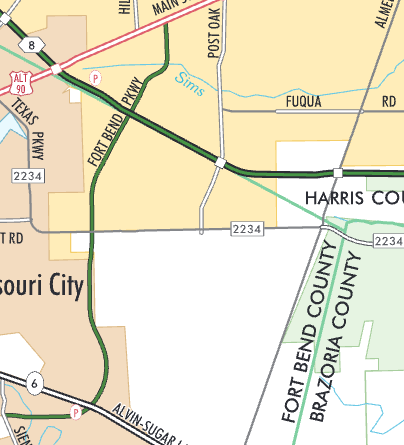

For example: Houston is the county seat of Harris County. But just because Sam lives in Houston doesn’t automatically mean that he can be sued in the county’s courts in downtown Houston. That’s because Houston’s city limits extend southward into Fort Bend County and northward into Montgomery County. Sam might live in the City of Houston but in one of those other counties, and so he *might* have to be sued in his home county — e.g., Richmond (Fort Bend County) or Conroe (Montgomery County), vice Houston (Harris County).

/Initial addresses for notice:/ It’s convenient to put the parties’ initial addresses for notice in the preamble. That way, a later reader won’t need to go paging through the agreement looking for the notice provision. Doing this also makes it easy for contract reviewer(s) to verify that the information is correct.

*** State the effective date in the preamble? (Preferably: No.)

The above preamble affirmatively states the effective date; that’s usually unnecessary unless the contract is to be effective /as of/ a specified date. 

(Many drafters like to include the effective date anyway; /it's normally not worth changing/ if someone else  has drafted it this way.)

The last-date-signed approach:

#+begin_bordered
{{{CHK-Y}}} This Agreement is effective the last date written on the signature page.

{{{CHK-Y}}} This Agreement is made, effective the last date signed as written below, between ….
#+end_bordered

In reviewing others’ contract drafts, you’re likely to see some less-good possibilities, such as:

#+begin_bordered
{{{CHK-N}}} This Agreement is *made* December 31, 20XX ....

{{{CHK-Y}}} This Agreement is *dated* December 31, 20XX ....

/(Emphasis added.)/
#+end_bordered

The first, "is made" version above is problematic: What if the parties sign on a different date or dates than December 31? The contract's very first words (after the title) would be a misstatement. At a minimum, it's not a good look; at worst, it could be an intentional attempt at deceptive backdating (see below).

The second, "is dated" version above is problematic in a different way: What exactly does it mean to say that a contract is "dated December 31"? You might as well say that the contract "is purple."

BUT: When you're reviewing a contract that has the effective date stated in this way, it's a judgment call whether you want to change it — maybe [[#partn-r][ask the partner first]] ([[#partn-r]])?

*** A /contract/ could be backdated — /but _not_ the signatures/
  :PROPERTIES:
  :CUSTOM_ID: bkdate-cmt-ca
  :END:

It might be just fine to state that a contract is /effective/ as of a different date than the signature dates.

#+begin_bordered
{{{CHK-Y}}} This Agreement is made on the last date written on the signature page, but is effective as of /[fill in date]/.
#+end_bordered

 EXAMPLE: Alice discloses confidential information to Bob after Bob first orally agrees to keep the information confidential; they agree to have the lawyers put together a written confidentiality agreement. That written agreement might state that it is effective as of the date of Alice’s oral disclosure. 

(Alice and Bob would not want to backdate their actual signatures, though.)

*Caution:* Never backdate a contract for deceptive purposes, e.g., to be able to book a sale in an earlier period; as discussed at [[#sig-date-alice]], that practice has sent more than one corporate executive to prison — including at least one giant company's in-house general counsel.

*** Include the parties’ /affiliates/ as "parties"? (Almost certainly not.)
  :PROPERTIES: 
  :CUSTOM_ID: affil-parties
  :END:

Some agreements, in identifying the parties to the agreement on the front page, state that the parties are, say, /ABC Corporation and its Affiliates/. That’s generally a bad idea unless each such affiliate actually signs the agreement as a party and therefore commits on its own to the contractual obligations. See [[#r-affil-defn-no-pty]] for more details. 

#+begin_bordered
{{{CHK-N}}} This Agreement is between (i) *ABC Corporation*, a Delaware corporation, *and its Affiliates* ... and (ii) XYZ Inc., a New York corporation  ....

{{{CHK-Y}}} This Agreement is between (i) *ABC Corporation*, a Delaware corporation ... and (ii) XYZ Inc., a New York corporation .... ABC's *"Affiliates" have certain rights and obligations* under this Agreement as stated below.

#+end_bordered

*** Is /country-specific/ information required? (Possibly.)

Some *countries* require contracts to include specific identifying information about the parties, e.g., the *registered office* and the *company ID* number. This is worth checking for contracts with parties or operations in such countries.

*** Naming the "wrong" party can kill legal rights

Be sure you’re naming the correct party as "the other side" — or consider negotiating a guaranty (see {{{RR}}} [[#r-guar-proto]]) from a solvent affiliate. 

Failing to name the correct corporate entity could leave your client holding the bag. This seems to have happened in a Seventh Circuit case, case, discussed at [[#nl-affil-defn-corr-pty]], where the plaintiff had entered into a contract with what turned out to be a judgment-proof subsidiary of the parent company that it had thought it was dealing with.

*** Does each party have the /legal capacity/ to contract?

Depending on the law of the jurisdiction, an unincorporated association or trust might not be legally capable of entering into contracts.

If a contract is purportedly entered into by a party that doesn’t have the legal capacity to do so, then conceivably the individual who signed the contract on behalf of that party might be personally liable for the party’s obligations.

*** Schedules at the front: Worksheets for deal-specific "variables"
  :PROPERTIES:
   :CUSTOM_ID: vbl-sched
  :END:

Also for drafter- and reader convenience: In any contract form, it's never a bad idea to put deal-specific details up front in a "schedule" — which could be thought of as *a worksheet* for drafting and negotiation. That way:

- A drafter using the contract form can change key details by focusing on just the up-front terms in the worksheet.

- If a /vendor's/ contract form specifies net-30 payment terms, but the vendor /knows/ that some /customers/ will want longer to pay, then the parties can get to signature sooner if the payment terms are in the worksheet.

So: Consider putting the details of such terms in a "schedule," either at the front of the document or at the beginning of the clause in question. 

# #+ATTR_HTML: :alt Tesla logo :title Tesla logo  :class photo-at-right photowidth20
# 

{{{RWE}}} See the following excerpt from a [[https://www.sec.gov/Archives/edgar/data/1318605/000119312510017054/dex1020.htm][real-estate lease]] between Stanford University (landlord) and Tesla (tenant), where I've added extra paragraphing and bold-facing:

#+begin_bordered
#+begin_centered
*COMMERCIAL LEASE*
#+end_centered

THIS LEASE is entered into as of July 25, 2007 (the “Effective Date”), by and between THE BOARD OF TRUSTEES OF THE LELAND STANFORD JUNIOR UNIVERSITY, a body having corporate powers under the laws of the State of California (“Landlord”), and TESLA MOTORS, INC., a Delaware corporation (“Tenant”).

*1.  BASIC LEASE INFORMATION.* The following is a summary of basic lease information. 

Each item in this Article 1 incorporates all of the terms set forth in this Lease pertaining to such item and to the extent there is any conflict between the provisions of this Article 1 and any other provisions of this Lease, *the other provisions shall control*. <aside> /[Having the other provisions control is puzzling: It'd seem to make more sense to have the up-front terms — which are easy to review — override any inconsistent terms buried further down in the Lease text.]/ <aside>

Any capitalized term not defined in this Lease shall have /[sic]/ the meaning set forth in the Glossary that appears *at the end of this Lease* /{{{BRACKL}}}sometimes a useful approach, as discussed at [[#gen-def-timc]]{{{BRACKR}}}./

| Address of Premises:                     | 300 El Camino Real, Menlo Park, California |
| Term:                                    | Five (5) years /{{{BRACKL}}}sic; see [[#dry-num][D.R.Y.][D.R.Y.]]{{{BRACKR}}}/  |
| Scheduled Date for Delivery of Premises: | August 1, 2007                             |
| Commencement Date:                       | August 1, 2007                             |
| Expiration Date                          | July 31, 2012                              |

*Base Rent:*
| Year One:   | $60,000 ($5,000 per month)   |
| Year Two:   | $90,000 ($7,500 per month)   |
| Year Three: | $120,000 ($10,000 per month) |
| Year Four:  | $165,000 ($13,750 per month) |
| Year Five:  | $165,000 ($13,750 per month  |

#+end_bordered

This table format can:

- give the business people an "executive summary" of terms in which they're likely to be especially interested; 
- speed up review and editing of the draft; and
- in the future, make it easier and safer to re-use the contract form as the starting point for a new contract, with less risk of having old terms appear in the new contract — as an embarrassing real-life example, see the screw-up in the Brexit agreement summarized at [[#copy-paste-brexit]]). 

(This principle is an example of the *R.O.O.M.* Principle:  Root Out Opportunities for Mistakes.)

*Another example:* The [[https://toedtclassnotes.site44.com/TAA-2023-Apartment-Lease-DCT-highlights.pdf][Texas Apartment Association Lease]] form contains the main "business terms" on the first page. 

(See [[https://toedtclassnotes.site44.com#taa-top][Quick tour: An apartment lease]] for a lookup exercise about this form.)

*** Put signature blocks, etc., up front?
  :PROPERTIES:
  :CUSTOM_ID: sig-blocks-front-cmt
  :END:

In the example signature blocks immediately below, you'll see that the signature blocks are in a table /at the front/ of the agreement — along with the parties' respective initial addresses for notice. This makes the agreement *more user-friendly*, because:

- the reader can see at a glance whether the reader is looking at the /signed/ agreement;

- the parties' types- and states of organization are provided, for reasons discussed at [[#preamb-org]]; 

- the parties' (initial) addresses for notice are conveniently located — the reader doesn't need to rummage through the document to find a notice address; and

- the /drafter/ doesn't have to hunt through the document looking for text that needs to be updated.

#+ATTR_HTML: :alt A screen shot of the first page of a contract with the signature blocks and certain key information just after the top of the document   :class photocenter90

** Background sections — no more "Whereas"!
  :PROPERTIES: 
  :CUSTOM_ID: bkgd-of-k
  :END:

Contents:

#+TOC: headlines 1 local

*** Style tip: Don't do "Witnesseth" and "Whereas"
  :PROPERTIES: 
  :CUSTOM_ID: style-delete-whereas
  :END:

Note to students: Like all purely-style tips, this particular style tip isn't worth making a big deal about if you're reviewing a draft prepared by The Other Side (see [[#k-rev-tips]]). And if your supervising partner has a preference, then (normally) just do it that way (see [[#partn-pref]]).

Modern contract drafters avoid using the archaic words  "WITNESSETH"  and "Whereas.”  For an example of what /not/ to do, see the following example from a routine [[https://www.sec.gov/Archives/edgar/data/935419/000114036108012368/ex10_2.htm][commercial real-estate purchase agreement]]:

*Don't bother reading the text below*, just get a sense of how it looks.

#+begin_quote

THIS REAL ESTATE PURCHASE AND SALE AGREEMENT (this "Agreement") is made and entered into by and between WIRE WAY, LLC, a Texas limited liability company ("Seller"), and RCI HOLDINGS, INC., a Texas corporation ("Purchaser"), pursuant to the terms and conditions set forth herein.

W I T N E S S E T H:

WHEREAS, Seller is the owner of a certain real property consisting of approximately 4.637± acres of land, together with all rights, (excepting for mineral rights as set forth below) , title and interests of Seller in and to any and all improvements and appurtenances exclusively belonging or pertaining thereto (the "Property") located at 10557 Wire Way, Dallas (the "City"), Dallas County, Texas, which Property is more particularly described on Exhibit A attached hereto and incorporated herein by reference; and

WHEREAS, contemporaneously with the execution of this Agreement, North by East Entertainment, Ltd., a Texas limited partnership ("North by East"), is entering into an agreement with RCI Entertainment (Northwest Highway), Inc., a Texas corporation ("RCI Entertainment"), a wholly owned subsidiary of Rick's Cabaret International, Inc., a Texas corporation ("Rick's") for the sale and purchase of the assets of the business more commonly known as "Platinum Club II" that operates from and at the Property ("Asset Purchase Agreement"); and

WHEREAS, subject to and simultaneously with the closing of the Asset Purchase Agreement, Seller will enter into a lease with RCI Entertainment, as Tenant, for the Property, dated to be effective as of the closing date, as defined in the Asset Purchase Agreement (the "Lease") attached hereto as Exhibit B and incorporated herein by reference; and

WHEREAS, subject to the closing of the Asset Purchase Agreement, the execution and acceptance by Seller of the Lease, and pursuant to the terms and provisions contained herein, Seller desires to sell and convey to Purchaser and Purchaser desires to purchase the Property.

NOW, THEREFORE, for and in consideration of the premises and mutual covenants and conditions contained herein, and other good and valuable consideration, the receipt and sufficiency of which are hereby acknowledged, the parties hereto agree *as follows:*
#+end_quote

This isn't the easiest to understand.

The above example has other problems, in addition to its use of archaic "Whereas" clauses: Because of the "as follows" language at the end of the last paragraph quoted above, it could be argued — which means aggressive counsel might well try to argue — that /the parties did not agree/ to the Whereas clauses.  (This is discussed in more detail at [[#recitals-binding]].)

*** Use the "Background" section to set the stage
  :PROPERTIES:
  :CUSTOM_ID: bkgd-stage
  :END:

Instead of "Recitals" — or worse yet, W H E R E A S clauses — you're better off describing the background in a (/numbered/) "Background" section of the contract. 

As a general proposition, the Background section should just *set up the story*: Explain to the future reader, in simple terms — /with short sentences and paragraphs/ — just what the parties are doing, so as to help future readers get up to speed more quickly. 

As a horror story, consider the WHEREAS example quoted at [[#style-delete-whereas]] above:  

- Good luck trying to figure out what's really going on — there /seems/ to be some kind of business roll-up going on, with a sale and leaseback of real estate and maybe other assets, but that's not at all clear.
- Now imagine that you're a judge or a judge's law clerk who's trying to puzzle out the story.
- Worse: Imagine that you're a juror trying to make sense of this transaction.

Somewhat better is the following excerpt is from a highly publicized stock purchase agreement in the tech industry, rewritten into background-section form below:

BEFORE:

#+begin_quote
WHEREAS, concurrently with the execution and delivery of this Agreement, Seller and Yahoo Holdings, Inc., a Delaware corporation (the “Company”), are entering into a Reorganization Agreement substantially in the form attached hereto as Exhibit A (the “Reorganization Agreement”), pursuant to which Seller and the Company will complete the Reorganization Transactions at or prior to the Closing; <cite> [[https://www.sec.gov/Archives/edgar/data/1011006/000119312516656039/d178500dex21.htm][Stock Purchase Agreement by and among Yahoo! Inc. and Verizon Communications Inc.]] dated as of July 23, 2016, https://tinyurl.com/VerizonYahooAgreement. </cite>
#+end_quote

AFTER REWRITE:

#+begin_quote

1.  *Background*

1.01   At the same time as this Agreement is being signed, Seller and Yahoo Holdings, Inc., a Delaware corporation (the “Company”), are entering into a Reorganization Agreement.

1.02  Under the Reorganization Agreement, Seller and the Company are to complete certain "Reorganization Transactions" at or prior to the Closing.

1.03  The Reorganization Agreement is in substantially the form attached to this Agreement as Exhibit A.
#+end_quote

Notice the shorter, numbered, single-topic paragraphs, discussed in more detail at [[#sssp]].

*** A contract's background statements /might/ be binding
  :PROPERTIES: 
  :CUSTOM_ID: recitals-binding
  :END:

Different jurisdictions might treat background statements differently. For example:

--  [[https://leginfo.legislature.ca.gov/faces/codes_displaySection.xhtml?sectionNum=622.&lawCode=EVID][California Evidence Code § 622]] provides: "/The facts recited in a written instrument are *conclusively* presumed to be true/ *as between* the parties thereto, *or their successors* in interest; but this rule does not apply to the recital of a consideration." (Emphasis added.)

--  BUT: In Maryland: "Contracts often contain recitals: provisions that do not make binding promises but /merely recite background information about factual context/ or the parties' intentions. Maryland law recognizes the general principle that /such recitals are not binding/ and, while they may aid the court in interpreting the contract's operative terms, cannot displace or supplement operative terms that are clear." <cite> [[https://scholar.google.com/scholar_case?case=14376974568746993070][Sprint Nextel Corp. v. Wireless Buybacks Holdings, LLC]], 938 F.3d 113, 127 (4th Cir. 2019) (vacating and remanding partial summary judgment) (emphasis added). </cite>

And in a 2022 decision, the Court of Federal Claims observed:

#+begin_quote

/Whereas clauses *are not contractual*; they are recitations laying out the background understandings of the parties/. 

Thus, in the face of ambiguity, they may be used to interpret the meaning the parties attached to the operative words.

But they can do even more. They tell us the assumed facts and purposes of the parties. Rather than only coming into play given ambiguous language, they also may be considered in determining whether language is clear in the first place. But what they may not do is create ambiguity where the words have only one permissible meaning.  <cite> [[https://scholar.google.com/scholar_case?case=7819678961711935746][THR Enterpr., Inc. v. United States]], No. 20-558C, slip op. (Ct. Fed. Cl. Jun. 8, 2022) (granting defendant's motion for judgment on the pleadings; cleaned up, emphasis and extra paragraphing added). </cite>
#+end_quote

*** A statement of /one party's/ intent might /not/ be binding
  :PROPERTIES:
  :CUSTOM_ID: bkgd-stmt-intent
  :END:

# https://en.wikipedia.org/wiki/File:Sprint_Corporation_Logo.svg
# #+ATTR_HTML: :alt Sprint logo :title Sprint logo :class photowidth30 photo-at-right
# 

A naked statement of /one party's/ subjective intent in entering into the contract might not bind another party. {{{RWE}}} That happened in the above-cited [[https://scholar.google.com/scholar_case?case=14376974568746993070][Sprint Nextel]] case, in which:

- The cell-phone service provider offered "upgraded" phones to its customers at steep discounts when customers renewed their contracts — the discounts were so steep that the customers paid less than what the phones would bring on the used-phone market.

- Seeing a business opportunity, another company, Wireless Buybacks, bought upgraded phones from Sprint customers and resold them at a profit.

- Sprint sued Wireless Buybacks for tortious interference with Sprint's contracts with its customers; Sprint claimed that its customer contract prohibited resale because it said in part: "Our rate plans, customer devices, services and features /are not for resale/ and are intended for reasonable and non-continuous use by a person using a device on Sprint's networks." (Emphasis added.)

- The trial court found that this language unambiguously barred resale of the phones by Sprint customers; the court granted partial summary judgment for Sprint. 

On appeal, however, the Fourth Circuit held that the contract language "is *a background statement of intent, not an enforceable promise* not to resell Sprint phones." <cite> [[https://scholar.google.com/scholar_case?case=14376974568746993070][Sprint Nextel Corp. v. Wireless Buybacks Holdings, LLC]], 938 F.3d 113, 127 (4th Cir. 2019) (vacating and remanding partial summary judgment; emphasis added). </cite>

*** Don't put rights & obligations in the Background
  :PROPERTIES:
  :CUSTOM_ID: bkgd-no-subst
  :END:

Inexperienced contract drafters will sometimes put specific rights and/or obligations in a Background section. That's a bad idea for the reasons discussed above.

{{{CHK-N}}}     /Example 1:/ One of the author's students once wrote /in the Background section/:  "For all purposes, the Data is owned by Client and is provided to Contractor for completion of services under this Agreement."   

COMMENT: This shouldn't go into the Background section, but instead in a substantive section, for example in a section about ownership of intellectual property.

{{{CHK-N}}}     /Example 2:/ Another student wrote: "Client will pay Contractor as stated in this Agreement." 

COMMENT: This shouldn't be in the Background section, because the payment provisions would (or at least should) speak for themselves — moreover, readers would naturally /assume/ that Client would pay Contractor, so there was no need to include that fact /in the Background section/.

{{{CHK-N}}}     /Example 3:/ Still another student wrote: "The parties have agreed that Client will compensate Provider with a flat monthly fee of $20,000 for up to 200 staff hours of work per month, with additional work hours being billed at $150 per hour."  

COMMENT:  This would work /only if/ the Background section was the only place that the specific compensation details were discussed, so as not to violate the D.R.Y. (Don't Repeat Yourself) guideline discussed at [[#dont-repeat]].

{{{CHK-N}}}     /Example 4:/ A student wrote: "Client and Service Provider enter into the Agreement for the term of one year from the effective date of the Agreement." 

COMMENT:  This is another item that would go into a substantive provision further down in the contract, not into the Background section.

*** (Skim:) Some other students' "background" drafts
  :PROPERTIES:
  :CUSTOM_ID: bkgd-student
  :END:

/Note to students: This section will give you an idea of some minor errors that can arise in drafting a background section./

1.  A student used "WHEREAS" several times.  

COMMENT:  That's OK if the partner wants it, but it's archaic.

2.  A student described one of the parties, "Mary" (the CEO of our hypothetical MathWhiz LLC)  as an "expert." 

COMMENT:  Not a great idea (for Mary): The other side might argue later that Mary /had held herself/ out as an expert when she really wasn't, and that this supposedly constituted fraud in the inducement.

3.  Several students wrote variations on, e.g., "Gigunda desires for MathWhiz to analyze data, and MathWhiz desires to do so."   

COMMENT:  Not the best phrasing, because the rest of the contract can speak for itself — and in any case, *the parties' /subjective/ desires* don't enter into contract interpretation except in cases of a lack of meeting of the minds or mutual mistake.

** Plain legal language is "a thing" elsewhere, too

# https://commons.wikimedia.org/wiki/File:Warren_Buffett_with_Fisher_College_of_Business_Student_-_4395157720_(cropped).jpg

# #+ATTR_HTML: :alt Warren Buffett - photo by Aaron Friedman :title Warren Buffett - photo by Aaron Friedman CC BY 2.0   :class photo-at-right photowidth20
# 

The trend toward plain language isn't limited to purely-/legal/ documents. Contract drafters can learn from legendary investor Warren Buffett:

#+begin_quote
When writing Berkshire Hathaway’s annual report, /I pretend that I’m talking to my sisters/. I have no trouble picturing them: Though highly intelligent, they are not experts in accounting or finance. They will understand plain English, but jargon may puzzle them. /My goal is simply to give them the information I would wish them to supply me if our positions were reversed/. To succeed, I don’t need to be Shakespeare; I must, though, have a sincere desire to inform. <cite> U.S. Securities and Exchange Commission, [[https://www.sec.gov/pdf/handbook.pdf#page=8][Plain English Handbook]] at 2 (Aug. 1998) available at https://goo.gl/DZaFyT (sec.gov) (emphasis added). </cite>
#+end_quote

** Copy-and-paste: Dangerous when mindless
  :PROPERTIES:
  :CUSTOM_ID: copy-paste-brexit
  :END:

Don't just copy and paste language from an old contract without thoroughly reviewing it: At a minimum, any reader who's paying attention will stop short and wonder, /what?/

{{{RWE}}} One very-public "fail" on that score occured in the UK's negotiation of its Brexit deal; as reported by the BBC:

#+begin_quote

References to decades-old computer software are included in the new Brexit agreement, including a description of *Netscape Communicator and Mozilla Mail as being "modern" services*. Experts believe officials must have copied and pasted chunks of text from old legislation into the document. The references are on page 921 of the trade deal, in a section on encryption technology. It also *recommends using systems that are now vulnerable to cyber-attacks*. The text cites "*modern e-mail software packages* including Outlook, Mozilla Mail as well as Netscape Communicator 4.x." *The latter two are now defunct* — the last major release of Netscape Communicator was in 1997. <cite> See Cristina Criddle, [[https://www.bbc.com/news/technology-55475433][Brexit deal mentions Netscape browser and Mozilla Mail]] (BBC.com Dec. 29, 2020) (formatting edited); see also, e.g., Ben Quinn, [[https://www.theguardian.com/politics/2020/dec/29/obsolete-software-from-1990s-features-in-brexit-deal-text][Obsolete software from 1990s features in Brexit deal text]] (TheGuardian.com Dec. 29, 2020). </cite>
#+end_quote

** Cross-references: Don't mess them up!
  :PROPERTIES:
  :CUSTOM_ID: xref
  :END:

*** Word-processing software isn't always reliable

Another readability gotcha: Don't assume that word-processing software will reliably update a document's "automatic" internal cross-references between sections when editing the document to add new sections.

*Example:* 

- The original, correct cross-reference is,  "See section 14.3" /(where the number 14.3 is inserted by the software to match the section number)/.

- During editing, a new section is added between section 8 and section 9.

- This means that section 14.3 should now be section 15.3 — but *don't count on it.* (See below for a real-life example where a similar occurrence changed the course of a court case.)

That's one reason why this {{{BK}}} is _not_ written in Microsoft Word — but perhaps things are different now than when I started this project several years ago ....

*** Courts notice errors in cross-referencing

{{{RWE}}} In a Delaware contract lawsuit, a pair of screwed-up cross-references in the contract led to major problems for the parties. One of the parties — the father of another party — had signed the contract only for purposes of two, referenced sections of the contract — including "Section 7.5." Unfortunately for Dad, there _was_ no Section 7.5 in the contract. So, the court deferred until trial the question of Dad's liability under the contract — meaning that Dad would have to incur the expense, burden, and uncertainty of trying the case. <cite> [[https://scholar.google.com/scholar_case?case=3234303283417898562][Labyrinth, Inc. v. Urich]], No. 2023-0327, part II.B.2, slip op. at text accompanying nn.248, 255 (Del. Ch. Jan. 25, 2024). </cite>

The screwed-up cross-references also hurt the /plaintiff/ — one of them led to the court's refusing to grant preliminary injunctive relief against the son-defendant for allegedly breaching a noncompetition covenant. <cite> /See id./ at part II.C, text accompanying n.261. </cite>

Great: More expense and uncertainty for all concerned, because the drafters (presumably) relied on word-processing software to update their cross-references — which /shouldn't/ be a problem, but there you go.  (Hat tip: [[https://www.linkedin.com/in/matthew-dedon/][Matthew Dedon]], who posted [[https://www.redline.net/queries/failure-check-those-section-references-can-be-costly-your-client][an alert]] at the invaluable lawyer site [[https://www.redline.net/][redline.net]].) 

{{{RWE}}} In a 2024 UK court of appeals case, the court noted acidly that "The Agreement is riddled with cross-referencing errors of the most basic kind." <cite> [[https://caselaw.nationalarchives.gov.uk/ewca/civ/2024/1330#fnref2][Topalsson GmbH v Rolls-Royce Motor Cars Ltd.]], [2024] EWCA Civ 1330 at n.2. </cite>

{{{RWE}}} In a Nebraska case, a cross-reference to a non-existent "Article 9.4" in a premarital agreement complicated a widow's (failed) attempt to claim a share of the proceeds from sale of her late husband's separate-property home, despite unrebutted testimony that the husband had /orally/ expressed exactly that desire to friends. <cite> See [[https://scholar.google.com/scholar_case?case=4525138721877930810][In re Estate of Knapp]], 321 Neb. 155 (2026) (affirming county court order). </cite>

*** Use special software to check cross-references?
  :PROPERTIES:
  :CUSTOM_ID: cross-ref-sw
  :END:

I've not used any of these products, so YMMV (Your Mileage May Vary):

\bull  [[https://www.litera.com/store/contract-companion][Contract Companion]] by Litera looks for cross-referencing errors, among other things. The company seems to have a lot of related products.

\bull  [[https://crosscheck365.com/][CrossCheck365]] appears to be a Microsoft Word add-in that will \bull use an "Expando" feature to turn "[[#sssp][spaghetti clauses]]" into "macaroni" (breaking up wall-of-words clauses into outlines); and \bull check cross-references. 

(DCT note: Long ago I briefly knew one of the company's people, lawyer Steve Gullion, which I learned when he reached out to me after I posted the above software references in the daily class plan for my Contract Drafting course. Steve noted that "we have a two-minute video that's just about the Expando feature: https://www.youtube.com/watch?v=26N-SZ605kw".)

** Looking ahead to the Age of AI
  :PROPERTIES:
  :CUSTOM_ID: intro-stdnt
  :END:

# #+ATTR_HTML: :alt A professional female business executive tapping her wristwatch.  :title   :class photo-at-right photowidth30
# 

Computer programs known as artificial intelligence, or "AI," are doing more contract drafting /and/ contract review. And it's not just lawyers who are using AIs: It can be a lot less expensive for a client to have an AI generate a contract, or to review another party's contract draft, than to pay a lawyer to do it. For an everyday{{{NBH}}} or low-impact transaction, the client might well decide that this is an acceptable business risk. (I've begun to see glimpses of this in my own part-time law practice.)

This increasing use of AIs presents some challenges for law schools and law firms:

- AI programs require human oversight, because those programs can sometimes "hallucinate." For example: In the courtroom arena, numerous lawyers have found themselves in trouble because they submitted AI-drafted briefs contaning bogus citations.[fn:AISanctions] This famously includes President Trump's former personal lawyer Michael Cohen when he (Cohen) sought a reduction in his prison sentence and supervised release. <cite> See [[https://scholar.google.com/scholar_case?case=736441032202744720][United States v. Cohen]], 724 F. Supp. 3d 251 (S.D.N.Y. 2024) (declining to impose sanctions on Cohen and his attorney for submitting "fake" case citations obtained by Cohen using Google Bard). </cite>
- Oversight requires experience. For many lawyers, that experience came over years of repeated drafting, reviewing, and revising of contracts, with senior lawyers reviewing their work, building up mental muscle memory.

- But this kind of hands-on training of junior lawyers might become less common as clients increasingly use AI tools to draft /and review/ contracts. (It's not unlike how the decline of jury trials in small cases led to fewer and fewer junior lawyers getting invaluable first-chair trial experience.)

So: How can junior lawyers grow into competent judges of AI work-product quality? This {{{BK}}} aims to give contract newcomers a way to /begin/ acquiring "artificial experience" (a term my late dad, a fighter pilot and then human-factors psychologist in the U.S. Air Force, would sometimes use).

#+begin_comment
Citation of bogus cites: Struck pleadings, plus $15.5K fine to pay to the court, plus awarding attorney fees to other side, for submitting fake citations ($500 per non-existent case and $1,000 per fabricated quotation).

#+begin_quote 
Attorneys weigh risks and rewards for aliving. With a known price tag, an attorney could decide that the risk paying $500 pernon-existent case or $1,000 per fabricated quotation is outweighed by the potential reward o fgetting away with outsourcing to a chatbot the time intensive work of legal research and writing.  <cite> [[https://websitedc.s3.amazonaws.com/documents/Couvrette_v._Wisnoksy_USA_12_December_2025.pdf][Couvrette v. Wisnovsky]], No. 1:21-cv-00157-CL, slip op. at 21 (D. Ore. Dec. 12, 2025) (Clarke, M.J., by consent). </cite>
#+end_quote 
#+end_comment

[fn:AISanctions] See also, e.g., [[https://scholar.google.com/scholar_case?case=3485439317377905704&q=Fletcher+v.+Experian&hl=en&as_sdt=4,110,125][Fletcher v. Experian Info Solutions, Inc.]], No. 25-20086, part I, slip op. at 2-5 (5th Cir. Feb. 18, 2026) (reviewing cases and imposing sanctions against attorney); [[https://scholar.google.com/scholar_case?case=18275888147274775006][Benjamin v. Costco Wholesale Corp.]], 779 F. Supp. 3d 341 (E.D.N.Y. 2025) (imposing $1,000 sanction on time-pressured and repentant attorney for submitting reply brief and sworn declaration with "phony" case citations that attorney did not check); [[https://scholar.google.com/scholar_case?case=13849516024529169137][Mata v. Avianca, Inc.]], 678 F. Supp. 3d 443 (S.D.N.Y. 2023) (imposing $5,000 penalty on attorneys for submitting "fake" citations to non-existent opinions, then doubling down when challenged; ordering attorneys to write letters to each judge falsely identified as author of fake opinion).

** The "partner check-in rule"
  :PROPERTIES: 
  :CUSTOM_ID: partn-r
  :END:

As a junior lawyer, there will be times when you will — and /should/ — be uncertain about what to do in a contract draft, or how to phrase something. For example:

• When /drafting/ a contract for a client, you might wonder whether to include a [[#r-forum-sel][forum-selection clause]] (see {{{RR}}} [[#r-forum-sel]]), because doing so might [[#poke-bear][poke the bear]], leading to problems in negotiation (the other side might repond by insisting that /their/ home city be the exclusive forum instead).

• In /reviewing/ another party's draft contract, you might see that the draft includes a forum-selection provision that requires all litigation to take place exclusively in the other side's home jurisdiction; you wonder whether the client will be OK with that.

To keep your client and your supervising partner happy (not to mention your malpractice carrier) here's what you do:

1.  *Check in with your supervising partner* — or, if you're the person who deals with the client, check in with *the client* — about the issue that concerns you, which here is the forum-selection provision. 

*Important: Have a well-thought-out recommendation for what to do* about the issue of concern, *with reasons* for your recommendation. This is true even if the recommendation is limited to advising the client to consider Factors X, Y, or Z in making a decision. That will give the partner or client a concrete proposal to consider, instead of just wondering about the issue in the abstract. (Also, superiors and clients tend to think, not unreasonably: /Bring me [proposed] solutions, not just problems/.)

BUT: *Don't just pick up the phone and call the partner or client every time an issue pops into your head*. No one likes to be repeatedly interrupted with questions. Instead:

  1. Make a list of things to discuss with the partner or client.

  2. Schedule a meeting or phone call (or Zoom- or Teams call).

  3. Use your list as an agenda — perhaps sending it to the client or partner in advance.

/Pro tip:/ In Microsoft Word, you can add comment bubbles in the margin of a draft contract. Those comment bubbles can then be used as the discussion agenda during what's known as a "page-turn" conference call, where the participants go page by page through a draft contract or other document. (Ditto for discussing comments with the other side during a negotiation call.)

2.  *Then, _document_ that you advised the client or partner* — in matter-of-fact, non-defensive language — either:

   - in an email to the partner or client, and/or

   - in Word comment bubbles in a draft that you sent to the partner or client, as discussed in the pro tip above.

Here's a real-life example: A startup-company client's CEO — let's call him "Bob" — once asked me to review a draft confidentiality agreement ("NDA") that had been sent to him by a potential customer, a giant, globally-known company that we'll call XYZ Corporation. At the time, I'd been working with Bob for many years at several different companies. Here's the email I sent Bob about XYZ's NDA form, only lightly edited — and the bold-faced type is pretty much what I did in the email to help Bob skim the text:

#+begin_bordered
Hi Bob — BLUF (Bottom Line Up Front) /[see [[#BLUF-rule]]{{{BRACKR}}}/: *This NDA is probably OK for what you need here, but* there are a few things you might want to consider, and that we can discuss if you want.

1.  XYZ has included its *infamous "residuals clause"* /[see [[#nda-residuals-option]]{{{BRACKR}}}/ in this NDA, which is basically *a blank check* for XYZ to use whatever information you give them them — in section xx, it says:

"Neither of us can control ... what our representatives will remember, even without notes or other aids. We agree that use of information in representatives’ /unaided memories/ in the development or deployment of our respective products or services /does not create liability/ under this agreement or trade secret law, and we agree to /limit what we disclose/ to the other accordingly." (Emphasis added.)

BUSINESS QUESTION: Are you OK with giving XYZ that kind of permission for what you'll be disclosing to them?

2.  *Any litigation would have to be in* /[XYZ's headquarters city]/. 

Meh. <aside class="in"> I certainly wouldn't have been this informal with someone with whom I didn't have such a longstanding relationship. </aside>

3.  There's *no requirement that a recipient must return or destroy confidential information.*

I'm fine with that; I've come to think that omitting such a requirement is the most-sensible approach. /[See [[#r-info-purge]].{{{BRACKR}}}/

Otherwise XYZ's draft looks OK.
#+end_bordered

Notice what I did here: After a quick [[#BLUF-rule][BLUF]] headline, I pointed out three issues — in *numbered paragraphs* — for which I wanted Bob's input, _and_ *I made recommendations* as to the second two; Bob would ultimately make the decisions *what business risks to accept*.

This took a tiny bit more time for me to write. But it Served the Reader by making Bob's job easier. 

Epilogue: Bob emailed me back and asked for a phone conference with him and another executive from his company. That time, I /didn't/ follow up with an email to confirm the plan of action we'd agreed on, but if I had done so, the confirming email might have been along the following lines:

#+begin_bordered
Bob, *confirming part of our phone conversation today*: XYZ NDA has an exclusive forum-selection provision that requires all litigation to be in [city]; under the circumstances I think that's probably *an acceptable business risk*. 

*Please let me know if you'd like to discuss this any further*.
#+end_bordered

(Emphasis added.) Note how, in the first sentence, *I left a paper trail* for future litigation counsel, *recording* the facts: (i) that Bob and I had a phone conversation, and (ii) *when* that conversation occurred, which would help litigators construct a *timeline* of events — an important part of /any/ lawsuit.

Note also my use of the term "*probably an acceptable business risk*," signaling that this was a /business/ judgment for Bob to make.

IMPORTANT: Be careful about how you phrase your emails and other comments to the client or partner: /Assume/ that /anything/ you put in writing /might/ someday be read by an adversary and possibly used against your client — or against you — in litigation. 

Sure, in some circumstances the attorney-client privilege /should/ protect at least some of your written comments from discovery. But the privilege has its limits; moreover, the privilege can be waived — possibly inadvertently — or the privilege might even be pierced (e.g., by the crime-or-fraud exception).

** The "partner preference rule"
  :PROPERTIES:
  :CUSTOM_ID: partn-pref
  :END:

Students: When you're new to law practice and it comes to purely-stylistic preferences, *do it the way your supervising partner wants*.

Suppose you're a new lawyer in a law firm:

- A partner in your firm assigns you to draft a contract.

- In reviewing your draft, the partner tells you to write out, for example, /one million seven hundred thousand dollars ($1,700,000.00)/, instead of the simpler $1.7 million — even though this book [[#dont-repeat][strongly recommends against doing so]] (messing this up once cost a Dallas-area lender $693,000, as explained at "Don't Repeat Yourself" at [[#dont-repeat]]).

You can and should *alert the partner* to the potential problem with the partner's instruction. But if the partner still wants to do it that way, *don't fight the partner over this* — it's not a hill to die on, and you could annoy the partner and perhaps even harm your career prospects at the firm.  

There'll be plenty of time to use your own preferred style as you get more experienced and the partners increasingly trust you to handle things on your own — and especially if you start to bring in your own clients.

In the meantime, of course, you'll have to be extra-careful not to make the kind of mistakes that can result from some of these suboptimal style practices, as discussed in this {{{BK}}}.

** Perfect is the enemy of good enough - but ...
  :PROPERTIES:
  :CUSTOM_ID: perfection
  :END:

When it comes to contracts, clients tend overwhelmingly to believe that "perfect" is the enemy of "good enough." Most clients generally would /far/ prefer to get an "OK" contract that covers the reasonably-likely contingencies, /and get it signed quickly/; they don't want to waste calendar time (nor to pay your legal fees), to get a gold-plated contract that covers unlikely and/or low-risk possibilities.

Of course, part of the problem is that hindsight is 20-20: If an "unlikely" possibility in fact comes to pass and causes problems for the client, guess where fingers might well be pointed for not having covered that possibility in the contract? No one said law practice was always easy ....

** Consider Q&A subheadings to identify specific scenarios
  :PROPERTIES:
  :CUSTOM_ID: faq-hdg
  :END:

Contents:

#+TOC: headlines 1 local

*** Introduction

Here's a scalable, repeatable way to write contract clauses as easier-reading "sound bite" sections: As an aid to thinking —

1. figure out what specific /user-scenario/ questions are answered by the clause; and

2. use those questions as possible the subheadings for separate sound-bite sections about the scenarios — write the subheadings (usually) as the questions themselves, *or* (sometimes) as succinct answers or at least summaries of the answers. 

*** A real-world example

As a before-and-after illustration, let's break up the following real-world  spaghetti clause, which is from the [[https://www.sec.gov/Archives/edgar/data/914025/000114036122011290/ny20003617x1_ex2-1.htm][merger agreement]] where Hewlett-Packard (HP, Inc.) acquired well-known headset manufacturer Plantronics.

/(Students, feel free to just skim this to get the idea.)/

BEFORE:

#+begin_quote

SECTION 1.01   *The Merger.*  On the terms and subject to the conditions set forth in this Agreement, and in accordance with the General Corporation Law of the State of Delaware (the “DGCL”), Merger Sub shall be merged with and into the Company at the Effective Time. At the Effective Time, the separate corporate existence of Merger Sub shall cease and the Company shall continue as the surviving corporation (the “Surviving Corporation”) and shall succeed to and assume all the rights and obligations of Merger Sub in accordance with the DGCL. At the election of Parent, any direct or indirect wholly owned subsidiary of Parent may be substituted for Merger Sub as a constituent corporation in the Merger, in which event the parties shall execute an appropriate amendment to this Agreement in order to reflect the foregoing; provided that in no event shall the Company be required to amend this Agreement in any manner that would reasonably be expected to prevent, impair or delay the Closing or otherwise reduce the Merger Consideration or impair the other benefits expected to accrue to the holders of Company Common Stock pursuant to the transactions contemplated by this Agreement. The Merger, and the other transactions contemplated by the Transaction Agreements are referred to in this Agreement collectively as the “Transactions.”
#+end_quote

AFTER, with Q&A subheadings: <aside> The subheading "numbering" here is arbitrary; I've also made other stylistic edits, and as it happens, there are both questions and a few answers. </aside>

#+begin_bordered
SECTION 1.01   *The Merger.* 

1.01(a)  *When will the Merger take effect?*

The Merger will take effect at the Effective Time /[defined elsewhere]/.

1.01(b)  *What will happen to Merger Sub when the Merger takes effect?*

When the Merger takes effect:

(1)  Merger Sub will be merged with and into the Target;

(2)  The Target +shall+ _will_ continue as the surviving corporation (the “Surviving Corporation”); and

(3)  Merger Sub's separate corporate existence +shall+ _will_ cease.

1.01(c)  *What will happen to Merger Sub's /assets/, etc.?*

When the Merger becomes effective, the Target will succeed to all the rights, and assume all the obligations, of Merger Sub in accordance with the DGCL /[Delaware General Corporation Law]/. 

1.01(d)  *Could the Buyer switch Merger Sub with another subsidiary*?

The Buyer may elect to replace the Merger Sub, as a party to the Merger, with any other direct or indirect wholly owned subsidiary of the Buyer; if that occurs, then that other subsidiary will be merged into the Target instead of Merger Sub.

1.01(e)  *An appropriate amendment will be needed if a replacement does occur*

If Merger Sub is replaced with another Buyer subsidiary as provided in subdivision (d), *then:* The parties will negotiate and sign an appropriate amendment to this Agreement in order to reflect the replacement.

1.01(f)  *Are there limits on what the Target \\
must agree to in the replacement amendment?*

The Target need not agree, in the replacement amendment to this Agreement, to any change that would reasonably be expected: 

(1) to prevent, impair or delay the Closing or otherwise reduce the Merger Consideration, nor 

(2) impair the other benefits expected to accrue to the holders of Target Common Stock pursuant to the transactions contemplated by this Agreement.
#+end_bordered

Writing in this style will doubtless seem awkward — at first. But soon you'll get the hang of it. 

And if you want, you can later edit the subheadings into a conventional terse format.

*** Advantage: Better spotting and thinking through "what if" situations
  :PROPERTIES:
  :CUSTOM_ID: faq-what-if
  :END:

There's another potential advantage of Q&A subheading format: When you phrase a subheading as a question, it prompts the reader to think of other possible answers — more so than simply presenting an answer. That's likely to be useful in doing the "business planning" for a contract.

It also seems likely that posing a question helps the reader more-quickly grasp the topic of the relevant clause or section, reducing the reader's cognitive burden. <cite> See Izaias Cavalcanti, [[https://www.worldcc.com/Resources/Blogs-and-Journals/Contracting-Excellence-Journal/View/ArticleId/11620/The-psychology-that-makes-people-skip-reading-contracts-and-how-to-change-it?][The psychology that makes people skip reading contracts – and how to change it]] (WorldCC.com 2025). </cite>

Tangentially: Amazon reportedly does product- and service development with a "work backwards from the customer experience" approach, doing the business planning by writing and refining mock press releases and frequently-asked questions documents; Amazon refers to this as the company's "PR/FAQ" approach. <cite> See Colin Bryar and Bill Carr, [[https://www.amazon.com/Working-Backwards-Insights-Stories-Secrets-ebook/dp/B08BYCQBZN][Working Backwards: Insights, Stories, and Secrets from Inside Amazon]] ch. 5 (2021), by two longtime Amazon senior executives, now co-founders of [[https://workingbackwards.com/about/][Working Backwards LLC]]), /excerpted at/ [[https://www.aboutamazon.com/news/workplace/an-insider-look-at-amazons-culture-and-processes][An insider look at Amazon's culture and processes]] (AboutAmazon.com); Werner Vogels, [[https://www.allthingsdistributed.com/2024/11/aws-lambda-turns-10-a-rare-look-at-the-doc-that-started-it.html][AWS Lambda turns 10: A rare look at the doc that started it]] (AllThingsDistributed.com 2024) (case study by Amazon's chief technology officer). </cite>

(For more on business planning in contract negotiation, see [[#learn-biz]].)

*** Should I /rewrite/ another party's draft in this way?

Nah — that'd likely just offend the other lawyer, which isn't a great way to start a negotiation.  (Instead, just break up long spaghetti clauses as shown above; see [[#thick-break]] for more on revising other parties' drafts.)

* About the author
  :PROPERTIES:
  :CUSTOM_ID: bio
  :UNNUMBERED: t
  :END:

#+ATTR_HTML: :alt Head shot of the author, D.C. Toedt III :title D.C. Toedt III   :class photo-dct

# 
# 
 
I’m [[https://www.OnContracts.com/About][DC Toedt]], a professor of practice at the University of Houston Law Center and a practicing attorney in Houston. I’m licensed in Texas (active), California (inactive), and the U.S. Patent and Trademark Office.  

(People often ask: My full name is Dell Charles Toedt III; my German-origin last name is pronouced "Tate"; because of my Roman numeral III, my family has always called me "DC.")

As a lawyer, I "came up" at [[https://en.wikipedia.org/wiki/Howrey][Arnold, White & Durkee]], a 150-lawyer intellectual property litigation firm, where I was an associate and then a partner, and was eventually elected to the management committee. We were one of the largest such firms in the United States, with offices in six different cities with significant tech industries.

I left AW&D during the dot-com boom to become vice president and general counsel of [[https://en.wikipedia.org/wiki/BindView][BindView Corporation]], a publicly-traded, 500-employee software company, with offices in six countries. As outside counsel, I’d helped the founders start the company and joined them full-time not long after the company went public. I served there — negotiating probably hundreds of contracts of various types — until our "exit," when we were [[https://www.scworld.com/news/symantec-snaps-up-bindview][acquired by Symantec Corporation]], the world leader in our field.

Since leaving BindView I've maintained a limited solo practice helping tech companies, both established and startups. In addition, since 2010 I've taught a [[https://toedtclassnotes.site44.com/Syllabus.html][contract-drafting course at UH]] — for which this {{{BK}}} provides the main reading — and since 2021, an annual [[https://courses.rice.edu/courses/courses/!SWKSCAT.cat?p_action=COURSE&p_term=202620&p_crn=25377][IP-introduction course]] for Rice University MBA students.

Among other [[./Toedt-publications-and-speeches-list-2019-01-24.pdf][past publications]], I was the lead author and editor of [[https://www.abebooks.com/9780876326565/Law-Business-Computer-Software-Toedt-0876326564/plp][The Law and Business of Computer Software]], a one-volume treatise.

I’ve been active in bar-association work throughout my career; I also work pro bono with certain nonprofit organizations.

<<DCTnuke>> My undergraduate degree (in math, with high honors, including extensive science coursework) is from the University of Texas at Austin, on a full-ride [[https://www.navy.com/careers-benefits/education/nrotc?activity=1312773&cid=ppc_gg_b_stan_general&gclsrc=aw.ds&gad_source=1&gad_campaignid=692132095&gclid=Cj0KCQiAhaHMBhD2ARIsAPAU_D79UZo43dWUwncDfFAIPs8OvK6vmmnrkDFJm6vvujTHU6V6EHfqkSsaAif_EALw_wcB][Navy ROTC scholarship]]; my law degree (law review) is also from UT Austin. In between, I did my obligated Navy service as a [[https://en.wikipedia.org/wiki/United_States_Navy_Nuclear_Propulsion][nuclear-trained engineering officer]], and as one of the five [[https://en.wikipedia.org/wiki/Officer_of_the_deck][officers of the deck underway]] in charge of the ship while on watch, aboard the 5,000-sailor, nuclear-powered aircraft carrier [[https://en.wikipedia.org/wiki/USS_Enterprise_(CVN-65)][USS Enterprise]], with two extended "Westpac" deployments to the Far East and Indian Ocean.  

Any views I might express here are my own, of course, and not necessarily those of clients, former employers, etc., etc.

# [fn:DCTNavy]  Among other duties aboard the /Enterprise/, I served as [[https://en.wikipedia.org/wiki/Officer_of_the_deck][officer of the deck underway]] — in charge of the navigation and safety of the ship while on watch, reporting directly to the commanding officer and as engineering officer of the watch, in charge of the ship's eight-reactor propulsion plant and its 150-sailor watch section. I also took and passed the two-day (I think it was) written- and oral examination to be qualified as the [chief] engineer of a nuclear-powered ship.

