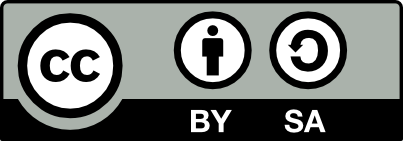

#+INCLUDE: "./Harbor-Startup.org" 
#+TITLE: Contracts at Work: A Lawyer's Notebook
#+SUBTITLE: With *the {{{NAME-FULL}}}*: Shared, plain-language ground rules for getting productive business deals done.

For parties that want to negotiate the business deal, not the boilerplate — to build trust, not traps.

#+begin_byline
By Dell C. ("D.C.") Toedt III [[#bio][(about)]]
#+end_byline

Professor of practice, University of Houston Law Center.  

[[#toc-chap-inline][CHAPTER LIST]]     [[#toc-det][Detailed table of contents]] \\
Or: Click on the hamburger icon  &#x2630; at top left.

#+ATTR_HTML: :alt Creative Commons symbol for BY (attribution required) SA (share-alike) :href # :title Creative Commons 4.0 BY SA   :class cc

*Creative Commons license*: BY SA — see § [[#copr-cc-tm]].

<red>  *[A WORK IN PROGRESS, last saved {{{DATE-ISO}}}]* </red> 

[[https://www.merriam-webster.com/dictionary/fairway][fairway]] <small>noun</small> \\
*1  a*  :  a navigable part of a river, bay, or harbor      <cite> ([[https://www.merriam-webster.com/dictionary/fairway][Merriam-Webster]]) </cite>

#+ATTR_HTML: :alt Description: Aerial photo of Golden Gate Bridge and San Francisco skyline with aircraft carrier USS Enterprise having just passed under the bridge entering the harbor.  :title Aerial photo of Golden Gate Bridge and San Francisco skyline with aircraft carrier USS Enterprise having just passed under the bridge entering the harbor. :class photo-CVN65

When all of the parties to a contract are willing to "stay in the fairway," their lawyers can quickly turn a short deal-terms document into a signable contract by adopting the {{{NAME-FULL}}} — or just selected {{{NOUNS}}} — as the detailed terms and conditions for the deal.
#+begin_ul-compressed
- Court-savvy: Incorporating pragmatic lessons extracted from hundreds of litigated cases.
- Negotiation-friendly: Built on an evenhanded approach praised by lawyers for multiple big companies in real-world transactions.
- Readable: Phrased and formatted to help humans and their AI assistants.
- Explained: Extensive annotations explain the thinking behind each {{{NOUN}}}.
#+end_ul-compressed

*Students:* This {{{BK}}} will show you ways to help your clients get business done faster — and help you to make a good impression on your partners or other supervising attorneys.

#+begin_ul-compressed
*Lawyers:* 
- For a conventional contract, use the {{{NAME}}} {{{NOUNS}}} and playbooks as drafting checklists.
- Explain things to your clients by sending them links to specific {{{NOUNS}}} and their notes.

*Clients:* *Ask your lawyer* whether adopting the {{{NAME-FULL}}} can help you —
- get deals to signature sooner;
- cut contracting transaction costs;
- help build solid business relationships.
#+end_ul-compressed

#+begin_asis
*IMPORTANT:* This {{{BK}}} offers general guidance about common contract practices; it's provided *AS IS, WITH ALL FAULTS* — your mileage may vary, so don't rely on it as a substitute for specific legal advice from an attorney licensed in your jurisdiction. (/I'm/ not /your/ lawyer unless you and I have entered into a specific [[https://www.oncontracts.com/engage/][written engagement agreement]].) *Don't reach out to me with any confidential- or privileged information*, because that'd likely kill any attorney-client privilege you might have in the information. (See § [[#k-bound-NLA]] for more.)
#+end_asis

* Macros                                                           :NOEXPORT:
  :PROPERTIES:
  :CUSTOM_ID: mac-title
  :UNNUMBERED: notoc
  :END:

# Macros (needed for standalone export - duplicates what's in _Macros.org)
#+MACRO: actor *$1:*
#+MACRO: name Fairway
#+MACRO: name-full Fairway Protocol
#+MACRO: nbh @@html:&#x2011;@@
#+MACRO: url harborrules.org
#+MACRO: br @@html: @@@@latex:\linebreak @@
#+MACRO: br2 @@html:  @@@@latex:\linebreak\linebreak @@
#+MACRO: bk book
#+MACRO: noun rule
#+MACRO: nouns {{{NOUN}}}s
#+MACRO: noun-c Rule
#+MACRO: noun-cs {{{NOUN-C}}}s
#+MACRO: fr suite
#+MACRO: fr-c Suite
#+MACRO: pkg Suite
#+MACRO: pr Protocol
#+MACRO: pr-c Protocol
#+MACRO: prac {{{NOUN}}}
#+MACRO: prac-c {{{NOUN-C}}}
#+MACRO: pracs {{{NOUNS}}}
#+MACRO: prac-cs {{{NOUN}}}s
#+MACRO: practice [[#$1][Rule ]]§ [[#$1]]
#+MACRO: k-master When a contract ("*{{{TheK}}}*") adopts this {{{PROPERTY(ITEM)}}}, the parties are agreeing to the following {{{NAME-FULL}}} provisions, which are incorporated by reference into {{{theK}}}:
#+MACRO: Clause
#+MACRO: cls-x 
#+MACRO: cls 
#+MACRO: r  {{{NOUN-C}}}
#+MACRO: rule {{{NOUN-C}}}
#+MACRO: rr {{{NOUN-C}}}
#+MACRO: date-iso (eval (format-time-string "%Y-%m-%dT%H:%MZ" (current-time) t))
#+MACRO: date-iso-small <small> {{{DATE-ISO}}} </small>

#+MACRO: sit {{{SCENE}}}
#+MACRO: chk CHECKLIST:
#+MACRO: ckl CHECKLIST:
#+MACRO: prereq /Prerequisite(s):/
 #+MACRO: why /Goal:/
#+MACRO: rqmt /Requirement:/
#+MACRO: who /Who:/
#+MACRO: note /Note:/ 
#+MACRO: eg /Example (without limitation):/
#+MACRO: egs /Examples (without limitation):/ 
#+MACRO: def /Definition:/
#+MACRO: except /Exception:/ 

#+begin_comment
(setq-default line-spacing 0.3)
Non-breaking hyphen: ‑

 @@html: <button id="toggle-asides-btn" onclick="toggleAsides()" style="padding: 8px 16px; margin: 10px 0; cursor: pointer;">Hide notes</button>@@      § [[#toc-chap][Contents]]     @@html: <a href="#"> Top </a>@@
#+end_comment

